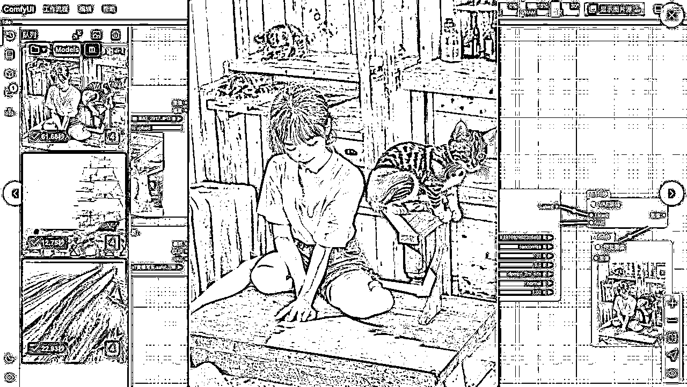
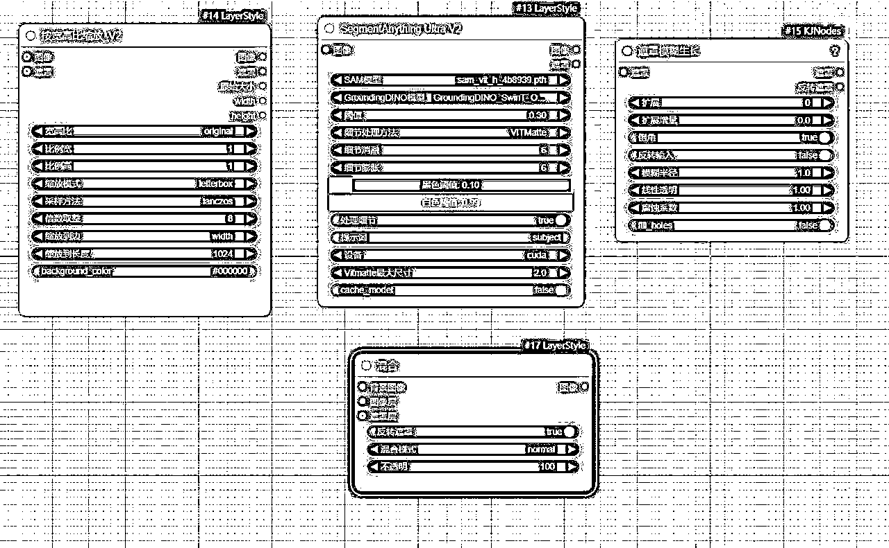
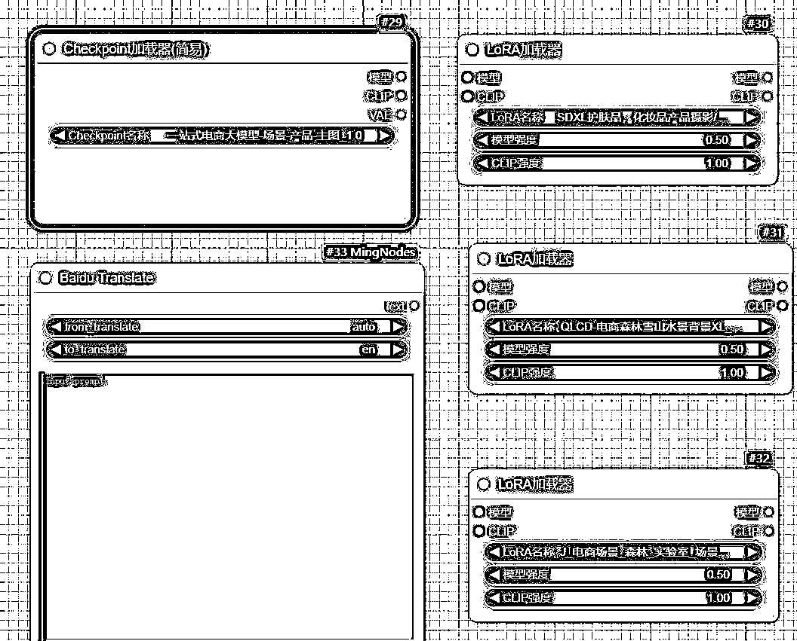
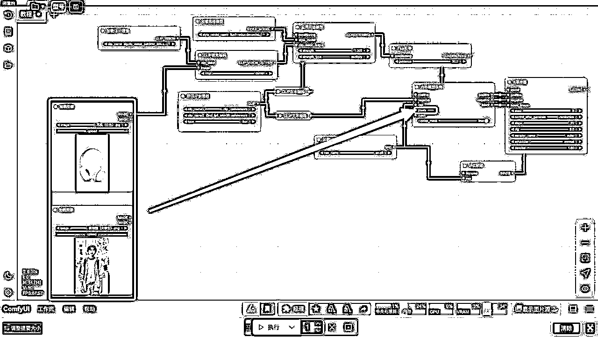
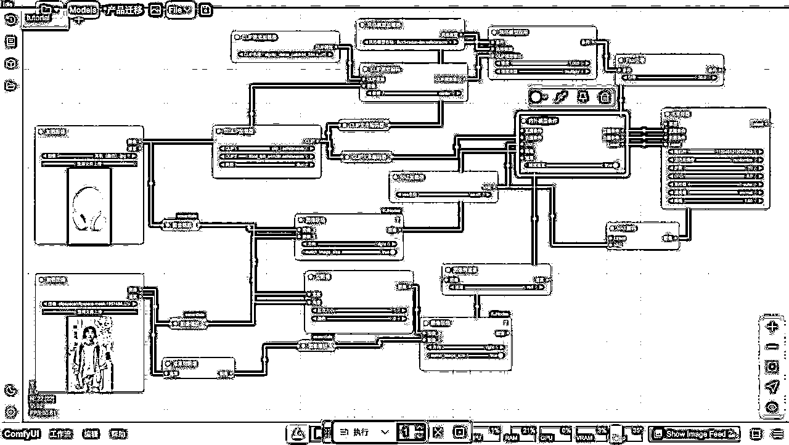
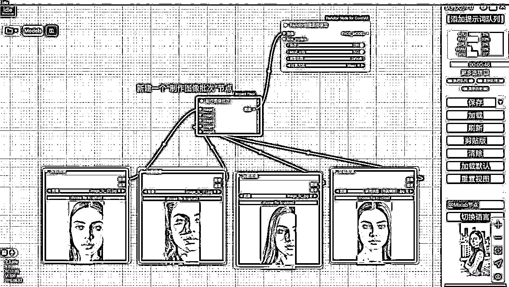

# 3 月航海 | AI 赋能电商 | 实战手册

> 来源：[https://ocn93f5d9olj.feishu.cn/docx/QozsdPuOjoAYohxsNdAcuEeInwd](https://ocn93f5d9olj.feishu.cn/docx/QozsdPuOjoAYohxsNdAcuEeInwd)

# 防失联+MM188166M（李李）长期更新频繁+备用V:MG10127

手册出品方：生财有术团队

手册使用说明：内容出品人排名不分先后。本文旨在向你展示一个项目的更多可能性，帮助你更好地理解和实操。

建议：如果需要快速定位到精确内容，可以使用快捷键 Ctrl + F/command + F 的形式，搜索「关键字/词」，查找你想要的内容

# 必修篇：项目 0-1

# 💡

# 导语：

如何快速学会 AI 赋能电商的技能？

首先，我们会一起了解如何通过云端部署 ComfyUI，省去高昂的硬件成本和复杂的技术配置，让大家可以轻松上手，快速投入创作。

然后我们会带你一步步掌握 ComfyUI 中最基础的文生图工作流搭建。

你将学会如何利用节点（如大模型加载器、文本编码器、K 采样器、Latent 节点、VAE 解码器等）清晰地定义生成图像的条件，轻松创作出理想的图像。

在掌握文生图之后，我们还将进一步探索更高级的图生图技术。你会了解如何利用图像加载节点、VAE 编码器，以及关键的 ControlNet 工具，实现图像的风格转换、细节增强、图像高清化、修复细节、尺寸扩充等多种实用功能。

这些技术不仅可以帮助你实现创意，更能提升你的创作效率。

下面我们先从云端部署开始。

# 一、云端部署 ComfyUI

使用 ComfyUI 时遇到的第一个问题就是：到底是选择本地部署，还是线上部署？

本次航海中，我们推荐 大家都去云端部署。为什么呢？因为云端部署不仅更经济、更方便，还能让你的创作效率大幅提升（对了，云端部署是需要充值的）

下面我们一起比较下本地部署和云端部署。

本地部署：成本高、麻烦多

如果你选择本地部署，首先得有一台高性能电脑，尤其是显卡，比如 RTX 4070 16G，甚至 RTX 4090 24G，才能流畅运行 ComfyUI。但问题来了：

硬件贵：一张顶级显卡几万元，不是每个人都愿意花这个钱。

性能要求高：普通显卡跑不动大模型，生成图片要么慢得让人崩溃，要么直接失败。

维护麻烦：你还得自己下载模型、装插件、调试环境，网络一出问题就得折腾半天。

简单来说，本地部署虽然能自己掌控，但对大多数圈友来说，性价比太低，时间和精力成本也太高。

云端部署：省钱、省心、高效

相比之下，云端部署就有很大优势

开箱即用

云端平台已经把模型、插件和工作流都准备好了。你不需要自己配置，打开网页就能用，省时省力。这对初学者尤其友好，不用头疼技术细节，直接上手创作。

随时随地用

只要有网，就算用普通笔记本电脑，你都能随时登录云端平台开始工作。灵活性超强，不管在家、在学校还是出差，创作都不受限。

顶级性能

云端提供的算力，比如 RTX 4090 级别，秒杀大部分本地设备。跑大模型、生成高清图完全无压力，告别卡顿，效率翻倍。而且平台会不断更新资源，你总是用最新的技术。

有人可能会说，云端部署有费用、可能要排队，或者界面不太熟悉。但这些问题真的很小：

费用超低：租用 4090 算力，1 小时才 2 元左右，比买显卡便宜太多了，几万元的硬件钱够你在云端用好几年。

排队可控：高峰期可能要等一下，但换个时间用就行，完全不影响大局。

上手简单：界面稍微适应一下就习惯了，学习成本几乎为零。

云端部署也有很多平台，这里我们列一下，你可以选择自己认为合适的。

1.

LiblibAI

https://www.liblib.art/

简介：提供 ComfyUI 的在线版本，不用本地部署就能玩转节点式操作，集成了 LoRA、ControlNet 等常用组件，生成图像和视频都很方便。

优点：

开箱即用：模型和插件都配好了，登录就能直接用，省去折腾安装的烦恼。

可视化很直观：拖拖拽拽节点就能看清整个生成过程，想怎么改就怎么改。

资源不少：内置一些免费工作流（比如古人画像、一键换脸）挺好玩的。

缺点：

有些东西用不了：某些高级插件可能不支持，也不一定能上传自己的模型。

受限于平台更新：新功能只有等平台官方更新才能用，不像本地安装那样可以自由添加插件或修改代码，自己想折腾新玩法时会比较受限。

2.

端脑云

https://cephalon.cloud

简介：国内的云平台，按需付费用 ComfyUI，特别适合电脑配置不行但又想体验高性能生成的朋友。

优点：

花钱灵活：可以按分钟、小时或包月付费，根据自己需求来，不会太浪费。

配置给力：有 RTX 4090 这类高配 GPU 可选，重度任务也不卡。

上手简单：一键就能打开 ComfyUI 界面，文件存取下载也很方便。

缺点：

用久了真费钱：高配置用多了，账单会让你肉疼。

需要排队：每次开启时，需要几分钟排队等待

3.

仙宫云

https://www.xiangongyun.com/

简介：一键部署，开箱即用防失联+MM188166M（李李）长期更新

优点：

价格低：RTX 4090 显卡的算力每小时仅需 1.89元

模型多：覆盖 AI 绘画（SD、Flux）、数字人、AI 语音、换脸（FaceFusion）等应用。

插件多：内置插件众多，基本无需自行下载。

缺点：

出图慢：仙宫云的 RTX 4090 在生成 512x768 分辨率图像时，平均耗时约 20 秒/张，略慢于部分竞品

操作复杂：流程会多一点点。

4.

AutoDL 云平台防失联+MM188166M（李李）长期更新

https://www.autodl.com/home

简介：跟端脑云差不多，但主打便宜，按分钟收费，适合短期尝鲜或实验性玩法。

优点：

省钱：基础配置价格真的很亲民，学生党和普通玩家的福音。

省事：ComfyUI 环境都装好了，不用浪费时间去配置。

缺点：

功能少点：社区镜像内置一些高级功能或炫酷插件较少，需要自行安装，模型内置也不多可能没有。

新手不友好：教程和指导不多，需要多半要自己摸索。

5.

阿里云函数计算（FC）防失联+MM188166M（李李）长期更新

https://www.aliyun.com/product/fc

简介：通过阿里云一键部署自己的 ComfyUI 平台，适合有技术背景的玩家或企业。

优点：

随用随扩：自动调整资源，高峰期也不怕卡。

稳定靠谱：有阿里云的安全和存储保障，不用担心数据丢失。

省钱实惠：只付你用了多少，不用白不用。

缺点：

有点难：需要懂点云服务配置，小白慎入。

得自己动手：插件和模型要自己配，维护起来有点费事。

# 💡

建议：

新手试玩：直接上 LiblibAI，登录就能玩，省心。

高端玩家：端脑云或 仙宫云 更合适，尤其是要搞复杂效果的时候。

专业团队：考虑AutoDL或阿里云函数计算，可定制性强，但最好有个懂技术的同事帮忙。

如果需要更详细的操作指南，可以去这些平台官网看看，一般都有新手教程。我们本次航海演示，用的是端脑云。

下面来简单演示一下，端脑云的使用流程。

1.

打开网页（https://cephalon.cloud/aigc）后，点击 热门应用防失联+MM188166M（李李）长期更新

2.

在应用里，我们选择一下服务器，这里推荐用 4090 ，出图会快一些。

3.

服务器选择完之后，会有一个排队的时间，大概 1-2 分钟，大家可以起来活动一下脖子

4.

排队结束后，就可以直接点击工作流使用了。

5.

打开 ComfyUI，直接点击“Close”，就能看到 ComfyUI 的页面了

6.

进去之后，可以点击设置按钮（一个小齿轮），然后点击 AGL，把界面文字调成中文。

# 二、掌握文生图基础工作流搭建

# 💡

# 章节概要

本章重点让你搞懂“文生图”在 ComfyUI 里的最基本流程：如何让 AI 从零生成一张图片——从加载模型、输入文本提示词，一步步到最后预览图像。

为什么这章节很重要？如果你连“最小可用”的文生图工作流都不会搭，就很难做电商场景下的各种换背景、换装等进阶操作。

主要内容有下面几点：

1.

大模型加载：把 Stable Diffusion/Flux 这类核心模型“接通电源”，确立图像生成的风格基础。

2.

文本编码器（CLIP）：把你的文字提示翻译成 AI 能懂的指令，让图像更符合你的描述。

3.

采样器（KSampler）：控制生成质量和步数，决定图片细节和风格准确度。

4.

Latent & VAE：先在潜在空间“生图”，再解码成人眼可见的图像，最后用预览节点检视结果。

学习完本章节，你能建立一个最基础的“文本+模型→图像”管道，为后续更复杂的电商应用打下坚实的操作基础。

进入界面后，我们看到主页面上有很多不规则的长方形框，这些框叫做“节点”。文生图最基本的工作流，就包含这 7 个节点。

我们先按住 Ctrl 键，然后按住鼠标左键，在空白处框选多个节点，点击 Delete 键删除（要学会 ComfyUI 原理，更推荐自己动手搭建）

下面我们就来一步一步搭建一个文生图工作流。

# 2.1 添加大模型「加载器」

首先，我们要添加一个大模型的「加载器」

没有大模型，即使工作流再漂亮，也无法生成图片。大模型的作用是定义图片风格，比如写实风格还是动漫风格。

如何添加大模型节点？

有两种常用方法：

1.

右键菜单法：在空白处右键，点击“新建节点”，找到“Checkpoint Loader Simple”（简易检查点加载器），点击添加。这是加载大模型的节点。

2.

搜索法：双击空白处，输入“Checkpoint”，搜索出“Checkpoint Loader Simple”，点击添加。这种方法更快，适合熟悉节点名称后使用。

我们点击“Checkpoint”这个节点下方的圆框，可以选择调用不同的模型，这里我们就用“realisticVisionV20”来进行操作。

节点右侧有三个输出端口：Model（模型）、CLIP、VAE，我们后面会一一讲解。

这里先来说一下 CLIP

# 2.2 添加 CLIP（文本编码器）

AI 是听不懂 🙉 我们人类语言的，而 CLIP（文本编码器），就负责帮我们把人类语言，翻译成 AI 能听懂的语言。编码器（翻译官）有了，接下来我们需要弄个节点，来输入我们的人类语言。

我们接下来右键新建节点，在“Conditioning”（条件）分类下找到“CLIP Text Encode”，添加一个节点。

添加一个后，按 Ctrl+C 复制，再 Ctrl+V 粘贴，得到两个节点。

为啥要复制一个？肯定有聪明的圈友想到了，一个是用来写正向提示词（我们要什么），另一个是用来写负向提示词（我们不要什么）。

然后我们把“Checkpoint Loader”的 CLIP 输出（黄色端口）连接到“CLIP Text Encode”的 CLIP 输入（黄色端口）。正向和负向节点都要连接。

# 2.3 设置采样器（KSampler）

接下来，我们添加一个 K 采样器

在大模型生成图像的过程中，图像是从噪声到清晰的"反向过程"：

1.

起点：一张充满随机杂点的图（如电视机雪花屏）

2.

过程：采样器逐步移除这些杂点，让图像变得清晰

3.

引导：根据你输入的文字描述来决定如何清理这些杂点

采样器的作用，就是帮我们移除噪点。

有些圈友会有疑问，为啥这里要选“K 采样器”，而不是其他，原因是：

在 ComfyUI 中，"K 采样器"（KSampler）就是最常用的标准采样器节点，"K"只是节点的名称前缀，不需要过于纠结。这就像洗衣机可能叫"A 牌洗衣机"一样，"K"只是 ComfyUI 中这个节点的命名方式。

下面我们依次来设置一下“K 采样器”上面这些参数：

Seed（随机种子）：控制随机噪声。设为 -1 表示完全随机，每次生成不同图片。其他选项：

Fixed（固定）：每次生成相同图片。

Increment（增加）：每次种子 +1。

Decrement（减少）：每次种子 -1。

Randomize（随机化）：每次随机。

Steps（步数）：去噪次数，建议设为 30 或 40，越多图片越清晰。

CFG ：关键词与图片相关性（数值越高，你写的提示词就越容易被 AI 识别，不过也不建议太高，太高会物极必反），建议设为 7 或 8，最高不超过 29，否则效果会适得其反。

Sampler（采样器）：推荐“Euler ancestral”或“DPM++ SDE”，效果好且常用（其他的不需要怎么理解）

Scheduler（调度器）：推荐“Normal”（线性降噪）或“Karras”（曲线降噪）。

接下来我们连接一下节点。

“Checkpoint Loader”的 Model 输出连接到“KSampler”的 Model 输入。

正向关键词节点的输出连接到“KSampler”的 Positive（正面条件）。

负向关键词节点的输出连接到“KSampler”的 Negative（负面条件）。

细心的圈友会发现，这里有一个“Latent”节点，还没有连接。

我们在生成图片的时候，是不是需要提前确认图片的尺寸呀？（到底是长方形，还是正方形），这里的“Latent”节点，就能帮我们确定这些信息。

# 2.4 添加 Latent 节点

右键新建节点，在“Latent”分类下找到“Empty Latent Image”，添加节点。

参数设置

Width（宽度）和 Height（高度）：根据大模型版本设置：

SD 1.5：512×512（正方形）或 512×768（长方形）。

标清 2.1：768×768。

SDXL/SD3: 1024×1024.

Batch Size（批次大小）：一次性生成几张图，比如要生成 10 张，就填 10

到这一步，其实生成图像的基本节点都有了，但是这里生成的，是 AI 格式的图片，我们需要翻译成人能看到的。这就需要用到“VAE 解码器”了。

# 2.5 添加 VAE 解码器

解码器的作用

将潜在空间的图片解码成可见图像。

添加节点

右键新建节点，在“Latent”分类下找到“VAE Decode”，添加节点。

连接节点

“Empty Latent Image”的输出连接到“VAE Decode”的 Latent 输入。

“Checkpoint Loader”的 VAE 输出连接到“VAE Decode”的 VAE 输入。

接下来，我们再添加一个预览框，这样我们就能看到自己的图片是什么样子了。

# 2.6 添加预览节点

右键新建节点，在“Image”（图像）分类下找到“Preview Image”，添加节点。

“VAE Decode”的 Image 输出连接到“图像”的输入。

到这里，恭喜大家，完成 ComfyUI 基础的文生图工作流搭建啦～

接下来我们就可以写一些关键词，测试下生图效果。

正向关键词

写你想要的元素，比如：“A group of people are sailing on a ship， looking into the distance， full of hope”（一群人，正在一艘船上航行，他们眺望远方，充满希望）。

负向关键词

写不想要的元素，比如“模糊、多腿、多手、颜色饱和度低”等。

不会写可以用“easynegative”（直接输入就好）

我们点击最下方的生成按钮

最后在左边的“队列”按钮中，就能找到我们生成的图片啦。

对了，如果你用的是老版的Comfyui，你的生成按钮是“添加提示词队列”。

# 三、掌握图生图基础工作流搭建

# 💡

# 章节概要

在电商领域，常常要对已有商品图片进行创意改造或品质提升，比如给模特图换服装、变背景、做二次风格化……这就需要“图生图”技术。本章会带你从零学会最常用的图生图节点和操作方式。

很多电商实操都离不开“改图”，而图生图能让你根据已有图片进行再创作，既保留原图结构，又大幅改变风格、背景、细节。

本章主要内容：

1.

加载并编码图片：先把原图输入 ComfyUI，再用 VAE 编码器把它转到潜在空间。

2.

噪点/降噪参数：决定保留多少原图的细节；值越低，越贴近原图，值越高，改动越大。

3.

ControlNet（可选）：进阶控制姿势或骨架，让图像改得有的放矢；还能搭配预处理器做线稿、深度图等。

4.

图像缩放 & 对比：对图像尺寸进行适配，或做前后效果对比，方便调试与微调。

通过本章学习，你将掌握把一张已有图交给 AI 进行局部修改或风格转换，充分利用“图生图”来做创意二创，满足商品展示升级、风格统一等需求。

接下来我们来学习—— 在 ComfyUI 中如何搭建图生图的工作流。图生图是一项非常实用的技术，它能帮助我们实现很多图像处理效果，比如：

风格转换：比如把写实的人物照片变成动漫风格。

细节增强：让图像画面更丰富、更细腻。

图像高清化：提升图片的清晰度。

面部和手部修复：优化人物的面部和手部细节。

图像扩充与放大：调整图片尺寸或扩展内容。

这小节内容，我们先学习图生图的基础工作流搭建，下面让我们进入工作流搭建环节。图生图的工作流，和文生图很像，只不过多了两个关键节点。

之前文生图工作流

# 3.1 图像加载节点

要做图生图，首先得有一个地方加载我们要修改的图片，对吧？

操作：双击空白处，搜索“加载图像”（Load Image），选择第一个节点，点击确认。

说明：这个节点用来上传图片。上传后，图片会保留在节点里，方便后续操作。这里我传了一张“花生”的图片。

大家需要花生照片的话，可以点这里下载👉花生照片

# 3.2 VAE 编码器

加载了图片后，AI 要能识别和处理它，就得把图片转到潜在空间（也就是 AI 处理图片的地方，也是上一章节提到的“K 采样器”）。这就需要一个桥梁——VAE 编码器。

操作：搜索“VAE 编码”（VAE Encode），添加这个节点。

连接：

把“加载图像”节点的输出接到“VAE 编码”的“图像”输入。

把 VAE 模型接到“VAE”输入（可以用默认模型，或像上节课那样加载自定义模型）。

把“VAE 编码”的“Latent”输出接到 “K 采样器”的“Latent”输入。

原理：图片本身是由像素组成的，属于像素空间。经过 VAE 编码后，它会被压缩到潜在空间，“K 采样器”才能处理。

到这一步，图生图的基本工作流就搭好了。大家有没有发现，文生图里用到的 “空 Latent” 节点，在图生图里没用了？因为我们现在用的是上传的图片（不需要设定尺寸），所以可以直接删掉这个节点。

但是删掉“空 Latent” 节点节点后，想做批次生成，或者调整图片尺寸怎么办？别担心，ComfyUI 很灵活，都有解决办法。

# 3.3 批次处理

想实现批次生成，可以用一个新节点：

节点：搜索“复制 Latent 批次”

连接：

把“VAE 编码”的“ Latent”输出接到“复制 Latent 批次”的输入。

再把“复制 Latent 批次”的输出接到 KSampler 的“ Latent”输入。

参数：设置批次大小，比如 2、3、4，想生成几张就填几。

示例：下面我们用“花生”的这张图试试，选择 “maiju v7 麦橘写实。safetensors” 模型，正向关键词填“A kitten sitting on the table”，负面关键词用“easynegative”（直接输入就好），步数调到 30，CFG 设为 5，采样器用 DDPM++ 2M SDE ，生成图片看看。

明眼的圈友，都会发现，最后生成的图片，和原图（花生）半毛钱关系没有。这就需要说到——降噪，这个图生图里最重要的参数了。

# 3.4 降噪参数

降噪 在 K 采样器 下面，它直接决定生成图片和原图的相似度。

范围：0 到 1。

作用：

值高（接近 1）：生成图片跟原图差异大，AI 自由发挥空间大。

值低（接近 0）：生成图片跟原图越像，保留更多原始特征。

我们把降噪设置为 0 看看

简直就是花生本体。

我们再把降噪设置为 0.5 看看

好的，现在就有点抽象了，是花生本体 + 提示词的结合

总结：降噪是图生图的核心，调高调低看你需求，想保留原图就低一点，想大改就高一点。

# 3.5 图像缩放

如果想把图片变成正方形怎么办？可以用“图像缩放”节点。

节点：搜索“图像缩放”（Image Scale）。

位置：加在“加载图像”和“VAE 编码”之间。

参数：

缩放算法：默认选第一个。

裁剪方式：选“中心”（center），以中心为基点裁剪。

尺寸：比如设为 512×512。

# 3.6 图像对比功能

有时候我们想直观对比生成前后的图片，但手动拉来拉去效率太低。ComfyUI 有个“图像对比”功能，特别好用。

节点：搜索“图像对比”（Image Comparison）。

连接：

图像 A：接原图（“加载图像”的输出）。

图像 B：接生成图（“VAE 解码”的输出）。

效果展示：

生成后图片后，在“图像对比”节点里拖动鼠标，就能看到前后差异。

# 3.7 进阶技巧：角色转绘

如果想让变化更大，同时保留人物形象怎么办？比如把“花生”这个动物角色风格变一变，但姿势不改。这就要用到 ComfyUI 的杀手锏 ControlNet 。它能在保持结构不变的情况下调整风格。

步骤：

1.

加载 ControlNet 模型：

添加 “ControlNet 应用”

添加“ControlNet 加载器”

使用 ControlNet 时候，需要额外加载一个模型，所以要用 ControlNet 加载器

在“ControlNet 加载器”里， 选择“lineart”模型

在“ControlNet 应用” 中，强度这个开关和之前说到“K 采样器”中降噪的功能类似

范围：0 到 1

作用：

值高（接近 1）：生成图片跟原图差异大，AI 自由发挥空间大。

值低（接近 0）：生成图片跟原图越像，保留更多原始特征。

我们这里，就调成：

ControlNet 应用-强度 0.8

降噪 1

2.

预处理图像：

有了 ControlNet ，我们还需要添加一个预处理器，来勾勒图片线条

搜索“Lineart 预处理器”

连接：把“加载图像”的输出接到预处理器的“图像”输入。

参数：

分辨率：默认 512，也可以调高到 768 或 1024。

粗糙化：默认禁用。

如果要看到预处理的效果，可以加一个“预览图像节点”

3.

连接节点，选择模型

接着我们给“ControlNet 应用”，连接一下节点

分别从 CLIP 文本编码（正面提示词+负面提示词），流向 ControlNet 应用，再流出 K 采样器

然后再选择一个大模型——Samaritan 3d Cartoon 3d 卡通-SD1.5.safetensors

1.

效果图展示

到这里，一张角色动漫转绘图就生成啦。我们保持了“花生”的姿势，但是改变了风格。你也学会了一个基础文生图的搭建方法。

对了，如果你用的是老版的Comfyui，你的生成按钮是“添加提示词队列”。

在我们正式开船前还有一段时间，建议你可以自行多练习几遍“文生图”、“图生图”工作流，为之后的正式航海打下坚实基础。

B 站上也有许多优质学习资源，如果你有余力，不妨自行学习提升。期待在正式航海中与你相见！

航海期间，我们将重点学习以下 五个电商赋能工作流 场景，使你的技能更加全面：

# 四、掌握 5 个常见电商工作流

# 💡

# 章节概要

前面你已经搞定了基础的文生图和图生图，这一章把它们进一步组合，应用到电商常见的 5 大场景：模特换装、商品换背景、商品试用图生成、模特换脸、视频换脸。

这些操作几乎涵盖了电商视觉的大部分需求。学会以后，你能灵活应对各种“商家催图”“快速做主图/产品照片/模特宣传图”的场景。

本章主要内容

1.

模特换装：挑好模特图与衣服图，通过局部重绘 + Flux Tools + 遮罩操作，让人物看起来真的穿上那件衣服。

2.

商品换背景：抠出商品本体，AI 重绘或风格化背景，做出各种适合电商平台的场景图。

3.

商品试用图生成：把产品合成到人物或特定场景里，模拟真实使用场景，对提高转化效果显著。

4.

模特换脸：利用 ReActor 等换脸节点，把特定人脸替换到已有模特上，帮助店主或 KOL 快速出宣传照。

5.

视频换脸：扩展到多帧处理与补帧，一键生成商品宣传短视频，提升推广吸引力。

学习完本章节，你就能在具体电商应用中，把之前学到的基础操作（文生图、图生图、遮罩、ControlNet 等）组合起来，让 AI 帮你做「高效率、低成本、无限风格」的商品视觉创作，从图片到视频全面覆盖。

# 4.1 模特换装

# 4.1.1 搭建基础工作流

在正式开始操作前，你可以先准备好两张图片：

一张是要拿来“换装”的服装图

一张是模特图，也就是要穿上那件衣服的人

下面我们先搭建最基础的工作流框架，再一步步加入更多节点。

# 4.1.1.1 加载图片

先把衣服图和模特图都用「加载图像」（Image Loader） 节点加载进 ComfyUI。这样就有了最初的“原材料”，后面的一切操作都基于它们展开。

节点：加载图像节点 （Load Image）

操作：

添加两个加载图像节点，分别加载：

一张模特图片

一张衣服图片

快捷键：Ctrl+C、Ctrl+V 复制一个节点。

# 4.1.1.2 统一尺寸（图像缩放节点）

由于两张图片的尺寸不一致（模特是 9:16，衣服是 4:3），因此我们需要添加一个“图像缩放节点”，来统一尺寸。

节点：图像缩放节点 （Image Scale）

操作：

添加第一个“图像缩放”节点，参数设置为：

宽度 （Width）：1000

高度 （Height）：1000（根据显存调整，显存低可设为 512x512）

差值 （Interpolation）：Lanczos（可选，默认也可）

Method：proportion（保持宽高比）

其他的“条件”、“乘数”就用默认参数

复制一份“图像缩放”节点，确保两张图片和后续蒙版的尺寸一致。

给模特、产品图，都连接上“图像缩放”节点

注意：尺寸一致是局部重绘的关键，否则会报错。

如果想做“对比图”或把两张图放在同一张画布上，可以使用「图像连接」（Image Combine/Concat） 节点：

图像 1 接衣服图（缩放后）

图像 2 接模特图（缩放后）

这样在一个预览里就能看见左边是衣服、右边是模特，为后续处理和对比都很方便。

我们可以往外拉一个图像预览，看看最终实现的效果（看视频演示）

20250311-142635.mp4【在线播放】

# 4.1.2 创建遮罩

# 4.1.2.1 将遮罩转成图像

我们的目标是只给模特换衣服，不动她的脸、头发或背景。最简单直接的办法，就是做一个“只覆盖衣服区域”的蒙版。

1.

回到「模特图」的加载节点上，右键 →「在遮罩编辑器中打开」（Edit Mask）。

2.

在模特图上用笔刷涂抹想要替换的衣服区域，白色代表要改的部分，黑色代表保持原样（不必非常精细，稍微溢出也没关系，InPainting 会做环境融合）

3月11日.mp4【在线播放】

3.

点击 Save 保存遮罩后，就得到了一张和模特图同尺寸的蒙版图。

遮罩涂抹好之后，我们还需要把遮罩“统一尺寸”（你可以把遮罩理解为一张单独的图）蒙版分辨率必须和原图一致，否则后面会报错。

怎么操作呢？用到之前的“图像缩放节点”。我们复制一个“图像缩放节点”，把它连接遮罩（很多圈友会发现，遮罩是绿色的圈圈，根本连不上图像这个蓝色的圈圈）

我们需要添加一个转化器——“遮罩到图像” ，通过这个节点，就可以把遮罩，连到图像上

到这一步，我们就有了一个基础版本的工作流

红色框框的部分，会把我们的模特图和衣服图，调整成一样的尺寸，然后放在同一张图片上做效果展示。

绿色框框的部分，是我们涂抹的蒙版区域，它代表我们要改变的地方。

# 4.1.2.2 合并纯黑色 + 蒙版图

接下来，我们需要把图片，转换成 AI 能听懂的语言。

在 AI 的世界里，黑色表示不改变的区域，白色表示要改变的区域。所以我们需要对蒙版图操作一下。

步骤 1：创建黑色「纯色图像」（Solid Color Image） 节点

生成一个「纯色图像」（Solid Color Image） 节点，设置为黑色（#000000）。右键该节点，将“高度”和“宽度”转换为输入参数。这样我们可以将前面的图像节点连接到这个黑色图像上，使两者尺寸保持一致。

步骤二：合并处理后的图像

创建一个「图像连接」（Image Combine） 节点。将添加了黑色蒙版的模特图像，和应用了纯色效果的衣服图像，连接到这个节点上，实现两张处理后图像的合并。

预览一下，如果看到左边是黑、右边是衣服区域的白色蒙版，就说明操作成功。

# 4.1.3 自动抠图

接下来，我们需要对衣服进行抠图。毕竟我们拿到的样图，在多数情况下都不是透明的（比如白底或杂色）。通过这一步，我们能让衣服和背景分离更干净。

步骤一：添加「inspyrennet-rembg」的节点

步骤二：连接节点

输入接“衣服+模特”的组合图，输出就会是一张背景去掉或变透明的图片。

到这一步，我们前期的准备工作就都做完了，建议大家给这个工作流，整理打组一下。

我们按住“Ctrl”（Mac 电脑是“command”），画一个大框，选中所有节点。

然后按下 Ctrl+G 组合键（在 Mac 上使用 Cmd+G），新建一个组。

# 4.1.4 搭建 Flux 工作流

现在我们已经准备好了“衣服图、模特图”和“蒙版”，接下来就要用 Flux Tools - Redux In Painting 来实现真正的换装效果了！

Flux Tools - In Painting 是一个超好用的照片修复模型。它能自动看懂周围环境，填充进看起来超自然的内容。不用复杂操作，简单点几下就能搞定——去杂物、修老照片、改细节，效果贼真实。

# 4.1.4.1 搭建 Flux 基础节点

首先是 Flux 老三样：

UNet 加载器

双 Clip 加载器

VAE 加载器

UNet 是——发动机，负责生成图像的核心逻辑；

双 CLIP 是——导航仪，通过文本条件控制生成方向；

VAE 是——翻译器，将抽象数据转化为肉眼可见的视觉结果。

三者协同工作，构成了 Flux 模型从文本到图像的高效生成链路

UNet 加载器 里，选择“ fp8_v10 safetensors”这个模型

如果你这里没有显示这个模型，需要安装一下。步骤如下：

1.

保存百度网盘文件

链接： https://pan.baidu.com/s/1j4lLRigtHBzyypGFUJ8fCQ?pwd=scys 提取码： scys

2.

通过云端平台，直接上传百度网盘模型

具体方法看这里👉 百度网盘操作指引

“Flux 老三样”的具体参数，大家可以参考下方的截图来（如果期间有问题，可以在群里截图询问教练）

接着，我们把“双 Clip 加载器 ”往外拖，添加两个文本编码器（一个用来输入正向提示词，一个输入负向提示词）

20250312104922_rec_-convert.mp4【在线播放】

接着我们需要连续添加 5 个节点。

① 添加 Flux 引导：调节引导强度——30

“Flux 引导”就像给 AI 加了个“高德地图”，让它在生成图片时，更准确地照着你的描述走，不乱跑偏，细节更清晰、更到位。

② 添加 Delta Diffusion（差异扩散），用于提升局部重绘的融合感

③添加 内补模型条件：告诉系统“这里要做局部重绘”

给 AI 下一个“局部修图”指令

④添加 K 采样器：最后的采样步骤

我们前面说过，AI 生成图片的步骤，是从随机的噪点，变成清晰的图像。而 K 采样器，就是控制这个过程的节点。

接着需要设置一下“K 采样器”的参数

⑤ 添加 VAE 解码器：解码输出最终图片

将“AI 潜在空间”的图片，解码成人肉眼可见图像。

⑥ 最后，再添加一个 保存图像 节点

到这里，一个基础的模型我们就搭建好了。

# 4.1.4.2 搭建 redux 节点 防失联+MM188166M（李李）长期更新

让衣服风格得到应用

放一个「风格模型应用」（Style Model Apply） 节点

接下来的步骤合并在一起说，大家照着操作即可：

1.

放一个「风格模型加载器」

2.

再加一个「CLIP 视觉编码」以及它的「CLIP 视觉加载器」

3.

「CLIP 视觉加载器」选择“384”那个模型

4.

按照下图所示，给这些节点连上线

另外要注意两个点，「CLIP 视觉编码」这个节点的“图像”要连接之前“衣服节点”的图像

因为我们需要把衣服，进行风格化处理

“风格模型应用”的条件，也要和“Flux 引导”的条件相连

然后就是“风格模型应用”条件的输出，我们按照下图操作，进行连接（这里操作会有点多，大家细心的慢慢来）

到这里，我们就基本完工了。接下来，我们需要添加一个“局部重绘裁剪”。来连接我们一开始生成的“模特+衣服图片”工作流，和刚刚新建的“Flux 换装工作流”。

# 4.1.4.3 局部重绘裁剪

添加节点

设置参数

节点连接

我们先来连接“局部重绘（裁剪）”左边的节点

左边连接好了，再来连接“局部重绘（裁剪）”右边的节点

# 4.1.4.4 成果展示

点击“列队提示”，等待工作流开始加载

对了，如果你用的是新版的Comfyui，你的生成按钮在这个位置

生成结束后，我们选择下方“局部重绘（接缝）”之后的图片

点击右键，选择保存图像就大功告成啦！

如果这里生成的内容不太理想，可以重新右键点击 模特图 →「在遮罩编辑器中打开」，重新来涂抹一下没有处理好的区域。这里我顺带把模特背的包也涂抹掉了。

换装后 🔽

换装前 🔽

# 4.2 商品换背景 @佳文 @土豆君

把你的产品放在任何你想要的场景里，海边度假风、北欧简约风、日式小清新，随便你换

之前@土豆君 写过一篇零基础线上 ComfyUI 跑图的教程，只要有工作流就能跑起来：抛弃显卡！ComfyUI+Flux纯网页跑图喂饭级教程。@来来教练也写过一篇无需显卡直接使用ComfyUI的教程03 零基础 云端节点使用ComfyUI

当我们想要进一步使用 ComfyUI 去做商业化的时候，肯定还需要对已有工作流按需要进行修改。但如果我们不了解每个节点的机制又如何修改工作流呢？哪怕一些模块可以复用，自己也不知道该如何连线。

如果我们能够拆解一套商业化工作流又或是能从零搭建一套商业化工作流就好办了。而这就是这篇帖子要解决的问题，学会拆解别人的工作流就能一通百通。

其实一套工作路核心节点都是相似的，无非细节大同小异。我们只要抓住核心，就能轻松的理解这套工作流的原理。

接下来，我主要以电商场景来展开，针对：电商换背景来说明如何拆解一套商业化工作流并从零搭建出来。

# 4.2.1 电商案例拆解

首先，我们打开 LiblibAI，Liblib 平台工作流非常多，我们从其中搜索一套商业化电商换背景工作流并不复杂。

LibLib 搜索换背景，我们就以这个运行数最多的工作流来作为拆解案例展示。

打开 Liblib 工作流 电商产品换背景。

先运行看下效果：给产品换上合适的 AI 背景效果图，并且保留文字效果。

接下来看下工作流详情。密密麻麻一大堆，看着就头疼。

我们先观测工作流各个模块，进行划分。这套工作流有三个部分：首次出图、FLUX 二次细化重绘、最终打光并高清放大。

首次出图模块明显就是核心部分，产品换背景在这部分完成的。

FLUX 二次细化重绘模块实际上就是在首次出图的基础上图生图。

最终打光并高清放大模块就是一个高清放大基础工作流，然后叠加一个打光模块组件。

分析下来，我们抓关键的首次出图工作流就行。而 FLUX 重绘、高清放大都是属于基础工作流，也是可以复用的组件。

# 4.2.2 搭建思路拆解

接下来我们就看工作流中的首次出图模块做了哪些事情。并把产品换背景工作流中首次出图模块的相关的组件都找出来。

1.

图像预处理，主要是抠图，比如使用 SegmentAnything。图像输入可以控制一下图片宽高。

2.

风格化和局部重绘。保留产品抠图，只需要对背景重绘，并且要确保绘制的背景和产品能融合到一起。

3.

控制背景图像生成的稳定性。 为了减少提示词的不稳定性，我们还可以加入 ControlNet 控制图像的一些属性。

4.

文字处理。产品一般会带有文字，AI 生成的图片文字基本是乱码，因此需要对产品图和生成的 AI 图片进行融合。

然后我们就把用到的模块都找出来，尝试如何从零开始搭建出一个产品换背景的工作流。

其实搭建一个工作流没那么复杂，因为任何一个工作流都是从文生图或图生图的基础工作流演进的。而思路无非就是在原来基础的工作流上添加需要的组件，然后把组件串联到这个基础流程中。

按照这个思路，我们把各个部分组件拆解出来。

# 4.2.3 组件拆解防失联+MM188166M（李李）长期更新

我们刚才已经把首次出图模块做了哪些事情梳理出来了，接下来就一一梳理这些用到的组件：

图像处理

图像处理需要用到这 4 个组件：宽高比缩放、SegmentAnything、遮罩模糊生长、混合。

宽高比缩放主要用于对图像进行缩放操作，这里用来固定输入图像的大小，方便图像处理。

Segment Anything 是一个图像分割模型，可以自动识别图像中的不同对象。这里用来分隔图片的物体，并生成蒙蔽。

遮罩模糊生长 对遮罩（mask）进行处理。模糊操作可以使遮罩的边缘变得更加平滑，减少硬边缘的出现；生长操作则可以扩大遮罩的范围，使遮罩覆盖更多的区域。

混合：将多个图像、遮罩或其他数据按照一定的比例进行混合。这里用于文字处理，AI 生成的图像文字有问题，需要把原来的产品图混合，让文字显示清晰。

风格化

IPAdapter 用来生成风格化图像，可以提供一张或多张参考图像，从而使生成的图像在风格、内容细节等方面与参考图像更为相似。

局部重绘

BrushNet 主要用于图像编辑和生成过程中的局部控制，也就是用于局部重绘。在这里用于给分割后的图像蒙版重绘背景，所以选择 segmentation_mask 模型。

ControlNet 控制

Aux 集成预处理器将图像转为线性图和深度图，然后使用对应的线性、深度模型用 ControNet 进行精确控制。

提示词和 Lora

提示词和 Lora 这部分就简单了，添加自己想要的模型和 Lora 增强效果。而提示词可以加入翻译组件方便使用中文写提示词。

# 4.2.4 搭建模块

工作流搭建我们可以先把各个组件模块串联好，然后把组件串联到基础的图生图工作流。

图像处理模块

先对图片进行缩放，然后抠图，处理下蒙版，最后加载背景图混合。

这里我们把需要 AI 生成的背景图像用加载的形式简化，后面搭建完整的工作流只需要去掉加载图像部分就行了。

参数基本使用默认的就行，可以根据出图效果一步步调整。

重绘模块

先连接 IPAdapter，然后串联 BrushNet。

这里的参数调整下开始和结束应用的位置。

像这种空心的圆圈，表示可以不连接，非必须输入结点。

ControlNet 模块

把 Aux 和 CN 加载器连接到 CN 应用，再串联一个 CN 应用。

提示词和 Lora 模块

# 💡

注意案例中的大模型和 Lora 为示例，不一定非要用一样的模型，可以自行选择通用模型

一站式电商大模型-场景-产品-主图-Checkpoint-Colorshow_绘梦星创-LiblibAI

J_电商场景_森林_实验室_场景-LoRA-J_-LiblibAI

QLCD-电商森林雪山水景背景 XL_建模渲染自然实景-LoRA-QLCD 设计工作室-LiblibAI

SDXL 护肤品，化妆品产品摄影/场景图/电商-LoRA-植栋-LiblibAI

然后我们把这些部分串联起来，结合图生图基础工作流，缺什么补什么。

# 4.2.5 搭建工作流

我们从头开始把各个模块连接起来。为了方便连线，不至于连线太混乱，这里我引入了一组设置节点、获取节点，功能就是代码中的设置变量的意思，可以把节点存为一个变量，这样就不需要连那么长的线。

输入部分

开头部分设置一个 VAE，后面需要使用。

图像处理模块分别设置图像节点、抠图图像、抠图蒙版节点。

绘图部分

然后把提示词模块的模型节点和正负条件连接到重绘模块。

使用获取节点，把设置的 VAE 节点连接上。

然后连接原图、抠图图像和抠图蒙版。这里需要注意，IPAdapter 连接的图像不是抠图后的图像，而是宽高比缩放后载入的原图。

而 BrushNet 连接的图像是抠图图像和抠图蒙版。

把 BrushNet 的正负条件连接到 ControNet 的正负条件上，传递下去，一致传递到 K 采样器。

把 VAE 和抠图图像连接到 Aux 处理器。

输出部分

最后就是连接采样器。

前面 ControNet 正负条件、BrushNet 模型和 Latent 连接到 K 采样器

这样我们运行一下，能生成图像，说明连接没有问题。

文字处理

这里把生成的图像放大，发现文字都是乱码，怎么回事呢？其实这就是因为 AI 生成的图像不能自动处理好文字。

还记得前面我们提到混合组件么？混合组件的背景图像和输出图像我们还没连线呢。

混合组件在这个工作流可以帮我们处理文字效果。

因此我们再把 AI 生成好的 VAE 解码后的图像连接过来，保存效果图，这才是最终的输出。

生成的效果图如下，这个文字才是正常的。

高清放大

生成了满意的效果图后，你可以还需要把图片放大，这时候需要接入一个放大工作流。

我比较建议高清放大单独处理，因为高清放大只有在你输出的图片满意的情况才需要放大，而且运行起来很耗时，因此我更推荐单独用一个工作流来处理放大过程。

至于放大的方式本身也很多，可以自由选择，我们这里使用 Flux + SDUpscale 的方式放大。

最后说下工作流里面只能运行一套工作流，两套同时使用会爆显存。这里我把高清放大的工作流给屏蔽了，平时这样使用就行了。

右键工作流框，选择忽略框内节点，即可屏蔽整个框的工作流。

右键工作流框，选择启用框内节点，即可把屏蔽的工作流启用。

# 4.2.6 搭建完成工作流文件下载防失联+MM188166M（李李）长期更新

这个搭建完成的商品换背景的工作流供大家参考：

电商换背景。json

另外，补充电商场景常用的抠图的工作流供大家学习，工作流展示了几种抠图的模型，没有最好的抠图，只有最适合场景的抠图模型。

一键抠图。json

# 4.3 商品试用图生成

AI 直接生成“真人”使用产品的效果图，比如戴上项链的展示效果

我们的目标是：想把一件商品（如项链、耳机、衣服等）合成到人物或场景照片中，让它看起来像真实拍摄一样。

所需材料：

1.

商品图片（例如正面清晰的项链）

2.

场景/人物图片（例如一张人像）

3.

ComfyUI 与相应的 AI 模型（Flux 系列、Vidas/Feel/Flash 等）

核心流程拆解：

4.

加载输入图片

5.

加载/配置 AI 模型

6.

（可选） 编写文本提示词或接入“风格迁移”节点

7.

选择并组合图像处理节点（如缩放、拼接、遮罩等）

8.

生成新图（采样、解码）

9.

输出结果

下面我们来看看具体操作步骤：

10.

在 ComfyUI 界面，右键单击空白处 → 搜索 “Load Image” 或 “Image Loader”。

11.

分别添加两个节点：

第一个节点加载商品图片（耳机）

第二个节点加载场景/人像图片

12.

在节点的属性面板里点击“Choose File”，选对应的本地图片。

在我们搭建工作流的时候，有个好方法，就是先找出最核心的节点（那个几乎所有数据都要经过的“大中转站”）。

把这个核心节点先放在画布中间，然后把它需要的输入和它产生的输出都理清楚。这样当你往图上添加其他节点时，就很清楚它们应该连到哪里去了。

我们添加核心节点——“内补模型条件”

啥是“内补模型条件”？

AI 模型很聪明，但它不是万能的。有时候光靠文字提示（比如“我想要一只猫”），AI 可能会生成各种各样的猫，颜色、大小、姿势都随机。但如果你想要更具体的效果，比如“一只黑猫坐在窗台上”，单靠文字可能不够精确。这时，“内补模型条件”节点就出场了——它可以给 AI 一些视觉线索，比如一张黑猫的图片或一个窗台的草图，让生成结果更贴近你的想法。

接着我们来把“内补模型条件”左边的👈🏻节点搭建一下。

这几个节点是代表什么？可以先简单看看下方内容，后续操作的时候，我们会展开说明。

positive （正面提示词）：

作用：输入的是你希望 AI 生成图像中包含或强调的内容（通常来自 CLIP 文本编码节点的正面提示词）。

举例：“白色耳机”，“高清”，“干净背景”。

negative （负面提示词）：

作用：输入你明确不希望生成的内容或想排除的内容（通常来自 CLIP 文本编码节点的负面提示词）。

举例：“模糊”，“水印”，“低分辨率”，“扭曲”等。

vae :

作用：输入 VAE 模型（Variational Autoencoder），用于潜空间和实际图像之间的编码解码。

举例：FLUX VAE、Stable Diffusion VAE 模型。

pixels （图像）：

作用：输入实际的图像数据。通常用于图像引导流程或图生图（Image-to-Image）时，将现有的图像转成潜空间数据供模型参考或修改。

举例：你上传的图像数据。

mask （遮罩）：

作用：输入一个遮罩图像（mask），告诉模型你希望修改或保持不变的区域。

举例：如只对图像中耳机的某部分进行修改，可以上传相应区域的蒙版。

# 4.3.1 正/负面提示词连接防失联+MM188166M（李李）长期更新

先来把正、负向提示词处理一下：

为了更精确地控制文本条件，我们这里用“双 CLIP 加载器”（这个加载器可以放两个模型）连接正、负向提示词

“双 CLIP 加载器”参数设置如下：

接下来，对于正向提示词——positive，我们需要给它加 buff——添加一个“Flux Tools Redux”

Flux Tools Redux 可以根据你提供的图像，生成与其风格相似的变体图像，而不需要输入文字描述。

Flux Tools Redux 具体有这么三部分节点

“CLIP 视觉编码”可以将图像，被转化为一组 AI 能懂的视觉特征（相当于替代提示词）

“应用风格模型”，可以保证我们的风格，和原始图像一致。

“Flux 引导”则告诉 AI：“一定要尽可能地遵循这个图像信息+风格，不要随意发散”

接下来我们把这几个节点连起来，并且设置参数。

Buff 加好了，需要和“双 CLIP 加载器”这边连接起来。

# 4.3.2 VAE 连接

这里的 VAE，我们先点击生成一个“VAE 加载器”，模型选择“ae.sft”

然后我们进行节点的连接

【节点连接讲解】“内补模型条件”，给 AI 一些图片生成的视觉线索，“K 采样器”让 AI 在“潜空间”进行移除噪点，LATENT 导出的——是 AI 编码的图片（向量化的图片，人眼睛是看不明白的），通过“VAE 解码”这个节点，转化成人眼可以看到的图片格式。防失联+MM188166M（李李）长期更新

我们回到“内补模型条件”看看，现在还有两个地方没有连接，“pixels”和“mask”，接下来我们依次连一下。

# 4.3.3 pixels（图像） 连接

pixels 这个接口的作用，就是把真实的图片数据，传到“潜空间”

那具体我们应该告诉 AI 什么样的图片数据呢？就是两张图片并排在一起的数据。

我们用之前的 4.1.1.2 统一尺寸（图像缩放节点）的方法，来操作即可。建立两个“图像缩放”节点，然后连到“图像联结”，最后连接内外补模型的 pixels（图像）接口。

我们最后来看 mask （遮罩）这个接口怎么连接

# 4.3.4 mask （遮罩）连接防失联+MM188166M（李李）长期更新

遮罩的目的，就是告诉模型你希望修改或保持不变的区域，白色代表要改的部分，黑色代表保持原样。

所以我们的目标，是最后能出来一张，除了模特头周围，其他区域都是黑色的图片。

如何实现呢？

路径很简单，这里我就直接贴图+文字说明了。防失联+MM188166M（李李）长期更新

图片是耳机图（左边）、模特图（右边）共同拼接成的一张完整图。我们要让出了模特带耳机的地方，都变成黑色，那么就需要先从耳机图（左边）入手。

先建立一个“空图像”节点，它相当于一层黑色的图层，把耳机图（左边）盖上。

然后再建一个“按宽高比缩放”节点，把我们涂抹的遮罩导出来。（对了，要双击模特图，点击——“在遮罩编辑器中打开”，先用画笔涂抹一下，才能导出遮罩）

如果没有这个节点的话，需要先下载—— Layerstyle 节点，步骤如下：

1.

点击“管理器” - “节点管理”

2.

搜索“Layerstyle”

3.

点击安装（安装之后，需要按照提示，重新启动 ComfyUI）

最后通过一个“图像联结”节点，把两部分合并起来。

合并起来的图像，我们传输给“内补模型条件”的“mask （遮罩）”接口

我们在中间添加一个“图像到遮罩”，才能顺利转进去（因为“内补模型条件”的“mask （遮罩）”接口，只能输入遮罩，不能输入图像，所以要转一下格式）

好的，现在我们来看一下，“内补模型条件”的左右两边，所有接口我们都连接好了。

# 4.3.5 添加 AI 大模型

眼睛尖一点的圈友，可能会发现，K 采样器这里，缺一个驱动的模型。

我们下面来添加一下 “UNET 模型”，思路如下：

加载 UNET 节点

↓ 提供 AI 绘图核心模型

差异扩散节点（扩散过程）

↓ 执行潜空间图像生成

K 采样器节点

↓ 产生潜空间 Latent 数据

VAE 解码节点

↓ 将潜空间数据转换成可视化图像

解释一下这两个节点：

UNET 加载器节点（左侧）

这个节点就是用来加载 AI 绘画模型的。简单说，它就是你选择的 AI 模型本身，决定了最终生成图像的风格和特点。

差异扩散节点（中间）

这个节点负责实际生成图像的过程。它接收 UNET 模型，然后执行一个从随机噪声逐步变成你想要图像的过程。这就是 Stable Diffusion 生成图像的核心步骤。

接着我们把线连一下，把大模型参数也设置一下，大家可以跟着截图来操作：

接着我们来设置一下 K 采样器的参数

我们接下来，在“VAE 解码”后面，增加一个预览图像，就大功告成啦～点击下方“执行”，开始生成

来看看最后生成的图片效果：

对了，如果你用的是老版的Comfyui，你的生成按钮是“添加提示词队列”。

# 4.4 模特换脸防失联+MM188166M（李李）长期更新

可以把自己的数字人形象贴到模特身上，提升点击率

# 4.4.1 搭建基础工作流

我们先建两个“图像加载”节点，一个放我们的模特图，一个放我们想换去模特身上的图。

接着，我们添加一个 “ReActor 换脸”节点，很多圈友一开始没有这个节点（可以使用吴杨峰那个版本，里面包含这个节点）

添加完 “ReActor 换脸”节点后，我们来看下具体参数，和节点的连接

具体参数，大家安装下图 1:1 设置即可。节点连接也很简单，“目标图像”就是换脸之后的模特图像，“源图形”，就是用来放去模特身上的图，最后再拉出来一个预览节点就 OK 了。

整个工作流到这里，就搭建好了（是不是超级简单？）我们点击“添加提示词队列”，跑一下图看看。

还不错对不对，但是可以更好。

接下来，我们来看看，如何让生成的图像，更逼真一些。

# 4.4.2 增加面部模型

我们先建一个“ReActor 创建面部模型节点”

接着可以把我们要换的模特图，各种正脸、侧脸、逆光的脸、素颜的脸……都传到这个模型里。连接很简单，大家可以根据下方图片来搭建。

修改一下模型名字，“外国女模特”

搭建好了之后，我们按一下“添加提示词队列”，跑一波模型生成，然后再刷新一下网页。

由于我们已经建好了模型，因此这里的“源图像”，就可以删除了。我们直接添加刚刚的“外国女模特”模型。

20250317154116_rec_.mp4【在线播放】

现在我们点击“添加提示词队列”，再来看一下最终生成的图片。

对了，如果你用的是新版的Comfyui，你的生成按钮在这个位置

这次的，就会更逼真一些。

# 4.5 视频换脸

要进行视频换脸的话，我们首先就是新建一个“加载图片”、“加载视频”节点，把我们要换的视频放进来。

“加载图片”大家比较熟悉了，“加载视频”这个节点，很多圈友是第一次见，我们先讲解一下其中的这些参数是什么意思。

强制帧率

通俗讲就是视频播放的流畅程度：

0：用视频本来的流畅程度（原始速度）。

非 0（比如 25 或 30）：告诉 AI，“不管视频本来多快多慢，都用我设置的这个速度播放”。

比如电影一般 24 或 25 帧，看起来比较流畅，动画 30 帧左右更顺滑一些。

强制尺寸

意思就是视频画面的大小（宽×高）：

Disabled：保持视频原来的大小。

自定义尺寸（比如 512x512）：软件会把视频画面调整到你指定的尺寸大小。

帧数读取上限

表示你最多想要从视频中处理多少张图片（每个视频都是一帧一帧的图片组成的）：

0：全部都要。

非 0（比如 100）：只处理视频开始的 100 张图片，之后就停止不再处理。

跳过前 X 帧

表示视频开头你不想要的一部分：

0：从头开始处理。

非 0（比如 30）：前面 30 帧画面都不处理，从第 31 帧开始处理（适合跳过片头、开场白等不需要处理的片段）。

模选

表示视频抽取的密集程度：

1：每一帧都处理（非常流畅但需要处理的视频帧很多）。

2：每隔一帧处理一帧（比如第 1 帧处理，第 2 帧跳过，第 3 帧再处理，这样视频会稍微不太流畅，但处理速度更快）。

我们的参数，具体调节如下：

到这里，具体参数就设置好了，大家可以参考上图中的参数来设置。下面我们进行下一步。我们先在“加载视频”这个节点左边，增加一个“值”节点，它能帮我们把视频数据，转化为具体 AI 能识别的数据。

步骤如下：

1.

增加文本节点，并在文本里输入“2”（代表我们抽帧，每 2 帧抽一次，比 1 帧抽一次加载要快一些）

2.

增加“值”这个节点

3.

把“文本”-“值”-“加载视频”连接起来。“值”是没有输入接口的，需要右键-转化为输入，才能连接

接下来我们加载一个“图像缩放”节点，把宽度改成“768”，加快视频的渲染。

“图像缩放”节点，直接连接前面那个把视频进行缩放的节点。

然后再添加一个“reactor 换脸”节点（节点名字，以及参数设置，大家看下面的图示👇🏻）

我们把“reactor 换脸”节点连接一下。

接下来，我们要添加一个“补帧”节点，提高视频画质。

加上这个“补帧”节点，就相当于在换脸后的视频中，额外加入更多由 AI 自动生成的画面，让动作看起来更顺滑、更真实。

“补帧”节点的“乘数”，要和视频的抽帧保持一致，我们这里可以直接把它，和前面的“值”相连。

我们把这个“补帧”节点，连接前面的“reactor 换脸”节点。另外，这里的“乘数”，需要和前面的“模选”保持一致。

接下来我们添加一个“合并为视频”节点，来输出我们换脸后的视频。

添加完节点，我们来设置参数。这里第一个需要注意的点是，“合并为视频”的帧率，需要和我们上传的原视频一致。

原视频的帧率我们再页面上是看不到的，可以增加一个“视频信息”节点，帮我们查一下视频帧率。接着，我们把“视频信息”节点作为桥梁，把“加载视频节点”，“合并为视频”节点相连。

这里需要先把“合并为视频”节点里的“输入”设置一下，增加一个连接帧率的接

这样就连接好了。

最后我们把“合并为视频”的「图像接口」，连接之前补帧后的「图像接口」，就大功告成啦。

我们按“添加到提示词队列”，看看生成的效果视频。

对了，如果你用的是新版的Comfyui，你的生成按钮在这个位置

# 选修篇

# 五、ComfyUI 安装与使用 @来来防失联+MM188166M（李李）长期更新

# 5.1 Win 系统本地安装

# 💡

本地使用优点：可自主安装缺失节点，可随意使用模型，可识别本地文件夹。

本地使用缺点：需购买高端显卡，需安装 ComfyUI，需下载模型，需安装节点。

ComfyUI 的安装包有 4 种，4 选 1 安装即可，一类是官方版，一个是整合版。

如果追求便捷，建议使用官方桌面版（105M），会自动下载模型和第三方节点。

如果硬盘很小，建议使用官方纯净版（1.46G），不包含任何模型和第三方节点。

如果硬盘中等，建议使用 Liblib 整合版（2.84G），整合部分模型和第三方节点。

如果硬盘足够大，建议下载秋叶整合版（3.7G），整合很多模型和第三方节点以及工作流。

# 5.1.1 准备硬件

系统：推荐使用 Windows10 或 Windows11 系统；MAC 系统不推荐本地安装 ComfyUI。

内存：最低 6G，建议 8G 或 16G。

显卡：显存 4G 以上，最低 10 系列 Nvidia 独立显卡，推荐使用 30/40 系列 Nvidia 独立显卡；

显卡品牌排序：N 卡>A 卡>I 卡，N 卡英伟达 （Nvidia）显卡效果是最好的，A 卡超威（AMD）显卡次之，I 卡英特尔 （Intel）显卡支持较差

硬盘：最低需要 100G 空间，越大越好

电源：最低 400～600 瓦左右

CPU 和主板：无要求。

# 5.1.2【推荐】安装官方桌面版 ComfyUI

1.

打开下载地址（需魔法网络）https://github.com/Comfy-Org/desktop，滑动到页面最底端，WINDOWS 系统下载红色箭头所指 EXE 安装包，MAC 系统下载绿色箭头所指 DMG 安装包。

2.

双击下载后的安装文件，出现安装提示，点击 get started

3.

设置安装路径

4.

如果之前没有安装过 ComfyUI 直接下一步即可，如果之前安装过 ComfyUI，设置已安装的 ComfyUI 目录，会自动迁移工作流和模型到新的 ComfyUI 目录

5.

开启自动升级和错误报告，点击安装，

6.

会自动开始安装（需开启魔法网络），约等 30 分钟安装完毕。会自动打开一个 ComfyUI 窗口。

# 5.1.3 安装官方纯净版 ComfyUI

1.

打开下载地址（需魔法网络）https://github.com/comfyanonymous/ComfyUI，点击进入 Releases

2.

从链接上找到最新的软件包下载。

https://github.com/comfyanonymous/ComfyUI/releases

3.

解压安装包到非中文不含空格的目录，打开文件夹我们可以看到“run_nvidia_gpu”文件，双击就能启动 ComfyUI 。

run_cpu.bat 点击启动程序是 CPU 模式，无显卡或者 A 卡，I 卡均可使用，绘画速度慢，一些插件无法使用。

run_nvidia_gpu_bat 此文件启动程序则是 GPU 模式，根据显卡的配置，显卡越好绘画的速度越快。

4.

ComfyUI 完成安装，浏览器会自动打开打开访问地址，加载默认的文生图工作流。

ComfyUI 执行过程中这个命令窗口千万不要关闭。

# 5.1.4 安装 Liblib 整合版 ComfyUI

1.

打开 https://www.liblib.art/，右上角选择下载 Liblib 客户端，只能 WIN10 或者以上系统可用，MAC 系统不可用。可同时本地使用 WebUI 和 ComfyUI，可下载模型，可下载工作流，可安装 WebUI 插件和 ComfyUI 节点。本次示范讲解 ComfyUI 安装，WebUI 安装类似。

2.

下载完毕后，需要登录账号，会出现如图的界面。点击 ComfyUI 生图 一键启动，会自动下载 ComfyUI 安装包

3.

Liblib 本地版 ComfyUI 弥补了在线版无法自行安装节点，无法自行安装特殊模型，无法处理本地文件夹的缺陷。随时关注更新 ComfyUI 即可。点击上方的箭头也可以一键运行 ComfyUI。高级设置建议选择显卡，其他部分保持默认即可。

4.

打开后界面如图所示，本安装包有两个好吃，1 来可以同时免费使用 ComfyUI 和 WebUI，2 来可以方便快捷下载 Liblib 优质模型和工作流。3 来集中管理模型和工作流。4 来无需设置 ComfyUI 和 WebUI 自动共用模型。

# 5.1.5【推荐】安装秋叶整合版 ComfyUI

1.

打开下载地址：https://pan.quark.cn/s/64b808baa960

2.

下载 ComfyUI-aki-v1.5.7z 这个压缩包，解压到非中文无空格目录，点击 A 绘世启动器

3.

点击一键启动，稍等片刻会在浏览器中打开 ComfyUI

# 5.2 Mac 系统本地安装

# 5.2.1 准备硬件

# 5.2.2 简易安装方法

# 💡

方法链接：https://ComfyUI-wiki.com/zh-CN/install/install-ComfyUI/install-ComfyUI-on-mac

原作者：ComfyUI-wiki.com

1.

使用 DiffusionBee

DiffusionBee 是专为 Mac 用户设计的 AI 绘图应用程序，它提供了一种简单的方式来运行 Stable Diffusion 模型，无需复杂的安装和配置过程。从官方网站下载 DiffusionBee：https://diffusionbee.com/

# 💡

DiffusionBee 的主要特点：

1.

安装简便：简单的下载和运行过程。

2.

用户友好界面：直观的图形界面，适合技术背景较少的用户。

3.

支持多种 Stable Diffusion 模型。

4.

本地处理：确保隐私并减少网络延迟。

5.

性能优化：特别针对 Apple Silicon 芯片（M1、M2）优化。

6.

定期更新：新功能和性能改进。

7.

免费使用：适合想尝试 AI 绘图但不想投入资金的用户。

2.

使用 ComfyUI-Mac-Installer

ComfyUI-Mac-Installer 是一个自动安装 ComfyUI 及其所有依赖项的脚本。

安装步骤：

1.

下载 ComfyUI-Mac-installer apps.zip，其中包含 InstallComfyUI.app 和 ComfyUI Starter.app。解压并将两个应用程序放在同一目录中。

2.

在 Finder 中找到 InstallComfyUI.app。右键点击并选择"打开"，以绕过 macOS 的安全限制（首次运行时需要）。

3.

该应用程序将打开终端，安装必要的依赖项，设置 ComfyUI 环境，启动 ComfyUI 服务器，并打开您的默认浏览器（可能需要刷新浏览器）。

1.

使用 Comflowyspace

从以下链接下载整合包：https://github.com/6174/comflowyspace/releases

# 5.2.3 手动安装方法

# 💡

方法链接：https://zhuanlan.zhihu.com/p/666047912

原作者：MarKA

MAC 系统手动安装详细步骤，特别针对 Apple Silicon Mac（M1/M2/M3），本教程步骤已最简化无需安装 conda。

1.

按 Shift + Cmd + U 进入实用工具目录，启动“终端”

2.

环境准备（homebrew 及相关依赖包）

cd ～

#安装 homebrew

/bin/bash -c "$（curl -fsSL https://raw.githubusercontent.com/Homebrew/install/HEAD/install.sh)"

#安装相关依赖

brew install cmake protobuf rust python@3.10 git wget

1.

生成安装脚本（复制代码块里的内容，进入终端粘贴，回车即可）

cat<cfinstall.sh></cfinstall.sh>

{

#!/bin/bash

#创建虚拟环境

cd ～

python3 -m venv cf

#激活虚拟环境

source cf/bin/activate

#升级 pip

pip install --upgrade pip

#安装依赖

pip install torch torchvision torchaudio

#克隆 ComfyUI 代码并安装依赖

git clone https://github.com/comfyanonymous/ComfyUI

cd ComfyUI

pip install -r requirements.txt

pip uninstall numpy

pip install numpy==1.26.4

#安装插件管理器及汉化插件

cd ～/ComfyUI/custom_nodes

git clone https://github.com/ltdrdata/ComfyUI-Manager.git

cd ComfyUI-Manager && pip install -r requirements.txt

pip install setuptools

cd ..

git clone https://github.com/AIGODLIKE/AIGODLIKE-ComfyUI-TRANSLATION.git

echo "ComfyUI 部署完成！"

}

EOF

2.

输入以下命令，运行刚刚的脚本进行安装：

bash cfinstall.sh

3.

下载模型 （考虑国内网络环境，此处使用镜像站）

wget -P ~/ComfyUI/models/checkpoints https://hf-mirror.com/LarryAIDraw/v1-5-pruned-emaonly/resolve/main/v1-5-pruned-emaonly.ckpt

[注] 如果你安装过 SD-WebUI 无需下载模型，使用以下命令调用 SD-WebUI 的模型库即可：

（前提是你的 stable-diffusion-webui 安装在 home 目录）

mv ~/ComfyUI/extra_model_paths.yaml.example extra_model_paths.yaml

sed -i '' 's#path/to/stable-diffusion-webui#~/stable-diffusion-webui#g' ~/ComfyUI/extra_model_paths.yaml

1.

ComfyUI 的启动 （此命令包含自动启动浏览器、输出目录更改为桌面）：

cd ~

source cf/bin/activate && cd ComfyUI && python main.py --auto-launch --listen --dont-upcast-attention --output-directory ~/Desktop

2.

退出 ComfyUI 的方法，回到终端界面，按 Ctrl+C 即可

3.

界面汉化设置

# 5.3 Linux 系统本地安装

# 💡

Linux 系统比较适合 AMD GPU，Intel GPU，Mac M1 芯片或 M2 用户

# 💡

方法链接：https://ComfyUI-wiki.com/zh-CN/install/install-ComfyUI/install-ComfyUI-on-linux

原作者：ComfyUI-wiki.com

1.

克隆仓库

首先，你需要通过 Git 克隆 ComfyUI 的仓库到本地。打开终端并运行以下命令：

git clone https://github.com/comfyanonymous/ComfyUI.git

2.

放置模型文件

将你的 Stable Diffusion 模型（ckpt/safetensors 文件）放置在 models/checkpoints 目录中。

3.

安装 PyTorch

根据你的 GPU 类型安装 PyTorch。

对于 AMD GPU，可以使用以下命令安装 PyTorch 的稳定版 或 pytorch nightly：

pip install torch torchvision torchaudio --index-url https://download.pytorch.org/whl/rocm6.0

pip install --pre torch torchvision torchaudio --index-url https://download.pytorch.org/whl/nightly/rocm6.1

对于 NVIDIA GPU，使用以下命令安装 PyTorch 的稳定版 或 pytorch nightly

pip install torch torchvision torchaudio --extra-index-url https://download.pytorch.org/whl/cu121

pip install --pre torch torchvision torchaudio --index-url https://download.pytorch.org/whl/nightly/cu124

4.

安装依赖

在 ComfyUI 目录中打开终端，然后运行以下命令来安装所有必需的依赖：

pip install -r requirements.txt

5.

运行 ComfyUI

安装完成后，通过运行以下 Python 命令启动 ComfyUI：

python main.py

6.

AMD GPU 用户

如果你使用的是 AMD GPU 并且不是 ROCm 官方支持的型号，你可能需要设置环境变量来覆盖 GPU 版本：

HSA_OVERRIDE_GFX_VERSION=10.3.0 python main.py

对于 RDNA3 架构的卡，如 7600，执行下面命令

HSA_OVERRIDE_GFX_VERSION=11.0.0 python main.py

7.

Intel GPU 用户

如果你使用的是 Intel GPU，你需要根据 Intel 的 Extension for Pytorch （IPEX）的安装页面安装相应的驱动、Basekit 和 IPEX 包，然后按照 Linux 的手动安装说明运行 ComfyUI。

8.

Mac M1 芯片或 M2 用户

如果你使用的是 Apple 的 M1 或 M2 芯片，你需要安装最新的 PyTorch nightly 版本，并按照 Linux 手动安装说明操作。

# 六、ComfyUI 设置与优化 @来来

# 📌

# 如果 ComfyUI 使用过程中出错，先问自己四个问题

第 1 个问题：ComfyUI 软件是否更新到最新？

第 2 个问题：相关模型版本是否匹配？模型是否下载并安装在对应文件夹？

第 3 个问题：相关节点是否更新到最新？

第 4 个问题：相关工作流是否有节点缺失？节点之间连线是否有错误？

# 6.1 ComfyUI 软件更新

# 📌

因为安装包是分 4 种，所以更新方式稍微有所区别。

# 6.1.1 官方桌面版更新 ComfyUI

自动更新无需人为干预。如果 ComfyUI 没有自动更新，打开设置，选中左侧 ComfyUI-desktop，勾选右侧的自动更新即可。

# 6.1.2 官方纯净版更新 ComfyUI

在"ComfyUI_windows_portable\update"文件夹中找到"update_ComfyUI"文件。使用"update_ComfyUI"来更新 ComfyUI，等待出现"按任意键继续"表示更新成功。

# 📌

好处：简单方便

缺点：

1》只能升级不能降级，一旦更新后出现兼容性问题，只能重新下载再次安装旧版本。

2》无法直观获得本次升级的相关信息。

# 6.1.3 Liblib 整合版更新 ComfyUI

# 📌

好处：

1》简单方便

2》可以升级可以降级

缺点：

1》无法直观获得本次升级的相关信息。

防失联+MM188166M（李李）长期更新1.

打开 ComfyUI 控制台，会自动更新新版本

2.

点击版本信息，可以快速切换版本，升级降级均可。

# 6.1.4 秋叶整合包更新 ComfyUI

打开 A 绘世启动器，选择版本管理，点击内核，可以选择最新的版本更新。

# 📌

好处：防失联+MM188166M（李李）长期更新

1》直观便捷升级。

2》可以升级也可以降级，一旦更新后出现兼容性问题，可以快速的选择旧版本降级。

3》直接获得每次升级的相关信息。

4》稳定版是每个大的较稳定版本更新，建议初学者使用。如果你需要更新到最新版本使用最新功能，点击开发版，可更新到最新版

# 6.2 ComfyUI 模型管理

# 📌

虽然安装包是分 4 种，但是模型的下载和安装位置是统一的。

# 6.2.1 下载模型

# 📌

# 模型下载网站 1：Civitai

打开网址 https://civitai.com/models，注册登录后，点击网站右上角的漏斗图标，选择你感兴趣的模型种类下载即可。

# 模型下载网站 2：Huggingface

打开网址 https://huggingface.co/stabilityai，这里有许多不同版本的 Stable Diffusion 官方模型，是下载官方模型的首选之地。

# 模型下载网站 3：LIBLIB

打开网站首页 https://www.liblib.art/，右侧点击筛选，可以选择不同的模型种类。

# 6.2.2 安装模型

# 📌

不同种类模型放置在 ComfyUI 对应目录

1.

大模型放入"ComfyUI\models\checkpoints"

2.

controlnet 模型放入"ComfyUI\models\controlnet"

3.

嵌入模型放入"ComfyUI\models\embeddings"

4.

超网络模型放入"ComfyUI\models\hypernetworks"

5.

Lora 模型放入"ComfyUI\models\loras"

6.

视频模型放入"ComfyUI\models\svd"

7.

放大模型放入"ComfyUI\models\upscale_models"

8.

VAE 模型放入"ComfyUI\models\vae"

# 6.2.3 模型管理

# 💡

模型有两种分类方式

1.

按照模型用途

2.

按照模型版本

1.

按照模型用途

以 LORA 模型为例，LORA 文件夹下可细分很多中文文件夹，可以有效管理不同种类的 LORA 模型，其他模型同理。

2.

按照模型版本

可以按照模型不同的版本或者模型研发公司分，由于不同版本的大模型，所使用的辅助模型（LoRA、CotrlolNet、Embedding 等）版本需要严格对应，所以我非常建议你在安装时多新建一个文件夹用来区分模型版本，比如像下面这样的结构。

📁ComfyUI_windows_portable_nvidia

├── 📁ComfyUI

│ ├──📁 models

│ | └── 📁 checkpoints

│ │ ├── 📁 SD1.5

│ │ ├── 📁 SD2.0

│ │ ├── 📁 SDXL

│ │ ├── 📁 FLUX

│ │ ├── 📁 可图

│ │ ├── 📁 混元

# 6.2.4 共用模型

# 📌

1.

如果你电脑中有安装过 WebUI，那么你的模型文件通常是放在 webui 目录下的 models 文件夹，复制同样的模型到 ComfyUI 会极大浪费硬盘空间。所以 ComfyUI 的作者提供方法使得 ComfyUI 和 WebUI 共用模型，以避免重复拷贝大量模型文件。

1.

如果你的电脑上没有安装过 WebUI，直接忽略这步操作。

1.

在 ComfyUI 目录中找到这个叫做 extra_model_paths.yaml.example 的文件，并将后缀名 example 去掉。

2.

用记事本打开 extra_model_paths.yaml 文件，替换你本地 webUI 的文件夹：

把里面 base_path 的路径改成你的 webui 的文件夹。比如我的是“F:/AIGC/TOOL/SD/”

下面可以自行把 VAE 模型，LORA 模型，嵌入模型等，webui 中的途径都填上，注意是/斜线

3.

启动 ComfyUI 就可以在模型栏读取到本地模型了：

# 6.3 ComfyUI 节点管理

# 📌

因为安装包是分 4 种，节点安装和更新方式稍微有所区别。

# 6.3.1 安装新节点

# 📌

ComfyUI 的节点就类似于 webUI 的插件，每个节点都有数个子节点实现特定功能。工作流就是把一个子节点连起来形成的。

# 💡

一共有 5 种安装 ComfyUI 节点方式

官方纯净版安装新节点

手动安装新节点

ComfyUI 管理器安装新节点（推荐）

秋叶启动器安装新节点（推荐）

Liblib 整合包安装新节点（推荐）

# 6.3.1.1 官方纯净版安装新节点

# 💡

# 温馨提醒

官方桌面版，秋叶整合版，LIBLIB 整合版已内置有 ComfyUI 管理器。无需执行此步骤操作。

1.

官方纯净版只有内置的核心节点，如果需要安装其他第三方节点，需要安装第 1 个节点 ComfyUI 管理器。

2.

首先访问 ComfyUI 管理器节点的 GITHUB：https://github.com/ltdrdata/ComfyUI-Manager

通常页面有提供对应的安装说明，你可以参照安装说明进行安装

3.

打开网址下载 Git，https://git-scm.com/downloads/win

4.

下载完成后，点击安装，只有一个安装选项需要修改，其他默认即可。

5.

下载下方的批处理文件，放在 ComfyUI 安装根目录下

6.

双击文件，点击运行

7.

右侧出现 Manager，代表 ComfyUI 管理器节点安装成功。

# 6.3.1.2 手动安装新节点

1.

有一些 ComfyUI 节点比较新，ComfyUI 管理器可能没有收录，无法使用 ComfyUI 管理器安装，可以使用手动安装节点。

2.

还有一种情况，有部分节点通过 ComfyUI 管理器安装无法成功，可以尝试使用压缩包手动安装节点。但请注意不是所有的节点手动安装一定生效。

3.

我们以常用的 ComfyUI 汉化节点为例，打开网址： https://github.com/AIGODLIKE/AIGODLIKE-ComfyUI-Translation

4.

点击页面中 绿色的 <>code 按钮，点击弹窗的 Download ZIP 按钮

5.

下载完成后解压压缩包，将解压后的文件夹复制到 ComfyUI/custom_nodes 的插件目录下，

6.

记得删除-main 后缀，节点压缩包也可以删除，

7.

重启 ComfyUI ，如果右侧队列处显示中文，代表节点安装完成。

# 6.3.1.3 ComfyUI 管理器安装新节点（推荐）

1.

首先，确保你已安装好了 ComfyUI Manager节点，旧的 ComfyUI 的界面，点击 Manager 进入管理器

2.

新的 ComfyUI 的界面，点击右上角，进入管理器

3.

在弹出的窗口中，你可以看到有节点管理和安装缺失节点两个选项，如果是安装新节点，选择第一项即可

4.

搜索或者浏览找到你需要的节点，然后点击 Install 就可以了

5.

搜索不到的节点也可以通过 ComfyUI 菜单中的通过 GIT URL 安装节点。

# 6.3.1.4 秋叶启动器安装新节点（推荐）

1.

打开 A 绘世启动器，选择版本管理----点击安装新扩展，输入关键词，可选择性安装需要的节点。

2.

如果没有找对你需要的节点，你可以可以通过界面最下面的扩展 URL 将对应的 插件安装地址粘贴到此处，就可以使用 git 来安装了

# 6.3.1.5 LIBLIB 整合包安装新节点（推荐）

点击 ComfyUI 生图，点击扩展管理，点击安装新扩展，右侧搜索节点名称，点击安装即可。

# 6.3.2 安装缺失节点

1.

当你打开一个别人制作的工作流，很大可能性会出现下面缺失节点的情况，缺失的节点会直接标红，而且这个工作流是无法运行的，必须要安装这个缺失的节点，界面上会有提示缺失的节点名称。

2.

右侧选择管理器，点击进入

3.

在管理器中，选择安装缺失节点。

4.

点击后会自动搜索缺失节点，出现缺失节点界面，点击安装。

安装中

安装好节点，点击重启 ComfyUI，节点才能生效

# 6.3.3 更新节点版本

# 6.3.3.1 官方纯净版/桌面版更新节点

1.

打开官方纯净版/桌面版 ComfyUI，点开右上角管理器，打开管理器

2.

管理器滤镜选中更新，点击 UPDATE 即可更新节点，可以全部节点都更新统一完毕重启 ComfyUI

# 6.3.3.2 秋叶整合版更新节点

打开 A 绘世启动器，选择版本管理，点击扩展，点击一键更新，可以一键把所有节点更新到最新版本。

# 📌

好处：

1》直观便捷升级。

2》可以升级也可以降级，一旦节点更新后出现兼容性问题，可以快速的选择节点旧版本降级。

3》直接获得节点的更新信息。

# 6.3.3.3 Liblib 整合版更新节点

点击 ComfyUI 生图，点击扩展管理，点击已安装，点击更新或者切换不同的旧版本。

建议 LIBLIB 增加一键更新的按钮。

# 📌

好处：

1》直观便捷升级。

2》可以升级也可以降级，一旦节点更新后出现兼容性问题，可以快速的选择节点旧版本降级。

3》直接获得节点的更新信息。

# 6.3.4 节点学习手册

# 💡

如果想详细学习 ComfyUI 内置的所有节点，推荐学习资料：https://ComfyUI-wiki.com/zh-CN/ComfyUI-nodes

# 6.4 ComfyUI 工作流管理

# 📌防失联+MM188166M（李李）长期更新

虽然安装包是分 4 种，但是工作流的下载和放置位置是统一的。

# 6.4.1 下载工作流防失联+MM188166M（李李）长期更新

# 📌

# 以下 7 个网站可以下载 ComfyUI 的工作流文件，工作流文件是 JSON 的文件格式。

Openart

https://openart.ai/workflows/

ComfyUI workflows

https://comfyworkflows.com/

Esheep

https://www.esheep.com/app

LibLib

https://www.liblib.art/workflows

Tensor

https://tensor.art/

吐司

https://tusiart.com/

ComfyUI 示例工作流

https://comfyanonymous.github.io/ComfyUI_examples/

C 站

https://civitai.com/models，选择 workflows

# 6.4.2 加载工作流

点击“加载默认”，可以加载默认文生图工作流。

点击“加载”，可以把你下载的工作流用起来

# 6.4.3 管理工作流

通过左上角如图文件夹可打开 Workspace 节点，专门用来分类整理工作流文件夹。

如果没有该节点，安装网址：https://github.com/11cafe/ComfyUI-workspace-manager

分类工作流文件

另外，如果你想直接体验一些现成的工作流，可以通过“仙宫云”来实现。

仙宫云网址：https://www.xiangongyun.com/

登录之后先注册，这个平台和咱们手册里用“端脑云”是一样的，属于云端部署，需要先进行充值。

接着可以点击来来教练的这个镜像，进行使用，里面有150+工作流，162+节点，300+模型供大家使用。

# 6.5 ComfyUI 快捷键

1.

点击左下角设置按钮，点击快捷键绑定可自定义快捷键，强烈建议您熟悉默认的快捷键后再自定义快捷键。

2.

下方表格为 ComfyUI 快捷键及对应功能说明，对于 macOS 用户，Ctrl 替换为 Command 使用。

# 七、AI 电商的商业化分析

商家现在超级需要高质量的视觉内容~商品展示图、广告素材、直播短视频这些东西直接影响着有多少人点击和购买你的商品。

问题是传统方式做这些内容太贵也太慢了 - 要找摄影棚拍摄、请模特出镜、还得做后期修图和剪辑。对很多中小商家来说，比如独立站卖家或淘宝/拼多多店主，请专业团队拍摄简直是个大负担。

但现在生成式 AI 技术给我们带来了全新解决方案！像 Stable Diffusion 这样的技术（可以通过 ComfyUI 这类开源工具灵活使用）能在几秒或几分钟内批量生成商品需要的视觉素材，成本还超低。

用 AI 生成商品图，成本和时间都大大减少了。

另外，电商平台内容形式的趋势也在变化，短视频和动态展示越来越重要了。很多购物平台都鼓励商家上传商品视频、动画轮播来吸引流量。AI 也能帮商家快速生成这类动态内容。比如，有工具说只需一张商品图就能生成商品"动起来"的短视频，大大提高商品展示的点击率，而且不需要额外拍摄成本。

总的来说，AI + 电商，有下面这些变现方向：防失联+MM188166M（李李）长期更新

1.

出售教程：整理 Stable Diffusion 等工具的 模特图 / 产品图制作方法，制作课程出售，适合非电商领域用户快速变现。

2.

对接商家资源：通过小红书、淘宝等平台为商家提供 AI 模特换装、换背景、换脸服务，按出图数量收费。

3.

商业链环节参与：通过流量获取或资源对接，为 AI 摄影师提供 商单资源 或 人力资源，成为供应链中的一环

4.

团队协作承接大单：组建团队分工协作（如市场推广、沟通交付、批量出图），解决商家 一天内需 500 张图 等高需求订单。

5.

直接经营电商店铺：利用 AI 生成商品图降低开店成本，结合选品和运营知识 自主经营电商业务

不仅仅如此，学好 AI 赋能电商的技能之后，我们还可以迁移到其他领域进行变现，比如：

6.

AI绘画定制头像/插画服务：

这是目前个人小副业里非常流行的方向。

你可以利用AI将顾客提供的照片生成指定风格的头像或插画，并收取服务费。

例如，把真人照片转成二次元动漫形象、油画风格肖像等。有不少人在社交平台展示用Midjourney等生成的个人肖像，引来好友询问定制。这项服务在淘宝等平台上甚至已有卖家挂牌，一张AI绘制头像收费几十元到上百元不等。操作方面，只需会用几款常见的AI绘画工具，懂得调整提示词和参数即可，难度很低。

成本也很小，每张图可能只消耗几分钱的API调用或算力。由于是按单制作，变现周期取决于接单频率：推广得当的话，当天就能接到订单并交付。一

些创业者甚至批量运营了微信公众号或小程序，用户上传照片后自动返回AI生成形象，靠 volume 取胜。需要注意的是，定制过程中最好适当手工修饰（如调整脸部细节）以提高品质，客户满意度高了才有回头客和口碑传播。

7.

AI工作流订阅变现

你如果有做好的工作流，可以上传到Liblib等平台，能赚取一定的订阅费用。比如Liblib上的「万物花开」ComfyUI工作流，上线一周收入破万元。

8.

短视频剪辑号/剧情号：

如果喜欢玩短视频，可以尝试用AI打造一个垂直内容账号。例如做科普解说、故事动画、新闻播报等账号。现在有工具可以一键生成短视频，从脚本撰写、配音到画面组合都能由AI完成

你要做的就是选择热点主题，策划好内容，然后利用AI合成视频发布。

比如，有人运营所谓“AI剧情号”，让ChatGPT编故事，再用AI配上画面，日更多条视频。如果内容有趣，平台的播放分成和之后可能接到的广告合作都能带来收益。

低门槛在于制作效率极高，一个人可以养多个账号矩阵。投入仅需平台账号和基础软件，很多剪辑AI功能在剪映里就免费提供了。

这种玩法有过爆赚的案例——有团队用AI生产的猫咪剧情短视频在YouTube Shorts上走红，一条视频的广告分成可能达到3万到50万美元不等（取决于浏览量）。

不过如今短视频平台对低质内容开始限制，纯AI号要出爆款越来越难，建议在保证数量的同时，提高内容创意或结合真人元素来增强竞争力。总体来说，AI剪辑号适合作为赚零花的项目，周期短见效快，但要做大做强需要长期内容打磨。

9.

打印文创和数字内容销售

对于普通人副业，更容易上手的是一些小众但有市场的数字内容。比如，利用AI生成城市风景、水彩插画，做成日历或明信片，在闲鱼、转转等二手平台以预售形式卖给文艺爱好者；

或者生成一系列独特的纹样素材，制作成 Canva 模板、PPT 插件等卖给有设计需求的人。优点是创作和交付都线上完成，不需要物流成本。门槛是找到对AI作品买账的细分客群。

只要内容质量过关、价格合理，这些数字商品可以源源不断卖出。变现周期一般比较缓慢但稳定，一本冷门的AI电子书也许每月只卖出几本，但积累多本之后，总收入就可观了。作为副业，这种方式胜在灵活和被动收益：前期投入时间做好产品，上架后即便你本职工作忙没空打理，偶尔也会有自动到账的销售进账。

10.

AI + 玩具定制

可以利用用AI快速生成玩具图，开启预售定做来变现方式，一般有两种变现方式：

① 自主创业,创立品牌

需要有前期资金投入，联系工厂，做出实物，上架直接售卖。

② 做IP、卖版权

出售版权，版权费给一些工作室或者工厂，赚取费用。

到这里，我们本期航海的手册就结束啦！给航行到终点的你点赞。

最后，真心的祝愿，你可以掌握学会用 AI 来赋能电商，创造更多的价值。

一起生财有术！防失联+MM188166M（李李）长期更新

