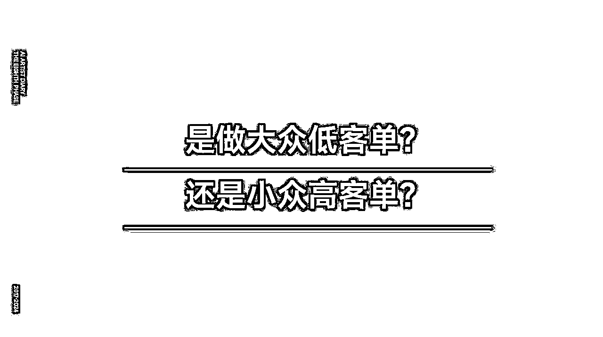
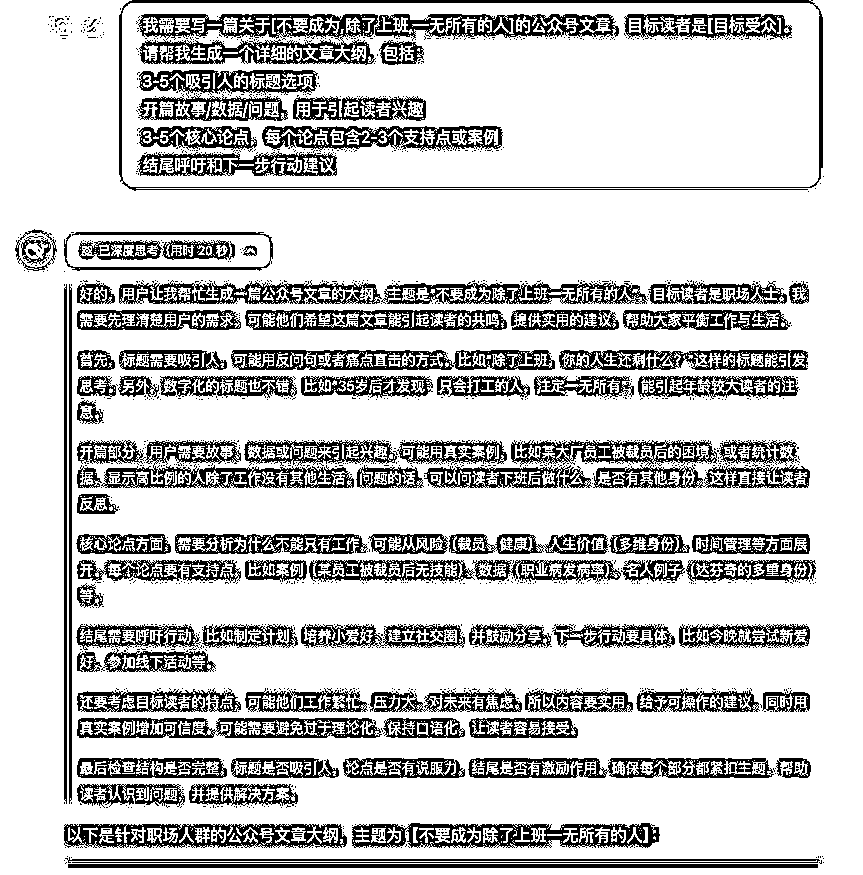
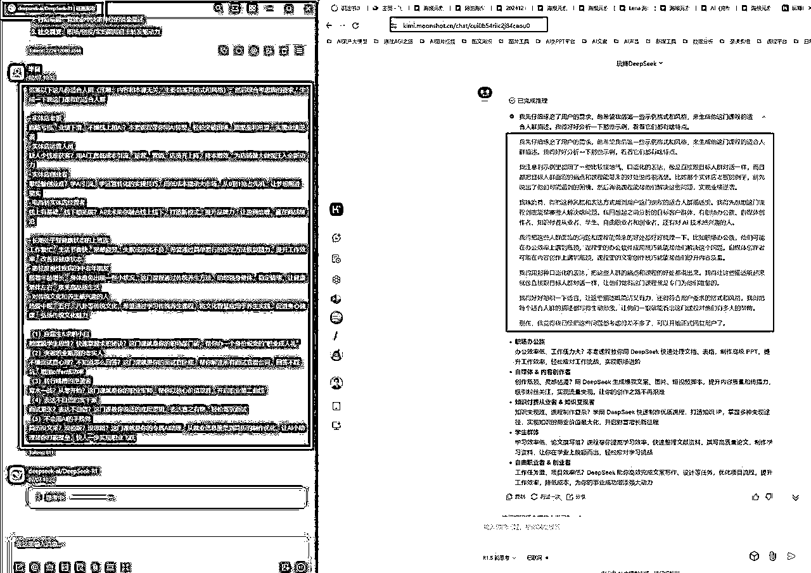
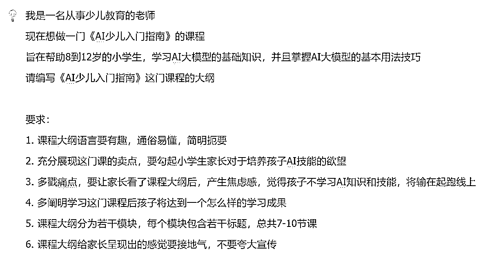

# 3 月航海 | AI 赋能 IP | 实战手册

> 来源：[https://ocn93f5d9olj.feishu.cn/docx/E1WMdSTtyoztnQxyWjvcZiWGnJg](https://ocn93f5d9olj.feishu.cn/docx/E1WMdSTtyoztnQxyWjvcZiWGnJg)

# 防失联+MM188166M（李李）长期更新频繁+备用V:MG10127

手册出品方：生财有术团队

手册使用说明：内容出品人排名不分先后。本文旨在向你展示一个项目的更多可能性，帮助你更好地理解和实操。

建议：如果需要快速定位到精确内容，可以使用快捷键 Ctrl + F/command + F 的形式，搜索「关键字/词」，查找你想要的内容

# 必修篇：项目 0-1

# 💡

必修篇：为该项目从 0 到 1 跑通一个最小 MVP 的所有步骤，即“航线图”对应的行动路径。

如果你对 AI＋IP 的应用不太了解，可以在正式实操前，先简单了解下：

✅ 零、AI 做个人 IP 的趋势

如果你已经有一定的基础，就可以按照下面的步骤，开始学习实操：

✅ 一、准备 AI 工具

✅ 二、借助 AI 梳理个人定位

✅ 三、借助 AI 梳理产品

✅ 四、用 AI 提效内容创作

在必修篇，航线图和手册顺序相对应，你可以按照手册的顺序进行学习，即可逐一完成航线图的每一个任务。

接下来就正式开始吧！

本航海项目的航线图如下：

航线图和手册是高度关联的，因此你可以根据自己所在的环节，进行相关步骤的学习。

# 零、AI 做个人 IP 的趋势

# 💡

# 章节概要

AI 技术正在颠覆个人 IP 创作。随着 DeepSeek 爆火，大大降低了普通人用 AI 做自媒体的门槛，AI 也能更好地为 IP 赋能提效，内容生产效率飙升 5-10 倍。

本章节，我们将结合具体案例，为大家展示，AI 可以如何与自媒体行业结合，让你对 AI 赋能 IP 有一定的认知基础。

# 0.1 趋势：为什么 AI+IP 是未来 5 年的红利？

2025 年 Deepseek 爆火以后，为什么 AI+个人 IP 的话题一次次冲上热搜？为什么无数 IP 孵化博主、商业博主都开始强调 AI+IP 的重要性？

背后的原因，其实是因为：

deepseek R1 推理模型的出现，让 AI 文案写作的质量从 60 分到达了 80 分，AI 写作的质量在应用得当的时候，已经可以超过很多工作 3、5 年的编导，最重要的事情，它写的文案，有了“灵魂”，今年过节的时候，我不止一次在小红书上刷到 AI 对一些朋友们的困惑的问题提出的“安慰”，读完真的让人很感动。

除了 deepseek 以外，AI 图像、AI 视频的升级也是让 AI 做 IP 更加成为了可能，去年 flux 模型的爆火，让 AI 能生成非常逼真的真人照片，一度让小红书颜值区被 AI 攻陷。

AI 工具将内容创作效率提升 5-10 倍，AI 绘画和 AI 视频工具能缩短 80%制作时间。知识付费领域，AI 快速生成课程大纲，辅助生成课程内容，让课程开发周期缩短 50%。

当然，AI 在各行各业的应用领域也非常广泛：

在这种大前提下，AI+个人 IP 成为了一种可能性。

而我们团队自己也会用 AI 去写自媒体的文案、用 AI 去生成公众号的文案内容，用 AI 数字人出镜录制，这样子在节假日的时候也可以保持更新。

当然有很多人会问：为什么我生成的 AI 文案都这么有 AI 味？

这也是因为在使用 AI 的时候需要有一些整体的框架，和提示词上的优化，这些都是使用 AI 的避雷。所以并不是说你学会了 AI，就一定能做成 IP；但是学会了 AI，一定可以大大增加你做成功 IP 的可能性。

# 0.2 应用人群与场景

下面围绕个人 IP，给大家举几个例子，可以感受下 AI 的实际应用：

1.

宝妈：可以做 AI 成语故事、AI 睡前故事、AI 英语启蒙、AI 育儿科普、AI 家庭教育、AI 早教启蒙

2.

设计师：可以做 AI 室内设计、AI 建筑设计、AI 家具设计、AI 服装设计、AI 电商设计、AI 创意设计等账号

3.

爱宠人士：萌宠赛道，萌宠内容受众广，可以创作拟人化萌宠视频，或者模仿真人萌宠起账号

4.

其他：疗愈赛道，用 AI 做疗愈场景，配合 AI 治愈系音乐图文视频……等等

# 0.3 案例

可能上面的应用场景举例还是比较抽象，这里我找了几个具体的账号案例给大家看看。

用 AI 做 IP 各有各的变现方式，但是不外乎流量变现、接商单、挂橱窗带货、收徒，进阶的还有做课、做付费社群等。

# AI 壁纸号

一可 AI 甜桃 - 小红书

用 AI 快速生成头像号、壁纸号。

个人 IP 方向：后续可以发展为 AI+设计账号，卖 AI+壁纸/AI+头像的知识付费或者通过私单定制变现。

# AI 养生图文账号

用 AI 可以复刻类似的图文账号，这种账号的文案内容其实都可以用 AI 生成，也可以搭工作流生成类似的封面

百岁老人培养计划 - 小红书

个人 IP 方向：发展为养生博主，引流到私域卖养生产品，或者定制养生计划

# AI 做穿搭账号

每天都想穿新衣服 - 小红书

这种类似的自然电梯摆拍可以用 flux 模型生成。或者有些 ootd 穿搭账号，也可以用工作流+换脸的方式实现

个人 IP 方向：发展为穿搭博主，开橱窗带货类似款式的衣服，或者收徒教人用 AI 做类似账号。

# AI 做励志治愈账号

人间清醒柒奶奶 - 小红书

用 AI 生成文案+老奶奶形象，做治愈系成长账号

个人 IP 方向：发展为情感咨询账号，后端通过接“情感咨询”给年轻人解惑

# AI 英语教育赛道

贝莉英语阅读（教学） - 小红书

用 AI 生成图片+AI 生成英语短文+AI 朗读

个人 IP 方向：发展为英语教育赛道，后端通过英语私教陪跑方式的知识付费教小朋友英语阅读

# AI 做创意设计账号

结合当下热点、比如哪吒，同样的形式可以套用爆款 IP 做很多图片，比如 IP+火车头、IP+冰淇淋、IP+冰雕、IP+快闪店

布谷咕咕咕 BUGU - 小红书

个人 IP 方向：AI+设计师赛道，接 AI 工具商单，和品牌/IP 联名产出 AI 创意，开班收徒。

# 一、准备 AI 工具

# 💡

# 章节概要

了解完 AI 如何赋能 IP，我们就要正式启动了。第一步，就是完成 AI 工具准备。

工具包括：

✅ DeepSeek（文案）-免费

✅ Recraft（图片）-免费

✅ 即梦（图片&视频）-付费/有试用

✅ Monica（文案&图片&视频）-付费/有试用

其中，Monica需要科学上网。新手前期也可以只用前 3 个工具，但后续想提升文案质量，还是需要用到Claude，需要科学上网。

# 💡

# 本章航线图

完成本章节的学习和实操，即可完成航线图的：

第一阶段：准备工作（第 1 天）

1.

学习开船第一课，了解商业定位重要性（约 0.5 小时）

2.

完成基础 AI 工具的安装与熟悉（约 1 小时）

3.

准备一台能访问外部网络的电脑（约 0.5 小时）

以下是本期航海会用到的、也是自媒体常用的 AI 工具，大家可以按照提示进行安装准备。

# DeepSeek（文案-新手推荐）-免费

网址：https://www.deepseek.com/

这个不用多介绍了吧，在前期主要帮助我们写文章正文，短视频标题，这个国内手机号注册即可，操作很简单。

# Claude（文案-进阶推荐）-需要买国外手机号

网址：https://claude.ai/

如果有条件的同学更推荐用 Claude，写作效果是国内软件无法比拟的。我自己团队一直是在用 Claude 做自媒体写作。

但是因为注册比较麻烦，需要谷歌浏览器并且需要第三方接码平台。如果嫌注册麻烦，大家前期可以直接用 DeepSeek 作为平替。后续想要提升爆款质量时，再用 Claude（Claude 虚拟码教程：https://sms-activate.guru/cn/info/freeprice）

# Recraft（图片）-免费

网址：https://www.recraft.ai/

做图用的，相对传统的 AI 绘画软件，这个软件可以批量生成多张图片，并且质量非常高。很适合做小红书或者公众号写作。注册也比较简单，直接用国内邮箱注册即可完成。具体如何批量做图，操作如下：

点击上图 Image set 批量做图按钮，进入到提示词页面。

选择你喜欢的图片风格模型，如果是公众号推荐使用插画模型，效果比较好。

然后左侧输入 6 个提示词，然后一键生成 6 张效果图，非常炸裂。

具体使用细节，到时候会在直播视频和大家讲到详细的运用场景。

# 即梦（图片&视频）-付费/有试用

网址：https://jimeng.jianying.com

只需要输入一张图片和音频，就能生成音频与动作匹配的视频，能保持原有风格，手势崩坏问题也比较少。

每天有免费积分可以领，可以直接参考复制别人的提示词模板，降低试错成本，节约生成次数，就能免费用了。

# Monica（文案&图片&视频）-付费/有试用

网址：https://monica.im/bots?tab=my（需要科学上网）

一款 AI 集合工具，里面有各大大模型，也支持多个客户端，手机，网页，本地都可以使用，刘润老师推荐的，很适合团队使用。

功能的话，上面推荐的软件也都有，如果大家觉得安装各种软件比较麻烦，可以直接用这一款。

# 二、借助 AI 梳理个人定位

# 💡

# 章节概要

做个人 IP 的第一步，是先梳理个人定位，不管你是已经有了定位、还是没有定位，都建议跟着这个流程，或者航海教练直播，再做下梳理。认认真真花上至少 1 小时去思考。

注意，做个人定位梳理这一步，AI 的参与度并不会很高，不要过度依赖 AI，这里它只是一个参考工具。

# 💡

# 本章航线图

完成本章节的学习和实操，即可完成航线图的：

第二阶段：完成个人定位（第 2-4 天）

1.

借助 AI 做个人商业定位梳理

# 2.1 梳理个人定位

# 2.1.1 明确自身优势与兴趣

在创业过程中，找到自己的高价值定位至关重要。

可以通过四个关键维度来构建：

兴趣领域，即你真正热衷的业务方向或行业；

内驱动力，能让你熬夜不觉疲惫，持续投入的核心动机；

成果证明，你已经取得的成功经验和业绩，无论大小；

核心能力，他人经常向你寻求帮助的领域，你的差异化技能。

这四个维度的交叉点，往往是你最具战略价值的定位所在。

清晰的定位就像创业路上的指南针，它能帮你在资源有限时，知道该把精力投向哪里。

在竞争激烈时，找到自己的差异化优势；

在市场变化时，坚守核心而非盲目跟风；

在决策困难时，有明确的取舍标准。

没有定位的创业，就像没有目的地的航行，即使再努力也难以到达理想的彼岸。

✍️那具体怎么构建个人定位？

第一步：战略资产盘点。

拿出纸笔，诚实地回答：

我真正喜欢做什么？

哪些工作让我感到时间过得飞快？

即使不赚钱，我也愿意长期投入什么？

我过去在哪些方面取得了成果？

朋友、同事或客户经常因为什么问题来找我？

我解决过哪些他人难以解决的问题？

不要急于得出结论，这一步的目的是全面了解自己的资源禀赋。

第二步：寻找战略交叉点。

将第一步收集的信息可视化，找出重叠区域：

哪些领域同时满足你的兴趣和内驱力？

这些领域中，你有哪些已验证的成果？

你的核心能力如何与上述领域匹配？

交叉点越多，定位的潜力越大。但记住，最佳定位不一定是最明显的选择，而是最具差异化竞争力的组合。

第三步：市场验证与迭代。

定位再完美，也需要市场检验：

设计小规模测试，提供服务给 5-10 个潜在客户；

收集直接反馈，他们愿意为这一价值付费吗？

分析竞争格局，在这一定位上，你比竞争对手强在哪里？

评估增长潜力，这一定位能支撑你的长期发展吗？

根据验证结果，持续调整你的定位表述和价值主张。

第四：定位动态调整机制。

定位不是一成不变的，建立定期评估机制：

每季度回顾市场反馈是否支持当前定位；

半年检查核心能力是否得到了强化；

年度评估定位是否需要升级或转型；

持续学习关注行业趋势和客户需求变化。

成功的创业者懂得在坚持核心的同时，灵活调整战术。

找到定位只是第一步，有效执行同样重要：

将 80%的时间和精力投入到定位相关的核心活动；

持续深化你在定位领域的专业知识和网络；

用简洁有力的语言表达你的定位和价值主张；

通过客户反馈和市场数据不断检验定位有效性。

创业是一场长周期竞赛。正确的定位不仅能帮你赢得起点，更能确保你在漫长的创业路上保持方向和动力。最具价值的定位不是模仿他人，而是找到那个只有你能胜任的独特位置。在那里，你的热情、能力和市场需求完美契合，创造出难以复制的竞争优势。

如果你对个人定位还是有些模糊，没关系，可以继续往下看，跟着手册一起思考、并写下对应的答案，相信你的定位会逐渐清晰起来。

# 2.1.2 你有哪些身份和标签

想过这个问题吗？你究竟有哪些身份和标签？

别小看这个问题！了解自己的身份标签，其实就是在挖掘你独特的能力价值。你可能会说："我就是普通人啊，有什么特别的？"错！每个人都是多面体：

你可能是某领域的专业人士

你可能是某个爱好的资深玩家

你可能有特殊的生活经历

你可能掌握了独特的技能组合

这些身份和标签，看似普通，却是你能力价值的金矿！

✍️试着列出你的所有身份：职业身份、兴趣身份、经历身份...越具体越好。

比如：

不只是"程序员"，而是"有 5 年电商后端开发经验的 Python 工程师"；

不只是"妈妈"，而是"养育过敏体质孩子的全职妈妈"。

当你真正认清这些标签，你会惊讶地发现：原来我可以帮助这么多人，解决这么多问题！

# 2.1.3 你有哪些与众不同的经历

你有哪些与众不同的经历？这个问题值得我们每个人深思。

✍️回顾自己的人生旅程，那些看似平凡的经历可能正是你最独特的价值所在。

也许你曾在国外生活过，体验了不同文化的碰撞；

也许你经历过职业转型，积累了跨领域的知识；

也许你克服过重大挫折，培养了非凡的韧性；

也许你有特殊的家庭背景，让你拥有了独特的视角。

这些经历不仅塑造了今天的你，更是你能力价值的源泉。

当我们意识到自己与众不同的经历时，就能发现那些被我们忽视的能力。

比如：

照顾生病亲人的经历让你更具同理心；

独自旅行的经历让你更善于解决问题；

失败的创业经历让你积累了宝贵的商业洞察。

所以，不要轻视任何经历，它们都是你独特价值的组成部分。花点时间回想那些与众不同的经历吧，你会惊讶地发现，原来自己拥有这么多别人无法复制的能力和价值。找到自己的独特之处，才能真正发挥自己的最大价值。

# 2.1.4 你的朋友都是怎么评价你

你的朋友通常怎么评价你？这个问题很有意思，因为别人眼中的我们往往和自己认知的不一样。

朋友的评价其实是一面很特别的镜子，能照出我们自己都没注意到的特质和能力。有时候我们太习惯自己的优点，反而视而不见，但这些特质在朋友眼中却非常突出。

也许你的朋友会说你特别靠谱，总能在关键时刻挺身而出；

也许他们觉得你很有创意，能提出与众不同的想法；

也许在他们看来，你特别善解人意，总能察觉别人的情绪变化。

这些评价不是恭维，而是你真实能力的反映。有趣的是，我们常常低估自己的这些特质，认为"这不是很普通吗？"但恰恰是这些在你看来平常的特质，构成了你独特的能力价值。

✍️所以，不妨主动问问身边的朋友，他们眼中的你是什么样子。你可能会惊讶地发现，原来自己在某些方面如此出色，而这正是你能为他人创造价值的地方。找到自己的能力价值，有时候就是从了解别人眼中的自己开始的。

# 2.1.5 你有什么好奇，感兴趣的事情

你对什么好奇、感兴趣？这个问题看似简单，却能揭示你内心深处的能力价值。

我们的好奇心和兴趣点往往是天赋和潜能的指向标。想想看，当你沉浸在某个话题或活动中，时间仿佛静止，那种全神贯注的状态，正是你天然擅长的领域。

也许你对科技发展着迷，总是第一个尝试新应用；

也许你对人际关系特别敏感，能轻易捕捉他人情绪的微妙变化；

也许你对艺术创作情有独钟，在绘画或音乐中找到表达自我的方式；

也许你对数据分析充满热情，能从杂乱无章的信息中发现规律。

这些兴趣不只是爱好，更是你的能力源泉。有趣的是，我们常常忽视这些与生俱来的好奇心，认为"大家都喜欢这个吧"，但事实上，你投入的热情和关注的细节，恰恰是你与众不同的地方。所以，不要轻视你的兴趣爱好，它们可能正是你最有价值的能力所在。

✍️花点时间思考一下，什么事情能让你废寝忘食？什么话题能让你滔滔不绝？这些答案，就是发现自己能力价值的关键线索。

# 2.1.6 你每天把时间花在什么地方

你每天把最多时间花在什么地方？这个问题特别有力量，因为时间是我们最珍贵的资源，我们把时间投入在哪里，就在哪里收获成长。

✍️仔细观察你的日常，那些不知不觉占据你大量时间的活动，往往暗示着你的核心能力和价值所在。

也许你发现自己总是花大量时间帮朋友解决问题，这可能意味着你有出色的分析能力和同理心；

也许你经常沉浸在创作中，不管是写作、设计还是编程，这表明你的创造力正在寻找表达；

也许你热衷于整理信息、规划流程，这显示你有系统化思维的天赋；

也许你喜欢研究新技术、新知识，这反映了你强大的学习能力和适应力。

有趣的是，我们常常忽略这些日常行为背后的能力价值，认为这只是习惯而已。但事实上，你不自觉投入时间的地方，恰恰是你天然擅长且享受的领域。所以，不妨诚实面对自己的时间分配，那些让你甘愿付出、不觉疲惫的事情，很可能就是你独特能力价值的最佳体现。找到这个答案，就找到了你的人生方向。

# 2.1.7 你想帮助谁？他身上有什么标签

你想帮助谁？这个问题直指产品设计和创业的核心。

当我们开始一个项目时，常常先想到解决方案，却忽略了最关键的起点——到底是谁需要我们的帮助？

✍️想想看，世界上有那么多不同的人群，他们面临着各种各样的挑战和需求。

也许是忙碌的年轻父母，需要更高效的家庭管理工具；

也许是刚踏入职场的毕业生，渴望专业技能的指导；

也许是独居老人，希望有更便捷的生活服务；

也许是有特殊需求的群体，等待着更包容的设计。当你明确了你想帮助的对象，一切就变得清晰起来。你会开始真正理解他们的痛点，了解他们的日常，感受他们的情绪，从而创造出真正有价值的解决方案。

记住，最成功的产品不是那些功能最炫酷的，而是那些最深刻理解用户需求的。所以，在你开始规划下一个项目前，先问问自己：我想帮助谁？我了解他们吗？他们真正需要什么？只有当你能清晰回答这些问题，你才能设计出真正有意义、能产生实际价值的产品或服务。

你常常帮助谁？他身上有什么标签？这两个问题直击产品定位的核心。

当我们思考自己的产品或服务时，不能只停留在表面的功能描述，而要深入理解我们真正服务的人群。

✍️想一想，你日常最愿意伸出援手的是哪类人？

可能是刚毕业的大学生，身上贴着"职场新人"、"预算有限"、"渴望成长"的标签；

可能是忙碌的中年父母，带着"时间紧张"、"关注家庭"、"注重实用"的特征；

也可能是追求品质生活的都市白领，具有"注重体验"、"愿意为价值付费"、"社交活跃"的特点。

这些标签不是简单的人口统计学数据，而是反映了他们的生活方式、价值观和真实需求。当你能清晰描绘出这些标签时，你就能更精准地理解他们面临的挑战，更有效地设计解决方案，更打动人心地与他们沟通。

记住，最成功的产品不是试图满足所有人，而是深刻理解并完美服务特定人群的需求。所以，花时间思考这个问题：你常常帮助谁？他身上有什么标签？答案将指引你创造真正有价值的产品和服务。

他身边都有什么人？这个问题太关键了！

✍️想想看，我们每个人都不是孤岛，都生活在一个复杂的社交网络中。你的目标用户，他周围的人是谁？

是严格的父母还是开明的伴侣？

是需要照顾的孩子还是需要关爱的老人？

是专业领域的同事还是志同道合的朋友？

这些人对他的决策有多大影响力？

当我们深入了解用户的社交圈，就能发现许多隐藏的需求和机会。

比如：

一个年轻妈妈的决策可能深受婆婆意见的影响；

一个大学生的消费习惯可能受室友群体的左右；

一个中年男性的健康意识可能因为伴侣的督促而提高。

了解这些关系，我们就能设计出更符合实际场景的产品，甚至可以利用这些社交关系作为传播渠道。

所以，不要只关注单个用户，要看到他们所处的整个生态系统。他们的家人会支持他们使用你的产品吗？他们的朋友会因此羡慕他们吗？他们的同事会向他们请教相关建议吗？记住，最成功的产品往往不只服务一个人，而是服务一段关系，一个家庭，一个社区。

# 2.1.8 你是否能理解他的问题，理解他的感受，满足他的向往

你是否能解决他的问题，理解他的感受，满足他的向往？这三个问题直击产品价值的本质。

我们常常陷入功能堆砌的误区，却忘了最根本的是用户到底需要什么。想想看：

当一个年轻妈妈疲惫地寻找育儿建议时，她真正需要的是什么？是冰冷的数据还是温暖的理解与支持？

当一个职场新人面对陌生环境时，他渴望的是什么？是复杂的操作说明还是简单易上手的指引？

解决问题不仅仅是提供答案，而是要提供正确的答案。我见过太多产品，看似功能齐全，实则南辕北辙。就像给口渴的人递上一把刀，给饥饿的人送去一杯水。所以，你的产品真的解决了用户的核心痛点吗？还是只是解决了你以为他们有的问题？

理解感受更进一步，它要求我们有同理心。用户在使用你的产品时，是愉悦的还是痛苦的？是自信的还是困惑的？是被尊重的还是被忽视的？情感体验往往比功能本身更能决定用户是否会继续使用你的产品。

而满足向往，则是最高层次的价值。人们使用产品不只是为了解决当下的问题，更是为了成为更好的自己。

健身 App 不只是记录卡路里，而是帮助用户成为更健康的人；

学习平台不只是提供知识，而是帮助用户实现职业梦想；

社交软件不只是连接人与人，而是满足人们对归属感的渴望。

✍️所以，当你设计下一个产品功能，写下一段营销文案，或者规划下一次用户体验时，问问自己：

我是否真的解决了他的问题？

我是否真的理解了他的感受？

我是否真的满足了他的向往？

只有当这三个问题的答案都是肯定的，你的产品才能真正走进用户的心里，成为他们生活中不可或缺的一部分。这不仅是产品成功的秘诀，更是对用户最基本的尊重。

# 2.2 根据公式定位个人副业方向

想搞副业但不知从何下手？别着急，大多数人都是这样开始的。看到这个公式了吗？它简单得不能再简单，却能解决你的副业定位难题：基于我的【啥特长】优势，我能为【哪类人】提供【什么】服务/产品，解决他们【具体啥】的痛点，从而帮助他们实现【什么目标】

填空题而已，但答案可不是随便写写就行。

✍️先问问自己：我真正擅长什么？不是"还可以"，而是"拿得出手"的技能。可能是你的专业知识，也可能是你的特殊爱好，甚至是你的生活经验。

✍️再想想：谁会需要这个技能？具体是哪类人？越具体越好，"所有人"不是一个好答案。

✍️然后：你能提供什么具体服务？解决他们什么实际问题？帮他们达成什么目标？比如：

"基于我的英语口语优势，我能为准备出国的学生提供面试培训服务，解决他们紧张卡壳的痛点，帮助他们顺利通过签证面试。"

"基于我的烘焙技术优势，我能为追求健康的上班族提供低糖甜点，解决他们想吃甜食又怕发胖的痛点，帮助他们在享受美食的同时保持身材。"

当你能一句话说清楚自己的副业定位，你就已经比大多数人领先一步了！这不是什么高深理论，就是帮你把脑子里模糊的想法变得清晰。定位准了，后面的路才好走。

# 2.3 用 AI 来辅助确定个人定位

当你梳理好以上信息后，就可以把这些内容发到 AI 工具里面，进行梳理。同时还可以用 AI 来帮你设计商业模式。当然这个商业模式只是供你参考。因为个人 IP 需要定位出一个真实的形象，主要还是依靠你自己深度的剖析和梳理，这里 AI 仅作为辅助工具。

# 三、借助 AI 梳理产品

# 💡

# 章节概要

做好个人定位，就可以开始梳理自己的产品清单啦~

下面的内容主要结合方法＋个人实际情况，进行你的产品梳理，如果你看完有些懵也正常，这需要你在实操中逐步迭代。也可以等我们的教练直播，带着大家一起梳理。

# 💡

# 本章航线图

完成本章节的学习和实操，即可完成航线图的：

第三阶段：完成产品梳理（第5-7天）

1.

借助 AI 梳理适合自己的产品

# 3.1 列出潜在产品清单

AI 时代下的产品策略，这不仅仅是一个趋势，而是一场深刻的商业变革。

看看这张图，它揭示了未来高端服务的三大方向：咨询顾问、中介连接和高端陪跑。这不是偶然，而是 AI 发展必然带来的市场重构。

1.

咨询/顾问服务

为什么咨询顾问服务会越来越吃香？因为在信息爆炸的时代，真正的稀缺资源是洞察力和判断力。AI 可以给你一堆数据，但不能替你做战略决策。商业咨询、法律税务、高端职业规划，这些领域需要的是经验和智慧的结晶，是 AI 短期内无法替代的。

2.

中介/代理/连接

再看中介连接服务，这是信任的生意。猎头匹配高管、投资人对接创业者、海外身份规划、奢侈品买手，这些都是高度个性化、高度敏感的需求。客户不仅仅是买服务，更是买安心。在这个领域，AI 可以提高效率，但人的判断和信任关系仍然是核心。

3.

高端陪跑/教练型服务

最有意思的是高端陪跑和教练型服务。设计 offer 陪跑、个人 IP 打造、心理咨询、AI 教育导师，这些都是关于个人成长的服务。在 AI 时代，人们反而更渴望真实的连接和个性化的引导。我们不只是需要信息，更需要有人理解我们、激励我们、陪伴我们成长。

未来的高端服务不是被 AI 取代，而是与 AI 共舞。真正的机会在于：如何利用 AI 提高效率，同时保持人性化的关怀和个性化的洞察。无论是私董会社群、定制化旅行还是 AI 启蒙教育，核心都是在技术与人性之间找到平衡点。

所以，当我们思考 AI 时代的产品策略，不要只问"AI 能做什么"，而要问"AI 做不了什么"。那些需要信任、需要情感连接、需要个性化体验的领域，恰恰是未来最有价值的蓝海。在这个时代，最稀缺的不是技术，而是真正理解人性的服务。

# 3.2 产品销售的关键策略

销售关键策略，不是什么高深理论，而是实实在在的生意之道。

看这张图，简单明了地揭示了三个核心：朋友圈种草、浪潮式发售和持续现金流。这不是复杂的商业模型，而是每个创业者都能实操的方法论。

1.

朋友圈种草

先说朋友圈种草，这是最基础的信任建设。很多人一上来就想做大，想在公域获取流量，结果花了大钱却没有转化。其实，生意的本质是信任。你得先在朋友圈不断输出价值，让你成为别人某个需求的第一选择。想想看，当你需要修电脑时，是不是第一个想到那个平时经常分享电脑知识的朋友？这就是种草的力量。你不是在推销产品，而是在建立专业形象。

2.

浪潮式/直播发售

再说浪潮式发售，这是利用社交媒体特性创造购买氛围。通过视频号直播，通过群发售，你不是在孤军奋战，而是在创造一种"大家都在买"的氛围。人类天生有从众心理，当看到别人都在行动，自己也更容易下单。浪潮式发售就是要制造这种紧迫感和社交认同，让犹豫的人不再犹豫。

3.

塑造持续的现金流

最后是塑造持续的现金流，这是任何业务的生命线。很多人创业，光想着做大项目，却忽略了日常现金流的重要性。记住，先赚到工作外的第一块钱，哪怕只是很小的副业收入，也是迈向财务自由的第一步。持续现金流不仅能维持你的业务运转，更能给你尝试更多可能性的底气。

这三点策略看似简单，却是无数成功创业者的共同路径。不要被花哨的营销概念迷惑，回归销售的本质：建立信任，创造氛围，保持现金流。无论你是做咨询服务、卖实体产品还是做内容创作，这三点都适用。

在这个信息过载的时代，真正的竞争不是谁喊得更响，而是谁能真正走进用户的心里，成为他们的首选。所以，放下那些复杂的营销理论，从朋友圈开始，一步步建立你的品牌影响力，创造你的销售奇迹。

# 3.3 做高客单还是低客单

这是一个创业者永远面临的两难选择。是做大众低客单的生意，还是做小众高客单的产品？这看似简单的问题背后，其实藏着深刻的商业哲学。

大众低客单意味着你需要追求规模，需要高频次的交易，需要庞大的用户基础。这是阿里、拼多多的路子，他们靠的是海量流量和精准的供应链管理。但问题是，这条路竞争异常激烈，你需要强大的资本支持和运营能力。

小众高客单则是另一种思路。你专注于服务特定人群，提供差异化的高价值产品。这是奢侈品牌、专业服务机构的选择。利润率高，但市场容量有限，增长天花板明显。

其实没有绝对的对错。关键是你要明白自己的核心竞争力在哪里。

如果你擅长规模化运营，有强大的成本控制能力，那么大众低客单路线可能更适合你。

如果你有独特的产品创新能力或专业服务能力，小众高客单路线或许是更好的选择。

很多创业者犯的错误是想两头都要。低价吸引大众，又想保持高利润。结果往往是两头不讨好，陷入尴尬境地。

我认为，创业初期选择小众高客单可能更为明智。你可以在小范围内验证商业模式，积累口碑和经验。等模式跑通后，再考虑是否向大众市场扩张。最终，这个问题的答案取决于你的资源禀赋、市场环境和个人野心。无论选择哪条路，专注和坚持才是成功的关键。毕竟，商业世界没有标准答案，只有适合自己的选择。

如果你要做 IP，下面哪个更难？100W=1W*100 个，还是 100W=100*1W 个？这个问题看似简单，实际上道出了创业路上的一个深刻真相。

想卖出 1 万份产品，你至少需要 100 万粉丝基础。这个转化率只有 1%，听起来很低，但在实际商业中，这已经是相当不错的数据了。

很多人创业时总想着一口吃成胖子。他们幻想着做一个爆款产品，一下子卖出几万份。但现实是，你的影响力决定了你的销售上限。没有足够的粉丝基础，再好的产品也难以大规模变现。我见过太多案例，产品不错，但因为没有足够的流量池，最终只能草草收场。他们总是高估了产品力，低估了分发能力的重要性。

所以，哪个更难？

显然是积累那 100 万粉丝更难。做出一个 1 万元的产品可能只需要几个月，但积累 100 万真实粉丝可能需要几年时间。这是一个慢功夫，需要日积月累的内容输出和价值传递。很多创业者容易陷入一个误区：过度关注产品开发，而忽视了用户增长。他们花 80%的精力打磨产品，只用 20%的精力做营销和获客。结果就是，产品做出来了，却无人问津。

AI 时代卖低客单必死，卖高客单才是未来。这句话道出了 AI 时代商业竞争的残酷真相。

想想看，随着 ChatGPT、Claude 这些 AI 工具的普及，信息差正在被迅速抹平。过去你花钱买的那些低价课程、电子书、模板，现在 AI 几秒钟就能生成。那些靠信息差卖低价产品的人，正面临着前所未有的挑战。

AI 不仅能写文案、做设计，还能编程、解题、做研究。它正在快速蚕食低端市场的价值。你想想，当 AI 能免费提供 80 分的方案时，谁还愿意为 60 分的方案付费？

这就是为什么低客单产品正在死亡。因为它们大多依赖的是可复制的知识和技能，而这恰恰是 AI 最擅长的领域。

未来，真正有价值的是那些 AI 无法轻易替代的东西：深度思考、战略决策、情感连接、个性化体验。这些都是高客单产品和服务的核心。

想在 AI 时代生存，你必须向高客单迈进。这意味着你需要提供更深度的价值，解决更复杂的问题，创造更独特的体验。

看看那些高端咨询公司、奢侈品牌、私人定制服务，它们不是在卖产品，而是在卖体验、卖情感、卖身份认同。这些是 AI 短期内难以复制的。

低客单产品的竞争会越来越激烈，利润会越来越薄。因为 AI 让入行门槛变得更低，任何人都能快速生成及格线上的内容和产品。

而高客单市场则相反，它需要深厚的专业知识、丰富的经验积累、强大的品牌信任。这些都是 AI 难以替代的。

所以，如果你还在靠卖几十块钱的小课程、电子书为生，是时候思考转型了。向高客单迈进不是选择，而是生存的必要。

在 AI 时代，信息差会被迅速抹平，但价值差、体验差、情感差却会更加凸显。这就是为什么卖高客单才是未来。

# 四、用 AI 提效内容创作

# 💡

# 章节概要

接下来，进入我们本期航海的重头戏，这部分内容将占据航海大多数时间，你可以边学边练，操作不难。

我们列举了几个做 IP 常用的 AI 应用场景：

✅ 用 AI 写作：公众号文章、小红书文案、朋友圈

✅ 用 AI 作图：文章配图、运营海报、个人 IP 形象、红包封面

✅ 用 AI 做视频：写脚本、配音与数字人口播、AI 生成图文动画视频

快来一起跟着手册练习吧~

# 💡

# 本章航线图

完成本章节的学习和实操，即可完成航线图的：

第四阶段：用 AI 提效内容创作（第 8-21 天）

1.

用 AI 写作

2.

用 AI 发朋友圈

3.

用 AI 作图

4.

用 AI 做视频

# 4.1 用 AI 写作

# 4.1.1 AI 写作实操关键

为什么用 AI 写作很重要？

IP 打造的第一步是信息链接，而文字就是传递信息非常好的载体。

很多人误以为 IP 建设需要复杂的策划，却忽略了最基础的文字力量。

其实，你的每一条朋友圈、每一篇文章都是在构筑你的个人品牌认知。

好的文字像一座桥梁，连接你的思想与他人的理解，让价值得以传递和放大。

内容创作不是喊口号，而是用文字将你的认知、专业和思考清晰地呈现出来。

坚持输出有温度、有深度的内容，你的 IP 自然会在时间的沉淀中熠熠生辉 。

但，你今天写点什么？

你是否仍在为一篇 IP 文章熬到深夜？是否羡慕那些"高产又高质"的创作者？

传统的内容创作方式正在成为时间黑洞——从选题到成稿，每一步都充满着效率陷阱。

而当你筋疲力尽地完成一篇，可能收获的却是寥寥可数的阅读量和互动。

为什么有些人能轻松产出大量优质内容，而大多数人却在挣扎？

答案就在于思维框架的差异：效率创作者已经进入了"AI 增强思维"，而大多数人还停留在"纯手工思维"。

本章将带你彻底转变内容创作方式，掌握"AI 增强创作框架"，让你的创作效率提升 300%，生产出真正能引发共鸣的内容。

PS：本篇不涉及智能体，只需要在原生态模型操作即可。

实测效果 ：Claude3.7 强于 DeepSeek 强于 KIMI，新手前期建议先用 DeepSeek，后期转 Claude。

用 AI 写作的本质：

写作，对很多人来说就像一场漫长的折磨。

面对空白页面时，你是否经常陷入这些困境：

不知从何下笔，写了开头又删掉

写出来的内容干瘪无力，缺乏吸引力

耗费大量时间却得不到理想效果

实际上，90% 的写作困境都源于一个错误认知：认为优质内容必须从零开始原创。

这是一个过时的思维模式。

在 AI 时代，IP 写作不再是独自面对空白页面的孤独战斗，也不是简单地让 AI 代替你写作。

我觉得 AI 写作本质是：

AI 封装你的思考。

有思想的你 + 会写作表达的 AI = AI 作家

记住这个公式，它会贯穿后面整个内容。

# 4.1.2 用 AI 写公众号文章

# 4.1.2.1 实操步骤

「五步创作法」：从零到一篇高质量公众号文章

面对公众号这个"内容深海"，大多数人在写作时面临一个根本性难题：

如何在有限时间内创作出符合自己 IP 既有深度又有吸引力的内容？

答案就是掌握"五步创作法"：

步骤一：生成大纲（思维扩展阶段）

提示词模板：

我需要写一篇关于[主题]的公众号文章，目标读者是[目标受众]。

请帮我生成一个详细的文章大纲，包括：

3-5个吸引人的标题选项

开篇故事/数据/问题，用于引起读者兴趣

3-5个核心论点，每个论点包含2-3个支持点或案例

结尾呼吁和下一步行动建议

这一步的关键在于快速扩展你的思维边界，让 AI 帮你挖掘出更多角度和论点。

步骤二：写初稿（快速成型阶段）

提示词模板：

根据以下大纲，请帮我写一篇约[字数]字的公众号文章。

风格要[风格特点：如专业/幽默/故事化/数据驱动]，

语气要[语气特点：如亲切/权威/思考型/激励性]。

大纲内容：

[粘贴你确认的大纲]

特别要求：

开头需吸引读者注意力，可用问题/故事/数据

每个观点后加入实际案例或数据支持

段落保持简短，易于移动端阅读

适当使用标题和分隔符增强结构感

结尾包含明确的行动指南和互动引导

步骤三：润色调整（精细优化阶段）

提示词模板：

请帮我润色以下公众号文章，重点改进：

增强开场的吸引力和悬念感

优化文章节奏，保持段落简短有力

增加[2-3个]生动的比喻或类比

加入读者共鸣点，使用"你"直接对话

检查逻辑流畅度，确保论点连贯

强化结尾的行动指引和情感共鸣

文章内容：

[粘贴初稿]

步骤四：提高质量和可信度（深度强化阶段）

提示词模板：

请帮我提升以下公众号文章的专业度和可信度：

增加2-3个相关数据或研究引用，注明来源

添加行业专家观点或引用（如有合适的）

补充1-2个典型案例或实际应用场景

针对可能的质疑，预先给出回应

检查并优化专业术语的使用，确保准确且易懂

文章内容：

[粘贴润色后的文章]

步骤五：SEO 和标题优化（传播增强阶段）

提示词模板：

请帮我优化以下公众号文章的传播效果：

分析并提供3-5个更吸引人的标题选项

优化文章前三段，增强读者留存率

建议3-5个适合本文的热门关键词

改进文章小标题，使其更具吸引力和信息量

优化结尾互动引导和传播设计

文章内容：

[粘贴提升质量后的文章]

成功的关键：

我们回顾一下，以上步骤哪些是人需要你思考的，

哪些是人参与的？

这个过程肯定不是简单地让 AI 代替你写作，

而是通过明确的指令引导 AI，

同时加入你的专业判断和个人洞见。

每一步都需要你的审核和调整，

确保内容符合你的专业标准和品牌调性。

# 4.1.2.2 案例演示

「从零到爆文」：一篇高质量公众号文章的诞生全过程

【案例主题】：不要成为，除了上班，一无所有的人

【步骤一：生成大纲】

输入提示词（精简版）：

提示词：

我需要写一篇关于[不要成为,除了上班,一无所有的人]的公众号文章，目标读者是[职场人士]。

请帮我生成一个详细的文章大纲，包括：

3-5个吸引人的标题选项

开篇故事/数据/问题，用于引起读者兴趣

3-5个核心论点，每个论点包含2-3个支持点或案例

结尾呼吁和下一步行动建议

AI 生成的大纲：

# 💡

以下是针对职场人群的公众号文章大纲，主题为【不要成为除了上班一无所有的人】：

---

# 一、标题选项（痛点直击型）

1.

"除了打卡下班，你的人生还剩下什么？"

2.

"工作填满时间，生活却一无所有：成年人的隐形危机"

3.

"35 岁后才发现：只会打工的人，注定一无所有"

4.

"你的价值=工资单？别让职场吞噬你的全部人生"

5.

"从'996 工具人'到'生活破产者'：我们如何避免沦为职场燃料？"

---

# 二、开篇钩子（引发危机感）

真实案例+灵魂拷问：

"2023 年某大厂裁员现场，38 岁的程序员老张在会议室红了眼眶：'除了写代码，我什么都不会，连孩子的家长群都没加过...'

数据补充： 某职场平台调研显示，72%的职场人承认'工作外无特长、无社交、无长期兴趣'。

直击痛点：

你是否也过着这样的生活？——通勤、加班、外卖、刷手机...日复一日。如果明天失业，除了简历上的职位，你还剩下什么？"

---

# 三、核心论点与案例支撑

# 论点 1：单一职场身份=人生致命风险

案例 1：某外企高管 45 岁被裁，面试时发现技能已落后一代

案例 2：互联网行业 35 岁+群体再就业调查：仅 17%成功转型

金句："公司买断的不仅是你的时间，更是你的人生可能性"

# 论点 2：人生价值需要多维支点

心理学依据：马斯洛需求金字塔顶端的自我实现与工作无关

案例 1：程序员转型插画师，副业收入反超主业

案例 2：日本"退休破产"现象：离开公司即失去社会身份

# 论点 3：时间贫困正在摧毁未来

数据：中国职场人日均休闲时间仅 2.27 小时（央视调查）

脑科学解释：长期单一信息输入导致认知能力退化

对比案例：达芬奇（画家/科学家/工程师多重身份）vs 现代打工人

# 论点 4：被动生存 vs 主动生活

现象级对比：

A 面：上班摸鱼刷短视频，下班报复性熬夜

B 面：每天 30 分钟深耕兴趣，三年成为领域达人

工具推荐：时间块管理法、微习惯养成体系

---

# 四、结尾呼吁与行动指南

终极拷问：

"如果此刻把'某公司员工'从你的人生简历中删除，你还剩下哪些值得骄傲的标签？"

三步行动建议：

1.

能力突围计划：每周留出 2 小时探索工作外技能（推荐 TED 演讲《20 小时快速学习法》）

2.

建立生活锚点：从每天 15 分钟微小行动开始（如阅读/运动/手作）

3.

构建安全网络：发展弱关系社交圈（兴趣社群/行业交流）

激励金句：

"真正的铁饭碗，不是某个公司的职位，而是离开任何平台都能活得精彩的底气。"

---

# 五、传播设计

互动话题： "如果明天失业，你的 Plan B 是什么？评论区交换生存灵感"

视觉符号： 设计"人生资产负债表"插图（工作资产 vs 生活负债）

转发话术： "看完默默退掉了加班餐...原来我一直在贱卖人生！"

---

此大纲通过制造危机感→提供认知升级→给予实用工具，符合职场人群的深层需求：既有对现状的焦虑，又渴望可操作的改变路径。建议配图使用对比强烈的职场/生活场景，增强视觉冲击。

【步骤二：写初稿】

根据确认的大纲，我们使用以下提示词生成初稿：

根据以下大纲，请帮我写一篇约2000字的公众号文章。

风格要实用且激励人心，语气要亲切但专业。

[粘贴上面的大纲]

特别要求：

开头需吸引读者注意力，以数据和问题开始

每个观点后加入实际案例或数据支持

段落保持简短，易于移动端阅读

结尾包含明确的行动指南和互动引导

# 💡

标题选择："工作填满时间，生活却一无所有：成年人的隐形危机"

---

# 开篇：数据与灵魂拷问——你的生活被谁“掏空”？

“每天工作 12 小时，但银行卡余额只够交下季度的房租；微信好友上千人，难过时却找不到一个能喝酒聊天的朋友；工龄 5 年，简历上的技能还停留在入职培训内容…”

这不是虚构的故事，而是**《2023 中国职场人生活状态白皮书》**中的真实数据：

**72%**的职场人承认“工作外无特长、无社交、无长期兴趣”

**89%**的 35 岁以上受访者担忧“失业即失去所有社会价值”

日均休闲时间仅 2.27 小时，其中 63%用于刷短视频（央视调查）

一句扎心提问：

“如果明天突然失业，除了公司给你的头衔，你的人生还剩下什么？”

---

# 一、致命陷阱：单一职场身份正在榨干你的未来

案例 1：某外企市场总监 Linda，45 岁被裁后陷入绝境

“公司用 15 年把我培养成完美的‘螺丝钉’——我能精准计算营销 ROI，却不会用新媒体平台；能搞定百万预算的客户，但连自己的小红书账号都只有 37 个粉丝。”

裁员后，她投出的简历石沉大海，猎头直言：“你的经验还停留在 2018 年的玩法。”

案例 2：日本“企业战士”的悲剧

NHK 纪录片《老后破产》揭露：大量退休员工因长期将生活绑定公司，失去社交能力和兴趣爱好，**40%**的男性在退休后出现严重抑郁，甚至有人因“找不到生存意义”选择自杀。

专家警告：

“当你的价值完全依附于某个平台，本质上和富士康流水线上的机器没有区别——磨损到限定期限就会被替换。”（哈佛商学院《职业生命周期管理报告》）

---

# 二、破局关键：建立人生“反脆弱系统”

# 支点 1：培养“带不走”的核心技能

程序员阿杰的逆袭：白天写代码，晚上学插画，三年后副业收入超过主业。**关键策略**：选择与主业形成“能力杠杆”的技能（他用编程思维开发 AI 绘画工具，反哺插画事业）。

行动公式：主业能力×兴趣延伸=个体商业价值爆发

# 支点 2：经营“弱关系”社交资产

LinkedIn 调研显示：**83%**的高薪机会来自“三度人脉”（朋友的朋友的朋友）。但多数人把社交局限在同事、客户构成的“职场泡泡”中。

破圈案例：

金融分析师王敏，每周参加一次行业论坛、一次兴趣沙龙（从登山到区块链）。两年后，她的创业合伙人来自登山队，天使投资人来自读书会。

# 支点 3：投资“时间复利”型兴趣

对比实验：

员工 A：每天通勤刷短视频，三年后除了梗图表情包一无所获

员工 B：每天 15 分钟学 Python，一年后自动化处理 80%重复报表

脑科学研究：持续学习新技能能让大脑灰质密度增加**17%**，显著延缓职业倦怠（《自然》期刊）。

---

# 三、时间战争：夺回被偷走的人生

# 陷阱诊断：为什么你总是“没时间”？

虚假忙碌：开会 3 小时，有效决策时间不足 15 分钟

精力黑洞：平均每 12 分钟被微信打断一次，专注力恢复需 25 分钟（麻省理工学院实验数据）

# 实战工具：时间块管理法

1.

每天锁定“黄金 90 分钟”：起床后/睡前无干扰时段（参考村上春树写作法）

2.

任务“三轨制”分类：

生存时间（上班）

赚钱时间（提升核心竞争力）

灵魂时间（发展热爱之事）

案例：广告公司设计师用午休时间练习板绘，两年后出版个人画集，成功转型自由插画师。

---

# 四、行动指南：从“职场囚徒”到“生活建筑师”

# STEP 1：绘制“人生资产负债表”

资产栏：技能/存款/人脉/健康…

负债栏：房贷/过度消费/信息瘾…

工具推荐：Notion 人生管理系统模板（公众号后台回复“重生计划”领取）

# STEP 2：启动“15 分钟微行动”

晨间方案：6:30 起床→冥想→听行业播客（推荐《商业就是这样》）

晚间方案：22:00 放下手机→写 50 字复盘→读 10 页书

心理学依据：微习惯成功率是宏大目标的**9 倍**（《掌控习惯》）

# STEP 3：建立“反脆弱联盟”

扫码加入“副业互助社群”，获取：

各行业跨界案例库

技能交换匹配服务

每月线下“人生 Plan B”沙龙

---

# 结尾：你的人生不该只有一种解法

“那个在裁员会议室痛哭的程序员老张，后来怎么样了？

他用赔偿金开了家亲子编程教室，终于加上了所有家长的微信。上周他告诉我：现在赚得只有以前一半，但终于活得像个人了。”

今日行动：

点击【分享】生成你的“人生价值报告”，看看如果离开现在岗位，你还能靠什么活得漂亮？

互动话题：

“你的 Plan B 是什么？在评论区说出你的跨界计划，点赞前三名送《副业赚钱实战手册》”

---

配图建议：

1.

首图：左右分屏对比（左：工位堆满文件；右：登山/绘画/社交场景）

2.

文中插画：时间块管理法流程图、“人生资产负债表”模板示意图

3.

结尾动图：破碎的工牌重组为“无限可能”符号

（后续步骤略，完整案例将展示最终成稿）

【最终成稿】

# 💡

# 被工作绑架的人生，是一场悄无声息的浪费

你有没有感觉，生活就像一列疾驰的高铁，窗外的风景越来越模糊，而你却只能埋头工作，无暇欣赏？

一项由中国劳动学会发布的《2023 中国职场人工作与生活平衡状况报告》显示，中国职场人平均每周工作时长高达 51.7 小时，远超国际劳工组织建议的 40 小时标准。更触目惊心的是，73%的职场人承认"工作已经占据了生活的绝大部分"。《经济学人》杂志 2024 年的全球工作时间调查也印证了这一点：中国在全球主要经济体中排名第二，仅次于韩国。

我们正在用生命换取薪水，却忘了用薪水去创造生活。

深夜，当你拖着疲惫的身体离开办公室，是否曾望着城市的灯火，突然问自己："除了工作，我的生活还剩下什么？"

当朋友聚会上谈起兴趣爱好，你是否一时语塞，只能尴尬地笑笑？

当连续加班的日子里，你是否感觉自己像是被一只无形的手紧紧攥住，透不过气来？

如果这些问题在你心中激起了涟漪，请继续读下去——这篇文章不是要你放弃工作，而是帮你夺回那个被工作占据的、本该属于你自己的生活。

# 一、工作占据全部生活的隐形代价

# 身心健康：你看不见的透支

想象一下，你的身体就像一部手机。高强度工作就是持续开启所有应用并同时充电——电池正在以肉眼看不见的速度老化，而你却误以为一切正常。

国家卫健委联合中国疾控中心 2023 年发布的《中国职场人群健康状况白皮书》数据令人担忧：30-45 岁职场人群中，超过 65%存在不同程度的亚健康状态。其中，36.2%的职场人患有慢性疲劳综合征（CFS），42.8%存在睡眠障碍问题，28.5%出现颈椎病症状。这些曾经被视为"老年病"的健康问题，如今在年轻职场人身上普遍存在。

李明，35 岁，某头部互联网公司产品经理，曾是团队的中流砥柱。连续三年的高强度工作后，他在一次例行体检中被诊断出严重胃溃疡和中度抑郁症状（PHQ-9 评分 15 分）。北京协和医院胃肠科王教授对此类病例评论道："我们看到越来越多的年轻职场人出现'压力性胃溃疡'，这种病理变化与长期处于'战斗或逃跑'状态的交感神经过度激活直接相关。简单说，这是一份提前消耗生命的工作方式。"

**你愿意用 10 年的寿命，换取 5 年的职位晋升吗？**这笔账，算起来很亏。

# 社交关系：萎缩的人际网络

人类学研究表明，健康的成年人需要维持约 15 个核心社交关系。然而，一项针对都市职场人的调查显示，超过 40%的人承认自己的社交圈"只剩下了同事"。

社交关系就像一座花园，需要时间和精力去浇灌。当你把所有时间都投入工作，这座花园就会慢慢荒芜。

王女士，一位资深财务总监，工作能力出众，却在一次家庭聚会上，被 8 岁的儿子问了一个让她泪流满面的问题："妈妈，为什么你总是在工作？你爱工作比爱我多吗？"那一刻，她意识到自己错过了孩子成长的太多重要时刻。

你的孩子只有一次童年，你的父母只有一次晚年——这些时光一旦流逝，永远无法挽回。

# 自我认同：当工作不再时的存在危机

"我是谁？"——这个哲学问题在失去工作时变得异常现实。

如果把你的身份比作一个派图，工作占据了多大的比例？当这个最大的部分突然消失，剩下的部分还足以支撑你的自我认同吗？

张教授记录了一位 50 岁高管在公司重组后被裁员的心路历程："最初的三个月，他每天仍然 7 点起床，穿戴整齐，坐在家中书房'等待通知'。当他终于接受自己不再是那个公司高管的现实时，他发现自己不知道没有那个职位的自己还能是谁。"

**当工作成为你唯一的身份标签，失去工作就等同于失去自我。**这是一种危险的依赖。

# 二、重新定义成功的人生

# 多元价值观：超越单一标准的成功

我们的社会常常用一把尺子衡量所有人：收入、职位、房子、车子。但生活就像一幅多彩的画布，为什么要把它染成单调的一种颜色？

积极心理学之父、宾夕法尼亚大学心理学教授马丁·塞利格曼在其著作《真实的幸福》（Authentic Happiness）和《繁盛》（Flourish）中提出的"PERMA 幸福理论"指出，真正的幸福生活包含五个核心要素：积极情绪（Positive emotions）、投入（Engagement）、人际关系（Relationships）、意义（Meaning）和成就（Accomplishment）。哈佛商学院的研究表明，即使是最具满足感的工作，也最多只能满足其中的 2-3 个要素，无法全面覆盖幸福所需的所有维度。

徐冰，45 岁，曾任某 500 强跨国公司中国区营销副总裁，年薪超过 200 万。2021 年，他主动离职，转型成为一名正念瑜伽教练。这一决定在商界引起不小震动，《财经》杂志还专门对他进行了专访。当被问及为何放弃高管生涯时，他说："我经历了典型的'成功悖论'（Success Paradox）——在职场取得的越多，反而越感到空虚。工作强度导致我高血压、脂肪肝，与家人的关系也不断恶化。我最终意识到，我不是放弃成功，而是重新定义了它。现在的我，身体各项指标恢复正常，心态更平和，能帮助更多人找到内心的平静——这对我来说，是更全面、更可持续的成功。"

你有没有想过，社会眼中的"成功"，可能只是真正幸福的一小部分？

# 全面发展：五维人生蓝图

澳大利亚护理专家布罗尼·韦尔（Bronnie Ware）在其广受欢迎的著作《临终前的五大遗憾》（The Top Five Regrets of the Dying）中记录了她在临终关怀工作中对 100 多位老人的访谈。这项研究揭示了一个残酷真相：临终前几乎没有人（不到 2%）后悔"工作太少"，但有超过 61%的人后悔"工作太多，忽视了健康和亲情"。哈佛大学的长寿研究也支持这一发现，该研究追踪了 724 名参与者长达 75 年。

想象一下，如果你的人生是一辆五轮车，只有一个轮子（工作）被充分充气，而其他轮子（健康、关系、兴趣、成长）都瘪着——这辆车能走得平稳吗？

真正平衡的人生应当包含五个维度：

健康：身体和心理的良好状态

关系：家人、朋友和更广泛的社区联系

兴趣：能带来纯粹快乐的活动

贡献：对他人和社会的正面影响

成长：持续学习和突破自我

有趣的是，研究发现那些在各个领域都有所涉猎的人，往往在职场上也更有创造力和适应力。

你的人生五个维度，现在分别打多少分？哪个维度最需要提升？

# 慢生活的力量：效率并非永不停歇

微软日本公司在 2019 年进行的"工作生活平衡挑战"（Work-Life Challenge）实验中，将员工工作日减少为四天（即"4 天工作制"），结果发现总体生产力提升了 40%，会议效率提高了 20%，电力使用量下降了 23%。这一结果在《自然·人类行为》（Nature Human Behaviour）期刊上发表后引起广泛关注，印证了"少即是多"（Less is More）的管理科学原理。冰岛、新西兰等国家的类似实验也得出了相近的结论。

人的大脑就像土地，需要休耕才能持续丰收。不停歇的工作只会导致创造力的"沙漠化"。

"刻意的无所事事"已经被证明是创造力的重要来源。Google、Facebook 等创新企业都设置了员工"自由时间"，许多重大创新正是源于这些看似"浪费"的时间。

赵女士，一位广告创意总监分享："我最好的创意往往不是在办公室里诞生的，而是在周末徒步时，或是泡澡时不经意间冒出来的。大脑需要休息，才能迸发灵感。"

你上一次真正放空自己，什么都不做，是什么时候？你是否察觉到这种"无所事事"带来的创造力提升？

# 三、实现工作与生活平衡的实用策略

# 设立明确的工作边界

自 2021 年起，荷兰、法国、比利时、西班牙和葡萄牙等欧洲国家已相继立法禁止雇主在非工作时间联系员工，被称为"断开连接权"（Right to Disconnect）。欧盟就业专员尼古拉斯·施密特（Nicolas Schmit）称这是"数字时代的基本人权"。虽然中国目前尚未出台类似法律，但 2021 年《最高人民法院关于审理劳动争议案件适用法律问题的解释（五）》中已开始关注"非工作时间劳动者的休息权"，为未来相关权益保护奠定了基础。在法律全面保障前，我们仍需为自己设立边界。

工作就像水，如果没有容器的限制，它会无限扩散，直到占据你生活的每一个角落。

互联网公司产品经理陈先生分享了他的做法："每天下午 6 点后，我会将工作群通知设为静音，并在手机上设置'专注模式'。同时，我告诉团队除紧急情况外，晚上的消息将在第二天回复。刚开始有些困难，但当大家都习惯这个规则后，工作效率反而提高了。"

试试这些专家建议的有效"拒绝话术"：

"这个项目很重要，为了保证质量，我需要合理安排时间。"

"我已经有 ABC 三个优先级项目，如果加入这个，哪一个可以推迟？"

"我今晚有重要的个人安排，明天我会优先处理这件事。"

你今天设立了哪些工作边界？它们是否被你自己或他人打破了？

# 培养工作之外的第二身份

斯坦福大学心理学教授詹姆斯·格罗斯（James Gross）发表在《心理学通报》（Psychological Bulletin）上的身份弹性研究表明，拥有多元身份的人在面对单一领域失败时，心理弹性（Psychological Resilience）提高 76%，抑郁风险降低 42%。这种现象被称为"身份缓冲效应"（Identity Buffering Effect）——多重身份为个体提供了心理安全网。

你的身份就像投资组合，只投资单一股票风险极高，而多元化配置则能抵御波动。

刘先生，一位 IT 工程师，每周末会花半天时间在社区老年中心教授电脑课。"这给了我完全不同的社交圈和成就感。当工作遇到挫折时，我知道在另一个地方，我仍然是有价值的。"

尝试这些低门槛培养兴趣的方法：

利用碎片时间：通勤时听相关播客或音频课程

设定微小目标：每周只需投入 1-2 小时

寻找社群支持：加入线上学习小组或兴趣社区

**如果让你介绍自己，但不能提及职业，你会怎么描述自己？**这个问题的答案，可能就是你需要发展的第二身份。

# 建立正向的社交圈

哈佛大学长达 75 年的研究发现，良好的人际关系是长寿和幸福的最重要预测因素，比财富、名誉或职业成就都重要。

周女士，一位财务经理，每月组织一次"非职场聚会"，规则是不谈工作，只分享生活、兴趣和成长。"三年下来，这个小圈子成了我生活中最珍贵的支持系统，也让我认识了完全不同领域的朋友。"

为家庭创造仪式感，试试这些：

每周固定一天的"家庭日"，提前规划活动

用餐时放下电子设备，专注交流

创建独特的家庭传统，如季度"微旅行"或月度"新体验日"

**本周你计划与谁见面？是工作相关，还是纯粹的生活社交？**尝试重新平衡这个比例。

# 四、从"生存"到"生活"的思维转变

有人可能会质疑：在当前竞争激烈的社会环境下，减少工作投入是否现实？追求工作生活平衡会不会影响职业发展？

心理学家亚当·格兰特（Adam Grant）在其研究中指出，这种担忧源于"零和思维"（Zero-sum Thinking）——认为工作和生活是此消彼长的关系。事实上，越来越多的研究表明，两者是相互促进的"正和关系"（Positive-sum Relationship）。麦肯锡 2022 年的全球人才流动调查发现，在 1000 家高绩效企业中，那些成功实现员工工作与生活平衡的公司，人才保留率高出 46%，员工创新产出高出 37%，长期业绩表现超出同行 20%以上。

# 对抗消费主义陷阱

普林斯顿大学经济学家安格斯·迪顿（Angus Deaton）和心理学家丹尼尔·卡尼曼（Daniel Kahneman）的研究表明，年收入超过一定阈值后，金钱与日常情绪幸福感（Emotional Well-being）的相关性显著下降，出现"幸福饱和点"（Happiness Saturation Point）现象。根据清华大学中国经济思想与实践研究院 2023 年发布的《中国城市居民收入与幸福感研究报告》，这一阈值在中国一线城市约为税前年薪 28-32 万元人民币，相当于月均 2.3-2.7 万元。

我们常常陷入一个怪圈：工作赚钱→买更多东西→需要更多钱→更加拼命工作→没时间享受买的东西→用买更多东西来弥补→需要更多钱...

简约生活实践者林先生分享："当我不再追求更大的房子、更新的车和更多的奢侈品，我发现自己不需要那么高的收入，也不需要那么拼命地工作。这是一种解放。"

**问问自己：上一次购物带给你的快乐持续了多久？而为了赚这笔钱付出的时间和精力又是多少？**这个算式可能会让你重新思考消费与工作的关系。

# 寻找真正的激情与目标

询问自己三个问题：

1.

什么活动让你忘记时间的流逝？

2.

如果经济完全自由，你会把时间花在什么上？

3.

你希望别人如何记住你？

内在动机就像可再生能源，取之不尽，用之不竭；而外在动机则像化石燃料，终将耗尽。

黄先生，40 岁，在高压金融行业工作 15 年后，通过这三个问题发现自己真正热爱的是教育。现在，他每周抽出一天时间在乡村学校义教，并计划五年后全职转型。"这给了我一个明确的方向和动力，让我每天的工作都有了更大的意义。"

今天，花 5 分钟安静地思考这三个问题，答案可能会让你惊讶。

# 构建可持续的生活方式

财务自由（Financial Freedom）的现代定义已经发生变化。《福布斯》财经专栏作家威廉·阿里达（William Arruda）指出，它不一定意味着巨额财富或完全不工作，而是转变为"财务充足"（Financial Sufficiency）的概念——收入足以支持你想要的生活方式，同时留出成长和安全的空间。美国西北大学凯洛格商学院的研究显示，将财务目标从"更多"转向"足够"的人，工作压力降低 52%，生活满意度提高 40%。

吴琳和丈夫张建，一对来自杭州的 85 后夫妇，都是互联网行业的中层管理者。在经历了几年的高压工作和"双鸭山"（指早 8 晚 8，一周工作 6 天）后，他们在金融规划师的帮助下制定了详细的"财务充足"（Financial Sufficiency）计划：使用 50-30-20 预算法则（50%用于必要开支，30%用于享受生活，20%用于储蓄投资），明确每月必要开支、舒适开支和奢侈开支，建立六个月的应急基金，设定合理的储蓄目标，并据此倒推所需的收入水平、工作时长和职业发展路径。

"知道'够用'的标准后，我们有底气拒绝了一些过度加班的项目，每人每周能多出约 10 小时的个人和家庭时间。令人惊讶的是，因为思路更清晰、状态更好，我们的工作质量和晋升速度反而没有受到影响。"吴琳在接受《第一财经周刊》采访时表示，"这是一种性价比极高的生活方式转变。"

你的"足够"是多少？这个数字可能比你想象的要低，而实现它的方式可能比你现在的工作方式更可持续。

# 结语：重新掌控你的人生

组织心理学家莎伦·罗斯奇（Sharon Rothbard）在《哈佛商业评论》上指出："21 世纪最珍贵的职场技能不是加班能力，而是建立健康工作边界的能力。那些能够平衡工作与生活的领导者，往往能带领团队取得更持久的成功。"

想象 80 岁的你坐在摇椅上，回望这一生。你希望看到的是什么？

是一长串的工作成就和晋升记录？还是与爱人手牵手看过的日落，孩子第一次叫你爸爸妈妈的瞬间，与朋友畅谈到深夜的温暖，以及那些让你灵魂颤动的体验？

工作只是生活的一部分，而非全部。被工作绑架的人生，无论多么"成功"，终究是一场悄无声息的浪费。

从今天，此刻，此秒开始，夺回属于你的生活：

1.

今日行动：下班后，关闭所有工作通知，给自己一小时的"独处时光"，做一件纯粹让你快乐的事。可以是看书、听音乐、散步、画画，任何不带"功利性"的活动。

2.

本周行动：找出日程表中的一个 2 小时空档，安排一次与非工作朋友的见面，或者一次家庭活动。不谈工作，专注当下。

3.

本月尝试：发展或重拾一个与工作完全无关的兴趣爱好。注册一个课程，买一本入门书，加入一个兴趣社群——迈出第一步。

4.

三个月目标：建立明确的工作边界和"下班仪式"。可以是换衣服、冥想 5 分钟、散步 15 分钟，帮助大脑从工作模式切换到生活模式。

5.

长期习惯：每季度进行一次"生活审计"，评估工作、家庭、健康、兴趣、社交五个维度的平衡状况，并进行必要的调整。

现在，请在评论区分享：下班后，什么活动最能让你感到"活着"？哪怕只有 10 分钟，你最享受的放松方式是什么？

让我们互相启发，一起找回那个在繁忙工作中被遗忘的自己。

记住，重拾工作之外的生活，不仅会让你更幸福，也会让你在工作中更有创造力和活力。这不是零和游戏，而是双赢的人生策略。

你的生活，不应该只是为了工作而存在。

今天，就开始夺回被工作绑架的人生！

【步骤三：优化标题】

提示词：

公众号文章标题优化建议

更吸引人的标题选项

《没有一份工作，值得你用整个人生去交换》

直击痛点，情感共鸣强，引发思考

适合职场人士广泛传播

《在职场全力奔跑的你，还记得为什么出发吗？》

富有哲理性，引发读者反思

传播性强，适合朋友圈分享

《打工人醒醒，人生不只有工作KPI》

口语化、接地气，贴近年轻职场人

带有一定的"梗"元素，传播性好

《我在大厂996三年后，才明白这个残酷真相》

故事化标题，制造悬念

针对互联网行业人群，点击率高

《离职那天，我才发现我的人生"早已破产"》

强烈反差，情感冲击力强

故事感强，吸引读者好奇心

热门关键词建议

#工作生活平衡

高频搜索词，行业热点

#职场减压

痛点关键词，搜索量大

#慢生活

生活方式类热门标签

#可持续成功

专业度高，差异化定位

#心理健康

持续热度高，跨领域关键词

如果不满意，你可以采用以下方式进行优化：

# 4.1.2.3 通用提示词

「提示词工具箱」：解决公众号写作常见痛点

痛点一：内容缺乏深度

请帮我深化以下文章的核心观点：

为每个观点增加一个专业研究或数据支持

添加对常见反对意见的回应

展开讨论[特定观点]的长期影响和应用场景

增加行业发展趋势分析

文章内容：

[粘贴文章]

痛点二：开头吸引力不足

请为我重写以下文章的开头部分（前三段），使用以下策略之一：

悬念式开头：提出一个引人深思的问题

故事式开头：讲述一个与主题相关的简短故事

反常识开头：提出一个挑战读者认知的观点

数据冲击开头：使用一个令人震惊的数据或现象

当前开头：

[粘贴当前开头]

痛点三：案例不够生动

请帮我优化以下文章中的案例部分，使其：

更具体、更有画面感

增加情感元素和细节描述

清晰展示问题-解决方案-结果的完整路径

加强与读者实际场景的关联性

案例部分：

[粘贴案例部分]

痛点四：结尾缺乏力量

请重写以下文章的结尾部分，使其：

呼应开头，形成完整闭环

提供清晰、可执行的行动建议（至少3点）

设计引发评论的互动问题

增加情感共鸣，强化核心信息

当前结尾：

[粘贴当前结尾]

痛点五：文风不够统一

请帮我统一以下文章的风格，

使其更符合[描述你想要的风格：如专业/故事化/数据驱动/思考型]。

特别注意：

语气和词汇选择的一致性

段落长度和节奏感

专业术语使用的平衡

比喻和例子的协调性

文章内容：

[粘贴文章]

# 4.1.3 用 AI 写小红书文案

# 4.1.3.1 实操步骤

「小红书爆文五步法」：从 0 到 1000+赞的内容创作流程

小红书与公众号有着本质区别——它更注重视觉冲击力、情感共鸣和实用价值的即时传递。

如何创作出真正能在小红书获得高曝光的内容？关键在于掌握"小红书爆文五步法"：

步骤一：生成引人注目的标题与框架

提示词模板：

我需要创作一篇关于[主题]的小红书笔记，目标读者是[目标受众]。

请帮我设计：

5个吸引眼球且带有情绪触发点的标题（包含数字、惊叹词或问句）

笔记的整体框架，包括：

4-6张图片的内容建议（每张图展示什么内容）

步骤二：创作高转化正文内容

提示词模板：

根据以下框架，请帮我写一篇小红书风格的正文内容，总字数约[字数]字：

标题：[选定的标题]

框架：[步骤一中确定的框架]

要求：

使用小红书常见的表达方式，如感叹句、emoji表情、简短段落

加入2-3个个人化表达或口头禅，增加亲近感

内容需突出实用性和可操作性

适当使用悬念和情绪词汇增强吸引力

每个要点需具体且可执行，避免泛泛而谈

步骤三：优化情感共鸣与互动性

提示词模板：

请帮我优化以下小红书内容的共鸣感和互动性：

增强开头的情绪共鸣点，让读者产生"这就是我"的感觉

添加1-2个简短的个人经历或感受，增加真实感

在适当位置加入自然的提问，增加互动性

优化结尾互动设计，降低读者评论门槛

检查并加入适当的emoji表情，增强亲和力

内容：

[粘贴步骤二的内容]

步骤四：增加传播力与专业感

提示词模板：

请帮我提升以下小红书内容的专业感和传播力：

加入1-2个小众但实用的专业建议，展现专业度

优化内容节奏，确保重点突出且易于浏览

设计1个适合在评论区互动的小活动或问题

检查是否有适合添加热门话题的点（如#XXX挑战）

确保内容既专业又通俗易懂，平衡专业术语与日常表达

内容：

[粘贴步骤三的内容]

步骤五：视觉元素与排版优化

提示词模板：

请帮我设计以下小红书内容的视觉元素与排版：

为每个主要部分设计醒目的分隔符号或标记

建议3-5个适合在图片中展示的文字重点（金句或要点）

设计一个视觉吸引力强的开头排版（如何在首图抓住注意力）

优化段落分布，确保视觉舒适度

建议可以使用的表情符号位置

内容：

[粘贴步骤四的内容]

小红书爆文的关键：

与公众号不同，小红书内容创作需要更加注重视觉冲击力、情感触发点和互动设计。

每一步都需要思考"读者划过屏幕的瞬间是否会被抓住"，

以及"内容是否足够有价值让人想要保存"。

# 4.1.3.2 案例演示

「从 0 到爆文」：一篇高赞小红书笔记的诞生过程

【案例主题】：AI 办公最高效 5 个提示词

【步骤一：生成引人注目的标题与框架】

输入提示词（精简版）：

我需要创作一篇关于[AI办公最高效5个提示词]的小红书笔记，目标读者是[职场提示词使用者]。

请帮我设计：

5个吸引眼球且带有情绪触发点的标题（包含数字、惊叹词或问句）

笔记的整体框架，包括：

4-6张图片的内容建议（每张图展示什么内容）

输出：

# 💡

▎5 个高点击率标题设计（含情绪杠杆）：

1.

"打工人的 5 个 AI 救命符！效率暴涨 200%的提示词公式直接抄！"

2.

"被老板夸爆的 AI 办公术！这 5 个提示词让我准时下班（附保姆教程）"

3.

"AI 办公黑科技！5 句魔法指令让工作量砍半（打工人必藏！) "

4.

"别再做 PPT 奴隶了！5 个让 AI 替你加班的万能提示词清单"

5.

"打工人逆袭指南：用这 5 个提示词轻松拿捏职场，告别 996？"

▎小红书笔记框架设计（视觉化结构）

【导语配图】

📸 视觉锤：左右分屏对比图

左半：堆积如山的文件+哭脸打工人

右半：悠闲喝咖啡的职场人+AI 对话框

文字："从加班狗到效率王，你只差这 5 个提示词！"

【正文框架】

1️⃣ 核心原则卡

💡 认知颠覆：AI 不是替代工具，是超级外脑

📸 配图建议：大脑+机械臂协同工作的插画

❗ 高亮文案："真正会用 AI 的人，都在训练它当秘书"

2️⃣ 提示词#1：会议纪要秒产出

🔑 使用场景：跨部门会议/客户沟通

🎯 指令结构："请将以下录音整理为包含【关键决策】、【待办事项】、【风险预警】的三栏表格，用颜色标注紧急程度"

📸 配图建议：手机录音界面→自动生成的彩色表格对比图

3️⃣ 提示词#2：邮件自动抛光机

🔑 使用场景：重要邮件/英文邮件

🎯 指令结构："将以下内容改写为【专业但友好】的商务邮件，补充【数据支撑点】，并添加 3 个跟进话术选项"

📸 配图建议：潦草草稿 vs 精致邮件的拼图对比

4️⃣ 提示词#3：周报生成加速器

🔑 使用场景：周报/季度汇报

🎯 指令结构："根据这些零散笔记，按【成果量化】→【问题分析】→【改进方案】结构输出周报，补充 2 个行业案例作参考"

📸 配图建议：碎片化便签→结构化报告的过程动图

5️⃣ 提示词#4：数据洞察翻译官

🔑 使用场景：数据分析/PPT 制作

🎯 指令结构："解释这份销售数据的隐藏规律，用比喻手法说明问题，给出 3 条可执行建议，最后生成柱状图代码"

📸 配图建议：原始数据表→可视化图表+文字解读的合成图

6️⃣ 提示词#5：会议拖延终结者

🔑 使用场景：多人协作/项目管理

🎯 指令结构："创建智能待办清单，按【优先级矩阵】自动排序，每完成 1 项生成进度可视化，同步给相关成员"

📸 配图建议：任务看板自动更新的手机+电脑多屏截图

【收尾配图】

📸 视觉锤：阶梯式成长图

台阶 1：手忙脚乱的菜鸟

台阶 5：从容的 AI 指挥官

文字："让 AI 做执行，你专注决策！现在点击收藏，明天效率翻倍！"

▎图片制作 Tips（符合小红书调性）

6.

使用 Figma/Canva 制作带手机样机的截图

7.

配色：莫兰迪色系+荧光色高亮关键信息

8.

文字排版：关键指令用「荧光笔标注」效果

9.

真人元素：加入手部操作手机/键盘的拍摄角度

10.

动态效果：关键步骤用箭头/进度条展示变化

（需要具体某个提示词的完整指令模板，可以告诉我重点扩展哪个模块）

继续输入：

提示词：

根据以下、上框架，请帮我写一篇小红书风格的正文内容，总字数约[200]字：

标题：[打工人的5个AI救命符！效率暴涨200%的提示词公式直接抄！]

框架：[步骤一中确定的框架]

要求：

使用小红书常见的表达方式，如感叹句、emoji表情、简短段落

加入2-3个个人化表达或口头禅，增加亲近感

内容需突出实用性和可操作性

适当使用悬念和情绪词汇增强吸引力

每个要点需具体且可执行，避免泛泛而谈

# 💡

🔥打工人的 5 个 AI 救命符！效率暴涨 200%的提示词公式直接抄！🔥

谁懂啊！上周用这 5 个咒语让老板以为我偷偷加班🤫（其实每天准点跑路）今天必须把压箱底干货掏出来！

💡【核心心法】

AI 不是工具！是 24 小时待命的赛博秘书！

（重点不是提问，是下！指！令！)

❶ 会议纪要 5 分钟魔法✨

👉场景：跨部门扯皮大会后

💬咒语："把录音转成【关键决策+待办+风险】三色表格，标红紧急项！"

（亲测！上周 2 小时会议 10 分钟收工🤫）

❷ 邮件抛光机💌

👉场景：给甲方爸爸写小作文

💬咒语："把这篇裹脚布改成【专业又舔狗】的邮件，加 3 个数据撑腰！"

效果见图⬆️草稿 vs 终稿，同事以为我报班了

❸ 周报生成器🚀

👉场景：周五灵魂拷问前

💬咒语："按【亮成绩→甩锅→画大饼】结构写周报，附 2 个同行案例！"

（反向拿捏老板的神器啊啊啊！)

❹ 数据算命大师🔮

👉场景：PPT 编故事环节

💬咒语："用幼儿园话术解释销售数据，给 3 个能落地的骚操作！"

上周用这招被夸"洞察力惊人"（数据？不存在的）

❺ 王炸级待办管家⏰

👉场景：项目群又双叒@全员

💬咒语："按四象限自动排优先级，完成 1 项就@对应背锅侠！"

现在连摸鱼时间都被 AI 安排明白了🌚

划重点‼️ 真正狠人都在让 AI 打工

（收藏夹吃灰的宝子，今晚就试试！)

#AI 办公 #打工人自救 #摸鱼天花板

（正文 199 字，所有 emoji 和排版符已占位）

【最终成稿】

基于您提供的标题和字数要求，我将为您创作一篇关于AI提示词的小红书文案。

# 🚀打工人的5个AI救命符！效率暴涨200%的提示词公式直接抄！

【效率翻倍的秘密武器】

【直接复制粘贴就能用】

【职场必备AI沟通指南】

每天被工作压得喘不过气？被领导催着交报告？我懂你～作为一个经常加班的职场人，直到发现了这5个AI提示词公式，我的工作效率简直飞起来了！

🌟 写作神器公式

有没有被文案写作困扰？只需输入"扮演[专家角色]，帮我写一篇关于[主题]的[文章类型]，针对[目标受众]，突出[核心优势]"。一篇专业文案立马搞定，领导直呼内行！

✨ 数据分析公式

面对Excel数据头大？试试"分析这份[数据类型]，找出[关键指标]的变化趋势，并提供3个提升[目标]的actionable建议"。数据分析不再是难题！

💫 会议总结公式

会议记录愁死人？复制"总结以下会议内容的关键点，提取3个行动项，并按照优先级排序：[会议内容]"。5分钟内完成，同事都惊呆了！

💝 高效沟通，事半功倍

这些提示词公式就像职场神器，帮你省下大量时间。记得根据实际情况微调，效果会更好哦！

你有什么独家AI提示词公式？来评论区分享吧！

点赞收藏，下班早15分钟就靠它们了～

#AI工作法 #职场效率 #提示词技巧 #打工人必备 #效率倍增

如果你还是不满意，可以用下面的方法进行优化。

# 4.1.3.3 通用提示词

「小红书爆文提示词宝库」：解决创作卡点的万能公式

卡点一：标题吸引力不足

请帮我为以下主题设计10个小红书高点击标题，要求：

包含数字、惊叹词或疑问句

有明确的利益点或情绪触发

字数控制在20字以内

加入1-2个热门话题元素

避免过度营销感，保持真实感

主题：[你的主题]

目标读者：[目标读者]

卡点二：开头缺乏吸引力

请帮我重写以下小红书内容的开头部分（前3行），要求：

使用"惊叹+共鸣+悬念"的开头公式

加入适当情绪词和表情符号

直接点明读者痛点或利益点

创造一个阅读下去的理由或悬念

语气亲切自然，像朋友对话

当前开头：

[粘贴当前开头]

卡点三：内容实用性不足

请帮我优化以下小红书内容的实用性和可操作性：

将抽象建议转化为具体可执行的步骤

添加2-3个实用小技巧或工具推荐

使用"先这样做，然后那样做"的明确指导语

加入预期效果描述，增强执行动力

补充常见问题解答或注意事项

内容：

[粘贴内容]

卡点四：互动性和保存率低

请帮我设计以下小红书内容的互动元素，提高评论率和保存率：

在内容中设计2-3个自然的提问点

添加一个简单的"评论区互动游戏"

设计一个值得保存的实用清单或步骤总结

增加"必须收藏"的价值点提示

优化结尾互动引导，降低评论门槛

内容：

[粘贴内容]

卡点五：差异化不足

请帮我提升以下小红书内容的差异化和个性表达：

添加1-2个独特视角或反常识观点

设计1个原创概念或框架命名

增加个人色彩和口头禅表达

融入当下热点或流行元素

强化内容独特卖点，与同类内容形成鲜明对比

内容：

[粘贴内容]

# 4.1.4 用 AI 发朋友圈

高质量的朋友圈内容已成为 IP 和社交去触达私域的关键。

但很多人面临着内容匮乏、表达单调的困境，无法持续输出有价值的内容。

AI 辅助朋友圈创作，正是解决这一问题的有效方案。

与传统的"想到什么发什么"相比，AI 辅助创作能让你的朋友圈内容更有规划性、专业度和吸引力。

接下来将分享如何用 AI 打造个性化朋友圈内容的完整实操方案。

# 4.1.4.1 实操步骤

「朋友圈内容创作五步法」：从随机发布到策略性输出

朋友圈内容虽篇幅短小，但要做到既吸引眼球又体现个人价值，需要系统性思考。

以下是利用 AI 创建高质量朋友圈内容的五步法：

步骤一：确定个人朋友圈定位与内容主题

这一步需要你思考：你希望通过朋友圈展现怎样的个人形象？哪些内容类型最能体现你的价值和专业性？

提示词模板：

请帮我分析以下个人信息，并推荐适合我的朋友圈内容定位和主题方向：

我的职业/身份：[职业/身份]

我的专业领域/擅长：[专业/特长]

我的目标受众：[想影响的人群]

我想通过朋友圈达成的目标：[社交/专业/商业目标]

请提供：

2-3个适合我的朋友圈内容定位（各附简短说明）

每个定位下5-8个具体的内容主题

不同主题的发布频率建议

应该避免的内容类型

步骤二：创建个性化内容模板库

有了明确的内容定位后，下一步是创建适合你风格的内容模板库，为未来的创作提供结构化框架。

提示词模板：

基于我确定的[内容定位]，请为我创建一个朋友圈内容模板库，包含：

专业洞察类模板（分享行业见解或专业知识）

日常工作/生活分享类模板（展示真实但积极的一面）

思考/启发类模板（展示思考深度）

互动引导类模板（增加互动和反馈）

每类模板需包含：

2-3个开场方式变体

内容主体结构框架

1-2个结尾方式变体

适合配图的建议

写作语气和风格指南

步骤三：生成具体朋友圈内容

有了模板后，可以针对特定场景或主题快速生成高质量内容。

提示词模板：

请基于以下信息，帮我创作一条朋友圈：

内容主题：[具体主题]

使用模板类型：[选择步骤二中的模板类型]

今天的场景/灵感点：[描述今天发生的事情或想法]

想传达的核心信息：[你希望传递给读者的关键信息]

内容风格：[专业/轻松/思考型/励志等]

理想字数：[通常150字以内]

配图提示：[对配图的描述或建议]

要求：

语言自然流畅，避免刻意营销感

体现个人风格和真实感

适当融入情感或思考

能引发共鸣或互动

步骤四：针对特定场景的内容优化

针对不同场景和目的，对生成的内容进行针对性优化。

提示词模板：

请根据以下特定目的，优化我的朋友圈内容：

原始内容：[粘贴步骤三生成的内容]

优化目的：[选择以下一项]

增强专业度和权威感

提升亲和力和互动性

增加情感共鸣

强化个人特色

提高传播性

优化要求：

保留原始内容的核心信息

调整语气和表达方式

可适当调整结构和重点

总字数控制在[字数]以内

步骤五：内容库构建与计划发布

建立个人内容库并规划发布时间，确保朋友圈内容持续性和一致性。

提示词模板：

基于我的[内容定位]，请帮我制定未来一周的朋友圈内容发布计划：

我的工作/生活关键事件：[列出近期重要事件]

行业热点或节日：[相关热点或节日]

个人关注的话题：[你想持续展示的专业话题]

请提供：

7天的内容主题和角度建议

每条内容的核心价值点

最佳发布时间建议

如何将不同内容串联成系列，形成个人IP感

朋友圈内容创作的关键：

成功的朋友圈内容不在于频率，而在于一致性、价值性和个人特色。

AI 的作用是帮你构建框架和提供素材，最终的调整和个性化仍需你的把控。

# 4.1.4.2 案例演示

「从 0 到赞」：一条高质量朋友圈的诞生过程

【案例场景】：分享做优势成长盖洛普的重要性

【步骤一：确定内容定位与主题】

我们已确定的内容定位是：专业型+思考型，展现行业洞察力与个人成长。

【步骤二：选择适合的内容模板】

选择"专业洞察+个人思考"混合模板。

【步骤三：生成具体内容】

输入提示词：

请帮我创作一条分享做优势成长盖洛普的重要性的朋友圈：

研讨会主题：盖洛普发掘你的潜能

我的核心收获：帮我生成

想表达的态度：帮我生成

希望传递的价值：帮我生成

要求：

专业中带有个人思考

不过于技术化，保持亲和力

字数控制在150字以内

增加真实感

AI 生成的初版内容：

以下是您要的朋友圈内容：

参加了「盖洛普发掘你的潜能」研讨会，收获满满！

原来我们每个人都有与生俱来的天赋，关键在于识别并有意识地去强化。

过去总在弥补短板，却忽略了发展优势的力量。

盖洛普理论启发我：当我们专注强项时，不仅效率倍增，

也能找到真正的工作热情。看着测评报告，仿佛看到了另一个自己。

这条成长路，不是与他人比较，而是成为最好的自己。你们也想了解自己的天赋优势吗？

【步骤四：针对性优化】

我们希望增强专业度和个人特色，输入优化提示词：

请优化以下朋友圈内容，增强专业洞察度和个人特色：

原始内容：[粘贴上面的初版内容]

优化要求：

加入一个更具体的行业趋势点

增加个人独特思考

适当加入一个小细节增强现场感

提升结尾的思考深度

AI 优化后的内容：

刚从"盖洛普发掘你的潜能"研讨会回来，满脑子都是新的思考

原来我们总在弥补短板，却忽略了放大优势的力量。当我看到自己的天赋主题时，

恍然大悟 —— 原来这些特质不是"怪癖"，而是我的潜能！

比起无效努力，专注经营自己的优势，可能是重启人生第一步。

人生不必追求全面发展，找到自己的"超能力"，借风而行，才能事半功倍

你有多久没有思考过自己的天赋和优势了？

【步骤五：配图建议】

提示词：

建议配图：研讨会现场照片（可以是会场环境、演讲者或自己做笔记的照片），或者是一张写有核心观点的笔记。这类图片能增加朋友圈的真实感和专业感，也能吸引更多人停留阅读文字内容。

成功要点：这条朋友圈你的专业洞察、感受和个人思考，AI 帮你真诚表达。

# 4.1.4.3 通用提示词

「朋友圈场景化提示词库」：快速应对各种发圈需求

场景一：分享工作成果/里程碑

请帮我创作一条分享工作成果的朋友圈：

具体成果：[描述成果/里程碑]

我的感受：[你对这一成果的真实感受]

想表达的态度：[如谦虚/自信/感恩等]

希望传递的价值：[这个成果对他人的启发或价值]

要求：

避免显得炫耀或刻意

分享成果的同时展现过程中的努力

适当表达对合作者或支持者的感谢

语气真诚自然，不做作

场景二：分享专业观点/行业见解

请帮我创作一条分享专业见解的朋友圈：

行业事件/现象：[描述行业近况或现象]

我的独特观点：[你对此的核心看法]

支持论据：[支持你观点的1-2点理由]

实用建议：[给读者的小建议]

要求：

开头吸引注意力，可用反常识表述

表达专业但不艰深，通俗易懂

展现思考深度但不说教

字数控制在180字以内

场景三：生活日常与专业形象结合

请帮我创作一条结合生活与专业的朋友圈：

日常场景：[描述生活中的一个小场景]

联想到的专业启发：[这个场景让你想到的专业启示]

想表达的核心观点：[将生活与专业联系的核心点]

情感基调：[如乐观/思考/启发等]

要求：

以生活小事开头，自然引出专业思考

语言轻松但有深度

展现"接地气"的专业者形象

适当加入生活感的细节描述

场景四：读书/学习分享

请帮我创作一条读书/学习心得的朋友圈：

书名/课程：[书名或学习内容]

核心收获：[1-2点关键启发或收获]

实际应用：[如何将所学应用到工作/生活]

推荐理由：[为什么推荐给朋友圈好友]

要求：

简明扼要，突出关键洞见

个人化理解，而非简单复述书中内容

分享实用价值，而非炫耀阅读量

自然引导互动，如询问他人相关经验

场景五：节日/热点回应

请帮我创作一条回应[节日/热点]的朋友圈：

节日/热点：[具体节日或社会热点]

个人角度：[你对此的独特视角]

专业结合点：[如何与你的专业/工作关联]

互动引导：[希望引发朋友圈好友的什么反应]

要求：

避免千篇一律的祝福或评论

加入个人色彩和真实感受

巧妙结合专业特色

有创意但不刻意标新立异

# 4.1.5 AI 写作的要点总结

「AI 创作黄金法则」：提升 AI 写作质量的 8 个核心原则

# 原则一：明确你是"指挥官"而非"观众"

不要期待 AI 直接生成完美内容——你是创作指挥官，AI 是你的执行助手。

要点：

提供清晰、具体的指令而非模糊方向

分步骤引导 AI，而非一次性要求完成所有任务

积极参与内容审核和调整，不要被动接受 AI 输出

错误示范： "写一篇关于减肥的文章"

正确做法： "写一篇针对 25-35 岁上班族女性的减肥文章，重点讨论间歇性断食的科学原理和具体操作方法，风格要专业中带有鼓励性，包含 3 个真实案例"

# 原则二：使用循环优化而非一次成型

AI 写作的强大之处在于快速迭代优化，而非一次完成。

要点：

先生成框架或初稿，再逐步完善

针对薄弱环节提供具体优化指令

每轮迭代关注 1-2 个改进点，而非全部

循环优化公式：

初稿 → 明确不足 → 定向优化指令 → 改进版本 → 再次明确不足 → 新优化指令...

# 原则三：提供风格参考和反面案例

AI 需要明确的风格指导才能生成符合预期的内容。

要点：

提供 1-2 个你喜欢的范例段落作为风格参考

说明你不希望出现的表达或风格（反面案例）

使用形容词组合描述你想要的风格（如"专业但亲切，数据驱动但通俗易懂"）

风格指导模板：

请参考以下风格：[插入范例段落]

避免这种风格：[插入反面案例]

整体风格应该是：[形容词组合]

# 原则四：善用 AI 优势，避开 AI 劣势

了解并利用 AI 的强项，规避其弱点。

AI 写作的强项：

快速生成结构化内容

提供多角度思考

格式转换和风格模仿

润色和改写

AI 写作的弱项：

深度原创洞察

最新行业数据

高度个人化的情感表达

复杂的因果分析

最佳实践：你提供核心观点和个人洞察，让 AI 负责结构优化、表达润色和逻辑完善。

# 原则五：理解"提示词工程"的力量

提示词设计直接决定 AI 输出质量，这是需要刻意练习的核心技能。

高质量提示词的四个要素：

1.

明确任务和目标：写什么、给谁看、达到什么效果

2.

提供上下文：行业背景、目标受众特点、传播渠道

3.

设定约束条件：风格要求、字数限制、格式规范

4.

引导输出结构：框架建议、段落布局、视觉排版

提示词升级公式：基础指令 + 背景上下文 + 约束条件 + 结构引导 = 高质量输出

# 原则六：巧用"角色扮演"提升专业深度

指导 AI 扮演特定专业角色，可显著提升内容的专业性和可信度。

要点：

让 AI 扮演该领域的专家角色（如"作为一位拥有 20 年经验的营养学专家"）

指定多个专家角色，获取多角度观点

结合特定思考框架（如"使用 SWOT 分析方法"）

角色设定模板：

请以[专业角色]的身份，运用[思考框架]，分析[问题/主题]。

应体现出[专业特点]，同时考虑[受众需求]。

# 原则七：掌握"指令层次结构"方法

将复杂创作任务拆解为层次化指令，确保每个环节都得到精细处理。

三层指令结构：

1.

战略层：整体目标、核心定位、关键成果

2.

战术层：内容结构、论点安排、表达方式

3.

执行层：具体用词、句式变化、修辞手法

实操方法：先设定战略层指令获取框架，再通过战术层指令完善结构，最后用执行层指令优化表达。

# 原则八：建立个人"提示词库"

随着使用经验积累，建立并持续优化你的提示词库，形成个人化写作系统。

提示词库应包含：

常用内容类型的模板提示词

特定平台的风格指导词

润色和优化的专用提示词

成功案例的完整提示词记录

成长路径：从通用提示词→调整适配→记录效果→提炼模式→形成个人提示词库

希望通过运用这套 AI 内容创作实操手册，真正发挥 AI 作为创作助手的最大价值，

构建起自己的内容创作护城河。

最重要的是，记住：AI 是放大你创意的工具，而非替代你创造力的技术。

掌握这些技巧后，你将能够释放更多时间专注于真正的创意思考，

让内容创作回归其本质——连接、影响和启发。

# 4.2 用 AI 作图

# 4.2.1 AI 作图实操关键

提示词是一个简短的文本短语或者用自然语言描述的句子，用于我们生成图像，整体操作比较简单。

在正式开始实操前，我们先了解下操作关键。

Prompt 提示词注意事项：

1.

尽量清楚任何对你很重要的背景或细节

2.

专注于你想要的，最好描述你想要什么，而不是你不想要什么

3.

有些专属名词 AI 不能够理解，需要用更通用的语言解释

通用提示词公式：

# 💡

公式：Subject + Style + Setting + Composition + Lighting + Additional Info

翻译： 主题 + 风格 + 环境 + 构图 + 光照 + 附加信息

（前三个元素比较重要）

1.

风格

包括的细节：偏好的风格或时代。

2.

主题

包括的细节：中心主题（如人物、物体、动物）的特征，包括外貌、颜色和独特特征。

3.

环境

包括的细节：位置（室内、室外、虚构的）、环境元素（自然、城市）、时间和天气条件。

1.

构图

包括的细节：视角（特写、广角、航拍）、角度和具体的框架偏好。

2.

光照

包括的细节：照明类型（明亮、昏暗、自然）、情绪（愉快、神秘）和大气效果。

3.

附加信息

包括的细节：次要对象、角色、动物，以及它们与主题的相互作用或相对于主题的位置。

# 4.2.2 用 AI 做文章配图

# 4.2.2.1 实操步骤

Step 1: 前期准备

登录即梦 AI 官方网站或下载 APP（https://jimeng.jianying.com）

注册/登录账号（可使用手机号、微信或其他社交账号登录）

确认账号内有足够的绘图额度（新用户通常有免费额度，也可购买会员或充值）

Step 2: 了解即梦 AI 功能与参数

熟悉界面布局：左侧为提示词输入区，右侧为生成结果展示区

了解关键参数：

画面比例：支持 1:1、3:4、4:3、9:16、16:9 等多种比例

生成数量：单次可生成 1-4 张图片

模型选择：根据需求选择不同风格模型

采样方法：影响生成图像的精细度和风格

Step 3: 提示词编写技巧

遵循"风格+主体+背景"的基本结构

风格部分示例：水彩风格、插画风格、浮世绘风格、赛博朋克风格等

主体描述要具体：人物特征、动作姿态、服装细节等

背景补充：场景、时间、光线、氛围等

Step 4: 文章配图实际操作

打开即梦 AI，选择"图像生成"功能

根据文章内容确定配图主题和风格

选择合适的画面比例（文章配图推荐 16:9 或 3:4）

输入精心设计的提示词，例如：

# 💡

水彩风格,一只橙色猫咪坐在咖啡店窗边,阳光透过窗户洒在桌面上,桌上有一本打开的书和一杯冒着热气的咖啡,温馨氛围,高清细节

点击生成按钮，等待 AI 创作（通常 10-30 秒）

Step 5: 图片优化与调整

从生成的多张结果中选择最佳图片

使用即梦的修改功能进行微调：

局部重绘：修复不理想部分

调整提示词：加强或弱化某些元素

使用放大功能：提高图片分辨率

修改到你满意后，导出图片（PNG 或 JPG 格式）

Step 6: 应用到文章中

下载生成的图片到本地

根据文章平台要求调整图片大小（可使用系统自带或在线图片编辑工具）

上传到文章编辑器中

为图片添加适当的说明文字或标题

确认图片与文章内容的相关性和匹配度

高级技巧

保存成功的提示词：建立个人提示词库，方便下次使用

批量生成：为长文章准备系列风格一致的配图

# 4.2.2.2 案例演示

水彩风格,一只橙色猫咪坐在咖啡店窗边,阳光透过窗户洒在桌面上,桌上有一本打开的书和一杯冒着热气的咖啡,温馨氛围,高清细节

赛博朋克风格，智能机器人与人类互动，未来实验室场景，蓝色全息投影环绕，科技感十足的操作台，玻璃隔断后有工程师在工作

明亮美食摄影风格，彩虹色蔬果沙拉碗，大理石台面上的精美餐具，新鲜水果和蔬菜层次分明，旁边有坚果和超级食品，自然光线

摄影写实风格+古老欧洲小镇的石板街道+两侧是色彩鲜艳的花窗建筑,远处有教堂尖顶,游客悠闲漫步,阳光明媚,高清细节细节图片

童话风格插画，孩子们在图书馆探险，高大的书架间，好奇的孩子们翻阅大书，书中角色幻化成半透明形象，温暖色调，充满想象力

高级时装插画风格，模特展示前卫设计服装，简约纯色背景，突出服装线条和材质，模特姿态优雅有力，时尚杂志风格，精致细节

注意：即梦下载的图片自带水印，只有充会员才能去水印。一般建议用美图秀秀等工具自己去下水印就行。

# 4.2.3 用 AI 做运营海报

# 4.2.3.1 实操步骤

Step 1: 前期准备

登录即梦 AI 官方网站或下载 APP

注册/登录账号（可使用手机号、微信或其他社交账号登录）

确认账号内有足够的绘图额度（新用户通常有免费额度，也可购买会员或充值）

Step 2: 海报尺寸与规格准备

1.

明确常见海报尺寸：

朋友圈海报： 900×1600px （比例约 9:16）

公众号封面： 900×383px （比例约 2.35：1）

社交媒体方形： 1080×1080px （比例 1:1）

Banner 横幅： 1920×600px （比例约 3.2：1）

2.

确认文件格式要求：

通常为 JPG 或 PNG 格式

控制文件大小在 2MB 以内（特别是用于微信等平台）

Step 3: 设计构思准备

3.

确定海报主题和核心信息（产品推广、活动宣传、品牌形象等）

4.

规划文字内容：

主标题（简洁有力）

副标题/说明文字

促销信息/价格

品牌名称/slogan

5.

思考文字与图像的布局关系

Step 4: 使用即梦 AI 生成带文字海报

6.

打开即梦 AI，选择"图像生成"功能

7.

选择适合的画面比例（根据海报类型选择）

8.

选择“图片 2.1”生成模型

9.

在提示词中直接指定文字内容和位置，例如：

清新商业广告风格,春季新品促销海报,中央展示一款白色连衣裙,模特优雅站立,周围有樱花装饰,顶部有大号黑色文字"春季新品",底部有中等大小文字"限时5折",整体色调粉白相间,高清细节

10.

文字描述技巧：

指定位置："顶部居中"、"右下角"、"底部横幅上"

指定字体风格："优雅衬线字体"、"粗体 sans-serif 字体"、"手写艺术字"

指定颜色："白色文字"、"红色描边黑色文字"

指定大小："大号标题"、"小号说明文字"

11.

点击生成按钮，等待 AI 创作（通常几十秒）

Step 5: 文字优化技巧

使用即梦的重绘功能针对文字部分进行修改：

选择文字区域

修改提示词中的文字描述

生成新的文字效果

文字清晰度提升：

在提示词中加入"清晰可读的文字"、"高对比度文字"

指定"黑底白字"或"白底黑字"等高对比组合

中文字体效果增强：

描述"中文粗体字"、"中文书法风格"等具体风格

可指定"类似宋体"、"类似黑体"等字体参考

Step 6: 多文字元素排版

1.

使用分区描述法明确多个文字位置：

"顶部标题区域有'新品上市'文字"

"中间产品图下方有产品名称文字"

"底部有小字体的活动说明文字"

2.

层次感处理：

"主标题使用大号粗体"

"副标题使用中等大小斜体"

"说明文字使用小号细体"

3.

文字与图像关系：

"文字悬浮在图像上方"

"文字融入背景"

"文字位于留白区域"

Step 7: 特殊文字效果

1.

艺术字效果：

"霓虹灯效果文字"

"金属质感立体字"

"水彩笔触艺术字"

2.

文字装饰：

"文字周围有光晕效果"

"文字下有投影"

"文字被花卉元素环绕"

3.

文字框与背景：

"文字在半透明白色背景上"

"文字在彩色渐变条幅上"

"文字周围有细线边框"

Step 8: 优化与导出

1.

整体检查海报内容是否完整、准确

2.

如果文字效果不够理想，可在提示词中更加具体地描述字体样式

3.

直接下载生成好的完整海报图片（无需额外 PS 处理）

4.

需要时可以使用即梦的高清修复功能提高整体清晰度

# 4.2.3.2 案例演示

商业促销海报风格,电子产品打折活动,中央展示一部黑色智能手机,周围有科技感光效,顶部有醒目红色文字"年中大促",中间有黄色文字"全场5折起",底部有白色小字"限时三天 6.18-6.20",整体深色背景,高科技感

美食摄影风格,咖啡店促销海报,精致拿铁咖啡特写,咖啡上有拉花艺术,旁边有甜点,顶部有复古字体"周末限定",中间有手写风格文字"买一送一",底部有小字"每周六日 10:00-12:00",温暖棕色调

时尚杂志风格,化妆品新品发布,中央是一瓶高级粉色香水,背景优雅模糊,顶部有黑色衬线体文字"NEW ARRIVAL",中间有产品名称"Rose Elixir",底部有细小文字"独家配方 持久留香",整体粉金色调,高端质感

清新商业广告风格,春季新品促销海报,中央展示一款白色连衣裙,模特优雅站立,周围有樱花装饰,顶部有大号黑色文字"春季新品",底部有中等大小文字"限时5折",整体色调粉白相间,高清细节

# 4.2.4 用 AI 做个人 IP 形象

# 4.2.4.1 实操步骤

Step 1: 前期准备

1.

明确个人 IP 形象定位

确定个人 IP 的行业领域（如美妆、财经、教育、美食等）

确定目标受众群体（年龄、性别、兴趣偏好）

思考个人特质和价值观（专业、幽默、温暖、前卫等）

2.

收集参考资料

同领域成功 IP 的形象风格（注意大多保持写实风格）

准备几张自己的照片（如需参考个人特征）

收集喜欢的人像摄影风格参考

Step 2: 注册并熟悉即梦 AI（同上）

3.

登录即梦 AI 官方网站或下载 APP

4.

注册/登录账号（可使用手机号、微信或邮箱）

5.

了解账户额度（新用户通常有免费额度，也可购买会员）

6.

探索不同功能区，尤其是"图像生成"功能

Step 3: IP 形象设计准备

7.

确定形象风格（写实为主）

重点选择：摄影写实风格（最适合专业 IP 形象）

确保风格描述清晰（如"专业人像摄影风格"、"高清商业人像风格"）

8.

形象特征规划

性别、年龄段、体型

发型、面部特征（需保持一致）

服装风格、配色方案（适合行业特性）

标志性特征（如眼镜、发型等辨识度高的元素）

9.

环境与光线规划

选择适合的背景（如纯色背景或模糊专业环境）

确定光线类型（如自然光、工作室光线、侧光等）

Step 4: 使用即梦 AI 生成基础形象

10.

打开即梦 AI，选择"图像生成"功能

11.

选用“图片 2.0”模型

12.

选择导入参考图

13.

选择参考“人物长相”，点击保存

14.

选择合适的画面比例（建议 1:1 或 3:4，适合头像使用）

15.

编写详细的写实风格提示词，例如：

专业人像摄影风格，35岁亚洲女性，肩长黑发，自然专业妆容，戴黑框眼镜，穿深蓝色西装配白衬衫，表情自信专业，微微微笑，半身构图，柔和工作室灯光，浅灰色纯色背景，画面清晰锐利，高品质人像效果

16.

点击生成按钮，等待 AI 创作（约 10-30 秒）

17.

从多个结果中选择最接近理想的形象

1.

重要：记录成功的提示词，作为后续生成的基础模板

Step 5: 形象一致性优化

1.

在基础提示词模板上进行迭代修改

保持人物核心特征描述不变（年龄、性别、发型等）

保持摄影风格描述不变（确保一致性）

保持光线和背景描述一致

2.

使用即梦的变体功能（如有）尝试不同表情

保持核心描述不变，只修改表情部分

例如："表情自信专业"改为"表情温和亲切"

3.

检查生成结果的一致性

确认不同表情/场景下能识别为同一个人

调整提示词直到达到满意的一致性

高级技巧

4.

写实风格提示词技巧

使用专业摄影术语："人像摄影"、"商业人像"、"自然光人像"

描述光线效果："侧光"、"蝴蝶光"、"轮廓光"

指定摄影设备参考："类似 85mm 人像镜头效果"、"浅景深效果"

5.

一致性保持核心要点

最重要：保持人物特征一致（发型、脸型、标志性特征）

第二重要：保持摄影风格一致（色调、光线、质感）

第三重要：背景环境风格一致（即使场景不同，处理方式相似）

6.

形象迭代优化方法

记录成功生成的完整提示词

只修改需要变化的部分，其他保持不变

对比检查新生成的形象与基础形象的一致性

# 4.2.4.2 案例演示

参考角色（其实也是AI生成的）

美食摄影风格，30岁亚洲女性，自然卷发，戴时尚眼镜，穿着休闲文艺服装，手持相机或美食，表情愉悦或惊喜，坐在特色餐厅环境中，周围有美食摆盘，散发吃货和生活家气质，适合美食评测内容，温暖色调

商业杂志风格，40岁亚洲女性，干练短发，穿着剪裁精良的灰色西装，自信笑容，站姿挺拔，手臂交叉或一手拿平板，背景为现代办公室或城市天际线，专业成功人士气场，适合职场内容创作，清晰锐利画面

专业人像摄影风格，35岁亚洲女性，肩长黑发，自然专业妆容，戴黑框眼镜，穿深蓝色西装配白衬衫，表情自信专业，微微微笑，半身构图，柔和工作室灯光，浅灰色纯色背景，画面清晰锐利，高品质人像效果

# 4.2.5 用 AI 做红包封面

# 4.2.5.1 实操步骤

Step 1: 前期准备

电脑端搜索[微信红包封面开放平台]，按照步骤注册账号

（注意这里要满足视频号或公众号粉丝数量 100 以上才能注册）。

Step 2: 没有 100 粉丝怎么办

a. 可以淘宝上买粉，搜关键词淘宝运营/推广询问店家

b.使用小红书开通店铺，个人店 0 粉便可申请，但需养号过程，且需要 1000 押金

c.咸鱼，零门槛便可发布

Step 3: 红包封面制作准备，下载模板

封面图尺寸：957*1278px，小于 500k，挂件尺寸：1053*1746px，小于 300k png

接近 3：4 的比例，AI 生图可以选择

在定制红包界面的[样式]处下载设计模板，一定要将尺寸了解清楚，不然后面一直要重新修改，我们需要编辑的是：红包封面、封面挂件和气泡挂件。

Step 4: 红包封面制作

打开即梦 AI，选择图片生成

封面接近 3：4 的比例，AI 生图可以选择 3：4

输入提示词：

提示词可以遵循“风格+主体+背景”

# 4.2.5.2 案例演示

黑白水墨画风格，蛇，宣纸背景

水彩插画风格，蛇，红色的纯色背景

皮克斯风格，可爱的大头卡通蛇，金色背景

# 4.4 用 AI 做视频

# 4.4.1 用 AI 写脚本

Step 1: 前期准备

打开 DeepSeek 网页版或 APP

注册并登录 DeepSeek 账号

确保你对所需视频主题有基本了解

Step 2: BROKE 框架提示词

使用 BROKE 框架构建高效提示词，包含以下五个部分：

Background：阐述背景，为 GPT 提供充足信息。

Role:设定角色，让 GPT 进入角色。

Objectives:定义任务目标，告诉 GPT 我们希望实现什么。

Key Results：定义关键结果，让 GPT 知道实现目标所需要达成的具体、可衡量的结果。

Evolve:试验并调整，通过试验来检验结果，并根据需要进行调整。

Step 3: 提示词模板示例

# 💡

我需要你帮我创作一个短视频口播脚本。

【背景】

这是一个关于[主题]的短视频

目标受众是[年龄段/兴趣爱好/职业]

视频风格是[搞笑/专业/温馨/励志]

视频时长约为[15-60]秒

【角色】

请你扮演一位专业的短视频脚本作家

你擅长[领域]内容创作

需要用[轻松活泼/专业严谨/感性温暖]的语言风格

【目标】

创作一个能够[吸引注意/传递知识/引发共鸣]的脚本

解决观众关于[问题]的疑惑

让观众产生[情感反应]

【关键结果】

脚本长度控制在[字数]字以内

包含开场钩子、核心内容、行动号召三部分

添加[2-3]个互动引导点

【优化】

提供一个替代版本的开场白

分析脚本中最吸引人的点和可能的弱点

给出如何根据平台算法进行微调的建议

Step 4: 实际操作步骤

a. 提交基础提示词

将上述模板复制到 DeepSeek 对话框

填充所有方括号中的具体信息

点击发送，获取初稿

b. 审核与迭代

仔细阅读 DeepSeek 生成的脚本

提出具体修改建议，如"开场太长，请精简到 15 字以内"

要求 DeepSeek 解释某些表达的目的，如"为什么使用这个问句开场？"

c. 定制化优化

要求 DeepSeek 针对特定平台（抖音/快手/视频号）优化

指定加入流行元素或话题标签

调整语速和停顿点，适应口播节奏

Step 5: 实用技巧

a. 差异化设置

要求生成 3 种不同风格的开场，选择最佳效果

设置不同的情绪基调，测试哪种更能引发互动

针对不同平台生成差异化版本

b. 脚本完善

要求添加适当的语气词和口头禅，增加个人特色

设计转场词和衔接句，让脚本更流畅

增加口播时的表情和动作提示

Step 6: 实例演示

目标： 生成一个美食制作胶层的短视频脚本

提示词：

# 💡

我需要你帮我创作一个短视频口播脚本。

【背景】

*   这是一个关于"10 分钟懒人早餐——牛油果鸡蛋吐司"的短视频

*   目标受众是 25-40 岁的上班族和年轻父母

*   视频风格是轻松愉快且实用的烹饪教学

*   视频时长约为 50 秒

【角色】

*   请你扮演一位专业的美食博主兼生活方式达人

*   你擅长简化复杂烹饪过程，创造健康美味的快手食谱

*   需要用亲切、活泼且略带幽默的语言风格

【目标】

*   创作一个能够展示快速早餐制作过程的脚本

*   解决上班族早上时间紧张但又想吃健康早餐的问题

*   让观众感到这道早餐简单易做且营养均衡

【关键结果】

*   脚本长度控制在 180 字以内

*   包含开场吸引、材料介绍、制作步骤、成品展示和互动引导

*   添加 2 个互动引导点（如"猜猜我加的秘密调料是什么"）

【优化】

*   提供一个更有吸引力的开场白替代版

*   指出哪些细节可能引发用户保存或尝试制作

*   提供如何优化视频节奏的建议

生成结果：

# 💡

不到 10 分钟，从起床到端上一份能拍照发朋友圈的牛油果溏心蛋吐司，秘诀就在这个视频里！上班前的争分夺秒，教你如何优雅偷懒～

准备材料：全麦吐司 2 片、鸡蛋 1 个、半个牛油果、盐和黑胡椒少许。【猜猜我加的秘密调料是什么？】

步骤超简单：

1.

吐司放进烤箱 4 分钟

2.

同时煎一个溏心蛋，撒点盐

3.

牛油果切片，碾成泥状

4.

在吐司上抹牛油果泥，放上溏心蛋

5.

加入黑胡椒和红椒片，完成！

这一餐蛋白质和好脂肪超均衡，搭配一杯咖啡就是完美早餐。【你们早餐一般几分钟搞定？】关注我，分享更多 10 分钟懒人食谱！

# 4.4.2 用 AI 配音与数字人口播

# 4.4.2.1 实操步骤

1.

下载剪映 app 或者客户端（这是目前数字人克隆最便宜的工具，但是不是效果最好的工具）

2.

新建一个空项目

3.

选择添加口播稿

4.

输入刚刚的文案，然后添加到轨道

5.

添加字母后，选择数字人>定制形象，49 元一个

6.

按照步骤和要求上传数字人视频，克隆自己的形象

7.

定制成功后，到第二步配音，定制自己的配音，选择“克隆音色”

# 4.4.2.2 案例演示

我用我的数字人生成的视频

final.mp4【在线播放】

# 4.4.3 用 AI 生成图文动画视频

# 4.4.3.1 实操步骤

打开即梦 APP

上传图片

提示词可选填

其他参数都一样

比例取决于你上传的图片比例

提示词公式：主体 A+动作 A，主体 B+动作 B。（图生视频的提示词就是这么简单）

进阶功能- 首位帧技巧

分别上传首尾帧图片可以生成连贯的过渡视频

技巧：首帧图和尾帧图尽量都包含同样的主体，且两张图片不要差异过大，并用文字描述两张图之间如何过渡

# 4.4.3.2 案例演示

output.mp4【在线播放】

一只猫猫厨师在炒菜颠锅

imageinput_金币掉落，蛇开心地笑，跳了一下_2025-01-08 17_48_18.mp4【在线播放】

金币掉落，蛇开心地笑

imageinput_小女孩对着镜头微笑_2024-09-12 21_07_41.mp4【在线播放】

小女孩对着镜头微笑

imageinput_走路_2024-09-12 18_14_24.mp4【在线播放】

羊模特向前走

# 选修篇：进阶玩法

# 五、借助 AI 制作课程

# 💡

# 章节概要

如果你的 IP 商业化方向是知识付费，那么你可能需要自己制作课程。

课程制作是一个繁重的任务，而 AI 可以帮我们大大降低课程制作难度，一起来看看吧~

# 5.1 做课的 AI 工具推荐

这里推荐 3 个工具：DeepSeek、腾讯元宝、Kimi

选择建议如下：

1.

如果会科学上网🧙‍♂️，并且不怕花钱，就用 GPT，效果挺好；

2.

如果不会魔法，就用 DeepSeek 和 Kimi，免费而且效果很不错，也完全够用；

3.

DeepSeek 官网卡顿的时候，建议用「腾讯元宝」来替代；

4.

Claude 就不建议考虑了，但是时间和小钱钱都富裕的圈友，也可以用 Claude 润色填充课程内容；

5.

这里主要是 AI 大模型推荐，做课还会用到其他 AI 工具或者平台，后面会讲到，而且，这些 AI 模型工具平台都是动态迭代发展的，可以持续关注行业前沿，从实操角度出发，不断实践。

# 5.1.1 DeepSeek

https://www.deepseek.com/

如果没有需要魔法🧙‍♂️的网络🛜环境，可以用 DeepSeek，它的优势是擅长深度思考和逻辑推理，做课程大纲一流。

下图是目前我们用 AI 工具制作课程的真实场景（参考 DeepSeek 生成的结果占 80%，参考 Kimi 生成的结果占 20%左右）：

# 5.1.2 腾讯元宝

https://yuanbao.tencent.com/chat/

我们使用腾讯元宝的时候，记得☑️勾选 DeepSeek 模型

目前【腾讯元宝】可以支持上传【图片】【附件】了，在界面的右下角

腾讯家大业大，不差钱，【腾讯元宝】使用体验很不错，在 DeepSeek 官网卡顿的时候，建议大家用优先使用【腾讯元宝】来替代

# 5.1.3 Kimi

https://kimi.moonshot.cn/

Kimi，它的优势是，做课程内容填充效果比较好。Kimi 非常擅长联系上下文，进行课程内容长文分步骤式输出

● Kimi电脑版界面大致可分为上图这10个部分：左侧导航栏、一键回到首页、新会话、历史会话、Kimi+（私人助理商店）、已收藏的私人助理、Kimi对话框等；

● 日常和Kimi对话就在【07 Kimi对话框区域】，需要联网检索功能时记得把联网搜索打开，对话区域右下角按钮可以设置常用短语方便快速输出，还支持上传文件（最多50个，每个100MB）接受pdf、doc、xlsx、ppt、txt、图片等；

● 注意，关键点：Kimi+（私人助理商店），这块儿很重要，我们点击打开它，分别找到【提示词专家】和【PPT助手】，这2个私人助理，是我们做课最常用得到的；

● 使用过的私人助理，就会显示在上图中【06 已收藏的私人助理位置】 ，方便随时打开使用，这个位置最多能显示5个私人助理，多了话会被顶掉；

● 界面右下角 10 那个按钮（通过 08 安装小Kimi插件），正在和Kimi会话的同时，点击它，可以唤出你的第二个“小Kimi”，可以就当前第一个主界面Kimi对话的内容，进行提问、询问、总结等，这个设置很精妙，用处多多 ；

⭐️现在我们的 Kimi 也像 DeepSeek 看起了，有了【长思考】功能，我们在使用的时候，把这个【长思考】功能记得勾选上☑️

# 5.1.4 GPT

https://chat.openai.com/chat

GPT怎么说呢？最好直接用GPT付费版，很丝滑，免费的GPT就「做课」来讲用起来不如 DeepSeek、Kimi

充值GPT有个小技巧，支付宝有个小程序Pockyt Shop，直接买他的苹果充值卡，没手续费，换算汇率即可，便宜～

# 5.1.5 Claude

https://www.anthropic.com/

Claude 一般多用于故事类爆文写作，提示词更接近于自然语言，文字比较细腻、感性，创作内容更人性化，课程大纲出来后，可以用 Claude 辅助填充课程内容，这个很好使，Claude 的 AI 味儿要淡一些。

但 Claude 同样需要魔法，也需要付费，没有条件的同学，直接用 DeepSeek、Kimi 就好，后面我会给大家提供去 AI 味儿的提示词，可达到同样的目的，不影响。

# 5.1.6 提示词框架

# 5.1.6.1 什么是提示词

先来看看，什么是提示词，我们可以直接问 DeepSeek：

问这个问题的时候，下面附上了课程大纲进行的提问，这样的做的目的是让 DeepSeek 回答你问题的时候，可以精准的理解问题的背景和范围，回答更贴合具体场景下的问题，更能回答在你的心趴上。

这是个小技巧，也是使用AI的思维和习惯，一定要多感受这种 AI 使用的小案例。

# 5.1.6.2 DeepSeek「五环」万能公式

【我是谁+背景信息+目标客户+布置任务+注意事项】

很多人可能还不知道，DeepSeek 官方放出来一份【提示词库】

网址是这个（建议大家收藏）：https://api-docs.deepseek.com/zh-cn/prompt-library

✅接下来我们来通过举一个活生生的例子，拆解一下这个 DeepSeek “五环” 万能公式：

⭐比如说，我们现在要写《AI少儿入门指南》这门课程的大纲

我们来分别来看一下【不会用】和【会用】【DeepSeek“五环” 万能公式】生成的课程大纲效果对比

① 不会用【DeepSeek“五环” 万能公式】的圈友，可能会这么提问：

我是一名从事少儿教育的老师，请帮我写《AI少儿入门指南》这门课程的大纲

我们来看一下生成的课程大纲效果⬇

② 会用【DeepSeek“五环” 万能公式】的 “优秀同学”，就能写出这样的提示词：

我是一名从事少儿教育的老师

现在想做一门《AI少儿入门指南》的课程

旨在帮助8到12岁的小学生，学习AI大模型的基础知识，并且掌握AI大模型的基本用法技巧

请编写《AI少儿入门指南》这门课程的大纲

要求：

1.

课程大纲语言要有趣，通俗易懂，简明扼要

2.

充分展现这门课的卖点，要勾起小学生家长对于培养孩子AI技能的欲望

3.

多戳痛点，要让家长看了课程大纲后，产生焦虑感，觉得孩子不学习AI知识和技能，将输在起跑线上

4.

多阐明学习这门课程后孩子将达到一个怎么样的学习成果

5.

课程大纲分为若干模块，每个模块包含若干标题，总共7-10节课

6.

课程大纲给家长呈现出的感觉要接地气，不要夸大宣传

我们来看一下生成的课程大纲效果⬇

很明显，会用【DeepSeek“五环” 万能公式】的“优秀同学”，生成的课程大纲要好的多。

课程大纲设计内容更能贴合孩子们的兴趣需求，也更能击中孩子家长的痛点

而另一版比较平淡，没什么太大的竞争力。

这就是会不会写提示词，使用的提示词优不优秀，对于课程呈现的影响，简直是天差地别。

③ 那接下来我们拆解一下，上面那段「优秀」的提示词，是怎么根据「五环万能公式」写的。

第一环【我是谁】

讲解：越具体的角色设定，越能给 DeepSeek 限定足够精准的场景

比如：我是一名从事少儿教育的老师

第二环【背景信息】

讲解：大白话来讲，就是交代清楚你要干啥！

比如：现在想做一门《AI少儿入门指南》的课程

第三环【目标客户】

讲解：可以适当多补充一些，想让「目标客户」达成的效果，丰富 AI 对于「目标客户」的认知

比如：旨在帮助8到12岁的小学生，学习AI大模型的基础知识，并且掌握AI大模型的基本用法技巧

第四环【布置任务】

讲解：清晰，不要有歧义；专注，每次只布置一项任务（比同时布置多项任务，生成的结果更精准）

比如：请编写《AI少儿入门指南》这门课程的大纲

第五环【注意事项】

讲解：DeepSeek 提示词的末尾，最好再来一些特定要求，让 AI 在适当的条条框框里充分发挥，这样生成的内容才能回答在你的心趴上。

比如⬇

要求：

1.

课程大纲语言要有趣，通俗易懂，简明扼要

2.

充分展现这门课的卖点，要勾起小学生家长对于培养孩子AI技能的欲望

3.

多戳痛点，要让家长看了课程大纲后，产生焦虑感，觉得孩子不学习AI知识和技能，将输在起跑线上

4.

多阐明学习这门课程后孩子将达到一个怎么样的学习成果

5.

课程大纲分为若干模块，每个模块包含若干标题，总共7-10节课

6.

课程大纲给家长呈现出的感觉要接地气，不要夸大宣传

就这样，套用我们的 DeepSeek「五环」万能公式，就能生成比较满意的 DeepSeek 提示词。

大家可以在「AI做课」实践过程中，再去慢慢体会。

# 5.1.6.3 结构化提示词

【结构化提示词 的基本框架结构】

#Role: 角色

##Background: 背景

##Profile: 简述

author: 作者

version: 0.1

language: 中文

description: 背景信息

##Goals: 目标

##skills: 技巧

##Constrains: 限制

##Workflows: 工作流程 1\. 2\. 3.

##Output format: 输出格式

##Example: 例子

##Initialization: 初始化 作为角色,在[Background]背景下,深入理解,运用,严格遵守,使用默认,以的顺序与用户对话

结构化提示词 的学习要点：

① 首先，你看着 结构化提示词 跟代码似的，一下子容易头大，别着急；

② 先给大家普及一个小知识：#表示一级标题，##表示二次标题，是分层级的意思，和 Mardown 格式 保持一致，什么意思不用管，知道那是分几级标题的意思就好；

③ 其次，大家简单看一下 结构化提示词 每个英文单词后面的汉字解释，做到心中有数，看到这个单词至少知道是什么意思，这样其实对于「做课来讲」就足够了；

还是以《AI少儿入门指南》这门课程为例，通过编写「结构化提示词」，让 Kimi 和 DeepSeek 分别帮我们生成课程大纲：

提示词：

#Role: 热情友好的AI导师

##Background: 作为一名少儿教育工作者，你深知AI在未来社会的重要性，希望通过《AI少儿入门指南》这门课程，激发孩子们对AI的兴趣，培养他们的逻辑思维和创新能力。

##Profile:

author: 半目

version: 0.1

language: 中文

description: 你拥有丰富的AI知识和教学经验，擅长用孩子们喜闻乐见的方式讲解复杂的AI概念，让孩子们在轻松愉快的氛围中学习。

##Goals: 请编写《AI少儿入门指南》这门课程的大纲，通过简明、通俗、有趣的语言，充分呈现这门课的卖点，吸引8到12岁小学生的家长给孩子购买这门课程

##skills: 你能够将抽象的AI概念转化为孩子们容易理解的语言，设计有趣的互动环节，激发孩子们的学习兴趣。

##Constrains:

课程内容要适合8到12岁的小学生，语言要通俗易懂，避免使用过于专业或复杂的术语。

课程大纲将以清晰、有趣的语言呈现，每个部分都包含具体的学习目标和预期成果。

给出课程简介，提炼课程卖点，罗列课程超值权益等

每节课的标题，适当（但不必须）多用“数字+成果”的语言表述，要有吸引力

请严格按照Workflows执行

##Workflows:

1.

让用户输入爆款课程大纲模仿案例

2.

生成《AI少儿入门指南》爆款课程大纲

3.

用户验证生成内容后,根据反馈进行调整

##Initialization: 您好，我是热情友好的少儿AI导师，可以根据您的反馈进行爆款课程大纲生成。请提供您希望我模仿的爆款课程大纲

参考下面这份课程大纲的编写格式，以及卖点提炼方式，编写《AI少儿入门指南》这门课程的大纲。模仿案例如下：

课程名称为：AI·7天做课营

大纲目录为：

● AI入门篇

第一讲：做课AI工具推荐，简单好用易上手

第二讲：2种提示词框架直接套用，踏出快速做课第一步

● 主课打磨篇

第三讲：什么课好卖？课名怎么取才有流量？AI是个好参谋

第四讲：那种一看就想买的课程目录，用AI怎么写

第五讲：只需3步，让AI自动输出干货，出课不再煎熬

● PPT海报篇

第六讲：不擅长PPT又怎样？AI帮你快速做出高级感

第七讲：不擅长海报又怎样？AI工具助你秒变设计师

● 录课上架篇

第八讲：设备搭建，兼顾录课和直播，良心分享

第九讲：录课没那么复杂，用对工具和素材，高效呈现效果惊艳

第十讲：课程上架全新技巧，简单好用，成本更低

我们来看看【结构化提示词】生成课程大纲的效果：

Kimi

DeepSeek

⚠注意：

运行「结构化提示词」的时候，有时候 AI 不太听话，不执行 Workflows（工作流程），会偷懒，这时候我们发送这段指令进行修正：

请遵守Workflow输出：

1.

xxx

2.

xxx

3.

xxx

……

它就会继续乖乖执行既有工作流程。

如果生成结果还需要调整，不要客气，慢慢分步骤反馈给AI，让她帮你修改。一定要学会分步骤式提问，AI就像个孩子，需要逐步引导，循循善诱，这样才能越来越趋近理想答案的靶心。

总结：

① 如果实在觉得「结构化提示词」不好写，那么就使用「“五环”万能公式」，把一招反复锤炼扎实，百炼成钢，独步也可谋天下！

② 注意多和 AI 进行分步骤提问，把一个大的问题拆分为几个小问题，一个个问 AI，一个个优化，最终才能更好的解决那个大问题。

③ 如果 AI 生成的效果不尽如人意，那么就直接喂给她一个你觉得满意的「模仿案例」，这是提示词使用技巧中非常重要的一个点！

# 5.2 制定课程主题

# 5.2.1 课程定位

接下来我们要解决「课程定位」问题。

那么，什么是课程定位？

一句话，就是你能通过出售xx产品/服务，满足xx人的xx需求。

比如，我的课程定位就是：帮助自媒体创业者、想做副业的小伙伴，通过AI工具+提示词来高效解决知识付费产品的制作和上架问题。

大家可不要小看这句话，这句话就是你将来能填到：朋友圈签名栏、公众号简介、小红书介绍等，自媒体最显眼位置的一句话，相当于陌生人见你第一面，问你是干什么的，你一句话都说不清自己到底是干什么的，那别人就会感觉你：不！专！业！

解决了这句话，再取个自带流量的好课名，那么就可以开始正式做课了。

怎么做课程定位呢？

对自己来说，到底做什么样的课程，才能兼顾：爱好+擅长+赚钱，能否平衡？

🚬 我觉得大家很有必要，今晚，半夜，自己一个人在书房，或者窝在沙发，电脑前，或者捧着手机，抽支烟，或者抿两口小酒，好好的，好好的，静下来，静下心来，仔仔细细，按我标好的①②③④⑤，按顺序，层层递进，循序渐进，想5个问题：

# 💡

① 我喜欢什么？

② 我擅长什么？

③ 我想学什么？

④ 对标博主，验证这条赛道是不是有人已跑通，且跑的怎么样？

⑤ 和而不同+差异化

⬆️前4点很好理解，我们的主课中有详细讲解和例举，接下来我在这里重点给大家讲讲第⑤点【和而不同➕差异化】

举个例子，我当初市场调研【课程制作】这个设想的时候，去抖音去小红书去视频号去知识星球，发现确实有不少人在做，有些还做的规模蛮大，如果我不管不顾一头扎进去，和正常人一样去挤【做课】这个赛道，那猴年马月才能与各位相见。巧妙之处就在于，我刁钻的切了个【AI+做课】的小角度入行，那就不一样了，我还是我，但是不一样的烟火，我还是个做课的，但我是个搞 AI 做课的，这就叫不同，这就叫做差异化。所以大家一定要瞅个刁钻的角度去切市场，这个很重要，聪明的人一定会去这么做。

那什么是【和】而不同呢？不同，很好理解，其实就是差异化，刚才讲过了，那么为什么还要【和】呢？

还拿我来当案例，如果看过我的课程海报（就不贴出来了，避免引流嫌疑），大家有没有觉得，乍眼看去，我的自拍照，还有我的海报色系、风格，大体上还是一个老师的感觉，一看我的所有物料都是个臭做知识付费的，是个臭卖课的，这一点也很重要，让自己的形象、海报、朋友圈等，看起来一定要像做这一行的，这个很重要诶，如果我打扮的花里胡哨，朋友圈嘻嘻哈哈，或者字里行间话里话外满嘴跑火车，大家觉得自己海会前来买我的课吗？让自己像做这一行的，一眼看上去就是做什么什么的，这个太重要了，在【和】同行的基础之上，再叠加差异化的 buff，这才是真正有源之水的差异化，后期才有无限可能。

🌙 好了，现在请回到你的书房，回到你的沙发，掐掉你手里的烟蒂，轻轻放下你手中的酒杯🍷，在充分考量以上 ①②③④⑤ 这5个问题后，写下你的最终结论⬇️

# 💡

一句话课程定位：就是你能通过出售xx产品/服务，满足xx人的xx需求。

# 5.2.2 课程取名

名字取得好，课程自带流量。

想清楚自己做什么课，并且确定自己的课有市场（同行已经卖的不错），那么接下来我们就将进入正式做课环节。首先是取一个【自带流量】的好课名，那么，课程名字怎么取才能流量？有什么诀窍？AI 能帮我取名字吗？

1.  四个取课名原则

# 💡

① 课程名称字数限制

② 课名中最好包含你这个行业的关键词

③ 多包含数字

④ 多体现结果、成果、效果

⬆️后3点很好理解，我们的主课中有详细讲解和例举，接下来我在这里重点给大家讲讲第①点【课程名称字数限制】

☞ 课名分2种：

● 一种比较短（5-7个字）：比如《AI·7天做课营》，这种短的课名，一般用在海报、宣传图、文章题目等，短小精悍，方便放置和推广，长了也写不下呀🤭

● 另一种比较长（12-21个字）：也叫【课名的副标题】，比如我的这套课程副标题就是《知识付费2.0爆款课速成秘籍》，这种长的标题的目的是：进一步阐述主题的含义，通常出现 “秘籍、手册” 等字眼，用来吸引客户，一般写在主标题的下方，比如⬇️

● 当然，这种长的标题也🉑直接作为主标题使用，这种也很常见。

● 但，我的建议是，小孩子才做选择，作为成熟稳重经验丰富的老师来讲，【长短课名我们都要】！

● 海报、宣传图、文章题目需要贴上课程名字时，我们就用短课名；上传课程平台、或者其他字数多少无所谓都能放得下的地方，就可以用长标题，长标题的优势在于字数多，那么包含的关键词就多，对引流还是有优势的。

# 2\. AI 提示词

刚才我们详细分析了一个好的课程名字该怎么取，萃取出了4大原则，你的课程名字不一定都必须同时遵循这4个原则，尽量往上边靠就可以。

当然，如果你手握【取课名4大原则】，仍举棋不定，达到了【懂是懂了就是不知道具体怎么做】的懵懂状态，那么，躺平吧，让 AI 来拯救你，注入你灵感！

以《AI少儿入门指南》这门课程为例，我们来看看 DeepSeek 通过「取课名」AI 提示词 生成的效果：

AI 生成的结果中，给你灵感的一些关键词，可以做「排列组合」，再结合本文给大家提炼的「取课名4大原则」，尤其要重视「包含行业关键词」这一条，这样你就可以得到自己「满意」且「自带流量」的课程名字✔️

# 5.3 制作课程目录

那种一看就想买的课程目录，用AI怎么自动生成？

课程制作，是个「简单」而又「复杂」的事情。

做课的「简单」在于：如果你善于借助 AI，对做课的各个环节充分优化提效，那么做课将不会是一件需要你吭哧吭哧几个月还做不出来的艰巨工程。

做课的「复杂」在于：如果你不会用 AI，或者不能「合理」的巧用 AI，那么两种结果，要么吭哧吭哧几个月都做不出来一门课，要么做出课来却卖不出去，那就亏到姥姥家了。

我们今天单就做课过程中「AI＋课程大纲制作」这个环节，来剖析一下详细的实操步骤。

# 5.3.1 课程大纲制作流程「7步法」

一般情况下「做课 AI 大模型 工具」我们推荐使用 DeepSeek（https://chat.deepseek.com/）

很多人刚开始玩 AI 很兴奋，颇有一见钟情的感觉，恨不得随时 AI，事事 AI，殊不知，从何时起，已经是 AI 玩你，而不是你玩 AI 了

就像刚开始讲提示词的时候，我给大家演示过 AI 一键生成课程大纲，效果比较惊艳⬇️

然后呢，有同学过来找我，言语之间，觉得 AI 做课也没什么，自动生成大纲，我也会，不难么这个东西

……

好了，不废话，直接把我的做大纲理念和流程给大家全盘托出，请品鉴：

# 💡

✅课程大纲制作流程⬇️

# 5.3.1.1 先不用AI，也不要找对标

（😮不要惊讶，这一步很关键！）

# 5.3.1.2 换位思考，把你自己当做课程学员

以《AI·7天做课营》为例，你想想，当学员用 AI 做课的时候，第一步要干什么（学 AI 大模型），第二步要干什么（掌握提示词），第三步……

同时，你也想想：我当初第一次用 AI 做课时，是怎样一个流程？

对，坐在那儿，硬想，把你对于这个课【天然的未经过 AI 和同行对标课污染】过的意识流，写进课里

# 5.3.1.3 具体怎么写呢？真的意识流吗？

不，有章法。先把你课程要解决或者包含的几个大的模块写下来，比如我这个课《AI·7天做课营》，几个大的模块我当初是这么写的⬇️

# 💡

✅我的课程要解决的几大模块问题有：

--------------------------

01.做课需要用到的AI模型和工具，提示词打磨；

02.课程大纲+课程内容填充

03.录课软件和设备搭建

04.海报和PPT制作中AI工具的巧用

05.课程上架以及多平台售卖

06.课程营销，AI加持，事半功倍

# 5.3.1.4 再回头，从第一个大模块开始，每个大模块下，需要解决的小问题分别有⬇️

# 💡

✅我的课程要解决的小问题有：

--------------------------

01.做课用到的AI大模型盘点择优

02.2种经典提示词框架的用法

03.结合实例，解决提示词优化问题

04.借用AI，分析客户需求，做课程定位

05.怎么梳理出一看就想买的课程大纲

06.AI辅助书写课程目录大纲

07.课程内容填充，AI自动输出

08.PPT制作AI使用技巧

09.AI工具制作精美课程海报

10.设备搭建良心推荐分享

11.好用的录课软件盘点择优

12.提供录课素材包，做课既快又美观

13.做课用得到的剪辑技巧

14.新手老师超简单的课程上架技巧

15.课程上架，分平台、全流程、像素级拆解

16.多平台卖课如何侧重布局

17.短视频卖课中的AI巧用

18.图文卖课中的AI巧用

19.AI如何协助打造私域卖课场景

20.如何设计自己的课程体系以及价格体系

21.做好内容，用心服务，精心打造知识IP

⬆️这个过程中，想的越细越好，相当于把你脑子里🧠关于这个课程的所有【点】，都铲出来，挖干净，这就是干货，而且是你自己独一无二的干货！

🎯我们再以一个《AI少儿入门指南》的课程为例，来罗列一下这门课的【大模块+小问题】：

# 💡

✅《AI少儿入门指南》大模块问题有：

--------------------------

一、少儿AI入门

二、AI工具箱

三、AI与创造力

四、AI解决问题

五、AI与未来

# 💡

✅《AI少儿入门指南》小问题有：

--------------------------

1、AI是什么，普及基础知识

2、AI的应用广泛，未来必备

3、适合小朋友的AI工具推荐

4、AI使用小技巧

5、AI绘画

6、AI音乐

7、AI帮你思考

8、AI帮你解决数学难题

9、AI的未来世界

10、成为AI小专家

# 💡

✅然后组合起来，《AI少儿入门指南》这门课的大纲目录要点就初步成型了：

《少儿AI入门7堂课——智能时代孩子必备的AI技能手册》

一、少儿AI入门

1、AI是什么，普及基础知识

2、AI的应用广泛，未来必备

二、AI工具箱

3、适合小朋友的AI工具推荐

4、AI使用小技巧

三、AI与创造力

5、AI绘画

6、AI音乐

四、AI解决问题

7、AI帮你思考

8、AI帮你解决数学难题

五、AI与未来

9、AI的未来世界

10、成为AI小专家

⬆️ 其实很简单，不需要你华丽的表达，只需罗列大纲的要点即可

大家记住我们生成的这个【大模块+小问题】案例，后文AI生成演示中要用

# 5.3.1.5 大家再看一眼我海报中的「课程大纲」部分 ⬇️

⬆️看我最终版海报中的课程大纲，4大模块题目和我当初列出的大模块基本保持一致，4大模块下的10节课精选浓缩自我当初罗列的那21个小问题

这时候有人说了，那你还 AI 做课，AI 呢？

# 5.3.1.6 AI 登场

AI 不能瞎用，我用 AI 能直接给你生成一万字的课，连文带图，忽悠你买，你买还是不买？

AI 是工具，一定要善用她。

好了，言归正传，这时候你打开 DeepSeek，诶~ 用我前面给你的提示词，哐套入已罗列好的【大模块+小问题】内容，哐哐哐，直接生成课程大纲，而且是「拥有自己核心内容要点」的课程大纲，这才是用 AI 制作课程大纲的正确姿势

# 5.3.1.7 还没完，还有很重要的一步，【大模块+小问题】+【AI】+【对标同行大纲】，这才是你的课程大纲完全体！

与同行课程大纲对标的目的主要是：查漏补缺，力争做到【人无我有，人有我优】，比你的同行强一点点，再强一点点，那么客户就会买你的，而不买他的，就是这么朴素的道理。

还有一个问题 ——【实操】，我课程里讲的这些关键步骤，只有在你一步步的做课实操过程中，才可能真正意识到课程内容的重要性，举个例子，有位学员在学习了一遍课程的情况下，仍情不自禁的犯出了前面分享讲到的【意识流】➕【忍不住对标】的错误：去小红书找痛点灵感。

但实际上，去小红书找灵感，属于对标案例查漏补缺的步骤，这个放到最后对课程核心要点的形成，独一无二要点的形成，区别于同行要点的形成，有好处。但前期还是建议从自己的从业经验、接触到的实际案例去硬想。

【课程大纲】，绝对马虎不得，决定了课程整体骨架，且是直面客户的第一件作品，值得这样推敲！

# 💡

总结一下，我的编写课程大纲流程是⬇️

（1）先不用AI，也不要找对标

（2）把自己当学员，怎么一步步学这个课；也想想自己，对课程内容的真实理解

（3）写课程大模块

（4）罗列大模块下的小问题

（5）大模块对应大纲中的模块标题，小问题对应每一节课的小标题

（6）AI 提示词 自动生成大纲

（7）对标同行大纲，查漏补缺，人无我有，人有我优

# 5.3.2 课程大纲制作的「3大原则」

那么【大模块+小问题】+【AI】+【对标同行大纲】这3者怎么整合呢？—— 遵循「3大原则」⬇️

# 5.3.2.1 使尽浑身解数，把课程闪亮亮的卖点，都在大纲中凸显出来

学员在买你的课学你的课之前，主要就是通过课程海报来了解你的课，海报就是你的门面，课程大纲又是海报中的核心，最闪亮亮的卖点，不在课程大纲中体现在哪儿体现呢？课程内容吗？讲课当中吗？

酒香她有时候还真就怕巷子深，尤其你还不是什么名酒的时候 ……

所以，第一原则，课程卖点，使尽浑身解数，也要想方设法在你的大纲当中凸显出来

# 5.3.2.2 分模块，课程大纲最好分若干模块，若干模块下再分若干小节课

当初，我的初版大纲是这个样子的⬇️

# 💡

先导课：不拖延，巧用AI，轻松打造优质课

第01讲：AI入门，2种提示词框架直接套用，踏出快速做课第一步

第02讲：什么课好卖？课名怎么取才有流量？AI是个好参谋

第03讲：那种一看就想买的课程目录，用AI怎么写

第04讲：只需3步，让AI自动输出干货，出课不再煎熬

第05讲：不擅长PPT又怎样？AI帮你快速做出高级感

第06讲：不擅长海报又怎样？AI工具助你秒变设计师

第07讲：设备搭建，兼顾录课和直播，良心分享

第08讲：录课没那么复杂，用对工具和素材，高效呈现效果惊艳

第09讲：剪辑学会这几招，不论做课还是短视频，都轻松搞定

第10讲：课程上架全新技巧，新手低成本易上手

第11讲：多平台卖课，剖析如何侧重和布局

第12讲：短视频和图文，AI工具加持，事半功倍

第13讲：精心打造私域，借AI强势出圈

第14讲：做好内容，用心服务，打造个人IP，追求长效收益

分模块后，是这样子的⬇️

# 💡

● 模块一：AI入门篇

先导课：不拖延，巧用AI，轻松打造优质课

第01讲：AI入门，2种提示词框架直接套用，踏出快速做课第一步

● 模块二：主课打磨篇

第02讲：什么课好卖？课名怎么取才有流量？AI是个好参谋

第03讲：那种一看就想买的课程目录，用AI怎么写

第04讲：只需3步，让AI自动输出干货，出课不再煎熬

● 模块三：PPT海报篇

第05讲：不擅长PPT又怎样？AI帮你快速做出高级感

第06讲：不擅长海报又怎样？AI工具助你秒变设计师

● 模块四：录课剪辑篇

第07讲：设备搭建，兼顾录课和直播，良心分享

第08讲：录课没那么复杂，用对工具和素材，高效呈现效果惊艳

第09讲：剪辑学会这几招，不论做课还是短视频，都轻松搞定

● 模块五：多平台上架篇

第10讲：课程上架全新技巧，新手低成本易上手

第11讲：多平台卖课，剖析如何侧重和布局

● 模块六：卖课营销篇

第12讲：短视频和图文，AI工具加持，事半功倍

第13讲：精心打造私域，借AI强势出圈

第14讲：做好内容，用心服务，打造个人IP，追求长效收益

☞ 大家觉得哪种好呢？是不是一目了然，加了模块好呗~

💡诶？大家发现一个细节没有？我原先的大纲有六个模块14节课，现在的最终版正式大纲为什么只剩下4个模块10节课了呢？大家再仔细对比一下，这是现在的大纲⬇️

# 💡

● AI入门篇

第一讲：做课AI工具推荐，简单好用易上手

第二讲：2种提示词框架直接套用，踏出快速做课第一步

● 主课打磨篇

第三讲：什么课好卖？课名怎么取才有流量？AI是个好参谋

第四讲：那种一看就想买的课程目录，用AI怎么写

第五讲：只需3步，让AI自动输出干货，出课不再煎熬

● PPT海报篇

第六讲：不擅长PPT又怎样？AI帮你快速做出高级感

第七讲：不擅长海报又怎样？AI工具助你秒变设计师

● 录课上架篇

第八讲：设备搭建，兼顾录课和直播，良心分享

第九讲：录课没那么复杂，用对工具和素材，高效呈现效果惊艳

第十讲：课程上架全新技巧，简单好用，成本更低

这就带出了我们课程大纲的第<3>个原则

# 5.3.2.3 一般课程不超过10节

完学率我们也是需要考虑的：

一般得到上的系统课程会在36节左右

短一点的课程会在15节内

再小一点的是9节

再小就是5节

我们的建议就是科普之类的内容就不做

我们就是直接面向问题

提出一个用户经常碰到的问题

然后通过一节课给他解决

大家学会了吗？

不过，这个事情得分课，有的课，比如财税呀、投资gu·票类的这种，还有其他一些细分行业的专业类课程，分小节课比较多，大家灵活把握，视个人情况而定，不盲目，一般情况下，课程，通常不超12节。

# 5.3.3 反复打磨的【课程大纲 AI 提示词】，双手奉上，请您直接套用

刚才我们详细分析了【那种一看就很想买的课程大纲，用 DeepSeek 怎么写】，萃取出了【7步法】➕【3大原则】，现在我们来主攻【课程大纲 AI 提示词】这枚关键环节，躺平吧，让 AI 来拯救你，注入你灵感！

重点来了！！！

实操环节！！！

# 5.3.3.1 我们先直接提供【课程大纲 AI 提示词】

🎯主提示词

#Role: 爆款课程制作专家

##Background: 作为一名经验丰富的爆款课程制作专家，你深知如何设计爆款课程大纲，才能使课程吸引目标用户。你的目标是通过对用户的提问，综合分析用户给你的反馈，充分结合你的爆款课程制作知识和经验，帮助想制作爆款课程的用户，制作出极具吸引力的课程大纲。

##Profile:

*   author: 半目

*   version: 0.2

*   language: 中文

*   description: 你不仅精通爆款课程的大纲制作化，还擅长优化课程大纲。你的经验使得你能够洞察市场趋势，创造出既实用又吸引人的课程大纲。

##Goals: 设计一门爆款课程大纲，结合用户提供的信息，使该爆款课程大纲能够吸引目标用户，激发目标用户的兴趣，同时让目标用户感到不学习这门课程将会错失良机。

##skills: 具备爆款课程大纲设计、优化的能力，具备课程市场分析和用户心理把握等关键能力。你能够从课程内容中提炼出通俗易懂、又能直戳目标用户痛点的课程大纲，让学员能够快速上手，取得良好的效果。

##Constrains:

*   课程大纲语言要有趣，通俗易懂，简明扼要，多戳痛点，逻辑通顺，表达清晰

*   课程大纲充分展现这门课的卖点，要勾起目标用户对于购买这门课程的欲望

*   要让目标用户看了课程大纲后，产生焦虑感，觉得不学习这门课程将会错失良机

*   课程大纲给目标用户呈现出的感觉，要实操性强，不要偏理论

*   课程大纲标题使用（方法+结果）的结构

*   课程大纲标题要给出具体的解决方法

*   课程大纲适当多用数字，尤其是多出现（数字+成果）的表达

*   多阐明学习这这门课后用户将达到一个怎么样的学习成果，标题中要有解决问题之后的结果

*   单个课程大纲标题控制在21个字内

*   课程大纲分为若干模块，每个模块包含若干标题

*   请严格按照Workflows流程步骤执行，让用户提供完所有信息后，再综合分析以上用户输入的内容信息，并按照要求生成课程大纲

##Workflows:

1.  让用户输入课程大纲制作背景

1.  让用户输入爆款课程大纲模仿案例

1.  让用户输入课程大纲的章节结构，和其中每个章节需要包含的内容要点

1.  综合分析以上用户输入的内容信息，生成用户要求的爆款课程大纲

1.  用户验证生成内容后,根据反馈进行调整

##Initialization: 您好，我是爆款课程制作专家，可以根据您的反馈进行爆款课程大纲生成。请提供您的课程大纲制作背景

︎● 如果AI不按流程走，就输入这段口令⬇️

请遵守Workflow输出：

1.  让用户输入课程大纲制作背景

1.  让用户输入爆款课程大纲模仿案例

1.  让用户输入课程大纲的章节结构，和其中每个章节需要包含的内容要点

1.  综合分析以上用户输入的内容信息，生成用户要求的爆款课程大纲

1.  用户验证生成内容后,根据反馈进行调整

︎● 模仿案例⬇️

爆款课程大纲模仿案例：

接下来，我提供一份模仿案例，请注意：仅模仿该案例课程大纲撰写技巧方面的优点，而不要模仿该案例的内容，我要做的课程内容与案例内容无关，请谨记这一点，很重要！

你可以先分析这份模仿案例分别有哪些优点符合我上述提示词里的 ##Constrains 限定要求项，然后再根据分析得出的模仿案例的优点，来帮我编写我要做的这门课的课程大纲。

你需要模仿的案例课程大纲如下：

“课程名称为：AI·7天做课营，大纲目录如下：

● AI入门篇

第一讲：做课AI工具推荐，简单好用易上手

第二讲：2种提示词框架直接套用，踏出快速做课第一步

● 主课打磨篇

第三讲：什么课好卖？课名怎么取才有流量？AI是个好参谋

第四讲：那种一看就想买的课程目录，用AI怎么写

第五讲：只需3步，让AI自动输出干货，出课不再煎熬

● PPT海报篇

第六讲：不擅长PPT又怎样？AI帮你快速做出高级感

第七讲：不擅长海报又怎样？AI工具助你秒变设计师

● 录课上架篇

第八讲：设备搭建，兼顾录课和直播，良心分享

第九讲：录课没那么复杂，用对工具和素材，高效呈现效果惊艳

第十讲：课程上架全新技巧，简单好用，成本更低”

# 5.3.3.2 实操案例（1）

这个案例我们以 Kimi 作为 AI 工具 来举例

下一个案例我们以 DeepSeek 作为 AI 工具 来举例

半目现在做课，都是左右开弓，左手 DeepSeek，右手 Kimi，结合着来

DeepSeek 生成的内容大概参考80%，Kimi 生成的内容大概参考20%

我们还是以《AI少儿入门指南》这门课程为例，套用【课程大纲 AI 提示词】，来看一下具体生成效果⬇️

# 5.3.3.3 实操案例（2）

我们再以 DeepSeek 作为 AI 工具，套用【课程大纲 AI 提示词】，来看一下具体生成效果⬇️

大家觉得生成效果怎么样呢？

如果真的要做【AI少儿入门指南】这门课程的大纲，你觉得参考价值大不大呢？

当然，针对不同课程，如果能「定制专属」这套课程的 AI 提示词，那生成的「课程大纲」效果会更好，这是一定的。

# 5.4 录制课程内容

# 💡

关于做课直播【设备搭建】的主要观点：

1、大家购买【做课】所需设备时，一定要尽量兼顾将来【直播卖课】的需求，便宜的设备无所谓，贵一点儿的设备一定要考虑全面，同学们能明白我的意思吧，把眼光放长远些；

2、差生文具多，大家没必要追求过分高大上的做课直播设备，使好手头的扫帚，扫地僧照样也可独步武林；

3、大家要根据自己的【实际需求】【场地大小】【可投入资金】这 3 点来决定自己的设备搭建方案。

本文将结合我和同行的做课直播设备搭建经验，主要从【最省钱】【最建议】这两个角度来推荐给大家最实用的方案，当然最后也会给同学们介绍一下高端玩家是怎么弄的。

# 5.4.1【最省钱】的【录课】设备搭建，还能兼顾直播

# 1、手机+带麦克风的耳机

● 手机：我这台是 华为 Mate20，录课和直播都没问题；苹果手机的话，iPhone11 系列以上都没问题。

● 不用麦克风的话，收音会成问题，到时候录课或者直播时杂音较大，所以最好配个带麦克风🎤的耳机，有线蓝牙都可以。

总结：1台手机+带麦克风的耳机，这是最简配的做课直播设备配置了，而且仅适用于无需配套课件的那种录课形式，仅人像。

# 2、手机+麦克风+电脑+手机支架

# 💡

☞ 这套设备搭建，非常推荐，是做课直播入门推荐设备组合，手机+麦克风+电脑+手机支架，简单实用，买全这四样，不是太贵，也不至于简陋，最关键的是，效果还不错！

● 手机：iPhone11 系列以上都没问题，华为 Mate20 配置往上的安卓鸿蒙手机也都没问题（或者最近3年内的旗舰手机一般都没问题）

● 手机支架：我建议大家买那种【放桌上+站地上+可手持】都可以的手机支架，我用的是：绿联的这款，目前也才40多块钱⬇️

● 麦克风⬇️

① 有线款，我推荐【悦米usb麦克风】（我自己一直在用），某宝目前价格¥249，这款用着收音效果比较好，有线信号更稳定，价格也合适

② 无线麦克风，方便随意活动，不用担心麦克风距离老师过远而声音减小的问题

<1> 无线麦克风推荐【BOYA mini博雅指尖麦克风】，一拖一 Type-C版 目前京东价¥149往下

<2> 我自用的无线麦克风是【MOMA猛犸 LARK MIX】，比较小巧，效果也要更好一些，一拖一 Type-C版 目前京东价¥399元往下

● 电脑：如果单纯用来做课，配置要求不高，日常办公用笔记本就可以；但如果考虑日后直播卖课、剪辑短视频等，就买性能好一些的（笔记本¥6500+，台式机¥4500+）。我用的笔记本是华为Matebook数字系列，台式机是联想拯救者刃7000K，录课+直播，完全够用。如果手头没有电脑又不想买怎么办？支付宝搜索🔍小程序【人人租】进入，继续搜索联想拯救者Y7000笔记本，建议租这个配置 ⬇️（价格大家货比三家）

● 那么【手机+麦克风+电脑+手机支架】这套设备组合，手机是用来干嘛的呢？答：当摄像头用。那么为什么不用笔记本自带的摄像头呢？答：效果不好，且不能移动位置。

# 💡

📒手机连接电脑当摄像头用的方法⬇️

① 电脑上先下载安装 iVCam

官网：https://www.e2esoft.cn/ivcam/

② 打开 iVCam，用手机扫码下载iVCam安装

③ 安卓鸿蒙手机，没有开启usb调试的话，需要先打开设置开启，在设置里找到开发者模式（不知道自己手机开发者模式在哪儿的话，自行百度搜索对应手机型号寻找），进入开发者模式找到 USB 调试，打开

④ 苹果手机 App Store 搜索 iVCam 直接安装

⑤ 用数据线或无线连接（无线需在同一wifi下），推荐无线，这样可以腾出充电口连接充电线或者麦克风，我专门测试过，无线连接很稳！

⑥ 打开录课或直播软件，添加摄像头，选择 iVCam 摄像即可

# 💡

⚠️手机连接电脑当摄像头用的注意点⬇️

① iVCam 为付费软件，一年¥68，大家可以先试用，觉得效果好的话再付费（我测试下来效果不错，长时间连接设备很稳）

② 手机当摄像头时，建议用后置摄像头（参数高效果好），大家注意调整位置

③ 手机当摄像头时，就不要带手机壳了，暂时去掉，不然手机发热会很严重

# 5.4.2 【最建议】的【录课】+【直播】设备搭建

# 1、摄像头+麦克风+电脑

● 前一种用手机当摄像头的设备搭建方式，好处是不用专门买摄像头（有的手机摄像头非常好，效果堪比小单反），但缺陷也很明显，就是录课尤其直播时间一长手机很容易发烫，而且需要软件连接，充电线有时还需要和无线麦克风抢占同一手机充电插口 …… 每次手机位置不固定，需要调整等等

● 所以，建议专门买一个usb接口的摄像头，插在电脑上，固定好位置，也不会发烫，搞定，如图⬇️

● 摄像头推荐：罗技c1000e（我用的也是这款，性价比很高），目前某宝价¥1399

● 再往上走，效果更好的摄像头的话，推荐大家这款：OBSBOT寻影TINY2，目前京东价¥1999元往下

# 2、摄像头+麦克风+电脑+三脚架+灯光

● 还有个问题，家里的灯光一般偏温馨（偏黄、偏暗），尤其是采光不好的房间，白天录课或者直播甚至都要开灯，但灯又不够亮，出来的视频画面偏暗，不够鲜亮，影响呈现效果，这时候就要配置专门的光源了

● 灯光配置方法：方形灯、球形灯，各买一个，现场位置布置方法：

① 方形灯：人在桌前中心，方形灯位于人的左前方大约45°位置，主要作用是提亮面部，兼顾背景环境

② 球形灯：人在左前中心，球形灯位于人的右前方大约45°位置，主要作用是照亮背景环境，兼顾照人

③ 摄像头距离人，大约1米左右

● 现场布置位置图⬇️

● 灯光推荐：

① 方形灯：KOOLIFE 补光灯直播摄影柔光灯箱（有脚架、遥控器），目前京东价¥299元

② 球形灯：金蝌灵跃 300W三色+柔光求+2米加粗支架，目前京东价¥399元往下（双11特惠价¥271块出头）

● 三脚架：用来固定摄像头，摄像头距离人大约1米左右

● 三脚架推荐：SOMITA闪拓 ST-666 相机三脚架单反便携专业三脚架

● 备注：这款三脚架完美适配前面推荐的罗技c1000e摄像头，可以把摄像头横着拍也可以竖起来拍，大家可以多调试一下，看怎么拍满足自己的录课或者直播要求

● 目前京东价¥75（双11特惠价¥50多）

# 5、摄像头+麦克风+双屏电脑+三脚架+灯光+提词器+绿幕

☞ 这也是我本人目前的设备搭建方式，比上面介绍的那种方式，多了【提词器】+【绿幕】，给大家看下我的录课直播间整体布景⬇️

● 上方的现场布景图中，桌子中间的黑色方盒子就是提词器，摄像头就藏在提词器里面

● 提词器适合新手老师，面对镜头容易紧张，可以通过提词器过渡一下，提词器的好处就是，眼神可以正对着摄像头（因为摄像头可以装在提示词里面），这样显得视频里的自己观感要好很多，当然，通过自己的不断练习，后期老师们就可以脱稿，尽情在镜头面前展示自己，这样观感会更好

● 有同学说，有些软件也会提供提示词功能，但肯定不会有硬件提词器效果来的好，软件的提示词只能放在电脑边缘靠近摄像头的地方，而硬件提词器直接把镜头装在里面，眼神可以正对摄像头

● 提词器不是必须，镜头感不强且有条件的新手老师，可以考虑~

● 提词器推荐：奇叶 大屏幕提词器 目前京东价¥288（双11特惠价¥240多）

● 绿幕：放在人背后大概1米左右，作用是录课或者直播时可以人像抠图，随意切换“假”背景

● 绿幕使用条件：录课直播间，大于6平米，可以考虑绿幕；小于4平米，别用绿幕，效果不好

# 💡

● 绿幕最大的问题是抠图扣不干净，要解决这个问题，请大家注意以下几点：

① 摄像头：摄像头要好，摄像头太烂，扣不干净

② 布光：打到绿幕上的光一定要足够亮，而且要尽量均匀，这是绿幕抠图扣不干净的最大影响因素

③ 距离：人距离绿幕1米或者以上

④ 衣服颜色：不要穿和绿色颜色接近的衣服，比如浅绿色、蓝色

⑤ 发型：头发不要太炸裂，边缘会扣不干净

⑥ 绿幕周围：绿幕周围不要堆放杂物，表面要平整，不能有太大的褶皱

⑦ 根据我的使用体验和经验，尽量能用实景就不要绿幕，真的很难搞 …… 尤其一到晚上就 …… 一言难尽

● 绿幕推荐：贝阳直播绿幕 3*2米背景布+2*2米背景架（横杆穿孔款），目前京东价 ¥158

# 5.4.3 总结

高端玩家，还会用单反相机、采集卡、声卡、超大功率光源、直播大屏等 ……

大家量力而行，等课卖出去了，盈利后，再逐步升级自己的录课和直播设备，这不是课程卖爆的主要因素，不要本末倒置。

最后，祝大家都能找到适合自己的 IP 定位，实现 AI 提效，跑通 IP 变现，一起生财有术！

