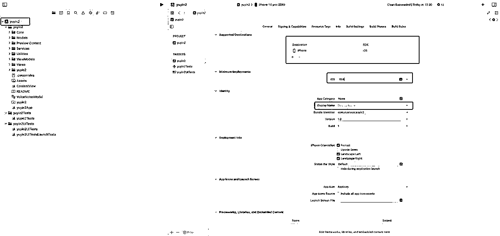
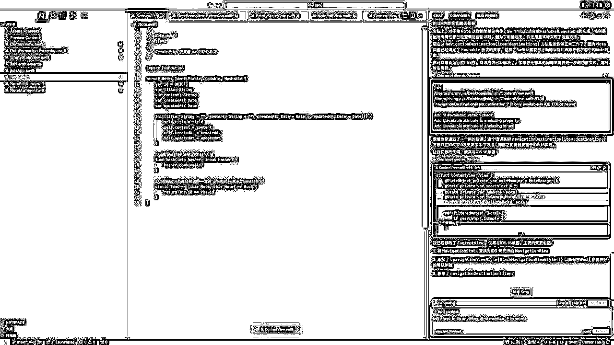
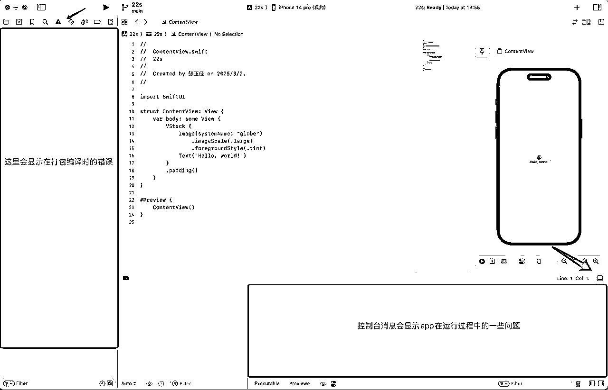
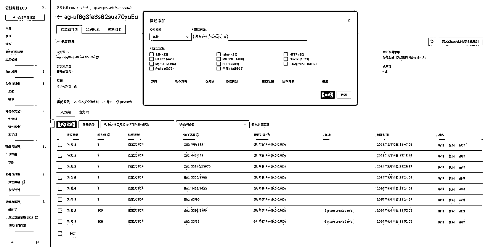
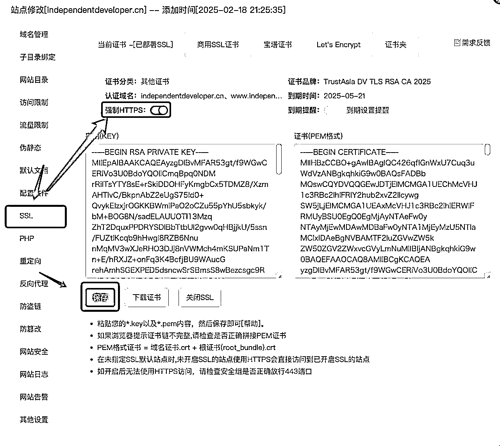

# 2025年3月航海｜AI 应用 - iOS APP｜实战手册

> 来源：[https://ocn93f5d9olj.feishu.cn/docx/Pvnxd9zBpoVaBwxoKRgcpdUKn7h](https://ocn93f5d9olj.feishu.cn/docx/Pvnxd9zBpoVaBwxoKRgcpdUKn7h)

# 防失联+MM188166M（李李）长期更新频繁+备用V:MG10127

手册出品方：生财有术团队

出品时间：2024 年 12 月 2 日

手册使用说明：内容出品人排名不分先后。本文旨在向你展示一个项目的更多可能性，帮助你更好地理解和实操。

建议：如果需要快速定位到精确内容，可以使用快捷键 Ctrl + F/command + F 的形式，搜索「关键字/词」，查找你想要的内容

出品时间：2025 年 3 月 4 日

建议：如果需要快速定位到精确内容，可以使用快捷键 Ctrl + F/Command + F 的形式，搜索「关键字/词」，查找你想要的内容。

# 必修篇：为该项目从 0 到 1 跑通一个最小 MVP 的所有步骤，即“航线图”对应的行动路径。

如果你是本项目新手，建议在正式实操前，先初步了解下项目全貌：

✅ 一、航海说明：目标与方法论

如果你对项目整体有了大致了解，就可以按照项目核心步骤，开始学习实操。

✅ 二、开发前的准备工作

✅ 三、初识 Swift +iOS 基础开发

✅ 四、从0到1：用 AI开发你的第一个 iOS App

在必修篇，航线图和手册顺序相对应，你可以按照手册的顺序进行学习，即可逐一完成航线图的每一个任务。

接下来就正式开始吧！

# 一、航海说明：目标与方法论

# 章节概要：

本章明确了航海的核心目标：

用21天从零基础到上线首个iOS App，并尝试实现付费下载或订阅模式变现。

选择iOS应用市场的理由十分充分：审核速度快、用户付费意愿强、无需复杂备案、成本相对固定。

借助AI开发的优势在于不需要懂一行代码，大幅缩短开发周期，

让开发者能专注于理解用户需求和产品设计。

在开发时建议小步迭代、分模块开发和AI+人工结合，

AI只是工具，关键判断仍需人为把控。

# 1.1 航海目标

基础目标：用 21 天左右的时间，从零基础到上线首个 iOS App。

进阶目标：初步实现付费下载 / 订阅模式的变现，收获第一笔 App 收益。

# 1.2 为什么选择开发 iOS App？

# 1.2.1 iOS 应用市场的优点：

审核简单速度快，上架就可以直接分发全球，对个人开发者友好

用户付费意愿较强，且 iOS 生态成熟，订阅、内购、付费多种模式

多数 App 上架时不用 icp 备案、App 备案，也不用办理软著（安卓 App 上架必备，200-300/张，周期 3-4 周）

开发者只收取 99 美金（688 元）年费，上架越多边际成本越低

具有一定准入门槛：Mac 设备、iPhone 手机、99 美元/年开发者年费

开发过程不需要安装复杂的环境、依赖

# 1.3 为什么要借助 AI？

不需要懂一行代码，也能够使用 AI 开发出 iOS App

降低了学习的门槛，把精力集中在了解用户需求、功能设计与产品思路上

大幅缩短了开发的周期，短至 2-3 小时就能快速开发一个 demo 在市场上验证想法

# 1.4 总体方法论

小步迭代：先做最小可用版本（MVP），不贪多求全。

分模块开发：功能复杂后，拆分多个 Composer/Chat，逐步实现。

AI+人工结合：不要盲目听从 AI，关键逻辑、bug 修复依然需要个人去测试、判断、反思。

# 二、开发前的准备工作

# 章节概要：

硬件：一台支持最新Xcode的Mac电脑（至少M1芯片）和一部iPhone进行真机调试。

软件：需要支付99美元/年的Apple开发者账号（注意申请时的常见问题）

必要的开发工具如：Cursor、Xcode等。

如需后端支持，还需域名注册、服务器购买和ICP备案等。

在开发时需保持正确心态：即使有AI辅助也会遇到各种bug和报错，这是正常的学习过程，

好的产品仍然需要好事多磨。

# 本章航线图

完成本章节的学习和实操，即可完成航线图的：

第一阶段：iOS 开发环境搭建与基础准备（约 2 天）

1.

完成开发环境配置：Mac 系统更新、Xcode 16.0+ 安装、硬件准备（Mac、iPhone）（约 0.5 天）

2.

注册 Apple 开发者账号，安装 AI 工具（Cursor/Windsurf）（约 0.5 天）

3.

理解 iOS 开发生态与变现模式（约 0.5 天）

4.

掌握 Xcode 基础操作与核心功能（约 0.5 天）

# 2.1 硬件准备

# 2.1.1 Mac 的选购建议：

1.

能安装最新 Xcode（当前是 Xcode 16+）最好，如 M 系列的 MacBook / Mac mini 等，最低 m1 就够用

2.

自购：若买 Mac 电脑可考虑 Mac mini m4，国补最低价 3499，配置和性价比高于二手 Macbook pro，只是得额外配外设“键盘、鼠标、4k 显示屏”

a.

如果是第一次使用 Mac 电脑的话，遇到不懂的可以看一下网络教程，遇到不懂的其实可以问一些 AI（deep seek、元宝、豆包）都能够解决。

3.

租机：支付宝租机 300-400/月，3 个月起租，配置建议不低于 i7 16g 内存（个人觉得性价比不高，租三个月的价格能买三分之一个新款 Mac 了，加几百块钱都能买个配置低一些的二手 Macbook）

4.

iPhone 真机调试：最好有一部搭载系统版本不低于 iOS 15.6 的 iPhone 手机 + 原装数据线（如果 Mac 的配置不高，使用模拟器在 Mac 中调试的话体验不好）。

# 2.1 域名服务器准备

如果想要实现 iOS APP 的前端+后端+数据库管理的话，则需要额外准备域名、服务器，且域名需要完成 ICP 备案才能访问国内服务器（海外服务器，如香港、新加坡则不用 ICP 备案），因为每个地区备案要求不同，所以在域名备案在时间上具有不确定性，快的话不足一周，慢的话甚至 2-3 周。

海外国内服务器区别：

（1）海外服务器：同等配置下价格高于国内服务器，如阿里云/腾讯云服务商国内服务器均有新用户优惠，价格在 99 元/年左右即可买到同等配置 2000-3000 元的香港云服务器。

（2）国内服务器：域名需要 ICP 备案才能访问，海外服务器则不用，如果只是实现前端+后端+数据库的话，那么国内服务器更具性价比。

# 2.1.1 域名注册

（1）阿里云 / 腾讯云注册。com .cn 价格 30-55 元/年，其它后缀 10 元左右

（2）如果只是实现 iOS APP 前端+后端+数据库访问，任何后缀都行

# 2.1.2 域名 ICP 备案注意事项

备案流程：阿里云 / 腾讯云均有备案入口，根据网页提示提交相应资料，个人可以独立完成备案操作

（1）如果是个人备案，在备案时会要求填写网站类型和备注，建议填写“个人学习使用，用于建设个人网站，记录工作和生活”，不要涉及任何商业用途。

（2）如果是个人备案，后续此域名若用于直观的商业用途，如搭建了一些海外站点，能够在不需要登录即可看到完整网站内容的话，那么后续存在备案被服务商强制注销的风险，如果有这方面用途，建议使用个体 / 企业执照备案。

（3）备案时建议在购买服务器的服务商备案，因为域名备案需要备案号，购买服务器一般会送 2 个，如果没有的话可以到淘宝搜索“阿里云 icp 备”价格 10 元左右，可以直接买一个在备案的时候填过去。

（4）提交备案后，24 小时内，注意接听服务商电话，会确认个人信息，如有问题也会驳回给予修改建议

# 2.1.3 服务器购买

# 

配置不低于 1 核 2g 带宽 1m，系统：centos7.x，不要选择 win 系统（配置太低会卡成 ppt）

阿里云 https://www.aliyun.com/

腾讯云 https://cloud.tencent.com/

# 2.1.4 域名 ssl 证书

iOS APP 如果想要实现前端+后端连接，后台域名则需要 SSL 证书，实现 https，宝塔面板后台有免费证书，有效期四个月，到期则需要重新申请。

# 2.2 Apple 开发者账号申请

# 2.2.1 开通 Apple 开发者账号：

iOS开发者账号申请与配置完全指南

# 

年费 99 美元 / 年，下载 Apple developer App（Mac / iPhone / iPad 任意设备均可）申请，先申请账号，再去apple开发者网页后台登录！

1.

编译到真机测试需 Apple 开发者测试版证书

2.

没有 Apple 开发者账号的话，则只能在 Xcode 模拟器编译测试，也不能提交上架

# 2.2.2 ⚠️Apple 开发者账号常见注册问题：

（很普遍的问题，大家一定要注意！)

1.

首次实名 Apple ID、不要在登录超过 3 个以上的 Apple ID 的设备上注册（如果用租机的设备申请 Apple 开发者账号，不确定是否存在公共设备的问题无法申请，这个问题需要注意）；

2.

确认自己或家人是否已有更早实名的 Apple ID（如果自己的信息注册不了 Apple 开发者账号，建议可以用家人信息尝试一下）；

3.

遇到"账号异常"可直接发邮件到官方（chinadev@Apple.com）。

# 2.3 工具安装：Cursor、Xcode、辅助工具

1.

Cursor 官网 https://www.cursor.com/cn/downloads 付费工具（只下载 0.45，⚠️不要下载 0.46，不好用！)

2.

windsurf 官网 https://codeium.com/windsurf 付费工具（推荐）

# 2.3.1 Cursor 安装：Composer / Chat 三种工作模式说明。

以下为cursor0.45版本功能，截止25.3.20日最新版本为0.47

1.

Composer：会主动帮你创建文件和代码

2.

Composer-Agent 模式：更智能的开发模式，能够主动理解上下文并执行方案

3.

Composer-normal 模式：根据当前对话实现代码生成和代码补全，以及根据上下文提供建议

4.

Chat：对话模式，它不会主动修改你的代码

0.47版本功能说明：

Agent模式：智能的开发模式

ASK模式：对话模式，但是不主动修改代码

Edit模式：修改模式，会主动为你修改/创建项目代码，更适合处理单一的任务命令

如果你没有自动更新到0.47版本，请在cursor设置中Beta选择Early access

# 2.3.2 Xcode:安装（App Store 下载）

# 2.3.2.1 基本使用：Xcode 如何与 AI 编程工具联动开发 App

第一步：点击 Create New Project 创建新项目，选择默认的应用类型，输入项目名称（拼音/英文），Organization ldentifier 输入 com.xxxx.xxxx，这里的域名是反写的，com。后缀在前，比如说我的项目名字是“yuyin3”，我注册了一个域名是 cuanxue.com，那么我就可以在这里填写 com.cuanxue.yuyin3，后面我再创建新的项目时，这里的域名也是后面上架 App 时在创建 App id 时填写的信息。

第二步：打开 AI 编程工具，打开项目的根目录，yuyin3 的第一个文件夹是我们刚才在 Xcode 创建的项目，我们要打开的是 yuyin3 项目目录下 yuyin3 的子目录，这是我们的根目录，后面 Cursor 所有创建的代码文件全部写在这个根目录下才会在打包编译时有效。

注意事项：team 这里要记得登录注册好的 Apple 开发者账号

# 2.3.2.2 基本使用：Xcode 项目文件作用

Xcode 创建项目后，会生成如下的目录列表，只有第一个是你的项目的根目录

1.

Contentview 文件，为项目的主视图文件，可以简单理解为打开 App 的第一个页面，Xcode 创建项目后，这个文件中自动包含“hello word”的文字内容。

# 

在 composer 模式下，首次生成代码时要@引用 Contentview 文件

2.

yuyin3App 文件：应用程序的容器，打包编译到手机时安装的就是他（打包编译时会包含项目的所有资源）

3.

Assets 文件：上传 App 图标、应用中的图片，支持 Png / jpg 格式 （建议将图片压缩后再上传）

4.

yuyin3：应用程序权限配置文件

5.

Preview content > Preview Assets 文件：预览内容，打包上架时不会包含这里的图片，只会在预览 / 测试时显示这里的图片

# 2.3.2.3 基本使用：Xcode 如何将 App 编译到真机

确保 Xcode 已登录 Apple 开发者账号

步骤一：在设置中搜索开发者模式，将其打开，然后将手机用数据线连接到 Mac，连接手机后选择信任。

步骤二：选择已连接的手机（非原装数据线的话则不会显示）

步骤三：

1.

删除不必要的设备类型，建议只保留 iPhone（除非你的应用想要支持其他设备类型），勾选其他设备会存在兼容性的问题产生报错信息，除非你的应用想要支持某一特定设备类型

2.

iOS 版本建议选择 15，或者 16，版本太高的话会影响 iPhone 系统版本较低的用户下载

3.

Display name 填写你应用的名称

# 2.3.2.4 基本使用：Xcode 如何设置 App 图标

图标尺寸 1024*1024 的 png / jpg 图片

Assets 文件也是管理 iOS 应用图片文件的位置，如果你想将一些图片、图标打包 App 中，那么就在这里将文件上传，但如果是图片的话，建议将图片压缩后再上传，不然会让应用占用用户较多的手机内存，下载过程也会有影响。

# 2.3.2.5 基本使用：Xcode 如何上传文件

关联新文件至项目根目录：右键点击项目根目录，点击 add files to "xxx"，版本不低于 16.0 的 Xcode 可以将 Cursor 中创建的文件自动关联至 Xcode 中。

如果 Xcode 版本低于 16.0，如果 Cursor 创建的文件没有更新在 Xcode 根目录下，则需要手动添加

上传图片文件，可以在 Assets 文件中，手动将电脑本地的文件拖进来，然后告知 AI 已上传文件的名称即可。

# 2.4 心态预期

# 2.4.1 AI 虽能降低门槛，但不代表没有门槛。

如果说不懂编程，觉得学习代码很困难，完全可以用 AI 在不懂一行代码的情况下做出人生第一个 iOS App，但是在这个过程中你可能会存在这些困难，这也是我在开发 iOS App 过程中曾经遇见的一些问题：

1.

英文能力基础较差，看不懂 Xcode、Apple 开发者后台的界面操作，前期只能依赖截图翻译、沉浸式翻译插件去熟悉操作和使用

2.

iOS App 开发和 web 开发有些区别，虽然说不用安装运行环境和一些依赖，但是也很难像 web 开发那样，靠简单 1-2 句的提示词就快速做出一个应用，多数时候都是在处理编译报错的问题，要靠多轮对话才能实现。

3.

尽量不要试图在一开始就开发比较复杂的应用，最好循序渐进的学习，我曾经不下六七次尝试开发玄学类的应用，但是发现其中的一些业务逻辑过于复杂，而 AI 也不能很好的理解业务场景，靠 AI 去写四五千行代码都很难有效实现一些核心的功能，所以开发的过程是一个又简入难的过程，循序渐进的往深入推进。

# 2.4.2 开发过程中的大小 bug、构建报错一定会有

开发的过程中过了编译报错只是第一关，但仅仅是证明你的应用能在手机上安装了，但是不意味着开发结束，因为即使能成功编译，但是不见得应用功能可以正常运行，所以仍然需要不断调试，在调试过程中你可能会遭遇“控制台报错、内存泄漏、运行线程报错、代码警告”等多种类型的报错。

所以，在 App 的开发过程中测试和调试是个非常花费时间的过程，一个 App 的一个版本，经历几十次打包编译有时候也很正常，所以 1-2 小时不是不能开发出一个 iOS App，只是很难做出一个成熟和功能完整的应用，所以在开发时间上尽量不要过于追求速度，好的产品即使有 AI 的辅助仍然需要好事多磨。

# 三、初识 Swift + iOS 基础开发

# 章节概要：

Swift语言学习对于首个App开发并非必要，即使不懂代码也能通过AI完成开发。

本章节通过一个记事本应用的实战案例，

让大家熟悉从提示词设计到多次编译修复的完整过程，

特别强调了如何与AI配合解决编译错误。

掌握分模块开发思维是提高效率的关键：

前后端拆分、明确功能优先级、UI与功能分离实现、避免上下文污染。

# 本章航线图

完成本章节的学习和实操，即可完成航线图的：

第二阶段：基础开发流程掌握（约 3天）

1.

初识Swift语言 （约 0.5 天）

2.

开发基础工具类应用（如记事本），掌握开发流程（约 2 天）

3.

掌握分模块开发思维（约 0.5 天）

# 3.1 Swift 语言初步

有一说一，学不学 Swift 对于本次航海来说意义有限，即使不学一行 Swift 代码，你仍然可以用 AI 开发出第一个 iOS App，所以学习 Swift 的必要性在短期来说我觉得没用，因为这也不是十天半个月就能学明白，能够直接对项目开发产生效果的，但是如果你对 iOS App 开发有兴趣想长期做下去的话，学习 Swift 仍然有必要性。

如果英文能力尚可，完全可以至 Apple 开发者官网直接去看官网的文档，如果听不懂原生的英文，那么可以在 Appstore 中搜索 Swift 下载这个 Swiftui 工具书阅读学习。

# 3.2 实战案例一：用 Cursor + Xcode 实现一个简单功能

# 3.2.1 写一个记事本小工具

先做一下基本的 Xcode 设置：设备类型、系统版本、App 名称

提示词：你是一个优秀的 iOS 工程师，我创建了一个名为“记事本”的 iOS App 项目，你当前正在项目的根目录下，实现文字记事、文本编辑、数据本地持久化存储功能！开发规范请基于 iOS 16 实现 @contentview.Swift

composer-agent 模式 / Claude-3.7-sonnet 大模型

第一次尝试打包编译：出现编译报错，将报错信息复制发送给 Cursor

第二次尝试编译：cmd+shift+k 清空数据后，发现还有编译报错，是一个 iOS 版本兼容性的问题，再次复制发给 Cursor

第三次尝试编译：成功打包编译安装到手机，测试记事本功能正常，退出 App 后再次打开之前保存的内容仍然显示，说明数据成功缓存在了本地，实现了数据持久化功能

第四步：可以自行尝试，为应用增加新的功能，修改页面的样式、按钮

# 3.2.2 解决常见错误、在真机/模拟器上运行成功。

iOS App 会显示在如下位置：

1.

编译报错：Xcode 左侧区域的感叹号按钮

2.

控制台报错：在右下角区域会详细显示 App 在运行过程的一些问题，多数时候当 AI 不能准确定位错误的问题时，会修改代码完善控制台消息的报错信息，来更准确的定位问题

1.

App 应用报错：比较直观的反馈在应用上的一些问题，可以用截图+自然语言，和 AI 描述问题

2.

警告信息：一般会出现在 Xcode 顶部区域（黄色感叹号），不影响编译和功能运行，可留到最后再处理

# 3.3 掌握分模块开发思维

1.

前后端拆分，先实现前端再实现后端

2.

明确功能的优先级，优先实现核心功能

3.

UI 设计和页面功能分开实现，先实现页面效果再实现页面功能和关系

4.

每个需求都可单独开一个 Composer 或 Chat 的对话框，避免上下文污染。

5.

每解决一个 bug，每实现一个新的小功能，建议都新建一个 Composer

# 

第三点适用于当你有一个明确的 UI 设计图和设计方案时，就可以让 AI 先去实现页面的布局和 UI 的设计，而不是一上来就让 AI 去实现应用的功能，直接实现应用的功能的话，在 iOS App 中 AI 只会默认使用 iOS 原生的一些组件。

作为新手初次开发 iOS App 的话，可以暂时忽略 UI 设计的问题，专注于功能和产品的设计，UI 和布局方面的细节可以再等功能实现，能正确运行后再调整。

# 四、从 0 到 1：用 AI 开发你的第一个 iOS App

# 章节概要：

本章带大家通过两个进阶案例学到完整的App开发流程。

Deepseek对话助手案例详细演示了从UI设计到API调用的实现过程；

后台版案例则进一步展示了如何实现前端与服务器连接，

包括域名配置、宝塔面板安装和API接口实现等技术细节。

每个案例都真实展现了开发中会遇到的各种编译错误和解决思路，

强调了循序渐进、分步骤测试的重要性。

通过这些案例，我们可学到一些具体的开发技巧，并掌握用AI解决复杂问题的方法论。

# 本章航线图

完成本章节的学习和实操，即可完成航线图的：

第三阶段：应用开发实战（约 6 天）

1.

开发进阶应用（如 Deepseek 对话助手），对接第三方 API（约 2 天）

2.

开发全栈应用，实现前后端数据交互（约 2 天）

3.

优化应用功能，确保上架合规性（约 2 天）

# 4.1 实战案例二：Deepseek 对话助手（进阶版）

如果要上架第一个应用的话，不建议根据手册内的提示词大家都去开发同一个应用，

因为 ios 上架要求有一项是 4.3 类型的拒审，即和 appstore 中的应用同质化，尽量做一些个人独特的设计进去，

其次功能要完整，ios 第二项是 4.2 应用功能完整性，也就是说应用功能要完整和丰富一下，不能只有一个非常简单的功能，这样的应用开发了大概率会被拒审。

# 

本节目标：学会使用 AI 调用第三方 API 能力，实现 Deepseek 对话助手 iOS App

方法设计：

（1）先实现页面 UI 样式

（2）再实现应用功能

（3）编译-调试实现更多功能

# 4.1.1 第一步 实现页面 UI / 不实现功能

提示词：截图+这是一个 AIchat 的 AI 对话 iOS APP 项目，我们先来实现页面的设计，暂不实现页面的功能

腾讯元宝 app 截图

将截图+提示词发给了 cursor，使用 agent 模式 claude-3.7

# 4.1.2 第二步 首次编译到手机 / 测试页面效果

这是编译到手机的效果，实现了基本的页面效果

# 

如果不满意页面的效果，可再进行多轮对话修改，目前只实现了基本的页面 UI，一些基本功能和细节还没实现，有兴趣的可以再这个环节试着改动。

# 4.1.3 第三步 根目录创建 API.MD 文件 / 实现 API 调用

# 

大模型第三方平台：硅基流动 https://cloud.siliconflow.cn/i/hnzbllSL

1.

大模型名称：Pro/Deepseek-ai/Deepseek-R1

2.

api 开发手册链接：https://docs.siliconflow.cn/cn/api-reference/chat-completions/chat-completions

3.

apikey: xxxxxxxxx

4.

curl 请求示例：

# 4.1.4 第四步 实现对话功能 / 实现页面功能

提示词：@API.MD 下面，实现应用中的 AI 对话功能，API 开发手册@https://docs.siliconflow.cn/cn/api-reference/chat-completions/chat-completions

# 4.1.5 第五步 二次编译真机 / 解决编译报错

发现编译报错，将报错信息复制发给 AI

编译报错信息发送给 AI 处理

编译成功-功能正常

# 

编译报错，过程可能会反复几次，很难确保一次就能解决所有问题，若出现报错，是常见情况。

注意事项：

1.

如果清空数据后仍然有报错信息，说明问题没有被解决

2.

如果清空数据后没有显示报错信息，可再次打包编译

3.

每次重新编译前，使用 cmd+shift+k 清空缓存

# 4.1.6 第六步：调试应用问题 / 实现更多功能

# 

问题：应用没有实现数据持久化，退出 app 后再次打开历史对话消息没有了

后面的环节基本上就是重复：真机测试>反馈问题>再次编译 过程的反复

// 修改 BUG 建议用 Edit 模式，Agent 表现效果一般

编译成功，测试功能，反馈问题

再次编译，控制台报错，报错信息发给 AI，再次编译，实现数据持久化

再次测试后发现问题：键盘右下角换行按钮修改为发送按钮，点击发送按钮支持退出键盘弹窗

反馈问题给 Cursor，成功解决了键盘不能退出的问题

调试功能：支持 Deepseek r1 和 Deepseek v3 两种大模型切换

反馈：@Codebase @API.MD 请支持选择 Deepseek r1 和 v3 两种不同的大模型

# 

Deepseek r1 因为推理过程较长，所以在未实现流式生成时，加载速度会比较慢，所以为了跑通这个环节，各位圈友可以使用 v3 模型

# 4.1.7 编译问题：解决 Info.plist 重复生成和问题

编译时发现 Info.plist 重复生成报错，这是一个 ios app 开发过程中常见问题，因为 AI 为帮我们创建了 Info.plist 用户权限文件，而 xcode 也在尝试生成 Info.plist 文件，所以就会出现这个报错。

解决办法：

1.

确保 info.plist 文件位置正确

2.

删除 Build phaeses > Copy Bundle Resources 中的 info.plist

# 4.2 实战案例三：Deepseek 对话助手（后台版）

# 

本节目的：学会使用 cursor 实现前端+后端的跨语言开发方法。

本节目标：学会使用 cursor 开发 iOS APP 的网页版管理后台，实现 iOS APP 前端数据与后台连接

注意事项：本节涉及域名注册、域名 ICP 备案问题，建议在航海初就进行准备，备案时间根据各地要求不同，在备案周期上存在不可控因素，周期预计为 1-2 周时间。

为了更简洁的演示整个开发的过程，所以在 4.1 案例的基础上，我会让 AI 在 iOS APP 上增加一个注册/登录功能，实现后台系统可实时查看前端用户的注册信息 / 对话记录 这一功能，重点在于演示实现的方法和过程。

# 4.2.1 准备工作

# 4.2.1.1 此版本前期准备事项

（1）准备一台云服务器，配置不低于 1 核 2g 带宽 1m，

（2）注册一个域名，进行 ICP 备案（香港服务器不用）

# 4.2.1.2 海外国内服务器区别：

（1）海外服务器：同等配置下价格高于国内服务器，如阿里云/腾讯云服务商国内服务器均有新用户优惠，价格在 99 元/年左右即可买到同等配置 2000-3000 元的香港云服务器。

（2）国内服务器：域名需要 ICP 备案才能访问，海外服务器则不用，如果只是实现前端+后端+数据库的话，那么国内服务器更具性价比。

# 4.2.1.3 域名注册 / 服务器购买

（1）阿里云 / 腾讯云注册。com .cn 价格 30-55 元/年，其它后缀 10 元左右

（2）如果只是实现 iOS APP 前端+后端+数据库访问，任何后缀都行

阿里云 https://www.aliyun.com/

腾讯云 https://cloud.tencent.com/

# 

服务器系统：centos7.x，不要选择 win 系统（配置太低会卡成 ppt）

# 4.2.1.4 域名 ICP 备案注意事项

备案流程：阿里云 / 腾讯云均有备案入口，根据网页提示提交相应资料，个人可以独立完成备案操作

（1）如果是个人备案，在备案时会要求填写网站类型和备注，建议填写“个人学习使用，用于建设个人网站，记录工作和生活”，不要涉及任何商业用途。

（2）如果是个人备案，后续此域名若用于直观的商业用途，如搭建了一些海外站点，能够在不需要登录即可看到完整网站内容的话，那么后续存在备案被服务商强制注销的风险，如果有这方面用途，建议使用个体 / 企业执照备案。

（3）备案时建议在购买服务器的服务商备案，因为域名备案需要备案号，购买服务器一般会送 2 个，如果没有的话可以到淘宝搜索“阿里云 icp 备”价格 10 元左右，可以直接买一个在备案的时候填过去。

（4）提交备案后，24 小时内，注意接听服务商电话，会确认个人信息，如有问题也会驳回给予修改建议

# 4.2.1.5 服务器宝塔面板安装方法

# 4.2.5.1.1 服务器购买后放开安全组

买好服务器后，打开服务商的控制台，找到服务器实例（图中演示的为阿里云控制后台），找到安全组选项打开，点击创建安全组，然后再点击编辑安全组。

添加入方向，勾选 SSH、MY SQL、HTTP、HTTPS，如果说你觉得麻烦，可以直接点全部，最后点确定，安全组就设置好了。

# 4.2.5.1.2 我们来安装宝塔面板

宝塔面板官网：bt.cn

这一步，我们打开服务器实例的管理后台，找到远程连接，其他信息默认，输入你在购买服务器时设置的管理密码。

为了尽可能简化操作，我直接使用了阿里云服务器实例管理面板中的远程连接功能。

下一步，打开宝塔面板官网 https://www.bt.cn/new/download.html，找到宝塔 Linux 面板免费版，复制通用安装脚本，复制粘贴到上一步我们远程连接的服务器中，回车发送，中间如提示是否确认，输入“y”，耐心等待安装结束，你会得到宝塔面板的登录地址、登录账号、密码。

这一步需要再次安全组，你会发现你的宝塔面板登录地址是“一串数字：数字”，比如说我的服务器公网 IP 地址是 123.123.123.123，我的搭建好宝塔面板的登录地址是 123.123.123.123：666，那么我需要回到服务器的安全组设置，点击手动添加入方向的 666 安全组，格式如下：

端口范围-目的：666 / 666，授权对象-源：所有 IPv4（0.0.0/0）

宝塔面板安装结束后，打开浏览器，访问并登录宝塔面板后台，登录后会弹窗选择安装服务器运行环境，点击一键编译安装 LNMP（Linux、nigx、mysql、php）的环境，过程大概 30 分钟左右，耐心等待安装结束即可。

# 

php 版本建议安装 7.4 稳定性好

后面，任何你需要的工具，例如 phpmyadmin，都可以在左侧导航栏软件商店的官方应用中找到并一键安装。

# 4.2.2 iOS APP 注册登录页面实现

# 

我们每实现一个新的功能，每解决一个 BUG，最好新建一个对话窗口去实现，防止上下文污染

每次实现一个新的功能，添加一个新的页面，都会多少遇见一些编译、控制台的问题，这是非常正常的情况，这个时候要做的就是将问题反馈给 AI，多数情况下至少要 2-3 轮以上的对话才能解决。

提示词：请为我在首页顶部导航栏的合理位置，设计一个注册 / 登录的图标按钮，能够在首页直接弹窗显示（未登录用户可进行对话，但是次数不得超过 3 次），暂不实现其功能，只实现注册 / 登录的样式和页面关系，去掉分享按钮，保持与 app 视觉设计保持一致。

# 4.2.3 iOS APP 网页版后台开发

# 4.2.3.1 准备工作

# 4.2.3.1.1 创建临时文件夹

第一步，在 ios 项目根目录下创建一个新的临时文件夹，命名为 admin

# 4.2.3.1.2 创建说明文档

第二步，在 admin 子目录下创建一个 Admin-README.MD 文件，在文件中说明后台的功能和数据库的信息（数据库语言、数据库名、用户名、密码）

# 4.2.3.1.3 创建后台管理系统文件

# 4.2.3.1.4 注意事项

# 

（1）域名需要完成 ssl 证书申请和部署（手册下面有教程）

（2）宝塔面板-站点管理，设置强制 https

（3）国内域名需要完成 ICP 备案才能访问国内服务器

# 4.2.3.2 域名服务商后台解析域名

# 4.2.3.2.1 服务商说明

下方截图为阿里云。

# 4.2.3.2.2 解析步骤

在服务商控制面板找到域名列表，选择你备案好的域名，点击域名解析，点击添加记录，记录值默认填写服务器的公网 IP 地址，然后添加两条记录，一条为 www，一条为@ 。

# 4.2.3.2.3 访问效果

这样，无论在浏览器访问域名。com，还是 www。域名。com 就都能打开网站了。

# 4.2.3.3 宝塔面板上线后台网页版

# 4.2.3.3.1 创建站点

宝塔面板后台，新建站点，填入解析的域名（国内服务器域名需完成 ICP 备案），命名根目录名称，php 版本选择 7.4，其他不创建和默认，点击确认

# 4.2.3.3.2 删除默认文件

勾选删除刚刚创建站点下所有的默认文件

# 4.2.3.3.3 创建 API 目录

站点下新建 api 目录（这里需要和 admin 下的目录一致）

# 4.2.3.3.4 上传文件

将 admin 下的所有文件上传至正确的目录下，我们在宝塔面板新建站点创建的就是网站的根目录，也就等同于 admin 的地位，不需要将 admin 这个文件整个拖动进来，只需要上传所有对应的文件即可，如图所示：

// 我这里的根目录名字是 aichat，和原来的 admin 不一致，这个没关系

# 4.2.3.3.5 初始化数据库

上传服务器后首次访问 https://域名/install.php 创建数据库和表，提示创建成功

# 4.2.3.3.6 登录后台

下一步，打开后台登录地址 https://域名/index.php

# 4.2.3.4 域名 SSL 证书申请

因为网站和 ios app 的 api 通信需要域名申请 ssl 证书，必须基于 https 协议才能实现。

申请证书很简单，点击网站，点击站点后面的设置，点击 ssl，选择宝塔证书，点击申请证书，选择你要申请的域名，填写所有对应资料，申请即可，申请成功后点击“部署”，自动部署后，勾选强制 https 并保存。

注意有效期只有四个月。

# 4.2.4 iOS APP 前端与后台通信

# 4.2.4.1 实现后台网站的 API 接口功能开发

注意：观察 xcdoe 控制台信息

# 

实现后台管理系统 > 实现 ios 端调用网站后台 api，这个过程最好在一个对话窗口中实现，如果新建对话窗口的话，可能会出现失忆造成的一些不必要的问题。

注意事项：

因为我们 iOS APP 根目录下有/admin 这个 php 的网页后台文件，所以在编译时，得在 Xcode 删除这里被添加的所有。php 文件（Build phaeses > Copy Bundle Resources）

# 4.2.4.2 服务器创建 / 存储问题

宝塔面板后台创建 Mysql 数据库

1.

宝塔面板-数据库-添加数据库-输入数据库名/用户名/密码默认，点击确定

2.

创建数据库后，点击 phpMyAdmin-面板管理，选中创建的数据库，点击 SQL-复制 cursor 生成的 mysql 语句创建数据表，点击执行即可！

3.

让 cursor 在后台目录下创建一个 api.md 开发文档，将创建的数据库表信息记录至开发文档中，避免 AI 失忆。

# 进阶篇

# 五、iOS APP 会员订阅功能实现（进阶学习）

# 章节概要：

本章聚焦于iOS应用的主流变现方式—会员订阅功能。

从订阅页面UI设计、StoreKit配置到项目设置和测试，都有详尽的实现步骤。

同时还介绍了Apple Pay支付功能的添加方法，包括证书创建、商家ID配置等专业内容。

对于想实现完整商业闭环的开发者，

本章提供了后台管理与服务器联动的解决方案，

以及上架过程中的App ID创建、证书配置和详情页设置等关键环节。

虽然这些功能相对复杂，但通过AI辅助仍能有效完成，为App带来实质性的商业价值。

# 本章航线图

完成本章节的学习和实操，即可完成航线图的：

第四阶段：进阶功能与上架实战（约 8 天）

1.

实现会员订阅功能，掌握 StoreKit 配置（约 2 天）

2.

学习 Apple Pay 支付功能集成（约 2 天）

3.

搭建云服务器，实现后台管理与联动（约 2 天）

4.

完成 iOS App 上架全流程并提交审核（约 2 天）

# 5.1 iOS APP 会员订阅功能简介

我们来实现这个 iOS APP 的订阅功能，这也是 iOS APP 最主流的变现方式之一，实现这个功能的前提是你已经熟悉开发全栈个 iOS APP 的操作过程。

# 5.1.1 开始实现会员订阅页面

# 

提示词：@Codebase 下面，我们来实现 ios app 的会员订阅功能，我是个不懂技术的小白，请你一步步告诉我该怎么完成，我们先实现会员订阅的页面样式。

这里还是先使用分模块开发的方法，先让 AI 为我们实现会员订阅页面的样式。

# 5.1.2 实现会员订阅核心功能

第一句：

# 

继续，开始实现会员订阅的功能。

第二句：

# 

为我创建 StoreKit 文件和更新 Info.plist 文件。

StoreKit 文件就是你的 iOS APP 的所包含的商品信息，你也不用自己创建，也不用自己去写，完全让 AI 来为我们实现就行了。

# 5.1.3 配置项目设置

1.

打开 xCode 在项目设置中，选择 Signing & Capabilities，点击+ Capability 按钮，搜索添加添加 In-App Purchase 能力

2.

打开 Product" > "Scheme" > "Edit Scheme...，点击 Run，选中 Options，在 StoreKit Configuration 中选择我们在项目根目录创建的 Subscriptions.storekit 文件，最后点击 Close 保存即可。

3.

检查一下，在 xCode 项目设置的 General > Frameworks， Libraries， and Embedded Content 里 storekit.framework 是否被成功添加至此。

# 5.1.4 测试订阅功能

将 iOS APP 编译安装至手机测试会员订阅功能是否能够正常运行。

# 5.1.5 完善订阅功能

下一步，让 AI 继续实现未实现的订阅功能。

下一步，上架环节，设置订阅群组，根据会员，这里需要注意的是产品的 ID 必须和 xCode 代码中的 ID 一致，我们打开项目根目录，打开 Subscriptions.storekit 文件，找到 productID，这里显示的就是你每个产品的 ID，逐个将其添加至上架页面的订阅群组即可。

注意，所有信息必须完全一致。

# 5.1.6 功能总结

到此，我们就实现了一个简单版的 iOS APP 订阅功能，用户可以使用 AppStore 的支付功能，来订阅我们 APP 的会员，会员订阅也是一个比较复杂的功能，目前我们实现的是通过本地来管理和验证会员的状态，实现过程也比较简单，后面，我们可以继续让 AI 实现在服务器上查看会员订阅数据，但同样你也能在开发者后台“销售和趋势”报告中查看到会员订阅信息，只是这个数据一般次次日才会更新，有一定的延迟。

这部分内容属于进阶再进阶的内容，大家可以再熟练掌握 AI 编程的底层方法后，来试着使用 AI 编程实现 iOS APP 会员订阅功能，这项功能可延展性很多，比如说我们可以实现在跨平台共同管理会员的状态。

比如说，用户在 iOS APP 付费开通了会员，那么在 web 网页端的产品同样可以使用会员功能，实现上并不复杂，只是会大幅增加实现过程所需的时间和对话量。

# 5.2 如何使用 Apple Pay 支付（进阶学习）

下面我们来实现 Apple Pay 的支付功能，在上面的基础上继续实现，当然实现订阅功能不是一定要实现 Apple Pay 支付能力，如果你的应用需要用到 Apple Pay 支付的话可以看下这部分的内容。

# 5.2.1 添加 Apple Pay 能力

输入提示词：

# 

继续实现 Apple Pay 的支付功能

这一步，还是在 xCode 项目设置中的 Signing & Capabilities，点击+ Capability 按钮，搜索添加添加 Apple Pay 能力，然后在这里添加商家 ID，格式还是和 APP ID 一样，在 com.xxx.xxx 的前面加上 merchant。 就可以，也就是像图中这样显示的 merchant.com. cuanxue.toutiao。

设置好后需要将最新的 Apple Pay ID 告诉 AI，使其为你更新最新相关的文件。

# 5.2.2 创建 Apple Pay 商家 ID

我们到 Apple 开发者官网打开 Certificates， Identifiers & Profiles 页面创建一个标识符 ID（Apple Pay 商家 ID），来进一步实现 Apple Pay 功能。

点击 Identifiers 一旁的加号，勾选 Merchant IDs，点击 Continue 继续

# 5.2.3 创建并下载证书

在 Identifiers 的分类里找到 Merchant IDs，点击刚刚创建的商家 ID，点击 Create Certificate 创建并下载生成的证书。

# 5.2.4 手动创建证书

cmd+空格键，搜索并打开"钥匙串访问" > "证书助理" > "从证书颁发机构请求证书..."，手动创建证书将其下载到本地，点击 Choose File 将这个文件上传，然后点击 Continue 继续。

注意：这里要勾选让我指定密钥对信息，最后下载到本地时选择算法“ECC”，密钥大小“256 位”

上传后点击 Continue 继续，最后将 Apple Pay 证书下载到本地，然后双击安装（默认登录选项）到钥匙串中。

# 5.2.5 继续实现功能

告诉 AI：我已经完成了 Apple Pay 证书的创建，下一步请继续实现会员订阅和 Apple Pay 功能。

这个环节中，AI 会为我们进一步集成这些能力到 iOS APP 中。

# 5.2.6 创建沙盒测试账号

创建沙盒测试账号，使用开发者账号登录 appstoreconnect.apple.com，选择用户和访问，选择“沙盒选项”，点击添加测试账户，按照要求填写对应信息创建沙盒账户。

注意：邮箱地址必须为未注册过 apple id

# 5.2.7 测试 Apple Pay 功能

下一步，打开 xCode 在模拟器中编译安装 app，在模拟器的设置中登录刚刚创建的沙盒账户

下一步，添加测试卡信息，测试 Apple Pay 支付流程是否正常

# 5.3 后台管理与服务器联动

# 5.3.1 搭建云服务器（安装宝塔面板 / LNMP、phpMyadmin）。

# 5.3.1.1 云服务器选购建议：

阿里云/腾讯云有新用户活动 99 元/年较低配置服务器，企业认证送半年

最低配置建议：1 核 2G 内存，带宽 1M 以上

系统推荐：CentOS 7.x 以上版本

地理位置建议：如果长远考虑后面要做出海相关的项目，云服务器的地址优先建议选择香港，不要选择内地的云服务器

（内地服务器域名解析过去后想要正常访问域名必须要做 icp 备案，香港及海外的云服务器则不用）

# 5.3.1.2 宝塔面板安装：

官网：https://www.bt.cn/new/product_linux.html （建议安装 linux 版本）

宝塔面板通用安装脚本：

# 5.3.1.3 服务器安全组配置：

购买服务器后的第一件事就是放开安全组

需要放行宝塔面板登录地址的端口，这个端口号是随机生成的

宝塔面板安装好后会显示一个外网面板地址，链接上有端口号，在服务器主机商的后台放行这个端口号即可

# 5.3.1.4 安装 LNMP 环境

浏览器登录宝塔面板后台后，选择一键编译安装 LNMP 的服务器环境

PHP 版本建议选择 7.4 比较稳定

安装过程需等待 10-30 分钟左右

# 5.3.1.5 安装 Node.js（如需要）

如果后端管理系统涉及 node.js，则需要在宝塔面板后台-软件商店-官方应用额外安装"node.js 版本管理器"

在版本管理器中安装适用于对应网站要求的 node.js 版本

# 5.3.2 宝塔 SSL 证书申请。

# 

域名解析到服务器并绑定网站后，申请免费版 ssl 证书，注意：证书有效期 4 个月

# 5.3.2.1 域名解析设置

在域名服务商后台，将域名解析至服务器的公网 IP 地址

# 5.3.2.2 网站绑定设置

宝塔面板-网站-添加站点，输入解析过来的域名进行绑定

根据情况选择对应的 php 版本

选择是否要创建 mysql 数据库（已创建的话则不用再创建）

# 5.3.2.3 SSL 证书申请与部署

点击网站-设置-SSL-宝塔证书

根据页面提示输入信息

申请证书-点击"部署"

勾选强制 https

注意：免费版 SSL 证书有效期为 4 个月

# 5.4 iOS APP 上架过程

# 5.4.1 前期准备

# 5.4.1.1 开发者账号登录

打开 Apple 开发者官网 https://developer.apple.com/account 登录开发者账号

# 5.4.1.2 创建新 APP

点击导航栏的 app，点击页面上 app 一侧的+号，新建 app

勾选要发布的平台

填写 app 名称

设置主要语言

选择套装 ID（可点击链接创建新的套装 ID）

# 5.4.2 创建 APP ID

# 5.4.2.1 基本信息设置

Description：可以填写你的 app 名字的英文拼音

Bundle ID：需要填写与你 Xcode 项目中设置一致的标识符（com.xxx.xxxx）

勾选你的 app 用到的权限（如 WiFi、相机等）

如果是单纯在本机运行的单一功能，可不勾选任何权限

# 5.4.2.2 返回创建 APP

选择刚创建好的 APP ID

点击创建按钮进入下一步

# 5.4.3 创建证书（可选）

注意：如果使用最新版 Xcode 可跳过此步，因为会自动创建证书文件

# 5.4.3.1 本地证书请求创建

在 Mac 电脑中打开钥匙串访问

选择左上角钥匙串访问-证书助理-从证书颁发机构请求证书

邮件地址填写你的 Apple 开发者账号

选择存储到磁盘，保存到本地任意位置，你就会得到一个证书文件

# 5.4.3.2 上传证书到开发者后台

回到 Apple 开发者后台的证书页面

页面地址：https://developer.apple.com/account/resources/certificates/list

点击 Certificates 的加号创建证书

勾选 Apple Distribution（正式发布的证书）

上传刚在本地创建的证书文件

创建好后，下载证书到本地，备用

# 5.4.4 创建 iOS APP 的 Profiles 配置文件

# 5.4.4.1 配置文件类型选择

选择 Distribution 下面的 App Store Connect

# 5.4.4.2 关联设置

选择你的 APP ID

输入一个英文名称（可以是你项目的拼音）

选择刚创建的证书，点击下一步

下载配置文件到本地备用

# 5.4.4.3 Xcode 设置

打开 xcode，点开项目的设置，

去掉勾选第一行自动管理签名

导入你刚刚下载的配置文件、证书就可以了

或者勾选 Automatically manage signing，选择你的开发者账号（第二次上架时会自动创建配置文件、签名证书）

⚠️注意：多个 app 可以用一个签名证书，后台最多创建三个签名证书

# 5.4.5 打包发布 APP

# 5.4.5.1 选择设备

在 Xcode 上方设备栏中选择 Any iOS Device

# 5.4.5.2 生成安装包

点击 Xcode 功能栏里的 Product-Archive 打包 app

选择第一个 app store connect 发布到 appstore

点击 distribute app 打包你要发布的 app，等待加载结束后，选择下你的 app 的语言为简体中文

# 5.4.5.3 上传审核

回到 apple 开发者后台你创建的 app 发布页面，

点击 testfight，就会看到刚刚打包生成的 app 在审核。

等待几分钟审核通过后，点击管理。

选择你的 app 使用的加密算法（如果没有使用，选择"哪种都不是"）

# 5.4.5.4 添加构建版本

在 app 分发页面，点击添加构建版本

选择刚打包好的 app

# 5.4.6 APP 详情页设置

# 5.4.6.1 预览界面制作

可使用 Pixelmator Pro 制作预览界面

将 app 截图拖入软件后自动生成预览界面，修改标题即可

软件分享链接： https://pan.baidu.com/s/1TS4zWJY75h6p0j-8HRl9Pw?pwd=xwt4 提取码： xwt4

app 图标也可用此软件修改大小

# 5.4.6.2 技术文档设置

技术支持网址：用户遇到问题如何联系你

参考网址示例：https://cuanxue.com/zhicih.html

可复制页面内容，用 AI 工具（如豆包）转成 HTML 代码，替换联系方式

隐私协议：

可参考 AppStore 中同类 app 的隐私协议

复制内容后修改 app 名称、权限、功能介绍和联系方式

使用 AI 工具生成 HTML 文件后上传到服务器

营销地址：

建议填写，特别是如果后续要接入 Google AdMob 广告

Google 验证 app 时会识别 AppStore 营销地址 URL

如不设置，Google AdMob 可能抓取不到验证文件

也可使用飞书、腾讯文档、CSDN 博客等平台替代

# 5.4.7 APP 基本信息设置

# 5.4.7.1 APP 名称

不要只写 app 名称，可加入相关核心关键词

关键词越多被搜索到的可能性越大

建议在 AppStore 搜索相关核心关键词，查看下拉框词汇

将这些词加入 app 名称、副标题、关键词中

# 5.4.7.2 类别设置

选择对应的 app 类别

# 5.4.7.3 价格设置

付费 app 设置相应价格

免费 app 价格设置为 0

# 5.4.7.4 年龄分级设置

根据 app 内容情况选择

如涉及成人内容，建议勾选仅 17 岁以上用户

如不涉及赌博、成人、暴力等内容，选择"此 app 不适用"，年龄分级为 4+

5.4.7.5 税务设置

首次上架 iOS app 时，需选择税务类别

如非美国纳税居民，选择"不是美国的纳税居民"

根据网页提示选择即可

5.4.7.6 发布与跟踪

点击发布

如有未填写信息，页面会提示

可下载 Connect 的 iOS app 登录开发者账号，及时查看审核动态

# 六、结语

最后，开发 iOS App 就像第一次学骑自行车，看起来很难，

但只要迈出第一步，你会发现这个过程比想象中容易得多。

这次航海可能会遇到一些小挫折，比如编译错误或者不熟悉 Xcode 的界面，但这些都是正常的学习过程。

记住，你不需要成为一个专业的开发者，你只需要学会如何让 AI 帮你解决问题。不要被技术术语吓倒，保持耐心，一步一步来。我相信，几周后，你会惊讶于自己竟然能独立开发并上架一个 iOS App。

让我们一起享受这个从零到 App 的航程吧！

