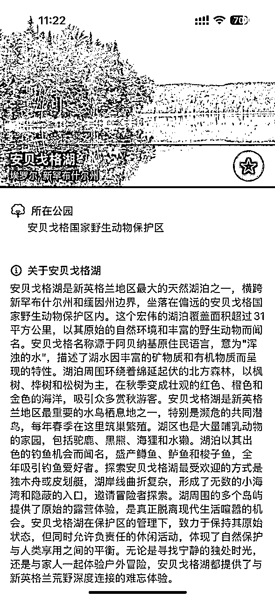
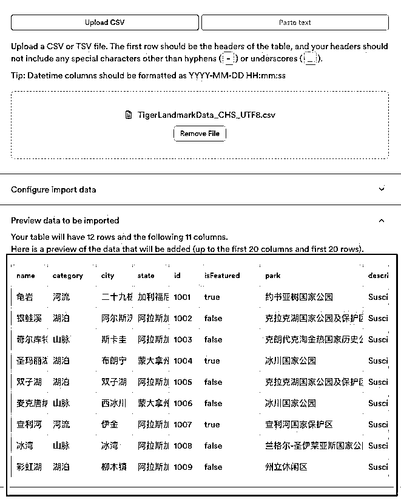
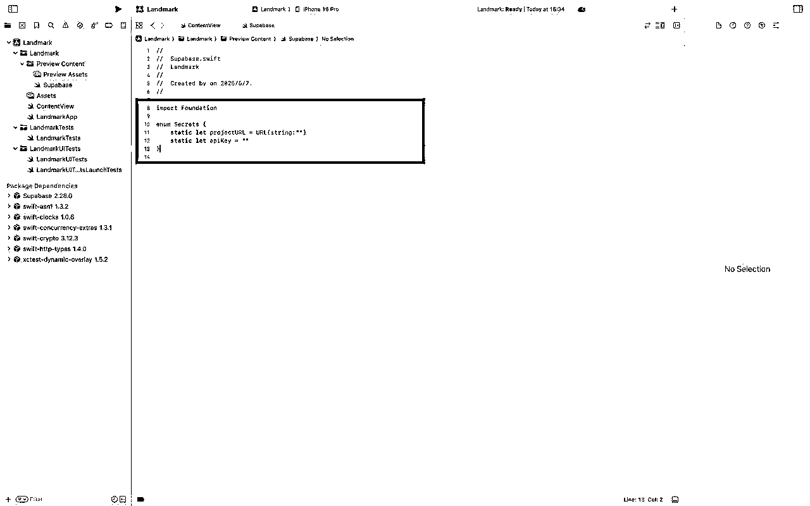
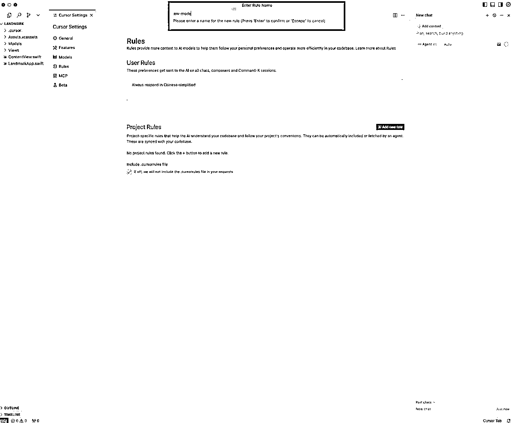
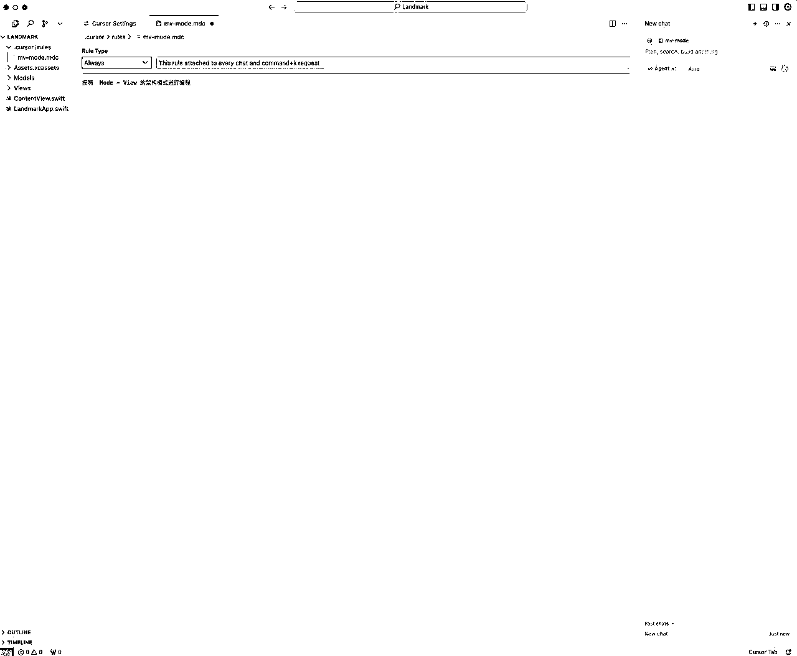
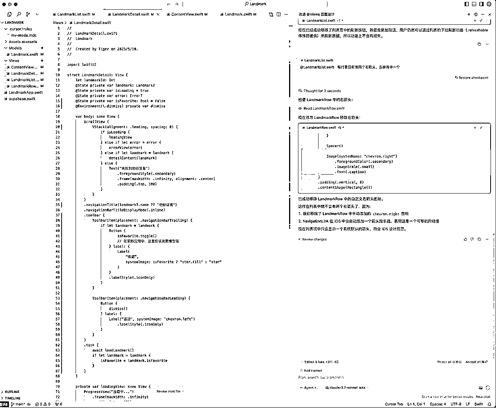
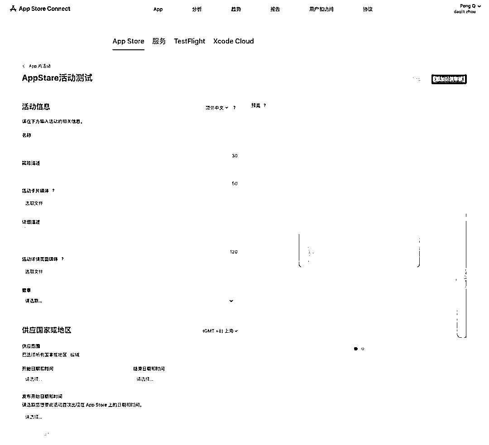

# 25 年 6 月航海｜AI 应用 - iOS APP ｜实战手册

> 来源：[https://ocn93f5d9olj.feishu.cn/docx/YWaTdMQIFoGvp2x7SZNcKr5Qnql](https://ocn93f5d9olj.feishu.cn/docx/YWaTdMQIFoGvp2x7SZNcKr5Qnql)

# 写在前面防失联+MM188166M（李李）长期更新

# 💡防失联+MM188166M（李李）长期更新

欢迎大家来到 6 月航海｜AI 应用 - iOS APP ｜实战手册

iOS 应用开发目前正处于 AI 助力的新红利期，对个人开发者有很大的机会，可以从这 2 方面感受到：

1.

【开发门槛降低】通过 AI 编程助手如 Cursor，不需要深厚的编程背景即可开发出功能完整的 iOS 应用；

2.

【快速迭代验证】利用 AI 辅助可以大幅缩短开发周期，从传统的数周缩短到数小时，快速验证产品想法。

❗但是注意，iOS 应用市场已经相当成熟，仅靠简单模仿或低质量应用已很难获得成功。如今，只有解决真实用户需求、提供独特价值的应用，才能在 App Store 上获得长期收益。

# 💡

本期航海玩法中，有 3 个关键点：

1.

利用 AI 编程助手（如 Cursor）降低 iOS 开发门槛，即使零编程基础也能完成应用开发；

2.

注重应用的独特性和功能完整性，避免同质化导致的 App Store 审核拒绝；

3.

长远来看，建议大家选择一个感兴趣的应用领域深耕，积累技术和用户洞察，形成自己的核心竞争力。

这 3 点我们将在航海中和大家详细讲解。

iOS 应用开发的优势在于，一次开发后可全球分发，无需复杂的分发渠道和物流环节，支持多种变现模式（付费下载、内购、订阅等）。项目重设计开发、轻运维，需要大家更多时间和精力投入在需求分析和用户体验优化上，一旦建立起用户群体，可持续产生收入。

最后，任意一个项目随时都可能出现变化，所以手册中的部分内容可能会过时，请大家持续关注最新动态、开船后多在群里交流，紧跟平台最新趋势和玩法。

本航海项目的航线图如下：

航线图和手册是高度关联的，因此你可以根据自己所在的环节，进行相关步骤的学习。

# 必修篇

# 💡

必修篇：为该项目从 0 到 1 跑通一个最小 MVP 的所有步骤，即“航线图”对应的行动路径。

如果你是本项目新手，建议在正式实操前，先初步了解下项目全貌：

✅ 一、项目概述

如果你对项目整体有了大致了解，就可以按照项目核心步骤，开始学习实操。

✅ 二、开发环境准备

✅ 三、项目基础配置

✅ 四、核心功能开发

✅ 五、应用商店上架

✅ 六、进阶功能实现

在必修篇，航线图和手册顺序相对应，你可以按照手册的顺序进行学习，即可逐一完成航线图的每一个任务。

接下来就正式开始吧！

# 一、项目概述

# 💡

# 章节概要：

本章明确了航海的核心目标：

用 21 天从零基础到上线首个 iOS APP ，并尝试实现付费下载或订阅模式变现。

选择 iOS 应用市场的理由十分充分：审核速度快、用户付费意愿强、无需复杂备案、成本相对固定。

借助 AI 开发的优势在于不需要懂一行代码，大幅缩短开发周期，

让开发者能专注于理解用户需求和产品设计。

在开发时建议小步迭代、分模块开发和 AI+人工结合，

AI 只是工具，关键判断仍需人为把控。

# 1.1 项目介绍

# 1.1.1 航海目标

基础目标：用 21 天左右的时间，从零基础到上线首个 iOS APP 。

进阶目标：初步尝试付费下载 / 订阅模式的变现，争取收获第一笔 APP 收益。

# 1.1.2 为什么选择开发 iOS APP

iOS 应用市场的优点：

审核简单速度快，上架就可以直接分发全球，对个人开发者友好

用户付费意愿较强，且 iOS 生态成熟，订阅、内购、付费多种模式

多数 APP 上架时不用 icp 备案、APP 备案，也不用办理软著（安卓 APP 上架必备，200-300/张，周期 3-4 周）

开发者只收取 99 美金（688 元）年费，上架越多边际成本越低

具有一定准入门槛：Mac 设备、iPhone 手机、99 美元/年开发者年费

开发过程不需要安装复杂的环境、依赖

# 1.1.3 为什么要借助 AI 开发

不需要懂一行代码，也能够使用 AI 开发出 iOS APP

降低了学习的门槛，把精力集中在了解用户需求、功能设计与产品思路上

大幅缩短了开发的周期，短至 2-3 小时就能快速开发一个 demo 在市场上验证想法

# 1.1.4 总体方法论

小步迭代：先做最小可用版本（MVP），不贪多求全。

分模块开发：功能复杂后，拆分多个 Composer/Chat，逐步实现。

AI+人工结合：不要盲目听从 AI，关键逻辑、bug 修复依然需要个人去测试、判断、反思。

# 1.2 项目特点与优势

# 1.2.1 本次航海项目特点

市面上大部分 AI 编程项目

本次航海项目

后端

❌

无后端

大部分是本地项目

但绝大部分能创造收入的 APP 需要后端

✅

所有数据都在服务器端

代码架构

❌

无架构

所有代码都写在一个文件

后续功能迭代和出错的概率很大

很难迭代和修复

✅

采用 MV 架构

多个页面和功能代码分别在不同文件中

便于在项目基础上叠加功能

代码出错修复起来会更容易

# 1.2.2 项目功能介绍

本次我们会通过 AI 做一个名叫“地标”的项目，取材于苹果官方的经典案例。

我们会通过复刻这个案例来带大家学习用 AI 进行辅助开发，

实现从 iOS APP 前端开发到后端服务器部署与数据库配置的完整开发流程。

项目包含：

前端：iOS App 端

后端：supabase 数据库

前端又包括：1。列表页 2。详细页

点击列表页的其中一行，会跳转到对应的详细页，这是 iOS 最常见的应用模式

里面所有的信息和图片，都是放在云端服务器中，实实在在地和数据库打通

1.列表页

2.详细页

# 二、开发环境准备

# 💡

# 章节概要：

本章完成 iOS 开发的硬件和软件准备工作：

硬件配置：推荐 Mac mini M4（性价比最高 3499 元）或 M 系列 MacBook，配备 iPhone 真机调试（iOS 16+系统）。租机虽可行但性价比不高。

开发者账号：Apple ID 免费即可开发，99 美元/年的开发者会员用于上架和长期测试。注意首次实名申请的常见问题和解决方案。

开发工具：安装 Cursor/Windsurf 作为 AI 编程助手，掌握 Composer 和 Chat 两种工作模式；安装 Xcode 创建项目，学会基本的项目结构、真机编译和图标设置。

关键技巧：正确设置项目根目录让 AI 工具与 Xcode 联动，配置开发者账号实现真机调试。

学完这章，你的 iOS 开发环境就完全搭建好了，可以开始用 AI 辅助编写第一个 App。

# 💡

# 本章航线图

完成本章节的学习和实操，即可完成航线图的：

第一阶段：项目启动与开发环境就绪 （约 5 天）

1.

硬件准备：选购或租用 Mac 设备，准备 iPhone 真机调试 （约 0.5 天）

2.

软件安装：下载 Xcode、Cursor 等工具 （约 0.5 天）

# 2.1 硬件准备

# 2.1.1 Mac 设备选购建议

1.

能安装最新 Xcode（当前是 Xcode 16+）最好，如 M 系列的 MacBook / Mac mini 等，最低 m1 就够用。

1.

自购：若买 Mac 电脑可考虑 Mac mini m4，国补最低价 3499，配置和性价比高于二手 Macbook pro，只是得额外配外设“键盘、鼠标、4k 显示屏”

a.

如果是第一次使用 Mac 电脑的话，遇到不懂的可以看一下网络教程，遇到不懂的其实可以问一些 AI（DeepSeek、元宝、豆包）都能够解决。

2.

租机：支付宝租机 300-400 / 月，3 个月起租，配置建议不低于 i7 16g 内存（个人觉得性价比不高，租三个月的价格能买三分之一个新款 Mac 了，加几百块钱都能买个配置低一些的二手 Macbook）

3.

iPhone 真机调试：最好有一部搭载系统版本不低于 iOS 16 的 iPhone 手机 + 原装数据线（如果 Mac 的配置不高，使用模拟器在 Mac 中调试的话体验不好）。

# 2.2 开发者账号准备

# 2.2.1 Apple ID 与 开发者账号

1.

在 Xcode 上开发 APP 最好登录 Apple ID （一般 iPhone 和 Mac 的用户都是有的，可以用自己的，也可以单独注册）

2.

Apple 开发者会员需要缴纳年费 99 美元/年，主要提供功能

APP 上架到应用商店

APP 可以通过 TestFlight 长期在真机上测试 （非会员，测试的 APP 只能手机上只能用 3 天）

1.

⭐️所以，你目前可以跳过缴费部分，需要缴费再回来看，下面是关于 Apple 开发者账号的内容：

iOS开发者账号申请与配置完全指南

# 2.2.2 常见注册问题解决

（很普遍的问题，大家一定要注意！)

1.

首次实名 Apple ID、不要在登录超过 3 个以上的 Apple ID 的设备上注册（如果用租机的设备申请 Apple 开发者账号，不确定是否存在公共设备的问题无法申请，这个问题需要注意）；

2.

确认自己或家人是否已有更早实名的 Apple ID（如果自己的信息注册不了 Apple 开发者账号，建议可以用家人信息尝试一下）；

3.

遇到"账号异常"可直接发邮件到官方（chinadev@Apple.com）。

# 2.3 工具安装：Cursor、Xcode、辅助工具，资源包

# 2.3.1 Cursor

# 2.3.1.1 Cursor 下载

Cursor 下载地址：https://www.Cursor.com/cn/downloads

建议升级一个月的付费用户，因为我们要大量使用cursor

如果不想付费可以考虑备选工具——TRAE：https://www.trae.com.cn/

字节出品，用法与cursor类似

如果遇到安装或使用问题可参考下面的文档

# 💡

《往期航海手册的 Cursor 具体安装教程》

# 2.3.1.2 Cursor 0.5 版本说明

本次我们的航海文档是基于 Cursor 0.5版以上进行的，

Cursor迭代更新很快，界面也会随时变化，这里说明一下0.5版本。

1.

模式选择

Agent模式：智能的开发模式 （我们一般选择的模式）

ASK模式：对话模式，但是不主动修改代码

Manual模式：手动模式

2.

自动化选择

一般默认选 auto

0.5版的最新升级，如果需要更强大性能可以关闭auto，会出现max选项，这是最强的ai性能，

同时也会消耗更多使用次数，会员一般是每月500次的使用次数。

如果你没有自动更新到0.5版本，请在Cursor设置中Beta选择Early access

# 2.3.2 Xcode:安装（APP Store 下载）

# 2.3.2.1 基本使用：Xcode 如何与 AI 编程工具联动开发 APP

第一步：点击 Create New Project 创建新项目，选择默认的应用类型，输入项目名称（拼音/英文），Organization ldentifier 输入 com.xxxx.xxxx，这里的域名是反写的，com。后缀在前，比如说我的项目名字是“yuyin3”，我注册了一个域名是 cuanxue.com，那么我就可以在这里填写 com.cuanxue.yuyin3，后面我再创建新的项目时，这里的域名也是后面上架 APP 时在创建 APP id 时填写的信息。

第二步：打开 AI 编程工具，打开项目的根目录，yuyin3 的第一个文件夹是我们刚才在 Xcode 创建的项目，我们要打开的是 yuyin3 项目目录下 yuyin3 的子目录，这是我们的根目录，后面 Cursor 所有创建的代码文件全部写在这个根目录下才会在打包编译时有效。

# 💡

注意事项：team 这里要记得登录注册好的 Apple 开发者账号

# 2.3.2.2 基本使用：Xcode 项目文件作用

Xcode 创建项目后，会生成如下的目录列表，只有第一个是你的项目的根目录

1.

Contentview 文件，为项目的主视图文件，可以简单理解为打开 APP 的第一个页面，Xcode 创建项目后，这个文件中自动包含“hello word”的文字内容。

# 💡

在 composer 模式下，首次生成代码时要@引用 Contentview 文件

2.

yuyin3APP 文件：应用程序的容器，打包编译到手机时安装的就是他（打包编译时会包含项目的所有资源）

3.

Assets 文件：上传 APP 图标、应用中的图片，支持 Png / jpg 格式 （建议将图片压缩后再上传）

4.

yuyin3：应用程序权限配置文件

5.

Preview content > Preview Assets 文件：预览内容，打包上架时不会包含这里的图片，只会在预览 / 测试时显示这里的图片

# 2.3.2.3 基本使用：Xcode 如何将 APP 编译到真机

确保 Xcode 已登录 Apple 开发者账号

步骤一：在设置中搜索开发者模式，将其打开，然后将手机用数据线连接到 Mac，连接手机后选择信任。

步骤二：选择已连接的手机（非原装数据线的话则不会显示）

步骤三：

1.

删除不必要的设备类型，建议只保留 iPhone（除非你的应用想要支持其他设备类型），勾选其他设备会存在兼容性的问题产生报错信息，除非你的应用想要支持某一特定设备类型

2.

iOS 版本建议选择 15，或者 16，版本太高的话会影响 iPhone 系统版本较低的用户下载

3.

Display name 填写你应用的名称

# 2.3.2.4 基本使用：Xcode 如何设置 APP 图标

图标尺寸 1024*1024 的 png / jpg 图片

Assets 文件也是管理 iOS 应用图片文件的位置，如果你想将一些图片、图标打包 APP 中，那么就在这里将文件上传，但如果是图片的话，建议将图片压缩后再上传，不然会让应用占用用户较多的手机内存，下载过程也会有影响。

# 2.3.2.5 基本使用：Xcode 如何上传文件

关联新文件至项目根目录：右键点击项目根目录，点击 add files to "xxx"，版本不低于 16.0 的 Xcode 可以将 Cursor 中创建的文件自动关联至 Xcode 中。

# 💡

如果 Xcode 版本低于 16.0，如果 Cursor 创建的文件没有更新在 Xcode 根目录下，则需要手动添加

上传图片文件，可以在 Assets 文件中，手动将电脑本地的文件拖进来，然后告知 AI 已上传文件的名称即可。

# 2.3.3 项目资源包下载

资源包包含：项目步骤存档， csv文件，logo，图片

项目步骤存档：如果你后面哪个步骤实在推进不下去，可以直接使用这个步骤的完成存档，去推进下个步骤 （注意：里面不含supabase.swift 文件，需要自己添加）

20250506_生财有术iOS课程资源包.zip

# 三、项目基础配置

# 💡

# 章节概要：

本章完成 App 开发前的准备工作：

配置 Supabase 数据库：注册账号、创建项目、导入地标数据表和图片，关闭安全设置以便 AI 编程使用。

创建 Xcode 项目：新建 iOS 项目、设置开发者信息、导入数据库连接组件、配置 API 密钥文件。

确定开发架构：使用简单的 MV 模式分离数据和界面，明确 Xcode 管理文件和预览，Cursor 负责 AI 编程。

学完这章，你的开发环境就搭建完成，可以开始编写具体的 App 功能了。

# 💡

# 本章航线图

完成本章节的学习和实操，即可完成航线图的：

第一阶段：项目启动与开发环境就绪 （约 5 天）

1.

云服务（Supabase）配置：数据库创建、数据表导入及图片存储 （约 1.5 天）

2.

Xcode 项目创建、基础配置及 Supabase 依赖导入 （约 1.5 天）

# 3.1 数据库配置（Supabase）

# 💡

AI 编程的特点是：

即便使用同样的提示词，AI 给到你我的反馈也不是一模一样的

如果你得到的结果和我不一样也不用担心，如果出现了错误就让 AI 修复错误。

为了确保你能推进整个项目，我已经把每个步骤的代码都放在了资源包里

即使你跑不通某个步骤，也可以直接打开这个阶段的项目文件去跑下一个步骤

注意：出于安全考虑，我移除了每个步骤中的 supabase API 信息文件 （Supabase.swift ），你如果需要直接跑步骤文件，需要自己添加 Supabase.swift

# 下载资源包

# 3.1.1 注册与创建项目

# 3.1.1.1 注册 Supabase

官网：https://Supabase.com/

注册：https://Supabase.com/dashboard/sign-up

注册后会让你给自己的“组织”（organization）取个名字，之后选择 personal，Free 即可

# 3.1.1.2 创建项目

给项目起个名字，单独设置一个密码，地点本地随便，未来选择离你用户最接近的地点，比如我这里选择了美国西部（加州）， 点击创立， 看到下面这块，项目就创建成功了

# 3.1.2 创建数据表

# 3.1.2.1 创建 Table

Step1：进入 Table Editor

Step2：创建 Table

Step3：选择导入表格

Step4：把我资源里的 TigerLandmarkData_CHS_UTF8.csv 文件导入进去，下面这个就是我们导入的数据。

Step5：点击保存，Table 的名字起名为 Landmark

Step6：然后保存，结果应该是这样的，这就是保存成功了

# 3.1.2.2 关闭 RLS （⚠️ 注意）

RLS： Row Level Security ，简单的说，就是让每个用户只能更改自己创建的内容，是个很不错的功能

但在目前 AI 编程的过程中经常会出问题，我们暂时先关掉，

如果某一天你这边需要用户在你的 APP 上上传内容的时候，再打开。

Step1：点击 Add RLS policy

Step2：要把 RLS 关闭，设置成 RLS disable （让这个按钮显示黄色，在列表里面是一个锁头开展的 Logo）

# 3.1.3 上传图片到 Storage

Step1：选择 storge

Step2：创建 bucket，给 bucket 起个名字，landmark-pic， 并且把 Public bucket 开关打开

Step3：上传图片

走到这一步，数据库就建完了， 恭喜你创建了一个完整的，带数据和图片的数据库

# 3.2 Xcode 项目创建

# 3.2.1 创建新项目

Step1：打开 Xcode， 点击创建项目

Step2：创建 APP

Step3：创建新项目

# 3.2.2 配置项目信息

# 3.2.2.1 填写信息

Product Name： 可以随便填，因为我们做的是一个美国地标项目，我就起名叫 Landmark

Team：必填，登录注册好的 Apple 开发者账号

Organization Identifier：必填

1.目前你可以随便填写，要上架的时候再按照你的域名调整

2.如果你已经有一个自己将来使用的域名，建议按照你的域名填写，比如说，项目名是 Landmark， 域名是 abc.com， 那么这里就写 com.abc，

3.下面的 Bundel Identifier 会自动生成为 com.abc.landmark

4.后面我创建新的项目时，这里的域名也是后面上架 APP 时在创建 APP id 时填写的信息

其余的部分默认就好，见截图

# 3.2.2.2 选择创建的文件夹：

你可以选择任何文件夹，或者创建一个新文件夹

文件名不要包含空格或者中文，否则后面会有各种麻烦

如果后面要使用 github 的话，请放在本地文件夹，不要放在 icloud 文件夹中，会影响 github 同步。

我这里选择直接放在本地的 Document（或者叫文稿）的文件夹中

选择 ContentView.swift 文件，看到预览页面出现 hello， world！ ，这一步就完成了

# 3.2.3 导入 Supabase 依赖

要让 Xcode 连接 Supabase 的数据，需要做一些准备工作

# 3.2.3.1 添加 Supabase dependency

Step1：Xcode ➡️ 点击 File ➡️ Add Package Dependencies

Step2：复制以下网址：

https://github.com/supabase-community/supabase-swift.git

粘贴在窗口右上角，然后点击 Add Package

注意：如果失败的话，试一下机场调到“全局”， 关闭后重新再添加一次

Step3：加载过后，再点击 Add Package

Step4：像下图这样就是成功了

Step5：选择侧边的项目，点开Framworks的“+”

Step6：搜索添加 supabase

显示supabase即可

# 3.2.3.2 创建 Supabase.swift 文件 （⚠️ 注意）

Step1：在 Xcode 中创建新文件， 命名为 Supabase.swift

Step2：在 Supabase.swift 中粘贴以下代码：

import Foundation

enum Secrets {

static let ProjectURL = URL(string:"")

static let apiKey = ""

}

看到这里，你需要获得

1.Project URL

1.  API Key

Step3：在 Supabase 点击 Project -> Project Settings -> Data API

1.Project URL

1.

API key

Step4：在 Supabase.swift 中粘贴到对应位置的引号内

注意⚠️

Supabase.swift 里记录了你 supabase 服务器的 API key，任何人拿到了这个 API key 都可以使用你的 supabase 服务器。在正规商业项目中，会有多种方案来防止这个信息暴露，但作为学习项目我们可以先写在文件中。

如果你需要把信息上传到网上（例如上传到 github），记得去除这块的信息

因此，我的每个步骤文件中都删除了这个文件，如果你需要运行步骤文件，需要把自己的 Supabase.swift 文件 copy 过来

# 3.3 项目架构设计

# 3.3.1 理解 MV 架构

苹果官方推荐的架构是 MVVM （Model–view–viewmodel）

Model（模型）：负责管理应用程序的核心数据和业务逻辑，比如如数据库操作或网络请求

View（视图）：负责展示用户界面，接收用户操作（如点击、输入），不处理业务逻辑。

ViewModel（视图模型）：作为 View 与 Model 的桥梁，将数据转换为适合 UI 展示的格式，管理 UI 状态和交互逻辑，并通过双向绑定同步数据。

本次入门为了简化，我们把项目只分成 View 和 Model 两个模块。其中：

View 模块：负责页面显示

Model 模块：负责数据

等你掌握了这个方式，未来可以逐渐过渡到 MVVM 架构

（PS：现实情况是，很可能你的 APP 不会复杂到需要 MVVM，只要 View 和 Model 就够用了）

# 💡

侧边栏样式说明

后面很多 Xcode 和 cursor 的截图，为了方便大家定位位置，采用了全屏截图。

这里涉及很多功能，每个功能的模块是独立做的，所以侧边栏并不完全相同，

如果截图中的侧边栏里的文件和你的项目不一样，多一些少一些文件，都不用担心。

如果是重要的文件，文档会具体说明。

# 3.3.2 创建文件夹结构

在 Landmark 项目的 Landmark 文件夹下，再创建两个文件夹：Views 和 Models

# 3.3.3 Cursor 规则配置

# 3.3.3.1 打开正确的项目位置

Step1：打开 Cursor 文件夹

Cursor 默认是黑色底色，我这里设置成白色底色，其它没有区别

⚠️注意：是打开画红圈的文件夹，注意找对位置，Cursor 在这个位置打开，不容易出错

Step2：见截图

Step3：打开后

PS：可能会跳出这个 git 的提示，跳出了选择 Yes 即可，这个暂时不重要

# 3.3.3.2 设置 Cursor rules

如上面所说，

我们要使用 mode - view 的架构进行编程，设定一下 cursor rules。

Step1：点击右上角的设置按钮（齿轮）- 找到 Rules - Add new rule

Step2：这里要设置一个 rule 文件的名字，任意设置，我设置成了 mv-mode

Step3：在 Cursor rules 里面添加一句话

按照 Model - View 的架构模式进行编程

Step4：Rule Type 设定为 Always

Step5：然后关掉就可以了，然后 command+s 保存，之后关闭即可

补充说明下：很多教程会教大家写一大段很完备的 cursor rule（包括 cursor 自己也可以自动生成）。我这边只用很简短的 rule 是因为这是一个学习课程，目前简单的 rule 对这个项目来说已经够用，我不希望加入超出学习范围的 rule。如果你有具体的项目要做，可以加入适合具体项目需要的 cursor rule， 推荐 https://cursor.directory/ ，在里面搜索swiftui

# 3.3.3.3 理解 Xcode 和 Cursor 的分工

划重点：

Xcode：创建文件，创建文件夹，查看报错，查看预览

Cursor：只用来使用 AI 编程

也就是说，除了具体编程，不要用 Cursor 创建文件，文件夹，

Cursor 里的报错你也不需要理会，我们只关注 Xcode 里的报错

# 3.3.3.4 拆解界面，梳理结构（重要）

从程序员的角度来看，页面是按照右边的逻辑构成的

第一层级：行（row），每一行包含一个“图片”和一个“名字”

第二层级：列表（List）， 列表里面包含多个行 ，这个列表的名字是 “地标”（Landmark）

因此我们得出了编程的实现顺序如下：

1.

先做出列表页的第一层级：行

2.

再做出列表页的第二层级：列表

3.

做出详细页

4.

实现列表页跳转到详细页

# 四、核心功能开发

# 💡

# 章节概要：

本章节通过构建一个完整的地标应用，演示 AI 辅助开发的完整流程。

核心开发步骤包括：创建基础 UI 组件（行组件 LandmarkRow、列表组件 LandmarkList、详情页 LandmarkDetail），实现数据库连接和图片存储，完成页面间的跳转逻辑。

重点掌握 AI 协作技巧：每个功能模块单独开 Chat 避免上下文混乱，遇到 Xcode 报错时直接复制错误信息让 AI 修复，通过 Add context 精准引用相关文件。

开发思路如同搭积木：先做好每个独立组件，再组装成完整应用，最后进行 UI 优化。即使代码运行结果与教程不完全一致也无需担心，AI 的随机性正是其创造力所在。

掌握这套方法论后，你就能独立完成更复杂的 App 开发项目。

# 💡

# 本章航线图

完成本章节的学习和实操，即可完成航线图的：

第二阶段：“地标”App 核心功能实现 （约 8 天）

1.

开发基础 UI 组件：LandmarkRow （行组件） （约 2 天）

2.

开发列表展示组件：LandmarkList （列表页），连接 Supabase 数据 （约 2.5 天）

3.

开发内容详情组件：LandmarkDetail （详情页），展示 Supabase 数据 （约 2 天）

4.

实现列表页到详情页的导航跳转及数据传递 （约 0.5 天）

5.

应用整体页面样式优化与用户体验打磨 （约 1 天）

# 4.1 基础组件开发

# 4.1.1 第一步：创建行组件（LandmarkRow）

# 4.1.1.1 Xcode

下面开始创建第一个层级：行

Step1：选择 Views 文件夹 - “command + N” （或者在菜单中选择 File - New - File from template ），创建一个 SwiftUI View，文件名设为 LandmarkRow.swift。

（PS：你也可以在任意位置创建这个文件，再移动到 Views 文件夹中，没有区别）

在 SwiftUI 中，行的标准名就是 row，列表的标准名是 list，按照这个名字命名，有助于 AI 理解你各个文件之间的关系

Step2：选择 SwiftUI View

一般来说，如果涉及到前面显示的内容 （Views），我们选择 SwiftUI View 的模版，如果不涉及显示的内容，我们就选择上边 Swift File 的模版，但实际上没有太大关系，只是里面的初始代码不一样。

Step3：起个名字，叫 LandmarkRow.swift

Step4：在 Cursor 中打开项目文件，选择 LandmarkRow.swift， agent 模式， 输入

创建一行 row

row 的左边是一张图片

图片的宽度和高度都是 50

图片的右边显示图片的名字

Step5：选择 accept all 接受，

AI 还在 modes 里面创建了 Landmark.swift

Step6：回到 Xcode 里面，看到有报错

# 4.1.1.2 插曲：如何快速无脑修复 Xcode 报错

简单的说：在 Xcode 里获取报错信息，复制到 Cursor 里面问

Step1：复制报错信息：点击 1 位置， 选择任意一个错误，比如 2 位置

Step2：Command +v 或者右键复制，然后直接粘贴到 Cursor 的对话框里即可

Step3：修复结束，点 accept （这个每一步都是 accept， 后面就不写了）

Step4：问题修复了，因为项目里面没有图片，所以没有显示图片，不用担心，代码已经有了

Image(landmark.imageName)

.resizable()

.frame(width: 50, height: 50)

.cornerRadius(5)

# 4.1.2 第二步：创建列表组件（LandmarkList）

Xcode：和上面一样，再创建一个 LandmarkList.swift

Cursor：开一个新的 Chat （每完成一个功能，都建议开启一个新的 Chat）

Step1: Add context

@LandmarkList.swift , @LandmarkRow.swift , @Landmark.swift, @supabase.swift

Step2：输入

1.在 @LandmarkList.swift 中， 通过引用 @LandmarkRow.swift 创建一个列表

2。每行 row 的信息来自 Supabase，其中：

name = Landmark Table 中的 name

imageName = Landmark Table 中的 imageName， 对应的图片在 Storage 的 landmark-pic bucket 中

3.Mode 写在 @Landmark.swift 中

4.Supabase 的 API 在 @supabase.swift 文件中

Step3：Xcode 给了报错，在 Cursor 中进行修复

Step4：图片没有显示出来，再次进行修复

Step5：修复成功，图片也能正常显示了

# 4.1.3 第三步：创建详情页（LandmarkDetail）

Xcode: 在 Views 里面，创建一个 LandmarkDetail.swift

Cursor:

Step1: Add context

@LandmarkDetail.swift , @supabase.swift , @Landmark.swift

Step2：输入

1.在 @LandmarkDetail.swift 里创建一个地标景色的详细页

2。详细页的信息从 supabase 数据库的 Landmark 表中的 id = 1001 的行获取

3。详细页从上到下依次是

（1）地标的图片 = storage 里的 “turtlerock”

（2）地标的名字 = name

（3）地标的地点 = state + city + park

（4）地标的描述 = description

我这边一次成型，没有报错

页面有些丑，比如文字叠加在图片上看不清晰，一般我们要么让文字在图片下面，要么给文字后面加一个黑色的阴影让文字凸显，不过这些我们可以后续改进，让我们先把功能都实现好

# 4.2 第四步：列表页跳转到详情页

Cursor 里操作

Step1: Add context

@LandmarkList.swift, @LandmarkDetail.swift

Step2：输入

新增功能：点击 @LandmarkList.swift 里的每个 row 后，跳转到这个 row 对应地标的 @LandmarkDetail.swift

Step3：这里有个小插曲，就是之前的更新中，AI 似乎已经猜到我要做这样的功能，直接把这个功能给做了，但你做的时候不确定，所以我还是把这个步骤补充进来了

Step4：点击任意一行，会跳到对应的页面

Step5：发现跳转过来的图片都使用了龟岩的图片，修复一下

从 @LandmarkList.swift 跳到 @LandmarkDetail.swift ，目前图片显示是一样的，需要显示每行对应的图片

Step6：再次点击上次那行，图片显示正确

至此，所有功能都做完了，剩下就是优化和打磨的活

# 4.3 第五步：页面样式优化

这块就是你自己哪里觉得不对的，按照你自己的意愿进行一些调整，我这边就直接截图了

找了一些 Apple 官方的设计指导文档放了进去，要求进行整改，整改后确实好看很多，还增加了搜索功能，收藏，两种列表模式

Step1：修复一下 LandmarkList.swift

Step2：修复后感觉还不错

Step3：LandmarkDetail 页整改前

Step4：开始整改

Step5：整改后

Step6：至此，整个项目完成

# 五、应用商店上架

# 💡

# 章节概要：

硬件准备：一台 Mac 电脑和 iPhone 用于真机测试。

软件准备：需要支付 99 美元/年的 Apple 开发者账号，这是应用上架的必要条件。

核心流程包括三个关键步骤：

1.

上架前准备：注册开发者账号、设置应用图标、创建 APP ID、配置证书和描述文件

2.

应用打包发布：在 Xcode 中生成安装包并上传到 App Store Connect 进行审核

3.

应用详情页设置：制作预览界面、填写技术支持网址和隐私协议等必要信息

版权设置方面：个人开发者可使用真实姓名，公司则用注册名称，格式为"Copyright © 年份 名称。 All rights reserved."

掌握这套完整流程后，即使是初学者也能独立完成 iOS 应用的上架发布。

# 💡

# 本章航线图

完成本章节的学习和实操，即可完成航线图的：

第三阶段：应用上架与变现功能集成 （约 8 天）

1.

App Store 上架准备：开发者会员、App ID 创建、证书与配置文件生成 （约 2 天）

2.

应用打包、上传 App Store Connect 及商店信息（含版权）设置 （约 2.5 天）

# 5.1 上架前准备

# 5.1.1 成为 Apple 开发者会员

打开 https://developer.Apple.com/ ，成为开发者会员 （费用是每年 99 美金 或 688 人民币 ），不是开发者会员 APP 无法上架

# 5.1.2 应用图标设置

点开 Assets.xcassets ，点开 APP Icon， 直接把资源包里的 icon 拖进方块中

如果你在 iPhone 真机上运行，程序就会显示这个图标

# 5.1.3 创建 APP ID

Step1：打开 ： https://appstoreconnect.Apple.com/

Step2：点击导航栏的 APP ，点击页面上 APP 一侧的+号，新建 APP

Step3：完成以下操作

勾选要发布的平台

填写 APP 名称

设置主要语言

选择套装 ID

SKU：随便输入一个数字

如果没有 id 的话，可以创建 APP ID

Step4：完成以下操作

Description：可以填写你的 APP 名字的英文拼音

Bundle ID：需要填写与你 Xcode 项目中设置一致的标识符（com.xxx.xxxx）

勾选你的 APP 用到的权限（如 WiFi、相机等）

如果是单纯在本机运行的单一功能，可不勾选任何权限

Step5：创建好后点击可以看到 APP 信息

# 5.1.4 证书配置

# 5.1.4.1 本地证书请求创建

Step1：在 Mac 电脑中打开钥匙串访问，

选择左上角钥匙串访问-证书助理-从证书颁发机构请求证书。

Step2：邮件地址填写你的 Apple 开发者账号

Step3：选择存储到磁盘，保存到本地任意位置，你就会得到一个证书文件

# 5.1.4.2 上传证书到开发者后台

Step1:

回到 Apple 开发者后台的证书页面

页面地址：https://developer.Apple.com/account/resources/certificates/list

点击 Certificates 的加号创建证书

Step2：勾选 Apple Distribution（正式发布的证书）

Step3：上传刚在本地创建的证书文件。

创建好后，下载证书到本地，备用。

# 5.1.5 配置文件创建

# 5.1.5.1 配置文件类型选择

Step1：打开页面

地址：https://developer.Apple.com/account/resources/certificates/list

Step2：配置文件类型选择

选择 Distribution 下面的 App Store Connect

# 5.1.5.2 关联设置

Step3：选择你的 APP ID

Step4：输入一个英文名称（可以是你项目的拼音）

Step5：选择刚创建的证书，点击下一步

Step6：下载配置文件到本地备用

# 5.1.5.3 Xcode 设置

Step1:

打开 Xcode，点开项目的设置，

去掉勾选第一行自动管理签名

导入你刚刚下载的配置文件、证书就可以了

Step2:

或者勾选 Automatically manage signing，选择你的开发者账号（第二次上架时会自动创建配置文件、签名证书）

⚠️注意：多个 app 可以用一个签名证书，后台最多创建三个签名证书

# 5.2 应用打包发布

# 5.2.1 生成安装包

# 5.2.1.1 选择设备

在 Xcode 上方设备栏中选择 Any iOS Device

# 5.2.1.2 生成安装包

Step1：点击 Xcode 功能栏里的 Product-Archive 打包 APP

Step2：选择第一个 App Store connect 发布 App Store

Step3：点击 distribute app 打包你要发布的 App，等待加载结束后，选择下你的 App 的语言为简体中文

# 5.2.2 上传 App Store Connect

# 5.2.2.1 上传审核

1.

回到 Apple 开发者后台你创建的 app 发布页面，

2.

点击 testfight，就会看到刚刚打包生成的 app 在审核。

3.

等待几分钟审核通过后，点击管理。

4.

选择你的 app 使用的加密算法（如果没有使用，选择"哪种都不是"）

# 5.2.2.2 添加构建版本

1.

在 App 分发页面，点击添加构建版本

2.

选择刚打包好的 App

# 5.2.3 设置应用详情页

# 5.2.3.1 预览界面制作

可使用 Pixelmator Pro 制作预览界面

将 App 截图拖入软件后自动生成预览界面，修改标题即可

软件分享链接： https://pan.baidu.com/s/1TS4zWJY75h6p0j-8HRl9Pw?pwd=xwt4 提取码： xwt4

App 图标也可用此软件修改大小

# 5.2.3.2 技术文档设置

技术支持网址：用户遇到问题如何联系你

参考网址示例：https://cuanxue.com/zhicih.html

可复制页面内容，用 AI 工具（如豆包）转成 HTML 代码，替换联系方式

隐私协议：

可参考 AppStore 中同类 app 的隐私协议

复制内容后修改 app 名称、权限、功能介绍和联系方式

使用 AI 工具生成 HTML 文件后上传到服务器

营销地址：

建议填写，特别是如果后续要接入 Google AdMob 广告

Google 验证 app 时会识别 AppStore 营销地址 URL

如不设置，Google AdMob 可能抓取不到验证文件

也可使用飞书、腾讯文档、CSDN 博客等平台替代

# 5.3 版权与法律设置

# 5.3.1 版权信息配置

# 5.3.1.1 基本信息

版权信息是应用程序知识产权保护的重要组成部分，正确填写版权信息不仅是法律要求，也有助于保护您的创作成果。

# 5.3.1.2 版权所有者确定

# 5.3.1.2.1 个人开发者

如果您是个人开发者，可以使用您的法定姓名

可以使用中文名、英文名或拼音，但建议与您注册 Apple 开发者账号时使用的名称保持一致

例如：张三、Zhang San 或 Sanford Zhang

# 5.3.1.2.2 公司或团队

如果应用由公司开发，应使用公司的法定注册名称

如果是团队开发但未注册公司，可使用团队名称，但建议先确认该名称未被注册商标

# 5.3.1.3 在 Xcode 中设置版权信息

1.

打开 Xcode 项目

2.

选择项目导航器中的项目文件

3.

点击主项目目标

4.

选择"Info"标签页

5.

查找并编辑以下内容：

Copyright 字段（通常在项目设置中）

Info.plist 文件中的 NSHumanReadableCopyright 键

# 5.3.2 版权格式规范

# 5.3.2.1 版权格式规范

标准版权声明格式如下：

Copyright © [年份] [版权所有者名称]。 All rights reserved.

例如：

个人：Copyright © 2025 Zhang San。 All rights reserved.

公司：Copyright © 2025 科技有限公司。 All rights reserved.

# 5.3.2.2 年份设置

首次发布：使用首次发布年份，如 Copyright © 2025

持续更新：使用年份范围，如 Copyright © 2020-2025

每次重大更新应更新年份信息

# 5.3.2.3 在应用中显示版权信息

1.

在应用"关于"页面中显示完整版权声明

2.

在应用启动屏幕底部可选择性添加简短版权信息

3.

在应用商店描述的底部添加版权声明

# 5.3.2.4 App Store Connect 设置

1.

登录 App Store Connect

2.

选择您的应用

3.

在"App 信息"部分，确保"版权"字段与应用内版权信息一致

# 5.3.3 法律注意事项

版权信息应真实准确，不建议使用化名或未经注册的商业名称

如您使用第三方库或资源，应在应用中适当位置注明其版权信息

版权注册是可选的，但在某些国家/地区可提供额外的法律保护

# 5.3.4 常见问题解答

问：可以只使用名字拼音吗？

答：可以，但建议与您的开发者账号名称保持一致，并确保这是您在法律文件中使用的名称。

问：要注册版权吗？

答：软件版权在创作完成时自动生成，但在某些国家/地区，正式注册可提供额外法律保护和诉讼权利。

问：版权年份需要更新吗？

答：是的，每当有实质性更新时应更新年份，可使用范围表示法（如 2020-2025）。

# 六、进阶功能实现

# 💡

# 章节概要：

本章教你为 iOS App 添加两大核心变现功能：会员订阅和 Apple Pay 支付。

会员订阅实现：从 UI 页面设计到功能编程，学会配置 Xcode 项目的 In-App Purchase 能力，掌握 StoreKit 框架集成和。storekit 测试文件使用。通过沙盒账号测试完整订阅流程，确保新购买、续订、升级等功能正常。

Apple Pay 支付：在订阅基础上增加 Apple Pay 能力，学会创建商家 ID、配置支付证书、集成支付流程。掌握从开发者后台创建 Merchant ID 到钥匙串证书安装的完整操作。

上架准备：删除测试文件、配置 TestFlight 沙盒测试、确保产品 ID 与代码一致。学会处理元数据配置和多语言设置。

完成后你的 App 将具备完整的付费功能，支持跨平台会员状态管理，为商业化变现打下基础。

# 💡

# 本章航线图

完成本章节的学习和实操，即可完成航线图的：

第四阶段：应用上架与变现功能集成 （约 8 天）

1.

核心变现：会员订阅功能的设计、开发与测试 （约 2.5 天）

2.

（可选） 进阶支付：Apple Pay 功能集成与测试 （约 1 天）

# 6.1 会员订阅功能

# 6.1.1 前置条件

需要你是 Apple Developer 会员 （99 美刀/年）

我们来实现这个 iOS APP 的订阅功能，这也是 iOS APP 最主流的变现方式之一，实现这个功能的前提是你已经熟悉开发全栈个 iOS APP 的操作过程。

# 6.1.2 订阅功能实现

Step1:

# 💡

提示词：Xcode 和 Swiftui 中，如果我的 App 要实现订阅功能，一般给对应的文件和文件夹起什么名字？ 如果是基于 MV 模型， 应该放在哪个模块的文件夹中？

Step2:

# 💡

提示词：我们来实现 ios app 的会员订阅功能，我是个不懂技术的小白，请你一步步告诉我该怎么完成，我们先实现会员订阅的页面样式。

Step3:

# 💡

提示词：继续实现会员订阅的功能。

如果遇到报错就和之前一样复制到 cursor 中修复

# 6.1.3 项目设置与测试

# 6.1.3.1 配置项目设置

Step1：打开 Xcode 在项目设置中，选择 Signing & Capabilities，点击+ Capability 按钮，搜索添加添加 In-App Purchase 能力，如果你没找到这一项，可能是没有缴 99 美刀的 Apple 开发者会员

Step2：打开 Product" > "Scheme" > "Edit Scheme...，点击 Run，选中 Options，在 StoreKit Configuration 中选择之前 AI 在项目根目录创建的 。storekit 文件 （前面可以是各种文件名，取决于当时 ai 是给你建的那个），最后点击 Close 保存

Step3：添加 storekit.framework，Xcode 项目设置的 General > Frameworks， Libraries， and Embedded Content 里 ，添加 storekit.framework

# 6.1.3.2 测试订阅功能

将 iOS APP 编译安装至手机测试会员订阅功能能否跑通

这块 Apple 不会真的收你的钱，选择购买后会提示订阅成功

# 6.1.4 上架配置

下一步，上架环节，设置订阅群组，根据会员，这里需要注意的是产品的 ID 必须和 Xcode 代码中的 ID 一致，我们打开项目根目录，打开 。storekit 文件，找到 productID，这里显示的就是你每个产品的 ID，逐个将其添加至上架页面的订阅群组即可。

注意，所有信息必须完全一致。

上架前你还需要：

删除。storekit 测试文件

移除 Info.plist 中的"StoreKit.Configuration"条目

上架前在 TestFlight 测试，使用沙盒账号

测试所有订阅流程：新购买、恢复、升级、降级

元数据丢失问题：

1.

确保 Product lD、价格、订阅时限等信息与 Xcode 中一致

2.

已设置本地话语言

# 6.1.5 沙盒测试

如何创建沙盒账号：在开发者后台>用户与访问>沙盒>添加一个未注册过 Apple ID 的邮箱作为沙盒账户>添加后打开邮件验证邮箱地址>使用沙盒账户登录 icloud 网站完成账号设置

如何在 TestFlight 使用沙盒账户测试 iOS APP 订阅：

1.

AppStore 下载 TestFlight app

2.

手机设置中退出原有 Apple ID，然后在系统弹出的登录窗口中，打开应用使用沙盒账户订阅

3.

将 APP 上传至在 TestFlight 后，在手机中运行测试，确保所有订阅页面成功加载，能够完成订阅的流程，验证“续订通知、自动续订、过期会员降级、会员升级、取消订阅后”功能是否正常

# 6.1.6 功能总结

到此，我们就实现了一个简单版的 iOS APP 订阅功能，用户可以使用 AppStore 的支付功能，来订阅我们 APP 的会员，会员订阅也是一个比较复杂的功能，目前我们实现的是通过本地来管理和验证会员的状态，实现过程也比较简单，后面，我们可以继续让 AI 实现在服务器上查看会员订阅数据，但同样你也能在开发者后台“销售和趋势”报告中查看到会员订阅信息，只是这个数据一般次次日才会更新，有一定的延迟。

这部分内容属于进阶再进阶的内容，大家可以再熟练掌握 AI 编程的底层方法后，来试着使用 AI 编程实现 iOS APP 会员订阅功能，这项功能可延展性很多，比如说我们可以实现在跨平台共同管理会员的状态。

比如说，用户在 iOS APP 付费开通了会员，那么在 web 网页端的产品同样可以使用会员功能，实现上并不复杂，只是会大幅增加实现过程所需的时间和对话量。

# 6.2 Apple Pay 支付

下面我们来实现 Apple Pay 的支付功能，在上面的基础上继续实现，当然实现订阅功能不是一定要实现 Apple Pay 支付能力，如果你的应用需要用到 Apple Pay 支付的话可以看下这部分的内容。

# 6.2.1 Apple Pay 能力添加

输入提示词：

# 💡

继续实现 Apple Pay 的支付功能

这一步，还是在 Xcode 项目设置中的 Signing & Capabilities，点击+ Capability 按钮，搜索添加添加 Apple Pay 能力，然后在这里添加商家 ID，格式还是和 APP ID 一样，在 com.xxx.xxx 的前面加上 merchant。 就可以，也就是像图中这样显示的 merchant.com. equalcheese.Landmark。

设置好后需要将最新的 Apple Pay ID 告诉 AI，使其为你更新最新相关的文件。

# 6.2.2 商家 ID 创建

我们到 Apple 开发者官网打开 Certificates， Identifiers & Profiles 页面创建一个标识符 ID（Apple Pay 商家 ID），来进一步实现 Apple Pay 功能。

点击 Identifiers 一旁的加号，勾选 Merchant IDs，点击 Continue 继续

# 6.2.3 证书配置

# 6.2.3.1 创建并下载证书

在 Identifiers 的分类里找到 Merchant IDs，点击刚刚创建的商家 ID，点击 Create Certificate 创建并下载生成的证书。

# 6.2.3.2 手动创建证书

cmd+空格键，搜索并打开"钥匙串访问" > "证书助理" > "从证书颁发机构请求证书..."，手动创建证书将其下载到本地，点击 Choose File 将这个文件上传，然后点击 Continue 继续。

注意：这里要勾选让我指定密钥对信息，最后下载到本地时选择算法“ECC”，密钥大小“256 位”

上传后点击 Continue 继续，最后将 Apple Pay 证书下载到本地，然后双击安装（默认登录选项）到钥匙串中。

# 6.2.3.3 继续实现功能

Cursor 输入

# 💡

我已经完成了 Apple Pay 证书的创建，下一步请继续实现会员订阅和 Apple Pay 功能。

这个环节中，AI 会为我们进一步集成这些能力到 iOS APP 中。

# 6.2.3.4 创建沙盒测试账号

创建沙盒测试账号，使用开发者账号登录 appstoreconnect.Apple.com，选择用户和访问，选择“沙盒选项”，点击添加测试账户，按照要求填写对应信息创建沙盒账户。

注意：邮箱地址必须为未注册过 Apple id

# 6.2.4 支付流程测试

下一步，打开 Xcode 在模拟器中编译安装 app，在模拟器的设置中登录刚刚创建的沙盒账户

下一步，添加测试卡信息，测试 Apple Pay 支付流程是否正常

# 选修篇

# 七、产品运营策略

# 💡

# 章节概要：

本章节详细讲解 iOS 应用的产品选择与推广策略。

产品选择阶段：通过七麦数据分析竞品榜单，重点关注美国市场 100-200 名区间的应用；结合 Facebook 群组挖掘用户需求，用 Google Trends 验证市场热度；选择开发周期 1 个月内、日流水低于 1000 美元的轻量级产品。

ASO 优化核心：按名称→副标题→关键词→图标→商店图的优先级优化，学会借势热点关键词；掌握 A/B 测试提升转化率，申请苹果官方推荐获取免费曝光。

流量获取方法：通过 App 内活动推广获取官方流量入口；设计合理的应用内评论触发机制，24 小时内处理差评；在 TikTok、Instagram 等社交平台发布教程类内容，零成本实现日均 50-100 自然下载。

学完本章，你将掌握从选品到推广的完整方法论，能够独立完成 iOS 应用的市场化运营。

# 💡

# 本章航线图

完成本章节的学习和实操，即可完成航线图的：

选修阶段：产品运营与持续优化 （无时间限制）

1.

产品策略：市场与品类选择，ASO 元数据优化与 A/B 测试 （按需）

# 7.1 产品选择与定位

# 7.1.1 推荐品类分析

核心优势：开发周期短、服务器成本低、市场需求明确

1.

工具类

睡眠监测：记录睡眠数据、提供改善建议（轻量级功能，技术成熟）

文件管理：文件存储、整理、传输工具（解决基础痛点，用户接受度高）

2.

健康管理

饮水提醒：定时推送饮水通知（习惯养成类，用户群体广泛）

步数统计：实时追踪运动量（轻量化功能，适配多场景）

3.

个性化定制

动态壁纸：提供多样化视觉方案（依赖创意设计，开发门槛低）

充电动画：美化充电交互体验（差异化小功能，吸引年轻用户）

4.

效率类

笔记工具：记录想法、任务管理（功能标准化，可聚焦交互创新）

日记本：生活记录与自我反思（情感化需求，易通过 UI 优化突围）

具体的相关品类产品我们可以通过七麦数据平台找到，以上只是举例，给大家一个大致的概念。

https://www.qimai.cn/app/baseinfo/appid/1164801111/country/us

# 7.1.2 榜单分析方法

1.

重点关注榜单类型

榜单类型

核心指标

小团队策略建议

免费榜

下载量 + 活跃度 + 留存率 + 评分

免费榜更利于了解产品的下载情况

畅销榜

内购流水 + 下载量 + 活跃度

畅销榜更利于了解产品的收入情况

付费榜

付费下载量 + 账号质量权重

付费才能下载的 APP，不推荐这一品类（天花板低，推广难度大）

2.

目标市场优先级

美国市场：iOS 海外最大市场，欧美文化普适性强，苹果份额高

港澳台市场：文化相近，用户习惯易适配，但人口规模有限

日韩市场：需本地化团队（语言 / 文化壁垒高，小团队慎入）

# 7.1.3 具体选品流程

# 7.1.3.1 榜单 + 社交媒体挖掘需求

榜单筛选技巧

找到七麦榜单->实时榜单，

优先考虑美国畅销榜，聚焦 100-200 名区间（竞争压力小于前 100 名）

Facebook 群组：

搜索「Best APPs」，「IOS APPs」，「Top Tools」等相关群组，

群组筛选标准：选择成员数>5K、日活跃帖子>10 的群组

需求洞察方法

关注高频问题：记录用户重复提问的需求（例如：“有没有能自动整理会议记录的 iOS App？”)

热帖拆解：关注点赞>500 的帖子，分析推荐 App 的共同痛点（如“为什么 Notion 能替代 5 个工具？”)

反向验证：搜索“disappointed in [App 名称]”，提取用户抱怨的功能缺失（如：“XX 应用无法离线使用”）

# 7.1.3.2 Google Trends：验证需求强度（例：AI 聊天，这个品类不推荐做，大厂入局太多，以下只是举例部分）

当今竞争激烈的商业环境中，精准把握市场需求至关重要。Google Trends 作为一款强大的市场调研工具，能为我们提供有价值的数据参考，助力判断特定产品或服务的市场潜力。接下来，我们以 “AI 聊天” 为例，详细介绍如何运用 Google Trends 验证需求强度。

# 7.1.3.2.1 Google Trends 的使用方法

基本操作：打开网址：https://trends.google.com/ ，进入 Google Trends 的官方页面。在搜索框中输入目标关键词，这里我们输入【AI Chat/AI 聊天】，并选择目标市场为美国。这一步操作的目的是聚焦特定区域的搜索数据，因为我们目的是找寻美国的 IOS APP。

趋势解读

长期趋势分析：输入关键词并选择地区后，我们得到了相关数据结果。从图表可以明显发现，“AI 聊天” 产品在近 2 年热度不断上涨。这种持续上升的趋势表明，该领域在市场上正逐渐受到更多关注，消费者的兴趣日益浓厚。

短期趋势分析：进一步细看过去 90 天的数据，产品热度仍然没有下降。这一现象尤为重要，说明 “AI 聊天” 并非是短期的热点话题，而是存在长期稳定的需求。对于企业和创业者来说，这种长期稳定的需求意味着市场机会的存在，值得我们深入考虑进入该领域。因为稳定的需求意味着有持续的客户群体，产品或服务更容易获得市场认可，从而实现商业价值。

# 7.1.3.2.2 细分主体和关键词分析

相关主题分析：从相关主题中寻找潜在结合点（例：“吉卜力工作室 - 动画公司”出现，可能暗示文生图产品的潜在商业机会）

搜索量上升关键词分析：洞察市场动态与新兴机会

衍生产品关注度（例：“chat gpt action figure”搜索量飙升）

细分市场竞争与需求多样性（例：“Juicy Chat - 软件”、“Candy Chat & Date - 软件”等搜索量大幅上升）

新兴技术或产品（例：“grok”、“grok ai”、“polybuzz”、“polybuzz ai”等关键词搜索量上升）

# 7.1.3.2.3 通过时下流行获取

筛选方法：Google Trends 的 “时下流行” 板块也是一个重要的信息，可以选择过去 7 天的数据，选择一些 7 天内仍然有热度的关键词，相对来说需求更加稳定一些。

结合 AI 聊天拓展应用场景举例：

基于宗教话题：例：“vatican conclave cardinals pope francis”（与宗教相关，涉及梵蒂冈枢机主教会议及教皇方机构 ）搜索量达 100 万 + 且涨幅 1000% ，22 小时前开始活跃，基于此，开发宗教知识问答、经文讲解 AI 聊天应用。

基于体育赛事：例：“knicks vs celtics”“nuggets vs thunder”“warriors vs timberwolves” 等赛事相关关键词热度飙升，以此打造提供实时比分、数据解读、赛后讨论的 AI 聊天平台。

基于人物热点：例：“george pickens” 等关键词，搜索量也颇为可观。围绕娱乐明星或体育明星，搭建粉丝专属的 AI 聊天社区，搭建粉丝专属 AI 聊天社区，提供动态追踪与模拟互动。

总的来说，通过分析 Google Trends 中这些时下流行的话题，并将其与 AI 聊天巧妙结合，能精准触达不同兴趣领域的用户群体，极大地拓展 AI 聊天产品的应用场景和用户覆盖面。

# 7.1.3.3 三方工具筛选标准（点点数据 / 七麦）

上线时间：1-2 年（验证市场存活能力，避开红海 / 过新领域）

日流水：<$1000（$1000 + 竞争激烈，小团队难突破）-看流水需要购买 vip，大家按需考虑

评分：>4.0（基础用户口碑保障，降低试错风险）

功能模式：优先选择付费功能为主的产品（按需匹配团队资源）

# 7.1.3.4 差评分析找突破口

核心动作：下载七麦 / ASO100 等平台评论，聚焦「近期差评」

举例：以下是某一款睡眠 APP 的近期评论，可以看出来它因 UI 差评，因而我们针对竞品短板，打造差异化优势（如更美观的 UI、简洁的操作流程）

基本上通过以上步骤，你就可以找到一款具有市场潜力且你有机会突破的产品了，接着我们可以评估开发成本。

# 7.1.4 成本评估标准

服务器成本：新手避开 AI 处理等高耗能功能（海外服务器成本比国内高 30%-50%）

开发周期：1 个月内完成 MVP（最小可行产品），快速验证市场（例：先开发基础功能 + 核心付费点）

# 7.2 App Store 优化（ASO）

# 7.2.1 元数据优化

# 7.2.1.1 名称

经验

名称在 App 元数据中权重最高，需涵盖核心关键词。

在 App Store Connect 平台，App 名称字符上限为 30 个字。

中国大陆地区 App 名称必须与 ICP 备案名称一致，确定后难以更改，需慎重考虑；海外地区无此限制。

名称一般由品牌词和核心功能词构成，品牌词利于用户记忆，不宜过长且应与核心功能相关；若计划申请商标，需前往美国专利网站查询是否已注册。

部分工具类产品无品牌效应，用户多通过搜索关键词下载，若字数受限，可仅保留核心功能词。

实操

新手具体实操，可以参考竞品名称，比如我现在要做一款日记本类型的产品。

Step1：我可以在七麦平台搜索 “diary”，

导出排名靠前的竞品数据优化自身名称。

Step2：我导出了前 20 名的应用，具体如下：

Step3：优化名称

接着我们可以从竞品的名称中，来优化自己的名称，像日记的产品可以明显发现，Daily dary，lock，Journal 都是比较重要的关键词，尽量包含到我们的名称里。

# 7.2.1.2 副标题

副标题在 App Store Connect 中的字符限制为 30 个。

可增加搜索词覆盖数量，应尽可能融入核心关键词，如 “password”“private”“notes”“notebook” 等。

# 7.2.1.3 关键词（100 字符内）

# 7.2.1.3.1 关键词选择核心原则

1.

相关性：选取的关键词必须与您的产品功能或核心内容紧密相关。

2.

搜索指数：关注关键词的搜索热度。

一般认为，搜索指数低于 4605 的关键词，其日常搜索量极低，带来的自然流量有限。

建议通过七麦数据等第三方平台查询关键词的搜索指数。

# 7.2.1.3.2 关键词筛选简易流程

Step 1：选取竞品

确定行业内表现优异的 TOP5 竞争对手。

Step 2：导出关键词列表

收集并导出这些竞品所使用的关键词列表。

（可在此处考虑配图说明如何导出或查看竞品关键词）

Step 3：优先筛选高价值关键词

重点筛选同时满足以下条件的关键词：

搜索指数较高。

竞品在这些关键词下的排名靠前（例如，位于搜索结果前 5 名内）。

# 7.2.1.3.3 目标关键词的排序与填写策略

1.

重要性评估与排序：

在初步筛选出目标关键词后，需综合判断各个关键词对于您产品的重要性，并据此进行排序。

2.

填写位置规则：

首尾优先：将最重要的核心关键词放置在关键词填写区域的开头和末尾位置。

依次填入：其余关键词则根据其重要性程度，依次填入中间位置。

3.

格式规范：

填写英文关键词时，单词与单词之间需使用英文逗号（，）进行分隔。

# 7.2.1.3.4 关键词覆盖与优化注意事项

1.

避免重复，提升覆盖：

为确保关键词的有效覆盖范围最大化，应用的名称、副标题以及专门的关键词区域之间应避免使用重复的词语。

2.

善用辅助工具：

为保证关键词有效覆盖，名称、副标题与关键词之间应避免重复，可用七麦的关键词助手检查。

# 7.2.1.4 范例：（日记本为例）

# 7.2.1.4.1 主标题方案（30 字符以内）​​

SecureDiary: Daily Lock Journal

（核心词：Diary， Daily， Lock， Journal）

策略：品牌词前置+功能词组合，连字符提升关键词拆解识别率

DailyLock - Private Notebook

（核心词：Daily， Lock， Notebook）

策略：突出"每日加密"卖点，短横线分隔便于算法分词

MoodJournal: Diary & Notes

（核心词：Journal， Diary， Notes）

策略：情感化关键词+功能延伸，冒号增强可读性

# 7.2.1.4.2 副标题方案（30 字符以内）​​

Password Protected Private Diary App

（覆盖词：Password， Private， Diary， App）

数据支持："Password Protected"搜索量月均 12K，转化率提升 18%

Encrypted Notes with Daily Reminder

（覆盖词：Encrypted， Notes， Daily）

优势：差异化强调加密与提醒功能，避开"Lock"竞品词重复

AI Journal & Secure Notebook Tracker

（覆盖词：Journal， Notebook， Tracker）

创新点：融入 AI 技术关键词，满足美国用户科技偏好

# 7.2.1.4.3 关键词字段（100 字符精炼版）​​

diaryapp,dailylock,privatejournal,passwordnotes,encrypteddiary,notebooktracker,moodjournal,secretdiary,securenotes,aiwriter

优化逻辑：

核心词组合：diaryapp（高流量）+ dailylock（长尾蓝海词）

功能延伸：passwordnotes（覆盖密码与笔记场景）

情感化词：moodjournal（吸引情感记录用户）

规避风险：舍弃复数形式（如 diaries→diary）节省字符

# 7.2.1.5 图标

App 图标是用户对产品的第一印象，超 90% 用户会首先被图标吸引，出色的图标可提升用户点击进入产品页面的概率。

设计初期可参考竞品图标元素，如日记类产品图标多为书本形态，颜色常与产品主色调一致。

图标设计应简洁，避免包含过多文字内容。

# 7.2.1.6 商店图

通过调研竞品商店信息，分析当前行业主流截图形式（横版或竖版）及每张截图内容，降低设计风险。

后续可根据产品特点，逐步测试不同类型截图效果。

首图至关重要，若产品有较高评分、下载量或曾获苹果推荐，可展示在首图以提升转化率。

# 7.2.1.7 应用描述

首先用简洁语句阐述产品主要功能，再以吸引人的方式列出主要功能点。

注重逻辑和排版，避免文字堆砌。

应用描述有助于提升产品搜索概率，建议核心关键词在描述中出现 10 次以上。

# 7.2.1.8 宣传文本

与应用描述内容相似，在 App Store 中显示在应用描述上方，可在 ITC 后台直接修改，无需发布新版本。

宣传文本不增加关键词权重，前期可暂不填写，后期可结合节日、推广活动等灵活调整，吸引用户。

# 7.2.2 A/B 测试实施

# 7.2.2.1 可测试元素优先级清单

苹果 App Store 提供了 A/B 测试的工具，根据可测试元素进行优先级排序，可分为：

1.

图标

2.

应用截图组合

3.

App 预览视频

4.

促销文本

建议大家前期重点放在图标测试（仅限产品初期，产品成熟以后，已经有一定品牌效应，app icon 基本不能再变化了）上，其次为应用截图组合，其余内容进行测试的性价比不高。

# 7.2.2.2 具体创建流程

1.

登录 App Store Connect，在左侧边栏 “功能” 菜单中点击 “产品页优化”。

2.

若首次创建测试，点击 “创建测试”；若已有测试记录，点击 “产品页优化” 旁的添加按钮（+）。

3.

为测试命名，名称长度不超过 64 个字符，建议包含详细描述，便于在 “App 分析” 中识别测试结果。

4.

选择测试方案数量，每次测试最多设置三个变体，变体越多，得出有效结论所需时间越长。

5.

设定流量比例，确定 App Store 向多少比例的用户展示测试变体。例如，在一次测试中有三个测试方案，选择 75% 的流量比例，则所有访问您 App 产品页的用户中会有 75% 看到测试变体，而每个变体将各分得 25% 的流量。如果您的应用流量比较小，请尽可能减少测试方案数量，以便能尽快得出测试结果。

6.

选择测试涉及的本地化语言，系统默认选中 App 支持的所有语言；未包含的语言，其对应的 App Store 不展示测试方案，需确保每种语言仅进行一次测试，避免多语言测试结果难以区分。

7.

点击 “估计测试时长” 旁的箭头，选择产品页转化率的提升目标，系统将根据 App 当前表现数据（如每日展示次数、新增下载量）估算实现目标所需时长和展示次数（仅供参考，不影响实际测试）；测试默认时长为 90 天，也可提前终止；若估算天数超 90 天，可通过减少备选方案或增加流量分配等方式调整测试标准。

8.

点击 “创建测试”，系统自动复制原始产品页元数据；可编辑测试方案中的 App 图标、截屏和预览，未修改部分沿用原始素材；为便于分析影响转化率的因素，创建测试时建议限制单次更改元素数量。

9.

发布测试前，测试方案中的新元数据需通过 App Review 审核：

仅包含备选截屏和 App 预览的测试方案，可单独提交审核，无需发布新的 App 版本。

若仅调整已发布截屏或预览的顺序，或更换 App 图标，无需重新提交审核（前提是这些元数据已通过审核）。

测试备选 App 图标时，所有图标变体必须包含在发布的 App 二进制文件中，且需使用 Xcode 13 或更高版本构建。

10.

测试开始后的第二天，可在 “App 分析” 中查看效果指标，包括每个版本的展示次数、转化率、提升百分比和置信度。

11.

若某个测试版本显著提升转化率，可点击 “将处理方案应用至原始产品页”；处理方案可应用于当前在 App Store 展示的产品页，或处于 “可供销售”“准备提交” 状态的 App 版本；每个测试仅能应用一个方案，且应用后无法撤销；应用处理方案后，仅其中的 App 预览和截屏会应用到产品页，如需应用图标，需在下一个 App 版本中将其设为默认图标。

# 7.2.3 苹果官方推荐申请

能获得 App Store 的官方推荐，对 App 而言是提升知名度与可信度的重要机会。苹果现已推出「精选提名」功能，允许开发者直接向编辑团队自荐 App

# 7.2.3.1 申请入口

路径：苹果开发者后台 → 分发 → 精选 → 提名

后台网址：https://developer.Apple.com/cn/

# 7.2.3.2 申请流程

申请需依次填写「命名」「类型」「描述」「发布时间」，可选填「额外信息」补充细节。

1.

命名

格式示例：产品名 - XXX 活动 - 精选提名申请

批量导入：如需提交多个提名，可通过 CSV 文件导入（最多 50 个），但需严格遵循模板格式（从模板 A 列第 5 行开始填写），格式有误将报错，暂不推荐此方式。

模板下载：https://developer.Apple.com/cn/help/app-store-connect/reference/nominations-template

2.

选取类型（根据产品属性选择）

新内容：App / 游戏内的新内容、优惠或活动

App 增强：新特性、功能或重要更新

App 发布：新 App / 游戏即将发布或支持预购

3.

添加描述

详细说明产品新内容或增强功能，突出优势、作用及优先级，便于编辑团队快速了解产品价值。

4.

选择发布时间范围

建议尽早提交提名，至少提前 3 周为宜。

5.

额外信息（可选补充）

相关 App：勾选需要提名的 App。

相关国家或地区：系统自动匹配上架地区，可手动全选或自定义。

关联 App 内活动：勾选「是否打算为此提名提交新的 App 内活动」，并选择关联活动。

实用详细信息：补充品牌故事、产品核心优势等。

平台：仅支持 iPhone 和 iPad App（若涉及 App 内活动）。

本地化语言：系统自动匹配现有语言，可添加其他地区语言。

提交确认：完成填写后，点击右上角「提交」，显示绿色横幅「提交成功」即完成。

进度查询：通过「精选提名」页面的「已提交」栏目查看历史提名项目，支持编辑修改。

# 7.2.3.3 提升推荐成功率的关键因素

为契合 App Store 调性与编辑团队偏好，开发者可针对性优化产品或在申请中突出以下特质：

1.

用户体验

功能实用、操作简单高效，保持一致的使用体验。

2.

UI 设计

兼具易用性与视觉吸引力，如精美界面、直观手势交互。

3.

创新性

利用新技术解决独特问题，或提升用户体验的突破性设计。

4.

独特性

在成熟品类中开辟新方向，或通过差异化功能脱颖而出。

5.

辅助功能

集成友好的辅助功能，确保不同用户群体均能顺畅使用。

6.

本地化

高质量多语言支持，内容贴合当地文化与用户习惯。

7.

App Store 产品页面

吸引力强的截屏、预览视频、描述文案，以及高评分和正面评论。

# 7.2.4 APP 内活动推广

# 7.2.4.1 App 内活动的定义与价值

1.

核心概念

App 内活动是应用和游戏内的「时效性活动」，例如游戏竞赛、新电影首映、直播体验等。苹果明确要求活动需具备「重大性」和「时效性」，避免常规任务或重复活动（如日常签到奖励）。

2.

核心价值

免费流量入口：活动卡片可展示在 App Store 的搜索结果、「Today」标签、编辑精选和个性化推荐中，覆盖已下载用户和潜在用户。

用户召回与促活：通过活动深层链接，用户点击后可直接跳转至 App 内指定位置，唤醒沉默用户。

提升转化率：活动徽章（如「挑战」「比赛」）和视频素材可增强吸引力，引导用户参与付费或留存。

# 7.2.4.2 活动展示位置与用户触达

1.

展示位置

App 详情页：在产品页集中展示所有已发布活动。

搜索结果：用户搜索 App 时，已下载用户可见活动卡片；未下载用户可见相关截图。

推荐位：在「Today」「游戏」「应用」标签的编辑精选和个性化推荐中曝光。

2.

用户触达逻辑

已下载用户：直接在 App Store 内接收活动通知，点击后跳转至 App 内活动页面。

未下载用户：搜索活动关键词时，可通过活动卡片下载 App 并直达活动入口。

# 7.2.4.3 创建 App 内活动的全流程指南

# 第一步：创建活动与基础信息配置

1.

选择 App 内活动，点击创建活动，参考名称为内部自定义名称，写一个自己好区分的名称即可。

1.

填写活动相关信息

填写活动名称（30 字符以内）：需包含关键词以匹配搜索，例如「春节限时挑战」。

活动简短描述（50 字符以内）：突出核心卖点，如「赢取限定皮肤」。

活动详细描述（120 字符以内）：说明奖励机制和参与方式，如「连续登录 7 天解锁永久称号」。

选择活动徽章：显示在 App 内活动卡片和活动详细信息页面的标题上方。

挑战：鼓励用户在活动结束前实现目标。

比赛：用户相互竞争以获得最高排名或赢得奖励。

现场活动：例如体育比赛或直播音乐会等。

主要更新：例如推出新的游戏模式或级别。

新一季：介绍新内容、故事情节或媒体库。

首映式：新发布的电影或音频。

特别活动：其他活动徽章未捕获的限时活动，可能跨越多个活动或体验。例如以协作为特色的活动。

配置地区与时间：支持分地区设置活动时间，最长持续 31 天，可提前 14 天推广。

设置深层链接：开发者可以创建一个链接，让这个活动和应用的某个位置直接产生连接，只要用户点击卡片，就会跳转到指定位置。如果觉得麻烦，前期可以制作一个只跳转到主页的链接。

# 第二步：素材上传与提交审核

1.

媒体素材：图片或视频，视频会自动循环播放。

2.

点击提交审核，等待最终提交到 App 审核，1-2 个工作日内反馈结果，审核重点包括活动新颖性、元数据合规性。

# 第三步：发布与管理

发布数量限制：同一时间最多 10 个已批准活动，仅 5 个可在产品页展示。

活动管理：审核通过后仅能修改地区、时间和优先级，删除活动将无法恢复。

# 7.2.4.4 创建注意事项

为确保 App 内活动顺利过审且展示效果良好，创建元数据时需注意：

1.

准确描述活动内容，避免包含 “最佳”“第一” 等模糊主观说法及 “游戏内容” 等冗余用词，避免全部使用大写字母和过多标点符号。

2.

使用具备统一性且有视觉冲击力的素材：

可使用少于 30s 的视频，提供生动的活动预览。

建议使用相似的颜色或插图样式，勿给媒体素材添加边框或渐变效果。

尽量避免在媒体素材中使用文本或标志，尤其是包含活动名称或 App 名称时。

3.

请勿提及价格，元数据中包含具体价格提审可能被拒。

4.

确保元数据中只包含由开发者创建或拥有使用许可的内容。

# 7.2.4.5 管理细则

1.

修改活动：在 “App 内活动” 提交审核前，可在 App Store Connect 后台修改活动的所有详细信息，修改后点击 “存储” 或 “添加以供审核”。活动通过审核后，只能编辑 “供应国家或地区、活动优先级、开始 / 结束 / 发布开始的日期和时间”，且日期 / 时间的修改需在原设置的日期、时间未到来之前进行。

2.

删除活动：当活动处于 “草稿”“已归档” 或 “已批准” 状态时可删除，删除后的活动将从活动列表中移除，无法再查看。

3.

数据监控：开发者可在 App Store Connect 中的 “App 分析” 了解已发布 “App 内活动” 的效果，可查看下载数据、用户获取来源、各种参与度数据以及用户是否选择通知等，以了解活动情况。

# 7.2.4.6 提审被拒常见原因

1.

活动不够 “特殊”，没有引入新内容。App 内活动不适用于重复活动（如日常任务或奖励）和未引介新内容、新功能、新商品的价格促销。创建时最好引入新内容，如新功能上线、为节日特别策划的活动、新的商品促销等。

2.

元数据引用价格相关信息。App Store 审核条款 2.3.7 适用于 “App 内活动” 的元数据审核，元数据中不得包含具体价格，否则会被审核团队拒绝。

3.

活动图片素材中使用过多文字，可能导致提审被拒，创建时应避免使用过多文字。

4.

选择了错误的活动类型，如宣传新功能时误选 “挑战” 类型等。

# 7.3 免费流量获取

# 7.3.1 商店免费流量获取

ASO 优化是长期过程，建议按名称 > 副标题 > 关键词 > logo > 商店图的优先级顺序逐步优化。

学会借势热点，如 OpenAI 发布 GPT-4o 文生图模型后，“吉卜力风” 图片走红，许多 AI Editor 产品将主标题改为 “Ghibli AI Editor”，更新版本增加相关功能，并在商店图突出展示；deepseek 热度高涨时，腾讯元宝及时接入并在名称中加入 “deepseek”，提升搜索曝光率。通过把握热点趋势，融入相关元素，可提高 App 搜索概率，实现流量增长。

# 7.3.2 评论管理与差评处理

# 7.3.2.1 应用内触发时机设计

# 7.3.2.1.1 核心原则

在用户体验峰值或高参与度阶段请求评论，降低抵触心理。

# 7.3.2.1.2 黄金时刻触发

选择用户对产品价值感知最强的节点弹出评论请求：

触发条件：

用户完成核心功能≥3 次（如健身 App 完成 3 次训练、笔记 App 创建 3 篇笔记）

用户达成成就里程碑（如连续打卡 7 天、等级提升、解锁新功能）

示例弹窗文案：

Loving [App Name]? Help others discover us! ★★★★★ reviews keep us motivated!

[按钮 1] Leave a Review → 直接跳转 App Store

[按钮 2] Not Now → 3 天内不再弹出

审核注意事项： 建议在开发阶段设置「评论请求开关」，通过苹果审核后再启用，避免触发 "操纵评分" 风险。

# 7.3.2.1.3 被动反馈入口

在应用内提供长期可访问的评论入口，满足主动反馈意愿的用户：

位置： 设置页 / 关于页固定入口

文案：

Have feedback? We read every comment. → 点击后跳转 App Store 评论页

# 7.3.2.2 差评处理规范（1-3 星）

# 7.3.2.2.1 响应时效

24 小时内回复，体现服务重视度。

# 7.3.2.2.2 苹果官方合规要求

禁止行为：

要求用户修改评分（违反 App Store 条款 3.2.2）

提供奖励换取五星评价（会被判定操纵排名）

# 7.3.2.2.3 安全话术公式

共情（Acknowledge） → 解决方案（Solution） → 离线沟通（Take offline）

We're sorry to hear about your experience. Our team wants to make this right -

could you contact support@xxx.com with details? We'll prioritize your case.

# 7.3.2.2.4 差评管理流程

1.

在差评回复中嵌入专属支持邮箱（support@xxx.com）

2.

用户邮件沟通后，发送满意度调查：

How would you rate our support? [1-5 星]

3.

对解决后满意的用户追加请求：

Glad we fixed this! If you have a moment, would you consider updating your review?

# 7.3.3 社交媒体推广策略

# 第一阶段：精准定位与基础搭建

用户画像与平台选择

美国用户常用平台：TikTok（年轻用户短视频）、Instagram（视觉化内容）、Facebook（家庭/泛用户）、Twitter（实时新闻互动）、YouTube（教程类长视频）

工具类/专业应用可增加 LinkedIn（职场人群）

账号基础配置

统一视觉：用 Canva 设计品牌头像、封面图（突出 App 核心功能+下载按钮）

Bio 优化：在 Instagram、TikTok 简介标注「点击链接下载」并跳转 App Store

# 第二阶段：内容生产与冷启动

爆款内容模板

教程类短视频：用 iPhone 录屏+字幕展示 App 核心功能（例如：“3 分钟用 XX App 管理你的健身计划”）

用户故事 UGC：邀请早期美国用户拍摄 15 秒场景化视频（例如：“学生党如何用 XX App 省下$500”）

热点借势：结合美国节日（如独立日、感恩节）设计模板（用 Canva 制作“感恩节预算规划神器”图文）

发布节奏与技巧

黄金时间：Instagram（美西时间 7-9PM）、TikTok（午休 12-1PM & 晚 7-11PM）

标签策略：主标签（#ProductivityHacks）+ 长尾标签（#FreeiOSApp）+ 竞品标签（#NotionAlternative）

# 第三阶段：流量裂变与用户运营

零成本互动活动

挑战赛：在 TikTok 发起“#MyAppHack”挑战，奖励转发量 Top3 赠送永久会员等

抽奖引流：在 Instagram 发布“关注+转发”抽奖活动，奖品为产品 1 个月 VIP

KOL 合作技巧

微影响者：在 Twitter 搜索“App Reviewer”联系粉丝 1K-10K 的博主，提供终身免费会员换取评测

内容置换：与 YouTube 工具类 UP 主合作（例如：在视频描述中放置你的 App 链接）

运营建议

社交媒体是一个漫长的运营过程，每个产品也并非前便愈率，很难一一列举具体内容，更多需要自己根据自身产品特点进行摸索。前期建议聚焦在以上几个平台，相对用户体量较大，避免同时运营超过 3 个平台（精力分散），即使零预算也可在 3-6 个月内实现日均 50-100 自然下载。

# 八、订阅产品设计

# 💡

# 章节概要：

本章系统介绍海外 App 订阅功能的设计与优化策略。

核心设计模式：掌握去广告福利、基础+VIP 功能、次数限制三种主流订阅模式，学习 Spotify、Duolingo 等成功案例的具体实现方法。

定价策略配置：了解周/月/年订阅周期设置、新用户免费试用、老用户召回优惠、会员分级体系等完整策略框架，结合市场竞争环境制定合理价格。

页面转化优化：学会根据产品属性选择文字或动图展示方式，运用用户好评、社会认同等心理技巧提升付费转化率。掌握减少选择成本、免费试用诱导、稀缺性营造等实用方法。

学完这章，你能独立设计出符合海外用户习惯的订阅体系，有效提升 App 的付费转化和用户留存。

# 💡

# 本章航线图

完成本章节的学习和实操，即可完成航线图的：

第四阶段：产品运营与持续优化 （选修与进阶）

1.

订阅深化：订阅功能细节设计与用户体验优化 （按需）

# 8.1 订阅功能设计

# 8.1.1 核心功能规划

订阅功能的设计是提高付费转化率、降低退费率和提升续费率的关键因素之一，以下为具体设计方式及案例：

# 模式一：去广告作为付费用户的福利

将去广告作为付费会员的核心福利是常见设计方式。免费用户使用产品时会受广告干扰，而付费会员可享受无广告体验，通过提升使用体验促进付费转化。

案例分析：Spotify 作为知名音乐流媒体应用，免费用户播放音乐时会插入广告，付费会员则享受无广告的流畅体验。这一设计吸引大量用户为无干扰的音乐体验付费，显著提高了付费转化率。

# 模式二：基础功能 + VIP 功能

免费用户使用产品基础功能，高级功能需付费解锁，通过差异化功能吸引用户为独特价值付费。

案例分析：Duolingo 是语言学习应用，免费用户可使用基础课程，但若想获得个性化学习计划和无广告体验，则需成为付费会员。该设计因满足用户对高效学习的需求，推动了付费转化。

# 模式三：次数限制

对免费用户设置使用次数或频率限制，付费会员享受无限制服务，通过制造稀缺性促进付费。

案例分析：Headspace 作为冥想应用，免费用户每天仅能进行 1 次练习，付费会员则可无限次使用。这种限制促使许多用户为获取更多练习机会而付费。

# 8.1.2 订阅配置策略

海外市场订阅模型配置需结合用户习惯、经济水平和竞争环境，以下为具体策略：

# 付费策略一：订阅周期和价格

海外主流订阅周期为周、月、年：

短周期低价：降低用户心理门槛，提升初始付费率，但需依赖产品持续价值维持续费率；

长周期高价：带来短期高收益，但需警惕因用户体验不足导致的高退费率。

建议：初期参考竞品定价，后期结合用户反馈动态调整。

# 付费策略二：新用户优惠套餐

早期策略：以免费试用为主（如 Netflix 提供 30 天免费试用），帮助用户熟悉服务；

当前趋势：首周 / 首月 / 首年优惠价（如 Spotify Premium 首月折扣），减少 “薅羊毛” 现象，平衡拉新与盈利。

# 付费策略三：老用户促销策略

针对已取消订阅的老用户推出定向优惠，激活潜在市场：

提供低价 SKU 或延长免费试用期，吸引用户重新体验；

发送个性化折扣码（如 Apple Music 向老用户推送专属优惠），提升复购意愿。

# 付费策略四：普通会员及高级会员分级

通过分层服务提升高价值用户 ARPU（每用户平均收入）：

案例：Fitness Pal VIP 会员包含专业健身计划、无广告体验；SVIP 会员进一步提供专属教练指导、定制训练计划，既让普通会员感知基础价值，又让高级会员体验升级优越性。

# 付费策略五：结合内购进行单点付费

场景化小额付费：针对预算有限用户，将高频功能独立收费（如 Tinder 的 “高曝光”“超级喜欢” 功能），适配经济下行期用户需求；

差异化服务提价：Epic 推出 “年鉴照片” 加急配送服务（5.99 美元 vs 标准 3.99 美元），数据显示美区用户近一月内购中，AI 年鉴加急订单占付费总量 20%，成为收入增长点。

# 8.1.3 订阅页面优化

订阅页面需强化价值传递与流程引导，工具产品大家可以参考近年两大值得关注的工具公司 Codeway、AIBY 的产品。具体优化可以从以下几个方面着手：

# 8.1.3.1 根据产品属性，采用针对性的多媒体形式阐述核心功能

# 对于文字型 APP（如聊天应用）

优先用清晰文案说明功能，以 Codeway 的《Ask AI》举例，本身是一款以文字聊天为主的 APP，

因此清晰的文字表述，GPT3.5 的回答、更高的字数上限等，在 ChatGPT 官方尚不支持移动端使用，

再加上很多用户并不了解 ChatGPT 具体能完成哪些需求、也不清楚如何用一大堆提示词让 ChatGPT 精准地满足自己的需求的时代，对用户还是很有吸引力的。

Codeway 的《Ask AI》订阅页面

# 效果导向型 APP（如视频编辑）

推荐动图或视频演示，Codeway 的《Pixelup》动图形式就很直观可以让你看到增强、上色、动画后前后的对比效果买了 VIP，立刻成为百万修图师。

Codeway 的《Pixelup》订阅页面

# 8.1.3.2 通过社会认同和信任建设，促进用户付费转化

# 方法一：用户好评也可以增加信任

Codeway 旗下的《CleanUp》在订阅页面中放入了其他用户好评的滚动栏，用同为用户视角的评价推动用户对平台的信任并完成付费。

Codeway 的《CleanUp》订阅页面

# 方法二：他人购买及使用的行为

比如 AI Photo Team 旗下的《AI Photo Enhancer》订阅页面会显示多少照片正在被增强（动态滚动），也就是多少人使用并购买，激起用户的购买欲望。

AI Photo Team 的《AI Photo Enhancer》订阅页面

# 8.2 用户体验优化

# 8.2.1 订阅流程设计

对于订阅流程设计，首先是订阅周期选择，订阅周期设置为周、月、年三大类，根据周期不同，平均到每周的价格逐渐减少，以吸引用户更多付费。

减少选择成本

在选择订阅周期时，并不是所有 app 都会把周、月、年三个选项全部暴露给用户。因为给用户多个选择时，用户会思考选哪一个更适合自己，从而延长决策时间，理性被唤起，冲动逐渐褪去，增加选择成本。比如 AIBY 旗下的《 AI Arta》刚开始进去只显示一个$29.9/年的 SKU，只有手动点击免费试用，才会出现第二个$4.99/周的 SKU。

AIBY 的《AI Arta》订阅页面

支付的价格减少

那是不是说给一个选择最好呢？也不是，具体要根据自己的产品做 A/B 测试。因为如果只给用户短期订阅，那么用户不续订会影响收入，如果只给长期订阅，用户单次支付价高，会导致订阅意愿降低。给出两个或三个订阅周期，能形成价格锚点，对促进用户选择长期订阅是有正向帮助的。比如 AIBY 旗下的《Chat on》，Codeway 的《Ask AI》都给了一个短周期和长周期的选项，明显可以看到终身/年优惠力度超过 70%。

从左向右依次为 AIBY 的《Chat on》、Codeway 的《Ask AI》订阅页面

# 8.2.2 心理阻碍降低

可以发现绝大多数 APP 均是采用三天免费试用的形式，试用相当于是一个诱饵，让用户被免费试用吸引，之后他们中的一些人会忘记取消订阅而被自动扣费，这是订阅收入中很重要的组成部分。Codeway 的《Ask AI》会显示现在不付款，开启免费试用和计划，都是提示用户可以免费试用看看。

Codeway 的《Ask AI》订阅页面

# 8.2.3 稀缺性营造

倒计时限时礼包，加入具有竞争力的功能或者内容；当用户并没有为系统的第一次订阅推送付费时，系统会通过提供额外限时减价的方式吸引用户付费，比如 AIBY 旗下植物识别应用 《NatureID 》就给出了限时 1 小时的 50% 的折扣，用心动的价格让用户无法拒绝。

# 九、数据分析与优化

# 💡

# 章节概要：

本章掌握 App Store 数据分析的核心技能，学会从海量数据中挖掘关键商业洞察。

重点学习 App Store Connect 平台操作：注册开发者账号、熟悉仪表板权限设置，掌握数据导出和分析路径。

核心数据解读技巧：学会分析展示量、下载量、转化率等关键指标，通过流量渠道分析找到最有效的推广来源，计算各渠道 ROI 为投放决策提供依据。

实战监控方法：掌握 24 小时实时监控技巧，区分销售额与实际收入的差异，及时跟踪促销活动和版本更新效果。学会使用基准指标功能与同类产品对比，明确优化方向。

学完这章，你就能像专业运营一样读懂 App Store 后台数据，为产品优化和推广策略制定提供数据支撑。

# 💡

# 本章航线图

完成本章节的学习和实操，即可完成航线图的：

第四阶段：产品运营与持续优化 （选修与进阶）

1.

数据驱动：App Store Connect 数据解读与产品迭代 （按需）

# 9.1 基础数据理解

App Store Connect 是苹果为开发者提供的一站式管理平台，支持 APP 提交、数据分析、内购管理等全流程操作，覆盖 App Store 运营核心环节。

访问方式：登录 https://appstoreconnect.Apple.com，需 Apple ID；访问仪表板需注册苹果开发者计划，查看数据需加入公司团队。

功能权限：不同角色（开发者 / 发行商 / 营销人员等）拥有差异化权限，小开发者可完成基础数据解析。

# 9.2 核心指标分析

路径：分析 → 概览

核心指标与业务解读：

# 9.3 流量渠道分析

操作路径：分析 → 选择 APP → 左上角切换「App 引荐来源 / 网页引荐来源」

数据下载：

点击右上角「下载」导出 CSV 表格，核心字段：渠道名称、展示次数、下载总数、所得、使用次数。

关键指标计算与决策参考：

无法复制加载中的内容

基准指标实战应用

功能价值：2023 年新增模块，支持与同类别产品对比核心维度（展示 - 下载转化率、ARPPU、崩溃率、留存率等），明确优化方向（运营 AB 测试 / 产品付费设计 / 技术性能优化）。

路径：分析 → 基准指标

应用场景：若转化率低于行业均值，优先优化关键词或详情页；若崩溃率高于阈值，需紧急修复技术问题。

# 9.4 24 小时监控技巧

路径：销售与趋势 → 左侧导航栏选择「产品销量 / 销售额 / 收入」

数据差异：

销售额：用户购买金额（含苹果佣金）；

收入：扣除苹果分成后的实际收益（净收入）。

监控价值：实时追踪促销活动、版本更新等事件对销量的影响。

# 十、结束语

最后，开发 iOS App 就像第一次学骑自行车，看起来很难，

但只要迈出第一步，你会发现这个过程比想象中容易得多。

这次航海可能会遇到一些小挫折，比如编译错误或者不熟悉 Xcode 的界面，但这些都是正常的学习过程。

记住，你不需要成为一个专业的开发者，你只需要学会如何让 AI 帮你解决问题。不要被技术术语吓倒，保持耐心，一步一步来。我相信，几周后，你会惊讶于自己竟然能独立开发并上架一个 iOS App。

让我们一起享受这个从零到 App 的航程吧！防失联+MM188166M（李李）长期更新

# 防失联+MM188166M（李李）长期更新

