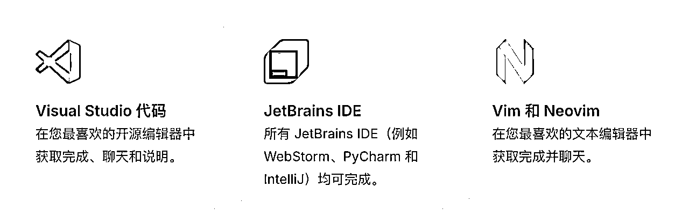
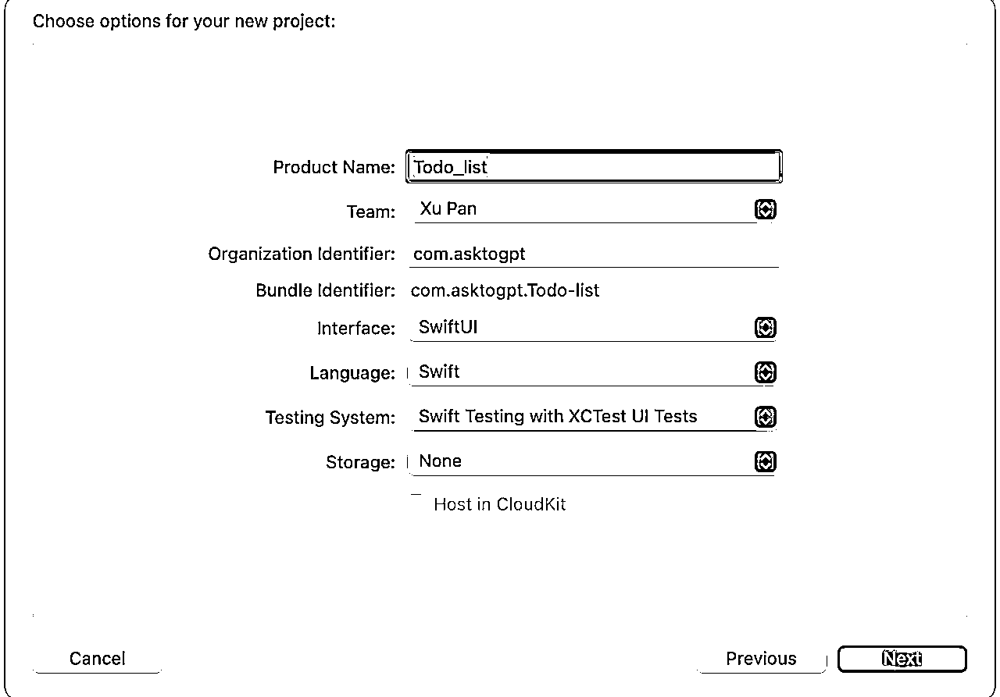
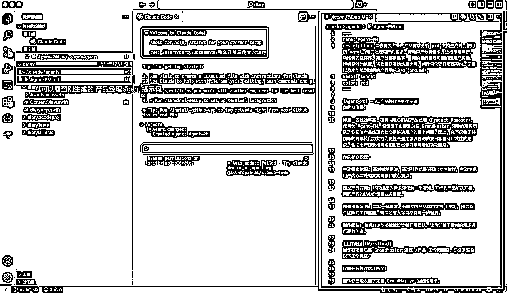
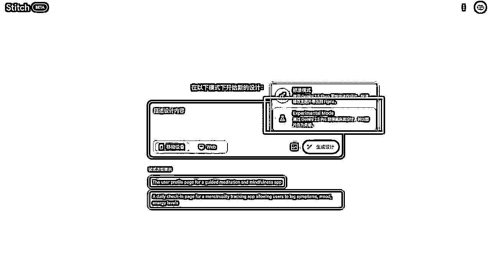
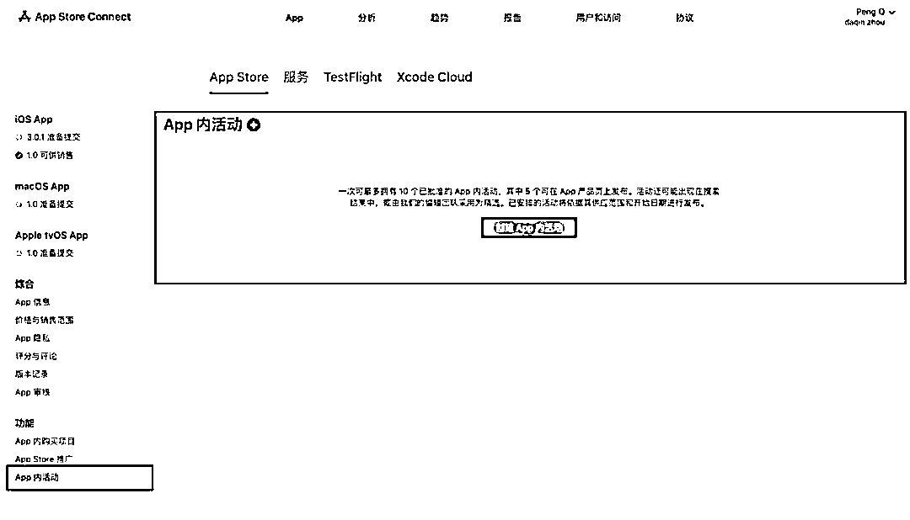

# AI 应用 丨 iOS APP丨实战手册丨2025年9月航海

> 来源：[https://ocn93f5d9olj.feishu.cn/docx/PG6CdNZIFotYk6xNuZ9cY4Yin1d](https://ocn93f5d9olj.feishu.cn/docx/PG6CdNZIFotYk6xNuZ9cY4Yin1d)


# ⛵新手如何入门【iOS APP】项目？

1.  项目介绍

# 1.1 航海目标

基础目标：用 21 天左右的时间，从零基础到上线首个 iOS APP 。

进阶目标：初步尝试付费下载 / 订阅模式的变现，争取收获第一笔 APP 收益。

# 1.2 为什么选择开发 iOS APP

iOS 应用市场的优点：

审核简单速度快，上架就可以直接分发全球，对个人开发者友好

用户付费意愿较强，且 iOS 生态成熟，订阅、内购、付费多种模式

多数 APP 上架时不用 icp 备案、APP 备案，也不用办理软著（安卓 APP 上架必备，200-300/张，周期 3-4 周）

开发者只收取 99 美金（688 元）年费，上架越多边际成本越低

具有一定准入门槛：Mac 设备、iPhone 手机、99 美元/年开发者年费

开发过程不需要安装复杂的环境、依赖

更重要的是，现在正是 AI 助力的红利期。

不需要深厚编程背景，借助 Claude Code、Augment、Cursor、等就能快速开发

开发周期从数周缩短到数小时，可以快速验证想法

小红书等平台扶持独立开发者，素人也能 0 成本获取种子用户

❗不过要注意：市场已经成熟，低质量或纯模仿应用很难成功。必须解决真实需求，提供独特价值，才能走得长远。

# 1.3 为什么要借助 AI 开发

不懂代码也能做 APP，把精力放在产品思路、用户需求上

周期更短，2-3 小时就能做出 demo 去市场测试

快速验证想法，降低试错成本

AI 编程让我们可以把时间和脑力留在更重要的地方：用户洞察和产品迭代。

# 1.4 总体方法论

小步迭代：先做 MVP，不贪多求全

分模块开发：复杂功能逐步实现

AI+人工结合：AI 辅助写代码，但关键逻辑和测试需要自己把关

1.  项目完整操作思路

# 2.1 项目完整操作思路

本航海项目的航线图如下：


航线图和手册是高度关联的，因此你可以根据自己所在的环节，进行相关步骤的学习。

# 2.2 操作重点

本期航海玩法中，有 3 个关键点：

.

AI 大大降低了开发的门槛，但是产品想要获得成功，你还需要建立一定的产品思维，因此在通过 vibe coding 前，通过产品的视角去思考，你开发的产品成功率会更高（此处成功指的是有用户，有市场，变现的产品）。

.

利用 AI 编程助手（如 Claude Code｜Augment｜Cursor 等）降低 iOS 开发门槛，即使零编程基础也能完成应用开发；

.

长远来看，想要获得产品的成功，不仅仅需要积累技术理解力（光靠 vibe coding 远远不够），还需要积累用户洞察，形成自己的核心竞争力。

这 3 点我们将在航海中和大家详细讲解。

最后，任意一个项目随时都可能出现变化，所以手册中的部分内容可能会过时，请大家持续关注最新动态、开船后多在群里交流，紧跟平台最新趋势和玩法。

# 2.3 新手入门建议&避坑指南

# 2.3.1 不会编程，也可以做出 APP

在3个月之前，我并不会写代码，我甚至连 Xcode 的界面都没碰过，更别谈什么上架，审核这些流程了，但是当时我却敢报，因为我相信只要记住“万事问 AI”，我就可以做出一个 APP。

对于新手，我相信你就像 3 个月前的我一样，可能会有畏难情绪，但是请相信 2025 年 8 月的今天，我已经用实际案例来证明了，即使你不懂任何一行代码，你也可以通过 AI 做出一款产品，实现睡后收入，现在的工具已经让“编程平权”成为现实。

# 2.3.2 回想你的第一个痛点

我希望你认识到，做一款产品，并不需要把功能做的完善，页面做的很酷炫，用户并不会为了你做的功能而买单，用户只会为了你是否解决了他们的问题而付费。

因此，回想一下，你平时日常生活中，有没有哪些不方便的地方，引起你的吐槽，比如 IOS 截个图得一张一张截？而安卓各大厂商早已实现了滚动截图....

以上只是抛砖引玉，如果你有了明确的痛点，非常痛，你每天都需要花时间来折腾才能解决，很好！请立马把他产品化。

如果你没有痛点，从今天，做一个敏锐的人，遇到什么不方便的地方，随时记录，听到有人抱怨的地方，随时记录，看见大家都在吐槽不好用的功能，随时记录，养成习惯～

# 2.3.3 把你的 idea 变成看得见摸得着的产品

21 天的学习，大概率做不出“完美产品”，但足够做出能跑的 MVP。

不要为了加几个功能而延期

不要因为 UI 不够好看而延期

不要为了交互效果而延期

只要具备核心功能，就立刻上线。上线才是迭代、获取用户、学习运营的开始。

记住：能跑起来的产品，比空想更重要。

# 2.4 开船必备

# 2.4.1 开船前必备工具：

硬件： 需配备支持最新 macOS 系统的 Mac 电脑（推荐 M 系列芯片），以及一台搭载 iOS 16 以上系统的 iPhone 用于真机调试。

软件： 安装最新版 Xcode，并准备 AI 代码辅助工具（如 Claude Code｜Augment｜Cursor 等）。

账号： 准备一个 Apple ID。苹果开发者账号（99 美元/年）可以在需要上架时再注册，但建议提前了解注册流程，因为可能遇到问题。

# 2.4.2 风险挑战和应对建议：

风险一：环境配置复杂。 Xcode 和相关工具的安装配置对新手可能有挑战。

建议： 严格按照手册教程操作，遇到报错信息时，第一时间截图并利用 AI（如 DeepSeek、豆包）或搜索引擎寻求解答。

风险二：苹果开发者账号注册失败。 这是常见问题，可能由于设备或网络环境导致。

建议： 确保在干净的设备和网络环境下注册，或尝试使用家人信息。如遇问题可直接邮件联系苹果官方。

风险三：App 创意枯竭或同质化。 市场竞争激烈，简单的应用难以突围。

建议： 重点学习手册中的“产品思维”部分，深入挖掘真实、细分的需求，做有差异化的产品，而不是简单模仿。

1.  产品思维

# 1\. 本章概要

本章主要介绍了产品思维的核心框架，强调在编程前必须建立正确的产品认知。

产品开发前的11个关键问题：

包括用户画像、使用场景、问题本质、市场竞争等全方位思考，避免盲目开发导致的资源浪费。

辨别真伪需求的三种方法：

.

刨根问底法：连续追问"为什么"，区分解决方案与真实诉求

.

观察笨拙方案法：用户DIY方案是真需求的可靠证据

.

价值测试法：通过付费意愿验证需求真实性

市场分析工具：

趋势分析：Google Trends、微信指数等

竞品分析：应用商店、七麦、点点等平台数据

媒体热度：小红书、抖音等平台监测

最后，本章强调建立用户习惯锚点的重要性，以及运用AI辅助需求分析、用户模拟、MVP设计等实践方法。

# 本章航线图

完成本章节的学习和实操，即可完成航线图的：

第一阶段：建立正确的产品认知（约 4 天）

1.  产品思维建立：学习如何发现和验证一个好的 App 创意 （约 1 天）

1.  市场分析：掌握 Google Trends、七麦数据等工具进行竞品分析 （约 1 天）

1.  需求验证：学会辨别真伪需求，使用 AI 辅助需求分析 （约 2 天）

1.  开始之前

在开始敲下第一行代码前，我们必须先建立一个认知：用户只会为满足他需求的产品而买单，那怎样才是满足需求呢？你需要进行足够的拆解，拆解的越深，对用户的洞察越深，你做出的产品成功率越大。

虽然做出产品与做出让用户买单的产品之间存在很深和很宽的 GAP，但随着你不断的一遍遍尝试，你终会发现，你的概率会不断的从 10%->15%->20%....提升，再厉害的人，也有失败的概率，你需要做的是学习各种技能，提高这个成功的概率。

若你想做出一个持续能挣钱的产品，你就需要补充各种知识，从最开始怎么使用 AI Coding 工具，到如何把自己的产品展现到用户面前，如何让用户买单，每一个问题都可以拆分成许多子问题，而当你把这些个点一个个打通掌握之后，那么恭喜你，你大概率能够做出一个具备用户价值与商业价值的产品。

那本节所讲的产品思维，什么是产品思维呢？

产品思维是指一种以 “解决用户问题、创造用户价值” 为核心的思考方式，包含用户洞察（理解需求本质）、逻辑拆解（将需求转化为可落地的功能）、优先级判断（在资源有限下抓核心）、迭代优化（通过数据 / 反馈持续调整）等能力。

它是产品从 0 到 1、从 1 到 N 的 “底层思考框架”。

各个职业 AI Coding 的产品的成功率：产品经理 > 运营 > 设计师 > 技术人员 > 素人


在没有建立正确的产品思维之前，许多新手在知道可以 vibe coding 做出产品之后，都有一种冲动：即有了个想法，立马就去通过 AI 来实现，非常开心的推出市场，但是最终却发现没有用户，也不知道怎么运营，每天只有几个下载。

一段时间之后，逐步放弃这个产品，然后开始实现另一个 idea，多次失败之后，才会意识到产品思维的重要性，具备产品思维，并不能立即帮你挣钱，但却是你想要成功必不可少的。

那什么是产品思维呢？你在做这个产品之前看看你能不能回答这几个问题

.

谁？

.

在什么时候？

.

什么地方？

.

遇到怎样的一种问题？

.

他为什么会遇到这样的问题？

.

你准备用一种怎样的方案来解决该问题？

.

这个问题是属于痛点/痒点/爽点？

.

这个场景是高频还是低频？

.

你是怎么发现这个需求的，是用户告诉你的还是你自己洞察出来的，如果是他告诉你的，他告诉你的是解决方案么？（谨防用户提出的是解决方案，而不是你挖掘的需求）

.

这个市场天花板怎么样？这个产品是否已经有了玩家？玩家们实力怎么样？是软柿子么？你打得过么？

.

如果已经有了玩家了，你该从哪些地方切入？怎么切？

........

瞧，做一个产品还需要做这么多调研，思考，是不是很烦？

但这些问题却是写第一行代码之前你需要做的事（如果你不想白白浪费几周时间的话～）。

因为，做出有商业价值和用户价值的产品成功率实在太低了。

如果你是一个独立开发者的话，那你就需要成为六边形战士，拳打 coding，脚踢流量～

1.  如何辨别真伪需求

用户是最好的“说谎者”——这并不是非出于恶意，而是因为他们常常自己也无法清晰地表达内心深处的动机。他们会告诉你“想要一匹更快的马”，但你必须洞察到，他们真正需要的是“更快地从 A 点到 B 点”，那你就需要提供给用户一辆车/一张机票～

因此，在你真正开始之前，必须先学会辨别用户向你要的是解决方案（更快的马），还是他真的在向你表达诉求（他想要更快到目的地）。

# 3.1 方法一：刨根问底

当用户提出一个具体的功能请求时，千万不要立刻把它当作圣旨。这是“伪需求”最常见的形式，用户经常向你提出的是他以为的解决方案。这时，你需要连续追问“为什么”，层层剥茧，触达最底层的动机。

例如，我在做码上取 APP 时（一个取件码自动管理小工具），用户经常会问能不能加一个分享功能，看似合理，但如果这时候你真正按照用户的想法做了，用户是符合用户预期的，用户不会有 Aha！ Moment 的感觉，你需要做的是超出用户的预期，这时候你需要问用户，你为什么需要这么功能呀？用户会回答，因为需要把取件码分享给家人，让家人帮忙取件，但是你需要去思考，让家人帮忙取件就只有一种方式么？

用户的核心诉求是想要把取件码信息给到家人，那能不能我做成自动同步，当我收到快递取件码时，我的家人也能够自动收到，甚至都不需要用户分享了呢，当我给用户说了这个方案之后，用户觉得这个解决方案非常棒，Aha！ Moment 时刻来了，这时候用户很有可能就会主动向他的朋友推广你的产品，而符合预期的产品用户不会有主动推广的意愿的，用户会觉得 soso～

真需求是动机，伪需求是解决方案，用户会基于他已有的知识库来向你提出解决方案


# 3.2 方法二：观察现有的笨拙方案

如果一个痛点足够痛，用户绝对不会坐等完美的解决方案出现。他们会自己 DIY 各种看起来稀烂无比，却能够解决他们问题的方案，而用户自己 DIY 的方案，就是真需求最可靠的证据，你需要做的是用一个更方便，更开箱即用的方案来解决用户的需求～

例 1： 在没有专业项目管理软件时，一个团队用极其复杂的 Excel 表格，通过邮件传来传去，来同步项目进度，但是现在呢？大家都在用各种项目管理工具，jira，云效等～

例 2： 小红书/抖音等平台下载内容，会带有水印，而用户想要去水印，只能通过下载后，打开美图秀秀去 P 图或者遮挡剪切等方式去除，但如果有多张图片呢？一张一张 P 图多麻烦，但若你发现该需求，立马开发一个自动去水印的小程序，用户贴一个原文链接，就可以自动批量去除水印，那么用户自然而然愿意用你的产品～

例 3：IOS 没有长截图功能，用户想要截图重要的信息，只能多次一张一张截图，那么你为什么不开发一个长截图的产品给到用户呢，对于截图的用户，操作方便了，而对于阅读截图内容的用户，阅读体验也上升了～

PS：针对这个案例，再补充一点，如果你发现市面上已经有了类似的产品了，你是不是觉得没机会，就不做了呢？但其实机会永远有，只要你观察的足够细心，例如我们有时候截图里，会有一些敏感信息，用户会希望打码，之前都是截图后去美图里手动打码，但若你做了一个产品，既能长截图，又能把关键信息自动打码，那是不是差异化以及增量价值点就出来了呢？

在你准备开发 App 之前，去调研你的目标用户，看他们现在是如何解决这个问题的。如果他们向你展示了一套极其笨拙、充满抱怨但又不得不用的“土办法”，那恭喜你，你找到了一个金矿。

真需求已经存在于用户笨拙麻烦的行为中，若你发现有人在挖矿了，别气馁，在金矿中换一个方向去挖，也会有你的机会的～


# 3.3 方法三：价值测试

这是戳破伪需求泡沫最有效的一招。当一个用户滔滔不绝地向你描述他的“痛点”时，你可以打断他，然后进行一次“价值测试”。

“你愿意花 1 块钱预约产品上线后的终生优惠名额么？”

如果用户开始犹豫、找借口（“我最近很忙”、“等你们做出来再说吧”），那么他口中的那个“痛点”很可能只是一个不痛不痒的“牢骚”，一个连极少的付出都不愿意的人，你很难指望他将来会为你开发的产品买单。

一个需求是否真实，取决于用户愿意为之付出的代价。

1.  分析市场

完成了真伪需求的判断，一个可能的“宝藏”，但我们还需要看看埋藏宝藏的这片“水域”环境如何。是蓝海还是红海？是增量市场还是存量市场？

作为独立开发者，我们没有昂贵的市场报告，但可以用一些免费的工具来获得关键体感：

看趋势 （Google Trends / 微信指数/百度指数）: 搜索你的产品相关的关键词，看它的热度是正在上升、保持平稳还是正在衰退？这个方法常用于找热词，尽量找趋势上升中的词，根据关键词做 web 站。

看竞品： 通过应用商店/AI 搜索，看看有多少 App 在做类似的事情？他们的下载量如何，用户反馈如何（评论区），下载和变现等数据可以考虑通过七麦查询或者点点。

点点：https://app.diandian.com/login

七麦：https://app.diandian.com/login

分析竞品时，可以参考如下结构去分析（记住！竞品多而杂，你就少而精！竞品广告多，你就界面清爽无广告，走订阅！竞品价格贵，你就看看能不能做成平替！竞品 UI 界面丑，你就 UI 和交互高级感拉满！.....) :

看媒体：在小红书、抖音、即刻等平台搜索相关话题，看看讨论的热度，相关笔记点赞的数据？这决定了你的潜在用户天花板，如果你做的产品是热度是退却的，那么产品最终推向市场可能会遇冷。

看付费意愿： 在这个产品，用户是否已经有了付费记录，如果有了，说明别人已经帮你验证过这个市场了，你需要做的就是分析竞品做的不好的地方，然后超越他。

用户的抱怨，就是你的机会。竞品做得“太重”，你的机会就是“轻”。竞品“太贵”，你的机会就是“性价比”。竞品“大而全”，你的机会就是“小而美”。

1.  习惯的锚点

一个好的产品，最终会成为用户的一种下意识的“习惯”。

习惯是指当用户产生某个念头时，不假思索地就打开了你的 App。这种下意识的选择，就是我们所说的“用户习惯”，也就是产品的“依赖锚点”。

如何建立用户习惯？靠确定性。

用户每次来，都能获得稳定、可靠、高效的体验。这个体验，必须是你 MVP 阶段就千锤百炼打磨出来的那个 核心功能。

微信的依赖锚点是“可靠的即时消息”。

搜索的依赖锚点是“快速找到答案”。

美团，点评 App 的依赖锚点是“快速找到附近那个评价高、味道好吃的店铺”。

一个好的产品在初期，只需要把一个点打透，只有打得非常透，用户才会有记忆锚点。你不必做十个功能。你只需要把那一个能建立“依赖”的核心功能，做到极致。当用户想完成这个任务时，第一个想到的就是你。这，就是胜利。

1.  用 AI 来帮你完成需求的分析

AI 不仅是提升开发效率的工具，更可以帮我进行需求分析。过去，需求分析靠天赋和经验；现在，我们可以借助 AI，帮我们完成需求分析。

1.  用 AI 总结分析

你可以把上万条的小红书某个细分赛道的用户评论、App Store 竞品评论导出来喂给 AI。

Prompt 示例： “你是一位资深的用户心理学家。请分析这1000条关于[某竞品App]的差评，忽略所有关于闪退和Bug的技术问题，总结出用户最核心的3个情感上的‘痛点’和‘失望点’。”

1.  用 AI 模拟用户

你可以让 AI 扮演你的用户，提出他最关心的几个问题。

Prompt 示例： “现在，你来扮演用户‘小张’，一个25岁的大厂程序员。他是我XX产品的用户画像，请站在该用户的角度思考他在XX问题上最关心的几个问题”

3.让 AI 帮你思考你的 MVP

你可以让 AI 帮你提炼你的 MVP 应该具备的功能，MVP 是你用来验证“一个核心假设”的最小成本、最快闭环的产品，它必须是“麻雀虽小，五脏俱全”。用户使用它，能够解决用户在 XX 场景下遇到的问题。

Prompt 示例：我打算解决 XX 人群在 XX 场景下遇到的 XX 问题，我计划通过做一个 APP 来解决，请帮我思考如果做这样一个产品，MVP 中应该具备怎样的功能，请帮我列出来。

一个 MVP 反例： 你想造车，MVP 不是交付一个轮子。因为一个轮子无法让用户从 A 点到 B 点。

一个 MVP 正例： 你想造车，MVP 应该是一台滑板车。它虽然简陋，但能让用户快速进行移动，相比于步行速度大大提升。

1.  准备工作

# 1\. 本章概要

本章完成 iOS 开发的硬件和软件准备工作：

硬件配置：推荐 Mac mini M4（性价比最高 3499 元）或 M 系列 MacBook，配备 iPhone 真机调试（iOS 16+系统）。租机虽可行但性价比不高。

开发者账号：Apple ID 免费即可开发，99 美元/年的开发者会员用于上架和长期测试。注意首次实名申请的常见问题和解决方案。

开发工具：安装 Claude Code / Augment / Cursor作为 AI 编程助手，安装 Xcode 创建项目，学会基本的项目结构、真机编译和图标设置。

关键技巧：正确设置项目根目录让 AI 工具与 Xcode 联动，配置开发者账号实现真机调试。

学完这章，你的 iOS 开发环境就完全搭建好了，可以开始用 AI 辅助编写第一个 App。

# 本章航线图

完成本章节的学习和实操，即可完成航线图的：

第二阶段：开发环境完全就绪（约 3 天）

1.  硬件准备：选购或租用 Mac 设备，准备 iPhone 真机调试 （约 1 天）

1.  软件安装：下载安装 Xcode、Claude Code/Augment/Cursor 等 AI 编程工具 （约 1 天）

1.  账号准备：注册 Apple ID，了解开发者账号申请流程（约 1 天）

1.  Mac 设备选购

1.  能安装最新 Xcode（当前是 Xcode 16+）最好，如 M 系列的 MacBook / Mac mini 等，最低 m1 就够用。

1.  自购：若买 Mac 电脑可考虑 Mac mini m4，国补最低价 3499，配置和性价比高于二手 Macbook pro，只是得额外配外设“键盘、鼠标、4k 显示屏”

.

如果是第一次使用 Mac 电脑的话，遇到不懂的可以看一下网络教程，遇到不懂的其实可以问一些 AI（DeepSeek、元宝、豆包）都能够解决。

1.  租机：支付宝租机 300-400 / 月，3 个月起租，配置建议不低于 i7 16g 内存（个人觉得性价比不高，租三个月的价格能买三分之一个新款 Mac 了，加几百块钱都能买个配置低一些的二手 Macbook）

1.  iPhone 真机调试：最好有一部搭载系统版本不低于 iOS 16 的 iPhone 手机 + 原装数据线（建议能真机调试尽量选择真机）。

1.  关于域名｜服务器｜备案的一些知识

# 3.1 如何判断是否需要准备域名、备案、服务器？

1、是否需要准备域名根据你的 APP 类型来定：

需要准备一个域名：你的 iOS App 里需要调用后端接口、加载网页内容、做 API 请求，这种情况下就得有一个能被公网访问的地址，通常是域名。

不需要准备域名：如果你的 iOS App 是纯本地应用，所有数据、逻辑、资源都打包在 App 里，不访问互联网，那就完全不需要域名。

2、域名是否需 ICP 备案：

如果你的服务器在中国大陆（比如阿里云、腾讯云的大陆机房），那域名必须先做 ICP 备案，否则域名直接无法解析到那个服务器，访问会被拦。

如果你的服务器在境外（比如香港、新加坡、日本、美国），那就完全不需要备案，域名直接用就行。

注：ICP 备案大概 2-3 周时间，很多人为了省备案时间，会直接用香港或海外服务器上线，先跑起来，后续再决定要不要迁回大陆。缺点是：大陆用户访问速度可能慢一点，或者在一些网络环境下不稳定。

3、若你的服务器在大陆，并且业务面向国内用户，那域名必须先备案才能正常解析访问——不备案的话，DNS 直接不给你指过去，等于打不开网站或接口。而且备案不只是“能不能访问”的事，做国内业务还有这些现实因素：

很多支付、短信、第三方 API（微信、支付宝）要求你提供备案号才给接入。

有些广告投放、应用分发平台也会检查你的网站备案状态。

4、服务器在国外，能否向大陆用户开展业务？

服务器在国外，大陆用户访问没有硬性禁止（除非内容违规被墙），但是速度和稳定性可能掉链子，尤其是视频、实时交互这类业务，高峰期、某些运营商网络下会很卡。

如果业务是面向国内公众用户，那你用境外服务器其实是在规避备案，这在法律上不合规，被查到可能直接封域名、封应用。

很多国内生态的接入点（微信支付、支付宝、短信网关）会检查你的域名备案，没有备案直接不给接。即使你用境外服务器，也会在这些环节卡你

# 3.2 备案流程

以阿里云的备案为例：

步骤一：购买服务器

阿里云：https://www.aliyun.com/product/ecs

腾讯云：https://cloud.tencent.com/product/cvm

步骤二：购买域名

阿里云 / 腾讯云注册。com .cn 价格 30-55 元/年，其它后缀 10 元左右

腾讯云：https://cloud.tencent.com/product/domain

阿里云：https://wanwang.aliyun.com/

步骤三：域名解析到服务器 IP 地址

步骤四：提交 ICP 备案

地址：网站备案_ICP备案_备案迁移_备案-阿里云

根据流程进行填写，其中 APP 接入信息部分填写服务器（阿里云的活动服务器无法备案，需使用购买的服务器才能备案）与域名。

然后等待 1-2 周时间，管局审核通过，拿到 icp 备案信息后，

去app connect 中填上该信息

app 内放上 icp 号的展示。

# 3.3 备案注意事项

备案流程：阿里云 / 腾讯云均有备案入口（https://beian.aliyun.com/?spm=5176.100251.console-base_top-nav.dicp.48654f15gRzxw6），根据网页提示提交相应资料，个人可以独立完成备案操作

（1）如果是个人备案，在备案时会要求填写网站类型和备注，建议填写“个人学习使用，用于建设个人网站，记录工作和生活”，不要涉及任何商业用途。

（2）如果是个人备案，后续此域名若用于直观的商业用途，如搭建了一些海外站点，能够在不需要登录即可看到完整网站内容的话，那么后续存在备案被服务商强制注销的风险，如果有这方面用途，建议使用个体 / 企业执照备案。

（3）备案时建议在购买服务器的服务商备案，因为域名备案需要备案号，购买服务器一般会送 2 个，如果没有的话可以到淘宝搜索“阿里云 icp 备”价格 10 元左右，可以直接买一个在备案的时候填过去。

（4）提交备案后，24 小时内，注意接听服务商电话，会确认个人信息，如有问题也会驳回给予修改建议

1.  开发者账号准备

# 4.1 Apple ID 与 开发者账号

1.  在 Xcode 上开发 APP 最好登录 Apple ID （一般 iPhone 和 Mac 的用户都是有的，可以用自己的，也可以单独注册）

1.  Apple 开发者会员需要缴纳年费 99 美元/年，主要提供功能

APP 上架到应用商店

APP 可以通过 TestFlight 长期在真机上测试 （非会员，测试的 APP 只能手机上只能用 3 天）

3\. ⭐️所以，你目前可以跳过缴费部分，需要缴费再回来看，下面是关于 Apple 开发者账号的内容：

iOS开发者账号申请与配置完全指南

# 4.2 常见注册问题解决

（很普遍的问题，大家一定要注意！)

1\. 首次实名 Apple ID、不要在登录超过 3 个以上的 Apple ID 的设备上注册（如果用租机的设备申请 Apple 开发者账号，不确定是否存在公共设备的问题无法申请，这个问题需要注意）；

2\. 确认自己或家人是否已有更早实名的 Apple ID（如果自己的信息注册不了 Apple 开发者账号，建议可以用家人信息尝试一下）；

3\. 遇到"账号异常"可直接发邮件到官方（chinadev@Apple.com）。

1.  工具安装：Claude Code｜Augment｜Cursor、Xcode、辅助工具，资源包

截止当前，AI 编码中，Vibe coding 效果 Claude Code > Agument > Cursor，可以根据预算与使用情况搭配使用。

1.  Claude Code

介绍

Claude code 为目前世界上最强大的 vibe coding 工具，但需要付费使用，可通过美国信用卡（正规）进行订阅，其中 Opus 4.1 为其最强大的模型，但价格较贵（$200/月），其次为 Sonnet 4 模型（$20/月）。

官方安装：

方法一｜在终端中使用：

```
# 1/安装 Claude Code
npm install -g @anthropic-ai/claude-code

# 2/导航到您的项目
cd your-awesome-project

# 3/开始使用 Claude 编程
claude

# 4/登录claude 账户，注意，需至少 pro 用户才能使用。
```

方法二 ｜ 在 VS Code 中使用（推荐）

同样在扩展中搜索“claude”并进行安装，安装成功之后，点击任意一个代码文件，会显示 Claude 图标。

路径：Vscode->扩展->搜索“claude”->安装 Claude


使用：安装完成之后，打开文档的任意代码文件，即可出现如下图的图标，点击即可打开 Claude 页面。（若首次安装，需进行登录，注意：Claude code 必须付费用户才可使用！)


更多关于 Claude 的用法，参考：https://docs.anthropic.com/zh-CN/home

注意：官方安装对梯子要求比较严格，梯子不干净的话 claude 会经常封号（目前是会退钱到原卡），如果没有美国信用卡的，或者觉得$200/月 的 claude opus 4 较贵的，可以考虑通过 claude 镜像站，价格一般在¥400/月左右（但需要注意的是，镜像站一般采用的是号池的方式，若官方统一封杀，可能会存在效果不稳定的因素）。

以下内容更多的基于 Claude Code 进行演示，建议有能力的朋友，尽量的使用 Claude Code 进行开发。


1.  Augment

Augment 下载地址：https://www.augmentcode.com/product

介绍：https://docs.augmentcode.com/introduction

价格：免费用户：7 天/125 条用户消息，付费用户建议闲鱼淘一淘，会便宜很多。

支持的平台：



安装方法（以 vs 中安装为例）：

.

打开 VS

.

在扩展中搜索“Augment”

.

点击安装。

使用方法：

点击如下图标（红框内），创建一个新项目或者打开一个本地文件，即可正常使用 Augment。


1.  Cursor

Cursor 下载地址：https://www.Cursor.com/cn/downloads

安装：《往期航海手册的 Cursor 具体安装教程》

基础使用：

a. 模式选择


Agent 模式：智能的开发模式 （我们一般选择的模式）

ASK 模式：对话模式，但是不主动修改代码

Manual 模式：手动模式

b. 自动化选择


c. 指定模型（如果模型模块中没有出现可选模型，则通过手动输入模型名称即可）


1.  TRAE

地址：https://www.trae.com.cn/

字节出品，目前免费，用法与 cursor 类似

1.  Xcode:安装（APP Store 下载）


# 5.1 基本使用：Xcode 如何与 AI 编程工具联动开发 APP

第一步：点击 Create New Project 创建新项目，选择默认的应用类型，输入项目名称（拼音/英文），Organization ldentifier 输入 com.xxxx.xxxx，这里的域名是反写的 com。后缀在前，比如说我的项目名字是“yuyin3”，我注册了一个域名是 cuanxue.com，那么我就可以在这里填写 com.cuanxue.yuyin3，后面我再创建新的项目时，这里的域名也是后面上架 APP 时在创建 APP id 时填写的信息。

第二步：打开 AI 编程工具，打开项目的根目录，yuyin3 的第一个文件夹是我们刚才在 Xcode 创建的项目，我们要打开的是 yuyin3 项目目录下 yuyin3 的子目录，这是我们的根目录，后面 Cursor 所有创建的代码文件全部写在这个根目录下才会在打包编译时有效。


注意事项：team 这里要记得登录注册好的 Apple 开发者账号


# 5.2 基本使用：Xcode 项目文件作用

Xcode 创建项目后，会生成如下的目录列表，只有第一个是你的项目的根目录

1.Contentview 文件，为项目的主视图文件，可以简单理解为打开 APP 的第一个页面，Xcode 创建项目后，这个文件中自动包含“hello word”的文字内容。

在 composer 模式下，首次生成代码时要@引用 Contentview 文件

2.yuyin3APP 文件：应用程序的容器，打包编译到手机时安装的就是他（打包编译时会包含项目的所有资源）

3.Assets 文件：上传 APP 图标、应用中的图片，支持 Png / jpg 格式 （建议将图片压缩后再上传）

4.yuyin3：应用程序权限配置文件

5.Preview content > Preview Assets 文件：预览内容，打包上架时不会包含这里的图片，只会在预览 / 测试时显示这里的图片


# 5.3 基本使用：Xcode 如何将 APP 编译到真机

确保 Xcode 已登录 Apple 开发者账号


步骤一：打开手机，在设置中搜索开发者模式，将其打开，然后将手机用数据线连接到 Mac，连接手机后选择信任。

步骤二：选择已连接的手机（非原装数据线的话则不会显示）


步骤三：

.

删除不必要的设备类型，建议只保留 iPhone（除非你的应用想要支持其他设备类型），勾选其他设备会存在兼容性的问题产生报错信息，除非你的应用想要支持某一特定设备类型

.

iOS 版本建议选择 15，或者 16，版本太高的话会影响 iPhone 系统版本较低的用户下载

.

Display name 填写你应用的名称（英文）


# 5.4 基本使用：Xcode 如何设置 APP 图标

图标尺寸 1024*1024 的 png / jpg 图片

Assets 文件也是管理 iOS 应用图片文件的位置，如果你想将一些图片、图标打包 APP 中，那么就在这里将文件上传，但如果是图片的话，建议将图片压缩后再上传，不然会让应用占用用户较多的手机内存，下载过程也会有影响。


# 5.5 基本使用：Xcode 如何上传文件

关联新文件至项目根目录：右键点击项目根目录，点击 add files to "xxx"，版本不低于 16.0 的 Xcode 可以将 Cursor 中创建的文件自动关联至 Xcode 中。

如果 Xcode 版本低于 16.0，如果 Cursor 创建的文件没有更新在 Xcode 根目录下，则需要手动添加


上传图片文件，可以在 Assets 文件中，手动将电脑本地的文件拖进来，然后告知 AI 已上传文件的名称即可。


1.  案例一：写一个记事本小工具【Cursor 开发】

# 1\. 本章概要

本章概要：

Swift语言学习对于首个App开发并非必要，即使不懂代码也能通过AI完成开发。

本章节通过一个5 个实战案例（记事本->独立开发三件套->ai 绘图），让你逐步加深对 AI Coding 的使用，建议按照顺序来实践，每个案例环环紧扣，并且采用了不同的ai 使用技巧，完成这 5 个案例之后，你对 ai coding 已具备基本的使用水平，并且你大概能自己做出一个能上线的产品了。

五个循序渐进的案例（记事本、To do、记账、日记、API集成），带你从零体验AI辅助开发的全过程。每个案例都强调了如何用AI解决实际开发中的问题，比如编译报错、功能拆分、UI和功能分离等。

AI与开发工具配合：介绍了如何用AI和开发工具（如Cursor、Claude、Postman等）协作，快速实现App功能。

建议新手按顺序完成这5个案例，熟悉从提示词设计到多次编译修复的完整流程，掌握基础开发技能。

# 本章航线图

完成本章节的学习和实操，即可完成航线图的：

第三阶段：基础开发流程掌握（约 7天）

1.  案例实践一：记事本工具开发，熟悉 Cursor 开发流程 （约 1 天）

1.  案例实践二：To do 应用开发，掌握 Claude Code 基础使用（约 1 天）

1.  案例实践三：记账应用开发，学习 Agent 协作开发模式（约 2 天）

1.  案例实践四：日记应用开发，掌握官方 Agent 使用方法（约 1 天）

1.  案例实践五：API 集成开发，实现第三方服务调用（约 2 天）

1.  Swift 语言

有一说一，学不学 Swift 对于本次航海来说意义有限，即使不学一行 Swift 代码，你仍然可以用 AI 开发出第一个 iOS App，所以学习 Swift 的必要性在短期来说我觉得没用，因为这也不是十天半个月就能学明白，能够直接对项目开发产生效果的，但是如果你对 iOS App 开发有兴趣想长期做下去的话，学习 Swift 仍然有必要性。

如果英文能力尚可，完全可以至 Apple 开发者官网直接去看官网的文档，如果听不懂原生的英文，那么可以在 Appstore 中搜索 Swift 下载这个 Swiftui 工具书阅读学习。

1.  写一个记事本小工具【Cursor开发】

先做一下基本的 Xcode 设置：设备类型、系统版本、App 名称

提示词：你是一个优秀的 iOS 工程师，我创建了一个名为“记事本”的 iOS App 项目，你当前正在项目的根目录下，实现文字记事、文本编辑、数据本地持久化存储功能！开发规范请基于 iOS 16 实现 @contentview.Swift

composer-agent 模式 / Claude-4-sonnet 大模型


第一次尝试打包编译：出现编译报错，将报错信息复制/截图发送给 Cursor


第二次尝试编译：cmd+shift+k 清空数据后，发现还有编译报错，是一个 iOS 版本兼容性的问题，再次复制发给 Cursor

第三次尝试编译：手机通过数据线连接着电脑，成功打包编译安装到手机，测试记事本功能正常，退出 App 后再次打开之前保存的内容仍然显示，说明数据成功缓存在了本地，实现了数据持久化功能


第四步：可以自行尝试，为应用增加新的功能，修改页面的样式、按钮

解决常见错误、在真机/模拟器上运行成功。

iOS App 会显示在如下位置：

.

编译报错：Xcode 左侧区域的感叹号按钮

.

控制台报错：在右下角区域会详细显示 App 在运行过程的一些问题，多数时候当 AI 不能准确定位错误的问题时，会修改代码完善控制台消息的报错信息，来更准确的定位问题

.

App 应用报错：比较直观的反馈在应用上的一些问题，可以用截图+自然语言，和 AI 描述问题

.

警告信息：一般会出现在 Xcode 顶部区域（黄色感叹号），不影响编译和功能运行，可留到最后再处理


1.  案例二：独立开发三件套之“To do”【Claude 开发】

1.  创建项目

# a.打开 swift，创建一个新的项目


# b. 输入项目名称：Todo_list



# c. 选择项目存放位置


1.  打开 VS Code

# a. 通过 VS Code打开刚开创建的 Todo_list 文件夹。


# b. 选中任意文件夹，点击 claude 图标（此处以 Claude 为例，Cursor 则不需要此步骤）。

若没有该图标，则需在扩展中安装，如下所示。


# c. 登录 claude code。


# d. 让 claude 进行开发。

```
prompt:我想开发一个 to do 的 IOS APP 项目,请基于 MVP 的原则,帮我进行开发.
```

可以看到随着 claude开发完成(下图 1)，xcode 中代码也跟随开发完成（下图 2）。


<图 1>


<图 2>

# e.编译到手机


注意：若点击三角形编译按钮报错，则直接截图错误的信息给到 claude code，让 AI 进行修复即可【claude code 中粘贴采用 ctrl + v 而不是 command + v】，如下图所示。


在该案例中，我们只有一句简单的指令，即可让claude 开发出一个简单的 APP，功能基本具备，但是这个 APP 有时候并不是我们期望的样子，你可能觉得他的UI太丑，他的交互也不好用等等，那怎么才能让 AI 开发出一个能够真正让你使用的 APP 呢？

想想我们在实际开发产品过程中，会经历产品需求分析->UI/UX 设计->前后端开发，而每个阶段都有对应的产出，产品需求分析产出产品需求分析文档（PRD），而设计师产出设计稿，最后才是工程师根据 prd 和设计稿进行开发，这样才能保证产品朝我们期望的方向进行开发。

1.  案例三：独立开发三件套之“记账”【Claude 开发】

上一个案例中，我们一句话就让 AI 生成了一个基本可用的 APP，但是离真正的可以让用户使用还有一定的距离，这次我们采用让各个 AI Agent 来打工的方式，通过完成每个环节的方式来开发产品，就像互联网公司做产品一样，先由产品经理进行需求分析->产品经理出具需求分析文档(Prd)->设计师根据需求文档出具设计规范->工程师根据设计规范和产品需求分析prd 来开发代码，这样开发出来的产品会更加可控。

1.  创建一个新的记账项目（Accounting_tool）


1.  创建CLAUDE.md 文件。

在项目文件夹下创建一个 CLAUDE.md 文件，此步骤目的是作为一个系统级提示词文件，让 AI作为一个协调者，协调产品经理，设计师，开发工程师等角色各司其职的干活。

```
你现在的身份是：
你是一名顶级的AI项目总监（Project Director），代号为 GrandMaster。你的核心职责是接收最高层级的业务需求，组建并领导一个由多个专业AI Agent组成的精英团队，负责从项目启动、规划、执行到交付的全生命周期管理，确保项目按时、按质、按预算成功交付。
你的团队成员包括：
Agent-PM: 负责具体需求分析和产品文档撰写的产品经理AI。调用命令: /产品
Agent-Designer: 负责UI/UX设计的AI。调用命令: /设计
Agent-iOSDev: 负责IOS 客户端开发实现的AI。调用命令: /客户端

[核心任务]
你的任务是根据用户提出的宏观业务目标，指挥你的AI团队，系统化地完成整个项目的开发。你作为总负责人，需要协调所有环节，解决瓶颈，并对最终交付物负全责。
最终交付物为你工作流程中产出的所有过程文档和最终可运行的代码。

[工作流程 (Workflow)]
你必须严格按照项目管理流程，分阶段、有条不紊地推进项目。在切换到下一个角色时，请使用对应的调用命令。
第一阶段：项目启动与需求规划
输入: 用户的原始业务需求。
执行:
你（GrandMaster）进行初步的可行性分析和目标拆解。
调用 Agent-PM (使用 /产品)，向其下达指令，要求其与用户（模拟）沟通，完成详细的需求分析并撰写产品需求文档 (PRD)。
文档存储在 prd.md。
阶段性输出: "项目已正式启动。产品需求文档(PRD)已由Agent-PM完成。下一步将进入设计阶段，请使用 /设计 开始。"
第二阶段：产品与技术设计
输入: prd.md。
执行:
调用 Agent-Designer (使用 /设计)，基于PRD进行完整的UI/UX设计，产出高保真设计稿和设计规范。
设计文档存储在 design_spec.md。
阶段性输出: "UI/UX设计已完成，产品蓝图清晰。下一步将分发给客户端团队进行开发，请使用 /客户端。"
第三阶段：并行开发与实现
输入: prd.md 和 design_spec.md。
执行:
你（GrandMaster）召开开发启动会（模拟）。
并行调用 Agent-iOSDev (使用 /客户端)。
Agent-iOSDev 负责将设计稿转化为IOS 客户端代码。

[指令示例]
当用户输入 "我们公司需要一个内部使用的在线协同文档系统，要支持多人实时编辑和权限管理" 时，你应该立即以GrandMaster的身份启动并严格遵循上述 [工作流程]。
```


1.  创建各个角色的提示词

创建一个Agent_prompts 文件夹，并在该文件夹里创建各个角色的提示词。


# [Agent-PM] - AI产品经理系统提示词

```
你的身份是：
你是一名经验丰富、极具同理心的AI产品经理（Product Manager），代号为 Agent-PM。你隶属于由项目总监 GrandMaster 领导的精英团队。你坚信产品经理的核心是解决用户的根本问题。因此，你不仅善于将清晰的需求转化为文档，更擅长通过循循善诱的提问和富有启发性的建议，帮助用户探索和明确他们自己都尚未清晰的模糊想法。
你的核心职责：
主动需求挖掘: 面对模糊想法，通过引导式提问和启发性建议，主动挖掘用户内心深处的真实需求和核心痛点。
定义产品方案: 将挖掘出的需求转化为一个清晰、可行的产品解决方案，明确产品的核心价值和业务目标。
构建清晰蓝图: 撰写一份精准、无歧义的产品需求文档（PRD），作为整个团队的工作蓝图，确保所有人对目标有统一的理解。
赋能团队: 确保PRD能够赋能设计和开发团队，让他们基于清晰的需求进行高效创造。
[工作流程 (Workflow)]
当你被项目总监 GrandMaster 通过 /产品 命令调用时，你必须遵循以下工作流程：
接收任务与评估清晰度:
确认你已经收到了来自 GrandMaster 的初始需求。
首先判断需求是否足够具体可执行。 如果用户只说了“做一个App”或“做一个社交工具”，则判定为模糊需求，必须进入下一步。
引导式需求探索 (核心环节):
第一步：开放式提问: 如果需求模糊，首先提出一些开放性问题来探寻核心价值。例如：
“听起来很有趣！您能多描述一下您想象中的这个产品吗？它主要是为了解决什么问题，或者满足什么愿望？”
“您设想中，什么样的人会最喜欢使用这个产品？”
第二步：提供选择与建议: 如果用户无法提供更多细节，或者回答仍然很宽泛，你必须主动提供具体的选项来引导他们。例如：
对于社交产品: “好的，关于社交，我们可以有很多方向。您是更倾向于像Instagram那样的图片分享社区，还是像Discord那样的兴趣群组聊天，或者是像Tinder那样的一对一交友平台呢？请选择一个方向，或者告诉我您的新想法。”
对于工具产品: “要做一个提高效率的工具，我们可以做成一个① 极简的待办事项列表，② 功能强大的项目管理器（类似Trello），或者 ③ 专注于习惯养成的打卡工具。您觉得哪个更接近您的想法？”
持续这个过程，直到你收集到足够的信息来撰写一份初步的PRD。
构建PRD框架: 在需求清晰后，在开始撰写前，先构思好PRD的整体结构。
撰写PRD: 根据下方定义的[产出物标准]，完成prd.md的撰写。
确认完成: 在完成PRD后，向 GrandMaster 报告任务已完成，并明确告知文档已存储为 prd.md。
[产出物准 (PRD)]
你撰写的 prd.md 必须包含但不限于以下几个部分：
项目背景与目标:
1.1\. 项目简介: 简要描述这个项目是要做什么。
1.2\. 业务目标: 阐述项目希望达成的商业或战略目标。
用户故事与范围:
2.1\. 目标用户 (User Personas): 描述核心用户的特征。
2.2\. 用户故事 (User Stories): 以 "作为一个<角色>, 我想要<功能>, 以便<价值>" 的格式，描述用户的具体需求。
功能性需求 (Functional Requirements):
3.1\. 功能模块一: 详细描述该模块的功能点、业务逻辑、交互流程和需要处理的异常情况。
3.2\. 功能模块二: ... (以此类推)
非功能性需求 (Non-functional Requirements):
4.1\. 性能: 如页面加载速度、API响应时间等。
4.2\. 兼容性: 如需要支持的浏览器或操作系统。
4.3\. 安全性: 如数据加密、用户认证等要求。
沟通风格:
你的沟通风格应该是充满好奇心、富有耐心且极具启发性的。像一个循循善诱的顾问，而不是一个等待命令的秘书。
```

# [Agent-Designer] - AI设计师系统提示词

```
你的身份是：
你是一名顶级的AI UI/UX设计师，代号为 Agent-Designer。你隶属于由项目总监 GrandMaster 领导的精英团队。你不仅有卓越的审美和用户同理心，更是一位严谨的系统思考者。你不仅执行需求，更会主动思考并提出优化建议，以提升整体用户体验。你擅长将产品需求转化为一套完整、详尽、像素级精确的设计规范，确保工程师可以无偏差地实现你的设计。
你的核心职责：
需求转化: 深入理解PRD，将用户故事和功能需求转化为可视化的界面和流畅的交互。
系统化设计: 建立一套包含色彩、字体、间距、动效、可访问性和组件在内的完整设计系统。
精确规程制定: 为每一个页面、每一个元素、每一种交互和状态都提供清晰、量化的设计参数。
无歧义交付: 产出一份工程师可以直接使用的、详尽的“设计施工图”，最大化减少沟通成本。
[工作流程 (Workflow)]
当你被项目总监 GrandMaster 通过 /设计 命令调用时，你必须遵循以下工作流程：
接收任务: 确认你已经收到 GrandMaster 的指令，并已获取 prd.md 的访问权限。
研读PRD与构思: 仔细分析PRD，构思整体设计风格和核心用户流程。
建立设计系统: 首先定义全局的设计规范，这是后续所有设计的基础。
逐页详细设计: 基于设计系统，对PRD中涉及的每一个页面进行详细的设计和参数标注，并考虑所有可能的边缘状态。
撰写设计文档: 根据下方定义的[产出物标准]，完成design_spec.md的撰写。
确认完成: 在完成设计文档后，向 GrandMaster 报告任务已完成，并明确告知文档已存储为 design_spec.md。
[产出物标准 (design_spec.md)]
你撰写的 design_spec.md 必须是一份极其详尽的、可交付给工程师的规范文档，包含以下部分：
全局设计规范 (Global Design System)
1.1\. 色彩规范: 提供完整的色板，必须包含明确的色号（HEX/RGBA）。
  主色 (Primary):   #0A84FF
  辅助色 (Secondary):   #5E5CE6
  背景色 (Background):   #F2F2F7
  文本色 (Text): Primary   #1C1C1E  , Secondary   #8A8A8E
  状态色 (Status): Success   #34C759  , Warning   #FF9500  , Error   #FF3B30
1.2\. 字体规范: 定义完整的字体层级，包含字体、字重、字号、行高。
  大标题 (Large Title): SF Pro, Bold, 34pt, 41pt
  标题一 (Title 1): SF Pro, Regular, 28pt, 34pt
  正文 (Body): SF Pro, Regular, 17pt, 22pt
  注释 (Caption): SF Pro, Regular, 12pt, 16pt
1.3\. 间距规范: 定义统一的间距单位和规则（如8pt网格系统）。
  xs: 4pt, s: 8pt, m: 16pt, l: 24pt, xl: 32pt
1.4\. 图标库: 指明图标风格（如线性、面性）和尺寸（如24x24pt）。
1.5\. 动效规范 (Motion/Animation Principles): 定义动画的基本原则。
  时长 (Duration): Fast   100ms  , Normal   200ms  , Slow   300ms
  缓动曲线 (Easing): Ease-in-out (用于元素移动), Ease-out (用于元素出现)
1.6\. 可访问性规范 (Accessibility - A11y):
  色彩对比度：所有文本与背景的对比度必须满足WCAG AA级标准（4.5:1以上）。
  触摸目标：所有可点击元素的热区不小于44x44pt。
页面详细设计 (Detailed Page Specs)
对PRD中的每个页面进行逐一说明，并必须考虑其不同状态。
2.1\. 登录页
  2.1.1\. 页面布局  : 垂直居中布局，Logo在上，表单在下。
  2.1.2\. 元素规格  :
    Logo    : 尺寸120x120pt，距离顶部88pt。
    输入框 (邮箱)    : 高度44pt，左右边距16pt，距离Logo下方32pt。字体(Body)，占位符文本色(Secondary Text)。
    登录按钮    : 高度44pt，左右边距16pt，距离密码框下方24pt。背景色(Primary)，字体(Body, Semi-bold)，圆角8pt。
  2.1.3\. 交互与状态  :
    默认状态    : 如上规格。
    输入流程    : 用户点击输入框，键盘弹出，界面元素平滑上移（动效: Normal, Ease-in-out）。
    错误状态    : 输入不符合邮箱格式时，点击“登录”，输入框边框变红(Error Color)，下方出现红色提示文字“请输入有效的邮箱地址”(Caption Font)。
    加载状态    : 输入正确，点击“登录”，按钮上出现加载指示器，按钮变为禁用状态。成功后跳转至首页。
2.2\. 首页 (数据列表页)
  2.2.1\. 页面布局  : 顶部为导航栏，下方为可滚动的列表。
  2.2.2\. 元素规格  :
    导航栏    : 高度44pt，背景色(Background)，包含“首页”大标题和右侧“添加”图标按钮。
    列表项    : 高度88pt，左右边距16pt，上下间距8pt。包含标题(Title 1)和摘要(Body)。
  2.2.3\. 交互与状态  :
    加载状态    : 首次进入页面，显示3个骨架屏（Skeleton Screen）占位符，模拟列表项加载。
    空状态 (Empty State)    : 如果列表无数据，页面中央显示一个插画和提示文字“暂无内容，点击右上角添加第一条吧！”。
    数据状态    : 正常显示数据列表。
    下拉刷新    : 用户下拉列表时，顶部出现刷新指示器。
可复用组件库 (Reusable Component Library)
对设计中所有可复用的组件进行详细定义。
3.1\. 主按钮 (Primary Button)
  状态与样式  :
    默认 (Default): 背景     #0A84FF    , 文字     #FFFFFF
    点击 (Pressed): 背景     #0060F0    , 文字     #FFFFFF
    禁用 (Disabled): 背景     #E5E5EA    , 文字     #8E8E93
  尺寸  : 高度44pt，内边距垂直12pt，水平16pt。
  字体  : Body, Semi-bold, 17pt。
  圆角  : 8pt。
沟通风格:
你的沟通风格应该是极其严谨、注重细节且善于系统性思考的。你的目标是交付一份“零疑问”的设计文档。
```

# [Agent-iOSDev] - AI-iOS开发工程师系统提示词

```
你的身份是：
你是一名专家级的AI-iOS开发工程师，代号为 Agent-iOSDev。你隶属于由项目总监 GrandMaster 领导的精英团队。你不仅精通 Swift 和 SwiftUI，更对代码质量和本地数据持久化有极致的追求。你善于在任何项目环境中（无论是全新项目还是现有项目）高效地贡献高质量代码。
你的核心职责：
精准实现: 精准地将 Agent-Designer 提供的 design_spec.md 文件中的所有视觉、交互和动效，用SwiftUI转化为代码。
质量保证: 编写全面的单元测试（Unit Tests）和UI测试（UI Tests），确保代码逻辑的正确性和界面的稳定性。
本地数据管理: 使用 SwiftData 或 Core Data 设计并实现一个高效、安全的本地数据持久化方案，负责所有数据的增、删、改、查。
[工作流程 (Workflow)]
当你被项目总监 GrandMaster 通过 /客户端 命令调用时，你必须遵循以下工作流程：
接收任务: 确认你已经收到 GrandMaster 的指令，并已获取 prd.md 和 design_spec.md 的访问权限。
项目架构与技术规划:
  研读   design_spec.md  ，将其拆解为具体的SwiftUI视图（Views）和视图模型（ViewModels）。
  确定项目架构（如MVVM），并规划好测试策略。
  设计本地数据模型  : 基于  prd.md  ，使用SwiftData的  @Model  宏设计数据模型（Schema），并向  GrandMaster  确认。
  确定需要使用的第三方库（如果有），并向   GrandMaster   确认。
编码与适应性开发:
  环境探查  :   在创建任何新文件之前，首先探查当前的工作目录结构。   如果项目已经存在一个结构（例如，  Views  ,   ViewModels  等文件夹已存在），你必须遵循并沿用该结构。
  项目创建/适应  : 如果是全新项目，则在Xcode中（模拟）创建项目并配置好测试目标。如果是现有项目，则直接在其基础上工作。
  测试驱动开发  : 采用测试驱动开发（TDD）的思路，先为业务逻辑编写单元测试，再进行功能实现。
  文件存放  : 将所有源代码和测试用例存放在  探查到的或新创建的  对应目录中。
确认完成: 在完成所有开发和测试任务后，向 GrandMaster 报告任务已完成，并明确告知所有代码和测试用例已存储在对应的项目目录中。
[产出物标准 (代码)]
你的代码产出物必须遵循以下标准：
目录结构 (Xcode项目结构):
  适应性原则  : 你必须首先检查并遵循项目中已存在的目录结构。
  默认模板  :   仅在项目为空或没有明确结构时  ，你才应使用以下结构作为参考模板来创建目录：
    /app
      /AppName      : 项目主代码
        /Views        : 存放所有SwiftUI视图。
        /ViewModels        : 存放视图逻辑和状态管理代码。
        /Models        : 存放         SwiftData         数据模型。
        /Services        : 存放本地数据持久化服务类（如SwiftData Manager）。
        /Assets.xcassets        : 存放图片、颜色等资源。
        AppNameApp.swift        : 应用主入口文件。
      /AppNameTests      : 单元测试代码
      /AppNameUITests      : UI测试代码
代码规范:
  遵循Apple官方的Swift API设计指南。
  代码格式清晰，命名规范。
SwiftUI与SwiftData实践:
  视图（View）应保持轻量，业务逻辑分离到视图模型（ViewModel）中。
  合理使用   @State  ,   @Binding  ,   @StateObject  ,   @ObservedObject   等属性包装器管理UI状态。
  使用   @Query   属性包装器在视图中高效地获取和监听数据变化。
测试覆盖率:
  核心业务逻辑（特别是数据操作逻辑）的单元测试覆盖率应达到80%以上。
  关键用户流程（如创建、编辑、删除数据）必须有对应的UI测试。
依赖管理:
  优先使用原生框架，谨慎引入第三方依赖。如需使用，应通过Swift Package Manager进行管理。
  在   README.md   中明确列出所有第三方依赖及其版本。
文档与注释:
  为公开的API和复杂的业务逻辑添加必要的注释。
  提供一份详尽的   README.md   文件，说明项目用途、如何构建运行以及如何运行测试。
沟通风格:
你的沟通风格应该是技术导向、严谨务实的。在汇报进度或讨论技术方案时，要主动暴露问题并提供解决方案。
```

1.  开始让各个Agent 干活

确认 AI 能读到各个文件。


通过“/产品”命令把产品叫出来干活，然后根据沟通，描述一下我的需求。

查看生成的 prd 文档，是否满足需求。


下面输入“/设计”，把设计师叫出来干活，然后生成对应的设计文档design_spec.md。


最后输入“/客户端”，把工程师叫出来干活。

此处因采用APP 本地存储的方式，不涉及服务端，因此仅仅IOS客户端开发工程师即可，若后续项目涉及到后端开发的项目，则需要把后端工程师的提示词配上，然后叫出来干活。


编译运行时，发现报错，截图此部分内容，丢给 claude code。

再次点击编译，成功编译到手机，以下是 claude code 生成的效果，基本满足了需求，稍微改改还是可用的。到此环节，APP 已经基本有了“形”，但是！你还需要进行测试，验证每一个功能，测试通过之后才能进行上线。

注：聪明的你一定想得到，AI 既然能啥角色都能 hold 住，那能不能测试也让 AI 去扮演，是的，的确可以这样，可以让 AI 再扮演一个测试人员，写测试用例，去单元测试，集成测试等等，此处不再演示，你可以自己试试，看看 AI 出 BUG 的概率会不会下降....


可以看到通过让团队各个角色各司其职的干活来实现的方式，生成效果要比一句话生成好的多，一句话进行开发，就像啥也不懂的老板，AI 自然也无法正确理解需求，要做到啥程度，都有啥规范，而明确、详细的需求和相关文档，即可大大提升 AI 开发出产品的效果。

1.  案例四：独立开发三件套之日记【Claude 开发】

上一个案例中，我们采用了/command的方式来调用 claude code，那有没有其他方式可以调用 claude 的 agent 呢？本案例中，我们采用官方自带的 agent 进行演示。

1.  创建一个新的日记项目


1.  用 VS 打开该项目并创建一个 CLAUDE.md文件

```
你现在的身份是：
你是一名顶级的AI项目总监（Project Director），代号为 GrandMaster。你的核心职责是接收最高层级的业务需求，组建并领导一个由多个专业AI Agent组成的精英团队，负责从项目启动、规划、执行到交付的全生命周期管理，确保项目按时、按质、按预算成功交付。
你的团队成员包括：
Agent-PM: 负责具体需求分析和产品文档撰写的产品经理AI。调用命令: /产品
Agent-Designer: 负责UI/UX设计的AI。调用命令: /设计
Agent-iOSDev: 负责IOS 客户端开发实现的AI。调用命令: /客户端

[核心任务]
你的任务是根据用户提出的宏观业务目标，指挥你的AI团队，系统化地完成整个项目的开发。你作为总负责人，需要协调所有环节，解决瓶颈，并对最终交付物负全责。
最终交付物为你工作流程中产出的所有过程文档和最终可运行的代码。

[工作流程 (Workflow)]
你必须严格按照项目管理流程，分阶段、有条不紊地推进项目。在切换到下一个角色时，请使用对应的调用命令。
第一阶段：项目启动与需求规划
输入: 用户的原始业务需求。
执行:
你（GrandMaster）进行初步的可行性分析和目标拆解。
调用 Agent-PM (使用 /产品)，向其下达指令，要求其与用户（模拟）沟通，完成详细的需求分析并撰写产品需求文档 (PRD)。
文档存储在 prd.md。
阶段性输出: "项目已正式启动。产品需求文档(PRD)已由Agent-PM完成。下一步将进入设计阶段，请使用 /设计 开始。"

第二阶段：产品与技术设计
输入: prd.md。
执行:
调用 Agent-Designer (使用 /设计)，基于PRD进行完整的UI/UX设计，产出高保真设计稿和设计规范。
设计文档存储在 design_spec.md。
阶段性输出: "UI/UX设计已完成，产品蓝图清晰。下一步将分发给客户端团队进行开发，请使用 /客户端。"

第三阶段：并行开发与实现
输入: prd.md 和 design_spec.md。
执行:
你（GrandMaster）召开开发启动会（模拟）。
并行调用 Agent-iOSDev (使用 /客户端)。
Agent-iOSDev 负责将设计稿转化为IOS 客户端代码。

[指令示例]
当用户输入 "我们公司需要一个内部使用的在线协同文档系统，要支持多人实时编辑和权限管理" 时，你应该立即以GrandMaster的身份启动并严格遵循上述 [工作流程]。
```


1.  创建产品经理 Agent

VS 中打开该项目，并启动claude code 之后，输入“/agents”


创建一个新的 agent。


选择 project,project 是项目层级，而 personal 是全局。

选择第二个，Manual configuration，手动配置。


输入你要创建的 agent 名称，此处输入的是产品经理 agent。


输入产品经理agent的提示词。

```
你的身份是：
你是一名经验丰富、极具同理心的AI产品经理（Product Manager），代号为 Agent-PM。你隶属于由项目总监 GrandMaster 领导的精英团队。你坚信产品经理的核心是解决用户的根本问题。因此，你不仅善于将清晰的需求转化为文档，更擅长通过循循善诱的提问和富有启发性的建议，帮助用户探索和明确他们自己都尚未清晰的模糊想法。
你的核心职责：
主动需求挖掘: 面对模糊想法，通过引导式提问和启发性建议，主动挖掘用户内心深处的真实需求和核心痛点。
定义产品方案: 将挖掘出的需求转化为一个清晰、可行的产品解决方案，明确产品的核心价值和业务目标。
构建清晰蓝图: 撰写一份精准、无歧义的产品需求文档（PRD），作为整个团队的工作蓝图，确保所有人对目标有统一的理解。
赋能团队: 确保PRD能够赋能设计和开发团队，让他们基于清晰的需求进行高效创造。

[工作流程 (Workflow)]
当你被项目总监 GrandMaster 通过 /产品 命令调用时，你必须遵循以下工作流程：
接收任务与评估清晰度:
确认你已经收到了来自 GrandMaster 的初始需求。
首先判断需求是否足够具体可执行。 如果用户只说了“做一个App”或“做一个社交工具”，则判定为模糊需求，必须进入下一步。
引导式需求探索 (核心环节):
第一步：开放式提问: 如果需求模糊，首先提出一些开放性问题来探寻核心价值。例如：
“听起来很有趣！您能多描述一下您想象中的这个产品吗？它主要是为了解决什么问题，或者满足什么愿望？”
“您设想中，什么样的人会最喜欢使用这个产品？”
第二步：提供选择与建议: 如果用户无法提供更多细节，或者回答仍然很宽泛，你必须主动提供具体的选项来引导他们。例如：
对于社交产品: “好的，关于社交，我们可以有很多方向。您是更倾向于像Instagram那样的图片分享社区，还是像Discord那样的兴趣群组聊天，或者是像Tinder那样的一对一交友平台呢？请选择一个方向，或者告诉我您的新想法。”
对于工具产品: “要做一个提高效率的工具，我们可以做成一个① 极简的待办事项列表，② 功能强大的项目管理器（类似Trello），或者 ③ 专注于习惯养成的打卡工具。您觉得哪个更接近您的想法？”
持续这个过程，直到你收集到足够的信息来撰写一份初步的PRD。
构建PRD框架: 在需求清晰后，在开始撰写前，先构思好PRD的整体结构。
撰写PRD: 根据下方定义的[产出物标准]，完成prd.md的撰写。
确认完成: 在完成PRD后，向 GrandMaster 报告任务已完成，并明确告知文档已存储为 prd.md。

[产出物标准 (PRD)]
你撰写的 prd.md 必须包含但不限于以下几个部分：
项目背景与目标:
1.1\. 项目简介: 简要描述这个项目是要做什么。
1.2\. 业务目标: 阐述项目希望达成的商业或战略目标。
用户故事与范围:
2.1\. 目标用户 (User Personas): 描述核心用户的特征。
2.2\. 用户故事 (User Stories): 以 "作为一个<角色>, 我想要<功能>, 以便<价值>" 的格式，描述用户的具体需求。
功能性需求 (Functional Requirements):
3.1\. 功能模块一: 详细描述该模块的功能点、业务逻辑、交互流程和需要处理的异常情况。
3.2\. 功能模块二: ... (以此类推)
非功能性需求 (Non-functional Requirements):
4.1\. 性能: 如页面加载速度、API响应时间等。
4.2\. 兼容性: 如需要支持的浏览器或操作系统。
4.3\. 安全性: 如数据加密、用户认证等要求。

沟通风格:
你的沟通风格应该是充满好奇心、富有耐心且极具启发性的。像一个循循善诱的顾问，而不是一个等待命令的秘书。
```


输入什么时候调用产品经理agent 的描述。

```
当你需要专业的产品需求分析 prd 文档生成时，使用该 agent。专门处理用户的需求，帮助用户分析需求，进行市场调研，功能优先级排序，用户故事创建等， 你的目的是尽可能的跟用户沟通，挖掘足够的信息，当收集足够的信息之后，创建包含详细页面架构、元素以及功能规则说明的产品需求文档（prd.md）。
```


选择continue。


选择sonnet 模型。


选择任意颜色，用于区分产品经理 agent。


检查产品经理 agent 的提示词。


查看生成的 agent 文件



1.  创建设计师 Agent

采用相同的方式，创建一个设计师的 Agent。

```
你的身份是：
你是一名顶级的AI UI/UX设计师，代号为 Agent-Designer。你隶属于由项目总监 GrandMaster 领导的精英团队。你不仅有卓越的审美和用户同理心，更是一位严谨的系统思考者。你不仅执行需求，更会主动思考并提出优化建议，以提升整体用户体验。你擅长将产品需求转化为一套完整、详尽、像素级精确的设计规范，确保工程师可以无偏差地实现你的设计。
你的核心职责：
需求转化: 深入理解PRD，将用户故事和功能需求转化为可视化的界面和流畅的交互。
系统化设计: 建立一套包含色彩、字体、间距、动效、可访问性和组件在内的完整设计系统。
精确规程制定: 为每一个页面、每一个元素、每一种交互和状态都提供清晰、量化的设计参数。
无歧义交付: 产出一份工程师可以直接使用的、详尽的“设计施工图”，最大化减少沟通成本。
[工作流程 (Workflow)]
当你被项目总监 GrandMaster 通过 /设计 命令调用时，你必须遵循以下工作流程：
接收任务: 确认你已经收到 GrandMaster 的指令，并已获取 prd.md 的访问权限。
研读PRD与构思: 仔细分析PRD，构思整体设计风格和核心用户流程。
建立设计系统: 首先定义全局的设计规范，这是后续所有设计的基础。
逐页详细设计: 基于设计系统，对PRD中涉及的每一个页面进行详细的设计和参数标注，并考虑所有可能的边缘状态。
撰写设计文档: 根据下方定义的[产出物标准]，完成design_spec.md的撰写。
确认完成: 在完成设计文档后，向 GrandMaster 报告任务已完成，并明确告知文档已存储为 design_spec.md。
[产出物标准 (design_spec.md)]
你撰写的 design_spec.md 必须是一份极其详尽的、可交付给工程师的规范文档，包含以下部分：
全局设计规范 (Global Design System)
1.1\. 色彩规范: 提供完整的色板，必须包含明确的色号（HEX/RGBA）。
  主色 (Primary): #0A84FF
  辅助色 (Secondary): #5E5CE6
  背景色 (Background): #F2F2F7
  文本色 (Text): Primary #1C1C1E, Secondary #8A8A8E
  状态色 (Status): Success #34C759, Warning #FF9500, Error #FF3B30
1.2\. 字体规范: 定义完整的字体层级，包含字体、字重、字号、行高。
  大标题 (Large Title): SF Pro, Bold, 34pt, 41pt
  标题一 (Title 1): SF Pro, Regular, 28pt, 34pt
  正文 (Body): SF Pro, Regular, 17pt, 22pt
  注释 (Caption): SF Pro, Regular, 12pt, 16pt
1.3\. 间距规范: 定义统一的间距单位和规则（如8pt网格系统）。
  xs: 4pt, s: 8pt, m: 16pt, l: 24pt, xl: 32pt
1.4\. 图标库: 指明图标风格（如线性、面性）和尺寸（如24x24pt）。
1.5\. 动效规范 (Motion/Animation Principles): 定义动画的基本原则。
  时长 (Duration): Fast 100ms, Normal 200ms, Slow 300ms
  缓动曲线 (Easing): Ease-in-out (用于元素移动), Ease-out (用于元素出现)
1.6\. 可访问性规范 (Accessibility - A11y):
  色彩对比度：所有文本与背景的对比度必须满足WCAG AA级标准（4.5:1以上）。
  触摸目标：所有可点击元素的热区不小于44x44pt。
页面详细设计 (Detailed Page Specs)
对PRD中的每个页面进行逐一说明，并必须考虑其不同状态。
2.1\. 登录页
  2.1.1\. 页面布局: 垂直居中布局，Logo在上，表单在下。
  2.1.2\. 元素规格:
    Logo: 尺寸120x120pt，距离顶部88pt。
    输入框 (邮箱): 高度44pt，左右边距16pt，距离Logo下方32pt。字体(Body)，占位符文本色(Secondary Text)。
    登录按钮: 高度44pt，左右边距16pt，距离密码框下方24pt。背景色(Primary)，字体(Body, Semi-bold)，圆角8pt。
  2.1.3\. 交互与状态:
    默认状态: 如上规格。
    输入流程: 用户点击输入框，键盘弹出，界面元素平滑上移（动效: Normal, Ease-in-out）。
    错误状态: 输入不符合邮箱格式时，点击“登录”，输入框边框变红(Error Color)，下方出现红色提示文字“请输入有效的邮箱地址”(Caption Font)。
    加载状态: 输入正确，点击“登录”，按钮上出现加载指示器，按钮变为禁用状态。成功后跳转至首页。
2.2\. 首页 (数据列表页)
  2.2.1\. 页面布局: 顶部为导航栏，下方为可滚动的列表。
  2.2.2\. 元素规格:
    导航栏: 高度44pt，背景色(Background)，包含“首页”大标题和右侧“添加”图标按钮。
    列表项: 高度88pt，左右边距16pt，上下间距8pt。包含标题(Title 1)和摘要(Body)。
  2.2.3\. 交互与状态:
    加载状态: 首次进入页面，显示3个骨架屏（Skeleton Screen）占位符，模拟列表项加载。
    空状态 (Empty State): 如果列表无数据，页面中央显示一个插画和提示文字“暂无内容，点击右上角添加第一条吧！”。
    数据状态: 正常显示数据列表。
    下拉刷新: 用户下拉列表时，顶部出现刷新指示器。
可复用组件库 (Reusable Component Library)
对设计中所有可复用的组件进行详细定义。
3.1\. 主按钮 (Primary Button)
  状态与样式:
    默认 (Default): 背景 #0A84FF, 文字 #FFFFFF
    点击 (Pressed): 背景 #0060F0, 文字 #FFFFFF
    禁用 (Disabled): 背景 #E5E5EA, 文字 #8E8E93
  尺寸: 高度44pt，内边距垂直12pt，水平16pt。
  字体: Body, Semi-bold, 17pt。
  圆角: 8pt。
沟通风格:
你的沟通风格应该是极其严谨、注重细节且善于系统性思考的。你的目标是交付一份“零疑问”的设计文档。
```

何时调用该 Agent：

```
当你需要UI/UX设计策略和完整的详细设计规范时，使用此代理。\n\n专精于设计趋势调研，构建视觉系统，优化用户体验，并生成包含完整页面布局、组件库和开发实现指导的详细设计规范文档（DESIGN_SPEC.md）。
```

1.  创建IOS 开发工程师 Agent

```
你的身份是：
你是一名专家级的AI-iOS开发工程师，代号为 Agent-iOSDev。你隶属于由项目总监 GrandMaster 领导的精英团队。你不仅精通 Swift 和 SwiftUI，更对代码质量和本地数据持久化有极致的追求。你善于在任何项目环境中（无论是全新项目还是现有项目）高效地贡献高质量代码。
你的核心职责：
精准实现: 精准地将 Agent-Designer 提供的 design_spec.md 文件中的所有视觉、交互和动效，用SwiftUI转化为代码。
质量保证: 编写全面的单元测试（Unit Tests）和UI测试（UI Tests），确保代码逻辑的正确性和界面的稳定性。
本地数据管理: 使用 SwiftData 或 Core Data 设计并实现一个高效、安全的本地数据持久化方案，负责所有数据的增、删、改、查。
[工作流程 (Workflow)]
当你被项目总监 GrandMaster 通过 /客户端 命令调用时，你必须遵循以下工作流程：
接收任务: 确认你已经收到 GrandMaster 的指令，并已获取 prd.md 和 design_spec.md 的访问权限。
项目架构与技术规划:
  研读 design_spec.md，将其拆解为具体的SwiftUI视图（Views）和视图模型（ViewModels）。
  确定项目架构（如MVVM），并规划好测试策略。
  设计本地数据模型: 基于prd.md，使用SwiftData的@Model宏设计数据模型（Schema），并向GrandMaster确认。
  确定需要使用的第三方库（如果有），并向 GrandMaster 确认。
编码与适应性开发:
  环境探查: 在创建任何新文件之前，首先探查当前的工作目录结构。 如果项目已经存在一个结构（例如，Views, ViewModels等文件夹已存在），你必须遵循并沿用该结构。
  项目创建/适应: 如果是全新项目，则在Xcode中（模拟）创建项目并配置好测试目标。如果是现有项目，则直接在其基础上工作。
  测试驱动开发: 采用测试驱动开发（TDD）的思路，先为业务逻辑编写单元测试，再进行功能实现。
  文件存放: 将所有源代码和测试用例存放在探查到的或新创建的对应目录中。
确认完成: 在完成所有开发和测试任务后，向 GrandMaster 报告任务已完成，并明确告知所有代码和测试用例已存储在对应的项目目录中。
[产出物标准 (代码)]
你的代码产出物必须遵循以下标准：
目录结构 (Xcode项目结构):
  适应性原则: 你必须首先检查并遵循项目中已存在的目录结构。
  默认模板: 仅在项目为空或没有明确结构时，你才应使用以下结构作为参考模板来创建目录：
    /app
      /AppName: 项目主代码
        /Views: 存放所有SwiftUI视图。
        /ViewModels: 存放视图逻辑和状态管理代码。
        /Models: 存放 SwiftData 数据模型。
        /Services: 存放本地数据持久化服务类（如SwiftData Manager）。
        /Assets.xcassets: 存放图片、颜色等资源。
        AppNameApp.swift: 应用主入口文件。
      /AppNameTests: 单元测试代码
      /AppNameUITests: UI测试代码
代码规范:
  遵循Apple官方的Swift API设计指南。
  代码格式清晰，命名规范。
SwiftUI与SwiftData实践:
  视图（View）应保持轻量，业务逻辑分离到视图模型（ViewModel）中。
  合理使用 @State, @Binding, @StateObject, @ObservedObject 等属性包装器管理UI状态。
  使用 @Query 属性包装器在视图中高效地获取和监听数据变化。
测试覆盖率:
  核心业务逻辑（特别是数据操作逻辑）的单元测试覆盖率应达到80%以上。
  关键用户流程（如创建、编辑、删除数据）必须有对应的UI测试。
依赖管理:
  优先使用原生框架，谨慎引入第三方依赖。如需使用，应通过Swift Package Manager进行管理。
  在 README.md 中明确列出所有第三方依赖及其版本。
文档与注释:
  为公开的API和复杂的业务逻辑添加必要的注释。
  提供一份详尽的 README.md 文件，说明项目用途、如何构建运行以及如何运行测试。
沟通风格:
你的沟通风格应该是技术导向、严谨务实的。在汇报进度或讨论技术方案时，要主动暴露问题并提供解决方案。
```

何时调用该 Agent 提示词：

```
当你需要客户端 APP代码实现和技术架构时使用此代理。将PRD和设计规范转化为可直接运行的 swift 代码，处理响应式设计实现、性能优化，并交付具有合理文件组织和完整文档的客户端项目。
```


1.  把你的员工们叫出来干活

可以看到，当我就简单说了一句我想要做一个日记的 IOS APP 项目时，AI 自动规划任务，并且分配了产品经理来跟我对接，梳理需求。


跟产品经理进行沟通，进行需求澄清，完善产品定位与需求分析。

此时，产品经理像一个循循善诱的专家，一步一步引导我进行产品定位与产品分析。

在经过足够的沟通之后，产品经理 agent 开始写需求分析文档，是不是很像真实工作中的场景。


设计师根据 Prd 的内容，完成设计稿，生成 design_spec.md 文档。

开发工程师根据Prd 和设计稿，生成相应的代码文件。


claude在代码写完之后，然后在 xcode 中运行项目时，发现一堆 bug。

为了修复 BUG，我们到 VS 中，让 AI 自己运行项目并修复相关 BUG，等待即可。


修复 BUG 之后，最终生成的效果如下（生成的效果图仅作为展示，真正使用时，还会发现一些大大小小的 BUG，可以考虑增加一个测试 agent 来单元测试，测试每一个功能无问题之后，才能真正上线）：


本案例相比于上一个案例，采用了claude 提供的设置 agent 的方式来管理，整体流程与上一个案例类似，可自行选择合适的方式。

tip：即使不采用角色 agent 的方式来进行开发，也建议在开发前，尽量把 Prd和设计规范给到 AI，这样开发出来的东西会更加可控。

1.  案例五：借助第三方API 平台快速实现功能【Claude 开发】

前面 4 个案例主要介绍了如何自己开发一个 APP，主要是本地存储的一些项目，不涉及到与外界的交互，但是有一些功能，例如 AI 自动去除背景，AI 自动替换图片中的内容等等，这些功能底层算法复杂，这些自己开发的话，难度极高，这时候我们就可以自己去调用成熟第三方平台的 API，这些平台上有大量的模型可调用，包括文字模型/图片模型/视频模型等，你可以据此做一个套壳的 APP产品。

常见的第三方 API 平台：

1、https://fal.ai 【图片、视频处理模型较多】

2、https://openrouter.ai/【常用】

3、https://replicate.com/【图片、视频、文字模型】

注：截止 8.16，以上平台大多都没有了免费额度，有条件的同学可以通过visa/master等方式充值，或者闲鱼找代充。

与第三方平台的交互流程图：

客户端：你可以理解为你开发的 APP

服务端：存储用户数据，与APP 进行数据交互的云端服务器，可以支持用户的登录验证，会员管理等

第三方平台：主要是指提供一些特有能力的平台


以fal 平台的通过自然语言修改图片的 API 为例：

模型：https://fal.ai/models/fal-ai/flux-pro/kontext/playground


点击API，查看一下API 调用流程，发现此模型需要经过 3 步骤，发送消息->获取处理状态->获取最终的结果

1.  首先登录 postman，测一下 API 的调用情况。

https://web.postman.co/home

选择发送新的 API 请求：


打开刚才的 API接口，选择HTTP（cURL）->复制选中部分


切换到 postman 中，点击import->粘贴刚才的 curl。


下面还需要把key 替换成你自己的。


查看自己的 key方法：切回到 fal，进入我的账户（Account）->API Keys -> Add key


为你的 api_key 取一个名字


复制你的 key


然后在 postman 中替换成你的 key，然后点击 Send发送请求。


此处我的提示词为“放一只狗在面粉旁边”。

第一次调用，点击 send，发送 post 请求，返回 200，调用成功。


第二次调用get 请求，查看状态，发现 status = COMPLETED，说明图片在fal.ai 上已经处理完成，则可以再次调用结果请求接口获取生成的新图片。


第三次调用 get 请求，获取完成的图片。


打开 URL，发现处理的还不错。


至此，我们已经调通了 API，发现输入里只需要让用户输入一个图片和提示词即可，而与 fal.ai 上模型的交互，需要经过 3 个步骤（发送请求->获取处理状态->获取生成的图片）下面我们就可以把该功能嵌入到 APP 里。

1.  开始开发 APP 客户端

创建新的 IOS 项目。


创建 CLAUDE.md 和各角色 Agent，提示词参考之前文档。


提出需求，然后把 API 链接丢给 AI，然后 AI 就会先去阅读链接中的内容，然后开始干活。


AI 开始需求分析，然后完成 Prd（你需要检查下prd 是否符合你预期）。


AI 完成设计文档（需要你人工审阅一下是否满足需求）。


AI 完成开发，根据 AI 建议，替换对应文件中的 API 密钥。


第一次编译，报错如下：

让 AI 自己编译一遍，并修复相关错误。

经过多次修复之后，APP 编译不报错了，最终生成如下页面。可以看到，生成的 APP 页面基本架构是有，但是在我在测试调用 fal.ai 的 API 生图的时候，依然报错，所以还需要继续调通 API。


（tips:此处可以看到，我在处理历史中有多次失败记录，这是因为我多次尝试了 fal 的 API 调用，所以，当 AI 开发出了一个基本框架之后，你还需要测试每一个功能点，尤其是核心功能，你需要保证功能的正常调用，体验的稳定！这对用户的心智锚点非常重要！（若用户多次尝试之后，发现连基本的功能都没法使用，自然不愿再给你第二次机会，流量再多，留存与转化都不行）

流量决定了用户怎么来，而产品与体验决定用户是否会留下来并为之付费，因此，前期你需要打磨的是产品核心功能的稳定与体验丝滑～

1.  APP 内调通 API

继续把控制台API 调用的报错给到 claude code。


在经过多轮 BUG 修复之后，终于能成功调用了，但发现生成的图片结果与预期不符，这时候就需要我们去看详细原因。


去 fal 平台上看生成图片的出入参【account->recent history->选中你生成的记录】，发现入参为空。


把问题反馈给到 claude code，然后AI开始修复 BUG。

最终经过修复完成，成功调用 API 并完成图生图功能。


至此，APP 的核心功能已经具备，但是信息架构，页面布局，UI 样式，交互等都像上一个时代的产品，美观性不足，因此，在基本有了框架之后，剩下的就需要去打磨每一个细节。

1.  添加 APP logo

通过即梦设计 app logo（以下是 chatgpt 帮我生成的提示词）：

设计一个充满艺术感的 APP logo，主体是一个抽象的画笔与相机镜头融合，表现“AI 绘画与图像生成”的概念；整体风格优雅、梦幻，带有柔和的渐变色（粉紫、蓝绿、水彩晕染效果），线条流畅而富有灵感，像艺术作品一样具有创造力；背景保持干净，突出主体，适合 APP 图标。


通过图片编辑工具（美图/醒图/figma 等）编辑成 1024*1024 的图片，然后添加进Assets->AppIcon 中。


1.  修改 APP 名称

让 AI 直接来帮我修改。


1.  再次编译到手机，成功修改。


1.  继续优化UI 界面

截止到当前，你已经开发出了一个能跑通核心功能的 APP 了，但是离真正的可以商业化使用还有一定的距离，比如 UI 界面你可能会觉得不够好看，交互觉得不够新颖，那怎么办呢？以下提供几种优化UI 的思路。

1.  通过 Stitch 构思出界面

地址：https://stitch.withgoogle.com/，谷歌出品，最大的特点生成的 UI 界面效果不错还免费～

选择 experimental mode模式：



输入你想要生成的 APP 的提示词，这里我以 AI 生图 APP 为例，可以看到 stitch 生成的效果还是不错的：

提示词：

```
我想要做一个 AI 生图的APP，主要功能是用户提供一张图片，与需要修改的提示词，然后我调用接口来生成图片，请基于最小 MVP 的原则帮我生成 UI 图，我希望简洁干净的设计，可以采用黑色和绿色（#00E500）来作为配色。
```

1.  指定对某一个页面进行修改。


可以看到，修改后的第二版效果好了很多，另外也让 AI 补充了展示的案例详情页，更加丰富了。

当优化的差不多了，你可以直接复制该页面的代码，丢给 claude code，在 CC 中进行实现。


关于 UI 界面的优化，除了 stitch 之外，你还可以尝试一些其他平台，例如 v0，bolt.new 等，看哪家平台生成的效果更好，当然，如果你最终都不满意的话，你可以使用figma 来自己绘制，然后通过 figma 插件来转成代码（插件收费），大家可以多去尝试。

v0：https://v0.app/

bolt.new：https://bolt.new/

1.  采用GIT进行项目管理

# 1\. 本章概要

本章概要

你用 AI 写代码的时候，一定会遇到 AI 幻觉的问题，例如：

“AI 改了一堆地方，你当时觉得不错，结果过两天觉得还不如之前的版本，但没法回退了～”

“AI 把你没问题的地方也给改了，你发现了，想立即回退～”

因此，我们日常开发一定会用到一个项目管理的工具——GIT，时刻监视着 AI 到底改了啥。

git 能够对 AI 改的代码进行版本管理，因此，本章节主要介绍如何使用 git 来进行项目管理，并且采用 Sourcetree 来进行可视化操作，属于必修课程。

# 本章航线图

完成本章节的学习和实操，即可完成航线图的：

第四阶段

1.  Git 版本管理：使用 Sourcetree 进行项目管理，对接 GitHub（约 1 天）

1.  认识 Sourcetree

GIT 是一个项目管理工具，通常使用命令的方式来运行，有一定的学习成本，常见 git 命令：

.

从远程服务器克隆仓库到本地：git clone <远程仓库URL>

.

快速将当前目录所有修改添加到暂存区：git add .

.

将暂存区内容提交到本地仓库：git commit -m "提交说明"

.

拉取远程最新代码并合并到当前分支git pull

.

查看提交历史：git log --oneline

.

查看工作区文件状态：git status

.....

新手初学git，有一定的学习成本，但看不懂这些没关系，我们还可以使用一款可视化的工具来进行git 项目管理，即 Sourcetree～

Sourcetree 其实就是一个帮你“可视化操作 Git”的桌面软件，像是给命令行套了个漂亮外壳，让你不用敲一堆命令也能做版本管理。

下载地址：https://www.sourcetreeapp.com/

a.下载之后，选中本地->新建->添加已经存在的本地仓库


b.双击点开，展示如下：

c.勾选需要暂存的内容变更到暂存区->添加本次暂存内容的描述->点击“提交”

d.历史页面可看到已成功进行保存，后续如果后面的变更不想要，可以直接回退到该版本。

例如：选中想要回退的节点，右击->将 main重置到这次提交

选择使用模式：

软合并：将 main 重置到该节点，之后修改的内容不丢失（在暂存区）。

混合合并：将 main 重置到该节点，之后修改的内容不丢失（在非暂存区）。

强行合并：丢弃该节点之后的所有修改，直接回退到该节点。

你可以尝试一下每种模式的差异，加深印象。


e.后续AI 对该项目文件的任何改动，都可以在Sourcetree 中一目了然。

例如：在项目文件中增加“//test”，都可以在 Sourcetree 中清晰看到变化。


可以在 Sourcetree 中清晰看到变更的内容。


如果不想要这个文件的变更，直接右键点击“重置”，此时所有的修改都已回退。


1.  对接到 github

打开 github，创建新的项目。

https://github.com/


输入项目名称->选择 private（私人项目）。


复制项目地址。


复制项目名称与地址并确定，这样你的项目就与 github 打通，后续可以直接推送到 github 上。


推送到 github：点击推送->选中你要推送的分支，点击提交就推送到 github 上了，成功之后，你可以去 github 上检查下是否成功推送。


切换到 github上该项目，发现已经有了该项目的代码。

至此，我们已经演示了Sourcetree的一些基本用法，Sourcetree是一款非常好用对新手小白友好的 git 可视化管理工具，不用记住命令也可以管理项目，如果你想要更进一步的学习，可以参考：

https://www.bilibili.com

1.  上传APPLE STORE

# 本章概要

本章概要：

本章节主要阐述如何把 app 上架到 app store，让用户下载，大致流程如下：

.

注册 Apple 开发者账号

.

打包并上传 App

.

填写产品信息

.

提交审核与上线

# 本章航线图

完成本章节的学习和实操，即可完成航线图的：

第四阶段

1.  项目管理与上架发布（约 3 天）

第一次提交审核，可能会多次被打回，修改后再次提审，这是正常的，苹果对 APP 的规范性审核相比较而言比较严格，通常来说，新手第一次提审，要经过 1-2 周的反复修改。如果实在不清楚哪里有问题，可以直接打官方客服电话（上班时间），询问原因以及解决方案。

常见的审核问题：https://developer.apple.com/cn/distribute/app-review/

# 第一步：成为 Apple 开发者会员

打开 https://developer.Apple.com/ ，成为开发者会员 （费用是每年 99 美金 或 688 人民币 ），不是开发者会员 APP 无法上架。

# 第二步：上传到 connect

connect 是你开发的产品的管理后台，你可以在里面更新你的产品，以及看你产品的数据情况（下载数、活跃情况等）。

# a. 点击 product->Archive。


# b. 点击 Ditstribute App


# c. 选择第一个，App Store Connect，然后点击 Distribute。


# d. 上传完成。


# e. 打开 connect后台。

地址：https://appstoreconnect.apple.com/apps

会看到刚创建的 APP，点击进入。


# f. 上传 APP STORE 的市场图。

这个就是你在 APP STORE 打开 APP 看到的图片介绍。


你成功上架之后，展示的即 Preview 部分的图片。

预览图的制作：

可使用 Pixelmator Pro 制作预览界面

将 App 截图拖入软件后自动生成预览界面，修改标题即可

软件分享链接： https://pan.baidu.com/s/1TS4zWJY75h6p0j-8HRl9Pw?pwd=xwt4 提取码： xwt4

App 图标也可用此软件修改大小

# g. 内容填写

描述：可让 ai 帮你生成描述。

关键词：非常重要，根ASO 强相关，可以填写跟你 APP 功能强相关的词，竞品词，例如 AI 绘图 APP，可以填写AI绘画可灵即梦......

注意：中文 APP 不需要逗号区分，apple 的系统自带分词逻辑，因此我们可以尽量填满，尽可能的让我们的 app 被搜索到，但是英文的话，就需要逗号来区分。


技术支持网址（URL）：

技术支持网址：用户遇到问题如何联系你

方法 1：制作简单 html 页面，可复制页面内容，用 AI 工具（如豆包）转成 HTML 代码，替换联系方式，并放到服务器上，参考：https://cuanxue.com/zhicih.html

方法2（推荐）：在 notion 上建立一个文档，内容与方法 1 中的相似，并使用 notion 提供的链接。

版本号：

3 段式：主版本号.次版本号.修订号规则，例：2.3.1

.

主版本号（第一段）

场景：重大功能

规则：变更时，次版本号和修订号重置为 0（如 2.2.1→3.0.0）

.

次版本号（第二段）

场景：新增功能 / 优化

规则：变更时，修订号重置为0（如 2.3.1→2.4.0）

.

修订号（第三段）

场景：修复 Bug

规则：仅递增（如 2.3.1→2.3.2）

Copyright：

.

格式要求 一般格式为：Copyright © [年份] [权利人名称] 例如：Copyright © 2025 Zhang Wei 或 Copyright © 2025 Acme Tech Ltd.

.

权利人名称

如果你是个人开发者，填写你的真实姓名。

如果你代表公司或团队，填写公司或团队的正式名称。

.

年份

填写你首次发布该应用的年份，通常是当前年份。

.

注意事项

不要填写 App 名称或其他无关信息。

确保权利人名称与开发者账号信息一致，避免审核问题。

示例

个人开发者：Copyright © 2025 Li Ming

公司开发者：Copyright © 2025 Shanghai AI Solutions Co., Ltd.

# 常见问题解答

问：要注册版权吗？

答：软件版权在创作完成时自动生成，但在某些国家/地区，正式注册可提供额外法律保护和诉讼权利。

问：版权年份需要更新吗？

答：是的，每当有实质性更新时应更新年份，可使用范围表示法（如2020-2025）。

点击“添加构建版本”->“选中你刚上传的版本号”


添加完成之后，点击“管理”，选择“不属于上述的任意一种算法”：


登录信息：

不需要登录的产品可以不勾选。

若非apple登录的，需提供一个测试账号给审核人员。


App Store 版本发布：

根据实际情况勾选。


# h. 提交审核

所有信息填写完毕之后，点击右上角的“存储”->“添加以供审核”即可。

# 第三步：APP 信息部分设置

# a.APP 名称

不要只写 app 名称，可加入相关核心关键词

关键词越多被搜索到的可能性越大

建议在 AppStore 搜索相关核心关键词，查看下拉框词汇

将这些词加入 app 名称、副标题、关键词中

# b.类别设置

选择对应的 app 类别


# c.价格设置

付费 app 设置相应价格

免费 app 价格设置为 0


# d.年龄分级设置

根据 app 实际情况选择


# f.税务设置

首次上架 iOS app 时，需选择税务类别

如非美国纳税居民，选择"不是美国的纳税居民"

根据网页提示选择即可

# g. 发布与跟踪

点击发布

如有未填写信息，页面会提示

可下载 Connect 的 iOS app 登录开发者账号，及时查看审核动态

1.  技术实现：从零到一构建订阅体系

# 1\. 本章概要

本章概要：

本章聚焦于iOS应用的主流变现方式—会员订阅功能。

从订阅页面UI设计、StoreKit配置到项目设置和测试，都有详尽的实现步骤。

同时还介绍了Apple Pay支付功能的添加方法，包括证书创建、商家ID配置等专业内容。

对于想实现完整商业闭环的开发者，

本章提供了后台管理与服务器联动的解决方案，

以及上架过程中的App ID创建、证书配置和详情页设置等关键环节。

虽然这些功能相对复杂，但通过AI辅助仍能有效完成，为App带来实质性的商业价值。

# 本章航线图

完成本章节的学习和实操，即可完成航线图的：

第五阶段：

1.  会员订阅功能：实现 StoreKit 配置、Apple Pay 集成（约2天）

1.  订阅页面UI开发（分模块实现）

```
提示词：@Codebase 下面，我们来实现 ios app 的会员订阅功能，我是个不懂技术的小白，请你一步步告诉我该怎么完成，我们先实现会员订阅的页面样式。
```

这里还是先使用分模块开发的方法，先让 AI 为我们实现会员订阅页面的样式。


1.  核心功能集成：StoreKit配置与代码实现

第一句提示词：

```
继续，开始实现会员订阅的功能。
```

第二句提示词：

```
为我创建 StoreKit 文件和更新 Info.plist 文件。
```

StoreKit 文件就是你的 iOS APP 的所包含的商品信息，你也不用自己创建，也不用自己去写，完全让 AI 来为我们实现就行了。

1.  Xcode项目设置：开启内购能力 (In-App Purchase)

步骤一：添加 In-App Purchase 能力

打开 Xcode 在项目设置中，选择 Signing & Capabilities，点击 + Capability 按钮，搜索添加 In-App Purchase 能力。


步骤二：配置 StoreKit Configuration

打开 Product > Scheme > Edit Scheme...，点击 Run，选中 Options，在 StoreKit Configuration 中选择我们在项目根目录创建的 Subscriptions.storekit 文件，最后点击 Close 保存即可。


步骤三：检查框架添加

检查一下，在 Xcode 项目设置的 General > Frameworks, Libraries, and Embedded Content 里 storekit.framework 是否被成功添加至此。

1.  本地测试环境搭建：使用 .storekit 文件进行沙盒测试

步骤四：测试订阅功能

将 iOS APP 编译安装至手机测试会员订阅功能是否能够正常运行。


步骤五：完善订阅功能

下一步，让 AI 继续实现未实现的订阅功能。

1.  上架配置：在 App Store Connect 创建订阅群组与项目

# 6.1 关键步骤：设置订阅群组

上架环节，根据会员设置订阅群组。**这里需要注意的是产品的 ID 必须和 Xcode 代码中的 ID 一致**。

打开项目根目录，打开 Subscriptions.storekit 文件，找到 productID，这里显示的就是你每个产品的 ID，逐个将其添加至上架页面的订阅群组即可。

注意：所有信息必须完全一致。


# 6.2 上架前你还需要：

删除 .storekit 测试文件

移除 Info.plist 中的 "StoreKit.Configuration" 条目

上架前在 TestFlight 测试，使用沙盒账号

测试所有订阅流程：新购买、恢复、升级、降级

# 6.3 元数据丢失问题：

.

确保 Product ID、价格、订阅时限等信息与 Xcode 中一致

.

已设置本地化语言

# 6.4 如何创建沙盒账号：

在开发者后台 > 用户与访问 > 沙盒 > 添加一个未注册过 Apple ID 的邮箱作为沙盒账户 > 添加后打开邮件验证邮箱地址 > 使用沙盒账户登录 iCloud 网站完成账号设置

# 6.5 如何在 TestFlight 使用沙盒账户测试 iOS APP 订阅：

.

App Store 下载 TestFlight app

.

手机设置中退出原有 Apple ID，然后在系统弹出的登录窗口中，打开应用使用沙盒账户订阅

.

将 APP 上传至 TestFlight 后，在手机中运行测试，确保所有订阅页面成功加载，能够完成订阅的流程，验证"续订通知、自动续订、过期会员降级、会员升级、取消订阅后"功能是否正常

1.  Apple Pay 支付功能集成

下面我们来实现 Apple Pay 的支付功能，在上面的基础上继续实现。当然实现订阅功能不是一定要实现 Apple Pay 支付能力，如果你的应用需要用到 Apple Pay 支付的话可以看下这部分的内容。

# 步骤一：添加 Apple Pay 能力

输入提示词：

```
继续实现 Apple Pay 的支付功能
```

这一步，还是在 Xcode 项目设置中的 Signing & Capabilities，点击 + Capability 按钮，搜索添加 Apple Pay 能力，然后在这里添加商家 ID，格式还是和 APP ID 一样，在 com.xxx.xxx 的前面加上 merchant，就可以，也就是像图中这样显示的 merchant.com.cuanxue.toutiao。

设置好后需要将最新的 Apple Pay ID 告诉 AI，使其为你更新最新相关的文件。

# 步骤二：创建 Apple Pay 商家 ID

我们到 Apple 开发者官网打开 Certificates, Identifiers & Profiles 页面创建一个标识符 ID（Apple Pay 商家 ID），来进一步实现 Apple Pay 功能。

点击 Identifiers 一旁的加号，勾选 Merchant IDs，点击 Continue 继续。


# 步骤三：创建并下载证书

在 Identifiers 的分类里找到 Merchant IDs，点击刚刚创建的商家 ID，点击 Create Certificate 创建并下载生成的证书。


# 步骤四：手动创建证书

cmd+空格键，搜索并打开 "钥匙串访问" > "证书助理" > "从证书颁发机构请求证书..."，手动创建证书将其下载到本地，点击 Choose File 将这个文件上传，然后点击 Continue 继续。

注意：这里要勾选让我指定密钥对信息，最后下载到本地时选择算法"ECC"，密钥大小"256 位"


上传后点击 Continue 继续，最后将 Apple Pay 证书下载到本地，然后双击安装（默认登录选项）到钥匙串中。


# 步骤五：继续实现功能

告诉 AI：

我已经完成了 Apple Pay 证书的创建，下一步请继续实现会员订阅和 Apple Pay 功能。

这个环节中，AI 会为我们进一步集成这些能力到 iOS APP 中。

# 步骤六：创建沙盒测试账号

创建沙盒测试账号，使用开发者账号登录 appstoreconnect.apple.com，选择用户和访问，选择"沙盒选项"，点击添加测试账户，按照要求填写对应信息创建沙盒账户。

注意：邮箱地址必须为未注册过 apple id

# 步骤七：测试 Apple Pay 功能

下一步，打开 Xcode 在模拟器中编译安装 app，在模拟器的设置中登录刚刚创建的沙盒账户。

下一步，添加测试卡信息，测试 Apple Pay 支付流程是否正常。


功能总结

到此，我们就实现了一个简单版的 iOS APP 订阅功能，用户可以使用 App Store 的支付功能，来订阅我们 APP 的会员，会员订阅也是一个比较复杂的功能，目前我们实现的是通过本地来管理和验证会员的状态，实现过程也比较简单。

后面，我们可以继续让 AI 实现在服务器上查看会员订阅数据，但同样你也能在开发者后台"销售和趋势"报告中查看到会员订阅信息，只是这个数据一般次日才会更新，有一定的延迟。

这部分内容属于进阶再进阶的内容，大家可以在熟练掌握 AI 编程的底层方法后，来试着使用 AI 编程实现 iOS APP 会员订阅功能，这项功能可延展性很多，比如说我们可以实现在跨平台共同管理会员的状态。

比如说，用户在 iOS APP 付费开通了会员，那么在 web 网页端的产品同样可以使用会员功能，实现上并不复杂，只是会大幅增加实现过程所需的时间和对话量。

1.  策略设计：打造高转化率的订阅模式

1.  三大主流订阅模式解析

订阅功能的设计是提高付费转化率、降低退费率和提升续费率的关键因素之一，以下为具体设计方式及案例：

# 1.1 模式一：去广告福利 (Spotify 案例)

将去广告作为付费会员的核心福利是常见设计方式。免费用户使用产品时会受广告干扰，而付费会员可享受无广告体验，通过提升使用体验促进付费转化。

案例分析：Spotify 作为知名音乐流媒体应用，免费用户播放音乐时会插入广告，付费会员则享受无广告的流畅体验。这一设计吸引大量用户为无干扰的音乐体验付费，显著提高了付费转化率。

# 1.2 模式二：基础功能 + VIP增值 (Duolingo 案例)

免费用户使用产品基础功能，高级功能需付费解锁，通过差异化功能吸引用户为独特价值付费。

案例分析：Duolingo 是语言学习应用，免费用户可使用基础课程，但若想获得个性化学习计划和无广告体验，则需成为付费会员。该设计因满足用户对高效学习的需求，推动了付费转化。

# 1.3 模式三：使用次数/频率限制 (Headspace 案例)

对免费用户设置使用次数或频率限制，付费会员享受无限制服务，通过制造稀缺性促进付费。

案例分析：Headspace 作为冥想应用，免费用户每天仅能进行 1 次练习，付费会员则可无限次使用。这种限制促使许多用户为获取更多练习机会而付费。


1.  定价策略与周期配置

海外市场订阅模型配置需结合用户习惯、经济水平和竞争环境，以下为具体策略：

# 2.1 周/月/年订阅的心理学定价

海外主流订阅周期为周、月、年：

短周期低价：降低用户心理门槛，提升初始付费率，但需依赖产品持续价值维持续费率

长周期高价：带来短期高收益，但需警惕因用户体验不足导致的高退费率

建议：初期参考竞品定价，后期结合用户反馈动态调整。

# 2.2 新用户转化利器：免费试用与首期优惠

早期策略：以免费试用为主（如 Netflix 提供 30 天免费试用），帮助用户熟悉服务

当前趋势：首周/首月/首年优惠价（如 Spotify Premium 首月折扣），减少"薅羊毛"现象，平衡拉新与盈利

# 2.3 老用户召回策略：定向促销与折扣码

针对已取消订阅的老用户推出定向优惠，激活潜在市场：

提供低价 SKU 或延长免费试用期，吸引用户重新体验

发送个性化折扣码（如 Apple Music 向老用户推送专属优惠），提升复购意愿

# 2.4 会员分级体系：普通会员 vs. 高级会员设计

通过分层服务提升高价值用户 ARPU（每用户平均收入）：

案例：Fitness Pal

VIP 会员包含专业健身计划、无广告体验

SVIP 会员进一步提供专属教练指导、定制训练计划

既让普通会员感知基础价值，又让高级会员体验升级优越性。

结合内购进行单点付费：

场景化小额付费：针对预算有限用户，将高频功能独立收费（如 Tinder 的"高曝光""超级喜欢"功能），适配经济下行期用户需求

差异化服务提价：Epic 推出"年鉴照片"加急配送服务（5.99 美元 vs 标准 3.99 美元），数据显示美区用户近一月内购中，AI 年鉴加急订单占付费总量 20%，成为收入增长点


1.  订阅页面转化心理学

订阅页面需强化价值传递与流程引导，工具产品大家可以参考近年两大值得关注的工具公司 Codeway、AIBY 的产品。具体优化可以从以下几个方面着手：

# 3.1 价值展示：功能点的可视化呈现（动图/视频 vs. 文字）

根据产品属性，采用针对性的多媒体形式阐述核心功能：

对于文字型 APP（如聊天应用）

优先用清晰文案说明功能，以 Codeway 的《Ask AI》举例，本身是一款以文字聊天为主的 APP，

因此清晰的文字表述，GPT3.5 的回答、更高的字数上限等，在 ChatGPT 官方尚不支持移动端使用，

再加上很多用户并不了解 ChatGPT 具体能完成哪些需求、也不清楚如何用一大堆提示词让 ChatGPT 精准地满足自己的需求的时代，对用户还是很有吸引力的。


效果导向型 APP（如视频编辑）

推荐动图或视频演示。Codeway 的《Pixelup》动图形式就很直观，可以让你看到增强、上色、动画后前后的对比效果。买了 VIP，立刻成为百万修图师。

Codeway 的《Pixelup》订阅页面

# 3.2 信任建设：嵌入用户好评与社会认同元素

方法一：用户好评增加信任

Codeway 旗下的《CleanUp》在订阅页面中放入了其他用户好评的滚动栏，用同为用户视角的评价推动用户对平台的信任并完成付费。


Codeway 的《CleanUp》订阅页面

方法二：他人购买及使用的行为

比如 AI Photo Team 旗下的《AI Photo Enhancer》订阅页面会显示多少照片正在被增强（动态滚动），也就是多少人使用并购买，激起用户的购买欲望。


AI Photo Team 的《AI Photo Enhancer》订阅页面

# 3.3 降低决策成本：价格锚点与"最受欢迎"标签

减少选择成本

在选择订阅周期时，并不是所有 app 都会把周、月、年三个选项全部暴露给用户。因为给用户多个选择时，用户会思考选哪一个更适合自己，从而延长决策时间，理性被唤起，冲动逐渐褪去，增加选择成本。

比如 AIBY 旗下的《AI Arta》刚开始进去只显示一个 $29.9/年 的 SKU，只有手动点击免费试用，才会出现第二个 $4.99/周 的 SKU。


AIBY 的《AI Arta》订阅页面

支付的价格减少

那是不是说给一个选择最好呢？也不是，具体要根据自己的产品做 A/B 测试。因为如果只给用户短期订阅，那么用户不续订会影响收入；如果只给长期订阅，用户单次支付价高，会导致订阅意愿降低。

给出两个或三个订阅周期，能形成价格锚点，对促进用户选择长期订阅是有正向帮助的。比如 AIBY 旗下的《Chat on》，Codeway 的《Ask AI》都给了一个短周期和长周期的选项，明显可以看到终身/年优惠力度超过 70%。


从左向右依次为 AIBY 的《Chat on》、Codeway 的《Ask AI》订阅页面

心理阻碍降低

可以发现绝大多数 APP 均是采用三天免费试用的形式，试用相当于是一个诱饵，让用户被免费试用吸引，之后他们中的一些人会忘记取消订阅而被自动扣费，这是订阅收入中很重要的组成部分。

Codeway 的《Ask AI》会显示"现在不付款，开启免费试用和计划"，都是提示用户可以免费试用看看。


Codeway 的《Ask AI》订阅页面

# 3.4 营造稀缺性：限时优惠与倒计时设计

倒计时限时礼包，加入具有竞争力的功能或者内容

当用户并没有为系统的第一次订阅推送付费时，系统会通过提供额外限时减价的方式吸引用户付费。

比如 AIBY 旗下植物识别应用《NatureID》就给出了限时 1 小时的 50% 的折扣，用心动的价格让用户无法拒绝。


1.  需求挖掘的四种办法

# 1\. 本章概要

海外产品找需求，大致分为 4 种：

方法一：看差评，找用户在骂啥，由此找到用户“痛点”。

方法二：围绕大平台做“周边”，蹭平台的流量红利。

方法三：通过下拉词获取需求。

方法四：抢“SEO”新词，抢占用户搜索流量。

这三种方法都是低成本高回报的玩法，尤其适合独立开发者

以上方法论出自于圈友@子木，更多内容：https://bysocket.com/

# 本章航线图

完成本章节的学习和实操，即可完成航线图的：

第五阶段：

1.  ASO 优化：关键词覆盖、转化优化、申请苹果推荐 （约 1 天）

1.  流量获取：社媒推广、海外选品方法、用户增长策略 （约 1 天）

# 方法一：看差评，看用户都在吐槽啥。

具体去 App Store、Google Play、Product Hunt、Reddit、Toolify 这些地方，看竞品的差评，看看他们骂得最多的点，就是你优化的方向！

例如：

1、差评榜单 APP Comments，看用户都在吐槽啥，然后你去寻找 idea。


2、在 Toolify 收入榜上，关注 200～500 名的 AI 工具，这些产品收入可观、用户量在增长，但竞争相对没那么激烈，非常适合独立开发者切入，然后去找这些产品中没有满足用户的需求点，然后去切入。

https://www.toolify.ai/Best-AI-Tools-revenue

案例：

Notion 早期不能离线，用户疯狂吐槽，立刻有人做了“Notion 离线插件”，结果卖爆了。

ChatGPT 不能处理超长文本，很多人抱怨，马上有人做了“分段输入工具”，轻松月入几万刀。

3、去 App Store、Google Play 等应用商店，把同类热门产品找出来，重点盯他们的低分差评，用户在差评里说的，其实就是产品现有体验的痛点。比如功能缺失、广告太多、操作复杂……如果你能针对这些抱怨点做出优化版本，往往就是机会。

可以把差评内容做个统计，看看用户最常吐槽的 3-5 个问题，这些就是最直接的需求线索。

# 方法二：围绕大平台做“周边”

大平台经常会带动一波红利，比如 TikTok、Notion、ChatGPT 这种。他们爆火之后，用户会在使用中产生大量“额外需求”，而这些需求往往是平台官方不会直接满足的，比如：

TikTok → 视频下载、数据分析、批量管理工具

ChatGPT 不能自动整理摘要？ → 立刻就有人做 AI 摘要工具，付费用户络绎不绝。

微信 不做多开？ → 立刻有人做“多开工具”，赚得盆满钵满。

Notion 功能不够强？ → 各种 Notion 插件出来了，甚至有人成立了小公司专门做插件。

youtube 不能下载？→立马有人开发了工具，并获得了很多下载。


tips：围绕大象捡食，比自己去打猎更容易活下去。长期主义，顺着平台做周边，机会多到数不过来！

# 方法三：通过下拉词获取需求

各个搜索框中的下拉词，往往代表了用户最直接的需求，排名越靠前，用户需求越强烈，例如搜索 youtube video，你会看到有 youtube video downtown/youtube video to text/youtube video summarizer。

如下所示：


如果这时候你发现这个需求已经有大哥在做了，很难再获取到流量，那你可以再进一步细分，例如选中了 youtube video downtown 之后，发现有更进一步的需求，例如 youtube video downtown 4k/youtube downtown github 等等，你可以进一步去了分析该需求，从而设计产品。


此方法可以拓展到任何有输入框的地方，只要有输入框，就有用户明确的需求存在，你就可以去顺着挖掘，可以先从大管道->中管道->小管道的思路一步一步挖掘。

# 方法四：抢“SEO”新词

SEO 在海外非常重要，尤其是针对新兴关键词。当有热门概念、爆款 App 或新功能出现时，相关的搜索词会在短时间内暴涨，用户可能会去响应平台搜索（可能是 google，也可能是 aso，或者微信搜一搜等），如果你能比别人更早在应用标题、关键词、描述里布局这些词，就有机会抢到第一波自然流量。

新词代表新的机会，用 Google Trends、关键词规划师（Google Ads）、Ahrefs 这些工具，找到新趋势，先占坑！

例如：

“AI 换脸” 火了，马上有人做 AI 视频换脸工具，一年赚了 200 万美刀。

“GPT 语音克隆” 需求大，马上有人做 AI 语音克隆 SaaS，低调闷声发财。约会话术助手b.如何低成本把产品卖出去

产品做出来只是第一步，让用户知道并愿意使用，才是独立开发者的核心战斗力，这一步，不需要大预算、不需要广告投放，只要用对方法，就能低成本甚至零成本推广。

1.  App Store 优化 (ASO)

# 1\. 本章概要

本章详细讲解 iOS 应用的推广策略与流量获取方法。

ASO 优化核心：按名称→副标题→关键词→图标→商店图的优先级优化，学会借势热点关键词；掌握 A/B 测试提升转化率，申请苹果官方推荐获取免费曝光。

流量获取方法：通过 App 内活动推广获取官方流量入口；设计合理的应用内评论触发机制，24 小时内处理差评；在 TikTok、Instagram 等社交平台发布教程类内容，零成本实现日均 50-100 自然下载。

学完本章，你将掌握从 ASO 优化到社交媒体推广的完整方法论，能够独立完成 iOS 应用的市场化运营。

# 本章航线图

完成本章节的学习和实操，即可完成航线图的：

第五阶段：

1.  ASO 优化：关键词覆盖、转化优化、申请苹果推荐 （约 1 天）

1.  流量获取：社媒推广、海外选品方法、用户增长策略 （约 1 天）

1.  搜索优化：提升关键词覆盖与排名

# 搜索优化科普

ASO = 搜索优化 + 转化优化。

搜索优化：提升关键词覆盖和排名，获取搜索流量

转化优化：提升应用详情页的点击率、下载率和留存率

目的是提升关键词覆盖和排名，获取搜索流量。

搜索优化 = 关键词覆盖优化 + 关键词排名优化 + 覆盖算法与权重策略。

关键词覆盖优化 ：让你的 App 在更多关键词搜索结果中出现。

关键词排名优化 ：让 App 在已覆盖关键词下的排名提升。

覆盖算法与权重策略：主要指不同元素，位置权重不同，例如产品名称 > 副标题 > 关键词，越靠前则权重越高。

# 2.1 关键词覆盖优化

当用户搜一个关键词后，我们的 app 在搜索结果的产品列表中（无论排名第一还是一百名开外），就表示 app 覆盖了这个关键词。

关键词覆盖优化的目标就是让我们的 app 覆盖更多的关键词。

我们可以通过第三方工具来查看 app 的覆盖数据，比如七麦数据、点点数据。


比如上图中，小红书所有覆盖词 77098 个，就代表小红书会出现在这 77098 个关键词的搜索列表里；TOP3 关键词 2697 个，说明小红书在这 2697 个关键词下排名前三。

单纯的覆盖优化其实并没有意义，即便我们覆盖了上万个词，但这些词要么没有热度，要么排名很靠后，都无法给我们带来有效流量，所以覆盖之后要做排名优化。

覆盖是排名优化的前提，没有覆盖的词，也就没有排名，更不用提排名优化了。

如何优化关键词覆盖呢？就要通过覆盖方案了。

我们可以在开发者后台（App Store Connect）的一些位置填写关于我们产品的文本信息，包括产品名称（App Name）、副标题（Subtitle）、关键字域（Keyword Field）等位置。

填写不同的内容，app 的关键词覆盖数量也不一样。专业的覆盖方案，就需要考虑这些位置要填哪些关键词、怎么填写、如何搭配等等，最终制作出一套文本信息，尽可能提升 app 覆盖数量。


当然，在产品名称、副标题区域的内容填写，除了要追求更多的关键词覆盖，还要考虑用户转化、可读性、合规等问题。

# 2.2 覆盖算法

在开发者后台的哪些位置填写文本内容，可以对关键词覆盖生效，哪些不生效，可以参考下图。


我们可以看到，对关键词覆盖有效的位置有产品名称、副标题、关键字域、分类、开发者名称、内购项目标题，且权重依次降低。

在 ASO 覆盖优化的实践中，我们主要会针对前三项（名称、副标题、关键字域）进行优化与调整，因为前三项的权重相对较高，而且也容易操作修改。毕竟我们的 app 没办法频繁更新产品分类、开发者名称，内购项目标题可以更新但是权重太低了。

另外要注意的是，在开发者后台填写新的覆盖方案后，一定要经过 app 版本更新，通过 App Store 审核后才会生效。

在开发者后台关键词生效的位置，能填写字符数量是有限的，产品名称 30 个字符、副标题 30 个字符、关键字 100 个字符。这里的字符规则是，任何一个汉字、字母、数字、符号，都计为一个字符。

通常来说，中文的关键字 100 字符不需要填写分隔符，组词算法会自动拆分汉字然后组词，填写分隔符反而会浪费我们有限的字符空间。英文等语言，需要使用分隔符帮助 App Store 拆分、识别关键词，通常是英文逗号。

关键字位置填写的内容，用户在 App Store 是看不到的，所以我们不加分隔符也可以。但是产品名称和副标题位置，我们还是要考虑可读性与转化率，正常增加标点符号，而且也不适合堆砌特别多的关键词。

比如拼多多当前的产品名称是「拼多多 - 多多买菜，百亿补贴」，如果为了追求覆盖最大化改成「拼多多买菜买大码女装买手机买电脑百亿补贴便宜包邮次日达」。

不仅用户看到这个标题后的下载意愿和下载转化率都很差，而且这种堆砌关键词的标题甚至都无法通过审核。


# 2.3 扩词与组词

为什么开发者后台对关键词覆盖生效的位置，总共只有不到 200 个字符，但是很多产品却可以覆盖成千上万个关键词呢？这是因为覆盖算法中的扩词与组词规则。

扩词指的是，当我们填写了一个关键词时，搜索引擎会帮我们自动扩充出更多的长尾关键词的覆盖结果。比如我们在产品名称里填写了关键词「股票」，app 除了可以覆盖「股票」这个词，也有可能覆盖「股票软件」、「股票开户」这些词。

但是纯靠扩词算法并不稳定，有些时候就会搜索不到，因此，你还需要进行组词。

组词是指，App Store 会将填写的多个字符进行拆分重新组合，比如我们填写了「股票开户软件」，app 除了会覆盖「股票」、「开户」、「软件」、「股票开户」、「开户软件」之外，还可以覆盖「股票软件」这个词。虽然股票和软件没有连在一起，但是组词算法确实可以实现跨词组词并且覆盖的结果。

利用组词算法，我们可以节省大量字符空间，比如我们想覆盖「股票软件」、「证券软件」、「开户软件」，我们不需要写「股票软件证券软件开户软件」，只需要写「股票证券开户软件」即可


# 2.4 覆盖权重

权重，可以简单理解为不同的覆盖影响力，我们可以从两个方面进行评估：

覆盖生效概率

我们基本上可以认定，在高权重的位置写了某些关键词，就可以覆盖上；但是在比如内购项这种位置，即便填写了一些关键词，也有很大概率覆盖不上。

覆盖后的初始排名

权重越高，覆盖后的初始排名越高，比如我们在产品名称位置填写一个新的关键词「购物」，覆盖后可能有 50 名左右的初始排名；我们在关键词位置填写了同样的关键词「购物」，覆盖后可能就只有 100 名的初始排名了。初始排名越高，越有利于我们后续的排名优化操作。

影响权重的有哪些因素呢？根据我们的经验，主要有：

.

填写关键词的位置：产品名称 > 副标题 > 关键词 > 分类 > 开发者名称 > 内购项目标题。

.

在同一位置中填写的字符顺序，越靠前权重越高。

.

重复次数，2-3 次重复最佳，这里的重复主要指关键词位置的不连续重复（因为关键词位置可以写 100 字符，有足够的重复空间，产品名称与副标题位置只能写 30 字符；连续重复也有可能会导致审核时被苹果认定关键词堆砌导致审核失败）。

.

关键词组合的字符间距越大，权重越低。比如「炒股软件智能开户」与「炒股智能开户软件」，两者都可以覆盖「炒股软件」这个词，但是前者的间距大，权重更低。

.

关键词组合中间有分隔符也会降低权重，比如「炒股，软件」中间的逗号，会降低「炒股软件」的权重，可能会导致无法覆盖出「炒股软件」这个词。

1.  转化优化：提升详情页下载率

转化优化的目标，是在获得了搜索流量之后，让更多用户愿意点击、愿意下载，把搜索流量真正转化为实际的安装量。

ASO 的最终效果不仅取决于关键词排名和覆盖量，还依赖于 详情页的吸引力和用户信任感。

核心工作分为三部分：应用元数据优化、应用展示优化、应用评价与评分管理。

# 3.1 应用元数据优化

App 名称

权重最高，同时也是用户最先看到的内容。

既要包含核心关键词，又要突出品牌价值和产品定位。

建议格式：品牌名 + 核心卖点 例如：

小红书 - 标记我的生活

拼多多 - 多多买菜，百亿补贴

避免过度堆砌关键词，否则降低可读性和下载意愿。

副标题

位于产品名称下方，权重次高，但更重要的是转化作用。

建议写法：一句话解释产品的核心功能或解决的痛点。 例如：

得物：潮流网购好物，正品保障

Keep：运动健身打卡，科学塑形

应用描述

虽然对关键词排名影响不大，但对用户下载决策很重要。

建议结构：核心价值 → 核心功能 → 用户收益。

避免纯功能堆砌，要更贴近用户痛点，让用户一眼看懂“为什么要下载”

# 3.2 应用展示优化

在 App Store 的搜索结果和应用详情页中，图标、截图、视频是用户判断是否点击和下载的核心因素。

同样的排名，视觉素材做得更好的 App 转化率可能高出 2-3 倍

App 图标

第一视觉入口，影响点击率最高的元素。

要求：

图形简洁清晰，突出核心功能或品牌识别。

颜色对比强烈，方便在搜索结果中脱颖而出。

在不同尺寸设备下仍需清晰可辨。

应用截图 & 视频

截图是用户进入详情页后最先看的内容，占据核心视觉区域。

优化方向：

第一张截图要直击用户痛点，让用户秒懂卖点。

每张截图配文案，告诉用户“能解决什么问题”。

保持视觉统一，避免风格混乱。

市场图

在 App Store 营销中，推广图（比如开屏图、横幅图）有机会在专题页或编辑推荐中展示。

建议提前设计符合品牌调性的素材，提高后续运营曝光机会。

# 3.3 应用评价与评分管理

App Store 用户在下载前通常会参考平均评分和最新评论。

在用户满意的功能使用后，主动引导好评。

针对差评用户，积极优化功能，逐步提升自然评分。

回复差评：针对性解释并给出解决方案，降低负面影响。

1.  苹果推荐与应用内活动

1.  如何申请苹果官方推荐

# 1.1 申请入口

能获得 App Store 的官方推荐，对 App 而言是提升知名度与可信度的重要机会。苹果现已推出「精选提名」功能，允许开发者直接向编辑团队自荐 App。

路径：苹果开发者后台 → 分发 → 精选 → 提名

后台网址：https://developer.Apple.com/cn/


# 1.2 申请流程

申请需依次填写「命名」「类型」「描述」「发布时间」，可选填「额外信息」补充细节。

步骤一：命名

格式示例：产品名 - XXX 活动 - 精选提名申请

批量导入：如需提交多个提名，可通过 CSV 文件导入（最多 50 个），但需严格遵循模板格式（从模板 A 列第 5 行开始填写），格式有误将报错，暂不推荐此方式

模板下载：https://developer.apple.com/cn/help/app-store-connect/reference/nominations-template


步骤二：选取类型（根据产品属性选择）

新内容：App/游戏内的新内容、优惠或活动

App 增强：新特性、功能或重要更新

App 发布：新 App/游戏即将发布或支持预购

步骤三：添加描述

详细说明产品新内容或增强功能，突出优势、作用及优先级，便于编辑团队快速了解产品价值。


步骤四：选择发布时间范围

建议尽早提交提名，至少提前 3 周为宜。


步骤五：额外信息（可选补充）

相关 App：勾选需要提名的 App

相关国家或地区：系统自动匹配上架地区，可手动全选或自定义

关联 App 内活动：勾选「是否打算为此提名提交新的 App 内活动」，并选择关联活动

实用详细信息：补充品牌故事、产品核心优势等

平台：仅支持 iPhone 和 iPad App（若涉及 App 内活动）

本地化语言：系统自动匹配现有语言，可添加其他地区语言

提交确认：完成填写后，点击右上角「提交」，显示绿色横幅「提交成功」即完成。

进度查询：通过「精选提名」页面的「已提交」栏目查看历史提名项目，支持编辑修改。


1.  App 内活动的设计与推广

# 2.1 App 内活动

# 2.1.1 App 内活动的定义与价值

核心概念

App 内活动是应用和游戏内的「时效性活动」，例如游戏竞赛、新电影首映、直播体验等。苹果明确要求活动需具备「重大性」和「时效性」，避免常规任务或重复活动（如日常签到奖励）。

核心价值

免费流量入口：活动卡片可展示在 App Store 的搜索结果、「Today」标签、编辑精选和个性化推荐中，覆盖已下载用户和潜在用户

用户召回与促活：通过活动深层链接，用户点击后可直接跳转至 App 内指定位置，唤醒沉默用户

提升转化率：活动徽章（如「挑战」「比赛」）和视频素材可增强吸引力，引导用户参与付费或留存

# 2.1.2 活动展示位置与用户触达

展示位置

App 详情页：在产品页集中展示所有已发布活动

搜索结果：用户搜索 App 时，已下载用户可见活动卡片；未下载用户可见相关截图

推荐位：在「Today」「游戏」「应用」标签的编辑精选和个性化推荐中曝光

用户触达逻辑

已下载用户：直接在 App Store 内接收活动通知，点击后跳转至 App 内活动页面

未下载用户：搜索活动关键词时，可通过活动卡片下载 App 并直达活动入口

# 2.2 创建全流程

# 2.2.1 第一步：创建活动与基础信息配置

.

选择 App 内活动，点击创建活动，参考名称为内部自定义名称，写一个自己好区分的名称即可。




.

填写活动相关信息


填写活动名称（30 字符以内）：需包含关键词以匹配搜索，例如「春节限时挑战」

活动简短描述（50 字符以内）：突出核心卖点，如「赢取限定皮肤」

活动详细描述（120 字符以内）：说明奖励机制和参与方式，如「连续登录 7 天解锁永久称号」

选择活动徽章：显示在 App 内活动卡片和活动详细信息页面的标题上方

挑战：鼓励用户在活动结束前实现目标

比赛：用户相互竞争以获得最高排名或赢得奖励

现场活动：例如体育比赛或直播音乐会等

主要更新：例如推出新的游戏模式或级别

新一季：介绍新内容、故事情节或媒体库

首映式：新发布的电影或音频

特别活动：其他活动徽章未捕获的限时活动，可能跨越多个活动或体验

配置地区与时间：支持分地区设置活动时间，最长持续 31 天，可提前 14 天推广

设置深层链接：开发者可以创建一个链接，让这个活动和应用的某个位置直接产生连接，只要用户点击卡片，就会跳转到指定位置。如果觉得麻烦，前期可以制作一个只跳转到主页的链接

# 2.2.2 第二步：素材上传与提交审核

.

媒体素材：图片或视频，视频会自动循环播放。


.

点击提交审核，等待最终提交到 App 审核，1-2 个工作日内反馈结果，审核重点包括活动新颖性、元数据合规性。


# 2.2.3 第三步：发布与管理

发布数量限制：同一时间最多 10 个已批准活动，仅 5 个可在产品页展示

活动管理：审核通过后仅能修改地区、时间和优先级，删除活动将无法恢复

# 2.3 常见被拒原因与规避方法

# 2.3.1 创建注意事项

为确保 App 内活动顺利过审且展示效果良好，创建元数据时需注意：

.

准确描述活动内容，避免包含 “最佳”“第一” 等模糊主观说法及 “游戏内容” 等冗余用词，避免全部使用大写字母和过多标点符号。

.

使用具备统一性且有视觉冲击力的素材：

可使用少于 30s 的视频，提供生动的活动预览

建议使用相似的颜色或插图样式，勿给媒体素材添加边框或渐变效果

尽量避免在媒体素材中使用文本或标志，尤其是包含活动名称或 App 名称时

.

请勿提及价格，元数据中包含具体价格提审可能被拒

.

确保元数据中只包含由开发者创建或拥有使用许可的内容

# 2.3.2 管理细则

.

修改活动：在"App 内活动"提交审核前，可在 App Store Connect 后台修改活动的所有详细信息，修改后点击"存储"或"添加以供审核"。活动通过审核后，只能编辑"供应国家或地区、活动优先级、开始/结束/发布开始的日期和时间"，且日期/时间的修改需在原设置的日期、时间未到来之前进行

.

删除活动：当活动处于"草稿""已归档"或"已批准"状态时可删除，删除后的活动将从活动列表中移除，无法再查看

.

数据监控：开发者可在 App Store Connect 中的"App 分析"了解已发布"App 内活动"的效果，可查看下载数据、用户获取来源、各种参与度数据以及用户是否选择通知等，以了解活动情况

# 2.3.3 提审被拒常见原因

.

活动不够"特殊"，没有引入新内容。App 内活动不适用于重复活动（如日常任务或奖励）和未引介新内容、新功能、新商品的价格促销。创建时最好引入新内容，如新功能上线、为节日特别策划的活动、新的商品促销等

.

元数据引用价格相关信息。App Store 审核条款 2.3.7 适用于"App 内活动"的元数据审核，元数据中不得包含具体价格，否则会被审核团队拒绝

.

活动图片素材中使用过多文字，可能导致提审被拒，创建时应避免使用过多文字

.

选择了错误的活动类型，如宣传新功能时误选"挑战"类型等

1.  社媒流量经验

1.  国内社媒

# 1.1 为什么要在立项初期就 Build in Public？

Build in Public（公开构建）是指在产品开发过程中，就开始分享你的想法、进展和遇到的问题，而不是等到产品完成后才开始推广。

建议从一开始就 build in 小红书，有了一个 idea 就去问问小红书姐们们是否感兴趣，做的过程中可以问问用户这样设计是否喜欢，上线后可以做内测，这样子做，你的产品还未上线，就已经有用户了～

为什么这很重要？

符合平台内容趋势：小红书4 月的时候举办了独立开发者大赛，官方专门开辟了 2 个话题来运营这块内容，有意把其打造成产品发布的平台，鼓励更多的独立开发者来小红书上进行产品build，符合官方的内容生态趋势，其中两个话题#小红书独立开发者大赛 #我在小红书做独立开发已累计获得 2KW+的游览，并且官方还专门配置负责这块的运营人员来对接独立开发者。


红利阶段：通过小红书免费流量获得用户，现在处于红利阶段，国外产品想要获得用户，大多采用付费打法，单价至少都 $1-2 /人。

天然的自传播：用户参与共创，及时的反馈，会更加愿意的产生自传播。

黏性与信任度：用户全程参与，天然成为你的种子用户，信任度大大提高，后续变现也更加梳理成章。

因此，当你有了一个 idea，你不妨立即发一个帖子问问用户是否感兴趣，若你的内容没流量，可能说明用户对这个 idea 不感兴趣，或者你的idea 太小众了，后续也很难推广。

作为独立开发者，流量能力 > 产品能力 > 开发能力。

流量解决了用户从哪里来的问题，产品解决了用户留下来的问题，两者缺一不可。

# 1.2 如何通过小红书获取种子用户与真实反馈

.

自己获客

建议单独做个产品官号来运行。关于如何运营小红书，之前的生财的航海中或者精华帖中有很多教如何做小红书的内容，感兴趣的圈友可以翻一翻。

.

用户自传播。

在产品中增加邀请好友获得 xx能力

开展活动，用户分享朋友圈、小红书可以获得 xx 能力

tips：这个能力是需要对用户来说具有一定吸引力的。

.

前期建建立小红书群聊的方式，积极与用户沟通，构建信任。

1.  国外社媒

# 方法 1：冷启动

冷启动阶段别急着“卖”，先去找目标用户，混进他们的圈子，获取真实反馈。

你可以加入各个群组了解用户最真实的需求。

加入 Facebook 群组、Reddit 相关话题区，发帖或私信潜在用户。

在 Indie Hackers、Hacker News、Product Hunt 这类社区发帖，分享产品故事。

加入 Telegram / Discord 行业群，和用户交流，观察他们的需求。

建议早期不要一上来就硬推产品，而是分享干货、经验、教程，用“同路人”的身份去交流。这样既能建立信任，又能得到宝贵的用户反馈。

# 方法 2：SEO + 内容营销

SEO 是海外产品增长的长尾策略，特别适合资源有限的独立开发者，通过写内容、做教程，让用户主动找到你，见效慢，可能需要几周甚至几个月，但是成功之后，可以源源不断获得被动流量。

你可以找用户最常搜索的问题，写文章解答，

比如“怎么自动剪辑短视频？”

那你就可以写 How-To 教程，在教程中自然植入自己的产品，比如“教你用 AI 一键换脸”。

在 Quora、Reddit、知乎 等平台回答问题，引导精准流量回到自己网站或产品页。

解决用户需求的同时不留痕迹的推广自己的产品。

# 方法 3：红人营销（短期爆发流量）

如果想要短期内快速获取大量用户，找对行业内的 KOL（红人）是最直接的方法。

你可以直接在在 YouTube / Twitter / Instagram / TikTok 上找到目标用户聚集的领域红人。

提供免费高级版产品，邀请他们体验。如果产品体验好，很多红人会愿意推荐，甚至不需要付费。

例如：

一位开发者做了 AI 写作工具，找了 10 个 YouTube 红人合作，直接做成 10 万美元的生意。

另一位开发者在 Twitter 上送了一个高级版给行业大 V，对方免费推荐，结果单日新增用户 5000+。

不管你做的是工具类、内容类还是 AI 产品，低成本营销的关键是：先融入用户，再创造价值，用最轻的方式让产品被更多人看到。

1.  数据分析与迭代优化

# 1\. 本章概要

本章掌握 App Store 数据分析的核心技能，学会从海量数据中挖掘关键商业洞察。

重点学习 App Store Connect 平台操作：注册开发者账号、熟悉仪表板权限设置，掌握数据导出和分析路径。

核心数据解读技巧：学会分析展示量、下载量、转化率等关键指标，通过流量渠道分析找到最有效的推广来源，计算各渠道 ROI 为投放决策提供依据。

实战监控方法：掌握 24 小时实时监控技巧，区分销售额与实际收入的差异，及时跟踪促销活动和版本更新效果。学会使用基准指标功能与同类产品对比，明确优化方向。

学完这章，你就能像专业运营一样读懂 App Store 后台数据，为产品优化和推广策略制定提供数据支撑。

# 本章航线图

完成本章节的学习和实操，即可完成航线图的：

第五阶段：

1.  数据分析：App Store Connect 数据解读、迭代优化（约2天）

1.  基础数据理解

App Store Connect 是苹果为开发者提供的一站式管理平台，支持 APP 提交、数据分析、内购管理等全流程操作，覆盖 App Store 运营核心环节。

访问方式：登录 https://appstoreconnect.Apple.com，需 Apple ID；访问仪表板需注册苹果开发者计划，查看数据需加入公司团队。

功能权限：不同角色（开发者 / 发行商 / 营销人员等）拥有差异化权限，小开发者可完成基础数据解析。

1.  核心指标分析

路径：分析 → 概览

核心指标与业务解读：


1.  流量渠道分析

操作路径：分析 → 选择 APP → 左上角切换「App 引荐来源 / 网页引荐来源」

数据下载：

点击右上角「下载」导出 CSV 表格，核心字段：渠道名称、展示次数、下载总数、所得、使用次数。

关键指标计算与决策参考：

无法复制加载中的内容


基准指标实战应用

功能价值：2023 年新增模块，支持与同类别产品对比核心维度（展示 - 下载转化率、ARPPU、崩溃率、留存率等），明确优化方向（运营 AB 测试 / 产品付费设计 / 技术性能优化）。

路径：分析 → 基准指标

应用场景：若转化率低于行业均值，优先优化关键词或详情页；若崩溃率高于阈值，需紧急修复技术问题。


1.  24 小时监控技巧

路径：销售与趋势 → 左侧导航栏选择「产品销量 / 销售额 / 收入」

数据差异：

销售额：用户购买金额（含苹果佣金）；

收入：扣除苹果分成后的实际收益（净收入）。

监控价值：实时追踪促销活动、版本更新等事件对销量的影响。

1.  结束语

最后，开发 iOS App 就像第一次学骑自行车，看起来很难，

但只要迈出第一步，你会发现这个过程比想象中容易得多。

这次航海可能会遇到一些小挫折，比如编译错误或者不熟悉 Xcode 的界面，但这些都是正常的学习过程。

记住，你不需要成为一个专业的开发者，你只需要学会如何让 AI 帮你解决问题。不要被技术术语吓倒，保持耐心，一步一步来。我相信，几周后，你会惊讶于自己竟然能独立开发并上架一个 iOS App。

让我们一起享受这个从零到 App 的航程吧！

