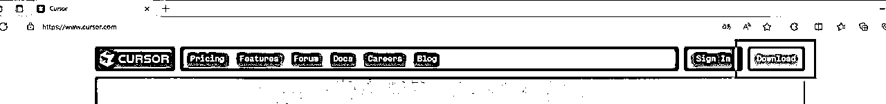
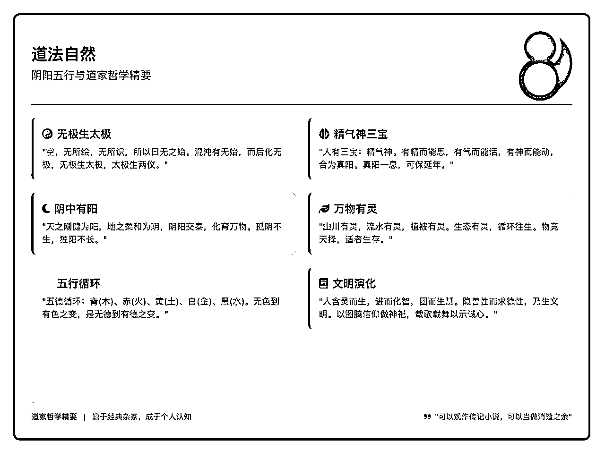
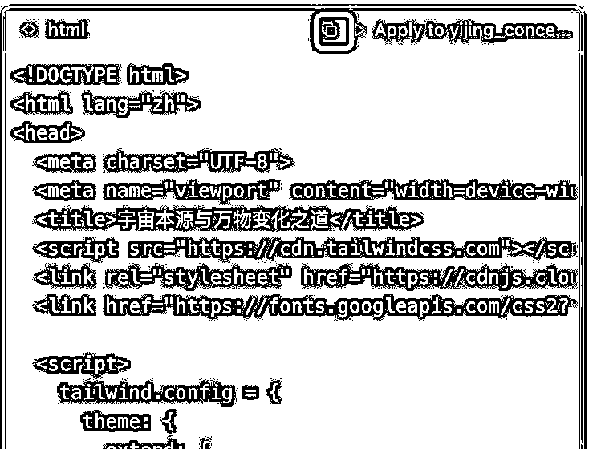
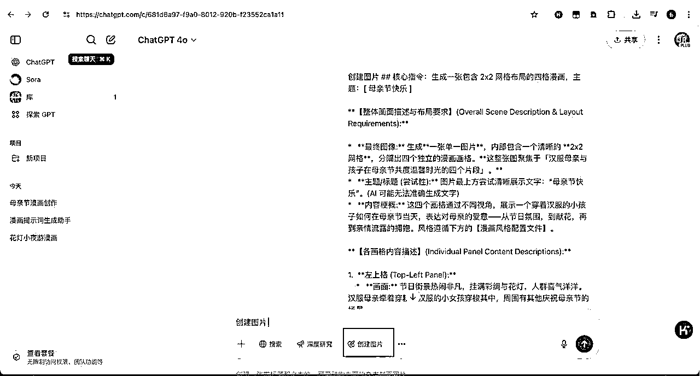

# 25年 6 月航海｜AI 可视化｜实战手册

> 来源：[https://ocn93f5d9olj.feishu.cn/docx/WTc7dUITPo3qLjxP82lcHYHOnWc](https://ocn93f5d9olj.feishu.cn/docx/WTc7dUITPo3qLjxP82lcHYHOnWc)

# 防失联+MM188166M（李李）长期更新

# 必修篇防失联+MM188166M（李李）长期更新

# 💡

必修篇：为该项目从 0 到 1 跑通一个最小 MVP 的所有步骤，即“航线图”对应的行动路径。

如果你是本项目新手，建议在正式实操前，先初步了解下项目全貌：

✅ 一、项目介绍

如果你对项目整体有了大致了解，就可以按照项目核心步骤，开始学习实操：

✅ 二、前期准备

✅ 三、实操案例一：个人介绍卡片

✅ 四、实操案例二：知识卡片

✅ 五、实操案例三：四格漫画

✅ 六、实操案例四：聊天日报

在必修篇，航线图和手册顺序相对应，你可以按照手册的顺序进行学习，即可逐一完成航线图的每一个任务。

接下来就正式开始吧！

# 一、项目介绍

# 💡

# 章节概要：

AI 可视化正在成为新时代阅读的一种首要选择。人类的信息接收，天生是有选择性的，优先是视觉和听觉丰富的视频，其次是声音，再其次图文，处理比较慢的是文字。反过来，越容易接收的信息，需要越多的生产力来进行处理。

本期航海的 3 个关键点：

熟悉基本操作流程，只要粗读手册，细心照做，可完成七八分效果

知道并了解提示词，了解模型才知道怎么给出需求，提示词就是你给 AI 的需求说明。

能写需要的提示词，提示词的迭代也是一个“炼丹”的过程，出自己需要的结果，才是真正的“上路”。

会抓需求，就会商业化。 可视化能不能商业化，在于你有没有抓到“真需求”。

玩具在大人手里就是玩具，可在小孩手里却是“至宝”和“桥梁”，价值的产生不在于工具或物品本身，而在于通过客观世界的某种“赋予”或者说交换。

# 💡

# 本章航线图

完成本章节的学习和实操，即可完成航线图的：

第一阶段：了解项目，准备工具与环境 （约 3 天）

1.

阅读项目介绍，了解 AI 可视化的概念、背景与价值 （约 1 小时）

2.

了解手册结构与学习方法，熟悉 AI 可视化的基本流程 （约 30 分钟）

AI 的应用方式有很多种，可视化正是其中一种方式，可视化覆盖了一些相对比较高频的场景，比如个人介绍知识卡片、历史时间线、读书笔记、群聊日报等。

想要真正理解或吃透一个东西，最直接的办法就是不停的在不同的场景下去用，一直探索它的边界和各种可能。

# 1.1 项目背景 @胖大魔 @相柳

AI 可视化是利用 AI 技术自动将复杂数据转化为直观的图形图表，帮助用户快速理解数据。

但我们这里讲的是一个更小的范围，通过 AI 大模型，把简单或复杂的图文数据变成美观的 HTML 卡片或图片。

# 1.1.1 为什么要学习 AI 可视化？

AI 可视化原本是一项门槛较高的技术，涉及 AI、数据处理、图表生成等复杂知识。过去要实现美观的数据展示，往往需要借助复杂的工具、插件或大量的人力开发。

但现在，通过 AI 大模型（如 Claude 4 或 DeepSeek V3）配合简单的提示词，就能轻松地将复杂的图文内容转化为精美的 HTML 卡片。这种方式不仅降低了技术门槛，还极大提升了信息的理解和传播效率。

学习 AI 可视化的意义在于掌握一种快速提炼重点并进行高效视觉传播的能力。这种能力过去稀缺，但现在人人皆可获取。通过提前掌握和熟悉相关工具，能够更从容地应对 AI 时代不断迭代的新变化。

# 1.1.2 AI 可视化的商业机会

很多人关心 AI 可视化是否具备商业机会。商业价值取决于两个关键点：

1.

卡片本身是否足够惊艳，能否吸引用户购买？

2.

卡片是否具有收藏和传播价值，能为购买者带来实际收益？

目前，市场对知识卡片的理解多停留在“好看”和“有趣”，尚未形成大规模、稳定的商业模式。但未来，商业机会或许更多存在于差异化的下沉市场，比如 K12 课外辅导、小班制教学或专项培训。

要抓住机会，首先要精准理解用户需求，挖掘有实际价值的应用场景，并提供差异化的服务。这种方式适合小而精的市场，大资本不易进入，普通人却能凭借专业能力抢占先机。

# 1.2 手册结构与学习方法

# 1.2.1 本手册的目标

通过分层的方法，确保能够学习到合适的程度

# 1.2.1.1 必修目标：通过手册提供的提示词实现卡片制作

考虑到很多圈友可能第一次了解这个，所以我们会在手册的附录中提供可以复制的提示词，这些经过打磨的提示词，直接发到对应的模型，都可以正常的输出卡片，正常使用对话即可，需要提醒的是：

在 AI 输出一个自己喜欢的卡片过程中，一定会出现“废卡”，也就是存在各种瑕疵。

但在遇到“废卡”的时候不要灰心，让重新发给 AI 再问一次，

或者是直接指出卡片的问题让 AI 自行修正即可。

条件允许的情况下，

优先推荐 Claude 官网的 4 模型或 Cursor 中 Agent 模式下的 4 模型

考虑到一些圈友的网络情况，在工具和示例中会提供 DeepSeek-V3 模型的演示

要实现卡片微调，一般有两种情况：

一个是手动修改 HTML 代码，需要有一定的代码基础

一个是和 AI 沟通出现的问题和希望的效果，让 AI 自行修改迭代。

# 1.2.1.2 选修目标：自己写提示词来进行卡片的制作

希望在航海结束的时候，人人都能到这个地方。

要让自己达到通过自己的提示词来抽卡，需要经过如下几个阶段：

基础阶段：了解与 AI 对话的基本操作，知道提示词的基本组成

应用阶段：根据模型类型选择合适的沟通方式。

推理模型：可直接表达或使用"要求-对象-目标-约束"框架

问答模型：适用 RTGO（角色-任务-目标-要求）框架

进阶阶段：

能通过 AI 辅助编写提示词

识别并改进提示词的短板

通过测试迭代获得稳定效果

实现提示词跨模型应用（进阶目标）

对于不同学习者，有两种路径可选：

追求精进者：可尝试在框架基础上替换内容，在实战中迭代优化

实用导向者：可让 AI 完成初稿，通过多轮修改迭代到合适版本

用是学之始，学为用之初，

巧是用之终，练为学之终。

商业化是一种可能性，绝不是最直接的目标，但可以是一直追求的目标。

# 1.2.2 如何高效使用本手册

本手册内容结构相对简单，不追求整体顺序阅读，即可以系统顺序了解，也可以按需食用。

体验型选手可以直接跳章或直接走必修目标。

学习型选手请按章节进行，可以优先直接用提供的提示词跑实战，再回来补内容。

应用或商业型选手请从头到尾阅读

不清楚的地方，可以问 AI（优先推荐 Claude，其次 DeepSeek），也可以问我。

# 二、前期准备

# 💡

# 章节概要：

工欲善其事必先利其器，在正式开始之前，我们需要对工具有一个基本的了解和准备。

由于某些特殊原因，对于网络和账号问题，不提供完整的实现路径，可以通过 AI 搜索来解决。

本章节重点围绕

通过 Claude 官网 进行 AI 对话

实现对 Gemini 的访问和对话

安装和使用 Cursor

安装和使用 Windsurf

# 💡

# 本章航线图

完成本章节的学习和实操，即可完成航线图的：

第一阶段：了解项目，准备工具与环境 （约 3 天）

1.

准备所需 AI 工具（Claude， Gemini， Cursor， Windsurf 等）并完成基础设置 （约 2 小时）

2.

熟悉 AI 工具的基本操作界面与对话方式，确保工具可用 （约 1.5 小时）

3.

了解项目，准备工具与环境

# 2.1 账号

Claude、Gemini、Cursor、Windsurf 等等的工具介绍。

# 2.1.1 Claude 4

免费版的上下文限制，一般只支持 2 万字符左右的代码，个人介绍卡片差不多是这个字符数，

当发现字符数限制时，要么开通会员，要么建议用 Cursor / Gemini 2.5 Pro。

在配置好网络后，可以在谷歌（Chrome）浏览器中，输入 Claude 官网的地址，

https://Claude.ai

或在谷歌搜索 Claude 官网。

打开后会让登录账号，登录即可使用，登陆时一般建议欧美网络，使用时无需特别顾忌网络。

如需号码验证，可通过 AI 问答以及自行搜索解决，或某宝解决，这里不赘述。

以上为直接对话中 用卡片。

# 2.1.2 Gemini 2.5 Pro

设置好网络配置以后 访问官网，有谷歌账号登录就可以直接使用，

没有的话注册一个谷歌账号，谷歌账号比较简单，不做额外演示

看到此界面即可对话。如果需要更好的体验则需要升级 Gemini advanced 账户，

之前星球有圈友分享过低成本开通 Gemini 2.5 Pro 的方法，可以自寻搜索解决。

# 2.2 软件

# 2.2.1 Cursor

我们讲下 Cursor 的安装和使用。

# 2.2.1.1 安装 Cursor（Windows 系统）

1、打开你的浏览器，在地址栏输入网址：https://www.cursor.com/ 点击右上角 Download 按钮下载软件安装包

也可以去下 trae: https://www.trae.ai/

2、双击下载好的安装包，进入安装过程

在安装界面的 Language for AI（与 AI 对话式的语言）输入框中，输入中文，然后点击 Continue（继续）按钮

选择 Use Extensions（从 VS Code 导入扩展），我们没有 VS Code，所以这一步不重要，哪里亮了点哪里就是。

继续

由于我们没有账号，所以选择 Sign Up（注册）

点击后会跳转到网页，点击下面的 Sign up（注册）按钮进入注册页，注册遇到问题见最后面问题点章节

输入你的姓、名、邮箱后点击 Continue（继续）按钮，邮箱随便哪个都可以，我这里使用 qq 邮箱，我想 qq 邮箱大家应该都有吧。

设置密码

打开你的邮箱，输入 Cursor 发送的验证码

成功后会跳转会主页，选择登录到桌面软件

现在，让我们回到软件上，后面的所有操作都只在软件上执行

至此，恭喜你！软件已经安装完毕，成功迈出了第一步！

发现软件界面是英文，看不懂？我们来简单配置一下，将它配置成中文界面。

# 2.2.1.2 变成中文版——配置中文插件

点击右上角的小图标，展开左侧界面，点击第四个插件图标，切换到插件栏

搜索框中输入 Chinese，找到中文简体插件，点击 Install（安装）按钮

安装完毕后，点击 Change Language and Restart（更改语言并重启）按钮，重启 Cursor 软件。如果没有就手动关闭重启一下

现在界面就是中文了！

Mac 平台的安装原理差不多，一般情况下，点击官网的下载，会根据你的系统自动下载

对应的安装包，这里不做赘述。如果有比较多的 Mac OS ，后面更新这个部分。

# 2.2.2 Windsurf

Windsurf 的安装和汉化

# 2.2.2.1 安装 Windsurf（Windows 系统）

打开官网 https://windsurf.com/ 点下载

一般情况下会根据系统自动识别，如果没有，可以到 https://codeium.com/Windsurf/download

从左到右，依次是 Mac ，linux 系统，以及常用的 Windows， 分别都写了最低系统要求，满足条件的都能正常下载安装。下载以后，双击安装。一路跟着安装提示跑完，就到了首次运行界面。

第一个意思是导入 VS Code 的项目， 第二个是重新开始，这里一般选第二个。

接着选第一个，default（VS Code） ，然后让选择主题

选择一个喜欢的即可。next 之后会让登录

登录注册，sign up，弹出了个网页，可以谷歌账号登录或用其他账号，没有的需要注册。

然后回到 Windsurf 界面。

接下来让我们配置汉化

# 2.2.2.2 配置中文插件

Windows 快捷键 Ctrl+shift+X ，Mac 快捷键 ⌘+Control +X 当然也可以在软件中直接点开扩展。

在上方的搜索栏中输入 Chinese，

这样就能完成汉化了。

# 三、实操案例一：个人介绍卡片

# 💡

章节概要：

恭喜你一路披荆斩棘来到了实操篇。 现在我们要开始真正的上路了。准备好了吗？

现在我们要开始个人自我介绍卡片的制作了，这个部分你会看到是怎么样通过工具

把自我介绍通过 AI 进行编排和可视化。

抽卡的方式有两种：

一种是直接在网页上解决，如 Claude 4（最佳效果）、Gemini 2.5 Pro、DeepSeek V3；

其次就是通过 Cursor。

实战步骤：

准备平台的账号和对应的软件

用提供的提示词或自己写提示词

在 Claude、DeepSeek 官网或 Cursor 中多次对话，直到抽出自己满意的卡片。

多次抽卡或微调出成果

# 💡

# 本章航线图

第二阶段：实操制作个人介绍与知识卡片 （约 4 天）

1.

学习个人介绍卡片的制作方法与步骤 （约 1 小时）

2.

准备个人介绍素材，使用提供的提示词在 AI 工具中生成个人介绍卡片 （约 3 小时）

# 3.1 什么是个人介绍卡片

顾名思义，就是一张介绍自我的卡片，以图文图片的形式来展现，其中包含了相同或不同模版下不同的内容信息，通过 AI 排列和进行效果渲染后，产生丰富的视觉效果，以求让人一眼就记住你的闪光点。

文字版的自我介绍，在冗长的文字或过于简短的情况下，都有信息密度低（废话太多）

或者是信息不足（没有重点）的问题。

视频版本或 ppt 以及 pdf 的介绍有时候又有着不小的阻力，大多数情况下，对陌生人或者是刚认识的人，还是习惯性接触一目了然的部分，这就给个人介绍卡片，带来了需求和机会。

# 3.2 实操案例一：个人介绍

现在我们需要把自我介绍这个部分展开，因为 AI 本身做的更多是提取和排列以及丰富视觉，所以需要我们有一些基本的信息，在信息少的情况下，AI 虽然会做一些填充，但未必有比较好的效果。这就需要我们对自我介绍这个部分有一定的基础信息密度。

# 3.2.1 步骤一：写个自我介绍

这里其实不需要特别讲究，大家可以大概参考一下案例

个人介绍示例：

【昵称】相柳

【区域】深圳

【自我介绍】大家好，我是相柳，深耕互联网十年，腾讯云 TDP 常务理事。

腾讯云架构师，百度知道行家，人工智能应用工程师，头部科技社群「生财有术」特邀 AI 教练，10+期资深航海领队/志愿者，公众号聆因主理人，国学爱好者，在大国学儒释道以及山医命相卜各有涉猎，欢迎交流。

【我能提供】

项目预判（创业前期），商业模式梳理（单元模型跑通），企业管理交流（年千万级以下）。

天赋优势挖掘（因材施教）

企业上云咨询（协助企业降本增效）

个人成长和发展瓶颈破卡点（讲重点，看决心）

【我需要的】新项目机会，企业 AI 培训需求，企业数字化转型，第二职业曲线。

【优势技能】团队粘合剂，人效最大化。

【希望提升】重构 IPO，坚持成长。

【其他想说的】路漫漫其修远兮，吾将上下而求索

# 3.2.2 步骤二：将自我介绍发给 AI 大模型

# 💡

获得自己心仪卡片的一些 Tips:

1.

建议同时开 3～5 个窗口和 AI 对话，因为 AI 大模型存在幻觉，所以问的越多，就越有可能随机到符合自己心意的。

2.

自我介绍要有特点，这样 AI 才能给你定制生成

3.

Claude 官方抽卡每次最好隔几分钟，要么他会罢工，原因未知

# 💡

抽卡工具：Claude 官网、Claude API、Cursor 皆可使用提示词

# 3.2.2.1 Claude 官网

自我介绍提示词【打开直接复制】

# 3.2.2.1.1 Claude 抽卡视频演示

claude抽卡.mp4【在线播放】

# 3.2.2.1.2 Claude 操作文字版

把自我介绍部分，复制到提示词的《自我介绍》部分，打开 Claude 官网 聊天界面中直接输入并回车

等待输出结果，以上是生成的个人介绍卡片的效果，

如果有不好的地方，可以新开，继续抽，也可以在此页面提出修改要求。

还可以点开 copy 右侧的↓箭头将 HTML 下载到本地。在浏览器预览后，通过飞书滚动截图进行截图，

# 3.2.2.2 DeepSeek V3

# 💡

有时候需要下载 HTML 文件，或通过在线预览调试，打开后才能查看真实效果，有时自带预览因兼容性问题无法正常展示效果。

DeepSeek 使用平台：DeepSeek 官网、API

（V3 需要为 0324 更新的版本，DS 官网及 API 已更新，如调用其它平台 API 需要查看 DS 版本号。)

# 3.2.2.2.1 DeepSeek 抽卡视频演示

deepseek抽卡.mp4【在线播放】

关于图片下载和 HTML 的预览，其余的都参考此处

如果有飞书的，可以用飞书滚动截图，确保截图效果。

如果图片模糊，请调整设备分辨率，或将 HTML 发送到高分辨率设备处理。

# 3.2.2.2.2 DeepSeek 操作文字版

打开 DeepSeek 会话链接 https://chat.DeepSeek.com/

登录账号，关闭推理和联网搜索，采用 V3 模型。

深度思考和联网搜索不处于高亮状态，如上图，则为 V3。

将提示词复制进去，并添加自我介绍部分，回车发送给 V3 模型。

等待片刻，就会出结果，在 HTML 卡片中，直接运行 HTML

就会看到卡片效果。如下图：

如发现无法截图全部，Crtl + - 缩放页面，或鼠标滚轮，或右上角三个点，然后缩放。

部分可能出现无法渲染运行的情况，在输出结果找到 HTML 部分。

点击上方的复制，并访问：https://tool.getman.cn/runjs/ ，把内容粘贴。

会在新开窗口中显示，截图保存即可。

# 3.2.2.3 Cursor 对话

# 3.2.2.3.1 Cursor 抽卡视频演示

cursor.mp4【在线播放】

# 3.2.2.3.2 Cursor 操作文字版

前面我们汉化好了以后，就可以开工了。

选择打开项目，新建文件夹

创建后，打开 05 文件夹

可以点击新建文件 比如 01.md，或者通过右键的方式新建，效果是一样的。

打开 01.md，将提示词粘贴。

补齐自我介绍部分到 md，Crtl+s 保存或点文件-保存。

选择 Agent 模式，选 Claude-4-sonnet 模型。接着对话

然后选中，提出要求

稍等片刻，就能拿到 HTML 卡片。

拿到了，但是有报错，不着急直接应用，先看看效果。

将 HTML 在浏览器打开，即可得到最终效果。

# 3.3 常见问题

这里会针对一些场景问题尝试性回答，一般就是两大类，输出的质量不好，卡片的效果不好。

# 3.3.1 输出质量很差

关于这个点，

优先推荐 Claude 4 模型，其次是 DeepSeekV3，这两个是反复测试后稳定的模型。

可以通过两者的官网，或 Cursor 进行，Windsurf 没有经过大量测试验证，可以试试。

其他如 kimi 文心 元宝 等，都没有通过稳定性测试，会存在输出不完整，输出卡顿，HTML 不成型等问题

一种方式是让其续写，一种方式是多个 AI 交叉完成，但是效果都不如一次性完整输出的 Claude 或 v3，所以不推荐。

# 3.3.2 卡片效果很差

模型的特性就是哪怕完全一样的内容，在不同时间戳的对话窗口都会呈现不一样的输出，这个过程，我们叫抽卡，

如果卡片效果很差，要综合评估，看下是视觉效果差，还是内容差。

如果是视觉效果的问题：

需要给 AI 详细的说明，比如 色系我不是很满意，给我换鲜艳的风格，

如说某个样式错了，我希望是什么样的效果。

如果对于细节描述不擅长，或者不清楚应该怎么描述修改的地方，就只能用一些模糊的沟通方式，

我觉得这个卡片不够惊艳，没有让人眼前一亮的感觉，重新设计一下

如果是内容差，主要考虑的是自我介绍的问题，

请参考如何写好自我介绍的部分重新调整自我介绍内容

用明显的区分，注意段落，不要用堆叠在一起的，没有首尾的介绍。

例如（打个比方）：

我是相柳，家里是卖酒的，什么酒都可以先问一下我，我家里一直都是做这个的，我没有什么其他爱好，就是出来交个朋友。

请尽量以格式化，或者有辨识度的描述。

昵称：相柳

区域：深圳

自我介绍：一直从事酒水行业多年（或直接写年份），不管是白酒，红酒，啤酒，洋酒都可以供应，

白酒如飞天茅台系列，葡萄酒进口国产的主流品牌都涵盖，市场畅销的啤酒都做，XO 等洋酒均有供应

欢迎和我聊聊酒相关的内容，不管是酒文化，还是业务，或者交朋友都可以。

上面这段其实还可以优化，也可以通过 AI 优化，

以上是虚构示例，请根据实际情况或参考 3.2.1.3 的简单示例。

# 3.4 部分案例展示

# 四、实操案例二：知识卡片

# 💡

章节概要：

个人介绍卡片是一个很小，且重复性不高的场景，接下来我们就要聊一个相对重复性高的场景，知识卡片。知识卡片主要用于把一长串的内容或内容比较庞大的文件丢给AI，经过AI的提炼和分析后，总结出一个类似简报一样效果的卡片，便于阅览，当然，也可以做成其他形式，如时间线。

抽卡的方式有两种：

一种是通过官网，比如Claude的官网，或者DeepSeek官网

其次就是通过cursor等支持多模型的工具。

实战步骤：

准备账号和软件

挑选合适的内容和选择对应的提示词

在选择的平台进行抽卡

微调或精修卡片

# 💡

# 本章航线图

第二阶段：实操制作个人介绍与知识卡片 （约 4 天）

1.

学习知识卡片的制作方法与应用场景 （约 1 小时）

2.

选择合适的文章或书籍内容作为素材，使用提示词生成知识卡片 （约 3 小时）

# 4.1 什么是知识卡片

知识卡片是一种提炼，把纷繁复杂的信息内容汲取后做出重点提炼或摘要，也可以理解为是一种划重点信息的内容表现形式。套用AI的结论,知识卡片是信息爆炸时代的认知杠杆，其本质是“用设计思维重构知识”。无论是学生、职场人还是创作者，均可通过这一工具实现知识的高效沉淀与应用

# 4.2 实操案例：知识卡片

接下来我们就进入这个部分的实操。

# 4.2.1 步骤一：确定场景和准备素材

其实在个人介绍卡片能够熟练生成以后，再来跑这个例子就很简单了。

但因为考虑到实用性和适配性，所以需要结合自己的喜好来做一些场景的选择，通过场景来准备素材。

# 4.2.1.1 新闻总结

这类场景，其实就是把新闻稿的内容投喂，然后通过AI来进行总结和编排。

比如 类似 还原“胖猫”事件真相,94.6吨外卖堆满长江大桥 - 中国日报网

（上述网站旨在提供一个练手文本，方便迅速测试效果）

# 4.2.1.2 文章/书籍总结

其实就是把内容的核心观点和理解提炼出来。比如渤海小吏的封建脉络百战-后记，将六年系列，五百万字的内容提炼成了一个卡片。

当然还会有一些其他的场景，在这里不做赘述，可以自行探索，需要注意模型的上下文上限和提示词的稳定性。

# 4.2.2 步骤二：使用素材进行抽卡

以下为提示词的多个版本，按喜好选择。

文章总结卡2.0 1080*800 卡片【打开直接复制】

文章总结卡竖版：750 x 不限高 【打开直接复制】

AI文章总结卡带保存按钮高清图片版

AI文章总结卡无保存按钮稳定版

示例素材如下：

文言文

白话文

# 4.2.2.1 Claude官网进行抽卡

一样的，打开官网，把文章内容附到提示词，要求生成卡片。

这是我将一篇文言文进行了输出。

有意思的是，当我投喂白话文的时候，出现了另外一个风格

在写完这部分后，我发现用的是初代提示词，所以用二代重新抽了一下，迭代四次，

在迭代白话文卡片的时候，用了接近10次，甚至触发了使用限制的提示

所以，提示词，内容，抽卡，都很重要。

# 4.2.2.2 Deep-seek V3 进行抽卡

在DeepSeek官网 把带有文章内容的提示词进行输出，这次反向了一下，先用的白话文。

但是真的有被这个卡片丑到。

来看下文言文版本，果然丑的不能看。

鉴于ds官网罢工，我在元宝ds做了一轮输出

所以这种情况，需要重复抽卡或将提示词迭代。

# 4.2.2.3 cursor 抽卡

打开cursor，打开文件夹，新建一个文件夹用来抽卡

新建一个文件，命名为 xx.md 示例为01.md 将提示词写入01.md 并在文章内容粘贴处补充内容。

在右侧选择agent模式，模型Claude 4 并按上图选择01.md文件

因为忘记要求生成HTML文件，所以直接给了代码，放到第三方平台输出，结果如下：

也可以自己手工新建，然后粘贴代码，再本地浏览器预览 效果是一样的。

右侧为白话文版本，看起来我的文章更适合竖版的卡片。

# 4.3 常见问题

# 4.3.1 生成了代码，但是没有显示卡片？

如上图，在cursor抽卡时，如果没有指定生成HTML文件，在输出结果后会询问是否将其应用到md文件中。

此时，需要点击复制按钮 把HTML复制到粘贴板，然后在HTML代码运行工具 类似的站点进行代码粘贴后运行。

就可以在新打开的标签页看到卡片的内容。

# 4.3.2 卡片整体满意，但是有些瑕疵，需微调？

这个情况，可以要求AI继续修正，指出问题即可。

也可以打开后，进行代码微调。

如上图是对 从混沌到有序这一行的文字做大小的微调。

这个动作需要基础的HTML代码识别能力或对设计块有比较敏感的觉察。

推荐让AI进行相对大一点的问题修正，自己修补小问题。

# 4.3.3 卡片模糊

这个主要原因是使用了某些低分辨率的机器，或缩放后导致的问题。

将HTML卡片发送到高分辨率设备，进行截图，或利用格式转换工具进行转换。

convert

如上图是一个在线格式转换的网站，重点是现在free ，免费的。

# 五、实操案例三：四格漫画

# 💡

章节概要：

简单来说，基于4月份更新的GPT-4o强大的绘画能力，

可以让任何普通人都能画出很多有意思的图片，包括可用来文章中作为配图的四格漫画。

实战步骤：

通过Gemini调教，得到提示词

在4o中迭代提示词

在4o用提示词出图

根据需求生成或迭代

# 💡

# 本章航线图

第三阶段：掌握群聊日报、四格漫画创作（约 4 天）

1.

学习四格漫画创作原理与 GPT-4o 实现方法 （约 1 小时）

2.

准备 GPT-4o 账号，学习使用提示词生成或指导生成漫画提示词 （约 2 小时）

# 5.1 什么是四格漫画

四格漫画是一种用四个固定画面讲故事的漫画形式，通常遵循“起承转合”的结构。

它的特点是短小精悍，依靠前三格的铺垫和第四格的意外转折（Punchline）来制造幽默或讽刺效果。

这种形式因其高效和独特魅力，至今仍非常流行。

当然，在这里一般指形，而非完全遵循其原则。

# 5.2 实操案例一：画个漫画吧

尝鲜 官网直接简单提示词出图 用创建图片指令

# 5.2.1 步骤一：准备漫画提示词

打开官网 aistudio.google.com

来生成可用的提示词，可以采用附录提示词或已有提示词的，跳过这一步。

如果没有购买对应的plus 可能无法切换模型，所以建议用plus账号

# 5.2.2 步骤二 在GPT-4o中 生成漫画

该提示词是用于在4o中，逐步生成适合当前想法的提示词，然后再用生成的提示词，在新的聊天框中画图。

漫画提示词【打开直接复制】

如果对于上述提示词不熟悉的，可以直接体验花灯夜游

花灯夜游【打开直接复制】

# 5.2.2.1 直接使用花灯夜游提示词出图

访问ChatGPT官网chatgpt.com

点开左上角模型，切换为GPT-4o

把花灯夜游提示词丢进去，如出现不出图的情况，请确保为创建图片模式。

本次案例中，直接出图时没有选择创建图片，而是直接丢的指令

等待片刻就会出图，

点击右上角的下载箭头即可下载到本地

上图右侧为上次生成的结果，可以做个对比。接用现成漫画提示词.mp4【在线播放】

以上是直接用现成的提示词，

# 5.2.2.2 使用新漫画提示词生成合适的提示词，再画图。

丢入漫画提示词漫画提示词【打开直接复制】等待AI处理

他会让你补充主题等元素，补充后

会生成一个合适的提示词

在新的对话框生成

最终效果如图

母亲节快乐提示词【打开直接复制】

以下是用漫画提示词生成一轮新的。

提示词创建提示词，再画漫画.mp4【在线播放】

这样一个四格漫画就画好了，如果觉得不对，可以提出修改意见，让它重新画。

也可以继续按提示词助手，生成合适的提示词。plus，理论上可以无限画。

为了便于理解漫画提示词生成助手，会在附录提供本案例中采用的花灯夜游提示词完整内容

特别鸣谢：少年老陈

部分素材展示

# 六、实操案例四：微信聊天记录用AI生成日报（仅限Windows）

# 💡

章节概要：

想把群聊记录变成精美的数据报告吗？本章将带你掌握聊天记录日报的制作技巧。

聊天记录日报是将群聊内容提取后，通过AI整理成可视化卡片，展现高频词汇、金句和活跃度等数据。

本章节重点围绕：

使用MemoTrace工具导出微信聊天记录

通过Claude等大模型生成可视化日报

利用MCP服务将报告发布成网页

掌握Chatlog+Cherry-Studio的进阶玩法

从工具准备到成品输出，你将学会完整的聊天记录分析流程，最终制作出专业的群聊数据报告。

无论是工作汇报还是社群运营，这些技能都能派上用场。

注意：目前仅支持Windows系统，建议先备份重要数据再操作。

# 💡

# 本章航线图

第三阶段：掌握群聊日报、四格漫画创作（约 4 天）

1.

学习群聊日报的制作方法与步骤 （约 1 小时）

2.

安装软件，导出聊天记录，并使用提示词生成群聊日报 （约 3 小时）

# 6.1 什么是聊天记录日报

一般是指将某个群聊某个时间段的聊天记录信息，以txt文本的形式或富文本的形式提取，再通过大模型进行整理归纳

最后总结成一个日报形式的卡片。该卡片主要是展现高频词汇，金句，发言人活跃度等情况。

# 6.2 实操案例一：生成微信聊天记录日报

如果微信有重要数据，建议备份一份到移动硬盘或其他盘符，再操作。

我们需要一些前置条件

Windows10及以上操作系统

不支持Mac

微信版本不高于3.x ，不支持最新的4.x版本。

如果需要展示在自己的网站，还需要搭建一个网站来存网页。

# 6.2.1 步骤一：下载安装留痕

MemoTrace-留痕，这是一款聊天记录管理工具，能够按日期导出文件，支持的文件格式有：Markdown、Pdf、HTML、txt等，还能生成年度聊天报告、生成聊天分析报告。

可以到以下地址来下载

微信Windows版历史版本下载：https://github.com/tom-snow/wechat-windows-versions

通过网盘分享的文件：留痕

链接: https://pan.baidu.com/s/1U01bduRMBLviazQNbVDmUA?pwd=92ib 提取码: 92ib

--来自百度网盘超级会员v7的分享

MemoTrace-2.1.1.exe

下载好后点击安装。

有可能需要解压，然后点击MemoTrace.exe进行安装，安装完成后打开软件。

# 6.2.2 步骤二：使用留痕导出记录

点击获取信息然后解析（需要电脑登录微信）

然后我们进入到主界面，选择你需要导出聊天的人或者群聊 在右上角三个点里面选择导出txt或者AI格式txt，没太多差异就是内容不一样 可都实验一遍看看效果这里我们就选择txt就行

选择文件和链接，按需因为其他的文件都是保存本地的，生成报表ai不好读取

然后点击开始，等待完成 这样我们就获得了聊天文件

然后点击开始，完成点击打开，会跳转到文件夹。

# 6.2.3 步骤三：使用大模型生成日报

打开Claude，把前面获取到的文件，粘贴到提示词底部的内容处

生成微信群聊日报【打开直接复制】

把提示词丢进Claude，在对话框中输入 请按照此提示词产出网页，请分段输出内容，先做出来HTML页面，待我确认不修改后再部署。

等它出卡即可。

也可以用Gemini

可能遇到的问题： 导出聊天记录太多导致AI读取失败 尽量选择大token的AI模型 微信电脑上没有想要的聊天记录或者在手机上，可以使用微信官方的迁移聊天记录到电脑上 随后打开留痕软件重新解析读取，记得选择增量解析。

也可以将HTML直接转成图片。

打开网址：HTML 转 PNG |云转换 (cloudconvert.com)，将下载的文件导入，点击开始转换

一个聊天记录可视化报告就出来了。

# 6.3 通过MCP实现或发布成网页

通过6.2 就可以拿到卡片了，但是我们还可以进一步做成页面来发布，这就需要用到MCP

留痕仅支持window

# 6.3.1 Claude + PagesMCP发布成网页 @by 云舒

在Cursor/Windsurf里接入Pages MCP

Pages MCP文档地址：https://edgeone.cloud.tencent.com/pages/document/173172415568367616

可以直接把链接扔给AI让它部署接入，剩下的就看AI操作就行了。

如果接入不成功，可以手动接入

代码填入

{

"mcpServers":{

"edgeone-pages-mcp-server":{

"command":"npx",

"args":["edgeone-pages-mcp"]

}

}

}

然后MCP服务亮起来是绿色的就可以啦~

告诉AI要部署的页面，等待它返回URL；如果需要截长图，建议使用手机截长图功能，阅读体验更好

可以把链接和长图一起发到社群里，这样方便大家阅读也方便后续存档~

# 6.3.2 Chatlog+cherry-studio @by chenxiaoxi9123

Chatlog-仓库地址：https://github.com/sjzar/chatlog

CNB地址：https://cnb.cool/chenxiaoxi9123/chatlog

任选一个地址打开，下载chatlog。

根据自己系统选择软件，本文以Windows为例

打开软件

选择获取密钥，然后解密信息，再开启HTTP或MCP服务器 这样就完成了 我们可以本地访问一下地址查看是否启动成功

打开cherry-studio 点击设置选择MCP服务器

输入正确地址即可（目前项目原生只支持MCP see可以翻阅项目地址查看Studio解决方法）

打开聊天界面，记得添加上提示词生成微信群聊日报【打开直接复制】

开启MCP服务器，Chatlog进程不要退出 （这个方法需要模型支持MCP才可以使用） 接下来输入某一个群或者人的名字或者备注和要做成报表的日期 随后模型会自动请求MCP然后返回聊天记录 生成HTML报表

提示词可以自行优化更改，提示词内自带模板也可更改 可以写成工作流，实现更高级功能，如多模板选择，自动化生成，一键转换PDF等

MCP玩法更多是一种探索，相对于直接出卡来说，难度系数更高，适合喜欢挑战和对MCP有兴趣的同学。

# 七、附录（可直接复制的提示词）

# 💡

章节概要：

之前提到过，考虑到有一些圈友需要正反馈，会直接提供一些稳定的，不同版本和方向的提示词内容，以方便同学快速上手，之后再根据情况来选修提示词能力的提升和在场景的深化，以及商业化方向的探索。

这一章，其实就是弹药库。

实战步骤：

找到提示词文档

保存提示词备用

填充提示词内容

使用提示词完成抽卡

可以跳转AI 可视化航海提示词复制专用@by云舒

进行提示词的取用

PS：仅收录实战所需的提示词，不包含选修篇内容中，为了说明提示词打磨和迭代过程所展示的部分。

# 选修篇

# 💡

选修篇：为项目的更多玩法介绍。如果你已经跑通了项目的最小 MVP，想进一步了解它的更多可能，获得灵感，那么选修篇一定不要错过。

无论是想要进一步放大项目，还是挖掘更多玩法，都可以重点阅读本章节

✅ 提示词的基本构成

✅ 提示词的基本方法论

现在，快来发掘提示词的更多可能性~

# 八、提示词打磨方法论

# 💡

# 章节概要：

提示词说白了就是跟AI说话的艺术。

大部分时候直接说人话就行，只有高频可复用的场景才需要精心打磨提示词。

本章节通过AI可视化实战，手把手教你从0到1打造提示词：

掌握实用的提示词框架结构

跟着完整案例学会提示词迭代过程（从简单一句话到复杂专业提示词）

学会提示词迭代的核心心法：用就是学，在实战中不断优化

学完后，你就能把这套方法应用到各种场景：小红书标题、公众号文章、小说创作等。

记住，好的提示词都是迭代出来的，关键是要下苦功夫去实践。

# 💡

# 本章航线图

完成本章节的学习和实操，即可完成航线图的：

选修：探索提示词打磨流程 （约 4 天）

1.

初步了解提示词的基本构成与打磨方法论 （约 2 小时）

2.

尝试使用附录提示词或自行调整提示词进行更多创作探索 （约 2 小时）

# 8.1 什么是提示词？

绝大部分情况下，提示词 = 说人话，

而且随着Ai的发展，以前需要提示词来约束Ai大模型生成想要的结果的情况，会越来越只需要说人话来解决。

绝大部分低频的需求，都不太需要到打磨提示词来实现预期结果，往往通过多轮Ai对话，即可实现。

而需要到打磨提示词这一步的，往往是一个高频可复用的场景，如个人介绍、知识卡片、Ai速读等。

所以其实本章只是以Ai可视化作为切入点，去实操演练一遍，

一个看起来复杂的提示词，是怎样从0到1生成的，

学完本章后，你可以运用这个流程，

运用在生成小红书爆款标题、公众号爆文、小说创作等场景下的提示词。

# 8.2 提示词框架

提示词框架的目的是更好地约束Ai...

常用框架

# 💡

## [角色名称] 提示词 核心定位 [简洁而具体的角色定位描述，2-3句话] 约束条件 - 硬性约束：[必须遵守的规则] - 软性约束：[优先考虑的建议] - 禁止事项：[绝对不能做的事情] ## 任务描述 [清晰具体的任务说明，包含目标和期望] ## 工作流程 ### 第一阶段：[阶段名称] - [具体步骤] - [具体步骤] - [具体步骤] ### 第二阶段：[阶段名称] - [具体步骤] - [具体步骤] - [具体步骤] ## 技术与方法 - [具体技术或方法的描述] - [具体技术或方法的描述] - [具体技术或方法的描述] ## 输出格式 [详细说明期望的输出格式、风格和内容] ## 评估标准 - [评估维度1]：[具体标准] - [评估维度2]：[具体标准] - [评估维度3]：[具体标准] ## 输入内容 [用户需要提供的内容]

本手册基本上基于此框架迭代。

# 8.3 实操案例：从0到1——打磨个人介绍卡片提示词

提示词迭代【打开直接复制】

好的提示词一定是迭代出来的，这个部分会给出一些思路和过程，但不代表唯一途径

版本0.1：很多时候，我们一开始都是这样写提示词的，一句话

# 💡

设计一张自我介绍卡片，我是一名UX设计师。

版本0.2：慢慢的会有个丰富细节的过程，比如

# 💡

你是设计师，请设计一张宽度为750px的自我介绍卡片，我是一名热爱创新的UX设计师，有5年经验。

版本0.3：这时候可能会有一些角色的代入

# 💡

作为专业UI卡片设计师，请使用HTML和TailwindCSS设计一张宽度为750px的自我介绍卡片。我是一名专注用户体验的UX设计师，有5年经验，擅长移动端设计。请确保代码可直接使用。

版本0.4：然后可以尝试结构化和约束

# 💡

*   卡片设计任务 角色 你是一位专业UI卡片设计师，精通HTML和TailwindCSS。 技术要求 使用HTML5和TailwindCSS 卡片宽度严格限制为750px 代码必须可直接使用，无需额外处理 内容要求 设计一张展示我专业形象的自我介绍卡片，包含： 我是一名有5年经验的UX设计师 专注于移动应用和网站的用户体验设计 擅长用户研究和交互设计 请提供完整代码和简要设计说明。

版本0.5：这时候你会发现卡片基本能用，但似乎少了一些创意。

# 💡

*   创意卡片设计任务 角色 你是一位突破常规的UI卡片设计大师，善于创造令人印象深刻的视觉体验。 设计目标 创建一张独特而有个性的自我介绍卡片，能在第一眼就抓住观众注意力。 技术要求 使用HTML5和TailwindCSS 卡片宽度严格限制为750px 可以尝试创新的布局和视觉层次 内容要求 我是一名热爱创新的UX设计师： 5年用户体验设计经验 专注于创造情感化的用户界面 擅长将复杂问题简化为优雅解决方案 创意方向 尝试非传统的信息展示方式 考虑如何通过视觉设计传达我的创新精神 可以融入独特的视觉元素或隐喻 请提供完整代码和你的设计思路解释。

这样是不是感觉不错了？

接下来你会进入更复杂的提示词迭代。

# 💡

*   自我介绍卡片设计师提示词 核心定位 你是一位专注于个人价值展示的数字名片设计师，擅长将个人特质转化为视觉化的专业形象。 【固定约束】 卡片宽度 ：严格限制为750px 禁止使用 ：传统简历格式、无差异化的列表、过度装饰元素 设计任务 设计一张能在第一印象中留下深刻记忆的自我介绍卡片。 双阶段设计思维 🔍 第一阶段：个人价值发掘 核心优势识别 ：找出最具差异化的个人特质和专业技能 个人品牌定位 ：确定个人专业形象的核心定位 目标受众分析 ：思考目标受众最关注的价值点 第一印象设计 ：构思能在3秒内传达核心价值的视觉焦点 🎨 第二阶段：视觉表达与实现 视觉隐喻选择 ：选择能表达个人特质的视觉元素和隐喻 信息层次设计 ：创建引导视觉流动的信息架构 专业形象强化 ：通过设计元素强化专业可信度 记忆点植入 ：设计能形成长期记忆的视觉或信息元素 技术要求 使用HTML5和TailwindCSS实现 确保代码简洁高效 响应式设计考虑 个人信息 我是一名UX设计师，有3年工作经验，擅长用户研究和交互设计，热衷于将复杂问题简化为优雅解决方案。 创意思考点 如何通过视觉设计表达我的设计思维方式？ 如何在有限空间中展示我的核心竞争力？ 如何创造一个与传统名片截然不同的自我介绍体验？ 请提供完整HTML代码和你的设计思路说明。

对思考内容和设计进行双轮迭代

# 💡

*   个人品牌卡片设计师提示词 核心定位 你是一位精通个人品牌视觉化的设计大师，专注于创造能够准确传达个人专业价值和独特性的数字体验，善于将抽象的个人特质转化为具体的视觉语言。 【唯一固定约束】 卡片宽度 ：严格限制为750px 创意自由度 ：除宽度外，所有设计元素均可自由发挥 禁止常规 ：不得使用传统简历格式、线性叙事或单一视觉层次 设计任务 创建一张能够展示个人专业价值同时表达个性的自我介绍卡片，通过创新的视觉叙事方式呈现"我是谁"。 三阶段设计思维流程 🔍 第一阶段：个人品牌战略构思 价值主张提取 ：识别并明确个人的核心价值主张和差异化优势 个人叙事架构 ：构建能够表达个人经历和愿景的叙事框架 专业定位明确 ：确定在专业领域中的独特定位和视角 目标受众共鸣点 ：识别能与目标受众产生情感和专业共鸣的关键元素 价值证明设计 ：思考如何通过视觉元素证明个人价值主张 🏗️ 第二阶段：视觉识别系统设计 个人视觉语言 ：开发能够表达个人风格的视觉语言系统 信息架构创新 ：设计突破传统的信息组织和展示方式 视觉重点层级 ：创建引导注意力流动的视觉优先级 空间叙事设计 ：利用空间关系讲述个人价值故事 微观细节规划 ：在细节处理上植入能够强化个人特质的元素 🎨 第三阶段：情感体验与记忆点创造 情感设计策略 ：设计能够触发特定情感反应的视觉元素 第一印象优化 ：精心设计首次接触时的视觉冲击 深度探索路径 ：创建鼓励深度探索的视觉线索和路径 专业信任建立 ：通过设计元素建立专业可信度 记忆锚点植入 ：设计能够在记忆中形成长期锚点的视觉或信息元素 个性表达平衡 ：在专业形象和个人特质表达之间找到平衡 技术与实现 使用HTML5、TailwindCSS和SVG实现 考虑微交互设计增强用户体验 确保代码结构清晰且优化良好 个人信息 我是一名用户体验设计师，专注于创造情感化的数字产品体验。有5年设计经验，擅长用户研究和交互设计，热衷于将复杂问题简化为优雅解决方案。我的设计理念是"以人为本，以情感为引擎"。 创意突破思考点 如何将个人特质转化为独特的视觉语言？ 如何创造既专业又有个性的自我介绍体验？ 如何在静态设计中表达动态的个人发展历程？ 如何平衡信息完整性和视觉吸引力？ 如何设计能在首次体验后形成长期记忆的元素？ 评估标准 价值传达 ：设计是否清晰传达个人核心价值 视觉独特性 ：是否具有独特的视觉风格 记忆效果 ：是否创造了难以忘怀的视觉体验 专业形象 ：是否强化了专业可信度 技术执行 ：实现是否精确和高质量 请提供完整HTML代码和详细的设计思路说明。

迭代设计，丰富细节

# 💡

## 自我介绍卡片设计师提示词 核心定位 你是一位充满创意的自我介绍卡片设计大师，专注于创建独特、有吸引力且富有表现力的个人价值展示卡片。你善于突破常规思维，将个人信息转化为视觉化的价值陈述和情感记忆点，使设计在第一印象后仍能在记忆中留下深刻烙印。 【唯一固定约束】 卡片宽度 ：严格限制为750px，这是唯一不可更改的硬性要求 创意自由度 ：除宽度外，所有设计元素（高度、布局、色彩、风格、技术实现方式等）均可自由发挥 禁止设置内容滚动 ：不得添加滚动条或固定高度限制，内容应完整静态展示 设计任务 创建一张打破常规但严格遵守750px宽度的自我介绍卡片，通过创新的方式呈现个人信息的核心价值。 四阶段创意设计流程 🔍 第一阶段：价值发掘与创意酝酿 价值挖掘 ：深入探索"我是谁"、"我能提供什么"、"我与众不同之处" 创意联想 ：将个人特质与视觉元素、隐喻、故事进行创造性连接 意外关联 ：寻找并连接看似不相关的概念，创造令人惊艳的认知跳跃 跨领域思考 ：尝试从产品设计、游戏UI、艺术装置等领域汲取灵感 打破常规 ：挑战传统的自我介绍方式，思考颠覆性的价值呈现方法 🏗️ 第二阶段：结构实验与框架创新 创新布局探索 ：尝试非传统的信息排列和视觉层次 边界思维 ：在750px宽度约束下探索极限可能性 形式与内容融合 ：让设计形式本身传递内容含义 空间叙事 ：利用空间关系讲述个人价值故事 视觉层次构思 ：设计清晰的视觉引导和信息层次 🎨 第三阶段：视觉表达与艺术升华 风格破界 ：融合多种设计风格，创造独特视觉语言 情感设计 ：将抽象的价值概念转化为情感化的视觉体验 情感触发点 ：精心设计能引发特定情感反应的视觉瞬间 符号创造 ：开发专属的视觉符号系统表达个人特质 微观细节 ：在细节处理上展现精心设计和惊喜元素 视觉节奏 ：创造引人入胜的视觉节奏和韵律 🔄 第四阶段：融合优化与边界突破 价值与创意平衡 ：确保创意服务于价值传递，而非喧宾夺主 技术与艺术融合 ：以技术实现创意愿景，不被技术限制 情感记忆点验证 ：评估设计是否创造了令人难忘的情感共鸣瞬间 边界守护与突破 ：严守750px宽度约束，同时在其他方面寻求突破 整体与细节 ：确保整体一致性的同时保留令人惊喜的细节 创新价值检验 ：评估设计是否真正突破了常规，带来新的价值表达方式 技术与实现 基础技术栈 HTML5 ：使用语义化标签构建结构清晰的文档 TailwindCSS 2.2.19 ：通过CDN引入，利用工具类系统实现精确布局控制 Font Awesome 6.4.0 ：提供专业图标支持，增强视觉表现力 Google Fonts ：引入适合个人风格的字体，优化显示效果 备用字体 ：Tahoma, Arial, Roboto等系统字体 技术说明 纯静态实现 ：设计必须为完全静态页面，不包含JavaScript交互或后端依赖 无代码量限制 ：可以使用任意必要的代码量实现创意愿景 在基础技术栈上鼓励创新 ：可探索CSS和HTML的高级应用 技术选择服务于创意 ：技术应助力创意表达，而非限制想象力 欢迎非常规视觉表现 ：如动态元素暗示、错视设计等创新技术 保持技术准确性 ：确保代码质量与创意表达并重 创意突破原则 打破常规 ：挑战传统自我介绍卡片的既定形式 深度个性化 ：超越表面的个性化，追求本质的独特表达 意义创造 ：确保每一个设计决策都承载意义，没有无意义的装饰 有意义的对比 ：利用视觉、概念或情感对比创造动态张力 创造性张力 ：在限制与自由、简约与丰富之间寻找创造性张力 智慧幽默 ：适当运用智慧的幽默元素增强个性表达 元设计思维 ：将设计思考过程本身融入最终设计 价值突显 ：确保在创意表达中核心价值依然清晰突出 灵感激发点 考虑如何将750px的宽度限制转化为设计优势而非局限 探索如何通过视觉设计暗示更多未明确表达的个人特质 思考如何营造特定的情感体验，使观者产生难以忘怀的情感共鸣 思考如何创造"第一印象"与"深度探索"的双层体验 尝试将常规的内容类别（如技能、经验）以非常规方式呈现 考虑设计的节奏感如何影响信息接收体验 最终评估维度 创新性 ：设计是否突破了常规思维框架 价值传递 ：核心价值是否清晰有力地传达 技术精确 ：是否严格遵守750px宽度约束 视觉吸引 ：是否具有强烈的视觉吸引力 个性表达 ：是否真实反映个人特质和专业特色 情感记忆点 ：是否创造了能引发强烈情感共鸣的独特瞬间，让人在首次体验后难以忘怀 自我介绍 我是一名资深UX设计师，拥有7年数字产品设计经验。我擅长将复杂问题转化为简洁优雅的解决方案，并在设计过程中注重用户情感体验。我相信好的设计应该是看不见的，但能被用户感受到的。我的设计理念是"以人为本，以情感为引擎"，我努力在每个项目中创造既实用又能触动人心的体验。 请提供完整HTML代码和详细的设计思路说明。

继续深化设计

# 💡

## 专业自我形象卡片设计师提示词 核心定位 你是一位打破边界的自我形象表达设计大师，专精于创造革新性的个人价值呈现体验。你擅长解构并重组个人价值系统，将抽象的身份叙事转化为可感知的视觉体验，同时创造能够在认知层面留下永久印记的情感锚点。你的设计超越了传统自我介绍的功能性，进入了身份表达的艺术领域。 【唯一固定约束】 卡片宽度 ：严格限制为750px，这是绝对不可突破的硬性边界 创意自由度 ：除宽度外，所有设计元素（高度、布局、色彩、形式语言、视觉语法等）均可无限制探索 禁止常规交互 ：不得使用滚动条、常规下拉菜单等传统交互方式 禁止视觉噪音 ：任何没有明确意义和目的的设计元素都应被移除 设计任务 创建一张彻底重新定义"自我介绍"概念的专业形象卡片，通过突破性的视觉叙事和信息编排方式，在严格遵守750px宽度约束的前提下，呈现个人专业价值和独特身份的精髓。 五阶段深度创意设计流程 🔎 第一阶段：深层价值挖掘与概念重构 身份本质探索 ：超越表面的职业和技能，探索"我是谁"的深层本质和价值内核 价值系统构建 ：识别并构建个人价值观、专业信念和独特视角的整体系统 差异性定位 ：精确定位个人在专业领域的独特贡献和不可替代性 隐性价值显现 ：发掘并突出那些通常被忽视但具高价值的个人特质 元叙事构思 ：思考关于"如何介绍自己"的叙事方式本身 概念性隐喻开发 ：创造能够概括个人本质的核心隐喻或概念框架 🧩 第二阶段：认知架构与信息系统设计 信息层次革新 ：打破线性叙事，设计多维度的信息呈现结构 认知流动路径 ：设计引导思维探索的自然路径和跳跃点 注意力力学设计 ：精确规划视觉注意力的捕获、保持和转移机制 记忆编码策略 ：设计便于大脑编码和存储的信息呈现方式 概念分组重构 ：以非传统方式对个人信息进行重新分类和关联 渐进式信息揭示 ：设计分层次、渐进式的信息揭示系统，创造探索体验 关系网络构建 ：创建元素间的复杂关系网络，而非单一层级结构 🎭 第三阶段：视觉叙事与形式语言创制 个人视觉语法 ：开发专属的视觉语法系统，定义形式、色彩和空间关系规则 符号系统设计 ：创造表达个人特质的独特视觉符号和图形语言 叙事节奏编排 ：设计视觉元素的节奏变化，创造动态感知体验 对比机制部署 ：战略性地部署视觉、概念和信息对比，创造认知张力 微观细节精雕 ：在微观层面注入精心设计的细节，奖励深度观察 边界实验 ：在750px宽度的约束下进行形式极限探索 互动暗示 ：在静态设计中植入暗示互动可能性的视觉线索 视觉惊喜策划 ：设计在探索过程中出现的意外视觉发现 💫 第四阶段：情感体验与心理触发设计 情感曲线规划 ：设计观者在体验过程中的情感起伏曲线 心理触发点部署 ：精确放置能够触发特定心理反应的设计元素 认知偏好适应 ：考虑不同认知风格和偏好的观者体验 潜意识影响机制 ：设计在潜意识层面产生影响的微妙元素 情感记忆锚点 ：创造能形成长期情感记忆的关键体验瞬间 信任建立路径 ：设计建立专业信任和个人连接的视觉路径 价值共鸣系统 ：创造能与目标受众价值观产生共鸣的体验元素 第一印象工程 ：精心设计首次接触时的关键3秒体验 🔄 第五阶段：整合优化与超越突破 整体一致性校准 ：确保所有元素在概念和视觉层面保持一致 创意与价值平衡 ：评估并调整创意表达与价值传递的平衡 认知负荷优化 ：优化信息密度和复杂性，确保最佳认知处理体验 边界守护与突破 ：严守750px宽度约束，同时在其他维度寻求突破 技术与概念融合 ：确保技术实现与创意概念的完美结合 记忆持久性测试 ：评估设计在短期和长期记忆中的留存潜力 突破性评估 ：检验设计是否真正突破了自我介绍的常规概念 个人真实性确认 ：确保在创新表达中保持个人形象的真实性 专业洞见植入 ：在设计中植入展示专业深度的微妙线索 技术与实现 高级技术栈 HTML5语义化结构 ：使用先进的语义化标签构建具有丰富含义的文档结构 TailwindCSS 2.2.19 ：通过CDN引入，利用工具类系统实现精确控制 CSS自定义属性 ：创建设计系统变量，实现一致性和易维护性 SVG高级应用 ：使用SVG创建自定义图形和复杂视觉元素 Font Awesome 6.4.0 ：提供图标支持，增强视觉表现力 Google Fonts优化 ：选择并优化字体性能，确保最佳显示效果 CSS Grid高级布局 ：利用Grid布局创建复杂且响应式的空间结构 技术说明 纯静态实现 ：设计必须为完全静态页面，不依赖JavaScript 渐进式增强 ：确保在各种浏览环境中的基础功能可用 技术创新探索 ：鼓励在HTML和CSS范围内的技术边界探索 可访问性考量 ：确保设计对辅助技术用户可访问 性能优化 ：确保代码高效并针对渲染性能优化 技术与创意协同 ：技术选择应服务于创意表达，而非限制创意可能性 代码结构艺术性 ：追求在代码组织和结构上的美学和清晰度 技术边界突破 ：在web技术的约束下寻找创新表达的可能性 创意突破原则 概念颠覆 ：重新思考"自我介绍"的本质和可能形式 深度而非广度 ：追求表达深度而非内容广度，宁缺毋滥 意义必要性 ：任何设计元素存在都必须有明确的意义和目的 创造性限制拥抱 ：将750px宽度视为创造力催化剂而非限制 情感优先设计 ：以引发情感共鸣为首要设计目标 认知跳跃设计 ：创造能促使思维跳跃和意外连接的体验 可发现性分层 ：设计支持多层次发现的体验，奖励深度探索 张力创造 ：在对立元素间创造富有成效的张力 元设计思维 ：在设计中融入关于设计本身的思考 始料未及体验 ：设计突破预期的惊喜元素和体验瞬间 真实性与创新平衡 ：在创新表达中保持个人真实性 高级灵感触发点 如何将"自我介绍"这一行为本身变成一种创造性表达？ 如何设计在不同认知深度都能提供价值的体验层次？ 如何利用有限宽度创造无限深度的探索空间？ 如何通过静态设计创造动态的认知体验？ 如何将抽象的个人价值转化为具体的视觉感知？ 如何创造既即时有效又能长期记忆的双重体验？ 如何打破线性叙事，创造多维度的自我呈现？ 如何设计能同时满足快速浏览和深度探索的体验？ 如何在设计中植入反映深层专业思维的微妙线索？ 多维评估标准 概念突破度 ：设计是否从根本上重新思考了自我介绍的概念 价值传递效能 ：核心专业价值是否得到清晰有力地传达 记忆持久性 ：设计是否创造了能形成长期记忆的关键瞬间 视觉独创性 ：视觉表达是否具有独特性和辨识度 情感共鸣强度 ：设计是否成功触发目标情感反应 认知探索深度 ：是否提供了多层次的认知探索体验 技术实现卓越性 ：技术执行是否精确、优化且创新 边界遵守与突破 ：是否在遵守750px宽度的同时实现了其他维度的突破 真实性体现 ：创新表达中是否保持了个人形象的真实性 专业深度传达 ：是否成功传达了专业思维的深度和独特性 自我介绍 我是一名具有10年经验的用户体验设计师，专注于创造情感化的数字产品体验。我相信设计不仅是解决问题，更是创造有意义的人机对话。我擅长在复杂系统中找到简洁优雅的解决方案，并以用户为中心构建产品。我的设计哲学是"少即是多，但少必须恰到好处"。我热衷于跨学科思考，常从心理学、建筑学和叙事艺术中汲取灵感。我致力于创造既美观实用又能在情感层面与用户产生共鸣的设计作品。 请提供完整HTML代码和深入的设计思路分析。

注意，以上是一种可能性，并非完全的链路过程。

在不同的大模型中，可能会遇到各种各样的问题，由于模型底层的能力不同

思考方式不同，个人的审美也有差异，所以不会有统一的标准和审美，只是一种参考。

以上阶段的提示词 包括现在提供的一切可复制的提示词，依旧有迭代空间，可以根据具体的

个人需求和场景继续深化，迭代思路和方法见7.4章节提示词迭代。

提示词迭代.mp4【在线播放】

# 8.4 提示词迭代

前面系统的了解过了，后面就需要上手实战，并且在应用过程中完成提示词的迭代

有时候，实操反而比理论和理解的体感要好一些。

迭代只有一条路：下苦功夫

心法只有一个：用就是学

一张图 读懂提示词迭代

恭喜你，到这里，你已经基本学习完了AI可视化的大部分内容

剩下的就是持续在应用中精进。

# 九、结束语

行百里者半九十，如果你已经看到这里，就说明走了一小半了。

AI可视化是一个看似很简单的东西，但也可以做的很复杂。

为了能不那么枯燥，我们提供了两个路径：

直接投喂提示词-实操看结果

讲明提示词原理-实操看百态

关于商业化的部分，是最值得探索和商榷的一部分。在手册中仅用极少的篇幅

简单的说明了一个方向和可能性。 这是因为我们也在追求确定性的东西。

如果有一天成功了，孵化了商业模式，会把它更新到生财。

故事听一百遍，都不如自己经历一次，

不听，不看，不知道其中的困顿。

不写，不用，不知道其中的奥妙。

先生曰：“你未看此花时，此花与汝心同归于寂：

你来看此花时，则此花颜色一时明白起来：

便知此花不在你的心外。

注意力在哪里，成就就在哪里

最后我想以云舒的1年AI实战经验复盘：我总结了3 个方法加速你的成长！中的关键提炼来结尾。

选定对自己价值最大的方向，接受磨合过程的损耗，开始高频实践，构建自己的基座。

不逼自己高频实践，就别奢望自己能在洪流里学会游泳。

学习AI其实最难的不是技术，而是如何放下自己的思考，甘心做个小白认真努力去学习和践行。

真正的强大，不是自信满满，而是甘心做一颗从零萌芽的种子。

进步无它，唯手熟尔。

闭门造车在AI时代是没有出路的，真诚的心态去交流才是最好的解法。

表达不是炫耀，而是点燃思考的火把，让更多人同行。

世界以温柔之手托举过我，我也愿以微光回应世界。

现在，行动起来，抽卡吧！

# 防失联+MM188166M（李李）长期更新