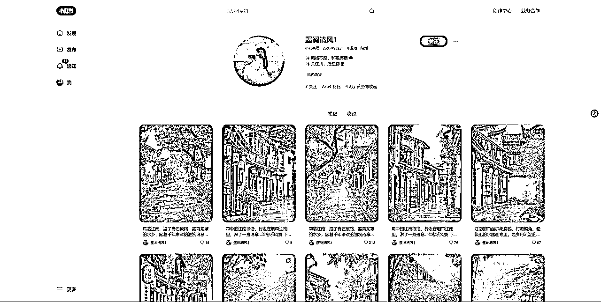
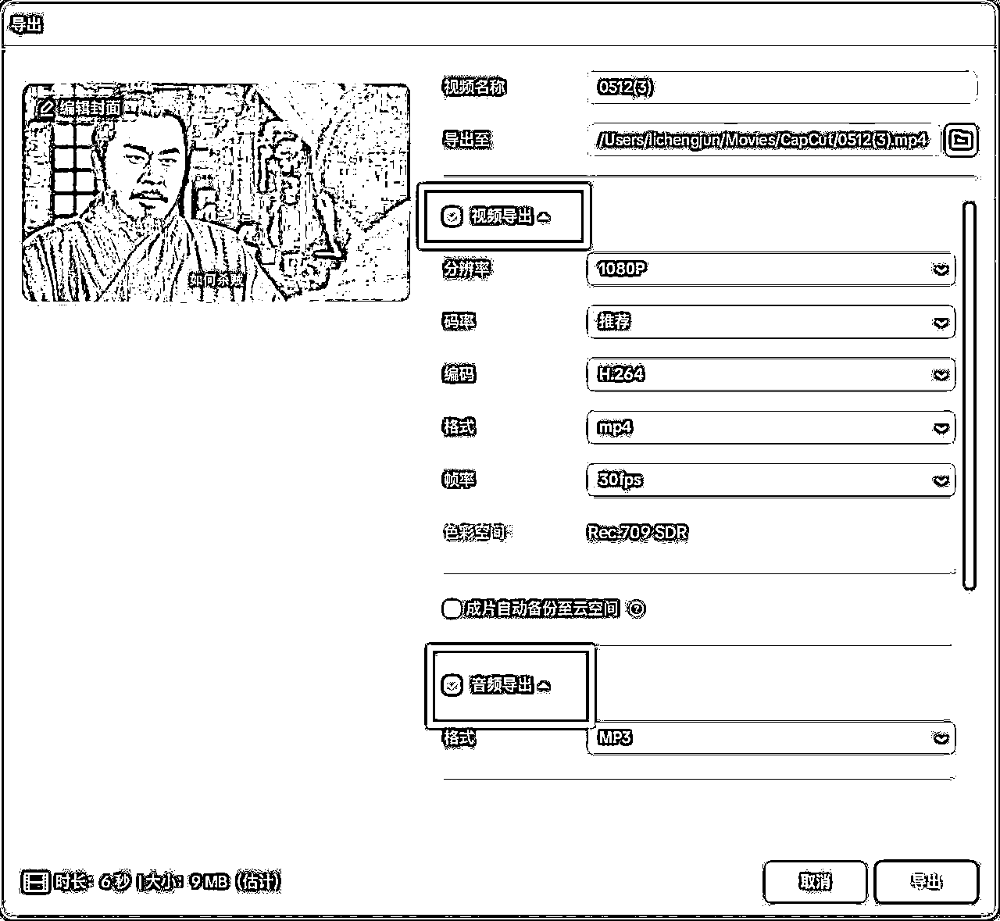
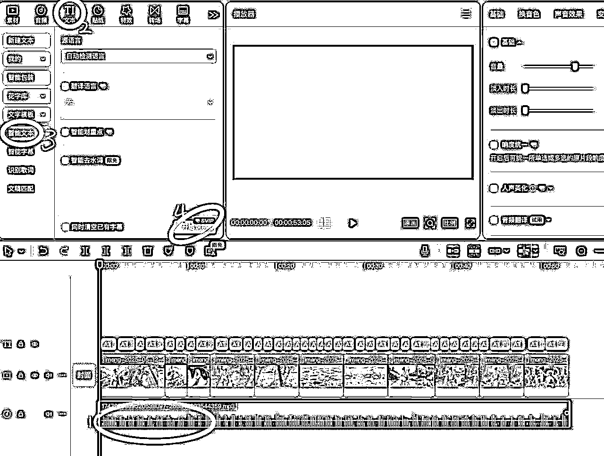
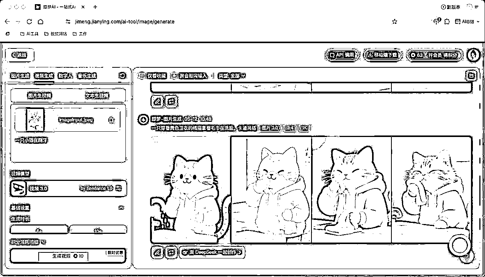
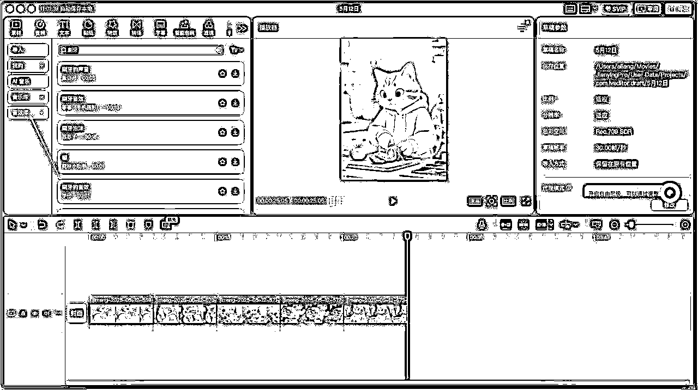
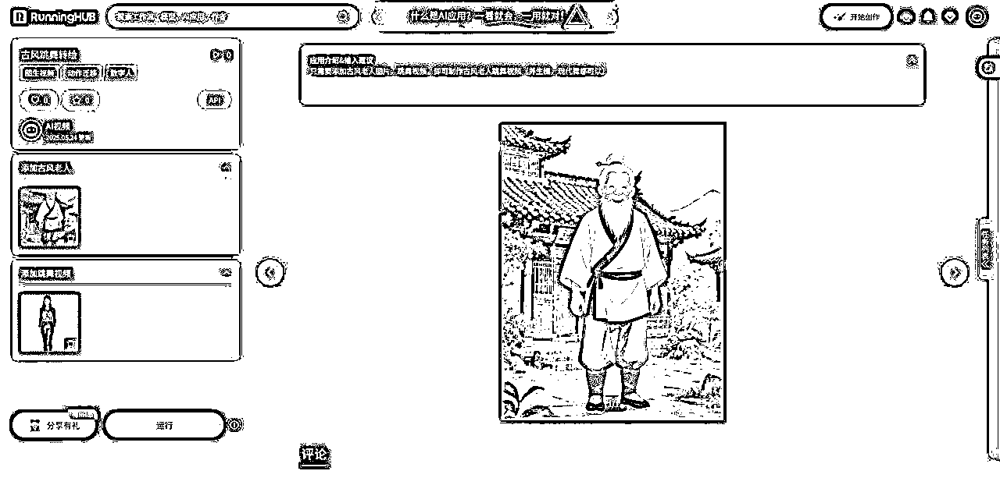
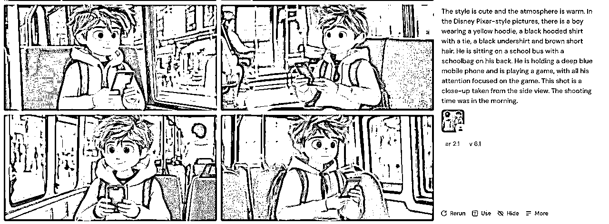

# 25 年 6 月航海 | AI 视频制作 | 实战手册

> 来源：[https://ocn93f5d9olj.feishu.cn/docx/JtZid64oboKsnTxu5LocRRgKnbh](https://ocn93f5d9olj.feishu.cn/docx/JtZid64oboKsnTxu5LocRRgKnbh)

必修篇防失联+MM188166M（李李）长期更新

# 一、 新手快速上手 AI 视频 防失联+MM188166M（李李）长期更新

# 1.1 认识 AI 视频生态防失联+MM188166M（李李）长期更新

近年 AI 技术飞速发展，视频内容创作迎来了革命性的变化。从早期 AI 辅助剪辑、自动字幕等辅助创作功能，到如今能够直接生成视频内容的模型，AI 在视频生态中的地位不断提升。

这样的技术演进极大降低了视频创作门槛，提高了创作效率 。现在，即使没有专业拍摄和剪辑经验，你也可以通过 AI 工具快速实现自己的创意。当脚本、拍摄甚至剪辑都不再是难题时，真正决定作品高度的反而是创意本身 。

在内容创作层面，AIGC（AI 生成内容）浪潮正重塑短视频行业生态。2024 年，在抖音等 UGC 平台上涌现出大量 AI 特效视频，用户只需上传一张图片或输入文字，就能生成有趣的视频内容。

比如，Remini 的“黏土动画”特效风靡全网，吸引了数百万用户参与；

随后“毛毡娃娃风”“柯南动画风”“油画风”等 AI 滤镜接连走红，相关话题播放量高达数亿甚至数十亿 。

借助这些 AI 特效和平台挑战赛的传播机制，普通用户的创作热情被激发，个性化的内容不断涌现。可以预见，AIGC 将成为短视频创作的新常态：创作者更专注于创意和脚本，具体画面由 AI 高效生成。与此同时，短视频平台内容产出呈指数级增长，也对内容审核和观众注意力分配提出了新的挑战 。

需要注意的是，尽管 AI 视频生成技术发展迅猛，但目前仍有一些局限，以及做这个项目时，也会存在一些“坑”，下面具体给大家列一下，希望各位圈友提前注意：

1.

纯 AI 生成的视频长度往往较短（多数工具一次生成几秒到几十秒不等），画质和精细度相对专业拍摄还有差距 。

2.

复杂场景、多角色互动等，目前仍然可能出现瑕疵。

3.

此外，生成内容的可控性和一致性也是挑战（如视频帧的连续稳定、角色形象在不同场景的一致）。

4.

不要盲目追求高级软件（先用好一个工具再扩展）

5.

不要忽视版权问题（商用需注意素材授权）

6.

不要过度依赖 AI（创意才是核心竞争力）

7.

千万记得，要备份工程文件（血泪教训：突然崩溃全白做）

不过，这些问题正随着技术进步逐步改善——新模型不断涌现，支持更长时长、更高分辨率的视频生成，允许在生成过程中加入参考图像或预设风格来提高一致性。总的来说，AI 视频生态正处于从早期探索走向实用化的阶段：创作者拥抱新工具，内容形式更加丰富，但也需要理解技术的优劣，才能更好地驾驭 AI 进行创造。

# 1.2 AI 视频用到的工具

当前市面上有众多 AI 视频创作工具，每款都有自身特色和适用场景。以下总结一些主流 AI 视频工具的功能亮点和典型用途，供初学者参考：

Runway （Runway Gen-1/Gen-2）：业界较早推出的 AI 视频生成工具 。

网址：https://runwayml.com/

提供网页和 App 方便使用，功能包括文本生成视频（Gen-2）和视频风格迁移（Gen-1），还支持对视频进行实时涂抹编辑等高级操作 。适合希望借助前沿模型快速试验创意的用户。不过 Runway 目前需要订阅付费才能充分使用高级生成功能 。

可灵 AI（Kling）：由快手团队自研的大模型视频生成工具，技术实力雄厚 。

网址：https://app.klingai.com/cn/

采用类 Sora 的架构，生成的视频运动幅度大、物理效果真实，可生成情节丰富的动画或实拍风格片段。会员用户可生成最长 2 分钟、30 帧的 1080p 高清影片，支持多种画面比例，并提供高表现模式、视频续写等高级功能 。非会员则可能需要排队等待生成。可灵非常适合追求高质量和真实运动效果的专业创作者，用于短片、自媒体视频乃至广告创意制作 。

海螺 AI（Hailuo）：国内另一款顶尖视频生成工具，以高画质和稳定性见长。

网址：https://hailuoai.com/

其生成视频在色彩、光影和角色情绪表现上质量出色，在第三方测试中综合效果排名第一，尤其在帧与帧的连贯稳定上有绝对优势 。海螺支持文字、图像、音频等多模态输入，界面简洁易上手，在海外市场也备受欢迎，用户遍及 180 多个国家 。缺点是目前功能相对单一，缺少图像生成、对口型等扩展能力 。非常适合注重画面品质的创作者，比如影视导演、编剧，用于概念影片、高质量短视频等。

即梦 AI（DreamINA）：字节旗下推出的 AI 创作平台，提供一站式的文生图、智能画布和文生视频功能 。

网址：https://jimeng.jianying.com/

用户可以用中文提示词生成所需画面，并能在智能画布上进一步编辑调整，从剧本大纲到成片都能在一个平台完成。即梦支持角色对口型动画生成，AI 配音自然逼真 。每日登录赠送 60-100 积分供免费使用，即使非会员也足够日常创作需求 。不过在复杂人物和场景上偶尔有细节瑕疵 。适合追求功能全面、上手简单的用户，例如内容创作者、教育工作者，用于生成个性化短视频、教学动画、广告素材等。

Pika ：一款国外的文本生成视频工具，以动画和特效见长 。

网址：https://pika.art/about

支持用户上传语音或配音，实现视频中角色口型与声音同步 。Pika 的可控性强，允许对生成视频中的角色、物体进行定点修改，甚至添加爆炸、融化等酷炫特效（最新的 Pika 1.5 版本已支持这些功能）。它还提供一定的视频编辑能力，生成的视频可以直接在其平台上做简单剪辑 。适合用于制作卡通动画、MG 动画风格的视频，以及需要精确控制口型的角色对话场景。注意 Pika 目前主要通过官网提供服务，注册登录即可有限度免费使用。

剪映 ：字节跳动推出的知名视频剪辑工具，国内称为剪映，海外版叫 CapCut。

网址：https://www.capcut.cn/

剪映本身不是文生视频模型，但因为功能全面、免费易用，被广泛用作 AI 生成素材的后期编辑平台。剪映内置了多项 AI 能力：例如自动字幕生成、一键智能剪辑、风格滤镜，以及 AI 配音功能 。最新版本中甚至支持克隆配音（仿真特定人声的语音合成） 。对于 AI 生成的视频素材，剪映可以方便地添加字幕、配乐、转场，调整节奏节拍，让成品更加完整专业。几乎所有初学者都可以从剪映起步来制作和完善 AI 短视频。

注：以上仅列举了一部分热门工具。市面上还有许多其他 AI 视频平台，如国内的智影、清影、Vidu，以及一些开源方案（如 Stable Diffusion 的动画生成插件等）。初学者可根据需求逐步探索，但建议先从主流成熟的平台入手，以获得更稳定的体验。

# 二、 学习 AI 热门视频玩法

# 💡

欢迎来到本手册的核心实战章节！

本章节的所有案例，都曾经在风向标案例里出现过，也就意味着，这些案例都是热门、且有流量属性的 AI 视频风格。

我们会将这些爆款玩法一一拆解，从创意构思到 AI 工具的具体操作，为你呈现清晰、详尽的步骤化教程。

在本章中，你将逐步掌握并实践（部分玩法将在后续完整版手册中呈现）：

营造“沉浸式”情感治愈视频：深入探索如何运用 AI 生成唯美、宁静的视觉场景，搭配恰当的音乐与节奏，创作出如【AI 情绪治愈视频】般能够触动人心、提供情绪价值的作品。

演绎“国风新意”的文化类视频：学习如何将 AI 的图像与动画生成能力，与中国传统文化元素（如水墨、养生等）相结合，打造出像【古风养生视频】这样既有文化底蕴又不失传播力的创新内容。

打造“反差萌”与“知识趣味”短视频：学习如何利用 AI 配音与口型同步技术，制作出像【AI 曹操配音+英语知识】这样，将经典形象与现代元素巧妙结合，既有记忆点又充满趣味性的内容。

除了以上你立刻就能在本试看版中上手学习的详细案例，我们后续的完整版手册中，还将带你深入探索更多元的创作可能：

AI 音乐疗愈视频

AI 古文视频

吉卜力甄嬛传制作

宠物做饭视频

第一人称解说视频

胖仕女动画视频

跳舞养生操视频

食物拟人化视频

……

希望大家在学完本章后，能够独立完成这些类型的 AI 视频创作，并有能力举一反三，衍生出属于你自己的爆款创意。

现在，就让我们一起投入到 AI 视频实战中来吧！

# 💡

# 本章航线图

完成本章节的学习和实操，即可完成航线图的：

第二阶段：学习六大热门风格，完成三条视频（共 15 天）

1.

掌握并创作： 情绪治愈 / 数字人 风格视频（约 5 天）

2.

掌握并创作： 国风文化 / 拟人萌趣 风格视频（约 5 天）

3.

掌握并创作： 热点解说 / 音乐舞蹈 风格视频（约 5 天）

# 2.1 AI 情绪治愈视频 @明月

下面几个号，都是近期流量很好的 AI 生成视频类账号，大家先来一起看看账号的主页，找找它们的相同点

像上面这几个账号，我们可以统一称之为，AI 疗愈赛道，如果再细分一点，可以分为风景疗愈，心灵疗愈以及音乐疗愈。

我们简单分析一下这些账号的用户群体，我们简单推测一下，大概是这几类人群：

1.

都市年轻白领与学生：他们是小红书的主要用户，生活在快节奏、高压力的都市环境中，对宁静、美好、治愈系的内容有天然的向往，以此作为精神的“暂停键”和情绪的“舒缓剂”。

2.

对生活品质有追求的人：他们喜欢美好的事物，对家居设计、生活美学、自然风光有较高的审美需求和兴趣。

3.

内心细腻、情感丰富的人：这类用户更容易被唯美的画面、舒缓的音乐和引人共鸣的文案所打动，寻求情感上的慰藉和寄托。

4.

对传统文化、慢生活理念认同者：尤其是音乐疗愈中涉及的古风元素，以及田园生活所代表的“采菊东篱下”的意境，会吸引对这类文化和生活方式有好感的用户。

5.

女性用户占比较高：女性用户可能更容易被这类视觉化、情感化的内容吸引。

如果再仔细分析一下，其实可以用一类人群概括“对生活抱有美好幻想的女性群体”。

# 2.1.1 创作思路

了解完这个账号的基础信息后，我们就可以来构思一下，创作的思路了。这些账号有以下共通之处：

1.

营造理想化体验：无论是现实的田园风光、精心布置的家居，还是 AI 生成的梦幻场景，都透漏着宁静、温馨、梦幻或古朴的氛围。田园风光追求自然和谐，梦想之家追求精致或梦幻，古风音乐疗愈则追求典雅意境。所展示的往往是现实的提纯和美化，过滤掉不完美，呈现出一种理想状态。可以总结为“向往的生活”。

2.

引导性标题：使用能够引发用户共鸣、思考或向往的文字，如“这样的生活你喜欢吗？”、“当你老了会选择怎样的生活？”、“治愈你的心灵”等。

3.

舒缓的 bgm：选择与画面风格和情感基调高度匹配的背景音乐。音乐疗愈类视频更是以音乐为核心，通过特定的旋律、节奏和音色来达到舒缓情绪、疗愈心灵的效果。

4.

内容垂直：每个账号都有其相对明确的主题定位，如“蜗居”的隐逸山居，“一方净土”的田园诗意，“媛媛美景”的理想小家。这有助于吸引特定偏好的用户并建立粉丝粘性。

5.

追求“疗愈”与“美好”：无论是哪种形式，最终都指向为观众提供精神上的慰藉、放松和对美好事物的向往。它们都是一种“情绪消费品”。

6.

关键词：“治愈”、“宁静”、“放松”、“美好”、“诗意”、“梦想”。

7.

叙事手法：往往不过多解释，而是通过画面和音乐引导观众自行感受和解读，留下想象空间。

经过我们的分析，你已经知道了这些视频的受众人群是哪些？她们爱看的内容是什么样的。那么接下来就好办了，甚至有了对标账号作为参考，我们是不是就可以针对性的做内容了。当你带着上面的思路去做账号，相信你会更加的游刃有余。

# 2.1.2 视频拆解

接下来我们开始详细拆解他们的制作手法。

乡村生活和梦想小家的制作难度为一颗星，你要做的只有三步，生成图像、图转视频和制作视频。

有圈友可能会问，现在的 Ai 视频不是能直接文生视频么？为什么还要先生成图像。

这里其实是出于两点考虑，生成成本以及时间成本。

如果用文生视频去制作出来完美符合自己想法的视频出来，需要大量的抽卡。

每次抽卡都意味着要消耗金钱，对于我们新手来说，显然不是一个最佳选择。

如果我们选择先生成我们想要的场景，也就是图像抽卡，这个成本可以尽可能的压缩至 0。

有了符合我们预期的场景之后，再去生成视频，我们抽卡的成本和时间都会大大降低。

我们接下来使用的工具是豆包和即梦。

我们拿“蜗居”和“墨”这两个账号里面的爆款视频来做拆解。

# 2.1.3 反推提示词

上面两张图是我去视频里面截得图，我们获取提示词最快的方法就是用 AI 反推提示词。如果你有一些 AI 绘画的基础，那么我想人肉反推提示词也是相当快。

上面是豆包 AI 给出的提示词。同理，另外一张图也给到豆包 AI，让他反推提示词。我们就能得到另外的一条提示词。

梦想小家的提示词也得到了。

接下来我们生成图像有两个选择，一个是豆包 Ai 直接生成，另外一个是通过即梦生成图片。你要问两者有什么区别的话，我只能告诉你，豆包生成图片免费，你的即梦积分最好留着去生成视频用。能白嫖的才是最香的。（小声 BB，其实两者生成内容的质量是一样滴。)

生成的视频.mp4【在线播放】

jimeng-2025-05-11-778-在依山傍水的地方，有一座嵌入山洞的小屋，屋顶是茅草材质。屋前有一人在户外石砌炉灶上烹饪，炊烟升起。旁边有菜地，一人围着粉色花纹围裙在打理蔬菜。屋前地面铺有石....mp4【在线播放】

生成视频时用的提示词和反推得到的提示词是一样的，生成视频的路径同样也有两个，豆包生成和即梦生成，两者的生成质量也是相同的，不同之处是是生成速度。豆包生成视频会稍微慢一点，但免费，即梦需要用积分，生成速度会快很多。

接下来分别演示一下豆包制作和即梦制作的全流程图文。（生成图片到生成视频）

# 2.1.4 豆包 AI 制作图片

先选择技能里面的图像生成

然后把刚才反推的提示词粘贴进去，图片比例选择【9:16】

选择自己满意的图片，然后右上角点击生成视频。

把刚才的提示词粘贴进来，点击生成。（才发现豆包每天生成视频次数是 10 次，即梦 3.0 每天积分 60-100，也就是 6-10 次。如果是纯白嫖用户，请把握好使用次数，足够你用到得到正反馈为止。加油！你是最棒的！)

# 💡

友情提示一下，豆包做出来的图片带有水印，别忘记去掉再生成视频。

如果忘记了也没关系，之后在视频制作的过程中裁剪掉水印也是可以哒！

# 2.1.5 即梦 制作图片

把提示词粘贴进提示词框里，模型选择图片 3.0，比例选择 9:16，然后立即生成。一次生成四张，右边是我生成两次的结果。选择你喜欢的那张图片。

点击生成视频

提示词复制到提示词框，选择视频 3.0，点击生成视频，右边就是生成好的视频。正常生成速度在 30s 之内。

# 💡

课堂作业

那么给你们留一个小作业，刚才我们其实反推了两个图。我们的制作流程是一样的，那么请用同样的制作方法，把梦想小家的视频制作出来

# 2.1.6 视频制作

我们的前期工作基本上已经做的差不多了，接下来我们需要用到剪映工具给视频配上一些音效。

生成的视频.mp4【在线播放】

5月11日.mp4【在线播放】

比如这个视频，如果不配上音效，光看画面，只会觉得无聊。而右边是加了音效的视频，你觉得怎么样，是不是立马不一样了。

音效方面，你只需要记住两点，环境音效和背景音乐。

环境音效包括画面中所出现的动物声音，人物动作声音以及周围环境所产生的声音。

而背景音乐则是负责烘托氛围，让观众加深整体的试听体验。

我想，这步你应该不会觉得难。跟着来做一遍就明白了。你们可以看到我的音轨上面一共有四条，你们结合一下画面内容，应该不难猜到。里面主要的音效有人物炒菜的声音，鹅叫的声音。那么还有两条是什么呢？好难猜啊！

还急的我说的环境音效里面包含的三个内容么？没错，还缺一个周围环境音，专业名词叫做环境白噪音，为了营造氛围，增加声音层次感。所以当你制作视频时，添加音效的时候，脑子里面过一下，动物，人物以及环境这三要素。这样你的视频基本上就是一个完整的视频了。

巴特！

还缺少一点氛围，是的，再挑一首烘托氛围的曲子，就更完美了。

这样，你就完美的复刻出来了一条爆款 Ai 疗愈视频！

# 2.2 古风养生视频 @瓜斯

在小红书上，养生一直都是个流量密码。

从早期通过简单的“大字报”，就做到了将近 50 万粉丝的「百岁老人计划」。

再到后来仅靠讲一个拉屎技巧，就实现橱窗接近百万销售额的「拉屎女王」。

养生内容火爆的秘诀，其实就在于创作者总能找到新颖的切入点和有趣的表现方式。最近，养生内容又有了新玩法。

一种以中国水墨风呈现的内容，突然火了起来。

代表账号「无忧四季养生」，短短两周就涨了 2 万粉。其实，这种内容用 AI 工具做起来超简单，今天就来教大家怎么 1:1 做出这种内容。

我们一共分为 3 个部分：

# 2.2.1 选题还原

这个账号截止目前，一共发布了 16 篇笔记（这里指的是写稿的时间）

具体是这些选题：

1.

这些常见的蔬菜需要焯水

2.

身体各器官最爱的食物

3.

春季儿童长高必吃 10 道菜

4.

排名第一的冠军蔬菜

5.

身体的这些警告你知道吗？

6.

女人最好的养生方式

7.

身体免疫力最爱的食物

8.

免疫力最喜欢什么？

9.

疯狂长脑子的八种食物

10.

比吸烟更可怕的八件事

11.

身体的七大求救信号

12.

越吃越健康，看这些食物

13.

垃圾食品的解药，你知道吗？

14.

养生十要，长寿的秘密

15.

垃圾食品的解药，你知道吗？

16.

0 成本养生，居然这么简单

我们来总结一下，它的选题其实就是讲——“懒人养生吃法”。用老百姓家里的普通食材，来实现「巨大的」养生效果。分析完之后，我们可以就可以做一些选题衍生了：

「一日三餐这样搭配，满足身体五大需求」

「0 成本消水肿！3 种食物让你轻松告别浮肿」

「警惕！身体 3 大防线受损的 5 个信号，你感受到吗？」

「春季最适合孩子长高的 7 款家常菜，家长一定要学会」

「5 种黄金食材，让你的胃越来越强壮」

「一杯茶逆转衰老？揭秘最被低估的排毒茶饮」

你比较喜欢哪个？

我选了「5 种黄金食材，让你的胃越来越强壮」

# 2.2.2 文案还原

接下来我们需要拆解一下它的文案，我们选取其中 点赞最多 的 4 篇笔记来拆解

Area.mp4【在线播放】

笔记 1：《身体各器官最爱的食物》

心脏喜欢红薯，肺部喜欢梨，血管喜欢西兰花

大肠喜欢苹果，大脑喜欢核桃，脾胃喜欢山药

肝脏喜欢枸杞，肾喜欢黑豆，皮肤喜欢西红柿

眼睛喜欢胡萝卜，牙齿喜欢猕猴桃。

笔记 2：《这些常见的蔬菜需要焯水》

豆角不焯水，肚子疼成鬼。

菠菜草酸高，热水易冲销。

蘑菇杂菌多，沸水一焯净污浊。

西兰花藏虫深，滚滚热水来驱奔。

香椿亚硝多，烫过才敢说。

木耳沙难去，焯水更顺利。

黄豆芽藏菌，热水洗礼更放心。

笔记 3：《疯狂长脑的 8 种食物》

注意力难集中，多吃全麦面包

爱忘事，多吃银杏果

学习效率低，多吃南瓜子

脑子笨笨的，多吃深海鱼

记忆力衰退，多吃花生

大脑紧绷，多喝绿茶

逻辑混乱，多吃芦笋

脑子卡壳，多吃鸡蛋

笔记 4：《越吃越健康，看这些食物》

常吃菠菜抗衰老，常吃番茄皮肤好

常吃枸杞眼睛亮，常吃红枣气血足

常吃核桃记性好，常吃山药肠道顺

常吃苦瓜火气消，常吃豆类补蛋白

有没有发现，他的脚本都是“古文体”！！

我们借助 AI，也可以轻松写出这样的古文体：

提示词如下：

帮我就——《5种黄金食材，让你的胃越来越强壮》这个主题，写一段文案，需要是古文体。你可以参考下面的例子：

——————

《身体各器官最爱的食物》

心脏喜欢红薯，肺部喜欢梨，血管喜欢西兰花

大肠喜欢苹果，大脑喜欢核桃，脾胃喜欢山药

肝脏喜欢枸杞，肾喜欢黑豆，皮肤喜欢西红柿

眼睛喜欢胡萝卜，牙齿喜欢猕猴桃。

《这些常见的蔬菜需要焯水》

豆角不焯水，肚子疼成鬼。

菠菜草酸高，热水易冲销。

蘑菇杂菌多，沸水一焯净污浊。

西兰花藏虫深，滚滚热水来驱奔。

香椿亚硝多，烫过才敢说。

木耳沙难去，焯水更顺利。

黄豆芽藏菌，热水洗礼更放心。

《疯狂长脑的8种食物》

注意力难集中，多吃全麦面包

爱忘事，多吃银杏果

学习效率低，多吃南瓜子

脑子笨笨的，多吃深海鱼

记忆力衰退，多吃花生

大脑紧绷，多喝绿茶

逻辑混乱，多吃芦笋

脑子卡壳，多吃鸡蛋

《越吃越健康，看这些食物》

常吃菠菜抗衰老，常吃番茄皮肤好

常吃枸杞眼睛亮，常吃红枣气血足

常吃核桃记性好，常吃山药肠道顺

常吃苦瓜火气消，常吃豆类补蛋白

来看看 AI 最后产出的文案：

《5 种黄金食材，让你的胃越来越强壮》

胃气虚弱，南瓜补益；

胃中寒凉，生姜驱霜；

胃燥不适，蜂蜜滋养；

胃炎隐痛，小米安康；

胃酸扰乱，山药稳当。

五材常备，日日相伴，

以食为药，胃府安然。

怎么样？不错吧？我们直接就用这个！

# 2.2.3 制作还原

# 步骤一：AI 生成水墨风格插画

接下来，我们需要把我们的文案转化成图片（每句文案对应一张图），再把图片转化成视频。

我们同样可以借助 AI 来写文案转为图片的提示词：

《5 种黄金食材，让你的胃越来越强壮》

胃气虚弱，南瓜补益；

提示词：一位古代文人穿着长袍，坐在古色古香的书房里，手捧一碗热腾腾的南瓜粥，眼神专注，面带微笑，仿佛感受到了南瓜的滋补力量，背景有竹子和书卷。

胃中寒凉，生姜驱霜；

提示词：一位古代书生站在寒风中的庭院里，手持一根新鲜的生姜，微风吹动他宽大的衣袖，神情坚定，似乎在抵御寒冷，背景是冬季雪景。

胃燥不适，蜂蜜滋养；

提示词：一位古代女子在古典的厨房里，优雅地舀着一勺金黄色的蜂蜜，缓缓滴入茶杯中，周围是蜂巢和花卉，氛围温暖、宁静。

胃炎隐痛，小米安康；

提示词：一位身着素雅衣袍的老者在山间小屋前，正在用陶瓷锅煮着小米粥，身旁有一只小狗安静地趴着，周围绿意盎然，显示出温和与安康。

胃酸扰乱，山药稳当。

提示词：一位古代医者站在药堂前，手持山药根，认真端详，似乎在研究其药效，背景是古代药材架，灯光柔和。

五材常备，日日相伴，

提示词：一位古代贤人坐在餐桌旁，桌上摆满了南瓜、生姜、蜂蜜、小米和山药，贤人一手捧书，一手端着茶杯，面带思索的表情，整个场景静谧而典雅。

以食为药，胃府安然。

提示词：一位古代文人轻松坐在亭子中，手中握着一碗美味的汤，背后是繁茂的树木和潺潺的流水，整体场景安宁、和谐，文人脸上露出满足的微笑。

然后我们需要生成一下这位博主的视频图片风格。

我们去作品里，截几张图片，然后直接上传 AI，叫它帮我们反推风格提示词。

最后得到的风格提示词描述是：

国风水墨插画，古典雅致，淡彩柔和，富有东方韵味与传统笔墨意境，画面色调温润、自然，表现出宁静、和谐的氛围，风格借鉴齐白石的细腻笔触，李可染的水墨氛围，张大千的传统艺术精髓，展现出深厚的文化底蕴与艺术韵味。

然后来到即梦的「文生图」页面，输入提示词+风格描述

最后来看看效果：

还不错，下面我们依次生成剩下的 6 张图。步骤一致，我就不重复讲解流程啦，我直接把结果贴出来

# 步骤二：使用 AI 工具让静态图片动起来

下一步，就是让这些图动起来。其实有很多工具都能实现这个效果，比如海螺 AI、可灵、即梦、runway、sora、vidu、luma、pixverse 等等……

我这里用的是 海螺 AI

https://hailuoai.video/

接下来，把我们准备好的 7 张图逐个上传进去，输入提示词，让图片动起来。

然后就可以把生成的 7 个视频都保存下来啦。

动画.mp4【在线播放】

最后把这些视频，都拖进剪映

# 步骤三：添加配音、背景音乐和字幕

然后我们需要生成一下画外音，我们用 fish audio 这个工具来克隆博主的声音

这是 fish audio 生成的音频（你可以听一下试试看）

[养生，音频]《5种黄金......胃府安然。.mp3

音频生成好了，就拖进剪映备用

下面我们来拆解一下字幕，我们上传字体识别网站，进行识别→https://www.likefont.com/

网站识别出来，显示这位博主用的是“华康俪金黑”，我们也用这个

调整一下文字的大小，设置一下描边

没错，这个 BGM 就是《神话》这这首歌。但是不是原曲，是一个有点古风韵味的版本。我们去剪映里找找，看看有没有。

还真找到了，就是这个葫芦丝版本。我们把这个 BGM 放到轨道上。

# 步骤四：整体精剪

最后，我们精剪一下，让素材能匹配上画外音

视频制作过程.mp4【在线播放】

# 2.2.4 成果展示

养生视频.mp4【在线播放】

画外音的音量有点小，如果需要高度还原，可以在剪映里再调节大即可。最后再做一个封面图，就能发小红书了。

# 2.3 AI 曹操配音 @李香君

大家都知道，短视频要有流量，就得有反差。可是我们一般很难做出来，让别人拍腿叫好的反差内容。但是通过 AI 视频，这一切就变得简单多了。最近有一类教英语的账号，就用 AI 视频做出了反差。他的内容也很简单，就是用曹丞相的配音，来进行英语教学，流量出奇的好。

下面我们就来看看，这样的视频，怎么做出来。

# 2.3.1 第一步：获取素材

我们首先需要找一些找影视片段，来作为我们 AI 视频的素材，可以通过以下几种方式：

1.

在线视频平台：如 B 站、爱奇艺等平台，可以直接搜索所需影视片段，点击播放后在视频的右上角找到录制功能，即可录制所需的片段。

2.

专业影视剪辑网站：如 33 台词、tunefind 等网站，可以精准筛选语言、类型、影片名、演员、导演等，可以一键预览是否符合，再采集和保存到自己的电脑里。

3.

视频下载软件：如迅雷、360 浏览器等软件，可以直接下载所需的影视片段。

4.

微博：搜索角色单人 cut 超话，进超话搜关键词，就有资源。

我们这里用的是新三国电视剧里的一个镜头，你可以直接下载，跟着实操。

38_1747799529_raw.mp4【在线播放】

我们把这段视频放到剪映里导出音频（如果你用的是其他视频片段，也没关系，我们的流程步骤都是一样的）

# 2.3.2 生成需要的音频

我们打开 fish audio（地址：https://fish.audio/zh-CN/）选择克隆声音，并上传刚刚生成的声音素材。

我的声音库选择自定义声音，里面就能找到我们刚做的声音，点击使用即可开始使用

在这里填上我们需要的内容

生成好了我们点击下载即可。

# 2.3.3 生成对口型的视频

这里我们用的 AI 工具是即梦，大家一定要注意，即梦只能生成中文，如果有中文的音频就可以打开即梦（地址：https://jimeng.jianying.com/ai-tool/home），点击对口型

选择对口型，上传自己要对口型的视频，然后上传我们刚才生成好的音频，这里要注意的是，视频只能上传 30 秒以内的，音频最长只能跟视频的长度等长，点击确定即可开始生成

如果是英文对口型，推荐使用可灵，效果更好。

打开可灵AI（地址：https://app.klingai.com/）在全部工具里面选择对口型

上传30秒以内的视频，上传本地音频，音频需要跟视频等长，点击生成即可

这就是我刚刚生成的曹操说英文的视频：

作品.mp4【在线播放

# 2.3.4 去水印和字幕

因为我们没有充值会员（当然如果买会员肯定是更好的选择），所以下一步，去掉水印和我们不需要的字幕，一般情况下，我们有两种操作方法：

①直接在剪映里面扩大，把字幕和水印卡出去

在剪映中导入视频，直接在播放器里面扩大并调整视频，直至看不见字幕和水印

②使用工具来去除水印和字母，我在这里使用的是美图的 wink（我在这里介绍的是电脑版。手机版也有同样的功能）

打开 wink，点击 AI 工具箱，选择水印消除

上传视频，选择手动去文字，把字幕和 logo 完全遮罩住，在这里注意，一定要让这个框长过你视频里面最长的一条字幕才能很好的去除，如果 logo 没有很好的去除，可以点用一遍上面的自动去印。

以下就是我导出的视频，大家可以上手试试

水印消除-手动去文字-水印消除-自动去印-作品.mp4【在线播放】

# 2.4 AI 古文视频 @裘裘笔记

最近这一类把古诗词做成可视化的 AI 视频 特别火，下面我截图的案例，通过这种类型的视频，一个月就涨粉了 5 万。

那么，像这类 AI 古风视频，究竟怎么做呢？下面，我们将以柳宗元的名篇《小石潭记》为例，完整地走一遍从文字到爆款视频的全流程。

# 2.4.1 用 Kimi 生成画面提示词

在动笔画画之前，我们首先需要一位能读懂古文、并拥有导演思维的“AI 助理”。在这里，我们选择 Kimi（网址：https://kimi.moonshot.cn/）来扮演这个角色。

我们向 Kimi 下达的指令，不只是简单的“画分镜”，而是一份详尽的“项目策划案”。我们会要求它：

提示词文案：

你是一名文言文短视频博主，请你先了解《小石潭记》这个古诗词的翻译、背景等等，再帮我写出《小石潭记》的分镜画面提示词的描述词。

要求：1。真实摄影风格的画面。2.率先生成画面中角色的形象描述，并将已经生成的形象描述出现于后续每一个需要出现人物的画面描述中 3。每一小句生成一个分镜画面提示词。4.如果需要可以加入空镜或对某一个物体的分镜画面。5.要求有远、中、近、特镜头的描写。6.以表格的方式输出，每一个提示词后面对应原文段落。7.要保持故事中的主人公形象的一致性，必要时可以每个分镜提示词可以加入主人公形象的描写。8.画面要有景深、光感等等。9.根据《小石潭记》的朝代，画面的风格、房屋、衣着、人物形象等等一定要符合《小石潭记》的朝代。10.对于画面中人物的描写要详细（例如：那个朝代的衣着、配饰、表情、动作等等）。11.人物形象一定要符合国人的审美。

通过这样与 Kimi 的深度沟通，我们便能得到一份详尽到可以“照着拍”的、表格化的“分镜脚本”。

# 2.4.2 用即梦生成分镜图

有了详细的分镜脚本，接下来，我们就要请出我们的“美术部门”和“摄影部门”——即梦 AI（jimeng.jianying.com），将文字转化为视觉。

我们将 Kimi 生成的分镜描述词，逐条复制到即梦的“图片生成”模块（选择图片生成模块——复制提示词——选择图片 3.0 模型）

选择合适的图片作为分镜。（每个人物的分镜提示词，需要复制第一次人物出现时的外貌描写）

# 2.4.3 生成环境分镜图

一位“演员”，不能存在于真空之中。在主角形象确立之后，我们必须为他搭建一个真实可信、充满意境的舞台。这便是“环境分镜”的作用。在古风视频中，充满美感的“空镜”（没有人物的景物镜头）不仅是场面转换的粘合剂，更是烘托氛围、展现意境的灵魂所在。

《小石潭记》的精髓，正在于柳宗元对潭水、游鱼、草木的细腻观察。因此，我们需要用 AI 精心绘制这些核心场景。我们可以将 Kimi 脚本中关于环境的描述词输入即梦，也可以根据原文意境，撰写更具镜头感的指令。

例如，要描绘小石潭的幽静与生机，我们可以像下面这样，分层次地生成环境镜头：

镜头一：刻画潭边景致（中景）

提示词：“中景，唐代风格，潭边生长着青翠的树木和藤蔓，枝叶繁茂，互相缠绕，镜头扫过这些植物，展现它们在微风中摇曳生姿的景象，阳光透过树叶的缝隙洒在潭面上，形成斑驳的光斑，画面极具景深和真实感。”

镜头二：展现潭中游鱼（近景）

提示词：“近景，潭中的鱼儿清晰可见，大概有一百来条，它们在清澈见底的水中自由自在地游动，仿佛在空气中一般，画面中可以看到水底的青苔和石头，以及鱼儿在水面的倒影，光线通透。”

镜头三：捕捉游鱼动态（特写）

提示词：“特写，一条鱼儿突然静止不动，过了一会儿又迅速向远处游去，镜头快速跟随其动作，捕捉到鱼儿灵动的姿态和在水中穿梭的瞬间，周围其他鱼儿也跟着往来翕忽，画面充满生机。”

通过这些远近结合、动静相宜的环境分镜，我们便为故事的展开，铺设好了一个充满诗情画意的舞台。

# 2.4.4 选择分镜图并批量生成视频

分镜图有了后，我们就可以生成视频了。

直接复制表格中的文案到视频生成提示词处——选择视频模型 3.0——选择 5s

得到镜头 1（截取可用部分即可）:

jimeng-2025-05-14-517-远景，镜头聚焦在一位身着唐代青色长袍，头戴黑色幞头，腰间佩戴玉佩的男子，他面容清瘦，眼神深邃，手持竹筒，正从一片茂密的竹林旁的小丘脚下朝西北方缓.mp4【在线播放】

我们接着生成接下来的视频，进入即梦生成图片，生图参数同上。

镜头 5：选中图片——生成视频——复制生成图片的提示词直接使用——选择视频 3.0 模型

jimeng-2025-05-13-429-鸟瞰视角展现砍伐后的竹林小径，尽头处潭水波光粼粼。柳宗元（浅蓝色外罩纱长袍，手持折扇，黑色方巾，腰间有玉佩）立于潭畔，衣摆随风飘动。阳光在潭面上.mp4【在线播放】

镜头 6

jimeng-2025-05-13-430-中景，潭边生长着青翠的树木和藤蔓，枝叶繁茂，互相缠绕，镜头扫过这些植物，展现它们在微风中摇曳生姿的景象，阳光透过树叶的缝隙洒在潭面上，形成光斑。.mp4【在线播放】

镜头 7、8

jimeng-2025-05-13-431-近景，潭中的鱼儿清晰可见，它们大概有一百来条，镜头聚焦在几条鱼身上，它们在水中自由自在地游动，仿佛没有依托，画面中可以看到潭底的石头和鱼儿的倒影.mp4【在线播放】

jimeng-2025-05-13-432-特写，一条鱼儿突然静止不动，过了一会儿又迅速向远处游去，镜头快速跟随其动作，捕捉到鱼儿灵动的姿态和在水中穿梭的瞬间，周围其他鱼儿也跟着往来翕忽，.mp4【在线播放】

jimeng-2025-05-13-434-中景，男子坐在潭边的一块石头上，镜头环绕他拍摄，他身着青色长袍，黑色幞头，玉佩垂于胸前，手中拿着一支笔，写东西，脸上带着平静的微笑，周围是郁郁葱.mp4【在线播放】

jimeng-2025-05-13-433-中景，男子（青色长袍，黑色幞头，玉佩垂于胸前）转身离开，镜头跟随着他，他沿着来时的路缓缓而行，背影显得有些孤单，但步伐依然坚定.mp4【在线播放】

jimeng-2025-05-13-435-近景，男子与同游的几位伙伴相遇，他们分别是吴武陵、龚古以及男子的弟弟宗玄，还有跟着的崔氏二小生恕己和奉壹。吴武陵身着蓝色长袍，头戴褐色幞头，面容.mp4【在线播放】

# 2.4.5 后期配音

当所有的视频片段准备就た，我们的影片还差最后，也是最重要的一口气——声音。

我们需要一个沉稳、富有古韵的声音来诵读《小石潭记》的原文。这时，我们可以使用海螺 AI（网址：https://hailuoai.com/）。

这个平台提供很多丰富的音色模型，我们可以挑选最符合古文意境的声线，输入文本，再微调语速和情绪，即可生成一段堪比专业播音员的配音。

操作路径：选择声音模型——选择音色——输入文案——调节语速——生成语音并下载

# 2.4.6 后期剪辑

已经生成的所有音频视频按顺序导入剪映

点击音频——上排菜单点击文本——左侧点击智能文本——点击开始识别

点击任意字幕，右侧调整数据，所有字幕将统一修改格式

叠加自然环境音

# 2.5 吉卜力甄嬛传制作 @裘裘笔记

GPT 4O 出来后，用它来做吉卜力风格的图片，变成了一个流量密码，火了很多内容。

但同时火起来的，还有用吉卜力风格来做的 AI 视频，比如下面第二张图的吉卜力甄嬛传。

下面我们来看看，这样的视频应该怎么做（其实流程很简单）

# 2.5.1 保存影视截图

大家可以先去各大平台，截一些甄嬛传视频的相关画面，按照你自己的喜好来截图即可。不过，截图不是乱截，你需要保证图片前后，是一个完整的情节，要能拼接得起来。下面是我截图的画面，你可以自己也尝试一下。

# 2.5.2 将图片导入即梦 AI

把刚刚截好的图片，导入即梦。选择智能参考模式，并输入提示词如下。

输入提示词：

将这张图片转绘为吉卜力风格，得到吉卜力风格图片

同时可类推迪斯尼风格、新海诚风格

快速得到批量图片

# 2.5.3 图片转视频

图片准备好了，下一步我们就需要把它转化成视频。我们还是在即梦里操作，大家可以看我下方的截图，以及对应的提示词（每个图生视频提示词，根据影视剧片段描述动态即可）

这是 AI 最终生成的视频片段，是不是还不错？

jimeng-2025-05-16-3-严肃地说话，身体有自然的动态.mp4【在线播放】

注意了，之前截图的画面，会有字幕，这会导致后面生成的视频中，字幕出现乱码。所以我们需要在生图中用消除笔来擦除一下字幕。

将原影视剧片段和已经成型的动画片段都导入剪映

选中原影视片段——分离音频

删掉原影视片段——选中分离出来的原声音频——右键选择识别字幕/歌词

得到自动生成的字幕——右侧选择字体，可得到批量修改的字体

按照影视剧原片剪辑镜头画面——将音频中间的长气口删除，保持节奏感

得到以下成品：

完成.mp4【在线播放】

# 2.6 宠物做饭视频 @阿良

最近宠物做饭视频挺火的，不仅在 YouTube、TikTok 等海外平台有流量，国内抖音、小红书的表现也很不错。

下面我们来看看这类视频的制作方法。制作 AI 宠物视频主要分为三个步骤：分镜图生成、图片转视频、剪辑配乐。

接下来我会逐步拆解每个环节，帮助大家完成自己的 AI 视频作品。

首先看一下对标账号。可以看到这个账号的所有视频都是金毛拟人化，让狗狗做出各种人类动作。如果要模仿这类账号，我们也需要创建一个拟人化的动物形象。

这边我扒了一个他最火的视频，我就给大家拆解一下这个视频是如何制作的，学会的了这个视频，后续制作其他视频也是同样的思路

看看小金毛忙碌的一天都做了些什么 #萌宠出道计划 #小金毛的日常 #狗狗 #小金毛的日常.mp4【在线播放】

首先我们来看看他这个视频是有几个场景，小狗刷牙，小狗洗脸，小猴摘菜，小狗切菜等等，这些是他原视频出现的一些场景，如果我们想要拆解的话，是不是可以模仿他的结构，做成，小猫刷牙，小猫洗脸，小猫摘菜，小猫切菜？

内容确定好后，就让我们开始制作吧。

# 2.6.1 第一步：生成分镜图片

首先我们打开即梦官网：https://jimeng.jianying.com/ai-tool/home。点开图片生成的选项。

输入描述词：一只穿着黄色卫衣的橘猫在刷牙。

再让我们生成第二张图。描述词：一只穿着黄色卫衣的橘猫拿着毛巾在洗脸，卡通风格。

后面的图片也是按照这种方法挨个生成。

# 2.6.2 第二步：让图片变成视频

我们再到生成好的图片里面挑选合适的图，点进去。

点击生成视频

然后再输入描述词：一只小猫在刷牙

点击生成视频

这样我们一个刷牙的视频就生成好了，我们再使用相同的操作，把剩下的分镜图都做成视频。

jimeng-2025-05-12-570-一只小猫在洗脸.mp4【在线播放】

jimeng-2025-05-12-571-小猫摘西红柿.mp4【在线播放】

jimeng-2025-05-12-572-小猫奔跑.mp4【在线播放】

jimeng-2025-05-12-573-小猫在厨房切西红柿.mp4【在线播放】

# 2.6.3 第三步：剪辑配乐

然后我们把生成好的素材都导入到剪映，并且按照顺序排列一下

找到音效库，搜索对应的配音添加到下方（刷牙，切菜，奔跑等配音）

每个片段添加对应的音轨

最后再导出

这样我们一个视频就制作好了

5月12日(2).mp4【在线播放】

# 2.7 第一人称解说视频 @阿良

最近第一人称独白解说视频真的太火了，就是那种用主人公的视角来讲故事的视频，在各大平台都传播得很快。

这类视频涵盖了影视、游戏、历史等好多个领域。像《人民的名义》剧中人物独白解说，半个月就涨粉 23.2 万，每条都是万赞起步；还有王者荣耀职业选手第一人称独白，用 AI 克隆声音做动画，评论区全是粉丝点播自己喜欢的主播；小红书上有博主做二战士兵、英国女王这些历史人物视角，一个月直接涨粉 9K+。

说实话制作门槛真不高，文案基本都是 AI 帮忙写的。操作很简单：先想个“时间+人物+地点+事件”的背景，让 AI 帮你完善成故事，然后拆解成 4-5 个画面，用即梦 AI 生成视频，最后拼接加字幕就行了。

变现方式也挺多的：游戏陪玩、商单宣发、知识付费这些，已经有不少账号开始赚钱了。不过现在入场的人越来越多，建议大家找一些小众的细分赛道，别都扎堆做同样的内容。

下面我们来具体看看怎么做。

首先我们可以分析一下这类视频，角色第一人称独白解说，角色自述。视频的素材是影视混剪，再加上 AI 角色配音。那我们需要准备的就两个东西。

从辛小丰的视角打开《烈日灼心》 #烈日灼心 #电影解说 #独白.mp4【在线播放】

1、角色配音

2、混剪素材

# 2.7.1 第一步：角色配音

开始之前，我们先需要准备一段角色独白的文案。这边我准备了一段丁真的独白。

# 💡

我是丁真，藏语名字是丁真珍珠，意为珍珠般纯洁的承诺。我的世界原本只有礼堂的雪山草原和那匹叫珍珠的小马。直到某天，一个摄影师的镜头偶然对准了我， 7 秒钟的视频让我成了甜蜜男孩。他们说我的眼睛里有星星，笑容能融化冰雪，可没人告诉我星星会被摘下来，冰雪下埋着资本的陷阱，爆红的那天，我的手机被村干部塞到手里，他们教我念理塘。

旅游大使说这是责任，国企的合同摆在面前，月薪 3500 元，五险一金与放牧稳定。我以为这就是命运馈赠的礼物，直到商标抢注的函件像纸片一样飞来。有人用我的名字注册了马桶刷，有人申请了避孕套商标。他们说，丁真，你属于所有人，可我只想属于我的小马和雪山。理塘文旅替我注册了 217 个商标，说是保护。网友骂他们是吸血鬼，我却看见董事长熬夜抽烟的侧脸，他递给我转让协议时说，珍珠，你的名字该还给你。后来 112 个商标转到了我的工作室名下。

有人嘲讽这是资本游戏，可我知道那些深夜开会的人只是想替一个不识汉字的牧童守住最后的尊严。资本给我穿上藏袍，又让我学汉语上综艺。镜头前主持人问我，你的梦想是什么？我答，小马比赛拿第一，他们大笑剪掉了这段播出的版本里，我说想带大家看我的家乡，他们需要圣洁的符号，而不是一个会拉肚子怕黑，偷偷吃泡面的丁真。最恨的是舅舅出事那天，热搜写着丁真舅舅睡粉，理塘的民宿被记者包围，经纪人掐灭烟头，你发条微博说舅舅只是普通牧民。我攥着手机想起小时候他教我驯马，说马背上的男人不能撒谎，最终我沉默。流量世界里真相是奢侈品，我开始失眠，他们说有个作家和我同名。真巧，幻觉中我常看见那头灰扑扑的鲸鱼，它驮着我一项孤岛，岛上堆满合同、商标、证书和网友的私信。丁真你变了，丁真，快凉吧。鲸鱼突然开口，你的样子像极了害怕融化的雪人。转机发生在某个工作室驳回丁真的商标时，我反而松了口气。我们重新拍了宣传片，镜头里不再有滤镜下的我，而是冻红的脸，皲裂的手，还有牧民阿妈的皱纹。

网友说，原来理塘的风真的会割人。这一年，仓央书房建到第五座，我用版税捐了 3， 000 本书。某天，一个孩子指着小王子问我，哥哥，你的玫瑰在哪里？我指了指窗外奔跑的小马。现在我依然住在礼堂，文旅公司的人偶尔来喝茶。我们不再谈流量，只说今年虫草产量，那些抢注商标的人，有的成了我的分销商，有的消失在热搜海洋里。最近总梦到那头鲸鱼，他不再带我去孤岛，而是跃出冰面，背上驮着穿藏袍的孩子们。天亮时，珍珠用鼻子蹭醒我，手机弹出新闻，过气网红丁真现身牧场。我笑着关掉页面。草原上，第一缕阳光正揭开雪山，这才是我的顶流。

独白准备好后，我们需要使用 AI 克隆来把这段文字生成音频，打开这个网站。https://fish.audio/zh-CN/auth/，点击发现。

找到丁真的声音点击使用声音。

再把我们准备好的文案复制过来。

点击创建。

这样我们的音频就生成好了。

# 2.7.2 第二步：混剪素材

这边我们再到网上，找到丁真的混剪视频素材，可以多找一些不同的素材下载。

准备好素材后，我们再到剪映里面剪辑。

把配音，和视频画面匹配起来，这样一个视频就制作好了（真的很简单，大家快去试试）

丁真.mp4【在线播放】

# 2.8 胖仕女动画视频 @李香君

最近视频号上有种很火的 AI 短视频——胖胖的古代仕女配上现代网络梗。

这些圆润可爱的仕女形象特别讨喜，完全没有传统仕女画那种高冷感。视频文案都是些自嘲段子，比如“本宫不想起床”、“古代没有奶茶真是太难了”，把现代人的小情绪套在古代背景里，反差感拉满。

这类视频特别能引起共鸣，尤其是女生看了都会会心一笑。用幽默的方式吐槽生活，看完心情都会变好。难怪点赞量这么高，评论区也特别欢乐。接下来，让我们看看如何制作这类视频。

# 2.8.1 画胖侍女图

首先我们需要生成一个胖仕女的人物图像。

我们可以将对标账号的视频中的需要的关键帧提取出来，直接放到豆包对话框中，并跟豆包进行沟通，沟通内容如下：

生成的结果就是这样：

你也可以根据你想要调整的图片内容进行调整（比如说扇子，背景，头饰等等）

# 2.8.2 制作声音

接着需要制作胖仕女的声音，因为我们这回不需要克隆别人的声音，因此，直接用剪映里面的声音朗读即可。

把点开文本，然后点选默认文本拉到下面的轨道，然后填充你要的文本。

关于文本，你可以直接扒网上的热梗。这里我用的是：

世界上最不忠心的就是钱了，说好了一起出门然后它就不跟我不回来了，最忠心的就是肉肉了，

怎么甩也甩不掉

选择朗读，然后选择一个你喜欢的声音。

然后选择导出音频导出即可。

这样我们就把音频也做好了。

# 2.8.3 制作视频

然后打开即梦，选择视频生成。

上传视频和音频，选择大师模式或者快速模式均可，点击生成即可。

我们来看看生成出来的素材：

jimeng-2025-05-18-221-.mp4【在线播放】

最后参考上面曹操的方法（2.3.4 去水印和字幕）去除水印并添加字幕即可，整个流程相当简单，大家快去试试。

# 2.9 跳舞养生操视频 @来来

在正式讲解前，我们先来看个例子 👇

五音疗愈.mp4【在线播放】

是不是很眼熟？这类洗脑的养生舞蹈视频已经火遍全网了，现在就教大家如何制作同款。

# 2.9.1 分析对标

下面几个号都是讲养生或健康的自媒体账号，大家先来一起看看账号的主页，找找它们的相同点

以下是四个视频案例，这些视频都有一个共同点，用古风老人跳舞或者跳养生操，但是都和健康相关，比如肚子平了，瘦肚子，暴汗全身等关键字。

日不落.mp4【在线播放】

踏浪.mp4【在线播放】

快乐崇拜.mp4【在线播放】

# 2.9.2 实操步骤

根据刚刚的分析，我们可以确定这类视频的制作步骤：

# 2.9.3 AI 制作图片

我们开始使用 AI 制作图片推荐即梦，我们可以直接搜古风老人。看这个画面是不很熟悉。

我们以此款提示词为标准制作，点击做同款后，出现相同提示词，模型选 3.0，比例选 3:4，点击立即生成。

# 💡

提示词：一位古风老人，白发束于头顶，插有发簪，面容微笑，长白胡须垂至胸前；身着白色上衣，，腰间系深棕色束带，下身搭配深色长裤，裤脚挽起，露出带有复杂纹路的棕色绑腿，足蹬黑白色传统布鞋，双手自然垂放身体两侧，正面站立

背景为中式传统建筑，包含瓦片屋顶、木质结构房屋，周围点缀绿植。画面呈现动画风格，整体色调古朴自然，远处有山，有日落

生成的图片如图所示，我们选择以第 3 张图作为最终图片

# 2.9.4 找跳舞视频

我们可以去抖音相关的舞蹈视频，尽量找背景简单的视频。

下载.mp4【在线播放】

# 2.9.5 AI 制作视频

打开如下链接（https://www.runninghub.cn/ai-detail/1926266448652746753/?inviteCode=bmdiwm7x），来来封装了一个古风老人跳舞的 AI 应用

左侧添加古风老人和舞蹈视频即可。点击运行，等待 5 分钟左右，古人跳舞视频就自动做好了。

这是制作好的 AI 视频，大家可以看一下

ComfyUI.mp4【在线播放】

刚才演示的是一个镜头的制作流程。其他镜头都是按照同样的方法制作：先生成图片，再转换成视频。

等所有镜头都准备好，导入剪映剪辑一下，配上魔性的 BGM，作品就完成了。步骤都一样，我就不重复演示了，大家赶紧上手试试吧！

# 2.10 食物拟人化视频 @来来

最近发现几个“拟人化”的 AI 视频，起号特别快。比如：

从“假如书籍会说话”到“假如八字会说话”，再到“假如蔬菜会说话”，都是把原本枯燥的知识用拟人化的方式呈现。比如让香蕉自己说“我进冰箱会黑化”，比直接科普有趣多了，一个视频就能拿 5 万+赞。

这些账号的共同点：内容有趣+知识科普+AI 批量生产。制作简单，一天能出好几条，关键是找对了用户痛点。养生找家长群体，命理找焦虑人群，每个赛道都有自己的精准受众。

想做的圈友可以试试，选一个垂直领域深耕，用 AI 工具降低成本，重点放在内容创意上。下面我们来具体展开看看，这类视频应该怎么做。

# 2.10.1 分析对标

下面几个号都是讲养生或健康的自媒体账号，大家先来一起看看账号的主页，找找它们的相同点

这些视频都有一个共同点，把蔬菜，药材，器官，都使用拟人化的卡通方式表现。用来科普养生或者健康相关，规避使用真人讲养生的风险。

# 💡

# 我们简单分析一下这些账号的用户群体，大概是这几类人群：

# 1\. 年轻女性群体（尤其是 Z 世代）

年龄与性别特征：以 18-30 岁的年轻女性为主，尤其是 Z 世代（1995-2009 年出生）。小红书用户整体以女性为主，且年轻用户占比高，这类拟人化内容因其可爱、治愈的视觉风格，更易吸引女性用户的关注。

心理需求：通过拟人化赋予无生命体情感和个性，满足用户对陪伴、情感投射的需求。例如，将药材拟人化为“暖男”或“萌妹”，既传递健康知识，又通过角色设定引发情感共鸣 。

# 2\. 二次元及泛 ACG 文化爱好者

兴趣标签：这类群体对日漫、国创、同人创作等二次元文化有较高接受度，熟悉拟人化表达形式（如“兽人”“异形头”等）。蔬菜、器官的拟人化设计常融入日系画风或萌系元素，精准契合其审美偏好。

创作参与度：部分用户是手工达人、插画师或 AIGC 创作者，他们可能通过 AI 工具（如 Midjourney）生成拟人形象，或制作实体周边（如毛绒玩偶、痛包装饰），进一步推动内容传播。

# 3\. 健康养生与知识科普受众

功能性需求：药材、蔬菜的拟人化内容常结合健康知识科普（如中药功效、食疗搭配），吸引关注养生、健康管理的用户。这类内容通过角色故事降低知识理解门槛，增强记忆点。

教育场景延伸：部分内容可能面向家长群体，通过卡通形象向儿童传递健康饮食观念，或成为学校健康教育素材的补充形式。

# 4\. 城市青年与“孤独经济”参与者

情感代偿：在快节奏、高压力的城市生活中，拟人化内容提供情感慰藉。例如，将器官拟人为“打工人”，通过幽默叙事反映当代青年的健康焦虑，引发共鸣。

文化消费习惯：这类用户习惯通过短视频、图文获取信息，且倾向于“轻量级”内容消费。拟人化视频兼具娱乐性和信息量，符合其碎片化浏览习惯。

# 5\. 品牌营销与商业化触达的目标人群

消费决策影响者：品牌通过拟人化 IP（如“胡萝卜战士”“枸杞小姐姐”）进行产品推广，吸引注重产品趣味性和故事性的消费者。例如，健康食品品牌可通过拟人角色传递“科学配方”“天然原料”等卖点，精准触达关注成分的“成分党”。

细分市场潜力：药材拟人化可能吸引中医药年轻化市场的用户，而蔬菜拟人化则适合瞄准亲子家庭或有机食品消费者。

# 2.10.2 实操步骤

分析完这些对标账号后，我们就能理清思路，制定出一套可执行的操作流程了。

# 2.10.3 AI 制作脚本

虽然有对标视频可以分析视频脚本，但是为了保持原创性，建议圈友使用 deepseek 制作视频脚本。

# 💡

提示词：制作一个视频脚本，卡通器官自述，超级简单通俗易懂，1 分钟内，列出表格分为镜号，画面提示词，对白，配音，时长 5 列

获得制作好的视频脚本

下面是脚本，提示词比较差，对白和配音可用。

# 2.10.4 AI 制作图片

我们开始使用 AI 制作图片推荐即梦，我们可以直接搜卡通器官或卡通心脏等，获得提示词灵感。

我们以此款提示词为标准制作，点击做同款后，出现相同提示词，模型选 3.0，比例选 3:4，点击立即生成。

# 💡

提示词：图片风格：图片风格为 3D 卡通，形象简洁夸张，营造出轻松日常的氛围，适合用于宣传营养饮食的知识色彩柔和真实。 描述主体：拟人化的心脏形象，带有表情。 描述场景：背景是客厅场景，有桌椅，电视等元素。

生成的图片如图所示，我们选择以第 3 张图作为最终图片

接着我们再以这个图片为基础，导入参考图，生成别的器官的图片，图生图暂时只能使用 2.0 pro 模型

我们按照这个操作生成同风格的其他器官图片和器官合照。

# 2.10.5 AI 制作视频

点击图片，点击右侧生成视频按钮

生成视频的参数设置，可添加视频提示词，模型建议选择 3.0，时长选 5 秒，点击生成视频。

其他图片按照此办法制作视频

jimeng-2025-05-24-655-.mp4【在线播放

jimeng-2025-05-24-920-.mp4【在线播放】

jimeng-2025-05-24-658-.mp4【在线播放】

jimeng-2025-05-24-657-.mp4【在线播放】

jimeng-2025-05-24-659-.mp4【在线播放】

jimeng-2025-05-24-656-.mp4【在线播放】

# 2.10.6 AI 制作音效/配乐

视频制作好后我们可以给该视频制作 AI 音效或 AI 配乐。

# 💡

这个属于非必选项可以跳过，因为可以去剪映搜索配乐和音效自己添加。

即梦一次性可生成 3 个 AI 音效

即梦一次性可生成 3 个 AI 配乐

左边是 AI 音效的结果，即梦配上了钟表的声音比较奇怪。右边是配乐，即梦做的还是挺不错的。

jimeng-2025-05-24-921-.mp4【在线播放】

jimeng-2025-05-24-922-.mp4【在线播放】

# 2.10.7 AI 制作对白

这种卡通类的即梦是无法制作对口型视频，可以使用剪映制作对白。

以下是分镜表，其中有对白文字可使用。

打开剪映，导入之前的 6 段视频。

插入文本，选择花字。

选择朗读，选择声音，点击开始朗读，依次把 6 段对白添加上。

最后选择 1 个背景音乐，AI 拟人视频制作完成。

小技巧，每个视频片段放大到 110%就看不到水印了。

最终生成视频。

5月24日 (1).mp4【在线播放】

# 选修篇

# 三、AI 影视制作流程 @裘裘笔记

# 💡

# 章节概要

恭喜你！学完前面所有案例，你已经掌握了 AI 视频创作的核心技能——从简单的图生视频到复杂的角色对口型，从治愈系风景片到趣味拟人化内容。现在，你已经能独立完成多种风格的 AI 短视频了。

但你有没有想过，还能走得更远？

之前我们做的都是 1-3 分钟的短视频，场景转换也比较简单。而真正的影视作品需要完整的故事、连贯的镜头语言、精心设计的分镜，还有专业的声音设计。

如果说前面是教你“用 AI 做视频”，那接下来这个进阶章节，将带你进入"用 AI 做电影"的领域。

你将学到：

如何用 AI 构思完整的故事脚本

如何创建统一的角色形象

如何运用专业镜头语言设计分镜

如何处理复杂的场景转换

如何进行专业的声音设计和后期制作

这不仅是技术升级，更是创作思维的飞跃——从"内容制作者"到"视觉导演"的转变。

准备好了吗？让我们一起踏上 AI 影视创作的专业之路！

P.S. 本手册专注 AI 视频制作技能。如果你对变现感兴趣，可以看《25 年 6 月航海｜AI 赋能视频号分成计划｜实战手册》，里面详细介绍了 AI 视频在视频号平台的变现流程。

# 💡

# 本章航线图

完成本章节的学习和实操，即可完成航线图的：

第三阶段：熟悉 AI 影视的创作流程（共 4 天）

1.

了解借助 AI 构思脚本以及写分镜的思路（约 2 天）

2.

了解 AI 视频画面生成 + 后期剪辑的关键技巧（约 2 天）

# 3.1 用 AI 构思脚本

对于每一位创作者而言，灵感的枯竭与空白的文档页面，或许是最令人头疼的敌人。我们常常苦苦思索，想要构建一个新奇的世界，讲述一个动人的故事，却不知从何处着手。

然而，在这个时代，我们有了一位永不疲倦、想象力无穷的伙伴——人工智能（AI）。它不仅能为我们提供灵感的火花，更能陪伴我们走过从一个模糊概念到一个完整剧本的全过程。

那么，这个过程具体是如何展开的呢？让我们以一个具体的案例，来亲身体验一下 AI 如何帮助我们构思一个科幻喜剧脚本。

# 3.1.1 用 AI 进行创意脑暴

整个创作过程，是从一个想法的萌芽开始。我们使用 DeepSeek，要求生成一个创意世界观。

得到以下创意世界观：

几乎在瞬间，AI 就能为我们描绘出几个充满奇思妙想的世界，在这些琳琅满目的世界观里，“时间管理局快递员”这个设定听起来就不错。它既有科幻的酷炫，又带着点日常生活的荒诞感，充满了戏剧冲突的潜力。

好，就选它了。我们的故事，将在一个名为“时间管理局”的机构中展开。

# 3.1.2 AI 辅助剧本初稿与优化

有了世界观，接下来就需要演员和剧情。我们带着“时间管理局快递员”这个核心设定，找到了另一位 AI 伙伴——ChatGPT，并向它发出了新的指令：基于这个世界观，创作一段有趣的剧情。

# 3.1.2.1 生成粗略剧情

进入 chatGPT，输入“时间管理局快递员”的世界观，要求生成剧情。

AI 迅速为我们勾勒出了一个故事的轮廓：

片名：《时间管理局快递员》

类型：科幻喜剧 / 穿越冒险 / 轻松反转

世界观设定：

未来某年，时间管理局（Time Bureau）正式推出“时空快递”服务，承诺“不论古今，准时到达”。

但由于历史的敏感性，每个包裹都必须秘密递送，不能直接改变历史走向。

主角是阿时，一名菜鸟快递员，刚从培训学院毕业，擅长“应急补救”，但极度倒霉，经常因为小失误引发历史混乱。

每集/每段剧情是一次独立的穿越送件任务，主打短平快，最后用奇葩方式圆回来。

主线任务：

阿时接到任务，要给秦始皇送一份自热火锅（理由是——新政策推广“随时随地能吃热食”，作为千古一帝，必须先体验！) .

【第一幕】接单与出发

画面：未来城市，霓虹闪烁。阿时在管理局排队领任务，一边抱怨为什么自己老接这种“低级外卖单”。

领到任务，打开包裹一看：一盒自热火锅 + 说明书。

老板严肃交代：“绝不能让秦始皇产生‘天降神物’的念头，必须让他以为是自己部下发明的！”

阿时拍胸脯保证，帅气地跳进时空穿梭门。

【第二幕】到达古代

穿越落地错误，阿时直接掉进了兵马俑坑，被当成间谍抓了。

手忙脚乱用翻译器跟士兵沟通，谎称自己是“西域送饭使者”。

被押到宫殿，秦始皇正在烦恼——最近御厨做饭越来越难吃，想砍了他们。

阿时灵机一动，把自热火锅献上，说是御厨们研制的新奇玩意儿。

【第三幕】蝴蝶效应爆发

秦始皇亲自试吃自热火锅，被“自己加水自己加热”的黑科技震撼。

立即下令全国研发“便携兵器”，“自热炊事军团”诞生。

历史大改：秦军横扫六国后，开启了“移动餐饮帝国”，外卖制霸全世界！

【第四幕】搞笑收尾

时间管理局警报大响：历史偏差！阿时被强制传送回未来。

未来世界变成了奇葩景象：人人穿盔甲吃外卖，所有交通工具都被改成“餐车”。

阿时被罚抄《快递员操作守则》一千遍。

结尾小反转：秦始皇亲笔给未来时间局寄来一封感谢信——附赠一张“永恒至尊外卖会员卡”。

# 3.1.2.2 要求得到详细剧情

接下来，我们还需要 AI 为我们补充更多生动的小细节。我们继续追问，要求得到更完善的剧情：

《时间管理局快递员》第 1 集：火锅误国

【未来总部 · 任务分发大厅】

画面：未来城市，空中漂浮着巨大的霓虹广告：“时间快递，使命必达！”

阿时背着巨大的快递包，在任务大厅排队，边抱怨：“都 3012 年了，我还在送外卖。”

机械语音：“下一单，重要客户：秦始皇，物品：便携自热火锅，备注：不可惊扰历史进程。”

阿时咬牙接单：“好歹是个皇帝，至少吃得高级吧。”

【传送舱 · 出发】

阿时蹦进一个形似洗衣机的圆筒，按下启动。

传送门打开前，领导从对讲机里提醒：“记住，要让他以为火锅是自己人发明的！别又乱改历史！”

阿时比了个 OK 手势，穿越开始。

【秦朝 · 兵马俑坑旁】

阿时落地位置错误，直接砸进泥地。

两个巡逻兵吓得大叫：“妖怪！”挥矛冲过来。

阿时举着快递箱，慌忙用未来翻译器：“我是快递员！是送吃的！吃的！！”

兵士狐疑，把他押到皇宫。

【咸阳宫 · 大殿】

秦始皇正怒气冲冲，摔御厨做的菜：“你们这些饭桶，做的什么鬼东西！”

阿时跪在地上，连滚带爬地奉上快递箱，嘴里胡扯：“臣，奉御厨之命，献上‘便捷热食神器’。”

秦始皇皱眉：“便捷？神器？”

阿时连忙示范，把水倒进自热火锅，咕嘟咕嘟，热气冒起。

火锅香气四溢，宫廷上下惊呆了。

秦始皇拿起筷子，谨慎地尝一口。

表情震动——眼神中写满了吃惊+感动：“竟有此物……朕有福了！”

【蝴蝶效应启动】

秦始皇兴奋地召集文武百官，严令全国研发“自加热战粮”！

数月后，大秦发明出“便携火锅兵器”：

士兵们一边打仗一边吃火锅。

军队士气爆棚，打仗不休息了，横扫天下。

历史偏差警报大响！

管理局总部：警报！警报！秦始皇统治延长 300 年！未来变成火锅帝国！

【未来 · 暴走世界】

阿时被紧急拉回未来总部。

他一回来，发现城市大街小巷，全部变成了外卖小车+移动火锅店。

交通工具也全是改装锅盖车，新闻播报员穿着盔甲直播火锅节赛事。

领导气得拍桌子：“你又搞砸了！”

阿时小声嘟囔：“至少……大家吃得很开心？”

领导冷冷一笑：“抄规章 300 遍！”

机械臂伸出来，啪一声给他戴上了惩罚抄写头盔。

【结尾彩蛋】

阿时在苦逼地抄规章，突然收到一封古色古香的信。

打开一看：

【至未来快递使者——

赐你“永恒至尊外卖会员卡”，朕感你厚恩。

——秦始皇】

信上，还贴着一张超 VVIP 的火锅会员卡闪闪发光。

阿时一脸哭笑不得地叹气：“这到底算功劳还是罪过啊……”

（补充小细节设计）

阿时的快递包是多功能的，能瞬间伪装成古代行李，隐藏科技感。

快递包装带有防伪古籍说明（结果阿时读错了，还差点让秦始皇以为他带来了仙丹）

每次传送有 3 秒强制变装时间，所以阿时穿着古装+运动鞋非常违和，引发笑点。

历史偏差监控是通过他耳边的小型 AI 实时播报，他经常一边慌乱救场一边被疯狂吐槽。

# 3.1.2.3 生成分镜图提示词

文字的想象力是无穷的，但如果能将它化为看得见的画面呢？这便是 AI 绘画工具（如 Midjourney）的用武之地了。我们不必成为绘画大师，只需将脑海中的场景，用精准的语言描述出来，就能得到电影级别的分镜图。

分镜 1-1【未来世界 · 时间管理局大厅】

画面描述：

未来城市内部，浮空城市，玻璃天花板下巨大任务公告板，快递员们穿着未来制服排队，背景有漂浮的电子广告。主角阿时在人群中，背着未来风格的快递包，一脸无奈地排队。

Midjourney 提示词：

futuristic city interior, huge glass hall, neon mission board, sci-fi courier uniforms, a young male courier with messy hair and casual attitude, large futuristic delivery backpack, cinematic lighting, detailed background, wide-angle shot, realistic style

分镜 1-2【任务接单 · 特写】

画面描述：

机械手臂递来一个透明任务卡片，卡片上浮现文字：秦始皇、自热火锅。阿时伸手接住，表情懵逼。

Midjourney 提示词：

close-up of a futuristic mechanical arm handing a transparent mission card, holographic Chinese characters glowing, young courier hand receiving the card, confused expression, sci-fi device details, cinematic focus, realistic hands, soft backlight

分镜 1-3【传送舱 · 启动瞬间】

画面描述：

阿时跳进一个形似洗衣机的大型金属圆舱，舱门半开，内部充满蓝色能量光，穿越即将启动。

Midjourney 提示词：

sci-fi teleportation pod, metallic textures, blue energy lights swirling inside, young courier jumping into the pod, futuristic design, cinematic perspective, glowing reflections, realistic textures

分镜 2-1【秦朝兵马俑坑 · 出场】

画面描述：

阿时跌坐在泥地上，周围是一片兵马俑阵列，天色昏暗，几名穿着铠甲的秦朝士兵持矛围上来。

Midjourney 提示词：

ancient China, terracotta army pit, dusty atmosphere, young man in futuristic courier outfit sitting on the ground, surrounded by Qin dynasty soldiers with spears, dramatic lighting, muddy ground textures, cinematic realism

分镜 2-2【士兵押送】

画面描述：

两个秦朝士兵用长矛押着阿时走在宫殿甬道上，阿时慌张又试图解释，兵士面无表情。

Midjourney 提示词：

ancient Chinese palace corridor, stone floors, two Qin dynasty soldiers pushing a young courier with futuristic gear, tense atmosphere, historical setting, dramatic side lighting, realistic human expressions, cinematic wide shot

分镜 3-1【咸阳宫大殿 · 登场】

画面描述：

阿时跪在金色宫殿中央，远处秦始皇坐在巨大龙椅上，神情威严，群臣排列两侧。

Midjourney 提示词：

grand Chinese ancient throne room, golden dragon throne, Emperor Qin Shi Huang in magnificent robes, young courier kneeling at the center, ornate palace details, historical Chinese architecture, cinematic dramatic lighting, wide shot, realistic faces

分镜 3-2【火锅演示 · 自热启动】

画面描述：

阿时小心翼翼地拆开自热火锅包装，倒水进去，盒子开始冒气，秦始皇和群臣惊讶地围观。

Midjourney 提示词：

close-up on futuristic self-heating hotpot steaming, young courier demonstrating ancient Chinese palace, astonished ancient officials and emperor watching, cinematic close-up, realistic steam effects, detailed textures

分镜 4-1【未来世界突变】

画面描述：

未来城市街头变成火锅帝国，浮空餐车、骑着锅盖车的市民、外卖机器人穿梭街道，充满热气和繁华。

Midjourney 提示词：

futuristic city streets, transformed into hotpot empire, floating hotpot delivery vehicles, citizens riding pot-shaped scooters, robotic couriers, steamy atmosphere, vibrant neon lights, cinematic sci-fi urban scene, realistic style

分镜 4-2【时间局 · 惩罚办公室】

画面描述：

阿时在办公室里抄规章，头上戴着惩罚头盔，后面墙上是巨大的“历史偏差警告”红字警报灯。

Midjourney 提示词：

futuristic punishment office, red warning signs on the wall, young courier wearing a funny oversized punishment helmet, sitting at a metallic desk writing on a holographic screen, cinematic dark lighting, realistic textures

分镜 5-1【彩蛋信件】

画面描述：

一封古色古香的书信铺在桌上，打开里面是一张镶金的火锅会员卡，闪闪发光。

Midjourney 提示词：

close-up on ancient Chinese letter opened on futuristic desk, golden hotpot membership card glowing, elegant paper textures, cinematic soft lighting, realistic detailed close-up

# 3.1.2.4 继续细化分镜

分镜轮廓出来后，我们还是需要继续追问，要求得到更细节的分镜和 Midjourney 提示词：

第一幕：未来世界 · 时间管理局大厅

分镜 1-1-1【大厅远景 · 拍整体环境】

描述：巨大的未来科技大厅，浮空任务告示板，快递员们在排队，场面繁忙。阿时在人群中。

futuristic city interior, giant floating mission board, busy futuristic couriers lining up, neon lights, glass structures, wide cinematic shot, realistic style, bustling sci-fi atmosphere

分镜 1-1-2【中景 · 聚焦阿时】

描述：阿时背着未来风格的大背包，一脸郁闷地排队。

young courier male, futuristic courier backpack, tired expression, sci-fi city interior, cinematic mid shot, realistic lighting, detailed face

分镜 1-1-3【特写 · 快递卡弹出】

描述：机械手臂从墙里伸出，把一个透明光影任务卡递给阿时。

close-up of mechanical robotic arm handing a transparent holographic mission card, glowing sci-fi UI elements, cinematic lighting, futuristic atmosphere, realistic details

分镜 1-1-4【阿时接卡特写 · 表情细节】

描述：阿时伸手拿卡，一瞬间愣住，眉毛挑起。

close-up young courier hand grabbing holographic mission card, surprised facial expression, cinematic close-up, soft light reflection

第二幕：出发 · 传送舱

分镜 1-2-1【走向传送舱 · 背影镜头】

描述：阿时提着包走向蓝色能量闪烁的传送舱，舱门半开。

young courier walking towards sci-fi teleportation pod, blue energy swirling, cinematic back shot, futuristic corridor, realistic atmosphere

分镜 1-2-2【近景 · 手触摸舱门按钮】

描述：阿时的手按在舱门上的启动按钮，按钮微微发光。

close-up of hand pressing glowing sci-fi button on metallic teleportation pod, cinematic focus, detailed texture, soft blue light

分镜 1-2-3【传送舱内部 · 能量启动】

描述：阿时站在舱内，光线剧烈旋转，舱门即将关闭。

inside view of teleportation pod, young courier bathed in swirling blue light, cinematic sci-fi lighting, dramatic moment, realistic human figure

第三幕：秦朝 · 兵马俑坑

分镜 2-1-1【落地 · 兵马俑坑远景】

描述：兵马俑坑深处，一团蓝光落下，阿时狼狈坐在尘土里。

ancient China terracotta army site, dusty ruins, young courier sitting on ground surrounded by terracotta statues, blue teleportation glow, cinematic dusty light

分镜 2-1-2【阿时抬头 · 迷茫表情特写】

描述：阿时满脸尘土，迷茫抬头。

close-up on young courier face covered in dust, confused expression, ancient ruins background, cinematic warm lighting

分镜 2-1-3【秦兵发现 · 士兵视角】

描述：几个秦兵举着长矛，从俯视角包围阿时。

low-angle view of Qin dynasty soldiers surrounding young courier, ancient spears, traditional armor, dramatic cinematic tension, realistic details

分镜 2-1-4【阿时慌张举手示意】

描述：阿时双手高举，慌忙解释，表情滑稽。

young courier raising hands nervously, trying to explain, cinematic mid shot, historical Chinese army background, soft warm light

第四幕：宫殿 · 见秦始皇

分镜 3-1-1【押送走廊 · 走动镜头】

描述：秦兵押着阿时穿过石板走廊，阿时偷偷打量四周。

ancient Chinese palace corridor, Qin soldiers escorting young courier, cinematic over-the-shoulder shot, historical atmosphere, warm side lighting

分镜 3-1-2【咸阳宫大殿 · 远景大场面】

描述：秦始皇端坐龙椅，气氛庄严，阿时跪在殿中央。

wide shot of Qin Shi Huang sitting on golden dragon throne, young courier kneeling, grand ancient palace, dramatic cinematic lighting, majestic architecture

分镜 3-1-3【阿时奉上火锅盒子 · 近景】

描述：阿时双手高举快递盒，盒子外观科技感强烈。

close-up of young courier offering futuristic delivery box to ancient emperor, kneeling pose, cinematic lighting, soft focus on box

分镜 3-1-4【秦始皇好奇低头查看】

描述：秦始皇皱眉俯身看盒子，神情戒备又好奇。

emperor Qin Shi Huang leaning forward inspecting futuristic hotpot box, cinematic dramatic focus, historical costume, soft backlight

第五幕：自热火锅演示

分镜 3-2-1【阿时倒水激活火锅 · 特写】

描述：阿时打开盒子，倒水进去，烟气缓缓升起。

close-up pouring water into futuristic self-heating hotpot, steam rising, cinematic macro shot, realistic water and steam effects

分镜 3-2-2【宫廷群臣围观 · 惊讶表情】

描述：群臣瞪大眼睛围着阿时和火锅盒子，表情夸张。

Ancient Chinese officials crowding around futuristic hotpot, shocked expressions, wide-angle cinematic shot, palace interior background

第六幕：未来世界变火锅帝国

分镜 4-1-1【城市远景 · 火锅餐车密集】

描述：未来城市上空，浮动的火锅餐车密布。

futuristic city skyline full of floating hotpot delivery vehicles, neon lights, steamy atmosphere, cinematic wide shot

分镜 4-1-2【市民骑锅盖车 · 街头近景】

描述：未来市民穿着外卖制服，骑锅盖形状的滑行车。

futuristic courier riding pot-shaped hover scooter, busy sci-fi street, cinematic close-up, neon reflections, steamy background

第七幕：时间局惩罚

分镜 4-2-1【办公室训斥 · 中景】

描述：阿时低头站在领导面前，墙上巨大警报红字闪烁。

futuristic punishment office, young courier scolded by superior, red warning signs flashing, cinematic side shot, tense atmosphere

分镜 4-2-2【抄规章头盔特写】

描述：阿时戴着搞笑大头盔，在全息屏幕上苦逼地抄写。

close-up of young courier wearing oversized futuristic punishment helmet, typing on holographic screen, cinematic soft lighting, comedic mood

第八幕：彩蛋信件

分镜 5-1-1【信件打开特写】

描述：一张古风书信展开，镶金火锅会员卡发光。

cinematic close-up of ancient Chinese letter with glowing golden hotpot VIP card, soft warm light, realistic detailed textures

从主角的特写表情，到宏大的宫殿场景，再到自热火锅启动时升腾的蒸汽，我们都可以通过精准的“提示词”（Prompt）来让 AI 为我们绘制出来。甚至连未来世界变成“火锅帝国”的荒诞景象，以及结尾那封古色古香的信件和闪亮的会员卡，都可以一一视觉化。

就这样，借助 AI，我们从一个模糊的概念，一路走到了一个有血有肉、甚至有画面的故事雏形。

# 3.1.3 故事的核心结构（入门）

为什么有的故事能让我们全神贯注，随着主角的命运而心潮起伏，而有的故事却让人觉得平淡乏味？

答案往往不藏在华丽的辞藻或新奇的设定里，而藏在故事的“骨架”中，一种看不见，却能被清晰感受到的内在节拍。

下面我们就来了解，如何塑造一个能吸引人的“骨架”，这里给大家介绍一个工具——“七步故事法”

这七个步骤分别是：目标、阻碍、努力、结果、意外、转弯、结局。

它是一个非常经典且实用的模型，能帮助我们像一位经验丰富的建筑师一样，清晰地勾勒出任何一个故事的承重结构，确保情节既在意料之外，又在情理之中。

让我们用刚才由 AI 创作的《时间管理局快递员》的故事，来拆解一下这个结构：

1.

目标 （Goal）: 故事的起点。主角阿时有一个明确的任务——必须把自热火锅成功送给秦始皇，并让他相信这是本土发明。

2.

阻碍 （Obstacle）: 前进路上的绊脚石。阿时传送落地失败，掉进兵马俑坑，被当成间谍，面临生命危险。

3.

努力 （Effort）: 主角为克服障碍付出的行动。他急中生智，撒谎说自己是献宝的使者，并巧妙地在秦始皇面前展示了自热火锅。

4.

结果 （Result）: 努力带来的初步成效。秦始皇非常喜欢火锅，任务似乎初步成功了。

5.

意外 （Surprise）: 意料之外的转折。秦始皇因为火锅的“自热技术”而脑洞大开，命令全国研发“便携军粮”，从而彻底改变了历史。

6.

转弯 （Turning Point）: 因意外而导致的剧情新走向。历史被严重篡改，阿时被紧急召回，发现未来世界变成了“火锅帝国”。

7.

结局 （Ending）: 故事的最终收尾。阿时受到了惩罚，但他也收到了来自秦始皇的“跨时空感谢信”和会员卡，留下一个充满讽刺和回味的开放式结局。

你看，一个看似荒诞不经的喜剧故事，其内在完全遵循了这个经典的叙事节奏。正是这些环节的环环相扣，才让故事充满了张力与乐趣。

为了让你更深刻地理解这个结构的普适性，我们再来看一个家喻户晓的经典案例——《三国演义》中的“诸葛亮北伐”。

8.

目标： 诸葛亮的目标是兴复汉室，完成刘备的遗愿，北伐曹魏。

9.

阻碍： 蜀汉国力孱弱，人才凋零，后主刘禅昏庸；而对手曹魏则国力强盛，兵多将广。路途险峻，粮草运输也是巨大的难题。

10.

努力： 诸葛亮为此鞠躬尽瘁。他对内安抚南蛮，发展生产；对外六出祁山，施展各种计谋，如空城计、木牛流马等，与强大的魏军周旋。

11.

结果： 虽屡次取得局部胜利，但始终无法给予曹魏致命一击。第一次北伐就因马谡失街亭而功败垂成，国力在连年征战中不断被消耗。

12.

意外： 在最关键的第五次北伐中，诸葛亮与司马懿对峙于五丈原，眼看胜利在望，他自己的身体却因积劳成疾而垮掉了。

13.

转弯： 诸葛亮意识到自己时日无多，北伐大业已不可能由自己完成。他开始安排后事，将兵权和毕生所学托付给姜维，为蜀汉的延续做最后的部署。

14.

结局： 诸葛亮病逝于五丈原，蜀汉退兵，北伐最终以失败告终。尽管他未能实现匡扶汉室的宏愿，但其“鞠躬尽瘁，死而后已”的精神，却成为了千古传颂的忠诚典范。

通过这两个截然不同的故事，一个轻松科幻，一个悲壮历史。我们可以清晰地看到，“七步故事法”是如何作为一条坚实的脉络，贯穿始终，赋予故事以生命力和感染力的。

无论是我们自己创作，还是借助 AI 的力量，掌握这种底层的叙事逻辑，都将使我们的故事，更有力量。

# 3.2 用 AI 生成分镜画面

在前面的小节里，我们学习了如何借助 AI 帮助我们天马行空地构思出一个完整的喜剧剧本。

但一个宏大的故事固然精彩，对于初学者而言，从一个更小、更具体的项目入手，或许是锤炼技艺的更佳路径。这就好比学画画，在挑战巨幅创作之前，我们通常会从单个物体的素描开始。

因此，在这一部分，我们将聚焦于一个更基础也更核心的技能：如何用 AI 生成一组具有连贯性的分镜画面。我们将以一个简单的脚本——“一个沉溺于手机游戏的少年日常”为案例，手把手地教你如何像一位导演一样，指挥 AI“拍摄”出你脑海中的每一个镜头。

26_1744537330_raw.mp4【在线播放】

# 3.2.1 生图公式

要让 AI 听懂我们的“指令”，首先需要学习它的语言。许多人觉得 AI 生成的图片随机性太强、难以控制，这往往是因为我们给出的“提示词”（Prompt）过于模糊。一个专业、有效的提示词，就像导演给摄影师下达的拍摄指令，必须清晰、具体。

结合专业摄影知识与 AI 的运作逻辑，我们可以总结出一个万能的 导演公式：

① 主体 + ② 风格 + ③ 其他要素 + ④ 参数

以上根据生图公式，带入影视基本功参数，即可得到标准化的提示词，理论上能得到想生成的任何图片。

① 主体

这是提示词的基石，它回答了画面中最基本的问题。主体本身又由三个基本元素构成：主角 + 事件 + 场景。

A. 主角是谁 （The Protagonist）:

人物： 如果主角是人，你需要尽可能详细地描述。

基础信息： 年龄、性别。

外貌特征： 发型发色、五官、皮肤质感、身穿的衣服。

神情状态： 紧张、轻松、愉快、愤怒。

体型： 高矮胖瘦。

示例：一个金发碧眼的 5 岁小女孩，穿着红色连衣裙，脸上带着天真好奇的表情。

非人： 如果主角不是人（比如一个物体、一个怪物、一个建筑），描述的重点则不同。

核心性质： 它是什么？（一只机械龙、一个漂浮的水晶）

物理属性： 颜色、大小比例、质感（光滑、粗糙、透明、厚重）。

高级形容词： 用更具想象力的词汇来定义它。（雄伟的、破败的、发光的、神秘的）

示例：一个锈迹斑斑的巨型机器人，表面覆盖着藤蔓，一只眼睛闪烁着微弱的红光。

B. 在干什么 （The Event）:

描述主角正在进行的具体行为或所处的状态。是静态的“站立”、“坐着”，还是动态的“奔跑”、“跳跃”？

示例：正在安静地读书 / 拼尽全力向前奔跑 / 茫然地四处张望。

C. 在哪里 （The Scene）:

为你的故事搭建舞台，包含地点和时间。

地点：

户外： 从大地点（花园、森林、街道）到小地点（苹果树下、长椅上）。

室内： 从大地点（教堂、图书馆）到小地点（书桌前、壁炉旁）。

时间：

一天中的不同时刻会带来完全不同的光影和氛围，比如清晨、上午、黄昏、深夜。

示例：在一个阳光明媚的清晨，身处巴黎街角的咖啡馆窗边。

每一部电影的开拍，都始于一个清晰的场景脚本。在 AI 的世界里，这个脚本就是我们提示词的主体，它回答了最基本的问题：“谁，在何地，做什么？”

首先，我们要创造我们的“演员”。这个“演员”可以是一个人，也可以是一个物，甚至是一种抽象的概念。如果他是一个人，我们就需要像选角导演一样，细致地描绘他的形象。

我们不只是说“一个男孩”，而是“一个大约 5 岁、金发碧眼的小男孩，穿着复古的红色背带裤，神情略带一丝紧张和好奇”。

我们赋予他年龄、外貌、衣着乃至情绪，让他从一个模糊的代号，变成一个有血有肉的角色。如果我们的主角并非人类，比如一只神秘的生物，我们同样需要精雕细琢：“一只通体由蓝色水晶构成的狐狸，它的九条尾巴上燃烧着柔和的白色火焰，步伐轻盈而优雅。”

有了演员，我们得给他一个舞台，并告诉他要做什么。这个舞台，就是“场景”。它是在“一个阳光明媚的清晨，身处巴黎街角的露天咖啡馆”，还是在“一个风雨交加的夜晚，置身于一座废弃古堡的图书室”？场景的设定，为故事奠定了基调。

而主角的“事件”或“行为”，则是场景中的动态元素。他是在“安静地读书”，还是在“拼尽全力向前奔跑”？这些细节，共同构成了故事的核心画面。

② 风格

定义了画面的整体艺术气质。你可以把它理解为给你的电影选择一位“总导演”或一种“艺术流派”。

模仿特定艺术家/导演： 这是最快建立风格的方式。

示例：宫崎骏风格、王家卫电影风格、梵高风格。

模仿特定画种/类型：

示例：日式浮世绘风格、真人电影感、简笔画插画风格、赛博朋克、蒸汽朋克。

当剧本和演员就位，一位真正的导演应该开始思考更深层的东西：这部作品的灵魂是什么？它应该给观众带来什么样的感觉？这便是提示词中“风格”与“其他要素” 的用武之地。

“风格”是为画面定下最宏观的艺术基调。你可以让 AI 去模仿一位你钟爱的电影大师，比如，在提示词里加入“王家卫电影风格”，AI 便会尝试捕捉他作品中那种标志性的饱和色彩、迷离光影和疏离情绪。你也可以指定一种艺术流派，如“日式浮世绘风格”或“赛博朋克”，画面便会立刻拥有独特的视觉识别度。

③ 其他要素

这些元素如同导演手中的各种工具，用于对画面进行精细的调整和氛围的渲染。

视角 （Angle）: 你想让观众从哪个角度看这个故事？

示例：仰视（显得主体高大）、俯视（上帝视角）、正视、后视、斜 30 度角（增加动感）。

构图 （Composition）: 画面元素的排布方式，直接影响视觉美感。

示例：三分法构图、对称构图、黄金螺旋构图、框架式构图。

氛围与情绪 （Atmosphere & Mood）: 你希望画面传递出什么样的情感？

示例：温馨的、浪漫的、悲伤的、恐怖的、宁静的。

光线 （Lighting）: 光是画面的生命，决定了立体感和情绪。

示例：柔和的自然光、锐利的室内聚光灯、温暖的夕阳逆光、冰冷的月光。

色调 （Color Tone）: 整个画面的色彩倾向。

示例：现代风格的高饱和度色调、中式的水墨色调、法式的浪漫柔和色调、莫兰迪色系。

接着，你要决定摄像机摆在哪里。这就是“视角”与“构图”。

我们可以选择用“仰视”的角度，让角色显得无比高大和威严；或者切换到“俯视”，营造出一种上帝般的、宿命感的观察视角。我们可以用经典的“三分法”来安排画面，使其和谐而富有呼吸感；也可以用“对称构图”来营造庄重、肃穆的美感。

“光线”，则是情绪的画笔。想象一下，同样是那座古堡的图书室，如果是“一缕温暖的夕阳从彩绘玻璃窗中斜射进来，照亮了空气中飞舞的尘埃”，那会是一种怀旧而温暖的“氛围”。

但如果换成“一道冰冷的闪电划破夜空，瞬间照亮了主角惊恐的脸庞”，那么整个画面的情绪就转向了悬疑与“恐怖”。光线的软硬、冷暖，直接决定了故事的情感色彩。

④ 参数

这部分通常是你在 AI 工具中需要设置的技术选项，它们为你的提示词画上完美的句号。

画面尺寸与景别 （Aspect Ratio & Shot Size）:

尺寸 （AR）: 定义画面的长宽比。比如 --ar 16:9（电影宽屏）、--ar 1:1（方形）、--ar 3:4（竖版）。

景别： 虽然景别是摄影概念，但在 AI 中，它常与画面尺寸和主体大小的描述相关联，以决定画面的取景范围。比如：大远景、远景、中景、近景、特写、大特写。

画面质量 （Image Quality）:

选择不同的生图模型版本（如 Midjourney 的 V6 或 Niji）。

设置更高的渲染质量或分辨率。

后期处理 （Post-processing）:

某些工具提供内置的渲染引擎或后期风格化选项，可以进行微调。

最后，当所有的画面构想都已成竹在胸，导演需要把这些构想落实到技术“参数”上。在与 AI 的合作中，这通常是我们在提示词之外进行的一些设定。

最常见的，是“画面尺寸”。我们希望得到一张适合做电脑壁纸的 16:9 电影宽屏，还是适合手机发布的 3:4 竖版画面？这个简单的参数设置，决定了我们构图的基础。

其次，是“画面质量”，比如选择 AI 工具的最新模型版本，或是开启高清渲染模式，以确保最终成片的清晰度和细节。

# 3.2.2 创建人物三视图形象

现在，我们的脑海中已经有了详尽的“导演公式”，如同有了一份清晰的拍摄蓝图。但一部精彩的电影，还缺少最关键的元素——演员。

在 AI 的创作流程中，这是一个至关重要的环节。如果我们在每一个分镜里都只是用文字描述“一个男孩”，那么 AI 很可能会为我们生成无数个形象、气质、衣着各不相同的“男孩”。这样的分镜组合在一起，故事便会支离破碎，观众也会一头雾水。一部电影，不能每分钟都换主角。

为了解决这个问题，我们需要在“正式开拍”前，先进行“选角”，创造一个固定且唯一的角色形象，让他成为我们这部作品中贯穿始终的明星。这便是 人物三视图 的使命。它将成为我们后续所有创作的“视觉锚点”。

我们在 AI 里输入：

迪士尼皮克斯风格，3D 图像，上半身图像，三视图效果图，正面图，背面图，侧面图。迪士尼皮克斯风格，上半身图像，男性，年轻人，纯色背景，高饱和度服装，可爱氛围。

得到以下三视图

局部重绘后得到

经过这一轮精心的选角与定妆，一个鲜活、独特且完全属于你的主角便诞生了。他拥有了确定的面容、发型和着装。现在，我们的明星演员已经准备就绪，随时可以走进摄影棚，开始第一场戏的拍摄了。

# 3.2.3 结合生图公式和三视图生成画面

当我们的专属演员在“化妆间”里准备就绪，拍摄现场的“布景蓝图”（我们的导演公式）也已搭建完毕。

现在，是时候将二者结合，喊出那句最激动人心的台词了——“Action（开机）！”

不过在按下“录制”按钮之前，导演还需要做一些技术抉择。比如，我们可以选择一个更具动画感的 AI 模型版本（如 Midjourney 的 V6 版本），它能更好地呈现我们想要的皮克斯质感。

我们在 V6 中输入下面的提示词：

迪士尼皮克斯风格，一个身穿黄色连帽衫、黑色连帽衫领带、黑色打底衫、棕色短发的男孩坐在沙发上。他正拿着一部深蓝色手机玩游戏。照片采用三点式构图，从侧面拍摄。拍摄于黄昏时分。

风格可爱，气氛温馨。在迪士尼皮克斯风格的图片中，有一个身穿黄色连帽衫、黑色连帽衬衣配领带、黑色打底衫、棕色短发的男孩。他坐在校车上，背着书包。他拿着一部深蓝色手机，正在玩游戏，注意力全部集中在游戏上。这张照片是从侧面拍摄的特写。拍摄时间是上午。

风格可爱，气氛温馨。在迪士尼皮克斯风格的画面中，一个身穿黄色连帽衫、黑色连帽衫上系着黑色领带、黑色打底衫、棕色短发的男孩正坐在教室里上课。他一只手抱着头，另一只手放在桌子下面。其他学生穿着不同的衣服，坐在附近。教室里的课桌摆放整齐。

至此，我们已经成功地指挥我们的“演员”，在三个完全不同的时间、地点和情境下，完成了他的表演。我们不仅保持了角色的统一性，还通过调整导演公式里的元素，灵活地实现了远近镜头的切换和氛围的塑造。

# 3.2.4 分镜图的连贯性

一部好的作品，不仅有宏大的场面调度，更有能够触动人心的细节。导演常常会用特写镜头来强调一个关键物品（比如桌上的那部手机），或展现人物的细微动作（比如一只准备拿起背包的手）。

然而，在 AI 创作中，这恰恰是一个挑战。如果我们只是用文字描述“一只手的特写”，AI 生成的这只手，其光影、肤色、衣袖的材质，很可能与我们上一张中景镜头的画面完全不符。这种不连贯会瞬间破坏故事的沉浸感。

要解决这个问题，我们需要掌握一个进阶技巧，我称之为——以图引图，局部深描

大家可以看下面这几个案例，我把引用的图片+输入提示词。还有最后生成的效果都贴出来了。

引用手持手机的特写截图，作为风格参考

+

结合公式化的提示词，可得到同光线、色调、质感的特写

按照迪斯尼皮克斯的风格，沙发上放着一个深蓝色的背包。一个少年的手（穿着黄色连帽衫）正要拿起背包。这是一个清晨的场景，阳光很早就照了进来。镜头为特写。风格可爱，气氛温暖。迪士尼皮克斯风格的画面中，沙发上放着一个深蓝色的背包。清晨，阳光提前照射进来。镜头为特写。

依照已经生成的教师图片，得到手机放在桌面上的特写，截图图 1 的桌面画面，作为风格参考，引用至图 2

风格可爱，气氛温馨。在迪士尼皮克斯风格的图片中，教室的书桌上摆放着几本书，书桌抽屉里放着一部深蓝色的手机。

先制作男孩坐在客厅的餐桌前椅子上的画面，用于截图

迪士尼皮克斯风格： 一个男孩坐在客厅的餐桌上，穿着牛仔裤。镜头从侧面拍摄，他坐在椅子上。牛仔裤从地面向上拍摄。

截图到的部分直接饮用作为第二轮生图的图片参考，提示词不变，得到男孩坐在桌前的近景

继续生成脚步特写

截图近景中脚步特写的部分，作为生图参考，得到正面拍摄特写画面

提示词：风格可爱，气氛温馨。迪士尼皮克斯风格，棕色运动鞋（白底），深蓝色牛仔裤（带流苏），坐在木椅上。

# 3.3 用 AI 生成动态视频

回顾我们的创作过程，从最初一个模糊的灵感，到逐渐清晰、鲜活的人物，再到一组组逻辑严密、风格统一的分镜画面——作为“导演”，我们圆满地完成了前期筹备与中期拍摄的全部工作。那些精心排列的画格，仿佛就是我们手中珍贵的电影胶片。

但故事真正的生命，绝不止步于静止的画面。它渴望流动，渴望节奏，更需要声音的细腻烘托。现在，让我们踏入最后的后期制作环节，把这些独立的片段，制作成一部完整的动态短片。

# 3.3.1 动态视频生成

我们已经生成了高品质静态画面。下一步就是如何能让这些画面真正地“动”起来呢？比如，让主角的头发随风飘动，让他的眼神发生微妙的变化，甚至让他完成一个完整的动作。

这里推荐大家用 海螺 AI （https://hailuoai.com/）来实现，可以给每张图片，写一个简单的提示词，具体大家可以看我下方贴的示意图。

生成视频后，需要剪掉不合理的部分，仅保留 1-2 秒可用素材（下面这些片段，都是我生成的完整视频，你可以自己思考一下，如果只留 2 秒的内容，你会如何取舍？)

367716950602067973.mp4【在线播放】

367703013949100040.mp4【在线播放】

367542557456388102.mp4【在线播放】

367703154894491656 (1).mp4【在线播放】

367718091461152768.mp4【在线播放】

367717756407558146.mp4【在线播放】

367704303353647106 (1).mp4【在线播放】

367714503582199814.mp4【在线播放】

367736354568056841.mp4【在线播放】

367720241520095237.mp4【在线播放】

367735039897034760.mp4【在线播放】

367706950118850560.mp4【在线播放】

367704110520516610.mp4【在线播放】

367720379856629765.mp4【在线播放】

# 3.3.2 声音设计 （音乐/音效）

如果说我们之前的工作是为电影搭建了坚实的“骨骼”（画面），那么接下来的任务，就是为它注入流动的“灵魂”——声音。

声音是情感的催化剂，是氛围的塑造者，是能让观众彻底沉浸于故事世界的无形力量。

在过去，为短片找到一首版权合适又情感贴切的配乐，聘请专业的配音员，或是录制琐碎的环境音效，是一项成本高昂且耗时良久的工作。而现在，我们的“AI 后期团队”已经整装待发，随时准备将我们的视觉作品，升华为一场完整的声光盛宴。

# 工具推荐 1：SUNO

https://suno.com/

像 SUNO 这样的工具，不仅能作曲，还能作词、甚至生成人声演唱。这意味着，我们可以为短片创作一首专属的主题曲，或者，让 AI 生成一段独白，作为主角的“内心声音”或故事的“旁白”，将那些画面无法言说的情绪，用声音传递给观众。

比如我们可以告诉它：

“我需要一段配乐，主题是一个沉溺于游戏世界的孩子。风格要温馨，带有一点童年的怀旧感，但深处又要有一丝淡淡的伤感和孤独。”

AI 在理解了这份情感“简报”后，便能为我们谱写出独一无二的、与我们故事完美契合的背景音乐。

操作指引：进入创作——选择简单模式——打开“乐器”——选择下方乐器种类（可刷新）

如果你不能访问 SUNO，国内也有不错的工具可以选择。

# 工具推荐 2：智能纪元（SUNO 国内套壳）

https://sophon-ai.cn/

国内用户可以尝试像 智能纪元 这样的工具，它们同样提供了强大的纯音乐生成功能，让每位创作者都能轻松拥有自己的“御用作曲家”。

操作指引：在通用模式下——打开纯音乐模式——自选风格

# 工具推荐 3：海螺 AI 语音

https://hailuoai.com/

除了音乐，人声是传递信息和情感最直接的桥梁。无论是作为旁白来讲述故事，还是作为角色的画外音来展现内心独白，一个好的声音都能让影片的深度倍增。

在配音领域，同样涌现了众多强大的 AI 工具，比如海螺 AI 和。它可以扮演着“AI 配音师”的角色，让我们能够轻松地为影片添加专业水准的人声。

操作指引：首页呈现 声音应用场景推荐——新闻播报、说书、影视配音

切换声音模型 切换音色

右侧音色效果调节 输出情绪

另外想要声音提取也没问题

# 工具推荐 4：可灵 AI

https://app.klingai.com/cn/

最后，要让一个世界变得真正“可信”，我们需要细节——那些在现实中无处不在，却又常常被我们忽略的环境音效。风吹过树叶的沙沙声，脚踩在不同地面上的声音，远处传来的犬吠，电流的嗡嗡声……这些声音共同构成了世界的“真实肌理”，是让观众身临其境的关键。

在传统的电影工业中，这是一项极其繁琐且依赖经验的工作，需要专业的拟音师在录音棚里用各种道具来模拟、创造声音。而现在，一个强大的“AI 音效师”就在我们的指尖，它让这个过程变得前所未有的简单和高效。

像“可灵 AI”这一类先进的 AIGC 工具，其强大的多模态能力中就包含了音效生成的功能。它主要通过两种方式，来为我们的影片“注入”真实。

操作指引：可灵 AI——进入音效生成界面——选择文生音频 得到音效/ 丢入视频 AI 自动配音

# 工具推荐 5：即梦 AI

https://jimeng.jianying.com/

当我们为影片配上了动人的音乐、逼真的音效和充满情感的旁白之后，我们的作品已经拥有了强大的感染力。但如果，我们的角色能够亲口“说”出那些台词呢？

想象一下，画面中的主角不再仅仅是一张静态的、表情生动的图片，他的嘴唇能够随着旁白或对话的每一个音节，进行精准而自然的开合、收放。这便是 AI 时代带给创作者的又一个革命性工具——AI 口型同步。它能将一张静态的人物图片，和一段独立的音频，融合为一段“会说话”的动态视频。

在这个领域，像腾讯推出的“即梦 AI”等工具，就扮演着这样一位神奇的“AI 动画师”的角色。

操作指引：进入即梦 AI--视频生成模型--进入数字人界面

导入图片、文本内容、选择音色、得到视频

jimeng-2025-05-28-899-.mp4【在线播放】

# 3.3.3 剪辑心法

至此，我们已经拥有了制作一部短片所需的一切“素材”：一个动人的故事结构、一个形象鲜明的角色、一组风格统一的分镜画面，以及能够烘托气氛的声音与配乐。

但此刻，它们还只是一堆零散的、尚未被赋予生命的片段。

真正的魔法，发生在剪辑台上。剪辑，是电影创作的第三次，也是最后一次叙事。它不是简单的拼接，而是通过选择、排序和控制节奏，来引导观众情感、构建意义的艺术。对于我们这部关于“少年与手机”的短片，我们需要遵循以下几个核心原则，在时间线上完成最后的讲述。

原则一：对素材进行严格的选择

我们的第一项工作，是成为一名苛刻的“策展人”。AI 为我们生成了海量的备选画面，如同一次不受限制的拍摄，其中必然有构图的瑕疵与表达的平庸之作。编辑的慧眼，就在于从这片“非完美”的素材海洋中，淘出那些真正闪光的“金子”——那些眼神最到位的特写，那个光影最美的瞬间。记住，我们最终呈现给观众的，应该是我们千挑万选后的精华。

原则二：控制画面的节奏

对于我们这个展现日常片段、描绘内心沉溺的故事，一种明快、略带活力的节奏最为合适。

我们将每个镜头的时长控制在 1.2 秒左右。这个时长我经过了实践的检验：它比 1 秒稍长，给予了观众足够的时间来消化画面信息，而又不会因拖沓而感到沉闷。它能创造出一种目不暇接、时间飞逝的蒙太奇效果，仿佛就是主角在沉浸于手机世界时，对外部真实世界的主观感受。

原则三：“五秒原则”

在如今这个注意力稀缺的时代，抓住观众的黄金时间只有开头的几秒钟。这便是剪辑中至关重要的“五秒原则”。

我们的影片必须在第五秒时，就清晰地进入核心剧情——让观众立刻明白，这是一个关于“一个孩子与他的手机”的故事。而在这之前的第三秒，则必须出现一个足够吸引人的画面，一个强有力的视觉“钩子”，它可以是一个充满故事感的特写，或是一个极具美感的空镜，它的唯一目的，就是让观众愿意停留下来，等待故事的展开。

原则四：声音先行

最后，也是贯穿始终的一条铁律：声音，是画面的灵魂伴侣。永远不要让任何一个画面处于尴尬的沉默之中。

声音本身就是一种强大的叙事工具。在观众看到男孩玩手机的特写之前，如果先听到了游戏音效，那么他的状态就已经被提前“剧透”了。在画面切换到教室场景之前，如果先传来了上课的铃声，那么时空的转换就已经在观众的脑海中悄然完成。

音乐、音效、环境白噪音……这些声音是我们看不见的旁白，是引导观众情绪的暗线。确保每一个镜头下面都有精心设计的声音，这是让我们的作品从“图片集”飞跃到“电影短片”的最后，也是最关键的一步。

当最后一个镜头卡在节拍上，当最后一丝音效与画面完美融合，我们的创作之旅便抵达了终点。回望这一路，我们从一个最纯粹的想法开始，借助 AI 的力量，走过了编剧、导演、美术、摄影、剪辑、配乐的全流程。

最后，祝大家在 AI 视频 领域持续深耕，找到内容创作中的乐趣和意义，一起生财有术！

# 防失联+MM188166M（李李）长期更新

