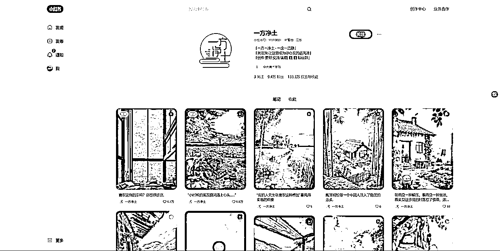
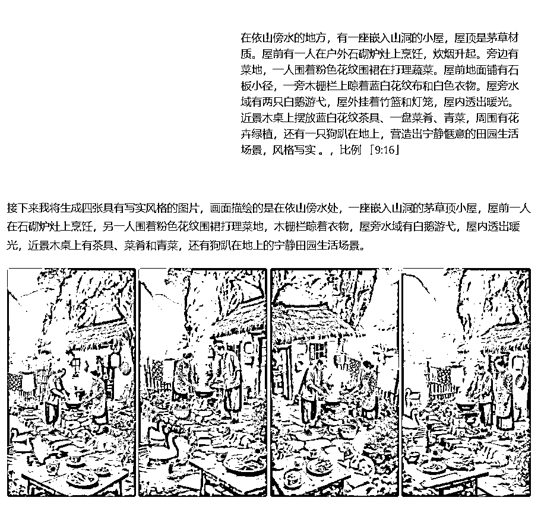
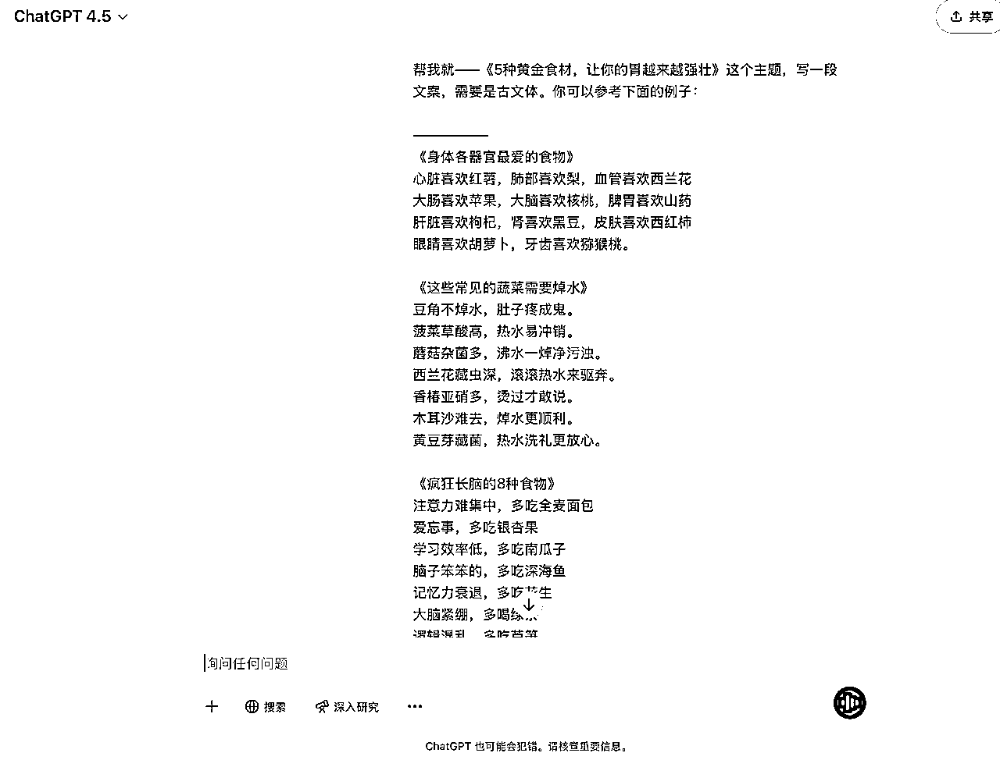
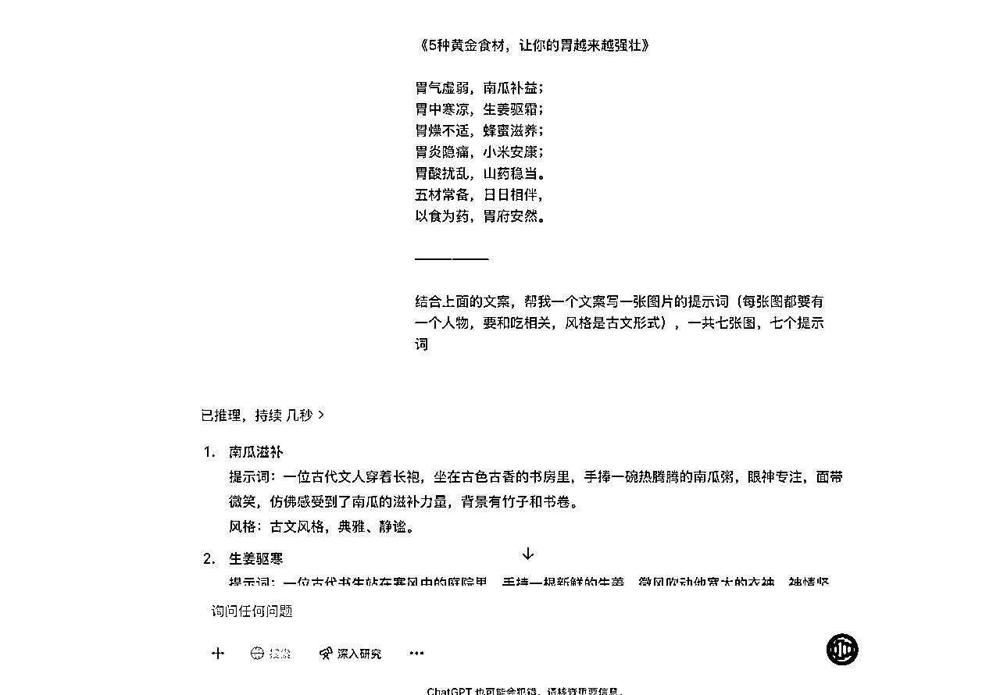
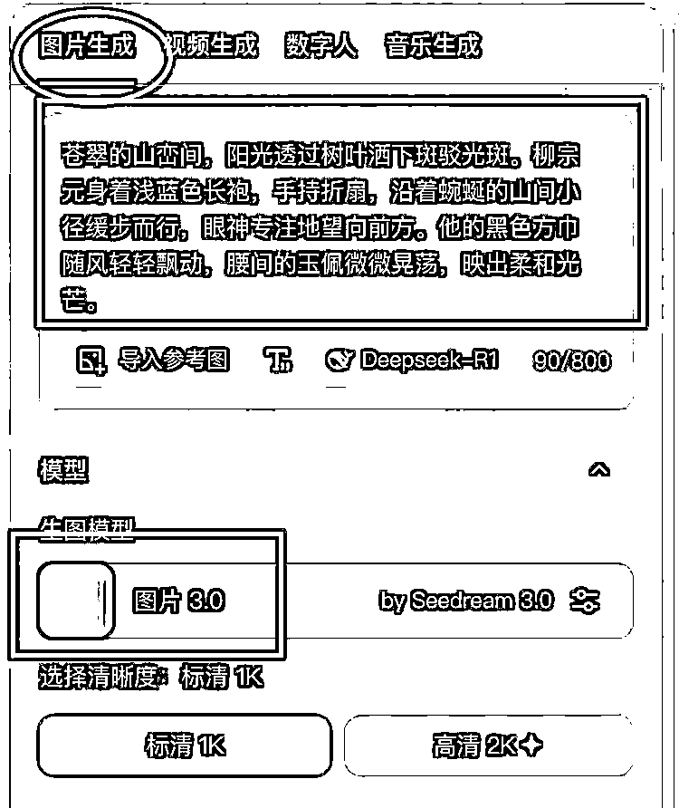
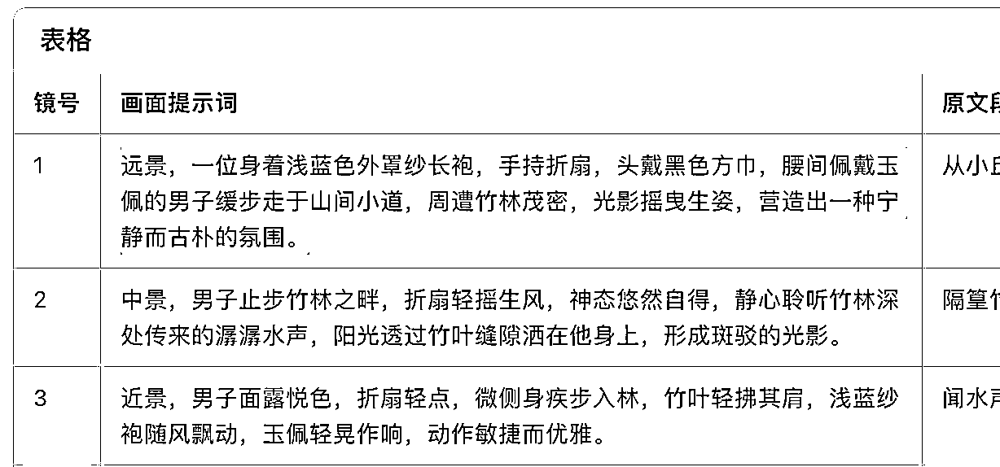
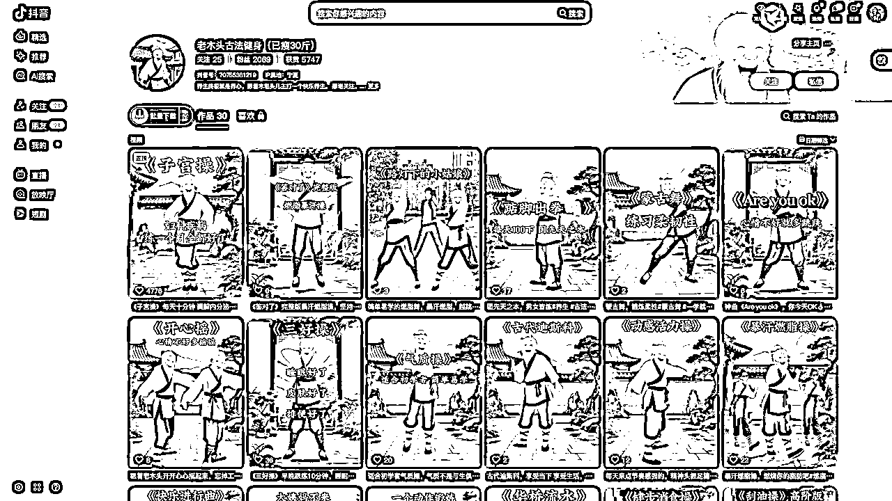
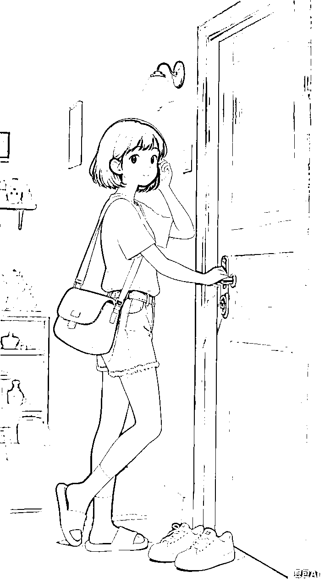
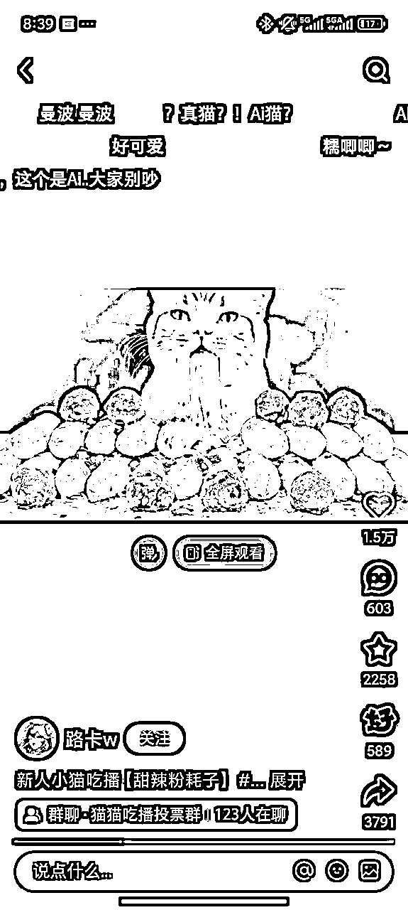
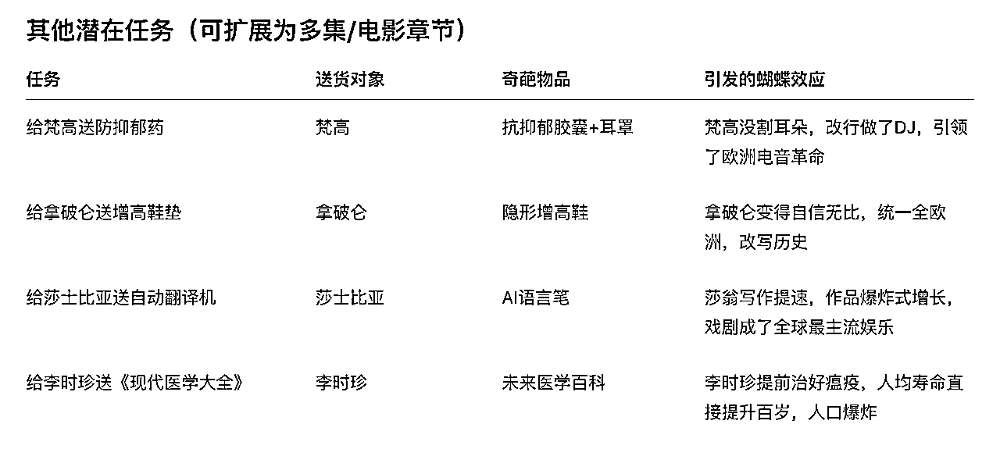

# AI 视频制作丨实战手册丨2025 年 9 月航海

> 来源：[https://ocn93f5d9olj.feishu.cn/docx/GEW7dGPoHoNYgCxTOYNctZw6nsh](https://ocn93f5d9olj.feishu.cn/docx/GEW7dGPoHoNYgCxTOYNctZw6nsh)

# 💡

本章将带你认识 AI 视频创作的最新格局与潜在机会，学习使用AI视频的相关工具

可以按照航线图，开始学习：

认识 AI 视频生态与主流工具（Runway/可灵等）特点 （约 1 天）

现在就开始学习吧。

近年 AI 技术飞速发展，视频内容创作迎来了革命性的变化。从早期 AI 辅助剪辑、自动字幕等辅助创作功能，到如今能够直接生成视频内容的模型，AI 在视频生态中的地位不断提升。

这样的技术演进极大降低了视频创作门槛，提高了创作效率 。现在，即使没有专业拍摄和剪辑经验，你也可以通过 AI 工具快速实现自己的创意。当脚本、拍摄甚至剪辑都不再是难题时，真正决定作品高度的反而是创意本身 。

在内容创作层面，AIGC（AI 生成内容）浪潮正重塑短视频行业生态。2024 年，在抖音等 UGC 平台上涌现出大量 AI 特效视频，用户只需上传一张图片或输入文字，就能生成有趣的视频内容。

比如，Remini 的“黏土动画”特效风靡全网，吸引了数百万用户参与；

.

随后“毛毡娃娃风”“柯南动画风”“油画风”等 AI 滤镜接连走红，相关话题播放量高达数亿甚至数十亿 。

借助这些 AI 特效和平台挑战赛的传播机制，普通用户的创作热情被激发，个性化的内容不断涌现。可以预见，AIGC 将成为短视频创作的新常态：创作者更专注于创意和脚本，具体画面由 AI 高效生成。与此同时，短视频平台内容产出呈指数级增长，也对内容审核和观众注意力分配提出了新的挑战 。

需要注意的是，尽管 AI 视频生成技术发展迅猛，但目前仍有一些局限，以及做这个项目时，也会存在一些“坑”，下面具体给大家列一下，希望各位圈友提前注意：

纯 AI 生成的视频长度往往较短（多数工具一次生成几秒到几十秒不等），画质和精细度相对专业拍摄还有差距 。

.

复杂场景、多角色互动等，目前仍然可能出现瑕疵。

.

此外，生成内容的可控性和一致性也是挑战（如视频帧的连续稳定、角色形象在不同场景的一致）。

.

不要盲目追求高级软件（先用好一个工具再扩展）

.

不要忽视版权问题（商用需注意素材授权）

.

不要过度依赖 AI（创意才是核心竞争力）

.

千万记得，要备份工程文件（血泪教训：突然崩溃全白做）

不过，这些问题正随着技术进步逐步改善——新模型不断涌现，支持更长时长、更高分辨率的视频生成，允许在生成过程中加入参考图像或预设风格来提高一致性。总的来说，AI 视频生态正处于从早期探索走向实用化的阶段：创作者拥抱新工具，内容形式更加丰富，但也需要理解技术的优劣，才能更好地驾驭 AI 进行创造。

1.  AI 视频用到的工具

当前市面上有众多 AI 视频创作工具，每款都有自身特色和适用场景。以下总结一些主流 AI 视频工具的功能亮点和典型用途，供初学者参考：

Runway （Runway Gen-1/Gen-2）：业界较早推出的 AI 视频生成工具 。

网址：https://runwayml.com/

提供网页和 App 方便使用，功能包括文本生成视频（Gen-2）和视频风格迁移（Gen-1），还支持对视频进行实时涂抹编辑等高级操作 。适合希望借助前沿模型快速试验创意的用户。不过 Runway 目前需要订阅付费才能充分使用高级生成功能 。

可灵 AI（Kling）：由快手团队自研的大模型视频生成工具，技术实力雄厚 。

网址：https://app.klingai.com/cn/

采用类 Sora 的架构，生成的视频运动幅度大、物理效果真实，可生成情节丰富的动画或实拍风格片段。会员用户可生成最长 2 分钟、30 帧的 1080p 高清影片，支持多种画面比例，并提供高表现模式、视频续写等高级功能 。非会员则可能需要排队等待生成。可灵非常适合追求高质量和真实运动效果的专业创作者，用于短片、自媒体视频乃至广告创意制作 。

海螺 AI（Hailuo）：国内另一款顶尖视频生成工具，以高画质和稳定性见长。

网址：https://hailuoai.com/

其生成视频在色彩、光影和角色情绪表现上质量出色，在第三方测试中综合效果排名第一，尤其在帧与帧的连贯稳定上有绝对优势 。海螺支持文字、图像、音频等多模态输入，界面简洁易上手，在海外市场也备受欢迎，用户遍及 180 多个国家 。缺点是目前功能相对单一，缺少图像生成、对口型等扩展能力 。非常适合注重画面品质的创作者，比如影视导演、编剧，用于概念影片、高质量短视频等。

即梦 AI（DreamINA）：字节旗下推出的 AI 创作平台，提供一站式的文生图、智能画布和文生视频功能 。

网址：https://jimeng.jianying.com/

用户可以用中文提示词生成所需画面，并能在智能画布上进一步编辑调整，从剧本大纲到成片都能在一个平台完成。即梦支持角色对口型动画生成，AI 配音自然逼真 。每日登录赠送 60-100 积分供免费使用，即使非会员也足够日常创作需求 。不过在复杂人物和场景上偶尔有细节瑕疵 。适合追求功能全面、上手简单的用户，例如内容创作者、教育工作者，用于生成个性化短视频、教学动画、广告素材等。

Pika ：一款国外的文本生成视频工具，以动画和特效见长 。

网址：https://pika.art/about

支持用户上传语音或配音，实现视频中角色口型与声音同步 。Pika 的可控性强，允许对生成视频中的角色、物体进行定点修改，甚至添加爆炸、融化等酷炫特效（最新的 Pika 1.5 版本已支持这些功能）。它还提供一定的视频编辑能力，生成的视频可以直接在其平台上做简单剪辑 。适合用于制作卡通动画、MG 动画风格的视频，以及需要精确控制口型的角色对话场景。注意 Pika 目前主要通过官网提供服务，注册登录即可有限度免费使用。

剪映 ：字节跳动推出的知名视频剪辑工具，国内称为剪映，海外版叫 CapCut。

网址：https://www.capcut.cn/

剪映本身不是文生视频模型，但因为功能全面、免费易用，被广泛用作 AI 生成素材的后期编辑平台。剪映内置了多项 AI 能力：例如自动字幕生成、一键智能剪辑、风格滤镜，以及 AI 配音功能 。最新版本中甚至支持克隆配音（仿真特定人声的语音合成） 。对于 AI 生成的视频素材，剪映可以方便地添加字幕、配乐、转场，调整节奏节拍，让成品更加完整专业。几乎所有初学者都可以从剪映起步来制作和完善 AI 短视频。

注：以上仅列举了一部分热门工具。市面上还有许多其他 AI 视频平台，如国内的智影、清影、Vidu，以及一些开源方案（如 Stable Diffusion 的动画生成插件等）。初学者可根据需求逐步探索，但建议先从主流成熟的平台入手，以获得更稳定的体验。

# AI 情绪治愈视频

1.  本章概要

欢迎来到本手册的核心实战章节！

本章节的所有案例，都曾经在风向标案例里出现过，也就意味着，这些案例都是热门、且有流量属性的 AI 视频风格。

我们会将这些爆款玩法一一拆解，从创意构思到 AI 工具的具体操作，为你呈现清晰、详尽的步骤化教程。

希望大家在学完本章后，能够独立完成这些类型的 AI 视频创作，并有能力举一反三，衍生出属于你自己的爆款创意。

本章航海图：

.

掌握并创作： 情绪治愈 / 古风养生 风格视频（约 3.5 天）

掌握并创作： AI vlog / ASMR饮料键盘 风格视频（约 3.5 天）

现在，就让我们一起投入到 AI 视频实战中来吧！

下面几个号，都是近期流量很好的 AI 生成视频类账号，大家先来一起看看账号的主页，找找它们的相同点

像上面这几个账号，我们可以统一称之为，AI 疗愈赛道，如果再细分一点，可以分为风景疗愈，心灵疗愈以及音乐疗愈。

我们简单分析一下这些账号的用户群体，我们简单推测一下，大概是这几类人群：

.

都市年轻白领与学生：他们是小红书的主要用户，生活在快节奏、高压力的都市环境中，对宁静、美好、治愈系的内容有天然的向往，以此作为精神的“暂停键”和情绪的“舒缓剂”。

.

对生活品质有追求的人：他们喜欢美好的事物，对家居设计、生活美学、自然风光有较高的审美需求和兴趣。

.

内心细腻、情感丰富的人：这类用户更容易被唯美的画面、舒缓的音乐和引人共鸣的文案所打动，寻求情感上的慰藉和寄托。

.

对传统文化、慢生活理念认同者：尤其是音乐疗愈中涉及的古风元素，以及田园生活所代表的“采菊东篱下”的意境，会吸引对这类文化和生活方式有好感的用户。

.

女性用户占比较高：女性用户可能更容易被这类视觉化、情感化的内容吸引。

如果再仔细分析一下，其实可以用一类人群概括“对生活抱有美好幻想的女性群体”。

# 2.创作思路

了解完这个账号的基础信息后，我们就可以来构思一下，创作的思路了。这些账号有以下共通之处：

.

营造理想化体验：无论是现实的田园风光、精心布置的家居，还是 AI 生成的梦幻场景，都透漏着宁静、温馨、梦幻或古朴的氛围。田园风光追求自然和谐，梦想之家追求精致或梦幻，古风音乐疗愈则追求典雅意境。所展示的往往是现实的提纯和美化，过滤掉不完美，呈现出一种理想状态。可以总结为“向往的生活”。

.

引导性标题：使用能够引发用户共鸣、思考或向往的文字，如“这样的生活你喜欢吗？”、“当你老了会选择怎样的生活？”、“治愈你的心灵”等。

.

舒缓的 bgm：选择与画面风格和情感基调高度匹配的背景音乐。音乐疗愈类视频更是以音乐为核心，通过特定的旋律、节奏和音色来达到舒缓情绪、疗愈心灵的效果。

.

内容垂直：每个账号都有其相对明确的主题定位，如“蜗居”的隐逸山居，“一方净土”的田园诗意，“媛媛美景”的理想小家。这有助于吸引特定偏好的用户并建立粉丝粘性。

.

追求“疗愈”与“美好”：无论是哪种形式，最终都指向为观众提供精神上的慰藉、放松和对美好事物的向往。它们都是一种“情绪消费品”。

.

关键词：“治愈”、“宁静”、“放松”、“美好”、“诗意”、“梦想”。

.

叙事手法：往往不过多解释，而是通过画面和音乐引导观众自行感受和解读，留下想象空间。

经过我们的分析，你已经知道了这些视频的受众人群是哪些？她们爱看的内容是什么样的。那么接下来就好办了，甚至有了对标账号作为参考，我们是不是就可以针对性的做内容了。当你带着上面的思路去做账号，相信你会更加的游刃有余。

# 3.视频拆解

接下来我们开始详细拆解他们的制作手法。

乡村生活和梦想小家的制作难度为一颗星，你要做的只有三步，生成图像、图转视频和制作视频。

有圈友可能会问，现在的 Ai 视频不是能直接文生视频么？为什么还要先生成图像。

这里其实是出于两点考虑，生成成本以及时间成本。

如果用文生视频去制作出来完美符合自己想法的视频出来，需要大量的抽卡。

每次抽卡都意味着要消耗金钱，对于我们新手来说，显然不是一个最佳选择。

如果我们选择先生成我们想要的场景，也就是图像抽卡，这个成本可以尽可能的压缩至 0。

有了符合我们预期的场景之后，再去生成视频，我们抽卡的成本和时间都会大大降低。

我们接下来使用的工具是豆包和即梦。

我们拿“蜗居”和“墨”这两个账号里面的爆款视频来做拆解。

1.  反推提示词

上面两张图是我去视频里面截得图，我们获取提示词最快的方法就是用 AI 反推提示词。如果你有一些 AI 绘画的基础，那么我想人肉反推提示词也是相当快。

上面是豆包 AI 给出的提示词。同理，另外一张图也给到豆包 AI，让他反推提示词。我们就能得到另外的一条提示词。

梦想小家的提示词也得到了。

接下来我们生成图像有两个选择，一个是豆包 Ai 直接生成，另外一个是通过即梦生成图片。你要问两者有什么区别的话，我只能告诉你，豆包生成图片免费，你的即梦积分最好留着去生成视频用。能白嫖的才是最香的。（小声 BB，其实两者生成内容的质量是一样滴。)

生成的视频.mp4【在线播放】

jimeng-2025-05-11-778-

在依山傍水的地方，有一座嵌入山洞的小屋，屋顶是茅草材质。屋前有一人在户外石砌炉灶上烹饪，炊烟升起。旁边有菜地，一人围着粉色花纹围裙在打理蔬菜。屋前地面铺有石....mp4【在线播放】

生成视频时用的提示词和反推得到的提示词是一样的，生成视频的路径同样也有两个，豆包生成和即梦生成，两者的生成质量也是相同的，不同之处是是生成速度。豆包生成视频会稍微慢一点，但免费，即梦需要用积分，生成速度会快很多。

接下来分别演示一下豆包制作和即梦制作的全流程图文。（生成图片到生成视频）

1.  豆包 AI 制作图片

先选择技能里面的图像生成

然后把刚才反推的提示词粘贴进去，图片比例选择【9:16】

选择自己满意的图片，然后右上角点击生成视频。

把刚才的提示词粘贴进来，点击生成。（才发现豆包每天生成视频次数是 10 次，即梦 3.0 每天积分 60-100，也就是 6-10 次。如果是纯白嫖用户，请把握好使用次数，足够你用到得到正反馈为止。加油！你是最棒的！)

友情提示一下，豆包做出来的图片带有水印，别忘记去掉再生成视频。

如果忘记了也没关系，之后在视频制作的过程中裁剪掉水印也是可以哒！

1.  即梦 制作图片

把提示词粘贴进提示词框里，模型选择图片 3.0，比例选择 9:16，然后立即生成。一次生成四张，右边是我生成两次的结果。选择你喜欢的那张图片。

点击生成视频

提示词复制到提示词框，选择视频 3.0，点击生成视频，右边就是生成好的视频。正常生成速度在 30s 之内。

课堂作业

那么给你们留一个小作业，刚才我们其实反推了两个图。我们的制作流程是一样的，那么请用同样的制作方法，把梦想小家的视频制作出来

1.  视频制作

我们的前期工作基本上已经做的差不多了，接下来我们需要用到剪映工具给视频配上一些音效。

生成的视频.mp4【在线播放】

5月11日.mp4【在线播放】

比如这个视频，如果不配上音效，光看画面，只会觉得无聊。而右边是加了音效的视频，你觉得怎么样，是不是立马不一样了。

音效方面，你只需要记住两点，环境音效和背景音乐。

环境音效包括画面中所出现的动物声音，人物动作声音以及周围环境所产生的声音。

而背景音乐则是负责烘托氛围，让观众加深整体的试听体验。

我想，这步你应该不会觉得难。跟着来做一遍就明白了。你们可以看到我的音轨上面一共有四条，你们结合一下画面内容，应该不难猜到。里面主要的音效有人物炒菜的声音，鹅叫的声音。那么还有两条是什么呢？好难猜啊！

还急的我说的环境音效里面包含的三个内容么？没错，还缺一个周围环境音，专业名词叫做环境白噪音，为了营造氛围，增加声音层次感。所以当你制作视频时，添加音效的时候，脑子里面过一下，动物，人物以及环境这三要素。这样你的视频基本上就是一个完整的视频了。

巴特！

还缺少一点氛围，是的，再挑一首烘托氛围的曲子，就更完美了。

这样，你就完美的复刻出来了一条爆款 Ai 疗愈视频！

# 02.古风养生视频

在小红书上，养生一直都是个流量密码。

从早期通过简单的“大字报”，就做到了将近 50 万粉丝的「百岁老人计划」。

再到后来仅靠讲一个拉屎技巧，就实现橱窗接近百万销售额的「拉屎女王」。

养生内容火爆的秘诀，其实就在于创作者总能找到新颖的切入点和有趣的表现方式。最近，养生内容又有了新玩法。

一种以中国水墨风呈现的内容，突然火了起来。

代表账号「无忧四季养生」，短短两周就涨了 2 万粉。其实，这种内容用 AI 工具做起来超简单，今天就来教大家怎么 1:1 做出这种内容。

我们一共分为 3 个部分：

1.  选题还原

这个账号截止目前，一共发布了 16 篇笔记（这里指的是写稿的时间）

具体是这些选题：

.

这些常见的蔬菜需要焯水

.

身体各器官最爱的食物

.

春季儿童长高必吃 10 道菜

.

排名第一的冠军蔬菜

.

身体的这些警告你知道吗？

.

女人最好的养生方式

.

身体免疫力最爱的食物

.

免疫力最喜欢什么？

.

疯狂长脑子的八种食物

.

比吸烟更可怕的八件事

.

身体的七大求救信号

.

越吃越健康，看这些食物

.

垃圾食品的解药，你知道吗？

.

养生十要，长寿的秘密

.

垃圾食品的解药，你知道吗？

.

0 成本养生，居然这么简单

我们来总结一下，它的选题其实就是讲——“懒人养生吃法”。用老百姓家里的普通食材，来实现「巨大的」养生效果。分析完之后，我们可以就可以做一些选题衍生了：

「一日三餐这样搭配，满足身体五大需求」

「0 成本消水肿！3 种食物让你轻松告别浮肿」

「警惕！身体 3 大防线受损的 5 个信号，你感受到吗？」

「春季最适合孩子长高的 7 款家常菜，家长一定要学会」

「5 种黄金食材，让你的胃越来越强壮」

「一杯茶逆转衰老？揭秘最被低估的排毒茶饮」

你比较喜欢哪个？

我选了「5 种黄金食材，让你的胃越来越强壮」

# 2.文案还原

接下来我们需要拆解一下它的文案，我们选取其中 点赞最多 的 4 篇笔记来拆解

Area.mp4【在线播放】

笔记 1：《身体各器官最爱的食物》

心脏喜欢红薯，肺部喜欢梨，血管喜欢西兰花

大肠喜欢苹果，大脑喜欢核桃，脾胃喜欢山药

肝脏喜欢枸杞，肾喜欢黑豆，皮肤喜欢西红柿

眼睛喜欢胡萝卜，牙齿喜欢猕猴桃。

笔记 2：《这些常见的蔬菜需要焯水》

豆角不焯水，肚子疼成鬼。

菠菜草酸高，热水易冲销。

蘑菇杂菌多，沸水一焯净污浊。

西兰花藏虫深，滚滚热水来驱奔。

香椿亚硝多，烫过才敢说。

木耳沙难去，焯水更顺利。

黄豆芽藏菌，热水洗礼更放心。

笔记 3：《疯狂长脑的 8 种食物》

注意力难集中，多吃全麦面包

爱忘事，多吃银杏果

学习效率低，多吃南瓜子

脑子笨笨的，多吃深海鱼

记忆力衰退，多吃花生

大脑紧绷，多喝绿茶

逻辑混乱，多吃芦笋

脑子卡壳，多吃鸡蛋

笔记 4：《越吃越健康，看这些食物》

常吃菠菜抗衰老，常吃番茄皮肤好

常吃枸杞眼睛亮，常吃红枣气血足

常吃核桃记性好，常吃山药肠道顺

常吃苦瓜火气消，常吃豆类补蛋白

有没有发现，他的脚本都是“古文体”！！

我们借助 AI，也可以轻松写出这样的古文体：

提示词如下：

帮我就——《5种黄金食材，让你的胃越来越强壮》这个主题，写一段文案，需要是古文体。你可以参考下面的例子：

——————

《身体各器官最爱的食物》

心脏喜欢红薯，肺部喜欢梨，血管喜欢西兰花

大肠喜欢苹果，大脑喜欢核桃，脾胃喜欢山药

肝脏喜欢枸杞，肾喜欢黑豆，皮肤喜欢西红柿

眼睛喜欢胡萝卜，牙齿喜欢猕猴桃。

《这些常见的蔬菜需要焯水》

豆角不焯水，肚子疼成鬼。

菠菜草酸高，热水易冲销。

蘑菇杂菌多，沸水一焯净污浊。

西兰花藏虫深，滚滚热水来驱奔。

香椿亚硝多，烫过才敢说。

木耳沙难去，焯水更顺利。

黄豆芽藏菌，热水洗礼更放心。

《疯狂长脑的8种食物》

注意力难集中，多吃全麦面包

爱忘事，多吃银杏果

学习效率低，多吃南瓜子

脑子笨笨的，多吃深海鱼

记忆力衰退，多吃花生

大脑紧绷，多喝绿茶

逻辑混乱，多吃芦笋

脑子卡壳，多吃鸡蛋

《越吃越健康，看这些食物》

常吃菠菜抗衰老，常吃番茄皮肤好

常吃枸杞眼睛亮，常吃红枣气血足

常吃核桃记性好，常吃山药肠道顺

常吃苦瓜火气消，常吃豆类补蛋白

来看看 AI 最后产出的文案：

《5 种黄金食材，让你的胃越来越强壮》

胃气虚弱，南瓜补益；

胃中寒凉，生姜驱霜；

胃燥不适，蜂蜜滋养；

胃炎隐痛，小米安康；

胃酸扰乱，山药稳当。

五材常备，日日相伴，

以食为药，胃府安然。

怎么样？不错吧？我们直接就用这个！

1.  制作还原

# 步骤一：AI 生成水墨风格插画

接下来，我们需要把我们的文案转化成图片（每句文案对应一张图），再把图片转化成视频。

我们同样可以借助 AI 来写文案转为图片的提示词：

《5 种黄金食材，让你的胃越来越强壮》

胃气虚弱，南瓜补益；

提示词：一位古代文人穿着长袍，坐在古色古香的书房里，手捧一碗热腾腾的南瓜粥，眼神专注，面带微笑，仿佛感受到了南瓜的滋补力量，背景有竹子和书卷。

胃中寒凉，生姜驱霜；

提示词：一位古代书生站在寒风中的庭院里，手持一根新鲜的生姜，微风吹动他宽大的衣袖，神情坚定，似乎在抵御寒冷，背景是冬季雪景。

胃燥不适，蜂蜜滋养；

提示词：一位古代女子在古典的厨房里，优雅地舀着一勺金黄色的蜂蜜，缓缓滴入茶杯中，周围是蜂巢和花卉，氛围温暖、宁静。

胃炎隐痛，小米安康；

提示词：一位身着素雅衣袍的老者在山间小屋前，正在用陶瓷锅煮着小米粥，身旁有一只小狗安静地趴着，周围绿意盎然，显示出温和与安康。

胃酸扰乱，山药稳当。

提示词：一位古代医者站在药堂前，手持山药根，认真端详，似乎在研究其药效，背景是古代药材架，灯光柔和。

五材常备，日日相伴，

提示词：一位古代贤人坐在餐桌旁，桌上摆满了南瓜、生姜、蜂蜜、小米和山药，贤人一手捧书，一手端着茶杯，面带思索的表情，整个场景静谧而典雅。

以食为药，胃府安然。

提示词：一位古代文人轻松坐在亭子中，手中握着一碗美味的汤，背后是繁茂的树木和潺潺的流水，整体场景安宁、和谐，文人脸上露出满足的微笑。

然后我们需要生成一下这位博主的视频图片风格。

我们去作品里，截几张图片，然后直接上传 AI，叫它帮我们反推风格提示词。

最后得到的风格提示词描述是：

国风水墨插画，古典雅致，淡彩柔和，富有东方韵味与传统笔墨意境，画面色调温润、自然，表现出宁静、和谐的氛围，风格借鉴齐白石的细腻笔触，李可染的水墨氛围，张大千的传统艺术精髓，展现出深厚的文化底蕴与艺术韵味。

然后来到即梦的「文生图」页面，输入提示词+风格描述

最后来看看效果：

还不错，下面我们依次生成剩下的 6 张图。步骤一致，我就不重复讲解流程啦，我直接把结果贴出来

# 步骤二：使用 AI 工具让静态图片动起来

下一步，就是让这些图动起来。其实有很多工具都能实现这个效果，比如海螺 AI、可灵、即梦、runway、sora、vidu、luma、pixverse 等等……

我这里用的是 海螺 AI

https://hailuoai.video/

接下来，把我们准备好的 7 张图逐个上传进去，输入提示词，让图片动起来。

然后就可以把生成的 7 个视频都保存下来啦。

动画.mp4【在线播放】

最后把这些视频，都拖进剪映

# 步骤三：添加配音、背景音乐和字幕

然后我们需要生成一下画外音，我们用 fish audio 这个工具来克隆博主的声音

这是 fish audio 生成的音频（你可以听一下试试看）

音频.mp4【在线播放】

音频生成好了，就拖进剪映备用

下面我们来拆解一下字幕，我们上传字体识别网站，进行识别→https://www.likefont.com/

网站识别出来，显示这位博主用的是“华康俪金黑”，我们也用这个

调整一下文字的大小，设置一下描边

接着我们来看 bgm 怎么做，先来听一下博主的 bgm

豆角.MP4【在线播放】

还真找到了，就是这个葫芦丝版本。我们把这个 BGM 放到轨道上。

# 步骤四：整体精剪

最后，我们精剪一下，让素材能匹配上画外音

# 03.AI 古文视频

最近这一类把古诗词做成可视化的 AI 视频 特别火，下面我截图的案例，通过这种类型的视频，一个月就涨粉了 5 万。

那么，像这类 AI 古风视频，究竟怎么做呢？下面，我们将以柳宗元的名篇《小石潭记》为例，完整地走一遍从文字到爆款视频的全流程。

1.  用 Kimi 生成画面提示词

在动笔画画之前，我们首先需要一位能读懂古文、并拥有导演思维的“AI 助理”。在这里，我们选择 Kimi（网址：https://kimi.moonshot.cn/）来扮演这个角色。

我们向 Kimi 下达的指令，不只是简单的“画分镜”，而是一份详尽的“项目策划案”。我们会要求它：

提示词文案：

你是一名文言文短视频博主，请你先了解《小石潭记》这个古诗词的翻译、背景等等，再帮我写出《小石潭记》的分镜画面提示词的描述词。

要求：1。真实摄影风格的画面。2.率先生成画面中角色的形象描述，并将已经生成的形象描述出现于后续每一个需要出现人物的画面描述中 3。每一小句生成一个分镜画面提示词。4.如果需要可以加入空镜或对某一个物体的分镜画面。5.要求有远、中、近、特镜头的描写。6.以表格的方式输出，每一个提示词后面对应原文段落。7.要保持故事中的主人公形象的一致性，必要时可以每个分镜提示词可以加入主人公形象的描写。8.画面要有景深、光感等等。9.根据《小石潭记》的朝代，画面的风格、房屋、衣着、人物形象等等一定要符合《小石潭记》的朝代。10.对于画面中人物的描写要详细（例如：那个朝代的衣着、配饰、表情、动作等等）。11.人物形象一定要符合国人的审美。

通过这样与 Kimi 的深度沟通，我们便能得到一份详尽到可以“照着拍”的、表格化的“分镜脚本”。

# 2.用即梦生成分镜图

有了详细的分镜脚本，接下来，我们就要请出我们的“美术部门”和“摄影部门”——即梦 AI（jimeng.jianying.com），将文字转化为视觉。

我们将 Kimi 生成的分镜描述词，逐条复制到即梦的“图片生成”模块（选择图片生成模块——复制提示词——选择图片 3.0 模型）

选择合适的图片作为分镜。（每个人物的分镜提示词，需要复制第一次人物出现时的外貌描写）

1.  生成环境分镜图

一位“演员”，不能存在于真空之中。在主角形象确立之后，我们必须为他搭建一个真实可信、充满意境的舞台。这便是“环境分镜”的作用。在古风视频中，充满美感的“空镜”（没有人物的景物镜头）不仅是场面转换的粘合剂，更是烘托氛围、展现意境的灵魂所在。

《小石潭记》的精髓，正在于柳宗元对潭水、游鱼、草木的细腻观察。因此，我们需要用 AI 精心绘制这些核心场景。我们可以将 Kimi 脚本中关于环境的描述词输入即梦，也可以根据原文意境，撰写更具镜头感的指令。

例如，要描绘小石潭的幽静与生机，我们可以像下面这样，分层次地生成环境镜头：

镜头一：刻画潭边景致（中景）

提示词：“中景，唐代风格，潭边生长着青翠的树木和藤蔓，枝叶繁茂，互相缠绕，镜头扫过这些植物，展现它们在微风中摇曳生姿的景象，阳光透过树叶的缝隙洒在潭面上，形成斑驳的光斑，画面极具景深和真实感。”

镜头二：展现潭中游鱼（近景）

提示词：“近景，潭中的鱼儿清晰可见，大概有一百来条，它们在清澈见底的水中自由自在地游动，仿佛在空气中一般，画面中可以看到水底的青苔和石头，以及鱼儿在水面的倒影，光线通透。”

镜头三：捕捉游鱼动态（特写）

提示词：“特写，一条鱼儿突然静止不动，过了一会儿又迅速向远处游去，镜头快速跟随其动作，捕捉到鱼儿灵动的姿态和在水中穿梭的瞬间，周围其他鱼儿也跟着往来翕忽，画面充满生机。”

通过这些远近结合、动静相宜的环境分镜，我们便为故事的展开，铺设好了一个充满诗情画意的舞台。

# 4.选择分镜图并批量生成视频

分镜图有了后，我们就可以生成视频了。

直接复制表格中的文案到视频生成提示词处——选择视频模型 3.0——选择 5s

得到镜头 1（截取可用部分即可）:

jimeng-2025-05-14-517-远景，镜头聚焦在一位身着唐代青色长袍，头戴黑色幞头，腰间佩戴玉佩的男子，他面容清瘦，眼神深邃，手持竹筒，正从一片茂密的竹林旁的小丘脚下朝西北方缓.mp4【在线播放】

我们接着生成接下来的视频，进入即梦生成图片，生图参数同上。

镜头 5：选中图片——生成视频——复制生成图片的提示词直接使用——选择视频 3.0 模型

jimeng-2025-05-13-429-鸟瞰视角展现砍伐后的竹林小径，尽头处潭水波光粼粼。柳宗元（浅蓝色外罩纱长袍，手持折扇，黑色方巾，腰间有玉佩）立于潭畔，衣摆随风飘动。阳光在潭面上.mp4【在线播放】

镜头 6

jimeng-2025-05-13-430-中景，潭边生长着青翠的树木和藤蔓，枝叶繁茂，互相缠绕，镜头扫过这些植物，展现它们在微风中摇曳生姿的景象，阳光透过树叶的缝隙洒在潭面上，形成光斑。.mp4【在线播放】

镜头 7、8

jimeng-2025-05-13-431-近景，潭中的鱼儿清晰可见，它们大概有一百来条，镜头聚焦在几条鱼身上，它们在水中自由自在地游动，仿佛没有依托，画面中可以看到潭底的石头和鱼儿的倒影.mp4【在线播放】

jimeng-2025-05-13-432-特写，一条鱼儿突然静止不动，过了一会儿又迅速向远处游去，镜头快速跟随其动作，捕捉到鱼儿灵动的姿态和在水中穿梭的瞬间，周围其他鱼儿也跟着往来翕忽，.mp4【在线播放】

镜头 9、10、11

jimeng-2025-05-13-434-中景，男子坐在潭边的一块石头上，镜头环绕他拍摄，他身着青色长袍，黑色幞头，玉佩垂于胸前，手中拿着一支笔，写东西，脸上带着平静的微笑，周围是郁郁葱.mp4【在线播放】

jimeng-2025-05-13-433-中景，男子（青色长袍，黑色幞头，玉佩垂于胸前）转身离开，镜头跟随着他，他沿着来时的路缓缓而行，背影显得有些孤单，但步伐依然坚定.mp4【在线播放】

jimeng-2025-05-13-435-近景，男子与同游的几位伙伴相遇，他们分别是吴武陵、龚古以及男子的弟弟宗玄，还有跟着的崔氏二小生恕己和奉壹。吴武陵身着蓝色长袍，头戴褐色幞头，面容.mp4【在线播放】

# 5.后期配音

当所有的视频片段准备就绪，我们的影片还差最后，也是最重要的一口气——声音。

我们需要一个沉稳、富有古韵的声音来诵读《小石潭记》的原文。这时，我们可以使用海螺 AI（网址：https://hailuoai.com/）。

这个平台提供很多丰富的音色模型，我们可以挑选最符合古文意境的声线，输入文本，再微调语速和情绪，即可生成一段堪比专业播音员的配音。

操作路径：选择声音模型——选择音色——输入文案——调节语速——生成语音并下载

# 6.后期剪辑

已经生成的所有音频视频按顺序导入剪映

点击音频——上排菜单点击文本——左侧点击智能文本——点击开始识别

点击任意字幕，右侧调整数据，所有字幕将统一修改格式

叠加自然环境音

# 04.跳舞养生操视频

在正式讲解前，我们先来看个例子 👇

五音疗愈.mp4【在线播放】

是不是很眼熟？这类洗脑的养生舞蹈视频已经火遍全网了，现在就教大家如何制作同款。

1.  分析对标

下面几个号都是讲养生或健康的自媒体账号，大家先来一起看看账号的主页，找找它们的相同点

以下是四个视频案例，这些视频都有一个共同点，用古风老人跳舞或者跳养生操，但是都和健康相关，比如肚子平了，瘦肚子，暴汗全身等关键字。

眉飞色舞.mp4【在线播放】

日不落.mp4【在线播放】

踏浪.mp4【在线播放】

快乐崇拜.mp4【在线播放】

# 2.实操步骤

根据刚刚的分析，我们可以确定这类视频的制作步骤：

# 3.AI 制作图片

我们开始使用 AI 制作图片推荐即梦，我们可以直接搜古风老人。看这个画面是不很熟悉。

我们以此款提示词为标准制作，点击做同款后，出现相同提示词，模型选 3.0，比例选 3:4，点击立即生成。

提示词：一位古风老人，白发束于头顶，插有发簪，面容微笑，长白胡须垂至胸前；身着白色上衣，，腰间系深棕色束带，下身搭配深色长裤，裤脚挽起，露出带有复杂纹路的棕色绑腿，足蹬黑白色传统布鞋，双手自然垂放身体两侧，正面站立

背景为中式传统建筑，包含瓦片屋顶、木质结构房屋，周围点缀绿植。画面呈现动画风格，整体色调古朴自然，远处有山，有日落

生成的图片如图所示，我们选择以第 3 张图作为最终图片

# 4.找跳舞视频

我们可以去抖音相关的舞蹈视频，尽量找背景简单的视频。

下载.mp4【在线播放】

1.  AI 制作视频

打开如下链接（https://www.runninghub.cn/ai-detail/1926266448652746753/?inviteCode=bmdiwm7x），来来封装了一个古风老人跳舞的 AI 应用

左侧添加古风老人和舞蹈视频即可。点击运行，等待 5 分钟左右，古人跳舞视频就自动做好了。

这是制作好的 AI 视频，大家可以看一下

ComfyUI.mp4【在线播放】

刚才演示的是一个镜头的制作流程。其他镜头都是按照同样的方法制作：先生成图片，再转换成视频。

等所有镜头都准备好，导入剪映剪辑一下，配上魔性的 BGM，作品就完成了。步骤都一样，我就不重复演示了，大家赶紧上手试试吧！

# 05.食物拟人化视频

最近发现几个“拟人化”的 AI 视频，起号特别快。比如：

从“假如书籍会说话”到“假如八字会说话”，再到“假如蔬菜会说话”，都是把原本枯燥的知识用拟人化的方式呈现。比如让香蕉自己说“我进冰箱会黑化”，比直接科普有趣多了，一个视频就能拿 5 万+赞。

这些账号的共同点：内容有趣+知识科普+AI 批量生产。制作简单，一天能出好几条，关键是找对了用户痛点。养生找家长群体，命理找焦虑人群，每个赛道都有自己的精准受众。

想做的圈友可以试试，选一个垂直领域深耕，用 AI 工具降低成本，重点放在内容创意上。下面我们来具体展开看看，这类视频应该怎么做。

1.  分析对标

下面几个号都是讲养生或健康的自媒体账号，大家先来一起看看账号的主页，找找它们的相同点

这些视频都有一个共同点，把蔬菜，药材，器官，都使用拟人化的卡通方式表现。用来科普养生或者健康相关，规避使用真人讲养生的风险。

下载 (2).mp4【在线播放】

下载 (1).mp4【在线播放】

01e7e894560b0ae84f03700195e48595cc_258.mp4【在线播放】

01e7eca95c07e2d34f03700195f479e11e_258.mp4【在线播放】

# 我们简单分析一下这些账号的用户群体，大概是这几类人群：

# 1\. 年轻女性群体（尤其是 Z 世代）

年龄与性别特征：以 18-30 岁的年轻女性为主，尤其是 Z 世代（1995-2009 年出生）。小红书用户整体以女性为主，且年轻用户占比高，这类拟人化内容因其可爱、治愈的视觉风格，更易吸引女性用户的关注。

心理需求：通过拟人化赋予无生命体情感和个性，满足用户对陪伴、情感投射的需求。例如，将药材拟人化为“暖男”或“萌妹”，既传递健康知识，又通过角色设定引发情感共鸣 。

# 2\. 二次元及泛 ACG 文化爱好者

兴趣标签：这类群体对日漫、国创、同人创作等二次元文化有较高接受度，熟悉拟人化表达形式（如“兽人”“异形头”等）。蔬菜、器官的拟人化设计常融入日系画风或萌系元素，精准契合其审美偏好。

创作参与度：部分用户是手工达人、插画师或 AIGC 创作者，他们可能通过 AI 工具（如 Midjourney）生成拟人形象，或制作实体周边（如毛绒玩偶、痛包装饰），进一步推动内容传播。

# 3\. 健康养生与知识科普受众

功能性需求：药材、蔬菜的拟人化内容常结合健康知识科普（如中药功效、食疗搭配），吸引关注养生、健康管理的用户。这类内容通过角色故事降低知识理解门槛，增强记忆点。

教育场景延伸：部分内容可能面向家长群体，通过卡通形象向儿童传递健康饮食观念，或成为学校健康教育素材的补充形式。

# 4\. 城市青年与“孤独经济”参与者

情感代偿：在快节奏、高压力的城市生活中，拟人化内容提供情感慰藉。例如，将器官拟人为“打工人”，通过幽默叙事反映当代青年的健康焦虑，引发共鸣。

文化消费习惯：这类用户习惯通过短视频、图文获取信息，且倾向于“轻量级”内容消费。拟人化视频兼具娱乐性和信息量，符合其碎片化浏览习惯。

# 5\. 品牌营销与商业化触达的目标人群

消费决策影响者：品牌通过拟人化 IP（如“胡萝卜战士”“枸杞小姐姐”）进行产品推广，吸引注重产品趣味性和故事性的消费者。例如，健康食品品牌可通过拟人角色传递“科学配方”“天然原料”等卖点，精准触达关注成分的“成分党”。

细分市场潜力：药材拟人化可能吸引中医药年轻化市场的用户，而蔬菜拟人化则适合瞄准亲子家庭或有机食品消费者。

# 2.实操步骤

分析完这些对标账号后，我们就能理清思路，制定出一套可执行的操作流程了。

# 3.AI 制作脚本

虽然有对标视频可以分析视频脚本，但是为了保持原创性，建议圈友使用 deepseek 制作视频脚本。

提示词：制作一个视频脚本，卡通器官自述，超级简单通俗易懂，1 分钟内，列出表格分为镜号，画面提示词，对白，配音，时长 5 列

获得制作好的视频脚本

下面是脚本，提示词比较差，对白和配音可用。

# 4.AI 制作图片

我们开始使用 AI 制作图片推荐即梦，我们可以直接搜卡通器官或卡通心脏等，获得提示词灵感。

我们以此款提示词为标准制作，点击做同款后，出现相同提示词，模型选 3.0，比例选 3:4，点击立即生成。

提示词：图片风格：图片风格为 3D 卡通，形象简洁夸张，营造出轻松日常的氛围，适合用于宣传营养饮食的知识色彩柔和真实。 描述主体：拟人化的心脏形象，带有表情。 描述场景：背景是客厅场景，有桌椅，电视等元素。

生成的图片如图所示，我们选择以第 3 张图作为最终图片

接着我们再以这个图片为基础，导入参考图，生成别的器官的图片，图生图暂时只能使用 2.0 pro 模型

我们按照这个操作生成同风格的其他器官图片和器官合照。

1.  AI 制作视频

点击图片，点击右侧生成视频按钮

生成视频的参数设置，可添加视频提示词，模型建议选择 3.0，时长选 5 秒，点击生成视频。

其他图片按照此办法制作视频

jimeng-2025-05-24-655-.mp4【在线播放】

jimeng-2025-05-24-920-.mp4【在线播放】

jimeng-2025-05-24-657-.mp4【在线播放】

jimeng-2025-05-24-659-.mp4【在线播放】

jimeng-2025-05-24-656-.mp4【在线播放】

# 6.AI 制作音效/配乐

视频制作好后我们可以给该视频制作 AI 音效或 AI 配乐。

这个属于非必选项可以跳过，因为可以去剪映搜索配乐和音效自己添加。

即梦一次性可生成 3 个 AI 音效

即梦一次性可生成 3 个 AI 配乐

左边是 AI 音效的结果，即梦配上了钟表的声音比较奇怪。右边是配乐，即梦做的还是挺不错的。

jimeng-2025-05-24-921-.mp4【在线播放】

jimeng-2025-05-24-922-.mp4【在线播放】

1.  AI 制作对白

这种卡通类的即梦是无法制作对口型视频，可以使用剪映制作对白。

以下是分镜表，其中有对白文字可使用。

打开剪映，导入之前的 6 段视频。

插入文本，选择花字。

选择朗读，选择声音，点击开始朗读，依次把 6 段对白添加上。

最后选择 1 个背景音乐，AI 拟人视频制作完成。

小技巧，每个视频片段放大到 110%就看不到水印了。

最终生成视频。

5月24日 (1).mp4【在线播放】

# 【新增】06.AI独居女孩vlog

前段时间，治愈系独居女孩非常的火,出来的数据点赞收藏的数据都是很不错的，变现方式可以是引流、收徒,卖橱窗智能体这些。

下面就来拆解一下具体是怎么去做的。

# 1.确定故事分镜，豆包生图

一般可以采用直接找爆款故事，或者对标他人故事改编。

以下为我根据这个视频节选的七个片段

【提取视频包含的内容】识别图片内容，生成中文图片提示词

# 2.根据豆包提出的提示词，修改内容，生成图片

重复以上操作，继续生成画面

最后生成6张图片

# 3.人物一致性的保持

让人物衣服，裤子，包，头发，相对固定，比如我在提示词中一直在强调的浅黄色上衣，蓝色短裤，白色包包

注意事项

千万别去开门，千万别开门，现在六指很少见了，但是开门进门太难了

# 4.打开图片生成视频平台

需要用到的工具如下：

https://jimeng.jianying.com/即梦官网链接

https://hailuoai.com/subscribe海螺视频

klingai.kuaishou.com可灵，这个质感高，就是有一点点慢

使用图片生成视频

jimeng-2025-05-29-871-女孩从外面打开门回到家.mp4【在线播放】

384434562498088968 (3).mp4【在线播放】

384435935218290694.mp4【在线播放】

384437045320507401.mp4【在线播放】

剪映剪辑视频，添加bgm合成视频

剪辑要点

图片9：16换3：4这样就有了去水印空间，就不需要担心水印问题啦

或者3：4换9：16，音频直接改倍速来的最快

# 【新增】07.AI ASMR视频

当你打开视频平台，搜索AI ASMR的时候，你会发现非常多的爆款视频，有用刀切万物的，有用手捏各种奇奇怪怪的东西的，还有各种各样不同材质的键盘，甚至还有博主做出来脑洞大开的AI创意单词视频。

那么像这些视频都是怎么制作出来的呢？又用到了哪些AI工具呢？这篇教程将会教会你怎么做出这样的爆款AI视频。

首先，你要知道的是，这些视频基本上都是用谷歌旗下的AI视频生成工具 Veo 3 制作出来的。

Veo 3应该是世界上最强的AI视频生成工具，对提示词的理解能力非常强，生成出来的视频符合真实世界的物理规则，能够做到市面上大多数AI视频生成工具做不到的效果。当然，以上这些都是建立在你能正常使用的前提下。

是的，想要用上谷歌的Veo 3，你需要一点手段，比如科学上网，谷歌账号以及一些费用。

我们在教程里面不会教大家怎么样去用上这个工具，大家可以自行去网上搜索，相关教程很多。

那么像上面这些有趣的玩法是怎么通过Veo 3实现的呢？

第一步，打开谷歌的Flow

点击新建项目

在右下角有一个设置选项，里面可以选择模型以及视频生成数量。默认选择的是Veo 3Fast版本，生成一个视频需要20积分。新用户默认拥有1000积分的额度，可以生成五十个视频出来。

我们输入这段提示词：

英文提示词: A keyboard whose keys are made of different types of biscuits. Typing makes crisp, crumbly sounds. Audio: Crunchy, satisfying typing sounds, happy munching sounds.

中文提示词: 键盘的按键由不同类型的饼干制成。打字时会发出清脆、碎裂的声音。音频：酥脆的、令人满足的打字声，以及开心的咀嚼声。

（只能使用英文提示词才行）

稍微等待一分钟左右，我们就会得到这样的一段视频。

A_keyboard_whose_202508222023_9lfu8.mp4【在线播放】

是不是很简单，只需要输入提示词，然后点击生成就可以了。接下来才是重头戏，提示词从哪里来？

两个方法，反推和搜索。先说反推，如果我给你一段视频，你能不能详细的描述出来这个视频的主要内容是什么？

8月22日.mp4【在线播放】

我相信，你是可以描述出来的，你也可以跟我我的思路一起来试试看。先开视频里面有什么内容

一张床

详细点

一张由蜂蜜做成的床，床上都是蜂蜜

环境呢？

明亮的卧室，有个窗户。

发生了什么事？

一个女人走到床边，掀开蜂蜜做成的被子，躺了下去，开始睡觉。

现在你把刚才得到的所有信息，组合成一段自然的语言。

在一个有着一面窗户的明亮卧室里，一个女人走到一张由蜂蜜做成的床边，掀开蜂蜜做成的被子，躺了下去，开始睡觉。

最后给翻译成英文

In a bright bedroom with a window, a woman walks over to a bed made of honey, lifts the honey blanket, lies down, and begins to sleep.

In_a_bright_202508222102_7yxzw.mp4【在线播放】

看我们的效果怎么样，是不是很还原了。那么有同学会说了，这个床和人家原博主的不一样。

是的，那我们就要优化提示词，更详细的描述一下床的形状还有材质。多尝试几次就能生成相当不错的效果了。

另外一个办法，就是搜索。当一个玩法爆火的时候，让子弹飞一会，会有博主帮你测试提示词，测试效果。你要做的就是搜索并整理这些博主们分享出来的提示词。然后使用就行了，这个办法是最省时省力的办法。

但要知道，AI视频的玩法都是具有时效性的，你做的越早，你就越容易获得流量。

我整理了一些有意思的提示词以及示例视频给到大家，大家可以去尝试一下。

twitter-video-1270x720-video1.mp4【在线播放】

Prompt：

{

"shot": {

"composition": "medium shot",

"camera_motion": "static camera",

"frame_rate": "24 fps",

"aspect_ratio": "16:9",

"lens_type": "50 mm"

},

"subject": {

"primary": "a Van Gogh-style sunflower painting in a wooden frame, and a sleek art knife",

"pose": "The knife slices the canvas, causing real sunflowers to physically grow and emerge from the tear.",

"emotion": "surreal, tactile, and strangely satisfying"

},

"scene": {

"setting": "An artist's studio with soft, natural light.",

"prop": "none"

},

"visual_details": {

"timeline": [

{

"t": "0-8",

"action": "A Van Gogh-style sunflower painting is shown. An art knife makes a clean vertical slice down the canvas, creating a visible tear.

Crucially, the scene does not change, dissolve, or wipe.

Immediately from the raw edges of

this exact tear

, the tips of green stems visibly push through the canvas. These stems elongate and grow upwards out of the cut in a clear, time-lapse-like motion ('nyoki-nyoki'). The stems develop buds that unfurl into photorealistic sunflowers, pushing out into 3D space. The entire growth process must be visible and originate

only from the cut

."

}

]

},

"cinematography": {

"lighting": "Soft, warm, natural light that highlights the texture of the paint and the real flowers."

},

"audio": {

"music": "none",

"ambient": "A highly detailed, crisp, ASMR-style sound of a sharp blade slicing through canvas (a 'zaku-zaku' or 'biri-biri' sound). This is immediately followed by a series of subtle but clear, tactile sounds of plant growth: gentle rustling, the crisp creaking of stems elongating, and the soft unfurling of petals. No chimes or sparkly magical sounds."

},

"color_palette": "Deep blues and vibrant yellows of the painting, contrasted with the fresh green and bright yellow of the photorealistic sunflowers.",

"visual_rules": {

"prohibited_elements": [

"Any scene change, wipe, or dissolve after the cut is made",

"Sunflowers appearing from anywhere except the tear in the canvas",

"The emerging sunflowers being anything other than photorealistic",

"Any chimes, sparkles, or non-diegetic magical sounds"

]

}

}

twitter-video-1280x720-video1.mp4【在线播放】

Prompt :

A mysterious fruit with a hard surface and a slime-like soft interior with liquid spilling out from the center. This is a first-person ASMR video that lets you enjoy the sound of cutting a mysterious fruit with a knife. When you try to cut it with a knife, the surface is hard and you have to use force. Immediately after you hear the surface cracking, you hear the sticky sound of slime inside and the sound of the liquid spilling out from the center. A large amount of flesh and seeds spill out.

"description": "Cinematic shot of a sunlit Scandinavian bedroom. A sealed IKEA box trembles, opens, and flat pack furniture assembles rapidly into a serene, styled room highlighted by a yellow IKEA throw on the bed. No text.",

"style": cinematic",

"camera": "fixed wide angle",

"lighting": "natural warm with cool accents",

"room": "Scandinavian bedroom",

"elements": [

"IKEA box (logo visible)",

"bed with yellow throw",

"bedside tables",

"lamps",

"wardrobe",

"shelves",

"mirror",

"art",

"rug",

"curtains",

"reading chair",

"plants"

],

"motion": "box opens, furniture assembles precisely and rapidly",

"ending": "calm, modern space with yellow IKEA accent",

"text": "none",

"keywords": [

"16:9",

"IKEA",

"Scandinavian",

"fast assembly",

"no text",

"warm & cool tones"

]

An ultra-realistic 8K cinematic-quality microscopic video showcases a magical creative process with just a single touch. The scene unfolds from a page of an old book, perhaps a wilderness survival guide. The light is warm and inviting, as if you were in a cozy study. On the yellowed paper lies a simple hand-drawn ink illustration depicting a neat pile of wooden sticks, ready to be used for starting a fire. A human finger enters the frame and gently touches the center of the 2D ink drawing. At the point of contact, a bright orange spark suddenly ignites. The spark instantly sets the ink lines of the branches ablaze, causing them to smoke. In a mesmerizing magical sequence, the 2D illustration begins to rise from the page, gaining real 3D volume and texture. The ink lines transform into actual wood. Realistic flames erupt, beginning to dance and crackle. The paper around the base of the campfire appears to have slightly browned and curled due to the heat. The final scene freezes on a perfect, miniature, vibrant campfire, quietly resting on the page. It emits a warm, flickering glow, casting dynamic shadows on the surrounding text and the observer's fingers. Tiny glowing sparks gently drift into the air, and a slender wisp of smoke rises. The overall atmosphere is filled with magic, warmth, comfort, and wonder.

# 【新增】08.AI萌宠视频

在AI萌宠赛道，你能看到很有趣的视频。萌宠剧情，萌宠做饭，萌宠吃播还有萌宠日常等等。

这个的实操过程和AI ASMR视频方式一样，只是换一个提示词，就不具体拆解步骤了。

以上这些内容的制作难度并不高，你可以选择使用Veo 3，可灵，即梦，海螺或者Vidu等AI视频工具。

大多AI视频工具都能做出来不错的效果，如果有条件，优先选择Veo 3吧。

AI萌宠赛道可以分成两个大的分支，一个是AI萌宠创意视频，一个是AI萌宠IP。两者的不同之处在于，前者对于创作者的要求较低。无论你的账号是做什么领域的，都可以做一些AI萌宠创意视频，发出来流量都还不错，但是并不垂直，娱乐性质较强。

但是后者，你可以根据这个萌宠IP做一个生命力周期比较长久的账号。在做萌宠类视频的时候，经常会遇到的一个问题是，怎么保持角色的一致性。

教给你一个实用的小技巧。你如果想要固定某个角色，你就把这个角色的特征给描述具体。

比如说你想做一只穿着蓝色 T 恤的橘猫形象。

你要怎么描述呢？

你不能只描述一只穿着蓝色T恤的橘猫。

输入提示词，点击生成即可

当你用即梦生成了一组图，你会发现，橘猫这个形象还是比较相似的。但是衣服并不一致。

所以我们描述的需要更加细节一点。

什么样的衣服？什么样的橘猫？

补充完之后，就是下面这样。

一只穿着纯蓝色无图案T恤的大胖橘猫。

怎么样，这几只橘猫的相似度是不是更高了。所以我们就可以利用这一技巧，来做这一个橘猫的一系列图片。

提示词：一只穿着纯蓝色无图案T恤的大胖橘猫，躺在猫窝里面睡觉

提示词：一只穿着纯蓝色无图案T恤的大胖橘猫，正在卫生间刷牙

提示词：一只穿着纯蓝色无图案T恤的大胖橘猫，正在地铁上带着耳机打瞌睡

提示词：一只穿着纯蓝色无图案T恤的大胖橘猫，正在电脑桌前努力工作

只需要利用“一只穿着纯蓝色无图案T恤的大胖橘猫。”这一前缀语句，你就可以让主人公出现在任意场所做任意事情。

接下来就是让图片动起来，变成动态视频。我们用到的是即梦，具体操作就不再重复了。

你要简单描述一下角色怎么运动就可以了。

jimeng-2025-08-23-4879-一只猫猫从它的猫窝醒来，伸了个懒腰.mp4【在线播放】

jimeng-2025-08-23-5353-一只猫猫正在对着镜子刷牙，看起来很瞌睡.mp4【在线播放】

jimeng-2025-08-23-4292-一只猫猫在地铁上打瞌睡，地铁车厢摇摇晃晃.mp4【在线播放】

jimeng-2025-08-23-2507-一只猫猫在电脑前努力工作.mp4【在线播放】

最后把视频拼接起来稍微剪辑一下就ok了。

8月23日.mp4【在线播放】

如果使用Veo 3的话只能用提示词进行生成视频，也有不错的效果。AI萌宠赛道的玩法有很多，可以参考我给到的一些玩法。

还有一个萌宠剧情的赛道，流量也不错，海外流量很高，有能力的可以考虑做萌宠剧情视频。

# 【新增】09.AI视频+实时热点二创

如果你要做一个 AI 视频的账号，那么你就不得不面对一个现实问题。追热点，AI 视频的玩法变化很快，不同的玩法生命周期也不同。短的持续一两周，长的持续一两个月。

像我们手册里面的玩法还有教程，在撰写手册的时候肯定是最新的玩法，但是等到我们航海开始的时候就不一定了，会存在一定的时间差。

新的热点意味着新的流量池，第一个做的吃肉，第二个做的喝汤，第三个做的没流量。这里仅仅是举个例子，并不代表真实情况，毕竟还是有幸存者偏差的。当你熟练的掌握了 AI 视频的制作流程之后，你就要考虑如何结合热点，做出来一些新的有趣的内容出来了。

你需要考虑的事情有很多，先回答其中最关键的两个问题。

1.什么热点可以追？反之，什么热点不能追？

我举出来 15 个近期的热点话题，你可以试着判断一下，哪些可以追哪些不可以追。

赵露思，罗小黑战记，捕风追影，ASMR，碳烤 labubu，

生万物，浪浪山的小妖怪，抗战胜利 80 周年，秦始皇骑北极熊，人民校长，

萌宠吃播，黑神话钟馗，蜜雪冰城，南京照相馆，labubu。

先说哪些可以追：罗小黑战记，捕风捉影，ASMR，浪浪山的小妖怪，生万物，秦始皇骑北极熊，人民校长，宠物吃播，labubu。

再说哪些不能追

赵露思，碳烤 labubu，抗战胜利 80 周年，黑神话钟馗，蜜雪冰城，南京照相馆。

简单可以总结一下，电影，电视剧，动漫，抽象，潮流以及各种梗，这些相关的其实都可以尝试去做。由此其实你可以分析出来这些背后的受众人群，28—35 之间的年轻人，男女比例大概在 3:7。

反之，话题明星，小众热点，敏感话题。则不建议去二创。

这类话题，也许你会更容易获得流量，但风险会更大，没流量，限流，封号都会有可能出现。

2.怎么进行二创？

记住一句话，老玩法+热点内容。

在这里举一个例子，比如是浪浪山的小妖怪，这个热点我们可以怎么结合老玩法进行二创呢？

先看看之前火过哪些玩法，吃卡通角色的雪糕，卡通角色吃播。这些相对来说都是老玩法，加上新内容，也就是浪浪山里面的新角色新 ip。

（以防有些圈友不了解这个动画电影，放了一张图出来。）

可以把新角色新 ip 做成雪糕，冰棍。那么，这就是二创出来的新内容，而且老玩法是已经经过验证过的，所以，是一定会有流量的。

不同的老玩法也可以互相结合，而创造出来带有剧情的新内容。

做 AI 视频其实很怕一件事情，思维固化，总是用一个玩法做同样的内容出来。这样很容易被平台判定为低质内容，甚至不给流量。

所以，一定要学会复盘，你的视频有流量，是因为玩法，还是内容。然后围绕着有流量的一方去尝试v做更多元的内容，平台是鼓励创作者这样去进行创作的。

# 01.用 AI 构思脚本

# 1.本章概要

# 章节概要

恭喜你！学完前面所有案例，你已经掌握了 AI 视频创作的核心技能——从简单的图生视频到复杂的角色对口型，从治愈系风景片到趣味拟人化内容。现在，你已经能独立完成多种风格的 AI 短视频了。

但你有没有想过，还能走得更远？

之前我们做的都是 1-3 分钟的短视频，场景转换也比较简单。而真正的影视作品需要完整的故事、连贯的镜头语言、精心设计的分镜，还有专业的声音设计。

如果说前面是教你“用 AI 做视频”，那接下来这个进阶章节，将带你进入"用 AI 做电影"的领域。

你将学到：

如何用 AI 构思完整的故事脚本

如何创建统一的角色形象

如何运用专业镜头语言设计分镜

如何处理复杂的场景转换

如何进行专业的声音设计和后期制作

这不仅是技术升级，更是创作思维的飞跃——从"内容制作者"到"视觉导演"的转变。

准备好了吗？让我们一起踏上 AI 影视创作的专业之路！

# 本章航线图

完成本章节的学习和实操，即可完成航线图的：

第三阶段：熟悉 AI 影视的创作流程（共 4 天）

.

了解借助 AI 构思脚本以及写分镜的思路（约 2 天）

.

了解 AI 视频画面生成 + 后期剪辑的关键技巧（约 2 天）

对于每一位创作者而言，灵感的枯竭与空白的文档页面，或许是最令人头疼的敌人。我们常常苦苦思索，想要构建一个新奇的世界，讲述一个动人的故事，却不知从何处着手。

然而，在这个时代，我们有了一位永不疲倦、想象力无穷的伙伴——人工智能（AI）。它不仅能为我们提供灵感的火花，更能陪伴我们走过从一个模糊概念到一个完整剧本的全过程。

那么，这个过程具体是如何展开的呢？让我们以一个具体的案例，来亲身体验一下 AI 如何帮助我们构思一个科幻喜剧脚本。

# 2.具体步骤：

# 2.1 用 AI 进行创意脑暴

整个创作过程，是从一个想法的萌芽开始。我们使用 DeepSeek，要求生成一个创意世界观。

得到以下创意世界观：

几乎在瞬间，AI 就能为我们描绘出几个充满奇思妙想的世界，在这些琳琅满目的世界观里，“时间管理局快递员”这个设定听起来就不错。它既有科幻的酷炫，又带着点日常生活的荒诞感，充满了戏剧冲突的潜力。

好，就选它了。我们的故事，将在一个名为“时间管理局”的机构中展开。

# 2.2 AI 辅助剧本初稿与优化

有了世界观，接下来就需要演员和剧情。我们带着“时间管理局快递员”这个核心设定，找到了另一位 AI 伙伴——ChatGPT，并向它发出了新的指令：基于这个世界观，创作一段有趣的剧情。

# 2.3 生成粗略剧情

进入 chatGPT，输入“时间管理局快递员”的世界观，要求生成剧情。

AI 迅速为我们勾勒出了一个故事的轮廓：

片名：《时间管理局快递员》

类型：科幻喜剧 / 穿越冒险 / 轻松反转

世界观设定：

未来某年，时间管理局（Time Bureau）正式推出“时空快递”服务，承诺“不论古今，准时到达”。

但由于历史的敏感性，每个包裹都必须秘密递送，不能直接改变历史走向。

主角是阿时，一名菜鸟快递员，刚从培训学院毕业，擅长“应急补救”，但极度倒霉，经常因为小失误引发历史混乱。

每集/每段剧情是一次独立的穿越送件任务，主打短平快，最后用奇葩方式圆回来。

主线任务：

阿时接到任务，要给秦始皇送一份自热火锅（理由是——新政策推广“随时随地能吃热食”，作为千古一帝，必须先体验！) .

【第一幕】接单与出发

画面：未来城市，霓虹闪烁。阿时在管理局排队领任务，一边抱怨为什么自己老接这种“低级外卖单”。

领到任务，打开包裹一看：一盒自热火锅 + 说明书。

老板严肃交代：“绝不能让秦始皇产生‘天降神物’的念头，必须让他以为是自己部下发明的！”

阿时拍胸脯保证，帅气地跳进时空穿梭门。

【第二幕】到达古代

穿越落地错误，阿时直接掉进了兵马俑坑，被当成间谍抓了。

手忙脚乱用翻译器跟士兵沟通，谎称自己是“西域送饭使者”。

被押到宫殿，秦始皇正在烦恼——最近御厨做饭越来越难吃，想砍了他们。

阿时灵机一动，把自热火锅献上，说是御厨们研制的新奇玩意儿。

【第三幕】蝴蝶效应爆发

秦始皇亲自试吃自热火锅，被“自己加水自己加热”的黑科技震撼。

立即下令全国研发“便携兵器”，“自热炊事军团”诞生。

历史大改：秦军横扫六国后，开启了“移动餐饮帝国”，外卖制霸全世界！

【第四幕】搞笑收尾

时间管理局警报大响：历史偏差！阿时被强制传送回未来。

未来世界变成了奇葩景象：人人穿盔甲吃外卖，所有交通工具都被改成“餐车”。

阿时被罚抄《快递员操作守则》一千遍。

结尾小反转：秦始皇亲笔给未来时间局寄来一封感谢信——附赠一张“永恒至尊外卖会员卡”。

# 2.4 要求得到详细剧情

接下来，我们还需要 AI 为我们补充更多生动的小细节。我们继续追问，要求得到更完善的剧情：

《时间管理局快递员》第 1 集：火锅误国

【未来总部 · 任务分发大厅】

画面：未来城市，空中漂浮着巨大的霓虹广告：“时间快递，使命必达！”

阿时背着巨大的快递包，在任务大厅排队，边抱怨：“都 3012 年了，我还在送外卖。”

机械语音：“下一单，重要客户：秦始皇，物品：便携自热火锅，备注：不可惊扰历史进程。”

阿时咬牙接单：“好歹是个皇帝，至少吃得高级吧。”

【传送舱 · 出发】

阿时蹦进一个形似洗衣机的圆筒，按下启动。

传送门打开前，领导从对讲机里提醒：“记住，要让他以为火锅是自己人发明的！别又乱改历史！”

阿时比了个 OK 手势，穿越开始。

【秦朝 · 兵马俑坑旁】

阿时落地位置错误，直接砸进泥地。

两个巡逻兵吓得大叫：“妖怪！”挥矛冲过来。

阿时举着快递箱，慌忙用未来翻译器：“我是快递员！是送吃的！吃的！！”

兵士狐疑，把他押到皇宫。

【咸阳宫 · 大殿】

秦始皇正怒气冲冲，摔御厨做的菜：“你们这些饭桶，做的什么鬼东西！”

阿时跪在地上，连滚带爬地奉上快递箱，嘴里胡扯：“臣，奉御厨之命，献上‘便捷热食神器’。”

秦始皇皱眉：“便捷？神器？”

阿时连忙示范，把水倒进自热火锅，咕嘟咕嘟，热气冒起。

火锅香气四溢，宫廷上下惊呆了。

秦始皇拿起筷子，谨慎地尝一口。

表情震动——眼神中写满了吃惊+感动：“竟有此物……朕有福了！”

【蝴蝶效应启动】

秦始皇兴奋地召集文武百官，严令全国研发“自加热战粮”！

数月后，大秦发明出“便携火锅兵器”：

士兵们一边打仗一边吃火锅。

军队士气爆棚，打仗不休息了，横扫天下。

历史偏差警报大响！

管理局总部：警报！警报！秦始皇统治延长 300 年！未来变成火锅帝国！

【未来 · 暴走世界】

阿时被紧急拉回未来总部。

他一回来，发现城市大街小巷，全部变成了外卖小车+移动火锅店。

交通工具也全是改装锅盖车，新闻播报员穿着盔甲直播火锅节赛事。

领导气得拍桌子：“你又搞砸了！”

阿时小声嘟囔：“至少……大家吃得很开心？”

领导冷冷一笑：“抄规章 300 遍！”

机械臂伸出来，啪一声给他戴上了惩罚抄写头盔。

【结尾彩蛋】

阿时在苦逼地抄规章，突然收到一封古色古香的信。

打开一看： 【至未来快递使者—— 赐你“永恒至尊外卖会员卡”，朕感你厚恩。 ——秦始皇】

信上，还贴着一张超 VVIP 的火锅会员卡闪闪发光。

阿时一脸哭笑不得地叹气：“这到底算功劳还是罪过啊……”

（补充小细节设计）

阿时的快递包是多功能的，能瞬间伪装成古代行李，隐藏科技感。

快递包装带有防伪古籍说明（结果阿时读错了，还差点让秦始皇以为他带来了仙丹）

每次传送有 3 秒强制变装时间，所以阿时穿着古装+运动鞋非常违和，引发笑点。

历史偏差监控是通过他耳边的小型 AI 实时播报，他经常一边慌乱救场一边被疯狂吐槽。

# 2.5 生成分镜图提示词

文字的想象力是无穷的，但如果能将它化为看得见的画面呢？这便是 AI 绘画工具（如 Midjourney）的用武之地了。我们不必成为绘画大师，只需将脑海中的场景，用精准的语言描述出来，就能得到电影级别的分镜图。

分镜 1-1【未来世界 · 时间管理局大厅】

画面描述：

未来城市内部，浮空城市，玻璃天花板下巨大任务公告板，快递员们穿着未来制服排队，背景有漂浮的电子广告。主角阿时在人群中，背着未来风格的快递包，一脸无奈地排队。

Midjourney 提示词：

futuristic city interior, huge glass hall, neon mission board, sci-fi courier uniforms, a young male courier with messy hair and casual attitude, large futuristic delivery backpack, cinematic lighting, detailed background, wide-angle shot, realistic style

分镜 1-2【任务接单 · 特写】

画面描述：

机械手臂递来一个透明任务卡片，卡片上浮现文字：秦始皇、自热火锅。阿时伸手接住，表情懵逼。

Midjourney 提示词：

close-up of a futuristic mechanical arm handing a transparent mission card, holographic Chinese characters glowing, young courier hand receiving the card, confused expression, sci-fi device details, cinematic focus, realistic hands, soft backlight

分镜 1-3【传送舱 · 启动瞬间】

画面描述：

阿时跳进一个形似洗衣机的大型金属圆舱，舱门半开，内部充满蓝色能量光，穿越即将启动。

Midjourney 提示词：

sci-fi teleportation pod, metallic textures, blue energy lights swirling inside, young courier jumping into the pod, futuristic design, cinematic perspective, glowing reflections, realistic textures

分镜 2-1【秦朝兵马俑坑 · 出场】

画面描述：

阿时跌坐在泥地上，周围是一片兵马俑阵列，天色昏暗，几名穿着铠甲的秦朝士兵持矛围上来。

Midjourney 提示词：

ancient China, terracotta army pit, dusty atmosphere, young man in futuristic courier outfit sitting on the ground, surrounded by Qin dynasty soldiers with spears, dramatic lighting, muddy ground textures, cinematic realism

分镜 2-2【士兵押送】

画面描述：

两个秦朝士兵用长矛押着阿时走在宫殿甬道上，阿时慌张又试图解释，兵士面无表情。

Midjourney 提示词：

ancient Chinese palace corridor, stone floors, two Qin dynasty soldiers pushing a young courier with futuristic gear, tense atmosphere, historical setting, dramatic side lighting, realistic human expressions, cinematic wide shot

分镜 3-1【咸阳宫大殿 · 登场】

画面描述：

阿时跪在金色宫殿中央，远处秦始皇坐在巨大龙椅上，神情威严，群臣排列两侧。

Midjourney 提示词：

grand Chinese ancient throne room, golden dragon throne, Emperor Qin Shi Huang in magnificent robes, young courier kneeling at the center, ornate palace details, historical Chinese architecture, cinematic dramatic lighting, wide shot, realistic faces

分镜 3-2【火锅演示 · 自热启动】

画面描述：

阿时小心翼翼地拆开自热火锅包装，倒水进去，盒子开始冒气，秦始皇和群臣惊讶地围观。

Midjourney 提示词：

close-up on futuristic self-heating hotpot steaming, young courier demonstrating ancient Chinese palace, astonished ancient officials and emperor watching, cinematic close-up, realistic steam effects, detailed textures

分镜 4-1【未来世界突变】

画面描述：

未来城市街头变成火锅帝国，浮空餐车、骑着锅盖车的市民、外卖机器人穿梭街道，充满热气和繁华。

Midjourney 提示词：

futuristic city streets, transformed into hotpot empire, floating hotpot delivery vehicles, citizens riding pot-shaped scooters, robotic couriers, steamy atmosphere, vibrant neon lights, cinematic sci-fi urban scene, realistic style

分镜 4-2【时间局 · 惩罚办公室】

画面描述：

阿时在办公室里抄规章，头上戴着惩罚头盔，后面墙上是巨大的“历史偏差警告”红字警报灯。

Midjourney 提示词：

futuristic punishment office, red warning signs on the wall, young courier wearing a funny oversized punishment helmet, sitting at a metallic desk writing on a holographic screen, cinematic dark lighting, realistic textures

分镜 5-1【彩蛋信件】

画面描述：

一封古色古香的书信铺在桌上，打开里面是一张镶金的火锅会员卡，闪闪发光。

Midjourney 提示词：

close-up on ancient Chinese letter opened on futuristic desk, golden hotpot membership card glowing, elegant paper textures, cinematic soft lighting, realistic detailed close-up

# 2.6 继续细化分镜

分镜轮廓出来后，我们还是需要继续追问，要求得到更细节的分镜和 Midjourney 提示词：

第一幕：未来世界 · 时间管理局大厅

分镜 1-1-1【大厅远景 · 拍整体环境】

描述：巨大的未来科技大厅，浮空任务告示板，快递员们在排队，场面繁忙。阿时在人群中。

futuristic city interior, giant floating mission board, busy futuristic couriers lining up, neon lights, glass structures, wide cinematic shot, realistic style, bustling sci-fi atmosphere

分镜 1-1-2【中景 · 聚焦阿时】

描述：阿时背着未来风格的大背包，一脸郁闷地排队。

young courier male, futuristic courier backpack, tired expression, sci-fi city interior, cinematic mid shot, realistic lighting, detailed face

分镜 1-1-3【特写 · 快递卡弹出】

描述：机械手臂从墙里伸出，把一个透明光影任务卡递给阿时。

close-up of mechanical robotic arm handing a transparent holographic mission card, glowing sci-fi UI elements, cinematic lighting, futuristic atmosphere, realistic details

分镜 1-1-4【阿时接卡特写 · 表情细节】

描述：阿时伸手拿卡，一瞬间愣住，眉毛挑起。

close-up young courier hand grabbing holographic mission card, surprised facial expression, cinematic close-up, soft light reflection

第二幕：出发 · 传送舱

分镜 1-2-1【走向传送舱 · 背影镜头】

描述：阿时提着包走向蓝色能量闪烁的传送舱，舱门半开。

young courier walking towards sci-fi teleportation pod, blue energy swirling, cinematic back shot, futuristic corridor, realistic atmosphere

分镜 1-2-2【近景 · 手触摸舱门按钮】

描述：阿时的手按在舱门上的启动按钮，按钮微微发光。

close-up of hand pressing glowing sci-fi button on metallic teleportation pod, cinematic focus, detailed texture, soft blue light

分镜 1-2-3【传送舱内部 · 能量启动】

描述：阿时站在舱内，光线剧烈旋转，舱门即将关闭。

inside view of teleportation pod, young courier bathed in swirling blue light, cinematic sci-fi lighting, dramatic moment, realistic human figure

第三幕：秦朝 · 兵马俑坑

分镜 2-1-1【落地 · 兵马俑坑远景】

描述：兵马俑坑深处，一团蓝光落下，阿时狼狈坐在尘土里。

ancient China terracotta army site, dusty ruins, young courier sitting on ground surrounded by terracotta statues, blue teleportation glow, cinematic dusty light

分镜 2-1-2【阿时抬头 · 迷茫表情特写】

描述：阿时满脸尘土，迷茫抬头。

close-up on young courier face covered in dust, confused expression, ancient ruins background, cinematic warm lighting

分镜 2-1-3【秦兵发现 · 士兵视角】

描述：几个秦兵举着长矛，从俯视角包围阿时。

low-angle view of Qin dynasty soldiers surrounding young courier, ancient spears, traditional armor, dramatic cinematic tension, realistic details

分镜 2-1-4【阿时慌张举手示意】

描述：阿时双手高举，慌忙解释，表情滑稽。

young courier raising hands nervously, trying to explain, cinematic mid shot, historical Chinese army background, soft warm light

第四幕：宫殿 · 见秦始皇

分镜 3-1-1【押送走廊 · 走动镜头】

描述：秦兵押着阿时穿过石板走廊，阿时偷偷打量四周。

ancient Chinese palace corridor, Qin soldiers escorting young courier, cinematic over-the-shoulder shot, historical atmosphere, warm side lighting

分镜 3-1-2【咸阳宫大殿 · 远景大场面】

描述：秦始皇端坐龙椅，气氛庄严，阿时跪在殿中央。

wide shot of Qin Shi Huang sitting on golden dragon throne, young courier kneeling, grand ancient palace, dramatic cinematic lighting, majestic architecture

分镜 3-1-3【阿时奉上火锅盒子 · 近景】

描述：阿时双手高举快递盒，盒子外观科技感强烈。

close-up of young courier offering futuristic delivery box to ancient emperor, kneeling pose, cinematic lighting, soft focus on box

分镜 3-1-4【秦始皇好奇低头查看】

描述：秦始皇皱眉俯身看盒子，神情戒备又好奇。

emperor Qin Shi Huang leaning forward inspecting futuristic hotpot box, cinematic dramatic focus, historical costume, soft backlight

第五幕：自热火锅演示

分镜 3-2-1【阿时倒水激活火锅 · 特写】

描述：阿时打开盒子，倒水进去，烟气缓缓升起。

close-up pouring water into futuristic self-heating hotpot, steam rising, cinematic macro shot, realistic water and steam effects

分镜 3-2-2【宫廷群臣围观 · 惊讶表情】

描述：群臣瞪大眼睛围着阿时和火锅盒子，表情夸张。

Ancient Chinese officials crowding around futuristic hotpot, shocked expressions, wide-angle cinematic shot, palace interior background

第六幕：未来世界变火锅帝国

分镜 4-1-1【城市远景 · 火锅餐车密集】

描述：未来城市上空，浮动的火锅餐车密布。

futuristic city skyline full of floating hotpot delivery vehicles, neon lights, steamy atmosphere, cinematic wide shot

分镜 4-1-2【市民骑锅盖车 · 街头近景】

描述：未来市民穿着外卖制服，骑锅盖形状的滑行车。

futuristic courier riding pot-shaped hover scooter, busy sci-fi street, cinematic close-up, neon reflections, steamy background

第七幕：时间局惩罚

分镜 4-2-1【办公室训斥 · 中景】

描述：阿时低头站在领导面前，墙上巨大警报红字闪烁。

futuristic punishment office, young courier scolded by superior, red warning signs flashing, cinematic side shot, tense atmosphere

分镜 4-2-2【抄规章头盔特写】

描述：阿时戴着搞笑大头盔，在全息屏幕上苦逼地抄写。

close-up of young courier wearing oversized futuristic punishment helmet, typing on holographic screen, cinematic soft lighting, comedic mood

第八幕：彩蛋信件

分镜 5-1-1【信件打开特写】

描述：一张古风书信展开，镶金火锅会员卡发光。

cinematic close-up of ancient Chinese letter with glowing golden hotpot VIP card, soft warm light, realistic detailed textures

从主角的特写表情，到宏大的宫殿场景，再到自热火锅启动时升腾的蒸汽，我们都可以通过精准的“提示词”（Prompt）来让 AI 为我们绘制出来。甚至连未来世界变成“火锅帝国”的荒诞景象，以及结尾那封古色古香的信件和闪亮的会员卡，都可以一一视觉化。

就这样，借助 AI，我们从一个模糊的概念，一路走到了一个有血有肉、甚至有画面的故事雏形。

1.  故事的核心结构（入门）

为什么有的故事能让我们全神贯注，随着主角的命运而心潮起伏，而有的故事却让人觉得平淡乏味？

答案往往不藏在华丽的辞藻或新奇的设定里，而藏在故事的“骨架”中，一种看不见，却能被清晰感受到的内在节拍。

下面我们就来了解，如何塑造一个能吸引人的“骨架”，这里给大家介绍一个工具——“七步故事法”

这七个步骤分别是：目标、阻碍、努力、结果、意外、转弯、结局。

它是一个非常经典且实用的模型，能帮助我们像一位经验丰富的建筑师一样，清晰地勾勒出任何一个故事的承重结构，确保情节既在意料之外，又在情理之中。

让我们用刚才由 AI 创作的《时间管理局快递员》的故事，来拆解一下这个结构：

.

目标 （Goal）: 故事的起点。主角阿时有一个明确的任务——必须把自热火锅成功送给秦始皇，并让他相信这是本土发明。

.

阻碍 （Obstacle）: 前进路上的绊脚石。阿时传送落地失败，掉进兵马俑坑，被当成间谍，面临生命危险。

.

努力 （Effort）: 主角为克服障碍付出的行动。他急中生智，撒谎说自己是献宝的使者，并巧妙地在秦始皇面前展示了自热火锅。

.

结果 （Result）: 努力带来的初步成效。秦始皇非常喜欢火锅，任务似乎初步成功了。

.

意外 （Surprise）: 意料之外的转折。秦始皇因为火锅的“自热技术”而脑洞大开，命令全国研发“便携军粮”，从而彻底改变了历史。

.

转弯 （Turning Point）: 因意外而导致的剧情新走向。历史被严重篡改，阿时被紧急召回，发现未来世界变成了“火锅帝国”。

.

结局 （Ending）: 故事的最终收尾。阿时受到了惩罚，但他也收到了来自秦始皇的“跨时空感谢信”和会员卡，留下一个充满讽刺和回味的开放式结局。

你看，一个看似荒诞不经的喜剧故事，其内在完全遵循了这个经典的叙事节奏。正是这些环节的环环相扣，才让故事充满了张力与乐趣。

为了让你更深刻地理解这个结构的普适性，我们再来看一个家喻户晓的经典案例——《三国演义》中的“诸葛亮北伐”。

.

目标： 诸葛亮的目标是兴复汉室，完成刘备的遗愿，北伐曹魏。

.

阻碍： 蜀汉国力孱弱，人才凋零，后主刘禅昏庸；而对手曹魏则国力强盛，兵多将广。路途险峻，粮草运输也是巨大的难题。

.

努力： 诸葛亮为此鞠躬尽瘁。他对内安抚南蛮，发展生产；对外六出祁山，施展各种计谋，如空城计、木牛流马等，与强大的魏军周旋。

.

结果： 虽屡次取得局部胜利，但始终无法给予曹魏致命一击。第一次北伐就因马谡失街亭而功败垂成，国力在连年征战中不断被消耗。

.

意外： 在最关键的第五次北伐中，诸葛亮与司马懿对峙于五丈原，眼看胜利在望，他自己的身体却因积劳成疾而垮掉了。

.

转弯： 诸葛亮意识到自己时日无多，北伐大业已不可能由自己完成。他开始安排后事，将兵权和毕生所学托付给姜维，为蜀汉的延续做最后的部署。

.

结局： 诸葛亮病逝于五丈原，蜀汉退兵，北伐最终以失败告终。尽管他未能实现匡扶汉室的宏愿，但其“鞠躬尽瘁，死而后已”的精神，却成为了千古传颂的忠诚典范。

通过这两个截然不同的故事，一个轻松科幻，一个悲壮历史。我们可以清晰地看到，“七步故事法”是如何作为一条坚实的脉络，贯穿始终，赋予故事以生命力和感染力的。

无论是我们自己创作，还是借助 AI 的力量，掌握这种底层的叙事逻辑，都将使我们的故事，更有力量。

1.  用 AI 生成分镜画面

在前面的小节里，我们学习了如何借助 AI 帮助我们天马行空地构思出一个完整的喜剧剧本。

但一个宏大的故事固然精彩，对于初学者而言，从一个更小、更具体的项目入手，或许是锤炼技艺的更佳路径。这就好比学画画，在挑战巨幅创作之前，我们通常会从单个物体的素描开始。

因此，在这一部分，我们将聚焦于一个更基础也更核心的技能：如何用 AI 生成一组具有连贯性的分镜画面。我们将以一个简单的脚本——“一个沉溺于手机游戏的少年日常”为案例，手把手地教你如何像一位导演一样，指挥 AI“拍摄”出你脑海中的每一个镜头。

# 1.生图公式

要让 AI 听懂我们的“指令”，首先需要学习它的语言。许多人觉得 AI 生成的图片随机性太强、难以控制，这往往是因为我们给出的“提示词”（Prompt）过于模糊。一个专业、有效的提示词，就像导演给摄影师下达的拍摄指令，必须清晰、具体。

结合专业摄影知识与 AI 的运作逻辑，我们可以总结出一个万能的 导演公式：

① 主体 + ② 风格 + ③ 其他要素 + ④ 参数

以上根据生图公式，带入影视基本功参数，即可得到标准化的提示词，理论上能得到想生成的任何图片。

① 主体

这是提示词的基石，它回答了画面中最基本的问题。主体本身又由三个基本元素构成：主角 + 事件 + 场景。

A. 主角是谁 （The Protagonist）:

人物： 如果主角是人，你需要尽可能详细地描述。

基础信息： 年龄、性别。

外貌特征： 发型发色、五官、皮肤质感、身穿的衣服。

神情状态： 紧张、轻松、愉快、愤怒。

体型： 高矮胖瘦。

示例：一个金发碧眼的 5 岁小女孩，穿着红色连衣裙，脸上带着天真好奇的表情。

非人： 如果主角不是人（比如一个物体、一个怪物、一个建筑），描述的重点则不同。

核心性质： 它是什么？（一只机械龙、一个漂浮的水晶）

物理属性： 颜色、大小比例、质感（光滑、粗糙、透明、厚重）。

高级形容词： 用更具想象力的词汇来定义它。（雄伟的、破败的、发光的、神秘的）

示例：一个锈迹斑斑的巨型机器人，表面覆盖着藤蔓，一只眼睛闪烁着微弱的红光。

B. 在干什么 （The Event）:

描述主角正在进行的具体行为或所处的状态。是静态的“站立”、“坐着”，还是动态的“奔跑”、“跳跃”？

示例：正在安静地读书 / 拼尽全力向前奔跑 / 茫然地四处张望。

C. 在哪里 （The Scene）:

为你的故事搭建舞台，包含地点和时间。

地点：

户外： 从大地点（花园、森林、街道）到小地点（苹果树下、长椅上）。

室内： 从大地点（教堂、图书馆）到小地点（书桌前、壁炉旁）。

时间：

一天中的不同时刻会带来完全不同的光影和氛围，比如清晨、上午、黄昏、深夜。

示例：在一个阳光明媚的清晨，身处巴黎街角的咖啡馆窗边。

每一部电影的开拍，都始于一个清晰的场景脚本。在 AI 的世界里，这个脚本就是我们提示词的主体，它回答了最基本的问题：“谁，在何地，做什么？”

首先，我们要创造我们的“演员”。这个“演员”可以是一个人，也可以是一个物，甚至是一种抽象的概念。如果他是一个人，我们就需要像选角导演一样，细致地描绘他的形象。

我们不只是说“一个男孩”，而是“一个大约 5 岁、金发碧眼的小男孩，穿着复古的红色背带裤，神情略带一丝紧张和好奇”。

我们赋予他年龄、外貌、衣着乃至情绪，让他从一个模糊的代号，变成一个有血有肉的角色。如果我们的主角并非人类，比如一只神秘的生物，我们同样需要精雕细琢：“一只通体由蓝色水晶构成的狐狸，它的九条尾巴上燃烧着柔和的白色火焰，步伐轻盈而优雅。”

有了演员，我们得给他一个舞台，并告诉他要做什么。这个舞台，就是“场景”。它是在“一个阳光明媚的清晨，身处巴黎街角的露天咖啡馆”，还是在“一个风雨交加的夜晚，置身于一座废弃古堡的图书室”？场景的设定，为故事奠定了基调。

而主角的“事件”或“行为”，则是场景中的动态元素。他是在“安静地读书”，还是在“拼尽全力向前奔跑”？这些细节，共同构成了故事的核心画面。

② 风格

定义了画面的整体艺术气质。你可以把它理解为给你的电影选择一位“总导演”或一种“艺术流派”。

模仿特定艺术家/导演： 这是最快建立风格的方式。

示例：宫崎骏风格、王家卫电影风格、梵高风格。

模仿特定画种/类型：

示例：日式浮世绘风格、真人电影感、简笔画插画风格、赛博朋克、蒸汽朋克。

当剧本和演员就位，一位真正的导演应该开始思考更深层的东西：这部作品的灵魂是什么？它应该给观众带来什么样的感觉？这便是提示词中“风格”与“其他要素” 的用武之地。

“风格”是为画面定下最宏观的艺术基调。你可以让 AI 去模仿一位你钟爱的电影大师，比如，在提示词里加入“王家卫电影风格”，AI 便会尝试捕捉他作品中那种标志性的饱和色彩、迷离光影和疏离情绪。你也可以指定一种艺术流派，如“日式浮世绘风格”或“赛博朋克”，画面便会立刻拥有独特的视觉识别度。

③ 其他要素

这些元素如同导演手中的各种工具，用于对画面进行精细的调整和氛围的渲染。

视角 （Angle）: 你想让观众从哪个角度看这个故事？

示例：仰视（显得主体高大）、俯视（上帝视角）、正视、后视、斜 30 度角（增加动感）。

构图 （Composition）: 画面元素的排布方式，直接影响视觉美感。

示例：三分法构图、对称构图、黄金螺旋构图、框架式构图。

氛围与情绪 （Atmosphere & Mood）: 你希望画面传递出什么样的情感？

示例：温馨的、浪漫的、悲伤的、恐怖的、宁静的。

光线 （Lighting）: 光是画面的生命，决定了立体感和情绪。

示例：柔和的自然光、锐利的室内聚光灯、温暖的夕阳逆光、冰冷的月光。

色调 （Color Tone）: 整个画面的色彩倾向。

示例：现代风格的高饱和度色调、中式的水墨色调、法式的浪漫柔和色调、莫兰迪色系。

接着，你要决定摄像机摆在哪里。这就是“视角”与“构图”。

我们可以选择用“仰视”的角度，让角色显得无比高大和威严；或者切换到“俯视”，营造出一种上帝般的、宿命感的观察视角。我们可以用经典的“三分法”来安排画面，使其和谐而富有呼吸感；也可以用“对称构图”来营造庄重、肃穆的美感。

“光线”，则是情绪的画笔。想象一下，同样是那座古堡的图书室，如果是“一缕温暖的夕阳从彩绘玻璃窗中斜射进来，照亮了空气中飞舞的尘埃”，那会是一种怀旧而温暖的“氛围”。

但如果换成“一道冰冷的闪电划破夜空，瞬间照亮了主角惊恐的脸庞”，那么整个画面的情绪就转向了悬疑与“恐怖”。光线的软硬、冷暖，直接决定了故事的情感色彩。

④ 参数

这部分通常是你在 AI 工具中需要设置的技术选项，它们为你的提示词画上完美的句号。

画面尺寸与景别 （Aspect Ratio & Shot Size）:

尺寸 （AR）: 定义画面的长宽比。比如 --ar 16:9（电影宽屏）、--ar 1:1（方形）、--ar 3:4（竖版）。

景别： 虽然景别是摄影概念，但在 AI 中，它常与画面尺寸和主体大小的描述相关联，以决定画面的取景范围。比如：大远景、远景、中景、近景、特写、大特写。

画面质量 （Image Quality）:

选择不同的生图模型版本（如 Midjourney 的 V6 或 Niji）。

设置更高的渲染质量或分辨率。

后期处理 （Post-processing）:

某些工具提供内置的渲染引擎或后期风格化选项，可以进行微调。

最后，当所有的画面构想都已成竹在胸，导演需要把这些构想落实到技术“参数”上。在与 AI 的合作中，这通常是我们在提示词之外进行的一些设定。

最常见的，是“画面尺寸”。我们希望得到一张适合做电脑壁纸的 16:9 电影宽屏，还是适合手机发布的 3:4 竖版画面？这个简单的参数设置，决定了我们构图的基础。

其次，是“画面质量”，比如选择 AI 工具的最新模型版本，或是开启高清渲染模式，以确保最终成片的清晰度和细节。

1.  创建人物三视图形象

现在，我们的脑海中已经有了详尽的“导演公式”，如同有了一份清晰的拍摄蓝图。但一部精彩的电影，还缺少最关键的元素——演员。

在 AI 的创作流程中，这是一个至关重要的环节。如果我们在每一个分镜里都只是用文字描述“一个男孩”，那么 AI 很可能会为我们生成无数个形象、气质、衣着各不相同的“男孩”。这样的分镜组合在一起，故事便会支离破碎，观众也会一头雾水。一部电影，不能每分钟都换主角。

为了解决这个问题，我们需要在“正式开拍”前，先进行“选角”，创造一个固定且唯一的角色形象，让他成为我们这部作品中贯穿始终的明星。这便是 人物三视图 的使命。它将成为我们后续所有创作的“视觉锚点”。

我们在 AI 里输入：

迪士尼皮克斯风格，3D 图像，上半身图像，三视图效果图，正面图，背面图，侧面图。迪士尼皮克斯风格，上半身图像，男性，年轻人，纯色背景，高饱和度服装，可爱氛围。

得到以下三视图

局部重绘后得到

经过这一轮精心的选角与定妆，一个鲜活、独特且完全属于你的主角便诞生了。他拥有了确定的面容、发型和着装。现在，我们的明星演员已经准备就绪，随时可以走进摄影棚，开始第一场戏的拍摄了。

1.  结合生图公式和三视图生成画面

当我们的专属演员在“化妆间”里准备就绪，拍摄现场的“布景蓝图”（我们的导演公式）也已搭建完毕。

现在，是时候将二者结合，喊出那句最激动人心的台词了——“Action（开机）！”

不过在按下“录制”按钮之前，导演还需要做一些技术抉择。比如，我们可以选择一个更具动画感的 AI 模型版本（如 Midjourney 的 V6 版本），它能更好地呈现我们想要的皮克斯质感。

我们在 V6 中输入下面的提示词：

迪士尼皮克斯风格，一个身穿黄色连帽衫、黑色连帽衫领带、黑色打底衫、棕色短发的男孩坐在沙发上。他正拿着一部深蓝色手机玩游戏。照片采用三点式构图，从侧面拍摄。拍摄于黄昏时分。

风格可爱，气氛温馨。在迪士尼皮克斯风格的图片中，有一个身穿黄色连帽衫、黑色连帽衬衣配领带、黑色打底衫、棕色短发的男孩。他坐在校车上，背着书包。他拿着一部深蓝色手机，正在玩游戏，注意力全部集中在游戏上。这张照片是从侧面拍摄的特写。拍摄时间是上午。

风格可爱，气氛温馨。在迪士尼皮克斯风格的画面中，一个身穿黄色连帽衫、黑色连帽衫上系着黑色领带、黑色打底衫、棕色短发的男孩正坐在教室里上课。他一只手抱着头，另一只手放在桌子下面。其他学生穿着不同的衣服，坐在附近。教室里的课桌摆放整齐。

至此，我们已经成功地指挥我们的“演员”，在三个完全不同的时间、地点和情境下，完成了他的表演。我们不仅保持了角色的统一性，还通过调整导演公式里的元素，灵活地实现了远近镜头的切换和氛围的塑造。

# 4.分镜图的连贯性

一部好的作品，不仅有宏大的场面调度，更有能够触动人心的细节。导演常常会用特写镜头来强调一个关键物品（比如桌上的那部手机），或展现人物的细微动作（比如一只准备拿起背包的手）。

然而，在 AI 创作中，这恰恰是一个挑战。如果我们只是用文字描述“一只手的特写”，AI 生成的这只手，其光影、肤色、衣袖的材质，很可能与我们上一张中景镜头的画面完全不符。这种不连贯会瞬间破坏故事的沉浸感。

要解决这个问题，我们需要掌握一个进阶技巧，我称之为——以图引图，局部深描

大家可以看下面这几个案例，我把引用的图片+输入提示词。还有最后生成的效果都贴出来了。

引用手持手机的特写截图，作为风格参考

+

结合公式化的提示词，可得到同光线、色调、质感的特写

按照迪斯尼皮克斯的风格，沙发上放着一个深蓝色的背包。一个少年的手（穿着黄色连帽衫）正要拿起背包。这是一个清晨的场景，阳光很早就照了进来。镜头为特写。风格可爱，气氛温暖。迪士尼皮克斯风格的画面中，沙发上放着一个深蓝色的背包。清晨，阳光提前照射进来。镜头为特写。

依照已经生成的教师图片，得到手机放在桌面上的特写，截图图 1 的桌面画面，作为风格参考，引用至图 2

风格可爱，气氛温馨。在迪士尼皮克斯风格的图片中，教室的书桌上摆放着几本书，书桌抽屉里放着一部深蓝色的手机。

先制作男孩坐在客厅的餐桌前椅子上的画面，用于截图

迪士尼皮克斯风格： 一个男孩坐在客厅的餐桌上，穿着牛仔裤。镜头从侧面拍摄，他坐在椅子上。牛仔裤从地面向上拍摄。

截图到的部分直接饮用作为第二轮生图的图片参考，提示词不变，得到男孩坐在桌前的近景

继续生成脚步特写

截图近景中脚步特写的部分，作为生图参考，得到正面拍摄特写画面

提示词：风格可爱，气氛温馨。迪士尼皮克斯风格，棕色运动鞋（白底），深蓝色牛仔裤（带流苏），坐在木椅上。

1.  用 AI 生成分镜画面

在前面的小节里，我们学习了如何借助 AI 帮助我们天马行空地构思出一个完整的喜剧剧本。

但一个宏大的故事固然精彩，对于初学者而言，从一个更小、更具体的项目入手，或许是锤炼技艺的更佳路径。这就好比学画画，在挑战巨幅创作之前，我们通常会从单个物体的素描开始。

因此，在这一部分，我们将聚焦于一个更基础也更核心的技能：如何用 AI 生成一组具有连贯性的分镜画面。我们将以一个简单的脚本——“一个沉溺于手机游戏的少年日常”为案例，手把手地教你如何像一位导演一样，指挥 AI“拍摄”出你脑海中的每一个镜头。

# 1.生图公式

要让 AI 听懂我们的“指令”，首先需要学习它的语言。许多人觉得 AI 生成的图片随机性太强、难以控制，这往往是因为我们给出的“提示词”（Prompt）过于模糊。一个专业、有效的提示词，就像导演给摄影师下达的拍摄指令，必须清晰、具体。

结合专业摄影知识与 AI 的运作逻辑，我们可以总结出一个万能的 导演公式：

① 主体 + ② 风格 + ③ 其他要素 + ④ 参数

以上根据生图公式，带入影视基本功参数，即可得到标准化的提示词，理论上能得到想生成的任何图片。

① 主体

这是提示词的基石，它回答了画面中最基本的问题。主体本身又由三个基本元素构成：主角 + 事件 + 场景。

A. 主角是谁 （The Protagonist）:

人物： 如果主角是人，你需要尽可能详细地描述。

基础信息： 年龄、性别。

外貌特征： 发型发色、五官、皮肤质感、身穿的衣服。

神情状态： 紧张、轻松、愉快、愤怒。

体型： 高矮胖瘦。

示例：一个金发碧眼的 5 岁小女孩，穿着红色连衣裙，脸上带着天真好奇的表情。

非人： 如果主角不是人（比如一个物体、一个怪物、一个建筑），描述的重点则不同。

核心性质： 它是什么？（一只机械龙、一个漂浮的水晶）

物理属性： 颜色、大小比例、质感（光滑、粗糙、透明、厚重）。

高级形容词： 用更具想象力的词汇来定义它。（雄伟的、破败的、发光的、神秘的）

示例：一个锈迹斑斑的巨型机器人，表面覆盖着藤蔓，一只眼睛闪烁着微弱的红光。

B. 在干什么 （The Event）:

描述主角正在进行的具体行为或所处的状态。是静态的“站立”、“坐着”，还是动态的“奔跑”、“跳跃”？

示例：正在安静地读书 / 拼尽全力向前奔跑 / 茫然地四处张望。

C. 在哪里 （The Scene）:

为你的故事搭建舞台，包含地点和时间。

地点：

户外： 从大地点（花园、森林、街道）到小地点（苹果树下、长椅上）。

室内： 从大地点（教堂、图书馆）到小地点（书桌前、壁炉旁）。

时间：

一天中的不同时刻会带来完全不同的光影和氛围，比如清晨、上午、黄昏、深夜。

示例：在一个阳光明媚的清晨，身处巴黎街角的咖啡馆窗边。

每一部电影的开拍，都始于一个清晰的场景脚本。在 AI 的世界里，这个脚本就是我们提示词的主体，它回答了最基本的问题：“谁，在何地，做什么？”

首先，我们要创造我们的“演员”。这个“演员”可以是一个人，也可以是一个物，甚至是一种抽象的概念。如果他是一个人，我们就需要像选角导演一样，细致地描绘他的形象。

我们不只是说“一个男孩”，而是“一个大约 5 岁、金发碧眼的小男孩，穿着复古的红色背带裤，神情略带一丝紧张和好奇”。

我们赋予他年龄、外貌、衣着乃至情绪，让他从一个模糊的代号，变成一个有血有肉的角色。如果我们的主角并非人类，比如一只神秘的生物，我们同样需要精雕细琢：“一只通体由蓝色水晶构成的狐狸，它的九条尾巴上燃烧着柔和的白色火焰，步伐轻盈而优雅。”

有了演员，我们得给他一个舞台，并告诉他要做什么。这个舞台，就是“场景”。它是在“一个阳光明媚的清晨，身处巴黎街角的露天咖啡馆”，还是在“一个风雨交加的夜晚，置身于一座废弃古堡的图书室”？场景的设定，为故事奠定了基调。

而主角的“事件”或“行为”，则是场景中的动态元素。他是在“安静地读书”，还是在“拼尽全力向前奔跑”？这些细节，共同构成了故事的核心画面。

② 风格

定义了画面的整体艺术气质。你可以把它理解为给你的电影选择一位“总导演”或一种“艺术流派”。

模仿特定艺术家/导演： 这是最快建立风格的方式。

示例：宫崎骏风格、王家卫电影风格、梵高风格。

模仿特定画种/类型：

示例：日式浮世绘风格、真人电影感、简笔画插画风格、赛博朋克、蒸汽朋克。

当剧本和演员就位，一位真正的导演应该开始思考更深层的东西：这部作品的灵魂是什么？它应该给观众带来什么样的感觉？这便是提示词中“风格”与“其他要素” 的用武之地。

“风格”是为画面定下最宏观的艺术基调。你可以让 AI 去模仿一位你钟爱的电影大师，比如，在提示词里加入“王家卫电影风格”，AI 便会尝试捕捉他作品中那种标志性的饱和色彩、迷离光影和疏离情绪。你也可以指定一种艺术流派，如“日式浮世绘风格”或“赛博朋克”，画面便会立刻拥有独特的视觉识别度。

③ 其他要素

这些元素如同导演手中的各种工具，用于对画面进行精细的调整和氛围的渲染。

视角 （Angle）: 你想让观众从哪个角度看这个故事？

示例：仰视（显得主体高大）、俯视（上帝视角）、正视、后视、斜 30 度角（增加动感）。

构图 （Composition）: 画面元素的排布方式，直接影响视觉美感。

示例：三分法构图、对称构图、黄金螺旋构图、框架式构图。

氛围与情绪 （Atmosphere & Mood）: 你希望画面传递出什么样的情感？

示例：温馨的、浪漫的、悲伤的、恐怖的、宁静的。

光线 （Lighting）: 光是画面的生命，决定了立体感和情绪。

示例：柔和的自然光、锐利的室内聚光灯、温暖的夕阳逆光、冰冷的月光。

色调 （Color Tone）: 整个画面的色彩倾向。

示例：现代风格的高饱和度色调、中式的水墨色调、法式的浪漫柔和色调、莫兰迪色系。

接着，你要决定摄像机摆在哪里。这就是“视角”与“构图”。

我们可以选择用“仰视”的角度，让角色显得无比高大和威严；或者切换到“俯视”，营造出一种上帝般的、宿命感的观察视角。我们可以用经典的“三分法”来安排画面，使其和谐而富有呼吸感；也可以用“对称构图”来营造庄重、肃穆的美感。

“光线”，则是情绪的画笔。想象一下，同样是那座古堡的图书室，如果是“一缕温暖的夕阳从彩绘玻璃窗中斜射进来，照亮了空气中飞舞的尘埃”，那会是一种怀旧而温暖的“氛围”。

但如果换成“一道冰冷的闪电划破夜空，瞬间照亮了主角惊恐的脸庞”，那么整个画面的情绪就转向了悬疑与“恐怖”。光线的软硬、冷暖，直接决定了故事的情感色彩。

④ 参数

这部分通常是你在 AI 工具中需要设置的技术选项，它们为你的提示词画上完美的句号。

画面尺寸与景别 （Aspect Ratio & Shot Size）:

尺寸 （AR）: 定义画面的长宽比。比如 --ar 16:9（电影宽屏）、--ar 1:1（方形）、--ar 3:4（竖版）。

景别： 虽然景别是摄影概念，但在 AI 中，它常与画面尺寸和主体大小的描述相关联，以决定画面的取景范围。比如：大远景、远景、中景、近景、特写、大特写。

画面质量 （Image Quality）:

选择不同的生图模型版本（如 Midjourney 的 V6 或 Niji）。

设置更高的渲染质量或分辨率。

后期处理 （Post-processing）:

某些工具提供内置的渲染引擎或后期风格化选项，可以进行微调。

最后，当所有的画面构想都已成竹在胸，导演需要把这些构想落实到技术“参数”上。在与 AI 的合作中，这通常是我们在提示词之外进行的一些设定。

最常见的，是“画面尺寸”。我们希望得到一张适合做电脑壁纸的 16:9 电影宽屏，还是适合手机发布的 3:4 竖版画面？这个简单的参数设置，决定了我们构图的基础。

其次，是“画面质量”，比如选择 AI 工具的最新模型版本，或是开启高清渲染模式，以确保最终成片的清晰度和细节。

1.  创建人物三视图形象

现在，我们的脑海中已经有了详尽的“导演公式”，如同有了一份清晰的拍摄蓝图。但一部精彩的电影，还缺少最关键的元素——演员。

在 AI 的创作流程中，这是一个至关重要的环节。如果我们在每一个分镜里都只是用文字描述“一个男孩”，那么 AI 很可能会为我们生成无数个形象、气质、衣着各不相同的“男孩”。这样的分镜组合在一起，故事便会支离破碎，观众也会一头雾水。一部电影，不能每分钟都换主角。

为了解决这个问题，我们需要在“正式开拍”前，先进行“选角”，创造一个固定且唯一的角色形象，让他成为我们这部作品中贯穿始终的明星。这便是 人物三视图 的使命。它将成为我们后续所有创作的“视觉锚点”。

我们在 AI 里输入：

迪士尼皮克斯风格，3D 图像，上半身图像，三视图效果图，正面图，背面图，侧面图。迪士尼皮克斯风格，上半身图像，男性，年轻人，纯色背景，高饱和度服装，可爱氛围。

得到以下三视图

局部重绘后得到

经过这一轮精心的选角与定妆，一个鲜活、独特且完全属于你的主角便诞生了。他拥有了确定的面容、发型和着装。现在，我们的明星演员已经准备就绪，随时可以走进摄影棚，开始第一场戏的拍摄了。

1.  结合生图公式和三视图生成画面

当我们的专属演员在“化妆间”里准备就绪，拍摄现场的“布景蓝图”（我们的导演公式）也已搭建完毕。

现在，是时候将二者结合，喊出那句最激动人心的台词了——“Action（开机）！”

不过在按下“录制”按钮之前，导演还需要做一些技术抉择。比如，我们可以选择一个更具动画感的 AI 模型版本（如 Midjourney 的 V6 版本），它能更好地呈现我们想要的皮克斯质感。

我们在 V6 中输入下面的提示词：

迪士尼皮克斯风格，一个身穿黄色连帽衫、黑色连帽衫领带、黑色打底衫、棕色短发的男孩坐在沙发上。他正拿着一部深蓝色手机玩游戏。照片采用三点式构图，从侧面拍摄。拍摄于黄昏时分。

风格可爱，气氛温馨。在迪士尼皮克斯风格的图片中，有一个身穿黄色连帽衫、黑色连帽衬衣配领带、黑色打底衫、棕色短发的男孩。他坐在校车上，背着书包。他拿着一部深蓝色手机，正在玩游戏，注意力全部集中在游戏上。这张照片是从侧面拍摄的特写。拍摄时间是上午。

风格可爱，气氛温馨。在迪士尼皮克斯风格的画面中，一个身穿黄色连帽衫、黑色连帽衫上系着黑色领带、黑色打底衫、棕色短发的男孩正坐在教室里上课。他一只手抱着头，另一只手放在桌子下面。其他学生穿着不同的衣服，坐在附近。教室里的课桌摆放整齐。

至此，我们已经成功地指挥我们的“演员”，在三个完全不同的时间、地点和情境下，完成了他的表演。我们不仅保持了角色的统一性，还通过调整导演公式里的元素，灵活地实现了远近镜头的切换和氛围的塑造。

# 4.分镜图的连贯性

一部好的作品，不仅有宏大的场面调度，更有能够触动人心的细节。导演常常会用特写镜头来强调一个关键物品（比如桌上的那部手机），或展现人物的细微动作（比如一只准备拿起背包的手）。

然而，在 AI 创作中，这恰恰是一个挑战。如果我们只是用文字描述“一只手的特写”，AI 生成的这只手，其光影、肤色、衣袖的材质，很可能与我们上一张中景镜头的画面完全不符。这种不连贯会瞬间破坏故事的沉浸感。

要解决这个问题，我们需要掌握一个进阶技巧，我称之为——以图引图，局部深描

大家可以看下面这几个案例，我把引用的图片+输入提示词。还有最后生成的效果都贴出来了。

引用手持手机的特写截图，作为风格参考

+

结合公式化的提示词，可得到同光线、色调、质感的特写

按照迪斯尼皮克斯的风格，沙发上放着一个深蓝色的背包。一个少年的手（穿着黄色连帽衫）正要拿起背包。这是一个清晨的场景，阳光很早就照了进来。镜头为特写。风格可爱，气氛温暖。迪士尼皮克斯风格的画面中，沙发上放着一个深蓝色的背包。清晨，阳光提前照射进来。镜头为特写。

依照已经生成的教师图片，得到手机放在桌面上的特写，截图图 1 的桌面画面，作为风格参考，引用至图 2

风格可爱，气氛温馨。在迪士尼皮克斯风格的图片中，教室的书桌上摆放着几本书，书桌抽屉里放着一部深蓝色的手机。

先制作男孩坐在客厅的餐桌前椅子上的画面，用于截图

迪士尼皮克斯风格： 一个男孩坐在客厅的餐桌上，穿着牛仔裤。镜头从侧面拍摄，他坐在椅子上。牛仔裤从地面向上拍摄。

截图到的部分直接饮用作为第二轮生图的图片参考，提示词不变，得到男孩坐在桌前的近景

继续生成脚步特写

截图近景中脚步特写的部分，作为生图参考，得到正面拍摄特写画面

提示词：风格可爱，气氛温馨。迪士尼皮克斯风格，棕色运动鞋（白底），深蓝色牛仔裤（带流苏），坐在木椅上。

# 01.视频号创作者分成计划

视频号「创作分成计划」是基于视频号生态体系，符合一定条件的视频号优质原创作者，可在原创视频评论区通过展示广告内容，获取广告收入的模式。

# 1.项目介绍

开通「视频号分成计划」后，我们可以持续发表视频并声明原创，该视频的评论区就有机会自动向用户展示最合适的广告，用户点击广告后，我们就能获得收益，不用自己额外找广告、挂广告。

加入方式：

「创作分成计划」当前处于内测阶段，平台将对优质原创作者分批邀请，同时满足以下条件会收到邀请：

.

有效关注人数在 100 人及以上；

.

符合内容规范；

.

账号不是政务号；

受邀作者可从「视频号团队」私信进入权益页面申请开通，或在「创作者中心 > 创作者服务 > 创作分成计划」查看并申请加入计划。 若未收到邀请，敬请期待受邀。

特别说明：

.

有效关注数是指关注你的视频号的正常用户数，不包括可疑的、非正常使用用户（如使用外挂、参与刷量等），当前有效关注数不包含当天新增关注。

.

暂时仅对中国大陆用户开放，且需微信支付绑定身份证实名。

项目步骤：

选择合适/热门视频赛道（重要）> 注册视频号并包装 > 搜集视频素材 > 创作视频内容并发布 > 符合要求后开通创作者分成计划（重要）> 持续发布原创视频 > 产生收益并提现

# 2.如何选择一个好赛道

视频号分成计划这个项目赚钱逻辑一定是选择大于努力，赛道决定收益，赛道决定了收益的上限。赛道选不好，再努力也不会拿到好的结果，赛道选的好，拿到正反馈也快，收益上限也高。

针对视频号分成计划选择赛道我们总结了三点：

1.收益逻辑

视频号广告分成计划的收益，是要先开通视频号广告分成计划——发布视频，评论区展示广告，别人点击卡片广告，你获得广告收益，注意：如果有人看了你的视频或者看了评论区没点也不会有收益。

广告展示看下面这个图：

我们了解了视频号分成计划的收益逻辑后，就很清晰的明白影响收益的因素有：评论、人群、广告类型。

所以说我们在做视频号分成计划必须要按它的收益逻辑去布局赛道，同样 100W 播放不同的赛道你会发现收益会相差 5 倍都不止。

2.视频赞评比

点赞、评论、收藏、转发在任何一个短视频平台里都是爆款的核心指标，在视频号里也一样，那么在选赛道的时候也要多观察这些核心指标。我在做视频号分成计划的时候主要考核赞评比。

因为点赞是决定内容推流的上限，评论决定了广告的展示量。一个对应的流量上升，一个对应的收益。做这个项目我发现有些赛道数据很好，但是收益却很少，例如老年祝福视频，视频几百万甚至上千万几乎天天有，评论也多，但是收益就是相对较少，这和内容年龄有关。

3.同行数据参考

一个赛道在没有拿到结果的时候不能盲目去做，同行就是最好的参考标准，一个赛道能不能做同行已经给了答案。赛道好不好，只需要搜索一下赛道关键词看一下数据就明白了，流量不好的，评论不高的都不值得做。

视频号分成项目赛道只要满足以上三个条件就是好赛道。

内容来源：《视频号分成计划娱乐解说玩法，一条视频一天 4815 元》@白丁

# 3.赛道案例分享

找热门内容的时候，可以在视频号刷低粉，点赞收藏这些数据好的内容去模仿做。下面列了几个近期热门赛道内容，为大家拆解制作方式。

# 3.1 荒诞猎奇赛道——西瓜公交车

用AI做荒诞猎奇赛道，可以吸引用户的好奇心。像图片中用西瓜做成公交车，比较神奇。视频发出去几天时间，数据已经10万+点赞了，爆款视频。

那为什么会这么爆呢？我们来拆解一下：

一、视觉奇观设计

超现实道具：将普通西瓜改造成可驾驶的巴士，切开瞬间露出红色瓜瓤与雕刻司机，形成强烈反差

动态转折：静态劈瓜→坐上车突然行驶的剧情突变，打破观众预期（西瓜巴士竟能启动）

细节真实感：散落的西瓜块、村民围观反应等增强场景可信度

视频时长足够短，只有短短几秒，完播率几乎拉满，符合平台“优质内容”算法

二、情绪价值投放

解压爽感：劈瓜过程满足破坏欲，巴士复活又制造惊喜

集体记忆：西瓜作为夏季标志性水果，易引发大众共鸣

可以看到，核心的本质就是超现实道具+剧情反转组合拳。这类视频制作也很简单，流程就是：文生图+图生视频+后期剪映剪辑

（1）获取文生图提示词

下载豆包电脑客户端：https://www.doubao.com/download/desktop

安装好后，先截图视频画面放豆包倒推提示词，选择【图像生成】→【上传参考图】，直接输入【提取一下这个图片的提示词】。

文生图提示词：

现实主义乡村场景摄影，一个巨型西瓜雕刻成的公交车造型（身长2米），绿色瓜皮带有深色条纹，车窗和车门处露出红色瓜瓤，一位穿着灰色短袖和深色裤子的老年男性正用大刀劈砍西瓜车身，周围散落着大量西瓜块和多种木工工具（锯子、凿子等）。背景是宽敞的乡村篮球场，有绿色篮球架和老旧房子，多位村民（男女老少）在旁边围观，表情好奇，天空晴朗，整体氛围充满生活气息与创意手工的趣味性。

获取提示词后使用豆包或者即梦生图，这里以豆包客户端为例，选择【图像生成】，选择你想要的比例，一般选择9:16或者3:4和其它都行，然后输入上面倒推的文生图提示词。

生成的图片觉得没问题记得先点击【变清晰】再下载图片，这样后面生成的视频清晰度也会高点。

当然，如果生成的图不满意记得微调提示词+多次抽卡。这里分享一个豆包无水印下载方法：

在图片生成后点击豆包自带的“变清晰”功能，找到在对话窗口的缩略图，然后按住鼠标拖动到桌面，这样就是无水印的了，不过缺点是图片不是高清的。

当然，也不一定是点“变清晰”才行，只要有那个缩略图都可以用这种方式无水印下载。

即梦生图：https://jimeng.jianying.com/ai-tool/home/?_enter_from=new_home_page

打开即梦官网选择【生成】→【图片生成】，模型选择3.0或者3.1都可以，比例选择9:16或者3:4都行，生成好后可以点进去选择【超清】然后下载。

这里下载有个小技巧，如果你直接点击下载图片，即梦的水印是会在右下角，而且水印图片很大，我们可以点击图片的三个点，选择【去画布进行编辑】，然后鼠标右键选择【保存为图片】，这样下载后的图片就是无水印的了。

不过目前总体来看还是豆包生成的质量会比较好点。

（2）获取图生视频提示词：

图片生成好后回到豆包刚才提取文生图提示词的对话窗口，描述你想要的画面让豆包生成图生视频提示词，这个时候记得开【深度思考】。

图生视频提示词：

动态剧情：乡村篮球场场景中，围观村民注视下，老人先挥刀猛砍「西瓜公交车」（绿皮带条纹、红瓤裸露），瓜块飞溅；随后老人跳上车顶坐着，「西瓜车」神奇启动，车轮（瓜皮纹理）滚动， 车尾喷射出密集西瓜颜色烟雾特效 ，载着老人缓缓驶离，全程保留西瓜材质的真实破碎 / 滚动细节（瓜皮光泽、瓜瓤多汁碎裂感）。背后的围观人群好奇地看着

使用豆包、即梦或者可灵进行图生视频，如果不满意，可以微调提示词+多次抽卡。

即梦和可灵可以选择生成10秒的视频，豆包只能生成5秒，如果你想要10s的视频可以选择即梦或者可灵生成视频，当然可灵比较贵，优先选择即梦。

（3）导入剪映剪辑

视频生成好后下载本地导入剪映剪辑+背景音乐，如果不知道原视频用的啥音乐，可以使用QQ音乐或者网易云音乐识别：

来看看成品：

8月8日.mp4【在线播放】

❗❗注意了，为了让大家更直观的感受怎么1:1复刻对标视频，上面的演示我没有替换元素，如果你要发视频的话，记得把其中的元素替换掉，比如把西瓜车换成南瓜、冬瓜、番茄或者其他水果都行，场景也可以改一下，比如改成乡村街道、乡村马路等等都行，千万不要怼脸抄。

如果不会改，让AI给你改提示词也行，比如把提示词丢给豆包或者deepseek，让它修改：

细心的小伙伴也发现了，原视频是坐在西瓜车里面再开车走，我是直接让角色坐在车上面再开走，这里也存在抽卡+提示词的问题。如果你复刻不出原视频坐车里的效果，换一种方式也是可以的，不一定要跟原视频一模一样。

# 3.2 石头山神

这类视频在视频号上也是相当火爆，相信大家都有刷到过，视频内容主要就是一个风景图，然后出现一个土地神/守护者或者带有吉祥好运的人物形象，再配上一段【你刷到了，就有好运】类似的台词。

我们来详细拆解下。

一、视觉画面设计：

自然与超自然碰撞：阳光海浪的常规风景中突然从岩石走出仙风道骨的山神，灰色衣袍与金色长杖形成视觉焦点。

细节真实感：风化岩石纹理、松树生态位等自然元素增强场景可信度。

静态风景→动态神迹的转折符合"黄金3秒"法则。

二、情绪价值设计：

文化符号唤醒：白须+葫芦杖的山神形象激活集体记忆中的【土地公】信仰。

台词祝福：从"如果看到"的假设到真实显现，制造【你刷到了就有好运】的想象。

可以看到，此类视频是凭借自然奇观+文化图腾的组合。这类视频制作方式与上面西瓜公交车的有点不同，制作流程是：文生图+图生视频+音频文案生成，最后剪映剪辑。

（1）获取文生图提示词：

同样也是先用豆包客户端倒推提示词，然后进行生图：

文生图提示词：

海岸边的巨大岩石群，岩石表面有明显的裂纹和纹理，部分岩石上长有绿色的小植物，远处是蓝色的大海和白色的海浪，天空晴朗，呈现出自然的户外风光。

选择一个合适的图片直接进行图生视频，记得先变清晰和去水印，水印直接截掉即可。注意这里不用再生成第二张土地公出来的图片。

（2）获取图生视频的提示词：

有两种方法：

第一种方法是跟上面西瓜公交车的例子一样，在豆包描述你想要的画面，让豆包给你图生视频的提示词。

第二种方法是把原视频发给元宝好友，让元宝给你提示词。

方法一：

回到豆包刚才提取文生图提示词的对话窗口，选择深度思考，描述你想要的画面，越详细越好，这样后面调整的几率就越小。

图生视频提示词：

海岸灰褐岩崖轰然整体崩塌，碎石如瀑飞溅；崩解处显化出千米高仙风道骨的白发老人巨山神，长髯垂胸，衣袍凝就岩崖色调 —— 灰褐基底杂苔藓绿斑，似风化岩层；老人负手徐行，拂须间浪涌凝灰冰、悬石绕身成环，天光漫染下，神姿与岩脉浑然相融 。

获取提示词后放入豆包、可灵或者即梦进行图生视频，我比较习惯用豆包：

描述场景与生成视频.mp4【在线播放】

和上面生图的步骤一样，只是把模型换成【视频生成】，上传参考图选择视频3.0，然后时长选择10s。

这种视频建议用即梦生成10s，因为后期添加音频文案的时候会比较方便

方法二：

如果不知道怎么描述，我们可以直接把原视频丢给元宝好友（需要先添加元宝为好友，微信直接搜元宝就行）。

当然，在获取文生图提示词的时候也可以用这种方法。

（3）音频文案生成：

这种视频还需要加一个音频文案，我们先把原视频发给元宝，让它提取文案

获取文案：

生成音频：

文案有了后我们来到微信小程序【配音神器pro】生成音频

选择【智慧老者】或者其他音色也行，然后点击【合成配音】→【导出音频】→【下载配音】，最后选择【保存mp3文件】。

这里有两个小细节要注意：

1、如果你生成的视频是5s，那在小程序生成音频的时候记得调下倍速，控制跟视频长度差不多，配音神器pro最多可以调1.5倍数(视频生成的时候建议生成10s)

2、文案字数不多的话我们也可以把在剪映里面添加字幕然后选择朗读音色也是可以生成音频的。

（4）导入剪映剪辑：

把下载的视频和音频导入剪映进行剪辑，记得把音频和视频对齐，字幕可以不用加，左上角水印记得截掉，也可加一些山体崩塌和海浪的音效（不加也行）。

来看看成品：

8月12日.mp4【在线播放】

当然这里还是要提醒下，大家在制作的时候一定要换手册里提示词中的元素，不要怼脸抄，我们也不一定生成岩石才行，大树、寺庙或者其它元素都可以，山神也可以替换成狐仙、龙王各种带有吉祥好运的角色都行，要学会举一反三。

# 3.3 花开祝福

这类视频相信大家应该都有在父母那辈的视频号中刷到，10w+的视频也是非常多，年龄比较大的人是这类视频的主要受众者。

它的核心爆款元素有以下几个点：

视觉方面来讲，从花苞特写到完全绽放的几秒延时摄影，展现植物生命力的震撼过程。

再加上佛教意象组合：菩提花（觉醒象征）+ 舒缓梵乐 + “福气”文案，直击中老年用户精神需求。

将自然现象转化为可传播的“好运符号”（类似转发锦鲤）。

可以总结为宗教元素+视觉奇观的组合拳。有些中老年人会误以为是真实的，当然也不排除有些视频是真实拍摄记录的，但并不妨碍我们用AI生成。如果你会做前面讲到的西瓜车视频和石头山神的视频，那么这种视频对你来说应该不难。流程也很简单，也是文生图+图生视频+后期剪辑。

不过这次我们用另一种方式来获取提示词，直接把原视频链接转发给元宝好友获取文生图和图生视频提示词。

（1）获取文生图和图生视频提示词：

（2）文生图阶段：

获取的提示词记得微调下，文字可以后期剪映加：

生成一幅超微距摄影风格的普陀山菩提花图像：浅黄色花苞含苞待放，花瓣纹理清晰可见，背景为深绿色叶片，画面需呈现自然光晕效果，浅景深突出花瓣层次，整体风格兼具禅意与摄影真实感，4K画质。

这个提示词也可以用：

超微距摄影，普陀山菩提花苞特写，浅黄色花瓣含苞待放，深绿色叶片背景，佛教禅意氛围，4K细节，自然光晕，浅景深

选择一张适合的变高清下载即可，流程和之前一样，这里不过多演示。当然，还是要再提醒下，倒推出来的提示词一定要替换其中的元素，不要无脑照搬，我们可以把菩提花换成其它花都行。

如果不知道换成什么花也可以让AI帮忙修改，这里给出几个案例供大家参考：

1️⃣ 莲花：佛教圣花，象征纯洁与开悟，适合搭配“心静自然凉”等文案。

2️⃣ 牡丹：富贵吉祥，花瓣层次丰富，适合“花开富贵”主题。

3️⃣ 昙花：神秘感强，夜间绽放的瞬间很震撼，可以配“刹那即永恒”。

4️⃣ 梅花：坚韧高洁，适合冬季主题，比如“寒梅傲雪 福运将至”。

5️⃣ 向日葵：阳光积极，适合正能量传播，比如“向阳而生 好运常伴”。

（3）图生视频阶段：

图片下载好后使用豆包或者即梦进行图生视频，这类视频生成5s或者10s都行。输入之前提取好的图生视频提示词，记得微调：

图生视频提示词：

镜头持续微距推进花苞，花瓣逐层舒展绽放，颜色从浅黄渐变为纯白，黄色花蕊轻微颤动。背景叶片随风自然摇曳，结尾定格盛开花朵，需保持4K超清画质，光影流动效果增强视觉冲击力。

视频制作需求.mp4【在线播放】

这个图生视频提示词也可以用：

镜头推进浅黄色菩提花苞，花瓣逐层舒展至完全绽放，颜色渐变为纯白，黄色花蕊颤动，背景叶片轻微摇曳，4K超清，光影流动效果

花瓣开花.mp4【在线播放】

如果你是使用其它花朵的话记得让AI帮你修改一下提示词。

（4）导入剪映剪辑：

视频下载到本地导入剪映加背景音乐和字幕，背景音乐和字幕都可以参考对标的，如果背景音乐识别不出来添加一些纯音乐或者剪映里面搜索佛教禅意等关键词选择一个适合的就行。

来看看成品：

8月13日 (1).mp4【在线播放】

# 3.4 拓展玩法：

这个赛道除了让花开还有其它几个玩法，比如让植物长在艰难环境再配上一段【福气文案】，或者一个视频里面出现好几种代表有好运的植物和花朵。

这些视频的制作内容都是差不多的，大家可以举一反三，组合使用。

视频制作完成，就可以发布视频号上面，看数据情况，当有效关注人数在 100 人及以上，去申请开通分成计划。

# 02.YouTube AI 视频激励

# 1.项目介绍

亦仁发了YouTube AI 中长视频超级标，讲到了在YouTube上发AI视频的机会，这个正好适合我们学习了AI视频技能以后，一个变现路径。

具体玩法：

在YouTube上面确定一个赛道，持续发布AI视频，开通YPP计划，获得视频播放带来的广告收益。YPP指的是：YouTube 合作伙伴计划（YouTube Partner Program）

开通YPP的条件如下：

初级 YPP（低门槛）

订阅者数量：500 名以上

累计观看时长或 Shorts 短视频播放量：相对更低（例如 3000 小时观看时长 或 300 万次 Shorts 播放等）

达到以上低门槛后，先开通“粉丝打赏”类功能，如超级感谢（Super Thanks）、超级留言（Super Chat）、频道会员等。

高级 YPP（完整门槛）

订阅者数量：通常 1000 名以上

累计观看时长或 Shorts 短视频播放量：较高（例如 4000 小时观看时长 或 1000 名订阅+近 90 天 1000 万次 Shorts 播放等）

达到此完整门槛后，可以开通 广告收益分成、高级会员功能等更多完整的变现选项。

拥有可关联的 AdSense 账号，直接注册关联就可以了。

账号要设置成可获利的国家地区，中国大陆账号无法获利，需要修改账号所在国家或地区。

无违规记录：频道需遵守 YouTube 的社区准则和广告友好政策，避免敏感或违法内容。

广告适配内容：视频内容必须适合广告展示（不含暴力、成人或其他限制类话题）。

注意：不要通过购买粉丝或者播放时长来加入 YPP，因为这些流量并不会为你的频道带来实际变现，而且如果被 YouTube 官方查出，就会降低频道评级。

# 2.账号注册和内容发布

具体内容可以阅读YouTube Al 视频丨实战手册丨2025 年 9 月航海，https://scys.com/course/detail/82?chapterId=2852

最后，祝大家在 AI 视频 领域持续深耕，找到内容创作中的乐趣和意义，同时，可以尝试变现方式，一起生财有术！

