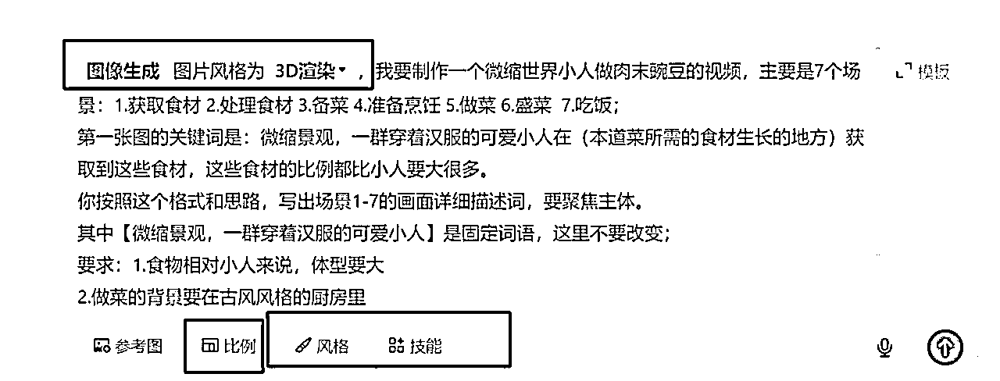
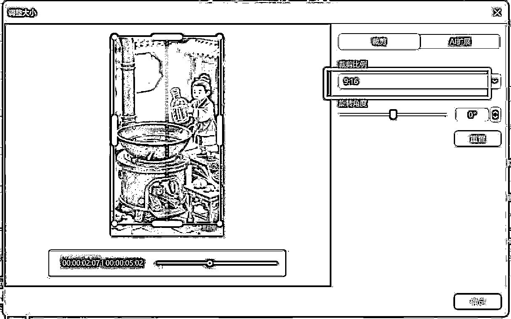

# 25 年 6 月航海｜AI 赋能视频号分成计划｜实战手册

> 来源：[https://ocn93f5d9olj.feishu.cn/docx/VR5vdDissoFVyPxuH0OcdRfwn1f](https://ocn93f5d9olj.feishu.cn/docx/VR5vdDissoFVyPxuH0OcdRfwn1f)

# 写在前面防失联+MM188166M（李李）长期更新

# 💡防失联+MM188166M（李李）长期更新

欢迎大家来到 6 月航海 | AI 赋能视频号分成计划 | 实战手册。

AI 赋能视频号广告分成，是在视频号创作分成计划项目的基础上，通过 AI 赋能内容创作，降低内容创作门槛，增强作品原创度，提升创作效率，从而获得不错的收益。

目前通过 AI 做视频，一天可以做多个视频发布，出爆款概率更高，更容易涨粉开通视频号广告分成，所以用 AI 去做视频号是有红利趋势的，这也是我们重开这个航海的原因。

本期航海会带领大家从 0 到 1 运用 AI 创作热门内容，学习 AI 做视频的方法。会教大家通过热门爆款 AI 赛道，快速开通广告分成计划，从而“赚到第 1 块钱”，适合初步尝试项目的新手来做。

最后，任意一个项目随时都可能出现变化，所以手册中的部分内容可能会过时，请大家持续关注最新动态、开船后多在群里交流，紧跟平台最新趋势和玩法。

本航海项目的航线图如下：

航线图和手册是高度关联的，因此你可以根据自己所在的环节，进行相关步骤的学习。

# 必修篇：跑通最小 MVP

# 一、【项目概述】了解视频号分成计划

# 💡

章节概要

在这一章节，我们将初步了解视频号分成计划是什么，玩法和推荐机制这些

可以按照航线图，开始学习：

1、了解视频号分成计划（约 30 分钟）

那么现在，就请开始完成这个的筹备吧。

# 1.1 什么是视频号分成计划？@郭耀天 @流浪虎

视频号「创作分成计划」是基于视频号生态体系，符合一定条件的视频号优质原创作者，可在原创视频评论区通过展示广告内容，获取广告收入的模式。

项目前期，我们需要寻找适合的赛道创作视频并发布，等账号符合平台要求后，平台会邀请符合要求的原创视频作者开通「视频号分成计划」：

开通「视频号分成计划」后，我们可以持续发表视频并声明原创，该视频的评论区就有机会自动向用户展示最合适的广告，用户点击广告后，我们就能获得收益，不用自己额外找广告、挂广告。

简单点可以理解为视频版的流量主收益。公众号是文字版，视频号是视频版。

加入方式：

「创作分成计划」当前处于内测阶段，平台将对优质原创作者分批邀请，同时满足以下条件会收到邀请：

1.

有效关注人数在 100 人及以上；

2.

符合内容规范；

3.

账号不是政务号；

受邀作者可从「视频号团队」私信进入权益页面申请开通，或在「创作者中心 > 创作者服务 > 创作分成计划」查看并申请加入计划。 若未收到邀请，敬请期待受邀。

特别说明：

4.

有效关注数是指关注你的视频号的正常用户数，不包括可疑的、非正常使用用户（如使用外挂、参与刷量等），当前有效关注数不包含当天新增关注。

5.

暂时仅对中国大陆用户开放，且需微信支付绑定身份证实名。

官方公告说明：https://findeross.weixin.qq.com/cgi-bin/mmfindernodelivecrmwebbroker-bin/helper-center/pages/FRjtvfZTBH03bqAa

内容来源：《视频号创作者分成收益怎么赚？追好热点，打造爆款视频》@流浪虎

# 1.2 项目现状@拾文

# 1.2.1 变现空间

视频号分成计划的收益与哪些因素有关？以下是视频号官方给出的信息：

我们综合以上信息可以得出大致结论，评论区广告的曝光量和点击量是决定收益的关键因素。只有当用户在评论区浏览，并且点击广告，我们才会有相应收益。因为广告是在评论区自动透出的，所以更多的评论能增加广告被看到的机会，从而有更高的收益。

但是以下几种观点是不正确的：

1.播放量越高收益就越高

收益的关键是广告的点击量，播放量再高，没有人点击评论区的广告，视频收益还是不高

2.评论量越高收益就越高

相比通过播放量来衡量收益，评论量确实是个不错的衡量方式。但是也存在一些异常情况，比如下图这种系统引导的评论，如果评论区全是这种，用户没有产生浏览评论区点击广告的行为，收益也不会高。

3.相同的评论量收益都差不多？

哪怕是理想情况下，假设两个视频评论量一致，广告点击量一致，收益也不会一样！因为不同的视频展示的广告不一样，不同的广告点击单价也是不一样的。

根据当前的经验复盘总结，能确定的是，视频评论量足够多同时评论区互评激烈的情况下，收益会相对多一些！

这是圈友拾文之前跟着风向标做《热门视频二剪+ai 生成动漫画+视频号广告分成项目》跑通后大爆的第一条视频，视频播放量 443.5w，单条视频涨粉 1.8w。这个视频的素材大家应该都刷到过，视频的数据跟收益放出来给大家做参考

总的来说，视频号的收益因为受影响的因素比较多，没有具体的衡量标准。但是只要我们找到适合自己的赛道，持续发布原创视频，不断提高创作效率，是很容易拿到正反馈的。

# 1.2.2 优势与风险

项目优势

目前「视频号分成计划」门槛比较低，只要有微信号，开通视频号就可以操作，获得收益不是平台给，而是商家广告，只要视频号流量增加，商户增加，广告收益就会更多，所以市场比较大。

目前这个项目用 AI 去做视频，结合热点的事件，可以快速获得关注和流量，获得对应的变现收益。同时，用 AI 做视频，提高了创作效率，可以一天做多个视频，多个号，同时发布去获得流量收益

项目风险

项目本身没有什么风险，最大的风险来自于执行项目的人

风险一：杞人忧天，还没有开始下场实操，就被各种没有必要的考虑束缚手脚。脑袋放空先干起来再说，实践出真知。

风险二：半途而废，下场实操后，发了几条作品，或者发了好多条作品，没有什么浪花就开始自我怀疑。放空心态，把执行力拉满，坚持 21 天再说。

# 1.2.3 视频号分成计划能做多久？

本次航海是在视频号分成计划的基础上带大家通过 AI 赋能创作原创视频，提高做视频的效率，可以一天发多个视频，是完全符合平台规则的。只要坚持创作发布原创内容，做爆款视频，就会有不错的收益。

只要视频号官方不取消创作者分成计划，就可以一直做。综合当前平台战略、商业逻辑和行业趋势来看，视频号分成计划至少在未来 3-5 年内仍将是创作者重要的变现渠道。

换句话说，即使未来平台取消了创作者分成计划，也会有新的变现渠道出现，这点完全不用担心。用心创作内容，持续发布原创视频才是我们应该考虑的。

# 1.3 项目核心玩法 @郭耀天

# 1.3.1 项目核心步骤

先通过一个简单路径，了解「视频号分成计划」关键步骤：

选择合适/热门视频赛道（重要）> 注册视频号并包装 > 搜集视频素材 > 创作视频内容并发布 > 符合要求后开通创作者分成计划（重要）> 持续发布原创视频 > 产生收益并提现

所以大家能发现，对于「视频号分成计划」来说，找到适合的赛道和开通创作者分成计划，是本项目中最为关键的这两个动作。

如果想做好这两步，大家按照本手册的步骤执行即可，我们分别在以下两章进行了重点讲解：

【项目实操 1/3】确定赛道，制作&发布爆款内容

【项目实操 2/3】开通分成计划，领取收益

开通创作者分成计划后，我们要做的，就是不断发布视频（记得点开原创申明按钮）并复盘优化，通过堆量或堆账号等形式，放大爆款概率，放大项目收益。

平台鼓励原创。这里的原创是平台没有的内容，如果你参考其他平台，在视频号上没有的内容，也算原创，所以还是比较好制作的。就算是二次创作，都建议搞原创，不然后期会出现不给推荐、不给流量，甚至关闭流量分成权限的情况，严重的甚至封号都有可能。

制作内容时候，选择那些容易引起评论的内容。有的领域数据很好，播放很好，但是收益不好，比如祝福领域，这个领域流量很大，都是老年人，但是收益相对较低，就是很多广告无法匹配这个领域用户。

建议大家选择一些能引起大家互动评论的内容，评论的数量比转发点赞都还高，这种才是我们研究深入操作的领域。比如那种找不同、看图来找茬，类似这种，你能找到多少处不同的地方，把图片制作成视频，这样的内容互动就很高，很多人都会参与。

评论多，点击广告的几率就大很多，收益显然就提高了。

站在平台的角度思考，多创作一些大家喜欢的内容，这样才能拿到更多的收益与好的结果。

# 1.3.2 视频号内容推荐机制

# 1.3.2.1 推荐机制

微信视频号不同于订阅号、服务号，而是一个全新的内容记录与创作平台，与公众号不同，视频号是一个非中心化的产品，核心在于推荐。

视频号内容以图片和视频为主，可以选择发布短视频（1 分钟以内）、长视频（1-30 分钟），或者不超过 9 张的图片，还能带上文字和公众号文章链接，而且不需要 PC 端后台，可以直接在手机上发布。

对于视频号创作者来说，想要运营好视频号，如何让自己的视频被更多人看见，最先需要做的就是弄清楚平台自身重要的流量算法推荐机制，会让你轻松精准引流，来助力业绩增长。

社交推荐

在微信生态里，社交是它的先天基因。社交推荐其实就是视频号会根据用户的好友发布、点赞、关注、评论、转发等行为， 为用户优先推荐相关视频。社交、熟人关系链在微信视频号的推荐逻辑中是非常重要的，从微信视频号入口显示的“关注、朋友、推荐”栏目中可以明显看出。

1.

关注栏的内容是你关注的人的视频号所发内容；

2.

社交群推荐的内容是有好友点赞过的视频号所发内容；

3.

兴趣算法推荐的内容，是系统根据你的兴趣爱好所发的内容。

系统会给你推荐一些你的内容，也算是一种猜您喜欢，这一块的推荐算法有些类似抖音的推荐算法：

只要你的作品足够好，同时完播率和互动率比较好，最后就会形成一个社交推荐和系统推荐的强回路。它们二者的关系是密不可分，互相加持的，社交推荐与系统推荐呈正向对比，所以爆款内容就是这样诞生的。然而值得注意的是，要增强这个回路的启动，首先需要的就是引发第一波社交推荐。

同样的道理，要是没有初始的播放量及互动，即使这个作品很好，也会很难被系统监测到。所以这就需要自己要先把视频作品转发到朋友圈、微信群，让微信好友支持点赞、收藏以及评论，给视频积累基础的播放量，为增强回路打下基础。

微信好友相对于其他平台上的用户关系而言，是一种人际互动中的强关系，因此“朋友赞过”实际上是强关系内容推荐机制。

如今视频号首页分为“关注”“朋友赞过”“推荐”三个视频入口，分别对应个性化兴趣、社交分发、系统算法推荐。单独开辟出一个“朋友赞过”栏目，是视频号与抖音、快手最大的差别。

这表明，除一般的个性化算法推荐之外，视频号极其重视“朋友赞过”功能背后的社交分发机制以留存用户。

个性化推荐

据分析了解，目前视频号的个性化推荐算法采用“兴趣标签+定位+热点+随机推荐”的方式。

① 兴趣标签

基于微信社交生态，每个用户都会被打上多元化标签，包括性别、年龄、职业、兴趣、城市等。根据个人的标签属性， 从海量内容库中匹配用户可能喜欢的内容进行推荐。这也是社交平台常用的内容推荐机制之一。

比如，你是一个喜欢旅游的人，关注了很多旅游攻略的公众号， 也经常在朋友圈发布相关的内容，那么视频号就会为你推送旅游领域的内容。

② 地理定位

发布视频时可以选择附近的位置或者热门城市，这种引流方法可以说是很微妙， 能很好的吸引到本地同城流量。为视频添加定位的好处的好处可不止一点，我们的视频除了可以在本地曝光，同时还会被微信系统筛选出并推荐给感兴趣的本地用户，这有很精准的引流效果。

视频号也会根据你的手机定位信息，优先给你推荐同城的内容。基于地理位置服务，可以衍生很多外延的机会出来。

③ 热点话题

实时网络热点事件、话题，往往最能引起广大用户的关注。然后基于用户的协同过滤（分析用户兴趣，在用户群中找到指定用户的相似「兴趣」用户，综合这些相似用户对某一信息的评价，形成系统对该指定用户对此信息的喜好程度预测）推荐系统，将网络上的热点话题相关优质内容推荐到用户。

系统推荐

系统推荐，这也是最重要的推荐，你的视频数据比较好的情况下，那么系统就会将把你的视频推入下一个流量池，如果你的数据持续增长的话，那么就会进入更大的流量池。

可以归纳为以下三点：

① 当视频创作者发布作品后，首先会推荐给已关注该视频号的粉丝用户，若这些粉丝用户不感兴趣，就不会触发视频号的曝光推荐机制，而该作品仅获得一次浏览量，不会进入更高的流量池，但是未来是有可能会被再次推荐；

② 如果有某些用户感兴趣，而且又对视频进行了点赞、转发或评论，就会触发推荐机制，要是有多位用户对该作品进行了共同评论时，该作品将进入到更大的流量池中，将会获得更高的权重，那么被推荐的机率会更高；

③ 对于联系频繁的微信好友，他关注浏览的视频号大号也会被推荐给其好友，以此循环基于社交、熟人的次数关系链就会产生裂变。

目前视频号流量的这种推荐机制是社交权重是相对较大的。在这样的推荐机制下，那些拥有大量好友、多个社群、有公众号等巨大私域流量池的人，将会成为助力视频号营销推广的重点，也很大可能会比普通人更容易成为头部账号。

# 1.3.2.2 审核机制

任何平台都有设定视频审核过滤机制，目前都是有双重审核，即机器审核和人工审核，视频号也是同样。

机器审核：提前设置好人工智能模型来识别你的视频画面和关键词，用来审核你的作品和文案是否存在违规行为。

如果视频规则可能会导致作品被：降低推荐、删除作品、自我可见等。

严重违规则直接删除或者设置自我可见，如果无法直接判定违规则会进入人工审核。

人工审核：对机器筛选出来疑似违规的作品，由人工进行审核。

人工审核主要有围绕三块：视频标题、视频封面、视频关键帧。

如果发确定违规，将会进行：删除视频、降权通告、封禁账号等处罚。

# 二、【项目实操 1/3】确定赛道，制作&发布爆款内容

# 💡

章节概要

在这一章节，我们将初步了解找适合自己的赛道，热门视频的制作流程、内容发布，尝试发第一个视频作品。

可以按照航线图，开始学习：

1、选择适合自己的热门赛道（约 2 小时）

2、注册 1 个视频号并包装账号（约 2 小时）

3、了解热门 AI 赛道，学习用 AI 制作视频（约 2-3 天）

4、发布视频 （约 10 分钟）

那么现在，就请开始完成这几个步骤的筹备吧。

# 2.1 确定赛道

# 2.1.1 如何选一个好赛道

视频号分成计划这个项目赚钱逻辑一定是选择大于努力，赛道决定收益，赛道决定了收益的上限。赛道选不好，再努力也不会拿到好的结果，赛道选的好拿到正反馈也快，收益上限也高。

针对视频号分成计划选择赛道我们总结了三点：

1.收益逻辑

视频号广告分成计划的收益，是要先开通视频号广告分成计划——发布视频，评论区展示广告，别人点击卡片广告，你获得广告收益，注意：如果有人看了你的视频或者看了评论区没点也不会有收益。

广告展示看下面这个图：

我们了解了视频号分成计划的收益逻辑后，就很清晰的明白影响收益的因素有：评论、人群、广告类型。

所以说我们在做视频号分成计划必须要按它的收益逻辑去布局赛道，同样 100W 播放不同的赛道你会发现收益会相差 5 倍都不止。

2.视频赞评比

点赞、评论、收藏、转发在任何一个短视频平台里都是爆款的核心指标，在视频号里也一样，那么在选赛道的时候也要多观察这些核心指标。我在做视频号分成计划的时候主要考核赞评比。

因为点赞是决定内容推流的上限，评论决定了广告的展示量。一个对应的流量上升，一个对应的收益。做这个项目我发现有些赛道数据很好，但是收益却很少，例如老年祝福视频，视频几百万甚至上千万几乎天天有，评论也多，但是收益就是相对较少，这和内容年龄有关。

3.同行数据参考

一个赛道在没有拿到结果的时候不能盲目去做，同行就是最好的参考标准，一个赛道能不能做同行已经给了答案。赛道好不好，只需要搜索一下赛道关键词看一下数据就明白了，流量不好的，评论不高的都不值得做。

视频号分成项目赛道只要满足以上三个条件就是好赛道。

内容来源：《视频号分成计划娱乐解说玩法，一条视频一天 4815 元》@白丁

# 2.1.2 AI+赛道分享

赛道一：热门视频二剪+AI 生成动漫画+广告分成

https://t.zsxq.com/9bVdF

亦仁在星球发了一个风向标，是关于热门视频二剪+AI 生成动漫画。一些圈友基于这个风向标去实操发布内容，都做了不少爆款内容，获得一些收益。

可以先从这个赛道玩法来学习，做第一个 AI 视频。

赛道二： 治愈系老奶奶/老爷爷+AI 插画视频化+广告分成

https://t.zsxq.com/5Qnwf

赛道三：AI 做 CG 动画+广告分成

https://t.zsxq.com/Q7cFp

赛道四：AI+萌娃视频+广告分成

https://t.zsxq.com/XEXJw

赛道五：做特效模版拍视频+广告分成

https://t.zsxq.com/cMxwP

# 2.2 视频账号准备与注册 @郭耀天

视频号是在微信的基础上注册的，一个微信可以注册一个视频号，所以准备好微信号，就是搞定视频号，能搞定多少微信号，就有多少视频号。

注册微信号需要辅助，这个根据官方提示就可以搞定，可以找身边人辅助注册，电话可以营业厅注册，也可以使用注册虚拟账号。

# 2.2.1 第一步：电话注册

移动可以下载和多号，就可以注册小号，不过注册微信有限制。

联通可以使用小号，电信有的地区也可以用小号，还可以注册，还有中国广电。

一个人在上述运营商分别注册五张卡，就是 20 张，基本够用了。

如果还需要更多的，就直接找身边的家人注册就可以解决这个问题，如果是团队公司的，让团队去注册电话。

# 2.2.2 第二步：微信注册

微信注册现在有点麻烦，需要辅助，注册时候借助身边的人帮助辅助注册，还是可以搞定的，例如找七大姑八大姨帮忙。

缺点是注册后账号需要养号，模拟正常人使用就行，比如刷刷视频、发发朋友圈等。不过不加人，单独注册视频号问题不大，马上注册的微信都可以注册视频号。

团队测试的很多账号都是这样搞定的，现在视频号确实是机会，能多注册点微信就多注册，把视频号开通。

# 2.2.3 第三步：登录设备准备

多账号使用，就需要多个账号登录微信，一个手机可以登录五个微信：

苹果手机可以定制多开，如果是安卓的话，还可以使用别人开发微信多开软件，比如目前我使用的双开助手：

有其他替代工具也可以，只要能解决多个微信登录。不过多开有的会出现封号，最好还是使用多个手机比较安全。

如果使用手机登录，华为可以登录两个，小米手机可以登录两个，摩托罗拉可以登录六个，其他也有一些营销手机可以登录多个微信，比如联想拯救者也可以。这里就不过多说，根据自己的需求。

# 2.2.4 第四步：视频号注册

视频号注册之前，微信号必须实名认证，这个这里就不多说了。

打开微信，“发现”→“视频号”→右上角小人，进入个人主页：

点击“发表视频”，选好头像，填写好名字、姓名、地址后，点击"创建"：

到这一步，视频号创建成功。

创建完成后，点击右上角三个点→"资料设置"，即可修改个人信息以及完善视频号简介：

这里需要注意的是，视频号的名字和公众号一样先到先得，不可以重名。

每个帐号每年有 5 次机会可以改名，如果你需要的名字被人使用了，可以申述，或者在名字后面加点、加符号，就可以申请。

如果实在需要用自己的名字，且你有这个名字的使用权，可以尝试申请，比如有商标、有注册比较早的公众号，或者是有著作权都可以申请。

正常情况下，大家根据对标赛道的对标账号，简单设置视频号信息就好，不用耗费过多时间。

# 2.3 创作爆款内容

# 2.3.1 了解内容形式 @郭耀天

视频号目前可以发视频，也可以发图文。

视频

视频有分为很多种，有真人出镜、混剪、二创、AI 生成等，对于大多数人，主要是操作混剪、二创、AI 制作等不需要真人出镜的形式。

图文

图文也是视频号一种内容的展示形式，目前视频号最多可以发布九张图片。有些视频只是几张图+热门 BGM，也能成为爆款。

# 2.3.2 了解热门内容的关键 @拾文

1.选择一个赛道，坚持下去，不要什么内容都发，账号标签乱了不是好事情。

看两个账号对比，账号包装【头像+账号名+简介】都是做治愈系老奶奶插画的，不用过多解释，大家也能看出问题了：

2.执行力拉满，坚持下去，能日更就坚持日更，能多账号就不单账号，任何平台的算法都是有不确定性的，应对不确定性最好的方法就是以“量”博概率。

大家可以看下，下面三个案例账号的发布数量 167，66,176 这些统计还不包含没有勾选原创和被删除的视频数量。

所以没有谁能随随便便成功，虽然常说选择大于努力，但是前提是你也要努力！

3.在保证“量”的前提下，提升内容质量，坚持下去，先跑起来再优化，学会复盘总结，创作更好的内容。

在实操的时候通常有两种情况：

一、强迫症完美主义，总想着把教程吃透，把该注意的点都照顾到，把该用的技能都用上再下手。这是大可不必的，顾虑的太多反而影响速度，先跑起来再说，没有谁能一开始就做的很完美，哪怕是你选题很好，图做的很好，剪辑也很好，各个方面该做的都做的很好，也不会说发一条视频就爆了，这个概率太小。不要还没开始就被束缚，开始做的感觉不完美，那说明进步空间很大，潜力值很高，你应该这样告诉自己。

二、发了几条十几条作品，或者发了几天时间，数据反馈不好，开始自我怀疑，是不是账号问题？是不是 ip 问题？是不是选题问题？是不是做图问题？是不是...这种情况下往往懂得越多，越不容易跑出结果。往往那些从 0 开始的新手，更容易拿到正反馈。强大的执行力大于任何武林绝技！把执行力拉满，有了数据量，才能有更大的概率上热门。

4.同行是最好的老师，紧盯同赛道的优秀同行，去研究他们，去拆解他们，去学习他们，去模仿他们，最后去超越他们。

这是做好一个项目最快，最有效的路径！摸着石头过河永远比不过摸着同行过河！选择一个项目不需要听别人说这个项目有多好，自己去看看同行做的怎么样就知道了。在实操中，不知道怎么做的时候去看同行怎么做的，比看任何教程都管用。如果有武林秘籍的话，这绝对是天字卷。

5.培养网感，增加对热点信息的敏感度，热点信息内容往往自带流量

赤岭亮哥的事迹大家还记得吧，当时在做热门二剪+ai 生成漫画，刷到亮哥视频就剪了一条发了视频号，发完就爆了，不到 1 个小时播放破百万。热点信息的重要性，真实数据说话，大家自行体会。

# 2.3.3 视频内容创作@拾文

# 2.3.3.1 热门视频二剪+AI 生成动漫画+广告分成

# 2.3.3.1.1 找素材部分

手机端长按素材搜图可以快速找到高清原素材

5月6日视频教程1.mov【在线播放】

【视频素材用去水印小程序，或者亨亨猫下载，工具自行选择使用，这里不过多说明】

亨亨猫去水印：https://www.henghengmao.com/

无水印下载：https://dlpanda.com/zh-CN/xiaohongshu

大家可以自行选择

# 2.3.3.1.2 AI 出图部分

出图提示词：彩绘手绘，铅笔笔触明显，完整显示，背景自然

AI 出图建议制作 2-3 张高潮部分画面，增加视频原创占比

# 2.3.3.1.3 实战剪辑部分

需要注意的关键点：这个赛道核心是二剪，所以有出非原创的风险，要做好视频素材去重。关于素材的去重，最好的去重方式就是不去重。

在实操的时候一定要尽可能找高清的原视频素材和新的素材去剪辑，在视频中间可以多插入几张漫画图增加原创占比，尽可能的去打断原视频素材的连续，不要让原视频素材有 3s 以上的连续。

同时要增加视频画面的原创内容，比如：加文案，解说等。二创的正确理解是结合自己对素材的理解去做二次创作，而不是简单的搬运！搬运是不符合平台要求的，有大概率的违规风险。

# 2.3.3.2 治愈系老奶奶/老爷爷+AI 插画视频化+广告分成【推荐】

# 2.3.3.2.1 如何寻找文案

下载个小红书，搜索框搜索【治愈文案】，或者抖音搜索【人间清醒奶奶】等相关关键词，同行对标账号也可以。

# 2.3.3.2.2 如何发布

抖音，快手，小红书都是图文形式发布，小红书不用添加音乐，抖音快手添加收藏好的音乐即可，视频号必须用剪映把图片做成视频上传！！！

视频制作模板参考：

1.图片默认时长 3s

2.加一个翻页特效

3.配上一个治愈的背景音乐，背景音乐不知道加哪种，就抄同行，抄作业是最快的学习方式

【在剪映电脑版设置-全局设置-剪辑-图片默认时长，可以自由调节图片默认时长。】

# 2.3.3.2.3 AI 插画生成提示词分享

# 💡

1.一位中国头发白花花的老爷爷，秃顶，手绘风笔触，胖嘟嘟，笑眯眯，微笑，慈祥，治愈插画，戴个近视眼镜，穿着黄色格格衬衣，穿着蓝色牛仔背带，大笑，穿着黄色背心，卡通，生动童趣，可爱，慈祥，图中文字要显著，chibi 风格，极简主义，高清画面，画面文字要清晰，字体加粗加大，人物略带童趣，头上方挂着大横幅黑色字体配文“下班回家，能有个人一起吃饭”，童趣，可爱，和老婆一起吃饭

2，一位中国头发白花花的老爷爷，秃顶，手绘风笔触，胖嘟嘟，笑眯眯，微笑，慈祥，治愈插画，戴个近视眼镜，穿着黄色格格衬衣，穿着蓝色牛仔背带，大笑，穿着黄色背心，卡通，生动童趣，可爱，慈祥，图中文字要显著，chibi 风格，极简主义，高清画面，画面文字要清晰，字体加粗加大，人物略带童趣，头上方挂着大横幅黑色字体配文“这是我听到的非常喜欢的一个答案了”，喝茶在客厅，童趣。可爱

3.一位中国头发白花花的老爷爷，秃顶，手绘风笔触，胖嘟嘟，笑眯眯，微笑，慈祥，治愈插画，戴个近视眼镜，穿着黄色格格衬衣，穿着蓝色牛仔背带，大笑，穿着黄色背心，卡通，生动童趣，可爱，慈祥，图中文字要显著，chibi 风格，极简主义，高清画面，画面文字要清晰，字体加粗加大，人物略带童趣，双手拿着横幅黑色字体配“迷失自我去爱别人，挺没意思”，童趣，背景风景

4.一位中国头发白花花的老爷爷，秃顶，手绘风笔触，胖嘟嘟，笑眯眯，微笑，慈祥，治愈插画，戴个近视眼镜，穿着黄色格格衬衣，穿着蓝色牛仔背带，大笑，穿着黄色背心，卡通，生动童趣，可爱，慈祥，图中文字要显著，chibi 风格，极简主义，高清画面，画面文字要清晰，字体加粗加大，人物略带童趣，双手拿着横幅黑色字体配“迷失自我去爱别人，挺没意思”，童趣，背景风景

5.一位中国头发白花花的老爷爷，秃顶，胖嘟嘟，手绘风笔触，笑眯眯，治愈插画，戴个眼镜，卡通，生动童趣，可爱，慈祥，吃饭，背景简单，头上的部黑色字体配文“慢慢你会发现，娘家不是那么好回得”线条插画，chibi 风格，极简主义，高清画面

6.一位中国头发白花花的老奶奶，短发，手绘风笔触，笑眯眯，胖嘟嘟，治愈插画，穿着粉色毛衣，卡通，生动童趣，可爱，悠闲，戴眼镜，举着牌子，坐在书桌旁，配文加粗黑色字体“ 丫头啊，他为了睡你，假装很爱你“线条插画，chibi 风格，极简主义，高清画面

# 2.3.3.2.4 提示词公式总结

（1）公式总结

人物形象描述+穿着描述+背景描述词+动作描述词+文案描述词+绘画风格描述词

（2）实战展示

示例：

人物形象{一位中国头发白花花的老爷爷，秃顶，胖嘟嘟，笑眯眯，微笑，慈祥，带个近视眼镜，卡通，生动童趣}

穿着{穿着黄色格格衬衣，穿着蓝色牛仔背带，大笑，穿着黄色背心}

背景{背景是室内场景，有木质结构，窗户，窗外透进蓝天，整体氛围温馨自在}

动作{双手举着一张白纸，上面写着}

文案{“有人说你好也摆，有人说你坏也摆”}

绘画风格{治愈插画，手绘风笔触，图中文字要显著，chibi 风格，极简主义，高清画面，画面文字要清晰，字体加粗加大}

公式组合：一位中国头发白花花的老爷爷，秃顶，胖嘟嘟，笑眯眯，微笑，慈祥，带个近视眼镜，卡通，生动童趣，穿着黄色格格衬衣，穿着蓝色牛仔背带，大笑，穿着黄色背心，背景是室内场景，有木质结构，窗户，窗外透进蓝天，整体氛围温馨自在，双手举着一张白纸，上面写着，“有人说你好也摆，有人说你坏也摆”，治愈插画，手绘风笔触，图中文字要显著，chibi 风格，极简主义，高清画面，画面文字要清晰，字体加粗加大

（3）反推提示词

遇到好的同行对标，可以截图发给豆包，让豆包描述下画面，根据豆包的描述结合提示词公式去组合提示词

豆包提示词：描述下画面

# 2.3.3.2.6 实操工具

即梦传送门：https://m.jimeng.jianying.com/s/5krk4fASm3c/?t=-3

剪映传送门：https://www.capcut.cn/

# 2.3.3.2.7 要点总结

封面图特别关键

这种类型的关键点就在封面图上，封面图非常关键，因为封面图属于图文类的推荐机制的一种。抖音是我给你推流封面图，特别关键，封面图有个点击率，观众的点击率，如果他点击率越多，有可能给你推的越火。

背景音乐

这种图文忧伤的配忧伤的，治愈的配治愈的，背景音乐要与文案风格搭配，背景音乐一定要选好！不会选的，就抄同行对标，同行是最好的老师。

文案

图片重要但是不是最重要的。图片做的好最好，做的没那么好也没关系，但是也不能做的太丑，新手不要有心理压力，文案的作用是大于图片的。人家看的是你的文案不是你的图，所以说文案一定要清晰，在你的图上文案跟图片，你的文案一定让人一目了然，文案不要过长，每个图片都让人一看就有想看的欲望，这样完播率才会好。如果说人家一看你的图。唉呀，这玩意写的啥呀，不好看，太乱了，咵的一下就划走了。这样你的完播率就低，数据就很难跑上去。

# 2.3.3.2.8 当前遇到的问题和解决方案

前段时间即梦 2.1 模型下架，后来又重新上架，但是出图效果没有之前好了。3.0 模型出图，文字更加清晰，图片细节更加丰富，但是模型偏写实，就漫画来说没有 2.1 有质感，可以看下下方的对比图。

【之前的 2.1 和 3.0 出图对比】

【当前 2.1 模型出图】

当前遇到的问题主要是即梦平台更新造成的，后期随着平台优化，出图效果肯定会越来越好。当前大家可以根据自己的实操感觉，自由选择 2.1 模型或者 3.0 模型。也可以选择 2.0 模型出图，手动添加文案。

# 2.3.3.3 AI+萌娃视频+广告分成

https://wx.zsxq.com/group/1824528822/topic/8858144842118542

提示词参考：

1.可爱的婴儿，坐在金色莲花上。头戴金色元宝形冠，大大的金耳环，多层金项链，黑色和红色珠子的项链，金手镯、脚镯，红色腰带装饰。面部特征：大大的眼睛，圆润的脸蛋，额间红色吉祥印记。周围元素：莲花下有几个小金元宝。背景：金色的、带有花纹的光晕，营造神圣富贵氛围。整体风格：色彩鲜艳，细节丰富，高清晰度，写实风格【即梦 3.0 效果】

2.一群穿着红色传统服饰的婴儿，服饰上有金色福字图案，头戴同样带有福字的红色帽子，手里提着装有草莓的竹篮，在金黄色的田野小路上行走，田野两侧长满草，画面中还伴有几只白兔，整体呈现出暖色调，洋溢着喜庆欢快的氛围，细节丰富，高清晰度，写实风格，比例 「9:16」【豆包效果】

3.一对可爱的双胞胎 3 岁小女孩。她们发型一致，都扎着双马尾，马尾上用粉色发饰点缀 。穿着同款白色短袖 T 恤，T 恤上有粉色花朵和绿色叶子的印花图案，搭配浅灰色长裤和粉色带搭扣的小皮鞋。两人手中各自捧着一个桃子，面带笑容看向镜头。她们站在一条小径上，小径两侧是色彩缤纷的花丛，有红色、粉色、黄色等花朵，背景是绿意盎然的草地，整体画面洋溢着童真与自然清新的气息。细节丰富，高清晰度，写实风格【豆包效果】

4.画面中央是一个婴儿，模样可爱。他头戴一顶金光闪耀的冠冕，冠冕造型极为精致，以金色为主色调，装饰有红色、蓝色的宝石，顶端还垂挂着金色链条状饰品，尽显华丽。身上穿着一袭金色传统服饰，面料似有丝绸光泽，上面精心绣制着蓝色花纹图案，与冠冕相呼应。孩童双手环抱着一条体态较大的金鱼，金鱼鳞片金光闪烁，橙红色的鱼尾与鱼鳍舒展飘逸，眼睛乌黑明亮，显得灵动鲜活。背景是一片宁静的山水景色，远处山峦层叠，覆盖着郁郁葱葱的植被，呈现出深浅不一的绿色。近处水面如镜，倒映着周围景色，给人一种静谧悠远之感。画面整体色调暖黄，光线柔和，营造出古典、富贵且祥和的氛围，仿佛传递着吉祥如意、富足安康的美好寓意。细节丰富，高清晰度，写实风格，比例 「9:16」【豆包效果】

5.节日里，传统抓周主题女小孩照，圆嘟嘟的脸蛋，双眼皮，1 岁，扎着小辫，身穿喜庆古装服饰，规规矩矩站着，双颊自然红晕，喜庆暖黄灯光光晕渲染氛围，眼睛很自然的看着正前方的镜头【即梦 2.0pro】

成品展示【没有开通会员的即梦账号下载有水印，发布前需要在剪映里裁剪去掉水印部分】

BEFE55F3-DCF0-4C2F-A350-BE0D2F7C10B4.mp4【在线播放】

【要点总结：1。可以搜索“萌娃”“人类幼崽”“萌宝”等关键词找到更多的好的对标。2.教程为了加快录制速度生成的时候选择了快速模式，实操的时候建议选择大师模式，效果更好。】

# 2.4 如何发布内容 @郭耀天 @黄岛主

很多伙伴认为视频号只能手机发布，其实发布方式有多种，可以手机，可以电脑。

# 2.4.1 手机端发布

手机端有三个发布方式。

第一种：发现页发布

第二种：我的页面发布

点击微信我，找到视频号，点击进去，就可以看到发布页面

第三种：剪同款发布

一些带特效的视频，可以直接通过剪辑同款发布。有时我们发现很多特效自己不会剪，这个时候就可以使用剪辑同款功能。

需要注意的是，这个功能不是每个视频都有，看到下图这样的视频，就可以尝试改功能，发布出来的就是看到视频的同款特效。

# 2.4.2 电脑端发布

电脑端也可以发布视频，而且可以设置定时发布。

如果视频是电脑制作的，借助电脑发布就比较方便，视频不用传到手机端，直接电脑端发布即可，需要登录视频号助手：https://channels.weixin.qq.com/login.html

登录上去，首页，内容管理中的视频都可以发布：

# 2.4.3 发布技巧

# 2.4.3.1 通用技巧

重中之重：后期一定要记得开原创！！！！

划重点：开通「创作者分成计划」后发视频一定要记得打上原创标签，否则没有收益。有圈友视频爆了 600 多万的播放，结果忘了开原创，损失预计 2000 元。

前期也可以打上原创标签，但有的账号可能开始没有原创声明的按钮，所以前期不强求。

发布频率与时间

起号的时候，建议大家一个账号一天发 5 条，测试效果。不要连续发布，一两个小时发布一个视频就行。

如果发了五条没有爆款的情况下，可以补发一、两条。

如果你有足够的时间和精力，建议多账号运营以分散风险。需要注意的是，一个手机号只能注册一个视频号账号，一个身份证可以认证 2 个视频号。如果想运营多个账号，需要准备多个手机号和微信号。

建议白天发流量最好，不建议发布太早或者太晚，早上 7 点到晚上 21 点之间发就可以。太早的话一些人群还没起床，太晚睡觉去了，不会给你点赞，流量会很差。

标签、标题、封面与位置

参考同行的写法就行，标题简单明了，标签符合视频主题，再选择视频封面，即可发送。如果愿意多做一步，可以标记位置，提高让更多人看到的概率。

标签添加方法：在「添加描述」中选择「#」，即可添加话题标签。

比如对于早安祝福，选择领域时候选择情感，或者是生活。

用好自己的社交圈拉数据

发布视频后，建议主动分享视频号内容到朋友圈或者微信朋友，吸引更多朋友观看和点赞。

有爆款先不发新视频

如果前面有一条视频爆的话，视频还在继续爆流量，不建议再发新的视频，不然爆的那条视频很容易就停止推荐。等前面爆流量的视频流量自然停止推荐或慢下来的时候，再发布新的视频。

发布视频后到评论区留言 2 条

开通「创作者分成计划」后发完视频，可以自己评论几条或者用小号去评论，这样广告就早点出现，不然需要等评论有几条后才会出现广告。目前需要两条以上评论才会出现广告。

内容来源：《视频号儿女祝福流量变现副业，起号后单天收益 1000+，实操一条龙玩法分享给你》@黄岛主

# 2.4.3.2 合理利用推荐机制

视频号作品发布后一共有 6 次推荐，分别为：3+6+18+24+24+24。

什么意思呢？视频作品发布后，基本上每一个作品在发布后的第 3 个小时、第 6 个小时、第 18 个小时、第 24 个小时内得到系统自身的推荐。

其中发布作品后的 3 个小时叫做“黄金三小时”，这期间必须要狠抓执行力，利用好你的社交群，例如朋友圈，互助群，红包群，尽最大的力量去抓这波完播、点赞、评论。

发布作品的 48 小时、72 小时之内，系统会第二次灰度推荐。

如果 72 小时过后，你的作品还能继续收到的播放量、评论、点赞、收藏、那么，恭喜你，你的作品肯定上热门了，接下来还会被平台反复推荐。

目前视频号流量的这种推荐机制下，社交权重是相对较大的。在这样的推荐机制下，那些拥有大量好友、多个社群、有公众号等巨大私域流量池的人，将会成为助力视频号营销推广的重点，也很大可能会比普通人更容易成为头部账号。

# 2.4.3.3 想不向好友展示视频号，怎么做？

有的伙伴不想让通讯录伙伴看到自己的视频号内容，没关系，我们可以不让他们看到。有的人是想用家人的号，有的家人介意这点，没关系，可以屏蔽他们的通讯录的人。

操作步骤如下：

点开视频号右上角有三个点→找到「在个人名片上展示视频号」，把它关掉，微信好友就看不到你视频号了。

# 三、【项目实操 2/3】开通分成计划，领取收益

# 💡

# 章节概要

开通创作者分成计划是本项目的核心动作，只有开通计划，我们后续发视频才有机会展示广告，才有可能产生收益。

在前面第一阶段中，我们已经完成了视频创作与发布。不断重复该动作，我们能逐渐达成开通分成计划的要求：

① 有效关注人数（粉丝数）在 100 及以上

② 符合内容规范：平台鼓励发布优质原创、画风精美、真实正向的作品

③ 优质原创作者

✅达成要求后如何开通计划？有没有更快开通计划的办法？详见「3.1 如何开通分成计划」

✅视频产生收益后如何领取？提现失败怎么办？详见「3.2 如何领取收益」

✅分成计划被取消，我该如何恢复？详见「3.3 分成计划被取消，如何恢复」

可以按照航线图，开始学习：

1、了解创作者分成计划和开通方式（约 0.5 小时）

2、制作 AI 热门视频，达成条件开通创作者分成计划（约 3-5 天）

3、每日发布 2-3 个视频（每日约 2-3 小时）

那么现在，就请开始完成这几个步骤的筹备吧。

# 3.1 如何开通分成计划

# 3.1.1 分成计划开通条件

视频号起号很关键，如果起号不到位，无法快速开通视频号分成计划，耽误时间，所以掌握快速起号的方法很关键，目前想要开通视频号分成计划，需要满足下面三个条件：

1.

有效关注人数在 100 人及以上；

2.

符合内容规范；

3.

账号不是政务号；

受邀作者可从「视频号团队」私信进入权益页面申请开通，或在「创作者中心 > 创作者服务 > 创作分成计划」查看并申请加入计划。 若未收到邀请，敬请期待受邀。

# 3.1.2 分成计划开通流程

# 第一步：找到入口，申请加入

方式一：如果你的账号符合平台要求，就能在以下位置看到申请入口。

登录视频号，前往「创作者中心-创作者服务-创作分成计划」查看，点击「申请加入」：

*补充说明：暂未收到邀请的创作者可持续期待，获得邀请后，计划入口即可查看。

方式二：找到开通提醒，特别是内容火了后，平台会给你推送很多信息，这个时候就需要注意查看平台发的私信。

开通提醒在私信里面，如果私信里面看到这样的提示，说明就是获得推荐权限的，点击进入，申请开通权限即可。

这里说下，视频号不存在养号一说，马上注册马上发，我们做的账号马上注册马上发，第一个视频就爆了，第二天分成计划就开通了。如果按照上述方式二申请开通，一天就可以开通分成计划，多发几个视频就过了，前提是内容一定要垂直。

开通分成计划只是这个项目的第一步，核心目的是开通后，多制作爆款的视频赚取收益。

# 第二步：发表原创视频，自动展示广告

加入创作分成计划后，创作者只需在发表视频时开启「原创声明」，无需其他额外操作，视频评论区下方即有机会展示广告。

成功加入分成计划的视频，可以在「创作者中心-创作者服务-创作分成计划-参与收益中的视频」中查看：

# 3.1.3 快速开通视频号创作分成计划

前文所述是正常情况下开通「创作者分成计划」的流程，有没有其他更快速的开通技巧呢？

有的，本章节我们来介绍一些技巧，大家可以做尝试。

# 3.1.3.1 优质内容渠道邀请

这种是属于内邀，只要内容做的是原创优质，不管粉丝多少就会被邀请开通，其实只要你真正做内容，100 粉丝基本不是啥问题。

优质标准是画面清晰 720p 以上，时长 15 秒以上，内容垂直，有导向，视频不抖，不晃动。

# 3.1.3.2 先做优质作者

这种起号模式是目前大多数人使用的方式，虽然起号略慢，但起号比较稳。

先传五到十个随拍视频，传的时候随时查看注意后台提醒，点击创作者中心，找到创作者服务，点击进入，找到收入变现，就能看到创作优质创作者的内容规范是不是满足。

如果显示「满足内容规范」，马上就可以开始剪辑想要操作领域的爆款，发布后完成涨粉就可以快速开通。

发布的视频可以一两个小时发一条。我们测试时一天发 5 条，两天发完 10 条，直接达标。

当然，如果你想更快开通，可以直接找活粉，直接弄 100 粉丝，比如喊人关注，只要粉丝达到 100，马上点击就可以快速开通权限。

但这样有违规风险，如果担心违规，还是老老实实通过内容涨粉。

注意事项：做上述任务的时候千万不要相互关注，一定要记得，一定一定，不然会出现满足了粉丝数，还提示粉丝不足（原因是怕平台检查到刷粉，且互相关注的粉丝重合度太高）。

# 3.1.3.3 先涨粉起号

这种起号模式是最快的，目前测试下来，新号前三个内容有流量扶持，新号直接发成品内容，粉丝满 100 后，看看原创这些规范是不是达标就行，如果符合规范就可以去申请开通了。

如果没有达标，就去随手拍一些原创视频发布，目的是满足内容规范。

目前我们测试，新视频爆了且达到 100 粉丝后，发一个以上的随手拍的原创视频就过了。

这种起号模式有个不好的就是，开始账号定位就得考虑好，不然后期不好改。

涨粉除了直接制作爆文，还可以通过直播，或者是问一问的形式，切换视频号回答问题涨粉，涨粉一百还是比较容易的，一个视频起来了，涨粉都是几千上万，所以速度搞就对了。

如果按照上述模式都显示没有达标，我们就继续拍相关视频，最好是随拍原创视频，再制作成你想要操作领域。这里需要注意是随拍视频最好不抖不晃动，画面清晰 720p 以上，时长 15 秒以上，内容垂直，有导向。

# 3.1.3.4 同时启动操作

如果你的内容很优质，就直接发布成品内容，涨粉的同时原创优质就会满足，随后就能申请开通创作者分成计划。

# 3.1.3.5 申述开通

如果发了十多个原创视频还是没有达标，这个时候就可以申述，大部分都可以申述成功。

只要你的内容一直是原创，就可以直接申请，直接申诉。

申诉入口（需要在微信手机端打开，但该链接可能请求异常，无法打开，可以到项目禁言群群公告找到链接并打开）：

https://channels.weixin.qq.com/pandora/pages/appeal/index#account-detAIl

# 3.2 如何领取收益@拾文

# 3.2.1 分成收益如何计算

「视频号分成计划」的收益如何计算，腾讯没有给出明晰的规则：

广告分成收入与作者本身的视频质量、视频播放、投稿数量、广告行业选择等多方因素有关。当作者持续创作更多优质原创内容时，获得的广告分成就会更多。

# 3.2.2 如何查看收益

可在「创作者中心-创作者服务-创作分成计划-创作分成收益」查看，创作分成收益页面的收益口径解读如下：

# 3.2.3 如何提取收益

提现路径

成功发表原创视频次日起，创作者可前往「创作者中心-创作者服务-创作分成计划-分成收益」查看每日预计收益。点击「去提现」按钮，可提取收益至个人微信零钱包。

提现与到账时间

每月的收益将分为两次结算（如遇法定节假日，将会推迟）：

上半月的收入将于当月 22 日可提现

下半月的收入将于次月 7 日可提现

提现后基本即刻到账。

关于扣税可以看官方文件：https://ad.weixin.qq.com/docs/10

如果想合理降税，可以学习👉「6.2.1 MCN 统一收款」，一般的公司扣点是百分之三，有的是百分之六。

# 3.2.4 收益提现失败，怎么办？

若遇到提现失败问题，请参考以下《商家转账失败解脱指引》进行操作：

# 3.3 分成计划被取消，如何恢复 @郭耀天

分成计划鼓励优质、原创内容，如不符合要求，可能被要求整改或被取消权益。

如果你收到的是内容整改通知：你需要发布至少 10 条平台认可的优质、原创的内容，平台将为你恢复权益；若你已完成发布 10 条内容，请耐心等待平台审核，结果将以「视频号团队消息」的方式推送给你。

如果你收到的是权益取消通知：

若因发表非原创、非优质内容或内容方向发生变动使权益被取消，你可持续发布原创、优质视频内容，符合要求后权益会重新激活，到时可通过邀请私信申请加入。

若因视频号认证身份信息发生变动使权益被取消，你可进行认证信息修改，符合要求后权益会重新激活，到时可申请加入。

如果你觉得平台对你的违规判定有问题，可进行申诉：

如果因内容整改审核失败或发表非原创、非优质内容而使权益被取消，可在通知页面底部点击「申诉」入口，提供相关证明材料：

# 四、【项目实操 3/3】持续复盘优化，提高内容质量&产量

# 💡

# 章节概要

在这一章节，我们将学习内容发布以后，根据数据进行复盘迭代。

可以按照航线图，开始学习：

1、了解多个提升收益的方式（约 1 小时）

2、持续复盘，提升内容效率，获得更多收益（每日约 1 小时）

3、了解常见问题及处理方式（约 1 小时）

那么现在，就请开始完成这个的筹备吧。

# 4.1 如何提升项目收益

# 4.1.1 收益关键 @白丁

视频号分成计划这个项目是一个特别吃赛道的项目，分成计划的收益都在评论里，评论的点击量基本就决定了这条视频的收益。

所以视频号分成计划的赚钱核心逻辑是：内容+评论。

评论点击量这个很难干预，人为干预数据一不小心就会吃违规甚至限流。

下面我们再来看如何提高分成计划的收益。先看两张图：

这都是已经开了分成计划的，但为什么第一张图没有广告，第二张图有广告？

前面说过，视频号分成计划收益来源于第三到五条任意一位置的卡片广告，其实这只是针对评论条数多的。如果评论数量少，只要有两条评论这个广告就出现了，所以一条评论还不够引出广告。

这里就引出一个小技巧，如果我们发布完视频首先用自己的主号或者小号去评论一下，就能减少流量收益的损失。

就这一个评论小技巧就能提高至少 20%收益。

现在网民已经形成了评论文化，有一个评论总想点进去看一看，如果你的评论做的好就能引导更多的人跟评，评论越多对内容的加热越有利。

其它数据就不要干预了，再来说内容。

内容=视频素材+文案。

一个视频爆不爆和视频素材有绝大的关系，这就需要我们有网感，知道什么样的话题有爆点。这是一种技能，我一直认为一个项目能不能赚到钱和技能有关，技能够了正好运气来了匹配到了这个项目，技能匹配了项目钱也就赚到了。

网感不是天生就来的，通过训练可以提高，最好的方法就是拆解同行，把同行的爆款素材下载下来做档，列出来爆款原因。大量的素材分析下来你会发现很多爆款的因素是一样的，这就是规律，就能知道爆点在哪里，做内容的时候向这个爆点使劲，坚持一段时间就会发现做爆款简直太简单了。

另一个就是文案。视频号对文案的要求非常高，大家可以用开头固定钩子+补充完整内容的方式写稿，这样重复度很低，平台接受度也高。

视频号里你只要有爆款网感，再加上文案想不爆都难。

找到方向和方法后，赚钱最关键的一点就是执行，雷打不动的更新。账号的 80%收益都是来源于 20%的视频，只要方向对了，坚持更新总会爆，视频号爆一次就是上千的收益。

内容来源：《视频号分成计划娱乐解说玩法，一条视频一天 4815 元》@白丁

# 4.1.2 为什么我的收益比别人低 @郭耀天

很多伙伴操作时候，说自己的收益与别人的不一样，想要搞清楚这个问题，先清楚钱是怎么来的，这个收益的钱不是腾讯给的，而是商家在视频号的评论区投放广告，把钱投到平台，平台根据你的账号流量、点击给你结算收益。

因为钱不是平台给的，收益高低就很好理解：选择的领域不一样，收益点击不一样。

比如某个领域的金主比较多，钱比较到位，收益就比较好。而且广告都是智能匹配的，如果给你匹配的广告单价很低，你拿到的收益就低。

再比如刚好你视频火的时间段，商家的预算不足，投放不足，这个时候没有足够多的广告，你的收益也会低。

关于收益高低，我们是无法干预的，唯一能做的就是多做视频，火了收益就越高。或者选择一些高质量的领域，比如财经、美容、酒类，这些都是有钱的主，如果你是泛娱乐领域，收益相应就低了。

# 4.1.3 我该如何提高收益 @郭耀天 @思蒙

方法一：选择年轻人多的赛道

拿到分成的伙伴，有的说收益太低了，因为目前视频号分成计划还没有完全爆发。

如果你细心你会发现，现在广告大部分是游戏，或者是腾讯自己的广告、网剧。

比如现在很多人都选择做祝福、早安类的视频，这些视频转发量很大，但是用户都是老人，投广告很少投这些领域，根本不是他们的用户，所以收入就自然低了。

如果想提高收益，我们可以选择一些年轻人比较多的，比如科技、娱乐、情感，这些年轻人多，广告费都会高很多。

方法二：提高视频互动性

目前视频号分成计划的收益来源于评论内广告，所以第一就是要做好内容，让内容爆火，引起传播转发，这样才会获得更多的评论。

第二个是可以引导用户去评论，或者可以自己评论几条、小号评论几条，这样广告就早点出现，不然需要等评论有几条后才会出现广告。目前需要两条以上评论才会出现广告。

还有就是我们制作的内容，一定要是互动性比较大的内容，这样的内容容易引起大家的注意与互动。

比如找图中的人物、找图中的动物、问答题，这种都是很不错的，有时候还需要在视频里做点引导，让大家一起参与进来，这样收益才会高。

比如有个伙伴操作的内容，就是一张图里面找头像，用户看完会在评论区打出来答案；

还有的视频是一些写语录，再问观众「说这句话正确吗，请在评论区告诉我」。

上述技巧需要我们多去研究，多去操作，就会发现。

方法三：提升内容创作效率，跑量放大概率

对于门槛比较低的项目来说，比如「视频号创作者分成」，本质上都是用数量博概率的游戏。

所以我们能多发作品就多发作品，能多起账号就多起账号。

在航海的过程中，大家会发现，有小伙伴的作品也许和你差不多，根本说不上多么优秀，但他的账号就是爆了。这就是概率的问题。

在掌握了选赛道和视频制作技巧后，剩下的就是靠【量】了。

发一条视频，能爆的概率是 1%，那发 10 条，或者有 10 个账号呢？每一个都是 1%，加起来是不是能爆的概率就大多了？

为了能更好地搏量，大家需要在实操过程中不断提高创作效率，不管是更快找到素材、更快准备文案，还是更快完成视频剪辑，都需要熟能生巧，大家多多练习就能取得进步。

内容来源：6 月 8 日《短剧 CPS 的进阶技巧及常见问题答疑》@思蒙

# 4.2 如何处理常见问题 @郭耀天

以下是项目过程中，大家比较容易遇到的共性问题，我们整理了一些经验给大家。

# 问题一：如何防止掉广告？

操作视频号分成计划时候，你会发现，哪怕是爆款的纯原创视频都会掉广告，通俗点说就是评论区没有广告匹配，特别是一些几百万、上千万的视频，也会出现这个问题。

分享一些伙伴测试出来的方法，不一定行，不过有几分道理，很多人制作的视频都是通过剪映制作，其实视频号官方也有剪辑工具，叫秒剪（官网：https://miaojian.weixin.qq.com/），使用秒剪剪辑视频流量有概率会高一点。

第一个方法：

从剪映剪导出之后直接过一下秒剪，然后导出即可。

第二种方法：

导入剪好的视频之后，在秒剪里头过一个滤镜，滤镜随意过就行，之后将画质的颜色调到 10 以下，我基本用的参数是 5。

第三种方法：

导入视频之后，过一下那个秒剪里头的模板，模板用治愈调节。治愈调节里边自带音乐，还有滤镜。然后咱们把音乐，把原音打开，它自带的滤镜叫橘子海，把橘子海的参数调节到 10 即可。

第四种方法：

用秒剪的橘子海滤镜，参数调到 10 再调节：亮度 3、对比度 4、饱和度 4、色温 5，以上四个参数均不超过 5；暗角 9，不要超出 10；锐化 14，不要超出 15；贴纸 3～4 个，再加 2 个个性文字即可。

我建议大家不要用 WiFi 去发作品，可以用 4G 发，因为 WiFi 涉及的区域会很小，4G 发的区域会很广泛。

# 问题二：为什么「参与收益中的视频」数量为 0？

加入计划发表视频并声明原创后，为什么「参与收益中的视频」数量显示为 0？

「参与收益中的视频」，统计的是该账号在过去 7 天有产生收益的视频，如果显示为 0，可能存在以下情况：

1.

该账号发表的视频的评论区没有展示广告；

2.

该账号发表的视频在近 7 天未实际产生广告收益，创作者可持续发表优质原创视频，当视频产生预期收益后就会显示在「参与收益中的视频」专区；

3.

该账号处于内容整改期或创作分成计划权益已被取消，视频无法参与广告分成计划。

# 问题三：哪些视频不会被推荐？

视频是否会被推荐，可以从视频质量、内容质量、精准关键词等三个方面来判断。

视频质量低

如果你的视频存在声画不同步、分辨率低、卡顿模糊、大面积无画面、剪辑混乱无逻辑等质量问题，总结一句话就是不利于用户观看的视频基本上不会被推荐。

内容质量差

视频号对内容的要求主要有两个原则：热点性和价值性。

追求热点时效以及输出有价值的内容，这跟其他平台对内容的要求是一样的。如果一个视频发布的作品都是无热点、无争议、无传播价值的内容，那么你的账号就相当于另一个信息公开的朋友圈，基于社交推荐机制就你自己和部分好友看看，是不会有流量推荐的。

同时，如果发布的视频内容同质化，旧闻已过时效也不会得到推荐，太多的低质量的内容也不是平台想要的，因此也不会推荐。

关键词关联弱

视频号完善的流量推荐模型会根据视频内容、标题文案、话题标签、地理位置等方面的关键词对视频进行系统的精准推荐，但如果你发布的视频和关键词关联不大也不会被推荐的。

# 问题四：加入创作分成计划会影响视频流量吗？

加入计划不会影响视频流量：

视频流量与视频内容质量、内容主题等因素相关；

广告将在视频评论区展示，不影响视频本身。

# 问题五：加入创作分成计划后，广告是自动展示吗？

申请加入创作分成计划后，创作者在发表视频时开启「原创声明」，该视频评论区下方即有机会展示广告，无需创作者其他操作。

创作者可在「创作者中心-创作者服务-创作分成计划-参与收益中的视频」查看成功加入分成计划的视频。

# 问题六：为什么我的视频评论区没有展示广告？

如创作者未加入创作分成计划，仅声明原创的视频的评论区不会展示广告。

加入分成计划后，发视频一定要点开原创申明按钮。发完后自己立马去评论一两句，马上就会出广告。有评论才会有广告，一般有一条他人评论就会出来，你自己再评论一条，这样广告就出来了。

如创作者已加入计划，声明原创的视频的评论区仍未出现广告，可能存在以下情况：

1.

当前暂无广告与该用户的视频匹配；

2.

该视频为以下暂不支持展示广告的类型：

非公开浏览状态的视频

信息流广告 / 短视频商品分享 / 视频变现任务 / 互选平台等含有商业推广信息的视频

内容不符合《微信视频号运营规范》的视频

3.

该账号处于内容整改期或创作分成计划权益已被取消，视频无法参与创作分成计划。

# 问题七：发过其他视频的账号，如何养号？

可以直接拍随手拍视频，一直发，我们的老号这样操作也成功了。

如果实在担心，就全部删除，把不是原创的视频，不是同类的视频全部删除，持续更新随拍视频，如果更新几十个，还是没有满足内容规范，这个时候可以考虑把账号注销，再注册新的账号。

# 问题八：以前发的其他流量不好？发这个是不是流量不好？

可以先发布随拍视频，看看有没有流量。如果有流量，可以直接开通分成计划。

如果没有流量，可以直接换个领域，测试新的领域，测试实在没有流量，就注销，重新开始起号操作。

# 问题九：满足条件开通了广告分成，以前视频需不需要删除？

最好删除，也可以隐藏，根据自己的情况。

比如以前的视频也完全符合内容规范，视频质量高，且是原创，当然就不用删。

# 选修篇：更多玩法与工具推荐

# 💡

# 章节概要

完成项目最小 MVP，基本掌握项目的操作流程后，大家可以尝试看看选修篇的内容。

无论是想要进一步放大项目，还是挖掘更多玩法，都可以重点阅读本章节：

✅【项目拓展】更多运营技巧与经验

✅【项目放大】如何在分成计划赚更多钱

✅【实战工具】更高效开展项目

如果学有余力，欢迎大家尝试选修篇的更多玩法，如果尚未学完前文，建议大家优先在必修篇练好基本功。

以下的内容将助力你进一步成长，来吧，开始你的冒险。

# 五、【项目拓展】更多运营技巧与经验 @郭耀天

# 💡

# 章节概要

在必修篇外，视频号本身其实还有许多有趣的运营技巧，我们找到一些老师的经验，分享给大家：

✅5.1 视频号注销流程

✅5.2 视频号更换管理员

✅5.3 如何检测账号是否限流违规

✅5.4 如何恢复账号各项变现权益

✅5.5 避坑经验

✅5.6 其他拓展问题汇总

或许你遇到的一些难题，能在本章中迎刃而解。

# 5.1 视频号注销流程

运营视频号过程中有一些账号，不管怎么发都没有流量，或者是违规比较严重，或者是评论这些被关闭，平台不再给流量，无法操作视频号分成计划。

遇到这样的账号，建议大家注销账号后再重新注册新的账号，以前注册很麻烦需要 7 天，甚至更久，目前视频号更新最新注册，24 小时就可以注销：

如果你提交注销 24 小时没有注销，或者想马上注销，就点击这个按钮：

# 5.2 视频号更换管理员

操作视频号过程中，有时候需要快速注销账号，其实还有一个快速的方法就是转移管理员。

找一个没有注册过视频号的微信号，直接把视频号更换管理员到新的微信上，也能实现视频号注销。后续就可以重新注册视频号了。

操作也比较简单，前提是找到一个没有注册视频号的微信，目前市面上有这种资源，大家可以自己去找。

你可通过以下 2 种方式进入更换管理员页面：

「我 > 视频号 > 右上角 ... > 账号管理 > 更换管理员」

「发现 > 视频号 > 右上角人像 > 头像 > 右上角 ... > 账号管理 > 更换管理员」

点击我，找到视频号，点击进入账号管理：

点击更换管理员，就可以把管理员更换给其他人，这样就达到注销账号的目的：

注意事项

1.  可迁移内容：

账号基本信息（头像、名字、简介、认证），发布动态及动态数据、粉丝；

账号相关设置，如隐私设置、运营人员设置等；

商品页商品；

推广充值费用。

1.  不迁移内容：

视频号私信

1.  新管理员微信号要求：

微信号没有视频号

微信号两周内未被盗、被封、修改密码

微信号处于安全状态

微信号已绑定手机号

微信号未被当前视频号拉黑

微信号已关注当前视频号

微信号与原管理员微信号是微信朋友

微信号处于可被搜索加好友状态

1.  迁移过程通常会持续几秒～几十秒不等，期间不能进行发表、评论、直播等操作

# 5.3 如何检测账号是否限流违规

点击进入视频号，进入创作者中心，找到账号诊断，就可以看到自己的账号状态问题：

也可以通过下面链接查询，自查账号状态有没有违规（需要在微信手机端打开，但该链接可能请求异常，无法打开，可以到项目禁言群群公告找到链接并打开）：

点击链接：https://channels.weixin.qq.com/pandora/pages/appeal/index#account-detAIl?appeal_entrance=1

如果是担心内容违规，进入你的视频号后台，点开你要加热的视频内容，点击加热。如果无法加热，说明视频就有问题，能加热说明视频就是正常的。

以下是流程图：

点开后台

点开要加热的内容，点击右上角...

点击上热门

进入加热计划页面，如果能成功加热就没问题

遇到视频无法加热的可以隐藏，也可以直接删除掉，反正也没有流量，留着也没有啥用。

# 5.4 如何恢复账号各项变现权益

以下内容来自官方手册。

适用范围：本操作手册适用于短视频商品分享、互选平台、视频变现任务等涉及变现的相关权益因被取消，或被要求内容整改的情况，是对账号的优化建议。

整体原则：平台鼓励账号根据自身特点发布原创、画风一致、出镜人一致的内容，不鼓励账号本身发布某一类型内容，被判定为非原创后，通过发表随拍、风景等内容恢复变现权益。

1.

账号收到权益取消或整改的私信通知后，如何定位自己的问题？

如果账号收到内容整改私信通知，或权益被取消的私信通知，那么账号需要进行优化。

账号收到以上私信，可能是因为账号存在原创问题，也可能为账号质量问题，也可能是原创+质量均有问题。

当收到权益取消通知时，点击私信详情页可以进行申诉，在申诉页面中，可以看到自己的账号状态，并能查看自己的账号是质量问题，还是原创度有问题。

1.

为什么会被判定为原创度有问题？

账号发布的内容除了被平台识别到搬运视频号内其他账号内容、搬运其他平台内容，以下几种情况也会被判定为账号搬运：账号出镜人不一致、账号发布内容画风不一致、账号发布的内容前后垂类不一致（比如此前发美食内容，后面发游戏内容）等等行为，均有可能被判定为非原创的搬运账号。

2.

为什么会被判定为质量有问题？

账号发布的内容同质化严重、重复发布内容、使用一些模版进行低成本创作，发表由图片拼接的 PPT 视频，在视频中留联系方式、二维码等广告信息，发布的视频音画不同步、文字过大影响视频观看等行为，均有可能被判定为质量有问题的账号。

1.

如何才能恢复权益？

如果你收到的是内容整改私信：需要发布至少 10 条新内容，才可恢复权益，这 10 条新内容如何才算符合平台要求，可详见问题 3 和问题 4。

如果你收到的是权益取消私信：如果你觉得平台对你的判定有问题，无需发布新内容，在权益申诉页面，提交能够证明自己的账号是原创或质量无问题的材料，比如作品底稿、作品原件、首次发表作品的证据（首次发表截图）、视频剪辑工程文件等等，平台结合你发布的内容，将重新判定你的账号，帮助你恢复权益。

如果平台对你账号的判定无误，即使你将历史发表的内容全部删除/自见，或快速重新发布 10 条原创内容，平台也不会立即恢复你的权益，需要你继续在平台上持续发表原创内容，并保持稳定一段时间，平台才会酌情恢复你的权益。

2.

发表什么样的内容才算符合平台要求，可以通过内容整改并恢复权益？

如果你是创作者：你可以发布和你的账号风格、人设一致的内容恢复权益，如果你本身是美妆账号，继续发布同 IP 出镜的美妆内容即可，无需发布随手拍风景或自拍，或改发其他内容恢复权益，比如美妆账号改发情感内容，这样平台仍会判定为非原创，无法恢复权益。

3.

发表什么样的内容，仍然不符合平台要求，会被关闭权益？

切勿发表和自身账号无关的内容恢复变现相关权益。

本身非随手拍风景、育儿亲子账号的创作者，不要发布随手拍风景、拍摄桌面、拍摄翻书镜头、自拍、拍摄自家儿童玩耍、拍摄宠物玩耍、情感鸡汤等无意义、无价值内容，恢复平台的原创身份和权益。

不要发布和自身账号画风、垂直度不一致的内容来恢复权益，比如美妆账号开始发宠物内容，小剧场账号开始发美食内容，汽车账号开始发音乐内容。

不要发布和自身账号无关的 IP 内容来恢复权益，比如本身账号并无真人出镜，但为了恢复权益，开始发布不同 IP 内容，比如本身账号有真人出镜，但为多个不统一 IP 出镜，被平台判定为非原创后，开始批量发布同一 IP 内容，平台可回溯历史内容，不会因此恢复权益。

通过以上等发表和自身账号无关的内容恢复权益的账号，平台将认定为恶意对抗获取权益并给予处罚，至少 90 天不会恢复权益，请商家、创作者通过正常的创作，恢复权益，勿为了走捷径产生其他平台不鼓励的行为。

备注：

不使用变现权益的普通作者、本身就是育儿/宠物/亲子领域的创作者，发布随拍、风景、宠物、儿童等符合平台运营规范的内容，账号不会受到影响，也不会被限流。平台仅不鼓励有明确垂直领域的创作者通过发表无意义、生活化内容恢复变现权益。

# 5.5 避坑经验 @流浪虎

目前腾讯给出的规则并不清晰，大家在推进项目的过程中需要慢慢摸索。以下是一些有实操经验的老师所踩过的坑，大家可以关注一下，避免重蹈覆辙。

1、视频忘了开原创声明

结果视频爆了 600 多万的播放，结果忘了开原创，损失预计 2000 元。

2、账号流量过大，评论区没管理好被关小黑屋

一个视频转发 35.8w，评论进来的太多，结果一些评论把风向带歪了，导致很多评论被吞，然后账号也被关小黑屋。大爆的视频，如果出现一些评论不正能量的苗头，建议关闭评论区。

3、一个账号一天发布视频超过 10 条

一个账号一天发 30 条，后来账号被关小黑屋一个星期。一个账号一天最好不要超过 9 条视频，5-6 条最好。

4、重复发很久之前爆过的视频

发半个月前的爆款视频，然后账号又被关小黑屋了，以前爆过的视频可以重复发，最好 1-2 天内发，间隔时间太长会被系统检测。

5、作品大爆之后，账号会被限流

目前几个账号测试都出现大爆后限流的情况，不过限流也不会很久，一般不会超过 7 天，如果超过 7 天还不给流量，可能是内容真有问题，可以考虑换新号。

内容来源：《视频号创作者分成收益怎么赚？追好热点，打造爆款视频》@流浪虎

# 5.6 其他拓展问题汇总

广告的展现形式和出现频次是什么样的？

广告会在视频评论区内以图文或视频等形式展现。平台会平衡用户体验与作者收入等条件，对广告出现频次进行整体调控。

如果暂时不想展示广告，需要如何操作？

已加入创作分成计划的创作者若不想视频展示广告，则发表新视频时不开启「原创声明」即可；

若希望退出该计划，已展示广告及后续新发表视频不再展示广告，请整理好详细情况在「视频号 > 右上角人像 > 创作者中心 > 创作者服务 > 帮助与反馈 > 底部意见反馈」进行反馈，平台将跟进处理。

哪些视频会被推荐？

① 视频质量高，当你上传的视频高清无码、字幕与声音同步、画面清晰不卡顿等，首先让观众有个良好的观看体验，进入推荐门槛；

② 内容质量好，内容质量的好坏很难界定，但从平台和用户的角度来看，有热点、有讨论点、有观点的内容更受欢迎，总的来说要么有热点，要么价值感可观看性强，这样的内容可以留住和吸引用户，也更利于账号的长期发展；

③ 关键词精准，在精准推送内容方面，视频号会根据不同用户的标签进行推荐，例如地理位置、浏览喜好、关注话题、点赞过、评论过的内容等。因此为了更好地获得推荐，建议运营人员可以从视频内容、标题文案、话题标签、地理位置等方面添加精准的关键词。

我为什么没有“原创声明”？

有的账号可能开始没有原创声明的按钮，养号开通期间，未开通分成计划期间，不用管，即便有也没钱。所以内容直接发，就可以了，但是开通分成计划后，内容必须标原创，不然无法获得收益，这个地方一定要注意。

开通期间最好是发同类型的，画风一致，排版一致，这样开通的几率大很多。

粉丝够 100，为啥没有加入分成计划？

加入分成计划满足 3 点：原创，内容规范，100 粉，需要同时满足才可以。

如果无法加入，说明其他条件暂时没有满足，特别是内容规范这一条很容易不达要求。如果你觉得自己一定都达到要求了，但就是没有收到邀请，可以尝试申述开通👉「3.1.3.5 申述开通」

100 粉可不可以让别人关注？

可以，当你原创内容规范了，可以群里面喊人关注，做活粉，是可以开通的。

但是不靠谱的渠道粉丝，建议不要随便刷，特别是僵尸粉，这样的粉丝不仅无法开通，还会直接把账号搞死。

之前发的作品，限流了怎么解决？

发 10 条生活随拍试试，如果官方提示限流多少天，时间限制到了，再去发随拍视频。

不符合内容规范，是继续发作品么？

先去检测账号，把不合格的作品删除掉，点击作品，加热看看能不能加热，如果能加热是可以正常的，如果不能说明作品就有问题。

用过的视频还能二次用吗？或者发小号用吗？

可以的，视频号现在可以授权，如果你希望同一个素材多个账号使用，你就把账号授权，就可以使用，一个素材反复使用，这个就可以达到最大化。

具体教程👉「6.2.2.1 多账号内容授权」

我的企业账号怎么没有分成计划

目前，企业蓝 v 账号和媒体账号是没有分成广告的，以后可能会开放，但是目前只是针对个人账号开放。

如何选择发布领域

所有条件符合了就去申请加入原创计划，加入成功后开始发视频，情感文案类，搞笑类，感人类都可以，可以测试下自己的号发哪一种流量好，后面就可以垂直这一种。

# 六、【项目放大】如何在分成计划赚更多钱

# 💡

# 章节概要

如果你已经稳定变现，那么是时候考虑通过放大项目，增加收益了。

项目放大的主要方式有：

✅多账号运营，搭建矩阵，以量搏概率👉「6.1 注册多微信号，搭建矩阵」

✅提升项目实操效率，从而提升单位时间收益，如

提升矩阵运营效率👉「6.2 矩阵号如何高效管理」

更快获得更多素材👉「6.3 获取更多快捷素材」

✅尝试更多赛道，或许能发现未知爆款👉「6.4 尝试更多赛道」

✅尝试更多变现方式👉「6.5 更多变现途径」

接下来就一起了解下具体怎么做吧。

# 6.1 注册多微信号，搭建矩阵 @郭耀天

搭建矩阵的方式其实很直接，就是批量做号，批量发视频，把本手册上文的项目流程复刻到更多账号上。

这里就有一个卡点：每个人最多可以实名 5 个微信号，数量难以支撑我们做矩阵，所以我们要突破这个数量限制。

对于突破注册五个的方法，其实不是突破视频号，而是突破实名五个微信，微信规定一个人只能实名 5 个微信号为上限， 超过 5 个就要换人实名了。

但咱们自己就要想办法，肯定不能一直找人实名，实名在别人那边，熟人还好，如果不熟的人给你冻结了，解冻相当麻烦，可能这个号都废了。

其实突破注册的原理就是，把不需要支付功能的号码进行冻结，冻结后就自己微信名下多一个可实名的坑位。

这里需要注意是，冻结之前要把视频号先注册了，冻结的号码不在 5 个坑位中。目前还没有测试冻结后是否可以注册账号，但目前按照上述操作是可以直接注册的，这里注册有个前提：

一定要保证账号有余额，几分钱都可以，有余额清除才是冻结，没余额清除就是注销。

测试下来，目前一个月只能冻结一个账号，如果连续冻结会提示频繁，无法继续冻结。

操作路径如下。

通过进入微信我的，进入钱包，底部有个帮助中心，点击进入，找到实名问题：

也可以通过腾讯客服进入：

后期提现时候需要账号激活后才可以提现，其实也简单，冻结的账号是无法提现的，把其中一个账号冻结，就可以解冻其他账号了。反正随时可以让五个账号不冻结，剩下的全部冻结。

解冻方法也很简单，找到冻结的微信号，按下图操作即可：

如果账号是员工信息实名注册的，离职之前，一定要先把实名换过来，一定要第一时间把他/她实名的号码全部解除实名，注销微信支付。

如果需要继续使用，第一时间找现有的人员实名补上，操作就按照上面说的无限实名的方法，不耽误支付。

再分享一个记录微信号实名的文档模板：

而且在这个过程中你会发现，有的号一开始流量就好，有的号却一直奄奄一息的样子（当然前提是质量都过关，作品水平一致），这就是账号体质和概率的综合。

我们在矩阵中，可以筛选出一些素质好一点的号继续培养，差的就可以注销另换了。

# 6.2 矩阵号如何高效管理 @郭耀天

矩阵的高效管理主要从两个方面来说，一个是借助 MCN 收款降低扣点，另一个是批量发布，这两点都能帮助我们提高单位时间内的收益产出。

# 6.2.1 MCN 统一收款

对于批量做分成计划的，如果是以个人操作，扣税比较高，最高高达百分之四十，有的第二年可以在个人所得税 APP 申请退还，这个根据自己的收入情况而定，如果你的收入太高，没有达到退还的标准，是无法退的。

所以如果想合理降低扣点，我们可以借助 MCN 收款：

以下为注册 MCN 机构的流程，注册完成且视频产生收入后，申请结算，按照要求寄送发票，就可以按 3% 或 6% 的比例扣税了。

第一步：打开 MCN 申请网站

申请也比较简单，浏览器搜索视频号 MCN，或者直接打开这个链接👉https://channels.weixin.qq.com/mcn/login

第二步：上传信息，开通 MCN

登录以后，按照要求填写公司信息，对公信息，验证，很快就可以开通，具体注册要求可以看官方文档👉https://support.weixin.qq.com/cgi-bin/mmsupportacctnodeweb-bin/pages/YC5kUcvysXxktmMx

第三步：绑定账号

登录 MCN，点击作者管理，点击视频作者，点击邀请作者，按照邀请邀请需要绑定的账号，即可绑定👇

第四步：开发票

目前结算是本个月结算一次，会把前半个月结款的给你登记出来，有收入后，申请结算，按照要求寄送发票，就可以结算了，这样收益就高了。一般的公司扣点是百分之三，有的是百分之六：

# 6.2.2 如何高效发布内容

# 6.2.2.1 多账号内容授权

爆款视频可以给别的账号开白名单，多个账号重复发爆款。操作如下：

创作者中心--创作者服务--更多--账号管理--原创保护记录--授权账号：

内容授权是上线不久的功能，有这个功能，可以把素材给其他五个账号发布，这样其他账号发布的内容与你的内容相同也不会有流量限制，相当于可以五个号一起拉流量，直接用你自己的内容发布，这是比较可以的玩法。

# 6.2.2.2 授权管理员发布

如果你是亲戚微信，或者是其他微信号绑定发布，不经常登录的话，可以添加管理员发布。

操作路径：电脑登录视频号助手，找到设置，点击人员设置，绑定运营者，绑定后，后面登录用绑定运营账号，就可以直接发布。

当我们电脑登录时候，就会提示选择，选择需要更新的账号即可：

# 6.2.2.3 第三方授权发布

目前市面上有一些第三方的登录账号，可以把视频号授权给第三方，可以实现自动回复这些信息，所以比较到位。

比如快视（官网：www.timexxs.com），不过很多账号都平台需要开通会员才可以，如果有需求的，可以通过工具箱找到一些需要的第三方，登录，特别是多账号登录的伙伴：

# 6.3 获取更多快捷素材 @郭耀天

国内的很多素材都被人使用了，我们可以从国外找素材。

但国外素材的寻找路径还是有点门槛的，比如怎么打开，怎么使用，怎么下载，怎么分割？

海外目前代表平台有 YouTube，TikTok，Instagram ，Triller，Snapchat，其中最有代表的是 YouTube，很多素材都是上面获得的，比较高清。

以下为 YouTube 为例，来看我们如何获得更多素材。

由于国外平台需要特殊的登录，需要魔法上网，这里的网络问题需要大家自己解决。

# 6.3.1 登录 YouTube

登录 YouTube 需要魔法上网（科学上网），这个比较敏感，自己去研究下。

打开链接：https://www.youtube.com，或者浏览器搜索 YouTube 就可以打开：

如果没有安装翻译软件的伙伴，进去可能是英文的，看不懂，可以使用网页翻译，或者安装一个浏览器插件，这样插件也很多。

我比较喜欢使用火山翻译，搜索安装就可以，免费的：https://translate.volcengine.com/

使用教程：火山翻译浏览器插件使用说明书

安装后点击网页任意页面，点击右键，点击使用火山翻译就直接翻译了：

YouTube 可以直接使用中文搜索，不过用英文搜索更好：

# 6.3.2 如何下载视频

第一步：获得视频链接

登录 YouTube 后，找到你想要的素材，点击分享按钮，获得视频链接：

第二步：根据链接提取视频

这里需要借助 YouTube 视频下载器，目前这样的软件很多，有付费的免费的，免费的足够，这里推荐可以直接使用的几个免费工具：

https://ytshorts.savetube.me/

https://wzds.llsbcq.com/

https://www.videofk.com/zh-CN/YouTube-video-download

https://y2mate.la/zh-cn18/

Gihosoft TubeGet

百度网盘链接：https://pan.baidu.com/s/1fuigBg90Sw8_YNpVnu6BOg?pwd=iiq7 提取码： iiq7

夸克网盘链接：https://pan.quark.cn/s/450d56dcd10e

还有其他工具如下：

这个网站可以下载多种格式👉https://YouTube.iiilab.com/

选择需要下载的格式，一般选择高清的，1080，点击右下角即可开启下载：

我们还可以通过插件下载，目前浏览器都有插件，很多插件可以直接下载 YouTube，比较方便快捷，我现在使用是 edge，打开浏览器扩展功能：

点击进入，点击获取更多的扩展，搜索 YouTube 下载，目前我安装的两款如下：

安装好插件，我们打开 YouTube，如果能下载的是视频，在视频底部就可以找到下载按钮，直接点击就可以下载

第三步：网页下载视频

这里我们以该工具（https://wzds.llsbcq.com/）为例，演示下下载流程，通过上面一步获得视频的下载链接，复制到下载网站 ：

翻译后是这样的，点击获取链接：

点击下载按钮，就会自动下载了：

YouTube 上面的视频比较大，都是几个小时，甚至是十多个小时，对这样的素材我们需要分割处理。

# 6.3.3 分割视频，留以备用

对于视频分割，网上有很多软件：

LosslessCut:

百度网盘链接： https://pan.baidu.com/s/1q9yYIxRJB30WlFkOJ7yfig?pwd=qycw 提取码： qycw

夸克网盘链接：https://pan.quark.cn/s/594de39665f3

BoilsoftVideoSplitter:

百度网盘链接： https://pan.baidu.com/s/1gTH5B4GMHQtF8wxL2v_ZbA?pwd=29eg 提取码： 29eg

夸克网盘链接：https://pan.quark.cn/s/cd0de8040d70

BoilsoftVideoSplitter 中文版：

百度网盘链接： https://pan.baidu.com/s/1VhoFXiM9qN4UUrldE1LUbA?pwd=aqkh 提取码： aqkh

夸克网盘链接：https://pan.quark.cn/s/82cd8e7df29a

在线切割：https://split-video.com/zh/

以下简单介绍其中 2 个工具的用法。

# 工具一：LosslessCut

下载解压软件，点击运行软件：

如果安装打开是英文的，点击这里修改语言，设置成为中文：

把下载的视频导入，或者是拖入，点击编辑：

进入编辑页面，选择分段，创建 n 个分段：

这个时候就可以设置你需要分段的素材，这个软件目前最多支持分割 300 段，如果是时间太长，建议多次分割，这样就达到制作视频的目的：

分割前还可以设置一些基础，比如保留音频，编辑轨道这些。

# 工具二：BoilsoftVideoSplitter

BoilsoftVideoSplitter 中文版这个版的也比较可以，切割没有限制，可以直接切割，解压后打开软件：

点击打开导入需要切割视频 ，这是一个 11 个小时的视频，可以直接切：

导入素材后，有的无法直接播放，不用管，直接点击分割：

比如我这个 11 个小时的，我就 可以直接分割成 600 段，点击设置分割：

点击分割会让你设置存储分割视频：

系统就开始分割了：

素材分割后，就可以把素材拿去加工处理，作为视频号素材发布。

# 6.4 【新增】更多赛道分享@代一

# 6.4.1 小人国美食

小人国人物做美食类的视频，最近在各大平台超级火，看这个账号，之前一直都是发的其他类型的 AIGC 视频，但数据一般，自从改成小人国美食视频以后，就疯狂涨粉。

这种视频既治愈又有趣，做美食类做饭流程受众也非常广，在视频号想必也能火起来。

制作流程：

1、截图对标视频画面反推提示词进行学习

2、持续测试优化得到可用提示词：

# 💡

我要制作一个微缩世界小人做 XXX 菜的视频，主要是 7 个场景：1。获取食材 2。处理食材 3。备菜 4。准备烹饪 5。做菜 6。盛菜 7。吃饭；

第一张图的关键词是：微缩景观，一群穿着汉服的可爱小人在（本道菜所需的食材生长的地方）获取到这些食材，这些食材的比例都比小人要大很多。

你按照这个格式和思路，写出场景 1-7 的画面详细描述词，要聚焦主体。

其中【微缩景观，一群穿着汉服的可爱小人】是固定词语，这里不要改变；

要求：1。食物相对小人来说，体型要大

2。做菜的背景要在古风风格的厨房里

3 最后吃饭的画面，会有一个巨大的大碗，穿汉服的小人们围着做好的巨大食物吃饭

4。注意画面的连贯性，不要出现太多其他元素。

3、提示词每次改掉菜品名称，想做什么菜就改一下菜名发给豆包，得到分镜画面提示词。

选择豆包的图像生成超能创意 1.0，然后选择 3D 风格，比例选择 9：16。

这里为了方便，我直接把最终优化好的提示词做成了一个智能体，输入菜名，就能得到一整套提示词了。

https://doubao.com/bot/vFYG2yDy

4、得到分镜画面提示词后，可以继续用豆包，也可以用即梦生图，生视频。

经过测试，即梦的质量感觉比豆包要好一些。

不过即梦需要积分，豆包免费不限次，这个可以看自己情况使用。也可以先用豆包抽卡，不满意的再用即梦作为备用。

接下来把你要做的菜品的分镜画面提示词，一个一个的发给 AI，进行文生图抽卡。

生图后，选择一张满意的图片，点击“生成视频”。这一步豆包和即梦都有这个功能。

输入豆包生成的动作提示词，让 AI 帮我们把画面生成动态的视频。

豆包生视频每天有 10 次体验机会。

即梦不限次，但每次 5s 视频需要 10 积分，10s 视频需要 20 积分。

把所有的画面都成功生成视频后，把它们全部下载下来。

这里直接下载的是有水印的，可以后面放在剪辑软件里裁剪掉，也可以在浏览器安装上这个插件，就可以无水印下载了。

直接在 chrome 浏览器扩展程序里可以搜到。

5、把所有的视频下载下来后，进行成片剪辑

把所有素材按照做菜顺序导入剪映（最好前面下载的时候就按照顺序下载，标好序号，后面导入时比较省事。)

先统一处理一下画面比例，有水印的话裁剪掉水印。

然后依次给每个分镜画面加上合适的背景音效

看画面里应该有什么声音就加什么，直接在音效库里搜索就行。多加一点，听起来丰富、热闹。

最后配上美食类的背景音乐，然后导出就可以了。

成片展示：

肉末豌豆.mp4【在线播放】

想要不同风格的，可以在提示词生图的时候，适当自己改改提示词。

这类视频也可以开通橱窗带一些美食类的产品。

其他衍生赛道也可以拓展，比如小人养宠物，小人国运动等等。

# 6.4.2 国外爆款视频+英语学习二创+视频号分成

之前亦仁发过的风向标，国内的爆款热门视频，可以用加手绘漫画的形式去二创剪辑，其他平台大爆过的内容在视频号再爆的概率也很大，很多圈友都拿到了成绩。

那么这种爆款思维其实也可以转向国外视频，用国外的爆款热门视频，加上英语学习的形式去二创，发到视频号，也有大概率能爆。

比如这个外网很火的小男孩和爸爸对话的视频，配上字幕，英语+汉语翻译，以英语学习的形式二创发布后，仍然能够爆到 10 万+

这一类的账号也有很多，数据都不错。

素材包括国外爆款的英语对话视频，英语类的采访、英语演讲，美剧片段，英语电影名场面等等，经过二创处理剪辑后，也能够成功声明原创，并开通创作者广告分成。

而且这个赛道还可以很流畅的衍生出英语教育赛道的其他变现方式，比如带货英语学习相关的课程和产品，直播、卖课等等，都可以尝试。

制作流程：

1、在 tiktok/youtube 等国外短视频平台上找到爆款热门的英语对话类视频。

（如果做其他美剧影视片段、英语采访演讲等赛道，可以自己搜索相关素材下载）

可以搜索这些关键词：

搞笑英语日常

萌娃

Stevetvshow

励志英文演讲

英语播客节目

英语脱口秀

……

2、用浏览器插件或者解析网站把视频下载下来

可以用圈友分享的这个工具：https://cobalt.tools/

或者在生财搜索一下 youtube 下载器，很多圈友也有自己做的。

把视频链接复制下载输入下载就可以了，这个不是什么难点。

尽量选择高清 1080P 版本的。

3、视频导入剪映进行剪辑

剪映可以直接用“文本”里的“智能字幕”，同步生成英文字幕和中文翻译字幕。

不过需要开会员。

如果不想开，也可以识别英文字幕后自己用其他工具手动翻译后加上中文字幕。

这一步是英语学习形式的核心。

字幕搞定后，剩下的就比较简单了。

可以先裁剪一下画面，确保留出上下黑边，后续用来做个性化的二创处理。

然后可以在“画面”下面的背景填充里面选择一个好看的样式，如果没有喜欢的，也可以自己做个独有的背景图，用画中画的形式呈现。

加好遮挡，然后调整一下字幕位置。

最上面空白的地方可以再加一些标题字幕。

最后加一个符合情景的 BGM，音量可以调小一点，让对话能清晰的被听到。

全部处理好导出即可。

成片展示：

英语对话.mp4【在线播放】

这个赛道也是同理，英文语言的爆款视频，都是源源不断的素材。

可细分的方向也很多，前期可以参考多个同类账号的爆款视频，找一些不同类型的素材，测试什么类型的素材数据更好，后期熟悉了可以自己固定某一类的素材。

# 6.5 更多变现途径 @郭耀天

视频号的变现模式很多，不仅仅是下面这些变现模式，我把目前最常见的几种变现模式整理出来。

# 6.5.1 内容全网同步

视频号目前制作内容简单，这些内容不仅仅可以发布视频号，可以同步到抖音，快手，小红书，在抖音，快手可以涨粉，有的领域内容可以直接带货，特别是小红书。

如果你粉丝达到 1000，可以申请小红书商单，接广告，收益也是比较可以的，所以制作的内容不要发视频号就完事了，还有更多的用途。如果粉丝数量起来，还可以直接转手卖。

目前制作的内容可以发布到今日头条、百家号，收益都不错，我们需要做的是把内容最大化，不让内容浪费，东边不亮西边亮，这个平台不火，可能其他的渠道就火了，同步更新下就是分把钟的事情，一个平台赚几百，多个平台收益就高了。

# 6.5.2 视频号生态内其他玩法

以下具体玩法不做详细展开，仅提供思路，感兴趣的朋友可以在生财有术索引站（👉索引站首页）检索关键词，查看更多详细玩法

游戏任务

如果发布的视频选题是娱乐相关，游戏相关等内容。

可以在 创作者服务>视频变现任务 路径挑选可以参与的游戏任务，通过参与任务入口进行视频发布，这样发布的视频就可以挂载游戏任务链接，新用户点击视频链接并进入游戏，这些新用户在游戏内观看广告或进行充值，所贡献的收入将根据平台规则结算给创作者。

广告变现

如果你的视频号流量很好，特别是一些细分领域，会有人找你制作相关的广告。

其实很多广告很软，我们看不到，目前平台也提供有视频号互选广告，需要达到 10000 粉丝才有资格，粉丝不达标，可以通过私下接单，比如做工具号，就会有很多单子可以接。

IP 变现

和抖系一模一样的方式，自己做人设，在视频号更新干货，引到私域做自己的产品服务，围绕自己的 IP 做相关服务。目前做的很多，如果能真人出镜，或者在某一方面能持续提供价值的，真的可以干这个事情。

短视频带货

视频号粉丝起来后，发布短视频的时候就可以植入产品，直接带货。目前带货有要求的，根据要求，完成就可以开启带货，目前做这个事情很多，特别是做书相关的视频，直接带货。

直播带货

现在随便打开视频号就能看到直播，很多都是带货的。如果自己有粉丝，或者掌握一些玩法，有直播人才资源的，真的可以干。

课程变现

课程这个就很多，基本很多做账号的都会开发自己的课程，或者是卖一些课，比如英语口语、驾照考试，还有创业培训，这些都是课程变现。

实体门店变现

现在视频号已经开始玩同城了，你可以拍自己店里一些超火爆的场景，下方带上你门店的链接，直接引流同城客户。

CPS 变现

主要用在游戏或小说内容，在前端输出小说的某个章节，让人看得心痒痒的，点击下方购买付费阅读，就能赚到钱了。

会员服务变现

以前是做社群的，就可以直接在短视频里输出一些干货，吸引感兴趣的这些人，想要继续学习来我的付费社群。

视频号打赏变现

目前视频号中，有一群语录主播就是靠打赏赚钱，我看到一个主播，一天就赚百万以上，如果真的有才艺，有口才，有能力，可以干这个事情。

音乐推广变现

版权方每月都会发放任务，每条能赚 200-2500 不等。做音乐号的就可以通过这种方式来变现。这个是一个很不错的变现模式。目前可以推广的渠道也不少，可以尝试。

# 七、【实战工具】更高效开展项目

# 💡

# 章节概要

为方便大家更高效开展项目，本章节列举了一些大家实操过程中常用的工具。

磨刀不误砍柴工，趁手的工具能助力我们事半功倍：

✅7.1 实战工具包

✅7.2 常用工具

⚠️需要注意：

视频号工具来自全网收集整理，请大家根据自己的需求选择，使用方法自我摸索；

工具随时可能过期，链接失效是正常的，大家找到适合的工具后及时下载。

# 7.1 实战工具包

文件：视频号航海｜实战工具包

为方便大家开展项目，在往期航视频号海实战中，我们从各途径搜集到一批实用工具，它们可能来自「航海交流群」中的交流，也可能来自星球帖，或来自各项目教练的推荐。

进入文档后，大家可以在左侧目录查看文档内是否有自己需要的工具，或使用 Ctrl + F/command + F 搜索「关键字/词」，查找你想要的内容，一般来说，每个工具下都有对应的网址/网盘链接或工具压缩包；

部分工具可能有一定时效性，已经过时无法使用，如遇过时工具，大家可以在工具包寻找是否有同功能的其他工具，代替使用。

# 7.2 常用工具 @郭耀天

以下罗列部分较常用的工具，大家根据自己需求选择使用即可。

# 7.2.1 视频号下载工具

以下为不同的下载工具，大家选择趁手的即可。

链接一：https://github.com/lecepin/WeChatVideoDownloader

链接二：https://pan.quark.cn/s/edac9e880758

链接三：超实用工具分享（圈友专享）

链接四：视频号下载器

链接： https://pan.baidu.com/s/1MJPbZxju8hg0RDMIBaWyMQ?pwd=mu3f 提取码： mu3f

夸克网盘链接：https://pan.quark.cn/s/6397c860872e

链接五：WeChatvideoDownload

百度网盘链接：https://pan.baidu.com/s/1oFeYR6AzXcGrzh23ONbrmg?pwd=v69u 提取码： v69u

夸克网盘链接：https://pan.quark.cn/s/246bca853c31

# 7.2.2 智能切割

链接：https://pan.quark.cn/s/44c993720746

# 7.2.3 聊天视频制作软件

免费网站：

http://www.11fx.cn/tool/wx/ （可以制作视频）

https://www.yeyulingfeng.com/tools/wx/

https://www.bAItuling.com/chat/

http://www.12tool.com/wxduihua.html

https://wx.gravityengine.cc/

http://sc.appbs.cn/1.html

付费网站：

https://vjietu.pro/

https://www.quduihua.cn/（可以做图文，视频，算是目前比较专业一个平台，价格小贵，有手机端，有电脑端）

https://weixinduihua2.com/index/wechat/chat.html

制作软件：

夸克网盘链接：https://pan.quark.cn/s/d3ec326c3160

百度网盘链接： https://pan.baidu.com/s/1-l1oL5RerecNBc9lH6Em6w?pwd=t6bf 提取码： t6bf

# 7.2.4 剪辑工具

做视频运营剪辑软件必不可少，通常使用手机 app 足够满足大部分视频要求，电脑端软件大部分需要一定的入门基础，当然专业性也更强。

随着智能手机的普及，剪辑软件的使用越来越方便和易上手，既适用于专业制作人员，也适用于运营小白。不管你是习惯用手机还是电脑，下面提供了几种不同的工具选项，以适应不同的运营需求。

手机剪辑 APP：

秒剪 APP、剪映 APP、快影 APP

电脑剪辑软件：

剪映（官网：https://www.capcut.cn/）、会声会影、Premiere

# 7.2.5 热点选题

一个好的视频号选题应该符合目标受众的需求和兴趣，热度高，才能吸引读者，实现内容传播和转化。

即时热榜：http://www.jsrank.cn/

这个网站提供各站热榜聚合，追踪全网热点，不论是微博、微信、B 站、知乎还是抖音，也不论是科技、娱乐、财经、游戏等等，你可以掌握各大平台实时热点。

知微事见：https://ef.zhiweidata.com/

这个网站也是对互联网社会热点进行整合，而且还有深度的事件真相解读，你也可以根据不同的时间段找到对应的热点事件，也能看到热点事件的影响力，类别也是特别齐全。

百度风云榜：https://top.bAIdu.com/

这个网站实时更新网络热点，一站式解读最新最热的人事物信息，根据百度热搜的榜单，可以了解到大家目前想要了解的最新最热的信息，对于我们做内容来说很容易把握大家当下最关注的信息。

果汁排行榜：http://guozhivip.com/rank/

可以快速查询各领域权威排名，实时掌握全网最新动态。它把互联网上的各大热搜榜、排行榜汇聚在一起，大家可以查阅搜索实时热点，各领域热门排行榜单汇集在一起，特别全面。

煎蛋：http://jandan.net/

这个网站名字比较特别，它并不是教怎么做煎蛋的，它是分享全球新鲜事的，如果想不到好的选题不如来这里看看，里面有很多特别有意思的发现，给你一些与众不同的思路启发。

Anyknew: https://www.anyknew.com/

这个网站就是为了让你高效率地读新闻，5 分钟遍历全网热点，很适合喜欢快阅读的朋友，让你花最少的时间了解最多的信息，非常的实用！

# 7.2.6 图片工具

https://pixabay.com/

超过 930000 高质量照片、 插图和矢量图形，可免费用于商业用途，不需要署名。

https://unsplash.com/

最知名的无版权图片网站，这家以风景为主，数量足够多，但是很多滤镜感太强，颜色太过厚重。

https://www.pexels.com/

这家也有很多精美的图片，而且比较好的一点是会有「一周精选」

https://visualhunt.com/

数量超级多的无版权图片网站，可以根据颜色进行搜索

http://streetwill.co/

优点是图片都比较精致小众，缺点是更新慢

http://magdeleine.co/browse/

有编辑精选，图片也比较厚重

http://www.freemagebank.com

多为日常生活图片，另外简笔画的图质量也蛮高的

http://cupcake.nilssonlee.se/

图片色调厚实，适合做背景图

# 7.2.7 配音工具

不管是什么类型的视频短片，配音都是非常重要，配音的风格往往会成为视频的一种标签，配音的质量也直接影响视频内容的呈现效果。

微信小程序-配音神器：

讯飞配音：http://peiyin.xunfei.cn/

牛片网：https://www.6pian.cn/

变声专家：https://www.bianshengzhuanjia.com/

讯飞语记：https://iflynote.com/

# 7.2.8 数据分析

视频号的运营还需要借助数据分析工具，收集用户数据，了解用户喜爱的元素类型、视频长度、主题等。这样可以根据用户的需求，制定有针对性的形式来吸引用户。收集用户评论，借此作出有助于聚集更多用户的改善。

视频号助手

视频号提供基于关键词、话题、日期、地区等多个维度的数据分析服务。内容制作者可以查看自己的视频观看次数，喜欢数，分享数等数据，并通过对这些数据的分析来了解受众的兴趣和行为，进而优化投放策略和视频制作。

友望数据：http://www.youwant.cn/

优点是可以快速找到优质的博主，这样你就能够根据这些博主的定位，快速确定自己的定位，榜单数据比较全，分类较细，提供更全面的数据。

新视：https://xs.newrank.cn/data/home/index

这个是新榜旗下的平台，这个网站从专业度和功能的丰富度上应该算是社交行业中分析数据的头部了，优点在于提供热门作品和优质的脚本，能够持续追踪传播的动态。也可以打通公众号的链路，比较适合计划与公众号联通的品牌方。

# 7.2.9 多账号管理

快视

微信扫码链接：https://video.timexxs.com/#/?referralCode=375539420

网站入口：www.timexxs.com

使用手册：快视手册

功能如下：

1.

登录一次授权后，就可以把自己所有管理和运营权限的视频号都在一个页面上管理

2.

支持同时管理多个视频号的视频管理、评论管理、私信管理、通知管理，无需切换账号

3.

支持同时发布多个视频（支持定时）

云略：https://www.yunluepro.com/?chl=bAIdujuzhenhao

视小龙：http://www.shixiaolong.net/

矩阵通：https://matrix.newrank.cn/

# 7.2.10 视频批量去重

以下为不同工具。

工具一：http://www.cr-soft.net/crvideomate.html

工具二：咔咔一通剪

夸克网盘链接：https://pan.quark.cn/s/e9239581226c

百度网盘链接： https://pan.baidu.com/s/1YdCtsfJz_crFpG7ps4lF_w?pwd=fsfy 提取码： fsfy

工具三：

百度网盘链接： https://pan.baidu.com/s/1gPr329cC8Rj8ghjG8Tm0Ng?pwd=pcuw 提取码： pcuw

夸克网盘链接：https://pan.quark.cn/s/fe08dc861871

# 7.2.11 手写模拟器

链接：https://pan.quark.cn/s/3e74b5625e3b

使用示例图：

# 7.2.12 视频无损切割

以下为不同工具。

LosslessCut:

百度网盘链接： https://pan.baidu.com/s/1W5eztZb3LnDGYH1OElB3pQ?pwd=q5gd 提取码： q5gd

夸克网盘链接：https://pan.quark.cn/s/7bd2b3c6719f

BoilsoftVideoSplitter:

百度网盘链接： https://pan.baidu.com/s/1gTH5B4GMHQtF8wxL2v_ZbA?pwd=29eg 提取码： 29eg

夸克网盘链接：https://pan.quark.cn/s/cd0de8040d70

BoilsoftVideoSplitter 中文版：

百度网盘链接： https://pan.baidu.com/s/1VhoFXiM9qN4UUrldE1LUbA?pwd=aqkh 提取码： aqkh

夸克网盘链接：https://pan.quark.cn/s/82cd8e7df29a

在线切割：https://split-video.com/zh/

# 7.2.13 YouTube 视频下载器

以下为不同工具：

https://ytshorts.savetube.me/

https://www.videofk.com/zh-CN/YouTube-video-download

最后，祝大家可以跑通本项目流程，快速开通广告分成计划，从而“赚到第 1 块钱”，一起生财有术！

# 防失联+MM188166M（李李）长期更新

