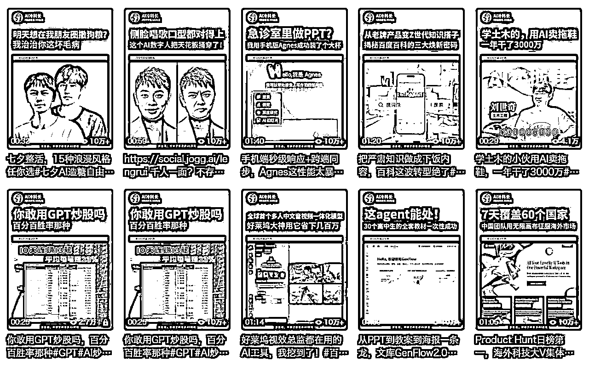

# AI 自媒体 - 视频号 IP 化丨实战手册丨2025 年 9 月航海

> 来源：[https://ocn93f5d9olj.feishu.cn/docx/XtjCdWr89o8ADvxjsWPcer2enKh](https://ocn93f5d9olj.feishu.cn/docx/XtjCdWr89o8ADvxjsWPcer2enKh)

# ⛵新手如何入门【AI 自媒体-视频号 IP 化】项目？

# 1\. 项目介绍

欢迎来到 AI 赛道自媒体-视频号 IP 化的探索之旅。

如果你曾尝试过 AI 方向的自媒体，或许会发现，单纯的 AI 工具教程和资讯解读，正变得越来越卷，流量来得快，去得也快。这是因为，前者是一个门槛很浅的赛道，而流量最终会流向那些有独特人格魅力和深度见解的 IP。

本期航海，我们将聚焦于视频号这一个平台，完成一次核心战略的升级：从追逐爆款的流量思维，转向构建信任的 IP 思维。

1.1 为什么 AI 自媒体在视频号还值得做？

理由一：视频号是明显的增量平台

不需要启动流量，每个人都有几十个微信好友；比起需要买量的抖音，和需要审美和精致的小红书，视频号更容易做出成绩，粉丝价值几乎等同于小红书；AI 赛道的推陈出新使得选题不愁，信息差长期存在，且广告主总是有投放预算。视频号的商业化启动也较晚，这让其他平台的头部博主较难转移过来，给了新人成长空间。

理由二：广告主预算充足

我与阿里、腾讯、百度等大厂合作的经验是，他们越来越倾向于投放有独立思考和鲜明人设的 IP 型博主，而非同质化的流量营销号（当然后者也会覆盖到）。一个强 IP，能接到更高单价、更稳定的年度合作，而不是一次性的通稿任务。他们愿意为你的独立思考和信任度付费，而不仅仅是曝光量。

理由三：变现路径多元，尤其适合私域联动

视频号是微信生态的亲儿子，能无缝连接公众号、企业微信、社群、小程序。这意味着，从内容种草、到私域沉淀、再到最终成交，你可以在一个生态内丝滑地完成所有动作。无论是接商单、做培训、卖课程还是做咨询，链路都比其他平台更短、更高效，不用在去苦苦学习各种偷流量的技巧。

1.2 为什么你的重心必须是“IP”，而非“流量”？

视频号的底层逻辑是信任。 它独特的熟人社交+算法推荐双重逻辑，决定了被朋友点赞的内容有更高的权重。一个有血有肉、观点鲜明的 IP，远比一个冷冰冰的资讯号更容易获得社交推荐，从而建立起信任护城河

对比两种账号的生命周期与变现天花板：

流量型账号：像一家便利店，靠的是信息差和热点，顾客买完就走，毫无忠诚度，利润微薄，且随时可以被隔壁新开的便利店替代

IP 型账号：像一家米其林餐厅，靠的是主厨的理念和独特体验，顾客慕名而来，反复光顾，主动推荐，客单价高，护城河深

你可能还记得前年去年那些刷屏的“XX 测评”“XX 工具箱”账号，现在还剩几个？但那些真正建立起个人品牌的 IP，却能持续接到商单，被邀请参加各种行业大会

你的目标不是涨粉，而是收获铁粉：

无效流量： 看到你的“10 个 AI 工具”收藏了就走，甚至取关，因为你对他来说只是一个临时的工具

有效粉丝（铁粉）： 因为认可你的观点和思考而关注，他们会看你的每一条内容，信任你的推荐，是你未来所有商业变现的基石。IP 化，就是帮你精准筛选出这群人的过程

1.3 项目优势与门槛

优势： 这次航海给你的，不是一条捕鱼的捷径，而是一整套从选址、到建渔场、再到养鱼的系统方法论。你将构建起一个很难被模仿的 IP 护城河，获得穿越周期的复利

门槛： 这并非一条捷径。你可能需要面对初期数据平淡的挑战，需要更深度的思考和更真诚的表达。但这条路的尽头，是更稳固的商业根基和更长远的个人价值。执行力是一种天赋，真正能活下来的人，永远是执行 100 次的人，而不是纠结第 1 次的人。

1.4 成功案例参考

以本期教练冷科长为例：

他是一个在 AI 浪潮中不断折腾的创业者和探路者。运营着“AI 冷科长”（真人出镜 IP）和“深度学习的 Alpha 狗”（纯素材剪辑）两个账号

前者让他与百度、阿里、腾讯、英伟达等合作伙伴建立了长期的链接，后者则验证了即便不露脸，只要观点犀利，同样能快速启动并商业化

以他的两个账号今年的商单为例，一共接到 180 条商单，其中不露脸的 “深度学习的 Alpha 狗”4 月建立，6 月 26 日接到第一条商单开始到 8 月 18 日撰写本手册时，一共是 13 条


# 2\. 项目完整操作思路

本手册将为你提供一张详尽的战略与战术地图，分四步带你走通这条路：

第一站【定位与蓝图】： 找到你独一无二的 IP 原点，明确你要成为谁，为谁发声

第二站【内容与基建】： 搭建好你的“舞台”，让你的第一印象专业且独特

第三站【启航与验证】： 掌握 IP 化内容的创作心法，让每一条视频都在为你的人设添砖加瓦

第四站【优化与远航】： 学会分析数据、链接商业世界，让 IP 的价值持续放大

操作重点：

本期航海，重点任务是，在 21 天内迅速跑完 3-5 条内容的生产闭环，千万不要完美主义。

并在接下来时间尽快度过新手期（总共 20-30 条）和苦力期（至少 50 条），完成原始内容和粉丝的积累。

风险挑战和应对建议：

风险一： 还在用旧地图，寻找新大陆

建议：做科技自媒体最大的挑战，是思维模式的转变。不要只想着用 AI 给我现在的工作提效，而是要思考 AI 能给我创造什么全新的工作。我会通过直播和分享，帮你完成这次思维升级。

风险二： 浪潮面前，继续观望

建议：真正的风险不是行动后的失败，而是面对机遇时的犹豫。这 21 天，就是你最低成本的试错机会，去验证你是否适合这条路，以及这条路能带你走多远。

风险三： 没有找到合适赛道，盲目开始发笔记

建议： 有时选择比努力更重要，新手前期可以紧跟爆款赛道和爆款笔记，如果不知道哪些合适赛道，可以参考航海手册的建议。

风险四： 发了几篇数据不好就放弃。

建议：30 篇笔记算是入门，出了爆款内容后才会涨粉快，但爆款不常有。所以，大家要有耐心，只要持续发，每一篇就坚持优化、改进，终会拥有爆款。

开船前必备工具：

*   硬件：一部智能手机、手机支架、无线麦克风（建议）、补光灯

*   账号：1 个视频号账号

*   核心软件：剪映、飞书文档

*   AI 效率工具：手册中会提供详细指引

1.  AI 定位与内容策略

1.  本章概要

目标：设计出一个能让优质粉丝喜欢、能让高端客户认可的 IP。

定位定生死。

这是整个航海计划中最重要，也最需要你深度思考的一章。在内容创作领域，选择比努力重要一万倍。

本章，我们将一起解决三个核心问题：

.

我在哪？（赛道）

.

我是谁？（人设）

.

我说什么？（选题）

本章航线图

完成本章节的学习和实操，即可完成航线图的：

第一阶段：定位与蓝天（4 天）

.

拆解 10 个成功变现的 AI 账号（3 天）

.

设计你的 IP 人设三件套：角色、价值主张、风格（1 天）

# 2\. 定位赛道

对 AI 自媒体而言，定位赛道是不是就意味着在“人工智能”这个大框架下，进一步找准一个更聚焦的切入点，比如：

.

AI 热点 / 技术解读：关注前沿动态、行业深度分析

AI 大模型解析（如 GPT-4、Claude、文心一言等）

AI 行业趋势（企业 AI 布局、投资、政策）

AIGC 发展与影响（AI 如何改变各行业）

AI 算法与技术解读（机器学习、深度学习、NLP）

AI 伦理与社会影响（AI 对工作、教育、隐私的影响）

AI 科普与认知升级（降低门槛，让普通人了解 AI）

AI 论文解读（最新 AI 技术研究和实验解析）

……

.

AI 工具分享：专注于各种 AI 工具的介绍、使用方法、案例分享

AI 绘画 & 设计工具（Midjourney、SD、DALL-E 等）

AI 文案 & 文字创作工具（ChatGPT、Claude、Notion AI）

AI 生产力 & 办公工具（AI 自动化、任务管理、效率提升）

AI 编程 & 开发工具（代码生成、自动化测试、AI 代码助手）

AI 视频剪辑 & 内容创作工具（Runway、Pika Labs、Heygen 等）

AI 语音合成 & 配音工具（ElevenLabs、Voice AI）

AI 营销 & 获客工具（自动化营销、SEO 优化、数据分析）

AI 辅助学习 & 教育工具（AI 家教、论文写作、翻译）

……

.

AI 创业或副业：探索 AI 如何赚钱、创业、变现路径

AI 自媒体创业（用 AI 打造个人 IP，短视频、写作）

AI 课程 & 知识变现（AI 教学、卖课、知识付费）

AI+电商副业（低成本跨境、AI 店铺自动化）

AI 自由职业 & 服务变现（AI 绘画、视频制作、AI 代运营）

AI 投资 & 商业洞察（AI 初创企业、投资机会）

AI 产品创业（开发 AI SaaS、AI 工具、AI 模型训练）

AI 营销自动化（利用 AI 提升品牌增长、广告投放）

AI 商业服务（AI 客服、AI 自动化销售）

……

.

AI 效率提升：AI 如何提高个人和企业的效率

AI 在职场中的应用（自动化办公、AI 助理）

AI 助力求职 & 晋升（AI 简历优化、AI 面试辅导）

AI 编程提升效率（代码优化、自动补全、AI 调试）

AI 内容创作提效（AI 写作、剪辑、PPT 生成）

AI 在企业管理中的应用（AI 人力资源、AI 招聘）

AI 生产力工具实测（实测各种 AI 工具，推荐最佳实践）

AI 知识管理 & 学习优化（AI 如何帮助高效学习）

……

.

AI+其他：AI 如何赋能不同行业或兴趣领域

AI+视觉设计（AI 艺术、AI UI/UX 设计）

AI+教育（AI 在 K12、大学、培训中的应用）

AI+心理学 & 自我成长（AI 助力个人成长、心智优化）

AI+健康医疗（AI 辅助诊断、健康管理）

AI+法律（AI 法律助手、合同生成）

AI+金融投资（量化投资、AI 金融科技）

AI+区块链 & Web3（智能合约、NFT、去中心化 AI）

AI+社交 & 交友（AI 恋爱助手、AI 社交增强）

AI+游戏（AI NPC、游戏开发自动化）

如果你看到这里，为找到自己的某条赛道而庆幸，那就大错特错了！

切记，适度专业吸引粉丝，过度专业吸引同行。在人工智能的大赛道下，我们完全可以横跨上述五大分类，比如覆盖其中的 10-20 项都可，从你擅长的部分切入，或者从你感兴趣的部分切入；如果都没有，丢骰子。

用户思维思考： 在视频号生态中，用户（尤其是那些有付费能力的中青年职场人士）更愿意为哪个组合下的内容停留、做数据甚至是付费？是 AI+游戏攻略，还是 AI+职场晋升，又或者是 AI+金融投资？

# 3\. 定位形式：选择你的表达“容器”

确定了说什么，接下来要确定怎么说。形式本身，也是 IP 的一部分。

真人出镜（我个人首选并推荐）

优势： 信任感最强，IP 属性最鲜明，最容易与用户建立情感连接，商业价值天花板最高。我的“AI 冷科长”就是最好的例子

挑战： 对镜头感、表达能力有一定要求，对镜头脱敏需要刻意的练习/布景如果要讲究，可能会有一些投入

适合谁： 对个人品牌有强烈企图心，愿意长期深耕，不畏惧镜头，渴望实现价值最大化的船员

不露脸（声音/素材/虚拟人）

优势： 启动门槛低，对镜头表现力没要求，内容可批量化程度更高。我的“深度学习的 Alpha 狗”就是用这种方式在 3 个月内快速起步的。

挑战： 信任感建立更慢，需要更强的脚本、观点和声音表现力来弥补画面的不足，IP 天花板相对较低。

适合谁： 性格内向、不愿出镜，但有独特观点和深度思考能力，或希望能快速验证内容方向的船员。

请结合你的性格与目标，初步选择一个主要的内容形式。记住，这只是起点，未来也可以调整。

# 4\. 人设塑造

本章的灵魂。用户关注你，不是因为你讲了 AI，而是因为你。所以我们需要刻意去强化人设。这不是指标签或者身份，我们刚开始做这个方向时，多半是没有任何相关标签的。这里的人设更多是你的天赋，你的经历，你看问题的角度和独特的思考。抛开个性化的部分，对大家来说比较容易标准化的账号的身份，是一种角度，一种我们去表达的立场。

为了帮助你找到并放大这个立场，我为你提炼了三种在 AI 和科技领域最有效、也最容易上手的核心 IP 人设“视角”：

洞察者

内核： 我看得更深。对行业有独到、犀利的见解。

语言风格： Sora 的发布，对普通人来说，真正的机会不是学着做视频，而是思考如何成为 AI 创意的产品经理

适合谁： 有行业经验，善于思辨，能一针见血指出问题本质的船员。

实践者

内核： 我帮你踩坑。亲身下场，分享第一手的经验、失败与复盘。

语言风格： 我花了 3 天时间，用了 5 款 AI 工具，试图复刻那个爆款视频，结果翻车了。这是我的 3 点血泪教训

适合谁： 执行力强，热爱折腾，乐于分享真实过程，能将复杂任务拆解的船员。

翻译者

内核： 我帮你搞懂。将复杂前沿的信息，通俗化、故事化地讲给大众听。

语言风格： 今天这个 AI 工具，你就把它想象成一个 24 小时待命，且不要工资的实习生，你可以这么用它

适合谁： 有科普热情，善于打比方、讲故事，能与“新手”用户共情的船员。

【实战练习】

选择一个最让你有感觉的人设，并尝试用他/她的口吻，写一句关于 AI 焦虑的观点。找找感觉。

# 5\. 选题规划

好的选题，不是追热点，而是通过一个话题，持续强化你的 IP 人设。

这期航海，我们尝试打造长期 IP 人设，抛开 XX 工具的 5 个技巧这类流量选题，建议可以尝试以下五大 IP 化选题方向：

1.个人经历与故事：（实践者人设）

例：我如何用 AI，搞砸了第一次客户提案的复盘

2.热点事件的深度观点：（洞察者人设）

例：别再只盯着 GPT-5 了，这 3 个被忽视的 AI 进展，才是普通人真正的机会

3.跨界领域的连接思考：（洞察者/翻译者人设）

例：从《三体》的降维打击，看 AI 对传统律师行业的重塑

4.未来趋势的预测与构想：（洞察者人设）

例：5 年后，AI 助理将如何彻底改变我们普通人的一天？

5.反常识的挑战与诘问：（洞察者/实践者人设）

例：停止学习提示词！AI 时代，比会提问更重要的是这件事

1.  对标拆解

# 案例 1：AI 红发魔女

基本情况：5-10 万粉，互选报价低于 1.5w，无 mcn

# 对标内容

内容主要聚焦在 AI 新手教程和多种 AI 应用工具的科普展示。

# 账号人设

账号名称和头像都以自己的形象特色（红头发）为切入点，并结合科技元素，给观众留下深刻的印象。在视频中扮演翻译者，洞察者，以通俗易懂的方式把复杂的 AI 工具介绍给观众。

在简介里介绍自己分享的视频内容主要是教程，测评，洞察。观众直接一目了然清楚账号的定位。


# 选题策略

选题分为了三部分，精准定位 AI 新手观众，并且还贴心的制作了合集方便观众查找，一目了然

第一部分：围绕 AI 工具的使用教程，利于新手的学习。如《一分钟做科幻大片，新手有手就行》《教你 10 秒做 APP 只需要一句话》等，通过简单明了的内容画面教会新手使用热门 AI 工具

第二部分：科普 AI 前沿科技。如《世界首款 AI 游戏 Oasis，玩家实时生成 3D 世界》《特斯拉机器人 Optimus 逆天进化》等

第三部分： AI 工具如何运用于日常工作中。如《3 个 AI 黑科技，强大又好用！拯救设计师》《升职加薪必备！AI 一分钟分析 Excel 并可视化》等

# 脚本结构

本人出镜切入主题+视频素材贴合讲解内容

开头：视频开头本人出镜，通常会直接切入主题，再以简洁的方式引出视频要讲解的 AI 内容。

中间：放入贴合讲解内容的视频素材，讲解人依旧会出现在视频中，以一个小图的方式，亲切且不枯燥。

结尾：依旧是本人出镜讲解的方式来结尾。

1aa1aaf892b1308f1d03c5ef3a4f8791.mp4【在线播放】

# 视觉锤

个人 ip 形象结合视频主题相关素材图片，标题文字突出内容主题

背景：视频开头和结尾的背景主要以自己搭建的科技感室内环境为主

字幕：每期字幕都比较统一，显眼清晰

封面：封面颜色统一整洁，使用 AI 相关图片加上博主本人的抠像，文字和图片素材突出视频的主题和关键信息，观众一眼看去就能精确的找到主题内容。

# 变现模式

广告与赞助：通过广告商务合作来实现变现，视频内容主要在 AI 工具的讲解，可以跟 AI 相关的企业或品牌合作，在视频中展示或推荐他们的产品或服务。


# 案例 2：朋克科技站

基本情况：30w+粉丝，互选报价 60s 内报价 2w，60s+报价 2.5w，mcn 是自己的矩阵公司

# 对标内容

这个号内容类型更泛，除了深度聚焦 AI 科技领域外，还涵盖了科技资讯、技术普及等多方面内容，实时追踪科技信息。


# 账号人设

这个号塑造的人设是，用赛博朋克美学 解构前沿科技 的 跨界玩家，同时又是翻译者和实践者：

翻译者：把复杂的科技概念（如脑机接口、量子计算）转化为大众可感知的语言，比如用机械义肢类比纳米机器人的应用场景

实践者：通过创意改造（如蒸汽朋克键盘、赛博朋克风格的科技产品）展示科技的可塑性，强调技术民主化的理念。

# 选题策略

选题聚焦科技突破＋社会议题：

国产前沿技术科普：比如《武汉理工磁驱纳米机器人》《复旦脑机接口》等，实验室成果的可视化呈现

科技伦理批判：探讨算法监控、数据隐私等议题，如《完蛋，我被算法包围了！》，用惊悚叙事引发对技术异化的反思

文化跨界融合：结合复古工业元素与未来科技，如蒸汽朋克风格的电子产品改造教程，传递 技术可被重新定义”的价值观

价值观内核：强调科技应服务于个体解放，反对技术垄断，呼应朋克文化的反叛精神

09a98cf8d638157ee377874ab2ac915d.mp4【在线播放】

# 脚本结构

悬念驱动 + 情绪共鸣的三段式设计

黄金三秒钩子：

视觉冲击：用霓虹闪烁的机械装置、故障特效或实验画面（如纳米机器人游动）瞬间抓住注意力。

争议提问：比如 如果脑机接口让人类永生，你愿意成为半机械人吗？引发认知冲突。

数据爆点：直接抛出全球首例、突破 XX 技术瓶颈等权威背书。

中段内容：

技术解构：分步骤拆解原理（如纳米机器人的磁控机制），用动画或实物演示降低理解门槛。

叙事强化：穿插科幻电影片段（如《攻壳机动队》）或历史案例（如中银胶囊塔），构建文化语境。

情感锚点：关联日常生活（如脑机接口对残障人士的意义），激发共情。

结尾设计：

行动号召：引导用户参与投票“你支持基因编辑技术吗？”或分享观点。

悬念留白：如 “下一期揭秘：如何用 3D 打印制作赛博朋克义眼”，预告后续内容。

价值观升华：用金句收尾，如 “科技不是答案，人才是”，强化 IP 调性。

# 视觉锤

赛博朋克符号的系统植入

场景：

场景设计：工业风实验室（生锈管道 + 霓虹灯带）、废弃工厂背景，营造 “破旧未来感”。

字幕与动画：

故障字体：霓虹色哥特体字幕，配合信号干扰特效，突出科技朋克质感。

动态元素：数据流、全息投影、机械齿轮等动画贯穿，强化科技氛围。

封面设计：

视觉公式：主体人物 + 核心科技元素（如纳米机器人）+ 霓虹光效，标题常采用“炸锅”、“最强”，"天花板"，“火爆”，“炸裂”等比较吸引眼球的字眼，重点突出视频的主题和关键信息，背景图通常采用与主题相关的人物，科技产品或元素。

# 变现模式

广告合作：科技品牌软性植入（如实验室设备、AI 工具），依托精准科技垂类受众提高报价。


精选 5 个成功的视频号科技类 IP（而非单个爆款视频），从人设、选题、脚本结构、视觉锤、互动方式五个维度进行拆解。

人设定位： 他/她扮演的是什么角色？（洞察者/实践者/翻译者？)

选题策略： 他/她主要做哪类选题？背后体现了什么价值观？

脚本结构： 视频的开头、中间、结尾通常是怎么组织的？黄金三秒用了什么钩子？

视觉锤： 他/她的服装、背景、字幕、封面，有哪些反复出现的、标志性的视觉元素？

变现模式： 通过橱窗、直播、引流私域等，能看出他/她的主要变现方式是什么？

完成这份拆解，你对如何打造一个成功的 IP 账号，会有一个质的飞跃。

1.  账号基础设置

# 1\. 本章概要

刚开始做账号时，你要给用户留下好印象。统一好昵称、头像和简介，能快速树立你的品牌感；拍摄环境尽量简单、有科技感一点，用个清晰的设备也就够了。这些前期准备做好了，后续内容做起来才会更轻松，用户也更容易留下来。

这章节，我们会重点聊聊：

.

账号准备：统一昵称、头像和简介，突出个人特色，让别人一下记住你。

.

设备和环境：根据你选的内容形式准备简单但清晰的拍摄设备，手机加个补光灯、麦克风，简单布置个背景就行了，绿幕也可以考虑。

.

内容练习：先模仿你喜欢的账号，自己私下练习做 1～2 条视频或推文，摸清自己水平，再搭建个选题清单方便后续持续输出。

.

视频脚本练习：学习“AI 冷科长”高转化率的口播脚本公式，模仿公式，完成你的第 1 个 IP 验证视频脚本。

# 本章航线图

完成本章节的学习和实操，即可完成航线图的：

第二阶段：基础建设（6 天）

.

搭建你的账号视觉系统（头像/封面/模板）（1 天）

.

建立你的内容选题库与素材库（1 天）

# 2\. 账号基础

账号基础有以下几个方面，下面会一一展开说明。

昵称：兼具记忆点与专业性

头像： 重点考虑有特色的，是否真人都可

简介： 一句话说清“我是谁，我为谁，有什么独特价值”。

背景图： 你的“精神展板”，用一句话或一张图强化核心理念。

# 3\. 账号准备

微信号可以是自己使用的老号，但如果你之前发布的不是 AI 相关的内容，可以选择先隐藏；重新注册一个新号也是一种选择，双开微信即可。如果老号两礼拜流量都不正常，果断启用新号。

.

新号是否需要养号众说纷纭，如果担心请按照下面方法执行。不担心的，也建议做完前四点。

.

新注册的微信号不要立马注册视频号，需要用 2 天时间养一养微信号，养号操作流程：

完善头像、名称

微信-我-服务-钱包-实名认证

添加 3 个好友，互发几条消息，给好友打 1 分钟电话，各收/发一次转账

关注 2 个公众号：生财有术，生财有术服务号；

每天在视频号上刷 5 分钟视频、看 10 分钟直播（挂着就行）

发一条朋友圈


# 4 注册视频号

打开微信-发现-视频号-右上角小人-发表视频，按照步骤填写信息。


# 5\. 昵称

起名原则

因为你还不是一个知名 IP，所以尽量在名字里让别人知道你是干什么的

比如在名字里加入 AI、AIGC 元素，比如 AI 王队长、熊厂长、冷科长，讲 AI 的老程，老张，老李

个人建议不要用赛博，这系列不直接，还过于拥挤，我认识的就有赛博司马特，赛博马克，赛博小熊猫，赛博奇，赛博鸭，赛博鱼，赛博古，赛博立伟，赛博疯子，赛博禅心

建议不要蹭知名 IP 的，比如数字生命卡磁炉、秋知等，除非你真就叫秋知。

实在想不出来？找 AI 帮忙啊，把你想做什么内容告诉 AI，让它给你出出主意

名字取得太高级，会给人距离感。当时设计名字时，考虑“科长”是基层干部芝麻小官，反而会带来一种反差感；加入 AI 让人能迅速知道账号的主讲内容。（第一个月这名字都让人很羞耻，脱敏就好了。不过在注册账号的时候遇到了一些小问题，比如要求提供政府开具的工作证明……）

注意：如果你在其他平台，比如小红书、抖音同步开设 AI 自媒体账号，记得统一账号名，这样别人更容易找到你，也能吸引更多潜在粉丝。


# 6\. 头像

头像需要满足这么几个要求：

专业形象： 头像可以选择个人照片、AI 生成的头像或品牌 LOGO

尺寸适配： 注意平台对头像尺寸的要求，避免出现模糊或变形的情况

例如，我的头像是一个马赛克风格的男生肩膀上趴了一只猫，跟我本人的长相毫不相关，全靠时间长了大家就觉得是你了。制作方法是直接把家里猫咪的照片 p 到人像照片的肩膀上，然后丢给 ai 转成的马赛克风格，美图秀秀加个墨镜贴纸


现在 AI 设计的 logo 真的都很好看，打开即梦 AI，然后在首页找到 logo 设计，挑一个你喜欢的 logo 风格，然后把你的照片、账号名称的关键词融合进去，都行


# 7\. 简介

平台的简介，是很关键的一个信息，它能直接决定粉丝关不关注你。你平时刷到一个不错的视频，在关注之前，是不是也会点进去主页，看看这个账号能长期给我带来什么价值？如果觉得长期有用，才会选择关注。

同时，在简介里写上合作的联系方式，比如微信号，是我们进行商业活动的基石，务必放心大胆的写上联系方式，不会影响任何流量

怎么写好简介呢？你可以参考下面几个标准：

简洁明了： 清晰地表达你的账号定位和能提供的价值

突出亮点： 强调你的核心优势和特色，例如牛逼标签（利用慕强心态），专注 AI 绘画教程，分享最新 AI 工具

引导关注： 适当预告未来的内容计划，例如每周更新 AI 绘画教程、定期分享 AI 行业分析

增加互动： 适当添加一些互动引导，例如欢迎在评论区提问、关注我，一起探索 AI 世界

避免冗余： 避免在简介中堆砌过多无关信息

以上标准，不一定全部都要在简介里呈现，你可以挑选适合自己的来写。

举几个例子：

可以看到，最关键的是【简洁明了】，字数不要过多；

其次就是把你的优势体现出来，把你 AI 相关的标签写上，有助于打造人设；

如果没有 AI 相关专业经验，也可以写工具库，也就是前面提到的转译者。


# 8\. 设置名字、头像、个人简介

点击创建视频号后，我们会进入这样一个界面，点击右上角【···】进入【设置】界面：

在【设置】界面点击【资料设置】：

在【资料设置】界面点击【头像】、【名字】、【简介】分别完成设置：


1.  场景与设备准备

# 1\. 固定场景与背景布置（真人出镜＞不露脸）

这一步，你应该已经确定了视频形式，真人出镜还是不露脸。下面分别就这两种形式，进行场景布置说明。

# 1.1 真人出镜

场景即人设，通过灯光、桌面摆设、背景布置烘托整体氛围，强化人设。

简洁灯光和桌面摆设非常重要。灯光可以营造专业感，桌面摆设则能体现你的品味和专业领域。

背景灯光：

背景灯光，可以参考下面三位博主，用可变色灯带或者台灯调节出科技感的氛围，成本几十块

后期赚到钱后，弄个自己名字的霓虹灯条，也挺有范儿的


桌面摆设：

保持合理性，一看就是 AI 博主哈，建议放置一些与 AI 相关的元素，如：

机械键盘带显示器（靠这个还能接外设的商单）

小型机器人模型

科技感十足的装饰品

简洁的绿植，增加生机


背景选择：

不花钱的选择：家里纵深比较长的场地/书架或工作室一角，保持简洁和空间感

花钱的选择：可以布置的跟小 lin 说或者秋芝 2046 类似

注意事项：

背景要与你的内容风格相符，我们科技账号就是霓虹灯光带来的科技感

避免杂乱的背景，以免分散观众注意力


# 1.2 不露脸

有圈友可能并不想真人出镜，如果不出镜的话，还能不能固定一个场景，来进行稳定的内容输出呢？也是可以的。

下面带大家看一个比较经典的案例：

1040g2t031e5odb6a0uk048fndfvpasqcniqlh30.mp4【在线播放】

1040g0cg319j2437o7a6g48fndfvpasqc85t2r9o.mp4【在线播放】

1040g0cg31dovi2isgueg48fndfvpasqcpg2g020.mp4【在线播放】

聪明的圈友应该发现了，这个博主，用的是绿幕来制作视频。（这种形式在小红书和视频号都可以通用）

他中间电脑屏幕放了一张纯绿色桌面，后续只需要把录制好的讲解视频，通过剪映加载到这个绿色桌面里即可。

用绿幕的方式，来结合家里的书房背景，增加了很强的真实感。一次搭好的场景，可以用 100 期，甚至更多。

而类似朋克周这样的头部博主，只出手指，也是不错的选择，一手拿手机，一手指屏幕拍摄即可（但你可能也发现了，他现在陆续还是出镜了）。模仿他的账号没有 100 也有 50 个了。


# 2\. 设备选择与布光

拍摄：

手机：现在的智能手机拍摄和稳定效果都已经很不错，手持注意点，画面是比较稳的

后期有需求后，买个手机支架三十块


相机：半画幅全画幅丰俭由人，效果主要由镜头决定，国产镜头这两年崛起，几百块的大光圈定焦就绰绰有余

布光：

照亮面部的光非常重要，远比上面的拍摄设备重要。考虑到家庭或者办公场景以顶光为主，人脸斑驳，面光的选择有下面三个：

自然光：如果条件允许白天录制，那面向窗户，由纱帘带来的自然光就很棒，柔和且真实

LED 常亮灯+柔光箱：能提供更高质量的光线效果好于环形补光灯，最适合口播，就是比较大占地儿

环形补光灯：不能戴眼镜，能均匀照亮面部，适合口播

另一侧可以放一个小灯管，或者挂一块反光布。具体如何布置，可以参考下面这个视频教程：

https://v.douyin.com/i8jJuV6X/

声音录制：

声音效果非常重要，音量合理+音质优秀是努力方向

录制环境影响极大，抛开专门的拍摄场景，每个人都有的最佳场所为卧室（窗帘和被子吸音）；特别注意办公空间的回声（只有办公桌椅的小房间大概率回声很重），建议选择开阔一些的安静场景，比如大会议室

录制设备建议

.

露脸 ip，推荐猛犸 lark m2，小巧+音质强+续航长+质感好，买一发一收即可，接收端的接口根据自己的录制设备决定，充电仓看预算

.

只出声音 ip，可以用手机录音机，把音质调到最高，录制时离嘴边不超过 30cm，格式 mp3 或者 wav 均可

.

非 pocket3 用户，不推荐大疆麦克风，音质明显差一档，别为品牌买单

.

非专业用户不推荐机顶麦/指向麦等，非直播用户不推荐电容麦

注意事项：

优先确保录音环境安静，实在没辙在使用剪映的降噪功能，最次的选择是麦克风降噪

道具与细节：

“AI 感”小元素：

AI 主题的贴纸、徽章、T 恤等，增加个人特色。

科技感十足的道具，如透明键盘、发光鼠标等。

Logo 贴纸：

在视频中适当展示你的品牌 Logo，增加品牌认知度。

1.  选题库搭建

搭建选题库时，可以从以下几个渠道获取灵感：

1\. 对标账号

根据第二阶段的对标拆解找到同类型的账号，然后从对标账号里面找选题

2\. 生财有术

从生财有术的“风向标”和“AI 是未来”小组里面找选题灵感

地址：https://scys.com/

3\. X

地址：https://x.com

X 上有很多 AI 新闻，很多都是不错的选题（需要科学上网）

4\. 即刻

即刻的 AI 探索站，人工智能讨论组里面都有很多人分享 AI 体验

地址：https://web.okjike.com/

5\. Way to AGI

地址：https://www.waytoagi.com/zh

一个开源 AI 的 AI 社群，里面有超多实用的 AI 宝藏

1.  挖掘选题的策略

① 从选题来源里面找你觉得合适的选题

② 搜索法

在抖音，小红书，视频号点击搜索，然后把日期选择为一周，然后选最多点赞，从里面找选题


抖音


小红书


视频号

③ 低粉爆款

观察对标账号日常作品的数据表现：如果大部分作品点赞数稳定在几百左右，而突然有一条视频的点赞数激增到几千，这就是一个明显的异常信号。这种异常可能表明视频抓住了观众的痛点或当下热门话题，因此可以考虑借鉴甚至复制这种选题形式。


④ 追热点

热点是流量的重要来源，但并非所有热门话题都适合你的账号。要结合自己的风格和定位进行选择，切忌为了追热点而追热点，确保内容质量和一致性。

选题库参考：


1.  选题库的更新与管理

小技巧

使用微信“面对面建群”功能，创建一个名为“AI 自媒体选题”的群组。在你浏览视频、公众号或其他内容时，随时将闪现的灵感和创意记录在群组里，确保灵感不会丢失。

1.  随时更新

建议遇到合适的内容，就更新进去，这样避免错过热点或趋势。P 人狂喜。

1.  提前规划

如果你是 J 人，可以提前确定好一周的选题，比如周一到周日的主题和内容方向。这样能节约时间，避免每天为选题发愁。

1.  灵活调整

当有合适的热点出现时，可以将原定选题往后延期，优先发布热点内容，确保不错过流量高峰。

1.  学习口播脚本公式

现在，我们进入实战，解决怎么说的战术问题。

一个高转化率的脚本，是你所有思想的临门一脚，是直接决定视频播放、涨粉和商业价值的核心武器。

接下来，我将毫无保留地为你拆解团队内部反复使用、被市场反复验证的一套——黄金结构

以我们的一条视频《负债 10 万美元到市值 20 亿》举例：

1 月 7 日首次发布： 获得 63 万+ 播放，单条视频新增关注 8907 人

5 月 17 日二次发布： 依然获得 28 万+ 播放，新增关注 3992 人

两次发布的相同视频，分毫未改


同一脚本，两次发布，累计播放近百万，涨粉近 13000 人。这背后，就是黄金结构的力量。

以下是逐字稿全文：

负债 10 万到市值 20 亿，只用几周

这个事情都炸了

几周前，破产程序员 shaw 还和妻子，三个室友挤在一间合租房里

某天，他突发奇想，用 AI 去克隆马克安德森

他把马克所有的推文、博客、访谈全都爬下来，训练了一个 AI 马克

再把它放在区块链上面做成一个 DAO

买了这个代币就可以和 AI 马克对话，听他分析项目

本来 shaw 只想融 25 万美金，结果没到 25 分钟就抢光了

然后市值蹭蹭上涨，到现在已经 22 亿（美金）了

现在有人开始克隆巴菲特了

你有什么想克隆的人吗？

这个脚本的结构分为四步：设悬念 -> 讲案例 -> 得结论 -> 给启发

第一步：设悬念 （黄金 3 秒）

逐字稿：

负债 10 万到市值 20 亿，只用几周。

视频开头的黄金 3 秒，目标只有一个：用最极致的反差感和时间压迫感，制造巨大的好奇心缺口，让用户立刻停下来

反差感： 负债 10 万美金（谷底） vs 市值 20 亿（巅峰）。这个巨大的落差，瞬间击中了人性中对财富逆袭的渴望

时间压迫感： 只用几周。这暗示着一个捷径或秘密，让用户产生一种不能错过的紧迫感

你可以怎么用？

在你的视频开头，可以尝试用 数字+极端对比+时间限制 的组合，例如：

3 天的工作量，3 分钟就完成了

5000 块买的 AI 课，核心干货就这 3 句话

第二步：讲案例 （故事化）

逐字稿：

这个事情都炸了。几周前，破产程序员 shaw 还和妻子，三个室友挤在一间合租房里。某天，他突发奇想，用 AI 去克隆马克安德森（硅谷教父级人物...) ...他把马克所有的推文、博客、访谈全都爬下来，训练了一个 AI 马克...再把它放在区块链上面做成一个 DAO...买了这个代币就可以和 AI 马克对话，听他分析项目。

悬念之后，不要马上讲道理，要立刻用一个生动、具体、有细节的故事，来承接用户的全部注意力。人类大脑天生就喜欢听故事。

主角清晰： 破产程序员 shaw，有身份，有困境，让观众有代入感

细节真实： 和妻子、三个室友挤在合租房，画面感极强，增加了故事的可信度

行动明确： 用 AI 克隆马克安德森、爬推文博客、做成 DAO，一系列具体动作，让观众能跟上节奏，理解他做了什么

引入权威： 提及马克安德森、A16Z、Facebook、推特，用名人效应为故事的价值做背书

你可以怎么用？

把你想讲的观点，包装成一个 一个（身份）的人，遇到了一个（问题），然后他用了一个（方法），最后得到了一个（结果） 的微型故事。

把上面的这个要求发给 ai，看看结果如何！

第三步：得结论 （价值点）

逐字稿：

本来 shaw 只想融 25 万美金，结果没到 25 分钟就抢光了，然后市值蹭蹭上涨，到现在已经 22 亿（美金）了。

故事讲完，必须给出一个震撼性的结果，来回应第一步的悬念。这是整条视频的爽点，也是价值的集中体现

数据冲击： 25 分钟抢光、22 亿美金，用具体的、夸张的数据，给观众带来强烈的情绪冲击，完成好奇心闭环

确认价值： 这一步明确地告诉观众，前面讲的故事非常成功，值得花时间听到现在

你可以怎么用？

在你的故事结尾，用最精炼的语言或最有力的数据，总结出这件事带来的惊人结果或深刻教训。

第四步：给启发 （互动与延展）

逐字稿：

现在有人开始克隆巴菲特了。你有什么想克隆的人吗？

视频的结尾，目标不是结束，而是开启下一段对话。你要把故事引申到观众自己身上，激发他们思考、评论和转发做数据！

价值延展： 现在有人开始克隆巴菲特了，这句话暗示了这个模式的可复制性，打开了观众的想象空间。

开放式提问： 你有什么想克隆的人吗？这是一个极易回答的开放式问题，它邀请所有观众参与到话题中，极大地提高了评论率。对于 IP 账号，评论区的互动是你人设的二次塑造，至关重要。

你可以怎么用？

在视频结尾，问一个 如果...你会...或者 对你来说.. 的开放式问题，把话题的球，踢给观众。

1.  基础创作练习：模仿公式，完成你的第 1 个 IP 验证视频脚本

学习游泳最好的方法，就是下水。现在，我们要做的，就是将上面拆解的黄金四步法，变成你自己的肌肉记忆。

这个练习的目标，不是做出爆款，而是让你完成一次从输入到输出的完整循环，找到你自己的表达节奏。

任务一：用黄金四步法的透镜去拆解

行动： 去视频号，找 3-5 位你喜欢的、成功的 AI 领域博主。观看他们数据最好的 5 条视频。

目标： 不要只看热闹，而是用黄金四步法作为分析框架，去拆解他们的脚本结构。看他们是如何设悬念、讲案例、得结论、给启发的。你会发现，所有爆款内容，底层逻辑都是相通的。

任务二：围绕你的 IP，进行选题储备

行动： 回到第一章你的 IP 定位。结合你的赛道和人设，至少构思 10 个可以套用黄金四步法的选题。

目标： 别让自己断档。把这些选题列在你的飞书文档里，例如：

（实践者人设）我用 XX AI 工具写周报，结果被老板骂了，这是我的复盘

（洞察者人设）那个估值 10 亿的 AI 应用，其实只用了一个你也能掌握的简单原理

核心实操作业：不发布，完成你的第一份黄金四步脚本

行动： 从你储备的 10 个选题中，挑选 1 个你最有感觉的

目标： 模仿黄金四步法，写一份 200-300 字的逐字稿。请严格按照以下结构书写：

a. 设悬念（黄金 3 秒）： ……………………

b. 讲案例（故事化）： ……………………

c. 得结论（价值点）： ……………………

d. 给启发（互动与延展）： ……………………

提交： 将这份脚本，作为你的作业，提交到打卡区

可选练习：镜头感热身

如果你选择了真人出镜，请在完成脚本后，打开手机前置摄像头，录制一条 1 分钟的视频。内容不限，可以是你对今天学习的感受，也可以是一个简单的自我介绍

目的： 这个练习不为发布，只为了让你试试，练习眼神、语调和手势的自然度，为后续章节三的实战做热身

1.  如何对标一条爆款视频

# 1\. 本章概要

通过选题和内容库的搭建，我总结出一个重要的经验：

爆款的本质是，重复验证的用户需求，内容创作的起点绝不是自我表达，而是从爆款中挖掘共性规律。

本章是打造爆款内容的关键环节，它将带你跳出直觉，深入理解用户真实需求并掌握可复制的爆款逻辑。

你将学习如何通过数据而非猜测进行创作，并避开新手常见的“需求错位”、“数据困境”和“创新幻觉”三大误区。

实战步骤概览：

对标与拆解： 逆向分析头部爆款，提炼用户需求坐标轴，构建可复用内容模板。

筛选标准： 掌握四大维度（选题、封面、数据、时效）精准选择对标视频。

脚本精进： 运用黄金四步法搭建骨架，通过搜集、核实与口语化修改，打磨出可直接拍摄的逐字稿。

录制与剪辑： 学习素材录制技巧，并掌握粗剪、细剪、特效、转场、音效、字幕添加等专业剪辑流程。

发布与互动： 优化发布时机、标题封面，并有效管理评论区互动，提升内容触达与转化。

本章旨在为你提供一套系统且高效的爆款内容生产全流程，助你快速上手并取得市场验证。

# 本章航线图

完成本章节的学习和实操，即可完成航线图的：

第二阶段：基础建设（6 天）

3\. 学习“AI 冷科长”高转化率的口播脚本公式（1 天）

4\. 模仿公式，完成你的第 1 个 IP 验证视频脚本（3 天）

# 2\. 新手创作的三个致命误区

误区1：需求错位陷阱

把我会写什么当作创作方向，而非用户需要什么，输出自己擅长或感兴趣的内容，却忽略了用户的真实痛点。这种自我视角的创作方式，往往导致内容与用户需求脱节，最终数据惨淡。

你写了一篇《Deepseek 怎么使用》，但用户可能更需要《Deepseek 恋人设定对话》

核心问题：

没有从用户的需求出发，而是从自己的能力出发

忽略了用户需要什么才是内容创作的起点

负面案例：


正面案例：


误区2：数据困境

精心打磨的封面、标题、内容，本质是未经市场验证的实验室产品。爆款之所以能重复，是因为它通过了用户用指尖投票的残酷公测。如果闭门造车，但市场反馈却往往不尽如人意。

你花了一周时间做了一条深度长视频，但用户可能只愿意花 30 秒看一篇娱乐化的内容

你设计了一个精美的封面，但用户可能更关注标题是否直击痛点跟我有关

核心问题：

内容没有经过市场验证，缺乏用户行为数据的支撑

忽略了用户行为才是内容价值的唯一衡量标准。

负面案例：


误区3：创新幻觉

新人总想标新立异，但商业级内容需要的是 70%验证框架 +30%微创新。就像连锁餐饮的爆品：经典口味+季节限定包装。创新不是爆款的关键，用户更喜欢在熟悉的框架下获得新的体验。

核心问题：

过度追求创新，忽略了用户对熟悉感的需求。

没有在已验证的框架上进行微创新，导致内容脱离用户认知。


# 3\. 真正的爆款逻辑藏在两个动作里

爆款不是创作出来的，是用户用行为数据标注出来的需求地图。

1-逆向拆解：拆解 100 篇行业赛道的爆文

提取「用户需求坐标轴」：

高频词=痛点：用户最关心的问题是什么？

高赞点=爽点：用户最愿意为什么内容点赞？

高收藏=痒点：用户最想留存的内容是什么？

通过拆解爆款，找到用户需求的最大公约数，并将其作为内容创作的起点。

案例：

如果你在 AI 领域创作，发现 Deepseek 入门教程是高频爆款，那么你可以围绕这个主题进行延展，比如《Deepseek 入门：10 个实用场景》。

2-工业化生产：把验证过的选题/结构/关键词做成可复用的 SOP 模板

像流水线生产 iPhone 一样，稳定输出内容：

选题模板：根据爆款规律，设计可复用的选题库。

结构模板：总结爆款内容的通用结构（如痛点+解决方案+行动引导）

关键词模板：提炼爆款标题和正文中的高频关键词，直接复用

通过标准化生产，降低创作成本，提高爆款概率


案例：

如果你发现 AI 工具测评是一个高频爆款类型，可以设计一个测评模板：

a. 工具介绍：简要说明工具的功能

b. 使用场景：列举工具的适用场景

c. 优缺点分析：总结工具的优缺点

d. 使用建议：给出具体的操作建议


总结：爆款不是创作出来的，是用户用行为数据标注出来的需求地图

先当考古学家：挖掘爆款背后的共性规律，找到用户需求的最大公约数

再当工程师：用标准化的方式批量生产内容，像流水线一样稳定输出爆款

这才是内容变现的终极法则


# 4\. 通过 4 个标准，筛选对标视频

经过分析，可以发现这些视频精准符合爆款视频的四大核心特点：

# 4.1 选题维度

选题非常热门，已经有大量成功案例验证。

选题、封面配图、排版、标题高度一致，形成了强烈的重复性和辨识度。


# 4.2 封面维度

封面设计、关键词布局、标题风格、内容主体都非常相似，便于对标模仿。

这样的一致的封面可以降低创作门槛，更容易复刻爆款。


狗子的封面如下

冷科长的封面改过两次，最近计划修改第三次




# 4.3 数据维度

数据表现非常亮眼，至少达到千赞级别，且已经出现万赞以上的爆款

整体数据优异，大量视频获得几千甚至几万点赞，显示出极高的用户认可度


# 4.4 时效维度

发布时间在近两月，说明这些内容仍然具有较高的热度和时效性。

比如最近“人工智能+”相关的内容就是一个大热点。


1.  脚本创作

一个好的脚本，不是一挥而就的，而是遵循一个清晰的流程打磨出来的

第一步：从选题到骨架

拿出你在上一章做的选题，挑选一个。先不要急着写长篇大论。

第一步是搭骨架

直接在一个文档里，用黄金四步法作为标题，分别写一句话来概括：

设悬念： 我要用的钩子是什么？

讲案例： 我要讲的核心故事/信息是什么？

得结论： 这个故事/信息能得出什么惊人结果？

给启发： 我要如何引导用户互动和思考？

完成这一步，你的脚本骨架就有了。它能确保你的内容不跑偏，始终围绕着核心目标。

第二步：填充血肉 - 搜集与核实

骨架有了，现在要为它填充有血有肉的细节，尤其是讲案例的部分。

IP 的生命线是信任，而信任来自于真实、准确、有价值的信息。这一步，你需要：

搜集素材： 针对你的案例，去查找相关的新闻报道、官方公告、数据报告或者其他博主的深度分析。

事实核查： 确保你引用的数据、人名、事件是准确无误的。数据来源如果只是自媒体，基本可以判定为不可信

寻找亮点： 在搜集过程中，寻找那些最反常识、最能打动人的细节，准备把它们用到你的故事里

第三步：撰写初稿

现在，把骨架和血肉组合起来，开始写你的逐字稿。

这里有一个核心原则：写出听起来自然舒服的口语，而不是看起来滴水不漏的书面语

多用短句，少用长句

用词简单、直接，多用大白话

想象你正在跟一个朋友聊天，把你想说的话，直接打出来

第四步：大声朗读与口语化修改

这是从业余到专业最关键的一步，也是 90%的人会跳过的一步

把你写的初稿，大声地、用你准备录制视频的语气，完整地读一遍

在读的过程中，你一定会发现很多问题：

这句话太长了，一口气读不完

这个词太书面了，说出来很别扭

这里读起来很平淡，没有重点

现在，开始修改，把稿子改成人话

把长句子砍成两三个短句

把所有拗口的书面词，换成通俗易懂的口语词

加入一些自然的语气词，比如 但是呢 、 你知道吗 、 其实啊 ，让它更像聊天

标记出你认为需要重读或者停顿的地方

第五步：最终定稿 - 标记与计时

经过口语化修改后，你的脚本已经基本可用了。最后一步，是为拍摄和剪辑做准备

标记提示： 在脚本的括号里，简单标记一下你希望呈现的画面或者字幕。例如：（这里配上即梦生成的视频截图），或者（字幕放大：降维打击）。

控制时长： 以正常语速再读一遍，用手机计时。一条 60 秒的视频，脚本字数通常在 220-260 字左右。如果超时或太短，再做最后的精简或补充

到这里，一份结构清晰、内容扎实、表达流畅、可供直接拍摄的逐字稿，就诞生了。

记住，好脚本是改出来的，不是写出来的。请务必完整地走完这五个步骤

1.  口播录制与剪辑

1.  录制素材

针对露脸 ip，需要同步录制人脸和桌面的：电脑录制工具推荐两款，obs 和抖音直播伴侣，obs 更个性化，上手相对难一些。抖音直播伴侣相对设置简单，录制视频性能足够。

如果不露脸录素材，EV 录屏即可

Open Broadcaster Software | OBS

OBS 高清录制调节：OBS 不让截屏，所以大家用 OBS 录制不高清可以去搜 OBS 高清录制教程

优先手动录制，实在不行才克隆

声音克隆工具：海螺语音：让文字栩栩如“声”

用的是 minimax 公司的海螺 AI 海外版【注意：需要魔法】，目前注册后免费 10000 积分，生成 10000 个字。如果用完了，可以用剪映的也可。两者都可以克隆自己的声音。

我们首先进入海螺 AI 的官网：海螺语音：让文字栩栩如“声”，然后选择 Google 登录，然后在主页选择 Audio。


进入到 Voices 后，点击 Create your voice Clone，上传几秒钟的音频，尽量要清晰一些，克隆的效果才好


然后回到“Text to Speech”，输入你配音的内容，选择自己的配音模型，然后点 Generate Speech，稍等几分钟就好了


1.  剪辑

出镜和不出镜的情况有些区别

到了剪辑环节后，你会发现有出镜的口播剪辑反而是相对简单的，因为全程有自己的出镜长素材可以水时长


市面上大量的五六千的新媒体运营的剪辑水平，也就是剪映一键包装的水平，反过来说起步时大家可以尽情多用剪映的一键包装

不出镜的素材剪辑账号，就全程需要铺垫素材，也要考虑留人的程度，难度上升一点

下面我用一个具体的案例，来带大家还原一下剪辑流程。

案例展示：

DeepSeek更新.mp4【在线播放】

剪辑流程：

1.粗剪（搭结构，删废片）

粗剪目的：把冗长的素材初步裁出“内容骨架”。

剪辑的第一步，需要导入所有素材。

按脚本/时间顺序放入时间线，删除废片（空镜、口误、重复），排好段落顺序，剪出视频的大体框架，暂时不加字幕、不调节节奏、不加任何效果。

从下面的截图，你可以看到，我根据之前写好的 DeepSeek 脚本，导入录制好的主素材，并按照功能模块顺序（代码生成 → 创意写作 → 推理能力）排列到时间线上。这样的安排逻辑是从理性到创意的递进，更贴合观众的接受路径。


1.  细剪（打磨节奏、突出重点）

细剪目的：让节奏自然，重点突出，看得顺畅。

接下来需要对每句话、动作进行节奏优化（剪掉口水话），调整每段间隔时间（紧凑但不压迫）。加重点处理：慢动作 / 放大 / 重复，局部剪辑放快或加停顿制造冲击力

比如：在打字的片段，我利用关键帧放大了我打字的内容，让观众看的更加的清楚，在代码生成段，我加速了几段无效等待时长；


3.添加特效和动画（重点处）

目的：增强视觉表达，但要点到为止。

然后需要对重点内容加放大、闪光、震动、虚焦等效果，强调关键话语、重要镜头，切忌满屏都是特效，视觉疲劳。

在视频开头，为了吸引观众，我为视频入场添加了一个向下甩动，这个简单动画比静态画面更有视觉冲击感。在重点文字入场片段我添加了向右滑动，这样做可以模拟文字推进的感觉，让观众在视觉上更自然地接收到新信息，同时起到强调作用。这样就能该突出的地方够突出，让观众不走神。

1.  添加转场（自然过渡）

目的：让段与段之间过渡流畅，有节奏感。

我在第一个画面与第二个画面之间添加了一个移动模糊转场，使两个不同的模块在节奏上更自然连接，避免生硬切换。

镜头切换间，可以使用：

推拉/滑动/闪白/溶解等常规转场

卡音乐节奏点切换更有冲击力

这样能让你的视频不生硬、不跳帧，节奏连贯的剪辑节奏。

1.  添加背景音乐 + 音效

目的：营造氛围、增强动作节奏

下一步你需要选择符合内容的 BGM。注意了，背景音乐音量要不影响说话的内容，添加环境音/操作音/情绪音效（咻、哒、啪），音效跟动作要同步卡点。

我为整条视频选择了一个节奏感较强的背景音乐：《EXTASY+ （Remake）》，比较符合科技类视频。但为了不抢解说语音的存在感，我将背景音乐音量调低到 -15dB 左右，确保人声始终处于主导地位。

在重点文字出现时，我也加入了对应的音效强化。例如在代码生成这几个字从画面中弹出时，我配上了一个“嗖”的声音，模拟文字快速飞入的感觉，制造一种“文字突然冲进来”的视觉听觉双重冲击。这种做法可以有效地吸引观众注意，并强化内容节奏，让信息传递更有力度。音效和动画配合得当，会让观众在不知不觉中感受到重点信息，而不会觉得是单纯的听讲。

这样一来，画面就有了氛围，动作有了打击感，节奏有了呼吸感，整体很 nice。

1.  添加字幕（最后进行）

如果严格按照脚本录制语音的，直接上传脚本自动匹配字幕即可，不会有错别字

如果没有跟着逐字稿的，直接使用剪映的自动识别功能快速生成字幕，还可以生成中英双语字幕营造逼格

手动调整关键词（如前端审美）为黄色高亮，突出重点信息；也可以用自动包装，自动高亮一些信息，不说 100%准，但省时间，也够了

字幕风格统一（字体、大小、阴影描边）关键词高亮 / 重要语句加动效，一次不要出现两行字幕


1.  导出 & 检查 & 发布

最后检查所有细节，如果没有问题，就可以发布啦。

具体需要检查字幕同步、错别字，检查音量是否平衡，检查黑帧/空白/画面跳变这几个内容。

如果没问题，就可以导出了，我的导出参数是：

分辨率：1080p

码率：更低

格式：MP4

帧率：25（我的相机帧率，你根据自己的手机/相机拍摄帧率决定）


注意点：

1.剪映里面的素材可以在抖音平台商用，其他平台理论不行，但在 50 万粉丝前应该不用考虑这个问题

2.上面步骤的 3、4、5 可以调换顺序，也可以同时进行，但是其余的步骤还是按照顺序比较好

3.如果是露脸视频的美颜，一定在字幕添加完以后才做


成片结果

DeepSeek更新.mp4【在线播放】

1.  发布

# 1\. 发布时间

通用时间 12:00 / 17:00 / 20:00

没有固定时间，需要你根据流量情况去感受

比如 17:00 发布，我们会发现 18:00-19:30 流量变差，20:00 后流量恢复

20:00 发布，22:00 之后流量暴涨

你的内容最适合哪个时间，跟你的人群画像有关，需要密切关注以及动态调整

所以固定的套路或许有，但不一定适合你

# 2\. 标题与封面

封面关键点：统一

封面是给准粉丝看的，当他想要关注你，点到你的主页，发现你是一个固定更新，系列化的 IP，关注会更有价值保障

标题关键点：迅速抓取最重要价值点

观众通过标题迅速捕捉这条视频最有价值的点是什么，提炼成标题


封面设计工具

photoshop：自己设计一个模板保存后，每次使用只需要修改文字和图片即可，需要会 ps

可画：闲鱼几块钱买个永久会员很划算，就是不稳定经常掉，需要联系老板售后。付费模板很不错，但是你需要根据你的账号，把元素融入进去，比如头像和名称

我们在制作封面时候可能会用到某软件的图标，我们使用 Icon Fetcher | 图标获取器，这个工具不仅可以提取网页版的图标，也可以搜索 APP 名称，然后下载导入到可画中。


# 3\. 评论区互动

用 1-2 个小号发评论，坚持每条都要这样做

所有人都会从众，有人评论他才会评论

1.  持续发布作品，复盘优化

# 1\. 章节概要

本章专为 AI 自媒体新手打造，旨在指导你高效度过前 30 条内容的关键起号期，核心目标是让平台与用户快速认识你，并实现账号的有效变现。

你将学习如何定义起号成功，不仅仅是表面的播放量和粉丝数，更是账号持续涨粉和变现能力的建立。

核心起号策略：

起号定义： 理解账号变现才是真正的成功标志，并明确数据改变、每周涨粉 100+、积累万粉以上的三阶段衡量标准。

内容规划： 制定 10%观点、40%热点、50%工具推荐的黄金内容比例，并建议日更策略以快速找到手感。

内容策略： 充分利用新号前 7 天的流量扶持期，通过“爆款选题+流量扶持”快速跑出内容定位，并反复验证。

优化与模板： 构建个人专属的选题库、脚本库、开篇库和金句库，通过复盘持续优化内容，形成可复制的爆款模式。

数据复盘： 聚焦三秒、完播、涨粉等核心指标，理解视频号的社交传播特性，并学习如何通过数据分析调整后续内容策略。

本章将为你提供一套清晰、可操作的起号指南，助你有效利用平台扶持，通过数据反馈不断优化，为账号的长期发展奠定坚实基础。

# 本章航线图

完成本章节的学习和实操，即可完成航线图的：

第三阶段：内容创作与验证（8 天）

1.  录制并发布前 3 条视频，完成冷启动（5 天）

1.  分析播放、互动、关注等数据，验证 IP 吸引力（1 天）

1.  根据数据反馈，迭代优化你的内容选题与脚本（2 天）

对于刚进入 AI 自媒体领域的新手来说，前 30 条都是关键时期。这段时间最重要的目标是让平台和用户尽快认识你，通过内容获得积极的互动反馈，为账号的后续成长奠定基础

# 2\. 起号阶段的定义

什么叫起号成功？

很简单，所有平台，账号能够变现才叫起号成功

不然你有 10 万粉丝，不变现或者变现 300，早晚都是死

如果一定要用播放，粉丝量来衡量

起号成功的三个阶段

第一阶段，数据改变

你的三秒，完播在逐渐变好，这是进步的体现，是最基础阶段

第二阶段，

每周能够产出加粉在 100 个以上的内容，做下去才有希望

第三阶段

1 万粉丝以上，这代表你有优化数据，持续涨粉的能力，才有做下去的意义

Tips

一条视频涨粉几万，不代表起号成功

因为你没有优化作品，持续涨粉的能力，有一定风险停留在几万粉丝阶段

但几万粉丝的账号，不足以成为你做下去的依仗

# 3\. 内容规划

在起号阶段，内容规划是重中之重。你需要明确内容的类型、比例和更新频率，确保内容既能吸引用户，又能让平台算法快速识别你的账号定位。

内容比例建议：

10%观点输出：立人设

40%热点解读：新资讯，容易出爆款

50%工具推荐：高实用价值，容易涨粉

更新频率建议：

一万粉丝以前，建议日更：可以帮你迅速找到手感，熟悉流程，形成基础的肌肉记忆，至少挑战一个月试试


# 4\. 内容策略

新号前 7 天，在视频号，抖音平台都有流量扶持


（图为狗子的前 8 条视频）

利用好这个流量，选好别人的爆款选题

除非你执着的想建立某一人设，固定内容方向

否则都给我用这个方法

选爆款选题+利用流量扶持+跑出你的内容定位

观众看什么，不是你说了算，是观众说了算

当在前七天，跑出了大播放的内容，直接同一个选题，同类选题反复做

# 5\. 优化与固定模板

1.  优化方法

选题库：

通过复盘，找到完播高的内容，这是选题库

脚本库：

播放量大的内容，把它的脚本结构固定下来

开篇库：

通过复盘，找到三秒好的内容，这是黄金开头

金句库：

用在结尾

总结：起号阶段的关键动作

.

流量扶持：利用流量扶持，建立推流模型

.

数据反馈：每条视频复盘数据，好的提升就是最强的正反馈，是坚持的动力

.

复盘优化：一个星期做一次整体复盘，找到好的选题，开头，复用

通过以上策略，新手可以在前 10 天或前 30 天快速起号，并为后续的账号成长打下坚实基础。

# 6\. 数据复盘

视频号的特殊性

视频号的点赞会被好友看到，所以你点赞前会考虑，别人看到你点赞这条视频的看法。

那么，不高级的内容/与普适价值观不匹配的内容/过于低级哪怕搞笑的内容，跑出来的难度会更高

1.  关注核心指标：三秒/完播/涨粉

1.  如何优化内容选题与脚本（见优化与固定模板，已说明）

布置任务：发布 10 条视频后，进行一次数据复盘，分析哪种选题/表达方式最受目标用户欢迎，并调整后续内容策略

# 01.提效并尝试变现

# 1\. 章节概要

恭喜你！

当你翻开这一页时，意味着你已经完成了 IP 的冷启动，拥有了自己的作品和第一批铁杆粉丝。你不再是一个新手，而是一个真正的内容创作者。

现在，是时候将我们的目光，从做好内容，延伸到做好事业了。

本章，我们将聚焦于两件核心的事：如何做得更轻松，以及如何开始变现。

本章将为你揭示：

工作流优化策略：

选题与策划： 建立高效素材库与选题储备机制。

脚本与制作： 运用 AI 进行资料速览、脚本初稿生成与配图辅助，大幅提升效率。

发布流程： 通过标准化提示词，实现发布内容的一键生成。

视频号主流变现渠道：

商单合作： 覆盖官方平台与水下交易的特点、沟通流程及报价技巧。

创作者分成： 阐述收益机制与内容优化方向。

私域引流与转化： 教授多维度引流方法，并提供知识付费、咨询服务等变现案例。

新手变现准备清单：

商业对接： 了解与公关、媒介、MCN 的合作方式及注意事项。

专业报价： 制作一份清晰、有竞争力的报价表。

合作风险： 规避合作中的常见“坑点”，保障个人权益。

本章将助你从内容生产者蜕变为高效的 IP 运营者，轻松驾驭创作与商业化，开启内容事业新篇章。

# 本章航线图

完成本章节的学习和实操，即可完成航线图的：

第四阶段：提效并尝试变现（3 天）

1.  梳理并优化你的“选题-产出-发布”工作流（1 天）

1.  学习链接商业世界：公关、媒介与 mcn（0.5 天）

1.  制作一份专业的媒体资料包（你的商业名片）（1 天）

1.  了解合作流程与避坑指南（0.5 天）

# 2\. 工作流提效

一个成熟的内容创作者，必然拥有一套丝滑、高效、标准化的内容生产流程，也就是工作流。梳理并优化你的工作流，可以围绕以下三个核心环节展开：

1.  选题与策划提效

刻意搜集： 每天固定花 30 分钟，集中刷对标账号、科技新闻网站、行业报告。看到任何有感觉的素材，不要精加工，直接用关键词或截图，丢进你的飞书灵感素材库

定期选题会： 每周固定一个小时，只做一件事：把你素材库里的灵感，批量加工成上一章我们讲过的 IP 化选题，至少储备未来 1-2 周的选题

1.  脚本与制作提效：

善用 AI，让他来干 85%的活，我们聚焦于 15%的灵魂

AI 辅助资料搜集与总结： 确定选题后，把相关链接（需要可以阅读链接的大模型）、关键词丢给大模型，让他帮你快速总结核心观点、提取关键数据，或者复制出来给任意模型均可。

提示词示例：

```
你是一个专业的科技媒体编辑，请帮我阅读以下关于 Grok4 的 3 篇新闻稿，并为我总结出 3 个最让普通人震惊的技术突破点，和 2 个潜在的争议点。要求用词通俗易懂直白
```

AI 辅助脚本初稿： 将你总结的观点，喂给大模型，让它按照我们的黄金四步法，生成脚本初稿

提示词示例：

```
请以上述总结的观点为核心，按照设悬念-讲案例-得结论-给启发的四步结构，为我撰写一份 250 字左右的视频号口播脚本初稿。人设是实践者/探索家，风格要口语化、接地气，参考下面这篇文章'''（这里放你最想对标视频的脚本）'''
```

AI 辅助配图： 如果你的视频需要配图或插画，可以让豆包、即梦 AI 或者 liblib 等，说实话，我已经很久没开 SD 或者 MJ 了。根据你的脚本内容生成风格化的图片，大大提升视频的质感

1.  发布：

标准化发布流程： 创建专属于你的视频标题、简介、标签格式的提示词，输入脚本就能自动输出可选标题、简介和标签，每次发布时，只需要输入脚本即可，避免思考，惬意快哉。

如果有了外人帮忙剪辑，对方也可以用这套提示词来生成发布相关的内容，质量可控。

# 3\. 主流变现形式介绍

# 3.1 广告商单

商单是大部分 IP 变现的第一步。在视频号，接单不仅意味着收入，更意味着你的 IP 价值开始被商业世界所认可。

在视频号，接单不仅意味着收入，更意味着你的 IP 价值开始被商业世界所认可

视频号的广告生态与特点：

不同于抖音的强算法和星图平台，也不同于小红书的种草氛围，视频号的商单有其独特性：

官方渠道：微信视频号互选平台

开通条件： 要求有效粉丝数 ≥ 1000，且完成实名认证

特点： 这是官方唯一的广告任务撮合平台，安全有保障，每个环节推进后，即使最终这一单没做成，也会保证前置环节的收入。品牌方通过平台向你发起邀约，价格、需求都非常清晰，平台只会收取投放方的费用，而不会对达人收费（个人收入扣税无关平台），如果持有公司收款，就完全不扣任何费用。

对于新手来说，能走平台最好，这是对自己最好的保护，也是在成为老手后，避免呆坏账的最佳手段！

水下合作的生态：

由于视频号与微信的打通，很多品牌方或媒介会通过你的简介、公众号等渠道，直接加你微信沟通合作。这种水下交易更灵活，但风险也更高

我的建议： 虽然我相信人性本善，但除非是大品牌方，或长期合作的伙伴，水下的合同总之会有坏账风险，所以建议账期尽量少给，最多一个月，设好备忘准点去要账。

流程上大同小异，核心是沟通与确认：

1.  接到询问时： 收到邀约后，仔细阅读对方的需求文档 Brief，重点关注：品牌是谁？有没有竞品冲突？发布时间？有没有特殊的话题、标签要求？预估制作难度如何？报价是否需要单独调整？

1.  报价与脚本： 视频号报价可以参考粉丝数的 10%作为基准。脚本写好后，务必先发给对方审核确认，防止做无用功

1.  视频制作与审核： 拍完视频后发给对方审核，对方可能会提出修改意见。只要脚本大方向定了，通常都是小调整，保持耐心。

1.  平台提交与发布： 视频最终确认后，通过互选平台接受任务并上传视频。与品牌方约定好时间后，准时发布。

1.  收益结算： 任务完成后，收益会自动进入你的互选平台账户，通常 7-15 个工作日后可以提现到你的微信零钱。

# 3.2 创作者分成

这是视频号给优质原创作者的饭钱，所以基本上只够吃饭，不够吃菜

开通条件： 有效粉丝数 ≥ 500，符合平台原创和内容质量要求

收益模式： 你的原创视频，在评论区会出现广告展示。平台会根据广告的曝光量，给你一定的分成收入。简单来说，你的视频播放量越高、评论区互动越活跃，分成收益就越高。

哪类 IP 化内容分成更高？

能引发深度讨论的观点类内容： 因为用户在评论区停留时间长，广告曝光就越多。我们黄金四步法的最后一步给启发，就是为了这个目的。

长视频（1 分钟以上）： 视频时长越长，平台可以展示的广告机会就越多，你的分成潜力也越大。

# 3.3 引流私域

这是视频号相比其他平台，最具杀伤力的模式，也是最能体现 IP 长期价值的地方，我的建议是，即使不卖，也需要开放的心态先引导私域来加上，说不定哪天，就又有适合的产品给你推呢。

如何无缝衔接

直接在简介写上微信号，钩子给不给无所谓，现在的人都精明

视频号主页，也可以直接关联公众号，引导粉丝关注

在视频的扩展链接里，可以挂公众号文章链接，文章里可以放你的个人微信、社群二维码

在直播时，可以通过背景板、口播，引导用户进入粉丝群

在私域卖什么

知识付费： 当你的专业 IP 立住后，可以开设自己的付费社群、线上训练营，或者把你的方法论做成小课

咨询服务： 为个人或企业提供 1 对 1 的 AI 转型咨询服务，客单价可以非常高。我的学员中，就有人把这套方法论变成了给企业提供价值 5 万元/月的顾问服务

# 4\. 新手变现准备建议

# 4.1 学习链接商业世界：公关、媒介与 mcn

品牌方/甲方/投放方：你的金主，可能你会直接联系上他们，也可能是通过公关媒介来联系你的。相信我，品牌方直接联系的，大概率钱少事多

公关/媒介（PR）： 他们是品牌方和博主之间的桥梁。你需要学会和他们专业地沟通，理解他们的 KPI，把他们当成你的合作伙伴，而不是甲方爸爸

MCN：这里说的不是哪种会孵化你的 mcn，而是给你推广告的。 所以签约 MCN 相当于多了一个广告的渠道。一般会分成代理约和全约。这里的坑主要是在返点和分成比例上。目前我们跟两家机构都有代理约，自己也会接到大量的广告。所以我的建议是，代理约很 ok，全约需要慎重。当有 MCN 找到你时，要仔细甄别，可以直接问他们旗下有多少同类达人，看他们能为你提供什么独特的资源，比如科技类客户多不多，如果跟 MCN 的主要广告主类型不匹配，如果他们旗下都没几个科技号，签了也不会多几个广告，就没必要了

# 4.2 制作一份简洁易懂的报价表

它通常包含以下内容：

账号名

账号数据： 粉丝数、预估播放、预估互动

合作形式与报价： 清晰列出你的原创视频、二创视频、直发视频、直播合作等不同形式的价格，单平台价格，打包价格

视频号的互选和水下报价一致即可，不用水下低于互选

# 4.3 了解合作流程与避坑指南

排竞期： 接了 A 品牌的 B 产品的合作，通常前后一段时间内（如前后 7 天，前后 30 天），不能再发 B 产品的竞品的广告。个别品牌方会作此要求，虽然很不合理，但你也可以评估后决定是否接受，比如一个 ai 音频模型，那本来也比较小众，排竞前后 7 天应该问题不大

授权： 明确你的视频是否免费授权给品牌方二次使用（如投流、发在他们自己的账号），授权周期是多久，这些 pr 会问，建议是，都行，6 个月或者 1 年

关于返点： 现在视频号风气被小红书带坏，有些媒介可能会要求返点。如果比例过高，如超过 20%，要谨慎合作。绝大部分都不会返点

# 5\. 写在最后：你的航海，才刚刚开始

当你读到这里，我们 21 天的航海即将抵达第一个港口。但这并非终点，而是你独立探索新大陆的真正起点

回顾这趟旅程，我希望你收获的，不仅是如何制作爆款视频、如何链接商业的术，更是如何在 AI 的浪潮中，为自己打造一艘穿越周期的方舟！！！

从今天起，请忘掉追逐流量的焦虑，专注于创造属于你的 IP 价值

去表达你独特的观点，去讲述你踩坑的故事，去链接那些与你同频的灵魂。你的每一次真诚发声，都是在为你的 IP 护城河，添上一块独一无二的基石

记住，AI 时代最大的红利，早已不是信息差，而是信任差

而你，即将通过你的 IP，成为那个值得被信任的人。这，才是你最宝贵的资产，也是你开启事业第二曲线的万能钥匙

地图已经交到你的手中，现在，扬起你的帆

祝你，乘风破浪，未来可期

我们下一个山顶见！