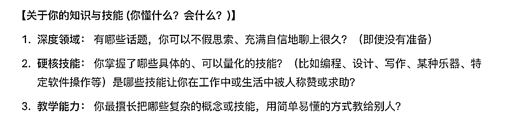
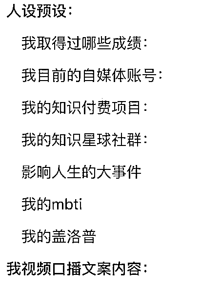
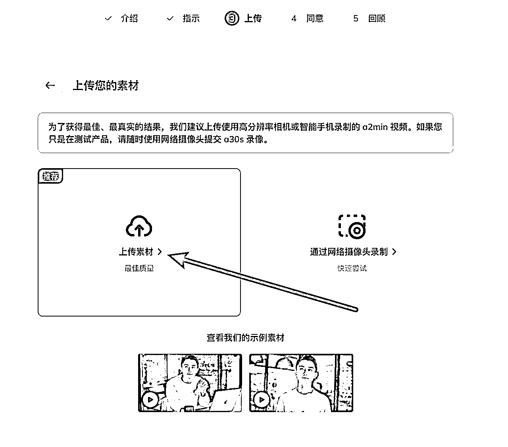

# 25 年 6 月航海 | AI 数字人口播 IP | 实战手册

> 来源：[https://ocn93f5d9olj.feishu.cn/docx/IT6TdYKX1o0T4vxLm7DcMnKWncM](https://ocn93f5d9olj.feishu.cn/docx/IT6TdYKX1o0T4vxLm7DcMnKWncM)

必修篇防失联+MM188166M（李李）长期更新

# 一、什么是数字人 IP ？防失联+MM188166M（李李）长期更新

一开始，我们先来理解“数字人”。

数字人 IP 最后的呈现效果：

数字人IP呈现效果-1.MP4【在线播放】

数字人IP呈现效果-2.MP4【在线播放】

在本次课程的语境下，“数字人”指的是主要由 AI 技术驱动的虚拟形象。它可以是根据真人形象生成的数字分身，也可以是完全独立设计的、具有独特外观的虚拟人物。

其核心特征是 AI 驱动。这意味着通过人工智能技术，例如声音克隆或高质量的语音合成，赋予它声音；并通过算法驱动其面部表情和口型，使其能够模拟人类进行信息的表达和内容的播报。

接下来是“IP”

IP 是 Intellectual Property（知识产权）的缩写。在内容创作和品牌领域，我们可以将其理解为一个具有独特性和辨识度的“品牌形象”或“个人标识”。

就像一个成功的自媒体账号、一位知名的公众人物，或者一个广受欢迎的品牌，它们都形成了自己独特的风格、定位和用户认知，这就是一种 IP。它代表了一种可识别的价值和影响力，并且通常具有潜在的商业价值。

1.

技术与质量挑战

数字人有时看起来很像真人，但细节上（比如眼神、表情、动作）还是有点不自然。这会让观众觉得别扭。要让数字人更自然，往往需要更高的成本或者更先进的技术。这次航海，我们努力让大家看到一个更真实、更有个人特色的数字人。

口型同步和音频自然度：有时候我们用 AI 生成数字人口播，嘴型看起来和声音对不上，尤其是说得快或者有情绪变化时。比如你录制了一段激动的讲解，AI 生成的视频里嘴巴还在慢慢张合，但声音已经说到下一句话了。这种情况就会让人觉得不自然。我们在教程里会教你怎么录制一段口播视频，怎么调整说话节奏、怎么录素材，才能让 AI 生成的嘴型和你的声音更贴合，减少这种尴尬。

2.

制作成本与技术门槛

有同学可能会问，为什么不用市面上免费的 AI 工具？比如有的免费平台，虽然能一键生成数字人视频，但画质差、动作僵硬，声音也不太像自己，付费省时间。我们在航海中，带大家对比了国内外多个平台，帮你选出性价比高、效果好的工具，避免你踩坑，也省下不少试错的时间和钱。

3.

特定场景表现力局限

目前的 AI 在模拟复杂情感、进行非常规或即兴互动、展现精细的肢体语言方面仍有局限，可能难以胜任所有类型的口播内容。

所以在制作数字人本身原始视频上，航海给大家增加了如何自然的口播和拍摄的练习，让我们克隆出自己数字人也会更加自然和真实。

4.

维持“人设”的一致性与真实感

如何让 AI 生成的内容始终符合预设的人设、语气和状态？如何避免内容同质化、缺乏真情实感，让观众觉得“有灵魂”而不是“AI 味儿”很重？

这需要强大的人类策略和精心的 Prompt 设计，在航海中增加了用 AI 训练自己的智能体，让 AI 写出的内容、语气都更加符合我们自己的人设、语感。

# 二、用 AI 智能体辅助 IP 定位

目标： 帮你精准找到自己的内容定位，借助 Gemini 明确你的核心优势和沟通风格

# 2.1 工具推荐 Gemini

1、为什么训练gemini智能体.mov【在线播放】

首先第一步是解决定位问题，我们这里用的工具是 Gemini 。如果大家还没有还没有 Gemini 账号，可以看圈友这篇帖子进行注册（https://t.zsxq.com/AmpNV），或者通过第三方平台购买，实在是解决不了，可以群里问举手提问教练。

为什么用 Gemini？之前我测试过 kimi、豆包、Claude、chatGPT，在其中一个部分，拿我的脚本文案和其他的博主的文案对比，再输出内容，只有 Gemini 的表现最好，所以大家有条件的情况下也可以试试看，当然如果有自己顺手喜欢使用 AI 也可以通用。

2.2 明确价值与方向

# 💡

思考你的独特价值是什么？目标受众是谁？初步的商业化想法？

可能有些圈友会想，我能不能直接开始玩工具、做数字人？

我的建议是：先别急。就像建房子需要先有清晰的蓝图一样，打造一个成功的、可持续的数字人 IP，必须先有明确的战略思考。没有方向的努力，往往事倍功半。

在这一小节，我们的目标是引导大家进行初步的思考，帮你梳理清楚三个核心问题：你的 IP 要提供什么核心价值？你的目标受众是谁？以及你初步设想的内容方向和商业可能性是什么？ 这些初步思考将为你后续更深入的定位和 AI 辅助探索打下坚实基础。

# 2.2.1 如何让 AI 知道你的个人经历 ？

# 💡

之前大家接触到的很多 AI 相关的内容，但是读起来就是不像自己

仿佛没有参与到自己的人生，不懂自己，所以写的内容和自己就像贴了一层皮，没有融合性

所以为了让 AI 更懂我们，就要让 AI 来回答，ta 需要知道我们什么内容？

以下的提问均来自 Gemini，核心是让 AI 更了解我们的方向、生活、找到突破口

2、如何理清自己的个人介绍给到AI.mov【在线播放】

和 AI 的沟通截图 🔽

请大家思考以下几个问题：

# 💡

结合你自身的知识、技能、经验或热情，有哪些方面可以转化为有价值的内容？

（你擅长什么？你对什么充满热情？)

你观察到市场上存在哪些信息缺口、认知误区，或者未被满足的需求？

（人们想了解什么？缺少什么？)

你的目标受众面临哪些具体的痛点或渴望？

（他们需要解决什么问题？渴望得到什么？)

举几个例子帮助大家理解：

例 1： 核心价值可能是用最简单直白的方式解读最新的 AI 行业动态，解决普通人看不懂专业报告的痛点。

例 2： 核心价值可能是提供每日 1 分钟的职场减压技巧，满足上班族缓解焦虑的需求。

例 3： 核心价值可能是系统性地分享某个垂直领域的实操技能，帮助学员提升专业能力。

【思考练习】: 请暂停一下，尝试写下 2-3 个你认为你的数字人 IP 可能提供的核心价值点。

（如果有 Dia 浏览器的前提下，可以试试让 Dia 给你做账号诊断分析）

# 2.2.2 如何让 AI 了解你的性格特点？

3、投喂你的文案，让他知道风格类型.mov【在线播放】

和 AI 的沟通截图 🔽

A I 总结我的说话风格，确保 ta 开始了解我

# 2.2.3 效果展示

接下来我们来看看，不了解我的 AI VS 了解我的 AI 在产出同一篇稿子时，质量如何。

不了解我的 AI（产出的稿子）

好的，这是一份为你准备的口播稿，旨在鼓励职场人勇敢追求副业和人生，注意了开头的吸引力、句子的连贯性和整体的激励性，字数约在 250 字左右，比较适合口播：

（口播稿）

标题：别让打工，困住你的人生！

（开篇，语速稍快，抓住注意力） 嘿！还在为打工焦虑？感觉人生不该只有朝九晚五？

（稍作停顿，语速放缓，引发共鸣） 你心里那个小小的声音，是不是总在说：“我还能做点别的”、“我想试试那个”？那个声音，可能就是你渴望已久的副业梦想，或者是能点燃你热情的真正人生。

（承接，提出顾虑并马上反驳） 我知道，你会担心没时间、怕失败、怕影响现在的工作... 对吗？但你想过没有，最大的风险，恰恰是“不敢开始”？是让那份渴望，在日复一日的重复中慢慢消失？

（鼓励行动，降低门槛） 真的，别害怕！副业不一定就要赚大钱，人生追求也不必一步登天。哪怕只是利用下班后的 1 小时，探索一个兴趣；哪怕只是迈出微不足道的一小步，去尝试了解你想做的事。

（强调价值，升华主题） 这不仅仅是为了增加收入，更是为了找回那个闪闪发光的自己，是为了给人生增加厚度，是拥有选择和掌控生活的底气！

（结尾，有力号召） 你的时间和才华，远比你想象的更值钱！别只为一份薪水燃烧。勇敢点，去折腾、去创造，去活出你真正想要的样子吧！

字数统计： 约 250 字。

要点说明：

1.

前 3 秒关键内容： 开头直接用痛点问句“还在为打工焦虑？感觉人生不该只有朝九晚五？”迅速抓住职场人的注意力。

2.

环环相扣： 从普遍焦虑 -> 内心渴望 -> 点明副业/人生追求 -> 承认顾虑 -> 反驳顾虑/重塑风险观 -> 鼓励小步尝试 -> 强调深层价值 -> 最后有力号召，逻辑层层递进。

3.

口语化表达： 使用了“嘿！”、“对吗？”、“真的”、“哪怕只是”等口语词汇，适合口播。

4.

核心信息突出： 反复强调勇敢尝试、创造可能、活出自我。

5.

长度适中： 250 字左右的篇幅，在 1 分半到 2 分钟内可以讲完，符合短视频或音频的节奏。

希望这份稿子对你有帮助！你可以根据自己的语感和风格稍作调整。

了解我的 AI（产出的稿子）

好的，阿甜！结合你的活力、直率、接地气的风格，以及你那不安分、敢于行动的经历，这里有一份为你量身打造的、面向职场人的口播稿，希望能点燃他们心中的火焰：

（前 3 秒关键内容 - 快速抓住注意力） 嘿！月薪一万就到头了？甘心让“稳定”锁死你的人生可能吗？!

（主体内容 - 环环相扣，激发共鸣与行动） 我知道，你每天挤地铁、做 PPT、看老板脸色，回到家只想“葛优躺”，对不对？ 感觉好像……也就这样了？ 但是！夜深人静的时候，刷着别人闪闪发光的朋友圈，你心底那个小小的火苗，那个“老子/老娘也想试试看”的念头，是不是还在悄悄燃烧？ 听我的！别让它灭了！ 我，阿甜，就是那个不信命、爱折腾的典型！从贵州小城出来，读大专、摆地摊、考研、闯深圳，一路“作”到现在，我只想告诉你： 你的人生剧本，完全可以自己写！ 什么稳定？什么按部就班？那都是别人给的“安全感”！真正的安全感，是自己给的！是你兜里有钱，心里有光，手里有活儿！ 那些你想学的技能，想做的副业，哪怕是从下班后 1 小时开始，哪怕只是在小红书上发发你擅长的小东西，卖卖你的小爱好，都是给自己打开一扇窗！ 别怕丢人！谁还不是从啥也不会开始的？ 别怕失败！大不了从头再来嘛，经验值 +1！ 关键是，去！行！动！ 就现在，立刻！放下手机里那些无关紧要的八卦，想想你能做的最小的一件事是什么？去了解？去学习？去发出你的第一个帖子？ 你的潜力，绝对比你想象的大得多！别再等了！你的时间，超级宝贵！

我是阿甜，一个折腾不停的 ENFP，我相信，只要你敢想敢做，就一定能活出自己想要的滚烫人生！赶紧动起来！

另外，如果你需提升效果，还可以增加给 AI 的前置信息：

# 💡

之前我训练 AI 时候，给到一些相似博主内容做对比，让他在几篇文章中辨认哪篇是我的，并且告诉我原因，这样我们封装的这个 AI 更加知道你的风格。而且 ta 给到你内容之后，你还可以按照 ta 本身的内容进行修改，让 ta 后面出的内容更加贴合你的口播语言风格

# 2.2 锁定你的目标受众和平台选择

前面内容已经整理了自己的特长、方向，和 AI 规划之后，是否有一些自己的核心价值呢，接下来我们需要思考：这些价值是为谁准备的？ 精准地定义目标受众，能帮助我们后续选择合适的平台、制定内容策略、以及使用恰当的沟通风格。

请继续思考：

谁最需要你前面定义的核心价值？

（尝试描绘他们的画像：年龄、职业、兴趣、知识背景等）

他们通常活跃在哪些平台？

（抖音？视频号？B 站？小红书？或其他垂直社区？)

他们在信息获取或娱乐方面有哪些偏好？

（喜欢快节奏短视频？还是深度讲解？喜欢严肃专业？还是轻松有趣？)

了解你的受众，能帮你用他们“听得懂”、“喜欢听”的方式去沟通。

我们继续用刚才的例子：

例 1 受众： 可能是不懂技术但对 AI 感兴趣的职场人士、创业者。

例 2 受众： 可能是压力较大的年轻白领、学生群体。

例 3 受众： 可能是该垂直领域的初学者、希望进阶的从业人员。

# 💡

如果前面的内容已经和 AI 聊过，下一步可以直接问 ta“我的目标客户都是什么样的？他们会比较在哪个平台活跃”，如果在有时间的情况下，在各个平台分发内容也是一种运营策略，但是一定要有侧重点，要不就会哪个平台都像一点，但是哪个平台都没有做好

# 2.2.1 让 AI 帮助我们分析受众和平台

和 AI 的沟通截图 🔽

好的，我们来结合你的受众和你的人设，分析一下各个主流短视频平台，看看你应该侧重哪个：

核心结论：

主阵地/大本营：小红书 （强烈建议继续深耕）

第二增长曲线/重点拓展：抖音、视频号 （潜力巨大，需适配打法）

可尝试/补充：B 站

国际化/特定目标：YouTube， TikTok

平台分析与原因：

1.

小红书 （Xiaohongshu）:

平台特性： 用户以女性为主，购买力强，注重生活品质、个人成长、学习提升。社区氛围浓厚，用户粘性高，信任感强，非常适合知识付费和好物分享的转化。强调“利他”、真诚分享和审美。

与你匹配度：★★★★★ （极高）

完美契合： 你目前的成功已经证明了这一点。你的目标受众（渴望成长改变、想搞副业、关注个人 IP 的女性/年轻人）高度集中在小红书。

内容适配： 你的个人成长故事、小红书运营干货、创业经验、生活感悟等内容，都非常符合小红书用户的偏好。

商业闭环： 小红书是离“交易”最近的平台之一，非常适合你引流到知识星球社群、航海等，实现商业变现。你的“靠谱、有活力”的口碑能在小红书社区有效传播。

侧重策略： 继续作为核心阵地。深挖内容，维护好粉丝社群，持续输出高质量、有价值、有温度的内容。巩固护城河。

2.

抖音 （Douyin）:

平台特性： 用户基数巨大，覆盖面广，算法推荐能力强，内容节奏快，娱乐性强，但也越来越重视知识类内容。容易产生爆款，实现快速涨粉和破圈。

与你匹配度：★★★★☆ （很高，需调整）

破圈潜力： 你的强能量、故事性、直率风格，经过调整后，有可能在抖音获得巨大流量。你的“逆袭”、“搞钱”、“反内卷”等标签在抖音有市场。

内容调整： 需要将内容做得更短平快、更有“爽点”、更强调黄金 3 秒。标题要更吸睛、更具冲突感。可以截取你故事中最精华、最励志、最大快人心的片段。输出快速实用的搞钱小技巧、反 PUA 的职场/人生建议等。

变现路径： 引流到私域（微信）或直接做抖音闭环（如直播、短视频带货、知识内容等）是常见的路径，但信任建立速度可能慢于小红书。

侧重策略： 作为重要的增量平台。提炼核心内容，用更“抖音化”的方式表达，追求更广泛的曝光和用户拉新。可以作为吸引泛用户的入口。

3.

视频号 （WeChat Channels）:

平台特性： 依托微信生态，强社交属性，熟人推荐权重高，用户年龄层更广（覆盖中老年），信任基础好，适合私域联动和转化。

与你匹配度：★★★★☆ （很高，侧重不同）

私域联动： 如果你的知识星球社群或航海需要通过微信转化，视频号是绝佳的承接和放大器。方便用户分享到朋友圈、微信群。

信任背书： 熟人社交链的推荐，更容易建立信任感，适合客单价稍高的服务或航海。

内容方向： 情感共鸣、人生智慧、家庭关系（如夫妻创业）、实用技能等内容可能更受欢迎。你的真诚、接地气的风格容易获得好感。

侧重策略： 作为私域转化和关系深化的平台。与你的微信群、公众号、个人微信联动，发布能激发社交传播的内容。

4.

B 站 （Bilibili）:

平台特性： 年轻用户为主，社区文化浓厚，对深度内容、学习类内容接受度高，用户互动性强（弹幕文化）。适合打造深度 IP 和强粉丝粘性。

与你匹配度：★★★☆☆ （中等）

深度内容： 如果你想做更长、更深度的内容（比如详细复盘创业经历、系统讲解小红书运营体系），B 站是合适的。

人设契合： 你的“逆袭”、“学习”、“折腾”经历，可能引起 B 站用户的共鸣，特别是“学习区”、“知识区”的用户。

挑战： 需要适应 B 站的语境和文化，可能需要更长的视频制作周期。

侧重策略： 可以作为兴趣探索或深度内容沉淀的平台。如果精力允许，可以尝试性运营，观察效果。

5.

YouTube & TikTok:

平台特性： 国际化平台。YouTube 适合中长视频、深度内容、搜索流量；TikTok（国际版抖音）适合短视频、潮流内容、快速传播。

与你匹配度：★★☆☆☆ （较低，除非目标是海外市场）

目标受众： 主要面向海外用户（华人或国际用户）。

内容/语言调整： 需要考虑语言（英文或繁体中文）、文化差异、海外用户关注点等，内容需做较大调整。

侧重策略： 除非你有明确的出海计划或想拓展海外华人市场，否则现阶段可以暂缓投入过多精力。

总结建议：

6.

巩固小红书： 这是你的根基，不能放松。持续输出高质量内容，服务好现有粉丝和学员。

7.

发力抖音/视频号： 选择其中一个或两个作为重点突破口，实现用户增长和破圈。抖音追求“广度”，视频号追求“深度”（社交关系）。需要针对性地调整内容策略。

8.

内容复用与调整： 一份内容可以根据不同平台特性进行二次剪辑和调整，而非简单搬运。例如，小红书的完整版内容，可以提炼出精彩片段或核心观点，用更快的节奏发布到抖音。

9.

精力分配： 根据你的时间和团队情况，合理分配精力，建议“一主一副”或“一主两副”的策略，避免战线拉得过长。

集中火力，在你最擅长、用户最精准的平台深耕，同时选择 1-2 个有潜力的平台进行拓展，是现阶段比较稳妥和高效的策略！

以上的内容都是 AI 基于我投喂的内容，给出的方案

在这里大家可以把问题都给到 AI，当作是人生教练

趁着这次机会把自己想要做的内容、IP 都整理出来

# 2.2.2 你的内容聚焦于哪些话题？（商业选修）

基于你的核心价值和目标受众，你的数字人 IP 主要聚焦于哪些具体的话题或内容板块？

（领域要尽量垂直细分）

你希望你的内容主要达到什么目的？

（是教育知识？提供资讯？娱乐大众？还是激发思考？)

长远来看，你希望这个数字人 IP 发展成什么样？

（比如，成为某个领域的权威信息源？构建一个活跃的社群？或是为你的其他业务引流？)

初步思考一下可能的商业模式或变现途径。

（比如广告、知识付费、电商带货、IP 授权等。即使暂时不考虑变现，有初步方向也能指导内容策略）

例 1 方向： 聚焦 AI 工具测评与资讯解读；目标是成为普通人信赖的 AI 信息源；可能变现方式是广告或付费社群。

例 2 方向： 聚焦实用心理学与情绪管理技巧；目标是提供积极陪伴与价值；可能变现方式是线上航海或心理咨询引流。

例 3 方向： 聚焦特定软件的教学或行业案例分析；目标是成为该领域的在线学习资源；可能变现方式是付费航海或咨询服务。

【作业】: 尝试明确你的数字人 IP 的核心内容领域、主要目标，以及一个长期的愿景或可能的变现方向。

# 2.3 用 AI 辅助自我挖掘（选修和进阶）

这部分的内容是选修的进阶的阶段，有之前和 AI 交流的内容做铺垫，接下来对自己要做的方向和内容应该已经有了大概框架的规划和设计，这个部分是属于通过和 AI 的进一步甚了，更加了解自己的人设、风格，并且能尝试自己用哪种方式进行口播，也可以让 ta 设计口头禅等等

通过与 Gemini 互动提问，挖掘个人特长、兴趣点，明确你的独特卖点 （USP - Unique Selling Proposition） （即你与众不同的核心优势及用户价值）。

# 2.3.1 如何和 AI 进行深度挖掘

把这次互动想象成：你正在主导一次关于你自己的深度访谈，而 AI 是你的智能助手或访谈工具，它会根据你的指令和问题来引导和回应。

可参考我的提示词和回答：

有效的提问策略包括：

提供清晰的背景信息：

把你在 1.1 中思考的结果（如你的初步价值主张、目标受众描述）告诉 AI，让它有上下文。

提出开放式、探索性的问题：

多用“帮我分析一下...”、“有哪些可能的角度...”、“如果...会怎么样？”这类问题，而不是简单的是非题。

迭代追问，不断深入：

不要满足于 AI 的第一个回答。可以针对它的回答继续提问：“能详细说明一下吗？”、“这和我的 [某个特点] 有什么关联？”、“有没有具体的例子？”

角色扮演指令 （进阶技巧）:

让 AI 扮演特定角色，获取不同视角的反馈。例如：“请扮演我的目标受众，评价一下我这个想法。”或“假设你是一位品牌顾问，请指出这个定位的潜在风险。”“你是职场规划导师、人生教练”这些都可以作为 AI 的身份

# 2.3.2 确定人设与风格

利用 AI 辅助，提炼符合你特点的人物设定关键词和沟通风格（如：专业、风趣、治愈等）

示例 Prompt 1: 我的数字人 IP 的 USP 是“[你的 USP]”，目标受众是 [受众描述]。请基于此，帮我头脑风暴 5-7 个核心的性格特质关键词。例如，它应该更偏向“严谨专业”还是“亲和有趣”？为什么？请给出理由。

示例 Prompt 2: 请为我的数字人 IP（USP: '[你的 USP]'， 面向： [目标受众]）生成一段 100 字左右的角色简介，包含其核心使命、主要性格特点和价值观。

示例 Prompt 3: 我的 IP 独特性在于 [你的独特性]。有什么简单的背景设定（可选）能够强化这个人设，让它更有故事感和吸引力吗？请提供 2-3 个建议。

示例 Prompt 4: 结合 [你选择的几个核心性格特质，如：冷静、客观、偶尔冷幽默] 的人设，建议一些可以体现这些特质的“口头禅”或标志性行为模式。

# 💡

使用口头禅的原则：

试着读一读： 哪个说出来感觉最自然，最像你会说的话？

符合核心信息： 哪个最能体现你内容的核心价值（AI 赋能、效率提升、策略先行）？

简洁易记： 最好不要太长，容易被用户记住。

使用场景： 考虑你会在什么情境下使用它（比如视频开头/结尾？强调重点时？)

# 2.3.3 让 AI 整理属于你的个人提示词

# 💡

这里的个人提示词在后面的多维表格要用上！

示例 Prompt: 根据我们之前关于人设 [你的特质总结] 和风格 [你的风格选择] 的讨论，请帮我草拟一份简洁的（一页以内）“人设与风格指南”，用于指导后续的内容创作，确保品牌一致性。

1.

AI 角色设定 （AI Role）: 明确告知 AI 它需要扮演的角色（通常是为你的 IP 创作内容）。

2.

IP 核心身份 （Core Identity）:

IP 名称

核心使命/宗旨

独特卖点 （USP）

3.

目标受众 （Target Audience）:

精炼的受众描述

他们与 IP 主题相关的核心需求或痛点。

4.

人设与个性 （Persona & Personality）:

核心性格特质关键词

IP 所代表的核心价值观

5.

沟通风格与语调 （Style & Tone）:

确定的语调（如：专业、风趣、共情）

语言使用偏好（如：简洁、多用比喻、避免术语）

语句结构习惯（如：偏好短句）

沟通中的“要做”和“不要做” （Do's & Don'ts）

6.

内容领域与边界 （Content Focus & Boundaries）:

主要覆盖的内容主题或板块

（可选）明确需要避免触及的话题。

将这些要素结构化地组织在一起，就能形成一份清晰的指令

测试与迭代你的 Prompt

写好第一版 Prompt 后，它是不是真的有效呢？我们需要进行测试和迭代优化。

如何测试？

1.

将你写好的完整 Prompt 复制给 Gemini （或其他 AI 工具）。

2.

给它一个具体的、小型的创作任务，例如：“请根据我上面提供的 IP 定义 Prompt，为一期关于【会议发言如何避免紧张】的短视频，写一个 3 句话的开场白。”

3.

仔细评估 AI 生成的结果： 这段话听起来像你设定的那个 IP 说出来的吗？语气对吗？用词符合风格吗？有没有体现出人设的特质？

如何迭代？

如果结果不理想，思考是 Prompt 的哪个部分不够清晰或准确导致的？

是人设描述太模糊？还是风格要求没写到位？或者是 Do's & Don'ts 需要补充？

修改你的 IP 定义 Prompt，然后再次进行测试，直到 AI 的输出基本符合你的预期为止。

优化 Prompt 是一个持续的过程，如果你有拿不准的事，都可以和 AI 分享，让 ta 更加了解你。

# 三、录制高质量素材：提升数字人自然度

# 💡

数字人 = 声音克隆 + 口型同步，口型同步就是将你的音频进行对口型，模拟是你真人在说话

目前市面上说的都是【真人】数字人，并不是纯虚拟动画数字人，那么要克隆一个自己的数字人，需要准备两个部分，一个是【干净无杂音】的自己录制的声音，一个是想要克隆的自拍视频，

注意：80% 前期素材的质量和拍摄状态，20%靠后期优化。用心准备、反复打磨好数字人的素材，是做好自然、高质量数字人的关键

想要数字人自然和真实，首先给数字人的视频就要清晰（视频分辨率在 1080p 以上），以及拍摄的状态是自然的，如果一个原视频是 80 分的品质，当进行数字人克隆的时候，出来的效果也许是 60 分，但如果给的是 60 分的品质，出来的效果也许就是 40 分

# 3.1 拍摄前的检查清单

[ ] 镜头已擦拭干净

[ ] 背景简洁无杂物/行人

[ ] 灯光已设置，面部无明显阴影

[ ] 提词器 App 已打开，脚本已导入

[ ] 麦克风已连接并测试

[ ] 手机已开启“勿扰模式”

[ ] 脚本已预读两遍，找到感觉

[ ] 坐姿/站姿已调整到最佳状态

# 3.2 数字人视频录制的光线

49b07e8422ac4d4ca2b3eacc047bd84c.MOV【在线播放】

为什么别人的数字人视频，看起来那么清晰自然？

而你做的数字人却又模糊又僵硬呢？其实只需做好录制要求，你也可以拥有高质量数字人

模特镜头感是第一要素如果模特一面对镜头就紧张焦虑那克隆出来的数字人也会一样僵硬不自然所以一定要把模特调整到自然舒适自信的状态

关于镜头感：很多同学一看到镜头就紧张，这非常正常。这里有个小技巧：不要想着你在“表演”，而是在“分享”。 你可以想象镜头后面坐着的是你一个非常要好的朋友，你只是在把一个你觉得特有意思的事儿讲给他听。忘掉那些“完美”的条条框框，你最放松、最自信的状态，就是最好的状态。

# 3.3 高质量素材录制

cde13e3b323d4a35ab47b2d351efb502.MOV【在线播放】

# 3.3.1 拍摄工具

手机

提词器软件：开拍 App（后面涉及的 AI 剪辑工具也是它）

MTVideo 2.MP4【在线播放】

麦克风（如果有可以戴，没有的话找一个安静的环境）

# 3.3.2 拍摄主体与角度

只拍摄单人的正脸视频，避免多人同时入镜。

嘴巴不要被遮挡，不要把手或者其他东西遮挡住，在这个红框内（重点！！！)

确保五官清晰、无遮挡、人脸不要挪出屏幕。

保持自然表情和状态，避免僵硬或夸张。

开始拍摄的时候，前面 3 秒先不说话，等状态调整好以后，再开始说话

# 3.3.3 手势动作要求

1.

手势不能有特定含义，如比划数字 123、OK 手势、否定拒绝手势、竖大拇指手势、指向镜头等有具体含义的手势。建议是轻微的摊手、点点手等说话时自然下意识的动作

2.

手不能遮挡嘴巴，以及不要出现在下图红框内的区域

# 3.3.4 画面与构图

人物构图：人脸占画面宽度的 1/4 以上。

确保画面完整性：确保五官清晰、无遮挡、人脸不要挪出屏幕。

① 坐着拍摄，手机支架如何摆放

坐着的时候，如果要看提词器，手机支架往前（往你在的方向）倾斜 15 度左右

如果是手机平放，看提词器的时候头会抬着或者眼神会往上飘

可以看一下参考视频：

MTVideo 3.MP4【在线播放】

② 站着拍摄，手臂位置和角度

我大部分时候都是站着录制的，一个手臂的距离

人物同样尽量在中间呈现

MTVideo 6.MP4【在线播放】

# 3.3.5 灯光与环境

RPReplay_Final1746345413.MP4【在线播放】

拍摄时光线充足，不要让人物脸部出现大面积的阴影。

背景简洁，避免杂乱，如果在户外拍摄，确保拍摄时后面不要有行人。

（如果人都是坐着的可以，走动的不行，后期容易穿帮，人会倒着走）

# 3.3.6 视频分辨率与时长

视频分辨率建议 1080p 及以上，竖屏拍摄。

一镜到底，一镜到底，一镜到底，不要后期剪辑，剪辑过的画面会跳帧，后续生成的数字人也是跳帧的

时长建议 1-2 分钟

不同平台对视频的要求不同，如果是在 heygen 里上传，建议 2 分钟（如果录制不了一镜到底的 2 分钟视频，可以录制 1 分钟的，通过剪映工具进行倒放和拼接，实现 2 分钟的数字人视频，操作视频在这里👇）。

剪映倒放剪辑版.mov【在线播放】

还可以根据拍摄视频的时长来调整，如果平时大部分都是拍 1 分钟以内的视频，

# 3.3.7 背景设置

绿幕拍摄可换背景，实景拍摄则背景是固定的。

6、口播细节呈现.mov【在线播放】

# 3.3.8 人物语气和动作的重要性

8、口播提词器演示.mov【在线播放】

# 3.3.9 录制视频的常见问题 Q&A：

Q：可以录制几个数字人？

A：不同平台对数量有不同要求，但一般 100 个数字人形象已足够。可以通过更换衣服、发型、场景、状态（站、坐、走）、角度等方式，克隆多个数字人形象。

Q：录制克隆视频时需要念指定文案吗，比如 1234567？

A：不需要。可以根据自己的说话习惯或想要的表达状态，自由选择口播文案【参考如何写出自己念的舒服的逐字稿： 模块一】。建议提前熟悉逐字稿，尽量一镜到底流畅表达，出现口误时不要怕，继续保持自然的状态往下念，因为声音是单独克隆的，录制视频的时候念错字也没关系，周围有环境杂音也没关系，后期生成数字人的时候都不会有这些杂音。

Q：竖屏拍还是横屏拍？

A：建议录制竖屏的视频（全身/半身均可），人物占比越大，克隆效果越好。横屏且人物占比小于 1/3 时，画质和克隆效果会变差。

Q：克隆视频需要录多久？

A：建议录制时长不低于 1 分钟，时长决定数字人动作的丰富度，避免动作频繁重复。录制的视频时长相当于数字人模型的动作时长，为避免数字人动作频繁重复。

举例说明：如果你录制了 15 秒的视频，但是你的文案可能是 30 秒的时长，那么生成的数字人视频大概就是先按视频 0 秒到 15 秒的顺序生成，再倒放 15 秒，得到一个完整的 30 秒

Q：数字人可以换背景吗？

A：需要真人在绿幕背景下拍摄，这样的绿幕视频可换背景，可以在剪映里进行人物抠图。如果是拍摄的实景视频，背景是固定的，不可以更换，虽然可以用抠图的方式来实现背景更换，但是看起来不太自然，不建议这样做

Q：数字人可以换衣服吗？

A：不可以。换衣服需你本人重新换衣服，再拍几条素材视频，重新克隆数字人，克隆的数字人人物的服装、动作和场景等等都是和原视频保持一致。

Q：数字人有表情和动作吗？可以自动根据内容生成吗？

A：数字人的表情和动作与录制视频完全一致，无法自动根据内容生成新动作或表情。数字人的动作是按照你拍摄时的顺序进行播放的，举例：如果你录制了 15 秒的原视频进行克隆成数字人，你输入给数字人的文案是 30 秒，那么数字人会先用你录制的 15 秒生成视频，剩下的 15 秒会将你的原视频进行【倒放】，最终是一个按顺序生成的 15 秒视频 + 一个倒放的 15 秒视频，组合成一个 30 秒的数字人视频

Q：数字人只能站着或者坐着吗？可以动吗？

A：数字人可以走动、跑步，动作和你上传的原视频一样。只要注意录制时人物的动作不要遮挡住嘴巴。

Q：可以侧脸出镜吗？

A：可以。录制的数字人时可直视镜头口播，也可侧脸口播（类似采访第三人称视角），但需全程露出完整的口型，侧脸角度在 10-30°以内（微微侧脸）。

Q：一定要全身出镜吗？

A：不一定。可选择全身、半身或特写出镜，人物占比不要太小，否则会影响克隆效果。

三、形象与声音克隆

Q：数字人形象和声音是一起克隆吗？

A：最好分开克隆。形象克隆用你单独录制的视频，声音克隆用你单独录制的音频。可以只克隆形象用真人配音或 AI 配音驱动数字人（比如克隆你自己的形象，再配上悟空的配音），也可以克隆你自己的声音直接输入文字驱动数字人。

四、美化与后期处理

Q：数字人的头部动作、身体动作、美颜效果、服装等会变化吗？

A：不会。数字人会保留录制时的样子，人物的动作是顺序播放，模板结束后再倒序播放，不会根据内容自动匹配动作。

Q：录制时手势和说话节奏有什么建议？

A：建议根据你的真实使用场景，来确定说话节奏，手势动作建议通用百搭，避免大幅度或指向性动作。

Q：可以后期美化视频吗？

A：可以。如需瘦脸美白等效果，在录制完视频后，先对原视频进行美化，再提交数字人克隆。数字人克隆完成后不支持二次修改。

# 3.4 声音素材录制要求：

如果前面录制数字人视频的时候，状态已经非常好了，口播也很顺畅，同时也是在安静无回音的环境里拍摄的，那么下面的【声音录制】可以省略，因为你已经有了一个很好的【音频样本】可以通过电脑版的剪映，导入录制好的数字人视频，直接选择右上角的导出，只导出音频文件。

然后直接跳到【数字人生成】的章节，开始克隆数字人

如果是在户外拍的数字人视频，周围声音很嘈杂，可以按下面的步骤，在安静的房间里单独进行录制【高质量的音频样本】

内容要求：

1.

准备口播逐字稿：准备好一份你念起来很自然很舒服的文案

2.

粘贴到开拍里面，选择提词器功能（两个悬浮方式）可以参考前面的拍摄工具的内容

# 3.4.1 录音设备准备

iPhone 手机和安卓手机都可以，推荐 iPhone 进行录制

如有条件，可使用独立麦克风配合手机进行收音，用来拍摄户外的场景很有用

iPhone 手机录音操作步骤：

1.

在手机“设置”里找到语音备忘录，选择音频质量为【无损】

2.

打开系统自带的语音备忘录 app，点击开始录制

安卓手机录音操作步骤（以小米为例，其他厂家步骤类似）

3.

打开手机自带的录音机 app

4.

开始录制

# 3.4.2 录制环境要求（麦克风使用与否对比）

录制环境安静，无杂音，无回声的房间录制。录制时避免有外放音乐、其他人说话

使用高质量麦克风（如果没有用手机录制也行），保证声音清晰饱满。

录制时自然表达，避免念稿腔（这点很重要！！！要有情绪和起伏）

尽量说普通话，不支持方言克隆

MTVideo 5.MP4【在线播放】

# 四、项目实操：数字人声音克隆与形象克隆

对比分析国内外常用平台 （如 HeyGen， Minimax/飞影等） 的特点、成本与效果，助你做出选择。

数字人 = 声音克隆 + 口型同步，所以我们找到一个【声音克隆】比较好的平台，再找一个把数字人【口型同步】做的好的平台，把两者结合起来可以得到一个高质量的数字人 IP。最优解当然是一站式生成，在一个平台上既把声音克隆做的好，又能把口型同步做的好，大家可以多去尝试下几个平台测试效果，没有最好的平台，只有最适合你的平台

# 4.1 主流平台选择指南

记住！平台不是最重要的，你的内容才是核心！

如果一天只出一条数字人视频，用哪个平台都一样，没有一天出 3 个数字人之前，先不要纠结用什么平台，哪个最适合当下的自己，就先拿过来用，做起来！

数字人平台

价格

视频时长

主要功能亮点

适用人群/备注

飞影

¥120/月

30 分钟

形象复刻（100 次/月）

1080P 导出、基础声音克隆、积分可充值

低成本起步，适合初创/小批量

蝉镜

¥198/月

95 分钟

2D 角色/背景音乐无限用

PPT/PDF 导入（20 页）

适合新手，单条成本低

平台支持批量产出

Heygen

$29/月（约¥210）

无限视频

单条最长 30 分钟

无限视频、1080P 导出

只能克隆一个人（单个形象可以有 300 个视频）

大批量产出，国际化

总结建议：

如果你追求低成本、支付便利，飞影和蝉镜更适合

如果你需要大批量产出、国际化、多语言支持，Heygen 功能更强，但价格和访问门槛较高。

声音克隆：

Minimax：克隆声音比较真实，不光是音色的还原，还有人物的【气口】、【停顿】

# 💡

现在声音克隆如果有一些机械感或停顿不自然等情况，可以通过将声音【倍速】来调整，可以考虑对音频进行 1.1-1.5 倍加速，一定程度上可以弱化 AI 感

Minimax：现在每天免费送 1 万积分，每天可以生成 20 个 1 分钟时长的音频，基本是够用的 ，网址：https://www.minimax.io/audio

飞影：可以单独克隆声音，不过需要 199 的会员才可以：https://flyworks.ai/home

蝉镜：可以克隆声音，会员是 198：https://www.chanjing.cc/home/

口型同步：

Heygen：口型同步效果不错，但是声音克隆输出中文很别扭，可以上传在 Minimax/飞影里克隆的音频，再使用 Heygen 去生成数字人

飞影：120 块的会员，可以做 2-30 个 1 分钟的视频：https://flyworks.ai/home

蝉镜：198 块的会员，可以做 95 分钟视频时长：https://www.chanjing.cc/home/

Q：为什么有些平台可以一站式做数字人，还要这么麻烦用多个平台混合呢？

A：每个业务的场景不一样，没有最好的工具只有最适合你的工具，根据你的业务场景来选择【工具/平台】，才能实现最优效果

如果你做数字人带货，可以用蝉镜

如果你需要大批量产出视频（每天最少 3 条以上），选择 Heygen 更划算

想要低成本起步，可以用飞影的会员

就像 AI 大模型有很多，出图我们会用到 chatGPT-4o，写 IP 文案我们会用到 Gemini，AI 写作会用到 Claude，批量生成内容我们会用到【飞书 + DeepSeek】。不同的模型去适配不同的场景，找到最适合的工具。

看似一个简单的数字人视频，其实背后是多个工具协作： Gemini 写文案 + Minimax 做声音 + Heygen 做口型同步 + 开拍剪辑 + 开拍做封面。

最优的工作流不是用一个万能的工具，而是让每个环节用最合适的工具，组合成“局部最优解”，最终实现整体的最佳效果，灵活组合，打造高效的内容生产流程。

下面的工作流是我们组合出来的，大家可以根据自己的业务来选择工具进行组合

# 4.2 声音克隆

先听声音克隆后的效果：

克隆效果.mp3

下面以 Minimax 为例演示实际操作：

# 4.2.1 物料准备

1.

谷歌账号（目前 minimax 必须要谷歌账号登录）

2.

需要克隆的【声音素材】

3.

一段文案话术

# 4.2.2 克隆实操

打开网页：https://www.minimax.io/audio

点击侧边栏的【Voices】，创建你的克隆声音

按照下面的步骤上传音频

上传完之后，选择使用克隆好的声音

# 4.2.3 生成克隆后的音频

输入文案，点击提交

# 4.2.4 设置音频倍速

现在声音克隆如果有一些机械感或停顿不自然等情况，如果你本身说话的语速比较快，可以通过将声音【倍速】来调整，对音频进行 1.1-1.5 倍加速，一定程度上可以弱化 AI 感，测试出和你语速相似的速度

# 4.2.5 音频下载

下载按钮比较小，在右下角，点击即可下载

# 4.2.6 音频效果验收

1.

听听声音的效果，音色是否和你本人类似

2.

克隆出来的语速是否会过慢，如果过慢可以调节下【语速】

# 4.3 数字人形象克隆

几个平台都可以测试下，有国内和海外的，根据适合自己的来选择，国内有蝉镜、飞影，海外有 heygen

# 4.3.1 克隆实操

# 4.3.1.1 Heygen

打开海外平台 Heygen 的网址：https://app.heygen.com/login，推荐用谷歌账号快捷登陆

选择免费版本，免费版可以制作三个数字人，先用免费版熟悉整体流程，选完版本后会出现问卷调查，这里可以随便填：

进入 heygen 后，在左侧边栏里选择 Avatars 进行创建自己的形象克隆

按照下面的截图进行操作：

选择视频的环境，实测发现选哪个都不会影响生成的数字人的质量，推荐选择左边静态的背景，大部分录制的数字人都是在室内

上传在手机上录制好的视频素材

Heygen 需要上传 2 分钟的视频，如果你只录制了 1 分钟，可以通过剪映的【倒放】来实现 2 分钟的视频

点击看操作视频：

剪映倒放剪辑版.mov【在线播放】

进入人脸验证，需要打开电脑摄像头，读一段文案：

# 💡

我，某某某（这里填入你的名称，随便填一个），特此授权 HeyGen 使用我的影像资料来创建 HeyGen 平台上的 HeyGen 虚拟形象

如果电脑没有摄像头也可以用手机，推荐使用电脑进行人脸验证

验证成功后就可以创建你的数字人形象了，建议多传几个，去测试哪个视频生成的效果好

为了能做出【高质量】的数字人视频，我们至少上传了 50 个形象视频，最后筛选出来了 24 个长期使用，而且还会持续增加，只要持续测试不断优化，才能做成【高质量的数字人】视频

选择你要生成的数字人形象，生成数字人视频

上传在 Minimax 上克隆的音频：

提交

免费版生成的是有【水印】的，而且无法选择视频的分辨率为：1080p，帧率为 30 帧，前期测试不用充会员，免费版可以生成 3 次，先测试

效果展示：

国内拍的中式.mp4【在线播放】

一天净赚一个.mp4【在线播放】

# 4.3.1.2 蝉镜数字人

先用免费积分体验下流程和效果，整体流程和 heygen 差不多，也是上传一段人物授权视频，进行定制数字人克隆

蝉镜地址：https://www.chanjing.cc/home/

# 4.3.1.3 飞影数字人

飞影地址：https://flyworks.ai/

# 4.3.2 效果验收

重点关注：

1.

口齿是否会模糊

2.

嘴形匹配是否正常，和人物看起来会不会不协调

3.

嘴形区域是否有遮挡

4.

手势的动作幅度是否过大

5.

嘴形周围是否有模糊的马赛克

克隆效果验收.mov【在线播放】

# 五、AI 智能剪辑数字人口播视频

# 5.1 常见问题排查

“为什么我生成的数字人嘴型有点模糊/奇怪？” -> 可能原因与解决方案： “检查一下你录制的原视频是不是有轻微的运动模糊？或者光线不足导致面部细节不够清晰？尝试重新录制一段，确保对焦清晰、光线充足。另外，确保你上传的音频是干净无噪音的。”

“克隆的声音听起来还是有点“AI 味儿”，怎么办？” -> 可能原因与解决方案： “1。 检查你的录音素材，是不是感情太平淡了？可以尝试带着更丰富的情绪重录一遍。2\. 在输入文字转语音时，把长句子切分成短句，AI 会处理得更自然。3\. 尝试我们提到的“倍速”大法，1.1-1.2 倍速通常能有效优化节奏感。”

数字人生成完下载到电脑里，需要传输到手机上，使用手机上的开拍 App 进行剪辑

# 5.2 文件传输防失联+MM188166M（李李）长期更新

使用 localsend（https://localsend.org/zh-CN/）传输文件到手机非常方便，只要设备都连在同一个【Wi-Fi】下，就可以跨设备进行传输，安卓、Windoes 和 Mac 的安装包在这里，苹果手机可以在苹果应用商店里下载，大家根据对应的系统进行安装：

LocalSend-1.17.0-android-arm64v8.apk

LocalSend-1.17.0.dmg

电脑和手机都安装完之后，在电脑端点击【刷新】按钮，查找设备

选择下载好的数字人视频文件，点击对应设备进行传输

选择下载好的数字人视频文件，点击对应设备进行传输

完整的操作视频如下：

localsend传输.mov【在线播放】

# 5.3 AI 快速剪辑口播

# 5.3.1 文字快剪

首先需要下载开拍 App，大家都下载过 APP，这里详细流程这里不赘述了。

第一栏是【文字快剪】快速删除口播中错误或者不要的文案，不过我们是生成的数字人音频，文案都是固定好的，所以这一步可以跳过，直接到【网感模版】选择你想要的模版进行套用。

# 5.3.2 一键包装网感视频

打开【网感模版】这里的模版会定期有更新，选择适合你的模版，点击进行一键包装

# 5.3.3 使用网感模版进行一键包装

如果你在用【网感模板】剪辑做了一些调整，比如换了音乐、标题更换等，如果你下一次还要使用，在保存后点下方的【存为模板】，返回打开【我的模板】，就会保存在你的【预设模板】里

如果你想要保存但是忘记了也别担心，打开你刚刚剪辑完的内容，再保存一遍就可以了

# 5.3.4 更好使用画中画功能

画中画可以让我们的内容更加丰富，所有的画面都是数字人出现，会让用户视觉疲劳

所以我们中间可以插入画中画，贴图片或者视频，作为内容的辅助和讲解

一方面增强用户的视觉观感，另一方面可以弱化数字人的存在

具体的操作方法可以看这部分的课程内容：

RPReplay_Final1746349636.MP4【在线播放】

# 5.3.5 用 DeepSeek 生成 AI 画中画再嵌入

如果找不到比较适合无版权的视频，可以用开拍里面自带的【一键成片】，能通过你这段口播文案直接生成一些视频

这些视频不一定全部都要用上，我们截取部分就可以。

具体操作方法，可以看这个视频：

MTVideo 7.MP4【在线播放】

剪辑建议：

一个视频的后期可以做得很复杂，但对于口播 IP 来说，有三件事是投入产出比最高的：

1.  精准的字幕 - 保证用户在静音下也能看懂。

1.  吸引人的开头和封面 - 决定了用户是否会点开和停留。

1.  合适的背景音乐 （BGM） - 奠定视频的整体情绪和节奏。

先把这三件事做好，你的视频就已经及格了。

# 5.4 使用 AI 封面模版，快速完成封面制作（保存 AI 封面）

重要的点在于：

1、选择本身比较好的封面原片

2、选择比较符合自己内容的封面模板

3、做了不错的模板可以保存为自己的模板，长期使用也可以做修改

快速完成封面包装，可以具体看这个视频讲解：

RPReplay_Final1746605057.MP4【在线播放】

# 5.4 多平台分发

使用【蚁小二】进行多平台账号管理和分发

免费版可以绑定 5 个账号，每天能发布 3 次，前期跑 0-1 够用了

# 六、内容深度搭建：AI 选题与管理

目标： 教你搭建一个高效的内容选题系统，并掌握用 AI 辅助筛选选题、构思脚本框架的方法。

# 6.1 寻找内容灵感来源：

了解从哪里获取选题信息（如热榜、行业网站、对标账号等）

# 6.1.1 今日热榜

可以通过【今日热榜】https://tophub.today/ 这类聚合网站，收集各大平台的热榜信息：

建议从一个平台着重去做，要不然可能每个平台流量都抓不好

这个也是大家常说的，为什么在 xxx 平台爆了，在 xxx 平台没人看？因为用户群体是不同的

但是也有一些会多平台都有不错的反馈，就像有的热点就是全平台爆的情况

核心是你要知道你要模仿哪种内容更重要！

大家可以看这个视频分享：

13、举例：如何蹭爆款话题流量？.mov【在线播放】

# 6.1.2 小红书的热榜

如果是初期，也不用买数据网站，小红书热榜是一打开就能看见的，小红书在推的话题

这里是有快速的一个流量曝光，但是这里的话题是每分钟都在换，很难赶上这个话题

小红书后台提醒

在小红书后台的“活动消息”，会根据你平时发的内容会有一些内容推送

可以看看最近哪些话题有流量，并且带上标签去蹭话题

小红书话题官方账号

和你话题赛道相关的，可以看小红书官方薯账号，经常会有一些话题和提示

后台一般会按照他们的话题去集中推流

官方账号有哪些可以参考？

# 6.1.3 各平台找到的对标账号或者笔记来参考

这个是运营常用的方法，以随机做内容的方式去找比较被动，在平时要搜集素材

我们一般常说的“对标”，可以理解为：对标笔记和对标账号

对标笔记：

这个博主出的这条内容，你可以参考，和你的内容、话题非常相关，可以放到收藏夹或者文档

对标账号：

这个博主出的 50%以上的内容，都和你比较相符，可以列为对标账号的方式，多看看他们平时出的内容和话题，而且不管是笔记还是账号，并不是只喜欢一两个，甚至可以把他们很多账号杂糅到一起，用你的话、你的风格说出来就是不同的内容～

12、如何找自己适合的话题.mov【在线播放】

# 6.2 利用 AI 分析筛选选题

和 AI 交流，让 AI （如 DeepSeek） 从多维度（用户需求、热度、可行性等）评估选题价值。

在前面 IP 预设的问题中，我们大概已经确定了我们的方向，可以让 AI 根据你的方向出一些选题建议

接着，可以把你打算做的选题再切一个去问 AI，让他再给你一些建议：

# 6.3 AI 辅助脚本构思

针对选定主题，利用 AI （结合模块一的 Prompt） 快速生成脚本大纲或核心要点。

现在很多的 AI 能明白自然语言，所以可以直接把 ta 开始给你的选题再反问 ta，让 ta 给你生成文案

你再做修改和调整，就会比自己写作快一些。

# 6.4 搭建飞书内容库：

如果想要批量生产，可以设计飞书的多维表格，结合 DeepSeek 进行创作，系统化管理你的选题、文案、标题

之前没有接触过飞书多维表格的小伙伴不用担心，和 Excel 是类似的界面，很容易上手，只需要下载好【飞书】即可

打开飞书，找到【云文档】点击右上角的新建按钮，选择【多维表格】

新建一个空白表格，之后的操作可以看下面的操作视频

# 6.5 AI 选题深度加工： DeepSeek 联网搜索与人设风格改写

操作视频：

生财-飞书-DeepSeek-选题批量出内容.mp4【在线播放】

演示视频：

飞书多维表格批量生成.mp4【在线播放】

# 选修篇

# 💡

相信看到选修课的你，数字人 IP 已经初具雏形了，内容生产也越来越顺畅了。

到这个阶段，你的问题可能变成了：

怎样才能让我的数字人不仅仅是“产出内容”，更能真正“创造价值”，甚至产生变现？

我已经能做出不错的视频了，但如果想一天覆盖更多平台，怎么省力的做到多平台分发？

如何借助自动化工具，帮我批量化生成数字人，让我能解放双手，去做更重要的事？

如果你心中也有这些问题，那么，【选修篇】正是为你精心准备内容。这里没有枯燥乏味的理论说教，只有清晰的流程步骤。

准备好了吗？让我们一起探索数字人 IP 的更多可能。

# 七、商业化设计与多平台运营

目标： 学习如何为你的 AI 数字人 IP 设计有效的商业模式，选择合适的平台进行运营，并最终实现价值变现。

# 7.1 平台选择与运营策略：

在这个章节，想要给大家拆解主流内容平台的特点，制定针对性的内容分发与运营策略

但是关于不同平台的运营策略，在之前的航海也有过，因为运营方法也是需要好好研究的一个大板块

抖音 : 年轻潮流聚集地，算法驱动强劲

用户画像： 用户基数庞大，年轻化、一二线城市用户占比较高，兴趣多元，对新奇、娱乐、热点内容敏感。

内容生态： 内容极其丰富，更新快，节奏快。

算法特点： 内容能否“爆”，很大程度取决于最初的互动数据和能否抓住用户注意力。

运营关键点： 重视黄金三秒开头、视频节奏感、BGM 选择、参与热门挑战/话题、保持较高更新频率。

视频号 : 熟人社交驱动，私域推广较强

用户画像： 依托微信生态，用户年龄层更广，中高年龄层、职场人士占比较高。内容触达受社交关系影响大。

内容生态： 内容更偏向知识资讯、生活感悟、情感共鸣、企业宣传等。

算法特点： 社交推荐权重极高（好友点赞、在看、群聊分享）

适合的 IP 类型： 面向职场、泛知识、生活、健康等领域的 IP，内容适合在熟人圈或社群中传播。能与公众号、社群、小程序等微信生态联动的 IP。

运营关键点： 鼓励用户点赞、在看、分享，利用好微信群、朋友圈进行内容冷启动，内容标题和选题要考虑社交传播性。

小红书 : 种草与生活方式社区，搜索价值高

用户画像： 年轻女性用户为主，集中在一二线城市，消费能力较强，注重生活品质、审美和实用性。

内容生态： 美妆、穿搭、母婴、家居、旅行、探店、学习、职场干货等是热门。内容强调真实分享、实用教程、精致美观（“种草”属性强）。

算法特点： 搜索流量占比高，用户习惯通过搜索解决问题或寻找攻略。同时也看重内容的实用价值（收藏量是重要指标）、互动和账号权重。

适合的 IP 类型： 视觉呈现好（对数字人形象和背景要求高）、能提供强实用价值（教程、攻略、测评、知识干货）、定位精准垂直的数字人 IP。

运营关键点： 精美的封面和标题（吸引点击），高质量的视频/图文内容，SEO 思维（关键词布局在标题、正文、标签中），真诚的用户互动。

大家可以接着看这部分的视频内容，也许会更加方便大家选择平台

9、选择什么平台更新内容.mov【在线播放】

# 7.2 主流变现路径解析

了解广告商单、知识付费、平台分成、短视频带货等常见变现方式的运作模式与成功案例。

# 7.2.1 广告商单

接什么商单？

广告商单就是接广，在这里得注意，一般是你是什么方向，就容易接到什么方向的广告

你看做知识博主的很少接到美食广告；做好物分享博主的，很少接到科技类的广告，这个是数字人 IP 个人的调性

这个又和前面我们的方向串联起来了，对吧？

如果数字人 IP 要接广告，那一般就是真假一起混起来，因为你要拿产品展示，或者画中画（很少有商家希望是画中画出现），但是数字人 IP 基本大家都是做知识付费为主，后面我们会聊到

商单价格？

虽然说做内容不能太功利，但是每天生活就要吃饭消费，要看清楚自己未来能努力的方向呀

小红书目前广告量和价格预算都是比较高的，按照数字人口播 IP 来看，一般是自己粉丝量的 5-10%之前的报价

特别是小红书方向，要精不在多！但是做这样的分享类博主，后面一般都有知识付费的产品

# 7.2.2 知识付费

知识付费这个目前现在知识博主比较大的板块收入来源，简单来说：

知识付费就是把你会的，他们想要了解的，通过你的付费产品做一个链接。

我们现在说知识付费方向，在市场一般是有低中高客单的的产品。

你分享的东西大家想要和你链接，一般都不是免费的，都会给到一定的费用。

在平台上卖虚拟资料产品，是和你建联的第一步，就是价格比较低的产品，一般不高于 100 元。

市场价格是 30 元左右。

下一步会到你的私域，你还有一些咨询、陪跑的项目对他们进行售卖。

就是低转高，有几百元的中客单、也有千元的高客单产品。

卖什么？

这事儿就是把你最懂的知识、最拿手的技能，打包成产品卖给需要的人。它和广告最大的不同在于：广告是“借”你的影响力给品牌用，而知识付费是直接销售你自己的核心价值。这不仅仅是赚钱，更是建立专业权威、筛选高价值用户的过程。

卖什么是个问题，在“虚拟资料航海”中有一些建议和资料，可以参考，但是这些东西一般有版权问题，不找你还好，做大了找到也比较麻烦，就像市场上倒卖生财的帖子一样，其实也都是不可取的。

在前期其实可以从自己出发，想想哪些问题是别人平时爱问你的，常见的一般有“怎么写简历”“我账号有什么问题”“我现在好难过，你能开导我吗？”“我现在执行力很差，能带我吗？”这些其实就是需求，需求就是别人需要你，来帮助他，去完成的。

那么就从上面的需求着手，我们可以有哪些产品出现，以及有哪些形式？

录播课程：

这是 AI 数字人最适配的场景！ 你可以把一整套知识体系，拆解成一节节的课程，由你的数字人来主讲。

可以把简历中常规的问题、注意的点罗列出来，就不用每次来人都要一对一再讲一遍，这个就是简单的简历基础业务课程；

看账号有什么问题：可以同样可以录制成自媒体运营的基础课，让他们自己检查，比如账号四件套、包装、封面、选题等等，这个就是自媒体的基础课程。

疗愈咨询：这个其实是很大的市场板块，只是大家不太注意，为什么呢？觉得自己能做开导是很正常不过的，但是这个恰好是大家需求的，因为你可能经历过，你知道他这个阶段；你可能看书多，你知道用什么言语去帮助他，这个其实都是技能，我们都可以做的。但是大家底层都比较类似，比如内核不稳定、情绪容易失控等，你可以把这些常见的问题做成小课程，让他们先听你说，看看是否能解决他们的问题，如果不能，再给他们后面的社群、轻咨询等。

执行力不好，是有拖延症，为什么现在都有什么打卡活动，让大家一起行动，如果没有这个活动，大家行动力可能会更差。如果你的执行力很强，能带着一些人行动，做 100 天打卡营，或者 365 年度打卡，这个就是你能变现的方向。

这些变现的逻辑都是一样的，就是解决别人的问题，只是表现形式不同，可以继续看下面的方式。

然后你再思考刚刚我们讲的这几种变现的方向，套用下面的形式，你会怎么来设计。

设计自己的付费产品，也是打磨自己内容的过程。

付费社群/会员

建立一个付费社群，在里面提供独家资讯、深度内容、定期答疑等。

电子书/付费专栏/报告

将你的专业知识系统化地整理成文字产品。

线上训练营/轻咨询

针对特别情况，想要和你深度链接，需要你深层答疑的，可以做咨询业务，按时间来付费

如果人比较多，可以做训练营的模式，让更多人和你较为紧密连接

# 7.2.3 短视频带货

目前市场主流的变现方式是这些，要结合之前对自己的了解，看自己想要做哪些方向的变现。

但是要注意：并不是说一个时间段只能选择一种变现方式，也不是说选择一种之后不能变化。

在商业模式里这些都是可以变化的，特别是针对刚起步的伙伴们。

在自己单干后，各种项目眼花缭乱，有的跑得很顺利，可能很快就赚到一些钱；有的则跑很久都看不到效果。

在这时，很容易被外界的声音干扰：

“我一个视频就涨粉 xxx”

“我现在单月变现 xxx”

首先，我们可以看看他们后台数据是不是真的；如果是真的，那牛逼呗，但是这个绝对不是因为一个月的结果，是他们之前就在某处深耕，自媒体是他们的放大器，并不是突然被看见

如果我们刚开始做，就慢慢开始，多学习自媒体、表达力、商业。

# 八、批量化高阶应用

经过上面的手册，到这里的同学你们已经经历了 0-1 的阶段，下面是如何通过 1-10 进行放大。

拆分数字人/口播短视频的核心：文案、声音、出镜人。

文案我们通过梳理自己的人生经历，结合 AI 有了自己的人设定位，实现了从 0 到 1 生成适合自己的文案。

声音和形象也通过一些克隆工具，实现了从 0 到 1 生成自己声音的音频。

下一步就是批量化处理，实现从 1 到 10 的转变，根据我们拆分出来的三个大要素，文案、声音、出镜人：

文案如何从 1-10，批量生产

有了文案后，如何将声音从 1-10

有了声音后，如何将视频从 1-10

有了视频后，如何将剪辑从 1-10

先思考，没有方向的时候，就可以找 AI，遇事不决，AI 解决！

# 8.1 第一种方式：手动操作

最简单最粗暴的方式就是【手动复制】，一个数字人口播短视频从选题到发布要经历下面这些步骤

1.

文案通过飞书 + DeepSeek 批量生成

2.

手动复制文案到【声音克隆】的工具，生成声音

3.

下载音频

4.

再手动上传到【数字人生成】的工具进行数字人生成

5.

再下载视频

6.

再手动通过 localsend 传到手机上

7.

在手机上进行剪辑

8.

再同步分发

# 8.2 第二种方式：平台支持批量生成（蝉镜）

蝉镜平台内置可以批量生成，打开蝉镜的官网，找到【批量生成视频】

选择多个数字人形象，批量导入文案脚本，

点击下载模版，根据模版的格式把文案和标题对应的输入，一次最多支持 10 条数字人导入

这种方案可以帮我们在批量制作数字人这个过程节省时间

# 8.3 第三种方式：用 RPA 工具替代手动操作防失联+MM188166M（李李）长期更新

RPA 思路：和蝉镜批量做数字人一样，我们需要先准备一份表格，把对应的文案、标题、使用哪个数字人等等配置输入到表格的表头，让 RPA 自动读取表格里面的文案，打开声音克隆网页，复制文案进行声音克隆，打开数字人网页选择对应的数字人进行制作，下面是演示视频：

影刀RPA批量制作数字人演示.mp4【在线播放】

RPA + 手机 = AI 自动化剪辑

恭喜你通关 AI 数字人口播 IP，希望你能运用所学的策略和技术，去实现内容的规模化输出，在多平台放大你的 IP 价值，收获你曾渴望的影响力与商业回报！一起生财有术！防失联+MM188166M（李李）长期更新

