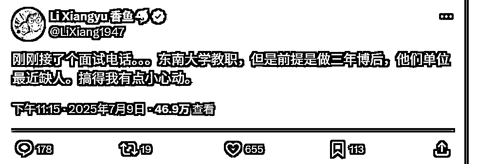

# AI 自媒体 - X（推特）丨实战手册丨2025 年 9 月

> 来源：[https://ocn93f5d9olj.feishu.cn/docx/BamVdmYu2opFKwxH4XBce4j5nKe](https://ocn93f5d9olj.feishu.cn/docx/BamVdmYu2opFKwxH4XBce4j5nKe)

# ⛵新手如何入门【AI 自媒体 - X（推特）】项目？

# 1\. 项目介绍

欢迎大家来到【AI 自媒体-X（推特）】分船～

【AI 自媒体】是今年比较容易也是成本极低的积累流量的方式，

而【推特】是普通人做自媒体最大的流量平台机会。

为什么建议大家在 X（推特）做 AI 自媒体？

国内像小红书、抖音这些平台，要么拍视频、要么做图，内容制作成本高、起号难，对内容的条条框框限制也很多。但推特不一样，它是一个文字友好型平台，而且面向的是全世界的用户，平台用户量大。只要你写得有价值或有趣，哪怕是只有几百粉丝的账号，也有机会发出上万、甚至百万浏览的内容。

像下面这个中推案例，几千粉丝（最新粉丝量已破万啦），两行字就获得了 46 万曝光量：



像下面这个账号只有几千粉丝，一篇推文就获得了 190 万曝光量：


还有一个典型的案例是——本期航海教练阿西

她之前主业做互联网用户增长运营方向，同时运营着一个推特账号叫“阿西_出海”。2 个月涨粉 1w+，3 个月总曝光量 2300 万+，多篇推文曝光超百万，通过推特实现 单月变现五位数，也是 推特让她成功转型自由职业。

今年 3 月之前，基本没什么流量，3 月之后转变内容策略开始爆发，4 月因为限流中断了 1 个月，6 月 14 日粉丝破万，2 个月时间做到万粉，应该算是个不错的成绩。同时她也达到了开通创作者分成的条件，半个月后就收到了第一笔分成打款 218 美金，也接到了不少商单，国内国外的商单都有。

从这些案例可以看出，在推特上做自媒体具有极大的流量杠杆。

那么为什么选择在推特做 AI 自媒体赛道，而不是别的赛道？

1、商单报价高：今年 AI 产品爆发，很多品牌融资后预算充足，会找博主做工具测评。同样的粉丝量，AI 博主商单报价是其他赛道的几倍。

2、精准用户多：互联网上大部分的前沿信息比如全球金融、web 3、AI 科技等，基本都是先发布在 X 推特这类媒体上，能来到推特关注信息认知一般都领先于国内平台用户，而且他们也更关注 AI 科技这些前沿资讯。所以 AI 自媒体的精准目标用户在推特平台上更多

# 2\. 项目完整操作思路

1\. 操作思路

我们先看一下航海图：


比较重要的，有 3 个阶段：

.

账号注册与定位

一开始别急着发内容，你得先搞清楚一件事：你想做谁？给谁看？怎么让别人一眼看懂你是谁？

所以第一阶段的重点就是：

把账号注册好（要用特殊网络环境）

找 10 个对标账号，天天刷，研究他们发什么、怎么发

再给自己做个像样的账号包装

这就像打游戏，一开始瞎打容易白忙活。多看、多学，能让你少走很多弯路。

因为语言习惯和起号难度考虑，本次航海是教做中文推特，后续大家熟悉后可以自行尝试再做英文推特。

.

内容创作

做内容这块，最靠谱的方式是：持续输出，培养网感、养号。航海期间每天 2 条，坚持发够 28 条。

每天干的事很简单：

建立账号人设

刷对标账号在发什么、积累选题库

写内容、发内容，培养手感

.

复盘提效

等你内容发了 20 多条，差不多可以开始复盘了。

看看哪些内容点赞多、转发高，哪些根本没人看。搞清楚原因，然后把流程优化一下，借助 AI 或者第三方工具提效自己的工作流程。

如果说前面是在“做内容”，这阶段是在“做系统”。

2\. 操作重点

.

日更是关键

绝大部分人发了几次推文后容易放弃：

要么觉得没人点赞没动力了

要么写不出来就摆烂了

要么开始忙了就彻底断更

新账号想要被平台“看到”，前面就必须扛得住“没人看”的阶段，连续输出才是破局关键。不是你写得不好，而是你写得还不够多。

持续发内容的过程中，平台能慢慢给你识别、打标，你也能在持续发的过程中开始熟悉什么内容是流量内容。

.

坚持每天保持固定的时间刷推特

刷的时候告诉推特平台你想看什么内容，不想看什么内容。在这个过程中，平台推荐机制会给你推更多你需要的内容。然后你需要做 2 件事：

1、收藏高曝光的内容学习

2、收藏高曝光内容对应的账号学习

在这个过程中你会慢慢培养对推特的流量网感。

3\. 新手入门建议&避坑指南

新手前期只要跟着手册步骤操作，确保每天能投入 1-2 小时，进行内容创作和账号运营就行。

【心态建议】

耐心持久：自媒体是长期投入的项目，不要期望立竿见影

持续学习：AI 领域日新月异，需不断更新知识库

接受反馈：勇于面对评论区反馈，不断优化内容

专注执行：避免频繁更换方向，给一个方向足够时间验证

【避坑建议】

.

心态不稳：一上来就求结果，容易被“数据打击”。没人点赞、没人评论是常态，特别是新账号。前 10 条没人看？先发 20 条再说。

.

账号限流：新手先运营内容前先读 3 遍推特限流的闭坑点，避免内容写的很好，但是因为触发平台规则导致限流。

4\. 必备工具

类别

必备工具

账号

至少 1 个推特账号（注意：一机一号一卡）

网络

特殊网络

工具

DeepSeek、ChatGPT 等 AI 写作工具

1.  掌握 X 平台基本规格与社区文化

# 1\. 本章概要

本章将带你完成两件事，开启你的 X（推特）AI 自媒体之旅：

.

了解 X（推特）平台基本规则与社区文化

.

完成账号注册、定位、包装

这里你会了解到：

我们做 X 分为中文和英文（下面简称中推和英推），为什么带大家从中推开始尝试；

X（推特）的常见变现方式包括：创作者分成、自有产品引流、商单合作和分销广告；

如何做好一个 X（推特）账号基础搭建。

准备好，我们就开始吧～

# 本章航线图

完成本章节的学习和实操，即可完成航线图的：

第一阶段：账号注册与定位（3 天）

1.  准备特殊网络环境，注册 1 个推特账号注册（约 20 分钟）

1.  关注 10 个对标账号，刷对标养号（约 30 分钟/天，至少 3 天）

1.  参考对标，完成账号包装（1 天）


# 2\. 中推和英推的区别

推特上英语国家的用户群体占据主导，用户量大就意味着英推账号一旦做起来粉丝的天花板上限也就更高，内容的曝光量也更大，所以不少华人会在推特上同步做英推账号。但很多人不熟悉英语，华人一开始最好还是先做中文推，起号熟练后再尝试做英推。

# 2.1 中推

这里可能有人要问，既然中推流量不如英推，那是不是中推就没有流量红利？

不是的。因为目前中推圈人少还处于蓝海，优质内容也相对较少，所以稍微好一点的内容被推送冒尖的可能性就很大。

本期航海，会带新手朋友先做中推，门槛低容易有正反馈；而英推涉及文化语言差异，可以等中推上手后再考虑。

对于国人来说做英推难度比较大，第一是语言问题，第二是文化差异和社交圈，如果只是简单的把你的内容从中文翻译成英文翻译给英语用户的话，必然会让这个内容的效果大打折扣；而且账号有社交圈能加速起号，中推圈的社交关系搭建相比英推圈还是容易的，比如找一些大 V 带一下你的账号。

所以新人对英语环境不熟悉的话，建议先做中推，上手门槛低，熟悉了后再考虑做英推。

# 2.2 英推

推特上英语国家的用户群体占据主导，用户量大就意味着英推账号一旦做起来粉丝的天花板上限也就更高，内容的曝光量也更大。

以“独立开发者”这个赛道为例，中推圈里这个赛道的大 V 一般粉丝量级几万已经是非常高了，但是在英推圈这个赛道十几万，甚至几十万粉的账号都有不少。

英推的商单体系也相对更加成熟，类似国内的抖音小红书，有比较稳定的商单来源。（不过我做中推的时候，也有少量国外的商单找过来，付钱非常大方且高效，推文还没发布，钱就打过来了。)


# 3\. 了解推特变现方式

接下来说说推特账号的变现潜力。推特账号一般有 4 种变现方式：

# 3.1 创作者分成

在 X 上开通创作者分成的条件是：

1）认证要求：必须通过订阅会员（最低每月 8 美元）。

2）展示量要求：过去 3 个月内，累计帖子获得至少 500 万次展示。

3）关注粉丝要求：拥有至少 500 名会员关注者。

开通创作者分成后，收到的是美金需要通过你的 stripe 账户打到港卡账户里，这里就需要你有一张港卡，然后再开通一个 stripe 账户。（具体可以等跑通 0-1 后，再去研究）

关于订阅会员

如果你订阅了会员，除了能满足创作者分成的要求外，还可以用来看自己推特账号的数据，包括每日曝光、单条推文曝光。另外，没开通订阅的用户单条推文只能发 280 字，开通的用户不限字数。开通会员可以使用国内 visa 卡支付。（visa 卡去国内任何一个银行，带上身份证就可以办理）

新手前期可以先不开会员。

# 3.2 给自己的产品引流

推特适合给虚拟商品带货引流，比如付费课程，如果你有自己的产品，就可以在简介里、每条推文最后或是单独写一篇介绍产品的推文，置顶在自己的主页来推广。

# 3.3 商单

几千粉丝的账号就有机会接到商单，为了更积极的拥抱商单，你可以在账号里多个位置写接单，比如简介、推特里。

因为推特不像小红书有官方接单平台，所以需要自行识别对方是否靠谱，这里给一些建议：尽量不接按效果付费的广告，一口价广告如果金额大的话，建议跟对方沟通先付定金。一般商单会按照 1 条完整线程多少钱、转发 1 次多少钱这两种方式来报价。

# 3.4 分销广告

商单的频率不由博主掌控，所以也要有自己可以主动出击的收入途径，分销广告是很多推特博主的重要收入渠道，比如小报童分销、网盘拉新、AI 工具的 affiliate 佣金，还有网盘拉新，这种比较适合新手来做，比如下面这个账号就在分享干货的同时加上了网盘链接，用干货内容拉流量，再用网盘做变现转化。


1.  账号注册

# 1\. 准备工具

新手必备工具：网络＋翻译工具。

网络准备：需自行准备特殊网络环境，手册不方便展开，需大家自行解决。

翻译工具：需要给电脑安装“沉浸式翻译插件”来解决语言不通的问题。

如何安装翻译工具：沉浸式翻译插件

第一步：进入沉浸式翻译官网：https://immersivetranslate.com/zh-Hans/

第二步：选择你对应的浏览器插件进行下载


第三步：安装后需要翻译页面时，点击插件出现绿色的√即可进行翻译


# 2\. 注册账号

在特殊网络环境下，打开 Twitter 的官方网站： https://x.com/

如果你有 Google 账号或 Apple 账号，可以直接选择登入，或者重新创建账号：


下面讲下创建账号的流程：

点击“创建账号”

填写信息

邮箱注册

.

填写名字、电子邮件以及出生日期后，点击下一步。


确认好信息后就可以点击“注册”按钮。


到注册邮箱查看推特发来的验证码，然后将验证码填入，点击“下一步”。

选择一个安全的密码，建议使用大小写字母、数字和符号的组合，尽量复杂一点。

系统会让你选感兴趣的主题、推荐关注账号。建议全部跳过（skip），避免被算法乱打标签。


这样就注册完成了。

点击开始后可能出现验证程序，这个与你的网络环境有关，如果遇到复杂的验证程序，建议改用手机端注册，应用市场里搜索“X”，再进行重新注册。


# 3\. 刷对标养号

# 3.1 说下 X 为什么要养号？

因为新号注册以后，前几天它是没有什么权重的，而且容易被判为机器人。

所以，注册新号以后，注意：

先去养号，每天刷一个小时左右，至少养 3 天，可以刷对标边养号边学习，然后航海期间也每天都要刷；

不要频繁去操作点赞、评论这些动作，也不要上一下子关注太多号，关注太多会被当做机器人，建议新号注册后不要马上去关注，先刷推特养号；另外，关注人数也不要多于粉丝数太多，会被判定互关机器人，被限流。

# 3.2 对标怎么找？

养号的时候，我们可以直接刷对标，边养号边学习爆款对标的推文逻辑。

记住，在 X 平台，爆过的内容会再爆的！

先来看看什么样的推文，符合 AI 自媒体爆款对标的标准：

.

曝光量＞20w

.

干货类内容发布时间近 3 个月，资讯类内容发布时间在 2 天以内（因为 AI 科技有及时性）

.

不要找公众人物的内容，比如马斯克，公众人物的内容火跟内容本身关系不大

参考案例：

https://x.com/heathahrens/status/1948405338442772892


方法 1：通过推荐算法找对标

这是最简单有效的方式，朴实无华，建议每个人都掌握。

操作步骤：

.

每天花至少 30 分钟 -1 个小时浏览推特，去刷你的目标领域。我每天会至少花 2 个小时刷推特，一有空就刷。

.

看到高互动（点赞、转发、评论多）的内容点击爱心或书签，不感兴趣的点下不感兴趣，让大数据了解你的偏好。

.

收藏后推特推荐系统会基于你的偏好推送更多同领域爆款，这样你就有了一个庞大的爆款对标库可以参考模仿。

方法 2：用推特高级搜索找爆文

如果需要快速查找某个领域过去一段时间的爆款内容，可以用高级搜索的方法：

✅ 操作方法：

搜索框输入关键词：min_faves:50 （这个指令的意思是：点赞≥50 的内容）

搜索框输入关键词：min_retweets:20 （这个指令的意思是：转发≥20 的内容）

可叠加时间筛选，如 since:2025-06-01 until:2025-07-01

✅ 应用示例：

搜索框输入关键词：AI min_faves:200 since:2025-06-01 until:2025-07-01

即可找到过去 30 天点赞超过 200 的 AI 领域推文。


✅ 衍生用法：

比如最近有关于 ChatGPT 的热点，你通过下面这个指令，就能搜索到大量围绕这个关键词的爆文。

chatgpt min_faves:1000 since:2025-06-01

方法 3：通过对标账号找爆文

在推特运营中，找到【经常产出高互动内容的对标账号】可以加速找到爆款内容，而且你还可以跟踪学习该账号发布的内容，学习选题方向甚至变现方式。

✅ 操作步骤：

1.  收集对标账号

你在通过上文的【方法 2：用推特高级搜索找爆文】找爆款内容时，需要有意识关注内容对应的账号，如果经常搜到某个账号出爆文，就把他们保存在“列表”，方便随时找到。


1.  通过推特高级搜索查找对标账号的爆款选题

如何找到对标账号点赞最高的帖子

指令模板：from:用户名 min_faves:点赞数

举例：from:hasantoxr min_faves:1000

这样就可以找到 hasantoxr 这个用户，点赞量高于 1000 的帖子。

1.  完成账号定位

# 1\. 账号定位

这个问题每个人有属于自己的答案，可以从自己爱好和擅长点出发，比如对 AI 编程感兴趣，那就可以做 AI 编程技术分享、AI 编程产品分享的内容；对 AI 科技信息感兴趣，那就可以做 AI 资讯类内容。

因为账号运营需要持续输出内容，最好是能根据自己的偏好来选方向赛道，这样才能更持久。

我观察了下推特上各个赛道的账号类型，基本分成这三类：专业类账号、资讯类账号、娱乐类账号。

解释下这三类账号：

1、专业类账号

发布的内容偏精专，多科普内容，面向的人群也多是业内专业人士，比如 AI 赛道为例，专业类账号就会经常发布某款 AI 产品怎么用、有哪些应用场景等专业内容；这类账号对专业要求度较高。

2、资讯类账号

专门发布最新的行业资讯，发布资讯越及时越前沿，粉丝量越高。这类账号的内容比较好做，但比较费体力，要紧跟热点。

3、娱乐类账号

这类账号发布的内容适合所有普通人，比如 AI 搞笑视频、AI 资料分享

这三类的人群基数是，专业类＜资讯类＜娱乐类，但从用户付费能力来说是专业类＞资讯类＞娱乐类。

也好理解，越精专的内容看的人越少，但人群也越精准，付费意愿越强；越普适接地气娱乐化的内容适配人群越多，但人群鱼龙混杂不好转化。

因为这三类账号对应的人群付费能力和人群基数不同，对应的变现方式肯定也是不同的。

三类账号适合的变现模式：

专业类：适合卖知识付费（比如课程、星球、小报童等形式）、一对一高客单咨询、自有产品

资讯类：适合分销、商单合作

娱乐类：适合分销，能接点商单但价格不会高

下面找了几个对标案例，给大家展示下，三类账号大概长什么样：

# 1.1 专业类

@歸藏（guizang.ai）：分享前沿模型、工具、提示词和 AI 前沿应用场景。

@向阳乔木：分享 AI 工具用法


# 1.2 资讯类

@小互：分享最新的 AI 咨询新闻，有一个付费的 AI 日报社群

@AI Will:日常跟踪最新 AI 资讯，每天基本都会发布很多条。


# 1.3 娱乐类

@ahhhhfs：分享 AI 以及其他领域的各种资料，通过网盘拉新变现


@白骏知识分享：和@ahhhhfs 类似，分享 AI 及相关领域的资料

# 2\. 账号包装

推特上最容易被忽视的是“门面三件套”——昵称、头像、个人简介。

新账号没有内容时，别人凭什么关注你？

就是看你这三块。它决定了别人看完你推文后会不会点进主页、会不会关注你、会不会记住你。

1.  昵称：让别人一眼知道你是干嘛的

格式建议：关键词 + 人设/名字

示例：XX 知识分享官、XX AI

注意：避免使用无意义的用户名（比如：556677zzxx）

可以学习下对标账号的写法：

看他们的昵称，eg。“专业型”（比如 AI 顾问 / 开发者）、“人设型”（比如 独立开发者爸爸 / 工具控女孩）

尝试模仿结构，替换成你的关键词 + 角色定位

避免纯英文名 + 看不懂的梗，降低辨识度


1.  个人介绍：这是你的“一句话名片”

让别人知道你是谁、写什么、对谁有用

简洁、明确、有钩子（比如亮出代表作、输出方向）

模板参考：

🎯 专注 AI 工具、资讯分享

📌 每天分享 2 条可落地 AI 内容创作技巧

还可以在简介里加上的产品链接。

注意：不要写“热爱生活，随笔记录”，没人关心你生活，只关心你能提供什么价值。

1.  头像：提高真实感＋信任感

头像类型建议：

真人脸照（清晰、不用自拍） → 最容易被信任

人设风格图（如 AI 卡通头像） → 适合匿名但风格统一的账号

注意：尽量不要用马赛克、模糊图、朋友圈风景照、logo 这些，也不建议太“AI 脸”，最好要有识别度。

1.  先发一条个人介绍推文

# 1\. 本章概要

本章我们主要做好这四件事：

.

冷启动（个人介绍推文）—— 写好第一条个人介绍推文，快速立住人设，获得初始曝光；

.

爆款写法 —— 掌握 X 流量机制、常见爆款模板与写法，提升曝光与互动；

.

选题库搭建 —— 建立内容储备，保证长期输出。

学完这一章，你将了解如何完成冷启动，写出有流量的推文，并搭建起稳定的创作体系。

# 本章航线图

完成本章节的学习和实操，即可完成航线图的：

第二阶段：内容创作：持续发布满 28 条推文（14 天）

1.  发布一条个人介绍推文（约 1 小时）

1.  每天刷对标 ≥ 1 小时，学习爆款技巧（约 1 小时）

1.  每天发布 2 条推文（约 1 小时）

1.  每天刷对标 ≥ 1 小时，并建立选题库（1 小时/天）

# 2\. 为什么要先发个人介绍

在推特做 AI 自媒体，冷启动阶段，“你是谁”远比“你说了什么”更重要。自我介绍就是在做“公开身份声明”，先把人设立柱。

第一条推文建议先发自我介绍，介绍“我是谁，我做过什么，我现在做这个账号是想分享什么”，来立住人设。

我去年注册推特后就先写了一篇自我介绍，当时我介绍了我在做什么、获得了什么成绩，并且我把这条置顶在了我的首页。作为一个 0 粉账号，第一篇推文就获得了 1.2w 曝光，涨了 200 个左右的精准独立开发者粉丝。


# 3\. 个人介绍 3 种写法（最强的做法是第三种）

第一种：写战绩

这种适合有牛逼案例的人使用，没有自己独立做出来的战绩的话，就把自己在工作中获得的成绩先放上来也可以。

像下面这种就是典型案例：


第二种：写故事找共情

用讲故事的方式来写你的经历，有转折，就像写小说一样有转折的剧情才吸引人，写曾经你怎么样，经历了什么挫折，后来做出了什么改变，最后获得了什么。

比如像下面这篇：


第三种：写战绩+找共情+长线程

这种方法效果最好，不但能带来涨粉、曝光，还能植入变现广告。

具体案例可以看我这条，12 小时带来 15 万曝光、1000+涨粉以及五位数变现：

具体做法就是除了要做好上面两点说的战绩数据、共情点以外，还要把自己的经历写的更具象化，分线程来写。

每条线程里不但真诚分享经历，也可以聊一聊你现在做的事、做的产品，最后再提一下你目前需要哪些资源。

这样不但能建立 IP 价值，还能实现产品变现、链接到有效的人脉：


自我介绍发出后置顶，可以方便后面新关注的人快速了解你。

如果发出后没有流量，可以适当借助别人的影响力，比如私信和你定位接近的中小 V（通常 5000–3w 粉丝量级），这类账号价格相对友好，几十块红或几百块一般就可以，尤其适合冷启动阶段做小批量测试。

如果暂时不想付费，想试试能不能免费转发的话，可以试试礼貌表达“新账号、希望获得曝光”，请求转推（记得一定要提供推荐理由）。

如果你的内容确实是有价值的话，很多人也是愿意转发的，毕竟对自己的粉丝有价值。

1.  爆款推文创作

# 1\. 先了解推特流量机制

这是推特开源代码里发现的推文排名计算公式，可以通过不同的权重来评估推文的可见度和重要性。

具体权重如下：

1、推文作者参与回复，推文权重 +75 分

2、推文被回复，推文权重 +27 分

3、用户点击了推文作者的个人资料并且进行进一步的互动（如查看更多推文），推文的权重 +12 分

4、用户点击了推文的对话描述并且进行了点赞或回复，推文的权重 +12 分

5、推文被转发，推文的权重 +1 分

6、推文被点赞，推文的权重 +0.5 分

7、推文中的视频播放度达到 50%，推文的权重 +0.005 分

8、推文收到了负面反馈（如用户标记为不感兴趣），推文的权重 -74 分

9、用户点击了举报推文，推文的权重 -369 分

上面“+”就是正向权重，“-”就是负向权重，可以看到被评论和回复粉丝评论都是很加分的行为，有意识的在推文里促进互动会很加分。

比如这个老外用同一份 GPT 资料，写了很多条推文，换文案、图片，不变的就是需要用户评论留言，每条的曝光量都不错：


另外，推特平台对帐号的发文活跃度也会有考核，日更的账号权重会更高，断更后重新开始发文就会发现推流效果明显变差，需要重新养号。所以建议想要快速起号的话，要坚持日更推文。


# 2\. 学习常见的爆款推文模板

在 X 平台，写长线程比发普通帖子更容易出现爆款。

# 2.1 什么是长线程？

这里解释下什么是线程，线程是推特上特有的一种帖子形式，就是发了一个帖子后可以不停自己追加评论，于是帖子就变成一个个小帖子链接起来的长线程。下面这就是一个长线程：


下面这是一条普通帖子：


# 2.2 发布长线程的步骤

第一步：进入推特首页，点击上方空白处，编辑推文


第二步：点击加号添加线程

第三步：点击加号继续添加线程


小技巧：

.

引导评论区互动：可以在推文结尾写“有兴趣的可以评论区留言【AI】，我私信发你资料”之类的

.

引导关注收藏：可在第二条线程，发“在开始阅读之前，请点赞关注或收藏”

.

第二条线程下面，最好不要超过 4 个线程，可以先发布出去，再一条一条评论回复

.

没开通会员的情况下，单条推文只能发＜280 字，超过字数的，可以分线条来发

# 2.3 为什么长线程比普通帖子更容易曝光

推特是信息流的形式展示内容，从上面的截图里可以看出普通帖子的内容很短，很容易一眼扫过就看完了，不容易抓住注意力。推特上的注意力争夺非常激烈，而长线程一般至少有 10 条跟帖内容，基本上能完整的阐述一个完整的观点/故事/主题。

长线程里加上短视频能加大推流的概率，短视频完播率超过 50%就可以给推文加权重，平台根据停留时长会认为这个内容能吸引用户，会给更多流量。

同样的内容，分成多条线程来写会比挤在一条里来写更好，单条推文建议字数在 280 字以内，阅读体验更好。单条说不完的话，可以结尾加一句类似“以下是是完整内容”，引导用户点进去继续看。


# 2.4 经典病毒式线程结构

正文内容（即第一个贴子）

要抓人眼球，内容不要太多，目的是要让用户点进来看下一条线程。分享正文结尾的 3 种爆文模板句式：

1、引导继续看故事句式：“以下就是这个神奇故事的开始↓”

2、引导继续看干货句式：“以下是解决这三个问题的方法↓、他研究了 20 小时后的发现如下↓”

3、引导继续看资讯句式：“以下是这次发布的所有内容↓”

正文最好能加一张吸引眼球的图片，比如人物、知名公司 logo：


主动引导动作

因为长线程推文较长，用户读着读着可能会忘记互动，所以一般需要有意识的加上引导动作的文案，引导用户互动。一般我会在第二条线程上就开始引导，因为越往后，流失的用户越多，所以尽量在早一点的时候就开始呼吁互动：


结尾提醒关注

用户能看到结尾一般说明对内容满意度较高，平台也大概率给了比较多流量了，这时候就要及时承接住这些流量转化成自己的粉丝，并且引导转发正文链接。以下是我的结尾句式模板：

如果您喜欢这个主题：

1.关注我（@xxxx），学习更多 xxxxx 知识

2.点赞+转发下面第一条帖子

（这里放正文链接地址）


# 3\. 独创的三段式爆文写法

前段时间我在尝试用结构化的方式写推特内容，并观察它们在推流、互动和付费转化上的表现。目前整体效果超出了预期，数据如下：

一共发了 2 条，1 条获得 17 万+曝光，1 条 8 万+曝光

同时带动了付费产品转化


第一步：突出信息价值，引发停留与兴趣

开头需明确指出：这条内容解决了什么问题，或展示了什么稀缺的信息。

通常有 4 种形式效果较好：

经验总结类：如「一个账号 3 天涨粉 8 万，复盘如下」

工具/方法类：如「3 秒钟快速做爆款」

对比落差类：如「没拍视频、不露脸，照样起号并获得平台推荐」

资源类：如「某平台内部免费资源限时提供」

核心目标：激发用户继续阅读的意愿

第二步：简要说明可验证的方法，提高信任度

中段不宜展开过长。应聚焦一两个关键要点，传达出“这是可以落地的”，并控制信息密度。

可以简单说一下如何能达成的方法，比如用 1、2、3 的方式简单介绍。但一般人都有惰性不会去实操，看了你说的方法会增加对你的信任感，更愿意直接向你索取现成可以用的。

第三步：引导用户进行明确互动行为

推特平台推流规则最大的权重就是推文评论和作者的回复，因此在结尾部分，要明确提出互动引导建议，并降低用户留言门槛。

示例做法：

使用指定评论话术：“有兴趣的可以评论区留【我要专栏】”

重要：用户留言后要分批回复评论，且内容要有差异，避免平台误判为机器人操作导致限流。

1.  搭建选题库

不需要特别复杂的操作，只需要用好推特的书签（收藏夹）功能，遇到高曝光的内容及时加入书签，后续从书签里找选题即可：


开通了推特会员的账号还可以给收藏夹里的内容设置不同的分类，方便快速查询不同方向的收藏内容：


1.  流量复盘与优化

# 1\. 本章概要

本章我们主要做好这三件事：

.

数据复盘 —— 学会用会员后台分析曝光、互动和粉丝变化；

.

限流自查 —— 了解限流常见原因、如何避免、以及申诉方法；

.

流量优化 —— 坚持日更、精准互动、借力转推，并用 AI 工具提升内容效率。

学完这一章，你将会对 X 的运营更有技巧，祝你早日实现流量飞跃式增长！

# 本章航线图

完成本章节的学习和实操，即可完成航线图的：

第二阶段：复盘提效：总结内容创作经验，打磨优化工作流（持续）

1.  复盘自己的推特账号流量，参考手册进行优化（约 1 次/周）

1.  根据实操情况，梳理优化自己的工作流，进行提效（约 1 天）


# 2\. 数据复盘（含 X 会员开通步骤）

如果是开通了会员的账号就可以在这里查看账号的每日数据，包括每日曝光、每条推文曝光、关注数等。

如果是计划长期运营推特的话，建议开通一下会员，可以按月来开试错成本低。

开通 X 会员步骤：

1、电脑端操作，点击侧边栏的 premium


2、选择第一档

Twitter（X）提供不同等级的会员，选择需求的会员类型，包括月付、年付选项，第一档basic可以获取写超过280字帖子的权限，第二档Premium可以获取分析账号数据的权限，如果需要长期运营可以开通Premium。


3、支付

使用国内 visa/master 卡即可完成支付

开通会员后就能看到数据做优化了，建议重点关注以下几个指标：

1.  内容维度

观察以下几个指标，判断推文是否达成了“有效传播”：

曝光量：你的内容被系统推荐的强度，反映平台愿不愿意“推”你的内容。

互动率：在看到的人中，有多少人点了赞、评、转、点开等。能反映内容质量是否吸引人继续停留。

对比这些指标，作为后续优化方向。

1.  账号维度

后台提供了每天的粉丝增减数据，可以帮助你确认：

哪些推文发出后，粉丝明显增长或流失；

哪些内容能带来“关注”，哪些只是“点赞型”内容。

一个常见问题是：有曝光没涨粉，说明你的推文虽然吸引点击，但个人主页或人设不够明确，无法留住人。此时建议优化置顶推文或简介。


# 3\. 限流自查（推特最大的坑）

运营推特账号，要时刻关注账号有没有限流，我踩过太多坑了，之前也被限流过 1 个多月，后面才慢慢养回来。

那怎么判断自己有没有被限流呢？

最直观的感觉就是，看每天的曝光数据是不是断崖下降了，当然也有可能是内容质量变差，还有个验证方式是用另一个账号搜索”from:@username”（username 这里输入你的用户名），如果搜不到那就是被限流了，下图是限流的时候搜索我账号的结果。


这是可能会造成限流的原因，大家尽量避免：

.

账户未确认电子邮件 地址

.

未设置个人资料图片

.

同个设备注册多个账户

.

使用相同的文字或图片回复多次

.

随意且频繁在推特@提及未关注的用户，导致被举报

.

发布推文操作过快

.

关注人数远高于被关注人数

如果遭遇限流，除了等待也有一些努力方向，如：

1.  向 Twitter 支持团队申诉


限流申诉话术模板：

```
Hi Twitter Support Team,
I'm writing to report a potential issue regarding my account's visibility and engagement.

Recently, I’ve noticed a significant drop in impressions, engagement, and search visibility for my posts. In particular:
My replies seem to be deboosted or hidden from other users.
My tweets are not appearing in search results, even when using exact keywords.
The account is not receiving any system warnings or notifications.

I’ve reviewed the Twitter Rules and am confident that I haven’t violated any policies. If there’s any automated system that mistakenly flagged my account, I would appreciate a manual review.

My account: @（填你的账号id）
Thank you for your time and support.

Best regards,  
[Your Name or handle]
```

1.  48 小时内不要进行任何互动发帖

具体还是要看你的限流原因是什么，对症下药。


# 4\. 流量优化

# 4.1 坚持日更

推特平台对帐号的发文活跃度也会有考核，日更的账号权重会更高，断更后重新开始发文就会发现推流效果明显变差，需要重新养号。所以建议想要快速起号的话，要坚持日更推文。

# 4.2 多互动建立社交关系

互动能让你在别人账号的流量池中获得曝光，从而带动你自己账号的被发现和粉丝增长；互动也是最低成本跟粉丝量级远高于你的账号建立关系的方法。

但“互动”不是随便互动。这里有两个关键点值得注意：

互动关键点一：选择合适的互动对象

与超大 V（如马斯克、特朗普等）互动，基本是无效的。这类账号的评论区更新速度极快，你发出的评论会迅速被淹没，很难获得其他用户关注，而且推文作者也基本不会理你。

更推荐的策略是：优先和粉丝数在 5000–20000 区间的中腰部账号互动。原因：

这类账号的评论区活跃但不拥挤，容易被看见；

他们的商业化程度通常没那么高，更倾向于真实社交与思想交流；

如果你后期希望合作转推或建立内容联动，也能有信任基础。

互动关键点二：评论的内容要有价值

不要回复垃圾内容，像“太棒了”“支持”一类评论，没有实际价值，反而容易被系统判定为灌水。

建议优先考虑以下几类评论方式：

提供补充信息或新的视角：补充推文中未提及但相关的数据、案例、观点；

提问或追问：基于原推内容提出思考型问题；

表达认同但引申：举自己相关的经历或看法，引发进一步讨论。

目的是展示你是一个有内容、愿意交流的用户，从而被更多人关注。

# 4.3 重视评论区的每一次互动

推特在推荐机制中，对评论的权重明显高于点赞和转发。一条推文在短时间内被多人评论，会显著提升它的推荐量。及时回复每一条评论，哪怕只是一句简短回应。

这是最直接提升曝光量的方法之一，尤其在账号起步阶段，一条评论带来的二次传播，可能比一次转发更有效。

# 4.4 善用自然社交推荐

起号的时候不要只会埋头苦干，可以适当借助别人的影响力，比如私信和你定位接近的账号（通常 5000–3w 粉丝量级），这类账号价格相对友好，几百块投放成本，尤其适合冷启动阶段做小批量测试。

如果暂时不想付费，想试试能不能友情免费转发的话，可以试试礼貌表达：

“新账号、希望获得曝光”

请求转推时，记得提供推荐理由，如内容质量、互利等

如果你请求转发的内容确实是有价值的话，很多人也是愿意转发的，毕竟对自己的粉丝有价值。所以转发的内容要注意利他，不能是一篇纯推荐自己的内容。

另外，请求转发的这篇内容，不是发完就去私信，最好是发完 1 天后，带着曝光数据私信更有说服力，别人看到数据也会觉得有一定推送价值。当然，付费转发一定是成功率最高的，免费转发也有一定概率，可以都试试。

我起号前期一般是根据对方体量发个红包，然后说自己这篇目前流量挺好，觉得跟你的粉丝也挺契合的应该喜欢看，能帮我转发下么。

1.  AI 工作流提效

除了长线程爆文外，短线程也有快速出爆文的方式，就是找到经常出爆文的头部账号，用对方的写作风格来帮你写你的选题文案。

这里就可以用到 AI 工具进行提效。

具体步骤：

第一步：找对标账号

具体步骤详见前面写的【一 -> 02 -> 3.2 对标怎么找？】

第二步：下载其历史内容

每个社交平台，都有人会去开发下载某个博主帖子的工具，可以直接在谷歌应用商店搜【社交平台名字+批量采集】，一般就能搜到。（谷歌应用商店：https://chromewebstore.google.com/）

以 X 为例，介绍下我下载博主推文的方法：

在谷歌浏览器插件市场搜索“推文下载”，会列出很多支持下载 X 推文的插件，有的插件还支持下载多平台的内容。我选择的是第一个插件“TweetExporter”。


安装插件，输入你要采集的博主账号 ID（账号 ID 是 @xxx 这个格式，不要写成账号昵称），点击导出即可。


第三步：构建“大 V 知识库”

用到的工具：ima（是腾讯开发的知识库，下载链接：https://ima.qq.com/）

.

创建知识库

.

导入前面保存的大 V 推文 PDF，即可完成智能体搭建


.

开启跟智能体的对话

对话标准提示词：请你模仿知识库文件的表达方式写一篇 XXX 字的帖子，选题方向是：XXXX

1.  中推&英推变现途径

# 1\. 中推变现途径

以下都是我真实测试过并且成功的变现方式：

变现方式一：带货分佣

除了商单，很多小规模创业者也想通过推特上的 kol、koc 推广自家产品，他们会选择通过开通分佣的方法。主要包括：工具类分佣产品，知识付费分佣产品。

哪里可以找到这些分佣产品：

1）工具类分佣产品

工具类分佣产品，可以通过这两个方式来找：

发布分佣合作的推文，吸引想要推广的独立开发者；

主动沟通在推特上卖的比较好的工具产品开发者，主动私信沟通是否有分佣计划。

给大家分享一个最近的案例：

我给一个录屏工具做佣金推广，只发了 2 条推文，内容主要是我提供思路然后由 AI 生成，带来了 75 美金的佣金：


说一下我是怎么找到这款产品的，用的是主动触达的方法，产品的开发者是一位推特上的高粉大 V，本身具有信任背书，另外推特上有多个独立开发者使用过并给出了好评，最后我自己也试用了下产品认为有增长潜力，于是主动触达了这位开发者获取了推广链接。

2）知识付费分佣产品

这里以小报童举例（你也可以带货大 V 的知识付费课程、星球会员等）。

小报童是一个提供发布知识付费内容的平台，允许创作者可以开通分销佣金，很多创作者都会开启分销功能允许别人自行推广赚佣金。比如一个小报童专栏卖 100 元，开通了 30%分佣，别人卖出一份就会收到 30 元的佣金。这个佣金不需要你主动去找别人沟通获取，重点在于你能找到高转化的小报童内容。

像我平时就经常会看到有人分销我的小报童在赚佣金，我测试过分销别人的小报童，月入几百还是不难的，关键在于找到方法：

一般如果有大 V 的小报童产品要新上线，这个时候参与推广转化率是最高的，因为用户还没被洗过，所以要抢首发期去推广。可以多关注几个赛道的头部账号，看是否要有小报童产品发布。这比较守株待兔。

如果没有新品发布，你就要主动去多测试几个已经发布的小报童产品，找到转化率最高的那款，然后重点集中去推。如果你不知道该找哪个产品推，也可以在小报童的官方首页先挑精选推荐的来测试：

变现方式二：网盘资料

这个比较具有国内特色，所以比较适合国人来做。门槛也比较低，感觉是目前新手入场门槛比较低、容易跑出第一笔收入的路径，而且推特也是很适合做网盘资料变现的平台。

我实际测试过，我从接触学习到上手时间，只花了一周的时间，每天只花十几分钟，就做到了一天收益 78 元。下图是我实践了一周的成绩，可以发现随着我对项目逐渐熟悉，日收益快速增长：


我在星球上也分享了一篇关于推特网盘项目的做法，可以详细了解：推特新手账号如何快速实现低粉变现？

变现方式三：创作者分成

虽然前面说英推的创作者分成天花板比中推高，但不代表中推做创作者性价比不高，以我自己的号为例，1.5w+粉丝量，开通创作者后每半个月的收益区间在 500-1500 元之间波动。我也没有特意为了提高创作者分成去做什么动作，只是正常的发布内容，就能获得每半个月一次的分成收入，其实性价比还是不错的。

这是我开通创作者分成后收到的第一笔半个月收益：


这里需要提一下，开通创作者分成后，收入需要通过 stripe 提现回国内，最简单的方式目前是先开通一张港卡，然后就能开通 stripe 账户了。（我是跑去香港旅游顺便开了一张港卡）

变现方式四：自有产品

因为中推面向的是华文用户，所以在国内售卖的自有商品，也基本都适合在推特进行销售，比如知识付费、咨询、私域带货等。跟国内社交平台不同，在推特里推文中放引流的二维码或链接不会被平台限流封禁。

比如：

1、直接放个人二维码

2、直接放群二维码


# 2\. 英推变现途径

1、创作者分成

从去年 10 月开始，推特的创作者分成收入从根据评论区的广告互动改为了推特会员跟你的互动量，也就是跟你互动的推特蓝标会员越多，你的分成收入越高。而英文区的会员数量相比中文区更多，所以英推的创作者收益天花板相比中推会更高。

2、商单收入

目前推特商单预算比较充足的是 AI 科技商单，以 AI 行业的商单为例，跟专门做推特的 MCN 公司调研过，目前英文类的商单需求量最大，如果品牌推广规模大的话会外溢需求道中日韩语言区，但首选仍是英文，所以英推的商单需求更多。如果是 web 3 商单，中文单也较多，但产品甄别难度较大。

不过最近也有一些国内的品牌开始主动开拓推特的流量，我也接到了一些国内单子，这个可以后续期待下。平时也要多多关注自己的推特私信，一般商单会通过私信联系你。

# 写在最后：

AI 是 2025 年内容创业者最值得押注的赛道，而推特则是全球 AI 内容的信息源，在信息源生产内容将为自媒体创作者带来更加大的势能。

除了流量优势外，推特还打通了“内容→关注→合作→变现转化”的全流程，不管你是想推广自己的产品，还是想通过自媒体赚取副业收入，推特都是你的最佳选择。

祝大家在 AI 自媒体的领域里持续深耕，放大收益，找到内容创作中的乐趣和意义，一起生财有术！