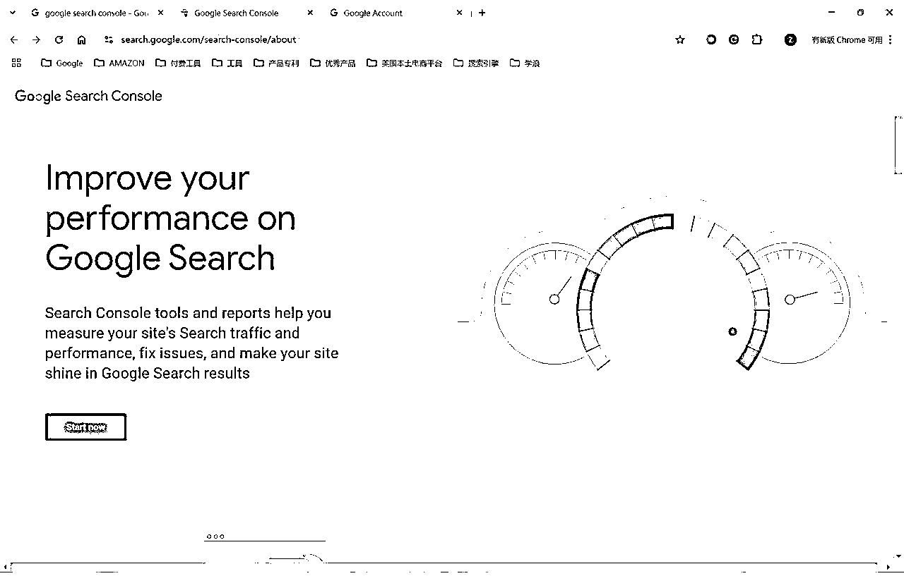
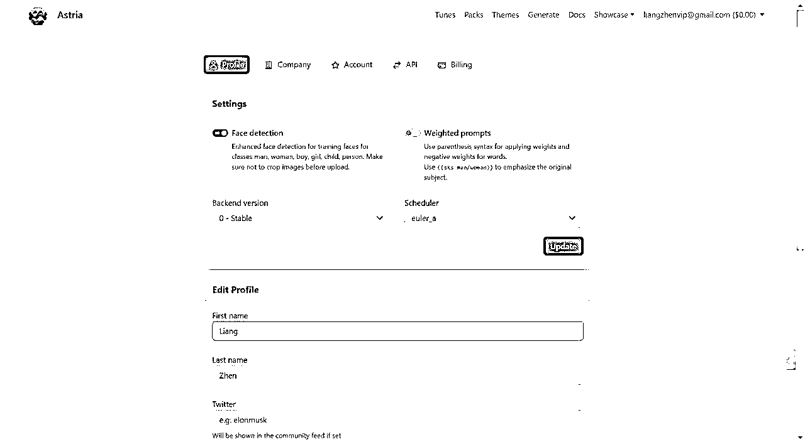

# 3 月航海｜AI 应用 - Web 网站｜实战手册

> 来源：[https://ocn93f5d9olj.feishu.cn/docx/DtkKdNyXWoF9Z3xhsnJcnFbOn2g](https://ocn93f5d9olj.feishu.cn/docx/DtkKdNyXWoF9Z3xhsnJcnFbOn2g)

# 防失联+MM188166M（李李）长期更新频繁+备用V:MG10127

手册出品方：生财有术团队

手册使用说明：内容出品人排名不分先后。本文旨在向你展示一个项目的更多可能性，帮助你更好地理解和实操。

建议：如果需要快速定位到精确内容，可以使用快捷键 Ctrl + F/command + F 的形式，搜索「关键字/词」，查找你想要的内容+MM188166M（李李）长期更新

# 必修篇

# 一、导言

# 💡

# 章节概要：

Web应用开发正处于AI助力的新红利期。

随着AI能力提升，满足需求变得越来越容易，创造了零基础创业机会。

本期航海的3个关键点：

- 快速上线为首要目标，优先完成第一个网站上线

- 借助AI降低技术障碍，使用Claude处理代码编写

- 渐进式学习路线，从游戏站、导航站入手

成功关键在于行动力，保持"先上线一百个网站"的决心，在不断实践中寻找真正的市场机会。

# 💡

# 本章航线图

完成本章节的学习和实操，即可完成航线图的：

第一阶段：网站基础与工具熟悉（约3天）

阅读导言，了解AI+Web开发背景。

来参加航海了，走前就带走几个网站吧

可以优先查看实战篇跟着做，理论篇大部分是往期内容概况，具体的可以点进去查看详细帖子

高手和新手的差别就是熟悉感，做的多了就都能赚到钱，本期航海致力于大家先上站，在不断上站过程中发现需求满足需求赚到美金

新手对标模仿是最快的捷径。

十分钟看完并上线个游戏站，本教程以练手为主，刚开始的模仿不需要考虑太多尚未触及到的问题，先做再说。

在我赚到十万美金之前，我的信念就是先上线一百个网站再说。新手村的定义是上线十个网站以此锻炼手感。上站预期：前面三到五个网站是练手，十个网站才有可能捕捉到大流量新词获取收益。

# 1.1 项目背景与前景

# 1.1.1 为什么要做“AI + Web 开发”？@彩笺

网站，是产品的一种形态，我对出海做网站的理解总结为八个字是：找到需求，满足需求。

在过去，做网站是一件很难的事情，普遍意义上的做网站；

大家的视线会更多的聚焦于满足需求，

而满足需求，需要拥有特定的有难度的技能——写代码。

所以在过去，程序员们混的都还不错；

因为他们掌握在大多数人没有掌握的技能。

那些大一点的公司，他们拥有很多的部门和很多的产品；他们是怎么做产品的呢？

可以简单概括为：

产品经理负责前半句：找到需求

程序员负责后半句：满足需求

当时间线走到今天，25 年春；

随着 AI 的能力提升，后半部分满足需求 变得越来越容易。

小排老师在之前的帖子中也有说过：

只靠想法就能赚钱的时代到来了！

# 1.1.2 赚钱的机会有多大？@彩笺

在大家开启第一站之前，先给大家真实的描述一下赚钱的前景。

我见过有光靠流量带来的广告费月入近 $5w 的网站

我还见过，依靠满足用户的付费需求，通过订阅日入 $1k 的 AI 工具站

出海，几乎是变现天花板最高的，甚至可能没有之一。

我们生财，就有很低调的大佬，0 编程经验；去年月入万刀。

而想赚到这么多钱，你只需要：找到需求，满足需求

# 💡

@良辰美：

在不断地上线网站的过程中，就是不停的找到需求满足需求。

【对于新手来说，[找到需求]是一个稍微难一点的动作，需要你的技能更多是产品经理和用户调研相关的。

AI 能够辅助你找到需求，但是找的核心动作还是需要你来洞察，这取决于你对需求的敏感度，产品经理和用户调研职业相关的认知和经验会有很大帮助。

AI 现在几乎已经可以帮你完成[满足需求]，就是做出 MVP 快速验证找到的需求是否真实。AI 写的代码是很初级但是基本可用，在 AI 的帮助下一个有基本识字能力的人就可以做出来一个网站或者 APP，这里对新手来说，要跨过的第一个门槛是，把一个网站做上线，并且越熟练越好。

这里新手要破除的是对代码的恐惧，因为无需看懂，AI 给你复述即可。

新手的初期重点任务是熟悉，如何把网站上线，即域名注册，网站托管，代码托管这三类平台。可选项和方法有很多，这里只是举例最简单的一种。

如何找到需求并满足需求，许多人以为的样子可能是不停地调研，或者一直在打磨产品。但真实且可行的路线是，在不断地上线产品的过程中去验证：是否找到了需求，的需求是否为真？是否满足了需求，可否通过收费来满足需求？

所以找到需求，满足需求，这句话的含义可能就是，去快速上线网站，只有通过大量的 MVP 验证，你才能尽快找到需求并满足需求。

干耗着在这里阅读实战手册，或者在互联网随便乱看，可能是有助于找到需求满足需求，但是不执行不上站没有 MVP 就无法验证需求就没有钱赚。

对于什么都不懂的新手来说，根据手册里面粗糙的示例网站，零基础快速上线第一个 Web 网站。这里提一句，在找到需求并满足需求时，哪怕很简陋的网站，也能赚很多钱，比如 diskprices.com，这也是我的亲身经历。

写下这句话的我，零基础编程经验，用 AI 构建的简陋网站快速满足需求时所赚的钱，远比我花几万块找外包团队优化精美网站所赚的多。

所以新手们，不要怕过程复杂，更不要怕什么都不懂，先复刻步骤去上个站吧，哪怕是先做个垃圾出来，在不断的优化和上站过程中，也能寻到宝藏：找到需求，满足需求。

对于有一定基础的程序员或者老站长们，可能觉得本篇内容过于简单，那么请移步往届实战手册，重点关注进阶版：AI 工具站。】9 月航海 | 出海工具站 | 实战手册，3 月航海 | 出海第一站 | 实战手册

# 1.2 手册结构与学习方法

# 1.2.1 本手册的目标

# 1.2.1.1 必修目标：零基础快速上线第一个 Web 网站

用最快的方式完成你的第一个网站上线。

即使你没有任何技术背景，也能跟随本手册的核心章节【@良辰美：快速上站，（案例一 3.3）上线一个单页小游戏 （重点执行工作）】快速搭建出一个可以被全世界访问的网站。

在这个过程中，你会逐渐了解：

如何借助 AI 工具解决 90% 的技术难题

免费部署网站的方法，让全世界都能看到你的作品+MM188166M（李李）长期更新

# 1.2.1.2 进阶目标：通过 SEO / Adsense 等实现盈利

在完成必修目标后，如果想进一步探索网站的盈利模式，可以看进阶篇，例如：

如何安装并使用 Google Analytics 追踪访客数据

利用关键词优化（SEO）提升搜索排名，让更多人找到你

接入 Google AdSense 广告系统，把访问量变成收入

搭建网站订阅或会员体系，拓展更多变现思路+MM188166M（李李）长期更新

# 1.2.2 如何高效使用本手册：按需查阅，遇到问题时快速定位章节

无需从头到尾逐字阅读，我的建议是：

先浏览目录，了解整体结构和要点在哪里。

直接跟着核心实战项目的流程走【@良辰美：快速上站，1.3 实战上线一个单页小游戏 （重点执行工作）】，遇到不懂的问题，再回头查找相应章节。

遇到不会的地方直接问 AI（@良辰美：只推荐问 Claude）

# 1.3 对船员的要求与准备工作

# 1.3.1 大约每天投入 2-4 小时

每天投入 2-4 小时是比较理想的学习节奏。

当然，你可以利用碎片化时间学习，比如地铁上、午饭后，只要持续接触就能积累进步。

前期，你可能需要更多时间去理解核心概念，但一旦入门并熟悉流程，一小时内就能完成很多工作量。

参与任何航海项目，本质上是你每天都要挂念着，去做去研究去上线网站，而不是仅仅为了打卡和写日志而过完每一天。@良辰美

# 1.3.2 会基础电脑操作

在开始之前，你需要具备一些最基本的电脑操作能力，例如：

会创建、保存、移动文件和文件夹

能够安装浏览器插件和简单的软件

能熟练注册各种 AI 工具平台的账号并使用它们

如果你对这些还不熟悉，没关系，你可以一步步来。

遇到不明白的地方，可以搜索教程或请教 AI，让它告诉你每一步该怎么做。

# 1.3.3 具备良好的独立学习与搜索习惯

当你在学习和实践过程中遇到问题，先尝试自己解决。

最重要的是，建立合理的预期，多实践，在实践中不断试错、尝试，直到掌握。

无论是借助搜索引擎还是 AI 工具，都能帮助快速学习，进而解决绝大多数技术难题。

# 二、网站基础知识与工具安装

# 💡

# 章节概要：

网站的基本组成：

域名：网站的外部入口，如baidu.com+MM188166M（李李）长期更新

服务器：放代码的地方，可选择免费平台如vercel，cloudflare

代码：网站的"灵魂"，决定功能和界面

AI工具安装不是重点，最简单方式是用Claude账号，尽快进入上站过程，

用AI编写你想要的网站代码，然后购买域名部署上线。

# 💡

# 本章航线图

完成本章节的学习和实操，即可完成航线图的：

第一阶段：网站基础与工具熟悉（约3天）

学习域名、服务器、代码基础知识，了解HTML/CSS/JS。

安装AI工具（Cursor / Claude），学习基础交互技巧。

# 2.1 网站的基本组成

# 2.1.1 域名（Domain）：什么是域名、在哪购买？@彩笺

域名就是大家口中的网站，baidu.com 就是百度的域名，这是你网站的外部入口，

想一想，人家得知道你的地址才能找到你吧？

域名就是全球唯一的，通过这个名字能找到你，也只能找到你的“地址”。

我推荐你上 cf（cloudflare） 上去购买，市面上有很多家卖域名的，

cf 的对于开发网站最方便。域名可以在你的网站实现之后，再来购买不急。

# 2.1.2 服务器（Hosting）：什么是云端部署、常见免费部署平台

服务器就是放你运行的代码的地方。你自己家有地址，但是也得有对应的房子对吧。

现在有很多的免费的地方给你部署代码（即托管网站），像是 vercel，cloudflare，netlify 等等。

大多数平台的部署步骤都很相似：+MM188166M（李李）长期更新

1.

注册一个账号

2.

上传网站文件，或关联 GitHub 仓库

3.

一键部署后即可获得访问网址

4.

如果有自定义域名，还能在平台后台中进行绑定

# 2.1.3 代码（Code）：网站最核心的“灵魂”，静态网页/动态网页的区别

网站最终是什么样子、有哪些交互，都是由代码决定的。可以把它想成菜谱，决定了你做出的美食味道。

静态网页：

所有人看到的都是同样的内容，就像已经印刷好的报纸

优点是速度快、相对安全、部署方式简单、成本低

适合做个人博客、作品集或公司官网

动态网页：

能根据用户不同的操作或登录状态来改变内容，就像聊天软件时刻更新

优点是功能丰富，可实现登录、评论、购物车等

缺点是需要数据库和后端支持，开发相对复杂

适合电商、社交媒体等需要用户系统的网站

如果你是第一次做网站，可以先从静态网站上手，等你熟悉流程后，再来尝试动态功能。

# 2.2 编程语言基础科普+MM188166M（李李）长期更新

# 2.2.1 HTML/CSS/JavaScript：零基础需要知道哪些关键点？

你可以把一个网页想象成一个人：

HTML 相当于“骨架”，决定页面上有什么元素（标题、段落、图片、链接、按钮等）。核心概念包括“标签”、“属性”以及“嵌套”。

CSS 相当于“外表”，决定这些元素如何排版、配色、调整大小和字体等。它的核心是“选择器”“属性”“值”等概念。

JavaScript 相当于“大脑”，让页面可以交互和动态响应，比如点击按钮后出现提示、填写表单时进行验证、播放动画等。

# 2.2.2 前端与后端的简单区分

前端：用户在浏览器里能看到和操作的部分，包括页面布局、视觉效果和交互逻辑。主要用到 HTML、CSS、JavaScript，就像餐厅的大堂和菜单。

后端：网站在服务器上运行的部分，用来处理数据存储、用户认证以及业务逻辑。常见语言有 PHP、Python、Node.js 等，就像餐厅的厨房和仓库。

# 2.3 AI 工具安装

AI 工具并不是重点，最简单的做法，也是我一直在用的，就是用 Claude 共享账号，因为单买太贵用的不多又封号，又不需要安装软件，更重要的是我需要问很多非代码的问题，cursor/windsurf 那些主要是针对编程问题来写代码的。

任何工具都是越用越熟悉的，重点是尽快进入上站的过程中，即用 AI 编写任何你想要做的网站代码，然后购买域名部署上线，新人早点熟悉这套流程就能慢慢沿着这条路走下去。

装完工具可能你并不会怎么用，但是看到自己的网站上线，就可能会常打开看看并且去优化老网站或者不断上线新网站。

# 2.3.1 Cursor / Windsurf ：安装、使用简介

一句话简单理解区别：Cursor 适合不断优化较复杂的代码库，Windsurf 适合新手刚开始入门。

Cursor 详细版安装可参考两位圈友 @Time @熊猫 Jay 分享 Cursor 的基础教程：

《0 代码 AI 编程重塑你的编程体验：Cursor 使用教程》、

《AI 编程：Cursor 来了，你没理由说不会写代码了》。

windsurf 区别在于自动运行，自动纠错，自动创建文件夹，自动编写。

windsurf 详细版安装可参考圈友 @Sherry 分享的基础教程

纯小白0代码用Windsurf制作Youtube下载工具

# 2.3.2 Claude / ChatGPT：如何与大语言模型高效对话，提出精准的编程需求

一句话简单理解区别：Claude 最新版模型 3.7 Sonnet 公认代码能力最强，ChatGPT 算是低配版本，可用但不够强。

这两个模型在初期任选其一都可以使用，如没办法自行注册可以直接在淘宝使用共享/独享成品号即可。

获取渠道没那么重要，尽快使用上这个世界上成本最低智慧最高的 AI 工具模型更重要。

# 2.3.3 其他 AI 工具：bolt.new、trickle.so、GitHub Copilot 等

一句话简单理解区别：

bolt.new 非常适合无代码新人可自动部署直接查看网页内容，但是无法回退代码版本；

trickle.so 类似但提供了一些模板；

Github Copilot 更适合程序员在 ide 代码编辑器上操作。

bolt.new 和 trickle.so 的域名后缀都是不常见的，

所以没办法直接点击进入网站，需要复制跳转或者输入浏览器网址栏目回车进入，

使用邮箱登录即可使用有免费次数使用。

结合刘小排的这篇帖子食用更佳：

5 分钟做个网站，人人都能学会

视频版本：不懂编程，1 分钟让 AI 做一个星座运势网站

# 2.3.4 本地环境配置（Node.js、npm、Git 的简单安装）

一句话简单理解区别：+MM188166M（李李）长期更新

1.

Node.js：Node.js 就像是一个专门用来“播放” JavaScript 代码的工具。以前我们通常只能在浏览器里运行 JavaScript，而有了 Node.js，你的电脑就能直接执行 JavaScript 程序。

2.

npm：装软件的"应用商店"，帮你下载别人写好的代码模块，不用自己重新造轮子。

3.

Git：代码的"时光机"，记录所有修改历史，出错可回退，多人协作不冲突。

三者关系：Node.js 是环境，

npm 是在 Node 环境中获取工具的方式，

Git 则负责记录代码的变化历史。

我不是程序员，目前还没用过这类，除非是跟 AI 沟通，它让我复制粘贴代码操作过，也不熟悉这些，所以非程序员新人可以不必太过关注，我们只需要尽快上线网站即可。

只有尽快不断地上线网站，才能快速找到需求满足需求，其他工具，环境，模型都只是辅助不可沉迷。

# 2.3.5 在 AI 工具中进行"Hello World"级别的测试

在 trickle.so 或者 bolt.new 中：

# 💡

创建一个显示'Hello World'的简单网页，有一个按钮，点击后显示'Hello AI World'"

参考 prompt:

# 💡

创建一个简单的网页，标题为"我的第一个 AI 网站"，内容包含一个大号文本"Hello World"居中显示，背景为浅蓝色，添加一个按钮，文字为"点击我"，当用户点击时显示一条消息"Hello AI World！"

# 2.4 如何让 AI 帮你写/改代码？

如果 AI 始终没办法给到你满意的结果，这个时候可以选择先让 AI 帮你总结一下，再新建会话，重新描述问题所在重新询问 AI 去解决；或者更换大模型，比如 Claude， ChatGPT， Deepseek，相互参考让 AI 们尝试去解决。

# 2.4.1 给 AI 写需求时的提示词要点

口语化提示词：不要给自己设限，你想要做什么，就写什么，哪怕是杂乱无章前后矛盾的话语，在你跟 AI 不断交互的过程中，自己的想法都会逐渐清晰起来，在不断的总结过程中，提示词也会越来越全面结构清晰

结构化提示词：有圈友也很喜欢用格式规则的提示词，这种包含技术架构，背景角色，目标输出等，熟练掌握一套自己总结出来的提示词有助于提高跟 AI 沟通的效率。

# 2.4.2 针对 AI 给出的代码，如何在本地进行简单测试

针对 HTML 类型的代码，可以直接在浏览器打开查看网页内容和源代码，推荐用 Notepad++这种轻量化的富文本编辑器即可修改，或者直接在 github.com 仓库的代码文件修改

针对 next.js 等包含后端和多组件的代码，这种我其实很少在本地调试，没有编程基础总会搞错，只能依赖 AI 不断截图和询问，复制它给出的代码做测试。

# 2.4.3 遇到报错如何让 AI 做出针对性修复

首先你要有一份不断完善的网站地图，这个作为背景信息提供给 AI，且不时需要给到 AI 二次矫正，

其次是在遇到错误的时候，截图具体错误的内容，如有错误文字代码也一并复制粘贴发给 AI，描述给 AI 你遇到的具体问题，即：期望达成的结果+当前的错误信息+已经做的事情（包含具体代码）

最后你让 AI 总结所有可能导致该错误的原因，然后逐一给到解决办法并实际测试，通过这种方式可以解决大部分问题，只有非常复杂的，提问者遗漏掉的一些代码知识的问题才可能难以解决，此时就可以发在航海群里面给到各位技术大牛来解决。

# 2.5 小结

上述提到的 Cursor、Windsurf、bolt.new 等工具，本质上均基于 Claude 3.7、GPT 等大语言模型接口实现。因此，在初期使用阶段，直接使用 Claude 官方平台与使用这些软件的效果差别不大，以下的案例同样可以直接在 Claude 官方平台完成。当然，如果您更熟悉或偏好于上述工具，也可灵活使用。

# 三、案例一：游戏站

# 💡+MM188166M（李李）长期更新

章节概要：

游戏站是汇集网页游戏的平台，核心优势：

无需开发技术 - 只需聚合现有HTML5游戏

用户粘性高 - 游戏天然具有娱乐性

更新成本低 - 只需定期添加新游戏

变现渠道以Google AdSense为主，通过在游戏页面展示广告获取收入。

实战步骤：

准备域名、托管平台

用AI写代码

上传到Github

在Cloudflare绑定域名并托管

# 💡

# 本章航线图

完成本章节的学习和实操，即可完成航线图的：

第二阶段：实战上线游戏站（约4天）

学习游戏站概念，寻找网页小游戏资源。

用AI生成单页游戏站代码，并上线部署。

# 3.1 什么是游戏站及如何变现

我们并不是要开发游戏，而是找到一些可能会火热的新游戏名字，以此来建立新网站获取流量。

互联网上存在非常多的网站，提供给你现成的游戏，你可以直接拿来就用即可。

怎么拿来？核心关键词就是 Iframe：

iframe的功能是让你在一个网页中嵌入另一个网页或内容。它相当于在当前页面插入一个“窗口”或“框架”，通过这个框架，你可以展示来自不同来源的网页、视频、地图、甚至是在线游戏，而不需要用户跳转到其他页面。这样，你可以在不离开当前网页的情况下，查看和互动其他内容。

这种网站的核心优势在于：

无需开发技术：你不必懂得游戏开发，只需要聚合现有的 HTML5 游戏

用户粘性高：游戏天然具有娱乐性，能吸引用户停留更长时间

更新成本低：只需定期添加新游戏链接即可保持内容新鲜度

游戏站变现渠道：这里主要推荐 AdSense，使用中国境内大陆招商银行储蓄卡，即可绑定入账美元，五万美金以内免人工审核，系统直接入账，只需入账申报系统自动通过，然后美元购汇人民币即可直接提现成人民币。

1.

广告收入：接入 Google AdSense 或其他广告联盟，在游戏页面展示广告

2.

会员制度：提供无广告体验或独家游戏内容的付费会员服务

3.

游戏内购：与游戏开发者合作，分享游戏内购买的收益

4.

推广佣金：为其他游戏平台导流，获取推广佣金

5.

定制服务：为企业客户提供品牌定制的游戏站服务

# 3.2 怎么找网页小游戏并嵌入网站

寻找 HTML5 游戏的来源：

1.

开源游戏平台：GitHub 上有大量开源 HTML5 游戏项目

2.

游戏发布平台：itch.io、Kongregate 等平台有许多可嵌入的 HTML5 游戏

3.

HTML5 游戏开发论坛：在开发者社区寻找愿意分享或授权使用的游戏

嵌入游戏的核心技术——IFRAME：

IFRAME 就像是在你网站上开了一扇"魔法窗户"，让玩家能够在你的网站内直接体验来自其他网站的游戏，而不会感觉自己离开了你的网站，因此也为你的网站获取了用户点击和浏览页面，这些访客流量观看到你网站的 AdSense 广告后就会为你 24 小时不间断地提供收益。

# 3.3 实战上线一个单页小游戏 （重点执行工作）

这是我实际购买的一个域名，按照日常上站操作流程来挨个截图编写的，一部分可能源于个人系统，零代码新人圈友可按步骤跟进，程序员圈友可自行调整。

# 3.3.1 步骤一：准备工作

域名注册：选择任意一个长名字的域名，我常用的在 spaceship.com 平台，支付宝即可付款，下面章节的截图是以 spaceship.com 为例注册域名，你也可以在 cloudflare 注册，需要外币信用卡支付

网站托管：用户访问代码形成的网页，需要在网站托管平台上，推荐 Cloudflare.com

代码托管：网站相关的所有代码默认都是放在 Github.com 上面

以上 cloudflare.com 和 github.com 这两个平台账户，请先用同一个邮箱注册下来

注意事项：

前期减少对网站域名的纠结，任意可注册长名字就可练手

域名可以使用。online 后缀，第一年很便宜，其他任何后缀都行

# 3.3.2 步骤二：AI 写出来单页网站代码+MM188166M（李李）长期更新

请复制以下 Prompt 发给 Claude（最推荐）或者 ChatGPT，可以自行注册这个游戏关键词的其他后缀作为自己的网站，然后修改第一个划线的域名即可。

（你可以任意更换其中的任何内容，做出优化，修改，测试。修改的越多，实践出真知的越多）

# 💡

你是一位精通谷歌 SEO 和 HTML&TAIlwind 语法的十年全栈工程师

我要做的网站域名是 MonsterSurvivors.com ，游戏名字即关键词是 Monster Survivors，在线游戏的 iframe 地址是 https://cloud.onlinegames.io/games/2025/unity/monster-survivors/index-og.html

请帮我输出一个完整版的 HTML 和 CSS 代码，游戏标题，一句话介绍，在线游戏的 IFRAME 内容，游戏基本情况叙述，

要求这个网站在 PC 和移动端适配性良好，配色采用苹果典型色系，包含一个一级 H1 标签和多个 H2 标签，有 canonical url，网站语言是地道英文

monster-survivors-website.html

# 3.3.3 步骤三：上传代码，绑定域名，托管网站

# 3.3.3.1 注册域名 www.spaceship.com

我选择的就是 monstersurvivors.com

搜索关键词注册域名截图

# 3.3.3.2 github.com 新建仓库，把代码传上去，可以是拖拽文件，也可以是新建文件复制粘贴代码+MM188166M（李李）长期更新

新建仓库截图

上传代码文件截图 1

上传代码文件截图 2

上传代码文件截图 3

上传代码文件截图 4 很重要 代码文件重命名为 index.html

# 3.3.3.3 在 cloudflare.com 绑定域名后托管网站，登录后进入的网址是控制台的子域名网址 https://dash.cloudflare.com/

登录截图

绑定域名截图 1

绑定域名截图 2

绑定域名截图 3 选择 FREE 套餐

绑定域名截图 4，这里 ns 解析相关是全部删除，截图 com 示例是2个 A 类型，online 有4个，都删

绑定域名截图 5 复制这两个代码，到 spaceship.com 里面刚注册的域名下面粘贴过去（快捷地址直达链接：https://www.spaceship.com/application/domain-list-application/）

casey.ns.cloudflare.com

jillian.ns.cloudflare.com

绑定域名截图5，这里是随机生成了两个子域名，每个人使用自己的就行

绑定域名截图 6

绑定域名截图 7

绑定域名截图 8

绑定域名截图 9

绑定域名截图 10

等待 cloudflare 那边同步，大概需要十分钟，所以这个动作我一般在注册完域名就执行

# 3.3.3.4 把 github.com 上面托管的代码文件放在 cloudflare.com 上面这样就可以访问购买的域名啦

托管网站截图 1

托管网站截图 2

托管网站截图 3

托管网站截图 4

托管网站截图 5

托管网站截图 6

托管网站截图 7

托管网站截图 8 等待界面变为这个状态

托管网站截图 9

托管网站截图 10

托管网站截图 11

托管网站截图 12

托管网站截图 13

托管网站截图 14

托管网站截图 15

托管网站截图 16 接下来就是等等两分钟左右

托管网站截图 17 接下来就是等等两分钟左右 刷新一下网页就变成了 Active

托管网站截图 18 很重要 打开已经绑定的域名 找到 SSL/TLS 按钮 (此处请注意，要先找到你已经绑定的域名，在账户主页account home即可看到已经绑定的域名，不然你找不到SSL/TLS入口，你也可以通过搜索SSL找到这个入口）

托管网站截图 19 点击 Configure

托管网站截图 20 选择 FULL 的模式

托管网站截图 21 点击保存

点击刚购买配置的域名 monstersurvivors.com ，就可以访问 AI 写给你的代码文件啦，你想怎么修改代码，都可以交给 AI，复制粘贴修改完成代码后网页就自动修改完成啦 （耗时几分钟左右，取决于代码文件大小）

# 3.4 进阶：同时上线多个网页的游戏站

在上一章节中，我们已经成功地上线了一个单页小游戏，并了解了从域名购买、托管到配置的全过程。然而，如果你想要真正做大做强，为网站带来稳定且可持续的流量，就需要考虑上线更多网页、更多游戏，从而形成一个规模化的游戏站。以下内容将结合我们在前面章节中的方式，进一步阐述如何构建多页面游戏站，包括核心结构规划、批量添加游戏的思路，以及如何为用户提供更丰富的互动功能。

# 3.4.1 网站结构规划与分类设计

当你决定将单页小游戏扩展为多页面游戏站，网站结构将变得非常重要。一个合理、清晰的结构能帮助玩家快速找到自己想玩的游戏，亦能帮助搜索引擎更好地理解你的网站。你可以从以下几个方面着手：

1.

游戏分类与归纳

不同类型或风格的游戏往往吸引不同的受众。你可以根据游戏类型（例如动作、射击、益智、策略、体育等）或游戏主题（例如恐怖、二次元、像素风等）进行划分。

建议在网站首页或主菜单栏放置“游戏分类”的入口，让玩家可以按兴趣选择。

2.

导航与菜单设计

在页面顶部设置一个全局导航菜单，列出主要分类或频道。

为提升用户体验，请在首页放置搜索框，以便用户能够直接搜索感兴趣的游戏名称或关键字。

3.

数据库或页面管理

如果你使用 WordPress 或其他 CMS，可以建立“游戏”这样一个自定义文章类型（Custom Post Type），每篇文章对应一个游戏的介绍、截图、IFrame 嵌入等。

如果你使用静态网站生成器或手写 HTML，可以考虑将不同类型的游戏分目录保存，并确保文件名、URL 结构具备可读性和层次感。

通过以上规划，能够让每个新游戏都拥有一条简洁美观的 URL 路径，这不仅利于玩家快速分享链接，也有助于搜索引擎收录和排名。+MM188166M（李李）长期更新

# 3.4.2 批量添加游戏：模板化与自动化思路

在多页面游戏站中，“批量添加游戏”往往是最耗时的步骤。如果每添加一款游戏都需要手动写 HTML，并且修改样式、介绍、图片等内容，工作量将极为庞大，也容易产生重复性错误。以下提供一些实用的思路：

1.

通用模板页面

可以先设计好一个通用的游戏页面模板，例如：

标题（H1）

游戏简介或一句话描述

IFrame 容器

游戏控制说明、玩法提示等

新增游戏时，只需要复制此模板，然后修改对应的几个要素（例如游戏名、IFrame 链接、缩略图）。这样能显著减少重复劳动。

2.

IFrame 嵌入标准化

给 IFrame 统一设置宽度和高度，或使用自适应（responsive）写法，保证在移动端也能良好呈现。

例子：可以统一用一个 CSS 类，如 .game-iframe { width: 100%; height: 600px; } 等，让嵌入的游戏保持一致的布局风格。

3.

自动化脚本

如果你有一些编程基础，可以用简单的脚本（Python、Node.js 等）读取游戏的名称、描述、IFrame URL 等信息，然后自动生成对应的 HTML 文件。

如果你使用 CMS，如 WordPress，则可以通过导入 CSV 文件或借助插件批量创建游戏文章，大幅提升效率。

总之，使用模板化或自动化手段，可以让你在最短时间内上线尽可能多的游戏内容，为网站吸引更多元化的用户群体。

# 3.4.3 丰富每个游戏页面的内容

在为每款游戏创建页面时，除了简单的 IFrame 嵌入外，还可以考虑添加以下内容，以便吸引和留住更多用户：

1.

游戏亮点及玩法介绍

用几句话概括游戏的主要特色，以及如何开始游戏。

对于操作较复杂的游戏，可以用简短的文字或图示，指示玩家如何移动、射击、躲避等。

2.

游戏截图与预览

在游戏加载之前，提供一张或多张截图，让玩家对内容有初步了解。

截图不仅能吸引点击，在社交媒体上分享时也能作为预览图展示。

3.

攻略、技巧或开发者介绍

如果游戏比较热门或内容深度足够，可以写一篇简短的攻略。

若游戏有特别的背景或开发者故事，也可以做一个小版块，满足玩家的好奇心。

4.

相关推荐或“你可能喜欢的游戏”

当玩家玩完本页面的游戏后，很可能还想玩同类型的其他游戏，这时通过链接到同类型的其他游戏页面，可以提升用户黏性和页面浏览量。

# 3.4.4 用户互动与社区功能

一个成功的游戏站不仅仅是提供游戏本身，也要让玩家感觉到他们能够与社区互动。你可以考虑：

1.

玩家评分和评论系统

为每个游戏添加打分功能，玩家可以给出“喜欢”或“五星评分”；

评论区方便玩家分享体验或提问。如果有人遇到卡关或对游戏有好奇心，通过评论就能实现交流。

2.

热度排行和最新游戏

网站首页或侧边栏可以放置“最受欢迎游戏 TOP 5”或“本周新上架游戏”，用数据或更新时间进行自动或人工排序。

这种排行榜形式往往能在用户中产生“点击循环”，显著提升平均访问时长和访问深度。

3.

社交分享按钮

在游戏页面放置一键分享至 Twitter、Facebook、Reddit 等社交平台的按钮。

社交口碑是游戏站吸引新用户的绝佳途径，好的游戏往往被迅速传播。

# 3.5 多页面游戏站的优化与推广

当你的游戏网站具备了较为完善的结构与内容，下一步就要让更多人知道并访问它。这时，你需要综合运用 SEO 优化手段、社交媒体推广以及数据分析，不断迭代和调整，才能让网站持续增长。

# 3.5.1 搜索引擎优化（SEO）提升

1.

合理安排网站层级与 URL

搜索引擎更偏爱清晰的导航和结构。确保分类目录、URL 命名都具备良好的可读性。

注意给每个游戏页面设置合适的标题（title）、描述（meta description），并在页面内使用恰当的文本描述游戏。

2.

撰写高质量的游戏内容与元信息

除了 IFrame，本身的页面文字也非常重要。

给每个游戏撰写独特的介绍和亮点，而不是复制粘贴官方简介或其他网站的内容；有助于搜索引擎认为你的网站“内容原创度”较高，提升收录与排名。

3.

提高加载速度，优化移动端

游戏站往往有较多的图片与动态加载内容，如果加载缓慢会影响用户体验。

建议做好图片压缩、开启缓存，或使用 CDN 加速等措施，并在移动端保持简洁的游戏页面布局。

4.

站点地图与收录

可以生成并提交XML 站点地图给 Google Search Console，从而让搜索引擎第一时间发现你的每个游戏页面。

定期查看搜索引擎对你站点的收录情况和错误报告，及时修复404或重复页面。

# 3.5.2 综合推广与流量获取

1.

社交媒体及视频平台

选取几款人气或特色游戏，拍摄简单的演示视频，上传到 YouTube 或 TikTok，附上你网站的链接，诱导观众前来体验。

在 Twitter、Facebook 等平台定期分享新上架的游戏，积极与玩家互动。

2.

内容营销与玩家社区

通过撰写游戏攻略、游戏排行榜、甚至游戏行业新闻等内容，建立网站的专业形象，吸引玩家持续关注。

你也可以在 Reddit、游戏论坛等玩家社群中适度推广，但需避免明显的广告式发帖，尝试以提供有价值内容（攻略、心得、经验）来吸引自然流量。

3.

外链建设

观察类似的游戏网站或玩家博客，他们通常可能会评测或推荐一些在线小游戏。与这些博主、博主社区建立联系，争取获得外部链接到你的游戏站。

此外，可以与相关行业的网站（例如游戏周边、硬件评测等）做一些合作，拓展更多流量来源。

# 3.5.3 数据分析与网站调整

1.

安装 Google Analytics

这是帮你查看有多少人访问了你的网站，以及他们在网站上做了什么的工具。

通过 GA（或其他分析工具）了解网站每日访问量、用户停留时长、跳出率等指标，找到用户最喜欢的游戏类型或页面。

如果你看到某些分类点击率极高，就可以针对这些分类持续丰富内容。若有一些页面跳出率很高，需要检查页面加载速度或游戏本身的吸引力。

2.

Google Search Console（GSC）监控

这是让谷歌知道你的网站存在的工具，可以帮助你的网站在谷歌搜索中被找到。

GSC 可以帮你查看网站的搜索排名、点击量、展示量，以及出现的问题（例如移动端可用性问题、爬虫抓取错误等）。

利用这些数据对游戏页面进行有针对性的优化，比如补充更相关的关键词描述、增加图片 alt 信息，等等。

3.

定期更新与版本迭代

玩家对游戏的兴趣变化速度很快，若网站长时间不更新或没有新品，就难以吸引回访用户。

建立每周或每月的更新计划，持续添加新游戏，或者对热门游戏的页面做更多延伸内容，确保网站整体的活跃度与吸引力。

通过上述深入的结构规划、多游戏上线策略，以及针对 SEO、推广与数据分析的持续优化，你的游戏站将有很大机会在竞争激烈的网络中脱颖而出。只要持续投入精力去维护和扩充，这样的游戏站就能成为真正的“流量池”，让你在娱乐和收益之间取得双赢。

# 3.5.3.1 GSA 和 GA 步骤

这里我补充两个步骤的所有截图，因为其他部分大家都可以问 AI 自行优化，每个人的情况也不一样，这里就把最基本的必备的步骤放进来。

我今天新上了三个网站，刚好待会再上两个域名，就一起把这三个步骤的所有截图全部放下来，此处属于可选项，但我建议每个人都养成上站必做的习惯，因为我们要上很多个站，并不是全部都要看，我的习惯是看一段时间数据，实在不行就放弃。

那么看数据，第一个就是 GSC 后台，即 Google Search Console， 第二个是看 GA 数据，即 Google Analytics。

做这两个步骤的前提是，大家要有一个 GMAIL 账户，可以自行注册也可以购买，这个账号非常重要所以密码一定要修改牢记。

前面所讲的域名注册平台和网站托管平台都统一为 GMAIL 邮箱比较方便，当然你用其他邮箱也是可以的。

# 3.5.3.2 GSC 完整步骤截图+MM188166M（李李）长期更新

这里我用一个新的未注册过 GSC 和 GA 的账号来演示步骤截图：

首先谷歌搜索 Google Search Console，此处为 GSC 截图 1

进入 GSC 首页，此处为 GSC 截图 2

点击开始，再点击下一步，这里大家提取登录好 GMAIL 账号就可以进入后台了，此处为 GSC 截图 3

现在我们进入的就是还未添加过网站的 GSC 后台了，你可以在这里输入域名，此处为 GSC 截图 4

如果我们已经添加过网站，就需要点击左上角的网站，然后点击添加资源，此处为 GSC 截图 5 和 GSC 截图 6

一样的在左半部分新增域名就可以了，然后就会跳转要求验证，此为 GSC 后台截图 7

复制粘贴完域名后点击继续，如果你手打键盘注意字母不要敲错，此为 GSC 后台截图 8

此处是跳出来验证界面，如果你前面是跟着我的步骤走的，那么域名就已经放在 Cloudflare.com 上面了，所以只需要点击下一步开始验证即可，此为 GSC 后台截图 9

等待跳转出来的新页面加载，截图 10

现在是加载出来了，点击授权即可，此处注意，cloudflare.com 是需要为登录状态的，最方便是同一个邮箱注册的这几个平台，这样就自动默认跳转了，截图 11，

点击完授权就自动关闭新开的页面，返回了 GSC 后台，此为截图 12

然后你就获取了 GSC 验证后的网站了，点击进入即可进到网站的 GSC 后台，GSC 后台截图 13

此刻网站的所有数据都还没有出现，我一般会把域名在最上面的搜索按钮输入然后按回车索引一下域名，GSC 后台截图 14

粘贴域名按回车搜索，截图 15

跳出搜索框，截图 17

目前这个网址是已经被索有了的，大部分刚开始注册的域名是没有的，所以要先点击一下右上角的测试按钮，截图 18

截图 19，开始测试

截图 20，测试成功

截图 21，点击请求索引

截图 22，请求成功

截图 23，索引成功

好了，这样就完成了，建议这个步骤 23 个截图作为每一个新上网站的必备选项

# 3.5.3.3 GA 完整步骤截图

Google Analytics 谷歌搜索前面不是其对应的平台，所以我们直接从域名进入就好了：

https://analytics.google.com/analytics/web/

截图 1：点击就打开进入了 GA 页面，点击开始

截图 2：新账号刚开始是要设定名字的，这个随意

截图 3：设定完账号名字然后下拉点击下一步，就看到这个最常见的新增域名的界面了

大家复制这个网址保存，或者设为书签，以后就直接从这个页面进入，新增域名就可以了，因为 GA 页面不是特别好找，我们大量上网站就是要熟悉很多快捷键和设定许多常用书签来提高效率

截图 4：这是我老帐号常用的书签打开直接就进入了这个界面，少了前面那个账号名字设置那一步，你们也可以加几个域名后重新保存这种界面的书签

截图 5：放入域名，点击下一步，

截图 6：这里我一般都选第一个，

截图 7：点击下一步

截图 8：这里我一般是选最后一个，

截图 9：创建完成后来到最后一个界面，我们做的是 WEB，所以选择第一个

截图 10：把域名都填进去，

截图 11：点击下一步，在右上角

截图 12：这里面就是 GA 的代码了，至于怎么放进去网站呢，我的做法很简单，一开始就把 GA 的代码拷贝出来发给 Claude，告诉它把这个 GA 代码放进去，这样我就可以只需要粘贴复制就可以了

事实上每次修改代码的时候，我都是让 Claude 给我输出完整版本全部代码，我只需要做检查效果和复制粘贴的工作。思路拓展和检查修正你也都可以问 Claude，反复问，新开窗口问，多个共享账号问，总会有新发现。

截图 13：GA 代码放进去后，网站也上线了，可以访问打开了，就点击右上角这个按钮测试一下，是否可以检测到 GA 代码

截图 14：这是我还没有放 GA 代码，所以检测出来是无，黄色感叹号

截图 15：这是已经放进去 GA 代码，且稍微等了一下，因为从代码到网站需要几分钟时间更新，然后就检测出来到了，是绿色的

好了平生所学也就这些，我会的不多其他都问 AI 吧，Claude 是最好的代码老师，它写的代码也都能直接用。

小游戏网站做好了，接下来怎么办。

如果你很看好这个网站，而且初期也有一些流量，那么可以继续尝试发外链加内容页。

但是大部分情况下，我都建议，继续做下一个网站。

正如刘小排老师所说的，打无记忆的牌，下一个站再来。

一直反复有什么意义呢？

意义就在开头所说的，在不停的上站过程中，去挖掘需求和验证需求。

自嗨是没有用的，埋头做网站不管是研究技术还是想做好看，都对赚钱无意义。

只有验证到需求了，网站有自然流量增长，那么推广和优化才是正向飞轮。

# 四、案例二：导航站

# 💡

# 章节概要：

导航站核心是聚合并分类展示优质资源，成功关键在精准定位特定用户群体的需求。

优秀导航站特征：

分类精准，定位明确

资源实用，更新及时

用户界面清晰友好

变现模式多样：

广告收入（Google AdSense）

付费收录（VIP 推荐位）

会员付费（高级资源访问）

联盟营销（转化佣金）

实战步骤简单：整理书签内容 → AI 生成代码 → GitHub 发布 → 域名购买绑定。

重点在于找准垂直领域，做对用户真正有价值的内容。

实战要点：把自己常用书签整理出来，形成一个个人导航站，让AI生成代码，再部署到Github Pages上。

# 💡

# 本章航线图

完成本章节的学习和实操，即可完成航线图的：

第三阶段：实战上线导航站（约4天）

了解导航站特征和变现模式

用AI生成导航站代码，并上线部署。

导航站，是指聚合并分类展示互联网优质资源的网站。其核心价值在于帮助用户迅速找到高质量、有针对性的资源入口，解决用户面对庞杂信息时的迷茫感。典型的导航站，如设计师导航、程序员工具导航、考研资源导航等，因其清晰简洁的分类结构和极强的实用价值，广受用户欢迎。

这里导航站我想了下，也遵循最开始给大家的建议，先把平常工作常用的书签全部整理出来形成一个自己的导航站，后续大家想做什么行业类型资讯的导航站，都是差不多操作方式的，无非界面更加精美和页面更多，比如最顶级的导航站： thereisanaiforthat.ai、toolify.ai

# 4.1 导航站特征和变现模式

# 4.1.1 导航站的特征

一个优秀的导航站，通常具备以下几个核心特征：

分类精准，定位明确

优秀的导航站一般聚焦于细分垂直领域，资源经过严格筛选，分类明确，让用户能够快速精准地找到所需内容，显著提升用户体验。

资源实用，更新及时

成功的导航站收录资源多为用户实际使用频率较高的高价值内容，并持续维护更新，确保链接有效，避免资源过时或失效，维持用户的长期信任感。

用户界面清晰友好

界面设计以简洁清晰为主，交互体验流畅，不追求繁杂功能，有效降低用户认知成本，使用户能够轻松定位目标资源，进而反复访问，提升网站黏性。

# 4.1.2 导航站的变现模式+MM188166M（李李）长期更新

导航站的变现一般基于高质量流量的聚集与精准导流能力，主流变现模式包括：

广告收入

广告收入是导航站最普遍的变现方式，包括：

第三方广告投放：如 Google AdSense、百度联盟，通过流量获取点击收入；

自主招商推广位：直接出售首页或分类页的优质展示位置，收入通常更高且更具精准性。

付费收录

付费收录模式适用于已有一定流量规模和品牌影响力的导航站，通过向有推广需求的网站收取费用，以获得更佳曝光位置。如设置 VIP 推荐位，进一步提高收入水平。

会员付费

会员模式适合具有差异化资源或内容优势的导航站。典型表现为：

免费用户获取基础资源，高级资源需付费会员访问；

提供无广告纯净版体验，进一步提升用户付费意愿。

联盟营销（Affiliate）

联盟营销适合带有明确用户转化意图的导航站，例如购物、软件或服务类导航，通过精准引流到目标站点，用户完成消费或注册后站长获得佣金。这种模式以转化精准、收益稳定见长，广泛应用于各垂直导航领域。

原创内容及增值服务

除了基础导航服务外，导航站可提供原创资源或增值服务进一步变现。例如产出行业分析报告、专业评测、优质榜单、干货资源包等，通过付费订阅、内容付费或导流自有产品实现收入增长。

# 4.1.3 怎么做有价值可被传播的导航站

简单说一下我自己的理解。

其实对于新人来说，当前时代一个很有效的做法是，快速对新生事物做收集有价值有用的范例。

但是有个风险，是可能一阵风很快就没热度了

举例： cursor.directory 现在月访客约 40W+MM188166M（李李）长期更新

GPTS.WORKS 现在打不开了+MM188166M（李李）长期更新

mcp.so 现在月访客 5W 这样

aihub.cn 现在 31W 月访客

所以最稳妥的做法还是吃狗粮，eat your own dog food，

把自己平常做的事情，结合自己的行业，比如做个书签导航出来

垂直行业的才是最有价值的！

# 4.2 导航站类别

出海类已经很多导航了，独立开发也有很多，我之前保存了一些，现在再去访问发现大部分打不开了

那这里就把我日常上站用到的一些网址，还有很早之前积累的一些书签做个小导航站吧

首先是我把上站分为几部分，每个部分都会用一些软件

# 4.2.1 需求收集和关键词调研部分

第一部分是需求收集和关键词调研部分：

谷歌下拉词

https://www.searchsuggest.tips/?keyword=

Toolify 榜单+MM188166M（李李）长期更新

https://www.toolify.ai/Best-AI-Tools-revenue

AI 导航站的需求列表

https://theresanaiforthat.com/requests

关键词难度

https://ahrefs.com/keyword-difficulty

# 4.2.2 上站必备

第二部分是上站必备，就是一定会打开的网页，要去用到的工具

域名查询

https://leandomainsearch.com/

https://query.domains/

https://instantdomainsearch.com/?q=

域名注册

spaceship.com

porkbun.com

namecheap.com

代码&网站托管

github.com

cloudflare.com

vercel.com

数据后台

https://search.google.com/search-console

https://analytics.google.com/analytics/web/#

https://www.bing.com/webmasters/submiturl

# 4.2.3 竞品调研

第三部分是竞品调研部分，就是我会挨个在这些软件里面查看竞品网站

查看流量和网页关键词

aitdk.com

查看外链

https://ahrefs.com/free-seo-tools

查看网站关键词

semrush.com

# 4.2.4 上站模版

第四部分是上站模板部分，最开始我上站都是套用模板修改的，现在也是，偶尔会从零到一让 Claude 写代码

下面是我收集到的一些开源模板

⚡Dynamic blog based on Cloudflare Pages + Workers + D1 + R2

https://github.com/openRin/Rin

Boilerplate and Starter for Next.js 15 with App Router and Page Router support,

https://github.com/ixartz/Next-js-Boilerplate+MM188166M（李李）长期更新

SaaS Boilerplate built with Next.js + Tailwind CSS + Shadcn UI + TypeScript

https://github.com/ixartz/SaaS-Boilerplate

Free NextJS Landing Page Template

https://github.com/ixartz/Next-JS-Landing-Page-Starter-Template

Astro boilerplate with responsive blog and portfolio template

https://github.com/ixartz/Astro-boilerplate

A versatile landing page boilerplate, ideal for various projects and marketing campaigns.

https://github.com/weijunext/landing-page-boilerplate

an open source for viggle ai web client

https://github.com/ai-aigc-studio/Viggle-AI-WebUI

周刊 BLOG

https://github.com/weijunext/new-blog

https://github.com/weijunext/gapis.money

Take screenshots of each new project on Producthunt, YC, and Indiehackers, explore with Ease.

https://github.com/daimajia/huntscreens

Generate the Excel formulas you need in seconds using ChatGPT.

https://github.com/weijunext/smart-excel-ai

NextJS VPS Example

https://github.com/ashleyrudland/nextjs_vps

Get a new hairstyle in seconds.

https://github.com/Pwntus/change-hairstyle-ai

Track an object in a video and add a green screen to the background.

https://github.com/replicate/green-screen-creator

A free, open-source SaaS app starter for React & Node.js with superpowers. Full-featured. Community-driven.

https://github.com/wasp-lang/open-saas/

A svelte 5 and sveltekit saas boilerplate. Including database, authentication, email, analytics

https://github.com/ocluf/justship

Simple boilerplate for SAAS. Nuxt3, Supabase, OAuth, Prisma, TRPC, Pinia, Stripe, Tailwind, OpenAI

https://github.com/JavascriptMick/supanuxt-saas

Your Next SaaS Template or Boilerplate ! A magic trip start with bun create saasfly . The more stars, the more surprises

https://github.com/saasfly/saasfly

ShipFast — Typescript

https://github.com/mundane799699/xlike-web

下面是导航站模板

FRE123 免费资源共享平台导航，一键搭建你的导航网站！

https://github.com/fre123-com/fre123-nav/

A crowdsourced list of the best open-source projects on the internet. Built with the Dub TypeScript SDK.

https://github.com/dubinc/oss-gallery?ref=ossgallery

❤️静态响应式网址导航网站 - webstack.cc

https://github.com/WebStackPage/WebStackPage.github.io

One-click to deploy your own ai tools directory with the open source web-ui

https://github.com/6677-ai/tap4-ai-webui

A Third-party GPTs store

https://github.com/all-in-aigc/gpts-works

A UI Lib Picker for Vue 3 / Nuxt 3

https://github.com/ddahan/ui-libs

Public AI tools data for website https://dokeyai.com

https://github.com/DokeyAI/dokeyai-data

https://vercel.com/templates VERCEL 模板中心也有非常多有价值的可以看看尝试着套模板做一些

# 4.2.5 资讯部分

第五部分是资讯部分，之前经常收集很多，但是也就那阵子看些，后面感觉还是多上站实在，多干活多实践世界给你的反馈远大于站在岸上看别人实践游泳。

Reddit 子社区

https://liberating-doll-b8a.notion.site/Reddit-1a8e8aed91b18021839ecba8b74e530b

谷歌搜索中心：SEO 基础知识

https://developers.google.com/search/docs/fundamentals/creating-helpful-content?hl=zh-cn

Top Trending Websites from Ahrefs

https://ahrefs.com/websites#trending

AI VIDEO SAAS TOOL

https://docs.google.com/spreadsheets/d/1QOdqq9KbjQj1JZO43vc1pir2rnEEsMUXzTDATrOCn2k/edit?gid=0#gid=0

Starter Story Premium Solopreneur Report 2.0

https://docs.google.com/spreadsheets/d/1eUni44pIURML2VWFFXKzNmm-WKuuam9_ynr5Fo_Q74M/edit?gid=83151001#gid=83151001

Those making $500/month on side projects in 20xx

https://www.500mrr.com/

Ask HN: Those making $500/month on side projects in 2024 – Show and tell

https://news.ycombinator.com/item?id=42373343

说实话我之前也没认真整理过，都在书签里面吃灰了，现在汇总起来和大家一起学习进步

暂定这五部分吧，还是可以找出来更多的，比如学习类型的，我经常看生财的很多内容，那也可以把网站开发相关的精华帖弄个导航，尤其是刘小排老师的精华帖，真是常读常新，所以这个可以作为第六部分，专门为大家生财圈友准备的，咱们一起多回顾

# 4.2.6 生财精华帖

列出来所有要放上去的文章链接，这里就用 SCYS.COM 官网的文章地址，数量不多就手动摘选出来，只筛选跟开发和出海相关的，也只能生财圈友才能登录查看

不要轻易称自己为独立开发者

2025/3/1

https://scys.com/articleDetail/xq_topic/1525814845844482

AI 编程赛道第一课：Build a business ， not an App

2025-02-06

https://scys.com/articleDetail/xq_topic/2858151258225521

只靠想法就能赚钱的时代到来了！

2024-11-13

https://scys.com/articleDetail/xq_topic/4848511545851418

翻石头，是独立开发者的日常修行。

2024-11-05

https://scys.com/articleDetail/xq_topic/5121548228815414

用 AI 自学编程的最好时机到来了

2024-07-23

https://scys.com/articleDetail/xq_topic/5122484888125484

善用黑科技工具，做十倍速全栈程序员

2023-08-20

https://scys.com/articleDetail/xq_topic/188545124485142

什么产品好做？三个一

2023-12-07

https://scys.com/articleDetail/xq_topic/811452228445512

写给独立开发者：如何快速做出产品 MVP

2023-02-09

https://scys.com/articleDetail/xq_topic/814822455488822

如何获得产品 idea

2022-11-10

https://scys.com/articleDetail/xq_topic/212485241245121

完美的创业项目，是怎么被想出来的？

2022-05-11

https://scys.com/articleDetail/xq_topic/415414825512158

判断项目行不行的极简方法

2022-04-25

https://scys.com/articleDetail/xq_topic/184214255522812

2021 年 Google SEO 最关键有效的技巧· 站内

2021-09-10

https://scys.com/articleDetail/xq_topic/218514241452421

0 资源，做出 3 个日 UV 过十万、7-8 个日 UV 过万的网站，分享我获得无限网站流量的秘籍

2021-06-21

https://scys.com/articleDetail/xq_topic/182888851425182

这些文章真的是非常有价值了，我看了很多很多遍，也在表格里反复拆解了，感觉还没吸收完，这里放进来也希望圈友们都可以认真看下

# 4.3 上站

# 4.3.1 步骤一：准备书签内容并交给 AI

我首先花了十几分钟，人工检查并简单分类了自己的所有书签，

然后将这些内容直接复制粘贴给 AI（这里使用的是 Claude）。

# 4.3.2 步骤二：AI 生成导航站代码

Claude 快速返回了一个完整的 HTML 代码段。我虽然看不太懂具体代码，但复制粘贴后效果惊艳，完全够用。

# 4.3.3 步骤三：在 Github Pages 发布网页

将上面代码复制下来，然后登录到 Github：

新建一个仓库，例如命名为 bookmark-site

新建文件，命名为 index.html，将代码粘贴保存提交

# 4.3.4 步骤四：选择并购买合适的域名

关于网站域名，我一开始纠结了半天，后来直接让 Claude 推荐了一些易记的域名，如下：

最后我从推荐中选出了最喜欢的一个，直接去域名服务商处购买了域名。

# 4.3.5 步骤五：绑定域名到 Cloudflare Pages

在 cloudflare.com 中完成域名绑定操作（可以看前面小游戏站的三十多个截图 我就不重复了）：

先把购买的域名添加到 Cloudflare 账户下。

在 Cloudflare 中绑定 Github Pages 的项目，并部署到 Cloudflare Pages。

注意这里的 Cloudflare SSL 证书需要从默认的 Flexible 改为 Full。

等待 3～5 分钟，刷新几次 Cloudflare 页面，直到显示绑定成功。

（实操小技巧： Github 和 Cloudflare 建议用同一邮箱并保持登录状态，这样绑定时跳转更顺畅。)

# 4.3.6 步骤六：进一步完善导航页面（可选）

你还可以再次使用 AI 工具进一步调整排版、布局，添加图片、图标或更丰富的设计元素，

这完全取决于你愿意投入多少精力。

# 4.3.7 常见问题及解决方法汇总

Q：域名绑定等待时间长：

A：正常等待 3～5 分钟，多刷新几次 Cloudflare 页面。

Q：Cloudflare SSL 证书配置问题：

A：默认可能被自动调整成 Flexible，需要手动改成 Full 模式才能正常访问 HTTPS 网站。+MM188166M（李李）长期更新

# 4.4 导航站进阶优化方向+MM188166M（李李）长期更新

更好点的肯定就是要用模板了，更复杂点是套用数据库，在我们初阶航海不做深入讨论。

程序员同学可以发挥的地方就很多了，不懂的多问 AI 自学也很快就学深入，一般来说可以再以下方向进行优化：

技术上：网站要快，控制在 2 秒内打开，图片和代码都压缩一下。手机上访问舒服点，按钮做大点好点。页面整体要干净简洁，关键资源链接得明显。

内容上：别乱七八糟啥都往里装，整整好用的工具才往上放。每周抽时间检查一下链接，别出现死链，每个月稍微更新一些好用的新东西就行了。网站专注一个细分领域，比如专门搞独立开发者工具，不要什么都有。

搜索功能：用户用起来也要方便点，最好弄个实时搜索框，想找啥一下子就能搜到。分类的时候别总按技术来，要站在用户角度想他们是怎么用的。每个工具再简单介绍几句，告诉人家这东西具体能干啥。

SEO：SEO 也得注意，每个分类的标题写清楚，带点关键词，内容别太单薄，适当加点介绍文字，分类之间做好链接，让用户能顺畅地多点几个页面。

推广：平时多去像 V2EX、Reddit 这种社区分享点精选工具合集，顺便联系一下工具作者，告诉他们被你收录了，说不定还能帮你推广推广。社区有人问问题时，自然地推荐一下你站上的资源。

接推广：稍微弄几个精选推荐位，给真正好用的工具一点突出展示的机会，付费工具再弄点推荐链接赚个佣金啥的，但别整太多广告，别毁用户体验。

最后就是长期来看，多看看数据，哪些资源点的多，搜索啥的多，都关注一下。搞个简单的反馈渠道，听听用户咋说。再偶尔做做 A/B 测试，看看啥布局让用户更愿意多待会儿，就保持下去。

# 五、案例三：AI 图片站

# 💡

# 章节概要：

AI图片站是利用人工智能根据用户输入生成图像的平台。其价值在于让不会使用AI的用户也能轻松创作图片。

需求发现方法：

分析toolify榜单的AI图片类网站

用关键词工具导出这些网站的关键词

筛选值得做的图片类需求

实战使用Vercel平台，选择合适模板，配置API密钥，解决部署中的各种错误。

# 💡

# 本章航线图

完成本章节的学习和实操，即可完成航线图的：

第四阶段：实战上线AI图片站（约4天）

了解Ai图片站+MM188166M（李李）长期更新

用AI上线AI图片站，并上线部署

AI图片站需后端服务器和API KEY，简化上线就选vercel.com平台配置，丝滑体验。

vercel.com适合新手入门，流量暴涨后费用高可迁移至cloudflare workers+pages或自建服务器。有流量即有收益，正反馈下额外操作和成本都不是问题。

想了解更多vercel.com介绍和案例请查看往期实战手册，这里只展示从域名注册到网站上线的实操步骤截图。

# 5.1 什么是图片站及如何变现

传统的图片站包括但不限于：+MM188166M（李李）长期更新

SVG 素材图片站：专门提供可缩放矢量图形素材的网站，方便设计师和开发者获取和使用高质量矢量图形。

案例：Freepik （freepik.com）、SVG Repo （svgrepo.com）、Flaticon （flaticon.com）、Vecteezy （vecteezy.com）、SVG Silh （svgsilh.com）

壁纸图片站：集中展示和分享各类高清壁纸的平台，供用户下载美化设备屏幕。

案例：Unsplash （unsplash.com）、Wallhaven （wallhaven.cc）、Wallpaper Abyss （alphacoders.com）、Pexels Wallpapers （pexels.com/wallpapers)、Wallpaper Engine （steamcommunity.com/app/431960)

摄影作品站：展示和分享专业摄影师作品的平台，通常按主题、风格或摄影师分类。

案例：500px （500px.com）、Flickr （flickr.com）、Behance Photography （behance.net/galleries/photography)、EyeEm （eyeem.com）、Getty Images （gettyimages.com）

表情包/梗图站：收集和分享流行表情包和网络梗图的网站，方便用户在社交媒体和聊天中使用。

案例：Giphy （giphy.com）、Tenor （tenor.com）、imgflip （imgflip.com）、Emojipedia （emojipedia.org）、Know Your Meme （knowyourmeme.com）

图片托管工具网站：提供图片上传和存储服务的平台，生成可在互联网上直接访问的图片链接。

案例：ImgBB （imgbb.com）、Imgur （imgur.com）、Cloudinary （cloudinary.com）、SM.MS （sm.ms）、Postimages （postimages.org）

尽管我们用 AI 工具也可以生成这类网站，但是竞争已经极度饱和，我们很难再获取大量流量。

AI 图片站是利用人工智能技术（如 Stable Diffusion、Midjourney、DALL-E 等）根据用户输入的文字描述自动生成图像的网站平台。这些平台允许用户通过简单的文本提示词创建各种风格和内容的图像，无需专业设计技能。

如今大模型的功能已经非常强大，但都是为技术专业人士做的，我们做网站是可以深入具体的使用场景和某一类使用人群，普及大多数人无需任何技术能力即可完成 AI 作图。

让一大群不会使用 AI 的用户、突然就会使用 AI 了。这就叫“满足用户需求”，这就叫“价值”。

上周我直播的时候，我也讲过我的小产品 Raphael Al（htps:/raphael.app）的案例。 在我做出来之前，所有有大厂背景的人都觉得我是傻 X，他们会说“AI 画图已经是红海了啊，有什么好做的？"“你的壁垒是什么？”

但事实是，RaphaelAI 在短短一个月内就超过月活 100 万了，用户全部来自于用户间的口耳相传，我没有做任何的付费推广。由于一时兴起和生财有术有了课程的合作，我甚至还没时间去做我擅长的 SEO，当你在 Google 搜索 RaphaelAI，我的网站甚至排不上名次。

在别人都以为是红海的领域，我的产品却如入无人之境。它的价值就来自于别人看不上的套壳，来自于“让一大群不会用 AI 画图的用户、突然就会用 AI 画图了”。

来源：刘小排 - 现在做套壳产品，有巨大机会

https://articles.zsxq.com/id_51mobeazrejd.html

AI 本身就需要成本，这已经是全人类的共识，所以 AI 类产品很容易做订阅收费，其次网站的流量起来了，也可以接入 adsense 广告获取收益。

目前 Claude 的模型能力已经足够强大，可以通过 prompt 工程直出 SVG 等海报图片，其他图片模型包括但不限于 midjourney， flux shell， ideogram，等都提供 API 可以套壳。

# 5.2 怎么找图片类需求并实现功能

需求即关键词。

我们最常用的是刘小排圈友所说的 2+3 结合起来，即多看榜单竞品，分析他们的关键词，去找到尚未被充分满足的细分关键词下的需求。

# 5.2.1 怎么找需求？

原生 idea ★★★★★

抄成功竞品，然后做出差异化的价值点 ★★★★

分析搜索关键词，找到尚未被满足的需求 ★★★

有人愿意预付费找你定制某个需求，然后你将它产品化 ★★★

生造的 idea ★+MM188166M（李李）长期更新

刘小排：如何获得产品 idea

https://articles.zsxq.com/id_7rwwww5q6gwv.html

# 5.2.2 怎么找图片类需求？

多看图片类网站即可，这里提供一个方法：

把 toolify 的榜单产品，筛选出来 AI 图片类网站，再用 semrush 等关键词工具导出来对应网站的所有关键词，然后根据谷歌网页和关键词工具调研，综合筛选出来你认为还值得做的图片类需求。

https://www.toolify.ai/zh/Best-AI-Tools-revenue

# 5.2.3 怎么实现功能？

初期用 Vercel 即可，里面有很多模板，可以改改就能上线。

懂代码的可以自行从零开始写，不懂也可以用 cursor+Claude，已经足够强大到你不需要懂代码只需要专研流程就可以成功部署上线。

你也可以自行积累很多模板，也可以购买一些模板，最快开发出 MVP 测试推广数据是最有用的。

# 5.3 实战上线一个单页 ai 图片生成站 （用 vercel.com 平台）

# 5.3.1 准备工作

首先我们打开 vercel.com 的模板中心，选择 AI 即可筛选出有用 AI 的模板。

https://vercel.com/templates

初期练手，建议尽量每个模板都上线测试一下，可以不买域名，只为熟悉流程。

每个模板都有对应的需求和竞品网站，你可以通过关键词搜索调研发现最赚钱的网站，然后研究为什么他们能赚到钱。

# 5.3.2 选择模版

这次演示采用这个 AI Headshot Generator 模板，有一大堆网站正在 24 小时赚钱：

https://vercel.com/templates/next.js/headshot-ai

# 5.3.3 部署步骤

# 5.3.3.1 初始化部署

我们直接点击 deploy 部署，会跳转到 github.com 和 vercel.com 的关联部署界面，

此步骤需要你提前登录好这两个网站。

如果你的界面不是上面这个，别担心，我重新用一个全新的浏览器账号来截图演示一次：

如果你的截图是上面这个情况，那说明你 vercel.com 和 github.com 都没有登录，接下来你要做的就是两个账号都登录上就可以了。

# 5.3.3.2 创建并关联数据库

全部登录上后，点击 create 按钮，跳转新的页面，需要你新增数据库，即 Supabase 的这个 Add 选项

这里需要注册一个 supabase.com 账号，然后点击关联到 vercel.com 即可，这里面我们主要做的工作就是注册账号和一直点击下一步。

https://supabase.com/

点击右上角绿色按钮 Start your Project

如果你的 Github.com 已经是登录状态，建议你直接选择用第一个 Github 登录，点击 Continue with Github

登录好后就把 Supabase.com 和 vercel.com 关联上了，继续前面的 vercel 模板部署页面，点击 Add，

点击接受，

点击下一步，

点击继续，

等待创建，

点击完成，

点击连接，

链接完成，

# 5.3.3.3 配置 API 密钥

页面往下滑，看到需要填入 AI 的 API KEY

我们现在去 https://www.astria.ai/创建 API KEY

点击登录，我一般都是用谷歌直接登录

登录后进入 profile 界面，直接点击 API

点击创建

创建完成后页面会又跳到 profile 界面

再次点击 API 就看到 API KEY 了

复制 API KEY 填写到刚才的设置 API KEY 的 VERCEL 界面

# 5.3.3.4 设置 Webhook

好，我们还差一个 webhook，我也不清楚这个是啥，这个时候就需要问 AI 了，

这里面大家是不是应该也跟我一样有个疑问，为什么上面写的是 LEAP AI，但是要去 Astria AI 找 API KEY

我们复制这个 GITHUB 文档接着问，就是这个链接里面的文件内容复制发过去，

https://github.com/leap-ai/headshots-starter/blob/main/.env.local.example

我们复制整个 GITHUB 项目库内容发过去接着问，就是这个链接点击进去所有的文字内容复制发过去，https://github.com/astriaai/headshots-starter

好，现在 AI 说是 WEBHOOK_SECRET 是您自己创建的任意字符串，用于安全验证，那我也不知道怎么创建就让 AI 给我吧

好，现在我们有了两个内容就都填写进去

# 5.3.3.5 开始部署

点击部署 Deploy，

接下来就是等待部署完成，看会不会出错

没有出错就可以说明部署成功了，我们可以点进去链接看看，然后决定是否要买域名

有出错就复制错误内容，继续发给 AI 询问项目内容，对方还需要什么信息做进一步判断，如何解决这个错误等

# 5.3.4 错误排查与解决

果然是出错了，那么机会来了，大家可以看一下，这里我是如何解决掉这个错误的

平常 AI 编程不可能一帆风顺，总会出现各种各样的错误，这也是程序员的日常 DEBUG 任务

而我们其实并不需要理解代码，就可以依赖 AI 把 BUG 错误解决

# 5.3.4.1 错误一：API KEY 配置错误

首先你复制这个箭头所指的按钮，把报错信息发给 Claude

这里 AI 说是 API KEY 缺失，但是我们前面不是已经配置过了吗

现在 AI 给出的答案出来了，应该是前面的字段名字不一致，

所以我们只需要把 LEAP_API_KEY 改成 ASTRIA_API_KEY 即可

但是去哪里修改呢，你可以直接问 AI，这个时候可以配上截图，也可以说我们当下正在用的操作：

我正在 Vercel.com 平台上部署 ai headershort generator 的模板，遇到的 API KEY 配置的错误

# 5.3.4.2 修改环境变量

我们可以看到这里面部署页面是没办法设置变量名字的，就是你点击这个 CHANGE 按钮没有任何反应

那么大家可以重新进入 https://vercel.com/界面，已登录状态会跳转到部署过的项目界面，

如果没有跳转按下面的两个箭头分别点击进去 VERCEL.COM 的项目界面

我们点击第一个 项目 headshots-starter-clone headshots-starter-clone-tau-weld.vercel.app

进入这个项目配置界面

现在点击设置界面

再跟着箭头点击环境变量配置界面

页面下滑就看到 LEAP_API_KEY 和 LEAP_WEBHOOK_SECRET，这是两个我们刚才设置的

现在跟着 AI 的指示，把 LEAP_API_KEY 改成 ASTRIA_API_KEY

我其实是已经改过一次了，现在又改了回来，再演示一次

修改成功后，点击 Deployment 去部署界面重新部署一次

这里面大家可以看到有多个红点错误，就是前面我测试的部署配置，现在你们应该只会看到一个红点错误，

点击最右边的三个点，有个重新部署

点击重新部署，会进入部署页面，会再一次出错，我们再把出错信息发给 AI

# 5.3.4.3 错误二：Webhook 配置错误

这里 AI 说了，名为APP_WEBHOOK_SECRET的环境变量，而不是LEAP_WEBHOOK_SECRET，所以我们需要把刚才看到的修改的第二个的变量名字也改一下

同样的操作，再次进入 settings 界面，点击左边的环境变量设置 Environment Variables，找到LEAP_WEBHOOK_SECRET修改名字为APP_WEBHOOK_SECRET

点击保存，再次去 Deployment 部署界面再次重新部署

变量的名字千万要二次核实不要弄错，我的第三个红点错误就是改错了变量名字

（大家可以看我前面的截图是不是少了个字母，提示：ASTRIA_API_KEY）

# 5.3.5 部署成功

再次部署后就成功了

大家哪怕不操作，完整得看完我的部署流程，也会觉得麻烦比较费事对不，

但如果我跟你说，这类模板找到合适的场景，哪怕是月 7K 访问量，一天两百个人过来，也可能月入过万，你能相信吗。

我认为在 AI 时代，每个人都不需要写代码，但是最大的拦路虎是这类流程操作，以及如何根据错误去针对性修改。

VERCEL.COM 的界面还是有点复杂的，我也是花了很长时间才熟悉这些流程，差不多摸索着也是建了三五个站才知道需要在哪里找常用的功能。

事实上我们还没有进入 Ai SaaS 的收费订阅设置和账户申请，后面收款也有很多风险，但这一切都是值得的。

# 5.3.6 后续工作

如果你已经跟随着我成功上线了一个网站，那么下一步就是熟悉模板，你可以把代码都发给 AI 让 Claude 帮你修改文案，这样你不会出现重复的网站了，只需要找准人群定位和推广网站即可

# 5.3.6.1 设置域名

最后一步是上线域名，

在设置里面找到域名，然后把你购买的域名输入进去

点击 ADD，输入域名，这里我用很早之前购买的一个域名作为测试

添加完域名后 就需要设置 DNS，你可以按照之前的先把域名放到 CLOUDFLARE.COM 上再去修改 DNS，也可以直接去域名注册商哪里修改 DNS

这里我演示操作是后者，日常上站建议前者

然后一直点击继续就可以了，需要等待三到五分钟，DNS 部署成功，网站就可以打开了

# 5.3.6.2 问题解决技巧

在这个部署过程中，可能我们会犯各种各样的错误，最终导致网站打不开

不要觉得网站打不开就搞定不了这个事情，而是回过头来多问 AI，多发截图，多询问可能是什么导致的

在这个过程中我就犯了好几个错误，觉得很奇怪不应该这样，最终还是询问 AI 才知道

比如下面 AI 给我的解答

在 VERCEL 的域名配置页面，两个都显示蓝标对号就说明 DNS 都配置正常了就可以正常打开页面了

https://www.accent-guesser.com/

每个人都可以打开检查下

# 5.3.7 总结

网站能够正常上线的欣喜是无法溢于言表的 尤其是针对代码什么都不懂的非开发人员来说

我这里截图如此详细的最大意义，就是展示出来非开发人员不懂代码如何上线网站，确实很花时间，但是慢慢熟悉了就轻车熟路。

# 5.4 进阶上线+MM188166M（李李）长期更新多个网页的图片格式转换站

如果你觉得上面的 AI 图片站很麻烦，那么这个可能适合你

因为我们日常工作中，一定会遇到需要转换图片格式的情况

我之前是有大量的图片需要转换格式，用网页工具有很慢，于是就自己写了个 Python 脚本大批量处理

如果你也有类似的需求且很感兴趣的话，完全可以自主写一份更适合自己的图片转换网站

虽然这个市场竞争很激烈了，但是也有一些很细分的需求还不一定有人在做，比如我之前做的图片四宫格切分的需求

# 5.5 进阶网站优化和推广策略

网站的优化是个很漫长的事情，包括但不限于增加内页和功能内容

推广的方法有很多种，但是最适合小白也最有效的方法就是每天发外链

步骤如下：

第一步，找到你所做网站的一系列关键词

第二步，谷歌搜索这些关键词对应的网站，即为竞品网站

第三步，把竞品网站放到外链工具里面去查询他们去哪里发了外链，网址：https://ahrefs.com/backlink-checker/?input=

第四步，你也跟着竞品去发外链，别人怎么发你就怎么做，想做得更好就去问 AI

第五步，重复这个过程就得到无限多的关键词，竞品网站，发外链的地方，即可以优化网站学习竞品又可以推广发外链

# 选修篇

# 💡

选修篇：为项目的更多玩法介绍。如果你已经跑通了项目的最小 MVP，想进一步了解它的更多可能，获得灵感，那么选修篇一定不要错过。

无论是想要进一步放大项目，还是挖掘更多玩法，都可以重点阅读本章节

✅ 六、联盟广告与 AdSense

✅ 七、附录与参考资料

现在，快来发掘项目的更多可能性~

# 六、联盟广告与 AdSense

# 💡

# 章节概要：

AdSense申请关键点：

网站内容为原创且对用户有益

确保不同页面没有重复内容

网站有清晰的结构

每日UV达到500以上

其他盈利模式：

付费订阅 ：为价值定价，不是为成本定价

Affiliate联盟营销 ：类似淘宝客，帮助商家推广获得佣金

捐赠和付费咨询 ：通过ko-fi或buymeacoffee接入支付功能

# 6.1 Google AdSense 申请流程：开通门槛、常见被拒原因

你可以直接通过官方说明进行详细的了解：加入 AdSense 计划的资格要求。

Google 的审核标准，采用的是 AI 与人工双审查制度，比较重要的几个点需要关注一下：

1.  网站内容为原创，并且对用户有益

1.  确保网站中不同页面没有重复内容，是独一无二的

1.  用户可以在网站上轻松浏览内容，网站是否有分级和菜单，即清晰的网站结构

1.  每日 UV 达到 500 以上

1.  申请者年满 18 岁+MM188166M（李李）长期更新

如果申请被打回，请看打回原因，做针对性的修改，比如：

1.  未确认网站的拥有权（这点可以避免，只要按照引导来做即可）

1.  网站有不良流量（需要搞清楚哪些流量，是不被许可的。大部分的社交流量，Google organic 流量，邮件营销的流量，通过外链跳转过来的流量，都是认可的）

1.  网站上有劣质内容或没有内容（这点是比较容易犯的错误，可能是网站内容不够丰富，需要在网站内增加更多优质内容，梳理一个清晰的网站结构）

1.  来自其他网站的复制或重制内容（这个可以通过增加原创内容避免）

1.  是否有其他帐户因为违反政策遭停用（这条是针对之前同一个地址有犯过错误账号被 K 后再次申请的）

1.  找不到 Ads.txt 档案（这个可通过增加 Ads.txt 档案避免）

1.  网页价值过低或不具价值（这个增加网页价值，提供优质内容即可）

1.  没满 3 个月（可能是目前网站的流量还不够，需要增加更多的宣传，或者优化 SEO 来获取更多网站流量）

请记住，只要不是原则性错误，Google 是给你改正的机会的，审核后会显示红色的 Needs attention，点击右侧的下拉箭头，点 Show details 会看到具体的改进意见。当你改正错误后，可以再次提交审核。如果有不清楚的，可以发邮件给他们问具体那里需要改进 AdSense-support@Google.com。+MM188166M（李李）长期更新

如果是遇到如下问题，则需要通读以下 Google 的策略文件，删除掉网站上一些违反规则的页面后，再次提交审核

内容来源：《出海内容站的案例分析及谷歌广告开通详解》

Adsense 开通步骤 @哥飞

第一步：注册帐号

Adsense 帐号依赖于 Gmail 账号，所以你需要先有一个 Gmail 账号。

之后打开下面两个网址，都可以进入 Adsense 官网，点击右上角 Sign in 或者 Get started 按钮。

https://adsense.com/

https://www.google.com/adsense/

之后就可以在新界面添加一个用于账号审核的网站。

如果你目前还没有网站，不建议注册 Adsense 账号，还是先去做个网站再说。

第二步：添加并验证网站

注册审核的网站要求有一定的流量。如果流量比较小，还有有一些别的要求，如要求域名注册大于 3 个月，且有一定的内容。

如果你还没有网站，建议你可以先部署一个 Wordpress 网站，写写原创博客，不需要太多，一天写一到两篇，你先坚持写半个月一个月，之后再来申请，审核通过概率就比较大了。

网站填顶级域名，不需要加 https ，也不需要加路径，不要勾选“我目前还没有网站。”

让 Adsense 发挥更大作用，选第一个。

国家地区选择真实的，我们人在中国就选中国，因为我们后续还需要验证真实地址，才可以开始赚钱，所以一定要选择中国。

当然，如果你人不在中国，你选择你所在国家地区就行。

点击“开始使用 Adsense”按钮，会看下如下页面。+MM188166M（李李）长期更新

你需要填写你的真实信息，还需要获取广告代码部署到网站上，之后就会进入审核阶段。

个人信息这里，账号类型选择个人，姓名地址按照真实信息填写，直接填中文，不需要用拼音或者翻译为英文，之后提交即可。

第三步：设置广告代码到网站

之后去获取广告代码复制后放到网站里。审核期间不会真的显示广告，所以这里的设置不需要做太复杂的勾选，就默认设置即可。+MM188166M（李李）长期更新

之后还需要做第三步操作，关联网站，点击“我们开始吧”按钮。

你会发现打开的新页面，又显示了一次广告代码，如果你在上一步已经复制了代码放到了网站里，那么这里显示的广告代码就不用再次复制了。

但是注意这里支持两种验证方式，其实并不是二选一，根据哥飞的经验，其实两个都需要做。

也就是不仅需要复制广告代码放到网站里，也需要在网站根目录添加 ads.txt 文件。

当这两个验证方式都做好了之后，就可以点击“我已放置代码”，点击“下一页”，在新的页面点击“申请审核”按钮。

第一次的审核时间会比较长，一般是先谷歌爬虫先去检查你有没有添加广告代码，有没有添加 ads.txt 文件，之后再统计一段时间的网站流量，爬虫还会去抓取你的网站页面，看看内容多不多，之后才会进入人工审核。

人工审核会先看统计的数据，如果你的网站流量很少，网站内容也很少，那么很大概率会直接被打回，让你添加更多内容，或者等流量更大再来。

一般网上的教程会告诉你说，域名一定要注册 3 个月以上，才能去申请 Adsense，但其实这是针对那些内容少流量小的网站来说的。

账号审核通过，网站审核通过后，就会开始显示广告，你就可以在 Adsense 后台看到广告数据报告了。

第四步：收取 Pin 码进行实名认证

谷歌要求最少 100 美元，才会给你付款。

在此之前，你需要填写自己当前所在的真实地址，比如你现在在国内，就直接填写国内的真实地址就好；等待接收谷歌从美国邮寄过来的一封信，信里边有一个 Pin 码，你收到之后在 Adsense 后台输入 Pin 码，才算真正实名通过了。之后谷歌才会给你付钱。

因为是跨国信件，还是平信，很有可能会中途丢失，你收不到信件，那么你可以去后台申请重发。

最多可以发送 3 次，如果 3 次都没收到，还可以在后台申请线上实名认证，上传你的身份证信息，最好还需要上传你站在你填写的地址旁标志性建筑旁白拍摄的照片，也就是证明真的在这个地址有你这个人，这样审核就更容易通过。

后台申请线上实名认证的地址：https://support.google.com/adsense/workflow/11033519

第五步：设置收款方式+MM188166M（李李）长期更新

填写了正确的 Pin 码通过了实名认证，或者通过在线上传信息通过了实名认证后，广告才会继续正常显示。

之后直到 100 美元，就会向你付款。

建议用招行电汇形式收款，直接用国内银行卡就能收款。谷歌打过来的钱，直接就可以在招行 App 里查到，然后在 App 里就能操作，换成人民币。

这里记住关键字 China Merchants Bank ，等你需要填写收款信息时，拿这个词加 Adsense 去搜索引擎查找，就能找到教程。

内容来源：《站内优化、部署上线、广告变现》

# 6.2 其他盈利模式

# 6.2.1 付费订阅与增值服务：常见 SAAS/工具站如何定价

在小众市场里，产品价值可以粗暴地通过价格去体现，通过价格去提高用户对产品的预期。价格从 $1.99、$4.99、$6.99、$9.99 这样一路提升，用户的留存颠覆了我的认知。

同时我也对 Shopify Product Scraper 进行了同样的涨价操作，从 $4.95、$6.99、$9.99 这样一路提升。如下图显示，里面显示的时间是涨价时间。

并没有因为涨价，用户出现明显流失，留存比例价格高的比价格低的更好。非常后悔没有早点进行这样的操作，什么产品优化都不用做，直接涨价就出现利润增长了。

下图是我收到的其中一位付费用户的邮件，这种正反馈是最好的回报，比钱更让人愉悦。说明产品对他有非常大的价值。

涨价过程中，多次跳出技术，跳出产品，来到运营层面，对价格与小众市场的进行复盘与总结，更切身体验到一句话，为价值定价！

为用户价值定价，而不是自己的成本

对于我们接触的公司项目，或者个人外包，通常会有这样的认识，就是成本把控，若想利润最大化，要么压缩成本，要么尽显商务能力。

副业开始很容易被这样思维定势影响。我的成本是多少，报价必须是高于成本以保证利润。

对于在小众市场上，我们直面用户，如何去定价是一个挺头痛的问题，因为做的东西目标用户不一定是自己。就如我做的 Youtube Comment Bot ，我刚开始定价是 $1.99，因为价值于我来说，很低，开发成本也不高。

后来深刻理解到，要为用户价值定价，而不是自己的成本，大胆去明码标价，说钱谁说伤感情了？

服务好 20% 的用户

一个产品，漂浮于小众市场上，什么方式最快、最直接、最有效让用户产生期望价值？

不是多种功能描述，不是用户问题与解答，不是免费 7 天体验，不是 24 小时全天候客服，不是安装用户数，不是体验评分。而是一个数字明确的价格，对于这样一个数字，用户会对产品产生与之匹配的期望价值。

对于高的产品期望价值，无疑会过滤一部分潜在付费用户，但也要思考这样的问题，依据 80/20 法则，20% 的用户贡献的是 80% 的利润，优先选择服务好 20% 的用户。因为深知产品价值的用户会提出更多有价值的想法，对产品的迭代提供更大的帮助。

定一个价格锚点

+MM188166M（李李）长期更新

价格锚点 即商品价格的对比标杆。营销中，企业通过各种锚点招数，或者利用对比和暗示来营造幻觉的手段，动摇人们对于货币价值的评估。

在消费者眼里，商品的价值是“相对存在的”，这件商品到底值不值这么多钱，这个定价到底实惠与否，都需要一个可供参照的标准。价格锚点既是商家设定的参照标准。

可以理解 99 元/年 就是价格锚点，有了这个价格，你才会觉得后面的价格实惠。

下图是优酷的会员费用，套路满满。季度 VIP 56 元理解为价格锚点。

新用户首 3 月 6 元/月，第 4 月起 15 元/月，老用户 15 元/月。正常办个季度 3 个月的会员，最多也就是 45 元，标一个 56 元季度 VIP 到底是什么意思？:P.

# 6.2.2 佣金/推广分成：Affiliate 系统接入

Affiliate 联盟营销，就是类似国内的淘宝客，大家熟悉的知乎好物，抖音书单，外卖淘客，美团地推等等，都算是这一类型。就是通过帮助商家推广商品，获得佣金。

现在正式开始入门，那我们首先要从 Offer 开始，CPS 和 CPA 是比较主流的 Affiliate Offer 类型。

CPS 就是根据商品的销售额进行分成，不仅仅局限于实物商品，各种软件程序也是可以的。

现在的 SaaS 工具很多，加上一劳永逸的特点，这类 SaaS 的提成一般都很高，一些软件综合来说收入不亚于传统货物 CPS，亚马逊最近年末促销，提成最高到了 9.5%，假如你卖了一个 300 美金的冰箱的话那就是 28.5 美金。

如果你专门去推广某个品牌商品的独立站 offer 那么提成通常会高一点，保健类的产品高的都可能超过 50%，https://fanfuel.co 可以看下，不过佣金这么高竞争也激烈。

那另外一类就是 CPA，用户达成某一个行为之后付费，这个行为可以是下载一个软件，填了一个注册表等，常见的 CPA 佣金在 2-10 美金之间，如果是刚刚那种保健品领域的，那么可以高达六七十美金

新人推荐的 CPS 联盟：

https://affiliate-program.amazon.com

https://shareasale.com

https://www.cj.com

https://rakutenadvertising.com

https://www.flexoffers.com

新人推荐的 CPA 联盟：

https://www.mobidea.com

https://www.clickdealer.com

https://www.maxbounty.com

https://adcombo.com

另外，affi.io 这个网站中列了很多拥有联属营销计划的平台。

国外的线上产品非常丰富，可选择的产品多如牛毛，佣金非常高。我们可以根据自己的工具站方向和分析访问用户画像，选择合适的联盟营销对象，了解对应的佣金政策，确定是否推广。

新人选择一个行业的时候尽量不要跟着感觉走，最好是找到一个弱的对手超越他，不要最后流量做起来了却找不到合适的产品推。

你可以看竞争对手在推什么产品，你也去申请。也可以"关键词+Affiliate”到谷歌里面搜。也可以和 Affiliate Network 合作，也可以直接和广告主合作。

联盟会扣除一部分中介费，但是他帮你对接了各种广告主方便你运作，直接和广告主合作当然佣金高一点的，不过对你的要求也更高。这个就像房产中介（Affiliate Network）——你——卖房子的（广告主）的关系。

合作久了你都可以和他们谈判，例如提高佣金，少一点扣量等。

你也可以在 https://www.Offervault.com/， https://odigger.com/ 里面搜索关键词找到贴合你 niche 的 Offer，值得一提的是相同的 Offer 可能在不同联盟之前的转化率不一样，这个要去测试，每家公司的运营策略（道德）都不一样。

当选定要推广的产品后，一般我们就要先去申请它的推广资格，国外大多数软件&工具类产品的首页底部，都会有推广联盟的加入链接，或者直接谷歌一下“产品名+Affiliate”就可以找到入口。注册过程也不复杂，大家直接去申请就好，新人大部分情况下最好填写真实资料，避免拿到佣金确提不了现。

🌰举例：+MM188166M（李李）长期更新

下面是 Shopify 的佣金政策地址：https://help.shopify.com/zh-CN/affiliates/about#part-a459ba80ec41f838

从上面的截图可以看到两点，第一，shopify 平台是支持简体中文，非常友好；其二，佣金非常丰厚，具体有多少钱呢？

可以从上图可以看到，只要推荐成功一个卖家开店，你就可以最高获得 600 美金的佣金。

而且还有隐藏福利，因为 shopify 是独立站建站平台，在卖家建站过程中，会需要各种各样的插件，主题，包括站外营销工具，比如 Email 营销，社交媒体营销等等，这其中每一样都有独立佣金。很多卖家不光是开一家店，做站群的非常多，意味佣金的空间还是比较大的。

内容来源：《一个高佣金的海外产品完整操作指南》、《Affiliate 行业入门分享》

# 6.2.3 接受捐赠、付费咨询：PayPal、Stripe 接口快速配置

如何获得捐赠呢？

第一步：通过这两个工具来建立你的捐赠入口页面

https://ko-fi.com/

https://buymeacoffee.com/

注册后，建立自己的产品介绍页面，连接到自己的 PayPal 或 Stripe 帐户，即可开始接收捐款，有用户捐款后，款项将直接到账户中。

第二步：对用户展示你的捐赠入口

你可以在网页首屏留一个捐赠入口，比如 Logo 旁边、正中间、底部、顶部导航栏等等较为显眼的位置，也可以在我们通过社交媒体渠道发帖宣传时增加这个捐赠链接，如果有用户觉得有所帮助，可能会进行捐赠来支持。

例如：

付费订阅：

如果工具站要推出付费订阅，就要有收款渠道，个人可以用 LemonSqueezy，而 Stripe 则最好还是用公司名义注册，而且最好是海外公司名义。

把海外公司、银行账户、Stripe 都注册下来，这样无论是美元还是 USDT，从此实现全球收款国内到账。

银行账户发行的员工卡可以绑定支付宝消费，同时也可以无障碍享受海外服务，再也不用担心 OpenAI 扣费失败了。

需要准备护照、驾驶证。注意不要填假信息，避免封号。

为什么要注册海外公司

稳定的收付款渠道和银行账户。

许多海外服务不对中国大陆开放，或对中国大陆身份有更严格的风控策略。

海外手机号

英国手机号选择 giffgaff，每 180 天发一条短信保号（0.3 英镑）。

美国手机号选择 Ultra Mobile PayGo，月租 $3。

giffgaff 官网可以免费申请。

以上都可以淘宝、京东购买。

海外公司注册地选择

常见有两个选择，英国或美国公司。

注册英国公司更简单和便宜（1st Formations），开户使用 Wise 企业账号即可。我这次注册的是美国公司，看业务需要也可以都注册。

Firstbase 注册开户流程

我选择了一家口碑不错的一站式公司服务代理 Firstbase，从公司注册到地址公证，再到银行开户都有明确的指引和服务支持。从效率来说，淘宝找代理最省事，但我更喜欢能看到 dashboard 的 SaaS 服务。

公司注册州，选择了 Wyoming，公司类型是 LLC，比较适合个人开发者。

租用邮箱（私人地址），通过 Notarize 远程视频公证（1583 Form）。

这里需要提前准备驾驶证翻译件（淘宝几十块钱），注意证件照片、地址需要同一页展示（建议合并打印成 A4 纸）。视频公证过程需要简单的英文沟通，工作人员会让你拍摄翻译件，询问是否本人意愿、确认签名。

雇主身份识别号码（EIN），地址公证之后 Firstbase 会继续代理申请 EIN，我是在第 10 个工作日收到了国税局的信件。

Mercury 银行开户，通过 Firstbase 关联提交 EIN、护照审核，1 个工作日内就可以审核通过。

到这里，你已经获得了公司主体、EIN、私人地址、银行账户、手机号。

私人地址还有很多用处，比如账单地址、申请实体银行卡转寄回国内、接收 Google AdSense 验证信件。

Mercury 支持免费发行无限量的虚拟卡，还可以限制交易商户和额度，比如 A 卡只能在 Google 使用，B 卡只能在 OpenAI 使用，遇到不给退订入口的流氓服务，直接注销卡号就可以了。

Mercury 虚拟卡可以绑定支付宝消费，200 元以下免 3% 手续费。

有了银行卡、账单地址、手机号就可以正常注册使用各种海外服务了，进阶的还能申请 ITIN、个人信用卡。

Stripe 企业账号

拿到 EIN 之后注册 Stripe 就很简单了，网站语言切换到中文填中文信息，个人信息验证使用护照，提现账户关联 Mercury 即可。

除了 Stripe 还可以把 Lemon Squeezy、Paddle 都注册了，注意这两家都需要验证产品网站。

Wise 个人收汇款

注册 Wise 可以使用大陆身份和护照，比较麻烦的是入金激活，如果 Mercury 有余额可以快速入金，不然还是淘宝找代充比较省事。

Wise 实体卡（附带 3 张虚拟卡）不支持大陆地区申请，但是可以激活后修改个人地址再申请，费用 $9，需要地址证明。

Wise 余额可以直接兑换人民币提现到国内银行卡，以及微信、支付宝账号，手续费算下来比香港银行卡汇款再结汇要划算，通常 Wise 汇率比国内结汇高。

还有更稳妥的结汇方式：

https://twitter.com/zhufengme/status/1706971107885265405

Payoneer 也有同类服务，建议一并注册了。

Kraken 交易所提现到 Wise

注册 Kraken 也是使用大陆身份和护照，充值 USDT 后通过订单簿买入欧元（注意不是兑换，兑换的手续费很贵），选择 SEPA 汇款可以 1 个工作日内提现到 Wise 欧元账户。

没有通过美元提现是因为大陆身份注册没有 ACH 汇款选项，而且欧元 SEAP 提现手续费也更低，只收 1 欧元。

注册与维护成本

1.

美国手机号每年 $36

2.

Firstbase 注册费用 $399

3.

Firstbase 地址邮箱每年 $350

4.

Firstbase 公司代理（含年报、税务申报工具）每年 $299

美国公司注册代理有很多，Firstbase 并不算便宜，以上的公司注册、地址公证、EIN 申请、公司代理、报税、银行开户都是可以分别找代理或自助，可以自行选择。

另外，圈友 @阿彪 在往期航海中也分享了自己在海外支付&收款的经验，想了解更多可以查看《简单聊聊出海工具，流量和支付的一些事》从 1 小时 03 分左右开始的直播回放。

内容来源：《从注册海外公司到 Stripe 收款回国》

# 七、附录与参考资料

# 💡

# 章节概要：

提供了两个学习资源：

Windsurf与吴恩达的AI编程课程

Andrej Karpathy的LLM使用指南+MM188166M（李李）长期更新

使用 Windsurf 的人工智能编码代理构建应用程序：

https://www.deeplearning.ai/short-courses/build-apps-with-windsurfs-ai-coding-agents/

Windsurf 合作跟吴恩达的 DeepLearning 做了一套课程。主要内容包括

跟 AI 编程工具协作简化编码流程·了解 AI 编程工具如何使用，如何深入你接你的代码库

案例教学，创建一个维基百科分析程序

如何避免幻觉等 AI 问题

Andrej Karpathy:我如何使用大语言模型：

https://www.youtube.com/watch?v=EWvNQjAaOHw&t=4s&ab_channel=AndrejKarpathy

这个视频是由 Andrej Karpathy 制作的，属于他针对大型语言模型（LLMs）面向普通观众系列的最新作品。在这个实用性的后续视频中，Karpathy 详细介绍了 LLMs 的生态系统及其不断发展的功能，并分享了他在日常生活中使用 LLMs 的多种方式。视频内容涵盖了从基础交互到高级应用的广泛主题，包括不同模型的使用、定价层级、思考模型的应用场景工具使用（如互联网搜索和深度研究）、文件上传、Python 解释器、数据分析与可视化、Claude 的人工制品功能、代码编写、语音输入输出、图像处理视频功能、定制化指令以及 ChatGPT 记忆功能等这是一个全面且实用的指南，展示了大型语言模型在各种应用场景中的强大能力。

# 八、结束语+MM188166M（李李）长期更新

现在，你已经了解了如何利用AI快速构建网站的全部流程。从基础知识到实际案例，从简单游戏站到AI图片站，所有工具和方法都已在你面前展开。

关键不在于完美，而在于开始行动。先上线一个简单网站，然后不断迭代改进。

记住做站的公式：

找到需求

满足需求

重复上述过程

不要期待一夜就赚到美刀，但也不要低估持续行动的力量。有圈友从零基础起步，现在月入万刀；有人通过简单网站，获得了稳定的广告收入。

每个成功故事背后，都是无数次尝试和坚持。

现在，关掉这份手册，打开你的浏览器，+MM188166M（李李）长期更新按照学到的步骤，今天就上线你的第一个网站吧！

