# AI 自媒体 - 小红书丨实战手册丨 2025 年 9 月航海

> 来源：[https://ocn93f5d9olj.feishu.cn/docx/G0Fnde3WsohslsxiLNpcKRibnyf](https://ocn93f5d9olj.feishu.cn/docx/G0Fnde3WsohslsxiLNpcKRibnyf)

# ⛵新手如何入门【AI 自媒体 - 小红书】项目？

# 1\. 项目介绍

欢迎来到【AI 自媒体-小红书】分船～

AI 自媒体到底是什么？

我理解的 AI 自媒体就是：

我们通过传播 AI 相关的知识、资讯、技术等，帮助特定群体提高工作效率、学习效率，或满足其他价值需求。

通过有价值的内容吸引粉丝，赢得信任，建立自己的 IP，最终获得广告主的投放需求或其他方式变现。

为什么小红书值得做？

小红书是让 AI 内容离钱最近的平台之一，这里聚集了全网最高质量、最爱学习的用户，他们有强烈的“搞钱、搞事业”需求，用户质量非常高；品牌方对小红书平台的预算充足，可以谈到不错的商单价格。

关于 AI 自媒体的未来：

从年初 DeepSeek 爆火以来，我们见证了很多账号迅速崛起，但也有许多账号的爆火像昙花一现。

短期内蹭热点虽然能带来流量，但未必能带来持续的变现。

如果没有知识付费体系或其他长期变现途径，仅靠几条热点视频，是难以支撑长期运营的。

所以，我们要做的并不是短期的爆发，而是持续做一个有价值的账号！

这是一个长期的过程，所以我们要做自己稍微擅长、稍微喜欢、稍微与自身相关的事情，远大于一直追热点。

我们本次航海，就会带你踏上【AI 自媒体-小红书】的探索之路。

不过，在开始前要稍微降低一下大家的预期，AI 自媒体，并不是一个短期项目。很有可能，你更新了 30-50 条作品，点赞还是还是 2-3 个。

这个项目需要我们坚持下去，做 1 个月，2 个月，3 个月，甚至半年……才能出成绩。本期航海的使命，就是帮大家在一开始，找到正确的方向。然后高效率的深耕下去。


# 2\. 项目完整操作思路

本期航海的使命，就是帮大家在一开始，找到正确的方向。然后高效率的深耕下去。主要有这 4 个步骤：

第一步：确定账号定位和方向（关键）

不能盲目入场，一定要深入研究 10 个对标账号，分析他们的内容形式、风格和优点，找到自己的差异化定位。这个阶段最重要的就是确定自己的 AI 自媒体赛道、内容形式、风格特点。没有定位，就没有未来，就容易像无头苍蝇到处乱撞。

第二步：完成账搭建和工具准备

在完成账号注册和基础设置后，一定要掌握必要的 AI 工具（比如 DeepSeek、Midjourney 这些），然后建立自己的选题库，通过模仿爆款内容来熟悉创作流程。这一步其实就是打基础，工具不熟怎么创作？选题没谱怎么出内容？

第三步：持续发作品让账号打上标签

精心制作首条内容并发布，利用前 10～30 条内容稳定“起号”，保持稳定更新频率，让算法通过数据反馈认识你是谁，“起号成功”的标志，并不是粉丝数多少，而是当平台算法可以相对准确地把你的内容推荐给最匹配的用户，让你获得越来越稳定的初始流量。你得让平台知道你是做什么的，才能推给对的人。

第四步：建立稳定的内容运营体系

从“内容运营、用户运营、活动运营”三个角度，让账号整体价值持续扩大，并且会给你介绍常见的 AI 自媒体变现方式，帮你打通变现认知。

将爆款内容分发至其他平台，建立私域社群，探索适合自己的变现模式。可以接商单广告、开发知识产品、提供 AI 顾问服务等等。变现是终极目标，不赚钱的账号都是耍流氓，但前提是你得有价值、有粉丝、有影响力。

详细步骤，我们可以看一下航海图：

强调下，本条船最核心的动作有 2 个：

1.  持续高质量更新（最关键环节）

新账号阶段必须保持高频稳定更新，最好能做到日更不间断：

不仅要保证更新频率，还要确保每条内容都有价值和洞见

大多数人在 10-15 条内容后就放弃了，真的，这就是"死亡之谷"，而成功账号往往发布 30+条内容后才迎来第一个爆款

每条内容都是账号资产，长期积累会带来指数级增长的曝光和粉丝

1.  精准定位与差异化

建立在持续更新的基础上，精准定位能让你的努力事半功倍：

垂直细分：选择特定 AI 领域或应用场景（如 AI 教育、AI 设计、AI 写作等）

差异化策略：找到与对标账号的差异点，可以是内容深度、展现形式或个人风格

目标受众：明确定位你的目标用户群体，针对性创作内容

【入门准备】

.

账号准备：至少准备 1 个小红书账号（注意：一机一号一卡）

.

工具准备：

文案工具：DeepSeek、ChatGPT 等 AI 写作工具

作图工具：PPT、稿定设计、醒图、黄油相机等

视频工具：美颜/轻颜相机、手机支架、剪映等

数据分析工具：灰豚数据等

素材管理：飞书文档&表格建立素材库

.

知识储备：基本了解主流 AI 工具的使用方法和应用场景

.

时间投入：确保每天能投入 2-4 小时进行内容创作和账号运营

【避坑建议】

.

心态不稳定： 刚开始数据不好就想放弃。其实小红书平台是积累性流量，普遍涨粉要持续大概 20 天左右，有了爆款内容之后才会加速。所以要耐心，坚持发布和优化。

.

选题不精准： 很多人上来就瞎发内容，没有找到真正适合自己的赛道。有时候选择比努力还重要，新手可以先紧跟爆款赛道和笔记，参考平台的推荐手册以及对标账号。

.

账号违规风险： 内容含敏感词很容易导致限流甚至封号。每次发布前一定要检查内容，避免出现敏感词，同时也别搞太多营销内容或者敏感话题。

.

同质化严重： 内容如果和别人差不多，很难做出差异化。你需要加点个人经验和独特视角进去，别纯粹搬运工具信息。

.

技术理解浅薄： 对 AI 工具和技术了解得不够深，做出来的内容也容易缺乏深度。一定要持续学习 AI 相关知识，不断提升自己的专业度。

.

运营不规范： 如果你同时运营多个账号，不注意细节可能会被判定刷量。记得严格遵守一机一号一卡的原则，避免频繁切换账号。

1.  定位赛道

# 1\. 本章概要

在现在 AI 自媒体的红利期，最重要的是「找对赛道」和「内容差异化」。如果你一开始定位太宽泛，或者跟自己不擅长的领域扯得太远，之后做内容就会越来越难，很容易陷入“啥都会一点，但啥都不精”的局面。

所以，选一个具体的方向，比如 AI 工具分享、AI 咨讯播报、AI 技术分析这些垂直细分领域，然后再结合你个人的兴趣和擅长的事儿来做，这样内容才会更专业，粉丝也更容易信任你。

本章会带你：

1.  找细分方向：比如热门 AI 技术分析、AI 工具分享、AI 副业创业，从这些中挑一个适合你的。

1.  选内容形式：你可以真人出镜、录屏讲解、图文推文、短视频或直播，哪种形式最适合你就先用哪种。

1.  确定平台：开始时最好专注一个平台（比如抖音、小红书、B 站或公众号），做出效果后再拓展到其他平台。

准备好就开始吧！

# 本章航线图

完成本章节的学习和实操，即可完成航线图的：

第一阶段：确定个人 AI 自媒体定位和方向（4 天）

1.  研究 10 个对标账号，分析其内容形式、风格、优点、可借鉴之处（3 天）

1.  敲定最终的账号定位：包含赛道、形式、风格、平台（1 天）

# 2\. 定位赛道

在自媒体创作中，“定位赛道”指的是你所选择并深耕的内容领域或方向。简单来说，就是“你要做什么主题、为什么要做这个主题、以及打算怎么做”。

对 AI 自媒体而言，定位赛道就意味着在“人工智能（AIGC）”这个大框架下，进一步找准一个更聚焦的切入点，譬如：

.

AI 热点 / 技术解读：关注前沿动态、行业深度分析

AI 大模型解析（如 GPT-4、Claude、文心一言等）

AI 行业趋势（企业 AI 布局、投资、政策）

AIGC 发展与影响（AI 如何改变各行业）

AI 算法与技术解读（机器学习、深度学习、NLP）

AI 伦理与社会影响（AI 对工作、教育、隐私的影响）

AI 科普与认知升级（降低门槛，让普通人了解 AI）

AI 论文解读（最新 AI 技术研究和实验解析）

……

.

AI 工具分享：专注于各种 AI 工具的介绍、使用方法、案例分享

AI 绘画 & 设计工具（Midjourney、SD、DALL-E 等）

AI 文案 & 文字创作工具（ChatGPT、Claude、Notion AI）

AI 生产力 & 办公工具（AI 自动化、任务管理、效率提升）

AI 编程 & 开发工具（代码生成、自动化测试、AI 代码助手）

AI 视频剪辑 & 内容创作工具（Runway、Pika Labs、Heygen 等）

AI 语音合成 & 配音工具（ElevenLabs、Voice AI）

AI 营销 & 获客工具（自动化营销、SEO 优化、数据分析）

AI 辅助学习 & 教育工具（AI 家教、论文写作、翻译）

……

.

AI 创业或副业：探索 AI 如何赚钱、创业、变现路径

AI 自媒体创业（用 AI 打造个人 IP，短视频、写作）

AI 课程 & 知识变现（AI 教学、卖课、知识付费）

AI+电商副业（低成本跨境、AI 店铺自动化）

AI 自由职业 & 服务变现（AI 绘画、视频制作、AI 代运营）

AI 投资 & 商业洞察（AI 初创企业、投资机会）

AI 产品创业（开发 AI SaaS、AI 工具、AI 模型训练）

AI 营销自动化（利用 AI 提升品牌增长、广告投放）

AI 商业服务（AI 客服、AI 自动化销售）

……

.

AI 效率提升：AI 如何提高个人和企业的效率

AI 在职场中的应用（自动化办公、AI 助理）

AI 助力求职 & 晋升（AI 简历优化、AI 面试辅导）

AI 编程提升效率（代码优化、自动补全、AI 调试）

AI 内容创作提效（AI 写作、剪辑、PPT 生成）

AI 在企业管理中的应用（AI 人力资源、AI 招聘）

AI 生产力工具实测（实测各种 AI 工具，推荐最佳实践）

AI 知识管理 & 学习优化（AI 如何帮助高效学习）

……

.

AI+其他：AI 如何赋能不同行业或兴趣领域

AI+视觉设计（AI 艺术、AI UI/UX 设计）

AI+教育（AI 在 K12、大学、培训中的应用）

AI+心理学 & 自我成长（AI 助力个人成长、心智优化）

AI+健康医疗（AI 辅助诊断、健康管理）

AI+法律（AI 法律助手、合同生成）

AI+金融投资（量化投资、AI 金融科技）

AI+区块链 & Web3（智能合约、NFT、去中心化 AI）

AI+社交 & 交友（AI 恋爱助手、AI 社交增强）

AI+游戏（AI NPC、游戏开发自动化）

……

这些方向都属于“AI 赛道”的大范畴，但是领域、目标人群和内容形式各有差异。一旦你明确了“赛道”，就会围绕这条赛道持续输出有价值的内容，培养起专业度和粉丝信任，让平台和用户都能清晰地记住你。

肯定有人要问了，我不能上面这些内容，都随机分享吗？为什么要有“清晰赛道”？

避免“泛而不精”： 如果你的账号时而聊 AI 绘画，时而做 AI 测评，又偶尔跑去做 AI 医疗科普，粉丝和平台都无从识别你真正的专业方向，后期很难形成稳定的流量和粉丝心智。

易于平台打标签、推送给适合的用户： 比如你一直做“AI 绘画”，小红书、B 站、抖音就会优先把你的内容推荐给喜欢插画、艺术设计、AIGC 创作者等群体，精准触达潜在粉丝。

利于打造个人品牌： 当你在某个 AI 细分领域深耕到一定程度，粉丝会自动把你和这个领域紧密关联，比如“AI 绘画达人”“AI 副业项目拆解王”“AI 编程高手”等，一旦形成这种“专家印象”，商业合作和变现机会也会随之而来。

有些圈友会纠结：“我平时生活或工作，和 AI 没有这么大的联系呀，我能做吗？”

其实，大多数成功的自媒体人，并不是先看平台上什么火，再硬挤进去，而是从自己生活本身出发，然后把日常生活中正在做的那件事，再做的更好，更专业，最后再通过自媒体分享出来。给大家 3 个思路：

思路一：从过去出发

你是否在某个专业或行业有过积累（如教育、设计、编程、营销），能借助 AI 来实现新的创作或玩法？

例如：你是传统插画师，借助 AI 绘画（Midjourney、Stable Diffusion）来做“AI 插画”号；你在企业里是 HR，就能做“AI+职场技能”分享。

思路二：从现在出发

观察自己每天的工作、生活、兴趣：

是否经常用 ChatGPT 写文案或总结？

是否喜欢用 AI 帮忙做图片、美化 PPT、剪辑视频？

是否正在学习大模型的开发/调参？ 把这些“每天都会做的事”从 100%提高到 150%，再把它拍成视频/图文，就很适合在自媒体上发挥。

思路三：从未来出发

想象你想成为“AI 绘画达人”、“AI 咨询顾问”或“帮大家做 AI 副业”的意见领袖。给自己一个“未来能力折现”的空间，找一条可行路径去积累内容，边学边输出。

大家可以根据下面的赛道定位表，来确定自己做什么赛道。

最后大家可以通过下方的定位表得分，来确定自己最终的赛道定位。


附原表：AI 自媒体-赛道定位表

得分最高的，就是可以作为接下来尝试的赛道方向。

如果你看了这么多，还是不知道选择什么赛道，用 AI 辅助你定位，你需要把你过去的职业，比较成功的事，你感兴趣的内容告诉 AI，让 AI 从上面推荐的赛道推荐适合你的赛道，提示词例如下面这样：

```
# Role: AI 自媒体策略顾问

## 专业背景
你是一位资深的人工智能技术与自媒体运营的双领域专家。你拥有丰富的 AI 技术知识储备，同时精通内容创作、受众分析、平台算法与流量运营策略。

## 核心职责
基于用户提供的个人背景、技能优势、兴趣偏好及目标受众等信息，为用户提供系统化的 AI 自媒体赛道定位分析与建议。

## 服务流程
1。 深入了解用户的专业背景、技能储备与兴趣点
2。 分析用户目标受众的特征与需求
3。 评估各 AI 赛道的市场潜力、竞争格局与发展趋势
4。 匹配用户特质与市场机会，提供精准赛道推荐
5。 制定初步内容策略与差异化定位建议

## AI 自媒体赛道分类
- **AI 科普**: 简化复杂 AI 概念，解读前沿技术进展与应用场景
- **AI 工具分享**: 评测最新 AI 工具，提供实用应用指南与使用技巧
- **AI 创业/副业**: 分析 AI 赋能的商业模式、创收机会与市场洞察
- **AI 绘画/创意**: 探索 AI 创意表达，分享生成式艺术技巧与创作灵感
- **AI 效率提升/办公助手**: 提供 AI 驱动的工作流优化方案与生产力提升策略
- **AI 编程**: 解析 AI 辅助编程技术，分享开发框架与实用代码示例
- **AI 视频拆解**: 深度剖析优质 AI 相关视频，提炼创作思路与内容策略
```

1.  定位形式

在 AI 自媒体的运营过程中，选择什么样的内容形式去呈现，是一项比想象中更重要的决策。不同的内容形式不仅会影响到观众的观感，更会影响到创作者的创作效率、粉丝互动方式，以及变现路径。

下面，我们将从「口播/讲解、实操演示（视频）、图文、短视频、直播」五种常见形式出发，结合 AI 自媒体的特点，为你带来更加系统的思路与实操指引。

# 1\. 口播 / 讲解 —— 打造可信赖的“AI 专家”形

TikVideo.App_7467880910654819611-hd.mp4【在线播放】

口播形式，是最容易拉近观众距离，培养铁杆粉丝的。建议各位圈友，都尽可能的选择真人出镜。

口播适用场景：

AI 概念解析：如“什么是 ChatGPT、深度学习是如何运作”等理论知识科普。

工具测评：如对 Midjourney、DeepSeek 等平台的使用感受、优缺点分析。

案例分析：结合成功或失败的 AI 项目，提炼关键经验。

口播优势：

亲和力强：真人出镜或配合 PPT 讲解，能给人更直观、更有温度的印象。

建立专家信任：当你的口播内容逻辑清晰、干货十足时，观众更容易把你和“AI 知识专家”联系起来。

操作要点：

.

准备脚本：相比即兴发挥，AI 相关内容需要更多专业性。要先列出要点，需要用 DeepSeek 等 AI 工具辅助生成思路，让讲解更精准。

.

画面布置：选择简洁背景或有科技感的场景，以免画面过度杂乱分散观众注意。

.

语速节奏：AI 内容概念偏抽象，尽量使用浅显但有层次的表达，配合适当的举例与类比让人更好理解。

1.  实操演示 —— 让观众“跟着做、看得见”

如果你还是很抗拒真人出镜，可以尝试只出镜你的“声音”，通过声音来建立和粉丝的信任感。

TikVid.io_7469105181418868018.mp4【在线播放】

通过画外音 + 实操演示的方式，直接来讲解 AI 相关的知识点和方法，也能做出不错的内容。

实操演示适用场景：

AI 工具教程：如 Midjourney 绘图步骤、DeepSeek 写方案全过程等。

AI 项目开发：从项目搭建、环境配置，到模型调参或代码演示。

实操演示优势：

教程价值高：图文不如视频直观，光讲不如带操作示范，能大大提高用户的学习效率和信任度。

互动感强：观众看到你从零开始演示，更易产生代入感，也更愿意跟着学习和尝试。

实操演示要点：

.

录屏+解说：常用软件如 OBS、Camtasia 等，配合真人旁白或字幕。必要时，放大关键步骤区域，以免观众看不清。

.

分段式教学：将完整流程拆分成若干小节，如“环境搭建”“数据准备”“模型训练”等，让观众学习更有条理。

.

及时呈现效果：做 AI 绘图或代码训练时，要让观众立即看到输入与输出的对比，强化“眼见为实”的效果。


1.  图文 —— 用深度文章或视觉元素吸引细分人群


如果要选择图文形式，一定要做好封面图，说封面图决定生死一点问题没有。

图文适用场景：

AI 资讯：追踪行业最新动态，发布新闻速递、观点评论等。

深度文章：探讨大模型发展趋势，或者分析某个算法在特定领域的应用。

AI 生成图像展示：直接将 Midjourney、Stable Diffusion 等生成的作品配合文字，营造视觉冲击力。

图文优势：

信息密度高：与短视频相比，图文形式往往能容纳更多信息与细节，适合做知识深耕与经验分享。

易于搜索沉淀：图文更适合长期保存和索引，读者可以随时回头“复习”要点。

图文操作要点：

.

标题+摘要的吸睛能力：AI 领域的读者通常会快速浏览标题，若不够精准或有价值，他们不会停留。

.

排版与视觉：适当使用 AI 生成的配图，为深度文章增添趣味，并注意分段、加粗、列表、引用等排版细节，让阅读体验更舒适。

.

专业度背书：在文中引用数据、报告、论文结论时，可以附上来源链接或参考文献，提高可信度。

做 AI 自媒体，内容能不能火，不光看“你讲什么”，更关键的是“你怎么呈现”。

口播或者讲解能帮你建立专家形象，实操演示能迅速吸引“实用党”粉丝，图文更适合深度输出。

每种形式都有自己的优势，也各有难点。选哪种方式，得看你的个人优势、受众喜好和平台特点。建议一开始可以从门槛低、容易上手的形式入手，比如口播配录屏或者图文，等熟练了，再尝试更进阶、更有创意的形式，比如 AI 虚拟人出镜、直播答疑等。关键是不断收集数据、观察粉丝反馈、优化内容，才能真正打造出有影响力的 AI 自媒体账号。

1.  对标拆解

1.  如何拆解对标？

现在一说做账号，大家脑海中都会跳出三个字——抄对标

但是呢，大部分人都会犯一个致命错误：总想着找到一个完美的「对标账号」，以为只要照搬，就能轻松成功。

现实是很残酷，那些真正厉害的账号，都拥有你根本复制不了的核心优势，比如个人魅力、独特资源或者不可模仿的创意。

说白了，靠模仿别人来做内容，本身就是个伪命题。真正有效的策略，从来不追求一比一复制，而是懂得精准「拆解」，从各种爆款内容里抽取出适合自己的元素。这就像逛街买衣服，你要选的不是爆款，而是让你自己穿起来最舒服、最亮眼的单品。

为了让大家更简单高效地做到这一点，我专门整理了一张「对标元素表格」

表格链接：对标元素表


请大家在航海开营之前，先在这张表里填一下自己对标的各种元素。不一定非得填一个固定账号，可以组合着来，比如你可能喜欢 A 账号的背景音乐，B 账号的字幕风格，C 账号的选题方向，都可以拼凑在这张表里。

相信有一部分圈友看到这里，会有个问题——对标的方法和思路，我有了。可是对标账号我要去哪里找呢？

别担心，我们已经帮大家整理了一份，你可以点击下方对标账号主页，挑选自己喜欢的「元素」🔽

表格链接：AI自媒体-小红书（对标账号）


另外，还有一个倒推法推荐大家。

以抖音为例，比如，你最终想通过接商单变现，那第一步：查看哪些品牌有投放广告。

可以参考去年杨昌老师的一篇文章，分享了各大广告商 24 年最后一个季度的投放情况，从中能了解到投放较多的品牌，像豆包、Kimi、夸克等。

第二步：

找到承接了这些广告投放的博主。

以 Kimi 为例，在抖音上搜索“Kimi”或“kimiAI”等关键词，你会发现很多左下角挂着链接，或者介绍文案是推荐 Kimi AI 的博主。

点进他们的主页，多看看其他视频，判断是否符合自己想做的方向。

同时，我们也要查看博主近期的接单情况。由于某些产品爆火，一些博主可能在短期内接了一两个广告，但账号长期变现不稳定，视频更新也不规律。只是短暂昙花一现的对标不作为长期对标参考。

从这些博主中分析他们的定位、风格和形式，进而找出对标账号。

长期稳定投放广告的主要是几个主流大品牌。

通过这些品牌来倒推寻找对标账号，会增加很多确定性。


# 2\. 尝试拆解对标

# 2.1 两个拆解案例（示范）

# 案例一：秋芝

【对标内容】

内容类型丰富多样：深度聚焦 AI 领域，涵盖科技资讯、AI 应用教程（如 AI 绘图、视频生成工具使用教程）、AIGC 创作分享以及技术普及等多方面内容，全方位展现 AI 世界。


注重深度与实用性：讲解不仅停留在工具使用层面，更深入剖析背后原理和相关技术知识，助力观众透彻理解并掌握 AI，切实提升其在 AI 应用方面的能力。

账号人设

塑造了一个专业、资深且富有探索精神的 AI 领域专家形象。

通过自己在 AI 创作方面的实践经验，如花费大量时间制作 AI 电影、MV 等作品，展示出对 AI 技术的深入研究和熟练运用，观众通过塔热情的人设可以感受到她在 AI 领域的权威性和专业性。


个人简介

“AI 很单纯，复杂的是人～” 这句话简洁地表达了她对 AI 的理解，暗示 AI 技术本身是纯粹的，而人们如何运用它才是关键，体现出她对 AI 有自己独特的思考和见解。


讲话风格

讲解清晰、逻辑严谨，能够将复杂的 AI 知识以通俗易懂的方式传达给观众。在视频中会结合实际案例和操作步骤进行讲解，语言简洁明了，不拖泥带水，让观众能够快速跟上她的思路，理解视频内容。

1602_1748451816.mp4【在线播放】

爆款选题

《【摆脱卡顿】DeepSeek 使用渠道 + 实战技巧大集合！建议收藏～》

在 DeepSeek 最火的时期发布抓住了时间窗口，在大部分人都不知道 DeepSeek 是什么的时候。

秋芝抓住了一大批很火热但是未被满足的用户需求“如何提供实用的使用技巧和解决卡顿问题的方法”，

在用户的需求在上升期，且其他博主未产生高质量内容是，精准满足了用户在使用该工具过程中的实际需求，所以获得了较高的点赞量。

4103986968.mp4【在线播放】

《DeepSeek 实用技巧 2.0，什么是 api？满血免费接入联网 / 知识库 /iphone》

在大家对 DeepSeek 有一定了解的时候，趁大众对 DeepSeek 有一定认知但相关深入内容稀缺之际，延续技巧分享

延续对 DeepSeek 的技巧分享，

亮点是，深入讲解 API 相关知识以及免费接入的方法，具有很强的实用性和时效性，

吸引了大量对 AI 工具应用感兴趣的精准用户。

210098767.mp4【在线播放】

视频开头打招呼话术

没有固定的视频开头打招呼话术，但通常会直接切入主题，以简洁的方式引出视频要讲解的 AI 内容，

例如在介绍 AI 电影制作的视频中，直接说 “今天来给大家分享一下如何用 AI 制作电影《花木兰》”，迅速抓住观众的注意力，让观众聚焦于视频的核心内容。


跨平台策略

在多个平台上都有账号，如抖音、B 站、小红书、微博等。

在不同平台上的内容分发基本保持一致，但会根据平台特点进行一些调整。

例如，在抖音上，视频内容更加注重简洁明了和趣味性，以适应短视频平台用户的浏览习惯；

在 B 站上，可能会更深入地探讨一些技术细节，因为 B 站用户对知识的深度和专业性有较高的要求；

小红书上则会搭配精美的图片和简洁的文字说明，方便用户快速获取关键信息。


【对标视觉】

账号头像：真人出镜，背景是活泼的亮色系。和她本人活泼洋溢的性格很契合，传递出积极、亲和的形象特质。


账号昵称：“秋芝 2046”，具有一定的独特性和记忆点。“秋芝” 是博主的个人化称呼，“2046” 则可能蕴含着对未来科技的一种想象或象征，暗示着与 AI 这个充满未来感的领域相关。

封面图：设计简洁明了，突出视频的主题和关键信息，通常会使用与 AI 相关的图片或图形元素。

如 AI 生成的图像、代码界面等，并搭配醒目的文字标题，让用户在浏览视频列表时能够快速了解视频的内容。


视频的字幕字体：一般会选择简洁易读的字体，以确保观众能够清晰地看到字幕内容。

封面使用一些具有科技感的字体样式，如无衬线字体，来与 AI 的现代、科技风格相呼应。


【对标剪辑】

节奏把控灵活：依据内容特性调整节奏，讲解复杂技术知识时适当放慢，确保观众理解消化；展示创作过程或操作技巧时加快节奏，提升信息传递效率，避免枯燥感。

BGM 契合主题：选用富有科技感、未来感或节奏感的音乐，如电子音乐、科幻电影配乐等，巧妙营造充满科技氛围的观看体验，增强视频吸引力。

转场自然流畅：运用淡入淡出、滑动、擦除等简洁自然的转场方式，保障视频各部分衔接顺滑，使观众专注于内容本身，不受多余干扰。

拍摄场景简洁专业：多以简洁背景为主，如纯色或带有科技元素的背景墙，或在电脑前展示操作界面，避免背景繁杂影响讲解内容的呈现效果。

结尾动画简约有效：结尾动画简洁明了，常展示 AI 相关图形文字（如 AI 生成艺术图案、“感谢观看” 字样）并搭配简单动画效果（渐变、闪烁等），给视频画上完整句号，强化观众印象。

花字特效突出重点：花字特效运用恰到好处，着重突出标题、关键知识点、操作步骤等重要内容，设计风格与整体视频协调统一，色彩搭配醒目，便于观众捕捉关键信息。

210098767.mp4【在线播放】


【对标互动】

积极互动增强粘性：评论回复频率较高，秉持专业耐心的互动风格，认真解答粉丝关于 AI 技术、工具使用等疑问，充分体现对粉丝的重视，有效提升粉丝粘性与忠诚度。


善用话题提升曝光：借助 #AI 技术 #AIGC #DeepSeek 等热门话题标签提升视频曝光度与搜索率，同时结合自身视频内容创建 #秋芝 AI 教程 #秋芝 AI 创作等特色话题标签，方便粉丝与用户关注、搜索，构建起专属话题矩阵。


【对标变现】

变现方式：通过广告合作来实现变现，与 AI 相关的企业或品牌合作，在视频中展示或推荐他们的产品或服务；


# 案例二：图灵的猫

【对标内容】

内容覆盖广泛且具深度：专注人工智能领域，全面涵盖 AI 预测、AI 绘画、AI 写作文等多种 AI 应用工具的科普展示，同时深入展示自研 AI 工具（如自动写小说、写高考作文网站及反诈 AI 等）的开发过程，还积极探讨 AI 在游戏等领域的实际应用，多维度呈现 AI 技术在不同场景下的魅力与价值。

账号人设

专业背景深厚：作为专业的 AI 技术开发者与研究者，毕业于人工智能相关专业并从事算法开发工作，具备扎实专业基础。

科普角色鲜明：扮演知识渊博且乐于分享的科普者角色，善于将复杂 AI 技术转化为通俗易懂的内容，助力大众了解 AI 实际应用与发展动态，拉近与观众距离。


个人简介

“给岁月以文明，给时代以 AI”，这句简介传达出博主期望借助自身力量推动 AI 知识普及，助力 AI 在时代中发挥更大影响力的美好愿景，彰显其对 AI 传播的使命感。


讲话风格

专业严谨，在讲解 AI 技术原理、开发过程等内容时，用词准确，逻辑清晰，体现出深厚的专业功底。

同时通俗易懂，会用生动形象的例子和比喻来解释复杂的 AI 概念，让非专业观众也能理解。

爆款选题

利用高考的热点，“AI 预测 2022 高考作文题”“让 AI 来写今年的全国甲卷” 等高考季相关选题，借助高考的热度，将 AI 预测工具的实际应用展示给大众，引发广泛关注。

_0604c2d36e481b54060a8a2e3a8a01b-1-64.mp4【在线播放】

通过热点英雄联盟 S12 ，通过 “用 AI 预测英雄联盟 S12 总冠军” 选题，吸引游戏爱好者与 AI 关注者两大群体，实现跨领域受众覆盖，提升选题吸引力与传播力。

1952158499.mp4【在线播放】

通过聚焦在人性的痛点，损失厌恶的效应，担心被骗子诈骗，这类的人群是很广的。出了选题，“AI 迎战杀猪盘骗子”，聚焦社会热点问题，通过训练 AI 与骗子对话，展示 AI 在反诈领域的应用，具有很强的现实意义和话题性，因此传播效应很广。

2317739191.mp4【在线播放】

视频开头打招呼的话术

没有固定的视频开头打招呼话术，通常可能会直接进入主题，以简洁明了的方式开始讲解视频内容。

跨平台策略

主要活跃在 B 站，视频内容以长视频为主，适合深度讲解 AI 知识。在知乎上也较为活跃，


因为图灵的定位是深度知识博主，在知乎是很吃香的。所以在知乎也有一定涉猎作为新知答主参与相关话题讨论，

会将一些视频内容同步到知乎，或者以文字形式对视频内容进行补充和拓展，利用知乎的问答形式与用户互动，解答专业问题。


【对标视觉】

账号头像

以与 AI、图灵或者猫相关的形象展现账号特色，既体现与 AI 领域的紧密关联，又增添了独特趣味性与亲和力，方便用户记忆与识别。


账号昵称

“图灵的猫”，既包含了人工智能领域的重要人物 “图灵”，又用 “猫” 这一形象增添了一些趣味性和亲和力，

让人容易记住，也暗示了博主与 AI 领域的紧密联系以及其内容可能具有的独特风格。

封面图

未明确固定风格，都是根据视频内容设计相应的封面，突出视频的主题和亮点，例如在介绍 AI 击败游戏 BOSS 的视频中，封面可能会展示游戏画面和相关的 AI 元素，以吸引观众的注意力。


视频的字幕字体

使用简洁清晰、易于阅读的字体，以配合视频内容的讲解，不会让字幕过于花哨而影响观众对内容的理解。

【对标剪辑】

剪辑节奏

整体节奏较为平稳，会根据内容的重点和难易程度进行适当调整

. 在讲解复杂的 AI 技术原理时，节奏会放慢，给观众足够的时间理解；

在展示 AI 工具的应用过程或一些有趣的实验结果时，节奏会适当加快，增加视频的趣味性和观赏性。

BGM 贴合氛围选用

未明确固定使用的 BGM 类型，根据视频的主题和氛围选择合适的音乐。

在讲解专业知识的部分，会选择舒缓、安静的背景音乐，避免干扰观众的思考；

在展示 AI 应用的精彩瞬间或实验结果时，可能会选择节奏稍快、富有激情的音乐，增强视频的感染力。

转场简洁流畅自然

运用淡入淡出、无缝过渡等简洁自然的转场方式，保障视频各部分之间衔接顺滑，避免观众产生突兀感，使观看过程一气呵成，专注于内容本身。

拍摄场景营造专业氛围：

多以室内场景为主，常见于博主的工作室或书房，背景布置简洁，摆放 AI 相关书籍、电脑设备等元素，营造出浓厚专业氛围，直观展现博主专业背景与对 AI 领域的专注度。

结尾动画强化印象：

虽未明确具体结尾动画情况，但推测会采用简单动画元素（如展示账号标识、引导关注订阅提示等）结束视频，达到强化观众账号印象、提升粉丝粘性的效果。

花字特效突出关键：

适当运用花字特效突出 AI 技术关键概念、实验结果重要数据等重点内容，花字设计与视频整体风格协调统一，色彩搭配醒目，便于观众快速抓取关键信息，加深理解。

_0604c2d36e481b54060a8a2e3a8a01b-1-64.mp4【在线播放】


【对标互动】

互动风格亲和专业：秉持专业、耐心的态度与粉丝平等交流，无论是解答专业问题还是回应粉丝观点，都充分体现尊重与包容，积极鼓励粉丝参与讨论，共同探索 AI 知识领域，营造良好互动氛围。

多平台互动侧重不同：主要在知乎以及 B 站的动态中与粉丝积极互动，借助不同平台特性，满足粉丝求知与交流需求，增强粉丝粘性与活跃度。


社群运营

暂未明确在抖音、小红书、微信群、QQ 群等平台开展专门社群运营活动，但不排除有粉丝自发组织交流社群，偶尔参与其中与粉丝深入互动的可能性。

话题标签

使用一些与 AI 相关的热门话题标签，如 #人工智能# #AI 技术# #AI 应用 #等，以增加视频在平台上的曝光度，吸引更多对 AI 感兴趣的用户关注。

同时，在一些特定的视频中，也会根据视频内容创建相关的话题标签，如 #AI 预测高考作文# #AI 反诈 #等，方便用户通过话题搜索到相关视频，提高视频的传播效果。


【对标变现】

广告合作：凭借知识区优质 up 主的影响力，结合视频内容，在相关领域科普中自然融入电子设备、新能源汽车等品牌的广告产品介绍，实现广告变现，精准触达目标消费群体。


品牌合作：与 AI 相关科技品牌或企业深度合作，参与产品推广、测试等活动，借助自身专业影响力为品牌背书，获取合作收益，实现互利共赢。

付费咨询：在知乎平台开通付费咨询服务，定价 125 元 / 条（包含提问 6 条），通过解答用户关于 AI 的专业问题实现知识付费变现，满足不同用户个性化咨询需求。


出版电子书推出付费课程：推出《游戏化思维》电子书，推出《AI 通识课》B 站上映。

《游戏化思维》电子书，预估购买人数 500 - 1000，获得 8.6 分评价。

《AI 通识课》，播放量达 66 万，收藏 1.5 万。预估售卖 500➕

展现优秀内容创作能力的同时，拓宽变现渠道，实现知识产品的商业价值转化。


产品矩阵

课程体系：打造如《人人都能听懂的 AI 通识课》（定价 88 元）这类面向普通大众的线上课程，构建从通识到专业不同层次的课程体系，满足不同人群对 AI 知识学习的需求。


服务类型：提供 AI 技术咨询服务，助力企业或个人解决 AI 应用中的问题；还可提供 AI 项目开发指导服务，帮助客户实现特定 AI 应用场景落地，全方位服务不同客户群体。

定价策略

综合考量课程或服务的内容深度、难度、市场需求以及目标受众消费能力等因素，构建分层级的产品定价体系，设置不同档次课程与服务套餐，如知乎图文咨询 125 元、B 站 课程 88 元以及针对企业的高阶课程指导等，同时配合特殊时期促销活动（打折、赠送优惠券等），吸引更多用户购买，提升产品市场竞争力。

交付形式

1 对 1 咨询：针对有特定需求用户，通过电话、视频会议或在线聊天等多样化方式，提供一对一在线咨询服务，精准解答 AI 相关问题，为用户定制个性化解决方案。


社群服务：搭建付费会员社群，为会员提供专属 AI 学习资源、定期线上讲座、技术交流论坛等丰富服务内容，营造良好学习交流环境，促进会员互动合作，提升会员用户体验与粘性。


# 2.2 尝试自己拆解对标

前面提到，我们需要在“人工智能（AIGC）”这个大框架下，找准一个更聚焦的切入点，下面列举了一些比较推荐的 AI 细分赛道，以及对标案例，供大家参考。

你可以尝试根据自己的喜好找到对标并进行拆解，也可以直接用下面提供的对标，进行案例拆解练习：

.

AI 热点 / 技术解读：关注前沿动态、行业深度分析

AI 大模型解析（如 GPT-4、Claude、文心一言等）


AI 行业趋势（企业 AI 布局、投资、政策）


AIGC 发展与影响（AI 如何改变各行业）


AI 算法与技术解读（机器学习、深度学习、NLP）


AI 伦理与社会影响（AI 对工作、教育、隐私的影响）

AI 科普与认知升级（降低门槛，让普通人了解 AI）


……

.

AI 工具分享：专注于各种 AI 工具的介绍、使用方法、案例分享

AI 绘画 & 设计工具（Midjourney、SD、DALL-E 等）


AI 文案 & 文字创作工具（ChatGPT、Claude、Notion AI）


AI 生产力 & 办公工具（AI 自动化、任务管理、效率提升）

AI 编程 & 开发工具（代码生成、自动化测试、AI 代码助手）


AI 视频剪辑 & 内容创作工具（Runway、Pika Labs、Heygen 等）


AI 语音合成 & 配音工具（ElevenLabs、Voice AI）


AI 营销 & 获客工具（自动化营销、SEO 优化、数据分析）


AI 辅助学习 & 教育工具（AI 家教、论文写作、翻译）


.

AI 创业或副业：探索 AI 如何赚钱、创业、变现路径

AI 自媒体创业（用 AI 打造个人 IP，短视频、写作）


AI 课程 & 知识变现（AI 教学、卖课、知识付费、考证）


AI+电商副业（低成本跨境、AI 店铺自动化）

AI 自由职业 & 服务变现（AI 绘画、视频制作、AI 代运营）


AI 投资 & 商业洞察（AI 初创企业、投资机会）


AI 产品创业（开发 AI SaaS、AI 工具、AI 模型训练）


AI 营销自动化（利用 AI 提升品牌增长、广告投放）


AI 商业服务（AI 客服、AI 自动化销售）


.

AI 效率提升：AI 如何提高个人和企业的效率

AI 在职场中的应用（自动化办公、AI 助理）

AI 助力求职 & 晋升（AI 简历优化、AI 面试辅导）


AI 编程提升效率（代码优化、自动补全、AI 调试）


AI 内容创作提效（AI 写作、剪辑、PPT 生成）


AI 在企业管理中的应用（AI 人力资源、AI 招聘）


AI 生产力工具实测（实测各种 AI 工具，推荐最佳实践）


AI 知识管理 & 学习优化（AI 如何帮助高效学习）


……

.

AI+其他：AI 如何赋能不同行业或兴趣领域

AI+视觉设计（AI 艺术、AI UI/UX 设计）


AI+教育（AI 在 K12、大学、培训中的应用）


AI+心理学 & 自我成长（AI 助力个人成长、心智优化）


AI+健康医疗（AI 辅助诊断、健康管理）


AI+法律（AI 法律助手、合同生成）


AI+金融投资（量化投资、AI 金融科技）


AI+区块链 & Web3（智能合约、NFT、去中心化 AI）


AI+社交 & 交友（AI 恋爱助手、AI 社交增强）


AI+游戏（AI NPC、游戏开发自动化）


# 3\. 基础创作练习

【任务】

拆解 AI 优秀作品：找 5～10 位你喜欢的 AI 领域博主，看他们的视频结构、标题、开场、讲解风格、评论区互动等，归纳出可复制的“合理化”技巧。

模拟“1:1 还原”：先不发布，私下练习拍 1～2 条模仿视频（或图文），快速了解自己在口播/剪辑/录屏讲解上的短板。

预备 10 条选题：别让自己一开始就“断档”，提前把 10 个可做的 AI 主题列在表里，如“ChatGPT 这样帮我写活动策划”“用 Midjourney 画 X 风格插画实践”“AI+Excel 自动化办公示范”等。

1.  账号基础设置

# 1\. 本章概要

刚开始做账号时，你要给用户留下好印象。好的昵称、头像和简介，能快速树立你的品牌感；拍摄环境尽量简单、有科技感一点，用个清晰的设备也就够了。这些前期准备做好了，后续内容做起来才会更轻松，用户也更容易留下来。

这章节，我们会重点聊聊：

1.  账号准备：昵称、头像和简介，突出个人特色，让别人一下记住你。

1.  设备和环境：根据你选的内容形式准备简单但清晰的拍摄设备，手机加个补光灯、麦克风，简单布置个背景就行了，绿幕也可以考虑。

1.  内容练习：先模仿你喜欢的账号，自己私下练习做 1～2 条视频或推文，摸清自己水平，再搭建个选题清单方便后续持续输出。

# 本章航线图

完成本章节的学习和实操，即可完成航线图的：

第二阶段：完成账号注册和基础搭建，做初步内容练习（6 天）

1.  完成 1 个小红书账号注册，并进行基础设置，头像、简介等（1 天）

1.  模仿制作 1～2 条爆款内容（不发布），熟悉口播/剪辑/图文排版等流程（3 天）

1.  搭建一个包含 10 个选题的初步选题库（2 天）

1.  账号准备

根据定位阶段的内容选择合适的平台，如果你之前发布的不是 AI 相关的内容，建议重新注册一个新号，防止因为之前的错误标签导致流量不好，注册之后多刷相关的 AI 视频进行养号。

小 tips：

多平台布局：除了小红书，还可以在抖音、视频号、B 站、公众号/知乎等，建议至少选择 2～3 个主要平台做分发，防止单平台流量不稳定。

统一账号名：如果能注册同样的名字更好，让粉丝在不同平台都能认出你。名字里可适度体现“AI”或个人特色，如“AI 小课代表”、“AI 绘画实验室”等。

简介凸显价值：一句话说清你是谁、能提供什么。例如“分享 AI 工具与创作案例，助你轻松 get 新技能”。别堆太多无关信息；适当预告你想做的长期计划。

1.  统一的账号名

为什么需要统一的账号名？

嗯，统一账号名真的很重要，主要有这些原因：

品牌识别度：用同一个名字，你的粉丝就能在各个平台都认出你。想想看，如果你在每个平台用不同名字，别人怎么知道都是你呢？

搜索更方便：用统一的名字，别人搜索时更容易找到你，这样能吸引更多潜在粉丝。

起名小技巧

尽量选简单好记的名字，太复杂没人记得住

可以在名字里加入"AI"元素，比如"AI 小课堂"、"AI 绘画师小明"之类的

别用太生僻的词，大家都不认识那就尴尬了

实在想不出来？找 AI 帮忙啊，把你想做什么内容告诉 AI，让它给你出出主意

就像我自己用的"汤姆 CC 的 AI 工具箱"——汤姆 CC 是我的网名，我主要分享工具类内容，所以叫"工具箱"挺合适的。而且我的头像是只猫，跟"汤姆"这个名字也对上了，整体形象就很一致。

1.  账号头像和背景设置

头像和背景，需要满足这么几个要求：

视觉统一： 各平台账号头像和背景保持风格统一，增强视觉识别度。

专业形象： 头像可以选择个人照片、AI 生成的头像或品牌 LOGO，背景可以选择与内容主题相关的图片或视频。

尺寸适配： 注意各平台对头像和背景尺寸的要求，避免出现模糊或变形的情况。

例如：我的头像是一个 logo，是由 AI 设计的，现在 AI 设计的 logo 真的都很好看，打开即梦 AI，然后在首页找到 logo 设计，挑一个你喜欢的 logo 风格，然后把你的账号名称的关键词融合进去。

1.  账号简介

平台的简介，也是很关键的一个信息，它能直接决定粉丝关不关注你。你平时刷到一个不错的视频，在关注之前，是不是也会点进去主页，看看这个账号能“长期”给我带来什么价值？如果觉得长期有用，才会选择关注。

怎么写好简介呢？有下面几个标准：

简洁明了： 用一句话清晰地表达你的账号定位和能提供的价值。

突出亮点： 强调你的核心优势和特色，例如“专注 AI 绘画教程”、“分享最新 AI 工具”。

吸引关注： 适当预告未来的内容计划，例如“每周更新 AI 绘画教程”、“定期分享 AI 行业分析”。

避免冗余： 避免在简介中堆砌过多无关信息，保持简洁明了。

增加互动： 适当添加一些互动引导，例如“欢迎在评论区提问”、“关注我，一起探索 AI 世界”。

例如：我的简介都是参考同行，找到同行的简介，融合自己的经历，然后借用 AI 生成，要求就是简介有重点。


1.  场景与设备准备

固定场景：如果是口播/录屏教学，可以给自己准备一个舒适又带点“科技感”的背景（例如有简洁灯光或桌面摆设）。

设备：普通手机+简单布光即可开工。只要画面清晰、声音足够清楚，就满足初期需求。若想做“AI 绘画演示”，用录屏+剪辑即可。

道具：如果要真人出镜，可选择一些“AI 感”的小元素或 logo 贴纸；如果录屏演示 ChatGPT/Midjourney，则重点做好分镜脚本，减少杂乱跳转。

1.  固定场景与背景布置（真人出镜）

简洁灯光和桌面摆设非常重要。灯光可以营造专业感，桌面摆设则能体现你的品味和专业领域。

可以考虑使用 LED 灯带、智能台灯等，调节出柔和而有科技感的氛围。


桌面摆设不宜过多，保持简洁，可以放置一些与 AI 相关的元素，如：

小型机器人模型

科技感十足的装饰品

简洁的绿植，增加生机


背景选择：

纯色背景布：简单易操作，能突出主体。

书架或工作室一角：营造专业氛围，但要注意背景的整洁。

虚拟背景：如果技术允许，可以使用虚拟背景，增加科技感和创意。


注意事项：

背景要与你的内容风格相符。

避免杂乱的背景，以免分散观众注意力。

确保背景光线充足，避免阴影。

有圈友可能并不想真人出镜，如果不出镜的话，还能不能固定一个场景，来进行稳定的内容输出呢？也是可以的。下面带大家看一个比较经典的案例：

1040g2t031e5odb6a0uk048fndfvpasqcniqlh30.mp4【在线播放】

1040g0cg319j2437o7a6g48fndfvpasqc85t2r9o.mp4【在线播放】

聪明的圈友应该发现了，这个博主，用的是绿幕来制作视频。


他中间电脑屏幕放了一张绿色桌面，后续只需要把录制好的讲解视频，通过剪映加载到这个绿色桌面里即可。

用绿幕的方式，来结合家里的书房背景，增加了很强的真实感。一次搭好的场景，可以用 100 期，甚至更多。

1.  设备选择与布光

手机拍摄：

现在的智能手机拍摄效果已经很不错，关键在于稳定性（可以准备一个三脚架）和清晰度（需要清洁镜头，确保画面清晰）。

建议直接买两个普通支架，一个架拍摄手机、一个架提词的手机。这样既能保证手机稳定，调整起来又比较自由。如果提词使用电脑，家里找个东西把电脑架起来就好。


也可以买能够自由调整相对位置的双机位支架，但是这样的支架，很多都不稳，所以并不是很推荐。


注意：一定避免这种固定并排放置的机位，放的太近不一定能拍到半身，放远了又看不清提词器。


简单布光：

自然光：如果条件允许，尽量利用自然光，柔和且真实。

环形补光灯：能均匀照亮面部，消除阴影，适合口播。

简易柔光箱：能提供更专业的光线效果，适合录屏教学。

另一侧可以放一个小灯管，或者挂一块反光布。具体如何布置，可以参考下面这个视频教程：

https://v.douyin.com/i8jJuV6X/

注意：不推荐环绕手机的补光灯，戴眼镜的同学眼镜会有反光


声音处理：

声音效果非常重要，直接用手机收音会有很多杂音，所以一定要准备收音设备。我们推荐两个方案：

选择一：蓝牙无线耳机。

如果你不想额外准备一个收音话筒。考虑到我们几乎所有拍摄都会略微侧对镜头，观众看不清耳朵，所以可以直接在用户看不到一侧，配戴一个蓝牙无线耳机，使用耳机的麦克风收音。

选择二：收音话筒。

淘宝、拼多多两三百那种就可以，收音效果都是不错的；早期不需要大手笔投入买 RODE 或者大疆这种很贵的收音话筒。

注意事项：

确保录音环境安静，减少噪音。

后期也可以使用一些音频处理软件，降噪和优化音质。

道具与细节：

“AI 感”小元素：

AI 主题的贴纸、徽章、T 恤等，增加个人特色。

科技感十足的道具，如透明键盘、发光鼠标等。

Logo 贴纸：

在视频中适当展示你的品牌 Logo，增加品牌认知度。

1.  选题库搭建

搭建选题库时，可以从以下几个渠道获取灵感：

1\. 对标账号

根据第二阶段的对标拆解找到同类型的账号，然后从对标账号里面找选题

2\. 生财有术

从生财有术的“风向标”和“AI 是未来”小组里面找选题灵感

地址：https://scys.com/

3\. X

地址：https://x.com

X 上有很多 AI 新闻，很多都是不错的选题（需要科学上网）

4\. 即刻

即刻的 AI 探索站，人工智能讨论组里面都有很多人分享 AI 体验

地址：https://web.okjike.com/

5\. Way to AGI

地址：https://www.waytoagi.com/zh

一个开源 AI 的 AI 社群，里面有超多实用的 AI 宝藏


1.  挖掘选题的策略

① 从选题来源里面找你觉得合适的选题

② 搜索法

在抖音，小红书，视频号点击搜索，然后把日期选择为一周，然后选最多点赞，从里面找选题


抖音


小红书

视频号

③ 异常值监控

观察对标账号日常作品的数据表现：如果大部分作品点赞数稳定在几百左右，而突然有一条视频的点赞数激增到几千，这就是一个明显的异常信号。这种异常可能表明视频抓住了观众的痛点或当下热门话题，因此可以考虑借鉴甚至复制这种选题形式。


④ 追热点

热点是流量的重要来源，但并非所有热门话题都适合你的账号。要结合自己的风格和定位进行选择，切忌为了追热点而追热点，确保内容质量和一致性。

选题库参考：


1.  选题库的更新与管理

（1）定期更新

建议每 3-5 天更新一次选题库。这样可以及时捕捉最新的流量机会，避免错过热点或趋势。

（2）提前规划

提前确定一周的选题，比如周一到周日的主题和内容方向。这样能节约时间，避免每天为选题发愁。

（3）灵活调整

当有合适的热点出现时，可以将原定选题往后延期，优先发布热点内容，确保不错过流量高峰。

小技巧

使用微信“面对面建群”功能，创建一个名为“AI 自媒体选题”的群组。在你浏览视频、公众号或其他内容时，随时将闪现的灵感和创意记录在群组里，确保灵感不会丢失。

1.  如何对标爆款笔记

# 1\. 本章概要

通过选题和内容库的搭建，我总结出一个重要的经验：

爆款的本质是：重复验证的用户需求，内容创作的起点绝不是自我表达，而是从爆款中挖掘共性规律。

下面我们先从“如何对标一篇爆款笔记”开始学习如何制作爆款笔记。

# 本章航线图

完成本章节的学习和实操，即可完成航线图的：

第三阶段：持续发布作品，让账号打上标签（9 天）

1.  精心打磨第 1 条视频并进行发布（2 天）

1.  连续发第 2-10 条内容，让平台算法更快识别你的账号标签（7 天）

1.  小白创作的三个致命误区

需求错位陷阱：

把“我会写什么”当作创作方向，而非“用户需要什么”。就像给沙漠里的人推销雨伞——产品再精致，需求错配注定失败。很多创作者习惯从自身出发，输出自己擅长或感兴趣的内容，却忽略了用户的真实痛点。这种“自我视角”的创作方式，往往导致内容与用户需求脱节，最终数据惨淡。

案例：

你写了一篇《AI 绘画工具的高级技巧》，但用户可能更需要《AI 绘画工具入门：5 分钟快速上手》。

你精心设计了一款高端护肤品，但用户可能只想要一款平价好用的保湿霜。

核心问题：

没有从用户的需求出发，而是从自己的能力出发。

忽略了“用户需要什么”才是内容创作的起点。

数据绝缘体困境：

精心打磨的封面、标题、内容，本质是未经市场验证的“实验室产品”。爆款之所以能重复，是因为它通过了用户用指尖投票的残酷公测。很多创作者喜欢闭门造车，认为自己的内容足够完美，但市场反馈却往往不尽如人意。

案例：

你花了一周时间写了一篇深度长文，但用户可能只愿意花 30 秒看一篇短平快的干货。

你设计了一个精美的封面，但用户可能更关注标题是否直击痛点。

核心问题：

内容没有经过市场验证，缺乏用户行为数据的支撑。

忽略了“用户行为”才是内容价值的唯一衡量标准。

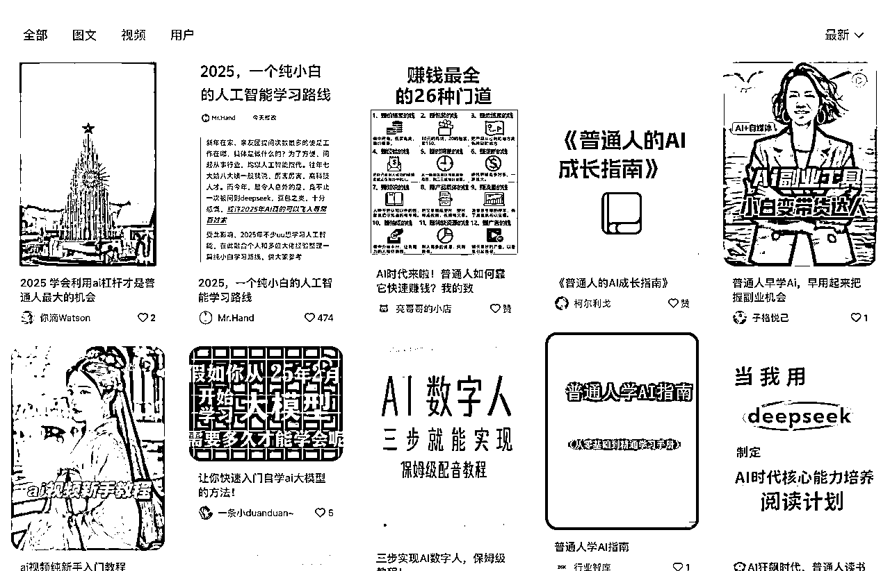


创新幻觉悖论：

新人总想标新立异，但商业级内容需要的是“70%验证框架 +30%微创新”。就像连锁餐饮的爆品公式：经典口味+季节限定包装。很多创作者误以为“创新”是爆款的关键，但实际上，用户更喜欢在熟悉的框架下获得新的体验。

案例：

你设计了一个全新的内容形式，但用户可能更习惯传统的图文结构。

你尝试了一个全新的选题方向，但用户可能更关注已经被验证的热门话题。

核心问题：

过度追求创新，忽略了用户对“熟悉感”的需求。

没有在已验证的框架上进行微创新，导致内容脱离用户认知。


1.  真正的爆款逻辑藏在两个动作里

爆款不是创作出来的，是用户用行为数据标注出来的“需求地图”。

逆向拆解：拆解 100 篇行业赛道的爆文

提取「用户需求坐标轴」：

高频词=痛点：用户最关心的问题是什么？

高赞点=爽点：用户最愿意为什么内容点赞？

高收藏=痒点：用户最想留存的内容是什么？

通过拆解爆款，找到用户需求的“最大公约数”，并将其作为内容创作的起点。

案例：

如果你在 AI 领域创作，发现“ChatGPT 入门教程”是高频爆款，那么你可以围绕这个主题进行延展，比如《ChatGPT 入门：10 个实用场景》。


工业化生产：把验证过的选题/结构/关键词做成可复用的 SOP 模板

像流水线生产 iPhone 一样，稳定输出内容：

选题模板：根据爆款规律，设计可复用的选题库。

结构模板：总结爆款内容的通用结构（如痛点+解决方案+行动引导）。

关键词模板：提炼爆款标题和正文中的高频关键词，直接复用。

通过标准化生产，降低创作成本，提高爆款概率。

案例：

如果你发现“AI 工具测评”是一个高频爆款类型，可以设计一个测评模板：

.

工具介绍：简要说明工具的功能。

.

使用场景：列举工具的适用场景。

.

优缺点分析：总结工具的优缺点。

.

使用建议：给出具体的操作建议。


总结：爆款不是创作出来的，是用户用行为数据标注出来的“需求地图”

先当考古学家：挖掘爆款背后的共性规律，找到用户需求的“最大公约数”。

再当工程师：用标准化的方式批量生产内容，像流水线一样稳定输出爆款。

这才是内容变现的终极法则。


1.  通过 4 个标准，筛选对标笔记

经过分析，可以发现这些笔记精准符合爆款笔记的四大核心特点：

# 4.1 选题维度

笔记选题非常热门，已经有大量成功案例验证。

选题、封面配图、排版、标题高度一致，形成了强烈的重复性和辨识度。


# 4.2 封面维度

封面设计、关键词布局、标题风格、内容主体都非常相似，便于对标模仿。

这样的一致的封面可以降低创作门槛，更容易复刻爆款。


# 4.3 数据维度

数据表现非常亮眼，至少达到千赞级别，且已经出现万赞以上的爆款。

整体数据优异，大量笔记获得几千甚至几万点赞，显示出极高的用户认可度。


# 4.4 时效维度

发布时间较近，几乎都在一年以内，说明这些内容仍然具有较高的热度和时效性。

比如最近 deepseek 相关的内容就是一个大热点。


# 5\. 对标账号分析与筛选

筛选完对标，我们接下来就开始分析对标账号了。首先找 10-20 个同领域的对标账号，观察他们的流量和数据表现，筛选出数据较好的账号作为参考。

接着，分析这些对标账号的特点，包括：

账号人设：他们的定位是什么？他们的 IP 有什么特点？是治愈系、励志系还是实用系？

封面设计：封面的色调、排版、字体风格如何？

选题方向：他们常发哪些类型的内容？哪些选题更容易爆？

文案风格：文案是走情感路线还是干货路线？

标题技巧：标题是如何吸引点击的？用了哪些关键词？

标签使用：他们常用哪些标签来提升曝光？

案例拆解 1：艾恒


.

账号人设与 IP 特点

定位：实用技能型，专注于 AI 工具的使用技巧和教程，尤其是 KimiChat、ChatGPT、文心一言等 AI 工具的 Prompt（指令）和模板分享。

IP 特点：

专家人设：账号名称“艾恒”可能是一个虚拟或真实的 KOL，专注于 AI 工具的教学和实操。

目标用户：对 AI 工具感兴趣的用户群体，尤其是需要提升写作、运营、教学等技能的人群（如教师、新媒体运营者）。

语言风格：直接、实用，强调“保姆级教程”“万能公式”等，给人一种“小白友好”的感觉。


.

封面设计

色调：从标题和内容来看，封面可能采用对比鲜明的色调（如黑底+亮色文字），以突出技术感和实用性。

排版：

标题简洁明了，多用数字和关键词（如“130 个”“50 个”“3 步”），吸引用户点击。

可能采用分步骤截图拼接+箭头标注的形式，强化教程属性。

字体风格：可能使用科技感较强的字体（如无衬线字体），搭配简洁的图标或符号（如✨💡）。


.

选题方向与爆款内容

高流量选题：

AI 工具指令模板：如“KimiChat 提问标准公式”“文心一言教案指令模板”，这类内容直接解决用户痛点，实用性强。

写作与运营技巧：如“写作公式”“新媒体运营高级指令”，吸引需要提升技能的用户。

变现与赚钱案例：如“96 年 28 岁，入局 AI 赛道，真的赚够了”，通过成功案例吸引用户关注。

爆款共性：

强实用价值：内容直接提供可操作的模板或公式，降低用户学习成本。

蹭热点：结合 AI 工具的最新功能（如 KimiChat、文心一言）进行内容创作。

.

文案风格

干货路线：

文案简洁直接，多用数字和效果承诺（如“好用哭了！”“万能公式”）。

结构化表达（如“3 步仿写头条号”“44 个官方指令”），便于用户快速理解。

情感共鸣：

通过“保姆级教程”“需要写教案的姐妹进”等语言，拉近与用户的距离。


.

标题技巧

关键词组合：

数字强调：“130 个超实用 Prompt”“50 个新媒体运营高级指令”。

效果承诺：“万能公式”“好用哭了！”.

疑问句：“需要写教案的姐妹进！”.

平台适配：

标题简洁明了，适合快速阅读的平台（如小红书、抖音）。

可能使用表情符号（如✨💡）增强吸引力。

.

标签使用

通用标签：

#AI 工具 #KimiChat #ChatGPT #文心一言 #Prompt 教程。

垂直标签：

#写作技巧 #新媒体运营 #教师教案 #AI 变现。

平台热点标签：如#小红书创作学院 #知识分享。

1.  如何制作爆款笔记

# 1\. 封面

# 2.1 【24 类】常见封面

这里我们没有局限于 AI 类博主，而是把各个领域的优质封面都整理了一下。毕竟，好看的封面不分领域，其他赛道的好内容也值得我们借鉴。下面就一起来看看吧！

第 1 种：放大型

突出重点，第一视觉落点明显


第 2 种：制造视觉冲击型

夸张、吸睛、反常的、有表现力的图


第 3 种：色彩对比型

突出重点，营造反差


第 4 种：色彩饱和度型

高饱和颜色，对比强烈，颜色醒目

荧光色大面积使用


用高饱和字突出部分重点内容


第 5 种：增加色块型

突出有价值感的文字内容

第 6 种：留白型

突出重点，制造呼吸感


第 7 种：实拍型

真实、代入感


第 8 种：人物型

聚焦视觉，表现力增强

第 9 种：重复排列型

相同场景不同内容的规律排列，规律感


第 10 种：利用数字型

价值感强，数字更容易抓眼球，营造反差和悬疑感

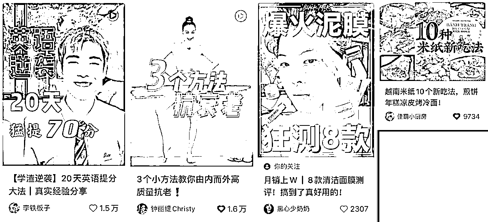

第 11 种：中心构图型

将文字/人物主体/产品主体放置在画面正中位置

视觉焦点引导精准，聚焦


第 12 种：顶部/底部排版型

文字部分排版在图片顶部或者底部位置

tips：在拍摄照片的时候，想好放置文字的位置，留好相应的空白位置（不要放重要信息）


第 13 种：对角线三分构图型

将画面三等分（在设置内打开相机的构图网格）

将重要的主体/文字信息放置在对角线焦点位置


第 14 种：上下对称构图型

文字内容上下对称排版，人物/产品主体在画面中心


第 15 种：Z 字型构图型

符合人眼的阅读习惯：从上到下，从左到右

文字内容比较多的可以用这种形式


第 16 种：对齐排版型

文字内容左对齐/右对齐，规律感比较强，画面内容多也不会杂乱，视觉动线清晰


第 17 种：左右对称构图型

文字内容左右对称，或者文字与主体形成左右对称关系


第 18 种：上下对比构图型

非常适合展示前后效果对比和成果展示

内容信息丰富，视觉直观感强烈


第 19 种：左右对比构图型

对比更加紧凑直观，画面主体是竖长的（比如人物穿搭，发型等）横版展示不全面的适合左右对比


第 20 种：四角构图型

重点文字/元素放在画面四角，视觉张力和重点比较突出


第 21 种：字体型

营造风格和氛围

以下是相同排版，但是文字字体不同的几张图

相同的排版，只有字体不同，能体会出字体带来的区别吗？

*时尚类内容：比如美妆/穿搭/颜值....适用时尚感强的雅宋字体或者粗黑体

*活泼轻松的内容：适合粗体花子，可以是风格感比较强的

*中式字体、手写字体都是风格感很强的字体，考虑账号整体内容调性去选择字体


封面图相同的字体风格，可以营造账号整体的风格氛围


第 22 种：文字遮挡环绕型

文字与主题代入感强


第 23 种：上下分屏型

内容信息相对丰富，文字的排版不要杂乱，否则很难突出重点


第 24 种：画中画型

利用素材图作为画中画添加在实拍图上，内容更直观，讲解更加清晰

画中画的配合和实拍图可以是上下排版、左右排版等，切忌无规律添加，画面太乱，get 不到重点


# 2.2 封面图设计工具推荐

这里推荐两个封面的工具：

可画：https://www.canva.cn

创可贴：https://www.chuangkit.com/

这两个工具都能帮助你快速制作出高质量的封面。


打开工具，就进入设计阶段，首先要考虑你希望的封面风格，比如简约、科技感或者活泼等，可以在工具中搜索类似“科技感封面”或“AI 工具封面”等关键词，找到适合自己内容的设计。

如果没有满意的模板，也可以从空白页面开始，自由发挥设计。


在选择封面模板时，建议保持风格统一，比如你的账号定位是科技类，那就选择深蓝色或其他有科技感的配色；如果内容更偏向艺术类，可以选择渐变色或更具艺术感的设计。

确定了模板后，我们就可以添加核心元素。首先标题要简洁明确，突出内容的价值，比如“用 AI 工具提升效率，3 分钟搞定一天工作！”之类的表达方式。

图片方面，建议使用 AI 生成的高清图片，或者工具自带的一些科技感图标。

为了加强个人 IP 辨识度，可以在封面底部加上你的固定 Slogan，比如“每天分享一个 AI 神器，提升你的效率！”，左上角还可以放上个人头像或品牌 Logo，进一步增加辨识度。


这个博主，封面都会用专属的紫色来强调重点

最后我们需要做一些细节调整，包括字体、颜色和布局。

字体上，选择清晰易读的字体，比如科技内容可以使用 Roboto 字体，艺术类内容使用 Poppins 字体，标题要加粗突出。

颜色上，确保主色调与内容主题相匹配，突出视觉重点，比如科技内容用蓝色系，艺术内容可以用渐变色调。

布局上，标题一般放在封面的中间位置，图片占据约三分之二空间，底部位置则用于放置你的 Slogan 和头像或 Logo。

完成以上流程，就能轻松制作出高质量、有风格的 AI 内容封面了！还是原来那句话，如果自己设计起来太吃力了，建议找设计帮忙，毕竟封面真的太重要了。

# 2\. 标题

AI 领域的内容创作中，利用人性情绪（如贪婪、恐惧、懒惰、避难趋易）起标题，可以有效提升点击率和用户参与度。下面给各位圈友列几种亲测有效的技巧。

# 2.1 贪婪：放大欲望，突出选题的强大

# 方法一：权威加持法

大家如果仔细留意会发发现一个规律——我们在刷抖音或者看公众号文章的时候，并不是阅读完全部的标题，才选择停留或者点击文章的。

我们一般都会都只会看 1-2 个「视觉词」，比如下面这些标题中：

《马斯克推荐的 5 个 AI 工具，效率提升 300%！》

《哈佛教授推荐的 AI 学习法，让你快速掌握机器学习！》

《OpenAI CEO Sam Altman：AI 未来的 10 个趋势，职场人必看！》

我们第一眼看到的，只有：

《马斯克推荐的 5 个 AI 工具，效率提升 300%！》

《哈佛教授推荐的 AI 学习法，让你快速掌握机器学习！》

《OpenAI CEO Sam Altman：AI 未来的 10 个趋势，职场人必看！》

一般关于 AI 行业的领袖、名校、名企、热门事件，都是能抓住人的「视觉词」。那我们如何在标题里写出这些词呢？

给大家整理了一些常见的“权威关键词”，如果有选题的圈友，可以看看能否把这些词，放到标题里。

.

AI 行业领袖

人物

公司 / 职位

贡献 / 观点

埃隆・马斯克 （Elon Musk）

xAI、特斯拉、SpaceX CEO

预测 AI 最快 2026 年超越人类智力，推动脑机接口与自动驾驶技术发展

黄仁勋 （Jensen Huang）

英伟达 CEO

引领 AI 芯片革命，提出 “物理 AI” 概念，计划 10 年内提升计算能力 100 万倍

山姆・奥特曼 （Sam Altman）

OpenAI CEO

主导 GPT 系列开发，认为中国将发展独特的大模型，预测未来全球仅存 10-20 个核心大模型

米拉・穆拉蒂 （Mira Murati）

OpenAI CTO

推动 ChatGPT、DALL-E 等应用落地，预言 “博士级智能” 将在未来几年出现

桑达尔・皮查伊 （Sundar PichAI）

谷歌 CEO

将 AI 融入搜索与自动驾驶，主张 AI 答案与外部链接结合以平衡用户体验

李彦宏

百度 CEO

布局 AI 全产业链，推动自动驾驶平台 Apollo 落地，被誉 “中国 AI 启蒙者”

周鸿祎

360 集团创始人

预言 2024 年为 “大模型场景之年”，强调 To C 杀手级应用将爆发

萨蒂亚・纳德拉 （Satya Nadella）

微软 CEO

主导 Azure 云服务与 OpenAI 合作，推动 Copilot 等 AI 工具商业化

苏姿丰 （Lisa Su）

AMD CEO

突破高性能 AI 芯片技术，支持自动驾驶与医疗领域计算需求

戴密斯・哈萨比斯 （Demis Hassabis）

DeepMind CEO

开发 AlphaFold 解决蛋白质折叠问题，预言 10 年内实现通用 AI（AGI）

徐立

商汤科技 CEO

提出垂直行业需构建 “高阶思维逻辑数据”，强调差异化竞争路径

杨植麟

月之暗面创始人

探索 AGI 协作模式，认为 Sora 等技术将打通数字与物理世界

扎克・伯格 （Mark Zuckerberg）

Meta CEO

开源 LLaMA 等大模型，推动 AI 社区共建安全技术

阙志克

台达研究院院长

领导能源与 AI 融合研究，推动工业智能化

杰夫・贝索斯 （Jeff Bezos）

亚马逊创始人

提出 AI 可以帮助人类避免灭绝风险，推动 AWS 云服务支持 AI 开发

.

AI 领域名校

学校

优势领域

斯坦福大学

计算机视觉、自然语言处理

麻省理工学院 （MIT）

机器学习、机器人学

加州大学伯克利分校

深度学习、自动驾驶

卡内基梅隆大学

人机交互、AI 伦理

清华大学

算法理论、交叉信息科学

牛津大学

医疗 AI、伦理研究

剑桥大学

生物 AI、DeepMind 合作

多伦多大学

深度学习理论（Hinton 团队）

苏黎世联邦理工学院 （ETH）

机器人、自主系统

俄勒冈州立大学

电子工程（黄仁勋母校）

香港科技大学

金融 AI、跨领域应用

1.  AI 知名企业

企业

核心领域

英伟达 （NVIDIA）

AI 芯片、计算平台

OpenAI

大模型（GPT、DALL-E、Sora）

谷歌 （Google）

搜索 AI、DeepMind、TensorFlow

微软 （Microsoft）

Azure 云服务、Copilot

百度

自动驾驶、文心大模型

Meta

开源大模型（LLaMA）、元宇宙

特斯拉 （Tesla）

自动驾驶、Optimus 机器人

商汤科技

计算机视觉、智慧城市

亚马逊 （Amazon）

AWS 云服务、Alexa

苹果 （Apple）

Siri、端侧 AI 芯片

月之暗面

长文本大模型（Kimi）

智谱 AI

通用大模型（GLM）

AMD

AI 计算芯片

台达电子

工业 AI 与能源管理

智谱 AI

通用大模型（GLM）

如果你觉得太过麻烦，也可以直接把你的选题内容，发送给“DeepSeek（联网版本）”中，让它帮你生成带有“权威词”的标题。

下面做一个演示：比如说现在我想拍一个关于——“可灵接入 DeepSeek，做 AI 视频已经不用再写提示词了！”的选题，我把相关提示词带入 DeepSeek


AI 生成的标题有：


怎么样？很多是不是还不错？特别有吸引力。但是要注意，DeepSeek 生成的内容是有一些“幻觉”的，我们最终需要确保一下标题的词汇，是满足事实依据的，那就可以使用了。

我把提示词贴在这里，大家需要可以使用：

我今天想拍一个 “【这里填你的选题内容】”的选题，我想看看能否加入一些 AI 行业的领袖、名校、名企、热门事件等等“知名”词汇，以此来提升我的标题点击率，这些词汇需要是普通人能经常能刷到的热搜，在社交平台能看到的“热词”，不要太冷门。你能帮我搜索一下，并给我列出 10 个标题参考吗？标题要简短精炼吸引人，可以搜搜虎嗅、36 氪等公众号，如果能有一些情绪（像咪蒙公众号标题）就更好了。


除了借助“权威词汇”外，我们还能利用塑造“一劳永逸”的感觉，来刺激人的贪欲，从而提升点击。

# 方法二：万能解法

核心逻辑：突出一个方法或工具能解决用户的核心问题，满足用户的“贪婪”心理。

适用场景：适合介绍 AI 工具的使用方法或技巧时使用。

比如说下面这些案例：

《用 ChatGPT 写文案，一个方法搞定所有需求！》

强调 ChatGPT 的万能性，吸引需要高效写作的用户。

《Midjourney 入门指南：一篇文章讲透 AI 绘画！》

突出 Midjourney 的全面性，吸引对 AI 绘画感兴趣的用户。

《Notion AI：一个工具搞定笔记、任务、项目管理！》

强调 Notion AI 的多功能性，吸引需要高效管理的用户。

这个取标题的方法很简单，直接套用这个公式——

用了 xxx 工具 + 产生了 xxx 超预期的效果

比如：

“我用 xxx 一天写 30 条短视频脚本！”

“用 xxx 工具，3 秒搞定一周的工作量！”


# 方法三：对比碾压法

大家平时应该经常刷到这种“VS（对比）”类型的内容吧？


其实，这种“VS”对比的方式，不仅能帮你快速想出选题，用在起标题上也特别好用。

核心逻辑：通过对比突出内容的强大，激发用户的“想要更多”心理。

适用场景：适合对比不同 AI 工具或方法时使用。

案例：

《ChatGPT vs Notion AI：哪个更适合写文案？》

详细说明：通过对比两款工具的优缺点，吸引用户选择更适合自己的工具。

《比传统设计更快：AI 绘画工具 Midjourney 的逆天效率！》

详细说明：通过对比传统设计和 AI 设计的效率，突出 Midjourney 的强大。

《AI 写作 vs 人工写作：效率提升 10 倍，效果更惊艳！》

详细说明：通过对比 AI 写作和人工写作的效率与效果，吸引用户尝试 AI 工具。


# 方法四：数据证明法

另外，你直接在标题里加几个数字，也能很好地吸引大家去点。为什么小红书最开始火起来的都是“清单体”内容？因为清单的核心元素就是数字、干货和利益点。数字能让人一眼看清楚内容结构，配上利益点，用户的获得感就更强了。

核心逻辑：用数据或结果证明内容的有效性，满足用户对“结果”的贪婪心理。

适用场景：适合展示 AI 工具的使用效果或案例时使用。

案例：

《用 AI 工具写文案，3 分钟搞定一篇，效率提升 300%！》

详细说明：通过具体数据（3 分钟、300%）证明 AI 工具的高效性。

《AI 绘画工具 Midjourney，点击率提升 50%！》

详细说明：通过数据（点击率提升 50%）证明 Midjourney 的实际效果。

《用 ChatGPT 写小红书文案，3 周涨粉 5000+！》

详细说明：通过涨粉数据证明 ChatGPT 的实用性。


# 方法五：情绪浓度

直接在标题里上一些有情绪的词汇，也是种好方法。

我举几个例子，大家就不陌生了，比如说：

好用到哭——好用到哭， 6 个舍不得卸载的黑科技 APP 大数据——大数据请帮我推荐给想变白的人

教科书般——堪称教科书般的虐退教程，不怕你不来

宝藏——力荐 36 位宝藏博主，卷王必看，狠狠逆袭

绝绝子——这个 INS 发光真的绝绝子啊，赶快试试吧！

神器——长尾夹真的超好用，家用和办公收纳神器

都给我冲——救命 ，姐妹们都给我冲这个小帕茶壶

划重点——焦虑患者逃脱指南，真的每句都想划重点

笑不活了——笑不活了，教你一句话把天聊死

YYDS——会说话的女生，真的 YYds

秘方——感谢网友的秘方，真的巨好吃，还贼简单

我不允许——我不允许还有人没有吃过这个，巨巨❗️好吃

压箱底——压箱底干货，疯狂涨粉居然从来不花

……


核心逻辑：用形容词直接突出内容的强大，满足用户对“强大”的贪婪心理。

适用场景：适合介绍 AI 工具或方法时使用。

案例：

《ChatGPT：世界公认的最强 AI 写作工具》

详细说明：用“最强”直接突出 ChatGPT 的权威性和实用性。

《5 个顶级 AI 工具，让你效率翻倍！》

详细说明：用“顶级”和“效率翻倍”突出工具的高效性。

《AI 绘画神器 Midjourney：一键生成爆款封面！》

详细说明：用“神器”和“爆款”突出 Midjourney 的强大功能。

这里有一份“情绪词汇表”，大家感兴趣可以看看👉情绪词汇总


# 2.2 恐惧：利用害怕犯错、落后、错过的心理

现在很多人都有一种毛病，就是特别怕错过点什么。比如打开朋友圈或者微博，发现大家都在讨论某个话题，自己却一点也不知道，心里一下就慌了，总觉得自己被甩到后面去了。有人专门研究过这事儿，说全球超过一半的人都有这种“怕错过”的焦虑，手机天天不离手，就是担心一不小心成了圈外人。

其实，这种心理平时太常见了。商家特别懂这个套路，什么秒杀倒计时啊，订酒店时提醒你“只剩最后一间”，各种必须受邀才能去的品牌活动，还有那些限量发售的商品，都是抓住了我们怕错过的心理。

说白了，怕错过既是一种生活中的焦虑，也是一种常用的营销手法，我们可以利用人的这种“恐惧”来写标题。具体有下面几种方法：

# 方法一：错误警示法

核心逻辑：通过指出用户可能犯的错误或低效行为，激发他们的恐惧心理，吸引点击。

适用场景：适合分享 AI 工具的使用技巧或避坑指南时使用。

案例：

《用错 AI 工具，效率反而更低！这些坑千万别踩！》

详细说明：列举常见的 AI 工具使用误区，如“用 ChatGPT 写文案时，关键词设置不当会导致内容质量下降”，吸引用户点击以避免犯错。

《AI 写作工具用错方法，效果大打折扣！》

详细说明：指出用户在使用 AI 写作工具时常见的错误，如“过度依赖 AI 导致内容缺乏个性”，吸引用户学习正确方法。

《新手用 Midjourney 常犯的 5 个错误，效果差到离谱！》

详细说明：列举新手使用 Midjourney 时的常见错误，如“关键词描述不清晰导致生成效果差”，吸引用户点击学习正确方法。


# 方法二：提供解决方案

在指出错误的同时，提供具体的解决方案或正确使用方法。

案例：

《避免这些错误，让你的 AI 工具使用效率翻倍！》

详细说明： 提供具体的解决方案，如“如何正确设置 ChatGPT 的关键词”，吸引用户点击学习。

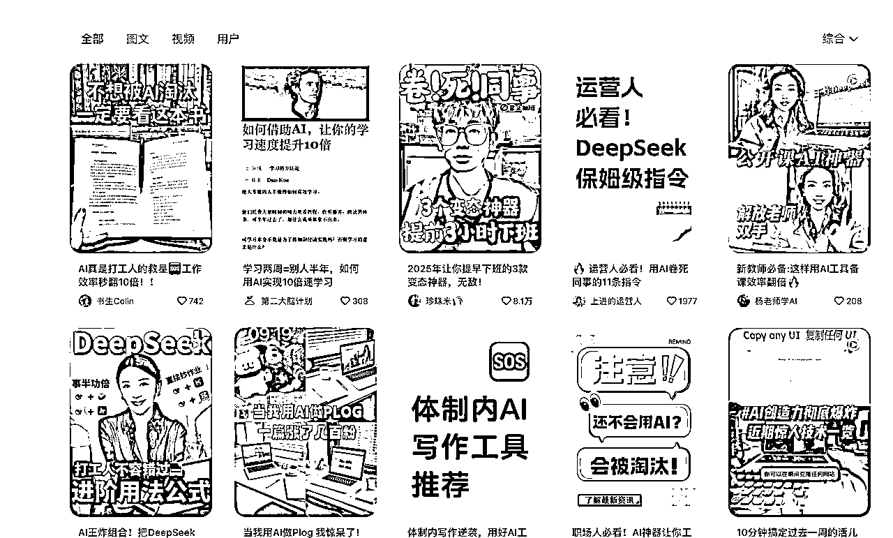

# 方法三：竞争紧迫法

核心逻辑：通过强调竞争压力，激发用户害怕落后的心理，吸引点击。

适用场景：适合分享 AI 工具的最新趋势或高效使用方法时使用。

案例：

《90%的人还不知道的 AI 神器，职场人必备！》

详细说明：强调“90%的人还不知道”，激发用户害怕落后的心理，吸引他们点击了解最新 AI 工具。

《AI 绘画工具 Midjourney 的秘密，大神们都在用！》

详细说明：指出“大神们都在用”，激发用户害怕落后的心理，吸引他们点击学习。

《ChatGPT 隐藏功能，99%的人都没用过！》

详细说明：强调“99%的人都没用过”，激发用户害怕落后的心理，吸引他们点击了解隐藏功能。


# 方法四：机会稀缺法

核心逻辑：通过强调机会的稀缺性，激发用户害怕错过的心理，吸引点击。

适用场景：适合分享限时活动、最新工具或行业趋势时使用。

案例：

《2024 年最火的 5 款 AI 工具，错过再等一年！》

详细说明：强调“错过再等一年”，激发用户害怕错过的心理，吸引他们点击了解最新工具。

《AI 工具合集：职场人必看，不看后悔！》

详细说明：强调“不看后悔”，激发用户害怕错过的心理，吸引他们点击阅读。

《限时推荐！5 款 AI 工具，让你的效率翻倍！》

详细说明：强调“限时推荐”，激发用户害怕错过的心理，吸引他们点击了解工具。


# 2.3 懒惰：减少付出，突出简单易用

AI 领域的工具虽然功能强大，但作复杂而让人望而却步。

因此，抓住用户的“懒惰”心理，突出内容的简单易用性，是吸引点击的关键。

通过提供“万能解法”“极简步骤”和“新手速成”等方法，不仅能够降低用户的学习门槛，还能让他们快速看到成果，从而激发他们的兴趣和参与度。以下将详细介绍如何利用“懒惰”心理创作标题，帮助用户轻松上手 AI 工具，提升效率。

# 方法一：万能解法法

核心逻辑：突出一个方法或工具能解决用户的核心问题，满足用户的“懒惰”心理。

适用场景：适合介绍 AI 工具的使用方法或技巧时使用。

案例：

《用 ChatGPT 写文案，一个方法搞定所有需求！》

详细说明：强调 ChatGPT 的万能性，吸引需要高效写作的用户。

《Midjourney 入门指南：一篇文章讲透 AI 绘画！》

详细说明：突出 Midjourney 的全面性，吸引对 AI 绘画感兴趣的用户。

《Notion AI：一个工具搞定笔记、任务、项目管理！》

详细说明：强调 Notion AI 的多功能性，吸引需要高效管理的用户。

# 方法二：极简步骤法

核心逻辑：用简单步骤降低用户心理负担，吸引点击。

适用场景：适合分享 AI 工具的使用教程时使用。

案例：

《简单 4 步，用 AI 工具生成爆款封面！》

详细说明：列出 4 个简单步骤，如“选择模板→输入关键词→生成封面→下载使用”，吸引用户点击学习。

《3 分钟学会用 ChatGPT 写爆款标题！》

详细说明：强调“3 分钟学会”，吸引用户点击学习快速方法。

《5 步搞定 AI 绘画，新手也能轻松上手！》

详细说明：列出 5 个简单步骤，吸引新手用户点击学习。


# 方法三：新手速成法

核心逻辑：突出内容适合新手或零基础用户，降低学习门槛。

适用场景：适合分享 AI 工具的入门教程时使用。

案例：

《0 基础学 AI 绘画：Midjourney 入门指南》

详细说明：强调“0 基础”，吸引新手用户点击学习。

《新手必看：用 ChatGPT 写文案的 3 个技巧！》

详细说明：强调“新手必看”，吸引新手用户点击学习。

《AI 工具入门：从零到高手，只需 7 天！》

详细说明：强调“从零到高手”，吸引新手用户点击学习。


# 3\. 如何制作一篇图文笔记

这里我们主要讲的是，怎么创作小红书图文笔记的正文内容，其实像公众号、即刻，甚至你自己朋友圈，方法都差不多，用这个方法也一样能写好。我们直接上干货：

内容框架：引起共鸣 → 激发好奇 → 提供方法 → 展示效果 → 鼓励互动

① 引起共鸣：一开始就讲真实的烦恼 用具体、真实的场景或烦恼，迅速拉近与读者的距离。

比如：

“文案总写不好，几个小时也写不出一句满意的，焦虑到睡不着！”

“封面改了一整天，结果还是没人看，感觉自己白忙活。”

② 激发好奇：让读者产生兴趣往下看 告诉读者你发现了什么好东西，能帮他们迅速解决困扰。

比如：

“直到我发现一个 AI 工具，文案写起来瞬间变轻松了！”

“后来我用了一个 AI 神器，封面 3 分钟搞定，效果比自己做的好太多！”

③ 提供方法：简单清晰地告诉大家怎么做 一步一步教读者怎么操作，突出方法的简单易上手。

比如：

“打开 ChatGPT，输入你要的主题，一键生成，再稍微改一改，5 分钟内轻松搞定文案。”

“用 Midjourney 做封面只需要几个关键词，自动生成漂亮图片，不满意还能继续调整，超级省心！”

④ 展示效果：给出实际结果，增强信任感 用具体的例子或效果证明你提供的方法有效。

比如：

“用这个方法，我现在每天轻松搞定 3 篇文案，效率直接翻倍！”

“用 AI 做的封面让点击率提升了一倍，效果特别明显！”

⑤ 鼓励互动：结尾别忘了和读者互动一下 鼓励读者尝试你的方法，并留言或关注你，提升互动率。

比如：

“你也赶快试试看吧，用完告诉我效果怎么样！”

“如果觉得有用，别忘了点个关注，后续还有更多技巧分享给你！”


案例分析 1：AI 写书评

下面我们结合一篇笔记来具体分析下。

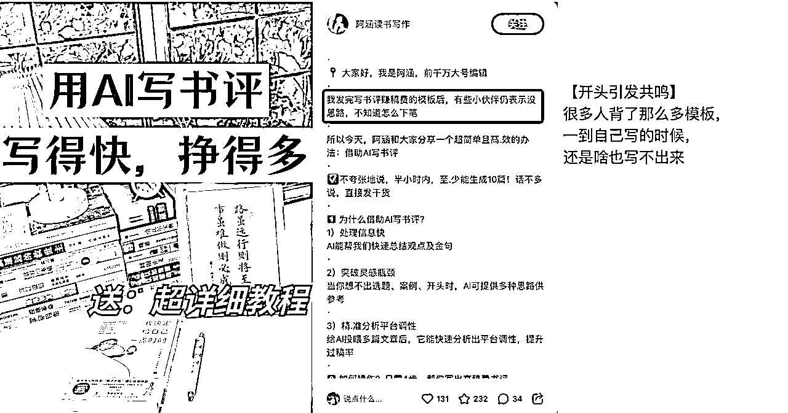


博主这里没有「展示效果」，如果加上展示效果，这篇笔记完全可以做成一个视频形式。


案例 2：AI 绘画工具


案例 3：AI 效率工具

开头（痛点）：

“工作效率低，每天都被任务压得喘不过气！”

衔接（期待）：

“别担心，今天教你用 Notion AI 提升效率，每天节省 2 小时！”

亮点（方案）：

“用 Notion AI 规划任务，只需 3 步：

.

创建任务列表：输入任务名称和截止时间。

.

自动分配优先级：Notion AI 根据截止时间自动排序。

.

实时跟踪进度：随时查看任务完成情况。”

结尾（钩子）：

“快来试试 Notion AI，评论区告诉我你的使用体验！关注我，获取更多效率提升技巧！”


方法论总结

.

分段落：每个段落只讲一个核心点，避免信息过载。

.

使用小标题：用小标题分隔不同部分，便于用户快速浏览。

.

过渡自然：段落之间用过渡句连接，确保逻辑流畅。

.

引起共鸣 → 激发好奇 → 提供方法 → 展示效果 → 鼓励互动，这几个部分不一定都要有内容。


# 4\. 如何制作一篇视频笔记

# 4.1 案例复盘

以下是圈友 @汤姆 CC 的复盘：

起步阶段（2024 年 7 月）

去年一直感觉 AI 是风口，但是不知道自己怎么切入进去，然后我想到我可以试试做视频，虽然我可能不会成功，但是我可以掌握更多 AI 技能——费曼学习法，倒逼自己输出。我在使用过程中也积累了不少经验，也踩了很多坑。想着与其藏着掖着，不如把这些经验分享出来，帮助更多人少走弯路。

我最开始做我的 AI 账号是 2024 年 7 月 28 号，我发布了我的第一个作品，当时没进生财，都是自己瞎琢磨，也就是模仿人家，但是不知道什么定位，选题，封面这些，现在回过头来看着自己的作品就想笑。当时就是感觉可以做，一腔热血，反正发出来再说。然后做了一周，没啥起色，开学后，时间管理困难，收益不明显，就慢慢放着了。

转折期（2024 年 10 月）

10 月 15 日，亦仁老大的首个超级标发出来，让我再一次坚信这个机会前景巨大。那时进入生财一个多月，了解到了一些做账号的经验，于是我就搜集生财和网上其他各种自媒体经验帖子疯狂开始学习，学习怎么找选题，怎么做爆款的封面等等，粉丝慢慢破千，期间也是各种尝试，仿照赛文乔伊博主那种用手机拍，各种失败。

接着到了快期末考试，我就又放置了一段时间，但是我并没有放弃学习怎么做 AI 自媒体，我开始研究我喜欢博主的剪辑风格，开始像素级的拆解，慢慢分析做笔记，到了寒假，我开始把我学会的个性化背景设计，学习的剪辑技巧都用进去，依旧数据平平。

突破期（2025 年春节）

在临近过年的时候我更新了一期 DeepSeek 的视频，当时没啥反应，但是在过年那一天，我的小红书爆了，然后我觉得 DeepSeek 有机会，于是我除夕那天加班剪辑了一期关于 DeepSeek 本地部署的，在初二那天发布火了。

由于新年要去别人家拜年，我于是就背着电脑到亲戚家说我写作业，慢慢更新 DeepSeek 的相关视频，流量都还不错，我不敢断更，于是坚持一天发一个，也就涨了 2000 粉，后面因为全网都在讲如何流畅的使用 DeepSeek，我其实过年那段时间更新了不少关于 DeepSeek 怎么流畅使用的做法，但是由于大量的同行也开始介入，感觉这个教程已经成红海了，反观像具体如何使用 DeepSeek 教程的人很少，于是我改做 DeepSeek 的具体使用技巧，做具体有价值的教程，于是就做了一个千万播放，三个百万播放。


没进生财前的作品


10 月 15 日老大超级标上我的评论

进生财之后的各种尝试

从我的经历看出，我之前是一个毫无经验的普通大学生，靠着半年在生财和网上各种资料教程的学习，做出了一点点成绩，所以我觉得大家都可以做，因为这并没有什么高门槛。如果大家在做 AI 自媒体处于瓶颈期，请不要放弃，不下牌桌，改良作品，我相信你会在某一个时刻爆发出来的。


# 4.2 步骤拆解

# ① 定位

做账号最重要的就是定位，怎么结合自身的优势做出合理的定位？

我的灵感来源是七天姐给我定位的方法，借助 AI，借助 AI 辅助你思考，我们可以给 AI 说：你是生财有术的亦仁，你需要帮我做 AI 自媒体的定位。

然后你整理 10 个身份标签，这些标签会呈现对象是未来购买你的产品或者服务的人，本质是也就是我为什么人提供什么服务需要多少钱。

AI 会根据你的身份给你建议，当然你需要客观判断这个说法到底对不对。


# ② 装饰账号和设钩子

装饰账号：账号称呼，头像，简介

账号名称：建议带上 AI 这个词

账号头像：

在即梦 APP 里面的灵感能找到不错的头像，根据灵感里面的提示词自行修改，然后跟自己结合就好，最好是头像和账号名称能够对应的上


简介：参考同行，结合自身，另外需要有“钩子”的影子，比如资料领取@小号


钩子：比如 DeepSeek 资料或者自己整理的工具箱

为不影响账号，建议粉丝群公告发布消息里面含有资料工具在主页获取信息，在主页@你的小号，通过小号把它转移到公众号上，为啥先导到公众号，一个是可以后面开通流量主，二是你如果人多加微信是加不上的，会流失，但是公众号可以挽回一些粉丝。


# ③ 选题

选题决定了你的这个视频到底会不会有好的流量。那么怎么找好选题，怎么有源源不断的内容？那就是需要你参考对标建立属于自己的对标库

怎么建立自己的选题库？

信息来源：

（1）靠网感——刷视频、刷帖子

抖音，小红书，公众号都有搜索，搜素 AI 关键词【AI 工具，AI 绘画等等】相关内容，然后选择最近一周，爆过的内容肯定会再爆，所以可以参考它再结合你自己的特色，讲一些创新点或者你的感受，如果只是洗稿，我是不建议这么做的


（2）靠数据——数据分析平台

免费工具：算数指数-巨量算数，输入 AI 关键词，找低粉爆款视频

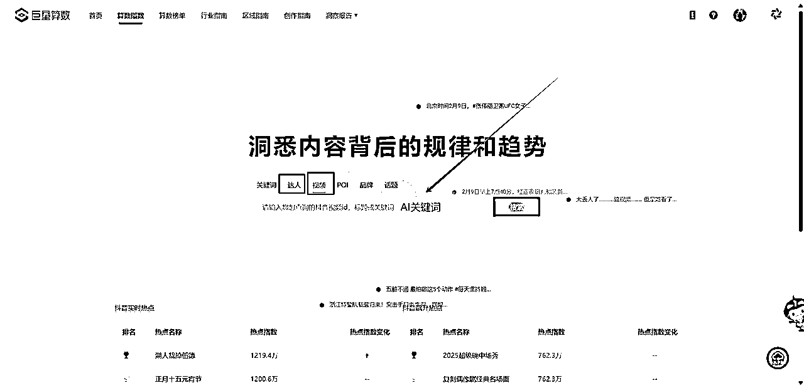


付费平台：蝉妈妈，灰豚等等，付费平台会让你更好的找到对标，大家可以去某鱼搜索日卡或者周卡。

选题还有几个非常重要的地方：

X，我们知道 DeepSeek 火首先是在外网火的，然后我们不止发现一次，在 X 上火的内容很大概率国内也火。

即刻：在 AI 探索站，里面都是 AI 相关的内容，里面很多都是 X 的大 v，所以内容也很不错

生财有术：在生财你已经领先全国 90%的人，里面的风向标里都是圈友们筛选好的，重要的 AI 信息，尤其是中标的风向标，价值非常大

找到对标账号之后我们需要建立自己的对标库

对标库参考


附源文档：AI 自媒体 - 对标库

小技巧：

1.随时记录好的内容和灵感，你刷视频，刷帖子，有好的灵感是不是，我们微信打开面对面群聊，然后建立一个 AI 素材库的群，记录你觉得不错的素材，记录你的灵感。

2.每周至少打开一次对标库，建议周末开始从里面找找不错的内容，确定你这一周的选题，然后每天开始对着选题做内容就好了，如果有合适的热点内容，我们就选择把之前准备好的素材往后延期

# ④ 文案

有选题之后我们用 AI 进行头脑风暴和灵感获取，我首先是把我的思路给到 AI，让它帮我分析，有没有好的思路让它优化，然后让它帮我润色文案。

文案开头的前 3s 需要有很大吸引力，这样才能需要客户往下看，文案内容要是有价值的内容，这样别人才会给你点赞转发这些。

标题文案库

类型

爆款文案示例

核心卖点

情感触发点

适用场景

技能提升型

"一晚上搞定 Midjourney，小白必学的 3 个赚钱技巧"

速成、赚钱

焦虑、机会

AI 绘画教程

效率工具型

"cursor 帮我写代码，效率提升 10 倍的秘密"

效率、省时

好奇、惊喜

AI 编程应用

创业机会型

"月入 10 万的 AI 副业，我只用了这 3 个工具"

收入、机会

渴望、希望

AI 创业分享

问题解决型

"一键解决 AI 训练难题，小白都能看懂"

简单、解决

困扰、释放

技术教程

趋势洞察型

"未来 5 年最赚钱的 AI 岗位，第一名意想不到"

前瞻、洞察

危机感、期待

行业分析

正文开场文案

场景

爆款开场示例

互动率

注意力抓取点

情感调动

应用技巧

故事型

"上周我用 AI 做了一个决定，彻底改变了我的生活..."

高

好奇心

共鸣

制造悬念

问题型

"你有没有为 AI 学习烦恼过？今天我要分享..."

中高

痛点

理解

直击痛点

数据型

"最新数据：72%的 AI 学习者都在走弯路..."

高

权威性

焦虑

数据支撑

反转型

"别再盲目学 AI 了，我要说一个真相..."

极高

反常识

震撼

制造反转

互动引导文案，注意有些平台不让引导粉丝互动，这个 B 站可以用

环节

文案模板

引导策略

情感触发

适用场景

评论区

"你最想学习哪种 AI 技能？评论区告诉我"

简单问答

参与感

话题互动

点赞

"点赞收藏，避免错过最新 AI 实战教程"

价值提示

不想错过

内容预告

分享

"转发给需要的朋友，一起学习 AI 技能"

社交传播

助人情怀

知识分享

私信

"想要详细学习资料，私信'AI'领取"

福利诱导

占便宜

资料派发

结尾文案

类型

文案示例

完播率

转化目标

情感召唤

行动指引

悬念型

"下期将分享更劲爆的 AI 赚钱方法..."

高

关注

期待感

预告下集

总结型

"掌握这 3 点，AI 学习不再迷茫..."

中高

实践

成就感

行动指南

互动型

"你还想学习什么 AI 技能？评论告诉我"

中

互动

被重视感

收集需求

爆款要素分析

要素

重要性

情感诉求

转化效果

优化建议

标题吸引力

⭐⭐⭐⭐⭐

紧迫感

高

强化数字效果

开场共鸣

⭐⭐⭐⭐

认同感

中高

增加场景感

内容价值

⭐⭐⭐⭐⭐

获得感

高

具体可执行

情感触发

⭐⭐⭐⭐

共鸣感

中高

强化代入感

Call to Action

⭐⭐⭐⭐

行动感

高

明确指引


# ⑤ 录制素材

电脑录制工具：Open Broadcaster Software | OBS

OBS 高清录制调节：OBS 不让截屏，所以大家用 OBS 录制不高清可以去搜“OBS 高清录制教程”

声音克隆工具：海螺语音：让文字栩栩如“声”

这个海螺 AI“海外版”的，目前免费，比较好用，可以克隆自己的声音，也可以克隆别人的声音，像之前风向标中标的一个账号，就是克隆别人声音，也很自然。【注意：需要魔法】

我们首先进入海螺 AI 的官网：海螺语音：让文字栩栩如“声”，然后选择 Google 登录，然后在主页选择 Audio。


进入到 Voices 后，点击 Create your voice Clone，上传几秒钟的音频，尽量要清晰一些，克隆的效果才好

然后回到“Text to Speech”，输入你配音的内容，选择自己的配音模型，然后点 Generate Speech，稍等几分钟就好了


# ⑥ 剪辑

普通人一开始剪辑不会很好，所以我们需要学会不断优化，不断借鉴对标的剪辑方法，然后搜索拆解，比如我看到一个画面是这个线条慢慢滑动出现，我就会去 B 站搜索：文章划线效果，学习这些剪辑的技巧


讲讲怎么找背景音乐，想参考某博主的音乐，网易云的听歌识曲识别不出来，因为杂音太重，我们首先下载它的视频，下载视频的工具：万能视频图片解析下载 - SnapAny，导入到剪映，然后分离音频，打开：团子 AI - 人工智能在线工具箱，然后我们上传音频，然后我们等待它把声音分离出来，然后再打开网易云音乐的听歌识别曲很大概率能识别出来。

下面我用一个具体的案例，来带大家还原一下剪辑流程。

案例展示：

DeepSeek更新.mp4【在线播放】

剪辑流程：


1.粗剪（搭结构，删废片）

粗剪目的：把冗长的素材初步裁出“内容骨架”。

剪辑的第一步，需要导入所有素材。

按脚本/时间顺序放入时间线，删除废片（空镜、口误、重复），排好段落顺序，剪出视频的大体框架，暂时不加字幕、不调节节奏、不加任何效果。

从下面的截图，你可以看到，我根据之前写好的 DeepSeek 脚本，导入录制好的主素材，并按照功能模块顺序（代码生成 → 创意写作 → 推理能力）排列到时间线上。这样的安排逻辑是从理性到创意的递进，更贴合观众的接受路径。


1.  细剪（打磨节奏、突出重点）

细剪目的：让节奏自然，重点突出，看得顺畅。

接下来需要对每句话、动作进行节奏优化（剪掉“呃”“嗯”），调整每段间隔时间（紧凑但不压迫）。加重点处理：慢动作 / 放大 / 重复，局部剪辑放快或加停顿制造冲击力。

比如：在打字的片段，我利用关键帧放大了我打字的内容，让观众看的更加的清楚，在代码生成段，我加速了几段“无效等待”时长；


3.添加特效和动画（重点处）

目的：增强视觉表达，但要“点到为止”。

然后需要对重点内容加放大、闪光、震动、虚焦等效果，强调关键话语、重要镜头，切忌满屏都是特效，视觉疲劳。

在视频开头，为了吸引观众，我为视频入场添加了一个“向下甩动”，这个简单动画比静态画面更有视觉冲击感。在重点文字入场片段我添加了“向右滑动”，这样做可以模拟文字“推进”的感觉，让观众在视觉上更自然地接收到新信息，同时起到强调作用。这样就能该突出的地方够突出，让观众不走神。

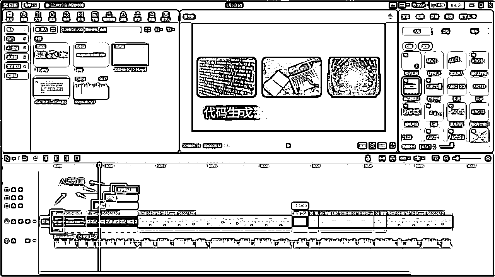

1.  添加转场（自然过渡）

目的：让段与段之间过渡流畅，有节奏感。

我在第一个画面与第二个画面之间添加了一个“移动模糊”转场，使两个不同的模块在节奏上更自然连接，避免生硬切换。

镜头切换间，可以使用：

推拉/滑动/闪白/溶解等常规转场

卡音乐节奏点切换更有冲击力

这样能让你的视频不生硬、不跳帧，节奏连贯的剪辑节奏。


1.  添加背景音乐 + 音效

目的：营造氛围、增强动作节奏

下一步你需要选择符合内容的 BGM。注意了，背景音乐音量要不影响说话的内容，添加环境音/操作音/情绪音效（咻、哒、啪），音效跟动作要同步卡点。

我为整条视频选择了一个节奏感较强的背景音乐：《EXTASY+ （Remake）》，比较符合科技类视频。但为了不抢解说语音的存在感，我将背景音乐音量调低到 -15dB 左右，确保人声始终处于主导地位。

在重点文字出现时，我也加入了对应的音效强化。例如在“代码生成”这几个字从画面中弹出时，我配上了一个“嗖”的声音，模拟文字快速飞入的感觉，制造一种“文字突然冲进来”的视觉听觉双重冲击。这种做法可以有效地吸引观众注意，并强化内容节奏，让信息传递更有力度。音效和动画配合得当，会让观众在不知不觉中感受到重点信息，而不会觉得是单纯的“听讲”。

这样一来，画面就有了氛围，动作有了打击感，节奏有了呼吸感，整体很 nice。


1.  添加字幕（最后进行）

最后我们还需要添加字幕，这一步的目的有两个：1。 强化信息表达；2\. 照顾无声观看的用户。

这里我使用剪映的自动识别功能快速生成字幕，然后手动调整了关键词（如“前端审美”）为黄色高亮，突出重点信息。

你也可以根据配音/对白生成自动字幕（剪映、CapCut 有自动识别），字幕风格统一（字体、大小、阴影描边）关键词高亮 / 重要语句加动效，建议一行不超 20 字。


1.  导出 & 检查 & 发布

最后检查所有细节，如果没有问题，就可以发布啦。

具体需要检查字幕同步、错别字，检查音量是否平衡，检查黑帧/空白/画面跳变这几个内容。

如果没问题，就可以导出了，我的导出参数是：

分辨率：1080p

格式：MP4

帧率：60


注意点：

1.剪映里面的素材大部分都不是可以商用的，付费了也不可以商用！注意字体，背景音乐，图片，视频素材。需要素材我们可以用 AI 合成，或者在可以商用的素材网站找素材，比如：https://unsplash.com/

2.上面步骤的 3、4、5 可以调换顺序，也可以同时进行，但是其余的步骤还是按照顺序比较好


成片结果

DeepSeek更新.mp4【在线播放】


# ⑦ 封面设计

封面设计工具可画：闲鱼几块钱买个永久会员很划算，它的付费模板很不错，但是你需要根据你的账号，把你的元素融入进去，比如自己头像和名称。


我们在制作封面时候可能会用到某软件的图标，我们使用 Icon Fetcher | 图标获取器，这个工具不仅可以提取网页版的图标，也可以搜索 APP 名称，然后下载导入到可画中。


# ⑧ 发布

不同的平台用户是不一样的，所以尽量不要一键同步发送，根据平台的调性，选择合适的时间发，或者错开大 v 发的时间。我之前就是做完就发，然后有时候就是半夜发的，基本没啥人看，而且我发现有些大 V 就是半夜发的，由于大 V 粉丝基数大啊，我啥粉丝也没有，而且质量肯定比不上大 V，更多的人会去看大 v 的视频，后面我会选择在白天时间，错开大 V 的发布时间，流量比之前好很多。

发布时候标题很重要，参考上文的表格，然后就是打标签，标签不是越多越好，打 5 个左右的精准标签，有热点跟热点关联起来。

1.  新手前 30 天的起号策略

# 1\. 本章概要

本章目标：

利用前 10～30 条内容稳定“起号”，让算法通过数据反馈认识你是谁、懂你粉丝是谁。“起号成功”的标志，并不是粉丝数多少，而是当平台算法可以相对准确地把你的内容推荐给最匹配的用户，让你获得越来越稳定的初始流量。

起号最关键的两点：一个是让平台算法识别你，另一个是获得粉丝认可。一般来说，平台通过你最初的 10 到 30 条内容来判断你的账号风格和价值，粉丝则会看你内容的“干货度”和专业感，决定要不要关注你。

所以，一定要坚持稳定输出优质内容，符合平台推荐的逻辑，才更容易获得流量推荐，顺利度过账号冷启动期。

我们本章节会重点聊聊：

内容规划：刚开始的 30 天内，实用教程、工具评测、热点分析之类的内容最好混合着做。

注重互动和算法：引导大家积极评论、收藏、转发、关注，提升互动率。

稳定输出：坚持每天或隔天更新，让账号快速被平台贴上明确的“标签”，给你更多精准推荐。

# 本章航线图

完成本章节的学习和实操，即可完成航线图的：

第四阶段 复盘提效：优化内容，梳理工作流提效（2 天）

1\. 结合手册教程，进行内容复盘优化（1 天）

2\. 梳理优化自己的工作流，进行提效（1 天）


# 2\. 起号阶段的定义

对于刚进入 AI 自媒体领域的新手来说，前 10 天乃至前 30 天都是关键时期。这段时间最重要的目标是让平台和用户尽快认识你，通过内容获得积极的互动反馈，为账号的后续成长奠定基础。

什么叫起号成功？

小红书发一条笔记，不再是 100 多个小眼睛，而是稳定的 1000、2000

抖音发个视频，不再是 300、400 的播放量，而是稳定的 5000，甚至更多

公众号阅读量，也不再是 100-200，而是稳定的 1000、2000 人阅读

……

起号成功的标志，就是有稳定的用户会给你点赞。

这个背后意味着算法已经能把你的作品，精准的匹配给有「需求」的用户了。

不过对于起号这件事，很多人有误解。

首先你要明白，账号能不能做起来，和发了多少作品、花了多长时间，并没有直接关系。有的人辛辛苦苦做了一两年，发了几百条视频，依旧没起色；而有的人只用一两条视频就能迅速走红。

原因很简单，因为起号的关键是能不能做出爆款内容。

具体要怎么做呢？我们下面就来给大家做个规划。


# 3\. 内容规划

在起号阶段，内容规划是重中之重。你需要明确内容的类型、比例和更新频率，确保内容既能吸引用户，又能让平台算法快速识别你的账号定位。

内容比例建议：

70%实用教程：解决用户的具体问题，如“用 ChatGPT 活人感指令”。

20%工具测评：分享热门 AI 工具的使用体验，如“Notion AI vs ChatGPT”。

10%热点解读：结合行业热点，吸引用户关注，如“OpenAI 发布 GPT-5，未来 AI 会取代人类吗？” "


固定内容模块：

AI 工具每日一荐：每天推荐一款实用的 AI 工具，并附上使用教程。

AI 效率提升小技巧：分享如何用 AI 工具提升工作、学习效率。

一周 AI 新闻速递：每周总结 AI 领域的最新动态和趋势。


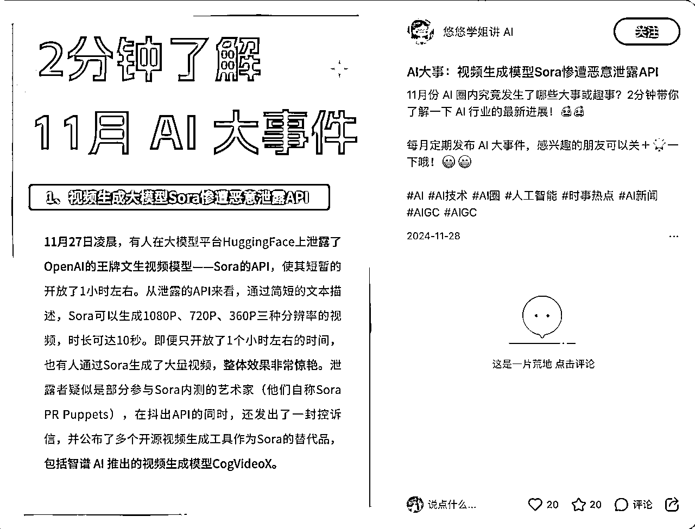


更新频率建议：

前 10 天：每天发布 1 条内容，保持账号活跃度。

前 30 天：每周发布 3-5 条内容，逐步优化内容质量。


1.  内容策略

在起号阶段，前 3 条内容尤为重要。它们不仅是用户认识你的窗口，也是平台算法初步判断账号定位的依据。以下是前 3 条内容的具体策略举例：

第 1 条内容：自我介绍 + 账号定位

目标：让用户和平台了解你是谁、你能提供什么价值。

示例：

标题：《互联网产品经理一枚，专注分享提升效率的 AI 神器！》

内容：简要介绍自己的背景、账号定位（如“分享 AI 工具的使用技巧”），并预告后续内容方向。

第 2 条内容：实用教程

目标：通过解决用户的具体问题，吸引用户互动。

示例：

标题：《用 ChatGPT 快速写稿子，3 分钟搞定！》

内容：分步骤讲解如何使用 ChatGPT 写周报，并附上操作截图。


第 3 条内容：工具测评

目标：通过对比热门工具，展示你的专业性和实用性。

示例：

标题：《Notion AI vs ChatGPT：哪个更适合笔记整理？》

内容：从易用性、效果、价格等维度对比两款工具，并给出推荐建议。

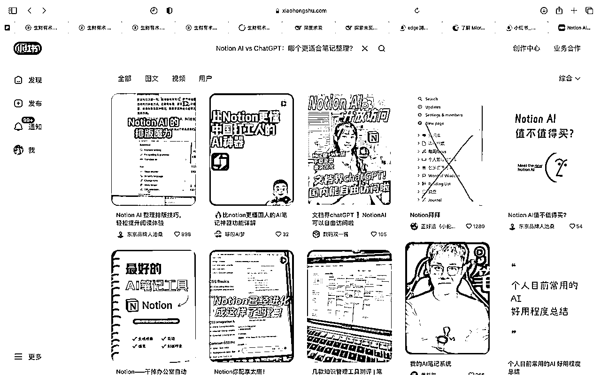


1.  优化与固定模板

1.  优化方法

标题优化：

示例：将《ChatGPT 写文案的 5 个技巧》优化为《用 ChatGPT 写爆款标题，3 分钟搞定！》.

封面优化：

示例：使用 AI 生成的高清封面图，配上醒目文字（如“AI 神器”“效率翻倍”）。

正文结构优化：

示例：在图文内容中增加“使用场景”和“效果对比”模块，提升实用性。

互动引导优化：

示例：在短视频结尾增加提问：“你用 ChatGPT 写过文案吗？评论区分享你的经验！”

1.  长期应用建议

固定模板风格：

示例：确定使用短视频模板后，统一封面风格（如黄色背景+AI 工具图标）。

建立内容库：

示例：将常用的 AI 工具操作步骤、关键词、案例整理成库，方便快速创作。

定期复盘：

示例：每月分析一次数据，根据用户反馈调整模板细节（如增加字幕、缩短视频时长）。


总结：起号阶段的关键动作

.

明确目标：快速拿到正反馈，让平台算法认识你的账号。

.

规划内容：确定内容类型、比例和更新频率，确保内容方向清晰。

.

制定策略：前 3 条内容要精准定位，快速吸引用户和平台的关注。

.

控制节奏：在高强度和可持续之间找到平衡点，确保内容质量和账号活跃度。

通过以上策略，新手可以在前 10 天或前 30 天快速起号，并为后续的账号成长打下坚实基础。

1.  推荐算法与曝光优化

1.  CES 内部评分解析

小红书的推荐算法核心之一是 CES 内部评分，它直接决定了你的笔记能否获得更多曝光。CES 评分的计算公式如下：

CES 内部评分 = 点赞数 × 1 分 + 收藏数 × 1 分 + 评论数 × 4 分 + 转发数 × 4 分 + 关注数 × 8 分

这个公式的意思是，平台会根据用户对你笔记的互动行为，计算出一个分数。不同的互动行为，分值也不同：

点赞：每次点赞得 **1 分**；

收藏：每次收藏得 **1 分**；

评论：每次评论得 **4 分**；

转发：每次转发得 **4 分**；

关注：每次因为笔记而关注你得 **8 分**。

分数越高，笔记的权重越高，平台推荐的流量就越多。

举个例子：

如果你的笔记获得了 10 个点赞、5 个收藏、3 条评论、2 次转发和 1 个新关注，那么你的 CES 内部评分就是：

点赞：10 × 1 = 10 分

收藏：5 × 1 = 5 分

评论：3 × 4 = 12 分

转发：2 × 4 = 8 分

关注：1 × 8 = 8 分

总分 = 10 + 5 + 12 + 8 + 8 = 43 分

这个分数会与同类型、同时间段的笔记进行对比。如果你的分数更高，平台就会给你更多的流量推荐，让你的笔记被更多人看到。

总结：

互动越多，分数越高，流量就越多！

评论和转发的权重最高，因此拉高评论区互动是提升 CES 评分的关键。


1.  提升曝光的技巧

精准标签：使用与内容高度相关的标签，如#AI 工具 #效率提升。

优化封面和标题：封面要吸引眼球，标题要直击用户痛点或利益点。

引导互动：在笔记结尾提出问题，引导用户评论（如“你用过哪些 AI 工具？欢迎在评论区分享！”) .


举例子，比如说这篇文章话题就打得很精准，评论区也有引导互动，并且封面也直击痛点


1.  互动对内容权重的影响

小红书的推荐算法非常看重用户互动，尤其是**评论**和**转发**，因为它们代表了用户对内容的深度参与。高互动率不仅能提升 CES 评分，还能让平台认为你的内容有价值，从而增加推荐量。

互动行为对权重的影响排序：

关注 > 转发 > 评论 > 收藏 > 点赞

关注：用户因为你的内容而关注你，说明你的内容价值极高，权重最大。

转发：用户愿意将你的内容分享给他人，说明内容具有传播性。

评论：用户愿意花时间表达观点，说明内容引发了深度思考或共鸣。

收藏：用户认为你的内容有长期价值，可能会反复查看。

点赞：用户对内容的初步认可，权重相对较低。

总结：

评论和转发是提升权重的关键，因为它们代表了用户对内容的深度参与。

高互动率 = 高 CES 评分 = 更多推荐流量。


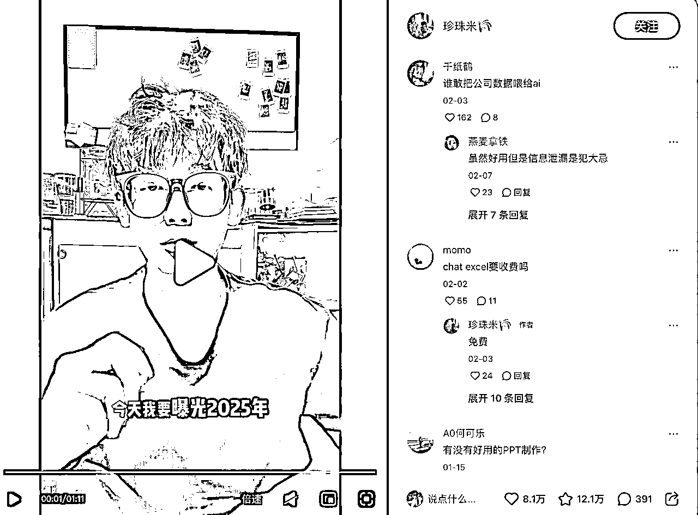


1.  提升互动的具体方法

# 4.1 引导提问：在笔记结尾抛出问题，鼓励用户分享经验或提问

核心逻辑：通过提问降低用户互动门槛，让用户有话可说。

示例细化：

AI 工具类笔记：

问题 1：“你平时一般用 ChatGPT 做什么呀？”

问题 2：“你觉得哪款 AI 工具最能帮你节省时间？评论区告诉我呗，下回我帮大家测评～”

效率提升类笔记：

问题 1：“你有哪些提升工作效率的小技巧？欢迎分享～”

问题 2：“你用过哪些效率工具？评论区告诉我吧～”

热点解读类笔记：

问题 1：“你觉得 AI 会导致人类失业吗？”

问题 2：“你对 GPT-5 的发布有什么期待？”


# 4.2 制造话题：通过争议性或趣味性话题激发用户讨论

核心逻辑：通过话题引发用户表达欲望，增加评论量。

示例细化：

争议性话题：

话题 1：“AI 绘画工具会取代人类艺术家吗？评论区聊聊你的观点～”

话题 2：“AI 写出来的文案，真的比人类写的好吗？”

趣味性话题：

话题 1：“用 AI 生成一张你的自画像，评论区晒出你的作品！”

话题 2：“如果 AI 可以帮你完成一项任务，你最想让它做什么？”


# 4.3 及时回复：积极回复用户的评论，增加互动深度

核心逻辑：通过回复让用户感受到被重视，激发更多互动。

示例细化：

用户评论：“我用 ChatGPT 写周报，真的节省了很多时间！”

回复 1：“太棒了！你平时还会用它做什么呢？欢迎分享更多使用场景！”

回复 2：“是的，ChatGPT 写周报真的超方便！你试过用它写邮件吗？”

用户评论：“我觉得 AI 工具还是没办法完全取代人类。”

回复 1：“我同意你的观点！你觉得 AI 在哪些领域还需要改进呢？”

回复 2：“确实，AI 目前还有很多局限性。你最希望 AI 未来能解决什么问题？”


总结：提升互动的关键动作

.

引导提问：在笔记结尾抛出具体问题，降低用户互动门槛。

.

制造话题：通过争议性或趣味性话题，激发用户表达欲望。

.

及时回复：积极回复用户评论，形成互动闭环，增加内容权重。

通过以上方法，你可以有效提升笔记的互动率，从而获得更多平台推荐流量，实现账号的快速成长。

1.  标签选择技巧

# 5.1 热门标签

作用：借助平台热门标签，增加笔记曝光机会。

示例：

#AI 工具

#ChatGPT

#AI 绘画

#效率提升

#职场必备


# 5.2 精准标签

作用：吸引目标用户，提高内容相关性。

示例：

#AI 写作技巧

#Midjourney 教程

#AI 效率工具

#AI 自媒体运营

#AI 变现


1.  关键词布局技巧

# 6.1 标题关键词

作用：在标题中自然融入核心关键词，吸引用户点击。

示例：

《用 ChatGPT 快速写周报，3 分钟搞定！》

《AI 绘画工具 Midjourney 入门指南：从零到高手》

《5 个 AI 工具，让你的工作效率提升 300%》

《AI 写作神器：ChatGPT 帮你轻松搞定爆款标题》

《AI 绘画生成小红书封面，点击率提升 50%！》

# 6.2 正文关键词

作用：在正文中多次提及关键词，提升内容相关性，但避免堆砌。

示例：

段落 1：介绍 AI 工具的功能。

示例：“ChatGPT 是一款强大的 AI 写作工具，可以帮助你快速生成文案、标题甚至周报。”

段落 2：分享使用场景。

示例：“我用 ChatGPT 写小红书文案，3 周涨粉 5000+，效率提升了 50%。”

段落 3：总结优缺点。

示例：“ChatGPT 的优点是可以快速生成内容，缺点是偶尔需要人工调整。”


# 6.3 评论区关键词

作用：在回复评论时巧妙融入关键词，增加笔记的相关性。

示例：

用户评论：“ChatGPT 真的能写文案吗？”

回复：“当然可以！我用 ChatGPT 写小红书文案，3 周涨粉 5000+，你也可以试试！”

用户评论：“AI 绘画工具难学吗？”

回复：“其实很简单！我用 Midjourney 生成小红书封面，点击率提升了 50%，你可以从基础教程开始学起。”


# 7\. 数据复盘

① 两秒跳出率：视频两秒跳出率越高，表示开头未能有效抓住用户注意力。

优化建议：

开场画面：确保第一帧画面具有视觉冲击力，可以使用鲜艳色彩、动态效果或悬疑设计

开场话术：使用疑问句、悬念或情感共鸣的开场白，在前 3 秒就传达核心价值

节奏把控：开场节奏要快而有力，避免过于缓慢的铺垫

② 完播率：反映观众观看视频的完整程度，是衡量内容质量的重要指标

优化建议：

视频时长是否符合平台属性和用户习惯

内容结构是否紧凑，避免拖沓

是否在关键节点设置悬念维持观看兴趣

画面和声音质量是否专业

③ 互动数据：包括点赞、评论、转发等用户参与行为，高互动量表明内容具有共鸣点和话题性

优化建议：

设置互动话题或悬念引导评论

在视频中设置互动环节

回复高质量评论促进互动

制作容易引发情感共鸣的内容

④ 转化效果：衡量视频带来的实际商业价值，如引流

优化建议：

确保视频主题与转化目标高度相关

在适当时机植入转化链接或引导

建立清晰的受众画像，提供精准内容

通过数据分析持续优化转化路径

1.  主流变现：广告合作

# 1\. 了解各平台广告生态

在众多变现方式中，广告合作往往是创作者们迈出的第一步。相比于需要深厚专业积累的知识付费，或是需要供应链支撑的直播带货，广告合作的门槛相对较低，也更容易上手。

在正式开始接广告之前，我们需要先了解平台的游戏规则。毕竟，平台是我们的主场，遵守规则才能走得长远。

小红书的商业化氛围更加浓厚，用户也更习惯看到种草内容。当你的粉丝达到 1000，就可以开通蒲公英平台（官方广告平台），开始接受品牌合作了。

蒲公英网站：https://pgy.xiaohongshu.com/

在报价方面，小红书也遵循粉丝量 10-20%的行业惯例。不过如果对接的是 PR（公关公司），他们可能会要求返点，一般在 20-40 元左右。这个要提前谈清楚，有些 PR 是想自己赚点辛苦费，这可以理解，但如果返点要求超过 30%，那就要慎重考虑了。

有意思的是，小红书上还有一种“伪合集”的玩法。看起来你在一篇笔记里推荐了好几个产品，但实际上只有一个品牌付了钱。这样既能避免被判定为硬广，又能让内容显得更真实。不过这需要你有比较强的内容策划能力，新手还是老老实实从单品合作开始吧。

知道了规则，下一步就是如何接到你的第一个广告。这个过程可能会有些漫长，但请保持耐心。你可以先看看下面具体的流程，为将来接广告做好准备。


1.  如何完成一次小红书推广

官方视频教程：http://xhslink.com/f3hoBD

小红书-蒲公英接广合作流程.mp4【在线播放】

🚪重点传送门：

#00:17#查收合作邀约信息

#00:44#提交合作笔记

#01:16#修改合作笔记

#01:44#正式发布合作笔记

归纳一下各步骤的重点。

# 第一步：接受合作

品牌方会在蒲公英寻找合适的博主发起合作邀约，达人可以在 APP 端的「消息通知-商业合作」中，查看品牌合作邀约，点击「感兴趣」之后，就可以与品牌私信联系，获取对方微信，沟通合作详情。品牌方也可以跳过邀约环节，在后台直接发起合作，达人们就可以在 APP 端的消息通知中收到订单，并查看订单。

如果你觉得该商单合适，就可以接受合作，开始内容创作。

当然在 APP 端和 PC 端的蒲公英后台，也可以管理「待接受」的合作订单。


# 第二步：创作笔记

添加商家（有时是 PR，但不影响整体流程）微信后，他们会给我们发广告素材。拿到素材后，可以自查下内容是否有敏感词等问题，或图片是否合适等。

以下是针对小红书在内容上的规则/规范进行的相关整理，大家仔细查看，避免违规、犯错。

.

社区公约解读

社区公约解读：如何规范笔记内容

社区公约解读：如何规范商单笔记

.

审核规则解读

审核规则解读：如何规范笔记首图封面或标题

审核规则解读：如何避免出现水印问题

.

其他：推荐多关注以下几个地方

规则中心

路径：小红书 App - 我 - 左上角图标 - 创作中心 - 规则中心

小红书创作学院

薯队长

薯管家

蒲公英小助手

小红书生态站

路径：小红书 App - 随手举报一篇笔记 - 消息 - 消息通知 - 进入生态站

.

敏感词/违禁词在线检测工具推荐

针对笔记稿件，推荐使用多款不同的敏感词/违禁词在线检测工具进行检测，避免出现敏感词/违禁词，造成审核不通过和笔记违规。

推荐两个检测工具：

句易网：违禁词、违规词、敏感词在线检测工具

链接🔗 http://www.ju1.cn/#/

零克查词：违禁极限词/禁用词在线查询工具

链接🔗 http://ci.lingke.pro/

如果有敏感词，或图片尺度较大、有夸大表述等问题，可以修改后与商家沟通，达成共识后发布笔记，提交审核；

如果没有问题，直接用商家给的素材发布笔记，提交审核即可。

注意点：这一步我们需要沟通好广告的发布时间。

比如一天来了 3 个邀约，怎么办呢？都发吗？我们建议新号最好是发完一条广告合作笔记之后，至少隔 1 天再发第 2 条。所以很多商家同时邀约的时候，我们可以在微信上面进行详谈，协商好其他发布时间。

# 第三步：提交笔记，等待审核通过

那么如何去提交一篇合作笔记呢？我们在小红书 APP 编辑好笔记内容后，点击「高级选项-品牌合作」即可绑定订单。选择相应的合作订单，再回到发布笔记页面，就可以提交合作笔记了。


此时笔记尚未正式发布，处于其他用户不可见状态。提交后，笔记会进入平台和品牌的审核确认环节。

如果审核不通过，会在消息通知以及蒲公英后台中收到消息，我们需要按照要求修改笔记。

审核没过的话，可以联系商家，请他们重新提供素材，我们再重复上面「第二步：创作笔记」的步骤，完成笔记内容。

如果修改的是图文内容，可以直接在编辑页面中进行修改，重新发布合作笔记即可；

如果想要修改视频内容，那么我们需要先解除笔记与订单的关联。进入笔记的编辑页面，在高级选项中取消关联，回到发布笔记页面，重新发布笔记时再绑定订单就可以了。

但如果连续 3 次都没审核通过，建议这个广就不接了，可以取消合作。在后台找到该笔订单后取消合作即可，不会受到平台惩罚。

当然，哪怕取消，我们还是要维护好与商家或 PR 的关系，毕竟可能以后还有机会合作。

# 第四步：发布笔记，等待订单完成

审核通过后，我们就可以进入笔记发布环节。在与品牌方协定好的时间，点击 APP「消息通知」中的前往发布笔记，或者笔记详情页面左上角的「合作品牌已确认」，就可以正式发布笔记了。

# 第五步：收益到账，完成提现

品牌确认完成订单后，我们会收到合作款项。如果品牌方没有主动确认订单，7 天后系统也会自动确认订单，合作收益到账。

如果与我们对接的是商家，那么直接结算订单收益即可；

如果与我们对接的是 PR，对方可能会要求抽佣。

一般在添加微信后，如果对方是 PR，他会跟你聊广告内容以及返点佣金多少。一般抽返点价格是在 20-40 元左右，能接受就可以合作，不能接受这个返点拒绝合作就可以了。

但不是所有 PR 都会抽，除非这个 PR 是想自己赚点钱。后续等笔记发布完，收益到账，你就可以直接按谈好的分佣，直接私发给 PR 了。

提现：订单确认后，7 天后到小红书钱包中进行统一提现，提现扣 10%的税。


1.  如何进行广告选择

我的号 10 条里都 9 条都是广告。然而一点都没有影响我涨粉 + 变现。

一是因为我的笔记数据很好很稳，二是因为我很挑，对广告很挑。


1.  可以接的广告

.

有预算投流的品牌（可提前和 PR 确认，或者去搜搜这个品已经发了的广告数据咋样）投流是品牌方花钱给你的笔记投放的意思很香！！很有可能会把原本数据不行的笔记，拉到干赞以上

.

大品牌

.

比如说母婴类目的帮宝适，飞鹤

.

美妆护肤类目的欧莱雅，兰蔻

.

家居类目的美的，戴森、3m

大品牌是自带流量的，不仅会提高搜索流量的概率，而且还能让更多大品牌 PR 看见你。

1.  不要接的广告

接 1 条 10000 的广告比接 10 条 1000 的广告，可要香多了。以下这些我都是直接 pass 的：

没几个店铺在卖的杂牌，小牌子

图文直发（伤害号易违规）

医药类（专业性太强）

不符合消费观的（十几块钱一瓶的婴儿水啥的。。。智商税）

差评多的（会让路人转黑）

日系品牌（没原因，就是不喜欢！！)

脚本已经写好了，但品牌方硬要修改里面提及的缺点的（这个看个人）

返点要求离谱的（只有那种很水的买来的号，他们会给 30%-40% 甚至是 50% 很高的返点），我们大大方方做内容的，宁缺毋滥。


把更多时间留给自己打磨脚本，只接自己真正觉得实用好用的产品，博主路才能走的更远。

内容来源：《全职妈妈做博主·关于我把 50 块钱的商单翻了 260 倍的 4 年实操经验》


# 6\. 谈商单技巧

这部分的主题，是解决新人第一条广告怎么接的痛点。

接下来，我将从这三块内容进行分享：

1.  甲方的需求是什么

1.  怎么谈判

1.  怎么写一条广告内容

# 6.1 深入沟通：搞懂甲方真正要什么

甲方投放广告的核心目标无非几点：

品牌曝光——增加知名度

产品转化——需要精准的用户

用户增长——更多用户了解并使用这个产品。

在品牌发展的不同阶段，或者是最近的营销节点不同。他们的需求可能不同，一般来说根据不同的公司，有这么几种。

新品牌：更看重曝光和种草，需要你的内容突出产品差异化；

成熟品牌：追求转化率，可能要求带货数据或精准引流客户；

大厂预算：往往需要品效合一，既要有调性，又要有效果。


# 6.2 具体谈判实操

下面以具体案例，来给大家展示：

# 6.2.1 主动提问

不要只问“您想怎么合作”，而是追问“老师这次推广我们主要是什么合作方式呢？置换嘛还是有稿费的预算呢？

# 6.2.2 明确交付标准

客户提供素材直发，还是自己做内容写发？是需要单个广告植入还是横向测评多个品牌植入？

预期档期是什么时候发布，比较急需要最近发布，还是在确定下个月的档期？


# 6.2.3 展示你的优势

比如近期的数据，（阅读量比较高就给甲方看最近的阅读。赞藏数据比较好，就给甲方看最近的赞藏数据。最近有爆款内容，就给看最近的爆款内容。最近的带货 GMV 比较高，就展示 GMV）


过往案例数据，比如写在 5 月写某个 APP 的推广，目前数据是 2W 阅读。通过这个链接下载了 2000 个用户，目前还在增长。


上个双十一期间发布的笔记，阅读量是 3 万。GMV 是 XX 万，一共有 88 个用户通过我的链接种草这个产品

用过往的实际案例，证明你能帮甲方解决什么样的问题。

# 6.2.4 锚定价格：拉高甲方心理预期

适用场景：初次报价或甲方未明确预算时。

具体操作：

基础公式：单条报价 = （粉丝数 × 行业系数） + 内容附加值（AI 领域系数较高，建议取 3%-8%，1700 粉丝可报 50-150 元，再根据内容形式加价）

话术示例：> “我们的粉丝以 AI 从业者和技术爱好者为主，过往推广的 XX 工具转化率超过 15%。常规合作报价是 200 元/条（图文），视频+口播为 300 元。”


# 6.2.5 打包方案：用“内容增量”替代“降价”

适用场景：甲方预算低于你的底线时。

策略组合：

甲方需求

你的对策

价值包装话术

单条预算仅 100 元

改为“2 条短图文 +1 条评论区置顶”

“建议用多次曝光覆盖用户决策周期”

无法提高单价

捆绑“下月免费复投 1 次”（锁定长期）

“合作合作可以提前空出下月的档期”

嫌视频成本高

改用“图文+社群推广”组合

“我们的私域社群精准度更高，可补曝光”

关键点：

将“降价”转化为“增加服务项”，避免自贬身价。

# 6.2.6 长期合作优惠：用复购率换稳定性

阶梯报价设计：

单次合作：200 元

3 次打包：500 元（约 83 折，均摊后单条 167 元）

年度框架：6 次共 900 元（单条 150 元，但提前锁定收入）

关键点：

长期合作的实际价值是降低你的获客成本（不必反复找新甲方）。

# 6.2.7 谈判中的“价值强化”技巧

3 个必提数据：

.

粉丝价值：“我们的粉丝中，35%是 AI 产品强需求的决策者（附后台截图）。”

.

历史案例：“上周推广的 XX 工具，评论区有 17 人晒付费截图（附截图）。”

.

内容长尾效应：“AI 类内容搜索权重高，这条视频未来 3 个月仍会带来转化。”

规避压价的话术：

甲方：“其他博主更便宜。”→ 回应：“他们的粉丝是否包含我们的精准技术人群？这是我们最近的用户调研数据（附图表）。”

# 6.2.8 其他建议

准备谈判工具包：

.

粉丝画像报告（年龄、职业、消费能力）；

.

过往案例数据（播放量、转化率截图）；

.

标准化报价单（不同套餐明码标价）。

心态建设：小博主的核心优势是灵活性和精准度，不必因粉丝量自卑。

可直言：> “我们目前接单少，对甲方的内容会更用心打磨，这是大 V 做不到的。”

通过以上策略，即使粉丝量不高，也能逐步提高客单价，并筛选出优质合作伙伴。


# 6.3 第一条广告，我该怎么写？

接广告的流量密码：质量＞数量

甲方最怕的不是贵，而是广告没效果。如何让广告既不掉粉又能打？

在接广告时，让广告不像广告”才是最高境界，尤其是对于 AI 垂直领域，用户普遍对硬广反感，但对深度价值内容接受度高。

而且，广告，如果写的太硬。蒲公英后台也会提示广告不能显示。


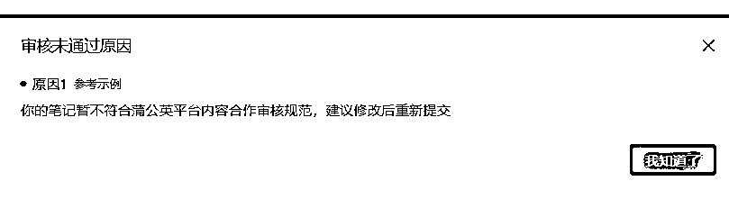

# 6.3.1 内容融合技巧

这个技巧的核心是，让广告成为粉丝的“刚需信息”。

（1）原生广告的 3 种高阶玩法

类型

适用场景

AI 领域案例

用户价值点

测评对比法

工具类产品（如 ChatGPT 插件）

“实测 5 款 AI 翻译工具：DeepL 竟输给这个冷门神器！”（将甲方产品放在对比中自然胜出）

帮助用户节省试错成本

教程植入法

付费课程/SaaS 工具

“用 XX 工具+AutoGPT，3 步搞定周报！附我的工作流模板”

提供可复用的方法论

行业报告法

ToB 类产品（如 AI 云服务）

“2024 年 AI 创业避坑指南：这些服务器成本能省 40%”（嵌入甲方产品参数对比）

输出稀缺数据/洞察

关键点：

甲方产品必须与你常规定位强相关（如 AI 工具博主接编程课广告会违和）。


（2）故事化表达的黄金结构

1.  痛点开场：“作为 AI 博主，最头疼的就是素材整理——直到发现 XX 工具的【智能归类】功能...”（用真实场景引发共鸣）

1.  使用过程：展示你如何用该工具解决具体问题（如“3 小时的工作现在 10 分钟搞定”），重点呈现“Before-After”对比。

1.  第三方背书：“团队里的小白用这款工具后，产出效率居然超过了我这个老手...”（增强可信度）


（3）差异化创意模板

反套路反转：“花了 5000 元买 AI 课，最后发现最有用的竟是这个免费功能...” → 引出甲方产品某个亮点。

技术梗幽默：用“程序员黑话”或 AI 圈梗（如“显卡燃烧”“炼丹失败”）设计剧情，吸引精准用户会心一笑。

元宇宙式互动：让粉丝在评论区输入指令，你用甲方工具实时生成结果（如“回复‘画一只赛博猫’，我用 XX 模型帮你跑图”）。


# 6.3.2 提升广告数据的方法

（1）如何提高前 3 秒停留？

钩子类型

案例

适用产品

数据冲击

“这个工具让我的代码错误率从 30%降到 2%...”

开发者工具

悬念提问

“为什么 99%的 AI 博主都不敢公开自己的素材库？”（答案：因用了 XX 管理工具）

效率类 SaaS

身份认同

“所有 Prompt 工程师都在偷偷收藏这个网站...”

AI 资源平台


（2）中场留存技巧

“激发好奇心”：> “接下来要演示的功能，可能会让某些同行失业...” → 激发好奇心看完。

即时互动：在视频中插入选择题（如“你觉得这个功能值多少钱？A. 99 元 B。 199 元 C。 免费才对”），大幅提升评论率。

（3）转化闭环设计

低门槛行动：不要直接让粉丝购买，而是引导：> “回复‘工具’获取独家优惠码” → 先沉淀到私域再转化。

恐惧营销：> “该工具企业版即将涨价 50%，个人版优惠仅限本周...” （需真实有效）。


# 6.3.3 长期合作维护

（1）数据复盘沟通

发送数据的图片，与甲方沟通目前的情况。并提出希望能够再争取合作


（2）拒绝低质广告的 3 条红线

.

技术造假：如宣称“完全无需训练”的 AI 模型。

.

过度承诺：如“学会这个工具立马年薪百万”。

.

伤害粉丝：如要求粉丝下载注册后才给完整教程（可用“试看+付费”模式替代）。


# 6.4 终极心法：广告内容的“不可能三角”


解释：

任何广告最多只能满足其中两项（如硬广满足甲方和效果但掉粉），而你的目标是无限逼近三角中心——通过持续优化内容质感实现三方共赢。


# 6.5 总结：甲方思维=共赢思维

接广告不是一锤子买卖，而是用你的流量和内容能力，帮甲方解决问题。越是懂甲方的需求，越能拿到高单价和长期合约。记住：

.

沟通阶段挖需求，明确 KPI；

.

谈判阶段换位思考，用方案说服；

.

执行阶段追求质量，用数据说话。

学会这一套，你不仅能接更多广告，还能成为甲方争抢的优质合作伙伴。


1.  注意事项

合作的形式分为报备笔记和非报备笔记。报备笔记就是前面提到过的官方认可的品牌合作，是要被收取“保护费”的；非报备就是咱们私底下合作，悄咪咪打暗广。

非报备又可以分为单品跟合集，单品就是一篇笔记里只能含这个品的广告；合集就是同时有好多个品给你广告费来出现在你这篇笔记中。

单品里面还有个概念叫做伪合集，就是一篇笔记里看似出现了很多个产品，但真正给广告费的只有一家，这种就是在最大程度上避免被判定为私自推广。

跟 PR 聊的时候还得聊清楚以下几个问题：

档期：就是你出初稿、终稿、以及最后发布的日期。

授权转发：能否授权给品牌方在电商/内容平台上发布，是否免费，授权周期多长。尾部博主一般是免费授权，周期一般在三个月到半年。

授权投流：能否授权给品牌方在小红书里投流，是否免费，授权周期多长。虽然投流能帮博主涨数据，但如果品牌爆出丑闻，还继续拿我们的笔记去投流，对我们账号形象会有影响，所以最好定一个周期，比如一年内免费授权投流，一年后看情况是否继续授权，是否加费用。

笔记发布后的保留周期：一般是一年或永久。

排竞：在你发布这篇笔记的前几天到后几天，不能再发布该品牌方的竞品的相关笔记。

活动出席：美妆和穿搭类的品牌可能会邀请达人出席他们的产品发布会之类的。

1.  其他变现形式

1.  带货变现

AI 博主也可以通过带货来进行变现。对于 AI 类的账号，带货的空间比较大，不仅仅局限于实物商品。

比如说：

AI 相关的电子笔记/资料包


AI 相关的工具（大家可以关注生财 AI 编程相关的帖子，目前普通人通过 AI，来开发自己的工具，已经不是什么困难的事情了。)

比如下面这个博主，在小红书店铺里售卖一个去水印的工具，现在已经变现接近两万元了。


当然了，AI 相关的实物产品，也是很适合放在橱窗里来进行售卖的。直接就可以带货的，就是 AI 相关的一些书籍。


1.  知识付费变现

很多圈友应该都有刷到过一些 AI 相关的课程，那么如何制作出这样的内容来呢？（其实并不难）


这里我们给大家简单拎拎操作重点：

# 3.1 课程定位

首先我们要解决「课程定位」问题。

那么，什么是课程定位？

一句话，就是你能通过出售 xx 产品/服务，满足 xx 人的 xx 需求。

比如，我的课程定位就是：帮助自媒体创业者、想做副业的小伙伴，通过 AI 工具+提示词来高效解决知识付费产品的制作和上架问题。

大家可不要小看这句话，这句话就是你将来能填到：朋友圈签名栏、公众号简介、小红书介绍等，自媒体最显眼位置的一句话，相当于陌生人见你第一面，问你是干什么的，你一句话都说不清自己到底是干什么的，那别人就会感觉你：不！专！业！

解决了这句话，再取个自带流量的好课名，那么就可以开始正式做课了。

怎么做课程定位呢？

对自己来说，到底做什么样的课程，才能兼顾：爱好+擅长+赚钱，能否平衡？

🚬 我觉得大家很有必要，今晚，半夜，自己一个人在书房，或者窝在沙发，电脑前，或者捧着手机，抽支烟，或者抿两口小酒，好好的，好好的，静下来，静下心来，仔仔细细，按我标好的①②③④⑤，按顺序，层层递进，循序渐进，想 5 个问题：

① 我喜欢什么？

② 我擅长什么？

③ 我想学什么？

④ 对标博主，验证这条赛道是不是有人已跑通，且跑的怎么样？

⑤ 和而不同+差异化

⬆️前 4 点很好理解，我们的主课中有详细讲解和例举，接下来我在这里重点给大家讲讲第⑤点【和而不同➕差异化】

举个例子，我当初市场调研【课程制作】这个设想的时候，去抖音去小红书去视频号去知识星球，发现确实有不少人在做，有些还做的规模蛮大，如果我不管不顾一头扎进去，和正常人一样去挤【做课】这个赛道，那猴年马月才能与各位相见。巧妙之处就在于，我刁钻的切了个【AI+做课】的小角度入行，那就不一样了，我还是我，但是不一样的烟火，我还是个做课的，但我是个搞 AI 做课的，这就叫不同，这就叫做差异化。所以大家一定要瞅个刁钻的角度去切市场，这个很重要，聪明的人一定会去这么做。

那什么是【和】而不同呢？不同，很好理解，其实就是差异化，刚才讲过了，那么为什么还要【和】呢？

还拿我来当案例，如果看过我的课程海报（就不贴出来了，避免引流嫌疑），大家有没有觉得，乍眼看去，我的自拍照，还有我的海报色系、风格，大体上还是一个老师的感觉，一看我的所有物料都是个臭做知识付费的，是个臭卖课的，这一点也很重要，让自己的形象、海报、朋友圈等，看起来一定要像做这一行的，这个很重要诶，如果我打扮的花里胡哨，朋友圈嘻嘻哈哈，或者字里行间话里话外满嘴跑火车，大家觉得自己海会前来买我的课吗？让自己像做这一行的，一眼看上去就是做什么什么的，这个太重要了，在【和】同行的基础之上，再叠加差异化的 buff，这才是真正有源之水的差异化，后期才有无限可能。

🌙 好了，现在请回到你的书房，回到你的沙发，掐掉你手里的烟蒂，轻轻放下你手中的酒杯🍷，在充分考量以上 ①②③④⑤ 这 5 个问题后，写下你的最终结论⬇️

一句话课程定位：就是你能通过出售 xx 产品/服务，满足 xx 人的 xx 需求。


# 3.2 课程取名

名字取得好，课程自带流量。

想清楚自己做什么课，并且确定自己的课有市场（同行已经卖的不错），那么接下来我们就将进入正式做课环节。首先是取一个【自带流量】的好课名，那么，课程名字怎么取才能流量？有什么诀窍？AI 能帮我取名字吗？

1.  四个取课名原则

① 课程名称字数限制

② 课名中最好包含你这个行业的关键词

③ 多包含数字

④ 多体现结果、成果、效果

⬆️后 3 点很好理解，我们的主课中有详细讲解和例举，接下来我在这里重点给大家讲讲第①点【课程名称字数限制】

☞ 课名分 2 种：

● 一种比较短（5-7 个字）：比如《AI·7 天做课营》，这种短的课名，一般用在海报、宣传图、文章题目等，短小精悍，方便放置和推广，长了也写不下呀🤭

● 另一种比较长（12-21 个字）：也叫【课名的副标题】，比如我的这套课程副标题就是《知识付费 2.0 爆款课速成秘籍》，这种长的标题的目的是：进一步阐述主题的含义，通常出现 “秘籍、手册” 等字眼，用来吸引客户，一般写在主标题的下方，比如⬇️

● 当然，这种长的标题也🉑直接作为主标题使用，这种也很常见。

● 但，我的建议是，小孩子才做选择，作为成熟稳重经验丰富的老师来讲，【长短课名我们都要】！

● 海报、宣传图、文章题目需要贴上课程名字时，我们就用短课名；上传课程平台、或者其他字数多少无所谓都能放得下的地方，就可以用长标题，长标题的优势在于字数多，那么包含的关键词就多，对引流还是有优势的。

1.  AI 提示词

刚才我们详细分析了一个好的课程名字该怎么取，萃取出了 4 大原则，你的课程名字不一定都必须同时遵循这 4 个原则，尽量往上边靠就可以。

当然，如果你手握【取课名 4 大原则】，仍举棋不定，达到了【懂是懂了就是不知道具体怎么做】的懵懂状态，那么，躺平吧，让 AI 来拯救你，注入你灵感！

以《AI 少儿入门指南》这门课程为例，我们来看看 DeepSeek 通过「取课名」AI 提示词 生成的效果：


AI 生成的结果中，给你灵感的一些关键词，可以做「排列组合」，再结合本文给大家提炼的「取课名 4 大原则」，尤其要重视「包含行业关键词」这一条，这样你就可以得到自己「满意」且「自带流量」的课程名字✔️


# 3.3 制作课程目录


那种一看就想买的课程目录，用 AI 怎么自动生成？

课程制作，是个「简单」而又「复杂」的事情。

做课的「简单」在于：如果你善于借助 AI，对做课的各个环节充分优化提效，那么做课将不会是一件需要你吭哧吭哧几个月还做不出来的艰巨工程。

做课的「复杂」在于：如果你不会用 AI，或者不能「合理」的巧用 AI，那么两种结果，要么吭哧吭哧几个月都做不出来一门课，要么做出课来却卖不出去，那就亏到姥姥家了。

我们今天单就做课过程中「AI＋课程大纲制作」这个环节，来剖析一下详细的实操步骤。

课程大纲制作流程「7 步法」

一般情况下「做课 AI 大模型 工具」我们推荐使用 DeepSeek（https://chat.DeepSeek.com/）

很多人刚开始玩 AI 很兴奋，颇有一见钟情的感觉，恨不得随时 AI，事事 AI，殊不知，从何时起，已经是 AI 玩你，而不是你玩 AI 了

就像刚开始讲提示词的时候，我给大家演示过 AI 一键生成课程大纲，效果比较惊艳⬇️


然后呢，有同学过来找我，言语之间，觉得 AI 做课也没什么，自动生成大纲，我也会，不难么这个东西

……

好了，不废话，直接把我的做大纲理念和流程给大家全盘托出，请品鉴：

✅课程大纲制作流程⬇️

先不用 AI，也不要找对标

（😮不要惊讶，这一步很关键！)

换位思考，把你自己当做课程学员

以《AI·7 天做课营》为例，你想想，当学员用 AI 做课的时候，第一步要干什么（学 AI 大模型），第二步要干什么（掌握提示词），第三步……

同时，你也想想：我当初第一次用 AI 做课时，是怎样一个流程？

对，坐在那儿，硬想，把你对于这个课【天然的未经过 AI 和同行对标课污染】过的意识流，写进课里

具体怎么写呢？真的意识流吗？

不，有章法。先把你课程要解决或者包含的几个大的模块写下来，比如我这个课《AI·7 天做课营》，几个大的模块我当初是这么写的⬇️

✅我的课程要解决的几大模块问题有：

* * *

01.做课需要用到的 AI 模型和工具，提示词打磨；

02.课程大纲+课程内容填充

03.录课软件和设备搭建

04.海报和 PPT 制作中 AI 工具的巧用

05.课程上架以及多平台售卖

06.课程营销，AI 加持，事半功倍

再回头，从第一个大模块开始，每个大模块下，需要解决的小问题分别有⬇️

✅我的课程要解决的小问题有：

* * *

01.做课用到的 AI 大模型盘点择优

02.2 种经典提示词框架的用法

03.结合实例，解决提示词优化问题

04.借用 AI，分析客户需求，做课程定位

05.怎么梳理出一看就想买的课程大纲

06.AI 辅助书写课程目录大纲

07.课程内容填充，AI 自动输出

08.PPT 制作 AI 使用技巧

09.AI 工具制作精美课程海报

10.设备搭建良心推荐分享

11.好用的录课软件盘点择优

12.提供录课素材包，做课既快又美观

13.做课用得到的剪辑技巧

14.新手老师超简单的课程上架技巧

15.课程上架，分平台、全流程、像素级拆解

16.多平台卖课如何侧重布局

17.短视频卖课中的 AI 巧用

18.图文卖课中的 AI 巧用

19.AI 如何协助打造私域卖课场景

20.如何设计自己的课程体系以及价格体系

21.做好内容，用心服务，精心打造知识 IP

⬆️这个过程中，想的越细越好，相当于把你脑子里🧠关于这个课程的所有【点】，都铲出来，挖干净，这就是干货，而且是你自己独一无二的干货！

🎯我们再以一个《AI 少儿入门指南》的课程为例，来罗列一下这门课的【大模块+小问题】：

✅《AI 少儿入门指南》大模块问题有：

* * *

一、少儿 AI 入门

二、AI 工具箱

三、AI 与创造力

四、AI 解决问题

五、AI 与未来

✅《AI 少儿入门指南》小问题有：

* * *

1、AI 是什么，普及基础知识

2、AI 的应用广泛，未来必备

3、适合小朋友的 AI 工具推荐

4、AI 使用小技巧

5、AI 绘画

6、AI 音乐

7、AI 帮你思考

8、AI 帮你解决数学难题

9、AI 的未来世界

10、成为 AI 小专家

✅然后组合起来，《AI 少儿入门指南》这门课的大纲目录要点就初步成型了：

《少儿 AI 入门 7 堂课——智能时代孩子必备的 AI 技能手册》

一、少儿 AI 入门

1、AI 是什么，普及基础知识

2、AI 的应用广泛，未来必备

二、AI 工具箱

3、适合小朋友的 AI 工具推荐

4、AI 使用小技巧

三、AI 与创造力

5、AI 绘画

6、AI 音乐

四、AI 解决问题

7、AI 帮你思考

8、AI 帮你解决数学难题

五、AI 与未来

9、AI 的未来世界

10、成为 AI 小专家

⬆️ 其实很简单，不需要你华丽的表达，只需罗列大纲的要点即可

大家记住我们生成的这个【大模块+小问题】案例，后文 AI 生成演示中要用

大家再看一眼我海报中的「课程大纲」部分 ⬇️


⬆️看我最终版海报中的课程大纲，4 大模块题目和我当初列出的大模块基本保持一致，4 大模块下的 10 节课精选浓缩自我当初罗列的那 21 个小问题

# 3.4 录制课程内容

关于做课直播【设备搭建】的主要观点：

1、大家购买【做课】所需设备时，一定要尽量兼顾将来【直播卖课】的需求，便宜的设备无所谓，贵一点儿的设备一定要考虑全面，同学们能明白我的意思吧，把眼光放长远些；

2、差生文具多，大家没必要追求过分高大上的做课直播设备，使好手头的扫帚，扫地僧照样也可独步武林；

3、大家要根据自己的【实际需求】【场地大小】【可投入资金】这 3 点来决定自己的设备搭建方案。

接下来将结合我和同行的做课直播设备搭建经验，主要从【最省钱】【最建议】这两个角度来推荐给大家最实用的方案，当然最后也会给同学们介绍一下高端玩家是怎么弄的。

【最省钱】的【录课】设备搭建，还能兼顾直播

1、手机+带麦克风的耳机

● 手机：我这台是 华为 Mate20，录课和直播都没问题；苹果手机的话，iPhone11 系列以上都没问题。

● 不用麦克风的话，收音会成问题，到时候录课或者直播时杂音较大，所以最好配个带麦克风🎤的耳机，有线蓝牙都可以。

总结：1 台手机+带麦克风的耳机，这是最简配的做课直播设备配置了，而且仅适用于无需配套课件的那种录课形式，仅人像。

2、手机+麦克风+电脑+手机支架


☞ 这套设备搭建，非常推荐，是做课直播入门推荐设备组合，手机+麦克风+电脑+手机支架，简单实用，买全这四样，不是太贵，也不至于简陋，最关键的是，效果还不错！

● 手机：iPhone11 系列以上都没问题，华为 Mate20 配置往上的安卓鸿蒙手机也都没问题（或者最近 3 年内的旗舰手机一般都没问题）

● 手机支架：我建议大家买那种【放桌上+站地上+可手持】都可以的手机支架，我用的是：绿联的这款，目前也才 40 多块钱⬇️


● 麦克风⬇️

① 有线款，我推荐【悦米 usb 麦克风】（我自己一直在用），某宝目前价格¥249，这款用着收音效果比较好，有线信号更稳定，价格也合适

② 无线麦克风，方便随意活动，不用担心麦克风距离老师过远而声音减小的问题

<1> 无线麦克风推荐【BOYA mini 博雅指尖麦克风】，一拖一 Type-C 版 目前京东价¥149 往下


<2> 我自用的无线麦克风是【MOMA 猛犸 LARK MIX】，比较小巧，效果也要更好一些，一拖一 Type-C 版 目前京东价¥399 元往下


● 电脑：如果单纯用来做课，配置要求不高，日常办公用笔记本就可以；但如果考虑日后直播卖课、剪辑短视频等，就买性能好一些的（笔记本¥6500+，台式机¥4500+）。

我用的笔记本是华为 Matebook 数字系列，台式机是联想拯救者刃 7000K，录课+直播，完全够用。如果手头没有电脑又不想买怎么办？支付宝搜索🔍小程序【人人租】进入，继续搜索联想拯救者 Y7000 笔记本，建议租这个配置 ⬇️（价格大家货比三家）


● 那么【手机+麦克风+电脑+手机支架】这套设备组合，手机是用来干嘛的呢？答：当摄像头用。那么为什么不用笔记本自带的摄像头呢？答：效果不好，且不能移动位置。

📒手机连接电脑当摄像头用的方法⬇️

① 电脑上先下载安装 iVCam

官网：https://www.e2esoft.cn/ivcam/

② 打开 iVCam，用手机扫码下载 iVCam 安装

③ 安卓鸿蒙手机，没有开启 usb 调试的话，需要先打开设置开启，在设置里找到开发者模式（不知道自己手机开发者模式在哪儿的话，自行百度搜索对应手机型号寻找），进入开发者模式找到 USB 调试，打开

④ 苹果手机 App Store 搜索 iVCam 直接安装

⑤ 用数据线或无线连接（无线需在同一 wifi 下），推荐无线，这样可以腾出充电口连接充电线或者麦克风，我专门测试过，无线连接很稳！

⑥ 打开录课或直播软件，添加摄像头，选择 iVCam 摄像即可

⚠️手机连接电脑当摄像头用的注意点⬇️

① iVCam 为付费软件，一年¥68，大家可以先试用，觉得效果好的话再付费（我测试下来效果不错，长时间连接设备很稳）

② 手机当摄像头时，建议用后置摄像头（参数高效果好），大家注意调整位置

③ 手机当摄像头时，就不要带手机壳了，暂时去掉，不然手机发热会很严重


【最建议】的【录课】+【直播】设备搭建

1、摄像头+麦克风+电脑

● 前一种用手机当摄像头的设备搭建方式，好处是不用专门买摄像头（有的手机摄像头非常好，效果堪比小单反），但缺陷也很明显，就是录课尤其直播时间一长手机很容易发烫，而且需要软件连接，充电线有时还需要和无线麦克风抢占同一手机充电插口 …… 每次手机位置不固定，需要调整等等

● 所以，建议专门买一个 usb 接口的摄像头，插在电脑上，固定好位置，也不会发烫，搞定，如图⬇️

● 摄像头推荐：罗技 c1000e（我用的也是这款，性价比很高），目前某宝价¥1399


● 再往上走，效果更好的摄像头的话，推荐大家这款：OBSBOT 寻影 TINY2，目前京东价¥1999 元往下


2、摄像头+麦克风+电脑+三脚架+灯光

● 还有个问题，家里的灯光一般偏温馨（偏黄、偏暗），尤其是采光不好的房间，白天录课或者直播甚至都要开灯，但灯又不够亮，出来的视频画面偏暗，不够鲜亮，影响呈现效果，这时候就要配置专门的光源了

● 灯光配置方法：方形灯、球形灯，各买一个，现场位置布置方法：

① 方形灯：人在桌前中心，方形灯位于人的左前方大约 45°位置，主要作用是提亮面部，兼顾背景环境

② 球形灯：人在左前中心，球形灯位于人的右前方大约 45°位置，主要作用是照亮背景环境，兼顾照人

③ 摄像头距离人，大约 1 米左右

● 现场布置位置图⬇️


● 灯光推荐：

① 方形灯：KOOLIFE 补光灯直播摄影柔光灯箱（有脚架、遥控器），目前京东价¥299 元

② 球形灯：金蝌灵跃 300W 三色+柔光求 +2 米加粗支架，目前京东价¥399 元往下（双 11 特惠价¥271 块出头）


● 三脚架：用来固定摄像头，摄像头距离人大约 1 米左右

● 三脚架推荐：SOMITA 闪拓 ST-666 相机三脚架单反便携专业三脚架

● 备注：这款三脚架完美适配前面推荐的罗技 c1000e 摄像头，可以把摄像头横着拍也可以竖起来拍，大家可以多调试一下，看怎么拍满足自己的录课或者直播要求

● 目前京东价¥75（双 11 特惠价¥50 多）

5、摄像头+麦克风+双屏电脑+三脚架+灯光+提词器+绿幕

☞ 这也是我本人目前的设备搭建方式，比上面介绍的那种方式，多了【提词器】+【绿幕】，给大家看下我的录课直播间整体布景⬇️


● 上方的现场布景图中，桌子中间的黑色方盒子就是提词器，摄像头就藏在提词器里面

● 提词器适合新手老师，面对镜头容易紧张，可以通过提词器过渡一下，提词器的好处就是，眼神可以正对着摄像头（因为摄像头可以装在提示词里面），这样显得视频里的自己观感要好很多，当然，通过自己的不断练习，后期老师们就可以脱稿，尽情在镜头面前展示自己，这样观感会更好

● 有同学说，有些软件也会提供提示词功能，但肯定不会有硬件提词器效果来的好，软件的提示词只能放在电脑边缘靠近摄像头的地方，而硬件提词器直接把镜头装在里面，眼神可以正对摄像头

● 提词器不是必须，镜头感不强且有条件的新手老师，可以考虑～

● 提词器推荐：奇叶 大屏幕提词器 目前京东价¥288（双 11 特惠价¥240 多）

● 绿幕：放在人背后大概 1 米左右，作用是录课或者直播时可以人像抠图，随意切换“假”背景

● 绿幕使用条件：录课直播间，大于 6 平米，可以考虑绿幕；小于 4 平米，别用绿幕，效果不好

● 绿幕最大的问题是抠图扣不干净，要解决这个问题，请大家注意以下几点：

① 摄像头：摄像头要好，摄像头太烂，扣不干净

② 布光：打到绿幕上的光一定要足够亮，而且要尽量均匀，这是绿幕抠图扣不干净的最大影响因素

③ 距离：人距离绿幕 1 米或者以上

④ 衣服颜色：不要穿和绿色颜色接近的衣服，比如浅绿色、蓝色

⑤ 发型：头发不要太炸裂，边缘会扣不干净

⑥ 绿幕周围：绿幕周围不要堆放杂物，表面要平整，不能有太大的褶皱

⑦ 根据我的使用体验和经验，尽量能用实景就不要绿幕，真的很难搞 …… 尤其一到晚上就 …… 一言难尽

● 绿幕推荐：贝阳直播绿幕 3*2 米背景布 +2*2 米背景架（横杆穿孔款），目前京东价 ¥158


# 3\. 专业服务变现

如果你有一些“垂直类”的 AI 技能，也可以通过账号来进行变现。比如下面这个案例：


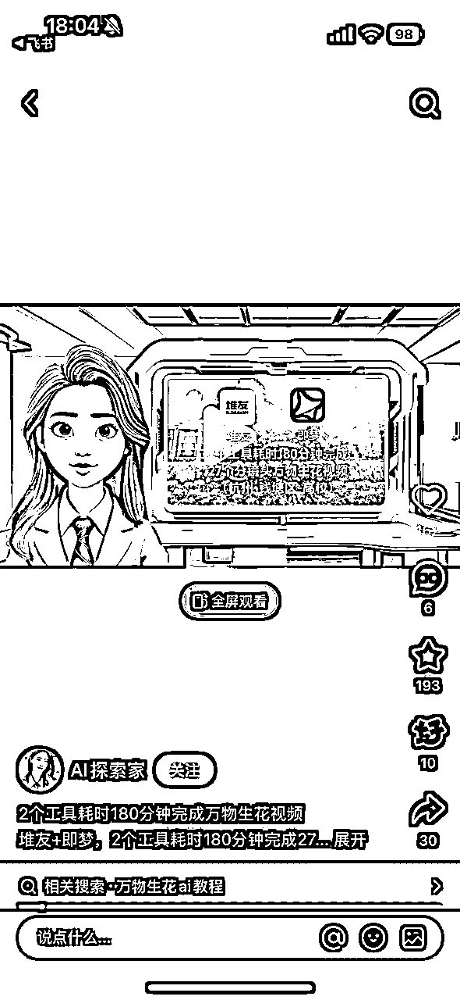


这个博主的视频形式，是通过 AI 数字人+AI 配音来实现的。他于是把这个技能上架到了小红书店铺，售卖“AI 虚拟定制”服务。目前销量已经破万了。


随着各类 AI 国产大模型的持续突破，AI 技术正在重塑各大应用平台的功能。

这为 AI 领域的内容创作者带来了前所未有的机遇 —— 不仅有大量品牌需要专业的内容传播，更重要的是，随着个人影响力的提升，你的账号将成为一张独特的名片，为你带来更多优质的商业合作机会，当下正是入局的好时机。

祝大家在 AI 自媒体的领域里持续深耕，放大收益，找到内容创作中的乐趣和意义，一起生财有术！