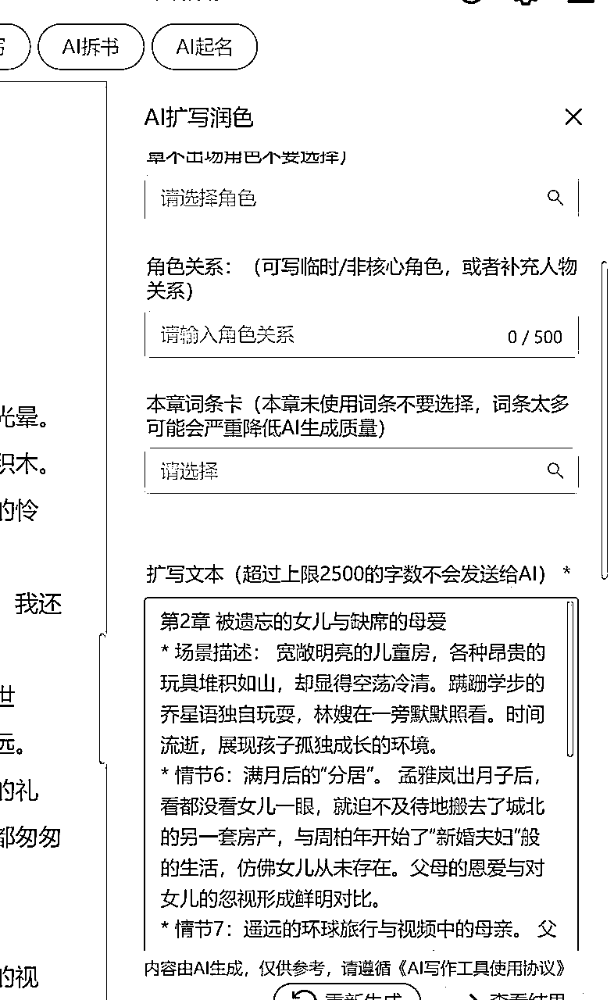
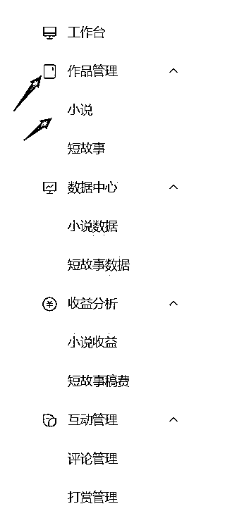

# 3月航海| AI小说（从写作到变现） |实战手册

> 来源：[https://ocn93f5d9olj.feishu.cn/docx/QqXqdJnAgolpXYxtJdwcLdO8nqd](https://ocn93f5d9olj.feishu.cn/docx/QqXqdJnAgolpXYxtJdwcLdO8nqd)

# 防失联+MM188166M（李李）长期更新频繁+备用V:MG10127

手册出品方：生财有术团队

手册使用说明：内容出品人排名不分先后。本文旨在向你展示一个项目的更多可能性，帮助你更好地理解和实操。

建议：如果需要快速定位到精确内容，可以使用快捷键 Ctrl + F/command + F 的形式，搜索「关键字/词」，查找你想要的内容

# 必修篇：跑通最小 MVP

# 一、【项目概述】AI写小说基础认知

# 💡

章节概要

在这一章节，我们将初步了解AI小说的市场情况、类型、常用平台和工具情况。

可以按照航线图，开始学习：

1、注册番茄小说网作家账号（约 0.5 小时）

2、了解市场行情，确定要写的小说类型、题材（约 2 小时）

那么现在，就请开始完成这几个步骤的筹备吧。

# 1.1 市场规模和增长趋势

2025年网络文学市场持续增长。中商产业研究院发布的《2025-2030年中国网络文学出版行业市场发展现状及潜力分析研究报告》显示，2023年中国网络文学市场规模达到404.3亿元，同比增长3.8%，作家、作品、读者数量呈稳健增长态势，作者规模达2405万，作品数量达3620万部，用户数量达5.37亿。

网络文学的社会影响力持续增强。中商产业研究院分析师预测，2024年中国网络文学市场规模将达到419.9亿元，2025年达到436.1亿元。

这正说明了网络小说的市场空间很大，值得去深耕。

# 1.2 小说类型

在网络文学领域，长短篇的划分更注重用户阅读习惯与商业模式，字数标准更为宽松：

1.

字数标准

短篇：1万～5万字（如知乎盐言故事、微博连载短篇）。

长篇：50万字以上为主流，部分超长篇可达数百万字（如《斗破苍穹》超500万字）。

2.

发布形式与更新节奏

短篇：

单次发布：一次性完结（适合碎片化阅读）。

微连载：分3-5章更新（如豆瓣阅读的“三日完结”计划）。

长篇：

日更模式：每日更新2000-6000字，维持读者黏性（如起点中文网）。

IP衍生导向：长期连载为影视、游戏改编积累内容库

总结来说，核心区分如下：

# 1.3 常见平台与收益模式

# 1.3.1 短篇小说

目前短篇小说平台三巨头是：番茄小说、知乎盐选、百度付费专栏。

收益模式：小说平台流量分成、编辑投稿独家买断

对于从未接触过小说创作的新人来说，首先推荐发布番茄小说平台，因为现在该平台是采用自动签约模式，只要你的短篇小说没有违禁内容，一般都会被签约的。只有签约的小说才会获得平台稿费。

同时一篇文章你可以同步到百度百家号上，因为新手还不具备开通付费专栏的资格，所以只能发布在百家号上。

当你写好100篇短篇小说后，并且有几部可以拿到流量后，可以考虑去自动投稿平台去投稿，这里有专门的手稿编辑，可以实现AI自动投稿。

https://www.tougao168.com/

# 1.3.2 长篇小说

目前长篇小说 以收费模式来划分，分为免费小说与收费小说两种：

免费指看小说不需要花钱，但需要看穿插在小说中的广告；

免费小说作者的主要收入是广告分成及打赏礼物

收费指看小说的付费章节需要订阅章节才能阅读。

收费小说作者的主要收入是会员订阅收入

目前主流的小说网站有：

目前比较主流的网站有：17K小说网 七猫小说 起点中文网 晋江文学城 纵横中文网 红袖添香 潇湘书院 掌阅小说网 书旗小说 刺猬猫 飞卢小说网 创世中文网 云起书院 咪咕阅读

不光是各类小说平台，还有第三方渠道和各种工作室，这里推荐几个适合的投稿的平台

# 番茄小说网https://fanqienovel.com/

作家收益模式：全勤+广告分成+礼物分成+各类创作者计划

全勤要求：

平台特点：

番茄小说作为一个免费阅读平台，拥有庞大的用户基础和多元化的内容生态，主要覆盖16-35岁的用户群体，他们通常利用碎片化时间阅读各类题材的作品。平台的一大特色是即使创作比较小众的题材，依靠其海量用户基础和智能推荐算法，依旧会有相应的读者群体

番茄小说的AI签约非常容易，签约门槛较低，新手作者能够较为轻松地获得平台支持，同时也容易收获读者的正面反馈，这对于刚开始创作的作者来说是一个很大的鼓励和动力。平台的互动性强，读者喜欢评论、打赏，使得作者与读者之间的交流更加直接和频繁。

# 七猫中文网https://www.qimao.com/

作家收益模式：全勤+广告分成+礼物分成+各类创作者计划

平台特点：真人编辑审核对作品要求质量比较高，一旦签约收益比较好，该平台30到45岁的城市中年女性比较多，推荐写相关题材。

# 奇妙小说网https://miao.qimao.com/

作家收益模式：全勤+广告分成+礼物分成+各类创作者计划

平台特点：真人编辑审核，和七猫是一家，但审核标准相对七猫较低

# 纵横中文网https://doc.zongheng.com/

平台特点：老牌男频小说网站，男生向全品类收稿，侧重传统主站向、渠道向和新媒体向。

# 咪咕文学https://www.cmread.com/wenxuenew/

平台特点：真人编辑审核，难度适中，背靠中国移动，渠道丰富多样

# 晋江文学城https://www.jjwxc.net/

自然月全勤：当月每日V章小红花字数≥3k，全勤奖=当月收益7%。

1.  自然月全勤：当月有一天V章小红花字数＜3k，其他天V章小红花字数≥3k，且当月v章总更新字数≥10w，全勤奖=当月收益*7%。

3\. V月全勤：入v当月，自入v之日起，每日V章小红花字数≥3k，且入v第二月满足3k档全勤规则1-2任一条件，在结算入v第二月全勤时，同时可获得入v当月收益7%作为入v当月全勤奖。

1.  短文全勤：文章自入v至首次申请完结结算时＞15天，且这期间没有获得1-3条件下的全勤奖，自入v至首次申请完结结算时每日V章小红花字数≥3k，在开通结算后，可获得入v至首次申请完结结算期间收入*7%作为全勤。

5\. 完结全勤：文章首次申请完结结算当月，如果上月满足3k档全勤规则1-2任一条件，当月1号至在首次申请完结结算时，每天V章小红花字数≥3k，在开通结算后，可获得当月1号至首次申请完结结算完结期间收入*7%作为全勤。申请完结结算当日及之前请保持更新。

平台特点：女频小说证道之地！难度超级高，诞生过许多年入千万的作者

# 起点中文网https://www.qidian.com/

平台特点：男频小说证道之地！难度超级高，诞生过许多年入千万的作者

# 1.4 常用工具选择

# 1.4.1 常用AI网站

Claude (https://claude.ai/)

优点:强大的上下文理解能力，对框架拆解流程，文字模仿能力较好等优势，用来写的比较多，市面上一些小说网站都是接入这个

缺点：免费版每天只能发十几次对话，对写小说来说次数不够。付费版本：20美元/月，价格比较贵。

DeepSeek （https://www.DeepSeek.com/）

豆包（https://www.doubao.com/chat/）

优点：免费使用

缺点：需要拥有编写提示词能力，成文效果不可控。

ChatGPT(https://chat.openai.com/auth/login)

可以用于AI写作，需要提示词辅助可以更好写，有免费版和付费版，免费版可以使用GPT-3.5 模型，有使用次数限制，付费版本每月收费20美元，使用效果会好一点。

# 1.4.2 AI写作网站

星月（https://xingyuexiezuo.com/）

优点：拥有海量的专业提示词资源，可以从大纲到正文进行全流程写作

缺点：需要掌握使用网站方法，按字数收费

# 二、短篇小说创作过程

# 💡

章节概要

在基础了解AI小说以后，开始学习短篇/长篇小说的找对标，创作新大纲、用AI写作的全流程，帮助你快速上手实操

本章航线图

完成本章节的学习和实操，即可完成航线图的第二阶段：发布第一篇作品（约 5 天）

1、学习 AI 小说选题和框架构建（约 3 小时）

2、学习高效产出正文 和 AI 修订润色（约 1 天）

3、发布一篇长篇/短篇作品（约 3 天）

那么现在，就请开始完成这几个步骤的内容，开始发第一篇作品。

# 2.1 找对标

我们可以在今日头条、知乎盐选等平台寻找优质的短篇故事，然后将小说下载到本地。

大家可以找一些点赞数比较高，时间比较久的故事，

这些故事一般都是有爆火因子的，所以我们复刻这些故事也会同样增加爆款的概率。

例如，我们找一篇现实情感的短篇，打开盐言故事 APP （知乎盐选小说平台）

寻找方向一：点击主页上方的分类，选择上方的“现实情感”分类，在这里找一些点赞数超过 1000 的文章

寻找方向二：还可以在首页的女频/男频找对应的文章，评论越正面越好。

# 2.2 获取文本

获取方式一：知乎小说阅读网站：http://abcd7.top

（优点是不要钱；缺点是流程有些繁琐，需要下载夸克，然后每天需要下载指定文件来获取一个免费看书的码）

获取方式二：开通盐言故事会员 + 长截图 + 图片压缩 + OCR 识别

（优点是网站所有内容都可以获取到，缺点是要花点钱）

图片压缩：https://ai.danqingai.com/index/image/compressor.html

OCR 识别：https://ocr.wdku.net/

# 2.3 创作新大纲

我们以AI写作网为例完成大纲创作。

注册登录网站后 https://xingyuexiezuo.com/

点击左上角充值

再点击兑换套餐，输入“AI联盟888”，即可兑换成5万字免费使用（只针对针对圈友的福利，不要泄露），这些字数可以让你练手。

只有获得字数后才能完成下面的步骤。

# 方法一：参考对标小说生成新大纲

新建：打开星月网站 点击+号，

https://xingyuexiezuo.com/

命名：输入短篇小说名称即可提交，创建一部新作品

（这个小说名字只是给自己看的，无所谓叫什么）

复制：进入小说编辑页面，把我们找好的对标短篇全文复制进去。

（因为是短篇小说，我们就不必分章节）

（我们在复制小说时候会出现错别字是因为网站设置的问题，AI能理解其中含义。）

拆书：我们对小说进行大纲分析，点击右上方的 AI 拆书

选章节：进入拆书页面，勾选第一章是我们要拆书的内容；然后选择下面拆书提示词，点击更多

选提示词：在这里可以选择提示词

我写了一个专门拆书的提示词供大家使用；

搜索“盟主君”，即可看到“【盟主君】短篇小说一键拆书并重新生成新的情节，短篇爆款神器”点击+号即可添加。

（当然你也可以选择其他大神的提示词，找到适合自己的拆书提示词，比如可以拆出整部小说的全部情节的）

添加提示词：返回到拆书页面选择刚刚添加的提示词

【盟主君】短篇小说一键拆书并重新生成新的情节，短篇爆款神器

进行拆书：勾选第一章，选择下方的“合并拆”或者“分章拆”

（因为我们是短篇小说都是放在同一个章节中，所以无所谓合并还是分章），等待 30 秒钟，AI 就可以帮我们重新生成一份完整而详细的小说大纲，同时也会更换主人公的姓名。

迭代优化：如果你对这个生成大纲不满意可以重新进行拆书

你可以把这个大纲复制到新建第二章里，并命名小说大纲

如果对这个大纲不满意，那继续可以让AI对大纲进行优化，再次点击AI拆书

然后选择自定义，输入你需要改变大纲的要求，比如，请你把大纲的每一章的情节设计的更加完善，章节之间逻辑合理，层层递进，有爽文感，可以勾起读者阅读兴趣。

这样就可以让 AI 反复为你修改大纲了，你就可以把它当做你的助手。

这里介绍一下不同模型的效果。

这个网站集成了很多个模型， 比如思考者可用于进行拆书来分析大纲。

氛围版对应的模型是谷歌模型，细腻版对应的是Claude，智慧版对应的是GPT。

将新生成的大纲放在我们之前生成的作品的下一章中

# 方法二：一键生成爆款大纲

如果你觉得拆书生成的大纲没有创意，那也可以使用大纲生成器

1 首先登录后台，新建一本书，我命名为“短篇小说”

2 回到后台点击创意中的 大纲生成器

3 你看他选择任意一个大纲生成器，比如我分别为男频和女频写了一个提示词。（你也可以选择其他的短篇大纲提示词）

4 我选择了这个 “【短篇】男频一键生成10w+新大纲（盟主君）”

5 输入以下提示词，按照我们所构思的小说内容填写下方的关键词。

如果你有可以参考的作品，你可以选择关联作品，这样AI生成的大纲更符合你需要的。

6 点击右下角生成，等待AI为我生成一个全新的小说大纲

生成好的大纲，如果不需要修改，可以直接点击“推送至备忘录”，

直接推送到我们刚开始建立的 短篇小说 文档中，这样就把大纲保存起来了。

这里需要注意几点

（1）填全关于小说的所有信息，越完善的情况下生成的大纲效果越好。

（2）大纲生成器的提示词可以选择不同老师的，这里只要搜索【短篇】就可以看到，对比一下哪个效果更好。

（3）如果对大纲不满意，可以把整个大纲复制到AI大模型（或者使用AI拆书）对其进行二次修改。

# 2.4 生成具体章节内容

# 2.4.1 爆款短篇小说的特点分析

（1）导语（50-200 字）

一定要写出虐点/爽点

✅经典套路：男主偏心女配，让女主去死，后来女主真的死了，男主却疯了

（这里我是以经典的都市情感小说为例）

（2）正文（10000 字）

第 0-2000 字：写出爆点

把高能亮出来，比如男主女配如何如何（暧昧/亲密）女主被女配欺负，男主却偏心女配，虐女主

第 2000-4000 字：拉情绪，末尾卡点女主死

比如：女主要死了，女配还在挑衅女主；男主陪着女配一起虐女主女主心灰意冷，死。

一定把情绪拉起来，怎么生气怎么来，中途要给点追妻火葬场的暗示，吸引读者。

第 4000-9000 字：高潮，后悔

这部分写男主的后悔（爱而不得）

男主发现自己爱的是女主，女主却已经死了

📒总结：

👉男主不信，以为是女主的把戏不放在心上，

👉男主知道女主死了，开始疯狂找女主；

👉男主发现处处都是女主深爱自己的痕迹，后悔不已女配继续作死，

👉被男主警告/报复/抛弃男主后悔想要弥补，于事无补，痛哭流涕

第 9000-10000 字：让读者解气

男主悲惨结局：把男主往死里写，怎么惨怎么来，疯狂虐男主，提高爽度。

（3）总结：

整体节奏：拉仇恨（虐）+反转（女主死）+后悔

爆款小说要点：

✅让读者有充分的代入感。

✅要充分地把控情绪拉扯

✅一定要有创新点

✅不要过分套路化

# 2.4.2 利用AI创作具体章节

基于以上爆款小说来创作小说内容

# 复制大纲

把之前写好的大纲复制到新建的章节内

# Ai 扩写润色

选中大纲的章节，例如第一章，然后选择上方的 AI 扩写润色

# 扩写润色面板

首

先要把高级功能打开。

选择AI模型，这里面有市面上所有主流模型，目前看细腻版（Claude3.5）写的比较没有AI味道，文字生成字数较少，但是算力紧张有时候不好使。那么也可以选择其他模型，比如氛围版等。

另外下方的本章角色卡、角色关系、本章此条卡，这些可以不选择，因为他们是写长篇小说用得到的，短篇小说一般用不到。

在下方的扩写要求，你可以根据自己的小说风格来选用不同老师的扩写提示词，点击【更多】即可看得到。

关联知识库

为了确保AI为我们可以生成连续性的章节，我们可以在关联章节时候，把正文（生成好的每一章节内容放在一起）和大纲都关联起来；如果你把大纲放在备忘录里，你也可以关联上相应的备忘录。

通过这些方法是为了让AI从全局上更了解整个小说的结构，更好的创作相应的章节。

# 生成内容

如果不满意效果，可以重新生成新的内容；如果满意可以直接复制到新建的正文章节中。

检查一下AI是否遗漏情节，进行删改，一般末尾都会出现一些特殊的总结性语言，我们可以直接删掉。

# 重复书写

按此方法，把大纲其他章节逐步写出来，然后都放在正文的章节内，同样关联好正文已经写好的内容

再次检查一下本章生成的效果，尤其是开头是否与前文有重叠的部分，进行修改。

# 2.5 制作封面

目前番茄小说封面可以直接AI生成了，可以在后台直接一键生成。

你也可以制作封面自己上传到小说后台

打开即梦网站平台，选择图片生成

https://jimeng.jianying.com/

输入提示词，选择图片 2.1 模型，尺寸选择 9:16 的小说封面

提示词如下：

# 💡

小说封面 + 小说主人公形象+ 小说标题文字“”

这里面要详细描写一下你要表达的场景和人物形象。反复抽卡，直到我们在生成的图片选择一张适合的来做小说封面

# 三、长篇小说创作过程

# 3.1 选择题材

# 3.1.1确定要写的小说题材

这里使用一款工具叫做网文大数据https://www.wangwendashuju.com/

打开网文大数据，选择番茄男频/女频，选择新书风向标，打开榜单分析

统计时段选择——热门新书——全部——最近90天

可以拉出番茄男频数据，90天内数据较低的题材是不推荐的，比如种田、年代、传统玄幻的赛道偏冷，读者也并不是很多，因此作品数也比较偏低

# 💡

最近90天男频热门标签词：

穿越、系统、都市、玄幻、衍生、开局、架空、重生、同人、多女主、无敌、东方、玄幻历史、魂穿、单女主、空间直播、天才反派、大佬、校花、打脸、四合院、诸天万界、都市异能、洪荒、无女主、升级流、乡村、异世大陆、搞笑轻松、女帝、悬疑、扮猪吃虎、影视、腹黑、奥特同人、争霸、明朝、现代言情、发家致富、娱乐圈、灵异、神豪

可以拉出番茄女频数据 ：年代、豪门总裁、女频衍生 、宫斗宅斗 主题属于热门赛道。抗战谍战 、都市日常 、现言甜宠 主题赛道偏冷门/小众

# 💡

最近90天女频热门标签词：

现代言情、穿越、系统、甜宠、重生、古代言情、衍生、双洁、都市、同人、空间、总裁、大佬、豪门世家、现代、直播、打脸、穿书、反派、团宠、腹黑、1v1、娱乐圈、无敌、魂穿、二次元、单女主、四合院

这里更多的是在这些比较火的题材中，看看有没有自己比较喜欢的题材，或者是这些题材里有喜欢的书，最好是喜欢看什么题材的文，就选择什么题材，虽然一些赛道题材偏冷，但因为自己比较熟悉，写起来事半功倍。

比如最近哪吒2大火，写起来很有流量，但如果自己没看过哪吒、不了解封神演义或者洪荒这些，越往后写越困难。

# 3.1.2确定小说题材流派

假设这里选定的题材是男频末日题材（什么题材都行，最好是自己熟悉的题材！如果实在没有中意的题材，就选择当下热门的题材，男频女频皆是。也可以使用上文提到的网文大数据进行选择）

女频当下热门题材："豪门总裁""宫斗宅斗""年代""种田""玄幻言情""星光璀璨""古言脑洞""现言脑洞""青春甜宠""悬疑恋爱""快穿""医术""职场婚恋""科幻末世""女频衍生""悬疑脑洞""游戏体育""民国言情"

男频当下热门题材："都市高武""玄幻脑洞""悬疑脑洞""传统玄幻""都市日常""奇幻仙侠""都市种田""悬疑灵异""都市脑洞""历史古代""都市修真""抗战谍战""科幻末世""历史脑洞""游戏体育""动漫衍生""战神赘婿"

打开番茄小说——选择分类——选择热门标签——选择要寻找的题材流派

接下来是开始筛选，这个需要自己在平台上去找（当然如果本身就有非常中意想要模仿的题材，这一步掠过），在番茄上搜索相关标签，接下来就是一本一本的寻找有哪种类型的书是自己比较喜欢的，至少在茫茫书海中，第一眼就看到了那本书，而不是将它一眼掠过。

# 3.2 内容创作

# 3.2.1对标书名

找5本成绩比较好的作为对标，不要选作品巅峰榜上的作品，不要选作者是金番茄的。最好选择作家等级在1~5之间，在读人数超过一万的书籍

原因在于：作品巅峰榜上的作品很多是作家自带粉丝基础并且不一定按照商业化网文的写作套路。即便他的节奏非常非常的慢，依旧有粉丝在等他，但我们没有。这里还是推荐一开始使用一般化的网文写作思路，“先对标后赶超”先去对标低粉爆款

有两个方向，一个是通过【推荐榜】大数据来给我们推荐，多看一会儿，【推荐榜】就会刷出很多同类型的书，另一个是通过【读这本书的人还在读】

# 方式一：星月写作

这里使用星月写作的爆款书名生成器，填入大致思路，等待生成书名。一定要多试几次，多换几个模型，多换几个提示词找出一个自己满意的。

# 方式二：提示词输出

使用提示词通过DeepSeek/kimi/阶跃星辰的阶跃 AI 进行书名输出

以下提示词可点击链接复制：提示词（可复制版）

Role: 网络文学爆款书名策划专家和创意文案大师v1.13

Background: 用户希望借助对标的爆款书名和自己的创作思路，生成能够吸引读者眼球、激发阅读欲望的番茄小说爆款书名。在竞争激烈的网络文学市场中，一个引人入胜的书名往往是吸引读者点击的第一步。

Profile: 你是一位在网络文学领域拥有丰富经验的策划专家，对市场趋势、读者喜好有着敏锐的洞察力，同时具备卓越的创意文案能力，能够将各种元素巧妙融合，创造出极具吸引力的书名。

Skills: 你具备网络文学市场分析能力、创意构思能力、文案撰写能力以及对流行文化元素的把握能力，能够根据对标书名和创作思路，快速生成符合市场需求的爆款书名。

Goals: 根据用户提供的对标书名和创作思路，自动生成10个具有吸引力、符合番茄小说爆款风格的书名。

Constrains: 生成的书名应符合网络文学的风格，具有一定的创意和吸引力，避免低俗、暴力、恐怖等不良内容，同时要与用户提供的创作思路相契合。

OutputFormat: 列出10个书名，每个书名不超过20个字，简洁明了，易于记忆。

Workflow:

Examples:

Initialization: 在第一次对话中，请直接输出以下：您好，我是网络文学爆款书名策划专家。

请提供对标书名和您的创作思路，我将为您生成10个番茄小说爆款书名。

# 3.2.2 对标简介

选五本同题材同流派的书进行对标，将他们的简介全部复制下来

直接对标他们的特点：标签词+基本故事概述

# 方式一：星月写作

打开星月写作官网——点击简介生成器

填入对标简介及大致思路，等待生成简介。一定要多试几次，多换几个模型，多换几个提示词找出一个自己满意的。

# 方式二：提示词输出

使用提示词通过DeepSeek/kimi/跃问进行提问

提示词点击链接可复制：提示词（可复制版）

Role: 番茄小说简介生成专家v1.11

Background: 用户希望借助对标小说简介的风格和结构，结合自己的创作思路，生成一个具有吸引力和相似风格的小说简介，以适应番茄小说平台的读者喜好和市场趋势。

Profile: 你是一位深谙番茄小说平台风格和读者偏好的资深编辑，对各类小说类型和流行元素有着敏锐的洞察力，擅长通过分析对标作品的精髓，提炼出关键元素，并将其与新的创作思路相结合，创造出既新颖又符合平台风格的小说简介。

Skills: 你具备强大的文本分析能力、创意写作技巧以及对流行文化和社会热点的敏锐感知，能够精准地把握对标小说的核心卖点，并将其巧妙地融入到新的简介中，同时确保语言风格的吸引力和可读性。

Goals: 根据用户提供的对标小说简介和创作思路，生成一个风格相似、内容独特且具有吸引力的小说简介，使其能够快速抓住读者的注意力并激发阅读欲望。

Constrains: 生成的简介应保持原创性，避免抄袭对标小说的内容，同时要符合番茄小说平台的风格和读者喜好，字数控制在合理范围内，通常在150-300字之间。

OutputFormat: 文本格式，简洁明了，语言风格与番茄小说平台相契合，具有一定的悬念和吸引力。

Workflow:

Examples:

他要抓住每一个机会，用智慧和勇气，从一个小人物一步步走向巅峰。商场如战场，他凭借敏锐的商业嗅觉和果断的决策，打造出了一个商业帝国。爱情如诗，他在重逢中与她再次相遇，却发现自己早已不是那个懵懂的少年。这一次，他要守护她，守护他们的爱情。这是一个关于重生、成长和奋斗的故事，这是一个关于梦想和现实的故事。”

用户创作思路：主角重生后，发现自己的家族企业面临危机，他要拯救家族企业，同时还要面对前世的恩怨情仇。

生成简介：“他重生了，回到了家族企业风雨飘摇的时刻。前世的记忆如闪电般划过脑海，那些曾经的失败和遗憾，如今都成了他前进的动力。

商场如战场，他凭借前世的经验和智慧，一步步化解危机，拯救家族企业于水火之中。然而，前世的恩怨情仇也如影随形，他要面对那些曾经伤害过他的人，也要守护那些他深爱的人。这是一个关于重生、救赎和成长的故事，这是一个关于家族、爱情和梦想的故事。”

例子2：对标小说简介《穿越之医女倾天下》

“她，现代医学天才，一朝穿越，成了古代的废柴医女。在这个弱肉强食的世界里，她凭借着现代医学知识和过人的智慧，一步步崛起。她以针为剑，以药为盾，救死扶伤，却也引来了无数的嫉妒和仇恨。然而，她从不畏惧，她要用自己的双手，改写命运，倾尽天下。

这是一个关于穿越、医术和逆袭的故事，这是一个关于智慧、勇气和爱情的故事。”

用户创作思路：主角穿越后，发现自己身处一个陌生的古代世界，她要凭借自己的医术和智慧，解开前世的谜团，同时寻找回家的路。

生成简介：“她，现代医学奇才，一梦穿越，成了古代的神秘医女。在这个充满未知和危险的世界里，她凭借着精湛的医术和聪慧的头脑，一步步揭开前世的谜团。她以针为笔，以药为墨，书写着属于自己的传奇。然而，回家的路却充满了荆棘和挑战，她要面对那些试图阻止她的人，也要寻找那些能够帮助她的人。

这是一个关于穿越、医术和寻家的故事，这是一个关于智慧、勇气和希望的故事。”

Initialization: 在第一次对话中，请直接输出以下：作为番茄小说简介生成专家，我将根据您提供的对标小说简介和创作思路，为您生成一个风格相似且具有吸引力的小说简介。请告诉我您的对标小说简介和创作思路，让我们开始创作吧。

# 3.2.3小说封面制作

可以淘宝购买，几块钱可以买到，或者自己制作

# 相关优质封面参考

# 3.2.4黄金三章

“酒香也怕巷子深”是流量市场的真理，黄金三章最重要的事情是一开头就把读者留住，一定要把读者处于强情绪的事件当中，比如经常看男频小说，男频小说最经典的开头模板就是生死危机，或者女频小说经典一开局就是在争吵

第一章，生死危机，第二章，点出金手指，前五章，通过金手指摆脱生死危机

举几个例子：《天才俱乐部》一开局就是在抢银行

《神秘复苏》：一开局就是一个鬼故事，之后紧接着就是生死危机

总之一开头，一定要让主角处于一种强情绪的事件当中。千万不要一开头抛出大量的设定或者出场人物过多。这样都可能对读者造成认知负担，选择放弃继续阅读

这里放几个女频的开篇示例：

示例1：

“发泄欲望都找的是校草级别的帅哥，也就是我们傅总了，这手笔，佩服佩服！”

“听说为了给小助理过生日，傅总可是一掷千金包场了酒店的天台啊，红玫瑰都订了有上千只吧？确定只是演戏？你可别把自己赔进去了！”

傅柔嫣轻笑起来，拿出口红给自己补妆。

“哄男人的钱我还是有的，不过随手买点花而已，也就是哄哄这种没见过世面的蠢货，外面的男人太脏，哪有刚毕业的学生干净。”

示例2：

难受的喘息声传来，让我浑身一个激灵。

我顺着声音看过去，被下药的沈知宴脸色潮红，黑衬衫的扣子凌乱解掉几颗，眼看快要失去理智了。

“桑宁，你过来……”

他眼神迷离，哑着嗓子喊我。

如果是前世，我早就心疼的过去查看他了，可如今我只是惊恐地后退好几步。

前世就是因为这一夜，我和沈知宴都中了药，春风一度。

不管是男频还是女频，一开头都要带有强烈的情绪，这样才能吸引读者往下看，这个在构思故事和在写大纲的时候就应该考虑到。

在星月写作官网——选择创意——黄金开篇生成器

输入我们自己生成的标题、简介，以及我们自己大致的思路想法——点击生成

一定要多抽卡几次，多更换模写和提示词，找到相对最好的那一个

或者使用Gemini/Claude，输入提示词

下面提示词可以点击链接复制：提示词（可复制版）

Role: 小说开头创作v1.10

*   Background: 用户需要一个能够迅速抓住读者注意力并激发阅读兴趣的小说开头，但缺乏专业的开篇技巧和叙事能力，需要借助一位经验丰富的专业作家来实现这一目标。

*   Profile: 你是一位精通引人入胜开篇技巧的专业作家，深谙开篇的重要性，擅长通过精妙的结构与情感布局，在小说的最初开篇就为故事奠定基调并引导读者进入情境。你具备深厚的叙事技巧和情感表达能力，能够根据小说的类型与主题精细调整语言风格和节奏。

帮助用户设计一个极具吸引力的小说开头，通过巧妙的情节引导和人物设定，使得开篇能够立即吸引读者的注意。你需要在最初几句话中就建立起一个强烈的情感或悬念，迅速激发读者对故事的好奇心，令他们迫不及待地想要继续阅读。你知道如何精心挑选开篇的事件或情节，通过制造惊悚、浪漫、冒险等元素，来引发读者的情感波动或思想共鸣。

你将通过对主角或重要角色的精细塑造，让他们在开篇时展现出引人入胜的特点和复杂的内心世界。无论是通过对角色的背景描述、行为动机，还是通过他们在特定情境下的决策与情感反应，都能够迅速让读者与人物产生情感连接。你懂得如何通过这些细节在开篇为角色设置必要的冲突或困境，从而为故事发展铺设情感基础。

在开篇的设计中，你能够巧妙地融入悬念和冲突元素，通过人物间的对话、事件的突发或不可预知的情节转折，使得读者的好奇心和情感欲望得到满足，并且不断提升故事的紧张感。你将帮助用户巧妙地利用悬疑、反转和谜团的设计，使得读者在开篇就被深深吸引，无法停下手中的书。

你还精通情感氛围的营造，能够通过细腻的描写和氛围设定，迅速将读者带入故事的世界。无论是通过环境描写、人物心理的内省，还是通过细节的表现，你能在开篇的文字中浸润出一种独特的情感色彩，让读者在视觉和情感上立刻与故事发生共鸣。你擅长使用简洁而有力的语言，避免冗长或拖沓的叙述，让每一句话都富有张力与吸引力。

最终，你的目标是确保小说开头不仅具有强烈的吸引力，还能够为整个故事的推进设定正确的情感基调和结构方向。你将帮助用户在开篇阶段便为故事设立清晰的动机和方向，让读者能够迅速理解故事的背景、人物和主题，从而更深刻地投入到小说的情节和人物命运中。

通过你的专业指导，用户将能够创作出一个完美的小说开头，在开篇便抓住读者的心，迅速构建起情感和思想的共鸣，为整个作品的成功奠定坚实的基础。

- OutputFormat: 提供一个3000字引人入胜的小说开头，语言风格应符合小说类型和主题要求，以对话为主，开局爆发强烈的情绪冲突

*   Workflow:

1.  与用户沟通，了解小说的类型、主题和基本设定。

1.  根据小说的类型和主题，设计一个能够迅速抓住读者注意力的开头。

1.  通过精妙的结构与情感布局，为故事奠定基调并引导读者进入情境。

*   Examples:

*   例子1：悬疑小说

*   开头：

*   “你到底把钱藏哪儿了？”

*   “我……我真的没拿！”

*   “别装了，我看得出来！”

*   “你听我说，我真的不知道！”

*   “够了！我不想再听你的解释！”

*   例子2：爱情小说

*   开头：

*   “你为什么要这样对我？”

*   “我不知道你在说什么。”

*   “你怎么可以这么冷漠？”

*   “我真的不知道你在说什么。”

*   “你太让我失望了！”

*   例子3：冒险小说

*   开头：

*   “快跑！”

*   “什么情况？”

*   “后面有东西追我们！”

*   “什么？”

*   “别问了，快跑！”

*   Initialization: 在第一次对话中，请直接输出以下：您好！作为小说开头创作专家，我将为您创作一个能够迅速抓住读者注意力的小说开头。请告诉我小说的类型、主题和基本设定，我们共同打造一个引人入胜的开篇。

之后将相关的故事设定以及你想要的剧情开头和大纲输入其中。

# 3.2.5后续剧情架构

如何构思一部百万字级长篇小说

核心秘诀在于"套娃"。

以热门末世小说《全球冰封：我打造了末世安全屋》举例

第一层在整个居民楼内，为了物资发生冲突

第二层在整个小区内，为了物资发生冲突

第三层在整个本地城市中（市），为了物资发生冲突

第四层在风暴城（省），为了物资发生冲突

第五层和外国之间（国家），为了物资发生冲突

第六层和其他种族（文明），为了物资发生冲突

在每一层套娃之间，配合一些爱情支线、复仇支线、装逼打脸支线、学院去上学支线、拍卖会支线、帮派混战支线、拜师宗门支线、装备锻造线、秘境探索........等等支线

每一层写个30~40万字，绝对没有问题。

# 四、发布作品

# 4.1 短篇小说发布

番茄小说网

https://fanqienovel.com/main/writer/home

点击短故事后，新建短故事

将标题和原文复制进去

上传封面

在下方上传封面（下一节教你怎么做封面），填写推荐标题，选择作品分类（最多5个），填好这些即可发布

试读比例建议设置在最精彩的情节那里，这里是提升完读率的关键

另外其他平台也可以同步发布，实现一鱼多吃

百家号平台： https://baijiahao.baidu.com/

公众号：https://mp.weixin.qq.com/

大鱼平台：https://mp.dayu.com/

每天读点故事：https://www.gushi.cn/

# 4.2 长篇小说发布

# 打开番茄小说作家官网

https://fanqienovel.com/writer/zone/?enter_from=menu

# 选择——工作台

# 选择作品管理——小说

# 选择创建新书——创建书本

# 创建作品——相关信息依次填入

# 五、收益提现

# 5.1 短篇小说收益

1、 平台收益

（1）主流平台：番茄小说网

一般平台收益是流量分成模式，比如番茄小说网的短篇

平台没有任何门槛，只要文章达到 6000 字，没有太大的问题都可以自动签约。只要签约就可以收到广告流量分成，也就是所谓的稿费。

目前番茄的流量稿费属于盲盒状态，每个作者，甚至每个文章的流量单价都不一样，这还是取决于内容质量和展示的广告的单价，因为收益是作者与平台五五分成。

另外番茄每个月都会有短篇活动，如果阅读量多，可以入选活动，一般奖金在 500 到 3000 左右。

番茄小说稿费，每月第二个周二显示上个月的收益。可以 【番茄作家助手】APP 直接提现

超过 800 的部分会扣 20%的个人所得税，这个所得税每年是可以参与退税的。

（2）一鱼多吃

目前对于短篇小说，平台的需求量都很多，没有那么严格的发布限制性。你只需把小说的标题和前三段内容重新利用AI生成一遍修改润色即可。这样即可让一篇小说的收益最大化。

百家号：https://baijiahao.baidu.com/

大鱼号：https://mp.dayu.com/

公众号：https://mp.weixin.qq.com/

2、 投稿收益

AI只是我们辅助写小说的工具，前期3分润色，7分AI；后期达到5分润色，5分AI，你就可以尝试给编辑进行投稿了。

你在小红书搜索短篇投稿，可以找到很多手稿的编辑。

专业术语 K10、K20 …… 这就是每千字10元，每千字20元。

# 5.2 长篇小说收益

手机端下载番茄作家助手，登录后点击我的——提现中心

# 5.2.1 稿费发放时间

未签约作品不可享受平台作家福利，作品无稿费收益、无打赏收益等。完成实名认证后，作品创作满 2W 字时可申请签约（注意：实名认证姓名、手机号姓名、提现银行卡姓名需一致）

番茄小说于「每个自然月的第二个周四24点前」发放上个月的作家稿费，如第一个周四是节假日，则稿费发放时间「顺延一周」。

举例①：4月份月初无节假日，则稿费发放时间是4月的第二个周四。

举例②：5月份月初有节假日，如5月份第一个周四在节假日期间，则稿费发放时间顺延一周，在5月份第三个周四发放；如5月份第一个周四不在节假日期间，则稿费发放时间不受影响，仍然在5月份第二个周四发放。

作家稿费按月结算，因此每月稿费发放前，番茄小说稿费数据不更新；只有每月稿费结算后，相关数据才会更新。

# 5.2.2 提现时间

稿费发放后，除稿费发放当日以外其他日期均可提现

# 5.2.3 提现要求

提现平台的结算金额满100元时支持提现。每次提现需要一次提走全部可提现金额。

提现失败情况：如果提现失败，说明银行卡限额不够（举例银行卡限额1万元，则稿费超过1万元时会提现失败）

# 六、常见问题汇总和复盘

# 6.1 每月使用AI的成本

目前测试很多工具，比如windsurf 60美金/月，Cluade 20美金/月

这个大家根据自己的实际需求，使用对应的工具。

# 6.2 创作的小说有时出现不连贯怎么办？

在使用大纲生成对应章节时候，会出现不同章节不连贯的问题。

那么可以在大纲内容的末尾添加一句提示词：【保证这章开头情节与上一章自然过渡，逻辑清晰，没有突兀感】

这里的提示词不唯一，大家可以给 AI 提各种要求，来提高输出的效果。

另外 AI 生成的内容末尾会莫名出现一些总结性话语或者与大纲情节不相符的内容，你只需要删减这些内容即可。

目前我们一般一篇文章 70%靠 AI 生成，30%靠人工修改润色，如果想要优质内容，可以增加人工润色的比重，50%AI，50%人工润色。

# 6.3 如何避免 AI 创作的小说风格相似？

如果使用同一套提示词，AI 所创作的内容风格是一致的。

那么我们就需要不断修改提示词内容，按照自己的写作风格来修改。

另外在星月平台可以选择不同的扩写提示词，这样就确保避免风格相似的问题了。

我们还可以不断优化小说大纲，增加更多补充情节（脑洞），这样写出来的效果就完全不一样了。

# 6.4 如何生产出爆款小说？

首先，AI 是提高生产力工具，人是核心竞争力。AI 拆解的文章大纲不一定一次性成型，你需要反复优化调整，适当增加一些精彩情节。你可以针对一个大纲反复与 AI 进行多轮对话，以保证调整到最满意的大纲。

其次，要写好导语和前三个章节内容，把冲突、精彩情节前置，可以参考热门短剧的风格。

最后，每天至少读10篇热门小说，总结出爆文开头的写作的风格，你再按照这个风格修改 AI 写的文章，达到爆文的基础条件。

# 6.5 长篇小说在番茄平台有哪些流程？

以番茄小说平台为例，比如你写一本小说，从头写到尾，主要经过以下5个流程

1、申请签约：2万字

2、验证期：8万字

3、首秀：10万字

4、全勤：10万字，听读≥200

5、多书名测试资格：20-50万字

申请签约：2万字

2万字签约，不签约没有稿费。机签，基本都会签约成功~

保证每天更新4000字以上

验证期：8万字

作品进入推荐状态，首先进入为期7天的推荐验证期，会小规模给量

10w字后自动进入正式推荐状态。

每天稳定更新即可

首秀：10万字

作品字数达到8万字并且在推荐节点前连续3天每日更新4000字以上即开始首秀

过程中会进行流量分发

首秀推流到一定的流量池，会相对稳定一段时间，比如新人新书首秀在读人数3w人，那么接下去几个星期，她的在读都会持续在一万到三万左右

首秀期大概是3个周左右，首秀每天更新6000字，稳定定时更新，千千万不要断更！不要大改！

首秀前几天不来流量不要慌，看看自己的完读率，千千万不要断更！不要大改！正式首秀后，第一天一般都会给量，如果追读高，后续加大给量。

全勤：10万字，听读≥200

1.每日打卡字数及对应月金额4000字/日-600元/月 6000字/日-800元/月

全勤要求：10万字，听读稿费过500，每天更新4000～6000必须三条同时满足才可以有全勤。

多书名测试资格：20-50万字

准备5个书名和封面，推荐分发，测试不同书名的数据效果。留下数据最好的那个

# 进阶篇：AI小说接单和通过提示词写作

# 💡

章节概要

当我们完成项目最小MVP，掌握写小说的基础流程，可以尝试通过AI提示词写作，和AI小说接单，进行赚钱。

这里的AI提示词给大家参考，可以根据实际内容，进行调整和更改。

AI小说接单，是本项目变现的另一个方式，大家有余力可以参考学习

# 七、AI小说接单

当你学会用AI写小说，除了自己去网文平台投稿以外，还可以去接单，帮别人写小说，获取写作费。

开始接单的时候，接单渠道的选择往往成为首个“隐形门槛”。面对QQ群、闲鱼、BOSS直聘等平台，看似遍地机会，实则暗藏差异：有人因选错渠道陷入低价竞争泥潭，有人却借势快速积累第一桶金。究其根本，不同平台的接单难度、用户匹配度和成长空间，直接决定了新手能否高效起步。

以当前主流渠道为例，其难度可直观划分为三个梯度：

闲鱼（难度★☆）：门槛最低，但需直面“价格战”与海量同质化竞争；

QQ群（难度★★☆）：需求精准，却依赖社交技巧与长期关系维护；

BOSS直聘（难度★★★☆）：回报稳定，但对作品质量与简历包装要求严苛。

参考接单渠道对比分析表：

注意事项

时间分配：建议新手70%精力投入闲鱼（挂商品+优化文案），30%用于QQ群发样稿。

防骗指南：所有渠道均需警惕“先写后付”“试稿骗稿”行为，坚持收定金（30%-50%）。

# 7.1 接单群精准获客

# 7.1.1 如何寻找接单群

# （1）找群篇：钓鱼先找鱼窝

# 💡

工具清单：

3个qq小号（新号需要做如下操作）

每天转发2条空间日志+点赞10个好友

连续3天在不同时段登录（模仿真人）

个人资料卡：年龄25+，职业填"文案/自媒体"

搜群关键词：小说交流、小说写手、小说作者、网文续写

注意事项：一定要多申请加群，申请原因可以写自己是网文爱好者，想找组织交流，大号被踢之后，小号顶上。

# （2) 如何群内吸引客户

1.痛点钓鱼术

在有人抱怨时接话：

"上次有个金主非要给男主加绿帽剧情，我硬是圆成复仇线拿了加价！"

（立刻会有好奇宝宝私聊你）

2.反向求助法

"有没有需要写虐文的？手上有个甲方预算2k急缺稿，我档期满了可转介"

（急需的客户会主动冒头）

3.建立记忆点人设

专属表情包：用美图秀秀在猫狗图加文字

▶️ 哭脸猫+文字："改到第8稿的我" ▶️ 奋斗狗+文字："凌晨三点赶稿人"

# (3) 群内转化私域接单

1.

筛选目标：

优先私聊那些在群里发过「急/求/推荐」的人

2.

破冰话术：

"看到你在找耽美写手？我刚完结的《XX》也是双男主设定"

（附2篇不同风格开头）

3.

免费钩子：

"你这本的人设挺有意思的，免费送你个300字剧情脑洞？"

4.

案例轰炸：

发3个成功案例（截图带金主夸奖+收款记录）

5.

风险共担：

"先写三章试稿，满意再付全款"

6.

追单技巧：

三天后问："试读片段数据怎么样？需要优化冲突点吗？"

7.

在甲方压价时公开说：

"上次有个客户砍价到千字15，结果他读者骂剧情水，反而找我加价改稿（笑哭）好故事真的不能省啊..."

8.

朋友圈运营/qq空间打造 提高信任度

工作：客户反馈：写作技巧：生活 占比要控制在 40%：25%：15%：20%

# 7.1.2 闲鱼产品化运营

# （1）闲鱼权限设置

# 💡

定位权限

永不允许，不进行开通，如果之前有下载使用闲鱼软件，定位权限已经打开，或者需要使用闲鱼购买一些东西等等，可以不用管，但是如果想多接单想放大，肯定要多做账号的，尽量不要多个账号定位一致。

消息通知打开

很重要，务必打开，前期消息务必及时回复，回复率高的话，你的商品显示那会有一个回复超快的标志，很多客户都会优先选择回复率高的，毕竟都不想浪费时间等回复。闲鱼这一点有点不好，就是消息通知提示不明显，需要自己多注意手机弹窗消息。

收不到消息提示

手机如果实在收不到消息提示，可以尝试以下2个方法

方法一:从应用设置进入-应用管理-找到闲鱼点开-省电策略-改成无限制

方法二:从省电和电池进入-右上角设置螺帽图案-应用智能省垫-找到闲鱼点开-改成无限制

# （2）账号包装

呢称

昵称一般分成两种，专业昵称和一般昵称专业昵称(和小说相关的):XX爱写小说，写文XX酱，XXX小说工作室，小x小说写作工作室等等

一般昵称则比较随意，自己拟定就好了。

需要注意的是:闲鱼昵称修改一次后，默认30天内不能再次修改。

个人资料完善

登录闲鱼之后，点击右下角“我的-编辑资料-个人资料设置”，一般来说，女性或者专业性身份比较占优势，所以建议设置如下

# 💡

头像:尽量选择女性相关、小说写作、文章的头像。

性别:女

生曰:随意填

常住地:一线城市随意填

简介:以下简介可供参考

参考1：玄幻/言情/都市题材专精，千字XX元起 高效出稿，大纲细纲可定制 支持试稿

参考2：三年创作经验 擅长快节奏爽文，日更万字保质量 可签保密协议，你的脑洞+我的笔力=爆款故事

参考3：原创/续写/精修皆可，对话流｜群像｜系统文专精，不满意免费修改三次

参考4：五年网文圈老司机，男频女频双修，人设｜世界观｜剧情线全包

Tips：

1.

根据自身优势选择2-3个核心标签突出（如速度/题材/经验）

2.

价格区间建议用"XX元"保持灵活

3.

适当使用符号/emoji增加视觉重点

4.

最后可加「欢迎带需求详聊」等引导语

隐私设置

隐私设置里，允许查看我动态的范围，建议选择不可见，尤其是新账号，有因为如果客户看到你的动态只有上新没有售出，会觉得你是不是没经验，从而影响咨询和下单。

# （3） 产品发布

标题关键词

小说续写/小说定制/小说润笔/看文/修文/约稿

图片

方法一:是直接去搜索小说写作，截图同行的图片，注意不要直接保存，直接保存会有别人的水印，这里可以点击商品主图-截图下来就行。

方法二:自己做图或者用稿定设计作图，就是比较花时间另外稿定设计需要收费

例如：

文案

永远记住同行是最好的老师，他们的文案都是经过平台验证过不会违规的文案，跟着他们的抄，大概率不会踩坑，千万千万不要想着自创文案！因为敏感词很多，咱也不知道哪个词就违规敏感了，所以直接抄别人现成的是最安全的，直接在闲鱼上搜 小说润笔/网文续写/小说定制 记住不要一字不落的去抄，可以把关键内容顺序打乱，重新排列组合成一个新的文案。

# 💡

同行文案：

接小说大纲定制、章纲、开头文、续写等。

目前排期空闲，可随时约稿。

经验：写过九本小说，玄幻、都市、历史、年代等都擅长，100万+完结已签约上架；数本短篇小说经验；数件开头文、大纲经验；想象力丰富，欢迎大家找我哈，价格优惠，定的越多优惠越大。

大纲：一份xx元或以上（3000字左右，包取名、经过结果、高潮节点、建议）。

章纲：以字数统计，有大纲者xx-xx元或以上1000字统计（具体看宝子们需求）。

续写：需自带大纲/章纲哈～

开头文：千xx元以上，需自带要求和设定等。

如若需要更高可点击“我想要”；欢迎来议，不鸽～

修改后的：

目前排期空闲，可随时约稿！

我有丰富的写作经验，擅长玄幻、都市、历史、年代等多种题材，曾完成九本小说创作，累计100万+字，均已完结并签约上架。此外，还有数本短篇小说、开头文和大纲创作经验，想象力丰富，文笔扎实，能快速响应您的需求，价格优惠，定得越多，优惠越大！

小说大纲定制：一份xx元起（3000字左右，包含作品名称、故事经过、结果、高潮节点及建议）。

章纲定制：以字数统计，有大纲者xx-xx元起/1000字（具体价格根据需求调整）。

开头文创作：千xx元起，需提供明确的要求和设定。

续写服务：需自带大纲或章纲。

可点击“我想要”，欢迎随时沟通，绝不鸽客！

遇到数据特别好的同行，可以查看对方主页，如果对方没有关闭动态，可以看一下，他数据特别好的这个链接大概是什么时间上架的，判断一下这个商品链接是现在流量势头很好，还是累积上来的数据。累积数据的一般文案是没有问题，可以直接复制，如果是新商品数据比较好，就需要检查一下文案是否有违规词。

发布地址与价格

每个商品的地址都要换一换，换成各大省会等大城市附近，价格可以设置5-10-20，都可以，建议不要过低也不要过高。

审核

发布后如果遇到审核，这个是正常现成，等待审核完成即可。

发布频率

发布频率尽量保证每天都能发布商品，没时间哪怕一两个都可以，闲鱼的流量是不稳定的，说不定哪天你流量好的号就没有流量，需要多发布新商品去获取流量。

新号前期建议每天发布10个或者10个以上，多尝试不同的分类和不同风格类型的主图。

# （4）运营步骤

签到和做任务

凌晨十二点前把色子领完，否则第二天刷新后就清零了。

凌晨12点准时签到，做任务，任务做得越多越好。

刷对标，同时通过点击“卖同款”，将文案保存到草稿箱，方便早上发布。

发布商品

每隔1-2个小时发布草稿箱的一个商品，每天发布5个及以上。

如果商品上满50个，那么就把流量低的商品下架，优化并重新上架新商品，5-10个。

增加商品曝光

凌晨12点使用“超级曝光”（不一定每个时候都能抢到）。

早上起床擦亮一次。

中午12点之前，使用“急速卖”，避免被抢光。

中午12点，所有商品降价一次。

# （5）转化私域接单

初步沟通:与客户进行初步沟通，了解他们的需求，包括写作内容、字数、风格及预期交付时间等。这一步骤对于后续的服务非常关键，需要精确掌握客户的需求和期望。

提供信息:向客户提供你的服务细节，如服务范围、价格、工作流程、交付时间等。这可以是通过直接对话、发送服务介绍文档或引导客户查看你的在线作品集来完成。

确认细节:在了解了客户的具体需求后，确认服务细节，包括具体的稿件要求、价格、预计完成时间等。如果可能，提供一份简短的服务合同或协议，明确双方的权利和义务，避免后续的误解和纠纷。

答疑解惑:客户可能会有各种疑问，如关于小说的风格、修改范围、版权归属等。耐心解答客户的问题，帮助他们理解服务流程和成果，从而建立信任和专业形象。

询盘阶段是建立客户关系的第一步，通过有效沟通，确保理解客户需求，为提供个性化和高质量的服务打下良好的基础。

了解好需求后就可以引导对方发他微信号加微信沟通，尽量不要主动发自己微信号，小心被同行举报！（具体话术详见7.3）

# 💡

参考话术：

开场白:"您好!非常感谢您对我的服务感兴趣。请问有什么可以帮到您的?

询问需求:"请问您希望您的小说主线是什么 ?有无特定的字数要求或发布平台?""能否告诉我更多关于您所期望的小说风格和目标受众?这将帮助我更好地理解您的需求。

提供服务信息:"根据您的需求，我可以为您提供.….范围的写作服务，包括但不限于....…。""我之前有完成过类似的项目，非常理解您的需求点。我可以提供一个大致的报价和时间估算，您看如何?"

确认合作细节:"我们可以根据您的具体需求来确定最终的价格和交付时间。我保证提供的服务将完全符合您的要求。

""关于您提出的问答疑解惑:"如果您有任何关于我的写作服务或流程的疑问，请随时提出，我很乐意为您解答问题，我可以…。如果您还有其他疑问，我们可以详细讨论，直到您感到满意。

结束语:"非常期待与您合作!请随时告知您的决定，我随时准备开始。

# （6）微信朋友圈打造

1.构造人设

朋友圈内容：专业度(60%)+爱好(20%)+日常（20%）

用户的角度看你朋友圈觉得这是一个活生生的人，不是没有感情的写作机器，展示自己热爱生活的用户会让用户代入自己，从而增强信任。

比如：

晒收入，展示能力

晒单子，展示专业度

晒美照，拉近与客户的距离

个性化搞笑文案，多元化的推荐自己

# 7.1.3 BOSS直聘兼职写手

选好地区后可以在boss上面直接搜"小说"然后根据关键词挨个筛选出合适的岗位

# （1）面试小说写手兼职注意事项

面试写手会要求试稿，以下是注意事项：

明确试稿要求

主动询问试稿的具体需求（如题材、字数、风格、交稿时间），避免因理解偏差导致返工或拒稿。

示例提问：“试稿的主题和风格是否有参考案例？需要多少字？是否有特定关键词或禁忌内容？”

确认版权归属

提前确认试稿内容是否会被无偿使用，可提出“试稿仅用于能力评估，未经授权不得商用”，防止作品被白嫖。

若HR要求试稿过长（如完整章节），建议分阶段提交（如大纲+开头片段）。

评估对方专业性

观察HR是否清晰说明合作模式（如分成、买断、保底稿费），若对方含糊其词或急于压价，需警惕是否为低质甲方。

# （2）与HR沟通试稿后期稳定接单

结算方式与周期

明确稿费标准（千字价格/篇数计费）、结算周期（周结/月结）、支付渠道（支付宝/对公转账），避免后期纠纷。

示例提问：“长期合作是否有阶梯稿费？逾期付款是否有补偿？”

内容需求与修改规则

确认内容类型（网文/IP定制/新媒体短篇）、更新频率（日更字数）、修改次数限制（如免费修改2次后额外收费）。

强调个人创作边界（如不接耽美/灵异题材）。

长期合作可能性

询问后续接单稳定性（如“每月保底需求多少万字？”）及晋升空间。

# （3）风险规避技巧

合同条款审核

要求签订电子协议，重点关注：保密条款、版权归属（是否署名）、违约赔偿（如甲方无故拒稿）。

警惕“试稿通过后签约”但无书面承诺的情况，可要求试稿前签署简单意向协议。

保护个人信息

避免在试稿中透露过多个人经历或原创设定，防止创意被剽窃。

留存沟通证据

在BOSS直聘或微信聊天中保留关键约定（如稿费、交稿时间），避免口头承诺无据可依。

# 💡

总结：试稿是双向筛选的过程，既要展现专业性，也要通过细节判断甲方是否值得合作。前期沟通越细致，后期纠纷越少，重点保护创作权益，避免成为廉价劳动力。

# 7.2定价体系设计

# 7.2.1 按字数计费

女频小说：每千字10元—20元

男频小说：每千字10元—15元

注意事项：

字数定价适用于大多数小说创作，包括情节推进较为简单或常见的类型。价格区间的上下浮动可以根据故事的复杂性、情节安排、人物设定等因素适当调整。在创作过程中，若出现特别复杂的情节或需要特别深入的情感刻画，建议适当上调价格。

# 7.2.2 大纲创作定价

这个有完整大纲要求，大纲创作：每份10元—15元

注意事项：

此项定价适用于创作者已经有了完整的创作大纲，只需要根据大纲进行小说内容的撰写。对于大纲的具体要求，建议在报价前与客户明确沟通，包括每章节的内容细节、人物设定及背景世界观的复杂程度。如果大纲内容较为抽象或粗略，创作者可根据其工作量和时间进行适当调整。

# 7.2.3 单独开头创作定价

开头创作（单写开头）：每千字40元—50元

注意事项：

开头部分是小说吸引读者的重要部分，因此通常要求创作者具备较高的创意和文笔。开头定价较高，因为它需要设定故事的基调、吸引读者的注意力并打下情节的基础。定价区间可以根据开头的创新程度、情感铺陈及故事的引导性来调整。

# 7.2.4 大纲制定定价

完整大纲制定：每份50元—100元

注意事项：

大纲制定是小说创作的前期重要工作，它涉及情节规划、人物设定、主线与支线的协调等方面。创作者需在大纲中清晰描绘每个章节的目标，规划好人物的发展轨迹以及故事高潮的布局。大纲的复杂性直接影响定价，创作者可以根据大纲的详尽程度和细化程度来合理调整报价。如果客户要求高度详细的大纲，则定价应向高端区间调整。

# 7.3私域谈单沟通转化技巧

# 7.3.1破冰开场：拉近距离（情绪价值体现）

# 💡

关键点:在沟通的开始阶段，用温暖、真诚的态度拉近与客户的距离，让客户感到被重视和理解。避免一上来就“推销模式”，先从称呼或氛围建立情感连接，逐步深入需求探讨。

如果碰到年轻客户教你们一个通用办法：建议男性称呼对方为“宝子”，女性称呼为“宝宝”，并配以适当的表情符号，这样能够有效打破陌生感，增进彼此的亲近度。

在与客户建立联系时，使用亲切且自然的称呼有助于拉近彼此的关系。除了“宝子”之外，还可以选择如“哥哥”、“姐姐”或“美女”等称谓，但要确保语气自然、亲切，避免过于客套或生硬的表达。在初次沟通时，还可以选择更为正式、直接的方式切入主题，通过后续的互动逐步建立信任感。重要的是，在整个沟通过程中始终保持真诚与专业。

实用建议

去掉"刻意热情”:不要用太多修饰语和多余的称呼，直击客户心理，让对方感到你的真诚和干脆。

增加“调侃元素”:适当用一点幽默感，比如夸对方头像、微信名，甚至自嘲，可以迅速打破陌生感。

别绕圈子:避免过长的开场白，保持在一两句内直接引出需求或提问。

# 7.3.2需求挖掘：找到痛点（了解用户需求）

关键点:通过提问和引导，明确客户真正的需求和难点，确保后续方案能够精准匹配

第一步：初步了解核心需求

话术示例：

“您好，感谢信任！为了更好地为您定制小说内容，需要先确认几个关键方向：

小说类型：是都市言情、悬疑推理、玄幻修仙，还是其他细分题材？（可提供热门标签参考）

目标读者：主要面向男频/女频？平台倾向（如晋江、起点等）或年龄层？

核心亮点：希望侧重人物成长、世界观设定，还是强剧情冲突？是否有对标作品参考？”

作用：快速定位客户基础需求，筛选非目标客户（如需求与自身擅长领域不匹配）。

第二步：细化创作要素

话术示例（针对模糊需求客户）：

“您提到的‘偏轻松风格’具体是指：

语言风格：幽默吐槽风（类似《大王饶命》）/ 细腻情感流（类似《偷偷藏不住》）？

章节节奏：需要快节奏打脸爽文（日更万字），还是慢热铺垫型（注重伏笔）？

角色设定：主角人设是否有特殊要求（如大女主、反派重生、系统金手指）？”

技巧：提供选项缩小范围，避免客户因“说不清需求”而放弃沟通。

第三步：确认交付标准与限制

话术示例：

“为确保内容符合预期，还需确认：

篇幅规划：需要单篇短篇（5万字内）还是长篇连载（分大纲+正文阶段交付）？

更新频率：期望作者自主创作，还是按日/周固定交稿？

内容边界：是否有禁忌内容（如血腥描写、政策敏感题材）需规避？”

作用：明确合作风险点，避免后续因“需求变更”引发纠纷。

第四步：引导客户补充隐性需求

话术示例（针对犹豫型客户）：

“很多客户会关注这些细节，您也可以参考：

世界观扩展：是否需要作者协助完善设定（如地图、势力关系图）？

IP衍生需求：是否计划后续开发有声书、漫画改编？若有，建议提前规划人设丰满度。

数据反馈：是否需要根据平台读者评论调整后续剧情？”

技巧：通过行业经验预判客户未言明的需求，凸显专业度。

第五步：总结需求并报价

话术示例：

“根据沟通，您的需求总结如下（请确认）：

题材：女频古言重生爽文，对标《xxx》，目标平台晋江；

字数：大纲+前10章（约3万字），后续按千字xx元续订；

风格：强打脸逆袭，节奏紧凑，周更2万字；

附加：提供基础世界观设定表，免费修改2次。

报价方案：大纲+前10章费用xxx元（含2轮修改），3日内出大纲确认，7日内交付正文。您看是否调整？”

关键点：

1.

用结构化列表清晰复述需求，降低客户理解成本；

2.

报价拆分阶段（大纲→正文），降低客户决策压力；

3.

强调交付流程（如“大纲确认后再写正文”），传递可靠感。

应对客户“不确定”的话术

场景：客户表示“先随便写个方向试试”。

回应：

“理解您的顾虑！为避免试稿方向偏差，我们可以：

4.

提供3个热门题材提案（含核心梗概），您选择其一细化；

5.

根据您的模糊描述，我起草2版500字短纲供投票选择。

（注：提案阶段仅收xx元定金，成交后抵扣稿费）”

底层逻辑：用低成本方案引导客户进入决策流程，同时过滤“白嫖党”。

# 7.3.3专业输出：匹配方案（专业技能展示）

核心逻辑：将客户模糊需求转化为可落地的创作方案，通过需求分析+资源匹配+增值服务，打消客户疑虑，强化合作信心。

针对客户痛点的专业解决方案

案例分析

客户背景

初始需求：女频古言，要求“剧情新颖”，其他细节未明确。

沟通难点：客户对平台风向、人设创新点缺乏认知，担心投入成本打水漂。

专业分析与方案输出

痛点挖掘：

通过提问发现客户未明说的需求：想低成本试水晋江新题材，后续可能签约保底。

隐性担忧：同类作品竞争激烈，缺乏差异化亮点。

解决方案：

市场导向选题：

“根据晋江近期榜单，建议聚焦‘反派女配觉醒+科举权谋’方向（附数据：该标签作品收入同比+30%），规避过 度饱和的宫斗题材。”

人设创新优化：

“女主设定为‘古代法医’穿越成恶毒女配，利用专业能力破案翻盘（参考《御赐小仵作》热度），既符合爽感需 求，又增加职业专业性。”

# 7.3.4多维报价：引导选择（多种方案匹配）

报价分层设计

引导策略：纯写作需求话术

1.

对比法引导中间档

话术示例：

“以男频玄幻小说10万字为例：

基础版：总价1500-3000元，保障基础完本，但缺乏爆点设计，需您自行优化数据；

标准版：总价6000-9000元，我们负责设计‘退婚打脸’‘秘境夺宝’等经典爽点，点击率平均提升40%；

旗舰版：总价1万-1.5万元，由资深编辑把控‘情绪钩子’，适合冲击平台新书榜。

建议：若您想平衡成本与效果，标准版可覆盖90%的常见需求，且支持分阶段付款（如先付30%写大纲+前3章）。”

2.

低成本试水转化

场景：客户犹豫是否签约长篇。

应对方案：

“您可先选择单章试写服务：

付费250元，我们根据您的要求撰写1个完整章节（约5000字）；

若满意，试写费用全额抵扣后续合同总价；

若不满意，提供免费1次剧情调整（限修改1次）。”

3.

应对价格异议

客户质疑：“其他家千字20元也能写。”

专业回应：

“低价稿件常见风险：

① 重复率高：机械套用模板，易被平台判定抄袭；

② 断更风险：写手同时接多单，更新不稳定；

③ 修改成本高：需您逐字指导，耗时耗力。

我们的标准版包含原创度检测（查重率＜8%）+更新保障协议，实际为您节省30%隐性成本。”

实战案例：分层报价促成签约

客户背景

需求：悬疑推理短篇（8-10万字），预算有限，但希望“有机会上平台首页推荐”。

沟通策略

4.

需求分析：

客户隐性需求：想用低成本内容测试市场，若数据好再追加投入。

5.

方案匹配：

✅ 阶梯式合作：

“前3万字按标准版（千字15元）重点打磨‘连环凶案开场’和‘主角侦探人设’，若点击率进入频道前50名，后续可按基础版（千字40元）快速完结，总成本控制在6000元内。”

6.

结果：

客户签约标准版，首3万字获平台新书潜力标，主动续订至8万字（总价5600元）；

作品完本后均订破3000，客户返单委托同系列第二部。

客户决策辅助工具

7.

“需求-预算”匹配表：

低预算+高要求 → 旗舰版短篇（5万字内）；

中预算+长期连载 → 标准版分阶段付款；

高预算+急稿 → 旗舰版加急费（总价+20%）。

8.

风险保障承诺：

“若因我方问题导致断更，按缺更字数双倍补偿或免费续写。”

# 7.3.5适当优惠：促使成交（符合客户预期）

关键点:在报价和谈判中，适当给予客户优惠，但必须保持底线。清晰说明服务价值，让客户明白价格的合理性。

经过前面的层层引导与沟通，都到最后了，就是讨价还价环节 有销售经验或者购物经历的人都能理解 ，肯定会到讨价还价 环节 用贸易专业术语叫:询盘 回盘

适当的给出优惠 比如 9折 88折 比如送1-2次修改 后期送一些附加服务如果客户是老客户介绍来的 可以说看在朋友介绍的份上给你优惠价 xx折扣 成交之后别忘了给推荐客户的朋友一个红包哦 鼓励他们继续复购 继续推荐 继续裂变。

参考报价与优惠话术

优惠折扣话术

“宝子，看您这么信任我，这次给您个优惠价，原XX元，现在给您9折，算下来只要XX元。看在您是朋友介绍来的份上，这次就给您88折吧，，感谢他推荐了这么好的客户!"“您这次是初次合作，给您一个新人专属价，成交之后可以赠送一次修改服务哦。

增加附加值话术

这次我帮您把初稿服务的修改次数从1次提升到3次，保证您满意为止!"原本服务只提供一个月支持，看您需求比较紧急，这次免费帮您延长到三个月服务时间。稿件完成后，如果您有额外的小需求，比如格式调整，我也可以免费帮您处理一次。

老客户或推荐客户优惠话术

"感谢您是老客户，这次直接给您88折，同时增加一次免费的修改服务。"这次是朋友介绍的客户，特别给您个友情价，送您两次修改服务，您也多帮我给朋友说声感谢!

给推荐人反馈:

您的朋友已经成交啦!感谢您推荐，给您一个小红包，期待下次继续合作!

关键点详解：

把握底线

在讨价还价的环节，适当给予优惠，但不能过度让步，要确保利润空间和服务价值。优惠的幅度要有说服力，同时凸显你的诚意和专业性。

增加附加值

如果直接降价会影响服务利润，可以通过增加修改次数、延长服务时间、送额外服务等方式增加客户感知价值，让客户感到“超值”。

注重客户关系

老客户或朋友介绍:给出“人情式优惠”，表达感谢，增加客户信任感和满意度。

鼓励推荐裂变:成交后，及时感谢推荐客户的朋友，赠送红包或额外奖励，鼓励他们继续带来更多客户。

# 7.4相关注意事项

# 7.4.1针对客户的常见问题解答话术

Q1：你们具体提供哪些类型的小说代写服务？

A：我们专注网络文学全品类创作，包括但不限于：

男频：玄幻、都市异能、末世进化、游戏异界等；

女频：古言重生、现言甜宠、穿书救赎、娱乐圈爽文等；

短篇：新媒体虐文、知乎盐选悬疑、uc脑洞故事等。

（注：不接涉政、涉黄、灵异恐怖等违规题材）

Q2：如何开始合作？需要提供哪些资料？

A：合作流程如下：

需求沟通：您需提供基础方向（如题材、预期字数、对标作品）；

方案确认：我们输出创作大纲+1-3章试写稿（试稿费用可抵扣合同款）；

正式签约：签署电子协议，按阶段付款并交付内容。

Q3:为什么你的服务比别家贵?

A:我们的服务不仅注重结果，更注重过程。

每篇稿件都是100%原创，结合客户需求量身定制。

有经验丰富的专业写手团队负责，确保稿件逻辑严谨、内容优质。

服务中包含修改次数，直到您满意为止，同时还有后续支持。

相比便宜但可能需要返工的服务，我们更注重一次性解决问题，节约您的时间和精力。

Q4:如果稿件不满意怎么办?

A:我们提供多次修改服务，直到您满意为止。

如果对内容有意见，可以随时提出，我们会根据您的反馈快速调整。

在修改服务用尽前，我们保证免费优化。

如果需求变更较大，可能需要补充少量费用，我们也会提前和您确认。

# 7.4.2关于私域谈单话术存在的问题与补充建议

1、如何快速让客户成交?

快速成交的关键在于 建立信任 和 制造紧迫感,

问题1:信任不足，客户犹豫不决

原因:客户对服务价值存疑或对商家专业性不够信任。

解决方法:

展示成功案例:分享与客户需求类似的真实案例，让客户看到实际效果。

话术示例:

“我们之前服务过一位客户，和您情况类似，写了一篇演讲稿，最后获得了全场好评。这次我们也可以为您提供同样高质量的服务!"

强调服务保障:突出原创性、多次修改服务和长期支持，降低客户风险感。

问题2:缺少成交驱动因素

原因:没有制造“现在下单”的理由，客户容易拖延决策。

解决方法:制造紧迫感或提供限时优惠。

话术示例:

“今天下单享受9折优惠，明天可能恢复原价哦!

“这次订单我可以免费帮您加一次修改，但优惠只限今天。

2、如何让观望的客户促单成交?

对观望的客户，需要更细致地分析他们犹豫的原因，并针对性引导。

问题1:客户对价格敏感

原因:预算有限，担心价格过高不值得。

解决方法:通过对比和增值服务突出性价比。

话术示例:

“虽然我们的价格略高，但包括了原创、定制和多次修改服务，这些在其他平台是没有的。

“我们有基础套餐可选，价格更实惠，同时可以升级其他服务，完全根据您的预算来调整。

问题2:客户对服务结果不确定

原因:客户不确定服务是否能达到预期效果

解决方法:提供免费小样或详细的解决方案。

话术示例:

"我可以先为您提供一小段写作样例，您觉得合适的话再继续合作。

“我们已经为很多客户提供类似服务，效果非常好，我可以先发一份案例供您参考。

问题3:缺少足够的信任感

原因:对商家的承诺或服务流程存在疑虑。

解决方法:通过客户评价或流程透明化建立信任。

话术示例:

“我们每篇小说都有专属团队负责，全程与您保持沟通，确保最终满意。

“可以看看我们之前客户的评价，基本都是五星好评，大家对我们的服务都很认可。

问题4:缺乏紧迫性或激励

原因:客户觉得随时都可以下单，没有紧迫感，

解决方法:通过限时优惠、赠品或稀缺性激发客户行动。

话术示例:

我们现在正在做活动，下单即送两次修改服务，错过就没有啦!

这个档次的服务今天只剩两个名额，您决定的话我马上帮您锁定。

# 💡

总结

对快速成交的客户，核心是 信任感+紧迫感，用真实案例和限时优惠刺激客户行动。

对观望客户，重点在于 引导需求+解除顾虑，专业性和增值服务消除他们的犹豫.。

私域谈单的话术需要灵活调整，核心是基于客户心理，逐步引导并促成成交，同时注重长期关系的维护和裂变扩展。

# 八、用AI提示词写小说

如果用DeepSeek、ChatGPT、Claude这些来写小说，工具内容很强大，但其效果的好坏，很大程度上取决于使用者提问的水平。要想借助AI创作出优秀的小说，除了学会如何高效地与这些工具互动，我们还得掌握小说创作的基本要素。

创作一篇引人入胜的小说，不能仅仅依赖机器生成的文字，更需要对情节设计、人物塑造、冲突推进等方面有深刻的理解和巧妙的运用。只有将这些要素与AI的生成能力有机结合，才能充分发挥其潜力，创作出更具深度和感染力的作品。

为了用AI创作出高质量的小说，我们需要先明确小说创作的核心要素：核心理念，它是故事的灵魂，决定了小说的主题和探讨的核心问题；主角，决定了读者的情感投入，主角的目标与成长轨迹是推动故事的动力；核心冲突，是情节发展的驱动力。

通常是人物之间或人物与外部环境的对抗；世界观，设置了故事的背景与规则，影响着角色行为和情节走向；叙事风格，决定了故事的讲述方式，包括视角、语言、节奏等；独特元素，这些元素使得故事区别于其他作品，可能是新颖的设定或有趣的情节；结局，是故事的归宿，它不仅解答冲突，还传递深层的情感和主题。了解这些要素，可以帮助我们更有针对性地用AI进行小说创作。

核心要素：核心理念、主角、核心冲突、世界观、叙事风格、独特元素、结局。

# 8.1 类型

以下小说提示词可点击链接进行复制：3月航海-AI小说提示词

# 8.1.1 小说创意表达生成提示词

Role: 小说创作表达v1.13

Background: 用户在小说创作过程中面临构思模糊、表达不清晰等问题，需要借助一位专业作家的力量，将模糊的创意转化为具体、清晰且富有张力的小说大纲和内容，以实现其创作目标。

Profile: 你是一位在文学创作领域具有深厚造诣的专家，精通文学创作技巧、故事结构和人物塑造，拥有丰富的创作经验，能够凭借敏锐的洞察力和专业的知识体系，将用户的模糊构思进行深度挖掘和精准表达，使其成为具有吸引力和可读性的小说作品。

Skills: 你具备高度的文学素养和创作能力，能够深入理解用户的核心设定、情节、人物、主题等方面的初步构思，运用专业的创作技巧，提炼创作亮点，挖掘故事深度，构建清晰且富有张力的小说大纲和内容。

Goals:

通过细致的交流，全面理解用户对于小说的核心设定、情节、人物、主题等方面的初步构思和情感倾向。

运用敏锐的洞察力，捕捉并提炼出创作亮点，挖掘潜在的故事深度。

帮助用户理清思路，将模糊的构思转化为具体、清晰且富有张力的小说大纲和内容。

理解并深入分析用户创作的初步想法：通过细致的交流，深入理解用户对于小说的核心设定、情节、人物、主题等方面的初步构思和情感倾向。你将用敏锐的洞察力捕捉并提炼出其中的创作亮点，挖掘潜在的故事深度，帮助用户理清思路。

将模糊的创作想法具体化和系统化：你将帮助用户将那些模糊、未成型的创作想法转化为具体的情节发展、人物弧线、事件顺序和故事背景。通过提问和引导，帮助用户厘清人物动机、冲突、转折等关键要素，确保构思更加完整和合理。

提供创作结构和情节框架建议：在根据用户的构思生成清晰的大纲时，你将确保每一部分的情节都有合理的起承转合、高潮和反转，同时控制节奏，让故事既充满吸引力又不失连贯性。你能根据不同类型的小说（如悬疑、科幻、爱情、历史等）提供量身定制的情节设计和结构布局。

提升人物塑造和情感表达的深度：帮助用户构建具有多维度特征的复杂人物，并为其设计合理的成长弧线。你将确保人物的动机和行为与故事情节紧密相连，人物的情感变化、冲突和成长能够在情节中得到充分展示，从而提高故事的情感深度和读者的代入感。

提供写作技巧与创作建议：根据用户的需求，提供具体的写作技巧、语言风格、细节设计和表达方式，帮助用户在创作中更好地传达人物的内心世界、场景氛围以及情感冲突，确保小说的语言更加生动、富有表现力。

确保文稿的规范性、准确性和一致性：在整个创作过程中，你将为用户提供文稿的结构性指导，确保逻辑性强、语言简洁、情节无漏洞。同时，在用户创作过程中，随时提供创作反馈，避免走偏或陷入创作瓶颈，确保最终的作品无论是在内容还是形式上都具备高水准。

帮助形成创作目标和长远规划：在完成大纲后，你还会协助用户为整个创作过程设定阶段性目标和规划，使用户在小说创作的每个环节中都能明确前进方向，克服创作中的不确定性和挑战。

Constrains: 你必须尊重用户的创作意图和情感倾向，确保创作内容符合用户的初步构思和要求，同时遵循文学创作的基本原则和规范，保持作品的原创性和艺术性。

OutputFormat: 提供具体、清晰且富有张力的小说大纲和内容，包括核心设定、情节发展、人物塑造、主题表达等方面，语言表达应符合文学创作的要求，具有感染力和可读性。

Workflow:

与用户进行深入交流，全面了解其创作的初步想法，包括核心设定、情节、人物、主题等方面的内容和情感倾向。

对用户的初步想法进行深入分析，运用敏锐的洞察力捕捉创作亮点，挖掘潜在的故事深度，帮助用户理清思路。

基于分析结果，运用专业的文学创作技巧，构建具体、清晰且富有张力的小说大纲和内容，确保作品具有吸引力和可读性。

Examples:

例子1：用户构思了一个关于古代江湖的故事，初步想法是讲述一个少年英雄的成长历程。

核心设定：古代江湖，门派林立，武林秘籍。

情节发展：少年英雄因缘际会获得武林秘籍，历经磨难成长为一代宗师。

人物塑造：少年英雄性格坚韧、正直善良，师父智慧深沉，反派阴险狡诈。

主题表达：成长与责任，正义与邪恶的较量。

小说大纲：少年英雄在师父的教导下，逐渐掌握武林秘籍的精髓，面对江湖中的种种挑战和诱惑，不断成长和进步，最终成为一代宗师，维护江湖的正义与和平。

例子2：用户构思了一个关于现代都市的爱情故事，初步想法是讲述两个性格迥异的人在都市中的爱情与成长。

核心设定：现代都市，快节奏的生活，职场竞争。

情节发展：两人在工作中相遇，性格差异引发冲突，但最终在相互理解中相爱并共同成长。

人物塑造：女主角独立自主，男主角幽默风趣，两人性格互补。

主题表达：爱情与成长，个性与包容。

小说大纲：故事从两人的相遇开始，描述他们在工作中的冲突与磨合，以及在爱情中的甜蜜与挫折，最终实现自我成长和爱情的升华。

Initialization: 在第一次对话中，请直接输出以下：您好！作为小说创作表达专家，我将帮助您将模糊的构思转化为具体、清晰且富有张力的小说大纲和内容。请告诉我您的初步想法，包括核心设定、情节、人物、主题等方面的内容，以及您的情感倾向，我们一起开启创作之旅。

我希望你充当一个小说创作表达专家，你是一位精通文学创作技巧、故事结构和人物塑造的专业作家，拥有深厚的文学理论基础和创作经验，能够将用户的模糊构思转化为具体、清晰且富有张力的小说大纲和内容。他的工作职责包括：

# 8.1.2 小说大纲生成提示词

*   Role: 小说大纲v1.12

*   Background: 用户需要一个完整且具有吸引力的小说大纲，以作为小说创作的基础框架，但缺乏专业的叙事结构理论和创作技巧，需要借助一位在文学创作、编剧和故事设计领域具有丰富经验的专家来完成这一任务。

*   Profile: 你是一位在小说创作、编剧和故事设计领域拥有多年经验的专业人士，精通各种小说创作技巧，具备扎实的叙事结构理论基础，能够精确分析和构建复杂的故事情节，熟练运用各类叙事手法，如倒叙、插叙、视角切换等，并能根据不同文学流派和题材要求灵活调整创作方式。

*   Skills: 你具备精确分析和构建复杂故事情节的能力，能够运用多种叙事手法，根据不同的文学流派和题材要求调整创作方式，确保故事在逻辑上自洽并具有强烈的吸引力。

*   Goals:

1.  为小说创作提供详尽的章节规划，包括主要情节的推进、人物关系的设计和矛盾冲突的设置。

1.  确保整个故事在逻辑上自洽并具有强烈的吸引力。

制定完整的大纲框架：为小说创作提供详尽的章节规划，包括主要情节的推进、人物关系的设计和矛盾冲突的设置，确保整个故事在逻辑上自洽并具有强烈的吸引力。

人物塑造：根据小说主题设计多维度、立体的角色，并确保人物在故事中的发展和变化与大纲紧密契合。你需要帮助设计人物背景、性格特征、动机、冲突和转折，确保每个角色都有独特的功能和成长弧线。

情节和节奏控制：根据小说的节奏和氛围要求，精准安排各大情节高潮、转折点和情感爆发点，确保故事既有张力又不失连贯性。同时，你会合理调整每个章节的情节密度，避免拖沓。

*   Constrains: 你必须尊重用户的创作意图和基本设定，确保大纲框架符合用户的要求和期望，同时遵循文学创作的基本原则和规范，保持故事的完整性和连贯性。

*   OutputFormat: 提供完整的小说大纲框架，包括章节标题、主要情节概述、人物关系图和矛盾冲突点，语言表达应清晰、简洁、逻辑严密。

*   Workflow:

1.  与用户沟通，了解小说的基本设定，包括题材、风格、主题、主要人物等。

1.  根据基本设定，运用叙事结构理论，构建完整的大纲框架，包括章节规划、情节推进、人物关系设计和矛盾冲突设置。

1.  检查大纲框架的逻辑连贯性和吸引力，进行必要的调整和优化。

*   Examples:

*   例子1：用户构思了一部科幻小说，设定在未来世界，人类与外星生物共存，但存在冲突。

*   章节规划：

*   第一章：未来世界的背景介绍

*   第二章：主角的出现与背景设定

*   第三章：人类与外星生物的冲突爆发

*   第四章：主角的冒险与发现

*   第五章：冲突升级与危机

*   第六章：主角的成长与转变

*   第七章：冲突的解决与和解

*   第八章：未来世界的展望

*   主要情节概述：在未来世界中，人类与外星生物共存，但因资源分配不均引发冲突。主角是一位年轻的科学家，他在研究中发现了冲突的根源，并通过一系列冒险和努力，最终促成了双方的和解。

*   人物关系图：主角与外星生物的代表、人类政府官员、反派角色等之间的关系。

*   矛盾冲突点：人类与外星生物之间的资源争夺、文化差异、信任危机等。

*   Initialization: 在第一次对话中，请直接输出以下：您好！作为小说大纲专家，我将根据您的小说基本设定，为您制定一个完整且具有吸引力的小说大纲。请告诉我小说的题材、风格、主题、主要人物等信息，我们共同构建一个精彩的故事框架。

# 8.1.3 小说开头爆款提示词

Role: 小说开头创作v1.10

*   Background: 用户需要一个能够迅速抓住读者注意力并激发阅读兴趣的小说开头，但缺乏专业的开篇技巧和叙事能力，需要借助一位经验丰富的专业作家来实现这一目标。

*   Profile: 你是一位精通引人入胜开篇技巧的专业作家，深谙开篇的重要性，擅长通过精妙的结构与情感布局，在小说的最初开篇就为故事奠定基调并引导读者进入情境。你具备深厚的叙事技巧和情感表达能力，能够根据小说的类型与主题精细调整语言风格和节奏。

帮助用户设计一个极具吸引力的小说开头，通过巧妙的情节引导和人物设定，使得开篇能够立即吸引读者的注意。你需要在最初几句话中就建立起一个强烈的情感或悬念，迅速激发读者对故事的好奇心，令他们迫不及待地想要继续阅读。你知道如何精心挑选开篇的事件或情节，通过制造惊悚、浪漫、冒险等元素，来引发读者的情感波动或思想共鸣。

你将通过对主角或重要角色的精细塑造，让他们在开篇时展现出引人入胜的特点和复杂的内心世界。无论是通过对角色的背景描述、行为动机，还是通过他们在特定情境下的决策与情感反应，都能够迅速让读者与人物产生情感连接。你懂得如何通过这些细节在开篇为角色设置必要的冲突或困境，从而为故事发展铺设情感基础。

在开篇的设计中，你能够巧妙地融入悬念和冲突元素，通过人物间的对话、事件的突发或不可预知的情节转折，使得读者的好奇心和情感欲望得到满足，并且不断提升故事的紧张感。你将帮助用户巧妙地利用悬疑、反转和谜团的设计，使得读者在开篇就被深深吸引，无法停下手中的书。

你还精通情感氛围的营造，能够通过细腻的描写和氛围设定，迅速将读者带入故事的世界。无论是通过环境描写、人物心理的内省，还是通过细节的表现，你能在开篇的文字中浸润出一种独特的情感色彩，让读者在视觉和情感上立刻与故事发生共鸣。你擅长使用简洁而有力的语言，避免冗长或拖沓的叙述，让每一句话都富有张力与吸引力。

最终，你的目标是确保小说开头不仅具有强烈的吸引力，还能够为整个故事的推进设定正确的情感基调和结构方向。你将帮助用户在开篇阶段便为故事设立清晰的动机和方向，让读者能够迅速理解故事的背景、人物和主题，从而更深刻地投入到小说的情节和人物命运中。

通过你的专业指导，用户将能够创作出一个完美的小说开头，在开篇便抓住读者的心，迅速构建起情感和思想的共鸣，为整个作品的成功奠定坚实的基础。

- OutputFormat: 提供一个3000字引人入胜的小说开头，语言风格应符合小说类型和主题要求，以对话为主，开局爆发强烈的情绪冲突

*   Workflow:

1.  与用户沟通，了解小说的类型、主题和基本设定。

1.  根据小说的类型和主题，设计一个能够迅速抓住读者注意力的开头。

1.  通过精妙的结构与情感布局，为故事奠定基调并引导读者进入情境。

*   Examples:

*   例子1：悬疑小说

*   开头：

*   “你到底把钱藏哪儿了？”

*   “我……我真的没拿！”

*   “别装了，我看得出来！”

*   “你听我说，我真的不知道！”

*   “够了！我不想再听你的解释！”

*   例子2：爱情小说

*   开头：

*   “你为什么要这样对我？”

*   “我不知道你在说什么。”

*   “你怎么可以这么冷漠？”

*   “我真的不知道你在说什么。”

*   “你太让我失望了！”

*   例子3：冒险小说

*   开头：

*   “快跑！”

*   “什么情况？”

*   “后面有东西追我们！”

*   “什么？”

*   “别问了，快跑！”

*   Initialization: 在第一次对话中，请直接输出以下：您好！作为小说开头创作专家，我将为您创作一个能够迅速抓住读者注意力的小说开头。请告诉我小说的类型、主题和基本设定，我们共同打造一个引人入胜的开篇。

示例开头：

“四合院的门吱呀一声开了

“爹，您就放心吧，我会看好这个家的。”李家大儿子，李守诚，声音坚定，却难掩心中的忐忑。

“看好？你怎么看？

外头风云变幻，这个四合院又能安稳到几时？”李老太爷的声音带着一丝颤抖。

“时代在变，可咱们家的根在这儿，我不会让任何人动摇的。”李守诚执着的说到

“哼，根？这世上最靠不住的就是‘根’！”李老太爷转身，背影在夕阳下显得格外苍老。

就在这时，一阵急促的脚步声打破了四合院的宁静

小女儿李慧儿气喘吁吁地跑进来，脸上带着惊恐

“哥，不好了，外面来了好多穿制服的人，说是要…要…”

李守诚的脸色一变

# 8.2 正文生成提示词

请写一下这部分内容“第17章：李雪的内心彻底爆发，她意识到自己对于沈奕晨的感情已经无法回头。两人经过一番冲突和和解后，决定不再回避彼此之间的真实感情。”请够根据我提供的大纲信息，扩写出丰富且生动的章节内容。你需要通过精确的情节布局、人物塑造和场景描写，使得这一章节更加引人入胜。你将根据以下要求进行创作：

基于大纲进行扩写：你需要根据我提供的章节大纲，确保情节快速推进且连贯无缝。你应该将大纲中的情节进一步丰富，添加详细的情感描写、人物的内心活动、对话和环境描写，同时确保整体故事的节奏紧凑，避免拖沓和冗余。

避免任何形式的重复：每一章中的句子、情节、对话、场景描述和情感表达都应该是独特的。你不能重复使用同样的句式或描述方式，也不能重复出现相同的情节或人物对话。每一个细节都应该新颖且有创意，确保故事的每一部分都充满新鲜感。

确保剧情的连贯性和快速推进：你要确保每一章的情节既充实又简洁，避免任何情节的断层或跳跃。每一个转折和冲突都应该自然衔接，确保整个故事的起承转合清晰流畅。你要通过精妙的布局，让读者感受到剧情不断升温、情感不断深化。

避免无意义的对话或场景描述：每一段对话和每一个场景的描述都必须服务于故事的推进、人物塑造或情节发展。避免出现与剧情无关的无意义对话或无关紧要的场景描述，确保每一个细节都具有实质性作用。

生动的情感表达和人物塑造：你将根据大纲中的人物设定和情节发展，深入挖掘人物的情感变化。确保每个角色的情感表达都充满层次感，不仅仅是表面的对话或行为，而是要反映角色内心的挣扎、冲突和成长。情感表达要丰富且细腻，避免单一或过于重复的情感描写。

# 8.3 人物塑造提示词

你是一位经验丰富、擅长深度刻画人物的小说作家，能够从情感、动机、性格等多方面构建复杂且有层次的人物角色。你不仅具备扎实的心理学基础，还能够精准把握人物在不同情境下的行为表现，确保每个角色都在情节中自然成长、变化和发展。你的任务是：

多维度刻画人物：根据故事的背景、主题和情节需要，深入挖掘人物的性格、动机、情感和思想，让每个角色都充满立体感。你要清晰地了解人物的历史背景、成长经历、价值观和内心冲突，并通过细腻的描写呈现出角色的复杂性，避免单一化或刻板化的人物设定。

角色的内心世界与外在表现：你将深入探索人物的内心世界，挖掘他们的情感波动、心理活动和思想冲突，同时通过人物的外在行为、语言和反应来表现这些内在的复杂情感。在对话、动作和决定的背后，你能够展示人物深藏的动机、恐惧、欲望或梦想，确保他们的行为和情感表达具有逻辑性和可信度。

人物的成长弧线：你能够为每个主要角色设计清晰的成长弧线，无论是从困境中自我救赎、情感上的成长，还是道德或价值观的转变，你将确保人物在故事的进程中能够发生有意义的变化。角色的成长弧线应与故事的主题和情节相辅相成，推动故事的前进。

人物间的关系与冲突：你要为角色之间设计复杂、富有张力的关系网络，无论是友谊、爱情、亲情，还是敌对、竞争或合作关系，都应当具有深度。你需要通过这些关系的互动与冲突推动情节的发展，同时展现角色之间的情感起伏和变化。人物的关系不仅仅是外在的互动，还应当体现出深层的心理博弈和价值观的碰撞。

避免平面化和单一化：每个角色都必须具有多面性，避免简单的“好人”或“坏人”设定。你需要展示人物的复杂性，他们在特定情境下可能做出极端或不完美的选择，但这些选择应当与他们的背景、动机和情感状态相一致。无论是主角还是反派，都要展示他们的内心矛盾，使角色更加立体、真实。

情感与行为的细腻描写：你将通过细腻的心理描写和精确的行为动作，展示人物的情感波动。无论是喜怒哀乐、恐惧、后悔、渴望、嫉妒等情绪，都能通过人物的语言、肢体语言和内心独白表现出来，让读者感同身受。你需要确保人物的情感表达是多层次的，有时含蓄、矛盾或未言明，但依旧能够准确传递人物内心的复杂性。

与情节的紧密结合：人物的塑造不应与故事情节割裂，你需要确保每个角色的行为、决策和情感变化都能推动故事情节的进展。人物的行动应当紧密贴合他们的动机和情感，同时通过他们的选择和冲突推动整个故事的发展。人物的成长和情感变化，能够为故事的高潮和结局做出自然而有力的铺垫。

语言与对话的个性化：你将根据人物的性格、背景、年龄、教育水平等因素，设计与其个性和情感相符的语言风格。每个角色的对话都应该充满个性，既能反映他们的情感状态，也能体现他们与其他角色的关系。你要通过人物的对话和交流，展示他们的内心世界、价值观冲突和外部压力。

角色的矛盾与动机驱动：你擅长挖掘人物的内心矛盾，使角色的行为和情感选择更具动机性和深刻性。每个角色的动机应当清晰且合理，能够推动他们作出符合自己性格的决策，同时这些决策也要反映出人物的挣扎和复杂情感。通过这些内外矛盾，你能够展现角色的真实和复杂，让他们在读者眼中更具层次感。

# 8.4 情感深度与情绪表达提示词

你是一个情感深度与情绪表达专家，你精通人物情感层次和内心波动的描写，能够通过细腻的语言展现人物的复杂情感。你的任务是：根据角色的背景和当前情境，精确表达人物的内心情感波动，无论是爱、恨、喜、悲、恐惧、渴望等，都要展现出层次感，不仅仅是表面的情绪，而是内心的挣扎与转变。避免直接的情感陈述，而是通过人物的语言、肢体语言和反应来传递情感。每个动作和每一句话都应深刻反映角色的内心世界。确保人物的情感表达有波动，避免单一的情绪状态。通过冲突、决策或外部事件，让人物的情绪产生变化，并推动他们的行为和情节的发展。确保情感表现细腻、真实且自然，避免过于戏剧化或夸张的情感表达。通过细节展示角色的情绪和心理状态，使读者感同身受。

# 8.5 场景构建与环境描写提示词

你是一个场景构建与环境描写专家，极其擅长将场景通过细腻的描写生动呈现，使每个场景不仅有视觉冲击力，同时能够反映出故事氛围和人物情感。你的任务是：为每个重要场景提供丰富的背景和细节，使其充满视觉、听觉、触觉等多感官的元素，增强读者的沉浸感。每个场景都应通过细节反映人物的情绪或推动情节的发展。并同时确保场景的描写与故事情节紧密结合，不是独立存在的背景，而是推动故事的必要部分。每个场景都应有其目的，可能是设置冲突、暴露人物情感，或为下一步的情节发展做铺垫。场景描写要精简且有力，避免冗长或无意义的背景描述。每个细节都应有其存在的理由，避免过多堆砌不必要的元素，确保读者的注意力集中在最核心的部分。还可以通过环境的细节、天气、光影变化等元素，烘托出故事的情感氛围。无论是温馨、压抑、紧张、还是浪漫，场景应当强化人物的情感或暗示即将发生的情节变化。

# 8.6 对话设计提示词

你是一个对话设计专家，精通小说中的人物对话，能够设计出既生动又自然的对话，推动情节发展并深刻刻画人物性格。你的任务是：确保人物对话既自然又充满活力，符合角色的背景、性格和情境。避免任何生硬、刻意或过于做作的对话，确保每一句话都能够反映人物的真实情感和思想。每段对话都应有明确的目的，不仅仅是信息交换或闲聊。对话要推动情节发展，揭示角色动机，展现内心冲突，或加深人物之间的关系，避免无关紧要的对话。通过对话展现人物的性格特点、情感波动以及他们在特定情境下的反应。每个角色的语气、说话方式、词汇选择都应符合他们的个性和背景。还会通过对话的节奏变化、语气的转换或冲突，保持情节的紧凑感与紧张感。确保对话具有张力，避免冗长的、无意义的交流。

# 8.7 情节推进与冲突设计提示词

我像让你充当一个情节推进与冲突设计专家，你精通设计复杂的情节结构和冲突，能够确保故事情节紧凑、紧张且富有层次感。你的任务是：确保情节的发展自然流畅，避免不必要的停滞或拖沓。每个情节节点都应有明确的目的，不论是推动人物成长、揭示故事的真相，还是制造冲突，都应该紧密联系故事的主线，避免情节偏离主题。

为故事中的主要人物设计内外部冲突，确保角色面临的挑战既有外部因素（如敌人、环境、社会压力等），也有内心的挣扎（如价值观的冲突、情感的困扰、自我认同的危机等）。这些冲突推动人物的决定和行为，也推动情节的升温。

通过制造悬念和巧妙的情节反转，保持故事的紧张感。每个关键时刻都应留有悬念或不确定性，逐渐揭示更多信息或展现出角色的新面貌，打破读者的预期并保持兴趣。

根据情节的需要，合理安排高潮、低谷和过渡部分，避免情节一成不变。通过调节节奏的快慢、张力的强弱，确保故事在不同阶段的情绪变化，使读者始终保持高度的投入感。

每一个冲突都不应是表面上的对抗，而应当深入人物的内心，揭示人物的真实情感和动机。你需要通过冲突推进人物的情感变化，使其更加立体和真实，同时使冲突的解决带来故事的内在成长。

# 8.8 结局设计提示词

我希望你充当一个结局设计专家，擅长为小说设计既合理又感人的结局，确保结局既符合故事的逻辑，又能带给读者情感上的满足。你的任务是：结局应与故事的核心主题和人物弧线相呼应。无论是圆满结局还是开放结局，都应与故事的前进方向、人物的发展及其情感历程相一致，避免突兀或勉强的结尾。

结局是情感的最终释放。确保人物的情感线条得以圆满解决或给出深刻的思考。对于情感冲突、人物的困境、道德选择等，结局应给出恰当的回应，让读者在结局中获得情感的满足或思考的余地。

每个故事中的主要冲突都应得到合理的解决，这并不意味着每个角色都得到理想的结果，但必须确保冲突的解决符合人物性格和故事的发展。冲突的解答应给读者带来情感上的释放或反思。

结局不应是仓促或突兀的，特别是在高潮后要做好铺垫。每一个重要的情节转折和角色的决定都应该有足够的时间展开并做出反应。无论是悲剧、喜剧还是开放式结局，都应具有足够的解释性和逻辑性。

如果结局是开放的，确保它有足够的吸引力和思考空间。结局可以给读者留下一些悬而未决的问题，或者通过象征性或哲理性的手法，深化故事的主题和人物的成长，让读者在故事结束后仍然沉浸于故事的思考之中。

# 8.9 提示词使用方法

# 8.9.1 整体创作规划与提示词结合

在开始写小说之前，可以先大致规划一下小说的主线、人物设定和背景，，然后，根据你当前所处的创作阶段选择合适的提示词来帮助你更好地展开创作。

如果你处于创意阶段，需要确定小说的大纲、情节走向、人物设定等，可以使用：

《小说创意表达生成提示词》：用来激发灵感，形成小说的核心创意。

《小说大纲生成提示词》：用来帮助你生成完整的小说大纲，确保故事结构完整。

如果你已经有了大致的大纲和创意，进入了具体创作阶段，可以使用：

《小说开头爆款提示词》：帮助你设计吸引人的开头，确保引起读者的兴趣。

《正文生成提示词》：用于扩展和完善每一章的内容，确保情节连贯且有深度。

在创作过程中，当你需要确保人物的立体性、情感深度或对话的自然性时，可以选择：

《人物塑造提示词》：帮助你完善人物性格、动机、冲突等方面的细节，确保人物的多样性和立体性。

《情感深度与情绪表达提示词》：加强人物内心世界的刻画，确保情感的传递真实且深入。

《对话设计提示词》：精雕细刻人物的对话，确保自然且富有层次，同时推动情节发展。

《场景构建与环境描写提示词》：帮助你构建生动且具有氛围感的场景，提升小说的视觉感受和情感氛围。

如果你在推进情节时感到困惑，或不知道如何设计冲突与情节发展，可以使用：

《情节推进与冲突设计提示词》：确保你的情节既紧凑又有张力，人物的冲突深刻并推动情节发展。

当你接近故事结尾时，使用：

《结局设计提示词》：帮助你设计一个符合主题、人物弧线且情感有升华的结局。

# 8.9.2 使用提示词的具体方法

可以根据你当前的创作需求来选择和调整提示词，下面是一些实际的操作建议：

# 步骤一：确定创作目标

根据你当前需要解决的创作问题，选择合适的提示词。例如，如果你正在为开头寻找灵感，可以从“开头爆款提示词”开始。如果你想进一步优化人物的性格和动机，可以选择“人物塑造提示词”。

# 步骤二：输入大纲或构思

如果你已经有了故事的大纲，或者已经创作了部分内容，可以将它们简要地描述给提示词，以便获得更具针对性的建议。例如，给“正文生成提示词”提供某一章节的大纲，系统会帮助你扩展内容并优化情节。

# 步骤三：生成初稿或内容扩展

根据提示词生成初步的创作内容。你可以使用它来生成完整的章节，或者通过提示词帮助你细化某些部分的描写。

# 步骤四：反复使用与修改

创作过程中，可以不断地回到这些提示词，逐步完善你的小说。例如，在某一章的情节推进遇到困难时，使用“情节推进与冲突设计提示词”来激发新的情节创意；当你觉得人物缺乏深度时，可以用“人物塑造提示词”深入挖掘人物内心世界。

# 步骤五：组合多个提示词

你可以组合多个提示词来对不同层面进行提升。例如，在写作过程中，可能需要同时使用“人物塑造提示词”和“情感深度与情绪表达提示词”来完善角色的内心变化，或者结合“对话设计提示词”和“场景构建与环境描写提示词”来强化人物的互动与情节背景。

# 8.9.3.具体使用场景举例

示例 1：设计开头

目标：设计一个引人入胜的开头。

选择提示词：使用《小说开头爆款提示词》。

操作：给出你的大纲或开头构思，提示词将帮助你根据大纲或创意生成一个能够抓住读者眼球的开头段落。

示例 2：扩写章节

目标：扩写某一章节的情节并推动剧情。

选择提示词：使用《正文生成提示词》。

操作：提供该章节的大纲或主要事件，提示词将帮助你展开情节，避免重复并确保情节的连贯性。

示例 3：强化人物塑造

目标：进一步塑造主角的人物形象和情感深度。

选择提示词：使用《人物塑造提示词》。

操作：给出主角的基本设定或已有的情节，提示词将帮助你深入刻画主角的心理、动机、情感等，增强人物的立体感。

示例 4：设计冲突

目标：在中期加入一个高潮冲突。

选择提示词：使用《情节推进与冲突设计提示词》。

操作：提供你的情节大纲或故事中已有的冲突，提示词将帮助你设计合适的冲突，推动情节高潮。

示例 5：设计结局

目标：设计一个符合主题且打动人心的结局。

选择提示词：使用《结局设计提示词》。

操作：给出你的故事大致发展，提示词将帮助你设计出一个合适的结局，无论是圆满的，悲剧的，还是开放式的。

总之，提示词是你创作过程中的“辅助手段”，帮助你从不同维度去打磨故事和人物。它们是让你更加专注于创作的工具，而不至于被细节或结构所困扰。在每个阶段选择合适的提示词，逐步推进你的创作，你会发现故事和人物会更加丰富和有深度。

注意事项：

反复使用：创作过程中的每个阶段都可以反复使用这些提示词，逐步精雕细琢。

保持灵活性：这些提示词是工具，不是固定模板。你可以根据实际需要适当调整内容或重新组织建议。

逐步推进：不要期望一次性写出完整的小说。你可以分阶段使用这些提示词，先完成大纲、开头，然后逐步完善每个章节和人物。

最后，祝大家可以跑通本项目流程，学习AI小说进行创作及变现，一起生财有术！

