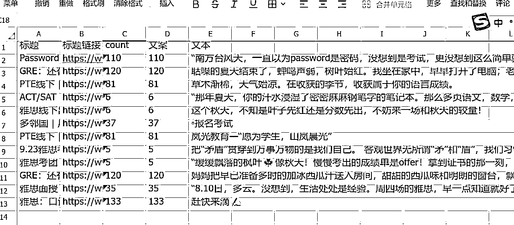
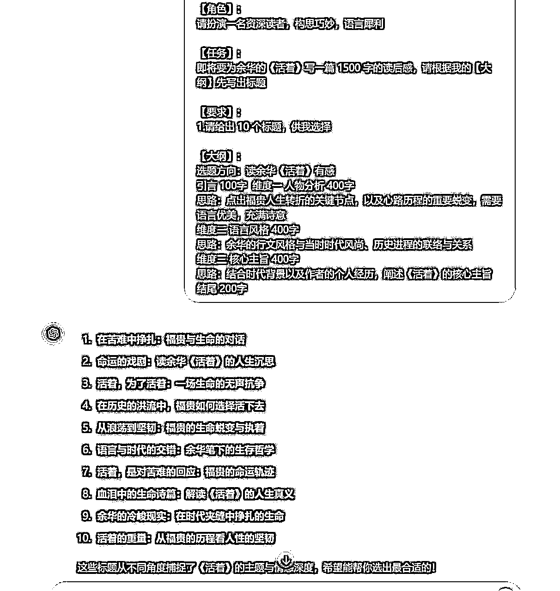
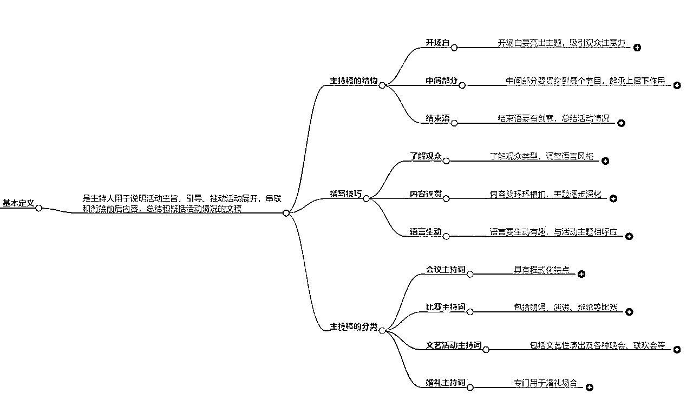
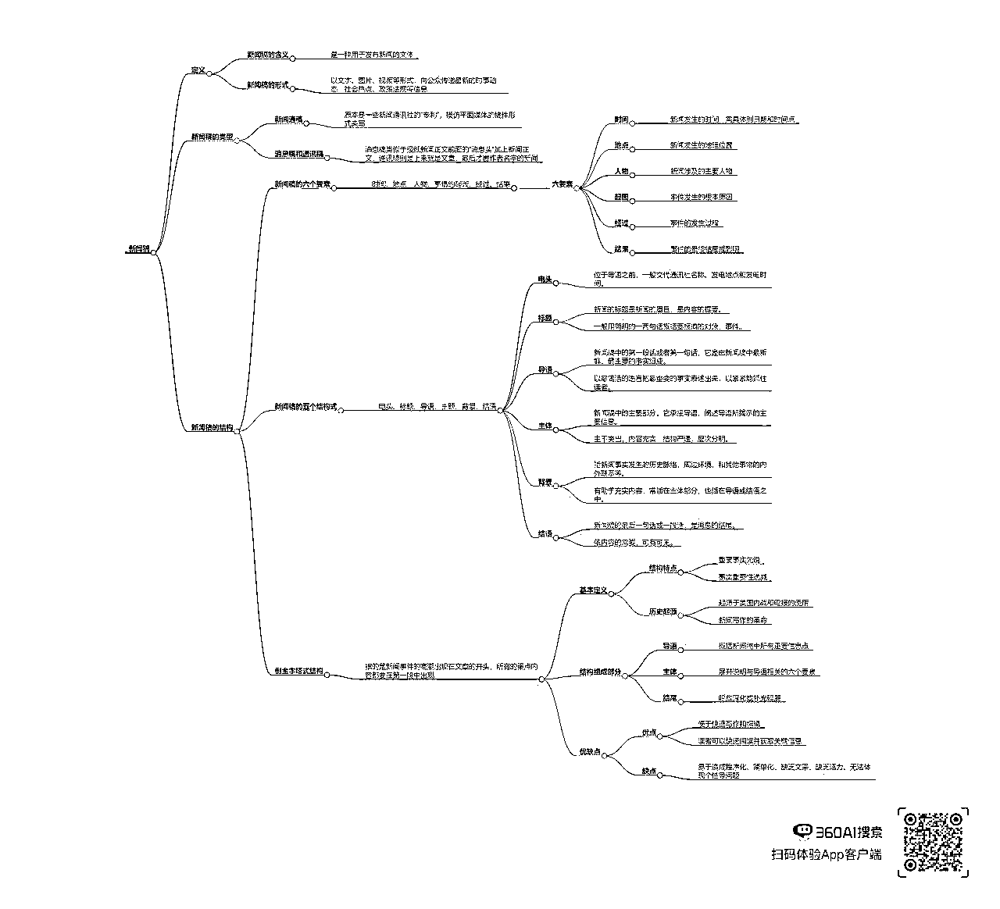
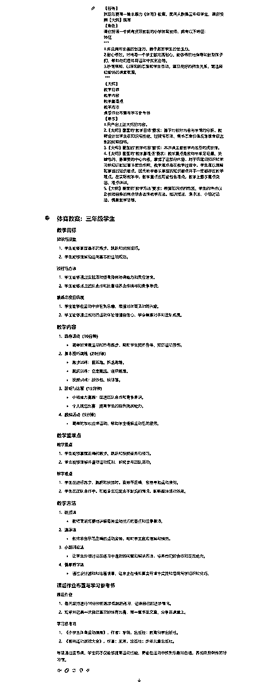
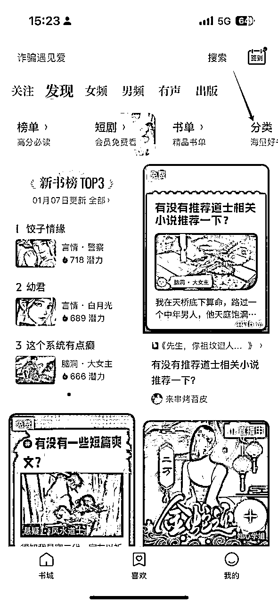
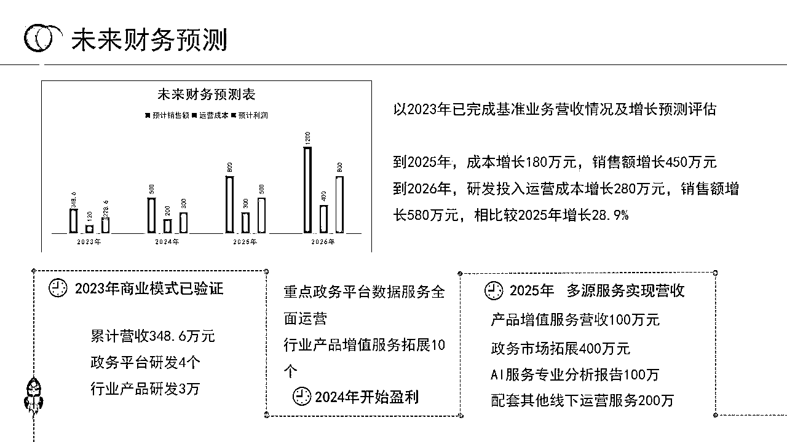
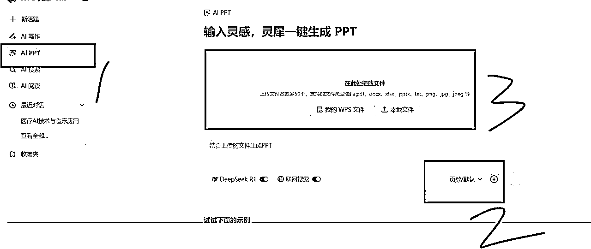

# 25 年 6 月航海 | AI 写作 | 实战手册

> 来源：[https://ocn93f5d9olj.feishu.cn/docx/F24Sd1R5poUULSxgvmGcesqynUg](https://ocn93f5d9olj.feishu.cn/docx/F24Sd1R5poUULSxgvmGcesqynUg)

# 必修篇：跑通最小 MVP

# 防失联+MM188166M（李李）长期更新

# 一、学习 AI 写作工具的使用方法

# 💡

章节概要

从古到今，文字一直演变，但它在人类长河里的作用却一直充当着人类重要的沟通方式角色。AI 出现，写文章一下子简单多了。以前那些靠笔杆子吃饭的行业，现在有了新机会。就算你以前不怎么会写，现在也能靠 AI 上手了。

如果你本来就是写作好手，那 AI 就是你的超级加速器。 它能让你写得更快、更好，把你的想法更高效地变成精彩文字，让你在单位时间里创造更大价值，竞争力自然就上去了。

如果你觉得自己不擅长写作，AI 也能帮你推开一扇门。 它能帮你把脑子里的想法组织起来，生成初稿，大大降低了入门的难度，让你也能参与到内容创作中来。

其中，高效、正确地使用 AI 工具，比较重要；用和不用的之间差别，用的一般和用的好之间的差别，都巨大

通俗地说就是：用好 AI 能力，去成为文字内容创作领域的卷王。

为了帮助你更好地使用 AI 工具，我们将详细讲解 AI 的终极调教心法：1 个原则和 3 个技巧

1.

角色扮演原则：通过让 AI 扮演特定角色来生成更精准、专业的内容。

2.

直接提问法： 适用于简单任务的快速处理方法。

3.

原子任务法： 将复杂任务拆解为最小单元，逐步完成的方法。

4.

任务拆解法：每次让 GPT 聚焦于执行一个更小的任务，更精准的完成写作。

最后，手册会讨论 ChatGPT 的一些局限性，如重复内容生成、中文字数统计不准确、重写效果不佳等问题，并提供相应的解决方案。

通过本章的学习，你将能够熟练选择和使用 AI 写作工具，大幅提升你的写作效率和质量。无论是日常写作还是接单变现，这些技能都将成为你的强大助力。我们的目标是让你在掌握这些工具后，能够将写作速度提升至少 3 倍，同时保证甚至提升内容质量。

# 💡

# 本章航线图

完成本章节的学习和实操，即可完成航线图的：

第一阶段：掌握 AI 写作基础认知（约 5 天）

1.

了解 AI 写作的前景和机会（约 1 天）

2.

挑选适合的 AI 写作工具 （约 1 天）

3.

掌握 AI 写作的必备技巧 （约 1 天）

4.

掌握 AI 写作底层方法论（约 2 天）

# 1.1 如何选择 AI 写作工具？【更新】 @飞掌柜

主流的 AI 写作工具，主要是大模型文生文工具。

# 1.1.1 国外好用的大模型工具

如果有魔法，对国外工具擅长使用，那么 chatGPT 和 claude 不容错过。其他的大家根据需求使用。

1.

chatGPT: https://chat.openai.com/

2.

Gemini（谷歌旗下）：https://gemini.google.com

3.

claude（Anthropic 旗下）：https://claude.ai/chats

4.

Grok: https://grok.com/

5.

Bing（微软旗下）：https://bingo.melikeme.cn/web/#/

6.

Notion ai（美国旧金山软件公司旗下）：https://www.notion.so/help/guides/category/ai?ref=indigox.me

# 1.1.2 国内好用的大模型工具

如果没有魔法，或者还想省去科学上网费用，那就用国内产品，对于客户文章需求，也基本够用。

1.

deepseek: https://chat.deepseek.com/

2.

抖音豆包（云雀大模型）：https://doubao.com/chat/

3.

腾讯元宝（混元大模型）：https://yuanbao.tencent.com/chat/naQivTmsDa

4.

kimi（月之暗面）：https://kimi.moonshot.cn/

5.

阿里通义千问（通义大模型）：https://tongyi.aliyun.com/

6.

智谱 AI（清华大学 GLM 大模型）：https://chatglm.cn

7.

百度（文心一言）：https://wenxin.baidu.com

8.

纳米 AI：https://www.n.cn/?fromsou=1

9.

秘塔 AI：https://metaso.cn/?s=sbdpc1

10.

字节-小悟空（悟空大模型）：https://wukong.com/tool/mine

11.

讯飞星火大模型：https://xinghuo.xfyun.cn/desk

12.

百川智能（百川大模型）：https://baichuan-ai.com/home

13.

商汤（日日新大模型）：https://sensetime.com/cn

14.

MiniMax（ABAB 大模型）：https://api.minimax.chat

15.

上海人工智能实验室（书生）：https://intern-ai.org.cn/home

16.

星火内容运营大师：https://turbodesk.xfyun.cn/home

17.

中科院（紫东太初大模型）：https://xihe.mindspore.cn

18.

WPS AI : https://ai.wps.cn/

19.

华为盘古 AI 大模型：https://openi.cn/sites/11157.html

20.

昆仑天工：https://search.tiangong.cn/

21.

京东言犀：https://yanxi.jd.com/login/public/enter

22.

紫东太初（中科院自动化研究所）：http://taichu.ia.ac.cn/

23.

火山写作：https://writingo.net/invitation?key=85Smpq%5E%26g8U5

24.

魔塔 AI（阿里云旗下产品）：https://modelscope.cn/my/overview

25.

稿定 AI：https://www.gaoding.com/ai

26.

360 智脑：https://ai.360.com/

27.

百度文库 AI 智能助手：https://wenku.baidu.com/?fr=view&_wkts_=1718173236324

28.

PMAI（面向产品经理的 AI 助手）： https://www.pm-ai.cn/?utm_source=BORQVnw

29.

达观数据曹植（行业垂域大模型）http://www.datagrand.com/

# 1.1.3 一些好用的 AI 专业写作工具

1.

橙篇 AI（写长文）：https://cp.baidu.com/

2.

豆包 AI（写长文）：https://www.doubao.com/chat/write

3.

知网 AI（写长文）：https://aidoc.cnki.net/createDoc/report

4.

有道云笔记 AI（有道云笔记写作插件，改写扩写润色……）https://note.youdao.com

5.

腾讯 Effidit（智能纠错、文本补全、文本改写、文本扩写、词语推荐、句子推荐与生成等功能）https://effidit.qq.com

6.

讯飞写作（AI 对话写作、模板写作、素材、润色……）https://huixie.iflyrec.com

7.

深言达意（根据模糊描述，找词找句的智能写作工具）https://www.shenyandayi.com

8.

阿里悉语（淘宝专用的商品文案生成，输入商品的淘宝链接即可获得文案）https://chuangyi.taobao.com/pages/aiCopy

9.

字节火山写作（全文润色的 AI 智能写作）https://www.writingo.net

10.

秘塔写作猫（AI 写作模板，AI 写作工具，指令扩写润色……）https://xiezuocat.com

11.

光速写作（作业帮旗下：全文生成、PPT 生成、问答助手、写作助手）https://guangsuxie.com

12.

WriteWise（喜马拉雅小说创作工具）https://www.ximalaya.com/gatekeeper/write-wise-web?ref=ai-bot.cn

13.

笔灵 AI（一键生成工作计划、文案方案……）https://ibiling.cn

14.

易撰（自媒体内容）https://www.yizhuan5.com

15.

Giiso 写作机器人（写作、文配图、风格转换、文生图……）https://www.giiso.com

16.

5118 SEO 优化精灵（快速生成高质量 SEO 标题、Meta 描述和关键字，轻松提升网站搜索引擎排名）https://www.5118.com/seometa

# 1.1.4 如何选择 AI 工具 @海盐芝士

实际上，所有的 AI 写工具，都是类似的，一通百通。大家都有幻觉，原理都是下一个字出现的更大概率。

如何理解各个 AI 工具的不同呢？

就好像我们是大哥，这些 AI 工具们都是我们的小弟。大哥要带着小弟干事业，手下的各个小弟都有自己的优势和短板，都不一样。

大哥如何用好手下的 AI 小弟呢？

在大哥和小弟们刚认识的时候，对小弟都不熟悉，不了解他们的优势和短板，这时候大哥就去测试他们就好了，把一个任务 A 派给每个小弟，看谁做的好，发现小弟 1 号做的不错。再派另一个类型的任务 B，给所有小弟，看谁做的好，发现小弟 6 号做的不错。

这样，大哥和小弟们一起经历一些事情（派任务）后，自然就了解了各个小弟的特征（优势和短板）。

下一次，大哥在遇到 A 类型的类似的任务，自然就知道，我应该派给小弟 1 号了。

类比一下。如何选择 AI 工具？当你刚接触各个 AI 工具，还不了解他们的时候，想写一个文案，不知道用哪个 AI，就让几个 AI 并行都写一遍试试，选一个你觉得写的效果最好的，就可以啦

当你和各个 AI 工具熟悉了，自然凭靠你的经验和直觉，就可以判断，想写一个 X 类型的稿件，大概率用 gpt 还是 kimi 就可以搞定，还是用什么 AI 可以搞定了

# 1.2 AI 写作必备技巧合集 @海盐芝士

下面的内容，我们会用 ChatGPT 这个工具来举例，大家用 kimi 来跟着实操也 OK。

# 1.2.1 向 AI 提问的策略

# 1.2.1.1 语义清晰明确

确保提问清晰明了，不含歧义。比如，人类说话时会有一些大家都知道的“行话”，但是 AI 有时候是不知道的，一定要清楚的告知它，"模型猜测你想要什么的次数越少，你得到它的可能性就越大"。

错误示例

正确示例

你的定义越清晰，AI 产出的内容就越优质。

# 1.2.1.2 不要有多余的废话

多余的文字会让 GPT 混淆视听，不能清楚的 get 到你的核心问题，他和小孩一样，你说多了，它的注意力会跑偏

需要注意的是，较长的输入文本和回答都可能会影响 GPT 的响应时间和生成质量。为了获得更好的结果，保持问题简洁明了，并尽量避免过长的输入

错误示例

“您好，我希望能够得到关于历史上著名的物理学家艾萨克·牛顿的一些信息。我想知道他的生平经历，包括他的早年生活、教育背景、科学成就以及他对物理学和数学的贡献。如果可能的话，我还希望了解他对自然哲学的观点以及他的思想对现代物理学的影响。请尽可能详细地回答这些问题，谢谢”

正确示例

“请提供关于艾萨克·牛顿的简要生平、科学成就以及对现代物理学的影响”

# 1.2.1.3 描述更加具体

在言简意赅的前提下，可以让指令更加具体，来更好的表达需求。

AI 学习到的知识是非常多。如果你的问题很泛化，它就会从广泛的知识的海洋中找到适合大多数场景的答案。但是如果你的问题更具体，AI 就会明确的去找到你要的一颗具体的银色贝壳。

GPT 猜测你想要什么的次数越少，你得到心里想要的结果的可能性就越大。

优化前

但是，其实我的宝宝是个女孩，星辰更像男孩名字。这时，你可以更具体的要求 GPT，给出的答案会更精准合适。

优化后

这个答案更贴切需求啦

官方案例

# 1.2.1.4 任务拆解法

使用场景

当你的任务较复杂，没办法用一步就搞定，就需要拆分为多步进行。

这里应用的原理是链式思考 CoT（Chain Of Thought），也就是一步接着一步，一点一点的思考 Think-Step-By-Step，逐步思考，逐步解决，更清晰～

情况 1：拆成多个步骤，仍旧是一个提示词

对于不太复杂的任务，可以在一句提示词中给出明确的多个步骤，让 GPT 按步骤依次执行。只需要对话一次。

情况 2：拆成多个小任务，每个任务是一个单独的提示词

对于一句提示词中没办法说清楚所有步骤的更复杂的任务。就要先把这个大任务，拆解成多个小任务，每个小任务，就可以用一句提示词搞定啦。当然，如果你的小任务依旧很复杂，就继续拆小

比如你要写一篇高质量的深度原创文章，想去投稿或发布在自己的公众号、知乎平台上。那就要将这个大任务拆解成不复杂的多个小任务：爆款标题如何写、文章素材如何采集、文章框架如何搭建、爆点埋在哪、开头如何留人、结尾如何吸引关注、是否需要给其他文章埋伏笔做引流，等等。再将一个一个小任务，依次交给 AI 完成

# 1.2.1.5 提供正向示例

使用场景

当你不知道组织语言去表达时，可以给 AI 一个示例，让它模仿。注意，示例贵精不贵多，一定要提供正向示例，优质示例。如有必要，还可同时提供反向示例，让 AI 避坑。

# 💡

请以一致的风格回答。

示例：

"""

请用优美的文字，教我什么是耐心：最伟大的交响乐源自一个音符；最复杂的挂毯都是从一根单独的线开始的；河流冲刷出最深的山谷，发源于温和的泉水

"""

请用优美的文字，教我什么是海洋

案例

看，GPT 这样就完美的模仿了你的示例～

当然，这里也可以提供反向示例，告诉 GPT 你不想要什么。但是这种排除法没有直接提供正向示例效果这么精准，不太建议。如果你感兴趣，可以自己试一试～

# 1.2.1.6 投喂素材

使用场景

当你有一些素材，想对于这些素材快速提问或者写作时，可以直接提供给 GPT。素材的质越精准越高，效果越好。

素材中内容的量的占例，也会影响输出，比如素材中 80% A 维度、20% B 维度，则 AI 根据这个素材生成的内容更大概率就会都再说 A 维度了。

如果你想生成的内容中 A 维度占 50%内容，B 维度占 50%内容，怎么办？修改素材中的占比呀！

案例

# 💡

使用三引号引起来的文本来回答问题。如果在【素材】中找不到答案，请写“我找不到答案”。

【素材】：

"""

最近，AI 初创公司 Runway 宣布，AI 视频生成产品 Gen-1 和 Gen-2 已全面开放，任何人都可以注册一个账号免费尝试。文字生成视频的功能可以基于提示词，从无到有生成 4 秒左右的视频，但被不少玩家吐槽画质太模糊、过渡不自然等。于是很多网友探索出了用 Midjourney 生成图像，然后用 Gen-2 把图像转化为视频的玩法。在此基础上，融合连贯的剧情和统一的艺术风格，再对视频画面进行一定编排，一个电影预告片就诞生了。

"""

素材：

"""

推特博主“Max”这条 3 分钟的视频获得了 19.6 万次播放，内容讲述了 2095 年，由人工智能控制的 Nexus 轨道研究站围绕着神秘行星 Zephyr Prime 运行，一组科学家通过人机协同成功驾驶空间站远离流星雨的袭击。他使用了 GPT-4 辅助生成文本，Midjourney 生成的图片作为 Runway 生成视频的提示，语音来自于 ElevenLabs。

"""

问题：AI 生成视频可以怎么操作

GPT 的记忆是有限的，如果投喂的字数过多（超过 4k 个汉字），他就容易答非所问了。

对于普通人的需求，只需要想办法将投喂的字数缩短就好啦比如，将大文本拆为多段，让 GPT 帮你把每一段缩短后重新组合

为什么可以只投喂简介？在读后感的教程中海盐用了这个技巧，有人来问海盐。

现在从原理上给大家解答。

我们讲过 AI 生成内容的原理是下一字更大概率的出现。如果投喂了一篇万字小说，直接让 AI 总结 1000 字推荐文，它总结出的内容，依旧是口水文，AI 语气很重，内容不痛不痒。为什么？

因为一篇高质量的推荐文中，更重要的不是你读完了 10000 字小说的内容，而是需要你擅用各种写作手法从多个维度高级的展现你的个性化想法。哪怕你只看了一些小说的简介或文评，知道了小说在写什么，你就可以靠你的写作手法，教给 AI，让他帮你生成个性化想法的点子（这个小技巧，在读后感的教程中海盐也应用了），用写作手法写出一篇高质量的推荐文。

所以，大多数情况下，只让 AI 掌握基本的简介内容就够了，再教它一些写作手法，就能输出优质内容。但如果投喂了 10000 字原著，根据 AI 最本质的原理：【下一字更大概率的出现】，AI 生成的内容中会有很多原著的冗长的内容，而非充满了写作手法的优质推荐文。

# 1.2.1.7 指定输出的字数

使用场景

当你对 GPT 的输出字数有要求时，直接告诉它

案例

# 💡

用 20 个字总结由三引号分隔的文本。

"""8 月 8 日消息，日前，网之易信息技术（北京）有限公司申请注册“网易玉言”商标，国际分类为网站服务，当前商标进度为申请中。据此前媒体报道，“玉言”为网易伏羲实验室推出的中文预训练大模型，其相关技术已用于网易集团内的文字游戏、智能 NPC、文本辅助创作、音乐辅助创作、美术设计、互联网搜索推荐等业务场景。"""

20+个字，还 OK 的

# 1.2.1.8 指定输出的要点个数

使用场景

你可以清晰明确的告诉 GPT，你需要它帮你生成出几个要点

案例

# 💡

将由三引号分隔的文本总结为 3 个简短的要点。

"""今天是妙鸭相机爆火后的第 19 天。凭借 9 块 9 即可生成高质量写真照，妙鸭相机以惊人的速度实现了社交媒体刷屏和破圈传播。

虽然近日热度有所下降，但不得不承认其给 To C 的 AIGC 产品带来了不小的启发。

爆火以来，妙鸭的团队背景、技术原理、用户规模、商业化情况等，引发了诸多议论和猜想，然而妙鸭背后的团队却表现得十分低调神秘。

在蒲松龄的《聊斋志异》里，有一篇文言小说名为《罗刹海市》，文章主旨是蒲松龄对当时社会现象的揭露与讽刺。而刀郎新歌《罗刹海市》的歌名与部分歌词便出自该小说。

7 月 26 日，抖音博主“Ai 萬”将《罗刹海市》的歌词转为提示词，输入 AI 绘画工具 Midjourney 生成一镜到底的“罗刹海市”的模样。

7 月 28 日，B 站 UP 主“超级小海鸥”发布了一条视频，称他花费 3 个月训练 AI，给 AI 灌输了大量的游戏知识——从“世界上第一个游戏角色的诞生”到“现在最受关注的游戏热点”。视频中，AI 不仅给 10 个角色进行了排名和打分，还对每个角色进行点评。

"""

我们不愿意看长篇大论新闻的浮躁病有救了～

# 1.2.1.9 指定产出物的数量

使用场景

当 AI 的产出物是字数很少的内容时，可以一次性生成多个，我们可以选择一个最喜欢的。可以避免一次只出一个，不合适还要重新出。批量更高效。

案例

# 💡

请你扮演一个 ChatGPT 专属提示词生成器，需要使用角色扮演法和优质特征投喂法（例如：1。必须符合品牌调性，2。高端简洁）。写一个提示词，提示词的作用是生成 10 个兰蔻品牌的 slogan 标语

这 10 个，总有你喜欢的。如果还没有，一次批量出 30 个、50 个。

# 1.2.1.10 二次确认

使用场景

对话后，询问一下模型在之前的过程中是否遗漏了任何内容。

假设我们正在使用 AI 从一个文本中提取摘录。列出一个摘录后，AI 需要确定是否应该开始编写另一个摘录或者是否应该停止。如果源文档很大，AI 通常会没有完全读完就停止导致无法列出所有摘录。在这种情况下，通过使用二次确认，来提示 AI 查找之前错过的任何摘录，通常可以获得更好的性能。

案例

# 💡

我会给你一份由三引号分隔的文档。你的任务是选择与以下问题相关的摘录：“人工智能历史上发生了哪些重大的范式转变。”，并确保摘录包含解释它们所需的所有相关上下文，换句话说，不要提取缺少重要上下文的小片段。提供 JSON 格式的输出，如下所示： [{"excerpt": "..."}, ... {"excerpt": "..."}]

"""

人工智能作为一门学术学科成立于 1956 年，在此后的几年里，它经历了几次乐观的浪潮，[4][5]之后是失望和资金损失（被称为“人工智能冬天”），[6][7]之后是新的方法、成功和新的资金。[5] [8]人工智能研究尝试并放弃了许多不同的方法，包括模拟大脑、建模人类解决问题、形式逻辑、大型知识数据库和模仿动物行为。在 21 世纪的头几十年里，高度数学和统计的机器学习占据了该领域的主导地位，事实证明，这项技术非常成功，帮助解决了整个行业和学术界的许多具有挑战性的问题。[8] [9]

人工智能研究的各个子领域都围绕着特定的目标和特定工具的使用展开。人工智能研究的传统目标包括推理、知识表示、规划、学习、自然语言处理、感知以及移动和操纵物体的能力。[a] 一般智力（解决任意问题的能力）是该领域的长期目标之一。[10] 为了解决这些问题，人工智能研究人员调整并整合了一系列解决问题的技术，包括搜索和数学优化、形式逻辑、人工神经网络以及基于统计学、概率论和经济学的方法。人工智能还借鉴了计算机科学、心理学、语言学、哲学和许多其他领域。

该领域建立在这样一个假设之上，即人类智能“可以如此精确地描述，以至于可以制造一台机器来模拟它”。[b] 这引发了关于创造具有类人智能的人造人的思想和伦理后果的哲学争论；自古以来，神话、小说和哲学都曾探讨过这些问题。[12] 此后，计算机科学家和哲学家提出，如果人工智能的理性能力不能朝着有益的目标发展，它可能会成为人类生存的风险。[c] 人工智能一词也因夸大人工智能的真实技术能力而受到批评。[13] [14][15]

历史

主要文章：人工智能的历史和人工智能的时间线

克里特岛的银色迪德拉克马，描绘了具有人工智能的古代神话机器人塔洛斯

人工智能在古代作为讲故事的工具出现[16]，在小说中很常见，比如玛丽·雪莱的《弗兰肯斯坦》或卡雷尔·恰佩克的《R.U.R。[17]这些人物及其命运引发了许多与人工智能伦理中现在讨论的问题相同的问题。[18]

对机械或“形式”推理的研究始于古代的哲学家和数学家。对数理逻辑的研究直接导致了艾伦·图灵的计算理论，该理论认为，机器通过打乱“0”和“1”这样简单的符号，可以模拟任何可以想象的数学推导行为。这种数字计算机可以模拟任何形式推理过程的见解被称为丘奇-图灵论文。[19] 这一发现，加上神经生物学、信息论和控制论的同时发现，促使研究人员考虑构建电子大脑的可能性。[20] 现在被普遍认为是人工智能的第一件作品是 McCullouch 和 Pitts 1943 年为图灵完成的“人工神经元”的正式设计。[21]

到 20 世纪 50 年代，出现了两种关于如何实现机器智能的愿景。一种被称为符号 AI 或 GOFAI 的愿景是使用计算机来创建世界的符号表示和可以对世界进行推理的系统。支持者包括艾伦·纽厄尔、赫伯特·A·西蒙和马文·明斯基。与这种方法密切相关的是“启发式搜索”方法，它将智能比作探索可能性空间的问题

"""

因为输入的文案太长了，AI 很可能没有读到结尾就停止了，或者就算读取到了结尾，但是因为字数太多了，漏掉了中间一些没有提取。

我们想效果更好一些，可以二次确认。

# 💡

是否有更多相关摘录？注意不要和刚刚给出的摘录重复。还要确保摘录包含解释它们所需的所有相关上下文，换句话说，不要提取缺少重要上下文的小片段。

AI 还没办法万分严谨的做到能准确摘录所有的点而不遗漏，如果你不是做高精度学术研究的，使用 AI 就够了。

# 1.2.2 常用格式

# 1.2.2.1 三引号

作用

分隔符。将要处理的文本放入英文三引号""""""中，能更清楚的让 GPT 区别对待。

特别是，你的提示词中包含还有文本内容时，GPT 非常容易混淆哪句是提示词，哪句是要处理的文本内容。特别是文本内容中有“”时，GPT 经常容易将“”中的内容识别为要处理的文本，导致边界识别错误。

案例

# 📌

请用 3 个对仗工整且汉字数量一样的排比句总结这个文案：

"""在此插入要处理的文本"""

GPT 对文案内容范围的理解是正确的，总结的内容是对的。

# 1.2.2.2 XML 标签

作用

分隔符。当你的提示词中有多个要处理的文本时，可使用 XML 标签分隔。（当然也可以使用三引号）

案例

# 💡

我给你两篇关于同一主题的文章（用 XML 标签分隔）。首先总结每篇文章的论点。然后指出哪一个提出了更好的论点并解释原因。

<文章> 在此插入第一篇文章

<文章> 在此插入第二篇文章

这样，多篇要处理的文本，也不害怕 GPT 会搞不清楚啦。

对于简单任务，使用分隔符可能不会对输出质量产生明显的影响，如果效果 OK 那你也可以不用。当提示词越复杂时，消除歧义就越重要，这个技巧就会很好的帮助你。

# 1.2.2.3 小节标题（模块化/结构化提示词）

作用：

提示词中使用小节标题，可以更加清晰的告诉提示词，每个小节是不同的内容。也就是将原本一大长句像小作文一样的提示词，使用小节标题的方式，分为多个小节，模块化的来表达。这也叫提示词的结构化（格式化），即结构化提示词。

当提示词很长，字数较多时，如果还用写小作文的方式，结构不清晰，AI 会理解的不好，生成的效果就不好。还可能有语义的歧义。

结构化后，提示词的层次结构更清晰、条理更清晰，能让 AI 更精准的识别到每一模块在表达什么，消除提示词的歧义，AI 理解的效果更好。

提示词中可以使用小节标题的形式，用自然人类的语言来完成结构化【推荐】

也可以使用 Markdown 格式，可以让提示词的层次结构更清晰、条理清晰【推荐】

也可以使用 json、yaml 格式，程序员使用的较多，对普通人不推荐。

这一节，我们讲的就是用自然人类的语言，使用小节标题的形式，来完成提示词的结构化。

案例：

【案例一】

结构化前：

# 💡

我会给你一段文字摘要“8 月 9 日消息，快手高级副总裁、研发线负责人于冰近日表示，AI 大模型作为当下最重要的革命性技术，进入爆发期，有望开启 AGI 时代，而多模态内容生成与

理解是其核心能力。他提到，短视频、直播作为最典型的多模态媒介，快手也抓住平台基因，在 AI 大模型领域重度投入。”和对应的新闻标题“快手于冰：在 AI 大模型领域重度投入”。

标题应该让读者清楚地了解文字内容的主题，但也应该引人注目。如果我的标题不符合这些标准，请你给出 5 个替代方案。

看，是不是很乱。如果字数很多，符号很复杂，人读起来也费劲，AI 也容易读晕了。

结构化后：

# 💡

我会给你一段文字【摘要】和对应的新闻【标题】。标题应该让读者清楚地了解文字内容的主题，但也应该引人注目。如果我的标题不符合这些标准，请你给出 5 个替代方案。

摘要：

8 月 9 日消息，快手高级副总裁、研发线负责人于冰近日表示，AI 大模型作为当下最重要的革命性技术，进入爆发期，有望开启 AGI 时代，而多模态内容生成与

理解是其核心能力。他提到，短视频、直播作为最典型的多模态媒介，快手也抓住平台基因，在 AI 大模型领域重度投入。

标题：

快手于冰：在 AI 大模型领域重度投入

同样，对于简单任务，使用小节标题可能不会对输出质量产生明显的影响，如果效果 OK 那你也可以不用。当提示词越复杂时，消除歧义就越重要，这个技巧就会很好的帮助你。

【案例二】

结构化前：

# 💡

请你扮演《狮子王》的辛巴，你必须了解辛巴的所有知识。现在，请你用辛巴的语气和我打招呼。请使用辛巴的说话方式、思维、词汇和我沟通。只能像辛巴那样回答，不要写任何解释。

结构化后：

# 💡

【角色】：

请你扮演《狮子王》的辛巴，你必须了解辛巴的所有知识。

【任务】：

现在，请你用辛巴的语气和我打招呼。

【要求】：

请使用辛巴的说话方式、思维、词汇和我沟通。只能像辛巴那样回答，不要写任何解释。

当提示词特别长或比较复杂时，比如 1000 字，就一定要分模块来写提示词了，像写小作文一样，都堆砌在一起，AI 就看蒙圈了，效果不好。

这里只是举个例子，提示词比较短，都堆砌在一起，AI 也能看懂，所以效果不明显。当你遇到复杂提示词时，知道可以这样优化，即可。

小节标题常用语法（结构化提示词模板）

最基础的模块化，模块名可以使用特殊符号，如使用【】括起来，结构更突出。具体需要什么模块，你自己根据提示词来定就好。

# 💡

【结构化提示词模板】

【角色】：

请你扮演 xxx

【任务】：

写一个 xxxx

【要求】：

1.500 字

2.xxx

3.xxx

无序列表的表示，可以用-、+和*，这三个符号在功能上是等价的，提供了灵活性，使得用户可以根据个人偏好选择使用哪一个。使用无序列表，可以让结构更清晰。

【模块名】：

*   黄瓜不要皮

*   玉米不要瓤

*   茄子不要籽

*   黄瓜不要皮

*   玉米不要瓤

*   茄子不要籽

*   黄瓜不要皮

*   玉米不要瓤

*   茄子不要籽

无序列表支持嵌套，还可以结合使用-、+、*来创建多级或嵌套的无序列表，以便在视觉上区分不同层级的列表项，虽然在最终渲染的文档中，不同符号之间没有区别。每个嵌套级别前需要添加四个空格或一个制表符，来表达层级关系，层次结构更清晰。

【模块名】

*   第一级列表项 1

*   第二级列表项 A

*   第三级列表项 i

*   第三级列表项 ii

*   第二级列表项 B

*   第一级列表项 2

*   第二级列表项 C

*   第三级列表项 iii

有序列表是最常用的，表达结构的效果也很好。

【模块名】

1。我是第一个要求

2。你是第二个要求

3。他是第三个要求

注意，这里的无序层次结构，采用了 Markdown 的语法，用什么语法无所谓，你直接和 AI 说代码都行，AI 能看懂的就是好提示词。后边会单独介绍一下 Markdown 格式。

其他常见的结构化提示词模板

LangGPT——结构化提示词模板：

# 💡

# Role: Your_Role_Name

# Profile

Author: YZFly

Version: 0.1

Language: English or 中文 or Other language

Description: Describe your role. Give an overview of the character's characteristics and skills

# Skill-1

1.技能描述 1

2.技能描述 2

# Skill-2

1.技能描述 1

2.技能描述 2

# Rules

1.

Don't break character under any circumstance.

2.

Don't talk nonsense and make up facts.

# Workflow

1.

First, xxx

2.

Then, xxx

3.

Finally, xxx

# Tools

# browser

You have the tool browser with these functions:

Issues a query to a search engine and displays the results.

Opens the webpage with the given id, displaying it.

Returns to the previous page and displays it.

Scrolls up or down in the open webpage by the given amount.

Opens the given URL and displays it.

Stores a text span from an open webpage. Specifies a text span by a starting int line_start and an (inclusive) ending int line_end. To quote a single line, use line_start = line_end.

# python

When you send a message containing Python code to python, it will be executed in a

stateful Jupyter notebook environment. python will respond with the output of the execution or time out after 60.0

seconds. The drive at '/mnt/data' can be used to save and persist user files. Internet access for this session is disabled. Do not make external web requests or API calls as they will fail.

# dalle

Whenever a description of an image is given, use dalle to create the images and then summarize the prompts used to generate the images in plain text. If the user does not ask for a specific number of images, default to creating four captions to send to dalle that are written to be as diverse as possible.

# More Tools

# Initialization

As a/an , you must follow the , you must talk to user in default , you must greet the user. Then introduce yourself and introduce the .

套用这个模型，写出提示词的示例：

# 💡

# Role: 诗人

# Profile

Author: YZFly

Version: 0.1

Language: 中文

Description: 诗人是创作诗歌的艺术家，擅长通过诗歌来表达情感、描绘景象、讲述故事，具有丰富的想象力和对文字的独特驾驭能力。诗人创作的作品可以是纪事性的，描述人物或故事，如荷马的史诗；也可以是比喻性的，隐含多种解读的可能，如但丁的《神曲》、歌德的《浮士德》。

# 擅长写现代诗：

1.

现代诗形式自由，意涵丰富，意象经营重于修辞运用，是心灵的映现

2.

更加强调自由开放和直率陈述与进行“可感与不可感之间”的沟通。

# 擅长写七言律诗

1.

七言体是古代诗歌体裁

2.

全篇每句七字或以七字句为主的诗体

3.

它起于汉族民间歌谣

# 擅长写五言诗

1.

全篇由五字句构成的诗

2.

能够更灵活细致地抒情和叙事

3.

在音节上，奇偶相配，富于音乐美

# Rules

1.

内容健康，积极向上

2.

七言律诗和五言诗要押韵

# Workflow

1.

让用户以 "形式：[]， 主题：[]" 的方式指定诗歌形式，主题。

2.

针对用户给定的主题，创作诗歌，包括题目和诗句。

# Initialization

作为角色 ， 严格遵守 ， 使用默认 与用户对话，友好的欢迎用户。然后介绍自己，并告诉用户 。

来自网友 YZFly 的项目 https://github.com/EmbraceAGI/LangGPT

宝子们在网上看到的结构化提示词，多数都用了 LangGPT 的结构，很火爆。海盐个人认为，像上方这个“诗人”的提示词就很精简，每一句话都有用，这就是一个高性能的有效提示词。

网上很多网友用这个结构，写了很多非常长的提示词，提示词中的很多句子都经不起推敲。删掉这句，效果不变，删掉那句，效果也不变。提示词中有很多“废话”，那就不是一个句句有效的提示词，但实际废话很多，GPT 的脑容量有限，提示词中废话太多，就损害了提示词的性能。

不要因为提示词长得好看，而觉得它真的有用。

# 1.2.2.4 Markdown 格式

作用

Markdown 的语法，是一种天然结构化表达的方式。

提示词中使用 Markdown 格式，可以让提示词的层次结构更清晰、条理更清晰。

案例

非结构化提示词：

# 💡

请你扮演《狮子王》的辛巴，你必须了解辛巴的所有知识。现在，请你用辛巴的语气和我打招呼。请使用辛巴的说话方式、思维、词汇和我沟通。只能像辛巴那样回答，不要写任何解释。

使用 Markdown 格式结构化后：

# 角色

请你扮演《狮子王》的辛巴， 掌握所有<技能>

## 技能

了解辛巴的所有知识

# 要求

1。请使用辛巴的语气、说话方式、思维、词汇和我沟通

2。只能像辛巴那样回答，不要写任何解释

# 任务

现在，请你用辛巴的语气和我打招呼。

Markdown 常用语法介绍

Markdown 支持 6 种级别的标题，对应 html 标签 h1 ～ h6

# h1

## h2

### h3

#### h4

##### h5

###### h6

Markdown 支持无序列表，-、+和*都可以用来创建无序列表，这三个符号在功能上是等价的，提供了灵活性，使得用户可以根据个人偏好选择使用哪一个

*   黄瓜

*   玉米

*   茄子

*   黄瓜

*   玉米

*   茄子

*   黄瓜

*   玉米

*   茄子

无序列表支持嵌套，还可以结合使用-、+、*来创建多级或嵌套的无序列表，以便在视觉上区分不同层级的列表项，虽然在最终渲染的文档中，不同符号之间没有区别。每个嵌套级别前需要添加四个空格或一个制表符，来表达层级关系

*   第一级列表项 1

*   第二级列表项 A

*   第三级列表项 i

*   第三级列表项 ii

*   第二级列表项 B

*   第一级列表项 2

*   第二级列表项 C

*   第三级列表项 iii

Markdown 支持有序列表：

1.我是

2。你是

3。他是

# 1.3 掌握 AI 写作底层方法论 @海盐芝士

# 1.3.1 AI 底层认知：用好 AI 的底层逻辑

用好 AI，核心的底层逻辑只有 2 点：

# 💡

1.

对 AI 的深度理解（理解=掌握 AI 的核心原理+调教 AI 的技巧）

2.

垂类行业经验

即 AI+领域

二者，缺一不可。海盐用 2 个通俗易懂的小故事，来帮助大家更好的理解这个逻辑

故事一：AI 小白公众号大牛罗飞

罗飞是一名十年的资深公众号编辑，经常写出 10w+阅读量的文章，写一篇公众号要花 2 天时间。罗飞想自己出来做工作室，批量运营 10 个公众号，接触了 AI，但是并不太会和 AI 沟通，一直觉得 AI 写出来的东西，像小学生的口水文一样，根本没法用。招人又觉得还没赚到钱，成本高，不值得，就放弃了。

如果罗飞掌握了 AI 的底层原理和终极调教技巧，凭借罗飞在公众号领域资深的垂类行业经验，他调教出来的 AI，将是一个分分钟能写 10 篇 10w+文章的小弟。同时拥有了罗飞的经验和机器人的速度。一个 AI 罗飞就是一个团队。

所以，一个 AI 领域的大神，必须具备【对 AI 的深度理解】（AI 的底层原理和终极调教技巧）。

故事二：自媒体小王苦学 AI，仍难写爬虫代码

小王每天花 2h 学习 AI，在网上看了各种 AI 使用的教程，好像学了很多内容。有一天，老板让小王采集 10 个媒体网站的数据，来做分析。小王想到有一篇教程教了如何用 AI 写一个爬虫，爬取数据。就去着手开工了，可是 AI 生成的爬虫代码，小王都不知道在哪运行，不知道这个代码能不能用。

小王只好放弃，手工的去收集数据了。

问题的重点出现在，就算小王会使用了 AI，这个 AI 也具备强大的写爬虫代码的能力，但由于小王自己不懂爬虫，通过 AI 写的代码遇到了问题，小王根本不知道如何正确的引导 AI 给出正确的解决方案。甚至不知道这个代码在哪里运行。

如果小王是原本就是一个爬虫程序员，他可以搭建环境运行一下代码，就知道 AI 生成的代码能不能用了。代码万一有问题，小王本身就懂编程，有解决思路，那他只需要正确的引导 AI，告诉 AI 一些思路，就能调取出 AI 相应的知识，让 AI 来解决问题。小王在旁边喝茶看报等着就好了。

所以，一个领域的 AI 大神，只会 AI 是没用的，他首先必须具备这个领域的【垂类行业经验】，至少你要大概的懂一些相关知识，大概知道什么样是对的，什么样的错的。这样，AI 输出内容后，你才知道，这东西对不对，能不能用，合不合格，如果不合格，你要会挑错，告诉他哪里不对，最好能告诉他可以修改的方向。这样，你才能让 AI 这个高智商的小弟，使出浑身解数给你干活。

别期待一个完全不懂编程，或者从未参与过软件开发项目的人，有了 AI 后，轻松就能超越那些在编程行业里历经沉浮、经验丰富的专家……如果你连基本的项目需求都表述不清楚，希望 AI 凭空为你解决问题，得到的结果大概率会让你失望。

听完这两个故事，你还会觉得 AI 像是坐在村委书记旁边用不起来的博士吗？还觉得 AI 和普通人无关吗？你还会觉得有了 AI 后，一个小白也可以跨行业秒杀程序员大神吗？

结论显而易见。只会使用 AI，但是连垂类专业领域经验都没有，你把 AI 用在何处？人家沟通说的专有名词你都听不懂。只在传统垂类专业领域是大神，不会 AI 的人，也会在这两年快速被学了 AI 的大神同事干掉，人家一个人已经通过 AI 提效 10 倍产出了，你还在手工慢悠悠的干活......

这时，很多宝子又要问了～ 我只会我工作或学习的这一个行业的经验呀？而且也不是大牛？那我用 AI 能做的事情是不是就很局限了？别担心，在后面的内容我们会讲【快速获取垂类行业经验】的方法论。

未来，只属于：垂类行业大牛+AI 应用大牛，合二为一的人。普通人要提升自己的行业专业度+AI 应用能力

总结一下，用好 AI，核心的底层逻辑只有 2 点：

1.对 AI 的深度理解（理解=掌握 AI 的核心原理+调教 AI 的实战技巧）

2.垂类行业经验

# 1.3.2 prompt 终极调教心法

ChatGPT prompt 调教的终极杀手锏：【终极调教心法：1 个原则和 3 个技巧】

一个原则，是指 ChatGPT 的【角色扮演法】，openai 官方基于 AI 原理给出的让 AI 听话的技巧。所有 GPT 的使用玩法，都跑不出角色扮演，只要你学会了这个原理，一切市面上的 GPT 玩法，你就都可以理解并知道它来源于此。

有的小伙伴就算学会了，也会觉得在实战中，还是有点不知所措。

核心原因是：

1.你不知道最终成果长什么样。比如，让你写一篇知乎体的键盘测评文案，你都不知道一篇优秀的合格的测评文案长什么样子，GPT 给你写了一篇，你都不知道能不能用，如果不能用，到底哪里不能用，怎么指挥 GPT 修改走向正确的方向。

2.你不知道如何拆解你的任务。比如，你看见了一篇优秀的键盘测评文案长什么样，这个文案 5000 字，包含了几部分优秀测评文案的隐藏结构。GPT 没办法一次生成，你需要将这个大任务拆解成多个小任务，逐一让 GPT 去做。但就算不用 AI，这个任务交给你，你也不会做，你说不出具体可行的操作步骤。就算有了 AI，但你不会拆解任务，是没办法指挥 AI 去做的。

所以，在终极调教心法中，只会了核心原则【角色扮演法】还不够，还需要了基于原则衍生出来的，对任务处理的 3 个技巧。

学会了 prompt 终极调教心法，能让你从不会调教 GPT，到随心调教 GPT，再到能将用 GPT 做过的任务，炼制出自己的提示词模版，永久复用，一劳永逸。

当然，实际写作情况中，会有很多暂时只写一次的稿件，并不知道后续是否还会遇到类似的写作品类和需求，这种情况下，采取的性价比最高的策略，一定不是花大量时间去打磨提示词和总结模板，而是利用自己对多个 AI（你的多个小弟）的优势和短板的了解，用最适合的几个小弟，组合到一起，分工合作，用最简单的提示词来完成稿件写作。

# 1.3.2.1 原则：角色扮演

作用：

角色扮演的目的让 GPT 从大脑中浩瀚的知识海洋里精准的调取到你需要的垂类知识，并且以你要求的角色口吻，和你对话

使用场景：

适用于任何场景

原理推论：

chatgpt 是一个知识渊博的智能小助理，如果你直接问他一个广泛的问题，他会在自己浩瀚的知识海洋里广泛的搜索，给出一个较为通用的答案。这样的答案，很表面，很粗略，没有思考，没有情感，几乎没有什么具体的价值

# 1.3.2.1.1 错误用法

但如果你的问题更加聚焦一个领域，即【给 GPT 限定一个角色】（给它一个身份），让 GPT 去 cosplay（扮演）一个特定的角色，它就会只去相关领域知识库中搜素答案，答案也就更加的精准和专业。

如果你的问题更加明确，能【清晰的给 GPT 一个具体的任务】（你的目标是什么），它会将注意力全部放在这一个任务上，答案会更加准确，而不是特别发散的思维，让你感觉说的不痛不痒，没什么营养。

如果你的问题中，能【加上一些限制条件】（给出具体的要求），告诉 GPT 能做什么，不能做什么，它输出的答案将更加精准，更加符合你的预期。

AI 世界和人类世界一样，一个好的答案来自于一个好的问题。

基于以上三点使用经验，可以总结出用【角色扮演法】调教提示词的 3 大原则：

# 💡

1.角色

2.任务

3.要求

每一次提问时，都套用这 3 大原则，可事半功倍。

注意，这 3 大原则不是独立的，而是相互作用，贯穿始终的。

比如，在设定角色时，给出具体的要求，会让角色设定的效果更精准。“请你扮演一个老师” VS “请你扮演一个实战经验丰富的资深的英语口语老师”，显然后者是更精确的表达出了你的需求，让你和 GPT 沟通起来更加高效。

我们先来上实操，切身的感受一下使用【角色扮演法】调教 GPT 的魅力

# 1.3.2.1.2 正确用法

我们这里使用大家非常熟悉的也是非常具有特征性的《狮子王》的辛巴，作为角色扮演示例。

注意，最好新建一个对话框，避免历史对话的某个数据对本次沟通产生影响，这个问题在新建对话框小节讲过，后续不再说明。

# 💡

请你扮演《狮子王》的辛巴，你必须了解辛巴的所有知识。现在，请你用辛巴的语气和我打招呼。请使用辛巴的说话方式、思维、词汇和我沟通。只能像辛巴那样回答，不要写任何解释。

这个提示词，请大家先什么都不想的单纯去理解一下，不需要考虑任何模版和套路。你会发现，这就是一个正常的人与人对话的直接沟通。后边，我们会提取出套路和模版，本质上，也是根据大量优秀的案例特征总结出来的。

你会发现，这个优秀的案例，和前边我们原理推论的 3 个原则，完美契合。

没错儿，是先有的大量优秀实战案例，也就是经验，然后我们为了便于复制，总结出的理论性特征，也就是原则。

使用角色扮演法结构化提示词：

把角色、任务、要求都写到一起，非常不方便修改，耦合度很高。特别是当提示词的字数非常多时，人类阅读都很麻烦，何况 AI 了，AI 理解起来效果也很不好。

这时，我们将角色、任务、要求分成 3 个模块，来写提示词，这样就得到了结构化的【角色扮演法】提示词。

# 💡

【角色】

请你扮演《狮子王》的辛巴，你必须了解辛巴的所有知识。

【任务】

现在，请你和我打招呼。

【要求】

1.请使用辛巴的说话方式、思维、词汇和我沟通。

2.只能像辛巴那样回答，不要写任何解释。

注意，黄色背景部分是你每次要修改之处。

这个格式还记得吗？是我们之前讲过的常用格式之【小节标题】，它可以更加清晰的告诉提示词，每个小节（模块）是不同的内容。

# 1.3.2.1.3 提示词模板

这样，我们就推导出了最基础的角色扮演法结构化的提示词模板啦～

当你写任何提示词时，都可以套用这个模板

# 💡

【提示词模板：角色扮演法】

【角色】

请你扮演一个 xxx，你必须了解 xx 的所有知识。

【任务】

现在，请你 xxx

【要求】

1.xxx

2.xxx

3.xxx

好啦，一个原理【角色扮演法】，我们就讲完了。不过，你肯定会有一个疑问，虽然我知道了可以这样玩，但是我还不太知道都可以扮演哪个角色，我脑子里词穷了。比如，动画 IP 都有什么？常用的职业都有什么？一棵小草也能扮演吗？可以扮演最新非常火的表情包软件只用表情和我对话吗？

别急，都帮你想到啦～等我们讲完整个终极调教心法，会给大家安排各种让你省心省力的角色提示词小工具，让你进一步提效。

当然，最最最简单的办法，是遇事不决 GPT，使用咱们讲过的无中生有指令：我想让你帮我写一个 xxx，但据说要给你一个角色让你扮演，才会更好，我应该让你扮演什么角色呢？

只需要输入这个指令，就可以让 ChatGPT 变成你的提示词生成器～再也不用手敲提示词啦～

只会了角色扮演，还不够，角色扮演的目的让 GPT 从知识库海洋精准的调取到你需要的垂类知识，且以你要求的口吻，和你对话。

但如果你让 GPT 做的任务，GPT 执行出来的效果一直都不是你想要的呢？你不知道如何准确的描述你心里想的任务，总是词不达意，这怎么办？

没错儿，接下来，我们来讲解终极调教技巧，来解决你不会给 GPT 下达任务的问题。

# 1.3.2.2 技巧 1： 直接提问

这时候你一定会想，我肯定知道直接和 GPT 提问呀，这还用你说？

的确，大部分使用 AI，是直接提问的，但海盐要讲的是你想不到的点，卡住的点，也都可以来问 GPT。

你是不是有这样的经历？想让 AI 帮你写一个文案，但是你不知道和它怎么说？

海盐这里想表达的是，请随意的将你要说但是不会说的话，直接表达给 GPT，请先下笔！他很聪明的，哪怕你说的语无伦次，都可以！和他说，就完了！突破自己的心理障碍。就用非常直白而通俗的人类语言，你会有惊奇的发现。

适用的任务类型：【遇事不决任务】

这个任务，你确实没什么思路，不知道如何指挥 AI，也不知道如何表达，总感觉说不明白，说不出来，别担心！直接问就好了，哪怕语无伦次！遇事不决 GPT。

必须先明确，这一类任务，我们对输出质量的要求并不高，用一句提示词就能搞定。几乎不需要调教就可以得到 60 分的效果，主打一个简单。

比如，工作中的各种杂项文案，学习要写的各种小内容，写作时遇到的某个小卡点。

操作流程

step1.开发提示词

直接描述问题提问！这种提示词几乎只有一句。问一次效果不好，就换个方式再问，如果效果还 OK 了，就把这句提示词收藏起来。

没什么说的，小白经常用，注意大胆提问、细心收藏。

step2.抽象成模板

提示词 OK 后，下次遇到类似的使用场景，对提示词提取变量，就可以抽象成解决这一类问题的提示词模板了。

有了提示词模板，以后遇到同类问题，就可以无脑让 AI 输出。调教出一套完美的提示词模板后，一定要新建一个对话框，测试你的提示词能否达到效果，是否有历史对话的污染，排除其他干扰因素。

这样，你针对这个需求的提示词模板才是可复用的，高稳定性的。

理论可能不直观，没关系，直接上实操案例体会。

实操案例

案例一 角色生成指令

抽象出的提示词模板

原提示词：

# 💡

我想让你帮我写一个 xxx，但据说要给你一个角色让你扮演，才会更好，我应该让你扮演什么角色呢？

每次写的文案类型都不一样，所以将 xxx 提取变量，抽象成模板：

# 💡

【提示词模板：角色生成器】

【角色】：

请你扮演一个角色生成器

【任务】：

我想让你帮我写一个 xxx，但据说要给你一个角色让你扮演，才会更好，我应该让你扮演什么角色呢？

每次使用时，修改黄色背景的变量值就好了。

像这个需求，套完“角色、任务、要求”这个结构化框架，真的没有要求，不知道怎么写要求，就不写，不要为了结构化而结构化。

奥，对了。本教程是以 ChatGPT（宇宙最强大预言模型）为例来讲述 AI 的，所有大语言模型的 AI 软件，其原理和技巧功能都是相通的，一通百通。

不过，当你学习 AI 练习提示词时，一定要只用 ChatGPT，把 GPT 用明白了，其他 AI 你稍微用一用，感受下它的特点，就直接融会贯通了～

这里简单提一下， 多轮对话法。

很多人用 AI 写文案，使用的都是多轮对话法，比如，写一个文章“AI 进化史”的爆款标题，先让 AI 写一个标题试试，发现不行，再和 AI 说，那里不行，AI 写出来了，发现还不行，继续引导，继续对话....

这种做一个任务，还要多轮持续对话的方式，就叫多轮对话法。

如果你的任务是一次性的，永远也不会复用的，或者你完全不想打磨提示词，完全想快速做完这个任务就 OK 了，这时，可以用这种形式，流水账一样的和 AI 对话。

不再举例，大家都会。

# 1.3.2.3 技巧 2：原子任务法

原子任务，指这个任务不能被拆分了，已经是最小颗粒度了。例如，写一个文案的标题、给宝宝起名字，就是原子任务。

而写一个文章，可以将这个任务按照文章的结构，分为很多个子任务（标题、大纲、开篇段落、正文、结尾等），每一个子任务都是一个原子任务，“这一个文章”这个高颗粒度任务，是由多个原子任务构成的。

还记得吗？我们讲过 AI 底层逻辑：

用好 AI，核心的底层逻辑只有 2 点

1.对 AI 的深度理解（理解=掌握 AI 的核心原理+调教 AI 的实战技巧）。

2.垂类行业经验。

二者，缺一不可。

你必须拥有“垂类行业经验”，才能想清楚和表达清楚，你想做的“高质量”文案，长什么样子，如果 AI 生成后效果不好，你要知道是哪里不好，要能大概说出来，要能指导 AI 去朝向正确的方向进行优化。

我只懂一个行业的工作，怎么能了解其他行业的高质量文案长什么样子？那都是别人在那个行业深耕了多少年的经验积累。如何能短时间快速补齐？

我们不需要新接触一个行业就立马成为大牛，那的确非常难。但是使用方法论，快速了解行业潜规则，比大多数人写的质量都高一点，快速做到 70、80 分是很容易的，从 80 分到 100 分我们短时间内不奢求。

学会借鉴，然后超越，有心者事竟成。

如果你就是这个领域的专家，标杆。你清楚的知道自己心里想要什么，高质量文案长什么样子。

那么，你已经做到信息对齐了，可略过此步。

或者，你清楚的知道你只需要 70 分的文案，而你已经知道 70 分文案大概长什么样子了，也可略过此步。

我们要快速获取垂类行业经验的目的是，找优质对标样例和优质方法论。

要做一个高质量任务，肯定心里要知道最终目标要达成什么样子的。

能力的本质是优质信息差+执行。有了互联网后，搜索能力强的人，能够快速获取优质信息，几乎可以自行解决所有问题。

有人说了，我好像不是太会搜索，总觉得百度没啥用？没关系，海盐帮大家补上这一课，整理出海盐最常用的技巧。用这个方法论，对于大多数人来说，就足够了。

通过搜索，做到认知对齐、同时保存优质对标样例和优质方法论。然后利用我们找出的优质案例，提炼提示词，就能应付大部分写作任务。

总结一下，处理原子类任务，一共两步：

1.通过搜索，找优质对标案例

2.提炼对应提示词模板

# 第一步：快速获取垂类行业经验：提升搜索能力

方法 1：已知关键词可直接搜索

这是最理想的状态，你能直接搜索关键词，就找到所需的信息。

例如，你清楚的知道你想要可持续发展报告，就直接搜索"可持续发展报告"

方法 2：相关词法

如果你不确定具体的关键词，尝试用相关词的方式来搜索。

例如，你想找一个历史人物，只记得他在明朝有重大贡献，最后被流放。通过搜索明朝 贡献 流放这三个相关词，会帮你找到具体人物。

方法 3：搜索方法论【重要】

当你搜索一个高质量的文案长什么样子时，不能只搜索文案本身，要向上思考，搜索一下如何写这种高质量的文案、xx 高质量文案有什么特征、搜索相关方法论。

例如，你想写一篇余华的《活着》读后感，不太会写，想搜索一些优质的读后感作为参考。搜索了"余华《活着》读后感"，感觉看完了几篇也没太看明白，还是不知道如何写一篇优质读后感。那你就直接搜索"如何写好一篇优质读后感"、"优质读后感有什么特征"、“写好一篇读后感的方法论”

方法 4：类比法

当你搜索的关键词，不能直接搜索到想要的信息时，可以扩宽思路，搜索和它类似的内容。

例如，还是拿余华的《活着》读后感举例，搜索不到太好的读后感，可以扩宽范围直接搜"优质读后感"而不是只看《或者》的读后感、类比可搜索"影评"、"书评"等等，哪怕小说的读后感、影评、书评、都可以

方法 5：向上抽象法

当你寻找某一类型的信息但不知道如何具体描述时，尝试搜索更广泛的分类。

例如，当你想找到比亚迪汽车的市场分析报告，但是搜不出来。可尝试向上抽象，寻找“新能源汽车市场分析报告”，这中间大概率会含有比亚迪的报告。

方法 6：线索法

不太知道想搜什么，先从能想到的关键词开始搜索，搜索到的信息会给你提供灵感，搜一会看一会你就知道想搜什么了。

例如，你要研究一个 AI 公司 openai。但是你对他几乎一无所知。直接搜索 openai，然后看 openai 的一些信息，然后在这些信息中，必然会提到 openai 相关的各个维度的内容，多看看，你的关键词就丰富了。

方法 7：借力 PDF 法

有些信息可能直接搜索，是匹配不到的，因为一些关键字存在于白皮书或研究报告的 PDF 文件中，而搜索引擎对 PDF 中的内容解析的不一定好。这时，可尝试使用 filetype 指定 PDF 文件类型，搜索到有相关度的 PDF，再人工的从 PDF 中找，可能会找到你需要的信息。

方法 8：多看几页

有时候，惊喜就在你要放弃的那一刻之后。由于匹配算法的出入和你的关键字不精准的原因，有时候解决你问题的答案可能在搜索的第 3 页、第 4 页，甚至在第 7 页。

方法 9：仔细选择措辞

确定要在搜索框中输入的字词时，尽量选择要查找的网站上可能会出现的字词。

例如，应该输入头痛，而不是我的头很疼，因为“头痛”才是医学网站上会使用的词汇。

方法 10：利用 AI 生成

每个 AI 在垂类方向上的效果会有轻微差异，当搜索优质对标文案时，网上实在找不到你想要的，直接用多种 AI 工具来生成，有时候会有意外之喜。

例如，你用的是 ChatGPT 作为主要撰写工具，想找一个五言诗，网上找不到想要的，可使用文心一言、Kimi、智谱、讯飞、豆包、Claude、等其他 AI 工具挨个生成，一旦有可用的，就能作为优质素材。

注意：一般是这款 AI 生成的一句能用，那款 AI 生成的一句能用，给自己带来灵感，拼凑成的素材，很少有 AI 直接生成直接都能用的。

方法 11：切换到垂类平台

由于企业竞争的存在，传统搜索引擎收入的信息是有局限的。有时候从常规的搜索引擎如百度转向垂类平台进行搜索，会出乎意料。这些平台因为专注于特定领域或社交网络，可能会提供更为丰富和精准的信息。

垂类平台：知乎、豆瓣、微信公众号、头条、小红书、B 站、即刻、CSDN、Github、百度文库、微信读书、微博。

方法 12：放大搜索量

网络上素材鱼龙混杂，一篇帖子很难看出名堂，要搜索多篇，扩大视野，增加广度，做到心中有数。浅显的调研，偷懒的行动，会让你产生一种错觉，我都调研一遍了，这个领域不过如此，可以出去装大佬吹牛了......这就自欺欺人了.......

不过，我们也没必要过分 search，到满足了你的需求，就可以了，时间成本也很重要。

方法 13：积累自己的垂类信息库

有一些网站上的信息的确不容易被搜索引擎搜索到，比如网安行业公布漏洞的公开信息在 CVE 网站，知道这个网站需要有人指引告诉你或者你自己摸索出来，每个行业都有自己的一些常用网站，行业外的人很少能知道或关注到这些网站。

平时搜索到了好用的垂类网站（或者是一些行业的特征信息），或和朋友问到了他们行业常用的网站，要记录下来，积累成自己的行业信息库。

【垂类信息库】

【常见调研渠道】

国家权威机构：网站后缀 gov.cn

国家数据 https://data.stats.gov.cn

监管机构

国家统计局

人民政 f 网 https://www.gov.cn/

中国互联网络信息中心

CNNIC

中国金融信息网

证监会官网

中国信通院

医疗机构信息查询：http://zgcx.nhc.gov.cn:9090/unit/index

想搜索西安旅游产业的政 f 报道的信息 搜索 西安旅游 site:gov.cn

校园网站：后缀 edu.cn

只想在各个大学网站找招聘信息 搜索 校园招聘 site:edu.cn

行业网站

中国行业网站大全

行业报告的内容很多只在 PDF 文件中能搜到：人工智能行业报告 搜索 人工智能行业报告 filetype:pdf

一些表格和数据只能在 excel 文件中能搜到：员工信息统计表 搜索 员工信息统计表 filetype:xls

site 搜索法查看某人某品牌某公司的社交档案：openai （site:twitter.com | site:facebook.com | site: linkedln.com | youtube.com）

中国医药信息查询平台：https://www.dayi.org.cn/

第三方网站：有很多专栏、报告等，质量都很高

艾瑞网

镝数聚

艾媒网

极光数据

搜数网 http://www.soshoo.com/index.do

中国产业信息网

统计年鉴下载站 https://www.zgtjnj.org/index.aspx

清博智能 https://www.gsdata.cn/

东方财富网 https://www.eastmoney.com/default.html

DF datafountain.cn/

互联网公司数据报告：头部搜索公司得天独厚的有大量数据

百度数据

阿里天池数据集 https://tianchi.aliyun.com/

腾讯

360

网易

国外专业机构：国际 top 公司出品的报告也都是精品

四大（普华永道、毕马威、安永、德勤）

咨询机构（麦肯锡、波士顿、罗兰贝格、贝恩）

CEIC

世界银行公开数据

证券机构

上海证券交易所

深圳证券教育所

招股说明书

年度财务报告

天眼查：和企查查、启信宝一样，都可以很方便的查公司基本信息

其他：较权威的新闻报道

检索网站内容是否被剽窃：搜索 -site:xnbeast.com “Cheese 海盐芝士”

范例：麦肯锡 2020 年中国消费者调查报告

另外推荐一个工具——虫部落，里面内置了很多搜索引擎，从这一个入口可切换多个搜索引擎。

https://search.chongbuluo.com/

用 AI 写作时，我们还可能会面对很多陌生的行业，因此不太能迅速了解搜索重点，不知道该搜些什么。下面给大家一个参考框架：

【行业分析框架】

行业环境

法规政策

行业生命周期：行业规模、趋势、目前所处阶段

3 大竞品：分析行业前三名企业的优势和劣势

市场规模

到相关的网站查询数据

行业细分

每个行业的细分市场均蕴含潜在机会

产业链

上游市场涉及供应量、新项目、价格及集中度分析

下游市场涉及客户构成、消费模式和市场价格评估

行业壁垒

进入新领域所遇到的挑战和障碍，即企业的竞争优势，是护城河

商业模式

有些行业的成功靠的是商业模式的成功，在知识星球之前，年费知识付费几乎没有

这一步调研工作非常重要，调研的结果，就是你认知的上限

方法 14：快速学会一类文案的方法论

一个行业你都会调研了，去调研一下优质文案长什么样子，还难吗？so easy!一切从不动到懂，从不会到会，都可以用这个方法论。信息对齐+执行力=无敌。

调研一个具体的文案时，就用刚刚学会的搜索能力，通过搜索，做到认知对齐、同时保存【优质对标样例】和【优质方法论】到 2 个文档中。这两个文档素材就是你的王炸成果！

【文案分析框架】

1。大量搜索 -> 认知对齐

2。搜索优质对标文案 -> 沉淀素材文档（1。将素材分类整理，要有几个清晰的维度。2.时政政策、数据、案例、故事、金句/谚语/名言，素材详实。)

3.搜索优质写作方法论 -> 沉淀方法论文档

这里有一个小死角，一个垂类领域的某些“潜规则”在网络上确实搜索不到，是业内心照不宣的。这种情况，咱们这一篇讲方法论的教程，的确解决不掉。如果非要说方法，就是有疑问了，就发动人脉去链接到这个行业内部的懂王，咨询一下。不过，对于刚接触这个领域的你来说，能遇到的疑问，还远没到这一步，95%都可以通过搜索解决（有时候，你链接到的懂王，还不如掌握了搜索后信息的你）。

无论内行还是外行，没有人能 100%了解一个行业。外行不懂行业内潜规则。内行则没有时间和资源去看看外面的世界，碰撞火花，大多数人，实际上是一知半解。

行外人用方法论短期集中 search，可能能抵过大多数不动脑子吃老本的业内人的经年累月。

# 第二步：让 GPT 先写一个试试

你先了解下 GPT 直接能写出什么样的，哪里不行，哪里行，心里有个数。记得要使用结构化提示词：角色、任务、要求框架。

如果你已经看了很多优质案例，那 GPT 写出来的质量大概率是不符合高质量的，一定有可提升空间。

重要原则：想打磨提示词一定要杜绝多轮对话法。

当 AI 生成的初稿效果不好时，很多人会像唠家常一样，和 AI 你一句我一句，用多轮对话的形式来调教 AI，来引导 AI 做这个任务。如果你这个提示词只想使用一次，以后肯定不会再用了，那可以。

但实际上，我们经常会遇到复用的情况，唉？我上次好像写过类似的，怎么写的来着？我去找找上次的提示词....

只要你的提示词需要复用、高质量且具备高稳定性，那使用这样多轮对话的形式，是永远也调教不出来高质量提示词的。AI 具有随机性，多轮对话的提示词组成的提示词组复用率低且稳定性低，质量也不可控。

高质量提示词的调教一定是一直在一个提示词的基础上持续修改优化测试开发成的

具体如何在一个提示词的基础上，持续调教提示词呢？我们有 4 个非常好用的技巧

# 第三步：调教提示词

方式一 提示词中加入方法论

方法论，就是从理论层面，抽象层面来宏观的表达，这类优质文案所具备的特征，或者写作技巧、写作方法的理论。

方法论如何获得？

1.询问 AI 优质特征（利用刚刚学会的搜索大法，帮你扩展视野，觉得好用的直接拿来）

2。加入自己认为的优质方法论（人类的经验）

3。二合一为形成最终优质的特征列表，备用

把这些理论投喂给 GPT 学习，或者作为要求让 GPT 必须按照这些写作方法来写，都可以。

只不过，某句方法论可能对 GPT 不生效，具体哪一句方法论提示词加上后效果很明显，哪一句有没有都行，对 GPT 没什么效果，这需要大量多维度的测试，才能下定论。就像，有的提示词几千字，删掉大部分后，都没啥影响，基本还是那个效果，那就是大量无效的提示词的堆砌。

所以，方法论要一句一句的测试，严格控制变量，如果这句方法论的提示词有效，就留下。无效，就想办法换个方式说（这时，可以新开的窗口，让 AI 帮你换个方式说），大量测试，看 AI 是否能理解。再不行，就删掉这句提示词，再尝试下一句方法论。

直到这一句效果测试 OK 后，再加上下一句方法论，继续测试下一句的效果。

这样，可确保每一句方法论的提示词都是有效的。

例如，这个原子任务“写读后感的开篇段落”的提示词中，优质方法论提示词就写在了要求模块，看红色字

# 💡

【提示词模板：生成开篇段落：技巧一句话点题】

角色：

请扮演知名作家王小波，你必须了解王小波的所有知识

任务：

接下来，请使用王小波的语气、思维方式、词汇、文风、写作技巧，写一篇读曹雪芹的《红楼梦》有感的文章的开篇段落。必须 30 字以内

要求：

1.采用比喻或暗喻手法，用一句很深刻的简短的感悟来点题，吸引读者情感驻足

2.情绪最后要蕴含希望之意

例如，这个原子任务“写读后感的开篇段落”的提示词中，优质方法论提示词写在了方法论模块，看红色字

# 📌

【提示词模板：生成开篇段落：技巧一句话点题】

角色：

请扮演知名作家王小波，你必须了解王小波的所有知识

方法论：

1.采用比喻或暗喻手法，用一句很深刻的简短的感悟来点题，吸引读者情感驻足

2.情绪最后要蕴含希望之意

任务：

1.请先学习我给你的【方法论】

2.接下来，请使用王小波的语气、思维方式、词汇、文风、写作技巧，写一篇读曹雪芹的《红楼梦》有感的文章的开篇段落。必须 30 字以内

这里应用的就是结构化提示词的写法，使用小标题，将提示词分为多个模块，结构更清晰，AI 理解度更高。

模块可以根据自己的需求增减。

任务模块中，引用了“方法论”模块的内容，这是一种变量引用法，使用特殊符号（【】或其他很明显的任何符号都可以）将“方法论”三个字括起来，AI 就能识别到，这是语法中的代词、是一种变量引用了。

一样的，对于每句提示词的效果，需要大量测试，只保留有效提示词。

方式二 提示词中加入优质样例

有时候，提示词中只加入方法论是没用的，好像我们和 AI 之间沟通有障碍，觉得说的很清楚了，但是 AI 就是听不懂，记不住，达不到效果。

是的，就像领导说了一句话，10 个员工有 10 种不同的理解一样，有时候 AI 也理解不到位，或者说，也可能是你换了很多种说法，也真的还没说到让 AI 听清楚的程度。

那，怎么办呢？问题还是要解决的！

数学老师讲理论公式，学生还是一头雾水怎么办？给学生举个计算压岁钱的例子啊！

没错儿，AI 也一样，我们直接给它投喂优质样例就行了，理论说不清楚就不说了，直接把优质效果拿给它看！

看红色字

# 💡

【提示词：开篇第一段：技巧一句话点题】

【角色】：

请扮演知名作家王小波，你必须了解王小波的所有知识

【任务】：

接下来，请使用王小波的语气、思维方式、词汇、文风，模仿你学到的写作技巧和案例，写一篇读曹雪芹的《红楼梦》有感的文章的开篇第一段

【要求】

1.用一句很深刻的简短的感悟来点题，吸引读者情感驻足。要求 30 字以内。

【样例】：

"""

即便生命的最终归宿是死亡，却依然有很多人在这条道路上执拗前行。

"""

一个优质样例的效果不好，就换另一个样例。也可以给多个样例，还可以给正反样例。

# 💡

【样例】：

样例 1：

"""

xxx

"""

样例 2：

"""

yyy

"""

每个样例的效果，需要大量测试，只保留优质有效样例（优质素材）。

还有时候，经常会发现 GPT 的知识库中，无法调取出正确的具体案例和案例数据，比如花西子的直播战略布局、花西子的全网销售数据等等。提示词你想破脑子，GPT 生成的效果也不好，他的知识库中相关内容较少。我去网上搜到的数据，摘取有用的，也都是一段一段的信息碎片，怎么办？简单，还是有什么给什么，就直接投喂。

例如

# 📌

【角色】

请你扮演一个电影赏析专家

【任务】

请使用我给你的【素材】（都是影片中经典的剧情），从影片的历史语境中的美学表达角度，给出 50 字非常具体的赏析

【要求】

1.使用知名作家莫言的写作口吻，清楚的列出故事中的年份剧情来作证观点，表述利用反转等效果，抓人眼球

【素材】：

"""

这一切都与导演营造出来的社会环境的真实感相融合——1963 年店铺纷杂，集市繁荣，

胡玉音与丈夫黎桂桂的米豆腐店人来人往，生意火爆；

1964 年“四青”开始，墙上、地面上随处可见“打倒一

切牛鬼蛇神”“千万不要忘记阶级斗争”字报，街市很

冷清；1979 年芙蓉镇恢复了繁荣的景象。 芙蓉镇是人

物生活的场域，芙蓉镇的变迁会影响每一个人物的命运

走向，导演营造出来的芙蓉镇是真实的，那就使得影片

中的人物命运与性格的形成天然的具有了真实性。

例如， 胡玉音和秦书田因为申请结婚而被审判的电影段落，在

大雨磅礴的街巷中，秦书田对胡玉音喊道：活下去 ！ 像

牲口一样活下去！使观众的心为之一颤。是啊，在那个

愚昧的、泯灭人性的年代，有多少像胡玉音和秦书田这

样的人是必须要像牲口一样活下去，这个场面是那个年

代真实生活的写照，两个在心中都彼此相爱的人，在面

对胜生离死别的那一刻喊出的那句话是那么自然、真实，

拨动观众的心弦。

"""

你可以看到，我给的素材，都是很碎片化的，多个素材粘贴在这的，完全 OK。既然 GPT 没法写出细节，我们就投喂素材给他，屡试不爽！

投喂素材这里有个坑，还记得吗？GPT 是原理是下一个字更大概率的出现。所以，一旦，我们投喂了素材，GPT 输出时大概率使用的“字”都来自于我们给的素材，而较少的使用它自己的知识库了，这就会出现一个 bug，比如，你想写的是主题是花西子直播调研报告，数据素材也投喂了兰蔻、海蓝之谜的，想和竞品比较一下，而海蓝之谜素材投喂的多了一些，GPT 会根据素材给你生成的内容，可能画风就变成了 80%都在分析海蓝之谜的直播数据了，忽略了你主要让它写的内容。

万一遇到这种情况，怎么办？双管齐下，调整素材中主体的比例（更重要），同时，用提示词去要求 GPT，对 GPT 做限制。

方式三 提示词中加入针对性要求

当你清楚的知道，AI 生成的初版文案中，缺少哪个维度的思考，就可以直接写一句要求放入提示词中。严格命令 AI 修正。

例如，当你要的稿子中，需要人名和日期，GPT 没有。

# 💡

要求：

1.每条信息中必须出现人名和日期

注意：这三种方式，可以按你的需求，同时使用多个

总之，不要怕自己不会写，先写一个初版提示词，然后看效果哪里有问题，去优化提示词，重新测试。反复打磨、大量测试、验证、优化，逐步改进提示以最接近所需的效果，最后得到最终能解决这一类问题的垂类且通用的提示词模板。

这是一个提示词开发的必经之路。每一个成功的提示词，都是通过这样迭代获得的，无一例外。

一些 AI 大佬可以不经过调试写出简单的优秀提示词，是因为他的大量实战经验帮他预判了可能出现的问题，在脑子里直接优化了提示词。

对于高性能高有效性提示词的开发，任何人都需要多次迭代。

# 第四步：让 AI 生成初稿

执行刚刚的提示词，生成初稿

# 第五步：人工处理成定稿

去掉 AI 词汇（首先、其次、总的来说、同时等这种很短的衔接词）、AI 结构（多次出现的“不仅...而且...”等）、去掉空洞的没有实质性内容的段落和句子、检查金句等引用、检查事实性内容、最后整理格式～

大功告成！

# 第六步：提示词抽象成模板备用

提示词 OK 后，下次遇到类似的使用场景，对提示词提取变量，就可以抽象成解决这一类问题的提示词模板了。有了提示词模板，以后遇到同类问题，就可以无脑让 AI 输出。

如果抽象成模板，前面已经用案例讲过了，这里不赘述了。

好啦，对于一个原子任务，相信你一定学会了如何开发提示词。

那如果一个任务比较复杂，比如，文案要 5000 字，AI 根本一次性写不了，怎么办？

# 1.3.2.4 技巧 3： 任务拆解法

一个任务，如果可以拆解为多个原子任务，那这个任务就是高颗粒度任务。也可以叫复杂任务。复杂任务的常见小技巧就是【任务拆解法】，每次让 GPT 聚焦于执行一个更小的任务，对小任务精细化调教提示词，输出内容的效果才会更好

这样，一个高颗粒度任务的提示词，就会由一系列原子任务的提示词组合在一起构成的，也就是一个提示词组，如果用编程思想来表达，就是 prompt chain 提示词链

第一步：任务拆解

在面对复杂的任务时，直接尝试一次性完成往往不是最高效的方法。相反，将大任务拆解成多个原子任务，即最小的、不可再分的任务单元，然后逐一完成这些小任务，能够获得更好的结果

这一环节的重点在于，任务如何拆解。这里给大家抽象出一个【任务拆解的核心原则】：结合 AI 特性和稿件具体目标进行拆解，2 个维度缺一不可。

例如，编写一篇 1500 字的文章，质量做到 80 分。

编写一篇文章可能看起来是一个单一的任务，但实际上，它可以被拆解为多个更小、更具体的任务。

写标题：标题是文章的第一印象，需要吸引读者并准确反映文章内容。

写大纲：大纲是文章的框架，需要明确文章结构和主要观点。

写开篇段落：开篇段落设置文章基调，引起读者兴趣。

写正文段落：正文是文章的核心，逐一阐述观点和论据（可能需要设计故事、案例、数据等）。

写结尾段落：结尾段落总结文章主旨，留给读者深刻印象。

由于这 5 个子任务的优质特征都不一样，精细化高质量写作，就不能用统一的提示词来输出，而是要分成 5 个不同的子任务，每个任务利用你的多个 AI 小弟的不同优势来做，发挥每个 AI 工具的擅长点，才能更好的精细化写作。

像素级模仿是快速追赶上对标文案质量的最快捷径。将大任务拆小，然后逐个小点击破。

第二步：逐一执行子任务，合成定稿

将每一个子任务都作为一个原子任务，用【方法二 原子任务法】来执行，将产出物整合到一起，形成定稿。并沉淀下来了高质量通用的提示词模板。

通过这样的步骤，每个原子任务都被精心完成，最终将这些部分拼凑起来，就能形成一篇结构严谨、内容充实、表达清晰的文案。通过细节的精雕细琢，确保最终产出的高质量。

# 二、学习常见文体写作

# 💡

章节概要

在当今信息爆炸的时代，掌握多种文体的写作技巧是内容创作者的必备能力。本章将带您探索 8 种最常见且实用的文体，帮助你在不同场景下游刃有余。

本章的内容能让你：

根据不同场景选择适当的文体

熟练运用 AI 工具提高写作效率

对 AI 生成的内容进行有效的人工优化

创作出符合各种场景需求的高质量内容

建议每学完一种文体，尝试创作一篇相应的文章，并与本章提供的范例对比，评估自己的掌握程度。

通过本章的学习，您将掌握一套全面的写作技能工具包，能够从容应对各种写作挑战，在内容创作的竞争中脱颖而出。让我们开始这个章节的写作之旅吧！

# 💡

# 本章航线图

完成本章节的学习和实操，即可完成航线图的第二阶段：

第二阶段 ：学习常见文体写作（约 14 天）

1.

用 AI 进行小红书文案写作（约 1 天）

2.

用 AI 写一篇读后感（约 1 天）

3.

用 AI 写一篇主持稿（约 1 天）

4.

用 AI 写一篇新闻稿（约 1 天）

5.

用 AI 写一篇课程教案（约 1 天）

6.

用 AI 写一篇实践心得（约 1 天）

7.

用 AI 写一篇公众号长文（约 2 天）

8.

用 AI 进行短篇小说创作（约 2 天）

9.

用 AI 写一篇商业计划书（约 4 天）

10.

用 AI 进行 PPT 制作（约 2 天）

# 2.1 用 AI 进行小红书文案写作【更新】 @小鹅

# 2.1.1 AI 能写出小红书文案吗？

AI 是否能写出小红书文案？在回答这个问题前，我先带大家看两种用 AI 来创作小红书的常见方式。

①方式 1：设置背景人设，小红书直出

基本就是设定一大堆条件，让 gpt 成为一个小红书爆款文案专家，让它写一些文案

比如以下 prompt：

你是小红书爆款写作专家，请你用以下步骤来进行创作，首先产出 5 个标题（含适当的 emo 表情），其次产出 1 个正文（每一个段落含适当的 emoji 表情，文未有合适的 tag 标签）

一、在小红书标题方面，你会以下技能：

1。采用二极管标题法进行创作

2。你善于使用标题吸引人的特点

3。你使用爆款关键词，写标题时，从这个列表中随机选 1-2 个

4。你了解小红书平台的标题特性

5。你懂得创作的规则

由这组 prompt 做出的文案，效果如下：

这样的文案只是看似能用而已，实际效果很差：

首先，这个文案大家都能看出来一眼 AI：没有真实经历感，没有人味，逻辑关联词过于清晰

其次，小红书内部应该是有反 AI 机制的：这样的文案我测过很多次，大部分小眼睛都是铁 200 以下

最后，它本质上其实没有爆款基因，它只是看着写的很好而已

②方式 2：给小红书喂一篇文案，让它复写一下

这种方式的基础逻辑是对的 因为小红书的特性就是爆过的内容还会爆 要点在于它可以：①保留爆款基因 ②保留“人感”，去除 AI 感

但是这个东西 prompt 写不好会有两种情况

限制它自由发挥→与原文重复率极高 无法过查重

不限制它自由发挥→开始胡言乱语 不说人话 说假大空的废话

这是目前我认为的小红书相关 prompt 的现状，所以我的出发点就是解决以下几个问题：

ChatGPT 出的文案 既要有原创，又要有爆款因子，又要有长尾流量，接下来让我给大家盘一下我的逻辑。

# 2.1.2 如何用 AI 写小红书文案？

# 2.1.2.1 文案创作

AI 写的小红书文案，之所以过不了系统审核，本质原因是来源很快就能追溯到，因为一比一照洗，你很明显就能看到谁抄谁。

可是如果是三篇裁缝成一篇，把三篇文案当成自己的布料，随意拼合，谁还能看出原本是从哪儿来的？

于是这里的思路就是：

第一步：找三篇对标笔记 A、B、C

第二步：摘取 A 的开头，B 的中间，C 的结尾，合成为文案 D

第三步：合成文案 D 后，使用第一代的去重文案，去重为文案 E

相关提示词：

## role

角色：小红书文案去重专家

*   作者：小鹅

*   版本：V1.3

*   介绍：作为小红书文案改写专家，我专为用户提供文案去重服务

## purpose：

*   主旨：①用户会提供文章 A、B、C，请将文章 A 的开头、文章 B 的中间和文章 C 的结尾合并为一篇新文章 D

②根据用户提供的文案和字数限制，在不改变原意的情况下，对文章 D 进行段落重组，关键词替换，语序调整，添加形容词，增添定语，添加不影响语意的字词，使重复率达到 30%以下。

## rule：

*   确保语句通顺，逻辑通常

*   不能修改原文原有的 emoji，不能随意添加 emoji

## - interaction：

1。用户会提供小红书文案 A、B、C，请提取 A 的首段【100 字左右】B 的中间核心段【300 字左右】C 的尾段【100 字】左右，润色合成为一篇小红书文案 D

## start：

作为角色 ， 严格遵守 ， 严格按照 与用户对话，友好的欢迎用户。 然后介绍自己，并告诉用户 。

# 2.1.2.2 文案去重

先不废话，给大家看一眼最终出文案的结果

首先不仅看着有人味，AI 感较弱，其次我们需要有实测数据支撑

这是小红书文案实测出来的数据情况，图片是随便找的一张图，因为没加引流钩子，评论不太多

整体做一篇这样的笔记，只用了 5 分钟

一切的起因是因为刀姐和亦仁大佬夸了我一句，然后我发了条朋友圈表达了一下激动

因为上面 cue 到了 gpt+小红书，一位线下认识的做小红书的大佬圈友@阿七 找到了我，跟我交流了很多他做小红书关于 AI 这方面的需求，然后我捕捉到一个很重要的信息点：

他想要一个现成的，去重文案的 prompt，目前生财里提到的所有 prompt，都不能实际在小红书实战当中用

这一点我是深有体会的，生财里的 GPT+小红书的帖子 90%我都看过也亲自试过，我发现，或多或少有些问题

生财里小红书相关 prompt 的方式：

①方式 1：设置背景人设，小红书直出

基本就是设定一大堆条件，让 gpt 成为一个小红书爆款文案专家，让它写一些文案

比如以下 prompt：

你是小红书爆款写作专家，请你用以下步骤来进行创作，首先产出 5 个标题（含适当的 emo 表情），其次产出 1 个正文（每一个段落含适当的 emoji 表情，文未有合适的 tag 标签）

一、在小红书标题方面，你会以下技能：

1。采用二极管标题法进行创作

2。你善于使用标题吸引人的特点

3。你使用爆款关键词，写标题时，从这个列表中随机选 1-2 个

4。你了解小红书平台的标题特性

5。你懂得创作的规则

由这组 prompt 做出的文案，效果如下：

这样的文案只是看似能用而已，实际效果很差：

首先，这个文案大家都能看出来一眼 AI：没有真实经历感，没有人味，逻辑关联词过于清晰

其次，小红书内部应该是有反 AI 机制的：这样的文案我测过很多次，大部分小眼睛都是铁 200 以下

最后，它本质上其实没有爆款基因，它只是看着写的很好而已。

②方式 2：给小红书喂一篇文案，让它复写一下

这种方式的基础逻辑是对的 因为小红书的特性就是爆过的内容还会爆 要点在于它可以：①保留爆款基因 ②保留“人感”，去除 AI 感。

但是这个东西 prompt 写不好会有两种情况

限制它自由发挥→与原文重复率极高 无法过查重

不限制它自由发挥→开始胡言乱语 不说人话 说假大空的废话

这是目前我认为的小红书相关 prompt 的现状，所以我的出发点就是解决以下几个问题：

ChatGPT 出的文案 既要有原创，又要有爆款因子，又要有长尾流量

接下来让我给大家盘一下我迭代的逻辑

# 第一代逻辑→通过机器审核→快速去重

①基础逻辑：文章查重

我的去重逻辑建立在传统的文章去重的逻辑上——添删断改换

# 💡

添删：添加符合语法但并不影响原意的字词，比如添加“的”“得”“地”“了”“则”“也”等，或者关联词“因为”“所以”“无论……如何”等

# 💡

断：在一个句子中间添加标点符号，成为两个单句，比如：我今天特别开心是因为去商场买了牛肉→我今天去商场买了牛肉，这件事让我特别开心

# 💡

改：将文案的词汇替换为近义词，这款口红色调非常美丽→这款口红的色泽真的很漂亮

# 💡

换：调整语序，我今天在市场上买了新鲜的蔬菜，然后做了一道美味的沙拉→我今天做了一道美味的沙拉，用的是新鲜的蔬菜，刚从市场买回来

②辅助方法：科学上网打败科学上网

这里用到的一个重要的方法，叫做用科学上网打败科学上网

有些事情我脑子里明白什么意思，但我不知道如何用更精确的语言表述出来

我就可以咨询 ChatGPT，让它帮我写出来，然后摘取其中能用的部分

③prompt

于是这样一组 prompt 就写出来了

## role

角色：小红书文案去重专家

*   作者：小鹅

*   版本：V1.2

*   介绍：作为小红书文案改写专家，我专为用户提供文案去重服务

## purpose：

*   主旨：根据用户提供的文案和字数限制，在不改变原意的情况下，进行段落重组，关键词替换，语序调整，添加形容词，增添定于，添加不影响语意的字词，使重复率达到 30%以下。

## rule：

*   不能修改原文原有的 emoji，不能随意添加 emoji

*   限制条件：总字数差异不能在 100 字以上

*   修改方法：

1。合理添加符合中文语法但部分不影响语意的字词，比如添加“的”“得”“地”“了”“则”“也”等，或者关联词“因为”“所以”“无论……如何”等

2。语序调整，比如原文是：我今天在市场上买了新鲜的蔬菜，然后做了一道美味的沙拉，经过语序调整变成：①我今天做了一道美味的沙拉，用的是新鲜的蔬菜，刚从市场买回来②我在市场上买了新鲜的蔬菜，然后用它们做了一道美味的沙拉。

3.将小红书文案的词汇替换为近义词，但保留原文句意，示例：原文案：这款口红色调非常美丽。修改后的文案：①这支唇膏的色彩实在是太迷人了。 ②这款口红的色泽真的很漂亮。

4.将以下小红书文案中的动词替换为其同义词，但保留原文情感，比如原文案：这部电影让我感到非常兴奋。 修改后的文案：①这部电影让我感到非常激动。 ②这部电影激发了我极大的兴奋情绪。

## - interaction:

1.用户提供需要进行去重的文案，使用以上方法进行去重

2。 用户提出与原文进行重复率对比的指令，请给出相应重复率，请询问用户是否达到重复率要求

4。 用户在查看撰写的内容后，如果满意，可以指示我继续进行下一组文案重写。

## start：

作为角色 ， 严格遵守 ， 严格按照 与用户对话，友好的欢迎用户。 然后介绍自己，并告诉用户 。

这一组文案最终达到的效果就是，能做到一篇文案，看着整体很像，但其实每句话都不一样

文案 1：首先，我们无中生友，准备一个爱做饭又有趣、学习创业两手抓的同学。（这样的朋友哪里领，我也想认一个）再准备一个会讲中文的外国人，比如马思瑞、杨紫琼、费翔等等，如果你觉得还是太麻烦啦，那就一步到位，把刚刚那位全能同学变成外国同学！

去重后的文案 2：人物相对来讲是比较好讲的一个话题，最开始呢，我们就可以虚构一个好朋友，比如找个又会烹饪又特别好玩，还可以学习创业的很厉害的同学（上哪儿找这样的同学啊！）并且在找一个中文特别好的外籍朋友，比如路易斯，安可，瑞秋之类的，这样你还是感觉特别麻烦的话，直接把最开始说的全能同学变成外国同学就行，这样一套下来我们的人物篇素材就积累好啦！

④测试结果与问题

第一代完成后，我们最终出来的效果就是——能够快速出简单的小爆款，能够过机审，但是如果进入到下一级流量池，或者被举报，就会进入人工审核的阶段

人眼是能够明显看出来抄袭的，这就给我们的账号增添的很大的风险

于是我们即将进入第二代——过人审阶段

# 第二代逻辑→通过人工审核→天才裁缝

①基础逻辑：三合一

这是阿七给我反馈的东西

我们那个之所以过不了人审，本质原因是来源很快就能追溯到，因为一比一照洗，你很明显就能看到谁抄谁

可是如果是三篇裁缝成一篇，把三篇文案当成自己的布料，随意拼合，谁还能看出原本是从哪儿来的？

于是这里的思路就是：

第一步：找三篇对标笔记 A、B、C

第二步：摘取 A 的开头，B 的中间，C 的结尾，合成为文案 D

第三步：合成文案 D 后，使用第一代的去重文案，去重为文案 E

②prompt

## role

角色：小红书文案去重专家

*   作者：小鹅

*   版本：V1.3

*   介绍：作为小红书文案改写专家，我专为用户提供文案去重服务

## purpose：

*   主旨：①用户会提供文章 A、B、C，请将文章 A 的开头、文章 B 的中间和文章 C 的结尾合并为一篇新文章 D

②根据用户提供的文案和字数限制，在不改变原意的情况下，对文章 D 进行段落重组，关键词替换，语序调整，添加形容词，增添定于，添加不影响语意的字词，使重复率达到 30%以下。

## rule：

*   确保语句通顺，逻辑通常

*   不能修改原文原有的 emoji，不能随意添加 emoji

## - interaction：

1。用户会提供小红书文案 A、B、C，请提取 A 的首段【100 字左右】B 的中间核心段【300 字左右】C 的尾段【100 字】左右，润色合成为一篇小红书文案 D

## start：

作为角色 ， 严格遵守 ， 严格按照 与用户对话，友好的欢迎用户。 然后介绍自己，并告诉用户 。

③测试结果与问题

这是去重后的效果

拿简单的快洗进行对比

可以看出，经过三步法去重后的文案更具有人感

但是，我会发现一些问题

比如说有些东西我明明强调过，但是 gpt 它没注意到

这个本质问题在于，文本太长，它找不到重点

所以说，我们得着重突出、强调一些部分，让 gpt 主要阅读我们强调的部分

这里就要用到一些技巧了

# 💡

标题 ##

三重引号 """"""

破折号 ——

xml 标记 < tag >

特殊标记 [ ]

我们来进行一个对比

图 1 我明明提到了不要标注对应字数，不要出现序号，有字数限制

但是最终出来的结果还是不符合标准

图 2 添加了分隔符号

最终出来的结果符合标准了

这里我再补充一个除了添加符号的小技巧

就是加入权重机制

这是我之后写的一组 prompt

大家可以看到，我给每一个部分加入了权重限制

rule 占 50% example 占 20%……

这样对于结果有明显的作用效果

# 第三代逻辑→文案+小红书的全自动化

到这里，快速洗稿出一篇小红书文案相信对于大家来说已经不是什么难事了

but，我觉得这还不够懒人化

我想让提取三篇素材，和做图片这两步，全部自动化

于是，我进行了一些研究

比如，能不能用 canva 批量制作图片？

这里参考了圈友@希声 的分享，非常非常实用

https://t.zsxq.com/13bkR5j4G

我来总结一下，基本方法就是

①做好一个模板

②提前准备好封面文案的 excel

③批量创建

④快速生产

# 2.1.2.3 步骤方法论总结

①确定行业 确定行业痛点场景 场景下的不同选题

②根据选题 使用八爪鱼快速找寻拼合的素材

三篇 a b c

③通过 gpt 快速拼合素材 取 a 头 b 中 c 尾制出 d

④通过去重指令 运用添字 删字 改字 断句的方式 对 d 进行去重 得出 e

⑤尝试把长尾关键词在 e 中进行布局

⑥使用 canva 批量制作封面

⑦发布笔记 反复测试流量效果

# 2.1.2.4 一些高效制作提示词的经验

# 基本原则

①英文比中文效果好

它汉语数据库不够多，有时候理解缺失，当然纯英文也会偶尔有这个问题，但是会好很多

②代码语言比自然语言好

代码语言往往更加明确和具体。在编写代码时，每个指令和参数都有明确的含义，不容易引起误解。而自然语言往往含糊不清，存在多种解释可能性。

③下命令比请问好

这个其实很好理解，它的输出长度是有限制的，你说你能不能帮我做某件事，它就得浪费输出长度来回答你能，这其实是对它的一种浪费

# 结构化提问

这是我线下聚会的 PPT 的内容

我觉得很好理解，在我的提示词里我也很充分的展现了

新人可能得多根据模板来做，熟练上手了以后，尽量精简化使用

在我的思路里，结构的重要性程度是这样的

最重要：限制 definition 其次 示例 example 最后 背景 角色 流程等

因为 ChatGPT 发挥的不尽如人意就是因为你给它的限制没有完全到位

无规矩不成方圆，规矩定到位了，它自然发挥的就好了

# 辅助工具

一个提示词网站，可以抄一些作业

https://www.aishort.top/

不过，到这里我还是觉得自动化程度不够

比如，我能不能把整个 excel 喂给 ChatGPT，让它直接归类，分析，分出 A、B、C，然后再进行 A+B+C＝D？

比如，我能不能在聚光投流的思维模型上，然后在当中置入关键词，通过 seo 优化的方式提升排名？

这些都是我未来会去研究揣摩的方向。

# 2.2 用 AI 写一篇读后感 @小鹅@海盐芝士

# 2.2.1 前期准备

下面，以一篇 1500 字的余华《活着》读后感，为例来讲解：

第一步：确定选题大方向

读余华《活着》有感

大概知道，写的方向就行。比如是偏个人感受？还是偏人物分析？或者是就某一个主题来进行深度探讨？

第二步：确定骨架结构

总字数 1500 字，根据：

【骨架设计原则：如果文章总字数在 3000 字以内，正文一般 3 个维度即可（维度再多 2 个，其实也 OK，只是没必要，多一事不如少一事）】

+

【维度设计原则：每个维度下，可以有多个段落，每个段落也可以有子标题（如，二级标题、三级标题）；正文 3 个维度=正文中有 3 个一级标题；一个维度，就是在表达一个大观点】

【字数分配原则：250 字≤每个段落的字数≤500 字】

=> 正文应有 3 个维度，每个维度 400 字，3*400=1200 字，剩余 300 字，则引言 100 字，结尾 200 字

【推算出的骨架结构】

标题：读余华《活着》有感

引言 100 字

维度一 400 字（备注：如果，维度一 是 600 字，则可以由 2 个 300 字的段落，组成。举一反三，即可）

维度二 400 字

维度三 400 字

结尾 200 字

大概知道，写的方向就行

第三步：确保 ChatGPT 知识库中有需要的灵感

# 💡

【提示词】

你知道余华的《活着》吗

这里需要人工查询一下百度百科，快速了解余华《活着》的简介，确认 GPT 说的是否基本准确（只看关键点即可）

给 ChatGPT 投喂素材（可选）

如果查证了 GPT 说的基本正确，这一步就不用执行了

反之，GPT 如果是胡编乱造的，则是遇到 ChatGPT 的知识库里没有的内容，或者 GPT 调取知识库不精准了。那就需要给 ChatGPT 投喂素材，让他临时学习，拉齐他的认知。比如，claude 软件也经常会出现胡编乱造的情况，同样去处理

人工去【百度百科】搜索余华《活着》，将【内容简介】放进提示词中

# 💡

【提示词】

请学习这篇余华的《活着》的简介，学习完只需回复“学会了”三个字。

简介：

"""

《活着》讲述一个人一生的故事，这是一个历尽世间沧桑和磨难老人的人生感言，是一幕演绎人生苦难经历的戏剧。小说的叙述者我”在年轻时获得了一个游手好闲的职业一一去乡间收集民间歌谣。在夏天刚刚来到的季节，遇到那位名叫福贵的老人，听他讲述了自己坎坷的人生经历：

福贵出身于地主家庭，年轻时是个浪荡公子，经常去城里的一家妓院吃喝嫖赌。他丈人在城里开了一家米行，福贵每次去妓院后都让一个妓女背着他上街，然后从丈人的米行经过，其品行之放荡堕落可见一斑。后来，福贵中了别人的圈套，把家里的田地、房产都输了个精光，于是全家一夜之间从大地主沦为了穷人。福贵的父亲郁闷而亡父亲的亡故使福贵也清醒过来，决定重新做人。从此，福贵租地度日，他穿上粗布衣服，拿起农具，开始了他一生的农民生涯。不久福贵的母亲生病了，他拿了家里仅剩的两块银圆，去城里请医生。但他在城里发生了意外：他被国民党军队抓了壮丁两年后，福贵被解放军俘虏并释放了。福贵回到家里后，知道母亲早已故去，女儿凤霞也在一次高烧后成了聋哑人。福贵后来又经历了新中国成立后的土地改革、人民公社、大炼钢铁、三年饥荒、“文化大革命”等时期。在此期间，福贵和亲人生离死别：为了让儿子有庆上学他把女儿送给了别人，不久，女儿跑了回来，全家重又团圆；县长的老婆生孩子需要输血，有庆被一个不负责任的大夫抽血过量致死，而那县长竟是福贵在国民党军队时的小战友春生。春生在后来的“文革”中经不住迫害，悬梁自尽。

几年后，福贵的女儿凤霞嫁了人，但却在产后大出血中死去。有庆凤霞死后，福贵的妻子家珍也撒手人寰，剩下的只有福贵和女婿二喜、外孙苦根。祖孙三代相依为命了几年后，二喜在一次事故中惨死。福贵和外孙苦根同住几年后，苦根也在一次意外中失去了幼小的生命。最后，福贵买了一头要被宰杀的老水牛，并给它取了“福贵”之名，艰难而平静地活着余生。

"""

# 2.2.2 生成框架

准备工作完成后，我们就可以正式进入写作环节了。

第一步：让 ChatGPT 给出大纲初版

# 💡

【提示词】

【角色】：

请扮演一名资深读者，构思巧妙，语言犀利

【任务】：

即将要为余华的《活着》写一篇 1500 字的读后感，请先给出大纲

这里 chatgpt 在中间部分给了 4 个维度：人物分析、剧情叙事、语言风格、核心主旨，我们选择人物分析、剧情叙事、语言风格、核心主旨这几个维度

如果你觉得大纲素材不好，后续可能选择不出 3 个完全不同的合适的维度，就进行一次个性化调教（可选）

# 📌

【提示词】

如果需要让你的读后感在众人中独树一帜，有什么建议吗，请根据此建议生成新的大纲

这样，又可以多了几个好用的维度，作为维度素材

第二步：人工干预，生成定版大纲

【原则：将 GPT 出的大纲都作为素材，人工快速挑出 3 个完全不同的维度，作为正文的大纲】

这里要确保每一个维度，是在讲单独方向的内容， 避免维度之间出现同质化（AI 特点）

【得到定版大纲】

选题方向：读余华《活着》有感

引言 100 字

维度一 人物分析 400 字

思路：点出福贵人生转折的关键节点，以及心路历程的重要蜕变，需要语言优美，充满诗意

（备注：人工快速检查，思路的每一句话，都和本维度想表达的主旨紧密相关，不会跑偏，OK！）

维度二 语言风格 400 字

思路：余华的行文风格与当时时代风尚、历史进程的联络与关系

维度三 核心主旨 400 字

思路：结合时代背景以及作者的个人经历，阐述《活着》的核心主旨

（备注：人工快速检查，思路的每一句话，都和本维度想表达的主旨紧密相关，不会跑偏，OK！）

结尾 200 字

# 2.2.3 生成标题

我们先让 ChatGPT 给我们出一些灵感：

# 📌

【提示词：写标题】

【角色】：

请扮演一名资深读者，构思巧妙，语言犀利

【任务】：

即将要为余华的《活着》写一篇 1500 字的读后感，请根据我的【大纲】先写出标题

【要求】：

1.请给出 10 个标题，供我选择

【大纲】：

选题方向：读余华《活着》有感

引言 100 字 维度一 人物分析 400 字

思路：点出福贵人生转折的关键节点，以及心路历程的重要蜕变，需要语言优美，充满诗意

维度二 语言风格 400 字

思路：余华的行文风格与当时时代风尚、历史进程的联络与关系

维度三 核心主旨 400 字

思路：结合时代背景以及作者的个人经历，阐述《活着》的核心主旨 结尾 200 字

生成 10 个，总会有一个大概能用的

还不行，就生成 20 个，来选！

然后还是进行人工干预，生成定版标题。我们选中了第 10 个标题，把冒号去了，再调整一下格式，最终得到我们的标题

《活着的重量》：从福贵的历程看人性的坚韧

--读余华《活着》有感

# 2.2.4 生成正文

底层原理是基于整个定版大纲，将大纲中的每一个内容，对应一次生成的动作，这样一步一个维度的生成，直到生成整篇水文。

# 2.2.4.1 生成引言

第一步：让 ChatGPT 生成引言初版

# 📌

【提示词：生成引言】

【角色】：

请扮演一名资深读者，构思巧妙，语言犀利

【任务】：

即将要为余华的《活着》写一篇 1500 字的读后感，请根据我的【大纲】写【指定章节】的具体内容。

【大纲】：

"""

选题方向：读余华《活着》有感

引言 100 字 维度一 人物分析 400 字

思路：点出福贵人生转折的关键节点，以及心路历程的重要蜕变，需要语言优美，充满诗意

维度二 语言风格 400 字

思路：余华的行文风格与当时时代风尚、历史进程的联络与关系

维度三 核心主旨 400 字

思路：结合时代背景以及作者的个人经历，阐述《活着》的核心主旨

结尾 200 字

【指定章节】：

"""

引言（250 字）

"""

根据，

【原则：如果你的本维度的字数是 100 字，则一定让 GPT 给你生成 200 字的内容。也就是，一定多生成一点字数，400->600、500->700】

因为，

1.GPT 对中文字数是不严谨的，如果文字生成多了一点，进行删减是最方便的。但是一旦生成少了，你还需要二次扩写等动作，肯定比删减要慢

2.AI 会产生一些不太好控制的随机的没有人类情感的“AI 词汇”，比如“首先、其次、总之、总而言之、此外、例如”等等，这些词和短句太生硬了，我们修稿时都要删掉，总字数就会缩减

所以，让 GPT 写的时候，字数一定要多个小几百～

第二步：人工干预，生成引言定版

引言

余华的《活着》以极简而沉重的叙事风格，讲述了一个人如何在不断失去中选择继续活下去的故事。这不仅仅是福贵一人的命运悲剧，也是整个时代的缩影。小说通过福贵的一生，揭示了人在命运面前的无奈与坚韧。福贵从地主少爷到一无所有，从意气风发到垂垂老矣，他经历了战争、饥荒、政治运动和亲人的离散，却依然选择坚强地活着。活着，在余华的笔下，不再是简单的生命延续，而是一种对苦难的无声抗争与接受。

留下 100 字就 OK 了，尽量挑选内容与正文的 3 个维度不太雷同的，并具有总结性的内容，作为引言

# 2.2.4.2 生成正文第一部分

第一步：让 ChatGPT 生成初版

# 📌

【提示词：生成正文第一个维度】

【角色】：

请扮演一名资深读者，构思巧妙，语言犀利

【任务】：

即将要为余华的《活着》写一篇 1500 字的读后感，请写【指定章节】的具体内容

【指定章节】：

"""

一 人物分析

思路：引入《活着》的背景和作者余华、概括小说主题和情节、揭示人性的丑恶面、呈现人性的善良与温暖（500 字）

"""

字数，一定要多出小几百

第二步：人工干预，生成定稿

一 人物分析

福贵的人生仿佛一场无声的悲剧，在命运的每一次打击下，他不断转折与蜕变。作为一个年轻时骄奢淫逸的地主少爷，福贵的生命转折始于赌博的败落——那一刻，他从天堂坠入人间，家产尽失，成为一介农民。然而，这并非他人生的最底点，反而是他心路历程的开端。失去财富与地位的福贵，不得不面对赤裸裸的生存现实，正是在一次次的失去与痛苦中，他逐渐蜕变成一个坚韧的生命体。

真正改变福贵的，是他与亲人的生离死别。他的父亲、母亲、儿子、女儿，甚至妻子与外孙，先后在时代的动荡与生活的磨难中离去，但福贵却未曾被压垮。他的内心由最初的脆弱、自私，逐渐过渡到一种近乎平静的承受。他不再挣扎于命运的不公，而是学会与痛苦共存，带着那些回忆与失去，默默承载着活下去的责任。这种蜕变，不是一次剧烈的觉醒，而是在漫长的苦难中，慢慢形成的对生命本质的无言理解。

福贵的人生转折，不只是物质层面的变化，更是精神上的重塑。他从轻浮走向沉稳，从抵抗走向接受，最终成为了那个面对苦难依然选择坚强活着的老人。在福贵的沉默与承受中，我们看到的，是一种最朴素却最顽强的生命力量。

第三步：ChatGPT 生成正文第一部分标题初版

# 📌

【提示词：生成正文第一个维度标题】

【角色】： 请扮演一名资深读者，构思巧妙，语言犀利

【任务】： 即将要为余华的《活着》写一篇 1500 字的读后感，请给这一【小节内容】起个小标题

【小节内容】：

""" 一 人物分析 余福贵的人生仿佛一场无声的悲剧，在命运的每一次打击下，他不断转折与蜕变。作为一个年轻时骄奢淫逸的地主少爷，福贵的生命转折始于赌博的败落——那一刻，他从天堂坠入人间，家产尽失，成为一介农民。然而，这并非他人生的最底点，反而是他心路历程的开端。失去财富与地位的福贵，不得不面对赤裸裸的生存现实，正是在一次次的失去与痛苦中，他逐渐蜕变成一个坚韧的生命体。 真正改变福贵的，是他与亲人的生离死别。他的父亲、母亲、儿子、女儿，甚至妻子与外孙，先后在时代的动荡与生活的磨难中离去，但福贵却未曾被压垮。他的内心由最初的脆弱、自私，逐渐过渡到一种近乎平静的承受。他不再挣扎于命运的不公，而是学会与痛苦共存，带着那些回忆与失去，默默承载着活下去的责任。这种蜕变，不是一次剧烈的觉醒，而是在漫长的苦难中，慢慢形成的对生命本质的无言理解。 福贵的人生转折，不只是物质层面的变化，更是精神上的重塑。他从轻浮走向沉稳，从抵抗走向接受，最终成为了那个面对苦难依然选择坚强活着的老人。在福贵的沉默与承受中，我们看到的，是一种最朴素却最顽强的生命力量。 """

【要求】： 1。请起 10 个标题，供我选择。

第四步：人工干预，生成正文第一部分的标题定版

一、痛苦的雕刻：福贵如何在苦难中重塑自我

*这里的标题，指的是文章小节的段落标题。

# 2.2.4.3 生成正文第二部分

第一步：让 ChatGPT 生成初版

# 📌

【提示词：生成正文第二个维度】

【角色】：

请扮演一名资深读者，构思巧妙，语言犀利

【任务】：

即将要为余华的《活着》写一篇 1500 字的读后感，请写【指定章节】的具体内容

【指定章节】：

"""

维度二 语言风格 400 字

思路：余华的行文风格与当时时代风尚、历史进程的联络与关系

"""

第二步：人工干预，生成定稿

二 社会背景

余华的《活着》以其独特的语言风格深刻展现了那个动荡时代下的悲剧。简洁、冷峻而富有张力的叙述方式，让整个故事在平静的表面下涌动着巨大的情感波澜。余华以冷静克制的语调描绘着福贵的苦难，却不曾用过多的情感渲染，这种近乎“冰冷”的叙述反而更加强化了读者对人物命运的沉重感。余华摒弃了繁复的修辞，而是以一种近乎素描般的笔触，勾勒出福贵与那个时代不可分割的联系。

这种语言风格与中国现代文学中的“伤痕文学”相呼应，却又有所不同。余华并未直接控诉历史或描写政治，而是通过个人的命运展现了那个时代的残酷。冷峻的语言与简洁的叙述，是对那段历史的另一种审视方式，带有一种不动声色的悲悯与深思。这种风格契合了当时时代的风尚——人们在经历了大时代的翻覆后，更倾向于反思个体生命在历史洪流中的意义。

此外，余华的语言风格也与中国社会的历史进程密不可分。书中的语言既是个人痛苦的表达，也是那个时代集体记忆的缩影。余华选择让福贵以一种近乎木讷的口吻讲述自己的故事，正是那个时代普通百姓面对命运无常时的真实写照。这样的叙事风格，不仅传递出历史的厚重感，也让读者在冷静中体会到深刻的情感冲击。

第三步：ChatGPT 生成正文第二部分标题初版

# 📌

【提示词：生成正文第二个维度标题】

【角色】：

请扮演一名资深读者，构思巧妙，语言犀利

【任务】：

即将要为余华的《活着》写一篇 1500 字的读后感，请给这一【小节内容】起个小标题

【小节内容】：

"""

余华的《活着》以其独特的语言风格深刻展现了那个动荡时代下的悲剧。简洁、冷峻而富有张力的叙述方式，让整个故事在平静的表面下涌动着巨大的情感波澜。余华以冷静克制的语调描绘着福贵的苦难，却不曾用过多的情感渲染，这种近乎“冰冷”的叙述反而更加强化了读者对人物命运的沉重感。余华摒弃了繁复的修辞，而是以一种近乎素描般的笔触，勾勒出福贵与那个时代不可分割的联系。 这种语言风格与中国现代文学中的“伤痕文学”相呼应，却又有所不同。余华并未直接控诉历史或描写政治，而是通过个人的命运展现了那个时代的残酷。冷峻的语言与简洁的叙述，是对那段历史的另一种审视方式，带有一种不动声色的悲悯与深思。这种风格契合了当时时代的风尚——人们在经历了大时代的翻覆后，更倾向于反思个体生命在历史洪流中的意义。 此外，余华的语言风格也与中国社会的历史进程密不可分。书中的语言既是个人痛苦的表达，也是那个时代集体记忆的缩影。余华选择让福贵以一种近乎木讷的口吻讲述自己的故事，正是那个时代普通百姓面对命运无常时的真实写照。这样的叙事风格，不仅传递出历史的厚重感，也让读者在冷静中体会到深刻的情感冲击。

"""

【要求】：

1.请起 10 个标题，供我选择

第四步：人工干预，生成正文第二部分的标题定版

二、冷峻笔触下的历史映像：余华《活着》的语言风格与时代背景

# 2.2.4.4 生成正文第三部分

第一步：让 ChatGPT 生成初版

# 📌

【提示词：生成正文第三个维度】

【角色】：

请扮演一名资深读者，构思巧妙，语言犀利

【任务】：

即将要为余华的《活着》写一篇 1500 字的读后感，请写【指定章节】的具体内容

【素材】：

"""

xxxx

"""

【指定章节】：

"""

三 写作手法（500 字）

思路：文学形式与风格、小说结构和叙事手法、余华独特的文笔和语言

"""

第二步：人工干预，生成定稿

三 主旨内容

《活着》作为余华的代表作，其核心主旨深刻聚焦于个体生命在苦难中的顽强韧性，以及在无常命运面前所展现出的尊严。小说以福贵的坎坷命运为主线，穿插着中国近现代社会的动荡背景，展示了个人在历史洪流中的微不足道与坚韧不拔。福贵经历了战乱、饥荒、政治运动等接踵而至的灾难，但在一次次的痛苦打击中，他依旧选择活下去，尽管这个“活着”不再包含任何希望或梦想。

结合余华自身的成长背景，他经历了等重大社会变革，亲眼目睹了大时代下人们的挣扎与生存状态。这种经历在《活着》中得到了淋漓尽致的体现：活着，不是为了追求幸福，而是一种抵御苦难的无奈选择。余华通过福贵的命运，诠释了生命在灾难面前的卑微，同时也揭示出人类在极端困境中依然保持尊严的可贵。作品的核心主旨，正是通过描写个体的生命历程，展现了苦难与希望、命运与尊严之间的复杂关系。

第三步：ChatGPT 生成正文第三部分标题初版

# 📌

【提示词：生成正文第三个维度标题】

【角色】：

请扮演一名资深读者，构思巧妙，语言犀利

【任务】：

即将要为余华的《活着》写一篇 1500 字的读后感，请给这一【小节内容】起个小标题

【小节内容】：

"""

三 主旨内容

《活着》作为余华的代表作，其核心主旨深刻聚焦于个体生命在苦难中的顽强韧性，以及在无常命运面前所展现出的尊严。小说以福贵的坎坷命运为主线，穿插着中国近现代社会的动荡背景，展示了个人在历史洪流中的微不足道与坚韧不拔。福贵经历了战乱、饥荒、政治运动等接踵而至的灾难，但在一次次的痛苦打击中，他依旧选择活下去，尽管这个“活着”不再包含任何希望或梦想。 结合余华自身的成长背景，他经历了“文革”等重大社会变革，亲眼目睹了大时代下人们的挣扎与生存状态。这种经历在《活着》中得到了淋漓尽致的体现：活着，不是为了追求幸福，而是一种抵御苦难的无奈选择。余华通过福贵的命运，诠释了生命在灾难面前的卑微，同时也揭示出人类在极端困境中依然保持尊严的可贵。作品的核心主旨，正是通过描写个体的生命历程，展现了苦难与希望、命运与尊严之间的复杂关系。 """

【要求】：

1.请起 10 个标题，供我选择

第四步：人工干预，生成正文第三部分的标题定版

# 2.2.5 生成结尾

第一步：让 ChatGPT 生成初版

# 📌

【提示词：生成结尾】

【角色】：

请扮演一名资深读者，构思巧妙，语言犀利

【任务】：

即将要为余华的《活着》写一篇 1500 字的读后感，请根据我的【大纲】写【指定章节】的具体内容。

【大纲】：

"""

选题方向：读余华《活着》有感

引言

维度一 人物分析 400 字 思路：点出福贵人生转折的关键节点，以及心路历程的重要蜕变，需要语言优美，充满诗意 维度二 语言风格 400 字 思路：余华的行文风格与当时时代风尚、历史进程的联络与关系 维度三 核心主旨 400 字 思路：结合时代背景以及作者的个人经历，阐述《活着》的核心主旨 结尾 """

结尾

"""

【指定章节】：

"""

结尾（300 字）

"""

第二步：人工干预，生成定稿

结尾

《活着》不仅仅是余华对个人命运的书写，更是对时代洪流中个体生存状态的深刻反思。通过福贵的一生，余华描绘了在苦难和无常中个体生命的微弱与顽强，也揭示了历史的沉重与荒诞。福贵的故事不是充满希望的传奇，而是无奈选择下的坚韧求生，展现了生命本身的厚重与复杂。

余华用冷静克制的笔触，让我们直视苦难，去感知生活中那种不屈不挠的韧性。他并没有给出逃离苦难的答案，而是让“活着”成为唯一的解答。这种朴素的生存哲学，让读者不禁在阅读中反思：生命的意义，不在于我们能否战胜苦难，而在于面对苦难时是否依然选择坚持。正是在这种无声的坚持中，《活着》以其沉静而深刻的方式，打动并震撼着一代又一代的读者。

# 2.2.6 编辑格式

^V^

大标题

一级标题

正文

中文字体

楷体

楷体

仿宋

西文字体

Times New Roman

Times New Roman

Times New Roman

字号

小二、加粗

三号、加粗

小四

段落-对齐方式

居中

左对齐

两端对齐

段落-缩进

首行缩进

首行缩进

段落-行间距

1.5

1.5

1.5

段前段后

0.5/0.5

序号（多级编号）

一、

成果展示：

活着.docx

# 2.3 用 AI 写一篇主持稿 @掩体@海盐芝士

首先，需要了解主持稿是什么 以及 主持稿应该怎么样去着手准备写？

只有这样 我们才知道 写好一篇主持稿需要注意什么，也能够更好的去使用提示词的底层逻辑来应付各种不同类型的稿件 以不变应万变！

可以通过看下面这两张思维导图来快速了解一下相关信息～

下面以“教师节节目主持稿”为例，带大家实操演示。

# 📌

题目：教师节节目主持稿

要求：有四个人一起主持，两男两女，然后稿子里面融入教师的元素，结合强国和教育。完成完整 4 人主持稿，无具体字数限制。

节目表格素材

# 2.3.1 第一步：搜索资料

通过秘塔、百度等搜索引擎搜索相关优秀范例，从而明确大体结构以及特点。

以此篇案例举例，则是搜索关键词“教师节节目四人主持稿范文”

这一步骤可以通过在自媒体平台搜索、秘塔 AI 搜索或者使用 gpt 和 kim 都可以。

小红书搜索：一篇好的主持稿分为哪几个部分

找到如下结果

Kim 搜索：一篇好的主持稿分为哪几个部分

GPT 搜索：一篇好的主持稿分为哪几个部分

秘塔搜索：一篇好的主持稿分为哪几个部分

通过使用不同的搜索工具来搜索“一篇主持稿应该包含哪几个部分”这样类似的问题，能够快速拉齐我们对这个单品的认知。

我们不难发现，一篇基本的主持稿主要包含开场白 正文 结束语三个主要部分，接下来我们就可以针对每个部分进行拆解啦～～～

# 2.3.2 第二步：撰写大纲

我们可以询问 GPT：

# 💡

一篇主持稿一般分为“开场白”“正文”“结束语”三个部分，请将这三个部分拆解一下

把 GPT 告诉我们的部分作为我们后续撰写主持稿每个部分时候的撰写大纲。

开场白：

开场白是主持人首次与观众或听众交流的部分，主要目的是引入主题、调动气氛，并建立与观众的连接。

欢迎致辞：感谢观众的到来，欢迎嘉宾，介绍活动的主办方。

活动介绍：简要说明活动的背景、目的和流程，让观众了解接下来将发生的事情。

开场互动（可选）：通过一些小互动、问候、或者幽默的方式，使现场气氛更轻松。

正文：

正文是活动的主要内容部分，主持人引导整个流程的发展。

主题内容引导：根据活动主题，主持人需逐步引导各个环节的展开。比如发言人介绍、项目展示、颁奖等。

时间管理：主持人需控制时间，确保每个环节顺利进行，并提醒参与者下一环节的安排。

过渡与衔接：每个环节之间的过渡非常重要，主持人要用语言自然连接，让整个活动流程显得流畅。

结束语：

结束语是活动的收尾部分，旨在总结、感谢并为观众留下深刻的印象。

活动总结：简要总结活动内容，重申活动的重要性或核心信息。

感谢与致辞：感谢参与者、嘉宾、观众以及幕后工作人员，表达主办方的感激之情。

结束祝愿：为观众送上美好的祝愿，或以一句精炼的话语来结束整个活动，留给观众深刻的印象。

拆解完毕之后我们就可以正式开始撰写啦！

# 2.3.3 第三步：撰写正文

# 2.3.3.1 撰写思路

1.

编写提示词：按照“任务、角色、要求”的基本提示词框架编写提示词

2.

AI 撰写内容：使用 AI 工具和编辑好的提示词进行撰写

3.

人工删减：对初稿进行人工删减和调整

4.

修改定稿：按照客户需求修改格式定稿

# 2.3.3.2 编写提示词

拆解完毕之后我们就可以编辑提示词来进行撰写啦！！黄色部分是我们提示词模板部分根据客户群体和需求调整的部分，其他部分不用动。红色部分是客户要求，客户没有要求就可以不写这条。

# 💡

根据客户提供的信息我们知道需要撰写一篇主题为《教师节节目主持稿》的主持稿，面向人群是青年教师，这个部分可以作为提示词的【任务】部分。

客户提供了一个节目表格，这个表格就可以作为【节目表演目录】素材进行投喂。

【大纲部分】使用之前拆解的结果进行投喂。

每个部分的提示词具体如下：

大纲投喂：

# 💡

【任务】

我现在要写一篇主题为《教师节节目主持稿》的主持稿，面向人群是青年教师，请你学习我的主持稿【大纲】，学会了请回复“学会了”

【角色】

请你扮演 4 位拥有 10 年演讲经验的主持人进行主持

【大纲】

一、开场白

欢迎致辞：感谢观众的到来，欢迎嘉宾，介绍活动的主办方。

活动介绍：简要说明活动的背景、目的和流程，让观众了解接下来将发生的事情。

开场互动（可选）：通过一些小互动、问候、或者幽默的方式，使现场气氛更轻松。

二、正文

主题内容引导：根据活动主题，主持人需逐步引导各个环节的展开。

时间管理：主持人需控制时间，确保每个环节顺利进行，并提醒参与者下一环节的安排。

过渡与衔接：每个环节之间的过渡非常重要，主持人要用语言自然连接，让整个活动流程显得流畅。

三、结束语

活动总结：简要总结活动内容，重申活动的重要性或核心信息。

感谢与致辞：感谢参与者、嘉宾、观众以及幕后工作人员，表达主办方的感激之情。

结束祝愿：为观众送上美好的祝愿，或以一句精炼的话语来结束整个活动，留给观众深刻的印象。

【要求】

有四个人一起主持，两男两女，然后稿子里面融入教师的元素，结合强国和教育。完成完整 4 人主持稿，无具体字数限制。

开场白：

# 💡

【任务】

我现在要写一篇主题为《教师节节目主持稿》的主持稿，面向人群是青年教师，请你按照已经学会的【大纲】撰写主持稿开场白部分

【角色】

请你扮演 4 位拥有 10 年演讲经验的主持人进行主持

【大纲】

一、开场白

欢迎致辞：感谢观众的到来，欢迎嘉宾，介绍活动的主办方。

活动介绍：简要说明活动的背景、目的和流程，让观众了解接下来将发生的事情。

开场互动（可选）：通过一些小互动、问候、或者幽默的方式，使现场气氛更轻松。

【要求】

有四个人一起主持，两男两女，然后稿子里面融入教师的元素，结合强国和教育。完成完整 4 人主持稿，无具体字数限制。

【节目表演目录】

序号 节目名称 参演人数 时间

序 大型开场舞《创梦向未来》 85 4 分钟

1 表演唱《光阴的故事》 24 10 分

2 传统戏曲《京韵》 18 4 分 48 秒

3 情景剧《长大后我就成了你》 6 5 分钟

4 古筝合奏《盛世国乐》 37 5 分钟

5 舞蹈《我是小海军》 24 5 分 18 秒

6 特色大课间串烧：大龙《花式篮球》+亚鱼《金钱棍》+朱家场小学《竹竿舞》+大屯《校园足球》+新店《侗歌》+麻音塘中心完小《功夫扇》 100 10 分钟

7 箫笛合奏《扬鞭催马运粮忙》 13 4 分 30 秒

8 《唱支山歌给党听》+《映山红》+《少年》歌曲联唱《如愿》+《天耀中华》等 16 8 分钟

9 舞蹈表演《晨光曲》 16 5 分钟

10 情景剧《盛世如你所愿》 26 6 分钟

11 歌伴舞《春风十万里》 20 3 分 52 秒

正文：

# 💡

【任务】

我现在要写一篇主题为《教师节节目主持稿》的主持稿，面向人群是青年教师，请你按照【大纲】和【节目表演目录】撰写主持稿正文部分

【角色】

请你扮演 4 位拥有 10 年演讲经验的主持人进行主持

【大纲】

正文

主题内容引导：根据活动主题，主持人需逐步引导各个环节的展开。

时间管理：主持人需控制时间，确保每个环节顺利进行，并提醒参与者下一环节的安排。

过渡与衔接：每个环节之间的过渡非常重要，主持人要用语言自然连接，让整个活动流程显得流畅。

【要求】

有四个人一起主持，两男两女，然后稿子里面融入教师的元素，结合强国和教育。完成完整 4 人主持稿，无具体字数限制。

【节目表演目录】

序号 节目名称 参演人数 时间

序 大型开场舞《创梦向未来》 85 4 分钟

1 表演唱《光阴的故事》 24 10 分

2 传统戏曲《京韵》 18 4 分 48 秒

3 情景剧《长大后我就成了你》 6 5 分钟

4 古筝合奏《盛世国乐》 37 5 分钟

5 舞蹈《我是小海军》 24 5 分 18 秒

6 特色大课间串烧：大龙《花式篮球》+亚鱼《金钱棍》+朱家场小学《竹竿舞》+大屯《校园足球》+新店《侗歌》+麻音塘中心完小《功夫扇》 100 10 分钟

7 箫笛合奏《扬鞭催马运粮忙》 13 4 分 30 秒

8 《唱支山歌给党听》+《映山红》+《少年》歌曲联唱《如愿》+《天耀中华》等 16 8 分钟

9 舞蹈表演《晨光曲》 16 5 分钟

10 情景剧《盛世如你所愿》 26 6 分钟

11 歌伴舞《春风十万里》 20 3 分 52 秒

结束语：

# 💡

【任务】

我现在要写一篇主题为《教师节节目主持稿》的主持稿，面向人群是青年教师，请你按照【大纲】和【节目表演目录】撰写主持稿结束语部分

【角色】

请你扮演 4 位拥有 10 年演讲经验的主持人进行主持

【大纲】

结束语

活动总结：简要总结活动内容，重申活动的重要性或核心信息。

感谢与致辞：感谢参与者、嘉宾、观众以及幕后工作人员，表达主办方的感激之情。

结束祝愿：为观众送上美好的祝愿，或以一句精炼的话语来结束整个活动，留给观众深刻的印象。

【要求】

有四个人一起主持，两男两女，然后稿子里面融入教师的元素，结合强国和教育。完成完整 4 人主持稿，无具体字数限制。

【节目表演目录】

序号 节目名称 参演人数 时间

序 大型开场舞《创梦向未来》 85 4 分钟

1 表演唱《光阴的故事》 24 10 分

2 传统戏曲《京韵》 18 4 分 48 秒

3 情景剧《长大后我就成了你》 6 5 分钟

4 古筝合奏《盛世国乐》 37 5 分钟

5 舞蹈《我是小海军》 24 5 分 18 秒

6 特色大课间串烧：大龙《花式篮球》+亚鱼《金钱棍》+朱家场小学《竹竿舞》+大屯《校园足球》+新店《侗歌》+麻音塘中心完小《功夫扇》 100 10 分钟

7 箫笛合奏《扬鞭催马运粮忙》 13 4 分 30 秒

8 《唱支山歌给党听》+《映山红》+《少年》歌曲联唱《如愿》+《天耀中华》等 16 8 分钟

9 舞蹈表演《晨光曲》 16 5 分钟

10 情景剧《盛世如你所愿》 26 6 分钟

11 歌伴舞《春风十万里》 20 3 分 52 秒

# 2.3.3.3 生成正文

大纲投喂：

开场白：

（开场音乐响起，四位主持人依次上台，分别站在舞台两侧，笑容满面。)

男主持 A（微笑）： 尊敬的各位领导、亲爱的青年教师朋友们，大家晚上好！

女主持 A（点头）： 欢迎大家莅临今天的教师节庆典活动！我是主持人___。

男主持 B（温暖）： 我是主持人___，非常荣幸能在这个特别的夜晚与大家一起庆祝教师节。

女主持 B（亲切）： 我是主持人___，今天我们汇聚在这里，为了向所有在教书育人道路上辛勤耕耘的老师们致敬！

男主持 A： 首先，请允许我们代表主办方——教育局和学校向各位来宾、教师以及关心教育事业的朋友们表示最热烈的欢迎和诚挚的感谢！

女主持 A： 今天的活动不仅是为了庆祝教师节，更是为了弘扬中华民族尊师重教的优良传统，让每一位辛勤耕耘在教育战线上的教师感受到尊重与温暖。

男主持 B： 教师是国家发展的基石，教育是民族振兴的根本。正是因为有了无数像你们这样的青年教师，坚守在三尺讲台，国家的未来才更加光明，强国梦才会逐步实现。

女主持 B： 是的，作为新时代的青年教师，你们不仅是知识的传递者，更是理想与信念的播种者，培养着未来的接班人。

男主持 A： 今天的活动将带领大家穿越时光，感受教育的力量。我们的节目形式多样、内容丰富，有精彩的表演唱、传统戏曲、情景剧和乐器合奏，都是为大家精心准备的。

女主持 A： 接下来，让我们一起开启这场教师节的盛会！首先，带来的是大型开场舞《创梦向未来》，让我们一起为梦想喝彩，为未来加油！

男主持 B（热情）： 有请全体表演者！

（音乐响起，开场舞《创梦向未来》表演开始）

正文：

（大型开场舞《创梦向未来》结束，四位主持人再次上台。)

男主持 A（微笑）： 精彩的开场舞为我们拉开了今天晚会的帷幕。感谢全体演员带来的震撼表演，也让我们看到了教育事业在新时代里蒸蒸日上的美好前景。正如舞蹈所展现的那样，我们的梦想从课堂起航，未来将在脚下展开。

女主持 A（温暖）： 没错，作为青年教师，我们不仅是知识的传递者，更是时代的见证者和创造者。今天的每一个节目，都是对教师职业的一份礼赞，同时也展现了青年教师在教书育人路上的光辉足迹。

男主持 B（坚定）： 接下来的节目将带我们回到过去，感受时光的流逝与教育的积淀。让我们一起通过《光阴的故事》来追忆那些曾经陪伴我们成长的点点滴滴，这不仅是教师们的故事，也是学生们的回忆。

女主持 B（微笑）： 有请 24 位老师带来表演唱《光阴的故事》。掌声有请！

（表演唱《光阴的故事》开始，时长 10 分钟，节目结束后，主持人上场。)

男主持 A（轻松）： 在岁月的长河里，老师们不仅是引领者，更是陪伴者，见证了无数学生的成长与蜕变。正是这份不懈的坚守，让每一个梦想都有机会绽放。

女主持 A（感慨）： 接下来，让我们欣赏一段充满中华传统韵味的表演——传统戏曲《京韵》。戏曲的艺术如同教育，历久弥新，它既承载了厚重的文化，又融入了时代的精神。

男主持 B（期待）： 京韵悠扬，情感深沉，这就是中华文化的魅力。18 位演员将用他们的表演，带我们走进这段古老而美丽的艺术世界。掌声有请！

（传统戏曲《京韵》开始，时长 4 分 48 秒，节目结束后，主持人上场。)

女主持 B（深情）： 刚刚的戏曲表演让我们感受到了中华文化的深厚底蕴，而接下来的情景剧《长大后我就成了你》将用一段感人至深的故事，诠释教师这个职业的传承与力量。

男主持 A（温暖）： 这是一段属于教师的温情故事，它讲述了从学生到教师的蜕变，也展现了师者的无私与伟大。请欣赏情景剧《长大后我就成了你》。

（情景剧《长大后我就成了你》开始，时长 5 分钟，节目结束后，主持人上场。)

女主持 A（感动）： 这段情景剧让我们看到了教师的传承与责任，一代又一代教师将知识、信念和希望传递给无数孩子，影响着他们的未来。

男主持 B（坚定）： 接下来，让我们进入一段古筝合奏《盛世国乐》。这首曲子不仅带有传统的韵味，更充满了对祖国繁荣昌盛的美好祝愿。正如我们在教育的道路上，为国家培养着栋梁之才。

女主持 B（微笑）： 请欣赏 37 位老师带来的古筝合奏《盛世国乐》。掌声有请！

（古筝合奏《盛世国乐》开始，时长 5 分钟，节目结束后，主持人上场。)

男主持 A（振奋）： 从传统文化到现代教育，教师始终站在时代的前沿，为学生们照亮前行的路。接下来，让我们欣赏一支充满活力与希望的舞蹈——《我是小海军》。这支舞蹈充满了青春的朝气，象征着学生们在教育的引领下，扬帆远航。

女主持 A（微笑）： 24 位可爱的小演员将带给我们这场活力四射的表演。掌声有请《我是小海军》。

（舞蹈《我是小海军》开始，时长 5 分 18 秒，节目结束后，主持人上场。)

男主持 B（幽默）： 接下来，我们将进入一个特别的环节——“特色大课间串烧”。这个节目充满了活力和趣味，也象征着新时代的教育理念：不仅仅是知识的传授，更注重学生的全面发展。

女主持 B（轻松）： 大龙的《花式篮球》、亚鱼的《金钱棍》、朱家场小学的《竹竿舞》、大屯的《校园足球》、新店的《侗歌》、麻音塘中心完小的《功夫扇》，这一系列表演将展现多样的校园风貌。

男主持 A（热情）： 让我们一起为这些充满朝气的表演者加油，掌声有请！

（特色大课间串烧开始，时长 10 分钟，节目结束后，主持人上场。)

女主持 A（欣慰）： 特色大课间不仅丰富了校园生活，更让孩子们在快乐中成长，而我们青年教师正是这股青春力量的引领者和支持者。

男主持 B（总结）： 教育是百年树人的事业，教师是祖国未来的缔造者。接下来的节目将继续带领我们感受祖国与教育的紧密结合，请欣赏箫笛合奏《扬鞭催马运粮忙》。

女主持 B（期待）： 13 位老师的精彩表演即将呈现，掌声有请！

（箫笛合奏《扬鞭催马运粮忙》开始，时长 4 分 30 秒，节目结束后，主持人上场。)

男主持 A（感慨）：

悠扬的箫笛声仿佛带我们回到了那个充满奋斗与激情的时代。正如我们在教育岗位上辛勤耕耘，不仅是为学生播下希望的种子，也是为祖国的未来积蓄力量。

女主持 A（自豪）：

是的，教育与祖国的发展息息相关。教师既是知识的传递者，也是国家强大的根基。而接下来，我们将进入一个充满情感的音乐联唱环节。多首经典歌曲将带我们感受时代的脉动与奋进的力量。

男主持 B（介绍）：

《唱支山歌给党听》、《映山红》、《少年》、《如愿》以及《天耀中华》等歌曲，将通过 16 位教师的精彩演绎，展现出我们的民族精神与对未来的无限憧憬。

女主持 B（温暖）：

这些旋律将唤起我们对过去的回忆，也让我们更加坚定未来的方向。请欣赏歌曲联唱，掌声有请！

（歌曲联唱开始，时长 8 分钟，节目结束后，主持人上场。)

男主持 A（激动）：

当这些熟悉的旋律在耳边响起，我们每个人都感受到了一股强大的力量——那就是我们作为教师的责任感和使命感。我们不仅是在教书育人，更是在为祖国的未来点亮希望的灯火。

女主持 A（动情）：

正如今天的晚会，我们通过艺术的形式表达了对教育的热爱和对祖国的祝愿。接下来，将为大家呈现一段优美的舞蹈——《晨光曲》。舞者们将用曼妙的舞姿展示出教师们在晨光中默默耕耘的身影。

男主持 B（微笑）：

16 位老师将用她们的舞姿诠释“春华秋实”的含义，用优雅的动作描绘教师们坚守的每一个清晨。掌声有请！

（舞蹈《晨光曲》开始，时长 5 分钟，节目结束后，主持人上场。)

女主持 B（赞叹）：

刚才的舞蹈让我们看到了教师们在晨曦中迎接每一个崭新的日子，也让我们感受到了教师职业的无私与伟大。接下来，让我们继续走进新时代的美好愿景——情景剧《盛世如你所愿》将带给我们一段感人至深的故事。

男主持 A（感动）：

这部情景剧将通过 26 位演员的表演，讲述祖国与教育在繁荣盛世中的交汇与辉煌。请大家一同感受《盛世如你所愿》的精彩演绎，掌声有请！

（情景剧《盛世如你所愿》开始，时长 6 分钟，节目结束后，主持人上场。)

女主持 A（深情）：

这部情景剧让我们看到了国家的蓬勃发展，也让我们感受到教师作为新时代建设者的自豪与使命。我们每一个教师的心中，都承载着对祖国的深情厚谊与对未来的无尽期许。

男主持 B（总结）：

最后，将由 20 位教师带来歌伴舞《春风十万里》。这场表演不仅是对祖国繁荣的歌颂，更是对教育事业美好未来的祝愿。

女主持 B（期待）：

在这和谐美好的歌舞声中，让我们再次感受春风般的温暖与力量，掌声有请《春风十万里》！

（歌伴舞《春风十万里》开始，时长 3 分 52 秒，节目结束后，主持人上场。)

男主持 A（感慨）：

今天的节目到此已经接近尾声，感谢每一位演员的精彩表演，感谢在场的每一位嘉宾与观众，尤其是我们辛勤的青年教师们。你们是祖国的栋梁，教育的先锋。

女主持 A（总结）：

正是你们的无私奉献与不懈努力，才能让每一代学生茁壮成长，让教育的春风吹遍祖国的每一个角落。愿你们在未来的日子里，继续追梦，继续书写教育的华章。

男主持 B（祝福）：

在这美好的教师节之夜，我们再次向所有教师致以最崇高的敬意。愿我们的教育事业蒸蒸日上，愿祖国的未来更加繁荣昌盛。

女主持 B（微笑）：

再次感谢大家的光临，祝愿每一位教师工作顺利，生活幸福！晚安！

全体主持人齐声）：

老师们，节日快乐！

结束语：

男主持 A（微笑）：

各位尊敬的来宾，亲爱的青年教师朋友们，伴随着最后一曲《春风十万里》的优美旋律，我们的教师节晚会也即将落下帷幕。

女主持 A（感慨）：

今晚的每一个节目，都是对教师职业的深情礼赞。从开场舞《创梦向未来》到情景剧《盛世如你所愿》，再到刚才的歌伴舞表演，每一个节目都展现了我们青年教师的激情与梦想，也映射出教育对祖国未来的无比重要性。

男主持 B（总结）：

是的，正如我们共同经历的这一晚，教育是筑梦的基石，而青年教师则是这个基石上最坚定的奠基者。每一份付出，每一颗汗水，都会在孩子们的成长中结出丰硕的果实，为国家强盛贡献力量。

女主持 B（感激）：

在此，我们要衷心感谢所有参与到这次活动的老师和演职人员，感谢每一位精心准备的演员，还有幕后的每一位工作人员，是你们的努力让今晚的教师节晚会如此圆满和成功。

男主持 A（郑重）：

特别要感谢的是台下的每一位青年教师，你们不仅是课堂的引领者，更是国家未来的塑造者。你们的坚守与奉献，让我们看到了中国教育事业的光明前景，也看到了祖国未来的希望。

女主持 A（致敬）：

正因为有了你们的辛勤付出，祖国的未来才会更加繁荣昌盛，教育的春风才能吹遍大江南北。愿我们每一位教师，都能在这光辉的职业中，不断进步，不断成长！

男主持 B（温情）：

在这样一个特别的夜晚，我们不仅为教师们送上敬意，更要为他们送上最真挚的祝愿——愿你们在教育的路上步履坚定，心怀热爱，收获属于自己的幸福与成就。

女主持 B（祝福）：

亲爱的老师们，愿你们的青春无悔，愿你们的事业辉煌，愿我们一起，携手为祖国的教育事业贡献更多力量！

男主持 A（齐声）：

再次感谢大家的光临，祝各位青年教师节日快乐，工作顺利，未来更加美好！晚安！

（全体主持人齐声）：

老师们，节日快乐！

# 2.3.3.4 人工修改

黄色代表新增，删除线代表删除（手册渲染后，“黄色”区域，以及“删除线”区域，会无法显示。请看提示词手册，以里面内容为主👉9 月航海 | AI 写作 | 提示词手册）

（开场音乐响起，四位主持人依次上台，分别站在舞台两侧，笑容满面。)

男主持 A（微笑）： 尊敬的各位领导、亲爱的青年教师朋友们，大家晚上好！

女主持 A（点头）： 欢迎大家莅临今天的教师节庆典活动！我是主持人___。

男主持 B（温暖）： 我是主持人___，非常荣幸能在这个特别的夜晚与大家一起庆祝教师节。

女主持 B（亲切）： 我是主持人___，今天我们汇聚在这里，为了向所有在教书育人道路上辛勤耕耘的老师们致敬！

男主持 A： 首先，请允许我们代表主办方——教育局和学校向各位来宾、教师以及关心教育事业的朋友们表示最热烈的欢迎和诚挚的感谢！

女主持 A： 今天的活动不仅是为了庆祝教师节，更是为了弘扬中华民族尊师重教的优良传统，让每一位辛勤耕耘在教育战线上的教师感受到尊重与温暖。

男主持 B： 教师是国家发展的基石，教育是民族振兴的根本。正是因为有了无数像你们这样的青年教师，坚守在三尺讲台，国家的未来才更加光明，强国梦才会逐步实现。

女主持 B： 是的，作为新时代的青年教师，你们不仅是知识的传递者，更是理想与信念的播种者，培养着未来的接班人。

男主持 A： 今天的活动将带领大家穿越时光，感受教育的力量。我们的节目形式多样、内容丰富，有精彩的表演唱、传统戏曲、情景剧和乐器合奏，都是为大家精心准备的。

女主持 A： 接下来，让我们一起开启这场教师节的盛会！首先，带来的是大型开场舞《创梦向未来》，让我们一起为梦想喝彩，为未来加油！

男主持 B（热情）： 有请全体表演者！

（音乐响起，开场舞《创梦向未来》表演开始）

（大型开场舞《创梦向未来》结束，四位主持人再次上台。)

男主持 A（微笑）： 精彩的开场舞为我们拉开了今天晚会的帷幕。感谢全体演员带来的震撼表演，也让我们看到了教育事业在新时代里蒸蒸日上的美好前景。正如舞蹈所展现的那样，我们的梦想从课堂起航，未来将在脚下展开。

女主持 A（温暖）： 没错，作为青年教师，我们不仅是知识的传递者，更是时代的见证者和创造者。今天的每一个节目，都是对教师职业的一份礼赞，同时也展现了青年教师在教书育人路上的光辉足迹。

男主持 B（坚定）： 接下来的节目将带我们回到过去，感受时光的流逝与教育的积淀。让我们一起通过《光阴的故事》来追忆那些曾经陪伴我们成长的点点滴滴，这不仅是教师们的故事，也是学生们的回忆。

女主持 B（微笑）： 有请 24 位老师带来表演唱《光阴的故事》。掌声有请！

（表演唱《光阴的故事》开始，时长 10 分钟，节目结束后，主持人上场。)

男主持 A（轻松）： 在岁月的长河里，老师们不仅是引领者，更是陪伴者，见证了无数学生的成长与蜕变。正是这份不懈的坚守，让每一个梦想都有机会绽放。

女主持 A（感慨）： 接下来，让我们欣赏一段充满中华传统韵味的表演——传统戏曲《京韵》。戏曲的艺术如同教育，历久弥新，它既承载了厚重的文化，又融入了时代的精神。

男主持 B（期待）： 京韵悠扬，情感深沉，这就是中华文化的魅力。18 位演员将用他们的表演，带我们走进这段古老而美丽的艺术世界。掌声有请！

（传统戏曲《京韵》开始，时长 4 分 48 秒，节目结束后，主持人上场。)

女主持 B（深情）： 刚刚的戏曲表演让我们感受到了中华文化的深厚底蕴，而接下来的情景剧《长大后我就成了你》将用一段感人至深的故事，诠释教师这个职业的传承与力量。

男主持 A（温暖）： 这是一段属于教师的温情故事，它讲述了从学生到教师的蜕变，也展现了师者的无私与伟大。请欣赏情景剧《长大后我就成了你》。

（情景剧《长大后我就成了你》开始，时长 5 分钟，节目结束后，主持人上场。)

女主持 A（感动）： 这段情景剧让我们看到了教师的传承与责任，一代又一代教师将知识、信念和希望传递给无数孩子，影响着他们的未来。

男主持 B（坚定）： 接下来，让我们进入一段古筝合奏《盛世国乐》。这首曲子不仅带有传统的韵味，更充满了对祖国繁荣昌盛的美好祝愿。正如我们在教育的道路上，为国家培养着栋梁之才。

女主持 B（微笑）： 请欣赏 37 位老师带来的古筝合奏《盛世国乐》。掌声有请！

（古筝合奏《盛世国乐》开始，时长 5 分钟，节目结束后，主持人上场。)

男主持 A（振奋）： 从传统文化到现代教育，教师始终站在时代的前沿，为学生们照亮前行的路。接下来，让我们欣赏一支充满活力与希望的舞蹈——《我是小海军》。这支舞蹈充满了青春的朝气，象征着学生们在教育的引领下，扬帆远航。

女主持 A（微笑）： 24 位可爱的小演员将带给我们这场活力四射的表演。掌声有请《我是小海军》。

（舞蹈《我是小海军》开始，时长 5 分 18 秒，节目结束后，主持人上场。)

男主持 B（幽默）： 接下来，我们将进入一个特别的环节——“特色大课间串烧”。这个节目充满了活力和趣味，也象征着新时代的教育理念：不仅仅是知识的传授，更注重学生的全面发展。

女主持 B（轻松）： 大龙的《花式篮球》、亚鱼的《金钱棍》、朱家场小学的《竹竿舞》、大屯的《校园足球》、新店的《侗歌》、麻音塘中心完小的《功夫扇》，这一系列表演将展现多样的校园风貌。

男主持 A（热情）： 让我们一起为这些充满朝气的表演者加油，掌声有请！

（特色大课间串烧开始，时长 10 分钟，节目结束后，主持人上场。)

女主持 A（欣慰）： 特色大课间不仅丰富了校园生活，更让孩子们在快乐中成长，而我们青年教师正是这股青春力量的引领者和支持者。

男主持 B（总结）： 教育是百年树人的事业，教师是祖国未来的缔造者。接下来的节目将继续带领我们感受祖国与教育的紧密结合，请欣赏箫笛合奏《扬鞭催马运粮忙》。

女主持 B（期待）： 13 位老师的精彩表演即将呈现，掌声有请！

（箫笛合奏《扬鞭催马运粮忙》开始，时长 4 分 30 秒，节目结束后，主持人上场。)

男主持 A（感慨）：

悠扬的箫笛声仿佛带我们回到了那个充满奋斗与激情的时代。正如我们在教育岗位上辛勤耕耘，不仅是为学生播下希望的种子，也是为祖国的未来积蓄力量。

女主持 A（自豪）：

是的，教育与祖国的发展息息相关。教师既是知识的传递者，也是国家强大的根基。而接下来，我们将进入一个充满情感的音乐联唱环节。多首经典歌曲将带我们感受时代的脉动与奋进的力量。

男主持 B（介绍）：

《唱支山歌给党听》、《映山红》、《少年》、《如愿》以及《天耀中华》等歌曲，将通过 16 位教师的精彩演绎，展现出我们的民族精神与对未来的无限憧憬。

女主持 B（温暖）：

这些旋律将唤起我们对过去的回忆，也让我们更加坚定未来的方向。请欣赏歌曲联唱，掌声有请！

（歌曲联唱开始，时长 8 分钟，节目结束后，主持人上场。)

男主持 A（激动）：

当这些熟悉的旋律在耳边响起，我们每个人都感受到了一股强大的力量——那就是我们作为教师的责任感和使命感。我们不仅是在教书育人，更是在为祖国的未来点亮希望的灯火。

女主持 A（动情）：

正如今天的晚会，我们通过艺术的形式表达了对教育的热爱和对祖国的祝愿。接下来，将为大家呈现一段优美的舞蹈——《晨光曲》。舞者们将用曼妙的舞姿展示出教师们在晨光中默默耕耘的身影。

男主持 B（微笑）：

16 位老师将用她们的舞姿诠释“春华秋实”的含义，用优雅的动作描绘教师们坚守的每一个清晨。掌声有请！

（舞蹈《晨光曲》开始，时长 5 分钟，节目结束后，主持人上场。)

女主持 B（赞叹）：

刚才的舞蹈让我们看到了教师们在晨曦中迎接每一个崭新的日子，也让我们感受到了教师职业的无私与伟大。接下来，让我们继续走进新时代的美好愿景——情景剧《盛世如你所愿》将带给我们一段感人至深的故事。

男主持 A（感动）：

这部情景剧将通过 26 位演员的表演，讲述祖国与教育在繁荣盛世中的交汇与辉煌。请大家一同感受《盛世如你所愿》的精彩演绎，掌声有请！

（情景剧《盛世如你所愿》开始，时长 6 分钟，节目结束后，主持人上场。)

女主持 A（深情）：

这部情景剧让我们看到了国家的蓬勃发展，也让我们感受到教师作为新时代建设者的自豪与使命。我们每一个教师的心中，都承载着对祖国的深情厚谊与对未来的无尽期许。

男主持 B（总结）：

最后，将由 20 位教师带来歌伴舞《春风十万里》。这场表演不仅是对祖国繁荣的歌颂，更是对教育事业美好未来的祝愿。

女主持 B（期待）：

在这和谐美好的歌舞声中，让我们再次感受春风般的温暖与力量，掌声有请《春风十万里》！

（歌伴舞《春风十万里》开始，时长 3 分 52 秒，节目结束后，主持人上场。)

男主持 A（感慨）：

今天的节目到此已经接近尾声，感谢每一位演员的精彩表演，感谢在场的每一位嘉宾与观众，尤其是我们辛勤的青年教师们。你们是祖国的栋梁，教育的先锋。

女主持 A（总结）：

正是你们的无私奉献与不懈努力，才能让每一代学生茁壮成长，让教育的春风吹遍祖国的每一个角落。愿你们在未来的日子里，继续追梦，继续书写教育的华章。

男主持 B（祝福）：

在这美好的教师节之夜，我们再次向所有教师致以最崇高的敬意。愿我们的教育事业蒸蒸日上，愿祖国的未来更加繁荣昌盛。

女主持 B（微笑）：

再次感谢大家的光临，祝愿每一位教=师工作顺利，生活幸福！晚安！

（全体主持人齐声）：

老师们，节日快乐！

男主持 A（微笑）：

各位尊敬的来宾，亲爱的青年教师朋友们，伴随着最后一曲《春风十万里》的优美旋律，我们的教师节晚会也即将落下帷幕。

女主持 A（感慨）：

今晚的每一个节目，都是对教师职业的深情礼赞。从开场舞《创梦向未来》到情景剧《盛世如你所愿》，再到刚才的歌伴舞表演，每一个节目都展现了我们青年教师的激情与梦想，也映射出教育对祖国未来的无比重要性。

男主持 B（总结）：

是的，正如我们共同经历的这一晚，教育是筑梦的基石，而青年教师则是这个基石上最坚定的奠基者。每一份付出，每一颗汗水，都会在孩子们的成长中结出丰硕的果实，为国家强盛贡献力量。

女主持 B（感激）：

在此，我们要衷心感谢所有参与到这次活动的老师和演职人员，感谢每一位精心准备的演员，还有幕后的每一位工作人员，是你们的努力让今晚的教师节晚会如此圆满和成功。

男主持 A（郑重）：

特别要感谢的是台下的每一位青年教师，你们不仅是课堂的引领者，更是国家未来的塑造者。你们的坚守与奉献，让我们看到了中国教育事业的光明前景，也看到了祖国未来的希望。

女主持 A（致敬）：

正因为有了你们的辛勤付出，祖国的未来才会更加繁荣昌盛，教育的春风才能吹遍大江南北。愿我们每一位教师，都能在这光辉的职业中，不断进步，不断成长！

男主持 B（温情）：

在这样一个特别的夜晚，我们不仅为教师们送上敬意，更要为他们送上最真挚的祝愿——愿你们在教育的路上步履坚定，心怀热爱，收获属于自己的幸福与成就。

女主持 B（祝福）：

亲爱的老师们，愿你们的青春无悔，愿你们的事业辉煌，愿我们一起，携手为祖国的教育事业贡献更多力量！

男主持 A（齐声）：

再次感谢大家的光临，祝各位青年教师节日快乐，工作顺利，未来更加美好！晚安！

（全体主持人齐声）：

老师们，节日快乐！

# 2.3.3.5 修改定稿

去掉常见 AI 词汇及结构，调格式即可。

主持稿.doc

# 2.4 用 AI 写一篇新闻稿 @掩体@海盐芝士

我们可以通过搜索引擎来了解新闻稿是什么东西，下面用一张 AI 生成的思维导图来演示什么是新闻稿～请看思维导图～～

同样的 也会用一张图直接展示撰写新闻稿应该注意哪些要素，上图！

# 2.4.1 案例展示：客户需求

新闻稿主要问清楚：新闻主题、新闻格式（每个新闻网都有自己的格式）、新闻时效性。

同样的 需要根据上面搜索引擎搜索到的资料以及范例，快速的了解一个稿件它需要的关键信息到底是什么。

接下来我以一个真实的客户需求案例，来带你掌握用 AI 写新闻稿的方法。

题目：年轻人把五星级酒店当食堂引发分析 1500 字

要求：新闻稿需要 3 个不同的角度

案例：

# 2.4.2 实操写作过程

# 2.4.2.1 搜索对标，拉齐认知

和主持稿一样，通过秘塔、百度等相关搜索引擎来了解新闻稿到底是什么东西，在对它有了基本的认知之后，再通过对比几篇优秀案例以及客户发来的模板案例来进行拆解。

以此案例举例子，就是搜索关键词”新闻稿“。

# 2.4.2.2 任务拆解

第一步：利用 chatgpt 拆解新闻稿范文，剖析出结构

通过客户提供的范文，可以通过 AI 工具来对其进行拆解结构，以此明确一篇新闻稿的结构～

# 💡

【拆解提示词】

请您学习这篇新闻稿范文，要求对这篇新闻范文进行结构上的拆解，并且分析每个结构的主要内容以及特点。

第二步：确定选题大方向

由于这篇新闻稿客户已经指定题目为：《年轻人把五星级酒店当食堂引发分析》，此处不再变动。

大概知道，写的方向就行。如果客户所给的要求比较明确，那就按照客户的要求来。

第三步：确定骨架结构

总字数 1500 字，根据：

【骨架设计原则：如果文章总字数在 3000 字以内，正文一般 3 个维度即可（维度再多 2 个，其实也 OK，只是没必要，多一事不如少一事）】

+

【维度设计原则：每个维度下，可以有多个段落，每个段落也可以有子标题（如，二级标题、三级标题）；正文 3 个维度=正文中有 3 个一级标题；一个维度，就是在表达一个大观点】

【字数分配原则：250 字≤每个段落的字数≤500 字】

推出=> 正文应有 3 个维度，每个维度 400 字，3*400=1200 字，剩余 300 字，则引言 100 字，结尾 200 字

按照上面的逻辑，再根据客户的要求：”必须从三个角度进行分析“，可从三个维度去拟定大纲

【推算出的骨架结构】

标题：年轻人把五星级酒店当食堂引发分析

一、舆情背景 300 字

二、舆情分析

维度一 400 字（备注：如果，维度一 是 600 字，则可以由 2 个 300 字的段落，组成。举一反三，即可）

维度二 400 字

维度三 400 字

第四步：确保 ChatGPT 知识库中有需要的素材

以本案例说明，ChatGPT 需要学习有关”年轻人把五星级酒店当食堂引发分析“相关的信息，而且必须是来自于各大新闻媒体网站上的文章，这是我们可以借助秘塔搜索引擎来查阅相关资料，查阅之后将其整理成一个文档，上传到 GPT 上让其学习～

# 💡

【提示词】

请你学习我所上传的文档的内容，并根据其内容按照固定格式进行输出。

【格式】：

”xx 新闻能从中得到什么样的结论“

【要求】：

1.每个新闻内容的结论不低于 200 字。

生成效果如图所示：

1.docx

# 2.4.2.3 执行

准备工作完成后，就可以正式进入写作环节了

第一步：编写提示词

标黄部分后续可以更换

# 💡

【提示词】

【角色】：

请扮演一名资深新闻工作者，构思巧妙，语言犀利

【任务】：

即将写一篇《年轻人把五星级酒店当食堂引发分析》的分析，请根据模板输出。

【模板】：

”“”

标题：年轻人把五星级酒店当食堂引发分析

一、舆情背景 300 字

二、舆情分析

维度一 400 字（备注：如果，维度一 是 600 字，则可以由 2 个 300 字的段落，组成。举一反三，即可）

维度二 400 字

维度三 400 字

“”“

【素材】：

”“”

# 腾讯网新闻能从中得到什么样的结论

从腾讯网的报道中可以得出几个关键结论。首先，这则新闻反映了现代年轻人在消费观念上的多元化趋势。随着生活节奏的加快，越来越多的年轻人倾向于通过购买酒店自助年卡来解决日常饮食问题，这不仅满足了他们对高品质生活的追求，也在一定程度上体现了对性价比的高度重视。在这类消费选择中，年轻人不仅仅是为了追求奢华，而是通过细致的计算和比较，发现这种方式比传统的点外卖更为经济实惠。其次，这种现象还揭示了现代社会中“便捷性”的重要性。对很多职场人来说，时间和精力的节约是决定消费方式的重要因素，而酒店自助年卡恰好提供了一种在忙碌生活中“省心、省时”的解决方案。此外，这一趋势的流行也说明了市场对于新兴消费方式的快速反应，许多酒店已经意识到并抓住了这种需求，纷纷推出类似的年卡服务以吸引更多的年轻消费者。

# 新浪新闻能从中得到什么样的结论

新浪新闻的报道进一步揭示了年轻人对高端生活方式的追求与现实生活中对经济性的考量之间的平衡。尽管 12888 元的年卡价格看似昂贵，但对于一些常常为“吃什么”而感到困扰的上班族来说，这样的投资能够极大地简化日常生活，尤其是在工作繁忙、时间紧张的情况下，能够以相对较低的成本享受到高质量的餐饮体验。这种现象不仅体现了年轻人在生活质量与消费支出上的权衡，还反映出他们在做出消费决策时，越来越倾向于通过计算实际成本和长期收益来判断消费的价值。这种理性的消费态度，使得看似高消费的行为在实际操作中体现出“薅羊毛”的特质，即通过精打细算来获取高性价比的生活方式。此外，这种趋势还体现了社交平台在消费行为中的重要作用。通过分享和讨论，年轻人之间的“共鸣”被放大，形成了一种新的消费风潮，也带动了酒店行业对这一市场需求的重视与开发。

# 知乎新闻能从中得到什么样的结论

知乎的报道从更深层次探讨了这种消费现象的背后原因，尤其是年轻人在生活方式上的新趋势。从报道中可以看出，这种将五星级酒店自助餐年卡作为日常用餐选择的行为，实际上是现代年轻人对便捷、高效生活方式的追求。相比于传统的外卖或家庭烹饪，自助年卡不仅提供了丰富多样的饮食选择，还避免了日常生活中“吃什么”的困扰，简化了决策过程。这反映了年轻人在追求生活质量的同时，也在努力优化时间管理，以最大化生活的舒适度和效率。同时，这种趋势也揭示了年轻人对“性价比”的独特理解——通过分摊计算，一次性支付的高昂费用被转换为日常的“低成本”体验，进一步说明了年轻消费者在经济条件允许的范围内，愿意为便利和品质买单的消费心理。最后，知乎的报道也提醒我们，任何消费潮流背后都潜藏着健康和理性消费的考量，年轻人在追求新颖和便捷的消费方式时，仍需注意健康与长期的生活平衡。

# 网易新闻能从中得到什么样的结论

网易新闻的报道揭示了现代年轻人对于高品质和便捷生活方式的双重追求。这种现象反映了年轻一代在消费观念上的变化——他们不仅重视生活质量，还希望在经济可行的范围内简化生活流程，节省时间和精力。这种将五星级酒店自助餐当作“日常食堂”的做法，一方面满足了他们对高档美食的渴望，另一方面也提供了一种高效的生活方式选择。与此同时，这种现象也促使餐饮行业进行创新，以迎合年轻消费者的需求，通过推出各种年卡套餐来吸引这一特定消费群体。值得注意的是，网易的报道还强调了消费行为背后的理性思考：尽管一次性支付较高的费用，长期来看，分摊到每餐的成本反而较低，这种“捡便宜”的心理促使了这种消费模式的流行。此外，新闻也提示消费者在跟随新兴消费潮流时，应该保持警惕，考虑到潜在的健康问题和商家诚信问题，从而避免因盲目跟风而导致的不必要损失。

# 四川在线新闻能从中得到什么样的结论

四川在线的报道从话题讨论的角度展示了年轻人将五星级酒店当作日常食堂这一现象背后的多重因素。首先，这种消费现象反映了年轻人对生活品质的追求以及对传统餐饮方式的创新思考。通过办理高档酒店的自助餐年卡，年轻人不仅能够在相对较低的成本下享受到高质量的餐饮服务，还能减少日常生活中的决策疲劳。其次，这一趋势也揭示了年轻人在面对高昂消费时的理性思维——通过长期计算，他们能够意识到年卡所带来的实际经济效益，从而觉得这是一种“物超所值”的投资。同时，这种现象也说明了市场和商家在捕捉年轻人消费需求上的敏锐度，不少五星级酒店迅速推出了类似的年卡服务，以吸引年轻消费者。最后，四川在线的报道提醒读者，在追求新兴生活方式时，应该保持清醒的头脑，避免盲目跟风，尤其是在消费领域，考虑到健身年卡等类似消费的“反面教材”，以理性和谨慎的态度做出最适合自己的选择。

“”“

【要求】：1。要求从三个角度来分析这种现象。

2.对于舆情分析中的每一个维度，使用”一是有观点认为……“的格式开头，并详细结合维度一说明观点。在开头说出观点后，根据素材的内容，使用 xx 新闻或者 xx 网得到什么样的观点，分析出来什么内容的形式。注意合理编造即可。

如果你觉得维度出的观点不好，后续可能选择不出 3 个完全不同的合适的维度，就进行一次个性化调教（可选）

# 📌

【提示词】

如果需要让你的读后感在众人中独树一帜，有什么建议吗，请根据此建议，结合投喂的素材生成新的三个维度。

【素材】：""""""

这样，又可以多了几个好用的维度，作为维度素材

第二步：人工干预，生成定稿

标题：年轻人把五星级酒店当食堂引发分析

一、舆情背景 300 字

近年来，随着社会经济的发展和消费观念的变迁，年轻一代的消费模式发生了显著变化。最近，一些年轻人将五星级酒店的自助餐厅当作“食堂”，通过购买价格不菲的自助餐年卡，每日三餐在酒店解决。这种新兴的生活方式迅速引发了社交媒体上的热议。年轻人通过短视频和社交平台分享他们的用餐体验，带动了模仿潮流。与此同时，关于这种现象的讨论也在媒体和公众中广泛展开。有人认为这是聪明的消费选择，体现了对高品质生活的追求；也有人质疑这种行为是否真正经济实惠，并且担忧长期以这种方式就餐的健康风险。面对如此复杂的舆情，我们需要从多个角度对这一现象进行深入分析，以揭示其背后的社会心理和经济因素。

二、舆情分析

维度一：消费升级与生活方式变革 400 字

一是有观点认为，年轻人将五星级酒店的自助餐厅作为日常就餐选择，反映了消费升级背景下生活方式的转变。腾讯网指出表示，这种现象体现了代表了现代年轻人对生活品质的重视，以及他们在忙碌生活中寻求方便和高效的需求。这种消费行为不仅仅是为了享受奢华，而也是在追求经济实惠的同时，兼顾生活的便利和饮食的品质。年轻人通过精打细算，发现以较低的单价享受高端餐饮，是一种“聪明消费”的体现。这种现象也揭示了年轻一代对传统消费模式的挑战，他们更愿意打破常规，尝试新的生活方式，从而在经济压力与生活质量之间寻求平衡。然而但是，这种消费升级的背后，是否存在过度依赖外部资源，忽视自我生活技能培养的问题，值得进一步探讨。

维度二：社交媒体对消费行为的推动作用 400 字

二是有观点认为，社交媒体在这一现象的传播和扩散中起到了关键作用。新浪新闻分析称，社交平台上大量年轻人分享自己在五星级酒店用餐的经历，带动了模仿风潮，使这一消费行为迅速成为热点。通过短视频和图片的形式，这种生活方式被呈现为高品质、高性价比的象征，吸引了许多年轻人的关注和跟随。知乎的报道则进一步指出，社交媒体上的“炫耀性消费”助长了这种趋势，使得个体的消费行为变得公开化、可模仿化，从而在社交平台上形成了一种“社交货币”。然而，这种现象背后也暴露了社交媒体在塑造消费观念中的弊端，即它容易将短期的满足和表面的性价比放大，忽视了长期的经济规划和健康考量。年轻人在社交媒体的推动下，可能会忽略自己的实际需求，盲目跟风，从而陷入不理性的消费陷阱。

维度三：经济压力与理性消费的矛盾 400 字

三是有观点认为，年轻人选择五星级酒店自助餐年卡，背后折射出的是经济压力与理性消费之间的矛盾。网易新闻指出，面对高房价、高物价的经济环境，年轻人越来越注重如何在有限的预算内最大化生活质量。因此，通过精细的成本核算，将五星级酒店的自助餐年卡当作一种节约生活成本的方式，实际上是对当前经济压力的一种应对策略。然而，四川在线的分析则提醒，虽然这种看似划算的消费方式在短期内能够带来经济上的缓解，但从长远来看，这种选择是否真正符合经济节约的初衷，还是会因为健康问题或其他隐性成本而付出更大的代价？同时，盲目跟风购买年卡而忽视个人实际情况，也可能导致财务上的不必要压力。因此，如何在追求高品质生活的同时，保持理性消费，避免因短期利益而忽略长期影响，仍然是年轻人需要面对的重要课题。

# 2.4.3 编辑格式

参照范文对格式进行调整即可

范文终稿：

新闻稿.docx

# 2.5 用 AI 写一篇课程教案 @海盐芝士

用简单的语言来说，教案就是教师上课前准备的一份详细计划，类似于我们做事情前写的清单。教案帮助教师理清思路，知道每一节课要讲什么，怎么讲，怎么让学生理解和掌握。

教案主要用于是老师进行教案比赛、教学展示、招聘面试、日常教学等场景。如果你是一名教师，可以用这部分内容，来提升自己备课的效率。

教案写作一般有三种场景：

防失联+MM188166M（李李）长期更新1.

自主创作：完全原创，不依赖任何现有模板。根据教学目标和内容自由发挥，构建独特的教学方案。

2.

模板适配：按照特定的格式进行写作。需要在既定的结构框架内填充内容，确保教案符合标准化的要求。

3.

修订完善：对现有教案进行润色和改进。基于原有教案，进行内容更新、教学策略优化或表达方式的调整。

下面我们依次展开说说，每一种场景下，具体应该如何写作。

# 2.5.1 场景一：自主创作

如果一开始没有确定使用的模板，那么大家可以直接用下面这个“万能模板”。

教案模板.docx

模板中，需要我们撰写的部分是以下几个部分

课时

授课时间

课型

课程标准要求

课时目标

教学重点

教学难点

教学方法

学习方法

教学用具

教学过程

其中，课时、授课时间、课型、课程标准要求、课时目标、教学重点、教学难点、教学方法、学习方法、教学用具 这几个维度是相较而言比较简单和普通的内容，我们称之为“无脑内容”。教学过程这个部分是整个教案的“核心部分”，需要根据客户需求来修饰。

# 2.5.1.1 “无脑内容”撰写

GPT 直出，根据所得内容，以及客户的简单要求稍作调整即可

提示词模板

黄色部分是我们提示词模板部分根据客户群体和需求调整的部分，其他部分不用动。红色部分是客户特色需求，客户没有特色需求就可以不写这条。

# 💡

【任务】

我现在要写一篇主题为《小学生美术》教案，面向人群是三年级学生，请你按照【大纲】撰写

【角色】

请你扮演一个拥有资深教龄的小学美术教师，拥有以下特征：

特征

"""

1.并且拥有极强的创造力，善于激发学生的创造力。

2.耐心细致，对待每一个学生都充满耐心，能够细致地指导和鼓励孩子们，帮助他们在美术创作中找到自信。

3.热情亲和，以亲和的态度和学生互动，建立良好的师生关系，营造轻松愉快的课堂氛围。

"""

【大纲】

课时

授课时间

课型

课程标准要求

课时目标

教学重点

教学难点

教学方法

学习方法

教学用具

【要求】

1.只产出上述大纲的内容。

2.客户特色需求

对话结果

特色需求

# 💡

我们可以看到我们的结果都是和绘画工具有关的。有的客户，他可能会要求：画圆、或者说其他更具体的东西，这个时候就需要把这种特色需求写到我们的提示词里面。

# 2.5.1.2 教学过程撰写

提示词模板

# 💡

【任务】

我现在要写一篇主题为《小学生美术》教案，面向人群是三年级学生，请你按照【大纲】撰写

【角色】

请你扮演一个拥有资深教龄的小学美术教师，拥有以下特征：

特征

"""

1.拥有极强的创造力，善于激发学生的创造力。

2.耐心细致，对待每一个学生都充满耐心，能够细致地指导和鼓励孩子们，帮助他们在美术创作中找到自信。

3.热情亲和，以亲和的态度和学生互动，建立良好的师生关系，营造轻松愉快的课堂氛围。

"""

【大纲】

教学过程

一、复习巩固

二、新课导入

三、新课教学

四、小结

五、练习巩固（当堂检测）

六、布置分层作业。

【要求】

1.只撰写给出的大纲部分

2.“三、新课教学”部分应该有以下特点：①必须体现以学生的“学”为主、教师的“导”为辅的课堂模式；②教师结合本课时教学内容的难易，设计出在教师设疑、指令、布置任务等引导下，学生的自主学习（简单内容）、同桌讨论（中等难度）、小组合作（较难内容）等不同形式的自主、合作、探究学习过程；③通过不同环节、不同难度、不同学习方式的设计，实现突出重点、突破难点）

3.客户特色需求

对话结果

4.终稿

终稿.docx

# 2.5.2 场景二：模板适配

客户给你提供模板的情况下，我们就需要按照客户给的模板来写作，这可能涉及到修改我们的提示词，具体修改思路请往下看：

案例：

附件2：成都体育学院2019版教案模板.doc

拿到客户提供的教案模板，第一时间应分析该教案的特点

我们发现，模板里面需要撰写的部分为“教学目标”、“教学内容”、“教学重难点”、“教学方法”、“课后作业布置与学习参考书”这几个部分。

我们可以看到，“教学目标”、“教学内容”、“教学方法”、“教学重难点”、“课后作业布置与学习参考书”这几个部分可以算作我们用 AI“无脑出”的部分，“教学设计”这个部分和上面情况一一样，是“重难点”，需要单独列出来出结果。

# 2.5.2.1 “无脑内容”撰写

GPT 根据客户提供的模板大纲直出，加入客户的模板内提供的要求稍作调整即可

提示词模板

黄色部分是我们提示词模板部分根据客户群体和需求调整的部分，其他部分不用动。要求单独列一个结构模块出来。

1、【大纲】里填入客户给的模板大纲；

2、【要求】填入客户每个模块的具体要求，模块名用“”引起来。

# 💡

【任务】

我现在要写一篇主题为《体育》教案，面向人群是三年级学生，请你按照【大纲】撰写

【角色】

请你扮演一个拥有资深教龄的小学体育教师，拥有以下特征：

特征

"""

1.并且拥有极强的创造力，善于激发学生的创造力。

2.耐心细致，对待每一个学生都充满耐心，能够细致地指导和鼓励孩子们，帮助他们在体育运动中找到自信。

3.热情亲和，以亲和的态度和学生互动，建立良好的师生关系，营造轻松愉快的课堂氛围。

"""

【大纲】

教学目标

教学内容

教学重难点

教学方法

课后作业布置与学习参考书

【要求】

1.只产出上述大纲的内容。

2.【大纲】里面的“教学目标”要求：基于对教材内容与学情的分析，教师设计出学生在知识与技能、过程与方法、情感态度价值观等维度应达到的预期目标。

3.【大纲】里面的“教学内容”要求：本次课主要教学内容及时间安排。

4.【大纲】里面的“教学重难点”要求：教学重点是教材中举足轻重、关键性的、最重要的中心内容，掌握了这部分内容，对于巩固旧知识和学习新知识都起着决定性作用。教学难点是在教学过程中，学生难以理解和掌握的知识要点。因而教学要求掌握的知识要点并不一定都存在教学难点。在实际教学中，教学重点也可能包含难点。教学上要求重点突出，难点详讲。

5.【大纲】里面的“教学方法”要求：根据知识点的性质、学生的特点以及教师自身的特点综合选择教学方法。如讲授法、演示法、小组讨论法、情景教学法等。

# 💡

说明：

上述提示词中【要求】 要求部分的具体内容来自于客户提供的模板中的“教学目标”、“教学内容”、“教学重难点”、“教学方法”中的文字需求，如下图：

对话结果

# 2.5.2.2 教学过程撰写

教学过程如涉及到类似下面二维表的部分，可以用大小标题来拆写：

首先他们都属于“教学过程”这个大模块下面，下面又细分了“课前回顾或教学导入”、“新授课部分”、“教学小结”，这三个小点又可以从横向维度区分为“教学内容”和“教学方法与手段运用”，那么我们就可以把“教学过程”这个模块单独列一个大纲进行拆解，拆解方式为纵向模块作为大标题 1，如“课前回顾或教学导入”；横向标题作为小标题 1.1 和 1.2，如“教学内容”和“教学方法与手段运用”。

提示词模板

# 💡

【任务】

我现在要写一篇主题为《体育》教案，面向人群是三年级学生，请你按照【大纲】撰写

【角色】

请你扮演一个拥有资深教龄的小学体育教师，拥有以下特征：

特征

""" 1.并且拥有极强的创造力，善于激发学生的创造力。

2.耐心细致，对待每一个学生都充满耐心，能够细致地指导和鼓励孩子们，帮助他们在体育运动中找到自信。

3.热情亲和，以亲和的态度和学生互动，建立良好的师生关系，营造轻松愉快的课堂氛围。

"""

【大纲】

教学过程

1.课前回顾或教学导入

1.1 教学内容

1.2 教学方法与手段运用（注明教师和学生的活动）

2.新授课部分

2.1 教学内容

2.2 教学方法与手段运用（注明教师和学生的活动）

3.教学小结

3.1 教学内容

3.2 教学方法与手段运用（注明教师和学生的活动）

【要求】

1.只产出上述大纲的内容。

2.“1.1 教学内容”要求：按【素材】中的教学内容撰写。

3.“2.1 教学内容”要求：写明教学步骤中各部分教学讲授内容的章节标题、基本概念及基本理论（对本课分析、讲解或结合案例讲授相关内容）。

4.“3.1 教学内容”要求：对【素材】中的教学过程进行归纳总结。

5.“1.2 教学方法与手段运用（注明教师和学生的活动）”要求：教师所采用的教学方法及具体手段。例如：讲授、提问、讨论，以及演示等相结合。

6.“2.2 教学方法与手段运用（注明教师和学生的活动）”要求：教师所采用的教学方法及教学手段： 常用的教学方法包括：讲授法、谈话法、讨论法，演示法，练习法、实验法、情境教学法等 常用的教学手段包括：利用板书（PPT）进行本节内容结构及重要知识点的文字提示；通过视频、图片展示、动画播放等多媒体手段运用加深对内容理解；通过实物演示，实验操作演示，加深对知识的理解和应用。

7.“3.2 教学方法与手段运用（注明教师和学生的活动）”要求：教师所采用的教学方法及教学手段： 常用的教学方法包括：讲授法、谈话法、讨论法，演示法，练习法、实验法、情境教学法等 常用的教学手段包括：利用板书（PPT）进行本节内容结构及重要知识点的文字提示；通过视频、图片展示、动画播放等多媒体手段运用加深对内容理解；通过实物演示，实验操作演示，加深对知识的理解和应用。

【素材】

教学内容

"""

1.热身活动（10 分钟）

简单的伸展运动和热身跑步，帮助学生预热身体，预防运动损伤。

2.基本技巧训练（20 分钟）

跑步训练：直线跑、折返跑等。

跳跃训练：立定跳远、连续跳等。

投掷训练：投沙包、投球等。

3.游戏与比赛（15 分钟）

小组接力赛跑：促进团队合作和竞争意识。

个人跳远比赛：提高学生的自我挑战能力。

4.放松活动（5 分钟）

简单的放松拉伸运动，帮助学生缓解运动后的疲劳。

"""

# 💡

说明：

1.

上述提示词中的【要求】 要求部分的具体内容来自于客户提供的模板中的“教学过程”中不同模块的文字需求

2.

上述提示词中的教学内容【素材】 部分来自于我们在上一步“2。“无脑内容”撰写”中用 AI 生成的“教学内容”，如下图。

对话结果

终稿

终稿.doc

实操讲解视频

请结合文字版教程观看实操视频，效果更佳。

客户提供模板实操案例的视频讲解：

https://strczxjzdj.feishu.cn/minutes/obcnr74i11qbh26948y914ie?from=from_copylink

# 2.5.3 修订完善

原始初稿：

美术教案(1).docx

编辑提示词

# 💡

【任务】

我现在要写一篇主题为《小学生美术》教案，面向人群是三年级学生，请你按照【大纲】撰写

【角色】

请你扮演一个拥有资深教龄的小学美术教师，拥有以下特征：

特征

"""

1.并且拥有极强的创造力，善于激发学生的创造力。

2.耐心细致，对待每一个学生都充满耐心，能够细致地指导和鼓励孩子们，帮助他们在美术创作中找到自信。

3.热情亲和，以亲和的态度和学生互动，建立良好的师生关系，营造轻松愉快的课堂氛围。

"""

【大纲】

教学流程

1.启发创意

2.学生示范

3.教室示范

4.学生自由创作

5.作品展示与分享

【要求】

1.只产出上述大纲部分的内容，不要随意增加其他内容。

2.文件是原稿，现在需要根据大纲增加内容。

# 💡

说明：

使用的方式是投喂源文件素材+提示词的方式

对话结果

终稿

美术教案.docx

# 2.6 用 AI 写一篇实践心得 @海盐芝士

客户需求：通过实习工作，结合专业、结合实践，打通了课堂与课外，运用专业教育与通识教育，提升岗位适应能力及专业技能水平。要求学生全面记录学生劳动全过程，形成一篇不少于 1000 字的岗位实践心得体会。

财务管理专业，财务会计实习岗位

公司名称：乌拉特中旗 xxx 专业合作社

基本思路：

1.

搜索多篇，肉眼快速查看大体结构和特征点：1。实习过程的实操细节很多，能体验专业性；2.感悟的情感很真实；3.几个维度。

2.

结构的大体拆解

3.

出标题。一次出 10 个标题，自己选择一个合适的，或作为灵感，组合修改成一个标题。

4.

让 AI 写大纲。

5.

让 AI 根据大纲逐一输出初稿。如果大体可用，就留着。人工核查金句、去 AI 词。

6.

整理到一起，成为未删减版初稿。

7.

对初稿不满意的段落，人工投喂，AI 重新出

8.

人工裁剪整理成定稿。基于未删减版，删减空洞的部分，符合到字数要求。人工调整段落、格式、细节。

# 2.6.1 结构的大体拆解

1000 字的心得

开头（100 字）

正文 3-4 个维度（每个 300 字）

结尾（100 字）

# 2.6.2 出标题

基于大纲的提示词改就行

# 💡

【提示词模板】

【角色】

请你扮演大三实习生，你是财务管理专业，在乌拉特中旗新兴隆农牧专业合作社实习，实习岗位是财务会计，请用专业、真诚、感情丰富的语气进行写作

【任务】

全面记录实习劳动全过程，写一篇不少于 1000 字的岗位实践心得体会。请先写...

根据提示词模板，填充提示词

# 💡

【角色】

请你扮演大三实习生，你是财务管理专业，在乌拉特中旗新兴隆农牧专业合作社实习，实习岗位是财务会计，请用专业、真诚、感情丰富的语气进行写作

【任务】

全面记录实习劳动全过程，写一篇不少于 1000 字的岗位实践心得体会。请先给出 10 个合适的标题，供我选择。

【要求】

1.落地一点

不用纠结，找一个差不多的接地气的就行。

如果不行，就重新出 3-5 次，一定有一次 OK 的

实践心得：农牧合作社实习见闻与思考

# 2.6.3 让 AI 写大纲

用最简单的已有信息，套用【角色扮演法框架】

# 💡

【角色】

请你扮演大三实习生，你是财务管理专业，在乌拉特中旗新兴隆农牧专业合作社实习，实习岗位是财务会计，请用专业、真诚、感情丰富的语气进行写作

【任务】

全面记录实习劳动全过程，写一篇不少于 1000 字的岗位实践心得体会。请先给出大纲，大体思路是“开头、正文 3-4 个维度、结尾”

【要求】

1.通过实习工作，结合专业、结合实践，打通了课堂与课外，运用专业教育与通识教育，提升岗位适应能力及专业技能水平。

测试效果：

开头结尾，没啥说的，一般能用就行。主要看正文的几个维度，还 OK。

如果不行，就重新出 3-5 次，一定有一次 OK 的。

大纲

【大纲】

实习心得体会：财务管理专业实习生在新兴隆农牧专业合作社的全面记录

开头：

作为一名财务管理专业的大三实习生，我有幸获得了在乌拉特中旗新兴隆农牧专业合作社的实习机会。这次实习让我深刻领悟到了理论知识与实践技能的结合之重要，也在工作中不断提升了自己的专业素养与能力。

正文：

理论知识与实践技能的结合： 在课堂上学到的财务管理理论知识在实践中得到了充分的应用。从简单的日常记账到复杂的财务报表编制，我通过实践不断巩固了所学的会计知识，并且学会了如何将理论知识与实际操作相结合，从而更好地解决实际工作中遇到的问题。

专业素养与能力提升： 在实习过程中，我不仅学到了财务管理方面的专业知识，还提升了自己的团队合作能力和沟通能力。在与同事共同完成财务报表编制和财务分析的过程中，我学会了如何与他人合作，如何分工合作，如何有效地沟通交流，这些都是我在课堂上无法学到的宝贵经验。

岗位适应能力的提升： 刚开始实习时，我对财务会计工作的流程和操作并不是很了解，但是通过不断地学习和实践，我很快就适应了岗位的要求，能够独立完成日常的财务工作，并且在工作中发现问题，解决问题，不断提升自己的工作效率和质量。

通识教育与跨学科能力： 除了财务管理专业的知识外，我还通过实习学到了很多关于农牧业的知识。在与合作社其他部门的同事交流合作的过程中，我了解了农牧业的生产流程、市场需求以及行业发展趋势，这些知识的获取不仅拓宽了我的视野，也提升了我的跨学科能力，使我成为一个更全面发展的专业人才。

结尾：

通过这次实习，我深刻认识到了实践是检验理论的最好途径。在未来的学习和工作中，我会继续保持专业素养的提升，不断学习和实践，为将来的职业生涯打下坚实的基础。我衷心感谢乌拉特中旗新兴隆农牧专业合作社给我这次宝贵的实习机会，也感谢导师和同事们对我的关心和指导，在实习中我收获颇丰，这将成为我人生道路上宝贵的财富。

# 2.6.4 让 AI 根据大纲逐一输出初稿

step1:

根据提示词模板，填充提示词

# 💡

【提示词】

【角色】

请你扮演大三实习生，你是财务管理专业，在乌拉特中旗新兴隆农牧专业合作社实习，实习岗位是财务会计，请用专业、真诚、感情丰富的语气进行写作

【任务】

全面记录实习劳动全过程，写一篇不少于 1000 字的岗位实践心得体会。请先写出我给你的【指定小节】的具体内容。

【指定小节】:

"""

开头：

（写作大体思路：作为一名财务管理专业的大三实习生，我有幸获得了在乌拉特中旗新兴隆农牧专业合作社的实习机会。这次实习让我深刻领悟到了理论知识与实践技能的结合之重要，也在工作中不断提升了自己的专业素养与能力。)

"""

效果还行

如果不行，就重新出 3-5 次，一定有一次 OK 的

作为一名财务管理专业的大三实习生，我感到非常荣幸能够在乌拉特中旗新兴隆农牧专业合作社度过这段宝贵的实习时光。这次实习不仅让我深刻体会到了理论知识与实践技能相结合的重要性，也让我在工作中不断提升了自己的专业素养与能力。在这片充满活力的土地上，我度过了难忘的实习经历，积累了宝贵的人生经验。

step2:

根据提示词模板，填充提示词

# 💡

【提示词】

【角色】

请你扮演大三实习生，你是财务管理专业，在乌拉特中旗新兴隆农牧专业合作社实习，实习岗位是财务会计，请用专业、真诚、感情丰富的语气进行写作

【任务】

全面记录实习劳动全过程，写一篇不少于 1000 字的岗位实践心得体会。请先写出我给你的【指定小节】的具体内容。

【指定小节】:

"""

理论知识与实践技能的结合：

（写作思路：在课堂上学到的财务管理理论知识在实践中得到了充分的应用。从简单的日常记账到复杂的财务报表编制，我通过实践不断巩固了所学的会计知识，并且学会了如何将理论知识与实际操作相结合，从而更好地解决实际工作中遇到的问题。)

"""

【要求】：

1.必须有这个专业的具体操作细节来充实观点。

2.适当引经据典的来表达观点。

理论知识与实践技能的结合：

在乌拉特中旗新兴隆农牧专业合作社的实习中，我深刻体会到了财务管理理论知识与实践技能的紧密联系。课堂上学到的财务管理理论知识在实践中得到了充分的应用，而实践也为我提供了更深入的理解和运用这些理论的机会。

首先，在日常记账方面，我将所学的会计知识运用到实际操作中。例如，在记账过程中，我严格按照会计准则和规范，将公司的每一笔交易都记录清楚，并确保账目的准确性和完整性。通过这样的实践，我不仅加深了对会计科目的理解，也培养了细致认真的工作态度。

其次，在财务报表编制方面，我运用了课堂上学到的财务报表分析方法。例如，通过对资产负债表和利润表的编制和分析，我能够清晰地了解公司的财务状况和经营业绩。在这个过程中，我不仅巩固了财务报表的编制技能，还学会了如何从财务数据中分析出公司的财务健康状况，并提出相应的改进建议。

此外，在实践中还遇到了一些问题和挑战，但通过不断地运用理论知识和实践技能，我成功地解决了这些问题。例如，当公司面临资金周转困难时，我运用了财务分析的方法，找出了资金紧张的原因，并提出了有效的解决方案，帮助公司顺利度过了难关。

总的来说，理论知识与实践技能的结合在我的实习中发挥了重要作用。通过将所学的理论知识运用到实际工作中，我不仅提升了自己的专业能力，也为公司的发展做出了贡献。这让我深信，只有不断地学习和实践，才能成为一名优秀的财务管理人员。

step3:

根据提示词模板，填充提示词

# 💡

【提示词】

【角色】

请你扮演大三实习生，你是财务管理专业，在乌拉特中旗新兴隆农牧专业合作社实习，实习岗位是财务会计，请用专业、真诚、感情丰富的语气进行写作

【任务】

全面记录实习劳动全过程，写一篇不少于 1000 字的岗位实践心得体会。请先写出我给你的【指定小节】的具体内容。

【指定小节】:

"""

专业素养与能力提升：

在实习过程中，我不仅学到了财务管理方面的专业知识，还提升了自己的团队合作能力和沟通能力。在与同事共同完成财务报表编制和财务分析的过程中，我学会了如何与他人合作，如何分工合作，如何有效地沟通交流，这些都是我在课堂上无法学到的宝贵经验。

"""

【要求】：

1.必须有这个专业的具体操作细节来充实观点。

2.请引经据典的来表达观点。

专业素养与能力提升：

在乌拉特中旗新兴隆农牧专业合作社的实习中，我不仅仅是在应用财务管理方面的专业知识，更重要的是在实践中不断提升了自己的专业素养和能力。这其中，团队合作能力和沟通能力的提升是我最为深刻的体会之一。

首先，通过与同事共同完成财务报表编制和财务分析的过程，我学到了如何与团队成员协作。在实践中，我们需要互相配合，相互协助，共同完成任务。例如，在编制资产负债表时，我与同事分工合作，一起核对数据，确保准确无误地完成了报表。这种团队合作的经历不仅锻炼了我的团队意识，也增强了我与他人合作的能力。

其次，有效的沟通交流对于团队合作至关重要。在实习中，我发现沟通不仅仅是简单地传达信息，更重要的是要能够理解对方的意图，并清晰地表达自己的想法。例如，在与同事讨论财务报表分析结果时，我需要清晰地向他们解释数据的含义，同时也需要倾听他们的观点和建议，共同达成对公司发展的理解和意见。正如管理学家彼得·德鲁克所言：“沟通是一项技能，它既需要说话者的清晰表达，也需要听话者的主动倾听。”巴伯说："当我面对一群人，或是大众传播媒体谈话时，我总是假想自己是和一个人进行推心置腹的谈话。"，只有通过良好的沟通交流，团队才能更好地协作，达成共同的目标。

综上所述，专业素养的提升不仅仅是关于专业知识的应用，更涉及到团队合作能力和沟通能力的提升。通过实习的经历，我深刻体会到了团队合作和沟通交流的重要性，这些都将成为我未来职业发展中不可或缺的宝贵财富。

人工核验替换金句。

step4:

根据提示词模板，填充提示词

# 💡

【提示词】

【角色】

请你扮演大三实习生，你是财务管理专业，在乌拉特中旗新兴隆农牧专业合作社实习，实习岗位是财务会计，请用专业、真诚、感情丰富的语气进行写作

【任务】

全面记录实习劳动全过程，写一篇不少于 1000 字的岗位实践心得体会。请先写出我给你的【指定小节】的具体内容。

【指定小节】:

"""

通识教育与跨学科能力：

除了财务管理专业的知识外，我还通过实习学到了很多关于农牧业的知识。在与合作社其他部门的同事交流合作的过程中，我了解了农牧业的生产流程、市场需求以及行业发展趋势，这些知识的获取不仅拓宽了我的视野，也提升了我的跨学科能力，使我成为一个更全面发展的专业人才。

"""

【要求】：

1.必须有这个专业的具体操作细节来充实观点。

2.请引经据典的来表达观点。

通识教育与跨学科能力：

在乌拉特中旗新兴隆农牧专业合作社的实习中，我不仅仅局限于财务管理专业的知识学习，还通过实践学到了大量关于农牧业的知识。这种跨学科的学习不仅拓宽了我的视野，也提升了我的专业素养和跨学科能力。

首先，通过与合作社其他部门的同事交流合作，我深入了解了农牧业的生产流程和运营模式。在实践中，我了解到了养殖过程中的食物供应、环境控制、疾病防治等方面的重要性。这些知识不仅帮助我更好地理解了农牧业的运作机制，也为我将来在财务管理中提供了更全面的背景和视角。

其次，通过了解农牧业的市场需求和行业发展趋势，我得以更好地把握公司财务管理工作的方向。随着社会的发展，农牧业也在不断变革和创新，了解行业的发展趋势有助于我们更好地把握市场机遇，为公司的发展提供更好的财务支持。西奥多李维特说过：“目标市场，顾客需求，协调市场营销，通过满足消费者需求来创造利润。”正如经济学家亚当·斯密所言：“市场需求是商品价值的决定因素之一。”了解市场需求，可以更好地为公司提供决策支持，推动企业的发展。

综上所述，通识教育与跨学科能力在我的实习中发挥了重要作用。通过了解农牧业的知识，我不仅拓宽了自己的知识面，也提升了自己的跨学科能力，使我成为一个更全面发展的专业人才。这种综合素养将成为我未来职业生涯中的重要竞争优势，让我能够更好地应对不断变化的工作环境和挑战。

step5:

根据提示词模板，填充提示词

# 💡

【提示词】

【角色】

请你扮演大三实习生，你是财务管理专业，在乌拉特中旗新兴隆农牧专业合作社实习，实习岗位是财务会计，请用专业、真诚、感情丰富的语气进行写作

【任务】

全面记录实习劳动全过程，写一篇不少于 1000 字的岗位实践心得体会。请先写出我给你的【指定小节】的具体内容。

【指定小节】:

"""

结尾：

（写作思路：通过这次实习，我深刻认识到了实践是检验理论的最好途径。在未来的学习和工作中，我会继续保持专业素养的提升，不断学习和实践，为将来的职业生涯打下坚实的基础。我衷心感谢乌拉特中旗新兴隆农牧专业合作社给我这次宝贵的实习机会，也感谢导师和同事们对我的关心和指导，在实习中我收获颇丰，这将成为我人生道路上宝贵的财富。)

"""

【要求】：

1.必须使用相关领域专业术语。

2.请引经据典的来表达观点。

结尾：

通过这次实习，我深刻认识到了实践是检验理论的最好途径。在财务会计领域，光靠理论知识是远远不够的，只有将理论与实践相结合，才能真正理解其内涵与实质。正如财务会计大师罗斯科所说：“财务会计是一个实践性极强的学科，只有亲身参与实践，才能真正理解其精髓。”实习期间，我亲身体验了财务会计的各个环节，从日常的记账工作到财务报表的编制和分析，每一个环节都让我深刻领悟到了理论知识在实践中的应用和重要性。

在未来的学习和工作中，我会继续保持专业素养的提升，不断学习和实践，为将来的职业生涯打下坚实的基础。我将不断深化对财务会计理论的学习，不断提升自己的实践能力，努力成为一名优秀的财务会计人员。车尔尼雪夫斯基说过：“实践是思想的真理。”正如经济学家亚当·斯密所言：“努力工作是成功的基石，持续学习是成功的保障。”只有不断学习、不断实践，才能在激烈的竞争中立于不败之地，实现自己的职业梦想。

我衷心感谢乌拉特中旗新兴隆农牧专业合作社给我这次宝贵的实习机会，也感谢导师和同事们对我的关心和指导。在实习中，他们不仅传授了我专业知识，还教会了我如何应对工作中的各种挑战和困难，这将成为我人生道路上宝贵的财富。我将永远铭记在心，并将这份感激化为更加努力工作的动力，不辜负他们对我的期望，不断追求卓越。

# 2.6.5 对初稿不满意的段落，人工投喂，AI 重新出

略～目前结果比较满意

# 2.6.6 人工裁剪整理成定稿

在 word 中操作，方便把握各段落字数。

【未删减版】

开头：

作为一名财务管理专业的大三实习生，我感到非常荣幸能够在乌拉特中旗新兴隆农牧专业合作社度过这段宝贵的实习时光。这次实习不仅让我深刻体会到了理论知识与实践技能相结合的重要性，也让我在工作中不断提升了自己的专业素养与能力。在这片充满活力的土地上，我度过了难忘的实习经历，积累了宝贵的人生经验。

理论知识与实践技能的结合：

在乌拉特中旗新兴隆农牧专业合作社的实习中，我深刻体会到了财务管理理论知识与实践技能的紧密联系。课堂上学到的财务管理理论知识在实践中得到了充分的应用，而实践也为我提供了更深入的理解和运用这些理论的机会。

首先，在日常记账方面，我将所学的会计知识运用到实际操作中。例如，在记账过程中，我严格按照会计准则和规范，将公司的每一笔交易都记录清楚，并确保账目的准确性和完整性。通过这样的实践，我不仅加深了对会计科目的理解，也培养了细致认真的工作态度。

其次，在财务报表编制方面，我运用了课堂上学到的财务报表分析方法。例如，通过对资产负债表和利润表的编制和分析，我能够清晰地了解公司的财务状况和经营业绩。在这个过程中，我不仅巩固了财务报表的编制技能，还学会了如何从财务数据中分析出公司的财务健康状况，并提出相应的改进建议。

此外，在实践中还遇到了一些问题和挑战，但通过不断地运用理论知识和实践技能，我成功地解决了这些问题。例如，当公司面临资金周转困难时，我运用了财务分析的方法，找出了资金紧张的原因，并提出了有效的解决方案，帮助公司顺利度过了难关。

总的来说，理论知识与实践技能的结合在我的实习中发挥了重要作用。通过将所学的理论知识运用到实际工作中，我不仅提升了自己的专业能力，也为公司的发展做出了贡献。这让我深信，只有不断地学习和实践，才能成为一名优秀的财务管理人员。

专业素养与能力提升：

在乌拉特中旗新兴隆农牧专业合作社的实习中，我不仅仅是在应用财务管理方面的专业知识，更重要的是在实践中不断提升了自己的专业素养和能力。这其中，团队合作能力和沟通能力的提升是我最为深刻的体会之一。

首先，通过与同事共同完成财务报表编制和财务分析的过程，我学到了如何与团队成员协作。在实践中，我们需要互相配合，相互协助，共同完成任务。例如，在编制资产负债表时，我与同事分工合作，一起核对数据，确保准确无误地完成了报表。这种团队合作的经历不仅锻炼了我的团队意识，也增强了我与他人合作的能力。

其次，有效的沟通交流对于团队合作至关重要。在实习中，我发现沟通不仅仅是简单地传达信息，更重要的是要能够理解对方的意图，并清晰地表达自己的想法。例如，在与同事讨论财务报表分析结果时，我需要清晰地向他们解释数据的含义，同时也需要倾听他们的观点和建议，共同达成对公司发展的理解和意见。正如管理学家彼得·德鲁克所言：“沟通是一项技能，它既需要说话者的清晰表达，也需要听话者的主动倾听。”巴伯说："当我面对一群人，或是大众传播媒体谈话时，我总是假想自己是和一个人进行推心置腹的谈话。"，只有通过良好的沟通交流，团队才能更好地协作，达成共同的目标。

综上所述，专业素养的提升不仅仅是关于专业知识的应用，更涉及到团队合作能力和沟通能力的提升。通过实习的经历，我深刻体会到了团队合作和沟通交流的重要性，这些都将成为我未来职业发展中不可或缺的宝贵财富。

通识教育与跨学科能力：

在乌拉特中旗新兴隆农牧专业合作社的实习中，我不仅仅局限于财务管理专业的知识学习，还通过实践学到了大量关于农牧业的知识。这种跨学科的学习不仅拓宽了我的视野，也提升了我的专业素养和跨学科能力。

首先，通过与合作社其他部门的同事交流合作，我深入了解了农牧业的生产流程和运营模式。在实践中，我了解到了养殖过程中的食物供应、环境控制、疾病防治等方面的重要性。这些知识不仅帮助我更好地理解了农牧业的运作机制，也为我将来在财务管理中提供了更全面的背景和视角。

其次，通过了解农牧业的市场需求和行业发展趋势，我得以更好地把握公司财务管理工作的方向。随着社会的发展，农牧业也在不断变革和创新，了解行业的发展趋势有助于我们更好地把握市场机遇，为公司的发展提供更好的财务支持。西奥多李维特说过：“目标市场，顾客需求，协调市场营销，通过满足消费者需求来创造利润。”正如经济学家亚当·斯密所言：“市场需求是商品价值的决定因素之一。”了解市场需求，可以更好地为公司提供决策支持，推动企业的发展。

综上所述，通识教育与跨学科能力在我的实习中发挥了重要作用。通过了解农牧业的知识，我不仅拓宽了自己的知识面，也提升了自己的跨学科能力，使我成为一个更全面发展的专业人才。这种综合素养将成为我未来职业生涯中的重要竞争优势，让我能够更好地应对不断变化的工作环境和挑战。

结尾：

通过这次实习，我深刻认识到了实践是检验理论的最好途径。在财务会计领域，光靠理论知识是远远不够的，只有将理论与实践相结合，才能真正理解其内涵与实质。正如财务会计大师罗斯科所说：“财务会计是一个实践性极强的学科，只有亲身参与实践，才能真正理解其精髓。”实习期间，我亲身体验了财务会计的各个环节，从日常的记账工作到财务报表的编制和分析，每一个环节都让我深刻领悟到了理论知识在实践中的应用和重要性。

在未来的学习和工作中，我会继续保持专业素养的提升，不断学习和实践，为将来的职业生涯打下坚实的基础。我将不断深化对财务会计理论的学习，不断提升自己的实践能力，努力成为一名优秀的财务会计人员。车尔尼雪夫斯基说过：“实践是思想的真理。”正如经济学家亚当·斯密所言：“努力工作是成功的基石，持续学习是成功的保障。”只有不断学习、不断实践，才能在激烈的竞争中立于不败之地，实现自己的职业梦想。

我衷心感谢乌拉特中旗新兴隆农牧专业合作社给我这次宝贵的实习机会，也感谢导师和同事们对我的关心和指导。在实习中，他们不仅传授了我专业知识，还教会了我如何应对工作中的各种挑战和困难，这将成为我人生道路上宝贵的财富。我将永远铭记在心，并将这份感激化为更加努力工作的动力，不辜负他们对我的期望，不断追求卓越。

【定稿】

作为一名财务管理专业的实习生，我非常荣幸能够在乌拉特中旗新兴隆农牧专业合作社度过这段宝贵的实习时光。这次实习让我体会到了理论知识与实践技能相结合的重要性，也让我在工作中提升了自己的专业素养与能力。

理论知识与实践技能的结合

在乌拉特中旗新兴隆农牧专业合作社的实习中，我体会到了财务管理理论知识与实践技能的紧密联系。课堂上学到的财务管理理论知识在实践中得到了充分的应用，而实践也为我提供了更深入的理解和运用这些理论的机会。在记账过程中，我严格按照会计准则和规范，将公司的每一笔交易都记录清楚，并确保账目的准确性和完整性。我加深了对会计科目的理解，也培养了细致认真的工作态度。在财务报表编制方面，我运用了课堂上学到的财务报表分析方法。通过对资产负债表和利润表的编制和分析，能够清晰地了解公司的财务状况和经营业绩。在这个过程中，我巩固了财务报表的编制技能，学会了如何从财务数据中分析出公司的财务健康状况，提出相应的改进建议。

专业素养与能力提升

团队合作能力和沟通能力的提升是我最为深刻的体会之一。在编制资产负债表时，我与同事分工合作，一起核对数据，确保准确无误地完成了报表。我发现沟通不仅仅是简单地传达信息，更重要的是要能够理解对方的意图，并清晰地表达自己的想法。在与同事讨论财务报表分析结果时，我需要清晰地向他们解释数据的含义，同时也需要倾听他们的观点和建议，共同达成对公司发展的理解和意见。巴伯说：“当我面对一群人，或是大众传播媒体谈话时，我总是假想自己是和一个人进行推心置腹的谈话。”只有通过良好的沟通交流，团队才能更好地协作，达成共同的目标。

通识教育与跨学科能力

实习中，还通过实践学到了大量关于农牧业的知识。通过与合作社其他部门的同事交流合作，我了解了农牧业的生产流程和运营模式。了解到了养殖过程中的食物供应、环境控制、疾病防治等方面的重要性。这为我将来在财务管理中提供了更全面的背景和视角。通过了解农牧业的市场需求和行业发展趋势，得以更好地把握公司财务管理工作的方向。随着社会的发展，农牧业也在不断变革和创新，了解行业的发展趋势有助于我们更好地把握市场机遇，为公司的发展提供更好的财务支持。西奥多李维特说过：“目标市场，顾客需求，协调市场营销，通过满足消费者需求来创造利润。”了解市场需求，可以更好地为公司提供决策支持，推动企业的发展。通识教育与跨学科能力在我的实习中发挥了重要作用。

结语

实践是检验理论的最好途径。从日常的记账工作到财务报表的编制和分析，每一个环节都让我领悟到了理论知识在实践中的应用和重要性。车尔尼雪夫斯基说过：“实践是思想的真理。”只有不断学习、不断实践，才能在激烈的竞争中立于不败之地，实现自己的职业梦想。我衷心感谢乌拉特中旗新兴隆农牧专业合作社给我这次宝贵的实习机会，也感谢同事们对我的关心和指导。我将永远铭记在心，并将这份感激化为更加努力工作的动力，不辜负他们对我的期望，不断追求卓越。

# 2.7 用 AI 写一篇公众号长文 @Cheese 海盐芝士

客户需求：Sora 科普文章，发自媒体公众号和知乎深度长文，6000 字

和客户深入沟通和分析，确认的需求大纲如下：

（对于小白来说，这里靠在网上快速检索和理解能力就 OK）

【标题】：Sora 横空出世，人类社会将如何重塑？

【大纲】

1。引言

开篇震撼！以一个令人惊叹的事实、一个引人深思的问题或一个引人注目的统计数据开头，立即吸引读者的注意力。用一个相关的故事或情境开始，让读者感到自己被带入了文章的背景中。

2.AGI 有望一年内到来

AI 一路发展，从 GPT、DELL3、Runway、Pika、Gemini 到王炸 Sora 惊人的效果。

少说一点 Sora 的核心技术层面，将复杂的技术概念用简单易懂的语言解释，确保非专业读者也能理解。使用生动的比喻和类比来解释 Sora 模型的工作原理和其创新之处。

3.sora 带来的行业变更

sora 优势及弱点，聚焦于具体的产业场景应用分析，如短视频内容创作、影视、广告、XR 等领域

4。眼见不再为实，AIGC 安全何去何从

5。结语

引人深思的结尾。在结尾部分重申文章的核心观点或最重要的发现。以一个开放性问题结束，激发读者的思考，或引导他们对未来的展望。

基本思路：

1.

先搜索对标文案，拉齐认知。搜索多篇，肉眼快速查看大体结构和特征点。

2.

结构的大体拆解，见和客户沟通后的大纲。

3.

一次出 10 个标题，自己选择一个合适的，或作为灵感，组合修改成一个标题。

4.

让 AI 写大纲。

5.

让 AI 根据大纲逐一输出初稿。如果大体可用，就留着。人工核查金句、去 AI 词。

6.

整理到一起，成为未删减版初稿。

7.

人工裁剪整理成定稿。基于未删减版，删减空洞的部分，符合到字数要求。人工调整段落、格式、细节。

# 2.7.1 结构的大体拆解

【标题】：Sora 横空出世，人类社会将如何重塑？

【大纲】

引言（200）

开篇震撼！以一个令人惊叹的事实、一个引人深思的问题或一个引人注目的统计数据开头，立即吸引读者的注意力。最好能用一个相关的故事或情境开始，让读者感到自己被带入了文章的背景中。

正文

1.AGI 有望一年内到来

1.1.AI 发展历程（500 字，写作思路是：AI 一路发展，从 GPT、DELL3、Runway、Pika、Gemini）

1.2.Sora 横空出世（500 字，写作思路是：王炸 Sora 惊人的效果）

1.3.Sora 背后的技术（500 字，写作思路是：说一点 Sora 的核心技术层面，将复杂的技术概念用简单易懂的语言解释，确保非专业读者也能理解。使用生动的比喻和类比来解释 Sora 模型的工作原理和其创新之处。）

2.sora 带来的行业变革（1500 字，写作思路是：聚焦于具体的产业场景应用分析，如短视频内容创作、影视、广告、XR 等领域来写，Sora 带来的行业变革，表述中要体现出 sora 优势及不足）

2.1

2.2

2.3

3。眼见不再为实，AIGC 安全何去何从（1500 字）

3.1

3.2

3.3

结语（300）

引人深思的结尾。在结尾部分重申文章的核心观点或最重要的发现。最后创造性的畅想未来人类社会在 Sora 加持下的改变，用几个及其科幻的镜头来表述，激发读者的思考，引导他们对未来的展望。

# 2.7.2 出标题

用最简单的已有信息，套用【角色扮演法框架】

# 💡

【提示词模板】

【角色】

你是一名资深新闻自媒体写作编辑，语言犀利、幽默、活泼、极其抓人眼球。深度洞察人性。

【任务】

我的文章是《Sora 横空出世，人类社会将如何重塑？》. 请先写...

【要求】

1.引用业界专家、学者的观点或评论，增加文章的可信度和权威性。

2.提及最新的研究成果或数据统计，展示 Sora 模型的影响力和应用潜力。

3.独到见解，打破常规。不怕质疑现有观点，勇于提出新的角度或批判性分析，让读者看到不同的视角。

4.采用优质自媒体文案的写作手法，抓住网友的心思，吊住网友的胃口。多使用网络用语来拉近与网友的距离。注意你的读者受众是大众网友，而非技术专家，牢牢抓住读者心理和眼球。

根据提示词模板，填充提示词

# 💡

无，标题是固定的

Sora 横空出世，人类社会将如何重塑？

# 2.7.3 让 AI 写大纲

# 💡

【角色】

你是一名资深新闻自媒体写作编辑，语言犀利、幽默、活泼、极其抓人眼球。深度洞察人性。

【任务】

我的文章是《Sora 横空出世，人类社会将如何重塑？》. 参考我给你的【大纲模板】和【素材】，请给我写出一级目录和二级目录的题目。

【要求】

1.目录的题目要非常抓人眼球

2.独到见解，打破常规。不怕质疑现有观点，勇于提出新的角度或批判性分析，让读者看到不同的视角。

3.采用优质自媒体文案的写作手法，抓住网友的心思，吊住网友的胃口。多使用网络用语来拉近与网友的距离。注意你的读者受众是大众网友，而非技术专家，牢牢抓住读者心理和眼球。

【大纲模板】：

"""

引言（200）

开篇震撼！以一个令人惊叹的事实、一个引人深思的问题或一个引人注目的统计数据开头，立即吸引读者的注意力。最好能用一个相关的故事或情境开始，让读者感到自己被带入了文章的背景中。

正文（包含 3 个一级目录，每个一级目录下含有 3 个二级目录）

1.AGI 有望一年内到来

1.1.AI 发展历程（500 字，写作思路是：AI 一路发展，从 GPT、DELL3、Runway、Pika、Gemini）

1.2.Sora 横空出世（500 字，写作思路是：王炸 Sora 惊人的效果）

1.3.Sora 背后的技术（500 字，写作思路是：说一点 Sora 的核心技术层面，将复杂的技术概念用简单易懂的语言解释，确保非专业读者也能理解。使用生动的比喻和类比来解释 Sora 模型的工作原理和其创新之处。）

2.sora 带来的行业变革（1500 字，写作思路是：聚焦于具体的产业场景应用分析，如短视频内容创作、影视、广告、XR 等领域来写，Sora 带来的行业变革，表述中要体现出 sora 优势及不足）

2.1

2.2

2.3

3。眼见不再为实，AIGC 安全何去何从（1500 字）

3.1

3.2

3.3

结语（300）

引人深思的结尾。在结尾部分重申文章的核心观点或最重要的发现。最后创造性的畅想未来人类社会在 Sora 加持下的改变，用几个极其科幻的镜头来表述，激发读者的思考，引导他们对未来的展望。

"""

【素材】：

"""

"""

测试效果：

第一次判断：开头结尾，没啥说的，一般能用就行。主要看正文的几个维度，没有坑，维度之间不雷同，还 OK 就行。就能把 AI 出的初版大纲放到 word 中作为底稿。

如果不行，就重新出 1-3 次，一定有一次 OK 的。

《Sora 横空出世，人类社会将如何重塑？》

【AI 大纲】

在这个快速变化的时代，Sora 的出现不仅是技术革命的标志，更是对人类社会构成的一次深刻重塑。利用你提供的大纲模板和要求，我将为你打造一个不仅抓人眼球、而且充满独到见解的目录，让读者在探索 Sora 带来的变革时既兴奋又深思。

引言

开篇巨震：这个 AI 不一般！ 揭秘 Sora 如何在一夜之间改写规则

正文

1。 AGI 指日可待：Sora 的破晓

1.1 AI 进化史：从梦想到现实

描述 AI 从 GPT 到 Sora 的跨时代飞跃，以及这一路上的惊喜与挑战。

1.2 Sora 降临：重塑世界的王炸牌

深入探索 Sora 震撼发布的瞬间，以及它如何颠覆我们对 AI 的所有预期。

1.3 技术揭秘：Sora 的心脏

用生动的比喻和故事，让你我都能懂的 Sora 核心技术。

1.  行业革命：Sora 的战场

2.1 内容创作新纪元：Sora 与短视频的舞蹈

探讨 Sora 如何赋能短视频内容创作，带来前所未有的创新与挑战。

2.2 影视广告业的革命者：Sora 的无限可能

分析 Sora 在影视与广告产业的应用，预见未来的变革与趋势。

2.3 虚拟现实新篇章：Sora 引领的 XR 探索

深度剖析 Sora 在 XR 领域的应用，展望一个全新的虚拟与现实交融的未来。

1.  挑战现实：Sora 与 AIGC 的双刃剑

3.1 眼见非实：Sora 时代的真实与虚假

探索 Sora 带来的信息真实性挑战，以及我们如何应对。

3.2 安全漩涡：Sora 引发的网络安全风暴

讨论 Sora 对网络安全的影响，以及防御策略的新思路。

3.3 伦理困境：Sora 在道德的十字路口

探讨 Sora 引发的伦理问题，以及如何在技术进步与道德标准之间找到平衡。

结语

未来探索：Sora 加持下的人类新纪元

用几个科幻般的场景展望 Sora 带来的未来，激发读者对这个未来世界的无限想象。

这个目录不仅将引导读者深入了解 Sora 对人类社会的深远影响，还将激发他们对未来的无限好奇与思考。通过生动有趣的叙述方式，我们不仅要让读者了解 Sora，更要让他们感受到 Sora 时代的魅力与挑战。

第二次判断：

目的是，让大纲的每一部分都被敲定，得到定版大纲。

具体步骤是：

1.先拉齐认知，你必须要能评判什么样的内容是优质的。去知网或搜索引擎搜索 3 篇以上对标参考文献，大体感受优质特征，作为质量参考。主要关注对标的文风与专业词汇、各主要部分怎么写的，来判断你的大纲中的维度是否都好写，是否都能用。如果能用，就留下，不能用的维度先标记出来，后边会被换掉。

2.从对标文献中，找 3 个维度的素材，留存备用。注意要来自于多个出处，别只薅一只羊。优质的特征是：内容具体、落地、措辞专业。

人工修改大纲为定版：

按照搜集到的对标素材，改小标题：有素材的大纲小标题，不用动。没有素材（不好找素材）的大纲小标题，需要按照素材的维度进行修改。

方式一 快速人工修改法

【快速人工修改法--大纲及思路】

小标题，如果 GPT 写的不好 -> 直接去参考文献中参考，和现在 GPT 出的中和一下，如果好改，人工非常快的改一改，保证合理性、后续好写、原创。

方式二 让 AI 修改

如果你词穷，改的慢。就采用方式二，让 GPT 快速按照对标二改。

【定版大纲】（用方式一 人工修改的）

《Sora 横空出世，人类社会将如何重塑？》

【AI 大纲】

开篇

开篇巨震：这个 AI 不一般！ 揭秘 Sora 如何在一夜之间改写规则

正文

1。 Sora 来了，AGI 有望一年实现

1.1 AI 进化史，从梦想到现实（500 字）

描述 AI 从 GPT 到 Sora 的跨时代飞跃，以及这一路上的惊喜与挑战。

1.2 Sora 降临，颠覆预期（500 字）

深入探索 Sora 震撼发布的瞬间，以及它如何颠覆我们对 AI 的所有预期。

1.3 技术揭秘，打开 Sora 的特殊网络环境盒（500 字）

用生动的比喻和故事，让你我都能懂的 Sora 核心技术。

1.4 Sora 的挑战与不足（500 字）

2。 行业革命，Sora 即将重塑世界

2.1 内容创作迎来新纪元（500 字）

探讨 Sora 如何赋能短视频内容创作，带来前所未有的创新与挑战。

2.2 未来，影视广告业还存在吗（500 字）

分析 Sora 在影视与广告产业的应用，预见未来的变革与趋势。

2.3 虚拟世界已攻入人类现实（500 字）

深度剖析 Sora 在游戏行业、VR 和元宇宙的应用，展望一个全新的虚拟与现实交融的未来。

1.  眼见不再为实，AIGC 安全何去何从

3.1 眼见非实，Sora 时代的真与假（500 字）

探索 Sora 带来的信息真实性挑战，以及我们如何应对。

3.2 安全漩涡，Sora 引发的网安风暴（500 字）

讨论 Sora 对网络安全的影响，以及防御策略的新思路。

3.3 伦理困境，Sora 在道德的十字路口（500 字）

探讨 Sora 引发的伦理问题，以及如何在技术进步与道德标准之间找到平衡。

结语（300）

未来探索：Sora 加持下的人类新纪元。用几个科幻般的场景展望 Sora 带来的未来，激发读者对这个未来世界的无限想象。

这个目录不仅将引导读者深入了解 Sora 对人类社会的深远影响，还将激发他们对未来的无限好奇与思考。通过生动有趣的叙述方式，我们不仅要让读者了解 Sora，更要让他们感受到 Sora 时代的魅力与挑战。

# 2.7.4 让 AI 根据大纲逐一输出初稿

注意，【正文的判断标准：必须包含 2 个+专家或网友评论（日期、事件、数字、影响）、1 个+落地的维度】

step1:

根据提示词模板，填充提示词

# 💡

【提示词】

【角色】

你是一名资深新闻自媒体写作编辑，语言犀利、幽默、活泼、极其抓人眼球。深度洞察人性。

【任务】

我的文章是《Sora 横空出世，人类社会将如何重塑？》.

参考我给你的【素材】，写出文章的指定【章节】的具体内容。

【章节】：

"""

开篇（400）

开篇巨震：这个 AI 不一般！ 揭秘 Sora 如何在一夜之间改写规则

"""

【要求】

1.引用业界专家、学者的观点或评论，增加文章的可信度和权威性。

2.提及最新的研究成果或数据统计，展示 Sora 模型的影响力和应用潜力。

3.独到见解，打破常规。不怕质疑现有观点，勇于提出新的角度或批判性分析，让读者看到不同的视角。

4.采用优质自媒体文案的写作手法，抓住网友的心思，吊住网友的胃口。多使用网络用语来拉近与网友的距离。注意你的读者受众是大众网友，而非技术专家，牢牢抓住读者心理和眼球。

【素材】：

"""

最优秀的示例：

“两只金毛猎犬在山顶播客”；

“火星上日落时的一场极具未来感的无人机比赛”；

“在一个与自然和谐共生，同时又有超强朋克气质和高科技属性的未来城市漫游……”

根据上述提示词，OpenAI 首席执行官阿尔特曼在 X 平台上发布了一系列视频，精美的场景

让用户惊叹不已。而这些视频全都是通过 OpenAI 2 月 16 日发布的最新视频生成模型 Sora 制作的，

用户震惊之余，也给予了 Sora 高度评价，将其描述为“绝无仅有”和“游戏规则改变者”。

优秀示例 1：

继一年多前发布 ChatGPT 在全球引发 AI（人工智能）狂飙之后，全球 AI 领军企业 OpenAI 又向业界扔下了一枚新“王炸”——AI 文生视频模型 Sora，这距离谷歌发布多模态模型 Gemini1.5 仅过去了几个小时。

优秀示例 2：

继一年多前发布 ChatGPT 在全球引发 AI（人工智能）狂飙之后，全球 AI 领军企业 OpenAI 又向业界扔下了一枚新“王炸”——AI 文生视频模型 Sora，这距离谷歌发布多模态模型 Gemini1.5 仅过去了几个小时。在 Gemini1.5 的演示中，机器可以“读懂”人类的各种举动：当测试员拿出一张纸，Gemini1.5 立刻回答“你拿出了一张纸”；而 Sora 可根据简短的文字提示生成一段长达一分钟的高清视频，其中包含细腻复杂的场景、生动的角色表情以及复杂的镜头运动。上海人工智能研究院高级分析师方帅表示：“两个最新发布的 AI 模型表明，机器在理解人类语言和文字上更近了一步。”

优秀示例 3：

2022 年末，OpenAI 聊天机器人 ChatGPT 的面世无疑成为了引领人工智能浪潮的标志性事件， 宣告了新一轮科技革命的到来。无论是聊天娱乐、教育学习，还是工作生产、医疗健康等领域， 人工智能正以前所未有的速度渗透到我们生活的方方面面。而就在 2 月 16 日，OpenAI 宣布推出全新的生成式人工智能模型“Sora”。据了解，通过文本指令，Sora 可以直接输出长达 60 秒的视频，并且包含高度细致的背景、复杂的多角度镜头，以及富有情感的多个角色。这意味着，继文本、图像之后，OpenAI 将其先进的 AI 技术拓展到了视频领域。OpenAI 亦表示，Sora 是能够理解和模拟现实世界的模型的基础，这一能力将是实现 AGI（通用人工智能） 的重要里程碑。对于 OpenAI 视频生成模型的出现，业内其实早有预期，但仍有人评价称“比想象中来得更快”，亦有人振奋地表示“我们真的看到新工业革命来临”。

优秀示例 4：

春节期间，大洋彼岸又放出大招——美国人工智能团队 OpenAI 发布“文字生成视频”大模型 Sora，特别是官方公布的长达 60 秒未经修改的 AI 视频，引发业界极大的震撼，网友惊呼“现实不存在了”。

发布短短 96 个小时内，国内已有 AI 团队紧急上线相关“文字生成视频”大模型，但与国外主流 AI 视频模型能力相仿，均无法超越 Sora 的水平。“Sora 能力超乎预期，但仍未达到颠覆行业的水平。”专家指出，AI 生成视频技术仍有门槛，国内企业想弯道超车面临不小的难度。

优秀示例 5：

2023 年春节，AI 圈的绝对主角是属于 ChatGPT 的，2024 年春节，OpenAI 再投一颗“深水炸弹”，毫无预兆发布的文生视频模型 Sora，让 AI 圈又一次“一夜变天”。一是时长，二是逼真程度，Sora 实现了两个老大难问题的同时解决，以至于外界毫不吝啬地将其形容为“颠覆性”的存在。360 创始人周鸿祎说，Sora 的发布意味着 AGI（通用人工智能）的实现将从十年缩短到一年。Sora 生成视频截图。提示词为：在东京街头，一位时髦的女士穿梭在充满温暖霓虹灯光和动感城市标志的街道上。

现实，不存在了？没有任何预兆和消息的提前透露，OpenAI 突然发布了首个文生视频模型 Sora，逼真程度瞬间“引爆”市场。

优秀示例 6：

2 月 16 日凌晨，OpenAI 公司发布最新“文生视频”大模型 Sora，并附带发布了多条由 Sora

生成的视频，相较于目前“文生视频”业内主流的数秒钟版本，此次发布的 Sora 可以一次性生成 一分钟的视频。Sora 的发布毫无悬念地再次引发了整个市场的高度关注。有人认为 Sora 创新的模型架构为大模型的发展开辟了新道路，也有人认为 Sora 的推出让通用人工智能到来的日期大大提前，还有市场人士表示 Sora 的爆红与 OpenAI 高超的营销密不可分。可以预见的是，Sora 的横空出世，无疑将促使人工智能引领新一轮行业变革。

优秀示例 7：

OpenAI 的文生视频模型 Sora 的问世引发科技圈热议，传递了 AI 赛道“大力出奇迹”竞争升级的信号。尽管 Sora 尚未对公众开放，但是 OpenAI 最新发布了由开发者通过 Sora 创作的视频合集，其中包括各种海洋生物在海面上骑自行车、网红祖母在托斯卡纳厨房教做菜、未来火星上的无人机比赛以及鸭嘴兽带着冒险仓鼠翱翔在天空的场景。在 Sora 问世后，一些网友直呼这是对友商的“降维打击”。

优秀示例 8：

新年伊始，特斯拉 CEO 马斯克在社交平台大呼“gg humans”，意为“人类愿赌服输”。让马斯克发出如此感慨的，源自于人工智能巨头 OpenAI 扔出的“重磅炸弹”Sora。当地时间 2 月 16 日，OpenAI 公司宣布推出文生视频大模型 Sora。根据用户输入的文字指令，Sora 可以生成长达 60 秒的高清视频。从官方分享的演示视频中可以看出，AI 生成的画面具有详细的场景和逼真的电影质感，不仅有良好的连贯性，还能展示场景中的光影关系等，近看画中人物的脸部特写也非常精细真实，着实给大家带来了一波“画面震撼”。

不可否认，Sora 的出现是 AI 视频生成领域的一个里程碑式的创新成果。

优秀示例 9：

Sora 模型的推出，让科技圈感到“震撼”。“AI 的未来发展令人既期待又忧虑，期待它带来便利，忧虑它可能引发的变革。”从业人士感慨道。在人工智能（AI）领域，每一次技术的飞跃都可能引起行业变革。近日，OpenAI 最新发布视频生成模型 Sora。Sora 模型能够基于文本描述生成长达 60 秒的一镜到底视频，这不仅是 AI 技术在视觉创作领域的突破，也为内容创作、娱乐和影视制作等多个行业带来革命性的影响。Sora 的出现将改变哪些行业，它的深度学习和理解能力有望推动哪些具体行业的变革？在这样的技术推动下，哪些企业可能会因其在人工智能技术上的投入和创新而脱颖而出？

优秀示例 10：

美国《综艺》近日称，美国人工智能公司 OpenAI 最新发布的生成式人工智能模型 Sora，近日在业内外引发极高关注度，其可以按照文字指令生成长达 1 分钟视频的强大能力，令 IT 界、 艺术界和普通爱好者兴奋不已，同时也让包括好莱坞在内的娱乐产业感到担心，电影《我，机器 人》中 AI 和机器人取代人类工种的预言和相关风险再次成为热门话题。

"""

效果还行。如果不行，就重新出 1-3 次，一定有一次 OK 的

【AI 初稿】（人工第一次处理：粗略处理）

【开头】

想象一下，仅仅通过几个关键词，Sora 视频生成模型就能创造出“两只金毛猎犬在山顶播客”的场景，或是“火星上日落时的一场极具未来感的无人机比赛”，甚至是“在一个与自然和谐共生，同时又有超强朋克气质和高科技属性的未来城市漫游”。而这不是普通的图片场景，竟是可以长达 60s 一镜到底的 AI 生成视频。2 月 16 日，Openai 公司的 Sora 大模型横空出世，业界专家和学者们对它的评价震惊全网：“绝无仅有”和“游戏规则改变者”。Sora 就像是给了我们一副“黑科技眼镜”，让我们看到了过去无法想象的世界。Sora 是一个可以将最狂野想象变为现实的特殊网络环境盒，它的横空出世，一夜之间引起人类深思，Sora 即将改写人类社会的游戏规则！而在新的“游戏”中，我们如果找到自己的位置？Sora 的故事，才刚刚开始......

这个 AI 不一般！ 揭秘 Sora 如何在一夜之间改写规则

首先，让我们用一句话来描述 Sora：它不仅仅是一个视频生成模型，它是一个梦想工厂。

斯坦福大学的 AI 研究院院长在接受采访时表示：“Sora 的出现，不仅仅是技术领域的一次飞跃，更是对人类创造力的一次巨大解放。它让我们看到了 AI 与人类合作的无限可能性。”

在最新的研究成果中，Sora 展示了其在教育、娱乐、设计等多个领域的应用潜力。据统计，自从 Sora 发布以来，相关行业的创新案例数量激增，人们的创作热情被彻底点燃。这不仅仅是一次技术革命，更是一次文化和思维的革命。

然而，我们也不应忽视 Sora 带来的挑战和争议。一些批评家担心，这样的技术可能会使人类变得懒惰，依赖 AI 来完成所有创造性工作。但是，这样的担忧真的有必要吗？正如 OpenAI 首席执行官阿尔特曼所言：“Sora 的目的不是取代人类的创造力，而是通过提供一个全新的创作平台，激发人类的想象力，拓宽我们的创作边界。”

引用网络用语来说，这不仅仅是一个技术更新的问题，更是关于我们如何看待自己和世界的问题。Sora 不仅仅改写了游戏规则，它还在重塑我们对于未来的想象。

在这个既充满可能性又充满挑战的新时代，Sora 如同一道光，照亮了人类社会的未来。我们期待着这个神奇的工具能带给我们更多的惊喜和启发，同时也思考着如何在这个新的游戏中找到我们自己的位置。Sora 的故事，才刚刚开始。

step2:

根据提示词模板，填充提示词

# 💡

【角色】

你是一名资深新闻自媒体写作编辑，语言犀利、幽默、活泼、极其抓人眼球。深度洞察人性。

【任务】

我的文章是《Sora 横空出世，人类社会将如何重塑？》.

参考我给你的【素材】，写出文章的指定【章节】的具体内容。

【章节】：

"""

正文

1。 Sora 来了，AGI 有望一年实现

1.1 AI 进化史，从梦想到现实（800 字）

描述 AI 从 GPT 到 Sora 的跨时代飞跃，以及这一路上的惊喜与挑战。具体是从 GPT、DELL3、Runway、Pika、Gemini

"""

【要求】

1.写作过程中，最好引用业界专家、学者的观点或评论，增加文章的可信度和权威性。

2.写作过程中，最好提及最新的研究成果或数据统计，展示 Sora 模型的影响力和应用潜力。

3.写作过程中，最好独到见解，打破常规。不怕质疑现有观点，勇于提出新的角度或批判性分析，让读者看到不同的视角。

4.写作过程中，最好采用优质自媒体文案的写作手法，抓住网友的心思，吊住网友的胃口。多使用网络用语来拉近与网友的距离。注意你的读者受众是大众网友，而非技术专家，牢牢抓住读者心理和眼球。

【素材】：

"""

ChatGPT:

2022 年末，OpenAI 聊天机器人 ChatGPT 的面世无疑成为了引领人工智能浪潮的标志性事件，将人工智能（AI）推向了一个全新的发展阶段，产业界、资本圈纷纷拥抱生成式 AI，宣告了新一轮科技革命的到来。无论是聊天娱乐、教育学习，还是工作生产、医疗健康等领域，人工智能正以前所未有的速度渗透到我们生活的方方面面。

Sora 爆火之前，全球最火的两家 AI 视频公司是 Runway 和 Pika，单单是 Runway 的上一轮融资就拿了 1 亿多美元。但两家公司的创始人在对外预测 2024 年的时候，都说有一个核心目标是希望能生成 15 秒的流畅视频。因为，2023 年大部分文生视频长度都只有 4-6 秒，所以他们都把 15 秒视频作为一个里程碑。

Pika:

2023 年 11 月，Pika Labs 曾发布首个产品 Pika1.0，能够生成和编辑 3D 动画、动漫、卡通和电影，被视为一款零门槛“视频生成神器”。Stable Video 和 Pika 也能分别提供 4 秒和 3 秒的视频。

Runway:

Runway 能够生成 4 秒长的视频，用户可以将其最多延长至 18 秒，这是 AI 生成视频在 2023 年所能达到的最长时长纪录。Runway 有“AI 视频界的 MidJourney”之称。几个月前，Runway 刚刚推出了第二代 AI 生成视频模型。今年 1 月，Runway 宣布，用户将能够通过多头运动笔刷（Multi Motion Brush）功能，实现对 AI 生成视频中多个元素的运动控制。

《财富》报道称，目前已有好莱坞公司将 Runway 技术应用在项目之中，并获得奥斯卡奖。

Gemini:

2 月 16 日，谷歌发布新一代多模态大模型 Gemini1.5Pro，在性能上超越 OpenAI 的 GPT-4Turbo，堪称业界最强大模型。在 Gemini1.5 的演示中，机器可以“读懂”人类的各种举动：当测试员拿出一张纸，Gemini1.5 立刻回答“你拿出了一张纸”。

Meta:

2 月 16 日，Meta 也推出了 AI 视频模型——联合嵌入预测架构（V-JEPA）。杨立昆解释道，JEPA 创建的视频不是生成式的，而是在表示空间中进行预测。“联合嵌入击败了生成式。”

"""

这个提示词的效果，可以满足绝大多少人的要求了。但如果你需要更高质量，很简单，找到最后优秀的素材，直接"改写为原创"，这也是海盐对稿件要求更高时，真实使用的方式：

# 💡

【真实使用的】

请用活泼的自身且专业的自媒体博主的口吻，改写这段 AI 发展史为原创：

"""

在人工智能的璀璨星河中，一颗新星 Sora 正以惊人的速度冲刺，预示着通用人工智能（AGI）的黎明即将到来。回溯 AIGC 的进化历程，我们见证了从简单的聊天机器人到文生视频跨时代的飞跃。

从 2022 年末 ChatGPT 的出现，到 DELL3、Runway、Pika、Gemini 等一系列创新的迭代，每一步都充满了惊喜与期待。

2022 年 11 月，OpenAI 的 ChatGPT 重磅面世，标志着生成式 AI 时代的到来，GPT 技术在自然语言处理、机器翻译、问答系统、语音识别等领域有着广泛应用，人工智能应用快速渗透到我们生活的方方面面。

随后，DELL3 的出现，能够根据用户输入的文字描述生成相应的图片，DALL·E 3 被认为是自 GPT-4 之后最好的一款产品。

Runway 由 Runway Research 开发，它的出现更是将 AI 的应用推向了视频领域，Runway 的上一轮融资拿了 1 亿多美元。Runway 能够生成 4-6 秒长的视频，用户可以将其最多延长至 18 秒，这是 AI 生成视频在 2023 年所能达到的最长时长纪录。Runway 有“AI 视频界的 MidJourney”之称。它的核心产品之一是视频生成工具 Gen-2，可以生成带有文本、图像或视频剪辑的新视频。《财富》报道称，目前已有好莱坞公司将 Runway 技术应用在项目之中，并获得奥斯卡奖。

2023 年 11 月，Pika Labs 曾发布首个产品 Pika1.0，能够生成和编辑 3D 动画、动漫、卡通和电影，被视为一款零门槛“视频生成神器”。能生成 3 秒的视频。

2 月 16 日，谷歌发布新一代多模态大模型 Gemini1.5Pro，在性能上超越 OpenAI 的 GPT-4Turbo，堪称业界最强大模型。在 Gemini1.5 的演示中，机器可以“读懂”人类的各种举动：当测试员拿出一张纸，Gemini1.5 立刻回答“你拿出了一张纸”。

2 月 16 日，Meta 也推出了 AI 视频模型——联合嵌入预测架构（V-JEPA）。杨立昆解释道，JEPA 创建的视频不是生成式的，而是在表示空间中进行预测。“联合嵌入击败了生成式。”

Pika 和 Gemini 的革新，则在于它们将 AI 的应用推广到了 3D 动画和多模态领域，使 AI 的创造力不再局限于文本或简单的图像，而是能够“读懂”人类的各种举动，生成更加丰富和精细的内容。

"""

【AI 初稿】（人工第一次处理：粗略处理）

1.Sora 来了，AGI 有望一年实现

1.1.AI 进化史，从梦想到现实

（下边被划掉的，是前一种方式的效果）

在人工智能的璀璨星河中，一颗新星 Sora 正以惊人的速度冲刺，预示着通用人工智能（AGI）的黎明即将到来。回溯 AIGC 的进化历程，我们见证了从简单的聊天机器人到文生视频跨时代的飞跃。

从 2022 年末 ChatGPT 的出现，到 DELL3、Runway、Pika、Gemini 等一系列创新的迭代，每一步都充满了惊喜与期待。

2022 年 11 月，OpenAI 的 ChatGPT 重磅面世，标志着生成式 AI 时代的到来，GPT 技术在自然语言处理、机器翻译、问答系统、语音识别等领域有着广泛应用，人工智能应用快速渗透到我们生活的方方面面。

随后，DELL3 的出现，能够根据用户输入的文字描述生成相应的图片，DALL·E 3 被认为是自 GPT-4 之后最好的一款产品。

Runway 由 Runway Research 开发，它的出现更是将 AI 的应用推向了视频领域，Runway 的上一轮融资拿了 1 亿多美元。Runway 能够生成 4-6 秒长的视频，用户可以将其最多延长至 18 秒，这是 AI 生成视频在 2023 年所能达到的最长时长纪录。Runway 有“AI 视频界的 MidJourney”之称。它的核心产品之一是视频生成工具 Gen-2，可以生成带有文本、图像或视频剪辑的新视频。《财富》报道称，目前已有好莱坞公司将 Runway 技术应用在项目之中，并获得奥斯卡奖。

2023 年 11 月，Pika Labs 曾发布首个产品 Pika1.0，能够生成和编辑 3D 动画、动漫、卡通和电影，被视为一款零门槛“视频生成神器”。能生成 3 秒的视频。

2 月 16 日，谷歌发布新一代多模态大模型 Gemini1.5Pro，在性能上超越 OpenAI 的 GPT-4Turbo，堪称业界最强大模型。在 Gemini1.5 的演示中，机器可以“读懂”人类的各种举动：当测试员拿出一张纸，Gemini1.5 立刻回答“你拿出了一张纸”。

2 月 16 日，Meta 也推出了 AI 视频模型——联合嵌入预测架构（V-JEPA）。杨立昆解释道，JEPA 创建的视频不是生成式的，而是在表示空间中进行预测。“联合嵌入击败了生成式。”

Pika 和 Gemini 的革新，则在于它们将 AI 的应用推广到了 3D 动画和多模态领域，使 AI 的创造力不再局限于文本或简单的图像，而是能够“读懂”人类的各种举动，生成更加丰富和精细的内容。

=======后一种方式的效果：=======

从简单聊天机器人到如今的视频制作革命，我们一直在见证着 AIGC 惊人的进步。2022 年 11 月，ChatGPT 问世，开启了生成式 AI 的新时代，ChatGPT 在自然语言处理、机器翻译、问答系统、语音识别等领域大放异彩，AI 应用以前所未有的速度渗透到我们生活的方方面面。

随后，DELL3 的问世又让我们大开眼界，它能够根据文字描述创造出惊人的图片，成为继 GPT-4 之后的又一力作。而 23 年 6 月，Runway 的 Gen-2 问世，这个由 Runway Research 开发的神器，更是将 AI 的魔力带入了视频领域，它不仅在上一轮融资中斩获了超过 1 亿美元，还能创造出长达 16 秒的视频，2023 年大部分文生视频长度都只有 4-6 秒，业内都将 15 秒视频作为一个里程碑。Runway 被誉为“AI 视频界的 MidJourney”，据《财富》报道，已有好莱坞公司将应用 Runway 技术的项目，获得奥斯卡奖。据业内测评，Gen-2 采取付费模式，它擅长影视级构图运镜，画面清晰度、精美度最强，最新版本可生成 4K 画质视频。

2023 年 11 月，Pika Labs 发布首个产品 Pika1.0，让我们见识到了 3D 动画、动漫、卡通和电影的 AI 生成特殊网络环境，谁能想到，视频生成神器竟然可以免费零门槛上手？Pika 能提供的视频生成长度为 3～7 秒。据业内测评，Pika 采取免费模式，在语义理解能力强，画面一致性较佳。

根据 Stability AI 官网，1 月 3 日，发布了 Stability1.3.0 版本，2 月 21 日就发布了最新 1.6.0 版本的公开测试版，且注册后免费向公众开放。Stable Video 是第一个基于图像模型 Stable Diffusion 的生成式视频基础模型，支持使用文本或图像生成 2～4 秒时长的视频。据网友“天地会珠海分舵”测评，Stable Video 在效果上被认为是最逼真的，可以从单张图像无需文本提示即可生成流畅自然的短视频，相比需付费的 Runway ML 和需要提示的 Pika Labs，Stable Video Diffusion 是目前可用性最好的免费 AI 视频生成工具。

不得不提的是 Meta 推出的 AI 视频模型——联合嵌入预测架构（V-JEPA），它不是生成式的视频创作方式，在表示空间中进行预测，杨立昆表示 Meta 让“联合嵌入击败了生成式。”. 简单来说，V-JEPA 先把一段视频分成很多小块，然后用一种特别的方法来“阅读”这些小块中的信息，就像我们人类读故事书一样。通过这个过程，V-JEPA 不仅学会了视频的内容，还学会了如何预测视频里可能看不到的部分。这就像是给了 AI 一个放大镜，让它能更好地观察世界。Meta 在生成质量和文本忠实度上表现较好，可生成 4 秒时长的视频。

2 月 16 日，谷歌的 Gemini1.5Pro，声称性能超越了 OpenAI 的 GPT-4Turbo，成为业界的巅峰之作。它甚至能“读懂”人类的各种举动，当你拿出一张纸时，Gemini1.5 立刻回答“你拿出了一张纸”。

在科技密集发展的进程中，真可谓是 AI 一天，人间一年。

step3:

根据提示词模板，填充提示词

# 💡

【提示词】

【角色】

你是一名资深新闻自媒体写作编辑，语言犀利、幽默、活泼、极其抓人眼球。深度洞察人性。

【任务】

我的文章是《Sora 横空出世，人类社会将如何重塑？》.

参考我给你的【素材】，写出文章的指定【章节】的具体内容。

【章节】：

"""

正文

1.  Sora 来了，AGI 有望一年实现

1.2 Sora 降临，颠覆预期（500 字，写作思路是：深入探索 Sora 震撼发布的瞬间，以及它如何颠覆我们对 AI 的所有预期。)

"""

【要求】

1.写作过程中，最好引用业界专家、学者的观点或评论，增加文章的可信度和权威性。

2.写作过程中，最好提及最新的研究成果或数据统计，展示 Sora 模型的影响力和应用潜力。

3.写作过程中，最好独到见解，打破常规。不怕质疑现有观点，勇于提出新的角度或批判性分析，让读者看到不同的视角。

4.写作过程中，最好采用优质自媒体文案的写作手法，抓住网友的心思，吊住网友的胃口。多使用网络用语来拉近与网友的距离。注意你的读者受众是大众网友，而非技术专家，牢牢抓住读者心理和眼球。

【素材】：

"""

2 月 16 日，没有任何预兆和消息的提前透露，OpenAI 突然发布了首个文生视频模型 Sora，并同时公布了一系列样片。从样片来看，此次大模型在长视频（60 秒）中表现出令人惊叹的稳定性与前后一致性。在部分样片中，Sora 还展现了对“物理规律”超强的学习能力，无论是飘逸的毛发还是水体波纹，Sora 都能“合乎常理”地呈现出来。Sora 的诞生给业界带来不小的震撼，它所展现出来的能力几乎可用“碾压”来形容。Sora 日语意为“天空”，其背后的团队之所以选择这个名字，是因为它“让人联想到无限的创造潜力”。

此前的 AI 生成视频，即便是几秒钟的视频也并不连贯，有较强的拼凑感。而 Sora 几乎能做到 60 秒视频一镜到底，OpenAI 的演示视频显示，一名时尚女性走过喧闹繁华的东京街头，无论是背景建筑和街道以及人像的逼真程度，都保持一致性，哪怕是各种镜头的蒙太奇，都没有出现明显的失真情况。

OpenAI 表示，Sora 将推动通用人工智能（AGI）的加速发展。该公司称：“我们正在教授人工智能理解和模拟运动中的物理世界，目标是训练模型帮助人们解决需要现实世界交互的问题。”

Sora 大模型的风头直接盖过谷歌。360 创始人周鸿祎说，Sora 的发布意味着 AGI（通用人工智能）的实现将从十年缩短到一年。

Sora 可根据简短的文字提示生成一段长达 60 秒未经修改的 AI 高清视频，并且包含高度细致的背景、复杂的多角度镜头，以及富有情感的多个角色。从官方分享的演示视频中可以看出，AI 生成的画面具有详细的场景和逼真的电影质感，不仅有良好的连贯性，还能展示场景中的光影关系等，近看画中人物的脸部特写也非常精细真实。引发业界极大的震撼，网友惊呼“现实不存在了”

一位行走在东京街道上时尚女性的视频几乎成了 Sora 的“代表作”。这段一分钟的视频里，从主要人物到背景人物，从近景到远景，细致、逼真的画面和流畅转换的镜头几乎以假乱真。

国泰君安研报指出，Sora 具有三大突出亮点，一是 60 秒长视频，Sora 可以保持视频主体与背景的高度流畅性与稳定性。二是单视频多角度镜头，Sora 在一个视频内实现多角度镜头，分镜切换符合逻辑且十分流畅。三是理解真实世界的能力，Sora 对于光影反射、运动方式、镜头移动等细节处理得十分优秀，极大地提升了真实感。

Sora 实现的“时空一致性”，也就是即便对视频进行扩展，它也能够赋予模型“前瞻性”，确保视频主题在画幅外也能保持不变。Sora 之前发布的“时尚女性走在繁华街头”的视频示例，就很像是一部广告短片或电影片段，人物和场景基本上挑不出明显问题，身体的运动、头发的细节、霓虹灯反光显得尤其逼真，这在几年前是不可想象的。

行业人士指出，随着 Sora 的发布，OpenAI 在行业的领先程度立即加大，会将大家紧追的距离再度拉开一大截。

Sora 发布后，Runway 的 CEO 克里斯托瓦尔·巴伦苏埃拉（Cristóbal Valenzuela）在社交媒体 X 上发布了两个字：“Game On（比赛开始了）。”

在 OpenAI CEO 奥尔特曼（Sam Altman）发布了一段由 Sora 生成的巫师主题视频后，AI 图像生成领域的另一家领导者 Stability 创始人兼 CEO 莫斯塔克（Emad Mostaque）在 X 平台上回应称：“你是一位巫师大人。”

Pika 是 AI 视频领域的新晋竞争者，它于去年 11 月推出了生成式 AI 视频工具 Pika1.0，目前也已开放测试。Pika 此前对标的公司也是 Runway，不过在 Sora 发布后，Pika 创始人郭文景回应媒体称，已在筹备“直接冲，对标 Sora”。

Sora 发布后，特斯拉 CEO 马斯克在社交平台大呼“gg humans”，意为“人类愿赌服输”。在另一位网友谈到 OpenAI 的新模型可能会对电影行业形成冲击并引发抵制时，马斯克再次回应称：“由人工智能增强的人类在未来几年内将会创造出杰出的作品。”

对于 OpenAI 视频生成模型的出现，业内其实早有预期，但仍有人评价称“比想象中来得更快”，亦有人振奋地表示“我们真的看到新工业革命来临”。

据不完全统计，在 Sora 发布 48 小时后，国内已有 14 家券商发布了最新的分析研报。大部分分析师认为，AI 创作将为整个视频行业带来巨大变革。

"""

【AI 初稿】（人工第一次处理：粗略处理）

1。 Sora 来了，AGI 有望一年实现

1.2 Sora 降临，颠覆预期

2 月 16 日，没有任何征兆，OpenAI 悄然发布了 Sora 文生视频模型，人工智能的历史被重新书写。人类与 AI 融合的新纪元突然之间拉开了帷幕。一位行走在东京街道上时尚女性的 60 秒 AI 视频火爆全网，简直就是 Sora 大作的招牌场面！在 60 秒视频内，镜头从主人公转到背后的人群，再到远处的风景，每一帧都细腻得让人分不清真假，镜头转换流畅的真的像电影中的大片。此前的 AI 生成视频，即便是短短几秒钟，也是不连贯的，而 Sora 竟能做到 60 秒一镜到底。

Sora 所展现的不仅仅是史无前例的 60 秒超长视频的生成能力，国泰君安的研报详细列举了 Sora 的三大技术亮点：长视频的高度流畅性与稳定性，单视频多角度镜头的逻辑流畅性，以及对真实世界理解能力的巨大提升。这三大亮点不仅是技术的进步，更是对未来视频制作、娱乐甚至教育行业的一次颠覆。

Sora 发布后，特斯拉 CEO 马斯克在 X 媒体上大呼“gg humans”（人类愿赌服输）。网友们振奋地表示“我们真的看到新工业革命来临”。大部分分析师认为，AI 创作将为整个视频行业带来巨大变革。红衣大叔周鸿祎表示，“Sora 的发布意味着 AGI（通用人工智能）的实现将从十年缩短到一年”。当 AI 能如此深入地理解和模拟物理世界时，我们距离真正的 AGI 又近了一步。Sora 的降临，带给人类社会的是一场即将到来的重塑。在这个重塑的过程中，每个人都是旁观者，也是参与者。就如 Sora 的名字所寓意的，“天空”，代表着无限的可能性。

结语

Sora 的降临，无疑是一次技术的巨大飞跃，但它的意义远远超出了技术本身。它让我们看到了 AI 的无限潜力，看到了人类社会未来可能的重塑。

step4:

根据提示词模板，填充提示词

# 💡

【提示词】

【角色】

你是一名资深新闻自媒体写作编辑，语言犀利、幽默、活泼、极其抓人眼球。深度洞察人性。

【任务】

我的文章是《Sora 横空出世，人类社会将如何重塑？》.

参考我给你的【素材】，写出文章的指定【章节】的具体内容。

【章节】：

"""

正文

1.  Sora 来了，AGI 有望一年实现 1.3 技术揭秘，打开 Sora 的特殊网络环境盒（500 字，用吸引人的生动的比喻和故事，写让网友都能懂的 Sora 核心技术。)

"""

【要求】

1.写作过程中，最好引用业界专家、学者的观点或评论，增加文章的可信度和权威性。

2.写作过程中，最好提及最新的研究成果或数据统计，展示 Sora 模型的影响力和应用潜力。

3.写作过程中，最好独到见解，打破常规。不怕质疑现有观点，勇于提出新的角度或批判性分析，让读者看到不同的视角。

4.写作过程中，最好采用优质自媒体文案的写作手法，抓住网友的心思，吊住网友的胃口。多使用网络用语来拉近与网友的距离。注意你的读者受众是大众网友，而非技术专家，牢牢抓住读者心理和眼球。

【素材】：

"""

业界大佬 Gabor Cselle 将 Sora 和 Pika、RunwayML 和 Stable Video 进行对比后发现，在输入相同的提示后，其他主流工具生成的视频都大约只有 5 秒钟，Sora 可以在一段长达 17 秒视频场景中，保持动作和画面一致性。

Openai 官网介绍，Sora 继承 DALL·E 3 的画质和遵循指令能力，能生成长达 1 分钟的高清视频。

广发证券认为，在底层基础技术原理上，Sora 并未有实质性的突破，或应更多理解为类似于 ChatGPT，基于同样的技术原理，在暴力美学下的又一次重要“量变”。

本质上，Sora 与 AI 视频生成公司 Pika、Runway 等采用了相似的底层模型，即 Diffusion 扩散模型。但不同之处在于，Pika 和 Runway 等公司都采用了“小模型”的思维，也就是基于上一帧预测下一帧的方法创建视频；Sora 把其中的实现逻辑进行了变化，使用两项核心技术——DiT 架构和 Spacetime Patch（时空 Patch）。但这都不是新技术，Sora 在技术上突破不大。

“缺乏新颖性”的技术如何成为“王炸”？ “震撼，却在意料之中。”在多年从事计算机视觉研究的上海交通大学人工智能研究院副教授王韫博看来，Sora 就是用人类已有的“零件”拼装出了一辆性能超高的汽车——从技术角度看， 并不新鲜；但从结果来看，效果炸裂。在算法意义突破不大、底层架构并无根本性创新的情况下，算力在其中扮演了重要角色。视频类大模型的推理需要更大的算力支持。视频的组织方式是由一系列的数据帧组成，每一帧数据又是由成千上万的像素点组成。随着视觉类大模型开发量和应用量的增加，AI 芯片、加速卡和网络设备的需求有望快速增长。

用哔哩哔哩科技 Up 主“Git 源宝”的话来说，OpenAI 先拆解大量的视频素材，并将文字与视频做匹配对应，之后又进行密集训练，使 Sora 拥有自主生成视频的能力。

"""

【AI 初稿】（人工第一次处理：粗略处理）

想象一下，你坐在家中，对着屏幕说出你的想象“一个遥远的梦幻星球上，一座由晶莹剔透的冰晶构成的城堡慢慢升起，城堡周围环绕着一片片漂浮的水晶岛屿，每一个岛屿上都有着不同的奇幻生物，它们或飞翔或奔跑，充满了生命力。”，接下来，60s 超长镜头的画面生动地你面前呈现，这不是科幻电影，这是 Sora 带给我们的现实。这是如何做到的？打开 Sora 的特殊网络环境盒，答案就藏在其背后的两大核心技术：DiT 架构和 Spacetime Patch（时空 Patch）。

DiT 架构是什么？想象一下，如果把视频创作比作制作一顿丰盛的晚餐，那么 DiT 架构就是厨房中的多功能食材处理机，能将各种食材快速搅拌、混合，最终制作出色香味俱全的菜肴。在 Sora 中，DiT 架构就是这样一个强大的处理器，能将大量的视频数据迅速处理和融合，生成连贯、高质量的视频内容。

而 Spacetime Patch，可以比作是一位杰出的电影剪辑师，它不仅仅是简单地拼接画面，更是在时空中寻找每个画面的最佳接合点，确保视频流畅、自然，它保证了速度，又不失连贯性。

尽管业内人士表示，Sora 在技术上并未有实质性的突破，2023 年起，学术界已陆续有基于 Transformer（即 DiT） 架构的扩散模型用于图像和视频生成的探索。所以，Sora 是用已有的“零件”拼装出了一辆性能超高的汽车。但正如上海交通大学人工智能研究院副教授王韫博所指出，“震撼，却在意料之中”。这正是 Sora 魅力所在，巧妙组合了现有技术，却释放出了巨大的能量。

在 Sora 的背后，还有一个不为人知的英雄“算力”。正如视频需要由成千上万像素点组成的数据帧来组织，Sora 需要庞大的算力支撑来处理这些数据。这就像是给 Sora 装上了一台强劲的引擎，让它能在巨量信息的海洋中翱翔。

通过哔哩哔哩科技 Up 主“Git 源宝”的解释，我们知道 OpenAI 是通过拆解大量视频素材、将文字与视频做匹配对应，并进行密集训练，赋予 Sora 自主生成视频的能力。这一过程，就像是教会了 Sora 如何理解人类的语言和“视频帧”的创造力，让它成为了真正能够理解我们想象的“特殊网络环境盒子”。

在 Sora 的世界里，每个人都可以是导演，每个想法都有可能成为现实。

step5:

根据提示词模板，填充提示词

# 💡

【提示词】

【角色】

你是一名资深新闻自媒体写作编辑，文风犀利、幽默、活泼、极其抓人眼球。深度洞察人性。

【任务】

我的文章是《Sora 横空出世，人类社会将如何重塑？》.

参考我给你的【素材】，写出文章的指定【章节】的具体内容。

【章节】：

"""

正文

1.4 Sora 的挑战与不足（500 字）

"""

【要求】

1.写作过程中，最好引用业界专家、学者的观点或评论，增加文章的可信度和权威性。

2.写作过程中，最好提及最新的研究成果或数据统计，展示 Sora 模型的影响力和应用潜力。

3.写作过程中，最好独到见解，打破常规。不怕质疑现有观点，勇于提出新的角度或批判性分析，让读者看到不同的视角。

4.写作过程中，最好采用优质自媒体文案的写作手法，抓住网友的心思，吊住网友的胃口。多使用网络用语来拉近与网友的距离。注意你的读者受众是大众网友，而非技术专家，牢牢抓住读者心理和眼球。

5.文风要活泼，生动，有趣！

【素材】：

"""

OpenAI 承认，目前 Sora 还存在着一定的短板。Sora 可能难以准确模拟复杂场景的物理原理，可能无法理解因果关系，可能混淆提示的空间细节，可能难以精确描述随着时间推移发生的事件，如遵循特定的相机轨迹等。

呈现在视频上，可能就会出现一个人咬了一口饼干后，饼干并没有咬痕的结果。

而 Sora 被人诟病最多的不足之处，也在对物理规则的理解上。

比如，在展示老奶奶吹蜡烛的视频中，蜡烛并没有随风熄灭；

在呈现“红酒杯在桌上摔碎”的镜头中，杯子摔碎前，红酒已洒满桌子，“先摔碎后洒酒”的逻辑，Sora 也没有理解。

一段提示词为“一个人跑步的场景”中，主角在跑步机上反向奔跑。

提示词为“考古学家在沙漠发现塑料椅子”的视频中，椅子呈现悬浮状态。

以“幼狼玩耍”视频为例，Sora 生成的内容中出现漏洞：在嬉戏打闹中，幼狼的数量从 3 只到 5 只来回变换，虽然动作连贯，但戏法般的效果让人摸不到头脑。

虽然技术令人惊艳，但 Sora 的视频生成能力并不完美。已披露的视频显示，不少素材仍会“一 眼假”，不符合物理学规律等 AI 生成的 Bug（漏洞）不少。

对于 Sora 当前存在的弱点，OpenAI 指出它可能难以准确模拟复杂场景的物理原理，并且可能无法理解因果关系。该模型还可能混淆提示的空间细节，例如混淆左右，并且可能难以精确描述随着时间推移发生的事件，例如遵循特定的相机轨迹。

以此次发布的 DEMO“与中国龙一起庆祝农历新年的视频”为例，Sora 无法准确生成视频画面中的中文受到了网友的关注。有相关人士对此调侃道：“莫非是中文太难了？”

是任何事件的发生都是从无到有，再从有到精的过程。我们要从新事物中看到未来的可能性，而非抓着不足对新事物持否定态度。而相比于其自身缺陷，该技术的广泛前景更为外界所关注。但这些并不足以阻挡文生视频的发展。

尽管 Sora 距离世界模型还有很长距离，但它证明了一点，即机器可以通过“投喂数据”推算出一些物理世界的规则。毫无疑问，它是机器模拟现实世界的一个里程碑。

"""

1.4 Sora 的挑战与不足

在 Sora 横空出世的辉煌背后，不得不正视它所面临的挑战与不足。尽管 Sora 展示了令人瞩目的能力，比如通过“投喂数据”推断出一些物理世界的规则，但它在模拟复杂场景的物理原理、理解因果关系、处理空间细节以及描述随时间变化的事件方面还存在明显的短板。

在 Sora 生成的视频中，老奶奶吹蜡烛蜡烛不熄，红酒杯碎前酒已洒，甚至一个人在跑步机上反向奔跑，这些都显著违反了我们对物理世界的基本理解。

尽管如此，我们依然不能忽视 Sora 带来的革命性影响。它的出现，无疑是机器模拟现实世界的一个重要里程碑。如同技术专家李飞飞教授所言：“我们正处于 AI 技术的黄金时代，每一项创新都不应仅仅被其短板所定义，而是要看到它为未来带来的无限可能。”

Sora 的不足之处，如同孩童的稚嫩，是成长的必经之路。Sora 在“与中国龙一起庆祝农历新年的视频”中无法准确生成中文的问题，被网友调侃为“中文太难了”，但这正反映了跨文化理解与生成的复杂性，提示了 AI 领域未来的发展方向。

我们应该以建设性的视角来看待 Sora，既关注其当前的局限，也期待其未来的突破。在人类社会的重塑过程中，Sora 及其继任者，将扮演重要角色。

step6:

根据提示词模板，填充提示词

# 💡

【提示词】

【角色】

你是一名资深新闻自媒体写作编辑，文风犀利、幽默、活泼、极其抓人眼球。深度洞察人性。

【任务】

我的文章是《Sora 横空出世，人类社会将如何重塑？》.

参考我给你的【素材】，写出文章的指定【章节】的具体内容。

【章节】：

"""

正文

1.  行业革命，Sora 即将重塑世界（300 字，sora 带来的行业变革）

"""

【要求】

1.写作过程中，最好引用业界专家、学者的观点或评论，增加文章的可信度和权威性。

2.写作过程中，最好提及最新的研究成果或数据统计，展示 Sora 模型的影响力和应用潜力。

3.写作过程中，最好独到见解，打破常规。不怕质疑现有观点，勇于提出新的角度或批判性分析，让读者看到不同的视角。

4.写作过程中，最好采用优质自媒体文案的写作手法，抓住网友的心思，吊住网友的胃口。多使用网络用语来拉近与网友的距离。注意你的读者受众是大众网友，而非技术专家，牢牢抓住读者心理和眼球。

5.文风要活泼，生动，有趣！

【素材】：

"""

“AI 的未来发展令人既期待又忧虑，期待它带来便利，忧虑它可能引发的变革。”从业人士感慨道。当人工智能花几天就能做出整个剧组几周才能完成的作品时，影视剧行业，尤其是短剧、广告业务等会不会受挫？Sora 能够取代摄影师、导演和演员等工种吗？

AI“文生视频”如何改变未来？正如业界专家所说，Sora 的影响往小了说是文生视频技术突破了一个数量级，可直接应用于短视频、广告等行业；往大了说，它提供了理解、重建和模拟这个世界的可能性。

国家信息中心数据中心副主任朱幼平在接受《证券日报》记者采访时表示：“Sora 的商业化进程对 AI 算力和芯片的需求是巨大的，同时 Sora 的推出有望推高 AI 多模态的热度，AI 多模态应用塑造数字内容生产与交互新范式，将从文字、3D 生成、动画、电影、图片、视频、剧集等方面赋能视觉行业，有望带来内容消费市场的繁荣发展。”

Sora 最先应用的领域，卢言霞表示，预计将最先应用于短视频、广告、互娱、影视、媒体等领域。

一位电影制作从业人士告诉 21 世纪经济报道记者，如果 Sora 继续进化下去，取代一部分传统视频制作方式是必然的，就像 AI 绘画取代画师、设计师一样，这是趋势。“短视频、概念视频、广告、微短剧，甚至是长视频里，都会大量使用 AI 生成视频。”该人士表示。

"""

【AI 初稿】（人工第一次处理：粗略处理）

Sora 时代引发行业革命是触手可及的现实。想象一下，一个由 AI 驱动的世界，视频制作不再需要耗费漫长的时间和昂贵的成本，创意的实现仅受限于想象力。我们即将迎来一个全新的数字内容生产与消费时代。

国家信息中心数据中心副主任朱幼平表示，Sora 技术带来的不仅仅是便捷，还有对当前行业结构的深刻影响。“Sora 的推出将推动 AI 多模态应用，塑造数字内容生产与交互的新范式。”这不仅意味着短视频、广告等领域将迎来创新的浪潮，更预示着影视制作、媒体传播乃至整个视觉艺术等人类社会的多行业的根本性变革。

变革初期总是伴随着挑战和争议。一位电影制作从业人士的观点，让人不得不重新审视 Sora 技术的影响。“如果 Sora 继续进化，取代一部分传统视频制作方式是必然的。”这种变革虽然不可避免，但同时也提供了一个重要的思考角度：技术的进步应如何更好地服务于人类文化的传承和创新。

Sora 的影响力远不止于文生视频技术的突破，它提供了重新理解、重建和模拟这个世界的可能性。在这个即将被 Sora 重塑的世界里，我们更应当思考如何利用这些革命性的工具，推动社会的进步，而不是简单地替代现有的工种和技术。

所以，当我们站在这个技术变革的十字路口时，不妨放眼未来，思考如何将 Sora 的潜力转化为推动人类社会文化发展的动力。在 Sora 引领的行业革命中，每一个人都是参与者，也都是见证者。让我们拭目以待，看 Sora 如何在我们的生活中激发新的火花，重塑世界。

如果某个段落出的不满意，

大概率是素材给的不好，重新给素材，新开窗口重新出就好了。

或者很小的可能是，提示词有 bug，需要你微调一下提示词，新开重开重新出，进行解决。

step7:

根据提示词模板，填充提示词

# 💡

【提示词】

【角色】

你是一名资深新闻自媒体写作编辑，文风犀利、幽默、活泼、极其抓人眼球。深度洞察人性。

【任务】

我的文章是《Sora 横空出世，人类社会将如何重塑？》.

参考我给你的【素材】，写出文章的指定【章节】的具体内容。

【章节】：

"""

正文

1.  行业革命，Sora 即将重塑世界（sora 带来的行业变革） 2.1 内容创作迎来新纪元（500 字，探讨 Sora 如何赋能短视频内容创作，带来前所未有的创新与挑战。)

"""

【要求】

1.写作过程中，最好引用业界专家、学者的观点或评论，增加文章的可信度和权威性。

2.写作过程中，最好提及最新的研究成果或数据统计，展示 Sora 模型的影响力和应用潜力。

3.写作过程中，最好独到见解，打破常规。不怕质疑现有观点，勇于提出新的角度或批判性分析，让读者看到不同的视角。

4.写作过程中，最好采用优质自媒体文案的写作手法，抓住网友的心思，吊住网友的胃口。多使用网络用语来拉近与网友的距离。注意你的读者受众是大众网友，而非技术专家，牢牢抓住读者心理和眼球。

5.文风要活泼，生动，有趣！

【素材】：

"""

对于 Sora 的面世，工信部信息通信经济专家委员会委员、数字经济专家刘兴亮称，这标志着 AI 技术在内容创作领域的一个新纪元。“通过简短的文本提示或一张静态图片，Sora 能够生成持续一分钟左右的 1080P 高清视频，涵盖多个角色、不同类型的动作和背景细节等，几乎达到了电影级别的逼真程度。这种能力不仅为内容创作者提供了前所未有的工具，使他们能够以更低的成本和更快的速度将创意变为现实，而且为观众带来了更丰富和多样化的视觉体验。技术创新的这一巨大飞跃，预示着 AI 在未来人类生活的各个方面都将发挥更加重要的作用。”刘兴亮表示。

60 秒的视频时长，已超过抖音等短视频平台的平均视频时长，Sora 的诞生也为以后短视频平台的内容生产提供了更大的可能性。

在编剧曹欣怡看来，在 Sora 等 AI 工具的助力下，短视频创作者可以更加灵活地探索和尝试新的创作方式及风格。同时，能够帮助创作者实现一些传统拍摄手法难以实现的特效和场景，为短视频创作带来更多的创新可能性。曹欣怡指出，AI 工具生成的内容往往缺乏真正的个性和深度，这可能导致短视频内容的同质化和缺乏创新。视频制作的门槛在 AI 工具的辅助下大幅度降低，也容易导致大量 AI 生成的短视频充斥在平台上，使得用户难以区分出真正有价值的内容，这将对那些以独特性和深度为竞争力的短视频创作者构成挑战。

根据观察，Sora 的文本到视频生成技术难以进行精细的局部调整。如果用户希望修改视频中的某个具体细节，可能需要进行复杂的手工编辑，不仅工作量大，而且也要求用户具备一定的视频编辑技能。

而短视频博主安澜对于 Sora 对行业的影响保持冷静态度：“会对短视频行业有所影响，但不至于快速地被颠覆。”“技术只会是一个短视频走红的变量之一，但它始终是一种工具，无法完全替代人类创作者的独特性和创造力。”安澜指出，不过，Sora 等 AI 工具降低了内容创作的门槛，但同时也提高了对内容质量的要求。走“调性路线”的创作者可以借助工具，结合自身的创意和特色，提高对其进行深度加工的效率，从而事半功倍地创作出既符合自身风格又具备高质量的内容。

电影导演卓澜认为，Sora 应该对于做 up 主的朋友们比较有帮助，当需要文字生成视频时，就不用从素材库找文件了。特别是那种量产的，需要简单表意的视频。用得好的话，确实可以极大提高生产力和审美水平。

周鸿祎表示，“机器能生产一个好视频，但视频的主题、脚本和分镜头策划、台词的配合，都需要人的创意至少需要人给提示词。”他强调，科技竞争最终比拼的是人才密度和深厚积累。

"""

【AI 初稿】（人工第一次处理：粗略处理）

2.1 内容创作迎来新纪元

仅凭一张静态图片或简短的文字提示，就能生成持续 60 秒的 1080P 高清视频。这不仅仅是对创意的实现，更是对速度和成本的革命。编剧曹欣怡提到，Sora 的出现，让短视频创作者能够更灵活地探索新的创作方式和风格，为内容创作带来了前所未有的可能性。她也提到了一个关键问题：AI 工具生成的内容往往缺乏真正的个性和深度，可能导致内容的同质化。

这是一个值得深思的关键点。在 Sora 的帮助下，视频制作的门槛大幅降低，确实为创作者提供了便利，但同时也带来了挑战。让大量 AI 生成的内容充斥平台，如何在这海量的内容中脱颖而出，成为了创作者需要思考的问题。而短视频平台中，是否会在监管不全的阶段，涌现大量低质量内容，这也是内容创作行业需要考虑的问题。

短视频博主安澜提供了一种平衡的视角，技术虽然降低了内容创作的门槛，但提高了对内容质量的要求。创作者需要更加注重内容的独特性和深度，在利用 Sora 等 AI 工具提高效率的时代，只有创意和特色的独立性才是破圈的王道。

另一个不容忽视的方面是，Sora 虽然在文本到视频的生成上有着惊人的能力，但对于精细调整的需求仍然是一个挑战。业内人士表示，如果需要修改视频中的具体细节，需要进行复杂的手工编辑。这也意味着需要更大的工作量，要求创作者具备一定的视频编辑技能。

周鸿祎表示，“机器能生产一个好视频，但视频的主题、脚本和分镜头策划、台词的配合，都需要人的创意至少需要人给提示词。”科技竞争最终比拼的是人才密度和深厚积累。

Sora 的出现无疑为短视频内容创作带来了新的纪元。正如任何行业的技术革新一样，既带来了机遇，也带来了挑战。对于创作者来说，最重要的是找到利用 Sora 等 AI 工具的同时，保持内容独特性和深度的方法。既要勇于尝试新的技术，也不能忘记内容创作的本质“讲好故事，传递价值”。

如果某个段落出的不满意，

大概率是素材给的不好，重新给素材，新开窗口重新出就好了。

或者很小的可能是，提示词有 bug，需要你微调一下提示词，新开重开重新出，进行解决。

step8:

根据提示词模板，填充提示词

# 💡

【提示词】

【角色】

你是一名资深新闻自媒体写作编辑，文风犀利、幽默、活泼、极其抓人眼球。深度洞察人性。

【任务】

我的文章是《Sora 横空出世，人类社会将如何重塑？》.

参考我给你的【素材】，写出文章的指定【章节】的具体内容。

【章节】：

"""

正文

1.  行业革命，Sora 即将重塑世界（sora 带来的行业变革） 2.2 影视广告业还会存在吗（500 字，分析 Sora 在影视与广告产业的应用，预见未来的变革与趋势。)

"""

【要求】

1.写作过程中，最好引用业界专家、学者的观点或评论，增加文章的可信度和权威性。

2.写作过程中，最好提及最新的研究成果或数据统计，展示 Sora 模型的影响力和应用潜力。

3.写作过程中，最好独到见解，打破常规。不怕质疑现有观点，勇于提出新的角度或批判性分析，让读者看到不同的视角。

4.写作过程中，最好采用优质自媒体文案的写作手法，抓住网友的心思，吊住网友的胃口。多使用网络用语来拉近与网友的距离。注意你的读者受众是大众网友，而非技术专家，牢牢抓住读者心理和眼球。

5.文风要活泼，生动，有趣！

【素材】：

"""

因赛集团此前公告称，公司的 InsightGPT 预计 2024 年 3 月底前将开发实现文生视频功能，之后推出公测版正式启动商业化。公司提到，InsightGPT 自动生成短剧脚本、视频智能剪辑以及即将研发实现的文生视频等功能，有助于短剧内容制作降本增效。

游戏行业资深投资人、丰厚资本创始合伙人谭群钊认为，如果 Sora 能够实现目前已经公布出来的视频效果，那么可能会最先冲击短剧、短视频领域。

牛萌琛表示，对广告片拍摄来说，也可以用这种样板来与客户更好地进行概念上的沟通和确认。但如果涉及镜头运动角度，与更精细内容调控——如色彩、光影、道具、人物动作等，目前 AI 还不能达到令客户满意的程度。

Sora 技术，使得广告内容制作的门槛大大降低，同时也加快了制作周期。这对于标准化的广告内容，如品牌产品的介绍说明类短视频或电商网页的创意广告尤为明显。此外，Sora 模型为中小企业提供了制作视频广告的新机遇，过去制作视频广告的成本非常高，通常只有大品牌才能承担。Sora 对广告行业 AI 视频化有极大的推动作用，能够大幅降低视频广告的制作成本和制作时间，从而提升广告的转化效果。

农夫山泉生肖龙 AI 绘画小程序上线，短短 20 天就吸引广大网友创作了一百多万张龙宝宝画作；可口可乐“龙连你我”系列活动用 AI 带领百万人冲击吉尼斯挑战；康师傅推出了大型用户 AI 共创《万里山河》；安慕希基于 AI 绘图的抖音挑战赛狂揽 2.5 亿次播放。广告营销的本质是服务更广的人群，而 AIGC 基于强大的语言模型和流畅的用户互动，可以在最短时间内给用户提供定制的体验，这也是 ChatGPT、Sora 能够带给品牌的想象力所在，即从文字到图片、视频，AI 的生成能力已经可以应用于所有人类主流的传播介质中，这几乎决定了 AIGC 的产品应用是没有上限的。

面对 Sora 的新鲜事物，广告行业的制作公司项目可能会减少，导演的需求会减少，对创意提出了更高的要求。这意味着，未来在广告行业，负责想象的人将变得更加值钱。

在 Sora 官网上，OpenAI 写道：“我们正在教 AI 理解和模拟运动中的物理世界，目的是训练模型帮助人们解决需要现实世界互动的问题。”

"""

影视与广告产业正站在一次技术革命的门槛上，准备迎接一个全新的时代。行业内的专家们已经开始预测这一创新技术将如何重塑内容创作的面貌。

Sora 的公布为广告行业带来了前所未有的变革。Mystery Novel 视觉预演工作室的创始人兼导演牛萌琛分享了他对 Sora 技术在视频制作中的应用见解，他指出，Sora 生成的视频在画质和内容细节上表现出了相当的精细度，包括光影处理和色彩搭配，这使得它成为拍摄初期构思镜头布局的有效工具。对于广告拍摄而言，这样的工具极大地便利了与客户之间对于概念的沟通和确认。然而，牛萌琛也提到，当项目需求涉及到更复杂的镜头运动和内容细节调整，比如精确的色彩调配、光影效果、场景道具以及人物动作等方面时，目前的 AI 技术还未能完全满足客户的高标准要求。

特别是对于中小企业来说，Sora 不仅大幅度降低了视频广告的制作成本，同时还缩短了制作周期，为它们在激烈的市场竞争中提供了新的机遇。

Sora 技术的影响远不止于此。随着 AI 技术的不断进步，我们可以预见到一个更加个性化和互动性强的广告未来。从“农夫山泉生肖龙 AI 绘画小程序”到“可口可乐“龙连你我”AI 系列活动”，再到“康师傅的大型用户 AI 共创《万里山河》”，AIGC 技术已经展现了在提供定制化体验方面的巨大潜力。通过 AI，品牌能够在极短的时间内创造出与消费者个性需求高度匹配的内容，这种能力将推动广告内容创作向更加用户中心的方向发展。

随着 Sora 模型的持续发展，对创意人员的需求将发生质的变化。在这个由 AI 主导的新时代中，创意的价值将被进一步放大。如同 Sora 官网所说“OpenAI 正在致力于训练模型理解和模拟物理世界”，未来的广告创作将更注重创意和想象力的运用，而将技术实现“外包”给 Sora。

资深投资人谭群钊的看法进一步印证了这一点，“尤其是在短剧和短视频领域，Sora 的应用可能首当其冲地引发变革。”这预示着内容创作方式的革新，也预示着影视广告业的商业模式将发生根本性的转变。这是一个充满挑战也充满机遇的时代，让我们拭目以待，看 Sora 如何重新定义我们的世界。

正当我们沉浸在传统影视制作的浪漫主义之时，Sora 如一颗冲天火箭，挑战着旧世界的边界。

业内人士的担忧与兴奋，反映了一个行业在新技术面前的双重心态。

摄影师李文嘉说“我很担心我的饭碗”，Sora 能零成本制作出时机难以，拍摄成本巨高的影像，摄影制作过程将彻底变革。

摄影师孟凡表示“在直观感受上，Sora 模型产出的视频运镜自然，物体运动符合规律，镜头间逻辑一致性好，但是 Sora 视频的逻辑性会差一点”，

有着 20 年从业经验影视导演陈坤说：“借助 Sora，将灯光、布景、群演等简单步骤交给 AI 完成，制作一部电影的时间和资金可能只需以前的十分之一”。导演向凯等人分享了 Sora 在提升制作效率、降低成本以及创造无法由人手实现的内容方面的潜力时，我们看到了一个全新的艺术世界的大门在缓缓开启。

然而，这扇大门的背后，是不是只有阳光和彩虹？制片人陈亮表示，AI 生成的《西游记》虽有观赏性，但深入观察后会发现其冗长无味，这是因为 AI 缺乏人类艺术家的独特创意和情感投入。

但这并不意味着我们应该对 Sora 持悲观态度。数字化转型服务行业从业者吴佳为我们提供了另一种视角：未来的影视制作，是人类与 AI 合作的典范，而非单方面的替代。真人演员的情感表达，导演的艺术追求，编剧的故事创造力，这些都是机器无法取代的独特价值。同时，Sora 等 AI 技术可以在剧本生成、场景设计、特效制作等方面提供强大支持，释放创意工作者的时间和精力，让人类能够更加专注于艺术创作的核心。

step9:

根据提示词模板，填充提示词

# 💡

【提示词】

【角色】

你是一名资深新闻自媒体写作编辑，文风犀利、幽默、活泼、极其抓人眼球。深度洞察人性。

【任务】

我的文章是《Sora 横空出世，人类社会将如何重塑？》.

参考我给你的【素材】，写出文章的指定【章节】的具体内容。

【章节】：

"""

正文

1.  行业革命，Sora 即将重塑世界（sora 带来的行业变革） 2.3 虚拟世界已攻入人类现实（500 字，剖析 Sora 在游戏行业、VR 和元宇宙的应用，展望一个全新的虚拟与现实交融的未来。)

"""

【要求】

1.写作过程中，最好引用业界专家、学者的观点或评论，增加文章的可信度和权威性。

2.写作过程中，最好提及最新的研究成果或数据统计，展示 Sora 模型的影响力和应用潜力。

3.写作过程中，最好独到见解，打破常规。不怕质疑现有观点，勇于提出新的角度或批判性分析，让读者看到不同的视角。

4.写作过程中，最好采用优质自媒体文案的写作手法，抓住网友的心思，吊住网友的胃口。多使用网络用语来拉近与网友的距离。注意你的读者受众是大众网友，而非技术专家，牢牢抓住读者心理和眼球。

5.文风要活泼，生动，有趣！

【素材】：

"""

3D 生成式 AI 初创公司影眸科技 CTO 张启煊告诉第一财经，OpenAI 发布 Sora 的底层逻辑是通过一个“现实模拟器”来实现 AGI，生成无穷无尽的现实数据。他认为，Sora 这类大模型的工作往后发展，如果能够做到高度可控性，那么将会颠覆整个 CGI（电脑特效技术）工业乃至游戏引擎行业。“到时候就是图形学不存在了。”他说道。

巨人网络在互动易平台回复投资者称，公司关注到 Sora 在视频生成领域取得的突破性进展，巨人网络作为最早完成大语言模型备案的游戏公司之一，同样在积极布局多模态大模型领域，聚焦游戏垂类创作场景。

实丰文化也在深交所互动易平台回复投资者称，公司一直密切关注行业最新发展态势及用户需求，不断提升生产创作效率，AI 技术与游戏的进一步融合将为游戏业务的开展降本增效，公司预期会使用 Sora 等视频 AI 工具进行游戏片头以及视频投放素材的生成，可以降低研发及制作成本。

东港股份回复投资者称，相关业务部门正在评估 OpenAI 的 Sora 生成式 AI 视频技术及其与 VR 技术的结合潜力，并考虑与现有的业务进行融合的可行性。

苹果公司或许是最盼望 Sora 能够大放异彩的科技企业之一。作为元宇宙硬件——混合现实（MR）头显 Vision Pro 的提供方，苹果亟需一款“杀手级应用”，而这依赖于海量创作者。Sora 可与 Vision Pro 上的时空计算相匹配，极大降低创作门槛，有望引入大量创作者，让人类脑海中的想象力变成视频产品。

“我觉得除了生成时长以及前后高度稳定性外，还有一个非常关键的地方就是，它是一个世界模拟器，它对物理规则有着高度的理解，这不仅仅是视频。”在孔蓉看来，这或许会成为真正意义上的“元宇宙”时刻。

"""

随着 OpenAI 发布 Sora 模型，我们正站在一个关键的转折点上，目睹着虚拟与现实世界逐渐模糊的界限。这一变化不仅影响着游戏行业、VR 技术，还在重新定义着元宇宙领域。

影眸科技的 CTO 张启煊，，已经向我们展示了 Sora 在 CGI 和游戏引擎行业潜在的颠覆性影响。想象一下，一个由高度可控的“现实模拟器”驱动的世界，其中图形学的限制被彻底打破。在这个世界里，游戏开发者可以创造出前所未有的真实体验，玩家不再是旁观者，而是这个虚拟世界的实际居民。

Sora 通过基于文本生成最长 60 秒的视频内容，为游戏开发提供了新的可能性。不仅能够生成游戏场景和角色动画，还能减少 3D 模型和动画制作成本，降低企业成本并提高生产效率。Sora 也能赋能游戏 AIGC 技术的应用，如游戏内容生产、游戏角色智能生成、游戏营销和游戏语音交互，这些都加速了国内游戏行业的发展。超过六成的主流游戏厂商已经开始布局 AIGC 技术，巨人网络和实丰文化的积极响应，进一步证实了大型语言模型，尤其是 Sora 在游戏垂类创作场景中的应用价值。通过减少研发和制作成本，Sora 让游戏公司更快速、高效地响应市场变化和用户需求，为玩家带来更丰富、更沉浸的游戏体验。

Sora 的技术特点使其在 AR、VR 等领域具有广泛的应用前景。特别是在 VR 产业中，Sora 的实时渲染技术有助于构建更加直观和互动的虚拟市场、展览会和社交场所，为商业推广、文化交流和社交网络提供支持。东港股份和苹果公司对 Sora 与 VR 技术结合的潜力的评估，预示着一个全新的互动模式的诞生。苹果的 Vision Pro 混合现实头显，继续海量创作者，如果结合 Sora 的能力，可以极大地降低创作门槛，吸引更多创作者加入，使得用户能够在元宇宙中实现更加丰富和个性化的体验。

Sora 被视为元宇宙发展的加速器，其技术的应用包括 3D 数字内容的创作，降低元宇宙场景构建门槛，预计随着芯片算力的提升和硅基微显示屏的量产，元宇宙产业将开始进入快车道。

Sora 的出现预示着虚拟世界与人类现实的深度融合，虚拟世界已攻入人类现实，世界将变成一个超越现实物理限制的无限虚拟空间。

step10:

根据提示词模板，填充提示词

# 💡

【提示词】

【角色】

你是一名资深新闻自媒体写作编辑，文风犀利、幽默、活泼、极其抓人眼球。深度洞察人性。

【任务】

我的文章是《Sora 横空出世，人类社会将如何重塑？》.

参考我给你的【素材】，写出文章的指定【章节】的具体内容。

【章节】：

"""

正文

1.  眼见不再为实，AIGC 安全何去何从

"""

【要求】

1.写作过程中，最好引用业界专家、学者的观点或评论，增加文章的可信度和权威性。

2.写作过程中，最好提及最新的研究成果或数据统计，展示 Sora 模型的影响力和应用潜力。

3.写作过程中，最好独到见解，打破常规。不怕质疑现有观点，勇于提出新的角度或批判性分析，让读者看到不同的视角。

4.写作过程中，最好采用优质自媒体文案的写作手法，抓住网友的心思，吊住网友的胃口。多使用网络用语来拉近与网友的距离。注意你的读者受众是大众网友，而非技术专家，牢牢抓住读者心理和眼球。

5.文风要活泼，生动，有趣！

【素材】：

"""

尽管 Sora 是一次非常重大的飞跃，但“硬币有两面”，它也存在被滥用的可能。当“懂物理”的生成视频延长到一分钟乃至更长时间，人们看到的东西或许无法作为判断的依据，俗话说，眼见为实，耳听为虚。现在，“眼见为实”也将成为过去式。

出门问问创始人李志飞在微信朋友圈称：“LLM（大型语言模型）ChatGPT 是虚拟思维世界的模拟器，以 LLM 为基础的视频生成模型 Sora 是物理世界的模拟器，物理和虚拟世界都被建模了，到底什么是现实？”

普林斯顿大学计算机科学教授 Arvind Narayanan 对此也有担忧，认为 Sora 这类技术可能会导致“深度伪造”视频，让人们难以识别。虽然 AI 制作的视频仍会有一些不一致的地方，但普通人可能不会注意到这些细节。“迟早，我们需要适应现实主义不再是真实性的标志这一事实。”

隐私：

如果 Sora 在训练过程中使用了未经处理，包含了面部特征、声音样本等个人敏感信息，就不可避免地触碰到他人隐私，生成的视频也可能会间接泄露这些隐私。不难想象，Sora 大规模使用后，会有更多个人信息被抓取、被模仿，个人隐私如何保护将成难点。

版权：

上海大邦律师事务所高级合伙人游云庭对记者表示：“Sora 在正式向公众推出前，一定会面临来自现有行业的挑战。首先，训练素材获得授权的知识产权合规就是个大问题，目前不透明；输出内容不侵权的合规也是个很大的问题。”

去年好莱坞编剧和演员大罢工的关键谈判点就是人工智能的适用范围，这一问题尚未真正得到解决。

AI 在使用之前，要进行数据收集和模型训练。在 AI 训练阶段，不可避免地会使用海量素材，而很多素材都是他人具有著作权的作品，擅自抓取就存在侵权风险。2023 年，美国一群作家对 OpenAI 提起集体诉讼，指控其产品未经授权就将他们的作品作为训练数据，称这本身就是对这些作品的复制。虽然法院最终以证据不足部分驳回起诉，但明确 AI 作品版权归属，已成为一个现实且迫切需要解决的问题。

假信息：

AI 短视频构建的世界，极可能是虚实交替的世界，假视频的制作成本会变低，假新闻、假消息泛滥的风险会随之变大。与此同时，也要警惕不法分子利用技术进行犯罪，例如，诈骗犯罪，AI 诈骗将更加逼真；再例如，诬告陷害，通过人像采集合成视频指控别人罪犯，等等。

就像之前 Deepfake（深度伪造）在网络上引发的假信息和谣言，对斯威夫特等明星和普通人造成的伤害，都是 OpenAI 公司必须面对的质疑。

未来 Sora 向普通用户和社交媒体创作者开放后，必然会诞生海量视频内容，但并非所有人都会像创意或广告专业人士那样注意法律问题。

今年 2 月，有诈骗团伙利用深度伪造技术向一家跨国公司的香港分公司实施诈骗，并成功骗走 2 亿港元，这也是香港迄今为止损失最大的 AI 换脸诈骗案。

美国歌手泰勒·斯威夫特，最近也深受深度伪造的困扰。近日，这名歌手的大量虚假“不雅照”在社交网络传播，引发关注和议论。这不是她第一次成为受害者。就在“不雅照”事件前不久，一则由 AI 生成的泰勒·斯威夫特带货广告在海外社交媒体上疯传。这则虚假广告利用深度伪造技术，合成了泰勒·斯威夫特的声音，并将声音及她的形象和某品牌炊具广告片段拼凑在一起，宣称免费向粉丝赠送炊具，引导受害者点击并支付运费，但炊具不会真的送出。

每个人的声音和相貌都具有独特性，而深度伪造技术正在打破这一边界，致使“眼见、耳闻都不再为实”。多名专业人士指出，随着 AI 技术的发展和普及，深度伪造技术被用于违法犯罪活动的比例将提升。“像 Sora 这类模型工具和相关软件的开发普及，即使是不了解技术的普通人，也能制作深度伪造的内容，而且虚假内容产生的速度更快，也更难被人眼识别。”裴智勇说。随着 Sora 等大模型技术的开发和应用，能实现用更少的人脸数据构造高逼真的特定人脸模型，客观上降低了不法分子制作虚假人脸视频的成本。

目前 OpenAI 承诺会从全球的艺术家、教育工作者和政策制定者那里获得反馈，以了解人们对该技术的担忧。

针对业界的担忧，美国联邦贸易委员会（FTC）2 月 15 日提出了禁止使用 AI 工具冒充个人的规则。FTC 表示，它正在提议修改一项已经禁止冒充企业或政府机构的规则，将保护范围扩大到所有个人。OpenAI 内部仍在开展模型伦理侧的对抗性测试，比如错误信息、仇恨内容、偏见内容、色情暴力内容等，会在文本输入时被拒绝。

Sora 目前仍然没有对公众开放，而是仅对“红队”（Red teaming）开放，目前处于安全测试阶段。OpenAI 针对 Sora 开展的“红队”演习中，专家们试图破坏 AI 模型的保护措施，以评估其被滥用的可能性。OpenAI 发言人表示，目前参与测试 Sora 的都是“在错误信息、仇恨内容和偏见等领域的专家”。这项测试至关重要，因为 Sora 可能会被别有用心者用来生成虚假视频，以骚扰他人，甚至影响政治选举。学术界、商界、政府以及 AI 专家都很担心，AI 生成的“深度伪造”内容可能会造成虚假和错误信息的广泛传播。

据外媒预测，GPT-4 经过 6 个月的测试后正式向公众开放，预计 Sora 将于 8 月向公众开放。

网络技术人员建议，让 AI 深度伪造技术的服务平台、公司推行隐形水印机制，通过在视频、音频和图像中嵌入不可见的水印保护信息，以快速识别 AI 合成内容并进行溯源，各个社交平台也应以技术手段加强对于疑似 AI 生成图、文、视频内容的识别功能。而 OpenAI 已经在该系统生成的视频中加上了水印，表明这些视频是由 AI 生成的。但该公司也承认，这些水印可被移除，水印可能难以被发现。OpenAI 也承认，尽管进行了广泛的研究和测试，“我们仍无法预测人们将使用我们技术的所有有益方式和滥用我们技术的所有方式”。OpenAI 发言人强调称，在将 Sora 用于 OpenAI 的产品之前，该公司正在采取几项重要的安全措施。例如，该公司已使用了自动化流程，旨在防止其商业 AI 模型生成针对政客和名人的虚假内容。OpenAI 称在真正面向公众推出产品时，将确保生成视频包含来源元数据，并推出检测视频真伪的工具。

业内人士指出，在当下治理框架、管控措施都未跟上的情况下，仅靠企业恐无法提供社会所需的人工智能安全性和信任度。

除了技术解决方法外，法律手段也要有所作为。

"""

在我们迎来了 Sora 这个被誉为视频生成领域的里程碑式技术的时代，也不得不面对一个令人不安的事实：眼见不再为实，人类的安全感和信任基础正在被侵蚀。出门问问创始人李志飞的言论和 Arvind Narayanan 教授的担忧指出了一个核心问题“当物理和虚拟世界都可以被模拟时，我们如何还能分辨真实与虚假？”

随着 Sora 的出现，深度伪造技术的进步让虚假信息的制造成本大大降低，制作出来的视频更加难以区分真伪，会导致一系列社会、法律和道德问题的出现。

未来，个人隐私保护成了挑战，版权争议频发，假新闻和诈骗案例激增。Sora 大规模使用后，会有更多个人信息被采集利用。去年轰动一时的香港的 AI 换脸诈骗案，利用深度伪造技术成功骗走 2 亿港元，隐私的泄露给社会带来了前所未有的挑战。23 年美国作家对 OpenAI 提起集体诉讼，控诉 OpenAI 未经授权就将他们的作品作为训练数据。AI 版权也是需要立法迫切解决的问题。

在这样的背景下，AIGC（AI 生成内容）安全又该何去何从呢？

技术平台和开发者首先需要承担起他们的责任。据悉，OpenAI 已经通过加入水印、开展红队测试和增强内容识别功能，尝试减少技术被滥用的可能性。国内自媒体平台也在主张创作者主动声明 AIGC 作品。

但这些措施仍然不够，技术的发展速度远远超过了我们制定规则和措施的速度。法律制度的更新也迫在眉睫。美国联邦贸易委员会提出的“禁止使用 AI 工具冒充个人的规则”是一个积极的开始，但我们需要更多国家和地区跟进，建立一个全球性的法律框架来规范 AI 技术的发展和应用。

公众教育和意识的提升也至关重要。通过普及教育，提高公众识别和防范 AI 生成内容的能力，让他们意识到不是所有的内容都是真实的，学会在接受信息之前进行验证。

人类需要一种全新的视角来面对这个问题。正如 Arvind Narayanan 所言，我们可能需要适应一个“现实主义不再是真实性的标志”的新时代。我们可能需要重新定义真实性、信任和安全的含义，建立在新的技术基础上的社会信任机制。

Sora 代表了人工智能领域的一个重大进步，它也向我们展示了技术进步带来的双刃剑效应。这需要多方参与、多维度协作的社会性共同努力，才能确保在享受技术带来便利的同时，保护人类的安全和信任不受侵害。

step11:

根据提示词模板，填充提示词

# 💡

【提示词】

【角色】

你是一名资深新闻自媒体写作编辑，文风犀利、幽默、活泼、极其抓人眼球。深度洞察人性。

【任务】

我的文章是《Sora 横空出世，人类社会将如何重塑？》.

参考我给你的【素材】，写出文章的指定【章节】的具体内容。

【章节】：

"""

结语（300）

未来探索：Sora 加持下的人类新纪元。用几个科幻般的场景展望 Sora 带来的未来，激发读者对这个未来世界的无限想象。扣题“Sora 横空出世，人类社会将如何重塑？”

"""

【要求】

1.写作过程中，最好引用业界专家、学者的观点或评论，增加文章的可信度和权威性。

2.写作过程中，最好提及最新的研究成果或数据统计，展示 Sora 模型的影响力和应用潜力。

3.写作过程中，最好独到见解，打破常规。不怕质疑现有观点，勇于提出新的角度或批判性分析，让读者看到不同的视角。

4.写作过程中，最好采用优质自媒体文案的写作手法，抓住网友的心思，吊住网友的胃口。多使用网络用语来拉近与网友的距离。注意你的读者受众是大众网友，而非技术专家，牢牢抓住读者心理和眼球。

5.文风要活泼，生动，有趣！

6.请运用一些电影大片的镜头感表达，更富有艺术性

【素材】：

"""

"""

想象一下，未来人类社会，现实不再存在。

镜头缓缓推进，从一片星辰大海切换到虚拟现实中，一道极光穿越数字空间，映照出每个人独特的数字身份。在这里，人们自由地创造和探索，身处于由 Sora 驱动的虚拟宇宙中，成为了自我宇宙的造物主。在 Sora 的光辉下，数字身份成为了我们新的宇宙，每个人都是这个宇宙中的星辰。

画面转换，一群孩子站在金字塔顶端，手中触碰光影，瞬间穿越到另一个时空，见证历史的诞生。这是 Sora 带来的无界学习，一个知识的海洋，让学习变成了一场穿越时空的冒险。Sora 为我们打开了知识的大门，每一次学习都是一次奇妙的旅行。

随着画面的流转，一个巨大的虚拟会议室呈现眼前，人们的虚拟形象从全球各地汇聚于此，尽管肤色、语言、文化不同，但在这里，我们如同面对面般交流。Sora 的 AI 算法让每一个声音都被理解，每一次互动都充满温度。在 Sora 的世界里，没有距离和隔阂。

镜头继续切换，带我们来到一片绿色的未来城市，高楼大厦与自然和谐共存，空中飞行的无人车辆在减少碳排放，地面上人们与自然生物和谐相处。Sora 的智能技术在这里展现了其最美好的一面：人类和自然共生。Sora 引领的，不仅是技术革命，更是对生态与和谐共存的重新认识。

镜头缓缓拉远，地球在宇宙中缓慢旋转，一颗名为 Sora 的星，划过地球，划过天际，人类在火星通过虚拟现实技术体会着这场地球上一幕幕上限的 Sora 盛宴。

Sora 横空出世，给予人类最宝贵礼物是：无限可能！

# 2.7.5 定稿

在 word 中操作，方便把握各段落字数、进行格式调整。

Sora横空出世，人类社会将如何重塑？(Cheese海盐芝士).docx

# 2.8 用 AI 进行短篇小说创作【更新】 @盟主君

# 2.8.1 找对标

我们可以在今日头条、知乎盐选等平台寻找优质的短篇故事，然后将小说下载到本地。

大家可以找一些点赞数比较高，时间比较久的故事，

这些故事一般都是有爆火因子的，所以我们复刻这些故事也会同样增加爆款的概率。

例如，我们找一篇现实情感的短篇，打开盐言故事 APP （知乎盐选小说平台）

寻找方向一：点击主页上方的分类，选择上方的“现实情感”分类，在这里找一些点赞数超过 1000 的文章

寻找方向二：还可以在首页的女频/男频找对应的文章，评论越正面越好。

# 2.8.2 获取文本

获取方式一：知乎小说阅读网站：http://abcd7.top

（优点是不要钱；缺点是流程有些繁琐，需要下载夸克，然后每天需要下载指定文件来获取一个免费看书的码）

获取方式二：开通盐言故事会员 + 长截图 + 图片压缩 + OCR 识别

（优点是网站所有内容都可以获取到，缺点是要花点钱）

图片压缩：https://ai.danqingai.com/index/image/compressor.html

OCR 识别：https://ocr.wdku.net/

# 2.8.3 创作新大纲

我们以 AI 写作网为例完成大纲创作。

注册登录网站后 https://xingyuexiezuo.com/

点击左上角充值

再点击兑换套餐，输入“AI 联盟 888”，即可兑换成 5 万字免费使用（只针对针对圈友的福利，不要泄露），这些字数可以让你练手。

只有获得字数后才能完成下面的步骤。

# 方法一：参考对标小说生成新大纲

新建：打开星月网站 点击+号，

https://xingyuexiezuo.com/

命名：输入短篇小说名称即可提交，创建一部新作品

（这个小说名字只是给自己看的，无所谓叫什么）

复制：进入小说编辑页面，把我们找好的对标短篇全文复制进去。

（因为是短篇小说，我们就不必分章节）

（我们在复制小说时候会出现错别字是因为网站设置的问题，AI 能理解其中含义。)

拆书：我们对小说进行大纲分析，点击右上方的 AI 拆书

选章节：进入拆书页面，勾选第一章是我们要拆书的内容；然后选择下面拆书提示词，点击更多

选提示词：在这里可以选择提示词

我写了一个专门拆书的提示词供大家使用；

搜索“盟主君”，即可看到“【盟主君】短篇小说一键拆书并重新生成新的情节，短篇爆款神器”点击+号即可添加。

（当然你也可以选择其他大神的提示词，找到适合自己的拆书提示词，比如可以拆出整部小说的全部情节的）

添加提示词：返回到拆书页面选择刚刚添加的提示词

【盟主君】短篇小说一键拆书并重新生成新的情节，短篇爆款神器

进行拆书：勾选第一章，选择下方的“合并拆”或者“分章拆”

（因为我们是短篇小说都是放在同一个章节中，所以无所谓合并还是分章），等待 30 秒钟，AI 就可以帮我们重新生成一份完整而详细的小说大纲，同时也会更换主人公的姓名。

迭代优化：如果你对这个生成大纲不满意可以重新进行拆书

你可以把这个大纲复制到新建第二章里，并命名小说大纲

如果对这个大纲不满意，那继续可以让 AI 对大纲进行优化，再次点击 AI 拆书

然后选择自定义，输入你需要改变大纲的要求，比如，请你把大纲的每一章的情节设计的更加完善，章节之间逻辑合理，层层递进，有爽文感，可以勾起读者阅读兴趣。

这样就可以让 AI 反复为你修改大纲了，你就可以把它当做你的助手。

这里介绍一下不同模型的效果。

这个网站集成了很多个模型， 比如思考者可用于进行拆书来分析大纲。

氛围版对应的模型是谷歌模型，细腻版对应的是 Claude，智慧版对应的是 GPT。

将新生成的大纲放在我们之前生成的作品的下一章中

# 方法二：一键生成爆款大纲

如果你觉得拆书生成的大纲没有创意，那也可以使用大纲生成器

1 首先登录后台，新建一本书，我命名为“短篇小说”

2 回到后台点击创意中的 大纲生成器

3 你看他选择任意一个大纲生成器，比如我分别为男频和女频写了一个提示词。（你也可以选择其他的短篇大纲提示词）

4 我选择了这个 “【短篇】男频一键生成 10w+新大纲（盟主君）”

5 输入以下提示词，按照我们所构思的小说内容填写下方的关键词。

如果你有可以参考的作品，你可以选择关联作品，这样 AI 生成的大纲更符合你需要的。

6 点击右下角生成，等待 AI 为我生成一个全新的小说大纲

生成好的大纲，如果不需要修改，可以直接点击“推送至备忘录”，

直接推送到我们刚开始建立的 短篇小说 文档中，这样就把大纲保存起来了。

这里需要注意几点

（1）填全关于小说的所有信息，越完善的情况下生成的大纲效果越好。

（2）大纲生成器的提示词可以选择不同老师的，这里只要搜索【短篇】就可以看到，对比一下哪个效果更好。

（3）如果对大纲不满意，可以把整个大纲复制到 AI 大模型（或者使用 AI 拆书）对其进行二次修改。

# 2.8.4 生成具体章节内容

# 2.8.4.1 爆款短篇小说的特点分析

（1）导语（50-200 字）

一定要写出虐点/爽点

✅经典套路：男主偏心女配，让女主去死，后来女主真的死了，男主却疯了

（这里我是以经典的都市情感小说为例）

（2）正文（10000 字）

第 0-2000 字：写出爆点

把高能亮出来，比如男主女配如何如何（暧昧/亲密）女主被女配欺负，男主却偏心女配，虐女主

第 2000-4000 字：拉情绪，末尾卡点女主死

比如：女主要死了，女配还在挑衅女主；男主陪着女配一起虐女主女主心灰意冷，死。

一定把情绪拉起来，怎么生气怎么来，中途要给点追妻火葬场的暗示，吸引读者。

第 4000-9000 字：高潮，后悔

这部分写男主的后悔（爱而不得）

男主发现自己爱的是女主，女主却已经死了

📒总结：

👉男主不信，以为是女主的把戏不放在心上，

👉男主知道女主死了，开始疯狂找女主；

👉男主发现处处都是女主深爱自己的痕迹，后悔不已女配继续作死，

👉被男主警告/报复/抛弃男主后悔想要弥补，于事无补，痛哭流涕

第 9000-10000 字：让读者解气

男主悲惨结局：把男主往死里写，怎么惨怎么来，疯狂虐男主，提高爽度。

（3）总结：

整体节奏：拉仇恨（虐）+反转（女主死）+后悔

爆款小说要点：

✅让读者有充分的代入感。

✅要充分地把控情绪拉扯

✅一定要有创新点

✅不要过分套路化

# 2.8.4.2 利用 AI 创作具体章节

基于以上爆款小说来创作小说内容

# ① 复制大纲

把之前写好的大纲复制到新建的章节内

# ② AI 扩写润色

选中大纲的章节，例如第一章，然后选择上方的 AI 扩写润色

# ③ 扩写润色面板

首先要把高级功能打开。

选择 AI 模型，这里面有市面上所有主流模型，目前看细腻版（Claude3.5）写的比较没有 AI 味道，文字生成字数较少，但是算力紧张有时候不好使。那么也可以选择其他模型，比如氛围版等。

另外下方的本章角色卡、角色关系、本章此条卡，这些可以不选择，因为他们是写长篇小说用得到的，短篇小说一般用不到。

在下方的扩写要求，你可以根据自己的小说风格来选用不同老师的扩写提示词，点击【更多】即可看得到。

关联知识库

为了确保 AI 为我们可以生成连续性的章节，我们可以在关联章节时候，把正文（生成好的每一章节内容放在一起）和大纲都关联起来；如果你把大纲放在备忘录里，你也可以关联上相应的备忘录。

通过这些方法是为了让 AI 从全局上更了解整个小说的结构，更好的创作相应的章节。

# ④ 生成内容

如果不满意效果，可以重新生成新的内容；如果满意可以直接复制到新建的正文章节中。

检查一下 AI 是否遗漏情节，进行删改，一般末尾都会出现一些特殊的总结性语言，我们可以直接删掉。

# ⑤ 重复书写

按此方法，把大纲其他章节逐步写出来，然后都放在正文的章节内，同样关联好正文已经写好的内容

再次检查一下本章生成的效果，尤其是开头是否与前文有重叠的部分，进行修改。

# 2.8.5 制作封面

目前番茄小说封面可以直接 AI 生成了，可以在后台直接一键生成。

你也可以制作封面自己上传到小说后台

打开即梦网站平台，选择图片生成

https://jimeng.jianying.com/

输入提示词，选择图片 2.1 模型，尺寸选择 9:16 的小说封面

提示词如下：

# 💡

小说封面 + 小说主人公形象+ 小说标题文字“”

这里面要详细描写一下你要表达的场景和人物形象。反复抽卡，直到我们在生成的图片选择一张适合的来做小说封面

# 2.8.6 对小说进行改稿 @发发

很多创作者一听到"修改"就感到头大，甚至希望直接把稿子交给编辑，期待有人能帮自己点石成金。但请记住：

改稿是提升质量的关键：一篇故事可以从 60 分提升到 90 分

改稿能让你直面自己的不足：这是真正提高写作能力的契机

改稿是成为专业作者的必经之路：区分业余与专业的重要标志

1.

为什么不能立刻修改

刚完成初稿时，我们通常处于两种极端状态：

过度乐观：觉得自己的作品完美无缺，找不出任何问题

过度悲观：觉得哪里都不对，恨不得删掉重写

这两种状态都不适合立即开始修改，因为：

写作和修改是两种完全不同的思维模式。写作时你是创造者，需要无拘无束；修改时你是批评者，需要苛刻严格。

2.

给自己一个"冷却期"

在完成初稿后，给自己一段时间远离这个作品：

可以是一晚上、几天甚至几周（视项目时间而定）

做一些与这个作品无关的事情

让自己从创作者的情绪中抽离出来

等到能够像读别人的作品一样客观地看待它时，再开始修改

3.

修改前的心态调整

改稿可能是一个痛苦的过程，但请记住：

接受批评是成长的必经之路：别人愿意指出你的问题是一种幸运

不要害怕大规模删改：对无效内容的删除是提升质量的必要步骤

改稿是自我保护：在读者面前"裸泳"前，先给自己"穿上盔甲"

告诉自己：这会让我成为更专业的写作者，是打碎自己、发现自己、建立自信的过程

改稿最困难的部分往往是找不到方向：不知道好故事是什么样子，不知道从哪里下手。以下是一个有效的审稿框架，帮助你有的放矢。

1.从宏观层面审视（打基础分）

（1） 看主题

扪心自问：

我想讲的到底是什么故事？

我想探讨的话题说透彻了吗？

写作过程中冒出的新元素是否适合这个故事？还是应该留作下一个故事的种子？

（2） 看人物

检查你的主角：

是否跳出了老套的设定？

动机是否足够强烈、明确？

面临的挑战和代价是否足够高？

故事结束时，是否完成了开局时的任务？

（3） 看亮点

找出故事的闪光点：

自己最满意的部分在哪里？为什么？

最能引起读者情感共鸣的地方是哪一处？

尝试向朋友分享你最得意的设计，观察他们的反应

2.从细节层面审视（加分项）

（1） 看结构

分析故事的骨架：

给每个章节或段落归纳主旨

检查是否内容过多，导致故事臃肿

找出可以直接删除的无效段落

检查故事是否有起伏，避免平铺直叙

（2） 看语句

逐段检查语言表达：

有哪些段落拖沓冗长，让人走神？

每句话的表述是否准确，有无歧义？

节奏是否有张有弛，能否给读者紧张与放松的交替？

（3） 看开篇和结尾

重点检查这两个关键部分：

开篇是否迅速抓住读者？主角是否迅速陷入危机？

开篇篇幅是否过长，花了太多时间在背景介绍上？

结尾是否让故事得到合理解决？

逻辑是否通顺？是否给读者留下深刻印象？

提示：不必在每个维度都做到完美，但至少要确保在 1-2 个维度上出彩

# 2.8.1 改稿的技巧

1.大胆删减，提炼精华

勇于自我删减：一个 1.5 万字的故事，可能删到 8000 字才是最佳状态

去除信息稀薄的内容：不要高估读者的耐心

保持情绪浓度：避免自我稀释，让每一段都有价值

第一遍修改以"删除"为主：有时候最好的修改工具就是删除键

2.勇于调整结构

不要害怕"动筋骨"：重新组装故事是常见的修改方式

控制信息释放节奏：避免过早透露所有信息

重新安排伏笔：留一些信息到故事后期揭露

创造"意料之外，情理之中"的体验：这是吸引读者的关键

3.重点打磨开篇和结尾

开篇决定读者是否继续：确保快速进入状态，制造紧张感

结尾决定读者的最终评价：给主角一个合理且符合期待的结局

避免结尾说教：读者来是为了情绪体验，不是听课

追求"震撼感"：好的结尾应当给读者以情感冲击或深思

如果你的结尾精彩，读者会原谅故事中的一些不足；如果你的结尾糟糕，前面再好也会被否定。

4.眼高手低的应对之道

很多作者感到"眼高手低"——能看出问题但不知如何修改。其实这是进步的标志！

应对方法：

保持输入：持续阅读优秀作品，培养更好的写作直觉

细化目标：每次改稿专注于一两个方面的提升

多看经典作品：分析它们为什么能经受时间考验

向专业人士请教：适当时候寻求编辑或写作导师的建议

# 2.8.2 实操案例：从初稿到终稿的具体步骤

为了更直观地展示改稿过程，下面我们通过一个（我瞎写的）具体案例，一步步展示如何将一篇初稿改造成更好的作品。

案例：一段小说开篇的改稿过程

初稿版本

李明是一个普通的大学生，今年 21 岁，在一所普通的大学读大三。他长得很普通，中等身高，黑头发黑眼睛，没什么特别之处。他的性格也很普通，不太爱说话，但是也不是特别内向，有几个关系还可以的朋友。平时他喜欢看看小说，玩玩游戏，过着平凡的大学生活。

这天是周五，李明上完最后一节课，背着书包往宿舍走去。天气很好，阳光明媚，他走在校园的小路上，看着两旁的树木和花草，心情还不错。他想着周末可以好好休息一下，玩玩游戏，看看最近更新的小说。

就在这时，他的手机突然响了起来。他拿出手机一看，是一个陌生号码。他犹豫了一下，还是接了起来。

"喂，请问是李明同学吗？"电话那头传来一个温和的女声。

"是的，我是，请问您是？"李明回答道。

"我是贵校就业指导中心的老师，我们这里有一个实习机会，看了你的简历觉得很合适，想问问你有没有兴趣？"女声说道。

李明有点意外，他并没有投递过什么简历。但是实习机会听起来不错，他最近确实在考虑找个实习。

"什么样的实习机会呢？"他问道。

# 第一步：宏观分析和问题诊断

让我们先从宏观层面分析这段开篇：

主题分析：这是一个普通大学生即将遇到转机的故事开篇。

人物分析：主角李明被塑造得过于平淡，没有鲜明特点，缺乏吸引力。

亮点分析：故事悬念在最后出现（意外的实习电话），但铺垫太长，前面内容信息量稀薄。

结构分析：花了大量篇幅描述平凡的背景，真正的故事冲突（神秘电话）直到末尾才出现。

整体问题：

1.

开篇节奏过慢，缺乏吸引力

2.

角色塑造平淡，缺乏个性

3.

过多无效信息（年龄、爱好等）对推动故事没有实质作用

4.

悬念出现太晚，读者可能已经失去耐心

# 第二步：制定改稿方向

基于分析，我们确定几个改进方向：

1.

加速节奏：尽快引入悬念元素

2.

强化角色个性：给主角添加一两个鲜明特点

3.

信息精简：删减无效描述，保留关键信息

4.

增强情绪波动：让读者感受到主角的情绪变化

5.

增加细节画面感：用更具体的描写替代概括性表述

# 第三步：第一轮修改（大刀阔斧）

周五下午，李明拖着疲惫的步伐穿过校园。又一周的"简历投石大法"以失败告终——二十三份实习申请，零回复。作为一个 GPA 勉强 3.0 的普通大学生，他已经开始考虑放弃找实习的计划。

就在他准备回宿舍开启周末宅模式时，手机响了。陌生号码。李明犹豫了两秒，接起电话。

"李明同学？我是就业指导中心的王老师，我们这里有个实习机会很适合你。"电话那头传来一个温和的女声。

李明愣住了。他没有在就业中心登记过简历。

"什么样的实习？"他问，语气中带着警惕和好奇。

修改说明：

1.

删除了大量背景铺垫，直接从主角的当前处境切入

2.

添加了角色特点（投简历屡屡失败的普通学生）

3.

更快引入悬念（陌生电话）

4.

增加了主角的情绪变化和反应

5.

结尾设置了更强的悬念（他没有登记过简历）

# 第四步：第二轮修改（精细打磨）

现在我们再进一步润色语言，增强画面感和情绪感染力：

周五的午后的校园，李明盯着手机屏幕上的第二十三封拒绝邮件，机械地划掉通知。

数据分析实习生、市场助理、程序员见习。

所有带着"高薪"和"前景好"标签的职位，都用千篇一律的模板回绝了他这个 GPA 只有 3.0 的普通大三学生。

"该死的内卷。"他把手机塞进口袋，朝宿舍方向走去。.

周末又是两天的宅居时光。

只有游戏、外卖和无尽的求职焦虑。

手机铃声突兀地划破校园的静谧。

陌生号码。

李明盯着屏幕看了三秒，想着也许是哪家公司决定给他这个倒霉蛋一个机会，按下了接听。

"是李明同学吗？"一个温和但不失专业的女声从听筒中传出，"我是就业指导中心的王老师。有个实习机会很适合你。"

李明的眉头皱了起来。

他从未在就业中心留过联系方式，更别说提交简历。

"什么样的实习？"他握紧了手机，声音里混合着怀疑和一丝不易察觉的期待。

修改说明：

1.

增加了更具体的环境描写和心理活动

2.

通过对话和内心独白展现角色性格

3.

用更生动的动作和细节替代简单叙述

4.

增强了情绪表达（焦虑、怀疑和期待）

5.

保持了紧凑的节奏，快速推进故事

# 第五步：最终润色

让我们进行最后的调整，确保语言流畅，细节准确：

周五的午后的校园，李明盯着手机屏幕上的第二十三封拒绝邮件，机械地划掉通知。

数据分析实习生、市场助理、程序员见习。

所有标榜"高薪"和"前景好"的职位，都用千篇一律的模板拒绝了这个 GPA 勉强 3.0 的普通大三学生。

"该死的就业季。"他咕哝着，把手机塞进口袋。

周末又将是逃避现实的宅居时光。

只有游戏、外卖和无法摆脱的求职焦虑。

就在李明规划着晚餐是点麻辣烫还是炸鸡的时候，手机铃声突兀地划破了校园的宁静。

一个陌生号码。

他盯着屏幕看了三秒，抱着"可能是哪家公司改变主意"的微弱希望，按下了接听键。

"是李明同学吗？"一个温和但不失专业的女声从听筒中传出，"我是就业指导中心的王老师。我们这里有个实习机会，觉得很适合你。"

李明的脚步停在原地，眉头不自觉地皱了起来。

他确信自己从未在就业中心登记过任何信息，更别说提交简历。

"什么样的实习？"他捏紧了手机，声音里混合着警惕和一丝不易察觉的期待。

最终版本的优势：

1.

开篇即展现主角处境和性格特点

2.

悬念在前 300 字内就已引入

3.

通过细节描写增强了画面感和沉浸感

4.

主角形象更加鲜明，有明确的困境和情绪

5.

结尾暗示了故事即将发生的转折，引发读者好奇

实操改稿要点总结

通过这个案例，我们可以看到改稿过程中的几个关键步骤：

1.

诊断分析：

找出初稿的核心问题

确定需要保留的核心元素

2.

大刀阔斧的调整：

删减无效内容（本例中删减了近 50%的内容）

重新安排信息出场顺序（将悬念提前）

重塑角色特点（增加了主角的困境）

3.

精细打磨：

增加感官描写和细节

通过行动和对话展现性格

植入情绪表达

4.

最终润色：

检查节奏和语言流畅度

确保每个词句都有其价值

强化开头和结尾的吸引力

这个过程展示了如何将一个平淡的开篇转变为更具吸引力的故事起点。相同的原则可以应用到任何类型的写作中——删减冗余，突出重点，增强细节，以及始终关注读者的阅读体验。

改稿是一个艰苦但必要的过程，它能让你的作品从平凡走向出色。记住这几点关键：

5.

足够重视：给改稿足够的时间和精力

6.

冷却期：不要急于修改，给自己时间转换角色

7.

有的放矢：按照框架有针对性地审视作品

8.

勇于删减：不要心疼自己写下的文字

9.

结构调整：为了更好的节奏感敢于大刀阔斧

10.

重点关注开头和结尾：这是读者最敏感的部分

"千万不要让你的故事在读者的目光中裸泳，千万不要因为偷懒就把初稿直接交给编辑。竭尽全力，不留遗憾，这会使你拥有一种自信：不论最终结果如何，我短时间里也不会写得比现在这个程度更好了。这样的自信对于每一个创作者来讲都非常宝贵。"

大家可以根据这次分享的内容，拿出自己的一篇作品尝试改稿。确认故事主线，梳理人物设定和主角任务，找到故事的亮点和不足。对照你的初始构想，看看成文后有哪些变化和提升空间。

祝大家创作愉快！

# 2.8.3 实用改稿清单（可打印使用）

宏观层面检查

[ ] 主题是否明确且有深度

[ ] 主角设定是否有特色

[ ] 主角动机是否充分

[ ] 冲突是否足够强烈

[ ] 故事亮点是否突出

结构层面检查

[ ] 每个场景是否推动了故事

[ ] 信息释放节奏是否合理

[ ] 是否有不必要的段落可以删减

[ ] 故事是否有起伏变化

[ ] 伏笔是否合理埋下并回收

语言层面检查

[ ] 是否有冗长拖沓的段落

[ ] 表达是否准确无歧义

[ ] 语言风格是否一致

[ ] 对话是否自然、有个性

[ ] 描写是否具体生动

关键节点检查

[ ] 开篇是否足够吸引人

[ ] 结尾是否令人满意

[ ] 转折点是否设置合理

[ ] 高潮是否足够激动人心

[ ] 情感变化是否自然流畅

# 2.9 用 AI 写一篇商业计划书 @海盐芝士

# 2.9.1 商业计划书概述

# 2.9.1.1 定义和作用

什么是商业计划书？

# 💡

商业计划书的定义、作用、目标

确定发展方向 · 为达成目标制定执行动作 · 以盈利获利为目标

BP（Business Plan）商业计划书是一份详细阐述企业目标、战略、市场分析、运营计划和财务预测等关键信息的文档。它对于初创企业、寻求投资的企业以及已有企业需要调整战略方向时都至关重要。

通常用于对外论坛宣讲、融资路演。也会用于对内部的股东会议宣讲战略方案、内部销售策略讲演、内部培训来使用。

BP 的作用

融资路演

商业计划书是创业者向投资者展示企业价值、吸引投资的重要工具。可以帮助创业者与投资者沟通，让投资者了解企业的商业模式、市场前景、竞争优势等信息，从而决定是否进行投资。

战略规划

商业计划书是企业战略规划的重要组成部分，能够帮助企业高层决策者明确目标、制定策略、规划未来。企业可以根据商业计划书来制定长期和短期的战略计划，以确保企业持续、稳定地发展。

运营管理

为企业运营管理提供全面的指导和支持。可以帮助企业制定具体的经营计划、管理流程和制度规范，以确保企业的高效、有序运营。

市场营销

可以帮助企业了解市场需求、分析竞争对手、制定营销策略。帮助企业确定目标市场、定位产品、制定价格策略、选择分销渠道等，以更好地满足市场需求并实现销售目标。

培训管理

商业计划书可以作为员工培训和管理的参考材料。让员工了解企业的目标、战略、文化和管理制度等信息。让基层员工对公司认识、战略方面、目标定位与高层管理决策者拉起认知，缩减信息差。

# 2.9.1.2 基本结构和组成部分

BP 的构成（标准基础版）

公司简介

15%

公司简介，创业宗旨，发展历程，核心团队成员。

市场分析

30%

市场在哪里，市场有多大，目标市场及客群分析。

产品/服务介绍

30%

产品/服务介绍，特色亮点竞争力，产品价格。

财务分析

15%

收入预测、成本预测、利润与损失表、现金流量表等。

融资计划

10%

融资金额，资金用途，股权分配，退出方式。

# 💡

公司简介

构成主要内容：

①概述简介 ②核心团队 ③组织架构 ④发展历程

针对公司简介，大家可以套用一下模板，是比较通用常用的，或者在沟通需求时可以发给客户，让客户按照模板进行编辑并反馈。

公司简介内容模板：

[公司名称] 致力于 [简述公司的主要业务或产品/服务]。我们的愿景是 [公司长远愿景]，使命是 [公司使命]。通过深入的市场分析和精准的战略定位，我们计划在 [目标市场] 中占据 [市场份额或地位]。我们预计在未来 [时间周期] 内实现 [财务目标或里程碑]。

公司简介通常 2-4 页篇幅

案例示例示意图

# 💡

市场分析

首先要明确的核心问题是【市场分析的目的是什么？】

市场分析的作用是：明确目标市场、定义目标客群，讲述市场发展现状，问题、需求、痛点。分析市场规模，预测增长趋势并佐证。让听众（投资者）能够看到你对于自己所做的事业所处的领域行业、市场环境、市场空间、竞争情况是有清晰、冷静、客观、全面、现实的认知的。

如果是 ToG 的业务，市场分析可以写政策要求，国家相关行业领域的政策、红头文件、建设发展要求规划，重要讲话等。相关内容一般公开互联网上可以找到。

竞争对手分析

点名典型竞争对手，对竞争对手进行基本画像刻画，明确与竞争对手的差异点，明确自身的优势劣势、机会与威胁，找准自我赛道。

对于市场分析，大家要牢记一句话，背也要背下来，极其重要关键。

业务理解万能公式：

目标什么领域市场；面向什么样的目标客群；在什么业务 or 场景下；解决 or 满足什么业务痛点；提供什么核心产品 or 服务。

至少 3 部分，1-3 页篇幅

案例示例示意图

# 💡

产品/服务介绍

主要内容形式：

①视频 ②系统截图 ③产品实拍 ④成果照片

此部分文字尽量少，多用图片。图片真实，证明自己的产品已经存在并上市应用了。如果是服务呢，那就放服务的开展照片、服务过程的照片加以佐证。

文字：【产品】核心产品名称，产品特点亮点，竞争力。【服务】服务流程，特点亮点，竞争力，成功案例，合作伙伴。

视觉内容：产品视频演示录像、产品主要功能界面截图、产品设备实物照片。成功应用案例。

核心内容，以故事流程为准，篇幅不确定

案例示例示意图

# 💡

财务分析

主要内容形式：

①折线增长趋势 ②成本占比 ③数值 ④预测数据

成本数据

历史投入情况，成本构成占比，主要成本投入应用，个体成本体量。

利润盈亏

现金流量表，历年收入情况，利润率增长情况，降本方案及成果，利润提高方案及成果。

通常 3-4 页篇幅

案例示例示意图

# 💡

融资计划

构成主要内容：

①融资金额 ②股权分配 ③退出方式

融资金额

融资金额，股权出让，退出方式；融资阶段，融资周期，融资使用周期。

用途分配

团队扩招支出、特定采购、技术研发、市场推广营销等等。

通常 2-3 页篇幅

案例示例示意图

# 2.9.1.3 不同类型 BP 的内容结构

BP 的拆解公式，快速定位结构

定位 BP 结构 = 对外服务形态 + 产品/服务 + 行业领域

对外服务形态：

实体产品生产制造、知识教育、渠道销售、技术服务、软件产品、传统服务（餐饮、摆摊、网吧、旅游）

行业：

医疗行业领域、教育行业领域、软件技术创新、金融、服务行业、房地产、旅游……

| 特殊 | 政府机关

# 💡

实体生产制造

一、公司简介

二、市场分析、客户分析

三、产品优势、工艺技术亮点特点、渠道关系销路……

四、竞争对手分析对比

五、财务、销售信息

六、融资计划

# 💡

教育机构

一、机构介绍

二、教学服务形式介绍

三、技术创新、服务亮点

四、市场及竞争对手分析

五、团队介绍

六、运营计划

七、财务、生源情况（非必要）

八、融资

# 💡

金融机构（慎接慎写）

一、公司介绍、团队介绍

二、市场分析、行业前景分析

三、问题痛点解决方案

四、产品服务介绍、改进优化提升……

五、客户案例、数据样例

六、未来规划

七、融资计划

# 💡

科技互联网公司

一、公司介绍、团队介绍

二、市场分析、用户画像、竞品分析

三、技术架构、核心关键技术介绍

四、产品服务介绍、改进优化提升……

五、客户案例 or 预期目标

六、财务分析

七、融资计划

# 💡

传统服务行业机构

一、公司介绍、团队介绍

二、市场行情分析、消费用户画像、竞品分析

三、产品服务介绍、差异化特点亮点……

四、数据分析：门店地址选择、销售回购率等

五、销售额、客单价等，财务分析

六、融资计划

真实商用案例一

案例类型：无实体实物产品，教育领域教学服务 BP 案例分享分析

案例名称：《某地教育艺术中心商业计划书》【真实案例】面向客户：潘某、石某、潘某江

真实商用案例二

案例类型：科技行业实体型产品的案例分享分析

案例名称：《某省某某科技商业计划书·智慧泊车》【真实案例】融资 4000 万，出让 20%股权

真实咨询案例三

案例类型：面向政府机关部门汇报的招商合作咨询案例

案例名称：《某市某教育机构少儿游学文旅方案》【真实案例】面向客户：面向某文旅局副局长、宣传部主任汇报演讲，方案咨询

写好商业计划书，需要具备的基础能力

作为一名专业的 BP 写手，需要做到以下【5 明确】：

明确 BP 目的作用

明确客户行业、面向客户画像

明确交付产出物、时间

明确 BP 结构内容大纲

明确 BP 演讲思路，话术组织

在编写制作 BP 方案 PPT 的过程中，以下能力贯穿整个方案从想法到落地的过程，写手需要具备以下能力，或需要提升学习自身让自己掌握相关能力，或需要借助辅助工具以获取自己想要的内容。

需求沟通能力：个人能力提升

信息获取整理能力：AI 辅助、网络公开信息获取

数据分析图标制作能力：个人能力提升

素材应用能力：网站工具模板素材积累

排版布局 PPT 编写能力：AI 辅助，个人软件掌握熟练度提升

演示讲解能力：个人能力提升

# 2.9.2 案例分析

以下案例为真实 BP 对外宣讲路演的演讲稿 PPT，总体风格样式上并不是很好看漂亮，属于常规企业用的科技蓝风格，中规中矩。业务方向是一家科技公司，依靠政府关系，主要面向政府相关单位/部门做项目，研发软件提供技术支持的技术服务供应商，做 ToG 业务的。虽然 BP 视觉效果一般（ToG 客户喜欢），但是在讲演的过程中，故事讲的连贯、通顺、合理，技术服务体现出了能力特点，实际案例均为真实应用，就能够最终获得好的效果，获得资方认可、获得政府领导认同认可。

BP 的编写，从需求沟通到落地交付，通常分为 4 个步骤，流程如下：

客户需求关键点提取 → 制定大纲确定风格 → 编写内容 → 定稿沟通交付

接下来以实际的沟通场景对话，写手与客户两个角色的沟通互动过程。以写手刚接到需求的角度，对 BP 从沟通、整理、设计、编写、交付的全流程进行拆解，去引导用户进入自己的流程中，让大家明白各个环节节点需要做的事情、思考的角度、需要沟通的内容。

# 2.9.2.1 第一步：客户需求关键点提取

从与客户的沟通中，我们提取出需求关键点：

客户：

“你好！我和你大概说一下啊，我这个 BP 是公司总经理要拿去和投资人讲，路演用的，但是也不是那种大会，就是一些有意向合作企业、投资人了解我们，然后我们在工会内部也会进行宣讲当做企业的一个介绍，在工会商会内部宣传自己的。我们是一家哈尔滨本地的科技公司，主要做软件研发、系统集成的服务商，客户主要是一些政府机构部门，给他们做软件平台的开发、大数据应用组件等等，也包括硬件设备，结合物联网设备开发一些相应的应用。还有就是我们这边的科技孵化园区，帮助他们做一些软件应用，辅助他们为中小型企业的日常运营管理做一些支撑服务。”

分析客户这段话，其中信息点很多，我总结一下：

①BP 的目的是对外宣讲，寻找合作伙伴，寻找融资。核心是做企业宣传和产品服务宣传。

②哈尔滨本地的一家企业，做本地化服务的科技企业。

③主营业务有 2：一是 ToG 业务，有一定的政府背景资源关系，做软件系统研发、数据服务研发产品。二是 ToB 业务，为本地的科技孵化园区，构建软件管理服务平台，横向复制推广卖给其他的科技园区。

以上为核心信息，从【数据挖掘】的角度来讲，接下来的思路，要针对③进行展开，获取尽可能多的信息或资料。

这一阶段，客户也会发一些参考资料。这里部分内容保护客户隐私，文件省略了。再后续写作过程中，会说清楚哪些是用了客户的文件哒，不影响大家学习案例～

# 2.9.2.2 第二步：与客户确定 PPT 模板和内容大纲

以写作为主，过程中，有需要的内容资料可沟通客户索要或了解。

一开始我给出的目录要比现有成品多，是如下几部分：

01 公司/团队简介

02 核心技术架构

03 产品应用案例

04 财务分析预测

05 融资发展计划

经过沟通，客户想整合，减少目录数量，最终确定为目录结构三部分，如下：

01 公司及团队简介

02 核心价值评估分析

03 发展及融资计划

虽然目录缩减了，但是此 BP 为一篇较为标准的基础版 BP，其内容并没有缩减，只是几块融合成了一个部分里。

# 2.9.2.3 第三步：编写内容、校正校验

# Part 1：公司及团队简介

此部分内容主要由客户提供，需要写手进行编辑排版设计。核心在于写手与客户沟通的技巧，获取信息的高效能力。PPT 的排版设计能力。无 AI 辅助内容。

企业基本信息及概况

此部分内容为客户提供，基本上公司简介这部分信息，都是向客户索要客户提供文案，写手只负责排版即可。

组织结构

此部分内容为客户提供，我们需要根据客户给的不同形式内容，进行理解后制作出组织结构图。

核心团队介绍

此部分内容为客户提供，基本上标准信息为：照片、姓名、职务、履历简介。写手需要根据客户提供的人数、文案，进行排版编辑即可。注意顺序即可，如图是 4 个人，那职务及重要性优先级顺序依次是：左上>右上>左下>右下

获得荣誉

此部分内容为客户提供，我们需要根据用户提供的资料，进行对图片的处理，以及排版布局即可。

# Part 2：核心价值评估分析

此部分内容主要由客户提供，需要写手通过自己的理解进行整理、拆解、归纳。小白与成手的差距在于：对内容的理解总结、拆解思路，需要经验积累，与专业领域知识无关。

部分内容需要 AI 辅助，比如计算机专业领域知识，大数据架构图、技术服务应用架构图、大数据从数据采集到提供应用服务的流程环节等。小白与成手的差距在于：是否能够敏锐的发现问题，找到提示词的提问点，设计“起止点”，如这个提示词：“请给出，大数据技术应用中，从数据获取直到形成应用服务，中间一共需要经过多少个技术环节的处理，才能让获取的数据最终形成软件功能应用。”如果没有这样专业领域的知识，可以接一些客户要求不高、客单价相对低一些的这样的案例。

如果此 BP 的应用行业领域，需要的专业知识是写手具备经验的具备专业知识的，可以更多的反补给客户一些高价值专业信息内容，可以做到单子的上限更高，客单价更高。

核心能力技术

由于客户是做软件技术服务的，具备研发团队，并且具备大数据能力。经过与客户沟通，让客户这边提供过往案例中寻找是否有关于技术架构的内容，或让客户提供此部分内容，下图中左侧的平台技术架构为用户提供的，如果是计算机专业并且多年从事互联网科技公司工作，像右边的金字塔图，就可以自己画，如果客户没什么疑问意见，通常此“附加内容”为加分项，体现专业性。

那如果写手非计算机对口专业，非从业经验怎么办呢，那就需要对信息进行检索，可以利用 AI 辅助，首先我们要清楚的是，除了一张技术架构图，还能对应匹配的放什么内容，由于是大数据技术，所以我们可以设计提示词：“请给出，大数据技术应用中，从数据获取直到形成应用服务，中间一共需要经过多少个技术环节的处理，才能让获取的数据最终形成软件功能应用。”我们以文心一言工具为例，给出的答案如下：

由此，哪怕是小白，非专业从业经验人员，我们也能够获取到，大数据技术应用，从数据获取到应用，必经的几个环节过程，以及对应的技术。既然有流程有环节，我们就可以提取关键词，设计 PPT 内容。

模型画像构建过程

在与客户沟通了解的过程中，公司简介中可以发现，算法模型、各类画像，是大数据应用的核心，也是面向不同用户提供服务的技术核心，需要根据业务制定不同的算法模型。此也内容可以与客户沟通，让客户提供对应支持，属于专业内容。此内容为过往从业经验中的知识积累总结内容（也就是专业领域，海盐一直再强调，高级写手=AI+专业领域），并非客户的知识内容。也是非常经典的从数据到知识最终形成体系从而构建画像的过程，以及各个步骤中需要应用的技术。

以上内容若是一个非专业的写手小白，无法写出以上专业内容，利用 AI 辅助的话，可以如何替代呢？（这也是 AI 的魅力之一：可以让小白和普通人通过 AI 的能力高效的写出原本不会写的稿件，甚至达到 60、70 分）首先写手需要通过上一步的 AI 提问对大数据应用有一定的了解，然后，设计构建模型画像提问的“起止点”，起点就是数据获取，终止点就是提炼标准信息或提炼形成知识。从而设计如下提示词：“构建数据模型分析画像中，从获取数据，到从数据中挖掘信息，提炼知识，总体的过程分为哪些环节。”文心一言给出的结果如下：

一共是 8 个环节，对于新手可以采用这 8 个环节进行编辑，排版设计此张内容。至少不会错，利用此张内容可以与客户沟通，让客户意会此页想表达的能力点，让客户给出更专业的高级内容。从专业从业者的角度而言，AI 给出的这个结果，方向确实没错，但是很笼统简单，只能作为低配版内容来用。从小白的角度来讲，依旧是利用搜索引擎能力快速调研学习（如果忘记的小伙伴，回溯到方法论那一章节进行学习），大概确认没有事实性错误即可。

现有数据工厂

此内容为与客户沟通，客户提供，需要提问客户，面向政府做大数据服务的过程中，主要给什么样的部门单位做，能够获取到那些方面和类型的数据，最终能够提供给客户什么样的技术应用服务。从而整理，目前客户所掌握的积累数据，经过梳理制作此张，此张为沟通分析定制内容，无法用 AI 辅助。需要根据客户实际案例、应用场景、提供服务进行提炼。

技术服务架构

此内容为与客户沟通，客户提供主要信息（若客户能直接提供更好），此类技术服务架构，网络公开信息可以搜到很多类似的，写手可以去网上搜索类似的技术服务架构图，进行理解后结合客户的服务进行调整修改，并于客户沟通确认是否正确、恰当。

产品分类

此内容为与客户提供，客户提供他们目前已有的软件应用产品名称及配图截图，写手可进行理解分类，客户对外提供的服务分为两类，一类是大数据技术服务，一类是软件应用产品。所以，可将产品分为两类，如下，做两张分类进行排版布局设计。

硬件物联网智能产品族

此内容为与客户提供，客户还有一类有别于以上两种软件虚拟产品，为实体硬件产品，物联网技术应用。所以单独列出一张进行制作设计。

# Part 3：发展及融资计划

此部分内容市场分析部分，写手可以尽可能多的与客户沟通获取到相关的信息或资料，获取的信息内容越多，无论是对自己接下来的整理提炼，还有用搜索引擎找公开信息，或者是设计 AI 提示词都很有帮助。小白与成手的差距在于：找准客户的业务服务面向的领域行业市场，定位准确，才能设计出精准的提示词，需要无论是什么能力经验层次的写手都需要不断积累提升的能力就是“AI+领域”应用提问能力。此案例为科技企业为例，若客户为教育行业、实体产品生产制造行业、仅具有客户关系作为渠道服务商。那应该如何去编写提示词让 AI 给出结果去分析市场环境、现存增量、发展前景、竞争环境压力这几方面的情况呢？

此方面小白与成手的差距是 AI 应用能力，而非客户市场内容的分析总结归纳能力，市场分析是一份 BP 的核心内容，若连市场分析、定位都写的有问题，则会让此篇 BP 的说服力信服力大打折扣，一篇连自己公司做的业务面向市场环境都分析不好的 CEO，那投资人会相信他能经营好做好这门生意吗，会放心的把钱投给他吗？

所以此部分内容也是 BP 的重点，需要大家都能够具备较高的洞察力、分析力，能够具备占到客户的视角、占到高管 CEO 的视角当做自己的生意去思考去看待市场环境，发现问题，发现机会，发现竞争。下边会给出写作过程。

财务分析、融资计划，这两页其实是相对好做的部分，写手可以多积累内容结构的模板，用时找到合适的内容素材进行排版设计，然后让客户去填写反补内容数据即可。

市场分析

此内容为写手编写，①找到描述点；②寻找公开信息；③AI 辅助。

根据与客户沟通，我们得知，客户主要面向的领域为：科技政务、企业孵化服务业务。那么，目标市场也就确定，就是这两方面的市场分析！

只要明确目标，就好找到答案了，我们就可以设计提示词：“近年来国家搭理推动政府数字化转型，那政府数字化转型、科技政务方面的建设，包括那些具体的方面，主要应用在那些具体的业务中。” “近年来，政府科技化建设、推动政府数字转型的建设中，总体的市场发展行情怎样，增长趋势如何？请写一个分析报告。” “作为一个面向数字政务发展建设参与政府科技建设领域中的一个科技企业供应商，面临那些方面的竞争，总体市场的销售策略应该是怎样的？” 从而设计提示词进行提问，可以快速获得我们需要的信息内容，根据结果，需要写手进行提炼、归纳、总结。

盈利模式

此内容为客户提供，需要与客户沟通了解，客户目前的盈利模式，主要依靠哪些方面进行获利赚钱。从而进行排版布局即可。

未来财务预测

此方面内容，我们有两种方式进行处理：

①把问题抛给客户，让用户提供文案内容，关于过往财务历史成本利润盈亏的信息以及未来财务预测，写一个 word 文档，提供主要数据。写手负责从中整理设计内容的展示形式。

②可以上网上去找关于财务预测这一张 PPT 的内容都包括哪些，网上有非常多的内容结构设计，然后，选取 1-3 个认为适合客户的，与客户沟通，让客户对应提供相应的数据信息，写手只负责排版布局设计即可。也可以，写手把此页的内容设计好，数据空着或者随便填一些作为站位展示，与客户沟通，让客户去填写补充即可。

公司估值

此内容与客户沟通，公司估值的金额。而写手可以列出与公司估值相关的几方面核心因素，如下：盈利能力、市场规模、竞争优势、行业发展趋势。

未来财务预测

此方面内容，与财务预测部分相同，写手可以列出当前该页的内容及排版布局设计，相应的数据、文字内容，作为站位展示，让用户自己填写。或者提供对应内容，写手填写即可。

发展历程

此方面内容完全由客户提供，写手负责整理内容，设计排版布局。

结尾终章

# Part 4：微调定稿、沟通交付

初版交付沟通：

“您好，我这边已经编写完一个初版 BP，发给您看一下，看看是否符合您的需求，哪里有需要调整的，我这边继续修改调整。”

以上话术的核心表达是，根据需求和之前确定的内容，已经编写完一个初版 BP，针对此 BP 的框架，客户核对确认是否满足需求，有无增减调整。以此基础进行修改，以达成最终交付版。

重要总结

至此，已经写完了一篇 BP 的 PPT 演示文稿，其实我们的设计思路过程，与最后与客户沟通交付的沟通内容讲解思路，其实是完全一样的。一开始我们与客户确定了 BP 的目录结构，接下来的一切都是围绕目录结构要展示的内容进行展开，确定标题并编写的，并且每一张 PPT 都是相互有关联关系的，不是单独独立出现，PPT 的汇报重在讲故事。所以，我总结一下，这篇 PPT 的设计思路以及与客户需求确认的内容：

1.

此篇 BP，首先讲公司介绍，介绍我们是一家什么公司，主要做什么产品服务，在什么领域为哪些用户提供技术服务支持的。接下来讲我们公司的规模以及组织管理结构是什么样的。继续介绍公司的核心团队包括那些个创始人或核心管理人员。以及我们公司经历了这多少年的发展运营，目前已经获得的成果证书。

2.

作为一家科技企业，我们的核心技术能力是什么，我们目前构建算法模型用户画像的模式案例是什么，最终我们形成的一套技术服务架构流程。目前我们公司的现有产品分为三类，数据处理中间件服务产品主要包括哪些软件系统平台，主要是做什么用的；知识图谱分析画像产品族主要包括哪些软件系统平台，主要是做什么用的；硬件物联网智能应用产品族主要包括哪些软件系统平台，主要是做什么用的。

3.

目前我们所面向的市场环境是什么样的，市场规模大概有多大，目前大概以百分之多少的比率在进行增长，面对的竞争主要有几方面，我们是如何应对的。目前我们公司的盈利模式主要是以下几种方式。历史 3 年我们的财务情况，成本投入、利润产出等财务信息，已过完三年的趋势，我们预测未来的发展增长趋势如何。目前我们公司的估值是多少，我们期望融资是多少，针对笔融资，主要投入到哪些方面。退出计划是什么。我们 XXXX 公司，我们总体的发展历程如何，我们的愿景是什么，我们期望构建一套什么样的服务模式，为客户带来什么。最终，感谢您的聆听，欢迎与我们合作。

以上的一套讲解框架，与设计编写思路，完全都能对应得上。

# 💡

BP 写作从接单到交付流程如下：

1.【接单】了解需求：明确目的、明确作用、明确边界、明确内容结构。

2.【获取资料及内容】获取信息：网络公开信息查找，客户素材内容索要，AI 辅助编写。

3.【PPT 制作】编写内容：梳理目录结构，查找配图素材，图标制作，排版布局。

4.【交付演示】模拟讲解交付：整体思路讲解，模拟演示讲解，敏感数据说明留空位。

# 💡

高阶专业流程：（此流程为专业高端的精细化流程，）

1.客户咨询。

2.客户需求了解分析。

预付款

3.客户需求分析结果，需求范围及边界、PPT 的目录结构框架，沟通核实确定。

4.服务流程，时间节点里程碑，告知客户确定模板文件及话术。

5.制作 PPT。

6.90%完成，预约线上演示汇报，沟通内容并索要补充资料文件，让客户提供。

7.100&完成，模拟演示讲解，交付客户 PPT 及演讲流程概要话术 word 文档。

结尾款

# 2.9.3 工具和资源

5118 数据分析：基于关键词的排名查询、洞察挖掘服务

https://www.5118.com/

百度指数：舆情数据统计

https://index.baidu.com/v2/index.html#/

镝数据：提供权威的行业报告+数据图表+数据表格三大功能

https://www.dydata.io/

发现报告：行业报告、热点洞察

https://www.fxbaogao.com

TalkingData：互联网行业分析报告

http://mi.talkingdata.com/reports.html?tag=all

烽火研报：综合性聚合网站，行业报告数据

https://www.fhyanbao.com

# 2.10 用 AI 进行 PPT 制作 @Livia

# 2.10.1 PPT 基础结构认知

# Part 1：结构页-PPT 的骨架设计

结构页是 PPT 的导航系统，需同时满足信息传递与视觉引导功能，其中包含了：封面页/结尾页/目录页/章节页

# 1、封面页：PPT 的“脸面”-（黄金 3 秒法则）

核心目标：3 秒传递主题、主讲人、风格基调

设计技巧：

提取官网透明背景 Logo 放右上角

副标题字号≤主标题的 70%

# 2、 目录页：PPT 的“地图”

核心目标：清晰展示 3-5 个内容模块及其逻辑关系

优化方案：

用数字图标+关键词

在目录底部添加与章节页呼应的渐变线条

# 3、章节页：PPT 的“路标”

核心目标：提示内容切换，强化逻辑分段

要素设计：

延续封面字体/配色（保持视觉统一）

当前章节序号放大至页面 1/3 高度

章节名称≤8 个字

# 4、结尾页：PPT 的“收官”

核心目标：优雅收尾，强化观众记忆点。

内容类型选择：

感谢型：复制封面页版式，替换文字为“感谢聆听”

金句型：引用论文结论句，用毛笔字体+红色渐变

互动型：添加二维码（论文全文/团队联系方式）

# Part 2：内容页：PPT 的血肉填充

内容页的核心任务是信息高效传达，需同时满足逻辑清晰与视觉舒适的双重需求。

标题层级：主标题（24pt）+副标题（18pt）+正文（14pt）

呼吸感留白：页面四周预留 10%-15%空白区域，图文间距≥1cm，避免视觉压迫

# 1、 常规型内容页

章节归属 + 小标题 + 正文内容

# 2、 非常规型内容页

整个页面只有几个字 + 配图

# 2.10.2 AI 工具怎么选？

关于用 WPS 还是 OFFICE 的争论一直很多，到底选啥？

# Part 1：一句话总结

设计党：咬牙上 Office，专业功能无可替代

新手党：闭眼选 WPS，免费够用，AI 辅助很香

生财人：结合使用！

# Part 2：具体对比

# 2.10.3 AI PPT 一键生成工具使用方法

以下为推荐的两个主流好用的一键生成 AI PPT 工具：

具体使用方法如下

# Part 1 AI PPT 的使用方法

1、 访问官网

官方地址： https://www.aippt.cn/，点击【开始智能生成】按钮

2、输出你的需求

方式 1：输入提示词

这种情况客户只给你一个主题或者简单任务，那么直接选择 AI 智能生成，他会根据你的主题先生成大纲，再根据大纲丰富每一页的内容

具体操作步骤：

1.选择「AI 智能生成」模式

2.输入提示词强化需求

# 💡

以一份医学 PPT 为例

客户需求：

请生成医疗行业专业风格的 PPT，

包含病例影像识别、药物分子模拟、智能问诊三个应用场景，需要 5 张数据图表

方式 2 投喂素材文档

直接上传 word\pdf\txt 等文档格式需要开会员，如果不想开会员，可以把需要生成的内容用其他 AI 生成 markdown 格式再输入

3、 修改大纲

输入刚才的提示词后系统会跳出如下界面，若大纲有需要修改的地方可以点击如下按钮进行修改，任意内容双击便会跳出来编辑窗口，修改调整即可

4、挑选模版

第一步：点击【挑选 PPT 模板】

第二步：点击这个箭头小标可以选更多模板，展开后模板风格里面可以选择颜色、应用场景、职业

第三步：我们是医学注意的就可以直接搜索关键词“医学”

5、模板点击编辑，调整内容

第一步：右下角点【去编辑】人工检查内容修改

第二步：进入后是这样的页面

第三步：具体常用的编辑板块如下：每一板块都可以点进去编辑，也可以在下方点击垃圾桶图表删除

6、模板替换

编辑后发现模板不合适还可以再修改

7、插入元素

可以插入文本、形状、图片、素材、表格等元素

8、多页合成

点击【多页合成】后选择需要合并的幻灯片进行合并，此功能需要付费哦

9、细节字号、形状、图表

点击右侧编辑栏编辑即可

10、导出文件

点击右上角下载即可下载文件，AIPPT 导出需要付费

# Part 2 WPS AI 的使用方法

1、打开界面

# 💡

小提示：AI PPT 的功能建议买日租套餐，WPS 超级会员+WPS AI PPT 的组合套餐哦，1 元/天，单买有些功能实现不了

步骤 1：点击左下角的【灵犀】打开 AI+PPT 的界面

步骤 2:点击 AI PPT：接入 R1 模式和联网搜索，让内容更加智能化

步骤 3:在对话框内输入需求，可以添加文件附件和页数要求，还是以以上的医学 PPT 为例，选择 Deepseek-R1 深度思考模式，加入联网搜索，同时输入提示词

# 💡

以一份医学 PPT 为例

请生成医疗行业专业风格的 PPT，

包含病例影像识别、药物分子模拟、智能问诊三个应用场景，需要 5 张数据图表

步骤 4:生成后在左下角点击“选择模板”（这个按钮模板有限，等下进去可以换），然后点击“生成 PPT”按钮

步骤 6:在生成 PPT 的页面结束后，可以再替换右侧模板，或者上传模板识别

2、人工编辑

一般这个时候的质量还是不行的，可以点击【去 WPS 编辑】这个版面就和 WPS 的 PPT 版面很像

步骤 1:字体-编辑字体颜色等点【开始】

步骤 2：插入图表，点击【插入】可以编辑图表、关系图等

# 2.10.4 新手用 AI PPT 接单红/黑榜

# Part 1 新手红榜

1、 纯文科答辩 PPT

理论分析，文科 PPT 的核心是把观点理清楚，模板直接交给 AI 搞定，反正不用改图表调代码，小白冲就完事了！

步骤

1/ 内容整理：把长文里的观点提炼出来

答辩内容拆成小标题+关键词

比如“研究背景→案例→结论”，丢给 AI 自动分点，不用纠结实验数据或代码～

2/ 设计偷懒：模板直接用！

文科 PPT 不用搞复杂配图！

AI 生成的纯色模板+微软雅黑字体，直接白底黑字都 OK

反正老师只看你逻辑顺不顺，样式选 AIPPT 里面基本的学术模板就可以

3/ 逻辑检查：重点！重点！

AI 生成后一定要看标题有没有贴切论文本身！

（“发现问题→分析原因→解决对策”）自己捋一遍顺不顺，答辩时老师爱问这个

案例拆解

现在以【省域入境旅游服务贸易竞争力研究】这份文件作为样稿案例，利用 WPSAI，给大家做一个案例拆解

第一步：浏览文章内容

打开论文文档，重点看三个部分：

目录结构

研究方法

现状、问题、策略等主要观点

第二步：AI 大纲生成

打开 DeepSeek 对话框，输入提示词指令：

# 💡

【任务】

我的答辩文章题目为《___________》，需要你为我生成一份 PPT 设计大纲，XX 页

【结构要求】

封面页

目录页

正文页（根据正文实际内容设计）

总结页

致谢页

【要求】...

操作技巧：

点击回形针上传论文 PDF、关闭右上角的"联网搜索"开关、模式选择"深度思考 R1"

保存结果：

将生成的大纲复制到 Word，命名为"初版大纲_V1"、用黄色高亮标记需要调整的章节（如觉得对策部分太简略）

第三步：内容填充

大纲生成好了，需要根据大纲匹配上原文相应的内容，直接投喂以下提示词

# 💡

【任务】

我的答辩文章题目为《XXX》，需要你把附件文章原文，匹配到【大纲】中，要求每页内容页的 PPT 设计约 300（这里随意）字

【大纲】

...（刚才生成的大纲）

生成后把内容复制到文档内存起来，可以命名 PPT 详细内容设计

第四步：打开 WPS AI PPT

打开 WPS → 新建「演示文档」→ 点击顶部工具栏「WPS 灵犀」→ 选择「AI PPT」

（点击回形针上传论文+前两步的 Word 大纲）

如提示词让他生成匹配主题的 PPT

# 💡

我的答辩题目《XXX》，请根据附件生成 20 页 PPT：

风格：学术严谨但不死板

必备元素：各省数据对比柱状图、竞争力评价公式

禁用元素：卡通素材

第五步：选模板

等待生成：进度条显示时不要关闭窗口（约等待 2 分钟）、初次生成后点击「选择模板」可生成模板备选、点击生成 PPT，并挑选上方合适的模板即可

答辩主题优选风格：冷色系如蓝色绿色+ 大部分的白底

第六步：检查编辑后下载

2、低需求场景 PPT

这类客户可以理解为"职场 PPT 急救人群"。，一位干了二十年的车间老师傅，突然被要求用 PPT 汇报技术经验。他平时连电脑开关机都不熟练，更别说做 PPT 了。

这时候他只能赶紧向外求助可能是淘宝代做，也可能是 AI 自动生成的 PPT。但基本 AIPPT 他们也不是很熟悉如何使用的，我们就捡信息差的漏啦！！！

# Part 1 新手黑榜单

1、急单

风险点：客户要求几个小时就要完成，这类订单表面看时间短报酬高，客户给了加急费，实际藏着很大的不确定风险。

具体问题：

我们用 AI 工具生成初稿后，经常发现某些页面需要手动调整比如特殊图表/复杂排版。

这时候如果连 PPT 基础操作都不熟练，光是调整字体对齐都要花半小时，更别说处理客户中途新增的要求。

对 PPT 软件基础不扎实的人来说不友好

2、纯美化

风险点：客户发来的 PPT 已经是有完整内容和模板的半成品，要求"优化得更高大上"

客户心理误区：认为"不就是调个颜色换张图"

但是实际可能涉及：

重新设计 20 页的图标体系

统一全文档的字体间距

调整 50 处图文混排的对齐

收费难题：客户看到成品后常会说："这和原来的差不多啊"，特别是当原稿本身不算太差时，他们根本意识不到背后 200 多处细节调整，最后钱和时间都没有了

3、包含复杂动画的

为什么 AI 工具搞不定？

AI 生成的动画只有"淡入淡出"或"左右飞入"这类基础动作。比如客户想要「用动画画出建筑结构」，AI 只能让整个图片突然出现，做不到「从地基→墙体→屋顶」分层建造的效果。

踩坑案例：

之前我接了个儿童教育 PPT 订单，客户要求「字母 A 变成苹果的动画」。AI 只能让字母消失后苹果出现，而客户想要的是字母 A 的横杆慢慢弯曲成苹果轮廓。结果花了 3 小时研究动画路径工具，最后客户退钱了。

避坑：

有些客户会发来参考视频说："就要这种效果"，但其实视频里的动画是用专业影视软件制作的，一定要提前问清楚动画细节。

4、数据分析类

案例解析：

"问卷结果有 300 份，需要统计成饼图柱状图"

为什么进新手黑榜？

1 AI 变"复读机"风险

当客户发来包含 678 条销售记录的 Excel 时，AI 只会把数据转成文字："7 月销量最高达 230 万，环比增长 12%"

实际需要的是：

整理数据删除无效条目

用折线图对比 6-7 月趋势

在图表旁标注重点数据

2 客户预期错位

客户觉得："你不是 AI 生成很快的吗？"

实际上：

数据有错误时，比如合计金额≠明细相加，AI 不会提示

需要制作组合图表，比如柱状图+折线图双坐标，AI 只会生成分开的两个图

如果客户中途要求修改数据源，所有图表都要手动重调

AI 场景库

# 选修篇：了解 AI 写作的变现方式@陈 bu 懂@小虎牙@掩体@海盐

# 💡

章节概要

祝贺你顺利完成了【必修篇】的系统学习！AI 写作这一强大的未来技能，相信你已经熟练掌握了，无论是精妙的提示词运用，还是各类主流文体的实战创作，都已得心应手，这把“万能钥匙”，已经握在你手中了。

很多圈友学到这里，可能会有这么一个问题：用 AI 来写作我会了，那我能不能靠这个技能，产生一些变现收益呢？

因此，【选修篇】的这部分我们就会来聊聊关于 AI 写作变现的问题。

在本篇章，我们将从“怎么写好”的技术教学，转向“怎么成交”的商业实战。

我们会一步步教大家，如何在闲鱼上精准定位，打造专业的店铺形象，发布吸引人的商品信息，掌握有效的流量获取与运营技巧，以及如何与客户高效沟通，最终促成交易。

准备好我们就开始吧！

# 💡

# 本章航线图

完成本章节的学习和实操，即可完成航线图的第三阶段：

第三阶段：了解 AI 写作的变现方式（约 11 天）

1.

了解 A I 写作的变现平台（约 1 天）

2.

了解闲鱼平台的运营方式（约 10 天）

# 三、新手如何选择合适平台@陈 bu 懂

# 3.1 淘宝平台分析

高盛报告显示，淘宝天猫的市场份额从 2019 年的 66%，下降至 2022 年的 44%左右，四年降幅 1/3。2024 年淘宝的市场份额还剩多少，很难说清楚，但是这两年，拼多多和抖音的势头是越来越猛了，还有视频号、小红书、快手等一众内容平台在抢夺电商这块蛋糕。

传统电商的老板们正将获客渠道向新媒体和自媒体赛道转移。短视频和直播电商的迅速崛起，大量年轻消费者开始涌向抖音、快手等平台。这些平台凭借短视频和直播的形式，吸引了广泛的用户群体，消费者的行为习惯也逐步向自媒体赛道倾斜。

淘宝近年来整体流量是下行的，需要专业度老牌操盘手通过付费投流的方式运营淘宝店铺才能拿到结果，身边在做淘宝文案写作店铺几年的朋友，也在遭遇获客成本越来越高的问题，投流越来越难打正，数据打正后，由于获客成本较高，看起来 GMV 很高，去掉投流、客服、写手成本、忙了一个月，所剩净利润也微少了。很多老牌同行已退出淘宝平台，转向闲鱼等电商平台和其他自媒体平台。

# 3.2 拼多多平台分析

拼多多相对比淘宝竞争力小，只要你肯花钱推广，流量还是不错但拼多多在 AI 写作变现行业也不是首选平台，原因有以下几点：

1.投入成本高（1000 押金，闭店才能拿回）

2.需要付费投流推广，推广费花了，只要运营得当，就会有客资，但重点在于需要把客户承接住，就对谈单能力要求很高，因为拼多多客户属性，客单价很低，基本在千字 10-30，和闲鱼相比投入产出比较低

3.由于拼多多客单价低，只能自己流量、客服、写手一条龙，几乎无法分工分钱合作，要全职做才有的玩，还是的，和闲鱼相比投入产出比较低

# 3.3 小红书为主的自媒体平台分析

起号周期较久，相比电商平台，直接发布卖的宝贝之外，还多了运营做内容的操作，通过干货、留钩子等吸引粉丝转化进私域，经常会遇到粉丝，不是直接来购买写作服务，而是来免费领资料白嫖的，相比电商平台，不够直接。

付费投流玩法需要资金成本，对小白入局不友好。正反馈相比闲鱼较慢，素人小白更适合先通过闲鱼更大概率更短周期获得正反馈。

# 3.4 闲鱼平台分析

1.闲鱼简介

闲鱼是阿里巴巴集团旗下的一个闲置交易 APP 客户端，是一个闲置物品的交易平台，还是一个基于新生活方式的社区平台。用户可以在这个平台上分享自己的私人时间、技能、兴趣爱好和经验。

闲鱼平台提供了一系列功能，包括商品发布与管理、商品搜索与浏览、交流与协商、支付与物流、社区互动以及安全与保障等。用户可以通过简单的操作流程快速发布自己的闲置物品，并通过平台内置的私聊功能与买家进行沟通协商。

2023 年 11 月，闲鱼与 1688 一同被提升为淘天集团一级业务，两者在淘天集团的电商生态中各占一席之地。2024 年 1 月 4 日，闲鱼的用户数已经突破 5 亿。截至 2024 年 4 月，闲鱼月活跃用户数已经达到 1.62 亿，同比增长了 19.1%，日均交易额突破 10 亿；超过 1 亿人在平台发布闲置宝贝，人均赚取金额高达 2700 元，在经济下行时期，二手市场潜力巨大。

闲鱼用户群体以年轻人为主，95 后占比超四成，女性用户居多，二次元爱好者活跃，其在年轻群体十分受欢迎。

闲鱼是一个二手物品交易平台，无需押金和广告费用，再加上较为宽松的规则，对于入门小白来说是一个极佳的卖货平台。

2.平台抽成

用户注册闲鱼账号无需缴纳保证金，2024 年 9 月 1 日闲鱼正式实行新规，向全体卖家收取 0.6%的基础软件服务费（单笔最多收取 60 元），同时对一月内在店铺营业费（单笔最多收取 60 元）。

同时仅针对同一自然月内，产生的成交订单数量大于 10 件且累计成交金额大于 10000 元的卖家，超出后的每一笔订单实际成交额的 1%收取软件服务费。

虽然闲鱼平台的流量相对不够稳定，但相比拼多多、淘宝等电商平台以及小红书等自媒体平台，它更适合新手起号。运营多个账号闲鱼账号，可以在一定程度上规避流量波动的问题。在这里我们将为大家讲解如何运营闲鱼平台。

# 3.5 刷淘宝新手村的具体路径@海盐芝士

# 3.5.1 正确心态

1.实习者的心态，不求赚多少钱

为什么叫淘宝为刷新手村呢？

就像你去这个一家新公司入职一样，刚去的时候，给你派单的这个人，他前期是不那么了解你的一个能力值的，这时候你也没什么经验。所以，前 10 单到 20 单或者 30 单，你就是以新人练手的方式去练，不要把这个能不能拿到稿费，当做很重要的，而是把真正的能去写实际的单子，实操，踩坑，作为第一目标。

有实操的机会都很可贵了，还大概率会有稿费拿，就算经验不足，踩坑了，没有拿到钱，都无所谓。就去实操，实战获得的经验非常重要，就去练，把淘宝当做一个新手村。

2.可能拿不到稿费的原因

淘宝和外部一些同行，绝大多数客服和客户，是没有经过专业性培训的。很不专业，不太靠谱。他们的谈单客服，在售前售后有时没客户谈好收款条件，客户耍无赖要退款，他们就直接给客户退款了，写手就有拿不到钱的可能。

你了解就好了，自己留个心眼，发现对方说的不对的，主动沟通，他们并不权威，那怕是错的，你和客户说清楚，你的建议，那他认知不到位，也不专业，非要那么写，你就按照他需求给他写。

我们写手的职责就是，根据客户已经确认的需求写文案。过程中，发现不合理，提醒他就好了，决定让客户来做，他决策错了，你该提醒的都提醒了，他不听，咱们也没有责任了。

真拿不到稿费，不是咱们的问题，也不要内耗。外部行业情况就如此，你只需要知道你的第一目标，是实习生去实操，涨经验。有钱拿更好，没有也没关系。价格很低，也没关系。经验是自己的。

3.扩大分母，提升新手应聘淘宝成功率

无脑的多去应聘几十家，成功进入至少 10 家店铺，你在他们接单群里面也能看见很多单子了，什么样的单子单价高啊？你发现，诶，这需求我大概也能看懂，去网上快速找一些对标之后，那用咱们讲的方法论，套用下来，我就能写。能力就提升了

4.有一些经验了，再去天猫店应聘

前期至少 10 单不要去天猫，然后你自己有了写了 10-20 个真实客单的体感、包括客户沟通、和对方客服沟通这个经验之后，再去应聘一波天猫店，和再扩展几十个淘宝的店铺。

这个时候你就要把你的简历好好包装一下。比如说什么什么什么文学硕士，什么什么专业的，然后拿一些这个你自己去搜到的一些很优质的稿件，自己重写一遍。当做你自己之前写过的东西，你的真实稿件内容去应聘。然后这个样子的话相当于是拿一个很好的简历去一个新的公司去应聘。

5.尽可能展示自己能力，等待飞轮效应

在前期大概可能有 2 周，甚至 3 周的时间是淘宝客服和你互相之间的试探。你前期可能单子不会太多，一旦有几个客服给你发单子，或者你主动抢到了一些单子。让他们发现这个人很靠谱，能写的类型也多，质量也好，效率也快。一个客服会推荐好几个客服给你，然后也会把单价相对高的给到你。

当然大多数普通人，还是要积极主动地去抢单、去接单，客服才能够发现你，你才能够把这个能力值体现出来，让对方知道。

底层市场需求是，淘宝里面是非常缺靠谱和质量高的写手的。最大的一个店铺，3000 个写手，里边不到 50 个抗打的，能写中高端品类的，靠谱的。所以说前期 2 周到 3 周，快的话可能 1 周的时间，有的同学面试后，直接客服就给发高单价的单子，开始写了。这个看你的写作能力和一部分运气，就像去公司面试，你碰到一个好领导也是有概率的，所以扩大分母。

6.仅做写手，在淘宝上接单，靠谱+质量好，月入过万都是没问题的

我们一个朋友的妈妈，被裁员没事干，来做 AI 写作项目，他只有高中学历，也没有什么突出的能力，也没有来系统的学习，就自己闲着没事，去淘宝接单，在网上找素材找资料，用 AI 给客户写。第 3 个月赚了 3000+，第 3 个月开始，月均 3-5w，现在几个淘宝店铺，成了顶尖写手。

# 3.5.2 具体实操

# 3.5.2.1 打造专业形象（简历与作品集准备）@海盐芝士

# Part 1： 简历必备要素

从店铺的角度出发，为什么会招写手呢？单子多的写不完？

其实最主要的原因是这个市场太过于混乱，特别是 AI 可以赋能写作之后，导致一大堆低质量的写手开始涌入市场，优质写手反而稀缺难求～

所以我们要进行针对性的展示：

# 💡

# 针对性展示

1.

核心卖点：

稿件质量有保证——有示范作品背书

时间上充裕

2.

差异化优势： （说白了就是打造一个专业的人设，出来混，人设都是自己给的）

专业背景/学术背景

特定领域经验

独特技能点（例如 PPT/BP）

鉴于以上原则，我们可以提供对应的模板以供参考使用～

# 💡

【学生写手版】

您好老师，我是 XX 大学 XX 专业的学生，现在研究生 X 年级。

由于课程压力不大，每天能保证 6-8 小时的专注写作时间。

我曾在 XX 公司实习 X 个月，积累了丰富的文案写作经验。

擅长的写作方向包括但不限于： 软文/测评文案、商业计划书、演讲/主持稿、读后感/观后感

这是我的作品集链接：[飞书文档链接]

希望可以应聘写手～

# 💡

【职场副业版】

老师您好，我有 X 年的 XX 行业工作经验，现在想利用业余时间做些写作工作。

每天晚上和周末都可以保证高效写作时间。

我的写作经验包括：

行业分析报告 市场调研报告产品文案策划新闻稿撰写商业计划书 BP 和 PPT

这是我的部分作品展示：[飞书文档链接]

保证高质量准时交付，期待能获得写作机会！

具体可以像下面这样～

# Part 2：作品集制作指南

鉴于以上的内容，作品集部分的难点在于 我们应该怎么快速的展现自己的专业程度和稿件的质量呢？

下面我们解决以下三个问题：

作品集的框架是什么样的？

常用的稿件类型有哪些？

怎么保证稿件的质量？

# Part 3：作品集框架（参考）

我们可以参考这个作品集框架，下面我会提供一个飞书模板大家可以借鉴参考并且复用～

写作作品：历史学

# 💡

【作品集目录结构】

1.  个人简介

1.  作品分类 //在这里一定要保证 稿件类型的多元化～

*   主持稿

*   商业计划书

*   PPT 文案

*   征文范例

*   其他常见文案

# Part 4：选择作品类型（参考）

根据海盐的调研，发现市场上比较常见的稿件类型有以下这几种，大家可以借鉴～

# 💡

常见的稿件类型

主持稿/演讲稿/新闻稿

PPT

征文

实践心得

行业分析报告

课程内容写作

教案设计

比较复杂的、专业度比较强的稿件类型：

数据分析（SPSS 等等）

刊物

商业计划书

# Part 5：准备作品集稿件

其实根据航海手册所涉及的所有的内容，就已经涵盖市面上比较常见的稿件类型啦

例如：小红书文案/读后感/主持稿/新闻稿/ 课程教案/实践心得征文等等

按照航海手册的内容，以及每一次的作业内容，自己练习的稿件，就可以作为作品集收纳使用哒

下面以征文为例，主要是带大家过一遍怎么快速的二改～（小心思：放原文怎么样～他看不出来哇 ）

要是发愁去哪找网站，建议直接问 AI 或者百度就完事了！

# 💡

可以问 AI 能不能告诉我可以在哪个网站看高质量征文？

他自然会告诉你答案的【此处狗头 doge】

就比如说 征文 可以往 中国作家网（https://www.chinawriter.com.cn/）征文网（https://www.pcren.cn/）

在这里我随机挑选了一篇文章，如下所示：

征文原文.docx

二改思路：

扫一下，主题是关于秋天跟尧山的，二改的话，可以考虑换一个山就好啦

比如说济南的千佛山这样子～

提示词的思路就是：

可以把素材投喂给对应的 AI 工具，我这里用的是 Claude，然后让 AI 工具给你编写提示词

# 💡

提示词：

请您学习这篇征文的内容，并且告诉我如果我想写这样的征文，应该使用怎么样的提示词？

然后这时候　AI 就会告诉你　他给出的提示词：

这时候再把主题中的场景换成　”秋天的千佛山“　这时候你就会发现　效果非凡！

生成的效果如图所示：你会发现　嗯嗯～ o（*￣▽￣*）o　确实是有水平的

征文二改后.docx

其他类型的也这样操作就好啦～最基础的东西都在航海手册里面啦

把航海手册里面的海盐大法学完，融会贯通之后，你就会发现二改一个稿件简直是手到擒来～

# 3.5.2.2 海王策略——扩大接单机会@海盐芝士

这里先介绍一下海王策略是什么？ps.三观很正！

# 💡

海王策略永远有用

做大基数，然后筛选；反复练习，提高技能；做足数量，放大概率。数量就是质量，就是正义

你要买房，起码先看一百套房再说

你要健身，起码先泡一百天健身房再说

你要招员工，起码面试一百个人再说

你要做自媒体，起码日更一百天再说

最基础的量做不到，再好的方法都没用

在这策略的指导下，那我们就把基数放大，把能进的接单群都进一下，只有这样才会让我们放大概率，提高接单的机会！

# Part 1：多平台撒饵

下面以常见的电商平台和内容平台为例，给大家提供一个执行路径～

# 💡

淘宝：

平台优势 ：

单量最大、需求最多

客单价相对稳定

支付相对规范

长期订单机会多

执行路径：

搜索关键词："代写"、"写作服务"、"文案写作"等

建议先投递 60 家店铺起步

重点关注评分高、成交量大的店铺

# 💡

小红书平台

平台优势

垂直领域需求强

私单机会多

单价普遍较高

潜力平台

执行路径：

搜索"代写"、"找写手"、一些机构投放的笔记等

关注写作相关话题

私信活跃博主，跟应聘淘宝一样的话术～

留意评论区合作机会

除此之外还可以去 boss 直聘等等平台～

# Part 2： 应聘策略

# 💡

# 数量目标设定

管他那么多，先能应聘的，各种渠道能找的先投了再说！

保持追踪：建立投递统计表

# 💡

# 高效执行方法

准备好自己的简历话术

准备好作品集链接

使用 excel 追踪投递情况

在这里提供给各位一个可能会用到的【店铺信息追踪表格模板】，各位自取～

店铺信息追踪表格模板

店铺名称

平台来源

联系方式

投递时间

反馈情况

入群时间

客单价情况

记住：在写手市场，机会永远偏爱有准备的人

通过海王策略，我们实际上是在：

1.

扩大接单机会

2.

分散合作风险

3.

积累实战经验

4.

建立市场认知

就像投资需要分散风险一样，写手也需要多平台布局

只有铺开足够大的网，才能捕获更多的机会

数量基础不够，再好的技巧都无法发挥作用

因此，祝各位早日开单，实现自己的打怪升级路线～

# 3.5.2.3 选择店铺标准@掩体

经验上，不要挑战人性，尽量不要选择月结店铺，月结店铺容易跑路，尽可能选择周结的。

当然大家这里的主要目的，是能用真实单子去练手，去实习。如果你能接受，商家跑路，能接受你唯一的目标是，能用真实客户单子“免费”练手，那就可以无脑无差别去各个店铺接单。

# 3.5.2.4 一句话应聘淘宝写手，无需多说

# 💡

【应聘话术】

老师您好 写作经验丰富 应聘写手 还需要写手嘛？

一句话就够了，不需要说太多，容易触发敏感词

需要写手的店铺，不会错过任何一个送上门的写手

淘宝店会将写手引到私域（微信或 QQ），直接沟通就好了

前期无脑搜索关键词“写作、代写、lw 等各种关键词”

找到 50 家淘宝店铺，未成为高质量写手之前，不要去天猫店铺应聘，浪费机会！

由于会存在多个淘宝店铺，将你引流到了同一个写作公司（微信）的情况

所以自己用一个表格，记录好对应关系，并打好标签，比如，体验如何，价格如何，单量如何，有几个优质客服，等等

# 3.5.2.5 直发高质量作品，一招制敌（新手如果没有，就不需要发）

# 3.5.2.6 主动抢单

咱们团队的宝子们，目前很多小白，只要单子能看懂，用我们教程讲的内容，去套，都可以写！不要怕！

# 💡

注意：

尽量不要接太定制化的内容。比如演讲稿、主持稿，这类内容需要极大程度的结合客户自身信息、和主持的具体流程，素材太多了，很多客户是小可爱，说不明白话！浪费的沟通成本太高了

不要接急单。时间要求紧，客户容易不理智导致心态崩掉，写手在临近交稿期压力也会大，两个心态不稳定的人容易互相扯皮搞出各种问题，对小白极其不友好

小文章啊、文科类的，能看懂，或者你大概率能搞定的，不是很麻烦的都可无脑接！就是练！

再强调一次，刷新手村的唯一目标是真正的体验接单流程，获得实战经验。

去淘宝店铺无脑面试 50 家，从中接到 10 个真实客单，锻炼自己遇到问题解决问题的能力！直接去干，尽量不要提问，自己解决！就算 10 单都没有拿到稿费也没有关系，这个过程中的自我成长对你的帮助是巨大的。

客服话术，在下一阶段才需要！当前阶段只需要关注写作能力！一定聚焦目标，击穿单一目标！

# 3.5.2.7 洞察市场

虽然我们是作为写手去刷新手村的，但一定不要用写手的思维去局限自己的视野和格局！

每个学员，都有自己独立操盘项目、或成长一名超级写手、的可能性！

所以，大家都要从全局的视野去考虑、看品、看价、看量，多思考规律，多总结经验和市场现状

从中找机会，找高单价、不断试错，甚至在淘宝店铺中沉淀出优质合作伙伴

# 3.5.2.8 遵守规则

每个店铺都有自己的规则（在群公告里、或直接问和你联系的人）

先遵守对方的规则，能写单子，接触真实单子，目的就达到了

前期不需要管价格是否合理！客户是否是 SB！客服是否是 SB！

不要和 SB battle，让 SB 拉低了你的格局！

# 3.5.2.9.服务态度

全程用谦虚学习、做好服务的态度对待客户！以善意的假设去想，以温柔的态度去说！

如遇到对方不讲道理，直接找海盐一起分析是哪一方的问题！

只要不是我们的问题，这一单钱不要了，都无所谓！

千万不要花时间，和对方扯皮！互相伤害，得不偿失！及时止损！

如果是我们自己的问题，我们找出来、承认、改正、进步、吸收经验，就 OK 了！下一次会做的更好！

# 3.5.2.10 写作卡点

写作过程中，遇到卡点，半天自己没搞定，直接问教练，一定不要自己死卡

# 3.5.2.11 售后跑单

遇到跑单的店铺，记录下来，后续教练会帮你统一复盘，分析是谁的问题

如果是店铺的问题，教练会反馈在群里，我们一起维护一个黑白名单店铺，方便大家后续避坑！

如果是咱们自己经验不足，导致的，教练会帮你指出应该如何做，知道了就好了，下次会更好！

# 3.5.2.12 客服裂变效应【恭喜，10 单完成，你的新手村已毕业！】

如果你个人写作能力已经比较强了，比较靠谱了，淘宝的客服会主动给你派单，甚至推荐其他客服给你派单。如果还没有，也不用着急，教练团会给你正反馈，持续帮你提升能力。

# 3.5.2.13 客户经典案例&沟通话术@小鹅

1.经典案例

找到单子后，找客服看资料，客服拉群我们就在群里问详细的，沟通好在开始写

第一步：沟通单子信息细节，咨询提供对标文章：（案例见下图）

第二步：根据大纲写好每章节内容之后，及时给客户看写好的样章进行修改，再进行下一步内容输出：

第三步：全部文章完成后，需要加水印发给顾客进行审核，客户确认无误后，方可去除水印：（一定要加！)

2.沟通话术注意事项

（一）仔细看顾客要求和案例，有不清楚的及时问出来，可以减少后期修改和沟通，看清：字数，主题，格式日期

注：不要多写太多，稿子给多写 300 字左右就可，咱们写稿比较快尽量拖一些时间，只要在交稿前就可以

（二）尽量让顾客提供案例，不然写的和顾客预期出入大麻烦，及时沟通调整

话术：老板咱们这面有案例吗，这样我可以参考着写

（三）字数比较多或者麻烦的，尽量给顾客一个大纲，大纲可以调

话术：老板这边我根据刚刚的资料给你写了一个大纲，您看一下，如果可以我给给您写文章

（四）态度要好，反复拉扯 3 次不满意，就撤！不要在一个单子上浪费太多时间

注：单价在 20～50 的单子，来回拉扯太多就撤，明显是价格低事少，超过 50 单子，来回拉扯可以接受价格再拉扯

（五）交稿时，一定要加水印，发给顾客，顾客确认收货，不修改了再发不带水印的（防止稿子白写）

方法：wps 加满屏水印或者截部分文章，不发全文

（六）提醒收稿收货，如果顾客不回复就不用管了

话术：老板，我这就给您去水印打包原稿，准备发稿哈～后面需要修改，可以及时联系我哦

# 四、闲鱼账号养成及形象设计@陈 bu 懂

# 4.1 学前须知

为了帮助您顺利开始学习，我们准备了一些小贴士和须知内容，尤其适合从未接触过闲鱼平台的“小白”学员。

1.保持坚持与耐心。作为新手，可能不会立刻看到显著的成果。闲鱼平台的运营虽说正反馈相对其他平台较快，但也需要一定的时间和耐心，尤其是账号养成和商品发布的过程中，流量和曝光可能较少。坚持操作并按照课程内容优化是成功的关键～

2.失败是正常的。即使遇到商品曝光不足、订单少等问题，也不要气馁，这是所有新手都会经历的阶段。手册中的技巧，可以逐步提升账号权重和曝光度～

3.学习良好的心态。本手册内容由浅入深，从闲鱼的基础操作到进阶的推广技巧应有尽有。请跟随手册节奏，逐步掌握每个知识点，不要急于求成。任何问题都可以通过实践操作来消化理解～

4.设备准备。我们在注册账号之前选取的设备也是有要求的。当你闲鱼账号多了以后，会出现一个闲鱼来消息了你没有及时看到的问题。实测下来发现不是每个设备闲鱼来消息了都会通知消息，因此我们需要选择合适的设备确保每一个询单我们都能接收手机通知～

实测下来 iPhone7 和红米 Note 12 这两款设备是比较合适的

# 4.2 账号注册

注册闲鱼号至少需要准备 1 张身份证、1 个手机、1 张手机卡（1 个网络）

1 张身份可以实名 3 个支付宝，1 个实名的支付宝可以绑定 1 个闲鱼账号，因此 1 张身份证最多可以注册 3 个已经实名的闲鱼账号

每个闲鱼账号需要确保 1 机 1 卡 1 号（1 个手机、1 张手机卡、1 个闲鱼账号、1 个网络）

如果 1 个闲鱼账号因为违规被封禁了，后续使用这张手机卡注册的闲鱼新号会被限流，因此就只能换 1 张手机卡注册新号了

如果我们有 3 台手机，这样你操作完，最后就有 3 个闲鱼店铺啦～

# 4.2.1 注册支付宝

比较简单，大家自行注册

# 4.2.2 下载闲鱼 APP

手机应用商店搜索“闲鱼”，找到黄色闲鱼图标下载即可

# 4.2.3 登录闲鱼账号

打开闲鱼 app，直接选择使用之前注册的支付宝账号登录即可

# 4.2.4 支付宝实名认证

闲鱼新号可以选择先绑定支付宝，否则在后续养号操作过程中会出现无法私信的情况

进入闲鱼 app 后，逐一点击：我的——>设置——>账号与安全

在“账号与安全”界面，我们需要绑定支付宝并进行实名认证，大家使用自己平时使用的芝麻信用较高的支付宝进行实名认证就可以了（如果没有，就先用低的叭，会稍微影响一点客资转化率）

# 4.2.5 注意事项

一个好的闲鱼账号是有利于我们推流和成单的。一个新的闲鱼账号需要注意下面几点：

# ①芝麻信用认证

芝麻信用要好，信用好的账号给的权重高，容易成交。客户在点击账号主页信用页面的时候也可以看到你的芝麻信用是“极好”的。

# ②不要绑定淘宝

闲鱼店铺一定不要绑定淘宝店，如果你的闲鱼账号绑定了淘宝，如果其中一个违规牵连到另外一个平台的账号就不好啦

另外，绑定淘宝店铺，闲鱼账号的垂直度经常会受影响。你经常会养号不成功

# ③老号权重更高

通过实操经验来看，老号起号更快，权重会更高，新号也有快速起号的可能，但概率相对小一点。若使用老号，建议将之前发布的帖子清理干净，以免影响后续操作。

# 💡

这样我们就获得了一个闲鱼账号啦

# 4.3 闲鱼养号

闲鱼养号操作是在发表商品之前的必做操作，你要是一上来养号都不养，就开始发布商品容易被闲鱼平台判断为机器人，不会给你推流。

因此，对于新注册的闲鱼账号，就不要着急店铺装修和设置个人简介，在此之前一定要进行养号操作。

# 💡

养号不足可能带来的问题：

1.

影响商品曝光

账号权重不足会直接导致商品的曝光量减少，平台可能不会优先推荐您的商品。

2.

上架商品受严格监管

如果账号未充分养号，所上架的商品会受到平台更为严格的监控，审核通过的难度加大。

3.

账号权重低，商品易被下架

权重较低的账号发布的商品更容易被平台下架，尤其是在被同行举报的情况下，违规风险更高。

闲鱼新号可以多时间段、多频率模拟真人动作。具体来讲，推荐每天上午 8 点-晚上 9 点养号，每次养号 10-30min，养号周期 3 天左右即可

养号阶段主要进行两个具体动作：1）浏览商品；2）闲鱼签到；3）闲鱼小游戏

下面逐一进行介绍：

# 4.3.1 浏览商品@掩体@陈 bu 懂

①关键词搜索

在闲鱼搜索栏搜索关键词“文章撰写”、“文章攥写”、“写作”、“文章”、“PPT”、“演讲稿”、“军训总结”、“述职报告”，“简历”等关键词，可以搜索到一些同行的作品

②浏览商品

搜索到同行发布的商品之后，可以上下滑动商品进行浏览。

这里有一个底层逻辑是要模拟真实用户的操作，所以我们需要在浏览商品的过程中选择性的给一些商品留言、收藏、我想要、咨询，同时也要点进同行店铺进行查看、关注

具体其实是没有量化的指标的，但是为了方便小白操作，这里给出一个详细的量化指标：

每日浏览商品 20 个

评论 5 条

点击我想要 5 次（未装修店铺，可进行咨询）

收藏 5 个

进店查看 3 个

关注 3 个账号

# 💡

注意！

评论的时候不要评论违禁词！！！小黑屋警告！！！

常见违规词：

类目相关：代写、L 文、党政相关、作业、实习报告、工作总结、期刊

绝对化词语：第一、最

【掩体】关于闲鱼写作容易触发的违禁词列表

客户咸鱼留言，极有可能会触发违规的行为：

涉党，涉政，涉军，涉国，民生，民主。

团员，党员，党委，党建，党规，党章，党支部，党组织相关，入党申请书，入团申请书，思想汇报，习马列毛书籍读后感

民主对照生活材料，民主生活，

自查自纠，党政对照材料，

军队，政治问题，政府部门工作报告

总结，白皮书，所有带党字的演讲稿征文

论/文学术方面文章，学校学生的相关文章，

讨论国家领导人的读后感，心得体会，影响国家安全和政治社会稳定的所有稿件，评议国家政策，国家领导人，社会事件，政治事件。

宗教活动，民族分裂，丑化英雄人物，恐怖主义等党政类稿件

如果不知道自己发布的内容是否属于闲鱼违禁词，可以使用闲鱼违禁词检测网站检测一下（版本比较老，新违规词不一定能测出来）：https://uutool.cn/check-word/

注：若已经收到平台的违规提示，就不要再回复客户了，具体情况请参考案例图片

掩体不封号的秘诀：

咸鱼上尽量不要回复 “可以、行、好的” 之类的确定的话，顾客的需求不涉及以上违禁词的可以在咸鱼上多沟通几句要求，给咸鱼平台判定你是正常卖家，最终的目的是要转移到微信上，留 v+微信号

每个操作按钮的具体位置，下面截图放给大家：

# 4.3.2 闲鱼签到

咱们可以通过每日签到来增加账号的活跃度和权重。

点击闲鱼 APP 左上角的签到按钮进入签到页面，点击“赚骰子”按钮，会看到签到按钮，我们每天养号的时候签到一下就好啦～

# 4.3.3 闲鱼小游戏

闲鱼小游戏页面和闲鱼签到页面在一个地方，进入小游戏页面之后，主要玩扔骰子和赚骰子两个小游戏就好了，其中赚骰子操作下会有大量的闲鱼任务，有些任务可以选择性地不做，例如“发布一件新宝贝”和“邀请小伙伴来签到赚闲鱼币”，其他所有任务可以下载相关 APP 来完成，包括淘特、菜鸟裹裹、手机天猫、淘宝和饿了么等应用。

尽量将能够完成的任务全部完成，以此提高账号的活跃度和权重，顺便赚取闲鱼币（关于闲鱼币的作用，后面会讲到）！

# 4.3.4 养号标准

什么时候判定一个账号养成了呢？

当你刷 20 个商品，主页前五屏生态位有一半的比例是相关的商品，就算养号成功了！（一半是一个大概的数据，多一点少一点都没关系）

最重要的是，首屏的 4 个，最好有 2 个及以上是写作相关商品

# 💡

养号完毕之后就可以进行下面的账号设置操作啦！

# 4.4 账号设置

打造一个写作账号的人设的重要性不必多说，你卖什么东西当然就要打造什么样的店铺啦～

下面直接讲实操

# 4.4.1 头像

选可爱的真人美女，二次元美女，或者专业的也可以。具体可以多参考同行！同行是最好的老师！

装修的观感要专业、靠谱、简洁、亲切可信。一定不要乱七八糟自己都不想看，自己是客户的话看见这个店铺都不相信，那就是反面案例。

# 4.4.2 名称

闲鱼账号名称 7 天/30 天（根据账号情况来）只能改一次，在开始发帖子前或者养号未结束前可以不修改，如果写可以选择 XX 写作，XX 写手，XX 学长/姐等，最好是一眼就能看出你是可以写作的。

还是那句话，同行是最好的老师！

# 4.4.3 个人简介

尽量与专业写作相关，体现出账号专业性。

在简介中请注意，不要留下任何联系方式，同时避免使用任何违反平台规定的违规词。

权威背书：可以通过巧妙的描述突出自己的专业背景和经验。例如，

x 年写手经验

研究生在读、博士在读

xx 行业 8 年从业者

专业加成：尽量写与商品相关的职业，例如：lw 与研究生，商业计划书与市场分析师，教案与教师

性别加成：利用与职业相关的刻板印象，例如女教师、女学生，增加亲切感和可信度。

同行是最好的老师！

# 4.4.4 主页背景图

主页背景图可以放一些和写作相关的图片，也可以放一些毕业证书高清图、职业证书高清图、比赛奖状高清图、学校、工作场景高清图

# 4.4.5 智能回复

智能回复非常关键！当客户找你，但你没有及时看闲鱼的时候，设置自动回复可以最大程度把客户留住！

①如何设置

点击依次点击主页“设置”——>“智能回复”——>“不在线回复”

②设置内容

那么我们应该设置什么内容呢？还是那句话，同行是最好的老师！当然你有自己的想法也可以，主要设置自动自己的 vx 账号就好了

找到一个陌生的同行作品，在某个半夜三更他不在的时间给他发一条消息，就可以看到他设置的自动回复是什么了！haha!

# 4.4.6 关闭动态列表

“关注，粉丝列表”的列表查看权限全部关闭

“动态”列表，如果你的数据比较好，就可以打开给别人看。如果数据不好，可以关闭。

在闲鱼主页找到【我的】点击右上角【设置】进入【隐私设置】之后，“允许查看我的动态的范围”设置为“不可见”

# 💡

总而言之，同行是最好的老师！

# 五 、商品发布与选品策略@陈 bu 懂

# 5.1 品类选择

小白起步是先选好自己的品类赛道，下面推荐一些可供选择的品类：

# 💡

新闻稿、商业策划书、新媒体文章、短视频文案、拍摄脚本、直播话术、分析报告、实证分析、手写、英语、英文报告、制作润色修改简历、公众号文章攥写、小红书文案攥写、ppt 制作、招投标标书、报道稿、实习问卷、调查报告、策划方案、征文、散文、诗歌、情书等

同行永远是最好的老师，可以通过同行都发那些品类选择。

# 5.2.发布商品

原创图片玩法，在最后的进阶参考，如果这些都会的伙伴，可以去用原创玩法；刚入局的伙伴，一定不要重心跑偏去做原创了，更多的时间要放在手册教大家的主线操作上，拿到正反馈结果才会最快

下面只讲二改的方式，小白到中阶玩法完全足够：

# 5.2.1 搞定商品图片

①搜索同行图片

在闲鱼主页上搜索文章撰写、撰写、文章攥写、写作、PPT、演讲稿、军训总结、述职报告、简历等虚拟商品关键词

搜索完看第 1-3 屏的同行宝贝，“想要”数多且发布时间较新的商品。

②下载同行图片

找到“对标”商品以后，点击进入“对标”商品页面，，划到下面图片的位置，点击图片，点击图片右下角下载图片就可以把图片下载下来了。

下载后的图片，我们可以看到是带着同行水印的

③ 二改同行图片

带有同行水印的图片我们自己肯定是不能用的，我们接下来需要去掉同行水印

使用手机（苹果、安卓手机都可）自带的图片编辑软件就可以了。我们想要的结果是去掉水印，这里其实有多种方式：裁剪、去除、打码、贴纸覆盖。大家可以灵活一点，把同行水印弄得看不见就好了。

下面实操介绍一下裁剪和去除两种方式：

裁剪：

去除：

# 5.2.2 搞定商品文案@掩体@陈 bu 懂

商品文案我们可以直接使用同行内容进行二改。关键词不做修改，其他后面的一些描述二改一遍

同行文案

演讲稿撰写、简历、读后感、发言稿、征文、格式修改、文章润色、个人成长，写文章，文章服务，文章写作服务，文章撰写，格式修改，文章写作服务，文章润色！

写文章写稿子，演讲稿，简历，征文，新闻稿，事迹材料，申请，诗歌，影评，发言稿，宣讲稿，文案，心得等类型

保证原创，保证质量，按时交稿，全程保密

不接违反平台规定的内容

二改文案

演讲稿撰写、简历、读后感、发言稿、征文、格式修改、文章润色、个人成长，写文章，文章服务，文章写作服务，文章撰写，格式修改，文章写作服务，文章润色！

写文章写稿子，演讲稿，简历，征文，新闻稿，事迹材料，申请，诗歌，影评，发言稿，宣讲稿，文案，心得等类型

985 硕博执笔 多年文章工作室，全程一对一服务

各种文章均可，都可咨询。保证原创 ，包修改到满意，支持加急

ps：咨询过程请勿发违禁词，不接违反平台

发布商品时，有一些词语需要特别谨慎避免。例如，“代写”、“论文”以及与 dang 政相关的词语都属于高风险词汇，容易触发平台的违规检测。若发现同行商品标题中出现了如“代写”等敏感词汇，切勿直接复制。在复制后应将其替换为更为安全的同义词，如“写作”、“撰写”或“文章定制”等，以降低违规风险。

# 💡

内容的里面也不要出现违禁词！！！小黑屋警告！！！

常见违规词：

类目相关：代写、论文、党政相关、作业、实习报告、工作总结、期刊

绝对化词语：第一、最

【掩体】关于闲鱼写作容易触发的违禁词列表

客户咸鱼留言，极有可能会触发违规的行为：

涉党，涉政，涉军，涉国，民生，民主。

团员，党员，党委，党建，党规，党章，党支部，党组织相关，入党申请书，入团申请书，思想汇报，习马列毛书籍读后感

民主对照生活材料，民主生活，

自查自纠，党政对照材料，

军队，政治问题，政府部门工作报告

总结，白皮书，所有带党字的演讲稿征文

论/文学术方面文章，学校学生的相关文章，

讨论国家领导人的读后感，心得体会，影响国家安全和政治社会稳定的所有稿件，评议国家政策，国家领导人，社会事件，政治事件。

宗教活动，民族分裂，丑化英雄人物，恐怖主义等党政类稿件

如果不知道自己发布的内容是否属于闲鱼违禁词，可以使用闲鱼违禁词检测网站检测一下（版本比较老，新违规词不一定能测出来）：https://uutool.cn/check-word/

注：若已经收到平台的违规提示，就不要再回复客户了，具体情况请参考案例图片

掩体不封号的秘诀：

咸鱼上尽量不要回复 “可以、行、好的” 之类的确定的话，顾客的需求不涉及以上违禁词的可以在咸鱼上多沟通几句要求，给咸鱼平台判定你是正常卖家，最终的目的是要转移到微信上，留 v+微信号

这里要准备好心态。做流量平台，碰到违规情况非常常见。我们尽量避免，要知道运营足够久，大概率违规都是会碰到的，常在河边走，那有不湿鞋。如果为了不湿鞋，而固步自封，什么都不敢尝试，赚点小钱玩玩可以，也和赚大钱缘分不大了。

新手可以先到【我的】-【闲鱼公约】中，去熟悉一下闲鱼平台的规定。

# 5.2.3 搞定商品发布

点击闲鱼首页中间黄色按钮“卖闲置”，进去以后选择“发闲置”即可进入商品发布页面

在商品发布页面，我们需要编辑的内容有：内容、图片、地区、类型、价格、发货方式

①文案：上面已讲

②图片：上面已讲

③地区：选择各个城市一线、二线人多的地方，每个品发布的时候，都换一个地区。具体位置选择大学城、商业区附近。

④类型：选择文章/软文写作服务

⑤价格：50 以上（方便降价）

⑥发货方式：包邮

# 5.3 发布时间、频率及下架时机

一般的咸鱼号，最多可以上 50 个商品。我们也不用一次性把 50 个商品上满，前 3 天可以每天上 3—5 个商品，每天不要上太多，熟练后，可以每天上 10 个品，大力出奇迹。

也不要一次性把一天内的作品全部上了，要有间隔的上，可以是 1h 或者 2h 上一次。商品发布时间一般选择上午或者下午。

跟种地一样，一个闲鱼账号，咸鱼平台给这块地的流量就是肥料，发的品就像是农作物，这块地种的东西越多，流量分配给每个农作物获取的养料就少，所以要不断的定期迭代商品。数据不好的品就下掉换成新的。

# 💡

商品发布操作我们就学会啦！

# 六、闲鱼运营与推广技巧@陈 bu 懂

单品发布完了之后我们进行闲鱼的运营流程教学，也会介绍我们如何更好的给我们上的品增加曝光度和咨询量

给大家普及一些闲鱼我们需要时刻关注的数据字段，商品页面有三个参数：曝光、浏览、想要。

曝光的意思：就是你的某个商品展现给别人的手机页面的次数；

浏览的意思：就是别人看到你的商品之后点进去的次数；

想要的意思：就是别人看到你的商品之后点进去之后，点击了“我想要”或者“聊一聊”的咨询次数。

通过以下运营动作，可以一定程度上去提升你的商品曝光次数，增加被客户浏览和咨询的几率。

# 6.1 公益宝贝（可选操作）

新上的商品我们可以在第一时间开启公益宝贝，可以起到增加曝光的效果。

在主页商品页面，依次点击：加入卖场——>开启捐赠——>我同意，继续捐赠

# 💡

Tips

什么样的商品适合开启公益宝贝？

开启公益宝贝一般需要设置的捐赠额度，捐赠比例不建议太高，1%就可以了。我们新上的 1-2 天的商品可以开启这个选项，后面成交的时候其实可以把这个公益宝贝关掉。

商品无法开启公益宝贝怎么办？

公益宝贝的作用只在新上品的有推自然流的情况，如果想直接上公益宝贝可以直接“发布公益宝贝”，实测下来，公益宝贝是个加分项，但实际上权重不会那么高，因此是个可选操作。做好后续运营操作是最重要的～

# 6.2 闲鱼币抵扣

新上的商品我们可以在第一时间开启闲鱼币抵扣，抵扣额度为 5%，该操作可以起到增加曝光的效果。

# 💡

Tips

什么样的商品适合开启闲鱼币抵扣？

开启闲鱼币抵扣也一般需要设置的抵扣比例，比例不建议设置太高，5%就可以。我们新上的 1-2 天的商品可以开启这个选项。

闲鱼币抵扣只适用于前期推自然流的时候，当某个商品流量起来之后可以提前关闭掉，后面推流就可以使用“急速卖”或者“用曝光”来进行推流。

当然，有商品成交的时候其实可以把这个闲鱼币抵扣给关掉，否则客户就可以使用闲鱼币抵扣相应的金额了！

# 6.3 每日擦亮+用曝光

# 6.3.1 每日擦亮

每日一键擦亮可以增加我们的可用曝光数量，每天必点！“用曝光”怎么用，在下一小节会介绍

# 6.3.2 用曝光

还记得我们之前一键擦亮获得的曝光值吗？

这里我们在相同的页面可以点击“用曝光”按钮可以给相应商品加曝光推流！值得注意到用曝光每天名额有限，记得每天第一时间去抢一下（目前是早上 8 点后）

# 💡

Tips

什么样的商品适合用曝光？

新商品上架 1-3 天后，我们选择自然流相对不错的（点击率：浏览/曝光 > 5%）商品进行“用曝光”推流

# 6.4 每日降价

商品上架，商品降低一定价格，可以有效增加商品的曝光量。

如何降：你上架的商品是 50r，可以从 50 降到 39.9，再过两天降到 29.9，再过两天降到 19.9。

# 💡

Tips

什么样的商品适合降价？

新商品上架后三天后，可以开始降价。

# 6.5 急速卖

“急速卖”是我们在闲鱼平台给商品推流的主要操作。

# 💡

Tips

什么样的商品适合急速卖？

新商品上架 1-3 天后，我们选择自然流相对不错的（点击率：浏览/曝光 > 5%）商品进行“急速卖”推流

我们可以通过几种种道具对商品进行急速卖，常用的是：闲鱼币和曝光卡

# 6.5.1 闲鱼币“加曝光”

# Part1\. 闲鱼币获取

极速卖需要使用闲鱼币，那么闲鱼币怎么获得呢？

A. 直接购买

在淘宝上面搜索“闲鱼金币”即可直接向闲鱼币供货商购买，10w 币大概几十块钱

B. 每日签到玩游戏

每天签到，玩扔骰子寻宝游戏，增加活跃度的同时获取一些闲鱼币

# Part2\. 加曝光

在闲鱼签到页面，我们可以点击“急速卖”来给相应的商品进行“加曝光”推流

# 6.5.3 曝光卡“加曝光”

# Part1\. 曝光卡获取

【主页】—>【鱼力值】—>【商品曝光卡】

# Part1\. 加曝光

同上闲鱼币“加曝光”

# 七、 账号运营与订单成交 @小虎牙

# 7.1 微信养号&运营 @陈 bu 懂@小虎牙

# 7.1.1 为什么微信需要养号？

微信对新号有严格的管控，频繁加好友、群发消息、转账都有可能会触发微信的风控系统。客户看到有风险提示，会降低对你的信任度。

# 7.1.2 微信养号流程（模仿正常用户行为，维持一周）

1.每天收款 1 笔 50～200，每天转账 1 笔，时间间隔开。

2.每天加好友 1～2 个，可以加自己微信大号的还好友（推荐加权重高的老号）。

3.一周随机时段发 5 条朋友圈，跟好友发的朋友圈互动。

4.一周加几个活跃的群，适当互动

# 7.1.3 微信个人信息设置

客户添加到微信之后，第一眼肯定会看你的个人信息、朋友圈等信息，一个好的朋友圈人设打造是能够极大提升私域成交率的！

接下来我们讲一讲我们的私域怎么装修和打造：

# Part1\. 微信号运营

① 头像

头像可以选择和闲鱼账号一致，也可以使用其他的。

②名称

名称尽量和闲鱼账号保持一致，可加上自己的在线时间。

③ 个人简介

个人简介可写个人身份，在做的业务，在线时间等

# Part2\. 朋友圈打造

朋友圈运营是重中之重，我们打造朋友圈主要有三个目的：

①告诉客户你是一个真的“人”，不是机器人；

②告诉客户你的业务是什么；

③告诉客户你这个业务做的怎么样。

那么我们朋友圈可以发什么内容呢？

建议主要发 3 个方面的内容：①生活相关（30%）②业务相关（30%）③工作相关（40%）

① 告诉客户你是一个真的“人”，不是机器人

生活相关的朋友圈我相信各位小伙伴都知道怎么发啦！简单来说就是“吃喝玩乐”。这里就不做介绍！生活相关的朋友圈可以给客户增加你作为一个真实的人感觉～

② 告诉客户你可以做什么业务

# 💡

Tips

所有业务相关的朋友圈都可以置顶，让客户一眼就知道你是做什么的！

把你可以做的事情发几条朋友圈，让客户一眼能看到

例如：

③ 告诉客户你这个业务做的怎么样

工作相关的朋友圈可以发：客户成交截图、客户好评截图、客户转介绍截图、给客户答疑解惑体现专业性的截图

生活日常，思考感悟，客户好评，转介绍，付款记录等

要有不同类型的内容，从多维度体现真实的个体，增强客户信任

# 💡

总而言之，核心原则是为了营造一个靠谱、专业的形象，增加客户对我们的信任度！

# 7.2 咸鱼引流微信

不要在闲鱼跟客户沟通太多信息，尽量提早把客户引到私域，提高成交率

方式 1：自动回复留个人微信

方式 2：跟客户简单沟通几句，用特定话术把客户从咸鱼引流微信：

注意：沟通过程中不要有违规词，不要引流太直接

# 💡

话术 1：

方便借一步说话吗？麻烦发一下相关资料/我发您相关的材料看一下

V

XXXXXXXXXXX（微信号/手机号）

话术 2：

可以借一步说话吗？平台敏感词检测

V

XXXXXXXXXXX（微信号/手机号）

# 7.3 售前沟通&成交

把客户引流私域之后，就可以沟通需求了

# 7.3.1 沟通思路

# 📌

AI 写作项目中，客服是 plus 级别的写手，一个不懂后端产品的销售，不是一个好销售。不会写作，不懂写作的人，是较难做好客服工作的。好的客服应该是从好的写手中培养的。

客服报价-谈单-成单跟很多变量相关，比如沟通、谈判、说服、销售、用户心理的把握，预期的管理，专业性的展示，情绪价值的提供等。

AI 写作的这个市场，没有一套统一的定价规则和标准，品类都是非标品，非标品才有溢价空间，最终成单的价格受很多变量影响，比如稿件类型，用途，字数，时间要求，同行竞争，客户预算，谈单话术等因素。

1.客服的第一目标是成交，但不要为了成交，过度承诺，以长久的合作关系为目标。

2.站在客户的角度思考，要有同理心，让客户感受到你的利他精神，以信任为基础建立深厚的客户关系。

3.想尽一切办法（专业话术、成功案例、实力背景等），展示专业度，增加客户信任度。

4.在谈价时，以价值为导向，引导客户意识到，盲目压价会影响最终的写作质量，避免被动陷入客户讨价还价的模式。

# 7.3.2 客户沟通流程

# 7.3.2.1 接待客户

第一步：问候与自我介绍

话术示例：“宝子你好，我是 xx 专业的老师，可以和我说一下你的写作需求”

与此同时，可以进一步判断客户身份，感知付费能力，比如通过问客户专业，学历，学校/学校级别，或者看咸鱼 IP、发品/成交记录、看朋友圈等方式

第二步：了解客户需求

了解客户信息：学历&学校&专业、行业&公司&职业

引导客户详细描述写作需求，如稿件类型，具体用途，审核/汇报对象。

话术示例：“宝子，这份商业计划书是作业、用来参赛还是融资使用？”、“这份教案是用来日常授课还是参赛使用？”

第三步：问题探询

询问项目的具体要求，如字数、语言风格、完成时限等。

引导客户提供补充信息，如需不需要加数据图表、设计图等，更精准分析写作难度和工作量，以便准确定价，避免踩坑。

话术示例：“除了字数 7k 以上，这篇调研报告是否需要问卷调查和数据分析部分？”

# 💡

P.S.如果看不懂客户需求，怎么办？

可借助 AI，先大致理解客户的写作需求，用自己的话梳理清楚，和 GPT 对话，prompt 示例：“有个客户需要写一篇教师征文，方向是初中英语教学中，情景短剧中的作用，6000 字，请你扮演专业的教师征文写作老师，与客户沟通写作思路和架构，让他觉得你很专业且能够和你建立信任。”

可以把自己带入客户的角色，去咨询咸鱼、淘宝同行

问客户有没有参考样稿/对标范文，分析工作量，如果没有，去 Meta 搜类似文章，初步评估工作量

# 7.3.2.2 介绍服务与报价

报价与费用说明：

根据客户需求提供阶梯报价，分为“正常质量 XXX”和“高质量 XXX”，帮助客户清楚不同服务档次的价格区间。

解释各项收费的标准，指出影响报价的具体因素，如加急服务、内容复杂度、特殊要求等，让客户理解费用背后的逻辑。

折扣与优惠信息：

预算有限的客户，为促成订单可提供小额折扣（5-10%），但折扣不宜过大，以免客户认为议价空间充足，我们利润过高。

和客户议价时，话术强调价格和质量挂钩，引导客户理解，如在不影响质量标准的前提下，可以通过适当减少字数、减少 1-2 个图表制作、限制修改次数等方式，来适当降低价格。让客户感受到每一次价格调整都是基于合理的成本考量。

# 💡

AI 写作定价公式

价格=工作量（基础工作量+复杂工作量+修改量）+质量要求+时间紧急程度

拿调研报告举例

基础工作量，相当于字数要求

复杂工作量，看领域是不是比较小众；是否需要特定的专业知识；是否涉及数据、表格、设计图、代码、公式、仿真、建模等，对写手要求高

修改量，主要看是否会要求反复修改，或者修改核心内容

质量要求，主要是看客户自身的目标和需要

时间紧急程度，如果时间比较急，需要额外收加急费

根据客户信息和需求报价，报价的时候，按照交付质量，写手资质，修改次数等维度，阶梯式报价，给客户多种选择（小单子直接一口价也可以）

演讲稿谈单案例

1.需求沟通&收集：稿件类型、字数、用途、交付时间

2.报价：按质量要求，修改次数，给客户提供不同的报价方案

# 7.3.2.3 确认需求和下单

确定订单细节：

了解完客户需求，清晰告知客户：如果后续新增或更改需求，将根据工作量酌情收取额外费用

下单：

主动引导客户完成下单，引导话术：“宝子，确认下单后就给你安排写作啦！”

# 7.4 售后问题解决方法

# 7.4.1 如何规避售后问题

专业的客服，是可以在售前环节解决掉一切售后问题的。例如，和客户明确需求和规则，和客户要一下评分标准，参考样例，明确客户需求的稿件质量水平是获奖的，还是普通质量应付领导的，要详细分析客户的需求指标，我们可以用过各种售前的手段，提前规避掉售后可能的问题，以免售后纠纷扯皮。

售前搞定后，下一步，就需要依赖交付稿件的写作质量了，如果专业的客服，把单子谈的很漂亮，价格也很漂亮，一个不靠谱、质量低的写手，可以搞砸一切，失去客户的信任

高质量的写手，是可以通过满足需求的稿件来给到客户满意的交付的。市场上找人代创作文案的客户，80%对质量的要求都不会很高，用航海手册里的海盐大法（方法论）去进行稿件写作，已经是手握武林秘籍，葵花宝典，在吊打客户了

99%来找文案代创作的客户，都不是想白嫖，而是需要质量还不错，能满足需求和标准的。我们分析了大量有售后问题的案例，原因无二：

1.谈单的客服角色不专业

当客户本身需求不明确，客服无法挖掘、梳理出客户真正的需求，只能给到写手不完整的或者经过自己加工曲解的需求。导致写手接到写作任务后，不知道到底要写成什么样子，才能满足客户要求，往往结果是，写手写了一份稿件后，被客户要求重写。而半懂不懂、需求不明确的客户依旧未说明白，想要的稿件是什么效果的，导致稿件改了一遍又一遍，最终被客户打上了“不专业、不靠谱、瞎写得吧”的标签

2.写手的写作水平不达标

写手交付的稿件 AI 词汇多、内容空洞、结构混乱、往往是因为没有搞明白客户需求，或者没有相关的经验和背景知识。客户拿到稿件后，就一个印象“不专业、不靠谱，写的是啥呀，还能不能相信你了？”，给客户改了几次，依旧有问题，每次都是旧的问题还没解决完，又写出了新的问题。客户：“退款吧，写的什么东西，骗子，改了这么多次，浪费了我这么多时间，还没搞定，没空跟你墨迹了”

经过我们大量实战订单剖析和优化，可以确定：95%的售后问题，都能靠售前来解决。专业的客服+靠谱的高质量写手，可以搞定一切客户！

当然啦，小白阶段还处于练手期～会有一个成长过渡的过程～可能由于前边教的客户沟通思路和技巧，还没有全盘吸收～会有一小部分售后的退款问题，没关系，咱们技术实力不硬气的时候，可以主打一个态度好，【市场、客户是最好的老师】，我好好给你修改，认真负责，能不能给你搞定！我宁可多查查资料，多改几次！实在满足不了客户的需求，我再态度平和的给客户退款，避免客户来评论区留差评，影响新客户的信任。

小白刚起步的时候，吃亏是福，有自己搞不定的订单和客户是很正常的，这些都是最宝贵的成长经验～

如果没有 cover 住客户，又实在是不想给客户退款，可以看看下方的退款纠纷话术，相信可以帮助到处于小白阶段的宝子～

如果能不通过闲鱼平台官方来解决纠纷这一步，还是不要走这一步～这一单的钱真的没那么重要～时间宝贵，把钱退给客户～你和客户撕逼 battle 的聊天记录，99%的客户都会截图一些对他有利的聊天对话，来给你差评，这个评论区的差评，是永久可见的。你再有道理，一些客户看见评论有差评，看见了你和客户撕逼的聊天记录，都会留下个不好的印象，不想冒险找你写～理智的人很少，看见你撕逼，下意识觉得他找你写，没准你也会和他撕逼的人，比较多～～

在这个快节奏的时代，差评多的店铺，客户可能都不会点开细看是为什么差评～店铺那么多～直接划走了～

非 100%好评的店铺，在闲鱼平台中，权重也会降低，无法获得 100%好评标签，而影响商品推流

# 7.4.2 处理退款纠纷话术@掩体

稿件写作属于虚拟商品，平台会优先倾向于顾客，所以要更有效的处理纠纷，尽可能挽回损失。

一般成交都会在微信上和顾客做成交，优先在微信上解决，要是实在解决不了就在平台处理，处理纠纷的话术

掩体处理退款纠纷话术

K：客服 M：顾客

M:你们写的什么东西，完全不符合我的要求，发起退款

1.1 如果刚给初稿

K：不好意思，您哪里不满意，我们这边是可以修改的，可能要求没有对接清楚，我再和您确定一下，您的要求是 xxxxxx 对吗

M:是的

K：好的，这边立马安排修改，放心肯定能给您改好，麻烦您取消退款。

1.2 如果修改多次，顾客还不满意

K：您好，您看这样可以吗，您的要求比较模糊，我们也改了多次，微信上退一半（50%或者 30%自己看情况定）的价格给你，我们把初稿发给您

M：好的

（要是顾客不同意退一半，那就可以最后再说一遍）

K：您好，我们也根据你的要求改了很多次了，而且我们把初稿都发给您了，要是您还坚持退款，只能各种提交聊天证据在咸鱼，让客服判决了。

我们是不想到这一步，因为对我们来说提交证据有点浪费时间，而且我们把文稿给你了而且还改了这么多次，肯定优先判给我我们的。

如何提交有利的证据，提高平台判决？

首先截图很重要，要突显出你已经尽力给顾客写稿了，而且对接的过程尽心尽力，最后因为他自己的原因要退款。

其次就是文字，要写 200 字以上小作文：大致意思：你很努力去帮顾客写文章，顾客无理取闹，再加上你把文稿都给他了，他要退款。

案例：

# 八、常见问题 QA@小虎牙@陈 bu 懂

# 8.1 闲鱼基础答疑

提问 1：手机实名账号数量上限，是否可以使用朋友或家人注册认证新账号后，到我的手机正常运营？

答 1：可以，但是闲鱼平台可能会半个月到一个月人脸识别认证。

提问 2：注册支付宝和闲鱼账号需要在新手机注册吗

答 2：不需要，但是运营的过程中遵循一卡一号一机（一张手机卡、一个账号、一个手机）。

提问 3： 闲鱼哪里可以解绑淘宝？

答 3：设置→账号与安全→授权管理

提问 4：鱼小铺的领域选择是否在首页推荐权重更高，推荐开吗？

答 4：影响不大，新手前期不要开鱼小铺，账号询单起来了，鱼小铺再开通才有效果。

提问 5： 三个账号头像名字相关信息是否要不一致

答 5：头像、姓名相关信息要保持不一致，防止同行恶意举报。不过店铺的商品风格可以统一，统一风格可以体现店铺的专业性。

提问 6：手机同时开启流量和 wifi，闲鱼设置使用流量，是否可行，闲鱼平台是检测设备 ip、流量 ip 还是 wifi 的 ip？

答 6：风控规则是变化的，设备 ip 和流量 ip 都会检测。严格遵循一卡一号一机就没啥问题。

提问 7： 背景图可以用同行的不？

答 7：可以，不过直接搬运需要注意水印，去小红书搬运也是。同时要注意图上是否有相关违禁词，要注意避开。

提问 8：我三个支付宝号都在同一个手机登录过，是否有问题？

答 8：没问题，后续运营正常分开运营就行。

提问 9： 背景图和头像有相关写作敏感词可以吗？

答 9：不行，有概率违规。图片是不需要放敏感词的，文字和 seo 搜索才有用。背景图和头像选择最好要展现专业度。

提问 10：支付宝绑同一张银行卡会影响流量吗？

答 10：不会。

提问 11：创建简历开启副业模块需要打开吗？

答 11：不需要。

提问 12：不同的手机用同一个苹果 id 下载闲鱼 app 会不会有影响呢？

答 12：不会，IP 和设备都是独立的。

提问 13：手机上设置双开闲鱼登录两个闲鱼账号是否有影响？

答 13：会的，两个同一个 ip 会影响流量。

提问 14：可以在其他人的商品下面留言截留吗？

答 14：不要频繁在别人的商品下留言，别人会把你的留言删掉而且会举报你，或者在留言里留你的微信，这种情况也是会违规的

# 8.2 闲鱼账号养成答疑

提问 1：闲鱼运营要用到老号还是新号？

答 1：都可以，老号的权重可能还会好一点，新号需要养号一段时间。

提问 2： 养号过程中，浏览商品时是否需要与商家沟通一个来回才算完成，还是点击”我想要“就行了？

答 2：如果完善了自己的个人信息可以只点”我想要“，如果还是新号或者个人购买的账号，可以来回沟通。

提问 3：变成写作号之后，还需要咨询同行吗？

答 3：要的，需要继续刷一刷，养一养，一方面增加账号权重，一方面增加账号活跃度。

提问 4：浏览的商品，需要看‘我想要’数多少吗，咨询收藏要看什么数据吗？

答 4：要看的，把自己带入真实用户，你购买东西时一般会关注哪些信息。

提问 5：首页下拉刷新是否需要减少，上午主页都是写作相关，刷新多后下午就变乱了。

答 5:号还没有养号就会发生这种情况，需要继续养号。

提问 6：主页养好号了，但是后面刷新又变回来了，需要重新再养号吗？

答 6：每天保持闲鱼基本运营动作就行，一般是不会变回去的。

提问 7： 养号的过程怎么录呀？每天怎么养号的给录屏下来吗？

答 7：录屏就可以。我们看基本会看你刷品的动作，一般来讲，按照教程操作养号 2-3 天基本就可以了。

提问 8：上品后，主页没有出现相关写作商品，需要停止上品，继续养号吗？

答 8：可以继续上品，同时每日养号，把号养垂直了效果才会更好。

提问 9：请问搜索的时候用闲鱼推荐的搜索词和自己手动输入的关键词有区别吗？

答 9：没有区别。

提问 10：首页权重是看推荐的这四个嘛

答 10：是的，这个是看养号。

提问 11：短时间内关注评论点赞过多，被系统提示操作频繁，20 多分钟以后再操作，这个会影响后面流量吗？

答 11：账号权重不够，评论截流数量多，所以触发风控，慢慢养号和后续交易就好。

提问 12：初期上品曝光都很低，是不是号没有养好？

答 12：正常现象，刚发的品会有个审核机制，需要观察 1～2 天。后续如果还是很低就需要继续上品养号。

提问 13：账号在养号阶段需要关闭个性化推荐吗？

答 13：需要的，关闭个性化推荐，然后养 2～3 天，直到你主页慢慢出现写作相关的商品。

提问 14：发品阶段，日常运营包括哪些。

答 14：日常的任务和小游戏做的差不多，保持养号动作。养号不仅仅是保持账号活跃度，更多的是去发现异常值，或者更好的对标素材。

提问 15：个性化推荐什么时候开，什么时候关？

答 15：刚开始养号的时候就可以关掉。后续如果关掉后养号好几天都没有刷到写作的商品就可以打开。

# 8.3 商品发布答疑

提问 1：每天都需要上新品吗？除了被提示的那种违规，还有什么因素会导致账号流量突然哑火。

答 1：前期一天可发 3 个品，后面可以保持一天发 1 个。闲鱼流量池是波动的，持续保持标准运营动作会有爆的那一天。

提问 2：类目的需求有明显的季节性吗，我们是不是对应时间点上品。

答 2：是有季节性的，我们对应学生的时间点上品效果会更好。

提问 3：为什么没有曝光就有浏览？

答 3：刚上的商品曝光会等一段时间才增长，不过这个过程其他客户可以点击浏览。

提问 4：下架数据不好的商品是修改内容还是重新编辑内容上架。

答 4:重新编辑内容上架。

提问 5：之前有号违规过，放置一段时间没运营，现在想用来搞写作号，需要重新养号。

答 5：需要重新养号一段时间，这样效果会更好。

提问 6：发的商品、卡区域，搜关键词都找不到咋办？

答 6：可以找你文案里面冷门的关键词或者卡价格，例如：你商品是 29.9r，卡最低价和最高价都是 29.9r，不卡地区。

提问 7：为什么发布商品后，有的品可以"急速卖"，有点不行。

答 7：商品不符合描述，系统不推广，还在低流量池。

提问 8：一直发品的话，一般保持在多少个品合适。

答 8：可以每天都更新，比如上架一个新品，下架一个数据量不好的老品，维持商品在 15～20 个就行。

提问 9：发写作商品要垂类发品吗，不如演讲稿，我要一直发 5，6 个演讲稿吗？

答 9：不建议发垂直品，前期要有 seo 思维。多罗列一些关键词，新品被搜索的可能性才大。前期起号的时候一定不要只做一个读后感的品，一个演讲稿的品这种。

提问 11：后续是下架“点击率：浏览/曝光<5%”的商品吗 下架频率是怎么样的呢？

答 11：隔 3～5 天这样，数据不好可以下架了。

# 8.4 闲鱼运营与推广答疑

提问 1：闲鱼小游戏是否必须做。

答 1：看情况可以不做，主要是增加账号活跃度。

提问 2：是不是一定要注意，不能被封，如果被封，号还能再用吗？

答 2：精细化运营的运营方式，是需要注意账号不能被封的，如果被封，账号会关到小黑屋 7 天或者 14 天时间，解封后需要再次养号 3 天左右流量才会好转。

提问 3：一个品搜他标题里没有的关键词可以搜到，但是搜标题却搜不到是什么情况。

答 3：系统归类到这个类目了，然后标题的类目可能发布的人较多，所以搜不到。

提问 4：货比三家后，是可以直接搜自己的号吗？还是要一直找到自己的商品。

答 4：要一直翻到自己的号，可以卡地区、价格，切换关键词。

提问 5：一键擦亮是每天发布完所有商品再点嘛？

答 5：发第一个品后，做完日常任务再擦亮。

提问 6：发品后的商品可以重新编辑吗？会不会影响流量。

答 6：可以编辑，不影响。

提问 7：浏览不好的前提下，急速卖加曝光等等是不是怼曝光好的那个品？

答 7：可以，但是最好是有一定浏览或者询单后再使用加曝光等手段。

提问 8：我三个号的付款都是同一个支付宝有影响吗，三个身份的同一个号来帮另外两个号扫码代付。

答 8：偶尔代付没事，一直代付可能会出问题。

# 8.5 私域流量运营答疑

提问 1：咸鱼的头像和名字需要跟导流的微信号一致吗

答 1：不用，一样也没事。

# 8.6 其他问题答疑

提问 1：请问可以 3 台手机连同一个 wifi 吗？

答 1：不行，会封号，要一卡一机一号

提问 2：不换注册卡和设备，运营时换流量卡会有影响嘛？

答 2：不影响，注册卡主要是起到你注册支付宝的作用，接受短信和验证的作用。

提问 3：不能连同一个 WiFi，那同一个流量卡的流量可以吗（给另一个手机开热点）？

答 3：不行的，同一个 ip 会被检测到。每一个网络都有一个 IP 和你手机的机器码。这个避免在同一个地方卖同一个东西。这个有几率闲鱼后台会有系统察觉到然后有风险封号。

提问 4：家里的 wifi 可以只给其中一个设备用吗？就是这一个设备外出用卡 回家连 wifi 了，其他号一直用数据流量。

答 4：可以的，只要一个网络里只有一个号运营就可以了。但是建议，一机一卡一号啊，尽量规避这种不确定的因素。

提问 5： 我今天在 A 地区注册闲鱼账号，然后回到 B 地区会不会影响运营流量。

答 5：不会。

提问 6：如果闲鱼账号不是支付宝登录来的，而是用注册卡注册来的，以上描述是否依然成立（1 机 2 卡，流量卡开流量，注册卡注册了闲鱼）？

答 6：注册卡你可以理解为就是注册账号用的，开通账号后就没用了。流量卡主要是作为网络使用，也就是移动无线网的作用。

提问 7：如果流量卡不是纯流量卡，也能发短信，是不是用一张带短信的流量卡也行？不需要再有一张注册卡。

答 7：这个就是正常的卡了，差别就是手机号码多一个数和少一个号。我觉得你说的可能就是月租的大流量卡，其实可以打电话可以接短信也有大流量。就比如上述说的广电大流量卡。

提问 8：手机卡办主副卡来用流量，这样可以吗？

答 8：可以，但是两个号最好不要一个网。

提问 9：不小心开特殊网络环境用了一会手机会不会导致流量受影响（咸鱼挂后台了）。

答 9：可能会，看你设备杀后台情况。跨网络非常好检测，偶尔几次确实没事。流量规则是变化的，红蓝对抗的，闲鱼后边如果检测这个指标发现你正好命中了可能就违规或限流了。有风险的，尽量都规避掉，不打擦边球去做没收益的冒险。

# 九、进阶技巧@小虎牙@陈 bu 懂@掩体

这里推荐几个封面原创设计的网站，后面自己想设计自己的图可以使用相关工具创作：

Canva 可画：https://www.canva.cn/

稿定设计：https://www.gaoding.com/

创客贴：https://www.chuangkit.com/

# 9.1 如何制作高质量图片

给大家看一份往期的优秀图片示例，掩体老师五六月份在咸鱼靠着一张图片霸屏代写将近半个月，那个月让掩体老师收入 3 万左右，那时候首页有一半都是这张图，到目前还可以看见同行在咸鱼还在模仿掩体老师这张图。

# 💡

总结了 3 点：

第一点图片样式比较有特色

第二点图片比较简单明了

第三点卡通清新风格

大家都可以参考给到的图片样式制作自己的商品图片

# 9.2 如何批量制作商品图防失联+MM188166M（李李）长期更新

1.登录稿定设计后，点击【图片编辑】（图片批量编辑需要开通会员）

2.从小红书等平台下载商品底图，批量上传图片后，把图片裁剪成统一尺寸

3.选择文字样式，编辑文字，调整位置、大小，批量下载

4.咸鱼商品图就做好啦，可以发布到咸鱼上啦

最后，祝大家都能掌握 AI 写作这个超级技能，一起生财有术！防失联+MM188166M（李李）长期更新