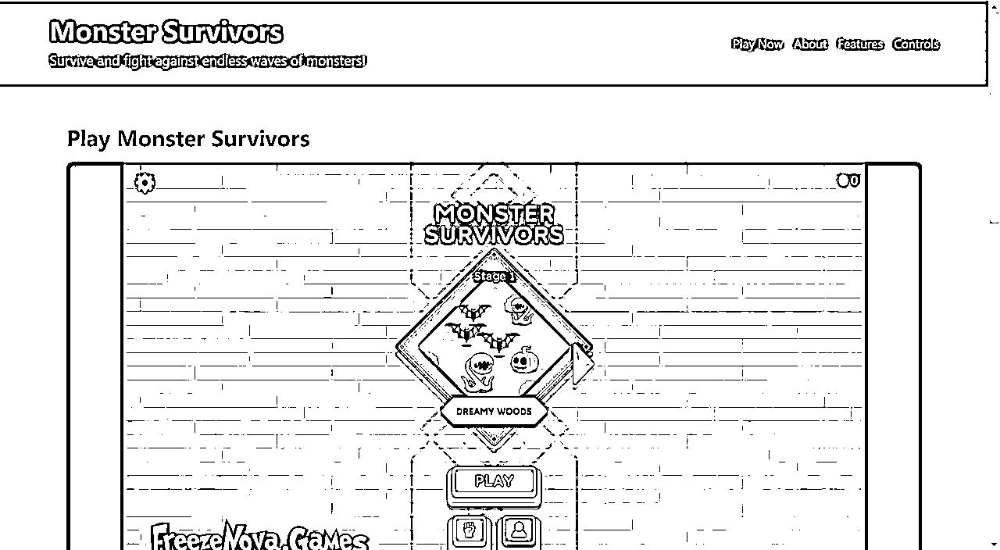
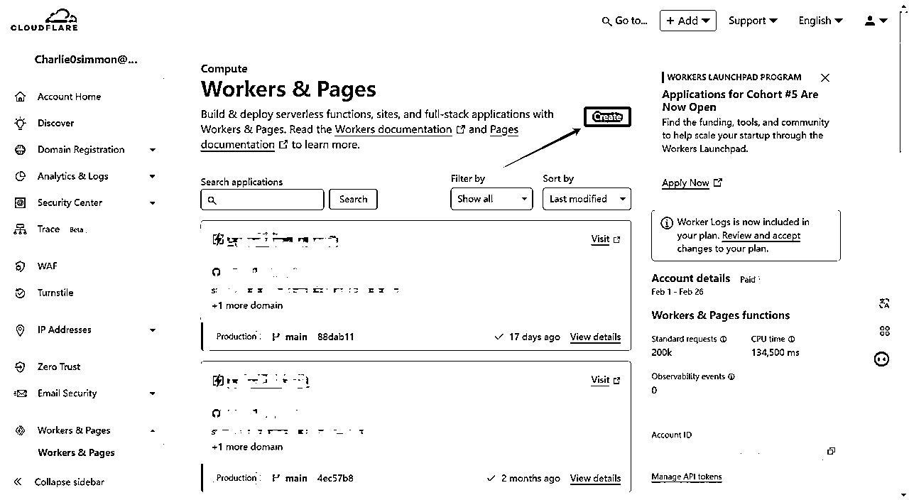
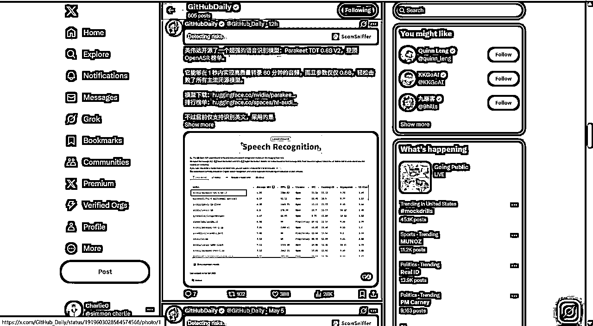
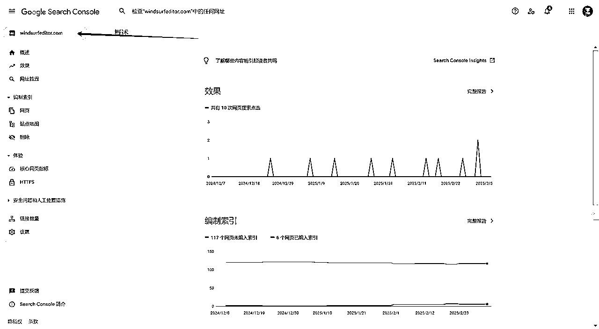
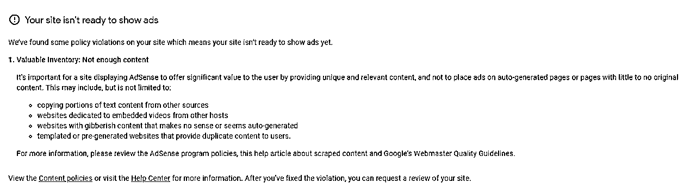
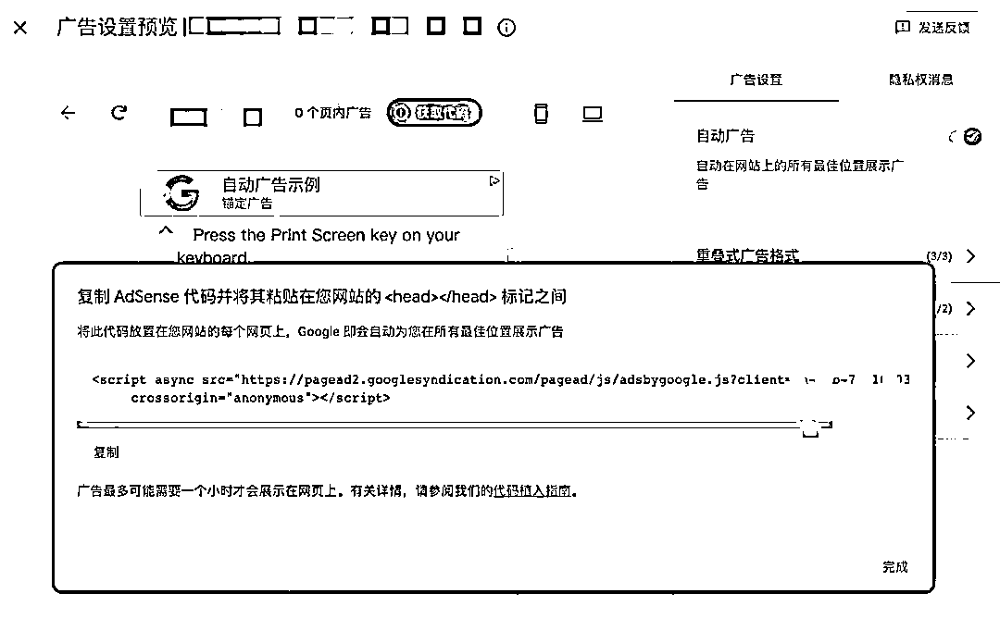
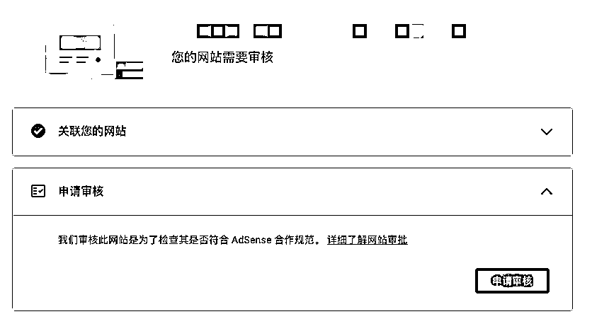

# AI 应用丨游戏站丨实战手册丨2025年9月航海

> 来源：[https://ocn93f5d9olj.feishu.cn/docx/VbCzdLMCeoRhyYxCpiSck0Fqnbb](https://ocn93f5d9olj.feishu.cn/docx/VbCzdLMCeoRhyYxCpiSck0Fqnbb)

1.  为什么要用 AI 做游戏站

AI WEB 赚钱的道路其实很多种，无论是走产品方法论，还是技术性 SEO 方法论，都有大量成功案例。游戏站是我走出来的路，Adsense（谷歌的一个广告合作平台） 是相对省心且容易但低效的变现方式。这条路门槛低见效快适合新手。

程序员强于外功（代码编程），产品经理优于内功（需求洞察），而普通人则适合从游戏站开始练手。程序员和产品经理推荐去做 AI SaaS 网站，因为能够更好发挥自己的产品和编程优势。而双非普通人更适合拿游戏站练手，可以说只要你做几十个网站，Adsense 必然能赚几十美金，抓到一波机会就是几百到几千美金，甚至可能是每个月都有的躺赚睡后收益。

开头先放几个案例吧：


你能想象这是一个月几万刀的 html 游戏站网站的收益吗？

我去年也是如此持续上站拿到类似月百万访客的游戏站


新词新站的赚钱效应也如此巨大 grow a garden caculator 系列如今第一名五百万月访客广告收益至少五万美金），时间是如此之短，也就不到一个季度但是赚取了全年的利润。

上期航海的阳明，就已经靠游戏站日入三百刀，靠的就是一个他人不知的新词。


案例是吸引大家眼球的，鼓励大家继续做下去，给予信心决心和勇气。但是我深知，真的能做出来的如此大成绩的寥寥无几，这本身就是二八定律。因为真正肯花很多时间很用心去做的本身就不多。

1.  网站的基本组成

# 1\. 本章概要

本章概要：

本章主要介绍了网站建设的基础知识体系和AI辅助开发的实操方法，

为零基础用户构建完整的建站技能框架。

第一部分：网站基础架构

三大组成：域名（唯一地址标识）、服务器（代码托管平台）、代码（功能实现核心）

网页类型：静态网页适合新手入门，动态网页功能丰富但复杂度更高

语言分工：HTML构建结构、CSS控制样式、JavaScript实现交互

第二部分：AI工具配置

编程工具：Claude Code、Augment、Cursor

原型工具：v0、Lovable、bolt.new

语言模型：Claude、GPT、Gemini配合使用

第三部分：AI编程实践

需求表达：口语化描述与结构化提示词并用

代码测试：HTML可直接浏览器预览，复杂项目依赖AI调试

错误处理：提供完整报错信息+期望结果+现有代码给AI分析

核心理念： 通过快速上线网站积累实战经验，实践驱动学习进步。

本章航线图

完成本章节的学习和实操，即可完成航线图的：

第一阶段：基础入门与准备（约2天）

1.  理解AI游戏站项目思路，掌握网站三要素（域名、服务器、代码）（约1天）

1.  配置AI工具（Claude/ChatGPT），完成Hello World测试（约1天）

1.  域名（Domain）：什么是域名、在哪购买？

域名就是大家口中的网站，baidu.com 就是百度的域名，这是你网站的外部入口。

想一想，人家得知道你的地址才能找到你吧？

域名就是全球唯一的，通过这个名字能找到你，也只能找到你的“地址”。

我推荐你上 cf（Cloudflare） 上去购买，市面上有很多家卖域名的，

cf 的对于开发网站最方便。域名可以在你的网站实现之后，再来购买不急。

1.  服务器（Hosting）：什么是云端部署、常见免费部署平台

服务器就是放你运行的代码的地方。你自己家有地址，但是也得有对应的房子对吧。

现在有很多的免费的地方给你部署代码（即托管网站），像是 Vercel，Cloudflare，Netlify 等等。

大多数平台的部署步骤都很相似：

.

注册一个账号

.

上传网站文件，或关联 GitHub 仓库

.

一键部署后即可获得访问网址

.

如果有自定义域名，还能在平台后台中进行绑定

1.  代码（Code）：网站最核心的“灵魂”，静态网页/动态网页的区别

网站最终是什么样子、有哪些交互，都是由代码决定的。可以把它想成菜谱，决定了你做出的美食味道。

静态网页：

所有人看到的都是同样的内容，就像已经印刷好的报纸

优点是速度快、相对安全、部署方式简单、成本低

适合做个人博客、作品集或公司官网

动态网页：

能根据用户不同的操作或登录状态来改变内容，就像聊天软件时刻更新

优点是功能丰富，可实现登录、评论、购物车等

缺点是需要数据库和后端支持，开发相对复杂

适合电商、社交媒体等需要用户系统的网站

如果你是第一次做网站，可以先从静态网站上手，等你熟悉流程后，再来尝试动态功能。

1.  编程语言基础科普

1.  HTML / CSS / JavaScript

你可以把一个网页想象成一个人：

HTML 相当于“骨架”，决定页面上有什么元素（标题、段落、图片、链接、按钮等）。核心概念包括“标签”、“属性”以及“嵌套”。

CSS 相当于“外表”，决定这些元素如何排版、配色、调整大小和字体等。它的核心是“选择器”“属性”“值”等概念。

JavaScript 相当于“大脑”，让页面可以交互和动态响应，比如点击按钮后出现提示、填写表单时进行验证、播放动画等。

1.  前端与后端的简单区分

前端：用户在浏览器里能看到和操作的部分，包括页面布局、视觉效果和交互逻辑。主要用到 HTML、CSS、JavaScript，就像餐厅的大堂和菜单。

后端：网站在服务器上运行的部分，用来处理数据存储、用户认证以及业务逻辑。常见语言有 PHP、Python、Node.js 等，就像餐厅的厨房和仓库。

1.  AI 工具安装

目前主流使用的就是 Claude Code / Augment / Cursor 这些 AI 编程工具。

任何工具都是越用越熟悉的，重点是尽快进入上站的过程中，即用 AI 编写任何你想要做的网站代码，然后购买域名部署上线，新人早点熟悉这套流程就能慢慢沿着这条路走下去。

装完工具可能你并不会怎么用，但是看到自己的网站上线，就可能会常打开看看并且去优化老网站或者不断上线新网站。

1.  编程工具：Claude Code / Augment / Cursor

Claude Code：具体可以查看本期其他的航海手册《Claude Code 编程指南》

Augment：目前圈内普遍反馈 Augment 比 Cursor 好用，这个也可以看看@林悦己 这篇 Augment 安装指南。

官网链接：https://www.augmentcode.com/

Cursor：Cursor 详细版安装可参考两位圈友 @Time @熊猫 Jay 分享 Cursor 的基础教程：

《0 代码 AI 编程重塑你的编程体验：Cursor 使用教程》、

《AI 编程：Cursor 来了，你没理由说不会写代码了》。

1.  Claude / ChatGPT / Gemini：如何与大语言模型高效对话，提出精准的编程需求

一句话简单理解区别：Claude Opus 4.1、GPT5、Gemini 2.5 Pro 都是目前代码能力很强的模型。

如没办法自行注册可以直接在淘宝使用共享/独享成品号即可。

获取渠道没那么重要，尽快使用上这个世界上成本最低智慧最高的 AI 工具模型更重要。

1.  其他 AI 工具：v0、Lovable、bolt.new 等

一句话简单理解区别：

v0 适合把自然语言快速生成 React/Next.js 的高质量 UI 与代码，方便在现有前端项目中落地；

Lovable 更偏全栈一体化平台，从写码、调试到一键发布并支持自定义域名；

bolt.new 基于浏览器的即时开发环境，可从对话直接生成、运行并在线预览/托管原型。

上述使用邮箱登录即可使用有免费次数使用。

结合刘小排的这篇帖子食用更佳：

5 分钟做个网站，人人都能学会

视频版本：不懂编程，1 分钟让 AI 做一个星座运势网站

1.  本地环境配置（Node.js、npm、Git 的简单安装）

一句话简单理解区别：

.

Node.js：Node.js 就像是一个专门用来“播放” JavaScript 代码的工具。以前我们通常只能在浏览器里运行 JavaScript，而有了 Node.js，你的电脑就能直接执行 JavaScript 程序。

.

npm：装软件的"应用商店"，帮你下载别人写好的代码模块，不用自己重新造轮子。

.

Git：代码的"时光机"，记录所有修改历史，出错可回退，多人协作不冲突。

三者关系：Node.js 是环境，

npm 是在 Node 环境中获取工具的方式，

Git 则负责记录代码的变化历史。

我不是程序员，目前还没用过这类，除非是跟 AI 沟通，它让我复制粘贴代码操作过，也不熟悉这些，所以非程序员新人可以不必太过关注，我们只需要尽快上线网站即可。

只有尽快不断地上线网站，才能快速找到需求满足需求，其他工具，环境，模型都只是辅助不可沉迷。

1.  在 AI 工具中进行"Hello World"级别的测试

在 bolt.new 中：

```
创建一个显示'Hello World'的简单网页，有一个按钮，点击后显示'Hello AI World'
```

参考 Prompt:

```
创建一个简单的网页，标题为"我的第一个 AI 网站"，内容包含一个大号文本"Hello World"居中显示，背景为浅蓝色，添加一个按钮，文字为"点击我"，当用户点击时显示一条消息"Hello AI World！"
```


1.  如何让 AI 帮你写/改代码？

如果 AI 始终没办法给到你满意的结果，这个时候可以选择先让 AI 帮你总结一下，再新建会话，重新描述问题所在重新询问 AI 去解决；或者更换大模型，比如 Gemini 2.5 Pro、Claude 4， ChatGPT， Deepseek，相互参考让 AI 们尝试去解决。

1.  给 AI 写需求时的提示词要点

口语化提示词：不要给自己设限，你想要做什么，就写什么，哪怕是杂乱无章前后矛盾的话语，在你跟 AI 不断交互的过程中，自己的想法都会逐渐清晰起来，在不断的总结过程中，提示词也会越来越全面结构清晰

结构化提示词：有圈友也很喜欢用格式规则的提示词，这种包含技术架构，背景角色，目标输出等，熟练掌握一套自己总结出来的提示词有助于提高跟 AI 沟通的效率。

1.  针对 AI 给出的代码，如何在本地进行简单测试

针对 HTML 类型的代码，可以直接在浏览器打开查看网页内容和源代码，推荐用 Notepad++这种轻量化的富文本编辑器即可修改，或者直接在 GitHub.com 仓库的代码文件修改。

针对 Next.JS 等包含后端和多组件的代码，这种我其实很少在本地调试，没有编程基础总会搞错，只能依赖 AI 不断截图和询问，复制它给出的代码做测试。

1.  遇到报错如何让 AI 做出针对性修复

首先你要有一份不断完善的网站地图，这个作为背景信息提供给 AI，且不时需要给到 AI 二次矫正，

其次是在遇到错误的时候，截图具体错误的内容，如有错误文字代码也一并复制粘贴发给 AI，描述给 AI 你遇到的具体问题，即：期望达成的结果+当前的错误信息+已经做的事情（包含具体代码）

最后你让 AI 总结所有可能导致该错误的原因，然后逐一给到解决办法并实际测试，通过这种方式可以解决大部分问题，只有非常复杂的，提问者遗漏掉的一些代码知识的问题才可能难以解决，此时就可以发在航海群里面给到各位技术大牛来解决。

上述提到的 Cursor、Windsurf、bolt.new 等工具，本质上均基于 Claude 4、GPT 等大语言模型接口实现。因此，在初期使用阶段，直接使用 Claude 官方平台与使用这些软件的效果差别不大，以下的案例同样可以直接在 Claude 官方平台完成。当然，如果您更熟悉或偏好于上述工具，也可灵活使用

1.  什么是游戏站及如何变现

# 1\. 本章概要

本章概要：

游戏站是汇集网页游戏的平台，核心优势：

无需开发技术 - 只需聚合现有 HTML5 游戏

用户粘性高 - 游戏天然具有娱乐性

更新成本低 - 只需定期添加新游戏

变现渠道以 Google AdSense 为主，通过在游戏页面展示广告获取收入。

实战步骤：

准备域名、托管平台

用 AI 写代码

上传到 Github

在 Cloudflare 绑定域名并托管

本章航线图

完成本章节的学习和实操，即可完成航线图的：

第二阶段：上线你的第一个游戏站（约 3 天）

1.  购买域名，用AI生成单页游戏站HTML代码（约1天）

1.  上传代码至GitHub，在Cloudflare完成部署（约1天）

1.  绑定域名，配置SSL，确保网站正常访问（约1天）

# 2\. 什么是游戏站及如何变现

# 2.1 游戏站的定义及变现

我们并不是要开发游戏，而是找到一些可能会火的新游戏名字，以此来建立新网站获取流量。

互联网上存在非常多的网站，提供给你现成的游戏，你可以直接拿来就用即可。

怎么拿来？核心关键词就是 Iframe：

iframe 的功能是让你在一个网页中嵌入另一个网页或内容。它相当于在当前页面插入一个“窗口”或“框架”，通过这个框架，你可以展示来自不同来源的网页、视频、地图、甚至是在线游戏，而不需要用户跳转到其他页面。这样，你可以在不离开当前网页的情况下，查看和互动其他内容。

这种网站的核心优势在于：

无需开发技术：你不必懂得游戏开发，只需要聚合现有的 HTML5 游戏

用户粘性高：游戏天然具有娱乐性，能吸引用户停留更长时间

更新成本低：只需定期添加新游戏链接即可保持内容新鲜度

游戏站变现渠道：这里主要推荐 AdSense，使用中国境内大陆招商银行储蓄卡，即可绑定入账美元，五万美金以内免人工审核，系统直接入账，只需入账申报系统自动通过，然后美元购汇人民币即可直接提现成人民币。

.

广告收入：接入 Google AdSense 或其他广告联盟，在游戏页面展示广告

.

会员制度：提供无广告体验或独家游戏内容的付费会员服务

.

游戏内购：与游戏开发者合作，分享游戏内购买的收益

.

推广佣金：为其他游戏平台导流，获取推广佣金

.

定制服务：为企业客户提供品牌定制的游戏站服务

# 2.2 如何找网页小游戏并嵌入网站

寻找 HTML5 游戏的来源：

.

开源游戏平台：GitHub 上有大量开源 HTML5 游戏项目

.

游戏发布平台：itch.io、Kongregate 等平台有许多可嵌入的 HTML5 游戏

.

HTML5 游戏开发论坛：在开发者社区寻找愿意分享或授权使用的游戏

嵌入游戏的核心技术——IFRAME：

IFRAME 就像是在你网站上开了一扇"魔法窗户"，让玩家能够在你的网站内直接体验来自其他网站的游戏，而不会感觉自己离开了你的网站，因此也为你的网站获取了用户点击和浏览页面，这些访客流量观看到你网站的 AdSense 广告后就会为你 24 小时不间断地提供收益。

1.  实战上线一个单页小游戏 （重点执行工作）

这是我实际购买的一个域名，按照日常上站操作流程来挨个截图编写的，一部分可能源于个人系统，零代码新人圈友可按步骤跟进，程序员圈友可自行调整。

1.  步骤一：准备工作

域名注册：选择任意一个长名字的域名，我常用的在 spaceship.com 平台，支付宝即可付款，下面章节的截图是以 spaceship.com 为例注册域名，你也可以在 Cloudflare 注册，需要外币信用卡支付

网站托管：用户访问代码形成的网页，需要在网站托管平台上，推荐 Cloudflare.com

代码托管：网站相关的所有代码默认都是放在 Github.com 上面

以上 Cloudflare.com 和 github.com 这两个平台账户，请先用同一个邮箱注册下来

注意事项：

前期减少对网站域名的纠结，任意可注册长名字就可练手

域名可以使用".online "后缀，第一年很便宜，其他任何后缀都行


1.  步骤二：AI 写出来单页网站代码

请复制以下 Prompt 发给 Claude（最推荐）或者 ChatGPT，可以自行注册这个游戏关键词的其他后缀作为自己的网站，然后修改第一个划线的域名即可。

（你可以任意更换其中的任何内容，做出优化，修改，测试。修改的越多，实践出真知的越多）

```
你是一位精通谷歌 SEO 和 HTML&TAIlwind 语法的十年全栈工程师
我要做的网站域名是 MonsterSurvivors.com ，游戏名字即关键词是 Monster Survivors，在线游戏的 iframe 地址是 https://cloud.onlinegames.io/games/2025/unity/monster-survivors/index-og.html
请帮我输出一个完整版的 HTML 和 CSS 代码，游戏标题，一句话介绍，在线游戏的 IFRAME 内容，游戏基本情况叙述，
要求这个网站在 PC 和移动端适配性良好，配色采用苹果典型色系，包含一个一级 H1 标签和多个 H2 标签，有 canonical url，网站语言是地道英文
```




如下就是 Claude 给出的 HTML 代码，下载到本地浏览器双击即可打开


monster-survivors-website.html

```

    Monster Survivors - Fight Endless Waves of Monsters

# Monster Survivors

Survive and fight against endless waves of monsters!

*   [Play Now](#game)

*   [About](#about)

*   [Features](#features)

*   [Controls](#controls)

## Play Monster Survivors

[https://cloud.onlinegames.io/games/2025/unity/monster-survivors/index-og.html](https://cloud.onlinegames.io/games/2025/unity/monster-survivors/index-og.html)

## About Monster Survivors

Monster Survivors is an action-packed roguelike survival game where you must fight against endless waves of monsters. Each run is unique, with random enemy spawns, power-ups, and challenges to overcome.

Inspired by games like Vampire Survivors, this game combines fast-paced action with strategic character building. How long can you survive as the difficulty continuously increases?

## Game Features

### Multiple Characters

Choose from various characters, each with unique starting weapons and abilities.

### Weapon Evolution

Combine weapons and passive items to create powerful evolved weapons with special effects.

### Level Up System

Gain experience by defeating enemies and level up to choose new weapons or upgrades.

### Boss Battles

Face off against massive boss monsters that appear at specific time intervals.

### Treasure Chests

Find and open treasure chests to receive random items, gold, or special power-ups.

### Daily Challenges

Complete daily challenges to earn rewards and climb the global leaderboard.

## Game Controls

### Keyboard Controls

*   WASD or Arrow Keys: Move your character

*   Space: Pause the game

*   E or Enter: Select/Confirm

*   Esc: Back/Menu

### Mobile Controls

*   Virtual Joystick: Appears on the left side of the screen for movement

*   Tap Buttons: Menu and action buttons on the right side

*   Swipe: Navigate menus and selection screens

© 2025 Monster Survivors. All rights reserved.

                    [Privacy Policy](#)
                    [Terms of Service](#)
                    [Contact](#)

```


1.  步骤三：上传代码，绑定域名，托管网站

# 3.1 注册域名 www.spaceship.com

我选择的就是 monstersurvivors.com

搜索关键词注册域名截图


# 3.2 github.com 新建仓库，把代码传上去，可以是拖拽文件，也可以是新建文件复制粘贴代码

新建仓库截图

上传代码文件截图 1


上传代码文件截图 2

上传代码文件截图 3

上传代码文件截图 4 很重要 代码文件重命名为 index.html


# 3.3 在 Cloudflare.com 绑定域名后托管网站，登录后进入的网址是控制台的子域名网址 https://dash.Cloudflare.com/

登录截图


绑定域名截图 1


绑定域名截图 2


绑定域名截图 3 选择 FREE 套餐

绑定域名截图 4，这里 ns 解析相关是全部删除，截图 com 示例是 2 个 A 类型，online 有 4 个，都删


绑定域名截图 5 - 复制这两个代码

到 spaceship.com 里面刚注册的域名下面粘贴过去

（快捷地址直达链接：https://www.spaceship.com/application/domain-list-application/）

casey.ns.cloudflare.com

jillian.ns.cloudflare.com

这里是随机生成了两个子域名，每个人使用自己的就行


绑定域名截图 6


绑定域名截图 7


绑定域名截图 8


绑定域名截图 9


绑定域名截图 10


等待 Cloudflare 那边同步，大概需要十分钟，所以这个动作我一般在注册完域名就执行


# 3.4 把 github.com 上面托管的代码文件放在 Cloudflare.com 上面这样就可以访问购买的域名啦

托管网站截图 1


托管网站截图 2



托管网站截图 3

托管网站截图 4


托管网站截图 5


托管网站截图 6


托管网站截图 7


托管网站截图 8 等待界面变为这个状态


托管网站截图 9


托管网站截图 10


托管网站截图 11

托管网站截图 12


托管网站截图 13

托管网站截图 14


托管网站截图 15


托管网站截图 16 接下来就是等等两分钟左右


托管网站截图 17 接下来就是等等两分钟左右 刷新一下网页就变成了 Active


托管网站截图 18 很重要 打开已经绑定的域名 找到 SSL/TLS 按钮 （此处请注意，要先找到你已经绑定的域名，在账户主页 account home 即可看到已经绑定的域名，不然你找不到 SSL/TLS 入口，你也可以通过搜索 SSL 找到这个入口）

托管网站截图 19 点击 Configure


托管网站截图 20 选择 FULL 的模式

托管网站截图 21 点击保存


点击刚购买配置的域名 monstersurvivors.com ，就可以访问 AI 写给你的代码文件啦，你想怎么修改代码，都可以交给 AI，复制粘贴修改完成代码后网页就自动修改完成啦 （耗时几分钟左右，取决于代码文件大小）

1.  进阶：同时上线多个网页的游戏站

在上一章节中，我们已经成功地上线了一个单页小游戏，并了解了从域名购买、托管到配置的全过程。然而，如果你想要真正做大做强，为网站带来稳定且可持续的流量，就需要考虑上线更多网页、更多游戏，从而形成一个规模化的游戏站。以下内容将结合我们在前面章节中的方式，进一步阐述如何构建多页面游戏站，包括核心结构规划、批量添加游戏的思路，以及如何为用户提供更丰富的互动功能。

1.  网站结构规划与分类设计

当你决定将单页小游戏扩展为多页面游戏站，网站结构将变得非常重要。一个合理、清晰的结构能帮助玩家快速找到自己想玩的游戏，亦能帮助搜索引擎更好地理解你的网站。你可以从以下几个方面着手：

游戏分类与归纳

不同类型或风格的游戏往往吸引不同的受众。你可以根据游戏类型（例如动作、射击、益智、策略、体育等）或游戏主题（例如恐怖、二次元、像素风等）进行划分。

建议在网站首页或主菜单栏放置“游戏分类”的入口，让玩家可以按兴趣选择。

导航与菜单设计

在页面顶部设置一个全局导航菜单，列出主要分类或频道。

为提升用户体验，请在首页放置搜索框，以便用户能够直接搜索感兴趣的游戏名称或关键字。

数据库或页面管理

如果你使用 WordPress 或其他 CMS，可以建立“游戏”这样一个自定义文章类型（Custom Post Type），每篇文章对应一个游戏的介绍、截图、IFrame 嵌入等。

如果你使用静态网站生成器或手写 HTML，可以考虑将不同类型的游戏分目录保存，并确保文件名、URL 结构具备可读性和层次感。

通过以上规划，能够让每个新游戏都拥有一条简洁美观的 URL 路径，这不仅利于玩家快速分享链接，也有助于搜索引擎收录和排名。


1.  批量添加游戏：模板化与自动化思路

在多页面游戏站中，“批量添加游戏”往往是最耗时的步骤。如果每添加一款游戏都需要手动写 HTML，并且修改样式、介绍、图片等内容，工作量将极为庞大，也容易产生重复性错误。以下提供一些实用的思路：

通用模板页面

可以先设计好一个通用的游戏页面模板，例如：

标题（H1）

游戏简介或一句话描述

IFrame 容器

游戏控制说明、玩法提示等

新增游戏时，只需要复制此模板，然后修改对应的几个要素（例如游戏名、IFrame 链接、缩略图）。这样能显著减少重复劳动。

IFrame 嵌入标准化

给 IFrame 统一设置宽度和高度，或使用自适应（responsive）写法，保证在移动端也能良好呈现。

例子：可以统一用一个 CSS 类，如 .game-iframe { width: 100%; height: 600px; } 等，让嵌入的游戏保持一致的布局风格。

自动化脚本

如果你有一些编程基础，可以用简单的脚本（Python、Node.js 等）读取游戏的名称、描述、IFrame URL 等信息，然后自动生成对应的 HTML 文件。

如果你使用 CMS，如 WordPress，则可以通过导入 CSV 文件或借助插件批量创建游戏文章，大幅提升效率。

总之，使用模板化或自动化手段，可以让你在最短时间内上线尽可能多的游戏内容，为网站吸引更多元化的用户群体。


1.  丰富每个游戏页面的内容

在为每款游戏创建页面时，除了简单的 IFrame 嵌入外，还可以考虑添加以下内容，以便吸引和留住更多用户：

游戏亮点及玩法介绍

用几句话概括游戏的主要特色，以及如何开始游戏。

对于操作较复杂的游戏，可以用简短的文字或图示，指示玩家如何移动、射击、躲避等。

游戏截图与预览

在游戏加载之前，提供一张或多张截图，让玩家对内容有初步了解。

截图不仅能吸引点击，在社交媒体上分享时也能作为预览图展示。

攻略、技巧或开发者介绍

如果游戏比较热门或内容深度足够，可以写一篇简短的攻略。

若游戏有特别的背景或开发者故事，也可以做一个小版块，满足玩家的好奇心。

相关推荐或“你可能喜欢的游戏”

当玩家玩完本页面的游戏后，很可能还想玩同类型的其他游戏，这时通过链接到同类型的其他游戏页面，可以提升用户黏性和页面浏览量。

1.  用户互动与社区功能

一个成功的游戏站不仅仅是提供游戏本身，也要让玩家感觉到他们能够与社区互动。你可以考虑：

玩家评分和评论系统

为每个游戏添加打分功能，玩家可以给出“喜欢”或“五星评分”；

评论区方便玩家分享体验或提问。如果有人遇到卡关或对游戏有好奇心，通过评论就能实现交流。

热度排行和最新游戏

网站首页或侧边栏可以放置“最受欢迎游戏 TOP 5”或“本周新上架游戏”，用数据或更新时间进行自动或人工排序。

这种排行榜形式往往能在用户中产生“点击循环”，显著提升平均访问时长和访问深度。

社交分享按钮

在游戏页面放置一键分享至 Twitter、Facebook、Reddit 等社交平台的按钮。

社交口碑是游戏站吸引新用户的绝佳途径，好的游戏往往被迅速传播。

1.  多页面游戏站的优化与推广

当你的游戏网站具备了较为完善的结构与内容，下一步就要让更多人知道并访问它。这时，你需要综合运用 SEO 优化手段、社交媒体推广以及数据分析，不断迭代和调整，才能让网站持续增长。

1.  搜索引擎优化（SEO）提升

合理安排网站层级与 URL

搜索引擎更偏爱清晰的导航和结构。确保分类目录、URL 命名都具备良好的可读性。

注意给每个游戏页面设置合适的标题（title）、描述（meta description），并在页面内使用恰当的文本描述游戏。

撰写高质量的游戏内容与元信息

除了 IFrame，本身的页面文字也非常重要。

给每个游戏撰写独特的介绍和亮点，而不是复制粘贴官方简介或其他网站的内容；有助于搜索引擎认为你的网站“内容原创度”较高，提升收录与排名。

提高加载速度，优化移动端

游戏站往往有较多的图片与动态加载内容，如果加载缓慢会影响用户体验。

建议做好图片压缩、开启缓存，或使用 CDN 加速等措施，并在移动端保持简洁的游戏页面布局。

站点地图与收录

可以生成并提交 XML 站点地图给 Google Search Console，从而让搜索引擎第一时间发现你的每个游戏页面。

定期查看搜索引擎对你站点的收录情况和错误报告，及时修复 404 或重复页面。


1.  综合推广与流量获取

社交媒体及视频平台

选取几款人气或特色游戏，拍摄简单的演示视频，上传到 YouTube 或 TikTok，附上你网站的链接，诱导观众前来体验。

在 Twitter、Facebook 等平台定期分享新上架的游戏，积极与玩家互动。

内容营销与玩家社区

通过撰写游戏攻略、游戏排行榜、甚至游戏行业新闻等内容，建立网站的专业形象，吸引玩家持续关注。

你也可以在 Reddit、游戏论坛等玩家社群中适度推广，但需避免明显的广告式发帖，尝试以提供有价值内容（攻略、心得、经验）来吸引自然流量。

外链建设

观察类似的游戏网站或玩家博客，他们通常可能会评测或推荐一些在线小游戏。与这些博主、博主社区建立联系，争取获得外部链接到你的游戏站。

此外，可以与相关行业的网站（例如游戏周边、硬件评测等）做一些合作，拓展更多流量来源。


1.  小结

小游戏网站做好了，接下来怎么办。

如果你很看好这个网站，而且初期也有一些流量，那么可以继续尝试发外链加内容页。

但是大部分情况下，我都建议，继续做下一个网站。

正如刘小排老师所说的，打无记忆的牌，下一个站再来。

一直反复有什么意义呢？

意义就在开头所说的，在不停的上站过程中，去挖掘需求和验证需求。

自嗨是没有用的，埋头做网站不管是研究技术还是想做好看，都对赚钱无意义。

只有验证到需求了，网站有自然流量增长，那么推广和优化才是正向飞轮。

1.  关键词的核心分类：新词、老词、热词

# 1\. 本章概要

本章概要：

通过新词热词快速获取游戏站流量的方法论。

关键词分类：

新词vs老词、热词vs冷词、种子词vs长尾词

核心策略：新词+热词组合是供不应求的最佳机会

重点关注一周内新出现且搜索量持续上升的关键词

实战找词：

监控源头：AI大V、游戏平台、Hugging Face、Replicate等

积累种子词：generator、maker、creator、calculator等高频词根

游戏领域每季度有新词，年度有百万级机会

判断标准：

Google Trends 验证7-30天持续上涨

搜索结果无图片、无大站、无人上线

相关域名可注册

掌握方法论，在新词爆发初期快速占位，抓住流量红利。

本章航线图

完成本章节的学习和实操，即可完成航线图的：

第三阶段：掌握流量密码（约 3 天）

1.  学习新词热词判断标准，掌握Google Trends使用（约1天）

1.  实践找词方法：监控AI大V、游戏平台、积累种子词（约2天）

# 2\. 词和需求的分类体系

以下是我个人实践总结的分类体系，大家可以批判吸收：

我自己把关键词分为新词和老词，热词和冷词，种子词和长尾词。

我更喜欢的是新词热词，这在游戏站当中尤为有效。

种子词和长尾词更多是对需求的分类，在 SaaS 当中做一些长尾词更容易拿到流量，竞争相对不大但是需求和场景都很明确。

1.  新词和热词的顺序问题

之前未曾出现的是新词。

最近火起来的是热词。

这两个结合起来，才是短期内供不应求的我们的机会，也就是刘小排老师所说的赚钱，你需要做到 first one。

1.  游戏词 vs 需求词

游戏词很简单，大部分都是跟游戏站相关的。

我往期航海直播讲了一些行之有效的方法：去找一些月访客过百万甚至千万的网站，留住名字作为种子词根，不断去谷歌趋势里面搜索找到新兴相关热搜词。

需求词我觉得更多是 AI SaaS，一个很简单的方法：用 aitdk 或者 similarweb 去查看他们的搜索关键词，大部分都是需求词。

需求词一般分为信息类和功能类，前者导航或者问 AI 都可以获取，商业价值不大；后者需要做一些功能，尤其是 AI 类用户付费欲望强烈。

# 02 如何发现有潜力的新词与热词

1.  手动选词方法论

方法论是钓鱼方法，是赶海地点；能否找到好词，更快更优质，取决于你的判断和勤奋。

# 1.1 关注一些大 V

尤其是 AI 类科技领域，非常多自媒体会极快速地追热点，这些热点事件大部分会有一些新词。

往期航海列过一些推特大 V，我之前也做过一份 list：https://x.com/i/lists/1832612027065626743

微信公众号的也有不少，比如小互，歸藏，橘子等，大家可以自行挖掘关注。

# 1.2 积累种子词

哥飞公众号分享过 51 个种子关键词，包括但不限于 generator、maker、creator、calculator...

你也可以通过 AI 大批量生成类似的，基本原理就是高频出现的种子关键词。

别人给你的公开的基本上都很卷，一堆人都天天盯着看了，新手比较难抓到机会，最好的办法是积累只属于自己的种子关键词。

# 1.3 大平台监控

我在上期航海直播时展开讲解操作演示过，具体来说就是搜索和积累一些游戏和 AI 平台。

比如 Hugging Face、Replicate、itch.io、Crazy Games...

你直接谷歌搜索 game platform / ai model platform 等类似的关键词，寻找月访客在千万级别的平台即可。

还是那句话，最好积累独属于自己的平台关键词，通过 AI 获取更多平台搜索关键词。

你也可以进入大平台，每天看看有什么新增内容，刚开始眼花缭乱，看多了就很熟悉了。

1.  常用判断工具

# A. Google Trends

https://trends.google.com/trends/explore

# B. 域名查询工具

query.domains

domaintraffic.org

instantdomainsearch.com

# C. Google Search

google.com

最基础的工具即可，也有很多小工具，包括但不限于群友开发的谷歌插件和 SaaS 网站等，大家可自行探索，有些可能不稳定或者已经下线，这里暂不做推荐。我日常用这几个是最多的。

1.  判断是否值得做的三个标准

更多判断和决策是你自己需要做的，他人无法替代，因为更多的代码技术和上站水平因人而异。

# 谷歌趋势判断

Q：趋势是否陆续上涨？

A：是，则做

Q：七天和 30 天内是否陆续上涨？

A：是，则做

Q：9 个月和五年内是否没什么搜索量？

A：是，则做

# 搜索结果判断

Q：谷歌搜索结果有没有图片？

A：有，则不做

Q：有没有其他大网站？

A：有，则不做

Q：有没有已经人上线？

A：有，则不做

# 域名注册判断

Q：有没有域名已经被注册的呢？域名被注册的多不多？

A：多则不做，少则做

# 03 游戏站关键词的实战挖掘技巧

1.  找词案例分享

刚好我为本次航海写手册的时候找到了一个新词，路径是通过大 V 发的内容来找到的。如下十张截图是大概信息，不按顺序全部放这里可以看一下。




1.  真实数据案例

给大家两个对应的我的真实数据。这些全部是只靠谷歌 SEO 来的流量。


这是八月初的一个站，第一天的GSC即谷歌自然SEO点击数从100个到9k到35k，如果挂adsense收益几百刀吧


新词新站尤其是游戏站的广告收益相对高一些，但是 top1 一般会三五倍于 top2-top5。

谷歌搜索来的自然量收益天花板一般在十万刀/月左右，高级玩法是配合导流投流理论上没有上限，但是为了资金安全一般控制在五百万美金以内，毕竟还有广告投放和各种 app/人员成本。

1.  选词经验总结

老词我去年一般不做，因为需要更久才能获取流量，除非看到很好的机会。但是今年重点做老词，尤其是红海的关键词，因为需求更大付费更多，认真踏实做长期来看总能捞到一些甚至几万到几十万刀。

老词做老站需要极大的耐心，一般三五个月起步，除非你做广告投放和网红营销非常好。

新词做新站则是个博概率的事情，所以去年我都不判断，也都建议新人不要挑，多上站即是啦。

因为极少有人相信，所以这给我们这些实践者们一些赚钱的机会。

但是今年我也开始眼高手低了，ghibli 我嫌弃它印度地区流量垃圾便宜，但是有人也做到了两三百万的 SaaS 月访客；grow a garden 系列我觉得做的人好多啊，哪还有我的份，但是八月初随手做了个发现还是真香。

因此选词对于新手来说并没有秘籍，因为你没有任何认知和经验。

做多了，才发现出来自己的偏好和优势，尽管你会错过一些，但是你知道自己真的要什么。

赚钱的词，不是想和挑的，是做出来的。

我也没有什么秘籍，都是苦功夫。

# 04 上站基本功与注意事项

1.  上站基本功很重要

外功是 SEO 和代码 bug，内功是需求洞察带来的 UI/UX 用户付费意愿和转化率。

24 年我上一个站两三天后才有人跟进；如今我看到一个新词，两三个小时后缀就被抢完了。

但是很可惜，竞争还不够充分，很多人瞎买域名不上站浪费钱。

满级大佬屠杀新手村，是诸如阳明这种第一天上站第二天出单而且全过程记录都在航海群里面发布。

新手小白来受虐，是仅仅买了个域名在那折腾配色代码技术栈服务器，网站打不开没有上内页没有加外链。

几乎所有的赚钱秘籍都是公开的。

1.  为什么还是很多人没有赚到钱

为什么还是很多人哪怕加入了生财有术没有赚到钱呢？

因为没有一个劲儿地执行同一个方向变身一道激光聚焦。

这些道理我也很早就懂和读到，但是直到今天我才融会贯通。

只有上站才能赚钱，赚钱只能靠自己，只有自己才知道是否上心。

不要怕基础很薄弱很差，我到现在 Next.js 代码都一头雾水还很头疼，但是每次都在迭代式上站，务必搞懂每一个小细节，尽可能通读所有的官方文档，尽可能把圈友分享的经验贴多看几遍，我到现在都是如此。

1.  给新手的建议

我也是愚钝的，悟性很慢，做得很差。但是我曾做到过并且也可以复制还见到了他人也取得不错的成绩。

我相信你也能，所有的我都知无不言言无不尽有所问必有所答。

不要放弃。不要放弃。不要放弃。

希望你们尽快走出来属于自己的道路。

1.  【⭐️实操视频】完整上站流程实战

# 1\. 本章概要

# 本章概要：

本章详解建站的全流程。

建站流程：购买域名→搜集信息→用 AI 写代码→GitHub 托管→部署上线。

推荐 HTML+Cloudflare Pages 的简单组合，避免同质化模板，每个细节都要用心优化。

数据监控：配置 Google Search Console 监控搜索表现，

设置 Google Analytics 分析用户行为，建立定期更新机制保持网站活跃度。

掌握这套方法论，你就能批量构建获得自然流量的网站，实现从购买域名到上站。

# 本章航线图

完成本章节的学习和实操，即可完成航线图的：

第三阶段：掌握流量密码（约3天）

1.  完整上站流程复盘，配置GSC和GA数据监控（约1天）

# 2\. 实操视频

上站流程.mp4【在线播放】

1.  上站全流程

最近因为大量的出海人员开始极度关注新词新站，市场开始相对恶化，表现为非常多人只注册域名但是不上网站，这是一个浪费钱浪费机会的操作；有些组织做了一些批量上站的平台/模板，导致大部分网站都非常同质化，几乎只有文案不同，颜色布局结构几乎完全一模一样。

理论上谷歌并不会对模板网站进行惩罚，但是这种观感对消费者并不友好，一些新手甚至不知情不懂，完全原封不动照搬照抄，事实上这是不会拿到任何流量的，只会浪费你的时间精力。

最好的情况是，我们拿到别人的模板进行大幅度修改，或者完全依靠 AI 从零到一写一份自己的模板，后面自己批量上站时只需要小修小补稍作修改即可。

我过去一两百个网站是有几十个套模板上站，事实证明确实并没有拿到多大流量，真正能够拿到流量的网站，在每一个细节都做得很好。

# Step1：购买域名

我一般使用 Spaceship，算是最便宜的域名注册商。

# Step2：搜集信息

理论上你可以让 AI 帮你搜索，但是 AI 可能会遗漏，

所以最好是我们自行搜索，查看结果，

毕竟自己也需要获取关键词下面的网站信息；

其次是自己也可以稍微整理一下信息，

结构化提供给 AI 来构建网站。

# Step3：用 AI 写代码

最开始跟 AI 交互写代码相对来说麻烦一点，

所以鼓励多上站的过程中，

积累自己的网站模板和 AI 写代码经验。

我至今还是习惯 HTML，觉得上站速度比较快，也比较简单。

Next.JS 文件夹结构，我觉得挺麻烦的，至今仍没有完全搞懂，以及需要花费更多的时间去鼓捣网站。

程序员在这方面有优势，我也在上期航海写了详细教程，此处不赘述。

# Step4：代码托管

统一在 https://github.com/

# Step5：部署网站

Next.JS 建议 vercel.com

HTML 建议 Cloudflare 的 pages

这里我用几个截图再次展示一下教程：

# 购买域名 spaceship.com


截图编号 1

# 绑定域名到 cloudflare.com

截图编号 2


截图编号 3


截图编号 4


截图编号 5

# 开始搜集信息喂给 AI

https://venturebeat.com/ai/nvidia-launches-fully-open-source-transcription-ai-model-parakeet-tdt-0-6b-v2-on-hugging-face/

https://developer.nvidia.com/blog/turbocharge-asr-accuracy-and-speed-with-nvidia-nemo-parakeet-tdt/

https://dataloop.ai/library/model/nvidia_parakeet-tdt-11b/

https://www.marktechpost.com/2025/05/05/nvidia-open-sources-parakeet-tdt-0-6b-achieving-a-new-standard-for-automatic-speech-recognition-asr-and-transcribes-an-hour-of-audio-in-one-second/

https://catalog.ngc.nvidia.com/orgs/nvidia/teams/nemo/models/parakeet-tdt_ctc-110m

https://www.reddit.com/r/machinelearningnews/comments/1kfx9so/nvidia_open_sources_parakeet_tdt_06b_achieving_a/


# 喂信息和写 Prompt 发给 AI，建议 Claude 4 或者 Gemini 2.5 Pro

```
你是一位 HTML 大师，我刚买的域名是 parakeettdt.org， 请遵循谷歌 SEO 最佳实践，帮我做好移动版本和网页版本的适配性，围绕核心关键词 PARAKEET TDT，要求首页屏幕即可看到 IFRAME 的功能内容
（iframe 链接是＜iframe
        src="https://nvidia-parakeet-tdt-0-6b-v2.hf.space"
        frameborder="0"
        width="850"
        height="450"
＞＜/iframe＞) 
帮我写一份非常完整的 HTML 文件代码给到我
```

https://huggingface.co/spaces/nvidia/parakeet-tdt-0.6b-v2

这个是模型页面


截图编号 6


截图编号 7


截图编号 8

截图编号 9

# 把代码重命名为 index.html 上传到 github.com

程序员可以自由发挥，我不懂技术，也只能都是靠 AI 写代码，每个人可以在 vercel.com/template 上找到适合自己的模板修改上线，有余力的同学可以自行增加多语言界面，或者把 CSS 和 JS 之类的分开，全程靠 AI 即可


截图编号 10

截图编号 11

截图编号 12

# 部署网站


截图编号 13

截图编号 14


截图编号 15

1.  数据分析与网站调整

1.  GSC 和 GA 的工具介绍

# 1.1 Google Search Console（GSC）监控

这是让谷歌知道你的网站存在的工具，可以帮助你的网站在谷歌搜索中被找到。

https://search.google.com/search-console/about

GSC 可以帮你查看网站的搜索排名、点击量、展示量，以及出现的问题（例如移动端可用性问题、爬虫抓取错误等）。

# 1.2 Google Analytics

https://marketingplatform.google.com/about/analytics/

这是帮你查看有多少人访问了你的网站，以及他们在网站上做了什么的工具。

通过 GA（或其他分析工具）了解网站每日访问量、用户停留时长、跳出率等指标，找到用户最喜欢的页面。

如果你看到某些分类点击率极高，就可以针对这些分类持续丰富内容。若有一些页面跳出率很高，需要检查页面加载速度或页面本身的吸引力。

.

定期更新与版本迭代

玩家对游戏的兴趣变化速度很快，若网站长时间不更新或没有新品，就难以吸引回访用户。

建立每周或每月的更新计划，持续添加新游戏，或者对热门游戏的页面做更多延伸内容，确保网站整体的活跃度与吸引力。


1.  实操截图：Google Search Console

此处属于可选项，但我建议每个人都养成上站必做的习惯，

因为我们要上很多个站，并不是全部都要看，我的习惯是看一段时间数据，实在不行就放弃。

那么看数据，

第一个是通过 GSC 后台，即 Google Search Console，

第二个是查看 GA 数据，即 Google Analytics。

做这两个步骤的前提是，大家要有一个 GMAIL 账户，可以自行注册也可以购买，

这个账号非常重要所以密码一定要修改牢记。

前面所讲的域名注册平台和网站托管平台都统一为 GMAIL 邮箱比较方便，当然你用其他邮箱也是可以的。

这里我用一个新的未注册过 GSC 和 GA 的账号来演示步骤截图：

首先谷歌搜索 Google Search Console，此处为 GSC 截图 1


进入 GSC 首页，此处为 GSC 截图 2


点击开始，再点击下一步，这里大家提前登录好 GMAIL 账号就可以进入后台了，此处为 GSC 截图 3


现在我们进入的就是还未添加过网站的 GSC 后台了，你可以在这里输入域名，此处为 GSC 截图 4


如果我们已经添加过网站，就需要点击左上角的网站，然后点击添加资源，此处为 GSC 截图 5 和 GSC 截图 6



一样的在左半部分新增域名就可以了，然后就会跳转要求验证，此为 GSC 后台截图 7


复制粘贴完域名后点击继续，如果你手打键盘注意字母不要敲错，此为 GSC 后台截图 8

此处是跳出来验证界面，如果你前面是跟着我的步骤走的，那么域名就已经放在 Cloudflare.com 上面了，所以只需要点击下一步开始验证即可，此为 GSC 后台截图 9


等待跳转出来的新页面加载，截图 10


现在是加载出来了，点击授权即可，此处注意，cloudflare.com 是需要为登录状态的，最方便是同一个邮箱注册的这几个平台，这样就自动默认跳转了，截图 11


点击完授权就自动关闭新开的页面，返回了 GSC 后台，此为截图 12


然后你就获取了 GSC 验证后的网站了，点击进入即可进到网站的 GSC 后台，GSC 后台截图 13

此刻网站的所有数据都还没有出现，我一般会把域名在最上面的搜索按钮输入然后按回车索引一下域名，GSC 后台截图 14

粘贴域名按回车搜索，跳出搜索框，截图 15


目前这个网址是已经被索引了的，大部分刚开始注册的域名是没有的，所以要先点击一下右上角的测试按钮，截图 16

截图 17，开始测试


截图 18，测试成功


截图 19，点击请求索引


截图 20，请求成功


截图 21，索引成功

好了，这样就完成了，建议这个步骤 21 个截图作为每一个新上网站的必备选项


1.  实操截图：Google Analytics

Google Analytics 谷歌搜索前面不是其对应的平台，所以我们直接从域名进入就好了：

https://analytics.google.com/analytics/web/

截图 1：点击就打开进入了 GA 页面，点击开始


截图 2：新账号刚开始是要设定名字的，这个随意

截图 3：设定完账号名字然后下拉点击下一步，就看到这个最常见的新增域名的界面了

大家复制这个网址保存，或者设为书签，以后就直接从这个页面进入，新增域名就可以了，因为 GA 页面不是特别好找，我们大量上网站就是要熟悉很多快捷键和设定许多常用书签来提高效率


截图 4：这是我老帐号常用的书签打开直接就进入了这个界面，少了前面那个账号名字设置那一步，你们也可以加几个域名后重新保存这种界面的书签


截图 5：放入域名，点击下一步


截图 6：这里我一般都选第一个

截图 7：点击下一步


截图 8：这里我一般是选最后一个


截图 9：创建完成后来到最后一个界面，我们做的是 WEB，所以选择第一个

截图 10：把域名都填进去

截图 11：点击下一步，在右上角

截图 12：这里面就是 GA 的代码了，至于怎么放进去网站呢，我的做法很简单，一开始就把 GA 的代码拷贝出来发给 Claude，告诉它把这个 GA 代码放进去，这样我就可以只需要粘贴复制就可以了

事实上每次修改代码的时候，我都是让 Claude 给我输出完整版本全部代码，我只需要做检查效果和复制粘贴的工作。思路拓展和检查修正你也都可以问 Claude，反复问，新开窗口问，多个共享账号问，总会有新发现。


截图 13：GA 代码放进去后，网站也上线了，可以访问打开了，就点击右上角这个按钮测试一下，是否可以检测到 GA 代码


截图 14：这是我还没有放 GA 代码，所以检测出来是无，黄色感叹号


截图 15：这是已经放进去 GA 代码，且稍微等了一下，因为从代码到网站需要几分钟时间更新，然后就检测出来到了，是绿色的


好了平生所学也就这些，我会的不多其他都问 AI 吧，Claude 是最好的代码老师，它写的代码也都能直接用。

1.  Google AdSense 申请全解

# 1\. 本章概要

本章概要：

本章全面介绍网站变现的三大核心方式，帮你从流量转化为实际收入。

Google AdSense 申请与配置：掌握申请前的 6 大门槛要求（原创内容、网站结构、日 UV 500+等），学会处理常见被拒原因，完成从注册到收款的完整流程，包括添加广告代码、验证网站所有权、Pin 码实名认证等关键步骤。

付费订阅与定价策略：学会"为用户价值定价而非成本定价"的核心理念，掌握价格锚点设置技巧，了解如何通过涨价提升用户留存和利润，重点服务 20%的高价值用户。

多元化收入渠道：配置 Affiliate 联盟营销获取高额佣金，设置 PayPal、Stripe 等支付接口接受捐赠和付费咨询，注册海外公司实现全球收款。

学完本章，你就能建立完整的网站盈利体系，实现从内容创作到商业变现的闭环。

# 本章航线图

完成本章节的学习和实操，即可完成航线图的：

选修阶段：盈利模式与深化学习 （无时间限制）

1.  学习 Google AdSense 申请与联盟营销。

1.  申请门槛与常见被拒原因

你可以直接通过官方说明进行详细的了解：加入 AdSense 计划的资格要求。

Google 的审核标准，采用的是 AI 与人工双审查制度，比较重要的几个点需要关注一下：

1.  Gmail 账号

1.  网站内容为原创，并且对用户有益

1.  确保网站中不同页面没有重复内容，是独一无二的

1.  用户可以在网站上轻松浏览内容，网站是否有分级和菜单，即清晰的网站结构

1.  每日 UV 达到 500 以上

1.  申请者年满 18 岁

如果申请被打回，请看打回原因，做针对性的修改，比如：

1.  未确认网站的拥有权（这点可以避免，只要按照引导来做即可）

1.  网站有不良流量（需要搞清楚哪些流量，是不被许可的。大部分的社交流量，Google organic 流量，邮件营销的流量，通过外链跳转过来的流量，都是认可的）

1.  网站上有劣质内容或没有内容（这点是比较容易犯的错误，可能是网站内容不够丰富，需要在网站内增加更多优质内容，梳理一个清晰的网站结构）

1.  来自其他网站的复制或重制内容（这个可以通过增加原创内容避免）

1.  是否有其他帐户因为违反政策遭停用（这条是针对之前同一个地址有犯过错误账号被 K 后再次申请的）

1.  找不到 Ads.txt 档案（这个可通过增加 Ads.txt 档案避免）

1.  网页价值过低或不具价值（这个增加网页价值，提供优质内容即可）

1.  没满 3 个月（可能是目前网站的流量还不够，需要增加更多的宣传，或者优化 SEO 来获取更多网站流量）

请记住，只要不是原则性错误，Google 是给你改正的机会的，审核后会显示红色的 Needs attention，点击右侧的下拉箭头，点 Show details 会看到具体的改进意见。当你改正错误后，可以再次提交审核。如果有不清楚的，可以发邮件给他们问具体那里需要改进 AdSense-support@Google.com。



如果是遇到如下问题，则需要通读以下 Google 的策略文件，删除掉网站上一些违反规则的页面后，再次提交审核


内容来源：《出海内容站的案例分析及谷歌广告开通详解》

1.  详细申请步骤 @ 哥飞

# 第一步：注册并访问 AdSense

Adsense 帐号依赖于 Gmail 账号，所以你需要先有一个 Gmail 账号。

之后打开下面两个网址，都可以进入 Adsense 官网，点击右上角 Sign in 或者 Get started 按钮。

https://adsense.com/

https://www.google.com/adsense/

之后就可以在新界面添加一个用于账号审核的网站。

如果你目前还没有网站，不建议注册 Adsense 账号，还是先去做个网站再说。


# 第二步：添加并验证网站

https://www.google.com/adsense/

这是 AdSense 申请网站

⚠️注意要完善账号信息，否则所有网站都不会审核通过，我在这方面吃过大亏，好几个号几个站全部都一直审核中没有任何反应

注册审核的网站要求有一定的流量。如果流量比较小，还有有一些别的要求，如要求域名注册大于 3 个月，且有一定的内容。

如果你还没有网站，建议你可以先部署一个 Wordpress 网站，写写原创博客，不需要太多，一天写一到两篇，你先坚持写半个月一个月，之后再来申请，审核通过概率就比较大了。


网站填顶级域名，不需要加 https ，也不需要加路径，不要勾选“我目前还没有网站。”

让 Adsense 发挥更大作用，选第一个。

国家地区选择真实的，我们人在中国就选中国，因为我们后续还需要验证真实地址，才可以开始赚钱，所以一定要选择中国。

当然，如果你人不在中国，你选择你所在国家地区就行。

点击“开始使用 Adsense”按钮，会看下如下页面。


你需要填写你的真实信息，还需要获取广告代码部署到网站上，之后就会进入审核阶段。

个人信息这里，账号类型选择个人，姓名地址按照真实信息填写，直接填中文，不需要用拼音或者翻译为英文，之后提交即可。


# 第三步：添加广告代码

之后去获取广告代码复制后放到网站里。审核期间不会真的显示广告，所以这里的设置不需要做太复杂的勾选，就默认设置即可。



之后还需要做第三步操作，关联网站，点击“我们开始吧”按钮。


你会发现打开的新页面，又显示了一次广告代码，如果你在上一步已经复制了代码放到了网站里，那么这里显示的广告代码就不用再次复制了。

但是注意这里支持两种验证方式，其实并不是二选一，根据哥飞的经验，其实两个都需要做。

也就是不仅需要复制广告代码放到网站里，也需要在网站根目录添加 ads.txt 文件。

当这两个验证方式都做好了之后，就可以点击“我已放置代码”，点击“下一页”，在新的页面点击“申请审核”按钮。



第一次的审核时间会比较长，一般是先谷歌爬虫先去检查你有没有添加广告代码，有没有添加 ads.txt 文件，之后再统计一段时间的网站流量，爬虫还会去抓取你的网站页面，看看内容多不多，之后才会进入人工审核。

人工审核会先看统计的数据，如果你的网站流量很少，网站内容也很少，那么很大概率会直接被打回，让你添加更多内容，或者等流量更大再来。

一般网上的教程会告诉你说，域名一定要注册 3 个月以上，才能去申请 Adsense，但其实这是针对那些内容少流量小的网站来说的。

账号审核通过，网站审核通过后，就会开始显示广告，你就可以在 Adsense 后台看到广告数据报告了。


# 详细截图教程

# A. 脚本代码

如何获取 Adsense 的脚本代码来验证网站所有权？

.

新增网站


.

输入域名

# B. 验证网站

我一般用 Ads.txt 比较多

直接在 github.com 对应的网站代码仓库去新建即可


# C. 申请审核

放置好 Ads.txt，等两三分钟，网站成功再次自动部署之后，即可点击验证

要等待网站成功部署才行


经过测试，文件名字必须是 ads.txt，不能有任何大写字母


小写字母立即通过验证


# 第四步：收取 Pin 码进行实名认证

谷歌要求最少 100 美元，才会给你付款。

在此之前，你需要填写自己当前所在的真实地址，比如你现在在国内，就直接填写国内的真实地址就好；等待接收谷歌从美国邮寄过来的一封信，信里边有一个 Pin 码，你收到之后在 Adsense 后台输入 Pin 码，才算真正实名通过了。之后谷歌才会给你付钱。

因为是跨国信件，还是平信，很有可能会中途丢失，你收不到信件，那么你可以去后台申请重发。

最多可以发送 3 次，如果 3 次都没收到，还可以在后台申请线上实名认证，上传你的身份证信息，最好还需要上传你站在你填写的地址旁标志性建筑旁白拍摄的照片，也就是证明真的在这个地址有你这个人，这样审核就更容易通过。

后台申请线上实名认证的地址：https://support.google.com/adsense/workflow/11033519


# 第五步：设置收款方式

填写了正确的 Pin 码通过了实名认证，或者通过在线上传信息通过了实名认证后，广告才会继续正常显示。

之后直到 100 美元，就会向你付款。

建议用招行电汇形式收款，直接用国内银行卡就能收款。谷歌打过来的钱，直接就可以在招行 App 里查到，然后在 App 里就能操作，换成人民币。

这里记住关键字 China Merchants Bank ，等你需要填写收款信息时，拿这个词加 Adsense 去搜索引擎查找，就能找到教程。

内容来源：《站内优化、部署上线、广告变现》

1.  联盟营销 （Affiliate） 模式入门

1.  付费订阅与增值服务：常见 SAAS/工具站如何定价

在小众市场里，产品价值可以粗暴地通过价格去体现，通过价格去提高用户对产品的预期。价格从 $1.99、$4.99、$6.99、$9.99 这样一路提升，用户的留存颠覆了我的认知。

同时我也对 Shopify Product Scraper 进行了同样的涨价操作，从 $4.95、$6.99、$9.99 这样一路提升。如下图显示，里面显示的时间是涨价时间。


并没有因为涨价，用户出现明显流失，留存比例价格高的比价格低的更好。非常后悔没有早点进行这样的操作，什么产品优化都不用做，直接涨价就出现利润增长了。

下图是我收到的其中一位付费用户的邮件，这种正反馈是最好的回报，比钱更让人愉悦。说明产品对他有非常大的价值。

涨价过程中，多次跳出技术，跳出产品，来到运营层面，对价格与小众市场的进行复盘与总结，更切身体验到一句话，为价值定价！

为用户价值定价，而不是自己的成本

对于我们接触的公司项目，或者个人外包，通常会有这样的认识，就是成本把控，若想利润最大化，要么压缩成本，要么尽显商务能力。

副业开始很容易被这样思维定势影响。我的成本是多少，报价必须是高于成本以保证利润。

对于在小众市场上，我们直面用户，如何去定价是一个挺头痛的问题，因为做的东西目标用户不一定是自己。就如我做的 Youtube Comment Bot ，我刚开始定价是 $1.99，因为价值于我来说，很低，开发成本也不高。

后来深刻理解到，要为用户价值定价，而不是自己的成本，大胆去明码标价，说钱谁说伤感情了？


服务好 20% 的用户

一个产品，漂浮于小众市场上，什么方式最快、最直接、最有效让用户产生期望价值？

不是多种功能描述，不是用户问题与解答，不是免费 7 天体验，不是 24 小时全天候客服，不是安装用户数，不是体验评分。而是一个数字明确的价格，对于这样一个数字，用户会对产品产生与之匹配的期望价值。

对于高的产品期望价值，无疑会过滤一部分潜在付费用户，但也要思考这样的问题，依据 80/20 法则，20% 的用户贡献的是 80% 的利润，优先选择服务好 20% 的用户。因为深知产品价值的用户会提出更多有价值的想法，对产品的迭代提供更大的帮助。


定一个价格锚点

价格锚点 即商品价格的对比标杆。营销中，企业通过各种锚点招数，或者利用对比和暗示来营造幻觉的手段，动摇人们对于货币价值的评估。

在消费者眼里，商品的价值是“相对存在的”，这件商品到底值不值这么多钱，这个定价到底实惠与否，都需要一个可供参照的标准。价格锚点既是商家设定的参照标准。

可以理解 99 元/年 就是价格锚点，有了这个价格，你才会觉得后面的价格实惠。


下图是优酷的会员费用，套路满满。季度 VIP 56 元理解为价格锚点。

新用户首 3 月 6 元/月，第 4 月起 15 元/月，老用户 15 元/月。正常办个季度 3 个月的会员，最多也就是 45 元，标一个 56 元季度 VIP 到底是什么意思？:P.


1.  佣金/推广分成：Affiliate 系统接入

Affiliate 联盟营销，就是类似国内的淘宝客，大家熟悉的知乎好物，抖音书单，外卖淘客，美团地推等等，都算是这一类型。就是通过帮助商家推广商品，获得佣金。

现在正式开始入门，那我们首先要从 Offer 开始，CPS 和 CPA 是比较主流的 Affiliate Offer 类型。

CPS 就是根据商品的销售额进行分成，不仅仅局限于实物商品，各种软件程序也是可以的。

现在的 SaaS 工具很多，加上一劳永逸的特点，这类 SaaS 的提成一般都很高，一些软件综合来说收入不亚于传统货物 CPS，亚马逊最近年末促销，提成最高到了 9.5%，假如你卖了一个 300 美金的冰箱的话那就是 28.5 美金。

如果你专门去推广某个品牌商品的独立站 offer 那么提成通常会高一点，保健类的产品高的都可能超过 50%，https://fanfuel.co 可以看下，不过佣金这么高竞争也激烈。

那另外一类就是 CPA，用户达成某一个行为之后付费，这个行为可以是下载一个软件，填了一个注册表等，常见的 CPA 佣金在 2-10 美金之间，如果是刚刚那种保健品领域的，那么可以高达六七十美金

新人推荐的 CPS 联盟：

https://affiliate-program.amazon.com

https://shareasale.com

https://www.cj.com

https://rakutenadvertising.com

https://www.flexoffers.com

新人推荐的 CPA 联盟：

https://www.mobidea.com

https://www.clickdealer.com

https://www.maxbounty.com

https://adcombo.com

另外，affi.io 这个网站中列了很多拥有联属营销计划的平台。

国外的线上产品非常丰富，可选择的产品多如牛毛，佣金非常高。我们可以根据自己的工具站方向和分析访问用户画像，选择合适的联盟营销对象，了解对应的佣金政策，确定是否推广。

新人选择一个行业的时候尽量不要跟着感觉走，最好是找到一个弱的对手超越他，不要最后流量做起来了却找不到合适的产品推。

你可以看竞争对手在推什么产品，你也去申请。也可以"关键词+Affiliate”到谷歌里面搜。也可以和 Affiliate Network 合作，也可以直接和广告主合作。

联盟会扣除一部分中介费，但是他帮你对接了各种广告主方便你运作，直接和广告主合作当然佣金高一点的，不过对你的要求也更高。这个就像房产中介（Affiliate Network）——你——卖房子的（广告主）的关系。

合作久了你都可以和他们谈判，例如提高佣金，少一点扣量等。

你也可以在 https://www.Offervault.com/， https://odigger.com/ 里面搜索关键词找到贴合你 niche 的 Offer，值得一提的是相同的 Offer 可能在不同联盟之前的转化率不一样，这个要去测试，每家公司的运营策略（道德）都不一样。

当选定要推广的产品后，一般我们就要先去申请它的推广资格，国外大多数软件&工具类产品的首页底部，都会有推广联盟的加入链接，或者直接谷歌一下“产品名+Affiliate”就可以找到入口。注册过程也不复杂，大家直接去申请就好，新人大部分情况下最好填写真实资料，避免拿到佣金确提不了现。

🌰举例：

下面是 Shopify 的佣金政策地址：https://help.shopify.com/zh-CN/affiliates/about#part-a459ba80ec41f838


从上面的截图可以看到两点，第一，shopify 平台是支持简体中文，非常友好；其二，佣金非常丰厚，具体有多少钱呢？


可以从上图可以看到，只要推荐成功一个卖家开店，你就可以最高获得 600 美金的佣金。

而且还有隐藏福利，因为 shopify 是独立站建站平台，在卖家建站过程中，会需要各种各样的插件，主题，包括站外营销工具，比如 Email 营销，社交媒体营销等等，这其中每一样都有独立佣金。很多卖家不光是开一家店，做站群的非常多，意味佣金的空间还是比较大的。

内容来源：《一个高佣金的海外产品完整操作指南》、《Affiliate 行业入门分享》


1.  接受捐赠、付费咨询：PayPal、Stripe 接口快速配置

如何获得捐赠呢？

第一步：通过这两个工具来建立你的捐赠入口页面

https://ko-fi.com/

https://buymeacoffee.com/

注册后，建立自己的产品介绍页面，连接到自己的 PayPal 或 Stripe 帐户，即可开始接收捐款，有用户捐款后，款项将直接到账户中。

第二步：对用户展示你的捐赠入口

你可以在网页首屏留一个捐赠入口，比如 Logo 旁边、正中间、底部、顶部导航栏等等较为显眼的位置，也可以在我们通过社交媒体渠道发帖宣传时增加这个捐赠链接，如果有用户觉得有所帮助，可能会进行捐赠来支持。

例如：


付费订阅：

如果工具站要推出付费订阅，就要有收款渠道，个人可以用 LemonSqueezy，而 Stripe 则最好还是用公司名义注册，而且最好是海外公司名义。

把海外公司、银行账户、Stripe 都注册下来，这样无论是美元还是 USDT，从此实现全球收款国内到账。

银行账户发行的员工卡可以绑定支付宝消费，同时也可以无障碍享受海外服务，再也不用担心 OpenAI 扣费失败了。

需要准备护照、驾驶证。注意不要填假信息，避免封号。

为什么要注册海外公司

稳定的收付款渠道和银行账户。

许多海外服务不对中国大陆开放，或对中国大陆身份有更严格的风控策略。

海外手机号

英国手机号选择 giffgaff，每 180 天发一条短信保号（0.3 英镑）。

美国手机号选择 Ultra Mobile PayGo，月租 $3。

giffgaff 官网可以免费申请。

以上都可以淘宝、京东购买。

海外公司注册地选择

常见有两个选择，英国或美国公司。

注册英国公司更简单和便宜（1st Formations），开户使用 Wise 企业账号即可。我这次注册的是美国公司，看业务需要也可以都注册。

Firstbase 注册开户流程

我选择了一家口碑不错的一站式公司服务代理 Firstbase，从公司注册到地址公证，再到银行开户都有明确的指引和服务支持。从效率来说，淘宝找代理最省事，但我更喜欢能看到 dashboard 的 SaaS 服务。

公司注册州，选择了 Wyoming，公司类型是 LLC，比较适合个人开发者。

租用邮箱（私人地址），通过 Notarize 远程视频公证（1583 Form）。

这里需要提前准备驾驶证翻译件（淘宝几十块钱），注意证件照片、地址需要同一页展示（建议合并打印成 A4 纸）。视频公证过程需要简单的英文沟通，工作人员会让你拍摄翻译件，询问是否本人意愿、确认签名。

雇主身份识别号码（EIN），地址公证之后 Firstbase 会继续代理申请 EIN，我是在第 10 个工作日收到了国税局的信件。

Mercury 银行开户，通过 Firstbase 关联提交 EIN、护照审核，1 个工作日内就可以审核通过。

到这里，你已经获得了公司主体、EIN、私人地址、银行账户、手机号。

私人地址还有很多用处，比如账单地址、申请实体银行卡转寄回国内、接收 Google AdSense 验证信件。

Mercury 支持免费发行无限量的虚拟卡，还可以限制交易商户和额度，比如 A 卡只能在 Google 使用，B 卡只能在 OpenAI 使用，遇到不给退订入口的流氓服务，直接注销卡号就可以了。

Mercury 虚拟卡可以绑定支付宝消费，200 元以下免 3% 手续费。

有了银行卡、账单地址、手机号就可以正常注册使用各种海外服务了，进阶的还能申请 ITIN、个人信用卡。

Stripe 企业账号

拿到 EIN 之后注册 Stripe 就很简单了，网站语言切换到中文填中文信息，个人信息验证使用护照，提现账户关联 Mercury 即可。

除了 Stripe 还可以把 Lemon Squeezy、Paddle 都注册了，注意这两家都需要验证产品网站。

Wise 个人收汇款

注册 Wise 可以使用大陆身份和护照，比较麻烦的是入金激活，如果 Mercury 有余额可以快速入金，不然还是淘宝找代充比较省事。

Wise 实体卡（附带 3 张虚拟卡）不支持大陆地区申请，但是可以激活后修改个人地址再申请，费用 $9，需要地址证明。

Wise 余额可以直接兑换人民币提现到国内银行卡，以及微信、支付宝账号，手续费算下来比香港银行卡汇款再结汇要划算，通常 Wise 汇率比国内结汇高。

还有更稳妥的结汇方式：

https://twitter.com/zhufengme/status/1706971107885265405

Payoneer 也有同类服务，建议一并注册了。

Kraken 交易所提现到 Wise

注册 Kraken 也是使用大陆身份和护照，充值 USDT 后通过订单簿买入欧元（注意不是兑换，兑换的手续费很贵），选择 SEPA 汇款可以 1 个工作日内提现到 Wise 欧元账户。

没有通过美元提现是因为大陆身份注册没有 ACH 汇款选项，而且欧元 SEAP 提现手续费也更低，只收 1 欧元。

注册与维护成本

.

美国手机号每年 $36

.

Firstbase 注册费用 $399

.

Firstbase 地址邮箱每年 $350

.

Firstbase 公司代理（含年报、税务申报工具）每年 $299

美国公司注册代理有很多，Firstbase 并不算便宜，以上的公司注册、地址公证、EIN 申请、公司代理、报税、银行开户都是可以分别找代理或自助，可以自行选择。

另外，圈友 @阿彪 在往期航海中也分享了自己在海外支付&收款的经验，想了解更多可以查看《简单聊聊出海工具，流量和支付的一些事》从 1 小时 03 分左右开始的直播回放。

内容来源：《从注册海外公司到 Stripe 收款回国》

1.  学习资源清单

# 1\. 本章概要

本章概要：

本章强调 SEO 学习的实战导向：理论学习要适度，动手实践最重要，建十个网站比看十天教程更有效果。

核心学习资源分为四大类：

基础入门：推荐 Google 官方 SEO 文档和 Ahrefs 入门教程；

进阶学习：关注 Ahrefs、Semrush 等国外优质博客；

实用工具：重点掌握 Rankmath 知识库；

中文资源：可参考 ZAC 博客等。

同时提供 Google AdSense 学习、域名知识等扩展资源，以及往期航海的实战资料整理。

学完这章，你将获得一套完整的 SEO 学习路线图，知道从哪里获取权威知识，如何循序渐进提升技能，重点是要立即开始实践而非沉迷理论学习。

# 本章航线图

完成本章节的学习和实操，即可完成航线图的：

选修阶段：盈利模式与深化学习 （无时间限制）

1.  查阅总结与参考资料，深化 SEO 等知识。

不要沉迷于理论，也不要花太多时间去看各种教程。

动手去做，把手弄脏，比什么都重要。

上十个站的收获，远大于看十几天内容。

1.  SEO 基础入门

官方权威指南

Google SEO 官方文档：https://developers.google.com/search/docs?hl=zh-cn

Google SEO 入门指南（2024 年新版）：https://developers.google.com/search/blog/2024/02/ssg-gets-a-makeover?hl=zh-cn


SEO实战密码：60天网站流量提高20倍（第4版）_9787121412936(6).pdf

入门教程

Ahrefs SEO 入门七篇：https://ahrefs.com/seo

1.  SEO 进阶学习

国外优质博客

Ahrefs 博客：https://ahrefs.com/blog/

Semrush 博客：https://www.semrush.com/blog/

FirstPageSage 博客：https://firstpagesage.com/seo-blog/

Backlinko（被 Semrush 收购）：https://backlinko.com/seo-checklist

实用工具指南

Rankmath 知识库：https://rankmath.com/kb/

Semrush 搜索统计：https://www.semrush.com/blog/google-search-statistics/

中文 SEO 资源

ZAC 个人博客：https://www.seozac.com/

英文 SEO 实战派：https://www.seoactionblog.com/

1.  SEO 行业资讯

搜索引擎资讯：https://searchengineland.com/

1.  Google Adsense 学习

AdSense 官方支持：https://support.google.com/adsense/answer/3180977?hl=en

AdSense 官方 YouTube 频道：https://www.youtube.com/@AdSense

1.  域名知识学习

Cloudflare 域名指南：https://www.cloudflare.com/learning/dns/glossary/what-is-a-domain-name/

维基百科域名条目：https://en.wikipedia.org/wiki/Domain_name

1.  往期航海资料整理

@亿舟 ovo 生财 25 年 3 月 AI 网站开发航海 4 群群内问答

25年3月生财【AI应用-Web网站开发】资料收集

1.  结束语

现在，你已经了解了如何利用 AI 快速构建网站的全部流程。从基础知识到实际案例，从简单游戏站到 AI 图片站，所有工具和方法都已在你面前展开。

关键不在于完美，而在于开始行动。先上线一个简单网站，然后不断迭代改进。

记住做站的公式：

找到需求

满足需求

重复上述过程

不要期待一夜就赚到美刀，但也不要低估持续行动的力量。有圈友从零基础起步，现在月入万刀；有人通过简单网站，获得了稳定的广告收入。

每个成功故事背后，都是无数次尝试和坚持。

现在，关掉这份手册，打开你的浏览器，按照学到的步骤，今天就上线你的第一个网站吧！