# YouTube Al 视频丨实战手册丨2025 年 9 月航海

> 来源：[https://ocn93f5d9olj.feishu.cn/docx/Py2sd8noWomN5bxOFXccjUIan5e](https://ocn93f5d9olj.feishu.cn/docx/Py2sd8noWomN5bxOFXccjUIan5e)

# 1.为什么普通人做 YouTube 推荐从 AI 赛道起步

首先，让我们定义一下，在这个命题下，什么是普通人。

我的理解是，没有自己成型的业务、没有专业的内容生产能力、没有足以击穿内容的专业技能，如果各位不是普通人，可以跳过这部分内容。

时至今日，参加过两次 YouTube 航海或者看过航海手册的各位应该都记得，航海手册里关于赛道的推荐，绝大部分都是 AI 赛道。其实不止一次，很多对 YouTube 感兴趣但对 AI 不感兴趣的圈友都问过我，为什么这么设计？为什么要把 AI 赛道的位置摆在这么重要的位置？YouTube AI 赛道什么时候成主流了？

# 2.1 天时地利人和

可以坦诚地讲，AI 赛道（特指纯 AI 内容）不是 YouTube 最赚钱的赛道，也不是最简单的赛道，赚钱（RPM）比不过大家熟悉的各类解说，简单也比不过搬运洗稿。但 AI 赛道（包括 shorts 和长视频）绝对是当下最容易拿到正反馈、最蓝海、最有潜力的赛道。

为什么容易拿到正反馈？

因为只要跟着手册找到对标、复用提示词、文生图、图生视频、再加上简单的剪辑，恭喜你，一条至少 60-80 分的视频诞生了。我相信对于大部分做 AI 赛道的圈友来说，哪怕没经验，只要选对了赛道和对标，第一条视频就很有可能是万播，这在传统赛道是很难想象的；与此同时，AI 赛道也可以说是普通人开通 YPP 最简单的赛道——至少我们目前接触到的 100+YPP，包括初审被拒的，只要是按照要求制作视频、完成申诉，即便内容本身很简单，最后开通成功的几率也是 100%，大家开通的平均时间也就是在 1-2 个月之间，而过去需要多久？这是 claude3.7 给出的答案：


为什么蓝海？

因为相较于油管 20 年历史来说，AI 赛道诞生不过两年，而随着 AI 工具的飞速迭代，我们现在入局的 AI 赛道实际上可能是近半年才衍生出的新分支，而我们去审视一下各个赛道的内容就会发现，同样是赛道头部，很多 AI 赛道的头部频道内容粗制滥造，让人无语；但大家耳熟能详的经典赛道，赛道头部的质量往往高的离谱。

（是的，我的频道订阅 15 万+，虽然比影视飓风做了几年的小号多一倍，

但实际我的订阅没什么用，跟人家实打实的订阅比不了一点，看个乐子就行）

这意味着什么？意味着普通人也有机会成为 YouTube AI 赛道的头部。从 12 月航海开始，我们生财圈友就已经出了几十个各个 AI 细分赛道的头部频道（被拿来对标）；但你能想象自己去跟影视飓风、小 lin 说、MR.Beast 这样的频道竞争吗？何况 AI 赛道还有巨大的潜力。

为什么有潜力？

或许很多人以为，AI 赛道就是 AI 猫猫打工、AI 动物小故事、美女变身等等看起来简单无脑的内容。但是大家有没有意识到，AI 内容是在跟着 AI 工具飞速进化的？这里放几个不同时期比较典型的 AI 达人秀短视频供大家参考。

videoplayback (19).mp4【在线播放】

可以看到，仅仅是达人秀变身这个很小的细分赛道，都已经在内容层面进行了多次迭代。从一开始生硬、呆板的人物形象和动作，逐渐开始离谱，到最后这个来自困困圈友的创新魔术达人秀，已经几乎让人难分真假，还有更多的衍生分支赛道篇幅所限无法一一展示。

其实只要留心一下，我们会发现 AI 已经逐渐渗透到了很多赛道里，而 AI 赛道之所以能够被我们如此明确地定义，是因为 AI 尚且能够被明确地分辨，但是随着 AI 工具的继续迭代，我们真的能保证自己区分出什么内容是 AI 制作而成吗？AI 内容的魅力就在于，AI 能够融合到任何内容中去，AI 赛道的潜力取决于与之融合的赛道的潜力，甚至更大。

# 2.2 认知纠偏：AI 赛道没价值？收益低？

话说回来，做 AI 赛道实际上也是一个打基础的过程：通过 AI shorts 复刻爆款的过程，一方面能够提升我们对于 AI 的理解，一方面也能够提升我们对于爆款内容的理解。拆解 YouTube 任何一个赛道视频的底层逻辑，跟我们拆解 AI 赛道视频都是一样的；拆解长视频跟拆解短视频的逻辑也是一样的，无非就是时长和要素的增加。如果一个 15 秒的简单 AI 视频我们都做不好，遑论 15 分钟的非 AI 类长视频呢？

再说到收益，我们知道 AI shorts 收益低，实际上不是 AI 收益低，是泛娱乐化的 shorts 收益本来就低，而 AI 的长视频完全能够实现和非 AI 类内容无异的收益，收益跟 AI 与否无关，跟内容本身有关。再者，YPP 仅仅只是 YouTube 最基础的变现方式，后文也会提到从 AI 内容衍生出的更多变现机会。


听说AI赛道的RPM很低？（截图来自ISLAND教练、CC圈友、运气教练AI长视频收益 ）

总之，从 12 月航海到现在，我的观点更加坚定：普通人做 YouTube，AI 赛道一定是首选。

# AI 如何重构 YouTube 的内容生态

# 3.1 渗透

借用小排老师的话：

# 💡

做 AI 内容的本质不是做 AI、也不是做内容，是做观众的需求。

几张 4 月份的截图，均为 YouTube 搜索并筛选后的视频列表页，筛选条件：按播放次数排列，近一个月内


8月份的截图


不知道屏幕前的各位有没有感到一丝寒意，虽然对这个结果有所预料，但真正看到还是大受震撼，这些大家耳熟能详的赛道，已经悄无声息地让 AI 内容创作者爬上了流量的金字塔顶端。

额外补一句，如果同样是做上面几类历史悠久的老赛道，不用 AI，各位认为新人创作者要做到前五名有可能吗？agt、dog、story、dance、game、brainrot、cat 这些超级词条，我们圈友做的AI内容，都登上过当月前五名甚至是第一名。

# 3.2 共生

所有能够斩获流量成为爆款的内容，一定是精准地击中了受众的需求点。说起来简单，但只有真正做过内容尤其是视频内容才知道这句话要落地有多难。再借用一下小排老师的观点，在进行内容创作的时候，AI 实际上是一个绝大部分能力都远强于我们但又 100%听话的合伙人。


不熟悉油管？不知道什么赛道数据好？没关系，用 Manus、Genspark、Cursor 之类的 agent 帮你写一个数据采集工具，再帮你分析不同赛道的数据（决策辅助）


看不懂内容？没写过脚本？没关系，直接扔给 Gemini，让它帮你拆解故事的脚本，帮你写提示词。（专业知识）

想要明星？美女？怪兽？魔法？仙术？没关系，想得到的想不到的，只要有提示词，AI 都能做出来给你，啥？提示词上面 Gemini 已经给你了？（创意激发）


重复工作太多浪费人力？视频制作流程繁琐？没关系，照着精华帖用 AI 搭个工作流，来体验下 AI 解放生产力一天 100 条视频的感觉。（执行放大）


AI 内容，无非就是脚本设计、文生图、图生视频、音效音乐配音、剪辑几个部分，让 AI 成为我们的合伙人，这些工作 AI 都能自己完成；而非 AI 类内容，其实也有很多部分能够通过 AI 来提效和优化。

那如果合伙人大部分工作都能帮我们完成，我们应该去做什么呢？

是的，完成工作的前提是先有工作，做 AI 内容的本质是做需求。

有了 AI 的帮助，做内容是很简单，但如果缺乏对观众需求的了解，缺乏对内容本身的了解，我们做出来的 AI 内容，不就是跟新白雪公主一样的赛博垃圾吗？

在 AI 能力有限的时候，要制作一个高质量的 AI 视频很困难，基本只能靠剪辑手法、构图和分镜语言来拔高制作水平。即便是像早期传播范围极广，卡兹克 23 年 8 月制作的“流浪地球”，受限于当时的图片和视频工具水平，现在看来画面已经落后时代了。（但仍然不妨碍它成为 AI 视频的里程碑）B 站视频传送门

在过去的 AI 内容中，AI 可能是拖累人的那一个。但现在的 YouTube 内容生态里，大部分 AI 内容的创作者已经成为了拖累 AI 的那一个。在不断进化的 AI 面前，不管我们是不是 AI 内容的创作者，都只能不断提升自己挖需求的能力、对内容的理解能力和与 AI 的沟通协作能力，这样才能放大“人”的能力，与 AI 共生，成为超级创作者；否则要么变成 AI 的奴隶，要么变成 AI 的敌人。


# 3.3 重构

到这里，上面的 case 和大家平时各大平台刷到的被 AI 高度渗透的赛道，绝大部分还属于简单无脑甚至是低质量的 AI 内容（卡兹克的流浪地球除外，求生欲很强）。那么随着 AI 的进化，在 YouTube 真正的支柱内容——长视频、精品视频的赛道里，AI 内容有一战之力了吗？

有的。可以看看下面几个 AI 视频，第一个视频甚至还是在可灵 1.6 推出之前发布的。

videoplayback (23).mp4【在线播放】

去年12月，1500万播放，AI 名人恶搞MV，按照RPM=2计算，YPP收益30000刀

原视频链接：https://www.youtube.com/watch?v=TbXZoMocpM8


5月，VEO3制作，8天55万播放，AI真人不可能挑战，收益预计1000刀左右

原视频链接：https://www.youtube.com/watch?v=CxX92BBhHBw&t=1s


6月，VEO3制作，模仿野兽先生AI真人秀，我做的，当时Flow有bug导致一致性无法控制，不然效果会更好

原视频链接：https://www.youtube.com/watch?v=CJq9ACD7ikQ

7月，MJ+可灵+elevenlabs制作，我做的，致敬复刻11年前的反战宣传片

上面几个作品，大家看的时候会去在意这是不是 AI 吗？

作为一个看视频的用户，我的答案是不会，因为我的注意力已经被内容本身吸引住了，我对于内容的需求已经被满足了，至于是不是 AI？这个问题对用户来说没那么重要。

AI短视频横扫YouTube爆款视频的时候，AI长视频也已经越发离谱，veo3的出现相当于宣告AI内容正式向真人实拍赛道进军，从veo3发布的那天起，曾经高枕无忧的真人博主、真人秀节目，也开始面临被取缔的风险。

AI赛道“去AI化”的过程，就是AI内容逐渐逼近内容本质的过程，做AI内容的潜力，和做内容一样巨大，但增量空间远比现在卷上加卷的内容赛道大得多。

过去那些经费爆炸的大电影、MV、CG，现在可以说只要花费足够多的时间和精力和相比实拍微不足道的费用，大部分 AI 创作者都能做出来 80%的效果。所以其实这是所有个人创作者成为超级创作者的巨大机会——我们只需要聚焦在需求，只需要清楚地了解什么内容是好内容，剩下的，了解 AI、交给 AI 就好了。

总结，AI 重构内容生态的方式是“共生”，而 AI 内容能够重构的赛道，是所有。

# 新手如何入手Youtube AI 赛道

前面主要分享了 AI 在 YouTube 上的巨大潜力，现在让我们聊聊从 0 到 1 跑通 YouTube AI Shorts 的实操流程。

# 4.1 第一步：确定赛道和定位

AI赛道日新月异，把AI shorts的学习和制作过程当成理解YouTube内容生态和熟悉AI工具的过程即可，前期不要在意所谓的赛道定位和目标用户，核心就是：

找到当下蓝海的赛道以及对标账号并且复刻出来

YouTube AI Shorts 赛道很多，比如 AI 美国山海经、AI 故事、AI 二创等等，蓝海赛道往往不是突然出现的，而是从过往的赛道中随着AI工具的迭代和内容的深度开发发展出来的，航海手册中提供了最新的赛道，如果没有经验，直接从手册中提供的赛道开始即可。注意，儿童危险类的赛道现在都不要做，达人秀如果做不要用原节目的画面，其他赛道随意选择。

定好赛道后，就可以开始简单装修频道了。

新注册的号建议先刷几天视频养养号，同时完成账号装修。

# 4.2 第二步：AI 创作内容并发布

确定好赛道后就进入 AI 内容创作阶段，主要包括：选题脚本、素材生成、剪辑合成、发布运营四个步骤。

.

确定选题与脚本

选题在开始时直接对标即可，不需要自由发挥。

脚本可以使用Gemini aistudio版本进行内容分析与脚本拆解

.

AI 素材生成

这是最核心的环节，需要用到不同的 AI 工具：

文本 AI：首推Gemini 2.5 pro-AI STUDIO版本：https://aistudio.google.com/prompts/new_chat

（支持发送YouTube视频链接，可以直接拆解视频分镜和提示词，暂时免费可用）

图像 AI：豆包（即梦）/MidJourney/GPT（生成角色和场景）

视频 AI：可灵/即梦/pixverse/海螺等（生成动态效果）

音频 AI：ElevenLabs/Minimax/suno 等（生成配音和音乐）

技巧：视频制作涉及到的诸多技巧在航海手册中可进行查阅

.

剪辑合成

推荐工具 - CapCut（剪映）：免费且易用，内置多种 AI 增强功能，特别适合 Shorts 制作。

关键要素：

Shorts 前 3 秒决定留存率，开场必须吸引眼球

注重节奏感，垂直屏幕构图，让内容始终处于画面中央

添加清晰字幕，增强理解度和无声播放体验

利用 AI 转场效果增强视觉冲击力

.

发布与优化

标题与标签：前期标题和标签模仿对标即可，有助于锁定用户画像

封面设计：shorts封面不重要，不需要单独设计；但长视频封面非常重要，要花心思和时间制作高点击率的封面。

发布时间：分析目标受众活跃时间段，选择合适的时间发布

互动引导：可以在视频内、评论区、视频简介引导观众点赞评论关注，增加互动率

限流问题：前期很容易碰到限流和0播问题，可在手册中查阅

# 4.3 第三步：持续经营频道，开通 YPP

新频道刚开始数据可能不理想，这很正常。YouTube 有个"考察期"，看你能否持续创作和稳定输出。

保持稳定更新非常重要。AI Shorts 的优势就是生产效率高，可以尝试每天 1-2 个的更新频率，但质量比数量更重要。

及时回复评论，收集反馈，甚至可以在社区发起投票，增加粉丝参与感，这些互动都能帮助频道成长。

YPP 要求1000 名订阅者和 4000 小时观看时长，或 90 天内 1000 万 Shorts 浏览量，看起来不简单，但实际上一旦有了高质量的作品+正确的赛道，往往能够一个视频突破一千万，详细的推流机制介绍可在手册中查阅。

过去 YouTube 的考察期通常持续 3-6 个月，这现如今通过AI制作shorts很容易在1-2个月达成目标，但前提是内容质量高、创作者对内容的理解足够深，在这个前提下，只要坚持输出高质量内容，遵守平台规则，开通YPP并不困难，从12月航海至今，生财开通YPP的圈友早已突破百人大关。

# 4.4 入门建议&避坑指南

作为新手，这里有几点实用建议：

.

先打好基础：不要急着定高目标，先熟悉各种 AI 工具和操作流程，做出第一个视频，逐步提高效率，熟悉平台、工具和内容。

.

重视质量：低质量的批量内容不仅拿不到爆款，现在715新政策出炉，还有更大的可能被移除频道，不要追求大量低质量地发布。

.

避免模板同质化：模板可以有，但不要过于同质化，每一个视频最好都有一些不同，同质化内容也是被平台重点管控的范畴。

.

注意版权和伦理：避免直接使用有版权的影视节目内容（如达人秀的评委画面），远离可能引发争议的内容（如将婴儿置于危险环境）。

.

持续学习：AI 领域发展迅速，定期关注最新动态和工具，不断提升创作能力与对AI的应用能力。

.

合理分配预算：新手阶段不必一次订阅太多高级服务，可以先从免费或低成本工具入手。

.

建立资产库：保存成功的提示词、角色设定和场景描述，提高创作效率和内容一致性。

最重要的是多尝试、少急躁。AI 创作的魅力只有在持续探索和优化中才能真正掌握。

# 4.5 必备工具

.

一台性能尚可，能够剪辑和访问YouTube的电脑，现如今95%的AI视频制作只需要使用网站+剪辑工具制作，不需要本地部署，对性能要求不高。

.

为了减少账号限流、风控浪费的时间，建议提前准备 3-5个 YouTube 频道。

.

手机非必需，一般使用电脑即可，但如果可正常访问 YouTube 和Google框架服务会更好，方便绑定安全验证、通过手机浏览视频或发布视频。

.

AI 创作基础工具包：

文本 AI：首推Gemini 2.5 pro-AI STUDIO版本（支持发送YouTube视频链接，可以直接拆解视频分镜和提示词，并且免费）

图像 AI：豆包（即梦）/MidJourney/GPT（生成角色和场景）

视频 AI：可灵/即梦/pixverse/海螺等（生成动态效果）

音频 AI：ElevenLabs/Minimax/suno 等（生成配音和音乐）

剪辑工具：剪映/CapCut（整合素材，添加特效）

.

数据网站：VidIQ、viewstats、socialblade、YTLARGE，帮助寻找合适的 AI 赛道、对标相关数据

如果是在电脑端用指纹浏览器运营，也是需要注意，是一个窗口对应一个号。

总之，普通人做 YouTube AI Shorts 还是很有机会的，核心是找到自己感兴趣且有能力开发的赛道，持续输出高质量内容，耐心等待平台反馈。祝各位圈友都能打造出自己的爆款 AI 内容！

# 01.平台机制

1.  本章概要

# 章节概要

YouTube 作为全球最大视频平台，近期大力推广 Shorts 短视频功能，流量倾斜明显，入门门槛降低，AI 助力内容创作。与国内平台相比，健康的 Shorts 账号基础流量能稳定在万播，获得爆款机会更大。

本章从四个方面详细介绍：

✅ 为什么选择 YouTube：市场规模、广告价值与 AI 创新机会

✅ 平台推流机制解析：Shorts 和长视频的算法逻辑

✅ 主要变现方式：包括广告分成、会员收益等多元化收入

✅ 开始前的注意事项：规避版权问题，保持长期主义心态

YouTube 需要持久战思维，打好基础，循序渐进。

# 本章航线图

完成本章节的学习和实操，即可完成航线图的：

第一阶段 了解平台，准备 YouTube 账号（约 2 天）

.

了解 YouTube 平台以及主要变现路径（约 1 小时）

.

了解 YPP 开通规则与门槛（约 1 小时）

接下来请正式开始，跟着步骤完成第一章内容学习，记得在航海日志中打卡记录进度哦～

无论是 Shorts 还是长视频的推流逻辑，核心都是算法驱动。而算法是结合用户行为和内容表现，来决定视频能否被更多人看到。但短视频创作不仅仅是靠运气，更多的是对内容的持续打磨和对平台规则的深刻理解。

因此可以说：

算法奖励的是让用户喜欢的内容。

但同时，也可以换句话来说，YouTube是一个80-90%收入来自于广告的视频平台，所以广告收入是极其重要的，从商业化的角度来说，什么决定了广告能够更多、更好地展现？

shorts就是选择观看率与平均观看百分比

长视频就是点击率与完播率

为什么？因为只有你不划走、看的时间长，才能够展现更多的广告，很好理解吧，理解了这一点，就能够明白这几项指标的重要性。

1.  Shorts 推流机制

核心就是赛道和内容质量。

赛道包含了几个关键因素：赛道容量、赛道上限、赛道卷度，分别决定了赛道能容纳多少个频道（平均流量）、赛道最高能拿到多少播放（亿播还是千万播还是百万播）、赛道有多卷（要做到什么程度的质量才能成为爆款）

内容质量也包含了几个关键因素：选择观看率、平均观看时长与百分比、内容差异度/创新度。

前两项指标有数据作为支撑，分别代表了有多少人在看到你的视频之后选择了划走、每个用户平均看了多长时间；内容差异度主要指你的内容与同赛道的其他内容相比，有什么区别，做了什么创新或者改造，这三项因素决定了你的内容在同赛道是什么水平，结合前面的赛道因素综合决定最终的流量。

一般来说，千万爆款要求选择观看率在80%以上，15秒的视频，平均观看时长在21秒以上，30秒的视频，平均观看时长在33秒以上。


# 3.长视频推流机制

YouTube 长视频的推流逻辑与 Shorts 短视频有很多相似之处，但核心差异在于观看深度和内容定位的重要性。

比如相比 Shorts 关注点赞评论等行为，长视频更加关注观看时长和留存率。用户是否愿意完整观看视频，甚至重播，是影响推流的关键。

而且长视频的推流周期更长，初始推荐之外，还依赖搜索、相关视频、和频道权重的稳定积累；推荐来源更广，包括首页、推荐视频、和搜索结果，甚至数月后还能持续获得流量。

所以说，长视频更像是一场“耐力赛”，而短视频则是一场“速度赛”，我们要针对它们不同的侧重点来准备内容。


# 02.变现方式

1.  加入 YPP 获得广告变现

# 1.1 广告变现路径解析

在 YouTube 上赚广告费，核心在于理解两个关键点：Google AdSense 和广告形式。接下来，我们用简单清晰的方式搞懂广告变现的全过程。

Google AdSense：创作者的“收银台”

Google AdSense 是 YouTube 为创作者提供的广告收入管理系统，可以简单理解为“收银台”。广告商在 Google 上投放广告，YouTube 会根据观众的观看行为，将广告收益分配给创作者。

举个例子：

某商家花 1000 美元投广告。如果我们的频道帮他展示了 100 美元的广告价值，就可以分到 55 美元，剩下 45 美元归 YouTube。

无需我们找广告商或设置广告位置，YouTube 全程搞定，而我们只需专注于创作优质视频。

长视频广告类型解析

YouTube 广告分为 4 类，创作者可以选择在视频播放之前、播放期间还是播放之后展示广告：

可跳过的视频广告：对于可跳过的视频广告，观看者可以在 5 秒种后跳过广告。

不可跳过的视频广告：对于不可跳过的视频广告，用户必须看完广告才能观看视频。

导视广告：最长 6 秒钟的不可跳过的简短视频广告，用户必须看完广告才能观看视频。

重叠式广告：重叠式图片或文字广告，显示在视频下部 20%的区域内。

Shorts 广告类型解析

短视频的广告变现方式与传统长视频不同，主要依赖以下多种形式：

Shorts Feed 中的广告：在 Feed 中插入广告，产生的收益按比例分配给所有符合条件的创作者。广告收益与具体视频的播放量没有直接绑定，而是基于整个 Shorts Feed 的观看表现，属于共享模式。

展示广告：用户进入 Shorts 页面的顶部或侧边可能会看到静态展示广告，这些广告收益也计入 Shorts 的休闲池中。

不可跳过广告：部分广告在进入 Shorts Feed 前展示，此类广告的收入也归入 Shorts 广告收益池。

YouTube 的特别之处在于，优质视频可以实现持续变现。即使视频发布已久，平台依然会根据算法权重推荐给新观众。只要有人看广告，你的收入就源源不断。

但广告收益的差距也会受一些因素的影响：

观看地区：发达国家 CPM 远高于发展中国家，比如美国的观看报酬通常会很高

频道领域：某些领域的内容有更高的 CPM。

视频时长：超过 8 分钟的视频可以无限插入广告，收益更多。

（PS：CPM，通俗易懂地说，就是"每 1000 个人看到广告，你能赚多少钱"。)

# 1.2 广告变现规则

想开启广告变现，必须先加入 YouTube 合作伙伴计划（YouTube Partner Program， YPP）。让我们来看下需要达成什么样的申请条件：

初级 YPP（低门槛）

订阅者数量：～500 名以上

累计观看时长或 Shorts 短视频播放量：相对更低（例如 3000 小时观看时长 或 300 万次 Shorts 播放等）

达到以上低门槛后，先开通“粉丝打赏”类功能，如超级感谢（Super Thanks）、超级留言（Super Chat）、频道会员等。

高级 YPP（完整门槛）

订阅者数量：通常 1000 名以上

累计观看时长或 Shorts 短视频播放量：较高（例如 4000 小时观看时长 或 1000 名订阅+近 90 天 1000 万次 Shorts 播放等）

达到此完整门槛后，可以开通 广告收益分成、高级会员功能等更多完整的变现选项。

拥有可关联的 AdSense 账号，直接注册关联就可以了。

账号要设置成可获利的国家地区，中国大陆账号无法获利，需要修改账号所在国家或地区。

无违规记录：频道需遵守 YouTube 的社区准则和广告友好政策，避免敏感或违法内容。

广告适配内容：视频内容必须适合广告展示（不含暴力、成人或其他限制类话题）。

注意：不要通过购买粉丝或者播放时长来加入 YPP，因为这些流量并不会为你的频道带来实际变现，而且如果被 YouTube 官方查出，就会降低频道评级。

建议关注 YouTube 官方文档了解更多细节，及时获取最新信息：

《YouTube 合作伙伴计划》

《YouTube 合作伙伴计划概览与资格要求》

《YouTube Shorts 创收政策》


# 2.会员收益

从 2023 年 6 月中旬起，YouTube 平台拓展了 YouTube 合作伙伴计划，让更多创作者可以抢先体验粉丝赞助功能和部分购物功能。也就是接下来要讲到的频道会员收益和电商变现。

位于符合条件的国家/地区的创作者只要达到以下任一资格要求，即可申请加入拓展后的 YouTube 合作伙伴计划：

过去 90 天内上传了 3 个有效的公开视频并获得 500 位订阅者，同时过去 12 个月内的有效公开视频观看时长达到 3,000 小时。

或者，过去 90 天内上传了 3 个有效的公开视频并获得 500 位订阅者，同时过去 90 天内的有效公开 Shorts 短视频观看次数达到 300 万次。


点击官方文档查看当前支持的国家，以及可开通的变现功能等更多细节：《拓展后的 YouTube 合作伙伴计划概览》。


# 2.1 频道会员收益

创作者可以在频道免费订阅的基础上，增设频道会员（Channel Membership），加入频道会员的粉丝每月定期支付一定费用，可获得创作者提供的特别福利。创作者也可以根据不同的福利设定不同的会员等级，具体费用由创作者设定，从几百到上千不等。

YouTube 从会员费中抽取 30%作为平台佣金，创作者获得剩余的 70%。例如：观众支付$10 的月费，创作者实际收入为$7。


# 2.2 付费会员收益

订阅付费会员服务（YouTube Premium）的人可以享受跳过广告等服务及其他权益，使用体验感会更好，当这类用户观看你的视频时，视频创作者也可以获得 YouTube 赞助的额外收益，而且根据时长获得相应的会费分成。

需注意：开启付费会员服务的条件，和 1.3.1.2 广告变现规则的条件一致。


# 2.3 会员收益案例分享

这里我们分享一个非常经典的频道案例：「老高与小茉」

他的频道在开通会员后，成为了整个 YouTube“频道会员增长速度全球最快”的频道。当时，老高的频道总订阅才刚突破 130 万，而现在已经过 600 万，会员只会更多。


从评论区的直观感受来看，会员比例挺高的。ID 旁边有头像的都是会员，头像是频道主制作或使用平台提供的，根据会员时间长短，头像会有区别，体现不同等级。


由于我们无法从 YouTube 得到具体量化的数据，这里我们借用一名博主的数据分析来推测老高的频道会员收入：

.

会员人数估算：

普通视频评论/粉丝比为 0.0677%，会员视频平均评论数为 430。通过评论数据推算，会员人数为 63.5 万。

考虑会员评论活跃度更高（假设 5 倍），实际会员数估算约为 12.7 万。点赞数据进一步支持会员数接近 10 万的推测。

.

收入测算：

会员价格按 5 美元，平台分成 30%。月收入为 12.7 万×5×70% = 44.45 万美元，年收入约 533 万美元。

这是 2022 年年底的推测，现在这个数字只会更高。

# 3.电商变现

除了广告和会员收益，还可以通过销售自己的商品来变现。当前 YouTube 也正在增强直播电商和商品货架功能，方便创作者直接在平台内完成销售，售卖展示的方式主要有三种：

独立站引流

放链接，引流到自己的网站，会面临上面shorts无法跳转和长视频推流少的问题。

自营店铺

开通YPP后即可绑定店铺，直接在视频中插商品，能够打破前面的链路瓶颈在shorts中实现跳转、在直播中插入商品、并且在频道中进行展示。配图是一个测试带货的号


连署营销

连署营销能够像TK精选联盟一样，直接对平台提供的品牌商品进行分销，插入在视频中，并且有比自营商品更好的展示形态。但是门槛比较高，要求符合地区（美国、韩国、印度尼西亚、泰国、越南、马来西亚、菲律宾、印度或新加坡）且大于一万订阅


了解更多关于 YouTube Shopping 功能讲解，请看官方相关内容：

《YouTube Shopping：从您的商店中添加链接商品并展示》

《在 YouTube 上管理、关联和解除关联您的商店》


1.  其他变现方式

# 4.1 广告商合作

即创作者与品牌合作，在视频中直接推广产品，创作者按视频条数收费或按销售提成。常见的内容形式有：测评与推荐、使用场景展示、特别优惠推广（如限时折扣码）。

YouTube 的广告价码没有一个正式的标准，但国外有一个以粉丝数作为参考的平均行情：

超过 1 万订阅的，每个广告可报到 200 美元。

超过 10 万订阅的，每个广告可报到 2000 美元。

破百万订阅的，每个广告最低报价 2 万美元。

这个算是门槛偏高的变现方式，因为对订阅数有要求，如果账号才刚起步，粉丝还不多的话，建议先用那些不看重粉丝数的方式去变现。


# 4.2 联盟 CPS

如果你没有自己的商品，但想在 YouTube 上做电商，可以通过在视频描述或固定评论中嵌入商品链接，观众点击并购买后，创作者可获得销售佣金，不用自己囤货或垫付货款，只需观众引导购买。

支持的平台有：亚马逊联盟、CJ Affiliate、ShareASale 、乐天等

常见的内容形式有：产品开箱与评测、实用教程（操作视频）、排名推荐

# 4.3 知识付费变现

知识付费变现指通过分享专业技能或知识内容，吸引观众购买相关课程、咨询或专属服务，从而获得收入。

相比传统广告和联盟营销，知识付费变现的核心是以价值吸引付费，特别是适合拥有专业领域知识或经验的创作者。

知识付费变现的形式主要有以下几种：

.

在线课程销售：将课程上传到第三方平台（如 Teachable、Udemy）或自己的独立网站，通过视频引流观众购买。

.

会员专属内容：使用 YouTube 提供的会员订阅功能，观众支付月费可观看独家内容。

.

一对一咨询或服务：通过描述栏引导观众预约个人咨询（如 Zoom、Google Meet），按小时或项目收费。

.

知识电子书或工具销售：通过视频推广电子书、模板或工具包，观众通过链接购买下载。

内容来源：《航海实战 | YouTube - 视频创作 | 实战手册》


# 4.4 广告商单变现

和国内小红书蒲公英等商单平台类似，YouTube 也有自己的商单平台，开通 YPP 后就可以使用官方的商单平台 Brand（但这里不做过多介绍）


这里要介绍的是类似 AI 自媒体航海的 AI 商单，海外的 AI 自媒体频道目前在 YouTube 有非常大的市场潜力，大量的出海 AI 产品，在海外没有足够的投放渠道，在 YouTube 能够投放的博主数量非常少，这就导致海外 AI 自媒体的发展空间很大，而生财内部的 AI MCN 就对接了大量有海外投放需求的客户，只要是 AI 垂类的频道（类似于 AI 工具讲解等），都能够以比较低的订阅量承接广告商单。


# 4.5 应用推广

类似联盟CPS，对接产品、应用团队合作推广，按照CPM、CPS等形式进行分成。


# 4.6 YPP账号售卖

YPP账号属于资产，可以交易，目前一个高级YPP账号的市场价大约在1800-2200左右。

整体的市场情况是供不应求，大量需要购买账号的买家，但账号供应不足，所以如果能稳定产出YPP账号，出售账号也不失为一个变现的方式。


# 4.7 音乐商单变现

通过在视频中添加合作版权方的音乐进行推广，需要先申请音乐商单权限，然后在推广音乐库中挑选合适的音乐，添加到自己的视频中，进而达到推广音乐的目的。（由于3月音乐商单收益大降，投产较低，不做过多讲解）


# 04.开始之前的注意事项

接下来就要开始实操了，在进入下一章之前，我们希望你能抱着一个长期主义，持续经营的心态开始。

.

不要急于求成。YouTube 创作是一个长期过程，以前长视频开通 YPP 的平均周期是 1 年，现在认真输出优质内容，慢的话可能需要 3-6 个月，快的话1-3个月。记得专注于提升内容质量和与观众互动，而非仅仅追求数据增长。

.

前期的内容可能不够完美，但不要害怕失败，重要的是持续创作与学习。最初可能一个月甚至几个月都没有多少观看量或订阅数，这是正常的。定期查看 YouTube 提供的分析数据（如观看时长、受众数据等），从数据中学习，逐步调整和优化。

.

选择你真正感兴趣的领域，否则在遇到困难时很难坚持下去。

.

理解版权法的重要性。YouTube 对于版权非常敏感。上传他人的内容（如音乐、影视片段、图像）可能导致视频被删除、账号被警告，甚至失去变现资格。

.

规避常见的版权雷区

音乐：避免使用受版权保护的歌曲，除非获得许可。可以选择 YouTube 提供的音频库，其中有免费的音乐和音效。（shorts无所谓，顶多禁止播放，但长视频务必不要用版权音乐，严重会被社区准则警告）

图片和素材：使用无版权限制的图片或视频（如 Unsplash、Pixabay 或 Pexels），或确保你拥有素材的商业使用权。

影视、游戏片段：即使只用了几秒钟，也可能触发版权警告，特别是热门影视和游戏内容。


1.  确定注册什么类型的账号

1.  本章概要

# 章节概要

搭建 YouTube 账号是项目的第一步，好的账号基础决定后续内容的推广效果和变现潜力。

本章核心内容包括：

✅ 账号类型选择：个人账号与品牌账号的区别与适用场景

✅ 注册流程：详细步骤与注意事项，避免常见错误

✅ 频道装修：如何设置头像、横幅、简介等提升专业度

✅ 视频发布流程：手机端与电脑端的操作差异和技巧

初期不必追求装修完美，重点是建立稳定的账号，

养号期尽量以普通用户身份浏览互动，提高账号可信度，为后续内容发布打好基础。

# 本章航线图

完成本章节的学习和实操，即可完成航线图的：

第一阶段：了解平台，准备 YouTube 账号（约 2 天）

.

掌握 AI 创作工具基础使用方法 （约 2 小时）

.

准备网络工具，注册 YouTube 账号 （约 1 小时）

.

完成账号基础设置，了解视频发布流程 （约 1 小时）

# 2.个人账号

用你个人谷歌账号创建的，需要单独设置用户名和密码。

1.  品牌账号

品牌账号其实就是一个企业账号，可以展示企业信息、产品等。

这类用企业信息创建的账号，可以通过「Google+」或者「Google 我的商家」等方式创建，不需要单独设置用户名和密码，可以有多个所有者和管理员。

1.  【8月更新】注册账号

Step1：国内无法访问 YouTube，需要使用可查看外部信息的网络工具。风险原因本次航海不展开说明，请先自行搞定网络，确保可以正常访问。

Step2：注册一个谷歌的邮箱账号，下载手机版 QQ 邮箱，点击添加帐户，选择 Gmail 邮箱，创建账号，依次填写相关资料，输入 +86 的电话号码，即可成功注册。（近期有出现电话号码无法使用的情况，换一个号码试一下，或者可以用接码平台尝试注册，或详见下方方法八方式进行验证)

Step3：打开 YouTube 官网，用刚注册的 Gmail 账号登陆。

# 其他注册方法

方法一：浏览器开无痕模式，挂香港IP，有概率跳过手机号验证，如果IP不干净可能就要手机号

（我第一次用这个方法可以不需要手机号，第二次就需要了）

详见：https://www.youtube.com/watch?v=gxw8JgmLZCY

方法二：开魔法，下载Google Play，直接在Google Play创建账号，之后再在手机用国内账号接码

详见：https://linux.do/t/topic/231739

方法三（来自@胡三岁/白色石头@逸凡风顺）：

开魔法，下载Gmail APP（需要谷歌三件套，即谷歌服务框架、谷歌play服务、谷歌商店，可使用一键安装器安装），然后在gmail邮箱进行账号注册，此方法可大概率跳过手机号验证环节，即使不跳过也可使用国内手机号进行验证。多账号注册，建议清除手机上谷歌相关的所有数据后，重新换节点进行注册。

方法四（来自@老馬🐎内容出海）：

①用手机注册，可以国内大陆号码接码

②购买邮箱选择美国原生IP，这样0播的概率小一点，谷歌搜索 gmail邮箱购买，有很多

海外购买可以选择这种类似站点 https://agedprofiles.com/products ，需要购买需要大家自行寻找有数字货币支付工具的人代付，航海不做推荐

价格参考（来自@辛亥、@辛拉面、@梁海波）：

新号1块多，老号四块多（老号更稳定）

方法五（来自@老馬🐎内容出海）：

最方便的方式，注册的时候，美卡接码 + 住宅iP，指纹浏览器和手机通用

推荐站点 https://messages.pingme.tel/：贵点，容易接到。选择英国、欧洲国家号码

https://sms-activate.org/cn/freePrice#activation 和这种 https://tiger-sms.com/cn： 便宜，但存在死号，10存5

封号解答 （来自@老馬🐎内容出海）：

①注册的时候，填写那个接码的手机号，可以理解为征信，用这个手机号给你的谷歌账号做担保，如果这个手机号下方担保的邮箱出现问题，会连带其他账号都会死掉，这也是为什么有些人注册，第二天账号就挂掉的原因

②注册时候的手机号不等于绑定手机，也不等于高级模式绑定的手机

方法六（来自@米尼）：

用飞猪买个美国手机卡接码，月租3美金，相当于自己买的实卡@可可-北京-Lv.1

方法七：（来自@邵先生）

下载谷歌浏览器进行注册，（以Windows为例），如果遇到该手机号无法用于验证的提示后，可将谷歌浏览器语言改为英语，

具体步骤：

点击浏览器右上角的三个点→点击“设置→语言”选项中→点击“添加语言”→选择“英语-美国”（因为谷歌为美国公司，通过概率更大）→点击“添加”→添加完后，点击“英语-美国”右侧的三个点，→选择“移到顶部”，并勾选“以这种语言显示谷歌浏览器→然后删除中文→再点击美国英语右侧的”重新启动。

到这里我们就将语言设置成英语了。

注册流程：点击谷歌浏览器右上角人头按钮，→点击开启同步功能，进入谷歌账号注册页面，在进行谷歌账号注册流程，这时候，国内手机号很大概率不会出现“该手机号无法验证”的提示了。

详见：https://www.xnbeast.com/create-google-account/

你也可以参考这个 YouTube 视频，尝试完成自己账号的注册：https://www.YouTube.com/watch?v=8hk5V2P_72U

注册完之后，就可以开始以正常用户的状态使用 YouTube 了，可以在平台上大量浏览，点赞，评论等互动，让 YouTube 感知到你是一个真人在使用这个账号。

建议先养号养几天再发视频，账号会更稳定一些。

另外，记得把【创作者工作室】-【设置】-【基本信息】-【所在位置】设置为支持获利的国家，包括美国、欧洲大部分国家、日本、韩国、印度和南美主要国家。


但我们也不用太过于纠结，因为 YouTube 的流量推送机制并不取决于这个，而是基于频道内容的目标受众。


1.  【8月更新】谷歌账号安全性设置与YouTube频道设置必读

在开始之前，建议各位先把系统设置的语言改成中文，改语言不会有任何影响

谷歌的账号页面设置：


YouTube的页面设置，在YouTube首页展开头像下拉（并非工作室后台）：

每一项设置将用【谷歌账号】和【YouTube频道】来区分设置的位置

# 1\. 谷歌安全性设置与YouTube频道设置说明

谷歌安全性设置

YouTube作为谷歌旗下应用，共用谷歌的账号安全配置，二次验证、辅助验证、账号恢复、本人验证、风控验证都是谷歌体系常见的验证类型，安全性设置是为了保障账号安全，同时部分设置项能够让我们在出现相关验证时更方便地通过验证。


YouTube频道设置

YouTube频道在开通后，有一些必须完成的设置，后文将对具体的设置进行解释与指导


# 2.【谷歌账号】二次验证

什么叫二次验证？它是谷歌的一项安全设置，在开启之后，重要的安全验证比如改密码、改安全信息、改绑ads等，都需要进行两次验证，比如密码+手机号接码/密码+邮箱接码的验证，提高账号安全性。

打开二次验证也是开通YPP的前提，申请之前必须开启二次验证

进入谷歌账号设置后，在点击红框位置的设置进入二次验证的设置


如果最近没有进去过，或者在新环境登录，在进入二次验证设置前就需要验证身份


如果没有开启两步验证，第一次开启两步验证，需要添加两步验证的手机号


两步验证的手机号，如果是自己的主号、开通YPP的账号，都建议使用自己的手机号（一个手机号可以绑多个账号，不建议太多，避免关联）；

如果是批量起号、小号、没开YPP的矩阵号，可以用接码手机号，第一次添加两步验证手机号，是不需要接码验证的！也就是说，这里如果你填写错误的手机号，或者无法接收到验证码的手机号，也能够添加成功，开启两步验证，但实际上你有可能在需要接码的时候接不到码【很容易踩的坑！】所以添加完手机号之后务必检查是否正确，如果不正确，或者不能接码，可以删除手机号重新添加


除手机外，还有三种验证方式，分别是【通行密钥】、【Google提示】、【身份验证器】


【通行密钥】指的是，比如你的电脑有面部识别解锁，就可以添加你的电脑面部识别用来二次验证，仅在你的电脑上生效；也包括了手机的指纹解锁等

【Google提示】指的是，你可以添加自己有谷歌框架服务的手机设备，登录该谷歌账号，在需要二次验证的时候，可以通过向绑定设备发送验证提示来进行二次验证，如下图，重点：需要手机有谷歌框架服务且魔法稳定，不要关键时刻魔法用不了，就很尴尬了


【身份验证器】指的是谷歌的验证器APP，下图这个，可以在谷歌应用市场搜索下载


# 3.【谷歌账号】备用验证码与辅助验证方式

可以看到，在截图里有一个【备用验证码】的验证方式，但这个方式，需要第一次绑定二次验证的手机号之后才会出现

【备用验证码】点进去之后，点击按钮获取验证码，即会出现10个八位数验证码，验证码都是一次性的，需要记下来，用完一条就作废一条；但是验证码可以刷新，快用完了可以点击刷新按钮刷新10个新的验证码，所以是无限的，只是用完了就要来刷新一下；矩阵号运营可以把所有账号的备用码都激活，以便于在无法接码、无法验证邮箱的时候通过备用码登录。


# 4\. 【谷歌账号】其他辅助验证方式

除了刚才的两步验证以外，还有辅助电话号码、辅助邮箱、两步验证备用手机号码可以添加，按需添加即可


# 5.【谷歌账号】账号恢复

如果在绑定手机号时，使用了接码手机号，后续要验证时无法通过验证，可以访问

g.co/recover

这个网址，会进入Google的账号恢复页面，在常用环境，可以使用任意辅助或二次验证方式登录（比如备用码），登录之后直接进入账号设置页，能够修改手机号、辅助邮箱、更新备用码等（但要注意，需要在常用环境登录才可享有最高权限，如不是常用环境，则只能登录账号，无法修改安全信息）

# 6.【谷歌账号】风控验证接码

在Google检测到你的账号或者网络环境有风险之后，或者在平台大规模进行清扫的时候（5.19一轮，7.9一轮），可能会出现风控验证接码（风控特征，头像变成灰色，会出现下图这样的，与二次验证和恢复手机号无关的接码）


这个接码，最好用自己的国内手机号接码，如果接不到，也最好用长效接码平台接码pingme （英国、其他国家），不要用一次性接码平台接码，可能出现需要二次验证这个手机号的情况，第二次接不到会非常麻烦。

运气教练分享

0月租可长期保号境外实体手机卡！英国实体电话卡Giffgaff充值及激活教程：

https://www.youtube.com/watch?v=XmaMEUQy7-k

# 7\. 【YouTube频道】账号地区

YouTube的频道地区不在首页修改，在工作室后台的设置-频道-基本信息中进行修改，该地区设置影响以下功能

可否开通YPP（支持创收的地区）

可否开通带货的联属营销功能（支持的地区）

其他关联创作者地区的功能

一般选择美国即可


# 8\. 【YouTube频道】频道功能使用资格（中级功能、高级功能）

中级功能：可以通过一次性的接码完成中级功能的认证，该验证是一次性验证，不需要重复验证，所以可以在SMS-activate这样的网站接码；中级功能的验证和直播开通前的验证是互通的，中级功能开通后即可进行直播、自定义封面和上传超过15分钟的视频


高级功能：一般选择刷脸或积累历史记录的方式完成高级功能验证，着急就刷脸（一张脸可以刷3-4个号，刷脸记录保存60天，也就是60天后同一张脸可以刷一批新的号），不着急就积累历史记录（大约15-20天的持续更新）。高级功能开通了才可以申请YPP，以及提供图中的其他权限


偶发高级功能无法刷脸和证件验证的情况，一般是网络环境不纯净，更换网络环境后一般可以解决，如果无法解决，就耐心等待历史记录积累开通


# 04.开通 YouTube 频道

前期刚起步，哪怕只改个名，头像都不换也是可以的。

减小开始前的阻力，先把视频做起来，再慢慢进行频道装修。

Step1：点击官网首页右上角的 Create a Channel 选项。

Step2：选择创建个人频道或品牌频道。

Step3：为频道命名， 一般会使用公司/品牌/产品名称命名，完成创建后就可以发布新的视频了。

完整的频道装修由多个元素构成：频道头像、频道名称、频道横幅、宣传片、播放列表、封面图、频道简介等。点击右上角头像进入“YouTube 工作室”，在右侧导航栏中找到“自定义”就能修改频道的个人资料了。


在这一步，学习@方波妮教练的心态：

不要被 “头像怎么弄？封面怎么制作？我做的视频好丑？我怎么这么笨？” 卡住进度。

头像不会制作，手机相册找一张宠物的，或者风景照，或者 MJ 制作一张，先完成再优化，封面同理。

停止“我觉得 xxx”，模仿爆款让市场检验下，非常好的原创，也有可能打不过丑丑的模仿爆款，事实证明丑的东西也有人喜欢。

放掉这种念头，接纳刚开始的不完美，视频发起来，技术都是慢慢优化起来的。

# 1\. 频道头像

头像尺寸：98x98px，大小不超过 4MB 的 png 或 gif 图

头像类型：人物照、萌宠、风景、品牌 logo、卡通等。

头像风格：清晰，最好使用真人形象。

制作方式：不会做图的可以通过做图网站来制作头像，或者找些无版权的图片。

图怪兽：https://818ps.com/

可画：https://canva.com/

创客贴：https://www.chuangkit.com/

AI 工具创作头像：具体操作步骤可参考 AI 特效直播的实战手册：AI 头像壁纸号

注意事项：避免使用容易侵权的商标类图片。


# 2\. 频道名称&标识名

尽量简洁好记

突出视频内容特色或行业特征

可以是个人名字的延伸

中文+英文（注解）

标识名也可以作为你的 YouTube URL 链接后缀，方便用户查找

注意这两项都是每 14 天只可更改 2 次。


# 3\. 频道横幅【非必需】

横幅尺寸不低于 2048*1152px，大小不能超过 6MB，因为海外有很多人都是通过电视观看 YouTube 的，所以清晰度一定要足够高，横幅内容明确显示出频道的主题。

可引导订阅

可添加简洁的频道介绍

可加平台链接


# 4\. 播放列表【非必需】

有一定视频数量后，一定要进行分类，比如创建播放列表。在设置播放列表的名称时，建议使用和用户搜索意图相关的短语或者问句，建议创造多个播放列表。

播放列表中的视频是自动播放的，这样可以引导用户观看更多视频，有助于增加视频的浏览量，还能吸引潜在的目标用户。

# 5.封面图【非必需】

封面图会在频道的显眼位置出现，一定要用心做，因为很多时候人都是靠第一感觉点击的，好的封面有利于增加打开率。

提供几个优化封面的建议：

大众熟悉的东西+制造悬念，因为熟悉的东西可以产生信任感，悬念能引发人的好奇心。

尽量用图片、表情、数字等元素

文字标题内容不宜过多，干扰主题

腾出放频道链接的位置（封面图的右下角）

推荐工具：

Canva https://www.canva.cn/

稿定设计 https://www.gaoding.com/

AI 工具创作封面：《3 月航海 | AI 绘画特训 | 实战手册》


# 6\. 频道简介

一句简洁又能概括频道的标语

介绍自己的基本信息、能给大家带来什么，以及更新频率

建议双语版本

可加其他社交媒体的链接

内容来源：《航海实战 | YouTube - 视频创作 | 实战手册》


1.  Youtube 视频 发布流程

Shorts 内容制作周期短，建议每天发布 1 条优质的 Shorts 视频。

# 1\. 手机端发布教程

.

第一步：打开 YouTube App，点击右上角的 “+” 按钮。

.

第二步：选择 “创建 Shorts” 或直接上传已制作好的视频文件。

.

第三步：进入编辑页面，检查视频是否符合比例和时长要求：

时长在 180 秒以内，采用 9:16 竖屏比例，推荐分辨率为 1080×1920（高清）。

使用清晰的画面、适当的背景音乐，并确保有吸引人的开场内容（前 3 秒决定观众是否留下）。

另外，编辑界面的其他模块内容也建议优化，辅助视频播放量增长：

标题：简洁吸引人，建议带有关键词。

示例：10 秒学会最酷舞步！🔥 #Shorts

描述：简要说明视频内容，并添加相关信息，如话题或频道链接。可加入与视频内容相关的关键字，提升搜索排名。

标签（Tags）：添加相关主题标签（如 #Shorts，#DIY，#Fitness）。注意：要确保标签与视频内容高度相关，避免使用误导性标签。

缩略图：如果系统自动生成的缩略图不满意，我们也可以上传自定义设计的图片（shorts的封面要在app改）。记得要保持清晰、色彩对比明显，从吸引用户点击的角度出发来设计。

# 2.电脑端发布教程

电脑端发布的步骤和发长视频的步骤一致：

.

第一步：登录 YouTube Studio。

.

第二步：点击右上角的 “创建” 按钮，选择 “上传视频”。


.

第三步：将视频拖入上传框，或者选择文件上传，系统会根据比例和时长自动检测为 Shorts或是长视频，第一次上传需要手动填写视频信息，后面再上传，可以点击红框按钮，选择之前上传的视频信息复用


.

第四步：第一次上传，相关配置项如图示进行选择


# 01.找赛道和对标的核心注意事项

# 1\. 本章概要

# 章节概要

赛道选择是决定成败的关键因素，好的赛道能事半功倍。通过分析热门视频和对标账号，找到自己的方向。

本章重点包括：

✅ 如何确定要做的赛道：看平台热门趋势、借鉴头部创作者经验

✅ 寻找对标账号：判断赛道活跃度和变现潜力

✅ 分析拆解对标：了解内容创作逻辑和爆款视频特点

✅ 收益估算方法：通过数据分析预判项目回报

初期不要纠结于找全新蓝海赛道，先选择有验证的方向，在实践中逐步找到差异化优势。

坚持输出优质内容，才能发现属于自己的定位。

# 本章航线图

完成本章节的学习和实操，即可完成航线图的：

第二阶段 确定赛道，掌握 AI 创作技巧，发布首个视频 （约 2 天）

.

了解 AI Shorts 热门赛道，确定要做的方向 （约 2 小时）

.

学习 AI 提示词编写技巧与内容构思方法 （约 3 小时）

# 2.给新手的建议和注意事项

# 给新人的 Shorts 赛道选择建议

赛道有较多千万级播放视频：有很多千万播视频的赛道意味着容量足够，多你一个千万播也正常

赛道近两周有千万播放视频：之前能做不代表现在能做，最近有千万播视频意味着赛道还活着

频道近一周有百万以上播放视频，且单视频最高超过千万播：频道有千万播意味着这是有上限的频道，是赛道里的头部；近一周有百万播意味着频道活着的时间还够你做起来一个新号

所有这些找赛道的方法，都可以等到自己有一定基础之后再看，前期先直接从推荐赛道里选取，干起来，不要纠结！

前辈们早已分享过各类找赛道和对标的方式

钱塘江鲤-数据分析法：1万个YouTube AI shorts 对标账号

老马-常规采集法：如何选择自己合适的匿名Shorts赛道

一页书-通用方法论：YouTube Shorts 频道定位调研与视频制作实操

我默认各位都看过这几篇文章，就不做复杂的讲解，在 AI 赛道下找对标，我的建议只有三点，开头写过【各位如果做过一段时间就能明白这几个指标的重要性】：

赛道有较多千万级播放视频：有很多千万播视频的赛道意味着容量足够，多你一个千万播也正常

赛道近两周有千万播放视频：之前能做不代表现在能做，最近有千万播视频意味着赛道还活着

频道近一周有百万以上播放视频，且单视频最高超过千万播：频道有千万播意味着这是有上限的频道，是赛道里的头部；近一周有百万播意味着频道活着的时间还够你做起来一个新号

在这个基础上再去选择你自己感兴趣且有能力做好的，上面列的赛道足够选了，不要太纠结，先做起来再说，赛道会变化，但做内容的能力是不会丢的。

一个赛道能不能做，好不好做，本质上就是消费市场里的供需关系，内容对应供给，赛道对应需求。

内容越优质（你的产品越好）、同质化程度越低（同类产品越少），你推流/起号速度就越快（产品销售的速度）

赛道越蓝海（竞争对手越少、越菜）、赛道越宽敞（有需求的人越多），你能拿到的播放量就越大（产品销售的数量）


1.  找赛道和对标，建立自己的对标库

如果你想体验一次从头开始找赛道和对标的方法，可以去参阅上面几位前辈的文章，这里默认你已经确定了自己想做哪个赛道，需要建立自己的对标库。

# 1\. 赛道下的视频在哪看

以达人秀为例，最简单的方法是搜这个赛道相关的标签，比如#agt 你会得到两个结果，一个是搜索出的视频列表，一个是标签，可以看到标签下有 21 万个视频，4.1 万个频道


# 1.1 搜索结果页

在搜索结果页，可以进行筛选，比如筛选本月的，就会得到“近一个月”的视频，出现在前面的会有一些热门，这里务必要加时间筛选，否则可能会给你推几个月前的爆款，那没有意义。

在搜索页通过筛选查找“近一个月”“按观看次数排序”，即可看到关键词下近一个月的爆款情况，现在时代变化太快，建议看近一周【20250711更新】，这也是本人最常用的方法


# 1.2 标签页

点击标签的页签，就进入了标签页的视频，记得切一下页签选 shorts


以及标签页还可以在视频页面和视频详情页点进去(上面的那些案例视频都是你们的对标标签来源）


这里讲一个冷知识，标签页展示的视频会受你的观看历史以及你点击标签的入口影响。比如你想找 AI 达人秀变身的对标，就不要从达人秀的官方节目，或者从达人秀跳舞之类的内容点击标签进去看。

# 1.3 首页

可以用不同的号，关注不同的赛道，只给对应赛道的视频点赞、点进去观看，这样这个号里就都是相关赛道的视频。

来自圈友的玩法分享：专门拿一个号关注风向标里的赛道，刷到的视频全都是千万上亿的爆款


1.  对标库怎么建立

基于上面两个简单的方法，我们能够看到某个标签下的很多视频，从这些视频列表里找第一批对标视频，要求还是之前说的：

频道近一周有百万以上播放视频，且单视频最高超过千万播：频道有千万播意味着这是有上限的频道，是赛道里的头部；近一周有百万播意味着频道活着的时间还够你做起来一个新号

不过这里要注意，如果对标账号的数量不够 5-10 个，可以放宽要求，视频制作要对标头部，但是适当加入一些赛道内的非头部账号也能够帮助你建立“爱看这个赛道”的标签，让油管更多地给你推这个赛道的视频。找到对标视频后，做以下动作来建立对标库：

点赞、观看、订阅，像正常的用户一样刷这些视频

一定一定不要关注、点赞其他的赛道频道！！否则你的兴趣标签会歪掉。建议是专门用另一个号来日常刷油管，订阅、浏览其他赛道的优质内容

每天刷你的对标库视频、补充新的对标账号（建立好兴趣标签后会慢慢发现一些其他的新号、新爆款）看看什么样的内容能成为爆款

如果时间充分，可以进一步用表格对对标账号的爆款视频进行收集和记录，作为自己的素材库


# 04.赛道、内容、播放与观众地区分布的关联

# 收益计算规则

大家先思考两个问题：观众全是发达国家一定更好吗？观众全是东南亚一定更差吗？

收益=【开通YPP后】的【完全获利】【视频播放量】*【RPM（千次有效展示收益）】

.

开通YPP：达到千万播放+1000订阅≠马上开通YPP 后台数据刷新5-7天

.

完全获利：视频符合要求才能够完全获利，且审核需要时间

.

播放量：自然推流播放

.

RPM：观众所在地区、视频时长、赛道


我也知道清华好，是我不想读吗；清华需要付出多少努力？

我也知道李子柒的视频好看，是我不想做吗；李子柒的视频是怎么做的？

东南亚等欠发达地区：人口密集、分布集中、爱好类似、小屏设备、容易满足

门槛低、用户密集、容易出爆款，收益率低

美日欧等发达国家：人口分散、竞争激烈、大屏设备

门槛高、用户分散、难出爆款，收益率高

播放量&收益率，二者难兼得

# 怎么调整观众地区分布

核心是内容，做目标地区观众爱看的内容；其次是标题、简介、历史用户画像

举个例子：

为什么解说类、故事类收益一般更高？语言+内容，能够限制在指定国家/地区

为什么 AI 变身类收益较低？无语言+接地气+画质限制

东南亚人可能会看美国大选，东南亚人会看德克萨斯州大选吗？

一个最简单的办法：标题简介加上对应的语种

下图来自我的实测，两个小号同样的内容一个发纯英语标题简介，一个发日语+英语标题简介，纯英语的账号观众基本来自东南亚；日语+英语大部分来自日韩和台湾


与此同时，纯英语的账号20天开通YPP，日语+英语的号只有200万播。

1.  【9月更新】 AI shorts 赛道推荐

赛道摘录自深海圈风向标

三个提醒：

所有与婴儿、儿童、未成年人危险环境相关的赛道，都不要再做，会有违反社区准则、移除YPP的风险，已经做了的也隐藏或者删除。

达人秀的评委画面不要再使用，可以AI生成，不要直接使用原节目片段，否则有被版权警告的风险。

不要大量高频发布模版化内容，否则有被移除频道的风险

# 形式爆款【非常简单】

https://www.youtube.com/@FantasizedAI/shorts （will 中标）很有意思，做达人秀变身的兄弟们有没有一种似曾相识的感觉？把走秀、变身、音乐卡点结合到了kpop猎魔团的主题上，猎魔男团和女团都有做，流量相当可以，别小看这几百万的爆款，rpm可能在0.1左右，那就相当于rpm0.02的几倍播放量了

https://www.youtube.com/shorts/rUlcqoNOZNQ （袁方中标）双视频转绘的号，可以看到单独做转绘压根不爆的，但是拼成四宫格流量就逆天了，不多解释了，广州线下QA也讲了这种操作，这是另一个号https://www.youtube.com/@SIMAAN-TOONS/shorts

https://www.youtube.com/@Labubustorie/shorts 平均几百万播放，跟之前那个英熙娃娃偷东西一模一样的脚本，非常简单，没有内容，所以放在形式类，拉布布并不算YouTube的大流量ip，现在的谷歌趋势热度也就山海经的三分之一吧，就这样也能爆，说明这形式还是很有潜力的，不妨试试kpop 版、山海经版。

https://www.youtube.com/@LumiPix_the kpop+动物的走秀，注意看，之前他做的无动物走秀是没爆的，加了动物走秀之后就爆了，思路灵活一点，有时候卡万播的时候加点元素、叠加点其他爆款形式，跟别人拉开差异化程度，就能爆了

https://www.youtube.com/shorts/jreueAJeXmc 很简单的一个名人恶搞，3000万，名人恶搞RPM跟kpop差不多噢，可能略低一点，也很适合带货，这种很简单的脚本也能爆，就是爆得不太稳定，名人恶搞也完全可以用猫猫故事和真人故事类的脚本，做一些适应性改造就行了，有兴趣的可以试试，期待一下后面nana的高手领航

https://www.youtube.com/watch?v=IQRDPi_f3Ik 之前一直都是做蛇，最近开窍了，什么动物都做，流量更爆炸了，这么简单的形式流量这么爆炸，有兴趣的自己研究吧，很简单不多解释。

https://www.youtube.com/shorts/p9JCqrbX6vw 做很长时间的一个美女机器人擦边号，把马斯克都搞进去了。。美女机器人这个元素，其实就是个爆款元素，有没有可能这个元素，可以跟我们现在的一些其他元素结合起来？这种简单的擦边表演，说明其他同行还压根没深挖

https://www.youtube.com/shorts/oG6mfDBrqyU 8.2 六千多万，鱿鱼游戏吃东西的子孙后代，但是很奇怪这个号居然就爆了这一条视频，因为他就做了这一条吃东西的视频，我合理推测，吃东西改成山海经角色还能爆一波（川普马斯克可以不？c罗梅西可以不？）


https://www.youtube.com/@Kozmos-p5u/shorts 这号专门做山海经的形式爆款，都是简单的拼接视频，但他就牛逼在每条都不一样，巨人跳舞的1.5亿，跳水的爆了一个亿，跳飞机的两千万，最新的城市巨人打架也是一千多万，这个玩法，有兴趣的可以借鉴下，类似的巨人走秀其实在去年就有爆的，怪兽走秀，然后今年后面又有各国元首和动物的巨人走秀，现在又有山海经的走秀，换汤不换药，自己悟哈。


https://www.youtube.com/watch?v=gHYkriXhk20 三周前的一条纯形式爆款，一看就是国人出品，简单的要死，但是登顶了viewstats的月榜，5.1亿播放，到这个量级就已经不是弱不弱智的问题了，就是这个题材真的能破圈才有可能到这个量级，虽然这号里都是些类似的垃圾内容，但是不妨碍我们思考和借鉴他这条爆款的内核，评论区留言的基本就是三类：说机器真好的、说AI的、说羊可怜的。羊毛制品，每个人都有，但是羊毛生产的过程，99.99%的人没见过，这个号里另一条1.1亿的是给鸡剃毛，那么这类视频用一个100%人都有认知和基本概念的一个主体，来呈现一个99.99%的人没见过的场景，结合一些冲突点“羊会被卷死吗”“羊会受伤吗”“科技改变生活”等等，嗯，以前觉得这类内容没什么好讲的，没有价值就是看个热闹，门槛极低极其容易同质化，但其实数据已经说明了它的价值，有兴趣的圈友也可以深挖一下类似的其他内容，看看是不是确实存在这些共性，以及如何做迁移，制造出下一个5亿的爆款，这样的内容，爆一条就够了。


https://www.youtube.com/watch?v=Z_f-3yUEM6Q 登顶viewstats周榜，7天1.9亿播放，但是听我一句劝千万别做小孩形象，做个山海经的都行，爆的是透视的形式，爆的不是小孩的形象，这号说不定哪天就死了


https://www.youtube.com/watch?v=svxKBh9Sr3E 新时代转绘+四宫格，谁说这不是一种形式创新呢- -简单的排列组合干出一个亿，但还是要提醒一下，不要大量产这种东西，也不要都用同一套素材，要做也做得变化大一点，避免被判垃圾内容


https://www.youtube.com/@Lead2Speed/shorts很离谱，一个非常古早的类ranking号，年初很爆，但是这家伙一直做一样的东西做了半年居然没被移除频道，而且流量仍然还可以，虽然没有几千万了，但均值也在几十上百万，主要是内容形式非常简单，可以用山海经之类的东西做做看，魔改一下，不要原搬照抄


https://www.youtube.com/shorts/ecUo8NFp7oQ 五千万的山海经跳水，可以看到单调的跳水已经没量了，但是花里胡哨的跳水还是有量的，所以哪怕是形式爆款，其实也有很多优化空间，画面元素、画面动态、冲击感、危险等等


https://www.youtube.com/@Labubustorie/shorts （张九月中标）平均几百万播放，跟之前那个英熙娃娃偷东西一模一样的脚本，非常简单，没有内容，所以放在形式类，拉布布并不算YouTube的大流量ip，现在的谷歌趋势热度也就山海经的三分之一吧，就这样也能爆，说明这形式还是很有潜力的，不妨试试kpop 版、山海经版。

# 动物救援/示警类【镜头多点，但脚本简单，有一定门槛】

https://www.youtube.com/shorts/WFjSIV5RM54 前两周才发过一个猴子触电救援的，这又冒出来一个猴子示警的2亿播，阿三对内容的感知真实落后平台三个月。。也不用解释了，去看看这个号里的内容就懂了，印度流量就是这么easy。然后这个基本一样的11天2.2亿 无语 https://www.youtube.com/watch?v=f1Z8OLVj1rE


https://www.youtube.com/watch?v=YOl8_o4TWSQ 2.4亿，这个动物救援的大号真的太牛逼了。。要不断地形式创新是个很难的事情，但是这个号确实就是在不断地创新形式，这个直接把动物示警反过来，开头就路陷，然后地鼠来铺路。。。真的牛逼，他这个新形式，又能衍生出好多不同的内容，什么卡皮巴拉搬运树枝搭桥、飞鸽传书、猴子搬救兵、乌龟载人过河。。。万事开头难，他这开了个头又能让动物救援示警类赛道再火一阵子

https://www.youtube.com/shorts/buU2fF7xZqE 1.3亿播的动物救援，别的都没什么特别的，就这个开头的触电跟真实感，比较有意思，这个号也是到现在也能持续稳定产出百万播放视频的号，做动物救援的可以借鉴下


https://www.youtube.com/shorts/jQybMDBh_ZM 动物救援1.1亿，砍木头这个，好久之前就有了，但是最近发居然还能连着几条几千万，这号也是个专供印度的动物救援号，在做的可以参考

https://youtube.com/shorts/i5ojCrhWmTg?si=6P4Wd97I5zISJWUq 从蟒蛇肚子里救其他动物的（怕蛇不要点开）一周2.7亿播放，离谱

https://www.youtube.com/@BEASTFRAME-e1e/shorts 超短动物救援的新形式，挺逼真的，大几千万的还不少，主打一个真假难辨。这号显然不太懂行啊，这不上我们的印度国鸟孔雀。。

# 故事类【镜头更多，需要对内容有一定的理解，门槛更高，进阶赛道】

https://youtube.com/shorts/qnLJ24P0clQ?si=3oijQNIJzQfQDsm4 之前贴过猴子版的脚本，这号把猴子换成了白人小孩，故事都是一样的故事，剧情做了微调，这条亿播，还有几条大几千万的，而且还是个新号。元素替换本质上就是降低同质化和拓宽受众面，这里换成小孩让用户第一眼可能看不出来是同一个故事了，我不建议做小孩，但是这印度故事换白人小孩都能爆，那换个什么其他动物、换个白人美女、印度美女、僧人之类的，理论上来说也可以，以及还要注意，他不是完全照搬的，里面一些不重要的元素还是做了替换的，比如救援的东西。

https://www.youtube.com/watch?v=2Yc3x4HQF2w 1.1亿播放，被做烂的那个换腿脚本...这个视频已经在卷细节了，运镜、画质、音效的细节都做得挺不错，说实话，真不推荐卷细节，在脚本和形式上下功夫轻松得多，如果真想卷细节，可以参考下这个视频，卷细节卷得挺狠了。

https://www.youtube.com/shorts/zM_RUTBrHPQ （亿豪中标）好几条千万kpop，一看就是圈友的号，直播搬运+猫猫疗愈长视频。。。这个肯定是好好听直播了，剧情的微创新符合逻辑，开车把腿撞断，而不是莫名其妙开头就是一条的断腿（这脚本我总感觉在哪讲过），改了开头没改后续，这也足够差异化了，总说不知道咋微创新，这个案例就挺好

https://www.youtube.com/@grannycat1909/shorts 这个号真的很有意思了，把老的逆袭脚本换成了老奶奶和橘猫，对手就是一个贵妇奶奶和白猫，画风变成了偏写实的风格，剧情也做了调整，去看看这个号做的故事，绝对都是大家非常熟悉的那些脚本，高度怀疑是不是圈友的号，真的值得学习。毕竟原创出来的角色，本身就是一个去同质化的手段，类似谷梓超的小鸡和哈士奇，再配合画风和剧情的调整，就是同个脚本去命中不同受众了

https://www.youtube.com/shorts/MrbKuMdOf8s 一个脚本下两个月里的各种不同微创新版本，这个脚本的主题是“今天老婆/老公不在家，我来找点乐子，被遭受欺负的孩子反杀”，所有的爆款都是同样的套路，只是风格不一样、主角不一样、剧情略有差异，可以给大家提供丰富的微创新思路 https://www.youtube.com/shorts/fIK6Pcw_hz4 https://www.youtube.com/shorts/qg4CsbnaWtM https://www.youtube.com/shorts/F0kXhEIYr9U https://www.youtube.com/shorts/gNjbuTdv8hU https://www.youtube.com/shorts/REEPwwWkwyw


https://www.youtube.com/@classycuriosity/shorts 真的是把一个脚本用到了极致。。一模一样的故事，就是换个场景换个动物换个形象，不建议像他一样做，有被判定垃圾内容的风险，但是可以用不同的号这样做


https://www.youtube.com/shorts/Ij2jXo6_mqo 都是似曾相识的动物故事、印度故事，换了个壳变成欧美人形象（甚至还是即梦），也能稳定几百万，也能出几千万的，单价肯定会比印度高，虽然量大了也一样会跑东南亚，目测rpm应该可以到0.04以上，有兴趣的可以试试


https://www.youtube.com/@cattoonssaga 都在做肌肉猫爸爸，我做一手芭蕾猫妈妈怎么说？简单的小故事，甚至也不如肌肉猫爸爸故事复杂，但是流量很不错，而且受众很可能偏欧美女孩子，rpm应该不错的，有兴趣的可以试试，同时也可以思考一下，把形象和脚本微调一下，就能错位竞争，这个事儿真的有那么难吗？


https://www.youtube.com/@storys.meowia/shorts 流量非常大的猫猫故事号，就是做之前的短剧狗血故事，换了画风和角色，仔细看会觉得剧本都看过，https://www.youtube.com/shorts/nfeoJf9F0tM看这个号，就是一样的内容


https://www.youtube.com/shorts/8IIcPll-N-c 7月14注册的新号，第一条视频四千万，一看就是小号，感觉又是圈友的号，这个头被撞碎的镜头太牛逼了，揪心的感觉拉满，虽然整个故事的设计还有很多瑕疵，无意义的镜头与不匹配的画面不少，但这些瑕疵也意味着潜力还很大，脚本红利期就是这样


https://www.youtube.com/shorts/uMjoTCpdpsQ 很多人问，什么叫微创新，这就是个微创新的典型case，那个猫爸爸的救飞机多少人像素级抄？爆的也就是极少数，为什么？因为一模一样的故事突然冒出来一大堆，观众只会记得第一个，重复的谁爱看？但是把飞机换成火车，主角换成球星，高达换成hello kitty，又能爆8000万了，这就是微创新的魔力。这个号里非常多这样的案例，值得学习。


1.  【8月更新】 2025 热门 AI 长视频赛道

# 1.veo3

veo3的玩法越来越多了，流量也慢慢起来了，跟之前一两个月下来连个几十万都看不到的行情已经截然不同了，这些都是veo3的内容，开个专区放吧

https://www.youtube.com/watch?v=kj7n_BDifzU 3周三十多万，veo3制作鱼生的全流程，结合ASMR的要素，可以精准打击爱吃日料地区的受众（东南亚应该不兴吃这个吧）


https://www.youtube.com/watch?v=uXFCQlMJ7qw 3周170万，有点意思，各种床的ASMR


https://www.youtube.com/watch?v=6LkqFeH3i8A 长视频 51万 Bigfoot误入backroom 热门游戏场景+热门ip的结合 被veo3变成了可行的组合 有意思有意思


https://www.youtube.com/@asmr.gem5 10天25万 veo3还在发力 水晶娃娃化妆 日语标题 大概率是日本女性受众 rpm应该不低


https://www.youtube.com/watch?v=RUjl3FTn6y0 100万，veo3的食物键盘ASMR

https://www.youtube.com/watch?v=CpTmvkENmnw 7.8发的，173万播放，「AI吃播」你觉🉐很孤独，🈚关系，你还🈶🖐🏻📱。_哔哩哔哩_bilibili B站搬运的这个300万播放，这个频道里都是用刺猬做主角来吃播，终于看到了一个用ASMR做起来的号了。。。看起来不是很像veo3，音画似乎并不是非常同步，不过这里用veo3应该是能做的，用可灵其实也可以，但是可灵的话，最好单独配音，自带的配音效果比较一般。后面有个2万订阅纪念片也有10万播放，治愈系的音乐配合慢节奏的内容，挺有意思。


https://www.youtube.com/watch?v=H9q2jvLwS7w 五月份就贴过这个Bigfoot vlog的频道了，但是他一直还在更新 可以看下最近这些几十万播的长视频，真挺有意思的，明显是设计过的脚本和对话，有剧情的，而且对话和镜头设计都很贴脚本，这个真的值得我们学习，你说难吗，不难，需要的话给大家整个小教程都行，但是这个“把简单的内容做复杂”的逻辑，真的值得思考，很多简单的veo3视频，其实有很大潜力的


# 2.其他

https://www.youtube.com/watch?v=2vvRW1hilr4 40万的长视频，很离谱的内容，kpop的家庭伦理大戏。。全是PPT画面，配音也很人机，核心就故事很低俗抽象，用对话+配图的形式来展现，流量还相当高，说明在这个形式下，这些细节根本不重要，这是个可以自动化的赛道，而且可以拓展到各种不同的ip，以及故事类型也可以拓展，有兴趣的可以尝试

https://www.youtube.com/watch?v=LzpLWa2TCes&list=RDLzpLWa2TCes&start_radio=1 山海经变形汽车，简单的首尾帧拼接，6天240万，离谱

https://www.youtube.com/watch?v=wlcOJlPGR-M 用蒙版做出来的语言故事长视频kpop版，流量都很大，可以用AI整

https://youtu.be/4toyHoOFmLU?si=vqZXgDk835bSn0YM runway转绘kpop男团MV长视频90多万播放，虽然转绘有可能直接被判定搬运（在版权后台能查到），但万一能开YPP呢？建议拿小号去试试，别拿大号哪些工具有转绘功能可以在工具测评帖里看

https://www.youtube.com/watch?v=-VPQD66D7xE&list=RD-VPQD66D7xE&start_radio=1 山海经歌词结合kpop的golden曲调，抽象，看到300万播放，更抽象了，AI长视频的空间真的很大

https://www.youtube.com/@HominidHistoryHub/videos 新号 一个月纯靠史前人类长视频做了4000万播放 多少钱自己可以算一下 最近一周仍然很爆 虽然是一个多月前发过的风向标内容

https://www.youtube.com/watch?v=lX7KRX9BFmg&list=RDlX7KRX9BFmg&start_radio=1 山海经阅兵，4周1000万，简单到无语的形式爆款，他丫的怎么这些人脑子这么灵活？

https://www.youtube.com/watch?v=O4y_P0YUwPY&list=RDO4y_P0YUwPY&start_radio=1 （木子年华中标）不一样画风的山海经mv爆款，音乐难听的一，但也跑了1500万

https://www.youtube.com/@Snooze-g4g/videos 4分钟一个，拼接成16分钟的猫猫故事号，蛮搞笑的，账号也是个纯新号，就叫睡前故事，然后以前发的是“真睡前故事”，发现根本没流量，然后开始做AI猫猫故事，直接就爆了两个加起来40万播放，非常无聊拖沓且意义不明的剧情，但是有流量，这群受众有相应的内容调性，可能我们觉得垃圾，人家挂在那放给小孩看。顺便警告一下，现在做这类内容，重复利用内容不要超过两次，不要一条视频重复发七八次，被取消YPP或者移除频道是有可能的。话说回来，现在这种猫猫故事真的还是在形式红利期，号他妈的太多了。。扒出来一堆，你们有兴趣的可以一起研究下，都是近两周的低粉爆款号，有些都不到1000订阅，涵盖了弱智故事、短视频改长视频、猫爸爸故事等等各种类型，搞故事的好好研究下，说不定你就是第一个AI长视频月入万刀的高手

https://www.youtube.com/watch?v=asAiDKV67DQ 2周10万

https://www.youtube.com/watch?v=H1SeuzBbtok 3周100万

https://www.youtube.com/watch?v=sOryspsIeHs 10天8万

https://www.youtube.com/watch?v=AI2HUQN_aiI 12天7万

https://www.youtube.com/watch?v=Dp5dIUtxvS8 2周8万

https://www.youtube.com/watch?v=0Cn1sfcILgc 10天36万

https://www.youtube.com/watch?v=5zohOG7ifWE 3周125万

https://www.youtube.com/watch?v=RbVgpVrRJOU 8天7万

https://www.youtube.com/watch?v=PKleObFqYFY 3周18万

https://www.youtube.com/@RaNaNa/videos 其实之前一直没放AI影视二创类的视频，是担心有版权风险，但是这些号看着是越来越多，也没见他们有什么事，所以应该问题不大的，这个方向确实很好蹭热点，什么剧火就做什么就好了（当然，最稳妥的还是看别人做了没事，你再去做）


# 01.AI 类内容

# 1.本章概要

# 章节概要：

本章是 AI 视频创作的实战宝典，详细拆解了多种热门 AI 内容的制作方法，助你快速上手并打造爆款。

本章核心内容包括：

✅ 爆款公式拆解：学习如何分析宝宝秀、动物故事等热门视频的成功要素，并进行模仿和微创新。

✅ AI 工具实操：掌握 Midjourney、Runway、GPT 等工具，从文案、图片到视频，一步步生成高质量素材。

✅ 多赛道制作流程：覆盖怪兽合成、AI 转绘、故事解说等多种赛道，提供从 0 到 1 的完整操作指南。

✅ 效率与质量进阶：学习如何制作提示词模板、运用高级剪辑技巧，提升内容生产效率与视频质量。

从模仿爆款开始，逐步融入自己的创意，是做出高流量 AI 视频的有效路径。

# 本章航线图

完成本章节的学习和实操，即可完成航线图的：

第二阶段 确定赛道，确定赛道，掌握 AI 创作技巧，发布首个视频 （约 2 天）

.

在对应赛道找到对标账号并进行分析 （约 3 小时）

.

使用 AI 工具创作第一个 Shorts 视频 （约 1 天）

# 2.山海经/动物故事赛道

一卒：用提示词让AI视频制作提效3倍全流程！

https://scys.com/articleDetail/xq_topic/8852114242558112

大臣：Youtube小白如何从0到1做到月入3W：https://scys.com/articleDetail/xq_topic/4845141452124588

吴易东eaton：AI宠物猫咪故事21天开通YPP，一个月涨粉15w，月入2.5k刀

https://scys.com/articleDetail/xq_topic/1524855284411222

# 3.印度故事赛道

加绒圈友：连续千万爆款印度故事赛道-复刻与微创新分享 https://scys.com/articleDetail/xq_topic/4845184212852428

张强numb：YouTube单账号半个月过亿播，我凭什么?

https://scys.com/articleDetail/xq_topic/8852414215241582

# 4.AI 动物示警 @逸凡风顺

# 4.1 第一步：对标账号分析

示例对标 1：快乐探险家，链接：www.youtube.com/@HappyExplorerTV，视频质量高，真实度，色彩度，制作精良。


示例对标 2：Nautilus Fantasy 链接：www.youtube.com/@NautilusFantasy，在原来的模板上做了示警变化，整体制作难度没什么变化。频道还包含动物救援及其他内容。


寻找对标思路：可通过先关注此类视频频道，通过点赞，然后再回到主页刷新，平台便会推荐近期此类视频。不断寻找对标。也可以通过此类视频标题中的标签进行寻找。

# 4.2 第二步：分镜头拆解思路

先分镜头结构，拿对标账号示例 1 为参考，动物示警视频课拆解为 5-6 个分镜头组合，即动物拦车+动物与车的互动（中景镜头，车外角度）+动物与车的互动（近景特写镜头、车内向车外拍摄角度）+灾难镜头（画面中主体车辆和动物二者选其一）+动物近景特写镜头（可选）+温馨时刻。这样的结构去制作的。这样基本在剪辑过程中保证视频时长在 22-26 秒这样的区间。

建议：尽量不要一模一样的复刻对标视频的所有分镜头，可在动物与车的互动这块，适当调整提示词镜头角度，或者互动位置来做区分变化。以免过于同质化导致卡万播。

# 4.3 第三步：AI 工具选择

俗话说得好，工欲善其事，必先利其器。要想做好视频，好的工具必不可少，这里我将自己制作视频所用到的工具做一个使用体验。

# 4.3.1 提示词部分

提示词优化 AI 工具：GPT4、deepseek。

写提示词思路：先对对标视频进分镜头分析和拆解，然后根据自己的创作思路，整理出自己视频的分镜头图，然后通过 GPT 上传分镜头图，让其推导出提示词。

这里说一下，至于为什么不用 mj，sd 等反推，一是 mj、sd 使用还不是很熟练，二是它们推导出来的提示词错乱的比较多。而 GPT 是可以识别图片的，用来推导提示词准确率相对高一些。为什么不用 deepseek，是因为 deepseek 只能识别图片中的文字，不能对图片整体识别推理

而这里使用 GPT 的原因，主要是想确定这类图片提示词的结构，因为提示词前后顺序是会影响提示词权重的。这里可以让 GPT 输出的时候，以中英文对照的形式发给你，以便后续的修改和优化。

比如，我想做个狗趴在窗外的分镜图，自己怎么写都出不来，最终我将我的想法和对标图发送给 GPT，得到了我想要的效果。


再比如这个，我想制作的分镜头是从侧面拍摄，车头掉进路面的一个坑里，但对标账号的视频中并没有这个镜头，于是找一个侧面镜头的网图，用来推理提示词，


虽然但是，有时候 gpt 提供的提示词也不能百分百出来你想要的结果，这就需要用到 deepseek 了，其实 gpt 也行，只是最近 deepseek 太火了，还没有使用门槛，将 gpt 的提示词扔给 deepseek，将你生成后出现的问题一并告诉 deepseek，让它帮你优化，这样操作下来，你想要的图片效果基本上都可以实现。


但到这里并没有完，如果你只是简单的复制粘贴，那么，你将每天都不得不重复这个操作，将其整理成自己的，才是真正的降本提效。这一点我会在后面部分详细整理。

# 4.3.2 文生图绘画工具选择

文生图：mjdjourney，stable diffusion

这两个工具想必大家都比我这个新手用的好，因此使用方法就不说了，暂且说说上面提到的图片色彩度和真实性方面的一些心得，在我使用体验下来，sd 的出图效果是优于 mj 的。这里我就将我用到的模型和一些使用心得分享一下。

stable diffusion:

若自身电脑配置问题，可使用云电脑，在线端等替代。这里可以 libulibu 在线端为例，地址 https://www.liblib.art/sd

大模型：绘梦写实摄影大模型，F.1 基础模型，星流 star-alpha 大模型，（可在模型广场直接搜索收藏使用）


lora 模型：纪实摄影 F.1、蔚蓝 blue 高清动物摄影大模型。（可在模型广场直接搜索收藏使用）

mjdjourney

mj 模型选择 v6.1，但有时候生成的图片会过于清晰，色彩过于饱和，甚至给人一种黑黑的感觉。如果出不来想要的色彩度，这个时候，可以先用 sd 生成一张图，然后再用垫图的方式让 mj 参考 sd 生成图片的风格，就是--sref+图片链接，这样出来的图片感觉会好很多。

不管是 sd 还是 mj，在文生图这块，优先看图片色彩度和真实性，其次再去考虑图片中的部分变形或者主体的站位等因素。

# 4.3.3 图生视频工具

即梦（pass，提示词稍微复杂点就会响应不精准，不开会员只能下载低画质）

runway（不会用，ps：总是抽不出符合自己预期的视频，可能是个人问题）

海螺（效果堪比可灵，甚至更优，但缺点也很明显，容易动画化）

可灵 AI（主要使用工具，基本一遍过，缺点就是基础不够用）

智谱清言（对于动作幅度小的镜头效果挺好，动作幅度大的容易变形，动作 AI 痕迹明显。)

# 4.4 第四步：视频制作完整流程

# 4.4.1 文生图

将对标分镜头图片反推提示词或者提示词模板复制放入翻译软件，对主体环境等进行修改，得到分镜头所有提示词，

示例：

分镜一：

A Labrador stands on a country road, back to the camera, yellow-white fur,handsome appearance,strong body, The Labrador is facing an orange coupe approaching the camera, the car's front headlights turned on and clearly visible., The road is surrounded by green mountains and forests on the right,and rivers and mosses on the left, It is drizzling,the sky is blue,and it is summer, The photo is taken from the height of two people standing,with a medium-distance lens, focusing on the Labrador's back and the car's front., The road is clean and natural light enhances the realistic details., The image is in cinematic composition,realistic style,Film Photography,4k quality,

分镜二：

A white Labrador, white hair, handsome and domineering appearance, strong body, licking the side window of the car, looking into the orange coupe. From the side window, you can see the green forest outside the car, with a river and moss on the left, drizzling, blue sky, summer season. This is a close-up photo of a Labrador taken in the car with Canon EOS R5, with blue and white colors，Film Photography,4k quality,

分镜三：

This is a photo taken from the driver's perspective, with an off-white Labrador standing in front of the hood of his orange coupe, facing the phone, with his mouth open, green forest on the right, river and moss on the left, drizzling, blue sky, summer season. It's drizzling, blue sky, summer season. This is a close-up photo of a Labrador retriever taken in a car with Canon EOS R5, a close-up shot of a Labrador retriever 4k quality, Film Photography

分镜四：

A rainy day in a natural disaster scene, with a broken bridge over a rushing river. A white Labrador Retriever stands on the wet pathway, looking towards the collapsed wooden bridge. The surrounding landscape includes lush green fields, trees, and distant snow-capped mountains under a cloudy sky. The atmosphere is dramatic and melancholic, emphasizing the destruction caused by the disaster.Film Photography,4k quality,

分镜五：

A long-haired beauty wearing a black suspender and denim shorts squats down to stroke a white Labrador. In the background is a 1/4 orange coupe side view, and a collapsed wooden bridge in the distance. Under the bridge is a turbulent river, surrounded by green grass, scattered trees, and snow-capped mountains shrouded in clouds and mist in the distance. The whole scene highlights the dramatic and sad atmosphere brought by the disaster. ", Focus on Labrador and beauty, slightly blurred background, realistic style, Film Photography,4k quality,

再通过绘画软件进行生图，这里我一般使用的是 stable diffusion，具体模型和 lora 详见文生图绘画工具部分。可以得到分镜图，其中互动部分可以自行选择合适镜头的图片备用，


# 4.4.2 图生视频

随后，将得到的分镜头图再利用海螺 AI/可灵 AI 生成分镜头片段，图生视频也基本是固定模板的提示词，注意提示词的前后顺序，权重不一样，会导致出来视频的运动状态也不一样。

这里可灵 AI 我选用的是标准模式，因为比高品质模式更经济一些。


# 4.4.3 剪辑配音

和达人秀不同的是，达人秀可能只需要一个 bgm 就能让整个视频瞬间来了感觉，但动物示警中，我们需要根据视频进度，严格对其进行音效匹配。

将生成好的分镜头片段按照顺序导入剪映当中，选中全部片段，先做个 1.2 倍速，这样可以使视频看起来更加紧凑一些。

接下来再对每个片段进行检查，有些片段第一秒会出现静止状态，将这些影响视频流畅度的片段切割掉。随后便是对视频进行音效配音。

音效可以剪映自带的里面进行搭配。


在搜索框搜索你需要的音效素材。


视频当中所用的音效素材有：环境白噪音、狗叫、狗委屈叫、狗着急叫、狗舔舐声音、拉布拉多玩耍声、汽车喇叭、汽车刹车、汽车发动机怠速声、浪花拍打声、这个根据视频内容和个人审美自己搭配就行。

还可以根据视频的表现对视频的色彩等进行调节，看个人审美。然后选择 4k 60 帧导出。

# 4.5 策略化提示词模版

# 4.5.1 提示词拆解及模板制作

为了提高生产效率和减少抽卡，在 gpt 和 deepseek 的优化下，我们可以将分镜头的文生图提示词进行拆分归类，我一般将提示词部分分为三个部分，即主体描述、环境描述、镜头语言、图片质量。例如：

一只拉布拉多站在乡间公路上，

back to the camera,

米白色的皮毛，俊美的外表

The 拉布拉多 is facing a 橘黄色轿车 approaching the camera，

the 橘黄色轿车's front headlights turned on and clearly visible。

这条路右边是高大的岩石峭壁，左边是草原和苔藓

天空下着毛毛雨，蓝色的天空，夏天的季节

focusing on the 拉布拉多's back and the 橘黄色轿车's front。

Natural light enhances realistic details.

照片视角是从人站立的高度拍摄的，中距离镜头拍摄

The image is in cinematic composition, realistic style, ,Film Photography,4k quality,

其中，绿色和红色部分为主体，黄色部分为环境模块，其余的则是镜头语言和图片质量。

前期建议用中英文混合的方式去制作提示词模版，如果弄成全英文的，可能会跟我一样，分不清哪些是主体描述，哪些是环境描述。另外就是，翻译软件翻译的不确定性，对于一些特定的单词，尤其是一些镜头语言，翻译软件可能每次中译英翻译都不一样，导致一些只能靠特定单词触发效果的图片总是出不来想要的效果，所以选择直接用英语固定住，避免翻译错误。

而中英文混合做的好处是：这样既可以避免在翻译的时候，出现翻译错误而导致的无效抽卡，这样做可以有效减少抽卡概率，我基本一遍过，但偶尔也会遇到变形问题。相较于之前的中文提示词抽卡次数减少太多太多。

同理，狗狗从窗外向车内观看的提示词

Shot from inside a car,

outside the car window is a 德国牧羊犬，

the 德国牧羊犬 is close to the glass，

gazing inside the car, the glass is clear with faint reflections,

outside is a 温馨的农场的自然环境，

focus on the 德国牧羊犬's face"

slightly blurred background, realistic details, Film Photography,4k quality,


同理，后续的分镜头也可以用同样的方法做出固定模板，有了固定镜头的提示词模板，在后续的创作过程中，便可以通过更换汉字部分，也就是主体、环境，而镜头、图片质量部分则保持不变。这样可以有效提高生图速度和减少抽卡次数。

分镜头 1：动物拦车

一只 [动物] 站在乡间公路上，

back to the camera,

[外貌特征] 保持角色一致性

The [动物] is facing a [车辆] approaching the camera，

the [车辆] 's front headlights turned on and clearly visible。

这条路右边是 [环境] ，左边是 [环境 2] 主要为后续灾难做适应性对照

[天气描述] 调节图片整体色彩构图

照片视角是从人的站立的高度拍摄的，中距离镜头拍摄

focusing on the [动物] 's back and the [车辆]'s front。

Natural light enhances realistic details. （自然光增强了逼真的细节）

The image is in cinematic composition, realistic style, ,Film Photography,4k quality,

分镜 1 示例输出：

A white moose stands on a rural road,

back to the camera,

white fur Huge antlers, domineering appearance

The moose is facing a dark green car approaching the camera,

The dark green sedan's front headlights turned on and clearly visible

On the right side of this road are tall rocky cliffs, and on the left side are grasslands and mosses

Blue sky, summer season

The photo perspective is taken from an individual's standing height, with medium range shots taken

Focusing on the white moose's back and the dark green sedan's front

Natural light enhances realistic details

The image is in cinematic composition, realistic style, ,Film Photography,4k quality,

分镜头 2、3：动物异常举动

Shot from inside a car,

outside the car window is a [动物]

白色的皮毛。巨大的鹿角，霸气的外表

the [动物] is close to the glass，

gazing inside the car, the glass is clear with faint reflections,

outside is a [其中一侧环境]

[同步分镜一天气描述]

focus on the [动物]'s face"

The image is in cinematic composition, realistic style, ,Film Photography,4k quality,

分镜示例输出：

Shot from inside a car,

Outside the car window is an albino moose

White fur Huge antlers, domineering appearance

The albino moose is close to the glass,

gazing inside the car, the glass is clear with faint reflections,

Outside is a primitive forest with thick trunks

Blue sky, summer season,

Focus on the face of the albino moose

The image is in cinematic composition, realistic style, ,Film Photography,4k quality,

分镜头 2、3：动物异常举动

驾驶员视角透过 [车辆] 挡风玻璃的极端特写，画面最底部边缘隐约可见方向盘，

一只[动物]站立在 [车辆] 前的公路上，

白色的皮毛。巨大的鹿角，[动物]脸部占据画面 60%，唾液滴在引擎盖上，张开嘴巴，有口水流下来，

右边高大的岩石峭壁，左边是草原和苔藓，

[同步分镜一天气描述]

The image is in cinematic composition, realistic style, ,Film Photography,4k quality,

分镜示例输出：

Through the extreme close-up of the dark green car windshield from the driver's perspective, the steering wheel can be vaguely seen at the bottom edge of the image,

A white skinned Rangifer Taranduss stands on the road of a dark green sedan,

White fur The huge antlers of the albino reindeer occupy 60% of the screen, and saliva drips onto the hood. Opening its mouth, saliva flows down,

On the right is a tall rocky cliff, and on the left is grassland and moss,

Blue sky, summer season,

The image is in cinematic composition, realistic style, ,Film Photography,4k quality,

以此可将分镜头 4：灾难/动物救治（救治需将动物病化），分镜头 5：人与动物的友善互动（抚摸/拥抱）/（救治需展示动物伤势包扎后形象），便可做出一套经过验证的模板。

# 4.5.2 做区分于对标的模板

虽然有了固定镜头的提示词模板，但在视频创作过程中，还是会做一些变化，通过截图对标账号的分镜图再通过图生图的方式固然可以，但很容易被原作者刷到后一眼看出，且可变性稍差。有时候可以稍微做点分镜头变化，来保证表达同样的意思，但区别于对标的视频。

比如动物示警拆解对标账号后得出的通用模板是这样的

分镜一：动物拦车

分镜二、三：动物的异常举动

分镜四：灾害发生

分镜五：人与动物的接触互动

我们可以在保留关键分镜的情况下，对部分分镜图在保证表达意思不变的情况下进行略作调整。比如分镜二、三表达的动物异常举动分镜头上，可以通过调整动物的动作、动物与车互动的相对位置、镜头的视角（如从车内向外拍，还是车外后视图等）不同的视角呈现的效果是不一样的，但整体表达的还是动物想通过异常行为进行警示。

而自然灾害的镜头，则根据前面提示词中环境部分的描述词进行设定，如“山体滑坡，泥石流、巨石坠落、桥梁崩塌、地面塌陷、猛兽出没等等进行变换。

其次，如果通过修改提示词让动物示警变成动物自救、动物救援等，实现赛道的自由切换。只要拆解出视频思路，那么分镜头就很好弄了。

内容来源：《YT shorts 复盘——动物赛道的爆点因子分析及提示词模板》


# 5.Youtube 爆款元素重组打法之达人秀 @ISLAND

# 5.1 极致模仿：逐帧学习阶段

拿对标账号分析举例，因为我可能是感受派，我总感觉我的视频跟对标千万爆款视频差不多啊，为什么我的就不行呢？分析完数据，有时还是不知道差在哪里，后来我开始一帧一帧研究，教练说的“逐帧学习”，我的笨办法，我把对标爆款视频的每一个点都记下来，比如：

0-2 秒，一个小孩做了个什么动作

第 3 秒，一个男评委，惊讶表情

4-7 秒，小孩第一个变身

8-9 秒，女观众惊呼，男评委鼓掌

10-13 秒，小孩第二次变身

...

18 秒，评委们惊呼，尖叫

整个视频结束，我真的可以算是逐帧对比学习了，我上学时都没这么认真过

于是我就把这所有的时间卡点都用在我自己制作的新视频中，当然具体的评委我没有用一模一样的，我觉得评委只不过是一种背书，大差不差，也是因为有了后面版权警示的教训（第三部分会分享版权警告应对策略），所以我也都不会用完全一致的评委。

（这只是达人秀变身中的一种分析，其他类视频理论通用。)

# 5.2 模仿&微创新：爆款元素重组打法

一开始我们都是极致模仿，大家一定都是从这个阶段过来的，但模仿时间长了，对标账号没流量了，模仿没新意了，你想找到更高的流量突破口了，等等……这个时候你就会想改变

# 5.3 模仿篇

我前面说了，进私教陪跑之前，我的账号曾经出现过两个爆款，一个青花瓷类，是我仿照的对标，这个大家做 shorts 应该都刷到过那个账号，当时对标视频是千万爆款，我复刻下来是 148W 播放，没记错的话，因为也是我仿的早，现在估计也没什么新意了，shorts 这个东西就是赛道周期短，你刷到近期爆款，马上研究复刻，你先复刻成功了，你就能接住一波流量，等一两个月后，再复刻的人就只能是稳定万播，死活不爆……


videoplayback.mp4【在线播放】


青花瓷少女.mp4【在线播放】


（左边的是原视频，后来才知道，这也是咱们 YouTube 深海圈圈友的作品）（右边是我仿的，也只是神似）

当时波妮教练说，我应该马上接住这个流量继续弄青花瓷，但因为我自己是没有感觉到，所以账号中乱七八糟啥都有，也是没接住后续流量的……

后来我就断断续续微创新，隔两条再发一个青花瓷，基本都能稳定几万播，中间两条再发些新发现的爆款，或者某天突发奇想的思路

有时也会进入误区，突发奇想，我自认为我这视频做得老好了（自我感觉没用……），因为观众才是验证标准，你的大部分观众来自什么区域，他们男人女人年老年少，都喜欢什么口味，这些都需要去验证，而不是自己感觉好就行的；我的后续几百万、千万爆款视频几乎都是微创新。

我记得我自己曾经做过一个自认为贼好的视频，老帅了，我还给朋友显摆，好嘛，一个月过去了，也就不到 5 万；但你会发现真正后面爆的，并不一定符合逻辑，甚至可能都鬼畜


武僧0209.mp4【在线播放】


（给你们看下我自我感觉良好的这个😂，怎么说呢，就是我们不是为了研究技术而精进技术，我们是为了让观众喜欢、爱看，所以不一定你做得有多真实、多惟妙惟俏一定就是好的，不要进入误区一味钻研技术……）

# 5.4 微创新篇

现在总结来就是，如果没有网感，一般我们微创新就足够了！完全靠新思路真不一定行，要说这微创新吧，就是你观察爆款视频，分析，看看它到底是什么元素戳中了观众，当你自己在看这个视频时，是第几秒或者哪一眼吸引住了你，比如说我后面的分析有写，对标跳舞，我也跳舞，那我能微调哪些不重要的元素呢，哪些吸引观众的点要保留呢：

爆款视频是老年人跳舞的视频，我保留了“老年人”这个元素，我替换了发型、裙子颜色，同时增加“吃苹果”的元素

爆款视频是老人喝水变年轻，我保留了“老人喝水”这个元素，然后因为我上一个视频老人的黄色裙子很显眼，流量也不错，那我继续用“黄裙子”，添加微创新“跳舞”元素。

爆款视频小孩抱着金币，我就只保留了“金币”元素，把“小孩”替换成“老人”；他是“老鼠”，我换成“猫”；到后面我看流量不错，我又趁热又出了一版，把动物换成“猴子”，把“宝箱”，我换成“袋子”。

下面表格，可能更清晰些⬇️⬇️⬇️

核心也许就是一般普通人的理想或者欲望吧：变年轻！变有钱！

因为确实我不爱在视频中用小孩，以免被判定为【面向儿童】，我就干脆不弄。我弄个老太太提着箱子，金币喷发（可能给人一种暴富的感觉吧），流量就不错一百多万播放；


videoplayback.mp4【在线播放】


金币箱子.mp4【在线播放】


（这里左边原视频 2000W，我右边第一个视频 132W；我又后续又趁热模仿了一个，下面这个 277W。)

这里我也分析了下，数据差这么多也有很多因素影响，

1、他是阿拉伯频道；我是英语频道；观众群体也是有影响的；

2、发布时间，我这跟人学的，有一定的时间差，一定会差；

3、他发的视频都有调整封面，我电脑发的没弄（成为百万以上爆款以后，可以用手机设置一个封面，方便 YouTube 首页推流；一般的 shorts 视频可以不用特意设置封面）。


老太太猴子.mp4【在线播放】


后来又有一条是年老变年轻的跳舞视频，几十万小爆（当时是几十万，我刚刚进去截图看，后面又跑了点，到 800 万播放了），我有一天突然看到评论，大概意思是：变年轻真好；这真是给了我思路了😎


videoplayback (2).mp4【在线播放】


跌倒老太太.mp4【在线播放】


（左边是我对标账号的原视频） （右边是我的跳舞+吃苹果）

这是我的 800w 的，原视频也是老太太跳舞变年轻，也是热情澎湃这种，我这中间加了个吃苹果的桥段，也是刷别的视频突发奇想的灵感，爆款元素组合，微创新


就是这条视频的评论，因为它当时也就几十万播放，但看到评论提醒了我，正好没灵感，就按照这个年老变年轻的方向继续做几条。

后来我就想，那我这个老太太跳舞，从老年跳到年轻人再加点别的元素试试吧，当然前面就先用了个喝水的桥段（因为这个桥段那段时间也爆了，爆款元素再次重组），再用一些鲜艳的配色，老年人嘛都喜欢自己穿得艳丽


videoplayback (1).mp4【在线播放】


黄衣老太太跳舞变身.mp4【在线播放】


（左边是那段时间很火的喝水的桥段，当时视频 2000W 播放） （右边是我的喝水+跳舞变年轻，现在是 2600W）

结果就是爆款元素重组的视频，竟然爆了千万，目前应该还在跑。

总结下来，先模仿，学技术；逐帧抄爆款；微创新；分析数据；及时调整方向；每次微调；只要用心，你肯定能爆！

# AI 类内容

# 1.本章概要

# 章节概要：

本章是 AI 视频创作的实战宝典，详细拆解了多种热门 AI 内容的制作方法，助你快速上手并打造爆款。

本章核心内容包括：

✅ 爆款公式拆解：学习如何分析宝宝秀、动物故事等热门视频的成功要素，并进行模仿和微创新。

✅ AI 工具实操：掌握 Midjourney、Runway、GPT 等工具，从文案、图片到视频，一步步生成高质量素材。

✅ 多赛道制作流程：覆盖怪兽合成、AI 转绘、故事解说等多种赛道，提供从 0 到 1 的完整操作指南。

✅ 效率与质量进阶：学习如何制作提示词模板、运用高级剪辑技巧，提升内容生产效率与视频质量。

从模仿爆款开始，逐步融入自己的创意，是做出高流量 AI 视频的有效路径。

# 本章航线图

完成本章节的学习和实操，即可完成航线图的：

第二阶段 确定赛道，确定赛道，掌握 AI 创作技巧，发布首个视频 （约 2 天）

.

在对应赛道找到对标账号并进行分析 （约 3 小时）

.

使用 AI 工具创作第一个 Shorts 视频 （约 1 天）

# 2.山海经/动物故事赛道

一卒：用提示词让AI视频制作提效3倍全流程！

https://scys.com/articleDetail/xq_topic/8852114242558112

大臣：Youtube小白如何从0到1做到月入3W：https://scys.com/articleDetail/xq_topic/4845141452124588

吴易东eaton：AI宠物猫咪故事21天开通YPP，一个月涨粉15w，月入2.5k刀

https://scys.com/articleDetail/xq_topic/1524855284411222

# 3.印度故事赛道

加绒圈友：连续千万爆款印度故事赛道-复刻与微创新分享 https://scys.com/articleDetail/xq_topic/4845184212852428

张强numb：YouTube单账号半个月过亿播，我凭什么?

https://scys.com/articleDetail/xq_topic/8852414215241582

# 4.AI 动物示警 @逸凡风顺

# 4.1 第一步：对标账号分析

示例对标 1：快乐探险家，链接：www.youtube.com/@HappyExplorerTV，视频质量高，真实度，色彩度，制作精良。


示例对标 2：Nautilus Fantasy 链接：www.youtube.com/@NautilusFantasy，在原来的模板上做了示警变化，整体制作难度没什么变化。频道还包含动物救援及其他内容。


寻找对标思路：可通过先关注此类视频频道，通过点赞，然后再回到主页刷新，平台便会推荐近期此类视频。不断寻找对标。也可以通过此类视频标题中的标签进行寻找。

# 4.2 第二步：分镜头拆解思路

先分镜头结构，拿对标账号示例 1 为参考，动物示警视频课拆解为 5-6 个分镜头组合，即动物拦车+动物与车的互动（中景镜头，车外角度）+动物与车的互动（近景特写镜头、车内向车外拍摄角度）+灾难镜头（画面中主体车辆和动物二者选其一）+动物近景特写镜头（可选）+温馨时刻。这样的结构去制作的。这样基本在剪辑过程中保证视频时长在 22-26 秒这样的区间。

建议：尽量不要一模一样的复刻对标视频的所有分镜头，可在动物与车的互动这块，适当调整提示词镜头角度，或者互动位置来做区分变化。以免过于同质化导致卡万播。

# 4.3 第三步：AI 工具选择

俗话说得好，工欲善其事，必先利其器。要想做好视频，好的工具必不可少，这里我将自己制作视频所用到的工具做一个使用体验。

# 4.3.1 提示词部分

提示词优化 AI 工具：GPT4、deepseek。

写提示词思路：先对对标视频进分镜头分析和拆解，然后根据自己的创作思路，整理出自己视频的分镜头图，然后通过 GPT 上传分镜头图，让其推导出提示词。

这里说一下，至于为什么不用 mj，sd 等反推，一是 mj、sd 使用还不是很熟练，二是它们推导出来的提示词错乱的比较多。而 GPT 是可以识别图片的，用来推导提示词准确率相对高一些。为什么不用 deepseek，是因为 deepseek 只能识别图片中的文字，不能对图片整体识别推理

而这里使用 GPT 的原因，主要是想确定这类图片提示词的结构，因为提示词前后顺序是会影响提示词权重的。这里可以让 GPT 输出的时候，以中英文对照的形式发给你，以便后续的修改和优化。

比如，我想做个狗趴在窗外的分镜图，自己怎么写都出不来，最终我将我的想法和对标图发送给 GPT，得到了我想要的效果。


再比如这个，我想制作的分镜头是从侧面拍摄，车头掉进路面的一个坑里，但对标账号的视频中并没有这个镜头，于是找一个侧面镜头的网图，用来推理提示词，


虽然但是，有时候 gpt 提供的提示词也不能百分百出来你想要的结果，这就需要用到 deepseek 了，其实 gpt 也行，只是最近 deepseek 太火了，还没有使用门槛，将 gpt 的提示词扔给 deepseek，将你生成后出现的问题一并告诉 deepseek，让它帮你优化，这样操作下来，你想要的图片效果基本上都可以实现。


但到这里并没有完，如果你只是简单的复制粘贴，那么，你将每天都不得不重复这个操作，将其整理成自己的，才是真正的降本提效。这一点我会在后面部分详细整理。

# 4.3.2 文生图绘画工具选择

文生图：mjdjourney，stable diffusion

这两个工具想必大家都比我这个新手用的好，因此使用方法就不说了，暂且说说上面提到的图片色彩度和真实性方面的一些心得，在我使用体验下来，sd 的出图效果是优于 mj 的。这里我就将我用到的模型和一些使用心得分享一下。

stable diffusion:

若自身电脑配置问题，可使用云电脑，在线端等替代。这里可以 libulibu 在线端为例，地址 https://www.liblib.art/sd

大模型：绘梦写实摄影大模型，F.1 基础模型，星流 star-alpha 大模型，（可在模型广场直接搜索收藏使用）


lora 模型：纪实摄影 F.1、蔚蓝 blue 高清动物摄影大模型。（可在模型广场直接搜索收藏使用）

mjdjourney

mj 模型选择 v6.1，但有时候生成的图片会过于清晰，色彩过于饱和，甚至给人一种黑黑的感觉。如果出不来想要的色彩度，这个时候，可以先用 sd 生成一张图，然后再用垫图的方式让 mj 参考 sd 生成图片的风格，就是--sref+图片链接，这样出来的图片感觉会好很多。

不管是 sd 还是 mj，在文生图这块，优先看图片色彩度和真实性，其次再去考虑图片中的部分变形或者主体的站位等因素。

# 4.3.3 图生视频工具

即梦（pass，提示词稍微复杂点就会响应不精准，不开会员只能下载低画质）

runway（不会用，ps：总是抽不出符合自己预期的视频，可能是个人问题）

海螺（效果堪比可灵，甚至更优，但缺点也很明显，容易动画化）

可灵 AI（主要使用工具，基本一遍过，缺点就是基础不够用）

智谱清言（对于动作幅度小的镜头效果挺好，动作幅度大的容易变形，动作 AI 痕迹明显。)

# 4.4 第四步：视频制作完整流程

# 4.4.1 文生图

将对标分镜头图片反推提示词或者提示词模板复制放入翻译软件，对主体环境等进行修改，得到分镜头所有提示词，

示例：

分镜一：

A Labrador stands on a country road, back to the camera, yellow-white fur,handsome appearance,strong body, The Labrador is facing an orange coupe approaching the camera, the car's front headlights turned on and clearly visible., The road is surrounded by green mountains and forests on the right,and rivers and mosses on the left, It is drizzling,the sky is blue,and it is summer, The photo is taken from the height of two people standing,with a medium-distance lens, focusing on the Labrador's back and the car's front., The road is clean and natural light enhances the realistic details., The image is in cinematic composition,realistic style,Film Photography,4k quality,

分镜二：

A white Labrador, white hair, handsome and domineering appearance, strong body, licking the side window of the car, looking into the orange coupe. From the side window, you can see the green forest outside the car, with a river and moss on the left, drizzling, blue sky, summer season. This is a close-up photo of a Labrador taken in the car with Canon EOS R5, with blue and white colors，Film Photography,4k quality,

分镜三：

This is a photo taken from the driver's perspective, with an off-white Labrador standing in front of the hood of his orange coupe, facing the phone, with his mouth open, green forest on the right, river and moss on the left, drizzling, blue sky, summer season. It's drizzling, blue sky, summer season. This is a close-up photo of a Labrador retriever taken in a car with Canon EOS R5, a close-up shot of a Labrador retriever 4k quality, Film Photography

分镜四：

A rainy day in a natural disaster scene, with a broken bridge over a rushing river. A white Labrador Retriever stands on the wet pathway, looking towards the collapsed wooden bridge. The surrounding landscape includes lush green fields, trees, and distant snow-capped mountains under a cloudy sky. The atmosphere is dramatic and melancholic, emphasizing the destruction caused by the disaster.Film Photography,4k quality,

分镜五：

A long-haired beauty wearing a black suspender and denim shorts squats down to stroke a white Labrador. In the background is a 1/4 orange coupe side view, and a collapsed wooden bridge in the distance. Under the bridge is a turbulent river, surrounded by green grass, scattered trees, and snow-capped mountains shrouded in clouds and mist in the distance. The whole scene highlights the dramatic and sad atmosphere brought by the disaster. ", Focus on Labrador and beauty, slightly blurred background, realistic style, Film Photography,4k quality,

再通过绘画软件进行生图，这里我一般使用的是 stable diffusion，具体模型和 lora 详见文生图绘画工具部分。可以得到分镜图，其中互动部分可以自行选择合适镜头的图片备用，


# 4.4.2 图生视频

随后，将得到的分镜头图再利用海螺 AI/可灵 AI 生成分镜头片段，图生视频也基本是固定模板的提示词，注意提示词的前后顺序，权重不一样，会导致出来视频的运动状态也不一样。

这里可灵 AI 我选用的是标准模式，因为比高品质模式更经济一些。


# 4.4.3 剪辑配音

和达人秀不同的是，达人秀可能只需要一个 bgm 就能让整个视频瞬间来了感觉，但动物示警中，我们需要根据视频进度，严格对其进行音效匹配。

将生成好的分镜头片段按照顺序导入剪映当中，选中全部片段，先做个 1.2 倍速，这样可以使视频看起来更加紧凑一些。


接下来再对每个片段进行检查，有些片段第一秒会出现静止状态，将这些影响视频流畅度的片段切割掉。随后便是对视频进行音效配音。

音效可以剪映自带的里面进行搭配。


在搜索框搜索你需要的音效素材。


视频当中所用的音效素材有：环境白噪音、狗叫、狗委屈叫、狗着急叫、狗舔舐声音、拉布拉多玩耍声、汽车喇叭、汽车刹车、汽车发动机怠速声、浪花拍打声、这个根据视频内容和个人审美自己搭配就行。

还可以根据视频的表现对视频的色彩等进行调节，看个人审美。然后选择 4k 60 帧导出。

# 4.5 策略化提示词模版

# 4.5.1 提示词拆解及模板制作

为了提高生产效率和减少抽卡，在 gpt 和 deepseek 的优化下，我们可以将分镜头的文生图提示词进行拆分归类，我一般将提示词部分分为三个部分，即主体描述、环境描述、镜头语言、图片质量。例如：

一只拉布拉多站在乡间公路上，

back to the camera,

米白色的皮毛，俊美的外表

The 拉布拉多 is facing a 橘黄色轿车 approaching the camera，

the 橘黄色轿车's front headlights turned on and clearly visible。

这条路右边是高大的岩石峭壁，左边是草原和苔藓

天空下着毛毛雨，蓝色的天空，夏天的季节

focusing on the 拉布拉多's back and the 橘黄色轿车's front。

Natural light enhances realistic details.

照片视角是从人站立的高度拍摄的，中距离镜头拍摄

The image is in cinematic composition, realistic style, ,Film Photography,4k quality,

其中，绿色和红色部分为主体，黄色部分为环境模块，其余的则是镜头语言和图片质量。

前期建议用中英文混合的方式去制作提示词模版，如果弄成全英文的，可能会跟我一样，分不清哪些是主体描述，哪些是环境描述。另外就是，翻译软件翻译的不确定性，对于一些特定的单词，尤其是一些镜头语言，翻译软件可能每次中译英翻译都不一样，导致一些只能靠特定单词触发效果的图片总是出不来想要的效果，所以选择直接用英语固定住，避免翻译错误。

而中英文混合做的好处是：这样既可以避免在翻译的时候，出现翻译错误而导致的无效抽卡，这样做可以有效减少抽卡概率，我基本一遍过，但偶尔也会遇到变形问题。相较于之前的中文提示词抽卡次数减少太多太多。

同理，狗狗从窗外向车内观看的提示词

Shot from inside a car,

outside the car window is a 德国牧羊犬，

the 德国牧羊犬 is close to the glass，

gazing inside the car, the glass is clear with faint reflections,

outside is a 温馨的农场的自然环境，

focus on the 德国牧羊犬's face"

slightly blurred background, realistic details, Film Photography,4k quality,

同理，后续的分镜头也可以用同样的方法做出固定模板，有了固定镜头的提示词模板，在后续的创作过程中，便可以通过更换汉字部分，也就是主体、环境，而镜头、图片质量部分则保持不变。这样可以有效提高生图速度和减少抽卡次数。

分镜头 1：动物拦车

一只 [动物] 站在乡间公路上，

back to the camera,

[外貌特征] 保持角色一致性

The [动物] is facing a [车辆] approaching the camera，

the [车辆] 's front headlights turned on and clearly visible。

这条路右边是 [环境] ，左边是 [环境 2] 主要为后续灾难做适应性对照

[天气描述] 调节图片整体色彩构图

照片视角是从人的站立的高度拍摄的，中距离镜头拍摄

focusing on the [动物] 's back and the [车辆]'s front。

Natural light enhances realistic details. （自然光增强了逼真的细节）

The image is in cinematic composition, realistic style, ,Film Photography,4k quality,

分镜 1 示例输出：

A white moose stands on a rural road,

back to the camera,

white fur Huge antlers, domineering appearance

The moose is facing a dark green car approaching the camera,

The dark green sedan's front headlights turned on and clearly visible

On the right side of this road are tall rocky cliffs, and on the left side are grasslands and mosses

Blue sky, summer season

The photo perspective is taken from an individual's standing height, with medium range shots taken

Focusing on the white moose's back and the dark green sedan's front

Natural light enhances realistic details

The image is in cinematic composition, realistic style, ,Film Photography,4k quality,

分镜头 2、3：动物异常举动

Shot from inside a car,

outside the car window is a [动物]

白色的皮毛。巨大的鹿角，霸气的外表

the [动物] is close to the glass，

gazing inside the car, the glass is clear with faint reflections,

outside is a [其中一侧环境]

[同步分镜一天气描述]

focus on the [动物]'s face"

The image is in cinematic composition, realistic style, ,Film Photography,4k quality,

分镜示例输出：

Shot from inside a car,

Outside the car window is an albino moose

White fur Huge antlers, domineering appearance

The albino moose is close to the glass,

gazing inside the car, the glass is clear with faint reflections,

Outside is a primitive forest with thick trunks

Blue sky, summer season,

Focus on the face of the albino moose

The image is in cinematic composition, realistic style, ,Film Photography,4k quality,

分镜头 2、3：动物异常举动

驾驶员视角透过 [车辆] 挡风玻璃的极端特写，画面最底部边缘隐约可见方向盘，

一只[动物]站立在 [车辆] 前的公路上，

白色的皮毛。巨大的鹿角，[动物]脸部占据画面 60%，唾液滴在引擎盖上，张开嘴巴，有口水流下来，

右边高大的岩石峭壁，左边是草原和苔藓，

[同步分镜一天气描述]

The image is in cinematic composition, realistic style, ,Film Photography,4k quality,

分镜示例输出：

Through the extreme close-up of the dark green car windshield from the driver's perspective, the steering wheel can be vaguely seen at the bottom edge of the image,

A white skinned Rangifer Taranduss stands on the road of a dark green sedan,

White fur The huge antlers of the albino reindeer occupy 60% of the screen, and saliva drips onto the hood. Opening its mouth, saliva flows down,

On the right is a tall rocky cliff, and on the left is grassland and moss,

Blue sky, summer season,

The image is in cinematic composition, realistic style, ,Film Photography,4k quality,

以此可将分镜头 4：灾难/动物救治（救治需将动物病化），分镜头 5：人与动物的友善互动（抚摸/拥抱）/（救治需展示动物伤势包扎后形象），便可做出一套经过验证的模板。

# 4.5.2 做区分于对标的模板

虽然有了固定镜头的提示词模板，但在视频创作过程中，还是会做一些变化，通过截图对标账号的分镜图再通过图生图的方式固然可以，但很容易被原作者刷到后一眼看出，且可变性稍差。有时候可以稍微做点分镜头变化，来保证表达同样的意思，但区别于对标的视频。

比如动物示警拆解对标账号后得出的通用模板是这样的

分镜一：动物拦车

分镜二、三：动物的异常举动

分镜四：灾害发生

分镜五：人与动物的接触互动

我们可以在保留关键分镜的情况下，对部分分镜图在保证表达意思不变的情况下进行略作调整。比如分镜二、三表达的动物异常举动分镜头上，可以通过调整动物的动作、动物与车互动的相对位置、镜头的视角（如从车内向外拍，还是车外后视图等）不同的视角呈现的效果是不一样的，但整体表达的还是动物想通过异常行为进行警示。

而自然灾害的镜头，则根据前面提示词中环境部分的描述词进行设定，如“山体滑坡，泥石流、巨石坠落、桥梁崩塌、地面塌陷、猛兽出没等等进行变换。

其次，如果通过修改提示词让动物示警变成动物自救、动物救援等，实现赛道的自由切换。只要拆解出视频思路，那么分镜头就很好弄了。

内容来源：《YT shorts 复盘——动物赛道的爆点因子分析及提示词模板》


# 5.Youtube 爆款元素重组打法之达人秀 @ISLAND

# 5.1 极致模仿：逐帧学习阶段

拿对标账号分析举例，因为我可能是感受派，我总感觉我的视频跟对标千万爆款视频差不多啊，为什么我的就不行呢？分析完数据，有时还是不知道差在哪里，后来我开始一帧一帧研究，教练说的“逐帧学习”，我的笨办法，我把对标爆款视频的每一个点都记下来，比如：

0-2 秒，一个小孩做了个什么动作

第 3 秒，一个男评委，惊讶表情

4-7 秒，小孩第一个变身

8-9 秒，女观众惊呼，男评委鼓掌

10-13 秒，小孩第二次变身

...

18 秒，评委们惊呼，尖叫

整个视频结束，我真的可以算是逐帧对比学习了，我上学时都没这么认真过

于是我就把这所有的时间卡点都用在我自己制作的新视频中，当然具体的评委我没有用一模一样的，我觉得评委只不过是一种背书，大差不差，也是因为有了后面版权警示的教训（第三部分会分享版权警告应对策略），所以我也都不会用完全一致的评委。

（这只是达人秀变身中的一种分析，其他类视频理论通用。)

# 5.2 模仿&微创新：爆款元素重组打法

一开始我们都是极致模仿，大家一定都是从这个阶段过来的，但模仿时间长了，对标账号没流量了，模仿没新意了，你想找到更高的流量突破口了，等等……这个时候你就会想改变

# 5.3 模仿篇

我前面说了，进私教陪跑之前，我的账号曾经出现过两个爆款，一个青花瓷类，是我仿照的对标，这个大家做 shorts 应该都刷到过那个账号，当时对标视频是千万爆款，我复刻下来是 148W 播放，没记错的话，因为也是我仿的早，现在估计也没什么新意了，shorts 这个东西就是赛道周期短，你刷到近期爆款，马上研究复刻，你先复刻成功了，你就能接住一波流量，等一两个月后，再复刻的人就只能是稳定万播，死活不爆……

videoplayback.mp4【在线播放】

青花瓷少女.mp4【在线播放】

（左边的是原视频，后来才知道，这也是咱们 YouTube 深海圈圈友的作品）（右边是我仿的，也只是神似）

当时波妮教练说，我应该马上接住这个流量继续弄青花瓷，但因为我自己是没有感觉到，所以账号中乱七八糟啥都有，也是没接住后续流量的……

后来我就断断续续微创新，隔两条再发一个青花瓷，基本都能稳定几万播，中间两条再发些新发现的爆款，或者某天突发奇想的思路

有时也会进入误区，突发奇想，我自认为我这视频做得老好了（自我感觉没用……），因为观众才是验证标准，你的大部分观众来自什么区域，他们男人女人年老年少，都喜欢什么口味，这些都需要去验证，而不是自己感觉好就行的；我的后续几百万、千万爆款视频几乎都是微创新。

我记得我自己曾经做过一个自认为贼好的视频，老帅了，我还给朋友显摆，好嘛，一个月过去了，也就不到 5 万；但你会发现真正后面爆的，并不一定符合逻辑，甚至可能都鬼畜

武僧0209.mp4【在线播放】

（给你们看下我自我感觉良好的这个😂，怎么说呢，就是我们不是为了研究技术而精进技术，我们是为了让观众喜欢、爱看，所以不一定你做得有多真实、多惟妙惟俏一定就是好的，不要进入误区一味钻研技术……）

# 5.4 微创新篇

现在总结来就是，如果没有网感，一般我们微创新就足够了！完全靠新思路真不一定行，要说这微创新吧，就是你观察爆款视频，分析，看看它到底是什么元素戳中了观众，当你自己在看这个视频时，是第几秒或者哪一眼吸引住了你，比如说我后面的分析有写，对标跳舞，我也跳舞，那我能微调哪些不重要的元素呢，哪些吸引观众的点要保留呢：

爆款视频是老年人跳舞的视频，我保留了“老年人”这个元素，我替换了发型、裙子颜色，同时增加“吃苹果”的元素

爆款视频是老人喝水变年轻，我保留了“老人喝水”这个元素，然后因为我上一个视频老人的黄色裙子很显眼，流量也不错，那我继续用“黄裙子”，添加微创新“跳舞”元素。

爆款视频小孩抱着金币，我就只保留了“金币”元素，把“小孩”替换成“老人”；他是“老鼠”，我换成“猫”；到后面我看流量不错，我又趁热又出了一版，把动物换成“猴子”，把“宝箱”，我换成“袋子”。

下面表格，可能更清晰些⬇️⬇️⬇️

核心也许就是一般普通人的理想或者欲望吧：变年轻！变有钱！

因为确实我不爱在视频中用小孩，以免被判定为【面向儿童】，我就干脆不弄。我弄个老太太提着箱子，金币喷发（可能给人一种暴富的感觉吧），流量就不错一百多万播放；

videoplayback.mp4【在线播放】

金币箱子.mp4【在线播放】

（这里左边原视频 2000W，我右边第一个视频 132W；我又后续又趁热模仿了一个，下面这个 277W。)

这里我也分析了下，数据差这么多也有很多因素影响，

1、他是阿拉伯频道；我是英语频道；观众群体也是有影响的；

2、发布时间，我这跟人学的，有一定的时间差，一定会差；

3、他发的视频都有调整封面，我电脑发的没弄（成为百万以上爆款以后，可以用手机设置一个封面，方便 YouTube 首页推流；一般的 shorts 视频可以不用特意设置封面）。

老太太猴子.mp4【在线播放】

后来又有一条是年老变年轻的跳舞视频，几十万小爆（当时是几十万，我刚刚进去截图看，后面又跑了点，到 800 万播放了），我有一天突然看到评论，大概意思是：变年轻真好；这真是给了我思路了😎

videoplayback (2).mp4【在线播放】

跌倒老太太.mp4【在线播放】

（左边是我对标账号的原视频） （右边是我的跳舞+吃苹果）

这是我的 800w 的，原视频也是老太太跳舞变年轻，也是热情澎湃这种，我这中间加了个吃苹果的桥段，也是刷别的视频突发奇想的灵感，爆款元素组合，微创新


就是这条视频的评论，因为它当时也就几十万播放，但看到评论提醒了我，正好没灵感，就按照这个年老变年轻的方向继续做几条。

后来我就想，那我这个老太太跳舞，从老年跳到年轻人再加点别的元素试试吧，当然前面就先用了个喝水的桥段（因为这个桥段那段时间也爆了，爆款元素再次重组），再用一些鲜艳的配色，老年人嘛都喜欢自己穿得艳丽

videoplayback (1).mp4【在线播放】

黄衣老太太跳舞变身.mp4【在线播放】

（左边是那段时间很火的喝水的桥段，当时视频 2000W 播放） （右边是我的喝水+跳舞变年轻，现在是 2600W）

结果就是爆款元素重组的视频，竟然爆了千万，目前应该还在跑。

总结下来，先模仿，学技术；逐帧抄爆款；微创新；分析数据；及时调整方向；每次微调；只要用心，你肯定能爆！


# 02.故事类内容

1.  什么是故事号

故事号，就是基于其他文字社媒平台，采集一些文案，做二次创作的视频。类似国内抖音上，知乎贴文，天涯神贴，贴吧神帖这种展现形式，但又区别小说推文这些赛道。

故事号大部分以搞笑，狗血，恐怖，为主的素材主题，配上解压素材的混剪，展现形式有三种大类，普通故事风，reddit 风，以及短信风。

也可以是一人饰演两角色的搞笑对话，也可以基于搞笑对话素材的二次创作。类似国内，一些博主的搞笑对话，通过二次创作成沙雕动画，是一个逻辑，这些的底色都是故事号。

故事号的特点也是具备更多商业延展的账号类型，可以吃视频收益，也可以做 CPS，CPA，推广产品，以及其他商单，创作难度低，重点仅仅只是在素材的收集上。那我们来看故事号到底具备哪些优势，哪些劣势？

优点：

.

可拓展能力强，故事模版不变，故事的选题可以千变万化。

.

故事选题不变，视频的展现形式可以千变万化。

.

商业模型多变，可以接一些推广 CPA 商单，在没有开通收益之前撑住收益，让自己有持续下去的东西。

.

剪辑方式简单，适合新手上手，快速加深对平台，流量，规则，基础功能的理解。

.

Shorts 的新规“三分钟内容”更适合故事号的发展，未来还会持续发力，属于潜伏于地下的老赛道。

.

一般不会有标签，除了加一个音乐以外，可能只有一个标题，极其难采集到，但是当你找一个到两个，那么你也就撬开了这类大门。

难点：

成长缓慢，需要熟悉海外社交媒体，克服采集素材以及文案的能力，能够有效理解文化差异的梗。吃透这些，账号起步会更快。

注意：以下所有文案训练方法，没有给到限制字数以及对话次数这些，可能会存在配音结束后，去除气口后，超出一分钟的情况，这种情况自行修改提示词，以及手动删减内容或者对话内容，缩短时长，如果做 tiktok 不影响。Shorts 彻底更新后，大约在 12 月初或者中旬，也不受影响，三分钟内。


# 2.Reddit 风故事号

为什么叫 Reddit 风呢？这种账号一般是通过传统线上媒介平台，也就是文字类平台，采集到的文案，进行二创的，在这其中，Reddit 平台传出来的内容更多。

Reddit：美国社交新闻、讨论和内容评分网站，类似与我们国内的贴吧以及豆瓣。通过一些特定的社交群组，找到这些贴主分享的故事以及段子制作二创视频。区别如下：

22.mp4【在线播放】

纯故事模式+字幕


11.mp4【在线播放】

Reddit 开头模版+字幕

需要的素材有：故事来源、文案、Reddit 开头模版、解压素材。

# 2.1 第一步：准备故事来源

美国有很多类型的交互性媒体网站，Reddit，Quora，The Moth，4chan，8kun，Discord 这类平台。Reddit 体量最大，也可以匿名，所以在这里面能收集到的素材是最多的。后面如果涉及到采集故事，我们就以 Reddit 举例。

Reddit：加入一些群组，比如：Story， AITAH。

怎么找到这些群组？

可以点开翻译去寻找对应的，下方有很多类似的交流群。


这里给到一些我经常再用的：

https://www.reddit.com/r/BestofRedditorUpdates/

https://www.reddit.com/r/AITAH/

https://www.reddit.com/r/AmItheAsshole/

https://www.reddit.com/r/TrueOffMyChest/

https://www.reddit.com/r/self/

https://www.reddit.com/r/nosleep/

# 2.2 第二步：Reddit 开头模版（如果不需要的话可以略过）

先看看是这个模版的样子：


你看到这张图会想着咋做？把这张图截取走，然后抹掉文字和头像，自己咋 p 图？还是找稿定设计，canva 之类的看看有没有模版？

可以使用这个网站自己制作模版，figma，它里面有现成的。

搜索社区有一个 reddit 的模版可以直接用，只不过是横版，需要你自己修改。


这个网站的社区里面有各种模版，搜索 Reddit 可以找到，里面组件非常全面，对海外模版什么的有需求的，也可以在这里面找找：https://www.figma.com/community ##模版界面

模版功能介绍：

对着头像三次双击，可以替换头像。


下载图片按钮


双击这里替换文案

其他都是对应操作了，可以自己研究一下可以添加一些图标什么的，改成自己喜欢的。

不想改的，我这里的改好模版你可以打开这个网址直接用：https://www.figma.com/community/file/1434129226221600298

# 2.3 第三步：准备解压素材

获取渠道：Ins，YouTube，TikTok，抖音。

不要使用淘宝那些买的多少钱多少 T 的，大部分都用烂了，还有一些是实时卖给你的，也是从海外采集过来的。解压素材很重要，特别是高清素材，合格的素材，它决定了你会不会 0 播，会不会过重的重要原因。

解压类内容，大部分关键词主要搜索的是「AMSR」，国内搜「空耳」。尽量使用海外素材，因为很多国内的素材都带文字，去重起来特别麻烦，裁剪就又变了味。如果遇到国内的一些无字幕的素材，那完全是可以的。

这里我们选择找一手海外素材，来英语课堂开课了：

「AMSR」这个词太大类，容易找出来有人声的，毕竟一些博主在做这件事情，我们要挖更深一点。

深层词：

Sandart：沙子艺术，San（沙子），Art（艺术），从这里就可以延伸出更多细分领域；

XXXart：比如，蛋糕艺术（cakeart），木雕艺术（Woodcarving），纸张艺术（PaperArt），金属艺术（MetalArt）

Satisfying：字面意思令人满意的，令人愉悦的，比如「A satisfyingly crunchy sound」，一种令人满足的脆响。

Oddlysatisfying：指的是一些看似奇怪，但能让人感到满足和愉悦的事物，它们通常具有视觉或听觉上的特殊性，并能激发人们的好奇心和审美情趣。

看，有了这些词的拓展，是不是就好找很多了？不抓瞎了吧，这么多细分赛道的素材，在加上混剪总能去重了吧？那么根据这种细分的关键词，你就能找到更多的解压素材，INS 上首选，其次才是 YouTube 和 TikTok。

如果你不想找没关系，我这里有一批对标，整理好的，可以拿起来练手，但可能需要多混剪，因为都用过，可以追新发的来剪：故事号素材收集库

想要做好一个故事号，拥有自己的素材库是必不可少的。你可以根据我的对标，用一个新号都关注一波，然后慢慢刷出来新的，然后建立属于你自己的素材库。

# 2.4 第四步：用 ChatGPT 协助准备文案

文案分正练和逆练：

正练：通过在 Reddit 上找到的故事，浓缩或者改写成符合 60 秒以下的标准文案

逆练：通过对标的文案，进行改写，根据自身调节好的模版，生成新的文案

# 2.4.1 正练方式

第一步：我们去 Reddit 上找一个文章，比如这个选题：


第二步：理解故事

它属于一个搞笑的有趣段子，我们来理解一下他这些梗：

.

警察本以为是抓到了一群无聊的超速司机（"hooning around"是澳大利亚俚语，指鲁莽驾驶），摆出一副严肃执法的姿态。

.

但当看到致命漏斗网蜘蛛后，警察瞬间从执法者变成了救援者，甚至带头超速护送。

.

最讽刺的是结局：这群人追着警车飙车，创下了他们开车最快的记录，而这次"违法飙车"恰恰是在警察的带领下完成的。

这种执法者带头"违法"的反转，以及紧急情况下人性化执法的展现，构成了幽默的核心。

第三步：用 AI 工具改文

那接下来我们就要改文，我们把以上文案提取出来，然后把精华放在开头，然后根据精华重新梳理这个故事，这样达到了去重，并且让故事更加有趣。

这类文案我们可以用这种提示词来改写：

我需要你帮我改写原文故事，改写规则：[字数控制：新文案字数≤原文字数×1.1] + [结构：精华开篇+细节递进+转折+点题] + [保留：人称关系、核心事件] + [替换：每段最多 2 个关键词重复，用新鲜比喻和动作描写代替常见表达] + [语言：简练句式，清晰主干]

1.  明确的字数限制

1.  必要的改写架构

1.  核心保留要素

1.  替换原则

1.  语言要求

确保改写既保持故事精髓，又避免冗长。

以下是原文，请给我改写后中英文对照：

效果如下：

Claude 3.5 和 Chatgpt4o 分别表现：


通过对比，我们可以了解自己提示词是否有所偏差，在不同的模型平台我们要如何调整，比如 Claude 里面，它的表达出了问题，换成了第三人称，那我们要在提示词上下文中给到修正，达到认为输出比较不错的格式。

# 2.4.2 逆练方式

逆练文案和正练同理，只不过一个是原创，一个是直接用别人的文案。

第一步：选择视频，转录成文案，然后进行改写。

1.mp4【在线播放】

提炼文案如下：

这是一个很悲伤的故事，配上悲伤的音乐，就很容易得到情感共鸣，那我们来尝试改写一下：

提示词：

我需要你帮我改写原文故事，改写规则：[字数控制：新文案字数≤原文字数×1.1] + [结构：精华开篇+细节递进+转折+点题] + [保留：人称关系、核心事件] + [替换：每段最多 2 个关键词重复，用新鲜比喻和动作描写代替常见表达] + [语言：简练句式，清晰主干]```确保改写既保持故事精髓，又避免冗长。最重要的，人称描述视角不要改变。

以下是原文，请给我改写后中英文对照：


最后改完的文案如下：


# 2.5 第五步：配音

使用 elevenlabs 进行配音可以通过以下三步增强音频情感：

.

降低声音稳定性；

.

将文稿中语气需要加强的单词用大写进行表述；

.

在恰当的位置增加感叹号、问号、停顿符号。

音频分贝调高后想要音频效果更好，可以使用 Adobe Audition 进行降噪处理，同时软件可以对音频分贝、速度进行调整：

.

将音频直接拖入 Au 界面。


.

加大音频音量，鼠标长按拖动调整振幅，往左拖动为减小振幅，减小音量，往右拖动就是加大音量。


.

依次选择效果、时间与变调、伸缩与变调处理即可进入音频速度调整的界面，可以直接把时间改到自己想要的值，也可以修改伸缩比例，加速到 58%（仅供参考，与电脑性能有关）剪映能够完整识别字幕，自定义好了之后系统会自动将设置设定为默认，意思是之后处理其他音频可以直接点应用即可。


.

降噪操作，按照下图依次选择，进入自动降噪界面，调整幅度、噪声量等指标，试听找到最适合的参数应用，自定义好了之后系统会自动将设置设定为默认。所以处理一个音频的时间成本仅需 30s。


# 2.6 第六步：剪辑

剪辑软件：推荐使用 cupcut，其中的字幕特效是非常方便的功能，国内剪映的功能它都有，但针对海外内容创作，它更强，淘宝买也便宜会员版本不超过 50 一个月。

# 2.6.1 导入素材

清理音频气口，把一些不必要的东西东西删除。


导入解压素材：


制作并且导入 Reddit 模版，打开我制作好的模版：https://www.figma.com/community/file/1434129226221600298


对应更换文案以及账号名字：


滑动调整框架比例，然后输出图片：


只保留这个输出，点击 export，导入卡片在 cupcut 中。


# 2.6.2 开始剪辑

画布调节成 9 比 16：


先清理解压片段，保留解压片段中的精华部分，要多个片段拼接，这样达到去重的目的，并且消音。

你要做一下动作：

.

保留片段中精华部分

.

整体所有片段增加镜像

.

通过智能分割在不同切割片段中加入转场。

.

适当扩大原视频的比例

.

增加智能调色功能，或者改动色温饱和度，锐化，以及曲线等参数。

.

适当给不同片段整体变速


当我们把素材处理完毕以后，剩下的就是我们处理文案以及音频的事情。

首先，导入 Reddit 模版作为开头，并且把音频转换成字幕文件，对照模版开头的字幕清除。


音频中「and I lied about his last words」这句话之前的字幕清除，因为我们的模版里面的文字，放置的就是这些。

并且要保持模版的对齐！


接下来，我们来做一下开头模版的动效，渐变放大。

插入关键帧，在这个模版的第一帧缩小，然后在最后一帧放大一些比例，最后点击动画，选择出场，选择渐隐。最后我们得到这种效果：


之后，我们来调整字幕特效，以美观度最合适为主。这个没有统一标准，审美不同。


导入 BGM，响度统一，根据音频声音，调整 BGM 大小，或者配音大小。

# 2.7 成品展示：

1.mp4【在线播放】

1130.mp4【在线播放】

这中间模版的里面，小图标的动效可以根 Reddit 的制作模版中在更换，素材的质感也可以根据自身找到的对标素材加以更换，其余的逻辑基本一模一样，没有任何区别。

那么以上，就是制作故事号 Reddit 风格类型的全部操作步骤，不太理解的话，可以反复观看，按照步骤尝试一下。

# 3.短信风故事号

在开始之前需要提醒你：这个内容会比较复杂和繁琐，但它能够给你带来更好的反馈，越是门槛低的东西，越是门槛高。虽然很绕，但我相信你会理解的。如果下定决心走这块儿，可以反复观看，你可以提升，提示词的运用技巧，剪辑技巧，以及提升对海外文化的感知度。

对标账号参考：

同样的，这样的风格我们需要借助 Reddit 的一些故事，改写成对话，这是正练，我们通过对标的对话，拆出来角色，二次改写创造，这是逆练。那我们需要的东西是：

.

对话文稿

.

对话音频

.

短信成品特效视频

.

剪辑时用到的音效

# 3.1 第一步：准备文案素材

故事来源和 4.2.1.2 相同，我们直接讲讲如何把故事格式化成对话即可。


这个故事描述了一位丈夫在婚姻中感受到的被忽视和不被重视。尽管他们的婚姻总体来说很好，但在一些日常小事上，妻子总是优先考虑自己，而很少考虑到丈夫的需求。例如，吃饭时妻子会只为自己准备餐具和饮料，周末自己做早餐后也不会为丈夫留下任何东西。

丈夫尝试过不同的沟通方式，但都以失败告终。直接沟通妻子会道歉但不会改变，轻松的提醒会让妻子觉得他小题大做，而沉默则会被误解为生气。这让丈夫感到沮丧和受伤，因为他觉得自己在妻子心中不是优先考虑的对象，甚至像不存在一样。

尽管这个问题看似微不足道，但它持续存在，并且丈夫的努力没有得到任何回应，这让他开始怀疑自己是否反应过度，以及如何才能有效地与妻子沟通，让她理解自己的感受。他担心如果停止对妻子的付出，会造成更大的隔阂和 resentment，因为他过去的类似经历导致了感情的破裂。

核心在于，丈夫渴望在婚姻中感受到被重视和被照顾，希望妻子能够像他对她一样，也考虑到他的需求，而不是仅仅关注自己。

# 3.2 第二步：用 ChatGPT 协助创作文案

# 3.2.1 正练方式

我们要给到 AI 一些提示词，让它根据这个故事基准，来形成对话的模式，在文案生成内容中，推荐使用克劳德，我觉得比 4o 强。

拆解提示词如下：

这是我的一个故事，我想做成对话形式的风格，这种对话是基于双方短信交流的基础上形成的内容，我会把你输出的对话通过 ai 配音，剪辑成视频发布在平台短影片中，所以我需要你具备以下拆解的能力：

1.先理解故事的内核 总结重要剧情，并且把亮点的剧情前置放在开头，根据亮点剧情，梳理新的对话线。

2.- 总对话数不少于 25 轮 - 每个阶段必须包含至少 1 个令人意外的梗点 - 至少 3 次重要反转，且每次反转要出人意料 - 鼓励使用黑色幽默 - 避免过于理想化的结局 - 可以使用夸张手法 - 允许角色性格缺陷 - 强调戏剧冲突而非完美解决 - 对话节奏要有张力

3.情绪递增 比如，基础情绪链： 疑惑→震惊→愤怒→大笑→反转 或 困惑→意外→荒谬→反转→更大反转

4.在对话创作中，非必要时不要超过 3 个角色，尽量保持两个角色的输出。

5.输出以后，你要先给我 1 2 3 分析的内容，当你输出分析的时候要给我中文，然后在给我中英文对话对照，先给完整的英文，再给我完整的中文。 以下是我的故事：

通过提示词我们吐出来的内容如下：


但我觉得结局并不满意，太平淡了，不足够出彩， 我们需要二次修改让对话更加的疯狂以及反逻辑反常识一些。

那我会在给到二次的提示词为：

情绪链设计： 困惑（日常琐事）→烦躁（积累不满）→愤怒（爆发）→醒悟（理解）→和解（但带着现实的不完美） 这点不够夸张 没有感受到强烈反转 出人意料的结局 以及笑点 避免过于理想化的结局


好，这个段子，对我来说是及格的，天马行空多层反转，可以留住观众，那么下一步我该怎么做，我需要把对话整理好，A 和 B，分开，这样方便配音，在后期的时候手动一句话一句话剪出来。

现在我们根据对话来提炼文本：

提炼对话提示词：

"请将对话文本按照以下要求整理：

1.  识别出所有对话角色

1.  按照每个角色分别整理其所有对话内容

1.  每个角色的对话独立成部分

1.  每句对话独立成行

1.  去除所有表情符号"

以下是内容：

输出如下：


正练的好处是，我们通过一个故事的选题能够拓展更加丰富有趣的对话内容，那这样我们就可以区别同质化，让自己无限有趣的内容可以输出，通过原创内容抽奖博概率。

如果我们想增大这个概率，通过逆练的手法也是不错的选择。

# 3.2.2 逆练方式

即借鉴爆款的对话内容，简单改写，重新二次创作，一比一模仿。正确的事情模仿着做，你也容易达成这样的标准。

但是逆练的手法会比较难把控，首先我们要通过音频来猜对话角色，梳理对话故事情节，然后再来改写情节，但好处是，我们能够把控故事精髓以及核心爆款逻辑，毕竟市场验证过的内容，底层情绪都不会差的。

那么逆练功法的步骤就是，拆解文本对话，创造新的文本对话，重新整理对话角色。

原文如下：


拆解提示词：

这是一个爆款短信风格的对话文本，请你根据对话的文本，来猜测，它里面有几个角色呢？我只需要对话的角色，提到的其他人物，如果没有对话的表达，那么就不算在角色中，另外你要详细拆解表达的故事情节，以及情感链条是怎么样的？以下是文本：

在第一段分析完毕以后，我会给到这样的提示词：

请你这两个角色完整的对话内容列举出来，根据角色来分别整理，要先给整段英文再给整段中文。


第一段提示词吐出

第二段提示词吐出


第二段提示词吐出

好，我们来根据对话，拆解出更有意思的内容，接下来先来看看他的本意：

这个故事讽刺了那些对财产界限斤斤计较、蛮不讲理的邻居。故事中，邻居仅仅因为 1.46 英寸（约 3.7 厘米）地方，就要求对方在一天之内搬走房子，并且威胁要报警和起诉，这显然是无理取闹。 "BOOM" 和其他拟声词的运用突出了这个邻居的咄咄逼人和蛮横无理。

那我们根据这个核心来增加新的内容，让他增加一些反转，变得更加有趣。

提示词：

我想改进一下对话，让冲突更加激烈，增加一些反转之类的，让情感链条更加的夸张 出人意料的结局 但要保持原文剧情的结尾核心 以及笑点 你有什么想法吗？ 出场对话角色固定，要更加夸张一些的对话以及剧情。情感链条重新梳理一下给我看看？


这样我们得到了这样的情感链条以及新的元素，但是有些不对，首先，我们尽量是两个人的对话，这样我们在做聊天截图的时候，不至于太麻烦，而且更加容易理解，另外我们在新的元素中看到了这个反转，我觉得挺有趣，那就可以利用下去。


本身的对话，是邻居无理取闹，现在的对话，增加了新的内容，房东通过摄像头反制，举报邻居疯狂的举动，私闯民宅违反法律，那这样多一层反转，就很有趣。 好，那我们开始在调整一下他们的对话。


但我觉得结局不是很好，不如之前原版的解决，那就再次优化一下。


可是他忘记了我想要的那个新的元素，私闯民宅，那我就需要让他再次加入进去。


那我们就得到了这次修改后比较完美的对话：


接下来就是根据完整对话，去建立短信的截图。


# 3.3 第三步：制作短信截图效果

我们使用这个工具，方便快捷：短信聊天截图工具


挨个输入对话，每句的大段最好分割成小的句来发布，有几个坑点：

.

它无法调整顺序，所以前面删除的就无法再补，你要从头再做。

.

发件人和收件人也要看清楚，不要弄乱了。最好前期手动先明白制作原理，在考虑自动化问题。

.

无法生成长图，所以要一张图一张图的来截图，这也是比较麻烦的点。

但费不了太久，请耐心做一下～

好，根据制作出来的对话，我们截取了五张图，作为等下剪辑需要用到的素材。


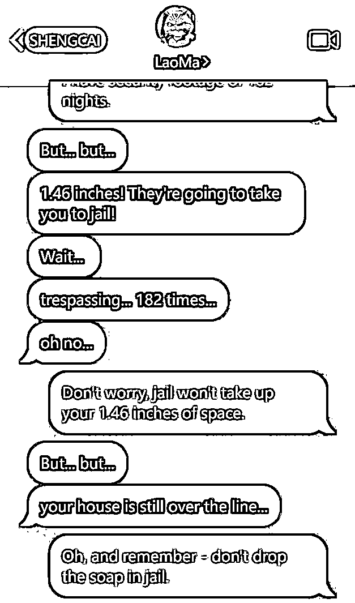

# 3.4 第四步：配音

文案音频制作参考 4.3.1 给自己的视频配音。

建议一段段配，这样好剪辑。

关于音效：一般我们用到的音效比较少，无非就是 bong，pang，嘣，啪这些东西，我们可以通过原素材分离出来，也可以通过 AI 音效制作出来，也可以通过一些音效素材库筛选出来。

分享一下我的音乐素材网盘给各位，有点大。

通过网盘分享的文件：音效库

链接： https://pan.baidu.com/s/1UZZjfOeL7kZgNKNYKw7rpA?pwd=5a5r 提取码： 5a5r

# 3.5 第五步：处理配音素材

新人建议直接把素材拉下来做字幕识别和翻译成中文，这样看的明白。但还是要结合生成的对话内容来对照裁剪音频。


这样很明显就能发现每句话的结束在哪里，可以直接切掉，这里可以设置一些剪映的快捷键，比如分割设置成 1，按一下直接切掉。


女完了就开始男的，记得女完毕以后锁住，在轨道左边有选项，然后在静音，才可以识别男的，这样不会混乱。

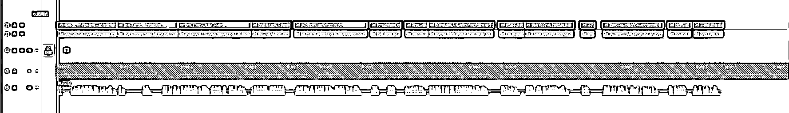

当我们切出来男生和女生，接下来就对照原稿来拼接音频。


我们把它合在了一起，然后，创建复合片段，在给到加速成 60 秒以内。


# 3.6 第六步：处理解压素材

就像之前故事号剪辑处理方式一样，全部智能分割，镜像，调色，然后保留非露脸，精华片段。忘记的可以跳转到 4.2.1.3 第六步。


之后我们变速对齐音频即可。

# 3.7 第七步：处理截图素材

我们需要根据对话，来调整截图的素材，要音频对照素材弹出的效果，这里推荐使用 cupcut 的蒙版，线性蒙版，点击关键帧，拖动展现新的画面。

如果相隔较远的对话，关键帧展现新的截图画面会比较缓慢，那么可以在音频即将讲话的时候，插入关键帧，然后按键盘→，把线性蒙版往下拉，这样就实现了对话效果。


放大可以看到，其实这种效果就是在近距离之间插入两个关键帧得到的。

# 3.8 成品展示：

加入 BMG 以及音效，完成最后的合成：

成品.mp4【在线播放】

成品

28_karen got cooked💀.mp4【在线播放】

对标

以上就是短信故事风格的全部详细拆解内容，希望各位能够耐心阅读反复观看学习，创造更多不同的变体风格。

1.  解说类内容

# 1.什么是解说类账号

它是通过原视频以及拼接不同素材的视频，再加上自己二次创作的解说词，融合在一起形成新的视频这种风格，均属于解说类，科普解说，游戏攻略解说，爆款视频解说，动物解说，动漫解说，电影解说等等这些类目都属于这种类别。

它很明显的特点，就是要说出来，讲出来。短平快，三秒内拉住你的停留，并且通过吸引人的画面，消耗掉你的 60 秒，甚至更多的 60 秒。

详细类别的拆解可以看这个星球帖：《【项目实操】从 TikTok 到 YouTube：创作者平台的商业模型与选择》

接下来我会详细拆解两个类别：科普解说，爆款视频解说，来带你掌握解说类内容创作的技能。


1.  科普解说（拼接类解说）

很多人会认为，科普解说是科学科普，地理人文这种讲解的视频，其实不是，如果我们换个概念来理解的话，它就是十万个为什么，没见过的东西，现象，事物，都可以解说出来。

我们通过当下这个视频的选题，采集围绕这个选题不同的素材，通过拼接放在一起的手法，这种我把它称为拼接类解说，那么便于理解，它也属于科普解说。

这就是一个典型的科普解说类内容：

火烧座椅.mp4【在线播放】

拼接类解说的好处很明显，它基本上不会出现 0 播、低播的情况，当完成了标准化流程的建立，各个视频都是万播。除非选题、素材清晰度、展现画面吸引度和文案太差了，不然万播就是标准值。

但也有缺点，那就是它太稳重了，天天万播，一点波澜都没有。只是说不定哪天一个月前视频会被挖坟，然后跑的很高，属于单兵作战比较强劲的那种。这种类型，对比后面要讲解的爆款视频解说（原视频解说）而言，流量会低一些，但胜在稳定。

# 2.1 第一步：产出文案

# 2.1.1 正练方式

第一步：确定选题

通过看科普解说类型的对标内容，选择 10-50 个文案，丢给克劳德，让它先理解并输出说明这类型的选题是什么。

提示词：

我需要你根据我这十个文案，详细拆解一下都是什么选题


第二步：创造选题

我们要给到进阶提示词，让他去创造选题，以及基础文案，和寻找素材的关键词。

提示词：

请帮我创作[数量]个 shortsvideo 选题创意，要求如下：

.

内容结构：

每个选题必须包含：

主题标题

完整分行文案（150 到 200 英文，200-300 字中文）

中文关键词 5 个（用于素材搜索）

英文关键词 5 个（用于素材搜索）

选题类型说明（科普/文化/生活等）

.

文案要求：

每句话需要分行书写

语言通俗易懂

突出新奇性和知识性

结尾加入互动引导

适合 30-50 秒短视频呈现

文案要先给到完整英文，在给到完整中文。

.

选题标准：

话题具有新鲜感和传播性

容易获取相关视频素材

适合视觉化展示

能激发用户评论互动

符合 shorts video 平台调性

.

关键词标准：

关键词要具体且实用

符合各平台搜索习惯

中英文关键词相对应

便于实际素材搜索

尽量选择高搜索量词汇

目标受众：[目标年龄段]

传播平台：[具体平台]

内容领域：[具体领域]

文案风格：[提供情绪]

请确保每个选题都能引发观众兴趣，易于制作，适合传播。

以下就是 2 个选题：


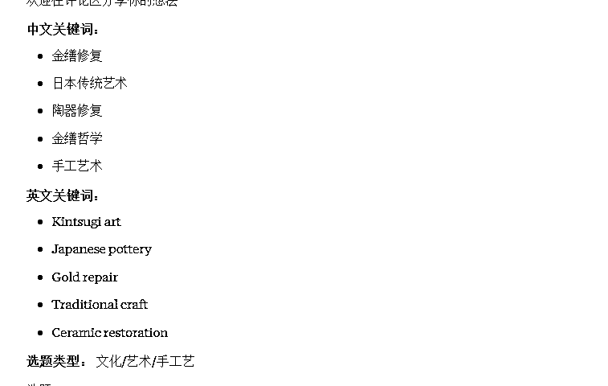


第三步：判断选题是否可做

那我们来根据给到的关键词搜索一下有没有相关素材，再配合文案感受一下是不是那个意思。

重点！！！

拼接类剪辑素材可以直接在 YouTube 上寻找并且混剪进去，不用害怕，只要你不把原作者的脸露出来，大概率不会有问题，这是合理利用版权，美国版权法第 107 条允许的事情。

第一个选题：Kintsugi art / 金缮修复


可以看到，素材有播放量，同类型素材也多，因此我们可以判断出来这条选题成立。

第二个选题：粘菌实验/Slime mold


同样的，我们看到这个选题也是合格的。

第四步：文案二次训练

这次的文案二次进化，我们力求：

.

开头前三秒留住人，具备夸张性开头特点；

.

后面的部分要具备以下特色：口语化，简洁明朗没有废话。

我们把每一次写出来的文案丢进去，来套用模版二次进化：


得到了完全体文案：


# 2.1.2 逆练方式

逆练拼接类解说文案很简单，你只需要完成一下工作：

.

寻找对标，把他的文案保存下来

.

转录成英文

.

模版套用文案

第一步：保存对标视频的文案

以这个视频为例：https://YouTube.com/shorts/QgqNKSIrmek?si=mji-5NjxtdkIkCFe

1_Hot Rolled Steel Coil Facts #shorts.mp4【在线播放】

第二步：转录成英文

How high is the temperature of seemingly ordinary steel coils? An interesting phenomenon occurred when throwing snowflakes into the steel coils. The snowflakes evaporated instantly. In fact, these steel coils that seemed cold were just produced by the factory. The temperature was 3000 Fahrenheit. After cooling a bit, these hot steel coils are placed outdoors to let them cool naturally. The freshly baked hot rolls are still hot after being stored in the warehouse for several days.

可以使用飞书妙记，也可以使用其他的 AI 转录工具，功能实现即可，这个不过多描述了。

第三步：改写

改写模版如下：


# 2.2 第二步：根据文案找对应素材

拼接类素材的选择，我们有 2 点需要注意：

.

长视频也可用，在长视频中，某一个亮点片段下载下来单独裁剪。

.

在 YouTube 中搜索寻找素材的时候，可以不用点进去视频，鼠标放在视频上，它会有预览，下方也有进度条，可以通过这个拉动进度条看看这个长视频是否是自己需要的，节省点进去在开广告跳过的时间。

在我们寻找素材的时候，这几个方法很方便：

# 2.1.1 平台主动搜索关键词

首先，我们先来提炼关键词，我们以刚才逆练的文案来举例：


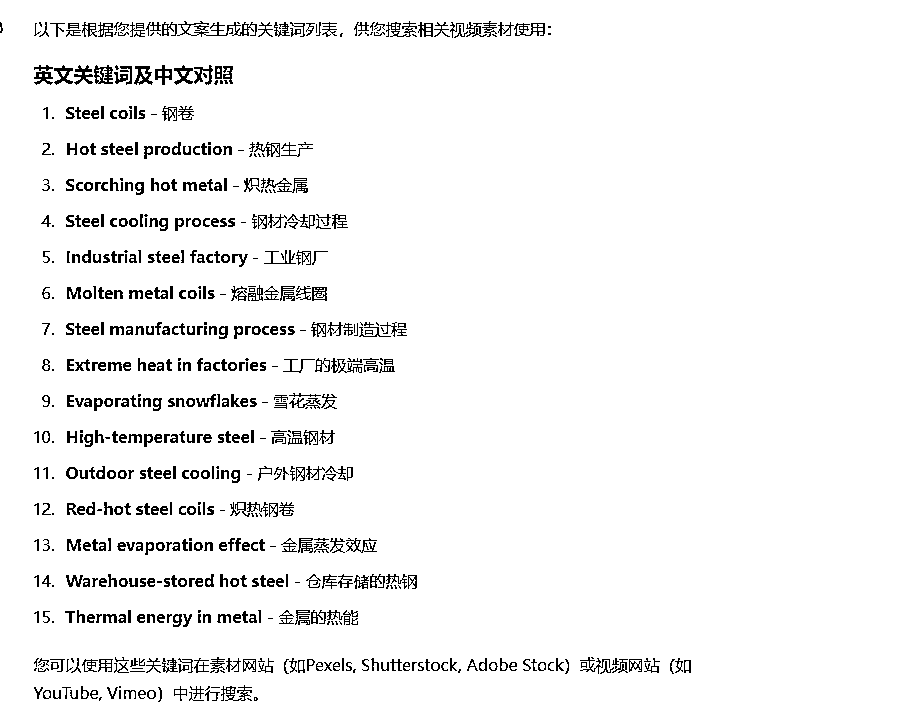

接下来我们来根据文案去寻找合适的素材。

从第一个开始搜：Steel coils，直接就发现了这个对标视频。


但是这个搜索词不太对，讲的是刚下生产线的金属卷材。那就先跳过它，去搜索其他关键词。我发现这个词还是不对，AI 提炼的关键词有问题，讲到的是雪花以及下生产线的钢卷。

这时候我先不修改提示词，先尝试根据原文直接复制第一段话，看看能不能找到强相关的选题视频素材。

If you throw snowflakes at steel coils


好，那这个方法很有效，我发现了雪花融化，以及高温钢卷的内容，那我就开始收集这些视频。

1_Hot Coil Rapidly Melts Snow ViralHog.mp4【在线播放】

10_Steel coil screen opening site#steel.mp4【在线播放】

4_Snow & Ice vs Hot Steel Coils January & February Compilation.mp4【在线播放】

7_Showing the Leidenfrost Effect Using a Pickle and Hot Steel Coil ViralHog.mp4【在线播放】

13_Are you interested in steel coils.mp4【在线播放】

我一共找到了这些素材，但他并不能足以支撑我剪辑整个片段。


毕竟配音文件 44 秒，我担心不够，所以我还需要其他拓展词，来搜索没有那么强相关的素材，比如热钢卷，冷却钢卷，熔炼钢卷等等，那么我可以回到上一步搜索更多关键词，让 GPT 给词，或者中文翻译成英文直接搜索。

我通过关键词搜索不到我想要的视频素材怎么办，比如这个：


看起来很好看，我就特别想要。 那我就可以使用第二个方法：谷歌识图功能。

# 2.1.2 谷歌识图功能/百度识图

我们把上面这个画面截图丢给谷歌识图，让他去帮我找，这里面就能找到很多素材。


但有一些还是同行的解说，尽量不去选择他们里面的素材，除非真的没有了，找不到了，再用同行的视频素材中一部分抽取出来。

比如：

我觉得它很不错，可他是一个购物站，一些平台解析接口没办法找到这个视频下载，那可以尝试右键点击源代码，ctrl+f，搜索 。mp4，我看到了这个，然后我复制单独打开看看是不是，最后发现是我想要的东西。


这是一种方法，当然更多的是通过这个谷歌识图来寻找到原素材。

# 2.1.3 通过对标视频中暴露的信息来获取

有些在对标视频中已经暴露出来，他们为了不被原博主找事情，主动做@原博主的视频，或者有一些在评论区会有人提到这个是 XXXX，那么可以根据这些信息去找到这个博主。

.

标题以及描述说明中

.

评论区


# 2.3 第三步：配音

文案音频制作参考 4.4.1 给自己的视频配音。

# 2.4 第四步：剪辑

好我们拿逆练出来的一套素材来举例，在剪辑前，我们需要准备好所有素材：原视频，原文，改后文，配音文件，以及寻找到围绕选题的视频素材。


视频素材最好准备 55-10 个，方便剪辑，并且未来如果这个选题爆炸了，你还可以多次通过素材拼接成为新的视频，一个选题多次利用，我们把这些素材全部放进 capcut 里面。

# 2.4.1 导入音频，并且识别字幕

导入音频时记得切气口


# 2.4.2 根据音频每句话的气口，添加对应画面

识别字幕以后，根据每句话来做一个分割


那么在我们分割的这些地方，就是可以插入我们对应的画面。

在处理画面的时候，我们可以使用以下技巧：

.

镜像

.

加减变速

.

智能调色（曲线调整，锐化等）

.

放大缩小选框

.

如果是长视频，素材清晰，可以直接拉成竖屏（如果拉完以后主体还存在），或者拉成 4 比 5，做画中画效果

.

如果觉得原素材的音效能提升视频的感觉，可以放出来一些。

做好如下：


# 2.4.3 画面间隔做转场特效 + 转场音效

可以做转场特效，也可以做视频的入场特效


# 2.4.4 调整字幕特效


# 2.4.5 导出成品

校对没问题，就可以直接导出成品了。

1_Hot Rolled Steel Coil Facts _shorts.mp4【在线播放】

逆练成品.mp4【在线播放】

逆练成品视频


1.  爆款视频解说（原视频解说）

爆款视频解说也叫原视频解说。在操作手法上，是以爆款视频深度二创去重，或者一个博主的多个视频剪辑在一起的创作手法。

好处：借鉴的都是爆款视频，经过二创去重以后再次跑了一遍，流量也会相对更好；

缺点：当遇到一个小气的博主，可能会碰到博主过来 diss 、版权警告、要赔偿、要求删掉视频之类的情况。

所以在我们选择爆款视频的时候，要么不以人物为主体，要么以国内的爆款素材为主体，这样就避免了很多的风险。

爆款视频解说在素材收集以及剪辑手法上和科普解说非常类似，只是一些小细节略微有差异。所以重复的内容就不在讲了，主要讲一下不同区别的操作。大概是正练的描述手法，以及文案模版，和剪辑的时候不同的操作细节。

# 3.1 第一步：找到爆款视频

这里不需要 AI 出选题， 我们需要寻找到已有的爆款视频的选题。这一步可以通过建立自己的素材库，逐渐积累一批爆款对标。

我们做的是 Shorts，它属于 YouTube，那除了这里，其他的平台都属于站外，国内抖音，快手，海外推特，INS，TikTok，都是可以获取到的视频来源。

我们要建立自己的素材库，比如：

做爆款视频解说，就要抢爆款视频的二创首发机会；

做拼接类解说，就要收集同类型题材的素材。

相信我，初期很难，但当构建好这些体系，制作这两种赛道的内容简直不要太简单。

那么，这里讲解一下大概步骤：

先建立平台采集的根据地。比如，我先锚定 TikTok、X、INS 这三个平台，复选国内抖音、快手。国内的素材大部分加入的文字很多，去重去水印时会很麻烦。

另外注意：要了解赛道属性。

很多爆款视频解说和事物、人物相关，使用海外的人物视频素材做解说，就会面临侵权的风险。遇到小气的素材作者，当我们视频爆了时他可能会过来找麻烦，比如版权警告删除，要赔偿等等。

所以如果做爆款视频解说，我优先选择国内的爆款视频素材，这样能降低更多的风险。

对于科普解说而言，拼接类素材去重，合理利用版权基本上是允许的，所以基本上不会有任何的版权风险，获取素材的源头就可以首选海外平台。

举例：

X：现在做一个爆款视频内容（排除人物这种素材），那需要先确定一个搜索内容比如“Animals”，在推特的 Top 里面我发现了这个视频：

200 多万播放的一个视频，先别着急拿它的视频，先看看它是不是同行。


OK，我们可以判定它也是内容创作者，也是个二创，以温馨动物，治愈系为主，那我们二话不说上来就一个关注点赞。诸如此类，再继续挖掘更多的作者。


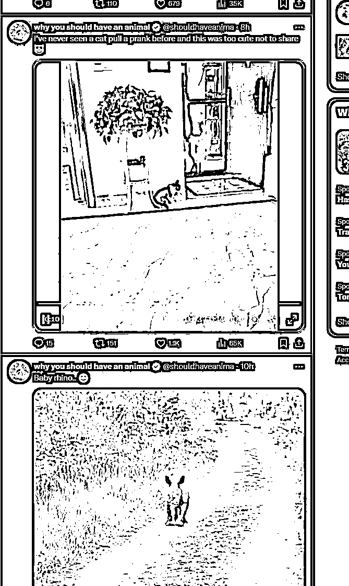

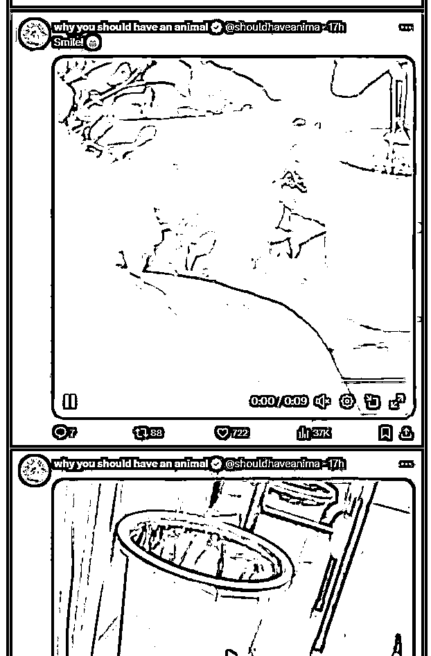

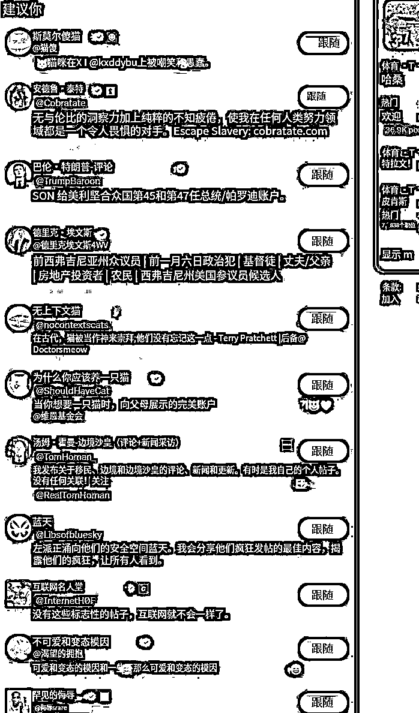

那如果我们的爆款视频账号选题大部分都是动物类型，这种账号就是源源不断的能源。当关注了大量的这样的账号。第二天打开主页推荐，推荐习惯会给你带来更多新的内容素材的作者。

不同的平台属性推流的机制和用户行为习惯也不同，所以很多内容在 Shorts 里面可能它就没有，这种就很适合二创。

TikTok 和 ins 是素材的重灾区，内容和 YouTube shorts 高度相似，尽量少选择，但可以用作补充素材或者根据推荐逻辑找到了相关作者，监控他，抢二创首发权，那就好很多。

怎么沉淀一批这样的作者？

搜索关键词，关注同类型账号，休息一会儿或者第二天在通过推荐页面刷新找到更多同类型账号。

注意：最好是新号，容易建立信息茧房，不要用网页刷，刷不出来的，用手机刷，你在国内做抖音怎么找对标，这里同样适用。


# 3.2 第二步：准备文案

# ① 正练文案

通过爆款素材，手动去写描述词，或者根据之前我拆解 AI 赛道时使用的工具，把视频抽出来图片，挨个发给 GPT 或者克劳德，让他描述整体情节，再套用解说词模版完成文案二次进化。

生财圈友专属视频场景拆解工具。rar

百度网盘链接：https://pan.baidu.com/s/1AJrJIX4DLudvbneAhMQPIA?pw...

提取码：62j4

爆款视频解说词模版：

# ② 逆练文案

操作流程同上 科普解说逆练工作流。


# 3.3 第三步：剪辑

剪辑原视频解说你需要准备以下素材：

.

改写后中文文案

.

对标视频的原视频素材

.

改写后配音

我们以这个对标视频来举例（爆款视频解说对标高播放视频）：

_ Little Boy Doesn_t Have Enough Money for Cake _shorts.mp4【在线播放】


改写后配音：

_ Little Boy Doesn_t Have Enough Money for Cake _shorts_files.mp3

# ① 导入音频，并且识别字幕

导入音频的时候，切气口。


# ② 导入原视频做处理


我们会发现有时候轨道不同，解说词可能会多，也可能比原视频的时间轴少。

解说词比视频长：这时候可以调慢原视频的速度，或者把一些片段反复复制一下镜像倒放补充时长，或者通过类似片段代替，比如弄一些空镜头之类的；

解说词比视频短：可以删减片段，或者加速匹配音频。

# ③ 处理原视频

首先对原视频进行智能场景分割，并且选择镜像，然后挨个对每个片段进行局中显示摆放在画布的中央，一些字体符号，可以通过裁剪的方式去除，然后对整个视频进行画中画的效果，也就是背景填充-模糊。

比如：


全部处理完以后，创建复合片段调整对齐音频时间轴，通过加减速的方式。


# ④ 给复合片段智能调色

智能调色（曲线调整，锐化等）

锐化参数

色温饱和度色调

曲线-亮度-红色通道-蓝色通道-绿色通道

如果觉得原素材的音效能提升视频的感觉，可以放出来一些。

# ⑤ 调整字幕特效

这个就是原素材视频解说的重点。原素材要进行视频深度混剪，如果有大量使用这个素材的创作者，那很有可能会遇到 0 播 的问题，就是没有过重，那么字幕特效就是很好的过重方式。

所以字幕特效是至关重要的，我们尽量在字幕特效上下功夫，可以根据每句话手动添加一些 emjio 表情包。

# ⑥ 手动添加 emjio 表情包

这里推荐这个网站，能够满足你所有 emjio 的需求：https://emojis.sh/


通过文案可以丢给 AI 提炼出来每句话 emoji 的关键词，然后对应下载，别觉得麻烦，当 emoji 素材足够多的时候就不需要了再下载了，因为原有的库已经足够使用了。

通过 capcut 字幕特效完成 emoji 表情：


这几种都属于 emoji 表情字幕特效，他会根据文案自动分配一些表情包添加在字幕上端。


# ⑦ 导出成品

_ Little Boy Doesn_t Have Enough Money for Cake _shorts.mp4【在线播放】

对标视频

小孩蛋糕.mp4【在线播放】

逆练成品视频

以上就是爆款视频解说也就是原视频解说的全部操作手法。

# 附：更多剪辑技巧可以看《剪辑特训实战手册》。

### 科普解说类内容

1.  剪辑

# 1.1 第一步：优化转场、气口

虽然看了一遍实战手册，但是根本没去注意实战手册里面的要求，都是按照自己的想法开始做。视频都是直接视频素材拼接到一块，加个配音。甚至素材也找的不符合，画面都看不清。

没有转场.mp4【在线播放】

发布之后直接给打击到了，这啥也不是啊。教练说万播才是正常值，这也差太多了。

开始重新学习手册，才意识到还有这么多细节自己没注意到。转场特效、根据音频每句话的气口添加画面。

自己连标准值都没做到，怎么会有流量。接着按手册开始优化。


操作步骤：

先识别字幕，然后按每句话的停顿添加画面，每句话结束就转场下一个画面。

如果一句话比较长，中间可以多加几个画面，一句话结束也是转场下一个画面。

再添加上转场特效、音效。

整个视频质感直接上升。

优化之后，流量也开始达到万播标准值。

总结：一定要认真的学习手册，一步一步对照着来，不要有自己的想法，手册都是教练们走通的路，跟着走肯定没错。

如果自己没达到标准值，就回头看看自己的动作是不是变形了，自己看不出来，就找教练问问，当局者迷，旁观者清。

# 1.2 第二步：优化开头前 3s

以前做抖音都是看前 3s、5s 完播率，视频平台的调性都大差不差，Youtube 是平均观看百分比、选择观看率两个指标。

我是用的科普解说逆练方式，就开始从这个角度下手。既然对标视频能爆，肯定就是整个视频没什么问题的。那就模仿对标视频的开头。

把开头和对标视频做的一模一样，文案的开头也不改动，这样来提升选择观看率。（非常重要）

操作步骤：

把对标视频的开头关键帧截图，直接谷歌识图功能搜图，一般能直接找到原视频。（不得不说实战手册真的很全面，都有教程）


把下载下来的视频，找到和对标视频同样的片段，看对标视频放了几秒，咱们就直接跟上。对标用了一个箭头，那咱们也用上一个箭头。尽量做到非常相似。

视频对比（左边是对标视频）

对标视频.mp4【在线播放】

复刻视频.mp4【在线播放】

可以看一下这个对比，爆款的选择观看率是高的多的。


再次优化自己的视频之后，又更新了十几天，终于迎来了自己的第一个爆款。到目前为止是 720w 观看次数。

大家也可以看到，这个爆款不是短时间内就获得了高播放，最初也是没有流量，发布一星期才开始爆，所以大家做视频也不用着急，说不定哪天就开始爆了，咱们把能优化的地方优化好，等待系统推流就 ok。


总结：大家不要看到数据不好开始焦虑、甚至断更。多从自己身上找原因，同时航海/私教陪跑手册也要多看几遍，审视自己的动作有没有变形，找找视频还有哪些可以优化。坚持更新也许下一个视频就会爆。


# 2.配音

1.  给自己的视频配音

# 1.1 收费高质量配音

当我们根据文案提炼出来角色对话，或者故事号所需要的配音素材，那我们就可以使用 elevenlabs 来进行配音，故事号如何配音很简单把文本输入进去即可。

llElevenLabs: https://elevenlabs.io/

（如果为了方便 elevenlabs 也有 api 可以调用使用）


可以去淘宝买一些，70 多，我记得是 10W 字符的。

常规使用角色：（第二行是 API 的 ID）

Kevin W. Krause

(Kiruw49gT6bkHBiboXKX)

Mark

(WTUK291rZZ9CLPCiFTfh)

Nick Colter

(pUT9rBL4dkCeuqxqLWVZ)

Alex - Young American Male

(yl2ZDV1MzN4HbQJbMihG)

Alexander Kensington - Studio Quality

(mZ8K1MPRiT5wDQaasg3i)

第一步：提炼要配音的对话

这里重点讲一下短信风格配音的实操，当我们提炼出对话以后是这样：

Neighbor 的对话：

Your house is 1.46 inches over into my property. I've been measuring it every day for the past 6 months!

FACTS DON'T LIE! I have 182 measurements to prove it! Move it or lose it!

I have photos! Want to see my Excel sheet? You have until Friday! And my measurement diary! I come at 3 AM every day for the most accurate readings!

For science! I even made a PowerPoint! Page 47 analyzes the moon's effect on house shadows!

That's not important! What's important is 1.46 inches! I'm calling the cops!

The cops are already here! I told them about your house trespassing!

That... that's not important! They'll arrest you! Guess who's going to jail!

But... but... 1.46 inches! They're going to take you to jail!

Wait... trespassing... 182 times... oh no...

But... but... your house is still over the line...

...no...

Homeowner 的对话：

Wait... you've been measuring my house daily for 6 months? That's... concerning.

Let me get this straight - you spent 182 days measuring 1.46 inches?

You break into my yard at 3 AM to measure?

So you're admitting to trespassing on my property 182 times?

Call them? Go ahead.

Are you sure you want to do this? Maybe think about what breaking into private property 182 times means?

I'm guessing not me. I have security footage of 182 nights.

Don't worry, jail won't take up your 1.46 inches of space.

Oh, and remember - don't drop the soap in jail.

邻居和房主各自的对话，我们需要分别来配，这样我们后期切音频的时候更方便一些。因为我们需要两个角色的声音来配对。

另外为了更加具有戏剧性，我们在配音的时候调整参数，参数越低它的情绪表达更加的丰富和夸张，参数越高，它的情绪更加稳定。

第二步：确定配音角色，调节参数

男：

Adam (Legacy)

pNInz6obpgDQGcFmaJgB

Matt - Clear & Conversational

FISo3sWdWP0bALUdgh5x

女：

Natasha - Valley girl

ZHlhddGv3tWiXOJSZrwc

那我们以男 Adam ，女 Natasha 来配音：


分别对应了模型，和精细度，之前提到，我们为了夸张表达，我们把稳定性调低，这样会有更多有趣的情绪展现。

我们来听一下调节稳定性和相似度的区别：

先来女生 Natasha 的区别：

Stability%20 + Similarity 50%

ElevenLabs_2024-11-30T17_06_27_Natasha - Valley girl_gen_s20_sb51_se0_b_m2.mp3

Stability%50 + Similarity 50%

ElevenLabs_2024-11-30T17_07_53_Natasha - Valley girl_gen_s51_sb51_se0_b_m2.mp3

再来听听男生 Adam 调整的区别：

Stability%20 + Similarity 50%

ElevenLabs_2024-11-30T17_09_49_Adam_pre_s20_sb50_se0_b_m2.mp3

Stability%50 + Similarity 50%

ElevenLabs_2024-11-30T17_10_25_Adam_pre_s50_sb50_se0_b_m2.mp3

当我们在创作音频的时候，不管你做什么项目，如果你想创建更多不同的情绪，不妨尝试使用这种方法，能够帮你解决一些问题。当然一些能够有强情绪的开源模型也不错，但我推荐使用商业化产品，更加成熟稳定。

注意事项：在配音的时候，尽量把语句切成小段一句一句话来配，更方便你剪辑。


# 1.2 不花钱调用自身电脑性能（个人版）

可以使用：GPT-SoVITS

不会安装的可以开 B 站博主的视频自行学习：GPT-SovitsV2，支持多语种，多音字优化，更好的音色，ZeroShot（WIN/MAC）


# 2.给自己的视频配乐

在运营 YouTube 频道时，音乐的选择至关重要。

YouTube 对版权保护有严格的规定，如果随意添加了有版权的音乐，可能面临平台的警告，甚至如果警告超过 3 次，频道可能会被封禁。即使暂时没被警告，视频收益是全部归音乐版权方所有，我们不能获得这个视频所产生的相关收益。

但是视频没有音乐又显得太单调枯燥了，那么我们怎么添加无版权音乐呢？以下这几个渠道是主要的无版权音乐来源：

# 2.1 YouTube 音乐库

Shorts：在上传视频的过程中，可以在上方点击「添加音效」，来添加音乐库的音乐，这里的音乐都是可以用的。


长视频：点击右上角头像 - YouTube 工作室 - 音频库，即可找到大量的音乐和音效素材，在这里你可以进行试听和下载。


点击内容 - 对应视频的编辑图标，即可在 YouTube 里操作修改视频，添加 YouTube 音乐库里的音乐，但有些需要在视频说明中进行署名。（Shorts 不支持从这里进入修改音乐，只能修改视频说明）


# 2.2 爱给网

地址：https://www.aigei.com/

点击「配乐」 - 「免费商用（cc 协议）」，这下面的音乐就可以试听、下载使用了。需要注意的是，要看清楚对应音乐的引用要求。

如果引用要求中，说明需要署名，则在视频发布时，在「视频说明」中写明来源，格式参考如下：

本视频中使用的音乐名称：XXXX

作者：XXXX

来源：https://www.aigei.com/music/song/


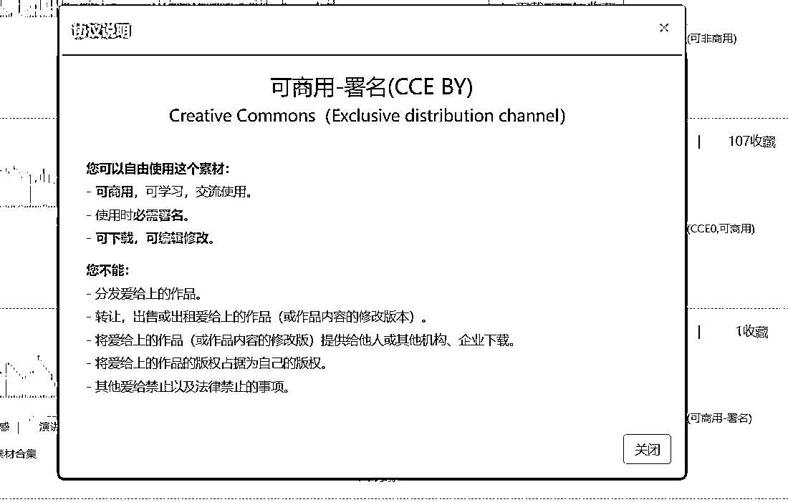


# 2.3 Sound Cloud

地址：https://soundcloud.com/

这个网站上有很多优秀的创作者，但不是所有的音乐都是无版权的。

因此你需要在搜索栏搜索自己想要的音乐相关关键词，然后在搜索结果处选择「Tracks」- 「To listen to」-「To use commercially」，这样就可以找到可以使用的音乐了，在这里你可以试听、下载、找到这个作者下的更多音乐。


如果你发现有些音乐没有下载入口，可以使用这个 SoundCloud Downloader 工具，点击音乐前的头像进入新页面，复制链接到这个工具中即可下载。

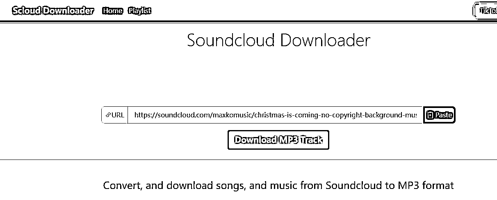


# 2.4 优质的 YouTube 音乐频道

可直接搜索筛选一些音乐频道，比如：

.

ROYALTY FREE MUSIC

.

Audio Library

.

FreeMusicWave - No Copyright Music

.

Vlog No Copyright Music


1.  版权规避注意事项

以上几个渠道里，最安全的是 YouTube 音乐库。

其他的几个渠道里，虽然当前是无版权音乐，但如果创作者突然某天注册了版权，YouTube 平台会扫描所有使用他音乐的内容并且把相关收益给到他。这种事情发生的概率并不大，但有发生过，因此这个风险也不能完全忽视。

如果想要规避这个风险，也可以找一些付费的版权音乐网站。

当然，如果是自己创作的音乐，或者用 AI 工具做的音乐版权归属于自己（比如付费版 Suno 制作的音乐），那么也是可以使用的。

关于 AI 音乐以及翻唱相关的版权讲解，可以拓展阅读以下两个 UP 的视频：

.

AI 音乐版权问题，如何正确发布到音乐平台

.

翻唱歌曲或演奏音乐不能赚钱？

内容来源：《详细拆解 YouTube shorts 故事号类型》


1.  内容生产进阶技巧，提高内容质量

这里图片生成的操作都以即梦和达人秀变身为例，选即梦是因为现在确实是断档的好用，选达人秀变身作为示例是因为最复杂的操作都集中在达人秀变身了，其他的 AI 视频还停留在简单的首尾帧、单图生视频，达人秀都卷上天了

1.  图片提示词倒推

提示词倒推是很基础的技巧，支持多模态的大模型基本都可以倒推，不过倒推出来的提示词一般都需要微调才能达到原图的效果

用 MJ 作为示例，/describe 命令即可在 discord 中使用 MJ 倒推提示词，这个图是一个千万爆款的视频，直接截图的


可以放到翻译软件里看一下


乍一看可能看不出什么问题，这个时候就要测试，直接把提示词扔进去看看就知道效果了

# 💡

移除了原有的关于垫图的描述，由于即梦的垫图与原图一致性太强，容易被判定搬运，不建议使用垫图的方式进行图片生成，常规建议大家通过文生图的方式来生成图片，完成第一次提示词微调之后，就可以提炼出自己的模板

补充：如果就是想用垫图，也可以讨巧方式：就是垫图选择角色特征，降低主体参考强度不仅可以改变角色动作，其实还可以配合提示词用来改变背景和面容以及着装。

已有满意脸模，也可直接点选人物长相。MJ 同样适用。

对标截图：


即梦出图（垫图+角色特征参数）：


如果要做到更有自己稳定的特色，那么可以参考我现在做法，使用 comfyUI 配合不同 lora 微调可以做到非常多的选择。友情提醒：伙伴们，注意尺度

反推图片后，可以通过提示词模板调整穿着、发型、发色、背景灯光等。同时，由于用了垫图+角色特征，品质依然会接近参考。如果想更贴近对标，从参数到提示词都可以精确控制。


1.  背景、主体不变换衣服

原图是这样：


按照截图所示的操作上传原图作为参考图，选择智能参考，进行图片生成，效果如下图：


# 3.背景、主体不变换动物

原图还是上面那张，仍然选择智能参考，调整提示词更换动物相关描述后生成即可，效果如下图


不一定是动物，也可以是一些物品，就像对标账号那样，比如鲜花、汽车等等，效果如下图


1.  背景、主体不变换动作

原图还是上面那张，把智能参考换成参考角色特征，服装的描述换成对应服装的，生成后的效果如右图，如果追求完美可以用下面的 P 图大法，把新动作 P 进去，老角色 P 走，可以自己评估是否有必要


# 5.背景、主体、动物不变换动作

原图还是上面那张，选择参考角色特征，调低主体强度，这个方案的效果如下图，背景会有变化，如果追求完美可以用下面的 P 图大法，把新动作 P 进去，老角色 P 走，可以自己评估是否有必要

# 6.添加角色/合成图片

如果视频里要增加一个复杂主体时，上面的方法可能不太好用，那么就要用到 P 图大法了，由于即梦自带一个【智能画布】的功能，非常强大，这里就用智能画布来演示。

现在假设我们要将这张图片里的小姐姐添加到之前的那张原图中去，选择智能画布里的抠图-快速选择，选择小姐姐，然后抠图


接着调整一下小姐姐的位置，这样其实就可以用了，追求更好的效果可以扩图让图片的范围更大，这样人物就不会重合。这个方法除了把人物添加进去，也可以把一些复杂的不好直接生成的怪兽、物体之类的东西添加进去，具体可以自己发挥创意。


好了，有了上面这几招图片生成的进阶操作，就基本能够实现图片层面所有的复杂动作了，原来得用 MJ 组合 PS 才能实现，现在一个即梦就搞定了，把即梦牛逼打在公屏上。

1.  开场动作，结束动作

由于开场和结束不需要和中间的动作保持连贯，也就是不需要首尾帧，追求更完美的效果可灵 1.6 是首选，绝对是断档领先的程度，可惜可灵 1.6 还不支持首尾帧。

比如开场的挥手，和结束的跳舞，明显能感觉动作非常生动，有灵气，不像某些工具一眼 AI。

高品质_美丽的日本女孩开心地在舞台上抬起手和观众打招呼_青春活泼的感觉 (1).mp4【在线播放】

高品质_狼人在舞台上跳舞 (1).mp4【在线播放】

# 8.高阶技巧组合-万物组合之达人秀变身案例

现在，结合以上，通过完整示例来展现和扩充整个流程。

实操案例：

从需求出发，为了更好地适应内容需求，我对流程进行了一些调整。通常，一个丰富的视频需要多张过程图生成多个视频，而除了第一张图，后续过程图都是在同一背景下进行增加/减少/替换的组合。

# A.生成素材：

# 💡

.

舞台上的三女生

.

平底锅

.

金鱼

.

机械赛博鱼

.

红礼服女生 （注：煎鱼视频的尾帧还会截图作为一个起始帧素材）


# 💡

提示词技巧：

在 A 步骤中，平底锅、金鱼、机械赛博鱼等提示词中不包含人物描述，言下之意就是只保留场景和灯光描述以及该生物/物品即可。同样的，如果使用智能体模板，亦遵循这一原则。

PS:

透视适配：站立地面的生物/物品的透视角度需要与三女生的场景保持一致。（保持舞台相关提示词的一致基本不会太大出入，如有则单独调整）

背景光源一致性：保持同样的舞台灯光相关提示词，是为了确保光源位置和色彩的一致性。


# B.处理图片

# 📌

将图片抠出以下部分：

.

背景

.

三个角色

.

变换的物品/生物

接下来就是视频部分


# 💡

这步或许会有疑问：明明局部重绘就能解决的问题，为什么还要这样？

答：局部重绘确实可以解决部分问题，但我更倾向于将每个人、动物、物件和背景分开处理。这样做的优势在于：

.

模块化：将所有元素组合成变量，制作过程更简单直观。

.

自由度：变化的自由度更广，可以根据画面审美需求控制前后空间关系。

.

空间利用率：更高的空间利用率，让画面更丰富。

# C.得到关键帧

使用智能画布和 PS 修图/拼图/并添加阴影（如果需要）。阴影可以增加实感，抠图或手动添加都可以，选择最方便的方式）要更有趣，多加段女子跳到机械鱼的身上游动也未尝不可，截取最后一帧衔接上就好。

# D.图生视频


# E：剪辑/渲染/导出

融合红鱼和平底锅.mp4【在线播放】

小结：

无论是从对标到原创的迭代，还是流程中的细节优化，灵活运用各种工具和技巧，持续练习手感，便能做到高质与高效的平衡。（同类流程：请看 2.20 的高阶技巧组合-爆款达人秀变身视频复刻案例）

1.  加特效

由于首尾帧一般用 runway 比较稳定，这里用 runway 作为示例。runway 是内置了一些固定的特效的，比如火焰、火星、雾气、喷水等等，用对应的提示词就可以触发，比如雾气，提示词和效果如下


Gen-3 Alpha Turbo 2827604321, 美丽年轻的日本美女抬起手在舞台上变装，金, 正面全身照，甜美的20岁日本美女穿着日本, M 5 (1).mp4【在线播放】


1.  相对简单的复杂动作

这里用骑上动物为例，用于演示我没有仔细调整服装和背景，图片就用了上面的示例图片，主要演示方法，大概就是这么个意思，提示词是次要的，相似的首尾帧更重要，追求完美可以尽量保持服装和背景相似，效果会更好。【智能画布抠图即可保持背景不变】


Gen-3 Alpha Turbo 3300757854, 美丽年轻的日本美女坐到金毛身上，动态画面, image-prompt, M 5.mp4【在线播放】

1.  多主体按顺序变身

有些视频有做多角色或者跟动物先后变身的，有两种实现方式，一种是用 runway 的三帧生成一次视频，或者首尾帧生成两次，这里用三帧生成作为示例，也就是把先变身的那种图片放中间。


Gen-3 Alpha Turbo 1734684265, 美女抬起手在舞台上变装，金毛犬变身成巨狼, 正面全身照，甜美的20岁美国模特穿着有复, M 5 (1).mp4【在线播放】

# 12.对口型配音

这个，测试了一下可灵和 runway，效果不是很好，但也能用，可灵明显比 runway 强，runway 很鬼畜就不放了，这个是可灵的效果供大家参考，是不是要对口型这个见仁见智，根据自己制作的主题来取舍就好。还有朋友推荐 HEYGEN，大家可以自行测试。

作品.mp4【在线播放】

1.  二改延长原视频

先把要二改的视频下载下来，这里我用老马的软件截取关键帧。

还是即梦的智能画布，上传视频中的某一帧作为二改视频的开头，然后涂掉人物部分局部重绘，我这随便生成了一个形象，各位可以自行发挥创意。

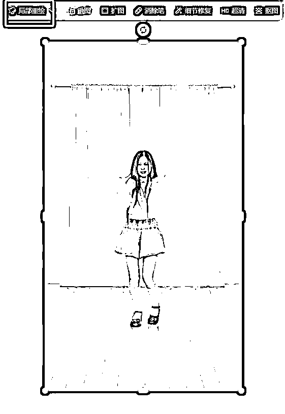


然后把这两张图片分别作为首尾帧在 runway 进行视频生成，随便做的演示流程，视频效果和最终合成后的成品效果如下，想象空间还是蛮大的，可以用这种操作搞一些出人意料的操作，玩抽象、恶搞之类的，也是看创意了。

Gen-3 Alpha Turbo 2754967219, 美女变身成穿着衣服的狗狗，动态画面，超强, illit-magnetic-dance, M 5.mp4【在线播放】

1月9日.mp4【在线播放】

有了上面这些技巧，基本所有 AI 赛道的视频都能复刻出来，自己多去实操一下就知道没那么难，最重要的是先模仿爆款，然后慢慢去找到自己的风格和方向，找到自己灵思泉涌、适合自己的细分赛道。


1.  提高图片画质

MJ 和即梦都可以提高图片画质，这个信息很基础，但是亲测使用质量更高的图片，视频的质量也会更高（直观地体现在文件大小上）


1.  提高视频质量

以剪映为例，有几个地方可以提高画质

1.超清画质：不一定是正提升，自己看感官的效果

2.智能调色：让画面整体更亮更鲜艳有利于提高观看效果

3.提高导出分辨率和帧率（超分、补帧）：高清的画质能够提高视频的基础推流权重（国内一些视频平台有这个逻辑，油管没有说明，但也会有一定影响）

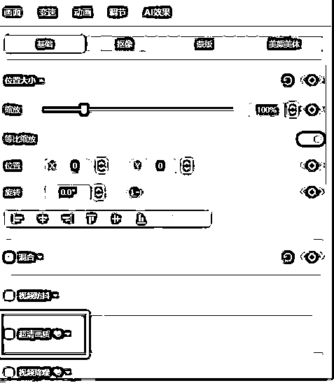

1.  X 的一生【一个人从小长大变老】实现方式

两种方式

第一种：SD/comfy UI+animatediff+版本支持提示词跃迁，这个不介绍，懂的话自己应该都会用了，不懂的话要从头搞时间成本精力成本太高不要试了

第二种：和达人秀的操作一样，先出图、再首尾帧衔接图生视频，只是需要尽量保持背景和人物形象相似，推荐用即梦实现。具体操作参考上面的背景不变换动作。


1.  镜头控制

所有的视频生成工具都差不多，以可灵为例，支持下面的镜头提示词

6 个基本运镜【提示词直接用就行】：水平运镜、垂直运镜、推进/拉远、垂直摇镜。旋转摇镜、水平摇镜

4 个进阶运镜：左旋推进、右旋推进、推进上移、下移拉远

详细可以进入官方的提示词教学手册查看效果：


1.  如何实现一边跳舞/变老/变嫩，但服装、背景不变？

# 方法一：

推荐最简单的方式-局部重绘，依然用我们的老朋友即梦来演示。

直接用【智能画布】-【局部重绘】，把主体选中，然后给提示词生成就行，这里注意重绘范围大一点、提示词需要指定衣服样式，否则无法保证服装一致性。

下图使用的重绘提示词：老奶奶穿着 JK 制服站在舞台上，白色上衣，黑色短裙，白色长袜，白色运动鞋


# 方法二：

使用 MJ 的 Vary（Region）功能，也是局部重绘；


上一步已经点击 Vary（Region）；

接下来第一步：修改提示词，将之前的一个男孩和狐狸，改为一个小狐狸和一个大狐狸；

第二步：点击套索工具

第三步：用套索工具抠出小男孩

就完成了局部地区重绘的效果。


1.  如何更好地通过提示词控制视频生成效果

# case1：金毛不灵动事件

问题一：怎么写这段提示词才能和原视频动作差不多呢？试了好多提示词，效果都不太理想

金毛犬第一次在车前跳，第二次尝试跳到汽车引擎盖上，最后，后腿站立在汽车格栅上，前掌放在引擎盖上，焦急地朝着驾驶室大叫，猛烈地吠叫，摇着尾巴猛烈吠叫

优化后提示词：金毛尝试跳到汽车引擎盖上，但是后腿滑落，踩在车牌上，第二次跳跃，跳到了引擎盖上，金毛不停地吠叫，试图与汽车内的人沟通，疯狂吠叫。

596c2a2e8bdbbbac7e47da15ce31d516.mp4【在线播放】

# case2：房屋不塌陷事件

问题：房屋倒塌的提示词请问该怎么写呢？提示词里虽然提到了倒塌 場陷 但有的房屋却一动不动。

❌不起效提示词：

金毛犬回头看了看远处房屋，实然房屋坍塌，沙尘漫天，树木倒地，碎石滚落到公路上。

金毛犬回头看了看远处房屋，又把头看向镜头，突然房屋坍塌，

金毛犬回头看远处房屋，将头转向镜头，房屋倒塌，房屋倒塌，将整个公路埋住。（房屋没有一点变化）

金毛犬回头看远处房屋，将头转向镜头，实然木制结构的房屋坍塌，沙尘漫天，树木倒地，房屋中的碎石滚落到公路上。（最后采用的这个效果）

金毛犬回头看远处房屋，将头转向镜头，实然木制结构的房屋坍塌，木制结构的房屋坍塌，房屋中的碎石滚落到公路上。（房屋没有变化）

优化后提示词：金毛犬看向木屋，常年失修的木制结构房屋轰然崩塌，房顶塌陷，沙尘漫天，树木倒地，房梁窗户支离破碎，房屋材料混杂着沙尘和碎石滚落到公路上，仿佛世界末日

如果笼统的提示词效果不好，比如“房屋坍塌”，就把房屋坍塌拆解成多段更细致的提示词，比如“常年失修”“轰然崩塌”“房梁窗户支离破碎”“房屋材料混杂着沙尘和碎石滚落到公路上”

cc8bb544caa9b4825acee1dd557a299b.mp4【在线播放】


# case3：神奇酒瓶事件

问题：在runway里面只要有这个酒瓶，每次另一只手都会多出来个酒瓶或者酒杯。不管提示词里，另一只手描述不描述，都会如此。就算我给的图是单手拿酒杯的，也会多出来一只手拿酒杯，这种用什么关键字可以规避？

优化后提示词：老人举起手，喝下一口酒，变成了年轻人，超强变身，摄像头旋转，动态画面

如果画面里出现了你不想要的元素 那就不要提这个元素

AI 视频的提示词读取逻辑是取关键词，“另一只手始终空着不拿任何物品”这句属于无效提示词，AI 会读取成“手拿物品”，“拿着酒瓶喝酒”也属于无效提示词，因为他的手上已经有酒瓶了，这句话可能会让 AI 理解为“手上的瓶子不是酒瓶，需要一个额外的酒瓶”

# 💡

提示词的每一句都要有它的作用

老人举起手【强调动作，让画面产生变化的趋势】

喝下一口酒【主要动作】

变成了年轻人【主要动作，引导主体变身】

超强变身【强化变身的动作】

摄像头旋转【镜头提示词，让画面产生变化的趋势】

动态画面【修饰提示词，强化动态效果】

0219a188ae8f9169f9222112e23d6081.mp4【在线播放】

# case4：动物预警中，小鹿不听指挥，汽车走向控制方法

有人问动物预警想做出对标作品，汽车缓缓向前走的效果，

但换了很多提示词都无法实现，这个要需要怎么处理？


之所以出现这个问题，是因为起始图片有问题。

在这种情况下前面本来就有辆车了，所以提示词写走向汽车不知道你说的哪辆车

# case5：汽车不进反退事件qq

一个画面中，两个对象怎么分别控制各自的动作，比如下边这个两个人各自动作；还有马和火车一个背向镜头、一个朝向镜头总是朝同一方向移动

788af43c62cd20f074e7095f63f6b427.mp4【在线播放】

优化后提示词：

狮子们和救护车朝着相反的方向走远，狮子走向镜头前，救护车越来越远，逐渐消失在视野里

5fc5691fd6766ac4875e9a9a5ae389f5.mp4【在线播放】

# 简单的几个规则

总结一下，提示词文化博大精深，我也没有什么经验和资格来讲高深的原理，但有几个比较简单的规则可以遵循，提高我们的效率：

.

图片趋势与视频相同：不管是对于首尾帧还是单图生视频来说，图片都是最重要的一环，图片选得好，事倍功半。如果要实现“走路、走秀”的效果，用的图片就最好是行走的姿态，最次也要是站立的姿势，如果用“跳舞”的图片来生成“走秀”的视频，大概率会崩掉，因为图片趋势和视频生成的动作相悖。以及上面 case4，图片中已经有了两辆汽车，视频生成时“走向汽车”就变成了指向不明的提示词。所以选择图片时要注意排除干扰、选择合适的主体动作。

.

利用惯性：AI 视频生成，特别是首尾帧，有“惯性”的说法。如果首尾图变化不大，或者变化太大，就经常出现生硬的或 PPT 式转场。这个时候就需要我们给予一些能够引发画面变化的提示词，比如运镜控制“摄像头拉远/拉近”“摄像头旋转”“摄像头向左/右移动”和激活动作“美女举起手，变身成蒲公英”，这样通过让画面有了“变化”的惯性，就不容易静止不动。

.

取其精华，去其糟粕：生成视频时，确保每一句话，每一个词汇都有它的意义，不要用“虽然但是”之类的关联词。对于简洁的表述无法实现效果的提示词，可以参考 case2，将一个复杂动作拆解为多个简单动作，减少对冗余细节的描述。

.

直接描述结果，结果具象化：参考 case1 和 case3，不要描述你不希望出现的元素，而是直接描述你需要的效果。以及直接通过提示词描述“两个主体往反方向走”或表述“远近”时，可以描述得更加具象化，把远近变成大小

.

图片质量决定视频质量：视频画质不够高的时候，把图片像素提高，即梦可以超清、MJ 可以画质提升，图片像素越高视频像素就越高。

.

发挥工具的优势：

.

可灵：1.6 模型图生视频效果拔群，全方位领先，但贵，且较慢；但首尾帧还是 1.5 版本，效果不好

.

即梦：视频模型没更新，不建议使用他们的视频模型；

.

Runway：首尾帧效果稳定，但不能做大幅度动作，单图生视频模型效果一般，速度快，价格便宜（无限生成）。

.

智谱清影：刚更新的 2.0 模型，单图生视频效果不错，非常便宜，39 一个月无限生成，据圈友反馈咸鱼有 79 一年的会员，效果比可灵差点，但便宜了不止一点。

.

vidu、海螺：用的不多，有使用的圈友欢迎补充。


1.  高阶技巧组合-爆款达人秀变身视频复刻案例

很多人问这个视频怎么复刻，其实这么复杂的视频不建议大家一开始就尝试，流程比较繁琐，可以先从看起来简单的做起

youtube_CsM4SDgxdtw_1080x1800_h264.mp4【在线播放】

.

生成首帧：

正面全身照，一位甜美的日本偶像在美国达人秀的舞台上骑着黑色电动车，穿着精致的连衣裙，明亮干净的场景，大长腿，4K，真实照片质感


.

可灵图生视频：让美女下车

.

美女从电动车离开，站到舞台前

.

提取尾帧：使用关键帧提取工具提取上一步视频的尾帧

.

扩图：把图片扩大到能够看到电动车（效果会更好，不是必须的）

.

消除笔：消除电动车


.

抠图：把人物、背景单独抠出来（人物消除笔消除之后就是背景）


.

做机器人和汽车的素材，并抠出来：直接文生图，再抠出来


.

用机器人素材替换掉电动车

.

runway 生成电动车变成机器人的素材

.

可灵图生视频：制作美女拿出头盔的动作

.

美女从机器人头部拿出一个头盔，戴在自己的头上，再回到原来的位置微笑站立

.

提取尾帧：把美女戴头盔的尾帧提取出来（我用的老马的工具）


.

抠图：把美女抠出来，把旁边的机器人换成汽车


.

runway 做首尾帧：让机器人变汽车

.

美女双手扶了一下头盔，机器人变成了汽车，超强变身，摄像头旋转，动态画面

.

可灵做最后一段视频：美女坐上汽车开走

.

美女戴着头盔坐上汽车，发动汽车，开到了舞台右侧，摄像头跟随

.

剪辑，参考对标视频套模板

成品效果：

演示用.mp4【在线播放】


1.  PS/即梦去水印

平时有伙伴偶尔会问图片去水印什么软件方法啥的。分享一个不专业但实用的方法：各种版本的 PS 都自带“内容填充”功能。

# 具体操作：

# a.背景锁定：

首先确保背景锁定状态，把图片拖进 ps 之后不要解锁图层背景，正常情况拖进来不用管默认就是锁定的。


# b.选区工具

用套索工具（任何能画选区的工具皆可）在图片上把要去除的水印圈出来，

# c.内容填充：

然后直接点击删除键 DEL，这时候弹出来这个填充二级弹窗，直接点确定，搞定。


注意：如果一次去除效果不太干净，别慌，就是 ctrl+D 取消选区，重新选出来，再执行一次删除。（它的原理其实就是仿制图章，用图片上某处区域的像素覆盖水印位置）

当然，直接用即梦或豆包的去除功能也是相当便利。

建议：不管是 PS 处理图片还是即梦画布的精修操作，经常需要涂涂画画。用上数位板操作会事半功倍，尤其是角色和物品的阴影处理。对标很多时候省略了这类增加可信度的细节，也恰恰是这些细节让作品更出色。


1.  如何实现完美融合

达人秀最常用也是最经济实惠的动画工具就是 runway。大家经常遇到的问题是，如何实现比较自然流畅的融合过程。接下来我们来分析原因和解决方案。

目标：动物与人类融合的过程做到合理、自然且流畅

# a.距离太远是首因

融合效果不好的最大原因之一就是距离：人和动物/人和物品/物品和动物等组合相互之间的位置距离太远，而 runway 的常年不更新，能力就一直限制在过去。相距太远，导致无论生成多少次也依然得不到想要的效果。所以我们首要的就是判断融合物之间是否够贴近

解决办法：修图或图生视频的方式让其贴近，以求得到一张两则足够贴近的图

图例：火烈鸟与比基尼美女足够近


# b.提示词引导很关键

在足够靠近的前提下，我们的提示词就显得很关键了。

在此介绍两种方案

方案 1：多步骤提示词

# 💡

多步骤提示词模板：

"在*[宫殿]*中，一位身着华丽礼服的女性与一匹*[目标动物]*开始了一场精心编排的舞蹈。第一阶段，女性以轻盈的旋转开场，她的裙摆与*[目标动物]*的*[动物特征]*在动态中交织，形成和谐的流动感。第二阶段，女性的动作与*[目标动物]*的步伐精确同步，她的手臂平滑地转变为*[目标动物]*的*[动物肢体]*，确保转变过程中的每一个细节都符合生物学原理和动态平衡。第三阶段，女性的身体与*[目标动物]*的形态在舞蹈的高潮中完全融合，形成一个全新的生物，其动作不仅流畅而且充满力量，展现出超凡脱俗的美感。在整个过程中，强调动作的连贯性和生物学上的合理性，确保融合的每一步都自然且可信。"

多步骤提示词可以自行变种出各种模板（），试着告诉 AI 先干什么，后干什么，接着干嘛，最后怎么样，符合客观规律。思路扩散（由内及外，由上至下，从下到上，从胸口到四肢等等）

PS：Runway 目前无法精确实现复杂的多步骤融合，但其效果往往比参考更加细致、流畅，偶尔还能带来意想不到的惊艳效果。

融合7-火烈鸟.mp4【在线播放】

方案 2：动作引导提示词

# 💡

动作引导提示词模板：

在 XX 舞台中，女子与 XX（动物）一起 XX（方向动作引导）逐步融合幻化为了一体，动态画面，镜头跟随，超强变身，第一人称视角，XX（融合特征）特效

此方案最为方便，且效果也比较稳定。当你不满意的提示词的时候：可优先考虑调整同步的动作引导---给融合双方一个可行且合理的运动趋势。

# c.背景

有时，你会抓狂，明明我的动物和人足够靠近，引导词也没太大问题，怎么就是 PPT 跳帧效果，百思不得其解。其实这种情况并不少见，替小伙伴测试一个案例之后，我们大致能窥见解决问题的方向：runway 需要减负

原图所示：两张图（独角兽和人足够靠近，引导词没问题）的融合效果在不断调整测试几十次之后，始终不理想。


统一背景后：把图 2 人物抠出来放在图 1 的背景中实现背景统一


这里的处理逻辑：实则是给 runway 减少变量，也就是把它们放在同一个背景。AI 只需要更关注马与人的元素交互融合，而不用分散算力去同步处理背景。

效果立马就得到了较大提升。

效果相对理想的.mp4【在线播放】

发散：但凡要实现跨度较大的变换之时，你都可以尝试放在同一个场景之下，总之想办法减少些变量。或许会有惊喜！

# d.种子辅助事半功倍

# 💡

记录 Seed：如遇到效果好的 Seed，务必记录下来。好种子能减少抽卡次数，提升效率。最近感觉种子时灵时不灵（上面举例的种子：4103548599）


1.  特殊变身效果

近期流行一种油漆包括人体的变身效果，可以看作为一种非牛顿流体。此效果主要依托于 AI 模型本身的性能。

美女+非牛顿流体爆款截图

https://youtube.com/shorts/ErQ8dicFxEc?si=gWxR2QWT1OSta3o9

https://youtube.com/shorts/p0j3JPdP7iM?si=Ot_bpspzC-b73un7


猎奇+非牛顿流体爆款截图

https://youtube.com/shorts/pJRHcFq-CQo?si=Wpjznk4MiABIwXxU

https://youtube.com/shorts/togE8UqjD2E?si=Vdf8Mmfz2PydcLU0


此效果最好的实现模型是 pika-pixverse：官方内置有此溶解效果，能够实现多种多样的效果。


经测试可灵效果也教好的接近对标，如要实现溶解还是 pika 更合适。示例如下：

PS：提示词书写方式，如：一位老人站在沼泽中央，他痛苦的撕扯和拉伸衣服，逐步的身体拉扯出紫色和红色的非牛顿流体一样的液体，从上至下缓缓流下，逐渐覆盖老人的身体，老人逐步慢慢蹲下，最后液体完全包裹住老人，形成一个球形的不停流动的非牛顿流体。

# 01.AI 长视频案例分享

# 1.章节概要

# 章节概要：

本章详解如何利用 AI 工具高效制作 YouTube 长视频。

✅ 找对标赛道：分析热门趋势，锁定名人解说、影视解说、AI 音乐等已验证赛道，借鉴成功账号策略。

✅ AI 内容生产：

文案生成：提取对标文案或 AI 原创，快速产出脚本。

AI 配音：克隆人声或选用 AI 音库，省时省力。

素材制作：AI 生成图片/视频素材（如 Midjourney， Runway），修复模糊图片。

✅ 高效剪辑工作流：利用剪映等工具校准音字、匹配素材、添加动效与背景音乐（AI 生成如 Suno），实现批量生产。

✅ 爆款元素打造：AI 辅助生成吸引人的标题、制作专业封面图，提升点击率。

掌握这套 AI 提效流程，普通人也能快速入局 YouTube 长视频创作，实现内容出海。初期重在模仿验证赛道，持续优化是关键。

工作流搭建

Youtube 长视频的制作比较复杂，为了高效生成高质量的长视频，需要搭建一个相对固定又灵活的工作流 ，方便测试和切换赛道。


# 1\. 第一步：找赛道，收集对标

# 1.1 找对标

找对标是最关键的一步，要多花一些时间，对标找的不好，后面做的再好也很难爆，而长视频的制作流程比较长，所以更应该找好对标。

我找赛道的方式就是搜索，你想到任何关键词，看到任何关键词，都放到油管搜索栏里去搜，然后根据搜出来的标题结果你再裂变搜索，搜多了就会发现很多你没想到过的赛道，关键是要把突然想到的词都去搜一遍，这个过程有些枯燥，但非常实用。

这里不建议上工具，要培养初期网感，我刚过 ypp 的账号也是这样搜出来的，轻易想到的赛道都是内卷的赛道（例如小说推文），油管的调性跟国内是有区别的，例如打鸡血讲自我成长的赛道在油管就不怎么样（跟国内不是一个量级的）。

一个合格的对标要求：

1。最近三个月起的账号，即最老的视频是三个月内发布的

2。平均播放有 5 千以上

3。视频内容可标准化

注意点：

要分账号寻找对标，当一个账号刷出一个对标类型了，就不要用来搜索其他对标了，因为多对标会混乱你的推荐系统，不方便你隔一段时间回来继续跟踪这个对标类型的发展情况。


# 2.2 收集数据

收集够对标名称之后就可以利用脚本收集账号数据

这是改自老马提供的 api 抓数据脚本Youtube官方api调用以及selenium方式采集

先收集账号整体数据（总观看数，订阅数，视频数）

隔月重跑，通过前后对照可以发现对标赛道是上坡路还是下坡路（这个数据比感觉更可靠）

youtube_apiV3.py

由于 api 每天抓取有数量限制，我另外写一个脚本抓取对标全部视频（要配合比特流浪器使用）

包括标题，播放量，链接，发布时间，发布天数等数据，方便筛选获得你要复刻的爆款视频

一般一次同时制作二十个或者十个，所以至少筛出 20 个爆款视频，因为数量太低存在偶然


Playwright_youtu v2.py


# 2\. 第二步：下载音频，获得文本

可以用马哥提供的 crtubeget 或者亨亨猫等工具批量下载音频，不要下载视频，浪费流量并且时间长，

也不直接下载字幕，因为有些中文视频不存在字幕，抓不到字幕。


crtubeget_v0923.rar

通过 Videosrt Pro 进行批量音频转字幕，中文使用 funasr 模型，英文使用 whisper，获得字幕后就可以进行文案复刻。

Videosrt Pro等3个文件.rar


下面的脚本可以批量字幕变成纯文本格式，去掉时间轴，方便交给 AI 进行文案复刻


1_srt_to_txt.py

# 3\. 第三步：AI 文案复刻

现在大模型更新的特别快，从十一月用 Gpt，Claude，到年前用 Deepseek（免费）和 Gemini（部分免费），再到二月底 Grok3 发布，Grok3 不仅免费（做 youtube 的都有很多谷歌账号，一个限制了换一个就好了）还速度快、还很强，我推荐大家使用 Grok3 和 Claude 搭配使用，大家都可以尝试一下。

文案复刻这块可以参考其他圈友分享的精华帖，例如 ai 创作小说的方式，先提炼大纲，再进行扩写的方式，需要根据根据具体赛道进行提示词调整，如果圈友一直调试不满意的时候，不要太高追求，下一轮大模型更新会自动帮我们解决这个问题，先跑通整个流程。

# 4\. 第四步：生成音频

我使用的是微软的 TTShttps://speech.microsoft.com/portal

可以使用信用卡注册，每月有 50 万字符的免费额度，咸鱼也有大额度字符的账号可以购买（谨慎分辨，找有售后的，经常过几天会封号），可以在官网使用，也可以通过 api 接入

也可以使用 Mircrosoft Cliphchamp 软件来配音，这个是免费的。（图片左边官网，右边 Cliphchamp）


生成音频之后有些软件同时会生成 srt 文件，这样后期就不需要用到剪映的字幕识别。

长视频的字幕识别很花费时间并且存在错别字，我们是有原文案的，如果没有同时生成 srt 文件，可以使用字幕自动打轴生成 srt 文件，提高效率。


# 5\. 第五步：制作视频素材

现在油管讲故事的很多都是一张图或者几十张图的 PPT 系列，只要截取他的图片，利用 midjourney 反推提示词+垫图调整，基本就能复刻 。

空镜头也能使用智谱清影这种便宜的 ai 生成视频工具去批量生产属于自己空镜头，

1。先使用 chatgtp 帮助你生产大量的空镜头提示词，可以参考我的提示词，重复丢给 chatgtp。

2.利用 midjourney+autojourney（一个插件），他就会帮你自己生成并且分割下载图片

3。再把所有图片交给智普清影生成空镜头即可。

a close aerial view of Singapore's Marina Bay,Close-Up,oblique upward,45-degree angle,Photographed with a DJI camera, natural lighting.High-resolution photography, detailed colors, and sharp focus. --ar 16:9 --style raw --v 6.1

a bird's-eye view of Singapore's Marina Bay from a lower altitude,Close-Up,oblique upward,45-degree angle,Photographed with a DJI camera, natural lighting.High-resolution photography, detailed colors, and sharp focus. --ar 16:9 --style raw --v 6.1

a semi-aerial view of Singapore's Marina Bay,oblique upward,45-degree angle,Photographed with a DJI camera, natural lighting.High-resolution photography, detailed colors, and sharp focus. --ar 16:9 --style raw --v 6.1

只将Singapore's Marina Bay替换成全世界其他的风景地点，可以是任何地点景点，随机选择上方的视角，返回20个英文ai绘画提示词，不做解释，直接返回

一张图系列参考

https://www.youtube.com/watch?v=BPMm1oDFHbM

多张图 PPT 系列参考

https://www.youtube.com/watch?v=oz3psbsRQXk

空镜头系列参考

https://www.youtube.com/@%E6%98%8E%E5%BF%83%E8%A6%8B%E7%A6%AA/videos

# 6\. 第六步：视频剪辑

.

拖进音频（注意顺序，文件名可以按 1，2，3 递增取名，方便检查）

.

拖进视频或图片

.

拖进字幕

.

导出

一张图系列直接拖进去就可以了。

多张图 PPT 系列（类似抖音小说推文）在把图片拖进轨道之后可以使用 https://keyframeai.top/一键关键帧工具自动帮你打好关键帧，制成 ppt 形式。

再打一次关键帧以后，可以一直使用这个草稿，采用替换图片的方式，这样会更方便，不用每次重复打关键帧。

注意点

剪映的设置-全局设置-剪辑 这里可以调整单张图片的默认持续时长，让你拖进轨道就不用再调整时长，提高效率

重复的操作多使用复制属性，也更加便捷


赛道跑通，模版固定之后可以使用影刀自动化


# 7\. 第七步：制作封面和标题


标题和封面的文案

1\. 同时把文案发给 chatgpt，claude，grok3 分别帮我生成。

1.  把三个答案拼在一起，发给他们让他们投票，得票 2 个的我就使用那个。

根据经验一般都是 claude 的更优秀一点，（因为我是 monica 会员，我才这样操作，某些使用场景会比单独订阅 gtp 或者 claude 更有性价比，也不会限制使用次数，11 月用 claude 网页版经常出现不够用，但 monical 的无限制次数上下文是比较短的，不适合多次的长文交流）

Canva 制作封面

最开始直接使用剪映，一样 2M 的大小，我发现不够清晰，然后改成使用 canva，他有一个好处是可以直接扩图，这样更方便调整布局，并且网页端的工具更容易实现自动化


# 8\. 第八步：批量定时发布

新号的长视频有时候流量来的比较慢，例如这个视频发布第 5 天了，才开始给了一点流量

所以先制作十个二十视频让他日更，隔几天再看一下数据，不着急


按这个工作流一天就能比较轻松的高产视频，欢迎大家对我工作流提出改善意见，交流 youtube！

内容来源：《三个月 youtube 长视频工作流复盘贴》

1.  推荐赛道：影视解说

# 1\. 第一步：找素材

解说类的作品节奏一定要快，我建议的是选择一些比较吸引人的题材，比如科幻、猎奇、搞笑类的作品。

那怎么去找到这类作品呢？

我们打开抖音官网通过多刷主页视频并且互动，让系统算法给你推送，如果自己的主页刷不到，就可以搜索如【影视解说】这样的关键词，就能找到很多对应的博主


你会发现有些作品的发布时间比较久了，这个时候可以通过时间选，我们尽量选择比较近期的作品，这样很大概率这些作品是没有被人剪辑过的。


同样的，我们可以根据我们在别的地方看到的作品，针对性的去搜索。比如说我在 TIKTOK 或者 YouTube 上看到某个作品播放不错，我也想去剪辑，那么你就可以搜索指定的作品。

如【小鬼当街】 这个时候你就能找到很多关于这个作品的解说，选择一个适合你的作品下载


同时你在找到视频的同时，也可以进去关注作者的其他作品，从而给你找到更多的题材选择，就是通过这个方法，我们可以收集很多的优秀博主，和优秀的解说作品。

而有时候抖音这个平台太大了，很多优秀的小博主的视频根本很难找到，就算是搜索的检索界面也不一定能找得到，所以你也可以多在一些其他平台如视频号搜索，之后呢去抖音上找到对应的博主。因为一些优秀的小博主，可能在抖音上之默默无闻的存在，但这些作品的往往是没有人下载过的。


# 2\. 第二步：下载素材和原片作品

那么上一步我们已经找到了我们要做的作品了，那么下一步我们就可以把这些作品下载下来，可以直接使用官方下载链接进行下载


有不允许下载的我们可以通过一些下载工具或者网站进行下载

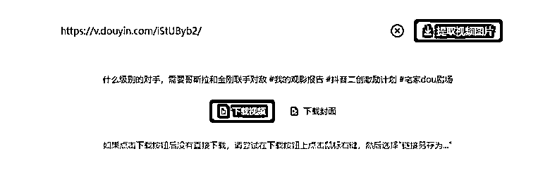

而我们做原创则还需要下载电影的原片，这里涉及到版权问题不详细介绍，不过大家可以去安装一个浏览器插件，豆瓣资源下载大师，安装以后在对应的网页的右侧，会有如下图所示的链接，跳转就可以找到你想要的资源啦。

# 3\. 第三步：提取并简单修改文案

接下来我们要把刚刚上一步我们抖音下载的解说作品，提取他的文案并且进行修改成我们自己的

怎么做呢？这一步需要用到我们的剪映，我们打开剪映，把我们下载的视频拉进去


之后点击识别字幕，提取它的视频文案

识别出的文案以后，我们要对文案进行一些修改


首先我们要明白我们识别这些这个文案的目的是什么？我们是要把这个文案修改成一个自己的文案，然后再翻译成目标语言比如英语，进行配音。之后再通过这个配音去剪辑和匹配作品画面。

那么这个时候，原始的这个中文文案就很关键了，因为有一些文案可能识别错了

这个时候你就需要手动修改一下，不然你翻译出来的语言也是牛头不对马嘴。还有一些情况则是，过于本土化的中文语言可能在翻译的过程中会造成歧义，另外有些作品是会混合一些电影原声，也要进行处理，不然就会都被识别出来了

比如说有一句解说对白，简直不要太酸爽，酸爽的翻译可能就会有很多歧义了，比如说口感酸爽，这个时候你就要给它做一下修改


根据语境可以表达为，“简直不要太痛苦”“简直不要太爽”我就直接给它改成“简直不要太开心”

还有字幕里有一些原声片段，比如说，有个角色“啊”的大叫了一声。而这个内容我们是不需要配音的，后期我们也可以把原片的内容剪辑进去就行了，

像这种我们就要把它删除了


同样的，有一些语句你觉得有一些其他的表达方式全都修改一遍，这样相当于我们重新改了一遍稿子，等到完全筛查一遍字幕没问题以后，我们就要导出好我们已经修改好的文案了

点击导出以后，只选择字幕，并且选择 TXT 格式导出。


# 4\. 第四步：AI 改写并翻译

怎么样上面的步骤都不难吧，接下来，我们就要把刚刚取得的文案做一个翻译，那用什么工具进行翻译最好呢？当然是 A1 语言类最强，Chatgpt 啦


大家先准备好下面这个文案，意思和内容呢可以大家可以按这个意思表达，不一定要求一样。


之后呢准备好一个 chatgpt 账号并登陆，并且把刚刚的文案发送给 AI（没有 chatgpt 的也有很多替代性的 AI 工具，可以考虑一下豆包）


这样我们就翻译完成了，非常简单，但是我们还需要进行检验一下翻译的是否正确，我们可以使用 DEEPL 或者 任意的翻译工具，把刚刚获得的译文，再翻译成中文看下表达的意思是否正确。

对照译文，如果翻译的内容基本一致，那么这个译文我们就可以用了，如果有翻译的不太好的地方，我们需要调整一下原文再重新翻译，直到你比较满意为止


# 5\. 第五步：给文案配音并调整

这里的配音的话，大家依然是可以选择自己熟悉的配音方式，这里的操作比较简单，大家可以选择下面这个平台，直接把文案复制进去，一键就可以完成配音了

得到的配音是一个 MP3 文件，我们要把它放进前面准备工作里提到的软件 AU，Adobe Audition，这里我们的目的是什么呢？

因为配音平台的配音虽然你可以设置语速，但往往每句话的停顿间隔时间不太好控制，可能比较长。

而一个解说视频最重要的是节奏要快，慢吞吞的很多时候观众就走了。但是我们不能通过加速的方式来做，因为语速快了跟炮弹一样也会影响观感，所以我们可以使用 AU 来调整每句话的停顿间隔，

把声音拖进 AU，之后在左侧的面板里选择诊断，之后设置为删除静音


按下图方式设置后以后，点击扫描，之后点击【全部缩短】


这个时候，基本就完成了，然后点击左上角的文件。保存，就处理好了。


处理完可以自己听一下，看下是否满意


# 6\. 第六步：提取新配音的字幕并翻译

再下一步，就是我们要把刚配好音的作品，再做一下前面的提取字幕操作？

为什么又要提取呢？这个时候我们要明白我们的目的是什么。

首先这个配音好的文件，是我们要做的目标语言，我们是听不懂的。所以我们可以怎么做呢？先把它的字幕文案提取出来，并且给它做一个翻译，之后对照这时间戳，我们就能知道这个配音每句话讲的是啥意思了，也就可以给这个配音配画面了。

我们把这个配音再次放到剪映里面，同样的识别并且导出字幕，这个时候，我们导出字幕格式为 SRT 格式。SRT 格式是带时间戳的，也就是说这个字幕可以精确的显示每句字幕在哪个位置对应哪句话。


类似下面这种格式，但我还是看不懂这句话要表达什么意思，怎么办？所以接下来我们就要把这个文案再去做一下翻译。

这里的方法就比较多了，最简单的方式还是使用一些现成的网站进行翻译，比如下面这个，我们只要把上面的英文 SRT 文件上传

选择目标语言为中文，之后它就可以直接给你生成一个中文的字幕 SRT 文件

# 7\. 第七步：剪辑视频

这里的话我们可以选择 PR，也可以选择剪映，一会我都会演示一下，两者的做法基本是一致的。

我先用 PR 演示，这里我们先把前面取得的字幕和配音文件先拉进。看下面，这个时候放进去了 2 个字幕，一个中文的一个英文的，还有刚刚取得的配音文件


放大一点，我们发现，发现字幕上的文字，准确的描述了第一个画面的场景


也就是说，在这里我们只要放上我们对应内容的画面是不是就匹配上了？比如说第一个字幕是【我从未见过如此聪明的小宝宝】，所以在这里我们只要放上一个比较对应这个文案的画面，是不是就可以了？


怎么样是不是恍然大悟，然后你懂了，找了一个匹配的画面，放了进去。这个时候你又发现，怎么长度匹配不上。有些画面的长度比字幕的要长，有些则要短一点？


那怎么办？这个时候就要用到 PR 的一个功能--调速，我们按下快捷键 R，这个时候在视频轨道的后面光标会显示下面的样式


按住之后往前或者往后拖动。


这个时候你会发现，这个画面就跟你的配音完美的匹配上了，这个实现的原理呢，其实很简单，就是通过调整画面的速度，把它调快或者调慢来匹配上配音的内容

那同样的内容，剪映如何实现呢？

同样的，在剪映里按下 ctrl+R，之后光标移动到需要调整的视频片段末尾，出现白色双向箭头以后，向前后拖动，就可以完成匹配了

如果你剪映里的快捷键不一致的话，可以在设置里，把快捷键设置为 Premiere Pro 就可以了


如果是想直接搬运修改，那直接按这个方法，把原来的解说视频画面的内容去对这个配音就剪辑好了。比如说原来的画面里已经告诉你这个户名，你只要截取出来再拉到对应的位置和长度就可以了，没两下就剪辑完这个作品了。


但如果我想要剪辑原片呢？我想要做纯原创，拿一个影视的原作品来剪辑，怎么操作更快呢？

首先我们先新创建一个序列，设置为横屏 1920*1080 的横屏序列，之后把我们的要剪辑的影视原片拉进去

如下图，新创建的序列会显示在中间的一行标签栏，按住它，拖到下方的蓝色区域


这个时候界面就分为两个任务轨道了。下面的为原片序列，上面的是我们要剪辑的成品作品序列。我们先看上面序列的字幕轨道里需要什么样的画面，这个时候就可以在下方原片里找到对应的画面，直接裁剪了往上拖，之后如果画面过长的就提速，画面太短的就降速，跟上面说的方法一样

等你慢慢把所有字幕画面匹配完成了，你的视频也就基本做完了，再把画面的色彩，还有字幕等等元素调整一下就可以了


在导出作品，这个时候就可以选择发送到 ME，让软件后台渲染，就可以继续剪辑下一个作品了～

1.  推荐赛道：AI 疗愈音乐

# 1.第一步：找对标

对标一：

1 个月前开始发布，账号创建于 9 月中下旬


收益预判最高每月 2.2 万美元

对标二：

1 个月前开始发布，账号创建于 10 月份


收益预判最高每月 3.3 万美元


类似这样的对标还有很多：

https://www.YouTube.com/channel/UCkK2B6D3imy6EnpqfrYm-5A

https://www.YouTube.com/@HealingWithMe.

https://www.YouTube.com/@Lofi1980s

https://www.YouTube.com/@LofiKittychannel

https://www.YouTube.com/@CalmCity-channel

我筛选的标准大概是这样：一年内订阅数不超过 10w 的素人号，已经开通 ypp，然后视频制作难度不大，最好是 AI 制作的，并且视频小白也能模仿，没有技术壁垒的

# 2.第二步：拆解对标

以对标一作为举例：

1）缩略图：即封面 图片加大字 简单 略过

2）图片：治愈插画 可用 AI 完成像素级模仿


1）歌曲：两首 Lofi clam 音乐风格 循环 拉时长

2）画面：特效 开场淡入 开屏文字 爆款元素


# 3.第三步：生成图片

选择我们要复刻的爆款视频，拿对标的举例，通常是筛选视频里的最热门（也是筛选爆款选题的过程）


选择好爆款视频后，打开全屏，点击播放，两秒钟后标题和时间序会淡出，这时候 Alt+A 截图保存


然后打开 ChatGPT，点击左侧“探索 GPT”，然后搜索栏输入“DALL”，找到“DALL， Eの 3 Prompt Craft”


接着上传图片，并根据像素级模仿的需求进行提问，话术仅供参考：

现在设定你是一名精通图片制作、精通文生图口令的专家，请你分析这张图片的特点，并给出一段可以生成 90%相似度的口令

最后打开快手可灵，选择文生图板块，输入获取到的口令，以及上传图片作为垫图，生成图片

可灵网站：https://klingai.kuaishou.com/

可灵会赠送几百个积分，文生图一次最多 1 积分，完全够用到精通掌握

其实用 midjourney 可能更好，但最后还是选择了一种免费的方式


至于图片水印，用美图秀秀就可以了，通常我还会给图片加一层滤镜，诸如亚暗或治愈，用剪映也可以加滤镜，总之就是让图片变得更自然更符合自己想要的效果即可。

# 4.第四步：生成音乐

# 4.1 获取音乐口令

打开 ChatGPT，在“探索 GPT”里找到“suno prompt”，如果曾经用过会直接显示在 ChatGPT 的下方，然后上传图片和话术，获取符合图片意境的音乐口令，以下是参考话术：

现在设定你是一名 suno prompt 的顶级专家，请你根据这张图片的意境，生成一首舒服放松、没有歌词的音乐，请告诉我你的口令是什么


# 4.2 用 Suno 生成音乐

打开 Suno，点击左侧的“创造”，然后输入口令，记得打开“器乐”选项才能生成纯音乐，最后会生成两首歌曲，一般是三四分钟，觉得好听可以延长（如果不满意，针对性的修改口令，重新生成即可）

Suno 官网：suno.com

要买会员，音乐才能商用，但不贵，我是上闲鱼买的，才 10 块一个月

满意的音乐，可以鼠标右键音乐进行下载


# 5.第五步：制作可视化模块

在 suno 找到两首满意的音乐后，导入剪映，都设置淡入淡出 10s，让音乐衔接更自然，然后合并导出。


打开音乐可视化工具网站 Tuneform，找到如下图的光谱

网站链接：https://tuneform.com/


按照提示流程，上传音乐文件，第一个颜色通常选白色，第二个颜色通常选深色，文字随便填，后面都会扣掉。


与快手可灵一样，刚开始都有积分赠送，可以免费生成。

# 6\. 第六步：剪映剪辑

先导入图片和音频，并将图片拉长至同样时长，并根据画面适当地添加特效和贴纸

然后导入可视化模块，并放置在最上方


对可视化模块进行编辑，点击“抠像-色度抠图”，鼠标移至蓝色画面会自动消失


然后点击“蒙版-矩形”，框住一条长方形的可视化模块，再点击“基础-放大”，然后将模块移至屏幕最下方（对了，记得把它的音乐声量调成静音）


最后将这些画面合成一个片段，不断复制粘贴，延长至 1h 小时左右


最后可以模仿同行给音频添加了一些爆款元素，比如白噪音、开头的入场画面、能引起共鸣的文字等，想办法在前三秒留住用户。

内容来源：《【适合新手】小白入局 YouTube 长视频，0 基础也能上手的 AI 音乐玩法》

1.  推荐赛道：AI 疗愈音乐

# 1.第一步：找对标

对标一：

1 个月前开始发布，账号创建于 9 月中下旬


收益预判最高每月 2.2 万美元


对标二：

1 个月前开始发布，账号创建于 10 月份


收益预判最高每月 3.3 万美元


类似这样的对标还有很多：

https://www.YouTube.com/channel/UCkK2B6D3imy6EnpqfrYm-5A

https://www.YouTube.com/@HealingWithMe.

https://www.YouTube.com/@Lofi1980s

https://www.YouTube.com/@LofiKittychannel

https://www.YouTube.com/@CalmCity-channel

我筛选的标准大概是这样：一年内订阅数不超过 10w 的素人号，已经开通 ypp，然后视频制作难度不大，最好是 AI 制作的，并且视频小白也能模仿，没有技术壁垒的

# 2.第二步：拆解对标

以对标一作为举例：

1）缩略图：即封面 图片加大字 简单 略过

2）图片：治愈插画 可用 AI 完成像素级模仿


1）歌曲：两首 Lofi clam 音乐风格 循环 拉时长

2）画面：特效 开场淡入 开屏文字 爆款元素


# 3.第三步：生成图片

选择我们要复刻的爆款视频，拿对标的举例，通常是筛选视频里的最热门（也是筛选爆款选题的过程）


选择好爆款视频后，打开全屏，点击播放，两秒钟后标题和时间序会淡出，这时候 Alt+A 截图保存


然后打开 ChatGPT，点击左侧“探索 GPT”，然后搜索栏输入“DALL”，找到“DALL， Eの 3 Prompt Craft”


接着上传图片，并根据像素级模仿的需求进行提问，话术仅供参考：

现在设定你是一名精通图片制作、精通文生图口令的专家，请你分析这张图片的特点，并给出一段可以生成 90%相似度的口令


最后打开快手可灵，选择文生图板块，输入获取到的口令，以及上传图片作为垫图，生成图片

可灵网站：https://klingai.kuaishou.com/

可灵会赠送几百个积分，文生图一次最多 1 积分，完全够用到精通掌握

其实用 midjourney 可能更好，但最后还是选择了一种免费的方式

至于图片水印，用美图秀秀就可以了，通常我还会给图片加一层滤镜，诸如亚暗或治愈，用剪映也可以加滤镜，总之就是让图片变得更自然更符合自己想要的效果即可。

# 4.第四步：生成音乐

# 4.1 获取音乐口令

打开 ChatGPT，在“探索 GPT”里找到“suno prompt”，如果曾经用过会直接显示在 ChatGPT 的下方，然后上传图片和话术，获取符合图片意境的音乐口令，以下是参考话术：

现在设定你是一名 suno prompt 的顶级专家，请你根据这张图片的意境，生成一首舒服放松、没有歌词的音乐，请告诉我你的口令是什么


# 4.2 用 Suno 生成音乐

打开 Suno，点击左侧的“创造”，然后输入口令，记得打开“器乐”选项才能生成纯音乐，最后会生成两首歌曲，一般是三四分钟，觉得好听可以延长（如果不满意，针对性的修改口令，重新生成即可）

Suno 官网：suno.com

要买会员，音乐才能商用，但不贵，我是上闲鱼买的，才 10 块一个月

满意的音乐，可以鼠标右键音乐进行下载


# 5.第五步：制作可视化模块

在 suno 找到两首满意的音乐后，导入剪映，都设置淡入淡出 10s，让音乐衔接更自然，然后合并导出。


打开音乐可视化工具网站 Tuneform，找到如下图的光谱

网站链接：https://tuneform.com/

按照提示流程，上传音乐文件，第一个颜色通常选白色，第二个颜色通常选深色，文字随便填，后面都会扣掉。


与快手可灵一样，刚开始都有积分赠送，可以免费生成。

# 6\. 第六步：剪映剪辑

先导入图片和音频，并将图片拉长至同样时长，并根据画面适当地添加特效和贴纸

然后导入可视化模块，并放置在最上方


对可视化模块进行编辑，点击“抠像-色度抠图”，鼠标移至蓝色画面会自动消失


然后点击“蒙版-矩形”，框住一条长方形的可视化模块，再点击“基础-放大”，然后将模块移至屏幕最下方（对了，记得把它的音乐声量调成静音）

最后将这些画面合成一个片段，不断复制粘贴，延长至 1h 小时左右


最后可以模仿同行给音频添加了一些爆款元素，比如白噪音、开头的入场画面、能引起共鸣的文字等，想办法在前三秒留住用户。


内容来源：《【适合新手】小白入局 YouTube 长视频，0 基础也能上手的 AI 音乐玩法》

1.  找对标 【新人向】

# 1.章节概要

# 💡

# 章节概要：

数据驱动是 YouTube 运营的核心，通过分析关键指标优化内容策略，才能获得持续增长和稳定收益。

本章重点包括：

✅ 如何做对标：理解复刻的标准和方法

✅ 数据分析：了解平台分析工具和关键指标解读

✅ 平台政策解读：如何规避限流与 0 播问题

✅ 内容优化策略：根据数据反馈调整内容方向

复刻要精准，创新要适度，在掌握爆款规律后再考虑差异化。

先做出第一个爆款，再基于数据分析逐步优化内容质量和账号定位。

# 💡

# 本章航线图

完成本章节的学习和实操，即可完成航线图的：

第三阶段：持续优化，开通 YPP，获取收益 （约 12 天）

.

建立 AI 创作流程，每天更新 1～2 个视频 （约 8 天）

.

优化 AI 内容质量，提升观看完成率 （约 3 天）

# 2.找对标

1.  对标库可以多个账号，但做视频发布务必只对标一个账号

.

除非已经有丰富的爆款经验，否则不要同时对标多个账号做视频，不要今天发 A 账号的，明天又发 B 账号的，即便是同个赛道，不同账号的用户画像也不同，对标同一个账号内的视频能够让你的用户画像与他尽最大可能保持一致，走他已经验证成功的道路

.

前期不熟悉视频制作、不熟悉爆款的规律、不熟悉用户的喜好，一定先把一个账号的对标模仿到 90 分，甚至 100 分，对标多个账号会分散精力和时间

# 2.复刻爆款的标准是什么，哪些元素要复刻，哪些元素可以不复刻？

如果下面列出的元素没有复刻到位，请思考一下到底是赛道不行、对标不行还是复刻没做到位

哪些东西需要复刻？

脚本：每个分镜的动作、剧情、时长

主体：人种、长相、服装风格、动物/怪兽种类（如有）、变身形象（达人秀）

画面：画风、场景

剪辑手法：特效、转场、每个分镜的时长、变速、

BGM：配乐、配音、音效

标题、简介

可以调整用于去重的东西有哪些？

.

（达人秀）评委镜头，可以从爆款的多个视频里抽取自由组合，但需要按照“分镜 1”“分镜 2”“分镜 3”这样进行提取和组合，比如爆款视频中位于开头的评委镜头，你也要用于开头；用于结尾的，你也要用于结尾

.

人物的服装颜色、服装款式、发型、动物的颜色、场景

.

主体的方位（比如调换人/动物的/场景的左右顺序）

如果你已经能够自己摸索出爆款的规律，那么以上的标准都可以不听。

但如果还没有做出自己的第一个爆款，请务必按照上面的要求对爆款进行 1:1 复刻


1.  复刻爆款的案例

# 3.1 达人秀复刻示例

原视频 1000 万，复刻视频 180 万

youtube_H3Tzo-vOw7w_1080x1800_h264.mp4【在线播放】

youtube_blqcRxPa-lE_1080x1800_h264.mp4【在线播放】

原视频 3600 万，复刻视频 80 万

youtube_p6rqHIu7QZI_1080x1920_h264.mp4【在线播放】

youtube_o8bGdOj4ZKg_1080x1920_h264.mp4【在线播放】

# 3.2 动物示警复刻案例

左边是原爆款，3600 万播，右边是小伙伴复刻的，900 万播，画面做了调整，中间是第一次做应该达到的水准。

animals-warning-signals-to-humans-animals-rescue-dog-2160-ytshorts.savetube.me.mp4【在线播放】

1月19日.mp4【在线播放】

youtube_ZS-X6wvPN60_1080x1920_h264.mp4【在线播放】

# 3.3 动物故事复刻案例

原视频 5000 万，复刻视频 50 万（新账号第二个视频，镜头和音乐做了调整，不然可能更高）

youtube_1fq9PwfkjXM_720x1280_h264.mp4【在线播放】

youtube_XE3MK2SngQg_720x1280_h264.mp4【在线播放】

原创和创新，包括微创新，都建立在你能精准地复刻爆款并制造爆款的基础上，在完成自己的首个爆款前，请不要有任何原创与创新的想法，老老实实从 1:1 复刻开始，掌握视频制作的手法与网感。


# 4.一些新手阶段常见的错误行为

（1）以量取胜：在没完全复刻到位之前，大量堆视频，企图量变引起质变

一个 90 分，大于 100 个 50 分，换句话说就是一个千万爆款，顶得上 1000 个万播视频，10000 个千播视频，不要有侥幸心理，先把复刻的质量保证好，再去考虑数量。

(2) 完美主义：没有复刻到 100 分，坚决不发；没有掌握到视频制作的精髓，坚决不发；觉得视频做得粗糙，坚决不发

90 分好过 60 分，但哪怕 30 分也好过 0 分！不要矫枉过正，尽管质量大于数量，但起码数量不能是 0，追求质量的前提是每天至少 1 更，连基本的更新都保证不了，连第一步都不迈出去，质量再高也是空谈，不要被完美主义阻拦前进的步伐，前期做得再烂也要发出去，只有发出去才知道有多烂、怎么改

（3）挑战极限：专挑复杂的视频对标、专挑时间长的题材做、专挑流程多的赛道做

如果自己的技能足够娴熟、对于 AI 工具、剪辑工具的使用已经滚瓜烂熟，那么大可随意；

但如果自己还不是非常熟悉各类工具的使用和视频制作的流程，请务必不要挑战自己，先从简单的赛道、简单的对标开始复刻，从知识库中给了详细制作流程的视频类型开始复刻，挑软柿子捏。

镜头越多、时间越长、画面越复杂，复刻不出来、复刻不到位的概率就越大，视频数据就差，同时自己的时间成本、精力成本又投入了，费力不讨好，负反馈拉满。

（4）原创情节：爆款还没复刻出来，就想着原创、想着创新，试图走出一条自己的路

原创和创新，包括微创新，都建立在你能精准地复刻爆款并制造爆款的基础上，在完成自己的首个爆款前（能高质量地完成复刻前），请不要有任何原创与创新的想法，老老实实从 1:1 复刻开始，掌握视频制作的手法与网感。

(5) 埋头苦干：不看数据、不做复盘、不想交流，闷头做视频，原地踏步，一直做不出结果

多观察数据，对比数据，多思考，遇到卡点和问题及时和大家沟通，可能别人的一句话胜过自己研究好几天（亲身尝试过），陪跑不是一个人的游戏，你不孤单。


1.  【8月更新】数据分析

# 1\. 进入数据分析页

Step 1：登录 YouTube，点击右上角 Profile Icon（头像标志），选择 YouTube Studio。

Step 2：在右侧面板中能看到指标总结，查看详细分析可点击 GoTo Channel Analytics 或在左侧菜单栏中选择 Analytics。


Step 3：根据需要，可查看 Overview、Reach、Engagement、Audience 及 Revenue 这几个指标。

Step 4：点击 Advanced Mode，可进行更加详尽的数据分析和各个视频的数据指标情况。


Step 5：在 Advanced Mode 中选择想要追踪的数据，点击右上角的下载箭头，选择 Google Sheets 或 。csvfile 生成报告。在 Advanced Mode 中点击右上角 Compare To，可查看每年频道增长情况、视频发布后 24 小时内的表现情况。


# 2\. 基本数据释义

# 2.1 整体指标


可以了解平台的整体表现、识别平均趋势等。


# 2.2 推流观看指标【内容】

可以了解选定时间范围内（图示的是过去 28 天）用户是怎么看到你的 Shorts，整体的选择观看率，以及热门的 shorts 短视频。


# 2.3 用户画像【观众】


可以了解用户画像，地区分布、兴趣偏好、同行、观看时间、性别年龄分布等


# 2.4 营收数据指标【收入】

如果账号开通了货币化功能（创收），可以在收入页面查看营收：

# 2.5 单个视频数据

从 shorts-对应视频-数据分析点进去就可以进入单个视频的数据分析页，对应数据指标的意思和上面整体的是一样的，不赘述，放几张图给大家参考，三千五百万的视频数据长这样。【收益低是因为开通 YPP 的时候这个视频已经推流两千万了】


# 3.短视频重要的数据项分析

对于起号阶段来说，大道至简，繁多的数据中只需要重点关注下面几个，就基本能解决 99%的问题

要注意，数据都是相对的，一个蓝海赛道，也许你的数据并不出众，内容质量并不高，也能获得推流，因为你比别人都强；一个非常卷的赛道，也许你的数据都很好，也拿不到大量推流，是因为做得好的人太多了，你并不算出众的那一个，所以，对比同赛道的数据会更有价值，可以找同赛道的圈友交流数据。

提升数据指标的方法参考表格 ： 【深海圈】视频对标影响因子评估表

# 3.1 选择观看率

选择观看率决定了观众在看到视频的前几秒是否留下，直接关系到油管的广告插入会不会被看到，你的视频别人以看就划走了，油管还会给你推流吗？

能够提高选择观看率的因素：第一时间抓住观众的眼球，爆点悬念前置、丰富的色彩、明亮的场景、美丽性感可爱的人物、可爱/凶猛/大型/稀有的动物、大幅度的动态表现、好听动感抓耳的音乐、精准的推流


如何判断选择观看率的高低(不同赛道会有所差异,这里仅作参考)：

85%及以上：牛逼，你不爆天理不容

80%：突破千万的门槛

75%：大量推流的门槛

70%：质量过关的门槛

低于 70%：要么质量差，要么推流用户不精准


# 3.2 观看时长百分比

观看时长百分比决定了用户看你的视频看了多久，直接关系到油管的广告插入会不会被看到，你的视频让别人看一半就划走了，油管有必要给你推流吗？

能够提高观看时长百分比的因素：持续吸引用户节奏，视频节奏（卡点、特效、转场）、信息密度（加速、大动作、换场景/变装等）、整体美感（图片质量、视频质量、帧率等）、精准的推流


如何判断观看时长百分比的高低：由于视频时长跟百分比的关系非常大，大家的时长不见得一样，这里用我的播放 TOP5 供大家参考，一般15秒的视频需要21秒以上的观看，30秒的视频需要33秒以上的观看，60秒的视频需要54秒以上的观看才是优秀。

# 3.3 地区分布及观众画像

直观地看：


细致地看：点【展开】，然后点红框左边的加号，添加这两项数据，再按观看次数排序


能够通过这个数据看出来，你的内容最受哪里的观众喜爱，最不受哪里的观众待见


# 4\. 【5月更新】长视频重要的数据项分析

1.  点击率

再好的内容没人看也是白瞎，点击率和完播率是长视频最重要的两项指标，点击率的总览与变化趋势可以在数据分析-覆盖面-点击率进行查看，这里看的是【所有】来源的点击率加总


实际上，点击率还有进一步的细分组成，也就是下图所示，从这里能够看到不同展示来源的点击率，也就代表了在不同场景中，你的封面、标题、视频说明具有怎样的竞争力。


使用Gemini 2.5 PRO Deep Research分析的点击率及优化策略调研，可以参考，写得比较全面：

YouTube长视频点击率提升与优化策略深度调研分析报告

1.  平均观看时长、平均观看百分比、完播率

下图框选的三个指标为平均观看时长、平均观看百分比、完播率

这三项指标综合起来就代表了视频内容的吸引力——观众愿意看多久，有多少观众能看完

从下图的曲线中我们能得到以下信息：

.

开头曲线快速下降的部分：类似短视频的划走率，意味着在开头大部分用户选择了关掉视频，可能代表封面、标题与实际的开头内容并不完全契合或开头不够吸引人，质量不够高

.

曲线中间突然下跌或上浮的部分：视频中的差劲片段或精彩片段，导致用户重复观看或直接划走

.

某个时间点的百分比：意味着在这个时间点，还有百分之多少的用户停留，也就意味着比如插入广告、插入外链，能够被多少用户看到（当然，也可能因为插入外链和广告导致对应时间点的数据变差）

看懂了这个图，也就能够对应地优化相应部分的内容


1.  地区分布及观众画像

和shorts一样，这里能够看到

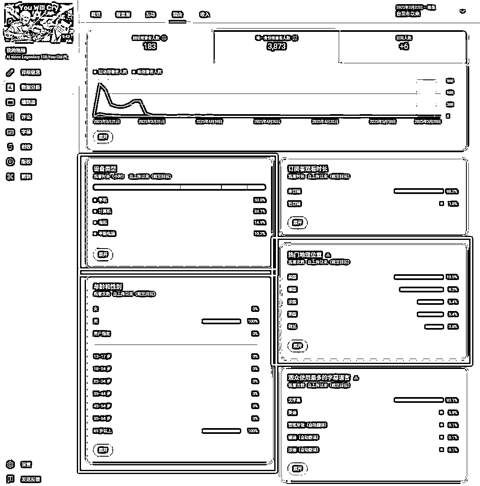

1.  流量来源及对应数据

通过对流量来源数据的观察能够了解视频相应来源的流量，以此判断视频的限流与否、SEO好坏、合适的引流方式等

推荐视频：一般是指其他视频后面的推荐视频引流来的，类似于“猜你喜欢”


浏览功能：如果量很小，一般是订阅用户的观看，如果量很大，一般是首页推荐

YouTube搜索：YouTube内部的搜索

外部：如Google搜索、外部网站跳转、外部网站植入等

1.  【8月更新】使用基础数据分析工具、平台政策解读

# 1.使用基础数据分析工具，了解收益趋势分析等

# 1.1油管数据、收益查询网站：https://www.viewstats.com/

野兽先生团队出品，非常强大的网站，免费版就够用。

功能一，查榜单【免费的】：能够查 TOP100 频道和视频，能够按国家地区、内容类型来区分，也支持按时间筛选，甚至还可以过滤面向儿童内容和影视音乐内容，如果想找某个国家和地区的爆款，可以直接查到

功能二，查收益【免费的】：比 socialblade 和 ytcharge 都准确，用我的频道做个对比。AI 类的 Shorts 收益好算，东南亚多就按万播 0.2-0.5，欧美日韩多就按万播 0.8-1.2，计算收益的播放量约等于总播放量减去 1000-2000 万播放（YPP 开通的数据更新有 5-7 天延迟，浪费的流量一定超过一千万）。没有特定文化指向性，无语言障碍的内容基本都是东南亚多。以及，最准的收益计算方式是自己算，短视频播放量按上面的规则手算，长视频大部分无语言内容0.6-2，中文内容1.5-4，英文内容2-6。


这里也提供一份常见AI赛道的RPM参考，非AI类赛道也可以参考相似的AI赛道，RPM与AI与否无关


# 1.2趋势分析网站：https://piped.kavin.rocks/trending

主要作用：Piped 是一个开源的第三方 YouTube 客户端，它的"Trending"页面可以让用户查看当前 YouTube 上的热门趋势视频，且无需广告干扰。对于 YouTube 创作者来说，它是一个轻量级工具，用于发现趋势内容

使用场景：1。快速浏览 YouTube 上的当前热门视频，寻找灵感或研究观众关注的话题。 2.根据热门内容和趋势规划自己的视频主题，紧跟潮流，吸引更多观众。 3.查看同领域创作者的热门视频，分析其成功的标题、标签和内容策略。


# 1.3综合性工具：vidIQ https://app.vidiq.com/

功能非常多，浏览器插件就能够看到各个视频的数据趋势，强烈推荐使用，插件免费，进阶功能付费。


付费后能够绑定自己的频道，查看自己的频道数据，并做相应的分析


能够通过复杂的筛选条件进行爆款挖掘与查找、关键词分析、竞争对手分析和订阅用户分析

同时也内置了一些创作功能，包括封面、切片、灵感、脚本、AI生成等功能。


# 2.【8月更新】平台政策解读，如何规避限流与 0 播问题

# 2.1 0播和限流问题成因分析

简而言之，新号客观存在限流情况，需要筛号，限流0播超过3天直接换号（可以同个邮箱下开新频道），不要纠结浪费时间，可能过半个月回来限流的号就不限流了。

经过一定量圈友的测试和验证，在限流频道的同个谷歌邮箱下新开频道，能大概率解决限流问题，不用去大量地采购谷歌邮箱或频道，包括长视频也可以通过这个方式规避限流影响@怅惘教练分享 【0724更新】

.

账号有问题，被限流。起号阶段限流有可能是短期的，要观察下之前发的老视频有没有流量，如果后续连续几个视频都是 0 播大概率是账号问题，可能存在问题的点及解法：

.

节点是机场或问题 IP，用 IP 检测工具自查 https://ipjiance.com/ 查出来有问题就先换梯子

.

电脑有没有装 360，装了就卸了用火绒安全，安全专业无捆绑 https://www.huorong.cn/

.

多账号登录时有没有环境隔离，用新环境登录发视频试试

.

如果上述方法都解决不了，建议重开

.

账号没问题，视频有问题。视频触发原创性问题或者违反政策（比如色情低俗）会直接限流，看看发新的不涉及这类问题的视频还是否限流，比如手机实拍风景，几百播就是正常的。

.

都没问题，但是一天发布太多视频。没开高级权限前，一天只能发布 1-2 个视频，发多了会限流。同时也避免同一时间发布多个视频，尽量错开时间发

.

如果以上都没问题，还是 Shorts 0 播，可以删除原视频，再进行重发，但是不能短时间内多次删除重发短视频，会影响账号。


# 2.2 关于版权问题

理解版权法的重要性。YouTube 对于版权非常敏感。上传他人的内容（如音乐、影视片段、图像）可能导致视频被删除、账号被警告，甚至失去变现资格。不建议任何形式的搬运操作，包括国内搬油管，因为你不会知道是不是有人已经早你一步搬运过了。

规避常见的版权雷区

音乐：避免使用受版权保护的歌曲，除非获得许可。可以选择 YouTube 提供的音频库，其中有免费的音乐和音效，也可以用 SUNO。（短视频还好，没出提示就没什么事）

图片和素材：使用无版权限制的图片或视频（如 Unsplash、Pixabay 或 Pexels），或确保你拥有素材的商业使用权。（AI 类内容一般没有这个问题）

影视、游戏片段：即使只用了几秒钟，也可能触发版权警告，特别是热门影视和游戏内容。（AI 类内容一般没有这个问题）

为什么 YouTube 对版权卡这么严？背后的小故事

YouTube 是在 2005 年情人节创建，2006 年 10 月被 Google 买走了，花了 16.5 亿美元，YouTube 早期是上传一些生活类的视频，后面有人上传电视、电影、音乐的片段。

因此出现大量侵权内容，2007 年 3 月，Google 被起诉求偿 10 亿美元，同年 YouTube 推出 ContentID（数字指纹），当你知道这一段历史之后，就很清楚 YouTube 为什么会对版权管这么严了。

拥有版权的公司或者团休会有一个后台，版权管理工具，用于维护自己的版权权益，这个工具维护着版权库，即他们上传视频、音乐会生成一个电子指纹即 ContentID（数字指纹），其他人没有版权上传的视频有在这个版权库被匹配到，那么就会有版权主张的提示了。

有些人会收到版权主张，提示版权方允许你用，但是收益归版权方。

有了 ContentID（数字指纹）这个东西，拥有版权的公司或团体，当其他人上传的视频触发到版权就可以躺赚了，那么侵权的问题也就解决了。

YouTube 手册有一个关于合理使用内容的说明，不是说完全不能有别人的内容，举例足球解说，重点在解说，内容可能引用了部分别人的内容，这个可以划到合理使用的范畴，具体参见官方文档 ： YouTube 上的合理使用

如何判断是否有版权问题，版权问题的体现有几种：

.

发了，没提示，但在发了之后被版权警告——被版权方检测到了之后，没有立马警告你，而是过了一段时间才警告你，这种也是最难防的（达人秀的评委画面）

.

发了，有提示，没影响——针对shorts无影响，长视频可能有影响，具体需要看限制条件。

.

发了，有提示，部分地区禁播——只影响部分地区的观看，其他地区可以正常播放，一般也没有额外的影响

.

发了，有提示，全球禁播——设置了版权限制，直接从系统层面不允许你发布


.

发了，有提示，不限制播放，但分钱——没开通YPP没影响，但开通了，会分走你的YPP收益，常见于音乐版权


.

发了，有提示，不限制播放，所有钱全拿走——没开通YPP没影响，但开通了，一毛钱没有，常见于各种音乐版权


.

发了，有提示，直接社区准则警告/警示——一般是在直播中使用版权音乐、播放版权所有片段会触发，非常严重，直播和长视频务必要慎重对待可能有版权的内容。


.

核心就是，对于不熟悉油管生态的新手来说，不要碰版权类的内容：影视、电视节目、综艺、短剧、动漫、小说、音乐。所以，这也是为什么AI赛道这么受欢迎，因为除了有意二创的AI，是绝对原创的。


# 2.3 在 YouTube 进行创收的内容规范【什么样的内容不允许创收】


请仔细查阅 YouTube 的官方文档：

https://support.google.com/youtube/answer/6162278?hl=zh-Hans&ref_topic=9153642&sjid=8484199543161395342-NC


# 2.4 YouTube 的内容准则【什么样的内容会被判定违规】

以下将详细剖析YouTube社区准则的各大类别。每一项政策都将提供其中英文全名、核心宗旨，以及具体的违规内容示例，以帮助创作者在实践中准确识别和规避风险。

垃圾内容、欺骗行为和欺诈 (Spam, Deceptive Practices & Scams)

宗旨：旨在维护一个建立在信任基础上的社区，禁止任何意图欺诈、误导或发送垃圾内容的行为 ()。

冒充行为政策 (Impersonation Policy)：禁止冒充他人或其它频道。

违规示例：创建一个与某知名创作者的频道名称和头像几乎完全相同的频道，并重新上传其内容，意图混淆观众。

外部链接政策 (External Links Policy)：禁止在内容中添加指向违反社区准则的网站链接，如恶意软件、钓鱼网站或色情网站 ()。

违规示例：发布一个关于“免费软件”的视频，但在描述中提供一个指向已知会传播恶意软件的网站链接。

虚假互动政策 (Fake Engagement Policy)：禁止以人为方式刷高观看次数、顶、评论或其他指标 ()。

违规示例：发布视频并承诺，只要对方订阅你的频道，你也会订阅对方的频道（即“sub4sub”）。

播放列表政策 (Playlists Policy)：禁止创建标题具有误导性或汇总了违规内容的播放列表 ()。

违规示例：创建一个名为“儿童趣味卡通合集”的播放列表，但其中填充了包含成人主题、暴力或性暗示的视频。

敏感内容 (Sensitive Content)

宗旨：保护观众、创作者，尤其是未成年人，免受潜在有害或不当内容的影响 ()。

儿童安全政策 (Child Safety Policy)：此为用户重点关注的领域。该政策严禁发布危及未成年人身心健康的内容 ()。

违规示例（未成年人性化）：视频汇编了未成年人穿着泳装的片段，并配以性暗示标题，或开放的评论区中充满了掠夺性言论 ()。

违规示例（危险行为）：视频展示一名未成年人在没有成人监护的情况下参与“窒息游戏”或燃放烟花 ()。

违规示例（精神虐待）：一个“恶作剧”视频，父母假装抛弃自己的孩子，导致参与的未成年人产生真实的恐惧和痛苦 ()。

违规示例（误导性家庭内容）：使用深受儿童喜爱的卡通形象（如小猪佩奇或艾莎公主）制作动画，但内容却描绘他们实施暴力、接受手术或处于色情场景中，这类内容通常被称为“艾莎门 (Elsagate)” ()。

裸露和色情内容政策 (Nudity & Sexual Content Policy)：禁止旨在获得性满足的色情内容和露骨的性内容 ()。

违规示例：视频展示真实或模拟的性交行为 ()。

违规示例：汇编“走光”片段，并刻意聚焦于裸露的生殖器或胸部 ()。

违规示例：视频演示如何使用性玩具以获得性满足 ()。

自杀、自残和饮食失调政策 (Suicide, Self-Harm, and Eating Disorders Policy)：禁止美化或鼓励此类行为的内容 ()。

违规示例：视频提供关于自残或自杀方法的指导 ()。

违规示例：视频宣扬“支持厌食症 (pro-ana)”的生活方式，分享极端减肥的技巧，或在饮食失调的语境下对他人进行体重霸凌 ()。

违规示例：为博取眼球而展示未经模糊处理的、血腥的自残伤害图片 ()。

缩略图政策 (Thumbnails Policy)：禁止缩略图包含色情、血腥暴力或粗俗语言 ()。

违规示例：使用一张色情图片作为缩略图来吸引点击，即使用户视频本身不包含此类内容 ()。

粗俗语言政策 (Vulgar Language Policy)：如果亵渎性语言过多，或在标题、缩略图中使用，可能会导致内容被设为年龄限制 ()。

违规示例：视频标题为“笑到爆粗口的失败集锦”，或视频内容完全由人们说脏话的片段构成 ()。

暴力或危险内容 (Violent or Dangerous Content)

宗旨：通过禁止无端的暴力内容、宣扬危险行为或煽动仇恨的内容，来防止现实世界中的伤害 ()。

暴力或血腥内容政策 (Violent or Graphic Content Policy)：禁止意图惊吓或令人生厌，或煽动暴力的内容 ()。该政策明确包含

虐待动物 (Animal Abuse)，直接回应了用户的另一项具体问询。

违规示例（人类暴力）：未经编辑的恐怖袭击后果录像，聚焦于严重受伤的受害者，并配以耸人听闻的标题 ()。

违规示例（虐待动物 - 强迫打斗）：视频展示两只狗被强迫相互撕咬（斗鸡也被明确禁止）()。

违规示例（虐待动物 - 恶意虐待）：视频描绘某人为取乐而故意伤害动物，且该行为不属于狩猎等传统或标准做法 ()。

违规示例（虐待动物 - 伪造救援）：创作者为了拍摄“戏剧性救援”视频以获取观看量，故意将一只小狗置于危险境地（例如，放在铁轨上）()。

有害或危险内容政策 (Harmful or Dangerous Content Policy)：禁止鼓励危险或非法行为的内容，特别是危险挑战和恶作剧 ()。

违规示例：视频演示“汰渍洗衣球挑战”，或指导观众如何进行其他可能导致严重身体伤害的危险行为 ()。

仇恨言论政策 (Hate Speech Policy)：禁止基于受保护特征（如种族、宗教、性别认同等）宣扬针对个人或群体的暴力或仇恨 ()。

违规示例：视频声称某个特定种族或宗教群体是“亚人类”，或应该被消灭 ()。

骚扰和网络欺凌政策 (Harassment & Cyberbullying Policy)：禁止恶意攻击、持续性侮辱和人肉搜索 (doxxing) ()。

违规示例：视频专门嘲笑某人的外貌，或泄露其私人家庭住址并煽动观众去骚扰此人 ()。

暴力犯罪组织政策 (Violent Criminal Organizations Policy)：禁止赞美、宣传或协助恐怖组织或犯罪组织的内容 ()。

违规示例：视频美化大规模枪击案凶手或恐怖组织，或提供如何加入他们的指南 ()。

受管制商品 (Regulated Goods)

宗旨：防止为非法或受严格管制的商品提供销售便利 ()。

销售非法或受管制商品或服务政策 (Sale of Illegal or Regulated Goods or Services Policy)：禁止直接销售或提供链接至销售毒品、假身份证或色情服务的网站 ()。

违规示例：一个评测某种大麻的视频，在描述中包含了销售该产品的在线商店链接 ()。

枪支政策 (Firearms Policy)：禁止销售枪支或提供如何制造枪支及特定配件的教学内容 ()。

违规示例：视频一步步演示如何通过3D打印制造枪支机匣，或如何安装撞火枪托 ()。

违规示例：在直播中，创作者手持或摆弄真实枪支 ()。

虚假信息 (Misinformation)

宗旨：打击可能导致严重现实世界伤害的虚假信息的传播 ()。

常规虚假信息政策 (General Misinformation Policy)：涵盖经技术篡改的内容或干扰民主进程的内容 ()。

虚假医疗信息政策 (Medical Misinformation Policy)：禁止与地方卫生当局或世界卫生组织关于特定健康状况、疗法和疫苗的指导相矛盾的内容 ()。

违规示例：视频声称麻腮风三联疫苗 (MMR) 会导致自闭症，或声称饮用“神奇矿物质溶液”（即漂白剂）可以治愈癌症 ()。

选举虚假信息政策 (Elections Misinformation Policy)：禁止在投票时间、地点、方式或资格要求方面误导选民的内容 ()。

违规示例：视频谎称某场选举已被推迟，或告知人们可以通过发送短信来投票 ()。

请仔细查阅YouTube的官方文档：

https://support.google.com/youtube/answer/9288567?hl=zh-Hans&ref_topic=9153642&sjid=8484199543161395342-NC

社区准则警告的层级表（在第一次警示之后，就不允许申请YPP了，所以务必避免）

目前已知的（有圈友触犯过）、会触发违规（社区准则警示/警告）的内容，轻则警告，重则移除频道。

.

将未成年人置于危险环境/引起不必要的针对未成年人的关注：任何形式的婴儿救援、婴儿类猎奇内容。

.

虐待动物：动物救助视频中有严重的动物伤害或血腥画面。

.

色情低俗，尤其是儿童色情：不解释，不建议做擦边性暗示内容。

.

直接在长视频和直播使用未经处理的版权内容，如音乐、影视片段等：直播用版权音乐属于此范畴。

.

垃圾、欺诈内容：大量发布，特别是定时的大量发布同质化低质量自动化内容，比如一天三条，一周7天一次性发完，内容大差不差，多个账号甚至会关联起来一起查封。

1.  版权警示如何应对？

关于我做shorts被版权警示这事

# 4\. 频道被移除、谷歌账号被移除如何申诉？

谷歌账号封禁模板参考：

亲爱的审核员你好，

我于（7月4号）正常的使用账号登录，登录上去的时候收到通知，说我的谷歌账号被移除，我不知道为什么被移除。我现在申请申诉，我的谷歌邮箱：XXX；我的YouTube频道：XXXX，我的账号注册时间是2025年1月3日注册的。

我的YouTube频道，从1月12号开始，更新Reddit story的视频，故事的内容就是将Reddit上我喜欢的故事内容，通过克劳德Claude给它我的制作故事提示词进行文案创作，然后到Elevenlabs配音网站对创作出的故事文案进行配音，并在可商用的免费视频网站寻找素材（比如PEXELS这个网站）下载与文案匹配的解压视频素材，然后把配音和视频素材通过CAPCUT软件，进行原创剪辑制作成短视频和长视频故事。Reddit story是我感兴趣的内容，也想分享给更多有同样爱好的YouTube观众；

请审查员核查，非常感谢你的时间。

YouTube频道移除模板参考：（715新政出台以后审核明显变严格，请尽可能详细描写你的制作过程、创作思路和频道价值，凸显出你不是自动化生产、不是机器人、不是矩阵号）

亲爱的审核员您好：

我的YouTube频道于7月6号收到邮件通知，因【违反社区准则】被移除，我申请申诉，我的谷歌邮箱：XXX ；我的YouTube频道：XXX。

我的YouTube频道，从3月开始，更新可爱的疗愈宠物卧室视频，主要分享原创设计的可爱宠物房间场景，为YouTube观众带来舒缓放松的体验。

以下是我的申诉内容，主要包含三部分：一、视频的制作过程；二、频道的初衷和价值 三、申诉请求与承诺，具体内容如下：

一、制作视频的过程：

我每条视频都会先设定主题，让chatgpt根据我的设想生成多个不同卧室的提示词，然后用4o生成图片（用时3h），再使用runway将图片生成视频（用时3h），最后使用剪映剪辑（用时2.5h）；

长视频中我还会用SUNO生成背景音乐（用时1h）；

每天我更新5个shorts，1个长视频，大概会花费9小时制作这些视频；

所有内容均为原创，风格各异，目前已生成大量独立卧室图像和视频，素材和成片我都有系统保存；

同时视频评论中，很多用户对我的频道表达了喜爱，且大部分评论都是正向的，我每天会花费3个小时认真回复评论。

以上是我频道内容的制作过程。

二、频道的初衷和价值：

我的频道专注于“疗愈宠物卧室”，通过温馨卧室场景与可爱猫狗，营造出安静、放松、陪伴感强的氛围，帮助观众缓解压力、改善睡眠。每个视频都精心设计灯光、音乐与宠物互动，传递治愈与情绪支持。很多观众留言表示，我的内容帮助他们放松、专注，甚至在孤独时获得安慰。

三、申诉请求与承诺：

如果频道终止是因为我的任何失误，我深表歉意。

我的每个视频包含多个场景的不同版本，绝非重复堆砌，若有我未察觉的问题，我愿积极改进，重新调研并优化内容，创造更新更有价值的视频，确保符合所有政策。

如果我的任何视频违反了任何条款，我会立刻删除它！

这个频道对我意义重大，我保证以后绝不会再犯任何错误。

恳请审核员重新审核，让我能继续为观众创作有益内容。非常感谢您的时间。

1.  初级 YPP 开通流程

初级 ypp 开通三步骤：

.

接受 YouTube《 基本条款》

.

注册 ads，填写 ads 的信息，等待 ads 审核

.

等待初级 ypp 审核


AdSense 账号就是 Google 的流量主账号，一般一个 Google 账号就会有一个 AdSense 账号，这个需要填写我们真实的地址，在中国就填写中国的真实地址，后面收 PIN 码时会用到。


# 1\. 创建 AdSense 账号

达到初级 YPP 门槛时会出现这个页面，点击上图的第二步，系统就会引导创建 AdSense 账号，

这一步有账号则选择有账号，绑定已有账号；没账号就选择「不，我还没有账号」，直接创建账号。（同谷歌账号下如果已经有 ads 账户且账户处于正常状态，是无法绑定其他 ads 账户的）1 个 ads 账户下，可以绑定 5 个 YPP 账号

若是通过 YouTube 自动跳转，频道网址会自动填写；

若手动注册，需复制粘贴频道链接。

# 2\. 填写收款信息

这里国家要填写真实能接收邮件的地址（如中国）。

地址第 1 行 要写完整的地址，并在后面加上电话号码。地址第 2 行不用写。

示例：浙江省杭州市余杭区 XX 街道 XX 号 XX 室 133XXXX1111

邮编一定要准确，可以通过 邮编库 查询。


两个注意点：

.

信息填好后不能改，特别是国家选项

.

一定要在地址后加上自己的电话信息，这样快递员可以联系到你。

填完后会收到提示邮件「付款联系信息有变动」，不要担心，这是正常流程。

# 3.等待审核通过

YPP 的审核时间一般三天内就能够完成（我的几个账号都是当天申请次日通过），如果 ads 被拒，可以马上重新申请；YPP 被拒，在 30 天后重新申请。

审核重点内容：

最近上传的视频

播放量最高的视频

观看时长最多的视频

视频标题、缩略图是否符合规范

常见拒绝原因：

版权侵权

重复或无价值内容

含有暴力、仇恨、或其他违规内容

审核通过后，就会收到 “恭喜加入 YouTube 合作伙伴计划” 的邮件，返回 YouTube Studio，就可以开通初级 YPP 对应的会员和超级粉丝功能（注意⚠️：获取广告收益需要高级 YPP 才可以）


购物功能会稍微慢点儿，官方口径是需要达到 1 万订阅会同步和初级 YPP 一起开通，但接近 1 万订阅过段时间也会帮你开通，不急。购物功能就是国内短视频平台视频挂购物车🛒功能，可以带货。

# 4.其他注意事项

.

注册 AdSense 时，确保浏览器只登录一个账号，多账号登录可能引发系统警告或审核问题。

.

确保注册手机号能接收验证码，避免因无法验证被锁定账号。

.

遵守 YouTube 创收政策，不发布违规或虚假内容。审核前要检查频道近期视频（尤其高播放量视频内容）是否合规，以免审核受阻。

.

优先通过 YouTube 创收选项入口进行申请，而不是直接注册。

.

保持 AdSense 账号干净，避免任何违规行为。

.

YPP 的开通需要等待数据刷新，一般有 5 天左右的延迟，比如 1 月 13 日达到了 300 万播放，一般要等到 1 月 17-18 号左右数据刷新才能申请开通初级 YPP；但是如果后续达到了 1000 万的要求，高级 YPP 会自动开通，无需再次申请；但对应的广告创收需要手动开通，下面👇会介绍。

1.  纳税表单中的姓名与您的 Google 付款资料中的姓名不一致

来自@李璇玮圈友分享

您的纳税表单中的姓名与您的 Google 付款资料中的姓名不一致


问题情景再现：

在创建 Google 账号时，很多人是不太可能上来就填真实姓名的，而是随机或是用自己的英文名（比如我）。这便会导致这个问题。在两次驳回之前，我账号名一直用的英文名（senveen lee）。即便我当时按照实战手册一步步正确填写了 Google Adsense 税务信息时，反复注意避免遗漏，但还是疏忽了一个这个源头小细节，导致两次提交信息被驳回。


解决方法：

打开 Google Adsense，点击【收款信息】，检查【设置】中的姓名是否为自己的真实姓名大写（而不是其他网名，如 senveen lee），确保与 Adsense 收款姓名一致。


1.  ads 被暂停收款，无法关闭账户也无法开通 ads

来自@cc 圈友分享

开通 ypp 第二步，绑定 google adsense 账号遇到了如图所示的问题


原因是因为，我的 ads 账号被暂停收款了。


所以，绑定 ads 账号时，就提示出错了。

（1）问题情景再现：

我的 ads 账号，是个几年前注册的老号，从没用过。这次用来绑定 ypp，我改了下用户地址，然后就收到了如下的邮件

我按照要求提供好了资料，然后就显示个人资料正在接受审核，是 1 月 30 号提交的审核。

说 48h 会给答复的，但是过了一个多礼拜，都没有消息。

导致我 ypp 无法开通。

中途，我又催促了一次，还反复提交了 3 次审核资料。

但是，一直没结果。

人也开始逐渐焦急起来，求助教练，询问圈友，油管上搜，都没有找到解决方法。

同时，我也在 ads 上找到反馈页面，填写反馈，去社区发帖求助，都没结果。

（2）解决方法：

最后，曹教练要我去看看老胡的视频里，有没有提到类似的问题。

没有完全一样的，我找到了个差不多的。

https://www.youtube.com/watch?v=V32gD6WpEB8

就是这个视频，里面说到的一句话，提醒了我。


尝试通过 ypp 的支持帮助解决。

当即，我马上找到 ypp 的反馈，填写了自己的问题。

结果，第二天上午，我就收到了 ypp 回我的邮件，


Ypp 的客服人很好，很好说话，很愿意帮忙。

然后，这天的下午，我就收到了 ads 资料审核通过的邮件。


然后，我马上去开通 ypp 里绑定 ads 账号，流程顺利完成。正如老胡视频里所说的，adsense 的支持非常糟糕，基本不解决问题。有类似的问题，最好直接去寻求 ypp 的帮助。


# 02.【8月更新】高级 YPP 开通流程

1.  开通创收功能

达到高级 YPP 开通条件后，高级 YPP 将自动开通，无需再次审核，但对应的广告创收需要手动开通，如上图的按钮

点击【观看页面广告】和【Shorts 动态中的广告】并开通就可以开始赚广告费了！其他的创收功能也可以一并开通

这里务必记得，要手动开启广告创收功能！！否则不会计算广告收益！！

# 2.补充税务信息 （重点！)

刚刚开通YPP，并按照1.2.1开启广告创收功能，暂时还不需要设置税务信息，如截图所示：


等创收金额达到100美金左右，右边👉提示会有变化，如截图所示，可以点击开始，获得付款：


登陆Adsense：点击以下链接，再点右上角登陆，用注册adsense的谷歌邮箱登陆（一般就是YouTube账号的邮箱）

https://adsense.google.com/start/

点击收款-收款信息-管理设置：如截图所示


如有身份信息需要验证，可以先验证身份信息：（提交身份证正反面）

身份证和注册ads时提交的信息保持一致，例如：之前ads注册时，填写的是ZHANGSAN，现在收款信息这里提交的身份证也是ZHANGSAN的身份证，前后需要保持一致。


提交税务信息：

也可以参考这个 Youtube 视频完成接下来的税务信息填写：《收到 Pin 码之后，如何填写 YouTube 的美国税务信息？》

（视频讲的非常详细，照做就可以，快的话几分钟就审核好，慢的话几小时或者1天审核完也正常，不必担忧）

点击美国税务信息：


点击添加税务信息：


按照截图填写：


填写 W-8BEN 表格：

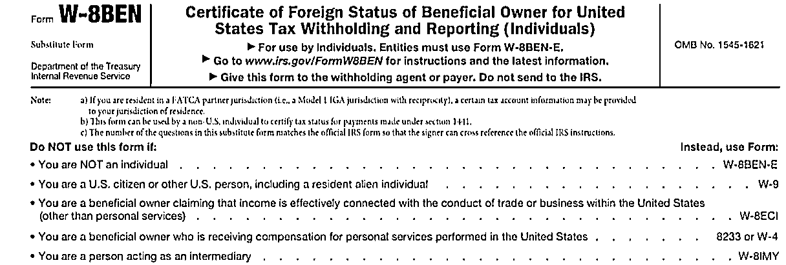

这里面有几个要点需要注意：

姓名：拼音格式为 姓在前名在后（如：ZHANG SAN），并且需要和要绑定的银行卡一致。

地址和邮编：邮编需要和前面Adsense填写保持一致（可以用查邮编网址查询），街道地址需要用英文（可以用谷歌翻译）。

手机号码：需要是能收到短信的实名号码。

税收优惠：选择 “与美国签订所得税条约的国家”，地区选 中国，服务选"第七条第一段"。

税率设置：选 0%，电影电视和其他版税选 10%。否则可能扣 30% 税。

也可以参考这个 Youtube 视频完成税务信息填写：《收到 Pin 码之后，如何填写 YouTube 的美国税务信息？》

（视频讲的非常详细，照做就可以，快的话几分钟就审核好，慢的话几小时或者1天审核完也正常，不必担忧）


审核通过✅截图：


以上税务信息，以及身份证信息审核通过后，可以看到接收PIN码界面，如截图（PIN码需等待2-3周左右）：

另外每隔几年，创作者需要重新提交他们的美国税表给 AdSense for YouTube，以确保他们的信息正确，并且对他们的收入潜在的预扣税准确。2021 年提交的表格将于 2024 年 12 月 31 日到期。

如果你之前已经开通了 YPP，就可以定期的关注官方的提醒，及时更新信息，具体看官方发的帖：《税务表格更新提醒》。

# 3\. 验证 PIN 码

收益达到 100 美元后，Google 会自动寄送 PIN 码邮件（通常 3 周内收到）。这个不要丢，因为要在 AdSense 后台输入 PIN 码验证后，才能正常提现。

地址是寄到这个地址，不是寄到永久居住地

收到 PIN 码后，在验证检查这里输入验证即可。


重要提醒：

所有信息必须真实，地址要确保可收到邮件。另外，为了降低国外快递丢件问题的发生可能性，你可以尝试提前做一些测试，比如：

在淘宝搜一下平信，买一封平信来测试地址是否可以收到。

建议填写详细且可靠的大城市地址，以减少收信失败的风险。

通过让银行每个月寄一个纸质的信用卡账单，来确保是可以收到的。

务必提前联系到你所在小区的邮政投递员，可以打邮政电话问，就说你有国际平邮，让他们提供你投递员的电话，然后电话联系投递员，告知你会在什么时候来信，把你的地址发给他，让他到时候联系你。

收信的参考时间 1-4 周左右，各地区不同，所以仅供参考。

PIN 码有三次重新发送机会，必须在 4 个月内完成验证。

一个人只要有一个 AdSense 账号就可以了。

# 03.如何回款

# 1.汇款节奏

当频道一个月广告收益达到 100 美元以上就可以操作打款了。

在下个月 10 号前，Google 会先对流量进行一次审核，主要是看有没有无效播放或者恶意点击的行为。如果一切正常，这笔钱会在 11-16 号之间打到 AdSense 账号里。到了 26 号左右，AdSense 会把收益转到绑定的银行卡里。

如果收益不到 100 美金，就会累积到下个月，直到金额够了才会打款。

当然，如果觉得每个月结算太麻烦，也可以在 AdSense 里设置打款频率，比如半年或者一年结算一次。

不过前提是要提前把银行卡信息填写完整。如果没填，收益会一直留在 AdSense 里，等到填了正确的银行卡信息后，才会正式发到银行卡账户上。

所以说，确保收益顺利到手，记得及时完善银行卡信息，也要注意遵守平台规则，不要有无效流量或违规操作，这样才能让广告收入更稳妥。

附：如果你用的是美国公司账户，流程会稍微不同：

验证时选择企业认证，并将地区设置为美国。

税务信息按照美国标准填写。

收款账户可直接使用美国公司银行账户。


1.  银行卡选择和添加

（达到 100 美金之后才能够添加）

收款方式可以选择直接银行转账或通过第三方平台，具体要取决于所在地区政策。

但在各家银行以及第三方结汇等各种渠道中，当前最推荐的是使用「有外币权限的招商银行一卡通」。

不是所有的网点都有外汇的权限，所以最好提前电话咨询一下自己当地城市的网点，在有对应权限的网点办卡。

有了卡之后就可以看是填写付款信息了。在 AdSense 后台点击「付款」-「付款信息」-「添加付款方式」，即可开始填写表单。


特别提醒：一定要勾选“设为主要付款方式”，否则可能会影响打款流程。

其中银行名称和 Swift 码可以通过在手机银行或银行官网查询，如果找不到，可直接拨打银行客服电话确认。务必确保 Swift 码填写准确，否则可能导致打款失败。

招商银行为例：进入招商银行官网 - 点击左上角 客服 - 个人业务 - 搜索「境外汇入路径」-「总行接收境外汇款的路径」即可获取。

中转银行可以不填写，如果要填写，也可以问客服获取中转银行的信息填入到表格中。


# 3.如何结汇

打开招商银行 APP 首页，点击「全部」-「跨境金融」-「外汇结汇」-「美元」-「填写结汇金额和来源」，点击确定即可完成结汇。

建议选择在汇率比较好的时候再换。另外，换汇时留意手续费，避免不必要的损失。


收到第一笔款项时可能需要 2-3 个工作日，到账后记得及时确认。如果出现问题，应立即联系银行解决。

1.  其他补充证明

有些小伙伴使用其他银行卡，可能会需要提供证明。这里列一下大家会用到的一些证明信息从哪里可以找到。

打开 电汇常见问题解答，找到「通过电汇接收付款」，可以下载关于合同相关的证明。


找到「添加用于电汇的银行账户信息」，可以下载付款性质相关信息，记得所在地选自己的所在地。


在 AdSense 后台，找到 「收款」-「收款信息」-「付款」-「交易」，就可以找到 Google 的付款记录以及付款收据，收据上的金额和后台显示、以及银行打款金额是一致的。

# 04.Adsense/YPP 被拒如何应对

# 1.担心 AI 类赛道 YPP 被拒，怎么提前准备？

建议：

AI 类赛道，有些时候同质化严重，避免被判定非原创，在频道达到 200 万播放，快要冲刺 300 万播放的时候（YouTube shorts 300 万播放可以开初级 ypp），在新发布视频中加人头视频；为什么不在发布第一个视频的时候加人头视频？其实也可以，在 200 万播放左右加，其实就是取巧。

为什么？以及怎么做？参见本文档模块二：四、AI 类赛道加人头视频

1.  YPP 申请被拒，怎么申诉：


波妮教练精华帖分享：https://scys.com/articleDetail/xq_topic/1525145154284412

圈友@私藏人间 分享，YouTube 科普解说赛道，按照以上帖子方法申述也已成功开通 YPP。

圈友@逸凡风顺 分享，YouTube AI 动物示警赛道，没有申述，后续制作的视频按照手册 【加人头，以及在视频上加文字解说】，一个月后再次申请开通 YPP，秒过。

233_1739361289.mp4【在线播放】

# 2.1 科普解说赛道初级 YPP 被拒，如何申诉：

好不容易达标了初级 YPP，没想到申请开通直接被拒，当时直接心态崩了。


就问波妮教练该怎么办。教练给我一个帖子，按照教练的帖子申诉，两天之后就申诉成功开通了。

波妮教练的帖子：https://t.zsxq.com/GHRK1

以下是我科普解说赛道-再利用他人的内容，YPP 被拒申诉的流程，大家有遇到的可以参考。

腾讯会议录制，打开屏幕+人像，露脸录制，可以把人像放到右下角，避免遮挡屏幕。


录制内容：可以用中文

（1） 前 30 秒先介绍自己的频道主页、简介、视频

例如：这是我的频道主页、频道简介、短视频、长视频、balabala 都介绍一下。

（2）展示被拒的原因，就是再利用他人内容的页面

例如：这是我申请创收功能被拒绝的原因，是再利用他人的内容。


（3）讲讲你的作品为什么符合创收，点图上-了解详情这个可以看到

例如：我是科普解说赛道，我就说我的频道是符合创收的内容，是源自其他创作者的视频片段，但通过剪辑在其中添加了故事情节和评论。


（4）展示视频的创作流程，剪映或者 capcut 的草稿箱

我是科普解说逆练，那我肯定不能说我的创作流程哈哈哈。我就用正练的方式走了一遍流程，再展示一下 capcut 的草稿箱，证明视频都是自己做的。

可以多打开几个草稿箱，展示一下。


（5）展示文件夹素材

录制完成之后，给视频加上中文字幕就 ok，这就是我申诉的全部流程。

总结：遇到问题真的要向教练请教，自己费劲力气钻研，有时候还不顶教练一句话。

遇到问题要向教练请教，遇到问题要向教练请教，遇到问题要向教练请教。

内容来源：YouTube科普解说号-开通初级YPP & 达标高级YPP复盘帖


# 3.Adsense 申请被拒，解决方案：

YPP 达标之后，我的 Adsense YouTube 账户申请被拒怎么办？

Youtube ypp 从零开始申请全过程演示，经历三次 adsense 申请失败，历时 11 天终于通过 youtbue ypp 计划


1.  YPP 开通后的常见问题

视频广告创收受限：刚开通 YPP 的时候，可能会有些视频显示黄标（绿标：完全创收；黄标：部分创收；红标：不允许创收），是正常情况，手动申请审核就行，鼠标移动到黄标点击“申请审核”过一两天就会变绿了。


视频广告未开启创收：如果是如图显示“未开启创收”，也是正常情况，过一两天就自动变绿了。


1.  自动化运营的一些常见问题

# 1.RPA 自动化流程分析热门 AI 视频

在超级标的最后，亦仁说道：​“如何挖掘到已经在 shorts 和 YouTube 上火爆的 ai 视频？通过找到一个视频，进入对方的描述区，通过他的 tag，描述，以及评论，找到更多关键词，通过这些关键词进一步向外扩展，最后你就能找到成千上万个别人已经验证好有流量的类目词。”

基于亦仁提供的这一思路，我写了一个 RPA 自动化流程分析 YouTube shorts 上的热门 AI 视频。

首先定位到一些对标视频之后，采集视频详情，收集所有的描述和 tag 信息；

通过描述和 tag 搜索 short；

点击 tag 页采集 short；

扩展 tag 后不断循环，最后进入到对应的 channel 采集详情；

在采集过程中使用了不同国家和地区的 IP，尽可能兼顾到不同文化下的各类 meme。

经过筛选最后收集到了一万个左右的 channel 账号信息，其中注册时间在一年内且粉丝大于 1000 的有 1657 条。对于每个 channel，都保留了原始信息，包括 channel 基本信息、注册时间、总视频数、总订阅数、总观看数、所在地区、推特 ig 个人信息等字段，方便进一步筛选和找精准对标。

另外对采集到的高观看量和高点赞量的视频描述进行分词，列出了每个分词对应的视频数量和总观看量，很大程度上可以作为流量类目词使用，方便充分发掘 YouTube Shorts AI 视频的流量机会。

篇幅原因，实现流程与数据信息请看原帖：《利用 RPA 自动化流程分析 YouTube Shorts 上的热门 AI 视频》。


1.  Selenium 方式自动化采集

内容来自 @老馬🐎内容出海

我用的是 selenium 的方式，但是这个方法对我来说还是很麻烦，又要对接指纹浏览器又要找到一些定位元素。

毕竟自己每日采集的数据量不大，我们是每天在跟踪一些我们筛选后的对标，所以我换了另一种方法，使用的正是江鲤大佬所提到的油管官方的 api，好处是真方便，缺点是每天只有一万的额度。

但这个方法对于一些采集量不大，并且想直接能够上手用的新手入局来说，是不错的选择。

我在调用官方 api 的时候，它可以通过输入 YouTube 频道名称（例如@hublotbaggins），自动获取该频道所有视频的标题、发布时间、播放量，然后在通过数据筛选，抽取近期百万播放的视频链接以及相关信息。

代码的详细解读以及官方油管 api 调用请看原帖：《【生财技能】YouTube 官方 api 调用以及 selenium 方式采集》。

1.  cursor + AI 实现自动化

内容来自@钱塘江鲤

目前除了人工介入筛选图片，筛选视频外，从采集、对标视频复刻、创意生成到图片与视频生成、剪辑和多账号矩阵运营都已经实现了自动化，当然我之前也尝试了全自动无人参与，但是总体质量并不高，所以后面慢慢加入了反推图片筛选和生成视频筛选等几个人工介入的节点，主打一个饱和式生成，最后筛选。

目前一个视频的成本根据使用的图片模型不同大概在几分钱到几毛钱之间，当然成本可以进一步压缩，但是就没办法保证质量了，所以在保证质量的前提下，目前的这个成本总体还是能接受的。

使用的工具有

提示词反推：midjourney describe 和 gpt4o-mini，​

图片生成：flux+comfy/midjourney

视频生成：即梦/可灵/海螺。

具体拆解以及建立自动化流程的过程请看原帖：《【项目实操】借助 Cursor 与 AI 实现 YouTube Shorts 高效自动化运营流程》


# 4.RPA 提效各个环节

内容来自@土豆君

# 4.1RPA 自动化生图

我这里使用的 RPA 是使用 Python playwright 库的方式，当然你也可以用影刀实现。

为了方便使用 python 脚本调用 GPT 网页直接输入提示词自动化生成，我需要对分镜进行处理。

我先是使用 Notepad++ 这类文本处理工具，把主体对象直接全部替换。

猫咪 替换为 猫咪[使用 gen_id 为 3341FlYXeg6gntgN 的角色]

松鼠 替换为 松鼠[使用 gen_id 为 WnwEz3UhzQnro6qt 的角色]


然后我就用 Claude3.5 写了个类似 RPA 的 Python 脚本，自动检测发送按钮是否能够点击，自动发送给 Dalle-E3 就可以了。

为了使 Dall-E3 生成的画风是一致的，我添加了一个「--prompt_style」提示词前后缀的功能。前后缀的功能在「CONFIG」这里先写好就行了。

其他几个参数是中断后可以从第几行的提示词开始生成，或者重新生成某些画面，就不重要。


python .\cat.txt ＃不需要添加提示词前后缀

python .\gpt_auto\input\cat.txt --prompt_style photography # 补充一个预沒后缀

大部分情况生成的效果基本还可以，当然也会有一些效果不好、画风突变的画面，重新抽卡就好。


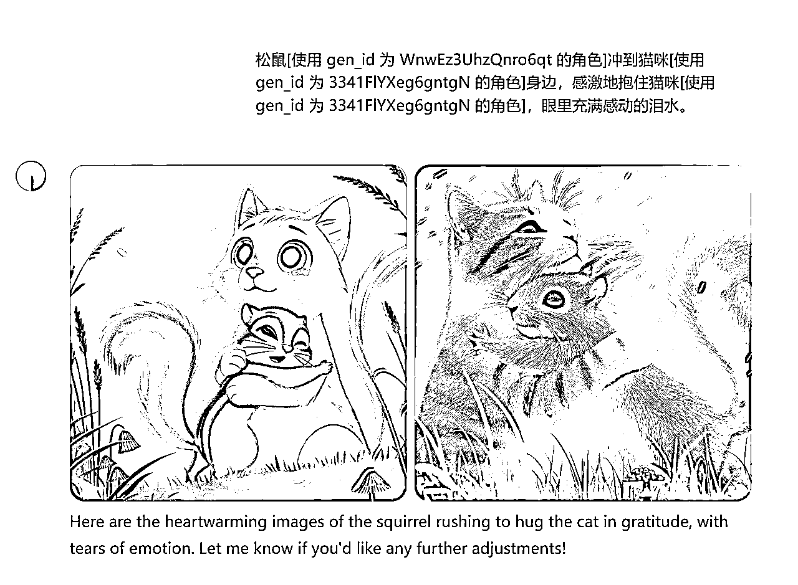


# 4.2剪辑提效方法

把图片都导入到剪映，配上自动放大的效果，就可以了。（为了尽量还原，还需要加上一些音效、特效的画面效果）这些只要做好一次，下次直接找到剪映草稿源图片的位置，替换源图片后再打开剪映就可以实现一键复用剪辑效果提高效率。


而 BGM 我是用手机版的 YouTube 自带的语音识别，直接搜索对标视频的音乐，就可以找到源 BGM，用工具下载下来就行了。一般只需要下载一个视频，在这个网站下就行了，基本支持所有的自媒体：https://tiqu.cc/


# 4.3.如何批量产出

我没有做到一键生成视频，但是可以拆分多个步骤，每个步骤批量产出。故事分镜创作可以用 GPT 生成几百个故事，AI 生图我分享了 RPA 自动化生图方案，也有 API 调用的方式，所以也是可以批量产出的。

剪辑可能麻烦一点，但我分享了一个提效的方法，固定一个模板替换图片可以大大加快剪辑的效率，基本上批量的问题就解决了。

如果需要图生视频，我最近其实还做了个指纹浏览器的海螺的 RPA 工作流，适合批量多账号跑视频，这块可以下次分享下～（帖子已经写好啦👉https://t.zsxq.com/7kM5x)

内容来源：《【生财技能】AI 动物故事视频复刻与批量生产》

最后，祝大家都能建立自己的 YouTube 频道，开通 YPP 赚美金，一起生财有术！

# 5.Youtube 实操：如何高效的做出一条优质的 AI 视频 @李香君

现在很多圈友做类似达人秀变装类型或者其他的 AI 类视频，大多数人都在用纯手工的方法，可能需要 1 个小时甚至更长时间才能做好一条视频。效率不高+油管的正反馈比较慢就很容易搞心态，这并不利于我们上手运营油管。

但是当我们仔细的审视视频制作的流程，其实很多时候，时间主要是浪费在了画图以及视频抽卡和修改生成的提示词这个动作上。但其实这些动作我们完全可以交给 AI 来做，让 AI 做重复流程化的事情，我们解放更多的脑力来进行视频创作

我的工作流主要是基于 AI 达人秀变装这个赛道，但如果你可以掌握其中的精髓完全可以泛化到你自己选定的赛道。

方法的详细操作步骤以及 AI 的调用方法请看原贴：《Youtube 实操：如何高效的做出一条优质的 AI 视频》


# 6.解放双手，任何人都可以复刻的高效 AI 视频制作工作流 @邵先森（Jiahao）

之前看到优秀圈友香君高效制作优质视频的精华帖，深受启发，于是尝试在香君的思路基础上，实现制作 AI 视频的自动化工作流。值得高兴的是，由于站在巨人的肩膀上，我把它做出来了，因此斗胆在此向各位大神分享一下我的思路，还望大家不吝赐教。

方法的详细操作步骤以及 AI 的调用方法请看原贴：《解放双手，任何人都可以复刻的高效AI视频制作工作流》


# 7.13 天开通 YouTube YPP，从 0 到 1 月入过万的自动化实操记录 @zero

这篇帖有近 4 万字，是一篇大长篇，你将跟随我的视角，完整的和我回顾我过往的四个月，是如何使用 AI 在 Youtube 从 0 到 1 赚到几万块钱的真实人生，我会告诉你我在 Youtube 如何从 0 到 1 的全部经历，以及我迭代了上百个版本的各种自动化代码。

方法的详细操作步骤以及 AI 的调用方法请看原贴：《13天开通YouTube YPP，从0到1月入过万的自动化实操记录》


# 02.账号运营相关

【8月更新】YouTube新人入局百问百答https://scys.com/articleDetail/xq_topic/4845251515552558

# 章节概要：

账号运营中的细节决定了流量和变现的上限，从问题诊断到策略调整，

本章提供了 YouTube 账号运营的实用指南。

关键内容包括：

✅ 0 播和限流问题分析：如何诊断并解决账号推流问题

✅ 推流规律解析：了解 YouTube 不同阶段的推流机制

✅ 账号生命周期管理：如何应对流量下滑的衰退期

✅ 环境隔离与多账号管理：安全高效运营多账号

理解平台算法特性，掌握账号运营的关键节点和应对策略，

是将 YouTube 从兼职项目发展为稳定收入来源的必备技能。

1.  为什么视频老被限流，怎么排查问题？

简而言之，新号客观存在限流情况，需要筛号，限流0播超过3天直接换号（可以同个邮箱下开新频道），不要纠结浪费时间，可能过半个月回来限流的号就不限流了。

经过一定量圈友的测试和验证，在限流频道的同个谷歌邮箱下新开频道，能大概率解决限流问题，不用去大量地采购谷歌邮箱或频道，包括长视频也可以通过这个方式规避限流影响@怅惘教练分享 【0724更新】

.

账号有问题，被限流。起号阶段限流有可能是短期的，要观察下之前发的老视频有没有流量，如果后续连续几个视频都是 0 播大概率是账号问题，可能存在问题的点及解法：

.

节点是机场或问题 IP，用 IP 检测工具自查 https://ipjiance.com/ 查出来有问题就先换梯子

.

电脑有没有装 360，装了就卸了用火绒安全，安全专业无捆绑 https://www.huorong.cn/

.

多账号登录时有没有环境隔离，用新环境登录发视频试试

.

如果上述方法都解决不了，建议重开

.

账号没问题，视频有问题。视频触发原创性问题或者违反政策（比如色情低俗）会直接限流，看看发新的不涉及这类问题的视频还是否限流，比如手机实拍风景，几百播就是正常的。

.

都没问题，但是一天发布太多视频。没开高级权限前，一天只能发布 1-2 个视频，发多了会限流。同时也避免同一时间发布多个视频，尽量错开时间发

.

如果以上都没问题，还是 Shorts 0 播，可以删除原视频，再进行重发，但是不能短时间内多次删除重发短视频，会影响账号。

1.  为什么视频一直万播，要坚持多久才能推流？

由于2025年3月底YouTube观看次数计算方式改版，观看次数虚高，下文中的播放量都等于现在的【互动观看次数】如果对应现在的播放次数都需要乘以2-3左右，也就是过去万播等于现在大约两万播，过去两万播约等于现在三到五万播。

在规避了上面限流问题的前提下，起号阶段大体有三类推流情况

.

长期无推流：观察期内容质量差，视频一直无法突破万播或只能偶尔万播，账号选择观看率在 70%甚至 65%以下，没有推流机会

.

原因 1：赛道有问题。如果前期赛道选择时选择了已经凉凉的赛道（比如整个赛道近期连百万的视频都难得一见），这种基本属于被平台软限流，不要坚持，赶紧换赛道，还有救。

.

原因 2：对标有问题。如果对标选择了部分在雷区跳舞的账号（比如擦边、血腥暴力、过于猎奇令人不适），也有可能被软限流，不会明说你违规，但播放量就是在几百徘徊永远上不去。有这种情况也不要坚持，赶紧换对标，可能有问题的视频都隐藏，还有救。

.

原因 3：内容有问题。这也是最普遍的问题，也就是模仿不到位，内容质量低。要注意，内容质量低不是指“不够高清”“不够好看”等表面原因，要知道很多爆款并不好看，也并不高清，之所以爆款是以为有一群让他们成为爆款的人，而对标爆款最重要的就是让这群人觉得你的和原本的爆款别无二致，进而让你也成为爆款。对标爆款最重要的是像素级模仿，拆解爆款的逻辑，模仿地透彻，除非你已经成功原创起号很多次，否则不要去做原创，不要去做原创，不要去做原创！！盲目原创和盲目搬运基本都会被卡在百播的区间。

.

15-20 天左右推流：观察期内容质量不错，视频能够稳定突破万播，选择观看率能够保持在 75%左右，会在 15-20 天之间给账号第一次大量的推流，被推流的视频有一定的随机性，经过实测有以下几种细分情况

如碰到前两种情况，马上大力复刻自己的被推流爆款视频，大概率能连追几个小爆款出来。这个逻辑是：如果你有一个爆款视频了，并且数据好，说明这个视频有确定且大量的受众，你再用一样的标题、一样的简介、几乎一样的内容，油管就知道它该推给什么样的人。

.

一飞冲天：如果视频的质量很高，选择观看率稳定在 82%以上甚至逐步升高（推流得越多，爱看的人还变多了，也就意味着内容具有更大的受众范围）完播率也高，可能一次把视频推流到千万级，图示是我的两个号的数据，都是在 13 天左右开始推流，一次推到一千万以上。这种情况根据内容质量的差异也有区别，左边是大号，第一次推流一共推了三千万左右，而右边的小号只推到一千万左右就停了。


.

百万级推流：如果视频的质量比较高，选择观看率稳定在 75%-80%，完播率也较高，第一次推流可能就在百万级的区间。下图所示的两个号都是在 18 天左右推流，左边的推了 200 多万，右边的推了 100 万，就回落到一个之前的区间。


.

十万级推流：如果视频的质量一般，选择观看率稳定在 70-75%，完播率也一般，第一次推流可能就在十万级的区间。图示是这个区间的朋友被推流的视频数据曲线，这也是他最高播放的视频，这种情况基本都是内容还有优化的空间，一般最少都能推个十万以上。

.

10 天以内推流：内容非常牛逼，打破了观察期万播的流量瓶颈，选择观看率在 85%以上甚至更高（完播率也要高），如下图所示，达人秀变身账号，8 号发第一个视频在 12 号就被推流破了 20 万，14 号就破百万，这种情况下只要保持内容质量，冲过一千万轻轻松松。


1.  为什么对标账号没流量了，该怎么办？

首先，告诉大家一个无情的事实，其实老马早就说过了：

绝大部分泛娱乐赛道的 Shorts 账号的鼎盛生命周期只有 1-3 个月，开通 YPP 的那段时间就是流量最多的时候，在这之后新视频可能就是常年万播。

你们发现没流量的对标账号和我的大号一样，已经在经历这个阶段，大概就是新视频不管发什么，质量高不高，数据反馈好不好，反正就是会卡你的播放量在万播的水平（截图是一个选择观看 80%左右的新视频，完播也高于正常水平，但就是不给流量）


所以，对标账号没流量不一定是这个内容不行了，有可能只是对标账号的生命周期就到这了，同样的内容或许发在新号上是爆款（测试过了，还真有可能），可以根据以下的规则来判断内容是否值得继续做，自己的账号是否值得继续做。

.

同类内容近期在其他账号是否还有爆款

证明一个内容是不是仍然能做的最简单方法就是看其他同类对标账号中，内容风格与之类似的，是否还有爆款。

一般来说，直接在 https://www.youtube.com/hashtag/americasgottalent/shorts 这个标签集合的视频里去看，系统会根据你最近看的同类内容做推荐，如果有相似内容的话，这样一般能直接找到。

.

这个内容在你账号的数据表现如何

如果你不巧选了一个比较冷门的内容方向，可能就很难找到其他做这类内容的账号，这个时候可以观察你自己账号的数据，而且要分两种情况评估

持续更新在 20 天内，且没有超过 5w 播放的视频

在这个情况下，很有可能是油管还没有给你第一波比较大的推流，务必先坚持到第一波推流给到，再去看自己被推流视频的数据

有超过 5w 播放的视频

一般来说，单视频 5w 播放需要油管在 10-20 天之间给到第一波推流之后才能达到，这个时候就可以对被推流视频的数据进行观察，如果“选择观看率”大于 80%，“平均观看百分比”也较高（15 秒大于 160%，20 秒大于 140%），就说明这个视频有正确的受众，有机会被持续推流，且可以作为后续视频的模板，继续坚持制作该类型的视频；反之数据越差则说明内容质量越低、或者受众不明确、没有持续性，可以考虑选取其他类型的爆款内容进行尝试


1.  有时候没时间更新，担心断更影响账号，有没有更省力的方法

可以把短视频拼接成长视频，改一下画布变成 16:9 直接当长视频发，保持账号活跃（可以拼两-三个保持在 1 分钟左右，多了完播率会很低）


1.  AI 赛道还能做吗？能开 YPP 吗？为什么我一直没出爆款？

当然能，赛道正确+对标正确+复刻正确=爆款+ypp

# 6.为什么出过爆款后账号流量下滑？怎么应对？

不管我们多不想接受，但事实就是衰退期对于泛娱乐赛道是非常难避免的，如果出现新视频常见万播，视频完播率高、选择观看率高但仍然不给推流的情况，基本就代表账号处于衰退期了。示例图也来自我的大号，进入衰退期流量日均 20-30 万左右，新视频常年万播。


在观察了很多个不同的 AI 赛道、以及非 AI 赛道的 Shorts 频道，以及不同的长视频频道后，想延长巅峰期，推迟或规避衰退期，有几个应对方式：

.

提高内容生产的自动化程度，通过矩阵的方式持续起号、跑出爆款：只要处在巅峰期的账号多于衰退期的账号，就能够持续获得稳定的爆款收益。这个方案理想情况下能达成，但现实是 AI 赛道的内容迭代速度很快，自动化生产也难以保证内容的高质量，矩阵对于人工依赖程度高，运营的边际成本高，实现几千刀一个月或许不难，但是上限不高。

.

提高内容的垂直度、辨识度与价值量，增加粉丝粘性，长线运营：流量下滑的本质是内容没有独特的价值，看你也是看，看别人也是看，没有粉丝粘性自然也就没有所谓的基础流量。垂类 Shorts 的典型如游戏、日本传统恐怖故事、细分领域科普解说、IP 口播等，但注意如果要使用 AI 的话，要记住用 AI 赋能内容，而不是 AI 取代内容，否则内容没有价值和独特性可言。

.

大幅提高内容质量或转型其他赛道成功：很难，但是有案例，他乱七八糟什么赛道都做，但是一直有流量，都能出爆款。https://www.youtube.com/@Truestory680/shorts


.

长视频短视频结合，短视频获取订阅与流量，长视频提供用户价值与收益：目前已经有不少 AI 长视频（不一定真的很长，目前不管时长只要横屏就是长视频，后续超过三分钟算长视频）的案例，可以通过短视频获取订阅与爆款流量，通过有内容价值的长视频逐步积累粉丝与收益，本身短视频的生命周期能给长视频带来不少的流量，而长视频有了一定的粉丝基础后，就能够获得相对稳定且持续增长的收益。


1.  添加相关视频在哪里？

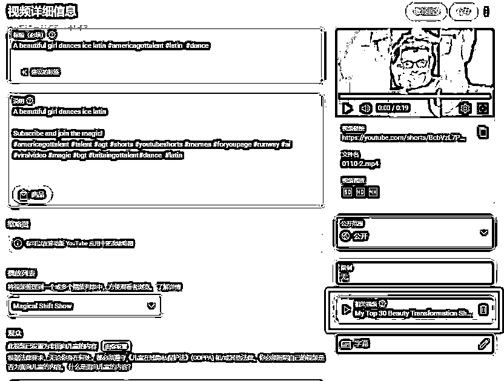

1.  中级权限、高级权限怎么开通？

YouTube 工作室-设置

中级权限需要绑定手机号，可以绑国内手机号；

高级权限想快点开可以刷脸，不急也可以持续更新 15 天左右就开了，不需要等两个月


1.  观众画像跑偏了怎么调整？观众画像和什么有关？

核心是内容，做目标地区观众爱看的内容；其次是标题、简介、历史用户画像

举个例子：

为什么解说类收益一般更高？语言+内容，能够限制在指定国家/地区

为什么 AI 变身类收益较低？无语言+接地气+画质限制

东南亚人可能会看美国大选，东南亚人会看德克萨斯州大选吗？

1.  怎么调整缩略图（封面）？

长视频可以在网页调整，短视频只能在手机 YouTube APP 调整，如下图所示。


1.  多账号运营怎么做环境隔离？

环境隔离的基础是环境安全，用这两个网址检测一下 IP 是否有风险，高风险建议换梯子/换节点，两个网站检测结果可能不一致，同个梯子不同节点也可能不一致，综合起来参考。【如果高风险但是没被限流就先做着慢慢找好梯子，不要被卡住！】

https://ipjiance.com/

https://scamalytics.com/ip

环境隔离的本质是网络隔离+浏览器隔离【只考虑网页访问 YouTube 的话】

所以最简单的方式是：

1 个账号对应 1 个浏览器和 1 个节点；

多个账号就使用多个浏览器+多个节点，每个账号用不同的浏览器和节点。

在航海阶段，还不至于需要通过云服务器+指纹浏览器来管理账号，先做好 1-3 个号，这里不做过多讲解。有需要可以查阅圈友希声的操作攻略：

《一个工具管理上百个社媒账号？指纹浏览器使用全攻略！》

https://articles.zsxq.com/id_u2ub0iv60p1g.html


1.  换赛道需要换账号吗

直接说结论：

100 万播放以下，或者 100 万播放以上但没爆款都不需要考虑这个问题，换赛道直接在原账号发布视频即可；

100 万播放以上且有爆款，联系教练详细沟通，根据数据和赛道情况判断。

很多换赛道直接出爆款的案例


# 03.视频制作相关

# 章节概要：

视频制作是内容创作的核心环节，技术瓶颈往往成为许多创作者的障碍。

本章解决各类视频制作中的常见问题。

主要内容包括：

✅ 卡点解决方案：针对不同制作环节的问题诊断

✅ 提高制作效率：工具和流程优化建议

✅ 工具使用策略：如何节省工具成本并最大化效益

✅ 画质与素材处理：保证视频上传后的观看体验

掌握基础制作技能，结合 AI 工具辅助，可以大幅降低制作门槛，

让普通人也能制作出高质量的视频内容，提升账号竞争力。

# 1.做不出想要的效果

需要先明确卡点，是图片生成不出来还是视频生成不出来，还是剪辑手法有问题，明确了卡点再找具体的解决方案，手册的内容基本涵盖了绝大部分视频制作需要了解的知识。


# 2.视频制作效率低

参阅自动化模块的内容


# 3.买工具有省钱的策略吗

可以去淘宝买共享账号，但是可能会和别人用的时候冲突；

可以和圈友拼账号，买一个独享的账号再组团用会更便宜，协调好时间也更高效；

可灵：

可以投稿创意圈，素材（小片段）或者视频（完整的作品），审核 5-6 天，视频通过送 666 灵感值，素材少一些

白嫖可灵国际版 来自@绮思圈友的分享

国际可灵无限注册教程（电脑端教程）：https://www.acfun.cn/v/ac46537357

国际可灵无限注册教程（手机端教程）：https://www.acfun.cn/v/ac46333078

国际可灵网页：https://klingai.com/

临时邮箱网页：https://maildrop.cc

Runway

淘宝独享账号 400-420，享受无限时长，可以一个人买多个人一起用，同时最多并行生成两个视频，最好错开时间用；

即梦

开个初级会员就够用，每天送 60-88 积分，可以出 60 张图；

MJ:

淘宝买个 20 刀独享会员可以无限生成，也可以多人拼，并行最多三张图


# 4.为什么视频上传后看到觉得画质很低

如果本地看高清，上传后看觉得很糊，可能是没改画质设置，在视频播放页面点右上角的三个点，选择画质，修改为画质较高，图示显示的是默认 480P（实际上传的是 4K）


1.  图片的角色一致性怎么控制

GPT 方法：使用同一个 GEN_id

Midjourney4 种方法：垫图、--cref+图片链接 --cw+权重、“V”、--seed+种子

即梦方法：智能参考；参考角色特征


1.  用对标账号的视频关键帧垫图会被判定搬运/过于相似吗？

不同工具的垫图逻辑不一样，基本都能做到原图非常相似，虽然一般情况下不会判定为搬运，但为了万无一失，如果要垫图，请替换画面中的“占比大但不影响流量”的内容，比如：服装颜色、头发颜色、背景颜色、图片整体色调等；不要使用即梦垫图。


1.  Runway 中上传图片显示 Flagged（被限制）无法生成视频 @极客信条 @邵先森（Jiahao）


先上传到 runway 的服务器，再从上传的图片里选中进行生成


1.  初级 YPP 审核通过后，高级 YPP 需要再次审核吗？

不需要，初级 YPP 审核通过后，高级 YPP 达标直接开通

1.  收不到 pin 码怎么办？

地址有没有问题，有没有写电话

方法一：务必提前联系到你所在小区的邮政投递员，可以打邮政电话问，就说你有国际平邮，让他们提供你投递员的电话，然后电话联系投递员，告知你会在什么时候来信，把你的地址发给他，让他到时候联系你。（我亲身体验了一个月没收到，联系到投递员之后，他说没信箱的地址都直接退回，除非提前联系了他）

方法二：一般需要一个月左右邮寄到内陆，是邮政平邮，不是邮政快递，不会打电话通知取件，我们可以主动去自己住址所在邮政平邮局，让他们帮你留意从国际来的平邮邮件，用小纸条写下你的姓名、电话、地址、国际邮件，贴在他们信件墙上，如果有国际邮件来了，打电话你，自己去取件（带点水果去，尽量别空手让人帮忙），这套业务他们很熟悉，都是这个路径。

实在不行让能收到的朋友或圈友帮你收


# 3.开通 YPP 并开通创收功能后，为什么有的视频显示未创收，也无法开启创收？

视频广告创收受限：刚开通 YPP 的时候，可能会有些视频显示黄标（绿标：完全创收；黄标：部分创收；红标：不允许创收），是正常情况，手动申请审核就行，鼠标移动到黄标点击“申请审核”过一两天就会变绿了。


视频广告未开启创收：如果是如图显示“未开启创收”，也是正常情况，过一两天就自动变绿了。

# 05.YouTube 工具索引库

# 章节概要：

工具是提高效率的关键，合适的工具能让 YouTube 创作事半功倍，本章整理了全面的工具清单。

工具分类包括：

✅ 通用工具：视频下载、数据查询等基础工具

✅ 文案/提示词生成工具：AI 辅助内容创作

✅ 文生图/图生视频工具：AI 视觉内容生成

✅ 剪辑工具：专业且易用的视频处理软件

选择适合自己工作流的工具组合，建立高效的创作流程，

是 YouTube 创作者持续产出高质量内容的基础保障。

1.  通用工具

youtube 视频获取工具：https://ytshorts.savetube.me/zh/29-youtube-video-downloader-2blug3

国内视频去水印/下载工具：https://peiyinshenqi.club/tools/watermark

收益估算与数据查询工具：https://www.viewstats.com/

youtube 工具大全：https://ytlarge.com/

IP 质量检测工具（分数 20 分以内为佳）：https://scamalytics.com/ip

查询正在使用的代理 ip（方便）：https://www.ip138.com/

网页翻译插件（chrome）：https://chromewebstore.google.com/detail/%E6%B2%89%E6%B5%B8%E5%BC%8F%E7%BF%BB%E8%AF%91-%E7%BD%91%E9%A1%B5%E7%BF%BB%E8%AF%91%E6%8F%92%E4%BB%B6-pdf%E7%BF%BB%E8%AF%91-%E5%85%8D%E8%B4%B9/bpoadfkcbjbfhfodiogcnhhhpibjhbnh

关键帧提取工具@老马：

生财圈友专属视频场景拆解工具.exe

自动养号工具@高一博：YouTube Shorts项目实操：自动养号工具及航海历程分享

YouTube 工具箱@汤姆 CC：Youtube工具箱

webp 图片转 PNG @nana 圈友提供 https://woshiliyana.github.io/webp-change-new/ 选择上传方式：

将 WebP 图片拖拽到虚线框内

点击虚线框选择文件

.

等待转换完成

.

选择下载方式：

点击单个文件的"下载 PNG"按钮

点击"全部下载 （ZIP）"按钮下载所有文件

根据标签提取视频信息的 RPA 程序 @邵先森（Jiahao）圈友提供：根据标签收集爆款shorts和账号工具


临时邮箱： @江南 圈友提供：https://maildrop.cc/ 这个临时邮箱，国际版可灵可以注册，就不断用它薅就完了


# 2.文案/提示词生成工具

ChatGPT: https://chat.openai.com/chat

claude: https://claude.ai/login?returnTo=%2F%3F

Kimi: https://kimi.moonshot.cn/

豆包：https://www.doubao.com/

文心一言：https://yiyan.baidu.com/

DeepSeek: deepseek.com

1.  文生图工具：

Midjourney（需要魔法）：https://www.midjourney.com/

Midjourney使用基础教程【免费】

附带图示的提示词字典（不要在公共场合浏览）：https://tags.novelai.dev/

【推荐】即梦（字节）：https://jimeng.jianying.com/

豆包：https://www.doubao.com/

通义：https://tongyi.aliyun.com/qianwen/

SD 和 ComfyUI 等开源工具：圈内资源很多


1.  图生视频工具：

【推荐用于首尾帧，无限生成，性价比高】Runway：https://runwayml.com/

runway 使用教程：https://zhuanlan.zhihu.com/p/647609977

【质量高，很贵】可灵（快手）：https://klingai.kuaishou.com/

【国内 T1 级别】海螺：https://hailuoai.com/video

【国内 T1 级别】Vidu：https://www.vidu.cn/

【单图生视频效果不错，巨便宜，无限生成，胜在性价比】清影：https://chatglm.cn/

StableDiffusionWebUI 和 ComfyUI 等开源工具接入 animetediff、controlnet 等插件：初学者不建议，上手难度较高，圈内资源很多。

1.  剪辑工具：

剪映：https://www.capcut.cn/

capcut: https://www.capcut.com/zh-tw/tools/desktop-video-editor

# 结语

经过这本手册的学习，相信你已经对 YouTube 有了全面的了解，

也认识到这是一个需要持续投入时间和精力的项目。

老实说，YouTube 不是一个能快速致富的平台，但是它的空间很大，天花板很高，

是一个需要耐心和持续努力的过程。

很多人期待一周内就能看到爆款，但现实是，大多数成功的创作者都经历了数周甚至数月的摸索期。

不过好消息是，现在通过 AI 技术，制作高质量内容的门槛已经大大降低。

普通人也能做出专业水准的视频，这是以前难以想象的。

再加上 YouTube 对 Shorts 的大力扶持，现在确实是入场的好时机。

如果你决定开始，请记住：

先模仿对标再创新：不要急于原创，先学习爆款视频，再超越。

持续输出才有希望：没有一个成功的 YouTuber 是只发一两个视频就成功的

数据会指引方向：让数据而非主观判断来决定你的下一步

遇到问题多沟通：别一个人扛，社群里有很多经验丰富的圈友可以帮你

最后，希望你能先下场再完美。

再精彩的手册也比不上亲自动手的一次实践。期待在不久的将来，看到你分享自己的 YouTube 成功故事！

