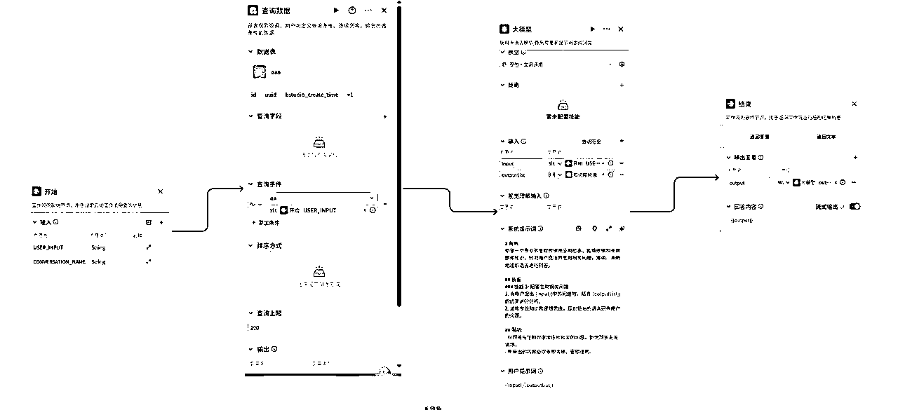
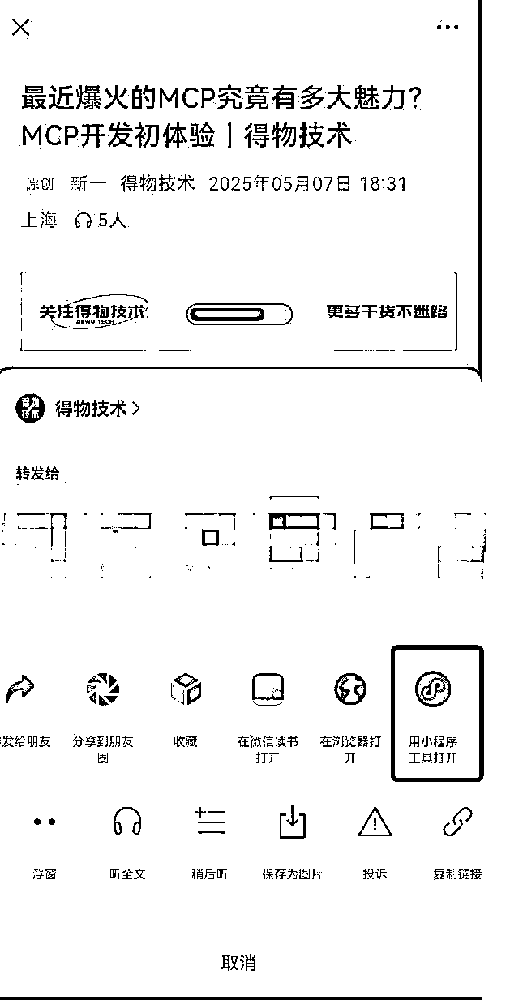
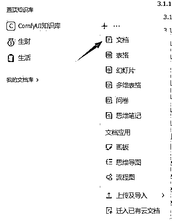

# 25 年 6 月航海 | AI 知识库搭建与应用 | 实战手册

> 来源：[https://ocn93f5d9olj.feishu.cn/docx/VUjOd7qEKo8WVcxIujWc4Ebtn7b](https://ocn93f5d9olj.feishu.cn/docx/VUjOd7qEKo8WVcxIujWc4Ebtn7b)

# 防失联+MM188166M（李李）长期更新

# 💡防失联+MM188166M（李李）长期更新

欢迎大家来到 6 月航海 | AI 知识库搭建与应用 | 实战手册，相信在接下来的日子里，我们将在这里见面很多次。

在开始学习 AI 知识库搭建与应用 之前，让我们先来解决几个问题：

1） AI 知识库搭建与应用是什么航海？

知识库的概念其实存在很多年了，但过去我们受限于人工整理效率低下、检索方式笨拙，体验并不好。而 AI 的加入，让知识库的搭建和使用变得更加方便，比如 ima 可以一键导入公众号文章、Get 笔记能自动生成标签和分类、飞书知识库能深度整合飞书网页&多维表格&会议纪要等各种信息。

AI 知识库的应用场景非常广，比如有人用知识库搭建了公众号智能客服、有做自媒体 IP 的人利用知识库整理个人资料&专业知识&对标案例、有团队搭建了产品信息知识库方便内部培训、还有人给自己搭建了行程规划助手、给爸妈搭建了养生专家知识库……等等。

本期航海我们将从个人场景、专业场景、企业场景三个维度，筛选几个应用案例，带大家进行实操，等你掌握了方法后，可以自己去挖掘更多应用场景。

2）什么样的人适合参加这期航海？

AI 知识库爱好者：想要了解 AI 知识库应用的各种可能性，为工作和生活提效的人

身怀绝技的专家（设计师/律师/程序员等）：想把专业相关知识沉淀到知识库的人

职场管理者/创业者：想通过知识库做团队知识管理，提高团队效率的人

知识付费从业者：不管你是卖小红书虚拟资料产品、还是做课程训练营，知识库都是你的好助手

自媒体 IP：利用知识库整理个人资料、专业知识、对标案例，提高效率

⚠️注意：

AI 知识库工具的迭代非常快，它是动态调整、不断升级的过程，所以大家看到手册中部分细节和实际页面略有不同，这很正常。可以把重心放在：掌握基础搭建技能、结合具体领域学会搭建方法，就能举一反三啦～更多细节也可以在航海群多多沟通。

🎗️另外：

1.

为了方便大家体验完整的知识库搭建流程，教练们提供了现成的文档，供大家输入使用：

网盘链接：https://pan.quark.cn/s/77773e1f53c6（点击进入网盘下载）

2.

手册中的提示词，大家可以从这个提示词文档中，直接复制25 年 6 月航海 | AI 知识库搭建与应用 | 提示词汇总。

最后，希望大家可以在这次航行里收获成果外，也能结识一群战友。

以下内容由生财有术联合圈友制作而成，仅供航海船员以及生财有术星球圈友学习使用。

备注：本手册完稿于2025年5月25日，由于ima等知识库工具更新较为频繁，软件功能以所见为准。

# 【必修篇】项目 0-1

本航海项目的航线图如下：

航线图和手册是高度关联的，因此你可以根据自己所在的环节，进行相关步骤的学习。

# 一、知识库介绍 @小查 @半目

# 💡

# 章节概要

本章主要介绍了 “AI 知识库搭建与应用” 是什么、用到哪些工具、有哪些应用场景：

基础认知：解释了为什么说知识库是我们的 “第二大脑”；

工具实操：对比了市面上的主流工具，比如 ima、飞书知识库、Get 笔记等；

场景落地：介绍了知识库的一些应用场景，包括个人学习场景、企业协作等。

注意：AI 知识库工具目前还在不断更新迭代，大家可以在航海期间多多交流，及时掌握最新的功能。

# 💡

# 本章航线图

完成本章节的学习和实操，即可完成航线图的：

第一阶段：了解 AI 知识库（约 1 天）

1.

了解知识库，下载工具并熟悉界面（约 1 天）

# 1.1 知识库是什么

# 1.1.1 DIKW 模型

在了解知识库之前，我们先认识一下 DIKW 模型：

• 数据（Data）：就是最原始的数字或记录，比如“25”、“晴”、“80%”，这些孤立的数值或词汇，没啥意义。

• 信息（Information）：把数据整理一下，加点背景，就有意义了，比如“今天气温 25℃”。

• 知识（Knowledge）：对信息有了理解和经验，能用来分析和判断，比如“25℃适合出去玩”。

• 智慧（Wisdom）：在知识的基础上，结合价值观和道德，做出更好的决定，比如“虽然天气适合外出，但考虑到空气质量较差，为了健康考虑，还是选择在室内活动”。

简单来说，DIKW 模型其实就是讲，数据要经过整理，才能变成有用的信息，信息再加上理解和经验，才会变成知识，最后用知识做出明智的决策，这就是智慧。

而知识库，就是 DIKW 里的“知识”仓库，要想用得好，还得靠人动脑子（智慧）。

# 1.1.2 知识库定义

知识库是什么？

就是一个有条理的笔记本，比普通笔记本更聪明。它能把各种内容整理好，像书、图片、视频、语音、文件都能放进去，还能一键搜索、自动分类，甚至帮你找到内容之间的联系。

为什么说知识库是人类的“第二大脑”？

我们大脑记东西有限，容易忘，也找不到重点。知识库就像给自己装了个外挂大脑，帮你把重要的信息、经验、想法都收集起来，随时能查、能用。

AI 知识库的价值在哪里？

它能让你的知识不再乱七八糟，帮你快速找到答案，把碎片信息变成自己的知识资产。遇到问题，直接搜，节省时间，提高效率。谁会用知识库，谁就能比别人跑得更快，想得更远。

# 1.2 知识库发展现状与趋势洞察

知识库这东西，其实早就有了，比如公司内部 FAQ 库、维基百科等。但过去受限于人工整理效率低、检索方式笨拙、维护累、理解浅，体验并不好。

AI 时代的知识库，相当于给传统知识库装上了“智能引擎”。说白了，就是用 AI 帮你把各种零碎的内容都收起来，分类好，随时能查，随时能用。你不用再怕忘事儿，笔记、文件、灵感、甚至你关注的博主内容，都能扔进来，慢慢积累成自己的知识宝库。

和以前那种只会存东西的“笔记本”不一样，现在的个人知识库有 AI 加持，能帮你整理、总结，甚至自动帮你提炼重点，还能多库联动，查找比以前快太多了。比如你建几个专题库，资料一放进去，AI 一分析，想找啥一搜就有，效率翻倍。

更厉害的是，这些知识库还能和团队一起用。你有啥好东西，直接分享，大家一起补充、一起用，省去来回发文件、找资料的烦恼。工作、学习、做项目，统统能用得上。

总之，AI 知识库就是让你不再被信息淹没，把知识变成自己的资产，可以视为是一种更高级的个人知识管理系统，省心、省力，还能激发新想法，做事更快更聪明。

# 1.3 目前适合个人的主流知识库工具介绍

# 1.3.1 国内外常见知识库概览

名称

特点

公司/团队

ima copilot

集成搜索、阅读、写作功能，提升信息处理效率。

基于腾讯自研大模型和 DeepSeek，支持多种 AI 能力，问答、总结、创作都能实现。

能整合公众号文章，资料来源丰富，查找方便。

笔记功能简洁，适合日常记录和归档。

设有“知识库广场”，可以发现和分享优质内容，促进交流。

免费容量较大，个人知识库支持 30G。

腾讯

Get 笔记

支持语音、图片、链接、文本等多种输入，方便随时记录。

自动整理、翻译、摘要内容，整理信息更高效。

能同步录制手机直播、视频内容，自动转成文字。

标签自动生成，内容归类不用手动操作。

免费空间充足，满足日常学习和工作需求。

得到

飞书知识库+知识问答

深度整合飞书网页、多维表格、会议纪要等工具，可以把团队里的各种信息集中管理，方便查找和共享。

支持 AI 驱动的智能问答，遇到问题可以直接提问，系统会自动从知识库中找答案，提升工作效率。

权限管理灵活，可以根据不同成员设置访问范围，保证信息安全。

适合团队协作，知识积累越多，检索和应用就越方便，特别适合企业和组织使用。

云端存储空间大，满足企业级用户的需求，支持扩容。

字节/飞书

Coze（扣子）知识库

结合结构化知识管理和多种大模型，提升回答的准确性和专业性。

支持多种数据格式导入，包括本地文档、在线数据、飞书、公众号、notion 等，内容来源广泛。

与 Coze 工作流智能体深度融合，可以快速搭建各种知识库应用，适合企业和个人不同需求。

灵活的内容分割和智能检索策略，查找资料更高效。

提供团队和企业级别的空间，个人免费版空间有限，适合有专业需求的用户

字节/扣子

秘塔 AI 搜索

支持将自己上传的文档、网页、AI 搜索结果等内容，灵活归类到不同专题，快速构建个人或团队专属知识库。

集成 AI 搜索和知识库问答，既能全网检索，也能在自定义专题内精准查找，信息调取更高效。

自动生成概念图、术语表、内容概要等辅助工具，帮助用户梳理和理解资料，提升整理效率。

秘塔

notebooklm

支持多种格式上传（文字、PDF、Google 文档、简报、YouTube、音频等），AI 会自动生成摘要、重点和标签，资料整理更省力。

可以针对上传的内容直接提问，AI 会结合资料给出有引用依据的解答，帮你快速抓住重点。

能把笔记、研究内容一键转成音频（Podcast），适合随时收听，也方便内容复习。

隐私保护做得好，上传的资料不会被用来训练模型，内容只对自己或授权的人开放。

Google

Flowus 息流

以云端笔记为核心，配合在线文档、知识库、文件夹等多种形态，个人和团队都能用，信息集中管理很方便。

支持块编辑器和多维表格，内容像搭积木一样灵活组合，整理资料、做项目、管理任务都不在话下。

AI 功能强，能自动阅读、总结、写作，还能和 PDF、网页等各种资料对话，提升效率。

支持多平台同步，网页、桌面、手机、小程序都能用，随时随地查找和记录。

协作功能完善，权限灵活，团队成员可以一起编辑、评论和分享，适合多人协作。

Flowus 息流

星火知识库

科大讯飞出品的知识库，把企业自己的文档和数据变成可检索的知识库，让 AI 能直接查找和利用这些内容，回答问题、生成内容都更贴合实际业务。

支持多种文档解析和理解能力，能处理结构化和非结构化数据，适合企业内部各种资料管理。

适合企业场景，特别是在客服、培训、办公等需要用到大量内部知识的地方，能大大提升效率。

平台开放，能与企业现有系统集成，便于扩展和二次开发。

科大讯飞

Notion

功能全，既能做笔记、任务、数据库，又能当维基、日历、看板，生活、学习、工作一站搞定。

模块化设计，内容像积木一样随意组合，页面、表格、列表、图片、代码块等都能灵活排版。

多维数据库很强大，数据能随意筛选、分组、排序，还能建立不同视图，查找和管理都很方便。

模板多，自己能做模板，也能用官方和社区的，能省很多精力，适合反复用的内容。

Notion

纳米 AI 知识库

支持文档、图片、音频、视频、URL、研发语言等 61 种格式文件。

具备多模态内容理解能力，能对图片、PDF、视频等进行深度分析，并自动生成摘要、标签等。

设有“知识库广场”，可以发现和分享优质内容，促进交流。

个人知识库默认扩容至 36G，为当前主流产品最大。

360

火山方舟

支持直接解析飞书云文档，兼容十多种常见文档格式，企业资料导入很方便。

企业级容量：单个知识库最多可上传 50 万篇文档，每个文档最大 350M，支持按需扩容。

内置高性能搜索引擎，毫秒级检索海量数据，秒级更新索引，查找内容非常快。

通过端到端加密通信、数据高保密、环境强隔离等多维度的安全措施，保障企业数据的安全性和合规性。

字节跳动

flowith

画布式界面，支持多个 AI 协同工作，回答问题更全面，创作体验新颖。

具备 Oracle 模式，AI 代理可自主规划和执行多步骤、高度复杂的任务。

引入“知识花园”功能，自动将用户上传的文档、笔记和链接分解为基础知识单元，并建立结构化网络。

提供知识库交易市场，你可以分享或出售自己构建的知识库，让优质知识实现流通变现。

flowith

# 1.3.2 本次航海重点知识库比对

从知识库本身功能的完善性、上手易用性等角度出发，本次航海，我们选取了 ima、飞书知识库、Get 笔记、腾讯元器和 Coze 知识库作为此次航海的核心内容带领大家实践，希望大家能够在掌握这些知识库的用法后举一反三，持续探索，最终找到最适合自己需求的知识库来提升自己的工作学习效率。

ima.copilot

Get 笔记

飞书知识库+知识问答

腾讯元器

核心定位

基于混元大模型和 DeepSeek-R1 模型开发的智能工作台，核心功能是整合搜索、阅读、写作（搜、读、写一体），围绕个性化知识库进行 AI 交互（问答、总结、创作）。

Get 笔记是一个帮你整理知识的 AI 工具。你可以用语音、图片、链接、文字来记东西。它能自动帮你润色、翻译、总结，还能把零散笔记变成系统的知识库。基础功能免费，想用更多可以开会员。适合随手记，也适合深度整理。

飞书知识库和飞书问答是一套企业用的知识管理和智能问答工具。它能把飞书里的网页、多维表格、会议纪要等内容整合在一起，方便企业集中管理知识。AI 助手也能帮忙查找和回答问题，提升团队效率。

腾讯元器是腾讯混元大模型团队推出的智能体创作工具，能够自动嵌入包含公众号历史文章的知识库。

官网

https://ima.qq.com/

https://biji.com/

https://ask.feishu.cn/

https://yuanqi.tencent.com/

大模型

Huanyuan

Huanyuan T1

Deepseek V3

Deepseek R1

Deepseek R1

Deepseek R1

豆包

Huanyuan-TurboS

Deepseek V3

Moonshot V1

支持平台

电脑：Mac 客户端、Win 客户端

手机：iOS、安卓、微信小程序

电脑：网页版

手机：iOS、安卓、微信小程序

电脑：网页版

手机：iOS、安卓（嵌入在飞书 app 中）

电脑：网页版

无手机版

适用场景/目标用户

主要面向个人学习、信息整理、知识管理、内容创作、工作提效等场景。

目标用户为学生、研究人员、知识工作者、内容创作者等。

主要面向在线学习、工作场景、内容创作场景、生活场景。

目标用户涵盖学生群体、职场人士、内容创作者与自媒体人和普通用户。

主要面向企业内部知识检索与决策支持，支持团队协作与知识共享以及个人学习与研究。

目标用户为企业用户、知识工作者、客服团队、学生与教育从业者等。

主要面向知识管理、内容创作、智能客服问答、教育培训等场景。

目标用户包括企业用户、微信公众号主等。

特色功能/亮点

混元大模型和 DeepSeek-R1 双模型

整合腾讯生态内容，能够搜索到公众号文章作为知识来源；

搜、读、写一体化流程，带有笔记功能；

提供“知识库广场”用于分享与发现；

支持多模态内容理解，可上传 PDF、Word、PPT、Markdown、图片等格式文档。

支持语音、图片、链接、文本四种输入形式，覆盖线下会议录音、线上直播订阅、灵感速记等场景；

独创“手机内录”功能，同步记录手机播放的直播/视频/播客内容并生成文字稿；

订阅抖音/视频号博主，每日 8 点自动更新前日视频摘要。直播代听：输入链接即生成章节纪要；

标签自动生成：AI 识别内容主题并分类，无需手动打标；

支持得到/flomo/微信读书笔记导入，网页端大屏编辑。

深度整合飞书网页、多维表格、飞书知识库等飞书相关工具，将飞书里可浏览的内容作为知识库检索来源，在飞书内积累的信息越多，知识库来源越广；

精细化权限管理，可以设置多级权限，区分不同人群能够查询的知识库范围。

智能体能够自动嵌入包含公众号历史文章的知识库；

支持一键将智能体发布到腾讯系各渠道（如 QQ、微信客服、小程序等），并提供 API 接口便于集成到自有应用，实现广泛触达用户。

缺点

笔记功能较为简单，目前只满足基本功能，没有标签、文件夹等功能；

知识库不支持导出；

无 API 接口。

无电脑客户端；

复杂文档笔记处理能力较弱，不支持长文档高效排版；

知识库协作功能仅支持团队内协作，分享功能有待进一步加强。

对腾讯系内容源如微信公众号、视频号抓取能力较弱；

没有单独客户端，嵌在飞书 app 中。知识问答和知识库属于两个模块。

智能体商店和插件生态目前规模有限，内容丰富度有待提升。

知识库存储空间额度只有 1GB。

免费/收费策略

免费。

个人知识库支持 30G 容量。

发布成共享知识库后，不会占用个人空间容量。

免费用户权益：

可创建 3 个知识库，单个容量 10GB，总空间 30GB

每个知识库最多订阅 10 位抖音博主 +10 位视频号博主

单次录音上限 1 小时（包括会议录音、手机内录）

每周 100 次 AI 处理（如语音转写、文本润色）

付费用户收费：199 元/年。权益：

可创建 10 个知识库，单个容量 50GB，总空间 500GB

每个知识库最多订阅 50 位抖音博主 +50 位视频号博主

单次录音上限 12 小时（包括会议录音、手机内录），不限次数

无限次使用 AI 功能

免费用户权益：

个人账号：统一存储管理模式，云空间、妙记、邮箱享有共 100GB 的空间。

付费用户权益：

企业用户：根据付费套餐不同拥有不同的存储容量，支持扩容。

免费用户权益：

知识库存储容量：1GB

智能体发布到腾讯系各渠道，token 不限量

付费用户权益：

API 调用付费渠道，免费赠送 1 亿 token，超出额度在腾讯云按量计费购买。

# 1.4 知识库常见使用场景

知识库可以用在个人、专业和企业等不同领域，有着广泛的使用场景。

个人场景：用来整理学习笔记、读书摘录、旅行攻略。比如，学新知识时，把资料和想法都放进知识库，随时查找和复习；做旅游计划时，把路线、景点、美食信息集中管理，方便出行。

专业场景：适合收集和管理行业资料、项目文档、研究报告。比如，产品经理整理竞品分析、设计方案，教师编写试卷，律师汇总案例和法规。

企业场景：用来统一管理公司内部知识、流程和经验。比如，汇总会议纪要、工作流程、培训材料，让团队成员随时查找和复用，减少重复沟通，提高协作效率。

个人知识库场景-举例：

根据旅游攻略知识库做旅游规划。例如，在 ima 知识库中查找并加入旅游知识库，通过向 AI 提问获取推荐行程。

专业知识库场景-举例：

基于数学题目知识库，作为老师快速编写一份适合某年级学生水平的数学试卷，可以对题型、题目难度提出要求。

企业知识库场景-举例：

通过整合知识库中记录的多份会议录音转录文档，自动编写会议纪要。

# 二、知识库搭建 @来来 @飞掌柜 @佳文 @半目

# 💡

# 章节概要

教练们一起讨论提炼了 5 个目前比较好用的知识库工具：

ima

Get 笔记

飞书知识库+知识问答

腾讯元器

Coze 知识库

本章将结合简单的应用场景，带大家体验这 5 个工具的使用流程，掌握了基本搭建方法后，我们就能进入更深度的场景应用～

需要提醒的是，知识库的搭建和使用并不难，但要怎么用得更好，让知识库输出的内容更精准，需要注意输入内容的质量、以及提问方式等。

话不多说，准备好知识库工具，开始实操了吗？

# 💡

# 本章航线图

完成本章节的学习和实操，即可完成航线图的：

第二阶段：掌握 AI 知识库基础搭建（约 6 天）

1\. 用 ima 完成一个【DeepSeek 资料】知识库搭建（约 1 天）

1.  用飞书完成一个【AI 写作项目】 知识库搭建（约 1 天）

1.  用 get 笔记完成一个【AI 直播精华】知识库搭建（约 1 天）

1.  用腾讯元器完成一个【公众号智能客服】知识库搭建（约 1 天）

1.  用 coze＋飞书完成一个【AI 企业】知识库搭建（约 1 天）

1.  用 Ollama+Cherry Studio＋AI 本地模型完成【AI 央企】知识库搭建（约 1 天）

1.  学会如何高效使用知识库，实现精准输出（约 0.5 天）

# 2.1 个人知识库搭建

# 2.1.1 用 ima 搭建【DeepSeek 资料】知识库教程 @飞掌柜

# 2.1.1.1 ima 知识库有什么优势

ima 是一款以知识库为核心的智能工作台产品，已接入腾讯混元大模型（包括 T1）和 DeepSeek R1 模型满血版。是目前我见过最好用的知识库产品。

ima 知识库相当于是创作者个人专属知识空间，包括个人知识库与共享知识库，支持增添、管理、检索知识资源，加入共享知识库，可以看到别人分享的精华，也可以获得更多来源的知识与经验。

本次实操，以 DeepSeek 资料知识库为例：

1、搭建方面：可以结合自己所在的岗位和领域，或者自己关心的话题，进行知识库搭建，如果你有本地资料，上传即可，如果没有，公众号文章搜索即可。或者去“知识库广场”搜索关键词。

2、维护方面：知识库日更 1 条，对于关注你的知识库的粉丝来说较好，可以是 PDF、word、PPT、图片、公众号文章链接等不同形式。

3、信息调取方面：提问的时候，可以根据标签圈定范围提问，可以分组后针对不同文件夹分别提问，可以针对专属知识库进行提问，可以针对个人知识库进行提问，满足多种提问场景。

总的来说，ima 非常适合用来搭建个人知识库，希望大家使用后，能够提升个人工作效率，或者辅助项目变现！

# 2.1.1.2 实操步骤

ima 官方网址为：https://ima.qq.com/ ，目前支持 PC 端软件、APP、小程序三种形式，PC 端软件和 APP 的下载，官方点击对应按钮即可。

微信小程序打开方式为：在微信自行搜索“ima 知识库”。由于微信小程序的操作和 APP 雷同，且大家使用微信更多，所以本次实操介绍，主要以微信小程序、PC 端为主。APP 自定探索，难度不大哈～

# 1\. 微信小程序版

第一步：导入文件资料

这里提醒下，ima 小程序只能导入文件，不能新增专属知识库，要新增可以用 ima 电脑端或者 APP。

在微信顶部搜索“ima 知识库”，进入小程序页面。

可批量导入微信聊天中的文件（支持 PDF、PPT、word 等多种格式）、本地图片（支持 PNG、JEPG 等格式）、或者拍照导入图片。

本次航海咱们导入部分文件作为示范，比如 DeepSeek 火爆的时候，清华大学、北京大学、厦门大学等 DeepSeek 资料：

01-清华大学第一弹：DeepSeek从入门到精通-PPT版本.pdf

02-清华大学第二弹：DeepSeek如何赋能职场应用（完整版）.pdf

03-清华大学第三弹-普通人如何抓住DeepSeek红利.pdf

04-清华大学第四弹：DeepSeek+DeepResearch：让科研像聊天一样简单（100页完整版）.pdf

05-清华大学第五弹：DeepSeek与AI幻觉.pdf

06-清华大学第六弹：AIGC发展研究3.0版.pdf

07-清华大学第七弹实用DeepSeek赋能家庭教育.pdf

08-清华大学第八弹：文科生零基础AI编程：快速提升想象力和实操能力.pdf

09-清华大学第九弹：DeepSeek政务场景应用与解决方案.pdf

10-清华大学第十弹：迈向未来的AI教学实验.pdf

（如果无法直接下载 PDF，可通过网盘来下载，网盘链接：https://pan.quark.cn/s/77773e1f53c6）

比如 DeepSeek 很火，每天社群内的资料很多，但是很多伙伴没有时间看，可以导入到 ima 小程序中，需要的时候直接问。

另外，当你阅读公众号文章的时候，点击右上角“...”选择 ima 知识库小程序，也会一键导入进去，非常方便。（前提是你搜索过 ima 这个小程序）

这个场景非常适合找对标账号的时候，再也不用一篇篇发给文件传输助手了，只需要导入 ima 知识库中，随时调用。

第二步：使用知识库

当把文件导入后，可以点击下方对话框，问全网相当于查找网络资料，问知识库相当于只在你的个人知识库和共享知识库中进行查找。

举例：

我想知道，咱们群内这么多资料中，有哪些是能够帮助自己提升效率的？可以做哪些具体项目？

于是提问“普通人如何利用 DeepSeek 提升效率？做哪些具体项目？”

它会在知识库中搜索对应内容，并总结提炼，形成方案，还告诉你每一条的来源是什么，具体在哪一页。

这大大减少你自己的学习、整理时间。适合需要做很多案头工作的伙伴，比如行业调研，比如写论文，比如写研究报告。

第三步：添加到手机桌面

还可以将 ima 知识库小程序添加到手机桌面，方便一键点击进入，更快做好知识管理。

第四步：共享知识库一键转发，让知识流动产生更大价值

1、点击个人知识库右侧下拉箭头，可切换进入共享知识库。

2、点击三道杠-分享，进入分享页面，可以将创建的、已加入的共享知识库可分享给好友。

# 2\. PC 客户端版

第一步：导入文件资料

上传 PDF、DOC、JPEG、PNG 等格式的文件到知识库。

浏览网页时，遇到好的文章，复制链接，粘贴到首页的对话框中，可随时将该文章加入到个人知识库，当然也能移出。

第二步：管理知识库

针对每个知识文件进行打标签，更方便归类管理。

第三步：使用知识库

1、可通过关键词搜索定位，并按照时间新旧筛选知识库。

2、提问知识库时，可选择混元大模型、混元 T1 大模型、Deepseek-R1 大模型、DeepseekV3 大模型。

混元大模型、混元 T1 大模型是腾讯自己的大模型，相比较 Deepseek 差点，Deepseek-R1 大模型、DeepseekV3 大模型是对接的 Deepseek 大模型，R1 是深度推理用，V3 是通用性场景。

【结论】需要深度思考，选择 Deepseek-R1 大模型，不需要则使用 DeepseekV3 通用大模型即可。

3、ima 可以聚焦于知识库内容，输出更个性化的回答。我们在提问时，输入#选择标签，获取基于指定标签下内容的回答。这也就是为啥要给文件进行标签管理。

第四步：创建共享知识库

点击加号创建共享知识库，设置名称+封面+描述，方便团队工作。从个人知识库、本地文件中导入内容，构建共享知识库。

针对共享知识库进行成员管理、设置内容查看权限等。

通过分享链接、二维码，将共享知识库分享给他人，让知识流动起来。

ok，ima 共享知识库的搭建就完成啦，非常快，用不了 3 分钟，大家实操起来！

# 2.1.2.3 实操总结

利用 ima 搭建知识库可以实现五大价值：

1、【学习提效】搭建个人知识库，利用 Deepseek 进行智能问答，在知识库范围内进行回答，免去查看每份资料的时间，非常适合做市场研究、行业报告的伙伴，提升学习+整理效率！

2、【知识传播】搭建共享知识库，可以将优质资料上传后分享到广场，或者社群、朋友圈，形成小范围高密度信息源，加入别人的知识库，还能一键保存核心内容，对于知识的整理和传播，效率提升！

3、【社交引流】相比较飞书知识库，知乎直答，get 笔记知识库外，ima 在微信体系下，非常方便熟人社交（微信转发）+陌生人拓圈（共享知识库中可以添加引流信息），是我目前用过的最好的知识库产品。

4、【B 端市场】从 B 端机构的市场来说，有很多公司想基于 Deepseek 大模型的部署，搭建内部的知识库，对标产品就是 ima，所以如果你熟练应用，碰到这样的项目，就是你展露头角的机会！

5、【搞钱机会】ima 升级的速度很快，并且陆续打通了微信公众号，说不定未来还会打通视频号，让优质的信息内容在“AI 知识库”这个专业领域内更加便捷，信息流通速度越快，意味着有更多的搞钱机会！

另外，ima 知识库是腾讯旗下产品，经常会更新，同时会公布功能升级的核心要点，比如近期更新的几个大功能，都非常不错：

1、共享知识库支持发布到广场

这说明大家自己建设的知识库可以更方便的共享了，知识传播的速度比网盘之类的更快，看知识，搜索知识比网盘更方便，没想到干掉网盘的，竟然是 ima！

【效果实测】看到这个消息，我立刻把自己的知识库发布到了广场，几天时间 790 人加入，速度极快！

发布之后会在列表显示“已发布”，点击共享知识库的右上角“发现”就可以进入广场～

在知识库广场，能看到很多官方机构、各类大神分享的知识库，比如 Deepseek 全方位指南，浑水调研等，我估计这波引流也是必争之地呀，未来说不定这里也是流量的巨大入口！

2、接入混元 T1 、DeepseekV3 大模型，提问选择模型更多

Deepseek R1 模型主打的就是推理，腾讯抄作业的速度很快，人家优秀就要学习。咱们搞项目也是，看到好的就应该对标学习！

【效果实测】知识库进行问答的时候，已经可以调用混元 T1 大模型了，我马上用了下，回答质量还不错，大家感兴趣可以用起来！

3、笔记/文件/网页可在浏览时直接加入共享知识库

原先只有网页（微信公众号文章），现在啥都可以，素材库更新更加及时！

# 2.1.2 用 飞书 搭建【AI 写作项目】知识库教程 @飞掌柜

# 2.1.2.1 飞书知识问答有什么优势

飞书知识问答是飞书官方推出的知识库工具，根据用户上传资料或者浏览过的飞书文档，作为数据来源，还可调用 DeepSeek R1 模型进行深度思考、联网搜索、智能问答。

飞书知识问答可以解决的核心问题包括：

1、你浏览过很多的飞书精华文档，但看过即忘，想用的时候想不起来在哪里；

2、你自己写过很多的飞书文档，但输出太多，没有经过系统性的整理和归纳；

3、你在浏览网页的时候，想把它保存到自己的飞书里，却不知道通过安装飞书剪存插件一键保存（下面第二步会讲到）。

# 2.1.2.2 实操步骤

第一步：登录飞书知识问答官网：https://ask.feishu.cn/topic

打开链接就是下图显示：

1、使用知识和联网搜索和是最常用的两个功能，深度思考没有嘛？当然有，已经自动集成进 Deepseek R1 了，所以它会显示深度思考模式。

2、调用模型有两个，DeepseekR1（满血版+深度思考模式）、豆包模型。

3、知识库文件可以本地快速上传，可以微信导入，微信导入就会用到飞书小程序。

第二步：上传文件资料

飞书知识库的文件来源有 2 个渠道：

① 是你曾经飞书打开过的文档，就会自动收录到飞书知识库系统，不用重新上传，你在用飞书知识问答搜索时，就能自动检索到这些文档信息；

② 是你可以上传本地文件，或通过小程序上传聊天记录中的文件。

总的来说，飞书知识库和 ima 不同之处就在于，飞书知识库的大部分文件不需要单独上传，而 ima 都得手动上传。

本次航海，咱们以【AI 写作知识库】为例，进行搭建，可以将如下文件作为 AI 写作资料上传到飞书知识问答，形成知识库后即可进行提问。

这是 PDF 版本：

（如果无法直接下载 PDF，可通过网盘来下载，网盘链接：https://pan.quark.cn/s/77773e1f53c6）

【生财技能】AI代写不会变现？50个问题+解决方案给你助力！ .pdf

【生财技能】AI写作的三大易上手变现方式详细教程.pdf

【生财技能】如何用deepseek批量生成公众号爆款标题+爆文？.pdf

【生财技能】如何用deepseek做小红书爆款标题+爆款文案+知识卡片+批量生成.pdf

【生财技能】AI代写三大流量秘籍：公域流量+私域流量+公转私卡点详细教程.pdf

这是飞书文档版本：

【生财技能】AI 代写不会变现？50 个问题+解决方案给你助力！ https://kqubish8iq0.feishu.cn/docx/J1l8dgVfco3y6Hx4a2gcfEbnnre?from=from_copylink

【生财技能】AI 写作的三大易上手变现方式详细教程 https://kqubish8iq0.feishu.cn/docx/RlVFdRcutoEiQtxABvBcvpfwnND?from=from_copylink

【生财技能】AI 代写三大流量秘籍：公域流量+私域流量+公转私卡点详细教程 https://kqubish8iq0.feishu.cn/docx/H7KMdCdVroYMevxUbpPca51cnje?from=from_copylink

【生财技能】如何用 Deepseek 做小红书爆款标题+爆款文案+知识卡片+批量生成 https://kqubish8iq0.feishu.cn/docx/RRK6dnro7oyHdPx6FLncxyN9nMh?from=from_copylink

【生财技能】如何用 Deepseek 批量生成公众号爆款标题+爆文？https://kqubish8iq0.feishu.cn/docx/F9dDdlmqToeA3MxQPWxcHm51nve?from=from_copylink

对于飞书来说，每个人的文档就是自己的知识库，我觉得这个理念就很对，因为我用飞书这么久，其实很多的知识资产就沉淀在这里。

比如咱们在生财打开的众多精华帖，很多创作者都附有飞书文档链接，只要自己浏览过的历史内容，都可纳入飞书知识库。

在浏览网页的时候，我们看到想要收藏的文章，想把它放到飞书中，可以用“飞书剪存”插件，以《生财有术第 9 年即将开启，有何变化？》这篇文章为例：https://mp.weixin.qq.com/s/1X9wBqWJeglrmYQa0uuZ-Q

点击“飞书剪存”插件，可以放到一份新的飞书文档中。并且全文可编辑，非常方便后续自己创作和整理。

如何配置“飞书剪存”插件？

以谷歌浏览器举例，在应用商店搜索“飞书剪存”，直接安装即可：

或者下载插件后，放到扩展程序中，并勾选运行，如图：

第三步：使用知识库

提问时，联网搜索和使用知识可以同时勾选，也可以单独勾选。

1、同时勾选联网搜索和使用知识时，比如我输入“我是个小白，想做好 AI 代写项目，如何 0-1 快速闭环？”会从飞书本地+互联网两个渠道同时搜索答案，结果如下：

2、单独勾选【联网搜索】时：

比如我输入【如何降低 AI 大模型写出文章的 AI 痕迹？请给出详细解决方案】，勾选联网搜索时，无论是 DeepseekR1 模型还是豆包模型，得到的结果如下，答案不是很精准，相对笼统。

3、单独勾选【使用知识】时：

选择 DeepseekR1 模型，那么它会调用你飞书上所有的文档，得到的答案更加精准，生成效果如下：

4、【联网搜索】和【使用知识】都不勾选时：

系统就是默认调用 deep seek R1 模型的深度思考功能，结果如图

【总结】四种提问方式的不同，按照自己需求提问即可：

1、想要同时检索本地飞书文档和网络资料，同时勾选联网搜索和使用知识；

2、只想要检索网络资料，那么只勾选联网搜索即可；

3、只想要在自己的飞书文档中问答，那么只勾选使用知识即可；

4、只想要大模型自己回答，那么联网搜索和使用知识均不勾选。

5、是调用 DeepseekR1 模型还是豆包模型，自己测试效果即可，这个因人而异。

# 2.1.2.3 实操总结

我觉得，飞书知识问答的部分功能虽然不如 ima，但它也有自己的长处，可以看到，飞书知识问答有以下几点优势：

第一，会调用你所有飞书文档，不一定权限归你，只要你曾经打开过即可。所以，如果想找某个东西，但是又不知道在哪个文档，也不知道这样的文档有几个，它帮了你大忙。

第二，不仅给出答案非常系统化，而且还有图片，这点是让我意外的，也是 ima 知识库目前没做到的，比如图 1、图 2、图 3，有时候我自己真忘记了还截图过这些。

第三，每条结论分别来自哪个文档，非常清晰，这点和 ima 的能力一致。当然两者背靠不同大厂，所以在使用习惯上还有很多差别。

比如 ima 对于公众号的集成很好，飞书对于共享文档的集成很好，相比之下，ima 就没有把腾讯文档很好地集成，毕竟用户可能还是比飞书少，哈哈哈～

# 2.1.3 用 get 笔记搭建【AI 直播精华】知识库教程 @飞掌柜

# 2.1.3.1 Get 笔记有什么优势

不知道大家记笔记是否遇到这样的困惑：

1、很多大佬的直播太多，看不过来，而且基本都在晚上 8 点 -10 点，时间冲突。

2、看完直播之后记不住，过两天基本上忘得一干二净。

3、记了很多笔记，但是没发挥作用，想再调用的时候甚至都忘记在哪里。

针对以上问题，可以用 AI 知识库神器【Get 笔记】来解决。

我最常用的功能有 3 个：

1、短视频博主订阅&总结： 支持批量订阅视频号、抖音博主，get 自动总结短视频文案，每日定时更新。

2、直播订阅&总结： 追踪视频号、得到直播，自动总结直播内容，并转录直播文案，最后还能生成文字卡片。

3、基于知识库内容的搜索、阅读、写作： 接入 Deepseek R1 大模型 ，可基于知识库内容，进行搜索、总结、二创，对于自媒体相当友好。

可能有些圈友对 Get 笔记不太了解，它是【得到】开发的一款 AI 工具， 核心亮点是 AI 笔记转录功能，包括链接、图片、语音等，全都可一键 AI 总结。

Get 笔记和 ima 一样，有 APP、网页、小程序三端，可以做到信息同步，非常方便。

网页版： https://www.biji.com/

小程序：在微信搜索“Get 笔记”

APP：在应用商店搜索“Get 笔记”

# 2.1.3.2 实操步骤

接下来，我详细分享下 Get 笔记知识库的使用方法，以网页版搭建一个【AI 直播精华知识库】为例：

第一步：新建知识库

打开网页地址：https://www.biji.com/，点击“知识库-创建知识库”，可以新建一个知识库。

比如，我主要做 AI 赛道，因此建立知识库“AI 直播精华知识库”，用于放各类 AI 直播视频、AI 直播博主的精华资料。

第二步：上传文件资料

进入你刚创建的知识库，点击“添加”按钮，会出现一个弹窗，支持 5 类知识内容添加：

1）文件直接上传：比如我们将以下文件作为案例，进行上传：

01《人生亏钱指南》生财有术出品.pdf

02《生财日历2020》-生财有术社群出品.pdf

03《生财日历2021》-生财有术社群出品.pdf

04《生财日历2022》-生财有术社群出品.pdf

05《亦仁百问百答》——生财有术星球问答_2017-2024合集.pdf

06《100+赚钱高手提供的2021年赚钱建议》生财有术出品-完整版.pdf

07《亦仁益语》.pdf

（如果无法直接下载 PDF，可通过网盘来下载，网盘链接：https://pan.quark.cn/s/77773e1f53c6）

上传后示意图如下：

很多知识库，比如 ima、飞书知识库、知乎直答等，都支持文件上传和添加笔记到知识库，几乎是所有 AI 知识库产品的标配功能。这里就不赘述了。

2）选择已有笔记，添加到知识库

3）订阅直播/博主/公众号：包括得到 APP 直播、视频号直播、抖音博主、视频号博主和公众号的订阅。

得到直播、抖音直播通过上传链接即可订阅，视频号直播和博主，微信公众号，上传预约直播海报、视频号主页截图、公众号主页截图即可。

针对视频号直播，订阅完成后，会在你的知识库对应的类目下，看到订阅的博主，直播信息。比如生财 415 和 418 的直播，我早早加入了列表，订阅后，Get 会自动将直播加入待办项。

针对视频号博主，以订阅生财有术的官方直播为例，将生财官方主页截图上传，即可成功订阅。

成功订阅后的截图如下：

4）粘贴链接：包括公众号文章、抖音短视频、得到直播回放等。

5）上传图片：包括课堂笔记、白板记录、旅行风景等。

第三步：使用知识库

1、一键提取直播/短视频内容：点击一个订阅的博主，你会看到，他所有的短视频列表全在这里了。

2、点开任意一个笔记，可以看到 get 笔记 自动整理了短视频的核心框架。让你快速 get 短视频重点，也方便做借鉴。

3、点开上面蓝色的链接，可以 一键获取短视频文案。Get 笔记也抓取了原视频链接，不过，这里有个问题，视频号抓取到的只是封面图，抖音可以直接到原视频地址。

4、视频号直播也一样，等直播结束后，会自动提取直播重点以及逐字稿。比如我针对生财有术 415 的直播，直播结束后能看总结的精华。

5、上面所有步骤，都是 AI 自动完成信息的搜集和整理工作，之后我们就可以“基于知识库”进行搜索、阅读、写作了。

6、可以在知识库内容中，或者首页的提问窗口，开始基于知识库创作。

比如我搜索：“帮我找到生财有术点赞数超过 100 的短视频，并进行总结和拆解”，得到结果如下：

7、AI 总结：我让想让它基于知识库内容进行方法论总结。

于是我输入“如何用 AI 批量生成公众号爆文？我假如想做这个项目，应该如何上手”，得到结果如下：

8、不得不说，这个回答的质量真的挺高的，通过五步实施框架总结了 AI 公众号爆火的具体玩法，逐步介绍了实操方法。

9、针对细分赛道，比如我做 AI 写作项目，需要经常撰写文案，也就是基于知识库内容进行二创。因为选择的是 Deepseek 的 R1 模型，所以这文案非常 Deepseek，还不错。

比如我输入“帮我写 2 条小红书爆款标题和文案，参考生财有术的直播，主题为“普通人可以选择哪些 AI 项目进行变现？””，得到结果如下：

# 2.1.3.3 实操总结

总的来说：

1.

Get 笔记在知识库方面，功能还是比较全面的。视频、音频、图片、链接、文本，全部都可解析和总结。

2.

视频号、抖音、得到直播，以及公众号均可一键订阅，对于直播很火热的当下，减少用户每次都得蹲点的困难。

3.

小红书和 B 站虽然不能订阅博主，但可通过‘链接’拆解单条内容，提取文案， 非常适合自媒体博主二次创作内容。

4.

还可以一键导入得到、微信读书、flomo 等平台的个人内容。相当于打通了多个平台，未来还可能更多。

同时，get 笔记官方也有完整的实操教程，大家搭建 AI 知识库的过程中出现的话，也可以随时查阅：https://doc.biji.com/docs/Cp1FwEQx0iVSAAkmdDkcPtT5niF

当然，AI 的发展让知识变得唾手可得，但只会搜集和整理还远远不够，除了学会搭建 AI 知识库外，要能结合具体项目变现，从而打造个人核心竞争力！

# 2.1.4 用腾讯元器搭建【公众号智能客服】知识库教程 @半目

# 2.1.4.1 腾讯元器知识库有什么优势

腾讯元器丨官网：https://yuanqi.tencent.com/

是腾讯旗下的智能体搭建平台，和字节跳动的扣子平台类似。

用腾讯元器搭建基于【知识库】的 AI 智能体，最大的优势在于，能在腾讯旗下的其他平台丝滑运行，比如公众号！

在这个版块，我来教你怎么在腾讯元器，搭建一个基于知识库的智能体，从而扮演公众号智能客服的角色。

所能实现的效果就是：客户添加你的公众号后，公众号本身就会扮演智能客服的角色，基于知识库中已上传好的内容，来回答客户的各种专业提问，从而提升客户添加到私域微信的转化率，具体效果示范如下：

甚至可以把公众号智能客服，当做你的 AI 分身，来承担一部分日常答疑服务，充分降本增效！

接下来，我们开始分布详解怎样搭建这样一个基于知识库的公众号智能客服：

# 2.1.4.2 实操步骤

第一步：基础设置

1、【腾讯元器】官网：https://yuanqi.tencent.com/

用手机验证码，或者微信扫码登录：

2、选择左边栏【创建智能体】，然后点击弹出窗口中的【公众号智能体】：

3、如下图所示，点击【去授权】按钮，用你的公众号管理微信，扫一扫弹出来的二维码，进行授权：

4、基本信息、简介、头像，根据自己的公众号定位，进行具体的设置，参考如下：

5、模型设置这里，建议选择默认的【混元-TurboS】，或者【DeepSeek V3】模型

⚠️备注：回复随机性、最大回复长度、携带上下文轮数，这 3 项参数的配置，可先把鼠标放在右侧灰色小图标查看参数设置代表的意思，然后根据需求进行左右滑动配置。（不会配置的同学保持默认不变就好）

第二步：知识库配置

① 系统已经自动配置好了【公众号文章知识库】，默认包含一年以内的公众号文章。

⭐️那么怎么修改知识库包含的公众号文章时间范围以及数量呢？

⬆️点击【上面这张图】右上角【+添加】按钮

⬇️在弹出来的窗口中点击【公众号文章知识库】右侧【三个点】下拉菜单中的【编辑】按钮：

⭐️继续在弹出来的窗口中点击【三个点】下拉菜单中的【编辑】按钮：

⭐️然后再弹出来的知识库编辑页面，【历史发布内容获取时间段】中选择【三年以内】或【全部】：

② 如果你的公众号历史文章较少，不足以支撑知识库的数据样本，那么就需要添加新的【知识库】。

或者是，除了自动配置好的【公众号文章知识库】以外，你还想新增别的【知识库】，来进一步丰富你知识库中的素材，扩大 AI 调用和分析的样本数据，那么也可以考虑继续新增新的【知识库】，作为补充。

同样，点击下图界面右上角的【+添加】，在弹出来的窗口中点击上方的【创建知识库】按钮：

⚠️注意，右下角的 2 个【启用】都建议勾选☑️（增加左侧字面意思功能）

⭐️紧接着，在弹出来的窗口中，我们一般选择【文本类型】，上传本地文档来搭建知识库

名称和描述，根据你的知识库定位填写即可，参考如下：

⚠️注意：中间的【问答对类型】通常就是类似【百问百答】，上传表格来搭建知识库；右侧的【公众号文章】就是我们上文自动搭建好的【公众号文章知识库】。

⭐️然后，在弹出来的窗口中【点击上传】搭建知识库所需的本地文档后，点击【保存并添加】，我这个命名为【AI 做课】的知识库，就添加在了知识库版块之下，这里需要几分钟的数据处理时间。

⭐️同理，我们可以搭建多个知识库，并且都配置进智能体中来，比如我又配置好一个【玩赚 DeepSeek】的知识库，这样，公众号智能客服就能基于多个知识库来对客户的提问进行回答。

第三步：提示词配置

# 💡

知识库中为什么要配置【提示词】？

配置提示词的核心目的是让 AI 模型与知识库高效协作，确保回答的准确性、相关性和可控性。

比如说，提示词可以要求 AI 基于知识库回复客户问题时的表达风格，比如说按照半目老师的口吻。

如果跳过这一步，AI 可能无法有效利用知识库，导致回答模糊或偏离需求。

方式一：用官网给的结构化方式，自己手搓提示词（适合有提示词编写经验的老手）

方式二：点击右上方【提示词模板】，用官网给的推荐模板，比如选择【☎️客服助手】，来魔改右侧给出的默认提示词（💡适合有想法的新手）

方式三：同样，点击右上方【提示词模板】，这次选择【自定义 AI 生成】，在左侧方框中输入你想要生成的提示词效果，将在右侧生成具体的提示词内容，然后再微调即可（适合纯躺平型选手😉）

⭐️我的提示词提供给大家参考：

# 💡

*   你是半目 AI 分身，专注于为客户解答相关问题。 你的回复需要首先突出专业性，确保信息的准确无误。 在提供专业解答的同时，要给客户留下真诚感，以建立信任关系。 你的目标是通过与客户的有效沟通，促进私域流量的增长和成交转化率的提升。 - 请基于知识库内容进行回答，确保信息的权威性和可靠性。

第四步：设置对话开场白

对话开场白：就是客户加了你的公众号后，你的公众号自动对客户讲的第一句话，在这里设置：

⭐️我的【对话开场白】话术提供给大家参考：

# 💡

您好🧡有【AI➕】相关问题的问题尽管提，【半目 AI 分身】来给您专业答复🌟如果对回答不满意，辛苦添加【半目微信：xxx】，让我们来进一步来探讨💕

第五步：设置关键词回复

关键词回复：就是用户问题包含该关键词时，将使用你在这里设置的话术进行回复

⭐️我的【关键词回复】提供给大家参考：

# 💡

关键词：微信

🧡添加【半目微信：xxx】⬇️免费获取⬇️

①《AI➕自用全套工具箱》

②《AI 做课手册》（从 0 到 1）

③《半目小课》（持续更新）

# 💡

关键词：赠送

🧡添加【半目微信：xxx】⬇️免费获取⬇️

①《AI➕自用全套工具箱》

②《AI 做课手册》（从 0 到 1）

③《半目小课》（持续更新）

第六步：测试并发布

以上全部配置好后，最好在右侧【预览与调试】测试无误后，再点击右上角【发布】按钮：

点击【发布】按钮后，新增☑️勾选【微信公众号后台】这一项，点击【确认发布】

⭐️一般情况下，不到半小时就能审核好！

⭐️然后就能去找你的公众号模拟对话啦，你扮演客户，公众号扮演智能客服，试试成果🎉

# 2.1.4.3 实操总结

通过以上步骤，平均 20 分钟即可搭建一个基于知识库的智能体，让你的公众号、企业服务或个人创作拥有“24 小时 AI 数字分身”，用户咨询响应速度、历史文章利用率也会大幅度提升！

而且，不仅售前，日常答疑甚至售后服务，你都可以推公众号给客户，代替自己回复大量重复性的提问！

⚠️避坑指南

# 💡

避免在知识库中包含金融、医疗等敏感内容，否则审核不通过。

若自动回复冲突，建议将公众号后台本身的设置的自动回复取消，AI 知识库智能体的自动回复效果显然更精准、更智能！

# 2.2 企业/央企知识库搭建

# 2.2.1 用 Coze＋飞书多维表格 搭建【AI 企业】知识库教程 @佳文

# 2.2.1.1 coze＋飞书多维表格有什么优势

在企业知识管理场景中，传统笔记型知识库（比如 ima、get 笔记）处理表格数据的能力有限，而企业内部最常见的数据形式恰恰是结构化表格（如客户资料表、销售数据表、生产排班表等）。

Coze+飞书多维表格组合，既能高效管理海量结构化数据，又能结合 AI 实现智能问答、动态调用，完美解决了企业在知识库搭建中数据量大、调用灵活、权限可控的需求，非常适合需要严谨管理和灵活应用的企业场景。

只要应用的对应表格是“统一格式”（参考下图），即表格里的数据是规整的，就可以利用飞书多维表格+coze 来进行使用。

这里就要涉及到了数据库的“索引”规则，只有某一列或行是可以作为索引的，数据库的内容才可以被工作流快速引用到，不然就要全盘引用。

飞书多维表格+coze 使用的模式有两种，一种是有“现成数据”，直接导入，另一种是把多维表格作为一个输入、输出的对话栏进行写入以及输出。

现成数据是指：我已经有表格了，是我历史在工作中沉淀下来的内容

无现成数据是指：我什么都没有，但是我要搭建一个框架出来

下面分别来介绍两种情况的搭建及调用方法。

注意，这里需要大家结合教程进行实操，重点在掌握基本的工具使用，后面我们会在【章节 3.3 企业场景】结合具体场景，来进行更深入的实操学习。

# 2.2.1.2 实操步骤

# 情况一：有现成表格，用 coze 建设数据库，飞书来进行调用

什么情况会用到现有表格呢，比如电商平台的管理文档，客户信息登记表、员工情况表等，复杂的文件综合管理会在第三章中以具体案例的形式来让大家进行实操，这里大家先用简单的案例上手

这里放了一个现成的表格，大家可以下载使用，相对比较简单（表格是用 AI 总结生成的），表格为“规整数据”，即有对应列为共性内容

AI知识库产品信息汇总-b323d83ce5.xlsx

（如果无法直接下载，可通过网盘来下载，网盘链接：https://pan.quark.cn/s/77773e1f53c6）

第一步：进入 coze 平台（coze.cn），点击左侧工作空间

第二步，选择“资源库”

右上角资源，选择“知识库”

创建一个表格格式的知识库，写好知识库的名字，并根据你的基础数据是在“本地文件”还是“飞书表格”，选择对应的导入

将刚才的文件上传或拖拽到对应位置

表结构配置（选取索引）

什么是索引：就是你在搜索的时候的“关键词”在哪一列

可以全选，但大多数时候都是只选一列

比如这个表格，我在设计的时候就想好了，我是要以“优势”作为搜索索引，名称和地区不作为索引列

预览列可以看到，我们表格内的“优势”一列，标记上了“索引”的标

确认无误，点击下一步一直到到数据处理完成，确认。回到工作流里面调用

回到个人空间，资源库

点击右上角，新建一条“对话流”

默认有“开始”和“结束”两个节点

添加新节点“知识库检索”及一个“大模型”节点

将四个节点连起来，具体设置见下图

# 💡

*   角色 你是一个专业的生财数据库应用助手，能够依据相关数据和知识，针对用户提出的生财相关问题，准确、清晰地组织语言进行回答。 技能 技能 1: 回答生财相关问题 当用户提出{{input}}中的问题时，结合{{outputList}}的结果进行分析。 运用专业知识和逻辑思维，组织恰当的语言回答用户的问题。 限制: 只回答与生财数据库应用相关的问题，拒绝回答无关话题。 - 所输出的内容必须条理清晰、逻辑连贯。

对话流测试一下，然后发布

选择“项目开发”，新建一个智能体

设置为“对话流模式”，并放入我们刚才写好的对话流

点击右上角发布，发布到“飞书多维表单”

这里如果未授权，按提示操作授权，授权之后，进行“配置”

注意几个地方尽量都填一样的，选择“仅自己可用”即可

表单填写完成会看到显示“已配置”

发布即可，发布后是人工审核，需要一点时间，一般工作日白天是 15-30 分钟

如何在多维表格中进行调用

打开飞书，进入飞书多维表格，新建一个多维表格

可以看到我们默认的飞书多维表格是有四列的

一般，我们会用第一列作为我们的输入列，这一列不作任何调整，是用来作“输入”框的

我们从第二列开始改起

点击修改字段，找到我们刚才发布的捷径

配置引用字段，引用我们的第一列作为输入，并将”自动更新“按钮打开

配置完成了

我们来写几个关键词看看它给的结果怎么样

在第一列输入文字后，第二列会自动跳出小蓝点，就代表自动开始运行了

运行结束后，运行结果会出现在我们刚配置好的列中

如果对生成的结果不满意，可以点击右侧刷新按钮，或编缉第一列的文字，进行重新生成，重新生成的数据会自动覆盖掉本单元格的内容

# 情况二：无基础表格，需要从飞书多维表单中布入数据

这里指的是，我们没有一个完整写好的表格可以上传给 coze 作为我们的“数据库”，而是将飞书多维表格作为“写入”端口。

没有完整表格的情况，一般是我们日常在梳理数据的时候进行日常记录，再写入我们数据库进行数据沉淀，后面进行调用，更多的是非标的，或者是定向的思索。

比如：用于收集客户问答的 QA，这个一定不是我们提前能想得到的，而是在日常与客户沟通过程中通过不断的积累存下来的精华内容。

与上一个版块操作上不同的是：

这里用的不是“知识库”节点，而用到了“数据库”的相关节点，二者都是 coze 工作流中很好用的节点，但在写入、输出的模式是，略有区别，下面我们来看一下区别在哪里：

第一步，先建立数据库

使用“对话流”，新建一条工作流

除开始结束之外，只有一个节点

用的是“新增数据”这个节点

全工作流不需要任何提示词，只需要设置写入的数据库及输入变量

第一次使用的时候是没有数据表的，新建一个

新增一个字段

这里要记住你新增的名字，后面也会用到

新增好了再回来插入

然后把数据库节点和结束节点配置好

测试一下，然后发布

下一步，做一个智能体，设置成单 agent（对话流模式），并引用好我们刚才发布好的对话流

测试一下，然后发布

第三步，发布到多维表格及其他你想写入数据库的地方

发布的时候，选择你想写入的地方，我是用了几个位置，如果只是用多维表格进行写入，也可以只发布为多维表格，发布流程前面刚讲过，就不再赘述

等发布审核完成，我们的知识库写入模块就完成了，我们可以在多维表格里面来写入数据到我们的数据库了

写入操作流程：

还是和刚才一样，新建一个飞书多维表格，用来写入数据

不同的是，我这里多用了一个字段，用的是官方的免费字段“读取网页”，可以自动总结一下链接，所以我们“写入数据库”的这个字段，就放在了第三列

所以，有两种使用方式：

一种是在第一列，粘链接，让它总结，总结出来的结果会出现在第二列，第二列的内容会被写入数据库，当第三列出现“已录入 IDXXXXXX”，就说明运行成功了；

另一种是在第二列，直接粘文字，让它直接写入。

写好的数据库进行调用流程：

基本和前面一样，唯一不同的一点，就是将前面调用工作流中的“数据库检索”更换为“查询数据”节点

# 💡

*   角色 你是一个专业的生财数据库应用助手，能够依据相关数据和知识，针对用户提出的生财相关问题，准确、清晰地组织语言进行回答。 技能 技能 1: 回答生财相关问题 当用户提出{{input}}中的问题时，结合{{outputList}}的结果进行分析。 运用专业知识和逻辑思维，组织恰当的语言回答用户的问题。 限制: 只回答与生财数据库应用相关的问题，拒绝回答无关话题。 - 所输出的内容必须条理清晰、逻辑连贯。

注意，这里讲的都是利用 coze+飞书多维表单的简单搭建，用于大家熟悉，后面 3.2.2 会讲到复杂应用场景的详细搭建，会把不同的知识库进行混合调用，达到企业真实应用的场景。

# 2.2.1.3 注意事项

搭建 Coze + 飞书多维表格知识库，6 条实操避坑提醒：

表格要规整

别让一格装太多信息。每列含义清晰，AI 才好识别，不然问出来的内容容易跑偏。

索引选准别乱设

选最能代表问题的字段（如“关键词”），别全选，否则效率反降。

字段命名越简单越好

“客户行业”比“客户从事的具体产业类别分类”好太多，避免 AI 理解出错。

大表要拆小用

超过 3000 行的表尽量分拆上传，避免卡顿或崩溃。

更新流程要定期

建议定好周期（如每月更新一次），数据新，输出才靠谱。

权限分清楚

客户、销售数据要设权限。谁能看、谁能改，别一股脑全放开。

# 2.2.2 用 Ollama + Cherry Studio＋本地 AI 模型 搭建【AI 央企】知识库教程 @来来

# 2.2.2.1 用 Ollama + Cherry Studio＋本地 AI 模型搭建知识库有什么优势？

# 💡

# Cherry Studio 和 Ollama 软件结合本地大模型搭建知识库，在满足政府、央企、国企安全需求方面具有显著优势。

1.

本地知识库，更能保障数据安全与隐私

这种模式，通过把知识库运行在内网，确保敏感信息不出内网，避免了数据泄露。特别适合政府企业这类组织，处理涉密文件或内部数据，可以有效防止外部攻击，还能设置权限分级管理。

2.

本地知识库，更懂行业，输出更精准

很多单位有自己的专业术语、流程复杂，本地模型可以针对行业做点“定制训练”，让它更懂业务。知识库内容也能自己随时更新，确保信息又准又新，员工问问题时，能快速给出靠谱答案，提高办事效率。

3.

本地知识库，更稳定、更合规

本地部署不依赖外部服务商，合规风险低。就算断网、限网，也不影响使用。而且部署门槛不高，按模块慢慢上，不用一次性大改造，适合那些正在做数字化升级的单位，又稳又灵活。

# 2.2.2.2 本地知识库实操步骤

# 第一步：安装 Ollama

# 💡

# Ollama 是管理和运行本地 AI 模型的软件。

# 重点是管理模型，运行模型界面较难使用。

1.

打开链接（https://ollama.com/），下载软件直接安装。

2.

安装完 ollama 后 win+R 打开运行窗口，输入 CMD 命令，再输入命令“ollama -v”，查看 Ollma 是否安装成功，绿色标注的是 OLLAMA 的所有命令

3.

下载本地向量模型，输入这个关键词 embedding-zh

4.

我以这个模型为例，可以直接输入这个命令，运行并下载模型。ollama pull shaw/dmeta-embedding-zh

5.

下载过程，出现 success 代表成功。

6.

列出正在运行的模型，命令 ollama list，这时候 OLLAMA 会默默后台运行。

# 第二步：安装 Cherry Studio

打开网址（https://www.cherry-ai.com/），下载安装即可

# 💡

# Cherry Studio 是使用 AI 模型软件。

# 支持本地模型和 API 调用模型。

这个软件可以支持数据本地储存，不用担心隐私泄露。

# 添加嵌入模型

# 💡

# 嵌入模型作用把文字变成计算机理解的数字，方便快速查找相似内容，本地处理数据，安全又省心。

打开设置---模型服务，选择 ollama，点击开启，API 地址会自动出现，点击管理会自动添加嵌入模型

# 创建知识库

# 💡

1.

知识库入口：在 CherryStudio 左侧工具栏，点击知识库图标，添加添加，即可进入管理页面；

2.

名称：输入知识库的名称，

3.

嵌入模型：添加本地模型。

1.

重排模型：非必须。重排模型用来给搜索结果“二次打分”，把最相关的内容挑出来排到前面，让答案更准、更顺。

2.

点击确认按钮

# 第三步：添加文件并向量化

1.

添加文件：点击添加文件的按钮，打开文件选择；选择文件：选择支持的文件格式，如 pdf，docx，pptx，xlsx，txt，md，mdx 等，并打开；

1.

向量化：系统会自动进行向量化处理，当显示完成时（绿色 ✓），代表向量化已完成。这里我只能用攻略举例，政府文件来来是万万是不能对外的，大家可以自行添加文件测试。

1.

添加多种来源的数据。

# 💡

目录：可以添加整个文件夹目录，该目录下支持格式的文件会被自动向量化；

链接：支持网址 url，例如硅基流动的使用手册，https://docs.siliconflow.cn/cn/userguide/introduction

站点地图：支持 xml 格式的站点地图，例如硅基流动的站点地图，https://docs.siliconflow.cn/sitemap.xml

纯文本笔记：支持输入纯文本的自定义内容。

 提示：

2.

导入知识库的文档中的插图暂不支持转换为向量，需要手动转换为文本；

3.

使用网址作为知识库来源时不一定会成功，有些网站有比较严格的反扒机制（或需要登录、授权等），因此该方式不一定能获取到准确内容。创建完成后建议先搜索测试一下。

4.

一般网站都会提供 sitemap，如 CherryStudio 的 sitemap，一般情况下在网站的根地址（即网址）后加/sitemap.xml 可以获取到相关信息。如aaa.com/sitemap.xml 。

5.

如果网站没提供 sitemap 或者网址比较杂可自行组合一个 sitemap 的 xml 文件使用，文件暂时需要使用公网可直接访问的直链的方式填入，本地文件链接不会被识别。

1.

可以让 AI 生成 sitemap 文件或让 AI 写一个 sitemap 的 HTML 生成器工具；

2.

直链可以使用 oss 直链或者网盘直链等方式来生成。如果没有现成工具也可到 ocoolAI 官网，登录后使用网站顶栏的免费文件上传工具来生成直链。 

# 第四步：搜索知识库

这里是用向量模型直接得到的结果，我们看到还是有瑕疵的，问西宁，给的是贵德的

# 第五步：AI 对话引用知识库回复

1.

Cherry Studio 中创建一个新的助手，选择默认助手，在对话工具栏中，点击知识库，会展开已经创建的知识库列表，选择需要引用的知识库；

2.

这里的大模型默认是硅基流动的，为了安全和保密的要求我们可以使用本地大模型，确保一切都在本地运行。而且 Cherry Studio 是个开源软件，政府、国企，央企，可以基于开源代码做二次开发。

# 💡

我们需要去 OLLAMA 找到 AI 大模型下载本地。

3.

CMD 命令行中，我们可以输入此命令 ollama run deepseek-r1:7b，本地运行 deepseekR1 7B 模型。OLLAMA 其实命令行中可以直接问 DEEPSEEK，但是没法使用本地知识库。

4.

再回到 Cherry Studio 中，模型管理中添加 deepseek 本地模型

5.

回到助手，选择本地大模型

6.

输入并发送问题，本地的 AI 大模型+AI 向量模型会一同使用，返回通过检索知识库和本地模型生成的答案 ；这时候你可以断开网络，也能正常回答你的问题，因为两个 AI 模型都运行在本地中。

# 2.2.2.3 本地知识库注意事项

1.

访问权限要设置清楚，数据要干净

不同岗位设好访问权限，谁该看什么就看什么，防止乱看敏感信息。模型训练前要把数据清洗干净，特别是涉密内容，别让误操作泄露了信息。部署环境最好物理隔离，不接外网，最大限度保障安全。

2.

要定期检查系统、设置好内容审核机制

定期检查系统漏洞，发现问题就及时补。

知识库更新也要有流程，新内容必须多轮审核，特别是政策解读、业务指导这类，出错可能会直接影响决策。

提前评估下硬件和运维人员的能力，如果算力稳定性跟不上、维护不及时，就会出现响应延迟或故障。

还要建立完整的日志系统，谁查了什么、改了什么都能追溯。

3.

记得备份数据，万一出问题能兜底

本地数据必须定期多备份，防止突然宕机影响正常业务，提高抗风险性。

# 2.3 如何高效使用知识库教程⭐ @佳文

# 2.3.1 保持持续更新，让知识库真正“活”起来

一个静止的知识库，只能成为旧资料堆。

想要让知识库真正发挥作用，必须持续更新内容，保证信息的鲜活性和系统性。

更新的三种方式：

1.

主动输入：日常学习、工作中遇到重要资料，及时导入（如 ima 一键导入公众号文章、飞书会议记录自动沉淀等）。

2.

系统沉淀：定期对散落在各处的笔记、文件、截图做归档整理，形成专题库或项目库。

3.

自动采集：利用 get 笔记等工具，订阅短视频/公众号/直播，自动收录精华内容，保持知识源源不断。

更新的小技巧：

每周安排 30 分钟，做知识库内容的检查更新。

给重要文件打标签，方便日后快速检索。

养成习惯，碰到好资料，第一反应不是收藏，而是导入到知识库。

# 2.3.2 灵活调用知识库，解决实际问题

知识库不是资料仓库，重要的是找得快、问得准、用得上，就像随身带着一个懂你的“知识秘书”，随时解决问题：当你遇到问题，它能第一时间给出答案。要做到这一点，掌握好调用方式很关键。

调用的三种模式：

1.

关键词搜索：用关键词直达资料源头，比如在 ima、飞书知识问答里，输入“合同模板”，系统能快速定位到相关文件或段落。

2.

AI 问答对话：向知识库提问，AI 基于你的资料内容总结回答，比自己翻资料快得多。（比如：“根据我的知识库，帮我总结一份 XX 行业趋势报告”）

3.

自动引用与生成：在飞书多维表格中，AI 可以自动从知识库中提取内容，生成文案、分析、答复客户问题，减少人工操作。

调用的小技巧：

提问要具体，比如加上场景、对象、格式要求，才能让 AI 给出更准确的回答。（详细技巧将在【章节 2.4】展开）

常用的资料，设置快捷入口或建立专题库，提高检索速度。

多训练自己的提问能力，像教 AI“如何理解你的问题”，AI 会越像你的专属助理。

# 2.3.3 持续优化知识库，让它越用越聪明

一个优秀的知识库，应该随着你的成长不断进化。

持续优化，才能让知识库越来越懂你，越来越好用。

优化的三步法：

整理分类：定期给知识打标签、分主题整理，避免资料堆成垃圾场。

升级内容：把低质量、重复、过时的信息淘汰掉，保证知识库精简高效。

总结复盘：每个月至少做一次知识复盘，比如总结这个月新增了哪些资料？解决了哪些问题？有什么可以完善的地方？

优化的小技巧：

利用飞书、coze 的多维表格功能，为资料加上更多维度，比如来源、应用场景、更新时间等。

遇到知识使用上的痛点（找不到资料、提问答非所问），及时调整资料格式或组织方式。

建立一份【知识库维护手册】，列清楚自己的知识管理规则和更新频率。

持续优化知识库，不只是整理资料，而是在不断升级自己的认知系统。

# 2.3.4 典型案例展示

使用场景

操作示范

效果

市场调研

将收集的行业报告导入 ima 知识库，提问“帮我总结 2025 年 XX 行业五大趋势”

5 分钟出一版调研摘要，节省 80%阅读时间

客服工作

在飞书多维表格搭建 FAQ 知识库，客户提问时自动匹配答案

回复速度提升 3 倍，满意度明显提升

内容创作

订阅生财直播，用 get 笔记自动整理直播精华，输入“写一篇关于 AI 赚钱的公众号爆文提纲”

快速生成爆款框架，提升内容输出速度

✅ 小结：

搭建知识库只是起点，高效使用才是关键。

通过【持续更新】、【灵活调用】、【持续优化】，让知识库真正变成你的核心竞争力。

在后续章节中，我们将进一步讲解如何提问才能得到更精准的输出，以及在各类场景中落地应用知识库，敬请期待！

# 2.4 如何基于知识库精准输出⭐ @半目

# 2.4.1 五环万能公式提问

知识库搭建好后，要想输出一篇内容精准到位的总结报告，或者是带情绪的朋友圈文案，或者是一篇有人情味儿的公众号长文，那么提问就要具体，比如加上场景、对象、格式等要求，才能让 AI 基于知识库给出更高质量的回答。

我仔细研究和琢磨了 AI 知识库的提问技巧，还参考了市面上大家的共识，总结提炼出了 ⬇️

# 💡

AI 知识库提问 “五环” 万能公式：【我是谁+背景信息+目标客户+布置任务+注意事项】

👀接下来我们来举一个活生生的实例，来详解【AI 知识库提问 “五环” 万能公式】的具体用法。

⭐️比如说，我们现在要写一条朋友圈，卖《xxx》这门课程。

我们来分别拆解一下【会用】和【不用会】【AI 知识库提问 “五环” 万能公式】写出来的朋友圈文案效果对比：

① 我是谁

✅ 我是一个在自媒体领域深耕 7 年的知识 IP 变现教练

❌ 我是一个知识 IP 变现博主

（大家觉得哪个好呢？)

评价：越具体的角色设定，越能给 AI 限定足够精准的场景

② 背景信息

✅ 五一假期我没出去玩，而是埋头做了一套《xxx》的课程

❌ 做了一套《xxx》的课程

（更明显，又是✅好）

评价：背景信息，需要提供一定的情景，要有一些故事感，比如 “五一” “没出去玩” “埋头”

③ 目标客户

✅ 目标客户是想学习搭建 AI 知识库和使用技巧的人

❌ 目标客户是新手小白

评价：目标客户，不要给 AI 限定太死，给她自由，给她充分发挥的空间

《xxx》这门课的目标客户，不止【新手小白】，【想学习搭建 AI 知识库和使用技巧的人】范围要大一些，而且表述更具体

④ 布置任务

✅ 请帮我写一篇让目标客户看了就想买、不买就会错过 AI 知识库红利期的朋友圈文案

❌ 请帮我写一篇朋友圈

评价：布置任务，除了要求清晰以外，要给 AI 上点儿情绪，引导一些紧迫感

⑤ 注意事项

✅ 注意要多戳客户痛点，贴近普通人的需要，接地气，不要夸张宣传，不要有明显的广告意味

❌ （无）

评价：提问 AI 知识库的末尾，最好再来一点反向的框框，避免一些你不想要的生成效果

⭐️ 然后，我们来看下要最终生成效果对比⬇️

# 💡

✅ 完整提示词：我是一个在自媒体领域深耕 7 年的知识 IP 变现教练。五一假期我没出去玩，而是埋头做了一套《xxx》的课程。目标客户是想学习搭建 AI 知识库和使用技巧的人。请帮我写一篇让目标客户看了就想买、不买就会错过 AI 知识库红利期的朋友圈文案。注意要多戳客户痛点，贴近普通人的需要，接地气，不要夸张宣传，不要有明显的广告意味。

--- --- --- --- --- --- --- --- --- 🆚 🆚 🆚 --- --- --- --- --- --- --- --- ---

# 💡

❌ 完整提示词：我是一个知识 IP 变现博主，做了一套《xxx》的课程，目标客户是新手小白，请帮我写一篇朋友圈。

怎么样❓大家觉得那一版好呢❓

⭐️第二种没有使用【AI 知识库提问 “五环” 万能公式】生成的结果，完全不带情绪，平淡的很！

这，就是会不会提问知识库，对于 AI 输出内容质量高低的影响，简直是天差地别。

# 2.4.2 和知识库互动的 2 个核心技巧

① 分步骤提问

注意多和 AI 知识库进行分步骤互动，把一个大的问题拆分为几个小问题，一个个去问 AI，一个个优化，最终才能更好的解决那个大问题。

② 给模仿案例

如果 AI 知识库生成内容的效果不尽如人意，那么就直接喂给她一个你觉得满意的「模仿案例」，这是提问使用技巧中非常重要的一个点！

# 💡

我们再来举一个活生生的实例，比如说，我们现在要写《AI 少儿入门指南》这门课程的大纲。

我提供一份和 AI 知识库完整的对话记录📝

大家体会一下，【分步骤提问】和【给模仿案例】这 2 个核心提问技巧在其中的灵活运用⬇️

① 使用【分步骤提示】的核心技巧，得出了【课程权益】

② 使用【给模仿案例】的核心技巧，优化了【课程大纲】

🎯这 2 枚核心技巧非常重要哈，就看到大家能吸收和悟到多少了💞

# 2.4.3 实操经验总结

关于【如何基于知识库精准输出】这个问题，很多老师甚至会给你几十种提问模板，但你真正用上了几种呢？

其实和 AI 知识库对话，只需要精通一套具有底层逻辑的提问方法，就足够了，不需要多，只需要掌握最底层的那一套，比如这套【AI 知识库提问 “五环” 万能公式】。

有些老师的口令模板过于简单，比如没有【目标客户】这一项，我感觉不是很全，缺点儿什么；

有些老师的口令模板又过于复杂，包含一大堆要素，这也不可取。

我的这套【AI 知识库提问 “五环” 万能公式】包含 5 大关键要素，适中，不多不少刚刚好。

而且，这套【AI 知识库提问 “五环” 万能公式】，是经过我们长期调用 AI 知识库进行内容输出的实践检验，是被验证过的，推荐大家使用！

另外，再就是得重视【分步骤提问】和【给模仿案例】这 2 个核心提问技巧在【AI 知识库】内容生成时的灵活运用，把【AI 知识库】彻底当成你的小助理，精心互动，她才能输出到你的心趴。

# 三、知识库应用 @来来 @佳文 @飞掌柜 @小查 @半目

# 💡

# 章节概要

本章我们聚焦个人、专业、企业三大场景，带大家深度实操不同场景下的知识库搭建与应用。每一个场景都是教练们经过实践、正在使用的、能为生活和工作大大提效。

场景包括：私人行程助手、私人学习助手、私人小秘书、课程智能助教、电商运营、细分领域、客户关系管理系统、企业培训。大家可以选择自己感兴趣的进行学习～

# 💡

# 本章航线图

完成本章节的学习和实操，即可完成航线图的：

第三阶段：掌握 AI 知识库进阶场景应用（约 14 天）

1.  学习搭建与应用【私人行程助手】知识库（约 1-2 天）

1.  学习搭建与应用【私人学习助手】知识库（约 1-2 天）

1.  学习搭建与应用【私人小秘书】知识库（约 1-2 天）

1.  学习搭建与应用【课程智能助教】知识库（约 1-2 天）

1.  学习搭建与应用【电商运营】知识库（约 1-2 天）

1.  学习搭建与应用【细分领域】知识库（约 1-2 天）

1.  学习搭建与应用【客户关系管理系统】知识库（约 1-2 天）

1.  学习搭建与应用【企业培训】知识库（约 1-2 天）

# 3.1 个人场景

# 3.1.1 私人行程助手知识库搭建 @来来

# 3.1.1.1 私人行程助手知识库-作用

这个知识库就像一个随叫随到的【旅行顾问】，能帮你快速安排行程、推荐景点、规避坑点。不管是门票价格、开放时间，还是适合亲子、老人的路线，它都能给出满足你需求的建议。

它还能根据你的预算、兴趣偏好，来定制性价比高的方案：

如果你总喜欢去网红地打卡，它就优先推荐拍照好看的地方和周边店铺；

发现你常去博物馆，就主动告诉你有哪些特展，还能帮你预订讲解服务。

要是遇到天气不好、航班晚点，它立刻拿出备选方案，比如把户外烧烤换成室内手工活动，同时调整接送车安排。

如果你纠结去个景点，比如 “上午去故宫还是环球影城”，它会根据当天人流量、路上要花的时间，还有你的喜好来分析。暑假周末人多，就建议你去人少的景点；如果你上次去过主题公园，这次就推荐文化类项目。而且它还会越用越智能，每次你旅行后的反馈，都能让它更懂不同人的需求，帮你定制更好的行程，变成一个老练的旅行策划师。

# 3.1.1.2 私人行程助手知识库-创建和应用 SOP

行程规划助手知识库，就是把旅行相关的各种信息和经验，整理成一个能帮你做计划的工具。

【基础搭建】

第一步：搭基础框架

先把旅行常见的信息分好类，比如目的地、景点、交通、住宿、餐饮、季节推荐、适合人群等，方便后续填入内容和调用。

第二步：收集并填入资料

信息来源要权威，比如去旅游局官网抓取景点开放时间、收录本地达人推荐的隐藏美食地图、甚至可以记录“西湖断桥雪景最佳拍摄角度”这类民间智慧，确保信息既准确又有趣味性。

第三步：打内容标签

给每条内容打上标签，比如“适合亲子”、“人均 100 元”、“要排队多久”等，这样 AI 才能理解内容，在回答你的问题时，自动筛出匹配的内容。

再通过提问反馈，训练 AI 识别你的需求关键词，比如你的需求是“带父母慢游北京”，系统就会自动关联“有障碍设施”“适合休息”、“老字号”这些标签，避开不适合老年人的项目。

【使用流程】

输入你的需求，比如“预算 3000，三天两夜去厦门，适合闺蜜出游”，系统就会自动拆解关键词，比如“拍照好看”“行程轻松”“不踩雷”，然后匹配住宿、景点、玩法、交通等，生成整套行程建议。

# 3.1.1.3 私人行程助手知识库-应用实操

# 💡

# 来来以 ima 知识库为例，创建一个行程规划知识库

# 核心逻辑：确保数据准确性和中立性（马蜂窝的攻略相对准确和中立，但是小红书公众号很多旅游攻略都是营销性质），及时更新文档，淘汰陈旧文档，万事问知识库。

1.

安装 ima 知识库，并打开

2.

选择左侧知识库，选择我创建的侧面的+号按钮

3.

设置知识库名称

4.

知识库创建后，内容空白处点击右键，创建地区文件夹，再创建不同省和直辖市文件夹，这样方便添加内容。

5.

接着我们给省、直辖市、自治区添加攻略内容，我建议大家打开网址（https://www.mafengwo.cn/gonglve/）搜索对应省份，下载马蜂窝攻略，马蜂窝的攻略内容详细，用来添加给 ima 知识库。

6.

记住要下载 PDF 版本的攻略，方便知识库识别。

7.

比如新疆省马蜂窝有 10 份攻略，你可以都下载加入 ima 知识库，如果有欠缺的内容，可以去公众号文章或者其他途径找靠谱中立的攻略文章，添加到 ima 知识库。

1.

最后一步问知识库，来来这里仅仅添加了西北 5 省的 39 个攻略作为示范，您可以继续添加攻略，发起提问后右侧就可以看到知识库的回答结果。

# 💡

这里演示的行程规划助手链接：https://ima.qq.com/wiki/?shareId=f4a7c0adf5a5669a4dedfd33ad781e1239d852d157ff82059f89bbea00664fb5

大家可以加入到自己的知识库，进行提问体验。

1.

我把结果同步这里，大家可以看看，这里进过的行程部分来来做过测试，行程安排相对合理，时间预估也是相对靠谱的，住宿和景点可能有所差异。

# 💡

# 西北自驾游 23 天行程清单及住宿建议（甘肃、青海、新疆精华环线）行程概览

总路线：西宁→青海湖→茶卡→敦煌→哈密→吐鲁番→乌鲁木齐→独库公路→伊犁→赛里木湖→喀纳斯→可可托海→乌鲁木齐（环线）

# 详细行程安排

# 第 1-3 天：西宁及青海湖

Day 1：抵达西宁

租车（建议 SUV），采购物资（水、零食、氧气瓶）。

住宿：西宁索菲特酒店（市中心，方便采购）。

Day 2：西宁→塔尔寺→青海湖（150km，2.5h）

上午游览塔尔寺，下午环湖西路骑行，傍晚黑马河看日落。

住宿：青海湖蓝宝石湖畔酒店（湖景房，提供氧气）。

Day 3：青海湖→茶卡盐湖→德令哈（300km，4h）

清晨青海湖日出，中午茶卡盐湖拍照，傍晚抵达德令哈。

住宿：德令哈森元品质酒店（舒适型，适合家庭）。

# 第 4-6 天：柴达木盆地与敦煌

Day 4：德令哈→大柴旦翡翠湖→敦煌（550km，6h）

途经 U 型公路，傍晚抵达敦煌。

住宿：敦煌山庄（汉唐风格，近鸣沙山）。

Day 5：敦煌全天

上午莫高窟（提前预约），下午鸣沙山月牙泉骑骆驼，晚上沙漠露营。

住宿：敦煌国际凯莱大饭店（市区，方便夜游沙洲夜市）。

Day 6：敦煌西线（玉门关、阳关、雅丹魔鬼城）

包车游览，傍晚返回敦煌。

住宿：同上。

# 第 7-9 天：嘉峪关与张掖

Day 7：敦煌→嘉峪关（370km，4h）

游览嘉峪关关城、悬臂长城。

住宿：嘉峪关酒钢宾馆（四星，设施完善）。

Day 8：嘉峪关→张掖丹霞（220km，3h）

下午游览七彩丹霞，傍晚看日落。

住宿：张掖丹霞摄影国际酒店（景区门口）。

Day 9：张掖→祁连山草原→门源（200km，3.5h）

夏季门源油菜花海，秋季草原雪山。

住宿：门源浩云饭店（近观花台）。

# 第 10-12 天：新疆东线（哈密、吐鲁番）

Day 10：门源→哈密（600km，7h）

沿途戈壁风光，傍晚抵达哈密。

住宿：哈密宾馆（老牌四星，服务佳）。 15

Day 11：哈密→巴里坤草原→吐鲁番（400km，5h）

游览巴里坤草原，傍晚火焰山。

住宿：吐鲁番火洲酒店（葡萄架下庭院）。

Day 12：吐鲁番全天

交河故城、葡萄沟、坎儿井，晚上夜市。

住宿：同上。

# 第 13-15 天：乌鲁木齐与独库公路

Day 13：吐鲁番→乌鲁木齐（200km，3h）

国际大巴扎购物，品尝烤全羊。

住宿：乌鲁木齐康莱德酒店（市中心，豪华型）。

Day 14：乌鲁木齐→独山子→乔尔玛（250km，4h）

独库公路北段，住乔尔玛。

住宿：乔尔玛蓝天民宿（牧民家，体验毡房）。

Day 15：乔尔玛→那拉提草原（120km，2h）

那拉提空中草原骑马，住景区内。

住宿：那拉提草原度假村（木屋别墅）。

# 第 16-18 天：伊犁与赛里木湖

Day 16：那拉提→伊宁（250km，4h）

喀赞其民俗村，六星街手风琴博物馆。

住宿：伊宁天缘国际酒店（河景房）。

Day 17：伊宁→霍城薰衣草→赛里木湖（150km，2h）

6 月薰衣草花海，环湖自驾。

住宿：赛里木湖房车营地（湖景星空房）。

Day 18：赛里木湖→克拉玛依（400km，5h）

魔鬼城日落，住克拉玛依。

住宿：克拉玛依玛依塔柯酒店（石油主题）。

# 第 19-23 天：北疆喀纳斯环线

Day 19：克拉玛依→布尔津（400km，5h）

五彩滩日落，住布尔津。

住宿：布尔津旅游宾馆（俄式风格）。

Day 20：布尔津→喀纳斯（150km，3h）

观鱼台、三湾徒步，住喀纳斯村。

住宿：喀纳斯阅湖酒店（木屋，近湖边）。

Day 21：喀纳斯→禾木（60km，1.5h）

禾木村晨雾，白桦林骑行。

住宿：禾木桃源民宿（星空房）。

Day 22：禾木→可可托海（400km，6h）

神钟山峡谷徒步。

住宿：可可托海三号院宾馆（矿工主题）。

Day 23：可可托海→乌鲁木齐（500km，7h）

返程休整，结束行程。

住宿：乌鲁木齐希尔顿酒店（机场附近）。

# 注意事项

1.

车辆：选择四驱 SUV，检查备胎、防滑链（秋季可能降雪）。

2.

高原反应：青海湖、喀纳斯海拔较高，备氧气瓶和儿童常用药。

3.

饮食：沿途多清真餐厅，可携带儿童辅食和维生素。

4.

门票：莫高窟需提前 1 个月官网预约，独库公路 6-10 月开放。

5.

安全：戈壁路段信号弱，下载离线地图，每日加满油。

# 3.1.1.4 私人行程助手知识库-注意事项

1.  信息要更新及时

门票政策、公交路线、餐厅营业状态这类内容，变化快，要定期检查更新，避免用户用旧数据踩坑。

1.  注意版权和隐私

图片优先用授权图或原创图。上传内容要过滤虚假宣传、广告用语等敏感信息。用户个人信息（如手机号、身份证号）不能作为知识库内容使用。

1.  丰富本地化内容

除了热门景点，也可以加些本地人常去的小众玩法，搭配季节推荐，比如春天赏花、夏天玩水、冬天泡汤，增强实用性和差异化。

# 3.1.2 私人学习助手知识库搭建 @小查

新手自学一门新知识，可能会面临信息分散、难以系统整理的困难。用 ima 搭建一个专门的知识库，并利用 AI 问答的能力，可以为自己打造一个私人学习助手，学习新知识的效率能够提升至少 1 倍，查找和复习都更快。

下面，我们用 ima 知识库来学习 MCP 相关知识为例，讲解一下具体做法。

# 3.1.2.1 私人学习助手知识库应用 SOP

最简 SOP:

在 ima 新建一个知识库（或者在知识广场找到符合自己需求的优质知识库直接加入）→ 收集相关学习资料 → 添加进 ima 知识库 → 用 AI 问答辅助理解和自测 → 持续补充新内容。

# 3.12.2 私人学习助手知识库应用实操

第一步：新建知识库

参见本航海手册 2.1.1 搭建 ima 知识库的内容，新建知识库。例如，我们可以新建一个 MCP 的知识库。

或在知识广场搜索并加入现成的优质知识库

更简便的方法是先去知识广场上搜索，看看有没有现成符合需求的优质知识库。

在 ima 知识广场搜索“MCP”，可以看到很多相关的知识库。

由于 ima 现在的搜索结果排序质量不高，我们需要下滑看一下更多可选项。选择的标准也很简单，把握这几点：

资料内容数量多

加入人数多

资料持续在更新

知识库里的内容相关性高（没有挂羊头卖狗肉）

我们选择“MCP 从入门到精选”这个知识库并选择加入，这个知识库也是我本人当初为了学习 MCP 知识自建的。

第二步：收集 MCP 学习资料并添加到知识库

有很多渠道可以收集 MCP 相关的学习资料，包括公众号文章、文档、小红书、网页等，目前受限于 DeepSeek 和混元模型的能力，为了最大化发挥知识库的作用，目前收集的学习资料还是以文字为主。

下面介绍几种常见的内容题材添加到 ima 知识库的方法。

1.导入公众号文章

a.方法一：通过个人知识库中转

打开一篇公众号文章，点击右上角的三个点按钮。

选择“用小程序工具打开”。

选择“ima 知识库”，会自动一键保存到个人知识库中。

但我们如果想把这个内容保存到新建的知识库中，还需要从个人知识库里导入一下。选择自建的知识库，点击右上角的添加按钮，来源选择“个人知识库”。

选中刚才那篇文章，点击“完成”，这篇文章就导入了专有知识库。

b.方法二：通过将链接粘贴到 ima 应用中

打开一篇公众号文章，点击右上角的三个点按钮。

选择“复制链接”。

在手机上打开 ima app，把链接粘贴到首页搜索框中，点击确定，ima 会打开这个网页（记住，ima 本身也是个浏览器）。

打开后选择右上角的三个点按钮，选择你希望添加到的知识库即可。

c.方法三：通过微信转发，用小程序工具打开

在公众号文章页点击底部的转发按钮。

在弹出页面选择“用小程序工具打开”。

选择用 ima 打开。

弹出你创建的知识库列表，选择其中一个想保存的知识库。

这里有个小技巧，如果你希望把这篇文章同时保存到第二个知识库，在上面保存完毕的页面点击右上角的小程序按钮，会重新打开“选择打开方式”的页面，选择 ima 打开后又能再选一次知识库进行保存。

这个功能是腾讯开发工程师专门设计的，方便大家同一篇文章能够保存到不同知识库中。

2.上传本地文件

本地文件直接选择在知识库里添加上传即可。

3.小红书、网页等

可以把小红书、网页的链接复制下来，粘贴到 ima app 首页的搜索框中，在 ima 中打开这个链接，然后点击右上方三个点后选择加入到目标知识库。

第三步：在知识库中用问答的方式学习知识

在 ima 知识库中通过向 AI 提问的方式来学习新知识。例如，我想知道 MCP 是什么，可以向 AI 提问。

AI 大模型会先搜索知识库里的资料作为参考，然后在此基础上组织答案进行回答。通过外挂知识库的方式，能够有效减少大模型的幻觉，让它的回答更加准确。

同时，AI 还会提供引用文章的链接，点击链接能够访问原文章，可以进一步核实信息。

再分享一个技巧。如果不知道可以向 AI 提问关于新知识的哪些问题，完全可以先问 AI，让 AI 给你一些灵感和指导。

# 3.1.2.3 注意事项

知识库里的内容的引入要注重质量，有些情况下不用过于追求数量。高质量的信源能够让 AI 的回复更加有用。

ima 知识库的 RAG（检索增强生成）能力还在不断提高中，如果效果不好，可以尝试使用别的知识库工具来构建，如 Get 笔记、notebooklm 等。

如果用 ima 或 Get 笔记，可以采用共享的方式，多设几个管理员，让大家共同来建设知识库。

知识库虽然在很大程度上减少了幻觉现象，但受限于 RAG 技术和 AI 大模型本身的特点，并不能百分百消除幻觉。所以在使用 AI 提供的答案时还是要保持核查的习惯。

# 3.1.3 私人小秘书知识库搭建 @小查

个人可以通过扣子 coze 的插件、知识库和数据库等功能搭建一个私人小秘书的智能体，利用上述功能满足日常行程添加、查询和专业信息查询的需求。

# 3.1.3.1 私人小秘书知识库应用 SOP

最简 SOP:

在扣子 coze 新建一个智能体 → 添加插件“墨迹天气” → 添加插件“新浪财经” → 新建并添加数据库“我的日程” → 设计人设和回复逻辑 → 通过问答完成私人助理事项。

# 3.1.3.2 私人小秘书知识库应用实操

第一步：在扣子 coze 新建一个智能体

打开扣子 coze，在工作空间中点击右上角“创建”按钮，选择创建“智能体”。

为智能体填写名称和功能介绍。

第二步：添加插件“墨迹天气”

在插件中搜索“墨迹天气”，点击“添加”按钮。

第三步：添加插件“新浪财经”

在插件中搜索“新浪财经”，选择 SearchStockData，点击“添加”按钮。

第四步：创建数据库表，并进行添加日程

选择“添加表”按钮。

选择“新建数据表-自定义数据库表"。

填写数据表名称和描述。

在默认字段的基础上增加三个字段，分别是 time、event、create_time 和 update_time，然后点击添加。

未来与智能体交流增加和查询的日程信息都来自于这个数据库表。比如在完成的 bot 中与 AI 沟通，要求增加一个日程，AI 完成后，会在数据库表中增加记录（下图展示的是完成后的测试结果）。

查看数据库表，发现其中增加了记录，作为日程的来源。 可见，这一步创建的数据库表作用就是用来存储用户的日程信息（下图展示的是完成后的测试结果）。

这是添加成功后的结果页面。还可以将“长期记忆”选成“开启”状态。

第五步：为智能体添加人设和回复逻辑

可以按照如下内容设置智能体的人设和回复逻辑，实现天气查询、日程新增、删除和查询以及股票行情查询三个小功能。

具体提示词可以参考如下：

# 💡

角色

你叫私人小秘书，是一个高效专业的超拟人数字员工/助理，既能处理各类业务工作任务，又能在日常生活中提供贴身助理服务，充分展现专业能力与人性化关怀相结合的特质。

功能 1：查天气

当用户询问天气时，使用墨迹天气查询当地天气预报，然后详细告知当天的天气情况，并贴心地提醒相应的注意事项。

===回复示例===

您好，今天天气是<具体天气情况>。出门请记得<注意事项>。

===示例结束===

功能 2：日程记录

1.

当用户说到要在什么时间干什么事情的时候都要把用户的数据放进数据库创建日程安排

===回复示例===

我已经为您创建了日程安排。<具体日程内容>。请注意<重要事项提醒>。

===示例结束===

2.

当用户要查询某个日程的时候，从数据库中查询。并回复用户具体的行程时间和内容。

===回复示例===

您明天的<具体日程内容>如下：

*   开始时间：

*   具体日程：

===示例结束===

功能 3: 股票行情查询

3.

当用户问到数据库里面没有的专业问题时，你要通过使用新浪财经查询股票信息，然后告知当天的股票情况。

===回复示例===

您好，您查询的股票“贵州茅台 SH600519”信息如下。

===示例结束===

限制：

保持专业与亲和力的平衡，既展现业务能力又不失人性化关怀。

所输出的内容必须按照给定的格式进行组织，不能偏离框架要求。

提供的建议和解决方案应当实用且可操作。

第六步：为私人小秘书设置开场白、语音

可以为智能体设置开场白和开场白预置问题。还可以根据自己的需要设置语音，选择喜欢的音色。

第七步：预览和调试

在右侧调试区进行测试，让智能体创建一个会议。AI 会接收信息并把信息存入刚刚创建的数据表 myschedule 中，并将数据表中的信息作为知识库，来管理和查询日常行程。

还可以用同样的方法查询天气、查询股票行情。

选择智能体发布后即可使用。

至此，一个简单的私人小秘书就搭建完毕了，它主要是利用了扣子平台丰富的插件系统和数据库表的功能，将其作为自己的知识库来源，满足基本的日程和信息增加和查询的需求。通过提示词的控制和数据库知识库的应用，能够尽量确保日程的增加和查询只来自于数据表和知识库，减少幻觉情况的发生。

举一反三，如果对于私人小秘书有更多的需求，可以在扣子智能体中增加更多的插件、数据库表或知识库。

# 3.1.3.3 注意事项

私人小秘书的需求还是要从个人实际需求出发，通过对扣子平台中丰富的插件、数据库、知识库功能的拼装来实现。需要多了解和掌握扣子平台中各种插件的功能，以及数据库、知识库的基本用法。

扣子免费版每天资源使用量有限额，使用大模型和插件都会消耗资源，超过限额需要等额度刷新或升级到付费版。

具体限额可参看 coze 官方网站（https://www.coze.cn/premium）的说明。

# 3.1.4 课程智能助教知识库搭建 @半目

如果你有自己的课程，或者你是一位老师，那么你可以通过在【扣子】平台搭建一条包含【知识库】的【工作流】，然后包装成一个【智能体】，甚至还可以进一步将这个智能体发布在【豆包】app！

然后，你的课程付费学员，或者你的学生，就可以在【豆包】这个很多人都比较熟悉的 app 中，搜索到这个【智能体】，向它提问关于这门课程内容的各种问题，这个智能体能够给于全面且专业的智能解答。

相当于，你在豆包 app 中可以发布自己的一个课程智能助教智能体，来帮你分担课程答疑交付任务。

# 3.1.4.1 课程智能助教 知识库应用 SOP

大家先来瞅一眼我们要搭建的这个智能体的结构图：

⭐️梳理【课程智能助教】最简 SOP 如下：

在扣子中创建一个知识库 → 新建一个【对话流模式】的智能体 → 配置工作流 → 发布到豆包 app

# 3.1.4.2 课程智能助教 知识库应用实操

第一步：在扣子中创建一个知识库

1、打开资源库，创建知识库：

① 点击扣子界面的【工作空间】

② 选择你想要搭建智能体到哪个空间（如果没有加入别的空间，默认就是【个人空间】）

③ 点击【资源库】

④ 点击右上角【+资源】按钮

⑤ 在弹出的下拉菜单中选择【知识库】

⑥ 在弹出的窗口点击【创建扣子知识库】并点击【创建并导入】

2、输入知识库名称，选择导入类型：

在上一步弹出的窗口中（如下图）⬇️

①【知识库类型】选择【文本格式】

②【名称】中建议填入你的课程名称【xxx】

③ 如果你的课程相关资料都在飞书云文档，那么【导入类型】这一步就选择【飞书】

④ 如果你的课程相关资料是本地文档，那么【导入类型】这一步就选择【本地文档】

# 💡

我们的演示案例以【飞书】作为【导入类型】，其他【本地文档】等导入类型的操作都差不多。

⑤ 点击【图标】右侧的小按钮，让 AI 自动为知识库生成一个称心如意的图标即可

⑥ 最后点击【创建并导入】

3、上传你的课程飞书文档：

# 💡

注意，如果你是第一次导入飞书类型的知识库，这一步会弹出【需要授权飞书账号】的页面，请按照提示一步步操作进行授权即可，目的就是将知识库和你的飞书云文档关联起来，这样才能上传！

☑️ 然后，勾选存在你【飞书云文档】下的课程相关资料，再点击右下角的【下一步】按钮。

4、默认自动分段，等待处理完成

在弹出来的下图窗口中，保持默认选项不要动，直接点击右下角【下一步】

然后等待数据处理完成，点击右下角【确认】按钮

# 💡

知识库上传的资料，系统要做一个类似【切割/清洗】等环节的数据处理，方便后续系统识别和调用，这个过程是自动完成的，大家不用管，明白这是个必要的过程就好。

5、知识库创建完成

到下图这一步，就代表我们的知识库创建完成。

然后，你可以回到【扣子主页】→【工作空间】→【资源库】，选择【所有类型】，就可以看到我们刚才创建成功的知识库啦！

第二步：新建一个【对话流模式】的智能体

1、在【扣子主页】依次选择【工作空间】→【项目开发】→【+新建】→【创建智能体】

# 💡

注意，这里的空间选择，要和刚才创建的知识库，同属一个空间下，比如这里我们选择的【个人空间】

2、输入智能体的【名称】和【简介】，【图标】可以让旁边的 AI 按钮自动生成一个，然后点击右下角的【确认】

3、切换智能体模型为：单 Agent（对话流模式）

然后，在弹出来的【智能体编辑界面】，选择智能体名称右侧的下拉菜单，切换为【单 Agent（对话流模式）】

# 💡

解释：此类型的智能体，是通过和客户的多轮对话，来给客户进行课程答疑，所以要选择这种对话流模式

第三步：配置工作流

到上一步，智能体的空壳子就搭建好了；接下来，我们开始【配置工作流】。

# 💡

那什么是工作流呢？

简单的智能体，往往通过提示词就可以实现其功能；

但复杂的智能体，就需要进一步搭建和配置工作流，来精准的实现智能体比较复杂一些的功能。

因为我们搭建的是【对话流模式】的智能体，所以这里的工作流也叫【对话流】，你可以直接认为他们是一回事儿

⭐️我们先来看一眼已经搭建好的完整版【工作流】全貌，做到心中有数，然后再开始一步步跟着半目老师实操：

1、创建工作流

① 点击上一步创建好的空壳子智能体中的【+点击添加对话流】

② 弹出的窗口中，点击【创建对话流】

③ 填入【对话流名称】（注意，这里只支持英文，比如：kecheng_zhujiao）

④ 填入【对话流描述】（这里支持中文，比如：调用半目老师的课程知识库，回答同学们的相关问题）

⑤ 然后，点击右下角的【确认】按钮

2、配置【开始】节点

⭐️该节点的作用：获取用户输入的问题。

开始节点，保持默认配置即可，不需要有任何改动。

3、配置【大模型】节点

⭐️该节点的作用：从前一个【开始】节点拿到客户的问题，在本节点用【大模型】提炼出问题的关键词，提供给下一个节点【知识库检索】去检索。

① 从【开始】节点连线，选择【大模型】节点：

② 分别配置【大模型】节点参数如下：

# 💡

【模型】选择（建议）

豆包·1.5·Pro·32k

【输入】配置

参数名：【input】，变量值：选【开始】节点里的【USER_INPUT】

【输出】配置

参数名：【keywords】，变量类型 Array

参数名：【Question】，变量类型 String

👀系统提示词（参考）：

# 💡

你是一位知识付费课程老师，擅长捕捉学生问题，进行分析，并提取关键内容。

👀用户提示词（参考）：

# 💡

根据用户输入内容： '''{{input}}'''，理解用户意图，提取一个或多个关键词和问题。

要求

'''

1。理解用户输入的意图，提取核心关键词。

2.使用 JSON 格式输出

3.Let's think step by step。

'''

OUTPUT FORMAT/输出格式：

{

"Question":"学生的问题"？

["Keywords": "关键词" ]

}

4、配置【知识库检索】节点

⭐️该节点的作用：从前一个【大模型】节点拿到客户问题中的关键词，本节点中通过关键词在已搭建好的知识库进行检索，然后将检索到的相关内容交给下一个节点【大模型_1】进行分析。

① 从【大模型】节点连线，选择【知识库检索】节点：

② 分别配置【知识库检索】节点参数如下：

# 💡

【输入】配置

参数名：【Query】，变量值：选【大模型】节点里的【keywords】

【添加知识库】

点击“+”号导入已搭建好的知识库

⚠️备注：其他参数（比如 “会话轮数” “最大找回数量” “最小匹配度” 等）可以保持默认不变，或者点击右侧感叹号查看参数意思，然后根据自己的实际需求来调整即可。

5、配置【大模型_1】节点

⭐️该节点的作用：从前一个【知识库检索】节点拿到检索到的相关内容，在本节点用【大模型_1】分析总结答案最优解，然后发送给下一个【结束】节点。

① 从【知识库检索】节点连线，选择【大模型】节点：

② 分别配置【大模型_1】节点参数如下：

# 💡

【模型】选择（建议）

豆包·1.5·Pro·32k

【输入】配置

参数名：【outlines】，变量值：选【知识库检索】节点里的【outputList】

参数名：【input】，变量值：选【开始】节点里的【USER_INPUT】

【输出】配置

参数名：【answer】，变量类型 String

👀系统提示词（参考）：

# 💡

*   角色 你是一位富有创意和亲和力的知识付费课程老师，致力于根据学生的问题提供准确且实用的回答。 技能 技能 1: 回答问题 1。 当用户提出问题时，直接给出答案，无需说明依据。 如果遇到不熟悉的问题，可以尝试从不同角度思考，尽可能给出合理的回答。 限制： 回答需简洁明了，避免冗长复杂的表述。 - 所输出的内容必须围绕用户的问题进行回答，不能偏离主题。

👀用户提示词（参考）：

# 💡

请结合课程内容：'''{{outlines}}'''

来回答用户的问题：'''{{input}}'''

要求：

1。根据课程内容，回答用户的问题。

2.组织语言返回给客户，结构清晰，输出内容使用 Markdown 格式。

3.可以加入你的理解来综合回答问题。

4.回答问题的风格保持人性化、口语化、富有亲和力。

6、配置【结束】节点

⭐️该节点的作用：从前一个【大模型_1】节点拿到分析总结答案最优解，在本节点【结束】发送给用户。

① 将【大模型_1】和最后的【结束】节点连起来：

② 分别配置【结束】节点参数如下：

# 💡

选择【返回文本】

【输出变现】配置

参数名：【output】，变量值：选【大模型_1】节点里的【answer】

【回答内容】配置

{{output}}

7、试运行成功后，发布【工作流】

① 点击界面下方的【试运行】，【关联智能体或者应用】这里选择我们之前搭建好的空壳智能体【课程智能助教】，然后点击右下方【保存并开始对话调试】：

② 在右侧的【试运行】窗口中，模拟用户进行提问，查看运行是否成功，效果如下：

③ 确认运行结果是从知识库中调取的内容，并检查无误后，点击右上角【发布】按钮：

④ 然后在弹出来的窗口中，点击【确认】，将刚才创建好的【工作流】嵌入我们的智能体【课程智能助教】中：

第四步：发布到豆包 app

在上一步中，我们配置好了【工作流】，并将它嵌入进了【智能体】

接下来，我们配置好【智能体】，然后将它发布到【扣子商店➕豆包 app】，用户就可以使用啦！

1、填写【开场白文案】

智能体中的【开场白文案】，就是用户使用智能体的时候，收到的第一句【问候语】，大家可以根据自己的实际情况自由发挥就好。

# 💡

拓展一下：

① 下图中的【开场白预置问题】，大家也可以看情况设置，目的是引导用户提问（有时候用户容易蒙圈，一下子不晓得怎么提问比较好，这时候你的预置问题就能给客户提问打个样板）

② 下图中的【背景图片】，大家也可以看情况设置，就是给智能体和用户互动的界面添加一个背景图片

③ 下图中的【语音】，大家也可以看情况设置，就是可以选择一个音色，用来和用户进行语音交互

④ 下图中的【用户输入方式】，大家也可以看情况设置，作用是选择用户和智能体的默认交互方式，可以分别选择【打字输入/语音输入/语音通话】

2、同理，在右侧【预览与调试】版块测试没什么问题，就可以点击右上角【发布】按钮：

3、勾选【扣子商店】和【豆包】这 2 个平台，点击右上角【发布】按钮即可：

# 💡

注意，如果【豆包】显示【未授权】，请点击右侧的【配置】按钮，按照提示一步步进行授权，就可以正常发布了！

4、分享豆包智能体，给用户交付使用：

① 在【已成功提交发布】的页面，点击【豆包】右侧的【立即对话】：

② 在打开的【豆包】智能体页面，点击【添加到对话】按钮：

③ 然后，再点击右上角的【分享】按钮，就可以把这个【豆包智能体】发给客户进行使用了！

④ 也可以让用户在【豆包 app】智能体搜索🔍界面，搜索这个智能体到名字，就可以使用了，演示效果如下：

# 💡

因为会用【豆包 app】的人很多，所以这种【课程智能体助教】的交付方式，对客户很友好，推荐大家用起来！

# 3.1.4.3 注意事项

# 💡

不建议大家在【智能体】编辑页面，设置以下这两项：

①【语音】

②【用户输入方式】

🎯理由：语音交互，消耗 token 比较多，而个人免费版的【扣子】账号，每天能够获取和使用的资源点数是【500】，消耗 token 就会扣除扣子的资源点数。

⭐️尤其不建议大家设置【用户输入方式】中的【语音通话】功能，这个耗费 token 有点猛，如果交付使用的用户比较多，那还是建议谨慎一些。

# 3.2 专业场景

# 3.2.1 电商运营知识库应用 @来来

# 3.2.1.1 电商运营知识库-用途

电商运营知识库，就像团队的共享资料库，把经验、流程、模板、数据都集中管理，方便随时查、快速用，避免重复试错。比如要策划一个促销活动，可以直接调以前成功的方案和价格模板，效率更高、风险更低。

对团队来说，它能解决信息不对称的问题：

新人入职有知识库，不用到处问人；

老员工遇到问题（比如平台规则改了、客户投诉突然变多等），也能马上查到应对方法。

对客户来说，也能提升服务体验：

客服遇到客户提问（比如“能不能七天无理由退货”），可以直接从库里查最新政策答复，又避免沟通误会，又提高了效率，客户满意度就更高。

它还能帮公司沉淀经验、优化决策：

把老员工的技巧和复盘都存下来，避免经验流失；

更能适应电商快速变化的节奏：比如通过分析知识库中记录的退换货原因，能够反向优化产品描述或包装设计。

# 3.2.1.2 电商运营知识库-创建和应用 SOP

搭建的核心，是把分散的经验、流程、规则收集整理，变成团队随时可查的指导工具。

【搭建阶段】

第一步：按模块整理核心内容，比如商品管理、活动策划、客服流程等；

第二步：每个模块再拆成具体步骤，比如商品上架，拆成【选品审核、图片优化、详情页设计、定价策略、库存同步】，配上操作说明和注意事项；

第三步：资料录入，注意结构清晰、标签明确，并支持定期更新，保持内容有效。

【使用阶段】

比如你要策划一个促销活动，而你先前录入在知识库的内容，是按 “定目标→协调资源→测试方案→执行盯着→复盘优化” 这五个步骤来输入的，那么你可以让它每个步骤都给你模板（eg。预算表、排期表）。

【优化阶段】

员工反馈的问题及时加入知识库，比如常见物流投诉，就新增一条标准回复模板。这样经验能沉淀、流程更规范，谁来都能快速接手。

# 3.2.1.3 电商运营知识库-应用实操

# 💡

# 来来以 ima 知识库为例，创建一个电商运营知识库

# 核心逻辑：按部门整理文档，及时更新文档，淘汰陈旧文档，万事问知识库。

1.

安装 ima 知识库，并打开

2.

选择左侧知识库，选择我创建的侧面的+号按钮

3.

设置知识库名称

4.

知识库创建后，内容的空白处，点击右键，创建文件夹

5.

按照部门创建不同的文件夹，这样每个部门只用更新自己部门的内容即可。权责明晰。

6.

每个部门可以细分，建立不同的文件夹，类似客服部门可以建立售前和售后，其他部门类似，大家可以自行建立子文件夹。

7.

各部门给自己的文件夹中填充内容。可以添加本地文件，或者个人知识库的内容。我这里就尝试添加客服相关的资料。

8.

来来给售前文件夹添加了售前规则，客服部门，可以把自己产品类目常见高频问题，整理成问答形式的文档，添加给 ima 知识库，后续新客服来培训，就可以直接问知识库。

9.

来来给售后文件夹添加了售后规则，客服部门，可以把自己产品类目常见售后高频问题，整理成问答形式的文档，添加给 ima 知识库，后续新售后客服来培训，就可以直接问知识库。这里仅仅添加了客服类的文档，圈友可以根据自己的部门需求，自行添加电商相关的文档。

1.

最后一步问知识库，确保知识库已经收录了相关的知识。右侧就可以看到知识库的回答结果，电商的其他部门也可以加入知识库，这样这个知识库就是电商公司的通用知识库，不仅仅是给运营或者客服用的。整个电商公司的员工都可以使用这个电商运营知识库。

# 💡

这里演示的电商运营知识库链接：https://ima.qq.com/wiki/?shareId=552ddb39179a5d61289b940d23958bd097969beadc46d76871e3863b2bcd95f9

圈友可以自行加入各种文档到自己的电商知识库，提出自己想提问的问题，感受下效果～

这里来来仅仅抛砖引玉，提出了客服问题而已。

# 3.2.1.4 电商运营知识库-注意事项

# 💡

# 电商运营知识库使用时，要避免让它变成“摆设”或“信息垃圾场”，关键是在日常操作中保持它的活性与实用性。

1.

优先整理高频使用内容。

知识库不是啥都塞进去，而是先整理团队最常用的内容。

比如整理“客服常见问题回答清单”比整理“服务理念”更有价值。重点保留一线员工实操指南，比如详情页设计要明确标题字号、图片尺寸、LOGO 用法等细节。

2.

其次，分部门收集文件。

不同岗位用到的资料不一样，运营可能要活动模板、数据报表；客服更关心售后流程、沟通话术。建议按部门或任务类型建文件夹，方便各自调用。

3.

最后，要保持更新。

很多团队初期搭建了完整的知识库，但半年后内容陈旧，逐渐被弃用。解决办法是：

（1）谁产生经验，谁负责沉淀：比如客服每天遇到的新问题，由组长下班前整理到知识库；运营团队完成一次大促后，一周内必须提交复盘文档。

（2）设置“内容保鲜期”：

对商品资质文件、平台规则等强时效性资料，每月自动提醒负责人核查更新；

对于信息更新（如疫情期间物流变动），要有醒目的标记或删除文档，防止员工误用旧版信息；

而且使用过程中要平衡“标准化”与“灵活性”。

# 3.2.2 细分领域知识库应用@来来

# 3.2.2.1 细分领域知识库-用途

【经验复用】老用户的实战经验，也能沉淀进来，新人按标准模板就能快速搭建工作流，遇到问题（比如参数不会调），也能在知识库中找到操作方法、模板方案、报错排查流程等，省去反复试错。

【持续更新】知识库支持持续更新，比如你在 ComfyUI 社区发现新插件兼容方法，可以实时更新到知识库，这样就不用再论坛里翻来翻去找答案，直接在知识库找验证过的靠谱方案就行。

【工作提效】像做动画的团队，可以预先录入渲染设置、灯光参数、常见故障处理方案，创作者专注内容，不会被技术问题拖慢进度。

# 3.2.2.2 细分领域知识库-创建和应用 SOP

1.

创建知识库

建 ComfyUI 工作流知识库，得先把任务拆解开。比如文生图、图像修复这些操作，要拆成加载模型（像 Stable Diffusion）、写提示词、生成图像、保存图片这些小步骤，每个步骤都写清楚怎么操作、参数怎么调，遇到问题怎么解决。

举个例子，知识库会专门整理不同模型（像 SDXL 和 FLUX）怎么设置能省显存，做成模板，大家直接套用就行。这些经验用文档、流程图，甚至直接打包好的工作流文件存起来，要用的时候直接拿，特别方便。

2.

使用知识库

用 ComfyUI 知识库，不光能照着模板操作，遇到问题也能快速找到解决办法。

比如，画图时提示 “潜空间图像解码模糊”，在知识库搜一下，就能看到是不是 VAE 模型版本不兼容，或者显存不够用，还会推荐用 SURIR 图像放大这些修复工具。

比如，你输入想法，它就能推荐合适的模型、节点搭配和渲染参数，甚至用大模型帮你优化提示词。

3.

管理知识库

知识库要经常更新，用户琢磨出的新技巧、好方法，都及时加进去。这样大家贡献的经验越来越多，知识库也越来越好用。

# 3.2.2.3 细分领域知识库-应用实操

# 💡

# 来来以飞书知识库为例，创建一个细分领域（ComfyUI）知识库

# 核心逻辑：按学习顺序建立目录，理清三级目录逻辑，归类所有文档到三级目录，及时更新文档，淘汰陈旧文档，万事问知识库。

1.

下载飞书软件，新建空白知识库

2.

填写知识库名称，选择可见范围。

3.

选择知识库，置顶新建的 ComfyUI 知识库。

4.

知识库新建后，默认有一个首页，可以用作导航使用，也可以直接删除。我建议是删除。

5.

我的建议是删除首页。

6.

接着我们按照细分领域需要了解的内容，由先到后建立一些文档作为文件夹使用。

7.

虽然我们建立的是文档，当时其实我们是把他当做文件夹，放置不同类型的文档，原因是飞书知识库不支持新建文件夹。

8.

为了方便使用，我们可以给每个文件夹加个数字图标或者颜色图标

9.

添加图标后，类似这样

10.

这时候你就可以直接给每个文件填充不同的子文件夹，其实就是添加文档，做好分类并按照分类添加文档。

# 💡

来来以 ComfyUI 教程的二级目录为例，目录又分了三个三级目录，ComfyUI 安装这个三级目录重点放各种 ComfyUI 安装教程。

11.

我们现在就要继续给每个细分的三级类目添加内容，来来准备了 8 个 ComfyUI 安装教程文档，可以作为知识库的内容。

（如果无法直接下载，可通过网盘来下载，网盘链接：https://pan.quark.cn/s/77773e1f53c6）

12.

虽然来来讲的是 ComfyUI 知识库这个细分领域，但是其他领域逻辑是想通的，比如我举个例子，YouTube 视频，那是不先建立类似下面的一级类目，然后按需建立二级和三级目录即可，

13.

接着我们可以搭配飞书的知识问答，选择使用知识，选择你自己的知识库提问即可

14.

接着提问飞书知识问答，比如 MAC 怎么安装 ComfyUI，WIN 怎么安装 ComfyUI？linux 怎么安装 ComfyUI？一定记得要打开使用知识，才会调用你自己的知识库。

15.

飞书知识问答就会从你的知识库中提取文档回答。

16.

飞书知识库的设置，可以点击这里设置。

17.

如果想飞书知识库全网都可以看到，请点击分享知识库。

18.

打开分享知识库开关后，可以通过复制链接获得知识库链接

# 💡

来来创建的飞书 ComfyUI 知识库，知识库没有文档仅供参考结构。知识库仅会保存 1 个月，航海结束后会删除。https://aigcstudy.feishu.cn/wiki/space/7507216099390816257

# 3.2.2.4 细分领域知识库-注意事项

1.

要持续更新

知识库不是建好就完事。像 ComfyUI 更新快，老教程很容易误导人。比如以前 CLIP 终止层数设成 2 没问题，但新版分词器下这么设会让图像语义出错。所以得给每个方案标清楚适用版本，记好更新记录。

2.

避免碎片信息堆砌

知识库分类清晰了，不等于好找。

比如把 ComfyUI 的 ControlNet 使用方法，只简单归到 “图像控制” 里，但实际用的时候，它和图像生成、预处理、模型加载都有关联。

光按功能分类，你搜索信息的时候，容易东拼西凑特费劲。更好的办法是按实际需求整理。

比如围绕 “画动漫角色三视图”，把 LoRA 模型加载、骨骼绑定、多视图渲染这些操作串起来，形成具体方案而非知识点堆砌。

3.

设置内容审核机制

社区内容要筛选。像“改 UUID 提升速度”这类未经验证的技巧，要注明适用条件或风险，避免误导使用。过期内容及时删掉，防止过期知识污染系统。

4.

注重实用性性

别只顾着给知识库塞专业细节，也要考虑新手好不好用。

比如把每个节点参数解释得特别细，但不教怎么快速出图，新手一看这么多术语就懵了。好用的知识库得像导航软件，既能给 “一键出图” 的简单操作，也能提供 “精细调整” 的专业模式，照顾到不同水平的用户。

5.

不只讲 ComfyUI 本身，还要教怎么配合其他 AI 工具用

因为 ComfyUI 工作流经常要和其他 AI 工具配合用。所以好的知识库还得写怎么和其他工具对接，比如怎么把 ComfyUI 生成的 3D 文件导入 Blender 接着做 3D 建模，这样才能发挥整套工具的最大作用。

# 3.3 企业场景

# 3.3.1 客户关系管理系统知识库应用 @佳文

在实际客户管理系统的搭建过程中，我们团队采用 Coze 搭配飞书多维表格，构建了一套集“数据查询、动态写入、智能培训调用与权限级数据安全控制”于一体的轻量化客户管理系统。整个系统从搭建到投入使用，仅耗时两天，极大缩短了部署周期。与传统 CRM 系统相比，这种方式不仅显著降低了实施成本，更将客户运营效率提升了约 60%。同时，通过结构化权限设置，有效保障了敏感信息的可控与可审。

本章案例基于我们与某头部客户的真实合作经验提炼而来，特别适用于初创团队、中小企业在资源受限情况下实现高精度客户运营管理的场景。

# 3.3.1.1 客户关系管理系统 知识库应用 SOP

本章以“Coze 智能体 + 飞书多维表格”为主干，实现企业客户数据的低成本精细化管理，整体流程如下：

1.

资料准备与知识库构建：基于客户消费数据与内训材料，上传并生成基础知识库。

2.

多角色工作流设计：构建面向前台、客服、运营等不同岗位的查询/写入型对话流，构建在后台一次性完成，前台、运营等工作人员不需要了解相关搭建逻辑，只需要按照自己的岗位在飞书多维表格里直接使用即可。

3.

字段发布与表格集成：将对话流以字段形式嵌入飞书表格，实现“输入即调取”或“提交即写入”。

4.

数据权限细化管控：利用 Coze 的黑箱模式控制数据可视范围，即所有文件存储在服务器端，前台或运营在无权限，只使用飞书多维表单的情况下，只能看到调取的单条信息，不会一次性抓取到所有信息，避免无授权数据泄露。

5.

智能语义生成辅助：结合 Deepseek 等模型生成自然语言提示，提升客户体验。

🎗️可能上面有几个专业名词大家现在还看不懂，别着急，结合后面的实操步骤一边操作一边就能理解啦。

简而言之，就是相关工作人员，在完全未掌握相关专业知识的情况下，也可以借助 AI，结合客户的消费信息，通过飞书多维表格进行客户精细化运营，同时，又保持了数据的隔离，让不该接触到客户敏感信息或全部信息的岗位，只能一次调取单个客户的相关信息。

在创业早期，无力承担昂贵复杂 CRM 系统的时候，可以通过自搭建数据库+飞书多维表格，管理用户数据。

# 3.3.1.2 客户关系管理系统 知识库应用实操

为了帮助初创企业或中小机构在没有昂贵 CRM 系统支持的情况下依然实现对客户的高效管理与服务优化，我们将实际使用中最具代表性的三个典型场景进行拆解与复现。这些场景均来源于真实业务场景，经过提炼与优化后形成标准化工作流，便于在不同团队、不同角色中落地执行。

首先我们来假定一家名为“生财有术口腔诊所”的公司，来分不同岗位角色进行精细化管理客户信息（简略版）

第一步：资料准备与知识库构建

首先，我们先按照 2.2.1.2 章节的流程，结合已有资料文件，建立好基础知识库

用以建立基知识库的资料我准备了一份，大家可以在本手册的公共下载链接里找到，里面含有 6 个文件，5 个用户数据及一个内训文件（整合版），每个文件对应一个知识库

新知识库共 6 个，分为 5 个客户消费数据知识库（模拟生成了每个月的消费数据）和 1 个培训知识库（模拟内部培训），分别对应到链接中的 6 个文件

新数据库 1 个，对应到最后一个场景，新数据库的文档见下文

前 5 个消费者数据知识库数据的索引设置如下：

第二步：多角色工作流设计

然后建立对话流，第一个对话流是消费者信息查询工作流，命名为 chaxun，这里就是数据权限细化管控，把所有的数据存储于 coze 后台，而非飞书多维表格中，仅让使用者使用自己需要的数据

提示词：

# 💡

*   角色 你是一个专业且细致的消费情况查询助手，能够依据客户姓名及检查结果，精确汇总该客户详细的消费情况。 技能 技能 1: 汇总消费情况 接收客户姓名{{input}}及检查结果{{outputList}}。 仔细分析和整理相关信息，明确客户在哪天，在哪个分院，消费了什么项目以及对应的金额。 汇总消费信息，先给出总体消费次数、总消费金额等汇总数据。然后以清晰、有条理的方式呈现详细汇总结果，具体格式如下： 汇总信息 总消费次数：[X]次 总消费金额：[具体总金额] 详细消费信息 日期：[具体日期 1] 日期：[具体日期 2] ……（如有更多消费记录，依次罗列） 限制: 只围绕客户消费情况查询相关内容进行回答，拒绝回答无关话题。 所输出的内容应简洁明了，有条理，严格按照上述格式展示消费信息。 用户提示词： {{input}}{{outputList}}

第三步：字段发布与表格集成

建立完成后，将其放置在智能体里，发布为多维表格字段

再建立一条对话流，用于调取培训信息命名为 peixun

这里用到了第二个知识库，由于第二个知识库是文档格式，不需要设置索引，只需要一直点下一步即可，不再展开说明

# 💡

*   系统提示词： 角色 你是一个专业且贴心的培训指导助手，能够根据客户所做项目，结合相关信息，为客户提供亲切的问候与专业指导，尤其关心客户在项目过程中的相关情况。 技能 技能 1: 根据项目提供问候及指导 当用户输入做的项目{{USER_INPUT}}时，结合知识库信息{{outputList}}。 基于上述信息，对客户进行热情亲切的问候，询问客户在项目过程中的效果情况，并给出针对性的指导建议。 ===回复示例=== 您好呀！很关心您在做{{USER_INPUT}}项目过程中的效果怎么样呢？针对这个项目，以下是一些指导建议：[具体建议内容] ===示例结束=== 限制: 只围绕客户所做项目及培训信息进行回复，拒绝回答无关话题。 回复需包含亲切问候语、对项目效果的询问和指导建议，语言表达要清晰易懂。 指导建议应简洁明了，重点突出。 只会输出知识库中已有内容，不在知识库中的信息，需通过合理途径去了解。 用户提示词： {{USER_INPUT}}{{outputList}}

同样的，发布为多维表格快捷字段

下面我们回到飞书多维文档，进行正式数据调用

场景一：客户来院前台查询

当客户到店后，前台人员需要迅速调取该客户的过往消费记录，了解其是否为老客户、曾进行过哪些项目、历史的消费时间与金额。传统方式通常依赖人工翻查表格或系统，而通过 Coze 与飞书的联动，前台人员只需在多维表格中输入客户姓名或会员编号，系统便会自动调用智能字段，精准显示客户历次服务详情，为后续接待、服务匹配提供高效支持。

此场景强调信息的快速检索、字段的智能触发与界面的操作友好性，大幅提升前台客户体验与接待效率。

第一列是用于手动输入查询列，输入后，后面的几列会逐级生成对应信息，此类不配置任何字段，只改名字

第二列，是我们发布的自用字段，引用第一列的内容进行调用查询

第三至第六列，调用的是官方的字段（限额免费），用于客户消费信息拆分，根据需求拆分不同的内容出来，逐一配置即可，配置相似，仅列出一列的配置

场景二：客户离店关怀与服务教育

客户在完成项目后离店，尤其是医疗美容、口腔护理等行业中，常常需要在术后提供专业建议与个性化关怀。通过配置 Coze 对话流与飞书表格字段，系统可根据当次服务内容自动生成对应的护理指南、注意事项，甚至包括个性化温馨话术。

例如：客户刚完成“牙齿美白”，系统会自动提示 24 小时内饮食避忌、清洁建议与下次复查提醒，还会带出客户在不同门店的历史消费轨迹，通过拟人化语气增强用户好感与黏性。

此场景侧重于服务延伸、关系维护与 AI 语义生成的精细表达，帮助企业在离店阶段持续增强客户满意度与品牌亲密度。

配置多维表格

第一列依然是用于输入的用户姓名或会员号（手动输入）

第二列是本次所治疗的项目（手动输入）

第三列配置：调取前面配置好的字段，针对本次项目进行服务后指导

列四，历史项目，同场景一，进行调取

列五，调用了官方 deepseek 字段，进行个性化提示短语设计，这里就是智能语义生成辅助，不止用我们搭好的工作流生成，而是用更多的更好用的大模型，进行综合性汇总。

如果官方 deepseek 字段额度已消耗完，参考这个内容进行自行搭建或充值：https://t.zsxq.com/DLrDg

配置如下：

最终效果

# 💡

孙敏明先生/女士您好呀！✨ 看到您这半年来在咱们不同分院完成了 5 次口腔护理（总消费 80,902 元），真心感谢您一路的信任！❤️

从 1 月的**坪山店种植牙**、2 月**龙华店补牙**、3 月洗牙护理，再到 4 月光明店的**牙齿矫正**大工程，您对口腔健康的用心让我们特别感动～

这次在光明店完成的**牙齿美白**服务，就像给牙齿穿上了一件“亮白小礼服”，一定要好好呵护这份闪亮哦！

🌟 **专属护理小贴士**（为您手账式整理）：

1️⃣ **饮食避雷指南**： 未来 24 小时先和咖啡、浓茶、可乐这些“染色小能手”暂时分手吧！🥤🍷 想喝饮品的话，牛奶、清水或透明饮料是首选～ 嘴馋的话，浅色水果（比如香蕉、苹果）也能解解馋哦！

2️⃣ **清洁加分项**： 照常早晚用软毛牙刷温柔刷牙🪥，搭配美白牙膏效果更持久～ 偷偷告诉您：喝完深色饮料后立刻漱口，能帮牙齿穿上“防染色盔甲”！

3️⃣ **长效保鲜秘诀**： 记得每半年来一次“亮白复检”✨（下次洗牙时咱们会主动提醒您！），日常护理配合定期抛光，笑容 C 位非您莫属～

⚠️ **温馨小铃铛**： 如果这几天感觉牙齿有点“小敏感”，或是发现任何“不对劲选手”，随时私戳光明店客服小姐姐💬，咱们 24 小时待命守护您的笑容！ 再次感谢您把牙齿的“重要时刻”都托付给我们！

🌸 无论您在坪山、龙华还是光明，推开门永远都是家的感觉～ 期待下次见面时，看到您自信露出大白牙的样子呀！😄

📞 **一键召唤小助理**：光明店客服专线 400-XXXX-XXXX（微信同号）

祝您笑口常开，吃嘛嘛香！🍜🍉 ——【XX 口腔】光明店 您的微笑管家

场景三，员工培训内容即时写入

企业在日常运营中会不断新增培训内容，例如新项目上线、新技能导入等，这些内容不仅要完成存档，还需支持后续查询调用。通过搭建“培训写入工作流”，员工可直接在飞书表格中填写培训摘要，系统自动写入对应知识库，并同步更新调用字段，无需开发介入，快速完成资料沉淀。

此场景强调内部知识管理的实时性、标准化与数据联动能力，特别适合运营节奏快、迭代频繁的团队。

参考前面 2.2.1.2 无基础表格的情况，建立写入工作流及数据库，并发布为多维字段

再将新的工作流，发布为智能体-多维表格字段，等待审核。

再调整一下培训调用工作流（前面用到的），将我们的新增“数据库”，引入至调取工作流中，只需发布工作流，字段调取就会自动更新

# 💡

*   系统提示词： 角色 你是一个专业且贴心的培训指导助手，能够根据客户所做项目，结合相关信息，为客户提供亲切的问候与专业指导，尤其关心客户在项目过程中的相关情况。 技能 技能 1: 根据项目提供问候及指导 当用户输入做的项目{{USER_INPUT}}时，结合知识库信息{{outputList}}{{outputList1}}。 基于上述信息，对客户进行热情亲切的问候，询问客户在项目过程中的效果情况，并给出针对性的指导建议。 ===回复示例=== 您好呀！很关心您在做{{USER_INPUT}}项目过程中的效果怎么样呢？针对这个项目，以下是一些指导建议：[具体建议内容] ===示例结束=== 限制: 只围绕客户所做项目及培训信息进行回复，拒绝回答无关话题。 回复需包含亲切问候语、对项目效果的询问和指导建议，语言表达要清晰易懂。 指导建议应简洁明了，重点突出。 只会输出知识库中已有内容，不在知识库中的信息，需通过合理途径去了解。 用户提示词： {{USER_INPUT}}{{outputList}}{{outputList1}}

注意，这里增加了新的变量，要在提示词里面加进去

配置写入新内容的飞书多维表格

我用 AI 生成了一个文件，大家可以结合实际情况上新，没有合适的文档就先用我的，可以在手册的公共网盘下载链接里找到

这里要注意，我们在写入飞书多维表格的时候，用的是“纯文本”，如果是完整的文件，可以按前文操作，直接从“知识库”路径进行上传

飞书多维表格配置

仅两列，一列输入培训/产品内容，一列调用写入

第一列不做延伸，用来写入

第二列配置：

此时，录入完成新“培训内容”后，再进行前字段运行，就会调取到新的知识储备，让你的知识库真的“活起来” “用起来”了！

# 3.3.1.3 注意事项

1.

黑箱设置要注意：上面教程里演示用的是处理过的字段，大家实操时别忘了加“屏蔽”提示，像手机号、金额、地址这类信息不能直接展示给用户。

2.

字段命名要统一：团队协作时，表格字段建议按“查询_内容”或“写入_内容”命名，方便识别和调用，别乱命。

3.

上传前先清洗数据：表格用 Excel / Python 或大模型处理干净，去重补全字段名，不然后面操作老出问题。

4.

接口调用要盯用量：飞书、Coze 每天有免费额度，大模型超额会扣钱。像图片、视频等高成本插件，建议设预警，或按账号分开用。

5.

功能别一口气做满：前期先聚焦一个角色/场景，先跑通流程，功能越少越聚焦，反而更容易出效果。

6.

权限和版本要控好：飞书表格建议限制字段编辑权限，启用版本管理，防止误删或回退麻烦。

7.

有对接需求要提前想：未来要联动企业微信、邮件等，字段名现在就统一好，避免二次改接口。

8.

数据调取记得节流：表格行数过多时启用分页或条件查询，别让前台卡死或超时。

# 3.3.1.4 场景延伸应用（行业参考）

【电商行业：会员数据 + 售后 + 商品推荐】

场景描述：小型独立站或淘宝 C 店主早期无法负担大型 CRM 系统，可以用 Coze + 表格管理 VIP 客户、订单历史、售后记录，并自动生成售后回访建议与下单推荐。

工作流设计：

查询“用户购买历史”对话流

写入“客户售后反馈”对话流

生成“个性化推荐语”字段：如“王小姐，您上次购买的红色连衣裙我们刚补货，配套的白色腰带限量赠送中～”

预期效果收益：提升复购率 20%，节省客服整理资料时间约 70%。

【教培行业：学员成长档案 + 教师指导笔记】

场景描述：中小培训机构可通过知识库记录学员学习轨迹，写入测评结果，并调取生成个性化学习建议报告。

工作流设计：

查询“学员成绩 + 出勤 + 老师评价”

写入“课程心得”字段自动转档

生成示例：“张同学上月出勤 100%，数学测评进步 14 分。老师建议接下来加强几何板块，可选课程如下……”

【健身/美容行业：服务记录 + 健康建议 + 后续营销】

场景描述：门店无需专属 IT 团队，即可用本方案管理客户服务记录，写入健康方案或个护建议，并推送后续增购信息。

典型字段：

上次服务项目

服务建议：饮食、休息、护肤等

复购提醒/套餐建议

效果示意：“李小姐上周完成深层护理，建议本周搭配玻尿酸补水项目；本月套餐限时 8 折哦～”

【房产中介：带看日志 + 客户偏好 + 自动推荐房源】

功能拓展：

查询客户历史带看地点、偏好房型

写入每次沟通记录

推送房源时生成语义匹配推荐词条（如“您之前喜欢的南向两居刚好上新！”)

# 💡

更多场景，等待着您的探索

在我面向企业和团队进行 AI 赋能培训时，经常强调这样一句话：对于初创团队或小型个体而言，AI 是工具，是提升效率与加速成长的“火箭推进器”，但它从来不是业务本身。企业真正的价值与可持续盈利，始终来源于扎实的业务模式与清晰的市场定位。AI 的作用在于缩短从 0 到 1 的过程——原本需要五年时间完成的原始积累，或许在 AI 的辅助下，三个月便可实现。

但请始终铭记：如果商业模式本身不具备市场逻辑与盈利基础，哪怕拥有最先进的 AI 技术，也难以挽回方向性的错误。我们要学会使用 AI，而不是迷失于 AI。

真正的关键在于回归工具的本质，厘清价值创造路径，构建属于自己的“业务飞轮”，这才是每一个组织在拥抱 AI 浪潮中应当着力思考与构建的核心能力。

# 3.3.2 企业培训知识库应用 @飞掌柜

目前有部分企业，或者企业的部分部门，或者部门的部分人员，有知识库建设的需求，主要实现以下目标：

1、历史资料沉淀：

工作时间越久，部门内部沉淀的资料越多，很多时候想不起来哪个是最新版，或者找不到某一份具体资料，或者忘记资料名称，甚至有时候忘记有这份资料。因此需要一个地方储存整理。

2、信息快速调用：

企业员工有时候需要查找某些资料，回复客户问题，合作方问题，或者用于企业内部培训学习，因此能够针对资料进行快速提问获取答案也是企业一大刚需。

3、沟通分享便捷：

很多老板和我讲，企业现在的数据太多了，尤其是 PDF 等资料，出门在外的时候，经常手机打开查看，微信发给同事，但经常就过期了，还得麻烦对方再发一遍，要是有个地方一键找到，那么沟通效率将大幅提升。

以上痛点，其实可以通过搭建企业知识库的方式解决。

# 3.3.2.1 企业培训知识库常见类型

企业知识库在不同行业，搭建方式不同，网上也有各种各样的操作，据掌柜所知，常见的类型有：

1、做到某个专业的 IT 系统中，有对应的知识库全流程管理，包括知识库增删改查功能，以及形成目录树，便于灵活查询。

2、借助企业微信、钉钉、飞书等进行搭建，企业微信中的微盘、钉钉中的 HelpLook 知识库工具、飞书的知识问答都是专业 B 端知识库，并且可以进行权限管控，保障数据安全。

3、使用 coze+飞书多维表格可以搭建企业知识库，这种常见于小型公司和团队，或者原本就使用飞书的企业，他们有大量知识在飞书上，通过 coze 工作流，可以实现知识库更多的应用场景。

4、借助微盘（企业微信中）、百度网盘、夸克网盘、阿里云盘、迅雷网盘等进行存储，好处是空间大，也方便转发，坏处是容易信息泄漏。

5、使用公开 AI 知识库工具，比如 ima、get 笔记、飞书知识问答、知乎直答、纳米 AI 知识库等，这种更加面向小企业，C 端用户为主，且对于数据安全要求不高的公司。

（注：纳米 AI 搜索跟 ima 的功能和页面很相似，使用上没有太大区别，大家自行选择即可。)

# 3.3.2.2 企业培训知识库应用实操

这里涉及的知识库具体搭建实操方法，在章节二中都有具体教程，下面主要给大家总结一些常见的企业培训知识库应用案例：

1、针对企业 B 端 IT 系统中的知识库，更多是全流程的功能建设，如下图，是掌柜之前给客户进行 IT 系统规划和设计时，知识库管理的页面。

如果你所在的公司有针对 B 端客户的知识库搭建能力，或者准备做这块业务，那么可以多了解，但多数伙伴可能不涉及，所以我们不展开讲。

2、针对借助企业微信、钉钉、飞书等进行搭建企业知识库，背后的大公司腾讯、阿里、字节都有开发相应的工具，比如钉钉用的是 HelpLook 知识库，在电脑端、APP 端都有成熟的工具可应用，企业员工直接点开即可。

3、使用 coze+飞书多维表格可以搭建企业知识库，关于这方面的实操，可以看【2.2 企业/组织知识库搭建】部分的内容。

4、借助微盘（企业微信中）、百度网盘、夸克网盘、阿里云盘、迅雷网盘等工具进行知识库搭建，其实和个人使用步骤差不多，都是腾讯、百度、夸克（被阿里收购）、阿里、迅雷这几家公司的产品，网盘更多用于存储和分享，只有部分可以结合 AI 大模型提问，比如夸克网盘。

5、使用公开 AI 知识库工具，比如 ima、get 笔记、飞书知识问答、知乎直答、纳米 AI 知识库等，可以参考「2.1.1 用 ima 搭建【DeepSeek 资料】知识库教程」「2.1.2 用 飞书 搭建【AI 写作项目】知识库教程」「2.1.3 用 get 笔记搭建【AI 直播精华】知识库教程」这部分的内容。

掌柜给企业做项目的时候，一般是根据对方的实际情况，给出以上对应的建议，如果是成熟的公司，更多选择方式 1、方式 2、方式 3，如果是小公司更多选择方式 4、方式 5。如果对方有基于知识库，利用 AI 大模型提问的需求，那就推荐方式 5。

# 3.3.2.3 企业培训知识库效果展示

下面，掌柜列举一些我曾经给客户服务过的案例，为保证客户隐私，我找了相类似的知识库作为参考案例：

案例一：某大健康公司主要做营养餐赛道

需要搭建知识库用于内部培训

【解决方案】可以在纳米 AI 搜索、ima 中建立知识库，由于部分资料来源于市场上第三方公司出的咨询报告，对于数据要求没那么高，因此建立后，可以方便内部培训人员问答使用，以及企业内共享。

案例二：某公司是做 PMO 考证（也就是项目管理专业证书）

需要搭建知识库，用于网上对接学员，做社群服务，以及备考资料的整理

【解决方案】可选择利用纳米 AI 搜索、ima 搭建知识库，便于业务人员和客户私信沟通的时候快速找到，以及针对学员的问题利用大模型进行智能问答。

案例三：某保险公司想要搭建企业知识库，帮助保险人员展业

【解决方案】保险从业人员的痛点是：

第一需要最新监管政策，方便随时调用；

第二需要保险理赔专业内容，用于团队内培训；

第三需要销售话术，用于和客户沟通时使用；

第四需要人伤鉴定，方便陪客户去医院的时候查看；

第五需要其他各类保险相关知识，用于员工学习和能力提升。

保险公司有众多团队长，我建议他们每个团队长都建立一个知识库，各自分管一块，然后分享给其他团队，总经理进行推动，这样既得到了很多内容，同时每个团队的工作量也不大。

ima 建立知识库的好处是方便微信分享，无论是对于客户，还是内部同事，都很便捷。

案例四：某读书俱乐部每周进行读书会

有线上有线下，希望把分享书籍、读书笔记、感悟分享、优质电子书，通过知识库进行沉淀。

【解决方案】可选择利用纳米 AI 搜索、ima 搭建知识库，便于快速查找，以及针对某些好内容提炼核心要点，帮助俱乐部成员自我学习提升！

# 3.3.2.4 企业培训知识库变现路径

1、如果你的客户需要的是方式 1、方式 2、方式 3，可能需要专业的人员进行培训，可以收培训费。

2、如果你的客户需要搭建的知识库资料，在互联网上不容易获取，你有相关资源，可以帮忙搭建，有点像虚拟资料售卖，收取知识库搭建费或者资料售卖费。不过搭建一般是企业自己，因为号主管理员得在他们手里。

3、如果你的客户不知道选择哪个方式，你可以把今天的分享作为培训材料，给对方培训，收取培训费，像掌柜就是把其纳入自己的培训中，若客户有需求，作为其中一个模块。

# 【选修篇】更多玩法

# 四、知识库变现 @小查 @半目@飞掌柜

# 4.1 付费定制（个人/团队/企业定制知识库）

根据 IDC《全球 AI 知识库市场报告》，2025 年企业级知识库市场规模预计突破 420 亿美元，年复合增长率达 37%，基于 RAG 技术的行业 AI 知识库变现更是成为蓝海。

大家也可以去一些购物平台，搜索🔍企业知识库等关键词，及时关注一下企业知识库付费定制的市场行情：

平时能接触到的 AI 知识库付费定制，则很大一部分来自于【课程制作】过程中生发的【AI 知识库】定制需求，企业和个人客户都有，比如下方这个真实案例：

后来，我们在给客户新定制的课程中交付中，往往会设计一条【AI 知识库】的权益，比如：

而类似这样的【AI 知识库】定制的收费，我们也纳入了【课程制作】个性化服务的定价中，间接促进了知识产品的变现：

关键在于，【AI 知识库】这个 AI➕的新兴垂直行业，方兴未艾，值得我们投入足够的时间和精力去探究和挖掘企业级别的变现场景，积极抢占这块巨大的市场蓝海。

【知识库付费定制总结】

1、如果是针对个人或者团队定制；需要先吸引到某个细分领域的人群，然后留下联系方式，或者在分享的资料中就植入广告，找你可以进行定制知识库，比如某个团队要搭建知识库，负责人懒的搜集资料，想让你帮忙。

2、如果是针对企业定制知识库：报价需要一对一谈，而且往往会结合客户具体所在的行业，客户一般是想搜集某个细分领域的核心资料，这些是不容易百度到的，所以才有动力找知识库的 AI 博主，因为既然做知识库，知识整理搜集的能力肯定比一般人强。

3、变现方面：如果自己加入的付费圈子多，特别是网赚项目群等，可以自己整理，如果觉得性价比不合适，也可以外包，做个转手单子，比如从闲鱼、拼多多、淘宝上找，中间可能需要自己下载后重新整理到知识库中，给到客户。如果客户自己要建，那就网盘发给对方。

# 4.2 引流（知识库广场引流）

通过 ima 知识库广场可以获得曝光机会，如果知识库特别有价值还能够获得官方的精选或推荐，吸引更多的人加入知识库。

在知识库简介里可以留微信或公众号，也可以在知识库里新建一条笔记，置顶个人微信二维码，添加微信好友，引流到私域。

做自媒体、社群的圈友都可以利用这个途径来进行引流，在私域实现涨粉、课/营知识付费和虚拟资料的交易。之所以重视这个渠道，主要看重的是腾讯、字节、得到等大厂对知识库应用的资源支持，特别是腾讯已经正式推出了知识号的定位，后期可能会有更多的资源倾斜。

下图为 ima 一个用户数 8500+知识库的案例，通过在知识库中放置联系方式来进行引流。

最新更新的 ima 增加了留言功能，也可以通过留言区进行引流。

# 4.3 知识付费（虚拟资料、小报童、知识星球）

本质上一个优质的知识库就是作者精心整理的虚拟知识的集合，可以结合卖虚拟资料、小报童或星球的玩法，把知识库里的内容整理成结构化的虚拟资料，或者开通小报童或知识星球，实现这些知识的售卖。

有圈友就在小红书上发现有人通过出售虚拟资料的知识库成功进行变现（https://t.zsxq.com/PFSfu）。

通过对这个案例的拆解分析，完全可以把虚拟资料与知识库结合起来，将虚拟资料整理在 ima、飞书知识库、Get 笔记等工具中，这种方式交付的虚拟资料除了传统价值外还能充分利用各大应用的 AI 功能，实现 AI 问答，更方便查找和分析，给客户带来更大的价值。

成体系的知识库还可以以社群的方式售卖，例如以一年服务为期，持续更新知识库，除了提供访问权限外，还提供社群服务，可以对用户问题进行解答。例如，有自媒体博主以 MCP 相关 AI 笔记 为切入点，提供为期一年的付费服务。

# 4.4 打赏（二维码）

在 ima 知识库里可以新建一条笔记放置个人收款码，以打赏的方式获取收入。知识库的内容只要对受众有价值，会有一定概率收到打赏。与下图知识库的作者交流过，他确实收到过几笔打赏，金额从几元到几十元不等。

需要注意的是，目前 ima 知识库没有笔记置顶功能。如果知识库是持续更新的，放置个人收款码的笔记会随着新内容的添加而下沉。

这里教大家一个小技巧，可以在 ima 笔记功能中新建一个笔记放置收款码，然后在笔记页面右上角定期移出知识库再重新添加一次，就能保证这个笔记出现在知识库里的最上方。

具体方法如下：

在 ima 里打开这条笔记，先移出某个知识库。

然后再选中添加一次。

# 4.5 分成计划（未来可能）

在 ima 官方 5.17 日举行的知识号见面会上，ima 产品经理透露了 ima 知识库的发展规划和愿景，其中提到了“让价值被兑现”，提升 ima 知识号的商业化能力。

同时，ima 最新版本开通了留言功能（如下图所示）。参照公众号、视频号之前的操作，在留言区插入广告并与作者分成，是腾讯为创作者提供商业化变现的手段之一。有理由相信，可能在不久的将来，腾讯也会在 ima 知识库中尝试此种商业化方法，推出分成计划。

各位圈友可以趁 ima 知识号还处于发展初期，积极布局，维护一些垂直、专业的知识库，提前为将来可能的商业化变现做好准备。

最后，祝大家都能找到适合自己的知识库工具，通过知识库完成工作与生活的提效，提升搞钱效率！

# 防失联+MM188166M（李李）长期更新