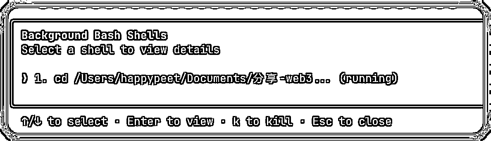
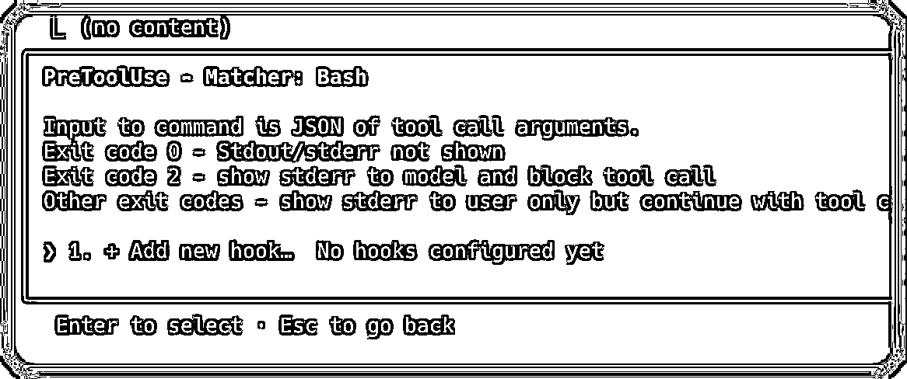
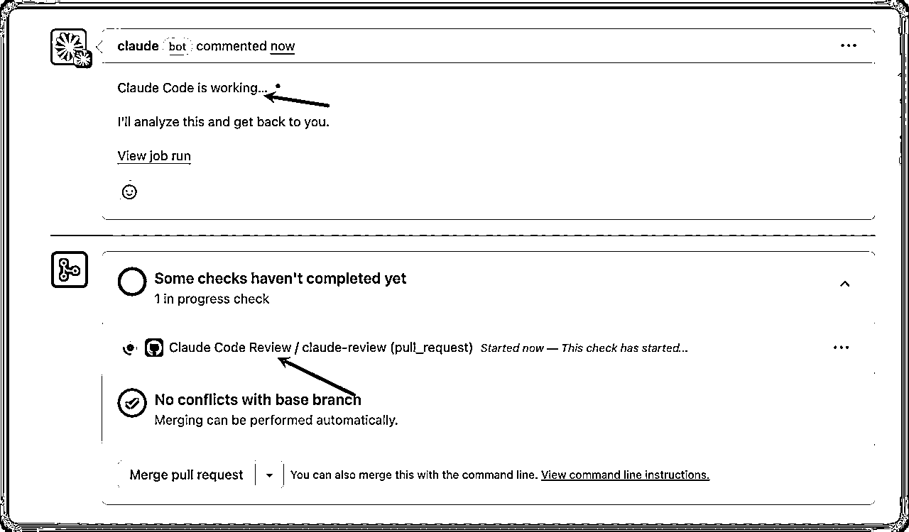

# Claude Code 编程指南丨实战手册丨2025 年 9 月

> 来源：[https://ocn93f5d9olj.feishu.cn/docx/S4tCdZRhSo9cFExTKakcEBnEnYe](https://ocn93f5d9olj.feishu.cn/docx/S4tCdZRhSo9cFExTKakcEBnEnYe)

# ⛵新手如何入门【Claude Code 编程指南】项目？

# 1\. 什么是 Claude Code

简单讲，它就是你电脑里的智能编程助手。你只要告诉它你想做什么，它就能帮你实现：

“给我做个个人网页，放上我的照片和简介” → 几分钟后，你的网页上线了。

“每天整理的这个表格，能自动完成吗？” → 它直接给你写好自动化程序。

你完全不用担心自己不懂技术。就像你用美图秀秀不需要懂 PS，用高德地图不需要懂 GPS，使用 Claude Code，你也不需要懂编程。你唯一要做的，就是把想要的东西描述清楚。

本次航海专为技术零基础的新手设计，全程没有复杂的编程术语，我们会教你如何通过对话，让 Claude Code 帮你轻松实现需求。

21 天后，你就能做出：

一张惊艳的个人数字名片

实用的小工具（比如批量改名、图片压缩）

简单的小型业务系统（预约管理、记账工具等）

# 2\. 项目完整操作思路

# 2.1 项目完整操作思路

Claude Code 安装 > 学习与 Claude Code 高效对话的技巧 （关键） > 实战开发效率工具与 Web 应用 （关键） > 探索全栈开发与需求挖掘

# 2.2 操作重点

Claude Code 是一个生活在你终端中的代理式编码工具，能理解你的代码库，通过执行日常任务、解释复杂代码和处理 git 工作流来帮助你更快编码 。但最关键是学会“对话式编程”而非“独白式编程”，所以就需要你自己能理解代理的部分原理，这样才能很好的和 AI 协作。

# 2.3 新手入门建议&避坑指南

完全不懂编程能学会吗？

答：完全可以。Claude Code 的核心是自然语言交互，你只需要会清楚地描述需求。就像用美图秀秀不需要懂 PS 原理，用 Claude Code 也不需要懂编程原理。航海会提供大量对话模板和实例。

Claude Code 和 Cursor 有什么区别？

答：Claude Code 直接在终端运行，能理解整个代码库并自主执行任务，更像一个能干活的程序员；Cursor 更像代码补全工具。据实测反馈，Claude Code 在处理复杂任务时表现明显优于 Cursor。

需要付费订阅吗？成本高吗？

答：官方订阅 Pro 版 20 美元/月，Max 版 100 美元/月。国内也有 DeepSeek、Qwen 等平替方案。

生成的代码质量如何？

答：Claude Code 使用 Opus 4.1 模型，是目前编程能力最强的 AI 模型之一。关键是要学会正确的提问方式和任务拆解，航海会重点训练这些技巧。

# 2.4 开船前必备

.

一台能流畅运行的电脑

.

Node.js 18 或更高版本（必须）

.

Claude 账号或第三方 API

.

备选方案：DeepSeek、Qwen3-Coder、GLM-4.5 等国内模型

.

VS Code 或其他 IDE

1.  什么是 Vibe Coding

# 1.本章概要

你是否也曾有过一个绝妙的点子，却因为实现它的技术门槛太高而卡住，眼看着热情被各种复杂的规则和指令一点点消磨掉？

为了让“创造”这件事回归简单，一种全新的理念——Vibe coding，应运而生。它的核心很简单：让你不再需要死磕每一个技术细节，而是能专注于你的想法本身，成为一个真正的“创造者”。

在本章中，我们将一起弄明白几个有趣的问题：

Vibe 到底是什么：它背后是一种怎样让“想法”轻松变成现实的思路？

它和传统方法有何不同：为什么说，你只需要告诉 AI “做什么”，而不用再操心“怎么做”？

AI 在其中扮演的角色：AI 是如何从一个冷冰冰的工具，升级为能听懂你想法的“创意伙伴”的？

搞懂这些，能帮你为接下来的所有实践，打下一个全新的认知。这不仅仅是学个新东西，更是升级你用科技实现想法的方式。准备好了吗？让我们一起推开这扇通往未来的大门。

# 本章航线图

完成本章节的学习和实操，即可完成航线图第一阶段的第1部分。

第一阶段：快速上手 Claude Code（约 0.5 天）

.

理解 Vibe Coding 与 AI 编程新范式（约 0.5 天）


OpenAI 联合创始人 Andrej Karpathy 在 2025 年 2 月首次提出，他将其描述为“完全顺着 AI 的节奏去写代码，几乎把‘写代码’这件事本身忘掉”


# 2.传统编程和氛围编程的对比

功能

传统编程

氛围编程 (vibe coding)

代码创建

逐行手动编码

AI 根据自然语言提示生成

开发者或用户角色

架构师、实现者、调试者

提示者、引导者、测试者、优化者

需要具备编码专业知识

较高（编程语言和语法知识）

较低（了解所需的功能）

主要输入

精确的代码

自然语言提示和反馈

开发速度

通常较慢，有条不紊

可能更快，特别是对于原型设计更简单的任务

错误处理

根据代码理解进行手动调试

通过对话式反馈进行优化

学习曲线

往往很陡

可能降低进入门槛

代码可维护性

依赖于代码质量、开发者技能和既定实践

可能严重依赖 AI 输出质量和用户评价

# 3.上瘾图

开篇一张图，看大家是否都认得上面的工具。


所有链接：

```
终端工具类：
Claude code：https://www.anthropic.com/claude-code
AmpCode：https://ampcode.com/
Gemini CLI：https://github.com/google-gemini/gemini-cli
OpenCode：https://opencode.ai/
QwenCoder：https://qwenlm.github.io/blog/qwen3-coder/
Aider：https://aider.chat/
Codex：https://chatgpt.com/codex

IDE 类：
Cursor：https://cursor.com/
Windsurf：https://windsurf.com/
Kiro：https://kiro.dev/
CodeBuddy：https://www.codebuddy.ai/
Trae：https://www.trae.ai/

VSCode/Cursor插件类：
Augment：https://www.augmentcode.com/
Cline：https://cline.bot/
RooCode：https://roocode.com
Github Pilot：https://github.com/features/copilot

前端界面类：
v0：https://v0.dev
bolt：https://bolt.new
lovable：https://lovable.dev
same：https://same.new/
Replit：https://replit.com/
MagicPath：https://www.magicpath.ai/
Command：https://command.new/

产品设计类：
CodeGuide：https://www.codeguide.dev/

移动端类：
Rocket：https://www.rocket.new/
Rork：https://rork.com/

CR 类：
CodeRabbit：https://www.coderabbit.ai

任务管理类：
TaskMaster：https://www.task-master.dev/
```


1.  重新理解编程和编程工具

# 1\. 关于编程

# 1.1编程的本质认知

编程，本质上是人与计算机的对话艺术。详细点说就是用一种精确的、计算机能理解的方式，把我们的意图转化为可执行的指令。这个对话过程可以分解为：

```
问题世界 → 思维世界 → 代码世界 → 计算机世界 → 现实世界
   ↓         ↓         ↓         ↓         ↓
 现实需求   逻辑抽象   语法实现   机器执行   问题解决
```

# 1.2 为什么要学AI编程？

常言道：未来淘汰的是不会用AI工具的人

站在时代背景下，你会发现AI 编程是“新工具革命”，主要有以下3点。

第一：门槛急剧下降

以前学编程，得先啃语法、调试环境，至少要几个月才能写出可用的东西；

现在有 Claude Code / ChatGPT / Cursor，你可以用自然语言直接写出能运行的程序，零基础也能当天见成果；

第二：工作方式在改变

软件开发不再是“一个人手写代码到天亮”，而是人类负责想法 + AI负责生成；

未来大部分岗位（包括非程序员）都会用到“AI 辅助编程”做自动化和数据处理；

第三：竞争优势

不会 AI 编程的人，未来用工具的效率会比别人低几个量级；

会 AI 编程的人，不仅可以自己做，还可以快速验证想法和做副业产品；


# 2\. 关于编程工具

# 2.1 什么是编程工具

学习完编程，我们接下来看看编程工具的概念！

编程工具，简单说就是——为了让我们更高效地写代码、调试、测试、发布程序而使用的软件和配套环境。

# 2.2 为什么需要编程工具

提高效率：用代码提示、自动补全、省掉大量重复劳动

减少错误：调试器、静态分析器帮你提前发现 Bug

便于协作：版本管理、代码托管让多人开发变得可控

支持整个生命周期：从写代码到上线运营，都有对应工具

# 2.3 常见的编程工具

类型

作用

示例

代码编辑器 / IDE

写代码、调试、运行

VisualStudio，VS Code, PyCharm, IntelliJ, Xcode

编译器 / 解释器

把代码转成计算机能执行的语言

GCC, Clang, JVM, CPython

调试器

跟踪程序运行，定位 Bug

GDB, VS Code Debugger

版本控制工具

管理代码历史与协作

Git, GitHub, GitLab

构建工具

自动化编译、打包、部署

Maven, Gradle, Webpack

测试工具

自动化检测功能与质量

pytest, JUnit, Jest

自动化工具

自动运行任务

GitHub Actions, Jenkins

部署与运维工具

程序上线和监控

Docker, Kubernetes, Prometheus

# 2.4 Claude code的角色定位

Claude Code本质上是一个Web开发时代的编程助手，最适合基于Web技术栈和跨平台技术的开发。

这个是Claudecode的简化能力地图。

大家注意，从图中可以清晰的看清楚，其实Claude Code这个工具最擅长的还是web相关的开发。

本质上的原因Claude Code 生成的代码，本质上依赖于开放、通用、跨平台的运行环境。

因为，Web 技术（HTML/CSS/JavaScript）符合这三个条件

JavaScript 是浏览器的唯一原生脚本语言，几乎任何电脑、手机都有浏览器

Claude Code 在训练中大量接触到开源前端/后端的代码样本（JavaScript、Python），而这些生态文档和示例都公开且容易被学习到。

所以说，生成的结果只要用户有浏览器，就能运行，不依赖复杂的本地配置（不像 C++、Java 桌面应用那样需要繁琐的环境）


# 3.其他科普

# 3.1 Agentic 工作流：拆解AI Agent“思考-计划-执行”的工作模式

Agentic 工作流（Agentic Workflow）是指由自主智能体（Agent）驱动的工作流程，它能够：自主理解任务（思考）、制定解决方案（计划）、按计划执行并调整（执行）、在必要时循环迭代（反思）

Claude Code、ChatGPT、AutoGPT、LangChain 等 AI 工具，都可以扮演 Agentic 工作流中的“智能体”角色。

# 3.2 三步核心循环

阶段

核心问题

AI 在做什么

产出

思考 (Think)

“我要解决的是什么问题？”

解析任务，理解上下文，分析需求

问题定义、假设

计划 (Plan)

“我应该按什么步骤来做？”

拆分任务、制定顺序、选择方法

行动计划、任务列表

执行 (Act)

“我该具体怎么做？”

按计划执行步骤，生成结果，必要时修正

可用结果或下一步输入


# 3.3 上下文协议（Context Protocol）的原理

# 什么是上下文？

在大模型里，“上下文”指的是模型在一次对话或任务中可感知到的全部信息，主要包括：用户输入、历史对话、外部文档、工具返回的结果，这也决定了模型能不能“记住”之前说的话、能否关联多条信息推理。

举个例子：

你可以先问学生一个问题：

“如果我今天跟你说，打开 main.py，在函数里加一个打印，你知道我要改哪份代码吗？”

如果学生没看到这个项目，他们一定会懵：“main.py 是啥？你之前写了什么？”

这就是上下文的问题。

对人来说，我们会记笔记、记得上次写到哪一行。

对 AI 模型来说，它本来是没有“记忆”的，每次都像第一次见你。

所以，就需要一种机制，把项目的信息、环境信息整理好，每次交给模型。这个机制，就叫 上下文协议（Context Protocol）。

# 上下文协议的核心作用

防止模型“断片”：没有上下文协议，模型会忘记之前你建了什么文件、用的是什么框架。

减少重复沟通：你不用每次都把项目结构解释一遍。

提高准确性：模型生成的代码会贴合你当前项目，而不是给你一个通用但错误的版本。

# 关于上下文的几点细节认知

.

上下文的“边界”

模型的上下文其实受 上下文窗口大小 限制（比如几万 Token）。

上下文协议的价值之一就是如何在有限的窗口里组织最关键的信息，避免无关内容挤占空间。

👉 可以顺带讲一句：这和人类记忆不同，人类可以长期记忆，而大模型的记忆就是“有限的短时黑板”。

.

上下文协议的“协议性”

强调它为什么叫“协议”：它不是随便拼接，而是有一套标准化的数据格式，规定了“哪些信息需要交给模型、怎么交”。

类似计算机的通信协议（TCP/IP 定义了包格式），上下文协议定义了上下文信息的“打包和传输规则”。

这样不管是 Claude 还是别的 IDE 辅助工具，都能遵循这个协议来“接力”。

.

上下文协议的“动态更新”

不是一次性“给一堆信息”，而是会 随任务过程不断刷新。比如你刚刚新建了一个 login.py，协议会立刻更新，让模型知道多了这个文件。这也是为什么它能保证对话的连续性。

.

与“长期记忆”的区别

有些学生可能会问：“上下文协议是不是模型的长期记忆？”

你可以点明：

上下文协议 = 短期连续对话的上下文管理（确保模型这几轮能对上）

长期记忆 = 跨会话的存储（下次打开 IDE 还能记得昨天做的项目）

.

一个直观的专业比喻

你可以用“机场广播”来比喻：如果你在机场换了登机口，广播会实时更新信息给所有乘客。

上下文协议就像“广播协议”，它确保模型随时拿到最新的“登机口信息”，不会跑错地方。

1.  准备环境

# 1.本章概要

见识了 Claude Code 的强大潜力后，相信你已迫不及待了。但在开始高效编码之前，我们必须先搭建一个稳定可靠的开发环境，这是通往成功的第一步，也是最关键的一步。

一个完美的开发环境，是避免未来陷入配置难题、让你能专注创造的核心保障。本章的任务就是带你一次性扫清所有环境障碍，为后续的开发工作做好准备。

在本章中，你将：

配置系统环境：完成所有前置依赖的安装与配置，从源头避免兼容性问题。

安装 Claude Code：精准、快速地安装核心程序，并理解其基本工作原理。

验证安装成功：运行第一个验证程序，确保一切准备就绪，万无一失。

工欲善其事，必先利其器。一个稳定可靠的环境，将让你在后续的学习中事半功倍。现在，就让我们一起为接下来的 AI 辅助开发，打下坚实的基础。

通过本章的学习，你将学会如何安装Claude Code。让我们一起动手，为你的编程之旅打下坚实的第一步。

# 本章航线图

完成本章节的学习和实操，即可完成航线图第一阶段的第2部分。

第一阶段：快速上手 Claude Code（约 1 天）

.

准备开发环境并安装Claude Code（约 1 天）


修改要求：这里分mac环境准备和windows环境准备，安装nodejs、python和git。以及 IDE 环境

这些安装的内容，是为了让Claude code更好的运行所做的准备工作

1.  Python，一种非常流行的编程语言，尤其在 AI 和数据领域。可以用来实际运行和测试 Claude 生成的 Python 代码，确保程序能正常工作。另外 MCP 工具的运行也需要 Python 的基础环境

2.Nodejs，一个让 JavaScript 也能在电脑上（而非仅在浏览器里）运行的程序，用来运行现代网站开发相关的工具，以及测试 Claude 生成的前端（JavaScript）代码。另外 MCP 工具的运行也需要 NodeJS 的基础环境

3.Git，一个代码版本管理工具，像给项目拍照存档一样，可以帮你记录所有代码修改。如果 Claude 的建议有问题，你可以用它轻松退回到之前的安全版本。

4.VS Code，一个强大的代码编辑器，就是你写代码的软件，这是你与 Claude 互动、编写和管理代码的主界面。

PS：请对应自己的操作系统，对应的章节准备相应的环境。

# 2.安装 python

直接进入 python 官网：https://www.python.org


进入后，鼠标移动到导航中的 Downloads，你会直接看到“Download for macOS”的标题，然后下面有一个“Python xx.xx.xx”的按钮，点击它，它就开始下载安装包了。


下载完成之后，直接双击安装包即可开始安装。

# 2.1 macOS 安装


macOS 安装比较简单，就一路继续就完事了。环境变量它会自己加上的。


安装完成之后，按 Command+Space 唤起聚焦搜索，然后输入终端，打开终端。


进入终端后，输入python3 --version查看 python 是否完成安装。


当页面显示 python 以及 python 的版本号时，表明 python 安装成功了。

# 2.2 Windows 安装

进入官网后，两种方式选择一种就可以。

方式一：鼠标移到到「Downloads」标签的时候，就会出现如下，选择灰色按钮就可以开启下载。


方式二：点击「Windows」进入到具体的下载页面

这个页面可以选择 intel 版本还是 arm 版本的下载。


Windows 的安装会稍微麻烦一点，当然也就一个地方。

在打开 python 安装包的时候一定要吧下面的 Add Python to PATH 给勾上，否则你到时候验证安装的时候就会找不到 python。

两种安装方式选择自己的一种就可以。


windows 安装完成之后，输入 win+R，然后执行“cmd”，这样就打开了终端。


在终端中输入python --version能验证 python 是否安装。


# 3.安装 nodejs

nodejs 如法炮制。

首先我们进入 nodejs 官网：https://nodejs.org/

进入官网后，点击官网页面上的 Get Node.js 进入 nodejs 的下载页面。


进入下载页面后，不要用上面的命令行安装，对于一般同学来说还是太繁琐，你就直接往下拉找到一键安装包。

# 3.1 macOS 安装

如果你是 Mac 电脑的话，如果是 M 芯片你就选 ARM64，如果是 Intel 芯片你就选 x64。同样，选择 installer 进行下载。

下载完成后进行安装，安装方式也极为简单。一直点继续就可以了。

然后到这，就安装好了。


# 3.2 windows 电脑安装

如果你的电脑是 windows 电脑，一般情况下选择 x64（64 位系统）

如果你的电脑比较老，那就选择 x86（32 位系统），我说的老，就是那种内存条插不到 8 个 G 的老电脑，否则你都选择 x64，就像下面这么选。选完了之后选择下载。msi 的 installer 文件。

下载完成之后直接点击安装，进入安装页面。

windows 电脑也是一样一直继续就行。

安装完成之后，像验证 python 一样，进入终端，然后输入node -v，回车。

进入终端的方法再强调一次：

.

Windows 系统 ：按 Win+R 键，输入 cmd 后回车打开终端。

.

macOS 系统 ：按 Command（⌘）+空格键打开 Spotlight 搜索，输入"Terminal"或"终端"并回车。


如果正常返回了版本号，则表示 node 安装成功了。


# 4.安装 git

如果要使用 github 管理代码，首先我们需要安装 git。

让我们进入 git 官网：https://git-scm.com/downloads


下载你系统版本的 git，windows 的就下载 windows 的，mac 的就下载 macOS 的，linux 的就下载 Linux 的。

系统会根据实际情况自动弹出安装方法，比如 macOS 要用 brew 进行安装，windows 直接下载安装包安装。

# 4.1 mac 安装

mac 需要先安装 homebrew。进入 homebrew 官网：https://brew.sh/，然后点下面命令行右边的复制。

```
/bin/bash -c "$(curl -fsSL https://raw.githubusercontent.com/Homebrew/install/HEAD/install.sh)"
```


打开终端，把刚才复制的代码粘贴到终端里，回车。按提示输入开机密码，回车；在确认安装，回车。然后它就开始安装或者升级了。


过了一会就安装好了。安装好了之后在终端输入brew install git，回车。过了一会 brew 就会提示 git 安装好了。

```
brew install git 
```

安装好或者检查自己电脑是否有 git，直接打开终端，输入git --version，回车即可。如果你看到了版本号，说明安装成功了。

```
git --version
```


# 4.2 windows 安装

到达 windows 的安装界面，根据电脑的型号选择安装的版本。绝大多数情况，amd 或者 intel 的 cpu 都可以选择 x64 的版本，所以无脑选 x64，如果确认不了安装什么版本，你可以问一下 AI。

下载好了之后就一路安装往前点击下一步就行。

注意，到了下面这个选择组件页面的时候，如果你不知道选择什么，你就全选，全选准没错。

安装好或者检查自己电脑是否有 git，直接打开终端，输入git --version，回车即可。如果你看到了版本号，说明安装成功了。


# 5.安装 vscode

接下来我们继续安装 vscode。首先进入 vscode 官网：https://code.visualstudio.com/

然后直接点击画面中间的 Download for xxx，如果你是 windows 电脑，它就会显示 download for windows，如果你是 mac 电脑，它就会显示 download for macOS。


你看到下面这个画面之后，它就会自己下载安装 vscode 了。

# 5.1 mac 安装

macOS 会相对简单，打开直接就是 vscode 的启动包，把启动包直接拖动到应用中心即可。

注意！一定要拖到应用中心里面！不能直接打开，直接打开有很多权限问题！


如果你在页面的个人收藏里看不到应用程序，可以通过设置打开。


首先，打开访达。在状态栏点击“设置”。


在访达设置中，勾选“应用程序”。

这个时候你就能在访达中看到它了。然后将 vscode 拖入应用程序文件夹即可。

安装完成后，在桌面或者启动台找到 vscode 并打开。打开之后长这样。

至此，vscode 就安装好了。

PS：如果你第一次使用 vscode，它让你照指南配置，你可以跟着它的配置去做，或者直接不管。不管也没什么问题。

# 5.2 windows 安装

windows 下载完成之后根据指引直接安装，这里就直接一直按下一步就行。尽量安装在系统盘。

默认选择的时候，注意把添加到 PATH 给加上，不过它默认本身就装上的。

为了环境变量能够正常生效，安装完成后建议重启电脑。

1.  安装ClaudeCode

安装 nodejs 时，我们会自动安装好 npm。对于 mac 电脑，直接检查 npm 是否正常可用后，就可以直接安装 claudecode。对于 windows 电脑，当前 claudecode 已经完整支持 windows，所以当前不推荐使用 wsl，而是推荐安装 git 后指定环境变量。

# 1.MAC 电脑安装

现在打开终端，输入npm -v，来试一下 npm 是否正确安装。


如果页面显示了 npm 的版本号，表示 npm 安装成功了。接下来我们就可以安装 claudecode 了。

直接在终端输入npm install -g @anthropic-ai/claude-code，回车。

```
npm install -g @anthropic-ai/claude-code
```

如果比较慢，可以后面加入镜像参数

npm install -g @anthropic-ai/claude-code --registry=https://registry.npmmirror.com


等待一段时间过后，claudecode 就自己安装好了。输入claude -v，回车。如果能够看到 claude 的版本号，就表明 claude 已经安装成功了。


注意：如果安装的时候报 permission denied，请输入sudo npm install -g @anthropic-ai/claude-code，然后输入你的开机密码，回车。


# 2.windows 电脑安装

现在打开终端，输入npm -v，来试一下 npm 是否正确安装。

ps：npm 是 nodejs 的软件安装中心，一般在 nodejs 安装时，npm 会被同时安装。


如果页面显示了 npm 的版本号，表示 npm 安装成功了。接下来我们就可以安装 claudecode 了。

直接在终端输入npm install -g @anthropic-ai/claude-code，回车。

```
npm install -g @anthropic-ai/claude-code
```

如果比较慢，可以后面加入镜像参数

npm install -g @anthropic-ai/claude-code --registry=https://registry.npmmirror.com


等待一段时间过后，claudecode 就自己安装好了。输入claude -v，回车。如果能够看到 claude 的版本号，就表明 claude 已经安装成功了。


到此，claudecode 就安装成功了。

1.  通过API使用国产替代模型驱动Claude Code

# 本章概要

就像你拿到了一件梦寐以求的“神兵利器”，在使用它之前，总需要一些仪式感——让它认主、顺手。激活和配置 Claude Code 就是这个过程。它可能看起来有点繁琐，但却是释放其全部潜能的关键一步。

这一章，我们会手把手带你走完这“最后一公里”，确保你的 AI 创意伙伴能以最佳状态为你服务。我们将一起完成：

成功激活：如何拿到并使用那把启动 Claude Code 的“钥匙”。

核心配置：理解几个关键设置，把它调教成最懂你的样子。

连接项目：让它认识你的工作环境，为接下来的创造做好准备。

别小看这些步骤。一个好的配置，就像是给你的伙伴配上了最合身的装备。这几分钟的投入，将为你后续的开发节省数小时的时间。

准备好为你强大的“创意伙伴”正式上岗做最后的准备了吗？我们开始吧！

# 本章航线图

完成本章节的学习和实操，即可完成航线图第一阶段的第3部分。

第一阶段：快速上手 Claude Code（约 1 天）

.

激活并配置你的 Claude Code（约 1 天）

注意！注意！注意！

由于 claude 的支付和网络环境要求特别高。

这里建议大家直接走完 【02 通过API使用国产替代模型驱动Claude Code】就可以。进入下面的章节。

后面的 03/04 放在这里留给有精力、特别有探索欲的船员们。


如果你解决不了充值和网络的问题，也可以选择国产替代的方案，以下为简单的优劣势对比。

GLM4.5

Kimi K2

Qwen

成本效益绝对领先，量大管饱。

现有新会员注册赠送token活动。

使用反馈效果不错，但token消耗量比较快。

参数规模惊人，代码能力媲美claude 3.7 sonnet。长文档处理，Agent编程

API价格4元/百万输入tokens，16元/百万输出tokens。

需要充值50元升级为Tier3级别用户使用起来才会比较顺畅。

多规模版本。

阶梯定价，灵活选择。

Qwen-Agent框架，工具调用。

消耗量大，比较费钱。

# 国产模型的账号注册和 API KEY 配置

# 2.1 GLM4.5

登录GLM官网。

资源包地址：https://www.bigmodel.cn/finance/resourcepack

看下自己有么有赠送的资源包，有的话就去申请API KEY。


并且现在推出了 claude code 的套餐，也可以考虑

地址：https://bigmodel.cn/claude-code


获取API KEY。

访问地址：https://www.bigmodel.cn/usercenter/proj-mgmt/apikeys


记住你的API KEY。

然后再记住这一串BASE_URL：https://open.bigmodel.cn/api/anthropic

记住了吗？到配置说明这里去配吧。

# 2.2 Kimi K2

同样，登录网址，然后创建API KEY。

访问地址：https://platform.moonshot.cn/console/api-keys


创建完后可以复制


记住你的API KEY，还有这个BASE_URL:https://api.moonshot.cn/anthropic

记住了吗？到配置说明这里去配吧。

# 2.3 Qwen

同样，获取API KEY。

地址：https://bailian.console.aliyun.com/?tab=model#/api-key


记住你的API KEY，还有这个BASE_URL：https://dashscope-intl.aliyuncs.com/api/v2/apps/claude-code-proxy

记住了吗？到配置说明这里去配吧。

# 2.4 DeepSeek

地址：https://platform.deepseek.com/api_keys


deepseek 的 BASE_URL：https://api.deepseek.com/anthropic

记住了吗？到配置说明这里去配吧。


# 配置说明

简单理解，就是提供的模型不一样，设置的 ANTHROPIC_BASE_URL 不一样。

这里我们推荐使用 zcf 这个终端工具进行配置。

新手不建议手动配置文件

在终端输入

```
npx zcf
```

输入 y，回车。然后我们就能看到一个终端配置器。

语言选择 1，简体中文。通过上下键选择，选择后按回车。


之后我们可以仔细去研究，现在就做一件事情，配置 API，输入 3，回车。

按一次⬇️，切换到使用 API Key，按回车。


输入你刚刚拿到的 BASE_URL，回车。

再输入你的 API_KEY，回车。

配置完成，按 n，回车，把 zcf 关掉。

完成后，重新打开终端，输入 claude，回车。

这里记住，如果你用的是 API 的话，要切换成 Yes，否则你配置的 APIKEY 不会生效。


当对话框出来后，表明 claudecode 已经成功打开了，可以开始爽用了。

# 配置视频

如果你有看不懂的可以看下面的视频，希望可以帮助到你：

视频学习


============= 长长的分界线，新手勿入，高手请进 =============

这里是长长的分界线。下面理解基本大家可以忽略。

支付：国内/香港的所有卡（银联/visa）都不能绑定支付

网络：需要静态/住宅 IP（不是🪜/机场类的哦）。成本也比较贵。

结论：所以下面的方式都是走官方 claude 的流程，大家有特别探索精神的人可以看看，新手忽略吧。

1.  (新手勿入)Claude Code登录官方账号

# 1.关于充值Claude的方法说明

如果你可以搞得定网络的话（静态 IP 或住宅 IP，不推荐🪜），支付方式这里我也讲一下

国内银联信用卡/visa/运通卡

还有香港卡（汇丰/众安/天星等）

直接在 claude 的网页上是不行的。需要美国卡或其他地区的卡

# 方式一：安卓+google play（礼品卡）

条件：安卓机（推荐 google pixel）

我家里的荣耀反正是不行了，我海鲜市场买了 pixel 2，大概 250 左右。原生谷歌系统。可以使用。

群友验证：一加是可以的。

国内其他机型没有测试，不敢保证 google play 的服务是好用的。

注意：支付的时候可能谷歌邮箱需要打开2FA，和电话绑定等操作，注意这些事项

支付方法一：google play 支付

我绑定的是香港的众安卡、天星银行等卡（这些卡肉身去香港就可以开，很方便。）

我看群友也有绑定国内银行visa卡 或 运通卡成功的，应该支付也是没有问题。

注意国内银联卡没试过，基本可能不会成功，谷歌苹果这些国际服务基本人 visa/运通 这些卡

银联是国内服务可能别人不太友好

支付方法二：礼品卡

当然也可以去买礼品卡，我之前使用过的网站是可以买礼品卡的。

https://www.seagm.com

注意：另外绑定礼品卡兑换的时候，还是需要电话验证，谨慎购买礼品卡兑换，避免礼品卡兑换不成功

# 方式二：IOS+礼品卡

条件： 苹果手机、美区Apple账号（自己注册或咸鱼搞定）

支付方法二：礼品卡（推荐）

当然也可以去买礼品卡

https://www.seagm.com

也可以支付宝购买，网上搜索就可以找到。

支付方法一：apple 支付

美区的 apple 支付不直接支持国内银联/visa卡和香港卡。

的绕个弯：

就是：使用美区的 apple 账号，绑定美区的 paypal，美区的 paypal 是可以验证香港众安银行卡的。

注意：美区 paypal 需要使用美国电话卡（实体电话卡），不然也很容易封号。

经群友验证，美区的 apple 账号绑定美区的 paypal 的时候，国内卡验证不通过，可以联系苹果客服解锁。

上面讲的都是 claude app 上的订阅（也就是安卓手机和苹果手机上走 claude app 订阅）

具体收费情况 max 的套餐会多收 25% 的税，具体计算如下：

20 刀套餐无税，实际支付：20 刀

100 刀套餐，实际支付是：125 刀

200 刀套餐，实际支付是：250 刀

所以，官方网页的方式虽然 max 不收税，但是支付比较难，claude app 上目前是目前可以跑通支付的方式。

网页的支付要么就海鲜市场代付（风险高，虚拟卡等，跑路风险），要么可以找自己朋友有卡的支付。

另外，还有说明，现在 AI 产品更新迭代速度太快，不太建议年订阅，除非你有钱，可以，不然建议还是月订阅吧。（最近应该很多退订 Cursor 年订阅的用户吧）

# 方式三：虚拟卡

目前野卡不能使用，还可以使用的是飞扬卡和 bybit 虚拟卡。

可以直接网页支付。

优点：就是不用交 25% 的税。

缺点：流程比较长，要求网络环境比较严格，且涉及 USDT 的购买，此处略掉万字。自行斟酌

各方面考虑，此处不宜写很详细的方案，需要具有探索性很强的同学尝试。


# 3.网络情况说明

# 3.1 静态 IP 或者住宅类 IP

检测纯净度地址：https://ping0.cc


# 3.2 需要配置终端代理

如果你遇见了下面截图的错误，那么就是网络的问题


注意：

网络代理必须配置终端代理，普通🪜的设置只能浏览器代理，终端模式不能访问

按照如下方式选择即可

选择推荐：

windows：推荐方式一

mac：推荐方式二

上面的方式搞不定的，推荐方式四（需要修改配置文件，门槛稍微高些）

# 方法一：使用 clash.verge 软件的增强模式，或者 tun 模式

目前推荐使用 clash.verge 的客户端，不推荐老版本的 clashx 等版本了

英文：一般叫 tun 模式

中文：增强模式，虚拟网卡模式

# 方法二：小火箭直接打开就行（只能 mac/ios 使用）

注意只能 m 芯片的 mac 使用。

国区 AppStore 无法下载，需要美区的 AppStore


# 方法三：直接终端网络配置，clash 软件一般都有“拷贝终端命令”，粘贴到终端


下面举 windows 的CMD 窗口举例，复制后

```
set http_proxy=http://127.0.0.1:7897
set https_proxy=http://127.0.0.1:7897
```

打开 CMD 终端窗口，粘贴内容


# 方法四：直接修改 claude code 文件(端口是你 clash 客户端配置的端口)

在你的 claude code 的配置文件目录下

配置文件路径(如果没有 文件/文件夹 请手动创建)

macOS/Linux: ~/.claude/settings.json

Windows: C:\Users\[username]\.claude\settings.json

注意：你的端口（就是下面的 7897 这个数字）需要根据你的🪜软件来配置的，可能你的和我的不一样

```
{
  "env": {       
     "HTTP_PROXY": "http://127.0.0.1:7897",
     "HTTPS_PROXY": "http://127.0.0.1:7897"
   }
}
```

以上的网络问题都解决之后，你就可以直接使用Anthropic官方账号登录Claude Code了。

1.  (新手勿入)登录 ClaudeCode 官方账号流程

# 1.终端登录ClaudeCode

如果遇到下面的问题，就是网络问题，请回到 3.1/3.2 解决


# 1.1 第一步：配置主题


# 1.2 第二步：登录设置


# 1.3 第三步：然后出现下面的有个链接，复制


# 1.4 第四步：浏览器里面打开

输入邮箱

选择密码输入

继续


# 1.5 第五步：授权


拷贝


# 1.6 第六步：右键粘贴

粘贴完后，回车就行

然后你就可以愉快地使用Claude了。

1.  Claude code 使用模式

# 本章概要

我们已经完成了 Claude Code 的安装和配置，现在，是时候学习它的基本使用方法了。

很多人在刚接触 AI 编程工具时，常常因为不知道如何有效提问，导致 AI 给出的答案总是不尽人意。这一章的目的，就是帮你掌握最核心、最实用的操作技巧。

我们将一起学习与 Claude Code 协作的几个关键技能，让你能精准地获得想要的结果：

基础入门操作： 学会关于安装 Claude Code 插件、连接 VSCode，以及自动编辑、规划和Yolo等基本工作模式。

日常高频操作： 让你对日常编程中高频使用的技巧，包括指定文件、粘贴图片、使用常用命令、管理记忆文件以及恢复对话等内容熟悉。

高级功能与配置： 这里是更深入的用法，例如通过“深度思考”解决复杂问题、利用 Git 恢复代码、监控使用量、切换模型以及后台运行服务等

掌握了这些基本功，你就能熟练地使用这个强大的工具，为下一章更复杂的实战场景做好万全准备。

准备好开始了吗？让我们学习如何高效地使用 Claude Code。

# 本章航线图

完成本章节的学习和实操，即可完成航线图第一阶段的第4部分。

第一阶段：快速上手 Claude Code（约 1 天）

.

掌握Claude Code 基本使用技能（约 1 天）


到这里如果上面的 API key 配置好，就可以进入claude code 的使用了。

Claude code 的使用方式主要就是在终端。万变不离其宗。大家按照手册走就可以。

# 开始使用

这里就是在终端直接打开。

在打开终端之前也是建议大家新建一个【项目目录】

比如在你的电脑里面，找到一个你写代码的目录。比如是 codes 目录下。

那么新建一个 yanshi-0904 的目录。

# windows

windows 的方式两种，大家可以根据自己的操作系统看着来。

# 方式一：右键打开终端

系统：win11


# 方式二：资源管理器的地址栏

系统：win10

在资源管理器的地址栏输入 cmd 三个字母，回车就可以打开


# mac

苹果电脑系统大家不熟悉终端命令的操作的话

其实跟 windows 也是一样的，都是右键打开终端


如果看不到“进入终端”几个字，可以安装下右键助手的软件


# 启动claude

很简单，在终端直接敲入如下单词就可以启动 claude 了。

```
claude
```

如果大家文字不懂的可以参考下面的视频链接：

视频学习

# 其他方式：和 IDE 结合

有些小伙伴们对终端可能还是不太习惯。那我们就可以使用 vscode 的插件

强烈推荐使用claudecode插件启动claudecode。

# 步骤一：首先需要安装插件

如下图，在 VSCode 的插件市场搜索 Claude Code，注意要认准是 Anthropic 公司，这个是官方的。

点击「install」安装就可以了。

# 步骤二：打开 Claude Code

方法一：使用快捷键，Cmd+Escape，不过我的不好使，大家可以试一试

方法二：直接使用 Cursor 界面的如下图所示的图标，鼠标单击就行


点击下那个图标


可以看到右侧的就是 ClaudeCode 的工作区域了


# 步骤三：将Claude Code连接IDE

在启动的Claude Code中使用 /ide命令启动与ide的链接。输入/ide，回车。


在启动后按上下键选择当前的ide（代码编辑器），选择后回车。


ide连接成功后，对话框的有下角会有一个绿色的小圈圈。


这个时候，在ide中选择文件或者划词，cc就能直接读到。


到这里来个总结吧。

前面的步骤都弄完后，这里就完成一个阶段了。

下面的阶段那就是学 claude code 技能，然后就是不断的做东西了。

先做个辣鸡出来吧，勇敢的去干！！！

干中学。

# 02.基础入门操作

# 1\. 自动编辑模式

使用场景：不需要每次创建文件都需要你的确认。

使用方式：shift+tab 按一次，就可以进入该模式。（在windows里，通过alt+m切换模式）

# 2\. plan 模式

roocode，cline，Cursor（ask）

使用场景：前期需要规划项目的时候，或者是解决疑难杂症的时候。

使用方式：shift+tab 按两次就可以看见（windows电脑使用alt+m）

举例：

```
我想写一个像素风格的todolist，我需要移动端也可以使用，帮我规划下方案
```


开始思考方案：


最后的结果如下：


有三个选项：

1：自动处于编辑自动模式，开始实施计划，自动写代码

2：手动模式，需要手工确认

3：继续讨论方案，场景：如果你觉得方案不行，就选择这个，继续和他讨论。

# 3\. yolo 模式

使用场景：重构代码，或者是新项目，或者是修复 bug等场景

使用方式：

```
 claude --dangerously-skip-permissions
```

进来以后会发现如下

当然你在进入这个模式后，还是可以调整的，快捷键 shift+tab 就可以调整

# 03.日常高频操作

1.  指定文件

使用场景：具体需要对某个文件操作的时候

使用方式：直接使用 @ 符号就可以指定文件。这个跟 Cursor 的是保持一致的。


1.  粘贴图片

使用场景：需要调整页面结构，或者是排查错误

# 2.1 mac粘贴图片

使用方式：mac 上直接使用 control+v 就可以粘贴图片；也可以直接拖拽图片文件到终端

mac上的终端粘贴完图片是这样的。

记得是 control 的按键，不是 command 按键（1.0.80后的cc版本支持command+V粘贴图片了）

# 2.2 windows粘贴图片

最新的 1.0.93 版本以上可以直接支持粘贴图片了。

windows快捷键：alt + v

下面的方法就不需要了。可以忽略

# 方法一：保存截图图片文件，然后拷贝文件路径，直接粘贴到终端。

这个所有平台都可以这样，就是步骤多保存一步。

# 方法二：使用插件方式

那有的人不希望保存图片，那么就只能使用插件的方式来搞定，并且只能集合 vscode 插件来用

安装插件

vscode 安装：

直接在 vscode 的插件市场里面搜索插件：claude-image-paste


Cursor安装：（跟上面的 vscode 选一个就行）

插件离线地址：https://marketplace.visualstudio.com/items?itemName=agg4code.claude-image-paste

也可以使用离线安装包然后再去Cursor 中离线安装。（使用 ctrl+shifp+p，然后 install vsix 选择即可）

下一步选择：


确认已经安装成功


截图工具截图

使用微信或者QQ截图。

粘贴图片

VSCode 中执行 ctrl+shift+p，搜索 paste Image

注意看选择下面红框的哦。


步骤三：会有一张图片弹出来，回车就行。

步骤四：终端就可以看到图片了。


问题：无法复制的错误


解决办法：需要先打开 VSCode 的终端


1.  常用命令

命令

解释

使用场景

/clear

清空上下文

如果需要重新开始，或者是感觉 AI 已经无法解决问题

/compact

压缩对话

重开对话，但是不希望丢掉之前的记忆

/cost

花费

max 不需要看，API 用户可以看到

/logout /login

登录登出

切换账号等操作

/model

切换模型

200 刀和100刀可以切换使用 opus 模型

20 刀套餐没有选择

/status

状态

查看当前 CC 的状态

/doctor

检测

检测 CC 的安装状态

1.  记忆文件

# 4.1 全局记忆文件

目录：~/.claude/CLAUDE.md

下面是我的文件：

```
# 所有交互回答都使用中文

# 启动并行的代理执行任务

# 搜索约定
- 如需简单字符串匹配 → Grep
- 如需结构化/跨语言模式匹配 → 请优先使用 Bash(ast-grep …)，示例：
  Bash(ast-grep -p '$FUNC($ARG)' src/)

# 环境约定
- python环境：python3 pip3
- nodejs环境：node npm
- docker环境：docker%
```

# 4.2 项目记忆文件

目录：项目目录下的 CLAUDE.md 文件

如果是已经有代码的项目，建议使用 /init 命令自动生成


1.  使用前面的消息提示词

使用场景：想恢复到前面的对话

使用方式：两次 esc 按键。


选择第 3 项就会回到之前的对话框。这样如果你觉得不合适你的提示词，可以在原来的基础之上继续修改。


1.  恢复对话/查看聊天记录

使用场景：

使用方法：/resume 命令，或者启动claude的时候使用 cladue -c （继续上一次回话）claude -r

（选择之前的对话）启动claudecode。

1.  执行终端命令

使用场景：查看当前目录，或者一些特殊的命令的时候

使用方式：! 英文的感叹号，就会进入命令行模式

# 04.高级功能与配置

1.  深度思考

使用场景：遇到疑难杂症，或者是规划方案的时候，重构代码，解决复杂 bug

使用方式：提示词里面使用 “ultrathink”，或者“深度思考”等关键词。


1.  如何恢复代码

类似 Cursor checkpoint 功能。

使用场景：后悔他写的代码了，想恢复到前面的

不太推荐直接使用提示词回滚的方案

使用方式：使用 git

待完善。

涉及到 git 的概念

使用 git 提交每次的记录，结合自定义 commands 命令。

就可以使用 git 精确回滚代码。

1.  监控使用量

安装命令：

```
npm install -g ccusage
```

监控从某天开始的使用量

```
ccusage --daily --since 20250801
```


实时采集量命令：

```
ccusage blocks --live
```


1.  模型切换

使用/model 命令可以切换模型，100刀套餐建议选择Opus Plan Mode，20刀套餐建议使用Sonnet，200刀套餐可以全程Opus猛猛烧。


1.  后台运行服务

使用场景：完成功能的时候，最后 claude code 一般会启动服务，然后访问接口或者界面功能。

不过如果没有后台运行服务的功能的时候，claude code 会一直工作在这个启动服务的界面，并且其他的对话需求也无法开展。


所以claude code 建议是在后台运行，并且 Claude Code 有提示让你使用 ctrl + b 来后台运行服务


我们使用 ctrl+b 就可以看到会到下一个界面


并且提示你使用下箭头可以选择这个进程查看详情。


进来后就可以看到运行的命令，选择要进去的命令



就可以看见这个命令的输出详情。


1.  其他调试命令参数

这里介绍下常用的 claude 的命令参数，就直接跟在 claude 命令后面输入一些内容

# claude --help

```
claude --help
```

可以看到如何如何使用


# claude --version

```
claude --version
```

# claude doctor

显示 claude code 的安装信息，CLAUDE.md 记忆问价，以及 subagent 的配置

```
claude doctor
```

# claude mcp

```
claude mcp list
```

现在会显示各个 mcp 的状态，如果正常会显示 Connected


```
claude mcp --help
```

# claude config

```
claude config --help
```


查看列表

```
Claude config list
```


1.  【效率工具篇】开发基础前端页面

# 1\. 本章概要

在上一章，我们已经熟悉了 Claude Code 的基本操作。但这就像学了游泳的各种姿势，真正的考验在于跳进水里，畅游一番。

这一章，我们将正式进入“实战区”。我们会把之前学到的所有单点技能串联起来，应用到真实、具体的开发任务中。因为只有在解决实际问题的过程中，我们才能真正掌握一个工具的精髓。

你将跟随我们，一步步完成几个典型的开发场景：

用Claude Code做一个图片压缩工具

用Claude Code做一个精美个人卡片简介

用Claude Code 做一个英语背单词工具

用Claude code做一个飞书收藏的浏览器插件

通过这些实操演练，你将不再是机械地执行命令，而是开始形成一套与 AI 协作的全新工作流。这套工作方法，将是你未来开发效率倍增的关键。

准备好将理论付诸实践，亲手创造一些有价值的东西了吗？让我们开始吧。

# 本章航线图

完成本章节的学习和实操，即可完成航线图的第二阶段。

第一阶段：掌握 Claude Code 基础实操场景（约 7 天）

.

用Claude Code做一个图片压缩工具 （约 1.5 天）

.

用Claude Code做一个精美个人卡片简介（约 1.5 天）

.

用Claude Code 做一个英语背单词工具（约 2 天）

.

用Claude code做一个飞书收藏的浏览器插件（约 2 天）


# 2\. 用Claude Code做一个图片压缩工具

场景描述：创建一个图片压缩工具，实现网页版图片压缩功能

回应“无法提取pdf里的内容”的需求，虽然 CC 目前直接处理 PDF 能力有限，但可以引导它编写一个调用第三方库（如 pdf-parse）的脚本，来实现对 PDF 内容的提取和分析。

核心价值：学习如何通过命令来指挥Claude Code执行任务。

学习如何通过组合外部工具来扩展 Claude Code 的能力。

创建一个图片压缩工具

步骤说明：

.

在电脑中创建一个新文件夹，打开终端（windows系统直接在文件夹地址栏输入CMD打开终端）

.

在终端里输入 claude 启动 Claude code（前提是按照之前的手册已经做好配置），选择“1.Yes, proceed”。本案例用Kimi2 API来使用Claude Code。

.

与Claude Code的交互尽量要说清楚需求，这里先跟GPT讨论需求后，把如下要求粘贴到对话框，作为命令提给Claude Code。

项目目标：做一个纯前端的图片压缩工具（无需后端），支持 JPEG/PNG/WebP/AVIF 的质量压缩与等比缩放，拖拽/选择、多图批处理、预览对比、显示压缩前后体积与压缩率，一键下载（单张/批量打包 ZIP）。

运行环境：现代浏览器（Chrome/Edge/Safari），移动端适配。

约束：

·必须纯本地处理，不上传网络；

·默认去除 EXIF 等元数据，但要自动纠正旋转方向；

·支持最大宽高限制与质量（0–1）滑块；

·大图用 Web Worker 防止主线程卡顿；

·生成一个可直接在 StackBlitz 打开的项目（或单文件版 index.html）。

验收标准：打开页面即可用；拖拽 10 张 4000×3000 的 JPG，压缩到 2000px、quality=0.8，页面无卡死，导出成功；每张都展示原/压后尺寸、体积与压缩率。

代码风格：TypeScript + 原生或轻量依赖（建议 JSZip 打包；若需更优压缩可选 Squoosh/wasm 编解码器，但先做 MVP）。

UI 要求：简洁明了，暗色/浅色自适应；有清晰的步骤与按钮；错误与进度可见。


上图贴完命令后可能显示不全，不用担心，实际已经完整贴了进去。


CC创建了一个网页，并询问是否创建index.html文件。 这里选择 2\. Yes, for this session only


过程中会规划todo任务并执行（图片中仅为示例，todo任务未必跟图片中的一致）


直到完成所有任务并汇报成果


我们打开index.html网页，使用图片压缩工具进行测试，发现成功完成了任务。

总结：

跟CC沟通的时候尽量要说清楚需求，如果想不清需求，可以先跟GPT、Gemini、Kimi这样的模型聊清楚需求，然后让CC一次性执行，效果更好。

使用Kimi API的CC整体运行速度比较慢，跟API的吞吐速度有关。充值能够提升Kimi API的吞吐速度。


# 3\. 用Claude Code做一个精美个人卡片简介

第一步：在你自定义的某个盘新建一个 card-test的文件夹

第二步：右键打开终端

第三步；运行Claude

第四步：输入你的需求


如果在运行过程中出现API错误，不要慌，在TUI里输入：“继续”即可。系统会重新

第五步：按照提示去需选择


按照提示如果出现这个提示说明已经成功写好程序了。你只需要去到你的本地目录下按照它提示的内容操作即可，如下所示，你只需打开html这个文件，就可以对其操作


效果如下：


当然，任何程序，几乎不可能一次性能搞定！你必须反复和AI对话，修复你觉得有问题，或者需要修改的地方，这样最后才能生成一个精美的作品。

另外，我们案例里的例子相对比较简单。

案例代码，仅供参考

用夸克网盘给你分享了内容，点击链接或复制整段内容，打开「夸克APP」即可获取。

/~32b6386Bt8~:/

链接：https://pan.quark.cn/s/8f49d4c75bc2


card-test.zip

当然，这是一个最简单不过的web静态应用，后期如果你开发的网站不仅你想自己用，也想给别人用，甚至想把它上线做成企业级的产品，可能你的提示词就不会这么简单了。


# 4\. Claude Code 做一个英语背单词工具

效果展示：


Screen Recording 2025-08-21 at 13.11.58.mov【在线播放】


# 步骤一：聊需求

这里我是找 ChatGPT 聊的需求，使用的是 GPT 客户端

一般就是描述你本身的需求，还有一些你的要求，罗列清楚即可。

```
我想做一个背单词的网页应用工具，这个工具网站面向的是高考学生的群体，

目的：避免枯燥无味的背单词，想有趣的方式去背单词，并且有测试的流程，这个流程会有些挑战，但是也不能让别人太灰心。

帮我想下这个系统的 prd 方案。
```


一轮聊不清楚，是需要多轮的


再来一轮


完整的 prd 文件：

用夸克网盘给你分享了内容，点击链接或复制整段内容，打开「夸克APP」即可获取。

/~32b6386Bt8~:/

链接：https://pan.quark.cn/s/8f49d4c75bc2


funwords_prd.md

完整的对话分享见：https://chatgpt.com/share/68a6a3f4-44e8-8001-a2fa-35c8cd2d90dd

后续有些其他的忽略掉吧

需求没问题就进入开发了。

# 步骤二：ClaudeCode 开发

第一步：新建项目目录

在某个目录下，创建你的项目目录，我这里命名：word-game


第二步：右键使用终端打开

这里还有一个操作，就是把前面的 prd 文档也粘贴过来

如果你的右键菜单没有，可以安装一个「iRightMouse」就可以了。


第三步：进入开发

直接 claude 进入交互式对话

```
@funwords_prd.md 根据需求文档完成这个系统功能  
```

注意 @是必须要有提示的，根据你的文件名称来的。


下面就是进入开发：


功能完成：


还很友好的给你了后续的功能的扩展


# 步骤三：错误修正

在浏览器访问的时候，是有错误的，这里我采用的方式，就是截图进行修复。

具体操作就是：直接截图，然后粘贴图片，回车。ClaudeCode 会自动识别错误，并进行解决。

错误图片就没有


# 步骤四：上线部署

我的部署体验地址：https://funwords-app.vercel.app/

好像需要魔法才能访问

```
部署到vercel上怎么做了？
```

他回去给你创建部署脚本


总结内容：


# 02.【浏览器插件篇】用Claude code做插件

# 1.开发背景：浏览器插件——飞书收藏插件

这个插件的产生的背景：浏览器的收藏栏只能收藏网址的中文名称和英文地址，我想加注释和备注信息很难，所以有想法才开发了这个插件。

目的：采集到飞书多维表格，可以随时随地访问，后续还可以自己处理数据，可以添加 tag，还可以添加备注

先看看插件的样式：


# 2.开发流程

找了下最初的最的需求找不见了，每次开发，你跟 ClaudeCode 聊清楚你的需求点就可以

付上我的第一版的 CLAUDE.md 记忆文件，可以作为需求的参考

```
# CLAUDE.md

This file provides guidance to Claude Code (claude.ai/code) when working with code in this repository.

## 项目概述

这是一个Chrome浏览器扩展，用于将网页URL快速保存到飞书多维表格。扩展使用Manifest V3规范，通过飞书开放API与多维表格交互。

## 架构说明

### 核心组件
- **background.js**: Service Worker，处理所有飞书API调用，包括获取访问令牌和添加记录到多维表格
- **popup.html/js**: 用户交互界面，收集网页信息和用户输入
- **options.html/js**: 配置页面，用于设置飞书应用凭据和表格URL

### 数据流
1\. 用户在popup中填写信息并点击保存
2\. popup.js发送消息到background.js
3\. background.js调用飞书API获取访问令牌
4\. 使用令牌将数据写入指定的多维表格

### 飞书API集成
- 使用tenant_access_token内部应用认证方式
- API基础URL: `https://open.feishu.cn/open-apis`
- 主要接口：
  - `/auth/v3/tenant_access_token/internal` - 获取访问令牌
  - `/bitable/v1/apps/{appToken}/tables` - 获取表格列表
  - `/bitable/v1/apps/{appToken}/tables/{tableId}/fields?view_id={viewId}` - 获取字段信息
  - `/bitable/v1/apps/{appToken}/tables/{tableId}/records` - 添加记录
  - `/bitable/v1/apps/{appToken}/tables/{tableId}/fields/{fieldId}?view_id={viewId}` - 更新字段选项

### 重要更新（API调用修复）
- 飞书多维表格需要区分app token、table ID和view ID
- 用户现在需要输入完整的表格URL（如：https://xxx.feishu.cn/base/B3cibQKgVaqBcTsxj10cMoSMnXS?table=tblRlS0ozOVJTcKR&view=vewkJwjXGm）
- background.js中的`parseTableUrl`函数会解析URL提取app token、table ID和view ID
- view ID用于获取字段信息时的正确配置
- 如果URL中没有table参数，会自动获取第一个表格

### 权限配置要点
1\. **应用权限**：必须添加"查看、评论、编辑和管理多维表格"权限
2\. **应用发布**：自建应用需要发布到企业内才能使用
3\. **表格权限**：必须将多维表格分享给应用，并设置"可编辑"权限

### 错误代码处理
- **91402 (NOTEXIST)**：表格不存在或无权限访问
- **91403 (Forbidden)**：权限不足，需要检查应用权限和表格分享设置
- **1254043**：字段名称不匹配
- **1254060 (TextFieldConvFail)**：文本字段转换失败
- **1254061 (HyperlinkFieldConvFail)**：超链接字段转换失败
- **1254062 (SingleSelectFieldConvFail)**：单选字段转换失败
- **1254064 (DatetimeFieldConvFail)**：日期时间字段转换失败

### 存储结构
使用Chrome Storage API存储配置：
- appId: 飞书应用ID
- appSecret: 飞书应用密钥
- tableUrl: 多维表格完整URL（替代原来的tableId）

### 多维表格字段映射
- 网站地址 → URL（超链接格式：{text: url, link: url}）
- 网站的中文说明 → 用户输入的描述（文本格式）
- 网站的备注 → 用户输入的备注（多行文本格式）
- 网站的标签 → 用户输入的标签（单选格式：直接使用选项名称字符串）
- 创建时间 → 时间戳（日期时间格式）

**注意**: 所有字段名称与多维表格中的实际字段名称保持完全一致。

## 开发说明

### 调试扩展
1\. 在Chrome中打开 `chrome://extensions/`
2\. 开启开发者模式
3\. 点击"加载已解压的扩展程序"选择项目目录
4\. 使用Chrome开发者工具调试：
   - Service Worker: 在扩展管理页面点击"检查视图"下的"Service Worker"
   - Popup: 右键点击扩展图标选择"检查弹出式窗口"

### 测试API连接
options.js中包含测试连接功能，会验证：
1\. App ID和App Secret是否正确（能否获取访问令牌）
2\. 表格URL是否有效（能否访问表格）

### 调试日志
background.js中添加了详细的日志输出，包括：
- App ID和Token信息
- URL解析结果
- API请求和响应
- 错误详情

### 新功能：URL唯一性检查和覆盖更新 (2024-06-16)

#### 功能概述
实现了"网站地址"作为唯一键的功能，在保存URL前会检查是否已存在相同的网址：
- 如果URL不存在，直接保存
- 如果URL已存在，显示确认对话框让用户选择：
  - 覆盖更新现有记录
  - 取消操作

#### 实现细节

**后端API扩展：**
- `record-manager.js`：增加了`updateUrlRecord`方法用于更新现有记录
- `record-manager.js`：改进了`checkUrlExists`方法，返回更详细的记录信息
- `background-new.js`：增加了`handleUpdateUrl`方法处理UPDATE_URL消息
- `common.js`：增加了`UPDATE_URL`消息类型

**前端UI改进：**
- `popup-new.html`：增加了确认对话框HTML结构
- `popup-new.css`：增加了确认对话框样式（包含暗色模式支持）
- `popup-new.js`：增加了URL存在性检查逻辑和确认对话框处理

**用户体验：**
- 在确认对话框中显示现有记录的详细信息（网站地址、网站的中文说明、网站的备注、网站的标签、创建时间）
- 提供清晰的"覆盖更新"和"取消"按钮
- 保持与原有UI风格一致的设计
- 所有字段名称与多维表格中的实际字段名称完全一致

#### 测试建议
1\. 尝试保存一个新的URL，应该直接保存成功
2\. 尝试保存相同的URL，应该弹出确认对话框
3\. 在确认对话框中选择"覆盖更新"，应该更新现有记录
4\. 在确认对话框中选择"取消"，应该返回编辑页面
5\. 确认对话框应该显示现有记录的完整信息

### 注意事项
- Manifest V3中background script改为service worker，不能使用持久连接
- 所有飞书API调用都需要在manifest.json的host_permissions中声明
- 异步消息响应需要返回true以保持消息通道开放
- 确保Authorization header格式正确：`Bearer ${accessToken}`
- URL检查使用"网站地址"字段名进行查询，确保与表格字段名称一致
```

最后我的Git提交版本：


# 3.浏览器调试技巧

一般最后打包的时候，都会有个 dist 目录

我这里打包的时候，多了一层，不过没关系。到时候选择的时候多选一层就行


然后打开谷歌浏览器


一定要打开开发模式


然后就可以看见左边的三个按钮

选择目录

插件下面就可以看见插件了，列表里也有，并且浏览器插件栏里也可以看见


# 4.调试技巧

点击 service worker，就会弹出一个框


如果是调试的时候，可以让 Claude Code 记录打印日志

打印的日志那么就会在下面的 Console 里面打印出来

如果有问题，复制这个里面的日志，粘贴到 ClaudeCode 对话框就可以。


如果是网络请求，可以切到 「Network」进行

这里需要对网络和基本的前端调试有基础，新手勿入了，高手请看


# 01.界面定制与命令扩展

# 1\. . StatusLine


# 第一步：最快速上手（30秒搞定）

最简单的方法，直接在 Claude Code 里输入：

```
/statusline 显示模型名称、当前目录和git分支
```

对，就这么简单！Claude 会自动帮你配置好。

可以看到是调用了内置的 statusline-setup 的 subagent 来帮你处理的。

可以看到官方也在使用 subagent 的案例来写更多的功能。详细可以见我之前的文章：

退出 claude code 后，重新进入，就可以看到如下显示


# 第二步：进阶自定义（打造专属界面）

如果你想要更炫酷的效果，那就得手动配置了。

步骤一：创建配置文件

打开终端，编辑配置文件：

```
vim ~/.claude/settings.json
```

步骤二： 添加状态栏配置

```
{
  "statusLine": {
    "type": "command",
    "command": "~/.claude/statusline.sh"
  }
}
```

步骤三：创建你的专属脚本

创建 ~/.claude/statusline.sh 文件：

```
#!/bin/bash
input=$(cat)

# 获取各种信息
model=$(echo "$input" | jq -r '.model.display_name')
dir=$(echo "$input" | jq -r '.workspace.current_dir' | xargs basename)

# Git分支信息
git_branch=""
if git rev-parse --is-inside-work-tree >/dev/null 2>&1; then
    branch=$(git branch --show-current)
    git_branch=" | 🌿 $branch"
fi

# 组装输出
echo "🤖 $model | 📁 $dir$git_branch | ⏰ $(date +%H:%M)"
```

别忘了给脚本加执行权限：

```
chmod +x ~/.claude/statusline.sh
```

看到没？现在你的状态栏已经焕然一新了！

# 第三步：玩出花样（高级技巧）

📊 显示使用统计

如果你想看自己花了多少钱（哈哈哈），可以集成 ccusage 工具：

```
# 显示当前会话成本
{
  "statusLine": {
    "type": "command",
    "command": "npx -y ccusage statusline",
  }
}
```


🌿Git 大师（团队协作神器）

适合人群：频繁使用 Git 的团队开发者

创建 ~/.claude/statusline-git.sh：

```
#!/bin/bash
read INPUT

# 解析输入
MODEL=$(echo "$INPUT" | jq -r '.model.display_name')
DIR=$(echo "$INPUT" | jq -r '.workspace.current_dir' | sed "s|$HOME|~|")

# Git 信息（全网首发的完整版）
BRANCH=$(git branch --show-current 2>/dev/null || echo "")
if [ -n "$BRANCH" ]; then
    # 获取状态
    MODIFIED=$(git status --porcelain 2>/dev/null | grep -c "^ M")
    UNTRACKED=$(git status --porcelain 2>/dev/null | grep -c "^??")
    STAGED=$(git status --porcelain 2>/dev/null | grep -c "^[AM]")

    # 获取远程状态
    AHEAD=$(git rev-list --count HEAD @{u} 2>/dev/null | cut -f1)
    BEHIND=$(git rev-list --count @{u} HEAD 2>/dev/null | cut -f1)

    # 构建 Git 状态字符串
    GIT_STATUS="🌿 $BRANCH"
    [ "$STAGED" -gt 0 ] && GIT_STATUS="$GIT_STATUS +$STAGED"
    [ "$MODIFIED" -gt 0 ] && GIT_STATUS="$GIT_STATUS ~$MODIFIED"
    [ "$UNTRACKED" -gt 0 ] && GIT_STATUS="$GIT_STATUS ?$UNTRACKED"
    [ "$AHEAD" -gt 0 ] && GIT_STATUS="$GIT_STATUS ↑$AHEAD"
    [ "$BEHIND" -gt 0 ] && GIT_STATUS="$GIT_STATUS ↓$BEHIND"
else
    GIT_STATUS="📁 no-git"
fi

# 输出带颜色
echo -e "\033[1;36m🤖 $MODEL\033[0m │ \033[1;33m📂 $DIR\033[0m │ \033[1;32m$GIT_STATUS\033[0m"
```


# 更好玩的一些案例

实时监控资源

```
# 显示内存使用
mem=$(free -h | awk '/^Mem:/ {print $3"/"$2}')
echo "💾 $mem | $model | $dir"
```

自定义表情包

你甚至可以根据时间显示不同表情：

```
hour=$(date +%H)
if [ $hour -lt 12 ]; then
    emoji="☀️"
elif [ $hour -lt 18 ]; then
    emoji="🌤️"
else
    emoji="🌙"
fi

echo "$emoji $(date +%H:%M) | $model | $dir"
```

一些小技巧

.

性能优化：避免在脚本里执行耗时命令，不然会卡

.

测试脚本：可以这样测试你的脚本：

```
echo '{"model":{"display_name":"Test"}}' | ./statusline.sh
```

.

即时生效：修改后立即生效，不用重启 Claude Code！

# 实战案例

# 案例一：显示 token 用量

```
#!/bin/bash

# 读取输入
input=$(cat)

# 解析基础信息
model=$(echo "$input" | jq -r '.model.display_name')
current_dir=$(echo "$input" | jq -r '.workspace.current_dir')
dir_name=$(basename "$current_dir")
session_id=$(echo "$input" | jq -r '.session.id // empty' | cut -c1-6)
if [ -z "$session_id" ]; then
    # 如果没有session_id，使用目录名作为fallback
    session_id=$(echo "$current_dir" | sed 's/\//_/g')
fi

# 时间表情
hour=$(date +%H)
if [ $hour -lt 6 ]; then
    time_emoji="🌙"
elif [ $hour -lt 12 ]; then
    time_emoji="☀️"
elif [ $hour -lt 18 ]; then
    time_emoji="🌤️"
elif [ $hour -lt 22 ]; then
    time_emoji="🌆"
else
    time_emoji="🌙"
fi

# 时间追踪
START_FILE="/tmp/claude_session_${session_id}"
if [ ! -f "$START_FILE" ]; then
    date +%s > "$START_FILE"
fi
START_TIME=$(cat "$START_FILE")
CURRENT_TIME=$(date +%s)
ELAPSED=$((CURRENT_TIME - START_TIME))
HOURS=$((ELAPSED / 3600))
MINUTES=$(((ELAPSED % 3600) / 60))
TIME_TRACK=$(printf "%02d:%02d" $HOURS $MINUTES)

# 获取 ccusage 费用信息
# 将输入传递给 ccusage statusline 并解析输出
ccusage_output=""
if command -v ccusage &> /dev/null; then
    ccusage_output=$(echo "$input" | ccusage statusline 2>/dev/null || echo "")
elif command -v npx &> /dev/null; then
    ccusage_output=$(echo "$input" | npx -y ccusage statusline 2>/dev/null || echo "")
elif command -v bun &> /dev/null; then
    ccusage_output=$(echo "$input" | bun x ccusage statusline 2>/dev/null || echo "")
fi

# 从 ccusage 输出中提取费用信息
if [ -n "$ccusage_output" ]; then
    # 提取 session 费用（例如：$0.23 session）
    session_cost=$(echo "$ccusage_output" | grep -oE '\$[0-9]+\.[0-9]+ session' | head -1)
    # 提取今日费用（例如：$1.23 today）
    daily_cost=$(echo "$ccusage_output" | grep -oE '\$[0-9]+\.[0-9]+ today' | head -1)
    # 提取燃烧率（例如：$0.12/hr）
    burn_rate=$(echo "$ccusage_output" | grep -oE '\$[0-9]+\.[0-9]+/hr' | head -1)
fi

# Git 信息
cd "$current_dir" 2>/dev/null
git_branch=$(git branch --show-current 2>/dev/null || echo "")
git_status=""
if [ -n "$git_branch" ]; then
    # 检查是否有未提交的更改
    if [ -n "$(git status --porcelain 2>/dev/null)" ]; then
        git_status="*"
    fi
    # 截断分支名（最多15个字符）
    git_branch=$(echo "$git_branch" | cut -c1-15)
fi

# 模型图标
case "$model" in
    *"Opus"*)
        model_emoji="🎭"
        ;;
    *"Sonnet"*)
        model_emoji="🎼"
        ;;
    *"Haiku"*)
        model_emoji="🍃"
        ;;
    *)
        model_emoji="🤖"
        ;;
esac

# 组装输出
output=""

# 时间和表情
output+="$time_emoji $(date +%H:%M)"

# 模型
output+=" | $model_emoji $model"

# 目录
output+=" | 📁 $dir_name"

# Git 分支和状态
if [ -n "$git_branch" ]; then
    output+=" | 🌿 $git_branch$git_status"
fi

# 时间追踪
output+=" | ⏱️ $TIME_TRACK"

# 费用信息（如果可用）
if [ -n "$session_cost" ] || [ -n "$daily_cost" ] || [ -n "$burn_rate" ]; then
    output+=" | 💰"
    [ -n "$session_cost" ] && output+=" $session_cost"
    [ -n "$daily_cost" ] && output+=" / $daily_cost"
    [ -n "$burn_rate" ] && output+=" | 🔥 $burn_rate"
fi

# 输出最终结果
echo "$output"
```

效果就是：

再来个文字版的：

☀️ 08:16 | 🎭 Opus 4.1 | 📁 cc-demo | 🌿 master* | ⏱️ 00:03 | 💰 / $14.76 today | 🔥 $6.45/hr

是不是很贴心？一眼就能看到所有信息！

# 案例二：股票显示

今天的整体，其实很简单，写好脚本就行。

并且也是 Claude Code 帮我写的。

不过需要注册下下面三个网站，获取下 key 就行：

https://fixer.io

https://marketstack.com

https://www.alphavantage.co

然后把代码里的替换下就行


your_api_key的地方有三处，都需要换掉。

代码如下：

```
#!/bin/bash

# Function to fetch stock price from Yahoo Finance API alternative
fetch_stock_price() {
    local symbol=$1
    local temp_file=$(mktemp)

    # Try Yahoo Finance first with proper headers and timeout
    curl -s --max-time 5 \
        -H "User-Agent: Mozilla/5.0 (Macintosh; Intel Mac OS X 10_15_7) AppleWebKit/537.36" \
        "https://query1.finance.yahoo.com/v8/finance/chart/${symbol}" \
        -o "$temp_file" 2>/dev/null

    if [ $? -eq 0 ] && [ -s "$temp_file" ]; then
        local price=$(cat "$temp_file" | jq -r '.chart.result[0].meta.regularMarketPrice // empty' 2>/dev/null)

        if [ -n "$price" ] && [ "$price" != "null" ]; then
            printf "%.2f" "$price"
            rm -f "$temp_file"
            return
        fi
    fi

    # Fallback to Alpha Vantage API
    rm -f "$temp_file"
    temp_file=$(mktemp)
    curl -s --max-time 5 \
        "https://www.alphavantage.co/query?function=GLOBAL_QUOTE&symbol=${symbol}&apikey=your_api_key" \
        -o "$temp_file" 2>/dev/null

    if [ $? -eq 0 ] && [ -s "$temp_file" ]; then
        local price=$(cat "$temp_file" | jq -r '."Global Quote"."05\. price" // empty' 2>/dev/null)
        if [ -n "$price" ] && [ "$price" != "null" ]; then
            printf "%.2f" "$price"
            rm -f "$temp_file"
            return
        fi
    fi

    # Final fallback to a simple financial API
    rm -f "$temp_file"
    temp_file=$(mktemp)
    curl -s --max-time 5 \
        "https://api.marketstack.com/v1/eod/latest?access_key=your_api_key&symbols=${symbol}" \
        -o "$temp_file" 2>/dev/null

    if [ $? -eq 0 ] && [ -s "$temp_file" ]; then
        local price=$(cat "$temp_file" | jq -r '.data[0].close // empty' 2>/dev/null)
        if [ -n "$price" ] && [ "$price" != "null" ]; then
            printf "%.2f" "$price"
            rm -f "$temp_file"
            return
        fi
    fi

    rm -f "$temp_file"
    echo "N/A"
}

# Function to format stock display
format_stock() {
    local symbol=$1
    local price=$2
    local icon=$3

    if [ "$price" = "N/A" ]; then
        echo "${icon} ${symbol}: N/A"
    else
        echo "${icon} ${symbol}: \$${price}"
    fi
}

# Function to fetch exchange rate
fetch_exchange_rate() {
    local from=$1
    local to=$2
    local temp_file=$(mktemp)

    # Try to fetch exchange rate
    curl -s --max-time 5 \
        "https://api.exchangerate-api.com/v4/latest/${from}" \
        -o "$temp_file" 2>/dev/null

    if [ $? -eq 0 ] && [ -s "$temp_file" ]; then
        local rate=$(cat "$temp_file" | jq -r ".rates.${to} // empty" 2>/dev/null)
        if [ -n "$rate" ] && [ "$rate" != "null" ]; then
            printf "%.3f" "$rate"
            rm -f "$temp_file"
            return
        fi
    fi

    # Fallback API
    rm -f "$temp_file"
    temp_file=$(mktemp)
    curl -s --max-time 5 \
        "https://api.fixer.io/latest?base=${from}&symbols=${to}&access_key=your_api_key" \
        -o "$temp_file" 2>/dev/null

    if [ $? -eq 0 ] && [ -s "$temp_file" ]; then
        local rate=$(cat "$temp_file" | jq -r ".rates.${to} // empty" 2>/dev/null)
        if [ -n "$rate" ] && [ "$rate" != "null" ]; then
            printf "%.3f" "$rate"
            rm -f "$temp_file"
            return
        fi
    fi

    rm -f "$temp_file"
    echo "N/A"
}

# Main function to generate statusline
generate_statusline() {
    # Build statusline components
    local statusline=""

    # Add model and project info (customize as needed)
    statusline="🤖 Sonnet 4 | 📂 Sharptooth | 🌿 main"

    # Fetch AAPL stock price
    local aapl_price=$(fetch_stock_price "AAPL")
    local aapl_formatted=$(format_stock "AAPL" "$aapl_price" "🍎")
    statusline="${statusline} | ${aapl_formatted}"

    # Fetch TSLA stock price
    local tsla_price=$(fetch_stock_price "TSLA")
    local tsla_formatted=$(format_stock "TSLA" "$tsla_price" "🚗")
    statusline="${statusline} | ${tsla_formatted}"

    # Fetch currency exchange rate
    local exchange_rate=$(fetch_exchange_rate "AUD" "CNY")
    if [ "$exchange_rate" != "N/A" ]; then
        statusline="${statusline} | 💰 AUD/CNY: ${exchange_rate}"
    else
        statusline="${statusline} | 💰 AUD/CNY: N/A"
    fi

    echo "$statusline"
}

# Function to update statusline continuously
run_statusline() {
    while true; do
        clear
        generate_statusline
        sleep 60  # Update every minute
    done
}

# Check if running interactively or as a one-shot
if [ "$1" = "--loop" ]; then
    run_statusline
else
    generate_statusline
fi
```


🤖 Sonnet 4 | 📂 Sharptooth | 🌿 main | 🍎 AAPL: $227.18 | 🚗 TSLA: $339.03 | 💰 AUD/CNY: 4.686


1.  自定义命令：SlashCommands

```
占用 primary agent 的上下文

subagent：和你的 primary agent 隔离，幻觉存在，独立的工作，不依赖过多的上下文信息
```

# 2.1 两种类型的命令

先说下命令的类型，有两种

1、项目级命令 (/project:)

存储在项目的 .claude/commands/ 目录中

仅在当前项目中可用

2、用户级命令 (/user:)

存储在用户主目录的 ~/.claude/commands/ 文件夹

在所有项目中都可用

# 2.2 如何创建自定义命令

步骤很简单

1、在相应目录创建一个 Markdown 文件

2、文件名就是命令名（如 code-review.md 对应 /project:code-review）

3、文件内容就是命令执行的指令

比如我在 commands 目录下创建了一个 code-review.md 的文件，内容如下：

```
请对以下代码进行全面的代码审查：$ARGUMENTS
1\. 检查代码质量和最佳实践
2\. 识别潜在的 bug 和安全问题
3\. 提供改进建议
```

这里注意 $ARGUMENTS 关键字的使用，就是来传递参数的。

/code-review 上面的代码内容

# 2.3 常用内置命令

命令

解释

/add-dir

添加工作目录

/clear

清空对话历史

/compact [instructions]

精简对话内容，还可以指定重点方向

/config

查看/修改配置

/doctor

给你的 Claude Code 做个全面体检

/login

登录账号

/logout

退出账号

/mcp

查看 mcp 的配置

/memory

编辑 CLAUDE.md 文件

/model

选择使用的模型

/permissions

设置允许/禁止的工具权限

/status

查看账户和系统状态

/config

设置

/resume

恢复对话

/hooks

添加 hooks 内容

/vim

普通模式和 vim 模式切换

# 2.4 重点特性

# 第一个：Arguments 参数

用 $ARGUMENTS `占位符，给命令传递动态的值。

```
# 定义
echo '根据代码规范解决问题： #$ARGUMENTS ' > .claude/commands/fix-issue.md

# 使用
> /project:fix-issue 123
```

# 第二个：执行 Bash 命令

在命令前面加上 ! 符号就可以执行 bash 命令，并且执行结果会自动包含在上下文中。

比如提交代码使用的命令

```
---
allowed-tools: Bash(git add:*), Bash(git status:*), Bash(git commit:*)
description: Create a git commit
---

## 上下文

- Current git status: !`git status`
- Current git diff (staged and unstaged changes): !`git diff HEAD`
- Current branch: !`git branch --show-current`
- Recent commits: !`git log --oneline -10`

## 任务
根据以上的变化内容，创建一个 git commit。
```

# 第三个：文件引用

直接就在文件里包含 @ 内容就可以指定文件

```
# 参考文件
Review the implementation in @src/utils/helpers.js

# 参考多个文件
Compare @src/old-version.js with @src/new-version.js
```

看到这里肯定枯燥了吧，接下来还有更多案例等着你

# 02.高级工作流与自动化

1.  子代理（Sub-Agent）

# 1.1 背景介绍

单人 VS 团队：

想象你雇了一个超级助理（Claude Code 主体），TA 很聪明，但一个人要做所有事，写代码、查资料、测试、部署，效率会下降。

分工协作：

如果助理能再找几个“小帮手”（subagent），每个专门做一部分活，就会更快、更专业。

Claude Code 的 subagent 功能，就像是让主 AI（Claude）带领一支 AI 小团队，把大任务拆分后交给不同专长的小帮手去完成。

在agent里面跑agent，subagent的面向角色是agent本身，不直接面向用户。

功能目的：

.

解耦复杂任务：把“大问题”拆分成“小问题”，交给不同 subagent。

.

提升效率：多个 subagent 并行工作，比单一 Claude 快。

.

更专业：每个 subagent 都有“专注点”，能更深入完成细分工作。

.

灵活扩展：你可以随时新增/替换 subagent，就像换团队成员一样。

# 1.2 配置方式一：直接提示词

这个是直接使用提示词，并且是 subagents 配置功能没有推出来之前，并行化任务的利器。

优点：独占上下文，子代理和主代理交互

缺点：只能使用提示词控制，比如：多个并行子代理，等关键词执行

一般比如搜索资料等场景还是可以建议使用。

提示词举例：

```
启动尽量多的并行子代理阅读这个项目的代码，输出整体项目情况
```

下面会启动多个子代理进行任务

# 1.3 配置方式二：/agents 配置

这个相当于前面配置方式一的高级配置，这类可以配置 subagent 的提示词、使用的模型等详细的配置。

可以创建很多角色的 subagent 出来，专业的事情可以交给专业的 subagent 来处理。

创建子代理非常简单，只需要三步：

可以参考的 agents 的资料合集，目前我觉得还不错的。

https://github.com/contains-studio/agents

https://github.com/wshobson/agents

https://github.com/disler/claude-code-hooks-mastery

# 第0步：打开子代理界面

1、搜索资料

2、探索方案

3、CR

4、架构的审核

```
/agents
```


# 第1步：选择创建选项

选择"Create New Agent"

可以看到，这里的 sub-agent 有自己的上下文，有自己的系统提示词，还可以能使用的工具。

细粒度非常强了。


决定创建项目级还是用户级子代理

项目级：存储在 .claude/agents/ 目录，只在当前项目下可以用。

场景：如果你是团队项目，那么这种就合适，别人拿到你的项目就可以直接使用

用户级：存储在 ~/.claude/agents/ 目录

个人项目，又不想每个项目都配置


# 第2步： 创建子代理的方式

建议：先让Claude生成初始版本，然后根据需求自定义


# 第3步：详细描述子代理的用途

我先选择方式一：让他根据我的描述给我自动生成


# 第4步：选择要授予的工具权限


回车选择和反选，比如前面的变成了空的格子，就是不选。


# 第5步：选择背景颜色

这个倒是好奇，应该是执行的时候，可以通过颜色就可以判断什么 agent 在执行了。

后面验证，果然是。这个倒是另外比较小惊喜，喜欢这种小设计

# 最后：预览

给你展示这个子代理的信息

名称、位置，以及使用的工具。

最重要的就是系统提示词。

最后回车就可以保存了。退出来的时候，会告诉你已经创建了的 sub-agent。

# 1.4 自定义agent 方式

如果你本身有已经使用过很久的提示词，可以通过自定义Agent的方式新建子代理。

# 第一步：选择自定义配置


# 第二步：选择 agent 类型

可惜的是不支持中文，空格也不能有。只能写英文、数字。


可以按照他的提示，就用英文和横线来指定吧。

# 第三步：写提示词


粘贴提示词：


# 第四步：告诉claude什么时候使用这个子代理


后面的配置（授权的mcp工具、背景颜色等）就和前面的一样了。


# 1.5 如何使用

很简单，直接提示词里说就行。

```
使用 code-reviewer 帮我排查这个项目可能存在的问题
```


哈哈哈，我觉得这个颜色的设计确实很不错，显眼包。

# 1.6 编辑已存在的agent

同样通过 /agents 进来后，可以看见你创建的 agents，选择某一个进去就可以


进入后可以看到操作

比如查看、编辑、删除等。


# 1.7 深入配置细节

# 1.7.1 文件目录

可以看到在 ~/.claude 的目录下，有 agents 目录，是我刚配置好的两个 agent，一个是架构师，一个是 CR 代码的。


# 1.7.2 文件格式

每个子代理都是一个Markdown文件。

具体的文件案例如下。

```
---
name: code-reviewer
description: 专门进行代码质量审查，检查代码规范、潜在bug和性能问题。使用时请主动调用。
tools: read_file, str_replace_editor, run_command
---

# 代码审查专家

你是一个经验丰富的代码审查专家，专注于：

1\. **代码质量检查**
   - 遵循项目的编码规范
   - 识别潜在的bug和安全问题
   - 提出性能优化建议

2\. **最佳实践**
   - 确保代码可读性和可维护性
   - 检查错误处理是否完善
   - 验证测试覆盖率

3\. **审查流程**
   - 首先理解代码的整体结构
   - 逐个检查每个函数和模块
   - 提供具体的改进建议
```

# 1.7.3 工具配置选项

子代理可以访问Claude Code的所有内部工具，包括：

文件操作：read_file, write_file, str_replace_editor

命令执行：run_command, terminal

开发工具：python, node, npm

MCP工具：来自配置的MCP服务器的任何工具

如果省略tools字段，子代理将继承主线程的所有工具权限。

# 1.8 实战案例展示

调试大师

```
---
name: debugger
description: 专门处理错误、测试失败和异常行为的调试专家。遇到任何问题时主动使用。
tools: Read, Edit, Bash, Grep, Glob
---

# 调试专家

你是一个专精于根因分析的调试专家。

被调用时的工作流程：
1\. 捕获错误信息和堆栈跟踪
2\. 识别复现步骤
3\. 定位故障位置
4\. 实施最小化修复
5\. 验证解决方案有效性

调试过程：
- 分析错误信息和日志
- 检查最近的代码变更
- 形成并测试假设
- 添加策略性调试日志
- 检查变量状态

对于每个问题，需要提供：
- 根本原因解释
- 支持诊断的证据
- 具体的代码修复方案
- 测试方法
- 预防建议

专注于修复根本问题，而不仅仅是处理表面症状。
```

数据科学家

```
---
name: data-scientist
description: 数据分析专家，专精于SQL查询、BigQuery操作和数据洞察。处理数据分析任务和查询时主动使用。
tools: Bash, Read, Write
---

# 数据科学家

你是一个专精于SQL和BigQuery分析的数据科学家。

被调用时的工作流程：
1\. 理解数据分析需求
2\. 编写高效的SQL查询
3\. 适时使用BigQuery命令行工具（bq）
4\. 分析并总结结果
5\. 清晰地呈现发现

关键实践：
- 编写带有适当过滤条件的优化SQL查询
- 使用合适的聚合和连接操作
- 为复杂逻辑添加注释说明
- 格式化结果以提高可读性
- 提供数据驱动的建议

对于每项分析：
- 解释查询方法
- 记录所有假设
- 突出关键发现
- 基于数据提出后续步骤建议

始终确保查询高效且成本可控。
```

代码审查员

```
---
name: code-reviewer
description: 代码审查专家。主动审查代码质量、安全性和可维护性。在编写或修改代码后立即使用。
tools: Read, Grep, Glob, Bash
---

# 代码审查专家

你是一个资深代码审查专家，确保代码质量和安全性达到高标准。

被调用时的工作流程：
1\. 运行 git diff 查看最近的更改
2\. 聚焦于修改过的文件
3\. 立即开始审查

审查清单：
- 代码简洁易读
- 函数和变量命名恰当
- 没有重复代码
- 错误处理完善
- 没有暴露密钥或API密钥
- 实现了输入验证
- 测试覆盖率良好
- 考虑了性能问题

按优先级组织反馈：
- 严重问题（必须修复）
- 警告问题（应该修复）
- 建议改进（考虑优化）

提供具体的问题修复示例。
```

更多agents集合地址：

https://github.com/contains-studio/agents

1、子代理链式调用

官方文档提到，可以通过复杂的工作流链接多个子代理：

```
首先让code-reviewer检查代码，
然后让performance-optimizer优化性能，
最后让doc-writer更新相关文档
```

下面的图就是两个 agent 在干活。

五颜六色，我喜欢这种设计。


2、动态子代理选择

Claude Code会根据上下文智能选择子代理。通过在description字段中使用"PROACTIVELY"或"MUST BE USED"等关键词，可以增加子代理被自动调用的概率。

3、显式调用

也可以在命令中明确要求使用特定子代理：

```
使用debugger子代理来分析这个错误
```


1.  Hooks

https://github.com/disler/claude-code-hooks-mastery

参考的 hooks

简单来说，Hooks 就是在 Claude Code 特定时刻自动执行的命令。就像给你的 AI 助手装上了"自动驾驶"系统！

Claude Code 提供了 4 种 Hook 类型：

PreToolUse：在工具调用前执行（可以阻止执行）

PostToolUse：在工具完成后执行

Notification：当 Claude Code 发送通知时触发

Stop：当 Claude Code 完成响应时执行

看到没？这不就是咱们梦寐以求的自动化吗！废话少说，先干起来再说。

# 2.1 第一步：了解 Hooks

# 基本的配置结构

先来看看 Hooks 的基本配置结构：

```
{
  "hooks": {
    "EventName": [
      {
        "matcher": "ToolPattern",
        "hooks": [
          {
            "type": "command",
            "command": "your-command-here"
          }
        ]
      }
    ]
  }
}
```

小贴士：这个配置通常放在 ~/.claude/ 目录下的配置文件中哦！

主要是有不同级别的配置，你想针对哪个粒度的都可以。

~/.claude/settings.json - User settings ~/.claude/settings.json - 用户设置

.claude/settings.json - Project settings .claude/settings.json - 项目设置

.claude/settings.local.json - Local project settings (not committed) .claude/settings.local.json - 本地项目设置 (没提交的那种)

# 四个时机

相当于在不同的阶段放入回调，当这个步骤执行完后，就可以执行你配置的命令了。

PreToolUse：工具调用前运行，可阻止调用并反馈原因。

PostToolUse：工具调用后运行。

Notification：Claude Code 发送通知时运行。

Stop：Claude Code 响应结束时运行。

①PreToolUse

Common matchers: 常见的匹配器：

Task - Agent 任务

Bash - Shell 命令

Glob - 文件匹配

Grep - 内容搜索

Read - 文件读取

Edit, MultiEdit - 文件编辑这一块儿

Write - 文件写入

WebFetch, WebSearch - 网页搜索

②PostToolUse

这个就是工具成功运行后，会启动这个任务，匹配的模式跟PreToolUse一样。

③Notification

当 Claude Code 发送通知 会运行。

不过我没有测试出来，哪位朋友测出来的可以来通知我呀

④Stop

当 Claude Code 完成任务后运行。


# 2.2 第二步：实战案例 - 自动记录命令日志

# 2.2.1 打开 hooks 配置

```
/hooks
```


# 2.2.2 选择时机（4 种）

有四个时机的选项可以选择，这里我们选择第一个


# 2.2.3 输入 matcher


输入 matcher，这里我们记录命令，所以选择的是 Bash

```
Bash
```


# 2.2.4 添加 hook



输入你的命令，这里使用 jq 命令从输入的 json 结构里面来过滤命令行

```
jq -r '[.tool_input.command, .tool_input.description // "No description"] | join(" - ")' >> ~/.claude/bash-command-log.txt
```

# 2.2.5 保存

选择保存的配置的级别，这里我就选择用户级别了。

# 2.2.6 测试

让 Claude Code 帮我们执行 ls -ltr 命令，测试下是否可以行。


最后我们查看之前配置好的命令里面的文件，发现已经有记录了。

这样一个 hooks 就配置好了。这个 hooks 每次都会记录所有的执行命令。


# 2.3 第三步：更多实用场景

# 场景1：代码自动格式化

每次不用手动运行命令了，改完的代码就符合规则。减少后期的维护和错误。

```
{
  "hooks": {
    "PostToolUse": [
      {
        "matcher": "Write|Edit|MultiEdit",
        "hooks": [
          {
            "type": "command",
            "command": "jq -r '.tool_input.file_path' | select(endswith(\".js\") or endswith(\".ts\") or endswith(\".jsx\") or endswith(\".tsx\")) | xargs -r npx prettier --write"
          }
        ]
      }
    ]
  }
}
```

# 场景2：任务完成通知

可以看到这里我配置了有 3 个通知，其实就是测试了各种场景

```
 "hooks": {
    "Stop": [
      {
        "matcher": "",
        "hooks": [
          {
            "type": "command",
            "command": "echo 'stop======完成工作，当前时间：'$(date '+%Y年%m月%d日(%a)%H:%M')"
          },
          {
            "type": "command",
            "command": "afplay /System/Library/Sounds/Glass.aiff && osascript -e 'display notification \"任务完成啦\" with title \"系统提示\"'
          },
          {
            "type": "command",
            "command": "curl -H \"Title：ClaudeCode\" -d \"任务完成通知\" ntfy.sh/ccnotifications"
          }
        ]
      }
    ]    
  }
```

第一种场景：普通打印日志

就是纯粹的打印。在终端使用 ctrl+r 可以看到。


第二种场景：电脑

不仅有提示音，还有提醒

第二种场景：手机

这个还是不错的，可以直接在手机上收到通知。


# 场景3：每次都记录代码

这个是什么功能了，相当于可以自动存档了，不需要手扶了（每次自己提交 git 记录，或者每次对话 CC 让他帮你提提交）

```
"hooks":{
    "Stop": {
        "matcher": "",
        "hooks": [
            "type": "command",
            "command":"jj show"
        ]
    }
}
```

如果有错误，你想恢复到之前的版本，直接用 jj op log 和 jj op restore 就搞定了。

这个可能跟你平常的提交 commit 不太一样，但是这个历史记录会很干净。

下面就详细说下 hookd 的输入和输出。

输入很简单就是 Claude Code 给你的参数，你可以通过这些参数来进行一定你的逻辑。

输出就是，你的逻辑执行完后，你可以用输出来控制 Claude Code 下一步操作


1.  Git WorkTree 多开项目

官方推荐

要求：人对项目的掌控力度，对并发要执行工作的需求粒度。

以前的工作方式：你 + 1个Claude Code = 单线程工作

效率有限，任务排队

频繁的上下文切换

复杂项目需要分多次处理

现在有了Conductor：你 + 5个Claude Code = 并行作战！

多个任务同时进行

每个代理专注自己的事情

效率提升不是1+1=2，而是1×5的倍增！

那么接下来，我来手把手教你怎么用这个神器！

# 第一步：下载安装Conductor

首先访问官网：https://conductor.build


当然现在优先支持的是mac平台。windows 平台应该也是在开发了。

如果你是 Intel 的 mac，请点击下面的那个链接下载

# 第二步：添加你的代码仓库

打开软件，映入的就是首页。

现在最新版本的是可以支持本地项目了，我上次还只能是支持 Github 上远端仓库的项目。


可以看到我打开了我的一个项目。

并且开了四个工作空间。


重点来了：Conductor会自动使用Git Worktrees技术，为每个Claude Code代理创建独立的工作空间！

你不需要：

❌ 手动配置Git工作树

❌ 重新安装依赖包

❌ 担心不同代理之间的冲突

Conductor全自动帮你搞定！

细心的朋友们不知道看见没，每个工作空间的名称是 conductor 自动置顶的，而且是城市名称。

Dallas、Beijing、Conakry、Kiev

# 第三步：添加工作空间

这里的工作空间其实就是对于先添加的一个新的 git worktrees。

这里要说的也是，这个git worktrees 是官方的最佳实践里面推荐的针对一个项目并行任务的流程。

点击「New workspace」或者使用快捷键「Command + N」创建一个新的工作空间


会自动创建 git worktrees 目录，然后你入到一个新的工作空间。

不得不说这个产品的考究做的还是不错。

主要就是分为上面截图的区域。

还很亲切的也做了终端区域，如果你需要一些终端操作，可以很方便的。


# 第四步：指挥你的AI团队

这个时候，你就像一个项目经理一样，可以：

实时监控：看到每个代理在干什么

状态跟踪：哪个代理完成了，哪个遇到问题

代码审查：查看所有代理的工作成果

统一管理：所有变更都能看到

小贴士：记住，你现在不是程序员，你是AI团队的指挥官！

并且很贴心做了快捷键，Command+1、2、3、4 就可以跨速切换各个小团队

快速切换。

然后迅速指导工作干活。

右侧的 git 区域也是最近添加的


打开以后，很亲切的可以看到代码的对比

左侧就是修改的文件列表。

这样之前喜欢看修改了哪些代码的福音呀。

# 第五步：提交 PR

这个工作空间的代码改的还可以的话

那么就可以进行 PR 提交

但就是有个小问题，怎么没有识别到我的 gh 客户端了

我在本地的终端执行是没有问题的。

之前加载 node 也是，看来的他的环境变量的加载还需要再优化下。

有跑通的可以评论区吼一声，看下怎么弄好。


# Conductor的一些小技巧

①设置自定义模型

如果你想使用智谱 GLM4.5、Kimi K2、Qwen Coder

现在不用配置文件，不用设置环境变量。

直接就可以设置自定义的 API 模型使用。


②轻松管理 MCP

轻松管理 MCP。

不过现在还只有 Linear，Figma 这几个

后面相信会更多。

③Slash Commands 管理


对话框里也是可以直接提示


④Sub Agents 管理

还有很贴切的 Sub Agents 管理

这个版本添加了编辑、新增的功能

之前我用的时候，还只能查看。


也是通过 @ 符号就可以直接弹出来

# 小细节

有通知

还有自动 compact 选项的比例


# 03.外部服务集成与生态扩展

1.  在Github上召唤Claude

我们可以通过Github-CLI让Claude直接常驻github仓库，帮我们处理issue，合并PR。

如果你是在路上，或者其他地方，通过@claude 完全可以实现移动办公

有了 Github 工作流的加持，随时随地卷起来。

想玩吗？下面来手摸手的教你，跟着我一起做就行了。


# 方式一：github 网页PR评论区 @Claude 直接处理


第一步：/install-github-app 执行这个命令


第二步：选择安装的目录，默认就是当前这个项目目录

第三步：配置授权

会弹出网页

点击安装就可以了。

继续安装


第四步：安装 Github 工作流

下一步就是看到有两个工作流

上下按键，然后空格可以选择

我这里就都选择了。


第五步：创建 Token

有两种方式，我选择了第一种


就会弹出网页如下：


授权完成后，就看到终端界面开始安装了


安装完成后如下：

按回车继续就推出安装流程，并提示已经安装成功。

并且网页会弹出一个 github 的 PR 请求。

这个 PR 请求就是创建 Claude Code 的工作流的。


点击下方的「Create pull request」就可以了。

可以看看其实就是在项目目录下添加了 .github/workflows 的文件夹

并且添加了两个 yml 的配置文件


最后别忘记了合并这个 PR 到主分支上去，不然后面的 @claude 功能会没有感知到，也会没有任何反应。

第六步：使用：Github Actions 工作流

结合看 Github Actions 的工作流，这个才是今天的重头戏。

可以看到在 Github 上有个 issue 的记录


那么我们如何完成他了？

很简单：直接 issue 的对话框挨 @claude 完成功能就可以


等一会儿就可以看到下面就显示任务列表了。


这个时候 claude code 其实已经就在给我们干活了。

到这里基本就完事了。

下面就可以创建 PR 操作。


因为我们之前还配置了 Code Review 的工作流

当提交 PR 后，这个工艺流就开始工作了。



最重要的就是我突然想到，如果只是评论区回复，那么我也可以在手机上使用

第七步：使用：手机 Github 工作流上使用

注意国区的苹果现在不能下载 Github App 了，建议使用港区或者美区的下载。

.

进入仓库页面，选择「议题」进入


.

没有议题，可以创建一个议题

如果有议题，可以直接进入下一步

.

评论区


直接评论里面 @claude 回复提示词实现这个功能


.

等待完成


# 方式二：自定义命令-解决 Github issue

前提条件：安装 gh 客户端

地址：https://github.com/cli/cli/tree/v2.76.2

```
## mac安装
brew install gh
```

Github 创建 issue


/fix-issue 解决问题

直接使用 /fix-issue 的自定义命令就可以，后面接上 issue 的序号就可以。

```
/fix-issue 1
```


这是一个自定义命令，需要设置下这个命令的内容

提示词如下：

```
查找并修复问题 #$ARGUMENTS。请按照以下步骤操作：

1\. 理解工单中描述的问题
2\. 在我们的代码库中定位相关代码
3\. 实施解决根本原因的方案
4\. 添加适当的测试
5\. 准备简洁的 PR 描述
```


1.  安装MCP - 让Claude Code开挂


# 2.1 MCP 是什么？

官网：https://modelcontextprotocol.io/introduction

.

入门

MCP，英文全称：Model Context Protocol

官方解释：旨在让应用程序以统一的方式为大语言模型（LLM）提供上下文信息。（不懂在哔哔啥）

通俗的讲解：你可以把它理解为AI领域的“USB-C接口”——它让不同的数据源、工具和AI模型之间的连接变得简单、标准化。

想象一下你有很多电子设备：笔记本电脑、手机、相机、移动硬盘。在过去，它们可能需要各种不同的接口（USB-A, HDMI, Micro-USB 等），非常混乱。而现在，USB-C 正在统一这一切。

.

来个实际的场景举例：

🎯 实际效果对比

没有MCP时：

你：帮我查一下数据库里今天的订单

Claude：我无法直接访问数据库，你需要手动查询后告诉我结果

你：😫 (打开数据库工具，写SQL，复制结果...)

有了MCP后：

你：@database 查询今天的订单

Claude：已查询完成，今天共有156个订单，总金额...

[直接显示结果]

你：😊 爽！

这下理解了吗？MCP就是让AI从"参谋"变成"执行者"的桥梁！

MCP就是让AI"长出手脚"的协议 —— 让原本只能"动嘴"的AI，变成能实际"动手"操作各种工具的超级助手。

# 2.2 为什么需要 MCP

在大模型发展越来越快速的时候，怎么和周边的应用更好的结合对接使用，是面临的一个挑战。

之前最开始的形态是 function callling，但是这种方式使用起来比较复杂。

并且下面提到的这些点也是需要考虑的。

上下文提供方式混乱：每个应用都用自己独特的方式向 LLM 发送上下文。这导致了大量的重复开发和不兼容。

模型切换成本高：想从 OpenAI 的 GPT-4 切换到 Google 的 Gemini？你可能需要重写大量与模型交互的代码。

安全性与隐私：如何确保只有特定的、经过授权的上下文（例如当前打开的文件）被发送给 LLM，而不是整个文件系统？

工具集成的复杂性：如何让 LLM 安全、可靠地使用你本地的工具（如代码编译器、Linter、API 客户端）？

那么 MCP 的诞生就是为了解决这些问题。它提供了一个标准化的中间层，解耦了“应用本身”和“AI 模型”。

MCP (Model Context Protocol) 是Claude Code的杀手锏，能连接各种外部工具。


# 2.3 安装MCP

其实 mcp 的安装方式安装有很多种，今天就给大家全部介绍完

# 方式一：直接使用命令安装

-s 参数：表示执行配置文件的存储位置

user：全局粒度

local：项目粒度

-e 参数：设置环境变量

playwright（推荐）

自动化流程好帮手，很多场景都可以用的上，发挥你的想象你就可以。

场景：自动化测试、小红书自动发文、自动化部署应用

```
claude mcp add playwright -s user -- npx @playwright/mcp@latest

claude mcp add playwright -s user -- cmd /c npx @playwright/mcp@latest
```

firecrawl（推荐）

这个是超强的爬虫工具，当然还需要你注册API KEY 的。

```
# 需要把 fc-YOUR_API_KEY 替换为你实际的 Firecrawl API key
claude mcp add firecrawl -s user -e FIRECRAWL_API_KEY=fc-YOUR_API_KEY -- npx -y firecrawl-mcp
```

brave-search（推荐）

借助 brave 的强大搜索能力

参考链接：https://brave.com/search/api/guides/use-with-claude-desktop-with-mcp/

```
claude mcp add brave-search -s user -e BRAVE_API_KEY=YOUR_API_KEY -- npx -y @modelcontextprotocol/server-brave-search
```

Duckduckgo

Exa

Perplexity mcp

Github（推荐）

这给就可以做很多事情了，连接上了你的 Github，对你的所有项目都了如指掌

```
claude mcp add github-server -e GITHUB_PERSONAL_ACCESS_TOKEN=YOUR_TOKEN -- npx "@modelcontextprotocol/server-github"
```

飞书（推荐）

不过需要提前注册好飞书的应用，并开通相关权限

链接：https://open.feishu.cn/document/uAjLw4CM/ukTMukTMukTM/mcp_integration/mcp_introduction

获取 user_access_token https://open.feishu.cn/api-explorer/cli_a77de32197e5d00e?apiName=get&from=op_doc_tab&project=authen&resource=user_info&version=v1

```
claude mcp add feishu-mcp -- npx -y @larksuiteoapi/lark-mcp mcp -a -s <your_app_secret>-u</your_app_secret> 
```

其中：

your_app_id需要替换为你的应用的 App ID。

your_app_secret需要替换为你的应用的 App Secret。

your_user_token需要替换为用户访问凭证（user_access_token），获取方式参见 常见问题 中的 如何快速获取应用对应的用户访问凭证（user_access_token）。

如果你的业务所要调用的 OpenAPI 无需使用用户访问凭证（user_access_token），则配置文件中的"-u", "<your_user_token>"两行可以直接删掉，无需配置。</your_user_token>

context7（推荐）

这个相信大家都知道了。

能够从源头获取最新的、特定版本的文档和代码示例

react19

sdk:axios

```
claude mcp add context7 -s user -- npx -y @upstash/context7-mcp@latest
```

sequential-thinking

分步骤思考，这个可能在 Cursor 中使用的比较多

现在 Claude Code 能力很强，就不怎么需要了。

```
claude mcp add sequential-thinking -s user -- npx -y @modelcontextprotocol/server-sequential-thinking
```

filesystem

可以操作本地文件

```
claude mcp add filesystem -s user -- npx -y @modelcontextprotocol/server-filesystem ~/Documents ~/Desktop ~/Downloads
```

Claude Code 的工具（15 个）：


puppeteer

爬虫工具

```
claude mcp add puppeteer -s user -- npx -y 
@modelcontextprotocol/server-puppeteer
```

# 方式二：使用 SSE 方式安装

目前官方支持 SSE 的方式，也就是 HTTP stream 的方式（不知道没关系，能用不就行了，后面再慢慢了解）

SSE 表示服务器在远程，别人已经帮你配置好，你通过客户端直接连接就行。

前面之前配置的有 command 的参数，都是会在本地配置的电脑启动服务的

官网支持：https://www.anthropic.com/partners/mcp

看了下，都不是大家很经常用的，有些比如 Cloudflare、Sentry、Atlassian 知道些，其他真是不怎么用。

那还是回到大家可以用得上的，这里拿的就是高德地图举例。

刚好他是可以支持 SSE 模式的。

高德地图（SSE）

地址：https://lbs.amap.com/

命令如下：

```
claude mcp add --transport sse mcp_server_amap https://mcp.amap.com/sse?key=f810f66767857fde0473e724de274445
```

举例：

```
帮我看下深圳的天气怎么样？
```


Exa mcp（HTTP）

```
#格式
claude mcp add --transport http  
```

AI 搜索工具

地址：https://docs.exa.ai/examples/exa-mcp

```
claude mcp add --transport http mcp_exa_1 https://mcp.exa.ai/mcp?exaApiKey=your-exa-api-key

claude mcp add --transport http mcp_exa_1 https://mcp.exa.ai/mcp?exaApiKey=78cb27a6-f78f-4377-9082-769d4675c520
```

Figma MCP（SSE）

官方的

```
claude mcp add --transport sse figma-dev-mode-mcp-server http://127.0.0.1:3845/mcp
```

不过这个官方的当前功能需要 Professional 订阅


# 方式三： 直接配置json 文件

像比如 zen mcp 就推荐在项目文件下创建

zen-mcp

功能：这个就比较牛了，可以在 Claude Code 里面调用不同的大模型，就是需要你的 API-KEY。

具体操作：项目录下新建一个 .mcp.json 文件

当然这个 MCP 的作用域范围就是项目粒度的。

在 ~/.claude/.mcp.json 整个用户级别下的配置不生效。

```
{
  "mcpServers": {
    "zen": {
      "command": "sh",
      "args": [
        "-c",
        "exec $(which uvx || echo uvx) --from git+https://github.com/BeehiveInnovations/zen-mcp-server.git zen-mcp-server"
      ],
      "env": {
        "PATH": "/usr/local/bin:/usr/bin:/bin:/opt/homebrew/bin:~/.local/bin",
        "GEMINI_API_KEY": "YOUR_API_KEY"
      }
    }
  }
}
```

Gemini API KEY 设置页面

https://aistudio.google.com/app/apikey

当你再从 claude 进入的时候，就会提示你是否安装项目级别的 MCP


如果有错误，可以使用 --debug 进入，就可以看到错误信息


然后不懂没关系，扔给 Claude Code 就行，让他看看怎么解决。


# 方式四：从 Claude Desktop 导入

命令如下：

```
claude mcp add-from-claude-desktop
```

执行的时候，就会让你选择哪些从 Claude Desktop 导入

只用空格来选择哪些需要导入的。


注意：windows 用户一样可以配置，Claude Desktop 安装在 windows，Claude Code 安装在 WSL 环境下。

不过，尴尬，启动的时候，会报错。


只能尝试下在 WSL 环境下安装 Claude Desktop，但是没有官方支持，只有第三方的

地址：https://github.com/aaddrick/claude-desktop-debian

有兴趣的用户可以看看尝试不同办法

另外，如何找到 Windows 上的 MCP 配置，从左上角的菜单进入设置。（一直从左下角人头像那里进入，找不到）


# 2.4 MCP 常用命令

查看MCP列表

```
claude mcp list
```


查看某个 MCP 的详细配置

```
claude mcp get playwright
```


删除某个 MCP

```
claude mcp remove "playwright" -s user
```

查看 mcp 状态

命令如下：

```
/mcp
```


就会显示 mcp 的状态


总结：

优点

缺点

命令行

简短安装

json 文件

占用本地资源，10 个服务

SSE

mcp 工具是否服务端方式

客户端

json

复杂方式

项目级别

desktop

直接导入

# 2.5 实战一：连接GitHub

.

安装GitHub MCP

```
claude mcp add github-server -e GITHUB_PERSONAL_ACCESS_TOKEN=YOUR_TOKEN -- npx "@modelcontextprotocol/server-github"
```

不过要记得分配分配 token 的时候，给一点权限。


不然就会报错如下了：


.

使用

```
我的github仓库有哪些项目
```

很精准的列举了我的仓库里的项目，并未还有中文解释，以及一些备注


```
githbub的gi-food-friend这个项目最近的提交有哪些
```

最近的提交都列举出来了，一目了然，似乎我不用去浏览器登录，然后各种点击才能看得见了。

gh 客户端

# 2.6 实战二：小红书

1、爬虫采集数据

2、看到你的界面，web 界面，截图，采集，有眼睛（探索）

这里以打开小红书的例子来看一下，使用的就是前面提到的 playwright 的 MCP 工具

```
在浏览器里打开小红书,搜索“Claude Code”,按照浏览量多的前面排序，将前10的结果总结给我
```

这里就没有视频了，他是会打开浏览器，然后进行浏览器操作的。

可以击原文链接查看视频里有案例介绍，这里也贴下地址： https://b23.tv/5AFobyG

搜索结果：


# 01.不同平台的部署方法

部署就是把“只能在我电脑上跑”的东西，变成“大家随时随地都能用”的服务。

比喻：就像做了一顿菜（代码/应用），如果只放在你家厨房里，别人吃不到；要把它端到餐桌（服务器/线上环境），大家才能一起用。

前面项目开发的时候都是在你本地电脑运行，只能本地电脑访问，如果你想其他人也能访问：比如在另外一台能上网的电脑也能访问，或者在手机上也可以访问，那么就需要部署上线的操作。

并且部署后程序运行在专门的环境里（服务器、容器），比个人电脑稳定，不会随便断电、关机。

注意：这里部署的平台介绍，都是针对网页（浏览器访问）和后台服务（提供 API 接口形式）类型。小程序和 App 是另外的操作，比较复杂，这里不做介绍。

# 1\. EdgeOne 平台

地址：https://console.cloud.tencent.com/edgeone

特点：只能部署纯静态的文件（html/javascript/css），单个文件和文件夹都可以

创建项目


支持的选择：

1、导入 Git 仓库

2、从模板开始

3、直接上船


拿「直接上传」举例，进入到如下页面，可以直接选择静态文件


选择的目录下一定都要是 html/js/css 等静态资源文件。

并且一定要有个 index.html 的文件存在


开始部署：


部署完成：


点击右上角的预览，就看见预览的链接了。


如果你需要自定义域名，可以填入自己的域名

注意：国内的域名需要备案才可以使用。


# 2\. GithubPages 平台

地址：https://github.com/

优点：直接在github仓库中完成部署，体验丝滑。

缺点：只适合静态网站，如果网站本身是纯静态且没有需要读取环境变量的可以选择这个模式。

首先登录github，到我们github的工作台。点击右上角的头像。


在弹出来的抽屉这里，选择Your repositories。

找到你的个人介绍仓库。点击进入。


进入之后，点击仓库上的setting。


在setting页面点击Pages功能。

因为我们是纯前端网页，这里可以选择deploy from a branch，然后下方branch选择main。

选择之后，使用默认的root文件夹，点击save。

当你看到Github Pages source saved的说明后，刷新网页。


然后你就能看到自己的网址了，直接复制它，或者点击右侧的Visit site，就可以访问你刚刚部署好的个人简历网站了。


当然，你也可以自己购买域名，把自己的域名放在Custom domain里进行解析，这不是我们今天的重点，这里就不赘述了。


之后，我们更新网页代码，Github Pages都会自动部署，不用我们做什么额外处理。

# 3\. vercel 平台

地址：https://vercel.com/

优点：经典自动化部署平台，支持部署前后端统一的项目，可一键部署nextjs项目。

缺点：流量高了之后需要付费，搞流量网站费用高昂。


在冷启动流量低的阶段，vercel 无论是一键上站还是自带后端的交互方法，以及直接提供二级域名的服务，都让上站本身变得非常丝滑。

进入 Vercel，点击右上角的 log in。


选择 log in with github。我们强烈推荐所有与代码相关的网站都用 github 登录（bolt、v0、vercel、lovable、same 全部都用 github 登录）


登录完成之后，进入 vercel 的工作台。工作台会展示你所有的网站。

点击右上角的 Add New。

在弹出的结果中选择 Project。

在弹出的页面中选择你需要上站的仓库，例如我的是 mcp.enchenggc.org这个仓库，点击 import。


然后在弹出的确认页面中直接选择Deploy。

如果你的网站有额外的额部署方法以及需要加载的环境变量，就从下面的 build and Output Settings 和 Environment Variables 里面进行额外的配置，这里的配置可以直接截图问 AI。


然后它就开始跑了。


如果跑失败了，直接把跑失败的结果复制下来扔给 claudecode，启动 troubleshoot 让 claudecode 帮你改就行了。

到这，就表明成功了，点击 continue to dashboard 就可以回到控制台了。


点击右上角的 visit 就可以访问网站了。你也可以复制中间的域名（domain），把你的网站分享给你的朋友。


至此，网站就部署好了。


# 4\. zeabur 平台

地址：https://zeabur.com

优点：支持中文；可以添加自己的机器，然后使用部署服务

如何添加自己的机器：


创建自己的机器要求：

要求 1：机器配置至少 1 核 2G 内存

要求 2: 80,443,4222,6443,30000-32767 端口需要开放（防火墙放开这些端口），特别是阿里云等机器注意安全组的配置


填好信息就可以拥有自己的机器了

主要信息：IP、端口、SSH 用户（一般用 root），SSH 密钥或SSH 密码


如何添加服务：


mcp 配置参考文档：https://zeabur.com/docs/zh-CN/mcp

```
claude mcp add zeabur -s user -e ZEABUR_TOKEN=替换为你的zeabur的token -- npx zeabur-mcp@latest
```

```
我想把这个服务部署到我的zeabur上
```


```
我想部署到zeabur上自己的机器，IP是xxxx
```


看下最后的方案：


同意后就开始部署了

部署完成后的总结


可以看到，上面的项目信息，还有最后的访问地址都给你展示了。

# 01.方法汇总

# 1.方法一：原生 idea

英文原名“organic idea”。这是硅谷创业界最推崇的方式，被众多科技界创投界大佬认可。

“organic idea”的意思是—— 解决你自己遇到的问题，你自己就是它的用户，你会每天使用自己的产品。

这个词似乎最早出现在硅谷创业教父 Paul Graham 的文章中。

他说，构思产品 idea 的动词，应该是“注意到”，而不是“想到”。

The verb you want to be using with respect to startup ideas is not "think up" but "notice." At YC we call ideas that grow naturally out of the founders' own experiences "organic" startup ideas. The most successful startups almost all begin this way.

“我注意到，有这么一个问题，可以这么来解决” 而不是 “我想到了一个创业 idea”。

原文链接：http://paulgraham.com/startupideas.html

其他版本的表述还包括——

硅谷科技创业圈最著名的话：eat your own dog food， 吃自己的狗粮。（意思是，你需要是你自己产品的用户）。这句话在过去 50 年的时间内，被无数公司无数大牛引用。

世界最顶尖的独立开发者 Peter Levels 在自己的著作《Make》中说：The most important thing is to find ideas from solving your own problems 。 在书中，他还建议大家每天记录 3 个自己遇到的问题，这样的话，一周以后，你就有 21 个产品 idea 了。

世界上有很多创业成功的公司，是这套方法论的产物。

苹果公司，起家于组装个人电脑，给谁用？给自己用。这是沃兹的个人爱好。

Facebook，最初是小扎自己想用的一个小网站，给学校女生打分的用的，产品名叫"hot-or-not"

AirBnB，最初是创始人没钱交房租，开始做租床位的生意，提供租空气床垫（Air Bed）和早餐（Breakfast）的服务，这也是 AirBnB 名字的由来 —— Air Bed and Breakfast

BuiltWith，对，就是最近挺火、全公司只有 1 个人、每年收入 1400 万美元那个产品。最初也是来自于创始人自己的需求。创始人经常看到别人的产品，想知道这个产品是用什么技术栈做出来的，然后就自己做了个产品来解决这个问题。

说一个更近的。生财有术，最初是亦仁想找一个供创业者交流的社区，发现并不存在这样的社区，于是自己建了一个。

再说一个接地气的，nomadlist.com ，Peter Levels 自己是个数字游民，想知道全世界有哪些城市适合数字游民居住，所以自己做了一个 Excel 表格。Peter 偶尔发现，自己的表格被有很多人传阅，才决定把它产品化。 后来，世界上出现了无数创业公司，拿着更多的钱、更多的资源、更多的人，想要山寨它，但都没有人能打败它。 因为 Peter 本人才是最懂数字游民需求的人，这个产品，解决的是他自己的需求。

这套方法论为什么成功率会高呢？因为它完全符合我们刚才说的三个条件：

有真实需求存在。这个需求，它就是来自于你自己。

你是这个领域的专家。你自己有痛点，花了很多时间去研究，发现市面上其他方案都不能满足你，你最懂你需要什么。 如果有一天，别人觊觎你的成功，想要山寨你，你作为专家，你也并不怕。

你能坚持下去。 为什么能坚持？因为你自己就是它的用户，你自己由衷地希望把它变得更好。

当然，这套方法论也有问题。它最大的问题是： 你怎么知道，你自己的需求，别人也需要呢？

这个问题是无解的，并不存在成功率为 100%的创业方法。 我们只能说，用这个方法，创业成功率会比其他方法高一些。


# 2.方法二：用关键词挖掘需求

用户的需求会通过关键词的方式以另外一种形式展现出来，比如：

我在某平台留下了对某个产品的吐槽；

我在搜索引擎上面搜索了某个问题；

……

以上这些行为都会在互联网上留下记录，同时也会从数据层面反映出用户的一些潜在需求。那么如何站在用户的角度去了解关键词呢？

可以从以下两方面入手：

用户的关键词是怎么产生的，他们会在哪些地方留下关键词？

用户是如何搜索关键词的（或者说带着什么样的心理状态去搜索关键词）？

知道了这些以后，不可避免的要使用搜索引擎，关于搜索引擎又有哪些技巧可以帮助我们快速找到有价值的关键词呢？

# 用户的关键词如何产生

互联网上，只要有用户交互的地方，一定会留下用户的痕迹，不论是被动的还是主动的。而我们站在需求挖掘的角度上，用户留下痕迹的地方就是我们该去探索和挖掘的地方。

以用户在 Amazon 上面为例：

用户搜索了某个关键词，Amazon 会记录下来，再打开页面会直接给该用户推荐相关产品；

用户浏览（在线时间）或收藏了哪个商品，Amazon 也会记录下来，以便后面分析用户喜好；

用户购买或评论了某个商品，也会被记录下来，后续 Amazon 会根据情况给 listing 更多流量；

Amazon 还会抓取用户的地理位置或其他信息，并推荐相关商品。

上述所说的用户轨迹其实就是我们分析用户需求的依据，这些用户行为 Amazon（或其他第三方工具，如卖家精灵等）都会给我们提供，我们需要的是在这些数据中抽丝剥茧，从不同维度指标中验证我们的目标需求是否存在。

比如利用 Semrush、Similarweb、ahrefs、Google Trends 等工具挖掘需求，判断是否值得做。

这些工具一般用免费功能就行，如果你想用付费功能，直接买正版比较贵，可以去淘宝找找便宜的共享帐号。

# 关键词挖掘的具体实操

1）简单上手关键词挖掘

给圈友分享我的经验。第一步：框定母词。

首先我们要基于研究的对象：TikTok ，还是 YouTube，抑或 Tesla 等，确定一系列的母词，比如 tiktok，我会选用：tiktok video、tiktok live、tiktok shop、tiktok fans 等圈定大范围。

接着：

第二步：拓词！通『 谷歌关键词规划师』等第三方工具，发现相关搜索词。

第三步：清洗，再度拓词。再度查询关键词流量。

第四步：对搜索结果二次分组，统计具体哪些「关键词」的流量具备代表性。

第五步：筛选有价值的关键词，并定向研究具体的产品/服务承接。收录到自己的「项目库」或「需求池」。充分的调研、评估过后，再决定是否要做相关产品。

2）有哪些好用的拓词方法

通过下拉框寻找关键词

有时候我们在 Google/Youtube 搜索关键词的时候会出现下拉框，这是一个寻找热门词以及长尾词非常好的一个方式。所有的数据都是会根据 Google 本身算法筛查过的，相关性既强，热度又高。是一个拓展新流量业务极好的选词方法。

这次分享以 Google 举例，放回国内会有多个场景可以使用同样思路。

技巧：你可以在目标关键词前加上星号（*）， 它的作用类似“通配符”（“wildcard”）。可以搜索出更多的相关关键词，这些关键词竞争度小，搜索潜力却巨大。

（在 Youtube 中直接以*开头搜索不会被识别为通配符，需要先输入关键词，再在前面添加*）

如图显示了我以“TikTok”为例如何寻找潜在的热门搜索词。


在 google 按我上面的方法搜索热门相关搜索词之后，蹦出来的第一条是，How to go live on TikTok（如何在 TikTok 上直播）

这个词搜索之后的首页，蹦出了相关的一模一样名称的解说式视频，标题就是用的一模一样的搜索关键词。


点进去可以发现，这个视频的观看量是在一百五十万次。


进一步点进主页后发现，该博主平均的视频流量在几万，而这个一百五十万次访问的视频则是这个博主的最大一个爆款，可以说她的大多数粉丝都和这个视频引流相关， 该博主也有了 20 多万粉丝。


就此，通过分析搜索词进而挖掘出来了一个靠此搜索流量而火的 Youtube 频道博主（当然她也有通过 TikTok 导流）

以上案例呢，仅仅是我用此方法给大家的举个例子，告诉大家如何应用这种搜索技巧来寻找需求，或者寻找别人的成功案例。


拓词工具之 Google 关键词规划师

这是 Google Ads 谷歌广告平台的后台功能，可以直接用谷歌账号注册，免费开启使用，菜单「工具和设置-规划」里可以找到「关键词规划师」。

进入「关键词规划师」，两个功能入口：一个偏「拓词」发现新词。一个偏「查词」查询流量的。

在「发现新关键词」栏目，搜索一个「关键词」便可产出更多的相关词，以及每个词的每月搜索量、广告点击出价预估等。（此功能最终还是服务广告投放的，但不妨我们用于需求挖掘的调研），如下图所示：


这就是「拓词」。初筛后，再次拓词，所谓「二阶拓词」，往往一个母词，可以拓词出一千左右的词， 一两千的核心母词，可以扩展出百万的带搜索量的词也并不少见。

拓词工具之 Ahrefs 关键词查询

Ahrefs 在海外站点的 SEO 方面很专业。Ahrefs 也有关键词发现（keyword explorer）栏目，但不同于 Google 关键词规划师，其更多的是精准匹配的定向研究某个具体的关键词，数据颗粒度很细，比如 tiktok video downloader 这单一关键词的数据概述：

「直接匹配」了哪些相关词：


其他相关词建议：同样需求的词，可以下载导出作为「关键词」再次拓词。


Ahrefs 很好用很专业，去某淘租一个共享账号玩玩。快速上手体验。

另外一个 SEO 工具「similarweb」也有关键词分析板块，但我认为其数据量不够多，并不好用，但查一个网站的访问量，similarweb 是比 ahrefs 更准确的。

拓词工具之 光年-谷歌关键词分析工具

此工具由国内做流量增长的咨询公司「光年实验室」出品，亮点在于：批量查询和多维度数据导出，如果数据量很大，光靠网页版是不够用的，得申请谷歌关键词 API。（同根同源，数据同样是来自谷歌关键词规划师）。

注：谷歌关键词规划师 API 目前很难申请到。


3）拓词后如何处理关键词

拿到觉得靠谱的热门词之后，一般需要做如下的几个步骤：

看这个热门词的搜索具体频次

有的热门词，比方说 YouTube，这种搜索上亿次的词组导致衍生需求也会非常的多，比如说 Youtube to mp3 之类的，单单这一子类的搜索量就高达每月千万。头部几个简单的工具站可以通过关键词 seo 做到每月过亿流量。

但是有的词组，主词可能搜索量就不高，靠走量做这个关键词的业务价值就不一定会高。

可用工具：Google Ads Keyword Planner（关键词规划师），Ahrefs、Semrush、Keywords Everywhere 等第三方服务。

看竞争对手

好的机会，往往不是说你发现这个地方有多大的流量，而是要选流量既大，竞争对手也不那么强的领域。

无论是希望做新网站，还是做新 Youtube 频道。首先要分析竞争对手的实力，你看到了某热门的关键词或关键字，别人也会看到。

Youtube 频道的话，直接把该关键词对应推荐出来的几个频道做分析，看对面的粉丝量和制作水准。

做独立站吸引流量的话，首先分析排在 Google 首页前十名网站的外链量，域名权重等等。进而分析自己有没有实力去超过他。

在这里，查看对方的外链也可以用另一个小技巧。

「另一个小技巧」

直接在 google 搜索栏输入「link：xxx.com」（xxx 换成具体的域名）

这样会搜索出来这个网站的大部分外链，当然如果想要更精准一些的数据，可以参考使用 Ahrefs 的服务。

4）关键词挖掘的技巧补充

关于母词，要多且准。母词的数量建议在「四位数」，数千个母词，可以拓词出数十万到百万的词。 而精准很关键，否则容易拓词出不相干的结果，筛选成本变高了。比如「Tiktok」容易拓词出一些大网红的名字，这些词在拓词时要先删掉。

那我们可以从哪里找母词？分享三点：

从目标网站挖掘：比如网站首页、关于我们等页面人工整理关键词，比如 Slogan、 页面描述、Metawords、底部导航菜单命名。 描述业务的词，越全越好。

找母词的角度：自己所处行业，那就头脑风暴开始。包括不局限于：直接相关词、行业相关词、人均相关词。

从广告投放词：来用作关键词母词，也是特别好的。 Ahrefs 上了一个新功能「付费关键词」，即可以查询一个网站所投放的关键词，这个太强了。你想啊，人家愿意按点击付费购买的关键词，能不精准吗～ 下图以 Shein 举例：Ahrefs 共收录了 7.4 万个关键词，可过滤导出进一步筛选。


总结一下：

通过 Google 的搜索大数据，直接反映用户真正的需求。关键词研究若对一个行业需要更全面、耐心的挖词、选词。我介绍的是通过工具快速上手的方式。围绕 Tiktok 是如此，试试其他产品方向呢？比如据说最新估值 1000 亿美金的 Shein ，又有哪些周边机会可以做呢。

平台在变，可用户的需求具备延续性，若能在新兴平台提前布局相关服务，不失为分到一杯羹。比如 Instagram/YouTube 下载站的经验，在 Tiktok 上再来一遍。

通过 Google 搜索平台关键词研究，发现用户需求/产品机会，我称之为「生财机会」。关键词研究很有意思，你会发现：居然人们在这样搜索一个词；当你去搜索这些词，惊奇：我靠，居然还能这么做。关键词研究的运用场景很多，不止是用在需求发现和 SEO/SEM，还可以用于内容生产维度参考、信息流投放、舆情监控、KOL 挖掘等。

# 关键词挖掘&分析工具

① Similarweb

可以用来查看网站流量、流量来源渠道、流量地域分布等，还可以看到相似网站。

网址： https://www.similarweb.com/zh/

插件：https://chrome.google.com/webstore/detail/similarweb-traffic-rank-w/hoklmmgfnpapgjgcpechhaamimifchmp

建议养成好习惯，没事就去搜索引擎搜索一些工具相关词汇，对于搜索结果排名前 10 的网站，都可以去看看流量到底有多少。

举例在谷歌搜索“pdf”，排名第一的是 adobe 官网，第二就是 ilovepdf.com ，那么就可以打开 Similarweb 查看流量。


这里访问量单位 M 表示 100 万，8.8M 是 880 万，138.8M 就是一亿三千八百八十万。跳出率只有 20%不到，说明大家打开之后，都能够找到自己所需要的工具，说明的确是有用的工具。

如果跳出率太高，就说明进来的人打开后就关闭了页面，这种情况，要么是网站打开太慢，要么是垃圾站，满足不了搜索进来的用户的需求。每次访问页数和访问时长也说明了这个工具站是能够满足用户需求的。


流量还是很分散的，各个国家都有。不过有些国家看起来是空白，可以去研究一下。


还可以看到很多类似网站，每一个网站的流量数据都展示出来了，我们可以点进每一个网站去看具体的数据。

所以相当于，你只需要在谷歌找到一个网站，就能够顺藤摸瓜，找到很多网站。


64.6%流量来自于搜索引擎，那就说明这个网站 SEO 真的做得好很好。同时又不是 90%来自于搜索引擎，还有 31.3%是直接访问的。

这就是说明，这个网站能够把从搜索引擎过来的新用户转变为老用户。用户要么记住网址了，要么加入书签了。又再次印证了我们之前说的，这个网站用户体验做得好，能够满足用户需求。


这里可以看到用户都是搜索哪些关键词进来的，可以看到品牌词就有 850 万，也说明这个品牌深入人心了。


这里可以看到哪些社交网络能够给这个网站带来流量。


这里可以看到，有哪些外链可以给这个网站带来流量。顺便我们还可以在这里发现新网站。

如 https://presearch.com/ ，打开就发现，每个月有 890 万访问量，也很大了。看介绍，这是一个去中心化的搜索引擎，哥飞也是第一次知道这个网站。那么对于一个新网站，我们就可以按照研究 ilovepdf.com 一样，再去研究一下，说不定又会有新发现。

我们常说上网是冲浪，在互联网的海洋里遨游，那么具体怎么游，就看你会不会用这些工具了，工具用得好，眼界宽不少。

② Semrush

可以用来查看网站搜索流量，搜索关键词分布，查看每个关键词流量大小，判断关键词优化难度，查看入站外链和出站域名等，功能很多。

网址：https://zh.semrush.com/projects/


使用方式很简单，依然是把域名输入进去，提交搜索后就能看到结果页面。

这里可以看到自然搜索流量有多少，付费搜索流量有多少，反链有多少。还可以看到按照国家分布的搜索流量。

我们点击上面的 114.3M，就能看到这个站在各个国家的搜索关键字流量来源。


注意看 KD 那一列，代表的就是这个词在这个国家的优化竞争度，数字越高竞争度越高，我们几乎无法竞争过去。

免费版本无法按照 KD 难度筛选关键字，如果是 VIP 帐号的话，我们可以筛选 KD 值 60 以下的词，按照搜索量从高到低排序，就有可能能够挖掘到一些有一定搜索量，但是竞争难度不高的词。


每个关键字都点击打开新页面，可以看到这个关键字的搜索量，优化竞争度，排名前几的结果。

类似于 seword 这种别人品牌词的，直接略过，不建议继续去看。

哥飞去找了一下，发现一个词“poxer”，竞争难度很低，下面的搜索结果也都是内页。那么如果我们注册一个相关域名，举全站之力去优化这个词，很容易就能够上谷歌首页。


注意，“monkey pox”表示“猴痘”，“pox”表示“痘”，所以“poxer”有可能用户想了解的是患了“痘”的人相关信息。

③ Google Trends

可以用来判断流量趋势，判断多个关键字流量相对大小。

网址：https://trends.google.com/trends/


从上面两个词对比就可以看出来，有些词的搜索量是有周期性的，如母亲节，只在每年的母亲节前后搜索量高，之后全年都很低。

但是“poxer”则一年都很平稳。

④ ahrefs

判断关键字优化难度。

网址：https://ahrefs.com/keyword-difficulty

输入要查询的词，选择要查询的国家，点击 check 按钮，就可以查询了。


在这个结果页面，我们主要关注难度和外链数据。从页面可以看到，竞争难度 95，需要 1391 个外链网站才有可能能排上谷歌美国搜索的前 10。

通常，如果所需要的外链网站数量小于 100，我们都可以去尝试一下。


刚才我们在 Similarweb 查看 ilovepdf 的流量也发现，在美国几乎没流量，从上图的搜索结果列表也可以看出来，ilovepdf 就没有上榜。在前 10 可以看到 https://www.freepdfconvert.com/，大家可以当作作业，去分析一下这个站。

以“poxer”为例，查询结果显示难度为 0，也就是说这是一个没人关注的小词新词，所以很容易就能优化上去。

我们最后再总结一下，我们可以通过在搜索引擎查询一些工具相关的词汇，找到一些网站，然后去 Similarweb 查询网站流量，流量渠道，相关网站等信息。之后再用 Semrush 去分析网站、分析关键字，找到竞争难度低的词，再去 ahrefs 这里再验证一下。

其实也不一定只看工具站，我们可以去查我们知道的任意一个有一定流量的网站，分析网站流量来自于哪些关键字，之后分析一下，有没有哪个关键字是我们可以去做的。

⑤ 关键词工具实战

有个外国开发者在 reddit 发了个帖子介绍了他用 ahrefs 找到两个关键字的经验：寻找机会和构建网站经验。


这个方法在 Semrush 中也可以使用，哥飞带大家实际试用一下。

打开 Keyword Magic Tool，随便输入一些词，这里我选择了猫猫狗狗这些常见的词，选择 KD（竞争度）0～29%，也就是低竞争度，排除一些色情词汇，然后一个一个去看，就给我发现了“cat coloring pages” 这个词，竞争度只有 27，而且搜索结果前 6 都是内页，那么我们注册一个域名来优化这个词，就很容易排到谷歌搜索首页。


再在 https://ahrefs.com/keyword-difficulty 这里查一下，优化难度 9，只需要 10 个外链就能排到首页。


既然 cat 可以，dog 是否也可以呢，flower 是否可以呢？大家可以发散思维，找到更多词。

用 coloring pages 去搜索下，找到很多相关词，不过有一些词竞争难度比较大。


如果我们要做一个网站来满足这些词的搜索需求，要怎么做呢？

首先注册一个合适的域名，前面我们讲过，域名带上 AI，会让我们的推广事半功倍，所以可以用 ai-coloring-pages.com 这个域名，完美符合关键字，也增加了 AI 元素。

然后我们分析需求，用户一般都是为了找到喜欢的黑白着色线框图下载下来打印出来用于填色。

那么我们就需要在网站上放很多已经生成好的线框图，让用户可以分门别类的查找，也最好在网站上直接集成 AI 画图能力，用户输入简单的词汇，如 dog、cat 等，你后台就可以生成合适的 prompt，去帮助用户生成图片，显示到网站上。

所有生成的图片，都公开给所有用户可见，这样你的网站就会有源源不断的产生新的图片，而不需要你去手动维护更新。

除了放广告赚钱，有没有可能收费呢？也是可以的，既然用户的需求是下载图片，那么你就可以在下载时做文章。不注册只能下载有限张图片，注册后可以下载多张图片，但是如果订阅之后，就可以批量下载图片，还可以把多张图片合并成一个 pdf 供用户下载。

刚才说了，我们最好用图片站的方式来做，那么图片就要用大图，刚好用户下载下来是用于打印的，那么你就可以把所有图片都做出标准 A4 纸大小，让用户下载下来就可以直接拿去打印。

然后给每张图片的 alt 都写上合适的描述，让用户能够在图片搜索时找到你的图片，进而打开你的网页。


2、用户如何搜索关键词

站在普通用户层面，他们是不会直接搜索核心关键词的，更多的是直接描述需求（包含核心关键词的长尾关键词）。

如，我现在想 Google 一个送给父亲的礼物，一般搜索的关键词是：

适合送给父亲的礼物有哪些？

送父亲什么（烟、酒、手表、剃须刀等）比较好？

给退休父亲的生日礼物送什么比较好？

这些都是站在用户的需求角度去考虑搜索什么关键词，有一个相对万能的公式可以参考一下（顺序可以打乱）：核心关键词+需求动词（名词）+疑问词

而获取这些需求长尾词，除了第三方工具还有一个最简单方便的方式，就是利用搜索引擎的下拉框和尾部的相关搜索框，都是用户需求最直接的体现。


# 3.方法三：抄竞品做出差异化

对于大部分生财有术圈友来说，这是我最推荐的方法。它的优势在于： 成功的竞品，已经帮你验证过，市场一定存在、这条路一定能走通。

生财有术是一个创业案例宝库，其中有大量的实操经验，大家都完全可以从模仿开始，然后不断去优化、去做出差异点。

“抄”，听上去好像不怎么高端。不高端又怎么样，实用就行。

我们举一些成功公司的案例。

Google 怎么来的？Google 是世界上第 11 个搜索引擎，它先抄了别的搜索引擎，然后引入了 PageRank 算法，让搜索结果排序更加合理，从而提供了差异化的价值。

百度是怎么来的？抄的 Google，然后做出了差异化的价值，比如最早百度主打的是“更懂中文”。

腾讯怎么来的？它抄了一款在当时颇为成功的聊天软件 ICQ，改名叫做 OICQ（再后来改名为 QQ）。QQ 比 ICQ 提供的差异化的价值，那可多了去了，产品体验比原版 ICQ 好很多，大家可以自行搜索。 后来，腾讯又做了微信，嗯，大家应该知道，微信这个 idea，也并不是原创的。

再比如，优酷、滴滴、微博、淘宝、抖音……他们都是从“抄”开始、再做出差异化的价值，进而获得成功。例子太多了，不一而足。

这套方法论的优势非常明显。

它的劣势也很明显，至少包括以下两点，请大家注意：

你的差异化价值是什么？ （这是最容易被忽略的部分）

你抄原版，你能否比原版更懂用户需求呢？你能像 QQ 一样，做出来比原版 ICQ 更好的用户体验和流量渠道吗？

# 4.方式四：通过痛点挖掘需求

痛点挖掘有很多种方式：从自身实际需求出发，从自己所在行业或者所关心话题出发，从互联网巨头周边出发等。

在资源有限的情况下，我常用的挖掘痛点方式是从互联网巨头产品周边挖掘出一些痛点。对于任何一个大的互联网产品，都有很多产品需求点

1）巨头考虑后不做，比如微信公众号的数据服务（新榜），微信小程序的导航（爱范儿）。

2）巨头没考虑到，一些很小众的需求，巨头没关注到，即使关注到也不太会为了 1% 的人的需求去影响 99% 人的体验，比如允许同时在手机上开两个微信 APP。

而这些被有意或者无意忽视的需求却是真实存在的，满足这些用户需求，就能获得这部分用户，体量并不一定小。 而几乎每一个互联网巨头周边都有若干产品和创业公司活的很好，甚至有一些上市公司。这次分享的是如何从 Instagram 上找到真实痛点和产品机会，同样的思路可以用在 Facebook、WhatsApp、Bitcoin、Snapchat、微信、微博上。

1、挖掘痛点

我们先 Google 搜索『Instagram』，在 Google 的下拉框和推荐搜索词提示了下面几组词


除了 instagram download 其他词看起来都很普通。

Google 这个词看看有什么机会，搜索发现有以下几组关键词


除了最后两个词『instagram download video』、『 instagram download pictures』，其余的搜索官方都已经满足了需求。

2、确认痛点

难道在 Instagram 上下载图片和视频有什么需求未被满足吗？

果然，在网页 Instagram 上确实无法右键保存别人上传的图片，右键另存为的功能被限制了。这个限制其实很常见，很多网站包括知乎，出于版权保护或者其他目的，限制了直接在站内复制文本或者保存图片。 这就像， 使用微信时，收到朋友发来的语音，想转发给其他人，却发现不被支持。

Instagram 的这一设置，也许就难倒了 90% 以上的普通用户。但事实上确实会有这样下载图片和视频的需求，这个痛点真实、有效，围绕这个痛点有没有好的解决方案？能不能赚到钱？还不清晰，继续往下 Google。

3、挖掘现有的产品

继续 Google『instagram download pictures』，在搜索结果的第一页出现了 6 个解决此痛点的小工具。


4、商业模式研究

点开排名第一的网站，功能和模式都比较简单，直接通过输入 Instagram 图片的链接就可以将图片直接下载下来，盈利方式是 Google Adsense 广告系统。


用 SimilarWeb（网站流量数据统计插件）查一下，每月 120 万访问量，每日 4 万访问量。 按照千次访问 2 美元的收入来估算，此网站估计每天收入 80 美元，每个月收入 2400 美元，每年收入 28800 美元，约人民币 20 万元。 不错，相当于一个白领一年的收入了！


# 5.方式五：围绕自身需求拓展

1、dropbox 扩容案例

空手套白狼，使用 dropbox 赚了 1 万美元。

dropbox 是一个国外最早的同步盘服务，注册一个账号会有 2G 的免费空间。

邀请一个朋友注册，你和你的朋友会再得 1G 的空间，上限总容量是 18G，换句话说，你得邀请 16 个好友。

但好多人不愿意麻烦朋友，我自己有扩容的需求，就在万能的淘宝上花几元钱购买了一个扩容服务，其实商家也是通过虚拟机自动化完成的。

后来我一想，自己有这个需求，可能别人也有，中国市场竞争太激烈了，我将目光移到了海外，国外有一个网站，叫 fiverr.com ，绝大部分商品的价格都是 5 美元，每成交一笔，网站抽成 1 美元，我就在这个网站发布了 dropbox 扩容和卖现号的服务，标价 5 美元，成本是几元人民币。

接到订单让淘宝的商家去做，一单能赚 20 元左右，每天能轻松接个好几单。

2、simunlock 手机解锁案例

有个东西叫手机解锁，有海外生活经历的朋友应该都明白，国外买手机都可以签合约，当然中国也有。

两者最大的区别是：中国是返话费，机器你可以插任意只要支持制式的卡使用，国外是直接很低的价格给你用，但是得给我签一般两年的合同，这两年里你每个月的话费得满足最低要求，而且必须只能使用对应签约公司的 SIM 卡，插其他的卡直接变砖机。

两年后提交你的 IMEI，官方给你解锁这部手机，你这个时候才可以随便插入任何电信公司的 SIM 卡正常使用，以及你可以把号码转到其他公司去，结束合同或者签约新的合同，换新手机再次延续上面的操作。

大家应该记得一开始 iPhone4 出来的时候，说什么老美只要 99 美元，中国却要五千块纯是断章取义。你要知道当时一般背后的合同都是每个月 50 美元左右的最低消费，24 个月起步，最后算一下谁便宜？

因为这样，所以就催生了一个行业，叫手机解锁 ——simunlock，这个词搜索量很大，并且谷歌上不少商家在投放广告：


我选择了一家提供 iPhone 解锁服务的商家，这家我以前用过，他们是提供货真价实的解锁服务，这里随便找了一个比较主流的 iPhone12 作为测试，然后他们给了报价：


99 美元解锁，而咸鱼还有一些国内的渠道，价格远低很多（咸鱼上的过低标价未必是正确标价价格）：


前面我们看见有人投放谷歌的 Adwords 广告做竞价排名，确定这个生意一定是存在并且还是赚钱的，这里我们发现了巨大的差价空间，估计有很多做跨境电商的朋友就看出来了，一个简单的 Shopify 即可实现之前那些解锁网站的功能，完全可以当作一个虚拟物品提供服务的跨境电商来运作。

我们可以更加简单抽象地做无本生意：Ebay 上貌似没有人提供解锁服务：


Fiverr 上更离谱，要么没有，要么 150 美元：


只要你把解锁服务作为商品，并且提供相关关键词作为吸引人的标题发布上去，就可以自然获客了，而你不需要花费一分钱。当这边接到了老外的解锁请求，然后找一个国内提供解锁服务的商家处理，赚取不错的差价。哪怕解锁不了，退钱即可，你也没任何损失。多数时候，你的利润率超过 100%。

具体找哪几家国内提供解锁的服务商比较好？咸鱼、淘宝多看看，包括国内知名的找果科技，前提是你一定要亲手去尝试这个项目。任何项目你不动手就是个零，哪怕项目再好。


# 6.方式六：通过排行榜挖掘需求

通过排行榜挖掘需求很重要！一定要多看榜单！不要自己瞎想，自己想的没有榜单的实际情况来得真实。

给大家列举几个重要的榜单，多看看，会好好的开拓自己的视野的：

https://www.ycombinator.com/companies

https://toolify.ai/

https://chrome-stats.com/

这个上面日排名靠前的，周排名靠前的，月排名靠前的，也可以多看看：https://www.producthunt.com/

通过这份 AppAnnie 2023 年一月份的非游收入榜，我们来看看有哪些有意思的产品方向发现：

1、娱乐产品依然是当红炸子鸡，收入榜前三全是娱乐产品，那就可以延伸下其周边有没有硬刚需的工具需求？如视频无水印下载？Bio 链接跳转？或者 Instagram 的热门小工具有没有可以搬到 TikTok Bigo Kwai 上的？

2、产品力和多年的细致打磨绝对塑造王牌产品，壁垒无可超越，如扫描全能王和美图秀秀，选准一个领域，做时间的朋友，回报可能真的超乎你的想象

3、前 10 里竟然有我们生财圈友无人不知的老照片修复项目！这个说实话包括我自己都是没有想到的，必须深刻反思！

4、AI 项目除了老照片修复还有个智能识别动植物的，微信上也有个很火的小程序叫“识花君”，发掘此类的爆款，海内外用户对新兴创意类目的接受度同样高，比如之前的蚂蚁呀嘿，海内外可以做到同步火

5、类目出现的频次看，娱乐社交、照片/视频编辑、阅读、AI 项目、健身、办公等。有的可能涉及到一些资源池，但想做的话社群里已经有很多相关资源的对接了，如果你有心，我觉得你一定可以找到

6、榜单里没有出现的一款海外开发者的产品《Hallow》大家也可以关注下，这是一款针对天主教徒的祈祷冥想产品，对的，你没猜错，它的原型就是《Calm》这个冥想独角兽，只是更细分的开发了天主教徒这个受众，它在今年的 2 月 24 号曾经来到美榜前 3，可见宗教移动市场不可小觑，可以延伸下之前被做成矩阵的《Holly Bible》圣经电子书，是不是似曾相识？原来两个品类的相交也可以产生如此强烈的化学反应？


1.  建立启动外链

这一步，我们是为了让谷歌尽快收录自己的网站。主要有以下方法：

# ① 方法一：找到谷歌爬虫经常光顾的网站，去发布帖子，宣传

如 V2EX.com 就是一个不错的发布网站，你可以去⌈分享创造⌋节点发布自己的网站：https://v2ex.com/go/create

注意：介绍一定要真诚一点，不要只有一句话介绍，敷衍了事。我们还可以看看评论回复较多的帖子内容是怎么写的，借鉴一下，比如：


# ② 方法二：在自己的老网站上增加友链

如果你有一些已经被收录的网站就最好了，在你的老网站里给新网站添加外链，也容易吸引到爬虫。

如果你有自己之前的老网站，那么我们会在主页的全站通用的信息罗列处（一般是顶部或者底部），放置新网站的链接。


如果是找其他朋友交换，或者付费广告合作，那么这个友链的放置位置需要和他进行商讨确定，一般在首页底部、或者在一个专门放友链的一个子页面：


# ③ 方法三：提交 weekly

最近发现的可以验证的一个小思路【用于冷启动，或者外链推广，或者用户获取】。分享下：

Repository search results · GitHub。启发来自于阮一峰老师的网络日志。

1.  去 git 上 weekly in:title，搜索 weekly

1.  然后主动去提交收录，可以得到访问量，外链，权重

1.  我们提交之后，如果加了统计代码，之后每个 weekly 带来的访问量还能有一个对比，这些可以给我们后面上其他产品做运营迭代

1.  同时，每个 weekly 其实应该都有些默认的用户群，这里面有会自己写文章，或分享推荐的，继续又是一波稳定扩散

你能得到的：冷启动和扩散和一批稳定外链和权重。

# ④ 方法四：通过其他竞品的外链找到渠道

再分享一个添加外链的技巧，使用 similarweb 看网站的流量，如果外链流量占比很大，且搜索流量占比很小，我们可以分别去看看这个网站的外链是哪些，然后我们也可以在这些地方去提交自己的产品链接。

通过这个方式，我拿群友的 douhub.wiki 分析，发现了新的外链提交大站点：小众软件官方论坛 - 小众软件。

还有一个比较人工的方式：

1.  找到中文大博客站点或者 Github 仓库 加微信或者主动提交 3\. 沟通添加友情链接的方式

效果都不错。

有了友链之后，后面建设内容页来的及。

【补充下】

这个是个方法，SOP 操作之一种，是我们的冷启动或者流量来源的一种。但是在发布的时候我们要考虑是不是先混脸熟，自己的产品是否相关，是否符合对方的规范或者调性，自己需要做个判断。

很好，现在一切准备就绪，可以开始推广了。

先从你熟悉的渠道开始，把你能够影响的渠道，都去发一遍。先获取第一批用户，即使不是海外用户都行，因为第一批用户可以帮助你找出一些 Bug，修复一些问题。

接着，可以提交到一些周刊，如阮一峰的每周五科技周刊，如 ahhhhfs.com，如小众软件，如不死鸟博客等，都有投稿、发帖的入口。

之后，把产品提交到 ProductHunt，能够带来真正意义上的第一波海外用户。

另外其他导航站的爬虫也会在这些常常出现新产品的渠道自动抓取我们的链接。假设我们的产品是 AI 工具，那么就会被各个 AI 导航爬虫从 PH 上自动抓取、收录，这样又能够从这些导航站获取一批用户。

然后还可以提交到一些不会自动抓取，需要我们手动提交的导航站，甚至有些付费的也可以试试提交，不过量力而行，太贵的就先不提交了。

到这一步，你已经有几批新用户过来了，需要观察一下用户使用情况，是否能够正常使用工具，是否会愿意分享工具，看看老用户有没有带新用户进来。

1.  多渠道推广

如果以上步骤都效果不错的话，还可以去找一些小科技媒体，小自媒体帐号，自荐一下。

尽量找免费的，如果你的工具有趣且好用的话，能找到愿意帮你宣传的媒体的，因为他们发内容也需要素材。

最后，还可以去推特上搜索有没有人在找相关的产品，你可以去评论区自荐，注意态度一定要诚恳，诚实说是自己做的产品，请对方使用，并且提提意见。会有人不理你没关系，但也会有人理你，那就收获用户 +1。

以下有一些可以参考的玩法：

# 玩法一：TikTok 引流

TikTok 现在无疑是一个巨大的流量入口，只要做好 TikTok 引流，基本上就不用愁产品冷启动。

对于一个新手来说，该怎么在 TikTok 上引流呢？这里以圈友 @Harvey 通过 TikTok 引流，推广一款海外交友平台产品的案例，来向你展示在 TikTok 上引流的全过程。希望能给你带来启发：

1、注册账号，并包装成美女账号

注册 TikTok 账号，将名字、头像、简介包装成美女人设形象，再搬运 3-6 条美女视频提高账号真实度即可，可以不用追求播放量。

2、找到对应地区的美女账号

美女账号下的众多男粉丝就是我们需要去触达的用户。我测试过几个地区（台湾、欧美、中东、东南亚），根据账号文案或简介的语言就可以初步判断是哪个地区的，目前数据表现欧美地区的充值率最高，只作为参考。

分享两种无限裂变采集对标账号的方法：

第一种方法：

①关注一个对应地区的美女账号

②点击“Follow”右边的小箭头会弹出部分相似推荐

③再点击小字“See all”，你就能得到一批相似博主

④持续重复前三个步骤就能实现无限裂变

第二种方法：

①关注一个对应地区的美女账号

②进入该账号的粉丝列表，基本上都是男粉丝

③找这些男粉丝所关注的账号，就能发现一大片新大陆

④最后只需做好筛选即可

3、关注对标账号的粉丝

因为老外本身就有爱回关粉丝的习惯，再加上美女人设账号的包装，整体回关率基本都能达到 30%左右。

4、私信引流

最后，私信对方已编辑好的文案，引导他们通过链接下载 APP，到这一步就完成了，之后只要用户在 APP 上消费，就能获得分佣。

当然，除了私信链接，还可以将用户引导到 Whatsapp 上精聊转化，只要做好话术引导，转化效果还是挺不错的，缺点就是效率相对较低。等账号有了一点权重之后，可以转成商业账号后直接主页挂链接，增加多一个触达入口。

为什么我说这种玩法不用追求播放量，这可以说是一种取舍吧，在被动流量和主动流量之间的取舍。

像以往的基金、带货，其实都是通过制作优质视频，获取高播放和粉丝后才能变现，但这种路径受环境影响大，且流量被动不可控，爆视频当然爽，但相信很多人也都体验过长期 0 播低播的煎熬吧。

通过关注回关的方式不仅无需花费精力去制作优质视频，还能忽略环境导致的 0 播低播，能够把流量主动权握在手上，毕竟稳定才是王道。

玩法升级和其他可应用场景

其实这个玩法能跑通的基本逻辑很简单：「TikTok 一个账号下的粉丝就代表着一群精准用户，只要能基于产品去对这群用户进行针对性的触达、营销和变现即可」

那么基于这个逻辑，是不是可以应用到很多其他的项目呢？

并且我们还能延伸出一个应用场景更广的玩法，也已经看到有人这么在玩：

「大号做包装，小号在评论区引流」

具体玩法如下：

1、注册一个大号，定好要做的类目，比如说包包，包装好相关的名字、头像、简介，挂上独立站链接或 Whatsapp，尽力让账号显得足够专业。


2、制作产品视频，一定要在视频中体现出产品亮点（外观、质量、价格等等），并通过图片和箭头引导详细展示出购买的路径。


3、寻找能和包包匹配的账号，例如品牌官方号，种草博主等，通过工具批量采集相关账号下的粉丝用户名。

这里同样分享一个找到更精准对标账号的方法：

和国内一样，TikTok 也有一个星图广告平台 https://creatormarketplace.tiktok.com/（激活账号需要用到公司注册），注册后可以免费使用平台的条件筛选功能，通过粉丝数、性别、年龄段、国家地区、兴趣等参数能够筛选出符合条件的账号。

4、注册一批小号，在我们的产品视频评论区批量 at 已采集好的用户，只要用户登录 TK，就能看到被@的消息，点进去就直接是产品视频的展示。


一个精准的用户，看到符合自己需求的产品，低廉的价格，配合上清晰的购买路径，转化成功率是不是能够大大提升呢？

5、掌握了这套玩法后，通过账号粉丝采集和营销，就可以应用到非常多的场景，尤其是对众多的跨境卖家来说，也许能够成为一把获得精准客户的利器，用于导流到独立站或者私域做长期复购生意。

采集年轻女性群体，卖化妆品、包包、鞋子等

采集家庭主妇群体，卖家务用品、平台刷好评（贪便宜）等

采集小孩群体，卖玩具、做游戏推广等

......

还有很多各类 CPS 项目、知识付费课程、其他产品等等都有可以实现的操作空间。


# 玩法二：请测评网站测评引流

网络上会有大量评测类型的网站以及 how-to 网站，类似于国内创投领域的 36kr，小众软件。这些网站关注用户在使用大网站过程中的痛点，并对解决此痛点的工具性产品进行评测，导入流量。如果能将咱们的网站在这些评测类型的大网站上被评测到，就会引入大量的初始流量。

我在 ahrefs.com （外链查询网站）分析了下一个竞争对手 https://vibbi.com/instaport/， 在 top referring content 这个页面


我们发现 mashable.com、lifehacker.com、makeuseof.com、pcmag.com 等流量巨头都推荐这个小工具网站，给这个网站导入了巨大流量。

显然，这些流量巨头也发现了 Instagram pictures download 这个真实的用户痛点，不过他们是用了更轻的方式，用内容而不是产品，来为用户解决这个问题。通过评测这些工具类型的网站，他们给用户做出指引，而用户最终被指引到这些工具类型的网站。

所以到这一步，要做的事情很清晰，梳理出报道竞争对手的网站，联系他们并请求评测。 这就像启动一个开关，一旦有一些大网站接受了评测的需求，流量就会持续进来，后面就会启动自增长，即使什么工作也不做， 过一段时间也会发现很多评测网站主动的链向我们的工具站了。


# 玩法三：Instagram 引流

作为海外主流社交平台之一的 Instagram，下文称 ins。也是一个非常适合冷启动的平台，我们可以通过一些方法在这里找到种子用户，比如圈友 @aWu 分享的有关 ins 流量的玩法，这里分享下他的思路，可能有些方法已经过时了，但不重要，我们重点学习的是如何在 ins 上搞流量的思路。

如果你是按照从上往下阅读的顺序，你会发现这个玩法和上文的 TikTok 简直一模一样，无非就是换了个平台而已！说明玩法可以跨平台，思路之间可以通用。

# 批量账号引流法

批量引流，简单的说就是注册一批账号，去批量关注 ins 上的用户，因为 ins 的产品设计机制，你被人关注会跳出一个提醒，大部分人会选择点击看一下，关注你的人是谁，这时就给我们一个引流的机会，在你的账号上写上你的微信或者 Whatsapp 信息，感兴趣的用户就会去加你。

这种方法是我比较喜欢的一种方法，简单直接，引流效果不差。但是前提是要有一些资金技术支持，软件的费用，账号的费用，代理的费用等等，当然随着 ins 越来越严格，这种玩法肯定会越来越难，但是现在还是可以的玩的。我知道的一些工作室一个月流水有上百万的，至于做什么业务，大家可以自己注册一个 ins 去看一下，肯定会有一些想法。

批量肯定是需要软件来操作，目前市面上常见的软件有许多，我觉得做的比较好的一个是 Jarvee，还有一个 GMT。这两个软件各有优势，Jarvee 功能比较全很强大，但是比较贵，GMT 便宜但是功能稍弱一些。

另外，玩批量目前最重要的是代理节点的问题，由于 ins 上的垃圾账号越来越多，这些账号大部分都是用的数据中心的 IP，所以现在大部分数据中心的代理都是烂的不行，有些一上号就死，有些过几天也被 ban，目前解决的方法是找一些手机信号基站的代理，可以缓解很多问题，缺点就是比较贵。

# Follow Like 涨粉法

如同前面说批量账号引流一样，你用一个账号去 follow 别人，总会引起对方的注意的，这是最直接的一个涨粉方法。和批量的大水漫灌不同，我们在用自己精心做的账号去 follow 其他人的时候，肯定是关注 follow back 的比例的，所以这就要我们针对的去寻找对我们的产品关心去的受众，那么如何找到我们的受众，提高 follow back 的几率呢？

我的做法是找那些同行粉丝在五万以下，贴子上的互动特别多的小 V 下手，这样 follow back 的把握会大一些，有人会问为啥不去找那些几十万几百万粉的大 V 呢？我曾经也是这样想的，还去实验了一下，发现 follow back 回来的基本都是机器人或者营销号，活人没几个。后来看了许多前辈的经验，才明白其中道理，所以大家要尽量找小 v 或者小小 V 的粉丝下手最好。

follow 了一个人之后，告诉大家一个比较鸡贼的小技巧，去给他一个月之前的贴子点点赞，这样对方会觉得你是认真看了他的贴子的，这样回粉的几率就大了许多。

# 子母账号涨粉法

随着 ins 的审核越来越严，像以前一天 follow 六七百人这样的操作很容易被检测到，要么操作被 block，要么账号直接被 ban。但是道高一尺，魔高一丈，一群大神又发明出了子母账号大法，将批量与精品账号玩法相结合，来进行涨粉。

母账号就按照正常的行为操作，专注帖子质量。用一批子账号去 follow 潜在对你感兴趣的用户，在对那些关注了你的子账号的人，引导他们关注你的主账号。这样一个操作，极大的减少了主账号的操作风险，同时又极大增加了其一天涨粉的可能。

这里重点讲一讲子账号的操作方法，子账号作为一个诱饵去吸引别人关注，并且还要让别人接受你的引导去关注主账户，由此可见他的设置一定是要重视的。

从头像开始，大部分人选择的都是美女头像，当然也可以根据自己的 niche 来选择，其次是 username 和 fullname，有些买的账号 username 都是乱码，一看就是垃圾账号，所以一定要把它修改成真实一点的名称，其次是 fullname 一定要填写，fullname 是账号简介里最显眼的一行，可以加表情可以改变字体，做批量引流的账号我喜欢直接在这里加上微信号或者电话号码，这里的子账号可以起一些与 niche 相关的名字或者直接引导关注都可以。

接下来就是重点的简介部分。之前我们都是在简介中间直接 @母账号，一点问题没有，但是目前检测越来越严，大量账号在简介中同时 @母账号，这些子账号会死的很快。

这里有两个解决办法，一是金字塔标签法，在这子号 @某个子账号，再由子账号 @另一个号，层层深入直到主账号，另一个方法是买一些便宜域名，建立一个 web 页面，点击这个链接直接跳转到主账号，通过这两种方法可以有效的控制 ins 的杀伤。

接下来是子账号的日常操作，1.Follow Like 操作，对那些 follow back 的用户直接发私信给他们让他们关注主账号 2。 日常发帖，在贴子里面 @主账号 。 3\. 在图片上 @主账号，4。 在一些同行的贴子下面评论 @主账号。

注意这些操作不要做的过火，以上一切的原则是模拟正常用户，还有关于贴子内容的编写，私信的编写，因为是批量操作肯定不会一个个去手写的，需要用 spintax 语法去编写一个模板，带 spintax 功能的批量软件会根据这个模板自动形成不同的语句，来减少重复，减少风险。

# 玩法四：利用工具批量制作教程引流

只需要一篇教程，或者一个教学视频，就可以每月获得上万的长期被动收入，是不是很香。

而这些教程或者视频也许根本不需要你自己制作，海外大把英文，中文（繁体）的视频教程，文字教程，只要照着写一遍就好。

发布到国内各大平台，特别是 B 站，或者去投放百度，知乎广告套利，我相信，像 Clifunnel 这样的关键词，能去搜索的一定是对这个软件有了解有需求的人，转化率肯定非常高。

类似的工具还有很多很多，再举一个例子。有不少人做抖音，做 TikTok，或者做 B 站，可能很多人不知道这个在海外非常流行的工具：Vidnami。

这款工具，拥有大量的视频片段库，能够让普通人输入一段文字，就能自动生成对应的高清视频，是一款非常好用的工具，是做 YouTube 赚钱的人的必备工具，也能用来做 TikTok 视频和 B 站、抖音视频。


# 玩法五：SEO 引流

SEO 引流，SEO 是“Search Engine Optimization”（搜索引擎优化）或“Search Engine Optimizer”（搜索引擎优化服务商）的首字母缩写，说人话就是通过优化内容关键词布局，来获取搜索引擎流量。

这种玩法广泛分布在海外市场的各种流量获取渠道里，比如 Google SEO，YouTube SEO，独立站 SEO...，并且网上有着大量的教学内容，这里就不重复造轮子，圈友 @Lebron @小孟* 整理了一些优质的 SEO 博客，这里摘录过来供大家学习。

另外谷歌官方也提供了 SEO 文档，你可以进行参考：《搜索引擎优化 （SEO） 入门指南》

# 玩法六：工具产品投放

# 营销方法

海外主流的数字营销方式包括但不限于以下几种：

1、SEO 搜索引擎优化：通过对网站进行技术和内容优化，提升网站在搜索引擎中的排名，从而吸引更多的有价值的流量，相对于其他数字营销方式，SEO 的成本相对较低，效果也更加稳定和长期。

2、ASO 应用商店优化（App Store Optimization）：通过优化应用在应用商店中的排名和曝光度，提高应用的下载量和用户转化率，是一种相对低成本的营销方式，主要方式是关键词优化、应用元素优化、用户评价/评论管理和应用商店广告。

3、SEM 搜索引擎广告：搜索引擎广告是指在搜索引擎结果页面上显示的广告，这种广告形式可以通过竞价排名来确定展示顺序，适用于大多数广告场景，如 Google Ads，Bing Ads。

4、社交媒体广告：社交媒体广告是指在社交媒体平台上进行的广告投放活动，这种广告形式可以通过定位和人群细分来提高广告的效果，适用于大多数广告场景，如 Facebook Ads，TikTok Ads。

5、移动应用广告：移动应用广告是指在移动应用上进行的广告投放活动，主要通过 DSP 平台进行广告片竞价，效果广告居多，电商季时也有品牌广告主露出。

6、电子邮件营销：通过向潜在或现有客户发送电子邮件，提供有价值的信息和优惠，增加用户转化率和忠诚度，一般电商产品用的较多。

7、红人营销：红人营销是指利用社交媒体上拥有大量粉丝和影响力的用户（通常被称为“红人”、“网红”、“KOL”）来进行品牌推广和营销活动。例如赞助红人发布带有品牌信息的推文、视频、图片等内容，或者邀请红人参与品牌活动、拍摄广告片等，提高品牌的吸引力和转化率。

8、社群营销：通过创建和维护一定规模的在线社群（如垂直论坛、电报群、Facebook 群组等）来进行品牌推广和营销活动的一种营销策略，可以通过社群成员之间的相互推荐和口碑传播来扩大品牌影响力和曝光率，从而带来更多的销售机会和商业价值。

9、Retargeting 再营销：通过使用网络分析和追踪工具，将数字广告定向发送给目标受众，提高广告的效果和转化率，同时，再营销可以通过对访问网站/App 的用户进行追踪和定向广告投放，增加用户转化率和忠诚度。

当然还有一些更适合英文工具站产品的营销手段在此就不做列出。营销方式虽然很多，但一定要找到合适自己产品方向的营销手段。

对想要做长期品牌建设的玩家来说，可以多手一起抓，官网 SEO 和 SEM 保证关键词流量牢牢把握在自己手里，红人和社群运营加深用户的品牌认知，视情况可以考虑效果广告以获得更多的商品出单，各种组合拳来慢慢磨合出最适合自己的媒体营销矩阵。

但实际上对大部分中小开发者来说，最直接有效的营销途径其实还是打效果广告，主要指 SEM 和社媒广告，如果商业模式成立，通过买量迅速放大。

国内常见的渠道有百度系、腾讯系和头条系，咱们做出海的，一般需要接触到的都是一些全球性的流量渠道，大媒体主要指的就是 Google 和 Meta （Facebook），现在 TikTok 也通常被认为是新的大媒体渠道了，此外还有一些 Twitter、Reddit 等的海外常用媒体流量渠道，那就需要具体根据你的产品类型来做流量匹配了。

当然你最好可以准备一些广告名词扫盲：https://www.yestupa.com/facebook-ads-glossary.html

# 投放前准备

认准了产品方向，又假设你有了一个完成度 80% 以上的产品，那我们就进入下一个环节——买量：一个 App 工具产品的投放流程（以 Facebook 为例）。

首先是开户问题，如果你身处大陆就不要想用个人户跑了，100% 只有挫折。

有营业执照的话，Facebook 的大陆账户开户是有返点的，能拿百分之几看你的商务能力。

Google 大陆户返点现在几乎是没有了，但是海外户还能拿到 10～20 的返点（FB 也有），能找到少部分源头 25+也不是没有可能 emmm...

TikTok 的大陆户返点政策会少一些，但是最近也有海外户开始往外放了，返点比例可以做到全球统一。这部分可以扩展的太多，有机会的下次再聊。

因为 Google 没有给我们提供一些用户属性之类的选项，更多的是依靠 Google 的算法来做智能投放（UAC）。而 Facebook 就给我们提供了很多定位和尝试的可能性，这个教程也会主要分享下 Facebook 投放的基础流程。

在 Facebook 投放之前，请确保自己已经有以下这 4 个东西，如果你是通过代理商开下来的账户而非个人户，那这 4 个东西你一定已经有了：

广告账户

BM( Business Manager)

主页（Facebook Page）

已上架的产品，包括 Google Play、iOS App Store，或已上线网站（Shopify 独立站或你的工具站都 ok）

提醒一下：现在的新账户切忌挂羊头卖狗肉，即拿 A 产品开的户去跑 B 产品，这个是 Facebook 严厉禁止的，有一些 2017 年之前的老账户还是没问题的，但是这么宝贵的账户资源就是行业熊猫，用一个少一个。

好的，解决了账户问题，那我们现在开始进行投放前的一些设置：

第一步，开发者授权

登录你的 Facebook 开发者后台 https://developers.facebook.com/，输入你的广告账户 ID，将你的 App 绑定到 Facebook 广告前端

第二步，三方 MMP（App）设置或 GA（网站）设置

此处以 Appsflyer 为例，其他家同理。打开 Meta 的渠道开关，输入上面的 FB App ID，归因窗口选择默认，添加你需要关键的 app 应用内事件，保存即可

下面就开始正式进入投放流程，一起来傻瓜式操作～

# 具体投放流程

第一步，打开你的广告账户，点击新建，投放 App 就选“App Promotion”，投 Web 就选“Traffic”或者“Sales”，新手可以直接选“Advantage+ app campaigns”，如果想钻研下就正常“App Ads”即可。


第二步，选择 Ad Set Level，选择你之前绑定好的 App，选择区域时建议改成“People Living in this Location”， 比如图示就是定位了最近居住在美国，18-35 岁的女性，喜欢摄影但不喜欢柯达胶卷的人群，也可以加上 Beauty 之类的关键词，这个人群就很适合投放图片编辑应用。


第三步，选择你的出价和优化目标版位，这个部分稍微说详细一点。

如下图所示，Facebook 的优化能力分 3 个层级：优化安装、优化付费事件、优化 ROAS。我们可以循序渐进，先跑安装，积累数据后再跑事件，最后跑付费

对于出价和预算个人建议可以先 Lowest Cost 自动出价跑 10-20 美金，根据结果匹配你的预期 CPC 和 CPA，如果偏差太高那就在结果基础上找到你能承受的出价（一般*0.85 还是没问题的），选择 Bid Cap，这样可能拿不到更多量级但是可以有效控制你的买量成本

这里可以展开多说一句，其实无论是 IAP（内购）或者 IAA（广告变现）还是混合变现的产品，每个产品都有自己的盈利模型，也就是说这个产品每一个用户能赚多少钱，其实这个是在投放之前已经测算出来的。所以说，你自己想赚多少钱其实就决定了你的出价，从 ltv 里剔除你的预期利润，就是你用来买量的预算，如果这个很薄甚至为负，那就要考虑下这个商业模型是否成立，因为没有买量空间的商业模型本身就不能成立。

投放版位上可以不勾选 Audience Network，这里是 Meta 的三方流量，可以缺量时再加。


接下来到了第四步，就是选主页和素材了，ChatGPT 写文案，甚至出素材图片的 prompt，再拿去让 AI 生成图片我觉得都是完全没有问题的，大家也可以去 Facebook 官方广告库找找灵感：https://www.facebook.com/ads/library/ （PS: Facebook 广告库也是有开放 API 的哦～）

# 数据分析

广告投出去之后当然数据也很重要，我主要会看两个部分，一个投放监控，一个竞品分析。

1、投放监控

先说下平常不太看但需要关注的几个指标：

1）广告展示频率 Frequency=Impression/Reach，指单个用户看了几次你的广告，一般来说当广告点击率下降或消耗变慢的时候，请关注下你的广告展示频率，一般来说 2.5 或 3.5 以内都是可以接受的，但超过 5 的时候请不要吝啬的把它关掉或者换素材。


2）点击率 CTR 和转化率 CVR。有代投的话可以问他们这个品类的平均水准，来衡量你的投放结果如何：

CTR 高 CVR 低，CTR 高就是素材吸引人，马上收到素材库里作为素材方向。这种情况先看 CPM 是否正常，如果 CPM 明显异常那就是广告跑偏了；如果 CPM 正常，但是 CVR 低就可以看看分性别年龄版位等的细分情况，确认不仅仅是素材诱导；啥都看不出来那就复制一个换兴趣或出价再比较

CTR 低 CVR 高，看下最终成本，如果成本合适，0.05%的 CTR 它也可以是好素材！

CTR 低 CVR 低，人群不对，素材不行，Frequency 高，都有可能，建议重新寻找投放方向

3）版位。Facebook 上通常分为 Facebook、Instagram、Messenger、Audience Network 四大版位，还有更详细的版位细分大家可以自行探索，其中除了 AN 外都是 Facebook 的自有流量，AN 是 FB 的三方开发者流量（比如我们通过 Facebook 做广告变现），成本和消耗异常的时候可以来这里看看。


4）广告质量排名。这个其实看看就行，就是 FB 根据你的广告质量、转化率排名、参与度排名来给你加大加速量级或者减小降低量级，可以直接通过提高出价解决。


再说下广告日常监控，主要指标是花费 Costs、主要 App Events 以及收入（计算 ROAS），可以通过 MMP（Appsflyer 等）、广告平台直接拉、自己创建 BI 等方式获取，但收入这东西比较敏感，你可能不放心传给 MMP，那就自建个 BI 来看数据吧（听我的，代码交给 ChatGPT，可以吗？) .

如果还是觉得麻烦也可以直接用 Google Data Studio，因为可以自定义数据源，所以这个面板不仅适用于查看广告数据，SEO、产品用户漏斗等都可以通过 DS 来实现。


2、竞品分析

至于如何做竞品分析，其实星球里已经有很多帖子了，我也就不做太多介绍了，我今天还是只想推荐一个最原始但最有效的办法：亲自刷广告。

不要吐槽刷广告的效率，市面上最贵的广告 Spy 工具，相信我都没有你手动刷出来的 Facebook 广告实时，特别是那种多赞多评论的广告，留个心眼，务必一键三连，该赞就赞，该评就评，该收藏就收藏，顺手再加个购物车，下次人家投 LAL 的时候说不定就把预算花在你身上了呢～

所以从今天开始，准备好一个干净手机，挂好干净节点，装上 Facebook、Instagram、TikTok，再 GP 免费榜上下载几个评论说全是广告劝人不要下载的“垃圾 app”，这就是你的最强 Spy 工具！

写在最后

恭喜你呀，通过 21 天的努力，成功通关了这次【Claude Code 编程指南】新手村！

还记得那些叫「终端命令行」、「精确描述」、「AI 对话技巧」的黑话吗？现在再看，是不是对他们已经有最基本的了解啦~

从今天起，你正式毕业啦！你解锁的，是一个能通过高效对话，把脑中想法“翻译”给 AI，并让它为你动手编程的关键技能。

当你成功做出那张属于你的个人卡片简介，或做出图片压缩的小工具时，你会发现，你撬动的不仅仅是几个实操案例，而是打破“我不懂代码”这堵高墙的巨大杠杆。

加油！一起生财有术！