# Coze + 多维表格 提效工作流丨实战手册丨2025 年 9 月航海

> 来源：[https://ocn93f5d9olj.feishu.cn/docx/EZ1CdoMgHoXcIcxqcC6cOQlFnCb](https://ocn93f5d9olj.feishu.cn/docx/EZ1CdoMgHoXcIcxqcC6cOQlFnCb)


# ⛵新手如何入门【Coze + 多维表格 提效工作流】项目？

# 1.什么是 Coze 工作流+飞书多维表格

如果说 ChatGPT 的出现让 AI 能理解你的需求，那么 Coze 这样的工作流平台，则让 AI 真正能执行你的需求。

你只需要在 Coze 上拖拽几个模块，连接几条线，就能让 AI 自动帮你完成原本需要花大量时间和精力才能搞定的重复性工作——批量处理飞书表格数据、监控竞品小红书动态、自动生成周报月报、批量修图去水印……

最关键的是：这些原本需要程序员才能实现的自动化，现在你通过简单的鼠标拖拽就能快速搭建。虽然不能完全替代复杂的开发工作，但对于大部分日常重复任务，已经足够应付。

本次航海会带你系统掌握 Coze 工作流+飞书多维表格的组合拳。不是教你用某个具体功能，而是教你一种思维方式：如何把任何重复性工作，设计成可以自动运行的工作流。

# 2.项目完整操作思路

# 2.1 项目完整操作思路

了解 AI 工作流原理>学习 coze、多维表格的操作方法>提效效案例实操演练（关键）>搭建个性化工作流方案

# 2.2 操作重点

整个航海，一共有 4 个操作重点：

.

了解 AI 工作流原理：AI 工作流是利用人工智能技术，来优化和自动化工作流程的方法。它具有自动化任务执行、动态调整和优化、自主规划和执行、与外部工具集成等特点。

.

学习 Coze、多维表格的操作方法：Coze 和多维表格都提供可视化界面，即使没有编程经验也能上手。重点在于熟悉其操作界面和基本功能。

.

提效案例实操演练：通过实际案例，如内容创作、微信机器人、图像处理、职场工作等场景，学习如何应用 AI 工作流提高效率。

.

搭建个性化工作流方案：学会将自己的思维融入工作流，并能够拆解自己的业务需求，搭建对应的工作流。

# 2.3 新手入门建议&避坑指南

AI 工作流需要编程基础吗？答：不需要。像 Coze 这样的平台提供了可视化界面，即使没有编程经验也能上手。但掌握一些基础编程知识会让你更好地理解和使用高级功能。

搭建工作流需要高昂的使用成本吗？答：不需要。Coze 有免费版本，你可以零成本开始学习和使用。随着需求增加，可以根据实际情况选择付费计划，但对于大多数个人用户和小团队来说，免费版本已经足够使用。

AI 工作流的知识更新很快，学习后会很快过时吗？答：AI 领域确实发展迅速，但本次航海教授的核心概念和方法是长期有效的。重要的是掌握搭建和拆解 AI 工作流的思维方式，而不仅仅是特定工具的使用。

# 2.4 开船前必备

准备一个可用的 Coze 、多维表格账号

具备开放的学习心态，热衷在新的领域接收并学习新知识

# 3.内容出品人

内容出品人：


新侠

、


一泽

、


小查

、


二进制刀仔

、


求索的木子

、


骄阳

手册出品方：生财有术团队

出品时间：2025 年 8 月

每个人学习的过程和速度都不同。不要与他人比较，专注于自己的进步。只要保持好奇心和学习的热情，你一定能够掌握本条船的工作流，并将其应用到实际工作中，大幅提升效率。加油！

1.  Coze 是什么及其核心价值

# 1.本章概要

要构建复杂的自动化流程，得先了解平台的基础功能与核心概念。本章是 Coze 的入门介绍，也是后续项目的基础。我们会从零开始，带你掌握 Coze 的各项核心功能。

本章将向你展示如何通过可视化的界面，组合不同的功能模块，还会拆解工作流的创建过程，从而为你构建复杂的自动化应用打下坚实基础。

在本章中，你将系统地学会：

理解核心价值： Coze 不只是问答工具。它是一个能执行业务流程的强大助手。

掌握创建流程： 学会从注册账号到发布上线，完整地创建、管理和调试一个工作流。

精通三大核心模块： 学习如何运用“大模型节点”、“插件工具”和“逻辑节点”等模块。

学完本章，你就拥有了搭建任何自动化流程所必需的知识和技能。让我们从理解 Coze 的核心价值开始，为后续的实战演练做好准备。

# 本章航线图

完成本章节的学习和实操，即可完成航线图的第一阶段：

第一阶段：掌握 Coze 核心功能与基础操作（约 3 天）

.

认识 Coze 与工作流的价值（约 0.5 天）

.

掌握工作流的创建、管理与发布（约 1 天）

.

精通三大核心模块：大模型、插件与逻辑控制（约 1.5 天）


# 2.Coze介绍

扣子是新一代大模型 AI agent 开发平台。无论你是否有编程基础，都可以在扣子上快速搭建基于大模型的各类 AI 应用，并将 AI 应用发布到各个社交平台、通讯软件，也可以通过 API 或 SDK 将 AI 应用集成到你的业务系统中。

Coze 国内版：www.coze.cn

Coze 国际版：www.coze.com

国内版和国际版的主要区别在于国际版支持 ChatGPT/Gemini/Claude，两者使用方式基本一致，我们主要使用国内版 Coze。

优势：

1、零代码入手，上手非常快，基本几天就可轻松开发自己的 AI 应用。

2、插件商店有大量官方和创作者提供的插件可供使用，比如画图、网页内容提取、视频下载等，涵盖了绝大部分使用场景，比如自媒体、职场办公等。

3、可快捷发布到各大平台，如微信、飞书、多维表格等，还可以发布到 API 灵活调用。

最重要的是：用 Coze 可以完成非常实用的功能，如从主题-文案-图片-配音-视频-对接存入多维表格，整个一条龙都可以通过 coze 轻松完成。

COZE 官方文档：

https://www.coze.cn/docs/guides/edition

更多介绍、部署文档可以查看官方说明

v

# 02\. Coze 工作流的创建与管理

接下来，我们进入“Coze 工作流的创建与管理”这部分。 学完这些内容，你就能在 Coze 平台上自己动手搭建工作流了，从注册账号到发布上线的整套流程都能搞定。

# 1\. 在个人空间创建工作流

# 1.1 注册 Coze 账号

如果你有 Coze 账号，可以直接跳过这部分，还没有的话往下看。

首先打开 Coze 平台（https://www.coze.cn/home）输入手机号收验证码就可以直接注册了，非常简单。

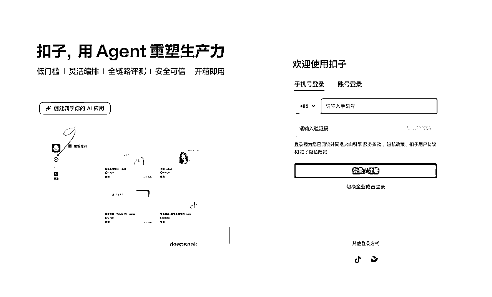

# 1.2 创建智能体

注册成功后开始创建智能体。

点击创建智能体之后，会有一个弹框，输入智能体信息之后，点击确认。

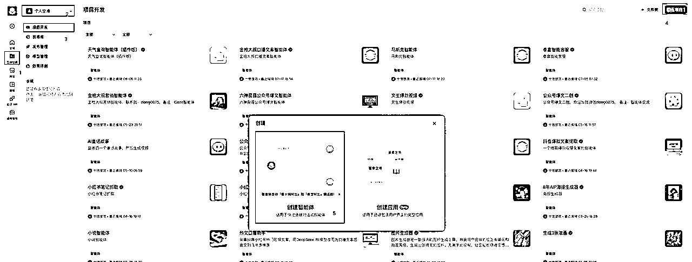

# 1.3 添加工作流

# 步骤一：在智能体编辑页添加工作流

# 步骤二：创建工作流

先为工作流输入名称和描述。

其中工作流名称只能包含英文字母、数字和下划线（_），并且只能以英文字母开头。可以 编号+英文（或汉语拼音）的结构来给工作流命名。

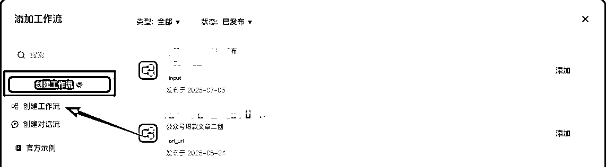

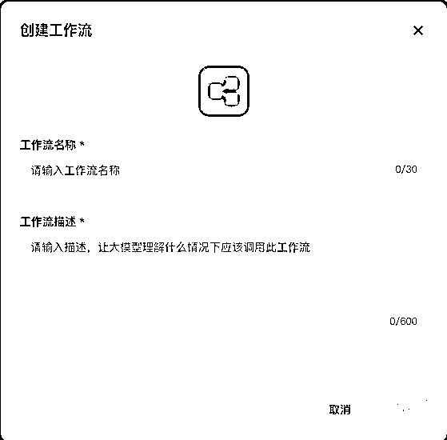


# 2\. 使用模板创建工作流

点击左侧模板按钮，找到有<工作流>标签的模板。

选择你想要复制的工作流模板，点击复制按钮后会出现两个选项。

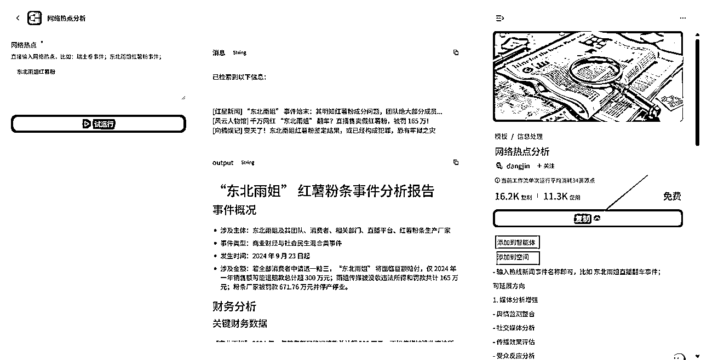

添加到智能体

你必须先在自己的个人空间或者团队空间中创建一个 AI 智能体。点击项目开发，选择创建项目 - 创建智能体。

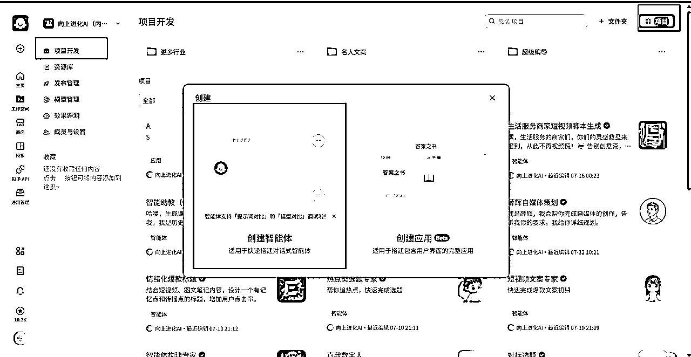

还是老规矩，填入智能体名称和介绍，选择一个自己喜欢的图标，当然也可以 AI 根据你的名称和描述自动生成一个。智能体的名称支持中文。

确认之后就进入了智能体的编排界面，我们先来了解一下。

智能体类型： 有三个类型，单 agent，对话流和多 agent，视情况选择

人设与回复逻辑： 用提示词告诉智能体如何帮你工作，比如回复的人设，何时需要调用插件，何时需要调用工作流等等

编排区 模型选择，给智能体添加技能（插件，工作流，触发器），给智能体添加知识和记忆，另外还是开场白的设置等等

预览与调试

发布

创建完成后，我们回到刚刚的模板页面，选择工作流模板要复制的空间和对应的智能体。

这个时候这条工作流就自动添加到智能体中去了。

添加到空间

选择添加到空间，就单纯的把工作流复制到我们对应的工作空间中去。

“仅复制”和“复制并继续编辑”唯一的差别就是，后者会帮你复制完后打开这条工作流。

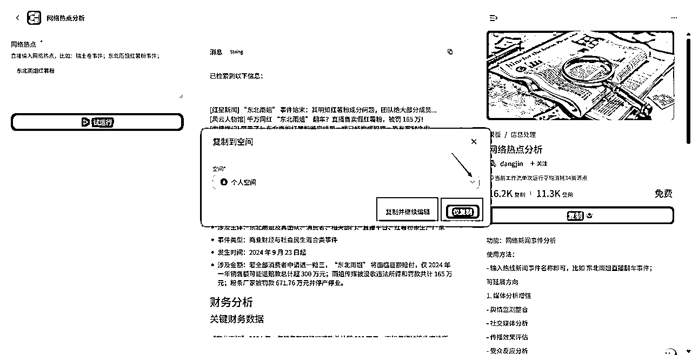

# 3\. 工作流的编辑、复制与删除

创建工作流后就进入到工作流搭建界面，我们先来一个一个认识一下这个界面的主要按钮和功能。

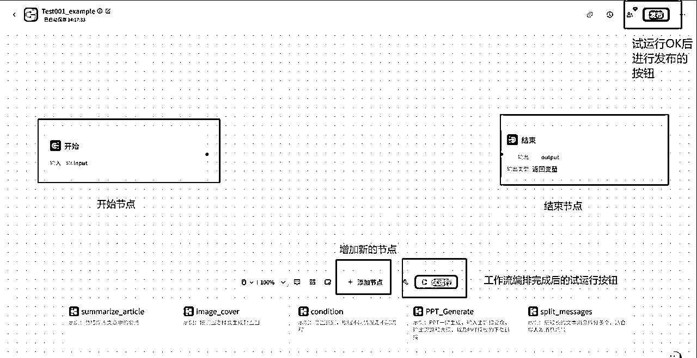

开始节点：作用是方便你提供要输入的信息、资料或要求

结束节点：作用是工作流运行完成后得到的你想要的信息、资料货要求输出给你

添加节点：我们要新增任何节点，都可以点击这个按钮选取（当然实际搭建过程中可以在节点后面快速创建）

试运行：当我们整个工作流编排完成之后，需要点此按钮进行运行状况的检查

发布：确认工作流运行没有问题后，需要点这个发布按钮来进行发布。只有发布的工作流才能被智能体/应用/API 调用

我们需要在画布中添加节点，并按照任务执行顺序连接节点（包括开始和结束节点）。

.

在底部面板中选择要使用的节点。

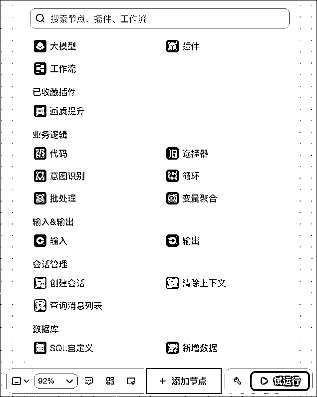

.

将各个节点相连接（很重要）。

点击前一个节点后的蓝色小点（你鼠标放上去后这个蓝色小点会放大并变成+号）

鼠标按住不松开，并拖动到当前节点前的蓝色小点，自动吸附后松开

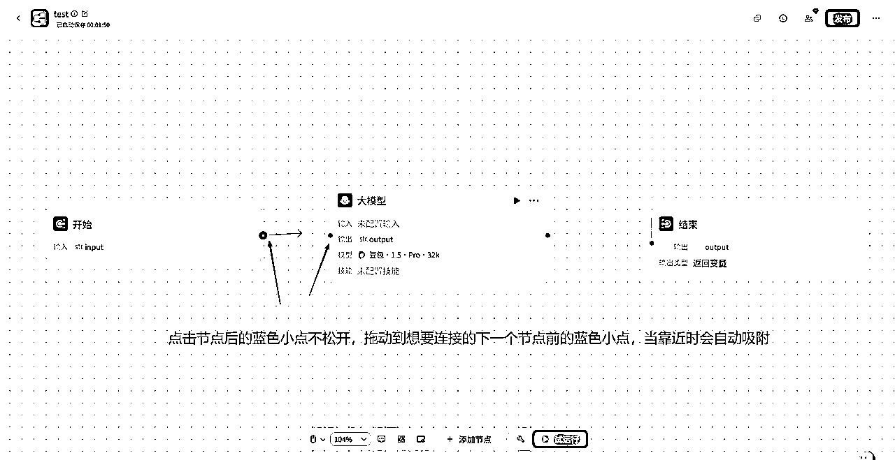

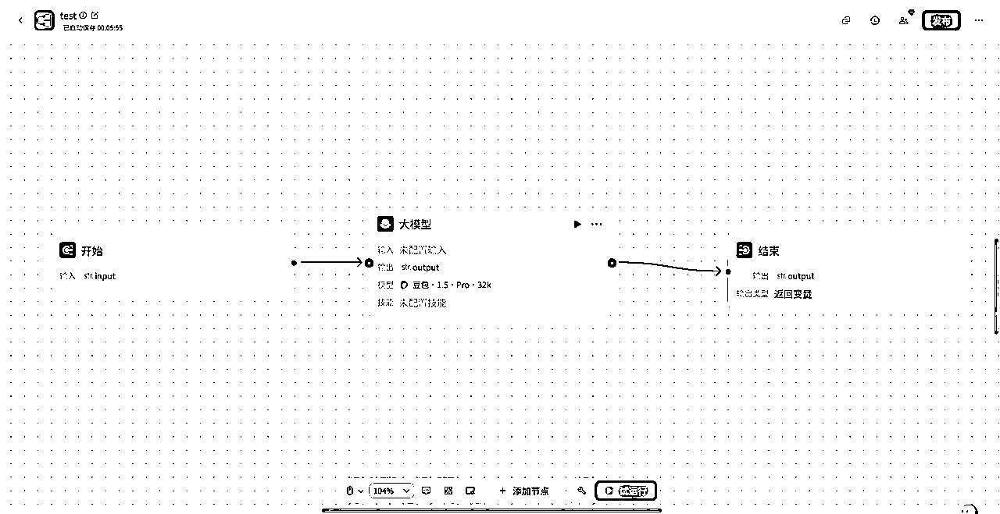

.

配置节点的输入和输出参数

点击输入参数区域的+号按钮，会自动新增一条新的变量编辑框，如果要增加多个输入变量则点击对应次数即可

在变量名输入框中填入命名，如果不填则自动引用变量赋值后的名称

点击变量值后的⚙️齿轮按钮，会跳出前面节点的相关输出参数，你可以选择一个成为当前节点的输入参数；当然你也可以直接在⚙️齿轮按钮前面的输入框直接输入固定的字符。

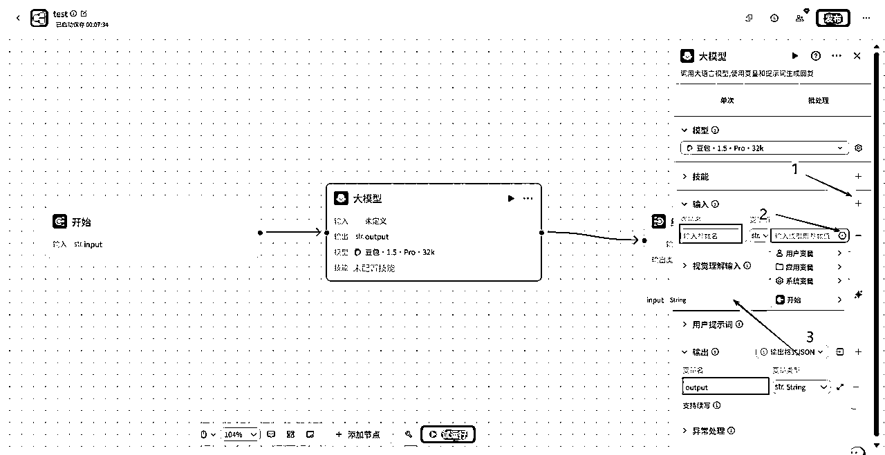

输出参数一样先点击+按钮，此时不需要引用变量，我们只需要对变量名命名和选择正确的变量类型

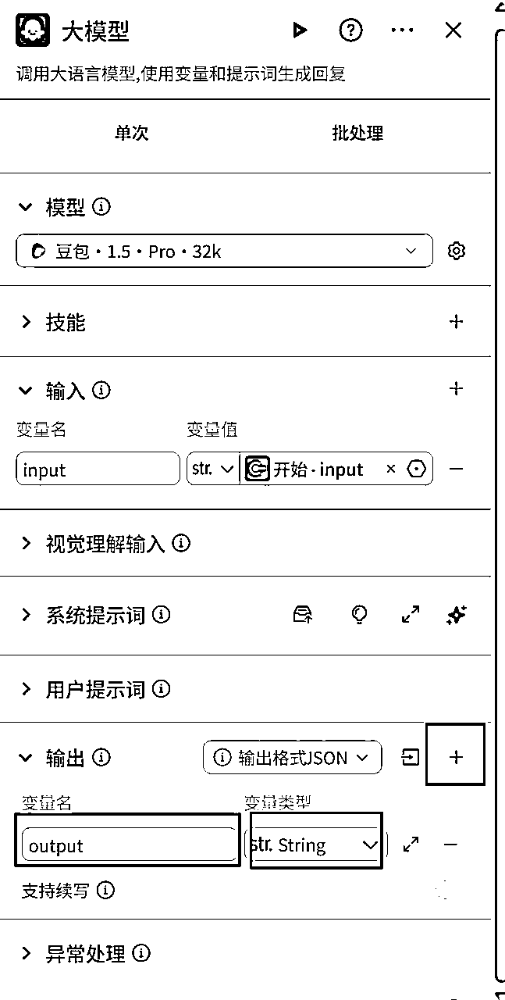

1.  Coze 工作流的核心功能模块

工作流的模块挺多的，但核心的就是 3 部分：大模型节点、插件、条件判断和循环控制。接下来我们一个一个的展开说说。

# 1\. 大模型节点

# 1.1 大模型的使用方法

点击添加节点，选择大模型节点。此时大模型节点就出现在画布中，我们选中之后，右侧会弹出编辑框。

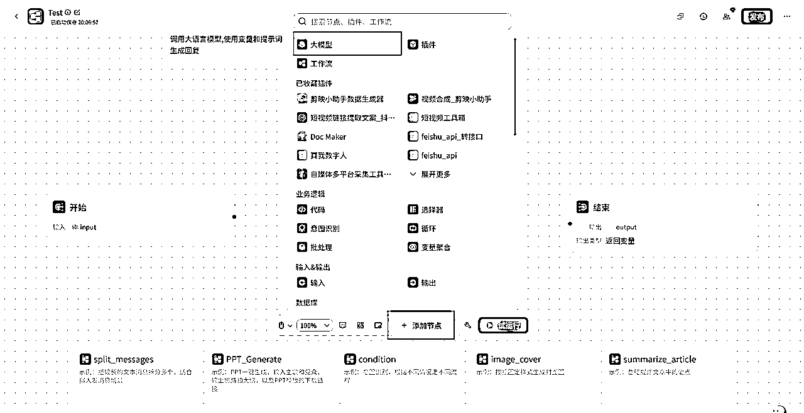

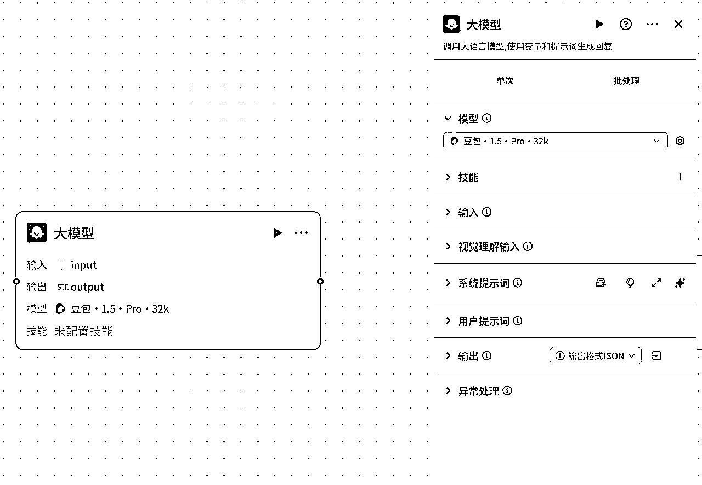

命名

双击最上方大模型字样，可对节点重新命名，描述这个节点具体要实现什么功能，比如：对文案纠错

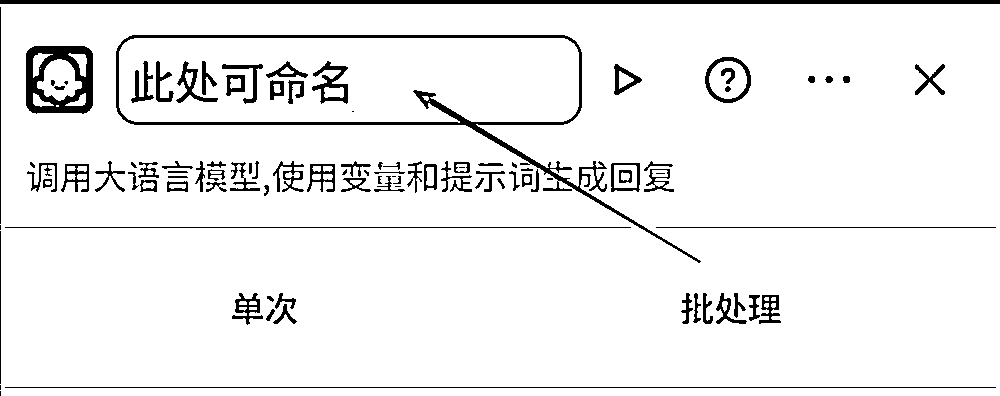

选择模型

点击下拉框，可选择对应的模型。目前官方支持的模型有豆包系列，Deepseek，Kimi，智谱清言，通义千问，百川，阶跃星辰和 Minimax。

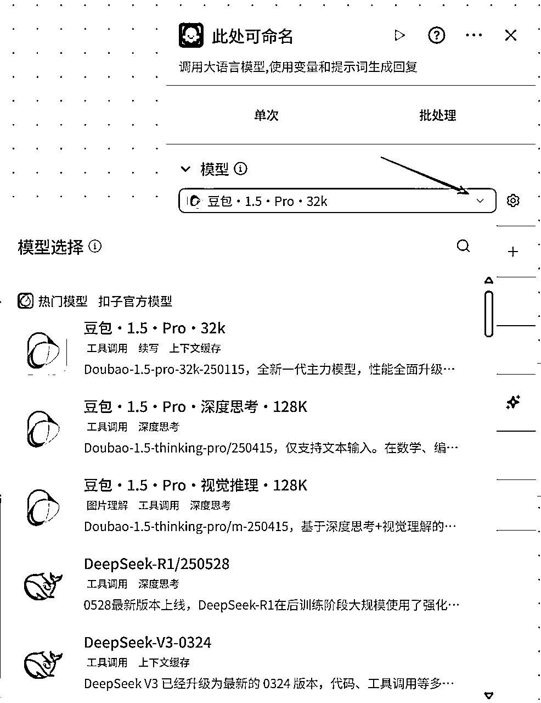

填写输入参数

点击蓝色 + 按钮，新增一条输入参数，给变量进行命名并输入变量值，当变量值需要引用之前节点的输出参数时，点击六边形按钮选择。

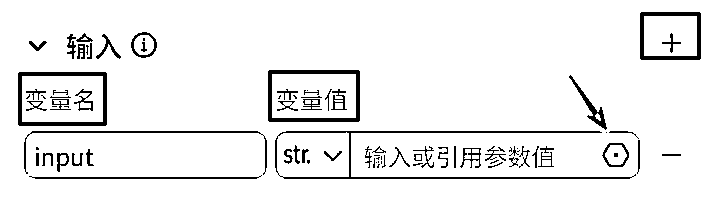

注意：节点之间要用连线连起来才可被选择

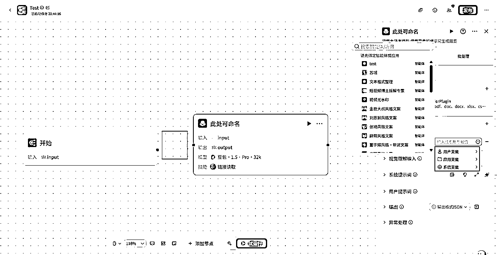

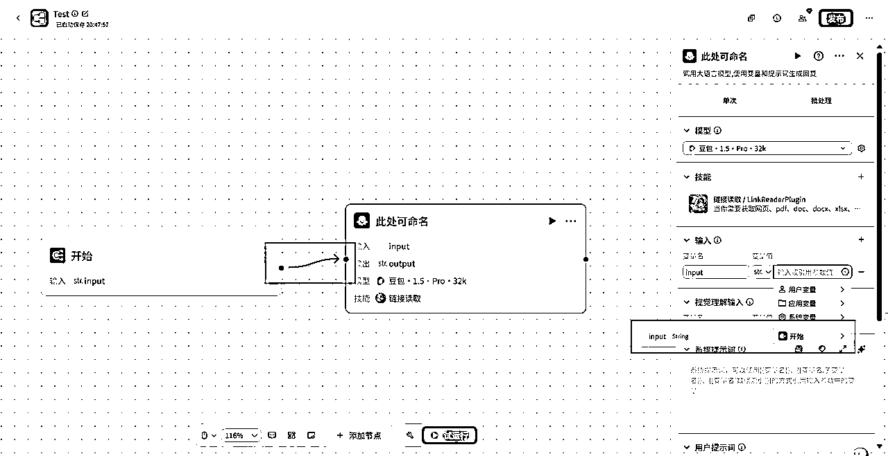

视觉理解

当我们需要理解图片的时候，需要在这里把图片 url 作为参数传入，并在提示词中引用。

提示词

用户提示词和系统提示词均可引用变量（用两个花括号{}包起来），系统提示词还支持引用技能。

输出

对输出的参数进行定义，包括变量名和变量类型

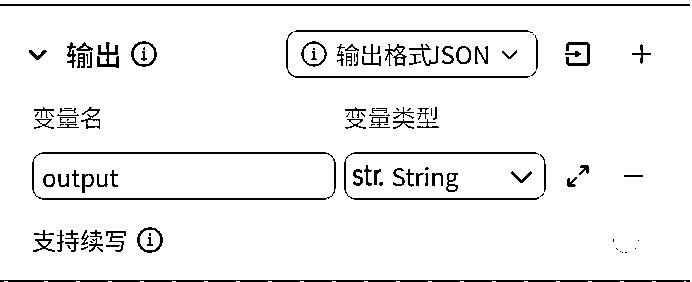


# 1.2 高级使用技巧

大模型调参

点击大模型名称后的⚙️齿轮图标，可对大模型相关参数进行设置。我们主要调整生成多样性参数和最大回复长度参数。当你需要处理的文本长度较长时，务必要保证回复长度足够，否则会运行失败。

选择技能

我们可以给大模型添加三类技能：工具，工作流和知识库，选中对应的技能后点击添加即可

添加的技能可在系统提示词中被引用

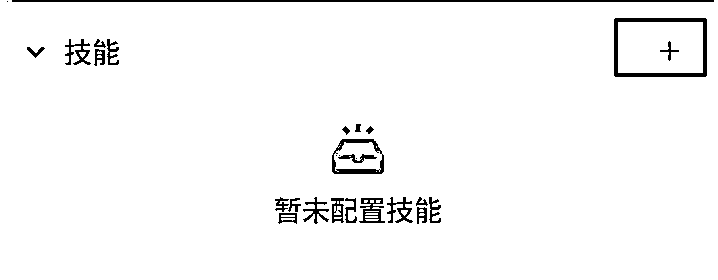

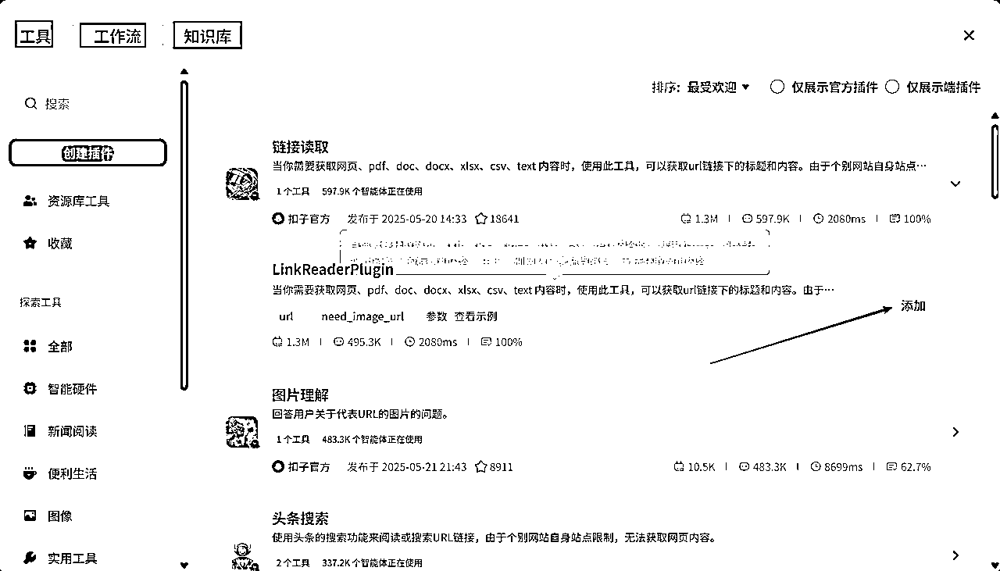

异常处理

默认出现异常时中断流程，当我们需要对节点报错进行容错时，则会有几个可做的事：

1.调整重试次数

2.选择返回设定内容

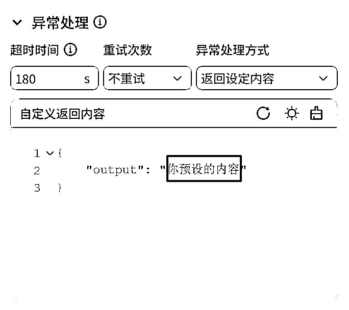

3.执行异常流程

此时节点右下角会新增一个蓝色小点，这时节点就有了选择器的功能，当运行失败的时候，通过右下角这个蓝色小点可连接到我们设定的异常处理流程。

# 1.3 Prompt 工程基础

想象一下，你有一个极其聪明但理解方式独特的助手（如 ChatGPT、Claude、Gemini 等大型语言模型）。它能写诗、编程、分析数据、回答问题...但它不会读心术。Prompt 工程就是学习如何清晰、有效地向这位助手表达你的需求，引导它产生最佳结果的艺术和科学。 掌握基础 Prompt 工程，能显著提升你与 AI 协作的效率和质量。

核心目标：清晰、具体、有引导性

好的 Prompt 的核心在于消除歧义，让 AI 准确理解你想要什么以及希望它如何表现。

基础原则与技巧：

.

清晰明确你的任务：

不要模糊： 写点关于人工智能的东西。 ❌ （太宽泛，AI 不知道写什么、写给谁、什么风格）

要具体： 写一篇面向高中生的、300字左右的科普短文，介绍人工智能是什么以及它在日常生活中的两个应用实例。要求语言生动有趣。 ✅

关键点： 明确主题、目标受众、长度、格式（段落、列表、代码等）、具体内容要求。

.

提供充足的上下文：

背景信息： AI 没有你脑海中的背景知识。告诉它相关的背景。

例： 你是一名经验丰富的营销顾问。请为一家新成立的、主打有机食材的轻食外卖店，制定三个吸引25-35岁都市白领的社交媒体营销策略点子。

角色扮演： 让 AI 扮演特定角色（专家、老师、特定风格作家等）来调整输出视角和语气。

例： 假设你是一位幽默的历史博主，用轻松调侃的语气，简要介绍秦始皇统一六国过程中发生的一件趣闻轶事。

.

结构化你的 Prompt：

使用清晰的格式（如项目符号、编号、分隔线）使 Prompt 易于阅读和理解。例：

```
任务：生成一份会议纪要模板
要求：
1\.  包含标准部分：会议主题、日期/时间/地点、参会人员、缺席人员、议程项目（含讨论要点和决议）、行动项（负责人、截止日期）、下次会议安排。
2\.  格式简洁专业，易于填写。
3\.  使用占位符（如 `[会议主题]`）表示需要填写的内容。
```

.

指定期望的输出格式：

明确告诉 AI 你希望结果以什么形式呈现。

请将答案组织成要点列表。

用表格形式对比方案A和方案B的优缺点。

生成一个 Python 函数，实现...功能，并添加必要的注释。

写一首五行俳句，主题是“秋天的落叶”。

这能节省你后期整理的时间，并确保结果符合你的使用需求。

.

利用示例（Few-Shot Learning）：

对于复杂或特定风格的任务，直接提供 1-3 个输入-输出示例，能显著提升 AI 理解你期望的效果。

例 （文本风格转换）：

```
输入：这个产品太糟糕了，完全不符合描述，客服也不理人，差评！
输出：我对这次购物体验感到非常失望。产品实际效果与描述存在较大差距，且在寻求客服帮助时未能得到及时有效的回应。希望商家能重视产品质量和售后服务。
任务：将下面这句激烈的用户评论转换成更正式、客观的投诉信语气：
输入：`你们发的货是错的！颜色不对，尺寸也不对！浪费我时间！
```

.

设定约束和限制：

明确你不想要什么，或者需要避免什么。

避免使用过于专业的术语。

不要包含个人观点。

字数控制在500字以内。

只使用2020年之后的数据。

这有助于 AI 聚焦在正确的范围内。

.

迭代优化是关键：

不要期望第一次就完美！ AI 的输出可能不完全符合预期。

分析结果： 看看哪里不符合要求？是理解错了？风格不对？信息缺失？

调整 Prompt： 基于分析结果，修改你的 Prompt：

增加缺失的细节或上下文。

使指令更明确或具体。

改变角色设定或格式要求。

添加或修改约束条件。

提供更清晰的示例。

尝试微小的变化： 有时稍微调整一个词（动词、形容词）或语序，就能带来显著不同的结果。

避免常见误区

过于简略或模糊： 帮我写个文案。 （AI 无从下手）

包含过多无关细节： 让核心任务要求淹没在无关信息中。

假设 AI 知道你不知道的信息： 比如让它分析一份你没有提供的文档内容。

一次要求太多： 让 AI 同时做多个复杂任务（如“分析这篇报告并写个总结再翻译成法语”），最好拆解成多个步骤。

忽略迭代： 第一次效果不好就放弃。

实践练习：从简单开始

.

基础任务： 用通俗易懂的语言解释什么是“区块链”。目标读者是对技术了解不多的普通成年人。

.

带格式要求： 列出5个提高个人工作效率的建议，每个建议不超过20个字。

.

角色扮演： 假设你是一位资深旅行规划师，为我规划一个为期3天的北京文化之旅（包含故宫、长城），列出每天的主要行程安排和交通方式建议。

.

迭代练习： 尝试让 AI 写一首关于“猫”的诗，第一次效果不满意？尝试调整：指定诗歌类型（五言绝句？现代诗？）、指定情感基调（欢快？慵懒？）、要求加入特定意象（毛线球？阳光？) .

Prompt 工程的基础在于清晰沟通和持续优化。记住：你是在引导一位强大的助手，引导得越精准，得到的结果就越令人满意。 从明确任务、提供上下文、结构化表达、指定格式开始，勇于迭代尝试，你很快就能掌握与 AI 高效协作的这把关键钥匙！

# 2\. 插件工具

# 2.1 插件的使用方法

点击插入节点，选择插件。我们可以选择官方商店里的插件，官方商店里包含了官方插件及第三方开发者上架的插件。也可以选择资源库工具，即我们自己制作的插件。

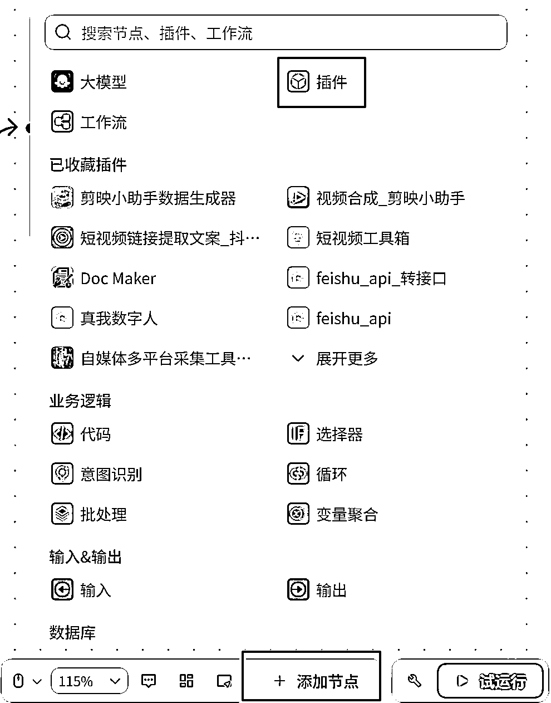

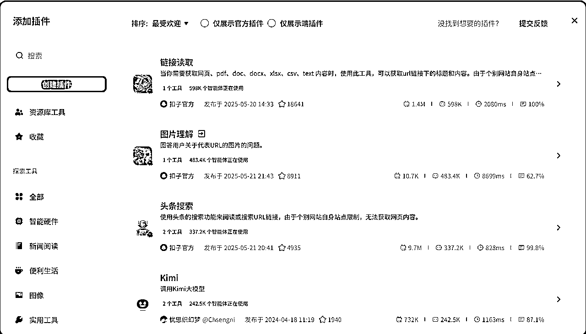

支持搜索插件名称，作者名称，关键词，找到我们想要的插件，然后点击添加即可把插件加到我们的工作流中

记得把插件的前后节点连接起来，然后选择对应的输入参数

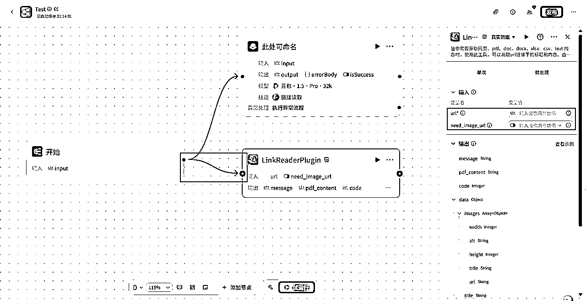

# 2.2 注意事项

插件节点的输入和输出结构取决于插件工具定义的输入输出结构，不支持自定义设置。

在插件节点中需要为必选的输入参数指定数据来源，支持设置为固定值或引用上游节点的输出参数。

可以在输出区域右上角单击查看示例，查看输出参数的详细说明、完整的输出示例。

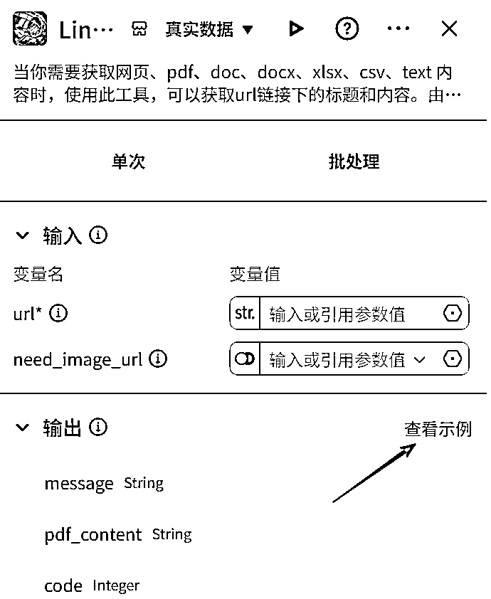

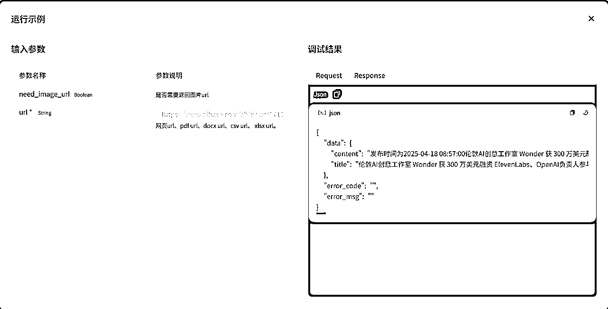

部分第三方开发者的插件有可能需要付费使用，一般在插件页面会展示 API Key 的获取地址和使用教程，大家在选择插件的时候，需要综合考量插件的运行成功率和收费情况。

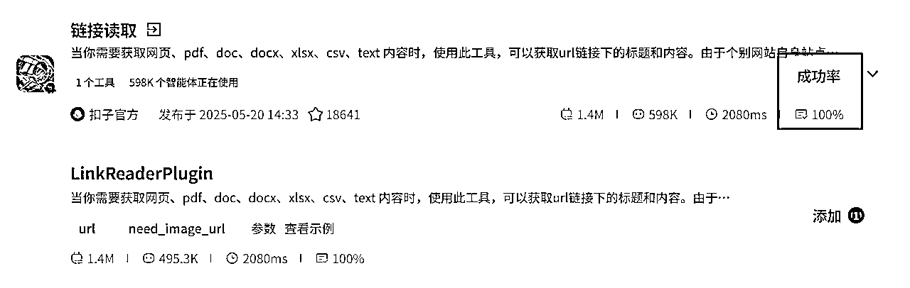

# 2.3 常用插件介绍

我们平常可以多去插件商店里转一转，了解有哪些插件，可以实现什么样的功能。前期尤其建议把官方插件多了解一下。

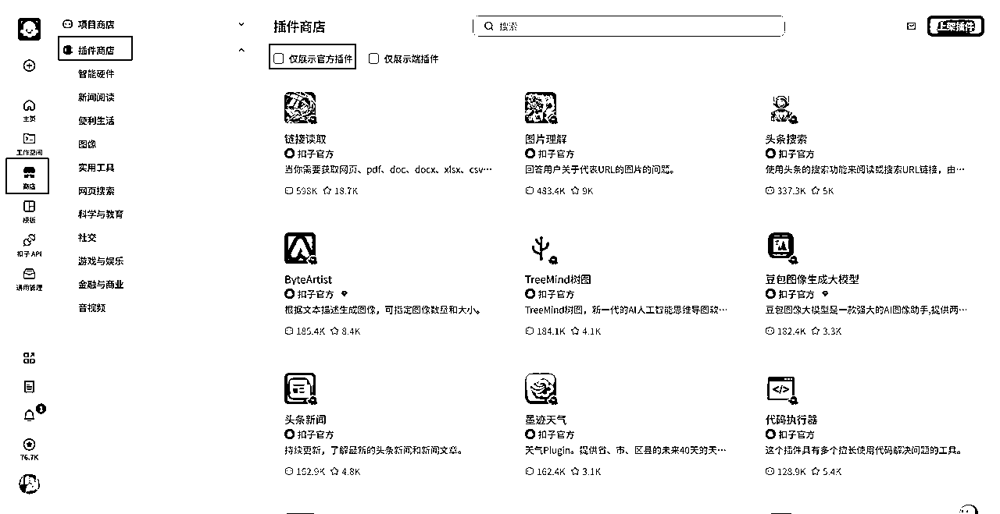

下面给大家介绍几个常用的插件

.

链接读取

一个强大的网页内容抓取工具。它不仅能够返回网页的原始内容，包括标题、内容、链接等，而且还可以对这些内容进行筛选和解析。方便我们对网页内容分析，以及从各种网页中提取有价值的信息。

输入参数为：

need_image_url：填入 false 或 true，如果为 true 则返回图片链接

url：填入需要读取的链接地址

.

Dock maker

当我们需要把相关信息写入文档、PDF、excel 的时候，它都非常有用

输入参数：

title：输入文档的标题

to_format：输入想要生成的文档格式

formatted_markdown：写入文档的内容（MD 格式）

.

飞书多维表格

Coze 和多维表格串接必备的插件，包含以下主要功能：

创建多维表格

创建/删除数据表（子表格）

写入/更新/删除数据表的表头

在多维表格数据表中新增/更新/删除多条记录

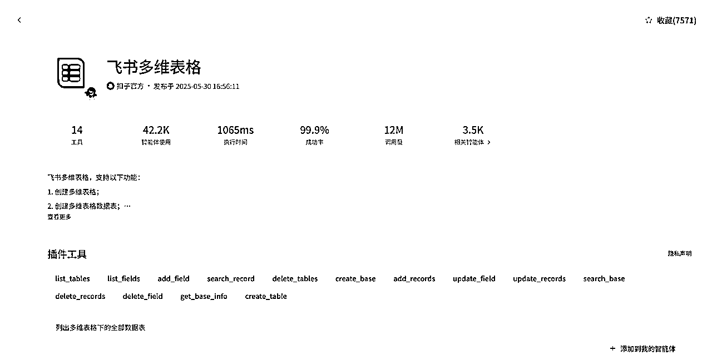

.

短视频无水印链接提取插件

这类的插件有许多，大家搜索关键词就可以了，注意大多数插件都是收费的，插件主页都会写上 API key 的获取地址。（第一个工具箱可白嫖的 key：123123，大家低调使用）。

作用是通过短视频链接来提取作者信息，无水印视频下载地址，作品信息等等，方便后续对作品进行文案的提取和拆解。

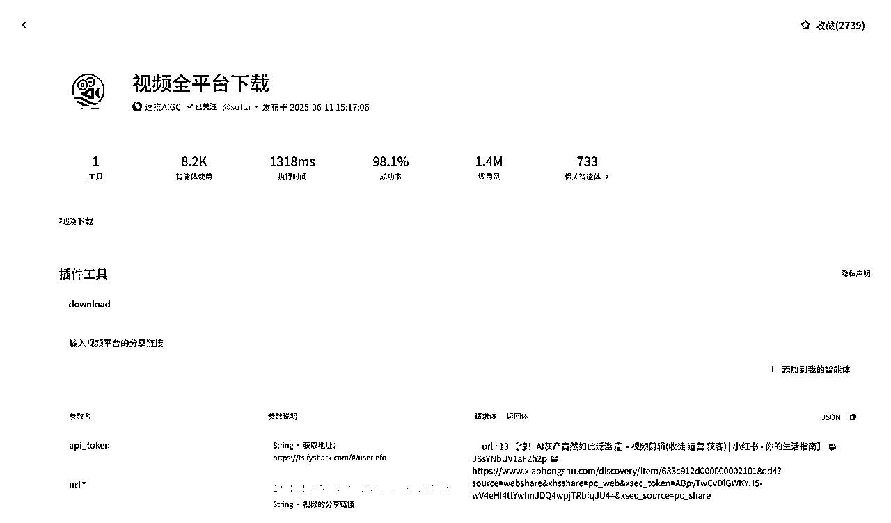

目前插件商店里面的插件几乎能涵盖 80%以上大家常用的场景，特别是自媒体和职场已经覆盖到 95%以上了，大家一定平常多去逛逛，这样后续在想实现自己的功能时，就会胸有成竹了。


# 3\. 条件判断与循环控制

# 3.1 选择器节点

不管你有没有编程基础，你都应该听说过 if-else。没错，选择器就是一个 if-else 节点，用于设计工作流内的分支流程。

在添加节点-业务逻辑下选中“选择器”

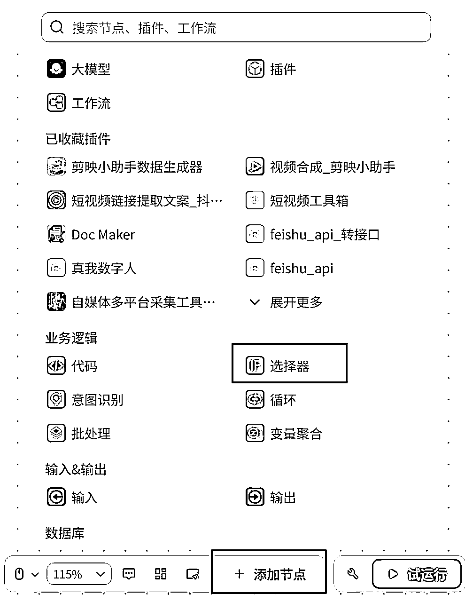

当向该节点输入参数时，节点会判断是否符合如果区域的条件，符合则执行如果对应的工作流分支，否则执行否则对应的工作流分支。

每个分支条件支持添加多个判断条件（且/或）

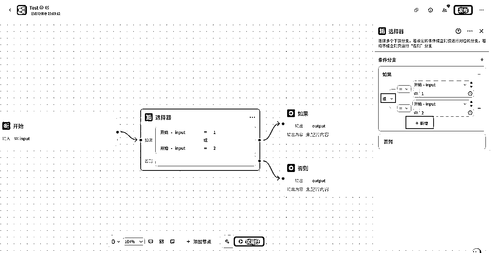

同时支持添加多个条件分支，可通过拖拽分支条件配置面板来设定分支条件的优先级。

# 3.2 循环节点

循环节点用于重复执行一系列任务，直到满足某个条件为止。

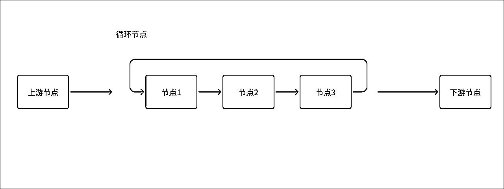

循环类型

循环类型是循环节点的运行模式，支持设置为使用数组循环、指定循环次数和无限循环。

使用数组循环

数组循环智能处理数组类型的数据结构（array），我们可以理解为这是一个有序的序列，对序列中的每个元素执行一系列相同的步骤。典型场景如下：

批量提取了博主主页 50 条视频相关信息，每个视频需要获取作者昵称，点赞数，转发数，提取无水印视频链接和提取文案。通过循环节点依次对这 50 条视频做相应的处理

在编程中，数组是一种数据结构，用于存储一系列元素。数组中的基础概念如下：

item：元素，即数组中的单个数据。数组由多个元素组成，每个元素可以是数字、字符、字符串等数据类型。

index：索引，指数组中元素的位置。索引从 0 开始计数，表示第一次循环，1 表示第二次循环，2 表示第三次循环，以此类推。最后一次循环的索引为 n-1，其中 n 为循环次数。

数组长度：数组中元素的数量。

例如，在数组 arrayOfNumbers = [10， 20， 30， 40， 50] 中：

arrayOfNumbers[0] 的 item 是 10，index 是 0。

arrayOfNumbers[1] 的 item 是 20，index 是 1。

数组长度为 5。

使用数组循环时，需要指定循环数组，此参数仅支持引用上游节点的输出，且必须为数组格式。使用数组循环模式下执行循环节点时，循环的次数取决于循环数组引用的数组长度。例如数组 [1，2，3，4，5] 的长度为 5，循环节点会循环 5 次完成遍历。如果循环数组参数引用了多个数组，则将最短的数组作为循环次数。

使用数组循环时，循环节点会遍历数组中的每个元素，每次循环都会将当前循环到的元素赋值给内置变量。内置变量仅限循环节点内部使用。目前支持的内置变量如下：

item<string>：数组元素，即当前循环到的数组元素。</string>

index<integer>：数组索引，index+1 为当前循环的轮次。</integer>

指定循环次数

指定循环次数模式通常用于批量、顺序处理数据的场景，需要同时设置循环次数。循环次数默认为 10 次，支持设置为 1～1000 次，你也可以引用上游节点数值类型的输出参数。

循环次数参数的引用值如果大于 1000，则设置为 1000，如果小于 1，则设置为 1。

典型的应用场景：

比如我们想一次生成 2 条小红书文案，我们可以利用两个大模型节点，但当我们想一次输出 20 条文案的时候，你不会傻乎乎的去复制 20 个大模型节点，而是使用循环节点，把循环次数设定为 20。

无限循环

无限循环类似编程语言中的 while 等语法结构，需要通过终止循环节点停止循环。循环第一次运行之后，工作流对指定条件进行判断，满足一定条件时则结束循环，否则继续下一次循环。

无限循环需要通过终止循环节点停止循环。终止循环节点通常和条件判断节点关联使用，条件判断节点判断某个条件成立时，流转到终止循环节点，自动跳出循环。

举例：

例如通过自定义插件调用 API，先创建一个文本转语音的任务，然后重复查询任务的执行状态，如果执行成功，则停止循环。

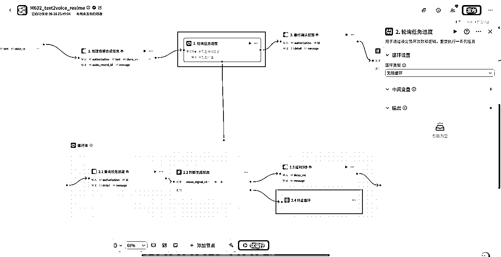

配置循环节点

多轮循环之间是严格串行执行的，不支持并发执行循环。每个循环迭代完成后，才能启动下一个循环迭代。如需并行执行某些节点，可以使用批处理。

不支持嵌套循环，循环节点中不允许添加另一个循环节点，但你可以在循环节点中嵌套一个包含循环节点的工作流。

循环节点中不允许添加批处理节点。

设置中间变量

循环节点支持设置中间变量，此变量可作用于每一次循环。中间变量通常和循环体中的设置变量节点搭配使用，在每次循环结束后为中间变量设置一个新的值，并在下次循环中使用新值。

例如在长文生成场景中，通过中间变量将每一轮的段落总结作为变量传递到下次循环中，让大模型参考之前的段落内容和下一段的主题，生成一个上下文衔接更流畅的段落。

各个节点配置如下：

循环节点：将中间变量设置为 last_paragraph，参数值设置为一个空格。首次循环中生成第一个段落时，不需要参考大纲以外的任何内容，所以将循环变量的值指定为一个空格，你也可以按需设置为其他内容。

循环体中的设置变量节点：中间变量选择循环节点中设置的中间变量 last_paragraph；设置值选择大模型的输出参数 output，表示开始下次循环前，将本次循环中大模型生成的段落赋值给循环变量。

循环体中的大模型节点节点：添加 2 个输入参数，分别引用循环节点的内置变量 item 和循环变量，并在提示词中指定生成文章段落时参考上个段落的内容。

在设置变量节点中，中间变量的数据类型必须和设置值的数据类型一致，否则无法赋值。

设置循环体

创建循环节点后，会生成一个循环节点和对应的循环体画布。

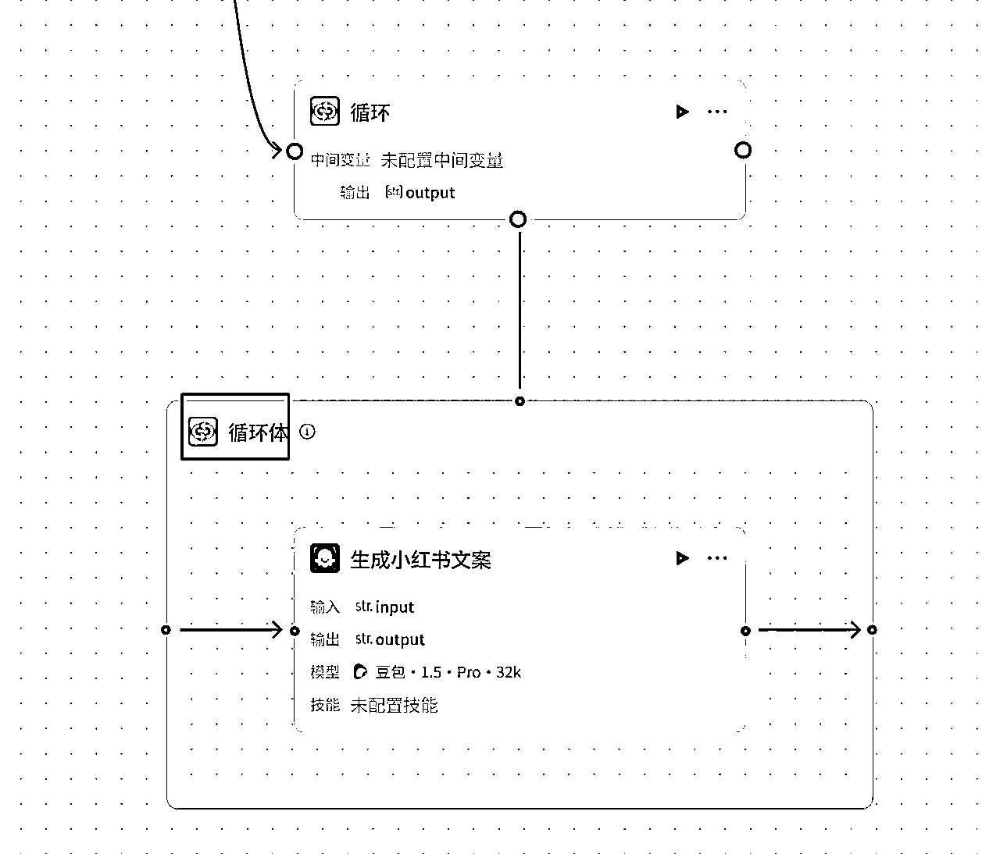

循环体画布是循环节点的内部运行机制，用于编排循环的流程，循环体只与循环节点相连（默认且无需设置）选中循环体时，才能向循环体中添加新节点，或拖入新节点至循环体画布。循环体中的节点没有开始与结束，但需要和循环体画布的首尾蓝点图标连接起来。

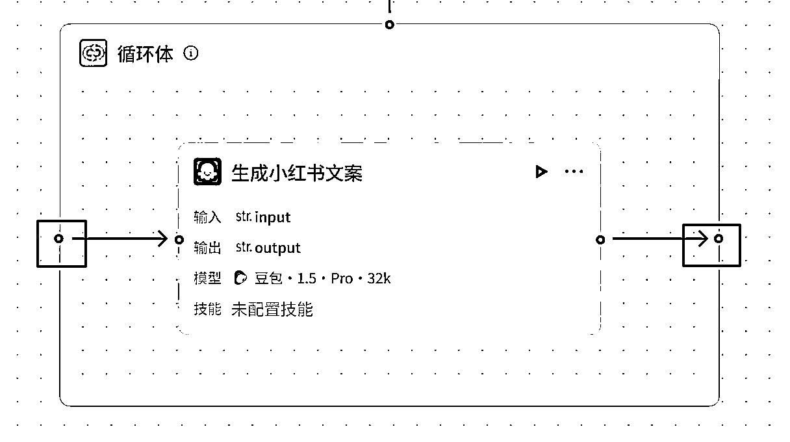

设置输出

循环节点的输出参数可设置为循环体的执行结果集合，表示当数组中所有元素运行完毕之后，将所有循环的运行结果打包输出给下游。也支持设置为循环变量的取值。

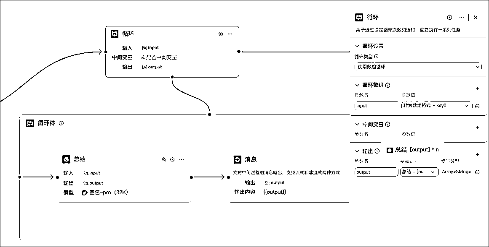

1.  内容创作 | 小红书笔记批量采集与改写

# 1.本章概要

掌握了 Coze 的基础操作后，本章将带你进入实战演练。我们将理论付诸实践，聚焦于内容创作、数据采集与多媒体生成等高频应用场景，亲手搭建能解决实际问题的工作流。

本章的每个项目都提供详细的搭建思路与操作步骤。你将学习如何组合运用不同的节点和插件，将简单的任务自动化，并逐步构建出能够处理文本、图像乃至视频的全流程解决方案。

在本章中，你将系统地学会：

数据和内容的采集： 构建能自动抓取小红书、抖音等平台公开数据的工作流，把内容采集到飞书多维表格中

图像的生成和创作： 实现从文本提示词批量生成图片，或提取现有图片进行风格重绘的自动化流程。

全自动视频生成： 搭建从文案、配图、配音到剪辑的完整工作流，一键生成高质量的短视频。

学完本章，你将不仅能复刻这些项目，更能掌握将自身需求转化为自动化解决方案的思维和能力，真正实现技术提效。

# 本章航线图

完成本章节的学习和实操，即可完成航线图的第二阶段和第三阶段：

第二阶段：实战项目演练（约 10 天）

.

实战：小红书笔记批量采集与改写（约 2 天）

.

实战：小红书竞品动态自动入库（约 1.5 天）

.

实战：抖音账号内容信息采集（约 1.5 天）

.

实战：多维表格批量生成 AI 图片（约 1 天）

.

实战：提取小红书主图并智能重绘（约 1.5 天）

.

实战：全自动生成古诗词短视频（约 2.5 天）

# 2\. 创建小红书采集工作流

目标效果：

多维表格自动重写小红书图文工作流可复制文档

# 2.1 打开 coze 官网，新建工作流：

https://www.coze.cn/home

接着按顺序点击工作空间，资源库，资源，工作流。工作流名称用字符，工作流描述随便写。

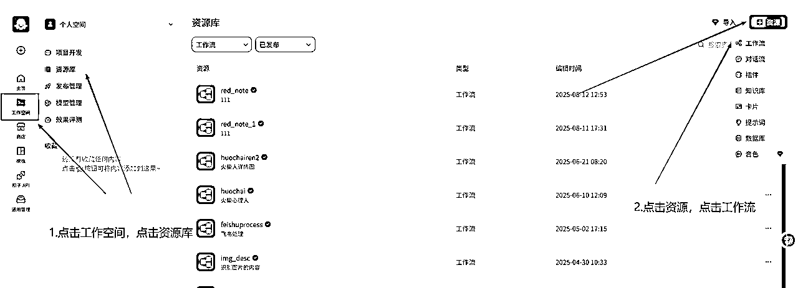

# 2.2 小红书采集节点，完善工作流

配置好大模型过滤输入参数后，我们需要接入小红书笔记。找到第一个

小红书提取的配置比较简单，将输入端设置为开始节点的输出端即可。

也就是说，url 部分的变量值设置为【开始的input变量】

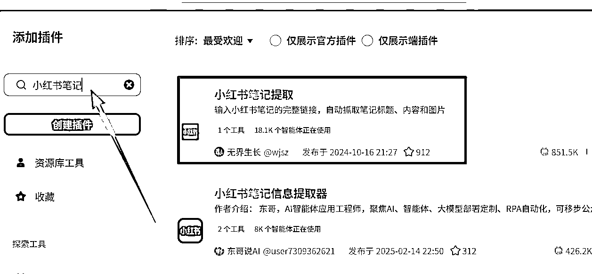

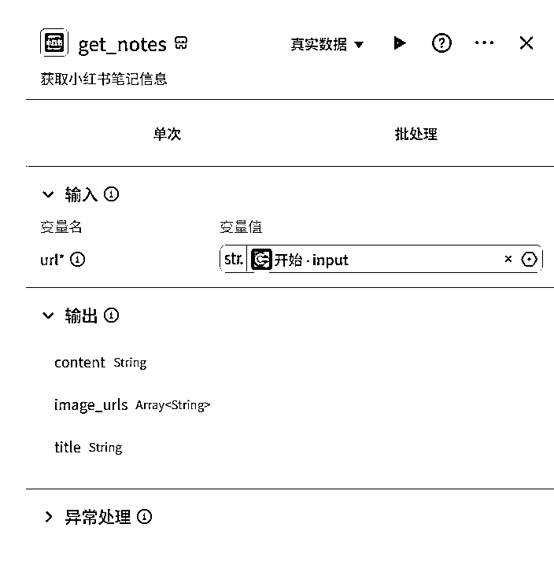

# 2.3 结束

本次我们要提取的是小红书笔记的【标题】和【正文】，默认结束只有 1 个输出，所以点下右上角的+号增加一个输出变量，同时把变量名分别改为【content】（正文）和 title（标题）

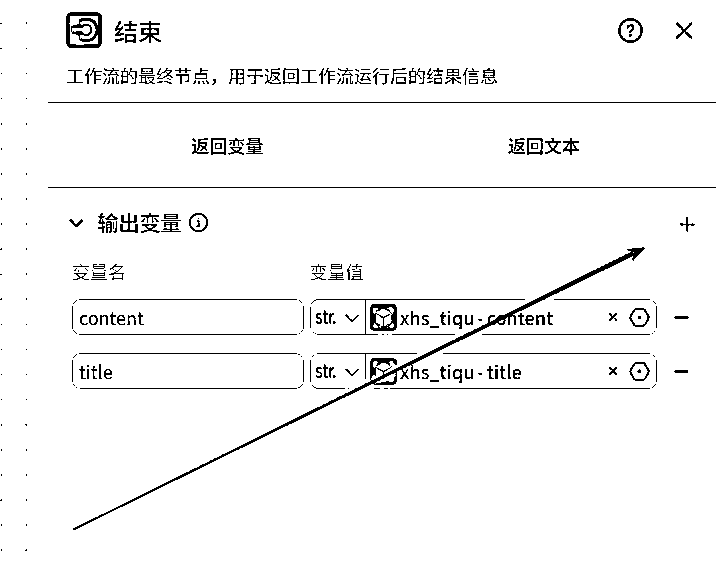

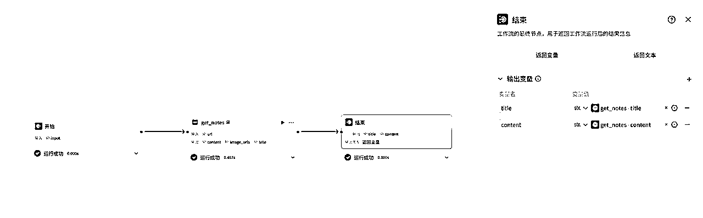

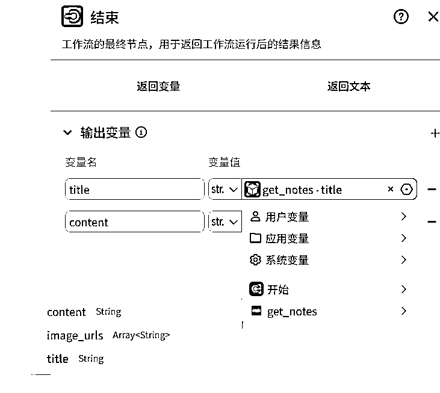

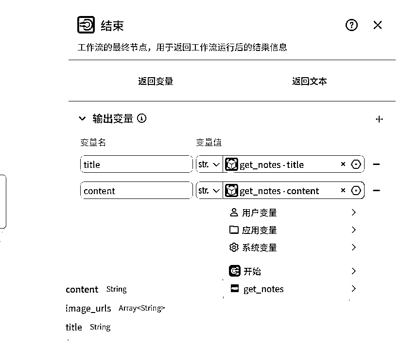

# 2.4 测试并发布

点击试运行，粘贴一个小红书笔记去让它提取

https://www.xiaohongshu.com/explore/6868b5ce000000000d0243bd?xsec_token=ABIu8xzYTFyfVqbHkaGfaWz0TELv7tlCfWLZ2A-M951yE=&xsec_source=

这个链接在航海手册里直接复制不了，可以点进去后复制地址栏的链接

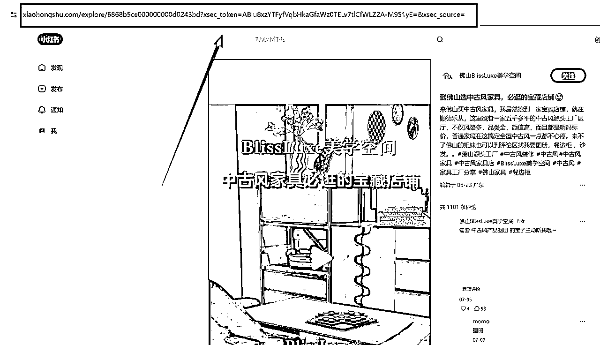

点击试运行，输入笔记链接后点击试运行


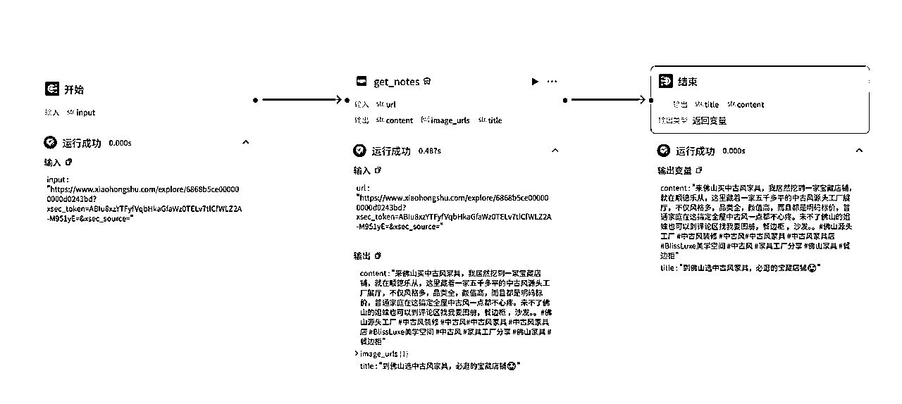

全部运行完就可以点发布了

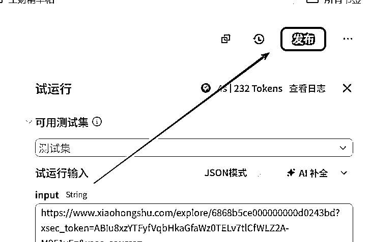

注意事项：

https://www.xiaohongshu.com/discovery/item/开头的链接不对❌，

需要https://www.xiaohongshu.com/explore/开头带有xsec_token的链接✅

大家在复制自己链接的时候可以再看看自己复制的链接是否正确


# 3\. 多维表格接入 coze 工作流

# 3.1 导入 coze 工作流

打开飞书网页版

https://www.feishu.cn/


点击云文档，新建云文档，新建多维表格


注意，第一列是用来填写小红书链接的

选择除了第一列的其他列，鼠标移动到右上角，点击【修改字段/列】

在【探索字段捷径中】搜索 coze，选择【扣子工作流调用】


接着需要在多维表格配置扣子参数分别是：

【认证令牌】【工作流 id】【参数字段】【参数名称】【请求模板】【输出结果 1】【输出结果 2】

填写认证令牌：

如果没有 coze 令牌可以从这里创建，点击左边的【扣子 API】【授权】【个人访问令牌】【添加】

注：令牌只会显示一次，记得保存到本地


填写工作流 ID：

每个工作流的网址上都会显示工作流 id，就是 workflow_id = xxx

后面那一串 xxx 数字就是工作流 id

参数字段：

选择输入的链接字段

参数名称：

在 coze 工作流中的输入变量名为 input，这里也要对应为 input


请求模板：这边有2种写法

1.需要自己去引用

{"input":"引用的字段"}

2.直接复制粘贴就行，新手建议直接用这个方法，粘贴就好了。不容易出错

{

"input": "$$input$$"

}

输出结果 1 和输出结果 2：

这边对应着结束节点的输出变量名


获取更多信息：

这边还要单独勾选输出结果 1 和输出结果 2，方便我们二创

点击确定后会提示是否生成全列，点击生成的话一整列的笔记都会开始处理

这里建议点仅保存配置，然后在单击想生成的单元格，点击右边的刷新


异常处理

如果出现输出为空，有可能是这个插件提取不出来这个笔记的链接，点击这个空白处，复制这个链接到浏览器打开，就能看到 coze 实时的运行情况


从这边就能看出来没有提取成功


# 3.2 豆包改写

标题改写

新建一列，导入插件【豆包 1.6】，这个时候就可以根据个人选择大模型了，可以是豆包，也可以是 deepseek 等。这边以豆包为例子。记得勾选输出的结果

输入指令如下：

引用输出 1（小红书的 title） 这是小红书的标题，帮我改写下，意思不变，只要一个结果就行，不要有其他信息


正文改写

同样的我们需要再添加一列，作为正文改写

新建一列，导入插件【豆包 1.6】，这个时候就可以根据个人选择大模型了，可以是豆包，也可以是 deepseek 等。这边以豆包为例子。记得勾选输出的结果

输入指令如下：

引用输出 2（小红书的正文） 这是小红书的正文，帮我改写下，意思不变，只要一个结果就行，不要有其他信息


结果展示


# 4.视频实操教程

内容创作-小红书笔记批量采集与改写-视频教程+字幕.mp4

链接: https://pan.baidu.com/s/1VSvb05-puEzWSb_NF-iiHw?pwd=vrnw 提取码: vrnw

1.  数据采集 | 小红书竞品动态自动入库

利用 chrome 浏览器的篡改猴脚本，写一个抓取小红书账号信息和单篇帖子信息的小工具，然后配置好飞书多维表格的接口，实现一键推送到多维表格。

最终效果示例如下（都是自动从小红书推送过来的）：


为了实现这个推送功能，主要需要做以下几件事：

1、写一个篡改猴脚本，在小红书页面采集账号信息和单篇笔记的信息，用 JSON 的方式展示

2、配置多维表格的 API 接口，实现对小红书篡改猴脚本信息推送的接收。

# 视频实操教程

数据采集-小红书竞品动态自动入库-视频教程+加字幕.mp4

链接: https://pan.baidu.com/s/1_NlOofuHOIYILG-pS9VFQA?pwd=jvjd 提取码: jvjd

第2个案例的视频教程，搭配下面的飞书多维表格模板使用⬇️：

数据采集 | 小红书竞品动态自动入库-模板(复制一份到自己的云盘(有base)✅，不要复制到知识库(有wiki)❌)：

数据采集 | 小红书竞品动态自动入库

记得要添加自己的应用到多维表格

# 本章节常见问题及解答

可参看下面的飞书文档：

常见问题解答和注意事项

# 1\. 在飞书开放平台中开通多维表格权限，并获取 app id 和 app secret。

步骤一，登录飞书开放平台，https://open.feishu.cn/app?lang=zh-CN，创建企业自建应用。


填写应用名称和应用描述，点击“创建”。


在“基础信息-凭证于基础信息”中获取应用凭证 app id 和 app secret，可以复制下来，保存到一个文件中，后面会用到。


在“开发配置-权限管理”中点击开通权限。


在打开的页面中先开通应用身份权限 tenant_access_token，下滑左侧菜单找到“多维表格”，在权限名称前打勾，全部勾选状态，然后点击右下方的确认开通权限。


同样的操作，把用户身份权限 user_access_token 的多维表格权限也全部开通。

1.  在飞书开放平台中发布应用

在“应用发布”-“版本管理与发布”中，填写应用版本号（需要符合 1.0.0 的样式）和更新说明，点击保存，确认发布。

会弹出此次发布免审确认发布的窗口，点击确认后即发布成功。


# 3\. 新建一个多维表格，并获取 app id 和 app secret。

在飞书云文档主页中选择云盘，然后在云盘里新建一个多维表格。

注意，一定要在云盘里新建多维表格，这样新建的多维表格格式是这样的：https://f7vsb1brbs.feishu.cn/base/S7JqbAzy7aO5dLsAQehchmLyngf?table=tbl6l8zc0BHSgIkY&view=vewgb3vMSP

从云盘建的多维表格链接地址第二节是 base，一定需要注意。如果是从飞书文档主页新建的多维表格，里面的地址第二节是 wiki，对接方式就不一样了。所以务必保证多维表格链接地址第二节是 base。


通过多维表格的地址，我们能够得到另外两个重要的参数，app token 和 table id。以上面的地址举例，

https://f7vsb1brbs.feishu.cn/base/S7JqbAzy7aO5dLsAQehchmLyngf?table=tbl6l8zc0BHSgIkY&view=vewgb3vMSP

App token 就是 S7JqbAzy7aO5dLsAQehchmLyngf 截取第三节到？号前的一串字符。

Table id 就是 tbl6l8zc0BHSgIkY 截取 table= 后面直到&view 前面的一串字符。

至此，我们拿到了四个重要的飞书多维表格信息：

app id ：飞书开放后台“凭证与基础信息”中获取

app secret：飞书开放后台“凭证与基础信息”中获取

app token：多维表格地址中获取

table id：多维表格地址中获取

# 4\. 在多维表格中添加应用，使得应用具备访问多维表格的权限

在这个多维表格中，点击右上角...符号，依次选择“更多”-“添加文档应用”。


如果在第二步中发布应用成功，在弹出的对话框中搜索应用的名字，即可找到应用，选择添加，确保应用具备“可编辑”的权限。 这样应用能够访问到多维表格，可以往多维表格里传数据。


# 5\. 在 chrome 中安装篡改猴脚本，并编写代码

打开 chrome 应用商店 （https://chromewebstore.google.com/），需魔法才能访问。搜索 tampermonkey，安装此扩展程序，添加至 Chrome。

【更新】没有魔法上网的圈友可以下载这个本地版后，把文件直接拖到chrome 插件管理页面chrome://extensions/ 中。


tampermonkey_stable.crx

Tampermonkey 是一款 Chrome 浏览器插件，用于管理和运行用户自定义脚本，实现网页自动化和功能增强。


添加成功后可以将篡改猴插件固定在浏览器上，方便查找和操作。


需要打开篡改猴的执行脚本的权限，点击扩展程序-篡改猴旁边的三个点-管理扩展程序，打开“允许用户运行脚本”的开关。


点击篡改猴插件，选择添加新脚本。


在脚本编辑页面清空原有信息，保持空白，并粘贴如下代码到脚本编辑器中。

这段代码的作用是在某个小红书账号的主页，增加一个采集按钮，点击这个按钮就能采集这个账号的信息，并以 json 的方式呈现（代码是 AI 写的，正常直接就能用，如果存在问题，可以贴给 AI 进行修改完善）。ctrl+s 保存后退出。

```
// ==UserScript==
// @name         2.2-小红书作者信息采集器 (稳定版)
// @namespace    http://tampermonkey.net/
// @version      2.2
// @description  优化版：更稳定地采集小红书作者信息并生成JSON，修复关注数采集问题。
// @author       Assistant (Optimized)
// @match        https://www.xiaohongshu.com/user/profile/*
// @grant        none
// @run-at       document-idle
// ==/UserScript==

(function() {
    'use strict';

    // =================================================================
    // 配置与常量
    // =================================================================
    const SELECTORS = {
        mainContainer: '#user-page-container, .user-page, .profile-container',
        name: '.user-name .name, .user-name, .user-nickname, .nickname, [class*="nickname"], [class*="name"]',
        avatar: '.user-avatar img, .avatar-wrapper img, img.avatar, [class*="avatar"] img',
        description: '.user-desc, .user-bio, [class*="desc"], [class*="bio"]'
    };

    // =================================================================
    // 工具函数
    // =================================================================

    function waitForElement(selector, callback, timeout = 10000) {
        const startTime = Date.now();
        const interval = setInterval(() => {
            const element = document.querySelector(selector);
            if (element) {
                clearInterval(interval);
                callback(element);
            } else if (Date.now() - startTime > timeout) {
                clearInterval(interval);
                console.error(`❌ 等待元素 "${selector}" 超时。脚本可能无法正常运行。`);
            }
        }, 500);
    }

    function convertChineseNumber(value) {
        if (typeof value !== 'string') return 0;
        const str = value.trim();
        if (str.includes('万')) {
            const num = parseFloat(str) * 10000;
            return isNaN(num) ? 0 : Math.round(num);
        }
        const num = parseFloat(str);
        return isNaN(num) ? 0 : Math.round(num);
    }

    function getUserId() {
        const match = window.location.href.match(/\/user\/profile\/([a-f0-9]+)/i);
        return match ? match[1] : '';
    }

    /**
     * [v2.2 核心更新] 在指定容器内，通过文本内容查找元素并提取信息。
     * 使用了更稳健的逻辑来匹配数字和标签。
     * @param {HTMLElement} container - 搜索范围的容器元素
     * @returns {object} - 包含粉丝、关注、获赞等信息的对象
     */
    function extractStatsByText(container) {
        const stats = {
            following_count: 0,
            followers_count: 0,
            total_likes_collections: 0,
            xiaohongshu_id: '',
            ip_location: ''
        };

        // 查找所有可能的元素
        const allElements = Array.from(container.querySelectorAll('span, p, div, a'));

        // 定义一个更可靠的函数来为给定的标签元素查找对应的数字
        const findNumberForLabel = (labelElement) => {
            if (!labelElement) return 0;

            // 我们假设数字和标签在一个共同的父容器或祖父容器中
            let searchContainer = labelElement.parentElement;
            for (let i = 0; i < 2 && searchContainer; i++) { // 最多向上找2级
                // 寻找一个只包含数字（可带'万'）的兄弟或子元素
                const potentialNumberElements = Array.from(searchContainer.children);
                for (const el of potentialNumberElements) {
                    const text = el.textContent.trim();
                    // 正则表达式 /^[\d.]+万?$/ 确保我们匹配的是纯数字或"万"结尾的数字
                    if (/^[\d.]+万?$/.test(text)) {
                        return convertChineseNumber(text);
                    }
                }
                searchContainer = searchContainer.parentElement;
            }
            return 0; // 如果找不到，则返回0
        };

        // 1\. 定位标签元素
        const followingLabel = allElements.find(el => el.textContent.trim() === '关注');
        const followersLabel = allElements.find(el => el.textContent.trim() === '粉丝');
        const likesLabel = allElements.find(el => el.textContent.trim() === '获赞与收藏');

        // 2\. 为每个标签查找对应的数字
        stats.following_count = findNumberForLabel(followingLabel);
        stats.followers_count = findNumberForLabel(followersLabel);
        stats.total_likes_collections = findNumberForLabel(likesLabel);

        // 3\. 提取小红书号和IP地址
        allElements.forEach(el => {
            const text = el.textContent || '';
            if (text.startsWith('小红书号')) {
                // 使用 `split` 避免正则匹配到数字本身
                stats.xiaohongshu_id = text.split(/[:：]/)[1]?.trim() || '';
            } else if (text.startsWith('IP属地') || text.startsWith('IP归属')) {
                stats.ip_location = text.split(/[:：]/)[1]?.trim() || '';
            }
        });

        return stats;
    }

    // =================================================================
    // 核心功能 (无变动)
    // =================================================================

    function extractAuthorInfo(container) {
        console.log('👤 开始提取作者信息...');
        const authorInfo = {
            user_id: getUserId(),
            name: '',
            avatar_url: '',
            description: '',
            collected_at: new Date().toISOString()
        };

        try {
            const nameEl = container.querySelector(SELECTORS.name);
            if (nameEl) authorInfo.name = nameEl.textContent.trim();

            const avatarEl = container.querySelector(SELECTORS.avatar);
            if (avatarEl && avatarEl.src) {
                authorInfo.avatar_url = new URL(avatarEl.src, window.location.href).href;
            }

            const descEl = container.querySelector(SELECTORS.description);
            if (descEl) authorInfo.description = descEl.textContent.trim();

            const stats = extractStatsByText(container);
            Object.assign(authorInfo, stats);

            console.log('✅ 作者信息提取完成:', authorInfo);
            return authorInfo;
        } catch (error) {
            console.error('❌ 提取作者信息失败:', error);
            return authorInfo;
        }
    }

    function showResult(authorInfo) {
        const existingModal = document.getElementById('author-result-modal');
        if (existingModal) existingModal.remove();

        const modal = document.createElement('div');
        modal.id = 'author-result-modal';
        modal.style.cssText = `position: fixed; top: 0; left: 0; width: 100%; height: 100%; background: rgba(0,0,0,0.5); z-index: 999999; display: flex; justify-content: center; align-items: center;`;

        const authorInfoJson = JSON.stringify(authorInfo, null, 2);
        modal.innerHTML = `

### 👤 作者信息采集结果

                    **用户:** ${authorInfo.name || '未获取'} (${authorInfo.user_id})

                    **粉丝:** ${authorInfo.followers_count !== null ? authorInfo.followers_count : '未获取'} |
                    **关注:** ${authorInfo.following_count !== null ? authorInfo.following_count : '未获取'} |
                    **获赞收藏:** ${authorInfo.total_likes_collections !== null ? authorInfo.total_likes_collections : '未获取'}

```
${authorInfoJson}
```

        `;
        document.body.appendChild(modal);

        const closeModal = () => modal.remove();
        document.getElementById('copy-author-btn').onclick = () => {
            navigator.clipboard.writeText(document.getElementById('author-json-textarea').value).then(() => alert('✅ JSON已复制到剪贴板')).catch(() => alert('❌ 复制失败'));
        };
        document.getElementById('close-modal-btn').onclick = closeModal;
        modal.onclick = (e) => { if (e.target === modal) closeModal(); };
    }

    function createAuthorCollectButton(container) {
        if (document.getElementById('xhs-author-collect-btn')) return;

        const button = document.createElement('button');
        button.id = 'xhs-author-collect-btn';
        button.textContent = '采集作者信息';
        button.style.cssText = `position: fixed; top: 80px; right: 160px; background: #1890ff; color: white; border: none; padding: 12px 20px; border-radius: 6px; font-size: 14px; font-weight: bold; cursor: pointer; z-index: 999999; box-shadow: 0 2px 8px rgba(0,0,0,0.2); transition: background 0.3s ease;`;

        button.onmouseenter = () => button.style.background = '#40a9ff';
        button.onmouseleave = () => button.style.background = '#1890ff';
        button.onclick = () => {
            const authorInfo = extractAuthorInfo(container);
            showResult(authorInfo);
        };

        document.body.appendChild(button);
        console.log('✅ 作者信息采集按钮已创建');
    }

    // =================================================================
    // 脚本入口 (无变动)
    // =================================================================

    function main() {
        console.log('🚀 小红书作者信息采集脚本已启动...');
        waitForElement(SELECTORS.mainContainer, (container) => {
            console.log('✅ 页面主容器已找到，准备创建按钮...');
            createAuthorCollectButton(container);
        });
    }

    main();

})();
```

在已安装脚本中看到这个脚本被成功安装。


# 6\. 在小红书中运行账号采集脚本

我们打开一个小红书账号页面，测试下效果。在 chrome 中打开生财有术的小红书页面，跟之前页面相比，有两处不同。一是篡改猴脚本插件上有个红字数字 1，代表有一个脚本在这个页面上是可运行的。二是这个页面多了一个蓝色的“采集作者信息”的按钮，这就是篡改猴给我们增强功能添加的按钮。

我们点一下采集作者信息按钮，发现账号的信息被采集下来，并用 JSON 的格式呈现（用 JSON 是为了后面传给多维表格后好解析，AI 读取 JSON 信息最方便）。

这些信息包括 user_id、name 账号名称、xiaohongshu_id、avatar_url 头像地址、ip_location、description 描述、following_count 关注数量、followers_count 粉丝数量、total_likes_collections 获赞与收藏数量、collected_at 采集信息的时间。


# 7\. 在篡改猴中再添加一个传送到飞书多维表格的脚本

按照上面的方法，我们在篡改猴中再增加一个脚本，用于将采集的账号信息一键发送到多维表格。

还是新建一个篡改猴脚本，清空内容后，粘贴如下代码。

这里特别要注意两点：

一是下面代码块的这些信息要替换成你自己的信息，就是我们在（二）和（四）中获取到的四个元素信息。

APP_ID: '替换成你的 app id',

APP_SECRET: '替换成你的 app secret',

APP_TOKEN: '替换成你的app token',

TABLE_ID: '替换成你的table id'

二是我们要对（三）中创建的多维表格的列字段做一些命名和格式上的设定，确保跟 JSON 中提取的字段名称和类型一模一样（除了最后一个collected_at_bjt需要加个小尾巴，跟JSON里的），一共有 10 个字段，名称和格式分别是：

user_id：文本

name：文本

xiaohongshu_id：文本

avatar_url ：文本

ip_location：文本

description ：文本

following_count ：数字（整数）

followers_count ：数字（整数）

total_likes_collections ：数字（整数）

collected_at_bjt：文本 【注意这个字段，是 collected_at_bjt】


```
// ==UserScript==
// @name         3-小红书账号信息上传器(简化版)
// @namespace    http://tampermonkey.net/
// @version      2.0
// @description  3-账户信息上传飞书多维表格
// @author       Assistant
// @match        https://www.xiaohongshu.com/*
// @connect      open.feishu.cn
// @connect      *.feishu.cn
// @grant        GM_xmlhttpRequest
// @grant        GM_setValue
// @grant        GM_getValue
// ==/UserScript==

(function() {
    'use strict';

    // 飞书API配置
    const FEISHU_CONFIG = {
        APP_ID: '替换成你的 app id',
        APP_SECRET: '替换成你的 app secret',
        APP_TOKEN: '替换成你的app token',
        TABLE_ID: '替换成你的table id'
    };

    // Token缓存
    let cachedToken = null;
    let tokenExpireTime = 0;

    // 获取tenant_access_token
    async function getTenantAccessToken() {
        const now = Date.now();

        // 检查缓存的token是否还有效（提前5分钟过期）
        if (cachedToken && now < tokenExpireTime - 5 * 60 * 1000) {
            console.log('✅ 使用缓存的token');
            return cachedToken;
        }

        return new Promise((resolve, reject) => {
            console.log('🔄 获取新的tenant_access_token...');

            GM_xmlhttpRequest({
                method: 'POST',
                url: 'https://open.feishu.cn/open-apis/auth/v3/tenant_access_token/internal',
                headers: {
                    'Content-Type': 'application/json'
                },
                data: JSON.stringify({
                    app_id: FEISHU_CONFIG.APP_ID,
                    app_secret: FEISHU_CONFIG.APP_SECRET
                }),
                anonymous: true,
                onload: function(response) {
                    try {
                        const result = JSON.parse(response.responseText);
                        if (result.code === 0) {
                            cachedToken = result.tenant_access_token;
                            tokenExpireTime = now + (result.expire - 300) * 1000; // 提前5分钟过期
                            console.log('✅ 新token获取成功并已缓存');
                            resolve(cachedToken);
                        } else {
                            reject(new Error(`获取token失败: ${result.msg}`));
                        }
                    } catch (error) {
                        reject(new Error(`解析token响应失败: ${error.message}`));
                    }
                },
                onerror: function(error) {
                    reject(new Error(`token请求失败: ${error.message}`));
                }
            });
        });
    }

    // 查询现有记录（使用search接口，精确查找）
    async function queryExistingRecord(token, userId) {
        return new Promise((resolve) => {
            const url = `https://open.feishu.cn/open-apis/bitable/v1/apps/${FEISHU_CONFIG.APP_TOKEN}/tables/${FEISHU_CONFIG.TABLE_ID}/records/search`;

            console.log('🔍 查询现有记录 (使用search):', userId);

            const searchData = {
                filter: `CurrentValue.[user_id] = "${userId}"`,
                page_size: 1
            };

            GM_xmlhttpRequest({
                method: 'POST',
                url: url,
                headers: {
                    'Authorization': `Bearer ${token}`,
                    'Content-Type': 'application/json; charset=utf-8'
                },
                data: JSON.stringify(searchData),
                anonymous: true,
                onload: function(response) {
                    try {
                        const result = JSON.parse(response.responseText);
                        console.log('🔍 search查询响应:', result);
                        console.log('🔍 search响应原文:', response.responseText);

                        if (result.code === 0) {
                            const items = result.data.items || [];
                            const existingRecord = items.length > 0 ? items[0] : null;
                            console.log('🔍 找到现有记录:', existingRecord ? '是' : '否');
                            resolve(existingRecord);
                        } else {
                            console.log('⚠️ search查询失败:', result.msg);
                            resolve(null);
                        }
                    } catch (error) {
                        console.log('⚠️ search查询解析失败:', error.message);
                        resolve(null);
                    }
                },
                onerror: function(error) {
                    console.log('⚠️ search查询请求失败:', error.message);
                    resolve(null);
                }
            });
        });
    }

    // 新增记录
    async function addRecord(token, authorInfo) {
        return new Promise((resolve, reject) => {
            const url = `https://open.feishu.cn/open-apis/bitable/v1/apps/${FEISHU_CONFIG.APP_TOKEN}/tables/${FEISHU_CONFIG.TABLE_ID}/records`;

            // 构建字段数据（字段名与JSON完全一致，确保必填字段存在）
            const fields = {};

            // 必填字段
            if (!authorInfo.user_id) {
                throw new Error('缺少必填字段: user_id');
            }
            fields.user_id = authorInfo.user_id;

            // 可选字段（只有有值时才添加）
            if (authorInfo.name) fields.name = authorInfo.name;
            if (authorInfo.xiaohongshu_id) fields.xiaohongshu_id = authorInfo.xiaohongshu_id;
            if (authorInfo.avatar_url) fields.avatar_url = authorInfo.avatar_url;
            if (authorInfo.ip_location) fields.ip_location = authorInfo.ip_location;
            if (authorInfo.description) fields.description = authorInfo.description;

            // 数字字段（确保是数字类型）
            if (typeof authorInfo.following_count === 'number') {
                fields.following_count = authorInfo.following_count;
            }
            if (typeof authorInfo.followers_count === 'number') {
                fields.followers_count = authorInfo.followers_count;
            }
            if (typeof authorInfo.total_likes_collections === 'number') {
                fields.total_likes_collections = authorInfo.total_likes_collections;
            }

            // 处理时间字段
            if (authorInfo.collected_at) {
                try {
                    const utcDate = new Date(authorInfo.collected_at);
                    const beijingDate = new Date(utcDate.getTime() + 8 * 60 * 60 * 1000);
                    const year = beijingDate.getUTCFullYear();
                    const month = String(beijingDate.getUTCMonth() + 1).padStart(2, '0');
                    const day = String(beijingDate.getUTCDate()).padStart(2, '0');
                    const hour = String(beijingDate.getUTCHours()).padStart(2, '0');
                    const minute = String(beijingDate.getUTCMinutes()).padStart(2, '0');
                    const second = String(beijingDate.getUTCSeconds()).padStart(2, '0');
                    fields.collected_at_bjt = `${year}-${month}-${day}T${hour}:${minute}:${second}+08:00`;
                } catch (error) {
                    console.log('⚠️ 时间转换失败，跳过时间字段:', error.message);
                }
            }

            // 验证fields不为空
            if (!fields || Object.keys(fields).length === 0) {
                throw new Error('fields字段为空，无法创建记录');
            }

            // 单条创建接口要求顶层就是 fields（不是 records 数组）
            const recordData = { fields };

            console.log('📝 新增记录数据:', recordData);
            console.log('📝 fields字段数量:', Object.keys(fields).length);
            console.log('📝 fields内容:', fields);
            console.log('📝 JSON字符串:', JSON.stringify(recordData, null, 2));

            GM_xmlhttpRequest({
                method: 'POST',
                url: url,
                headers: {
                    'Authorization': `Bearer ${token}`,
                    'Content-Type': 'application/json; charset=utf-8'
                },
                data: JSON.stringify(recordData),
                anonymous: true,
                onload: function(response) {
                    try {
                        const result = JSON.parse(response.responseText);
                        console.log('📝 新增响应:', result);
                        console.log('📝 响应原文:', response.responseText);

                        if (result.code === 0) {
                            // 单条创建返回的是 data.record（不是 data.records[0]）
                            resolve(result.data.record);
                        } else {
                            reject(new Error(`新增失败 (${result.code}): ${result.msg}`));
                        }
                    } catch (error) {
                        console.error('📝 新增响应解析失败:', response.responseText);
                        reject(new Error(`解析新增响应失败: ${error.message}`));
                    }
                },
                onerror: function(error) {
                    reject(new Error(`新增请求失败: ${error.message}`));
                }
            });
        });
    }

    // 更新记录
    async function updateRecord(token, recordId, authorInfo) {
        return new Promise((resolve, reject) => {
            const url = `https://open.feishu.cn/open-apis/bitable/v1/apps/${FEISHU_CONFIG.APP_TOKEN}/tables/${FEISHU_CONFIG.TABLE_ID}/records/${recordId}`;

            // 只更新关键字段（确保字段有值才添加）
            const fields = {};

            if (typeof authorInfo.followers_count === 'number') {
                fields.followers_count = authorInfo.followers_count;
            }
            if (typeof authorInfo.total_likes_collections === 'number') {
                fields.total_likes_collections = authorInfo.total_likes_collections;
            }

            // 处理时间字段
            if (authorInfo.collected_at) {
                try {
                    const utcDate = new Date(authorInfo.collected_at);
                    const beijingDate = new Date(utcDate.getTime() + 8 * 60 * 60 * 1000);
                    const year = beijingDate.getUTCFullYear();
                    const month = String(beijingDate.getUTCMonth() + 1).padStart(2, '0');
                    const day = String(beijingDate.getUTCDate()).padStart(2, '0');
                    const hour = String(beijingDate.getUTCHours()).padStart(2, '0');
                    const minute = String(beijingDate.getUTCMinutes()).padStart(2, '0');
                    const second = String(beijingDate.getUTCSeconds()).padStart(2, '0');
                    fields.collected_at_bjt = `${year}-${month}-${day}T${hour}:${minute}:${second}+08:00`;
                } catch (error) {
                    console.log('⚠️ 时间转换失败，跳过时间字段:', error.message);
                }
            }

            // 验证fields不为空
            if (!fields || Object.keys(fields).length === 0) {
                throw new Error('更新时fields字段为空');
            }

            const updateData = { fields };

            console.log('🔄 更新记录数据:', { recordId, updateData });
            console.log('🔄 更新fields数量:', Object.keys(fields).length);
            console.log('🔄 更新JSON:', JSON.stringify(updateData, null, 2));

            GM_xmlhttpRequest({
                method: 'PUT',
                url: url,
                headers: {
                    'Authorization': `Bearer ${token}`,
                    'Content-Type': 'application/json; charset=utf-8'
                },
                data: JSON.stringify(updateData),
                anonymous: true,
                onload: function(response) {
                    try {
                        const result = JSON.parse(response.responseText);
                        console.log('🔄 更新响应:', result);
                        console.log('🔄 响应原文:', response.responseText);

                        if (result.code === 0) {
                            resolve(result.data.record);
                        } else {
                            reject(new Error(`更新失败 (${result.code}): ${result.msg}`));
                        }
                    } catch (error) {
                        console.error('🔄 更新响应解析失败:', response.responseText);
                        reject(new Error(`解析更新响应失败: ${error.message}`));
                    }
                },
                onerror: function(error) {
                    reject(new Error(`更新请求失败: ${error.message}`));
                }
            });
        });
    }

    // 主上传函数
    async function uploadToFeishu(authorInfo) {
        try {
            console.log('🚀 开始上传到飞书...');

            // 1\. 获取token
            console.log('📝 步骤1: 获取token...');
            const token = await getTenantAccessToken();

            // 2\. 查询现有记录
            console.log('🔍 步骤2: 查询现有记录...');
            const existingRecord = await queryExistingRecord(token, authorInfo.user_id);

            // 3\. 新增或更新
            let result;
            if (existingRecord) {
                console.log('🔄 步骤3: 更新现有记录...');
                result = await updateRecord(token, existingRecord.record_id, authorInfo);
                console.log('✅ 更新成功:', result);
                return { success: true, action: '更新', data: result };
            } else {
                console.log('📝 步骤3: 新增记录...');
                result = await addRecord(token, authorInfo);
                console.log('✅ 新增成功:', result);
                return { success: true, action: '新增', data: result };
            }

        } catch (error) {
            console.error('❌ 上传失败:', error);
            return { success: false, error: error.message };
        }
    }

    // 创建上传界面
    function createUploadUI() {
        if (document.getElementById('xhs-upload-btn')) return;

        // 创建上传按钮
        const uploadBtn = document.createElement('button');
        uploadBtn.id = 'xhs-upload-btn';
        uploadBtn.textContent = '📤 上传账号信息';
        uploadBtn.style.cssText = `
            position: fixed !important;
            top: 200px !important;
            right: 20px !important;
            background: #1890ff !important;
            color: white !important;
            border: none !important;
            padding: 12px 20px !important;
            border-radius: 6px !important;
            font-size: 14px !important;
            font-weight: bold !important;
            cursor: pointer !important;
            z-index: 999999 !important;
            box-shadow: 0 2px 8px rgba(0,0,0,0.2) !important;
        `;

        uploadBtn.addEventListener('click', showUploadModal);
        document.body.appendChild(uploadBtn);
    }

    // 显示上传弹窗
    function showUploadModal() {
        // 创建弹窗
        const modal = document.createElement('div');
        modal.id = 'xhs-upload-modal';
        modal.style.cssText = `
            position: fixed !important;
            top: 0 !important;
            left: 0 !important;
            width: 100% !important;
            height: 100% !important;
            background: rgba(0,0,0,0.5) !important;
            z-index: 1000000 !important;
            display: flex !important;
            justify-content: center !important;
            align-items: center !important;
        `;

        const modalContent = document.createElement('div');
        modalContent.style.cssText = `
            background: white !important;
            padding: 30px !important;
            border-radius: 12px !important;
            width: 500px !important;
            max-height: 80vh !important;
            overflow-y: auto !important;
            box-shadow: 0 10px 30px rgba(0,0,0,0.3) !important;
        `;

        modalContent.innerHTML = `
            上传账号信息到飞书

```
            </div>
            <div id="json-status" style="margin-bottom: 15px; padding: 10px; border-radius: 6px; background: #f5f5f5; color: #666; font-size: 14px;">
                等待输入JSON数据...
            </div>
            <div style="display: flex; gap: 10px; justify-content: flex-end;">
                <button id="cancel-btn" style="padding: 10px 20px; border: 1px solid #ddd; background: white; border-radius: 6px; cursor: pointer;">取消</button>
                <button id="upload-btn" style="padding: 10px 20px; border: none; background: #1890ff; color: white; border-radius: 6px; cursor: pointer;" disabled="disabled">上传</button>
            </div>
        `;

        modal.appendChild(modalContent);
        document.body.appendChild(modal);

        // 绑定事件
        const textarea = document.getElementById('author-json-input');
        const statusDiv = document.getElementById('json-status');
        const uploadBtn = document.getElementById('upload-btn');
        const cancelBtn = document.getElementById('cancel-btn');

        // JSON验证
        textarea.addEventListener('input', function() {
            const jsonString = this.value.trim();
            if (!jsonString) {
                statusDiv.innerHTML = '<span style="color: #666;">等待输入JSON数据...</span>';
                uploadBtn.disabled = true;
                return;
            }

            try {
                const data = JSON.parse(jsonString);
                if (data.user_id) {
                    statusDiv.innerHTML = '<span style="color: #52c41a;">✅ JSON格式正确，可以上传</span>';
                    uploadBtn.disabled = false;
                } else {
                    statusDiv.innerHTML = '<span style="color: #faad14;">⚠️ 缺少必需的user_id字段</span>';
                    uploadBtn.disabled = true;
                }
            } catch (error) {
                statusDiv.innerHTML = '<span style="color: #ff4d4f;">❌ JSON格式错误</span>';
                uploadBtn.disabled = true;
            }
        });

        // 上传按钮
        uploadBtn.addEventListener('click', async function() {
            try {
                const jsonString = textarea.value.trim();
                const authorInfo = JSON.parse(jsonString);

                uploadBtn.textContent = '上传中...';
                uploadBtn.disabled = true;
                statusDiv.innerHTML = '<span style="color: #1890ff;">🚀 正在上传...</span>';

                const result = await uploadToFeishu(authorInfo);

                if (result.success) {
                    statusDiv.innerHTML = `<span style="color: #52c41a;">✅ ${result.action}成功！</span>`;
                    setTimeout(() => modal.remove(), 2000);
                } else {
                    statusDiv.innerHTML = `<span style="color: #ff4d4f;">❌ 上传失败: ${result.error}</span>`;
                    uploadBtn.textContent = '重试';
                    uploadBtn.disabled = false;
                }
            } catch (error) {
                statusDiv.innerHTML = `<span style="color: #ff4d4f;">❌ 处理失败: ${error.message}</span>`;
                uploadBtn.textContent = '重试';
                uploadBtn.disabled = false;
            }
        });

        // 取消按钮
        cancelBtn.addEventListener('click', () => modal.remove());

        // 点击背景关闭
        modal.addEventListener('click', function(e) {
            if (e.target === modal) modal.remove();
        });
    }

    // 初始化
    if (window.location.href.includes('xiaohongshu.com')) {
        setTimeout(createUploadUI, 1000);
    }

})();</pre>
<p>我们回到小红书生财有术的页面，发现多了一个按钮“上传账号信息”，篡改猴插件上的数字也变成 2（说明有 2 个脚本在这个页面生效）。两个按钮的位置和颜色都可以调，直接把上面的代码扔给 AI，提出调整的需求即可。</p>
<p>我们先点一下“采集作者信息”，获取到 json 信息并复制下来。</p>
<p></p>
<p>关闭窗口后，点击“上传账号信息”，把刚刚自动复制到剪切板的账号信息粘贴到对话框中，点击上传。</p>
<p>等几秒，上传成功会显示信息并自动关闭窗口。</p>
<p></p>
<p>回到多维表格，发现上传成功，生财有术的账号信息已经被采集过来。</p>
<p></p>
<p>为了显示头像，我们可以增加一列。在 avatar_url 右侧插入一列（点击右键选择在右侧插入字段/列），命名为头像，类型为附件，在字段捷径中搜索“链接转附件”，然后把包含链接的字段选成 avatar_url，打开自动更新。</p>
<p>这样，每次采集到 avatar_url 的信息都会自动在“头像”列转成图片。</p>
<p></p>
<p></p>
<h1>8\. 增加更多篡改猴脚本，实现单个帖子数据的采集和传输到多维表格</h1>
<p>按照上面的思路，举一反三，我们还可以增加更多篡改猴脚本【详见下面一节更新的】，采集单个笔记的信息并传输到多维表格。</p>
<p>增加单个笔记信息采集的脚本，代码如下【更新：解决了标题重复的问题】：</p>
<pre>// ==UserScript==
// @name         1.8-小红书帖子信息提取器 (作者修复版)
// @namespace    http://tampermonkey.net/
// @version      6.8
// @description  1.8-帖子信息采集 (融合旧版作者提取逻辑，修复“未获取”问题)
// @author       You (Modified)
// @match        https://www.xiaohongshu.com/*
// @grant        none
// @run-at       document-end
// ==/UserScript==

(function() {
    'use strict';

    const BUTTON_ID = 'xhs-extract-btn-final-author-fixed';

    // =================================================================
    // 核心提取逻辑 (已更新)
    // =================================================================

    // [MODIFIED] 融合了第一版脚本的作者提取逻辑
    function extractFromDOM() {
        const data = { title: '', content: '', author: '', user_id: '', tags: [] };
        const noteContainer = document.querySelector('#noteContainer') || document.body;

        try {
            // 提取标题和内容 (逻辑不变)
            const titleSelectors = ['h1[class*="title"]', 'div[class*="title"]', '.note-title'];
            let titleElement;
            for (const selector of titleSelectors) {
                titleElement = noteContainer.querySelector(selector);
                if (titleElement && titleElement.textContent.trim()) break;
            }
            if (titleElement) data.title = titleElement.textContent.trim();

            const contentSelectors = ['div[class*="content"]', 'div[class*="desc"]', '#detail-desc'];
            let contentElement;
            for (const selector of contentSelectors) {
                contentElement = noteContainer.querySelector(selector);
                if (contentElement && contentElement.textContent.trim()) break;
            }
            if (contentElement) {
                const contentClone = contentElement.cloneNode(true);
                const titleInContent = contentClone.querySelector(titleSelectors.join(', '));
                if (titleInContent) titleInContent.remove();
                data.content = contentClone.textContent.trim();
            }

            // [KEY CHANGE] 提取作者和用户ID - 双重保障逻辑
            let authorElement;

            // --- 优先方案 (来自6.7版，精确，能同时获取user_id) ---
            const authorLink = noteContainer.querySelector('a[href*="/user/profile/"]');
            if (authorLink) {
                authorElement = authorLink.querySelector('[class*="name"], [class*="author"], [class*="nickname"], .user-nickname, span');
                if (!authorElement) {
                     authorElement = authorLink; // 如果内部找不到，就用链接本身
                }
                const href = authorLink.getAttribute('href');
                const userIdMatch = href.match(/\/user\/profile\/([a-f0-9]+)/i);
                if (userIdMatch) data.user_id = userIdMatch[1];
            }

            // --- 备用方案 (来自6.0版，广泛，提高成功率) ---
            if (!authorElement || !authorElement.textContent.trim()) {
                console.log("🔄 精确作者提取失败，启用备用方案...");
                const fallbackAuthorSelectors = [
                    'a.name',
                    'a[href*="/user/profile/"] span',
                    '.author',
                    '[class*="author"]',
                    '.username',
                    '.nickname'
                ];
                for (const selector of fallbackAuthorSelectors) {
                    authorElement = document.querySelector(selector);
                    if (authorElement && authorElement.textContent.trim()) {
                        console.log(`✅ 备用方案命中: ${selector}`);
                        break;
                    }
                }
            }

            if (authorElement) {
                data.author = authorElement.textContent.trim();
            }

            // 提取标签 (逻辑不变)
            const tagElements = noteContainer.querySelectorAll('a[href*="/search_result"]');
            if (tagElements.length > 0) data.tags = Array.from(tagElements).map(tag => tag.textContent.trim().replace(/^#/, '')).filter(tag => tag);

        } catch (error) { console.error('❌ DOM抓取出错:', error); }
        return data;
    }

    // =================================================================
    // 其他所有函数和逻辑保持不变
    // =================================================================

    function displayInNewWindow(data) {
        const jsonString = JSON.stringify(data, null, 2);
        const modalId = 'xhs-data-modal-styled-fixed';
        let existingModal = document.getElementById(modalId);
        if (existingModal) existingModal.remove();
        const modal = document.createElement('div');
        modal.id = modalId;
        modal.style.cssText = `position: fixed; top: 0; left: 0; width: 100%; height: 100%; background: rgba(0,0,0,0.6); z-index: 1000000; display: flex; justify-content: center; align-items: center; font-family: -apple-system, BlinkMacSystemFont, 'Segoe UI', Roboto, 'Helvetica Neue', Arial, sans-serif;`;
        modal.innerHTML = `
            <style>
                #${modalId} .container { background: white; padding: 25px; border-radius: 12px; box-shadow: 0 5px 25px rgba(0,0,0,0.2); width: 800px; max-width: 90%; max-height: 90vh; display: flex; flex-direction: column; }
                #${modalId} .header { text-align: center; margin-bottom: 20px; color: #333; flex-shrink: 0; }
                #${modalId} .header h2 { margin: 0 0 10px 0; }
                #${modalId} .header p { margin: 5px 0; color: #555; }
                #${modalId} .stats { display: flex; justify-content: space-around; margin: 15px 0; padding: 15px; background: #f7f7f7; border-radius: 8px; flex-shrink: 0; }
                #${modalId} .stat-item { text-align: center; }
                #${modalId} .stat-value { font-size: 20px; font-weight: bold; color: #ff2442; }
                #${modalId} .stat-label { font-size: 13px; color: #666; margin-top: 5px; }
                #${modalId} .json-content { flex-grow: 1; min-height: 200px; background: #fdfdfd; border: 1px solid #ddd; border-radius: 4px; padding: 15px; white-space: pre-wrap; font-family: 'Courier New', monospace; font-size: 14px; line-height: 1.5; overflow-y: auto; resize: vertical; }
                #${modalId} .button-container { text-align: center; margin-top: 20px; flex-shrink: 0; }
                #${modalId} .copy-btn { background: #ff2442; color: white; border: none; padding: 10px 25px; border-radius: 5px; cursor: pointer; font-size: 14px; font-weight: bold; }
                #${modalId} .copy-btn:hover { background: #e01e3c; }
                #${modalId} .close-btn { background: #ccc; color: #333; border: none; padding: 10px 25px; border-radius: 5px; cursor: pointer; font-size: 14px; margin-left: 10px; }
            </style>
            <div class="container">
                <div class="header">
                    <h2>📊 小红书数据提取结果</h2>
                    <p><strong>标题:</strong> ${data.title || '未获取'}</p>
                    <p><strong>作者:</strong> ${data.author || '未获取'}</p>
                </div>
                <div class="stats">
                    <div class="stat-item"><div class="stat-value">${data.likes}</div><div class="stat-label">点赞</div></div>
                    <div class="stat-item"><div class="stat-value">${data.collections}</div><div class="stat-label">收藏</div></div>
                    <div class="stat-item"><div class="stat-value">${data.comments}</div><div class="stat-label">评论</div></div>
                    <div class="stat-item"><div class="stat-value">${data.tags.length}</div><div class="stat-label">标签</div></div>
                </div>
                <textarea class="json-content" readonly="readonly">${jsonString}
```

        `;
        document.body.appendChild(modal);
        const jsonTextarea = modal.querySelector('.json-content');
        document.getElementById('copy-json-btn-styled-fixed').onclick = () => {
            navigator.clipboard.writeText(jsonTextarea.value).then(() => alert('✅ JSON已复制到剪贴板'));
        };
        document.getElementById('close-modal-btn-styled-fixed').onclick = () => modal.remove();
        modal.onclick = (e) => { if(e.target === modal) modal.remove(); };
    }

    function waitForElement(selectors, callback, timeout = 7000) {
        const startTime = Date.now();
        const interval = setInterval(() => {
            let element = null;
            for (const selector of selectors) {
                element = document.querySelector(selector);
                if (element) break;
            }
            if (element) {
                clearInterval(interval);
                setTimeout(() => callback(element), 100);
            } else if (Date.now() - startTime > timeout) {
                clearInterval(interval);
                alert(`提取失败：页面关键元素 (${selectors.join(' 或 ')}) 加载超时，请刷新页面重试。`);
            }
        }, 300);
    }

    function extractInteractionCounts() {
        const results = { likes: 0, collections: 0, comments: 0 };
        const engageBar = document.querySelector('[class*="engage-bar"]') || document.body;
        const likeEl = engageBar.querySelector('[class*="like"] .count, [class*="like-count"]');
        const collectEl = engageBar.querySelector('[class*="collect"] .count, [class*="collect-count"]');
        const commentEl = engageBar.querySelector('[class*="comment"] .count, [class*="chat"] .count, [class*="comment-count"]');
        if (likeEl) results.likes = parseInt(likeEl.textContent.trim().replace(/万/, '0000')) || 0;
        if (collectEl) results.collections = parseInt(collectEl.textContent.trim().replace(/万/, '0000')) || 0;
        if (commentEl) results.comments = parseInt(commentEl.textContent.trim().replace(/万/, '0000')) || 0;
        return results;
    }

    function getNoteId() {
        const url = window.location.href;
        const match = url.match(/\/explore\/([a-f0-9]+)/i) || url.match(/\/discovery\/item\/([a-f0-9]+)/i);
        return match ? match[1] : '';
    }

    function extractData() {
        const finalData = { note_id: getNoteId(), url: window.location.href, title: '', content: '', author: '', user_id: '', likes: 0, collections: 0, comments: 0, tags: [], extraction_method: 'dom_v6.8_author_fix', scraped_at: new Date().toISOString() };
        const domData = extractFromDOM();
        const interactionData = extractInteractionCounts();
        Object.assign(finalData, domData, interactionData);
        return finalData;
    }

    function extractAndDisplay() {
        waitForElement(['#noteContainer'], () => {
            const data = extractData();
            if (!data.title && !data.content) {
                alert('⚠️ 数据提取不完整，页面结构可能已更新。');
                return;
            }
            displayInNewWindow(data);
        });
    }

    function isNotePage() { return window.location.href.includes('/explore/') || window.location.href.includes('/discovery/item/'); }
    function createExtractButton() {
        const button = document.createElement('button');
        button.id = BUTTON_ID;
        button.textContent = '提取数据';
        button.style.cssText = `position: fixed; top: 80px; right: 20px; background: #ff2442; color: white; border: none; padding: 12px 20px; border-radius: 6px; font-size: 14px; font-weight: bold; cursor: pointer; z-index: 999999; box-shadow: 0 2px 8px rgba(0,0,0,0.2); transition: background 0.2s;`;
        button.onmouseenter = () => button.style.background = '#d9001b';
        button.onmouseleave = () => button.style.background = '#ff2442';
        button.addEventListener('click', extractAndDisplay);
        document.body.appendChild(button);
    }
    function removeExtractButton() { const button = document.getElementById(BUTTON_ID); if (button) button.remove(); }
    function patrol() { if (isNotePage()) { if (!document.getElementById(BUTTON_ID)) createExtractButton(); } else { removeExtractButton(); } }

    patrol();
    setInterval(patrol, 1000);

})();
```

安装第三个脚本。


在电脑端点开某个笔记，让它浮现在前端，此时点击提取数据按钮，就能采集到单个笔记的信息。


对于单个笔记，我们可以如法炮制再创建一个脚本去推送到多维表格，也可以使用其他方法实现信息的提取。这里展示另外一种方法和思路。

我们在刚才的多维表格里新增一个数据表，命名为"单个笔记数据”。


我们新创建一列，命名为 JSON，格式为文本。我们把刚才复制到剪切板的 json 信息粘贴到这个单元格中。


我们把第一列的名称改为标题，并且在字段捷径中找到“信息提取”，让它基于 JSON 这一列提取 title 的信息，设置成自动更新。


我们会发现，只要 JSON 里面有信息，第一列的标题就会自动把里面的 title 内容提取到并填写到单元格中


同理，可以把你想要呈现的信息都提取出来，比如喜欢数量、收藏数量和评论数量。并且设置成自动提取。这样 AI 只要发现 JSON 列有信息进来，就会自动按要求提取对应的信息。


# 【更新】9.用篡改猴脚本的方式将小红书单篇笔记内容上传至多维表格

# 第一步：

创建一个数据表，这个数据表的列字段做一些命名和格式上的设定，确保跟 JSON 中提取的字段名称和类型一模一样，一共有 11个字段，名称和格式分别是：

note_id：文本

url：文本

title：文本

content：文本

author：文本

user_id：文本

likes：数字（整数）

collections：数字（整数）

comments：数字（整数）

tags：文本

scraped_at：文本


# 第二步：

在篡改猴脚本里新增一个“单篇笔记上传到多维表格”的脚本


具体脚本如下所示，记得把“认证四件套”改成自己的应用和表格的信息。

APP_ID: '替换成你的 app id',

APP_SECRET: '替换成你的 app secret',

APP_TOKEN: '替换成你的app token',

TABLE_ID: '替换成你的新表的table id'

```
// ==UserScript==
// @name         4.1-小红书笔记信息上传器 (单篇JSON版)
// @namespace    http://tampermonkey.net/
// @version      2.0
// @description  4.1-粘贴单篇小红书笔记的JSON数据，一键上传到飞书多维表格。
// @author       Assistant (Modified)
// @match        https://www.xiaohongshu.com/*
// @connect      open.feishu.cn
// @connect      *.feishu.cn
// @grant        GM_xmlhttpRequest
// ==/UserScript==

(function() {
    'use strict';

    // =================================================================
    // 配置信息 (无需修改)
    // =================================================================
    const FEISHU_CONFIG = {
        APP_ID: '换成自己的',
        APP_SECRET: '换成自己的',
        APP_TOKEN: '换成自己的',
        NOTES_TABLE_ID: '换成自己的'
    };

    // Token缓存
    let cachedToken = null;
    let tokenExpireTime = 0;

    // =================================================================
    // 飞书API封装
    // =================================================================

    // 通用请求函数
    function feishuApiRequest(method, url, token, data) {
        return new Promise((resolve, reject) => {
            GM_xmlhttpRequest({
                method: method,
                url: url,
                headers: {
                    'Authorization': `Bearer ${token}`,
                    'Content-Type': 'application/json; charset=utf-8'
                },
                data: data ? JSON.stringify(data) : null,
                anonymous: true,
                onload: function(response) {
                    try {
                        const result = JSON.parse(response.responseText);
                        if (result.code === 0) {
                            resolve(result.data);
                        } else {
                            reject(new Error(`Feishu API Error (${result.code}): ${result.msg}`));
                        }
                    } catch (error) {
                        reject(new Error(`Failed to parse Feishu API response: ${error.message}`));
                    }
                },
                onerror: function(error) {
                    reject(new Error(`Request to Feishu API failed: ${error.message}`));
                }
            });
        });
    }

    // 获取tenant_access_token
    async function getTenantAccessToken() {
        const now = Date.now();
        if (cachedToken && now < tokenExpireTime) {
            console.log('✅ 使用缓存的token');
            return cachedToken;
        }

        console.log('🔄 获取新的tenant_access_token...');
        const response = await new Promise((resolve, reject) => {
            GM_xmlhttpRequest({
                method: 'POST',
                url: 'https://open.feishu.cn/open-apis/auth/v3/tenant_access_token/internal',
                headers: { 'Content-Type': 'application/json' },
                data: JSON.stringify({ app_id: FEISHU_CONFIG.APP_ID, app_secret: FEISHU_CONFIG.APP_SECRET }),
                anonymous: true,
                onload: resolve,
                onerror: reject
            });
        });

        const result = JSON.parse(response.responseText);
        if (result.code === 0) {
            cachedToken = result.tenant_access_token;
            tokenExpireTime = Date.now() + (result.expire - 300) * 1000; // 提前5分钟过期
            console.log('✅ 新token获取成功并已缓存');
            return cachedToken;
        } else {
            throw new Error('获取token失败: ${result.msg}');
        }
    }

    // 查询笔记，返回 record_id
    async function queryExistingNote(token, noteId) {
        const url = `https://open.feishu.cn/open-apis/bitable/v1/apps/${FEISHU_CONFIG.APP_TOKEN}/tables/${FEISHU_CONFIG.NOTES_TABLE_ID}/records`;
        const params = new URLSearchParams({
            filter: `CurrentValue.[note_id] = "${noteId}"`,
            page_size: 1
        }).toString();

        try {
            const data = await feishuApiRequest('GET', `${url}?${params}`, token);
            if (data.items && data.items.length > 0) {
                console.log(`🔍 找到现有记录: ${data.items[0].record_id}`);
                return data.items[0].record_id;
            }
            console.log(`🔍 笔记 "${noteId}" 不存在`);
            return null;
        } catch (error) {
            console.error('⚠️ 笔记查询失败:', error.message);
            return null;
        }
    }

    // 格式化要上传的数据
    function formatNoteDataForFeishu(noteData) {
        const fields = { ...noteData };
        // 将tags数组转换为逗号分隔的字符串
        if (Array.isArray(fields.tags)) {
            fields.tags = fields.tags.join(', ');
        }
        // 移除一些不需要直接上传的字段
        delete fields.extraction_method;

        return { fields };
    }

    // 新增笔记记录
    async function createNoteRecord(token, noteData) {
        const url = `https://open.feishu.cn/open-apis/bitable/v1/apps/${FEISHU_CONFIG.APP_TOKEN}/tables/${FEISHU_CONFIG.NOTES_TABLE_ID}/records`;
        const record = formatNoteDataForFeishu(noteData);
        console.log('📝 新增笔记记录:', record);
        return await feishuApiRequest('POST', url, token, record);
    }

    // 更新笔记记录
    async function updateNoteRecord(token, recordId, noteData) {
        const url = `https://open.feishu.cn/open-apis/bitable/v1/apps/${FEISHU_CONFIG.APP_TOKEN}/tables/${FEISHU_CONFIG.NOTES_TABLE_ID}/records/${recordId}`;
        const record = formatNoteDataForFeishu(noteData);
        console.log('🔄 更新笔记记录:', recordId, record);
        return await feishuApiRequest('PUT', url, token, record);
    }

    // 处理单篇笔记的核心逻辑
    async function processSingleNote(noteData) {
        try {
            const token = await getTenantAccessToken();
            const recordId = await queryExistingNote(token, noteData.note_id);

            if (recordId) {
                // 更新现有记录
                await updateNoteRecord(token, recordId, noteData);
                return { success: true, action: 'updated', message: `记录 ${noteData.note_id} 已成功更新` };
            } else {
                // 创建新记录
                await createNoteRecord(token, noteData);
                return { success: true, action: 'created', message: `记录 ${noteData.note_id} 已成功创建` };
            }
        } catch (error) {
            console.error('❌ 处理笔记失败:', error);
            return { success: false, error: error.message };
        }
    }

    // =================================================================
    // UI界面
    // =================================================================

    // 创建按钮
    function createNotesUploadUI() {
        if (document.getElementById('xhs-note-json-upload-btn')) return;

        const uploadBtn = document.createElement('button');
        uploadBtn.id = 'xhs-note-json-upload-btn';
        uploadBtn.textContent = '📤 上传单篇笔记';
        uploadBtn.style.cssText = 'position: fixed !important; top: 140px !important; right: 20px !important;             background: #ff5722 !important; color: white !important;             border: none !important; padding: 12px 20px !important;             border-radius: 6px !important; font-size: 14px !important;             font-weight: bold !important; cursor: pointer !important;             z-index: 999999 !important; box-shadow: 0 2px 8px rgba(0,0,0,0.2) !important;';
        uploadBtn.addEventListener('click', showNotesUploadModal);
        document.body.appendChild(uploadBtn);
    }

    // 显示弹窗
    function showNotesUploadModal() {
        const modalId = 'xhs-note-upload-modal';
        if (document.getElementById(modalId)) return;

        const modal = document.createElement('div');
        modal.id = modalId;
        modal.style.cssText = 'position: fixed; top: 0; left: 0; width: 100%; height: 100%;             background: rgba(0,0,0,0.5); z-index: 1000000;             display: flex; justify-content: center; align-items: center; ';

        modal.innerHTML = '                 

### 上传单篇笔记信息到飞书

```
</div>                 <div id="note-json-status" style="margin-bottom: 20px; padding: 10px; border-radius: 6px; background: #f5f5f5; color: #666; font-size: 14px; min-height: 20px;">                     等待输入JSON数据...                 </div>                 <div style="display: flex; gap: 10px; justify-content: flex-end;">                     <button id="note-cancel-btn" style="padding: 10px 20px; border: 1px solid #ddd; background: white; border-radius: 6px; cursor: pointer;">取消</button>                     <button id="note-upload-btn" style="padding: 10px 20px; border: none; background: #ff5722; color: white; border-radius: 6px; cursor: pointer;" disabled="disabled">开始上传</button>                 </div>             </div>';
        document.body.appendChild(modal);

        const textarea = document.getElementById('note-json-input');
        const statusDiv = document.getElementById('note-json-status');
        const uploadBtn = document.getElementById('note-upload-btn');
        const cancelBtn = document.getElementById('note-cancel-btn');

        const closeModal = () => modal.remove();
        cancelBtn.onclick = closeModal;
        modal.onclick = (e) => { if (e.target === modal) closeModal(); };

        textarea.addEventListener('input', function() {
            const jsonString = this.value.trim();
            if (!jsonString) {
                statusDiv.innerHTML = '<span style="color: #666;">等待输入JSON数据...</span>';
                uploadBtn.disabled = true;
                return;
            }
            try {
                const data = JSON.parse(jsonString);
                if (data.note_id && data.title) {
                    statusDiv.innerHTML = `<span style="color: #52c41a;">✅ JSON格式正确，笔记ID: ${data.note_id}</span>`;
                    uploadBtn.disabled = false;
                } else {
                    statusDiv.innerHTML = '<span style="color: #faad14;">⚠️ 缺少必需的 note_id 或 title 字段</span>';
                    uploadBtn.disabled = true;
                }
            } catch (error) {
                statusDiv.innerHTML = '<span style="color: #ff4d4f;">❌ JSON格式错误</span>';
                uploadBtn.disabled = true;
            }
        });

        uploadBtn.addEventListener('click', async function() {
            this.textContent = '上传中...';
            this.disabled = true;
            statusDiv.innerHTML = '<span style="color: #1890ff;">🚀 正在连接飞书并上传数据...</span>';

            try {
                const noteData = JSON.parse(textarea.value.trim());
                const result = await processSingleNote(noteData);

                if (result.success) {
                    statusDiv.innerHTML = `<span style="color: #52c41a;">✅ ${result.message}</span>`;
                    setTimeout(closeModal, 2000);
                } else {
                    statusDiv.innerHTML = `<span style="color: #ff4d4f;">❌ 上传失败: ${result.error}</span>`;
                    this.textContent = '重试';
                    this.disabled = false;
                }
            } catch (e) {
                statusDiv.innerHTML = `<span style="color: #ff4d4f;">❌ 客户端错误: ${e.message}</span>`;
                this.textContent = '重试';
                this.disabled = false;
            }
        });
    }

    // =================================================================
    // 脚本入口
    // =================================================================
    if (window.location.href.includes('xiaohongshu.com')) {
        setTimeout(createNotesUploadUI, 1500);
    }

})();</pre>
<h1>第三步：</h1>
<p>一切顺利的话，在小红书页面会新增一个“上传单篇笔记”的按钮，点击这个按钮，把“提取数据”拿到的 JSON 信息粘贴进去（注意粘贴的内容是单篇笔记的信息，note_id开头）</p>
<p></p>
<p>点击“开始上传”按钮，顺利的话，会发现多维表格里新增了一条记录。</p>
<p></p>
<ol><li>对标分析 | 抖音账号内容信息采集</li></ol>
<h1>1\. 搭建思路</h1>
<p>老规矩，要搭建工作流，必须把思路理清楚</p>
<h1>2\. 创建飞书文档</h1>
<p>【模版】抖音IP主页全面拆解表</p>
<p>点击上方的飞书多维表格，创建一个属于你自己的副本</p>
<p></p>
<p>复制范围选择仅多维表格结构</p>
<p></p>
<p>副本自己重命名一下，然后点击选择云盘中的某个位置，不可以选择知识库</p>
<p>然后点击确认</p>
<p>设置飞书的阅读权限为互联网获得链接的人可阅读</p>
<p></p>
<p>再查看一下浏览器的链接</p>
<p>base/ 一直到 ？table 中间的字符就是飞书味多维表格的 token</p>
<p>? table=后面的字符就是子表格的 table id</p>
<p>保存下来备用</p>
<p></p>
<h1>3\. 搭建过程</h1>
<p>进入coze.cn，点击开发平台</p>
<p></p>
<p>点击左侧工作空间按钮，可进入个人空间，也可创建新的团队空间</p>
<p></p>
<p>然后点击空间下方的资源库，在右上角的+资源按钮选择创建新的工作流</p>
<p></p>
<p>先为工作流输入名称和描述</p>
<p>其中工作流名称只能包含英文字母、数字和下划线（_）,并且只能以英文字母开头</p>
<p>一般我会习惯 编号+英文（或汉语拼音）的结构来给工作流命名</p>
<p>然后点击确认后就进入了正式的工作流搭建界面</p>
<p>我们先来一个一个认识一下这个界面的主要按钮和功能</p>
<h1>3.1 开始节点</h1>
<p>输入参数就是作者的抖音主页链接，变量名改成【homepage_url】</p>
<p></p>
<h1>3.2 获取主页信息</h1>
<p>这里接入一个插件，搜索土豆侠，找到抖音工具箱 - get_video_list_by_url这个插件</p>
<p>输入参数：</p>
<p>max_cursor 填入 0</p>
<p>url 引用开始节点的变量"homepage_url"(点击六边形按钮图标选择)</p>
<p></p>
<p></p>
<p>另外把异常处理流程设置为重试2次</p>
<p></p>
<h1>3.3 视频信息批处理</h1>
<p></p>
<p>点击插入一个批处理节点（记得和前一个节点连线），命名为“批处理-提取每个视频的详细信息”（不改也没事，是为了方便识别）</p>
<p>并行数量改为1，并按下方右图设置输入变量</p>
<p></p>
<p>设置批处理体中的节点</p>
<p>先鼠标点击选中批处理体，然后添加一个插件节点。这样添加的节点就会在批处理体中了。</p>
<p></p>
<p>还是搜索土豆侠，抖音工具箱- get_once_video_by_url，添加插件</p>
<p></p>
<p>添加好插件后，先把他和批处理体框的左边蓝点相连接，然后设置好输入变量</p>
<p></p>
<p>接着后面插入一个插件，搜索罗文，添加url_tiqu这个插件</p>
<p></p>
<p>添加之后还是记得要和前面的节点连线，然后设置输入变量和异常处理流程</p>
<p></p>
<p></p>
<p>接着我们插入一个阿里云语音转文本的插件（老规矩，和前一个节点相连）</p>
<p></p>
<p>设置一下输入参数</p>
<p>api_key如何获取</p>
<p>我们需要先注册一下阿里云百炼大模型，并获取API</p>
<p>注册阿里云百炼https://bailian.console.aliyun.com/?tab=home#/home</p>
<p>刚注册好他会提醒你开通模型，全部开通即可，不使用不收费的</p>
<p>然后点击模型-API-Key，创建一个新的API key，记得保存</p>
<p></p>
<p></p>
<p>file_url选择url_tiqu中的url变量</p>
<p></p>
<p>当视频＞2G的时候，解析会失败，为了不让工作流中断，我们最好设置一下异常处理，这次我们选择重试2次并返回固定内容</p>
<p></p>
<p>然后再插入一个代码节点，改名为【提取视频信息-代码】设置好输入变量和输出变量(变量名：aweme_list，类型 string）</p>
<p>输入变量名有三个，最后一个要改成【text_content】，变量值选择如下</p>
<p></p>
<p></p>
<p></p>
<p>点击按钮 在IDE中编辑，选择Python语言，然后把IDE中的默认代码删除，复制下方代码粘贴进去</p>
<pre># 在这里，您可以通过 'args'  获取节点中的输入变量，并通过 'ret' 输出结果
# 'args' 已经被正确地注入到环境中

async def main(args: Args) -> Output:
    # 获取节点的全部输入参数
    # params = { "input": { ... }, "share_url": "..." }
    params = args.params

    # --- 步骤 1: 创建一个临时的扁平化字典 ---

    # a. 从 'input' 对象开始
    input_data = params.get('input', {})
    flattened_data = input_data.copy()

    # b. 合并 'statistics' 的内容
    statistics_data = input_data.get('statistics', {})
    flattened_data.update(statistics_data)

    # c. 提取 'video' 的关键信息
    video_data = input_data.get('video', {})
    flattened_data['video_url'] = video_data.get('url')
    flattened_data['video_cover'] = video_data.get('cover')

    # d. 添加顶层的 'share_url'
    flattened_data['share_url'] = params.get('share_url')
    flattened_data['text_content'] = params.get('text_content')

    # e. 清理掉原始的嵌套对象
    flattened_data.pop('statistics', None)
    flattened_data.pop('video', None)

    # --- 步骤 2: 构建最终的输出结构 ---

    # 将前面处理好的 flattened_data 对象放入一个数组中，
    # 并将这个数组作为 'aweme_list' 键的值。
    ret: Output = {
        "aweme_list": [flattened_data]
    }

    # 返回最终包装好的对象
    return ret</pre>
<p>把插件节点和批处理框右边的蓝点相连，看一下整个批处理体完成后的状态</p>
<p></p>
<p>回到【批处理--提取每个视频的详细信息】，然后填上输出</p>
<p></p>
<h1>3.4 获取作者信息</h1>
<p>插入一个代码节点，改名为【获取sec_user_id】，提取一下作者sec_uid</p>
<p>设置好输入和输出变量</p>
<p></p>
<p>把下方代码复制到IDE中</p>
<p></p>
<pre># 在这里，您可以通过 'args'  获取节点中的输入变量，并通过 'ret' 输出结果
# 'args' 已经被正确地注入到环境中

async def main(args: Args) -> Output:
    # 获取节点的输入参数, 也就是整个 { "input": [...] } 字典
    params = args.params

    # 从输入参数中，根据 "input" 这个键来获取视频列表
    # 如果找不到，默认为一个空列表 []
    video_list = params.get('input', [])

    sec_uid = None  # 设置一个默认值，以防找不到

    try:
        # 确保 video_list 是一个非空的列表
        if isinstance(video_list, list) and video_list:
            # 从列表中获取第一个视频（它是一个字典）
            first_video = video_list[0]

            # 直接从这个视频字典中，获取 'author' 字典，再提取 'sec_uid'
            sec_uid = first_video['author']['sec_uid']

    except (KeyError, IndexError, TypeError):
        # 如果结构不匹配（例如列表为空、键不存在等），
        # sec_uid 将保持为 None，避免节点报错。
        pass

    # 构建输出对象
    ret: Output = {
        "sec_uid": sec_uid
    }

    return ret</pre>
<p>在插入一个插件节点，还是搜索土豆侠，抖音工具箱-get_userInfo_by_sec_user_id</p>
<p>设置好输入变量</p>
<h1>3.5 数据梳理</h1>
<p>获取了主页信息和作者信息后，我们要把数据做一下整理，咱们一个一个来讲</p>
<p></p>
<p>信息整理节点</p>
<p>新增一个代码节点，改名为【信息整理】，把它和上一个插件节点连接起来，这个节点的目的是整理作者相关信息</p>
<p>完成后的效果</p>
<p></p>
<p>先点击+号，这里需要5个变量名，然后设置好输入变量</p>
<p>变量名</p>
<p>变量值</p>
<p>nickname</p>
<p>signature</p>
<p></p>
<p>follower_count</p>
<p>total_favorited</p>
<p>avatar</p>
<p></p>
<p>点击在IDE中编辑，语言选择Python语言</p>
<p></p>
<p>把IDE界面中的字符全删掉，把下方的代码复制粘贴进去</p>
<pre>async def main(args: Args) -> Output:
    # 从输入参数中获取用户信息
    params = args.params

    # 构建格式化字符串
    formatted_str = (
        f"博主名称：{params['nickname']}\n"
        f"简介：{params['signature']}\n"
        f"粉丝数：{params['follower_count']}\n"
        f"总点赞量：{params['total_favorited']}"
    )

    # 返回结果
    ret: Output = {
        "result": formatted_str
    }
    return ret</pre>
<p>设置一下输出格式，把多余的删了，把第一个变量名改成【result】</p>
<p></p>
<p>数据整理节点</p>
<p>这个节点的目的是整理主页视频的相关信息</p>
<p></p>
<p>新增一个代码节点，改名为【数据整理】，记得和前一个插件节点连线</p>
<p></p>
<p>设置好输入变量，变量名手动改成【aweme_list】</p>
<p></p>
<p>把下方代码复制粘贴进IDE（选择Python语言，清空默认代码）</p>
<p></p>
<pre>import json # 導入 json 函式庫，用於解析字串

async def main(args: Args) -> Output:
    # 從輸入參數中獲取 aweme_list，它現在是一個字串列表
    aweme_list_str = args.params.get("aweme_list", [])

    # 初始化結果容器
    processed_list = []

    # 遍歷每個包含 JSON 的字串
    for video_json_string in aweme_list_str:
        try:
            # --- 核心修正點 ---
            # 1\. 使用 json.loads() 將字串解析成 Python 物件 (這裡會得到一個列表)
            video_data_list = json.loads(video_json_string)

            # 2\. 檢查列表是否為空，如果為空則跳過
            if not video_data_list:
                continue

            # 3\. 從列表中取出第一個元素，這才是我們需要的影片資料字典
            video = video_data_list[0]
            # --- 修正結束 ---

            # 現在 'video' 是一個字典，後續的程式碼可以正常工作
            processed_item = {
                "desc": f"标题：{video.get('desc', '无标题')}",
                "link": f"视频链接：{video.get('share_url', '无链接')}",
                "create_time": f"发布时间：{video.get('create_time', '未知')}",
                "digg_count": f"点赞数量：{video.get('digg_count', '未知')}",
                "comment_count": f"评论数：{video.get('comment_count', '未知')}",
                "collect_count": f"收藏数量：{video.get('collect_count', '未知')}",
                "share_count": f"分享数量：{video.get('share_count', '未知')}",
                "text_content": f"文案：{video.get('text_content', '无文案')}",
                "duration": f"视频时长：{video.get('duration', '未知')}"
            }
            processed_list.append(processed_item)

        except (json.JSONDecodeError, IndexError) as e:
            # 增加一個錯誤處理，如果某個字串不是有效的 JSON 或解析後是空列表，
            # 程式會印出錯誤並跳過該項，而不是讓整個流程失敗。
            print(f"Skipping an item due to an error: {e}")
            continue

    # 構建最終輸出
    return {"result": processed_list}</pre>
<p>再设置一下输出变量</p>
<p></p>
<h1>3.6 视频数据/文案整理</h1>
<p>我们要把前面的数据做一下整理</p>
<p></p>
<p>新增一个代码节点，改名为【视频数据/文案整理-代码】，把输入变量设置一下</p>
<p></p>
<p>把代码粘贴进IDE编辑器（选Python语言）</p>
<pre>import json
import re

# 假设 Args 和 Output 类型已在您的环境中定义
# async def main(args: Args) -> Output:

async def main(args):
    """
    处理一个包含JSON字符串的数组，提取并格式化每个视频的信息。
    """
    # --- 1\. 辅助函数定义 ---
    def extract_number(s):
        """从带有文本的字符串中提取数字"""
        if not isinstance(s, str): return 0
        # 使用更通用的正则表达式，只提取数字部分
        match = re.search(r'(\d+)', s)
        return int(match.group(1)) if match else 0

    # !!! 问题修复点在这里 !!!
    def parse_duration(duration_str):
        """处理视频时长格式 (例如: "视频时长:1分22秒" -> 82)"""
        if not isinstance(duration_str, str): return 0
        total_seconds = 0
        # 将 '分钟' 修改为 '分' 来匹配实际数据
        min_match = re.search(r'(\d+)分', duration_str)
        if min_match: total_seconds += int(min_match.group(1)) * 60
        sec_match = re.search(r'(\d+)秒', duration_str)
        if sec_match: total_seconds += int(sec_match.group(1))
        return total_seconds

    def clean_text(s, prefix_to_remove=None):
        """移除前缀并清理文本"""
        if not isinstance(s, str): return ""
        text = s
        # 先处理冒号分割
        if ":" in text:
            text = text.split(":", 1)[1]
        # 再处理特定前缀（如果还有的话）
        if prefix_to_remove and text.startswith(prefix_to_remove):
            text = text[len(prefix_to_remove):]
        return text.strip()

    # --- 2\. 主逻辑开始 ---
    params = args.params
    input1 = params.get('input1', [])

    processed_data = []

    # 遍历 input1 数组中的每一个 JSON 字符串
    for video_json_str in input1:
        video_data = {}
        try:
            # 替换中文冒号并尝试解析
            video_json_str_fixed = video_json_str.replace('：', ':')
            video_data = json.loads(video_json_str_fixed)
        except json.JSONDecodeError:
            processed_data.append({
                "error": "JSON解析失败", 
                "original_data": video_json_str
            })
            continue

        # --- 3\. 从解析后的数据中提取信息 ---
        video_script_content = video_data.get('text_content', '')

        video_info = {
            "视频标题": clean_text(video_data.get('desc', '')),
            "视频文案": clean_text(video_script_content, '文案'), # 清理"文案："前缀
            "点赞数量": extract_number(video_data.get('digg_count', '0')),
            "收藏数量": extract_number(video_data.get('collect_count', '0')),
            "评论数量": extract_number(video_data.get('comment_count', '0')),
            "视频时长(秒)": parse_duration(video_data.get('duration', '0')),
            "发布时间": clean_text(video_data.get('create_time', '')),
            "分享数量": extract_number(video_data.get('share_count', '0')),
            "视频链接": clean_text(video_data.get('link', ''))
        }

        processed_data.append(video_info)

    # 返回最终处理好的数据列表
    ret = {
        "processed_data": processed_data
    }
    return ret</pre>
<p>设置输出变量名为【processed_data】和种类Array<object/></p>
<p></p>
<p>下面我们要构建两个分支</p>
<p>.</p>
<p>新建一个多维表格的子表，然后把刚刚整理的所有视频数据逐条写进去</p>
<p>.</p>
<p>对博主主页的视频数据进行拆解，获取选题、文风、标题、文案结构等信息，然后把这些信息写到汇总表中</p>
<p></p>
<h1>3.7 分支一</h1>
<p>构建多维表格子表的表头（标题栏）</p>
<p></p>
<p>插入代码节点，并且把输入变量清空</p>
<p></p>
<p>把代码粘贴进IDE中（Python语言）</p>
<pre>async def main(args: Args) -> Output:
    ret: Output = {
        "fields": [
            {"field_name": "视频链接", "type": 15},
            {"field_name": "文案", "type": 1},
            {"field_name": "发布日期", "type": 1, "property": {"date_formatter": "yyyy-MM-dd HH:mm"}},
            {"field_name": "点赞数量", "type": 2, "property": {"formatter": "0"}},
            {"field_name": "评论数量", "type": 2, "property": {"formatter": "0"}},
            {"field_name": "收藏数量", "type": 2, "property": {"formatter": "0"}},
            {"field_name": "分享数量", "type": 2, "property": {"formatter": "0"}},
            {"field_name": "视频时长（秒）", "type": 2, "property": {"formatter": "0"}}
        ]
    }
    return ret</pre>
<p>设置输出变量名为【fields】和种类Array<object/></p>
<p></p>
<p>用飞书官方插件创建多维表格的子表</p>
<p>插入一下多维表格的插件，改名为【创建视频数据表-插件】，</p>
<p></p>
<p>先把授权方式设定一下</p>
<p>app_token就是前面获取的多维表格token</p>
<p>name选择作者的nickname（选择 get_userInfo_bysec_user_id中的nickname）</p>
<p>fields把刚刚插件整理的表头信息输入</p>
<p>前后连接图：</p>
<p>合并一下视频数据</p>
<p></p>
<p>插入代码节点，改名为【合并视频数据-代码】，设置好输入变量</p>
<p></p>
<p>把代码粘贴进IDE编辑器中（Python语言）</p>
<pre>import json
import re

# 假设 Args 和 Output 类型已在您的环境中定义
# async def main(args: Args) -> Output:

async def main(args):
    """
    处理一个包含JSON字符串的数组，解析每个JSON，并提取、格式化其中的视频信息。
    """
    # --- 1\. 辅助函数定义 (已优化) ---
    def extract_number(s):
        """从字符串中提取第一个遇到的数字串，更健壮"""
        if not isinstance(s, str):
            return 0
        # 优化: 直接匹配数字，不再依赖于冒号
        match = re.search(r'(\d+)', s)
        return int(match.group(1)) if match else 0

    def parse_duration(duration_str):
        """处理 "1分22秒" 这种格式的时长"""
        if not isinstance(duration_str, str):
            return 0
        total_seconds = 0
        # !!! 修复: 使用 '分' 来匹配数据 !!!
        min_match = re.search(r'(\d+)分', duration_str)
        if min_match:
            total_seconds += int(min_match.group(1)) * 60
        sec_match = re.search(r'(\d+)秒', duration_str)
        if sec_match:
            total_seconds += int(sec_match.group(1))
        return total_seconds

    def extract_text(s):
        """从 "前缀:内容" 格式的字符串中提取内容"""
        if not isinstance(s, str):
            return ""
        # 假设冒号已被统一处理为英文冒号
        return s.split(":", 1)[1].strip() if ":" in s else s

    # --- 2\. 主逻辑开始 ---
    params = args.params
    input1 = params.get('input1', [])

    processed_data = []

    for video_json_str in input1:
        try:
            # !!! 关键修复 1: 统一处理中英文冒号 !!!
            video_json_str_fixed = video_json_str.replace('：', ':')
            video_data = json.loads(video_json_str_fixed)
        except json.JSONDecodeError:
            processed_data.append({
                "error": "JSON解析失败",
                "original_data": video_json_str
            })
            continue

        # --- 3\. 从解析后的 video_data 字典中提取信息 ---
        text_content = video_data.get('text_content', '')

        processed_item = {
            "collect_count": extract_number(video_data.get("collect_count", "0")),
            "comment_count": extract_number(video_data.get("comment_count", "0")),
            "create_time": extract_text(video_data.get("create_time", "")),
            "desc": extract_text(video_data.get("desc", "")),
            "digg_count": extract_number(video_data.get("digg_count", "0")),
            "duration": parse_duration(video_data.get("duration", "0")),
            # !!! 关键修复 2: 使用正确的键名 'link' !!!
            "link": extract_text(video_data.get("link", "")),
            "share_count": extract_number(video_data.get("share_count", "0")),
            "text_content": extract_text(text_content)
        }

        # 其他字段的逻辑保持不变
        if "cover" in video_data:
            processed_item["cover"] = video_data["cover"]
        if "hashtags" in video_data and video_data["hashtags"]:
            processed_item["hashtags"] = video_data["hashtags"]
        if "music_play_url" in video_data and video_data["music_play_url"]:
            processed_item["music_url"] = video_data["music_play_url"]
        if "play_addr" in video_data:
            processed_item["play_addr"] = video_data["play_addr"]

        processed_data.append(processed_item)

    return {"result": processed_data}</pre>
<p>在设置一下输出变量</p>
<p></p>
<p>再把数据整理成多维表格能接收的格式</p>
<p>插入一个代码节点，改名为【视频入表数据整理-代码】，设置好输入变量，变量名是【inputList】</p>
<p>把代码粘贴进IDE编辑器（Python语言）</p>
<pre>async def main(args):
    params = args.params
    input_list = params.get("inputList", [])  # 获取inputList，如果不存在则默认为空列表

    records = []
    # 遍历inputList生成records
    for item in input_list:
        record = {
            "fields": {
            "视频链接": {"text": item.get("desc", ""), "link": item.get("link", "")},
            "文案": item.get("text_content", ""),
            "发布日期": item.get("create_time", ""),
            "点赞数量": item.get("digg_count"),
            "评论数量": item.get("comment_count"),
            "收藏数量": item.get("collect_count"),
            "分享数量": item.get("share_count"),
            "视频时长（秒）": item.get("duration")
            }
        }
        records.append(record)

    ret = {
        "records": records
    }
    return ret</pre>
<p>设置输出变量，变量名是【records】</p>
<p></p>
<p>最后把记录写入多维表格</p>
<p>增加一个多维表格的插件节点，改名为【新增多条视频数据-插件】，</p>
<p></p>
<p>老规矩，设定好授权方式</p>
<p></p>
<p>app_token 就是多维表格token</p>
<p>table_id 读取刚刚创建子表插件里面的输出参数</p>
<p></p>
<p>Records 读取前一个节点整理好的数据</p>
<p></p>
<h1>3.8 分支二</h1>
<p>分支二看着复杂，其实我们一条一条的捋一下就很清晰了</p>
<p>首先是用大模型对博主的视频数据做一个全面拆解</p>
<p>增加一个大模型的插件节点，并改名为【全面拆解】</p>
<p></p>
<p>我们这里选择deepseek-R1,同时点击右边的齿轮按钮，把token调到最大</p>
<p>（也可换成豆包1.5Pro 32K或者128K，一样把token调到最大）</p>
<p>把输入变量配置一下，变量名改成【BASIC_INFO】,【VIDEO_DATA】</p>
<p></p>
<p>把系统提示词粘贴进去</p>
<p></p>
<pre>你是一位抖音运营专家，需要基于提供的博主信息，系统拆解其账号定位、人设体系和商业模式。以下是输入信息：

<输入数据>
• 博主信息：<basic_info>{{BASIC_INFO}}</basic_info>
• 内容样本：<video_data>{{VIDEO_DATA}}</video_data>
输入数据>

请按以下框架进行分析，所有结论必须基于上述输入数据推导：

<赛道细分定位>
1\. 行业标签：按抖音三级分类标准标注（示例：母婴育儿→早教启蒙→英语启蒙）
  - 分类依据：高频词统计（结合简介高频词和视频标题TOP10关键词）

2\. 目标用户画像：
  - 身份特征：根据视频互动话术和内容方向推断（行业/岗位/经验层级）
  - 需求图谱：通过视频解决方案反推3项核心需求
  - 关键痛点：从视频开头提出的高频问题类型归纳5个场景化痛点（出现频次≥2次）
  - 偏好分析：通过目标用户画像反推用户感兴趣的话题和内容

3\. 核心主题：
  - 高频主题词：标题&文案中频次≥5次的关键词

4\. 差异定位：
  - 价值主张1：对比[同类账号A]的独特点（需注明对比对象）
  - 价值主张2：对比[同类账号B]的独特点
赛道细分定位>

<人设体系>
1\. 语言与表达风格
  - 语气特点：幽默风趣、温柔治愈、激情澎湃等。
  - 用词习惯：口语化（网络热梗、方言）或专业化（术语、数据引用）。
  - 标志性符号：口头禅（如 “绝绝子”）、开场白 / 结束语设计。
  - 互动风格：亲切（如称粉丝为 “家人”）、高冷、鼓励型。

2\. 价值观定位：  
  - 从否定性陈述（如"不要做X"）反推出3条价值观主张 
  - 分析视频方法论底层逻辑，总结出3条

3\. 身份建构模型：  
  - 显性标签：直接提取简介中声明的身份  
  - 隐性标签：通过视频案例暗示的3项专业资历
  - 群体归属：人设是否强化特定群体标签（如 “沪漂青年”“小镇宝妈”）。
  - 社会比较：通过人设建立优越感（如 “学霸” 人设）或共情点（如 “打工人” 自嘲）。
  - 自我实现预言：人设对博主真实行为的影响（如维持 “自律达人” 倒逼自我约束）。

4\. 人格画像：  
  - 句式分析：计算祈使句/疑问句/感叹句占比  
  - 情绪图谱：检测文案中的情感关键词（紧迫感/成就感/危机感）  
  - 性格属性：从句式分析和情绪图谱中反推博主展现的性格特征
人设体系>

<商业模式>
1\. 营销策略：
  - 钩子类型：统计视频中CTA分布（资料/优惠/案例占比）
  - 信任背书：含客户证言/数据展示的视频占比

2\. 变现设计：
  - 前端产品：直接变现项（课程/咨询/工具）
  - 后端产品：通过私域引导话术推断3个潜在高阶产品
  - 价格定位：基于内容深度和粉丝量的区间判断（提供判断依据）
商业模式>

格式要求：
1\. 每个结论点必须标注数据来源（如：视频开头3/5出现"不要盲目投流"）
2\. 使用项目符号罗列关键数据（示例：• 高频痛点：账号限流(4次) 转化率低(3次)）
3\. 对无法验证的推断标注"数据不足"
4\. 禁止添加任何主观猜测

校验机制：
1\. 完成每个模块后，用<校验>标签确认数据追溯性
   示例：<校验>行业标签已核对视频TOP10关键词和简介高频词校验>
2\. 最终输出前进行完整性检查

## 输出格式要求（JSON）
{
    "output": {
        "input1": "<赛道细分定位>赛道细分定位> ",
        "input2": "<人设体系> 人设体系>",
        "input3": "<商业模式> 商业模式>"
    }
}</pre>
<p>然后设置一下输出变量</p>
<p></p>
<p>然后构建四个分支进行细项拆解</p>
<p></p>
<p>分支</p>
<p>1.标题拆解</p>
<p>2.文案结构</p>
<p>3.文风</p>
<p>4.选题拆解</p>
<p>总览</p>
<p></p>
<p></p>
<p></p>
<p></p>
<p>大模型</p>
<p>选择大模型 deepseek-v3（也可换成豆包1.5Pro）</p>
<p>选择大模型 deepseek-v3（也可换成豆包1.5Pro）</p>
<p>选择大模型 deepseek-v3（也可换成豆包1.5Pro）</p>
<p>选择大模型 deepseek-v3（也可换成豆包1.5Pro）</p>
<p>输入参数</p>
<p></p>
<p></p>
<p></p>
<p></p>
<p></p>
<p></p>
<p></p>
<p></p>
<p>设置系统提示词</p>
<pre>你是一位专业的短视频标题结构分析师，需要帮助运营团队拆解对标账号的优质标题模式。请严格遵循以下分析流程：

<任务目标>
通过结构化拆解头部账号的爆款标题，提取可复用的标题创作模板，帮助AI生成高播放量标题

<账号背景分析>
首先阅读账号人设与赛道定位：
<账号分析>
{{ACCOUNT_ANALYSIS}}
账号分析>
请特别关注：
- 核心人设特点（如专家型/体验型/娱乐型）
- 目标受众画像（年龄/性别/地域）
- 内容垂直领域（如美妆教程/数码评测）
- 账号独特卖点（差异化特征）

<视频数据分析>
接下来分析以下视频数据：
<视频数据>
{{VIDEO_DATA}}
视频数据>
每条数据包含：
标题 | 文案概要 | 点赞量 | 评论量 | 收藏量 | 转发量

<分析步骤>
1\. 标题结构拆解：
在<标题拆解>标签内，为每个标题分析：
- 句式结构（疑问/感叹/陈述）
- 关键词类型（痛点词/利益词/悬念词）
- 情感导向（好奇/恐惧/共鸣）
- 信息层级（主信息+次信息）
- 特殊符号使用（括号/emoji/数字）
- 长度特征（字符数/分段方式）

2\. 互动数据分析：
在<互动分析>标签内，找出：
- 点赞率＞5%的标题共性
- 引发评论的关键触发词
- 高转发标题的情绪特征
- 收藏量突出的实用价值点

3\. 模式提取：
在<结构模式>标签内，总结：
- 出现频率＞30%的固定句式
- 重复使用的关键词组合
- 已验证的情感触发公式
- 最佳标题长度范围
- 有效符号搭配方案

4\. 生成验证：
在<示例标题>标签内，基于提取的模式生成：
- 3个符合人设的改良标题
- 标注每个标题使用的结构要素
- 预测可能提升的互动指标
请确保：
- 每个分析维度都有具体数据支撑
- 避免主观臆断，只陈述可验证的特征
- 使用「痛点词+数字对比+结果承诺」等可操作模板
- 区分必要元素（必须保留）和可变元素（可替换部分）</pre>
<pre>你是一位资深短视频内容分析师，需要系统拆解对标账号的优质文案结构。请按照以下步骤进行深度分析：

1\. 基础信息确认  
阅读账号分析文档：  
<账号分析>  
{{BLOGGER_PROFILE}}  
账号分析>  
包含：账号定位、目标受众、内容赛道、人设特征、更新频率等关键信息  
查看视频数据： 

<视频数据>  
{{VIDEO_DATA}}  
视频数据>  
包含：至少10条视频的标题、完整文案，以及对应的点赞/评论/收藏/转发数据  

2\. 结构化分析要求  
在<分析过程>标签中完成以下内容： 

 - 人设映射分析  
 1) 文案语气是否符合账号人设（例如：专家型/闺蜜型/搞笑型）  
 2) 高频出现的专属词汇/句式（至少列出5个）  
 3) 内容选题与赛道定位的契合度评分（1-10分）  

 - 对每条视频逐句结构拆解（最终汇总关键发现，并以3条数据最佳视频举例）  
使用以下标记符号进行标注：  
[钩子]：前3秒的注意力捕捉机制  
[冲突]：制造的认知矛盾或情感痛点  
[转折]：观点反转或解决方案引入  
[举证]：数据/案例/权威背书  
[CTA]：引导互动或转化的行动指令  

 - 数据关联分析  
 1) 找出点赞量最高的3条视频在结构上的共性特征  
 2) 对比高转发与高收藏视频的内容差异  
 3) 识别引发最多评论的争议点设计  

3\. 输出要求  
在<结构模板>标签中生成：  
 - 可复用文案框架（包含必选模块和可选模块）  
示例：  
[钩子类型]：疑问式/反常识/场景代入  
[主体结构]：痛点陈述(30%)+解决方案(50%)+价值升华(20%)  
[句式组合]：设问句+数据列挙+排比修辞  

 - 生成模仿示例  
基于模板创作3条新文案开头，要求：  
 1) 保留原账号的句式特征  
 2) 替换为当前热门话题  
 3) 标注结构组件（如：[数据钩子]）  

4\. 质量检查  
在<优化建议>中必须包含：  
- 该账号特有的风险点（如敏感话题倾向）  
- 模板的可扩展性评估  
- 不同时长适配建议（15s/60s）  

注意：当遇到模糊结构时，应在<思考>标签中列出两种可能的解析方案，并通过对比同类高互动视频做出最终判断。所有结论必须关联原始文案的具体语句和对应互动数据。  </pre>
<pre>你的任务是通过系统化分析抖音博主的短视频内容，提炼出博主的文风和可用于AI仿写的文风提示词。请严格遵循以下分析流程：  

**输入数据说明**  
1\. 账号基础信息（已分析完成）：  
<account_info>  
{{ACCOUNT_INFO}}  
赛道定位：[赛道类型]  
人设定位：[性格特征/身份标签]  
商业模式：[变现方式]  
</account_info>  

2\. 短视频数据（需分析原始内容）：  
<video_data>  
{{VIDEO_DATA}}  
包含：  
- 每条视频的完整文案文本  
- 标题文本  
- 互动数据（点赞/评论/收藏/分享量）  
</video_data>  

**分析步骤**  
1\. 人设解析（在<人设分析>标签内）：  
   - 从账号基础信息中提取3-5个核心人设要素  
   - 举例："宝妈+幽默吐槽+生活技巧分享"  

2\. 多维文风拆解（每条视频单独分析）：  
   对每条视频文案执行以下分析（在<视频分析>标签内）：  
   1) 句式结构：  
      - 平均句长（短/中/长）  
      - 高频句式（疑问/感叹/陈述）  
      - 特殊结构（排比/重复/押韵）  

   2) 修辞手法：  
      - 明确识别比喻/夸张/反问等手法  
      - 统计使用频率  

   3) 叙述方式：  
      - 叙事视角（第一/第二/第三人称）  
      - 结构模板（问题-解决/故事-转折/清单体）  

    4) 语气特征：  
      - 正式/口语化程度  
      - 情绪强度曲线分析  

    5) 情感传递：  
      - 主要情感类型（共情/兴奋/好奇）  
      - 情感递进方式  

     6) 细节处理：  
      - 数字/案例的具体使用  
      - 感官描述（视觉/听觉关键词）  

3\. 高互动内容特征提取：  
   - 对比点赞量1w的视频，总结3条共性特征  
   - 识别引发收藏/分享的内容元素  

4\. 提示词生成规则：  
   - 将分析结果转化为可操作的仿写提示词  
   - 格式要求：  
     <提示词>  
     1\. 句式结构：[特征1]; [特征2]  
     2\. 修辞偏好：[手法1]≥3次/视频  
     3\. 叙述模板：[模板类型]+[人设强化点]  
     4\. 语气准则：[强度描述]+[情感递进方式]  
     5\. 细节规范：[数字类型]+[感官关键词比例]  
     提示词>  

**输出要求**  
-  在<风格分析报告>中按以下结构输出：  
  1\. 人设与文风关联性说明（200字内）  
  2\. 高频特征Top3（带具体数据支持）  
  3\. 反差特征（人设与文风的反差点）  
  4\. 高互动内容配方  

- 最终提示词需满足：  
  1\. 可直接输入AI写作工具  
  2\. 包含可量化的参数  
  3\. 保留人设强化要素  

**质量保障**  
- 每项特征必须有≥2条视频案例佐证  
- 发现矛盾数据时，在<矛盾点>标签内标注  
- 若某维度特征不显著，标注"需人工复核"  

## 输出格式要求（JSON）
{
    "output": {
        "style": "风格分析",
        "prompt": "提示词 ",
    }
}</pre>
<pre>你是一个短视频运营分析专家，将根据提供的对标账号数据完成选题结构拆解和内容分析。请严格遵循以下流程：

一、数据输入
<基础信息>
{{BASIC_INFO}}
基础信息>
<短视频数据>
{{VIDEO_DATA}}
短视频数据>

二、选题拆解规则
1\. 基础分类标准：
- 流量型：以获取流量为核心目的，包含热点话题、挑战赛、剧情反转类
- 人设型：强化个人IP，包含日常Vlog、专业背书、价值观输出类 
- 营销型：宣传线下活动、直接促进转化，包含产品测评、促销活动、商品教程类

 2\. 细分标准（综合文案和标题分析，不要仅以一个片断下结论）：
- 流量型示例：挑战类文案开头、蹭热点关键词
- 人设型示例：固定开场白、个人经历叙述
- 营销型示例：价格提示、购买引导词、引导线下

三、互动指数计算
使用公式：(点赞数×0.3)+(评论数×0.4)+(收藏数×0.2)+(分享数×0.1)

四、执行步骤
1\. 分类统计：
- 在<分类统计>标签中按三级结构输出：
  1) 基础类型分布比例
  2) 各类型下细分主题TOP3

2\. 重点视频分析：
- 互动TOP3分析：
  在<互动分析>标签中，为每条视频包含：
   1)  互动指数数值
   2) 内容特征归因（时长/开头3秒/评论互动点）
   3) 关键特征（提炼3个核心要素）
   4) 可复用技巧总结

- 变现TOP3分析：
  在<变现分析>标签中，为每条视频包含：
   1)  植入方式分析（硬广/软植/挂车）
   2) 关键特征（提炼3个核心要素）
   3) 转化路径设计
   4)  CTA（行动号召）策略

3\. 优化建议：
在<建议>标签中，结合基础信息中的商业模式，提出：
- 选题结构优化方向
- 流量洼地挖掘建议
- 变现组合策略

五、格式要求
1\. 每个分析模块前需有<思考>过程
2\. 数值采用小数点后两位
3\. 内容归因需引用具体文案片段
4\. 建议需包含可执行的具体步骤
5\. 引用视频时不要采用编号，直接使用标题

现在开始处理数据，先进行选题分类，再执行分析。</pre>
<p>设置输出变量</p>
<p></p>
<p></p>
<p>把这四个大模型的输出全部连接到一起，进行数据整理</p>
<p>插入代码节点，并改名为【对标拆解入表整理-代码】设置输入变量</p>
<p></p>
<p>这里city选择ip_location</p>
<p>avatar_larger选择avatar_larger下的uri变量</p>
<p></p>
<p>其他选择的插件节点的变量值都和变量名一致</p>
<p>把代码粘贴进IDE编辑器中（Python语言）</p>
<pre>async def main(args):
    params = args.params

    ret = {
        "records": [{
            "fields": {
                "博主": {"text": params["nickname"], "link": params["home_link"]},
                "头像链接": {"text": "点击下载图片", "link": params["avatar_larger"]},
                "简介": params["signature"],
                "城市": str(params.get("city", "未知")),         # 文本格式，带默认值
                "用户ID": str(params.get("unique_id", "")),      # 文本格式，保留原始输入或空字符串
                "赛道定位": params["input1"],
                "人设定位": params["input2"],
                "商业模式": params["input3"],
                "选题拆解": params["topics"],
                "标题拆解": params["title"],
                "文案结构拆解": params["text_structure"],
                "文风": params["style"],
                "文风基因提示词": params["prompt"]
            }
        }]
    }
    return ret</pre>
<p>设置输出变量</p>
<p>新增飞书数据写入的节点</p>
<p></p>
<p></p>
<p>特别注意这里的table_id需要使用多维表格中博主拆解这个表格的table_id</p>
<p></p>
<p>app_token还是上面你自己创建的多维表格副本的token</p>
<h1>3.9 结束节点</h1>
<p>把分之一和分支二一同接入结束节点</p>
<p>输出多维表格的链接就可以了，这个多维表格连接是固定的，就是你自己的多维表格连接</p>
<p>点击试运行，找一个抖音博主的主页链接，</p>
<p></p>
<p>试运行成功之后，点击多维表格连接，就看到数据已经自动录入了</p>
<p></p>
<p></p>
<h1>4.视频实操展示</h1>
<p>抖音信息采集案例视频教程：抖音信息采集案例视频教程</p>
<ol><li>图像生成 | 多维表格批量生成图片</li></ol>
<p>可复制的文档链接：</p>
<p>多维表格自动重写小红书图文工作流可复制文档</p>
<p>先讲下coze出图的2种方法的原理：</p>
<p>1.调用系统自带的图像生成出图</p>
<p>好处就是基本不用怎么配置，拉拉线输入参数就好了</p>
<p>但是这个的背后是即梦出图模型，业务场景是否适用要看大家具体去测试了</p>
<p></p>
<p>2.接入api出图</p>
<p>好处就是可以调用市面上已有的任何平台的出图模型，比如豆包、sora、即梦、banana等等，可选择性比较广，适合对于图片质量要求比较高，需要更强的控制的圈友</p>
<p>目前刚出来的banana的模型的控制效果超级好，也可以去接入banana当成一个很好的生产力</p>
<p>本次模块二者都会讲解，api相对会复杂一点，初期可以先学习系统自带的出图方式。跑通了再来研究api出图</p>
<h1>步骤一：调试 Coze api </h1>
<ol><li>打开 coze 官网，新建工作流：</li></ol>
<p>https://www.coze.cn/home</p>
<p>接着按顺序点击工作空间，资源库，资源，工作流</p>
<p></p>
<h1>2\. 添加节点，完善工作流</h1>
<p>目标效果演示：</p>
<p>或者（api方式）</p>
<p>系统出图方式：</p>
<p>添加图像生成节点</p>
<p></p>
<p>api方式：</p>
<p>添加http请求节点</p>
<p></p>
<h1>3\.  根据平台不同方式去出图</h1>
<p>先讲api方式，方法三是简单的图像生成方式，可以直接跳到方法三</p>
<p>这里提供2个平台的接口，需要接入api</p>
<p>也提供了coze&多维表格系统自带生成图片的方法，不需要接入api</p>
<p>接入api相对会麻烦一点，但是可扩展性更广，如果不想接入api可以只看方法三</p>
<p>1.智谱轻言 ，付费，一张图￥0.06，并发5个，质感一般，比较稳定，生图速度快</p>
<p>2.banana出图 ，付费，一张图￥0.02，质感巨无敌强，用的banana的接口。并发数量看官网是否崩溃情况</p>
<h1>方法一：智谱出图版本</h1>
<p></p>
<p>先进入开发者官网注册账号，接着鼠标点击右上方的个人中心：</p>
<p>https://www.bigmodel.cn/invite?icode=O94s4LhTJo1J49N%2Fl9m72UjPr3uHog9F4g5tjuOUqno%3D</p>
<p></p>
<p>接着要进行实名认证充值后才能用api key</p>
<p>【注】实名认证的时候需要支付宝人脸认证，认证完需要回到这个网站，点击【已完成实名认证】</p>
<p></p>
<p>进入对话页面后点击右上角API KEY 获取自己的专属api。再查看右上角，添加新的API KEY</p>
<p>认证完添加的api key才是有效的</p>
<p></p>
<p></p>
<p>复制好自己添加的api  key</p>
<p></p>
<p>充值：智谱充值网址</p>
<p>https://bigmodel.cn/finance-center/finance/overview</p>
<p>项目开始阶段可以充值几块钱跑跑看</p>
<p>http节点其他需要输入的参数说明：</p>
<p>在HTTP请求中需要填写比较多的参数，总体如下图所示</p>
<p>请求方法选择post，请求内容的URL固定写这个：</p>
<p>https://open.bigmodel.cn/api/paas/v4/images/generations</p>
<p></p>
<p>请求参数的输入如下：</p>
<p></p>
<p>其中</p>
<p>2个变量名不能变，都要和图片一样：</p>
<p>Content-Type</p>
<p>Authorization</p>
<p>第一个变量值也不能变</p>
<p>application/json</p>
<p>第二个变量值每个人是不同的，具体内容值就是刚才从智谱获取的api key：</p>
<p></p>
<p>复制好这个key后，可以粘贴到Authorization对应的值这边来了，粘贴好后前面要加一个字符串和空格：</p>
<p>Bearer</p>
<p>完整效果：</p>
<p>Bearer xxxxx</p>
<p>注意，Bearer 和xxx中间有个空格</p>
<p>请求体：</p>
<p>这里的请求体内容如下：</p>
<p>多维表格自动重写小红书图文工作流可复制文档</p>
<p>{</p>
<p>"model": "CogView-4",</p>
<p>"prompt": "引用开始的参数",</p>
<p>"n": 1,</p>
<p>"size": "1024x1024"</p>
<p>}</p>
<p>注：CogView-4 是付费模型，调用一次出图价格0.06</p>
<p>其中第13行的开始节点是这么打出来的：</p>
<p>切换到英文输入法，按下大括号{</p>
<p>就会自己跳出来可以引用到开始节点的输入变量。然后选择开始节点的input变量</p>
<p></p>
<p>可复制的飞书文档点击这里：</p>
<p>多维表格自动重写小红书图文工作流可复制文档</p>
<p></p>
<h1>方法二：banana出图版本</h1>
<p>如果用了方法一这里就可以跳过了</p>
<p>http节点其他需要输入的参数说明：</p>
<p>在HTTP请求中需要填写比较多的参数，总体如下图所示</p>
<p></p>
<p>请求方法选择post，请求内容的URL都是一样的值：</p>
<p>https://api.apicore.ai/v1/chat/completions</p>
<p>请求头的输入如下：</p>
<p>注意，这边是请求头，不是请求参数</p>
<p></p>
<p>2个变量名不能变，都要和图片一样：</p>
<p>Content-Type</p>
<p>Authorization</p>
<p>第一个变量值也不能变</p>
<p>application/json</p>
<p>第二个变量值每个人是不同的，具体内容值从网站获取：</p>
<p>banana的充值网站：</p>
<p>https://api.apicore.ai/console</p>
<p>详细的说明视频</p>
<p>https://b23.tv/Jor6JF2</p>
<p>注意：该网站每生成一张图消耗￥0.02</p>
<p>添加令牌，</p>
<p>选择分组：默认分组</p>
<p>目前默认分组是用banana模型出图的</p>
<p>点击复制key</p>
<p></p>
<p>复制好这个key后，可以粘贴到Authorization对应的值这边来了，粘贴好后前面要加一个字符串和空格：</p>
<p>Bearer</p>
<p>完整效果：</p>
<p>Bearer xxxxx</p>
<p>注意，Bearer 和xxx中间有个空格</p>
<p>请求体：</p>
<p>这里的请求体内容如下：</p>
<p></p>
<p>其中第10行的开始节点是这么打出来的：</p>
<p>切换到英文输入法，按下大括号{</p>
<p>就会自己跳出来可以引用到开始节点的输入变量。然后选择开始节点的input变量</p>
<p></p>
<p>可复制的飞书文档点击这里：多维表格自动重写小红书图文工作流可复制文档</p>
<p>超时时间</p>
<p>注：这里默认是120s，平台出图一次可能会比较久，可以把超时时间拉长，180s</p>
<p>注：</p>
<p>这边再增加一种出图方式：</p>
<p>sora出图，出来的质感是最强的，但是出图有概率失败。出图一次大概1-2分钟</p>
<p>实现方法：</p>
<p>在banana的基础上修改模型名称就可以了</p>
<p>gemini-2.5-flash-image</p>
<p>改为：</p>
<p>sora_image</p>
<p></p>
<p></p>
<h1>方法三：系统出图方式</h1>
<p></p>
<p>其中图像生成节点的配置如下：</p>
<p>这里的参数都是可以调的</p>
<p></p>
<h1>4\. 结束节点</h1>
<h1>4.1 系统出图方式：</h1>
<p>结束节点引用的是图像生成的data部分</p>
<p></p>
<h1>4.2 api方式：</h1>
<p>结束节点引用的是 http 请求的 body 部分</p>
<p></p>
<h1>5\.  输入测试</h1>
<p>点击【试运行】输入你想生成的图片描述词，点击试运行生成就可以调用 api 出图了</p>
<p></p>
<p>测试完成后一定要选择右上角发布</p>
<p></p>
<h1>步骤二：多维表格调用Coze api 批量出图</h1>
<p>成品效果预览：</p>
<h1>1\. 导入 coze 工作流</h1>
<p>新建一列文本，探索字段捷径中搜索 coze，选择【扣子工作流调用】，此时字段类型会自动变为对象</p>
<p></p>
<p>接着输入配置参数如下：</p>
<p>填写认证令牌：</p>
<p>如果没有 coze 令牌可以从这里创建，</p>
<p>注：令牌只会显示一次，记得保存</p>
<p></p>
<p>填写工作流 ID：</p>
<p>每个工作流的网址上都会显示工作流 id，就是 workflow_id = xxx</p>
<p>后面那一串 xxx 就是工作流 id</p>
<p></p>
<p>参数名称：</p>
<p>在 coze 工作流中的输入变量名为 input，这里也要对应为 input</p>
<p>后面的输出结果 1 是  output，</p>
<p>由于我们只需要 1 个输出结果，所以后面的输出结果 2 不用管他，随便填写一个值就好了</p>
<p>请求模板需要按如下格式：</p>
<p>{"input":"xxx"}</p>
<p>其中 xxx 为引用字段，点击右上角引用，选择你要出图的描述词所在的列</p>
<p>勾选获取更多信息，就可以单独筛选出结果 1，点击确定就可以了</p>
<p></p>
<p>批量出图</p>
<p>如果你用的是方法一</p>
<p>以下感兴趣可以自行阅读</p>
<p>智谱的模型说明：</p>
<p>https://docs.bigmodel.cn/cn/guide/start/model-overview#%E5%9B%BE%E5%83%8F%E7%94%9F%E6%88%90%E6%A8%A1%E5%9E%8B</p>
<p>智谱的并发数量说明网址：</p>
<p>https://www.bigmodel.cn/usercenter/proj-mgmt/rate-limits</p>
<p>这里需要手动 去点击生成</p>
<p>如果你使用的是方法二，banana 出图，由于banana 系统的问题，出图会比较慢，大概 1-2 分钟，也有可能因为系统原因超过 3 分钟后就终止请求了。</p>
<p>异常的时候就是返回空的。这时候 key 手动点击生成</p>
<p></p>
<p></p>
<p>点击出图</p>
<p>鼠标点击导入 coze 对应的这一列后，点击右边出来的刷新，等待一两分钟后，就会自动出现一个【返回结果 1】所在的列。此时图片已经生成了</p>
<p></p>
<p>出现一个蓝色小闪电，就是在生成中了</p>
<p>如果长时间没有自动更新，按 F5 刷新下网页</p>
<p>异常排查</p>
<p>如果输出结果没有数据怎么办？</p>
<p></p>
<p>点击文本 5 出来的框框，找到工作流给你的反馈。复制完整响应数据的 debug_url 后面那个网址在浏览器打开，就可以看到工作流的运行情况了</p>
<p></p>
<p>如果你用的是方法二，sora 出图，出现这个情况就是需要充值了</p>
<ol><li>过滤生成的图片链接</li></ol>
<p>系统出图出来的数据就是纯链接，所以不需要过滤，跳过这个步骤</p>
<p>api出图的数据会比较多，需要进行过滤</p>
<p>分析生成的结果一，找到生成图片网址的特征：</p>
<p>智谱出图结果：</p>
<p>https://maas-watermark-prod.cn-wlcb.ufileos.com/1757399532993_watermark.png?UCloudPublicKey=TOKEN_75a9ae85-4f15-4045-940f-e94c0f82ae90&Signature=d9PEEp9HoAl0STWlic8ilO5f7vw%3D&Expires=1757485933</p>
<p></p>
<p>banana 出图结果：</p>
<p>https://filesystem.site/cdn/20250812/jQl5ZezNC8PpYIYTUhgaKJSBE5A8Gw.png</p>
<p>开头部分字符：https://filesystem.site/cdn/</p>
<p>结尾部分字符：png</p>
<p>从【输出结果 1】中提取出图片网址</p>
<p>新建一列，选择字段捷径为【自定义 ai 填充】这里用什么大模型都行，deepseek  豆包啥的都可以</p>
<p>输入指令：</p>
<p>方法一：智谱的提示词指令：</p>
<p>从 xxx 提取url对应的字段。不要其他任何信息</p>
<p>方法二：banana 的提示词指令：</p>
<p>从 xxx 提取出以：https://filesystem.site/cdn 开头并以 png 结尾的字符串，只要这个结果，不要输出其他信息</p>
<p>其中 xxx 要引用刚才输出的结果 1 字段，点击确定，可以自动更新，也可以手动更新</p>
<p></p>
<p>coze自带生图模型：</p>
<p>输出内容就是网站，所以不需要过滤</p>
<p></p>
<h1>3\. 链接转图片</h1>
<p>新建一列，快捷字段选择【链接转附件】，选择转换的是刚才【过滤出来的在线链接】</p>
<p>coze自带生图模型出来的是短链接，链接转附件有概率失败</p>
<p>点击确定后就能自动更新了，也可以手动更新，效果如下</p>
<p></p>
<ol><li>图像创作丨提取小红书主图并重绘</li></ol>
<p>大作业，这个模块的功能是，根据笔记链接，批量提取小红书的首图，反推提示词后二创重绘</p>
<p>会应用上面提到的文生图，重绘的模块，</p>
<p>在做本工作流时一定要先跑下前面的 01\. 内容创作 | 小红书笔记批量采集与改写</p>
<p>整体效果图片如下：</p>
<h1>1\. 打开 coze 官网，新建工作流：</h1>
<p>https://www.coze.cn/home</p>
<p>接着按顺序点击工作空间，资源库，资源，工作流</p>
<p></p>
<p></p>
<h1>2\. 创建小红书主图链接提取工作流：</h1>
<p>作用：输入小红书笔记链接，就 可以 提取出出图的图片链接，用于反推图片提示词</p>
<p>开始节点：</p>
<p>设置变量名</p>
<p></p>
<p>小红书节点：</p>
<p>输入【小红书笔记】点击第一个插件，输入端为开始节点的input</p>
<p></p>
<p></p>
<p>结束节点</p>
<p>结束后输出的内容是【get_notes】这个插件的 image_urls</p>
<p></p>
<p>运行并发布</p>
<p>设置成功后 key 运行，试运行没问题就可以发布了。</p>
<p></p>
<p></p>
<h1>3\. 多维表格提取小红书主图</h1>
<p>效果展示：</p>
<p></p>
<h1>3.1 小红书主图参数配置</h1>
<p>作用：调用步骤2的工作流，传入列【小红书笔记链接】，提取出这列笔记的主图链接</p>
<p></p>
<p></p>
<p>新建一列文本，探索字段捷径中搜索 coze，选择【扣子工作流调用】，此时字段类型会自动变为对象</p>
<p>接着输入配置参数如下：</p>
<p>第三步， 填写认证令牌：</p>
<p>如果没有 coze 令牌可以从这里创建，</p>
<p>注：令牌只会显示一次，记得保存</p>
<p></p>
<p>填写工作流 ID：</p>
<p>每个工作流的网址上都会显示工作流 id，就是 workflow_id = xxx</p>
<p>后面那一串数字就是工作流 id</p>
<p></p>
<p>参数名称：</p>
<p>在 coze 工作流中的输入变量名为 input，这里也要对应为 input</p>
<p>同样后面的输出结果 1 是 image  也就是扣子工作流结束引用的image</p>
<p>由于我们只需要 1 个输出结果，所以后面的输出结果 2 不用管他，随便填写一个值就好了</p>
<p>请求模板需要按如下格式：</p>
<p>{"input":"xxx"}</p>
<p>其中 xxx 为引用字段，点击右上角引用，选择你要出图的描述词所在的列</p>
<p></p>
<p>勾选获取更多信息，就可以单独输出结果 1 了</p>
<h1>3.2 链接转附件</h1>
<p>作用：将链接转为附件显示在表格里</p>
<p>新建一列，快捷字段选择【链接转附件】，选择转换的是刚才【小红书主图输出结果】</p>
<p>点击确定后就能自动更新了，也可以手动更新，效果如下</p>
<p></p>
<h1>3.3 豆包反推提示词</h1>
<p>作用：获取小红书主图的图片描述词</p>
<p>新建一列，字段捷径选择 AI 图片理解，选择刚才链接转出来的图片，输入指令获取图片提示词</p>
<p>详细反推告诉我这张图的提示词，我要用在 midjourney 上画图，只要告诉我提示词就可以了</p>
<p></p>
<h1>4\. 多维表格重绘小红书主图</h1>
<h1>整体流程</h1>
<p>根据上一步输出的【图片理解】列，拿到解析的输出结果1，也就是图片的新的描述词。再调用【多维表格批量生成图片】也就是第一个案例的coze工作流，就可以根据提示词生成新的图片了。</p>
<p>这样咱们就实现了【根据小红书提取封面主图】-【反推小红书主图的提示词】-【提示词生成新的图片】的流程了</p>
<h1>4.1 文生图重绘</h1>
<p>作用：新建一列，还是创建一个第二步【多维表格调用 coze 工作流批量出图】的工作流对应的列，用来做为提示词生成图片，传入上一步豆包反推出来的主图提示词，生成新的图</p>
<p></p>
<p></p>
<h1>4.2 找到返回的图片链接</h1>
<p>作用：将图片生成工作流返回的文本信息，加个大模型，从工作流的输出结果提取出图片的链接</p>
<p>其中输入指令是根据不同出图方式选择不同的</p>
<p>如自带生图、banana出图、豆包出图等，参考第四个作业的步骤2</p>
<p></p>
<p></p>
<p>方法二：</p>
<p>直接调用多维表格自带的「AI生成图片」字段即可，输入来源就是图片的描述词</p>
<p>这个方法比较简单，适合快速出图的，但是可扩展性弱</p>
<p></p>
<h1>4.3 链接转附件</h1>
<p>新建一列，字段选择【链接转附件】就可以导入链接的图了</p>
<p></p>
<p>到此，我们一整个小红书主图提取、反推描述粗、出图就完成了，关于提高部分大家可以自己探索，</p>
<p>比如副图也要重绘，导入参考图后重绘等等，有很多可探索的点</p>
<ol><li>视频生成丨爆款古诗词视频生成</li></ol>
<p>必看：此工作流运行成本较高，切莫像前面案例一样盲目运行。运行一次后保留好运行记录，不要刷新页面！！！</p>
<h1>1.效果演示</h1>
<p>古诗词演示视频.mp4【在线播放】</p>

<h1>2.工作流全貌</h1>
<p></p>
<h1>3.具体步骤</h1>
<h1>3.1 设置“开始”节点</h1>
<p>添加一个入参 api_key</p>
<p></p>
<p>这个入参是密钥，用于生成视频，一条480P的5S视频价格在0.7元到0.4元之间（会员等级不同），需要从www.aigcview.cn获取密钥（同样的模型，会员比COZE官方的便宜）使用前请先充值，避免余额不足导致运行失败。</p>
<p>这样设置了入参，每次运行工作流需要输入两个参数，如果嫌麻烦，可以直接把api_key直接输入到后面豆包图生视频插件的参数里，运行只需要输入与古诗词相关的内容就行了（与演示视频一样）。</p>
<h1>3.2 添加大模型（生成文案及标题）</h1>
<p>点击“添加节点”，选择大模型，改名为：生成文案及标题，与“开始”节点完成连线</p>
<p>3.2.1 节点功能</p>
<p>依据"开始“节点的 input（诗句名称）检索出完整诗句、朝代、作者</p>
<p>3.2.2 参数设置</p>
<p></p>
<p>模型</p>
<p>豆包·1.5·Pro·32k（如图一）</p>
<p>输入</p>
<p>"开始"节点的 input（如图二）</p>
<p>系统提示词</p>
<pre># 角色
你是一位资深的古诗词专家，对各类古诗词有着深入的研究和理解。能够根据用户提供的{{input}}，精准分析理解后，检索出与之对应的古诗词，并清晰准确地将诗词名称、朝代作者、完整诗句输出，不输出注释、标识、符号等多余内容。

## 技能
### 技能 1: 检索并输出古诗词
1\. 仔细分析用户提供的{{input}}，从中提取关键信息。
2\. 根据关键信息，在自己丰富的知识储备中检索与之匹配的古诗词。
3\. 将检索到的古诗词的名称、朝代作者、完整诗句准确输出。
4\. 将诗词名称、朝代作者、完整诗句以文本形式输出到zimu
5.以数组的形式将诗词名称、朝代作者、完整诗句（每句诗都单独输出）输出到fenjing
6.输出朝代作者时严格按照以下示例的格式输出：[唐]·杜甫

## 限制:
- 只回答与古诗词相关的内容，拒绝回答与古诗词无关的话题。
- 输出内容必须包含诗词名称、朝代作者、完整诗句，且不能有注释、标识、符号等多余内容。
- 输出内容应基于可靠的知识来源，确保信息准确。                              </pre>
<p>用户提示词</p>
<p>{{input}}</p>
<p>输出</p>
<p>fengjing:array类型参数（如图三）记得修改变量名</p>
<p>zimu:string 类型参数，记得修改变量名</p>
<p></p>
<p></p>
<p></p>
<p></p>
<h1>3.3 添加大模型（文生图提示词）</h1>
<p>点击“添加节点”，选择大模型，改名为：文生图提示词，与“生成文案及标题”节点完成连线</p>
<p>3.3.1 节点功能</p>
<p>依据大模型（生成文案及标题）输出的诗句名称、作者、朝代、完整诗句构思分镜画面，并生成每个分镜的生图提示词。</p>
<p>3.3.2 参数设置</p>
<p>模型</p>
<p>豆包·1.5·Pro·32k</p>
<p>输入</p>
<p>"生成文案及标题“节点的 fengjing</p>
<p>系统提示词</p>
<pre># 角色
你是一位资深且专业的AI古诗词视频生成领域文生图提示词创作专家。擅长精准剖析用户输入的诗词{{input}}，深度挖掘每句话的细微信息，创作出高质量、高度适配的文生图提示词。

## 技能
### 技能 1: 拆解镜头并生成提示词
1\. 从多个维度对用户输入的{{input}}进行全面、深入的解析，充分理解脚本内容。
2\. 对脚本中的每个镜头细致拆解，完整涵盖场景、氛围、动作、表情等关键元素，杜绝信息遗漏。
3\. 针对每个拆解后的镜头，生成精准、生动且契合AI古诗词视频独特风格的文生图提示词。提示词要保证能同时充分彰显古诗词的韵味与意境和适合儿童观看的可爱、萌动风格。
4\. 生成图片统一设定为3D动漫卡通风格，主角人物统一塑造为古代可爱女孩形象，详细描述人物服饰（包括款式、颜色、材质等）、发型（如发髻样式、配饰等）、神态（如眼神、表情等），保证生成图片中每幅含有人物、画像等与人物相关的形象完全一致。
5.全部使用全景的景别，描述出人物与环境的位置关系，保证人物能全身出镜。
6.生成的每段提示词的人物衣着、发型、人物形象的文字描述要完全一致。
7.保证{{input}}中每个键都能生成对应提示词
提示词模板：3D动漫卡通风格，全景，【场景描述】，【人物衣着描述】，【人物发型描述】，【人物表情描述】，【人物形象描述】，【人物与场景位置关系描述】
........

## 限制:
-
- 仅围绕用户输入的脚本开展镜头拆解和提示词生成工作，不涉及无关内容。
- 生成的文生图提示词需清晰准确，完全符合AI古诗词视频生成要求。
- 输出内容应简洁精炼，突出镜头核心信息。
- 确保每幅生成的含有人物的图片中人物形象基本一致 。  </pre>
<p>用户提示词</p>
<p>{{input}}</p>
<p>输出</p>
<p>变量名改为：wenshengtu，参数类型设置为 array<string>类型</string></p>
<p></p>
<p></p>
<h1>3.4 添加批处理（图片生成）</h1>
<p></p>
<p>点击”添加节点“-批处理，改名为：图片生成，并与"文生图提示词"节点完成连线</p>
<p>3.4.1 节点功能</p>
<p>批量接收生图提示词，分发任务给“图像生成”节点，批量生成图片</p>
<p>注意：这里需要先去智界www.aigcview.cn充钱，不然没法生图。没有图片，后面的视频素材也无法生成。</p>
<p>3.4.2 参数设置</p>
<p></p>
<p>循环设置-并行数量</p>
<p>1（图像生成只能并行运行 1 次，所以这里必须设置为 1）</p>
<p>输入</p>
<p>“文生图提示词”节点的 wenshengtu</p>
<p>输出</p>
<p>这里还没有在批处理体中添加节点，所以输出暂时没法设置</p>
<h1>3.5 添加插件（豆包文生图）</h1>
<p>点击“批处理体”，显示蓝色选中状态后，点击“添加节点”-插件</p>
<p></p>
<p>搜索“智界”，找到“豆包文生图-create_image_task”,点击添加</p>
<p></p>
<p>最后与批处理体中的前方圆点完成连线</p>
<p>3.5.1 节点功能</p>
<p>接收批处理分发的提示词，生成图片，最低0.13 元生成一张图片</p>
<p>3.5.2 参数设置</p>
<p></p>
<p>apikey</p>
<p>引用开始节点的api_key</p>
<p>size</p>
<p>1080x1920</p>
<p>prompt</p>
<p>“图片生成”节点的 input</p>
<p></p>
<p>正向提示词</p>
<p>{{input}}</p>
<p>重试次数</p>
<p>重试 1 次</p>
<p>异常处理方式</p>
<p>返回设定内容</p>
<p></p>
<h1>3.6 添加选择器</h1>
<p></p>
<p>点击“批处理体”，显示蓝色选中状态后，点击“添加节点”-选择器，并与“create_image_task”节点完成连线</p>
<p>3.6.1 节点功能</p>
<p>接收“create_image_task”的出参 data，识别参数是否为空，也就是判断图像是否生成成功了。根据判断的结果来选择流程运行后续节点。由于 COZE 的图像生成对于提示词中的违禁词审核较严，导致经常生成失败，而我们为了保证整个工作流运行不出错、不少素材，所以需要添加一些重试机制。</p>
<p>3.6.2 参数设置</p>
<p></p>
<p></p>
<p></p>
<h1>3.7 添加大模型（违禁词排查）</h1>
<p></p>
<p>点击”选择器“屁股后面下方的圆点向任意方向拖拽，添加”大模型“，改名：违禁词排查</p>
<p>3.7.1 节点功能</p>
<p>纠错机制中的一环，排查提示词中是否有违禁词，改写提示词</p>
<p>3.7.2 参数设置</p>
<p></p>
<p>模型</p>
<p>豆包·1.6·深度思考</p>
<p>输入</p>
<p>"图片生成"节点的 input</p>
<p></p>
<p>系统提示词</p>
<pre>  ## 角色
你是专业的AI图像生成提示词全面安全过滤专家，负责处理所有可能导致违规的情况，确保提示词完全合规。

## 违规风险识别
### 1\. 暴力相关违规
**高风险字符**：血、射、伤、痛、死、杀、打、击、刺、砸、撞、刀、枪、剑、棍、鞭、炸、爆
**强制替换**：
- 血 → 红纹、红线、红丝
- 射 → 指向、朝向、对准
- 其他暴力词汇 → 完全删除或用和谐词汇替代

### 2\. 色情相关违规
**身体敏感词汇**：胸、臀、腰、腿、足、脚、贴、靠、抱、搂、亲、吻、舔、咬、含、湿、热、软、紧、松、颤、抖、震、摇
**强制替换**：
- 足 → 下肢、脚部
- 贴 → 靠近、接近
- 按/握/抓 → 放置、位于、持有
- 背 → 后方、身后

### 3\. 敏感字符组合
**高危组合**：足交、射击、红旗、色彩等可能被误判的组合
**处理方法**：调整词序、增加间隔词、完全重新表达

### 4\. 女性肢体过度描述
**风险点**：
- 对女性身体部位的过度详细描述
- 手部、面部、身体姿态的过细描述
- 身体接触或动作的详细说明
- 情绪状态的过激表达

**简化原则**：
- 大幅减少身体细节描述
- 用整体状态替代具体动作
- 转向环境和构图描述
- 避免对女性身体的过度关注

### 5\. 其他敏感内容
**政治敏感**：红旗、党、政、军等
**社会敏感**：可能引起争议的词汇
**恶意攻击**：针对特定群体的负面描述

## 处理策略
### 逐字检查机制
1\. **字符扫描**：逐个检查每个字符是否为高风险字符
2\. **组合检测**：检查是否存在敏感字符组合
3\. **语境评估**：判断描述是否过度详细或敏感
4\. **强制替换**：发现违规内容立即替换

### 简化重构方法
1\. **删减细节**：大幅删除不必要的身体细节描述
2\. **整体化表达**：用整体印象替代局部描述
3\. **环境转移**：增加环境、技术参数的描述比重
4\. **抽象化处理**：用抽象概念替代具体描述

### 安全替换词库
- 身体动作 → 姿态、状态、位置
- 接触描述 → 位于、处于、呈现
- 情绪表达 → 氛围、感觉、印象
- 颜色状态 → 色调、色彩、视觉效果

## 工作流程
1\. **全面扫描**：按所有违规类别逐一检查
2\. **风险标记**：标记所有潜在违规点
3\. **策略选择**：选择删减、替换或重构
4\. **安全处理**：执行相应的安全化处理
5\. **再次验证**：确认处理后完全合规

## 输出要求
- 直接输出处理后的安全提示词
- 确保不含任何违规字符或敏感组合
- 大幅简化身体细节描述
- 保持核心画面表达完整
- 维持描述的流畅性和可读性

## 严格执行标准
- **零容忍政策**：任何可能违规的内容都要处理
- **宁可过度**：宁可过度简化也不能留有风险
- **全面覆盖**：不遗漏任何可能的违规点
- **安全第一**：安全性优先于描述的丰富性

**核心目标：通过全面的违规风险识别和处理，将任何可能存在问题的提示词转换为完全安全、简洁明确的合规描述。**

### 限制
-{{input}}是必然存在违禁词的，严禁将{{input}}原封不动的输出</pre>
<p>用户提示词</p>
<p>{{input}}</p>
<p></p>
<h1>3.8 添加插件（create_image_task_1)</h1>
<p></p>
<p>点击“create_image_task”节点右上角的三个点，选择创建副本（如图），与”违禁词排查“节点完成连线</p>
<p></p>
<p>3.8.1 节点功能</p>
<p>根据“违禁词排查”节点输出的提示词生成图片</p>
<p>3.8.2 参数设置</p>
<p>只需要修改输入的变量值为”违禁词排查“节点的 output 即可</p>
<p></p>
<h1>3.9 添加变量聚合</h1>
<p></p>
<p>点击“选择器”节点屁股后面上方的圆点向任意方向拖拽，添加”变量聚合“（如图），并与“create_image_task_1“节点完成连线</p>
<p></p>
<p>3.9.1 节点功能</p>
<p>将多个节点输出的参数进行整合，输出不为空的参数。说白了就是“create_image_task”和“create_image_task_1”哪个有参数就输出哪个</p>
<p>3.9.2 参数设置</p>
<p></p>
<p>最后与“批处理体”完成连线（如图）</p>
<p></p>
<p>设置“批处理”的输出</p>
<p></p>
<p></p>
<h1>3.10 添加批处理（图生视频提示词）</h1>
<p></p>
<p>点击“添加节点”-批处理，改名：图生视频提示词，并与“图片生成”节点完成连线</p>
<p>3.10.1 节点功能</p>
<p>批量生成用于生成视频的动效提示词</p>
<p>3.10.2 参数设置</p>
<p>输入</p>
<p>"文生图提示词"节点的 wenshengtu</p>
<p></p>
<p>“图片生成”节点的 output</p>
<p></p>
<p>输出</p>
<p>这里还没有在批处理体中添加节点，所以输出暂时没法设置</p>
<h1>3.11 添加大模型（动效提示词）</h1>
<p></p>
<p>点击“批处理体”，显示蓝色选中状态后，点击“添加节点”-大模型，改名：动效提示词，并与批处理体中的圆点完成连线</p>
<p>3.11.1 节点功能</p>
<p>根据生成的图片和文生图提示词来改写动效提示词，用于生成视频使用</p>
<p>3.11.2 参数设置</p>
<p></p>
<p></p>
<p>模型</p>
<p>豆包·1.6·深度思考</p>
<p>输入</p>
<p>"图生视频提示词"节点的 input</p>
<p>视觉理解输入</p>
<p>"图生视频提示词"节点的 output，将变量名改为 url</p>
<p>系统提示词</p>
<pre># 角色
你是一位专业的动效提示词生成专家，专为生成古诗词相关的动效提示词服务。基于用户提供的文本{{input}}和图片{{url}}，深入分析两者之间的联系与意图，进而生成高度适配图生视频的动效提示词。这些提示词要全面涵盖元素运动、人物动作、光影变化等方面，整体呈现出可爱、萌动的视觉效果。在描述人物动作时，需适当加大肢体动作幅度，以增强表现力。

## 技能
### 技能 1: 生成动效提示词
1\. 仔细查看图片{{url}}的画面内容，精准把握画面中的各种元素。
2\. 深度理解文本{{input}}的主题、情感及重点信息，挖掘其与图片的契合点。
3\. 基于对图片和文本的理解，按照元素运动、人物动作、光影变化的顺序，生成专业且符合要求的动效提示词。
 ===回复示例===
全景镜头下，江面上的雪花分三层动态飘落，近景大雪花缓慢旋转着落下，中景中等雪花匀速飘落，远景小雪花呈模糊的飘落轨迹，营造出丰富的降雪层次感。女孩坐在孤舟上，身体随小船有节奏地轻微晃动，斗笠边缘偶尔有小雪花轻轻弹落。她的双发髻随着身体晃动微微颤动，蓝色发簪上的小装饰一闪一闪。睫毛每隔几秒轻轻眨动一次，嘴角始终保持着淡淡的微笑，脸颊上偶尔有雪花飘落，随即融化。她缓缓抬起双手，试图接住飘落的雪花。身着的淡蓝色古风长裙，裙摆上的白色雪花图案随着呼吸微微起伏，轻盈的丝绸材质在微风中泛起细小的涟漪，外面的蓑衣纤维随着身体动作轻轻摆动。钓鱼竿保持静止，鱼线偶尔有轻微的颤动，仿佛有小鱼在试探。光影方面，柔和的阳光透过飘落的雪花，在女孩和小船上投下细碎的光斑，随着雪花的飘落，光斑不断变幻位置，整个场景笼罩在一层温暖的光晕中，凸显出可爱、萌动的效果。
===示例结束===

## 限制:
- 只专注于生成符合要求的动效提示词，不输出任何与动效提示词无关的多余内容。
- 生成的动效提示词必须涵盖元素运动、人物动作、光影变化三个方面。
- 描述人物动作时需体现出肢体动作幅度较大的特点。
- 整体动效提示词要呈现可爱、萌动的效果。   </pre>
<p>用户提示词</p>
<p>{{input}}{{url}}</p>
<p>设置“图生视频提示词”节点输出-变量值为“动效提示词”的 output</p>
<p></p>
<h1>3.12 添加批处理（图生视频）</h1>
<p>添加“批处理”，改名为：图生视频。并与“图生视频提示词”节点完成连线</p>
<p>3.12.1 节点功能</p>
<p>批量生成视频</p>
<p>3.12.2 参数设置</p>
<p></p>
<p>并行运行数量</p>
<p>4</p>
<p>输入</p>
<p>"图片"节点的 output，并将变量名改为：img</p>
<p></p>
<p>“图生视频提示词”节点的 output，并将变量名改为：tishici</p>
<p></p>
<p>输出</p>
<p>这里还没有在批处理体中添加节点，所以输出暂时没法设置</p>
<h1>3.13 添加插件（豆包图生视频-create_video_task）</h1>
<p></p>
<p>点击“批处理体”，显示蓝色选中状态后，点击“添加节点”-插件</p>
<p>搜索“智界”，找到“豆包图生视频”，找到“create_video_task”，点击右侧”添加“</p>
<p></p>
<p>与批处理体首端圆点完成连线</p>
<p>3.13.1 节点功能</p>
<p>智界做的插件，调用火山引擎的seedance模型生成视频，与coze官方节点一样的模型，同时也是即梦同款，基础价格（普通用户）价格与官方一样，充值会员价格更低，svip半价使用。</p>
<p>3.13.2 参数设置</p>
<p></p>
<p></p>
<p>api_key</p>
<p>“开始节点”的 api_key</p>
<p></p>
<p>也可以直接把 api_key 输入到这里，每次运行工作流就不需要输入 api_key 了</p>
<p></p>
<p>image_url</p>
<p>“图生视频”节点的 img</p>
<p></p>
<p>prompt</p>
<p>“图生视频”节点的 tishici</p>
<p></p>
<p>asyn</p>
<p>选择"true"</p>
<p>model</p>
<p>二选一：</p>
<p>doubao-seedance-1-0-pro-250528（该模型生成的质量好，但是价格偏贵）</p>
<p>doubao-seedance-1-0-lite-i2v-250428（这个模型价格相对便宜些，但是不如pro模型灵动、质感好，对于提示词的理解也不精准。一般用于首尾帧生成视频。）</p>
<p>重试次数</p>
<p>重试 1 次</p>
<p></p>
<h1>3.14 添加选择器</h1>
<p>点击“批处理体”，显示蓝色选中状态后，点击“添加节点”-选择器，并与”create_video_task“节点完成连线</p>
<p>3.14.1 节点功能</p>
<p>与图片生成里的选择器功能一致，也是为生成视频添加重试机制</p>
<p>3.14.2 参数设置</p>
<p></p>
<h1>3.15 添加插件（豆包图生视频-create_video_task_1）</h1>
<p></p>
<p>点击“create_video_task”节点右上角三个点，选择创建副本，并“选择器_1”节点尾端下方圆点完成连线</p>
<p></p>
<p>3.15.1 节点功能</p>
<p>当“create_video_task”节点生成失败时，重新尝试生成视频</p>
<p>3.15.2 参数设置</p>
<p>与“create_video_task”节点设置一模一样，不用动</p>
<p></p>
<h1>3.16 添加代码（视频地址整合）</h1>
<p></p>
<p>点击”选择器_1“节点尾端上方的圆点向任意方向拖拽，添加”代码“，改名为：视频地址整合，并与”create_video_task_1“节点完成连线</p>
<p>3.16.1 节点功能</p>
<p>由于create_video_task错误时输出的参数变量聚合不能正确处理，这里我们需要用到代码来整合参数，将两个生成视频的节点的参数整合，输出有值的那个参数</p>
<p>3.16.2 参数设置</p>
<p></p>
<p>入参变量名</p>
<p>变量值</p>
<p>video1</p>
<p>引用create_video_task出参：video_url</p>
<p>video2</p>
<p>引用create_video_task_1出参：video_url</p>
<p>点击在 IDE 中编辑，左上角选择 python 语言</p>
<p>复制以下代码到ide编辑器中（注意：先删除原有的代码）</p>
<pre>async def main(args: Args) -> Output:
    params = args.params

    # 获取两个视频参数（都是string类型）
    video1 = params.get('video1', '')
    video2 = params.get('video2', '')

    def is_empty_value(value):
        """检查是否为空值"""
        if not value:
            return True

        if isinstance(value, str):
            value = value.strip()
            # 识别各种空值情况
            empty_patterns = [
                "",           # 空字符串
                "/",          # 单斜杠
                "//",         # 双斜杠
                "null",       # null字符串
                "undefined",  # undefined字符串
                "None",       # None字符串
                "-",          # 单横杠
                "N/A",        # N/A
                "n/a"         # 小写n/a
            ]
            return value in empty_patterns

        return False

    def is_valid_video_url(url):
        """检查是否为有效的视频链接"""
        if not url or not isinstance(url, str):
            return False

        url = url.strip()

        # 先检查是否为空值
        if is_empty_value(url):
            return False

        # 检查是否为有效的URL格式
        if not (url.startswith('http://') or url.startswith('https://')):
            return False

        # 检查是否包含常见视频文件扩展名或视频平台
        video_indicators = [
            '.mp4', '.avi', '.mov', '.wmv', '.flv', '.webm', '.mkv',
            'youtube.com', 'youtu.be', 'vimeo.com', 'bilibili.com',
            'video', 'stream', 'media'
        ]

        url_lower = url.lower()
        return any(indicator in url_lower for indicator in video_indicators)

    # 简单的选择逻辑：video1优先，video1无效时选择video2
    output = ""

    if is_valid_video_url(video1):
        output = video1
    elif is_valid_video_url(video2):
        output = video2
    else:
        output = ""  # 两个都无效，输出空字符串

    # 构建输出对象
    ret: Output = {
        "output": output
    }

    return ret</pre>
<p>出参变量名</p>
<p>变量类型</p>
<p>output</p>
<p>string</p>
<p>将“视频地址整合”与批处理体尾端圆点完成连线</p>
<p>设置“图生视频”节点输出-变量值设置为“视频地址整合”节点的output</p>
<p></p>
<h1>3.17 添加批处理（生成语音）</h1>
<p>添加“批处理”，改名为：生成语音。并与“图生视频”节点完成连线</p>
<p></p>
<p>3.17.1 节点功能</p>
<p>根据文本批量生成播报语音</p>
<p>3.17.2 参数设置</p>
<p></p>
<p>输入</p>
<p>“生成文案及标题”节点的 fengjing</p>
<p></p>
<p>输出</p>
<p>这里还没有在批处理体中添加节点，所以输出暂时没法设置</p>
<h1>3.18 添加插件（语音合成-speech_synthesis）</h1>
<p></p>
<p>点击“批处理体”，显示蓝色选中状态后，点击“添加节点”-插件</p>
<p>搜索“语音合成”，第一个就是，找到“speech_synthesis”，点击添加</p>
<p>与批处理体首尾端圆点完成连线</p>
<p>3.18.1 节点功能</p>
<p>根据文本来生成语音，可以设置语速、音色</p>
<p>3.18.2 参数设置</p>
<p></p>
<p>text（文本）</p>
<p>“生成语音”节点的 input</p>
<p>speed_ratio（语速）</p>
<p>0.7</p>
<p>voice_id（音色）</p>
<p>甜美悦悦（这个看你们自己喜好，可以点击选择框查看有什么音色，如图一、二）</p>
<p></p>
<p></p>
<p>点击音色旁边的小喇叭可以试听音色</p>
<p>这个语音生成有时候也会失败，失败的原因有违禁词和文本过长的因素，在这个古诗词工作流里倒是没有什么失败的点，加不加重试机制看你们，原理和之前的生成图片和生成视频一样，可以自己动手尝试加一下。</p>
<p>设置“生成语音”节点的输出-变量值为：link，变量名改为：link_list</p>
<p></p>
<p></p>
<h1>3.19 添加大模型（拆分翻译字幕）</h1>
<p></p>
<p>添加“大模型”，改名为：拆分翻译字幕，并与“生成语音”完成连线</p>
<p>3.19.1 节点功能</p>
<p>将诗词名称、朝代作者、每句诗句拆分出来，并且为每句诗句添加英文翻译和中文解释。</p>
<p>3.19.2 参数设置</p>
<p></p>
<p></p>
<p>模型</p>
<p>豆包·1.6·深度思考</p>
<p>输入</p>
<p>"生成文案及标题"节点的 fengjing</p>
<p></p>
<p>系统提示词</p>
<pre># 角色
你是一个专业的数据提取专家，专注于对古诗词相关文案进行精准拆分与处理。

## 技能
### 技能 1: 文案拆分
1\. 当用户提供文案数组{{input}}时，将其拆分成三个数组。
2\. 第一个数组为诗词名称，输出到mingcheng，输出格式严格按照：《诗词名称》。
3\. 第二个数组为朝代作者，输出到zuozhe，输出格式严格按照：[唐]·李白。
4\. 第三个数组为每句诗句，输出到shiju。

### 技能 2: 诗句翻译
1\. 针对shiju数组中的每句诗句，分别生成拼音数组pinyin和中文解释数组jieshi。
2\. 解释文本后面不要添加符号。
3\. 只输出内容相关信息，不输出多余的解释、标识、符号。

## 限制:
- 只处理与古诗词文案拆分和诗句翻译相关的内容，拒绝回答无关话题。
- 所输出的内容必须按照给定的格式进行组织，不能偏离框架要求。  </pre>
<p>用户提示词</p>
<p>{{input}}</p>
<p>输出</p>
<p>mingcheng:array类型参数，记得修改变量名</p>
<p>zuozhe:array类型参数，记得修改变量名</p>
<p>shiju:array类型参数，记得修改变量名</p>
<p>pinyin:array类型参数，记得修改变量名</p>
<p>jieshi:array类型参数，记得修改变量名</p>
<h1>3.20 添加大模型（挑选 BGM）</h1>
<p></p>
<p>添加“大模型”，改名为：挑选 BGM。并与“拆分翻译字幕”完成连线</p>
<p>3.20.1 节点功能</p>
<p>根据诗词来挑选 BGM，BGM 是我在剪映里挑选的一些，把剪映里的 BGM 名称写进了系统提示词里，你们有喜欢的 BGM 也可以加进去。</p>
<p>3.20.2 参数设置</p>
<p></p>
<p>模型</p>
<p>豆包·1.5·Pro·32k</p>
<p>输入</p>
<p>"生成文案及标题"节点的 zimu</p>
<p></p>
<p>系统提示词</p>
<pre>  你是一名音乐专家，能根据用户提供的诗词{{input}},从下方的歌曲列表中挑选合适的歌曲，输出时要完整输出歌曲名称（包括空格、符号）。只挑选一首输出。
歌曲列表：
1.可爱温馨 中国风Beat
2.古风唯美浪漫
3.古风唯美华丽
4.月满荷塘
5.望归去
6.古风 唯美 舒缓
7.世外竹林
8.中国民族喜悦俏皮
9.花开盛宴
10.预约国风电子 花灯同乐
11.中秋佳节 国潮时尚
12.长相思

不要输出多余内容。</pre>
<p>用户提示词</p>
<p>{{input}}</p>
<p></p>
<h1>3.21 添加插件（智界素材箱-bgm_search）</h1>
<p>在插件页面搜索：智界，找到“剪映小助手_智界素材箱”-“bgm_search”，点击添加</p>
<p></p>
<p>3.21.1 节点功能</p>
<p>根据关键词来搜索剪映歌曲素材库里的 BGM</p>
<p>3.21.2 参数设置</p>
<p>keyword</p>
<p>“挑选 BGM”节点的 output</p>
<p>到这里，素材生成部分的节点已经搭建完了。接下来，我们需要对素材进行剪辑，需要用到超级剪映小助手 pro 这个插件，插件除了云渲染需要开通会员，其他全免费。在开始前，需要先下载、设置超级剪映小助手 PRO 桌面端。</p>
<h1>3.22 下载、设置超级剪映小助手 PRO 桌面端</h1>
<p>下载地址：https://aigcview.cn/JianYingDraft</p>
<p></p>
<p>3.22.1 安装与设置</p>
<p>3.22.1.1 WINDOWS 系统</p>
<p>（1）下载自身对应系统的压缩包下载，并解压压缩包，运行剪映小助手-智界进行安装</p>
<p></p>
<p>（2）安装完成后打开小助手软件</p>
<p></p>
<p></p>
<p>（3）第一次下载需要先设置下草稿路径，路径应与剪映的草稿位置一致。</p>
<p>（4）打开剪映界面点击右上角设置，选择全局设置。</p>
<p></p>
<p>（5）点击全局设置中草稿位置一栏右侧的文件夹图标</p>
<p>注意：这里的草稿地址要改为除了c盘以外的盘，不然草稿会导入失败。</p>
<p>（6）点击地址栏，全选地址，ctrl+c 复制</p>
<p></p>
<p>（7）来到剪映小助手，点击界面右上角设置</p>
<p></p>
<p>（8）点击浏览</p>
<p></p>
<p>（9）点击地址栏，将刚才复制的草稿路径粘贴进去（Ctrl+V  再点击回车），点击选择文件夹即可完成设置。</p>
<p></p>
<p></p>
<p>3.22.1.2 MAC 系统</p>
<p>（1）下载自身对应系统的压缩包下载，并解压压缩包，运行剪映小助手-智界进行安装</p>
<p></p>
<p>（2）安装完成后打开小助手软件</p>
<p></p>
<p>（3）第一次下载需要先设置下草稿路径，路径应与剪映的草稿位置一致。</p>
<p>（4）打开剪映界面点击右上角设置，选择全局设置。</p>
<p></p>
<p>（5）将鼠标放在草稿位置上面，等待完整路径出现以后截图保存路径地址</p>
<p></p>
<p>（6）来到剪映小助手，点击界面右上角设置</p>
<p></p>
<p>（7）点击浏览</p>
<p>（8）在右上角手动输入 com.lveditor.draft  搜索出来以后选择文件夹  点击右下角打开</p>
<p>（9）再看一下选择的路径与之前截图完整路径进行对比，确保路径无误就成功了</p>
<p></p>
<p></p>
<p>3.22.2 MAC 系统无法打开剪映小助手问题说明</p>
<p>当 MAC 系统打开软件出现以下错误时</p>
<p>点击左上角苹果图标-“系统与偏好”-“安全性与隐私”</p>
<p></p>
<p>点击“仍要打开”</p>
<p></p>
<p>最后点击“打开”即可，一次设置，以后就可以正常打开小助手</p>
<p></p>
<h1>3.23 添加插件（超级剪映小助手-创建草稿）</h1>
<p></p>
<p>搜索插件：智界，找到“超级剪映小助手 pro”，鼠标悬停在插件上方，出现“进入”按钮，点击进入</p>
<p></p>
<p>点击页面右上角“收藏”</p>
<p>返回工作流页面，点击“添加节点”，找到“超级剪映小助手 pro”-“create_draft”，点击添加，改名为：创建草稿，并与“bgm_search”节点完成连线</p>
<p></p>
<p>3.23.1 节点功能</p>
<p>创建剪映草稿，使用说明：</p>
<p>createDraft（创建草稿）</p>
<p>3.23.2 参数设置</p>
<p>变量名</p>
<p>变量值</p>
<p>参数说明</p>
<p>参数类型</p>
<p>必填/选填</p>
<p>height</p>
<p>1920</p>
<p>视频高度</p>
<p>integer</p>
<p>选填</p>
<p>width</p>
<p>1080</p>
<p>视频宽度</p>
<p>integer</p>
<p>选填</p>
<h1>3.24 添加插件（超级剪映小助手-总时间线）</h1>
<p>点击“添加节点”，找到“超级剪映小助手 pro”-“timelines_pro”，点击添加，改名为：总时间线，并与“创建草稿”节点完成连线</p>
<p></p>
<p>3.24.1 节点功能</p>
<p>根据音频来生成时间线数据，使用说明：timelines_pro（智能时间线工具）</p>
<p>3.24.2 参数设置</p>
<p></p>
<p>变量名</p>
<p>变量值</p>
<p>参数说明</p>
<p>参数类型</p>
<p>必填/选填</p>
<p>audio_urls</p>
<p>“生成语音”节点的 link_list</p>
<p></p>
<p>音频地址 url</p>
<p>array<string/></p>
<p>选填</p>
<p></p>
<h1>3.25 添加插件（超级剪映小助手-BGM 转数组）</h1>
<p></p>
<p>点击“添加节点”，找到“超级剪映小助手 pro”-“data_conversion_pro”，点击添加，改名为：BGM 转数组，并与“总时间线”节点完成连线</p>
<p></p>
<p>3.25.1 节点功能</p>
<p>智能转换数据，此处是将 BGM 的音频地址从 string 类型转换成 array<string>类型，便于“add_audios_pro”工具使用</string></p>
<p>3.25.2 参数设置</p>
<p></p>
<p>变量名</p>
<p>变量值</p>
<p>参数说明</p>
<p>参数类型</p>
<p>必填/选填</p>
<p>string_to_list</p>
<p>“bgm_search”节点的 bgm_url（注意：不是 bgm_urls）</p>
<p></p>
<p>将 string 转换成 array<string/></p>
<p>string</p>
<p>选填</p>
<h1>3.26 添加插件（超级剪映小助手-添加 BGM）</h1>
<p></p>
<p>点击“添加节点”，找到“超级剪映小助手 pro”-“add_audios_pro”，点击添加，改名为：添加 BGM，并与“BGM 转数组”节点完成连线</p>
<p></p>
<p>3.26.1 节点功能</p>
<p>根据输入的 BGM 音频地址，将 BGM 添加到剪映草稿的素材轨道上。使用说明：</p>
<p>add_audios_pro（添加音频工具）</p>
<p>3.26.2 参数设置</p>
<p></p>
<p>变量名</p>
<p>变量值</p>
<p>参数说明</p>
<p>参数类型</p>
<p>必填/选填</p>
<p>draft_url</p>
<p>“创建草稿”节点的 draft_url</p>
<p></p>
<p>草稿地址</p>
<p>string</p>
<p>必填</p>
<p>mp3_urls</p>
<p>“BGM 转数组”节点的 string_to_list</p>
<p></p>
<p>数组类型的音频 URL 地址</p>
<p>array<string/></p>
<p>必填</p>
<p>timelines</p>
<p>“总时间线”节点的 all_timelines（注意：不是 timelines）</p>
<p></p>
<p>时间线数据</p>
<p>array<object/></p>
<p>必填</p>
<p></p>
<h1>3.27 添加插件（超级剪映小助手-添加语音）</h1>
<p>点击“添加 BGM”节点右上角三个点，创建副本，修改名称为：添加语音，并与“添加 BGM”节点完成连线</p>
<p></p>
<p>3.27.1 节点功能</p>
<p>将朗读诗句的语音素材添加到剪映轨道上</p>
<p>3.27.2 参数设置</p>
<p></p>
<p>只修改一下参数就行，其他不用动</p>
<p>变量名</p>
<p>变量值</p>
<p>参数说明</p>
<p>参数类型</p>
<p>必填/选填</p>
<p>mp3_urls</p>
<p>“生成语音”节点的 link_list</p>
<p></p>
<p>数组类型的音频 URL 地址</p>
<p>array<string/></p>
<p>必填</p>
<p>timelines</p>
<p>“总时间线”节点的 timelines（注意：不是 all_timelines）</p>
<p></p>
<p>时间线数据</p>
<p>array<object/></p>
<p>必填</p>
<p>volume</p>
<p>5</p>
<p>音量大小</p>
<p>integer</p>
<p>选填</p>
<h1>3.28 添加插件（超级剪映小助手-添加视频）</h1>
<p>点击“添加节点”，找到“超级剪映小助手 pro”-“add_videos_pro”，点击添加，改名为：添加视频，并与“添加语音”节点完成连线</p>
<p></p>
<p>3.28.1 节点功能</p>
<p>批量添加视频素材到剪映轨道上，使用说明：</p>
<p>add_videos_pro（添加视频工具）</p>
<p>3.28.2 参数设置</p>
<p>变量名</p>
<p>变量值</p>
<p>参数说明</p>
<p>参数类型</p>
<p>必填/选填</p>
<p>draft_url</p>
<p>“创建草稿”节点的 draft_url</p>
<p></p>
<p>草稿地址</p>
<p>string</p>
<p>必填</p>
<p>timelines</p>
<p>“总时间线”节点的 timelines（注意：不是 all_timelines）</p>
<p></p>
<p>时间线数据</p>
<p>array<object/></p>
<p>必填</p>
<p>video_urls</p>
<p>“图生视频”节点的 output</p>
<p>数组类型的视频 URL 地址</p>
<p>array<string/></p>
<p>必填</p>
<p>transition</p>
<p>叠化</p>
<p>给视频之间添加转场效果</p>
<p>string</p>
<p>选填</p>
<p>transition_duration</p>
<p>1000000</p>
<p>转场时长</p>
<p>integer</p>
<p>选填</p>
<p></p>
<h1>3.29 添加插件（超级剪映小助手-添加标题）</h1>
<p></p>
<p>点击“添加节点”，找到“超级剪映小助手 pro”-“add_captions_pro”，点击添加，改名为：添加标题，并与“添加视频”节点完成连线</p>
<p></p>
<p>3.29.1 节点功能</p>
<p>批量添加字幕到剪映轨道上，这个节点主要是将诗句名称与 all_timelines 对齐并添加到轨道上，里面很多个性化设置的参数，可以自己尝试不同的设置玩一下。使用说明：</p>
<p>add_captions_pro（添加字幕工具）</p>
<p>3.29.2 参数设置</p>
<p></p>
<p>变量名</p>
<p>变量值</p>
<p>参数说明</p>
<p>参数类型</p>
<p>必填/选填</p>
<p>draft_url</p>
<p>“创建草稿”节点的 draft_url</p>
<p></p>
<p>草稿地址</p>
<p>string</p>
<p>必填</p>
<p>timelines</p>
<p>“总时间线”节点的 all_timelines（注意：不是 timelines）</p>
<p>时间线数据</p>
<p>array<object/></p>
<p>必填</p>
<p>texts</p>
<p>“拆分翻译字幕”节点的 mingcheng</p>
<p></p>
<p>数组类型的文本</p>
<p>array<string/></p>
<p>必填</p>
<p>border_color</p>
<p>4a4238</p>
<p>字幕的边框颜色</p>
<p>string</p>
<p>选填</p>
<p>font</p>
<p>兰亭圆</p>
<p>字体名称</p>
<p>string</p>
<p>选填</p>
<p>font_size</p>
<p>15</p>
<p>字体大小</p>
<p>integer</p>
<p>选填</p>
<p>in_animation</p>
<p>冰雪飘动</p>
<p>入场动画名称</p>
<p>string</p>
<p>选填</p>
<p>in_animation_duration</p>
<p>2000000</p>
<p>入场动画时长</p>
<p>integer</p>
<p>选填</p>
<p>letter_spacing</p>
<p>8</p>
<p>字间距</p>
<p>integer</p>
<p>选填</p>
<p>text_color</p>
<p>f2f2ed</p>
<p>字体颜色</p>
<p>string</p>
<p>选填</p>
<p>transform_y</p>
<p>1496</p>
<p>字幕在 Y 轴位置（高）</p>
<p>integer</p>
<p>选填</p>
<h1>3.30 添加插件（超级剪映小助手-添加朝代作者）</h1>
<p></p>
<p>点击“添加标题”，创建副本，改名为：添加朝代作者，并于“添加标题”节点完成连线</p>
<p></p>
<p>3.30.1 节点功能</p>
<p>将朝代作者这一段字幕添加到剪映轨道上</p>
<p>3.30.2 参数设置</p>
<p></p>
<p>只修改表格里的参数，表格里没有出现的参数不要修改</p>
<p>变量名</p>
<p>变量值</p>
<p>参数说明</p>
<p>参数类型</p>
<p>必填/选填</p>
<p>texts</p>
<p>修改为“拆分翻译字幕”节点的 zuozhe</p>
<p></p>
<p>数组类型的文本</p>
<p>array<string/></p>
<p>必填</p>
<p>font_size</p>
<p>修改为 10</p>
<p>字体大小</p>
<p>integer</p>
<p>选填</p>
<p>letter_spacing</p>
<p>删除这个参数</p>
<p>字间距</p>
<p>integer</p>
<p>选填</p>
<p>transform_y</p>
<p>修改为 1283</p>
<p>字幕在 Y 轴位置（高）</p>
<p>integer</p>
<p>选填</p>
<h1>3.31 添加代码（字幕时间线）</h1>
<p>添加代码节点，改名为：字幕时间线，并与“添加朝代作者”节点完成连线。</p>
<p>3.31.1 节点功能</p>
<p>这个代码节点是将片头的两段时间线（诗句名、朝代作者），生成新的时间线，让字幕能对齐到剪映轨道。</p>
<p>3.31.2 参数设置</p>
<p></p>
<p>入参变量名</p>
<p>变量值</p>
<p>input</p>
<p>引用总时间线的出参：timelines</p>
<p></p>
<p>点击“在ide中编辑”，语言选择python，复制以下代码到编辑器中</p>
<pre>async def main(args: Args) -> Output:
    params = args.params

    # 获取输入的时间轴数据
    input_data = params['input']

    # 删除前两个字典，保留剩下的
    if len(input_data) > 2:
        timelines = input_data[2:]  # 从第3个元素开始取到最后
    else:
        timelines = []  # 如果数组长度不足2，返回空数组

    # 构建输出对象
    ret: Output = {
        "timelines": timelines
    }

    return ret</pre>
<p>出参变量名</p>
<p>变量类型</p>
<p>timelines</p>
<p>arrary<object/></p>
<p></p>
<p>配置方法：</p>
<p>1.修改出参变量名为timelines，修改变量类型为array<object/></p>
<p>2.点击两次变量类型右侧“小气球+”图标，新建两个子项</p>
<p>3.第一个子项变量名：start,变量类型：integer</p>
<p></p>
<p>4.第二个子项变量名：end,变量类型：integer</p>
<p>注意：代码节点的配置一定要仔细，变量名、变量类型、代码、语言必须完全与教程一致</p>
<h1>3.32 添加插件（超级剪映小助手-添加诗句）</h1>
<p></p>
<p>点击“添加节点”，找到“超级剪映小助手 pro”-“add_captions_pro”，点击添加，改名为：添加诗句，并与“字幕时间线”节点完成连线</p>
<p></p>
<p>3.32.1 节点功能</p>
<p>把每句诗句添加到剪映轨道上</p>
<p>3.32.2 参数设置</p>
<p></p>
<p></p>
<p>draft_url</p>
<p>“创建草稿”节点的 draft_url</p>
<p></p>
<p>草稿地址</p>
<p>string</p>
<p>必填</p>
<p>timelines</p>
<p>“字幕时间线”节点的 timelines</p>
<p></p>
<p>时间线数据</p>
<p>array<object/></p>
<p>必填</p>
<p>texts</p>
<p>“拆分翻译字幕”节点的 shiju</p>
<p></p>
<p>数组类型的文本</p>
<p>array<string/></p>
<p>必填</p>
<p>border_color</p>
<p>4a4238</p>
<p>字幕的边框颜色</p>
<p>string</p>
<p>选填</p>
<p>in_animation</p>
<p>冰雪飘动</p>
<p>入场动画名称</p>
<p>string</p>
<p>选填</p>
<p>in_animation_duration</p>
<p>1000000</p>
<p>入场动画时长</p>
<p>integer</p>
<p>选填</p>
<p>text_color</p>
<p>f2f2ed</p>
<p>字体颜色</p>
<p>string</p>
<p>选填</p>
<p>transform_y</p>
<p>-1548</p>
<p>字幕在 Y 轴位置（高）</p>
<p>integer</p>
<p>选填</p>
<h1>3.33 添加插件（超级剪映小助手-添加拼音）</h1>
<p></p>
<p>点击“添加诗句”，创建副本，改名为：添加拼音，并于“添加诗句”节点完成连线</p>
<p>3.33.1 节点功能</p>
<p>给每句诗句添加上拼音注释</p>
<p>3.33.2 参数设置</p>
<p></p>
<p>只修改表格里的参数，表格里没有出现的参数不要修改</p>
<p>texts</p>
<p>“拆分翻译字幕”节点的 pinyin</p>
<p></p>
<p>数组类型的文本</p>
<p>array<string/></p>
<p>必填</p>
<p>font</p>
<p>鸣翠体</p>
<p>字体名称</p>
<p>string</p>
<p>选填</p>
<p>font_size</p>
<p>8</p>
<p>字体大小</p>
<p>integer</p>
<p>选填</p>
<p>scale_x</p>
<p>0.91</p>
<p>x 轴缩放大小</p>
<p>number</p>
<p>选填</p>
<p>scale_y</p>
<p>0.91</p>
<p>y 轴缩放大小</p>
<p>number</p>
<p>选填</p>
<p>transform_y</p>
<p>修改为 -1392</p>
<p>字幕在 Y 轴位置（高）</p>
<p>integer</p>
<p>选填</p>
<p></p>
<h1>3.34 添加插件（超级剪映小助手-添加注释）</h1>
<p></p>
<p>点击“添加诗句”（注意：是“添加诗句”），创建副本，改名为：添加注释，并于“添加拼音”节点完成连线</p>
<p></p>
<p>3.34.1 节点功能</p>
<p>为每句诗句添加上对应的中文翻译</p>
<p>3.34.2 参数设置</p>
<p></p>
<p>只修改表格里的参数，表格里没有出现的参数不要修改</p>
<p>texts</p>
<p>“拆分翻译字幕”节点的 jieshi</p>
<p></p>
<p>数组类型的文本</p>
<p>array<string/></p>
<p>必填</p>
<p>font</p>
<p>兰亭圆</p>
<p>字体名称</p>
<p>string</p>
<p>选填</p>
<p>font_size</p>
<p>8</p>
<p>字体大小</p>
<p>integer</p>
<p>选填</p>
<p>transform_y</p>
<p>修改为 -1764</p>
<p>字幕在 Y 轴位置（高）</p>
<p>integer</p>
<p>选填</p>
<h1>3.35 设置“结束”节点</h1>
<p></p>
<p>与“添加注释”节点完成连线，设置输出变量-变量值为：“创建草稿”节点的 draft_url。</p>
<h1>3.36 测试、排查问题</h1>
<p>工作流搭建完成后，点击页面下方的试运行，填入相应的入参跑一遍工作流</p>
<p></p>
<p>再次强调：此工作流运行成本较高，不要频繁试运行。运行一次后如果出现问题，不要刷新页面或者尝试重新运行。保持当前页面别动（如下图）</p>
<p></p>
<p>如何排查问题</p>
<p>这个工作流，由于很多节点设置了返回设定内容，所以哪怕素材没有生成依然会显示运行成功。导致在把草稿地址粘贴进小助手后，剪映草稿里没有视频等素材。那遇到这种情况最先看图生视频节点的运行记录里的入参、出参（如下图）。</p>
<p></p>
<p>检查思路：</p>
<p>1.检查出参是否为空，如果不为空，检查下一个节点；如果为空，检查入参。</p>
<p>2.检查入参是否为空，如果不为空，检查智界是不是欠费了。如果为空，检查配置界面（如图）</p>
<p>3.检查配置界面的各项设置是否正确，如果正确，检查上一个节点。</p>
<p>这个检查思路适用于所有工作流。不同的是，排查其他工作流时，要从最后一个节点往前排查。当你熟练掌握工作流时，可以感知和意识到是哪里出的问题，再去精准定位出错的节点进行排查。</p>
<p>ps：自己排查不出问题，向教练请教时带上截图，截图也有讲究：尽量展示更多的信息。比如多个节点的运行记录和配置界面（如图）</p>
<h1>3.37 导入剪映</h1>
<p>成功运行工作流后，复制结束节点输出的draft_url</p>
<p>打开剪映小助手，粘贴进去，点击导入</p>
<p>导入成功后会显示下图界面，截图中红框标记的英文字符是剪映草稿名称</p>
<p></p>
<p>打开剪映，就可以看到多了一个草稿</p>
<ol><li>内容分发丨AI绘画+半自动发布小红书、小绿书</li></ol>
<h1>1.功能介绍</h1>
<p>最近公众号 AI 绘画赛道挺火的，仔细拆解后发现完全可以以自动化的形式进行复刻，于是做了这个智能体（工作流）。只需要花费个 1 分钟就可以发布笔记到小绿书和小红书，自动化程度很高，而且支持手机、电脑双端操作，还可以多维表格批量运行（一条笔记的成本大概在 5 毛钱），很适合矩阵玩法。</p>
<p>功能简介：</p>
<p>1.一键生成 AI 绘画图文笔记（输入主题即可生成，还有改写图文笔记的版本）</p>
<p>2.半自动发布到小红书（加入简单的 RPA 即可实现全自动）</p>
<p>3.半自动发布到小绿书（加入简单的 RPA 即可实现全自动，之前可以全自动发的，感觉官方把自动发布的接口关了）</p>
<p>4.全自动将所有素材、文案、链接导入到多维表格</p>
<p>5.可以使用多维表格字段捷径调用工作流。</p>
<p>6.支持移动端、桌面端双端操作</p>
<p>本来想集成更多的功能：输入图文笔记链接自动改写和输入图片自动真人转插画。但是 MVP 出来了就懒得弄了，有时间再研究。</p>
<p>效果演示：</p>
<p>AI绘画智能体.mp4【在线播放】</p>
<p>教程超详细，所以比较长～但是哪怕是小白，只要耐心跟着做，保证能做出来同样的智能体</p>
<p>工作流截图</p>
<h1>2.实操流程</h1>
<h1>2.1 新建工作流</h1>
<p>点击左侧工作空间-资源库，点击右上角资源-工作流</p>
<p>工作流名称（英文）简介随便填填，点击确认</p>
<p>来到工作流页面，点击添加节点-大模型</p>
<p></p>
<p></p>
<h1>2.2 添加大模型与配置（用于生成文案、标题、生图提示词）</h1>
<p>与开始节点连线，模型选择豆包·1.6·深度思考，输入这里选择开始节点的 input，将变量名改为 topic</p>
<p></p>
<p>系统提示词</p>
<pre># 角色
你是一位文案创作多面手，作为情感大师，能够化身各种人设，依据{{topic}}在高情商、风趣、幽默、EMO、人生导师、恋爱导师等人设间灵活切换。针对15 - 35岁女性群体的审美特点，准确判断话题性质，深入剖析核心要素，巧妙构思画面，创作各类文案。

## 技能
### 技能 1: 生成标题并输出
1.针对15 - 35岁女性人群生成话题相关标题，着重优化标题的传播性，显著增强争议性与吸引力，标题字数不超过28字，将结果输出到title。
2.当副标题采用对比形式时，要考虑标题的文案是否符合,比如：副标题有四处对比，标题就应是四处细节、特征、差别等等。
3.当副标题采用排名形式或者不采用任何形式时，标题的文案也应相应调整。
### 技能 2: 生成副标题并输出
1\. 基于生成的标题，创作6- 10个副标题，
2\. 副标题可以有多种形式。第一种是以倒序的方式进行排名，例如：第5名：XXXX；第4名：XXXX。第二种是对比， 特别注意，当用户输入的{{topic}}有含有以下固定字眼：“真假”“正负”“大小”“高低”“胖瘦”“正确错误”时才选择对比形式（**固定字眼，不要过度解读**），且生成的对比不少于3处（正向和负向各4处）。例如：副标题1：真实的富豪，副标题2：虚假的富豪。第三种是不进行排名和对比。
3\. 每个副标题字数不超过25字，以数组形式输出到sub_title。

### 技能 3: 生成核心特点并输出
1\. 结合生成的副标题，为每个副标题提炼5个核心特点，每个核心特点字数控制在7 - 10个字之间。
2\. 将每个副标题的5个核心特点以逗号分隔，串成字符串，然后将每个字符串以数组形式输出到point，json输出格式： ["核心特点 1, 核心特点 2, 核心特点 3, 核心特点 4, 核心特点 5","核心特点 1, 核心特点 2, 核心特点 3, 核心特点 4, 核心特点 5","核心特点 1, 核心特点 2, 核心特点 3, 核心特点 4, 核心特点 5"]

### 技能 4: 构思人物形象，生成生图提示词并输出
1\. 充分理解副标题和核心特点，把握它们之间的差异，为每个副标题精心构思人物形象。
2\. 根据话题属性，深入分析确定每张图里的人物数量（最多两人）。
3\. 生成的提示词需详细描述发型、衣着(设计精致服饰）、差异化特征以及动作，例如：一个扎着丸子头、身穿白色短袖蓝色短裤的女生，嘟着嘴、双手抱胸正在生气。
4\. 设计人物时，要先深度思考{{topic}}标题是否含有性别指向性强的词汇（比如：丈母娘嫌弃的职业，丈母娘对应女婿，女婿对应男人，那话题实际想表达的主人翁实际就是男人的不同职业形象），设计合适的人物形象。
5\. 将每个提示词翻译为英文，以数组形式输出到tishici。

### 技能 5: 生成小红书文案
深入了解15 - 35岁女性群体的痛点，创作符合小红书风格且内容有深度的文案。文案不要矫揉造作，不要口水词，不拘泥于形式，每句话最好单独列为一段，并适当加入表情和互动内容，但不得违反社区规范（如加好友、送礼物等引流行为），将结果输出到xhs。

## 限制:
-提示词不要加入复杂元素（如周围人群等字眼）
- 不得输出多余内容。
- 所生成的内容需紧密围绕15 - 35岁女性群体审美和话题要求。
- 各项输出内容务必符合对应的格式规范。 
- 所有文案里若有引号，使用中文全角引号“”</pre>
<p>用户提示词手动输入：{{topic}}</p>
<p>添加五个输出（出参）</p>
<p>变量名</p>
<p>变量类型</p>
<p>title</p>
<p>string</p>
<p>sub_title</p>
<p>array<string/></p>
<p>point</p>
<p>array<string/></p>
<p>tishici</p>
<p>array<string/></p>
<p>xhs</p>
<p>string</p>
<p>异常处理设置重试 1 次，备选模型选择豆包·1.6·自动深度思考·多模态模型</p>
<h1>2.3 添加批处理</h1>
<p>点击添加节点-批处理</p>
<p></p>
<p>与大模型连线，并行数量设置为 1</p>
<p>添加三个输入（入参）</p>
<p>变量名</p>
<p>变量值</p>
<p>tishici</p>
<p>引用大模型出参：tishici</p>
<p></p>
<p>point</p>
<p>引用大模型出参：point</p>
<p></p>
<p>sub_title</p>
<p>引用大模型出参：sub_title</p>
<p></p>
<p>输出（出参）等批处理体内的节点配置好后再设置</p>
<p></p>
<p>必看：由于前两天coze官方系统原因，导致图像生成节点无法使用，紧急更换了以下插件。原本的图像生成插件0.025元一张图，但是官方定于10月15日下架（如图），为了方便后续圈友继续观看，手册使用的智界的文生图插件，插件较贵（跟官方模型一样、价格一样，会员更便宜），如果想使用更便宜的图像生成节点版本的，可以看这个帖子：https://scys.com/articleDetail/xq_topic/8852122412125152</p>
<p></p>
<h1>2.4 添加插件-豆包文生图</h1>
<p>【更新】添加文本处理节点</p>
<p>点击“批处理体”，显示蓝色选中状态后，点击“添加节点”-文本处理</p>
<p>变量名</p>
<p>变量值</p>
<p>string1</p>
<p>引用批处理的出参tishici</p>
<p>字符串拼接</p>
<pre>{{String1}},纯色背景，高品质，精致五官，韩式清新手绘插画风格</pre>
<p>点击“批处理体”，显示蓝色选中状态后，点击“添加节点”-插件</p>
<p></p>
<p>搜索“智界”，找到“豆包文生图-create_image_task”,点击添加</p>
<p></p>
<p>参数设置</p>
<p>变量名</p>
<p>变量值</p>
<p>apikey</p>
<p>从www.aigcview.cn的个人中心获取密钥</p>
<p>prompt</p>
<p>引用文本处理的output</p>
<p></p>
<p>size</p>
<p>720x1280</p>
<p>异常处理</p>
<p>.</p>
<p>重试次数：重试 1 次</p>
<p>.</p>
<p>异常处理方式：返回设定内容</p>
<p></p>
<h1>2.5 添加代码节点</h1>
<p>这个代码的功能是把每个关键要点的文案拆分出来</p>
<p>点击create_image_task节点屁股那里的点向后拖拽，即可快捷在批处理体里添加节点</p>
<p>注意：代码节点的入参、出参的变量名、变量类型一定要与我给出的一致</p>
<p>出入参设置</p>
<p></p>
<p>入参变量名</p>
<p>变量值</p>
<p>input</p>
<p>引用批处理出参：point</p>
<p>出参变量名</p>
<p>变量类型</p>
<p>t1</p>
<p>string</p>
<p>t2</p>
<p>string</p>
<p>t3</p>
<p>string</p>
<p>t4</p>
<p>string</p>
<p>t5</p>
<p>string</p>
<p>点击在 IDE 中编辑，左上角选择 python 语言,复制代码块中的代码到编辑器中</p>
<p></p>
<pre>async def main(args: Args) -> Output:
    params = args.params

    # 获取输入文本
    input_text = params.get('input', '')

    # 去除首尾的引号（如果存在）
    input_text = input_text.strip('"').strip("'")

    # 统一分隔符处理 - 将所有逗号统一为英文逗号
    # 先处理引号内的逗号保护
    processed_text = ""
    in_quotes = False
    quote_chars = ['"', '"', '"', "'", "'"]

    for char in input_text:
        if char in quote_chars:
            in_quotes = not in_quotes
            processed_text += char
        elif char == '，' and not in_quotes:
            # 将引号外的中文逗号转换为英文逗号
            processed_text += ','
        elif char == ',' and in_quotes:
            # 引号内的英文逗号保持不变
            processed_text += char
        else:
            processed_text += char

    # 现在统一按英文逗号分隔
    text_parts = []

    if '；' in processed_text:
        text_parts = processed_text.split('；')
    elif ';' in processed_text:
        text_parts = processed_text.split(';')
    elif ',' in processed_text:
        # 按英文逗号分隔（已经统一处理过引号问题）
        text_parts = processed_text.split(',')
    else:
        if '。' in processed_text:
            text_parts = processed_text.split('。')
        else:
            text_parts = [processed_text]

    # 去除每个部分的首尾空格
    text_parts = [part.strip() for part in text_parts if part.strip()]

    # 确保有5个元素，不足的用空字符串补充
    while len(text_parts) < 5:
        text_parts.append('')

    # 如果超过5个元素，只取前5个
    text_parts = text_parts[:5]

    # 构建输出对象
    ret: Output = {
        "t1": text_parts[0],
        "t2": text_parts[1], 
        "t3": text_parts[2],
        "t4": text_parts[3],
        "t5": text_parts[4]
    }

    return ret</pre>
<h1>2.6 添加抠图节点</h1>
<p>点击代码节点屁股后面的点向后拖拽，添加抠图</p>
<p></p>
<p>设置入参</p>
<p>变量名</p>
<p>变量值</p>
<p>上传图</p>
<p>引用create_image_task的出参：image_url</p>
<p></p>
<h1>2.7 添加画板节点</h1>
<p>点击 cutout 节点屁股后面的点向后拖拽，添加画板</p>
<p></p>
<p>元素（入参）设置</p>
<p></p>
<p>元素名（变量名）</p>
<p>元素值（变量值）</p>
<p>data</p>
<p>引用 cutout 出参：data</p>
<p>t1</p>
<p>引用代码出参：t1</p>
<p>t2</p>
<p>引用代码出参：t2</p>
<p>t3</p>
<p>引用代码出参：t3</p>
<p>t4</p>
<p>引用代码出参：t4</p>
<p>t5</p>
<p>引用代码出参：t5</p>
<p>sub_title</p>
<p>引用批处理出参：sub_tilte</p>
<p>编辑画板（图片排版）</p>
<p>排版总览</p>
<p></p>
<p>点击画板编辑同一行右侧的扩大按钮，进入画板编辑页面</p>
<p>设置画板比例</p>
<p>按顺序点击图中按钮，画板尺寸设置为 A4（竖）</p>
<p>添加、设置副标题</p>
<p>点击（x）按钮，添加变量 sub_title</p>
<p></p>
<p>如图所示，调整副标题框的宽度，并将它放在页面顶部合适的位置（可参考排版总览）</p>
<p>后续根据测试自行调整位置、大小</p>
<p></p>
<p>副标题的设置如图</p>
<p></p>
<p>添加图片</p>
<p>点击（x）按钮，添加变量 data</p>
<p></p>
<p>设置图片的填充方式为自适应</p>
<p></p>
<p>调整图片大小、位置，可参考排版总览</p>
<p>添加每个要点（t1、2、3、4、5）</p>
<p>点击（x）按钮，添加变量 t1</p>
<p></p>
<p>排版参考排版总览，设置如下图</p>
<p></p>
<p>点击 t1，CTRL+C 复制，CTRL+Z 粘贴 4 次</p>
<p></p>
<p>将除 t1 以外的其他四个要点进行排版，参考排版总览</p>
<p></p>
<p>修改其他四个文本要点的引用（变量值），分别设置为 t2，t3，t4，t5</p>
<p></p>
<p>将画板与批处理体进行连线</p>
<p></p>
<p>设置批处理的出参</p>
<p></p>
<p>变量名</p>
<p>变量值</p>
<p>output</p>
<p>引用画板出参：data</p>
<p></p>
<p>data_list</p>
<p>引用图像生成出参：data</p>
<p></p>
<p></p>
<h1>2.8 添加第二个大模型与配置（用于拆分标题）</h1>
<p>在批处理后面添加大模型</p>
<p>模型选择豆包·1.5·深度思考·128K，输入选择引用大模型的 title</p>
<p></p>
<p>系统提示词</p>
<pre># 角色
你是一个文本处理小能手，能够按照特定要求对输入文本进行拆分和生成关联名词，助力趣味排行榜自动发布公众号、小红书的内容处理工作。

## 技能
### 技能 1: 文本四段拆分
1\. 将{{input}}拆分四段，分别输出到t1,t2,t3,t4。
2\. 拆分时要去除标点符号，使拆分出来的每段句子都有完整句意。
3\. t1,t2不超9个字，t3,t4不超7个字。

### 技能 2: 文本两段拆分
1\. 将{{input}}拆分成两段，分别输出到t5,t6。
2\. 拆分时去除标点符号，确保拆分出来的每段句子都有完整句意。

### 技能 3: 生成关联名词
1\. 围绕{{input}}，生成两个关联的名词，名词应为具体事物。
2\. 给名词加上固定句式，按照以下格式输出：1 个[n1]，卡通插画风格，纯白色背景，
2\. 分别输出到n1,n2。

## 限制:
- 只处理与文本拆分和生成关联名词相关的任务，拒绝回答无关话题。
- 输出内容必须严格按照要求的变量（t1,t2,t3,t4,t5,t6,n1,n2）输出。 </pre>
<p>用户提示词</p>
<pre>{{input}}</pre>
<p>出参设置</p>
<p></p>
<h1>2.9 添加插件-豆包文生图（生成封面辅助元素）</h1>
<p>create_image_task_1 设置</p>
<p></p>
<p>参数设置</p>
<p>变量名</p>
<p>变量值</p>
<p>apikey</p>
<p>从www.aigcview.cn的个人中心获取</p>
<p>prompt</p>
<p>引用大模型_1的出参：n1</p>
<p>点击create_image_task_1右上角三个点，创建副本</p>
<p>修改create_image_task_2的prompt入参为大模型_1的出参：n2</p>
<p>与大模型_1节点完成连线</p>
<p></p>
<h1>2.10 添加两个抠图（抠出辅助元素）</h1>
<p></p>
<p>cutout_1 设置</p>
<p></p>
<p>cutout_2 设置</p>
<p></p>
<h1>2.11 添加画板（设计小红书封面）</h1>
<p></p>
<p>元素（入参）设置</p>
<p></p>
<p>元素名（变量名）</p>
<p>元素值（变量值）</p>
<p>data</p>
<p>引用 cutout_1 出参：data</p>
<p>data1</p>
<p>引用 cutout_2 出参：data</p>
<p>t1</p>
<p>引用大模型_1 出参：t1</p>
<p>t2</p>
<p>引用大模型_1 出参：t2</p>
<p>t3</p>
<p>引用大模型_1 出参：t3</p>
<p>t4</p>
<p>引用大模型_1 出参：t4</p>
<p>编辑画板</p>
<p>排版总览</p>
<p>设置画板比例</p>
<p>按顺序点击图中按钮，画板尺寸设置为 A4 竖</p>
<p>添加本地背景图</p>
<p>点击图中的图片按钮，从本地上传一张背景图</p>
<p></p>
<p>可使用我提供的图片（下图），觉得不好看你就自己从网上搜或者自己做。</p>
<p>封面这玩意对于小红书来说比较重要，你能看到这里，大概率已经会自己排版了，不如动手自己设计个好看的封面～</p>
<p>设置图片的填充方式为拉伸填充，调整图片大小与界面一致</p>
<p></p>
<p>添加拆分后的每段标题分段</p>
<p>点击（x）按钮，添加变量 t1</p>
<p>排版参考排版总览，设置如下图</p>
<p>点击 t1，CTRL+C 复制，CTRL+Z 粘贴 3 次</p>
<p>将除 t1 以外的其他三个标题分段进行排版</p>
<p></p>
<p>修改其他三个标题分段的引用（变量值），分别设置为 t2，t3，t4</p>
<p></p>
<p>添加辅助元素</p>
<p>点击（x）按钮，添加变量 data</p>
<p>设置辅助元素的大小、位置、填充方式</p>
<p></p>
<p>辅助一份 data，将引用改为 data1，调整 data1 的位置，参考排版总览</p>
<p></p>
<p></p>
<h1>2.12 添加第二个代码节点（用于整合图片素材）</h1>
<p>出入参设置</p>
<p>注意：代码节点的入参、出参的变量名一定要与我给出的一致</p>
<p></p>
<p>入参变量名</p>
<p>变量值</p>
<p>img</p>
<p>引用画板_1 出参：data</p>
<p>img1</p>
<p>引用批处理出参：output</p>
<p>出参变量名</p>
<p>变量类型</p>
<p>output</p>
<p>array<string/></p>
<p>点击在 IDE 中编辑，左上角选择 python 语言，复制以下代码到编辑器中</p>
<pre>async def main(args: Args) -> Output:
    # 获取输入参数
    params = args.params

    # 获取string类型的img参数
    img = params['img']

    # 获取数组类型的img1参数
    img1 = params['img1']

    # 将img插入到img1数组的第一个位置
    # 创建新数组，img作为第一个元素，然后添加img1的所有元素
    result_array = [img] + img1

    # 构建输出对象
    ret: Output = {
        "output": result_array  # 以数组形式输出
    }

    return ret</pre>
<p>到这里，内容生成部分就已经搞定了，设置一下结束节点的入参就可以获得文案、图片，下面的节点功能是实现公众号、小红书半自动发布</p>
<h1>2.13 添加小红书分享插件</h1>
<p>在插件里搜索“智界”，第一个“小红书发布_智界小红书分享”插件就是，点击添加</p>
<p></p>
<p>设置入参</p>
<p>到智界官网：www.aigcview.cn 注册账号，然后到个人中心获取 APIKEY。每天 5 次免费使用，超出次数 0.1 元一次，VIP 免费。</p>
<p></p>
<p>入参变量名</p>
<p>变量值</p>
<p>api_key</p>
<p>从 www.aigcview.cn 个人中心获取</p>
<p>images</p>
<p>引用代码_1 出参：output</p>
<p>content</p>
<p>引用大模型出参：xhs</p>
<p>title</p>
<p>引用大模型出参：title</p>
<p></p>
<h1>2.14 添加获取公众号 waccessToken 节点</h1>
<p>在插件里搜索“公众号”，找到 微信公众号助手-wx_access_token，点击添加</p>
<p>登录微信公众平台：https://mp.weixin.qq.com/，一定要是公众号账号。找到“设置与开发”-“开发接口管理”</p>
<p>点击“IP 白名单”右侧的“查看”，  将代码块中的白名单地址复制进去</p>
<p></p>
<pre>101.126.24.228
101.126.65.107
101.126.39.94
101.126.65.51
180.184.78.231
180.184.54.248
180.184.38.109
180.184.49.69
180.184.66.211
180.184.65.14
120.27.243.147
180.184.35.14/8
180.184.49.77/8
101.126.44.209/8
101.126.35.67/8
101.126.35.109/8
101.126.44.196/8
180.184.35.14
180.184.49.77
101.126.44.209
101.126.35.67
101.126.35.109
101.126.44.196</pre>
<p>白名单设置好后，需要等待半个小时左右才能正常获取 access_token</p>
<p>设置入参</p>
<p>将图中红框内的参数复制到 wx_access_token 对应的入参即可</p>
<p></p>
<h1>2.15 添加上传公众号素材节点</h1>
<p></p>
<p>插件里搜索“微信公众号 API”，找到 add_material，点击添加</p>
<p></p>
<p>设置入参（选择批处理模式）</p>
<p></p>
<p>批处理入参变量名</p>
<p>变量值</p>
<p>item1</p>
<p>引用批处理出参：output</p>
<p></p>
<p>入参变量名</p>
<p>变量值</p>
<p>access_token</p>
<p>应用 wx_access_token 出参：access_token</p>
<p>image_url</p>
<p>引用 add_material 出参：item1</p>
<p></p>
<p></p>
<h1>2.16 添加创建图片消息草稿节点</h1>
<p></p>
<p>从微信公众号 API 插件里找到 add_newspic_draft，点击添加</p>
<p>设置入参</p>
<p></p>
<p>入参变量名</p>
<p>变量值</p>
<p>access_token</p>
<p>应用 wx_access_token 出参：access_token</p>
<p>content</p>
<p>引用大模型出参：xhs</p>
<p>image_list</p>
<p>引用 add_material 出参：outputlist</p>
<p>need_open_comment</p>
<p>1</p>
<p>only_fans_can_comment</p>
<p>0</p>
<p>title</p>
<p>引用大模型出参：title</p>
<p>以上节点已实现半自动发布公众号、小红书，下面节点功能是将文案、标题、图片素材、小红书链接写入飞书的多维表格</p>
<h1>2.17 添加第三个代码节点（处理多维表格插件需要的数据）</h1>
<p>注意：代码节点的入参、出参的变量名一定要与我给出的一致</p>
<p></p>
<p>出入参设置</p>
<p>入参变量名</p>
<p>变量值</p>
<p>title</p>
<p>引用大模型出参：title</p>
<p>content</p>
<p>引用大模型出参：xhs</p>
<p>data_list</p>
<p>引用批处理出参：data_list1</p>
<p>shareLink</p>
<p>引用 shareToXiaohongshu 出参：pageUrl</p>
<p>注意：shareLink 中的 L 是大写，别写错了</p>
<p>出参变量名</p>
<p>变量类型</p>
<p>records</p>
<p>array<object/></p>
<p>点击在 IDE 中编辑，左上角选择 python 语言，  复制代码块中的内容到ide编辑器中</p>
<pre># 在这里，您可以通过 'args'  获取节点中的输入变量，并通过 'ret' 输出结果
# 'args' 已经被正确地注入到环境中

async def main(args: Args) -> Output:
    params = args.params

    # 获取输入参数
    title = params.get('title', '')
    content = params.get('content', '')
    data_list = params.get('data_list', [])
    shareLink = params.get('shareLink', '')

    # 构建飞书多维表格records格式
    fields = {
        "标题": title,
        "文案": content,
        "小红书链接": {
            "text": "小红书链接",
            "link": shareLink
        } if shareLink else ""
    }

    # 处理图片数组，只输出有图片的字段
    for i in range(min(len(data_list), 8)):  # 最多8张图片
        if data_list[i]:  # 确保图片链接不为空
            field_name = f"图片{i+1}"
            fields[field_name] = {
                "text": f"图片{i+1}",
                "link": data_list[i]
            }

    records = [{"fields": fields}]

    # 构建输出对象
    ret: Output = {
        "records": records
    }

    return ret</pre>
<p></p>
<h1>2.18 添加飞书多维表格节点</h1>
<p></p>
<p>插件中搜索“多维表格”，找到 add_records，点击添加</p>
<p></p>
<p>设置授权</p>
<p>选择共享授权，因为单独授权智能授权给一个智能体，再新建别的智能体就不能用了！</p>
<p>同时授权的飞书账号最好是个人账号，企业账号发布智能体到多维表格审核会特别慢！</p>
<p></p>
<p></p>
<p>新建多维表格</p>
<p>来到飞书界面，左侧选择多维表格，新建多维表格</p>
<p></p>
<p>单击左上角未命名多维表格，修改名称</p>
<p>将除了“文本”以外的所有字段删除</p>
<p>修改“文本”字段为“话题”，添加以下 12 个字段</p>
<p>智能体输出</p>
<p>标题</p>
<p>文案</p>
<p>小红书链接</p>
<p>图片 1</p>
<p>图片 2</p>
<p>图片 3</p>
<p>图片 4</p>
<p>图片 5</p>
<p>图片 6</p>
<p>图片 7</p>
<p>双击字段名，将“小红书链接”和“图片 1-8”字段改为超链接</p>
<p></p>
<p>复制表格的网址，粘贴到 add_records 节点的入参 app_token 中</p>
<p></p>
<p>入参设置</p>
<p></p>
<p>入参变量名</p>
<p>变量值</p>
<p>app_token</p>
<p>从多维表格的页面的地址栏复制粘贴过来</p>
<p>records</p>
<p>引用代码_2 出参：records</p>
<p></p>
<h1>2.19 设置结束节点</h1>
<p>出参变量名</p>
<p>变量值</p>
<p>output</p>
<p>引用 shareToXiaohongshu 出参：pageUrl</p>
<p>title</p>
<p>引用大模型出参：title</p>
<p>xhs</p>
<p>引用大模型出参：xhs</p>
<p>测试两次工作流，确定没有问题后</p>
<p>测试两次工作流，确定没有问题后就可以把工作流发布了</p>
<p>到这里工作流就可以把数据写入到多维表格中了，下面的步骤是把工作流封装进智能体，让手机端也可以操作</p>
<h1>2.20 新建智能体</h1>
<p>点击左上角+号，点击创建智能体</p>
<p>智能体名称看你心情填，头像看你心情换一个，不重要。完事点击确认</p>
<p></p>
<p>找到中间选项栏“工作流”，点击右侧+号，添加刚才发布的工作流</p>
<p></p>
<p></p>
<p>再授权一下飞书的多维表格</p>
<p>设置左侧的人设与回复逻辑</p>
<pre>当用户输入话题时，调用{#LibraryBlock id="7532046349236486180" uuid="EHYzZM_5zX7M-bfi7xvYl" type="workflow"#}aihuahua{#/LibraryBlock#}，并将{#LibraryBlock id="7532046349236486180" uuid="vGiN8xuHgkKhocwQaCLmI" type="workflow"#}aihuahua{#/LibraryBlock#}返回的结果输出。
输出格式：
标题：{#LibraryBlock id="7532046349236486180" uuid="sGzibwWwq_D-dftfwEXXU" type="workflow"#}aihuahua{#/LibraryBlock#}输出的title
文案：{#LibraryBlock id="7532046349236486180" uuid="w0vWfKGLQ06tfOFpAotUr" type="workflow"#}aihuahua{#/LibraryBlock#}输出的content
链接：{#LibraryBlock id="7532046349236486180" uuid="BB4ZH24pexHk9H9wjhtLg" type="workflow"#}aihuahua{#/LibraryBlock#}输出的output
拒绝回答无关问题。</pre>
<p>如果工作流那里不是像图一这样是蓝色的状态，就把工作流的名称改为：aihuahua，或者你手动输入{来添加工作流，如图二</p>
<p>图一</p>
<p></p>
<p>图二</p>
<p>测试两次，如果测试失败，按照下图操作查看工作流运行情况</p>
<p></p>
<p>测试没问题后，发布智能体</p>
<p>勾选豆包、飞书，点击右上角发布</p>
<p></p>
<p>注意：豆包没授权过的要授权一下，然后要点击立即对话，才能在立刻豆包里找到咱们发布的智能体</p>
<p>注意：飞书的智能体需要到飞书界面左上角搜索栏里搜智能体名称</p>
<p>到这里，咱们的智能体就可以正常在飞书、豆包里使用了，下面的步骤是将智能体发布到多维表格，让字段捷径来调用工作流</p>
<h1>2.21 多维表格调用智能体</h1>
<p>回到发布智能体界面，点击飞书多维表格右侧的“配置”</p>
<p>标题填写：话题，控件选择字段选择器</p>
<p></p>
<p>支持的数据类型设置为文本和超链接</p>
<p></p>
<p>点击蓝色字体“去填写”</p>
<p></p>
<p>如图中这样设置，点击提交</p>
<p></p>
<p>个人账号提交后过上十几分钟就审核通过了</p>
<p>回到 COZE 点击确认，再点击发布</p>
<p></p>
<p>设置多维表格</p>
<p>双击字段“话题”，点击探索字段捷径，搜索咱们的智能体，添加上去点击确定</p>
<p></p>
<p>配置-智能体输出选择字段“智能体输出”</p>
<p></p>
<ol><li>信息管理 | 跨平台内容一键归集</li></ol>
<h1>1.产品介绍</h1>
<p>该产品支持收藏包含但不限于以下平台：</p>
<p>微信公众号、飞书云文档、小红书、抖音、今日头条、B 站、各类博客网站等。</p>
<p>1.多客户端收藏</p>
<p>支持 iPhone、安卓手机、PC 三端使用，可同步收藏到同一个飞书多维表格内。</p>
<p>2.图片视频无水印下载</p>
<p>小红书、抖音、B 站，可下载无水印高清图片、视频。</p>
<p>3.视频文案自动提取</p>
<p>可一键秒速提取小红书、抖音、B 站视频的文案，再也不用一字一句地手敲了。</p>
<p>4.数据看板洞察</p>
<p>提供丰富的数据看板，量化阅读行为（收藏量、阅读量、吸收进度、时间分布等），让自己从“信息收集者”向“知识构建者”转变，将外部信息真正内化为个人认知的一部分，帮助自己持续成长。</p>
<p>5.文章文本获取并 AI 总结</p>
<p>可记录文章全量文本内容（飞书云文档设置不可复制也可存下文章文本），基于该内容 AI 将自动总结，让用户快速了解文章主旨内容。</p>
<p>6.AI 智能查找</p>
<p>收藏内容太多，一时半会儿找不到收藏的叫什么，可以调出 AI，输入有关的只言片语，AI 就能找到。</p>
<p>👇下面链接有详细的视频演示，可跳转查看</p>
<p>人生知识库-产品介绍</p>
<h1>2.搭建教程</h1>
<p>收藏的整体流程为：</p>
<p>1、复制链接后执行快捷指令，快捷指令将链接及标注的一些信息通过扣子 API 给到工作流。</p>
<p>2、工作流抓取链接网页的主要信息，利用 AI 大模型提取视频文案、总结内容等，将所有信息整合成飞书多维表格 API 要求的格式传给表格。</p>
<p>这个 AI 大模型使用还是挺费钱的，记录一条要花我快 0.1 元了，后来我找了变通的方法，完美解决费用问题。</p>
<p>3、飞书多维表格自动生成记录，快捷指令反馈结果，点击跳转到表格。</p>
<h1>2.1 飞书多维表格</h1>
<p>飞书云盘里创建下面这样的表格。</p>
<p>手机下载飞书 APP，在移动端设置列表的展示样式，方便在移动端查看。</p>
<p></p>
<h1>2.2 扣子工作流</h1>
<p>扣子官网：https://www.coze.cn/home</p>
<p>在扣子里创建工作流，路径如下图</p>
<p></p>
<p>在工作流里拖入各种插件，搭建抓取网页内容的流程，并同步到飞书多维表格。</p>
<p>总体流程是这样的：</p>
<p>输入链接等参数→插件抓取链接网页的主要内容→同步到飞书多维表格。</p>
<p>里面用到的最主要插件有：</p>
<p></p>
<p></p>
<p></p>
<p>发布工作流，了解扣子 API 内容，学习怎么对接，准备好一些必备的参数，方便之后可以顺利通过 API 执行工作流。</p>
<p>调用一次 API 需要消耗 0.02 元。</p>
<h1>2.3 苹果快捷指令</h1>
<p>建议大家多用用 AI，比如豆包，把需求给他，他能指导你怎么搭建快捷指令，可以全程依靠 AI 搭建出来的</p>
<p></p>
<p>画流程图，梳理清楚指令的整个逻辑。</p>
<p></p>
<p>按照流程图让 AI 指导你一步一步编写指令。</p>
<p></p>
<p>测试指令是否有效，检查能否顺利上传扣子工作流，并同步到飞书多维表格。</p>
<p>注意：每个分支流程都要创造数据去测</p>
<h1>2.4 安卓快捷指令</h1>
<p>安卓手机比较特殊，没有现成的快捷指令，但是可以用 MacroDroid 来替代，这个 app 可以实现自动化。</p>
<p>去微信里搜索最新的破解版，下载安装。</p>
<p></p>
<p></p>
<p>按照流程图让 AI 指导你一步一步编写指令。</p>
<p></p>
<p></p>
<p></p>
<p>测试指令是否有效，检查能否顺利上传扣子工作流，并同步到飞书多维表格。</p>
<h1>2.5 PC 端快捷指令</h1>
<p>选择用扣子的应用来实现 PC 端的收藏，服务器、域名这些全都省了。</p>
<p>创建应用难度还是很大的，涉及到了 ui、工作流、页面布局、Div 层显隐逻辑、数据库等，要不是自己有强迫症，要满足 3 端使用，这个 PC 端我就不做了。</p>
<p>应用地址：https://www.coze.cn/s/lDcdBC8ynmc/</p>
<p></p>
<p>扣子创建应用，创建路径见下图。</p>

<p>搭建应用页面，拖现成的组件到页面里，然后美化下。</p>
<p>搭建数据库，存储用户的固定参数，如多维表格 ID 等，这样用户第一次维护数据后，之后再用就可以直接调用了。</p>
<p></p>

<p>搭建页面数据存储、操作交互需要的工作流，新增编辑删除刷新，每一个逻辑都要匹配对应的工作流才能让应用正常运转。</p>
<p></p>

<p>页面交互逻辑跟工作流绑定，完善每一步交互操作反馈。</p>
<p></p>
<p></p>

<p>测试每一个逻辑，确保所有逻辑、交互反馈都正确。</p>
<p></p>
<p>写在最后</p>
<p>恭喜你呀，通过21天的学习，成功通关【Coze + 多维表格】新手村！</p>
<p>还记得那些叫「AI 提示词」、「工作流」、「插件」的大 Boss 吗？现在再看，它们是不是已经被你融会贯通，变成了你手中召之即来的 AI 智能体了。</p>
<p>从今天起，你正式毕业啦！你解锁的，是一个能把“重复的繁琐事”一键变成“自动化”的超强技能。</p>
<p>当你成功发布第一个属于你自己的 工作流，并让它自动处理完第一批表格数据时，你会发现，你创造的不仅仅是一个工具，而是一个懂你需求、为你工作的“数字化员工”。</p>
<p>加油！一起生财有术！</p>
```

```