# 3月航海/DeepSeek入门指南/实战手册

> 来源：[https://ocn93f5d9olj.feishu.cn/docx/YnKrdqSiQoFASxxyQkFcSq9tnve](https://ocn93f5d9olj.feishu.cn/docx/YnKrdqSiQoFASxxyQkFcSq9tnve)

# 防失联+MM188166M（李李）长期更新频繁+备用V:MG10127

手册出品方：生财有术团队

出品时间：2024 年 12 月 2 日

手册使用说明：内容出品人排名不分先后。本文旨在向你展示一个项目的更多可能性，帮助你更好地理解和实操。

建议：如果需要快速定位到精确内容，可以使用快捷键 Ctrl + F/command + F 的形式，搜索「关键字/词」，查找你想要的内容

# 必修篇：项目 0-1

一、什么是 DeepSeek？

你肯定已经很熟悉 DeepSeek 这家公司了，但你或许还不知道，它最早居然是搞金融的。

2015 年，一群来自一家叫“幻方量化”的公司里的技术极客，开始尝试用 AI 预测股票市场波动，并开发了一个叫“萤火”的神经网络。

到 2021 年，他们已经豪气地囤积了一万张英伟达 A100 GPU。不过有意思的是，这么大的算力，一开始并不是为了赚钱，而是团队纯粹出于好奇，想看看 AI 的极限究竟在哪里。

2023 年 5 月，幻方干脆把 AI 业务拆出来单干，成立了 DeepSeek 公司，正式全力进军 AI 领域。

结果很快，他们发布了第模型 DeepSeek R1，一出场就把全球 AI 圈子都震惊了。这个模型，在数学、编程和逻辑推理方面，居然能跟 OpenAI 的 GPT-4 正面对打，甚至还略胜一筹。

更夸张的是，DeepSeek R1 只用了 6710 亿个参数，而每次推理的时候居然只用 370 亿个。要知道，GPT-4 可是用了整整 1.76 万亿个参数！

而且他们整个开发过程才花了 600 万美元，而其他公司做出这种级别的模型，动辄就是几千万甚至上亿美元。直接引发了英伟达股价的历史性暴跌，一天之内损失了 5900 亿美元市值。

DeepSeek 目前仍然延续了之前的开源路线，将自己的模型、代码和训练方法全部免费公开，任何人都可以自由商业化使用。他们甚至将研发过程详细地写成论文，供全球的 AI 实验室学习和参考。

什么是 DeepSeek？

是技术超级强，却完全开源；是明明有实力赚大钱，却偏偏不把赚钱放在第一位，是只想探索 AI 的无限可能性的一家公司。

下面，我们正式进入 DeepSeek 的学习中吧。

二、DeepSeek 快速入门

# 💡章节概要

在这一章节，我们主要解决两个问题：

第一，如何“连通”DeepSeek，让它稳定跑起来；

第二，怎么用一些核心技巧，与 DeepSeek 进行高效对话。

很多圈友会说“AI 一直崩溃，好麻烦”，或者“AI 回答太飘怎么办”，在本章都能在这里找到对应的解决方法。

具体有这么几部分：

1.如何访问 DeepSeek

网页版：进入 https://www.DeepSeek.com，注册或登录即可使用

手机端：直接在应用商店搜“DeepSeek”，安装后随时对话

2.操作要点与核心技巧

用简洁问题聚焦：先想清楚你到底想问啥，尽量避免“大而空”的提问

背景+目标一起说：多给 AI 一点上下文，告诉它你的需求场景、目标用户、时间条件……回答会更贴合

分步走，不要一口气问到底：遇到复杂问题，按逻辑分块提问，再把答案串起来

验证信息源：别光信一句话，多角度追问“这数据或观点的来历如何？”避免AI帮你瞎编

动态微调：如果回答跑偏了，可以追问或者补充条件，让 DeepSeek 纠正错误、完善思路

3.避免崩溃的小贴士

保持最新版本：网页端或 App 若提示升级，及时更新

火山云备选：实在崩溃频繁，可按官方教程把模型托管到“火山云”上，把推理服务跑通

多尝试/多模式：可以换个时间段、换个接口或者用深度思考模式、通用模式来绕开高峰期

简化问题：问题过长过复杂，也会让模型“罢工”。先分段，让 AI 逐一回答

2.1 DeepSeek 访问入口

网页端：https://www.DeepSeek.com

手机端：APP 应用商店，搜索“DeepSeek”

2.2 DeepSeek 老是崩溃，怎么办？@瓜斯

2.2.1 使用其他对话应用

由于官网过于火爆，当前使用的时候，很容易出现无法回应的问题。

因此，我们可以通过其他云服务厂商提供的API服务来使用deepseekR1:671B Q8版本。这里介绍两个两款AI应用供大家选择。

过年期间我尝试了大大小小10余种面向个人的AI应用，目前最推荐以下两个AI对话应用，分别是Chatbox和Cherry Studio。之后针对办公场景，我也会专门出教程给大家详细介绍chatbox和cherry studio的适用场景以及使用指南，今天先玩起来，来日方长。

Chatbox

官网：https://chatboxai.app/zh

Chatbox是一款类似"智能聊天机器人"的跨平台应用，能通过文字对话帮你完成学习、工作和创作任务。它的核心特点有：

1.多面手能力

解读文件：直接发送PDF/图片，它会总结内容

生成代码：描述需求即可生成代码并预览效果

联网搜索：实时获取最新资讯（天气/新闻/数据）

图表生成：将复杂数据转化为可视化图表

学术支持：处理数学公式/LaTeX/学术写作

2.隐私保障

所有聊天记录只存在你的设备里（本地存储）

支持历史对话快速检索

多端支持：支持网页端、电脑端、手机端。

3.创作神器

文字转图片：输入描述生成创意图像

支持20+艺术风格转换

文档/PPT内容智能优化

主页面：

支持提示词内置：

支持Markdown、LaTex、Mermaid等多种格式渲染：

Cherry studio

官网：https://cherry-ai.com/

Cherry Studio 是一款跨平台（支持 Windows、macOS、Linux）的多模型 AI 客户端，集成了 OpenAI、DeepSeek、硅基流动等云端大语言模型及本地模型（通过 Ollama 部署），支持用户自由切换并同时与多个模型对话以对比输出结果。

核心功能：

内置 300+ 预配置 AI 助手（覆盖写作、编程等 30 多个行业）

RAG 技术驱动的本地知识库搭建（支持 PDF、网页等多源数据检索增强问答）

多模态文档处理（含代码高亮、流程图可视化等工具）

WebDAV 数据同步。

该工具兼顾开发者的高效编程需求与企业的知识管理场景，提供高度可定制化服务，但需用户自行配置第三方 API 密钥使用。

该工具仅包含电脑端，没有移动端支持。

海量Agent调用：

2.2.2 自建API

打开“火山云-DeepSeek模型”https://console.volcengine.com/ark/region:ark+cn-beijing/model/detail?Id=deepseek-r1

登录完毕之后，选择“推理”

网页会自动创建API，好了之后，选择继续使用

获取API这里点默认操作即可，接着需要完成实名认证（选个人身份即可）

认证结束后，回到之前那个API的页面，选择——“我已认证”

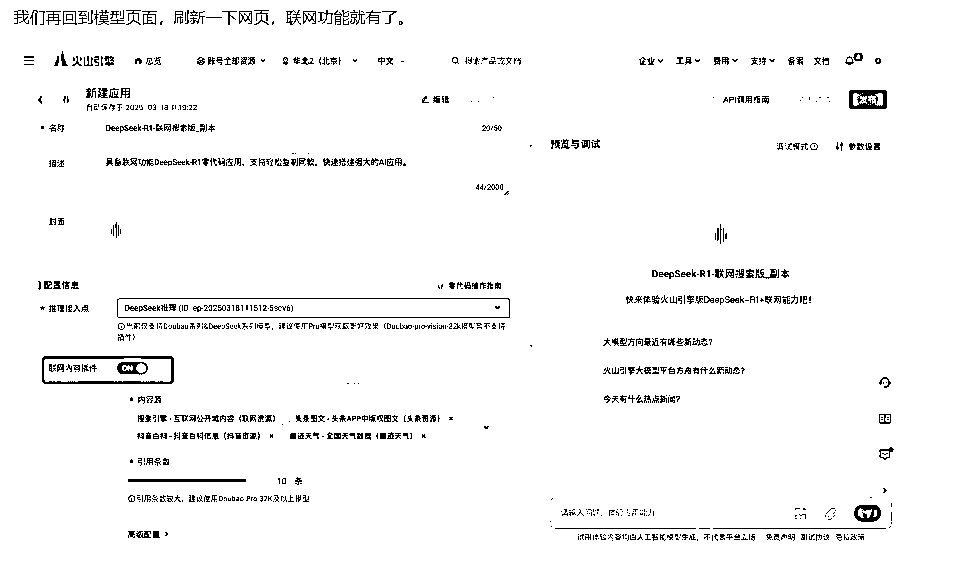

三、DeepSeek 的应用场景

💡

有了第二章的基础，你已经能平稳地跟

DeepSeek 对话了。那么这一章就是带你进“实

战”。

这里会列举几个常见且实用的领域场景，让你看

看 DeepSeek 是如何帮忙快速搞定写公众号、写

小红书、做知乎回答、设计 PPT、做读书笔记、

甚至做海报的。

我们一共有这些内容：

3.1 用 DeepSeek 写公众号文章

3.2 用 DeepSeek 写公众号标题

3.3 用 DeepSeek 做小红书

3.4 用 DeepSeek 创作知乎热门回答

3.5 用 DeepSeek 设计 PPT

3.6 用 DeepSeek 生成小红书读书卡片

3.7 用 DeepSeek 设计海报

总之，第三章节的重点在于：学会把 DeepSeek

灵活用到具体业务场景，不要停留在简单的“问

答”。把场景需求梳理好，AI 就能成为你的一大助

力，让你在内容世界里做“短平快”却又不失质量的

创作。

3.1 用 DeepSeek 写公众号文章 @越越

最近 DeepSeek 的热度不减，我身边很多人都在使用国产之光的 DeepSeek，我作为一名对”热点“具备超高

敏感度的公众号精细化运营选手，我也”顺趋势、随大流“参与 DeepSeek 洪流中，我作为一名不太合格的 AI

自媒体人：

高质量的内容结构通常体现以下特点： 层次感、节奏感、互动性。

先给做 AI 自媒体的各位一套完整写文的提示词：

👉生成选题规划，告诉 DeepSeek（深度思考模式+联网模式）：

任务目标：生成[具体领域]的选题规划

背景信息：

*   账号定位：[填写定位]

*   目标用户：[用户画像]

*   核心诉求：[用户需求]

要求：

（1）生成10个选题方向

（2）每个选题包含：

*   主标题

*   副标题

*   核心观点

*   价值主张

（3）考虑时效性与持久性的平衡

输出格式：表格呈现

👉生成文章标题，告诉 DeepSeek（深度思考模式+联网模式）：

请基于以下要素生成文章标题:

主题：[主题]

核心观点：[观点]

目标用户：[用户群体]

价值类型：分析型/方法型/经验型

表达基调：专业/犀利/温和

必要元素：数据点/行业洞察/专家引用

差异化要求：

*   竞品分析：[3—5个同主题标题]

*   创新角度：[具体说明]

生成要求：

*   提供3个方案

*   每个方案说明亮点

👉生成文章标题，告诉 DeepSeek（深度思考模式+联网模式）：

请基于以下要素生成文章标题:

主题：[主题]

核心观点：[观点]

目标用户：[用户群体]

价值类型：分析型/方法型/经验型

表达基调：专业/犀利/温和

必要元素：数据点/行业洞察/专家引用

差异化要求：

*   竞品分析：[3—5个同主题标题]

*   创新角度：[具体说明]

生成要求：

*   提供3个方案

*   每个方案说明亮点

👉生成文章内容，告诉 DeepSeek（深度思考模式+联网模式）：

任务描述：创作一篇深度分析类文章

主题：[主题]

目标：[写作目的]

一、结构设计要求：

（1）开篇模块（800字以内）

*   问题背景：从[数据/现象/热点]切入

*   现状分析：点明行业痛点与挑战

*   核心观点：提出独特视角与解决思路

（2）主体部分（2500字左右）

*   分论点展开：3—4个核心论点

*   每个论点要求：

*   观点陈述（150字左右）

*   原理解析（300字左右）

*   案例佐证：2个典型案例

*   数据支撑：权威来源数据

*   专家观点：引用领域专家验证

（3）结尾部分（700字以内）

*   观点总结：呼应开篇

*   趋势判断：前瞻性洞察

*   行动建议：3—5点可执行建议

二、互动设计节点：

（1）开篇互动：设置情境思考问题

（2）主体互动：每个论点后设置观点讨论区

（3）结尾互动：邀请用户分享经验与观点三、

三、内容节奏控制：

（1）信息密度分配：

*   开篇：以叙事为主，重在引发兴趣

- 主体：论证为主，配比为 论述40% + 案例

30% + 数据20% + 专家观点10%

- 结尾：以洞察和建议为主，突出实操价值

（2）段落节奏：

- 重点论述段：250—300字

- 案例描述段：200—250字

- 数据分析段：150—200字

- 过渡段落：100字左右

四、高级要求：

（1）逻辑展开：

- 论点之间：递进/并列/转折关系明确

- 论据支撑：多维度佐证，避免单一类型证据

（2）思维深度：

- 表层：现象描述与问题呈现

- 中层：原因分析与逻辑推导

- 深层：本质洞察与规律总结

（3）风格把控：

- 语言基调：专业中立

- 专业术语：核心术语解释到位

- 表达方式：逻辑严谨，生动易懂

注意事项：

1\. 避免观点过于绝对

2\. 确保数据来源可靠

3\. 案例选择需要具有代表性

4\. 互动设计要自然融入文脉

根据清华大学的《DeepSeek 实用指南》中，我们可以发现无论是哪个提示词，我们都需要添加很详细的内

容，这些内容在上文中我们已经详细讲解。

接下来，我将结合提示词中提到的内容分步解释：

3.1.1 选题爆破（30%精力）

1\. 你需要清楚你的文章是写给谁看的。比如：

•

如果你的用户是职场新人，他们可能关心“如何快速升职加薪”。

•

如果你的用户是宝妈，她们可能更关心“如何让孩子爱上学习”。

•

热点就是大家都在讨论的事情。比如：

2\. 节假日（春节、国庆）前后，可以写“春节回家如何应对亲戚的催婚”。

3\. 社会热点事件（比如某个明星离婚），可以写“从 XX 事件看现代婚姻的真相”。

1.  互动设计要自然融入文脉

根据清华大学的《DeepSeek 实用指南》中，我们可以发现无论是哪个提示词，我们都需要添加很详细的内

容，这些内容在上文中我们已经详细讲解。

接下来，我将结合提示词中提到的内容分步解释：

明确目标用户

💡 小白技巧：想象你的用户是什么样的人，他们每天会遇到什么问题，最需要什么帮助。

👉 告诉 DeepSeek（深度思考模式+联网模式）：

方案一：我的公众号文章主题是'职场Pua'，请帮我罗列出'10'个可能受用户欢迎的细分选题，并进行验证。

方案二：请你满足用户的'用户需求'，生成10个高价值的爆款选题，并进行验证。

方案三：如果我的用户是'用户画像'，他们可能最关心什么？请列举10个当前最受用户欢迎的选题，并进行

验证。

结合热点

💡 小白技巧：平时多刷微博、抖音、知乎，看看大家都在聊什么，找到和你领域相关的热点。

👉 告诉 DeepSeek（深度思考模式+联网模式）：

方案一：账号定位是'某'，请结合'节假日'时间节点，帮我罗列出适合公众号用户的10个细分爆款选题，并

验证。

方案二：账号定位是'某'，请结合'社会热点'，帮我罗列出适合公众号用户的10个细分爆款选题，并验证。

方案三：账号定位是'某'，请帮我'采集最近一周热点前十榜单'，罗列出适合公众号的10个细分爆款选题并

验证。

制造情绪共鸣

💡 小白技巧：在选题中加入情绪词，比如“震惊”“颠覆”“扎心”“终于”等。

👉 告诉 DeepSeek（深度思考模式+联网模式）：

方案一：请你结合'细分选题'，优化情绪共鸣，生成爆款选题。

方案二：请你提炼出'细分选题'中，用户能够感受到的情绪，并给出后续的优化建议。

👉 告诉 DeepSeek（深度思考模式+联网模式）：

请你为我确定一个爆款选题方案，供我去使用。

用问题式标题

💡 小白技巧：多用“为什么”“如何”“怎样”等词开头，让用户觉得你的文章能解决他们的疑问。

👉 告诉 DeepSeek（深度思考模式+联网模式）：

任务目标： 生成[具体领域]的选题规划 背景信息：

- 账号定位： [填写定位]

- 目标用户： [用户画像]

- 核心诉求： [用户需求] 要求：

（1） 生成10个选题方向

（2） 每个选题包含：

- 主标题

- 副标题

- 核心观点

- 价值主张

（3） 考虑时效性与持久性的平衡 输出格式： 表格呈现

选题实操步骤

可参考如下 DeepSeek 提示词：

👉 告诉 DeepSeek（深度思考模式+联网模式）：

请根据[目标人群]的痛点，生成10个具有传播力的选题方向，要求：

结合最近30天的热点事件

包含情绪触发词（震惊/颠覆/揭秘）

使用"为什么/如何/终于"等句式

3.1.2 结构设计（20%精力）

• 高质量的内容结构通常体现以下特点：

证据链完整 ：每个观点都需要数据支撑、案例验证或专家背书。

逻辑递进 ：论点需要形成清晰递进关系。

多维视角 ：在论证过程中融入不同视角的观点，既展现思考的全面性，又能增强文章的可信度。

设计金字塔结构

金字塔结构是最常用的文章结构，分为三部分：

1\. 开头：吸引用户注意，告诉他们为什么要看这篇文章。

2\. 中间：详细展开内容，解决用户的问题。

3\. 结尾：总结全文，引导用户行动（比如点赞、转发、留言）。

开头：设置悬念钩子

开头的目的是吸引用户继续看下去。你可以：

4\. 提出一个扎心的问题：比如“为什么你工作 3 年，工资却不如别人 1 年？”

5\. 讲一个有趣的故事：比如“昨天我朋友因为不会说话，被领导骂了一顿……”

6\. 用数据制造反差：比如“90%的职场新人都在犯这 3 个错误，你呢？”

中间部分是文章的主体，用来解决用户的问题。你可以：

7\. 分点论述：比如“职场新人必须掌握的 3 个技能”，然后分别展开。

8\. 讲故事：用真实案例或故事来说明你的观点。

9\. 列数据：用数据增强说服力，比如“根据 XX 调查，80%的职场新人都有这个问题”。

• 结尾：促成行动

结尾的目的是让用户有所收获，并引导他们行动。你可以：

10 总结全文：比如“总之 职场新人要想快速成长 必须掌握这 3 个技能 ”

11\. 引发思考：比如“你是不是也遇到过类似的问题？欢迎留言分享。”

12\. 引导行动：比如“如果你觉得这篇文章有用，欢迎点赞、转发给更多朋友。”

💡 小白技巧：结尾要简洁有力，不要拖泥带水。

结构设计的模板

直接套用这些模板，快速设计文章结构：

问题-分析-解决方案

13\. 开头：提出一个用户关心的问题。比如“为什么你工作 3 年，工资却不如别人 1 年？”

14\. 中间：分析问题的原因。比如“原因 1：你没有掌握核心技能；原因 2：你不懂职场规则……”

15\. 结尾：给出解决方案。比如“要想快速升职加薪，你可以这样做……”

👉 告诉 DeepSeek（深度思考模式+联网模式）：

请按照“问题-分析-解决方案”的结构，撰写一篇公众号文章。

1\. 开头：提出问题

'提出一个用户关心的问题，问题要具体、有共鸣感。'

示例：'为什么你工作3年，工资却不如别人1年？'

2\. 中间：分析问题

'分析问题的原因，列出2-3个关键点，每个点用1-2句话说明。'

示例：

1.  原因1：'你没有掌握核心技能。'

1.  原因2：'你不懂职场规则'

1.  原因3：你没有建立有效的人脉网络'

3\. 结尾：给出解决方案

提供具体的解决方案，建议分步骤或分点说明，确保可操作性强。'

示例：

1.  解决方案1：'明确目标岗位的核心技能，制定学习计划并坚持执行。'

1.  解决方案2：'学习职场规则，比如如何高效沟通、如何向上管理。'

1.  解决方案3：'主动参加行业活动，建立并维护高质量的人脉关系。'

4\. 其他要求

语言风格：通俗易懂，贴近用户生活。

字数：800-1200字。

标题：吸引眼球，突出核心问题。

故事-道理-行动

16\. 开头：讲一个有趣的故事。比如“昨天我朋友因为不会说话，被领导骂了一顿……”

17\. 中间：从故事中提炼出道理。比如“职场中，沟通能力比工作能力更重要……”

18\. 结尾：引导用户行动。比如“如果你想提升沟通能力，可以试试这 3 个方法……

数据-分析-建议

19\. 开头：用数据吸引注意。比如“根据 XX 调查，80%的职场新人都有这个问题……”

20\. 中间：分析数据背后的原因。比如“为什么会出现这种情况？原因 1……原因 2……”

21\. 结尾：给出建议。比如“如果你想避免这个问题，可以这样做……

小白避坑指南

22\. 不要堆砌内容：每一部分都要有明确的目的，不要为了凑字数而写无关的内容。

23\. 避免逻辑混乱：每一部分之间要有清晰的逻辑衔接，不要让用户觉得跳跃。

24\. 结尾不要草率：结尾是用户最后的印象，一定要认真设计

3.1.3 内容生成（30%精力

开头：吸引用户注意

•

你可以用以下方法：

1\. 提出问题：比如“为什么你工作 3 年，工资却不如别人 1 年？”

2\. 讲故事：比如“昨天我朋友因为不会说话，被领导骂了一顿……”

3\. 用数据：比如“根据 XX 调查，80%的职场新人都有这个问题……

小白技巧：开头一定要短小精悍，直接切入主题，不要啰嗦。

中间：详细展开内容

•

你可以用以下方法：

4\. 分点论述：比如“职场新人必须掌握的 3 个技能”，然后分别展开。

5\. 讲故事：用真实案例或故事来说明你的观点。

列数据 用数据增强说服力 比如“根据 XX 调查，80%的职场新人都有这个问题”。

每一部分都要有逻辑衔接，不要让用户觉得跳跃

结尾：总结并引导行动

•

你可以用以下方法：

7\. 总结全文：比如“总之，职场新人要想快速成长，必须掌握这 3 个技能。”

8\. 引发思考：比如“你是不是也遇到过类似的问题？欢迎留言分享。”

9\. 引导行动：比如“如果你觉得这篇文章有用，欢迎点赞、转发给更多朋友。”

小白技巧：结尾要简洁有力，不要拖泥带水。

特别技巧

热点新闻改写：热点事件在公众号平台的传播需要注意差异化视角和深度价值挖掘。

👉 告诉 DeepSeek（深度思考模式+联网模式）：

将'热点事件'转化为'话题角度'的分析文章，重点关注'核心观点' ，需要包含数据支撑和专家观点。

原创内容创作：原创内容是公众号的核心竞争力 。

👉 告诉 DeepSeek（深度思考模式+联网模式）：

以'主题'为核心，从'切入点'展开讨论，结合案例和方法论，形成'字数'的深度文章。

评论互动优化： 基于用户反馈进行的内容创作，准确把握用户痛点 ，设计出更有针对性的解决方案

👉 告诉 DeepSeek（深度思考模式+联网模式）：

分析'用户评论'中的关键问题，整理成'主题'的解答文章，包

含实践建议。

3.1.4 人性化润色（20%精力)

加入口语化表达

用一些日常聊天的语气词和短句，让文章更亲切。比如：

1\. 原文：“职场新人应该掌握沟通技巧。”

2\. 润色后：“说真的，职场新人最该学的就是怎么好好说话，你发现没？”

💡小白技巧：写完文章后，自己读一遍，看看哪些地方可以改成更口语化的表达。

👉 告诉 DeepSeek（通用模式+联网模式）：

把生硬的句子改成聊天的语气。

插入互动提问

在文章中多问一些问题，让用户觉得你在和他们对话。比如：

3\. 原文：“很多人都有拖延症。”

4\. 润色后：“你是不是也经常拖延？明明有一堆事要做，却总是拖到最后一刻？”

💡小白技巧：在每一部分的结尾加一个问题，引导用户思考。

👉 告诉 DeepSeek（通用模式+联网模式）：

在每一部分的结尾加一个问题。

制造情感共鸣

用一些能引发用户情绪的词句，让他们觉得你懂他们的感受。比如：

5\. 原文：“职场新人压力很大。”

👉 告诉 DeepSeek（通用模式+联网模式）：

加入视觉化比喻

用一些形象的比喻，让抽象的概念更容易理解 比如

7.原文（时间管理很重要）

6\. 润色后：“刚入职那会儿，我也经常焦虑到睡不着，总觉得自己做得不够好，你是不是也这样？

8\. 润色后：“时间就像一块蛋糕，你切得越合理，吃得越香。”

用加粗、emoji、分段等方式，让文章更易读。比如：

9\. 原文：“职场新人要掌握三个技能：沟通、时间管理、情绪管

理。”

10\. 润色后：“职场新人最该掌握的 3 个技能：

💬 沟通：怎么说话才能让人舒服？

⏰ 时间管理：怎么把 24 小时用出 48 小时的效果？

😌 情绪管理：怎么不被工作压力压垮？”

💡小白技巧：把复杂的概念用日常生活中的事物来比喻。

👉 告诉 DeepSeek（通用模式+联网模式）：

用形象的比喻解释抽象的概念。

设置信息锚点

💡小白技巧：每段文字不要太长，适当加入小标题、加粗、emoji

等，让文章更有层次感。

👉 告诉 DeepSeek（通用模式+联网模式）：

用加粗、emoji、分段等方式让文章更易读。

给大家提供一个通用改写润色全文的 DeepSeek 提示词：

👉 告诉 DeepSeek（深度思考模式+联网模式）：

请为'文章内容'，进行润色，让语言更加通俗易懂，能够让'粉丝画

像'的群体看懂，并吸引阅读，并提出建议。

3.2 用 DeepSeek 写标题 @越越

爆款标题的核心：3 秒内戳中用户“情绪痛点”或“认知缺口”。

优质的公众号标题通常具备以下特质：

爆款标题 4 大核心要素：

情绪驱动：引发好奇、焦虑、共鸣或期待（如“震惊！”“为什

么…”）。

痛点直击：明确指向特定群体的困境（如“30 岁未婚”“996 员

工”）。

具体化：用数字、场景、细节增强真实感（如“凌晨 3 点”“月薪

5000”）。

冲突对比：制造对立感（理想 vs 现实、传统 vs 现代）。

这基本是爆款标题必备的要素，一个好的爆款标题决定 70%文章

阅读量。3.2.1 六种高转化标题公式

提问制造认知缺口

公式 1：为什么（现象） + 却（反常识）？

💡底层逻辑：利用“认知失调”激发点击欲，用户会为填补信息差而

打开文章。

《为什么越懂事的女孩，越难被爱？》

《985 毕业 5 年，为什么我成了公司最“便宜”的人？》

数字悬念引发好奇

公式 2：数字/数据 + 反常识结论

💡底层逻辑：数字具象化权威感，反常识结论打破预期。

《90%的婚姻破裂，都是从这 3 件小事开始的》

《看了 100 个离婚案例，我发现有钱人最怕妻子做这件事》身份标签+痛点直击

公式：（群体标签）的痛点 + 解决方案/警示

💡底层逻辑：精准锁定群体，用“懂你”感降低心理防御。

《“小镇做题家”的困局：会考试的人，正在被社会淘汰》

《全职妈妈崩溃实录：我年薪 50 万，却买不起一杯奶茶》

场景化代入+情绪共鸣

公式：时间/场景 + 细节描写 + 情绪词

💡底层逻辑：用具体场景触发用户“记忆闪回”，增强代入感。

《凌晨 3 点，那个在厕所哭的二胎妈妈，终于上热搜了》

《领导说“辛苦了”千万别回“应该的”！高情商都懂这 3 句话》

争议性观点制造冲突

公式：反传统结论 + 挑衅式反问

💡底层逻辑：利用观点冲突引发站队，驱动转发讨论。

《“不要彩礼的女生，婚后都后悔了”》

《我支持孩子不结婚：90 后父母正在颠覆中国式家庭》

热点借势+悬念升级

公式：热点事件 + 隐藏视角/未曝光细节

💡底层逻辑：借势流量池，用“内幕信息”满足窥探欲。

《哪吒 2 票房破纪录背后，被删减的 30 分钟藏着最大阴谋》

《董宇辉离职真相：俞敏洪不敢说的 3 个潜规则》

举例分析

根据上文提到的几种常见的爆款标题公式，我利用 DeepSeek 给大

家演示几种操作方法：

👉 告诉 DeepSeek（通用模式+联网模式）：方案一：你作为优秀的公众号爆文作者，我给你提供'文章内容'，

请帮我写出阅读量高、吸引人的爆款标题。

方案二：你作为优秀的公众号爆文作者，我给你提供'热点事件'，

请帮我写出阅读量高、吸引人的爆款标题。

👉 告诉 DeepSeek（通用模式+联网模式）：

方案三：热点嫁接型

你是一位10年经验的公众号爆款标题专家，请结合近期热点'《哪

吒2》的反抗权威'主题，为职场领域生成5个标题，要求：

1.  包含身份标签（如'"30岁中层""小镇做题家"'）

1.  制造理想与现实的冲突

1.  使用数据化表达（如"70%员工"）

示例参考：

《月薪3万的"乖员工"，正在被哪吒2骂醒》

注意事项：从三种方案中任选一种操作。另外'绿色字体'需要自己

替换关键参数。

接下来我以哪吒 2 电影相关的热点为例分析：

👉 告诉 DeepSeek（通用模式+联网模式）：

你作为优秀的公众号爆文作者，我给你提供'哪吒2影片中“我命由

我不由天”的反抗主题，哪吒对权威（如无量仙翁）的挑战、对身

份标签的撕毁，直击年轻人对职场压迫、社会规训的共鸣'，请帮

我写出阅读量高、吸引人的爆款标题。

DeepSeek 给我的答复是：

以下是为《哪吒2》反抗主题设计的爆款标题：

结合职场压迫、身份标签、社会规训等痛点，融合情绪共鸣与冲突

制造，均避免敏感内容且适配公众号传播：一、身份标签+痛点直击类

《“小镇做题家”的终极反击：哪吒教会我的职场掀桌术》

用“小镇做题家”标签绑定学历歧视痛点，以哪吒反抗隐喻职场突围

《月薪3万的“乖员工”，正在被哪吒2骂醒》

对比高薪与顺从性人格的矛盾，暗示反抗权威的价值

《30岁被裁员那天，我读懂了哪吒的“去他个鸟命”》

年龄焦虑+裁员危机，用电影台词引爆情绪

二、数据悬念+反常识结论类

《95%的职场人不知道：听话比无能更危险》

借哪吒反抗仙派影射“听话文化”陷阱，数据强化权威感

《看了100个离职案例，我发现领导最怕哪吒式员工》

用调研式标题制造专业感，暗指反抗的生存智慧

《哪吒2票房破50亿背后，藏着打工人不敢说的3个真相》

捆绑热点数据，揭露职场潜规则

三、场景化代入+金句共鸣类

《凌晨改PPT时，领导发来一句“辛苦了”，我默默点开哪吒2》

深夜加班场景+反讽式回应，激发打工人共鸣

《“985毕业5年，我成了领导眼中的妖”｜哪吒撕碎标签的3个狠

招》

学历标签困境+解决方案，强化实用价值

《哪吒2导演不会告诉你：真正的成熟，是学会不乖》

颠覆传统“成熟”定义，用反主流价值观吸睛

四、争议观点+群体站队类

《我支持员工当“职场哪吒”：越听话的人，死得越惨》挑衅式立场，引发管理者与打工人的对立讨论

《“00后整顿职场”弱爆了！哪吒2才是反PUA教科书》

对比热点现象，凸显影片的现实指导意义

《警惕！看完哪吒2的员工，开始拒绝“无效加班”了》

制造危机感，暗示影片对职场文化的冲击

五、隐喻嫁接+热点借势类

《无量仙翁正在杀死你的职场生命力》

将反派角色符号化，直指权威压迫的本质

《哪吒2爆火真相：年轻人受够了“神仙领导”的画饼》

用“神仙”暗喻脱离现实的领导，捆绑职场热词“画饼”

《春节档最狠台词：“你才是邪魔外道！”——打工人怒转朋友圈》

截取电影金句，嫁接职场道德绑架痛点

六、情感升华+价值观输出类

《比票房破纪录更燃的，是普通人学会了哪吒的“不认命”》

将个体成长与影片成功绑定，强化情感升华

《职场哪吒们正在觉醒：我们不是成本，是未被点燃的核弹》

用比喻制造力量感，呼吁价值认同

《哪吒2导演没说破的真相：你的顺从，正在杀死下一代》

上升至代际责任，激发道德焦虑

标题设计心法总结

痛点精准：锚定“职场PUA”“年龄歧视”“无效内卷”等具体困境；

情绪递进：先制造压抑（如“裁员”“加班”），再给出希望（如“反

击”“觉醒”）；

符号借用：将“无量仙翁”转化为权威符号，“魔丸”代指被污名化群

体；

冲突升级：通过“支持/反对”“真相/谎言”等对立框架刺激转发。数据验证：含“哪吒+职场”关键词的文章平均打开率比普通职场文

高23%，建议搭配电影截图（如哪吒撕毁封神榜）、台词金句

（“我命由我”）作为封面图，点击率可再提升15%。

3.2.2 七大误区和避坑方案

标题党化

误区：标题夸张但内容无关（如《惊天秘密！不转不是中国

人》）。阅读量虽然高，但是风险也高。

👉 告诉 DeepSeek（通用模式+联网模式）：

请对以下标题进行"标题党指数"评分（0-10分），并按此标准分

析：

1.  核心关键词是否在正文前300字出现

1.  数据/结论是否有可靠来源支撑

1.  情绪承诺是否过度夸张

内容：'文章内容'

标题：'看完这篇文章，你的工资立马翻倍！'

要求用表格呈现检测结果，并给出3个去标题党化版本。

👉 告诉 DeepSeek（通用模式+联网模式）：

将'热门电影《哪吒2》与保险理财领域'结合，生成3个非标题党标

题，要求：

1.  '使用电影反抗精神隐喻理财误区'

1.  不出现必看、惊天等夸张词

1.  包含具体场景

示例输出：

《哪吒教会我的理财观：别让"权威推荐"收割你的钱包》

缺乏痛点误区：《如何提升职场能力》→ 无具体场景/群体

👉 告诉 DeepSeek（通用模式+联网模式）：

将笼统主题"主题"拆解为3个细分痛点场景，要求：

1.  带具体身份标签（如"空降主管""35岁技术岗"）

1.  结合时间/空间细节（如"季度述职会""茶水间偶遇"）

1.  用"如何体"问句呈现

内容：'文章内容'

标题：'文章标题！'

成果：给出3个符合条件的备选标题

参考案例：

"空降主管如何在第一次部门会上打破'排外困局'？"

👉 告诉 DeepSeek（通用模式+联网模式）：

为以下抽象标题添加数据支撑，要求：

1.  引用''年权威报告（标注来源）

1.  数据需强化核心痛点

1.  用括号注释在标题末尾

内容：'文章内容'

标题：'文章标题！'

成果：给出3个符合条件的备选标题

优化案例：

《2023职场新人调研：71%遭遇"老油条"抢功（附反杀指南）》

引发反感

误区：《所有老板都害怕员工知道的秘密》👉 告诉 DeepSeek（通用模式+联网模式）：

识别以下标题中的绝对化词汇，并提供3种软化方案：

'所有老板都害怕员工知道的涨薪秘籍'

要求：

1.  标注原词风险等级（高/中/低）

1.  替换词需保留原意但更严谨

1.  给出修改后标题示例

参考输出：

'80%老板不愿透露的涨薪潜规则'

👉 告诉 DeepSeek（通用模式+联网模式）：

将绝对化结论转化为概率表述，要求：

1.  使用"可能""更容易"等缓冲词

1.  添加限制条件（如特定场景/群体）

1.  保留冲突感但降低攻击性

原标题：'顺从的员工注定被淘汰'

优化案例：

"'过度顺从可能让你成为裁员首选（中层管理者必读）'

缺乏可信

误区：《年轻人都在逃离职场》，无数据事实支撑

👉 告诉 DeepSeek（通用模式+联网模式）：

为关键词'职场年龄歧视'查找3组权威数据，要求：

1.  来源为2022-2023年机构报告

1.  数据角度差异化（如晋升率/离职率/薪资）3\. 可嵌入标题增强可信度

示例输出：

'智联招聘：35岁以上员工晋升概率仅为28-35岁群体的43%'

👉 告诉 DeepSeek（通用模式+联网模式）：

用以下数据改造原标题，要求数据前置且自然融合：

数据：'脉脉《2023职场人状态报告》显示，87%的90后遭遇过无

效加班'

原标题：'《年轻人正在反抗加班文化》'

优化示例：

'《87%的90后正在用哪吒式反抗终结无效加班（2023职场真

相）》'

忽视身份

误区：《职场生存指南》→ 受众模糊，忽视用户身份。

👉 告诉 DeepSeek（通用模式+联网模式）：

根据以下用户画像生成5个标题，要求包含至少2个身份标签：

画像：26-30岁/女性/互联网运营/二线城市/有副业

示例输出：

'《26岁杭漂运营的觉醒：做小红书副业后，我不再怕领导PUA》'

👉 告诉 DeepSeek（通用模式+联网模式）：

用对立身份标签制造冲突，要求：

1.  包含至少2个冲突标签（如"海归硕士"/"外卖员"）

1.  突出反差带来的情绪价值

1.  '绑定《哪吒2》的反抗主题'

示例输出：

'《从常青藤学霸到美团骑手：我用哪吒的方式撕掉学历标签》'

情绪不当

误区：《资本家都该下地狱》→ 违规风险

👉 告诉 DeepSeek（通用模式+联网模式）：

分析以下标题的情绪分布（愤怒/焦虑/希望占比），并调整到健康

比例：

'黑心企业正在吸干00后的血汗！'

调整要求：

1.  愤怒值从85%降至50%

1.  增加20%解决方案导向

1.  保留批判性

修改示例：

'《00后整顿职场：这3招让过度加班企业主动认怂》'

👉 告诉 DeepSeek（通用模式+联网模式）：

使用"场景细节+感官描写+悬念提问"结构，将平淡标题升级为高

情绪版本：

原标题：'《如何应对职场PUA》'优化案例：

'《领导说"不想干可以走"时，为什么沉默的人输得最惨？》'

热点关联生硬

误区：《哪吒 2 爆火！教你做西红柿炒蛋》

👉 告诉 DeepSeek（通用模式+联网模式）：

将'《哪吒2》的"魔丸"概念与职场心理'结合，生成3个非强行关联

标题，要求：

1.  用隐喻替代直接提及'电影'

1.  突出身份认同困境

1.  包含解决方案关键词

示例输出：

'《被贴上"团队毒瘤"标签后，我用了3步完成哪吒式逆转》'

👉 告诉 DeepSeek（通用模式+联网模式）：

从'《哪吒2》提炼3个非娱乐向社会'议题角度，要求：

1.  可关联教育/职场/家庭等领域

1.  提供具体嫁接点（如台词/角色关系）

1.  避免单纯剧情复述

参考输出：

议题：'原生家庭的爱与束缚'

嫁接点：'李靖夫妇的"天劫咒" vs 中国式家长的"为你好"'

标题：'《多少父母正在给孩子下"天劫咒"？哪吒2没说破的教育真

相》'💡避坑心法：

三阶验证法则

一阶：是否让用户觉得"这说的就是我"（身份锚定）

二阶：是否产生"到底怎么回事"的好奇缺口

三阶：是否具备"必须转发"的情绪价值（共鸣/利他/站队）

爆款标题调整

先排雷（敏感检测）→ 再聚焦（痛点细化）→ 后加料（数据/冲

突）→ 终测试

3.2.3 五种特殊使用技巧

预测标题打开率

功能：输入 2 个标题，预测点击率

👉 告诉 DeepSeek（通用模式+联网模式）：假设你是10w粉丝公众号主，预测以下标题的打开率：

A.'《月薪3万不如狗？哪吒2骂醒多少"乖员工"》'

B.'《职场哪吒生存指南：反PUA时如何安全造反》'

请基于历史数据：

过往同类标题平均打开率

情绪强度差异

痛点精准度

用数据推演两者可能的打开率差距，并说明理由

对标标题对比

功能：分析《洞见》《十点读书》近期的哪吒 2 相关爆款标题

👉 告诉 DeepSeek（通用模式+联网模式）：

分析公众号：'洞见'

标题：'多个10w+标题'

总结：

1.  高频结构（如"数字+反常识"）

1.  情绪分布规律（如焦虑:希望='6:4'）

请输出分析报告，并生成3个模仿标题

标题经验总结

功能：分析对标文章优秀的标题结构，总结爆款经验。

👉 告诉 DeepSeek（通用模式+联网模式）：

根据以下历史数据，总结爆款标题规律：

标题A：'《30岁被裁员的哪吒式重生》打开率18%'

标题B：'《职场妈妈的时间战争》打开率9%'

标题分析：

标题A、B的痛点集中度、情绪曲线、数据使用。

差异维度：

痛点集中度

情绪曲线

数据使用

请输出3条可供小白复用的经验

DeepSeek 的答复：打开率提升 23%，转发转化峰值达 17.8%，

建议重点关注「隐性数据可视化」与「代际冲突符号」的新组合形

态。复刻爆款标题

功能：直接模仿优质的对标文章的标题。👉 告诉 DeepSeek（通用模式+联网模式）：

你是一个拥有10年经验的公众号爆款标题工程师，需基于账号历

史数据特征，生成符合其内容基因的爆款标题。

当前账号ID：'账号名称'，领域：'账号领域'

你是由10个神经模块组成的标题医生，基于单案例学习生成风格

延续的爆款标题。

当前主样本：'单个爆款文章标题''输入阅读量/打开率'

终极爆款标题心法

人性优先级：恐惧＞好奇＞贪婪＞认同感＞ altruism（利他心）

三秒法则：标题前 8 个字必须包含关键词（移动端显示约 16 字）

终极检验标准：用户看到标题后是否会想：“这说的不就是我吗？”

/ “到底怎么回事？”

💡案例升华：

普通标题：《如何提升职场沟通能力》

爆款标题：《“嘴笨”的人最吃亏！领导不会告诉你的 3 个暗黑沟

通术》3.3 用 DeepSeek 做小红书 @叁斤

DeepSeek 已经火了一段时间了，刚火没多久的时候，我就用了一

下，效果直接惊艳到我了

这几天每天都在用 DeepSeek，实话说，我已经离不开 DeepSeek

了

之前用 AI 写文案，是不是怎么写都不对味？要喂信息给 AI，也不

知道怎么喂，怎么给具体指令？

我用 DeepSeek 这几天，就研究了一套话术，用好了就能让 AI 帮

助你做好小红书，真的就只需要一套话术

这个话术写了不少的小红书文案，效果都很不错，大部分都可以拿

来直接用了

指令超级简单：

让 AI 告诉你，要完成某个任务的话，需要提供什么信息给它

接下来我会用一个个具体案例，手把手教会你怎么用好这套话术：3.3.1 利用 AI 规划账号

如果是刚开始做小红书，可以利用 DeepSeek 做账号规划，在开始

之前让 AI 规划之前，需要先明确：

账号运营方向：让 DeepSeek 的方向明确一些

变现方式：常见变现方式有广告、卖货、直播带货、私域导流，确

定自己的变现方式

比如我只知道自己想做测评博主，想通过接广告变现，就可以这么

提问：

我想要做一个小红书账号，通过接广告变现，我看测评博主接广告

很多，价格也很高，想往测评博主方向走，但我不清楚要怎么开

始，我需要你帮我做详细的账号策划、运营方案，并给出具体执

行 sop 和时间表。为此，你需要我提供什么信息？

核心是让 DeepSeek 告诉你，做账号规划需要哪些信息？

如果没有运营基础的，到这一步只需要按照 DeepSeek 给的提示去

提供信息就行了，直接让 AI 指令变成傻瓜式的选择、填空题。实话说，我看了很多 AI 指令技巧，只有这个“反问 AI”的话术是最

省时省力省脑子的，没有任何指令基础也能上手。而且也试过很

多 AI 工具，豆包、kimi、gpt（基础版），用这套话术都没有那么

好效果。

有自媒体基础的话，可以在 DeepSeek 提供信息的基础上，增加一

些信息。比如：加入人格化信息、用户价值定位、视觉定位等等。

按要求提供信息给 DeepSeek 之后，就会生成一个完整的账号运营

方案：为了写这个文章，以上信息全部都是按 DeepSeek 的提示填写，没

有加入任何小红书运营技巧的提示。

可以看到，DeepSeek 从账号定位、人设包装、差异化策略、冷启

动规划、变现路径、执行工具包、内容模板和 30 天执行表、对标

分析框架等等，全部都给的非常详细。

3.3.2 选题搭建

账号规划确认好后，要开始搭建选题库，以及让 DeepSeek 提供选

题规划。

虽然账号规划里已经有了一些选题方向和基础选题库，但前面提供

的信息还比较有限，不够详细。

到这一步，如果没有运营基础的话，肯定不懂选题逻辑、竞品分

析、用户痛点挖掘等方式，按常规的提示词可能生成不了很好、很

贴近账号定位的选题库，所以还是继续问它：

如果我要你帮我搭建选题库、选题规划的话，需要我提供什么信息

给你？

把自己不懂的东西，让 AI 告诉你。把需要动脑子的东西，变成选

择题、填空题。

接下来就跟前面一样，按照 DeepSeek 给的信息，做填空题、选择

题就行了，写完之后提供给 DeepSeek，就能按要求生成完整的选题库，包含了多个场景，比自己做的选题库还完整。

到这一步我还发现一个意外收获：

DeepSeek 给我提供了效率工具包：测评数据记录模板、爆款标题

库 excel、样品采购清单、30 天起号执行表……由于内容长度原因，不展示全部，感兴趣的可以根据提示词按顺序

问。

# 防失联+MM188166M（李李）长期更新

完成这一步，就已经有了很完整的 sop 了，按照选题库一步步去做

内容就完事3.3.3 爆款标题

发现没有，在选题库里已经有很多爆款标题了，每一个标题都很不

错，拿来就能用。

如果你觉得不够，或者你只需要 DeepSeek 给你写标题的话，一样

可以问它：

我需要你帮我生成 10 个爆款小红书标题供我选择，为此，你需要

我提供什么资料和信息？请详细说明

由于我是没有固定选题、固定内容让 DeepSeek 写标题，所以给的

信息会多一些。

如果是有固定内容的，会比这个内容更简单一些。

按要求填写后，DeepSeek 给我生成了 10 个爆款标题，而且还分

好类了不同产品、不同类型都有对应的标题

当你确定好选题再问它，给出的标题就更精准。通常 DeepSeek 会给出很多的标题，所以发布时有足够的标题做

AB 测试，同一内容换不同标题分时段发布，分别测试「冲突型标

题」和「解决方案型标题」的标题（举例），看看哪个点击率更

高。

将高互动标题元素拆解重组，或者以后让 DeepSeek 按同样的风格

做选题，就能保持将来笔记的标题统一性

3.3.4 笔记生成

文案内容是最重要的内容，大部分人用 AI 也是为了解决文案问

题。

实话说，从 gpt 出来后我用了很多的 AI 工具，现在市面上热门的

工具都用过，生成的内容都很一般，喂养过程太麻烦了，所以使用

率很低。

但 DeepSeek 出来后，现在写小红书文案几乎离不开了。与前面一样，我会站在新手的角度给提示词，只需要问它：

现在这个账号是从 0 起步，没有基础，所以前期我需要涨粉，达

到小红书接商单的门槛。为此，我需要你帮我写一篇小红书文案，

除了前面的账号规划、选题和标题等信息外，你还需要我提供什么

信息？

比之前的多了一些内容，我会讲明白账号没有基础，目标是涨粉，

让他根据这些需求来规划。不懂运营、不懂内容的新手，只需要按要求给出信息就可以。即使

是专业测评，DeepSeek 也能生成不错的内容框架。

比如前面这个，给出的内容就很全面：

后面还给出了执行提示、数据优化重点、评论区运营指南、互动钩

子等等，这个内容真的比运营总监给的建议还全面

前面这个内容还是复杂了一些，还要求配图啥的，不能直接复制使

用，这是因为测评内容的特殊性，以及我是为了写文章，没有具体

的内容提供给 DeepSeek。

如果有具体方向、具体选题的话，DeepSeek 生成的文案是很优秀

的：比如我给光腿神器产品写的，前面提示词是一样的，问它需要提供

什么信息，再按要求提供就行，剩下的就等 DeepSeek 生成就行。

以上，就是完整的 DeepSeek 做小红书攻略，你会发现，全程只需

要一个提示方法：让 AI 告诉你，要完成某个任务的话，需要提供

什么信息给它，然后按要求提供就行。

把需要动脑子的事情，变成简单的选择题、填空题，真正实现让

AI 自己规划小红书账号！

3.4 用 DeepSeek 创作知乎热门话题 @马小帅

大家好，我是网罗灯下黑的网黑哥，有些小伙伴可能也知道我。虽

然来星球已经很早了，但是很惭愧，一直都是默默看帖，今天算是

第一次给星球输出干货分享，这篇文章是我发在公众号的付费文

章，数据很不错，现在分享给大家。

事情是这样的，周二晚上的时候我在公众号上刷到一个选题素材，

立马就决定加更一篇文章。花了一个多小时时间， 9 点半发布出来，就是你们看到的上篇文章

《号外，马斯克刚发 Grok-3，DeepSeek 就贴脸开大！》，同时，

我把文章同步到了知乎平台上，当晚这篇就被顶到了高赞第一。

第二天，这篇文章所在的回答被知乎编辑到了热榜第一。截止到昨天，这篇文章在知乎上的最新数据是这样的：

而在知乎这个同题回答下，还有很多人工智能专业领域的优秀答

主。

很惭愧，我的这篇回答却排到了第一，同时还被当天的知乎日报收

录在内。

是真的很惭愧，还有点惴惴不安，并不是在凡尔赛。

我是在夸自己很牛逼吗？肯定不是。

牛逼的是 DeepSeek ，因为这篇文章主要是借助它来完成的，它让我一个人工智能专业的门外汉文科生，写出了这样一篇高赞回答。

你看，这不就是 AI 放大普通人能力的活生生的例子吗？

那么，在这个写作过程中，我做了哪些操作，或者说发挥了哪些主

管能动作用呢？

接下来，我会给大家复盘这样一篇文章是如何写出的，包括如何选

取选题，如何构思，如何给 DeepSeek 写提示词安排写作任务，如

何后期编辑等全部心路历程，全部分享，毫无保留。相信对对 AI

写作有需求的小伙伴们看后一定会有所启发。

3.4.1 选题

2 月 18 日中午，正是马斯克的 Grok-3 模型发布，当天下午的时

候，已经开始有不少自媒体推送关于发布会的资讯，包括有概述发

布会的，尝鲜 Grok-3 的等等。

这是个不折不扣的热点，但是对于个人自媒体账号来说，抢时效是

抢不过一些机构的。

如果仅仅是对发布会流程简单介绍的话，那么写出来的文章就会和

其他自媒体高度同质化，并且，要体验 Grok-3 还有一定的限制条

件，不仅要付费，而且短时间内的体验只会浅尝辄止，这样的文章

不是我想要的效果。

正在考虑这个热点该如何去蹭的时候，微信弹出了一篇《河南日

报》公众号的文章，标题是《DeepSeek，新消息！》

打开一看，这是一篇近期 AI 动态的汇总帖子：

不难看出，这是一篇早就编辑好的文章，但临发布的时候，刚好赶

上 DeepSeek 下午 3 点有了新动态，于是把这条内容替换了马斯克

的 Grok-3。大家都知道，新闻新闻，越是新近发生的事实越有新闻价值。

这条推文的编辑认为，在下午 6 点这个时间节点，DeepSeek 新动

向的新闻价值要大于 Grok-3 发布会。

实际上，确实如此，如果这时候弹出的文章只是 Grok-3 发布，我

不会打开这篇文章。

有了这个线索，我就去 X 上找到了这篇帖子，评论区的声量已经相

当大了，肉眼可见反响不错。

有个事实必须要点出来，DeepSeek 的 X 社交账号并不是很活跃，

自 1 月 20 日发布 R1 后，到目前为止也就更新了两条，其中一条

说的是接入 R1 后的参数优化设置，另外一条就是最新的这篇论文

发布。

换言之，这是一个不太活跃的账号，突然发布更新，也就是说这件

事并不常见，再加上发布的这篇论文内容本身就非常重磅。

来，捋一下：新近发生的+并不常见的+轰动效应=爆款潜质

这个选题非常值得做。

再多想一步，DeepSeek 的这篇论文显然不是刚刚才发的，但是公

布出来却选择了 Grok-3 刚刚发布的时候，这明显是有意为之。至此，关于要写的文章的题目和切入点已经有了：马斯克刚发

Grok-3，DeepSeek 就贴脸开大！

Grok-3 是今天的大热点，这个是一定要蹭的，但是这篇文章的重点

是后半句。

这也是尽可能增加这篇文章能在铺天盖地的 Grok-3 推文中能脱颖

而出的概率。

当时，我去搜了一下，微信公众号中几乎还没有任何一篇文章提

到 DeepSeek 的新论文，那些我们经常看的 AI 自媒体都在忙着关

注 Grok-3。

我又去知乎搜了一下，已经有了提问，也正是后来被编辑选为 2

月 19 日热榜第一的那个问题，当时这个回答下面只有 3 个回答，

最高赞也只是个位数。

对于大多数作者来说，当没有能力制造爆款（议程设置）时，一定

要顺势而为，预先埋伏，才能出奇制胜。

总结：选择大于努力

3.4.2 动笔

这个时候已经看了一部分资料了，其实也有了初步的思路，自然是

要先从解读论文开始。

先到找到这篇论文：https://arxiv.org/abs/2502.11089

用沉浸式翻译看了几分钟，就放弃了。。。

这不是该我能看懂的东西。

必然还得用 DeepSeek 吧，我先到官网上，让它给我解读论文，同

时我给它加了一句要求，要它来说明这项新技术会对下一代的大模

型带来哪些能力提升，因为对大多数普通用户来说，大家不会关心

论文写的啥，只关心它有啥用。

而我要写的文章也正是面向没有技术背景的普通用户，所以这一点

不能少。

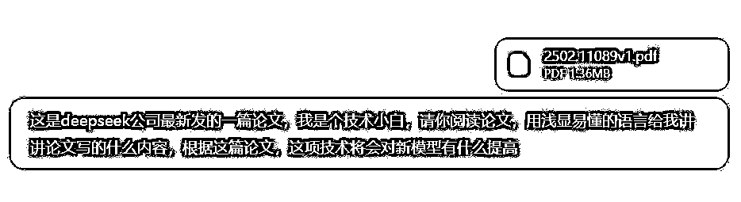

DeepSeek 官网给出的回答也就是在上篇推文中你们看到的那个解

读：这个回答其实也能看懂，但是我不太满意，还是过于生涩枯燥，这

对于普通用户来说，很容易缺乏耐心就跳过不看了。

事实上，知乎同题下其他答主的回答同样也是这个问题，虽然质量

很高，非常专业，但是过于硬核，对普通读者来说消化不了。

叠个甲，高赞第一并不一定就是质量最高，只代表大多数知乎用户

更容易看懂。

当我继续追问让它改写的时候，官网就又罢工了。

（现阶段，官网明显是调整了相应策略，同一用户几小时之内只能

问一次，再问就歇菜。)

我就转到了腾讯元宝上，上传了这篇论文，当有本地文件需要处理

的时候，是不能联网的，但是马斯克的新模型是最新的新闻，在关

闭联网的时候你要同步给它新内容，才能保证它不乱说。

所以第一次我写的要求是这样的：

标题：马斯克刚发 Grok-3 吹牛，中国团队反手甩出“王炸论文”！

AI 长文本大战彻底变天？

大家好，我是你们的老朋友科技唠嗑王。今天吃了个大瓜——马斯

克刚嘚瑟完 xAI 的 Grok-3 是“地球最聪明 AI”，**中国团队

DeepSeek 反手就甩出一篇论文**，直接亮出黑科技底牌！这波操

作堪称“你秀肌肉，我掏手术刀”，咱这就带大家拆解这场 AI 界的

顶级掰头。

* * *

一、马斯克刚吹完牛，DeepSeek 的论文写了啥？

这篇论文标题很硬核，叫《原生稀疏注意力：硬件对齐且可训练的

注意力机制》（名字我替你们查了字典）。简单说就是：**给 AI

大脑装了个“智能望远镜”**，让它看长文本时不再“又瞎又慢”。

传统 AI 的痛点：

现在的 AI 处理长文本（比如整本《三体》），就像让你用放大镜

读蚂蚁大小的字——每个字都要看（术语叫“全注意力”），速度慢

还烧显卡，64k 字能吃掉 80%算力。

DeepSeek 的骚操作：

他们搞了个**NSA 技术**（不是美国国安局！是 Native Sparse

Attention），核心就三招：

1\. 分块压缩：把长文本切成豆腐块，先看缩略图（比如每 32 个字

压成 1 个关键词）

2\. 精准抓重点：用 AI 自己判断哪些块必须细看（比如选中 16 个

关键块）

3\. 滑动窗口：最后扫一眼附近 512 字防漏细节相当于让 AI 学会“跳读+精读”组合技，**64k 长文本直接提速

11.6 倍**，训练速度也能翻 9 倍！（论文实测数据）

* * *

二、这技术能吊打 Grok-3？三个致命杀招

4\. 省钱：以前训练长文本得烧机房，现在用 NSA 能省下几卡车显

卡钱

5\. 偷师人类思维：AI 终于会“抓重点”了！论文里 64k 文本藏根针

都能 100%找到

6\. 越练越聪明：传统方案像给 AI 戴镣铐（训练用全注意力，推理

再阉割），NSA 直接从娃娃教起，练成“肌肉记忆”

最狠的是**数学推理暴打传统模型**！在 AIME 奥数题上，NSA

加持的模型正确率飙到 14.6%，把全注意力模型（9.2%）按地上

摩擦——**说明这技术真能让 AI“更聪明”**，不是单纯省算力。

* * *

三、行业要变天？普通人能蹭到什么红利

程序员狂喜：以后 AI 能秒读整个代码库改 bug，GitHub Copilot

要升级成“CTO 级助手”

学生党福音：论文神器直接解析百万字文献，导师再也不用担心

我文献综述瞎编

打工人神器：合同审查、财报分析终于不用“看一段忘一段”

最让我起鸡皮疙瘩的是——**这技术是中国团队自研的**！从算法

设计到硬件适配全链路打通，论文里连怎么在显卡上“卡 BUG”省内存都写得明明白白，摆明了要落地商用。

* * *

四、说人话总结

马斯克秀的是“大力出奇迹”（Grok-3 参数规模未公布，但肯定不

小），DeepSeek 这波走的是“四两拨千斤”。**AI 竞争进入下半场

**，拼的不再是谁显卡多，而是谁能把每焦耳算力榨出更多智

能。

最后暴言预测：

今年必有国产大模型靠这个技术冲上长文本榜单，坐等各家官宣

“128k 上下文免费开放”——反正成本打下来了，卷的就是我们老

百姓的体验！

这个风格我非常不喜欢，语言过于轻佻浮夸，并且略去了太多的技

术细节，缺乏有深度的思考，所以我继续提要求：

元宝版的 DeepSeek 又给出了一版：

标题：马斯克发布 Grok-3 两小时后，中国团队扔出一篇论文：长

文本 AI 的底层逻辑被改写了

大家好，我是 XX，一个喜欢把技术嚼碎了再聊的博主。今天想和

大家认真聊聊两件事：埃隆·马斯克的 xAI 刚发布的 Grok-3，以及

中国团队 DeepSeek 在 2 小时后甩出的那篇论文。这可能是 2024

年 AI 领域最值得关注的暗战——**不是比谁参数大，而是比谁能

重新定义 AI 的“思考方式”**。

* * *

一、马斯克的 Grok-3，到底厉害在哪？

先给不熟悉背景的朋友补课：

Grok-3：马斯克旗下 xAI 的最新大模型，自称“地球上最聪明的

AI”，重点突破可能在**多模态理解**和复杂推理

DeepSeek 的论文：全称《硬件对齐的可训练稀疏注意力机制》，

直指大模型处理长文本的核心痛点

表面看是两家公司的技术对垒，但内核其实是两条技术路线的较

量：**暴力堆算力 vs 重构底层算法**。而后者可能才是 AI 进化

的关键拐点。

* * *

二、DeepSeek 的论文，改写了什么规则？

这篇论文的核心贡献叫做**“原生稀疏注意力”（Native Sparse

Attention，NSA）**。要理解它为什么重要，得先知道当前大模型的致命伤：

1.  长文本=算力黑洞

现在所有大模型处理长文本（比如 10 万字的小说），都在用“全

注意力机制”——简单说就是让 AI 逐字逐句分析每个词和所有其他

词的关系。这导致两个问题：

算力消耗呈平方级增长：读 64k 长度的文本（约 5 万字），80%

的计算资源都花在注意力机制上

人类并不这么读书：我们看长文章时会自动跳读、抓重点、记框

架，但 AI 还在“死磕每个标点符号”

1.  现有方案的妥协

行业目前的解决方案像是“打补丁”：

滑动窗口法：只看当前段落附近的文字（类似你读书时用手指指

着看）→ 容易漏掉全局信息

随机抽样法：随便抽几句话分析 → 可能错过关键线索

事后压缩法：先完整读一遍再删减 → 本质上还是浪费了第一遍的

算力

而 DeepSeek 的 NSA 技术，试图从底层重建这个过程。

* * *

三、NSA 技术：让 AI 学会“人类式阅读”

（放心，这里没有数学公式）

这项技术的设计逻辑非常聪明：**把“选择重点”的能力直接植入

AI 的基因**。具体分三步走：

第一步：分块压缩

把长文本切成 512 字的小块（比如把一本小说按章节拆分）

对每个块做“缩略图提取”：用 AI 自动生成该块的语义摘要（类似

读书时先看目录）

第二步：动态筛选

让 AI 自主决定哪些块需要细读（比如选中 16 个关键章节）

筛选标准通过训练自动优化（相当于教 AI“什么信息值得关注”）

第三步：局部深挖对选中的关键块启用全注意力机制（逐字分析）

同时用滑动窗口覆盖周边内容（防止断章取义）

这相当于给 AI 装了个智能探照灯：既能扫描全局，又能聚焦重

点。

* * *

四、这不是优化，是范式转移

根据论文数据，NSA 技术带来了三个层面的突破：

1.  效率革命

训练速度提升 9 倍：在 64k 文本长度下，训练耗时从全注意力机

制的 100%降到 11%

推理速度提升 11.6 倍：处理同长度文本，所需计算资源不到原来

的十分之一

1.  能力跃迁

长文本理解质变：在“大海捞针”测试中（从 6.4 万字里找特定事

实），准确率 100%碾压传统方案（全注意力机制仅 35%）

数学推理暴涨：在 AIME 数学竞赛题上，NSA 模型正确率

14.6%，比全注意力模型（9.2%）高出 58%

1.  成本重构

同等算力下可处理 10 倍长的文本

或用 1/10 的算力达到相同效果 → 这直接动摇了“大模型必须靠堆

显卡”的行业逻辑

---五、为什么说这事比 Grok-3 更重要？

马斯克的 Grok-3 尚未公布细节，但根据其宣传方向（更智能、更

多模态），大概率还是在走“扩大参数规模+增加数据量”的老路。

而 DeepSeek 的论文指向一个更本质的问题：

当前大模型的架构，可能从根子上就错了。

我们一直用“全注意力机制”是因为它简单粗暴有效，但这就像为了

喝牛奶养一头奶牛——现在有人发明了奶粉，而奶粉可能比鲜奶更

适合长途运输。NSA 技术的意义在于：

证明稀疏注意力可以端到端训练（传统方案只能训练后裁剪）

首次实现算法与硬件的深度协同（直接针对 GPU 内存特性优化）

打开“长文本场景”的商业化大门：医疗病历、法律卷宗、金融年

报...这些需要处理百万字级文本的场景，终于有了可行的 AI 方案

* * *

六、冷静思考：狂欢背后的挑战

当然，这项技术并非完美无缺：

1.  动态筛选的可靠性

AI 自主选择“重点信息”时，会不会漏掉某些反常识的关键点？

（比如侦探小说里的隐蔽线索）

论文中的测试场景相对理想，真实世界的长文本往往充满干扰信

息

1.  训练成本转移虽然推理阶段省钱了，但训练 NSA 模型需要设计新的课程学习策

略（如何教会 AI“抓重点”仍是难题）

1.  生态适配成本

现有的大模型工具链（如 Hugging Face 生态）需要针对 NSA 做

深度改造

* * *

七、普通人会感受到什么变化？

如果 NSA 技术普及，我们可能会在 1-2 年内看到：

文档助手：上传 1000 页的行业报告，AI 能在 10 秒内提炼出核心

趋势和风险点

教育革命：学生用 AI 快速解析百万字文献，但需要警惕思维惰性

代码开发：AI 真正理解整个代码库的架构，而不只是片段补全

内容审核：平台能实时分析超长视频的完整上下文，而不只是截

取片段

更重要的是，**中国团队这次抢到了算法创新的先手**——在注意

力机制这个最核心的领域，我们第一次提出了被国际学界认可的基

础架构改进。

* * *

八、写在最后：AI 竞争进入“抠细节”时代

过去几年，大模型的竞争像是“军备竞赛”：比参数、比数据量、比

显卡数量。但 DeepSeek 的论文揭示了一个趋势：**下一阶段的

胜负手，在于对基础组件的重新发明**。就像燃油车时代比的是发动机排量，电动车时代却开始比拼电池管

理算法——当行业意识到算力不是唯一壁垒时，真正的创新才刚刚

开始。

至于马斯克的 Grok-3？它或许很强大，但至少在今天，这场对话

的主动权，握在了重新定义游戏规则的人手里。

这一版的文章风格就很不错，是我喜欢的，实际上，最终的成文主

要就是以这一版为主进行编辑完善的。

至此，其实这篇文章已经基本成型了，可以打个 70 分了。总结：AI 不会读心术，你越舍得花 3 分钟打磨指令，后期越能省

3 小时改稿时间。

我们也可以点击进去字段捷径中心，能够看到很多 AI 工具，比如 kimi 、豆包的 AI 图片理解

当我们选择 DeepSeek 后，就出现了如下的配置界面，每个功能如下

# 3.4.3 编辑

有了 DeepSeek 之后，只要你提要求清晰得当，每个人都可以写出 70 分的文章，但是如何让文章更符合你的要求，把文章质量更进一步，提高到 80 分甚至 90 分，就取决于每个人对文字的鉴别和审美能力了。

所以我们还是要做后期编辑。

前边提到，在没有动笔之前，我已经想好了文章开头的切入点，所以这个开头必须要接着我自己写的句子来写：太刺激了，2025 年的 AI 大战已经开始贴身肉搏，刺刀见红了！

这也是很多自媒体教程提到的开场雷击式开头。

这次指令可以联网，本意是希望它能根据现有的信息能多补充一些内容，但是给出的回答却很不理想。

我只选取了红线部分，在此基础之上又进行了微调。

我们继续，你要选取一些合适的截图，比如奥特曼在 X 上的推文截图，论文截图等等，这样避免读者会看得累，同时图片素材也是对文本的信息补充。

接下来，继续复盘我是如何取舍文字的：

第二版中，这部分内容我认为偏离了我要求的文章本意，DeepSeek 的新论文发布，并没有上升到两家公司技术对垒的高度，它可能是受到我文章开头的影响，过于强调对抗性，实际上我们本来也只是打算蹭个热点而已。

所以我就删掉了这段，直接从介绍这篇论文开始。

同时，要去掉第二版中那些残留的 AI 味痕迹。

比如 DeepSeek 喜欢结构化输出要点，我就给它合并成正常段落。

第二版：

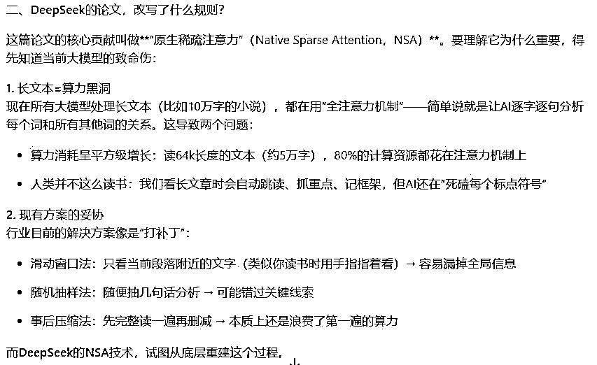

修改后的：

大概就是去掉一些 AI 味，增加一些人味的表达，这个步骤就看个人的文字把握能力了。

同时，不要忘了我们还有第一版，虽然整体的文风比较浮夸，但个别语句表达的情绪还是很有感染力的，那我们就选取觉得不错的句子补充到第二版对应的位置中。

举个例子，比如第二版的这一段：

这部分叙述没有问题，但是略显枯燥，缺少调动情绪的表达，我就从第一版中选了几句补充进去。

定稿是这样的：

划线部分是从第一版选取的句子补充而来或者是自己改写处理，后续的段落基本上也是按照这样的操作来处理。

还有，DeepSeek 非常喜欢打比方，频率过高，或者比喻不贴切的时候，AI 味就藏不住了。

第二版的文案中，我去掉了一些质量不太高的类比描述，这会有效减轻 AI 味儿。

还有，你可以尝试尽量少让 AI 用形容词，适当插入追问或者设问，适当插入亲身经历。

最后，为了增加文章趣味性，再到 X 上选一些用户比较有意思的评论截图，然后这篇文章就成型了。

PS：那篇文章最后的那句粗口，是我最后加的，情绪确实到那个份上了，看论文把我自己都看得燃起来了，同样也是给文章增加点人味儿。

总结：把机器味改成烟火气。

# 3.4.4 核对

到这里就完了吗？

并不，要知道这篇文章可是一篇硬核解读，断不可出现事实错误，特别是文章中的关键数据和论据是必须要核实的。

特别是关键数据三源验证（特别是金额、日期、人名）。记住：读者可能原谅你的观点，但不会原谅你的错误。

比如说文中有一句提到：推理速度提升 11.6 倍：处理同长度文本，所需计算资源不到原来的十分之一。

我就去原 PDF 中 Ctrl F 查找「 11.6 」这个关键词，然后用沉浸式翻译检查核对就行了。

其实找好了关键词，核实起来也很快， 10 分钟就足够了，但这一步反正我是不会省掉的。

总结：给文章上最后一道保险。

结语

我大概算了一下，让 DeepSeek 写作连同自己编辑修改，那篇文章一共也就花了一个小时的时间。

但是今天写这篇复盘却花了整整一天时间，这篇完全是纯手搓，写得多少有些琐碎，主要是想尽可能还原写作时候的心路历程，好让大家能代入到这个过程中，有所思，有所想，才能有所收获。

最后上点价值吧。

AI 进化的终极意义，是让每个会使用它的普通人，都能突破肉身限制，拥有百倍于过往的能力半径，这篇知乎热榜文章就是一个典型的范例。

但是，越是在这样的时刻，越要握紧人类作者的三大权杖：

对选题的新闻敏感性（知道什么时候该说话）；

对文字的鉴赏能力（明白该用什么方式说话）；

以及最重要的——对输出的内容负全责的态度（清楚为什么必须由自己来说话）。

最后，感谢每个读者，希望这篇文章对你能有所帮助。

# 3.5 用 DeepSeek 设计一套完整 PPT @佳文

随着最近 DeepSeek 的爆火，企业级 AI 培训需求也越来越多，如果大家最近接洽到企业提效的培训需求，就可以看到，企业培训和个人培训的区别有很大的区别，更多的是需要结合自身业务，来真正提高效率，达成“降本增效”的成果，而不是简单的对话使用，这就对企业服务教练有着更高的要求，需要至少上过班，或者分管过一些部门，对企业的整体流程和一些岗位有着深入的认知，才可以结合 AI 为企业达成效率的提升。

办公场景，例如 PPT 等，是企业多数岗位比较核心的工作内容之一，今天就借助 DeepSeek 的浪潮，讲一下如何结合 DeepSeek，创作 PPT 等文件。

# 3.5.1 软件选择：WPS

众所周知，在办公软件这一块，WPS 是没有对手的

随着 DeepSeek 的爆火，WPS 的 AI 功能也与 DeepSeek 进行充分融合，将自身强大的办公功能，通过 DeepSeek 这个放大器，进行多倍放大

WPS 的 DeepSeek 入口藏的比较深，可以从软件版进入，也可以直接进入网页版体验（https://copilot.wps.cn/)

为什么选择 WPS 而不是大家都在推荐的纳米 AI、秘塔等呢？

原因有几个：

1.

金山的服务这么多年来，还是很稳定的

2.

办公场景，WPS 真的好用

3.

不止有 DeepSeek，更有更多指令

# 3.5.2 如何使用 WPS 版 DeepSeek

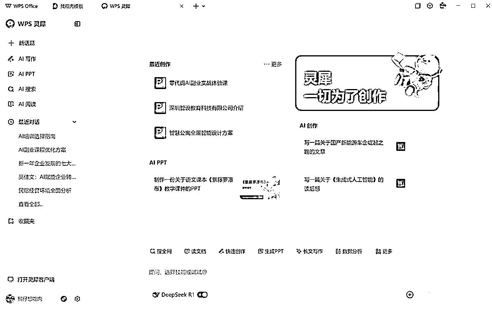

首先，根据上节的路径进入，网页版或 APP 版

进入之后，可以看到下面有 DeepSeek 的开关，打开就好了，实测是可以联网搜索内容的

我们像正常和 AI 对话一样，开始与他进行一些沟通

写的速度蛮快的，比官网一会儿一卡的效果要好很多

写完之后，可以再让他进行“深度搜索”

经过几轮对话，可以看到他生成了一些比较不错，比较优质的内容

有了这些内容基础，就可以开始进一步更深入的操作了。

# 3.5.3 深入使用 WPS+DeepSeek 功能

先做个 PPT 吧，网页看着有点累～

简单指令搞定：

大纲写完了，选个模板让他开工吧

再，等几分钟，就生成好了，文档放在贴子里面，大家想下载的可以自己下载下来玩

生财有术商业计划书-AI生成仅用于展示.pptx

# 3.5.4 除了 PPT，DeepSeek+WPS 还能做什么

再来个基础的，文档都有了，生成个思维导图吧。

指令也是一如既往的简单：把上面的内容帮我生成思维导图

再写一篇公众号吧，指令～同上的简单，懒得排版了，生成的内容见此文档。

生财有术.docx

上面都是网络+AI 生成内容，那如果有基础内容，能不能让他做二次修改呢？

我们新开一个窗口，以前面生成的内容为基础，来做二次创作（假设生成的内容就是我们已经掌握的基础资料）

先上传文件再提问，可以让他做更有意思的东西：

# .5.5 一些思考

以上是用付费社群在做案例，进行商业规划。

如果是实体产业呢，是不是可以有更多的案例进行对比、分析、对标？

就像去年很流行的一句话，每一个行业都可以用 AI 重构一遍。同理的，在不同公司里，每一个岗位、每一个 SOP，都可以用 AI 重建一次。

今年企业端 AI 服务大环境已经成熟了，希望大家能抓住这波风口，迎接更高的上限，与大家共勉。

# 3.6 用 DeepSeek 生成小红书读书卡片 @飞掌柜

比如我是读书博主，要在小红书上发布图文笔记，包括《精进：如何成为一个很厉害的人》这本书的卡片，此时用 deepseek 生成。

上传附件书籍 PDF 后，输入如下指令：“根据我发给你的《精进：如何成为一个很厉害的人》电子书内容，请总结出核心要点，帮我生成一段 HTML 代码，要求生成的图片排版合理，美观大气，符合小红书用户的审美喜好。”

得到结果如下：

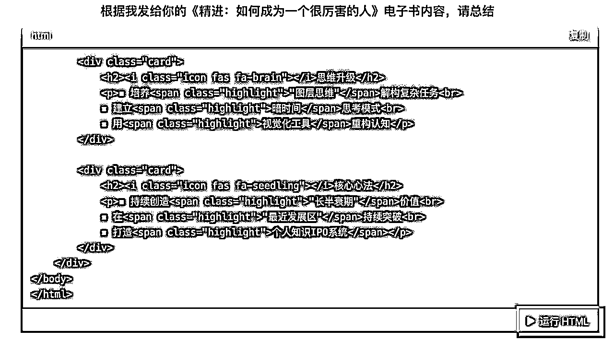

我们可以点击右下角的“运行 HTML”在线浏览：

html 得到的是网页版弹出框展示的卡片，我们一般裁剪后才能使用。当然，图片排版也有待加强，改进方法有两种：

第一，咱们可以根据生成的结果完善指令，争取让其生成的 html 网页版卡片更好看。

第二，如果对小红书图文要求较高，那么不太适合用 deepseek 生成，还是用其他一些 AI 设计工具，比如：

【AI+设计工具汇总】

1.

美图设计室 https://www.designkit.com/

2.

稿定设计 https://www.gaoding.com/

3.

美间（AI 软装设计、海报和提案生成工具）https://www.meijian.com

4.

佐糖（丰富的图像处理工具）https://picwish.cn

5.

图怪兽：https://818ps.com/home?login_type=is_wechat

6.

创客贴 AI：https://www.chuangkit.com/designtools/designindex

7.

墨刀 AI（产品设计协作平台）https://modao.cc

8.

莫高设计 MasterGo AI（AI 时代的企业级产品设计平台，界面设计、交互设计……）https://mastergo.com

9.

阿里堆友（面向设计师群体的 AI 设计社区）https://d.design

10.

即时 AI（文生 UI，文生图，图生 UI……）https://js.design/AI

11.

PixsO AI（新生代 UI 设计工具）https://pixso.cn

12.

抖音即创（抖音电商智能创作平台，提供 AI 视频创作、图文创作和直播创作）https://AIc.oceanengine.com

13.

腾讯 AIDesign（腾讯的 logo 设计）https://AIlogo.qq.com

总有一款工具适合你，哈哈哈～

# 3.7 用 DeepSeek 设计海报 @宇神

海报设计不仅仅是为了展示信息，它是一种有效的视觉传播形式，通过图像、文字、颜色等元素的结合传递特定的信息、情感和品牌理念。设计海报时，不同的创意和表现方式会对信息的传递效果产生巨大的影响。在理解海报设计的基础和挑战之前，我们首先需要了解海报设计的核心要素以及这些元素如何相互作用。

# 3.7.1 海报设计的基础

海报作为一种广告和艺术表现形式，承担着传播信息、吸引注意、创造情感共鸣的功能。海报设计的基础可以归纳为以下几个重要方面：

1.

色彩运用

色彩心理学：色彩能够影响观众的情绪和感知。例如，红色通常代表激情和力量，蓝色代表冷静和专业，绿色常用于表达自然、健康等主题。海报的色彩搭配不仅要考虑美学效果，还要能够强化主题的情感传达。

对比与和谐：合理的色彩对比能够增强海报的视觉冲击力，而和谐的色彩搭配则能够让视觉效果更加舒适。设计师需要在这两者之间找到平衡。

2.

排版设计

层次感：排版设计不仅关乎文字的美观，还要确保信息传达的清晰性。通过不同的字体大小、粗细、颜色以及排列方式，设计师可以有效地引导观众的视线，突出关键信息。

字体选择：字体是海报设计中的重要元素。它不仅影响可读性，还能够传达出不同的风格和情感。例如，现代感的海报可能会使用简洁、无衬线的字体，而复古风格的海报则可能会选用装饰性强的手写字体。

3.

图像与图形

图像的选择与处理：图像是海报的视觉焦点，它能够迅速吸引观众的注意力。图像选择应与海报的主题相匹配，并通过图像的风格、色调、构图来增强信息的表达。

图形元素的融合：图形、线条和图案可以为空间填充，起到装饰和强调的作用。精心设计的图形元素能够提升海报的美感，并加强视觉效果。

4.

构图

平衡与对称：构图是将所有元素合理安排在有限空间内的艺术。良好的构图能够引导观众的视线流动，强调重要的信息。平衡的构图可以增加海报的稳定感，而不对称的构图则可能增添动感和创意。

焦点与分层：一个成功的海报设计通常会有一个视觉焦点，吸引观众的注意力。设计师通过巧妙安排其他元素的大小、位置，形成视觉层次，使观众的视线顺畅地从一个元素转移到另一个元素。

4.1.2 海报设计的挑战

尽管海报设计的基本原则看似简单，但在实际创作过程中，设计师面临着一系列的挑战：

1.  信息与视觉效果的平衡

海报不仅要具备美学吸引力，还需要确保信息的传达。信息过多或过于复杂的海报可能会让观众感到视觉过载，导致信息不清晰；而信息过少的海报则可能无法充分传达所要表达的主题。如何在有限的空间内，以简洁而有力的方式传递信息，是海报设计中的一大挑战。

1.  目标受众的多样性

不同的目标受众对于视觉效果、风格和信息的偏好可能存在差异。例如，年轻人可能偏爱现代、创新的设计风格，而年长的观众可能更喜欢经典、稳重的设计。设计师需要深入了解目标受众的特征，并根据受众的需求进行设计，以确保海报能够有效吸引并传达目标信息。

1.  设计风格的选择

每一张海报都应该与其背后的品牌形象、活动主题或者产品特点相契合。选择适合的设计风格可能会受到许多因素的影响，如品牌定位、文化背景、市场趋势等。设计师需要在多种设计风格中做出决策，确保设计风格与内容的高度契合。

1.  有限的时间与资源

设计师在商业环境中常常面临着时间紧迫、预算有限的压力。在这种情况下，设计师需要在较短的时间内完成高质量的设计，同时保证创意和细节的精致。这要求设计师在设计过程中要快速做出决策，同时还要避免陷入过度设计的困境。

1.  创意与创新的瓶颈

在海报设计中，创意的独特性和创新性是至关重要的。一个具有突破性的设计能够吸引更多的观众。然而，设计师常常会遇到创意的瓶颈，难以突破现有的设计框架。如何在海量的设计参考和模板中寻找到一个独特的创意，并使之具有商业和艺术价值，是每一位设计师面临的挑战。

1.  多平台适配问题

随着互联网和数字媒体的发展，海报不仅仅是在实体广告板上展示，更多的是在社交媒体、网站、APP 等多个平台上进行传播。不同的平台对海报的尺寸、比例、色彩、排版等方面有不同的要求，设计师需要考虑如何将海报适配到多个平台，以保证设计效果的统一性和传播的有效性。

1.  视觉疲劳和同质化

在商业广告和社交媒体中，海报的数量和种类极其庞大。随着创意被不断复制和模仿，许多海报逐渐呈现同质化，缺乏新意。如何通过独特的设计和创意来打破这种同质化困境，吸引观众的目光，仍然是海报设计面临的严峻挑战。

8.自动化设计的潜力

随着 AI 技术的发展，自动化设计逐渐成为解决这些挑战的一种有效途径。DeepSeek 等 AI 工具能够通过深度学习技术，自动生成海报内容，帮助设计师快速创建符合需求的海报。自动化设计不仅提高了设计效率，还能在一定程度上克服传统设计过程中的一些挑战，比如时间压力、风格选择和创意瓶颈等。

AI 工具能够根据用户的需求，自动生成海报的图像、文字、配色方案等元素，并且提供多种设计风格的选择。设计师可以根据生成的方案进行微调，进一步提高创意和设计质量。此外，AI 工具能够快速处理大量的数据，并生成多样化的设计方案，这为设计师提供了更多的创作灵感和方向。

通过对海报设计的基础与挑战的详细分析，我们可以看到，海报设计不仅仅是一个创意过程，更是一个技术和艺术的结合。在未来，随着自动化设计技术的发展，海报设计将变得更加高效和灵活，设计师能够将更多的精力投入到创意的创新和个性化调整中，而不是重复性的手工操作上。

# 3.7.2 如何利用 DeepSeek 生成设计内容

随着人工智能技术的迅速发展，AI 已经进入到设计领域，改变了传统的设计方式。DeepSeek 在设计内容生成中的强大功能，使得文本描述可以直接转化为设计元素，虽然 DeepSeek 本身并不直接生成图片，但可以通过与即梦 App 等 AI 图像生成工具的结合，实现从文本到图像的自动化设计流程。以下是如何通过 DeepSeek 生成设计提示词，并利用即梦将这些提示词导入并生成相应图像的详细步骤。

# 3.7.2.1 DeepSeek 生成设计内容的基本流程

DeepSeek 的工作原理可以从三个主要方面来理解：文本生成、图像处理、和风格调整。

1.

文本生成设计提示

DeepSeek 能够根据用户输入的文本描述生成精准的设计提示。这些提示通常包含了海报的主题、风格、色调、字体等设计元素，并根据不同的需求进行个性化调整。

示例输入：如果用户需要设计一款关于“未来都市”的海报，用户可以输入类似“未来科技感的城市，赛博朋克风格，高楼大厦，霓虹灯光”这样的文本。

2.

DeepSeek 的提示词生成

基于用户的输入，DeepSeek 会分析文本并生成符合要求的提示语。这些提示语包括设计风格（如赛博朋克）、色调（如蓝色、紫色）、主题元素（如未来城市、高楼大厦、霓虹灯光）等内容。

生成提示词示例：根据用户的文本，DeepSeek 可能会生成以下提示词：

风格：赛博朋克，未来感，科技感

颜色：深蓝色、紫色、霓虹色调

元素：高楼大厦、霓虹灯、科技广告牌

排版：现代简约，图像元素突出

1.

导出设计提示词

用户将从 DeepSeek 生成的提示词导出，导入至即梦等图像生成工具中，通过这些提示词生成符合要求的图像。

# 3.7.2.2 如何使用即梦生成图像

即梦是一种强大的文本生成图像工具，它能够根据用户输入的提示词，自动生成符合要求的图像。通过将 DeepSeek 生成的提示词导入即梦，用户可以快速从文本生成对应的图像，进而实现从文本到图像的全自动设计流程。

1.

使用即梦生成图像的准备工作

注册与登录：首先在即梦平台注册并登录，熟悉工具界面后，可以将从 DeepSeek 导出的提示词输入到即梦平台中。

熟悉工具界面：即梦通常提供一个简洁易用的界面，用户只需在指定的文本框中输入设计提示语，平台便会根据提示生成图像。

2.

导入 DeepSeek 生成的提示词到即梦

用户将从 DeepSeek 导出的提示词输入到即梦的文本框中。例如，用户可以复制以下提示词（后面我会详细展开如何创建 argent）：

“赛博朋克风格，未来科技城市，高楼大厦，霓虹灯光，紫色和蓝色调”

即梦将根据这些提示词生成相应的图像，展示出符合赛博朋克风格和科技感的未来城市。

3.

自定义设置与风格调整

调整参数：即梦通常会提供一些参数选项，允许用户调整图像的细节，如图像的清晰度、风格强度等。用户可以根据需求微调这些参数，使生成的图像更符合具体要求。

风格强化：如果用户希望图像具有更强烈的某种风格（如未来感、霓虹灯效等），可以通过增加关键词或调整图模型的选择来实现。

4.

生成图像与优化

图像生成：一旦输入了提示词并调整好相关参数，用户只需要点击生成按钮，即梦就会自动生成符合要求的图像。生成的图像可以立即展示，也可以选择保存并进行后续处理。

优化与修改：如果生成的图像没有完全符合预期，用户可以根据图像结果进行反馈调整，再次优化生成的设计效果。

示例：用户在即梦中输入以下提示词：

“未来城市，科技感强，蓝色紫色调，高楼大厦，赛博朋克风格，霓虹灯光”

即梦根据这些提示词自动生成一张符合赛博朋克风格的未来城市图像，图像中包含高楼大厦、霓虹灯、以及科技感十足的光影效果。

5.

下载与应用

一旦生成的图像满足要求，用户可以下载图像文件，并将其应用到海报设计中。此时，用户可以通过其他设计工具（如 Photoshop、Canva 等）将图像与文字、布局等元素结合，最终完成海报设计。

# 3.7.3 结合 DeepSeek 和即梦的优势

通过将 DeepSeek 和即梦相结合，用户可以实现一个完整的从文本到图像的自动化设计流程，极大提高了设计效率和灵活性。

1.

提高创意效率：DeepSeek 通过生成精准的设计提示词，节省了设计师从零开始思考和创作的时间。而即梦则能迅速将这些创意转化为图像，帮助用户将想法快速付诸实践。

2.

降低技术门槛：即使用户没有专业的设计技能或图像编辑经验，通过这种自动化流程，他们仍然能够生成高质量的图像和海报设计，满足品牌和活动的需求。

3.

灵活的个性化调整：用户可以根据实际需求对设计进行快速的调整和优化，DeepSeek 和即梦的结合提供了强大的定制化能力，用户能够控制设计的每一个细节，从而更好地匹配品牌风格和活动主题。

# 3.7.4 应用示例

1.  商业广告海报设计

• 假设某品牌希望为其新推出的产品设计海报，用户只需提供品牌名、宣传语和目标市场信息。DeepSeek 会自动生成符合品牌调性和市场需求的海报设计。如果品牌注重简洁和高端感，AI 可能会选择极简风格，并配上现代字体和适宜的配色。

1.  活动宣传海报设计

• 对于某个文化活动或音乐节，用户提供活动信息，如主题、日期、地点等，DeepSeek 可以根据这些信息自动生成相应的海报设计。AI 可以根据活动的性质（如音乐、艺术、文化等）调整设计风格，使其更具吸引力和相关性。例如，针对摇滚音乐节，AI 可能会选择大胆的字体和鲜艳的色彩，配合充满活力的图像。

小结：

尽管 DeepSeek 本身并不直接生成图像，但通过与即梦等图像生成工具的结合，用户可以轻松实现从文本描述到图像的自动化设计流程。DeepSeek 通过生成精准的提示词，为即梦提供创意支持，而即梦则通过强大的图像生成能力，将这些创意转化为视觉内容。结合这两个工具，设计师和非设计人员都能够在短时间内创建出符合需求的高质量海报或其他视觉设计作品，大大提高了设计效率和创意表达的准确性。随着 AI 技术的不断进步，这种集成的自动化设计方法将在更多行业中得到应用，推动设计工作变得更加高效、智能和创意丰富。

# 3.7.5 实践：从文本到图像的自动化海报制作

在传统的海报设计中，设计师通常需要根据项目的需求从头开始进行创意构思、元素选择、颜色搭配、排版设计等多个步骤。这个过程既繁琐又时间消耗，尤其对于需要快速产出海报的商业环境来说，可能会成为瓶颈。随着人工智能技术的成熟，像 DeepSeek 这样的 AI 工具能够帮助设计师从文本描述自动生成海报设计，不仅大幅提高了效率，也为创意提供了更多可能性。

尽管 DeepSeek 本身不具备直接生成图像的功能，但通过与即梦等 AI 图像生成工具的结合，可以将 DeepSeek 生成的文本提示词导入即梦进行图像生成，从而实现从文本到图像的全自动化海报制作。以下将详细介绍这一过程，并提供实际操作步骤。

3.7.5.1 从文本生成图像：具体操作步骤

DeepSeek 的核心功能之一是将用户抽象的描述转为具体的指令（提示词），在海报设计的过程中，用户通过文本描述来传达设计需求，而 AI 通过理解这些文本生成符合要求的视觉内容。以下是用户操作步骤和技术细节：

文本输入：提供设计需求

文本输入是整个设计过程的起点。用户通过输入简洁或详细的描述，向 AI 传达设计需求。文本内容通常包括以下几个方面：

• 主题描述：例如，“未来科技感的城市”。

• 风格要求：例如，“赛博朋克风格”或“极简风格”。

• 配色方案：例如，“以蓝色和紫色为主色调”。

• 元素要求：例如，“加入科技感十足的高楼和霓虹灯”。

提示词结构：

为了帮助 DeepSeek 更好地理解用户的需求，可以使用结构化的提示词框架来提供更具体的指令。以下是几种常见的提示词框架：

• RTGO 框架：在该框架中，用户定义角色（Role）、任务（Task）、目标（Goal）、以及操作要求（Objective）。

• 角色：设计师、艺术指导等。

• 任务：生成符合科技感、未来感的海报设计。

• 目标：吸引年轻受众，突出科技创新。

• 操作要求：使用简洁的排版，添加赛博朋克元素。

• CO-STAR 框架：这是另一种经典的提示词结构，用于生成更具创意性和多样化的设计方案。

• R：需要得到的回应类型（例如，图像、海报设计、样式效果）。

• C：上下文背景信息（例如，品牌背景、产品信息等）。

• O：设计目标（例如，品牌宣传、吸引目标受众等）。

• S：风格要求（例如，现代、复古、科技感）。

• T：语调（例如，正式、轻松、活泼）。

• A：受众（例如，年轻群体、科技爱好者）。

比如这里用清华大学提供的提示词方案：

角色：海报辅助设计 AI

功能：根据用户提供的产品名称、海报主题、风格要求，自动生成高质量的提示语，帮助 AI 工具设计吸引用户的海报。

技能：熟悉海报设计的构图、色彩搭配、字体风格等视觉要素。能够根据不同主题生成富有创意的提示语，涵盖风格、细节、灯光等描述。理解市场营销、品牌定位及用户心理，确保海报既吸睛又符合品牌调性。适配多种设计风格，如极简、高端、赛博朋克、国潮、手绘、复古等。

约束：提示语需清晰表达设计要求，避免模糊或歧义。需保证提示语包含产品名称或海报主题的中文字符。避免冗余描述，确保提示语高效且精准。考虑目标用户群体，确保风格匹配品牌或产品定位。

工作流程：

1、询问用户的产品名称或海报主题。

2、收集用户对风格、色彩、构图、背景等的具体需求。

3、结合用户需求，生成精准的提示语，涵盖设计要素。

4、确保提示语适用于 AI 生成工具，即梦。

5、提供最终优化后的提示语，确保可读性和可操作性。

输出格式：完整的提示语内容，包含海报构图、色彩、风格、细节描述

示例：

产品名称： 《未来都市》

提示语：

"未来都市" 四个大字居中，科技感十足。高楼大厦以赛博朋克风格呈现，

霓虹灯光交错，深蓝色与紫色为主色调，融入金属质感，营造出未来世界

的沉浸感。背景可加入漂浮的全息广告牌、空中交通、赛博战士等元素。

风格选择：定义设计风格

在提供文本描述后，DeepSeek 允许用户选择特定的设计风格。风格的选择将直接影响海报的视觉效果和情感表达。DeepSeek 提供多种预设风格，用户可以根据设计需求选择最合适的风格：

• 简约风格：这种风格强调清晰的排版和简单的元素。适用于需要高端、现代感的设计。

• 复古风格：复古风格强调怀旧和历史感，通常会使用经典字体和柔和的色调。

• 赛博朋克风格：这是一个典型的未来科技风格，包含霓虹灯、金属质感和复杂的图形元素。适合用于与科技、未来感相关的设计。

自动生成设计：DeepSeek 的 AI 设计过程

在用户输入文本描述并选择风格后，DeepSeek 将基于这些输入自动生成海报设计的提示词。生成过程包括以下几个步骤：

• 图像生成：DeepSeek 根据文本描述中的关键元素生成图像内容，例如“未来城市”、“科技感高楼”、“霓虹灯”等视觉元素。

• 排版调整：AI 根据用户输入的要求，自动调整字体样式、大小、排版布局，以确保信息传达清晰并符合设计风格。

• 颜色搭配：DeepSeek 自动选择与用户要求的配色方案一致的颜色，并在设计中进行应用，确保色调的统一性。

用户反馈与优化：调整设计细节

生成初步设计后，用户可以查看 AI 生成的海报，并根据需要进行反馈。DeepSeek 根据反馈进行优化调整，直至用户满意为止。常见的优化操作包括：

• 调整字体：根据用户需求改变字体的大小、风格和颜色。

• 修改图像元素：调整背景图像的亮度、对比度或替换部分图像元素。

• 重新排版：根据反馈调整设计的排版布局，使信息更加突出。

这些反馈不仅仅局限于视觉调整，还包括情感和品牌调性的微调。例如，某品牌的海报需要更具“创新感”或“现代感”，用户可以根据生成的海报内容调整整体设计，使其更符合品牌定位。

# 3.7.6 案例研究：海报设计的实际应用

为了更好地理解如何应用 DeepSeek 进行海报设计，我们将通过几个具体案例来分析如何从文本到图像实现自动化设计。我们基于清华大学的提示词案例来做一些演示。首先，我们导入命令：

接下来，我们导入案例。

案例一：产品发布会海报设计

背景：某知名科技公司计划发布新款智能手机。公司希望通过海报吸引科技爱好者和年轻用户，突出产品的创新性和科技感。

用户输入：

文本描述：“新款智能手机发布会，展示未来科技感，现代、高端、科技创新。”

• 风格要求：“科技感强，现代简洁风格，蓝色、黑色主调。”

• 元素要求：“展示手机的外观，未来城市背景，现代字体。”

生成结果：

案例二：音乐节海报设计

背景：某城市即将举办一场音乐节，活动目标是吸引年轻人参加，特别是摇滚音乐爱好者。

用户输入：

• 文本描述：“摇滚音乐节，年轻、活力、激情。”

• 风格要求：“鲜艳的色彩，动感强烈的字体，摇滚风格。”

• 元素要求：“吉他、音乐符号、动感背景。”

生成结果：

导入到即梦。

从文本到图像的自动化海报设计不仅提高了设计效率，还为用户提供了更多创意选择和设计灵感。DeepSeek 通过精准的文本分析、风格匹配以及细节优化，帮助用户快速实现从创意到成品的转化。随着 AI 技术的不断进步，自动化设计的应用将进一步扩展，帮助更多领域实现高效创作。

3.7.7 提高设计效率：如何根据需求调整海报风格与内容

在快速变化的市场环境中，设计效率已经成为提升品牌竞争力的关键因素之一。海报作为企业推广的重要工具，要求在短时间内传递清晰、有力的信息，并且吸引目标观众的目光。然而，传统的海报设计过程通常需要耗费大量的时间和创意成本，尤其是在需要反复调整设计细节时。随着 AI 技术的进步，DeepSeek 等智能设计工具为设计师提供了全新的解决方案，通过自动化的设计流程来提高设计效率，同时确保设计的个性化和精准性。

DeepSeek 不仅能够生成海报的基本设计内容，还能够根据用户的需求进行个性化调整，确保最终设计满足特定的品牌形象、市场需求或活动主题。以下是如何利用 DeepSeek 提高海报设计效率的具体步骤。

风格适配：快速选择与匹配不同风格

海报设计不仅仅关乎美观，更要符合品牌形象、市场需求及活动主题等多重因素。在传统设计中，风格选择往往需要大量的时间来与客户进行沟通与修改，而在 DeepSeek 的帮助下，设计师能够快速匹配不同的设计风格，从而节省大量的时间。

1.  风格多样化与模板快速匹配

用户可以根据品牌形象、市场定位或活动主题快速选择适合的风格。这些风格包括但不限于：

• 极简风格：这种风格通常以简洁、清晰的元素为主，颜色简单、空间留白充足，适用于高端品牌或现代感强的设计。

潮流风格：色彩丰富、图形多样，通常给人年轻、活力和时尚感，适用于年轻化、创意感强的品牌。

• 复古风格：通过经典的字体和温暖的色调，营造出怀旧的氛围，适用于传统品牌或特定的文化活动。

• 科技风格：未来感十足，色彩和设计上都充满现代科技感，通常涉及金属色、霓虹灯光等元素，适用于科技公司或创新产品。

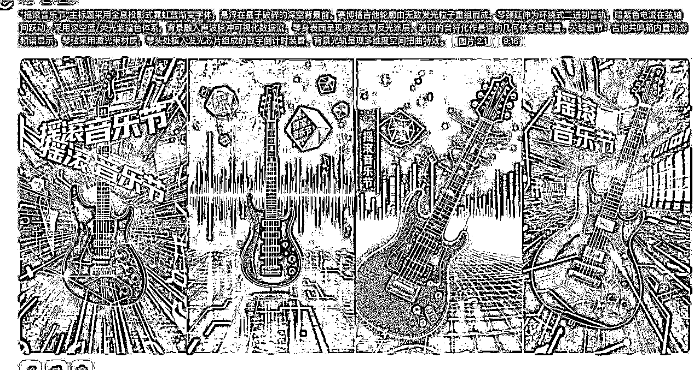

1.  快速适配不同设计需求

DeepSeek 能够根据用户输入的设计需求，智能化地选择合适的风格并快速进行匹配。例如，用户只需要提供简单的关键词如“环保”、“科技”或“艺术”，DeepSeek 会根据这些关键词推荐相应的风格和模板，帮助用户迅速获得初步设计方案。

示例：

• 如果用户希望制作一款科技产品的海报，DeepSeek 会自动推荐赛博朋克风格，使用霓虹色调和未来感的图像元素。

• 如果用户想要设计一款环保主题的海报，AI 会选择绿色系为主色调，并加入自然景观元素，如树木、湖泊等。

这种快速匹配风格的功能，可以大大提高设计的效率和创意的多样性，尤其是在面对大量海报设计需求时，能够大幅度减少反复修改的时间。

# 防失联+MM188166M（李李）长期更新

细节微调：根据需求调整设计元素

即使 AI 能够自动生成海报，设计师仍然需要根据具体需求对海报进行细节调整。DeepSeek 提供了一些强大的定制化选项，帮助用户在不丧失效率的情况下精细化地调整设计，确保每个元素都与需求高度契合。

1.  颜色调整

在海报设计中，颜色是至关重要的设计元素。颜色不仅影响视觉效果，还与情感传达和品牌形象紧密相关。

• 调整主色调：用户可以在生成的海报中调整主色调，例如将背景色从蓝色调整为绿色，以突出环保主题。

• 调整颜色饱和度：用户可以根据自己的需求对颜色的饱和度进行调整。例如，某些设计可能需要更柔和的色调，而另一些设计则可能需要更鲜艳的色彩。

示例：比如我们上文提到的科技风格“摇滚音乐节”我希望颜色饱和度更淡一点，主色调为黑色。

1.  快速适配不同设计需求

DeepSeek 能够根据用户输入的设计需求，智能化地选择合适的风格并快速进行匹配。例如，用户只需要提供简单的关键词如“环保”、“科技”或“艺术”，DeepSeek 会根据这些关键词推荐相应的风格和模板，帮助用户迅速获得初步设计方案。

示例：

• 如果用户希望制作一款科技产品的海报，DeepSeek 会自动推荐赛博朋克风格，使用霓虹色调和未来感的图像元素。

• 如果用户想要设计一款环保主题的海报，AI 会选择绿色系为主色调，并加入自然景观元素，如树木、湖泊等。

这种快速匹配风格的功能，可以大大提高设计的效率和创意的多样性，尤其是在面对大量海报设计需求时，能够大幅度减少反复修改的时间。

细节微调：根据需求调整设计元素

即使 AI 能够自动生成海报，设计师仍然需要根据具体需求对海报进行细节调整。DeepSeek 提供了一些强大的定制化选项，帮助用户在不丧失效率的情况下精细化地调整设计，确保每个元素都与需求高度契合。

1.  颜色调整

在海报设计中，颜色是至关重要的设计元素。颜色不仅影响视觉效果，还与情感传达和品牌形象紧密相关。

• 调整主色调：用户可以在生成的海报中调整主色调，例如将背景色从蓝色调整为绿色，以突出环保主题。

• 调整颜色饱和度：用户可以根据自己的需求对颜色的饱和度进行调整。例如，某些设计可能需要更柔和的色调，而另一些设计则可能需要更鲜艳的色彩。

示例：比如我们上文提到的科技风格“摇滚音乐节”我希望颜色饱和度更淡一点，主色调为黑色。

1.  字体与排版调整

字体的选择和排版布局对于海报的可读性和视觉效果至关重要。DeepSeek 不仅能够自动选择适合的字体，还可以根据用户需求微调字体的大小、颜色、间距等。

• 字体风格调整：用户可以选择不同的字体风格来适应不同的品牌和活动。例如，正式场合使用庄重的 Serif 字体，而年轻、活力的活动则可能选择无衬线字体。

• 排版布局调整：AI 会根据文字量自动安排文本的位置，但用户仍可以通过手动调整文本框的位置、对齐方式等，确保信息传达清晰且美观。

示例：如果用户需要一个科技感十足的海报，DeepSeek 可以使用现代感的无衬线字体，字体大小可以根据海报的层次结构进行调整，使得关键信息更加突出。

1.  图像元素的微调

DeepSeek 不仅提供自动生成的图像内容，用户还可以根据需要对图像进行进一步调整。用户可以修改背景图像的细节，添加或删除图像元素，甚至进行图像风格转换。

• 图像位置与大小调整：用户可以调整图片在海报中的位置和大小，确保图像与文字的比例合适，视觉效果平衡。

• 图像风格转换：用户还可以选择不同的风格转换，例如将一张普通的城市背景转换为赛博朋克风格，或将某些图片转为黑白图像以突出某一主题。

示例：如果用户设计一款音乐节海报，AI 自动选择了一个动态的音乐符号图案，用户可以进一步调整图像的大小与位置，或选择不同的图像背景以符合活动的气氛。

反馈与优化：基于用户反馈持续改进设计

DeepSeek 的最大优势之一是其智能化的反馈和优化功能。用户在查看自动生成的设计后，可以对设计提出反馈，AI 根据反馈进行持续优化，逐步改进生成的海报设计效果。AI 的持续学习能力使其能够适应不同的设计要求和变化。

1.  即时反馈

用户可以通过简单的指令反馈给 AI，告诉它哪些部分需要调整。例如，用户可能会告诉 AI：“字体颜色太浅”，“背景图像需要更加清晰”等。AI 可以立刻根据反馈调整设计并生成新的方案。

1.  深入优化

DeepSeek 不仅仅依赖于用户的即时反馈，还会根据设计数据和历史记录逐步优化设计流程。当同一用户反复进行设计时，AI 会根据用户的偏好自动进行调整，减少用户的操作时间。

示例：如果某品牌反复使用特定的颜色或排版风格，DeepSeek 会自动学习这些偏好，并在未来的设计中推荐这些符合品牌风格的元素，从而减少每次设计的时间和精力。

1.  多版本设计

在某些情况下，用户可能需要生成多个设计版本以供选择。DeepSeek 能够快速生成多个版本，并根据用户的反馈进行微调优化，帮助用户在多个版本中选择最合适的海报。

示例：用户可能需要两款不同风格的海报，一个用于线上宣传，一个用于线下宣传。DeepSeek 可以快速生成两种版本，并根据用户的需求调整细节，直到得到最终满意的结果。

本章总结

本章深入探讨了海报制作自动化的全过程，特别是如何利用 DeepSeek 结合 AI 图像生成工具（如即梦）实现从文本到图像的自动化海报设计。我们首先介绍了海报设计的基本要素，包括色彩运用、排版设计、图像与图形元素的融合、构图技巧等，并分析了海报设计过程中设计师可能遇到的各种挑战，如信息传达的平衡、目标受众的多样性、设计风格的选择、创意瓶颈等。

通过对 DeepSeek 及其与即梦的结合应用的讲解，本章阐明了如何利用 AI 技术简化海报设计流程，提高创作效率。DeepSeek 通过精准的文本分析，帮助用户生成详细的设计提示词，而即梦等图像生成工具则根据这些提示词快速生成高质量的视觉图像，极大地提升了设计过程的效率。

本章还介绍了如何通过 AI 工具自动生成并优化设计内容，使得设计师和非设计人员能够根据需求调整海报风格与内容，包括色彩、字体、排版和图像元素等。DeepSeek 支持灵活的风格适配，并能够根据不同的用户需求进行细节微调，使得最终的设计更符合品牌形象和活动主题。

总结来说，DeepSeek 的自动化设计功能，不仅加速了海报制作的速度，还大幅度降低了技术门槛，使得更多人能够在短时间内完成高质量的设计。这种技术的结合和创新，不仅为海报设计师提供了更多创作灵感，也为企业和品牌提供了一个高效、灵活的设计解决方案。随着 AI 技术的不断发展，自动化设计将在更多领域得到应用，推动创意设计向更高效、更智能的方向发展，为更多创意项目提供强大的支持。

# 选修篇

# 四、DeepSeek 进阶应用

# 章节概要

当你掌握了基础操作和常见场景的玩法，就可以把 DeepSeek 整合到复杂场景里，甚至实现流程自动化。

4.1 DeepSeek + 多维表格

用多维表格批量写自媒体文案、公众号爆文、短视频脚本……一口气几十条不是梦。

通过连接 DeepSeek 提示词让它在表格里自动生成，把内容对号入座，非常高效。

还能结合上传接口，批量处理自己想要的稿子，比如批量二创小红书标题、洗稿、改写读书笔记等。

4.2 批量生成商品主图构图和卖点信息

针对电商卖家，可以批量上传产品图片，让 AI 自动识别提取海报文案、构图优缺点，再用 DeepSeek 做卖点深度分析。

全流程自动化：写好指令+字段捷径配置好，就能反复使用，还能让团队一起协同。

除此之外，本章里还包含了更多复杂场景或与其他 AI 工具集成的案例，比如自动化生成 PPT、处理视频脚本等等。如果你想进一步把 DeepSeek 融入自己业务流程，让 AI 做“流水线式”的高效创作，这部分就是你要深挖的宝藏。

# 4.1 DeepSeek + 多维表格 的使用技巧 @哆元

考虑到有些朋友没用过飞书，或者用过飞书的都没有用过多维表格，这里把创建多维表格的步骤说一下。

一、创建多维表格与 AI 字段

点击左侧云文档，右侧就可以新建多维表格，或者在左侧知识库建立都可以

然后点击新建多维表格

然后就建立一个表格了，可以根据自己的任务主题改名字，也可以在右侧对数据表进行重命名、移动、复制等操作。

接下来我们可以对表格任一字段进行修改和编辑，比如将第二个字段改成文本，点击它右键选择修改字段，点击文本，可以重命名字段名，最后点击确定就修改成功了。

当你修改字段的时候，能够看到一个探索字段捷径，点击后可以搜索 deepseek，就能够配置这个模型了。

我们也可以点击进去字段捷径中心，能够看到很多 AI 工具，比如 kimi 、豆包的 AI 图片理解

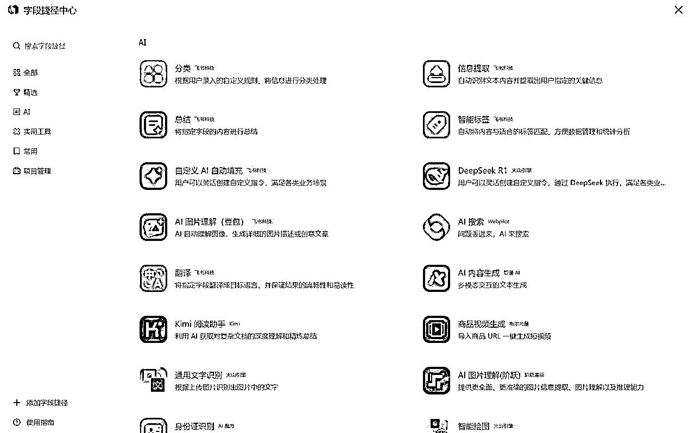

当我们选择 DeepSeek 后，就出现了如下的配置界面，每个功能如下

第一个关联账号可以先不用管他，这个是配置 API 额度的，因为里面的额度是有限的，不过也能用很久

如果用完可以点击它，能够看到一个图标，里面就是官方的配置教程，照着操作就好了。

第一个关联账号可以先不用管他，这个是配置 API 额度的，因为里面的额度是有限的，不过也能用很久

如果用完可以点击它，能够看到一个图标，里面就是官方的配置教程，照着操作就好了。

接下来我来讲几个例子。

# 4.1.1 批量二创小红书的标题和文案

做内容都会有这样的需求，那就是批量二创自己的文案做矩阵以及批量二创对标的内容。

那我们在多维表格怎么实现呢，在实现之前需要把想要二创的数据弄到多维表格里面来。

这里我们可以手动也可以自动，我用 AI 做了一个油猴插件，大家也可以配置一下。

大家可直接点击下方的链接进行下载安装，前提是你已经安装了篡改猴插件。

https://github.com/duoyuan666/tiquxhs/blob/main/%E5%B0%8F%E7%BA%A2%E4%B9%A6%E5%86%85%E5%AE%B9%E9%87%87%E9%9B%86%E5%8A%A9%E6%89%8B-1.1.user.js

于很多圈友可能不太懂这个地方，可以看下方的步骤进行配置

最好是谷歌浏览器或者火狐浏览器，搜索油猴脚本插件，点击框选这个

进去后，点击去商店下载，如果进不去或者现在无法访问等问题，就解决网络问题

添加就好了

进去扩展程序里确认是打开的状态

然后我们就可以安装上面那个插件了。

安装完成后，刷新网页端（需登录），右侧就会出现如下插件面板，如果还是没有出现，就前往扩展程序界面检查开发者模式是否勾选，需要勾选。

我来一个一个说一下，最上面的是我们可以自定义是否要井号话题标签，然后第二列是灰色的，因为我们还没有点击某一篇笔记，点击后就会变成可采集的红色按钮

第三个就是直接复制采集的数据，第四个就是将采集的数据导出为表格，这里我们提高效率的地方就是，我们可以连续点采集，他会记录在同一个表格里，如果想重新采集新的表格就点击重置数据，窗口就会显示确定重置数据的地方。

最下面就是显示采集了多少条了，如果是 0 条就是最初始的时候。

所以我们现在就实现了，想采集哪个笔记就点击哪个就行，如果是某一个账号的笔记，就多点几次采集就行了，这样的好处是我们可以只想采集自己想要的内容，而不会全部都采集到。

这里我们演示一下。

比如这个读书账号，我们想采集他的笔记，就直接点击笔记。

点击笔记后，采集笔记就标红了，就是可以点击了

点击后就成功采集了，还能看到具体的信息，标题、正文、互动数据

OK，这里我多点几篇，就采集 10 篇吧。

然后我们导出试试，他就是一个表格了，而且有笔记链接，这样我们可以查看来源，有标题正文互动数据以及采集时间，如果是##，就把框框拉大就正常了。

而且这个正文我是保留了原格式的。

OK，那么我们现在就可以在多维表格去操作了

来到多维表格后，右上角三个点有个导入，我们直接导入刚刚导出的表格就行

导入后直接打开

他就会创建一个新的多维表格了，然后把行高调高一点，就便于查看了，这样我们就快速整理了想要分析的笔记。

接下来你去做数据分析和处理就方便多了，比如你想分析标题为什么火，文案结构等等。

OK，我们来演示一下二创标题和二创文案。

我们在标题和文案旁边右插入一列

然后开始对应洗稿

标题提示词参考

老板交代我一个任务，他要我把公司在平台发的标题重新创作一遍，力求降低重复率，但是意思和主题是一样的，这个叫做二次创作（简称“二创”）

现在根据我教你的方法进行二创，小红书标题不超过 20 字，不要使用 AI 常见的套路化表达：比如"秘诀"、"秘籍"、"干货"、“任务”、“选手”等网文常见词，方法论如下，我会给你选题、文案等信息，你来选择合适的方法进行创作，总共生成 5 个，全部说人话：

1、你说的话，最好是要针对某个群体的，让用户觉得与我有关，大家都只对自己相关的事情感兴趣。

2、要让用户参与到笔记里来。

3、可以只用简单的换词和换顺序来二创，比如：增加别人好感度的 20 个技巧 改成 让别人增加对你好感度的 20 个方法

输出的格式为：

标题

这样优化的思路：

注意：不要乱用数字和捏造不属于自己的人物信息，因为你不知情具体文案和文案中的人设信息

正文提示词参考

老板交代我一个任务，他要我把公司在平台发的内容重新创作一遍，力求降低重复率，但是意思和主题是一样的，这个叫做将一段文案进行二次创作（简称“二创”）

现在根据我教你的二创方法论进行二创

文案二创规则：

1。同义词替换

使用方法：通过使用同义词/同义字或近义词/近义字替换原句中的关键词或关键字，达到保留原文含义的同时生成看似不同的内容。

示例：

原句：你理想中的伴侣是什么样子的

改写：你心目中的另一半是什么样子的

2。添加细节

使用方法：通过增加信息的详细程度，创造出独特的内容，同时根据目标受众调整信息的丰富度。

示例：

原句：保持良好的生活习惯很重要。

改写：保持早睡早起、均衡饮食等良好的生活习惯，对健康真的很重要。

3.改变句型结构

使用方法：通过改变句子的结构或语序，实现内容的改写而不改变其原有的意思。

示例：

原句：她认为这个计划非常有前景。

改写：在她看来，她觉得这个计划很有前景。

4.反义表达

使用方法：通过将句子的意思反过来表达，以新的方式传达相同的信息。

示例：

原句：这道题对我来说很难。

改写：这道题对我来说并不简单。

5.分句重组

使用方法：将长句拆分为短句或将短句合并为长句，以改变表达形式。

示例：

原句：天气很好，我们去散步吧。

改写：今天天气不错。我们一起去散步吧

6。语言风格转换

使用方法：调整语言风格，使其更贴近目标受众的习惯和喜好。

示例：

原句：这个计划具有很高的可行性。

改写：这个方案真的挺靠谱的。

要求：

1。避免直接复制原文结构，通过改写方法重新组织内容。

2.在保持原意的基础上，增加细节描述，使内容更丰富具体。

3.灵活调整句子的语序和结构，避免与原文过于相似。

4.尽量多使用不同的同义词和近义词替换，避免重复原文中的用词

5。尝试将原句的主动句变为被动句，或将复合句拆分成多个简单句。

6.保留以下信息：

-文案中书名号《》内容和举例的双引号“”里的内容

-保留文案中的人名、地名、数字、年份、政策等固有名词

-保留文案中的英文缩写，有的英文只是为了替代敏感词

输出流程：

1。输出最终二创文案

注意：

1。不用晦涩难懂和复杂的词语，尽量使用日常生活中的表达。

2.看到文案后才能二创输出，不得自行输出

3。二创后的文案要通顺

4。要采用多种二创方法论进行二创

5。不需要标注使用的方法论，直接输出完整的结果就行

得到结果：

这是对应的表格，大家也可以进去查看小红书笔记测试

# 4.1.2 批量根据选题生成文案

接下来讲一下多维表格怎么根据选题批量化生产文案。

要让 AI 根据我们的选题生成内容，那么前提是给他选题

选题哪里来，可以是我们人工去刷，去收集总结。

比如我是一个教别人写作的人，想写写作赛道相关的笔记。

我们随便搜一个关键词，比如，写作怎么赚钱，这个底下就是讲写作怎么赚钱的

然后也是需要安装下面这个插件去采集（需要科学上网）

https://github.com/duoyuan666/tiquxhs/blob/main/%E5%B0%8F%E7%BA%A2%E4%B9%A6%E5%86%85%E5%AE%B9%E9%87%87%E9%9B%86%E5%8A%A9%E6%89%8B-1.1.user.js

就简单采集了几十个

然后在用 deepseek 生成参考选题

首先告诉他我们是干什么的，然后结合我们采集到的标题来输出，也可以不结合纯原创输出。

生成后的选题如下：

接下来复制在飞书多维表格里

这个时候就新建一列：

做小红书，大家都知道要从找对标账号开始，其实投稿的思路也类似。

你想投哪类平台，就去搜相关账号，看他们过往发表文章的风格，多看，多揣摩，拆解标题，结构，文风，用的哪类素材，把之前的文章拆解个十篇八篇的，再从仿写开始。

最终只需要一个标题一个正文，不需要标注使用了什么标题方法，标题不超过 20 字

点击提交生成，等待生成好：

随便点一个看一下

这里我们可以把标题单独抽离出来，新建一列，还是在探索字段捷径那里，有个信息提取

我们点击后，填写标题字段，然后选择对输出结果进行操作，然后提取信息输入提取标题

点击确定并生成，就可以发现他把每一个标题弄出来了

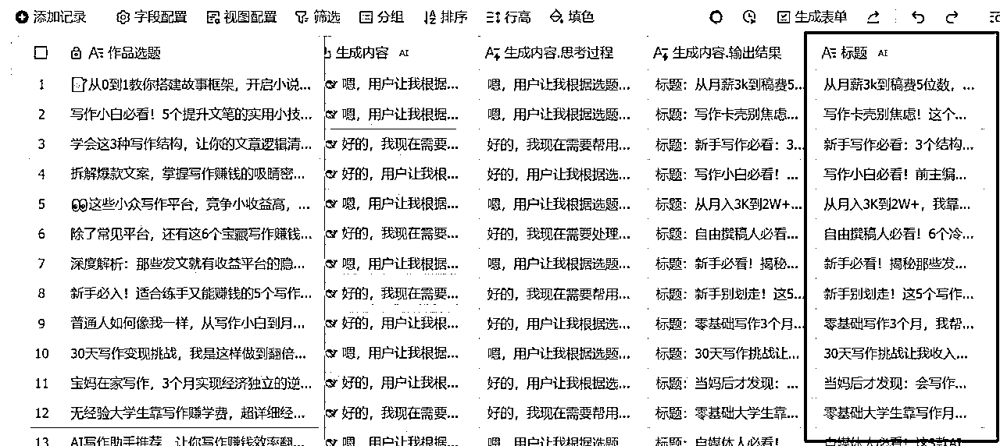

文案也是如此，如果你想生成短视频的文案也可以，提示词可以参考下面哆元写的：

我想写短视频口播文案，你的任务是从我提供的选题/文章/主要信息，然后结合我总结的短视频文案方法论，按照指定的脚本模型进行原创文案创作。文案需自然、口语化，符合中国人聊天的语气。

## 要求：

1。 每篇原创文案要结合合适的开头文案方法论和脚本模型创作。

1.  文案必须口语化，符合中国人聊天的语气和表达习惯。

1.  可适当加入个人经历、故事或案例，使文案更具吸引力和共鸣感。

4.不要加入“嘿”“哈喽”“大家好”等打招呼的词

5。不要使用首先、其次、最后等词，使用第一/第一个、第二/第二个、第三/第三个

直接输出完整的一篇文案即可，不要标注用到的公式和方法论

点进去看看

最后多维表格还有很多交互性玩法，比如我们可以点击上面的一个表单

# 防失联+MM188166M（李李）长期更新

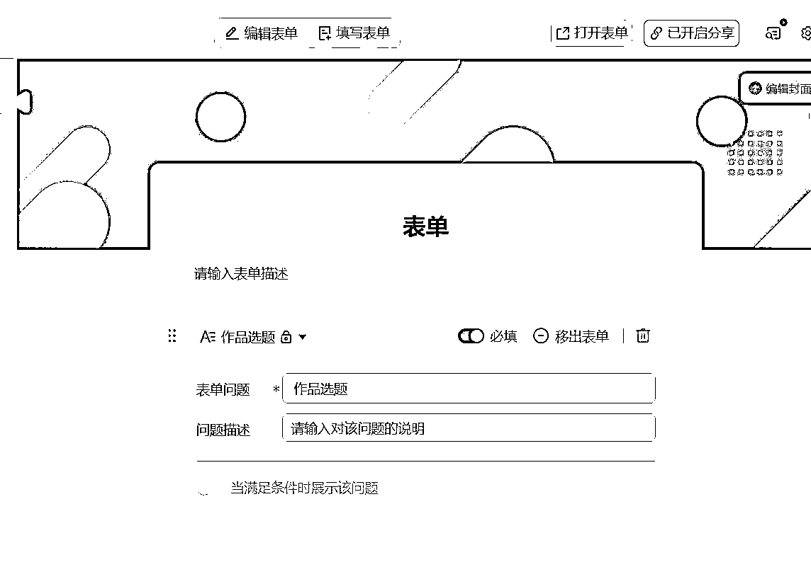

然后分享出去二维码

别人扫码就可以直接填写

当有人提交后，你的多维表格的选题那里就会出现对应的新选题，进而自动化输出。

本篇教程的关键在于给的选题以及提示词的质量

注意，如果要做好，就必须要写属于自己的提示词，上面算哆元写的通用的，因为 AI 不了解你的人设和其他信息，它仅仅只根据选题来输出内容，就会有偏差，我们可以做自己赛道相关的提示词，在提示词里去提供足够清晰的背景信息就行，这样就能限定 AI 的输出范围。

同样的玩法，可以生成短视频文案，公众号文章等等。

# 4.1.3 批量写读书稿

在小红书或者公众号都有很多读书博主，用来写自己看过某一本书的收获，比如下面这篇笔记

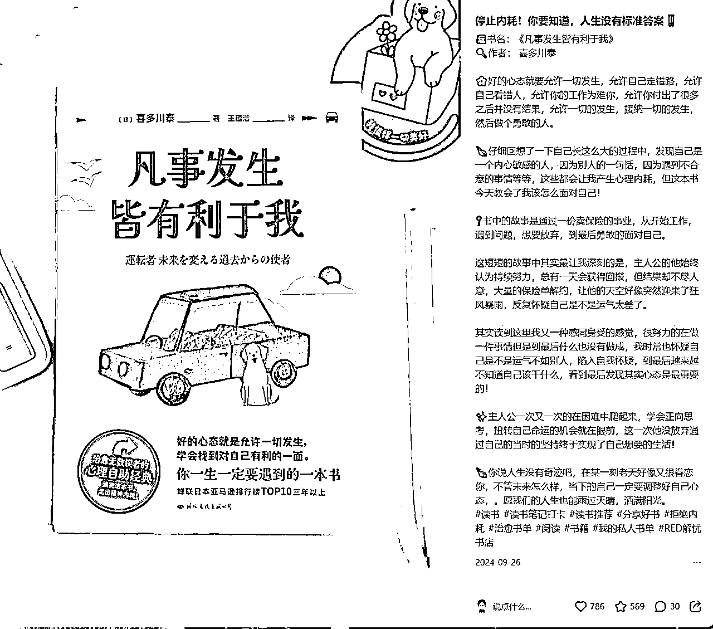

这个账号的其他笔记都是这样的玩法

对于这样的账号，其实就可以通过多维表格来批量生产，但是话说回来，书是自己读了才能更好的融入到血液中去，如果只是应付平台做个笔记就收获不大，所以也要记得看，不能光用 AI 去解读。

这里我们拿多维表格就有两种做法，一种是有电子版的情况下，我们上传电子版，然后用 kimi 助手去做总结（这上面的 deepseek 还不能总结文档）。所以多维表格是可以利用多个 AI 工具来执行任务的，各司其职。

而这样的提示词，随便拿 AI 搓一个就行。

请帮我解读这本《书名》，我希望了解以下几个方面：

核心内容概述

这本书主要讲了什么？

作者想传达的核心观点是什么？

实用价值分析

这本书对读者最大的帮助是什么？

书中的内容如何应用到实际生活或工作中？

哪些建议或方法是可以立即实践的？

金句与要点提炼

书中最有价值的金句有哪些？

每章最重要的观点是什么？

有哪些独特的见解值得记住？

延伸思考

这些内容与其他相关领域有什么联系？

对我个人有什么启发？

还有哪些值得进一步探索的问题？

行动建议

看完这本书后，我可以采取哪些具体行动？

如何将书中的建议转化为个人成长计划？"

先用 kimi 解读文档后，我们再拿 deepseek 对解读的内容进行书稿的整理。而这样的提示词，随便拿 AI 搓一个就行。

请帮我解读这本《书名》，我希望了解以下几个方面：

核心内容概述

这本书主要讲了什么？

作者想传达的核心观点是什么？

实用价值分析

这本书对读者最大的帮助是什么？

书中的内容如何应用到实际生活或工作中？

哪些建议或方法是可以立即实践的？

金句与要点提炼

书中最有价值的金句有哪些？

每章最重要的观点是什么？

有哪些独特的见解值得记住？

延伸思考

这些内容与其他相关领域有什么联系？

对我个人有什么启发？

还有哪些值得进一步探索的问题？

行动建议

看完这本书后，我可以采取哪些具体行动？

如何将书中的建议转化为个人成长计划？"

先用 kimi 解读文档后，我们再拿 deepseek 对解读的内容进行书稿的整理。

deepseek 的提示词如下。

请基于之前的解读，帮我创作一篇适合发布在小红书/公众号的读书笔记。要求：

文章结构

开头用表情符号+关键信息（📚书名、🔍作者）

选取一句最打动人心的金句作为开篇引子

通过个人感悟切入主题

用生动的语言讲述书中故事

结尾要有温暖治愈的收束

写作风格

语气要真诚感性

适当加入自己的共鸣和思考

用简单易懂的语言

多使用比喻和生动的描述

段落间要有恰当的过渡

格式要求

每个重要段落前加入合适的表情符号（📍✨🌸🍃等）

段落要简洁，避免过长

适当使用换行来增加可读性

重要观点可以适度强调

情感基调

整体基调要温暖正能量

字里行间要体现真实感

适当展现困惑但最终要传递希望

结尾要给读者力量和期待

互动引导

结尾可以加入一句引发读者思考或共鸣的话

用贴近生活的方式表达

让读者能感同身受

字数建议控制在 800-1200 字之间，确保文章既有深度又便于阅读。请基于这些要求，帮我创作一篇既有文学性又适合社交媒体传播的读书笔记。"

然后就等待生成，还是不错，但是对于 AI 来说难免会有一点幻觉。

第二种是我们可以直接根据书名来生成，但是最好是网上能搜到的书籍

比如樊登的可复制的领导力他就没有弄出来，不过问题不大，如果你仔细优化后，我们是可以实现批量生产关于读书稿的文案的，用来发布小红书和公众号，但是还是那句话，对于读书来说，最好是人去阅读，AI 来辅助。

# 4.1.4 批量生成小红书副业避坑文案

小红书有这样一个讲副业避坑的账号。

这种每日打卡系列的文案，基本都是有框架的

对这种文案我们把他在飞书多维表格里批量生成会怎么样呢，来操作看看。

首先不管三七二十一，创建一个飞书多维表格，修改好表头

我们现在缺选题怎么办，拿 deepseek 的 v3 模型输出一下就行

然后直接复制过来

接下来就是写个简单的提示词放入就好，现在很多朋友我觉得没有理清楚用 AI 的目的，大概是听各种说法听多了，说什么 deepseek 不需要复杂的提示词，其实这一点作为一个写过 N 多个提示词对话几千上万次的我来说，不要被这个复杂所约束，什么叫复杂？

你不交代清楚，肚子里的蛔虫其实也不知道我们想要什么效果，所以乔哈里沟通视窗还是适用。

不要想自己说的复不复杂，而要问自己表达描述清楚了没有，最终只要能达到自己想要的效果，怎么合适怎么来，这才是用 AI 的正确心态，你拿他是解决问题来的，能解决就 OK。

OK，对于这个需求，我们直接给个对标文案他照着来就已经可以及格了，提示词如下。

我现在需要你根据我提供给你的副业选题，帮我生成完整的文案，我会给你一篇我想要生成的文案的结构和排版以及语气风格

参考文案：

过年时朋友提起一个副业，她在饭桌上很有信心，还说有“高人指点”；听到这我就觉得不靠谱，回家研究了一番，发现确实不靠谱

3️⃣0️⃣不露脸直播

这种一般镜头固定拍摄房间一角（比如一张书桌），主播本人只双手出镜，不露脸；看起来是适合社恐 i 人，但其实并不简单：

1。 控制变量后，对主播的要求其实更高：

常规直播，流量一般取决于这些变量：主播外貌，口播水平，直播内容，互动质量，灯光布景；其中“主播外貌”是拉新关键，“直播内容”是留存关键，两者基本决定 80%的成败

对不露脸直播来说，不存在“主播外貌”这个变量，“直播内容”的可选范围也大打折扣（很多就是坐在桌旁聊天），而且“互动质量”也很受限（没有眼神表情交流）

当关键变量都被控制了，想要出彩，只能尽力卷“灯光布景”和“口播水平”这两个长尾变量

这几天我经常看这种直播，通常一个刚起步的主播，书桌布景都极为繁复精美，桌面上布满各种绿植和小饰品，搭配香薰石等道具，非常花心思，成本也并不低

真正头部的几个主播，口播水平其实也都非常高，内容深度和氛围感把握的很好，毕竟只靠声音，水平不够的话根本留不住人

这一套下来，对于新人来说其实能力要求非常高，并不是所谓的零基础就能做

2。 装成挖金子的样子，靠卖铲子赚钱：

其实这些不露脸主播的真实受众只有一类人，就是同样想做不露脸直播的人

标准 SOP 是这样的，先让观众弹幕然后领一个口播稿，接着指导直播设置和布景技巧，最后卖一个 699 的课，教你如何冷启动，顺便再推销一下出镜的手机支架

朋友的入坑也是如此，偶然刷到觉得新奇，觉得“我也行”，然后兴高采烈支付学费，号称后面会手把手教，所谓“有高人指点”

所以本质上这件事和那些跨境电商卖课的没什么区别，都是事情本身不赚钱，靠教别人入坑来收割

3。 还有可能被拉到语聊平台

这还没完，有一些所谓的公会，也打着不露脸直播的由头四处拉人，其实做的是语音厅的事情，这又是另一个深坑，具体详见第 27 篇

我把这两天的调研所得分享给朋友，她觉得有道理，但还是想先试试；原来她已经在高人指点下，买了个桌面鱼缸和两条鱼来布景，已经有了沉没成本

总结一下，这个事情门槛不低，而且其实只是卖课换了个壳子

要求：

1、我们的主题是避坑的副业

2、字数在 800 字左右

3、不要输出任何表情包

4、主要内容要论点阐述

5、记住我们的受众是想找项目，想赚钱的一群人

6、严格按照上面所有的规则执行，特别是主体内容结构，要有小标题，并有阿拉伯数字 1234

7、说人话，通俗易懂，很多人是小白，让用户能够看得懂

8、文章的排版形式，不要有各种无序符号

然后生成的效果不要想自己说的复不复杂，而要问自己表达描述清楚了没有，最终只要能达到自己想要的效果，怎么合适怎么来，这才是用 AI 的正确心态，你拿他是解决问题来的，能解决就 OK。

OK，对于这个需求，我们直接给个对标文案他照着来就已经可以及格了，提示词如下。

我现在需要你根据我提供给你的副业选题，帮我生成完整的文案，我会给你一篇我想要生成的文案的结构和排版以及语气风格

参考文案：

过年时朋友提起一个副业，她在饭桌上很有信心，还说有“高人指点”；听到这我就觉得不靠谱，回家研究了一番，发现确实不靠谱

3️⃣0️⃣不露脸直播

这种一般镜头固定拍摄房间一角（比如一张书桌），主播本人只双手出镜，不露脸；看起来是适合社恐 i 人，但其实并不简单：

1。 控制变量后，对主播的要求其实更高：

常规直播，流量一般取决于这些变量：主播外貌，口播水平，直播内容，互动质量，灯光布景；其中“主播外貌”是拉新关键，“直播内容”是留存关键，两者基本决定 80%的成败

对不露脸直播来说，不存在“主播外貌”这个变量，“直播内容”的可选范围也大打折扣（很多就是坐在桌旁聊天），而且“互动质量”也很受限（没有眼神表情交流）

当关键变量都被控制了，想要出彩，只能尽力卷“灯光布景”和“口播水平”这两个长尾变量

这几天我经常看这种直播，通常一个刚起步的主播，书桌布景都极为繁复精美，桌面上布满各种绿植和小饰品，搭配香薰石等道具，非常花心思，成本也并不低

真正头部的几个主播，口播水平其实也都非常高，内容深度和氛围感把握的很好，毕竟只靠声音，水平不够的话根本留不住人

这一套下来，对于新人来说其实能力要求非常高，并不是所谓的零基础就能做

2。 装成挖金子的样子，靠卖铲子赚钱：

其实这些不露脸主播的真实受众只有一类人，就是同样想做不露脸直播的人

标准 SOP 是这样的，先让观众弹幕然后领一个口播稿，接着指导直播设置和布景技巧，最后卖一个 699 的课，教你如何冷启动，顺便再推销一下出镜的手机支架

朋友的入坑也是如此，偶然刷到觉得新奇，觉得“我也行”，然后兴高采烈支付学费，号称后面会手把手教，所谓“有高人指点”

所以本质上这件事和那些跨境电商卖课的没什么区别，都是事情本身不赚钱，靠教别人入坑来收割

3。 还有可能被拉到语聊平台

这还没完，有一些所谓的公会，也打着不露脸直播的由头四处拉人，其实做的是语音厅的事情，这又是另一个深坑，具体详见第 27 篇

我把这两天的调研所得分享给朋友，她觉得有道理，但还是想先试试；原来她已经在高人指点下，买了个桌面鱼缸和两条鱼来布景，已经有了沉没成本

总结一下，这个事情门槛不低，而且其实只是卖课换了个壳子

要求：

1、我们的主题是避坑的副业

2、字数在 800 字左右

3、不要输出任何表情包

4、主要内容要论点阐述

5、记住我们的受众是想找项目，想赚钱的一群人

6、严格按照上面所有的规则执行，特别是主体内容结构，要有小标题，并有阿拉伯数字 1234

7、说人话，通俗易懂，很多人是小白，让用户能够看得懂

8、文章的排版形式，不要有各种无序符号

然后生成的效果

点击一个看具体内容，最后一句话说的太扎心了。

OK，上面只是简单写了一个，还可以优化排版。

# 4.1.5 自动化玩法

在我们的多维表格上面有个自动化，他有什么作用呢，当他自动化生成内容后，能够指定发给某个用户和群聊，这样其实就可以在一个群里做交互动作。

点击进去后

点击自定义

这个时候我们可以点击添加新记录时，就可以指定某个多维表格生成新的记录后，能够自动发送生成的信息给谁了，这里哆元把他指定发给自己。

OK，上面只是简单写了一个，还可以优化排版。

好的，我们这时候如果在表格里输入新的内容，就会收到推送的结果了，而且也能让别人扫码提交新的内容，比如上面短视频文案，我扫码提交一个选题。

就可以看到多维表格里多了一行任务了

而消息界面也收到了这个信息

点进去看详情

是不是很好用，OK，就说到这里了，大家多用飞书，多用这个多维表格。

玩法还有很多，多维表格里还有豆包的图片理解工具，也可以批量处理图片，比如解析图片的内容，像我看到有的朋友批量反推图片的画面指令，还有的批量识别食物图片，计算卡路里。

反正可以将多个 AI 工具结合起来做事，大家可以多研究研究。

# 4.1.6 多维表格案例 4：批量生成公众号爆文@飞掌柜

看完上面的分享，不知道有没有小伙伴和我有一样的想法：针对公众号爆文，自己不懂代码和编程，能否用 AI 自动化，实现批量产出？

答案肯定是可以的，比如 deepseek+飞书多维表格就是其中一种方式。

但是我们还有个问题，这样写出来的文章，人工修改要达到怎样的程度，才可能发出去之后有流量呢？如果没有流量怎么办？应该做什么改变？

一）利用 deepseek+飞书多维表格搭建工作流

1、打开飞书，新建多维表格，第一列字段修改为“公众号选题参考”，然后删掉后面的所有字段。

2、第二列字段修改为“情绪化和对立性标题”，字段捷径选择 deepseekR1，指令内容选择“公众号选题参考”。

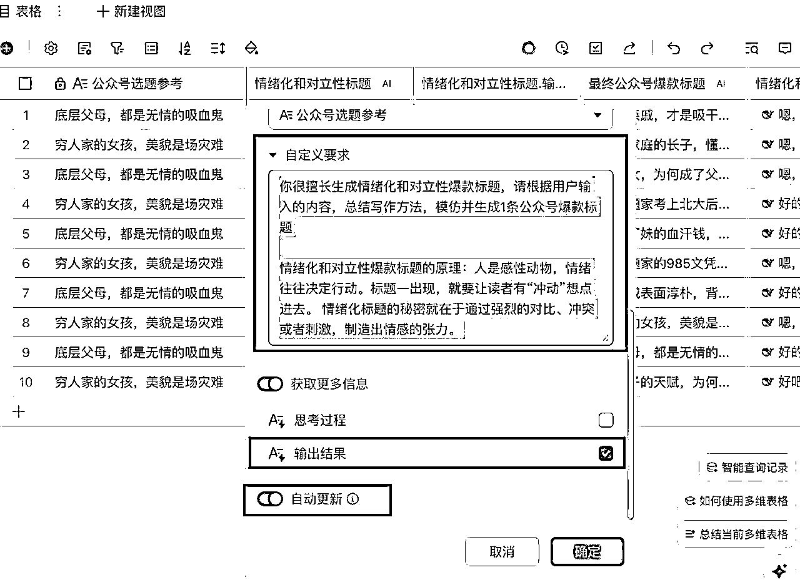

3、自定义要求写提示词：“你很擅长生成情绪化和对立性爆款标题，请根据用户输入的内容，总结写作方法，模仿并生成 1 条公众号爆款标题

情绪化和对立性爆款标题的原理：人是感性动物，情绪往往决定行动。标题一出现，就要让读者有“冲动”想点进去。 情绪化标题的秘密就在于通过强烈的对比、冲突或者刺激，制造出情感的张力。”

输出结果和自动更新咱们要勾选上哈～

4、但是我们发现，生成的标题结果中，有很多杂七杂八的信息，比如写作风格的总结。我们其实不需要这些，调整方法有两个：

第一，在指令中增加，比如“总结写作风格，但结果不要出现，结果只输出 1 个爆款标题即可”；

第二，新建一列字段“最终公众号爆款标题”，字段捷径选择“自定义 AI 自动填充”，相当于是把“情绪化和对立性标题。输出结果”中的内容进行提炼，形成只有一个标题的格式。

5、新建一列字段“情绪化和对立性”，字段捷径选择 deepseekR1，指令内容就是“最终公众号爆款标题”，指令参考如下：根据最终公众号爆款标题，查找相关名人案例，并结合自身成长经历，写出一篇爆文，要求 2000 字，字数要够。同理，输出结果和自动更新勾选上。

6、可以看到，“最终公众号爆款标题”只输出了一个，“情绪化和对立性爆文。输出结果”也只输出了一篇，这样方便我们之后排版，配图。我们来阅读一段开头，看它写的怎么样。

# 

《流水线上的血与泪：那些被原生家庭吞噬的厂妹人生》

深夜的工业区总是亮着不眠的灯光，注塑机轰隆声中，21 岁的阿玲摘下沾满油污的手套，第 28 次划掉台历上的数字——这是她给弟弟汇款的第 28 个月。当微信弹出"姐，我要买 AJ 联名款"的消息时，她终于对着流水线崩溃痛哭。这不是某个编剧笔下的苦情戏码，而是珠三角千万厂妹正在经历的残酷现实。

我觉得已经非常吸引人了，咱们还可以进行继续优化～。

7、这里掌柜补充下，很多伙伴找不到选择指令内容和自定义要求，是因为飞书多维表格官方 3 月 10 号左右刚更新，新的版本在配置细节有改动，比如新版本是，输入指令即可，没有了选择指令内容。但并不影响我们输入，总结下就是：

新版本的“输入指令+引用字段”=旧版本的“选择指令内容+自定义要求+引用字段”

二）利用 deepseek+飞书多维表格生成爆文启发

# 

1、利用“deepseek+飞书多维表格”，已经搭建好了公众号爆文的工作流，整体用时 3 分钟，确实很快！

2、公众号选题参考，我是拿了市场上的两篇爆文，所以当你有对标账号时，就可以拿过来借鉴模仿。

这一列的字段也可以变成只有关键词或者大致想法的选题，然后让 AI 帮你生成爆款标题和对应文章。

3、这样生产的公众号爆文，可能发出去之后流量不好，一方面是因为你发的时间短，先坚持一个月再说。

另一方面，如果你人工修改，流量可能会好点，如果完全不想改，就是想走 AI 自动化+关键词 SEO 的策略，那么就可以采用这种方式，一天发很多条推文。

4、产生爆文的方式很多，无论是手搓还是用 AI 自动生成，每一种都有人拿到了结果，咱们不需要贪多，只需要掌握其中一种，持续放大跑通即可！

最后，我把公众号爆款标题+爆文生成器的飞书多维表格模板发给大家，帮助圈友们提升效率，可创建副本，可复制内容：

# 4.2 批量生成商品主图构图和卖点信息 @steve

飞书多维表格接入了 DeepSeek R1 之后，我们不仅可以用 DeepSeek R1 批量处理表格中的内容，还可以跟多维表格中的其他工具组合使用，这样飞书多维表格就成了门槛最低的 Agents 编排工具。

这篇文章以我被入选飞书多维表格最佳实践案例的【商品链接分析工具】为例，通过还原每一步的编排过程，一步步带大家体验一下如何利用飞书多维表格结合不同 AI 工具，快速编排一个可用于电商业务的智能表格。

# 4.2.1 业务逻辑

# 4.2.1 编排过程

第一步：初始化多维表格

我们去飞书文档页面新建一个多维表格，删掉后面的列，只留下第一列，顺便把多余的空白行也删掉留下一行做测试就行（这样清爽一些）。

第二步：更改第一列字段类型

将第一列字段标题为【商品链接】，字段类型更改为【超链接】。

# 

请注意第一列的字段类型会有限制，所以我们在设计业务逻辑的时候，通常第一列需要什么字段类型是要想一下的，这个根据业务经验会越来越有感觉。

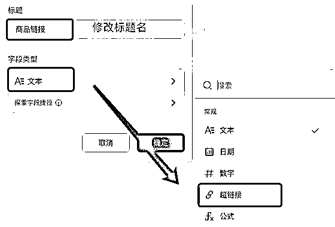

第三步：新增上传五张图片列

点击【+】号，标题写入【主图 1】，字段类型选择附件。依此类推，新增【主图 2-5】就是常用的淘宝 5 张主图。

# 

这里要再次提醒大家的是，我们需要结合飞书字段类型的功能，弄清楚业务整体的设计逻辑，比如飞书字段没有图片类型，那么就可以用附件类型替代图片上传，然后再利用字段捷径中的图片识别进行常识。

所以 know how 的能力在 AI 协同的时代是非常值得重视的一项能力，大家多摸索。

第四步：新增图片识别列

在【主图 1】位置鼠标右键，弹出项中选择【向右插入字段/列】。

在新增的列处点击【修改字段/列】，在弹出项中标题填入【主图 1 信息】，接着选择【探索字段捷径】，搜索图片，选择【AI 图片理解（豆包）】

关联账号暂时不用管，字节给每个账号送了 100 万 tokens，暂时够用很久，至于自定义 api，后面可以群里再和大家分享，此处省略。

在配置部分：

原图选择【主图 1】

自定义指令填入：提取图片中的卖点文字信息，描述图片的构图方式（自定义指令就是指我们在和大模型对话时的 prompt）

最后，要拉到最下方，在【自定义指令】的下方，还会有一个【自动更新】，要打开，这样每次识别到【主图 1】列有新增附件，字段捷径就会自动运行。

点击【确定】后，会有一个弹出页，在选项中点击【仅保存配置】。

按照上面配置【主图 1】的步骤，依次在主图 2-5 列后面配置完，注意标题分别是主图 2 信息-主图 5 信息。

第五步：新增信息提取列

在【主图 1 信息】位置向右新增 2 列

将标题分别写入【主图 1 文案】和【主图 1 构图】，字段类型统一点击【探索字段捷径】，然后选择【信息提取】；

完成后在主图 2-5 后面也依次用同样的步骤和方式进行列和字段的补全。

在配置部分：

提取字段都选择【主图 1 信息】

自定义指令：

【主图 1 文案】填入：卖点文字信息

【主图 1 构图】填入：构图方式

记得打开【自动更新】

点击确定按键后，依旧选择【仅保存配置】

按照上面配置【主图 1 信息】的步骤，依次在【主图 2 信息-主图 5 信息】列后面配置完，注意提取字段分别是对应的主图信息，标题分别是主图 2 文案/构图-主图 5 文案/构图。

第六步：新增卖点总结列

在【主图 5 构图】（如果大家都是根据上面步骤执行的，那么就是目前表格的最后一列），右侧新增一列，修改标题为【链接卖点总结】，字段捷径选择【总结】。

这个【总结】的字段捷径可以提供多选，我们选择【主图 1 文案-主图 5 文案】

自定义指令输入：有逻辑地详细总结所有内容不要丢失信息

记得打开【自动更新】

点击确定按键后，依旧选择【仅保存配置】

第七步：新增构图总结列

按照第六步新增【链接构图总结】

自定义指令填入：有逻辑地详细总结所有内容不要丢失信息（注意，指令确实和第六步是一样的，可以停顿品味一下结构流程思维的味道）

第八步：新增卖点梳理列

在【链接构图总结】（如果大家都是根据上面步骤执行的，那么就是目前表格的最后一列），右侧新增一列，修改标题为【卖点深度思考】，字段捷径选择【DeepSeek R1】。

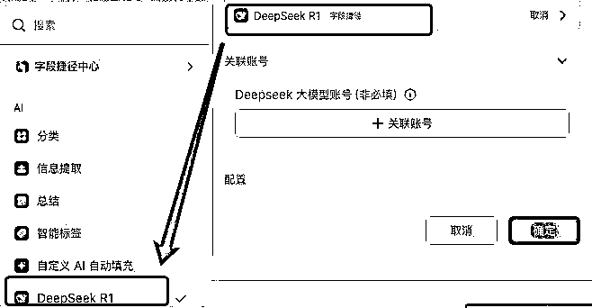

配置项中：

指令内容选择【链接卖点总结】

自定义指令输入：基于总结内容，给出卖点信息评价，具体包括优点、不足及其他差异化的可能性

更多信息大家根据需要：

思考过程非必选项，如果想直观看一下 DeepSeek R1 的思考过程可以打开，我一般不打开

输出结果一定要勾选

记得打开【自动更新】

点击确定按键后，依旧选择【仅保存配置】

第九步：新增构图梳理列

在【输出结果】（当然输出结果字段标题也可以更改，我就改成了【卖点深度思考结果】），右侧新增一列，修改标题为【构图深度思考】，字段捷径选择【DeepSeek R1】。

配置项中：

指令内容选择【链接构图总结】

自定义指令输入：基于总结内容，给出构图信息评价，具体包括优点、不足及其他差异化的可能性

更多信息大家根据需要：

思考过程非必选项，如果想直观看一下 DeepSeek R1 的思考过程可以打开，我一般不打开

输出结果一定要勾选

记得打开【自动更新】

点击确定按键后，依旧选择【仅保存配置】

第十步：One more thing

到第九步，我们的编排就完成了，恭喜大家👏👏

现在我们多加一步。

当我们在电商平台利用插件把图片下载下来后，如果直接在上面这个表格中上传是很不方便的，所以我们额外增加一个收集表，这样更有效率。

我们点击多维表格顶部的【+】号

在弹出页中选择【表单视图】

1.

新打开的【编辑表单】页面，重命名为【链接收集表】

2.

接着将不需要的选项都移除到，移除方法是点击【必填】后面的【-】号图标

3.

保留：商品链接、主图 1、主图 2、主图 3、主图 4、主图 5 即可

4.

然后将商品链接、主图 1 设置为必填项（设置方法是在必填左侧的图标点击一下打开）

5.

主图 2、主图 3、主图 4、主图 5 为非必填（有些链接可能没有那么多张图）

点击【填写表单】就可以上传搜集到的商品链接和图片了，上传后等待 3-5 分钟，表单就会自动执行完毕（AI 处理数据需要时间）。

这时我们就可以看到结果了，提前给大家看一下成果。

最后的最后

再多说一个技巧吧，在我们的【填写表单】页，如果觉得一个接一个链接上传还是慢，还是不过瘾，那么我们还能做到批量上传。

点击页面上方像🧩一样的图标，这个是插件，在弹出的页面选择【批量上传附件】

等待多维表格自动配置好（10 多秒时间），我们就可以批量上传了，有几个注意点：

6.

批量上传是按照列的逻辑上传的，也就是先批量上传主图 1，再切换到批量上传主图 2……

7.

批量上传的限额是单次 100 行以内，也就是可以最多 1 次上传 100 个商品链接的主图 1、主图 2……

感谢大家看到这里，到这里，咱们这本航海手册就结束啦！

祝大家玩得开心，用得高效！！愿大家早日成为 AI 协同时代的新个体！！

# 防失联+MM188166M（李李）长期更新