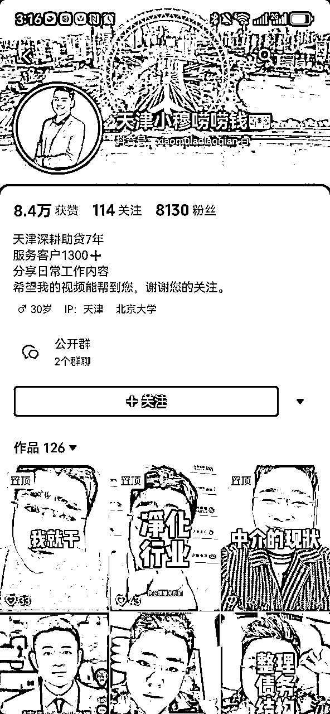
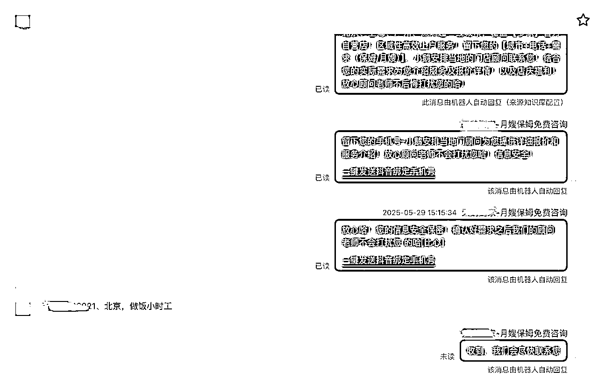
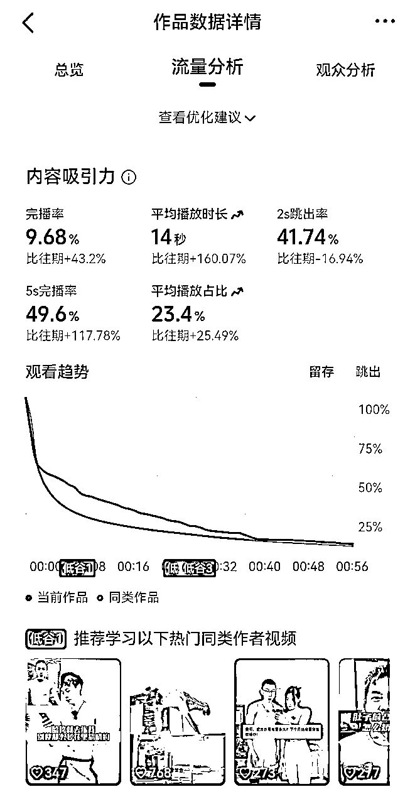
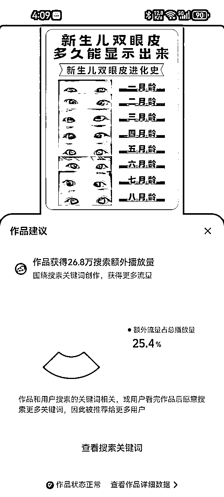

# 抖音DSO获客 丨实战手册丨2025年9月航海

> 来源：[https://ocn93f5d9olj.feishu.cn/docx/AVJHduQeWoDuqmxOLy7cqBRznmd](https://ocn93f5d9olj.feishu.cn/docx/AVJHduQeWoDuqmxOLy7cqBRznmd)

# 一、项目介绍

DSO（抖音搜索），是通过行业调研、选流量词、制作发布视频等优化方式，让内容在抖音搜索结果中排名更靠前，从而获得更多搜索曝光和流量。相比推荐流量，搜索流量代表着用户主动搜索的需求，更精准，转化率也更高。

抖音搜索是 2025 年有红利的机会方向，适合有业务团队、需要在抖音获客的人，也适合对流量变现感兴趣、能与有转化后端的团队合作卖流量分佣的人。

本次航海依旧围绕行业调研 > 账号搭建 > 选词技巧 > 内容输出 > 监测排名 > 复盘调优这条核心流程展开，增加补充了更细分的行业案例和关键词库，明确了更多玩法拓展中的细分领域和实操案例，并增加了一鱼多吃”的 DSO 内容玩法（如同步布局小红书、视频号），让你在掌握抖音 DSO 的同时，把同一份内容价值发挥到最大。

# 01.抖音DSO的含义

# 1.本章概要

章节概要

在这一章节，我们将初步了解抖音DSO是什么，适合的人群和行业

可以按照航线图，开始学习：

1、了解抖音搜索的行业情况和趋势（约 0.5h）

那么现在，就请开始完成这个的筹备吧。

抖音DSO，简称抖音搜索优化，DSO核心主要包含三大部分，精准选词、内容覆盖、转化产出；这是一套通过多种运营策略，对发布在抖音平台上的内容进行优化的体系，目的是让相关内容在抖音搜索结果页面中获得更靠前的排名，让用户在搜索某个关键词的时候，优先看到你的作品，对你感兴趣，进而产生留资、下载和购买等一系列用户行为

另外，抖音搜索流量与抖音推荐流量不同的是，推荐算法类似短跑，注重时效性，抖音会根据用户近期的浏览、点赞、评论等行为，快速推送相关内容。当一个内容在一两天没有获得很好的流量数据，就会被淹没，推荐流更多是娱乐性质，且推荐流在当下越来越多的作品中变得“内卷”。

而搜索算法更像长跑，进行抖音搜索的用户都是有需求，有疑问的用户，获得排名的作品，会长时间存留在关键词下，用户搜索关键词就能看见作品，好的作品能霸占该关键词前几一年甚至更长时间。

1.  抖音DSO适合的人群/行业

适合做抖音DSO的人群：

内容创作者类：无论是美食、美妆、旅行还是知识科普类博主，通过抖音搜索优化都能让自己的作品被更多目标用户发现。

实体店铺：全国行业的实体线下老板通过抖音平台获取更多流量，实现低成本获客，可借助DSO的方式实现精准私域流量的获取。

电商从业者：抖音电商的兴起为商家提供了新的销售渠道，搜索优化是提高商品曝光和销量的关键。

品牌营销专员：负责品牌推广的人员需要借助抖音平台提升品牌知名度和美誉度。

自媒体运营新手：虽然缺乏经验，但自媒体运营新手往往对新事物充满热情和学习动力。抖音搜索优化相对容易上手，新手可以通过学习相关知识和技巧，快速掌握优化方法。

适合做抖音DSO的行业：

急需求行业：律师、家政、保姆等；

强搜索行业：保险、贷款、装修、工厂、医疗、养生、定制等；

知识付费行业：教培、证书、IP孵化、求职培训、留学培训等：

消费品行业：个护、化妆品、生活必需品等；

1.  抖音搜索的行业情况

1.  本章概要

章节概要

在这一章节，我们将了解抖音DSO的行业情况、重要性

可以按照航线图，开始学习：

1、了解抖音搜索的行业情况和趋势（约 0.5h）

那么现在，就请开始完成这个的筹备吧。

抖音 DSO作为一种新兴的营销策略，正逐渐成为品牌和企业在抖音平台上获取流量与实现商业增长的关键手段。理解为什么要做抖音 DSO 以及洞察抖音搜索的行业情况，对于在这一平台上布局的商家和营销者来说至关重要。

在2024年抖音创作者大会上，抖音内容生态负责人分享了几个数据：近一年抖音搜索的总搜索规模同比去年增长了51%，每个月有80%抖音用户会使用抖音搜索，目前抖音已经有超过22%的流量，与用户搜索兴趣有关，人均月搜索次数100+，打开APP30 秒后搜索用户占比 67%。

抖音用户搜索习惯已养成，搜索高意向人群流量承接缺口巨大，DSO流量红利已来临，已然成为经营和营销的必选项。搜索能带来的优势以及好处：

（一）抖音搜索能够精准触达目标受众

例如，一家专注于运动健身器材销售的商家，用户搜索的关键词，如 “家用跑步机推荐”“小型哑铃健身教程” 等，使得当有健身爱好者在抖音搜索这些词汇时，该商家的视频能够优先展示，从而精准地触达了对健身器材感兴趣的目标受众。这种精准触达极大地提高了内容传播的针对性和有效性，相比随机的信息流推送，用户因为主动搜索而对内容的关注度和兴趣度更高，更有可能转化为实际的消费者。

（二）抖音搜索能提升内容可见性与影响力

例如，一个美妆品牌发布了一款新口红的介绍视频，通过 DSO 优化，使其在 “新口红推荐”“显白口红排行榜” 等热门搜索关键词下排名靠前。大量用户在搜索相关内容时看到该视频并点击观看，视频的点赞、评论数迅速上升，这不仅使得该视频在搜索结果中的排名更加稳固，还吸引了更多用户自发地分享到自己的社交圈，极大地提升了视频的传播范围和影响力，让品牌信息得以更广泛地传播。

（三）抖音搜索能助力品牌形象塑造与忠诚度培养

例如，一家以环保为理念的家居品牌，通过 DSO 策略，使其关于环保家居产品制作过程、环保理念科普等视频在 “环保家居”“可持续生活方式” 等搜索关键词下频繁出现。用户在不断观看这些视频的过程中，对品牌的环保理念有了深入了解，从而认可品牌的价值观，进而培养起对品牌的忠诚度。这种基于搜索优化的品牌形象塑造方式，相比传统广告宣传更加自然、深入人心，能够有效提升用户对品牌的信任度和认同感。

（四）抖音搜索能与内容联动带来增量

例如，用户观看了一个美食博主制作蛋糕的精彩视频，被视频中美味的蛋糕所吸引，就可能会在抖音搜索栏中搜索相关的蛋糕制作原料、烘焙工具或者直接搜索该品牌的蛋糕产品进行购买。商家通过做好搜索的承接与转化，不仅能够获取更多的自然搜索流量，还能抢占品类心智，反过来再次促进成交。数据显示，在抖音平均每 1000 次搜索可以带来 60 次成交，充分体现了搜索与内容联动为商家带来的显著增量价值。

1.  做抖音搜索的必要性

# 2.1用户的搜索需求爆发式增长

近年来，抖音搜索的使用量呈现出爆发式增长态势。根据抖音生活服务发布的《2023 年数据报告》，过去一年用户搜索生活服务相关内容高达 593 亿次。这一数据直观地反映出用户在抖音平台上对于信息搜索的强烈需求。无论是寻找美食推荐、旅游攻略，还是了解产品信息、学习技能知识，用户越来越倾向于通过抖音搜索来获取所需内容。

# 2.2抖音平台全力支持搜索

传统搜索通常是用户主动在搜索框输入关键词进行查询，而看后搜是用户在观看感兴趣的短视频后，系统根据用户行为预测其可能想搜索的关键词，并将这些关键词呈现在首页搜索框、猜你想搜、短视频标题的话题标签、评论区的小蓝词或评论区吸顶词等各种场景。用户只需点击这些预测关键词，就能轻松完成搜索动作。

例如，用户观看了一个介绍户外运动装备的短视频，视频下方的评论区可能会出现与视频中装备相关的小蓝词，如 “户外登山鞋”“专业登山背包” 等，用户点击小蓝词即可直接进入相关产品或内容的搜索结果页面。

电商行业搜索表现

当用户搜索品类词、品牌词等具有商品指向的关键词时，抖音搜索结果前排位置主要以直播间、商品卡为主，这表明用户在进行此类搜索时具有较强的购买意向。

例如，当用户搜索 “耐克运动鞋”，搜索结果页面会优先展示耐克品牌的直播间以及相关商品卡，方便用户直接进入购买页面。而当用户搜索较泛的场景词或兴趣词，如 “运动穿搭灵感” 时，搜索结果则会优先展示内容，如相关的穿搭视频、图文教程等。

本地生活行业搜索情况

用户通过抖音搜索本地美食、旅游景点、休闲娱乐场所等信息的频率极高。以餐饮行业为例，用户在搜索 “附近美食”“特色火锅”“网红餐厅” 等关键词时，抖音会根据用户的地理位置，推荐周边相关的餐厅信息，包括店铺地址、菜品介绍、用户评价以及团购链接等。商家通过优化店铺信息、发布吸引人的菜品视频、积极引导用户评论等 DSO 手段，能够提高店铺在本地生活搜索结果中的曝光度和排名。

# 3.搜索行业竞争与挑战

随着抖音搜索重要性的日益提升，在关键词竞争上，热门关键词往往竞争激烈，众多品牌和商家都希望占据这些关键词的搜索前排位置,所以我们更要抓住这个好时期，提前掌握搜索打法，将行业好词占领，以便获得更好的效果。

商家和创作者需要时刻关注抖音平台的规则变化、用户搜索习惯的演变以及竞争对手的动态，及时调整自己的 DSO 策略，才能在竞争激烈的市场中保持优势。

1.  算法逻辑

1.  本章概要

章节概要

在这一章节，我们将了解抖音DSO的算法逻辑，便于做后续的内容

可以按照航线图，开始学习：

1、学习抖音 DSO 的算法逻辑（约 1h）

那么现在，就请开始完成这个的筹备吧。

抖音DSO旨在为海量用户搜索一关键词时，高效地出现契合关键词且符合相关兴趣的内容，并且保证对用户帮助，同时保证平台生态的健康与多样化发展。

那抖音怎么判断一个关键词下哪个作品上排名呢？影响作品搜索流量的关键点：

在作品发布初期抖音会进行作品文本识别：利用技术识别视频中的文字信息，如视频标题、字幕等，将作品中的语音内容转化为文本进行分析。比如，一个介绍旅游攻略的视频，算法通过识别标题和字幕中，明确视频的核心主题是关于特定地区的旅游推荐，推送到此关键词下的作品池。

我们在做搜索流量作品时要多覆盖关键词，让平台能够识别到我们是此关键词下的作品。

在搜索作品刚发布后，会先让作品在短时间内排在前边，平台根据内容在初步阶段的表现，如播放完成率、点赞率、评论率等核心指标，决定是否保持作品排名。

所以作品要保证：

内容质量要好，抖音建立了严格的视频质量评估体系，除了上述提到的清晰度、稳定性等基础质量指标外，还包括内容的原创性、价值性、专业性等维度。

内容要能够解决用户的问题，要让用户愿意看下去，并且看完后有相应的互动。

作品内容要合规，一旦发现违规内容，视频将被立即下架处理，严重违规的创作者账号还会受到相应处罚，如警告、限流、封禁等，以维护平台健康、积极的内容生态环境。

基于抖音算法逻辑，我们的项目实操步骤分为：

1、精准选词，找高流量、高转化的词，基于关键词制作对应的视频/图文内容

2、流量变现：引流转化

3、监测关键词数据，并持续迭代优化

下面会详细展开讲解实操内容。

# 01.行业DSO的调研

# 1.本章概要

章节概要

在这一章节，我们将了解抖音DSO的账号装修、选高转化关键词、做短视频/图文内容并发布的核心内容，大家可以跟着学习，并持续去选词发内容，获取流量。

可以按照航线图，开始学习：

1、学习选行业，并完成行业调研（约 1 天）

2、了解打造精准人群高转化账号（约 1 天）

3、学习选关键词的逻辑（约 1 天）

4、选 50 个关键词组成关键词库（约 3h）

5、制作并持续发布 DSO 视频/图文（约 8-10 天）

那么现在，就请开始完成这几个内容的筹备吧。

在抖音平台或AIDSO中找自己感兴趣的用户/行业，进行全方位的分析（账号装修、内容模式、营销模式等）

1.  选择一个行业

所有线索行业，都可以用搜索流量的逻辑来做，比如高决策成本类的，像3C电器、机械化工、奢侈品、家居家装、旅游出行、房地产、汽车行业、职业/兴趣教育培训、招商加盟、本地生活服务等。

还有刚需型行业，像商务服务（法律/财税）、本地服务（家政/护养/月嫂/保姆）等等，以及一些副业赚钱相关行业，如电影/知识网盘；游戏插件等。

为什么线索类行业更适合做搜索流量？因为线索行业的特点，是需要在线上通过布局短视频或者图文内容，来实现客户的咨询和留资，而搜索流量的打法，就是通过生产符合用户搜索需求的内容，来进行获客，非常契合。

对于每一个行业来说，要有一个认知，那就是抖音一定会把免费给你的流量用来卖钱，这也就就意味着，做抖音如果不投流，是很难获取到免费流量的，更别说精准流量了，所以在当下如此内卷的时代，做搜索流量具有划时代意义：

首先，搜索流量能够实现精准获客，因为搜索背后反应的是用户的主动搜索需求，用户主动留资的线索是最精准的；其次，搜索流量具有明显的成本优势，搜索流量获客成本仅为付费推广的20%，甚至大部分玩家玩的都是自然流量；另外，搜索流量具备长尾效应，优质的内容可保持2年以上的持续曝光和引流；最后就是搜索流量具备信任溢价，主动搜索场景下用户付费意愿更强！

可以说，布局抖音搜索流量，是接下来不管是个人、商家、企业、还是品牌，在抖音实现流量获取和用户增长的重要营销手段和商业闭环！

# 3.行业DSO情况调研

做调研的方式，数据分析，赛道卷不卷，能不能做出成绩

判断赛道卷不卷的标准可以从搜索行业大词、行业达人情况，根据搜索结果页预判：

1、搜索行业大词：看行业大词的月覆盖人数以及关键词下的作品活跃度，若一个行业核心词、业务词月覆盖人数较高且作品活跃高代表此赛道难度会较高。

例如：对比两个赛道【旅游】【装修】，首先对比两个赛道的月覆盖人数以及七日搜索，在七日搜索相似的情况下，月覆盖越高的行业越卷，我们进行二次确认，进行作品活跃度对比，可以看到旅游行业前几名的日期比旅游行业的“新鲜”并且点赞量较高，这个时候就能判断旅游行业比装修行业难做。

看七日搜索/月覆盖的百分比，百分比越大难度越小

看行业核心词前几的作品活跃度、点赞

2、看头部账号/IP流量占比：如果某赛道的流量高度集中在少数头部账号（如TOP 10%的创作者占据90%的流量），说明此赛道竞争激烈，新人难以突围（例：企业培训-张琦）。

附：行业的账号情况不了解的也可在AIDSO上查看

3、看有没有按DSO（抖音搜索）逻辑生产内容的账号，及其账号数量和权重：若一个赛道较多在做DSO逻辑且账号互动量粉丝量较多的情况下，考虑自己的情况是否能比他们更好，才能获得更好的效果。

如何判断能否做出成绩，首先，我们定义搜索流量合格的标准，就是要看能否做出一条搜索流量占比90%以上的视频/图文，当然，这只是单从内容的角度来考虑，做搜索流量的核心，还是要看所做内容带来多少线索以及后端完成了多少转化

做搜索流量想要快速拿到成绩，一是要看行业卷的程度，二是要看团队的认知水平和执行效率；首先，行业卷不卷，通过前面的一系列数据分析就能大概判断出来，当然，风浪越大鱼越贵，卷，不一定就完全是坏事，因为越卷的行业，就会自动淘汰掉那些水平差的团队和人，有门槛，才能更好推进整个行业的快速发展，以及拉高从业者的业务和服务水平，只要团队具备相应的业务能力和执行效率，再加上正确的打法，通过搜索流量拿到结果是早晚的事!

1.  搭建符合DSO的账号

1.  抖音主页装修

# 企业账号（品牌垂直号 and 人设型账号）

植入核心业务词

品牌账号：品牌+核心业务词+客服/咨询（给用户形成官方咨询入口心智）

人设IP号：人物+核心业务词（北京装修小龙哥、郑州老季二手房）

简介公式：A+B+C

A=你的行业

解读:行业需要细分到更具体的消费群体和方向

卖衣服的-->卖女装的-->卖大码女装的（核心业务词：大码女装）

卖车的-->卖二手车的-->卖精品二手豪车的（核心业务词：二手豪车）

B=你的角色+个人背书（案例、服务等）

解读:给自己定个角色，展示你出现在消费者面前的形象

>>是打工人?老板?设计师?装修师傅?美妆达人?灵魂段子手?

背书 ➡️ 和同行比，你有哪些优势，用户为什么会选择你（核心竞争力）

C=明确消费者利益点（行为好处）

解读:核心是账号能给消费者带来什么价值，消费者能在你的内容里得到什么收获

买大码女装的消费者的利益点:希望自己穿衣显瘦 >>让你显瘦20斤

买二手豪车的消费者的利益点:希望自己低价开好车 >>让你低价开豪车

参考案例：

案例1:服饰行业--大码女装

150斤的大码女装店老板，13年女装工厂店。每天分享显瘦高档穿搭，进我粉丝群，领100款胖妹妹的穿搭风格！关注我，让你显瘦20斤

案例2:汽车行业--二手车

我是车界老王，专注二手车行业20年，卖出二手豪车20000+，私信领取一份《选车避坑指南》，帮你低价开好车！

主页简介（植入行业大词）：企业/人设IP的背书+案例+福利+行动指令

举例：

企业官方类：

金夫人·中国人的婚纱照

全国400多家门店，超600万对新人口碑见证

高品质情感婚纱摄影品牌

全网热拍风格:三生三世/前世今生/目的地婚礼

人设IP类A：

深耕8年的室内设计工作者

免费设计/免费量房/免费报价:

全国各地150+城市均可服务!

私信免费领取设计名额

人设IP类B：

我是从事海南高端定制游7年、亲自接待8000+顾客的浩哥！

兄弟局/情侣蜜月/闺蜜轰趴/家庭度假/公司团建

提供贵宾楼豪车接送｜专属管家独栋别墅｜游艇派对｜海陆空深度体验

您点击对话框的那一刻，我们的服务就开始了

置顶视频（1-2条为宜）：企业秀肌肉，品牌/创始人成长故事

品牌账号：机构背书（市场规模、官方认证、供应链优势等）+优秀案例，构建并强化用户品牌心智。

人设IP号：“平凡英雄”曲线，激发共鸣，产生共识。

以创始人/主理人讲故事的形式（出身贫寒，创业路上经历诸多不易，最终取得**，做到**规模等）

# 个人账号

与企业人设型账号同理，强化人设背书（案例、服务）

实际上企业蓝v账号和个人号在生产内容上的逻辑是一样的，只是企业蓝V账号可以挂载线索组建，个人号没有该功能，如图，为企业蓝v账号线索组建的功能展示，后面的内容也会详细降到企业蓝v号的搭建流程

# 2.蓝V企业号基建

我们在企业号基建之前，请先把两个问题的答案想清楚

1、我们企业的核心竞争力是什么?（我能提供的、同行没有的、用户需求的）

2、我们能给用户什么“行为好处”?（将留资这个动作进行“合理化”，让用户心理接受）

核心竞争力与行为好处都需体现在以下装修板块：商家主页、高级预约组件、私信欢迎语、回复话术等。

企业号线索版后台链接：https://leads.cluerich.com/

抖音企业号：https://e.douyin.com/

# 主页链接（路径：运营工作台-店铺管理-主页装修）

联系电话：设置客服电话，承接急需求用户

查看地址/门店地址：若上团购，在抖音来客完成入驻配置

认领门店：入住抖音来客（链接：https://life.douyin.com）

抖音来客入驻准备 包括营业执照、法人信息、门店信息（门头牌匾、地址等）

# 商家主页（可直接展示在主页，方便用户了解品牌全业务生态）

主要组成元素：机构核心业务置顶、机构背书、优秀案例、机构环境（服务场景）

-商家模板（线索商家）

服务产品-企业核心业务置顶（配图/文案卖点充分）

店铺活动-引流福利（预约即送...)

线下门店-抖音来客

团队成员（行业名人IP）

官方相册（线下服务场景配图）

-本地通（推荐生活服务行业的商家开启）

举例如下：商家主页

# 高级预约组件

路径：运营工作台-服务管理-高级预约组件

商品大图：覆盖用户需求、卖点充分（可以对标同行，或美图等软件找模版）

服务标题：可展示在视频下方，仔细斟酌编辑，配吸睛文案（免费预约咨询、预约即送**）

企业简介：企业规模、年限、成绩、服务

产品简介：与商品大图信息雷同

适用门店：本地或区域性业务可认领（在抖音来客入驻完成）

温馨提示：

提示1：高级预约组件审核严格，提神前仔细阅读：企业号功能组件审核规范

提示2：高级预约组件信息不建议“充分填写”，体现核心信息即可。（信息越多越容易拒审）

提示3：若拒审不清楚原因，可联系右下角官方客服，咨询“人工”触达。

提示4：主营/热门业务建议单独创建预约组件

示例：高级预约组件：竞争力：冠军导师（师资） 行为好处：预约免费领课

# 客服配置（欢迎语引导用户开口互动+自动回复针对性回复）

.

私信欢迎语

参考模板：感谢语+背书话术+业务介绍+引导福利/优惠信息+客服在线时间+转化入口

示例：您好！欢迎咨询天鹅到家，全国领先家庭服务平台！我们是一家与公安机关联网的家政公司！选大平台、才有保障！提供 【保姆/月嫂/育儿嫂】上户服务！客服小鹅8:00-20:00提供1对1线上答疑！欢迎打扰！

>>>官方门店周年庆! 预约咨询即可领取门店优惠！！！

示例：欢迎语：竞争力：IP经验+案例背书 行为好处：免费3套设计方案

.

自动回复

路径1：运营工作台-咨询管理-自动化设置-关键词匹配

路径2：运营工作台-客服中心-智能客服-自定义知识

核心价值：根据用户咨询高频词设置自动回复提高服务效率（3min回复率>50%，否则私信限流）及线索转化率。

可参考形式如下：

形式一：欢迎语+问题引导

底层逻辑：构建私信问答闭环+完成流量筛选

操作路径：运营工作台-自动化设置-自动回复（进入对话/关键词匹配）

欢迎语预设附加问题

关键词匹配预设问题设置针对性回复

形式二：欢迎语+表单预约

底层逻辑：引导用户自主预约，节省客服沟通成本

操作路径：运营工作台-自动化设置-自动回复（进入对话）

欢迎语附加“高级预约组建”或“一键留资”

高级预约组件需提前完成创建，过审之后可选

形式二适合刚需性行业（如法律、家政等），往往更多用户习惯私信沟通留资。

AI即用的基础配置——巨量旗下客服机器人（产品手册）——免费使用阶段

官网链接：https://csagent.oceanengine.com/dashboard

配置流程：

配置核心要素：

1、知识库（关键词回复）

2、留资引导指令：围绕用户的“留资决策点”设定

例：留资决策点是“城市有无门店服务”，对话闭环可如下流程：

3、话术限制指令：明确什么不要说、特定问题不解答或针对性回复

# 独立店铺（可直接挂载短视频下方，形式趋近于抖店橱窗）

路径：运营工作台-店铺管理-独立店装修

装修要领（配置≥4个模块，模块名称可自定义）

背景图：体现业务信息（一眼识别出企业是做什么的）

预约：✅在线预约——勾选主营的预约组件承接

✅私信——直跳私信场景咨询

✅ 拨打电话——配置客服电话承接急需求用户

精选服务：将核心/热门业务进行置顶

经典案例：成功案例、明星推荐等

服务类型：填写全部业务

官方相册：机构环境或服务场景配图

1.  选择高转化的关键词

1.  明确业务核心词：

从自身业务出发确定核心业务词、行业词。

例：产品是床垫，那你的产品业务词就是“买床垫、床垫怎么选等”你的行业词就是“家居软装、床上用品等” 注意要排除与业务不相关的词，比如“床垫回收、床垫除螨”就不是业务词。

# 2.寻找主流量关键词

手动查找：在AIDSO网站——关键词。

网址：https://www.aidso.com/

关键词选择的重要筛选数据：月覆盖人次、7日搜索人次、下拉词数量、竞争度

月覆盖人次：月覆盖人次的数据，代表的是近30天关键词相关的作品覆盖的人数，就是覆盖了此关键词在抖音平台发布的内容覆盖人数。（月覆盖人数代表覆盖这个词的人数多，覆盖的多也就代表发这个可以获得更多的流量，但是发的人多代表不一定好上排名）

7日搜索人次：近7内在抖音搜索此关键词的人数。（7日搜索人次越高代表这个关键词越有价值，做上排名的重要性越高）

下拉词数量：代表包含此关键词的词的数量。（一个关键词下的下拉词越多，上排名的难度会越大；因为在搜索此关键词时可能会出现其下拉词下的内容)

竞争度：总体竞争难度。

示例如下：

# 3.结合热门趋势和话题：

关注当下热门事件、流行趋势以及抖音平台内的热门话题。例如某个时期流行 “露营”，与露营相关的产品或内容，可选择 “露营装备推荐”“露营美食做法” 等结合热门趋势的关键词，能获取更多流量。

在抖音热点榜、抖音热榜话题页面可查看当下热门内容，也可以直接到AIDSO看最近的飙升词榜。

1.  根据账号情况选关键词

账号情况决定了你选关键词的筛选数据，若急功近利很有可能得不到结果！（可以参考示例数据较稳妥）

1.  参考竞品关键词：

分析同类型账号或竞品账号发布视频使用的关键词。查看他们热门视频的标题、描述、标签中的关键词，从中发现高转化潜力的关键词。

在 昵称、简介、合集名称、作品文案、封面、话题、吸顶词 高频的出现关键词。

利用抖音搜索框：输入与主题相关的词语，抖音会自动弹出热门搜索词，如搜索 “健身”，可能出现 “健身操”“健身饮食” 等，这些都是热门且有搜索量的关键词。

1.  【新增】关键词库和案例补充，帮助圈友进行对标

不同行业可从大盘找词

行业关键词举例：（每个行业10个较好的关键词）

教培行业：

旅游：

家装：

汽车：

房地产：

本地生活：

# 04\. 制作DSO短视频/图文

制作符合DSO的视频和图文，搜索作品有很多与推荐作品不同的地方，且判断一个关键词做图文还是做视频要关注该关键词下搜索结果的前几作品情况。

若一个关键词搜索结果前几视频多，那就做视频，若图文多便做图文

✅关键词搜索结果视频多，此关键词做视频

✅关键词搜索结果图文多，此关键词做图文

# 1\. 制作DSO短视频

制作符合DSO逻辑的视频时，要注意视频的文案、画面、字幕、背景区、视频封面、视频前3秒，这几方面尽量要覆盖上关键词。

# 1.1确认视频形式

在写脚本以及制作视频前要确认自己做什么类型的，3依据关键词的含义去搜这个关键词的受众人群会想要看什么样的视频内容，也可以根据关键词的前十个作品判断形式。

示例：选择关键词“考研怎么选学习以及专业”

点击关键词抖音搜索看到以上的作品情况

步骤1：分析前几个作品的形式

像这个关键词的前几有四种形式，前几都是口播

步骤2：考虑口播形式自己是否可以做

如果可以做，可以直接去看以下前几的内容大概是什么样的，去进行脚本撰写（不能原抄袭）若做不了口播形式，那就考虑剩下三种形式自己可以做哪个。

优先级：关键词下最多的视频形式

依据关键词内容定位确定视频形式

# 剧情类（Vlog）：

通过设计有起承转合的故事剧情来吸引观众，可包含搞笑、悬疑、情感、励志等各种题材。例如，关键是“0成本创业适合做什么？”讲述职场成长的故事，你的业务侧能带给用户的帮助，这种形式能够让观众产生情感共鸣。

# 口播类：

创作者主要通过语言表达来传递信息，如新闻资讯播报、观点评论、故事讲述等。例如，一个时事评论员对近期热点事件发表自己的看法。（口播类适用于各行业，且操作难度低）

# 技能教学：

主要教授各种实用技能，像烹饪技巧、健身方法、化妆教程、摄影教学、乐器演奏教学等。比如，关键词是“健身教练证怎么考”可以详细展示考健身教练证的步骤，以及自己的相关业务，让观众能够跟着学习并去找你咨询。

知识分享：

创作者将自己擅长领域的知识以通俗易懂的方式讲解出来，如历史知识、科学原理、财经知识、法律常识等。比如，关键词是“怎么学会投资？”内容通过生动的案例讲解经济学中的供求关系原理，分享一些实用的小常识，帮助观众增长知识，从而信任你，对你的业务感兴趣。

# 混剪类（录屏、素材混剪）：

将多个不同的视频片段进行剪辑组合，配上合适的音乐和解说，形成一个新的有主题的视频。比如，关键词是“北京旅游团”把旅游时拍摄的各地风景片段混剪在一起，以及自己的业务宣传，制作成一个混剪视频，用户通过视频感兴趣去咨询。

# 1.2 脚本撰写

脚本撰写时一定要注意关键词，前三秒要包含关键词，中间要尽量覆盖关键词，结尾要包含关键词。若没有写脚本的经验与思路，可以用 AIDSO 的 AI 脚本工具来写，输入关键词生成符合关键词的脚本。

# 1.3 视频剪辑

视频剪辑工具——剪映，在视频剪辑中不管是字幕还是特效都要以凸显关键词为主，若没有进行过视频剪辑的同学可以去各大网站搜索视频剪辑教学进行学习，这里不进行详细讲解。

# 2\. 制作DSO图文

制作符合DSO逻辑的图文时，要注意图文的标题、文案、图文封面，这几方面尽量要覆盖上关键词。

# 2.1确认图文模板以及形式

在制作图文前同样要确认自己做什么类型的，依据关键词的含义去想象搜这个关键词的受众人群会想要看什么样的图文内容，也可以根据关键词的前十个作品判断形式。

示例：选择关键词“三天两夜旅游推荐”

点击关键词抖音搜索看到以上的作品情况

步骤1：分析前几个图文作品的封面模板

此关键词下的模板形式大概分为三种

步骤2：寻找素材做类似的封面

去各大素材网站寻找素材

步骤3：去美图秀秀/醒图/可画/其他作图软件中寻找作图模板

点击前几个作品的内容观看，分析受众群体的喜好，去找受众群体年龄层喜欢看的模板。

# 2.2 确认图文内容

图文内容需要根据关键词搜索含义来分析，去其他网站上找一些内容供参考。

例如：你所在的行业是考研教培，选关键词是“考研怎么选学校以及专业”

那么首先要去思考什么样的人群会搜索“考研怎么选学校以及专业”

再思考搜索“考研怎么选学校以及专业”的人群会想看到/想得到什么东西

最后想怎么结合“考研怎么选学校以及专业”词去拓展/种草自己的业务

整理这些文案以及配图素材

# 2.3 制作图文

运用制图软件去作图：美图秀秀、可画、醒图、稿定设计等；

制图要求：

每一张图文都要包含关键词

一组图约3—6张

图片清晰、图片比例3：4（小红书比例）

素材清晰且文字字体要让用户看清

图片与文字的占比合理

制图注意事项：

图片配色不能太多，最好是企业色+相近色

同一组图除封面外要统一模板

以美图秀秀-电脑端为例（手机端同理）进入美图设计室：https://www.designkit.com/

自己创建画布直接点击创建设计：尺寸选小红书封面即可

进入所创建的界面就可以直接作图：左侧操作栏有编辑框可以修改右侧可复制/查看每一个页面

也可以直接选模板进行制图-直接点击自己心仪的模板去做

在画布上添加字体与图片就可！完成后点击右上角下载即可下载全组图片。

想修改之前的图还有作图记录可以点击修改

思路：1.封面-2.解答关键词-3.解答关键词+附加信息-4.业务侧+钩子

封面是图文重点部分！要把握搜关键词的用户心理，确保用户能在搜索结果下选择你的作品观看

# 05\. 发布视频/图文

# 1.发布时间

分析行业人群，观察行业人群的上线时间，在行业人群1-2个小时发布作品。

例如：行业受众群体是大学生，那你的人群上线时间为9:00—23：00，因为大学生不会太早起，并且他们闲暇时间多；就在这期间多发布视频就好；若你的受众人群为白领，那就要推算其休息时间，因为这类受众群体多休息时间刷抖音

如果实在不清楚的，前期新号可以多测试，观看数据趋势，总结特点，看你哪个时间段发布的互动数据好，多测几次就总结出规律了(新号建议一天发5~7条，早6—晚22 每隔2小时发布）

# 2\. 发布文案

手机端直接点击发布编辑，电脑端进入抖音创作者中心后台发布。

标题：包含完整的关键词，可加前缀和后缀，整个标题要符合关键词含义。

文案：包含1-2次关键词，整体文案要符合关键词含义，不要无意义的重复堆积

话题：第一个话题必须是关键词，剩余4个关键词可添加行业相关关键词（关键词库）

就算关键词话题应用为0也要使用！

案例参考：（关键词为：专科生怎么考研究生需要什么条件）

# 3.合集创建

合集的重要性很高，合集可以让你合集下所有的作品进行加权，并且还有延长作品更新时间的作用。

合集也要围绕关键词去做，合集名称、合集封面、合集简介；都要是关键词

合集标题只填关键词，简介文案至少一次展示关键词，合集封面包含关键词，而且要醒目。

合集创建在抖音创作者中心（https://creator.douyin.com/）内容管理下方

DSO作品发布前检测表：DSO作品发布前检测表（圈友可用）

圈友可以点击链接复制文档自己使用

# 4\. 如何发布

以电脑端为例，手机端直接进入抖音点击下方＋号发布

.

进入抖音创作者中心（https://creator.douyin.com/）扫码登录自己的账号

.

进入界面点击高清发布

.

将做好的视频/图文拖入发布界面中

.

编辑标题、文案（标准按4.5.2）设置封面选择合集（合集设置4.5.3）音乐等，设置好即可发布

# 01\. 如何引流

# 1.本章概要

章节概要

在这一章节，我们将了解做引流转化的方法，并实操

可以按照航线图，开始学习：

1、学习流量转化的方式（约 1 天）

那么现在，就请开始完成这个的筹备吧。

# 2.如何引流

.

通过精准选词+优质内容创作实现引流

比如：你做的是装修行业，通过AIDSO工具可以判断出“一儿一女两室装修”这个词非常优质，不但有量，而且竞争也不激烈，那么我们基于这个词来创作的内容，大概率就会吸引到即将为宝宝房间装修的宝爸、宝妈这些人群，甚至你在创作内容的时候你都能想象到这些人群的画像是怎样的，多大年纪，家庭成员构成、他们想要装修出来的温馨画面等等，画面直接有了，那我们基于这个词以及对这个人群的理解所创作出来的内容，自然也会吸引到这个人群；同理，任何行业、任何赛道，都是可以通过通过“精准选词+优质内容创作”来实现引流，这也是DSO独特的魅力所在

.

通过精准选词+蹭热点实现引流

相对于常规的精准选词来创作内容，还有一种是可以通过蹭热点的方式来装作内容，因为人天生就对娱乐、八卦充满好奇，当某一个热点事件出现时，如果该热点事件属于正向、且跟自己的品牌和产品相关，就可以去蹭这个热点，通过这种方式创作出来的DSO内容，不仅流量大，也很精准，也能达到不错的引流效果

.

通过生产DSO逻辑且不同内容形式实现引流

做搜索流量的内容形式有很多，图文类、剧情类、口播类、技能教学类、混剪类等等都是可以的，给大家分享个技巧，当我们利用AIDSO工具搜索某个想做的关键词，点开关键词后去看大家做的内容，如果图文类居多，那我们也做图文就好了，如果口播多，那我们就做口播，以此类推，相信平台大盘的数据反馈

.

通过优化小蓝词、吸顶词实现引流

先普及两个概念，首先，吸顶词，就是大家看完视频之后搜索次数最多的那个词，也就是看后搜，当这个词搜索次数多了，就会形成吸顶词，一般出现在视频顶部，不随页面滑动，带半透明的背景框；而小蓝词，就是评论区出现的蓝色字体的词汇，点击可直接实现页面跳转。

在发布视频的时候，你可以把将标题或关键词置顶为吸顶词，吸引观众注意力，系统也可能根据视频内容自动提取关键词作为吸顶词，用于流量推荐，还有，也可以发动身边的朋友去浏览作品，浏览完去搜你提前想要曝光的词，这里需要不同的ip和切换到数据流量来操作；那小蓝词怎么产生？比如你在评论区发了一个词，然后你长按这个词之后选择搜索，大概搜索15-20次，就有可能出现小蓝词，

.

通过优化线索组件+资料包实现引流

做搜索流量我们一直鼓励大家去申请蓝v账号，其实就是为了开通线索组建的功能，有了这个功能，我们就可以实现话术引导、欢迎语这些，不仅能更好的承接意向客户，还能拿到客户的线索（联系方式），对于之后的二次触达提供了便利条件；对于一些教培行业，通过在蓝V号设置资料和测评表，也能吸引到更多用户的关注，这一招在教培行业屡试不爽

# 02\. 如何做转化

.

首先，想要实现更好的转化，一定要把前期的账号搭建工作做好，做充分，例如前面提到的开通蓝V账号、写好简介、搭建线索组建、设置引导话术、欢迎语、资料包等，所谓“工欲善其事，必先利其器”准备工作都做好，是实现高转化率的前提。

.

像本地生活、家政服务等行业，尤其是对于那些高消耗低决策的产品和服务，当意向客户在账号后台留言后，通过信息组件的自动话术回复，以及人工客服回复，去帮客户进行问题解答，并引导客户价私域或直接去购买相关的产品或服务。

举例如下：

.

像律师、贷款、礼品定制等行业，尤其是对于那些低消耗高决策的产品和服务，因为客单价较高，且决策周期长，需要我们通过后台客服沟通后，引导客户加到私域，再从私域里面进行承接和转化，因为这些行业受平台监管较为严格，如果直接在私信里去转化容易被判违规，当然，更主要的是，在私域里就可以通过朋友圈营销不断强化用户心智，让他产生购买意愿，也可以通过1v1指导提供更多专业且个性化的服务

.

还有一些像教培、国学、身心灵疗愈等赛道，建议都需要把客户引导私域再进行成交，因为这些赛道都有一个共同特点，就是有二转、三转，如果想持续升单，那就需要把意向客户沉淀到自己的私域里，这些都属于你的人群资产，在之后的用户需求调研、新产品发布和销售过程中，都会起到非常关键的作用。

.

整体来说，搜索流量想要做好转化，一定是你的后端有专业的销转团队，因为搜索流量过来的都是比较精准的流量，通常更容易实现成交，所以每一个流量都不是白给的，都需要精细化的去运营，那么这就需要销售同学要对自家的产品如数家珍，再加上适当的朋友圈营销、1对1的答疑解惑、一些优惠政策和逼单手段，转化效果会非常明显。另外，作为公司而言，在不断优化产品质量和服务水平的同时，还要做好完善的销售激励和培训体系，就算中间出现员工离职或者一些变故，也能让项目正常运转，另外，每个公司的产品、销转团队的体量和能力都不一样，建议要根据自身情况去查漏补缺、弥补短板！

注意：以上方法论供大家参考，具体转化形式这些，大家根据自己的行业情况来实操，有问题可以群内交流。

# 01\. 每日监测关键词的视频数据情况

# 1.本章概要

章节概要

在这一章节，我们将了解在发布内容以后，持续监测关键词的流量情况，并分析优化，提高数据。

可以按照航线图，开始学习：

1、学习持续监测关键词并排名优化（约 1-2 天）

那么现在，就请开始完成这个的筹备吧。

# 2.关键词维度

排名情况（路径：AIDSO (抖音搜索选词工具) ➡️ 监测 ➡️ 监测排名）

看你做的关键词排名是什么位置

每日看关键词的整体排名情况，导出日报

日报数据反哺优化——未上排名：

1、若关键词未上排名包含部分关键词已经被覆盖上（前100）

2、着重关注你优先想上排名的词，检查起关键词累计发布视频数量有多少

3、若关键词作品数量1-2个，需要再做1-2个作品，观察排名变化

4、若关键词作品数量5-10个及以上！

检查此关键词是否创建合集，内容是否包含关键词（若有遗漏，补充后再看排名）

若无遗漏，换内容形式，内容形式可能不受喜欢，观察竞品封面、内容

检查账号整体流量情况，若作品的播放量都极少（100以下）上排名的概率也低

检查关键词7日搜索人次是否还有

检查关键词下作品点赞量是否很高，若都很高，很难超越。

转化情况（至少每周进行汇总分析）

企业号后台（数据分析 ➡️ BI工具 ➡️ 图表）

.

导出视频维度报表（播放、锚点点击、组件预约、私信留资等数据）

.

分列提取首个#话题（关键词），进行数据透视

# 【新增】3\. 内容维度

图文-数据指标

若划走率＞50%，间接代表你的这个作品不够有用，内容不够扣关键词，没有给用户一些帮助，用户才会看完之后划走看别的用户的作品，这样就会后台检测到用户这样的动作多，你的作品就不是这个关键词下最符合用户的作品了，排名就不会上去。

文案完读率＜60%，间接代表你的内容逻辑或者针对这个关键词没有让人能看下去的动力，如果你在最后加了转化，那么可能用户都还没看到转化点就走了，判断用户是否是对你的内容不感兴趣，还是形式（文字多/图多）

视频-数据指标

若2s跳出率＞50%，间接代表你的这个作品开头3s没有吸引到用户，需要优化结合关键词后的开头前三秒！

搜索流量关键指标（路径：作品数据分析）

需要观察作品的其余数据情况：

综搜流量占比

搜索额外流

系统推荐词+看后搜词

搜索流量水位测算

应用场景：测算作品吃到目标关键词多少搜索流量。

前提条件：作品已上排名，搜索流量占比大于60%，

测算公式：每日作品推流x综搜占比x关键流占比➗7日搜索人次＞60%（达标水位）

# 【新增】02.迭代优化数据

1.  稳定核心词排名

# 1.1 内容矩阵

以核心关键词展开多维选题及内容呈现（晒过程、教知识、说观点...）

例：

关键词：5平米卫生间装修多少钱

呈现方式

晒过程：通过从设计到装修落地全过程展示（设计➡️ 选材➡️施工细节➡️ 价格汇总）

教知识：专业度输出，教大家选材及施工避坑，预估报价

说观点：专业视角批判行业乱象。蒙骗房主，价格信息不透明等

# 1.2 账号矩阵

企业号+员工号+KOC（关键消费领袖）=多视角展示

企业号：垂直内容输出

员工号：专业视角体现企业服务

KOC：消费者视角进行产品/服务的测评分享

# 2\. 通过转化数据决定后续运营动作

每天关注账号后台作品数据，统计是哪些关键词带来了转化

若有关键词转化效果好一定要看其是否上排名，若其没上排名，一定要多做作品让这个关键词排名下是你的作品，若已经上排名也要多做几个此关键词的作品拉高转化！

# 3.通过数据反哺

# 3.1 关键词

看视频数据的时候也要关注用户是通过搜哪些词/看完你的作品又去搜索了哪些词，这都是你后续需要进行关注的关键词（如果一条作品数据好，那这些词也要做）

# 3.2 账号优化

有线索进入后，观察账号开口率情况，数据入口：https://leads.cluerich.com/pc/analysis/message

开口率：私信会话开口次数/进入私信会话次数；开口率低代表需要优化你的欢迎语！因为用户进入私信后本身是对咨询有想法的，所以你要检查用户因为什么不想开口！

私信线索转化率：私信线索量/开口人数；转化率低就需要检查用户客服问题了，用户已经开口咨询，过程是哪部分有问题导致不留联系方式

# 01.提效工具、多个平台发布、团队管理玩法

# 1.提效工具

文案：

AIDSO:https://www.aidso.com/

Deepseek:https://chat.deepseek.com/

豆包（文案+文生图）:https://www.doubao.com/

制图：

AIDSO一键生图:https://www.aidso.com/keywordImg

美图设计室：https://www.designkit.com/

即梦：https://jimeng.jianying.com/

视频：

即创：https://aic.oceanengine.com/

剪映：https://www.capcut.cn/

超级编导：https://superdir.cn/

# 【新增】2.一鱼多吃（如小红书、视频号）

搜索的底层逻辑都是相通的，选词、做内容、转化产出；当我们掌握了抖音搜索内容的生产技巧，是完全可以复刻到小红书和视频号上面的；

首先，再来回顾下制作抖音平台的搜索逻辑的内容时，要注意视频的文案、画面、字幕、背景区、视频封面、视频前3秒，这几方面尽量要覆盖上关键词。

内容发布标准:

标题：包含完整的关键词，可加前缀和后缀，整个标题要符合关键词含义。

文案：包含1-2次关键词，整体文案要符合关键词含义，不要无意义的重复堆积

话题：第一个话题必须是关键词，剩余4个关键词可添加行业相关关键词（关键词库）

就算关键词话题应用为0也要使用！

案例参考：（关键词为：专科生怎么考研究生需要什么条件）

合集也要围绕关键词去做，合集名称、合集封面、合集简介；都要是关键词

合集标题只填关键词，简介文案至少一次展示关键词，合集封面包含关键词，而且要醒目。

当我们制作小红书的搜索逻辑内容时，正常情况下，你在抖音上发过的内容，可以直接发在小红书上，不用做任何修改，但需要注意的是，小红书的是审核相对于抖音来说要偏严一些，

当你内容在小红书出现卡审时，你需要把标题、内容等一些卡审信息进行调整，比如加上表情符号，替换谐音字或者用拼音代替，这样去制作和发布的内容也是搜索逻辑

同理，视频号也是一样，你在抖音上发的内容，不用做任何修改直接发在视频号即可，但需要注意的是，视频号更多是以短视频为主，如果你做的内容是纯图文，建议将图文“视频化”之后再去发

举个例子：

这是一个做卡通头像生成的账号，在抖音上发的内容搜索流量占比83.9%，把这个内容同步到小红书之后，搜索流量占比61%，因为抖音和小红书的关键词库数据不一样（平台用户调性不同），

所以不是所有在抖音上面搜索流量占比较高的内容，发在小红书或者其他平台，它的搜索占比就一定也很高，但这并不影响我们去“一鱼多吃”，因为搜索背后反应的是用户的真实需求，只要我们需求洞察到位，再根据平台自身调样稍做调整，同样能做出以搜索流量为主的DSO内容。

抖音内容

小红书内容

所有平台的搜索逻辑内容生产方式都是一样的，关键还是在于选词，选词大于一切！那么想要实现一鱼多吃，核心在于需要了解不同平台的规则以及调性，做适应平台的内容，才能不被平台打压！

# 【新增】3.降本增效，团队管理

当你想要团队一起去做抖音DSO，就可以参考下面的进行团队管理

优秀「DSO运营」能力图谱

DSO运营执行日程：

DSO团队管理-考核指标：

# 01.账号拆解如下

账号：某卖票账号

行业：娱乐赛道-票务服务

效果：

一条作品的吃掉目标关键词的60%+搜索流量，

组合拳👊：快速反应（追热🔥）+精准关键词布局（行业词）+人工干预（评论区运营）

账号：某律师账号

行业：律所

效果：

通过关键词“工程款清欠办全国热线”，成功实现霸榜👊

账号：爱律维

行业：律师

效果：

在DSO的加持下，月留资线索：5500+（精准垂直线索），80%的发布视频内容已经获得目标关键词排名，综搜页流量来源占比91%以上，0投放的情况下每日新增线索数100+，并且数据还在稳定增长

账号：多比特象棋

行业：APP

效果：

首月APP下载1000+，80%的发布视频内容已经获得目标关键词排名，综搜页流量来源占比75%以上，0投放的情况下，后期阶段每天新增下载量80+，并且数据还在稳定增

账号：两狮摄影

行业：本地类+摄影拍摄（婚纱摄影）

效果：

留资线索200+（精准垂直线索），70%的发布视频内容已经获得目标关键词排名，综搜页流量来源占比85%以上，0投放的情况下，完成了高客单的高频转化，并且数据还在稳定增长。

账号：赛普

行业：健身培训（证书培训）

效果：

首月留资线索1000+（精准垂直线索），后期月线索量稳定在3000+，80%的发布视频内容已经获得目标关键词排名，综搜页流量来源占比95.5%以上，0投放的情况下，每天新增线索数80+，正效性5%，并且数据还在稳定增长

账号：天鹅到家

行业：家政服务

效果：

首月留资线索300+（精准垂直线索），后期月线索量稳定在3000+，80%的发布视频内容已经获得目标关键词排名，综搜页流量来源占比90%以上，0投放的情况下，每月新增线索数3000+，并且数据还在稳定增长。

账号：洋葱学园

行业：线上教育

效果：

每个月短视频曝光500W—1000w+，超过半数的品，综搜页流量来源占比85%以上，0投放的情况下，每日引流新增下载app50+，并且数据还在稳定增长。

账号：引力星球

行业：小游戏APP

效果：

每个月短视频曝光500W—1000w+，超过半数的品综搜页流量来源占比90%以上，0投放的情况下，每日引流新增下载app50+，并且数据还在稳定增长。

账号：住小帮

行业：装修设计—APP下载

效果：

3个月短视频曝光2000w+，超过半数的作品，综搜页流量来源占比80%以上，0投放的情况下每日引流新增下载app400+，并且数据还在稳定增长。

账号：豆包

行业：AI软件—APP下载

效果：

通过多账号矩阵发布视频，首月短视频曝光660万+，40%的发布视频内容已经获得目标关键词排名，综搜页流量来源占比91%以上，0投放的情况下，每日引流新增下载app2700+，并且数据还在稳定增长

最后，祝大家可以跑通本项目流程，提高获客效率，解决抖音获客的难题，一起生财有术！