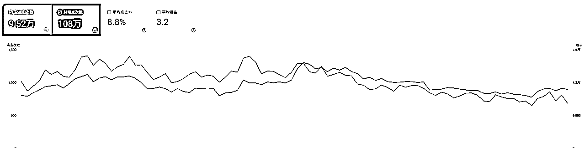
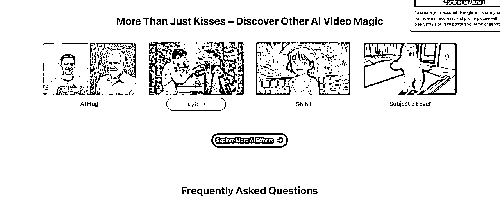

# 零基础入门 Google SEO 丨实战手册丨2025年9月航海

> 来源：[https://ocn93f5d9olj.feishu.cn/docx/J5jXdY2LeoBspRxsYeAcE7n1nMe](https://ocn93f5d9olj.feishu.cn/docx/J5jXdY2LeoBspRxsYeAcE7n1nMe)

项目介绍

1.  什么是 Google SEO？

Google SEO（Search Engine Optimization，搜索引擎优化）简单来说，就是通过一系列方法，让你的网站能够在谷歌的搜索结果中排名靠前，获取更多的免费自然流量。

这一系列方法包括关键词研究、网站结构设计、页面优化以及外链建设等多个环节，也是我们本次航海学习的重点内容，通过航海整个流程的实践，对于 SEO 的基本入门大概就没有什么问题了。


1.  为什么要做 Google SEO？

本次航海主要是带大家把 SEO 最基础的体系过一遍，让大家对于网站的 SEO 优化有一个相对整体的理解，通过这些理解来去提高自己网站在谷歌的表现，提升网站排名，获取更多的 SEO 流量。

海外网站由于 AI 的发展，确实带来很多新兴的机会，通过刚出现的新词来去获取流量确实是个非常好的方便法门，但是获取关键词仅仅是 SEO 中的一个环节，如果你情报能力不佳，落人一步；或者你做的是老需求，如何从 SEO 获取流量，这时候才真正触及 SEO 的门槛。

这次航海我们也更侧重于整个知识体系的建立，希望搭建一个基本的 SEO 认知，你能够带着这个认知，优化产品，给产品做增长，而不是仅仅止步于跟着增长的趋势做产品。

回归到 SEO 的真实范畴，它不存在一夜暴富的神话，而是需要超过 3 个月的持续耕耘，才能带来网站流量的健康增长。它比广告投放，红人营销，以及病毒短视频都要缓慢，那为什么还要做 SEO？

SEO 流量有几个非常显而易见的好处，其实很简单，主要 3 个原因：

# 2.1 好处一：低成本的稳定自然流量渠道

相较于红人营销、meta、谷歌的广告投放而言，SEO 是做海外产品尚且可行的一种自然流量的获取渠道，不需要你持续的金钱投入就能够为你的网站获取稳定的自然流量。当然，谷歌 SEO 并不是完全免费的，想要在谷歌中排名靠前，在外链建设，网站推广过程中还是必须花出一定的费用，才能够在 SEO 上获取更好的效果。

但是相较于其他营销渠道，SEO 的投入成本还是相对较低的。

# 💡

主要的投入成本：域名费用 + 外链费用 +（客座文章投稿）+ 个人时间投入

# 2.2 好处二：流量稳定且持续

SEO 的流量非常稳定，因为搜索引擎依靠排名获取点击的天然属性，如果你的网站在某个关键词获取了比较靠前的排名，只要定期对网站进行一定的维护更新，网站的排名就会保持不变，因此网站流量会持续稳定在某个位置，即使由于搜索词的热度逐渐降低，这个网站流量的降低也会是一个缓慢的过程，因此，SEO 还是非常值得投入的。

这是我 3 月上线的一个网站，虽然搜索词的流量有所下滑，但是你看这个趋势是非常稳定的。



# 2.3 好处三：渠道客观，适合出海新手

出海对于我们国人来说，天然有一层的隔膜，海外用户的文化习惯我们并不易于理解，SEO 这条渠道相对客观，通过工具判断关键词的搜索量，并了解满足需求的产品形态便能够开始获取流量，不需要深入钻研用户心理，甚至进行比较繁复的用户调研访谈流程。

因此，对于出海新手而言，这是相对容易的掌握的营销渠道。

1.  如何学习 SEO？

SEO 的优化对于不同出发视角的圈友来说，在我的理解里稍有差异：

1.  如果你是做一个单页网站，依靠获取新关键词的情报能力来做网站，持续获取收益，那我建议你要深入理解页面优化，做好网站的页面优化，对于你有最大的好处。

1.  如果你是围绕只做一个核心产品来做 SEO 优化，那么我建议你深入理解网站的结构设计，从结构设计到页面优化，外链建设，从一个体系的 SEO 视角看你的产品，能够最大程度的帮助你获取 SEO 流量。

当然，对于两者而言，SEO 的每个步骤都是必要的，我只是从不同侧重角度而言来讲。

1.  关键词的判断标准

1.  本章概要

本章概要

选对关键词，就是选对了方向。本章教你如何找到有流量、低竞争的关键词。

本章核心内容包括：

✅ 五种获取关键词的方法：从自身业务定位出发，分析竞品流量词，挖掘社媒热点，利用词根拓展，借助 AI 调研

✅ 关键词难度判断：KGR 公式计算竞争度，使用专业工具评估，分析竞对外链情况

✅ 关键词分类与排布：核心词放主页，长尾词分配到子页面，参考优秀网站结构

记住：与其盲目追热点，不如找到适合自己的低竞争关键词。

新手建议选择难度 30 以下的关键词，更容易获得排名。

# 本章航线图

完成本章节的学习和实操，即可完成航线图的：

第一阶段：SEO 认知与关键词研究（约 6 天）

1.  工具准备：了解 Google Trends（主）和 基础 Google 搜索语法 （约 1 天）

1.  获取核心关键词：学习定位法与竞对法 （约 2 天）

1.  拓展长尾关键词：学习社媒法、词根拓词法与 AI 调研法 （约 2 天）

1.  关键词难度测量与选择：掌握 KGR 公式与工具评估（约 1 天）

# 2\. 关键词的判断标准

1.  与自身核心业务紧密相关；

1.  搜索量大竞争程度小；

1.  具体且精确；

1.  有搜索量但无法获取流量的不做；

1.  获取关键词的五种方法

1.  定位法：从自身业务出发

在研究关键词之前，首先问一问自己，到底做的是什么业务，聚焦在什么领域，中文表达是什么 ，对应的英文是什么，但是英文翻译往往不一定是有搜索量的关键词，你需要尝试通过英文翻译直接进行谷歌搜索，看看搜索引擎返回什么结果，从而获取到自己产品可以主打的关键词。

比如，我想要做一个 IP 检测工具，这个英文翻译是 "ip check" 我直接去谷歌搜索，获取到的是如下结果。


通过下拉词发现，发现有搜索量的关键词是其实围绕 "my ip address" 这个关键词展开的一系列差异化的关键词，而直接的英文翻译已经排到了下拉词的第 10 位，这个方法非常简单有效，因为谷歌搜索引擎经过几十年的发展，到今天已经能够非常精确的识别用户的搜索意图，并返回能够获取到最佳结果的关键词。

1.  竞对法：分析竞争对手的流量词

还是以我做一个 IP 检测工具为例，当我实际就基本的业务定位进入搜索页之后，我会发现一大批的网站已经在满足我这个需求，而这些网站，就是我的竞争对手。


这个需求是一个非常老的需求，在今天做我的假设前提是我比所有的产品都能够提供更好的功能给用户，这时候我想提高产品流量，所以我开始研究这些竞争对手的关键词，通过关键词竞争，以 SEO 的手段来帮助我的网站提高流量。

现在我们打开排名第一的竞争对手看一下，进入网站主界面第一屏，直接显示了我的 IP 地址，香港地址。


这时候我们打开事前已经准备好的 AITDK 插件，下拉在 Top Keyword 区域我们已经看到一系列关键词，例如“my ip”、“what is my ip”、“my ip adresss”等等，同时右侧还显示了这些搜索词基本的搜索量规模，以及这个网站所获取到的这个词的流量大小。

以“my ip”这个词为例，它的流量总规模在 200w 平均每月，这个排名第一的网站获取到了这个词 100w 的流量。


为了更精确的获取的这个网站的关键词的排布，我们可以依次打开 “headings tab” 和 “density tab” 来观察，从“heading” 这里可以看到这个网站只有后 2 个 H2 在直接描述 IP 检测相关的的需要，前 2 个 H2 则是从用户需求出发，给这个网站其他其他一系列的内页服务做导航，拓深整个网站的相关服务。


打开 density tab 的页面，我们可以看到网站 ip 和 adress 这个密度基本保持最高，从而明确了网站提供的服务，第 3 个关键词 vpn 则是这类网站最佳的变现模式，为专业的 vpn 服务商提供引流服务。与我们的在前面 top keyword 获取的关键词一致。

通过重复上述的分析思路，调研一系列排名第二、第三网站的相关关键词，我们就形成了一个有流量的关键词列表，围绕这一系列关键词，我们基本能够对网站主页面的的关键词布局有了整体的理解。

1.  社媒法：挖掘新兴热点长尾词

网站有了主关键词，如果主关键词的竞争难度很大，比如说像 ip adress 这个关键词。

如果我的网站围绕这个关键词建立，前期基本不用期望，通过这个大竞争度关键词获取任何流量，因为已经有网站很好的满足了用户需求，谷歌不会想把这个关键词给予一个我们这样的新网站。

对于新网站，想要通过持续的优化获取到 SEO 的流量，除了持续投入资源，获取外链，给网站主页提高权重。

另外一个方面就是尽可能获取更多的长尾的低竞争度关键词，围绕这些低竞争度关键词给网站建立子页面，通过更容易拿到排名的子页面获取到搜索引擎的流量，不断提升网站权重，从而最终提高整个网站的排名。

那么在哪里获取低竞争度的关键词，其实从最有效的竞争来说，我们应该去找到近期刚出现的，有热度的，与我们业务相关的关键词，这些关键词在哪里获取？

其实最有效的办法是在社媒，通过社媒寻找与自己业务相关的近期高热度视频，通过评论区和标题分析，去验证相关关键词的流量，从而找到有效的低竞争度关键词，围绕这个关键词建立页面，就更有可能拿到排名，从而给网站带来流量。

例如我通过 site:youtube.com "ip address"这个搜索语法可以找到一系列的短视频，通过上述方法，持续挖掘评论区，就有可能找到有讨论热度的与我核心业务的关键词。

由于这个需求过于古老，且仅作为思路示例，进一步的拓词操作就不做进一步演示了。


1.  词根拓词法：利用搜索建议拓展

除了社媒挖掘的思路之外，我们也可以通过词根的方式去挖掘更多的细分长尾词。

假如我们把 ip addres 这个关键词作为词根。此时，我们可以在浏览器输入框输入这个关键词，通过下拉搜索的更多关键词建议，我们就可以发现更多的关键词，我们需要通过比如微信的截图文字识别工具，把这些关键词收集起来。

然后我们需要进一步的验证这些关键词的搜索量，这时候我们使用到 Google Trends，打开 Trends。

假如我要搜索这个关键词“ip address lookup”的搜索量，因为 Google Trends 只是显示相对搜索量，因此你需要通过一个知道相对精确搜索量的词作为对比，从估算查询关键词的搜索量。

通过对比 gpt4 这个关键词，大约每天 4000 搜索，这个关键词搜索量在 gpt4 的一半左右，也就是 2000 搜索量左右，然后再乘以 30，就可以得出，这个关键词每月的访问量在 6w 左右。


1.  AI 调研法：借助大模型拓展思路

上述 4 种方法都是传统时代做 SEO 研究必须要持续执行的步骤，当然有一些付费软件可以更直观的观察。

但是无论是从数据的准确性，时效性，以及适合个体而言，谷歌官方提供的一系列工具都是首选，并且已经能够满足小白实现基本的 SEO 关键词研究。

第 5 类方法其实就是利用好 AI，现在的大模型以及具备的精准的搜索能力，因此我们可以借助 AI 帮我们进行基本的关键词调研与长尾关键词延展。


上述的研究操作，我们都可以通过向 AI 口喷（用嘴说人话就行）的方式来实现，但是最终的关键词验证和决策步骤还是必不可少，这也是我们人类的价值所在。

你可以使用 ChatGPT、Gemini 以及 Grok 任何一个来向他陈述需求。获取网站主关键词建议或者要求 AI 帮你拓展低竞争度的长尾关键词。


1.  关键词难度测量与选择

1.  KGR 公式法：手动估算竞争度

这个是个数学题，假如你知道关键词的竞争对手数量，同时知道这个关键词的流量大小，相信你就知道关键词难度如何，这里可以引入一个公式：

KGR = （allintitle 搜索结果数量） / 搜索量

假如我要判断 “ai music generator” 这个关键词的搜索量，我首先会去谷歌搜索这个关键词的结果数量，有 175000 个搜索结果。


第二步，预估搜索量，在谷歌 Trends 中对比 Gpts 的搜索量，为 gpts 30/50的搜索量，gpts通过3方工具可知流量在每日5000左右，因此这个关键词相当于每天 3000 左右流量，一个月就是 90000 搜索量，然后用 175000 除以 90000≈1.94。


# KGR 判断标准

KGR < 0.25 → 非常优质，低竞争，容易快速排名（推荐做）

0.25 ≤ KGR ≤ 1.0 → 中等竞争，可以做，但排名速度稍慢

KGR > 1.0 → 竞争太大，不建议优先做

通过比对，可以发现，1.94 远大于 0.25，这个关键词对于新手来说非常困难，建议不要上手了。


1.  第三方工具判断：快速获取难度评分

所有尝试对关键词难度进行判断的第三方工具，其实都是基于这个核心原理的演化，各家的爬虫系统与算法差异导致了的计算差异，但是也都是一个预估和参考体系，下述工具都有对于关键词难度的判断体系：

A. 谷歌关键词规划工具

B. Similarweb

C. Sermush

D. Ahrefs

下面演示了使用 Ahrefs 的免费工具判断关键词方法，其他工具需要付费，通常通过关键词研究板块可以清晰看到关键词的竞争难度，如图是 Similarweb 的 KD（Keyword Difficulty，关键词难度）（KD 数值越大，竞争越大）判断：


1.  竞争对手调研：综合判断真实竞争环境

得出 “ip address lookup” 的搜索量之后，我们需要进一步验证关键词的竞争难度，这时候可以打开 https://Ahrefs.com/keyword-difficulty 这个免费网站。

输入相关关键词，获取到关键词竞争难度，这里显示竞争难度为 81，需要获取超过 381 个来自不同域名的外链，才有可能进入首页，因此这个关键词是高难度的关键词。


寻找低竞争度的关键词，就需要持续重复上述操作，对于新手，建议寻找难度评分 30 以下的关键词，就存在更容易获取到相关关键词搜索流量的可能。

1.  关键词分类与排布

根据搜索到业务相关的一系列关键词，对关键词进行排布分组，其中搜索量大，业务最相关，同时竞争度相对低的作为网站的核心定位，然后根据进一步的延展关键词进行分类，每个页面基本主打一个核心关键词。

如果不知道怎么进行网站的谋篇布局，可以获取一个 SEO 做的好的网站的 sitemap，然后让你 AI 帮你可视化网站结构，通过持续学习这种好的网站结构，相信你也能够很快掌握网站的关键词规划。

如图，这是我让 ChatGPT 帮我做的网站 sitemap 可视化，虽然有点丑，但结构一下子清晰了：


到这一步，网站的基本结构就有了大致的设想。

1.  网站的基本结构与导航

# 1\. 本章概要

本章概要

网站架构搭建完成后，接下来要解决的核心问题是：

让搜索引擎能够高效地发现、理解并收录你的网站。

具体需要完成：

✅ 确定网站物理结构（扁平 vs 金字塔）

✅ 设计合理的内链网络和导航体系

✅ 配置robots.txt和sitemap.xml文件

✅ 做好网址规范化设置

新手建议优先选择扁平结构，简单易管理，爬虫抓取效率更高。

如果内容丰富可以考虑金字塔结构，但要控制好目录层级深度。

# 本章航线图

完成本章节的学习和实操，即可完成航线图的：

第二阶段：站内优化：结构与内容（约 7 天）

1.  网站结构设计：学习物理结构与逻辑结构，优化网站内链（约 2 天）

1.  物理结构：扁平与金字塔结构

物理结构主要是指网站目录之间的关系，初级网站基本是扁平结构，深度一些网站是金字塔结构。

扁平结构适合内容较少的网站，所有页面都直接挂在主域名下，路径短，爬虫抓取效率高。


金字塔结构适合内容丰富的大型网站，通过多级目录组织内容，层次分明但路径较深。

1.  链接结构：构建内部链接网络

链接结构，指网站页面之间的链接关系，这往往是不同跨级页面，以及同级别页面相互链接，形成一个复杂交互的网络，也就是网站实际的内链逻辑。

良好的链接结构能够：

传递页面权重

帮助搜索引擎理解网站结构

提升用户体验


1.  网站导航设计：页头、页脚与页中

网站主要分为页头、页脚以及页中部分，这 3 部分通过文字、面包屑、以及锚文本等方式去撑起网站的页面之间的链接。

页头和页脚主要呈现网站的核心分类关键词，而页中部分则通过锚文本等方式形成不同页面之间彼此交互的链接。

网站导航的核心目标在于让网站的子页面和首页之间的点击距离越短越好，基本我们现在可以做的 AI 工具类网站 2 层级的导航已经基本满足，如果是一些导航站可能需要做到三级导航。

以 vidfly.ai 这个网站为例，首页导航 4 个分类，使用最简单的锚文本链接，基本囊括了所有重要的二级页面。


同时进一步在页中部分，给具有核心的功能的子页面放置了内部链接，这样通过页首，页脚，以及页中 3 个部分的的联动，就撑起了整个网站的链接结构。

每个子页面的落地页几乎同构，同时给其他子页面访问提供了入口，这样整个网站的链接结构就是比较健康的。




1.  子域名 vs 目录：如何拓展网站内容

1.  子域名的应用场景

子域名是被当作独立的域名，但是对于搜索引擎，其实主页的权重是最高的，初始权重高于子页面，但是无法传递主页权重，但主域名能够传递信任度给子域名。

例如：dreamina.capcut.com，熟悉 CapCut 的用户一看就了解是 Dreamina 是它旗下的产品。

从冷启动的角度来说，以子域名作为初始形态，其实相对页面权重更高，其中以彪哥的 bypass.hix.ai 为例，其实用子域名的形式最大程度保证拿到了这个当时火热关键词的流量。

常见的子域名应用案例：

filmora.wondershare.com

pdf.wondershare.com

bypass.hix.ai


1.  目录的应用场景

目录是被当作网站的内页，初始权重相较于子域名更低，但是可以传递首页权重。

这个比较典型的如 Canva，你搜很多图片、视频、视觉创作领域的关键词，几乎在首页都有它的身影，但是这还只是它的子页，就能在一些流量巨大的功能词占据首页排名，其中一个原因就在于 Canva 的它的首页品牌权重非常高，通过权重传递，虽然只是一个子页面，也比我们只是单独的去上一个关键词的相关域名的网站更容易拿到排名。

使用目录形式拓展网站页面是我们大多数人常用方式，虽然子页面的初始权重相对子域名较低，但是随着主站传递权重给子页面，2 者在 SEO 的角度其实差别不大。

常见的目录应用案例：

https://pollo.ai/image-to-video

https://pollo.ai/ai-video-generator


1.  如何为你的项目做选择

据观察到的现象，对于项目的新功能，究竟是以目录的形式还是以子域名的形式呈现，其实 2 种类别都存在。

从技术架构的延展性上来说，其实还是推荐子目录，因为上一个新页面相对容易，同时项目的管理难度也更低，但是很多老牌传统的网站会以子域名的形式来展现的新的功能，或者发展一个新的子品牌。

选择建议：

新手推荐使用目录形式，管理简单，权重传递好

需要独立品牌或技术架构差异大时选择子域名

小型网站优先考虑目录结构

1.  索引与爬取设置：与谷歌高效沟通

1.  Index 与 No Index 的作用

Index 中文翻译是索引，意思是指将一个 URL 的信息进行整理，并收入谷歌的索引库。对于我们的网站而言，也就意味着页面被谷歌收录，如果你去谷歌搜索你的网站，是可以搜索到的。

No Index 是不被索引，通常这是站长的主动行为，你需要在你的 robot 文件中告诉谷歌，哪些目录文件，即网站 URL，不需要被索引，或者考虑到被索引之后可能会对网站流量的影响的一些低质量重复页面，都需要设置好 no index。

1.  Robot.txt 的配置方法

robot 文件的作用就在于指定各个搜索引擎抓取网站的哪些内容，或者禁止爬虫抓取哪些内容。

如下，是常见的 robot.txt 文件的设置格式：

```
User-agent: *
Disallow: /

Disallow: 
```

其中 User-agent: * 代表适用于所有搜索引擎的蜘蛛，Disallow: / 代表禁止搜索引擎抓取指定目录，Allow: / 代表允许抓取。

需要注意的是，Disallow: 后面为空则代表允许蜘蛛抓取网页所有的内容。


1.  Sitemap.txt 的生成与提交

Sitemap 即网站地图，通过网站地图，能够更清楚的告诉搜索引擎网站的结构和内容。

常见的网站地图如下：

```
 <url><loc>https://vidfly.ai/affiliate-program</loc>
<lastmod>2025-08-06</lastmod>
<changefreq>daily</changefreq></url> 
 <url><loc>https://vidfly.ai/ai-asmr-generator</loc>
<lastmod>2025-08-06</lastmod>
<changefreq>daily</changefreq></url> 
```

标签说明：

loc 标签必须存在，作用是列出网站页面完整的 URL

changefreq 是可选标签，用来代表网页的更新频率（always、hourly、daily、weekly、monthly、yearly）

priority 也是可选标签，向搜索引擎表明网站不同 URL 的相对重要程度，可以选择 0.1-1.0 之间的任何值

1.  网站 URL 设计规范

1.  目录包含关键词

我们给网站上新更多子页面的作用就在于踩中更多相关的搜索关键词，URL 以关键词命名可以进一步提高我们子页面的辨识度，从而更大概率让搜索引擎收录我们的页面。

我们可以以 vidfly.ai 为例，你会发现，他的子页面 https://vidfly.ai/ai-asmr-generator 或者 https://vidfly.ai/ai-video-generator/ 都是一些具有高搜索量的关键词，页面同时主打这个关键词，最大程度在搜索引擎面前提高了子页面的辨识度。

1.  目录层次尽可能少

SEO 的核心原则是帮助搜索引擎更高的收录我们的网站页面，进而为我们的网站带来更多的自然流量，如果的你的网站目录层次过深，会消耗搜索引擎过多的爬取预算，因此造成网站页面无法被收录。

以 https://vidfly.ai 为例，你会发现它网站最深的页面是三级目录，对于我们大多数人网站而言，其实二级目录已经足够，如果是一些导航类网站，则因为二级分类目录的缘故，才会采用三级目录。

https://vidfly.ai/apps/ai-video-generator/

https://vidfly.ai/apps/ai-image-generator/

1.  避免带过多参数

一般而言，大多数网站对于搜索引擎都是静态页面，如果你的 URL 带有太多参数，往往意味着它是一个动态页面，是根据前端的访问及时返回的，如果你是用 AI 编程实现的，你可能需要重新思考下网站的技术架构。

避免这样的 URL：

https://example.com/page.php?id=123&category=456&sort=new&filter=true

推荐这样的 URL：

https://example.com/category/product-name

1.  保持登录前后 URL 统一

很多带登录功能的网站，用户登录前和登录后往往不是一个页面，或者一个主页一个内页，用户数据不在同一个页面上，这也意味着往往把同一个用户行为带来的网站页面权重提升的机会分配给了 2 个页面，从而造成页面权重均摊降低。

但是如果登录前和登录后保持一个页面，最大程度保留单用户行为带来的页面权重提升，这样会给网站页面积累更高的权重，从而带来更好的 SEO 效果。

这里可以举一个例子，你如果访问 https://pollo.ai/image-to-video，你会发现你在登录前和登录后访问的是同一个页面，这就是非常典型 SEO 友好的 URL 设计。

1.  网址规范化：避免重复内容问题

网址规范化的原因在于很多时候我们网站的一个页面从技术角度来说有多个访问方式，假如我们网站的网址是 abc.com，但是我们可能通过：

https://abc.com

http://abc.com

https://www.abc.com

http://www.abc.com

https://abc.com/index.html

http://abc.com/index.html

都能够访问，但是对于搜索引擎而言，它们又都是同一个页面内容，如果不进行网址规范化，你的 GSC 后台就会出现"重复页面"的提醒。

1.  设置 Canonical URL

Canonical tag 的作用就是直接告诉搜索引擎你的规范化网址到底是哪个，通常情况，我们会把 https://abc.com 这个类型的网站设置为规范化网站，之后搜索引擎访问 https://abc.com/index.html 这样的页面，也能够知道我们真实的规范网址到底是哪个。

在 HTML 的 head 标签中添加：

1.  配置 301 重定向

301 是蜘蛛向服务器请求时，服务器返回的 HTTP 数据流中头信息的一种状态码，表示本网址永久的转移到另外一个网站。

如果你是用 Vercel 部署网站的，你会在你的域名配置区配置 https://www.abc.com 301 到 https://abc.com，这样对于搜索引擎而言，就会将 www 的页面和非 www 的页面当做同一个页面。


1.  启用全站 Https

HTTP 和 HTTPS 是 2 种网页传输协议，2 者的全称分别是 HTTP（HyperText Transfer Protocol，超文本传输协议）和 HTTPS（HyperText Transfer Protocol Secure，安全超文本传输协议），差别就在于后者比前者更安全，后者的数据是经过 SSL 加密传输的，更加安全。

现在网页一般只使用 HTTPS 访问，实现 HTTPS 的方法也非常简单，如果你是采用 Cloudflare 和 Vercel 这样的平台部署网站，那么你的 HTTPS 配置通常不需要像传统网站工作者那样在服务器上进行复杂的证书配置操作，只需要进入 Cloudflare 绑定你域名的对应页面 ，进入 SSL/TLS，然后选择边缘证书，打开始终使用 HTTPS 开关即可。

1.  常见抓取错误排查与解决

GSC 后台网页下面呈现我们网站页面收录的一系列情况，新手通常会遇到下面几种收录报错的提示，下面给出一些可行的解决办法。

1.  重复页面

重复页面最常见的原因就是上述的网址规范化问题，做好上述的配置基本可以解决这一问题。

另外一种是网站提供不同了不同程度的抄袭其他网站的页面的内容，也会造成重复页面从而导致不被收录，杜绝这种情况的最简单办法就是不要去抄袭别的网站的内容。

第三种情况是网站的实质内容太少，页头页脚加起来的信息比页中还多，这样的页面对于搜索引擎来说属于低质量页面，也不会选择收录，这种低质内容更多出现的提醒如下，不一定会以重复页面的来提醒。


1.  网页会自动重定向

网站会自动重定向，通常是 HTTP 没有设置 301 到 HTTPS 页面导致的，虽然最终爬虫会进入 HTTPS 页面，但是经历了可能 307 的暂时重定向，所以会出现后台的提醒。

另外一种情况是网站的多语言设置，主页通常默认是英文，但是/en 页面没有默认 301 到/页面，导致了自动重定向报错，这种情况也是在代码层面配置好 301 就能解决。

1.  404 页面

很多 AI Coding 生成的页面页头和页脚信息 AI 都是根据大致的网站样子生成的，其中留下了很多不规范甚至不存在的页面入口，如果爬虫尝试根据这些入口爬取页面就会导致服务器返回 404 报错。

另外很多情况下有些网站不设置 sitemap.xml，但是爬虫依然会去抓取这个页面，这也可能造成 404 报错，传统的网站一般都会给网站定制一个 404 页面，当遇到前端访问不存在的页面时候返回，这样最大程度减少索引报错。

下面是一个 YouTube 网站的 404 客制页面例子：

1.  页面元数据优化（Meta Tags）

1.  本章概要

本章概要

页面优化直接影响搜索排名和用户点击率，是 SEO 中最需要精细打磨的环节。

本章关键内容：

✅ 元数据优化：标题 45-60 字符包含关键词，描述吸引点击，关键词标签已过时

✅ 正文内容优化：关键词密度 3%左右自然分布，H1-H6 标题合理使用，图片 Alt 标签优化

✅ 用户体验指标：LCP 加载速度≤2.5 秒，FID 响应延迟≤100 毫秒，CLS 布局稳定性≤0.1

✅ 移动端优化：响应式设计最简单，确保移动端体验良好

✅ 结构化数据：添加 JSON-LD 标记，让搜索结果展示更丰富

页面优化不是堆砌关键词，而是在满足用户需求的基础上，让搜索引擎更好地理解你的内容。

移动端优化已成必选项，不做会被降权。

# 本章航线图

完成本章节的学习和实操，即可完成航线图的：

第二阶段：站内优化：结构与内容（约 7 天）

1.  页面优化（On-Page SEO）：学习优化页面标题、描述、H 标签和内容（约 3 天）

1.  页面技术优化入门：了解 URL 规范化、移动端友好性等概念 （约 2 天）

1.  页面标题（Title）：撰写原则与技巧

页面标题是指网页的标题，通常在浏览器的 tab 位置出现，与我们通常理解的文章标题不同，页面标题主要是向搜索引擎表明页面的主题，同时当用户进行相关关键词搜索时，如果我们的页面排名靠前，用户首先看到的就是我们的页面标题，因此，除却向搜索引擎表明页面主题外，也具有一定程度吸引用户点击的作用。


下面是一些页面标题书写的基本原则：

1、不重复：网站不同页面需要使用不同的标题，而不是共用一个标题。

2、字数限制：标题通常英文字符是 45-60 个字符最佳，中文字符 30 个最佳，经过实操发现，谷歌的搜索引擎即使字数不规范也能很好的识别，但是第二大搜索引擎 Bing 的爬虫则对于标题字数有严格的限制，如果字数不规范，会造成页面无法索引，本着最大化网站流量的考量，页面标题字数还是尽可能的符合规范最好。

3、击中核心关键词，主打关键词放最前面：

标题直接表明网站页面主题，因此主要想要排名的关键词应该直接放在标题最前面，最大程度提升关键词可见度，但是标题需要是从语法上可读的一句简短的标语，而不能类似很多电商商品名称一样尽其所能的提升关键词，这样的关键词堆砌，在谷歌成熟的算法面前并不是加分项。

4、品牌或网站名称放最后：

如果你在做一个品牌网站，可以在页面标题的最后符合规范字数的前提下放置自己的品牌名称，提升自身品牌的可见度。

5、吸引用户点击：

前面讲过，标题会在搜索结果中呈现给用户，因此标题也具有吸引点击的作用，如果标题能够利用一些优秀的广告文案技巧击中用户的痛点，就能够更大程度的提升网站的点击率，这对于提升网站流量同样具有重要的作用。

1.  页面描述（Description）：吸引用户点击

描述标签用来说明网站页面的主体内容。可以就页面的功能，主打的主题进行一定的陈述展开，但是这个标签本身没有 SEO 权重，同时所写的内容也不一定会完全被谷歌采纳，下面是 YouTube 的例子，网站主页的描述并不和搜索页的呈现完全一致。谷歌对于对于原有描述进行了一定的截取，并重新陈述。

描述标签虽然没有 SEO 权重，但是作为直接出现在搜索页的内容，具备一定吸引点击的作用，例如 YouTube 这句搜索页面简单的号召性标语，其实从用户视角看，要好于描述标签一长段的描述。

一个可以落地的技巧是，描述标签的语句尽量使用动词开头并直接澄清网站给目标用户带来的价值，这样能够更好的吸引用户点击。

同时这也意味着，SEO 的不仅仅是一个冰冷的关键词分析，也需要从用户心理角度进行表达的考量，需要对于文案技巧了解，并且在传统 SEO 中，博客页是给网站获取长尾流量的有效手段，因此很多 SEOer 其实是文案高手。


1.  关键词标签（Keywords）：了解其历史与现状

关键词标签是古早时代向搜索引擎表明网站主要关键词的手段，但随着搜索算法的演化，以及对于关键词堆砌等行为的杜绝，主流的搜索引擎基本不采纳这些关键词标签，它们在 SEO 排名不扮演任何作用，同时在搜索页面也不可见，不具备吸引点击的作用，通常保持为空即可。例如谷歌商店的例子就是正确的。


1.  页内正文内容优化

1.  关键词密度与自然布局

关键词密度是指页面主打关键词出现的次数除以页面可见文字总词数的比例。业内通常的做法是保持关键词密度在 3% 左右，但现在的搜索算法非常聪明，其实关键词密度高或者低都能够辨析，正确表达页面功能，适当插入关键词即可。

另外，越是常见的关键词，对搜索算法判断页面相关性的权重越低，因此，适当搭配关键词独特的表达对于搜索引擎而言，更具有辨识度。


正文的前 50-100 个字，基本是 H1 相关的关键词表达，SEO 的权重相对较高，在这些位置开头，最好直接出现网站页面想要主打的关键词，更好的表明页面内容与对应搜索关键词的相关性。

对于关键词的表达，没必要同一关键词从头出现到尾，因为具有相当多的各种形式的单词表达，因此可以以更丰富的相似关键词进行表达，这样对于搜索引擎更加自然，而不会显得刻意。

1.  H1-H6 标题的合理使用

H1 标题到 H6 标题权重依次较低，H1 相对较高，因此页面 H1、H2 的优化要做到位，出现相关关键词的同时，用更具风格的文案表达呈现用户价值最好。

标题使用原则：

每个页面只使用一个 H1 标签

H2-H6 按层级递进使用，不要跳级

标题中自然包含关键词，避免堆砌

标题要简洁明了，体现内容结构


1.  图片 Alt 标签的优化

Alt 标签主要是对图片内容的描述，因为爬虫无法理解图片，alt 描述非常有必要，这个标签的权重和 H1 相当，因此页面的图片 alt 描述需要到位，适度出现核心关键词的同时，澄清图片内容即可，不要堆砌关键词。

Alt 标签优化技巧：

准确描述图片内容

适当包含关键词

保持简洁，一般 10-15 个单词

不同图片使用不同的 Alt 文本


1.  内部链接与锚文本策略

内部链接主要出现指出现在导航栏、页脚和页中部分的网站各个页面的入口，锚文本需要直接和内页主打关键词相关，常见的情况是内部链接只存在于页头和页脚，但是在页中适当加入内部链接 SEO 效果更好，对于搜索引擎而言，因为页中部分展示网页的实质内容，这里出现的内部链接权重也相对高一些。

内部链接优化要点：

使用描述性锚文本，避免"点击这里"

链接到相关性高的页面

保持合理的链接密度

确保链接可访问，避免死链

1.  保持页面内容更新

具有时效性质的网站，例如博客站或者新闻站，页面的频繁更新有助于保持排名，甚至提高排名。我们会看到，一些 SEO 领域的经典文章，会根据年份持续更新发布时间，也是这个道理。

内容更新策略：

定期更新过时信息

添加新的相关内容

修正错误和改进表达

更新发布日期和最后修改日期


1.  页面用户体验（Core Web Vitals）

页面用户体验是页内 SEO 优化的一个重要评估维度，谷歌使用 Core Web Vitals 这个指标来进行评估，其中主要包括 3 个主要维度，分别是 LCP、FID 以及 CLS。


# LCP （最大内容绘制）

LCP 是指首屏可见区域最大图片或文字区块渲染需要的时间，主要衡量页面的加载速度。

优化目标：

良好：≤ 2.5 秒

需要改进：2.5-4 秒

较差：> 4 秒

优化方法：

优化服务器响应时间

使用 CDN 加速资源加载

优化图片大小和格式

预加载关键资源

# FID （首次输入延迟）

FID，首次输入延迟，是指当用户第一次做出交互，包括点击链接、按钮等行为后浏览器做出反应所花的时间。

优化目标：

良好：≤ 100 毫秒

需要改进：100-300 毫秒

较差：> 300 毫秒

优化方法：

减少 JavaScript 执行时间

分解长任务

使用 Web Workers

减少第三方代码影响

# CLS （累计布局偏移）

CLS，累计布局移动，是指页面访问过程中出现的无法预期的页面元素位置移动总数，比如广告的代码可能导致网页页面元素显示异常，主要衡量页面观看时候的视觉稳定性。

优化目标：

良好：≤ 0.1

需要改进：0.1-0.25

较差：> 0.25

优化方法：

为图片和视频预留空间

避免在已有内容上方插入内容

使用 CSS transform 动画代替改变布局的动画

# 优化建议与检测工具

这些指标我们都可以通过谷歌的这个测试网站 https://pagespeed.web.dev/analysis 来对自己的网站进行评估，根据给出的问题诊断以及建议，然后发给 AI 根据自己网站代码的实际情况寻找可行的解决办法。

当前像页面访问速度，有些影响实际与部署的服务器带宽有关，因此很多问题其实通过氪金可以最快的速度解决。

常见优化技术包括图片压缩、浏览器缓存、KV 缓存、图片懒加载等等，大家可以根据关键词自行提问 AI 理解并为自己的网站寻找解决方案即可。

1.  移动端优化

在 2015 年之后，世界范围内的移动端流量就已经超过了桌面端，对于谷歌而言，移动端的搜索流量也在流量中占比更高，谷歌在 2023 年 10 月 31 日已经宣布，移动优先索引完成。

这其实意味着，无论我们的网站是否只支持 PC 端用户使用，谷歌都会使用仅存在的移动端爬虫对我们的网页进行爬取，如果我们网站的移动优化不足，响应性差，页面元素偏离严重，会严重影响移动端用户用户体验，那么自然网站也就不可能在谷歌拿到较好的排名。

因此，移动端优化是 SEO 页内优化一项基本功，做了不会加分，不做一定会减分。

移动优化主要有 3 种方式，分别是响应式设计、独立移动站，和动态服务。

1.  响应式设计

响应式设计是指浏览器根据屏幕显示不同的布局。

优点：

一套代码维护简单

URL 统一，有利于 SEO

用户体验连贯

实施要点：

使用流式布局和弹性图片

设置 viewport 元标签

使用媒体查询适配不同屏幕

1.  独立移动站

独立移动站是指服务器根据用户或者蜘蛛访问设备的不同，直接返回不同的 URL，这通常需要对页面做转向，谷歌比较推荐的是 302 转向，不建议使用 JS 代码做转向处理。

例如：youtube.com 和 m.youtube.com

优点：

可以针对移动端深度优化

加载速度可以更快

缺点：

维护成本高

SEO 配置复杂

1.  动态服务

动态服务类似移动独立站，服务器判断设备和浏览器类型，在不改变 URL 的前提下，根据浏览器差异返回不同的 HTML 和 CSS 代码，PC 返回 PC 版本，移动端返回移动版本。

后两种在代码层面界面差异比较大，只适合有一定规模的公司和创业团队去做，对于个体开发者而言，实现移动端友好最便捷的方式还是使用响应式设计，可以一套代码复用，降低工作的复杂性。

1.  结构化数据标记

1.  什么是结构化数据

结构化数据主要是用来提供页面更多细节信息，以及把页面内容进行分类的标准化数据格式。添加结构化数据可以让搜索引擎更好的理解页面内容，同时页面摘要会以富摘要、知识图谱的形式在搜索结果中呈现，有利于提高网站点击率。

1.  常见类型与应用

结构化数据包含 3 种格式：JSON-LD、Microdata、RDFa，相对主流的是谷歌推荐的 JSON-LD。

支持结构化数据标记的内容包括：

菜谱

面包屑导航

产品

FAQ

事件

评测

文章

视频

通常在电商网站相对常见，下图是一个例子：


1.  如何为网站添加

添加结构化数据的基本步骤：

.

选择合适的数据类型：根据页面内容选择对应的 Schema 类型

.

生成 JSON-LD 代码：可以使用 Google 的结构化数据标记助手

.

添加到页面：将代码添加到 HTML 的标签中

.

测试验证：使用 Google 的富媒体搜索测试工具验证

示例代码（FAQ 类型）：

```
{
 "@context": "https://schema.org",
  "@type": "FAQPage",
  "mainEntity": [{
    "@type": "Question",
    "name": "What is SEO?",
    "acceptedAnswer": {
      "@type": "Answer",
      "text": "SEO stands for Search Engine Optimization..."
    }
  }]
}
```

1.  为什么外链至关重要？

1.  本章概要

外链是网站权威性的"投票"，质量远比数量重要。一个高质量外链胜过百个垃圾链接。

本章实战方法：

✅ 外链重要性：搜索引擎通过外链判断网站权威，越难获取的链接价值越高

✅ 好外链的标准：相关性高、权威网站、Do Follow 属性、锚文本自然

✅ 获取外链渠道：

提交到 Product Hunt、Toolify 等导航站

与相关网站交换友链

制作免费工具或趣味游戏作为链接诱饵

发布高质量客座文章

✅ 建设原则：宁缺毋滥，循序渐进，避免短期大量增加

外链建设是 SEO 中最需要投入成本的环节，但也是提升网站权重最有效的方式。

先从免费的导航站提交开始，逐步建立高质量的外链网络。

# 本章航线图

完成本章节的学习和实操，即可完成航线图的：

第三阶段：站外优化与数据分析（约 8 天）

1.  外部链接建设入门：理解外链的价值和判断标准（约 2 天）

1.  内容为王：学习如何创建能自然吸引链接的优质内容（约 3 天）

1.  外部链接的历史与原理

搜索引擎的算法大致逻辑是用户搜索一个关键词或一个问题，他根据索引到的网页返回相应的结果，返回哪些网页作为用户搜索的结果，关键就在于页面的相关性。

早期的算法根据页面内容来判断相关性，但是被取巧的站长利用，大量堆砌关键词，但是并没有实质满足用户需求，于是引入他人评价的算法评估，这就是外部链接的由来。

类似于人与人之间的权威建立，并不是自己说自己多牛，而是多数人的投票背书逐渐建立了一个人的权威。因此，网站页面的外部链接是搜索引擎判断页面相关性与权重的重要维度。


1.  搜索引擎如何判断外链价值

搜索引擎判断一个网站及其页面的外链不是单单从网站的链接的数量来看的，很多时候，外链的质量远远大于数量。

下面是一些搜索引擎判断网站外链的维度：

.

反向链接的数量

.

反向链接增加的速度：速度快，会存在作弊嫌疑；速度慢，会导致排名降低

.

反向链接锚文字前后的临近文字：通过前后文字判断页面内容的相关性

.

外链所在域名是否被二次购买：这种域名权重会被清零

.

反向链接所在页面的收录日期：反链页面越老，信任度越高

.

反向链接第一次出现在该页面的时间：老页面出现新关键词的通常比较可疑

.

反向链接是否有变化：锚文字和链接 URL 修改可能存在操纵嫌疑，进而降低信任度

.

反链所在页面还指向哪些页面：如果都指向高质量网站，则整体链接的权重上升

.

外部链接是否是垃圾外链：如果一个网站外部链接，绝大部分都是博客评论，这个链接构成并不健康

.

链接点击率：用户点击越多，页面权重提升

.

用户点击链接的停留时长：越长则链接相关性越强

1.  好外链的判断标准

外部链接的最大意义在于给网站带来点击流量，无论这个链接是 Do Follow 还是 No Follow，如果一个外链能够为你的网站带来的实质流量，这个外链具有优先建设的意义。

只有当直接获取流量的链接建设完成的前提下，我们才需要进一步寻找可以提升页面权重的链接，这类链接有如下的标准：

1.  链接的相关性与权威性

外部链接是单向链接，而不需要链接回去，通常交换外链带来权重提升非常有限

外链是对方网站自发编辑链接，通常链接是在页面内容的某个概念给予的链接，这里也可以看出网站页中部分的链接权重会更高

链接页面的内容与被链接页面的内容存在相关性

1.  链接的位置与锚文字

"锚文字" (anchor text) 的意思是：网页链接中可点击的显示文本。

锚文字出现页面的主要关键词，但是如果所有链接都是同一个关键词，也往往不太自然

链接所在页面网站权重、页面权重，高权重页面带来的链接远远高于低质量的网站，这也是链接质量大于数量的原因

# 3\. Do Follow vs. No Follow

Do Follow 链接：搜索引擎会跟踪链接并传递权重给目标网站，对 SEO 有直接帮助

No Follow 链接：搜索引擎不跟踪链接，不传递权重给目标网站，但能带来流量和品牌曝光

两种链接都有价值，自然的链接组合更健康

1.  链接页面的导出链接数量

页面导出链接的数量：一个网页页面上导出链接数量越多，那么每个链接所能获得的权重就越低

页面更新频率：链接页面更新频率越高，链接投票权重越高

来自于 edu、gov 域名的链接：这些域名注册需要特殊权限，获取的高质量链接也更多，因此链接效果一般更好

通过上述的一些判断思路，其实会发现，越发难以获取的链接，所来的价值越高，同时，网站外链建设可以说是网站 SEO 营销这块需要真实付出的成本，如果想要获取高质量的外链，最简单的方式是花钱，其次是花时间去和一些老外的网站长做交流。

完全追求数量的链接建设其实对于网站权重的提升非常有限，因为这些容易获取的链接权重通常较低，甚至对网站健康有害。

1.  在哪里获取网站外链？

1.  网站导航站提交

能够给我们网站带来实质权重提升的最佳外部链接还是一些导航网站，例如 Product Hunt、Toolify、There's An AI For That 等等，当然还有不计其数的导航站，这些网站的链接是我们外链建设的首选。

推荐的导航站列表：

Product Hunt（权重高，流量大）

https://www.producthunt.com/

Toolify（AI 工具聚合）

https://www.toolify.ai/zh

There's An AI For That（AI 工具目录）

https://theresanaiforthat.com/

AlternativeTo（软件替代品网站）

https://alternativeto.net/

SaaSHub（SaaS 产品目录）

https://www.saashub.com/


1.  交换外链的技巧

交换外链违反了我们前面所述的尽量是单向链接的原则，但是通常是我们建立外链链接相对容易的方式，这里有些小技巧：

.

这个交换链接页面无法被搜索引擎索引

.

交换链接后删除链接（不推荐，有损信誉）

.

减低交换链接权重加上 no follow 标签

.

三方交换：找一个已经链接到他网站 A 的链接 C，然后要求链接到你的网站 B 等等

交换外链注意事项：

选择相关性高的网站

检查对方网站质量和权重

避免链接农场和垃圾站点

定期检查链接是否还在


1.  制作链接诱饵：工具与游戏

类似于人与人之间的社交，主动的你爱答不理，被动的求而不得，获取链接的最佳方式还是释放自己的价值，对于网站而言，释放自己价值的最佳方式就是制作一些特殊的页面，能够激发一定范围内容自传播的效果。

这类页面主要分 2 种，一种是免费的工具页面，一种是有趣的游戏页面。

其实 AI 编程发展之后制作这类的工具越发容易，我们只是少了一些自己的脑洞去制作这样的页面为网站带来更高质量的外链，提升网站整体的权重。

# 3.1 工具插件诱饵

免费的工具页面需要明确受众和主题，尽量是和网站主题比较相近的免费工具，这样被传播之后能够给网站权重提升带来最大的效果。

SEO 工具网站 Ahrefs 制作了这样一系列的免费 SEO 工具，吸引了受众停留，同时也为网站带来了一系列的宣传与外链，这就是一个非常有用的免费工具诱饵，这样的工具往往一举多得，不仅仅是提供了外链价值，而是从流量，SEO 关键词，以及外链等多角度都起到了好的作用。

# 3.2 游戏诱饵

游戏诱饵还是最好的外部链接建设手段，因为游戏天然的容易上瘾，也更容易被分享，这类游戏的设计最好具备一定的社交属性，从而最大程度的激发用户分享的欲望。

例如最近这个爆火的养鱼网站：https://drawafish.com/，就是一个非常有趣的游戏，如果你用网站的子页面来做一个这样的游戏，被宣传爆火，想必你的网站应该不缺外链吧。

1.  客座博客与内容合作

客座博客是指在媒体类网站上发表文章，并在文章中自然地加入指向自己网站的链接，这类链接方式通常是适合有一定预算的团队，需要联系相关海外媒体网站，并花出一定预算才能发表相关文章。

实施步骤：

.

寻找接受客座文章的相关网站

.

研究目标网站的内容风格和受众

.

聘请专业的本土化 SEO 文章写手，撰写高质量、有价值的原创内容

.

在文章内容与产品相关的关键词中自然插入链接

注意事项：

避免大量低质量的客座发文，这和发垃圾外链没什么区别

选择与自己领域相关的网站

提供真正有价值的内容，保证文章的收录效果

保持合理的发布频率，节奏不急不徐

1.  GEO 的流量探索

# 1\. 本章概要

本章概要

GEO 是 AI 时代的新机遇，让你的品牌在 AI 搜索结果中获得更多曝光。它不是 SEO 的替代，而是 SEO 在 AI 时代的延伸。

本章核心内容包括：

✅ 理解 GEO 本质：生成式搜索引擎优化，重点从获取点击转向品牌曝光，AI 搜索仍依赖传统搜索引擎数据

✅ 谷歌 AI 新功能：AI Overviews 在 45.9%信息类搜索中出现，AI Mode 提供完整对话界面，把握用户决策关键时刻

✅ GEO 优化策略：

品牌建设优先于关键词堆砌

优化 Bing 索引（ChatGPT 依赖 Bing 数据）

使用结构化数据和语义丰富内容

建立第三方信号（占影响力 80%）

✅ 实施要点：配置 robots.txt 允许 AI 爬虫，创建 LLMS.txt 文件，保持内容新鲜度（2-3 年内），积极参与社区和行业讨论

记住：GEO 的核心是让 AI 将你的品牌识别为"首选来源"。传统 SEO 做好了，GEO 自然水到渠成。

# 本章航线图

完成本章节的学习和实操，即可完成航线图的：

选修阶段：GEO 的流量探索（不限时间）

1.  了解 GEO 的流量探索。

# 2\. 什么是 GEO？

GEO（Generative Engine Optimization）即生成式搜索引擎优化，是随着 ChatGPT 等通用 AI 产品逐渐壮大而兴起的一个营销渠道。

相较于传统搜索引擎建立索引、向用户推送链接的方式，AI 搜索更像一个精选的问答引擎。用户不再依靠关键词来获取答案，而是通过直接陈述自己的问题，并由 AI 直接提供答案。

人们与 AI 的这种交互逻辑也决定了，为产品或服务获取流量时，点击率不再是唯一重点，AI 问答中的品牌曝光会给优秀产品带来成倍的机会。商业交易基于信任，这种品牌曝光最终会转化为产品的信任基础，在用户下单时提供更大的确定性。

所以简单来讲，GEO 就是能够最大程度让你的产品和服务在 AI 搜索问答中露出的一系列优化技巧。

从目前而言，GEO 所涉及的优化并非自成一派，而是和传统 SEO 存在难舍难分的关系。AI 大模型自身不具备直接获取实时信息的能力，仍需借助外部工具（如传统搜索引擎）来完成。因此，与其说 GEO 是一场革命，不如说 GEO 是传统 SEO 在 AI 时代的另一种延申。

# 3\. 为什么关心 GEO？

对于习惯了移动互联网推荐逻辑的我们来说，搜索引擎可能稍有隔阂。但在国外，谷歌搜索占据了海外流量渠道的半壁江山，做好搜索优化几乎是提高产品流量的必要选择。

面对 ChatGPT 及 Bing 的挑战，谷歌也顺应潮流，先后推出了 AI 概览（AI Overviews）与 AI 模式（AI Mode），为传统的搜索框提供了新兴的 AI 能力。

这意味着什么？据统计，日常谷歌搜索量已从 85 亿次跃升至 137 亿次，每年超过 5 万亿次。其中，提问式搜索在过去短短 8 个月内从 38%激增至 87%，并且还在不断增长。互联网的受众并没有大幅增加，而是因为依靠 AI，谷歌的答案越来越好，所以人们搜索的频率更高了。

我们做海外产品，SEO 是必要的选择之一，适应谷歌在 AI 时代的新变化，才能享受到变化所带来的时代红利。

# 4\. AI Overviews 与 AI Mode

# 4.1\. AI Overviews（AI 概览）

AI Overviews 是指用户在搜索某些内容时，谷歌会直接在顶部返回 AI 总结的内容，而不是采用传统的链接列表。这些内容通常是谷歌的 AI 对索引库中高质量内容的总结，并在右下角展示引用来源。

从我们的角度看，能出现在这些引用源中的网站，就是值得学习的对象。


研究发现，AI 概览并非在所有搜索中都出现，而是在用户意图最高的时候出现，即当人们正在研究、比较或即将做出决定时。例如：

信息类搜索（Informational searches）：AI 概览出现频率为 45.9%。

商业类搜索（Commercial searches）：AI 概览出现频率为 17.8%。

事务类搜索（Transactional searches）：AI 概览出现频率为 6.1%。

导航类搜索（Navigational searches）：AI 概览仅出现 1.5%。

这意味着，如果您的内容没有被纳入这些总结中，您不仅错失了流量，更错失了客户做出选择的关键时刻。

# 4.2 AI Mode

AI Mode 相比于 AI Overviews 更为激进，它会直接用一个完整的 AI 对话界面取代传统的搜索结果页。用户和搜索引擎的交互从“搜索框”转变成“问答框”。


AI 模式具有如下特点：

它能即时回答多部分、长尾、复杂的查询。

它在幕后运行数十个隐藏的子搜索，这称为“查询扇出（query fanout）”技术，但我们无法看到这些过程和来源。

因此，GEO 不再仅仅是关于排名，而是关于“语义定位（semantic positioning）”。它不只关心关键词的相关性，更关心这些关键词在上下文中的含义以及它们如何连接到相关主题，最终目标是训练 AI 将您的品牌识别为“首选来源”。

# 5\. 其他 AI 搜索

相比于谷歌已经占据的接近 90%的市场份额，其他的 AI 搜索相比起来还非常弱小。即使已经霸榜 AI 应用头名的 ChatGPT 的拥有将近 6 亿月访问量的数据来看，相比于谷歌 80 亿的月访问量的数据来看，还远远差一个数量级，其中很多交互数据还不是基于搜索的，而是更多的属于和 AI 的问答对话。

因此即使关心 GEO，对谷歌的关心依旧要远远大于其他产品。

以 GPT 的搜索为例，其自身并没有搜索引擎，而是借助 Bing 提供的索引数据为用户提供实时的搜索信息，因此，如果想要提升来自 Chatgpt 的访问量，提升网站在 Bing 的排名是有效果的。


# 6\. 如何做好 GEO？

GEO 可以看作是现有 SEO 基础上的延申。传统 SEO 的重点是获取相关流量，而 AI 搜索优化的首要目标是让品牌被提及。这意味着你需要建立一个真正的品牌，而不仅仅是使用关键词域名。

除品牌建设外，现有的 GEO 优化依旧在传统的 SEO 优化范畴之内，包括但不限于以下手段：

.

robots.txt：做好对 AI bot 的访问权限设置。

.

Bing 索引：由于 ChatGPT 搜索严重依赖 Bing，让网站正确地被 Bing 索引非常重要。

.

LLMS.txt 文件：这是一个提议中的标准，允许我们直接与大模型沟通，列出网站最重要的页面，帮助 LLM 快速了解网站主题。

.

后端渲染，返回清晰的 HTML 结构：AI 系统主要读取原始 HTML，确保最重要的内容位于 HTML 文本中，并为图片和视频提供描述性文本。

.

Schema Markup：使用结构化数据告诉 AI 和搜索引擎你呈现的信息类型，帮助机器人快速确定页面内容。

.

语义丰富性与上下文：不应重复使用相同的关键词，而是使用与内容相关的自然多样化术语、概念和实体，创建语义网络。

.

全面性与 EEAT 原则：AI 优先考虑遵循 EEAT（经验、专业知识、权威性、可信赖性）原则的全面内容。通过分享案例、引用来源、展示专业知识来体现。

.

结构化内容格式：使用清晰的标题层级（H1/H2）、项目符号、编号列表、表格和 FAQ 等，这些格式便于 AI 解析和引用。

.

持续更新网站内容：LLM 倾向于引用近两三年内的新鲜信息。持续更新内容，提高网站的新鲜度。

.

第三方信号：这是对 AI 品牌提及影响最大的部分（可能占 80%），包括：

反向链接和品牌提及：出现在行业权威网站的“最佳工具”列表或综述文章中。

客座文章：作为行业内受信任网站的客座贡献者。

访谈和播客：LLM 会抓取访谈和播客的文字稿。

社区参与：在 Reddit 等相关社区中积极提供价值。

你会发现，这些手段几乎和传统 SEO 相一致，这也验证了，现阶段 GEO 是 SEO 的自然延伸。

1.  附录

下面是一些我觉得非常优质的 SEO 相关的资源，值得我们在实践基础上反复去阅读。

.

https://backlinko.com/hub/seo/fundamentals

Backlinko 提供的 SEO 入门资源库，专门解读搜索引擎的工作原理、Google 排名要素，以及如何构建 SEO 友好的网站。

.

https://ahrefs.com/seo

Ahrefs 的七章结构入门指南，涵盖 SEO 基础、关键词研究、内容创建、站内优化、链接建设与技术 SEO 七大模块，提供系统学习路径。

.

https://searchengineland.com 你可以把它看作 SEO 行业的“新闻+教程”杂志，总有最新的技术趋势、实操技巧和专家文章，帮你随时保持更新。

.

https://www.scottdelong.com

Scott DeLong 分享如何迅速、有效、安全地建立一个盈利的网站。他的指南注重实用性，读起来更少枯燥乏味之感。

.

https://moz.com/learn/seo Moz 曾是 SEO 工具与教学的早期行业先驱之一，其教学资源结构清晰、通俗易懂，非常适合刚接触 SEO 的用户入门学习。

.

GEO白皮书：AI搜索时代的品牌增长新范式 国内GEO 先行者写的 GEO 探索白皮书，对于 GEO 更详细的阐述可以阅读此文档。

现在，你已经掌握了Google SEO从基础到进阶的全套操作方法。

从关键词研究到网站结构设计，再到页面优化和外链建设，所有必要的知识和工具都已呈现在你面前。

记住，SEO的世界里没有一蹴而就的奇迹，只有持续耕耘的复利。

不要因为短期内看不到流量的暴涨而气馁，也不要低估每一个微小优化带来的长期价值。

正如我们看到的，一个健康的网站流量增长，往往需要超过3个月的耐心灌溉。

你遇到的每一个技术难题，比如重复页面、404错误，或是难以捉摸的关键词排名，都是通往成功的必经之路。

把竞品和高手当作你的免费老师，拆解他们的策略，模仿他们的优点，然后超越他们。

现在，合上这份手册，打开你的网站后台，开始进行第一个优化动作吧！

无论是修改一个页面标题，还是提交到一个导航站，行动起来，让你的网站在Google的海洋中，扬帆起航！

