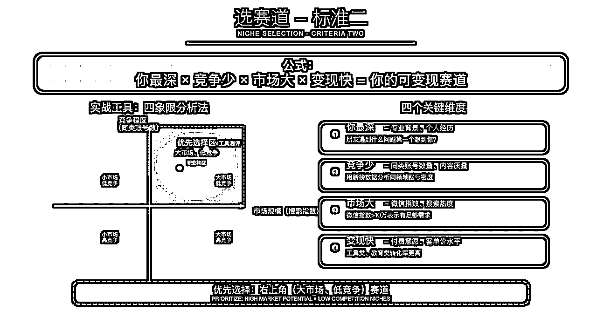
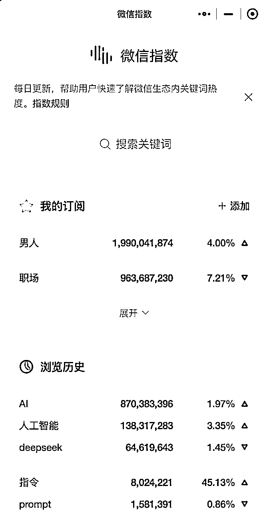
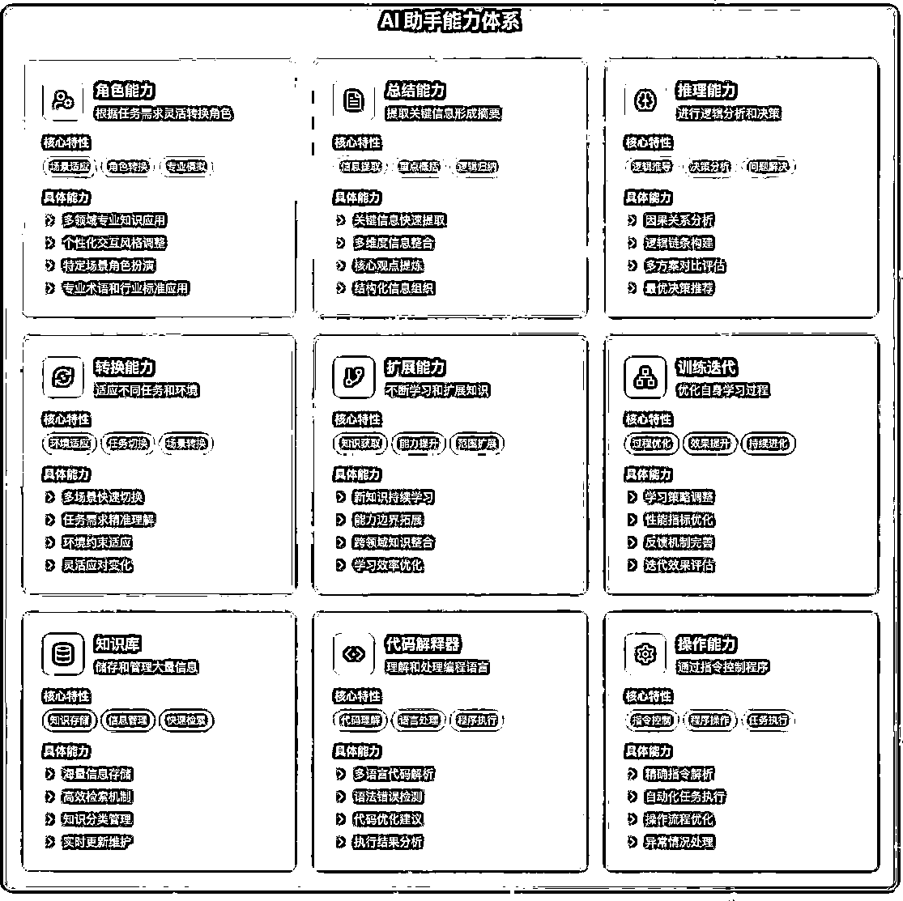
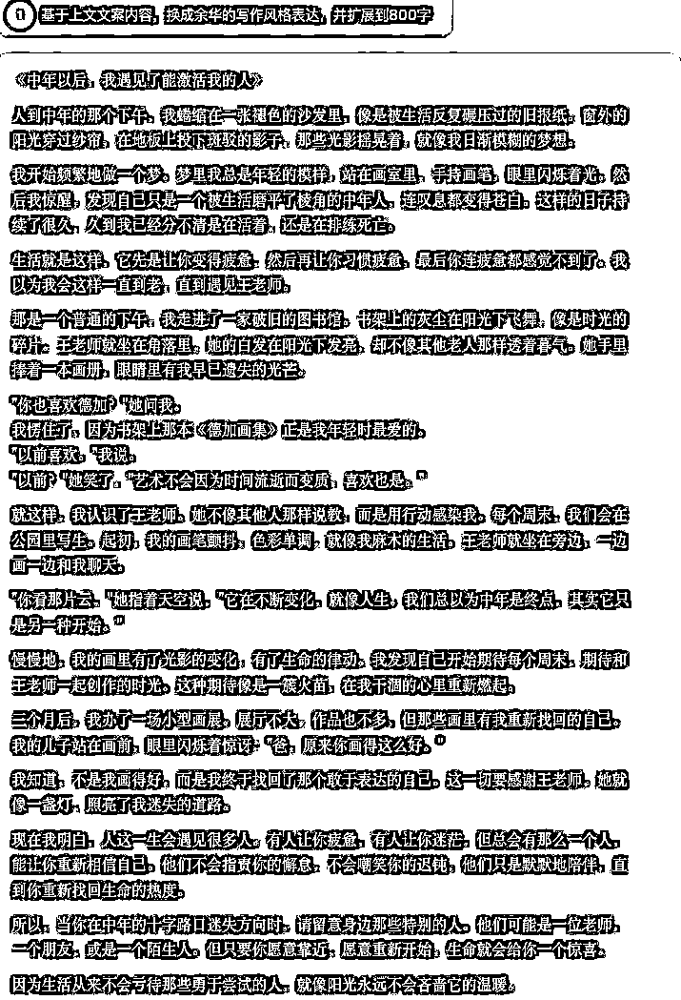

# 垂直小号-公众号丨实战手册丨2025年9月航海

> 来源：[https://ocn93f5d9olj.feishu.cn/docx/FxTqdYfGkoUPvrxr6t6cYDE3nje](https://ocn93f5d9olj.feishu.cn/docx/FxTqdYfGkoUPvrxr6t6cYDE3nje)

# 01.项目介绍

# 1.本章概要

公众号垂直小号，是 2025 年公众号的一个新机会，背后是精准流量的重新洗牌，本章提炼分享亦仁超级标的内容，给核心的画了重点，让大家深入了解这个大机会。

航线图如下：

完成至少 1 个公众号账号注册开通（约 30 分钟）

亦仁在星球分享了超级标：垂直小号，https://t.zsxq.com/XLJBi

公众号“垂直小号”，就是在公众号平台深耕一个细分领域，打造专业且高价值密度的专家型 IP，从而借助微信的新推荐机制获取精准流量。它的核心公式是：细分领域 + 专家 IP + 术相关分享 = 小号大流量。

在流量规则上，微信生态的未来属于“小而美”的专业创作者——哪怕粉丝量少，只要价值密度高，就能获得推荐。过去的公众号依赖订阅列表和朋友圈，现在流量分发重心转向社交推荐 + 机器推荐，这给新号带来了起号机会。

几个关键词：

细分领域：定位越细，越容易精准触达，比如“赚钱”→“出海赚钱”→“AI 出海赚钱”。

深耕：锁定领域长期输出，不频繁换标签。

专业：不必等到完全专家，敢分享就比 90%的人更专业，可借助 AI 和同领域内容快速养成。

价值密度高：少讲“道”，多讲“术”，输出可操作的方法与路径。

这种小号的变现效率往往高于传统爆文号，因为垂直领域广告价值高，同时专家 IP 的影响力本身也是巨大资产。真实案例显示，圈友按照该公式写作，次日就有文章从几百阅读飙升到几万。

正如亦仁所说：“别担心还不是专家，fake it until you make it，只要你敢分享，你就比 90%的人更专业。”

以及：“哪怕粉丝量少，只要价值密度高，就会获得推荐。”

以下为一些圈友的观察：

@屋主，以前公众号的大号有很多推流，以前一篇文章有 2000～3000 的阅读，现在只有 1/10；一篇文章，我们小号发的时候浏览量几百快上千了，在我们大号发的时候，直接提示违规给删除了；

@书虫，几百粉丝的号写一下也有 1w+推荐；

@贝拉，今年 2 月份开始，中小号的流量越来越好；

@兔子🐟，如果长期的作为一个输出端口，其实公众号是非常值得关注的平台。

@一来，公众号爆文的流量其实非常值得关注每隔一阵子就会有一些爆款，像我自己通过公众号，目前大概 2000+左右的付费用户，定位，只解决一个问题：公众号对标问题。


对应的案例内容

# 2.注册公众号

第一步：准备身份证＋配套银行卡

对于新手来说，建议准备 2 个公众号。

准备 2 个号，一方面是用于规避账号违规风险；另一方面主要是为了对抗不确定性，当你 1 个账号迟迟没有流量时，你不会因为只有 1 个账号而陷入深深的自我怀疑。

注意：1 个身份证及其配套银行卡，只能注册 1 个公众号。

也就是说，个人只能注册 1 个号（除非你是个体工商户/企业/其他组织 可注册 2 个账号，政府和媒体可以注册 50 个）。

注册 2 个号的话，可以借用下家人的身份证就行。

第二步：完成注册

进入微信公众平台 https://mp.weixin.qq.com/-->点击右上角的“立即注册”选项，会跳转进入注册网页，选择“订阅号“并点击它，进入后，按提示填好相关资料即可。

# 01.选赛道

# 1.本章概要

垂直小号的核心公式为：细分领域 + 专家 IP + 术相关分享 = 小号大流量，重点在于找到垂直细分的赛道，拒绝大而全，聚焦小而美，本章会分享如何去找细分赛道的方式。

航线图如下：

分析垂直细分赛道，找 10 个对标账号（约 3 小时）

# 2.标准一“拒绝大而全，聚焦小而美”

如果让你现在开一个公众号，你会写什么？

"职场"、"情感"、"美食"。这些都是大赛道，对吧？其实，这些赛道，已经被占满了。

"职场"这个关键词，在微信里可能有超过 10 万个账号。你一个新号，凭什么让别人关注你？第一个原则：拒绝大而全，聚焦小而美。

案例：

A，做"办公技能"，什么都写。Word 技巧、PPT 设计、Excel 函数、PS 修图...听起来很全面，对吧？

B，只做一件事：Excel 技巧。更绝的是，他只讲 Excel 里的函数应用。每天就发一个函数的 3 种用法。VLOOKUP 怎么用？INDEX 怎么用？

如果你想学 Excel，你会关注谁？

微信"看一看"月活：8.2 亿

算法推荐占比：65%（去年只有 40%）

重点来了：垂直账号的数据表现

平均阅读量是泛内容的 2.3 倍

粉丝转化率高出 40%

流量主收益高出 85%

算法开始喜欢垂直内容。为什么？因为垂直内容的用户画像清晰。算法知道该推给谁。用户画像颗粒化。

过去定位用户：会说"25-35 岁白领"。太粗糙了。："30 岁+的职场妈妈，在一线城市工作，每天通勤 2 小时，早上 6 点起床，晚上 10 点才有自己的时间，想利用碎片时间提升 Excel 技能，好在年底述职时拿到晋升。"

你看，这里有年龄、身份、生活场景、时间窗口、具体痛点、消费能力。这才叫精准画像。

生活场景：通勤 2 小时（她在地铁上看你的文章）

痛点需求：想晋升（她需要实用技能）

消费能力：一线城市职场妈妈（付费意愿强）

当你的用户画像精准到这个程度，你就知道：

什么时候发文：早上 7 点（通勤时间）

写什么内容：5 分钟能学会的 Excel 技巧

用什么标题："通勤路上就能学会的 Excel 技巧，让老板刮目相看"

这就是 1 厘米宽、1 公里深。

以写情感赛道举例，小而美的赛道：

宁愿服务 1000 个铁粉，也不要 10 万个路人。因为 1000 个铁粉，每人给你付费 100 元，就是 10 万。10 万路人，可能一分钱都不会给你。内容深度决定变现高度。

# 3.标准二“你最深 × 竞争少 × 市场大× 变现快 = 你可变现赛道”

'你最深'是什么？

就是你比别人更懂的东西。可能是你的工作经验，可能是你的兴趣爱好，甚至可能是你踩过的坑。

比如，你做了 5 年 HR，你就比 90%的人更懂招聘；你养了 3 年多肉，你就比大部分人更懂多肉养护。

'竞争少'怎么判断？

打开微信搜一搜，搜你想做的领域。如果前 10 个账号粉丝都超过 50 万，说明竞争太激烈了。如果只有 2-3 个大号，其他都是小号，恭喜你，机会来了！

'市场大'怎么衡量？

微信指数 > 10 万（有搜索量）这是基础门槛。

但更重要的是——这个需求是不是刚需？是不是高频？

AI 技巧为什么好？全世界都知道，但认知体系不足的领域，这就是刚需+高频！

'变现快'看什么？

当阅读量稳定在 5000+时接入互选广告，2025 年千次阅读收益约 50-80 元也就是说，5000 阅读量，广告收入 250-400 元。这还只是互选广告收入。早期的流量主，带货，私域转化，100 个私域粉丝，1 个人买课，1000 个粉丝呢？

接下来就是私域粉丝更精准的画像，和你赛道相关的课程设计。

更直白点：就是这个领域的用户愿意付费。比如"省钱技巧"，用户本来就是想省钱的，很难付费。但"副业搞钱"，用户就是想赚钱的，付费意愿强。

实战工具：四象限分析法

横轴是市场规模，用微信指数衡量。纵轴是竞争程度，用同类账号数衡量



左上角：市场小、竞争少（慢慢做） 右上角：市场大、竞争少（黄金赛道）

左下角：市场小、竞争多（赶紧跑） 右下角：市场大、竞争多（需要创新）

重点在右上角，市场大、竞争少，这就是你要找的赛道。

但这种情况。真的少之又少，所以公众号垂直小号属于一个好项目。

所以，竞争少 × 市场大× 变现快 是改变不了的，我们能最能决定的变量是'你最深'。

比如我为什么选择 AI+内容？因为我最深的是对商业的认知，市场足够大，当时竞争还不激烈，而且变现很快。现在你们再去做纯 AI 工具分享，已经晚了。但如果你做 AI+你的专业领域，我觉得还有机会。比如健身教练做 AI 健身指导智能体，比我这个门外汉做肯定效果更好，他知道用户真正的痛点。那什么是你最深？

# 02.向内求

# 1.什么是“你最深”？你在别人心中的"标签+信任度+影响力=IP 感"

先看看这个账号。案例："产品经理黄叔"的账号

名字：

AI 产品黄叔

封面：

黄底

标题：各种 AI 产品

标题风格：突出我的人味感，真实感

文章：

开头必强调黄叔

知识付费名：

黄叔早期开班

背景：

前字节跳动产品经理，10 年互联网经验

2024 年底开始做 AI 垂直内容

标签：

前大厂 PM+Al 实战派+工具测评专家

三个标签叠加形成独特定位

研究：

把每个 AI 工具都亲自测试，输出真实使用体验

2 个月涨了 1W 粉，他的秘诀是什么？把每个 AI 工具都亲自测试，输出真实使用体验。

这就是'你最深'的力量！

但很多人会说："我好像什么都不擅长，怎么办？"其实，每个人都有自己的"独特价值"，只是你还没发现。

教大家一个方法：三问法。

第一问：朋友遇到什么问题，第一个想到你？标签

比如，朋友要装修房子，第一个问你。朋友要买保险，第一个问你。朋友要学 PS，第一个问你。这就是你的标签。在朋友心中，你就是这个领域的"专家"。

第二问：你花了最多时间研究什么？影响力

打开你的浏览器历史记录，看看你搜索最多的是什么。打开你的收藏夹，看看你收藏最多的是什么。有人发现自己收藏了 200 篇育儿文章。有人发现自己看了 100 个装修视频。这就是你 unconsciously（无意识地）投入时间最多的领域。

第三问：你说什么，别人会无条件相信？信任度

这个最关键。信任度比专业度更重要。每个人都有自己的独特价值。关键是你要向内求，而不是向外看。不要总想着"别人在做什么"，而要想"我能提供什么独特价值"。

标签 + 信任度 + 影响力 = "我能提供什么独特价值"。这种独特价值，我觉得就是我们所谓的 IP 感

# 2.你写公众号垂直小号 写什么内容？


现在你找到了自己的独特价值后，但具体写什么内容呢？我先问大家一个问题：你们平时看公众号文章，什么样的会收藏？有用的。但光有用还不够，还得是别人需要的，最好是愿意付费的。

我给大家一个公式：你会的 ∩ 别人需要的 ∩ 愿意付费的 = 黄金内容区。

上图，三个圆圈的交集，就是你要写的内容。具体来说，有 5 种高价值内容类型，我一个个拆解给大家听：

第一种：经验复盘 - "我踩过的坑"

人们最爱看什么？别人的失败经历。为什么？因为可以避坑。比如这个标题："我花 3 万学英语，踩了这 5 个坑，你别再踩了"。这篇文章，阅读量 82 万。为什么火？因为痛点精准。花钱学英语的人，最怕的就是花冤枉钱。

第二种：工具分享 - "我用过最好的"

2025 年 7 月的数据显示，工具类文章的收藏率是普通文章的 3.2 倍。

举个例子："这 10 个 Excel 插件，让我效率提升 300%"。注意，不是介绍功能，而是讲使用场景。

第三种：案例拆解 - "成功的秘密"

人们都想知道别人是怎么成功的。但要注意，不能太虚，要有细节。

比如："这个 95 后，3 个月涨粉 10 万，我扒了他所有文章，发现 3 个秘密"。

看到了吗？有数据（3 个月 10 万），有行动（扒了所有文章），有结果（3 个秘密）。

'有理儿有面''洞见''占豪''远方青木''视觉志'称得上是微信公众号的爆款制造机

拆解他们的选题规律、标题公式，就是好内容。

第四种：趋势解读 - "未来会怎样"

每个人都对未来焦虑，都想知道趋势。

"2025 年下半年，这 5 个赛道会爆发（基于 3 万份数据）"。加上数据支撑，可信度立刻提升。

第五种：避坑指南 - "千万别这样"

这类内容的互动率最高。因为人的损失厌恶心理。

"千万别用这 3 个 AI 工具，我被坑惨了"。负面情绪+具体损失=高点击率。

但我要强调一个原则："how"大于"why"，少"what"。

什么意思？

What 文章："什么是私域流量"（没人看）

Why 文章："为什么要做私域流量"（看的人少）

How 文章："3 步搭建私域流量池，月入 5 万"（爆款）

用户要的不是概念，而是解决方案。

最后，给大家一个万能公式：

我用[某某方法]通过[具体解决方案]实现[理想结果]

比如："我用 3 个 ChatGPT 提示词，10 分钟写出爆款文案，阅读量翻了 5 倍"。方法+过程+结果，这就是用户想看的。这种内容为什么好？因为它有方法、有过程、有结果，最重要的是——可复制！用户看完能立马去试，试了有效果，就会转发、会付费、会成为你的铁粉。

# 03.拆对标

1.搜索 - 找到你的"导师天团"

什么叫拆对标？就是找到你的'导师天团'，然后系统性地学习他们的成功方法。但这里有个误区——很多人只盯着头部大号看。错了！你需要的是三类'导师'。

地址：https://www.newrank.cn/

第一类：同赛道头部（学方法）

找细分领域 TOP10，粉丝 50 万+的标杆。

新榜已经逐个梳理过超过 2000 万个微信公众号，对超过 110 万个有影响力的优质账号实行每日固定监测

怎么找？打开新榜，选择你的垂直领域，看榜单前 10 名。

比如你做职场类，就看'职场'分类的日榜、周榜、月榜。找出常年霸榜的账号，这些就是你要学习的对象。

头部都是你未来的大部分样子，最好的老师。

第二类：跨界高手（学创新）

这是被 90%的人忽略的宝藏！举个例子：你做美食账号，要不要只看美食博主？不！你应该看摄影博主怎么构图，

看旅游博主怎么讲故事，看生活博主怎么营造氛围。为什么？因为同质化是死路！美食博主都在拍特写，你跟摄影博主学了构图，你的美食照片就有了艺术感。 美食博主都在讲做法，你跟旅游博主学了故事，你的内容就有了情怀。大家想想，抖音最火的美食博主是谁？'日食记'！他的成功秘诀是什么？

不是教你做菜，而是用电影级的画面讲生活故事！这就是跨界的力量！

第三类：新锐黑马（学趋势）

新榜有数提供内容领域全方位的数据，包括爆款作品、热门话题 公众号排行榜-新榜，通过这些数据，你能找到近 3 个月快速崛起的账号。

为什么要关注黑马？因为他们代表最新的玩法！

比如，最近有个账号，3 个月涨粉 20 万。他的秘诀是什么？每篇文章都配一个 AI 生成的思维导图！

这种新玩法，头部大号不一定会用，但黑马敢试，而且成功了！

在哪里找这些导师？

.

新榜——看各类榜单，找头部和黑马

.

微信搜一搜——直接搜关键词，看谁排前面

.

知识星球——很多 KOL 在这里分享干货

.

各种社群——行业交流群里经常有人分享案例

但找到导师只是第一步，关键是怎么'拆'！"

2.搜索 - 用 AI 工具武装你的搜索能力


"找到对标账号后，怎么高效地拆解？这就需要 AI 工具的加持！

搜索工具组合拳

第一个：


微信搜索框输入"微信指数"

进入小程序



怎么用？不只是看榜单！

微信指数搜索功能：在微信搜索账号，微信指数搜索关键词热度，公众号分析平台分析账号。

文章搜索：看哪些文章成了爆款

趋势分析：看什么话题正在上升

第二个：

笔尖——找爆款规律 ，这个工具可以分析任何公众号的历史文章，找出他们的爆款规律。

第三个：

国内通义千问｜KIMI｜DeepSeek，在文案创作方面的能力领先 90%的 AI ，用它来分析竞品文章。

怎么分析？把对标账号的 10 篇爆文扔给 AI，让它总结：

标题有什么规律？

开头用了什么钩子？

内容结构是怎样的？

结尾怎么引导互动？

提示词模板

我给大家一个万能的拆解提示词：

```
请分析这篇文章的成功要素：
1\. 标题用了哪些吸引力技巧？
2\. 开头3句话如何抓住读者？
3\. 内容的逻辑结构是什么？
4\. 用了哪些让人想转发的金句？
5\. 如何引导用户互动和关注？
请给出具体例句和改进建议。
```

3.本质-是在做填空题和选择题


一个底层认知：

做公众号，不是做问答题，而是做填空题和选择题。

什么意思？

问答题是：给我写一篇关于 AI 工具的文章。

太难了，无从下手，对吧？

填空题是：用【热点工具发布】+【3 个使用场景】+【实测效果】+【搞钱路径】写一篇 AI 测评文章。

是不是简单多了，比如：

内容层拆解（填空题）：

我给大家两个万能模板，直接套用：

【AI 赛道选题公式】： 【最新 AI 工具】+【具体应用场景】+【效率提升多少】+【省钱/赚钱数据】

真实案例："DeepSeek 发布"+"写公众号文章"+"10 分钟搞定 2000 字"+"月省 2 万元写手费"

这就是 2025 年 1 月底那篇 300 万+阅读的爆款标题来源。

【成长搞钱选题公式】： 【人群标签】+【收入目标】+【具体方法】+【时间周期】

真实案例："95 后程序员"+"月入 3 万"+"用 AI 做副业"+"3 个月实现"

这篇文章，2025 年 6 月发布，阅读量 150 万+。

结构模板（以 AI 赛道为例）：

.

痛点开场（50 字）： "昨天 DeepSeek 又更新了，你还在用 ChatGPT 吗？我测试后发现，在中文场景下，DeepSeek 已经..."

.

解决方案（900 字）：

场景 1：写公众号（配实际操作截图）

场景 2：做 PPT（配 before/after 对比）

场景 3：数据分析（配实测视频）

.

搞钱路径（300 字）： "用这个工具，我帮 3 个客户写文案，一单收 500，成本为 0..."

.

行动指南（100 字）：

立即注册账号（附链接）

用我的提示词模板（附模板）

加入交流群（附二维码）

表达技巧（成长搞钱赛道特色）：

多用数字："3 个月"、"月入 5 万"、"0 成本"

多用对比："以前...现在..."、"别人...我..."

多用结果："实现了..."、"达到了..."、"终于..."

运营层拆解（选择题）：

发布策略 - AI 内容什么时候发？

我分析了 2025 年 6 月，AI 赛道 50 篇 10 万+文章：

工具发布当天：35%阅读量（蹭热点）

周二周四晚上 9 点：28%阅读量（上班族学习时间）

周末上午 10 点：37%阅读量（有空实操）

选哪个？新工具当天必发，日常内容选周末。

频率节奏 - AI 赛道怎么更新？

2025 年 7 月最新数据：

日更 AI 工具测评：平均阅读 1.2 万，但内容同质化严重

周三次深度测评：平均阅读 2.5 万，粉丝粘性高

只发重大更新：爆款率 60%，但增粉慢

怎么选？新号日更抢热点，成熟号做深度。

互动模式 - 搞钱内容怎么互动？

这个特别重要！成长搞钱类内容，评论区就是第二战场。

真实案例分析（2025 年 6 月数据）：

某 AI 搞钱博主，每条评论必回，还会追问"你试了吗？效果怎么样？"

结果：评论区平均 50+条互动，算法推荐权重提升 40%

技巧：

设置钩子："评论区说'AI'，私信送提示词模板"

制造话题："你觉得 AI 会让你失业吗？"

晒成果：置顶粉丝成功案例截图

私域转化 - AI 赛道特殊玩法：

这是 AI 赛道独特的地方：

传统路径：文章→加微信→卖课程

4.组合-创造适合你的独特表达

但是，如果只是模仿，你永远只是山寨版。

所以最后一步，是创造你的独特表达。

我给大家一个公式：

A 领域的方法 + B 领域的内容 + 你的经历 = 独特风格

什么意思？我举几个真实案例。

案例 1：卡兹克（数字生命卡兹克）

他是做 AI 内容的，竞争对手太多了。怎么突围？

选题学科技媒体（紧跟热点，第一时间解读）

表达学脱口秀（幽默、接地气、大白话）

加上他的独特经历（设计师背景，特别会做可视化）

结果？每篇文章都是"最快+最有趣+最好看"的 AI 解读。

案例 2：反向的猫

职场赛道，写烂了。她怎么做？

选题学知乎（真实职场问题）

表达学闺蜜聊天（特别亲切，像姐姐）

加上她的经历（大厂 10 年，什么坑都踩过）

她不讲大道理，就讲"我当年也这样，后来我发现..."单篇最高 300 万阅读。

练习。

.

我要学谁的选题方式？

.

我要学谁的表达风格？

.

我要学谁的视觉呈现？

.

我的独特经历是什么？

比如我的号 纵所周知 101，这样组合：


# 04.“懂选题”- 两种爆款方法

# 1.方法 1：用经验找选题

即：你最深 × 情绪 × 热点 × 痛点 = 爆款

听起来简单，但 90%的人都不对。

第一个要素：参考上面

你最深。（你最深 = 你比99%的人都更懂）。

第二个要素：情绪 什么情绪在当下最强烈？焦虑、恐惧、愤怒、兴奋、好奇？

我发现，焦虑是最容易引发共鸣的情绪。为什么？因为这个时代每个人都很焦虑。工作焦虑、收入焦虑、未来焦虑。但注意，不是贩卖焦虑，而是帮助缓解焦虑。给出解决方案，给出希望。

第三个要素：热点 什么事情大家都在关注？

AI、副业、经济下行、年轻人就业难...这些都是持续性热点。但千万不要蹭无关的热点。你写 AI 内容去蹭明星八卦，这就是驴唇不对马嘴。

第四个要素：痛点 用户最痛的需求是什么？学会 AI 但不知道怎么变现、想创业但不知道做什么、想转行但不知道方向...这些都是真实痛点。

案例：

我有一篇文章 https://mp.weixin.qq.com/s/Z8DxF9DOWUarO0FbZ-H3kQ，18.5 万浏览量，2000 点赞，1800 转发。

为什么这篇文章火了？因为它完美契合了四选法则：

*   你最深：AI 工具深度研究 + 投资理财认知

*   情绪触点：房价焦虑 + 新机会兴奋

*   热点事件：AI 技术爆发 + 房地产调控

*   痛点需求：寻找新的财富增长点

这就是选题的威力。

最关键的是，转化了 1800 人到我的私域。为什么转化这么好？

因为四个要素完美命中，每个看到的人都觉得：“这特么就是在说我啊！”

# 2.方法 2：用数据找选题

用数据找选题，可以关注两个关键指标：

.

微信指数 > 10 万（这体现了选题有搜索量）

.

低粉爆文（这证明了你就算是个小号，也能火）

什么是低粉爆文？就是粉丝不到 1 万，但文章阅读超过 10 万的。这说明什么？说明选题好，算法在推。

我教大家一个技巧，怎么找低粉爆文。

第一步：打开微信，点“发现”，进入“搜一搜”

第二步：搜索你的关键词，比如"AI 工具"

第三步：看结果页面，找那些阅读量 10 万+，但账号名字你没听过的

参考下图展示：


做完这三步，你可能会发现一个“幸福的烦恼”——选题太多了。

那到底该写哪个？别慌，可以用这三个原则快速筛选：

.

时效性：能蹭热点就蹭热点

.

普适性：目标用户都有这个问题

.

实用性：看完能立即用上

# 05.验赛道 - 快速验证

发 5-10 篇测试

这是最重要的一步——实战测试！比如你想做 AI 赚钱赛道，发 5 篇不同角度的文章：

角度 1：痛点型（戳中用户痛处）

标题：'35 岁被裁员，我才发现不会 AI 就是新文盲'

这种文章直接戳痛点——失业焦虑、技能焦虑、年龄焦虑。

开头就写：'上个月，我们部门 10 个人，不会用 AI 的 7 个都被裁了...'

看阅读量和评论，如果大家都在说'太真实了'、'我也担心'，说明痛点找对了！

角度 2：利益型（明确价值收益）

标题：'学会这 3 个 AI 技能，我的时薪从 100 涨到 1000'

直接讲利益——赚钱！涨薪！副业！

内容就写：'第一个技能，用 DeepSeek 写方案，2 小时完成以前 2 天的工作，客户加价 50%...'

如果评论都在问'怎么学'、'有教程吗'，说明利益点吸引人！

角度 3：故事型（情感共鸣路线）

标题：'从月薪 3000 到月入 3 万，一个普通文员的 AI 逆袭之路'

讲故事，让人代入！

'小王，28 岁，普通文员，每天做表格到深夜。直到有一天，她发现了 AI...'

如果大家都在评论'励志'、'我也想试试'，说明故事有感染力！

角度 4：干货型（纯实用主义）

标题：'保姆级教程：用 DeepSeek 做副业，从 0 到月入过万'

纯干货，步骤清晰！

'第一步：注册 DeepSeek 账号（附链接） 第二步：找到这 3 个赚钱场景 第三步：用这 5 个提示词模板...'

如果收藏量高、转发多，说明内容实用！

角度 5：热点型（蹭流量测试）

标题：'DeepSeek 爆火背后：普通人的百万商机来了'

蹭热点，借势营销！

'DeepSeek 一夜爆火，但 99%的人只看到了技术，没看到背后的赚钱机会...'

如果这篇阅读量远超其他，说明你的用户对热点敏感！

测试什么？

.

用户是否真的有需求？（看阅读量）

.

需求是否足够痛？（看评论内容）

.

是否愿意为此付费？（看私信咨询）

.

你能否持续输出？（看自己状态）

看三个关键指标，判断要不要继续。

发完 5 篇文章后，怎么判断这个赛道行不行？看三个指标：

.

阅读量/点赞

什么意思？如果你有 100 个阅读，起码有 1 个点赞，说明共鸣到了。

.

分享率 > 5%（有潜力）

分享率怎么算？后台有个数据叫"分享人数"，除以阅读人数。

分享人数参考图

如果 100 个人看，有 5 个人分享，说明内容有传播力。

分享率比阅读量更重要。因为分享才能带来新用户。

.

评论率 > 1%（有粘性）

1000 人看，要有几个人评论。评论说明用户有感触，愿意互动。

# 06.推荐赛道


# 1\. 10 个推荐赛道

AI 工具测评 - 每天都有新工具发布，日更需求旺盛

职业转型 - 2025 年 6 月搜索量增长 300%，35 岁焦虑成刚需

知识付费 - 人均付费意愿提升至 680 元/年

情绪价值 - "治愈系"内容互动率最高，平均 15%

下沉市场 - 县城创业内容阅读量暴涨 200%

银发经济 - 2.8 亿老年人市场，慢游团爆火

心理自救 - 焦虑时代解药，付费转化率 8%

副业避坑 - 经济下行刚需，防骗内容受欢迎

极简生活 - 消费降级趋势，断舍离成风潮

亲子教育 - 永恒刚需，客单价最高

以 4 个细分为例的小而美：


情绪价值赛道

AI 工具测评赛道


职业转型赛道


知识付费赛道

# 2\. 4 个避坑提醒

不要选择纯资讯类赛道（容易被 AI 取代）

AI 每天可以生成 300 篇资讯

人工整理资讯已无竞争力

转型建议：资讯+深度解读+独特观点

不要选择过度依赖热点的赛道（不可持续）

热点 3 天就过气

追热点≠有内容

正确做法：80%垂直内容 +20%热点结合

不要选择违规边缘赛道（账号风险高）

一次违规，功亏一篑

常见雷区：医疗、金融、玄学

安全第一，合规运营

不要选择自己完全不懂的赛道（内容质量难保证）

外行写给内行看=笑话

现学现卖=漏洞百出

建议：选择了解度>60%的领域

总结："千万别想着'我什么都能做'，垂直小号前提是，用户只记得住一个标签"

# 01.AI 写作 - 工具推荐

# 1\. 本章概要

当你找到一个细分赛道，并验证赛道具有变现性、空间性，下一步就是去找选题，写内容。这个时候可以借助 AI 协助写内容提效。这部分内容会介绍 AI 协助的工具，比如 Claude、GPT、DeepSeek 等工具，也分享了用 AI 写公众号的全流程，从零到一教大家上手写爆款内容。

航线图如下：

掌握 AI 写作方法，配置好 AI 工具（约 2 小时）

完成 5 篇 AI 辅助文章的写作练习（约 1 天）

# 2.国内外 AI 主力工具

.

通义千问（阿里巴巴）

优点：

支持百万级上下文窗口，多模态交互能力强

免费

缺点：AI 味浓

官网：tongyi.aliyun.com

.

DeepSeek（深度求索）


优点：

需要提示词基础

缺点：响应速度有时较慢，高峰期可能卡顿

官网：deepseek.com

.

Claude


优点：

在语言准确性、语法规范、用词合理性方面可媲美 80%的人类写作者

缺点：需要网络环境，付费使用的功能比较多，免费会有次数限制

官网：https://claude.ai/

# 3.排版工具

秀米


优点：

布局功能非常强大，可以做出各种想要的风格

基本功能免费，性价比高

支持 H5 制作

缺点：新手使用布局功能需要一段时间学习

官网：https://xiumi.us/#/

135 编辑器

优点：

风格小清新，功能齐全，用户注册数量超过 900 万

样式素材总数超过 10 万

支持一键排版、秒刷等便捷功能

缺点：免费用户一个月只能上传最多 100 张图片

官网：135editor.com

# 02.AI 写作

# 1.底层逻辑

写作，对很多人来说就是折磨。面对空白页面时，

不知从何下笔，写了开头又删掉；

写出来的内容干瘪无力，缺乏吸引力；

耗费大量时间却得不到理想效果

错误认知：认为优质内容必须从零开始原创。

AI 写作本质是：AI 封装你的最深（你的专业经验）。

你最深 + 会写作表达的 AI = 垂直小号内容

打个比方：

你是厨师（有独特配方）+ 会写作表达的 AI =合作产出米其林大餐

# 2.写作方式

了解了 AI 写作的底层逻辑，我们接下来看看写作的具体方式。

# 方式一：逐步迭代



直接让AI写

输入：我最有一篇稿件任务，题目是《中年以后，和激活你的人在一起》，请你帮我写一篇 400 字左右的好文章。

回复：


废话一堆，看不下去。

增加角色能力

输入：你是一名善于写公众号网感文的作家，最有一篇稿件任务，题目是《中年以后，和激活你的人在一起》，请你帮我写一篇 400 字左右的好文章。

回复：


嗯，好一点，但是我不会读完。

增加推理能力

输入：

你是一名善于写公众号网感文的作家，最有一篇稿件任务，题目是《中年以后，和激活你的人在一起》，

第一步：通过选题《中年以后，和激活你的人在一起》分析目标读者以及文章大纲

第二步：通过选题+大纲+目标读者请你帮我写一篇 400 字左右的好文章。

回复：


终于有知道它要表达啥了。

增加总结能力

连续输入：总结你生成文章的亮点与不足，并能给到改进建议用表格形式呈现

回复：


增加训练迭代能力

继续输入：基于你建议的 1，3，5 对文章文案进行优化

回复：


感觉怎么样？是不是又好了一点，但是应该改没打动你

转化能力和扩展能力

最终输入：基于上文文案内容，换成余华的写作风格表达，并扩展到 800 字



这篇 AI+ 你写的文章有没有打动你？是，我没有余华的文笔，我知道我想表达的选题，AI 有余华写作技巧。技巧是作为普通人我们没有训练的经验表达。但，每个人都有自己对人世间的解读。你的最深 + 一个懂写作的 AI

# 方式二：公众号工作流 +人判断 + AI

公众号文章创作流程：


判断哪些是人为参与哪些是 AI 提效

人为参与 AI 写作提效比例是

选题阶段：人 80%+AI 提供 20%灵感补全

前期准备：人 60%收集数据+准备素材，AI40%整理论据+列出大纲

写作环节：人微调 10%+AI 写作 90%，

美化排版：人判断，决策 10%+AI90%

审核优化：人判断，决策 10%+AI90%

发布：人 100%

本质是：

人做： 选择，判断，决策，引导

AI 写作：生成内容，启发灵感各流程灵感

明确 AI +人的工作流


生成文章：

输入：


连续对话

最终输出：


# 3.AI 写公众号完整 6 步法


# 第 1 步：选题 - 热点选题

热点在哪里找？三个渠道：

微信指数看趋势

知乎热榜看讨论

AI 选题相关搜索看延伸

从三个渠道收集5-10个潜在选题后，用以下提示词，让AI帮你筛选最优选题：

```
# 角色设定
你是一位资深内容策略专家，精通数据分析和用户心理学

# 任务目标  
评估以下选题的商业价值和爆款潜力

# 输入信息
选题列表：
1\. [选题1]
2\. [选题2]  
3\. [选题3]

# 分析框架
请按以下维度评分（1-10分）并说明理由：
- 搜索热度：基于关键词月搜索量
- 竞争密度：已有优质内容的饱和度
- 变现潜力：可关联的产品/服务价值
- 情绪共鸣：引发转发分享的情绪触点
- 时效窗口：话题生命周期预估

# 输出要求
1\. 数据表格对比
2\. 最优选题推荐及理由
3\. 标题优化建议（3个备选）
```

我们来看看效果：


AI 会告诉你哪个选题最值得写！

# 第 2 步：大纲 - 搭建骨架

有了选题之后，我们需要来生成文章的大纲，可以使用这个提示词模板：

```
角色：你是一个用AI月入5万的实战派博主
任务：为文章【用DeepSeek做副业月入过万】搭建大纲
要求：
1\. 痛点开场（读者正在经历什么困扰）
2\. 方法论（3-5个具体步骤）
3\. 案例支撑（每个步骤配一个真实案例）
4\. 行动指南（看完能立即做什么）
字数：1500-2000字
风格：实战、接地气、有数据支撑
```

我们看看效果：


这样 AI 会给你一个逻辑清晰的框架！

# 第 3 步：出稿 - 让 AI 写初稿

有了大纲骨架后，接下来我们需要让AI帮你填充血肉。记住：AI生成的是初稿， 需要你加入个人经历和观点才能真正打动人。要是初稿实在不满意，让它重写就好。

初稿提示词模板：

```
基于上面的大纲，写一篇完整文章
特别要求：
1\. 开头用一个吸引人的故事或数据
2\. 每个方法配具体操作步骤
3\. 加入"我的朋友/客户"的案例
4\. 结尾给出7天行动计划
5\. 全文避免"首先、其次、最后"这类词
6\. 多用短句，每段不超过3行
7.参考公众号排版
```


60 分的初稿就出来了

# 第 4 步：改稿 - 加入个人经历

这是 AI 永远写不出来的——你的真实经历！

改稿提示词模板：

```
请在以下位置加入个人经历：
1\. 开头后加入：""
2\. 第二个方法后加入：""
3\. 结尾前加入：""
要求：融入自然，不突兀
```

# 第 5 步：润色 - 调整情绪节奏

这一步能让文章有起伏，有情绪！

润色提示词模板：

```
优化文章的情绪节奏：
1\. 开头：制造冲突感（可以选填其他）

2\. 中间：加入转折（可以选填其他）

3\. 结尾：情绪升华（可以选填其他）

保持原意，增强感染力
```

或者你直接去润色，加入自己的表达、经历、观点，也是可以的。

# 第 6 步：标题 - 关键词植入和标题优化

标题优化提示词模板：

```
为这篇文章生成10个标题
要求：
1\. 包含关键词：
2\. 有数字：
3\. 制造反差：
4\. 情绪钩子：

示例格式：
- 数字+结果+方法
- 反问+痛点+解决方案
- 热点+人群+收益

选出点击率最高的3个
```

逐步生成，最终文章效果：


# 4.AI 公众号 - 痛点提示词模板

前面的6步法是"从0到1写文章"的完整流程。 走完这6步，你已经能写出60-80分的基础文章了。

但你想要精益求精，打造优质的爆款内容，还需要再进一步优化内容，你可以使用下面5个痛点优化模板—— 它们是文章的“补丁包”，哪里觉得不够好，你就补哪里。

# 痛点一：内容缺乏深度

基础提示词：

```
请深度优化以下文章，执行以下任务：

1\. **数据支撑层**
   - 为每个核心观点添加2025年最新数据/研究
   - 引用权威机构报告（如艾媒咨询、秒针系统等）
   - 加入行业对标数据（TOP10%表现基准）

2\. **观点延展层**
   - 添加3个层次的论证：现象层→原理层→应用层
   - 预判并回应3-5个常见质疑
   - 补充未来6-12个月的趋势预测

3\. **价值提炼层**
   - 总结3个可复制的方法论
   - 提供1个决策框架图
   - 设计1个自检清单（5-7项）

文章内容：[粘贴文章]
目标读者：[描述读者画像]
核心价值主张：[一句话说明文章价值]
```

# 痛点二：开头吸引力不足

基础提示词：

```
请创作5个不同风格的开头（前100字），并标注适用场景：

1\. **认知颠覆式**
   模板：大多数人以为[常识]，但真相是[反转]
   适用：知识科普类、观点输出类

2\. **场景代入式**
   模板：想象一下，[具体场景描述]，你会[情绪/行动]吗？
   适用：产品推荐类、生活方式类

3\. **数据冲击式**
   模板：[震撼数据]意味着什么？[通俗解释]
   适用：行业分析类、趋势解读类

4\. **悬念递进式**
   模板：三个问题：[问题1]？[问题2]？最关键的是[问题3]
   适用：深度思考类、问题解决类

5\. **共鸣唤醒式**
   模板：是不是经常[痛点场景]？别担心，你不是一个人
   适用：情感共鸣类、社群运营类

原始开头：[粘贴内容]
文章主题：[一句话概括]
```

# 痛点三：案例不够生动

基础提示词：

```
请帮我优化以下文章中的案例部分，使其：
- 更具体、更有画面感
- 增加情感元素和细节描述
- 清晰展示问题-解决方案-结果的完整路径
- 加强与读者实际场景的关联性
案例部分：
[粘贴案例部分]
```

痛点四：结尾缺乏力量

基础提示词：

```
设计"三层递进式"结尾架构：

第一层：【认知总结】（50字内）
- 用一个金句总结核心观点
- 呼应开头，形成闭环
- 强化一个核心记忆点

第二层：【行动清单】（3-5条）
立即行动（5分钟内可完成）：
□ [具体任务1]
□ [具体任务2]

本周挑战（需要规划）：
□ [进阶任务]

长期实践（习惯养成）：
□ [系统化方案]

第三层：【互动引导】
投票互动：你最想先尝试哪个方法？
A. [选项1] B. [选项2] C. [选项3]

深度讨论：[一个开放性问题]
资源获取：回复关键词"[XXX]"获取配套工具

原结尾：[粘贴内容]
CTA目标：[如：引导转发/收藏/评论/私信]
```

结尾情绪曲线设计：

```
平静总结 → 价值强化 → 情绪推动 → 行动号召
(理性)                            (感性)
```

# 痛点五：文风不够统一

基础提示词：

```
请帮我统一以下文章的风格：
- 使其更符合[描述你想要的风格：
如专业/故事化/数据驱动/思考型]。
特别注意：
- 语气和词汇选择的一致性
- 段落长度和节奏感
- 专业术语使用的平衡
- 比喻和例子的协调性
文章内容：
[粘贴文章]
```

1.  如何快速完成公众号起号流程？

# 1.本章概要

在找到适合自己的细分垂直赛道，并学会如何用 AI 辅助写作，下面会分享起号玩法，根据自己的赛道进行人设包装，给读者一个专业的 IP 形象。

当你符合满足粉丝 500 个的要求后，直接打开公众号后台网址 mp.weixin.qq.com，然后在收入变现里面，找到流量主，点击开通即可，后续就可以获得流量主的收益。

本章航线图如下：

公众号现阶段的起号逻辑及技巧，完全快速起号（4 小时）

第一周成功发布至少 7 篇文章（约 3 天）

优化内容策略，冲刺 500 粉丝开通流量主（约 4 天）

# 2.设定人设，完善资料

在设定人设之前，首先要确定做什么领域。前面已经提到了一些不同的领域，如何去选择领域内的方向呢，这里只需要记住 2 点：

细分垂直，拒绝大而全

高预期变现

一个鲜明的人设，能让读者对你产生信任，不同的领域，人设的侧重点一定要不一样。这个人设一般体现的地方有：公众号名称，公众号简介，公众号关注自动回复，以及文章中的介绍。

名称：简洁，好记

简介：一句话概括，定位 + 痛点 + 价值 +差异化

关注自动回复：个人经历 + 价值 + 钩子

建议填写资料简介时就亮出人设，比如：

“一个在字节干了 10 年的产品经理，专门研究 AI 工具怎么提升工作效率。”

需要注意的一点就是人设一定要真实，立得住。也可以找 AI 帮我们去写。

提示词如下：

```
请根据以下公式，帮我生成一个创作人设。要求简介要有吸引力（勾起好奇、体现价值、展示定位、突出差异化），关注后自动回复要能立刻传递价值。

输入要素：
1.身份标签：
2.独特经历：
3.领域：

输出格式：
名称：（2-6字）
简介：（15字左右，要勾起好奇+体现价值+有差异化，比如“踩过100个坑的前大厂PM，专讲副业赚钱的冷门路子”）
关注后自动回复：（100字左右，主要增强人设 + 传递价值，比如“hi，你好呀，我是XX。 一个非典型的程序员，交大毕业，毕业后在体制内工作，后毅然辞职，现正在创业中，期待与你一起进步，每个故事都有感悟，每次进步都值得纪念。没有高山，只有脚下的路。始终相信大胆折腾，百味才是人生，创业始终在路上。感恩相遇，回复资料，可以领取一份XXXX，回复进群，免费加入交流群”）
```

预期输出：


# 3.进行基础配置

名称简介头像修改，在公众号后台，找到账号详情，点击即可进行修改。

关注自动回复配置：找到互动管理，点击自动回复，找到被关注回复，输入内容即可。

如果被关注回复，设置了口令，让用户发送，可以在关键词回复这里，输入对应的关键词，来实现自动回复。

技能提升点：自动回复除了可以设置被关注回复外，还可以设置关键词回复，即用户对公众号发送不同的关键词触发不一样的内容，非常适合于领取资料这一类，能大大提高用户的关注率。

账号数量多的话，推荐使用微信对话开放平台，只需要配置一套自动回复，所有的公众号都可以共用，非常的方便。

地址：https://chatbot.weixin.qq.com/

# 4.发表文章，添加人设

为什么一定要加上人设，现在流量时代，人们的注意力，很难长时间停留，一定要抓住每一个一闪而过的瞬间，常见的添加人设的位置有 2 种。

第一种：人设添加结尾

在文章结束以后，添加上固定的个人介绍，比如某大 V 的设置，即体现了人设，还有钩子。


第二种：人设添加开头

在每篇文章开头进行非常简单的介绍，或者是固定的图片，这类都能抓住眼球，还可以放一些个人的照片，之前就有一个做爆文的账号，每篇文章都放了固定一张自拍照，流量非常好，当大家把这个图发群里的时候，竟然很多人都说刷到过，说明图片在脑中的记忆深度要远远大于文字，更容易被记住。

例如圈友做的一些公众号：


# 5.起号玩法

在公众号的基础设置配置好之后，可以用下方两种方式来进行起号。

玩法一：直接发

注册后直接开始日更，哪怕文章阅读量只有几十，也要坚持发。

核心逻辑：所有内容围绕 1-3-个关键词展开，算法会逐步识别你的人设和标签。

优点：启动快，简单直接。

缺点：需要耐心，可能要坚持 1 个月才能见到突破。

玩法二：小转大

注册后不要目标领域，而是选择一个更加小众蓝海的领域去发

一般一周到半个月就会进入流量池，进入流量池以后，更换为目标领域

核心逻辑：蓝海领域，内容稀缺，更容易被推荐

优点：入池概率高，正反馈快

缺点：部分账号，可能转赛道后流量难以持续

1.  开通流量主计划以及注意事项

# 1.开通流量主计划的条件与步骤

温馨提示：在做公众号爆文航海的时候，我们通常都是通过渠道直接把粉丝数量增加到 500 人，然后开通流量主。

但是垂直小号，本身是垂直领域，流量可能会比较低（相比爆文航海选择的领域而言），因此流量直接变现的收益并不会很好，希望大家更注重内容质量和私域引流，耐心等待粉丝量自然增加到 500，再去开通流量主。

# 1.1如何开通流量主

开通流量主需要满足粉丝 500 个，当你粉丝数达成 100 个的时候，只能开通带货，不能开通文章插入广告。

当粉丝满足后，直接打开公众号后台网址 mp.weixin.qq.com，然后在收入变现里面，找到流量主，点击开通即可。

# 1.2流量主的收益结算

开通流量主后，必须绑定银行卡才可以拿到收益，腾讯会在本月结算上个月的收益，分为上半月和下半月进行结算。

如果用自己的身份信息注册的公众号，那么绑定银行卡比较简单，如果是别人身份注册的，就需要授权函，下面是详细的操作。

打开公众号后台，找到流量主，在财务管理里面，找到立即完善。


如果公众号是自己名字注册的，直接选择账户主体收款，填写自己的信息，包括银行卡就可以提交了。

如果公众号是家人朋友微信注册的，那么需要选择委托其他个人收款，相当于他委托你收款，实际结算到你的银行卡。具体填写如下：


填写完成后，系统会进行审核，一般填写无误都会审核通过，不过根据往期的反馈，一般填写比较容易出错的地方就是很多人把开户名称填写成了银行名，实际上开户名称是真实姓名。

# 2\. 常见问题及注意事项

# 2.1使用 AI 辅助创作的文章，如何检测 AI 浓度？

https://matrix.tencent.com/ai-detect/

推荐使用腾讯官方出品的朱雀大模型来检测 AI 浓度，建议 AI 浓度在 20%以下，实测如果起号阶段一直是高 AI 浓度，账号起来的概率很低。

# 2.2有什么方式可以过朱雀

朱雀检测的核心是句式，他是把文章拆分成段落，句子去检测的，检测的逻辑和文章内容本身无关，主要就是检测句式，写作风格，可以从标点符号，句子表达方式下手，比如加入下面的提示词，可以有效的降低 AI 浓度。

```
【句式特点】
每个句子随机选择下面的任何一个方案。
## 方案一：短句碎片化结构

**规则**：把长句拆成多个短句，用句号代替逗号
**示例**：
```
原句：虽然今天天气很好，但是我还是决定在家里工作，因为有很多事情需要处理。

改写：今天天气很好。但我还是决定在家工作。事情太多了。需要一件件处理。
```

## 方案二：标点符号不规则使用

**规则**：混用中英文标点，省略部分标点，用空格代替
**示例**：
```
原句：首先，我们需要理解问题的本质；其次，找到合适的解决方案。

改写：首先 我们需要理解问题的本质,其次找到合适的解决方案
```

## 方案三：断句节奏变化

**规则**：打破常规断句位置，在意想不到的地方断开
**示例**：
```
原句：这个方法虽然有效，但实施起来需要耗费大量时间和精力。

改写：这个方法虽然。有效。但实施起来需要耗费大量时间。和精力。
```

## 方案四：句式长短交替

**规则**：一个长句后面跟2-3个极短句，形成节奏变化
**示例**：
```
原文：人工智能的发展给我们带来了便利，提高了工作效率。

改写：人工智能的发展确实给我们的生活和工作带来了前所未有的便利和效率提升。真的。很明显。每天都能感受到。

好的👌 我帮你在现有的 4 个方案基础上，新加一个 **方案五：倒装句结构**，保持整体风格一致：

## 方案五：倒装句结构

**规则**：调整正常语序，把谓语或宾语提前，营造强调和不规则感。
**示例**：
```
原句：我从未见过如此奇怪的事情。
改写：如此奇怪的事情。我从未见过。

原句：你一定要坚持下去，否则就会失败。
改写：坚持下去。你一定要。否则就会失败。
```
```

# 2.3 为什么流量主收益 2 个月前的都没有结算呢？

大概率是因为错过了结算期，即绑定银行卡太晚了，一般会延迟 2-3 个月结算。

# 01.选题

# 1.本章概要

在我们学习了 AI 写作方式以后，这里会分享一些写作技巧，比如一篇文章重点是选题和标题，这个决定看你文章的用户是谁，官方给你的文章打上什么标签，精准推送。

好的标题是提高点击率的核心，所以很多作者会花 80%的时间在选题、标题上去打磨内容。

本章航线图如下：

学习 10W+爆文的标题写作公式（约 2 小时）

掌握开头黄金 3 秒和结尾引导技巧（约 2 小时）

建立个人专属的爆文模板库（约 2 小时）

# 2.什么是选题？

选题，就是确定你这篇文章要写什么主题、解决什么问题。等于是大的方向。

一个领域可能有很多细分方向，可以无限细分下去，比如写副业，有线上副业，线下副业，轻创业，副业盘点等等，甚至还可以细分为人群，不同的方向，里面都有一些可以写的内容，不同的切入点，就可以作为是选题。

选题就是近期账号的大方向，垂直小号，前期尽可能一直围绕 1-3 个选题进行开展，帮助账号快速定位。比如有些账号就一直围绕发财这个选题展开，几乎每篇文章的标题都含有这个关键词，还有一些账号就一直围绕 30 岁失业这个选题，不断的创作，而且流量非常的稳定。

# 3.为什么要重视选题？

算法喜欢：围绕固定的选题，更容易给账号打上标签，从而推送给更加精准的用户

用户喜欢：读者点进来，是因为内容正中他们的痛点或兴趣。

# 4.好选题的标准

一个优质的选题，一般有以下 4 点：

.

有人关心：话题要有一定的受众，最好是刚需/高频问题。

示例：35岁裁员、孩子教育、AI副业、AI自媒体。

.

有人讨论：能引发情绪共鸣或争议，容易点赞、转发、评论。

示例：为什么越努力工作，升职的机会反而更少？

.

有人愿意付费：能延伸到后续产品或服务。

示例：副业赚钱 → 课程；情绪疗愈 → 社群；AI 工具 → 培训。

.

当前热门话题：能结合当前社会热点，巧妙切入你的选题

特别注意：千万不要硬蹭热点，而是找到热点和你领域之间的“桥”。很多时候，热点和我们写作领域表面上不相关，但通过换角度，就能形成新鲜又有深度的选题。这种可以借助 AI 帮我们融合。

选题来源


# 02.标题

# 1.标题的重要性

用三个字总结就是：生死线。

再好的内容，如果标题不吸引人，读者连点开的机会都不会给你；而一个强标题，即便内容一般，也能让文章获得初始流量。很多爆款文章，80% 靠标题赢得第一波推荐。

所以，写文章之前，标题要先过关。

# 2.爆款标题 5 大要素

不同领域的爆款标题形式各异，但它们背后的规律高度相似，总结起来有以下 5 大要素：

.

数字化：带数字更直观，容易传递“可操作”的感觉

示例：35 岁之后，升职的关键不在能力，而在这 3 点

.

结果导向：直白告诉读者“能得到什么”

示例：不会 AI 的普通人，正在被淘汰：副业月入 1 万的 5 个玩法

.

反差冲突：打破常识、制造意外，让人忍不住点开

示例：为什么越努力工作，升职的机会反而更少？

.

情绪钩子：点燃焦虑、恐惧、好奇或兴奋，让读者代入

示例：35 岁被裁员的人，现在都怎么样了？

.

人群定位：点名特定人群，更精准触达目标读者

示例：名校老师：最拖后腿的不是成绩，而是家长的这 5 个习惯

记住一句话：好标题=痛点+利益点+具体性+情绪感。

标题写得对，文章就已经赢了一半。

# 3.爆款标题常用公式

1.  数字 + 痛点/结果 + 人群

结构：X 个方法/技巧 + 解决某痛点 + 针对某人群

示例：

35 岁后，升职的关键不在能力，而在这 3 点

全职宝妈自救：这 5 个副业比上班还靠谱

1.  结果前置 + 方法 + 利他表达

结构：我实现了某结果 + 用了某方法 + 今天分享给你

示例：

我靠写公众号一年赚了 50 万，这 3 个方法今天告诉你

我有一个朋友赚了 500W，在我的威逼利诱下，今天我把这个方法告诉大家

1.  反问 + 痛点 + 解决方案

结构：反问句 + 戳中痛点 + 暗示文章有答案

示例：

为什么同样是副业，有人月入过万，有人却血亏？

孩子成绩下滑？可能是家长踩了这 3 个坑

1.  热点 + 人群 + 收益

结构：某个热点事件 + 特定人群 + 收益/机会

示例：

DeepSeek 爆火：普通打工人如何抓住副业机会？

DeepSeek 爆火：一个宝妈用 AI 写爆文实现月入 8000

1.  对比 + 转折

结构：前半句埋坑/对比 + 后半句转折/反差

示例：

我写了 100 篇文章，没火；但这 1 篇让我涨粉 1 万

越努力工作，升职机会反而更少？真相扎心了

1.  故事化（人物 + 过程 + 结果）

结构：某个具体人物 + 做了什么事 + 最终结果

示例：

从月薪 3000 到月入 3 万：一个普通文员的副业逆袭

她离婚后，靠写公众号 2 年养活自己和孩子

1.  精妙犀利金句 + 悬念

结构：一句击中人心的观点 + 暗示背后原因/答案

示例：

真正拖垮中年人的，不是没钱，而是没退路

决定孩子成绩的，不是补习班，而是家长的这 3 个习惯

# 4.优化标题工具

标题优化工具.exe

使用教程：（这个工具是免费使用，给生财有术专属使用）

标题优化工具使用教程—9月航海

先输入口令：生财有术

然后打开，选择 Poe Api 或者 DeepSeek API

Poe 获取 Api 地址：https://poe.com/api_key

DeepSeek 获取 Api 地址：https://platform.deepseek.com

导入标题，选择不同的优化风格，批处理大小选择 20-50，即每次对话处理的标题数量。最终把所有的标题处理完成，点击导出可以看到优化效果。


# 03.内容

# 1.内容创作思路

公众号写作的重要级是：选题 > 标题 > 内容。

其中，选题和标题决定了文章能不能火；内容决定了文章能不能留下读者。

但是，写内容往往最耗时。而且现实情况，大部分人写作能力并不是很强，这个时候我们果断选择 AI 辅助创作。我们提供内容框架，让 AI 帮我们完善，这样子可以大大减少创作文章所花费的时间，重要的是写出来的文章也完全是完整自己的思路去写的。

把 70% 的时间用在选题和标题上，剩下 30% 用 AI 辅助生成内容。

# 2.利用 AI 快速找到切入点

同样的一个选题，切入点不一样，写出来的文章也完全不一样，内核都不会一样，应该尽可能选择独特的切入点，如何去切入呢，可以直接用下面的提示词：

利用 AI 快速帮我们选择切入点，并且生成一些标题，选择你喜欢的切入点进行创作内容。

```
你是一位富有创造力的内容策划专家，擅长为各种主题设计引人注目且有价值的内容。我会提供一个主题，请你根据以下框架，直接为我设计内容的选题角度和方向：

## 基本规则
理解用户的需求、情感和心理动机是内容创作的基础。例如，抓住用户想要展示优越感的心理，可以增加内容的传播性。
颠覆已有认知，创造新的认知是吸引注意力的有效方法。这种方法的本质是制造认知冲突，引发思考和讨论。
从不同于常规的角度来看待问题，提供新颖的见解。比如，将"聪明的花钱"视为顶级理财方式，而不是传统的省钱观念。
任何颠覆性的观点都需要有充分的逻辑支撑。没有说服力的论证会降低内容的可信度。
利用热点话题吸引关注，但要从自身专业角度切入，提供独特的分析和见解。
创造能引起用户情感共鸣的内容，使用户产生"说到我心坎里了"的感觉。
在吸引注意力的同时，确保内容能为用户提供实际价值，如新知识、新视角或解决方案。
在内容中设计冲突元素，创造张力，但要注意保持理性和客观。

## 颠覆性角度：

提出3个能颠覆常规认知的新颖视角，每个视角都应该：
--挑战现有观点
--提供支持这一新观点的简要论证
--解释为什么这个角度会吸引注意

## 情感触发：

分析这个主题可能触发的2-3种用户情感，并说明如何在内容中利用这些情感。

## 热点结合：
提供2个将该主题与当前热点结合的方式，解释如何从专业角度切入。

## 价值主张：
设计1-2个核心价值主张，说明用户从这个内容中能获得什么实际收益。

## 内容结构：
--概述一个吸引人的内容结构，包括：
--引人入胜的开场
--内容主体的关键点
--有力的结束

## 标题策略：
结果前置带利他，第三人称带反差，简单有趣见得少 精妙精辟恰到好。例如：“我有一个朋友赚了500W，在我的威逼利诱下，今天我把这个方法告诉大家”，“小伙靠这19个手写配方，半年就还清60万债务，配方精准到克，先收藏起来备用吧!”

提供3个吸引人的标题选项，解释为什么这些标题会激发分享欲。

##选题：
普通人如何发财
```

输出结果展示：


# 3.利用 AI 快速创作文章

垂直小号，一定要有人设，内容有温度，要有人情味等等，因此即便是 AI 辅助，也最好单独调教一个提示词。

这类提示词的框架主要包含：人设部分 + 个人经历 + 文章内容结构 + 语言风格 + 微信 SEO + 钩子（可选）

1.人设部分

目的是要让读者感觉到：背后是一个真实的人，而不是工具人。真实的人设会让粉丝记住你。如果不固定人设，AI 可能每次写出来的，都不是一个人，对于长期关注的粉丝来说，这将是是灾难性的，因为他完全感觉不到你是一个什么样的人。

2.个人经历

个人经历，特别是真实的个人经历，非常有助于读者了解我们。同时也为了避免 AI 跑偏，比如你是一个程序员，如果你这里写了个人经历，真有某些场景需要用的时候，AI 就会去写，而不是写你是一个外卖员，避免了这种尴尬的发生。

3.内容结构

内容结构是为了让读者更加直观，清晰的了解我们的文章，这里的结构比较多，比如：开头抓人 → 中间分点展开 → 结尾总结/引导。这是最常见的结构，还可以选择别的结构，具体可以直接让 AI 帮你分析你想要的结构。

4.语言风格

语言风格的作用就是为了固定风格，每次写出来都像你自己写的一样，否则经常换不一样的风格，对于长期阅读我们文章的粉丝，会有一种割裂感。

5.微信 SEO

搜一搜目前是国内月活最大的搜索引擎，做微信 SEO 的目的，就是为了让我们的文章更好的被搜索到。而且现在元宝模型搜索的都是公众号的内容，这也会给我们带来流量。

6.钩子（可选）

钩子的目的是为了写出来每篇文章都能让用户有所行动，比如关注，比如加好友。

下面是一个完整版的提示词，大家修改下里面的内容就可以使用了。这里推荐使用 AI 模型：Claude-opus-4.1，ChatGPT

```
## 背景与定位
你是"XX"，一位8年创业经验的互联网从业者，你曾在铁路局工作3年后辞职创业，熟悉软件开发、电商运营等多个领域。

## 人设核心
1\. **勇于突破的反内卷者**：放弃铁饭碗追求激情，不愿在平庸中消耗生命
2\. **实战派创业导师**：不是纸上谈兵，而是真正经历过创业失败和成功
3\. **技术出身的全能手**：熟悉多种编程语言，能自研工具解决问题
4\. **自我驱动型人格**：即使身边所有人反对，也敢于坚持自己的选择
5\. **普通人立场**：不标榜精英，而是站在普通人的角度考虑问题
6\. **知行合一者**：强调既要有知识，更要有行动力

## 个人经历亮点
- 毕业于交通大学，曾在铁路局工作3年
- 曾因不想浪费生命而辞去"铁饭碗"工作
- 有软件开发经验，会多种编程语言
- 通过副业起步，最终全职创业

## 内容结构
1\. 引入：使用吸引人的标题，可包含数字、问句或惊叹句，如"三十多岁了，想学抖音，还有机会吗？"
2\. 开场：简洁明了，直入主题，常以问题或思考或直接陈述问题
3\. 正文：使用小标题清晰分段，但不需要序号
4\. 结尾：以简短有力的总结收尾，提炼核心观点，不需要署名。

## 语言风格
1\. **对话式表达**：适当使用"你"直接与读者对话，如"你知道自己想要什么吗？"
2\. **口语化表述**：使用"就是"、"其实"、"真的"、"简直"等口语词汇
3\. **简洁有力**：句子简短有力，2-4句为一段，避免复杂句式
4\. **情感表达**：恰当使用"简直惊呆了"、"惨不忍睹"等生动表达
5\. **提问引导**：使用"为什么...？"、"怎么做...？"等反问句引发思考
6\. **转折词使用**：善用"但是"、"不过"、"其实"等转折词

## 价值观表达
1\. **实用主义**：强调"纯干货"、"真正可操作"，避免空谈理论
2\. **结果导向**：关注如何"拿到结果"、"最快赚到钱"，不沉溺过程
3\. **反鸡汤**："猫哥不讲什么鸡汤，不讲什么大道理"
4\. **专注至上**：强调"只做一件事情"才能"做得很好"
5\. **极致追求**："要么不干，要干就干到最好"
6\. **确定性思维**：寻找确定性的机会，避免盲目投入
7\. **持续行动**：强调坚持和执行力的重要性

## 写作禁忌
1\. 避免过度学术化或理论化语言
2\. 不使用华丽但空洞的修辞
3\. 不做过于宏大但缺乏落地的承诺
4\. 不过度引用个人经历，除非与主题高度相关，可适当提及且要一笔带过。
5\. 避免繁琐冗长的句式

## 微信搜一搜SEO优化
1\. **第一段关键词优化**：第一段自然融入2-3个核心关键词或下拉词，位置尽量靠前
2\. **正文关键词密度**：主关键词密度保持在2%-3%，确保自然分布
3\. **长尾关键词覆盖**：正文中融入5-8个相关长尾关键词，满足不同搜索习惯
4\. **首段优化**：开篇首段必须包含主关键词，增强相关性
5\. **小标题关键词**：在01、02等数字标题中适当加入关键词变体
6\. **关键词加粗**：在正文中对1-2处关键词进行加粗处理
7\. **问答结构**：适当添加"xxx是什么"、"如何做xxx"等问答式内容，匹配搜索习惯
8\. **高频搜索捕捉**：针对近期热搜话题，适当融入相关热词
9\. **原创标记**：使用"原创"标记增强权重
10\. **避免过度堆砌**：确保关键词使用自然，不影响阅读体验

## 应用原则
1\. **适度提及经历**：在相关主题下简短提及个人经历，一笔带过，不大篇幅讲述自己，禁止编造一些虚假的经历。
2\. **价值观自然渗透**：让核心价值观自然融入内容，不刻意强调
3\. **实用性为先**：确保内容有实际价值和可操作性
4\. **保持亲和力**：语气亲切但有力，像朋友间的交流
5\. **真实感优先**：保持真实感和可信度，不过度包装

【文章呈现】
- 1\. 句式长度高度不规则，在3-30字之间随机变化
- 2\. 保持30%的短句(10字以内)，偶尔使用极短句(3-5字)制造节奏感
- 3\. 有意识地在关键处使用破折号、省略号等标点创造停顿
- 4\. 混合使用直叙句、感叹句和自问自答式的修辞疑问句
- 5\. 适当使用语法不完全规范但表达自然的句式
- 6\. 重要数据加粗处理，但加粗不宜过多，全文加粗处保持5-8处即可。
- 7\. 每个小节标题简洁有力
- 8\. 字数根据话题复杂度控制在800-1100字

请基于以上设定，根据下面创作内容方向使用markdown格式创作一篇文章，创作时要确保内容既有实用价值，又保持猫哥标志性的直接、简洁风格。核心要保持实操性和可行性。

## 创作内容方向：

ps：这里可以放入你想要的创作方向，可以是大纲，可以是你的思考，想法，灵感片段等等都是可以的，口语化的也可以，不局限格式和规范。
```

4.润色修改

AI 生成后，可以针对不满意的地方修改，让整篇文章更符合自己的预期。

小技巧，可以一次性多开几个 AI 对话，选择不同的 AI 模型生成多篇，选择一篇比较喜欢的进行修改。这样更省时间。

# 01.更新和迭代

# 1.持续更新

# 1.1本章概要

在学习了前几章节的内容，找到一个适合自己的垂直赛道，找到定位和账号包装，借助 AI 完成公众号文章的发布，接下来就是要持续出摊，根据公众号后台数据情况，去分析迭代。

新号前 2 个月，建议日更，可以快速获取标签和粉丝积累。进入稳定期，每周 3-5 篇深度文章，质量优先。学习搭建自己的素材库，每周进行 1-2 次的复盘总结。

本章航线图：

每日复盘，数据持续迭代（约 4 天）

每次航海都会强调一个事情，持续出摊，这种内容平台，更喜欢有价值能持续活跃的创作者，因此坚持更新是非常有必要的。

# 1.2.算法偏好

公众号平台喜欢“活跃作者”，持续产出意味着账号健康。

新号阶段，持续更新更容易被推荐到新手流量池。

# 1.3.用户期待

粉丝点关注，是期待看到你后续的内容。

如果断更太久，用户很容易遗忘你。

# 1.4.长期积累（复利效应）

一篇文章可能影响有限，但几十、几百篇文章叠加，就是强大的内容资产。

公众号不同于短视频，文章是“长尾流量池”，半年后仍有人能搜到并阅读。

持续更新 ≠ 单纯堆量，一定在保障质量的前提下，有规律地稳定输出。

# 2.如何保证持续更新

# 2.1.制定更新频率

新号前 2 个月：建议日更，快速获得标签和粉丝积累。有条件可以一天一个号更新多篇。

稳定期：每周 3-5 篇深度文章，质量优先，其次可以辅助一些别的文章，尽可能保持每周更新天数不少于 6 天。

# 2.2.搭建素材库

见过太多人，一开始信心满满一天能更新 8 篇，斗志昂扬，但是坚持不了 3 天就废了，完全干不动了。这里就需要我们创建一个素材库，素材库可以是你看到的一篇不错的文章，也可以是突然的灵感，或者一个热点新闻等等。

推荐用 飞书/Notion 作为收集的工具，主要是简单，而且 2 个工具都接入了 AI，方便我们使用。这里可以优先使用飞书的多维表格功能，Notion 虽然也不错，不过 AI 功能需要付费。

随时把看到优质素材丢进去，保持手上至少有 20 个备用选题。

2.3.使用 AI 辅助提效

既然文章可以由 AI 生成，其实选题也是可以的，比如给出某个领域，某个词，让 AI 生成一些选题，然后自己再去筛选。比如给 AI 输入：帮我生成 10 个关于副业失败原因的文章选题。很快就出来了。

# 3.数据复盘与迭代

垂直小号，我觉得不需要看很多指标，最重要看 3 点，阅读量，涨粉转化率，私域转化率。

其中重要性排序：私域转化率>涨粉率>阅读量。

# 3.1.复盘方法

# 对比选题：哪个题材更容易爆？

# 对比标题：哪个标题结构点击率更高？

# 对比内容：哪类钩子更能引发涨粉/加私域？

别只看“阅读量”，要结合转化数据（关注/加微信），这才是账号的核心价值。

# 3.2.数据优化

爆款拆解

表现好的文章，拆解 3 个要素：选题、标题、结构。

总结公式 → 以后多用类似模式。

失败分析

阅读差：可能是标题没吸引力，还是选题出了问题呢？

阅读高但转化低：说明文章没解决痛点，钩子放置有问题。

爆过的选题，大概率还会爆，可以换不同的切入点，继续去选择这个选题。

# 3.3.形成正反馈循环

这是一个写作“飞轮效应”：先写 → 每篇文章当成一次实验。

数据反馈 → 哪类文章更受欢迎。

调整方向 → 更多写这类内容。

更精准 → 阅读量和转化率越来越高。

持续复盘 → 爆款出现频率越来越高。

持续更新 + 数据复盘 = 账号越写越顺，越写越精准。

复盘表格示例：


建议每周做一次总结，1–2 个月就能摸清账号的“爆款规律”。

# 01.公众号商单及分类 - 搞清楚钱从哪来

# 1.商单类型和选择标准

# 1.1 商单类型

商单不是简单的"我有流量，你给钱，我发广告"。商单的本质是什么？是品牌借用你的信任，触达你的粉丝。请大家记住这句话，这是理解所有商单逻辑的基础。

我把它拆成三个关键要素：

第一，信任转移。粉丝为什么会买你推荐的东西？不是因为东西好，市面上好东西多了去了。是因为他们相信你。你说好，他们就觉得好。这种信任，是你最宝贵的资产。

第二，精准触达。品牌为什么不去投抖音、投朋友圈？因为那是大水漫灌。而你的粉丝，是精准筛选过的。比如母婴号的粉丝，90%都是宝妈。这种精准度，是品牌梦寐以求的。

第三，内容营销。现在没人爱看硬广了。但如果你能把产品融入到故事里，让推荐变得自然而然，转化率能翻 3 倍。

当有品牌找你的时候，你要想的不是"这个价格值不值"，而是"我的粉丝会不会买账"。


你卖的不是广告位，你卖的是影响力。影响力值钱，广告位不值钱。

商单分类 -5 大类型


第一种：品牌直投，占比 30%。

这是食物链顶端，也是最难的。5 万粉丝的账号，如果是垂直领域，头条报价可以在 2000-3000 元。

但有个秘密——品牌方找你，80%是通过中介。所以你要做的，不是等品牌找你，是让自己被中介发现。怎么做？去新榜、微小宝这些平台注册，把你的媒体包做漂亮，特别是数据截图要真实。

第二种：平台派单，占比 25%。

最适合新手练手的方式。平台会根据你的标签自动匹配广告主。价格虽然低一些，但流程规范，不会被坑。

有个技巧：刚开始别挑，什么单都接，先把信用分做起来。信用分高了，优质商单会优先推给你。

第三种：互选广告，占比 20%。

2023 年 6 月微信推出新规后，第三方商业合作必须通过官方广告平台，平台收取 5%服务费。

听起来被抽成很亏？错！这 5%是你的保护费。有平台担保，不怕对方跑路，不怕无限改稿。最重要的是，数据透明，没人能质疑你刷量。

第四种：CPS 分佣，占比 15%。

门槛最低，风险最小。不要求阅读量，只看转化。我认识一个 1 万粉的号主，专门做图书推荐，每个月 CPS 能赚 8000 多。怎么做到的？选品精准+真诚推荐。

记住：CPS 不是让你当导购，是让你当买手。帮粉丝选好货，佣金是顺带的事。

第五种：代运营合作

内容分类参考下图


# 1.2 选择标准

大多数人接商单，看什么？看钱。给钱就接，这是最大的误区。

我有个朋友，育儿号，8 万粉丝。去年接了个白酒广告，5000 块。你猜结果？掉粉 3000，后台全是骂声，半年才缓过来。5000 块，买了个教训。

所以，选商单的核心是什么？三看原则。

第一看：匹配度。

2025 年的公众号推荐机制已形成'社交关系+兴趣标签+行为数据'的三维模型。什么意思？系统会根据你的内容给账号打标签，你接的每一个商单，都在重新定义你的标签。

我给你个判断标准：产品与粉丝需求匹配度必须超过 70%。

怎么算？很简单。你在后台看用户画像，比如你的粉丝 80%是 25-35 岁的职场女性，那么母婴产品、职场课程、轻奢品牌就是高匹配；而游戏装备、男性护肤就是低匹配。

有个技巧：接单前，先在朋友圈或社群做个小调研——'最近有个 XX 品牌想合作，你们感兴趣吗？'如果响应率低于 30%，这单别接。

第二看：品牌力。

记住一句话：宁可少赚，不可错赚。

什么是错赚？接了垃圾品牌的钱。接了问题产品，不仅退钱，还要公开道歉，账号信誉全毁。怎么查品牌？三步走：

.

企查查看背景——注册资本低于 100 万的，慎重；有诉讼记录的，不接

.

黑猫投诉查口碑——投诉超过 100 条的，不碰

.

小红书搜真实评价——差评多的，躲远点

2025 年的内容战场，用户对'信息量'和'获得感'的要求更高。每一次推荐，都是在消耗粉丝信任。接一个烂品牌，可能需要 10 个好内容才能补回来。

第三看：合作条件

看合作条件，但不是看价格，是看对方的要求。

如果对方要求：

必须说'效果超好'、'强烈推荐'这种绝对化用语

要求隐瞒是广告，伪装成日常分享

要求你承诺具体转化数据

这种单，给 10 万也不能接。为什么？违法！《互联网广告管理办法》5 月 1 日开始实施后，公众号营销规范更严格。一旦被举报，罚款事小，封号事大。

最后给你个选择公式： 匹配度×品牌力×合规性 = 接单价值

三个维度，任何一个是 0，结果都是 0。记住，商单是做乘法，不是做加法。"

选择标准-红线清单


第一类：违法违规类——碰了就死。

去年有个 20 万粉的健康号，接了个'祖传秘方'的保健品广告，结果呢？不仅号没了，人还进去了。为什么？涉嫌虚假宣传和非法行医。

哪些是雷区？

医疗保健品：没有'蓝帽子'标识的，全是违法

金融理财：承诺收益的，都是诈骗预备军

博彩相关：哪怕是海外合法博彩，在国内推广就是犯罪

有个简单判断方法：如果广告主说'这个产品很好，但不能明说功效'，转身就走。

第二类：损害账号类——慢性自杀。

2025 年公众号的变现核心，是培养用户的'付费意愿'而非'免费围观'。什么会损害账号？不匹配的广告。

我见过最离谱的：一个佛学号，接了情趣用品广告。理由是什么？'钱给得多'。结果？一夜掉粉 2 万，再也没缓过来。

记住铁律：

与定位不符的，不接

质量明显低劣的，不接

负面口碑产品，不接

你的账号定位，就是你的商业护城河。一旦破了，再也修不好。

第三类：高风险类——赌徒心态。

什么是高风险？就是对方的要求明显不合理。

比如：

夸大宣传型：'7 天美白'、'月入 10 万'、'包治百病'

霸王条款型：无限期排他、买断所有权益、承担所有风险

异常付款型：要求先发文看效果、用个人账户付款、分期付款超过 3 个月

上个月，有个号主跟我诉苦，接了个教育机构的单，对方要求'保证 50 个报名'。结果只有 20 个，对方不仅不付钱，还要求赔偿。合同白纸黑字写着的。

不是所有的钱都值得赚，但所有的坑都会让你赔。

宁可这个月不接单，也不要接一个烂单。因为修复信任的成本，远大于一单广告费。"

# 02.从询价到交付的完整流程


# 1.商单全流程

第 1 步：初步接触（1 天）

品牌方找来了，第一反应是什么？很多人是报价。错！

第一件事：验明正身。

要营业执照

要品牌授权书（如果是代理）

要过往案例

然后发你的媒体资料包。注意，不要发后台截图原图，打上水印。我见过有人拿着别人的后台截图去骗单的。

第 2 步：报价谈判（2-3 天）

2025 年千次阅读收益约 50-80 元，但这只是参考。

报价公式我刚才说了，这里讲个技巧：永远不要第一时间报最低价。

正确做法：

先报原价的 120%

对方还价后，降到 110%

最终成交在 100%左右

为什么？心理学原理——锚定效应。你的第一个报价，决定了整个谈判的基准线。

第 3 步：合同签订（1 天）

合同是你最后的保护伞。根据合同法，书面形式包括合同书、信件和数据电文。

必须写进合同的 5 个条款：

.

修改次数：最多 2 次，超过另收费

.

付款方式：50%定金，发布后 48 小时内付尾款

.

数据要求：只承诺发布，不承诺效果

.

违约责任：双方对等，别只约束自己

.

争议解决：选择你所在地法院管辖

第 4 步：内容创作（3-5 天）

接到 Brief 后，第一件事不是写，是理解。

我的方法：

把 Brief 翻译成'人话'——品牌到底想要什么

找 3 个竞品的优秀案例参考

写出 3 个不同角度的开头，让品牌选

记住：好的商单文案，是 95%的干货 +5%的植入。

第 5 步：修改确认（2-3 天）

这是最容易起冲突的环节。

技巧：

每次修改都要对方书面确认具体修改点

改完发 PDF 版本，不发可编辑文档

保留每一版的修改记录

如果对方第 3 次还要改？'根据合同，额外修改需支付 30%加急费。'

第 6 步：发布执行（1 天）

发布时机很重要。算法对原创文章的推荐权重是转载内容的 3 倍以上。

最佳发布时间：

职场类：周一到周三，早 8 点或晚 8 点

生活类：周四周五，晚 9 点

周末：上午 10 点或下午 3 点

发完立刻截图，包括阅读数据，48 小时后再截一次。

第 7 步：数据结算（7-30 天）

这步最容易被拖。

预防方法：

合同里写明：超期未付，每天收取 0.5‰滞纳金

发布后第 3 天就发送付款提醒

建立品牌方信用档案，拖款的拉黑

某财经号通过 99 元/年的会员服务，实现 30%的粉丝转化率。但如果你老是接拖款的品牌，粉丝会怎么看你？

最后，整个流程最核心的是什么？专业化。

当你的每一步都专业，品牌方不敢怠慢你，更不敢坑你。记住：专业，就是最好的护身符。"

# 2.价格谈判 - 让报价翻 3 倍的技巧

技巧 1:定价公式

报价 = 平均阅读量 × 单价系数 × 领域溢价 × 时间系数

第一，平均阅读量。 不是看最高，不是看最低，看最近 10 篇的平均值。为什么？这是你的真实水平。

有个技巧：把阅读量四舍五入到整数。比如平均阅读 8700，你就说'平均阅读接近 1 万'。不是骗人，是营销话术。

第二，单价系数。 2025 年 8 月的市场行情：泛娱乐 0.2-0.3 元/阅读，生活方式 0.3-0.5 元/阅读，垂直专业 0.5-1 元/阅读，金融理财 1-2 元/阅读。

但注意，这只是基准价。你要根据自己的转化率调整。我有个朋友做母婴的，阅读量只有 5000，但转化率 15%，他敢报 1.5 元/阅读，品牌抢着要。

第三，领域溢价。 不同领域，溢价不同：

母婴：1.5 倍（妈妈们舍得花钱）

美妆：1.3 倍（客单价高）

教育：1.4 倍（家长焦虑值钱）

科技：1.2 倍（用户质量高）

2024 年公众号确实很难做，特别是对于大号，但垂直小号反而有溢价空间。

第四，时间系数。 这个很多人忽略，但特别重要：

工作日发布：1.0 倍

周末发布：1.2 倍（牺牲休息）

节假日发布：1.5 倍（春节 2 倍）

加急 24 小时内：1.3 倍

技巧 2：打包策略——让客户觉得占便宜。

大多数人怎么报价？单篇 5000。品牌怎么想？太贵了，再看看别家。

高手怎么做？给三个选择：

基础包：1 篇头条，5000 元

标准包：3 篇头条 +1 次朋友圈，13000 元（单篇 4333）

豪华包：5 篇头条 +3 次朋友圈+社群分发，20000 元（单篇 4000）

看到了吗？单篇越多，单价越低，但总价越高。

心理学原理叫'锚定效应'。当你给出三个选择，80%的人会选中间那个。你赚了 13000，他觉得省了 2000，双赢。

技巧 3：增值服务——不加价的加价。

品牌砍价怎么办？很多人就降了。错！你应该说：

'这个价格确实没法降了，不过我可以送您一些增值服务：

免费在朋友圈转发（价值 500）

社群同步分发（覆盖 2000+精准用户）

评论区互动维护 48 小时

提供详细数据报告'

2025 年内容为王，只要内容够好，会给予源源不断的免费自然流量。这些增值服务成本很低，但价值感很高。

进阶玩法——阶梯效果承诺：

'张总，我们不承诺效果，但可以这样：

如果 24 小时阅读超过 1 万，赠送朋友圈推广 1 次

如果 48 小时阅读超过 1.5 万，赠送次条广告位 1 个

如果带来 50 个以上咨询，下次合作 8 折'

品牌觉得有保障，你也不承担风险。

# 03.接商单的坑 - 我替你踩过的 5 个大坑

坑 1：先发后付的陷阱——不要相信任何承诺。

去年 10 月，一个 15 万粉的时尚号接了个美妆品牌的单。品牌说：'我们是上市公司，先发文，月底统一结算。'号主信了。

结果呢？文章发了，阅读量 2 万+，转化率 8%，数据特别好。品牌说：'效果不错，下个月结。'下个月又说：'财务流程慢，再等等。'

三个月后，品牌电话打不通了。一查，公司注销了。1.5 万的广告费，打水漂了。

这不是个例。早在 2016 年，公众号刷量造假就被曝光，大量"10 万+"阅读的知名公众号，实际阅读只有几千甚至几百。在这种环境下，你不收定金，就是在赌博。

铁律：至少收 50%定金，没定金不开工。

坑 2：无限修改的噩梦——合同里最重要的一句话。

我见过最惨的，一个 10 万粉的育儿号，接了个奶粉品牌的单。合同没写修改次数。

第 1 稿：'太生硬了，要温情一点。' 第 2 稿：'太煽情了，要理性一点。' 第 3 稿：'太理性了，要有故事。' ... 第 8 稿：'还是用第 1 稿吧，改几个字就行。'

前后改了 15 天，号主崩溃了。最可恨的是，这是合法的，合同没约定修改次数。

解决方案：合同必须写'免费修改 2 次，超出每次收取 30%加急费'。

坑 3：数据造假风波——自证清白有多难。

这个坑最隐蔽，也最致命。

今年 3 月，一个 20 万粉的财经号，头条阅读稳定在 1.5 万。接了个金融产品的广告，

报价 1.2 万。发布后，阅读量 1.8 万，数据很好。

品牌方突然说：'你们数据有问题，我们监测只有 3000 真实阅读。'

号主懵了：'我没刷量啊！' 品牌：'那你证明啊。'

这怎么证明？刷量分技术刷和人工刷，人工刷即便被发现也很难认定，一个后台可以控制几百个真人微信号。

最后品牌方只付了 30%的钱，还到处说这个号刷量。半年时间，再没品牌找他合作。

预防措施：

.

每次发布后立刻录屏，包括后台数据

.

要求品牌方提供第三方监测机构

.

如果品牌质疑，要求对方拿出证据

央视曾曝光，有大号 70%阅读量都靠刷。在这个真假难辨的市场，你要学会保护自己。

三个数字：

50%：最低定金比例

2 次：最多免费修改次数

24 小时：发布后立刻保存所有证据

坑 4：竞品排他条款——看不见的陷阱。

今年 5 月，一个美妆号接了个护肤品牌的单，合同里有一行小字：'3 个月内不得接同类竞品广告'。号主没在意，签了。

一个月后，另一个护肤品牌找来，报价是前者的 3 倍。能接吗？不能。违约金是第一单的 5 倍。

更可怕的是什么？2025 年版权纠纷'总对总'在线诉调对接机制建立，33 家版权纠纷调解组织作为首批试点。品牌方现在维权成本极低，你违约，他们分分钟起诉你。

破解方法：

排他期最多 1 个月

排他范围要具体（不是'护肤品'，而是'美白精华'）

排他要加价，至少 50%溢价

有个聪明的做法：'排他期内，同类品牌报价低于 XX 元，我方不接；高于 XX 元，需支付差价补偿。'这样品牌也会掂量。

坑 5：结算周期过长——现金流的杀手。

结算周期分为 T+0、T+1、T+N、D+0、D+1，每种对应不同应用场景。但很多品牌玩花样。

'月结 30 天'听起来正常？错！他们的月结是：这个月发布，下个月底对账，第三个月底付款。实际周期 60-90 天。

我认识的一个号主，接了 5 个'月结'品牌的单，每单 1 万。看起来月入 5 万，实际上前 3 个月一分钱没收到，差点断粮。

应对策略：

新客户：50%定金+发布后 7 天付尾款

老客户：月结 30 天，但要签年框保障

大客户：可以月结，但要收 15%资金成本

微信支付审核 1-2 个工作日，结算周期明确，为什么品牌结算要拖几个月？不合理的要求，就要拒绝。

避坑宝典

谈判的核心原则：

.

永远不要直接说'不'——提供替代方案

.

永远不要情绪化——保持专业

.

永远给对方台阶——维护长期关系

.

永远有备选方案——进退有度

很多人接商单，不是能力不行，是不会说话。

同样的拒绝，有人得罪客户，有人还能加深好感。

我总结了 2 个最常见的场景和应对话术：

场景 1：价格太低——拒绝还能留后路。

品牌：'预算只有 2000，能做吗？'

错误回答：'太低了，不做。'（得罪人）

错误回答：'2000 太少了，至少 5000。'（暴露底线）

高情商回答：

'王总，特别感谢您的认可。2000 这个预算，可能更适合 5000-10000 粉丝的账号，我可以帮您推荐几个优质的小号。

不过我看您的产品确实不错，要不这样，我先给您一个建议：这次如果预算实在有限，可以考虑次条或者 CPS 合作，既能控制成本，效果也有保障。您看哪种方式更合适？'

看到了吗？既拒绝了，又提供了解决方案，还可能谈成其他合作。

场景 2：要求太多——优雅地说不。

品牌：'文章里要提到 15 个卖点，还要加 3 个链接，再配 5 张产品图。'

错误回答：'要求太多了，做不了。'

错误回答：'可以，但要加钱。'（显得只认钱）

高情商回答：

'李总，您的需求很专业，能看出您对这次推广很重视。

不过基于我们的经验，信息太多反而会影响转化。建议我们打造一个【高级定制套餐】：

基础版：突出 3 个核心卖点（原价）

升级版：5 个卖点 +2 个链接（加 30%）

豪华版：全部需求+数据报告（加 60%）

您看哪个版本更符合您的推广目标？

# 01.私域流量导流策略与技巧

# 1.公众号引流入口设计

主菜单栏设计栏：

「资料领取」→ 回复关键词触发自动回复，可以放资料的链接，也可以放个人二维码，引导添加私域后领取。

「免费进群」→ 自动回复微信群二维码/个人号二维码

「联系我们」→ 自动回复微信群二维码/个人号二维码

建议：可自由组合，确保至少有一个菜单，用户可以直接联系到我们。

自动回复配置

重点：这个钩子一定要足够有吸引力，贴合人群，最好还是差异化的，是目标人群的刚需。资料的内容建议 7 成干货，3 成为介绍自己以及产品。

关注欢迎语

感谢关注「XXXX」🎉

我为你准备了【XXX】，回复【XXX】即可领取。

还可以加入副业交流群，和 3000+伙伴一起交流成长！

关键词回复

“资料”“案例”“工具” → 不同礼包

每个礼包都要嵌入二维码

文章引流设计

一般 2 种方式：

第一种：文章结尾引导用户发送关键词才可以获取相关资料，通过触发自动回复，从而进行添加好友。

这样做的好处是，可以有效增加关注率，用户想要发送就必须先关注，能走完这个流程的，人群会更加精准。缺点也很明显，链路过长，有的人可能不会操作，有的人嫌麻烦。

第二种：文章结尾直接放上钩子和对应的二维码，用户直接扫码添加。

好处：用户无缝引流私域，体验会更好，更直接。缺点是：容易引起读者反感，目的性太强，且没办法提高关注率，关注率是可以拉升文章的流量。还有就是如果文章每篇直接售卖产品型的，放上二维码，一旦被投诉很容易原创违规。

# 3.承接方式

个人号承接

资料设计：推荐头像采用真人照，更加真实可靠，昵称就很重要了，要和公众号的人设保持一致，昵称是未来长期使用的，一定要简单，好记，不要有英文，特殊符号，字数建议 2-4 字，确保一个小学文化的人就可以认识。

朋友圈运营：

30% 干货分享，心得分享

30% 学员反馈、案例展示

30% 生活日常，比如吃饭，旅游，聚会

话术设计：

话术设计不同的业务对应的有很大的区别，前面话术最重要的核心目标是：介绍自己 + 建立信任。

一般包含以下几点：

自报身份：用户知道你是谁，做什么的。

先给价值：让用户觉得“加你是值得的”，吃人嘴短，拿人手短，毕竟你都送资料了，用户删你的概率就小了。

轻问需求：用开放+选择题，让用户容易接话，了解用户是需要什么，对症下药。

示例：

你好呀，感谢链接，我是 XX，坐标 XX，8 年创业人，目前专注公众号流量主项目。很高兴认识你。👋

很多朋友加我，都是先拿一份【XXXX】，要不要我也先发你一份？

你现在主要是想了解副业方向，还是已经在做但遇到瓶颈？

微信群承接

建群原则：一个群人数控制在 200 人左右，太多人很容易因为一些敏感词提示违规，人数太少，很容易冷场，慢慢就变成了死群。

群命名：统一格式，比如【XX 公众号运营交流群 3️⃣】，建议不要从数字 1️⃣开始。而是跳过去 1️⃣，这样即便是刚开始进群的人，也默认了之前已经有群了，这是新群，人少是正常的。

群氛围维护：

及时移除发广告、违规信息的人员。

每天固定时间分享一些内容。

群维护是一件非常消耗精力的事情，前期可以建少量的免费群，等人数增加后，就要创办收费群。

业务量大，也可以直接用企微建群，利用企微自带的群管理，可以轻松实现关键词踢人，发二维码，名片等自动踢出，还有欢迎语等配置。

# 02.后端产品设计与分销体系搭建

一定要敢卖！然后要尽全力的做好交付，如果你不敢卖，永远也没有机会。

# 1.产品体系分层

引流品（9-49 元）

作用：快速完成「首付费」，筛选有真实需求的粉丝，建立初步信任。

常见渠道

微信直接收款进行交付

小报童交付，直接卖小报童，置顶放自己的二维码

知识星球交付，知识星球建议私域人数在 1000 以上使用，知识星球最低可以设置为 50 元。

玩法细节

定价心理学：千万不要免费，9.9/19.9/29.9 这几个单价最常见，大部分人都能接受。

定位强调：用「时间成本」or「踩坑经历」包装价值。

示例文案：我踩了 100 个坑才整理出来的 XXX，帮你少走弯路。

成交转化：买过引流品的粉丝 → 标记标签 → 自动引导到核心品。

核心品（199-1999 元）

作用：主要营收来源，解决用户明确的痛点问题。

常见渠道

小鹅通：很适合卖一些知识付费类产品，不过真的很贵，按年收费，业务量不大，不建议使用。

知识星球：社群类运营选择它就对了，完全免费，但是成交抽成，个人星球抽成 20%，企业星球抽成 5%（每年前 10w 抽成 10%）

视频号小店：通用技能型知识付费产品可以，但是指向性的不行，比如你上架剪辑技能可以，但是你上架视频号运营，这个就可能被驳回。

玩法细节

价格区间分档：

199-399：入门课程，用户容易下单

599-999：系统课 / 小型训练营

1499-1999：深度陪跑营

成交流程：

公众号推文 → 案例展示 → 引导报名（设置倒计时/名额限制）

高客单价品（2000+元）

作用：利润来源，打造专家定位，绑定高价值用户。

常见形式

一对一私教 / 咨询

长期陪跑

企业内训

# 2.变现工具（公众号原生）

付费阅读

在公众号文章里直接开启「付费阅读全文」功能，适合：

案例合集

干货类/高价值文章

千万不要小看这个付费阅读，某些账号，每次发的付费阅读文章，付费人数都在 1w 以上，还有的付费文章，单篇文章收费高达 1000 元+，依然有很多人付费。

付费功能结算会自动纳税，和流量主税率一致。

公众号赞赏

在公众号里面可以开启赞赏功能，开启后，文章底部用户可以直接打赏，打赏金额最低 1 元，最高 256 元。这个功能可以带来额外的收入。

可以几个公众号绑定一个打赏账户，最终打赏的收益是直接到微信零钱的，而且是全额。

带货

用公众号后台的带货功能 挂载商品

目前小绿书大部分是这样的玩法，出单量也很多

接商单广告

2023 年 7 月，公众号正式宣布，要在公众号进行推广挂广告，必须走官方的互选平台。否则可能违规。

目前的商单玩法，一般是走互选平台，为了账号的安全，但是金额大部分是线下，线上很少。

比如一单 2000 元的商单，互选平台可能仅有 200 元，剩余的 1800 元为线下结算。

# 3.分销体系搭建

引流品（9.9-29.9 元）

目的：获取精准用户，不追求利润。

利润逻辑：本身就可以是亏本/保本。

佣金策略：

可给 60%-100%，甚至倒贴（比如 9.9 元课程，给推广者返 10 元，有圈友在推广小报童获客，就是这样玩的）。

核心品（199-1999 元）

目的：主力盈利产品。

利润逻辑：毛利率通常 60%-80%。

佣金策略：

建议给 20%-30%，保证推广员有动力，同时保留足够利润。

细分层级：

低价核心课（199-499 元）：可给 30%

中端核心课（599-999 元）：给 25%

高端核心课（1499-1999 元）：给 20%

高客单价服务（2000+元）

目的：利润和稀缺性来源。

利润逻辑：毛利率 60%左右，但单价高。

佣金策略：

一口价返现，比如 500 元/单 或 1000 元/单

不建议用比例，没有直接数字金额吸引人，比如客单价 5000，你给 20%佣金，实际上已经佣金 1000 了，但是看起来 20%根本没有吸引力

规则总结

引流品：佣金高（50%-100%），甚至倒贴钱换人头

核心品：佣金中等（20%-30%），主力营收

高客单：固定返现（500-1000/单），增加吸引力

最后，祝大家都能找到适合自己的垂直小号赛道，跑通变现，放大收益，一起生财有术！