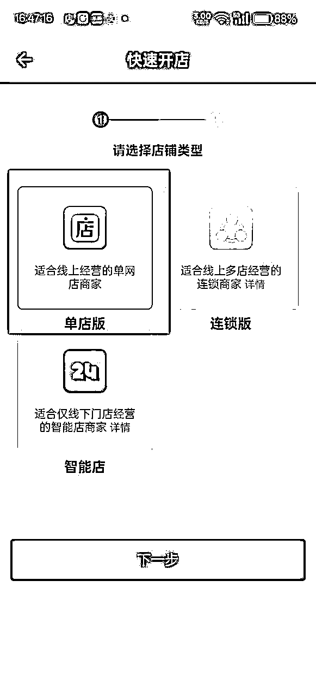
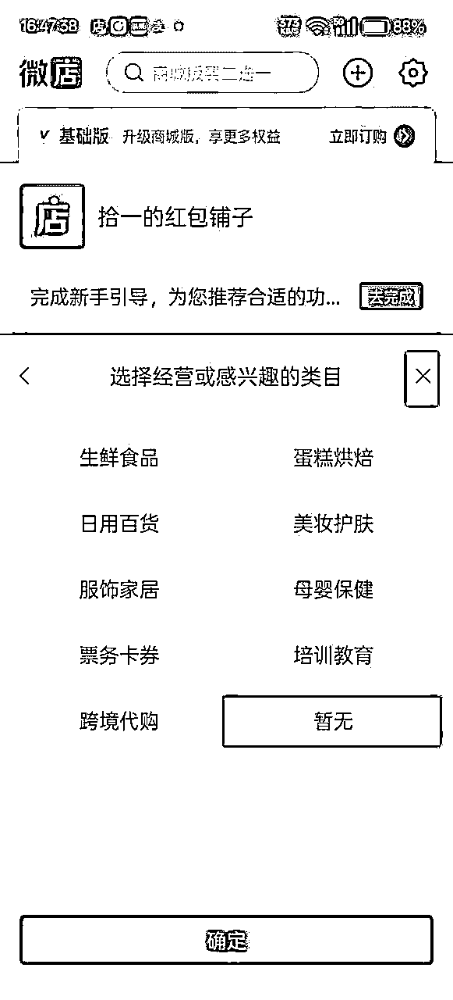
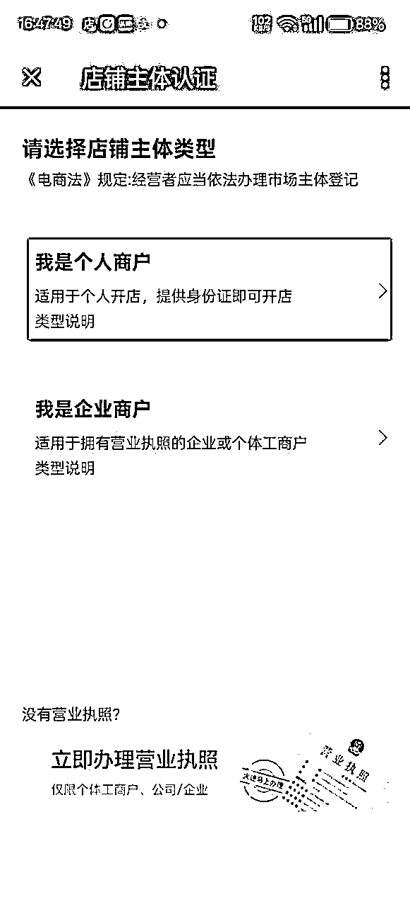
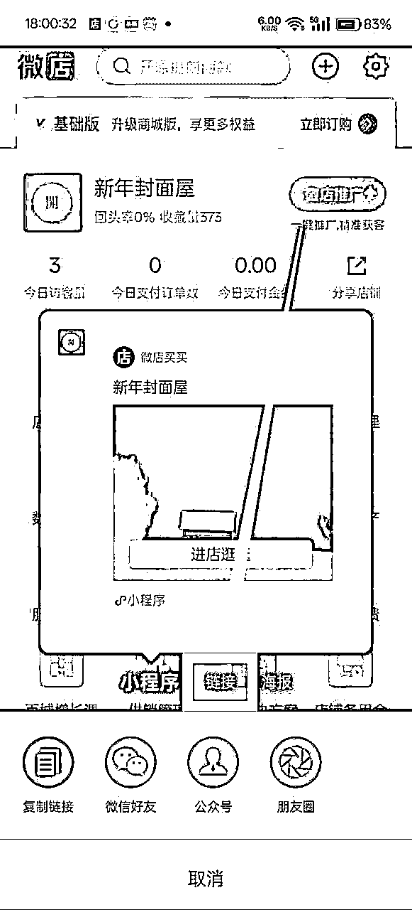
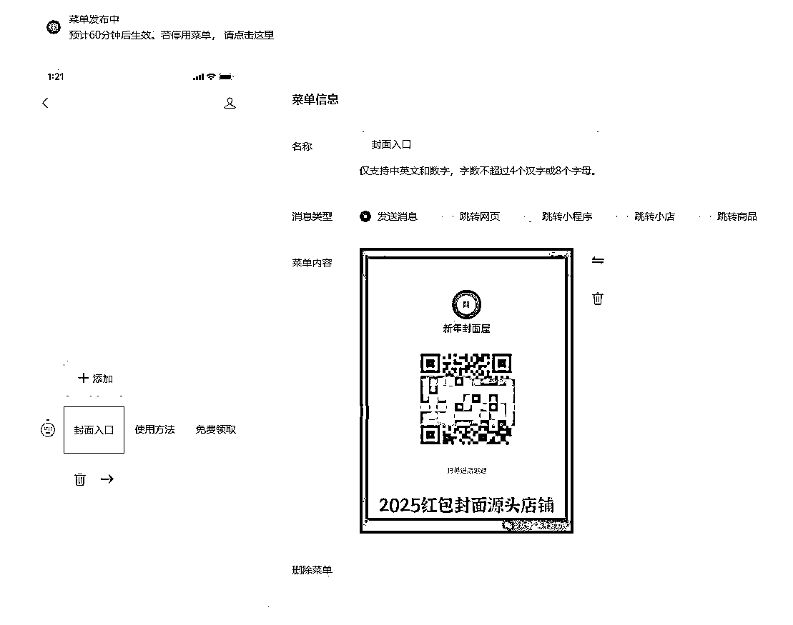

<h1>1月航海 | 红包封面引流分销 | Mini航海手册</h1>
<blockquote>来源：<a href="https://ocn93f5d9olj.feishu.cn/docx/AYbadCiGxoLSFSxxc1AcUBN5n2f">https://ocn93f5d9olj.feishu.cn/docx/AYbadCiGxoLSFSxxc1AcUBN5n2f</a></blockquote>
<h1>防失联+MM188166M（李李）长期更新频繁+备用V:MG10127</h1>

手册出品方：生财有术团队

出品时间：2025 年 1 月 6 日

建议：如果需要快速定位到精确内容，可以使用快捷键 Ctrl + F/command + F 的形式，搜索「关键字/词」，查找你想要的内容

<h1>0️⃣预习准备阶段：了解项目</h1>
<h1>一、项目介绍</h1>
<h1>1.1 红包封面项目是什么？</h1>

红包封面项目是持续了很多年的一个年末稳定项目，零门槛、操作简单、正反馈快。项目核心就是利用各式各样红包封面的新颖、稀缺和极强的社交传播属性，进行多渠道裂变，引流到微店成交（一般用公众号承接流量，微店链接设置到公众号里）。同时还能实现公众号涨粉、获取流量主等额外收益。

<h1>1.2 红包封面从哪里来？</h1>

1、自己设计

想要自制微信红包封面首先得注册微信红包封面开放平台，有两种方式可选：通过公众号或视频号。

公众号需要完成认证，无论是订阅号还是服务号都适用。

视频号，需拥有100真实粉丝。

还可以结合AI，定制独一无二的个性红包封面。

2、帮总店分销

直接分销总店，货源有五千多款红包，款式多。

做分销的优点是：不用囤货，不用自己搭建平台，自动发货，赚佣金，同时自己也可提高商品单价，赚差价。

3、开通批发商低价拿货

直接开通批发商权限，批发商的优势就是价格低。

为了降低大家的操作难度，本期Mini航海将会提供现成的总店红包封面货源，大家只需要做引流转化。

<h1>1.3 红包封面如何使用？</h1>

用户在微店购买红包封面后，会获得序列号，通过序列号可以领取红包，具体步骤如下：

这边制作了完整的流程图，可以直接拿去转发给用户~

如果是私域售卖，直接发下面这张图，客户扫码就可以直接跳转到序列码界面

<h1>二、准备工作</h1>
<h1>2.1 了解微店代理分销 </h1>

代理分销适合新手去做，特别是微信有私域流量的，没有其他电商平台的，无需囤货！（前提是必须成年）

扫下面的二维码就可以申请总店分销，成为分销商后，你的店铺会自动同步总店商品、自动更新新品、自动发货、可以改价，还可以往下招收代理。

具体开店操作步骤后面会讲。

<h1>2.2 准备各平台账号/设备</h1>

注意：新手前期可以不准备公众号，直接用抖音引流，用微信和微店承接流量，但流量大起来，公众号承接流量还是非常有必要的。

手机

本期Mini航海，建议新手就用自己的常用机就好，如果后续想做多账号或者截流的话可以去购买二手苹果8或是低价安卓机

不要买工作室退下来的机器，大概率是封过号的，权重很一般

微信

需要承接私域流量，在朋友圈发布红包封面内容和相关公众号文章，以及后续可以招收代理。

流量卡

可以去各大运营商app，看一下有合适的低月租套餐的就可以冲一下，没有硬性要求。

抖音号

最好准备 2 个号，除了发作品的账号外，还要有个小号，来充当引流号。

公众号

1个就行，作为承接流量的主战场，推荐大家都准备下。

<h1>三、新手变现思路</h1>

下面给大家简单介绍下几种变现思路，加深大家对这个项目的了解，本期Mini航海还是以【裂变营销】为主要玩法。

<h1>3.1 直接发条朋友圈</h1>

新手最快的变现方式就是，直接发条朋友圈。

例如：“快过年啦！这边对接到上千套特别可爱有趣的红包封面，欢迎进店挑选~”

配上你的商城二维码，你的朋友大概率会点进去，消费20几块，你就能赚到15元以上的佣金

<h1>3.2 微店私域营销</h1>

这个是最简单的，全店分销微店，有公众号设置好自动回复，没有就发发朋友圈，基本上是0成本。

<h1>3.3 电商</h1>

顾名思义，开淘宝/pdd/抖店/小红书店铺来直接售卖封面，属于高风险高收益，需要囤货然后用阿奇索来实现自动发货。

<h1>3.4 裂变营销✅</h1>

这是目前很多头部卖家在做的方向，也是本期航海教练正在做的一个方向，主打引流（详情见项目核心逻辑）

<h1>3.5 卖铲子</h1>

卖总店的批发会员也是一门好生意，在各平台发布批发会员的广告，低买高卖，包装加工

亦或是出售红包封面改价工具、帮人改价都行

再或者自己研发能节省动作的工具，然后包装售卖

<h1>3.6 收代理/收徒</h1>

很多朋友想入局这个项目，但不知道从何做起，这时就是我们收代理的好机会，在咸鱼发布相关信息，就可以引来很多意向客户，另外，包装一下项目，价格略微提升，如99/159/199/288，一对一教客户开店运营等（小技巧，收徒时包装一下自己这边可以附赠的权益，结合自己的一些社群产品，让对方眼花缭乱，其实都是一些低成本的投入，比如：批量改价教程，批发会员等）~

<h1>1️⃣航线图第一阶段：完成开店</h1>

需要满18岁，下载微店店长版app，实名认证后，才能分销。

请认真看下面的教程，根据步骤一步一步走：

<h1>一、扫码完成全店分销申请</h1>

1、直接用微信扫下图二维码

2、申请【全店分销】

3、确定，分销成功

注意：一家微店店铺只能绑定一家分销总店，如果想取消当前的合作店铺，请看下图：

1、微店店长版APP，点击【供销管理】

2、点击【我的供货商】

3、点击【取消合作】

4、合作结束，如果要重新绑定就重新扫码即可

<h1>二、下载微店APP 并注册店铺</h1>

1、应用商店下载【微店店长版】

2、点击微信登录

3、点击左上角创建

4、选择单店版

5、起一个店铺名，选择店铺头像

6、类目选择暂无，直接右上角关闭也可以

7、进行店铺认证

8、选择我是个人商户

9、免登记类型这两个都可以

10、最后进行人脸验证

<h1>三、完成微店支付通道认证</h1>

审核大概1-2天，必须全部开户授权才可以售卖

手机端认证：http://k.weidian.com/fARXQPJg

电脑端认证：http://k.weidian.com/vO1YDoxX

重要提示：微信认证支付的时候，商户号简称不要取黑名单敏感词汇，微信二字必须不能取，不然就会因为名字审核失败，再操作就比较麻烦。商户号简称不是你的店铺名字，店铺名字随时可以改，切记❗切记❗

步骤如下：

1、右上角设置按钮

2、支付方式开通

3、选择【线上收款】

4、进行开户意愿确认

5、填写信息，等待审核，一般1~3小时即可，最慢1天

补充：需要认证多个商户号，请全部认证完毕

<h1>四、商品价格修改</h1>

在总店给的价格基础上，我们进行加价，加价部分就是我们的利润。

<h1>4.1 手机端改价</h1>

1、商品管理

2、批量操作

3、修改价格（可选直接加减或是比例修改）

4、修改成功

补充：批量修改价格一次最多50个，商品改价不得超过零售价3倍，例如零售价5元，可增加10元，零售价15元

<h1>4.2 电脑端改价</h1>

1、登录微店网页端，链接微店网页登录页面-手机开店用微店网页版

2、选择分销——我是分销商

3、滑到最下方，选择【50条/页】，再打钩【当页全选】✅

4、正常修改价格确定即可

<h1>4.3 一键改价</h1>

一键改价的工具，可以提高改价效率，详情见Mini航海群内分享。

<h1>五、分享店铺（怎么让别人进入你的店铺）</h1>
<h1>5.1 链接分享</h1>

1、选择【分享店铺】

2、点击链接

3、复制链接，直接推广即可

<h1>5.2 海报分享</h1>

1、点击海报——切换为店铺二维码

2、左下角直接保存

海报的话用店铺二维码不用小程序码！！！小程序会出现商品只有1~2个的情况

<h1>六、邀请代理分销</h1>

如果有朋友也对这个项目感兴趣，你可以邀请他成为你的分销商，操作步骤如下：

1、点击【供销管理】

2、点击【邀请分销】

3、点击【立即邀请】

4、点击【邀请二维码】也可以选择直接分享给好友或是链接分享

5、生成海报，可推广，也可以用图片制作软件包装一下

<h1>七、关闭店铺评价</h1>

因为主店评论区可能会出现广告，所以我们按照下图设置一下：

1、右上角设置

2、交易设置

3、隐藏商品评价

4、两个选项都打钩

<h1>八、修改店铺名称、公告、logo</h1>

1、点击店铺管理

2、点击店铺的头像

3、除了logo，店名外，也可以设置一下公告，微信号等

<h1>九、设置自动回复</h1>

1、点击右下角消息

2、点击左上角设置

3、选择【自动回复】

4、轮流填写【首次进店回复】和【新老客户下单回复】的内容

<h1>十、如何提现佣金</h1>

补充说明：客户收货，隔天提现（24小时）

客户不收货，7天自动收货并结算（168小时）

<h1>补充：</h1>
<h1>如何创建多个店铺</h1>

创建多个微店店铺教程（一个手机号可创建三个店铺）

<h1>如何制作自己的二维码教程图（对方一扫就进入教程）</h1>

首先自行制作飞书教程，然后打开草料二维码https://cli.im/text/other，直接输入飞书或者语雀的教程链接，生成二维码，也可以点击【上传logo】美化一下，增加个中心图标

<h1>2️⃣航线图第二阶段：完成微信公众号搭建</h1>
<h1>一、个人微信号</h1>
<h1>1.1 个人信息设置</h1>

可以专门拿另外一个账号作为营销号，避免有人恶意举报大号导致风控

头像的话可以直接选择用一个红包图标，大家也可以用俊男靓女的头像，毕竟受众是比较年轻的

名字起了跟公众号一样的名字，加入了后缀 红包封面

个性签名也是再次推广公众号，以及加入招收代理的字样

<h1>1.2、回复话术</h1>

案例是以引流到微信群为主，大家也可以自行优化

客户常见的问题：

1、有效期是多久？

答：赠品封面序列号有效期90天的哈宝子，官方规定最长使用期为三个月，不存在永久使用的封面

2、购买以后怎么使用啊

答：咱们可以看下图操作哦

3、一个序列码只能用一次吗？

答：序列号属于虚拟物品，具有唯一性每个号一经发送给购买者，除购买者使用之外，无法再回收利用，故一经发送，不接受任何形式理由的退款，请了解再下单哦，谢谢配合。

4、为什么这个红包封面带着别人的名字啊？（类似下图）

答：因封面为企业定制版官方规定，所有封面均带有作者名字哦，所有封面都是这样的，水印介意勿拍~

<h1>1.3 朋友圈运营</h1>

朋友圈的内容，建议以最新上架的封面分享为主，非常简单，但是需要多更新

操作如下

1、点击商品管理

2、选择图文分享

3、点击复制链接，可以作为朋友圈文案

4、点击二维码海报，可以作为朋友圈海报

除了图文朋友圈之外，也可以考虑发视频朋友圈，依然是通过夸克获取视频

文案继续用刚刚复制的链接，如图二

<h1>💡</h1>

还可以把自己的收代理政策写出来，置顶朋友圈，吸引客户付费

<h1>二、注册 1 个公众号，设置自动回复&amp;菜单</h1>
<h1>2.1 点击【互动管理】，选择【自动回复】</h1>
<h1>2.2 被关注回复</h1>

代码如下，可直接复制🔽

<h1>💡</h1>

你的链接"&gt;你想展示的文字

<h1>2.3 收到消息回复</h1>

依然是留商城链接，另外加入进群引导

<h1>2.4 关键词回复</h1>

（自由发挥，引导入群和进入商城）

<h1>2.5 点击【互动管理】，选择【自定义菜单】</h1>

菜单1，放置封面商城，也就是微店链接，可以选择发送文字消息

也可以发送图片（服务号可以跳转网页）

菜单2，放置使用方法图片，如下，咱们也可以制作自己的专属教程图片

分开版本，方面发给私域客户

菜单3，放置其他内容，例如收代理，免费群，店主微信等等

<h1>三、参考对标，制作公众号文章模板</h1>
<h1>3.1 找对标</h1>

微信搜一搜，直接搜关键词，找几个同行的账号参考

<h1>3.2 采集对标文章</h1>

去咸鱼上买个壹伴小插件，大概是5元一个月，然后直接采集一篇同行的文章到草稿箱

<h1>3.3 二创文章文案部分</h1>

用GPT来洗稿同行的文案避免重复

<h1>3.4 更换文章图片素材</h1>

素材可以从同行群里找到最新的免费红包封面领取渠道，或者微信搜一搜“红包封面”有很多，年末的时候这样的内容会非常多，找到后复制免费链接放到我们制作好的文章模板中

也可以参考这样的发文：

<h1>3️⃣航线图第三阶段：抖音平台引流</h1>
<h1>一、在抖音大号设置引流钩子</h1>
<h1>1.1 主页引流</h1>

可以直接引流到公众号，参考示例：

<h1>1.2 群引流</h1>

建立抖音群聊，引导用户进群，群公告写公众号名称

或者用小号在群内引导关注公众号

<h1>1.3 视频引流</h1>

①制作一张引导图，再把店铺二维码或公众号二维码裁切一下

②放在剪映里合并成视频

③添加引导音频，效果如下

d7ae998950c59f9a9a21fdffa95ca862.mp4【在线播放】

<h1>1.4 A种B收</h1>

①用小号A或者朋友的抖音号，去主号评论区发布评论

②评论内容：艾特小号B

③小号B名称：红包封面这里灵/2025最新封面/免费封面点这里/发放封面竹叶灵取（可举一反三）

④ 小号B搭建：

先制作一张长图，然后切成三分图发布视频至小号，大号再收藏即可（如下图）

⑤客户有咨询可以回复“看窝收藏”或者用家人朋友的抖音号直接在评论区艾特小号

关于三分图的制作方式，给大家一个网站：

http://www.zuohaotu.com/cut-image.aspx

做好图以后直接上传即可，非常便捷

<h1>1.5 追热点引流</h1>

去年的时候，王者荣耀出了一个需要花钱购买的英雄，叫敖丙

于是我去搜索各种关于“敖丙”的视频，在下面评论，收益明显

账号的阅读涨了很多，毕竟临近过年，红包封面绝对是风口话题，有些人感兴趣以为你很有钱

点进来发现你在送封面，感兴趣，自然就产生了停留，增加了账号权重

可以举一反三

<h1>1.6 裂变营销+截流</h1>

在抖音发布“红包任务”，也就是说发布一条视频，要求观众去其他视频评论区艾特你，然后带着截图找你要封面，成本也就1-2元，所以还是比较划算的推广方式，就是不道德，容易被同行干

进阶思路是：自己制作封面，在“封面故事”这个位置植入自己公众号，引导观众去发布你自制的序列码到别人评论区，其他观众看到了去复制，显示被领取完时，会弹出你的公众号，从而实现引流

<h1>二、模仿对标视频，拍摄/录制视频素材</h1>
<h1>2.1 搜索对标的方式</h1>

大道至简，在平台直接输入“红包封面”即可开始挑选

<h1>2.2 找对标关注的几个点</h1>
<h1>①时间</h1>

近期发布的，跟风去制作更容易火

<h1>②评论</h1>

互动量高的，增长空间大，有爆款因素

<h1>③知名IP</h1>

像是一些“三丽鸥”“线条小狗”“吉伊卡哇”“原神”的封面，会容易火

<h1>④实拍</h1>

很多实拍展示的内容，爆款率不错，很多人混剪批量发布

<h1>三、如何进行短视频&amp;图文制作</h1>
<h1>3.1 热销整合类</h1>

用夸克浏览器打开自己的店铺，然后点开你打算制作素材的商品

视频的话点击播放，右上角有下载按钮

图片的话直接长按，点击【保存图片】

（其他浏览器也可以做到）

记得不要原图直发，可以截取部分内容

例如我们发抖音，就截 9 ：16，发小红书，就截3 : 4

然后加上贴纸或者边框，就是一张新图片了

多制作几张这样的图片，再重新拼接，制作成新图文，便可以发布啦~参考下图

<h1>3.2 情景交互类</h1>

参考范例

cc6c9744ac802a1df05df251f698f827.mp4【在线播放】

①小号A和小号B扮演情侣/闺蜜/兄弟

②一方给另一方发红包，然后问这是哪里买的？

③答：我在xxxxx工重号领的呀

例如下面的感觉，这个自由发挥即可

<h1>3.3 免费领取类</h1>

<h1>3.4 关于序列码的素材</h1>

直接在抖音搜索“红包封面序列码”截图复制同行的码，稍加修改就是你的啦

比如同行发了下面几个序列码

NU e2iYBbZlsOG冬天第一杯奶茶

NU r4eP9zOvGBQ冬天四件套

NU kVb8ZRPGe1A生日快乐

NU bRHDoOZmUaL我喜欢你

另一个同行发了

NU wlgRkVviVTR原神胡桃

NU cZDjzPFohRZ冬天第一杯奶茶

NU kdOVxFQeRrF请你喝奶茶

NU lwlhz1WO7CA瑶瑶公主

NU dPNilc8rLxM玉桂狗奶茶

NU_sjtu6fJwKrL生日快乐

我们随便抄一下换换顺序，发布

NU r4eP9zOvGBQ冬天四件套

NU kVb8ZRPGe1A生日快乐

NU lwlhz1WO7CA瑶瑶公主

NU dPNilc8rLxM玉桂狗奶茶

NU_sjtu6fJwKrL生日快乐

这样不就是去重啦~简单快捷

核心就是换排版，顺序打乱就行，内容照抄，很简单的

<h1>3.5 制作步骤</h1>

非常简单，用美图秀秀即可:

1.

选择“设计室”

2.

选择“空白画布”

3.

选择“抖音图文带货”​

4.

选择背景（自由发挥）

5.

粘贴文案

6.

修改字体大功告成

<h1>四、制作 1 条短视频并发布，保持日更</h1>

按照上面的步骤进行日更即可，这里再补充一些其他注意事项：

<h1>4.1 养号</h1>

养号秘诀就是：每天搜索“红包封面”关键词，刷半小时，适当点赞收藏（全平台都可以这样养号！）

<h1>4.2 发布话术</h1>

主体框架为“2025微信红包封面最新序列号免费领取”​

这些都是高频热搜词，组合在一起效果爆炸，可打乱顺序，或是增减修改避免重复

也可以根据同行爆款内容自由拼组

<h1>4.3 推荐加的tag</h1>

#红包封面

#过年可以拥有这个红包吗

#红包封面序列号

#蛇年红包

#红包仪式感

#春节倒计时

今年临过年一定还有更多可以使用的tag，大家可以随时关注热门视频.

<h1>4.4 视频号引流（打卡第7天填写问卷后，可领取相关资料）</h1>
<h1>💡</h1>

红包封面如何结合视频号来引流呢？

Mini航海期间只要求大家日更抖音短视频，Mini航海结束后，有精力的圈友可以尝试更多平台比如视频号。（打卡第7天填写问卷后，可领取相关资料）

引流短视频还有很多的创作方式，大家做任何项目都要多多调研同行，多研究他们的内容是如何成为爆款的，咱们去模仿是否可以做到同款甚至更优？

之后看到好的对标素材都会给大家同步到群里，大家可以多多关注~

<h1>结语</h1>

每到年末，官方还会给公众号和视频号创作者一些封面额度，制作起来非常非常简单，到时候可以关注一波。这个项目虽然已经很多年了，但一直是能做的，希望大家可以选择适合自己的红包变现方向，实现引流，涨粉，开单！

