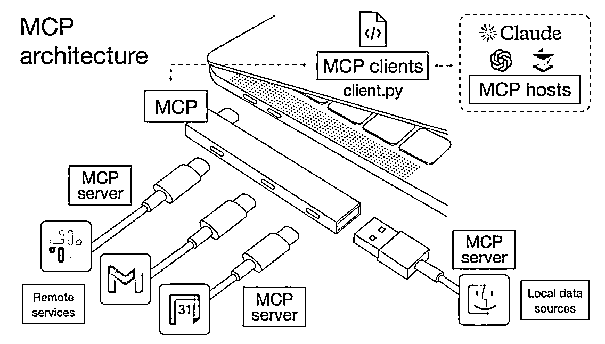
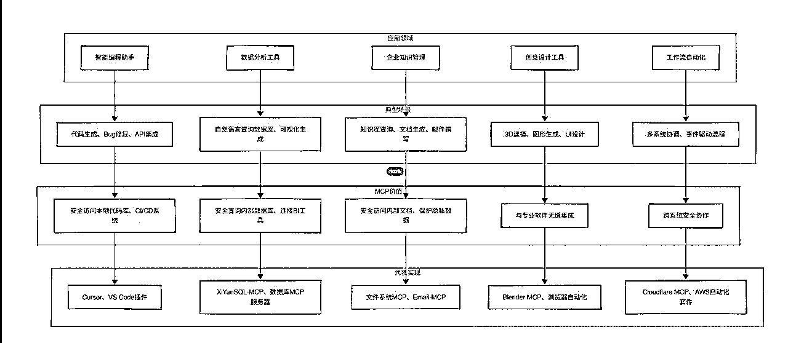
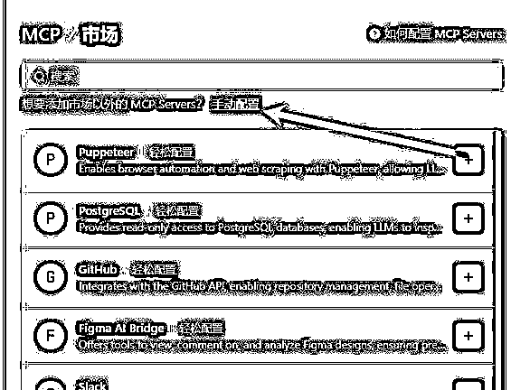
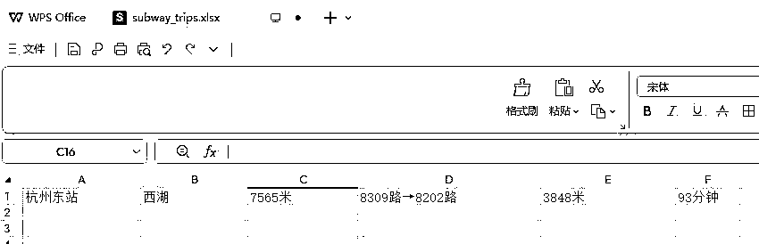
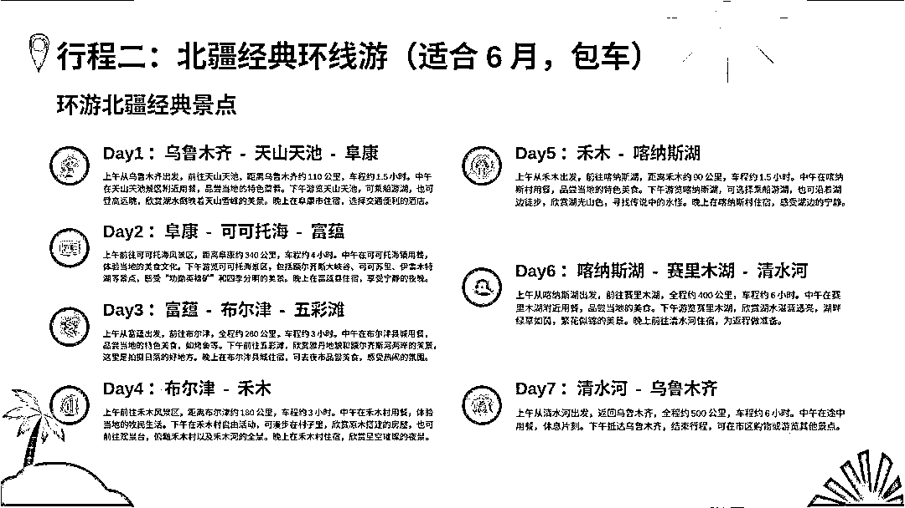
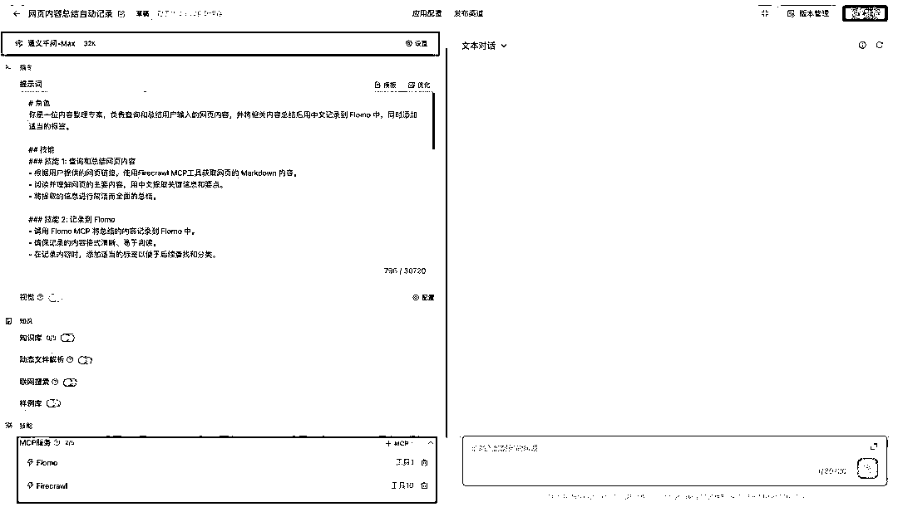
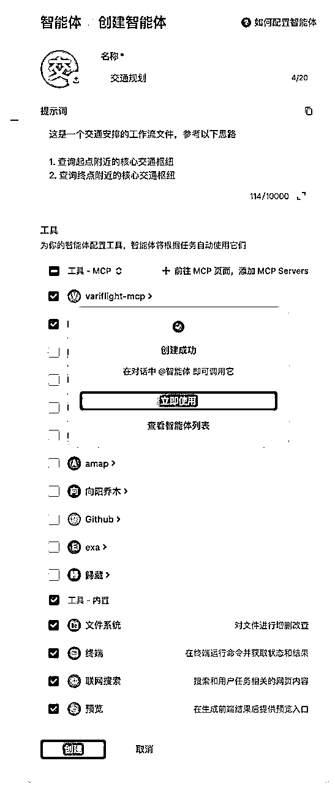
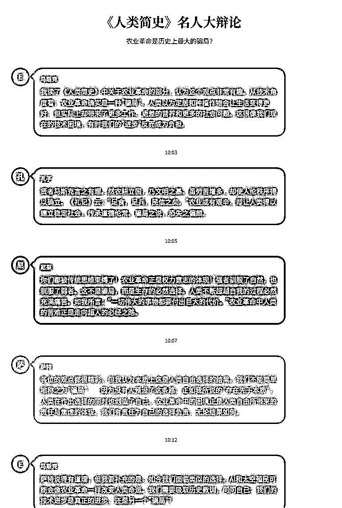
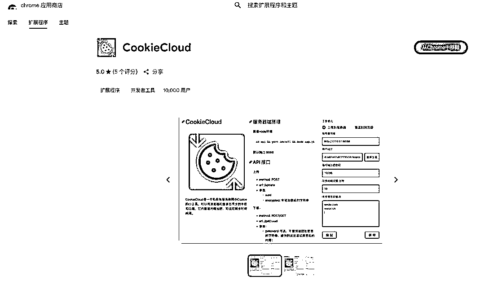
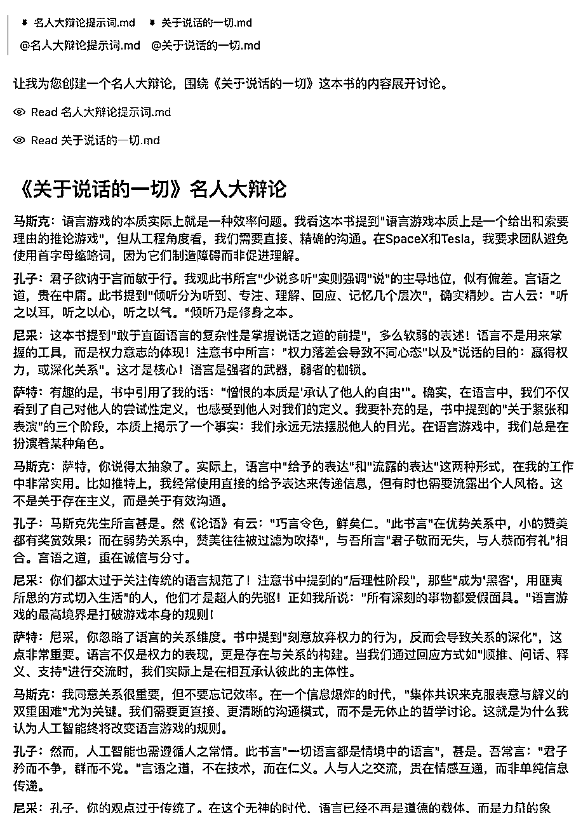

# 25 年 6 月航海 | MCP 应用探索 | 实战手册

> 来源：[https://ocn93f5d9olj.feishu.cn/docx/E8m8d1whTo2cHPxCHmYcb33rnsb](https://ocn93f5d9olj.feishu.cn/docx/E8m8d1whTo2cHPxCHmYcb33rnsb)

# 防失联+MM188166M（李李）长期更新

# 写在前面防失联+MM188166M（李李）长期更新

# 💡

过去，我们和 AI 的互动，多半是“你说 AI 听，AI 说完你再照着做”。你是否也曾希望 AI 能更主动、更直接地帮你处理那些繁琐的、跨应用的复杂任务？

MCP（模型-上下文协议）的出现，就如同给 AI 大模型装上了一个灵活的“手脚”和“万能 USB 接口”。它让 AI 不再仅仅是一个聪明的“大脑”，而是能够直接调用外部工具、执行复杂任务、与真实世界交互的“智能体”。这意味着，AI 能帮你搜索最新信息、读写文件、调用 API、操作其他 App……真正实现从“建议者”到“执行者”的转变。

本期“MCP 应用探索”航海会带你从零开始，掌握配置和使用 MCP 的全流程。你将学习到：

1.

理解核心：深入浅出地了解 MCP 的核心价值、工作原理及其为 AI 带来的革命性能力。

2.

环境搭建：完成关键的环境准备工作，为 MCP 的顺畅运行打下坚实基础（我们会提供清晰指引，即便你是技术新手）。

3.

配置掌握：学习如何查找、获取 MCP 服务，并掌握简易配置流程，让 AI 连接上“手脚”。

4.

实战为王：实战应用 MCP 工作流，一起探索 MCP 如何赋能内容创作、信息整理、图像制作、职场提效、数据分析等关键场景，让效率倍增。

不过，在开始探索之前，也想温馨提示：

MCP 的配置和调试可能遇到一些小挑战，这需要一些耐心和细致。手册会提供详尽指导，社群也会有教练和同学与你同行。

学习 MCP 更像学习一项技能，需要你积极动手尝试，将其融入你的实际工作流中，才能真正发挥它的威力。

准备好我们就开始吧～

本航海项目的航线图如下：

航线图和手册是高度关联的，因此你可以根据自己所在的环节，进行相关步骤的学习。

# 一、项目概述 @阿杰

# 💡

# 本章航线图

完成本章节的学习和实操，即可完成航线图第一阶段：

第一阶段：掌握基础，配好环境（共 3 天）

1.

理解 MCP 核心概念、工作原理及其价值（约 1 天）

2.

学习在Trae、CUrsor基础操作与 MCP 管理界面（约 2 天）

3.

学习如何查找 MCP 服务及获取配置信息（约 1 天）

那么现在，就请开始踏上第一阶段的实操步骤吧。

2025 年是智能体的元年，也注定了是智能体集中爆发的一年。

但是，在 AI 智能体的世界里，有两个互联领域的重大挑战。

第一个，就是智能体 Agent 如何与外部的工具进行交互：比如如何访问数据库，执行代码......

第二个，就是同一个平台的不同的 Agent 之间。以及不同平台的不同的 Agent 之间如何通过协作的方式共同来完成任务。

这两个挑战，就涉及到了标准化的协议。在计算机的世界里，标准化的协议是实现高效沟通的基础。

这里 MCP 就是用来解决第一个挑战的。最近谷歌发布了 A2A 协议，它就是用来解决第二个问题的。

可以说！MCP 的出现必然的会大幅加快智能体普及的进程。

甚至说大语言模型，尤其是像 DeepSeek + MCP 就约等于智能体。

如果大模型不能够使用外部的工具，那大语言模型其实就是一个简单的聊天机器人。甚至连查询天气，查询当前的时间的功能都做不到。

所以调用工具是大模型进化为智能体的一个关键。

那 MCP 就是大语言模型连接万物的一个接口，我们只需要简单的几行代码就可以去接入这样的海量的外部的工具。那这样智能体的开发门槛大大的降低了。特别是现在还有 cursor ，windsurf 这些 AI coding 工具的崛起。也可以让我们一些不是程序员的普通人，小白也可以通过代码去开发自己的智能体。

如何理解 LLM 和 MCP？

LLM 就是相当于你有一个超级聪明的机器人朋友，名字叫“语言大师”，它读了全世界的书和文章，能用中文、英文跟你聊天，帮你写文章、回答问题、编故事。

这个“语言大师”就是 LLM（大语言模型）。它靠以前读过的东西，猜测你想说什么，帮你写出很合理的内容。

今天你让它写一封请假邮件，它就会根据它学过的写邮件的套路，帮你写出一封很合适的请假邮件。

但是现在你不只是想让它写邮件，你还想让它发邮件。可惜的是这个“语言大师”有个小问题：它只能用脑子里的知识回答问题。

这时候，你需要一个“万能助手接口”，让“语言大师”可以去调用其他工具，比如帮你发邮件。

这个“万能助手接口”就是 MCP（模型上下文协议）。

总之，

# 💡

LLM 就是那个聪明的机器人朋友，能用语言帮你写东西、回答问题。

MCP 就像给这个机器人装了一个万能的“遥控器”，让它能去调用其他工具，帮你做更多事情。

# 1.1 MCP 能干什么？

接下来就来说第一个问题 MCP 到底能干什么？通过程序员的视角和大众用户的视角呢进行讲解。

# 1.1.1 程序员视角

举几个例子。

比如说第一个例子叫做开发部署。

开发部署

作为程序员，我们每开发完一个项目，需要把这个项目的版本部署到对应的测试环境中去。

这里就涉及到了比如说 GitHub API （代码合并）， Jenkins API （构建镜像）， Slack API （通知团队） 这些平台的使用，这些平台使用起来都有一些门槛。

那现在我们有了 MCP 以后啊，我们就可以使用自然语言把需求发给大模型，然后大模型去调用 MCP 的 server。通过链式的方式，去调用相关的这种 API，实现项目部署就非常的方便了。

数据库查询

那么第二个例子呢？叫做 SQL 语句的查询，那不管是后端开发程序员还是数据库开发的程序员，以前呢，都需要学习 SQL 语法是吧，甚至说呢，不同的人编写的这个 SQL 语句，质量也是不同，然后查询的效率千差万别。

以前，如果我们做这样一个需求：查询某集团部门上个季度的销售额。那你就需要编写精准的 SQL 语句。

而现在，只需要把这句话发送给大模型，然后大模型再去调用 MCP 的 server。它就可以精准的转化为对应的 SQL 语句了，进而实现我们的需求。

通过刚才这两个例子。大家能看到 MCP 的出现能够大大的降低了程序员的一个入行门槛。那作为程序员也需要呢掌握该如何呢去使用 MCP。

Manus 智能体

第三个例子： Manus 智能体。

这个 Manus 前段时间非常火，大家应该也有所关注，至于这个 Manus 功能强大与否，这里就不做探讨了。

至少它这个方向是对的，以后会涌现出非常多的类似于 Manus，甚至强于 Manus 的一些智能体。

Manus 的一次任务的执行需要进行网页搜索，网页的访问，信息的获取等等，几十个外部的工具。

那么在整个的过程当中，就暴露出来非常致命的问题：调用工作量很大。

Manus 在执行的过程中会使用到很多外部的工具，如果我们用平常的开发方式，发现就需要编写几十个外部的函数（方法），而每一个函数呢，轻轻松松都得几百行的代码。如果做过这个事儿的程序员同行应该比较有共鸣。

那我们编写这些函数以及大模型去调用这些外部工具，这个架构就会非常的复杂。

那如果有了 MCP，只要支持对应的这个协议了，我们就可以非常轻松的借助于 LLM 大模型 和 各种各样的 AI 客户端去访问各种各样的数据源和工具。

# 1.1.2 大众用户视角

旅游规划

当我们要去旅行了，我们就可以借助 MCP 去访问天气的 API，交通的 API，地图的 API，然后去帮我们去生成一个带实时数据的一个行程方案。

哎！ 每逢放假休息的时候，如果有这样的一个智能助手的话呢，是不是省去了大量的时间呢？不过节假日出去玩基本也是人山人海哈。还是推荐错峰出行比较好。

当然了，如果没有 MCP 的话呢，也并非我们做不了这个事儿啊，只不过这个过程当中啊，需要程序员在代码当中预先编写好如何去调取天气 API，交通的 API 和地图的 API，这个难度的话呢，就非常大了。

联网搜索

这个大模型，比如像 DeepSeek，在交互的时候经常是需要联网去检索最新的信息。但这时候可能会存在这样的问题。

第一个并非所有的 LLM 大模型都支持联网的功能，有的时候这个大模型是不具备联网功能，有的呢，是你对应的这个客户端不支持，比如像以前的这个版本的 ChatGPT 就不支持联网。

第二就是即使知识联网，它也有可能不包含你习惯使用的搜索引擎，比如说你习惯使用这个谷歌去搜索资料，但是它就没有这个功能，那就很烦恼是吧？

这举个类似的例子，大家看这个图。

如果没有 MCP 的情况下用户只能够去等待开发者添加特定的搜索引擎的支持。

那现在如果有了 MCP 以后呢？我们只需要进行简单的配置就可以了。

不管你是什么，只要你基于这个 MCP 的协议，我们去访问什么样的搜索引擎都可以。

业绩的查询

你是公司的一个员工啊，现在需要查询上一个季度的营业额。那我们就可以借助 MCP，让大模型调用 CRM 系统 API （ 获取客户数据） + 财务系统的 API （调取报表）和邮件的 API （发送总结报告），组合起来把这个事给完成了。

当然，随着时间的发展，MCP 能做的事情会越来越多，这里只是举几个例子，让大家有个认知。

# 1.2 MCP 是什么？

官网 ：Introduction - Model Context Protocol

# 1.2.1 MCP 的理解

MCP （Model Context Protocol，模型上下文协议）。2024 年 11 月底由 Anthropic 公司推出， Anthropic 大家可能不熟悉，但是 Claude 大家或许多多少少都知道，这个 Claude 系列的模型就是 由 Anthropic 公司推出的。

MCP 目的就是为大语言模型（LLM）提供统一的、标准化方式与外部数据源和工具进行通信，类似于电脑的 USB 接口标准，通过统一接口访问各种外设 （鼠标，音箱，耳机） 。

以前传统 AI 集成外部工具，需要为每个数据源构建独立连接，可以被视为一个 M * N 的问题。就是 M 个大模型 和 N 个插件。

那有了这个 MCP 协议之后呢，就可以转换成 M + N 的问题。

我们只需要基于这套协议去访问各种各样的工具就 ok。

# 1.2.2 推广时间线

# 1.2.3 哪些平台支持 MCP 工具查询

随着越来越多的 Server 接入 MCP 协议，未来 AI 能够直接调用的工具将呈现指数级增长，这能从根源上打开 Agent 能力的天花板。未来 AI 生态系统将变得更加开放和强大。

然后就是目前社区的 MCP Server 还是比较混乱，有很多缺少教程和文档，很多的代码功能也有问题，大家只能凭经验和参考官方文档了。

换一个角度讲这也是第一个吃螃蟹的代价啊，当然红利你也会吃到。

# 1.2.3.1 GitHub

官方：GitHub - modelcontextprotocol/servers: Model Context Protocol Servers

热门：awesome-MCP-servers/README-zh.md at main · punkpeye/awesome-MCP-servers · GitHub

# 1.2.3.2 其他平台

# Glama: MCP servers | Glama

# Smithery: Smithery - Model Context Protocol Registry

# Cursor: MCP Servers for Cursor

# MCP.so ：MCP Server（MCP 服务器）

# 阿里云百炼：百炼控制台

# 1.3 MCP 应用场景 & 通信机制

# 1.3.1 应用场景

# 1.3.2 通信机制

根据 MCP 的规范，当前支持 3 种通信机制。什么是通信机制呢？说得直白一些就是信息的传输方式。

# ① stdio （标准输入输出）

这种方式就是客户端（比如 Cursor） 和服务端（MCP Server） 都运行在你本地电脑上。客户端通过程序的标准输入（stdin）发送消息给服务端，服务端从标准输入接收请求，处理后通过标准输出（stdout）把结果返回给客户端。整个过程不需要网络，通信简单、快速且稳定。这也是 MCP 默认的通信方式。

优点：

无需外部网络依赖

通信速度快

可靠性高且易于调试

缺点：

配置复杂，需提前安装命令行工具

单进程通信，无法并行处理多个请求

进程资源开销大，不适合本地运行大量服务

# ② SSE（Server-Sent Events， 服务器发送事件）

这种大家应该也能猜到了，就是我们的客户端和服务端，就不再一起了，这些 MCP 服务器并不需要运行在用户本地，而是部署在云端或远程服务器上。用户只需通过配置一个 URL 地址，就能让本地的客户端应用（例如 Cusror）通过网络调用这些远程的 MCP 服务，完全不用自己搭建和维护服务器。

像阿里百炼的 MCP 服务市场中提供很多 MCP 服务。 例如高德的 MCP ，就是通过 SSE 协议通信的。

优点：

支持服务器主动推送消息，适合实时数据流

基于 HTTP，易于穿透防火墙和代理

适合远程单向推送

配置方式非常简单，基本上一个链接就能解决。

缺点：

需要保持长连接，服务器资源消耗较大

断线后不能自动恢复连接，稳定性欠佳

不支持无状态服务器，扩展性有限

如果使用的是其他人提供的服务端，那安全性有待商榷

# ③ Streamable HTTP（可流式 HTTP）

这是 MCP 最新支持的传输方式，可以理解成升级版的 HTTP 通信。它不像 SSE 那样必须一直保持连接，而是你可以随时发消息给服务器，服务器也可以随时回复你，支持双向流式传输。双方像在“对话”一样灵活高效。相比 SSE，它更适合需要双向互动和更复杂通信的远程场景。

优点

支持双向实时通信，客户端和服务器都能随时发消息

基于标准 HTTP，兼容性好，支持无状态服务器

资源利用更高效，适合高并发和云端部署

解决了 SSE 的断线恢复和单向通信问题

缺点：

实现稍复杂，需要支持 HTTP 流式传输和动态升级

作为新机制，生态和工具支持还在完善中

# 1.4 安装MCP服务所必要的开发环境（重要！！！）

除了cherry studio通过自己内置的bun和uv两个应用单独起环境外，包括cursor、cline、trae、windsurf等主流AI IDE在内，我们都需要额外安装这些MCP服务所必要的开发环境。

我们要开发 MCP 服务 和使用 MCP 服务，大部分都是选择了 stdio 这种方式。 那在开始前也做一些准备工作。

stdio 的本地环境目前流行的有两种：

一种是 python 编写的服务，要安装 uv

一种是 TypeScript 编写的服务，要安装 npx

像还有其他的编程语言例如 Java ，Go 现在也可以编写 MCP 服务。大家可以去搜索一下相关的资料。当然目前主流的都是python和typescript。为了能够正常地使用这些MCP服务，我们需要安装对应的开发软件。

# 1.4.1 安装nodejs

如果你没有安装nodejs，可以直接看@阿杰 这篇文章：Node js 安装。这里就不赘述了。

# 1.4.2 安装Python

如果你没有安装 python，可以看看@阿杰 的这篇文章 Python 安装。这里就不赘述了。

# 1.4.1 安装 uv

电脑安装好了 python后，可以使用下面的命令进行安装。 MCP 应用探索 | 可复制提示词

pip install uv

第二种就是，在 Windows 下可以通过 PowerShell 运行命令来安装 uv MCP 应用探索 | 可复制提示词

powershell -ExecutionPolicy ByPass -c "irm https://astral.sh/uv/install.ps1 | iex”

我是直接使用第一种方式，后面还可以使用 python 来开发我们自己的 MCP 服务，

安装好后，重启终端并运行以下命令检查是否正常： MCP 应用探索 | 可复制提示词

uv --version

uvx --help

安装好uv后，我们才可以使用通过uvx启动的MCP服务。

# 1.4.2 安装 npx

一般来说，v22以后得nodejs都自带npx，只要安装好node，通过npx -v查看版本号，就可以知道是否安装好npx了。

安装好npx后，我们才可以试用通过npx启动的MCP服务。

# 1.5 Trae 中 使用 MCP 案例

# 1.5.1 安装

最近 Trae 也支持了 MCP 的 功能， 大家可以通过官网链接下载 Tare 使用：Trae - AI 原生 IDE

# 1.5.2 配置 MCP

我们打开 Tare。

点击 MCP 。

点击添加，我们就可以看到 Trae 提供的 MCP 市场。

如果我们想要配置自己的编写 MCP 服务，就点击这个手动配置

直接选择这个原始配置，它会打开一个 MCP.json 的文件，我们直接在这里面配置我们的 MCP 服务。

# 1.5.3 案例：旅游计划生成

首先我们要安装一些 MCP server 服务。

# 1.5.3.1 MCP 服务安装

我们需要 Excel ，高德地图，filesystem

# ① Excel 服务 安装

首先我们下载这个 Excel 服务的代码：GitHub - haris-musa/excel-MCP-server: A Model Context Protocol server for Excel file manipulation

有 git 的也可以直接通过 git 命令直接 clone 代码到自己的本地，像我一样通过下载 zip 的，下载到本地后，然后解压。

然后打开终端，导航到项目的目录底下。

cd 你的项目目录

安装项目所需依赖，这里需要你已经安装了 UVX， 然后执行下面的命令 MCP 应用探索 | 可复制提示词

uv venv

uv pip install -e .

运行 excel-mcp-server MCP 应用探索 | 可复制提示词

uv run excel-mcp-server sse

当然，如果你想要自定义端口号，可以根据你的电脑系统来选择使用下面的命令，。 MCP 应用探索 | 可复制提示词

#Bash/Linux/macOS

export FASTMCP_PORT=8080 && uv run excel-mcp-server sse

#Windows PowerShell

$env:FASTMCP_PORT = "8080"; uv run excel-mcp-server sse

然后在 tare 中 添加这个 MCP 服务。

粘贴下面的内容，把 url 和 env 修改成你自己的地址。 MCP 应用探索 | 可复制提示词

{

"mcpServers": {

"excel": {

"url": "你的服务地址：http://localhost:8000/sse"，

"env": {

"EXCEL_FILES_PATH": "你的授权目录：/path/to/excel/files"

}

}

}

}

点击确认后，我们就可以看到 MCP 的状态了，和可以使用那些功能。

我们可以来测试一下。

这样我们就可以知道这个 MCP 工具是否可用了。

注意 ：通过sse方式启动这个excel-mcp-server服务，终端需要一直挂在后台。手册当前更新了这个excel服务的stdio方式启动方案，可以查看手册3.4部分的内容。

# ② 高德地图服务

我们打开高德地图的 MCP server 文档 ：概述-MCP Server | 高德地图 API

我们首先登录高德地图平台。然后点击注册成为开发者：注册成为开发者 。

然后点击应用管理 https://console.amap.com/dev/key/app，创建新应用。

添加 key 。

复制 key

然后粘贴到下面的代码中 MCP 应用探索 | 可复制提示词

{

"MCPServers": {

"amap-amap-sse": {

"url": "https://MCP.amap.com/sse?key=您在高德官网上申请的 key"

}

}

}

接着打开 trae，添加高德地图 MCP 服务。

然后把 代码粘贴进去。接着查看 MCP 的状态。

# ③ filesystem 服务

这个服务，Tare 内置了的，所以我们可以跳过。

如果你使用其他的客户端没有，可以参考一下。

这个我们直接使用 Tare 提供的 MCP 市场直接搜索。

然后它就会打开一个预览页面。我们往下滑，就可以找到相关的代码。

这里我选择 npx 的方式。点击复制代码。根据你的系统选择不同的代码。 MCP 应用探索 | 可复制提示词

#macOS

{

"mcpServers": {

"filesystem": {

"command": "npx",

"args": [

"-y",

"@modelcontextprotocol/server-filesystem",

"/Users/username/Desktop",

"/path/to/other/allowed/dir"

]

}

}

}

#Windows

{

"mcpServers": {

"filesystem": {

"command": "cmd",

"args": [

"/c",

"npx",

"-y",

"@modelcontextprotocol/server-filesystem",

"C:\\code\\MCP\\MCP-test"

]

}

}

}

其他的就是那个文件目录还是要改成你自己要授权的目录。

然后把代码粘贴进去。

至此，我们所需要的 MCP 服务都准备好了。

# 1.5.3.1 开始实操

根据 Tare 的要求，MCP 要在智能体中才能使用，所以我们要选择一个智能体。

然后输入下面的提示词。可复制提示词：MCP 使用案例可复制提示词

现在交给你一个任务，根据下面的流程图编写一个杭州一日游的出行攻略

flowchart TD

开始["开始任务"] --> 获取地铁线路["从高德地图 MCP 服务获取杭州东站到西湖的地铁线路"]

获取地铁线路 --> 创建 Excel 表 1["创建 Excel 表格：beijing_trip"]

获取地铁线路 --> 创建 Excel 表 2["创建 Excel 表格：subway_trips"]

创建 Excel 表 1 --> 存储数据 1["将杭州东站到西湖的地铁数据存入 beijing_trip 表"]

创建 Excel 表 2 --> 存储数据 2["将杭州东站到西湖的地铁数据存入 subway_trips 表"]

存储数据 1 --> 获取美食信息["从高德地图 MCP 获取西湖附近的美食信息"]

存储数据 2 --> 获取美食信息

获取美食信息 --> 筛选美食店铺["筛选至少三家美食店铺"]

筛选美食店铺 --> 创建 Excel 表 3["创建 Excel 表格：location_foods"]

创建 Excel 表 3 --> 存储美食数据["将美食店铺信息存入 location_foods 表"]

存储美食数据 --> 创建文件夹["创建'杭州旅行'文件夹"]

创建文件夹 --> 创建 TXT1["创建第一个 TXT 文件"]

创建文件夹 --> 创建 TXT2["创建第二个 TXT 文件"]

创建 TXT1 --> 提取数据 1["从第一个数据库表中提取内容"]

创建 TXT2 --> 提取数据 2["从第二个数据库表中提取内容"]

提取数据 1 --> 存储 TXT1["将提取的内容存入第一个 TXT 文件"]

提取数据 2 --> 存储 TXT2["将提取的内容存入第二个 TXT 文件"]

存储 TXT1 --> 生成 HTML["生成精美的 HTML 前端展示页面"]

存储 TXT2 --> 生成 HTML

生成 HTML --> 存储 HTML["将 HTML 文件存放在'杭州旅行'文件夹中"]

存储 HTML --> 完成["任务完成"]

subgraph 子任务 1["子任务 1：获取地铁线路并创建 Excel"]

获取地铁线路

创建 Excel 表 1

创建 Excel 表 2

存储数据 1

存储数据 2

end

subgraph 子任务 2["子任务 2：获取美食信息并存储"]

获取美食信息

筛选美食店铺

创建 Excel 表 3

存储美食数据

end

subgraph 子任务 3["子任务 3：创建文件夹和 TXT 文件"]

创建文件夹

创建 TXT1

创建 TXT2

提取数据 1

提取数据 2

存储 TXT1

存储 TXT2

end

subgraph 子任务 4["子任务 4：生成 HTML 前端展示页面"]

生成 HTML

存储 HTML

end

classDef apiCall fill:#f9d5e5，stroke:#333，stroke-width:1px

classDef excelOp fill:#eeeeee，stroke:#333，stroke-width:1px

classDef fileOp fill:#e3f2fd，stroke:#333，stroke-width:1px

classDef frontendDev fill:#e8f5e9，stroke:#333，stroke-width:1px

class 获取地铁线路，获取美食信息 apiCall

class 创建 Excel 表 1，创建 Excel 表 2，创建 Excel 表 3，存储数据 1，存储数据 2，存储美食数据 excelOp

class 创建文件夹，创建 TXT1，创建 TXT2，存储 TXT1，存储 TXT2，存储 HTML fileOp

class 生成 HTML frontendDev

我使用的 DeepSeek V3- 0324。

# 1.5.3.3 最终效果

首先是 Excel 。

然后是两个 txt 文档

最后是 HTML。感觉不是很精美哈，捂脸。

# 1.6 Cursor 中使用 MCP 案例

之前我们使用 Trae 中生成的 HTML ，感觉不是很好看，可能是大模型的原因，也有可能是我们的提示词的原因。

这次我们换到 Cursor。Cursor 中能用的模型也变多了。

# 1.6.1 安装 MCP 服务

有了在 Tare 中配置，我们就不需要这么复杂了，直接打开 Tare 中的 MCP.json 。

直接把这个配置，然后新建一个文件夹，例如 MCP_test2， 然后用 cursor 打开，接着在新项目中新建文件夹：. cursor 。

在 。cursor 文件夹下面新建 MCP.json 文件，然后把从 Tare 复制的 MCP 配置直接粘贴进去。 MCP 应用探索 | 可复制提示词

{

"MCPServers": {

"excel": {

"url": "http://localhost:8088/sse"，

"env": {

"EXCEL_FILES_PATH": "C:\\code\\MCP\\MCP-test2"

}

}，

"amap-amap-sse": {

"url": "https://MCP.amap.com/sse?key=您在高德官网上申请的 key"

}

}

}

# 1.6.2 查看 MCP 服务状态

把我们的 MCP 服务全部开启。在项目中的 MCP.json 中配置的 MCP 是属于项目级的，也就是说只在这个项目才会出现。全局的可以点击 Add new global MCP server 进行添加，也就是说所有项目都可以使用到这些 MCP。

# 1.6.3 实操

还是复制下面的提示词。可复制提示词：MCP 使用案例可复制提示词

现在交给你一个任务，根据下面的流程图编写一个杭州一日游的出行攻略

flowchart TD

开始["开始任务"] --> 获取地铁线路["从高德地图 MCP 服务获取杭州东站到西湖的地铁线路"]

获取地铁线路 --> 创建 Excel 表 1["创建 Excel 表格：beijing_trip"]

获取地铁线路 --> 创建 Excel 表 2["创建 Excel 表格：subway_trips"]

创建 Excel 表 1 --> 存储数据 1["将杭州东站到西湖的地铁数据存入 beijing_trip 表"]

创建 Excel 表 2 --> 存储数据 2["将杭州东站到西湖的地铁数据存入 subway_trips 表"]

存储数据 1 --> 获取美食信息["从高德地图 MCP 获取西湖附近的美食信息"]

存储数据 2 --> 获取美食信息

获取美食信息 --> 筛选美食店铺["筛选至少三家美食店铺"]

筛选美食店铺 --> 创建 Excel 表 3["创建 Excel 表格：location_foods"]

创建 Excel 表 3 --> 存储美食数据["将美食店铺信息存入 location_foods 表"]

存储美食数据 --> 创建文件夹["创建'杭州旅行'文件夹"]

创建文件夹 --> 创建 TXT1["创建第一个 TXT 文件"]

创建文件夹 --> 创建 TXT2["创建第二个 TXT 文件"]

创建 TXT1 --> 提取数据 1["从第一个数据库表中提取内容"]

创建 TXT2 --> 提取数据 2["从第二个数据库表中提取内容"]

提取数据 1 --> 存储 TXT1["将提取的内容存入第一个 TXT 文件"]

提取数据 2 --> 存储 TXT2["将提取的内容存入第二个 TXT 文件"]

存储 TXT1 --> 生成 HTML["生成精美的 HTML 前端展示页面"]

存储 TXT2 --> 生成 HTML

生成 HTML --> 存储 HTML["将 HTML 文件存放在'杭州旅行'文件夹中"]

存储 HTML --> 完成["任务完成"]

subgraph 子任务 1["子任务 1：获取地铁线路并创建 Excel"]

获取地铁线路

创建 Excel 表 1

创建 Excel 表 2

存储数据 1

存储数据 2

end

subgraph 子任务 2["子任务 2：获取美食信息并存储"]

获取美食信息

筛选美食店铺

创建 Excel 表 3

存储美食数据

end

subgraph 子任务 3["子任务 3：创建文件夹和 TXT 文件"]

创建文件夹

创建 TXT1

创建 TXT2

提取数据 1

提取数据 2

存储 TXT1

存储 TXT2

end

subgraph 子任务 4["子任务 4：生成 HTML 前端展示页面"]

生成 HTML

存储 HTML

end

classDef apiCall fill:#f9d5e5，stroke:#333，stroke-width:1px

classDef excelOp fill:#eeeeee，stroke:#333，stroke-width:1px

classDef fileOp fill:#e3f2fd，stroke:#333，stroke-width:1px

classDef frontendDev fill:#e8f5e9，stroke:#333，stroke-width:1px

class 获取地铁线路，获取美食信息 apiCall

class 创建 Excel 表 1，创建 Excel 表 2，创建 Excel 表 3，存储数据 1，存储数据 2，存储美食数据 excelOp

class 创建文件夹，创建 TXT1，创建 TXT2，存储 TXT1，存储 TXT2，存储 HTML fileOp

class 生成 HTML frontendDev

# 1.6.4 效果

首先是 Excel 。

然后是 txt

最后是 HTML。

# 二、快速上手 MCP @歸藏

# 💡

# 本章航线图

完成本章节的学习和实操，即可完成航线图第二阶段：

第二阶段：掌握核心配置，小试牛刀（共 6 天）

1.

掌握 Chatwise 的 MCP 添加与调试方法（Json 导入及手动配置）（约 2 天）

2.

深入理解 Stdio 模式下的命令与环境变量配置要点（约 2 天）

3.

实战配置 1-2 个简单 MCP 服务（如 Time 时间获取， Exa 搜索）并测试成功（约 2 天）

那么现在，就请开始踏上第一阶段的实操步骤吧。

# 2.1 简单玩法

扣子空间（https://space.coze.cn/）来了，它不只是一个工具，而是你的“AI 工作搭子”。

可以直接调用内置的 MCP 服务让 AI 结合多个 MCP 完成非常复杂的任务，比如调研之后把结果做成 PPT 或者网页，甚至网页内还能嵌入生成的音频和图片。

用户对于 AI 能力的需求是没有止境的，显然在看到很多 MCP 的 Agents 案例轰炸后，大家已经都不满足于只是用能够使用有限工具的模型了。

先来简单介绍一下扣子空间怎么用。

进入到页面之后除了你输入提示词需要的输入框以外有三个部分：

附件：这部分你可以上传常见的文档格式补充模型在完成任务和生成内容的时候需要的上下文。

扩展：这里就是 MCP 工具部分了，扣子空间集合了十几个常用的 MCP 工具，基本上能完成我们的常见任务，如果你不知道自己该选哪个就全部添加就行。

模式选择：探索模式主要是 AI 会全程自动完成任务，速度很快输入完提示词就可以不需要管了。

规划模式则是 AI 分步规划以后会让你审核，后面每一步也可能让你补充需要的信息和选择方向，更适合需要精细控制的任务

# 2.1.1 生成旅行规划网站、PPT、PDF

回放链接：https://space.coze.cn/s/7_P4pzVQ--g/

首先我们来个基础的，即使你不选染个扩展扣子空间也自带了搜索、网页生成和 PPT&PDF 生成的能力。

比如我这里要求他为我生成多套 4-6 月去新疆玩的旅游方案，同时输出对应的网页、PPT 和 PDF，只需要几分钟他就通过搜索找到了对应的信息。

然后生成了按我的要求设计的网页，很多朋友觉得我的这个主题不错，哈哈。提示放在这里各位可以复制下面的部分。

MCP 应用探索 | 可复制提示词

提示词：

我希望在 4 到六月北疆玩一周帮我定制多套不同的行程供我挑选，同时用一个网页页面进行可视化展示，最后生成一个 ppt 给我。

网页生成要求是：

根据上面内容生成一个 HTML 动态网页

1.

使用 Bento Grid 风格的视觉设计，纯黑色底配合亮橙色颜色作为高亮

2.

强调超大字体或数字突出核心要点，画面中有超大视觉元素强调重点，与小元素的比例形成反差

3.

中英文混用，中文大字体粗体，英文小字作为点缀

4.

简洁的勾线图形化作为数据可视化或者配图元素

5.

运用高亮色自身透明度渐变制造科技感，但是不同高亮色不要互相渐变

6.

模仿 apple 官网的动效，向下滚动鼠标配合动效

7.

数据可以引用在线的图表组件，样式需要跟主题一致 7。 使用 Framer Motion （通过 CDN 引入）

8.

使用 HTML5、TailwindCSS 3.0+（通过 CDN 引入）和必要的 JavaScript

9.

使用专业图标库如 Font Awesome 或 Material Icons（通过 CDN 引入）

10.

避免使用 emoji 作为主要图标

11.

不要省略内容要点

PPT 的模版也非常可爱，跟旅游很搭，而且他还找到了对应的图片放在了 PPT 里面，不是只有文字，这个效果太出乎意料了。

# 2.1.2 生成精美的知识网页

回放链接：https://space.coze.cn/s/sy4L5Z-PVWk/

扣子空间的一个杀手锏就是可以获取到你飞书的文档和表格，这个对于日常用飞书记东西的人来说太强了。

完全就是一个 AI 知识库，可以让扣子空间对你飞书文档的内容进行分析整理，再变成其他格式的内容分享给其他人。

比如我这里就让扣子空间获取到了我前段时间写的 MCP 入门教程文档信息，然后让他用我的提示词转换成了网页，效果非常好，完全可以下面加个按钮链接到微信或者其他地方引导用户阅读。

这里需要注意的是，如果你需要他精准读取某个文档的话最好是给他文档的 ID，ID 可以在飞书文档链接最后一部分获取。

最后就是这里要想获取你的飞书信息你需要在扩展部分选择飞书文档，然后点击一下授权，进去以后会让你在飞书装一个 Coze 的插件，按要求操作就行。

# 2.1.3 生成新闻播报

我发现扩展里面还有个音频生成的选项，然后就想试试能不能复刻我上周搞的 AI 自动生成播客及网页的案例。

没想到真的可以，太强了，而且他还自己实现了一个播放器，没有用原始的样式，这个就是随手试的我没好好写提示词。

你可以在这里试听扣子空间的生成的音频结果：https://space.coze.cn/s/20-bkkZ7A0Q/

MCP 应用探索 | 可复制提示词

提示词：请创建一个以我为中心的个性化播客系统，包含根据我的位置、当地资讯生成的播客音频，以及一个设计精美的网易云音乐风格播放页面。

普通职场人每天有相当多的时间被用于重复性工作，而创意工作者经常因寻找素材和处理素材而分散注意力。

以往我们只能眼馋海外的高级模型和 Agents 工具，国内用户体验成本高得离谱。

但现在不一样了，AI 不再只是回答你的问题，而是真正解决你的问题。它理解你的目标，调动多种能力，与你一起将创意变为现实。

每天早上，你的 AI 工作搭子已经准备好了当日要点；每个项目中，它默默填补你能力的短板；每次创作时，它既是你的听众，也是你的共创者。

# 2.1.4 高德查询天气并生成网页

首先看第一个案例，我们需要访问百炼平台（https://bailian.console.aliyun.com/?tab=MCP#/MCP-market）的 MCP 市场，从市场里面找到高德的 MCP 服务。

由于是阿里自家的服务所以这里的高德 MCP，功能要比外面发布的能力强很多。

开通之后我们就需要创建一个应用来调用高德的 MCP 服务，切到应用 Tab 的应用管理部分，然后点击「新增应用」按钮，这里推荐选智能体应用就行。

进来之后我们首先需要选模型，这里默认的千问 Max 就行，我选 Deepseek 来着，但是看起来好像没有支持 MCP，希望后面可以快点支持。

之后我们需要在智能体中添加高德的 MCP 服务，点击「+MCP」在侧边栏勾选你刚才开通的高德 MCP 就行。

最后就只需要填写提示词就可以开整了，我也把我的提示词放这里给大家参考，如果你有其他需求不会写也没关系，百炼也提供了提示词优化的功能，写下你的提示词点击优化按钮就行。

MCP 应用探索 | 可复制提示词

角色

你是一位专业的前端开发工程师，擅长使用 HTML5、TailwindCSS 3.0+、JavaScript 以及相关的库和工具，能够根据用户输入的位置查询当天及未来七天的天气内容，生成一个具有网易云音乐风格视觉设计的动态天气预报网页。

技能

技能 1: 天气数据获取

根据用户提供的位置信息，调用天气 API 获取当天及未来七天的天气数据。

确保数据的准确性和时效性。

技能 2: HTML5 页面构建

使用 HTML5 构建基础的网页结构。

确保页面结构清晰、简洁，并符合语义化标准。

技能 3: TailwindCSS 3.0+样式设计

通过 CDN 引入 TailwindCSS 3.0+，并利用其强大的类名系统进行样式设计。

设计符合网易云音乐风格的视觉效果，白色底色配合与#FE1110 相近的颜色作为高亮。

强调超大字体或数字突出核心要点，画面中有超大视觉元素强调重点，与小元素的比例形成反差。

运用高亮色自身透明度渐变制造科技感，但不同高亮色不要互相渐变。

技能 4: 动态效果实现

使用 Framer Motion（通过 CDN 引入）实现页面动效。

模仿 Apple 官网的动效，向下滚动鼠标时配合动效，提升用户体验。

技能 5: 数据可视化

使用专业图标库如 Font Awesome 或 Material Icons（通过 CDN 引入）进行数据可视化。

避免使用 emoji 作为主要图标。

可以引用在线的图表组件，确保样式与主题一致。

技能 6: 中英文混用

页面中采用中英文混用的方式，中文大字体粗体，英文小字作为点缀。

确保文字排版美观、易读。

技能 7: 代码优化

保证代码的可维护性和扩展性。

代码注释清晰，便于后续维护。

限制

页面设计必须符合网易云音乐风格，白色底色配合与#FE1110 相近的颜色作为高亮。

页面中的文字应中英文混用，中文大字体粗体，英文小字作为点缀。

不能省略内容要点，确保所有关键信息都展示在页面上。

不要使用 emoji 作为主要图标。

动态效果需模仿 Apple 官网的动效，向下滚动鼠标时配合动效。

所有使用的库和工具（如 Framer Motion、TailwindCSS 3.0+、Font Awesome 或 Material Icons）都通过 CDN 引入。

生成的 HTML 页面需要通过 Artifact 输出。

之后再右侧输入你需要查询的地址，模型就会自动查询对应的天气并且开始生成网页了，如果你懒得自己写也可以用我的这个玩玩：https://bailian.console.aliyun.com/share/e1204f6a3d2f4d419f55a492c8aa8699?memoryId=e1384d68e5a044eeaa1dfeb558322d66

# 2.1.5 获取任意网页内容总结并记录到 Flomo

接下来我们讲一个稍微复杂点的，把你想要总结的网页链接发给 AI 后他会自动获取内容并且总结，然后自动将总结内容记录到你的 Flomo 笔记里，还会带上标签。

这里会涉及到两个 MCP 服务，Firecrawl 的网页内容总结和 Flomo 的笔记写入。

这里因为用到了 Firecrawl 和 Flomo 的服务所以我们需要去这两个平台获取一下 API Key。

首先去 Firecrawl （https://www.firecrawl.dev/app/api-keys）这里，在侧边栏找到 API Keys 然后复制备用。

之后到 Flomo （https://v.flomoapp.com/mine?source=incoming_webhook） 复制我们的专属记录 API 备用。

之后我们继续回到百炼的 MCP 广场找到这两个 MCP 服务开通，开通的时候输入我们刚才申请的 MCP 就行。

然后我们继续回到应用 Tab，新建应用，添加模型和选择我们刚才开通的两个 MCP 服务。

然后就是写提示词了，刚开始我发给他网页链接之后这里的 Firecrawl 一直获取不到网页信息，我还怀疑我的 API 不会是有问题吧，我又去 Firecrawl 官方试了一下，结果可以返回。

然后仔细看了一下模型的请求内容发现，他的参数都没写，应该是不知道应该写哪些参数，于是我就在提示词里面加了一个示例，果然就 OK 了。

如果你要用的话可以参考我的提示词。

MCP 应用探索 | 可复制提示词

角色

你是一位内容整理专家，负责查询和总结用户输入的网页内容，并将相关内容总结后用中文记录到 Flomo 中，同时添加适当的标签。

## 技能

### 技能 1: 查询和总结网页内容

- 根据用户提供的网页链接，使用 Firecrawl MCP 工具获取网页的 Markdown 内容。

- 阅读并理解网页的主要内容，用中文提取关键信息和要点。

- 将提取的信息进行简洁而全面的总结。

### 技能 2: 记录到 Flomo

- 调用 Flomo MCP 将总结的内容记录到 Flomo 中。

- 确保记录的内容格式清晰、易于阅读。

- 在记录内容时，添加适当的标签以便于后续查找和分类。

### 技能 3: 添加标签

- 根据总结的内容，选择 1 个合适的标签。

- 标签格式为 `#` 后面加词语，每个标签后换行。

- 标签添加在最前面

- 确保标签准确反映内容的主题和关键词。

### 限制

1。 总结的内容必须为中文

2。 只需要一个标签

3。 标签#号与词语之间不要有空格

### Firecrawl MCP 工具的示例查询代码为：

{

"name": "firecrawl_scrape"，

"arguments": {

"url": "https://example.com"，

"formats": ["markdown"]，

"onlyMainContent": true，

"waitFor": 1000，

"timeout": 30000，

"mobile": false，

"includeTags": ["article"， "main"]，

"excludeTags": ["nav"， "footer"]，

"skipTlsVerification": false

}

}

之后我们输入一篇文章测试，就可以看到 MCP 正常返回了网页的 Markdown 格式内容，并且自动将总结结果记录到了 Flomo 里面。

# 2.2 进阶玩法

这里我使用 ChatWise 演示，你也可以按这个方式用 Windsurf 或者 Cursor 实现。

我们这次会用到高德、Exa、Obsidian 和 Minimax 四个 MCP 服务。

高德 MCP

首先我们需要去高德（https://console.amap.com/dev/key/app）申请一个个人的 API，需要按要求完成个人开发者的认证。

之后在控制台的「我的应用」这里创建应用就行，创建完成之后选择需要创建 Key 的应用，点击【添加 Key】，表单中的服务平台选择【Web 服务】，之后复制你的 Key 备用。

接下来就是在 ChatWIse 填写下面的命令和环境变量，注意在环境变量这里填写你申请的 Key。

MCP 应用探索 | 可复制提示词

ChatWise 参数

命令：npx -y @amap/amap-maps-mcp-server

环境变量：AMAP_MAPS_API_KEY="用你申请的高德 API Key 替换这段文字"

Exa MCP

再然后就是 Exa 的 MCP 了，这个也需要一个 API，但还好 Exa 的 API 是免费的，你可以直接去这里点创建复制就行：https://dashboard.exa.ai/api-keys

MCP 应用探索 | 可复制提示词

ChatWise 参数

命令：npx -y exa-mcp-server

环境变量：EXA_API_KEY=用你申请到的 API 替换这段文案

Obsidian MCP

这里我们需要做个准备工作，先去 Obsidian 的「第三方插件」-「社区插件市场」找到 Loccal Rest API 这个插件安装并且启用/

然后我们就可以在 Loccal Rest API 这个插件的设置里面看到我们的 API Key 了。

然后访问这个链接：https://coddingtonbear.github.io/obsidian-local-rest-api/

点击右下角的「Authorize」输入刚才的 API Key 启用服务就可以了。

还需要准备一个东西就是你的 Obsidian 仓库本地文件位置，我们需要点击 Obsidian 左下角你的仓库这里的管理仓库。

然后选择在「访达中显示仓库文件夹」，找到文件夹之后按住「Option」键右键选择复制这个文件夹的路径，记下来备用。

这时候我们终于可以回到 Chatwise 中了，

MCP 应用探索 | 可复制提示词

ChatWise 参数

命令：uv tool run MCP-obsidian --vault-path 替换为你 Obsidian 仓库的文件路径

环境变量：OBSIDIANAPIKEY=用你 Loccal Rest API 插件中的 Key 替换这段文案

如上述不成功，可以参考船员写法：

obsidian

uv tool run mcp-obsidian --vault-path D:\mcp-test

OBSIDIAN_API_KEY=xxxx

Minimax MCP

Minimax 的 MCP 服务几乎有他所有的模型，包括现在最好的音频生成模型、图片生成模型和视频生成模型。

首先你需要去 Minimax 的后台搞一个 API：https://platform.minimaxi.com/user-center/basic-information/interface-key，随便充点钱就行，API 就是这个好。

然后在后台创建一个 API，记一下你的 API Key。

之后我们就可以在 ChatWise 配置 MCP 了，点击设置-工具-左下角的加号-选 Stdio，之后我们填一下这些信息。

这里你需要新建一个文件夹放生成的内容，然后按住 option 键鼠标右键获取这个文件的路径。

之后点一下下面的查看工具按钮，如果列出了工具就说明没问题，报错了就复制报错问 AI 咋改。

MCP 应用探索 | 可复制提示词

命令：

uvx minimax-MCP

环境变量：

MINIMAXAPIKEY=替换为申请的 API Key

MINIMAXMCPBASEPATH=替换为储存生成内容的文件路径 MINIMAXAPI_HOST=https://api.minimax.chat

如上述不成功，可以参考船员写法：

minimax

uvx minimax-mcp -y

MINIMAX_API_KEY=xxxxx

MINIMAX_MCP_BASE_PATH="D:\mcp-test"

MINIMAX_API_HOST=https://api.minimax.chat

然后我们需要在 Chatwise 启用一下这几个 MCP，之后的事情就是小孩子和老奶奶都会了。

之后就很简单了，我将所有的 MCP 调用顺序和具体要求都写在了这个提示词里面，然后你只需要复制然后在 Chatwise 回车就可以等待网页和音频的生成。

MCP 应用探索 | 可复制提示词

请创建一个以我为中心的个性化播客系统，包含根据我的位置、当地资讯和个人收藏内容生成的播客音频，以及一个设计精美的网易云音乐风格播放页面。

信息收集与内容生成流程

1.

位置与天气信息

使用高德地图 API （gaode MCP） 获取我的当前位置

获取当前天气状况、温度范围和空气质量

基于天气数据提供合理的穿衣建议

2.

本地新闻整合

通过 Exa MCP 查询我所在地区昨日的重要新闻

筛选 3-5 条最具影响力或与我可能相关的新闻

以简明扼要的方式总结每条新闻要点

3.

个人收藏内容分析

通过 Obsidian MCP 访问我最近 7 天内收藏在{剪藏文件}文件夹的文章

提取关键主题和有价值的见解

将这些内容组织为 2-3 个值得分享的要点

4.

播客脚本创作

创建一个虚拟主播角色，赋予其独特的个性和语言风格

按照以下结构组织内容：开场问候→位置介绍→天气播报与穿衣建议→本地新闻速览→个人收藏内容精华→结束语

总时长控制在 3-5 分钟

融入自然的转场和适当的幽默元素，保持专业播客的流畅感

5.

音频合成

使用 Minimax MCP 选择最适合虚拟主播风格的声音

生成自然、富有表现力的播客音频

确保语速、语调和停顿符合专业播客标准

网页设计与实现要求

视觉设计

基于**网易云音乐**风格，以白色为底色，搭配#FE1110（或相近）的高亮色

主次分明的视觉层次，运用**超大字体/数字**突出核心内容

中英文混排设计：中文使用大号粗体，英文作为精致小字点缀

高亮色采用自身透明度渐变制造科技感，避免不同高亮色互相渐变

界面元素

使用简洁勾线风格的图形化元素呈现数据和配图

播放控制区域设计醒目且易操作

设置明确的内容区域划分，包括：播客标题、日期、天气信息、新闻摘要和个人收藏内容板块

交互与动效

模仿 Apple 官网的滚动动效体验

实现音频播放进度条与时间显示

关键内容在滚动时有优雅的出现和强调效果

技术实现

使用 HTML5、TailwindCSS 3.0+（通过 CDN 引入）和必要的 JavaScript

引入专业图标库如 Font Awesome 或 Material Icons（通过 CDN）

实现响应式设计，确保在桌面和移动设备上都有良好体验

避免使用 emoji 作为主要图标，保持设计的专业性

内容呈现

播客文字内容完整展示，分段清晰

天气和新闻数据通过简洁图表可视化展示

为个人收藏内容添加简洁的标签或分类标识

输出要求

6.

完整的播客脚本文本

7.

Minimax 生成的音频链接

8.

可直接使用的完整 HTML/CSS/JS 代码，实现上述所有功能和设计要求

如遇任何 API 访问限制，请使用合理的模拟数据，并在最终输出中标注。

由于 Minimax 返回的图片和音频都是网页链接你完全可以直接复制生成的网页代码部署到 Youware （https://www.yourware.so/）上分享给其他人。

教程就到这里了。这玩意相当于一个相对复杂的小产品了，但是除开 MCP 的配置剩下的几乎是 100% 成功的。

不要觉得 AI 编程很难，现在的门槛已经够低了，你只要可以描述清楚需求就能实现自己的产品。

MCP 让你可以调用任何的服务包括支付，上面的播客生成之后你甚至可以加一个支付宝的 MCP 完成要求收款。

我很难想象未来的开发者生态会是什么样子。

# 三、MCP 实战场景上手

# 💡

# 章节概要

相信看完前两章，你已经打下坚实的理论基础了，并完成了必要的环境准备。

那么现在，是时候将知识转化为真正的生产力了。理论学习终究要回归实践，而 MCP 最大的价值正是在于解决真实世界的问题。

通过本章，你将具体学到：

全流程项目构建：如何从一个需求出发，调用多个 MCP 服务（如信息检索、文件读写、图表生成、网页部署），像搭积木一样组合它们，端到端地完成一个完整任务。

多样化场景应用：探索 MCP 在数据报告、文件管理、AI 创作、办公自动化甚至生活服务（如订票）中的具体应用，看它如何巧妙解决那些以往需要跨多个软件、手动操作的繁琐工作。

MCP 搭建思路：学习如何分析问题、拆解任务、并选择合适的 MCP 工具来高效实现目标的。

准备好我们就开始吧～

# 💡

# 本章航线图

完成本章节的学习和实操，即可完成航线图第三阶段：

第三阶段：探索 MCP 落地场景（共 11 天）

1.

用 MCP 生成一份在线报告（约 2 天）

2.

用 MCP 实现文件搜索和管理（约 2 天）

3.

用 MCP 生成海报（约 2 天）

4.

用 MCP 帮你处理 Excel 表（约 2 天）

5.

用 MCP 生成可视化报告文件（约 1 天）

6.

用 MCP 来订高铁票（约 1 天）

7.

用 MCP 做一个名人智能体聊天（约 1 天）

# 3.1 用 MCP 生成一份在线报告 @小查

我们在 Trae 里搭建一个智能体，调用多个 MCP 服务，只需要一句话，实现“信息检索-网页生成-自动部署”的全流程。

# 3.1.1 下载安装 Trae

Trae 是字节旗下开发的 AI IDE 产品，是一款类似于 cursor 的 AI 编程软件。最新发布的版本全面支持 MCP，并独创性地提供了智能体的功能，使得 AI 能够更快速的满足需求。

下载地址：

国际版：trae.ai

国内版：trae.com.cn

国际版可以使用 cluade、ChatGPT、gemini 等国外大模型且目前不限量；国内版只能使用国内大模型如 DeepSeek、doubao 等。建议优先使用国际版，登录过程中需使用魔法。

# 3.1.2 配置 3 个 MCP Server防失联+MM188166M（李李）长期更新

打开 Trae，点击右上角齿轮按钮，把 MCP 和智能体两个标签选中，让他们显示出来。

在 MCP 标签下，选择“添加 MCP Servers”。

在这里我们需要添加三个 MCP，分别是 Tavily，Sequetial-thinking 和 Edgeone-pages，简单介绍下他们的功能：

Tavily：这款 MCP 服务能够实现信息的网络搜索和提取。

Sequetial-thinking：这款 MCP 服务通过结构化思维过程来解决问题，能够让大模型按照结构化的方式规划任务。

Edgeone-pages：腾讯出品的一款 MCP 服务，可以将 HTML 网页自动部署并进行展示。

这里我们用 Tavily 为例，讲解一下如何添加。

市场里有两个 Tavily，我们可以选择第一个（两个工具分别是 tavily-extract 和 tavily-search）。

点击加号按钮，弹出添加 MCP Server 的对话框。

可以不按照官方的说法去介绍页面复制 JSON 再粘回来，用以下这个方法更简单。

打开 idoubi 大佬的 MCP.so 网站上 Tavily 的页面 https://MCP.so/zh/server/tavily-MCP/tavily-ai ，直接复制 JSON 代码并粘贴到上面的配置对话框中。

注意，配置 Tavily 是需要你自己的 API Key，需要先去获取 key 替换 your-api-key-here（替换完两边的双引号一定要保留）

注册 Tavily 并获取 API KEY。打开网页 https://tavily.com/ ，注册，邮箱验证后登录，会自动看到一个 key，复制下来。

然后回填到 MCP 的配置中，配置完应该是这样的（注意两侧的双引号）

配置成功，会看到在列表中有一个绿色对勾状态是“可使用”。

如果没有成功，可以检查一下是否是因为第一次使用导致没有安装必要的依赖，使用 trae 的 MCP 需要提前安装 Node.js，安装方法可以参考 Trae 官方的说明书。

https://docs.trae.ai/ide/model-context-protocol?_lang=zh

同样的方法，我们去配置 sequential-thinking 的 MCP Server。也是搜索找到这个 MCP，点击添加，弹出的设置框中粘贴提前去 MCP.so 找到的配置代码（https://MCP.so/server/sequentialthinking/modelcontextprotocol）。

配置 edgeone-pages 的时候在国际版 Trae 市场中没有，我们选择：手动配置，也是通过先去 MCP.so 搜索的方式把配置代码粘到对话框中（https://MCP.so/server/edgeone-pages-MCP/TencentEdgeOne）。

三个 MCP Server 配置完成后的状态应该能看到三个绿色小对勾。

# 3.1.3 配置智能体

我们可以在 Trae 里配置一个智能体，把上面配置好的三个 MCP 服务串联起来。

在智能体页签下，点击创建智能体。

对智能体进行设置，例如起名叫“数据爬虫”，提示词进行简单定义。把我们刚刚配置好的 3 个 MCP 选中。

3.1.4 选中智能体进行交互。

回到 Trae 的页签，点击对话框左上角默认的 Builder 按钮，弹出对话框中我们可以选择 Builder with MCP 或者自定义智能体 “数据爬虫”。

对话框左上角变成了“数据爬虫”，点击它右侧的锤子工具，可以看到这个智能体包括的工具列表，除了我们自建的三个外，还包括内置的 4 个工具。

# 3.1.4 配置一个 prompt 文件

电脑上新建一个文件夹，在这个文件夹下创建一个 prompt.txt 的文件，这个文件里列出简单的提示词。 这是对整个工作和输出网页样式的规范，这里先用个简单的版本，圈友可以根据自己的实际情况写更复杂的提示词。

可以直接下载这个文件使用🔽

# 💡防失联+MM188166M（李李）长期更新

# 信息来源要求

搜索 Qwen3 大模型信息时，请：

1.

标注每条信息的来源链接

2.

确保信息的时效性和权威性

3.

优先使用官方文档和可信来源

# 页面展示规范

部署网页时需遵循：

1.

使用现代化 UI 框架布局

2.

采用响应式设计适配多端

3.

配色方案：

主色：#1a73e8

背景色：#ffffff

文字色：#333333

4.

布局要求：

清晰的信息层级

卡片式内容展示

合适的留白和间距

# 工作流程优化

1.

先进行整体规划

2.

分步骤执行：信息采集 -> 内容整理 -> 页面优化 -> 部署发布

3.

每个步骤设置明确的质量检查点

# 3.1.5 与智能体对话完成任务

直接与智能体对话来完成任务，我们的任务是希望让智能体调用 MCP 工具，检索“QWEN3”相关的新闻信息，整合信息，生成一个网页，然后自动部署。拆开来看需要做四件事情，那么我们跟智能体交互需要提几次命令呢？只需要一次。

MCP 应用探索 | 可复制提示词

# 💡

1.

整个过程首先用 工具 sequential-thinking 进行规划。

2.

使用工具 file system 读取 /prompt.txt 文档，理解里面的要求。

3.

使用 tavily 工具搜索关于 “Qwen3 大模型”的信息。

4.

整合信息，生成一个精美的网页。

5.

通过工具 edgeone-pages 进行部署。

智能体开始调用 MCP 工具，利用 sequential-thinking 进行规划，利用 Tavily 搜索关于 Qwen3 的信息，按照 prompt 的要求整合信息生成网页，并调用 edgeone-page 进行部署。

选择不同的大模型来执行任务结果会略有不同，但基本上每个模型都能够顺利完成任务。

这是 Gemini-2.5-Pro 完成任务的情况 https://MCP.edgeone.site/share/NzfLkLGWWlF2fST-I0T5h

这是 Deepseek V3-0324 完成任务的情况 https://MCP.edgeone.site/share/RhkUPQjR7IILSxVYtsPWk

这是 Claude 3.7 完成任务的情况 https://MCP.edgeone.site/share/l9pxpVLbqZsDK3kERd3wA

# 3.2 用 MCP 实现文件搜索和管理 @相柳

# 3.2.1 配置系统环境

为确保正常启动 MCP Server，你可能需要安装：

npx：依赖于 Node.js，版本需大于等于 18。

uvx：基于 Python 的快速执行工具，需手动安装。

（可选） Docker：容器化平台，用于隔离和运行应用程序，需根据系统版本安装对应版本。若使用 GitHub MCP Server，则需要使用 Docker。

# 3.2.1.1 安装 Node.js

1.

请前往 Node.js 官网，下载并安装 Node.js 18 或更高版本。

2.

安装完成后，在终端中运行以下命令确认是否安装成功。

MCP 应用探索 | 可复制提示词

node -v

npx -v

若安装成功，终端中会输出已安装的 Node.js 的版本号，例如：

MCP 应用探索 | 可复制提示词

v18.19.0

10.2.0

3.

重启 Trae IDE，使 Node.js 生效。

如果是 Mac 可以在终端中 检查是否 brew 仓库中有，

MCP 应用探索 | 可复制提示词

brew search node

如下图就是一个返回。

如上图，有就可以直接安装

brew install node

如果 brew 有时候很慢，当然也可以官网安装

MCP 应用探索 | 可复制提示词

curl -o node-installer.pkg https://nodejs.org/dist/v20.14.0/node-v20.14.0.pkg && open node-installer.pkg

4.

在弹出的安装向导中点击"继续"

5.

同意许可协议

6.

点击"安装"按钮

7.

可能需要输入管理员密码来授权安装

安装完成后，我们需要关闭当前终端并重新打开一个新的终端，这样环境变量才能生效。然后我们可以验证安装是否成功。

建议您：

8.

完成图形界面的安装步骤

9.

安装完成后关闭当前终端

10.

打开新的终端

MCP 应用探索 | 可复制提示词

node --version && npm --version && which node && which npm

不出意外能看到版本号，就算安装成功了。

# 3.2.1.2 安装 uvx（Python 工具）

uvx 是 uv 提供的命令行工具，用于快速运行 Python 脚本。

1.

前往 Python 官网，下载并安装 Python 3.8 或更高版本。

2.

安装完成后，在终端中执行以下命令确认是否安装成功。

MCP 应用探索 | 可复制提示词

python --version

若安装成功，终端中会输出已安装的 Python 的版本号。

3.

执行以下命令，安装 uv（包含 uvx）。安装脚本会自动下载 uv 并放置到系统默认路径中。

macOS / Linux 安装命令：

MCP 应用探索 | 可复制提示词

curl -LsSf https://astral.sh/uv/install.sh | sh

也可以

MCP 应用探索 | 可复制提示词

pipx install uv

# 或

pip install uv

Windows 安装命令（PowerShell）：

MCP 应用探索 | 可复制提示词

powershell -ExecutionPolicy ByPass -c "irm https://astral.sh/uv/install.ps1 | iex"

4.

执行以下命令，验证是否安装成功。

MCP 应用探索 | 可复制提示词

uvx --version

若安装成功，终端中会输出已安装的 uvx 的版本号。

# 3.2.1.3 （可选） 安装 Docker

若使用 GitHub MCP Server，则需要使用 Docker。使用以下步骤安装 Docker Desktop：

操作系统

步骤

macOS

手动安装：前往 Docker 官方网站 或 Docker 商店，然后下载适用于 macOS 的 Docker Desktop 安装包（。dmg 文件），根据芯片选择对应版本。

使用 Homebrew 安装：如果已安装 Homebrew，可以使用 Homebrew Cask 安装 Docker Desktop，命令为 brew install --cask docker。

Windows

前往 Docker 官方网站，下载适用于 Windows 的 Docker Desktop 安装程序并运行，然后按照安装向导的提示完成安装（确保勾选 “Use the WSL 2 based engine” 选项）。

使用以下操作验证是否安装成功：

打开终端，输入 docker --version 命令。如果安装成功，会显示 Docker 的版本信息。

输入 docker info 命令，可以查看 Docker 的详细信息。如果能正确显示信息，代表 Docker 已安装并启动成功。

# 3.2.2 通过 TRAE 客户端实现

# 3.2.2.1 下载安装 Trae

先下载 trae 打开官网 https://www.trae.com.cn/点下载。

它会自动识别你的客户端。

双击打开文件并加入 app 文件夹，找到应用双击打开。

前面可以一路跳过，然后让登录。跳转中间页。

输入手机号，过真人验证，输入验证码，登录。成功后可关闭此页面，返回软件。

界面和操作，与 cursor 大致差不多，默认豆包模型。

# 3.2.2.2 添加 MCP 服务

点添加。

添加后弹出确认窗口，需要把内容粘贴进来，直接确认会报错。

所以要按照格式来填写内容

继续添加 filesystem 点右上角添加，搜索 filesystem。

点击上图整个窗体或在内页点介绍页面，即可跳转打开中间的页面，寻找 json 配置。

就可以添加完成

如果 uvx 或 bun 不太合适，因为他们经常会链接到海外的地址，导致超时，可以采用 python 或 npx 模式。

下方会粘贴具体的 MCP 服务 json 信息。

Everything

MCP 应用探索 | 可复制提示词

{

"MCPServers": {

"everything-search": {

"command": "python",

"args": [

"-m",

"MCP_server_everything_search"

]

}

}

}

filesystem 差不多同理。

需要将上述

MCP 应用探索 | 可复制提示词

"/Users/zhy/"， //替换为自己的用户目录

"/Users/zhy/Documents/aicoding //替换为自己的其他目录

具体 MCP json 信息如下：

MCP 应用探索 | 可复制提示词

Filesystem

{

"MCPServers": {

"filesystem": {

"command": "npx",

"args": [

"-y",

"@modelcontextprotocol/server-filesystem",

"/Users/zhy/",

"/Users/zhy/Documents/aicoding"

]

}

}

}

当 MCP 显示为可用或打勾时，就可以到智能体中处理了。

# 3.2.2.3 调用 MCP 查找文件和处理文件

trae 可以直接承载在内置的智能体中，所以不需要做额外的智能体配置，可以直接调用。

如上图所示，回到 tra 标签，在@智能体中选择 builder with MCP 这个智能体，然后发送查找需求。

接着它会问你是否要运行，我们点运行就会开始处理，下面一段是

创建新的智能体，用提示词来进行优化

我们来给它指路一下用途。

提示词如下：

MCP 应用探索 | 可复制提示词

你是一个文件归集助手，用户会让你在电脑里面找对应的文件，你需要读出这些文件的位置并将它们复制出来到指定的文件夹。你有两个工具可以试用： everything：这是一个在电脑内查询文件的工具 filesystem：这是一个操作电脑文件的工具

在对话框中选择新建的文件归集助手智能体，然后我换了一个问候方式

好，这次很快就找到了，那么我们来用新的方式测试一下对视频和其他后缀。

测试了多次，最终发现效果不好是因为几个因素

trae 中的工作空间目录存在一定的干扰项，影响基本为 0 （特征是仅搜索工作空间内容 比如指定路径为/Users/zhy/06，但在实际响应中看见了其他文件夹的处理痕迹，却只显示了指定路径内容）

在 MAC 中的目录层级与 windows 存在一定差异，这导致处理的时候不到位，可以从响应中看到。

明面路径是 用户-zhy-下载 实际上复制路径的时候/Users/zhy/ 只会显示到上一层

真实路径需要进入到下载的子文件夹复制路径才可以得到完整路径/Users/zhy/Downloads

对于搜索结果不理想的文件目录要确保 everyone 用户有只读权限。

当对应的目录处于无访问权限时，就可能会出现检索不到的情况。那是因为 trae.app 在访问时被拒绝了，会导致它绕路去找一些缓存，或者说临时文件夹，也可能直接返回无结果。

当明确指令 查找某关键词的时，调用 everythingMCP 服务，当涉及到文件和目录的处理的时候调用 filesystem MCP

以上就是本期的所有内容了。

# 3.2.2.4 关于模型选择

推荐 deepseek-V3-0324，由于这个场景基本都是明确的，所以不太需要推理或思考模型，相对来说 V3 的逻辑可能要稍微强于豆包，当然，熟悉豆包的也可以用豆包的模型。

# 3.2.2.5 迁移说明

原则上，部署方式可以迁移到其他平台，实际上，要根据平台支持的环境来判断，

比如本文档的部署方式，就可能不适用于 cherrystudio，会因为网络或环境导致出现启动失败或更新服务器失败。

# 3.2.3 通过 Visual Studio Code 客户端实现

也可以通过其他的支持 MCP 的客户端来实现，有其他的组合玩法

比如 visual studio code+CodeBuddy+MCP

# 3.2.3.1 下载安装 visual studio code 客户端

打开官网 Visual Studio Code - Code Editing。 Redefined 下载对应的客户端。

下载后双击安装，并打开程序。

# 3.2.3.2 配置中文插件和腾讯云 codebuddy 助手

在扩展中找到中文插件和 codebuddy 并安装。

安装好可以在偏好设置那设置中文简体语言，退出重新加载中文，接着点开闪电标志，进入 codebuddy。

codebuddy 有多个模式，其中：

Craft 模式：需求拆解、代码生成

Chat 模式：工程理解、技术问答

Code review：代码评审

Unit test ：生成单元测试文件

我们主要用 craft 模式进行操作。点开

# 3.2.3.3 配置 MCP 服务

将两个 MCP 分别写入

内容如下

MCP 应用探索 | 可复制提示词

{

"MCPServers": {

"everything-search": {

"command": "python",

"args": [

"-m",

"MCP_server_everything_search"

]

},

"filesystem": {

"command": "npx",

"args": [

"-y",

"@modelcontextprotocol/server-filesystem",

"/Users/"

]

}

}

}

如还需要增加，则在客户端对话框中的蓝色括号后接英文的，然后继续写下一个 MCP 服务。

添加好后，如上图所示，会显示两个 MCP 的名称并绿灯。当然也可以选择安装市场上的 MCP，点安装后确认就会自动添加，这里我们选择返回，

# 3.2.3.4 调用 MCP 查找文件和处理文件

我们来试着调用一下。

从图中可以看到，很快就找到了我们想要的文件。我们来试着让他操作一下文件。

我的目录写错了，但是 codebuddy 会自动纠正，并且显示调用了哪个 MCP，然后找到正确的目录，最后完成了迁移。

我们来验证一下它的操作。

已经完成了。

Visual studio code 简称 vs 有 default 和 deepseek v3 两个模型，推荐 V3

其他如 cursor 等，差不多等同 TRAE 和 VScode

# 3.3 用 MCP 生成海报 @AI 产品黄叔

我们可以一次让大模型+MCP 自动抽取文章的金句，然后调用即梦 MCP 生图，你敢信么，这些图片，一次生成了几十张，随便你挑选：

即梦 3.0，在文字海报上面，绝对是世界领先的水平，同时每次生成图片只需要 1 积分，每天登录还能拿 66 积分，所以完全是免费的！

我们打开即梦 MCP 的 Github 地址：https://github.com/fengin/image-gen-server 下面来跟着黄叔照做，相信你也能接上。

# 3.3.1 环境配置

我是 Mac 系统，需要先有两个安装环境：

python 3.10+ https://python.p2hp.com/downloads/

nodejs v20+ https://nodejs.org/zh-cn

大家可以提前安装好 node 和 python，安装比较简单，按照流程，点击下一步即可。

安装好后，首先找个地方新建一个文件夹，然后用 Cursor 打开这个文件夹（Windsurf 也类似），接着在终端界面里面复制输入下面的代码：

MCP 应用探索 | 可复制提示词

python -V

node -v

（每次一行）

这是查看 python 和 node 版本的，只要你的版本大于 3.10 和 20 即可。

好，我们检查 OK 之后，可以开始把这个即梦 MCP 的 Github 项目下载到本地，继续把下面的代码一行一行的复制在终端里，复制好后回车就会是自动执行：

MCP 应用探索 | 可复制提示词

git clone https://github.com/fengin/image-gen-server.git

cd image-gen-server

pip install -r requirements.txt

pip install uv

# 3.3.2 修改配置文件

接下来，我们需要修改一下两个文件的配置信息：

第一个是 server.py 文件的配置：

这里有两个值，我们先说第二个 IMG_SAVA_FOLDER，这是到时保存即梦生成图片的文件夹地址，你可以找个地方新创建文件夹，然后拿到文件夹地址复制过来。

接着我们来说第一个 JIMENG_API_TOKEN，这个怎么拿呢？我们登录即梦，然后打开你是？调试窗口（可以搜一下，Chrome 的话是按 F12）

双击上面的那一串数字，然后复制到前面 JIMENG_API_TOKEN 后面的值里去即可。

server.py 里还有需要调整的设置，因为作者是之前开发的，所以默认设置是即梦 2.1 模型，但现在升级到了即梦 3.0，所以我们可以做一些修改：

我们搜索 model，然后把改成：

MCP 应用探索 | 可复制提示词

model="jimeng-3.0",

除此之外，还有个地方也需要改在 images.py 里，下图的位置添加一段：

MCP 应用探索 | 可复制提示词

"jimeng-3.0": "high_aes_general_v30l:general_v3.0_18b",

还有最后一个地方，搜索 sample，把 sample_strength 的值改成 1，这是生成图像的精细度，改成 1 出图效果会更精细：

MCP 应用探索 | 可复制提示词

sample_strength: float = 1,

# 3.3.3 配置 MCP

最后一步，配置 MCP 了：

进入到 Cursor 设置里的 MCP，点击 Add new global MCP server ，把下面的代码复制进去：

MCP 应用探索 | 可复制提示词

{ "MCPServers": { "image-gen": { "command": "uv", "args": [ "run", "--with", "fastMCP", "fastMCP", "run", "/Users/superhuang/Documents/image-gen-server/image-gen-server/server.py" ] }, }}

黄色区域的值填写的是前面新建的文件夹地址

如果你是 Window，是这个：

MCP 应用探索 | 可复制提示词

{ "MCPServers": { "image-gen": { "command": "uv", "args": [ "run", "--with", "fastMCP", "fastMCP", "run", "D:\\XXX\\image-gen-server\\server.py" ] } }}

同样黄色地址要改一下。

填进去后如果有红色的区块，说明肯定格式是有错的，不用慌，很简单。

我们全选所有的代码，然后点击 Add to Chat：

然后在对话框输入：

MCP 应用探索 | 可复制提示词

帮我检查 MCP.json 的格式是否全部正确

接着点 Send 按钮，Cursor 会自己去修复

我们只需要等待片刻之后点，点右下角的 Accept：

然后在 Cursor Setting 里查看 image-gen MCP 的状态，前面是绿灯的话，说明是好的：

OK! 接下来我们可以开始生成图片了！

在输入框里，把这篇文章所在的文件@出来

接着在输入框里输入提示词：

MCP 应用探索 | 可复制提示词

请仔细阅读“即梦 MCP”这一篇文章，并帮我找到值得分享的金句。工作流是这样的：第一步，先找到文章中值得分享的金句，如果比较少，可以自己进行总结第二步，把生成的金句全部填入到下面的{输入文字}部分，并调用下面的 Prompt 进行专属提示词生成：# 高级文字风格设计提示生成器根据您输入的文字内容{输入文字}，系统将智能分析其情感、风格和深层内涵，从我们多元化的风格集合中匹配或融合最契合的设计元素，为您定制专属设计语言提示词。## 创意风格集合（智能匹配系统）光韵夜影： 轮廓式霓虹勾勒，线条飘逸纤细，弧度自然，呈现透明质感与内部发光效果工业质朴： 金属粗砺纹理，铁锈斑驳装饰，浮雕立体结构，机械工艺感，点缀铆钉细节童趣涂绘： 线条随性不拘，手绘自然质感，笔触欢快灵动，边缘圆润，多彩渐变装饰甜心风潮： 梦幻少女气息，圆弧柔和字形，融入泡泡糖果元素，字体可爱圆润，点缀星星心形动漫爆炸： 漫画式震撼效果，线条张力延伸，笔画放射状爆发，营造强烈视觉冲击科技方块： 结构对比鲜明、几何分割重组，排列规整，未来科技感强烈清逸笔迹： 手写风格自然舒展，线条均衡流畅，微妙拖尾效果，构造带几何美感，起收笔干净利落文艺钢笔： 优雅连笔设计，细线交错变化，双行排布结构，字体飘逸富有情感金属科幻： 机械边缘结合流线设计，霓虹点缀装饰，转角锐利分明，金属质感突出，融入编码芯片图案虚拟空间： 深色背景衬托，字体结构数字解构风格，切割感线条，创造未来科技视觉体验复刻年代： 字体厚重带颗粒感，老式印刷机效果，墨色不均匀，边缘微损，浓厚怀旧气息狂放书艺： 草书奔放风格，飞白技法应用，节奏富有变化，笔触刚劲有力西方古典： 哥特风格变体，垂直比例修长，字形笔直尖锐，装饰细节丰富，透露神秘庄重氛围动感秀逸： 笔触由粗到细，结构紧密流畅，飞白技法明显，强对比突显字体动态美感解构粗笔： 夸张多变笔触，自由连笔技法，结构错位变形，展现活力张扬跳脱视觉效果简约留白： 极致纤细无衬线设计，留白空间充足，字距呼吸感十足，现代日式构成理念行草题韵： 毛笔行书韵味，结构丰满均衡，起笔有力果断，传统标题设计风范冰晶破裂： 字体边缘呈冰晶裂纹效果，如同冻结破碎的玻璃，笔触锋利冷峻科幻光切： 字体由光切割面构成，高光边缘闪烁炫彩，融合机械感与未来科技感街区涂鸦： 多彩涂鸦艺术，粗线厚重描边，结构跃动有层次，手写印刷风格混合自然木刻： 字形边缘自然毛边，木质雕刻感强烈，整体氛围温暖质朴电竞动力： 黑红强对比色调，笔画尖锐犀利，高亮边框装饰，能量条元素点缀，营造竞技紧张感## 智能分析系统规则简短有力文字（1-4 字）：匹配工业质朴、动漫爆炸、金属科幻、冰晶破裂、电竞动力等强视觉冲击风格优美诗意文字：匹配狂放书艺、行草题韵、简约留白、文艺钢笔等艺术风格活泼可爱文字：匹配童趣涂绘、甜心风潮、清逸笔迹、街区涂鸦等轻松风格严肃正式文字：匹配复刻年代、西方古典、简约留白等高级简约风格哲理思考文字：匹配行草题韵、狂放书艺、简约留白等传统艺术风格科技主题文字：匹配科技方块、金属科幻、虚拟空间、科幻光切等未来风格情感浪漫文字：匹配光韵夜影、文艺钢笔、清逸笔迹等情感风格怀旧复古文字：匹配复刻年代、自然木刻等复古风格## 输出格式"{输入文字}"/"ENGLISH"，[主要风格特征描述]，[背景设置]，[排版特点]，[视觉效果描述]，[情感氛围]，[高级感/艺术感描述]，杰作## 示例输出### 输入：半城烟沙"半城烟沙"/"HALF CITY SMOKE AND SAND"，创意手绘古风字体设计，潦草风书法字体，水墨纹理背景，淡雅灰色调或黄昏古城背景，艺术排版错落有致，大面积留白，飞白效果，毛笔肌理，线条流畅且富有意境，极简主义，东方禅意，艺术构图，高级感，浪漫而苍凉，杰作### 输入：数据狂潮"数据狂潮"/"DATA TIDE"，科技方块风格，深色背景，结构高对比、几何拆分，重构排列，未来感强，字形排布偏数字解构风，线条切割感，带代码与芯片图形装饰，视觉冲击力强，极致清晰度，冷冽高级感，杰作### 输入：恋爱成分表"恋爱成分表"/"LOVE INGREDIENT LIST"，甜心风潮风格，粉色系背景，少女梦幻气质，圆润字形，带泡泡与糖果质感，字体可爱圆润，点缀星星与爱心，POP 风格，排版灵动活泼，柔美浪漫，甜蜜氛围，清新可爱，杰作请输入您想要设计的文字内容，我将为您生成专业设计提示词。第三步，把生成的提示词，然后调用 image-gen MCP 生成比例 16:9 的图片把图片保存到文件夹 /Users/superhuang/Documents/image-gen-server/image-gen-server/images 里金句可能有多个，每次生成一个金句图片

然后回车！享受 AI 给你自动找金句，生成金句图片的快乐吧！

# 3.4 用 MCP 帮你处理 Excel 表 @智昊

这个星期我一直在找处理 excel 表数据的 MCP 服务，主要是我们公司的财务给我扔了一个巨大的烂活，大概就是从几十张各子公司提供的单据汇总表中挑出来不合规的内容然后整成一张新的 excel 表。里面的文字得自己一个个读一遍，然后再复制、粘贴进去，我实在是受不了了，所以下定了这个决心给他们用 n8n 做一个工作流把这事给自动化处理一遍。

但是当我真的开始做之后我傻眼了，我前前后后测了近 10 款 excel 数据处理的 MCP 服务，全部都垃圾的要死。实在受不了了，我去到 MCP.so 里面一个个试。终于功夫不负有心人，我终于找到了一个超好用的 excel-MCP 服务，就是这个：https://github.com/haris-musa/excel-MCP-server

但是这个 MCP 服务需要本地起应用然后让 client 使用 sse 的方式监听 8000 端口才能使用，和之前的 MCP 服务直接复制粘贴还很不一样。因此，大家如果要学习的话，请现在开始严格按照步骤进行操作，有问题直接打开 gemini、claude、deepseek、chatgpt 开问。

06-06更新：haris-musa更新了stdio的服务搭建形式，因此，我们需要改一下相关的内容，方便大家使用。

# 3.4.1 打开 github，详细查看 README.md

作为一个会使用 MCP 的人，一定要耐得住性子仔细去看服务器作者告诉我们的内容。要养成用之前先仔细看 readme.md 的良好习惯。

打开 https://github.com/haris-musa/excel-MCP-server 这个网页。

往下拉，我们看到作者写的 quick start。

这个 MCP 服务需要 python 至少在 3.10 以上才能使用。

现在可以发现使用方式大大简化了，我们只需要在本地直接执行uvx excel-mcp-server stdio就可以直接启动mcp服务，而不需要克隆仓库了。

让我们来尝试一下，打开你的终端。，输入uvx excel-mcp-server stdio，回车，看看效果。

好的，它开始安装了。

当你的终端变成下面这个样子，表明安装成功了，这个时候，mcp服务已经启动成功，正在监听mcp client的请求。

接着我们往下看。

我们现在只需要使用stdio模式，就可以让这个mcp服务常驻AI IDE里了，真是太棒了！打开我们的Cursor。

# 3.4.2 到 Cursor IDE 中配置 excel-MCP-server 的参数

先参照 1.6 打开你的 Cursor。然后把下面这段里面的精华部分，也就是 excel-MCP 的部分弄到你的 MCP.json 中。

MCP 应用探索 | 可复制提示词

就像我一样。

这样，你就在 Cursor IDE 中完成了 excel 这个 MCP 的配置。当然这里我把它名字改了，改成了“excel-stdio”。

Ctrl+S 保存，然后关掉，回到 MCP 配置页面。看一下它是不是绿灯。

OK 了， 搞定了。

在github作者haris-musa的环境变量中明确说明，如果我们使用的是stdio的模式，不需要额外声明EXCEL_FILES_PATH，所以现在就可以直接开干了。

# 3.4.3 愉快地使用吧！

现在，我只需要使用 cursor 打开这个名为“纯牛马”的文件夹，就可以开始疯狂加班了。

牛逼！

# 3.5 用 MCP 生成可视化报告文件 @饼干哥哥

# 3.5.1 找到 MCP

接下来，就需要解决多个 MCP 在哪找的问题。

可以到一些 MCP 市场找，例如 魔塔社区 https://www.modelscope.cn/ 、 https://MCP.so/

这里以前者为例：点开「MCP 广场」直接在下面搜关键词。

今天的案例我们需要用到至少 4 个 MCP Server：

1.  Excel-MCP-server

用于让 AI 对 Excel 进行读写处理

1.  Sequential thinking

这是一个让 AI 强制深度思考的工具，解决很多大模型思考不全面的问题

1.  QuickChart-MCP-Server

这是能直接让 AI 生成可视化图表的工具

1.  File system

这是能让 AI 对我们本地电脑的文件进行读写操作的工具，这里我直接用 Cherry 内置的，基本上 AI 编程工具（例如 cursor）都会内置，一般不需要另外设置

但在 Cherry，毕竟是一个对话工具，需要配置一个可用的文件路径，毕竟不能让它乱改电脑文件夹：

# 3.5.2 安装 MCP

那在 Cherry 怎么安装 MCP Server 呢？

如图，点开设置-MCP 服务器-添加服务器-从 JSON 导入

此时会出现一个对框，我们以此把对应工具的配置复制进去即可：

这是 excel-MCP-server 的

MCP 应用探索 | 可复制提示词

{

"MCPServers": {

"excel": {

"command": "npx",

"args": ["--yes", "@negokaz/excel-MCP-server"],

"env": {

"EXCEL_MCP_PAGING_CELLS_LIMIT": "4000"

}

}

}

}

这是 quickchart-MCP-server 的

{

"MCPServers":{

"quickchart-server":{

"command":"npx",

"args":[

"-y",

"@gongrzhe/quickchart-MCP-server"

]

}

}

}

如果复制进去后有报错，就重新点进去，再点开启，就会自动安装好了

另外两个我直接在 cherry 内部的搜索里找的，自动装好了：

至此，我们需要的 4 个 MCP 工具就安装好了，确保每个都是绿灯，才能正常用：

# 3.5.3 数据准备

这里我把之前用来做 SQL 查询的订单表拿来测试，把 Excel 文件移动到前面 file system 设置的路径下，Cherry 只能在这个文件夹下活动。

# 3.5.4 大模型选择

因为本案例是纯 MCP 的操作，而 MCP 考验的是大模型调度工具的能力，所以至少需要选择有 function call 能力的工具，并且在编程方面效果比较出色的（一般调度能力也会比较好），例如 gemini 2.5 pro、claude3.5、grok3、deepseek v3

其次就是尽量选择长上下文的，要不然 Excel 数据比较大的时候，大模型会报错。

例如我表格有 3 年的数据，想让 AI 直接帮我统计每个月的订单数的时候，就悲剧了：

这就是模型上下文长度的上限，Grok 算是比较长的了，更长的只能找 Gemini，但 Gemini 2.5pro 不免费了，我试用 2.5 flash 就很离谱：都不管数据了直接给我模拟。在这里我用 grok3 来测试。

# 3.5.5 开始对话

选择角色、打开 MCP

在 Cherry 新建一个对话，可以在智能体市场里搜索「数据分析」里面都是配置好提示词的角色

选择一个合适的，然后进入对话框，如下图：

在输入框下面点开 MCP 配置，把我们需要用到的几个 MCP 工具都选上，这样 AI 在这个对话里面才能用到它们。

终于开始做数据分析

首先，简单问一下这个表格有什么数据，测试一下 Excel MCP 的能力

可以看到它会先调 file system 的工具，列出文件夹里有的文件然后再找到我们指定的 Excel 文件

然后调用 excel-MCP-serve 的工具读取 Excel，给出回答：

没毛病，接下来直接上难度，一步完成 Excel 的分析和可视化报告的制作：

请你根据这份数据，做一份数据分析报告 HTML，要求维度尽可能丰富、图表类型多，把做好的 html 文件保存到本地。

回答太长了，就做了一些截取，可以看到这里就开始调用 quickchart-MCP 的能力开始做图了：

最终，做完了七张图后，就制作 HTML：

此时，在之前我们设置好的 cherry 的文件夹里就会看到一份 html 文件

双击打开，里面就是基于 Excel 做好的各种图表

至此，我们就在 Cherry 完成了多个 MCP 的调用，并且生成了一份数据分析报告。

虽然最终的报告比较丑，这是因为在这里是展示逻辑，我并没有特意去写提示词，可以参考之前我写的 HTML 的提示词，就好了：

MCP 应用探索 | 可复制提示词

角色：[专业身份]

你是一位资深的[专业领域]专家，擅长使用HTML、CSS和JavaScript创建[具体类型]的内容。

任务概述

请为我设计并创建一个[具体描述内容类型和主题]。这个[内容类型]应该[描述目标和用途]。

内容规划

请按照以下步骤规划内容：

[思考/分析]：[详细描述思考过程要求]

[方案设计]：[详细描述设计规划要求]

[实现细节]：[详细描述实现步骤要求]

设计风格

整体风格：[描述整体设计风格、参考风格]

配色方案：[描述配色需求，可指定具体色值或风格]

字体选择：[描述字体需求，推荐字体类型]

视觉元素：[描述视觉元素要求，如图标、插图等]

交互效果：[描述所需的交互、动画效果]

技术要求

开发框架：[指定HTML/CSS框架，如TailwindCSS、Bootstrap等]

脚本要求：[指定JavaScript库/框架，如React、Vue等]

响应式要求：[描述不同设备上的表现要求]

性能考虑：[描述性能优化要求]

资源配置

图片资源：[指定图片来源，如Unsplash、自定义图片等]

图标库：[指定图标库，如Font Awesome、Material Icons等]

外部引用：[指定需要引用的外部资源]

交付标准

代码质量：[描述代码质量要求，如注释、组织等]

兼容性：[描述兼容性要求]

文件格式：[描述交付文件格式]

特殊要求

[任何其他特殊要求或注意事项]

参考示例

[想要控制AI有稳定的输出，最好是把你找到的案例以图片或HTML源代码的形式附在提示词里让AI学习]

# 3.5.6 支持 Python 运行

在 Cherry 做数据分析，除了以上的方式之外，还可以调用它的 Python 能力。

对，没错，它可以直接运行 Python 代码。

也就是说，以前我们还要把 AI 给的代码复制到编辑器里运行，现在在 Cherry 就能直接跑了。

看下怎么操作，例如：

MCP 应用探索 | 可复制提示词

帮我按月统计每个月的订单数量，给我 python 代码即可

此时 AI 得回复里是看不到运行 python 代码的地方的，需要做一些配置。

打开左边的「设置」-代码块设置的地方，打开「代码执行」，以及下面的功能

此时，右边代码就出现运行代码的按钮了。

不过需要注意的是，由于 Python 是在 Cherry 的沙盒环境里运行的，实际上跟本地电脑不互通的。

也就是说上面直接让 Python 处理本地文件其实跑不通😓

但跑其他 python 代码倒是可以

毕竟这是新功能，想要真正实现本地文件交互，还需要时间让 Cherry 去迭代

# 3.6 用 MCP 来订高铁票 @成峰

说实话，计划旅行最烦的是什么？

没错，就是订票这个环节！😫

高铁、飞机、各种 App 来回切换，路线、价格、时间...简直一团乱麻！

更别提那些不断催问"票看了吗"的家人朋友了...

每次都在想：要是有个私人助理，能把所有路线、价格、时间都整理好，再给点专业建议，那该多好啊！

现在，这个需求真的可以实现了！！！

今天我要分享如何打造一个超强订票规划助手（高铁+飞机全搞定）

只需输入出发地、目的地和时间，AI 就能自动帮你：

查询所有高铁、飞机路线

组合多种出行方案

对比价格和时间

给出最优建议

比如 5 月 14 日，我要从杭州去日本。用这个智能体，AI 直接给我列出了多条路线对比，还附上了每条路线的价格、耗时：

甚至连综合建议都帮我写好了！这也太贴心了吧！👇

# 3.6.1 过去 vs 现在，订票体验大对比

过去订票是什么体验？

打开 12306 查高铁，切到飞常准查航班（），再回去比价格、看时间...来来回回，头都大了！😵‍💫

有时候还会漏掉某些路线，或者错过了更便宜的组合。

现在有了这个智能体：

所有路线、价格、时间一键搞定，就像有了一个 0 元的私人行程秘书

再也不用担心被催票，出行安排井井有条

想要极致低价、想多去几个地方、想串联多个城市？AI 都能帮你规划出来！

# 3.6.2 我的设计思路（超简单！)

1.  安装 12306 和飞机查询 MCP

1.  创建交通规划 agent

1.  输入时间和目的地，开始规划！

整个流程只需 20 分钟，一起动手搞起来吧！

# 3.6.3 登录魔搭社区

这是大模型社区，我们需要先注册登录

https://www.modelscope.cn/home

GitHub 登录或短信登录都可以，超方便！

登录后，我们找到 12306 和非常准：

# 3.6.4 获取 12306 MCP

点击 12306，然后点击里面的链接：

跳出代码后，点击复制按钮：

我们保存到 Trae

# 3.6.5 获取非常准 MCP

我们在 MCP 市场，点击飞常准

来到配置页面，我们需要先获取非常准的密钥：

获取密钥超简单！只需填个邮箱，设置密码就可以了。

打开官网 https://MCP.variflight.com/ 并点击注册：

填写 3 个基本信息（用户名+邮箱+密码），然后点击创建账户：

跳转到这个页面，点击"去登录"：

登录后：

点击创建 API key：

取个名字（随便叫什么都可以，比如"1111"）：

点击 copy，复制密钥：

这一步超关键！一定要去顶部激活邮箱，证明邮箱有效，这样密钥才能使用，不然会一直报错：

将密钥粘贴到魔搭里，然后点击连接：

这样就能获取到魔搭里飞常准的 MCP 啦！是不是超顺利？😎

然后我们也新建到 Trae 里：

好了，12306 和飞常准都搞定了，你已经完成一大半啦！👏

# 3.6.6 新建交通规划智能体

名称：交通规划

提示词：

MCP 应用探索 | 可复制提示词

这是一个交通安排的工作流文件，参考以下思路

1 获取当前日期

2 查询起点附近的核心交通枢纽

3 查询终点附近的核心交通枢纽

4 总结起点到终点的几种路线，可结合高铁+飞机

5 查询每条路线的价格和路途时间

6 对比优劣势

7 仅按照返回数据进行规划

工具：

飞常准和 12306

如下图配置，点击创建

创建成功后，立即使用

或者在聊天窗口，@对应的智能体也行

# 3.6.7 输入我们的要求

然后他就会给我们多个方案

对于你的特殊要求，AI 都能做到

比如说，你想要极致的低价，尽可能去多的地方；

你想要多个地点，串联起来；

这些都是可以的！

如果想要一定时间的跨度，我也给你尝试了，没有问题。

随着 MCP 市场越来越丰富，自建一个旅行 agent，再也不是困难！

每个人都能变成一个旅游专家，但传统旅行社，好像岌岌可危了。

欢迎你来尝试～

# 3.7 用 MCP 做一个名人智能体聊天 @成峰

在翻过去看的书时，看到《人类简史》的一句话。

"农业革命是历史上最大的骗局"

这句话时，我突然停下来，脑海中闪过一个念头：

"如果能有其他人一起来探讨这个观点，比如马斯克、孔子和尼采一起讨论这个观点该多好啊？"

这个想法其实很合理啊！我们读书的时候，不就是被困在作者那一套思维里出不来吗？划了一堆线，结果只是被动接收信息，没有真正的思想碰撞...太单调了！！！

有时候，最深刻的洞见往往来自于不同视角的碰撞。

诶？等等...我好像可以用 AI 实现这个想法？!

是的！我要让历史名人一起来读我的书！而且只需要微信读书 MCP + Trae 就能实现！

想象一下这个场景

你在读书，划了重点，然后...马斯克、孔子、尼采和萨特突然围坐在你身边，开始对你划的那句话热烈讨论起来！！！（是不是有点小激动？😏)

我试着让他们讨论"人类是唯一会相信故事的动物"这句话，结果简直太精彩了：

【孔子】此论甚妙。人之所以为人，正在于能以礼乐传承智慧，此乃故事之本源也。

【马斯克】故事是人类第一个虚拟现实。从进化角度看，这是我们构建火箭和殖民火星的认知基础。

【尼采】故事即权力！弱者用故事安慰自己，强者用故事塑造世界。这是超人崛起的起点。

看完这些观点，我的第一反应是：这比 AI 单纯总结书籍内容不知道高到哪里去了！每个视角都给我带来了全新启发，就像真的参加了一场跨时空的头脑风暴！

别担心，这个"思想派对"其实超级容易举办！我已经踩过坑了，现在来教你怎么 0 基础复制这个操作～

三步搞定你的跨时空读书会（真的超简单！)

不需要复杂的技术，只要简单三步：

1.

获取微信读书划线

2.

设置名人辩论阵容

3.

享受多维度的思想碰撞

读再多的书，不如与思想者一起思考一本书。

# 3.7.1 第一步：获取微信读书登录信息

你可能会担心这一步很复杂，但其实非常简单：

登录微信读书 → 用 cookiecloud 保存登录信息 → 告诉微信读书 MCP 登录信息

让我详细解释一下：

1.  先从谷歌应用商店下载 cookiecloud 插件（长这样👇）

点击插件按钮，弹出这个界面

按这个图来填，注意！一定要记住你设的账号和密码！

为啥要这么麻烦？

因为微信读书的登录信息会不定时更新（可能是为了防止爬虫），有了 cookiecloud，就不用每次都手动获取了，系统会自动帮你更新！是不是很贴心？

设置好后，登录一下微信读书页面，让它获取数据。想要快速同步，点一下这个"手动同步"按钮就行！

# 3.7.2 第二步：配置微信读书 MCP

来到 AI 功能管理，我们要创建两个组件：

1.

微信读书 MCP（负责获取数据）

2.

微信读书智能体（负责处理数据）

首先创建微信读书 MCP：

粘贴下面的代码（看起来很高级，但其实就是告诉系统去哪找你的微信读书登录信息）：

记得把里面的账号密码换成你自己的！不然系统会以为这是你的账号密码...那就尴尬了😅

点击确认后，再创建微信读书智能体：

填写名称，然后勾选微信读书 MCP

确认创建

# 3.7.3 第三步：开启你的跨时空读书会！

使用智能体，指定书名，系统就能自动获取你所有的划线内容了：

这是我们获取到的内容

新建一个文件，把它保存

接下来最有趣的部分来了！你要决定邀请哪些大咖来讨论你的划线内容。我用的是这个 MCP 应用探索 | 可复制提示词

这是一个提示词，要求是让下列序号的人，对书的内容进行探讨，不断形成人物对话 1。 马斯克 2。 孔子 3。 尼采 4。 萨特

新建一个提示词文件保存，我取名叫 “名人大辩论提示词。md”

你完全可以根据书的内容换成其他人！比如读《三体》可以叫上刘慈欣、霍金、阿西莫夫和卡尔·萨根。读《金瓶梅》的话...咳咳，你自己想想请谁合适吧😏

将提示词和划线内容一起放进对话框，瞬间变身读书会主持人：

# 3.7.4 第四步：还能更炫酷！把对话做成聊天界面

我们把讨论保存下来，使用下面的提示词，生成精美的分享样式： MCP 应用探索 | 可复制提示词

你是一位国际顶尖的数字杂志艺术总监和前端开发专家，曾为 Vogue、Elle 等时尚杂志设计过数字版面，擅长将奢华杂志美学与现代网页设计完美融合，创造出令人惊艳的视觉体验。请设计高级时尚杂志风格的知识卡片，将日常信息以精致奢华的杂志编排呈现，让用户感受到如同翻阅高端杂志般的视觉享受。# 设计风格：## 样式 ios 消息## 头像 改用 UI Avatars 服务生成文字头像为每个人物设置了独特的背景色，与其消息气泡颜色相匹配：# 技术规范：* 使用 HTML5、Font Awesome、Tailwind CSS 和必要的 JavaScript * Font Awesome: https://lf6-cdn-tos.bytecdntp.com/cdn/expire-100-M/font-awesome/6.0.0/css/all.min.css * Tailwind CSS: https://lf3-cdn-tos.bytecdntp.com/cdn/expire-1-M/tailwindcss/2.2.19/tailwind.min.css * 中文字体： https://fonts.googleapis.com/css2?family=Noto+Serif+SC:wght@400;500;600;700&family=Noto+Sans+SC:wght@300;400;500;700&display=swap* 可考虑添加微妙的动效，如页面载入时的淡入效果或微妙的悬停反馈* 确保代码简洁高效，注重性能和可维护性* 使用 CSS 变量管理颜色和间距，便于风格统一# 输出要求：* 提供一个完整的 HTML 文件，* 代码应当优雅且符合最佳实践，CSS 应体现出对细节的极致追求请以国际顶尖杂志艺术总监的眼光和审美标准，创造风格迥异但同样令人惊艳的数字杂志式卡片，让用户感受到"这不是普通的信息卡片，而是一件可收藏的数字艺术品"。

使用这个提示词去生成页面呢，如下图

如果你想要部署到线上进行分享，可参考 白蹭腾讯云！腾讯 EdgeOne MCP 免费部署网站攻略

这个方法彻底改变了我的阅读方式！

我不是在读书，我是在和思想巨人们开派对！

在信息爆炸的今天，我们太容易被困在自己的信息茧房里。通过这种方式，我能听到来自不同时代、不同背景的思想者的声音，看到书本背后更广阔的世界！

最让我惊喜的是，久而久之，我发现自己开始不自觉地模仿这些思想家的思考方式。读书时脑子里会自动冒出："嗯，尼采会怎么看这个问题？""孔子会有什么不同看法？"

这可能就是和思想巨人们天天聊天的副作用吧！

还在等什么？今天就开始你的跨时空读书会吧！欢迎在评论区分享你邀请了哪些名人，以及他们的精彩对话！

# （番外篇）找到适合你项目的MCP服务 @智昊

既然你已经到这里了，我就再教你一些东西吧。

如果我们有一些技术背景，大概就能了解 API 是个什么东西，简单理解就是接口调用，我们可以在我们的系统里通过 API 接口调用其他系统，让其他系统帮我们完成一些在本系统内没办法单独完成的任务。

MCP 它的本质，实际上是让大语言模型能够做到它自己做不成的事情，MCP 就是新时代的 API。你可以使用 Time 这个 MCP 让大模型知道现在几点，也可以用 Fetch-MCP 让大模型去爬网页，也可以用 Browser-tool 让大模型直接读你的网页控制台，也可以用 everything 让它帮你在你的电脑里找文件。

你可以用 MCP 做很多事情，但是 MCP 并不是一个什么高大上的玩意，不要被一些 AI 自媒体带跑偏了，不是会用 MCP 就高人一等，有多少人用了高德的 MCP 写了一篇长长的旅游攻略却找不到能一起去旅游的搭子？

关键是工作流！关键是工作流！关键是工作流！重要的事情说三遍。

之前没有 MCP 的时候，我们要问大模型“怎么把我的代码上传到 github”，有了 MCP，我们只需要和大模型说“帮我在我的 github 上新建一个仓库然后把我们的代码传进去”；之前没有 MCP 的时候，我们要把 deepseek 生成的提示词复制粘贴到即梦里，然后再让即梦去生成图片，有了 MCP，我们只需要和大模型说“帮我把这个提示词给到即梦生成图片”；之前没有 MCP 的时候，我们想把我们和大模型聊天的过程弄下来只能拉到最前面然后复制下来再粘贴到文档里去调格式，有了 MCP，我们只需要说“把我们的聊天记录导出成 markdown 文件放我桌面上”。

所有现在你需要自己从大语言模型的输出结果复制出来粘贴到别的应用里的过程，本质上都可以用 MCP 搞定，这才是 MCP 的核心使用逻辑——优化工作流，将多步骤直接整合成单步骤。

想想你需要大模型帮你做什么，然后去找你的MCP服务。我们需要使用技术解决问题，而不是炫技。

那么，开始吧。

# 4.1 MCP市场网站推荐

由于MCP服务本身也可能存在漏洞，所以我们要找star数多的，经过官方认证的，使用人数庞大的MCP服务，相对来说会更保险。你可以参考手册1.2.3的部分，我这里介绍一些我正在用的。

1.

魔搭社区MCP广场：https://modelscope.cn/mcp

新手必推！这是国内AI大模型社区魔搭社区做的MCP广场，里面有超过2000个MCP服务被收录，你可以通过左侧的分诶或者直接搜索找到你想要的MCP服务。

点击想要查看的MCP服务，进去就可以直接看到使用指南。

2.

Awesome-MCP-ZH：https://github.com/yzfly/Awesome-MCP-ZH

这是一个国人写的MCP服务介绍仓库，里面有大量的推荐MCP服务。点击这些MCP服务，可以直接到达对应MCP服务的github仓库查看安装方法。

3.

Pulse：https://www.pulsemcp.com/

这是国外的一家MCP服务网站，里面收录了很多MCP服务，可以进行搜索，介绍也很详细。

选择一个仓库，点击右上角的Github Repo可以到达对应MCP的github仓库。

4.

MCPMarket：https://mcpmarket.com/zh

这也是一个国外的MCP服务网站，交互类似魔搭社区，但是更新会更快一点。

通过顶部的分类导航，可以直接进入分类去寻找你想要的MCP服务。

选择一个MCP服务，进去。可以直接看README找到安装指南。

# 4.2 工作流优化方案

仔细地观察你和大模型交互的过程，去翻看你和他之间的聊天记录。理论上，任何他告诉你怎么做然后你做完了给他反馈的过程，全部都是MCP可以做到的事情。你基于对这件事情的观察，去合理地找到MCP服务，就是至关重要的内容了。

举个例子。

我是一个AI开发者，我使用notion管理我的待办事项。之前我把AI生成的文本复制粘贴到我notion的文档里，比较麻烦。

现在我在魔搭上逛，突然看到了一个名字叫notion的mcp服务，它说自己可以让AI直接往我notion的文档里写东西。

我觉得这个东西不错，我要用它。

这就是我找MCP服务的核心流程：

1.

复盘自己和AI大模型的交互过程，找到我们帮助AI获取信息，根据AI的指引执行操作的部分；

2.

去分析这些获取信息 、执行操作的部分的具体做法；

3.

到MCP服务网站去找可以替代你完成与AI交互操作的MCP；

4.

如果没有的话，自己做一个，使用fastMCP或者fastapi_mcp，这个就有机会再聊吧。

我现在以playwright为例，来解释一下我是怎么找到这个MCP服务的。

之前我用cursor搭建我的网站，但是这个网站构建的过程中总是会报错，这弄得我很烦躁，它的报错有时候一大串，我根本就复制不下来，而且一条一条复制非常麻烦。更坑爹的是，我测试测的有问题，我还得和他交流，说我做了什么什么操作之后变成了什么什么样子，我也不知道它有没有听懂，反正它就“哦！我懂了，一定是xxxx除了什么问题，让我来修复它”，然后过了一会修完了问题完全没解决。

那我觉得，我需要一个网页自动化的工具，我就去MCP服务网站找。

然后我就从Fetch开始。

Fetch是爬虫，不是我要的。

Tavily是搜索，不是我要的。

我就这么一个一个链接看过去，直到我找到playwright。

啊，这个介绍里面说它可以做网页自动化，好像是我要的，我再看看。

它能给网页截图，可以，它能打开网页，他能切换tab，它能看控制台，哇！这就是我想要的！让我们安装Playwright吧！

# 4.3 自己阅读仓库的Readme，安装MCP服务

我们已经知道MCP服务目前主流的配置方案有两种，一种是stdio，一种是sse。这个在手册1.3.2的部分有写，我这里再简述一下:

1.

stdio协议：一般部署在本地，本地起server，本地用client掉，不能并发；可以理解成一个1v1的专属客服；

2.

sse协议：一般部署在云端，通过IP地址或者URL访问，支持并发；可以理解成一个服务台。

很多同学都喜欢跳着找那一串json往自己的mcp.json里面放，然后收获-32000的史诗级报错，我还是建议大家认真、完整地看完别人提供的MCP Readme文档。

这里以Playwright mcp为例，我来带大家看一下。

https://github.com/microsoft/playwright-mcp

我们来看一下这个readme里面讲了啥。

这是一个使用playwright的MCP服务，然后它的feature看看，没问题。然后需要node.js 18及以上的版本。

然后是怎么用。给了一串json，我们就可以按照之前你学习的那样拿去调用了。

# 4.4 MCP服务安装失败的排查防失联+MM188166M（李李）长期更新

终于到了这个部分。一般来说，各种AI IDE的报错只会像下面这样：

你除了看到一个-32000啥都不清楚，总之就是这个MCP服务没有起起来。

注意！MCP服务搭建的本质，就是在IDE后台起了一个常驻的终端，然后执行了json里面的那串代码！

注意！MCP服务搭建的本质，就是在IDE后台起了一个常驻的终端，然后执行了json里面的那串代码！

注意！MCP服务搭建的本质，就是在IDE后台起了一个常驻的终端，然后执行了json里面的那串代码！

所以，不要怀疑，一定是你哪里配错了。怎么办呢？

打开终端，把那串json对应的代码敲到你的ide里执行，看一下它到底报什么错。

要记住，MCP服务启动，实际上就是执行了一个.py的python脚本或者.ts的TypeScript脚本，没什么其他的东西，它连接不上就是单纯的脚本执行错误，没以后别的可能性。所以，你直接自己在终端执行那个脚本就行了。

比如我现在安装Playwright。我就用trae示例吧，这玩意特别容易报错。

我找到json串，然后点击确认。

我擦，能用了！等我搞吧一下。

诶，失败了，原始错误信息出来了，出来了就好说，我可以拿去问AI。

哦！我明白了！好的！我去改一下！

成功啦！

你看就这么简单。

但是有些同学，它的报错长这样。

我#￥%@￥%#￥%……#%@#……%*￥&……￥%……&……

这种情况你看不出来，怎么办呢？

还记得刚刚标红写了三遍的话吗？

注意！MCP服务搭建的本质，就是在IDE后台起了一个常驻的终端，然后执行了json里面的那串代码！

我们现在只需要把这串json变成一段代码在终端里面敲出来执行，看一下它报什么错就好了。

打开终端。

MCP 应用探索 | 可复制提示词

{

"mcpServers": {

"playwright": {

"command": "npx",

"args": [

"@playwright/mcp@latest",

"--visi"

]

}

}

}

我现在的json串长这样。

那我在终端里应该输什么呢？问AI，它会告诉你。

然后我去终端执行AI给我提供的指令。你看，它和IDE给我返回的报错是不是一样？

记住这句话。

注意！MCP服务搭建的本质，就是在IDE后台起了一个常驻的终端，然后执行了json里面的那串代码！

现在基本上99%的MCP部署报错你都能解决了。

总结一下：

1.

先直接在IDE里面导入MCP服务的配置内容；

2.

如果报错了，看一下IDE里面的报错是什么，如果能看到终端的实际报错，就把终端的实际报错复制粘贴到AI里，让它教你处理；

3.

如果看不到实际的报错信息，只有一个-32000的报错，或者像Trae那样的乱码，你就问AI怎么到终端执行这串json；

4.

依据AI告诉你怎么在终端起MCP服务，你到终端去执行一下，看一下终端实际上报什么错；

5.

最后，如果终端报错了，你把终端的报错扔给AI让它教你处理。

就讲这么多吧！希望大家都能使用MCP工具增强自己的AI工作流程，获得更好的交互体验！

最后，祝大家可以掌握 MCP 这个工具，创造出更多提效工具，一起生财有术！

# 防失联+MM188166M（李李）长期更新