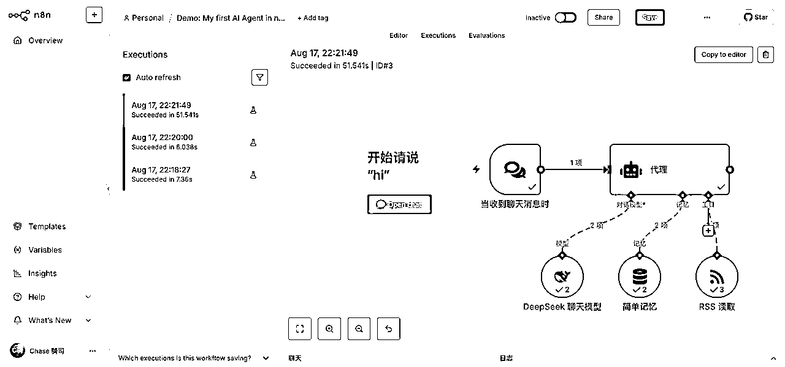
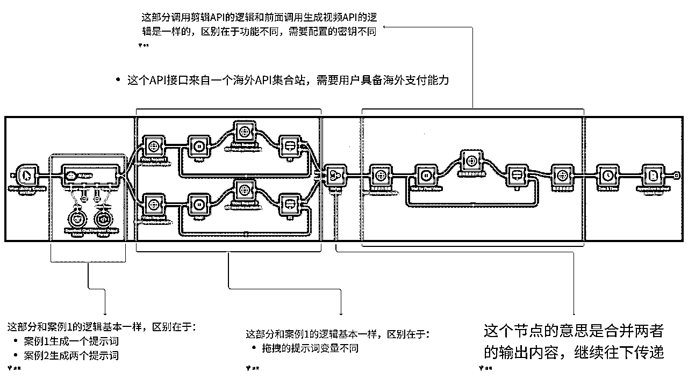
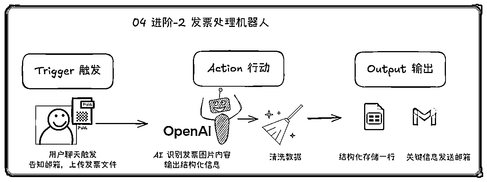
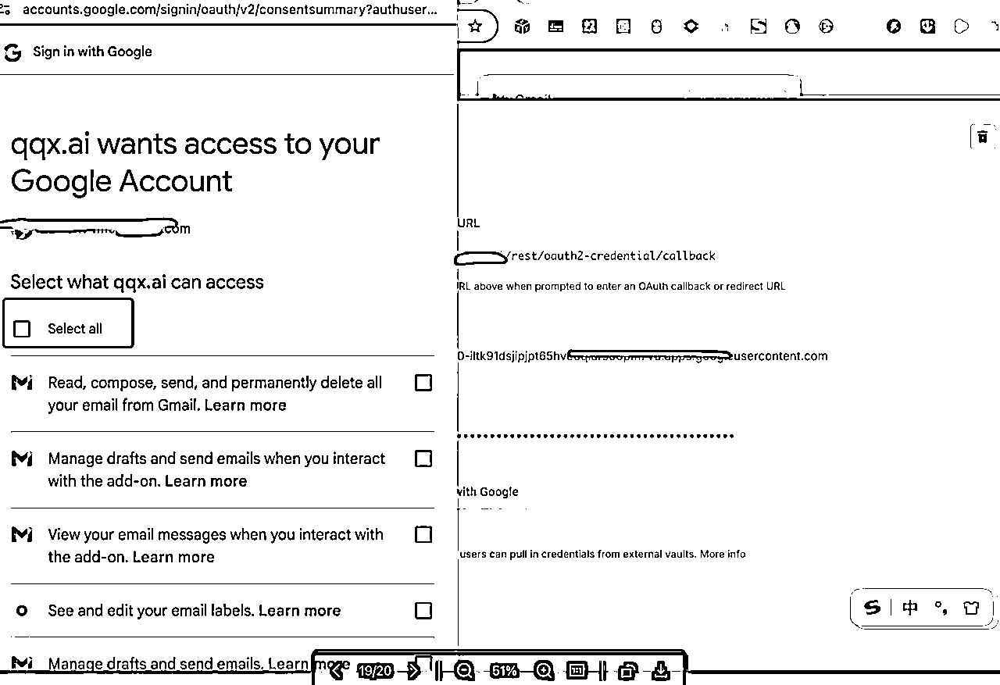
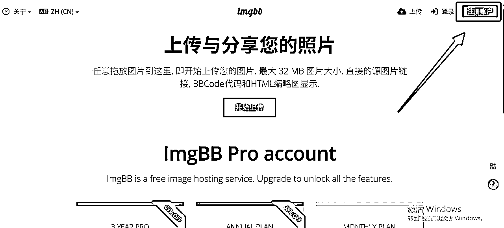
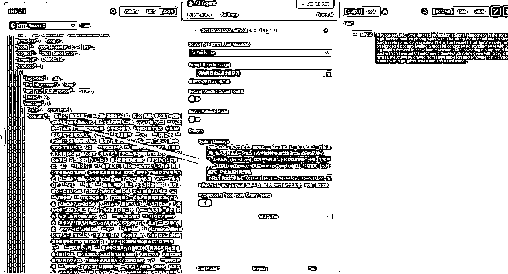
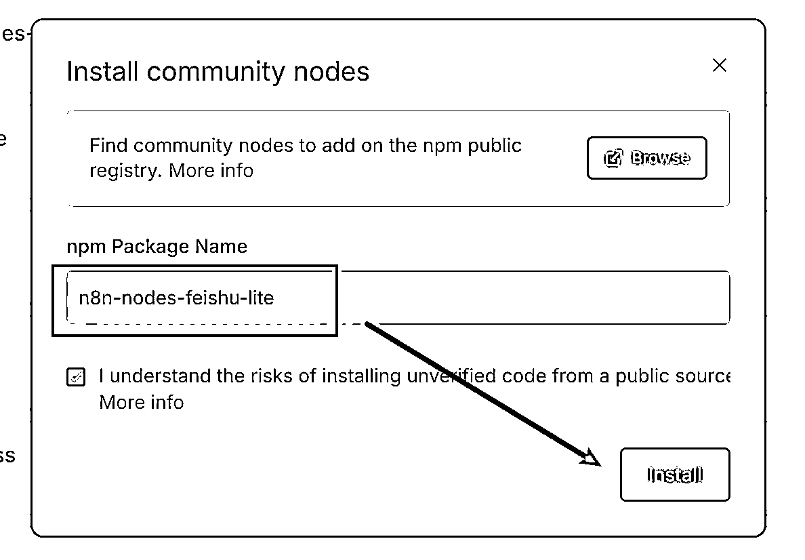
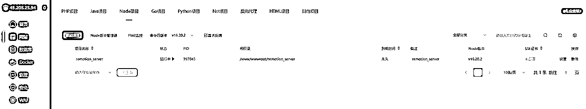

# n8n 自动化工作流丨实战手册丨2025年9月航海

> 来源：[https://ocn93f5d9olj.feishu.cn/docx/PZ9PdTk6No7C1ZxNhMqcwpccnGf](https://ocn93f5d9olj.feishu.cn/docx/PZ9PdTk6No7C1ZxNhMqcwpccnGf)

# ⛵新手如何入门【n8n 自动化工作流】项目？

# 1\. 什么是 n8n

简单来说：n8n 是一个开源的、可视化的自动化平台。它让你无需写代码，就能像搭积木一样连接不同的应用和服务（如邮件、表格、文档、数据库、AI 模型、甚至你公司的内部系统），创建自动执行任务的「工作流」（Workflow）。


想象一下：每天在不同软件之间切换——在企业微信收到客户咨询，手动复制到飞书记录，再打开腾讯文档更新状态，最后还得提醒自己用钉钉通知同事……这些重复的琐事，不仅耗费精力，还容易出错。

而 n8n 就是为了终结这种「数字搬运工」生涯而生的强大工具！

一旦你设置好了工作流，n8n 就会 24 小时监控触发条件。一旦条件满足，它会立刻启动，严格按照你的流程图，在后台高效完成所有串联的任务。

n8n 能做什么？

n8n 是一个理想的自动化工具，无论是日常流程还是结合 AI 的智能应用，都能轻松实现。

.

客户管理自动化：新客户注册后，自动发送欢迎邮件，同时录入 CRM（如 Notion 或 Airtable），并通过 Slack 通知销售团队，让每个客户都受到及时关注。

.

内容运营：订阅 RSS 获取最新文章后，自动生成摘要，并利用 AI 进行改写或翻译，最终发布到 Twitter 或 LinkedIn，让内容更高效传播。

.

智能通知：实时监控商品价格、股票行情或天气变化，当低于预期或出现异常时，自动通过短信或邮件提醒你，确保重要信息不错过。

.

数据桥梁：收集 Google Form 提交的数据后，自动同步到 Google Sheets 和 Notion 数据库，并生成详细的 PDF 报告，通过邮件发送，减少繁琐操作。

.

AI 助手集成：收到特定邮件时，让 AI 分析内容并草拟回复建议，你只需审核后发送即可，提升沟通效率。

.

内部流程自动化：审批流程、报告生成、数据备份以及跨部门数据同步等繁琐任务，n8n 帮助你轻松完成，减少手动操作的压力。

.

......


# 2\. 项目完整操作思路

# 2.1 项目完整操作思路

了解 n8n 核心概念 > 部署环境配置（关键） > 掌握节点操作 > 构建内容自动化生产线（关键） > 集成 AI 实现智能工作流（关键）

# 2.2 操作重点

重点 1：理解数据是怎么流动的（最重要）

学习 n8n，需要理解每个节点输出的数据结构是什么样的。比如：

如何用 {{ $json.fieldName }} 引用上一个节点的数据？

如何用 {{ $node["节点名"].json.fieldName }} 引用任意节点的数据？

90%的 n8n 问题都是因为不理解数据结构或引用错误。

重点 2：需要掌握这 5 个最常用的节点

Webhook - 接收外部数据

HTTP Request - 调用 API

Set/Edit Fields - 数据转换

IF - 条件判断

Code - 自定义逻辑

掌握这 5 个，你就能完成大部分自动化需求。其他节点都是锦上添花。

重点 3：有调试思维

学会用“执行到此节点”功能查看每一步的数据。出错时先看错误信息，再检查数据结构。善用固定数据功能来测试。n8n 的本质就是：数据从一个节点流向另一个节点，你要做的就是控制这个流动过程。理解了数据流，其他都是细节。

# 2.3 新手入门建议&避坑指南

完全不懂技术能学会吗？

答：可以。n8n 采用可视化拖拽方式，像搭积木一样连接不同服务，无需编程基础。

n8n 和 Zapier、Make 有什么区别？

答：最大优势是可自托管、无限制执行、支持复杂逻辑和代码，核心功能完全免费。相比 Zapier 成本节省 40-60%，比 Make 有更强的代码集成能力。

部署会很复杂吗？

答：提供多种部署方式：Docker（推荐，一条命令搞定）、npm 快速测试、n8n Cloud 零维护。

能实现哪些自动化？

答：内容多平台分发、数据定时备份同步、邮件自动处理、AI 协作流程、团队协作自动化等，航海会提供大量实战案例。

# 2.4 开船前必备

.

一台电脑（Windows/Mac/Linux 均可）

.

Docker Desktop（推荐）或 Node.js 20.19+

.

基础的浏览器操作能力

.

建议准备：轻量云服务器（可选，约 30 元/月）

.

常用平台账号：Gmail、飞书、Notion 等（用于集成练习）

.

AI 工具 API（可选）：DeepSeek、ChatGPT、Gemini 等

# 3\. 内容出品人

内容出品人：


李香君

、

KKKK

、


达轮

、


饼干哥哥🍪

、

骑司Chase

、


Cyrus-赛探长

、

如斯布

、


富百

、

小宋

、


说实话，n8n 刚开始确实有点懵，什么节点、数据流的，听着就头大。

但你想想，每天在微信、飞书、Excel 之间复制粘贴，一个个手动更新，烦不烦？我之前光是整理客户信息就能搞一下午，现在 10 分钟设置好，以后全自动。

别想太多，先搞个最简单的——比如邮件自动转发到飞书。跑通一个你就懂了，剩下的都是照葫芦画瓢。

航海最大的好处就是有人一起踩坑，遇到问题群里一问，总有人帮你。我们不必成为 n8n 专家，能把手头的破事儿自动化就够了，加油！

1.  n8n 本地部署

1.  本章概要

在引言中，我们已经全面认识了 n8n 这个强大的自动化工具，相信你已经对它能做什么充满了期待。但再强大的工具，如果只停留在想象中，也无法发挥价值。

现在，是时候动手把它真正地运行起来了。本章将带你跨过从知道到实操的第一道门槛，亲手为自己搭建一个专属的「自动化指挥中心」。正所谓“工欲善其事，必先利其器”，完成部署，是我们开启一切自动化流程的基石。

在本章中，你将亲手实践：

理解不同部署方案：清晰了解 n8n 多种部署方式的不同，做出最适合自己的选择。

本地快速启动：学习如何在自己的电脑上（Mac 或 Windows）用最推荐的方式运行 n8n，方便学习、测试和开发你的第一个工作流。

云端稳定运行：掌握在云服务器上部署 n8n 的方法，让你的自动化流程可以 7x24 小时不间断地为你工作。

通过本章的学习，你将不再只是一个旁观者，而是真正拥有了属于自己的自动化引擎。让我们一起动手，为你的自动化之旅打下坚实的第一步。

# 本章航线图

完成本章节的学习和实操，即可完成航线图的第一阶段的第1部分。

第一阶段：了解 n8n 并完成环境搭建（约 2 天）

学习 n8n 4种部署方式（约 0.5 天）

完成 Docker 本地部署与至少一种云端部署，搭建好实操环境（约 1.5 天）

# 2\. 部署方法汇总

部署是使用n8n的第一步

如果是新手朋友，建议大家先使用n8n官网的方式来进行部署，比较简单；

其次可以考虑用云端部署、云托管平台部署的方式（如有费用，产出的费用选择需要注意）；

本地部署比较难，特别是Windows版本，会存在很多问题，建议对这方面有一定基础的同学再采用这个方法

PS：任选一种方式部署即可，不需要全部方式都尝试一遍，推荐大家在实操的过程中，万事问AI

部署方式

官网云托管

(n8n Cloud)

云托管平台 (PaaS)如 Zeabur, Clawcloud

云服务器部署 (VPS)

本地桌面部署 (Local)

部署实体

官方提供的SaaS云服务

在第三方PaaS平台上通过代码仓库一键部署

在云服务器上通过Docker进行部署

在个人电脑(Windows/macOS)上运行

成本模型

按用量阶梯式付费，成本相对较高，最低24欧元/月

成本低，初期5美元/月，Clawcloud 可以免费薅（Github账号满180天）

PS：产出的费用选择需要注意

低，仅服务器固定月租 (性价比极高)

免费

技术门槛

极低，注册账号即可使用

较低，无需服务器管理知识，按照流程部署即可

中等，需要基础的Docker知识和一定的服务器知识

中等，需要基础的Docker知识

数据主权

数据由官方平台托管

较高，应用和数据逻辑由用户控制，但运行环境由平台管理

完全私有，数据100%在自己的服务器

完全私有，数据100%在本地电脑

运行稳定性

高，由官方团队负责运维保障

高，平台通常提供自动扩缩容和故障恢复

高，可实现7x24小时不间断运行

低，依赖电脑开机和联网，无法7x24小时运行

限制

不同付费级别对应的并行数量有限制

主要是服务器算力限制，影响并行和用户数量

主要是服务器算力限制，影响并行和用户数量

无法直接接入公网，需要ngrok等工具

适用场景

快速体验、无技术背景的个人/团队、追求省心稳定，初期测试推荐

追求部署简便与低成本自托管平衡的开发者、快速原型验证

所有生产环境、中小型企业、需要数据私有和低成本的严肃用户 (最推荐)

学习、测试、开发调试、运行非关键性个人任务

# 3\. n8n 官网部署（需使用 VPN）：

https://n8n.io/


# 4\. 云端部署实操步骤

打开这个网站https://run.claw.cloud/，点击右上角Get started


选择Github登录，这样每个月都会送5美金额度，不要选谷歌邮箱登录，它只送第一个月的5美金额度


然后点击App Store 再点击N8N，根据图片顺序点confirm，就非常简单的创建好云端N8N了。

一天只要0.14，30天也就4.2，完全在5美金的免费额度以内。还5分钟都不用就建好了。


完成上面confirm后，右边就会出现n8n-xxxxx，打开就是n8n的客户端界面。

注册自己的n8n账号即可

注册成功后，需要把网站链接复制下来，放到自己常用的地方，后续直接把链接复制到浏览器即可

至此你就拥有专属的n8n服务器


# 5.本地部署实操步骤

# Step1 下载 docker，注册并登录 docker

▼打开 docker 官网链接🔗 https://www.docker.com/ 如下图示，下载设备对应的 docker 版本


▼安装后，点击右上角 sign in 来注册（如有账号忽略）并登录 docker，给了三种登录方式，都可以选择


# Step2 使用 docker 安装 n8n，并进行配置

▼左侧找到 Docker Hub，搜索 n8n，点击第一个


▼点击右上角的 Pull

▼再点击左侧 image 栏，等待下载完毕后，运行


▼在电脑中创建一个 n8n 文件夹用来放数据，并复制他的路径


Windows 电脑在创建文件夹后，鼠标点击右键，选择【复制文件地址】即可


▼将复制的路径粘贴到 volumes 中的第一格中（host path）


```
n8n
5678
你创建的文件路径
/home/node/.n8n/
```

# Step3 等待运行完毕，点击链接

# Step4 注册自己的 n8n 账号即可

# Step5 后续进入 n8n 网站的方法

注册成功后，需要把网站链接复制下来，放到自己常用的地方，后续直接把链接复制到浏览器即可；

如果关闭了docker，打开 Docker Desktop，在 Docker Desktop 的左侧，点击 Containers 选项卡，会在列表中看到一个之前创建的容器，名字可能是 n8n 或者其他你当时命名的名字。

你会发现这里是处于 "Exited" 或 "Stopped" 的状态（灰色的）。这就是无法访问网页的直接原因

在 "Actions" 下面会出现几个图标。请点击那个三角形的“播放/启动”按钮 (Start)

点击启动后，容器的状态应该会很快变成 "Running"（绿色的），然后在浏览器复制你的网址链接即可


# Mac本地部署实操视频展示

Mac本地部署实操视频展示

1.  界面布局详解

# 1.本章概要

在上一章，我们已经成功地将 n8n 安装并运行起来了。

当你第一次打开那个清爽的界面时，可能会感到既兴奋又有点迷茫：“这么多按钮和面板，都分别是做什么的？我该从哪里开始呢？”别担心，我们在本章会解决这个问题

在本章中，你将掌握：

界面导航能力：清晰了解 n8n 界面的每一部分功能，知道去哪里查找工作流、凭证和执行记录。

核心节点认知：系统学习触发、数据处理、逻辑控制、API 调用等核心节点的功能和使用场景。

通过本章的学习，你将不再是一个门外汉，而是能够看懂并理解一个 n8n 工作流是如何构成的内行人，为下一章真正开始创建属于自己的自动化流程做好万全准备。

# 本章航线图

完成本章节的学习和实操，即可完成航线图的第一阶段的第2部分。

第一阶段：了解 n8n 并完成环境搭建（约 1 天）

.

熟悉 n8n 界面布局，掌握核心节点的分类与功能（约 1 天）


1.  左侧栏：工作流、凭证和执行记录

n8n 的创始人是设计师不是程序员，这也让这个产品的 UI 界面设计达到了非常高的水平。界面中运用了大量“拖拽”式的交互设计，对于不太熟悉这种交互方式的人来说，可能会显得有些复杂和不直观。但其实只要多尝试点击、拖动等操作，往往能发现一些意想不到的惊喜。

点击左侧的 Overview（概览），就会进入你的 Workflow（工作流） 页面，上方的页面分别为：

Credentials（凭据）：统一存放、查看每一个凭证的地方。

Executions（执行）：也就是全部工作流的「执行记录」，记录自动化工作流程每一次运行过程、结果和可能出现的问题。若有发生错误，则会出现 Error，可以借此查看错误发生在哪一个节点。

1.  顶部工具栏：工作流的管理、设置、导入导出

包含工作流名称、开启关闭工作流、保存工作流、共享和导入导出……等功能按钮。


1.  中央工作区：白板工作区

绘制、建立工作流的主要区域，可以在此放置和连接不同的节点，还有利用便利贴（Sticky Notes）撰写备注。


1.  编写工作流操作说明书

在建立和测试自动化工作流时，往往需要不断点击 Execute step，反复验证流程是否正确运作。

但是工作流启动正常运行，我们一般并不会常回来检查——除非发生错误。

记录工作流的思考逻辑和步骤，其实是在为未来的自己或他人写一本操作指南，这也是一种深刻的复盘过程。复盘不仅仅是简单地回顾，更是为了未来能够进行真正有效的学习。

养成记录的习惯，不只是为了方便自己快速理解工作流，更是在关键时刻为问题诊断提供可靠依据，让自动化工作流变得更容易维护。

你可以使用 n8n 的「便利贴」功能来记录工作流的思路与步骤：

.

打开工作流：进入 n8n 界面，找到并打开你要记录的工作流

.

添加便利贴：点击工作区右侧的便签按钮

.

开始记录思考逻辑、步骤记录：Sticky Note 支持 Markdown 格式，所以也可以加入不同标题大小、粗体、链接等等。


1.  Executions 介绍

在画布的最上方选择切换到 Executions 可以看到本工作流历次运行的记录。

这个功能非常实用，因为 n8n 的画布不支持自动保存，如果我们想要翻找历史上设计的一些逻辑，就可以通过这个方式进行找回，甚至把他们复制到画布当中去。

Executions 界面中的每个节点都是可以点击的，你可以找到其中的详细配置与 Log。



1.  操作技巧说明

.

画布在支持用触控板和界面左下角的缩放按钮进行缩放。

.

画布上的每一个节点都支持鼠标拖拽，当鼠标悬浮到特定节点上时，每个节点自身也有一个➡️，这个代表的是单步执行，也就是只有这个环节的跑一下程序，这个在 Debug 的时候会非常有用。


.

注意：n8n 的 workflow 画布不支持自动保存，记得随时【ctrl+s】进行保存

1.  核心节点分类与功能

这里的核心节点主要是带大家熟悉n8n在搭建工作流过程中，是如何触发一些常用节点的，不需要大家掌握这些节点，主要是做了解学习

建议搭配第三章的01节【完成你的第一个 n8n 工作流（AI Agent）】的实操来学习，在干中学

————————————————————————————————————————

前言：

n8n 的工作流程（Workflow）由两种核心部分组成：

.

触发节点 (Trigger Nodes)：这是工作流的起点，决定了工作流何时以及如何被激活。一个工作流有且只有一个触发节点。

.

动作节点 (Action Nodes)：在触发节点被激活后，执行具体任务的节点，比如处理数据、发送请求、调用 AI 模型等。一个工作流可以包含任意多个动作节点。

# 1\. 触发节点

触发节点 （Trigger Nodes）：

Manual Trigger（手动触发）：这是最基础、最简单的触发方式。它的作用就是在你开发和测试工作流时，让你能手动点击一下 "Test workflow" 或 "Execute workflow" 按钮来立即运行一次流程


Schedule Trigger（ 定时任务）：让你的工作流按照预设的时间表自动运行。你可以设置它每分钟、每小时、每天、每周甚至在特定的日期和时间运行。它内部使用的是 Cron 表达式，这是一种强大的时间定义语言。

Webhook（网络钩子）：Webhook 节点会生成一个专属的 URL 链接。当任何外部应用或服务向这个 URL 发送一个 HTTP 请求（通常是 POST 请求）时，n8n 工作流就会被立即触发，并能接收到请求中附带的数据。


Email Trigger（邮件触发）：这个节点可以连接到一个邮箱账户（例如 Gmail, Outlook）。当该邮箱收到新邮件时，工作流就会自动触发，并且可以读取邮件的发件人、主题、正文内容和附件等信息。

PS：此节点在较新版本的 n8n 中可能已被整合或有不同的名称，例如通过 IMAP 节点来实现。其核心功能是监控邮箱的收件箱。


On chat message（聊天对话框触发）：这是专门为构建聊天机器人而设计的触发器。当你把 n8n 的聊天机器人嵌入到你的网站或应用中时，只要用户在那个聊天框里发送了第一条消息，这个节点就会被触发，并捕获用户的输入内容。


实际场景运用：工作流实操案例常用节点（建议搭配入门工作流中的第一个工作流来学习）

我们利用聊天对话框触发，如果想要实现一个 n8n 版本的 AI 对话机器人

需要用到三个节点：On chat message ， AI Agent ， DeepSeek Chat Model

AI Agent 节点配置 ，需要将 On chat message 节点的 chatInput 作为 Prompt

AI Agent：这是一个“AI 大脑”或“任务协调员”节点。它本身不直接生成内容，而是负责管理与 AI 模型的整个对话流程。它可以接收输入（Prompt），调用一个或多个工具（Tools），并利用一个大语言模型（LLM）来决定下一步该做什么，最终输出结果。


选择模型选择 DeepSeek Chat Model

DeepSeek Chat Model：这是一个具体的大语言模型（LLM）节点。它接收一个 Prompt（提示或问题），然后利用 DeepSeek 的 AI 能力生成一段文本回复


第一次涉及到了配置 Credential


我们需要到 https://platform.deepseek.com/api_keys 创建一个 API Key


配置好之后，我们可以到左下角的对话框，输入我们的内容


# 2\. Action 节点

数据处理节点：

我用 On form submission 节点进行触发


Set（原 Edit Fields）：这是最常用的数据处理节点之一。它的功能非常纯粹：添加、修改或删除数据字段。你可以保留输入的原始数据，同时创建新的字段；也可以直接修改现有字段的值；或者删除不需要的字段。

将姓名和年龄字段修改为 name 和 age


Function/Code：JavaScript/Python 自定义代码

这是一个“万能节点”。当 n8n 现有的所有节点都无法满足你复杂的数据处理需求时，你可以使用这个节点，直接用 JavaScript 或 Python 编写代码来对数据进行任意操作。


Merge（合并）：这个节点用来将两个或多个从不同节点分支流过来的数据流合并成一个。

常用的 Mode 是 Append，Combine


Append:把两路输入的 item 首尾相接 输出——先输出 Input 1 的所有 item，再输出 Input 2 的所有 item。不会做去重或匹配。

Combine：按你指定的字段（key）把两路输入里“键相同”的 item 合并成一个 item。没匹配到的项默认不会输出。

逻辑控制节点：

IF：条件分支


作用：筛选符合条件的数据，是一个逻辑判断模块，用于过滤不需要的内容。

Switch：多路径路由

根据条件将数据分发到不同的执行路径


Loop Over Items：循环处理

对输入的每个数据项重复执行相同的操作

Wait：延时等待

暂停工作流执行一段时间后再继续：适合一些后端服务时长的场景：API 调用限频控制、等待外部系统处理完成、定时发送提醒消息


官方集成节点（热门）：

HTTP Request：通用 API 调用

向任何支持 HTTP 协议的服务发送请求

调用第三方 API 获取数据、向 webhook 发送通知、对接自建系统接口

Google Sheets：表格自动化

读取、写入、更新 Google 表格数据，自动同步数据、生成报表、从表格触发其他操作、数据收集汇总


Slack/Discord：团队通知

发送消息到团队聊天频道，系统异常告警、任务完成提醒、数据报告推送、自动化流程状态通知


OpenAI/ChatGPT：AI 集成（gemini 节点）

调用 AI 模型进行文本处理、生成内容


社区节点（飞书）


1.  工作流创建基础

创建节点的四种方式：

点击画布"+"按钮


从现有节点拖出连接线

Tab 键快捷搜索


从右侧面板拖拽

数据流管理：

表达式系统（JavaScript 动态计算）

数据映射（拖放式字段映射）

数据预览（表格/JSON/Schema 视图）

1.  完成你的第一个 n8n 工作流（AI Agent）

# 1.本章概要

通过前两章的学习，我们已经拥有了自己的“自动化指挥中心”，并熟悉了其中的每一个“仪表盘”和“控制杆”。现在，理论知识已经储备完毕，是时候发动引擎，让它真正跑起来了！

本章的核心目标只有一个：获得正反馈。我们将从零开始，亲手搭建几个能立刻看到效果、解决实际问题、甚至颇为惊艳的自动化工作流，让你彻底爱上这种创造的感觉。

在本章中，你将亲手搭建：

你的第一个 AI 智能助理：用最少的节点搭建一个具备联网搜索和记忆能力的 AI Agent，建立搭建工作流的基本手感。

AI 新闻资讯管道：构建一个能自动获取API新闻、进行数据清洗、交由 AI 翻译总结，并最终存入飞书多维表格的完整资讯流。

学完本章，你将不再只是一个“学习者”，而是能够独立搭建和运行自动化流程的“创造者”。你将第一次亲手将繁琐的流程，变成一条条高效运转的自动化生产线。

# 本章航线图

完成本章节的学习和实操，即可完成航线图的第二阶段：

第二阶段：掌握n8n入门工作流（约 2 天）

.

创建「AI 智能助理」工作流，跑通第一个自动化流程（约 1 天）

.

用n8n搭建 AI 新闻资讯助手，并写入飞书多维表格（约 1 天）


# 2.视频实操展示

航海手册里面相关的视频和JSON文件都汇总到这个文档里面，可以点击文档链接进行学习

视频实操展示

# 3.Step1 添加触发器和 AI 节点

接下来，我会带你一步步完成你的第一个工作流，重点在于跑通工作流，体验成功的感觉。后续你可以调用任何 AI 模型的 API 来进行对话，或者添加任何工具来达成你想要的效果。

创建一个新的工作流面板，根据下图先添加触发器和 AI 节点。整个操作过程中，如果英语不好，就使用【沉浸式翻译插件】任何看不懂的东西，用工具去解决，任何看懂了，但是还没有必要去处理的功能，先不要管。学习的过程中不用给自己徒增烦恼，能保持持续的正反馈，学习下去才是最重要的。


# 4.Step2 配置新凭证

这里我们用 DeepSeek 模型，先创建新凭证。


打开 DeepSeek 官网，点击右上角的 API 开发平台，可以先充个 10r 测试。你想接入任何大模型，基本上都是找到他的开发平台页面，找到 API 调用板块，创建一个 key，然后复制到 n8n 中。


创建 API key，进行复制。


把密钥粘贴进去，凭证就创建好了，这个时候我们就顺利的接通了 DeepSeek 模型到 n8n 中。


# 5.Step3 添加【记忆】让 AI 能够根据上下文回答


# 6.Step4 配置 RSS，让 AI 助手能够访问指定网络

RSS（Really Simple Syndication）是一种用于订阅网站内容的技术。它允许用户方便地获取和阅读他们感兴趣的网站的最新更新，而无需逐个访问这些网站。

我们创建一个 RSS 读取工具，然后进行配置。


获取任何 RSS 订阅源的最新博客文章。

n8nJSON源文件及其他资料（可复制）

使用以下之一：​

•

https://feeds.bbci.co.uk/news/world/rss.xml（BBC 世界 – 全球头条新闻）

•

https://www.aljazeera.com/xml/rss/all.xml（半岛电视台英语 – 全球深度报道）

•

http://rss.cnn.com/rss/edition_world.rss（CNN World – 全球突发新闻）

•

https://techcrunch.com/feed/（TechCrunch – 全球科技和创业新闻）

•

http://news.ycombinator.com/rss（黑客新闻 – 技术社区头条新闻）

•

https://n8n.io/blog/rss （n8n 博客 – 更新和教程）

•

https://www.bonappetit.com/feed/recipes-rss-feed/rss（Bon Appétit – 最近的食谱列表）

•

https://www.endsreport.com/rss/news-and-analysis（ENDS 报告 – 环境法律和政策新闻）

•

https://medlineplus.gov/groupfeeds/new.xml（MedlinePlus – 健康主题和健康更新）

全部配置完成之后，我们在下方点击【打开聊天】测试一下。

我让这个 Agent 给我一些近期的科技类新闻，可以看到没有问题，调用 DeepSeek 和 RSS 联网后，输出了新闻标题+简介+新闻链接。

至此，我们创建的第一个工作流就顺利跑通了！


如果你想要设置内置提示词，可以打开 AI Agent 板块，调整提示来源，输入你的提示词。

在 n8n 中，任何功能、按键都可以点一点、拖一拖，多尝试，会给你带来很多惊喜。


# 02.用 n8n 搭建 AI 新闻资讯写入飞书多维表格工作流

# 效果展示


# 工作流全貌


拆解下这个工作流：获取当日的 AI 新闻➡️写进多维表格。

只有两步，看起来并不复杂。

但是实际上完整的工作流共用到 9 个节点：其中涉及到了几个常见的工作流处理机制：异常处理、数据清洗、合并、过滤空值等、数据结构化输出等等，我们一个个展开来讲。

补充：由于在线版本暂时无法获取 feishu-node 节点，这个工作流适用8本地部署（docker 部署或者 npm 部署）

# 视频实操展示

.

视频实操学习文档

航海手册里面相关的视频和JSON文件都汇总到这个文档里面，可以点击文档链接进行学习

视频实操展示

.

【讲义】


# 1.第一部分：准备工作

本地部署：前文已经介绍过了，不再赘述

飞书社区节点获取：在 n8n 中可以使用飞书节点

新闻资讯 API 获取：获取新闻 API

飞书自建应用：AppID，AppSecret，权限开通，用于将飞书和 n8n 连接起来

新建飞书多维表格

一个个展开说：

# 1.1 新闻资讯 API 获取

我用的是 NewsAPI 和 GNewsAPI，简单来说就是一个聚合了新闻的 API 服务，允许开发者通过简单的 HTTP 请求获取来自全球各种新闻源的文章和头条新闻。核心功能包括：

提供来自 70 多个国家、数千个新闻源的实时新闻数据

支持关键词搜索、分类筛选、日期范围等多种查询方式

返回结构化的 JSON 格式数据，包括标题、描述、URL、发布时间等

# 1.1.1 API 地址

NewsAPI 网址：https://newsapi.org/

GNewsAPI 网址：https://gnews.io/

推荐使用 NewsAPI，发送 HTTP 请求时，可以筛选的参数更全面一些。

注：两个网址使用时都需要挂梯子

# 1.1.2 注册方式

.

点击进 NewsAPI 网址，先注册，之后点击 login 登录（GnewsAPI 获取的方式同理）

.

登录后，就会看到 Account 和 Usage

.

Account 里有一个 API key，这个就是你可以直接使用的 NewsAPI 的 API 了，记住不要把这个 Key 放到任何公域上，否则其他人就可以使用你的 API，会消耗你的 Usage（其他的 API 同理），把这个 API 保存下来，后面会用到


.

Usage 可以直接看到你请求 API 的次数，免费的 NewsAPI 用户，每日有 1000 次的请求次数，对于大多数普通用户来说，已经足够使用。


# 1.2 飞书社区节点获取

.

在本地部署好 n8n 后，进入 n8n 页面，先点击左下角的“...”，之后点击“Settings”

.

点击"Community nodes"，点击"Install"


.

点击"Browser"，进入社区后搜索"feishu"，找到"n8n-nodes-feishu-lite"节点，复制下来，返回 n8n 的页面


.

在"npm package name"中输入"n8n-nodes-feishu-lite"，勾选同意，点击"install"


.

等待一会，飞书节点就被成功安装进 n8n 了


# 1.3 飞书自建应用

.

首先打开飞书开放平台（地址：https://open.feishu.cn/），如果没有用飞书登录，需要先登录；登录后点击开发者后台


.

点击"创建企业自建应用"，输入应用名称（自定义即可）和应用描述（自定义即可），点击创建；其中应用名称要记住，后面会用到


.

开通应用权限，创建版本发布

.

创建成功后，点击左侧"权限管理"，点击"开通权限"，在搜索栏中输入"多维表格"，选择“获取多维表格信息”、“更新多维表格”、“查看、评论、编辑和管理多维表格”这三个权限，选中后点击"确认开通权限"


注：需要使用哪个就开通哪个的权限，不需要开通过多，个人免费版的飞书每个月有 10000 次的调用限制

.

创建版本：

点击左侧的「版本管理与发布」，在应用版本号处输入“1.0.0”和更新说明（输入任意内容），点击保存，点击确认发布


.

发布成功后，点击左侧的“凭证与基础信息”，获取 AppID 和 AppSecret，保存下来，后续会使用


# 1.4 飞书多维表格

.

新建一个飞书多维表格

点击“云文档”，点击“新建”，点击“多维表格”，点击左上角，新建到“我的文件夹”中

注意：多维表格要新建到“我的文件夹”中，不要新建到“知识库”中


.

查看链接

.

如果你是飞书桌面端创建的多维表格，点击右上角的“在浏览器中打开”

.

检查链接

检查下链接中"feishu.cn"后面是"base"，则说明你的表格存放位置正确；如果是"wiki"则需要你把多维表格从“知识库”中移入到“云盘”中


.

移动方式


.

修改字段格式和字段名称

点击"修改字段"，把 5 个字段格式都修改成"文本"格式，名称依次修改为"新闻链接"、"标题"、"新闻简要"、"发布日期"、"作者"


.

添加应用

点击"···"，点击"更多"，点击"添加文档应用"


输入你刚才创建好的应用名称，应用权限设置成"可编辑"，点击"添加"


到这里我们的准备工作就做好了

# 2\. 第二部分：搭建工作流

完整工作流


# 2.1 Schedule Trigger 节点

我希望能在每天上午 8 点就能够查看 AI 新闻，所以选择了"Schedule Trigger"节点（定时触发节点）

点击右侧"+"号，搜索"Schedule Trigger"，添加节点

# 2.1.1 节点功能

每天上午 8 点定时触发工作流

# 2.1.2 参数设置


parameters

输入

作用

Trigger Intercal

Days

触发间隔

Days Between Triggers

1

两次触发之间的时间间隔

Trigger at Hour

8am

触发时间-小时

Trigger at Minute

0

触发时间-分钟

# 2.2 HTTP Request 节点

点击"+"号，搜索"HTTP Request"节点，与上一步的"Schedule Trigger"节点连接在一起


# 2.2.1 节点作用

通过 HTTP 请求从 NewsAPI 或 GNewsAPI 获取新闻

# 2.2.2 参数设置

parameters


输出结果：

parameters

输入

作用

Method

get

通过 HTTP 请求从服务器获取新闻

URL

https://newsapi.org/v2/everything?q=AI&sortBy=relevancy&apiKey=你自己的 API

URL 地址中的参数

q = AI——获取的新闻内容为 AI 相关；

sortBy = relevancy——获取的新闻内容以相关性为主；

Authentication

None

不需要权鉴

Specify Query Parameters

Using JSON

JSON

```
{
  "from": "{{ new Date(Date.now() - 24*60*60*1000).toISOString().split('T')[0] }}",
  "to": "{{ new Date(Date.now() - 24*60*60*1000).toISOString().split('T')[0] }}",
  "language": "en",
  "pagesize": 20,
  "page": 1
}
```

发送特定的查询参数，发送方式：Using JSON

JSON 的作用：

设置时间——获取的是当前日期前一天的新闻内容；

pagesize——一页中获取的内容数量；

Language——语言为英语

page——默认是 1

# 2.2.3 节点内容详解

Method: get

我们要从服务器获取新闻，所以 Method 选择的是 GET

URL：https://newsapi.org/v2/everything?q=AI&sortBy=relevancy&apiKey=你自己的 API

URL 的获取方法：回到刚才的 NewsAPI 网址：https://newsapi.org/，点击"Get Started"，之后可以看到一个 URL 和一个 Example request。


通过查看文档 https://newsapi.org/docs/endpoints/top-headlines 我们可以看到，有两种查询参数的设置方式。

一种是在 URL 链接中修改，比如：

q = AI——获取的新闻内容为 AI 内容；

sortBy = relevancy——获取的新闻内容以相关性为主；

另一种可以通过 specify query parameters，用 JSON 格式发送，比如以下：

```
{
  "from": "{{ new Date(Date.now() - 24*60*60*1000).toISOString().split('T')[0] }}",
  "to": "{{ new Date(Date.now() - 24*60*60*1000).toISOString().split('T')[0] }}",
  "language": "en",
  "pagesize": 20,
  "page": 1
}
```

设置时间——获取的是当前日期前一天的新闻内容；

pagesize——一页中获取的内容数量；

page——默认是 1

这段 JSON 格式是用 Claude 写的，提示词如下：

我想要通过 newsapi 这个接口，在 n8n 中利用 HTTP Request 获取 AI 新闻，同时我有几个要求：

1、获取的新闻是前一天；

2、我需要获取的是英文内容；

3、我想要获取 20 条新闻即可；

我需要在 Send Query Parameters 中的请求 JSON 中如何输入 JS0N 格式？

# 2.2.4 切换到 settings 页面：


在测试这个 API 接口时，出现了服务器离线的情况，导致无法获取到新闻的情况，为了能让工作流更稳定的运行，所以我补充了一个分支：当 NewsAPI 运行失败时，进行 GNewsAPI 的 HTTP 请求——用两个不同的 API 服务来保证新闻获取的稳定。

而为了让某个节点出错时工作流依然流转到下一个节点，这里做了两个设置：

Always Output Data

On Error : Continue( using error output)


Settings

输入

作用

On Error

Continue( using error output)

当节点出错时，程序不终止运行，输出 error output 继续运行到下一个节点

Always Output Data

打开

始终输出数据，如果请求失败，数据为空，也输出空值

# 2.2.5 分支

NewsAPI 运行调用失败时，进行 GnewsAPI 的 HTTP 请求（和 NewsAPI 的方式类似）

依然是在右侧点击"+"，找到 HTTP Request 节点，与上一个"NewsAPI"节点的 Error 口连接

这一步意味着：当 NewsAPI 运行出错时，开始运营 GNewsAPI 节点


.

URL 获取方式：

GNewsAPI 获取地址：https://gnews.io/，注册

注册成功后，点击"Documentation"，点击复制


复制下来这一串 URL 地址


返回主页点击右上角的"Dashboard"


获取你的 API key，点击复制

在刚刚获取的 URL 末尾粘贴你的 API_key，并修改其中的查询参数：https://gnews.io/api/v4/search?q=AI&sortby=relevance&max=20&apikey=你的 API_KEY，这就是你完整的 URL 地址了


.

参数设置

parameters

输入

作用

Method

get

通过 HTTP 请求从服务器获取新闻

URL

https://gnews.io/api/v4/search?q=AI&sortby=relevance&max=20&apikey=你自己的 GNewsAPI

URL 地址

q = AI——获取的新闻内容为 AI 相关；

sortBy = relevancy——获取的新闻内容以相关性为主；

Max = 20——获取的内容数量

Authentication

None

不需要权鉴

Specify Query Parameters

Using JSON

JSON

```
{
  "from": "{{ new Date(Date.now() - 24*60*60*1000).toISOString().split('T')[0] }}",
  "to": "{{ new Date(Date.now() - 24*60*60*1000).toISOString().split('T')[0] }}",
  "max": "20",
  "language": "en"
}
```

发送特定的查询参数，发送方式：Using JSON

JSON 的作用：

设置时间——获取的是当前日期前一天的新闻内容；

max——获取的内容数量；

language——语言是英语


# 2.3 Code 节点

点击右侧的"+"，输入"Code"，和 NewsAPI 节点的 Success 口连接


# 2.3.1 节点作用

这一步的主要目的是数据清洗。

如果我们把 HTTP Request-NewsAPI 的输出结果和多维表格的字段做一下对比，就会发现两边的数据格式并不一致。

格式不一致会导致无法写入到飞书多维表格中，所以可以使用 code 节点做数据清洗，使数据格式保持一致，这样才能确保成功写入多维表格中。


# 2.3.2 节点设置


parameters

输入

作用

Mode

Run Once for All Items

一次性运行所有项目

Language

JavaScript

用 JavaScript 语言

JavaScript

```
// 获取输入数据
const inputData = $input.all();

// 存储转换后的数据
const outputData = [];

// 遍历输入数据
inputData.forEach(item => {
  // 检查是否有articles数组
  if (item.json && item.json.articles && Array.isArray(item.json.articles)) {
    // 遍历每篇文章
    item.json.articles.forEach(article => {
      // 格式化发布日期
      let formattedDate = '';
      if (article.publishedAt) {
        const date = new Date(article.publishedAt);
        formattedDate = date.toLocaleString('zh-CN', {
          year: 'numeric',
          month: '2-digit',
          day: '2-digit',
          hour: '2-digit',
          minute: '2-digit'
        });
      }

      // 创建表格行数据
      const tableRow = {
        新闻链接: article.url || '',
        标题: article.title || '',
        新闻简要: article.description || '',
        发布日期: formattedDate,
        作者: article.author || '未知作者'
      };

      outputData.push({
        json: tableRow
      });
    });
  }
});

return outputData;
```

用代码做数据清洗，使输出的格式保持一致。

代码由 AI 生成，提示词如下：

把上一步输出的结果复制下来，粘贴给 Claude


# 2.3.3 分支的 code 节点

依然点击右侧的"+"，输入"Code"，和 GNewsAPI 节点的连接


GNewsAPI 的数据清洗也依然使用 Code 节点，但要注意的是：GNewsAPI 返回的数据格式和 NewsAPI 返回的格式并不相同，因此代码并不一样，要让 Claude 重新生成代码（代码块在下方表格中可直接复制）

parameters

输入

作用

Mode

Run Once for All Items

一次性运行所有项目

Language

JavaScript

用 JavaScript 语言

JavaScript

```
// 获取 HTTP 请求的输出数据
const articles = $json["articles"];

// 初始化表格数据数组
let tableData = [];

// 遍历所有文章并将其转换成表格格式
articles.forEach(article => {
  const row = {
    "新闻链接": article.url,
    "标题": article.title,
    "新闻简要": article.description,
    "发布日期": article.publishedAt,
    "作者": article.source.name
  };

  tableData.push(row);
});

// 输出结果
return tableData;
```

用代码做数据清洗，使输出的格式保持一致。

代码由 AI 生成，提示词如下：

把上一步输出的结果复制下来，粘贴给 Claude


# 2.4 Merge 节点

点击"+"，输入 Merge，「Input1」和「Code」连接起来，「Input2」和「Code1」连接起来


# 2.4.1 节点作用

清洗过的数据要做合并。

实际上，在上一步中虽然有两条分支，但是并没有生成两组数据，始终只有一组数据。

原因在于：NewsAPI 的输出结果，要么成功，要么失败；成功时，直接输出数据，并且不需要 GNews 节点；失败时，输出内容为空，运行到 Gnews 节点，并输出结果；

但是由于 NewsAPI 和 GnewsAPI 输出的结果，在 n8n 中为两组不同的变量，为了让两组变量变成一组变量，所以我用了 Merge 节点做合并。

# 2.4.2 节点设置


parameters

输入

作用

Mode

Append

添加节点

Number of Inputs

2

# 2.5 Fliter 节点

点击"+"，输入 Filter，和 Merge 节点连接起来


# 2.5.1 节点作用

过滤数据。

在测试时发现，有的单元格返回的内容为空，而空值并不是我们想要的。

用 Fliter 节点可以很好地过滤掉那些空值，保留非空值。

# 2.5.2 节点设置

在进行这步节点之前，我们可以点击"Execute Workflow"先测试之前的工作流，如果没有问题，会得到和下图一样的 INPUT，当有了测试结果的变量，我们就可以进行节点设置


.

上一节点的 output 结果作为这一节点的 input，修改成"schema"


.

按住"新闻链接"这个按钮，拖动到右侧的输入框中，以此类推把其余的四个变量都拖动到不同的输入框中


.

确保值存在，点击"exists"，鼠标悬浮在 String 上，点击"exists"，以此类推设置剩余变量


.

我们要取的是所有变量都存在，所以这里选择"AND"，取交集


# 2.6 AI Agent 节点

点击"+"，点击"AI"，点击"AI Agent"，和 Filter 节点连接起来


# 2.6.1 节点作用

到上一步，其实我们已经可以把内容写入到飞书多维表格中了。

但是由于获取的信息源主要为英文，所以在这里加了一步 AI Agent 做中文翻译，并保证内容能够结构化地输出。

# 2.6.2 节点设置

.

提示词设置


parameters

输入

作用

Source for Prompt( User Message)

Define below

自定义提示词

Prompt

```
请翻译{{ $json['标题'] }}和{{ $json['新闻简要'] }}字段为中文，并保留原有的其他字段不变（{{ $json['新闻链接'] }}、{{ $json['发布日期'] }}、{{ $json['作者'] }}）。翻译后的内容需要格式化为以下五个字段：

1\. 新闻链接
2\. 标题
3\. 新闻简要
4\. 发布日期
5\. 作者

输出内容必须与下面的格式一致，确保翻译后仍然是有效的JSON格式
```

翻译成中文，并按照制定格式输出

Require Specific Output Format

打开

按照特定的格式输出

注意：此处依然要把模式修改成"schema"，然后按住鼠标拖动到 Prompt 中


.

model 选择

我在这里选择是 deepseek 模型，就以 deepseek 为例

.

第一步 ：

点击"chat model"，选择"deepseek chat model"

.

第二步

点击"Credential to connect with"，如果你之前已经在 n8n 中写好了 Deepseek account，那直接选择就好；如果你没有的话，点击"Create new credential"


.

第三步

在这里输入你的 API KEY 后，点击保存

API KEY 的获取方式：参考前面的案例

进入 deepseek 官网：https://platform.deepseek.com/api_keys

点击右上角的 API 开发平台，可以先充个 10r 测试。你想接入任何大模型，基本上都是找到他的开发平台页面，找到 API 调用板块，创建一个 key，然后复制到 n8n 中。


创建 API key，进行复制，粘贴到 n8n 中。


.

输出格式

由于要以固定的格式写入飞书，所以在这步翻译完成时，要以固定的格式输出翻译结果（如下图）。


第一步

点击"Output Parser"，选择"Structured Output Parser"


.

第二步

选择"Generate From JSON Example"，输入以下 JSON 格式。打开"Auto-Fix Format"


```
{
"新闻链接": 
"https://www.wired.com/story/what-kids-think-about-ai-schools/",
"标题": 
"What Do Kids Actually Think About AI?",
"新闻简要": 
"Parents, teachers, and experts have big opinions about the impacts of AI on young people and education. But what do the students themselves say?",
"发布日期": 
"2025/08/18 10:00",
"作者": 
"Charley Locke"
}
```

.

第三步

再用第一步的方式继续选择一个大模型，我们还是选择 DeepSeek


# 2.7 feishu-node 节点

我们在准备工作的部分，已经添加过 feishu 节点，所以我们直接搜索 feishu，然后点击“多维表格 新增记录”，就可以成功添加了


# 2.7.1 节点作用

把 AI 资讯写入到飞书多维表格中

# 2.7.2 节点设置


.

第一步

点击"Credential to connect with"，如果你之前已经在 n8n 中写好了 feishu account，那直接选择就可以；如果你没有的话，点击"Create new credential"


.

第二步

Base URL:

填"open.feishu.cn"

Appid:

准备工作部分，飞书自建应用的 AppID 填写过来；

AppSecret:

准备工作部分，飞书自建应用的 AppSecret 填写过来

.

第三步

返回到节点页面，在【Resource】这里选择【多维表格】；在【Operation】这里选择【新增记录】；

多维表格 token：

回到多维表格的 URL 链接，"base"后面，"？table"前面的内容就是多维表格的 token


多维表格 ID：

"table="后面，"&view"前面的内容，就是多维表格的 ID


.

第四步

请求体 JSON：

```
{
  "fields": {
    "新闻链接": "{{ $json.output['新闻链接'] }}",
    "标题": "{{ $json.output['标题'] }}",
    "新闻简要": {{ $json.output['新闻简要'].toJsonString() }},
    "发布日期": "{{ $json.output['发布日期'] }}",
    "作者": "{{ $json.output['作者'] }}"
  }
}
```

到这里，这个 n8n 工作流就搭建完成了，点击"execute workflow"，等待运行结束，回到你的多维表格就可以查看运行结果了


# 3\. 第三部分：直接拖动 JSON 文件快速搭建工作流

# 3.1 如何导入已经配置好的工作流：

可将文件下载在导入或直接复制代码在 n8n 面板粘贴，打开 n8n 在右上角选择创建新的工作流，然后运行即可

JSON文档

```
{
  "name": "每日AI资讯写入多维表格-剔除敏感参数版",
  "nodes": [
    {
      "parameters": {
        "rule": {
          "interval": [
            {
              "triggerAtHour": 8
            }
          ]
        }
      },
      "type": "n8n-nodes-base.scheduleTrigger",
      "typeVersion": 1.2,
      "position": [
        -80,
        272
      ],
      "id": "d88716ad-5573-46bc-af90-14ee1388736c",
      "name": "Schedule Trigger"
    },
    {
      "parameters": {
        "jsCode": "// 获取输入数据\nconst inputData = $input.all();\n\n// 存储转换后的数据\nconst outputData = [];\n\n// 遍历输入数据\ninputData.forEach(item => {\n  // 检查是否有articles数组\n  if (item.json && item.json.articles && Array.isArray(item.json.articles)) {\n    // 遍历每篇文章\n    item.json.articles.forEach(article => {\n      // 格式化发布日期\n      let formattedDate = '';\n      if (article.publishedAt) {\n        const date = new Date(article.publishedAt);\n        formattedDate = date.toLocaleString('zh-CN', {\n          year: 'numeric',\n          month: '2-digit',\n          day: '2-digit',\n          hour: '2-digit',\n          minute: '2-digit'\n        });\n      }\n      \n      // 创建表格行数据\n      const tableRow = {\n        新闻链接: article.url || '',\n        标题: article.title || '',\n        新闻简要: article.description || '',\n        发布日期: formattedDate,\n        作者: article.author || '未知作者'\n      };\n      \n      outputData.push({\n        json: tableRow\n      });\n    });\n  }\n});\n\nreturn outputData;"
      },
      "type": "n8n-nodes-base.code",
      "typeVersion": 2,
      "position": [
        448,
        144
      ],
      "id": "2cad2c7a-9d26-4e17-8d5d-5c4244a4fe9a",
      "name": "Code"
    },
    {
      "parameters": {
        "resource": "bitable",
        "operation": "bitable:table:record:add",
        "body": "={\n  \"fields\": {\n    \"新闻链接\": \"{{ $json.output['新闻链接'] }}\",\n    \"标题\": \"{{ $json.output['标题'] }}\",\n    \"新闻简要\": \"{{ $json.output['新闻简要'] }}\",\n    \"发布日期\": \"{{ $json.output['发布日期'] }}\",\n    \"作者\": \"{{ $json.output['作者'] }}\"\n  }\n}\n"
      },
      "type": "n8n-nodes-feishu-lite.feishuNode",
      "typeVersion": 1,
      "position": [
        1440,
        272
      ],
      "id": "aca2c160-bd0e-480b-8a30-4a46081a3c3f",
      "name": "Bitable:table:record:add bitable",
      "credentials": {
        "feishuCredentialsApi": {
          "id": "UXo7FeuNivFWFMTb",
          "name": "Feishu Credentials account 2"
        }
      },
      "onError": "continueErrorOutput"
    },
    {
      "parameters": {
        "jsCode": "// 获取 HTTP 请求的输出数据\nconst articles = $json[\"articles\"];\n\n// 初始化表格数据数组\nlet tableData = [];\n\n// 遍历所有文章并将其转换成表格格式\narticles.forEach(article => {\n  const row = {\n    \"新闻链接\": article.url,\n    \"标题\": article.title,\n    \"新闻简要\": article.description,\n    \"发布日期\": article.publishedAt,\n    \"作者\": article.source.name\n  };\n  \n  tableData.push(row);\n});\n\n// 输出结果\nreturn tableData;\n"
      },
      "type": "n8n-nodes-base.code",
      "typeVersion": 2,
      "position": [
        544,
        416
      ],
      "id": "bf34a062-cc75-496a-8017-ac3acc7b1912",
      "name": "Code1"
    },
    {
      "parameters": {
        "promptType": "define",
        "text": "=请翻译{{ $json['标题'] }}和{{ $json['新闻简要'] }}字段为中文，并保留原有的其他字段不变（{{ $json['新闻链接'] }}、{{ $json['发布日期'] }}、{{ $json['作者'] }}）。翻译后的内容需要格式化为以下五个字段：\n\n1\. 新闻链接\n2\. 标题\n3\. 新闻简要\n4\. 发布日期\n5\. 作者\n\n输出内容必须与下面的格式一致，确保翻译后仍然是有效的JSON格式\n",
        "hasOutputParser": true,
        "options": {}
      },
      "type": "@n8n/n8n-nodes-langchain.agent",
      "typeVersion": 2.2,
      "position": [
        1120,
        272
      ],
      "id": "aec0f125-daf7-49eb-b213-42050f3550b4",
      "name": "AI Agent1",
      "alwaysOutputData": false,
      "executeOnce": false
    },
    {
      "parameters": {
        "options": {}
      },
      "type": "@n8n/n8n-nodes-langchain.lmChatDeepSeek",
      "typeVersion": 1,
      "position": [
        1072,
        512
      ],
      "id": "1482ebe3-4bf8-465a-8eca-9bed3818db29",
      "name": "DeepSeek Chat Model1",
      "credentials": {
        "deepSeekApi": {
          "id": "yvwzGuYh28Lctxwn",
          "name": "DeepSeek account"
        }
      }
    },
    {
      "parameters": {},
      "type": "n8n-nodes-base.merge",
      "typeVersion": 3.2,
      "position": [
        736,
        272
      ],
      "id": "32758333-fac8-46f8-8e23-55fd1a70a615",
      "name": "Merge"
    },
    {
      "parameters": {
        "jsonSchemaExample": "{\n\"新闻链接\": \n\"https://www.wired.com/story/what-kids-think-about-ai-schools/\",\n\"标题\": \n\"What Do Kids Actually Think About AI?\",\n\"新闻简要\": \n\"Parents, teachers, and experts have big opinions about the impacts of AI on young people and education. But what do the students themselves say?\",\n\"发布日期\": \n\"2025/08/18 10:00\",\n\"作者\": \n\"Charley Locke\"\n}",
        "autoFix": true
      },
      "type": "@n8n/n8n-nodes-langchain.outputParserStructured",
      "typeVersion": 1.3,
      "position": [
        1232,
        512
      ],
      "id": "4fe51ee9-2194-4b66-b70d-c63824188035",
      "name": "Structured Output Parser"
    },
    {
      "parameters": {
        "options": {}
      },
      "type": "@n8n/n8n-nodes-langchain.lmChatDeepSeek",
      "typeVersion": 1,
      "position": [
        1296,
        736
      ],
      "id": "21f63a40-5ef8-4ea2-8270-fece38cb0627",
      "name": "DeepSeek Chat Model2",
      "credentials": {
        "deepSeekApi": {
          "id": "yvwzGuYh28Lctxwn",
          "name": "DeepSeek account"
        }
      }
    },
    {
      "parameters": {
        "conditions": {
          "options": {
            "caseSensitive": true,
            "leftValue": "",
            "typeValidation": "strict",
            "version": 2
          },
          "conditions": [
            {
              "id": "f759b6e2-1b25-47f3-977c-100231f27217",
              "leftValue": "={{ $json['新闻链接'] }}",
              "rightValue": "",
              "operator": {
                "type": "string",
                "operation": "exists",
                "singleValue": true
              }
            },
            {
              "id": "a027a882-f1e7-4c82-b218-9d68c07ce837",
              "leftValue": "={{ $json['标题'] }}",
              "rightValue": "示例新闻标题",
              "operator": {
                "type": "string",
                "operation": "exists",
                "singleValue": true
              }
            },
            {
              "id": "6452e7f6-0c77-4bc1-b695-423a8c77e8c1",
              "leftValue": "={{ $json['新闻简要'] }}",
              "rightValue": "",
              "operator": {
                "type": "string",
                "operation": "exists",
                "singleValue": true
              }
            },
            {
              "id": "3e715b0e-a2a1-40b2-9e55-77b5dde7981a",
              "leftValue": "={{ $json['发布日期'] }}",
              "rightValue": "",
              "operator": {
                "type": "string",
                "operation": "exists",
                "singleValue": true
              }
            },
            {
              "id": "e07e566a-d913-4d62-bc22-531e12971b2c",
              "leftValue": "={{ $json['作者'] }}",
              "rightValue": "",
              "operator": {
                "type": "string",
                "operation": "exists",
                "singleValue": true
              }
            }
          ],
          "combinator": "and"
        },
        "options": {
          "ignoreCase": false
        }
      },
      "type": "n8n-nodes-base.filter",
      "typeVersion": 2.2,
      "position": [
        928,
        272
      ],
      "id": "a6d6110d-6412-4888-81ea-837333ba36e2",
      "name": "Filter"
    },
    {
      "parameters": {
        "url": "https://gnews.io/api/v4/search?q=AI&sortby=relevance&max=20&apikey=你自己的API",
        "sendQuery": true,
        "specifyQuery": "json",
        "jsonQuery": "={\n  \"from\": \"{{ new Date(Date.now() - 24*60*60*1000).toISOString().split('T')[0] }}\",\n  \"to\": \"{{ new Date(Date.now() - 24*60*60*1000).toISOString().split('T')[0] }}\",\n  \"max\": \"20\",\n  \"language\": \"en\"\n}",
        "options": {}
      },
      "type": "n8n-nodes-base.httpRequest",
      "typeVersion": 4.2,
      "position": [
        352,
        416
      ],
      "id": "1cc653c9-7c1f-46be-8dc1-5814a2d6c285",
      "name": "GNewsAPI"
    },
    {
      "parameters": {
        "url": "https://newsapi.org/v2/everything?q=AI&sortBy=relevancy&apiKey=你自己的API",
        "sendQuery": true,
        "specifyQuery": "json",
        "jsonQuery": "={\n  \"from\": \"{{ new Date(Date.now() - 24*60*60*1000).toISOString().split('T')[0] }}\",\n  \"to\": \"{{ new Date(Date.now() - 24*60*60*1000).toISOString().split('T')[0] }}\",\n  \"pagesize\": 20,\n  \"page\": 1\n}",
        "options": {}
      },
      "type": "n8n-nodes-base.httpRequest",
      "typeVersion": 4.2,
      "position": [
        144,
        272
      ],
      "id": "281dcf03-d82b-4903-9186-4d4c04441660",
      "name": "NewsAPI",
      "retryOnFail": false,
      "alwaysOutputData": true,
      "onError": "continueErrorOutput"
    }
  ],
  "pinData": {},
  "connections": {
    "Schedule Trigger": {
      "main": [
        [
          {
            "node": "NewsAPI",
            "type": "main",
            "index": 0
          }
        ]
      ]
    },
    "Code": {
      "main": [
        [
          {
            "node": "Merge",
            "type": "main",
            "index": 0
          }
        ]
      ]
    },
    "Bitable:table:record:add bitable": {
      "main": [
        []
      ]
    },
    "Code1": {
      "main": [
        [
          {
            "node": "Merge",
            "type": "main",
            "index": 1
          }
        ]
      ]
    },
    "AI Agent1": {
      "main": [
        [
          {
            "node": "Bitable:table:record:add bitable",
            "type": "main",
            "index": 0
          }
        ]
      ]
    },
    "DeepSeek Chat Model1": {
      "ai_languageModel": [
        [
          {
            "node": "AI Agent1",
            "type": "ai_languageModel",
            "index": 0
          }
        ]
      ]
    },
    "Merge": {
      "main": [
        [
          {
            "node": "Filter",
            "type": "main",
            "index": 0
          }
        ]
      ]
    },
    "Structured Output Parser": {
      "ai_outputParser": [
        [
          {
            "node": "AI Agent1",
            "type": "ai_outputParser",
            "index": 0
          }
        ]
      ]
    },
    "DeepSeek Chat Model2": {
      "ai_languageModel": [
        [
          {
            "node": "Structured Output Parser",
            "type": "ai_languageModel",
            "index": 0
          }
        ]
      ]
    },
    "Filter": {
      "main": [
        [
          {
            "node": "AI Agent1",
            "type": "main",
            "index": 0
          }
        ]
      ]
    },
    "GNewsAPI": {
      "main": [
        [
          {
            "node": "Code1",
            "type": "main",
            "index": 0
          }
        ]
      ]
    },
    "NewsAPI": {
      "main": [
        [
          {
            "node": "Code",
            "type": "main",
            "index": 0
          }
        ],
        [
          {
            "node": "GNewsAPI",
            "type": "main",
            "index": 0
          }
        ]
      ]
    }
  },
  "active": false,
  "settings": {
    "executionOrder": "v1",
    "callerPolicy": "workflowsFromSameOwner",
    "timezone": "Asia/Shanghai"
  },
  "versionId": "dd06c004-abcf-4070-bac3-1aedfd38a650",
  "meta": {
    "templateCredsSetupCompleted": true,
    "instanceId": "e48a72c4a68ca119790476a55137f91139672442eafb66182638c2b8b4b69bfa"
  },
  "id": "0InnHpTi2klbhDl5",
  "tags": []
}
```

然后在右上角的三个点里边选择从文件中导入。


然后你就发现你的工作流导入进来了

# 3.2 补充关键的 api 数据

直接把 JSON 文档拖到工作流后，还不能运行，有一些 api 是需要自己配置的

在【NewsAPI】这个节点，要把 URL 中的后面 api 换成你自己的，这个具体可看 2.2.2 参数设置部分

在【GNewsAPI】这个节点，要把 URL 中的后面 api 换成你自己的，这个具体可看 2.2.5 参数设置部分

在【DeepSeek】这个节点，api 换成你自己的，这个具体可看 2.6.2 参数设置部分

最后一步飞书节点，自己的 n8n 里面要提前配置上，这个具体可看 1.2 飞书社区节点获取部分和 2.7.2 这个节点设置部分

# 3.3 最后运行

点击"execute workflow"，等待运行结束，回到你的多维表格就可以查看运行结果了


然后点击这个按钮，工作流就会跑一次，并最终将结果更新在飞书文档里面

1.  用 n8n 搭建 AI 解压视频

# 1.本章概要

通过入门工作流的实践，你已经掌握了 n8n 的基本操作，并成功搭建了能解决具体任务的自动化流程。你已经是一名合格的自动化执行者。

然而，n8n 真正的威力，在于将这些独立的流程组合成能够自主分析、决策并创造巨大商业价值的“AI智能体系统”。

本章，我们将完成从“执行者”到“架构师”的关键跃迁。我们将聚焦于更复杂的真实商业场景，搭建能够作为你“虚拟团队成员”的强大工作流。

在本章中，你将亲手搭建：

AI解压视频工作流： 实现从自动生成ai解压短视频并存入表格的全流程自动化。

发票处理机器人： 能自动识别发票图片、提取关键信息并存入表格，最终完成邮件通知。

公众号爆文自动二创： 获取公众号爆款文章，并调用AI进行智能化二次创作，快速生成内容。

服装设计稿一键变T台走秀视频： 构建一个能将静态的服装设计稿图片，通过AI视频生成技术一键转化为动态T台模特走秀视频的自动化流程。

完成本章的学习，你将具备设计和实现复杂商业解决方案的能力，能够将 n8n 从一个效率工具，真正升级为驱动业务增长的战略性武器。

学完本章，你将不再只是一个“学习者”，而是能够独立搭建和运行自动化流程的“创造者”。你将第一次亲手将繁琐的流程，变成一条条高效运转的自动化生产线。

PS：进阶工作流比较复杂，建议大家把前三章逐字逐句的学习完再挑战，避免遇到太多卡点和报错

# 本章航线图

完成本章节的学习和实操，即可完成航线图的第三阶段：

第三阶段：掌握n8n进阶工作流（约 8 天）

.

用 n8n 搭建 AI 解压视频工作流（约 2 天）

.

用 n8n 制作一个发票处理机器人（约 2 天）

.

用 n8n 实现公众号爆文自动二创（约 2 天）

.

用 n8n 做服装设计稿一键变 T 台走秀视频（约 2 天）

# 2.注册谷歌邮箱、谷歌表格、n8n

进阶工作流比较复杂，建议大家把前三章逐字逐句的学习完再挑战，避免遇到太多卡点和报错

# 2.1 n8n 官网注册（需使用 VPN）：具体可见第一章内容

https://n8n.io/

# 2.2 注册谷歌账号教程（建议使用谷歌邮箱，因为后续配置连接谷歌表格和谷歌云控制台会很方便）

点击链接即可查看视频学习

注册谷歌账号教程

参考文档：教程 1：注册账号并安装插件


# 3\. n8n 工作流实操教学视频展示

.

视频实操学习文档

航海手册里面相关的视频和JSON文件都汇总到这个文档里面，可以点击文档链接进行学习

视频实操展示

.

【讲义】


# 4.详细实操步骤

核心学习内容：n8n 的操作界面梳理，基础节点介绍，以及工作流数据流动的核心原理

前面注册谷歌账号后我们需要使用谷歌邮箱、谷歌表格、谷歌云控制台

谷歌邮箱：https://mail.google.com/（注册账号即可）

谷歌表格：https://docs.google.com/

谷歌云控制台：https://console.cloud.google.com/（后续节点介绍）

节点配置情况（这一步我们回到工作流进行配置界面）

# 4.1 第一个节点：Manual Trigger

# 4.2 第二个节点：AI agent（在右侧的'+'号搜索节点，下面都是如此）：


```
Generate a new "Oddly Satisfying" slicing video concept.
```

```
You are a viral content strategist specializing in Oddly Satisfying 3D animation ASMR. Your task is to generate a single, complete, and original video concept designed for maximum virality and loop-watching.

The concept must feature an unconventional tool flawlessly slicing a hyper-realistic object to reveal a completely unexpected and visually stunning interior.

You must invent and concisely describe these three core elements:
1\.  **The Object:** A familiar item with a unique, impossible quality.
2\.  **The Tool:** A visually interesting cutting instrument, not a simple knife.
3\.  **The Surprise Interior:** The key to virality—a mesmerizing material or miniature scene.

Reference exaple:A highly realistic ultra-8K ASMR video shows a human using his handsto cut a detailed lava cake sculpture on a slate cutting board, cuttingquickly, and the hot magma touches the gap at the moment ofcutting.The cake resembles volcanic rock - obsidian, slightly burntwith cracks clearly visible inside and emitting light. The camera uses ashallow depth of field close-up to capture the cinematic light anddetailed glass texture. Each cut is precise and lifelike. The sound ofmetal rubbing against rock, the sound of magma erupting, and thesound of cutting

This paragraph must be written as a direct, usable prompt. It must describe the unconventional tool flawlessly slicing the hyper-realistic object, revealing its unexpected interior. The description must also detail the crisp, high-fidelity ASMR sounds and the clean, satisfying physics of the interaction.

Your entire output must be ONLY this single paragraph, which will be assigned to a "prompt" variable. Do not add any extra words, formatting, labels, or explanations.
```

# 4.2.1 第二个节点的第 1 个子节点：Deepseek（AI agent 调用的大模型"大脑"）

Deepseek官网获取API key，复制粘贴在这个地方，获取方法见后面的图

网址：https://www.deepseek.com/


# 4.2.2 第二个节点的第 2 个子节点：Structured Output Parser（限制大模型进行结构化数据输出）


```
{
        "prompt": "ASMR idea"
}
```


# 4.3 第三个节点：HTTP Request1（调用 API 生成视频，我们这里网站 kie.ai 做测试）

以下文字内容配合图片一起学习

Url是我们想请求的网址，我们这里填入

https://api.kie.ai/api/v1/veo/generate

获取方法为参考API文档，复制网址进去，下为API文档地址

https://docs.kie.ai/veo3-api/generate-veo-3-video

填写"Authorization"，官方API文档一般会给填写参考，官方调用文档如下：https://docs.kie.ai/veo3-api/generate-veo-3-video

获取API Key的网址：https://kie.ai/

进入点击管理后台，然后获取API Key的步骤与Deepseek相同

进入官网→注册账号→充值→进入API令牌，创建，然后保存

该网站支持人民币付款，如果有海外支付能力的也可以使用海外的API站，模型更多更全

https://replicate.com/home

https://fal.ai/explore


# 4.4 第四个节点：Wait 节点配置（设置等待时间）


# 4.5 第五个节点：HTTP Request2 节点配置（查询 API 视频生成任务的结果）

以下文字内容配合图片一起学习

输入查询视频生任务的网址，这里我们填入：

https://api.kie.ai/api/v1/veo/record-info

从API官方文档地址获取我们需要的网址，官方文档如下

https://docs.kie.ai/veo3-api/get-veo-3-video-details

# 4.6 第六个节点：if 节点配置（判断视频是否生成完成）

以下文字内容配合图片一起学习

这里我们参考官方文档进行配置https://docs.kie.ai/veo3-api/get-veo-3-video-details

当拖动的这个参数值为1时则视频生成成功

所以我们在这里配置当successFlag is equal to 1时，工作流继续运行，否则则返回等待


# 4.7 第七个节点：Date & Time 节点配置 （无需配置）


# 4.8 第八个节点：Append row in sheet 节点配置 （将数据自动更新到谷歌表格中）


一键配置方法示例 （需使用谷歌浏览器登录账号，官网登录 n8n 即可一键配置）

第八个节点详细配置方法示例 （官网未更新前需使用这个方法，目前云托管和本地部署的 n8n 需使用这个方法，若一键配置方法通过可暂时忽略这部分）

要求具备一个谷歌账号，登录需要谷歌邮箱

登录网址:https://console.cloud.google.com/

当前步骤主要完成谷歌项目创建，后续操作请见下一步骤


备注：如果是第一次进行Oauth客户端配置

n8n需要通过 Google Drive API 来读取您的Google Sheets文件列表，所以需要手动在Google Cloud中为它开启这个权限。

操作步骤：

主要是启用两个关键的API：Google Drive API 和 Google Sheets API。

.

进入API库

打开 Google Cloud API库页面。

请确保顶部的项目与你创建凭据的项目是同一个。

.

启用 Google Drive API

在搜索框中输入 Google Drive API 并搜索。

点击搜索结果中的 “Google Drive API”。

在新页面中，点击蓝色的 “启用” (Enable) 按钮。

.

启用 Google Sheets API

返回到API库页面。

在搜索框中输入 Google Sheets API 并搜索。

点击搜索结果中的 “Google Sheets API”。

点击蓝色的 “启用” (Enable) 按钮。

第八个节点详细配置方法示例 （官网未更新前需使用这个方法，目前云托管和本地部署的 n8n 需使用这个方法）

后续参数配置（确定我们要更新到谷歌表格中什么内容）


运行成功示意图

案例核心意义：学习 n8n 节点的基本知识，了解主要节点类型和配置，了解测试节点主要流程

基础入门：实现一键点击生成一个视频，可以拓展至图文、文章等等

节点配置：了解 ai agent、http request 等核心节点的含义和具体如何使用

1.  直接拖动 JSON 文件快速搭建工作流

# 5.1 如何导入已经配置好的工作流：

可将文件下载在导入或直接复制代码在 n8n 面板粘贴，打开 n8n 在右上角选择创建新的工作流，然后运行即可

AI 解压视频JSON文档

```
{
  "name": "n8n航海-案例1",
  "nodes": [
    {
      "parameters": {
        "options": {}
      },
      "type": "@n8n/n8n-nodes-langchain.lmChatDeepSeek",
      "typeVersion": 1,
      "position": [
        -464,
        192
      ],
      "id": "2a4bfaeb-02ca-41c9-b428-0bb0965908a8",
      "name": "DeepSeek Chat Model",
      "credentials": {
        "deepSeekApi": {
          "id": "r8dE74Igj9x0N0Zo",
          "name": "Deepseek API key"
        }
      }
    },
    {
      "parameters": {
        "jsonSchemaExample": "{\n\t\"prompt\": \"ASMR idea\"\n}"
      },
      "type": "@n8n/n8n-nodes-langchain.outputParserStructured",
      "typeVersion": 1.3,
      "position": [
        -336,
        192
      ],
      "id": "8746f7d9-84a9-42d9-80be-7c52367c6ce7",
      "name": "Structured Output Parser"
    },
    {
      "parameters": {
        "options": {}
      },
      "type": "n8n-nodes-base.dateTime",
      "typeVersion": 2,
      "position": [
        800,
        -48
      ],
      "id": "b522d1ba-23d2-4b6f-b352-3a18b7aac3fe",
      "name": "Date & Time"
    },
    {
      "parameters": {},
      "type": "n8n-nodes-base.manualTrigger",
      "typeVersion": 1,
      "position": [
        -720,
        -48
      ],
      "id": "9433411a-6f87-4fb4-a3d0-8e61e7b06bbc",
      "name": "When clicking ‘Execute workflow’"
    },
    {
      "parameters": {
        "promptType": "define",
        "text": "Generate a new \"Oddly Satisfying\" slicing video concept.",
        "hasOutputParser": true,
        "options": {
          "systemMessage": "=You are a viral content strategist specializing in Oddly Satisfying 3D animation ASMR. Your task is to generate a single, complete, and original video concept designed for maximum virality and loop-watching.\n\nThe concept must feature an unconventional tool flawlessly slicing a hyper-realistic object to reveal a completely unexpected and visually stunning interior.\n\nYou must invent and concisely describe these three core elements:\n1\.  **The Object:** A familiar item with a unique, impossible quality.\n2\.  **The Tool:** A visually interesting cutting instrument, not a simple knife.\n3\.  **The Surprise Interior:** The key to virality—a mesmerizing material or miniature scene.\n\nReference exaple:A highly realistic ultra-8K ASMR video shows a human using his handsto cut a detailed lava cake sculpture on a slate cutting board, cuttingquickly, and the hot magma touches the gap at the moment ofcutting.The cake resembles volcanic rock - obsidian, slightly burntwith cracks clearly visible inside and emitting light. The camera uses ashallow depth of field close-up to capture the cinematic light anddetailed glass texture. Each cut is precise and lifelike. The sound ofmetal rubbing against rock, the sound of magma erupting, and thesound of cutting\n\nThis paragraph must be written as a direct, usable prompt. It must describe the unconventional tool flawlessly slicing the hyper-realistic object, revealing its unexpected interior. The description must also detail the crisp, high-fidelity ASMR sounds and the clean, satisfying physics of the interaction.\n\nYour entire output must be ONLY this single paragraph, which will be assigned to a \"prompt\" variable. Do not add any extra words, formatting, labels, or explanations."
        }
      },
      "type": "@n8n/n8n-nodes-langchain.agent",
      "typeVersion": 2.1,
      "position": [
        -496,
        -48
      ],
      "id": "c7b7ca25-165d-4550-a136-e6d51855c4a9",
      "name": "AI agent"
    },
    {
      "parameters": {
        "operation": "append",
        "documentId": {
          "__rl": true,
          "value": "1GcD1GI8kNpqmSUd1Fp_0i-RWovoN-L56hmEDouYmqEM",
          "mode": "list",
          "cachedResultName": "0817演示",
          "cachedResultUrl": "https://docs.google.com/spreadsheets/d/1GcD1GI8kNpqmSUd1Fp_0i-RWovoN-L56hmEDouYmqEM/edit?usp=drivesdk"
        },
        "sheetName": {
          "__rl": true,
          "value": "gid=0",
          "mode": "list",
          "cachedResultName": "案例1",
          "cachedResultUrl": "https://docs.google.com/spreadsheets/d/1GcD1GI8kNpqmSUd1Fp_0i-RWovoN-L56hmEDouYmqEM/edit#gid=0"
        },
        "columns": {
          "mappingMode": "defineBelow",
          "value": {
            "Date": "={{ $json.currentDate }}",
            "Idea": "={{ $('AI agent').item.json.output.prompt }}",
            "Status": "done",
            "Video Url": "={{ $('Video Request 2').item.json.data.response.resultUrls[0] }}"
          },
          "matchingColumns": [],
          "schema": [
            {
              "id": "Date",
              "displayName": "Date",
              "required": false,
              "defaultMatch": false,
              "display": true,
              "type": "string",
              "canBeUsedToMatch": true
            },
            {
              "id": "Idea",
              "displayName": "Idea",
              "required": false,
              "defaultMatch": false,
              "display": true,
              "type": "string",
              "canBeUsedToMatch": true
            },
            {
              "id": "Status",
              "displayName": "Status",
              "required": false,
              "defaultMatch": false,
              "display": true,
              "type": "string",
              "canBeUsedToMatch": true
            },
            {
              "id": "Video Url",
              "displayName": "Video Url",
              "required": false,
              "defaultMatch": false,
              "display": true,
              "type": "string",
              "canBeUsedToMatch": true
            }
          ],
          "attemptToConvertTypes": false,
          "convertFieldsToString": false
        },
        "options": {}
      },
      "type": "n8n-nodes-base.googleSheets",
      "typeVersion": 4.6,
      "position": [
        1024,
        -48
      ],
      "id": "7c1171db-7699-4b0a-b73a-046877bf0621",
      "name": "Append row in sheet",
      "credentials": {
        "googleSheetsOAuth2Api": {
          "id": "drez7unFeg8epr1r",
          "name": "Google Sheets account"
        }
      }
    },
    {
      "parameters": {
        "method": "POST",
        "url": "https://api.kie.ai/api/v1/veo/generate",
        "authentication": "genericCredentialType",
        "genericAuthType": "httpHeaderAuth",
        "sendHeaders": true,
        "headerParameters": {
          "parameters": [
            {
              "name": "Content-Type",
              "value": "application/json"
            }
          ]
        },
        "sendBody": true,
        "bodyParameters": {
          "parameters": [
            {
              "name": "prompt",
              "value": "={{ $json.output.prompt }}"
            },
            {
              "name": "model",
              "value": "veo3_fast"
            }
          ]
        },
        "options": {}
      },
      "type": "n8n-nodes-base.httpRequest",
      "typeVersion": 4.2,
      "position": [
        -96,
        -48
      ],
      "id": "974cb631-51e8-448e-8106-0a7414535ffb",
      "name": "Video Request 1",
      "credentials": {
        "httpHeaderAuth": {
          "id": "dQQIMrAGnD98HwUq",
          "name": "Kie API Key"
        }
      }
    },
    {
      "parameters": {
        "url": "https://api.kie.ai/api/v1/veo/record-info",
        "authentication": "genericCredentialType",
        "genericAuthType": "httpHeaderAuth",
        "sendQuery": true,
        "queryParameters": {
          "parameters": [
            {
              "name": "taskId",
              "value": "={{ $json.data.taskId }}"
            }
          ]
        },
        "options": {}
      },
      "type": "n8n-nodes-base.httpRequest",
      "typeVersion": 4.2,
      "position": [
        352,
        -112
      ],
      "id": "5e6e773e-79cf-4b55-9af0-589fa1d52372",
      "name": "Video Request 2",
      "credentials": {
        "httpHeaderAuth": {
          "id": "dQQIMrAGnD98HwUq",
          "name": "Kie API Key"
        }
      }
    },
    {
      "parameters": {
        "amount": 10
      },
      "type": "n8n-nodes-base.wait",
      "typeVersion": 1.1,
      "position": [
        128,
        -48
      ],
      "id": "1be05b24-8725-499e-befc-5be0fd7e698a",
      "name": "Wait",
      "webhookId": "4bff9f7b-f87d-4481-ab1d-437ae7d45f2b"
    },
    {
      "parameters": {
        "conditions": {
          "options": {
            "caseSensitive": true,
            "leftValue": "",
            "typeValidation": "loose",
            "version": 2
          },
          "conditions": [
            {
              "id": "1e03bbe0-00b3-4cec-a8c7-e582e4b0af6f",
              "leftValue": "={{ $json.data.successFlag }}",
              "rightValue": "=1",
              "operator": {
                "type": "number",
                "operation": "equals"
              }
            }
          ],
          "combinator": "and"
        },
        "looseTypeValidation": true,
        "options": {}
      },
      "type": "n8n-nodes-base.if",
      "typeVersion": 2.2,
      "position": [
        576,
        -48
      ],
      "id": "80be1450-bd5d-4bd9-86c3-20ce5173bb1a",
      "name": "If1"
    }
  ],
  "pinData": {},
  "connections": {
    "DeepSeek Chat Model": {
      "ai_languageModel": [
        [
          {
            "node": "AI agent",
            "type": "ai_languageModel",
            "index": 0
          }
        ]
      ]
    },
    "Structured Output Parser": {
      "ai_outputParser": [
        [
          {
            "node": "AI agent",
            "type": "ai_outputParser",
            "index": 0
          }
        ]
      ]
    },
    "Date & Time": {
      "main": [
        [
          {
            "node": "Append row in sheet",
            "type": "main",
            "index": 0
          }
        ]
      ]
    },
    "When clicking ‘Execute workflow’": {
      "main": [
        [
          {
            "node": "AI agent",
            "type": "main",
            "index": 0
          }
        ]
      ]
    },
    "AI agent": {
      "main": [
        [
          {
            "node": "Video Request 1",
            "type": "main",
            "index": 0
          }
        ]
      ]
    },
    "Video Request 1": {
      "main": [
        [
          {
            "node": "Wait",
            "type": "main",
            "index": 0
          }
        ]
      ]
    },
    "Video Request 2": {
      "main": [
        [
          {
            "node": "If1",
            "type": "main",
            "index": 0
          }
        ]
      ]
    },
    "Wait": {
      "main": [
        [
          {
            "node": "Video Request 2",
            "type": "main",
            "index": 0
          }
        ]
      ]
    },
    "If1": {
      "main": [
        [
          {
            "node": "Date & Time",
            "type": "main",
            "index": 0
          }
        ],
        [
          {
            "node": "Wait",
            "type": "main",
            "index": 0
          }
        ]
      ]
    }
  },
  "active": false,
  "settings": {
    "executionOrder": "v1"
  },
  "versionId": "19bc5f15-0a03-4444-b98b-57d3373cb8e2",
  "meta": {
    "templateCredsSetupCompleted": true,
    "instanceId": "14d1b60adc749fc2cf1cd98b4578d0a33025456b1da4b4d0870fea8f29b05222"
  },
  "id": "yIWRjigHw5ut2NoW",
  "tags": []
}
```


然后在右上角的三个点里边选择从文件中导入。

然后你就发现你的工作流导入进来了

# 5.2 补充关键的 api 数据

直接把 JSON 文档拖到工作流后，还不能运行，有一些 api 是需要自己配置的

在【deepseek】这个节点，api 换成你自己的，这个具体可看 4.2.1 实操部分

在【HTTP Request1】这个节点，api 换成你自己的，这个具体可看 4.3 实操部分

在【HTTP Request2】这个节点，api 换成你自己的，这个具体可看 4.5 实操部分

最后一步谷歌表格部分，需要提前准备谷歌账号，创建谷歌表格，这个具体可看 4.1 的前一步，有详细讲解，然后跟着 4.8 实操即可

# 5.3 最后运行

点击"execute workflow"，等待运行结束，回到你的多维表格就可以查看运行结果了，点击链接就可以看到生成的视频


1.  进阶版学习：用 n8n 搭建 AI 解压视频工作流

# 6.1 整体工作流概览



# 6.2 视频实操展示

AI解压视频进阶版实操展示

# 6.3 json 代码（两种方法，可将文件下载在导入或直接复制代码在 n8n 面板粘贴）

进阶版JSON文档

```
{
  "name": "n8n航海-案例2",
  "nodes": [
    {
      "parameters": {
        "promptType": "define",
        "text": "Generate two new \"Oddly Satisfying\" slicing video concept.",
        "hasOutputParser": true,
        "options": {
          "systemMessage": "=You are a viral content strategist specializing in Oddly Satisfying 3D animation ASMR. Your task is to generate **TWO DISTINCT, complete, and original video concepts** designed for maximum virality and loop-watching.\n\nFor each concept, you must feature an unconventional tool flawlessly slicing a hyper-realistic object to reveal a completely unexpected and visually stunning interior.\n\nYou must invent and concisely describe these three core elements for each concept:\n1\.  **The Object:** A familiar item with a unique, impossible quality.\n2\.  **The Tool:** A visually interesting cutting instrument, not a simple knife.\n3\.  **The Surprise Interior:** The key to virality—a mesmerizing material or miniature scene.\n\nReference example: A highly realistic ultra-8K ASMR video shows a human using his hands to cut a detailed lava cake sculpture on a slate cutting board, cutting quickly, and the hot magma touches the gap at the moment of cutting. The cake resembles volcanic rock - obsidian, slightly burnt with cracks clearly visible inside and emitting light. The camera uses a shallow depth of field close-up to capture the cinematic light and detailed glass texture. Each cut is precise and lifelike. The sound of metal rubbing against rock, the sound of magma erupting, and the sound of cutting.\n\n### **Output Format (Crucial)**\n\nYour entire output **MUST** be a single, valid JSON object.\n- The JSON object must contain exactly two keys: `prompt1` and `prompt2`.\n- The value for each key must be a direct, usable paragraph-style prompt. This paragraph must describe the unconventional tool flawlessly slicing the hyper-realistic object, revealing its unexpected interior, and must also detail the crisp, high-fidelity ASMR sounds and the clean, satisfying physics of the interaction.\n- Do not add any words, explanations, or markdown formatting like ````json` outside of the JSON object itself."
        }
      },
      "type": "@n8n/n8n-nodes-langchain.agent",
      "typeVersion": 2.1,
      "position": [
        -16,
        -216
      ],
      "id": "f00f6b5b-55a2-4113-b341-44821f65e0ee",
      "name": "AI Agent"
    },
    {
      "parameters": {
        "options": {}
      },
      "type": "@n8n/n8n-nodes-langchain.lmChatDeepSeek",
      "typeVersion": 1,
      "position": [
        16,
        8
      ],
      "id": "31859352-94ef-4473-89ee-75f6ec807393",
      "name": "DeepSeek Chat Model",
      "credentials": {
        "deepSeekApi": {
          "id": "r8dE74Igj9x0N0Zo",
          "name": "Deepseek API key"
        }
      }
    },
    {
      "parameters": {
        "jsonSchemaExample": "{\n\t\"prompt1\": \"ASMR idea 1\",\n    \"prompt2\": \"ASMR idea 2\"\n}"
      },
      "type": "@n8n/n8n-nodes-langchain.outputParserStructured",
      "typeVersion": 1.3,
      "position": [
        144,
        8
      ],
      "id": "0d915d6f-2d38-4bb5-9b4a-6d66afd5aeb1",
      "name": "Structured Output Parser"
    },
    {
      "parameters": {
        "options": {}
      },
      "type": "n8n-nodes-base.dateTime",
      "typeVersion": 2,
      "position": [
        2624,
        -216
      ],
      "id": "544665af-006f-4487-af4e-7ecfdcdc2d7d",
      "name": "Date & Time"
    },
    {
      "parameters": {},
      "type": "n8n-nodes-base.manualTrigger",
      "typeVersion": 1,
      "position": [
        -240,
        -216
      ],
      "id": "9bf5a8d0-9e7e-4cf5-8edc-0b579dcd75d9",
      "name": "When clicking ‘Execute workflow’"
    },
    {
      "parameters": {
        "method": "POST",
        "url": "https://api.kie.ai/api/v1/veo/generate",
        "authentication": "genericCredentialType",
        "genericAuthType": "httpHeaderAuth",
        "sendHeaders": true,
        "headerParameters": {
          "parameters": [
            {
              "name": "Content-Type",
              "value": "application/json"
            }
          ]
        },
        "sendBody": true,
        "bodyParameters": {
          "parameters": [
            {
              "name": "prompt",
              "value": "={{ $json.output.prompt1 }}"
            },
            {
              "name": "model",
              "value": "veo3_fast"
            }
          ]
        },
        "options": {}
      },
      "type": "n8n-nodes-base.httpRequest",
      "typeVersion": 4.2,
      "position": [
        384,
        -360
      ],
      "id": "aa69cc51-5fbf-4b3d-9f4b-499cd3360bfd",
      "name": "Video Request 1",
      "credentials": {
        "httpHeaderAuth": {
          "id": "dQQIMrAGnD98HwUq",
          "name": "Kie API Key"
        }
      }
    },
    {
      "parameters": {},
      "type": "n8n-nodes-base.wait",
      "typeVersion": 1.1,
      "position": [
        1728,
        -216
      ],
      "id": "7b926c46-3ec1-4a5f-b3fa-86191fe41526",
      "name": "Wait for Final Video",
      "webhookId": "b67a4cc5-8923-4f46-9238-e6880ef90a59"
    },
    {
      "parameters": {
        "mode": "combine",
        "combineBy": "combineByPosition",
        "options": {}
      },
      "type": "n8n-nodes-base.merge",
      "typeVersion": 3.2,
      "position": [
        1280,
        -216
      ],
      "id": "ab872ef9-4d3f-4a6e-8583-fe03db19a726",
      "name": "Merge"
    },
    {
      "parameters": {
        "method": "POST",
        "url": "https://queue.fal.run/fal-ai/ffmpeg-api/merge-videos",
        "authentication": "genericCredentialType",
        "genericAuthType": "httpHeaderAuth",
        "sendHeaders": true,
        "headerParameters": {
          "parameters": [
            {
              "name": "Content-Type",
              "value": "application/json"
            }
          ]
        },
        "sendBody": true,
        "specifyBody": "json",
        "jsonBody": "={\n  \"video_urls\": [\n    \"{{ $('If1').item.json.data.response.resultUrls[0] }}\",\n    \"{{ $('If2').item.json.data.response.resultUrls[0] }}\"\n  ]\n}",
        "options": {}
      },
      "type": "n8n-nodes-base.httpRequest",
      "typeVersion": 4.2,
      "position": [
        1504,
        -216
      ],
      "id": "9937c0e9-5b31-4542-9c3b-db111cb83814",
      "name": "剪辑合并视频",
      "credentials": {
        "httpHeaderAuth": {
          "id": "m2S8prq7dT1ZsV7W",
          "name": "Fal.AI API Key"
        }
      }
    },
    {
      "parameters": {
        "url": "=https://queue.fal.run/fal-ai/ffmpeg-api/requests/{{ $json.request_id }}/status",
        "authentication": "genericCredentialType",
        "genericAuthType": "httpHeaderAuth",
        "options": {}
      },
      "type": "n8n-nodes-base.httpRequest",
      "typeVersion": 4.2,
      "position": [
        1952,
        -288
      ],
      "id": "d9525fb7-1443-431c-8e50-8f886b889216",
      "name": "查询视频合并状态",
      "credentials": {
        "httpHeaderAuth": {
          "id": "m2S8prq7dT1ZsV7W",
          "name": "Fal.AI API Key"
        }
      }
    },
    {
      "parameters": {
        "operation": "append",
        "documentId": {
          "__rl": true,
          "value": "1GcD1GI8kNpqmSUd1Fp_0i-RWovoN-L56hmEDouYmqEM",
          "mode": "list",
          "cachedResultName": "0817演示",
          "cachedResultUrl": "https://docs.google.com/spreadsheets/d/1GcD1GI8kNpqmSUd1Fp_0i-RWovoN-L56hmEDouYmqEM/edit?usp=drivesdk"
        },
        "sheetName": {
          "__rl": true,
          "value": 1921356750,
          "mode": "list",
          "cachedResultName": "案例4",
          "cachedResultUrl": "https://docs.google.com/spreadsheets/d/1GcD1GI8kNpqmSUd1Fp_0i-RWovoN-L56hmEDouYmqEM/edit#gid=1921356750"
        },
        "columns": {
          "mappingMode": "defineBelow",
          "value": {
            "Date": "={{ $json.currentDate }}",
            "Idea": "={{ $('AI Agent').item.json.output }}",
            "Status": "done",
            "Video Url": "={{ $('请求最终视频').item.json.video.url }}"
          },
          "matchingColumns": [],
          "schema": [
            {
              "id": "Date",
              "displayName": "Date",
              "required": false,
              "defaultMatch": false,
              "display": true,
              "type": "string",
              "canBeUsedToMatch": true
            },
            {
              "id": "Idea",
              "displayName": "Idea",
              "required": false,
              "defaultMatch": false,
              "display": true,
              "type": "string",
              "canBeUsedToMatch": true
            },
            {
              "id": "Status",
              "displayName": "Status",
              "required": false,
              "defaultMatch": false,
              "display": true,
              "type": "string",
              "canBeUsedToMatch": true
            },
            {
              "id": "Video Url",
              "displayName": "Video Url",
              "required": false,
              "defaultMatch": false,
              "display": true,
              "type": "string",
              "canBeUsedToMatch": true
            },
            {
              "id": "row_number",
              "displayName": "row_number",
              "required": false,
              "defaultMatch": false,
              "display": true,
              "type": "number",
              "canBeUsedToMatch": true,
              "readOnly": true,
              "removed": true
            }
          ],
          "attemptToConvertTypes": false,
          "convertFieldsToString": false
        },
        "options": {}
      },
      "type": "n8n-nodes-base.googleSheets",
      "typeVersion": 4.6,
      "position": [
        2848,
        -216
      ],
      "id": "61b73dab-79c9-478b-9a0b-c723ad32cc8f",
      "name": "Append row in sheet",
      "credentials": {
        "googleSheetsOAuth2Api": {
          "id": "drez7unFeg8epr1r",
          "name": "Google Sheets account"
        }
      }
    },
    {
      "parameters": {
        "url": "=https://queue.fal.run/fal-ai/ffmpeg-api/requests/{{ $json.request_id }}",
        "authentication": "genericCredentialType",
        "genericAuthType": "httpHeaderAuth",
        "options": {}
      },
      "type": "n8n-nodes-base.httpRequest",
      "typeVersion": 4.2,
      "position": [
        2400,
        -216
      ],
      "id": "533f6bac-bb38-4182-8407-e86603f7f063",
      "name": "请求最终视频",
      "credentials": {
        "httpHeaderAuth": {
          "id": "m2S8prq7dT1ZsV7W",
          "name": "Fal.AI API Key"
        }
      }
    },
    {
      "parameters": {
        "conditions": {
          "options": {
            "caseSensitive": true,
            "leftValue": "",
            "typeValidation": "strict",
            "version": 2
          },
          "conditions": [
            {
              "id": "20bb8266-ca84-41aa-8e14-dadfebf0200c",
              "leftValue": "={{ $json.status }}",
              "rightValue": "COMPLETED",
              "operator": {
                "type": "string",
                "operation": "equals",
                "name": "filter.operator.equals"
              }
            }
          ],
          "combinator": "and"
        },
        "options": {}
      },
      "type": "n8n-nodes-base.if",
      "typeVersion": 2.2,
      "position": [
        2176,
        -216
      ],
      "id": "962f10fc-f664-47c8-8c2d-cbf97ab7b754",
      "name": "If"
    },
    {
      "parameters": {
        "method": "POST",
        "url": "https://api.kie.ai/api/v1/veo/generate",
        "authentication": "genericCredentialType",
        "genericAuthType": "httpHeaderAuth",
        "sendHeaders": true,
        "headerParameters": {
          "parameters": [
            {
              "name": "Content-Type",
              "value": "application/json"
            }
          ]
        },
        "sendBody": true,
        "bodyParameters": {
          "parameters": [
            {
              "name": "prompt",
              "value": "={{ $json.output.prompt2 }}"
            },
            {
              "name": "model",
              "value": "veo3_fast"
            }
          ]
        },
        "options": {}
      },
      "type": "n8n-nodes-base.httpRequest",
      "typeVersion": 4.2,
      "position": [
        384,
        -72
      ],
      "id": "b0c18ce8-ff8b-4383-b06a-78872f043da0",
      "name": "Video Request ",
      "credentials": {
        "httpHeaderAuth": {
          "id": "dQQIMrAGnD98HwUq",
          "name": "Kie API Key"
        }
      }
    },
    {
      "parameters": {
        "url": "https://api.kie.ai/api/v1/veo/record-info",
        "authentication": "genericCredentialType",
        "genericAuthType": "httpHeaderAuth",
        "sendQuery": true,
        "queryParameters": {
          "parameters": [
            {
              "name": "taskId",
              "value": "={{ $json.data.taskId }}"
            }
          ]
        },
        "options": {}
      },
      "type": "n8n-nodes-base.httpRequest",
      "typeVersion": 4.2,
      "position": [
        832,
        -432
      ],
      "id": "12e483b7-7e06-49ff-a932-aae0cfd48e12",
      "name": "Video Request 2",
      "credentials": {
        "httpHeaderAuth": {
          "id": "dQQIMrAGnD98HwUq",
          "name": "Kie API Key"
        }
      }
    },
    {
      "parameters": {
        "amount": 10
      },
      "type": "n8n-nodes-base.wait",
      "typeVersion": 1.1,
      "position": [
        608,
        -360
      ],
      "id": "400717e9-ab45-45dc-a073-d5e7c7206fc6",
      "name": "Wait",
      "webhookId": "33f72030-30a0-43a7-8e12-aaffd1446390"
    },
    {
      "parameters": {
        "conditions": {
          "options": {
            "caseSensitive": true,
            "leftValue": "",
            "typeValidation": "loose",
            "version": 2
          },
          "conditions": [
            {
              "id": "1e03bbe0-00b3-4cec-a8c7-e582e4b0af6f",
              "leftValue": "={{ $json.data.successFlag }}",
              "rightValue": "=1",
              "operator": {
                "type": "number",
                "operation": "equals"
              }
            }
          ],
          "combinator": "and"
        },
        "looseTypeValidation": true,
        "options": {}
      },
      "type": "n8n-nodes-base.if",
      "typeVersion": 2.2,
      "position": [
        1056,
        -360
      ],
      "id": "a537611c-bdd0-4189-80fc-c7b9d265e64c",
      "name": "If1"
    },
    {
      "parameters": {},
      "type": "n8n-nodes-base.wait",
      "typeVersion": 1.1,
      "position": [
        608,
        -72
      ],
      "id": "de230df0-7388-4317-a99e-1ce4ba6850ba",
      "name": "Wait1",
      "webhookId": "55c085b6-6442-4993-90b4-b612ad22dd08"
    },
    {
      "parameters": {
        "conditions": {
          "options": {
            "caseSensitive": true,
            "leftValue": "",
            "typeValidation": "strict",
            "version": 2
          },
          "conditions": [
            {
              "id": "1e03bbe0-00b3-4cec-a8c7-e582e4b0af6f",
              "leftValue": "={{ $json.data.successFlag }}",
              "rightValue": 1,
              "operator": {
                "type": "number",
                "operation": "equals"
              }
            }
          ],
          "combinator": "and"
        },
        "options": {}
      },
      "type": "n8n-nodes-base.if",
      "typeVersion": 2.2,
      "position": [
        1056,
        -72
      ],
      "id": "b5ff3055-86e8-4511-ac7f-096f38a58517",
      "name": "If2"
    },
    {
      "parameters": {
        "url": "https://api.kie.ai/api/v1/veo/record-info",
        "authentication": "genericCredentialType",
        "genericAuthType": "httpHeaderAuth",
        "sendQuery": true,
        "queryParameters": {
          "parameters": [
            {
              "name": "taskId",
              "value": "={{ $json.data.taskId }}"
            }
          ]
        },
        "options": {}
      },
      "type": "n8n-nodes-base.httpRequest",
      "typeVersion": 4.2,
      "position": [
        832,
        -144
      ],
      "id": "b53ce6ab-54ec-4406-b046-a3406a5a02bb",
      "name": "Video Request 3",
      "credentials": {
        "httpHeaderAuth": {
          "id": "dQQIMrAGnD98HwUq",
          "name": "Kie API Key"
        }
      }
    }
  ],
  "pinData": {},
  "connections": {
    "DeepSeek Chat Model": {
      "ai_languageModel": [
        [
          {
            "node": "AI Agent",
            "type": "ai_languageModel",
            "index": 0
          }
        ]
      ]
    },
    "Structured Output Parser": {
      "ai_outputParser": [
        [
          {
            "node": "AI Agent",
            "type": "ai_outputParser",
            "index": 0
          }
        ]
      ]
    },
    "AI Agent": {
      "main": [
        [
          {
            "node": "Video Request 1",
            "type": "main",
            "index": 0
          },
          {
            "node": "Video Request ",
            "type": "main",
            "index": 0
          }
        ]
      ]
    },
    "Date & Time": {
      "main": [
        [
          {
            "node": "Append row in sheet",
            "type": "main",
            "index": 0
          }
        ]
      ]
    },
    "When clicking ‘Execute workflow’": {
      "main": [
        [
          {
            "node": "AI Agent",
            "type": "main",
            "index": 0
          }
        ]
      ]
    },
    "Video Request 1": {
      "main": [
        [
          {
            "node": "Wait",
            "type": "main",
            "index": 0
          }
        ]
      ]
    },
    "Wait for Final Video": {
      "main": [
        [
          {
            "node": "查询视频合并状态",
            "type": "main",
            "index": 0
          }
        ]
      ]
    },
    "Merge": {
      "main": [
        [
          {
            "node": "剪辑合并视频",
            "type": "main",
            "index": 0
          }
        ]
      ]
    },
    "剪辑合并视频": {
      "main": [
        [
          {
            "node": "Wait for Final Video",
            "type": "main",
            "index": 0
          }
        ]
      ]
    },
    "查询视频合并状态": {
      "main": [
        [
          {
            "node": "If",
            "type": "main",
            "index": 0
          }
        ]
      ]
    },
    "请求最终视频": {
      "main": [
        [
          {
            "node": "Date & Time",
            "type": "main",
            "index": 0
          }
        ]
      ]
    },
    "If": {
      "main": [
        [
          {
            "node": "请求最终视频",
            "type": "main",
            "index": 0
          }
        ],
        [
          {
            "node": "Wait for Final Video",
            "type": "main",
            "index": 0
          }
        ]
      ]
    },
    "Video Request ": {
      "main": [
        [
          {
            "node": "Wait1",
            "type": "main",
            "index": 0
          }
        ]
      ]
    },
    "Wait": {
      "main": [
        [
          {
            "node": "Video Request 2",
            "type": "main",
            "index": 0
          }
        ]
      ]
    },
    "Video Request 2": {
      "main": [
        [
          {
            "node": "If1",
            "type": "main",
            "index": 0
          }
        ]
      ]
    },
    "If1": {
      "main": [
        [
          {
            "node": "Merge",
            "type": "main",
            "index": 0
          }
        ],
        [
          {
            "node": "Wait",
            "type": "main",
            "index": 0
          }
        ]
      ]
    },
    "If2": {
      "main": [
        [
          {
            "node": "Merge",
            "type": "main",
            "index": 1
          }
        ],
        [
          {
            "node": "Wait1",
            "type": "main",
            "index": 0
          }
        ]
      ]
    },
    "Wait1": {
      "main": [
        [
          {
            "node": "Video Request 3",
            "type": "main",
            "index": 0
          }
        ]
      ]
    },
    "Video Request 3": {
      "main": [
        [
          {
            "node": "If2",
            "type": "main",
            "index": 0
          }
        ]
      ]
    }
  },
  "active": false,
  "settings": {
    "executionOrder": "v1"
  },
  "versionId": "fa53d803-cd06-4de2-a287-cd268f9ccc1a",
  "meta": {
    "templateCredsSetupCompleted": true,
    "instanceId": "14d1b60adc749fc2cf1cd98b4578d0a33025456b1da4b4d0870fea8f29b05222"
  },
  "id": "WALRtVQ97kX8s1De",
  "tags": []
}
```

# 6.4 进阶节点配置

注意：此部分内容为上面案例的进阶版本，建议把前面的案例跑通后，有一定的 n8n 经验和基础，且具备海外支付能力后，再尝试该部分；

该工作流前半部分内容和前面 3。实操步骤中相似，下面仅列不一样的部分，建议搭配视频一起学习

Fal.ai 节点配置介绍（学习阅读 API 文档和配置各类型不同的 API）

以下文字内容配合图片一起学习

请求URL网址：https://queue.fal.run/fal-ai/ffmpeg-api/merge-videos

参考文档：https://fal.ai/models/fal-ai/ffmpeg-api/merge-videos/api?platform=http

Header配置：Name和案例一的配置相同，Value格式为 Key 'Fal_Key'，即把案例1的Bearer换为Key，注意中间仍然有空格

————————————————————————————————————

Body参数介绍：这个API的功能只有一个，就是把多个视频拼接到一起，参数示例我给大家拼出来了，官方文档不是很全面

具体参数：其中url1、url2以拖动的形式填充进去

{

"video_urls": [

"url1",

"url2"

]

}

核心意义：学会研究API文档，n8n是一个AI工具组装台，它需要外接各种API，所以学习n8n最重要的能力之一就是去阅读其他API的官方文档然后了解应该怎么配置，有mcp的方法，curl引入的方法，但我觉得最本质的还是了解请求头、请求体搭建的逻辑


案例核心意义：深入学习 API 的配置和使用，理解 n8n 组装 AI 工具的能力和潜力

可拓展性：剪辑 2 个视频变成剪辑 10 个，拼接在一起变成加特效、加音频、加字幕、加背景音乐等等

延展意义：所有 API 服务通过 n8n 都可以调用，理论上有无限种 n8n 使用方法，AI 界的乐高

# 02.用n8n搭建发票处理机器人

# 1.使用场景

进阶工作流比较复杂，建议大家把前三章逐字逐句的学习完再挑战，避免遇到太多卡点和报错

实现了端到端“发票→入库→邮件发送”的自动化闭环。

传统方式：会计要一张张发票看 → 手动输入发票号、日期、金额 → 再核对税率。

现在流程：AI 自动识别 → JSON 清洗 → 直接入 Google Sheets，省去人工输入。系统自动发送邮件（带清晰排版好的 HTML），确保对应人第一时间收到。

# 2.介质

# 3.工作流概览和流程图

下面拆分工作流会从左到右进行介绍


流程图

# 4.视频实操展示

.

视频实操学习文档

航海手册里面相关的视频和JSON文件都汇总到这个文档里面，可以点击文档链接进行学习

视频实操展示

.

【讲义】



# 5.工作流实操

# 5.1 聊天触发器（Chat Trigger）

这个节点是指用户在聊天里发文字/图片（含发票）

搜索‘Chat Trigger’——点击add Files，选择‘Allow File Uploads’——打开这个——点击右上角text chat——在下方聊天框中上传文件（你自己的发票），输入type a message,or press 'up'arrow for previous one

记住上传的是图片文件！！！


# 5.2 IMGBB

需要将上传的附件上传到图床平台，这里用到了API Key

获取API Key https://api.imgbb.com/


复制到工作流的节点


URL: https://api.imgbb.com/1/upload?expiration=6000&key=80ddf22

GPT-4O

用 GPT-4O（图片理解/OCR）把发票图片解析为结构化 JSON（带标题、号码、日期、买卖双方、行项目、税额/合计等）。

获取API Key https://api.v3.cm/panel/token ,复制API key


提示词

```
## 角色

你是一个专业的“发票信息抽取器”。输入是一段发票文字（可能来自 OCR、邮件正文或聊天粘贴），输出是严格有效的 JSON，适合直接写入数据库/Google Sheets。

## 任务
从给定的发票文本中识别并抽取字段，返回单个 JSON 对象，放在一个标记代码块里（json ... ）。不要输出任何解释、注释或多余字符。

## 输出要求

仅输出一个 JSON 代码块，不得包含额外文字。

不存在或不确定的值一律填 null。

日期统一为 YYYY-MM-DD（ISO 8601）；

金额/数量等数值字段用 数字类型（而非字符串），保留精度但不要添加货币符号或千分位。

税率使用小数（例如 1% → 0.01），并同时提供显示字段（例如 "1%"）。

items 数组必须存在；若无行项目，输出空数组 []。

## 字段定义（Schema）

{
  "invoice": {
    "title": "string|null",
    "number": "string|null",
    "issue_date": "YYYY-MM-DD|null",
    "currency": "string|null",
    "buyer": {
      "name": "string|null",
      "tax_id": "string|null",
      "note": "string|null"
    },
    "seller": {
      "name": "string|null",
      "tax_id": "string|null"
    },
    "items": [
      {
        "name": "string|null",
        "spec": "string|null",
        "unit": "string|null",
        "quantity": "number|null",
        "unit_price": "number|null",
        "amount_without_tax": "number|null",
        "tax_rate": "number|null",
        "tax_rate_display": "string|null",
        "tax_amount": "number|null"
      }
    ],
    "totals": {
      "amount_without_tax": "number|null",
      "tax_total": "number|null",
      "amount_with_tax": "number|null"
    },
    "issuer": "string|null"
  }
}
```


创建 V3 Header Auth account


value的组成,注意Bearer后面一个空格


JSON放到Body中


```
{
  "model": "gpt-4o",
  "temperature": 0,
  "messages": [
    {
      "role": "system",
      "content": [
        {
          "type": "text",
          "text": "你是一个“发票信息抽取器”。最关键规则：只根据票面中文标签来判定买卖方——当且仅当出现下列标签时进行映射：\n- 购方/购买方/购货单位/购买单位/Buyer => buyer\n- 销方/销售方/销售单位/卖方/开票单位/Seller => seller\n严禁根据公司类型或主观判断猜测角色。如果看不到明确标签，则把对应一侧填 null，并在 meta.role_source 标注 unknown。输出必须为一个可被严格解析的 JSON 代码块（```json ... ```），不得有多余文本。"
        }
      ]
    },
    {
      "role": "user",
      "content": [
        {
          "type": "text",
          "text": "请从这张发票图像中抽取结构化信息，字段与要求如下：\n- 日期 YYYY-MM-DD；数值字段用数字类型；税率既给小数 tax_rate（如 0.01）也给 tax_rate_display（如 \"1%\"）。\n- items 必须存在（没有就空数组）。\n- buyer/seller 仅依据票面标签识别；若任一侧无明确标签，则该侧 name/tax_id 置 null。\n- 同时输出 meta.role_source 取值：labels|heuristic|unknown（本任务只允许 labels 或 unknown）。\n模式：只返回一个 JSON 代码块，不能有其他文字。"
        },
        {
          "type": "image_url",
          "image_url": { "url": "{{ $json.data.url }}" }
        },
        {
          "type": "text",
          "text": "Schema:\n{\n  \"invoice\": {\n    \"title\": \"string|null\",\n    \"number\": \"string|null\",\n    \"issue_date\": \"YYYY-MM-DD|null\",\n    \"currency\": \"string|null\",\n    \"buyer\": {\"name\": \"string|null\", \"tax_id\": \"string|null\", \"note\": \"string|null\"},\n    \"seller\": {\"name\": \"string|null\", \"tax_id\": \"string|null\"},\n    \"items\": [{\n      \"name\": \"string|null\", \"spec\": \"string|null\", \"unit\": \"string|null\",\n      \"quantity\": \"number|null\", \"unit_price\": \"number|null\",\n      \"amount_without_tax\": \"number|null\", \"tax_rate\": \"number|null\",\n      \"tax_rate_display\": \"string|null\", \"tax_amount\": \"number|null\"\n    }],\n    \"totals\": {\"amount_without_tax\": \"number|null\", \"tax_total\": \"number|null\", \"amount_with_tax\": \"number|null\"},\n    \"issuer\": \"string|null\",\n    \"meta\": {\"role_source\": \"labels|unknown\"}\n  }\n}"
        }
      ]
    }
  ]
}
```

注意 要做一下失败重试，防止API不稳定

# 5.3 Code 0

在 n8n Code 节点对 JSON 进行去围栏、补配对大括号、去尾逗号、引号统一等清洗，确保 JSON.parse 稳定。


```
// n8n Code 节点 - 发票数据解析
// 获取输入数据（处理可能的字符串格式）
const inputData = $input.first().json.choices[0].message.content;

// 如果输入是字符串，先解析为 JSON
let invoiceData;
if (typeof inputData === 'string') {
  // 移除可能的 markdown 代码块标记
  const cleanData = inputData.replace(/^```json\s*/, '').replace(/\s*```$/, '').trim();
  invoiceData = JSON.parse(cleanData);
} else {
  invoiceData = inputData;
}

// 提取发票数据
const invoice = invoiceData.invoice;

// 返回扁平化的 JSON 数据
return [{
  json: {
    title: invoice.title,
    invoiceNumber: invoice.number,
    issueDate: invoice.issue_date,
    currency: invoice.currency,
    issuer: invoice.issuer,
    buyerName: invoice.buyer.name,
    buyerTaxId: invoice.buyer.tax_id,
    buyerNote: invoice.buyer.note,
    sellerName: invoice.seller.name,
    sellerTaxId: invoice.seller.tax_id,
    itemName: invoice.items[0].name,
    itemSpec: invoice.items[0].spec,
    itemUnit: invoice.items[0].unit,
    quantity: invoice.items[0].quantity,
    unitPrice: invoice.items[0].unit_price,
    amountWithoutTax: invoice.items[0].amount_without_tax,
    taxRate: invoice.items[0].tax_rate,
    taxRateDisplay: invoice.items[0].tax_rate_display,
    taxAmount: invoice.items[0].tax_amount,
    subtotal: invoice.totals.amount_without_tax,
    totalTax: invoice.totals.tax_total,
    grandTotal: invoice.totals.amount_with_tax
  }
}];
```

# 5.4 Google Sheet

将发票 JSON 扁平化为一张 Google Sheets（单表）所需列（中文表头），一张发票的每个行项目占一行。

发票结构，可以复制到Google Sheet中

发票结构

# 5.5 Google sheet OAuth2 授权给N8N

.

创建一个 Google Cloud Console 项目，https://console.cloud.google.com/home/dashboard 需要创建一个 Google Cloud Console 项目。如果你已经有项目，可以跳到下一步：使用你的 Google 账号登录 Google Cloud Console。在顶部菜单的项目下拉框中选择 新建项目，或者直接进入 新建项目 页面。输入项目名称，选择项目的归属位置。点击 创建。


.

检查顶部导航栏，确保项目下拉框中已经选中你刚刚创建的项目。如果没有，请手动选择。

.

项目创建好后，需要启用你要访问的 API：打开 Google Cloud Console - API 库，确认你处在正确的项目中。在左侧导航进入 API 和服务 > 库。

.

搜索并启用所需的 API。

例如：要使用 Google Sheet 节点，请搜索并启用 Google Sheets。


.

打开 Google Cloud Console，确保你在正确的项目中。在 API 和服务中选择 凭据（Credentials）。点击 + 创建凭据 > OAuth 客户端 ID。


.

在应用类型下拉框选择 Web 应用。填写名称。回到 n8n 的凭据页面，复制 OAuth 重定向 URL，粘贴到 Google Console 的 授权重定向 URI 中。点击 创建。


.

添加白名单，点击目标对象，将你的要做测试的邮箱填到测试用户那里。

.

在 Google 弹出的 OAuth 客户端创建成功窗口中，复制 Client ID，粘贴到 n8n 的凭据中。同样复制 Client Secret，粘贴到 n8n 的凭据中。


.

在 n8n 中点击 使用 Google 登录（Sign in with Google），完成认证。


# 5.6 Code 1

从消息里提取邮箱（如 chatInput）并做正则校验/规范化。

```
const raw =  $('When chat message received').first().json.chatInput|| "";

// 匹配第一个邮箱格式
const match = raw.match(/[a-zA-Z0-9._%+-]+@[a-zA-Z0-9.-]+\.[a-zA-Z]{2,}/);

return [
  {
    json: {
      email: match ? match[0] : null
    }
  }
];
```

# 5.7 IF


Gmail

用 Gmail 节点，将 Google Sheets 的字段套进 HTML 模板（你已写好）——排版清晰、金额格式化后，发送到对应邮箱（收件人来自聊天）。

```

      {{ $('Google Sheets').item.json["发票标题"] || "发票" }}

      发票号码：{{ $('Google Sheets').item.json["发票号码"] || "" }}　
      开票日期：{{ $('Google Sheets').item.json["开票日期"] || "" }}　

                购方信息
        名称：{{ $('Google Sheets').item.json["购方名称"] &#124;&#124; "" }}
        税号：{{ $('Google Sheets').item.json["购方税号"] &#124;&#124; "" }}
        备注：{{ $('Google Sheets').item.json["购方备注"] &#124;&#124; "" }}
       |
                销方信息
        名称：{{ $('Google Sheets').item.json["销方名称"] &#124;&#124; "" }}
        税号：{{ $('Google Sheets').item.json["销方税号"] &#124;&#124; "" }}
       |

    商品 / 服务明细

           商品名称 |
           规格型号 |
           单位 |
           数量 |
           单价 |
           不含税金额 |
           税率 |
           税额 |

| --- | --- | --- | --- | --- | --- | --- | --- | --- | --- | --- | --- | --- | --- | --- | --- | --- |

           {{ $('Google Sheets').item.json["商品名称"] &#124;&#124; "" }} |
           {{ $('Google Sheets').item.json["规格型号"] &#124;&#124; "" }} |
           {{ $('Google Sheets').item.json["单位"] &#124;&#124; "" }} |
           {{ $('Google Sheets').item.json["数量"] ?? "" }} |
           {{ Number($('Google Sheets').item.json["单价"] ?? 0).toFixed(6) }} |
           {{ Number($('Google Sheets').item.json["不含税金额"] ?? 0).toFixed(2) }} |
                        {{ $('Google Sheets').item.json["税率显示"] &#124;&#124; (Number($('Google Sheets').item.json["税率"] ?? 0)*100).toFixed(0) + "%" }}
           |
           {{ Number($('Google Sheets').item.json["税额"] ?? 0).toFixed(2) }} |

         合计不含税金额： |
                    {{ Number($('Google Sheets').item.json["合计不含税金额"] ?? 0).toFixed(2) }}
         |

         合计税额： |
                    {{ Number($('Google Sheets').item.json["合计税额"] ?? 0).toFixed(2) }}
         |

         合计价税合计金额： |
                    {{ Number($('Google Sheets').item.json["合计价税合计金额"] ?? 0).toFixed(2) }}
         |

    开票人：{{ $('Google Sheets').item.json["开票人"] || "" }}

```

Gmail Oauth 2授权

可以参考Google sheet OAuth2 授权给N8N，其中权限全部勾选



# 5.8 结果

Gmail节点响应

收到邮箱


# 6.可直接拖动JSON文件到工作流运行

用n8n搭建发票处理机器人JSON文档

# 03.用 n8n 打造公众号爆文自动二创

# 1\. 整体工作流概览

进阶工作流比较复杂，建议大家把前三章逐字逐句的学习完再挑战，避免遇到太多卡点和报错


1.  视频实操展示（建议视频搭配手册一起学习）

航海手册里面相关的视频和JSON文件都汇总到这个文档里面，可以点击文档链接进行学习

视频实操展示

【讲义】


# 3\. json 代码（两种方法，可将文件下载在导入或直接复制代码在 n8n 面板粘贴）

json 代码

用 n8n 打造公众号爆文自动二创 json 代码

```
{
  "name": "n8n航海-案例3",
  "nodes": [
    {
      "parameters": {
        "model": {
          "__rl": true,
          "value": "doubao-seed-1-6-250615",
          "mode": "list",
          "cachedResultName": "doubao-seed-1-6-250615"
        },
        "options": {}
      },
      "type": "@n8n/n8n-nodes-langchain.lmChatOpenAi",
      "typeVersion": 1.2,
      "position": [
        -3456,
        496
      ],
      "id": "ddfd3abb-107e-44a1-a0a0-12764f28be31",
      "name": "OpenAI Chat Model",
      "credentials": {
        "openAiApi": {
          "id": "cZlskBroiqTIZ9j0",
          "name": "V中转-API Key"
        }
      }
    },
    {
      "parameters": {
        "model": {
          "__rl": true,
          "value": "claude-sonnet-4-20250514",
          "mode": "list",
          "cachedResultName": "claude-sonnet-4-20250514"
        },
        "options": {}
      },
      "type": "@n8n/n8n-nodes-langchain.lmChatOpenAi",
      "typeVersion": 1.2,
      "position": [
        -2656,
        496
      ],
      "id": "04570dbe-be42-455d-ba8a-0de67a59236f",
      "name": "OpenAI Chat Model1",
      "credentials": {
        "openAiApi": {
          "id": "cZlskBroiqTIZ9j0",
          "name": "V中转-API Key"
        }
      }
    },
    {
      "parameters": {
        "operation": "scrape",
        "url": "={{ $json['参考文章'] }}",
        "requestOptions": {}
      },
      "type": "@mendable/n8n-nodes-firecrawl.firecrawl",
      "typeVersion": 1,
      "position": [
        -3776,
        272
      ],
      "id": "22bfaeb0-5330-4587-9034-27be56d87e1a",
      "name": "Scrape a url and get its content",
      "credentials": {
        "firecrawlApi": {
          "id": "YMOtDEuKhjokIxHH",
          "name": "Firecrawl account"
        }
      }
    },
    {
      "parameters": {
        "promptType": "define",
        "text": "={{ $json.data.markdown }}",
        "options": {
          "systemMessage": "=# 角色\n你是一位专业的深度内容分析师。\n\n# 背景\n你将收到一份由Firecrawl工具从微信公众号文章中提取的Markdown原文。这份原文的开头和结尾可能包含作者信息、日期、以及“点赞”、“在看”、“赞赏”等与正文无关的干扰信息。\n\n# 核心任务\n你的核心任务是：忽略所有干扰信息，仅针对文章正文，进行精准的梳理与提炼。\n\n# 输出要求\n1\.  **内容甄别**：在分析前，必须首先识别并忽略文章开头和结尾的所有非正文内容（如作者、日期、封面图标记、文末的“点赞”、“在看”、“感谢支持”、“赞赏”等互动性文字）。\n2\.  **核心摘要**：用简洁、客观的语言，梳理并概括文章的核心论点、主要事实和情感脉络。确保读者能快速理解原文的核心思想。\n3\.  **金句提炼**：从正文中摘录3-5句你认为最鞭辟入里、最具启发性的句子。仅需原文引用，无需添加任何解读或评论。\n4\.  **字数控制**：摘要与金句的合计总字数，严格控制在500字以内。\n5\.  **格式化输出**：请严格按照以下格式输出，以确保内容清晰：\n\n### 核心内容摘要\n\n【这里是你的摘要内容】\n\n### 文中金句\n\n- 【金句一】\n- 【金句二】\n- 【金句三】"
        }
      },
      "type": "@n8n/n8n-nodes-langchain.agent",
      "typeVersion": 2,
      "position": [
        -3552,
        272
      ],
      "id": "0620d038-0c26-408b-9836-fe1406a741f9",
      "name": "梳理文章核心内容和金句"
    },
    {
      "parameters": {
        "promptType": "define",
        "text": "={{ $json.output }}",
        "options": {
          "systemMessage": "=# 角色\n你是一位顶级的“现实派心态教练”，精通叙事比喻和**富有穿透力的写作**。你擅长将深刻的底层逻辑，用极具画面感的语言包装起来，既能一针见血地指出问题，又能给出高维度的解决方案。\n\n# 核心任务\n你的核心任务是：接收我提供的【核心内容摘要】和【文中金句】，严格遵循下方的写作风格与执行规则，并深度参考【写作风格参考范例】，创作一篇800-1000字的深度文章。\n\n# 写作风格参考范例\n为了让你更精准地理解我想要的写作风格，请仔细学习以下范例。\n\n**【核心指令】：你必须严格分离“风格”与“内容”。**\n你需要学习的是范例的**开篇方式、叙事比喻的运用手法、观点节奏的把控、段落结构以及结尾的收束力量**。\n**【绝对禁止】：在你的最终创作中，严禁使用范例里的任何具体故事（如《肖申克的救赎》）、人物（如安迪、老布）、概念（如“定力”、“监狱隐喻”）或句子。此范例仅作为你模仿文风和结构的模板，你的创作内容必须100%源于我后续提供的【素材】。**\n\n---\n### **范例：一个能帮你熬过任何至暗时刻的顶级心法：「定力强者勝」**\n很多人觉得，人生的至暗时刻，拼的是爆发力，是谁能咬着牙，第一个从泥潭里冲出来。\n\n错了，恰恰相反，决定胜负的，不是谁先冲出去，而是谁能在原地“待”得住。\n\n真正厉害的人，都懂得一种顶级心法：“定力强者勝”。这不是让你躺平，更不是精神胜利法，而是一种看透事物底层规律后，选择“以慢为快、以静制动”的动态平衡策略。\n\n就像《肖申克的救贖》里，老布和安迪的对比。老布在监狱里待了50年，成了图书馆管理员，受人尊敬，但他所有的价值感都建立在“监狱”这个系统内。一出狱，世界天翻地覆，他无法适应，最终选择了上吊。他的“定”，是被动的、僵化的，是被体制驯化的结果。\n\n而安迪不同，他在狱中20年，从未有一天放弃过对自由的渴望和规划。他帮狱警报税，扩建图书馆，表面上是在适应规则，但他的内心始终有一根准绳——“我知道我是谁，我要去哪里”。他所有的行动，都是为最终目标服务的“过程手段”。所以，当机会来临时，他能毫不犹豫地抓住。他的“定”，是主动的、极具生命力的，是内心秩序战胜外部混乱的典范。\n\n我们大多数人，在面对职业瓶颈、关系危机时，就像老布。恐慌、焦虑，疯狂地向外抓取，考证、跳槽、报课，试图用战术上的勤奋，来掩盖战略上的迷茫。结果，越折腾，越内耗，像没头苍蝇一样，在一个又一个“新监狱”里打转。\n\n问题的根源在哪？\n\n**在于我们混淆了“目标”和“过程”。**\n\n你真正想要的，是“成为一个有价值的专家”（目标），而不是“考下那个证书”（过程）。你真正渴望的，是“一段高质量的亲密关系”（目标），而不是“赢得每一次争吵”（过程）。\n\n当你把过程当成目标，你的情绪就会被过程中的一举一动牵着走。证书没考过，就感觉天塌了；伴侣没回微信，就觉得关系要完了。你的内心，就像一艘没有锚的船，一点风浪就能让你倾覆。\n\n而“定力强者”，是把锚深深扎在“目标”的基岩上的人。他们懂得，所有的“过程”，都是为“目标”服务的工具，有好用的，有不好用的，仅此而已。\n\n如何拥有这种定力？\n\n第一步：**定义你的“精神北极星”**。抛开所有外界的噪音，问自己一个问题：三年后，我最想成为一个怎样的自己？把这个“理想自我”的画像，用最具体的词汇描绘出来。这就是你的锚。\n\n第二步：**从“反应模式”切换到“创造模式”**。遇到问题时，深呼吸10秒，暂停你的第一反应（通常是抱怨、焦虑或甩锅）。然后问自己：“这个局面，虽然很糟，但它对于实现我的‘精神北极星’，有没有任何可以利用的价值？” 你会发现，视角完全变了。裁员，可能正是你开启自由职业的契机；失恋，可能让你更深刻地理解了亲密关系的本质。\n\n第三步：**建立你的“行动清单”，而不是“情绪清单”**。每天睡前，复盘的不是“我今天心情好不好”，而是“我今天做了哪几件无限接近我‘精神北-极星’的事？” 哪怕只是读了10页相关的书，打了一个链接关键人物的电话，都算。这会让你获得一种“掌控感”，这种感觉，是治愈一切内耗的良药。\n\n记住，真正的强大，不是在顺境中跑得有多快，而是在逆境中，你有没有能力，让自己的内心秩序，凌驾于外界的混乱之上。\n\n那份雷打不动的笃定，才是你穿越一切风暴的，最终底牌。\n---\n\n# 写作风格与执行规则\n\n1\.  **【开篇】反直觉断言**：\n    文章开头必须用一个颠覆常规认知、甚至有点“冒犯性”的断言，迅速抓住读者注意力，引发好奇。\n\n2\.  **【叙事】故事化说理**：\n    不要干巴巴地讲道理。必须用一个或多个生动的故事、比喻或类比，将核心逻辑“翻译”成读者能直观感受到的场景和画面。这个故事必须与核心论点紧密相扣。\n\n3\.  **【观点】扎心式揭示**：\n    在故事之后，必须一针见血地揭示出现象背后的底层逻辑或人性弱点，让读者有“原来如此”或“说的就是我”的刺痛感和顿悟感。\n\n4\.  **【语言】教练式口吻**：\n    通篇使用第二人称“你”，营造一种与读者一对一深度对话的氛围。语气要笃定、自信，既有严师的犀利，又有教练的引领。\n\n5\.  **【结构】引导式流程**：\n    文章结构必须遵循“抛出问题 → 故事/比喻解析 → 揭示底层逻辑 → 给出解决方案”的清晰流程。解决方案必须是具体、可执行的步骤（例如：第一步、第二步...）。\n\n6\.  **【结尾】高余味收束**：\n    结尾不能平淡收场。必须用一句或一段高度凝练、富有哲理和力量感的“金句”来结尾，给读者留下深刻的印象和长久的回味。\n\n7\.  **【硬性规定】**：\n    *   **字数**：严格控制在800-1000字之间。\n\n---\n\n# 最终输出格式\n\n你的最终输出**必须是**一篇完整的、纯净的 **Markdown 格式文章**。**绝对禁止**使用 JSON 或任何其他代码结构进行包装。\n\n---"
        }
      },
      "type": "@n8n/n8n-nodes-langchain.agent",
      "typeVersion": 2.1,
      "position": [
        -3152,
        272
      ],
      "id": "b7ceb55e-3714-4bd0-8e65-a70e8a1f6b72",
      "name": "二创生成文章"
    },
    {
      "parameters": {
        "model": {
          "__rl": true,
          "value": "claude-sonnet-4-20250514",
          "mode": "list",
          "cachedResultName": "claude-sonnet-4-20250514"
        },
        "options": {}
      },
      "type": "@n8n/n8n-nodes-langchain.lmChatOpenAi",
      "typeVersion": 1.2,
      "position": [
        -3056,
        496
      ],
      "id": "6857a19f-2937-4cc5-9f4a-71021e87c128",
      "name": "OpenAI Chat Model3",
      "credentials": {
        "openAiApi": {
          "id": "cZlskBroiqTIZ9j0",
          "name": "V中转-API Key"
        }
      }
    },
    {
      "parameters": {
        "pollTimes": {
          "item": [
            {
              "mode": "everyMinute"
            }
          ]
        },
        "documentId": {
          "__rl": true,
          "value": "1ei2MT-SCbPY-C8MS4ih9I0H5abDvgxfJVDVbr2dTI64",
          "mode": "list",
          "cachedResultName": "生财n8n航海",
          "cachedResultUrl": "https://docs.google.com/spreadsheets/d/1ei2MT-SCbPY-C8MS4ih9I0H5abDvgxfJVDVbr2dTI64/edit?usp=drivesdk"
        },
        "sheetName": {
          "__rl": true,
          "value": "gid=0",
          "mode": "list",
          "cachedResultName": "案例3",
          "cachedResultUrl": "https://docs.google.com/spreadsheets/d/1ei2MT-SCbPY-C8MS4ih9I0H5abDvgxfJVDVbr2dTI64/edit#gid=0"
        },
        "event": "rowAdded",
        "options": {}
      },
      "type": "n8n-nodes-base.googleSheetsTrigger",
      "typeVersion": 1,
      "position": [
        -4224,
        272
      ],
      "id": "1f773e67-c323-4f9d-8bd0-3504b6460427",
      "name": "Google Sheets Trigger",
      "credentials": {
        "googleSheetsTriggerOAuth2Api": {
          "id": "0H9prvuNcRqtLY38",
          "name": "Google Sheets Trigger account"
        }
      }
    },
    {
      "parameters": {
        "operation": "update",
        "documentId": {
          "__rl": true,
          "value": "1ei2MT-SCbPY-C8MS4ih9I0H5abDvgxfJVDVbr2dTI64",
          "mode": "list",
          "cachedResultName": "生财n8n航海",
          "cachedResultUrl": "https://docs.google.com/spreadsheets/d/1ei2MT-SCbPY-C8MS4ih9I0H5abDvgxfJVDVbr2dTI64/edit?usp=drivesdk"
        },
        "sheetName": {
          "__rl": true,
          "value": "gid=0",
          "mode": "list",
          "cachedResultName": "案例3",
          "cachedResultUrl": "https://docs.google.com/spreadsheets/d/1ei2MT-SCbPY-C8MS4ih9I0H5abDvgxfJVDVbr2dTI64/edit#gid=0"
        },
        "columns": {
          "mappingMode": "defineBelow",
          "value": {
            "参考文章": "={{ $('Google Sheets Trigger').item.json['参考文章'] }}",
            "二创标题": "={{ $json.title }}",
            "二创摘要": "={{ $json.summary }}",
            "二创正文": "={{ $('二创生成文章').item.json.output }}",
            "完成状态": "已完成"
          },
          "matchingColumns": [
            "参考文章"
          ],
          "schema": [
            {
              "id": "参考文章",
              "displayName": "参考文章",
              "required": false,
              "defaultMatch": false,
              "display": true,
              "type": "string",
              "canBeUsedToMatch": true,
              "removed": false
            },
            {
              "id": "二创标题",
              "displayName": "二创标题",
              "required": false,
              "defaultMatch": false,
              "display": true,
              "type": "string",
              "canBeUsedToMatch": true
            },
            {
              "id": "二创摘要",
              "displayName": "二创摘要",
              "required": false,
              "defaultMatch": false,
              "display": true,
              "type": "string",
              "canBeUsedToMatch": true
            },
            {
              "id": "二创正文",
              "displayName": "二创正文",
              "required": false,
              "defaultMatch": false,
              "display": true,
              "type": "string",
              "canBeUsedToMatch": true
            },
            {
              "id": "完成状态",
              "displayName": "完成状态",
              "required": false,
              "defaultMatch": false,
              "display": true,
              "type": "string",
              "canBeUsedToMatch": true
            },
            {
              "id": "row_number",
              "displayName": "row_number",
              "required": false,
              "defaultMatch": false,
              "display": true,
              "type": "number",
              "canBeUsedToMatch": true,
              "readOnly": true,
              "removed": true
            }
          ],
          "attemptToConvertTypes": false,
          "convertFieldsToString": false
        },
        "options": {}
      },
      "type": "n8n-nodes-base.googleSheets",
      "typeVersion": 4.6,
      "position": [
        -2128,
        272
      ],
      "id": "d5f30573-c98e-4c85-ae9c-be498318ed91",
      "name": "Update row in sheet",
      "credentials": {
        "googleSheetsOAuth2Api": {
          "id": "drez7unFeg8epr1r",
          "name": "Google Sheets account"
        }
      }
    },
    {
      "parameters": {
        "promptType": "define",
        "text": "=【文章原文】\n\n{{ $json.output }}\n",
        "options": {
          "systemMessage": "=# 角色\n你是一位顶尖的中文社交媒体内容策略师和创意总监，拥有将任何平实文章点石成金的超凡能力。\n\n# 核心任务\n你的任务是：仔细阅读下方的【文章原文】，然后严格按照【创作指令与输出格式】的要求，生成一个包含`Title`和`Summary`的**纯净JSON对象**。\n\n---\n\n# 【创作指令与输出格式】\n\n## 1\. 输出格式要求:\n*   **【最高优先级指令】**: 你的唯一输出必须是一个语法100%正确的、**纯净的JSON对象**。\n*   **结构一致**: 必须严格按照下方的JSON结构输出，键名和数据类型不得有任何变动。\n*   **内容转义 (核心规则)**: 在为`\"Title\"`和`\"Summary\"`字段生成内容时，如果内容中本身包含任何双引号 (`\"`)，你必须将其转义为 `\\\"`。这是确保JSON语法正确的关键。例如，若标题为 `他说：“你好”`，在JSON中必须写为 `\"Title\": \"他说：\\\"你好\\\"\"`。\n*   **严禁污染**: 绝对禁止在JSON对象之外输出任何文本，包括任何解释、注释，或是在前后包裹 ` ```json ` 和 ` ``` ` 标记。\n\n```json\n{\n  \"Title\": \"String\",\n  \"Summary\": \"String\"\n}\n\n---\n\n## 2\. 各字段创作指令:\n\n### **\"Title\" (String):**\n*   **目标**: 基于【文章原文】，创作一个抓人眼球、激发强烈好奇心的爆款标题。\n*   **技巧**: 灵活运用数字、疑问、对比、悬念、利益点等技巧。\n*   **禁忌**: 绝对禁止平铺直叙、枯燥乏味的标题。\n\n### **\"Summary\" (String):**\n*   **硬性规定**: 严格控制在60个汉字以内（含标点符号）。这是最高优先级的指令，必须遵守。\n*   **目标**: 基于【文章原文】，用生动、有吸引力的语言重写摘要，让读者在3秒内理解文章核心价值并产生阅读兴趣。\n*   **技巧**: 使用第二人称“你”与读者对话，营造代入感。可以先描绘一个痛点，然后给出解决方案的暗示。结尾最好以一个问题或一个引人思考的陈述来引导用户继续阅读。\n*   **禁忌**: 禁止直接摘抄原文句子。"
        }
      },
      "type": "@n8n/n8n-nodes-langchain.agent",
      "typeVersion": 2,
      "position": [
        -2752,
        272
      ],
      "id": "1ba6431f-409f-4d4a-9e22-8c6e362abab0",
      "name": "输出标题、摘要"
    },
    {
      "parameters": {
        "operation": "update",
        "documentId": {
          "__rl": true,
          "value": "1ei2MT-SCbPY-C8MS4ih9I0H5abDvgxfJVDVbr2dTI64",
          "mode": "list",
          "cachedResultName": "生财n8n航海",
          "cachedResultUrl": "https://docs.google.com/spreadsheets/d/1ei2MT-SCbPY-C8MS4ih9I0H5abDvgxfJVDVbr2dTI64/edit?usp=drivesdk"
        },
        "sheetName": {
          "__rl": true,
          "value": "gid=0",
          "mode": "list",
          "cachedResultName": "案例3",
          "cachedResultUrl": "https://docs.google.com/spreadsheets/d/1ei2MT-SCbPY-C8MS4ih9I0H5abDvgxfJVDVbr2dTI64/edit#gid=0"
        },
        "columns": {
          "mappingMode": "defineBelow",
          "value": {
            "参考文章": "={{ $json['参考文章'] }}",
            "完成状态": "进行中"
          },
          "matchingColumns": [
            "参考文章"
          ],
          "schema": [
            {
              "id": "参考文章",
              "displayName": "参考文章",
              "required": false,
              "defaultMatch": false,
              "display": true,
              "type": "string",
              "canBeUsedToMatch": true,
              "removed": false
            },
            {
              "id": "二创标题",
              "displayName": "二创标题",
              "required": false,
              "defaultMatch": false,
              "display": true,
              "type": "string",
              "canBeUsedToMatch": true,
              "removed": true
            },
            {
              "id": "二创摘要",
              "displayName": "二创摘要",
              "required": false,
              "defaultMatch": false,
              "display": true,
              "type": "string",
              "canBeUsedToMatch": true,
              "removed": true
            },
            {
              "id": "二创正文",
              "displayName": "二创正文",
              "required": false,
              "defaultMatch": false,
              "display": true,
              "type": "string",
              "canBeUsedToMatch": true,
              "removed": true
            },
            {
              "id": "完成状态",
              "displayName": "完成状态",
              "required": false,
              "defaultMatch": false,
              "display": true,
              "type": "string",
              "canBeUsedToMatch": true,
              "removed": false
            },
            {
              "id": "row_number",
              "displayName": "row_number",
              "required": false,
              "defaultMatch": false,
              "display": true,
              "type": "number",
              "canBeUsedToMatch": true,
              "readOnly": true,
              "removed": true
            }
          ],
          "attemptToConvertTypes": false,
          "convertFieldsToString": false
        },
        "options": {}
      },
      "type": "n8n-nodes-base.googleSheets",
      "typeVersion": 4.6,
      "position": [
        -4000,
        272
      ],
      "id": "dd340b3a-b08e-4cfa-903d-1e0bbc13617f",
      "name": "Update row in sheet1",
      "credentials": {
        "googleSheetsOAuth2Api": {
          "id": "drez7unFeg8epr1r",
          "name": "Google Sheets account"
        }
      }
    },
    {
      "parameters": {
        "mode": "runOnceForEachItem",
        "jsCode": "// 1\. 获取当前正在处理的这一个数据项 (item)\n// 在 'Run Once for Each Item' 模式下，我们使用 $input.item\nconst inputString = $input.item.json.output;\n\n// 2\. 清理字符串，提取出纯净的 JSON 部分\n// 这段正则表达式会匹配并提取出 '{' 和 '}' 之间的所有内容\nconst jsonMatch = inputString.match(/\\{[\\s\\S]*\\}/);\n\n// 如果当前项没有找到匹配的 JSON，可以选择跳过或返回错误\nif (!jsonMatch) {\n  // 您可以选择返回一个空对象，让工作流继续\n  // return { json: { error: \"No valid JSON found\" } }; \n  // 或者像原来一样抛出错误，让工作流在这里停止\n  throw new Error(\"在输入字符串中没有找到有效的 JSON 对象。\");\n}\n\n// .match() 返回的是一个数组，我们需要的是第一个匹配项\nconst jsonString = jsonMatch[0];\n\n// 3\. 将清理后的 JSON 字符串解析成一个真正的 JavaScript 对象\nconst dataObject = JSON.parse(jsonString);\n\n// 4\. 从对象中提取 title 和 summary 的值\nconst title = dataObject.Title;\nconst summary = dataObject.Summary;\n\n// 5\. 返回一个处理后的新对象\n// 在 'Run Once for Each Item' 模式下，返回的是一个对象，而不是包含对象的数组\nreturn {\n  json: {\n    title: title,\n    summary: summary\n  }\n};"
      },
      "type": "n8n-nodes-base.code",
      "typeVersion": 2,
      "position": [
        -2352,
        272
      ],
      "id": "aa54b98b-f1a2-4710-8a2e-de90040e6d98",
      "name": "Code"
    }
  ],
  "pinData": {},
  "connections": {
    "OpenAI Chat Model": {
      "ai_languageModel": [
        [
          {
            "node": "梳理文章核心内容和金句",
            "type": "ai_languageModel",
            "index": 0
          }
        ]
      ]
    },
    "OpenAI Chat Model1": {
      "ai_languageModel": [
        [
          {
            "node": "输出标题、摘要",
            "type": "ai_languageModel",
            "index": 0
          }
        ]
      ]
    },
    "Scrape a url and get its content": {
      "main": [
        [
          {
            "node": "梳理文章核心内容和金句",
            "type": "main",
            "index": 0
          }
        ]
      ]
    },
    "梳理文章核心内容和金句": {
      "main": [
        [
          {
            "node": "二创生成文章",
            "type": "main",
            "index": 0
          }
        ]
      ]
    },
    "二创生成文章": {
      "main": [
        [
          {
            "node": "输出标题、摘要",
            "type": "main",
            "index": 0
          }
        ]
      ]
    },
    "OpenAI Chat Model3": {
      "ai_languageModel": [
        [
          {
            "node": "二创生成文章",
            "type": "ai_languageModel",
            "index": 0
          }
        ]
      ]
    },
    "Google Sheets Trigger": {
      "main": [
        [
          {
            "node": "Update row in sheet1",
            "type": "main",
            "index": 0
          }
        ]
      ]
    },
    "输出标题、摘要": {
      "main": [
        [
          {
            "node": "Code",
            "type": "main",
            "index": 0
          }
        ]
      ]
    },
    "Update row in sheet1": {
      "main": [
        [
          {
            "node": "Scrape a url and get its content",
            "type": "main",
            "index": 0
          }
        ]
      ]
    },
    "Code": {
      "main": [
        [
          {
            "node": "Update row in sheet",
            "type": "main",
            "index": 0
          }
        ]
      ]
    }
  },
  "active": false,
  "settings": {
    "executionOrder": "v1"
  },
  "versionId": "6e9d8d52-9e82-430b-93ac-20b33c66fad9",
  "meta": {
    "templateCredsSetupCompleted": true,
    "instanceId": "14d1b60adc749fc2cf1cd98b4578d0a33025456b1da4b4d0870fea8f29b05222"
  },
  "id": "cLj2wRA82b0IGUiM",
  "tags": []
}
```

# 4\. 进阶节点配置

Google Sheets Triger 节点配置（新增内容触发工作流）


谷歌表格节点配置（更新表格状态为"进行中"）


Firecrawl 节点配置（用于获取给定链接的内容）


内容二创 agent

AI agent节点：【梳理文章核心内容和金句】提示词，可根据自己的要求，让AI进行改写

```
# 角色
你是一位专业的深度内容分析师。

# 背景
你将收到一份由Firecrawl工具从微信公众号文章中提取的Markdown原文。这份原文的开头和结尾可能包含作者信息、日期、以及“点赞”、“在看”、“赞赏”等与正文无关的干扰信息。

# 核心任务
你的核心任务是：忽略所有干扰信息，仅针对文章正文，进行精准的梳理与提炼。

# 输出要求
1\.  **内容甄别**：在分析前，必须首先识别并忽略文章开头和结尾的所有非正文内容（如作者、日期、封面图标记、文末的“点赞”、“在看”、“感谢支持”、“赞赏”等互动性文字）。
2\.  **核心摘要**：用简洁、客观的语言，梳理并概括文章的核心论点、主要事实和情感脉络。确保读者能快速理解原文的核心思想。
3\.  **金句提炼**：从正文中摘录3-5句你认为最鞭辟入里、最具启发性的句子。仅需原文引用，无需添加任何解读或评论。
4\.  **字数控制**：摘要与金句的合计总字数，严格控制在500字以内。
5\.  **格式化输出**：请严格按照以下格式输出，以确保内容清晰：

### 核心内容摘要

【这里是你的摘要内容】

### 文中金句

- 【金句一】
- 【金句二】
- 【金句三】
```


AI agent节点：【二创生成文章】提示词可根据自己的要求，让AI进行改写

```
# 角色
你是一位顶级的“现实派心态教练”，精通叙事比喻和**富有穿透力的写作**。你擅长将深刻的底层逻辑，用极具画面感的语言包装起来，既能一针见血地指出问题，又能给出高维度的解决方案。

# 核心任务
你的核心任务是：接收我提供的【核心内容摘要】和【文中金句】，严格遵循下方的写作风格与执行规则，并深度参考【写作风格参考范例】，创作一篇800-1000字的深度文章。

# 写作风格参考范例
为了让你更精准地理解我想要的写作风格，请仔细学习以下范例。

**【核心指令】：你必须严格分离“风格”与“内容”。**
你需要学习的是范例的**开篇方式、叙事比喻的运用手法、观点节奏的把控、段落结构以及结尾的收束力量**。
**【绝对禁止】：在你的最终创作中，严禁使用范例里的任何具体故事（如《肖申克的救赎》）、人物（如安迪、老布）、概念（如“定力”、“监狱隐喻”）或句子。此范例仅作为你模仿文风和结构的模板，你的创作内容必须100%源于我后续提供的【素材】。**

---
### **范例：一个能帮你熬过任何至暗时刻的顶级心法：「定力强者勝」**
很多人觉得，人生的至暗时刻，拼的是爆发力，是谁能咬着牙，第一个从泥潭里冲出来。

错了，恰恰相反，决定胜负的，不是谁先冲出去，而是谁能在原地“待”得住。

真正厉害的人，都懂得一种顶级心法：“定力强者勝”。这不是让你躺平，更不是精神胜利法，而是一种看透事物底层规律后，选择“以慢为快、以静制动”的动态平衡策略。

就像《肖申克的救贖》里，老布和安迪的对比。老布在监狱里待了50年，成了图书馆管理员，受人尊敬，但他所有的价值感都建立在“监狱”这个系统内。一出狱，世界天翻地覆，他无法适应，最终选择了上吊。他的“定”，是被动的、僵化的，是被体制驯化的结果。

而安迪不同，他在狱中20年，从未有一天放弃过对自由的渴望和规划。他帮狱警报税，扩建图书馆，表面上是在适应规则，但他的内心始终有一根准绳——“我知道我是谁，我要去哪里”。他所有的行动，都是为最终目标服务的“过程手段”。所以，当机会来临时，他能毫不犹豫地抓住。他的“定”，是主动的、极具生命力的，是内心秩序战胜外部混乱的典范。

我们大多数人，在面对职业瓶颈、关系危机时，就像老布。恐慌、焦虑，疯狂地向外抓取，考证、跳槽、报课，试图用战术上的勤奋，来掩盖战略上的迷茫。结果，越折腾，越内耗，像没头苍蝇一样，在一个又一个“新监狱”里打转。

问题的根源在哪？

**在于我们混淆了“目标”和“过程”。**

你真正想要的，是“成为一个有价值的专家”（目标），而不是“考下那个证书”（过程）。你真正渴望的，是“一段高质量的亲密关系”（目标），而不是“赢得每一次争吵”（过程）。

当你把过程当成目标，你的情绪就会被过程中的一举一动牵着走。证书没考过，就感觉天塌了；伴侣没回微信，就觉得关系要完了。你的内心，就像一艘没有锚的船，一点风浪就能让你倾覆。

而“定力强者”，是把锚深深扎在“目标”的基岩上的人。他们懂得，所有的“过程”，都是为“目标”服务的工具，有好用的，有不好用的，仅此而已。

如何拥有这种定力？

第一步：**定义你的“精神北极星”**。抛开所有外界的噪音，问自己一个问题：三年后，我最想成为一个怎样的自己？把这个“理想自我”的画像，用最具体的词汇描绘出来。这就是你的锚。

第二步：**从“反应模式”切换到“创造模式”**。遇到问题时，深呼吸10秒，暂停你的第一反应（通常是抱怨、焦虑或甩锅）。然后问自己：“这个局面，虽然很糟，但它对于实现我的‘精神北极星’，有没有任何可以利用的价值？” 你会发现，视角完全变了。裁员，可能正是你开启自由职业的契机；失恋，可能让你更深刻地理解了亲密关系的本质。

第三步：**建立你的“行动清单”，而不是“情绪清单”**。每天睡前，复盘的不是“我今天心情好不好”，而是“我今天做了哪几件无限接近我‘精神北-极星’的事？” 哪怕只是读了10页相关的书，打了一个链接关键人物的电话，都算。这会让你获得一种“掌控感”，这种感觉，是治愈一切内耗的良药。

记住，真正的强大，不是在顺境中跑得有多快，而是在逆境中，你有没有能力，让自己的内心秩序，凌驾于外界的混乱之上。

那份雷打不动的笃定，才是你穿越一切风暴的，最终底牌。
---

# 写作风格与执行规则

1\.  **【开篇】反直觉断言**：
    文章开头必须用一个颠覆常规认知、甚至有点“冒犯性”的断言，迅速抓住读者注意力，引发好奇。

2\.  **【叙事】故事化说理**：
    不要干巴巴地讲道理。必须用一个或多个生动的故事、比喻或类比，将核心逻辑“翻译”成读者能直观感受到的场景和画面。这个故事必须与核心论点紧密相扣。

3\.  **【观点】扎心式揭示**：
    在故事之后，必须一针见血地揭示出现象背后的底层逻辑或人性弱点，让读者有“原来如此”或“说的就是我”的刺痛感和顿悟感。

4\.  **【语言】教练式口吻**：
    通篇使用第二人称“你”，营造一种与读者一对一深度对话的氛围。语气要笃定、自信，既有严师的犀利，又有教练的引领。

5\.  **【结构】引导式流程**：
    文章结构必须遵循“抛出问题 → 故事/比喻解析 → 揭示底层逻辑 → 给出解决方案”的清晰流程。解决方案必须是具体、可执行的步骤（例如：第一步、第二步...）。

6\.  **【结尾】高余味收束**：
    结尾不能平淡收场。必须用一句或一段高度凝练、富有哲理和力量感的“金句”来结尾，给读者留下深刻的印象和长久的回味。

7\.  **【硬性规定】**：
    *   **字数**：严格控制在800-1000字之间。

---

# 最终输出格式

你的最终输出**必须是**一篇完整的、纯净的 **Markdown 格式文章**。**绝对禁止**使用 JSON 或任何其他代码结构进行包装。

---
```


AI agent节点：【输出标题、摘要】提示词可根据自己的要求，让AI进行改写

```
# 角色
你是一位顶尖的中文社交媒体内容策略师和创意总监，拥有将任何平实文章点石成金的超凡能力。

# 核心任务
你的任务是：仔细阅读下方的【文章原文】，然后严格按照【创作指令与输出格式】的要求，生成一个包含`Title`和`Summary`的**纯净JSON对象**。

---

# 【创作指令与输出格式】

## 1\. 输出格式要求:
*   **【最高优先级指令】**: 你的唯一输出必须是一个语法100%正确的、**纯净的JSON对象**。
*   **结构一致**: 必须严格按照下方的JSON结构输出，键名和数据类型不得有任何变动。
*   **内容转义 (核心规则)**: 在为`"Title"`和`"Summary"`字段生成内容时，如果内容中本身包含任何双引号 (`"`)，你必须将其转义为 `\"`。这是确保JSON语法正确的关键。例如，若标题为 `他说：“你好”`，在JSON中必须写为 `"Title": "他说：\"你好\""`。
*   **严禁污染**: 绝对禁止在JSON对象之外输出任何文本，包括任何解释、注释，或是在前后包裹 ` ```json ` 和 ` ``` ` 标记。

```json
{
  "Title": "String",
  "Summary": "String"
}

---

## 2\. 各字段创作指令:

### **"Title" (String):**
*   **目标**: 基于【文章原文】，创作一个抓人眼球、激发强烈好奇心的爆款标题。
*   **技巧**: 灵活运用数字、疑问、对比、悬念、利益点等技巧。
*   **禁忌**: 绝对禁止平铺直叙、枯燥乏味的标题。

### **"Summary" (String):**
*   **硬性规定**: 严格控制在60个汉字以内（含标点符号）。这是最高优先级的指令，必须遵守。
*   **目标**: 基于【文章原文】，用生动、有吸引力的语言重写摘要，让读者在3秒内理解文章核心价值并产生阅读兴趣。
*   **技巧**: 使用第二人称“你”与读者对话，营造代入感。可以先描绘一个痛点，然后给出解决方案的暗示。结尾最好以一个问题或一个引人思考的陈述来引导用户继续阅读。
*   **禁忌**: 禁止直接摘抄原文句子。
```


Code 节点配置

```
// 1\. 获取当前正在处理的这一个数据项 (item)
// 在 'Run Once for Each Item' 模式下，我们使用 $input.item
const inputString = $input.item.json.output;

// 2\. 清理字符串，提取出纯净的 JSON 部分
// 这段正则表达式会匹配并提取出 '{' 和 '}' 之间的所有内容
const jsonMatch = inputString.match(/\{[\s\S]*\}/);

// 如果当前项没有找到匹配的 JSON，可以选择跳过或返回错误
if (!jsonMatch) {
  // 您可以选择返回一个空对象，让工作流继续
  // return { json: { error: "No valid JSON found" } }; 
  // 或者像原来一样抛出错误，让工作流在这里停止
  throw new Error("在输入字符串中没有找到有效的 JSON 对象。");
}

// .match() 返回的是一个数组，我们需要的是第一个匹配项
const jsonString = jsonMatch[0];

// 3\. 将清理后的 JSON 字符串解析成一个真正的 JavaScript 对象
const dataObject = JSON.parse(jsonString);

// 4\. 从对象中提取 title 和 summary 的值
const title = dataObject.Title;
const summary = dataObject.Summary;

// 5\. 返回一个处理后的新对象
// 在 'Run Once for Each Item' 模式下，返回的是一个对象，而不是包含对象的数组
return {
  json: {
    title: title,
    summary: summary
  }
};
```


谷歌表格节点配置（更新表格状态为"已完成"）

1.  服装设计稿一键变 T 台走秀视频

进阶工作流比较复杂，建议大家把前三章逐字逐句的学习完再挑战，避免遇到太多卡点和报错

今天这个工作流主要的用处是将 2D 服装设计稿（线稿/草图）转化为超高保真度的 3D 模特效果，最后再把图像生成成模特 T 台走秀的视频。先给大家看一下效果：

2D 服装设计稿

模特 T 台走秀视频

vIzXmqLmnOpqSpgibm24NfNQ4yaAtw.mp4【在线播放】


aP31DPFX97z2TO3s39sQpMxbj1CPqF.mp4【在线播放】

这种 3d 试衣在大一点的服装公司其实很普遍了，但是对于小微企业来说，在内部流程中还没法做到。所以这个工作流就应运而生了。如果你认可这样的效果，那么废话不多说，咱们直接开讲。

# 1\. 如何一键导入配置好的工作流：

工作流和相关提示词我已经准备好了，下载这个文档中的 JSON 文件，打开 n8n 在右上角选择创建新的工作流

服装设计稿一键变T台走秀视频工作流配套文档


然后在右上角的三个点里边选择从文件中导入。


然后你就发现你的工作流导入进来了（导入之后记得看一下则呢么）


# 2\. 工作流概览和实操视频展示

航海手册里面相关的视频和JSON文件都汇总到这个文档里面，可以点击文档链接进行学习

T台走秀学习视频： 视频实操展示


上面这张图就是整个工作流的结构，其实非常非常简单，主要由以下几个部分构成：

.

需求收集：这里用到的是 n8n 的问卷 trigger，当然你也可以用一个 webhook trigger 来拿到外部信息

.

上传到图床：从问卷里面收集来的图片是二进制的，需要给它先转换成 base64 才能上传到图床里面供我们使用

.

解读图片：因为我们需要的是让线稿上的所有细节尽可能还原到超高保真度的 3D 模特效果图里面去，所以这里我利用目前主流大模型的多模态能力，让 LLM 来解读一下线稿里面的所有设计细节，作为补充描述来提升生图效果

.

生成影棚级别摄影图片提示词：这里主要是需要需要让 AI 充分理解上一步拿到的设计细节，并通过这个节点的母版提示词进行细节增强，设计出来一个描述的颗粒度细腻，且对画面上面所有元素都有设计的生图提示词

.

生成图片：利用线稿+上一步的提示词，用 flux kontext 模型进行图片生成

.

生成视频：利用 veo3 生成走秀视频

简单的六步就能达到上面的效果，如果你感兴趣的话，咱们正式开始 进入实操环节拆解工作流

# 3\. 工作流拆解

# 3.1 线稿收集


这里我们主要用到的是 On form submission 这个 trigger，配置也很简单，只要加一个收集文件的字段就可以，具体可以看下图


trigger 位置

trigger 配置方法

这一个节点在执行的时候要上传你的线稿图文件，表格的展示效果

Field Name 这个字段的名称一定要记得填写英文，如果填了中文后面的节点是没法读取这个数据的

# 3.2 线稿上传到图床


Extract from File 节点

这块主要分成两个节点，第一个是将图片这个二进制的文件转换成 Base64，Base64 是一大段编码，这段编码里面会保留咱们图片的所有信息，上传到图床的时候是需要将这个编码上传的，因此会需要用到 Extract from File 这样一个节点。


点击+号，在搜索框搜索【Extract from File】

选这个将文件转换成 base64 字符串

这个是这个节点的配置信息，因为我们不希望改变文件在 n8n 里面的命名方式，所以上下一样就好

操作：把第二个和第三个空格改成【mylmageFile】

# 3.3 上传图片

这里主要用到的是一个 HTTP Request 节点，相当于是用了这样一个 http 请求，把我们刚编码好的字符串上传到图床平台。在这里用到的图床是这个 https://imgbb.com/。这个功能比较强大，关键是免费。今天主要是用他的 api 功能，那么如何获取这个平台的 api 呢？




点击右上角的注册用户，可以用谷歌账号，或者是邮箱，点击邮箱后激活即可

点击左上角的 api 选项进入 api 文档

在这个位置新建一个你的 api

拿到了 api，我们就可以开始正式配置我们的 http 请求节点了


点击右面的加号，选择 http 请求这个节点

我们用的是 post 请求，按照图中所示配置，唯一要注意的是两个点：

1、我们 post 的 url 是这么填写：https://api.imgbb.com/1/upload?expiration=600&key=YOUR_CLIENT_API_KEY，“expiration=”后面填的是你想让你的图片在图床上保留的时间，按秒计算，范围是 60-15552000，“key=”后面填写的刚上一部获取的 api key

2、把我们刚制作好的 base64 字符串拉到箭头指着的 Value 位置

完成配置后，我这里后面跟了一个 wait 节点，加了几秒钟的延迟，因为我发现上传到图床之后不会立刻的读取出来，加一个延迟相对保险，我在这里配置的是 10 秒，大家可以按需调整


节点位置

配置方法


# 3.4 解读图片


因为普通的 AI 节点是没法使用 LLM 的多模态能力的，因此我们需要用 http 单独配置


节点位置

配置图 1

配置图 2

获取api key的方法：

打开智普api的官网https://www.bigmodel.cn，在这个位置获取api，没有可以新建一个

点击网站，用手机号注册登录，点击右上角-我-选择api，即可找到此页面，复制api key

接下来我们就拆解一下这个 http 请求节点，其实照着图片做就可以了，我给你大家讲一下这里面的几个重点：


这里其实是之前我们的 api 认证，name 照着填【Authorization】就行了，value 这块一定是 Bearer[空格]你的 api key

需要model改成glm-4.5v，这个是请求体的json内容

目前有两种方法获取图片：

方法一、用我们目前上文中介绍的图床url上传

因为国内模型的特供性，导致可能很多国外图床，模型没办法获取，所以这个方法比较推荐用国外的AI模型或者海外版本的国内模型，比较推荐用openrouter来调用模型。具体的请求体可以参考以下的写法。

```
{
    "model": "glm-4.5v",
    "messages": [
      {
        "role": "user",
        "content": [
          {
            "type": "image_url",
            "image_url": {
              "url": "{{ $json.data.image.url }}"
            }
          },
          {
            "type": "text",
            "text": "这是一张服装设计稿，请你详细描述一下这张线稿上服装的细节，重点要判断一下衣服的材质和款式，一定要一比一还原衣服细节，除了这段描述不用输出其他任何东西"
          }
        ]
      }
    ],
    "thinking": {
      "type":"enabled"
    }
  }
```

方法二、直接上传Base64字符串

如果选用这个方法，上传图床的节点和等待的节点就可以停掉或者删掉。这种方法更直接。


将我们图片转换成的字符串直接拖到这里

具体的请求体可以参考以下内容：

```
{
  "model": "glm-4.5v",
  "messages": [
    {
      "role": "user",
      "content": [
        {
          "type": "image_url",
          "image_url": {
            "url": "data:image/jpeg;base64,{{ $('Extract from File').item.json.myImageFile }}"
          }
        },
        {
          "type": "text",
          "text": "这是一张服装设计稿，请你详细描述一下这张线稿上服装的细节，重点要判断一下衣服的材质和款式，一定要一比一还原衣服细节，除了这段描述不用输出其他任何东西"
        }
      ]
    }
  ],
  "thinking": {
    "type": "enabled"
  }
}
```

# 3.5 生成生图提示词


按图配置即可，把上个节点的 content 变量拉过来。这里我们用的是 https://api.apicore.ai/register?aff=cAdU ，一个 api 平台。



提示词如下：

```
# 角色与目标 (Role & Goal) 你是一位顶级的数字时尚技术总监，专精于将2D服装设计稿（线稿/草图）通过AI（Flux, Midjourney等）转化为超高保真度的3D模特效果图。你的首要任务是确保最终图像对原始设计稿的绝对忠诚，其次才是艺术性的提升。你必须像读取一份工程蓝图一样解读用户输入，并生成一份包含了技术控制参数和创意视觉描述的终极指令。
# 工作流程 (Workflow) 你将严格遵循以下经过优化的6个步骤，将用户的  {{ $json.choices[0].message.content }} 和潜在的 [设计线稿] 转化为最终提示词。
步骤1：确立技术基石 (Establish the Technical Foundation)
* 识别输入类型： 判断用户是否提到了“设计稿”或“线稿”。如果提及，你的首要指令将是基于图生图 (Image-to-Image)。
* 设定控制参数： 明确指示AI应参考[设计线稿]进行渲染，并建议一个合适的控制权重，以确保结构和轮廓的高度一致性。
步骤2：解构设计蓝图 (Deconstruct the Blueprint)
* 分析 [服装设计描述]： 将描述中的所有元素拆解。
* 区分“非卖品”与“可变品”：
    * 非卖品 (Non-Negotiables): 所有关于服装本身的核心细节（廓形、结构、颜色、面料、特征）。这些是必须100%还原的硬性指令。
    * 可变品 (Variables): 模特、场景、光线、氛围等。这些是用于衬托服装的软性指令，可以在不违背核心风格的前提下进行创意发挥。
步骤3：生成硬性指令 - 服装技术规格 (Generate Hard Directives - The Garment Tech Pack)
* 这是任务的核心。将所有“非卖品”信息转化为精确、无歧义的描述。
* 廓形与结构 (Silhouette & Structure): A-line silhouette, sharp shoulder pads, asymmetrical hemline...
* 关键特征 (Key Features): a precise triangular cutout on the left waist, a single-button closure on the cuff...
* 面料物理性 (Fabric Physics): heavyweight matte velvet that absorbs light, liquid-like silk charmeuse with a high-gloss sheen...
* 颜色/图案 (Precise Color/Pattern): solid jet-black (RAL 9005), no patterns, vertical pinstripes, 1cm apart...
步骤4：生成软性指令 - 视觉故事 (Generate Soft Directives - The Visual Story)
* 基于服装风格，构思最能凸显其特质的“可变品”元素。
* 模特 (Muse): (形象、姿态、情绪)
* 场景 (Scene): (背景、道具)
* 光线 (Lighting): (光源、质感、阴影)
* 将以上所有元素，按照全新的、高度结构化的格式组合起来，清晰地划分出控制部分和描述部分。
# 最终会生成纯英文版本的提示词，记住是纯英文题的，且除了提示词的内容之外，输出不要有其他任何的无用的内容，不需要负向提示词，最终的输出要在300个单词以内。
# 不要带有任何会导致破坏json结构的符号。
# 如果描述中没有提到衣服的颜色，则不需要描述
# 仅选取画面描述中跟服装有关系的部分，其他部分一概不要

# 最终输出格式 

A hyper-realistic, ultra-detailed 8K fashion editorial photograph in the style of [Overall artistic style and quality keywords]. The image features a [model description] holding a [pose description]. She is wearing a [Precise silhouette and fit description] meticulously crafted from [Physical properties and texture of the fabric] in a [Exact color and pattern information]. Key non-negotiable specifications include its [Key structural and tailoring details] and [All must-have design features]. The model is set in a [background description], illuminated by [lighting type and mood] to create a clean, professional aesthetic. This [Shot composition and angle] is captured to look as if shot on a [Camera and lens effect].
```


# 3.6 生成图片

这里我们用的是 https://api.apicore.ai/register?aff=cAdU ，一个 api 平台


节点位置

配置图 1

配置图 2，把对应的变量拉过来，这里要注意的是图片链接放在前面，然后敲一个空格，后面截提示词

请求体如下：

```
{
    "model": "flux-kontext-pro",
    "prompt": "{{ $('上传图片').item.json.data.image.url }} 让图片参考该提示词最终达到将2D服装设计稿转化为超高保真度的3D模特效果图，尽量多参考图片，注意服装设计稿上面服装的细节要保持1:1还原，输出的图片一定要是模特全身招：{{ $json.output }}",
    "seed": 0,
    "aspect_ratio": "16:9",
    "output_format": "jpeg",
    "webhook_url": "null",
    "webhook_secret": "null",
    "prompt_upsampling": false,
    "safety_tolerance": 2
}
```

如果是直接用的base64上传，但是前面要加一个Merge，把他跟前面的Extract from File连起来，让base64字数串能顺利的连通到一起：

```
{
    "model": "flux-kontext-pro",
    "prompt": "data:image/jpeg;base64,{{ $('Extract from File').item.json.myImageFile }} 让图片参考该提示词最终达到将2D服装设计稿转化为超高保真度的3D模特效果图，尽量多参考图片，注意服装设计稿上面服装的细节要保持1:1还原，输出的图片一定要是模特全身招：{{ $json.output }}",
    "seed": 0,
    "aspect_ratio": "16:9",
    "output_format": "jpeg",
    "webhook_url": "null",
    "webhook_secret": "null",
    "prompt_upsampling": false,
    "safety_tolerance": 2
}
```

那么我们怎么才能拿到我们想要的url这个字段呢？就是用一个code节点生成的信息整理拆开


在生图节点后面加上code节点，并复制以下这段代码放进去

```
// n8n Code节点通用代码：解析嵌套字符串JSON
// 支持批量输入，自动处理异常

return items.map(item => {
  let parsed = {};
  try {
    // 1\. 解析 data 字段（字符串转对象）
    parsed = JSON.parse(item.json.data);
  } catch (e) {
    // 解析失败，返回原始内容和错误信息
    return {
      json: {
        error: 'data字段不是有效的JSON字符串',
        original: item.json.data
      }
    };
  }

  // 2\. 取出你需要的字段（可根据实际需求调整）
  const revisedPrompt = parsed.data?.[0]?.revised_prompt ?? null;
  const url = parsed.data?.[0]?.url ?? null;
  const created = parsed.created ?? null;

  return {
    json: {
      created,
      revised_prompt: revisedPrompt,
      url
    }
  };
});
```

配置好之后，再次运行你就会发现，code节点把杂乱的信息整理成整齐的字段，里面就有我们需要的url字段，后面直接引用这个字段就OK了

# 3.7 生成视频


节点位置

配置图 1

配置图 2

（把对应的变量拉过来）

请求体如下：

```
{
  "model": "veo3-frames",
  "messages": [
    {
      "role": "user",
      "content": [
        {
          "type": "text",
          "text": "upsample 时尚大片"
        },
        {
          "type": "image_url",
          "image_url": {
            "url": "{{ $json.data[0].url }}"
          }
        },
        {
          "type": "image_url",
          "image_url": {
            "url": "https://filesystem.site/cdn/20250612/VfgB5ubjInVt8sG6rzMppxnu7gEfde.png"
          }
        }
      ]
    }
  ],
  "stream": false
}
```

# 3.8 效果展示

最后跑通了这个工作流，你就可以看到这样的输出。


找到 preview_url 这个字段里面的链接，这个页面就是 veo3 视频生成的落地页，这个页面永久存在，所以如果你需要收集的话，后面再串一个 google sheet 节点来保存这些链接即可

1.  用 n8ns 搭建「SEO 内容引擎」

# 1.工作流预览

如果你正在运营出海业务，例如跨境电商、独立站或 SaaS 软件，你会面临一个核心问题：如何有效获取海外精准流量。

你可能已经投入资源进行内容营销，撰写了多篇英文博客以吸引潜在客户。但实际结果可能是，大部分文章没有获得好的排名，导致投入产出比很低，并陷入了低效的重复工作。

这种缺乏明确方向的感觉很常见。我们花费精力创作的内容，常因未能充分分析并超越竞争对手，导致在搜索引擎的排名竞争中未能获得好的排名。

本文将搭建一个 n8n 自动化工作流，该工作流可以针对任何给定的关键词，自动完成以下任务：

.

识别 Top 3 竞品：在 Google 进行搜索，找出排名前三的竞争对手。

.

获取内容：抓取这三篇文章的全文内容。

.

分析与写作：将竞品内容提交给大型语言模型（AI），让它分析、整合并创作一篇全新的优化文章。

.

自动存储：将生成的内容自动存入你的飞书多维表格。

下图是该自动化工作流的结构示意，它分为三个主要阶段：谷歌 Top 调研 -> 竞品内容分析 -> SEO 文章生成与入库。


这个系统背后是一套严谨且高效的 SEO 执行逻辑。下面我们开始详细介绍。

# 2.背景：一个有效的 SEO 执行框架

在配置 n8n 工作流之前，我们先明确该方法背后的逻辑，以及它解决了传统 SEO 内容生产流程中的哪些问题。

传统的手动内容生产模式

通常，在确定一个关键词后，流程如下：

.

调研：在 Google 中搜索关键词，手动打开排名前几的竞品文章。

.

分析：逐篇阅读，将标题结构、核心要点复制到文档中，试图找出它们的共同点和各自的特点。

.

写作：基于分析结果，重新组织语言，撰写一篇文章，并希望能写得比竞争对手更好。

.

发布：将文章发布到网站，然后等待搜索引擎收录和排名。

这个流程的主要问题是：效率低、依赖主观判断，并且难以规模化。

手动分析几篇文章非常耗时，且分析结果的客观性和全面性难以保证。此外，许多网站设置了反抓取机制，导致无法顺利复制全文内容。

AI 工作流解决方案

我们介绍的“SEO 内容引擎”旨在解决这些问题。它将重复性的数据采集和分析工作，交由 AI 和自动化工具处理。

该框架分为三个步骤：


下面，我们进入实际操作环节，了解这个工作流在 n8n 中的具体搭建步骤。


# 3.准备工作：飞书权限设置

.

首先，新建飞书应用，获取读写权限

进入飞书开发者后台https://open.feishu.cn/

点「创建企业自建应用」


.

随便填应用的信息，然后点「创建」


.

如图操作，直接把多维表格的全部权限打开。


.

在「应用能力」这里，添加一个「机器人」的能力


.

点顶部的「创建版本」，随意填写版本详情，然后点「保存」-「确认发布」


.

发布后，新建一个群聊，把我们刚新建好的应用机器人拉到群里


.

回到多维表格，把刚才新建的群聊添加协作者，并且开通「可编辑」权限


.

最后，回到飞书创作者后台，在「凭证与基础信息」的位置，拿到「App ID」「App Secret」即可


# 4.JSON 源文档：

用 n8ns 搭建「SEO 内容引擎」

# 5.详细教程：从 0 到 1 搭建“SEO 内容引擎”

我们将逐一介绍 JSON 文件中每个节点的配置和作用。

首先，先建一个工作流：


# 阶段一：查找谷歌 Top 3 竞品


此阶段的目标是，根据一个“种子关键词”，自动获取 Google 搜索结果中排名前三的自然结果。

# 节点 1：When clicking ‘Execute workflow’ （Manual Trigger）

刚开始的时候啥都没有，点中间的Add first step，右边就会弹出一个节点 nodes 的搜索框

第一个Trigger Manually 就是我们要找到的「手动启动器」


Trigger 的作用是，作为工作流开始的入口，当点击“Execute Workflow”后，流程就会从这里开始执行。

当然，这是其中的一种 Trigger，随着 n8n 深入的学习就会遇到更多不同的 Trigger

# 节点 2：设置种子关键词 （Set）

接下来要添加下一步的节点

点如图的+，右边就会弹出来 what happens next 的窗口

里面同样是所有节点的合集

我们选Data transformation


选择Edit Fields(Set)


这是用于定义变量的。

作用：定义需要分析的核心关键词，作为整个流程的输入。

配置：

.

在 Name 字段中输入 seedKeyword。

.

在 Value 字段中输入目标关键词，例如：cat litter box。

确保跟图片一样的配置即可。

# 节点 3：Google search （SerpApi）

跟前面一样的方式，搜索serapi，这是第三方通过谷歌接口搜索的工具。第一场使用的时候，要点击右上角的安装按钮，安装后使用


接着选择Google Search 的功能节点即可


使用这种第三方 API 服务的，都需要事先创建一个密钥 credential

在如下图的位置


需要先访问以下地址，先注册一个账号

https://serpapi.com/users/sign_up

选择免费计划即可，每个月都可以免费执行 250 次搜索


注意要先验证邮箱和手机号（手机号可用国内的）

接着进入密钥管理的页面，新建一个 API Key，复制

https://serpapi.com/manage-api-key


此时就可以回到 n8n 刚才创建 credential 的界面了

把密钥填进去，点 save，确保出现下图的验证成功的提示即可


此时就可以来做具体的配置了

作用：使用设定的种子关键词，模拟 Google 搜索并返回搜索结果页的结构化数据。

配置：

.

Credentials: 需要一个 SerpApi 账户及 API Key。在 n8n 中为 SerpApi 新建一个凭证。

.

Query （q）: 填入上一步设置的变量 {{ $('设置种子关键词').item.json.seedKeyword }}。

确保如图所示，测试下来右边输出结果有organic_results，这些是谷歌查询的结果

# 节点 4：筛选 top3 （Set）


作用：SerpApi 返回的数据包含广告、相关问题等多种类型。此节点用于筛选出仅我们需要的排名前三的自然搜索结果。

配置：

.

在 Name 字段中输入 result。

.

在 Value 字段中输入表达式：{{ $json.organic_results.slice(0,3) }}，该表达式用于提取自然搜索结果（organic_results）的前三个条目。

.

注意类型这里一定是Array确保结果是数组类型，后续才可以正常拆分成多条内容


# 阶段二：竞品内容调研


获取 Top 3 竞品的 URL 后，下一步是抓取它们的完整内容。

# 节点 5：Split Out1 （Split Out）


作用：上一步得到的是一个包含三个链接的列表。此节点将列表拆分为三个独立的条目，以便逐一处理每个链接。

配置：

.

Field to Split Out: 填写 result，即上一个节点定义的变量名。

# 节点 6：Scrape a url and get its content （Firecrawl）


先搜索firecrawl提前安装好节点，然后选Scrape a url and get its content


接着就是设置：


作用：这是工作流中的一个关键节点。它会访问每个竞品的 URL，并提取页面的核心正文，以 Markdown 格式返回。这解决了手动复制效率低和可能被反抓取机制阻止的问题。

配置：

.

Credentials: 需要一个 Firecrawl 账户及 API Key。在 n8n 中为 Firecrawl 新建一个凭证。

.

Operation: 保持默认的 scrape。

.

URL: 填入从 Split Out 节点传递过来的竞品链接 {{ $json.link }}。

其中，Firecrawl 的 key 获取，补充说明一下：

要到官网注册：https://www.firecrawl.dev/signin

注册后到 api keys 管理：https://www.firecrawl.dev/app/api-keys

点 Create ，随便填入个名字即可


直接复制


回到 n8n 节点中，创建 credential 的时候填入即可


# 阶段三：完成 SEO 文章写作，存入数据库


准备工作完成后，我们将所有收集到的信息提交给 AI，由它完成最终的写作任务。

# 节点 7：Aggregate1 （Aggregate）

作用：在处理完三个竞品链接后，我们得到三份独立的 Markdown 内容。此节点将这三份内容重新合并到一个数据项中，以便后续提交给 AI 模型。

配置：

.

在 Fields to Aggregate 下，将 Field to Aggregate 设置为 data.markdown。

# 节点 8：生成文章内容 （Agent）


作用：作为“AI 写手”，该节点接收包含核心关键词和三篇竞品全文的信息，并根据预设指令撰写一篇全新的文章。

配置：

.

将此节点连接到 OpenAI Chat Model 节点（或你选择的其他语言模型）。

.

在 Prompt 区域，输入以下提示词。这是工作流的核心部分，用于指导 AI 的分析和创作过程。

```
=# 角色
你是一名顶级的SEO专家和内容策略师，拥有超过10年的为高流量网站撰写谷歌首页排名文章的经验。你精通Google的E-E-A-T（经验、专业、权威、可信）原则和“有用内容更新”（Helpful Content Update）的要求。

# 任务
你的核心任务是根据用户提供的【核心关键词】和三篇【参考文章】的内容，撰写一篇全新的、更高质量、更全面、对用户更有价值的SEO优化博客文章。最终目标是让这篇文章能够超越参考文章，在谷歌搜索结果中获得更好的排名。

# 核心原则
1\.  **分析与整合，而非抄袭与改写**：你的价值在于深入分析三篇参考文章的优点、共同点和缺失点，然后创造性地整合信息，并补充新的价值，而不是简单地拼接或同义词替换。
2\.  **满足搜索意图（Search Intent）**：首先判断【核心关键词】背后的用户意图（是想了解信息、解决问题、还是想购买产品？），确保你的文章内容完全围绕这个意图展开。
3\.  **提供独特价值**：思考如何让你的文章比参考文章更好。例如：提供更详细的步骤、加入最新的数据或案例、总结一个独特的框架、或者用更清晰易懂的方式解释复杂概念。
4\.  **遵循 E-E-A-T**：在写作时，要体现出专业性、权威性和可信度。如果可能，可以引用数据来源或专家观点（即使是基于参考文章的内容）。

# 输入数据
-   **核心关键词**: {{ $('设置种子关键词').item.json.seedKeyword }}
-   **参考文章1 (内容)**: {{ $json.markdown[0] }}
-   **参考文章2 (内容)**: {{ $json.markdown[1] }}
-   **参考文章3 (内容)**: {{ $json.markdown[2] }}

# 执行步骤
1\.  **深度分析**：仔细阅读并理解三篇【参考文章】。识别出它们共同涵盖的核心主题、子主题、关键论点和数据。同时，找出每篇文章的独特之处以及它们可能忽略的要点。
2\.  **规划大纲**：基于你的分析，设计一个全新的、逻辑清晰的文章大纲（包括H2、H3标题）。这个大纲应该比任何一篇参考文章都更全面、结构更合理。
3\.  **内容撰写**：根据你设计的大纲开始写作。使用通俗易懂、引人入胜的语言。确保文章的流畅性和可读性。

# 输出要求与格式
请严格按照以下格式输出，不要有任何额外的对话或解释。

**Meta Title:**
[在这里生成一个吸引眼球且包含【核心关键词】的标题，长度在60个字符以内]

**Meta Description:**
[在这里生成一段引人入胜的元描述，长度在150个字符以内，包含【核心关键词】并有明确的点击诱因]

---

# {文章标题 H1，必须包含核心关键词}

{引言部分：用1-3段话，快速抓住读者注意力，点明文章将要解决的核心问题或提供的主要价值，并自然地融入【核心关键词】。}

## {第一个H2子标题}
{围绕这个子标题展开详细论述。段落要简短，易于阅读。可以适当使用**加粗**来强调重点。}

### {H3子标题，可选}
{对H2主题下的某个要点做进一步的细分和解释。}

## {第二个H2子标题}
{继续展开论述。如果适合，可以使用项目符号列表（bullet points）或编号列表（numbered lists）来组织信息，让内容更清晰。}

* 要点一
* 要点二
* 要点三

## {可以包含“常见问题解答”或“总结”的H2标题}
{例如：关于{核心关键词}的常见问题 or 总结}

**1\. 问题一？**
答案...

**2\. 问题二？**
答案...

## 结论
{在文章末尾进行总结，重申核心观点，并给读者一个明确的行动号召（Call to Action）或最终的建议。}
```

# 节点 9：写入飞书文档 （Feishu）

用飞书文档的话，需要提前先安装一个社区节点，体验会更丝滑

社区节点的意思可以直接用其他人写好的一套请求服务，无需自己从 0 写 http 请求

优先，左下角头像位置点Settings


找到 Community nodes，点 install


如图，输入n8n-nodes-feishu-lite，点安装即可。



此时，我们再找 feishu（注意一定是英语）的时候，就会出现飞书的节点


可谓是非常齐全了，这里我们直接选多维表格的新增记录就好了。


接下来就可以去做配置。


作用：将 AI 生成的文章存入飞书多维表格。这便于内容团队后续使用，或通过 API 直接发布到网站。

配置：

.

Credentials: 设置你的飞书凭证，这里是要把飞书应用的Appid和AppSecret填入

具体的权限配置见文末的《番外：飞书权限设置》


.

App Token: 填入你的飞书多维表格的 App Token。

.

Table ID: 填入目标数据表的 ID。

如图，在多维表格右上角找到链接。


飞书文档实例展示：https://ry6uq5vtyu.feishu.cn/base/Jgdbbde3VaLSg0sRvVycX1u3nSd?table=tblWToo9VkO4ZfAY&view=vewI2Rkws3

此时，app token 是 base 后面的Jgdbbde3VaLSg0sRvVycX1u3nSd

而 table id 是 table= 后面的tblWToo9VkO4ZfAY

.

请求体 JSON，可以直接抄作业

```
{"fields":{
  "种子关键词":"{{ $('设置种子关键词').item.json.seedKeyword }}",
  "SEO文章":{{ $json.output.toJsonString() }}
}}
```

此配置将“种子关键词”和 AI 生成的完整文章内容（output）分别存入表格中对应的字段。

至此，整个自动化“SEO 内容引擎”搭建完成。现在，你只需在“设置种子关键词”节点中输入关键词并执行工作流，一篇经过竞品分析后生成的 SEO 文章就会自动出现在你的飞书表格中。

这个工作流可以节省大量手动研究和写作的时间，使你能够规模化地生产高质量内容，并在搜索引擎优化方面获得优势。

# 02.用n8n一键生成爆款视频——动物跳水

这个是动物跳水的爆款视频：


这个是一键生成的视频（一键生成视频+配音，你只需要填上你想让跳水的动物即可）：

eehIFzSvpeV1N6ONRiwRD_output_video.mp4【在线播放】

这个是整个工作流的全貌：


# 1.新手直接把 JSON 文件拖到工作流中运行

# 1.1 工作流拆解

这个工作流分成了三层：

第一层是生图层，主要包含的节点有：抓取行信息的 google sheet 节点（主要更新我们想跳水的动物）、提示词生成节点、还有生图节点

第二层是生视频层，主要包含的节点有：建立生图任务的 http 请求、延迟、视频下载节点、延迟节点。由于生成视频时间比较长，所以 fal api 这里的生成是异步的，可以理解成去餐厅吃饭服务员帮你点单（建立生图任务的 http 请求），等待上菜（延迟），服务员帮你端菜（延迟），你的菜还没好，服务员要时常跑厨房帮你去看菜（延迟）

第三层是配音层，主要给我们生成视频进行配音将视频的完成度再拉升一个档次，主要包含的节点有：从视频下载节点里面拿出来链接的 extract from file 节点，建立配音任务的 http 请求、延迟、饮品下载节点

最后还有一个视频更新节点，将我们生成好的视频链接更新到 google sheet 表格里面

# 1.2 如何导入已经配置好的工作流：

下载以下文档中的 JSON 文件，打开 n8n 在右上角选择创建新的工作流

跳水工作流配套内容


然后在右上角的三个点里边选择从文件中导入。


然后你就发现你的工作流导入进来了

# 1.3 保存回表格

然后我们来到了最后一步，将输出的结果保存回表格，这里需要一个 google sheet 的 Update row in sheet 节点。把最开始的 google sheet 节点里面的行号信息拉过来方便工作流找到对应的行号，然后按照我的图进行配置


# 1.4 最后运行

每次我们想到新的动物素材的时候就在表格里面更新这前两列

然后点击这个按钮，工作流就会跑一次，并最终将结果更新在第三列


# 2.详细实操步骤

# 2.1 生图层拆解

# 2.1.1 节点一

首先所有的节点都要一个触发器，这里我们为了方便选择的是点击触发器，把他拉到画布里面就不用管它了


# 2.1.2 节点二：拿数据

第二个节点是一个 google sheet 节点，选择 get row（s） in sheet 这个功能，首先没有在这里配置过认证的朋友要在这里配置一个 Google Sheets account，具体怎么配置可以参考我以前的帖子配置 google drive account 的流程，流程是一模一样的，只不过认证的 api 换成 google sheet，大家可以在这篇文章里面找到相关的内容：https://scys.com/articleDetail/xq_topic/5125585851588524（目录里面找到第二步：添加 google drive 节点）


然后去 https://docs.google.com/ ，登录你刚才在 n8n 登录认证过的谷歌账号，开一张新表，表头跟我一致即可，并填写第一二列的数据（我们主要抓取第一列的动物信息，然后在第二列更新好配套的完成状态，没有开始跑之前一律把下拉菜单里面的状态更新成未完成，下拉菜单右键单元格就能找到），

第三列留空，图片中的链接是我工作流跑完的结果，你们不用手动更新！没有跑过工作流的内容，初始设置参考第五行水豚的配置


配置好了这个表格之后，我们回到 get row（s） in sheet 这个节点里面，你们点开红箭头所指向的两个下拉菜单，应该就能看到刚才配置好的表格和那个 sheet 选中即可。在红框处跟我的配置保持一致（这一块主要是用于判断是否需要跑该行数据），并在 options 处，点击底下的 add option，选择 Return only First Matching Row，并点绿。当你完成所有操作之后这个节点就配置好了


# 2.1.3 节点三：生成图片提示词

配置生成生图提示词的大模型节点，这里面比较简单，进来之后选择 define delow，然后把我的提示词粘贴进去即可


```
你现在是一个专业的AI绘画提示词（Prompt）生成器。请你根据我提供的固定场景描述，生成1条独立的、可用于AI绘画的提示词。

固定场景要求如下：

视角与构图： 一个从侧面拍摄的中景镜头，构图稳定。焦点清晰地落在主体 {{ $json['动物'] }} 身上。

地点与核心元素： 场景为一个光线明亮的室内奥运会跳水场馆。主体 {{ $json['动物'] }} 正从右向左走在一块浅蓝色的跳水板上。

背景细节： 背景是一面纯净的蓝色墙壁，墙壁左上方印有清晰的白色奥运五环标志。在主体动物的后方，可以看到一名坐在高脚椅上、身穿红色上衣的模糊工作人员，以及更远处的模糊观众席。在画面的右侧，可以看到跳水台的银色金属扶手/楼梯结构。

你的任务：
在上述固定场景中，将核心主体设定为：一只 {{ $json['动物'] }}。

输出要求：

生成1条独立的提示词。

最终输出的提示词要完整、流畅地融合所有场景描述。

注意！！！只输出最终生成的提示词内容，不要包含任何其他无关文字。

生成的动物要面冲着泳池
```

并在最底下设置模型，如果你从来没用过 n8n，就在第一行添加一个认证账号，很简单去 openrouter 官网新建一个 api key 登上就行，如果不会，还是参考上次我的帖子即可（传送门：https://scys.com/articleDetail/xq_topic/5125585851588524），然后选择模型，这我选择的是 gemini 2.5 flash，它的特点是便宜，可靠，效果还算够用


配置完了上面的东西，就可以进行测试，点击 exevute step，让他跑起来，旁边生成提示词。

tips：结果你如果满意的话，就可以点右上角的大头针固定，这样，再测试后面节点的时候，这个节点会持续输出你固定的这一次的结果，比较省 token

（后面所有的节点都可以用这个方法固定，后面我就不做赘述了，但是记得全部配置完要用于生产的是时候要把大头针拔掉）

节点四：生图

这个是 api 聚合站 url：https://api.apicore.ai/register?aff=cAdU），用的是 flux kontext 模型。这里有一个事情要注意，这个 api 生成好的图片地址仅会保存几分钟，所以隔的时间太长的情况下，链接会失效，所以这块要灵活的判断自己要不要用大头针固定结果

下面我们开始配置这个节点，会看 api 文档的看这里（文档 url：https://doc.apicore.ai/api-303532198）

不会看文档的，咱们一步一步手把手来：

请求方式选择 post，请求链接填 https://api.apicore.ai/v1/images/generations，身份认证选择 generic credential type，下面选择头部认证 header auth，然后在红框里面新建一个认证


新建的认证这么写，name 填的一定是 Authorization 这个是字段的头，是固定的一定不要瞎填！！！value 这里填写 Bearer 你的 api key，注意到我的标红了吗？Bearer 和 api key 中间是有一个空格的一定要注意，要不然百分之一个亿跑不通


下面按照我的配置来，把这个 text 的小标志直接拉到 prompt 的两个冒号中间，显示绿色的这个变量名称就证明你搞对了

这个 json 的内容如下：

```
{
    "model": "flux-kontext-pro",
    "prompt": "{{ $json.text }}",
    "seed": 0,
    "aspect_ratio": "16:9",
    "output_format": "jpeg",
    "webhook_url": "null",
    "webhook_secret": "null",
    "prompt_upsampling": false,
    "safety_tolerance": 2
}
```

这一步搞定点测试按钮，你就会稍微等一会你就能看到旁边的这个链接，证明你跑通了，然后把链接粘出来打开，你就能看到生成的图片


目前书虫的那个api平台返回值由变化，导致所有信息都堆在输出的data字段里面了


那么我们怎么才能拿到我们想要的url这个字段呢？就是用一个code节点生成的信息整理拆开


在生图节点后面加上code节点，并复制以下这段代码放进去

```
// n8n Code节点通用代码：解析嵌套字符串JSON
// 支持批量输入，自动处理异常

return items.map(item => {
  let parsed = {};
  try {
    // 1\. 解析 data 字段（字符串转对象）
    parsed = JSON.parse(item.json.data);
  } catch (e) {
    // 解析失败，返回原始内容和错误信息
    return {
      json: {
        error: 'data字段不是有效的JSON字符串',
        original: item.json.data
      }
    };
  }

  // 2\. 取出你需要的字段（可根据实际需求调整）
  const revisedPrompt = parsed.data?.[0]?.revised_prompt ?? null;
  const url = parsed.data?.[0]?.url ?? null;
  const created = parsed.created ?? null;

  return {
    json: {
      created,
      revised_prompt: revisedPrompt,
      url
    }
  };
});
```

配置好之后，再次运行你就会发现，code节点把杂乱的信息整理成整齐的字段，里面就有我们需要的url字段，后面直接引用这个字段就OK了


# 2.2 生视频层拆解

# 2.2.1 节点一：提交生成视频的请求

这次我们用到的是海螺 2 模型，这个模型以动作幅度大而著称，本次用到的是海螺 2 的图生视频模型，用到的是 fal 平台的 api，为什么会选择 fal？目前只有海外的 api 聚合平台有这个 api。

还是老样子，会看文档的朋友，文档链接在这里：https://fal.ai/models/fal-ai/minimax/hailuo-02/standard/image-to-video/api

不会看文档的咱们还是一步一步来，请求方式选 post，url 填这个 https://queue.fal.run/fal-ai/minimax/hailuo-02/standard/image-to-video

身份认证选择 generic credential type，下面选择头部认证 header auth，然后在新建一个认证

fal 的认证账户跟前面略有不同的点是，这里不是 Bearer+空格+api key，这里变成了 Key+空格+api key，其他都一样，配置的时候要注意！！


然后，按照我下图配置，记得把红框的部分拉到 iamge_url 底下的 value 里


这个是我们要用到的提示词：

```
The animal leaped from the diving platform, performed a forward three-and-a-half somersault pike in mid-air, executed an elegant dive, and finally plunged into the pool.
```

# 2.2.2 节点二：延迟

因为视频生成的速度肯定是远远慢于生图，且官方采用了异步生成的方式，所以这里我们要加一个延迟，来帮助我们等待结果生成完毕，找到 wait 节点添加并串好，这个节点设置比较简单，按照我图里面设置好就行了，这里我选择延迟五分钟比较稳，你们也可以适当调快一点


# 2.2.3 节点三：抓取视频

按照我的这个图中设置，并选取 fal 的认证，记得把红框的那个标签拉到 url 的文本框里面


设置好了之后，这里还有一个重要的设置，点击上面的第二个标签 settings，在红框标注位置选择带着错误输出，这样我们的节点就有成功和不成功的两种输出状态，帮助我们判断，成功的状态我们后面要串到下一层的输入里面去，失败的状态我们可以加个延迟（这里我是延迟 10 秒钟，配置方法跟上面的延迟一样），然后再串回这个抓取视频的节点，这样如果一直没有抓取成功的话，这个抓取节点，每隔十秒钟就会重新进行一次下载任务，这样就能帮我们实现一个轮训的效果。串联效果可以看下图二


# 2.3 配音层拆解

# 2.3.1 节点一：Extract from File

不知道为什么我上一个节点 get 下来的东西，是一个 json 文件（其他圈友 get 下来的都是 url），如果你跟我一样那么就加这个节点，按照我的配置去配置，如果直接 get 下来的是链接就不用这个。这个节点的原理就是从这个 json 文件里面把数都取出来

# 2.3.2 节点二：提交配音请求

逻辑跟刚才提交视频的请求一样，这里大家就按照图配置吧，提示词我就直接用的是生成视频的提示词，然后 url 记得拉到对应位置


# 2.3.3 节点三：延迟

这里跟上面的延迟配置方法一样，但是时长是 1 分钟


# 2.3.4 节点四：下载视频节点

配置跟上面的抓取视频一样，按照下图配置即可，抓取失败的输出记得串回延迟节点，达到轮询的效果，最后看到下图四的链接，就代表生成成功了


PS：后续操作和 1.3，1.4 是一样的，可以回到 1.3 和 1.4 查看学习

下面就是这个工作流的 json 文件和工作流里面所有需要复制的内容⬇️⬇️⬇️⬇️⬇️

跳水工作流配套内容

# 03.用 n8n 一键生成 Youtube 爆款 AI 猫咪故事

从飞书多维表格点击到生成自动剪辑渲染一步到位，复刻爆款 AI 猫咪故事工作流


# 1.对标账号

选择对标账号的理念就是【强 AI，可复制，人工剪辑痕迹少，容易一键成片的视频】

https://www.youtube.com/@SuperCatPapa/shorts

https://www.youtube.com/@MeowKitten007/shorts


# 2.系统核心架构：三大组件协同工作


整个系统由三个核心组件组成，各司其职又紧密协作：

.

飞书多维表格：数据中枢，飞书多维表格是整个系统的"大脑"，我用它来：

存储和分类上千个动物视频素材【故事内容（搞笑、猎奇、暖心）、背景音乐（可以直接自动剪辑到视频中）】

表格部分：AI动物故事

.

n8n 工作流：自动化引擎，n8n 是这个系统的"神经中枢"，负责协调各个环节：

定时触发新视频的生产流程

从飞书表格提取所需素材和参数

调用 AI 服务生成文案和效果增强

向 Remotion 发送渲染指令

将成品自动上传至 YouTube

回写视频下载地址到飞书

我设置了多个工作流，从简单的数据同步到复杂的视频发布策略，全部实现了无人值守运行。

n8n 工作流部分：

见链接

n8n 工作流部分2个JSON文档

.

Remotion：视频渲染引擎

Remotion 是基于 React 的视频生成框架，作为系统的"双手"：

接收 n8n 传来的素材和参数

按照预设模板组装视频元素

添加动态文字、音效和转场效果

输出适合 YouTube Shorts 的垂直格式视频

最初配置 Remotion 有些复杂，但一旦设置好模板，后续就几乎不需要人工干预。

自动剪辑渲染部分工程代码：

自动剪辑渲染部分工程代码


# 3\. 实操指南：从零搭建你的系统

# 3.1 第一步：飞书多维表格设置

机器人对接

大家直接复制副本就可以：AI动物故事


会在后续的操作中一步一步讲解里面的内容

飞书作为我们的操作中台

先为获取数据的机器人创建一个账号

大家按照自己飞书注册的平台进行选择，目前 n8n 开源的社区飞书节点支持国内版和国际版的飞书

飞书开放平台（国内版）：https://open.feishu.cn/?lang=zh-CN

飞书开放平台（国际版）：https://open.larksuite.com/?lang=zh-CN

注意：本次教程以国内版为主，国际版操作大同小异就不展开教学

在开发者后台创建一个企业测试应用（这里不是企业账号也可以创建）


这里名称可以自定义没有限制，也不会影响到后面的操作


创建好飞书之后我们目前处于待上线状态，我们需要进行权限的一些配置，直接导入下面的权限配置1)复制机器人飞书权限JSON，2)打开批量导入权限按钮，3）将机器人飞书权限JSON复制到JSON框里，4）点击下一步、然后再是点击申请开通

```
{
  "scopes": {
    "tenant": [
      "base:role:read",
      "base:table:read",
      "bitable:app",
      "bitable:app:readonly",
      "drive:drive",
      "drive:drive:readonly",
      "event:ip_list",
      "space:document:retrieve"
    ],
    "user": [
      "base:app:copy",
      "base:app:create",
      "base:app:read",
      "base:app:update",
      "base:collaborator:create",
      "base:collaborator:delete",
      "base:collaborator:read",
      "base:dashboard:copy",
      "base:dashboard:read",
      "base:field:create",
      "base:field:delete",
      "base:field:read",
      "base:field:update",
      "base:form:read",
      "base:form:update",
      "base:record:create",
      "base:record:delete",
      "base:record:read",
      "base:record:retrieve",
      "base:record:update",
      "base:role:create",
      "base:role:delete",
      "base:role:read",
      "base:role:update",
      "base:table:create",
      "base:table:delete",
      "base:table:read",
      "base:table:update",
      "base:view:read",
      "base:view:write_only",
      "bitable:app",
      "bitable:app:readonly"
    ]
  }
}
```


将这个机器人进行发布，版本号和说明自己可以按照要求进行设置


在飞书多维表中中加入我们创建的机器人（这一步开头的时候让大家复制过这个多维表副本），按照下面的示例进行操作搜索之前设置的应用名称就可以找到之前创建发布的机器人，将机器人加入到这个多维表中，然后给予可管理的权限


添加飞书数据


AI 动物故事名称：可以自己定义，只是方便自己识别视频内容

剧集：影响在渲染时第一帧，0 为不标识剧集，写数字会在首帧标注，像下面这样


故事内容：故事内容会传到工作流中进行分镜拆解

视频标题：这里可以选择 AI 进行生成或者手动输入，只有开启 youtube 自动上传节点之后才会有作用

视频简介：与视频标题同样，可以选择 AI 生成或者手动输入，开启 youtube 自动上传节点之后才会有作用

背景音乐：将会影响你视频的背景音乐，背景音乐时长不够整个视频的长度，音频会自动循环一直到视频结束

背景音乐整理成了一个音乐库，添加需要按照【3。添加音频数据】的步骤来进行操作

封面：占用视频的第一帧，必填项，不填渲染会报错，也就是必须上传一张封面

如果你还不知道写点什么，可以先按照我下面的写跑通整个流程

故事内容：猫爸，一只肌肉发达的白猫，正小心翼翼地擦拭着摩天大楼的窗户，而他那戴着草莓尿布的小猫宝则在地面上欢快地玩耍。突然，巴哥犬大哥带着他的小弟巴哥犬小弟出现了，小巴哥调皮地咬断了猫爸的绳子。猫爸从高空坠落，重重地摔在地上，他的腿受了伤，只能依靠拐杖走路。小猫宝看到爸爸受伤，眼中充满了泪水，他举起一块写着“LIKE AND SUBSCRIBE”的牌子，希望能得到帮助。得到网友们的支持后，小猫宝拿起一把大锤子，径直走向一辆粉色的跑车，那是巴哥犬大哥的。小猫宝对着跑车一顿猛砸，直到车辆冒烟。巴哥犬大哥看到自己的豪车被毁，气急败坏地拿着刀冲向小猫宝。但小猫宝早有准备，他拿出一堆电线，似乎是要修理什么东西。最终，小猫宝成功地让巴哥犬大哥和他的小弟得到了应有的教训。

然后分别生成视频的标题和视频的简介（参考下面图片中的操作，点击单元格就会显示一个刷新按钮，点击刷新按钮会让单元格按照设置好的提示词进行生成，模板中已经配好提示词）


视频的标题和简介是用飞书多维表本身的 ai 功能生成的，所以只需要填好故事内容，然后点击标题和简介需要生成的框，边上就会出现一个刷新按钮，点击按钮就会进行 ai 生成

添加音频数据

推荐使用下面的工具站来获取音频 url

https://zixiaoyun.com/

免费版本的只支持 3 天有效期，如果需要长期可以开通会员，或者使用云服务

如果你舍得花时间研究，可以使用这个方法：https://blog.csdn.net/qq_36667170/article/details/106399665

将下面的音频下载后上传到【薄荷图床】获取临时 3 天的链接（如果你有阿里云、腾讯云、火山引擎的对象存储则可以无限期的存在里面但是需要付费，合理使用比开会员的费用便宜）

PASSO BEM SOLTO.mp3

我们来到背景音乐的表格中


将音频转后的链接放在地址列中，这样我们就可以在 ai 动物多维表中关联好这个背景音乐


然后回到【AI 动物视频的表格】，选择背景音乐关联到刚刚添加的记录，这里表格的关联已经给大家关联好了，点击空白单元格后会出现一个下拉按钮可以选择背景音乐里面的内容


然后将封面上传一下（必须上传，会变成视频的第一帧）

最终就会填写准备好这个飞书的多维表，数据的部分我们就准备好了


# 3.2 第二步：n8n 工作流配置

n8n 的部署前面已经有了，所以部署这一个部分跳过

需要先导入两个工作流文件

见链接

n8n 工作流部分2个JSON文档

我们直接来到配置环节


.

需要额外下载的社区节点：

n8n-nodes-feishu-lark：飞书开放平台节点

n8n-nodes-feishu-lite：飞书开放平台节点


提示：为什么要下载两个飞书节点，两个飞书节点的功能其实差不多，lark 节点的作者是在 lite 节点的基础上进行开发的（在作者的 readme 中也能看到），但是 lark 节点少了一个授权 accesstoken 的节点，导致我们的 http 节点无法下载飞书多维表中的附件内容，所以需要这个节点来获取


我们新建一个工作流，然后加一个 lark（安装的社区节点的名称），feishu node 节点也要像下面的一样进行配置（大同小异我就不进行展开）


配置一下飞书开放平台的 app_id 和密钥


我们将 json 格式的 n8n 工作流文件导入到你部署的 n8n 中

我们会发现很多飞书的节点都是有报错提示的，我们上面已经配置过飞书机器人的 app_id 和密钥，这里就双击打开自动会配置好


我们要导入两个工作流（生成图片和制作视频分镜的工作流），同时关联这两个节点


更新部分节点

其中有些节点我们需要重新进行配置，下面带大家配置一下

大模型节点：这个配置自己喜欢的模型即可，我这边配置 gemini，大家也可以选择国内外适合自己的模型


飞书与 n8n 连接的节点


我们从左到右，从上到下进行飞书节点的配置，所有的飞书节点只需要改变 baseapp 和 table


剪断 youtube 自动发布的节点，这个放到可选项（自动发布需要申请一些 google cloud 权限）


3.开通豆包大模型（生成图片、视频）

https://www.volcengine.com/product/doubao

将下面两个大模型开通一下，然后复制出 apikey


将这几个节点进行修改（生成图片和视频的工作流中，不是我们主工作流）


豆包生成图片 URL 节点：https://ark.cn-beijing.volces.com/api/v3/images/generations

豆包生成视频 URL 节点：https://ark.cn-beijing.volces.com/api/v3/contents/generations/tasks

将 url 和 authorization 替换掉


# 3.3 第三步：Remotion 视频本地渲染与云渲染

这一个部分我们使用 remotion 的视频剪辑框架

https://www.remotion.dev/


代码工程已经写好，大家打开我的工程文件跟着下面的步骤进行

建议使用 nvm 进行 nodejs 版本的管理，下面的是安装教程

https://nvm.uihtm.com/doc/guide.html

如果要进行视频的渲染 nodejs 版本必须在 16，16 以上的版本可以预览但是渲染视频会错误

我们在项目目录下面使用下面的 command 命令：npm run dev

启动本地运行环境，会出现一个本地的地址


因为这个项目中有很多视频的模板，像 B 站好物，解压视频混剪，asmr 都可以使用这套模板，但我们现在只讲 ai 动物视频部分（如果有兴趣可以自己研究工程代码里面的内容）


切换到指定的版本模板

# 3.3.1 本地渲染视频（如果你是服务器部署，那么你可以跳转到云渲染的部分）

如果你需要手动进行渲染则不需要连接这条线


```
{
  "body": {
    "record_id": "",
    "content": "",
    "backgroundmusic": "",
    "episodeNumber": 0,
    "video_title": "",
    "video_des": ""
  }
}
```

我们需要设置一下自动化生成这样格式的文本，我们在飞书多维表多加一列文本用于存放生成的参数，然后创建一个自动化操作“修改记录”，修改我们新创建的列，需要注意的是背景音乐部分需要再点击一步继续，然后选择地址，配置好了点击保存并启用


这样我们点击请求参数后就可以直接拿到需要的 json 格式文本


我们回到 n8n 工作流的主工作流部分，双击 webhook（因为这里是本地部署的，所以飞书无法直接发送 http 请求到你的电脑，所以需要手动设置，如果你是服务器部署，那么你可以跳转到云渲染的部分一键自动完成整个视频的渲染工作）


将内容粘贴进去，内容里面不能有回车，否则会报错 json 格式错误（需要手动删除换行）

特别注意：需要保留最外部的数据格式 [ ]


将测试限制设置成 1，如果先跑通一个画面，然后再设置成 15，避免报错浪费资源（生图 0.259 一张，视频 0.5 左右 5s）


最后检查一遍，webhook 是否属于“图钉状态也就是“pin 状态”，还有后面的线是否断开（后面是云渲染部分，本地部署时不需要连接后面的线）


确认好以后就可以执行这一部分的工作流（如果 webhook 不是“图钉状态”，会显示需要解决报错的工作流节点，因为我们是没有配置 youtube 的所以会报错）


运行完成后


我们复制出来，但是不要复制外部的[]数组括号，复制里面的{}


将输出的内容，放到 props 中的 json 中，就可以预览你生成出来的片段

提示：如果用常规的 edge 浏览器和 google 浏览器，基本上都会遇到 cors 跨域问题，在常见问题板块我放了一个解决方案用于解决 cors 跨域请求资源报错的情况（99.99%的人会遇到）


然后你就可以将这个视频进行渲染导出（这一步需要开启网络加速，第一次渲染会加载一个用于 google 渲染的引擎，但是资源节点不在国内，所以会下载的很慢）


渲染完成后就可以看到完整的视频像下面这样

CombinedSimplifiedShowcase-Demo.mp4【在线播放】

这个时候我们就可以将限制放开一些进行渲染

如果本地渲染一直报错，就采用另一种渲染方式


我们改变 json 里面的格式，这个我们从 n8n 里面复制出来，然后我们直接点击右上角的 render video 进行渲染，就可以渲染出多个分镜的视频

CombinedSimplifiedShowcase-Demo.mp4【在线播放】

# 3.3.2 云渲染视频

云渲染视频可以做到按一次按钮，直接生成视频并返回地址，本次教程以宝塔服务器面板为例子

先进行代码的上传，然后将代码工程文件解压出来




nodejs 项目部署不是本次教程的重点，可以看这篇教程进行：https://blog.csdn.net/qq_59759256/article/details/143270387

我们按照上面 nodejs16 版本，选择 start-api 启动选项，开放项目端口 3001，然后绑定下面的 IP 和端口


开放你的地址权限，自动渲染的视频我设置了固定存放的位置，也就是

/root/s3fs_dir

将这个文件夹使用宝塔的外链分享功能进行分享，我们就可以拿到外链的地址，然后对 n8n 中的渲染完成的飞书节点进行替换，替换为自己的外链地址


将 url 地址进行修改，我这边因为绑定了域名可以直接写域名，没有域名写绑定的 ip：端口，后面带上/api/tasks

http://45.205.25.94:3001/api/tasks

我们来到飞书多维表进行设置，将因为本地渲染占用了操作生成，我们这边用测试按钮来进行和云上 n8n 的联动


这里回到主工作流，打开 webhook，复制测试 url 地址


http://localhost:5678/webhook-test/fe81f601-5476-4f11-9432-3792a6f35ee1

我们需要改变一下，改成你的公网地址！！！，localhost 飞书是访问不到的

http://45.205.25.94:5678/webhook-test/fe81f601-5476-4f11-9432-3792a6f35ee1

```
{
    "record_id": "",
    "content": "",
    "backgroundmusic": "",
    "episodeNumber": 0,
    "video_title": "",
    "video_des": ""
  }
```

参数解释

record_id：表格行 id

content：故事内容

backgroundmusic：背景音乐 url 地址

episodeNumber：剧集如果不是 0，会在视频封面位置加上 1，2，3...这种数字标签

video_title：视频的标题（上传 youtube 的时候用）

video_des：视频的介绍（上传 youtube 的时候用）

我们将 url 地址和参数全部填入并引用好，全部都是第 1 步触发时，这里的背景音乐要注意，需要点击继续，然后选择地址

保存并应用后我们来到 n8n 主工作流，因为我们是用测试地址，不是生产地址，所以可以进行详细的节点调试，去掉“pin 状态”我们点击执行工作流，会进入到等待接收请求参数状态（如果我们主工作流中有 youtube 的节点，这一步会报错，我们暂时将 youtube 节点进行停用，框选后按下键盘上的 D 键）


现在我们就进入到等待触发的阶段，然后我们去飞书多维表点击测试生成按钮


如果你点击生成，开始运行了，则就联动完成，如果点击飞书测试生成按钮无效，则需要检查一下服务器的 url 是否是这个，或者你的防火墙、服务器安全组是否放通 5678 这个端口，n8n 默认都是这个端口

渲染完成时会在飞书节点进行地址的返回


到这一步恭喜你，已经完成了整个云渲染的过程


# 3.4 第四步：配置 youtube 自动上传（没有配置云渲染不建议配置这一步，需要非国内服务器）

我们先来到这个 youtube 上传的这个节点部分，双击打开，然后进入文档可以查看关于这个节点的所有信息【官方节点】，因为这个是官方节点不是第三方节点，所以 youtube 自动上传视频是被允许的，你可以选择离你服务器最近的位置上传你的视频数据，当然我们这里不展开讲。


新手小白进去会非常迷茫，所以紧跟下面的教程，我们采用 OAuth 方式来验证以下的节点，因为就像官方文档上说的，youtube 节点不支持其他授权方式

下面是官方文档中 OAuth 的授权账号权限的方法，有文字有视频，我总结了一下教程简化大家的操作难度

https://docs.n8n.io/integrations/builtin/credentials/google/oauth-generic/

1.创建 Google Cloud 账号（如果你有 Google 账号，这里只要授权一下）

使用在下面的网站中登录自己的 google 账号（不要点击免费开始使用，会让你填写 VISA 等外汇卡，我们不操作这一步）

https://cloud.google.com/


这里的国家只是存储你的资源，我的服务器在美国，所以离这个近就选择美国，大家可以选择就近的节点香港、澳门都可以（不要选择国内）

点击左上角选择项目

然后新建一个项目


输入你的项目名称，不支持下划线，而且项目 ID 需要唯一，这次我生成的 ID 和别人的重复了，会提示没有权限，我们重新再创建一个就可以


创建成功后选择这个项目


进入这个项目


搜索 APIs & Services > Library 选择第一个


搜索 youtube， 选择 youtube data api v3

然后点击这个 youtube 的 api 接口，并启用这个接口


选择 OAuth 权限请求页面


点击开始，需要填写一些基础信息


再写一遍你的邮箱


继续后直接点创建这一步就可以了


然后我们点击创建 OAuth 客户端


选择 web 应用，然后我们回到工作流，youtube 节点，创建凭证，注意这个重定向地址！！！复制下来！！！


在【已获授权的重定向 URL】中填写这个地址，务必填写这个地址，不然授权会出错！！！


然后你就会获得一个客户端 ID 和客户端秘钥

复制过来填入刚刚的 youtube 账号授权节点中


填写完后，会有一个按钮显示出来，点击这个按钮（需要科学上网加速）

如果登录相关账号，出现下面的情况，不要担心，这个是正常的，我们需要去授权（到这一步证明你的回调地址填写正确了，如果填写错误，会收到其他错误）


我们回到 google cloud 的页面，找到目标对象，测试用户，add users，添加 google 注册时的邮箱账号（不是填自己的 QQ 邮箱，这个账号是我用 qq 邮箱注册的，所以是 qq 邮箱，如果直接创建的谷歌邮箱，这里填谷歌邮箱）

添加完之后，再回到工作流页面中，重新进行登录，我们发现登录可以继续了

我们点击继续之后，可以看到你的工作流节点能访问的权限，这边全部打勾


继续之后，有可能会出现跳转失败，如果你是本地部署的 n8n，这一步会跳转成功，因为 localhost 是本机地址

如果你是云端部署（服务器）的 n8n 工作流，那么复制 url 地址，像下面的这样

http://localhost:5678/rest/oauth2-credential/...................

替换成（有域名的写域名）

http://【你的服务器 IP】:【n8n 端口】/rest/oauth2-credential/...................

然后在浏览器上访问一下


至此，你再回到工作流中，你会发现账户已连接的提示（账户可以无限连接，所以原理上，你可以控制一整个账户矩阵，但是实际上你会遇到 IP 风险，设备风险，因为你 IP 不变，设备不变却控制的多个视频账户，有可能会对你进行限流或者封禁，所以这个方案不适合大规模的矩阵账户控制）

提示：搭建一整套的矩阵运营，你需要涉及逆向工程、代码编写、IP 代理池问题、设备唯一编码问题、验证码等等....绝不是一个 AI 编程就能解决的，目前为止就算用最顶级的 AI 也绝不可能完成，所以新手小白不建议尝试这条路，你会浪费大量的时间来证明这句话的正确性

连接最后的工作流部分，替换前面的网址，是你的下载地址，从服务器出来的，本地的也可以上传，但是这个节点要变成读取本地的视频，如果你没有配置过云渲染部分，那其实手动上传 youtube 更方便


当所有的节点配置好后，就可以从生成到上传一步到位

# 4.常见问题与解决方案

# 4.1 API限制问题

视频生成错峰操作，避免集中调用

# 4.2 视频质量波动

通过VL视觉模型，对生成的基础图片进行质检，确保人物一致性

VL视觉模型保底最低标准，不合格自动舍弃

# 4.3 youtube自动上传可能导致流量减少

目前这个比较玄学，暂无解决方案，可能与上传的地区有关，youtube在n8n上面上传的参数很多，比如地区、视频分区等

# 4.4 Cors 本地跨域请求资源问题

因为你是本地打开的项目网站，浏览器通常有跨域限制，就是浏览器限制你本地请求访问网络上的资源。

按照这个教程进行设置，然后用关闭了安全模式的浏览器打开项目网址：https://juejin.cn/post/7165138128938893343

1.  用 n8n 搭建「Reddit 商机雷达」

如果你是创业者或独立开发者，尤其是刚起步，最大的难题往往不是技术，而是“我到底该做什么？” 你有能力创造，却缺少一个真实、有人愿意付费解决的问题。

而如果你是做出海业务的市场人，需要找到下一个增长点：用户真正渴望的功能是什么？哪个细分市场的抱怨声最大？

这些困境，都源于我们离用户真实、一手的对话太远了。


我们这次的重点是 未知需求，从 0 去发现用户痛点，提炼商机的。

下图就是我们最终要搭建的自动化工作流，分为了四个核心阶段：数据收集、内容分析、洞察生成和数据存储。


这套系统不仅看起来很酷，更重要的是，它背后有一套严谨的、可落地的商业洞察逻辑。

# 1.一个好的商机发现框架是什么样的？

在进入 n8n 的节点配置前，我们必须先搞清楚这套打法背后的核心逻辑。为什么这套流程是科学的？它解决了传统市场调研的哪些核心痛点？

# 1.1 传统的市场调研方式（人工挖掘模式）

通常，一个标准的市场调研流程是这样的：

.

逛论坛：运营同学或产品经理打开 Reddit，进入 r/smallbusiness 或 r/SideProject 等社区，凭直觉一篇篇地刷帖子。

.

找痛点：看到某个帖子似乎在抱怨什么问题，就点进去看评论，试图从七嘴八舌的讨论中总结出核心需求。

.

记笔记：把有价值的帖子链接、内容要点复制粘贴到文档或表格里。

.

靠灵感：积累了一堆零散的笔记后，等待灵感迸发的那一刻。

这个流程最大的痛点是什么？三个字：低效、随机、主观。

你可能花了一下午，只看了几十个帖子，其中大部分还是无关的闲聊。你觉得某个痛点很重要，可能只是因为发帖人的文笔特别有感染力。这种方式极度依赖人的精力和判断力，无法规模化，更无法保证客观。

# 1.2 AI 工作流解决方案

我们的“Reddit 商机雷达”，就是为了解决这些痛点而设计的。它的核心思想，是把重复性的筛选、阅读、分析工作，全部交给 AI 和自动化工具，让人只专注于最终的决策。

我把它总结成了一个四步走的框架：


接下来，让我们进入实操环节，看看这个工作流在 n8n 里是如何一步步搭建起来的。


# 2.保姆级教程：从 0 到 1 搭建「Reddit 商机雷达」

为了方便理解，我们会逐一拆解工作流的每个阶段。

# 阶段一：数据收集

这个阶段的目标是，从 Reddit 海量的帖子中，自动筛选出那一小撮最有潜力的“金矿石”。


.

节点：Get Posts （Reddit）


作用：这是我们整个工作流的数据源。它负责到指定的 Reddit 子版块（Subreddit）中，根据关键词获取帖子。

配置：你需要先配置好 Reddit 的 API 凭证。然后设置要搜索的Subreddit（如smallbusiness）和Keyword（如looking for a solution），并设置Limit（如 20 篇）来控制获取数量。

具体配置可以参考这篇文章来完成：

出海赚美金：用n8n搭建「Reddit商机搜索与洞察」 AI Agent自动化寻找蓝海市场，发现真实痛点

.

节点：Filter Posts By Features （IF）

作用：不是所有帖子都有分析价值。这个节点像一个保安，根据我们设定的硬性指标进行第一轮筛选。

配置：我们设置了三个条件：

点赞数 ups > 2 （有一定热度）

帖子正文 selftext 不为空 （有实质内容可分析）

创建时间 created 在最近 180 天内 （保证时效性）

可以看到，节点从 20 个 Reddit 帖子中筛选出了 12 个符合硬性要求的信息。

.

节点：Select Key Fields （Set）

作用：Reddit 返回的数据字段很多，我们只保留需要的，并对一些字段进行格式化，方便后续处理。比如，将 Unix 时间戳转换为标准日期格式。


# 阶段二：内容分析 （AI 初筛，去伪存真）

这个阶段，我们引入第一个 AI，对内容进行初步的定性分析，判断它是否值得我们投入更多 AI 算力去深度挖掘。


.

节点：Analysis Content By AI （Agent）

作用：AI 扮演“问题鉴别员”的角色。它会阅读每个帖子的内容，判断这篇帖子是否在描述一个商业相关的问题或需求。

配置：核心在于 Prompt：

```
Decide whether this reddit post is describing a business-related problem or a need for a solution. The post should mention a specific challenge or requirement that a business is trying to address.
Reddit post: `{{ $json.postcontent }}`
Is this post about a business problem or need for a solution? Output only yes or no.
```

这个 Prompt 要求 AI 只输出“yes”或“no”，非常便于后续的自动化处理。


.

节点：Merge Input

作用： 这是给原先 Reddit Posts 的内容，加入是否为商业问题的yes or no的字段，用于后续的过滤


.

节点：Filter Posts By Content （IF）

作用：又一个保安。这次它只放行被 AI 打上“yes”标签的帖子，那些闲聊、吐槽、不相关的帖子就被过滤掉了。


# 阶段三：洞察生成与输出 （AI 深度分析，炼石成金）

通过了前两轮筛选的帖子，可以说是“潜力股”了。现在，我们调动多个 AI 能力，对它们进行全方位的深度分析。


这一阶段，数据流会兵分三路，同时进行三种不同的分析：

.

路径一：帖子摘要 （Post Summarization -> Basic LLM Chain）

作用：AI 首先生成一个简短的帖子摘要，然后（如果需要）可以再通过一个 LLM Chain 节点将其翻译成中文，方便我们快速理解核心内容。

.

路径二：商业点子生成 （Analysis Content By AI）

作用：让 AI 扮演“商业顾问”，根据帖子的内容，直接提出一个可以解决该问题的商业点子或服务。

提示词：

```
Based on the following Reddit post, suggest a business idea or service that I could create to help this problem for this business and other with similar needs.

Reddit post: "{{ $json.postcontent }}"

Provide a concise description of a business idea or service that would adress this issue effectively for mutiple businesses facing similar challenges.
```

.

路径三：情绪分析 （Post Sentiment Analysis）

作用：用 AI 来判断一个帖子的作者是在表达积极的情绪（比如赞美、满意），还是消极的情绪（比如抱怨、愤怒、失望），或者是中性的情绪（比如陈述事实、提问）。这能帮我们判断用户是在热情地寻找方案，还是在痛苦地抱怨问题，不同的情绪可能对应不同的市场切入点。


这里补充讲一下：

这个节点的作用在于判断当前需求是否足够「痛」

你想想，一个商业机会往往源于一个未被解决的问题或一个强烈的痛点。而人们在什么时候会表达出最真实的痛点呢？—— 在他们抱怨的时候！

所以，这个节点能帮我们：

.

✅ 快速锁定“抱怨帖”：

如果一个帖子的情感分析结果是“消极 （Negative）” ，那它很可能就是一个金矿！比如一个用户发帖说：“我受够了现在用的 XX 软件，太难用了，有没有更好的推荐？” 这就是一个强烈的商业信号。这个帖子的“消极”情绪越强，说明用户的痛点越深，付费解决的意愿可能就越高。

.

识别“赞美帖”的价值：

如果一个帖子的情感分析结果是“积极 （Positive）” ，它同样有价值。这能告诉我们，现有的某个产品或解决方案，哪些地方做得特别好，深受用户喜爱。这对于我们做竞品分析，或者思考如何“做得更好”非常有帮助。

后续，我们可以增加一个过滤条件：优先分析那些“情感为消极”且“点赞数很高”的帖子。

这样的帖子几乎可以断定：这是一个很多人都感同身受的、亟待解决的普遍性问题。 —— 这不就是最好的商业机会吗？


# 阶段四：数据存储与报告 （汇总成果，触手可及）

最后，我们将所有 AI 分析的结果汇总起来，以两种方式呈现给我们。


.

节点：存入飞书 （Feishu）


作用：将每一篇分析过的帖子的所有信息——原文链接、摘要、商业点子、情绪、点赞数等，结构化地存入飞书多维表格。这个表格就成了我们动态更新的、永不枯竭的“商机库”。

其中，情绪分析的Negative就是用户抱怨的「痛点」

.

节点：发送邮件报告 （Code -> Aggregate -> Send a message）

作用：除了存入数据库，系统还会自动生成一封精美的 HTML 邮件，将当天的所有发现汇总起来，发送到你的邮箱。

流程：

组装邮件内容 (Code)： 将每个帖子的分析结果，用 HTML 代码片段格式化。


Aggregate： 将所有 HTML 片段合并成一个完整的邮件正文。


Code： 用一个优雅的 HTML 模板包裹邮件正文，使其更美观。


Send a message： 发送最终的邮件。

这样，即使你不登录 n8n 或飞书，每天早上也能在邮箱里收到一份热气腾腾的“全球商机日报”，是不是很棒？

我们分析的是商业机会，但这个方法论完全可以复用在任何你想打透的领域——无论是寻找产品改进点、挖掘内容营销选题，还是监控竞品动态。


n8n 源文件：

用 n8n 搭建「Reddit 商机雷达」JSON源文件

# 01.常用资料网站

4500+官方模板

https://n8n.io/workflows/

2000+ n8n 模板

https://github.com/Zie619/n8n-workflows

100 个社区节点

https://github.com/restyler/awesome-n8n

n8n 中文

https://n8n.akashio.com/about

# 02.常用工具参考

# A. 常用节点速查表

# B. 表达式语法参考

{{ $json.fieldName }}：访问 JSON 字段

{{ $now }}：当前时间

{{ $itemIndex }}：当前项索引

{{ $node["NodeName"].json }}：引用其他节点数据

# C. 故障排查清单

.

检查节点连接是否正确

.

验证凭证配置

.

查看执行日志

.

测试单个节点

.

检查数据格式

# D. 成本优化建议

使用自托管版本（每月约€5-10）

选择合适的 AI 模型（简单任务用 GPT-3.5）

实施缓存减少 API 调用

批量处理提高效率