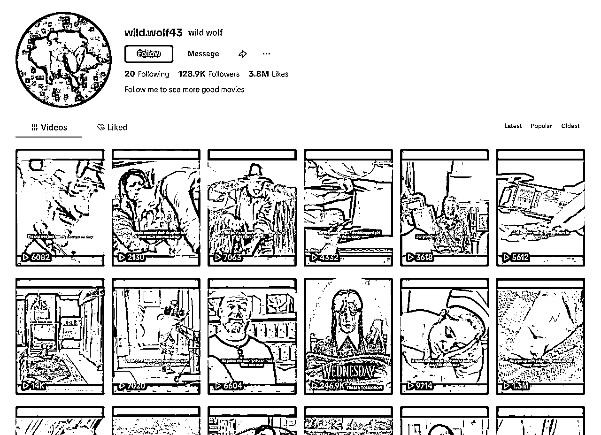
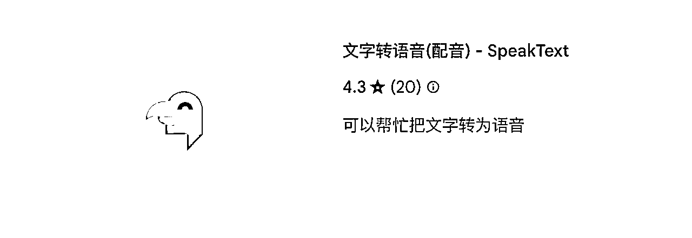
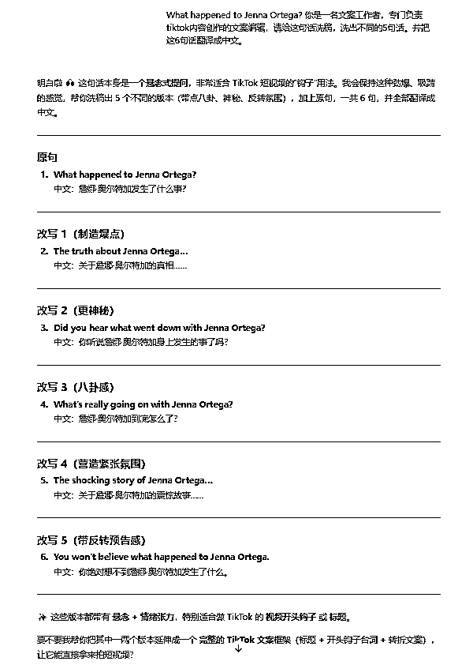
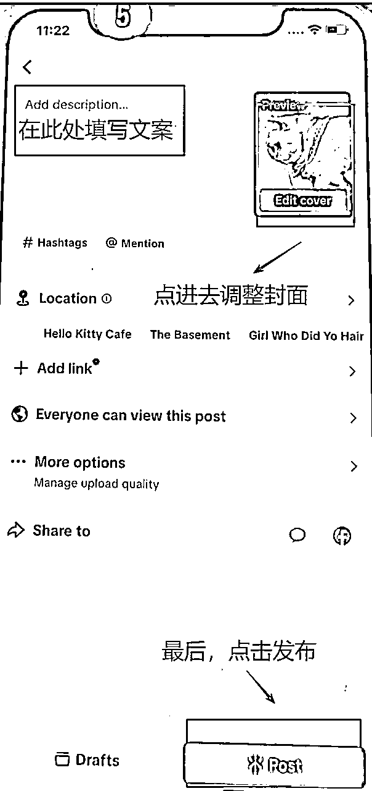

# TikTok 中长视频（解说类）丨实战手册丨9月

> 来源：[https://ocn93f5d9olj.feishu.cn/docx/JqDsdR6fooizYtxoyEFcCG89nHd](https://ocn93f5d9olj.feishu.cn/docx/JqDsdR6fooizYtxoyEFcCG89nHd)

# ⛵新手如何入门【TikTok 中长视频（解说类）】项目？


# 一、什么是 TikTok中长视频

TikTok 创作者奖励计划是平台官方推出的中长视频变现机制，鼓励创作者发布 1 分钟以上的优质原创视频内容。符合条件的账号可以获得 按播放量结算的现金收益，并享受更完善的数据分析支持。

TikTok 官方通常将 “中长视频”定义为时长超过 1 分钟的视频内容，其中 1～3 分钟是内容推荐的黄金区间。

2025 年 TikTok 短视频内容进入平台强激励期，平台对优质原创内容推出中视频专项激励计划，针对优质创作者开放多层级奖励机制，

目前项目激励政策包括：

千次播放奖励约 4～5 美金

10 万播放可获得 40～50 美金

优质内容将获得额外 3 倍加成奖励

特别优秀的视频还有额外专项激励

即：一个视频最多可叠加获得三重奖励—— 平台标准激励 + 3 倍加成激励 + 专项内容激励，内容变现空间大。

项目玩法是开通TikTok账号，制作优质的中视频（1分钟以上）发布内容，开通TikTok激励计划，持续发布爆款内容获得收益。这次我们会教大家怎么去找赛道内容，并提供两个赛道：影视解说&中视频娱乐赛道实操案例分享，大家可以跟着去学习。

# 二、项目完整操作思路

1.  项目完整操作思路

1️⃣选择适合自己的热门赛道

2️⃣ 注册账号并包装人设

3️⃣持续发布原创中长内容（≥1分钟）

4️⃣ 达成门槛后开通中长视频激励计划

5️⃣ 开通后持续发布 & 数据迭代

参考航线图：


1.  操作重点

找到适合自己的赛道，发布1分钟以上原创爆款视频，是核心重点。千次播放可达 4～5 美金，优质视频可享 额外3倍激励。

1.  新手入门建议&避坑指南

入门建议：

内容时长必须 ≥1 分钟

短视频（15s、30s）不会纳入该计划收益统计，建议控制在 1～3 分钟黄金区间。

优先做原创，不搬运不拼接

平台识别能力极强，建议从选题、脚本、剪辑节奏全部自研（去重混剪是可以的），避免水印素材。

账号前期别急于变现

先养号、积累粉丝，播放过10万后再申请计划，避免早期因内容质量低被限流。

垂类深耕比“泛娱乐”更容易起量

推荐聚焦一个垂类方向（如影视解说、剧情、知识分享），打造统一的内容标签和人设调性。

数据复盘是成功的关键

学会看完播率、点赞率、CTR，优化标题、封面、开头钩子，不是发得多，而是发得准。

避坑指南（很多人掉过坑）：

剪辑他人影视内容+加旁白=原创？

不一定！如果结构雷同、音轨重复，依然可能被识别为“重复内容”。

以为收益和播放挂钩，忽略完播率

播放≠收益，完播率低、互动差的视频收益极低，平台不会给高额奖励。

账号地域不匹配也能加入？

奖励计划仅开放支持国家地区（如美国、英国、德国、日本等），非开放地区账号无法变现。

一个爆款就能赚很多？

平台设有算法限额，一个视频收益通常逐步衰减，长期持续产出才是真正的收入来源。

用AI或工具批量伪原创

一旦被识别“批量洗稿”或“机器合成内容”，将被限流/剔除奖励资格。

1.  开船前必备工具

剪映网页版：https://www.capcut.cn/，可以自行注册使用，客户端使用体验会更好

哼哼猫:https://6666.su27.net/ ，可用于视频下载

ChatGPT：https://chatgpt.com/ ，用于文案写作

TK免费去水印下载：https://snaptik.app/en2，用于视频素材的下载

爱思助手：https://www.i4.cn/， 可在电脑和手机上下载，用于视频作品传输

手机，苹果 8 以上最好，2～3 台（建议苹果手机比较好用）

网络环境配置，自行解决


# 01.背景介绍

# 1.本章概要

本章介绍了TikTok的中长视频激励政策、包含奖励机制、符合条件、内容要求等，给了2个赛道玩法（影视解说、娱乐中视频）参考。

航线图如下：

熟悉平台规则，了解内容赛道趋势 （约 2 小时）

下面开始内容学习。

# 2.项目介绍

2025 年 TikTok 短视频内容进入平台强激励期，平台对优质原创内容推出中视频专项激励计划，针对优质创作者开放多层级奖励机制，

目前项目激励政策包括：

千次播放奖励约 4～5 美金

10 万播放可获得 40～50 美金

优质内容将获得额外 3 倍加成奖励

特别优秀的视频还有额外专项激励

即：一个视频最多可叠加获得三重奖励—— 平台标准激励 + 3 倍加成激励 + 专项内容激励，内容变现空间大。

TikTok创作者激励计划参加条件是什么？

地区限制： 仅限美国、英国、德国、日本、韩国、法国、巴西用户

账号要求：

必须年满18周岁

个人账号（非企业号）

粉丝数≥1万

过去30天播放量≥10万

账号记录良好，遵守社区规则

确认满足上述所有条件后，只需按照以下步骤即可注册：

.

前往你的主页，点击【菜单】按钮 (☰)。

.

依次选择TikTok Studio、创作者奖励计划。

.

申请后，你将在三天内收到回复

内容标准：

创作1分钟以上的原创高质量视频

视频分辨率1080p或更高

在推荐页获得≥1000次播放量

不能是合拍、拼接或图文模式

不允许出现广告、付费推广内容

遵守所有平台规则和版权政策

以上内容来源官网：https://www.tiktok.com/creator-academy/zh-Hans/article/creator-rewards-program

奖励看什么指标？

聚焦于 4 个关键因素：原创性、播放时长、搜索价值和观众互动率

点击链接可查看官方说明：

https://www.tiktok.com/creator-academy/zh-Hans/article/RPM-understanding-the-four-key-factors

1.  项目玩法

先开通TikTok账号，制作优质的中视频（1分钟以上）发布内容，开通TK激励计划，持续发布爆款内容获得收益。

本次航海提供给大家两个赛道内容进行学习参考，大家也可以自己找中长视频的赛道去做。

影视解说赛道

案例账号参考：

https://www.tiktok.com/@movie.zzj01

https://www.tiktok.com/@monkey7799

https://www.tiktok.com/@zxy.edit1

中视频娱乐赛道

案例账号参考：

https://www.tiktok.com/@roarer.mae?_t=ZM-8x5NVBGLN5y&_r=1

https://www.tiktok.com/@triangleand2?_t=ZM-8x5FvGB8SUY&_r=1

https://www.tiktok.com/@gossip_piupiu?_t=ZM-8x5Apyj4FbM&_r=1


两类赛道核心玩法类似，选题是核心，关乎内容吸引程度。

项目的主要操作步骤包含：

选定电影/娱乐新闻素材——写解说/新闻文案——素材剪辑、配音——内容发布——数据监控优化

# 01.账号注册全流程

# 1.本章概要

TK账号注册需要自行配置网络环境，最好用苹果机，注册使用都比较好一些。注册完TK，就要对账号进行包装，修改头像和名称，这个参考对标账号进行修改。这里有个重点是养号和筛号。

养号：

（1）提高每天刷半小时视频，来模拟真人使用，减少账号风控风险。

（2）账号搭建好的12小时后，发布第一条视频，视频内容为实拍

筛号：

（1）每天发布2条以上作品视频，视频为实拍内容，测试时间7-15天

（2）账号如果出现1k以上播放的视频，为合格账号

如果筛号以后，账号数据不错，就可以直接发解说内容。

本章航线图如下：

注册并养成至少 2 个 TikTok 账号（约 1 小时）

熟悉平台规则，了解内容赛道趋势 （约 2 小时）

下面开始本章内容学习。

# 2.注册流程

建议注册 2-5 个 TikTok 账号，最低 2 个，以提高成功率。

# 1.手机准备

苹果机：iPhone 8 或以上，存储空间16G 以上；

安卓机：系统 7.0 以上，内存 3g 以上(建议 4g+32G 内存)。

下面把两大类手机的优缺点列出来，大家结合自己的情况，自行选择。

苹果手机（强烈推荐）

优点：

流畅、丝滑

系统单一，对新手友好，上手较快

下载 TikTok 方法简单

缺点：

后期群控软件较少，成本较高

还原起号速度较慢（平均 10-15 分钟左右可以还原并布置好一台 iPhone 的手机环境）

安卓手机

优点：

群控软件大多数是基于安卓系统的环境的，上群控很方便，成本也比较低

找到方法之后，刷机、布置环境、起号一条龙速度飞快（5 分钟以内搞定，特别是群控的时候，5 分钟能搞定一堆，四舍五入平均到每台手机就是不用时间）

缺点：

安卓机的通病，用久了会有点卡，特别是二手机

很多品牌和型号，不同品牌的安卓系统会有差别，对于新手学习不友好

虽然说下载 TikTok、布置环境等等也不难，但是需要一些工具，容易出各种幺蛾子

1.  软件准备

苹果手机

带有小火箭的美区 ID 账号（注意：是带有小火箭的）TikTok（有了美区 ID 就可以下载了，不需要挂 V）小火箭 + V 节点

安卓手机

.

APKPure

.

TikTok

.

V2ray + V节点

# 3.网络设置

需配置网络环境，可以去网上搜索一下教程配置或者购买。

# 4.账号注册

目前用 TikTok App 和网页版均可注册，我们可以选择大陆以外的手机号或邮箱注册，或者用Facebook、Instagram、Twitter、Gmail、WhatsApp 等第三方平台的账号登录。

手机和邮箱注册时会收到验证码，要求选择生日，建议选 18 周岁以上，除此之外，并没有身份验证等其它要求。

# 02.账号包装&筛号

# 1.账号包装

核心思路

①确定好自己要做的赛道后，找到相应的对标账号；

②了解对标账号的头像和名称，去进行模仿、设置。

# 1.1头像

注意头像一定要换，然后看账号正不正常。头像能换，就说明这个账号正常，就可以后续筛号。

确定头像

可以下载对标账号的头像，去搜索寻找到类似的图片。

也可以在tk刷视频的过程中，找到认为可以当做头像的视频画面，进行截图。

上传头像

第一步：TK进入后，点击右下角的人物标识出现此页面，再点击头像处（没设置头像前，此处为空白图）

第二步：点击后，下方弹出3个英文选项，选择第2个访问相册

第三步：进入相册后，选择准备用作头像的图片

把准备好的图片调整好位置后，头像修改成功


# 1.2名称

起名字

第一步：找到对标账号，复制对标账号的账号名称（下图为对标账号示例）


第二步：用GPT或者DS等任意ai软件让它生成类似的名字，选择其中一个当做账号名称。


相关提示词非常简单，可自己手打也可在这里复制

提示词：celebrities_dairy #请帮我把这个名字翻译成中文，并给我起几个起类似的英文名字 ，同时把你起的每个名字翻译成中文。

改名字

第一步：TK进入后，点击右下角的人物标识出现此页面，再点击Edit

第二步：进入下一页面后，点击名字 name 这一行的位置


第三步：输入想修改的名称

第四步：点击右上角的Save，修改成功（成功后弹出的消息没太大影响）


# 2.筛号

# 2.1养号

# (1) 增加活跃度

账号搭建好之后，每天刷半小时视频，来模拟真人使用，减少账号风控风险。

# (2) 发布随拍视频

账号搭建好的12小时后，发布第一条视频，视频内容为实拍，等待流量。

实拍要求：不允许出现中文字、中文声音。实拍内容为生活中随意拍摄的内容即可。

实拍视频发布24小时后——流量情况及应对策略

没有推流

.

删除视频后，发布新的随拍视频进行测试，同时在发布后间隔1小时可再发一条随拍的，等待推流

.

如果还没有流量，从tiktok Studio（tk后台）上重新发布之前的随拍视频，等待推流

推流50以上

说明账号没有问题，正式开始发布作品

# 2.2 筛号

测试时间：7天-15天

测试方式：每天发布2条以上作品视频（上文说的实拍内容，不要有中文）

筛号标准：账号如果出现1k以上播放的视频，为合格账号

如果发布视频都是几百，可先对发布的作品进行优化，再决定是否弃号。优化方向如下

.

选题优化：是否为近期爆款，优质选题=时效性+爆炸性

.

剪辑优化：剪辑质量和对标相比是否齐平

.

去重优化：多去使用去重手段

如果确认自己发布的作品质量没问题，但视频流量一直无法破千，选择弃号。重新注册新号，重新测试。

# 01.影视解说实操流程

# 1.本章概要

当我们成功筛号以后，就可以选择一个赛道制作发布内容了。本章给大家提供了2个赛道方向，都是经过验证跑通的项目。一个是影视解说、一个是中视频娱乐赛道。

两类赛道核心玩法类似，选题是核心，关乎内容吸引程度。

项目的主要操作步骤包含：

选定电影/娱乐新闻素材——写解说/新闻文案——素材剪辑、配音——内容发布——数据监控优化

其中影视解说赛道，核心是要了解国外用户对什么影视题材感兴趣，有一定的文化了解。可以多看对标账号内容，去模仿学习。

本章航线图如下：

学习爆款模型，拆解 10 个对标账号**（约 1 天）**

搜集 10 条剪辑素材 （约 2 天）

用剪映/CapCut 完成第一版剪辑成片**（约 1 天）**

完成至少 5 条视频的连续发布**（约 2 小时/天）**

对爆款账号进行 AB 测封面/文案优化**（约 2 小时）**

开通中视频计划**（约 1 小时）**

下面开始本章学习。

# 2.找对标，确定剪辑的电影

找素材

1、要做的主题尽量一致

解说不同切片，故事的开头一定要足够吸引人，因此科幻、猎奇、奇幻、搞笑类题材比较好，或者是一些知名作品，这些题材都容易找到不错的开头。

2、找素材的切入方向和思路：多刷视频，看到好的就点赞，并且关注博主，系统会给你推荐更多

方法如下：

a.直接搜索指定作品，去TK上检索这个作品，比如说【小鬼当家】找到作品以后，这样又能找到一大批作者

b.通过时间筛选(如果想直接搬的，尽量找发布时间比较近的作品)

c.多平台寻找，有些小作者在抖音上很难刷出来，但是在视频号就很容易找到，这些作者一般多个平台都有更新，可以在视频号再去搜索这个作者就行了

在抖音找对标的方法：

我们打开抖音官网，通过多刷主页视频并且互动，让系统算法给你推送，如果自己的主页刷不到，就可以搜索如：【影视解说】这样的关键词，就能找到很多对应的博主。

你会发现有些作品的发布时间比较久了，这个时候可以通过时间筛选，我们尽量选择比较近期的作品，这样很大概率这些作品是没有被人剪辑过的。


同样的，我们可以根据我们在别的地方看到的作品，针对性的去搜索。比如说我在TikTok或者youtube上看到某个作品播放不错，我也想去剪辑，那么你就可以搜索指定的作品。

对标案例参考：

monkey7799

https://www.tiktok.com/@monkey7799


zxy.edit1

https://www.tiktok.com/@zxy.edit1


wild.wolf43

https://www.tiktok.com/@wild.wolf43



hudui0020

https://www.tiktok.com/@hudui0020


movie.zzj01

https://www.tiktok.com/@movie.zzj01


sy13edits

https://www.tiktok.com/@sy13edits

TK视频下载方式：

1.免费下载工具，有次数限制

工具1：https://ssstik.io

工具2：https://snaptik.app/en2

使用方式：

（1）打开TK免费去水印下载链接https://snaptik.app/en2

（2）把TK的视频链接复制进去，点击下载，下载后是一个视频，直接打开就可以看。


2.付费会员使用工具，可以批量下载，有需要可以去某鱼买会员

哼哼猫下载链接： toktok876.su27.net

使用方式：

1.打开网址，把要下载的TK视频链接复制到空白框里，然后点击【单个链接提取】


# 3.文案制作和视频剪辑

# 1.文案制作

第一步：下载对标视频后，将视频导入到剪映，选择字幕-识别字幕—翻译语言为中文后，点击开始识别。


第二步：识别出字幕后，导出txt文本字幕


第三步：用GPT输出文案

输入提示词后，再把导出的中文解说发给GPT，让它输出新文案。

如果文案生硬，可以再次让gpt给你调整内容。

提示词如下：

```
我给你一段中文视频解说字幕，请帮我翻译成英文，要求有以下几点：
1、原来每一句每一行的内容都要翻译，翻译内容仅限于我发的文案，不要多联想，也不要少翻译
2、但是翻译出来输出给我格式按照原来的一句一行， 句号和逗号可以用分行代替 
3、不要漏掉我发的每一句话每一个词，不要自己简化情节，也不要多联想加其他情节
4、输出的文案只要英文，不要中文
5、翻译出来的文字，语句要通顺，故事要流利，前后剧情要对的上，就像一个完整的英语解说故事 
6、单个句子不要太长，可以分一下句，保证单句话里词不要太多，但前提还是要保证整体故事流利
7、翻译得要更符合美式表达，就像一个地道的美国人在解说故事，不要中式表达直接生硬地翻译
确保输出的按照原来的一句一行，一行一行的发给我！句号和逗号可以用分行代替。故事要流利，单个句子不要太长，不要多翻也不要少翻，翻译表达要符合美国人叙事习惯！很重要！
```

效果如下：


第四步：配音

把翻译好的文案用https://elevenlabs.io/（新用户免费10000字符有付费功能，看个人需要）进行配音，把音频MP3文件导入剪映中，进行剪辑。


配音速度可以选择1.1倍速，其他稳定性和相似的默认就行

https://fish.audio/zh-CN/auth/ 配音网站也可以选择这个

音色方面elevenlabs的是最好的但是会员稍微偏贵

fish的音色稍微差一些，但是会员便宜

# 2.视频剪辑

https://wx.zsxq.com/group/1824528822/topic/2858454581442481

关于视频剪辑，可以看这篇文章，有很详细的文字版流程。如果想快速了解重点，可以看下面录制的这个视频，点击链接查看：

# 02.中视频娱乐实操流程

# 1.找对标，确定赛道

确定赛道

大家可以根据以下相关对标账号，了解情况，确定自己想做的账号类型

对标赛道参考：

https://www.tiktok.com/@lovedramadiaries?_t=ZM-8x5FMYXOcDt&_r=1

https://www.tiktok.com/@raplegenddiaries

https://www.tiktok.com/@celebritybites2

https://www.tiktok.com/@cora.entertainment

https://www.tiktok.com/@lolly.gossip.gala?_t=ZM-8x5No8CtVmK&_r=1

https://www.tiktok.com/@tiger_smith1?_t=ZM-8x5Nwu9kgsf&_r=1

https://www.tiktok.com/@actor.secret?_t=ZM-8x5Pzl4Bpcz&_r=1

https://www.tiktok.com/@jimmy_hardworking?_t=ZM-8x5EFkkBRbS&_r=1

如何找对标账号和对标视频

1.对标账号库：上面的对标账号可作为初始资源，后续也要不断搜集，形成自己的对标账号库

2.利用系统推荐页：养成一个专注于你目标领域的TK账号。多刷对标账号多看对标视频，手机推荐页根据喜好推荐会不断推给你更多的相关视频（重点推荐）


3.查看对标视频中的发布文案里的关键词/事件/人名或#标签，点击复制到搜索框里搜索查看里面是否有相关的对标视频或账号。


选择对标视频的标准

1.选择同赛道同类型账号里的视频，方便后续剪辑思路的借鉴

2.时效性非常重要

对标视频发布时间越近越好（最好2天内）


播放量越高越好（尽量50k以上)


# 2.文案制作和视频剪辑

# 2.1文案制作

第一步：

下载对标视频后，将视频导入到剪映，选择字幕-识别字幕—翻译语言为中文后，点击开始识别。


第二步：识别出字幕后，导出字幕


第三步：用GPT输出文案

输入提示词后，再把导出的英文解说发给gpt，让它输出新文案。

提示词如下：

```
你是一名文案工作者，专门负责tiktok内容创作的文案编辑，你非常擅长把别人视频的脚本进行重新改事，从而生成一篇中心思想不变，但内容全新的一篇原创脚本。我希望你能让洗稿翻译后的脚本更加口话化，适合美国人的视听习惯，接下来我会给你一篇文章，你帮我改写一下，出现问题我会第一时间反馈给你。并把原文和洗稿后的文章都翻译成中文给我。
```

效果参考如下：

第四步：配音

把翻译好的文案用https://ttsmaker.com/（可以免费使用）进行配音

或者用 speak text 插件进行配音，在谷歌浏览器-扩展程序搜索该插件


认准小鸟头的图标，搜索后往下滑就能看到该程序。



添加至chrome使用，


生成音频文件后，把音频MP3文件导入剪映。

视频发布时——标题文案制作

把原视频标题的文案复制，发给GPT，GPT输出后选择一个即可。

提示词如下

```
你是一名文案工作者，专门负责tiktok内容创作的文案编辑，请给下面的这句话洗稿，洗出不同的5句话。并把这6句话翻译成中文。 “xxxxxxxxxx”
```



# 2.2视频剪辑

找到对标账号后，新手前期为保证剪辑质量,提高剪辑速度以便快速起号，可先用对标视频的解说音频，重新配上相应素材，剪辑后变成新的视频。

看视频有详细教程，点击链接查看视频：

# 03.内容发布和开通激励计划

# 1.内容发布

第一步 把标题文案导出传到手机上

把写好得标题放入https://cli.im/text/other生成二维码，用手机相机扫码右下角选择网页打开，在浏览器里得网址位置或者搜索栏就是标题，直接复制即可


第二步 把视频导出传到手机上

1.手机通过数据线和电脑连接

2.电脑和手机都打开爱思助手

3.在电脑上把剪辑好的视频传到爱思助手上

4.手机通过爱思助手，接收到视频


第三步 发布视频作品

发布时间：中国时间上午9：00-10：00；下午2：00-4：00

发布流程：

1.打开tiktok

2.点击下方选择中间加号

3.选择视频后，进入发布页面

4.粘贴标题—选择封面—发布

（和抖音发布是一样得，如果提示英文看不懂可以用微信拍照翻译）




# 2.开通激励计划

在持续发布内容，达到激励计划开通要求以后，就可以去申请开通激励啦。

开通要求：仅限美国、英国、德国、日本、韩国、法国、巴西用户

必须年满18周岁

个人账号（非企业号）

粉丝数≥1万

过去30天播放量≥10万

账号记录良好，遵守社区规则

开通流程：

第1步：点击账号主页右上角三道杠；

第2步：下方出现选项，选择第一个；

第3步：进入新页面如图页面后，向下滑找到“十”图标，点击进去；

第4步：进入新页面如图页面后，查看是否符合过中要求，如都是√则符合，点击最下方红色按钮申请过中；

第5步：点击红色按钮后进入到新页面，则表示申请中，等待平台审核通过；


# 01.数据分析

# 1.本章概要

在前几章节，我们学习了选赛道，内容制作和发布视频。当内容发布以后，我们要去关注后台数据情况，对数据进行分析。看懂收益构成要素，如何去迭代优化。

视频播放收益=标准奖励（合格观看次数*千次rpm单价）+额外奖励+部分影视账号有内邀专项奖励

特别是当你的账号遇到被封情况，如何去申诉这些，我们也有给到对应的话术参考，希望可以给圈友参考。

本章航线图如下：

输出周更 ≥ 5 条内容，开始批量跑账号**（约 2 小时/天）**

高播放视频 ≥ 10 万后播放后平台额外奖励**（约 1 小时）**

数据复盘 + 素材选题 + 模型升级迭代**（约 2 小时/周）**

# 2.数据分析

内容发布以后，要关注账号的数据情况，对数据进行分析。

1、账号后台数据进入页面流程---个人资料~三横~tiktok studio


这里我个人认为 for you的数据情况是最重要的，这个数据反应你最近视频推流的情况，数据占比越高，证明推荐的新用户观看的越多。

2、单个视频进入数据分析步骤


单个视频的数据分析有3个比较重要

1.显示的收益

2.foryou(为你推荐）占比越高收益越高

3.观众的国家（地点）欧美国家观看占比越高，千次单价越高

3.收益面板的数据分析


这个收益面板能看到完整的单个视频的单价，合格观看次数，观看的国家

总结我们来看下账号视频的播放情况，收益是怎么计算的：

视频播放收益=标准奖励（合格观看次数*千次rpm单价）+额外奖励+部分影视账号有内邀专项奖励

根据这个公式，我们拆开看下，对应上面的截图内容一起看

第一个是：合格观看与哪些数据有关？

1.  观看时长是否超过5秒

如果用户在刷到你视频时不到5秒就划走，平台不会计入合格观看。

1.  是否为“非重复用户”观看

同一个用户多次刷你的视频，只有第一次可能计入收益，重复的刷不计 RPM。

1.  是否来自“推荐页”流量

TikTok只对推荐页曝光的观看记录计收益。

私信转发、主页点击、评论区点进去的，有时不算在“合格观看”里。 综上来看，TikTok只给你算这类播放：

“一个新用户，通过推荐页刷到你的视频，看了5秒以上或互动过。

第二个是：千次播放rpm的单价和那些因素有关

1.  主要观众来自“高广告价值国家”

🇺🇸 美国、🇬🇧 英国、🇨🇦 加拿大（$1.5~$5.0）

🇫🇷 法国、🇩🇪 德国（$0.5~$1.5） 西非、北非、中非国家（$0.1~$0.4）

1.  视频受众互动价值

评论关键词、平均完播率、平均播放

那么如何提升 RPM（千次收益单价）？

1.调整受众分布，吸引欧美高 RPM 国家用户

视频为美国本土英语，本土英语口语化

1.  提高完播率 + 平均播放时间

目标提升至 >35 秒，完播率超 35%

1.  发布内容节奏：每日1条高质量+控制重复率

重复观看率太高 foryou推荐太少

每天建议最多发 1~2 条剪辑质量高的内容

# 02.一些问题建议

1.单价低，如何调整

通过查看单价，看自己单价多少，以及是否有多倍奖励


如果单价低或缺失多倍奖励，检测问题并进行调整

问题1：tiktok风控原因

由于平台检测账号异常（网络IP/账号违规）进行风控。

现解决办法：正常发视频，等待恢复

问题2：视频推流问题（查看作品推流地区）

未全推流到美国，而是推流了其他国家或地区，影响单价。

现解决办法：

先找到什么时候开始推流异常得视频，隐藏掉该视频，停更7天。更换赛道

问题3:无多倍奖励

现解决办法：坚持更新的同时，提高作品原创度，提高视频素材清晰度

2.账号违规原因及申诉文案

原创度不足 / 内容重复

Violation Type: Low Originality / Repetitive Content

【中文申诉理由】：您好，我的视频为本人原创，所有内容均由我独立剪辑与配音。部分画面素材可能与网络上类似内容有所交集，但我已进行了二次创作，包括剪辑节奏、结构设计、文案配音均不相同。若为系统误判，恳请平台人工复审，感谢支持！

【English Appeal】：Hello, this video is my original work, fully edited and narrated by me. Some visual materials may resemble other content online, but this is a result of secondary editing with unique structure, pacing, and script. If flagged by mistake, I kindly request a manual review. Thank you!

内容结构高度相似

Violation Type: Structurally Similar to Other Works

【中文申诉理由】：您好，我的作品虽在结构或表现形式上与部分热门内容相似，但所有素材、配音与节奏均为本人原创设计。不存在抄袭行为，属于合理的内容再创作。恳请平台予以人工复核，谢谢支持！

【English Appeal】：Hi, while my video's structure may resemble trending formats, the footage, narration, and editing are entirely original. This is a case of fair transformation and not duplication. I respectfully request a manual review. Thank you!

误导性信息 / 标题党

Violation Type: Misleading Content / Clickbait

【中文申诉理由】：您好，我的视频内容为观点类或娱乐创作，表达真实且无误导观众的意图。如因表述方式产生歧义，我愿积极配合调整，内容无恶意夸张或虚假引导。希望平台能人工审核，非常感谢！

【English Appeal】：Hi, my content is meant to express personal views or entertainment. There was no intent to mislead viewers or exaggerate. If any confusion was caused by the phrasing, I’m more than willing to revise. Please consider a manual review. Thank you!

暴力 / 血腥 / 惊悚画面

Violation Type: Violent or Disturbing Content

【中文申诉理由】：您好，我的视频剪辑素材来源于体育比赛或影视片段，未包含真实暴力或血腥场景。如系统识别有误，我会立即优化画面处理方式，恳请平台复核，谢谢理解！

【English Appeal】：Hi, the clips in my video come from sports events or fictional films and do not depict real violence or gore. If the system misflagged it, I’m happy to re-edit accordingly. Please review it manually. Thank you!

侵犯隐私或肖像权

Violation Type: Privacy or Portrait Rights Violation

【中文申诉理由】：您好，我使用的画面均来自公开可用的影视作品或赛事转播，未涉及任何私人信息或未经授权的个人画面。如有误判，烦请人工审核，非常感谢！

【English Appeal】：Hi, all visuals used are from publicly available films or broadcasts, and do not include private individuals or unauthorized content. If flagged in error, please manually review. Much appreciated!

性暗示 / 不当衣着

Violation Type: Sexual Content or Inappropriate Clothing

【中文申诉理由】：您好，我的视频并无任何低俗、性暗示或不当展示内容，素材源于正规影视剧或活动现场。如因误判导致封禁，恳请平台进行人工复查，我也会积极配合优化内容表现，谢谢！

【English Appeal】：Hi, there is no sexually suggestive or inappropriate content in my video. The footage is from legitimate film or event sources. If flagged mistakenly, I kindly request a manual review and am willing to adjust as needed. Thank you!

未授权音乐 / 音频

Violation Type: Unauthorized Music / Audio Use

【中文申诉理由】：您好，我所使用的音乐来自平台提供的可用曲库或授权音源，未违规使用第三方音乐。如因识别错误被误判，还请平台人工确认，谢谢理解！

【English Appeal】：Hi, the background music is selected from TikTok’s licensed library or other authorized sources. No third-party copyrighted music was used. Please review manually if this was a system error. Thank you!

不适合变现（价值不足）

Violation Type: Ineligible for Monetization (Low Value)

【中文申诉理由】：您好，我的视频为本人独立策划和剪辑，内容积极健康，符合平台规范。不存在抄袭、低质搬运行为。如因系统误判不予变现，恳请平台人工复查，感谢支持创作者！

【English Appeal】：Hi, this is an original video created, edited, and narrated by me. It follows TikTok’s community standards and offers informative or entertaining value. If marked as ineligible by mistake, I respectfully request a manual review. Thank you!

虚假互动 / 引导点赞评论

Violation Type: Fake Engagement / Forced Interaction

【中文申诉理由】：您好，我在视频结尾设置的互动引导仅为提升观众参与感，并无虚假承诺或诱导行为。如因系统误判为违规互动，还请人工复查，谢谢平台理解！

【English Appeal】：Hi, my call-to-action at the end of the video is simply meant to encourage audience interaction and does not involve misleading claims or manipulation. Please consider a manual review if it was misinterpreted. Thank you!

# 01.如何投流

投流开户需要营业执照，个体户也可以，建议找一代或者二代开。

ikTok广告共有三个层级：推广系列、广告组、广告

推广系列：设置你的投放类型，如投放涨粉选择「社区互动」，一般不会变化

广告组：设置你的定向、预算、出价、排期等，每个推广系列下可以设置不同广告组，以此测试不同人群/预算/出价的效果

广告：即素材，每个广告组下可以设置多个素材，以此测试不同素材效果，一般每个广告组下设置不超过5个素材


推广层级

设置

详情

演示

推广系列

创建一个推广系列

商务中心选择要投放的广告账号，点击“查看”

点击广告管理平台➡ 推广➡新建

推广目标：社区互动（涨粉）、视频播放量（增加视频播放量）

系列名称：自定义命名

创建拆分对比测试：用于搭建A/B测试广告，一般不使用

推广系列预算优化（不推荐设置）：开启后只能使用推广系列预算，且推广系列下必须搭建2个以上广告组

设置推广系列预算（不推荐设置）：建议在广告组层级设置预算


广告组

广告位设置

广告组名词：自定义命名

广告位：默认TikTok版位

用户评论：打开后用户可评论该帖子

允许下载视频：打开后用户可下载该视频

允许共享视频：打开后用户可分享该视频


设置目标受众人群

受众（不推荐设置）：支持目标受众、排除受众。受众即人群包，可前往受众管理器生成与广告有互动的人群包，但必须>1000人才可使用

人群属性：支持地域、性别、年龄、语言，中视频投放不建议设置过窄人群，避免导致流量成本变高

推荐投放国家：阿尔及利亚、阿根廷、澳大利亚、奥地利、阿塞拜疆、巴林、孟加拉国、白罗斯、比利时、玻利维亚、巴西、保加利亚、柬埔寨、智利、哥伦比亚、哥斯达黎加、克罗地亚、捷克、丹麦、多米尼加、厄瓜多尔、埃及、爱沙尼亚、芬兰、希腊、危地马拉、匈牙利、印度尼西亚、伊拉克、爱尔兰、以色列、意大利、约旦、哈萨克斯坦、肯尼亚、科威特、拉脱维亚、黎巴嫩、立陶宛、马来西亚、墨西哥、摩洛哥、荷兰、新西兰、挪威、阿曼、巴基斯坦、巴拿马、巴拉圭、秘鲁、土耳其、阿联酋、乌拉圭、越南；

以上国家流量相对便宜，能以更低的成本获取流量，其他国家亦可选择，但不建议选择欧美等发达国家

兴趣与行为（不推荐设置）：支持添加兴趣行为分类

设备（不推荐设置）：无特殊要求不设置


预算&排期

预算：支持设置日预算/总预算，建议先设置系统要求最低日预算，确认投放效果后逐步提高

排期：可以为广告设置开始和结束日期，或者开启之后持续投放

时区：排期所展示时间为该时区对应时间，系统默认选择中国时区

分时段：可以让广告全天参与广告投放，或者设置每天投放的具体小时

注意：投放美区请注意广告账户时区与真实投放时间的差异（TTAM不支持夏令时换算）

出价&优化

优化目标：账号关注（涨粉）、TikTok页面访问（增加主页访问量）

竞价策略：

成本上限：手动出价，系统会控制广告成本，但不一定获得足够的转化

最大投放量：自动出价，系统会尽可能获得更多的转化，但广告成本可能会偏高


广告

选择投放的帖子

广告名称：自定义

广告发布身份：选择需要投流的TikTok账号/帖子

创意素材：选择需要投放的帖子

行动引导文案：按需选择

创新互动样式：根据需求选择是否需要设置互动样式

注意：若未找到对应TikTok账号/帖子，请按照如下方式授权：New Rate教程-如何投放Spark Ads广告


最后，祝大家都能跑通TikTok中长视频赛道，开通激励计划，获得收益，一起生财有术！

