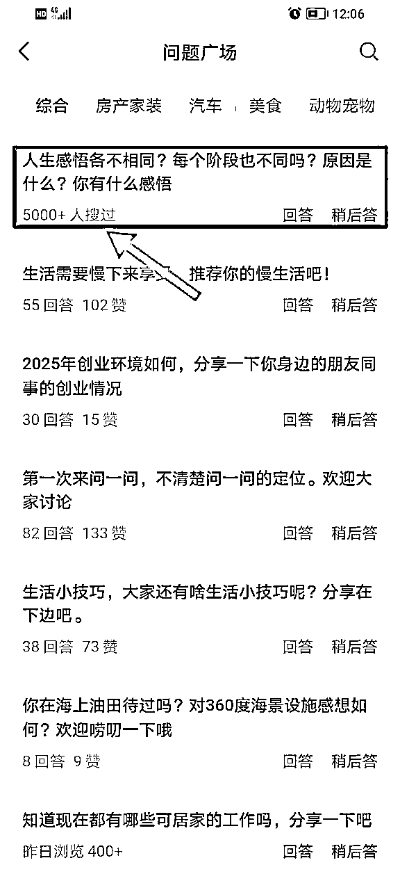

# 微信问一问丨 Mini 航海实战手册丨 2025 年 7 月航海

> 来源：[https://ocn93f5d9olj.feishu.cn/docx/GrdkdV1vPoGkahxFneecdWL6ngg](https://ocn93f5d9olj.feishu.cn/docx/GrdkdV1vPoGkahxFneecdWL6ngg)

# 基础篇：项目 0 到 1

# 一、准备阶段：认知搭建 + 账号设置

# 1.1 项目介绍

# 1.1.1 问一问是什么？

“问一问”是微信于 2023 年推出的社区问答功能，依托微信“搜一搜”平台，允许用户提问、解答、发布等，同时为创作者提供流量入口和变现机会。

1.

不同于百度和知乎，“问一问”单个问题发布或者回答字数限制在 500 字，也意味着你不需要长篇大论，语言更加倾向于简洁、清晰。

2.

从平台要求的「真实」「实用」「利他性」「个人特色」这几个维度去回答问题和发布问题，内容创作上有态度、有观点，同时要具备真实性和实用性，能帮助到别人，或者能引发他人的共鸣。

# 1.1.2 关于项目前景（个人观点、仅供参考）

1.

“问一问”依托的是微信庞大的用户量和生态圈，这是一个天然引擎搜索的平台，你可以在这里找到你想要的答案，也可以提出你自己的问题和发布你的分享内容

2.

背靠微信的流量，我个人认为问一问未来会占据重要的渠道

1.

得到持续性的收益和长尾流量

2.

链接到微信公众号、视频号，增加粉丝数量

3.

通过微信公众号/视频号引流客户到私域

4.

通过平台输出内容打造你的个人 ip

# 1.1.3 怎么进入“问一问”？

微信主界面 → 点击底部“发现” → 进入“搜一搜” → 选择“前往问一问”。

可以关注“微信问一问”公众号，点击下方的创作活动、问一问都可以进去

# 1.2 平台机制简介

# 1.2.1 内容创作形式

问一问目前的内容创作有发起讨论、发布和回答三种形式

1.

发起讨论：这个权限是最近开放的，不是所有人都有，优质账号会开通

公众号博主也有很多开通这项功能，可以在问一问发起讨论，同时引导更多人关注

主持人可以发起讨论，同时邀请朋友等回答（给平台引流、拉新）（有段时间要求必须邀请没有发布过内容的新人）机制持续在变化中

2.

发布：简单来说就是自问自答，提出在开通分成前推荐大家最好以发布为主，发布与回答展示你自己个人的特色，审核中发布质量的权重会更高，大家一定要重视。

参与活动：这里套用官方的活动，能加上的就尽量加上，优质内容还会获得首页的展示和推荐

提及位置：旅游景点、餐厅等涉及到定位、位置的都可以添加

1.

回答：回答别人已经提出的问题、讨论的问题等等

可以从自己喜欢、熟悉、感兴趣、能提供专业价值等视角去回答，注意内容尽量不要与前面的重复，可以做补充，有自己的观点、意见和价值。

1.2.2 分成逻辑

问一问创作分成计划是指：为符合条件，持续发表优质内容的优质创作者，提供在优质内容的评论区展示广告，参与平台广告分成的模式。

广告并不是持续有展现，而是动态变化的，不需要太纠结，关注在持续发布优质内容。

# 1.3 开通分成计划要求及步骤

「问一问」鼓励创作者持续发表优质内容，参与平台互动，优质创作者有机会开通权益。创作者满足「近 90 天发布内容大于 30 条」、「有效关注数大于 100 人」后，可点击申请加入分成计划。

近 90 天发布 30 条内容 + 有效关注人数大于 100 人（需通过问一问平台关注）

满足质量要求，详见官方指南 https://docs.qq.com/doc/p/acbbb2fbb125ae8d6a8d965db119155c7aef8fae

✅ 真实分享，真诚创作：基于真实经历、体验和感受进行创作，如有需要可搭配实拍图等素材充实内容。

✅ 同好交流，讨论兴趣：分享日常生活中的细微观察，或是围绕热爱的兴趣展开真诚、深度的交流，持续分享引发共鸣的见解。

✅ 专业翔实，深入浅出：结合案例和细节分享自己的经验和感受，用生活化和简明自然的语言创作表达。

✅ 简明扼要，清晰易懂：表述方式简洁明了，能抓住要点，同样的信息量越精炼越受欢迎，切忌啰嗦、空洞的长篇大论。

✅ 图文并茂，赏心悦目：尽量使用与文字相契合、清晰美观的图片，3:4 尺寸更佳。

达到以上内容质量要求后可申请开通创作分成计划

注：关注数量需要通过“问一问”渠道（相关操作步骤如下图），可以适当发群、发圈让朋友关注，达成目标，初期建议大家还是靠内容、自然流涨粉，否则收益也不高。

注：90 天是指你在这个期间至少完成这个数量，如果你 10 天完成了以上数据，也是可以直接申请的哦。

注：审核不通过的情况

第一次审核不通过，需要再发布至少 10 条以上优质内容，而且需要等待 10 天才能再次发起申请；第二次审核不通过，需要等待 30 天；第三次审核不通过，需要等待 3 个月（时间会可能调整）。

期间检查内容是否有不合规的，可以直接删除，不要心存侥幸，否则因小失大

更新依然要持续，以发布为主，审核会对你所有内容都查看

注：开通收益后，必须要有有效的评论，才会有广告展示。所以，大家回答内容之后最好是自己直接评论一句。

开通分成计划操作如下，满足条件后点击绿色申请加入，等待审核

审核时间不确定，优质内容可能秒开，也有审核约 7-10 天的情况，耐心等待

审核期间需要持续发布优质内容，建议以“发布”为主，注意图片和内容

出现第二张图或者收到审核通过会显示收益部分就是开通啦，录入收款信息（实名制）

注意开通广告位，确保长期开通，否则无法收到广告分成

问一问的结算是半月一次，结算信息会通过邮件发送到你的邮箱（结算信息有填写），这些收入也会综合纳入到你的个税系统，最终收入会涉及到扣税，不需要我们自己交税，很方便

# 1.4 注册与配置建议

一个人可以有 3 个基础问一问的账号

1.

个人可以注册一个公众号，用公众号来回答问题（不会注册的可以去搜一搜或者 AI 问下）；

2.

视频号：注册一个视频号来回答问题；

3.

新注册一个微信，可注册一个视频号来回答。

4.

进阶版：你运营绑定的公众号也可以来回答，有人目前多的有在持续运营 7 个号，公众号多的圈友可以测试一下上限

5.

昵称、账号介绍等可以后期修改，建议不要太营销，不要留个人微信、引导关注等

以上是常规注册操作，大家可以根据自己的时间，新手建议先跑通一个账号再开启第二个，有一些手感和经验后再开启。

# 1.5 注意事项

手写为主，AI 为只能是辅助，建议初期最好是手搓：平台红线一定不能踩（AI 生成/拼接/抄袭/搬运）

平台鼓励创作优质内容，避免低质内容。如何定义，可查看下方指南。

回答与提问内容一致或相符，乱回答或者内容与提问不一致，会被检测出来提示不过审

图片与文字相符，这是审议内容优质的关键点，一般推荐选择三张图，不同视角不重复（图片如何拍摄详见内容制作）

内容建议原创为主，结合你的个人独特故事、经历等等，最好不要搬运，有大号目前删除很多内容就是因为搬运的缘故

切记不要引流、过度营销、引导关注等，也会被封号

微信相关业务、问一问、AI 相关业务可以涉及但是建议不要太多，大部分是没有广告收入

副业、赚钱、民生类问题比如延迟退休（去年讨论直接被删除）、薅羊毛等主题也尽量少涉及，不被平台推荐

一旦创作者发布内容违反法律法规规定或平台规则，平台将取消其继续参与计划的资格，追回相应的广告分成收入，并有权要求其赔偿损失并承担相应责任。

# 二、定位、赛道选择

# 2.1 如何选择内容赛道

从个人账号“问题广场”中入口，一共可以看到 29 个领域，可以根据你的职业、兴趣爱好、擅长、身份角色等维度去选择定位自己的内容赛道方向，初期可以先去阅读问题广场的类型与分类，持续多看、多阅读，有输入才有输出。

初期未开通分成计划时，建议聚焦在“个人特色”的专业领域&生活其它，让平台知道你是一个真实的人

可以从以下三个维度去定位你的内容赛道：

如果大家想要长期运营一个账号，最好能从以下三个方面去分析和发散我们的内容方向，这几个维度不是单一 或者孤立的，而是组合成了“独一无二”的你，这是平台想要的一个完整的“创作者”的定位

如果把 IP 定位归纳为一句话：你是谁（身份、角色），你擅长什么（技能、知识）能给谁（用户、对象）提供什么的价值和服务（经验、避坑）

大家可以尝试结合以下方式进行发散确定自己的定位，从而找到相关的选题，当然也可以借助 AI 进行再创造，外部的辅助固然可以加速，内在的探索与觉察是一项持续的事业。

比如，我自己在定位时会展示我的主业 HR，就会分享在实际工作中遇到的面试技巧、职场关系、求职技巧，副业过程中我组织的活动、给高校讲座、直播等内容都会分享出来，一方面也打造自己的 IP，另一方面也可以帮助到别人，偶尔也会分享我育儿的一些内容，让平台可以看到你是真实的人，完整的人。

你会什么（技能、知识）

你是谁（角色）

你能提供什么价值、经验、避坑

a.

用户视角

输出内容时可以多关注用户视角，我们分享的内容可以给大家带来怎样的价值，不要自嗨

b.

个人经历

一些美食、旅行的内容特别容易被判定搬运，因为缺乏了个人特色、经历等等，这里要添加自己独有的故事、人物等等

美食为了家人的健康、营养丰富等初心，有真实的故事内容，更加生动有人味

c.

专属故事

有个账号专门聚焦情感领域的，就是围绕着她和男友的个人故事来分享，早期被平台邀请通过分成（目前这类比较少）

# 2.2 常见优质赛道参考（含变现潜力）持续更新中

平台的规则、人群、类型都在实时动态调整中，比如去年育儿类的单价比较高，今年有太多宝妈入局这个单价就相对比较低了，职场类型的单价也一般比较低。

近期关注数多、单价较高的领域有以下（实时变动中）一旦人多了也会面临单价低的情况，建议还是从自身出发，不要一窝蜂往核心领域集中。

汽车相关领域

一直是比较热点，我自己最早关于比亚迪的内容有爆过 5 万+，汽车可以写的领域还是比较多，可以着重在细分领域，如选车、品牌、油耗等等，重点那些关注多、回答少、点赞少的选题和领域，才有机会出爆款。

大学生相关领域，比如生活费、第一台笔记本、大学校园、录取通知书等等

可以结合当下的热点聚焦内容，比如高考结束、专业选择、录取通知书等内容，也是因为最近问一问来了很多大学生人群，他们关注的重点也是平台最近热推的内容

摄影类的内容：好看的图片谁都爱，有点小红书的趋势，优质的图片自然吸引人，最近也入驻了很多摄影类的大 v 主持人，关于摄影的活动也比较多

稀缺类、小众的、写的人比较少的数据也不错，比如手工类的有一些扭扭棒的爆款

可以基于自己的兴趣去分享，小众的内容单价也会高，毕竟相对稀缺

# 三、内容制作：如何写出能过审、能引流、能变现的好内容

# 3.1 内容结构（一般建议 300 字为佳，不用硬凑字数）

明确问题 → 真实经历 → 实用建议 → 避坑提醒 → 温度总结

爆款选题通常符合以下一种或多种特征：覆盖人群广、足够利他、弥补信息差、击中用户痛点、引起情绪共鸣，增强好奇心等。

# 3.1.1 内容格式及方法

分段撰写内容，一般 3-4 行一段，给读者更好阅读体验

视觉效果上这样的排版简洁清晰，利于用户阅读，不要一长段文字堆砌

逻辑清晰：采用总分、分段列举，适当采用符号（切记不要太多，不要过度参考某书，太夸张或者标题党）

问一问的内容不需要写太多，把关键点写清楚即可

标题和开头就是关键，可以直接写结论、观点或者好处，吸引读者好奇心

分段符号简洁又清晰，不过分夸张

总结内容升华内容，也可以没有

讨论类问题：用 prep 模型来回答，提供证明、案例等内容，丰富你的观点

prep 模型：分别指 p-观点，r-原因，e-例子，p-重申结论

这样表达下来就是有逻辑线又很清晰，很多内容比如讨论性、分享性的内容都可以采用这个万能的逻辑

比如，为什么我会选择海鸥这辆电动车，可以结论先行：我对买的这辆车很满意，后续开始论述你的满意点：价格划算、质量保障、空间足够、耗电量等等，都可以分别举例子证明；最后重申结论：这辆车开下来 1 年多，非常满意还要推荐给别人等等。

# 3.1.2 内容实际案例解析

# 3.1.2.1 内容创作类型：操作流程类

注意细节：这类内容很容易出现爆款，但是也很容易踩坑和被限流

截图清晰，标注整洁：使用标准的形状符号、文字字体简洁方便阅读

❌只放图片，没有标注需操作的选项；

❌随手圈划扭曲的形状，手写文字，布局凌乱；

选题及描述：建议选择有信息差、非普遍性的问题，门槛比较高的内容选题，有差异性且有提示点等等

❌无意义低价值：符号规范整洁，使用标准的矩形、椭圆、箭头等；等；

❌机械化描述流程，无真实经验和感受；

# 3.1.2.2 乡村游、兴趣类、自驾等优质案例拆解

这类内容一定要糅合自己的故事、人物等等，增加“个人特色”的成分，以免被认为是搬运

图片选择一定要多角度、清晰、明亮，3 张及以上为佳，确保是自己真人实拍

有经验、避坑、地址、小 tips 等等

直接扫码可以阅读到原文（下方案例图片来源：微信问一问官方）

# 3.2 标题+配图+评论

# 3.2.1 标题=关键词+共鸣/数字/对比，注意搜索友好

关键词需要布局，可以尝试聚焦长尾流量，比如本地 ： 广州天河区***

举个例子：广州天河区排第一 xx 餐厅、柳州亲子游玩必去的科技馆

搜索视角（增加搜索流量）：注意在标题和正文文案里突出 单篇内容的核心关键词，发布时可以多想想，从搜索角度，你此时此刻想发的这条内容，换做是用户视角，将会怎么搜索？

# 3.2 标题+配图+评论

# 3.2.1 标题=关键词+共鸣/数字/对比，注意搜索友好

关键词需要布局，可以尝试聚焦长尾流量，比如本地 ： 广州天河区***

举个例子：广州天河区排第一 xx 餐厅、柳州亲子游玩必去的科技馆

搜索视角（增加搜索流量）：注意在标题和正文文案里突出 单篇内容的核心关键词，发布时可以多想想，从搜索角度，你此时此刻想发的这条内容，换做是用户视角，将会怎么搜索？

3.2.2 配图务必原创、实拍、场景感强，拒绝无版权拼图

# 3.2.3 评论区

评论区切忌水内容和引流，比如关注公众号之类的

可以引导大家继续分享，或者有价值的总结、金句、名言等等

# 3.3 如何高效写内容（AI 辅助但不依赖）

语音输入写作：可以直接使用微信端的输入法、讯飞等输入法，直接语音识别，这是最直接的方式，保持我们的口语化，让内容更具真人感

问一问属于长期积累的项目，最开始推荐大家更多用手搓。

AI 辅助：巧用 语音输入+笔记整理（get 笔记） 加快内容生成效率

我会用 get 笔记用语音输入方式，随时随地把自己想要讲的内容语音输入，软件会去掉我们的语气词等整理为文字，这个内容就可以稍微调整后就可以直接复制输出到问一问啦。

不建议直接一键生成回答，平台查得出，流量会被腰斩

# 四、账号运营小技巧

1.

以发布内容为主，回答问题为辅助

先主动，后被动。发布是以自己第一视角去主动创造话题、抛出话题，可以自己提问自己回答。回答问题则是被动参与，根据别人的话题发表自己的观点，或者是分享自己的心得体会或经验技巧。

从发布视角可以占领先机，广告分成初期会展现在早期内容里。

2.

积极参与平台各类活动

平台活动因为刚上线，可能关注度不高，这是平台希望看到的内容呈现

优质回答、发布也会更加容易出现在平台的精选发布呈现，从而为自己带来更多曝光

3.

草稿箱积累选题，反向养成发布弹药库

定期收集高热度问题（关注多、回答少、点赞高的问题）放在你的草稿箱中，没有发布思路时可以去回答

素材日常拍照、收集，随手记录

问一问就像你的公域朋友圈，日常你的感受、学习、生活等都可以通过拍照记录，日常收集、拍摄各类真实图片，切勿使用网图、AI 图，问一问审核非常严格

还有一种方法，把你之前的照片素材分享出来，如果当下大家来不及去现拍，那么过去的素材只要匹配到你的内容都可以来分享，快把你的过去消费都激活吧

5.

找对标

寻找自己领域优质的账号，可以从问题广场中寻找，也可以从问一问主页中长期浏览和收集，学习别人的方法和回答内容，可以构建自己的对标库，需要长期积累

这个部分我会不定期在航海群内分享写的好的账号和内容供大家参考

官方活动也会在及时在群内分享和发布，大家也要及时关注

问一问首页会有很多推荐问答，一般会根据你的搜索推荐相关的内容，你可以去参考学习

问题广场的内容需要大家多点击、多阅读，找到不错的内容点赞后就会提示关注，可以关注相关领域的博主内容和选题做参考

6.

互联网礼貌礼仪

对标好的内容，最好给作者点赞、推荐、留言，帮助他人也是成就自己

爱心这个推荐按钮有类似公众号的推荐作用，会有可能被你的好友看到，大家可以根据具体情况来谨慎选择

7.

公众号与问一问互相引流

反向引流问一问，可以在推文中加入自己的问一问主持人发布、回答问题等

# 五、申请开通分成计划策略

# 5.1 第一阶段：

1.1 坚持日更：每天回答 3-5 个问题，不管你在哪个平台都是如此，让平台识别到你是可持续性的优质作者。

1.2 发布大于回答：更多聚焦在原创的发布内容上，让平台给你识别标签，看到你是哪个领域的创作者，优质创作者会收到小助手的添加，会有单独领域的官方群给你相应指导（不讨论相关分成计划）

1.3 适当回答爆款问题：一定注意控制量，过去热点关注比较高的民生问题就不要回答了，很容易被限流

爆款内容涨粉速度是非常快的，近期创作关于“娃哈哈”内容，一篇内容吸粉 100+，曝光量也达到 5 万+

5.2 第二阶段：

开通收益后，要提高收益，这个时候限制没有那么多，可以再拓展其他的生活领域内容输出，依然是保持「个人特色」的前提下，去发布和回答问题，依然聚焦在实用、有价值和有收获的内容上。

在开通账号后专注追热点导致断流的情况，因此，请大家务必要注意。

# 5.3 第三阶段：

掌握了以上经验后就可以开始开通第二个号，持续的去开第三个，以此类推。

# 进阶篇：项目放大&进阶玩法

AI 协同创作+矩阵号运营策略

本阶段仅限内容体系成熟、有持续发布能力的创作者使用。

# 六、多账号矩阵运营（建议进阶使用）

# 6.1 多账号运营账号切换

理论上公众号托管在你微信上的都可以，上限还不确定，圈友们账号多的可以测试一下。

每个账号定位不同维度（技能号/情绪号/兴趣号）

掌握一个账号的运营之后，就可以聚焦在不同领域，

我个人目前运营两个账号定位会有差异：一个职场号、一个亲子育儿号

也可以根据你的兴趣爱好来定位，比如摄影、旅游、绘画

避免复制同内容，多账号应差异化运营

同样问题只要是你名下的回答过就不能再继续回答，平台会提示

# 七、AI 协作与内容系统搭建

用 AI 协助做内容，去 AI 味道

平台一直在深度打击 AI 内容、图片，大家输出的内容上可以参考但是切记直接搬运

1.

AI 可以用来帮我们规划和提速，多和 AI 对话，可以有更多思路和方向，这点也是亦仁强烈推荐的，把 AI 当做我们的高级智囊团

2.

AI 提示词参考

你是一位 XXX 的创作者，现在请回答以下问题，需要有人味、有故事、更容易成为爆款

1.

分析原文，找到适合采用的内容，可以模仿哪个风格形式等

2.

根据分析结果，按照原来自己的内容输出风格改写

3.

以 XX 的身份来回答，有深度有不同视角同时可以提供价值，字数控制在 400 字

3.

借助 AI 构建专属选题库

根据你输出的内容领域，可以让 AI 给你提供 100 个选题，针对这些内容再整理确定标题和内容，提升效率

注意：内容部分一定要经过修改和润色，否则就是完美的挖坑

八、常见问题

# 8.1 回答的问题需要垂直吗？回答的问题能不能涉及多领域的

初期建议以垂直为主，再叠加个人生活其他方面，聚焦但是又不单一，让平台看到你的“个人特色”

一个人不仅仅是只有专业或者职业，是多面的，所以平台的官方是希望你们可以多领域

就我们前期通过审核之前还是要聚焦领域比较合适

# 8.2 如何从问一问导流到私域

问一问的账号分别为“公众号”和“视频号”

虽然无法在问一问直接链接，可以通过以上两个渠道链接到客户

公众号回复、文章、图文等都可以留个人微信号，留钩子吸引大家关注添加微信

视频号个人简介处可以留微信号

# 8.3 曝光如何增加？如何快速增加粉丝？

涨粉&曝光的核心肯定是内容优质，平台也会给你推流，有推流时可以多写一些，获得更多关注和曝光

在消息框里，可以查看点赞、关注、评论和通知，通知里就有你被推荐的内容，也会有海报内容可以方便转发传播

布局“长尾关键词”收到搜索流，图一的关键词布局：地名（桂林 xx 区/xx 县）+民宿，多布局小众长尾词，占领这个板块的搜索流量

爆款过内容会再次爆，一些爆款不错的大家可以聚焦这个选题自己再写一篇，比如“宗庆后”这个选题我的爆了 5 万+，其他人也模仿写，也有上万的曝光

# 8.4 遇到流量暴跌、断流怎么办？

以下是真实案例，初期流量非常好，每天在 2 万左右，收益也是 200 左右。

只会蹭热点、爆款问题，流量很好的情况反而被平台关注，导致断崖式限流

乱搬运+AI 生成内容，这些原因都是平台会检测到的，一抓一个准

划重点：专注答爆款问题+乱搬运+AI 生成内容就会遇到这个问题，所以大家一定要注意。

# 8.5 每天可以回答多少题？多少题比较合适？

新开的账号权重低，推荐大家慢慢来，别一上来就到顶峰，很容易被平台盯上

从合理的角度，一天 3-5 条是 比较合理和适中的，还是要关注内容

# 8.6 如果被平台判定 AI 内容怎么办？

这么久以来，我只经历过一次，当下很奇怪就直接发起申诉，因为我很确认我的内容是原创的，果然后续很快就审核通过。

假如你多次被发现和提醒，警示自己的内容创作，是否缺乏了“人味”？可以移步内容创作板块继续学习

九、最后说点心里话

# 9.1 耐心&坚持力

问一问属于“小而美”的项目，相对其他项目来说比较简单，一部手机，10 分钟就可以搞定一篇输出，看似简单，需要长期积累和深耕才能做好内容输出

要有耐心，不像公众号只要关注数达到了就可以开通流量主，这里的审核规则相对严格，一旦开通就会有持续地分成收入

有人因为三次没有开通放弃，也有人坚持下来拿到上万收入，每个人情况不同，稍微有些耐心，专注在内容上，相信大家都会拿到结果。

# 9.2 摒弃掉完美主义

没有任何作品是十分完美的，把自己的日常生活、所见所想、实用的经验或技巧，真人、真事、真实的写出来

配图用实拍图，可以给别人提供价值、避坑，就是一篇好的问一问回答。

输出时不要太纠结期待完美，一次比一次迭代、持续在进步就好

# 9.3 数据看淡

曝光量有时是玄学，如果你输出量足够大，迟早会得到爆款

问一问的长尾流量特别棒，5 月份输出的一篇内容有可能是在 6 月份爆发

平台规则也在持续变动中，享受输出的乐趣、分享的快乐也会让我们更加坚持地继续下去

# 9.4 多使用平台

我们想要在问一问开启我们的自媒体，希望平台越来越好，那么我们也要多使用平台、多搜索、多传播，期待平台有更多流量进来，我们也能享受平台成长的红利

最后祝大家在微信问一问航海里，从零到一跑通全流程，持续运营，拿到结果。

