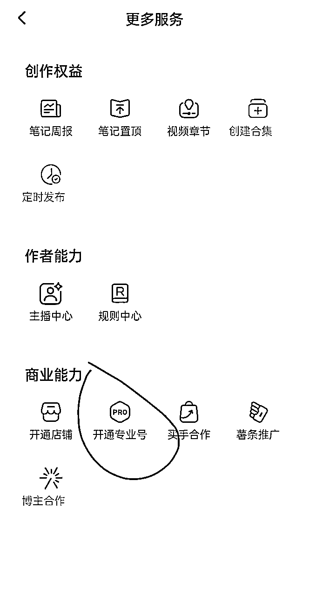
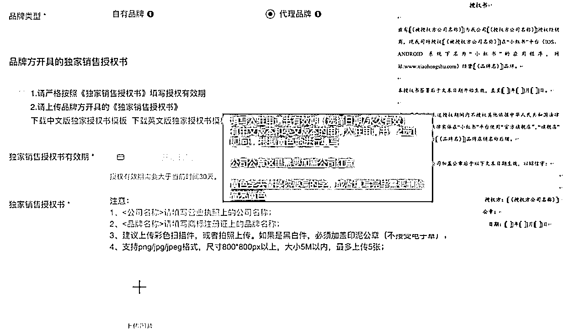
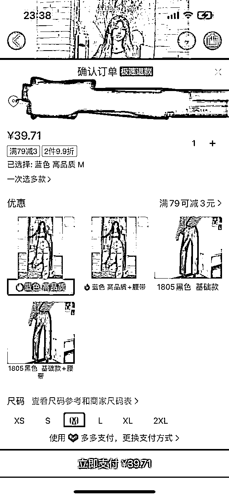
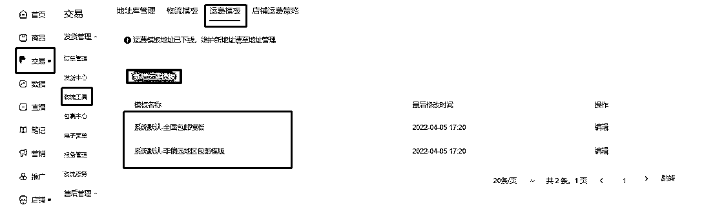
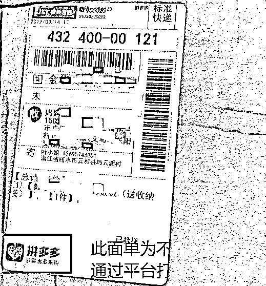
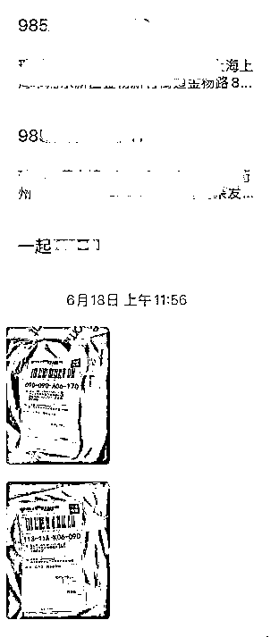
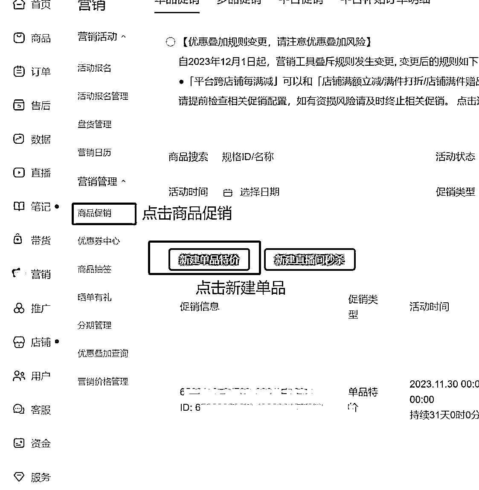
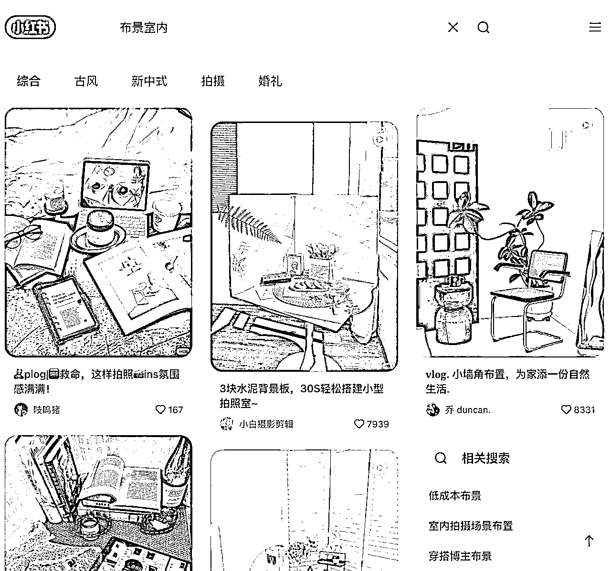
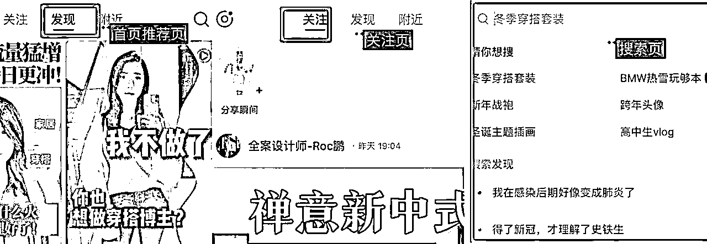

# 3 月航海 | 小红书电商-高客单蓝海 | 实战手册

> 来源：[https://ocn93f5d9olj.feishu.cn/docx/XAbSdAs9doBlCsxe0QHcLwrOn7g](https://ocn93f5d9olj.feishu.cn/docx/XAbSdAs9doBlCsxe0QHcLwrOn7g)

# 防失联+MM188166M（李李）长期更新频繁+备用V:MG10127

手册出品方：生财有术团队

手册使用说明：内容出品人排名不分先后。本文旨在向你展示一个项目的更多可能性，帮助你更好地理解和实操。

建议：如果需要快速定位到精确内容，可以使用快捷键 Ctrl + F/command + F 的形式，搜索「关键字/词」，查找你想要的内容

# 必修篇：项目 0-1

# 💡

必修篇：为该项目从 0 到 1 跑通一个最小 MVP 的所有步骤，即“航线图”对应的行动路径。

如果你是本项目新手，建议在正式实操前，先初步了解下项目全貌：

✅ 零、项目介绍

如果你对项目整体有了大致了解，就可以按照项目核心步骤，开始学习实操：

✅ 一、开通小红书店铺

✅ 二、选品（关键）

✅ 三、测品

✅ 四、找供应商发货（前期一件代发）

✅ 五、店铺运营

✅ 六、转实拍

在必修篇，航线图和手册顺序相对应，你可以按照手册的顺序进行学习，即可逐一完成航线图的每一个任务。

接下来就正式开始吧！

本航海项目的航线图如下：

航线图和手册是高度关联的，因此你可以根据自己所在的环节，进行相关步骤的学习。

# 零、项目介绍

# 💡

# 章节概要

小红书目前 90% 的商家挤在女装、日用、小配饰等低客单赛道，卷价格、卷款式，一单利润不到30%；

而高客单蓝海品类（如手工银饰、中古家具、户外装备）供给量＜搜索量，平台流量池持续增长——供需失衡=溢价空间。

本章节，我们将结合平台趋势，为大家介绍为什么要做高客单蓝海、以及怎么做高客单蓝海，为大家打下实操基础。

# 0.1 为什么建议做小红书蓝海电商

# 小红书电商趋势

小红书电商经过几年的发展，一些大的品类已经逐渐饱和，竞争异常激烈，但很多细分类目仍然是一片待开采的金矿，本期教练之一古辛是做淘宝蓝海起家的，相比淘宝蓝海，小红书蓝海更有优势，因为小红书蓝海的客户以女性为主，能够接受的客单更高，利润更丰厚。

因为小红书是推荐机制+搜索机制并行，所以个别品类，比如创新产品，在小红书更好做，而创新产品是层出不穷，源源不断的，也就是说，只要小红书的流量机制不改变，那么小红书蓝海就可以一直做，因为有源源不断的创新产品可做。

而且，相比红海类目，小红书蓝海电商离钱更近，容易见到正反馈，只要选好产品，出单不是难事。

# 蓝海电商的特点

容易拿到正反馈：小红书蓝海电商，最大的特点，就是容易拿到正反馈。

竞争比较小：小红书蓝海的竞争比较小，所以容易做出结果，并且打价格战的概率也比较小。

项目寿命比较长：小红书蓝海电商这个项目的寿命，主要取决于小红书的流量机制，只要小红书的流量机制不变，小红书蓝海就能一直做；淘宝蓝海之所以后来不好做了，主要就是因为淘宝的流量机制变了。

蓝海电商永远都不需要为产品不足考虑，只要掌握了正确的选品方法，蓝海产品是源源不断的。

# 成功案例

小红书蓝海电商的门槛比较低，入门难度不大，就算是没有电商经验的新人，也能比较快拿到正反馈。

只要品选对了，出单是比较容易的，因为竞争比较小。难的是持续稳定的出单，这个既考验品的稳定性，也考验搞流量的能力。

上图这张业绩数据，是一个刚毕业的小姑娘，做副业第 10 天的数据，她那个品选的确实不错，之前完全没有电商经验，她可以拿到结果，圈友们也可以。

上图这张业绩数据，也是一位圈友@叶声 做的小红书蓝海的数据，感兴趣的也可以看看他在生财分享过的小红书蓝海经验 https://t.zsxq.com/L5nG1

上面都是正面案例，下面再给圈友们看个负面案例。

这个店铺做的是女装，这个类目退货率越来越高，如果对供应链没有强把控的圈友，已经不太建议做了。

# 0.2 项目玩法介绍

1.

最小 MVP 路径

a.

实施步骤：注册账号开店 > 选品（关键） > 找笔记素材 > 发布笔记进行测品（关键） > 出单后找供应商 > 上架商品并发货 > 有持续流量后下单样品 > 实拍并发布笔记 > 做好店铺运营与管理

b.

时间规划：前 3 天完成店铺开通＋选品，第一周发布至少 5 篇笔记，持续选品测品，争取 3 周出首单，再转实拍

2.

项目核心关键点

a.

选品权重占比：70%决定成败

b.

最小 MVP 思路：前期先不追求实拍，先跑通蓝海选品—混剪笔记—卖出首单

c.

内容效率优化：航海会教大家用 AI 工具辅助创作提效（Deepseek＋多维表格写爆款文案）

d.

轻资产投入：初期投入约 1000 元/店铺保证金（也可以等提现时再交），后期轻投采购样品成本预估几百元/次（也可跟老板谈免费拿样品）

3.

航海目标

a.

选品是个需要多练习的技能，电商选品定生死，对于新手来说 21 天不一定能赚到钱，这很正常不要焦虑，这是个长寿命项目，要关注长期收益。

# 一、开通小红书店铺

# 💡

# 章节概要

了解完小红书电商的整体情况后，我们就要正式启动了。第一步，就是完成店铺准备。

具体包括：

✅ 准备手机号&手机

✅ 开通店铺（新手建议 2 个店铺，实在没有 1 个也行）

✅ 完成账号定位与包装

其中，小红书不同店铺的入驻门槛不同，大家可以结合自身情况，了解清楚后，进入入驻流程。

# 💡

# 本章航线图

完成本章节的学习和实操，即可完成航线图的：

第一阶段：【开店】开通店铺（约 1 天）

1.

完成至少 2 个小红书店铺的开通与设置（约 2 小时）

# 1.1 准备账号

# 1.1.1 准备至少 2 个账号

新手一般建议开通个人店铺，2 个个人店铺对应需要准备 2 个账号，具体包括：

1.

至少 2 个手机（不太建议 1 个手机多开，可能会被限流）

2.

至少 2 个电话卡（2 个小红书号需要 2 个实名，对应 2 个电话卡）

3.

至少 2 个身份证（可以用家人的）

电话卡推荐：

三个运营商都可以办副卡，一个人注册认证 5 个号码，一拖 4 ，副号月租费 10 元；

移动的万能副卡，1 张 10 块钱月租，1 个身份证能领 2 个副卡，第一张卡和第二张卡要相隔 90 天，去营业厅能办理，App 办理也可以，但是营业厅可以操作免第一年月租；

中国电信 App 搜索无忧卡， 5 元一个月，基本都是第 2 天就送上门；

移动可以办理 8 块的保号套餐。

手机推荐：

手机除了用于登录账号，也会用它做一些视频的拍摄。

建议拍摄用 iphone，型号是 xr 以上机型，拍摄效果最好；

后续放大做直播，iPhone 的直播稳定性也更好，但 iphone 无法双开。

# 1.1.2 账号登录&养号

账号登录：

同时运作 2 个账号，你可能会问：那我可以用 1 个手机登陆吗？

可以，但有一定风险。

如果你的手机本身就有小红书应用分身（部分安卓手机有这个功能，比如红米），那么可以用一个手机登陆两个小红书号，我目前这样操作，账号还没出问题。

但如果你的手机没有这个功能，就不要去下载分身神器了，容易被封号，这种情况下就只能再准备一个手机用于登陆账号，可以去咸鱼或者拼多多上买二手手机，三四百块钱的就能满足日常需要了。

实名认证：

这里要注意：小红书实名认证，一个身份证只能认证一个账号，一旦认证成功之后，只有注销账号才能解绑。

认证路径：我 - 左上角三条杠 - 创作中心 - 创作服务的更多服务 - 开通专业号 - 成为专业号 - 选择个人点击立刻申请 - 输入实名认证信息即可。

养号：

新注册的账号，每天可以刷 ＞30 分钟去养号，提高账号权重，这时候你可以根据所选赛道，去刷对标笔记。一般刷 1-3 天。不要一上来就挂车。

# 1.1.3 开通店铺

# 1.1.3.1 小红书店铺分类

在入驻之前，首先要了解小红书店铺的种类，因为种类不同，权益上也会有所区别。

从大方向来说，小红书店铺有两种类型，一种是个人店铺，一种是企业店铺。

无论是哪一种店铺，首先都要认证专业号，因为小红书账号注册后，默认为非专业号，非专业号不能参加任何商业行为，包括薯条投放，开店铺等。

所以，要想在小红书变现，第一步就是先升级成专业号。

专业号也是分为两种，个人专业号和企业专业号。

个人型：

个人专业号，身份标识为 XX 博主，比如时尚博主、美食博主等兴趣类的博主，基本上只要申请就能通过，而且不需要任何费用。

认证流程是：

点击【创作中心】—【更多服务】—【开通专业号】—【我是个人】-【实名认证】-选择身份证，填写相关信息即可。

个人型专业号，可以申请开个人店铺或个体工商店。

名称为 XXX（昵称）的店；

店铺保证金最低 1000 元；

按照类目不同，平台收取 2-5% 不等的技术服务费。

企业型：

申请企业型专业号，需要上传营业执照，并缴纳 600 元费用，身份标识为 XX 品牌。

申请流程为：

点击【创作中心】—【更多服务】—【开通专业号】—【我是企业】-【填写基础信息】-【填写主体信息】-【资质公函上传】-【运营人信息填写】- 缴纳 600 元费用，等待审核。

填写注意事项见下图：

申请之后，大家要多加留意，因为申请有效期为 30 天，如果 30 天内没有完成申请，费用是不退回的。申请通过后，每年都会年审，并续费 600 元。

企业专业号，可以开普通企业店和专卖店/旗舰店。

名称为 XXX 专卖店/旗舰店；

普通企业店保证金最低 2000 元（详见《小红书类目保证金明细》）；

月营业额＜1 万，平台免收技术服务费；

超过 1 万的部分，平台收取 5%作为技术服务费。

2023 年 9 月 10 日起，一个营业执照可以申请最多 2 个专业号、2 家店铺。

同一品牌只能开一家旗舰店，但可以同时开不同类型的店铺，比如一家旗舰店+一家专卖店，或者一家旗舰店+一家普通企业店。

企业专业号的营销权益，会比个人专业号更多一些，但两者只能二选一，大家可以根据需要自行选择。

一般来说，建议新手开【个人店】就可以，门槛较低；企业店主要是放大做矩阵的时候用到，平台对账号的宽容度也会更高。

# 1.1.3.2 【个人店】入驻门槛与流程

入驻门槛：

个人型店铺又可以分为【个人店】和【个体工商户店】。

个人店仅支持服装、百货等常见类目，个体工商店铺除了可以开常见类目，还支持奢侈品、珠宝等类目。

每个店铺类型，对应的可经营类目不同，打勾部分就是可以经营的类目，具体可在小红书学习中心-规则中心-经营总览中查阅：

开店还要缴纳保证金，个人店和个体工商户的保证金都是 1000 元，但是有些特殊类目，比如保健品、奢侈品类，保证金会贵一点。

客服接待角色，个人店铺可选择平台代运营和自主客服两种模式，要注意平台代运营是需要收费的，大家可根据自身情况进行选择。

平台佣金，又叫技术服务费，按照类目不同，平台收取 2-5% 不等的服务费，收费准则详见：https://school.xiaohongshu.com/rule/detail/27/2585?jumpFrom=school

目前小红书为了减轻个人店和个体工商户的开店负担，店铺入驻后无需缴纳保证金，即可发布商品上架售卖。如果该店铺累计交易额超过 1 万元后，下个月月初才需要补缴保证金，真正实现“无门槛”开店。

入驻流程：

选择个人店铺后，需要选择经营类目，之后只需要提供姓名、身份证号、手机号，并进行人脸识别，验证成功后店铺就开通了。

个体工商户店铺，需要提前准备好以下几点：

（1）公司信息的营业执照照片、公司名称、统一社会信用代码、经营地址以及营业执照有效期；

（2）店铺运营授权书。

同样也是先选择店铺经营类目，然后根据提示上传相关的资料。

和个人店铺不同的是，个体工商户店的审核时间一般为两到三天。

期间可以自行登录入驻系统进行查询。若在入驻过程中有任何问题无法解决，都可以在 9 点到 24 点期间直接联系人工客服进行咨询。

# 1.1.3.3 【企业店】入驻门槛与流程

入驻门槛：

企业型店铺，分为普通企业店、旗舰店、专卖店以及集合店。

普通企业店铺与个人店铺命名格式是一样的，“专业号账号名称+的店”。需要注意的是，企业专业号取名时要和商标对应，要不然会导致开不了店铺。

旗舰店名称是 xxx （品牌名）旗舰店，专卖店是 xxx 专卖店，集合店铺是 xxx 的海外店。

企业型店铺支持经营大部分类目，包括保健品、医药等特殊类目。

平台佣金，和上面的个人店铺一样，1w 以下不收费，超过部分按 5% 收取。

保证金根据类目不同，金额也是会略有差异，一般境内最低 2 万，境外 3500 美金。

如果你不知道如何选择，可以通过下面这张图快速判断：

入驻流程：

企业型店铺需要准备的材料比较多，建议在电脑端小红书入驻系统操作，网址为：gaia.xiaohongshu.com

我们先来说普通企业店的入驻流程，登陆后，大致需要 6 步。

第一步，首先选择店铺类型为：普通企业店。

第二步，填写公司信息，上传营业执照，营业执照要拍得清晰、完整，避免扫描错误。

然后，填写法人或店铺运营人信息，注意，联系人要与营业执照上的法人一致。

第三步，店铺名称填写，但这个是系统自动抓取的。店铺命名形式就是“昵称+的店”，所以直接跟你的昵称挂钩，需要修改的话得去专业号中心修改昵称。

第四步，选择经营类目，注意类目必须在商标注册证上的类目范围内。

第五步，就是等待审核，一般审核时间为 3 个工作日内，审核失败会有电话或邮件告知，期间有任何问题也可以联系在线客服咨询。

审核通过后，最后一步就是缴纳店铺保证金了，注意开卡账户是对公账户，而且开户人需与入驻时填写的经营人姓名一致。

其次，我们再来说旗舰店和专卖店的申请步骤，大体上和普通企业店差不多，需要注意四点：

一是填写品牌相关信息。

如果系统内没有你的品牌名称，就点击“新增品牌”添加，注意上传 logo 图片时，要与商标注册证上的完全一致。

二是要区分自有品牌和代理品牌。

如果是代理品牌，要确保有完整的授权链路，公司名称选择营业执照上的名称即可。

如果是自有品牌，就是说，商标持有者是自己公司或公司法人，注册类型可分为 R 标和 TM 标两种，R 标就是注册商标，TM 标就是商标这册申请受理通知书。

其中，如果你的商标注册类型为个人型 R 标，就需要上传商标注册证，以及商标权利人的身份证或护照复印件/扫描件。

同样，如果是个人型的 TM 标，需要上传商标注册申请受理通知书，以及权利人的身份证或护照复印件/扫描件。

而如果你申请的是企业型的 R 标或 TM 标，就只需要商标注册证或商标受理通知书就可以了。

三是选择售卖品类时，注意谨慎选择“定制”品类。

四是审核通过后，还需要签署合同，合同会以线上邮件形式，通过电话或验证码确认签署。

接下来也是缴纳保证金，注意事项同上面的普通企业型店铺。

最后再来说集合店，集合店只有平台邀约才能够入驻。收到邀约后，入驻流程跟旗舰店和专卖店步骤相同。

全部申请通过之后，就可以上传商品开店啦，在你的账号首页可以直接显示店铺和商品入口。

总的来说，企业型店铺的商业权益会比个人店铺更多一些，但维护费用也更高，大家可以根据自身情况选择。

另外关于入驻类目、审核等不懂的地方，建议大家第一时间联系“人工服务”进行咨询，商家客服回复的都比较及时，能够快速解决大家问题。

更多店铺入驻信息，大家可以前往（ https://school.xiaohongshu.com/helper/list?ctg=238&jumpFrom=cn ）自行查询：

# 1.1.4 账号定位

# 1.1.4.1\. 赛道定位

下面提供几个方法选择赛道的方法，有付费和免费的。

从效果来看，前 3 个付费方式效果更好，当然新手前期也可以直接选择后 2 种免费方式，不用太过纠结：

1.

看数据大盘（需付费，有免费试用）

打开灰豚数据 ➡️ 数据大盘 ➡️ 行业流量大盘

筛选行业，找到爆文总数、预估阅读量、点赞、收藏等等指标都上涨的赛道

都在上涨，说明用户正需要这类型内容，可以在这些赛道上选品

（关联笔记总数可以下降）

2.

看热词榜单（需付费，有免费试用）

打开灰豚数据 ➡️ 热门内容 ➡️ 搜索飙升榜

看看这里有没有高搜索的关键词，是跟产品相关的。比如下图中的美甲款式，2025 年开春，很多人都会有春季美甲的需求，穿戴甲就有市场

3.

看销量榜单（需付费，有免费试用）

同样是灰豚数据，打开商品分析 ➡️ 商品榜单

看商品销量榜、销量飙升榜等等，日榜、周榜、月榜都可以看，主要看最近热销的产品都分布在哪个类目、哪个赛道

注意，需要选择「暂无关联品牌」的产品，有品牌的，很多可能都是找大博主带货，或者直播+投流堆出来的销量，我们模仿的话，跟这些没法竞争

4.

千帆 app 商机中心（免费）

打开小红书千帆 app，找到「商机中心」，可以在里面看看机会类目、潜力商品，都分布在哪个赛道

5.

社区热搜词（免费）

小红书千帆 app，打开社区热搜词，看看推荐热词、热搜词、蓝海词和飙升词

哪些词跟产品有关，这些产品分布在哪个赛道

比如：

飙升词中「香薰」「宿舍用品清单」这两个都是我们能做的产品

# 1.1.4.2 定位包装

小红书店铺的账号包装比较简单，这里以百货账号举例：

第一步：找到对标账号

小红书商城搜索赛道关键词（比如“旋转梳子”）-> 点击查看高销量产品 -> 找到左下角头像进入账号主页。

第二步：模仿并完成定位包装

比如我的对标账号是“佳嘉爱分享”，那么“娜娜子的小新”就是我模仿设置的账号。

# 二、选品（关键）

# 💡

# 章节概要

完成开店和赛道定位后，就可以开始选品啦，这个动作将贯穿整个航海，同时也是这个项目的最关键部分。

✅ 蓝海品筛选标准

✅ 蓝海选品思路

✅ 蓝海选品方法

1.

传统电商平台-淘宝选品

2.

从其他兴趣电商平台-抖音选品

✅ 蓝海选品案例

对于新手来说，你需要先在小红书刷足够多的爆款对标，了解哪些品在小红书上会爆，积累选品体感，再去淘宝/抖音其他渠道选适合小红书的品，有助于提高测品效率。

# 💡

# 本章航线图

完成本章节的学习和实操，即可完成航线图的：

第二阶段：【选品】掌握蓝海选品（约 2 天）

1.

选择至少 1 个带货类目（约 1 天）

2.

学习蓝海选品方法，选出至少 3-5 个品（约 1 天）

# 2.1 蓝海品筛选标准⭐

1.

蓝海产品的定义

不管是传统货架电商淘宝，还是兴趣电商小红书，对蓝海的定义就一条：自己干得过的就叫蓝海，自己干不过的就是红海。大家可以结合自己的情况来判断。

蓝海电商，一般来说，市场容量都不会很大，也就是说销量不会太猛，所以大家在选品的时候，尽量选高客单，高利润的品来做，这样利润就会有保障，做起来也会比较轻松。

蓝海电商的产品，可以分为标品和非标品。

标品一般在小红书都有同行参考，优点是做起来会容易一些，缺点是容易被跟，从蓝海到红海的时间周期很短；

非标品是指在小红书没有同行参考，你就是第一个做这个品的人，非标品的优点是生命周期比较长，缺点是做起来比较困难。

鉴于此，本次航海，主要给大家介绍【小红书电商蓝海标品的打法】，让大家尽快拿到正反馈，树立信心，早日步上正轨。

2.

高客单蓝海选品的标准

什么样的产品是合适的产品？

我们选品不要凭借感觉，最好选择已经爆过或者正在爆的产品，才能有更大的爆率。

总结了 6 个选品的基础原则，不管选择什么样的选品方法，选中的品都尽量符合这 6 个原则。

本期航海，推荐的高客单选品标准如下：

价格带：建议 50-2000 元，高利润、低竞争

利润率：建议≥30%，结合竞品定价和 1688，闲鱼货源渠道进行利润测算

【重要】更详细的选品标准，可以对照下方表格，来进行选品判断：

⭐高客单蓝海-选品判断维度⭐

序号

名称

判断标准

原因

1

产品数据分析

以小红书同行数据为主

（表格下面会具体列举）

在其他平台选到品后，最终选品的数据分析，要以小红书平台的数据为主，其他平台的数据为辅，不要主次颠倒，因为有些圈友可能会过度迷信第三方软件的数据。

2

对标账号粉丝量

<5W

对标账号粉丝量更高，不利于模仿

3

是否会侵权？

淘宝同行数量不能少于网页版淘宝一页

淘宝数据更全，更利于分析是否会侵权。更多分析产品是否会侵权的方法，可以看这篇文章 https://t.zsxq.com/6B9Z7

4

近期销量如何？

看对标链接的近一个月的评论数量，近一个月评论数量要>100

5

是否是季节性产品？

看对标链接的评论是否出现季节性减少，比如这个品 11，12，1，2 月的评论是个位数，说明这个品是夏季用品，冬季几乎无销量。

避免选到季节性产品，反季销售不好出单

6

对标账号流量来源

以笔记为主，看对标账号的笔记数量是否够多，以及是否有爆款笔记。

如果账号只有几篇笔记，但有上万的销量，那说明不靠笔记获得流量，有其他流量途径，就不适合做我们的对标。

我们的流量来源以笔记为主，那么选品对标号如果也是以笔记为主搞流量，更有利于我们起号

7

产品是否有回购

看产品链接下方账号的回购数据

8

预估产品销量

看链接下方的三个月总销量，再平均近期三个月的月均销量；如果上架还没满 3 个月，也可以通过第一条评论来大概估算上架时间。

9

货源

货源以 1688 和闲鱼为主，不要拿拼多多做货源。

拼多多做货源容易出现无货源导致封店的问题，拼多多面单没处理好也容易暴露信息。

10

1688 和闲鱼没有货源咋办？

换品。利润过于诱人的除外。

蓝海选品比较稀缺，选品定生死，只要选出好的品，剩下的就是水到渠成；所以本期航海就不给大家推荐选品了，重点在于教大家掌握蓝海选品的方法，自己去挖掘。

# 2.2 蓝海选品思路

在讲具体方法之前，我们先梳理一下小红书选品的思路。

选品方法有很多，整体来讲不外乎三个大思路：

1、日常多刷小红书站内爆款选品

我们在小红书卖东西，肯定要了解平台最近哪些品比较好卖，多刷多看，有条件的也可以通过灰豚看数据、找低分爆款来选品。

不过一般新手不建议直接上工具，平台多刷就够了，还能培养下网感。

2、从传统电商平台-淘宝选品（推荐⭐）

即从淘宝找合适的品。淘宝的分类页面，有目前国内所有主流搜索电商平台里，最全面的类目；而且淘宝作为电商平台，相对是最成熟的，也不需要用到任何付费工具。

常用的方法有：淘宝分类页面选品、淘宝神店榜选品、淘宝榜单选品、天猫榜单选品。

3、从其他兴趣电商平台-抖音选品

即从跟小红书一样靠内容带货的平台找，目前建议从抖音找合适的产品。

这时候我们常用的方法有：考古加选品法、蝉妈妈选品法、抖音精选联盟的创意中心选品法等

所以，在正式选品前，建议大家先刷至少 2 小时的小红书，对平台当前爆品增加些体感。

# 2.3 蓝海选品方法

如果你已经完成了刷 2 小时小红书平台，接下来可以开始选品啦。这里给大家提供 2 种选品方式，优先推荐通过淘宝选品，其次是抖音选品（原因上面有说）。

好的选品方法，用一种就够了，前期可以多试几种，有了一定选品能力之后，找到最适合自己的一种选品方法即可。

看到意向品之后，就按照【章节 2.1】给到的蓝海品筛选标准，来判断要不要选这个品。

# 选品方法一：传统电商平台-淘宝选品

# 2.3.1.1 利用淘宝分类页面选品（推荐⭐）

淘宝的分类页面，有目前国内所有主流搜索电商平台里，最全面的类目，不过和亚马逊比还差了一点，亚马逊的分类词更丰富。

大家可以从淘宝的分类页面里，去选择适合女性用户的产品词，拿到小红书上去搜索。

选品初期是会比较枯燥和乏味，挨个去小红书平台看数据，这一步没法省。

# 2.3.1.2 利用淘宝神店榜选品

淘宝神店榜是手机淘宝出的一个板块，对于小红书选品来说还是很好用的。

步骤如下：

1.

手机淘宝页面，点击“全部频道”

2.

搜索“神店榜”

3.

进入“神店榜”之后，会有很多类目，点击想要的类目，比如“潮玩宠物”，然后咱们点击“浪漫婚礼首饰热卖榜”

4.

进入这个页面后，几乎都是卖婚礼首饰的店铺，最上面也有几个分类项，“黑马榜”和“回头客榜”值得一看。

5.

点击店铺后，按销量排名，就可以看有没有自己喜欢的品了，如果有，就到小红书去搜索关键词，看看该产品在小红书上的数据如何。

这套选品方法，不仅可以用于小红书，还能用在淘宝、闲鱼等平台。（抖音亲测不太适用）

# 2.3.1.3 利用淘宝榜单选品

1.

手机淘宝，点击搜索框

底部会出现一个最近热销产品榜单，这个榜单每个小时都在实时更新，这里面有些品，也适合拿到小红书去做。

这个榜单里的品，都是最近淘宝搜索热度猛增的品，有很高的时效性。

# 2.3.1.4 利用天猫榜单选品

1.

手机淘宝，点击“全部频道”

2.

搜索“天猫榜单”

3.

顶部有很多分类选项，点击自己想要的分类，比如“母婴”，就会出现很多母婴用品，我们选择第一个，“宝宝沐浴露好价榜”，就能看到目前天猫卖得比较好的产品

这些产品有些和小红书是有一些信息差的，天猫竞争激烈，小红书的竞争可能没有那么激烈。

# 选品方法二：从其他兴趣电商平台-抖音选品

抖音创意中心是抖音自己的数据统计，实时更新，相对比考古加来说能够更加快速的知道新爆款。

其中建议百货等大众品类注重一下【抖音创意中心选品法】。

抖音的流量和玩家更多，这类大众品在抖音先爆起来的概率更大。

小红书有时候很慢热，这类大众产品基本都是混剪、素材同质化，等到小红书已经爆起来你再去做素材可选度会低，所以不如直接在抖音开始爆的时候就搞过来。

我们的爆品如硅胶保湿袜、雪地靴刷子、钢丝抹布等都是通过抖音创意中心选品法选到的。

具体步骤如下：

1、打开抖音橱窗——选择创意中心——可以选择爆款视频/图文带货形式

（还没有开通橱窗的末尾附开通教程）

2、可以根据时间维度、品类维度以及作者登记等维度进行选择，前期大家主要看时间维度和品类维度即可；

3、近 1 小时和 24 小时都要看，这都是抖音实时统计等爆款带货视频，如果在看的过程中有发现符合我们上面提到的【选品的 6 个原则】的品，就可以考虑进一步判断后上架测试一下。

# 2.3 蓝海选品案例

这里拿具体案例给大家展示下，什么样的品是好的蓝海品。

举个小红书的礼物赛道 https://t.zsxq.com/zDmVW，这条赛道目前有很多蓝海的品可做。

比如下面这个品，高客单，高利润，至于有没有复购不好说。因为这个品不属于消耗品，也不属于兴趣爱好品，所以直观来看不会有复购，这个品适合用来送礼。

这个品叫“星星命名”，用用户的名字，给星星命名。淘宝的竞争比较小，但淘宝上的利润没有小红书高。

小红书上的客单能做得更高，因为这东西严格意义上也不算标品，对吧，星星也有大有小，大的星星值得更高的价格。

这个品很多圈友可能好奇，是如何交付的。

“星协”是国产的一家星星命名供货商，交付主要是纪念证书，他们自己做的供应链，他们在淘宝也有店。如果后续做得深入，可以自己干供应链，这东西不难，本质就是做“纪念证书”的。

高端一点的可以去外网，找国外的供应商。如果圈友要做这个品，建议用国外的供货商，他们交付，我们中间赚个差价，这个差价利润也够高。

国外做这个品的网站特别多，他们的交付很成熟，看上去特高端，所说这个品的八字和小红书很配。

有些网站还提供分销计划，客户买一单，能拿 15%的佣金，这个也可以算作咱们的利润。

这个品用来作为送给女性的礼物，是非常有牌面的。

这个品零风险，也不用担心侵权的问题，星星是公共资源，不是谁的私有财产。

创造出这个品的人，真特么是个天才！

# 三、测品

# 💡

# 章节概要

每选好一个品，我们就需要通过测品来做检验。小红书测品，其实本质是测大家搞流量的能力，当然，前提是“链接页面的转化率”已经优化好。所以测品能不能测出来，除了选品质量外，还要看这两个因素：

✅ 商品链接质量：保证流量的转化率，是搞流量的前提

✅ 笔记质量：搞流量的能力，不同商品适合的笔记形式不同。

注意：新手前期在精力有限的情况下，可以用二创笔记进行测品，后续选品能力提升后，可以直接实拍。

接下来，开始测品吧~

# 💡

# 本章航线图

完成本章节的学习和实操，即可完成航线图的：

第三阶段：【测品】二创笔记进行测品（7 天）

1.

上架并优化至少 1 个要测品的商品链接（约 1 小时）

2.

每个品找 ≥5 个对标带货笔记进行拆解（约 0.5 小时）

3.

各平台找二创笔记素材（图文/视频）（约 0.5 小时）

4.

第一周成功发布 ≥5 篇种草笔记（约 5 天）

# 3.1 测品的逻辑

测品的本质：选品的验证。

测品是对选品的验证。选品阶段通过对同行链接的数据分析，大概能判断出这个品目前在小红书平台的竞争大小，月毛利润，流量多少等等数据，但这些数据仅仅来源于纸面分析，具体我们选的这个品能否赚钱，还需要靠测品来检验。

选品更偏重理论分析和经验判断，测品更偏重实操，测品是检验选品是否正确的唯一方法。

小红书测品，其实本质是测大家搞流量的能力，因为产品足够细分，搞来的流量一般都会比较精准，只要流量稳定，基本就能出单。

当然，前提是【链接页面的转化率】已经优化好。

测品的周期：一周。

小红书高客单蓝海电商，走的是精品路线，不像店群需要上很多链接，同时，一个类目的品可以都放在一个店铺，所以，也不需要一个小红书店铺对应一个品，这也太浪费，所以，一般来说，一个小红书店铺里放<20 个品都是可以的。

我们的实操经验是，一个品一个品的测，最好是上一个品，测一个品，把品全部上到店铺也可以，但要从选品数据显示的最好的那个品开始测。

每天发布 3-5 条笔记，尽量不要集中发布，一般测个一周时间，能出单的品也就出单了。

小红书蓝海电商的出单一般是比较快的，因为产品足够细分，引来的流量也足够精准，在链接页面转化率没问题的情况下，如果你一周内没有出单，就要考虑换品。

只要一周能出单，就继续做，提升大家搞流量的能力，一般来说，新人需要 2-3 个月才能保证流量稳定，才能保证稳定出单。

当然，有些产品是有流量高峰的，比如玄学产品，各类考试日前夕，比如中考，高考，考验，考公等等前夕会迎来流量小高峰，这个需要大家在选品的时候，通过分析数据发现，然后选好测品时间，如果在选品的时候没发现这种时间节点，完美避开了这些流量小高峰，做起来就会很辛苦。

（玄学产品虽然利润高，但做起来有难度，容易违规，对新人不够友好，新入行的圈友还是挑其他类目做，更容易拿到正反馈。这里只是拿它举例，不代表推荐大家都去做这个类目。)

# 3.2 测品前准备工作（重要）

在测品前，我们先上架商品链接、并确保链接页面的转化率已经优化好，具体操作如下。

# 3.2.1 上架商品链接

# 3.2.1.1 商品主图详情页

千万不要做淘宝那种特别专业的美工图，详情图，主图最好都是小红书风格的图片，更有真实性。如果后续你是实拍的图或者视频，建议把详情图也都换成笔记里实拍的风格，让用户有”所见即所得“的感觉。

比如下面这个账号这样详情页和视频是同一种风格。

还有下方这个，详情图就直接用了主页笔记的图片，用户一看就知道你是实拍。

# 3.2.1.2 商品定价

很多人觉得把 pxx 商品搬到小红书提价 3 倍照样卖，但小红书的用户并没有那么傻。我有问过 50 多个女大学生，大部分人还是还是在淘宝，拼多多，得物下单，而且现在大学生很多都会去比价。

产品定价这块我会去搜淘宝和拼多多销量靠前的店铺，定价在这两个平台的区间范围内。很多用户即使比价后，发现价格比淘宝略便宜，考虑到我们视频是原创拍摄，打的”所见即所得“，她们基本上都不会在其他平台下单了。

比如上面是随便在 pxx 榜单里看到的一条牛仔裤，价格 39，去搜同款在淘宝，按照销量排序，看到月销 1000+ 的基本在 70-90 价格区间，当然也有 40 多的。这个时候我可能会定价在 59-69 这个价格，具体计算自己的利润率。

我们做女装类目的商品浏览到下单的转化率一般在 4%-7%，如果低于 4% 可以考虑调整下定价。其他类目不清楚。或者定价前去小红书多刷一刷，观察同行爆文左下角挂的商品的累计销量。

在实操中，定价非常非常重要！！！特别是低客单价商品，很多伙伴有 2 个定价误区：

1.

认为小红书用户质量高，一个劲加价

2.

直接复制其他平台价格，不灵活调整

这里有一篇圈友 @V 小刀 的星球帖，分享给到大家更细节的商品定价方法：小红书电商系列细节篇

# 3.2.1.3 商品发布

# 手机端发布

小红书 APP 和小红书商家版 APP 发布流程差不多，都是比较简单的，按操作流程来就可以。

下面是商品上架流程：

1）编辑商品

注意：

商品标题和商品主图是必选的。

商品主图官方有对规格做了限制，图片以清爽为主，不要加太多标注文字。

如果商品首图不符合规格将上架失败，如果不符合首页推荐规则，不会在商场首页推荐。

2）设置商品类目

里面显示的就是个人店铺可以上架的类目，也可以用搜索框直接搜索，但是有些类目需要企业才能上，还要有相关资质。每个店铺类型，对应的可经营类目不同，具体可在小红书学习中心﹣规则中心﹣经营总览中查阅。

3）填写商品规格

商品规格是，如果一个商品里面有多种型号需要进行设置，如果只有一个不用管。

4）设置商品售价

根据你上架的商品进行设置。

5）设置库存数量

根据你上架的商品进行设置。

6）填写商品属性

根据你上架的商品进行设置。

7）填写商品详情

上传商品详情页的图片。

8）选择是否包邮

根据你上架的商品进行设置，可以选择是否包邮，系统目前默认两种：

全国包邮；

偏远地区不包邮（偏远地区：新疆维吾尔自治区/西藏自治区/宁夏回族自治区/青海省/海南省/内蒙古自治区/甘肃省）

自己设置运费模板，可以选择运费的价格，可以设置不同地区（只能在电脑端商家后台设置）。

先选默认的运费价格，然后再设置特殊地区的价格，可以根据件数，也可以根据重量。

9）设置发货时间

发货时间可以自己进行设置，可以设置当天发货，24h 发货，48h 发货和预售发货。

上架完成后点立即发货就可以了。

小红书的审核是机器审核，速度非常快，如果没什么大问题，发布以后立马就上架上去了。

# 电脑端发布商品

小红书商家助手网页版地址：https://ark.xiaohongshu.com

电脑端可以使用软件来一键搬家，也可以自己手动发布。

1）一键搬家软件

在店铺后台点击服务，进入服务市场选择一款搬家软件。一键搬家的软件在后台都可以试用，可以选择适合自己的进行软件搬家。

一键搬家软件入口：

2）后台手动上架

在小红书商家管理后台手动发布步骤如下：

① 根据自己产品的类目，选择好类目，点击下一步：

② 根据产品的属性，填对应的属性，带*的为必填，其他的选填项：

③ 如果遇到自己的产品品类没有开通（部分类目需要提交对应资质，后台会提示），可以在后台申请：

④填写完所有信息，就可以提交审核啦！

拓展资料：更多和产品上架相关的内容，可前往小红书商家课堂学习：

https://school.xiaohongshu.com/course/list?jumpFrom=school&categoryNo=20210515002

# 3.2.2 优化商品链接转化率

在测品之前，需要确保我们的产品链接，在转化率方面不拉胯，以下六种方法，是我们经过实操，总结的能够提升产品链接转化率的方法，大家可以从这六个方面，来提升店铺链接的转化率：

# 1\. 链接补评论

小红书店铺的新链接补 5 条及以上图文评价。想要提升链接转化，人为补评价是有必要的，最好是图文评价，至少补 5 条，5 条图文评价能达到边际最大化。

小红书补单主要为评价，流量需要靠笔记。5 条图文评价，找亲朋好友就能搞定；不想麻烦亲朋好友的，就找以前的客户；没有客户积累的，就找微信好友；微信好友也不想麻烦，那就闲鱼发布任务。

# 2\. SKU 引导

咱们做的链接，大多数都是多 SKU 的，有时候 SKU 一多，会让用户有选择困难症，反而可能会降低转化率，在 SKU 名称的设置上，我们也能利用从众效应，让客户选择，我们想让他们选的那个 SKU。

以脐橙为例：

上图这个 SKU 的设置，就是很原始的设置，只有数据参数，没有任何营销性的术语， 很多时候客户一眼看过去，并不知道哪个更好，所以这条链接的 SKU 设置，在我看来很差。

上图这条链接的 SKU，就稍微设置了一下，最底下的那条 SKU 的名称，前面加了“好评最多”，这个链接的 SKU，比上面那条链接设置得稍微好一点，但在我看来设置得也不够好。

虽然客户看完所有 SKU 之后，目光被最底下那条 SKU 吸引，但也有不少问题。

首先是排序的问题，主推的 SKU 应该放前排，放最后排，是害怕让客户看到吗？

其次，主推的 SKU，肯定是要推利润高的呀，推尺寸最小的果算怎么回事？

最后，营销话术还有改进的空间。

我们再来看第三条链接，这条链接的 SKU 设置得算合格。

首先，主推的链接放在前排的，方便客户优先锁定，店主放在第三位的，其实把主推链接放第二位会更好。

第一位放店铺客单最高的，锚定价格，客户看完第一条 SKU，价格 100，再看第二条主推 SKU，价格 80，觉得 80 不算贵，因为有 100 这个最高价做衬托。

其次，营销术语不错，除了主推 SKU 外，其他 SKU 都有营销话术。

最后，主推 SKU 前面的“好评最多”，可以优化成“千人好评”，“万人好评”，前提是销量够，销量不够，就用“好评最多”，用这种话术的目的，就是告诉客户，大家都选的这条 SKU，没问题的，闭着眼睛付款就行。

# 3\. 设置优惠券

设置一个高的初始价，再设置一个高的优惠券，可以让客户有捡到便宜的感觉，特别是对于非标品来说，非常好使，因为非标品没有同行参考价，你的标准就是唯一的标准。

# 4\. 用漂亮的模特

有些产品需要用到模特来展示效果，尽量用漂亮的模特，越漂亮越好。

比如祛痘产品，美白产品，需要用到模特来展示前后的效果对比图，效果图可以网上选，也可以让美工合成。

用来展示对比效果图的模特越漂亮，转化率越高，因为客户会自我带入，所以，如果用来展示效果对比的模特，比较丑，会起到反面效果。

人都喜欢好看的东西，特别是女性，都希望自己更美，更漂亮。

# 5\. 利用恐惧的情绪来提升转化率

人的情绪当中，有不少都可以用来提升转化，我们用的效果最好的，也是目前使用最多的，就是利用客户的恐惧情绪，来提升转化率。

比如：

卖儿童用品，会用“如果你不及时纠正孩子的某某行为，以后就会如何如何”，“孩子的同学们都在使用这种方法，你的孩子如果不用就会落后”等等类似的话术。

卖美容护肤产品，会用“如果你不舍得花钱来保养，你节省的钱就会被小三姐花掉来保养”等等会让用户感到害怕的话术。

需要记住的是，我们利用客户的恐惧情绪的最终目的，是为了转化，是为了卖产品，一定是为了成交而使用恐惧，千万不要单纯为了吓唬客户而使用恐惧。

# 6\. 用相似性来包装小红书账号

小红书的账号，店铺和笔记是相辅相成的，彼此不能分开来看。

首先，小红书的本质，不是一个纯正的电商平台，而是一个种草平台，种草平台的意思是，我有某项需求，买了某个产品，我使用之后觉得这个产品很棒，分享给了小红书姐妹，小红书的姐妹被我真诚的分享打动，去下单了这个产品。

所以，大家在做小红书的时候，给自己小红书的定位，不能定位成一个卖家，而是要定位成产品的爱好者，或者使用者。

因为如果你定位成一个卖家，那其他小红书的姐妹就是买家，你们之间的关系就是买卖关系，如果你定位成某个问题的解决者，某类产品的爱好者，你就跟有同样需求的姐妹们具有相似性，你们就能成为朋友，你们之间的关系，就是朋友关系，而不是买卖关系。

小红书的姐妹，会更相信和自己具有相似性的朋友推荐的产品，还是相信一个商人卖的产品呢？

其次，用相似性来包装小红书账号，那么就需要你清楚你的目标用户群体，大概的画像，以及圈子内使用的特定术语。

这些，都可以通过在小红书搜索关键词，去看笔记和评论，来得到相关的信息。

所以，大家的小红书账号，在性别一栏里，有没有设置为女性？大家的小红书笔记，有没有从你的产品的使用者的口吻，去推荐你的产品。 记住，你在小红书的定位，不是一个商人，而是你的客户的朋友，你们是具有相似性的。

比如，这个小红书号卖的是儿童用品，她的人设定位就是成长型宝妈，分享育儿经验，很容易获得小红书上宝妈们的信任，小红书上的宝妈会认为她是“自己人”，因为她们之间具有相似性。

以上，当店铺链接转化率没有问题之后，我们在测品的时候，只需要专心测流量即可。

# 3.3 发布二创笔记

考虑到新手一上来就实拍，操作难度会比较高，所以前期还是建议大家先以二创为主，有持续出单后，再转实拍。

# 3.3.1 图文 or 视频怎么选？

由于不同的品，适合的内容展现形式不同，得到的效果也会不同。

这个小节我会先跟大家举例说明，什么样的品适合图文，什么样的品更适合视频笔记，大家可以根据自己的选品，自行选择图文或视频内容形式。

比如百货赛道，大部分产品都需要把功能和应用场景展示出来，让消费者发现这个产品可以解决自己的需求，因此大部分的百货产品，是更适合视频笔记的。

图文笔记：

适合发图文笔记的产品类型，主要特点是：

图片更能直观地让用户一眼看到产品亮点、展现需求痛点；

小红书这类产品的爆款笔记形式，普遍为图文笔记居多（通过搜索关键词查看）。

这里举 3 个例子给大家找找感觉：

1.

女装对于身材和搭配要求比较高，可尝试制作图文笔记

http://xhslink.com/9ibh8x

2.

裤子，实拍简单，抠图去容易，可尝试制作图文笔记

http://xhslink.com/isLf8x

3.

玩偶公仔，图文爆款多，可尝试制作图文笔记

http://xhslink.com/j3Tg8x

视频笔记：

适合发视频笔记的产品类型，主要特点是：

产品能在视频中直接展现实用的功能；

产品本身比较猎奇，能吸引用户观看；

产品需要真人出镜，塑造更强的 IP 感觉；

产品通过图片，无法让用户看到痛点，或展示亮点；

小红书这类产品的爆款笔记形式，普遍为视频笔记居多（通过搜索关键词查看）。

这里举 3 个例子给大家找找感觉：

4.

百货清洁类，需要强展示产品，可尝试制作视频笔记

http://xhslink.com/PDLEZK

5.

日用护理类，展现实用与用户痛点，可制作视频笔记

http://xhslink.com/Bn1NZK

6.

解压玩具类，吸睛让用户停留，增长曝光，可制作视频笔记

http://xhslink.com/zxxk8x

我们可以感受到，百货商品需要在内容中强调功能展示，因此视频笔记是更适合的内容展现方式，接下来我们一起来掌握视频笔记的制作，并通过「硅胶保湿袜」这个产品案例展现每个步骤的实际操作情况。

# 3.3.2【图文】笔记制作

# 3.3.2.1 找到爆款对标笔记

寻找对标笔记的原则是「近期低粉爆款笔记」。这里有 3 个关键要素：爆款 ＋ 近期 + 低粉。

其中爆款＋近期的优先级 ＞ 低粉。即近期刚刚爆起来的内容，如果产品好，即使这个内容不是低粉账号，我们也可以进行模仿测试。

1.

根据产品关键词（比如“无水暖袋”）搜索最热图文

2.

继续下拉，找出高赞千赞笔记进行记录：

3.

记录高赞笔记：

http://xhslink.com/RULY6x

http://xhslink.com/3EOY6x

http://xhslink.com/uASY6x

http://xhslink.com/zTYY6x

http://xhslink.com/EF1Y6x

优先对标这些爆款里的近期、低粉笔记。

# 3.3.2.2 模仿对标制作图文笔记

根据上面记录的 5 个高赞笔记，我们分为封面、标题、内容进行拆解模仿。

1）封面：

可以看出拿在手上场景拍摄为多篇爆款，可直接参考此主图进行二创或拍摄。

情况一：手上没有实物产品，可以通过网络素材进行二创，需要注意图片去重。

二创流程：找到图片素材（直接拿抖音爆款素材） -> 去重。

❗为了避免违规，建议大家尽量不要从小红书站内找素材，特别是百货，更多小红书的素材都是从抖音里找到的，一方面被使用过的素材清晰度低；另一方面更容易被系统查到重复。

抖音找素材的 3 种方法：

1.  直接搜索产品关键词，找视频内容；

1.  去创意中心，找到爆品以后，最下方有关联达人秀；

1.  搜到一个带这个产品的博主后，点进主页看是否有更多素材。

图片去重的方式有 3 种：

1.

去水印 -> 裁剪 3:4 大小 -> 更换滤镜 -> 修改图片参数；

2.

或添加画中画，添加贴纸/可调透明；

3.

或美图秀秀 AI 更换背景，操作步骤如下：

情况二：手上有实物产品，可以直接模仿对标进行实拍。

如果像素不佳或者光线不佳，可通过调整滤镜，调成与爆款相同。

2）标题：

5 个对标爆款标题如下：

拼爹爹我爱您！大学生涯用烂两年！！

人手一个，拼爹爹根本割不到我！

四人寝人手一个，拼爹爹拜拜您嘞。。

六人寝室买伍，拼爹爹以前错怪您嘞！！

谁懂，图书馆掏出给我整沉默了。。。

可以看出此品关键词：大学生，寝室，拼爹爹。然后就可以根据这几个关键词，进行重新组合制作，比如：再也不拼爹爹了，女大寝室六人入了伍！

3）内容：

模仿基本相似，进行内容稍微修改即可。

注意，要避免文本被判相似，导致内容违规，如果大家把握不好度，可以参考下面 3 个文本模仿优化后的案例：

案例 1

原文：http://xhslink.com/RULY6x

优化后：

第一次发现这种没有水的暖袋，不想每天都换热水

而且装水的热水袋不安全

当初也担心在集体寝室里充电还会跳闸什么的有点不大安全

结果一人带动全寝室买叁。。。

充一次电可以用挺久的，也不重

天天自习课带着，开到一档巨暖和，手放进去热乎乎的，建议住寝室姐妹安排上一个。

案例 2

原文：http://xhslink.com/3EOY6x

优化后：

在舍友的推荐下找到没有水的暖袋，充一次电，发热的时候很长，

舍友看她经常都是开一档就好暖和了，还能放被窝

不过我怕冷都是开到 2 档，一下子就热热的了

本来我还打算买个电热毯的，现在觉得没必要了，摊开就是一个毯子嘎嘎暖！

案例 3

原文：http://xhslink.com/uASY6x

优化后：

谁懂啊一寝室都在用，室友们真的很怕冷

在我熬夜选了好多款终于找到这款毛茸茸的好舒服还不会掉毛哩

带去图书馆用遇到班里闺蜜刚好肚子不太舒服就给她用用

还说真的很舒服，夸我会买东西哈哈哈，长按就开机了，一二档就很暖和啦！

趁现在入冬，真心劝公主殿下们可以安排一个！

可以用好几年！

图文笔记制作关键：

4.

二创注意图片的去重，避免笔记违规；

5.

产品的实拍，学习爆款对标主题的角度和场景进行 1:1 拍摄；

测品期间，笔记小眼睛数据都高于 500 以上，证明这个品是可以的，可以准备找供应商。

挂品的步骤如下：

1）发布笔记：

2）添加商品：

# 3.3.3【视频】笔记制作

# 3.3.3.1 找到爆款对标笔记

寻找对标笔记的原则是「近期低粉爆款笔记」。这里有 3 个关键要素：爆款 ＋ 近期 + 低粉。

其中爆款＋近期的优先级 ＞ 低粉。即近期刚刚爆起来的内容，如果产品好，即使这个内容不是低粉账号，我们也可以进行模仿测试。

1.

根据产品关键词（比如“无水暖袋”），搜索最热视频

2.

收集记录爆款笔记

把视频素材下载下来准备混剪，把笔记标题也搜集起来作为参考。

# 3.3.3.2 根据对标制作视频笔记

情况一：手上没有实物产品，可以通过网络素材进行二创混剪，需要注意素材去重。

❗为了避免违规，建议大家尽量不要从小红书站内找素材，特别是百货，更多小红书的素材都是从抖音里找到的，一方面被使用过的素材清晰度低；另一方面更容易被系统查到重复。

抖音找素材的 3 种方法：

1.  直接搜索产品关键词，找视频内容；

1.  去创意中心，找到爆品以后，最下方有关联达人秀；

1.  搜到一个带这个产品的博主后，点进主页看是否有更多素材。

1.

混剪视频

1）找视频素材

素材可以从抖音或者小红书搜集爆款视频进行记录，一般为 3:4 或 9:16 格式；

2）混剪去重

去重方法主要包括：更换音频，使用分割，转场，增加画中画等等剪辑功能。

具体混剪去重方法，可参考这个文档：《如何剪辑视频和制作剪辑模板》

2.

制作封面

视频封面主图，直接采用爆款的封面，进行图片去重即可。

3.

写标题

把 5 个对标视频的标题记录下来，参考前面【章节 3.3.2.2】讲的图文笔记的爆款标题重组法，写好标题。

更详细的视频剪辑方法，也可以参考【6 月航海手册 - 3.2.4 第四步：进行混剪】

情况二：手上有实物产品，可以直接模仿对标进行实拍。

1.

先找同领域的爆款素材进行记录，找出自己能实现的拍摄方式，进行 1:1 的实拍参考。

2.

拍摄手机一直拿着拍就可以了，不必担心拍的不好的地方。

3.

拍摄完毕导入剪映进行剪辑即可，观察对标笔记进行剪辑优化调整即可。

笔记制作完成后，就可以发布笔记啦。同样的，可以等测品测出来后，再找供应商。

视频笔记制作关键：

4.

混剪注意视频素材去重，搜集爆款素材进行去重混剪时，最好 5 个以上爆款视频进行混剪，单个素材重复太多会被判违规；

5.

新手前期可以先做混剪，难度较低；长期来看，还是要做实拍，找到爆款对标笔记后，判断自己现有条件能否做到 1:1 模仿，如果可以就进行实拍；

6.

单款产品发布混剪视频控制在 5 条内，然后可换其他款进行测试，如果混剪数据 24 小时低于 200 小眼睛，建议删除笔记，避免后期被举报，这样后续还可以进行测款。

# 3.3.4 发布笔记

单账号每天发布 3-5 条笔记，尽量间隔时间发，不要扎堆发，重点是模仿爆款笔记，分析同行爆款笔记的评论，寻找痛点，以及分析自己笔记的数据，来改良优化笔记。可以蹭热点，也可以模仿其他类目的爆款笔记。

可以提前把做好的笔记，储备在草稿箱里（不要定时发布，有可能影响流量）。

发布入口可以选择官方支持的不同入口进入，有可能获得额外流量。在活动淡季可以直接发布。（下面 5 个都可以用）

入口一：从【创作灵感】入口发布图文

入口二：关注小红书官方账号，跟着官方活动发

比如美妆薯、家居薯等会经常发布一些活动，有机会可以得到官方扶持，被他们转发也会获得巨额流量。

入口三：参与热门活动，选择热门话题发布

入口四：千帆后台的商品笔记

完成每周的发布任务，会获得一定的流量券。

入口五：平台隐藏福利：生日券、后台消息等（要在活动期限内用完）

# 3.3.5 笔记避坑指南

电商号的笔记，尽量做和产品相关的笔记，这样带来的流量是精准的，行业知识科普笔记，避坑笔记也可以，带来的流量相对比较精准，其他无关的东西就不要放到账号里，虽然流量可能比较大，但没法转化。

电商要的是精准流量，能够转化的流量才算精准流量，不能转化的流量，搞太多也没啥意义。

有些笔记可能只有几百个小眼睛，照样能出单，因为流量足够精准。

以下是几个典型的反面案例，供大家参考：

1）博眼球行为

什么是博眼球？可以理解为严重的标题党。

譬如市面上很多种草“标题党模版的”，举例：这张图片，所谓的吸晴标题，对于我们做店铺的，真的没有任何营养价值。

就好比 “朋友来我家吃饭，居然说我家很寒颤” 结果点进去菜品丰富，屋子也金碧辉煌。会让观众觉得，你在骗我，故意进来看你炫耀你多有钱一样，抵触这种行为，从而抵触这篇笔记。

再好比“sos，快来种草这个无广的国货！”结果一看，就是天天打广告的某护肤产品，会让观众极度不适。

2）调性不统一，定位不明确

爆款的标题模版、吸晴的标题，要理清楚适合什么样的内容。小红书我们可以定位店铺变现、引流变现、ip 变现，但这三者不要混为一谈。

很多人的情况是，有时候发自己生活日常，有时候发挂车笔记，有时候封面是纯色底图配大字，有时候是自拍照，有时候封面是四宫格对比图，有时候是平淡无奇的产品图……什么形式的封面都有，重点封面还挺 low，毫无美感。

3）价格跟受众人群的不统一

产品是面向的大学生人群，但价格却高的要死，你觉得会有人买吗

文案写着原材料很贵，但商品价格却很低，你觉得会有人信真的吗

时间有限，分享的运营层面就到这里啦，再补充一个，就是关于团队这块的注意点。

内容来源：《小红书店铺运营：如何提升点击率和转化率？》

# 3.3.6 用 AI 提效（推荐）@叁斤

利用 Deepseek＋多维表格，可以一键生成小红书爆款文案。

具体可以实现：

输入产品名字，生成对应种草笔记

输入关键词，生成小红书笔记

……

# 3.3.6.1 根据选品确定笔记提示词

每个人做的品类可能不一样，提示词不能一模一样。又有很多人可能是 AI 小白，不懂怎么根据产品调整提示词，所以这里分享一个通用方法：让 AI 告诉你，要完成某个任务的话，需要提供什么信息给它

1.

在确定产品后，可以问他：我要写一个 xxx 产品的小红书种草笔记，如何给你指令，才能写出优秀的小红书文案？你需要我提供什么信息？

2.

当你确定关键词的时候，可以问他：我要你通过一个关键词，做出一份小红书选题，你需要我提供什么信息？

3.

……

其他的需求也是一样，然后根据 AI 给你的信息填写提交过去，就是一份提示词

举个例子：

假设卖的产品是保温杯，可以这么问 AI：我有一个产品，是情侣保温杯，现在需要你帮我生成一篇小红书种草文案，为此你需要我提供什么信息？

deepseek 会给你一份信息让你填写，大概这样：

按要求填写信息后，deepseek 就会生成一份小红书文案

比如这个产品，我的提示词就是：

产品名：红蓝 CP 保温杯

核心功能：316 不锈钢，保热 12 小时/保冷 24 小时，450ml 容量

设计亮点：杯身可激光刻字，红黑磨砂情侣配色

目标痛点：普通保温杯太土，情侣款容易撞款，不实用

核心卖点：①专属刻字仪式感 ②一按就能开盖超方便 ③防漏便携

风格：主打送礼，结合生日礼物场景，正常素人分享语气，不要有营销感

话题：#圣诞礼物推荐 #情侣日常 #高颜值水杯”

然后 deepseek 就生成了以下文案：

# 3.3.6.2 制作多维表格

为了方便大家理解，录制了一段视频操作教程：

不同使用场景下的【提示词】如下：

1.

内容仿写：

仿写小红书爆款正文内容，提炼原文的核心信息、风格、框架和关键词等，仿写生成 1000 字以内的内容，重复率低于 20%。要给小白用户看，希望更加口语化，且让人看懂、觉得非常有用，不要太 AI 或者太司空见惯的内容。输出内容时，使用少量 emoji，让文字内容表现更丰富。最后，只需要输出仿写后的笔记内容，无其他内容。

2.

关键词生成选题：

需要基于文本生成小红书选题，包含选题方向、内容结构的完整方案。

目标受众：（根据产品填写）

内容形式：（根据产品填写）

核心痛点：（根据产品填写）

兴趣标签：（根据产品填写）

核心目标：（根据产品填写）

其他需求：（根据产品填写）

只需要输出 1 个选题方向、基于选题方向输出 1 个正文内容结构、3 个标题关键词

输出格式示例：

选题方向：

正文结构：

标题关键词：

3.

关键词选题生成笔记

需要基于文本生成一篇完整的小红书爆款热文，结构和要求是：

1.标题：提供 5 个标题选项，数字量化型、冲突对比型、 悬念提问型、情绪共鸣型各一个，另一个你自由发挥。要求 20 个字符以内，简洁明了、富有吸引力，能瞬间抓住读者眼球，激发好奇心或共鸣。可以参考小红书以往的爆款标题风格进行生成。

2.正文：撰写小红书帖子的正文内容，使用少量 emoji，主要让文字内容表现更丰富，创作出既具有创意又能成为小红书爆款的帖子，避免过于机械或 AI 化的表述。

3.话题词：紧跟当前热门趋势，选择与帖子内容紧密相关的话题词。

4.其他要求：

目标受众：（根据产品填写）

内容形式：（根据产品填写）

核心痛点：（根据产品填写）

兴趣标签：（根据产品填写）

核心目标：（根据产品填写）

其他需求：（根据产品填写）

5.输出格式示例：

标题：

正文：

话题词：

4.

产品生成选题

基于产品和卖点，需要分析产品对应的用户画像，以及产品相关的小红书种草笔记关键词，并基于关键词生成选题方向、内容框架。

目标受众：（根据产品填写）

内容形式：（根据产品填写）

兴趣标签：（根据产品填写）

核心目标：（根据产品填写）

其他需求：（根据产品填写）

只需要输出 1 个选题方向、基于选题方向输出 1 个正文内容结构、3 个标题关键词

输出格式示例：

选题方向：

正文结构：

标题关键词：

5.

产品选题生成文案

需要基于文本生成一篇完整的小红书爆款热文，结构和要求是：

1.标题：提供 5 个标题选项，数字量化型、冲突对比型、 悬念提问型、情绪共鸣型各一个，另一个你自由发挥。要求 20 个字符以内，简洁明了、能提升用户点击率就行。可以参考小红书以往的爆款标题风格进行生成。

2.正文：撰写小红书帖子的正文内容，使用少量 emoji，主要让文字内容表现更丰富，创作出既具有创意又能成为小红书爆款的帖子，避免过于机械或 AI 化的表述。

3.话题词：紧跟当前热门趋势，选择与帖子内容紧密相关的话题词。

4.文案的其他要求：

目标受众：（根据产品填写）

内容形式：（根据产品填写）

兴趣标签：（根据产品填写）

核心目标：（根据产品填写）

其他需求：（根据产品填写）

5.输出格式示例：

标题：

正文：

话题词：

# 四、找供应商发货（前期一件代发）

# 💡

# 章节概要

笔记有流量、有订单后，就可以联系能一件代发的供应商，进行发货了。

如果自己本身有货源，可以直接和对应的供货商合作；如果没有的话，本章节我们从以下几个方面，为大家提供了完整的供货商合作的一些经验：

✅ 找供应商的考虑因素

✅ 如何快速精准找到生产商

✅ 如何筛选找到的供应商

✅ 供应商沟通技巧

✅ 供应商对接工具

✅ 供应链避坑

希望这些方法，可以帮助大家做好后端建设，打造电商的变现闭环。

# 💡

# 本章航线图

完成本章节的学习和实操，即可完成航线图的：

第四阶段：【发货】有询单后找货源发货（2 天）

1.

找到至少 2 家稳定的供应商（约 3 小时）

2.

完成与供应商的合作对接（约 2 小时）

# 4.1 找供应商要考虑哪些因素？

寻找合适供应商，主要考虑以下因素：

1.

单价

考虑供应商价格是否和我们上架的价格相比，有一定的利润空间（30%以上）；如果商家价格太高，对比同行我们没有太大的优势，可能会影响转化。

2.

款式、产品质量

对于款式和产品质量，可以让商家拍图确认，或者自己买样来诊断产品质量问题，找到产品优质的货，便于后期长期的合作。

3.

单量多是否可以走 ERP

单量多（100+）的时候就可以选择走 ERP 系统，有便于我们高效发货，不需要再导单出来再次给商家下单，商家可以直接在 ERP 系统看到我们的订单，直接发货打单节省环节，也能避免系统检测店铺无货源，同时也能打印小红书面单。

我们一般用店管家 关联供应商店铺 ERP，这里给大家展示下关联步骤，方便理解：

（A 店铺=供应商店铺，B 店铺=我们自己的小红书店铺）

第一步：需要我们先通过店管家登录 B 店铺（称为子店铺）--->点击关联店铺--->复制关联代码

第二步：请供应商登录店管家，打开 A 店铺的关联店铺--->立即关联--->选择关联平台--->粘贴复制的 B 店铺的关联代码--->完成添加

第三步：关联成功后，A 店铺可显示 B 店铺订单数量，供应商可直接进行小红书面单发货

4.

是否可以走手工单，不走第三方电商平台面单

前期单量少的时候，可以不用 ERP，但要和商家确认打手工单，避免被平台检测到无货源，保证店铺的安全。

当然，向供应商咨询之前，可以表明自己做小红书电商可以长期合作多说几家店铺增加商家合作的意愿，让供应商觉得你是能长期合作、会下单的，而不是问问不买的人。

# 4.2 快速精准找供应商的方法

1）以图搜图

很多时候这个做法很有用。但是，有时候你会搜不出来，可能图片的边缘太模糊，或者产品是由常规 A + B 完全结合在一起了，1688 识别不出来，如果你只是要单独 A / B，不妨想办法把他们拆解出来；

2）输入关键词

产品名称、特性、功能、工艺等等；

3）到对手的链接——页面介绍、评论里找更多信息

页面会有尺寸，重量，包装等信息，评论里有更多真实、细节、放大的图片，或者有告诉你这个产品除了对手所说的功能外，聪明的买家又用来做什么了；

4）问 1688 的一些厂家

之前找过一款产品，由于我实在不知道那是什么工艺，找了十几家都说做不了、不能定制之后，我找了一家回复我比较多字的商家问：“那您知道我这个该找什么厂家吗？”他给了我几个关键字，然后我就找到了一堆对标的厂家；

5）找类似工艺的产品图，再试试以图搜图

比如找到一款市面上很难再出现的瓶子，原因是现在基本都卖不动了，厂家说大家都买来放榨菜了，而我需要它来装礼品。把装着礼品的罐子去上边搜图，一个也没有。把瓶子内的东西清空，放一张空瓶子的图片，出来的一片都是这个瓶子；

内容来源：《11 月航海 | 亚马逊入门 | 实战手册》

# 4.3 筛选找到的供应商

操作无货源模式的关键是：通过筛选商家，建立长期的合作关系，积累自身供应链。那如何筛选商家呢？

1.

通过多多平台筛选出【能手工打单并且没有卡片】的商家

给对方不是多多字样的面单参考

相关问题咨询

提供微信号给地方让添加

下面是手工单和非手工单的示例：

手工打单 ✅

非手工打单 ❌

2.

筛选过程中让对方提供打包发货图片

如遇卖家咨询，可提供图片避免判定无货源，通过上面提供微信号来私域，让对方再次提供实拍单号，证明此商家本身是自家仓库发货并非无货源。

打包图片

商家主动添加

提供单号直接复制进入小红书后台发货

3.

初次交易可以走平台，微信下单，平台让对方给金额链接拍单

初期建立信任后期可通过微信直接下单，大额交易走订单发微信，整体交易额多多下单总金额，并且可以让加来微信的商家提供近期销量高的款式。

商家主动合作

商家提供相应热门款式

后台订单导出发给商家代发

通过以上操作能和商家建立长期合作关系

拿货价格会比平台稍微低一点，商家也会提供相应热销款式，如果每天订单不高通过这个方式直接在微信下单商家也会接受代发。

此过程需要筛选出合适的代发商家和产品质量，可以自己多多拍单回来查看，平台也有运费险，质量好可长期建立合作关系。

这里要注意：无货源设置发货地址时，要与商家发货地保持一致！！！

# 4.4 供应商沟通技巧

1）跟供应商沟通的心法

尽可能从 1688 的沟通转移到微信，尽量电话沟通

相信你的直觉，如果觉得不靠谱，不要试着合作

多站在工厂的角度去考虑，不轻易责备

正视自己的位置，小单量找中小型厂家

2）供应商喜欢跟什么样的人做生意？

第一，珍惜对方时间。问一大堆问题都没到点子上，供应商觉得你在浪费他的时间。

第二，把握信息密度。你的信息全不全，专不专业？你自己是否知道产品的材质，工艺，术语等信息。还是一上来就问供应商很多问题，让他告诉你本应该你自己了解的信息，这也会影响供应商的合作配合度。

举一个正面可以学习的例子，Zev 的旺旺账号权重其实关系不大，但是他知道他要做的产品的工艺，甚至都雕刻好了模给到供应商。所以他拿到一个非常好的开模价。

第三，带着真心诚意。如果你很想做一个品，你对它的用心程度，对方是能感受得出来的。这点其实也综合了前面两点，因为你的所有准备以及对这个产品的了解度，就证明了你是否有真心诚意在做这个事情。也体现在你跟供应商沟通过程中，对自己产品的把握度。

内容来源：《11 月航海 | 亚马逊入门 | 实战手册》

# 4.5 供应商对接工具

对接供应商 ERP 有 2 个主要原因：

1.

可以避免二次物流被平台检测到无货源发货，导致冻结店铺（平台目前对无货源的管控越来越严）。

2.

可以大大节省下单时间，方便结算金额，且商家后台可以直接看到订单数量，便于商家直接打单。

店管家 ERP 对接工具链接：

http://www.dgjapp.com/

店管家 ERP 对接教程：

商家对接教程：https://docs.qq.com/doc/DU0pySmR2WVRhakFs?&u=3d93683801c64dc5b28bfb3c55e94430

厂家对接教程：https://docs.qq.com/doc/DU1ZLVEJmbFFxdkZ1?&u=3d93683801c64dc5b28bfb3c55e94430

# 4.6 供应商避坑

如果你现在还在继续做无货源，还没有完全从无货源代拍的模式，转变为货源合作模式 / 自有货源模式，以下的几个避坑点希望可以提供一些少走弯路的帮助。

1）如何避免淘宝或者拼多多给客户发短信

常用应对方式：

① 客户手机号不写真实的，在客户收件地址后面加真实电话，比如张三 1894263109，四川省成都武侯区玉林路 88 号小酒馆

拍单的时候改成：张三 18900001339，四川省成都武侯区玉林路 88 号小酒馆到了打 1894263109。（这种方式目前单量大的时候客户还是可能会收到短信，那就用第二种方法）

② 把数字变成字母，偷换概念。这个一说就懂，在手机号码里面选一两个数字换成字母，例如就把 1 打成 I，2 打字成 z，6 打字成 b，类似这样，平台检测不出完全的数字，但是快递小哥能看到。

最后大概就是这样张三 18900001339，四川省成都武侯区玉林路 88 号小酒馆到了打 I8942b3I09

③ 用中转仓。你上架下单的时候，地址填中转仓的，中转仓给你把包裹进行二次面单，二次面单就是客户的真实地址，再发出去。这就完全规避了客户收短信的问题，只是中间会多一两天的时间。

2）上家不发货，或者发的产品很差怎么办？

优先找 1688 商家合作。

因为目前拼多多的无货源商家是最多的，因为多多无货源成本最低，所以很多商家是一个人几十家几百家的铺，当你在他店铺下单后，他可能又找不到这个产品，或者说容易亏本，那么商家就会不发货或者以次充好。

针对多多（其他平台道理一样）进货要学会辨别几点：

① 不看成交件数，尤其是 10W+成交的不看，只看评论数和最近评论数。

② 看发货时效，只要前面标记多少小时发货之类的这种商家，出货都比较快。

③ 看商家店铺的产品数量，如果产品数量非常多（图书食品类目除外），也尽量不选择，大多数为无货源或者经销商。

④ 看店铺爆款和店铺评分，店铺评分四星半以下的尽量不选。

⑤ 看店铺资质，点击店铺首图，能看到这家开店主体，如果你卖的产品涉及到打假的可能性比较高，尽量只选择公司主体的店铺。

内容来源：《月销百万选品宝典+供应链避坑+打假人辨别》

# 五、店铺运营

# 💡

# 章节概要

售前售后，是电商中非常重要的一个环节，绝大部分的转化和复购都基于此。不仅如此，售前售后问题还关系到店铺权重和一些风险。

本章节，我们针对售前、售中和售后，为大家整理了一些比较实用的方法和话术，另外也整理了一些销售期间的注意事项，希望可以帮助大家提升店铺销售效果。

# 💡

# 本章航线图

完成本章节的学习和实操，即可完成航线图的：

第五阶段：【运营】学会运营管理小红书店铺（4 天）

1.

完成售前客服管理（约 1 小时）

2.

掌握发货等售中管理（约 1 小时）

3.

掌握退换货/差评等售后管理（约 0.5 小时）

4.

复盘优化笔记&选品，单账号日更≥5 条笔记（约 2 小时/天）

# 5.1 售前管理

# 5.1.1 客服管理

在小红书商家 app 里把应用声音提醒打开，只要有客户咨询，就能收到声音提醒。平台会考核客服回复率（回复率≥80%），如果回复不及时店铺评分会下降。

考核详情如下表：

效率指标

周回复率 ≥ 85%

考核时段

自然日 0-24点

考核周期

自然周（每周二为考核日）

处罚方式

扣除 50 元违约金

考核门槛

周会话量 ≥5

处罚方式：限制店铺及专业号公域流量 3 天，该处罚不支持申诉。

处罚通知方式：每自然周周二，平台将通过商家运营系统 > 站内信、小红书商家版 App > 消息、小红书用户版 App > 消息通知，三个渠道推送通知商家。

除了客服考核外，小红书官方还会有服务行为抽检。商家在服务的过程中，有违规情况，小红书官方也会对商家做出惩罚。具体违规详情和对应处罚方式见链接第七条：小红书商家自主客服服务管理规则

提高客服回复率的方法：

1）设置团队话术

小红书的用户有的关注非常多的人，加入很多的群，如果你没有及时回复，后面她可能就看不到信息了，所以尽量及时回复。

可以把经常要给客户说到的一些话设置成话术，这样子避免下次再打字。比如客户问到发货、库存等物料问题，就可以把发货、库存相关的问题解法设置成话术。下次就可以快捷编码，编辑为物流问题，那下次物流问题就是代表这个话术的快捷方式。

如果回复以后，客户一直没回复的，可以把用户昵称记下来，可以去看一下评论区，或者是新增关注有没有这个人，或者去搜索私信，但是小红书的昵称重名很多，找到的几率会比较小，而且比较耗费时间。

2）设置自动回复

小红书商家 app 里面有可以设置自动回复，触发设置关键词就自动回复。可以针对用户常见问题，设计好快捷回复话术和视频。

以鞋服类目为例，对尺码、款式、是否有货、是否正品、是否支持退换等售前问题设置回复话术，提高客服接待效率。

如果不会写话术，可以伪装成顾客，到同行店铺咨询相关问题，套出回复话术化为己用。

3）刷回复率

如果自己有多个账号，可以使用其他账号充当客户，来找客服沟通，这样回复快，提高回复率。

如果自己没有多个账号，可以请群内的朋友们互相咨询提高回复率。

# 5.2 售中管理

# 5.2.1 不同品的发货标准

PS：目前小红书可自行设置发货时效：当日发货、24 小时发货、48 小时发货，时段预售（即下单后 xx 天发货）、定时预售（xx 日前发货）

1） 可以正常发货

你好，能拍下就能发货哦。

你好，亲，我们这边可以正常发货，你那边能正常收货吗，我们这边一般 48 小时内发出哦。

2） 因某些原因无法按时发货，对应的话术：

货源不充足：你好，亲，最近单量增多，库存已缺货状态，我们正在及时补货哦

自然灾害、大型会议等不可抗力因素无法发货：你好，亲，因为***原因，暂时发不出来，我们也非常着急，如果您着急要货，建议您看看其他家有没有能发出的，给你带来不便，实在抱歉！

# 5.2.2 超期发货（报备&处罚方式）

怎么做超期报备？

若商家在实际经营过程中，因出现疫情、自然灾害、大型会议等不可抗力事件，导致无法按时履约发货，商家可以通过商家管理后台进行订单延迟发货报备，避免平台处罚和消费者投诉，操作手册：《小红书商家延迟发货报备操作指南》。

超期的处罚方式：

针对一笔订单会存在多个违规行为的赔付，故作以下区分和说明：

1、被判定为超期发货和虚假发货，仅对消费者赔付一次

2、被判定为缺货，可与超期发货/虚假发货赔付同时发起

3、赔付上限：同一买卖双方（以平台认定为准）间付款时间在同一自然日内的多笔交易同时出现上述任一或多项情形的赔付金额合并计算最高不超过 500 元。

# 5.2.3 对接物流和打单发货

自有货源的模式，对接物流以及打包发货是一个重要的环节。

如何对接物流

目前小红书平台有两种对接物流的方式：

1.

自己去和物流公司谈，比如顺丰、中通、圆通等，然后在千帆选择对应的快递公司开通后就可以直接打单，快递单号会自动回传到订单里，不需要手工填写。

2.

开通小红书对接的快递，比如京东快递每月超过 300 单就可以享受 3.5 元/单起。具体的开通流程，可以参考小红书官方提供的《官方直送操作手册》。

且你可以在千帆后台看到不同快递的报价参考，选择合适的去开通：

自己谈物流的话，如何找到这些物流的负责人呢？

两个方法：

① 地图 APP 搜物流公司网点，找到离你最近的网点，自己上门找负责人

② 日常购物收快递都会接触到快递员，可以直接和快递员找到负责人的电话或微信

这里分享几个谈物流的技巧：

① 首先了解你所在城市的快递价格，这对你谈判起了决定作用

② 首重、超重多少钱，首次谈就要谈清楚

③ 让快递公司知道你的实力，每月是能发几千单的那种。（如果你当时还没有达到这个单量，就只能靠吹水技能了）

打单发货流程

物流对接后就可以打单了，如何打单的流程如下：

打开小红书千帆后台 - 订单 - 电子面单。

第一步：申请电子面单 - 选择谈好的合作快递网点/已开通的官方对接快递

第二步：配置面单模板 - 下载运行小红书打印组件（免费）

第三步：选择订单打印

1.  第一步：打开订单 - 物流服务 - 新增合作，选择谈好的合作快递网点/已开通的官方对接快递

如果自己谈物流，请注意先和物流公司谈好价钱，再去千帆平台选择对应网点进行新增。

1.  第二步：配置面单模板 - 下载运行小红书打印组件（免费）

1.  第三步：选择订单进行打印

第四步：回传单号

完成上面步骤你的订单就会回传你刚刚打单的物流单号了，不需要人工填写物流单号

第五步：当面检查揽收情况

建议快递小哥必须当着面把物流单全部揽收了，他揽收的数量和我们发货打单的数量需要确保一致。没有一致再及时找原因。如果快递小哥拿回站点再统一打包，有可能出现数量对不上，合作起来就可能不够顺畅。

内容来源：《小红书店铺运营——有货源模式的玩法》、《Jing 的第 13 天航海日志》

# 5.3 售后管理

# 5.3.1 退换货

消费者在申请退货后，商家应在 72 小时内给出审核结果。详细见下表：

退换货审核表：

商家收货表：

退换货降低伤害处理方式：

1）消费者反馈商品问题

如收到消费者反馈商品问题，应及时向消费者索要证明图片并反馈给上家商家。

（例如消费者 A 在生鲜店购买了五斤橙子，收到的商品损坏一半，客服收到反馈后未能第一时间向客户索要损坏的商品和快递面单一起拍照的图片，导致客户掉线第三天才再次询问客服，这个时间已经超过生鲜签收后 24 小时内售后时效，再去找商家会以此为由不理赔。)

如遇此类情况可优先询问消费者是否接受补发，如接受可降低部分损失。

ps：如遇质量问题需第一时间索要质量问题商品图片，确保我们知道商品情况和上家沟通交涉。

2）普通商品退换货

小红书的售后审核时效通常为 48/72h，淘系和拼多多审核时间通常短于小红书的时效，但是也需要注意及时向商家申请，并主动向消费者确认商品情况。

如：是否拆封、使用过、完好。确定后再找到商家咨询是否符合退换货标准。

小红书商家后台，可以设置一下简单的自动售后，比如没发货前的自动退换货。

普通商品下单时建议勾选运费险（拼多多自带），小红书可在后台开通运费宝，即使商品退换货，我们可以在上家商家退还的运费中获取收益。

开通运费宝路径：

【电脑端】：商家管理后台-交易-售后管理-运费宝

【手机端】：商家 APP-首页-全部工具-运费宝

如果是做实物电商，还可以通过快递售后卡引流。售后卡通常是引流话术+二维码，具体设计可参考同行。淘宝和 pdd 上有很多做售后卡的店铺。

# 5.3.2 差评

目前差评只会影响店铺服务分，分值高会有流量加权，反之会清退店铺。

差评的主要影响是影响商品转化，小红书不像其他购物平台，收到货后除非质量问题，一般不会主动来评价。不做评价的话，可能卖几百件都不一定会有用户留评，如果有差评带图片，会直接在商品购买页面显示图片，如果是爆款，尽量做好售后降低差评风险。（亲测销售 500+ 零评价）

小红书平台对点评回复率也有考核标准。平台将按照每两个自然周考核商家对负面点评的回复率，如一个审核周期（即两个自然周）内产生的负面点评的回复率低于 80%，每次扣除一般违规积分 2 分。建议商家在用户点评后的 24 小时内认真回复并切实解决消费者反馈的问题 。

若已有差评产生，可以参考以下方式降低伤害：

1） 可尝试在后台提交申诉

找到提交申诉入口的步骤：根据自己遇到的问题提交申诉

一般违规行为，商家需在平台发出违规通知之日起 7 日内对调查单进行确认或发起违规申诉。

7 日内未进行操作的，视为商家认可违规处理，违规处理将自动生效。

针对同一项违规处理，商家只有至多三次线上申诉的机会

提高申诉成功率，进行违规申诉时需按照小红书平台的要求提供完整、真实、有效的证明材料

聊天记录，截图，链接，照片，录音，快递单凭证等

详细内容见：

小红书违规申诉管理规则

2）不过与夸大宣传商品

3）可致电消费者补删评论

# 5.4 店铺其他注意事项

# 5.4.1 违规处置与分级

平台按照商品缺陷类别以及商家累计违规次数，界定具体违规级别，并对商家和/或其店铺作出对应处置

分级原则：

# 5.4.2 商品名称禁止使用的词语

如商品描述中出现“最高级”、“国家级”、“最佳”、“顶级”等绝对性词汇每次扣 25 分情节严重冻结店铺

和顾客在交谈过程中嘲讽、诽谤、谩骂、不文明的语言、对方被举报每次扣 25 分。

更多违禁词见：电商违禁词整理

# 5.4.3 食品类产品下单需注意

食品的包装上应当有标签，标签应当标明下列事项：

一、名称、规格、净含量、生产日期

二、成分或者配料表

三、生产者的名称、地址、联系方式

四、保质期

五、产品标准代号

六、贮存条件

七、所使用的食品添加剂在国家标准中的通用名称

八、生产许可证编号

# 5.4.4 尽早熟悉流程

如果不是团队做，有些流程也要尽早熟悉。

比如拍单软件的使用。之前单量小都是手动去打，如果单量突然多了，容易慌慌张张手忙脚乱，效率会相对较低。

# 5.4.5 持续关注产品质量

如果你是做无货源，上架的产品陆续零散出单的时候，建议采购回来看看实物，做到心中有数，避免售后太高。然后与商家建立联系，缩小沟通成本。

内容来源：《小红书店铺，月 GMV10w+的方法总结与复盘》

# 5.4.6 如何辨别和应对打假人

打假人分成三种：要饭的、坐班的、职业玩家。

要饭的

大多数就是找茬的、刚入行的，这类人的常见方式第一种是钻平台漏洞，比如知道平台最近打击无货源，他就去举报你，然后让你给钱协商。这种就是属于乞讨讹人的类型，给钱就能打发。

第二种是工商举报，这类就是一些想搞偏门的，甚至是一些卖家被别人搞了，他又去想去搞别人这种情况。

遇到工商举报听工商老师的建议，除了是自己产品本身的质量问题之外，拒绝一切赔付。

可以给工商出一个情况说明书，说明发生原因，事情经过，最后一定要加上拒绝赔付。过程中在和打假人协商处理方案，最后一般都很容易轻松处理。

坐班的

就是他每天都在找不同的商家批量买东西、批量的写文件、批量的投诉。这类人就属于专业吃饭，是每天花时间和精力来认真对待自己职业的一部分人，大多数为全职。

这类人大多数就是发现了某个品这段时间是有问题的，比如有段时间有关部门就明令禁止辣条里面不能有谷氨酸钠，那这个类打假人这段时间就一直打这个品，这个感觉就像我们选品的思路一样，跟热点。。。

遇到这类人，如果没有在客服端给你聊天索赔就直接起诉的，那大概率就是你这个产品存在问题。他们的投诉方式一般是两种：工商或者律师函。

这种应对方式：联合同行，一起去谈，这类人除了换自己的投诉人身份之外，一般在工商里面都有很多记录的。

也就是说根据不同地方的政策，哪怕是你的产品有问题，但是工商面对职业打假人都会考虑从轻处理。然后找到你上家源头，拿到相关资质和质检，给到工商，最后处罚都不会很严重。

职业玩家

这类人就比较专业了，能遇到这种的，你的产品百分百有问题。

这种人只用一种方式，那就是起诉，一般索赔金额是 1w 起，如果起诉的金额是 5000 内，这种不用去应诉，打电话协商金额赔偿就好了。

这种应对方式：找有处理过这种电商类案件的律师去应诉，他会教你比如管辖权异议、申请破产清算等方式如何把损失降到最低。

当然能被这类打假人起诉的，那一定是你店铺最近生意很好，也就是说他在起诉之前，绝对是看了你的资产是够赔付的。

内容来源：《月销百万选品宝典+供应链避坑+打假人辨别》

# 5.5 笔记&选品复盘

# 5.5.1 笔记复盘

# 5.5.1.1 看笔记数据

1.

阅读量

一般发布后 2-3 小时内阅读量差，或者阅读量长期只有 100-200 甚至低于 100，很可能出现以下情况：

运营初期的正常现象，账号权重还太低；

笔记违规、触及敏感词、或者发布了平台本身就不会大力推荐的内容；

选题、标题文案或者首图不吸引，尤其要重点检查选题角度和首图。

2.

赞藏和评论

1）点赞收藏合计高于 10，评论为 0 ，或只有点赞无收藏评论

代表本篇内容持续被推送但转化低，可以通过评论区引导用户下单。

评论区的优化方法：

可用其他账号引导购物车，比如：惊喜盒子，或评论已买，发购买截图。

2）收藏高于点赞

说明本篇内容干货类型较多，种草内容较少，需优化内容。

内容优化方法：

进行产品使用场景优化，或文字补充产品相关信息。

看完以上的笔记数据，如果发现数据不太理想，下面那我们再来逐一做下检查：

# 5.5.1.2 检查笔记整体内容

笔记是否做到爆款笔记 1:1 的程度。（可对照【章节 3.2】中的爆款笔记相关内容进行自检）

笔记是否存在违禁词（可借助工具 零克查词：http://ci.lingke.pro/）

单款产品的所有测品笔记的内容差异度。一般需要 5 条笔记进行一轮数据分析，确保 5 条笔记的选题和标题文案是有差异的，如 5 条内容同质化严重则需要优化。

# 5.5.1.3 检查笔记封面、标题

是否有参考爆款进行优化。

回顾下爆款内容判断标准：

评论数接近 1:1 ～ 1:2，评论越多越好，且评论内容报名求购意向高。

然后对照爆款进行检查：封面+标题

由此可见，爆款的封面和标题还会再爆，只需要提取出标题关键词、1:1 模仿爆款封面即可。

需提取出产品的关键词和产品符合的季节再结合热门关键词：

例：夏季或秋冬，衬衫，牛仔裤或（产品亮点）

由此，可以根据这核心关键词组合出更多爆款标题

# 5.5.1.4 看发送时间

每个品类，分别根据不同时间段进行测试调整。

比如：早上发数据不高，换晚上发数据增长，则需要记录晚上的发送时间，并进行多篇笔记测试。

# 5.5.2 选品复盘

# 5.5.2.1 先看选品是否符合爆品标准

第一步：看品的销量

月销量大于 1w，且多家店铺都有在销售，得出这个品为爆品，拥有很多爆款笔记。

近期销量 100-500，且在售店铺少于 5 家，得出这个品为近期爆品，少量商家在发送笔记获得流量。

月销量 1000-3000，且在售店铺不超过 3 家，得出这个品为少量自有货源品，或者投流产品。

以裤子为例：

商城搜索关键词“裤子”，筛选出销量高的产品，点击同款进入对标账号店铺查看笔记时间，然后点击进入账号主页查看爆款笔记时间周期进行分析。

第二步：分析品的笔记数据

通过以上标准，我们点击店铺，再来到账号的笔记数据做分析，以下笔记数据为选品实测参考：

笔记发送数据近 7 天，销量 1000+，爆品率为 80%

笔记发送数据近 30 天，销量 10000+，爆品率为 50%

笔记发送数据近 90 天，销量为 10000+，爆品率为 20%

如何找到爆品跟品？这里以裤子为例：

小红书商城搜索关键词“裤子”，看到店铺销量为 1w＋，并且近期加购1000+（最好是24小时加购）就可以跟品去发笔记，大概率能出单。

# 5.5.2.2 结合对标账号爆款进行选品分析

在找对标账号的时候，注意看选品周期，在选品周期内（3-90 天）的爆款，及时跟款。

什么是选品周期？

3-7 天内，对标账号的高销量品，为实时爆品；

30-90 天内，对标账号的高销量品，为小红书需求品，品的生命周期较长，还会再爆。

（如果是当下应季类产品，需要相应地缩短参考周期）

# 5.5.2.3 分析垂直账号发现页爆款

主页账号垂直后，小红书会直接在发现页内推送你所做相同类目的爆款，进入此笔记查看下发布日期，是否符合周期内（3-90 天）。

符合周期内的，再去查看小红书同款，看做的人多不多

如果做的人还不多，说民有机会，可以去淘宝等电商平台查同款，如果其他平台销量高，且小红书评论区求链接多的话，你就可以直接去跟品。

# 5.5.2.4 分析电商高销量款

淘宝、抖音、拼多多等平台，找销量高、评价好的，一般我直接对标店铺最高销量款；

再看小红书这边，没发现有人上此款，或者上的少的，可以及时上款，搜集相关素材做笔记。

# 5.6 整体数据分析与优化

整体的运营优化记录可以参考此表：

如果你以上自检动作都完成了，我们再来看看，如何结合数据分析做优化：

笔记发出后 24 小时为测试期，我们重点看下曝光量：

小眼睛 300-500 之间徘徊，或者 200 以下，则考虑换品测试；

小眼睛 500-1000 之间，继续测试满 5 条；

小眼睛高于 1000，可持续优化标题或者主图，直到出爆款笔记。

小眼睛 5000+，则可判定为有爆款趋势，增加笔记数量，跟紧热门选题，则会出爆款。

如果你的笔记数据在上升期间，出现访客高，转化低的情况，建议：

1.

设置高额单品优惠券，提高转化

比如：原价 59.9 调整为 99.9 设置单品优惠券 40，刺激用户下单；

2.

或通过调低价格，提高转化

单量每天有提升的情况下，再适当调价增加利润。

# 5.7 其他获取店铺流量小技巧

# 5.7.1 评论区小号互动晒图

评论区的优化方法：常见的就是用小号在评论区评论已买，发购买截图。

# 5.7.2 参加官方活动

不同的时期小红书官方都会举办一些促销活动，通过官方推荐的活动，发布相关商品笔记，可以有助于增加曝光，从而提升销售额。

在小红书商家版后台的首页就可以看到最新的活动入口

点击立即报名即可提报商品报名活动

# 5.7.3 抓近期爆款关键词、跟进热门标题

# 5.7.4 爆款产品带动其他产品

另外确实有爆款产品之后，会带动其他产品。

比如目前店铺一共铺了 400 件商品，铺的这些产品除爆单那款，其他产品出单的大概也有 7-8 款，总出单量也有 30 件左右，有一款出 10+ 件（比如评论区会问有没有类似的产品）那这个时候，相似款的作用就来了，我们稍微引导下，就会更容易提高转化。

具体的铺品节奏可以参考圈友 @月月的每日实操流程：

内容来源：《小红书店铺，月 GMV10w+的方法总结与复盘》、《新手 15 天突破 300 多单，当日纯利润💰2000＋的经验分享》

# 六、转实拍

# 💡

# 章节概要

当你掌握了一定的选品体感，有持续订单后，想要提升笔记质量，可以开始实拍；

实拍并没有想象中的难，新手前期可以采用低成本布景＋苹果手机拍摄，后期制作非常简单。

接下来，开始你的实拍之旅吧~

# 💡

# 本章航线图

完成本章节的学习和实操，即可完成航线图的：

第五阶段：【实拍】有持续流量后开始实拍（7 天）

1.

首次下单 1 个样品，进行图片拍摄（约 3-4 天）

2.

模仿 5 个爆款笔记，拍出 ≥15 张图（约 3-4 天）

3.

保持日更 ≥5 篇原创种草笔记（约 2 小时/天）

# 6.1 下单货品（物流 1-4 天）

当产品有持续出单后，建议新手第一批可下单 3-5 个品的样品，用于拍摄产品实拍图。

下单样品的步骤：

第一步：确定要下单的选品

第二步：跟供应商沟通「借样品」，先转账把货款付了（快递费也要自己付），留好货品清单【如果前期不能借样品，跳到下一步】

第三步：找身边朋友从自己店铺下单产品，找到产品供货商（上家）发货；这一步做数据对后面出单很重要，建议都去做，尽量找朋友下单（下单到你自己家），避免用自己的号下单，主要担心没有 IP 隔离。

第三步：收到产品后正常拍摄，多拍摄 live 图和视频，不同场景多拍几个

第四步：朋友账号确认收货、好评，并发布一条晒单笔记（用自己拍摄的素材）

注意事项：

1.

样品下单环节，直接在自己店铺拍单即可；

2.

供应商那边，如果想要长期合作，可以跟供应商确认下对接流程，是添加微信下单或走 ERP 下单。

这里补充说明下 2 种下单方式的区别：

微信下单是为了避免二次面单被平台判无货源；

ERP 下单是为了单量多的时候，商家可以看到我们店铺后台订单直接发货；

建议新手前期（单量少）可以直接走微信下单即可。

借样品流程：

注意事项： 借样品拍照的周期一般是一周，长一点的 2 周，要留意时间不要超时。

# 6.2 低成本拍摄方案

为了方便理解，教练录制了一段低成本拍摄教程视频：

WeChat_20250326173759.mp4【在线播放】

对于新手入门，初期拍摄可以参考爆款对标，1:1 复刻进行产品图片的拍摄，减少拍摄弯路。

原图

模仿拍摄

对于有一定拍摄经历、可以复刻对标笔记图片的，可以尝试【进阶版 live】拍摄，重点提升自己的审美技术。

实拍教程如下：

# 3.3.1 场地布置

根据自己的选品有针对性的布景，整体要尽量干净、整齐，新手一般采用纯色背景。（可以选择纯色地板、柔软的沙发、暖色系床品、仿剑麻地毯等）

如果产品较大的，布景范围也要大。如果是香薰、相框等，只要有个书桌、地毯也够了

如果一些水杯、包包、鞋子等，在外面拍摄的，可以选择柏油路做背景

更多的布景方案，可以在小红书搜索「布景室内」，里面有很多博主分享自己的布景方法，在里面挑选适合自己的产品的布景就行

新手建议：

1.能室外拍摄的产品，如鞋子、包包、水杯……，直接找附近柏油路，拍摄时拉低曝光度

2.无法室外拍摄的产品：如香薰、礼物，买一个仿剑麻地毯就行，大约成本在 35 元左右

# 3.3.2 光源选择

尽量选择在窗边、自然光线下、顺光条件下（人物面对光源的方向，顺光可以避免画面曝光或者发黑），这样拍摄出的图片是最高清、还原度最高。

如果是书桌拍摄，也尽量靠在落地窗边，这样可以确保画面中自然光是充足的

光线不够的话，可以在侧后方放一个补光灯，如图 1 ，灯的位置和人的位置可以自行调整，根据自己拍摄场地的情况来

前期可以每个角度试一下，看哪个位置拍出的色彩最还原

注意，如果没有补光灯的话，不要采用图 2 的角度，否则会有一块很明显的阴影后期很难处理

# 3.3.3 拍摄工具的选择

尽量选择苹果手机，不会自动美颜，还原度较高。下面以苹果为例提供一些参数的参考。

手机型号建议 iphone xr 以上的机型，如果有条件，选择 pro 的机型会更好，后面会说原因

# 3.3.4 拍摄角度与构图

景物拍摄时，可以根据产品的大小选择是否放大/缩小拍摄。

如大衣、长开衫等单品，需要放到大环境里去展现，要拍摄产品全貌，就用 1 倍焦距拍摄（正常打开相机就是 1 倍）；

如果要拍摄香薰、杯子等小物件，或者拍摄产品细节，就要放大 1.5、2 倍拍摄

这时，如果是 pro 机型，可以直接选择 2X 焦距，拍摄会更有质感

不同的产品，拍摄角度会不一样，构图风格可以在小红书多学习一下

# 3.3.5 四大拍摄注意点

1.图片清晰度：实拍素材的高清度是关键（苹果手机可以尝试上文的参数调整，非苹果手机拍摄时应关闭自动美颜等功能），在保证图片清晰度质量的情况下，不用过度关注爆款模板，大部分产品图片都很简洁，越花里胡哨的模板，出货量越低。

2.突出功能性：突出功能性即解决用户的痛点，在内容中直接解决用户疑问。如光腿神器产品，用户会担心褶皱、肤色问题，所以在拍摄时，可以同时解决用户问题，展示产品不褶皱、裸肤色的特点，提高顾客的信任度。

3.打光：打光是为了让拍摄效果更接近肉眼看到的视觉效果，切忌过度打带颜色的灯光，选用靠近窗边的自然光源，色调最舒适，也能很好的避免货不对板。

阴天光线不足的情况下，可以这样打光：

4.拍摄曝光度：

拍摄时，只要在正常的自然光线下，都可以在聚焦产品后，下拉一点点曝光度（小太阳），让整体画面更清晰，光线更干净，可以看下图 1 和图 2 的区别

# 6.3 后期制作

# 6.3.1 图片后期制作

图片制作比较简单，不需要太复杂的后期：

1.  调色：目的和打光一样，都是为了还原肉眼色彩效果。这个没有统一的模板，不同图片的调色参数不同，可以小红书搜调色攻略，自己多试试，调到跟自己肉眼看到的图片颜色一致即可。

搜索关键词：调色参数、暗调调色、ins 调色、清透感调色……

1.  滤镜：一般不建议过度添加，若手机美颜/滤镜过度，可以适当调整

1.  花字：实拍图的花字不建议添加太多，如果一定要使用，建议选用一两个简短的词。文字太惹眼容易喧宾夺主，大图应注重主体。

为了方便理解，教练录制了一段图片后期制作的教程视频：

WeChat_20250326171452.mp4【在线播放】

# 6.3.2 视频后期制作

蓝海产品的视频制作比较简单，除了部分产品需要拍摄详细的产品视频，大部分都可以用剪印的「一键成片」和「营销视频」功能

1.一键成片

点「一键成片」，选择好素材，可以选图片、视频，点下一步，就自动生成了视频

这类视频只有音乐、卡点，没有文字，展示产品就够用了

2.营销视频

打开剪映的「营销视频」，输入产品名字和部分卖点，就能生成一条营销带货视频，可以自行剪辑

这类视频营销感会重一些，适合需要文字解说的产品

为了方便理解，教练录制了一段视频后期制作的教程视频：

视频.mp4【在线播放】

# 6.3.3 如何提升拍摄素材的利用率

同一张图片在小红书不能重复发布多次，否则会触发「大量发布低质/重复交易笔记行为」的处罚

但是既然拍了，肯定要让素材多利用几次，我们总结了一些能提升素材使用率且不重复的方式

1.拍 live 图 转 静态图

一般情况下，苹果手机的 live 图会记录拍照的前后共 3 秒视频，然后选择一帧做主要展示画面

如果画面幅度较大，可以在相片中选择另一帧画面做封面，这样静态图就相当于换了一张图片

一个 live 图，可以拆分成 N 张图片发

但如果画面浮动不大，小红书可能还是会判定为同一张图片

图 1 是原图，图 2 是换了一帧的画面，多了一只鸭子，就像是另一张图了，但都是一个 live 图里的

2.拍 live 图，转视频

live 图本身是 3 秒的视频，可以把图片转换成视频

转成视频后，用多个素材重新剪辑在一起，做一个全新的素材，跟混剪的做法一样，但这些素材是自己拍摄的，原创度很高

或者用一键成片、营销视频重新剪辑一遍就能用了

# 6.4 注意事项

# 6.4.1 评论区运营

小红书挂产品链接的笔记流量普遍比不挂链接的低。

这是因为，在挂了商品链接后，平台会倾向于推荐给「电商消费人群」，这些人在小红书有比较强烈的购物习惯，好处就是产品转化率会更高。

不挂车的笔记，会当成普通笔记推荐，按算法推荐分发，面向的是所有用户，好处就是浏览量会更多一些，

如果发布笔记没有挂链接的话，一定要在评论区置顶链接、产品购买引导图，或者在评论中直接回复产品链接。

# 6.4.2 封面测试

实拍非常依赖封面点击率，前期不要自己发挥创意，严格参考同行爆文去拍图

看同产品下，哪一类型的封面出现次数最多，爆文最多，说明这个封面是点击率最高，用户最喜欢的封面

比如光腿神器，以下封面相似的角度，不同账号发都能产生爆文，说明这个封面的点击率是不错的

在拍摄封面时，就可以针对这一角度多拍摄几张，测试封面点击率

多找几个「爆款封面」拍摄，看哪个角度更适合自己

# 6.4.3 拒绝“杂货铺思维”

小红书高客单蓝海，跟无货源电商不完全一样，经营的类目、产品要更加垂直

比如，可以专注“户外美学”而非泛家居用品，这样可以避免人群标签混乱

再比如，「盖个帽儿总店」的账号，虽然不是高客单，但她就专注于大头围帽子这个赛道，单品类蓝海，也卖爆了几个产品

# 6.5 如何筛选长期合作的供应商

前期先用着一件代发，单量开始多起来，再考虑合作。

筛选长期合作供应商主要考虑 2 个方向：

# 6.5.1 配合度

如果供应商不配合，后面发货、售后环节会非常吃力。

1.  是否配合电子面单

每日订单大于 10 单，就可以跟供应商沟通绑定「电子面单」，之后下单、发货，都能通过这里直接完成

但是前期直接沟通绑定面单，供应商不一定能同意，建议出单后去聊

1.  售后咨询回复是否及时

一件代发的前期对产品会有很多问题，自己还不够熟悉产品时，都需要供应商协助解答

如果一个问题，半天才回复的，大概率会影响小红书店铺的成交率

而且他们很可能就没有自己的客服团队，是比较小的供应商，这种通常不太稳定，说不定啥时候公司就没了

1.  发货是否及时

小红书店铺有发货时间的要求，通常是 24 小时、48 小时，越快发货越好

在确认供应商时，要确保他们的发货时间，最长 48 小时内就要发出，太长时间不发，小红书后台会扣推迟发货的费用，一般是 3 块钱

另外，如果个别情况无法按时发货，及时跟客户沟通，不要提前填快递单号！提前填了单号如果物流不更新，属于无效的，还是会扣钱。

1.  是否支持退换货

这个不强求，主要看退换货原因，如果是用户喜好问题的退换货，部分产品是不支持的。比如服装类，大部分供应商都不支持退货。

但是如果产品本身原因，是可以退换的，连这个都不支持退换货的话，这家供应商就不值得合作。

# 6.5.2 产品方面

1.  价格

刚开始谈一件代发，量小，一般没什么价格话语权。当每日订单稳定在 50+，可以跟供应商沟通更低价格合作。

同时，需要确保自己的价格在同行中是否有优势，如果自己的成本价，是其他同行的卖价，且产品一摸一样的话，说明供应商没给你低价，这还不肯降价的话，可以换了。

1.  款式

有些产品更新迭代的速度很快，比如手机壳、穿戴甲等，要看供应商是否能及时更新新款，以及看有没有开品的能力。

有些小众蓝海品，对供应商开品能力有非常高要求，尤其是「设计师出品」的珍珠项链、饰品等，没有很好的款式，也不开发新品的话，这种供应商也不太适合长久合作。

1.  质量

质量就不用说，一定是最关键的，一个产品如果质量不好，一定会产生大量的售后，处理售后非常麻烦，而且不赚钱。

1.  补货实效

供应商也是有工厂和销售、门店的区分的，门店的货发完，短期内可能无法及时发货，就需要补货；

一般好一些的供应商补发≤48 小时，这也不会影响小红书的发货时限；

如果长时间不补货的，这种也不值得长期合作。

# 选修篇：项目进阶玩法

# 💡

选修篇：为项目的更多玩法介绍。如果你已经跑通了项目的最小 MVP，想进一步了解它的更多可能，获得灵感，那么选修篇一定不要错过。

无论是想要进一步放大项目，还是挖掘更多玩法，都可以重点阅读本章节：

✅ 七、更多选品方法

✅ 八、小红书SEO

✅ 九、投放

✅ 十、矩阵

✅ 十一、直播

现在，快来发掘项目的更多可能性~

# 七、更多选品方法

选品方法有很多，整体来讲不外乎 4 个方法：

1、从小红书站内选品

即小红书上已经有的品里面找合适的产品。

这个时候我们常用的方法有：灰豚数据选品法、低粉爆款选品法等。

2、从抖音平台选品

即从跟小红书一样靠内容带货的平台找，目前建议从抖音找合适的产品。

这时候我们常用的方法有：考古加选品法、蝉妈妈选品法、抖音精选联盟的创意中心选品法等

3、从传统电商平台选品

即从淘宝、抖音等电商平台找到合适的品。

4、SEO 搜索词选品

这个属于选品老玩家的升级玩法，会用到 5118 工具（https://www.5118.com/）。

那上面必修篇讲到了抖音平台、传统电商平台的选品思路，这里再讲讲另外 2 个选品思路：小红书站内选品、SEO 搜索词选品。

# 7.1 小红书站内选品

# 7.1.1 低粉爆款选品法

什么叫低粉爆款？

一般来说指的是带货的小红书账号低于 200 粉丝，同时最近 7 天发的单篇带货笔记点赞过 100，同时该带货笔记商品销量大于 100 的产品，为低粉爆款品。

这个选品方法的真正目的，是找到小红书站内正在推且有潜力的爆品，进行第一时间跟品截流。

相比抖音创意中心选品法，这个方法比较建议做女性产品类目（更容易在小红书上先爆起来）的小伙伴重视，比如雪莉枚 U 型枕、发箍、帽子等爆款素材的首发都是小红书。

小红书站内招低粉爆款的品主要有 2 个方法：一个是利用灰豚数据；一个是手动刷。不同品类在具体应用的时候要观察选择更合适的选品方法，前期建议 2 个搭配使用，多维度观察。

# 7.1.1.1 灰豚数据低粉爆款选品法步骤

工具只是实现我们诉求的手段，大家可以按照喜好使用：

第一步：打开灰豚数据

第二步：点击笔记查找，选择笔记搜索

第三步 ：勾选上【带货笔记：是】

第四步 ：勾选上【低粉爆文】

第五步：搜索你要的对标，比如想要做连衣裙，则搜索连衣裙。

即使是用灰豚数据，找的对标账号也应该选择粉丝在 200 以下的，点赞在 7 天内大于 100 以上的笔记，同时该带货笔记商品需要销量大于 100，才可以选这个品。同样使用低粉爆款法。

# 7.1.1.2 在小红书内手动刷

当确定你要做某一个品类以后（比如帽子），可以找一个小号，持续搜索这个帽子相关的内容。

这时候系统会给这个号打上对“帽子感兴趣”的标签，继续推送帽子相关内容。

在看系统推送的内容的时候，点进去这个笔记的主页，看是否是低粉丝（尽量小于 200），如果是记得点个关注、点个赞、评论一下。

这样系统会慢慢记录的的是喜欢低粉丝帐号的帽子，后续第一时间给你推送更多帽子的【低粉爆款】内容。

这样就可以每天通过刷小号，第一时间知道最近什么款式又出来了、什么样的文案和封面更容易有数据。

这个方式看起来是需要花点时间，但是在不停刷笔记的过程中也是在不断的培养品感和网感。

# 7.1.2 对标帐号选品法（截品）

当确定要做的品类以后，可以用小号关注大量同行帐号，同行就是最好的老师。

然后每天花 20 分钟去把他们今日上新的商品看一下，主要盯紧差不多时间发布但是数据更好的品，如下图红色框内示意。

如果上新的商品有数据表现不错的，立马跟进。

# 7.2 SEO 搜索词选品（5118.com）

和搜索相关的东西，5118 是离不开的，5118 也适合用来选品，但前提是大家要知道“关键词根”，也就是“核心关键词”，不知道核心关键词，拿什么去搜？

关键词根从哪里来？可以从第一种选品方法，淘宝分类页面里面来，如果自己有关键词库的话，就从关键词库里来。

点击 流量词库>关键词挖掘

输入框里输入“车厘子”

点击搜索，按“移动日检索量排序”，就能看到关于车厘子搜索量高的词，这里的词，也可以用来写小红书，作为小红书的标题，和想要埋入的关键词。

# 7.3 不同选手的选品侧重点参考

# 7.3.1 新手选品：跟最新爆品

建议新手不要一开始就只选择自己想卖的商品，而是跟紧近期热度商品。

越新爆起来的越好。

在 1.0 阶段，给大家一个基础的判断方法：就是去做在抖音创意中心爆款榜上的产品。（可以复习一下抖音创意中心选品法）

注意：不要过于追求数据的绝对值，比如一定要销量大于 xxx、点赞大于 xxx，出现在抖音创意中心榜单上的都是表现很好的产品了。

新手阶段切忌贪多，想要掌握非常复杂的选品方法。其实一个创意中心选品法用好了，已经足够跑通正反馈，跑通以后再不断进阶自己的选品能力，跟别人做出差异化。

# 7.3.2 进阶型选手：同步跟小红书站内爆品

进阶型的选手，具体指：素材制作能力强、有较好的封面制作能力，已经跑通过正反馈的朋友们。

这个阶段我们可以去同步看小红书站内爆品（低粉爆款选品）。

这个跟 1.0 阶段的区别在于，如果发现这个品在小红书站内已经开始爆了，证明这个品不仅仅在抖音爆在小红书也可以爆，进一步验证了爆品在小红书的适配性。

但是同步的问题是：别人已经爆了，也就意味着平台内已经存在竞争，需要我们跟品的速度以及素材的制作能力更过关，才会更容易脱颖而出。

# 7.3.3 更天赋的选手：提前挖掘需求产品 / 高爆品

对于能力更强的，能预判爆品的当然要挖掘产品。

一方面可以提前布局：

比如在秋冬天之前，开始陆续布局季节产品，如手膜、脚膜、暖手袋。

比如在节假日之前，开始布局出行类型产品，如化妆收纳包、高铁搭子（毛毯啊、u 型枕之类的）。

比如夏天之前，开始布局拖鞋、减肥运动器材（如滚腿神器等）

一方面可以针对爆品发力：

爆过的产品一定可以再爆。如果我们的技能更高，可以不依靠于别人的爆款素材和封面，而是可以创造爆款封面和素材，那我们就是新手模仿的对象了。

每一个爆款都是经过天赋选手对之前爆款内容的加工而成。

# 八、小红书 SEO

# 8.1 小红书 SEO 的底层逻辑

SEO 全称 Search Engine Optimization，即搜索引擎优化。

小红书 SEO，就是通过优化笔记关键词来提升笔记的搜索排名。

大家都知道，小红书现在已经是很多人心中的“百度”，70% 的用户都喜欢用小红书的搜索功能，吃喝玩乐前会查一查相关的攻略。

比如圣诞节，我想送点礼物给朋友，就会去小红书搜索“圣诞礼物”。

然后依次点开相关笔记，尤其是前面几篇比较吸引我的笔记，如果内容打动了我，我就会跟着博主去买同款，完成从内容种草到产品拔草的过程。

所以，搜索入口来的用户一般消费意愿都比较强，搜索流量=超精准流量=躺着赚钱的流量。

某个搜索词下，你的笔记排名越靠前，你的产品就越有机会被用户看到，也会更容易主导用户的消费决策。

这就是小红书 SEO 的底层逻辑所在。

# 8.2 小红书 SEO 流量介绍

明白了底层逻辑，我们再来说说做小红书 SEO 的三个好处。

1）流量精准，用户转化率高

无论你是纯博主还是商家博主，关注的焦点不外乎两个：一是流量，二是变现。

流量又是变现的必要条件，所以如何拿捏流量，是每个博主的重要课题。

小红书最主要的流量入口有三个，首页推荐页、关注页和搜索页。

首页推荐页是默认打开的页面，所以这里的流量最大，同时竞争也最激烈，普通人上这个页面比较有难度，需要你内容足够优质。

还有一个是关注页，大家打开这个页面的频率普遍不高，尤其是关注的人数比较多时，你可能早就被挤没影了。

剩下还有一个搜索页，更适合普通人突围，因为只要你有一篇笔记靠前，就能给你整个账号带来持续不断的流量。

而且前面的底层逻辑我们也讲了，搜索流量来的用户属于主动种草型，大都带着明确目的来的，所以流量更精准，转化率也更高。

我们的很多账号，搜索端的粉丝来源都占了一半以上。

2）免费流量，不拿白不拿

通常来说，一篇笔记的自然推荐周期为 3-7 天左右，即使是爆款，随着时间的推移，系统给你在首页推荐页流量也会逐渐减少。

因为平台要留住用户，需要不断地补充新鲜的内容，如果你想在首页继续占位，只能通过广告投放去维持。

但是搜索流量不同，只要你的关键词铺对，而且笔记没有违规，你的笔记就可以一直被用户搜索到。

两三个月前，甚至一年前的笔记仍然能够给你带来用户。

这就相当于在平台放了一个个长期有效的广告，关键是还不收费，这么香的流量，不拿白不拿！

3）矩阵运营，占领赛道流量

我经常跟学员说，建议大家做矩阵号运营，尤其是商家博主。

原因有两点：

第一，降低账号风险，因为商家博主很多都有引流需求，而平台为了生态环境和自身利益考量，禁止一切导流。

那对有引流需求的博主来说，常在河边走，难免会湿鞋。违规还是小事，最怕的是账号被封，如果 all in 在一个账号上，风险系数太大了。

第二，多一个号就是多一个流量入口，同时也满足了用户的“比价”心理。

如果账号铺得够多，用户“货比三家”之后其实进的还是你的账号。

当然，前提是你要铺对关键词，如果用户搜不到你的笔记，那你有再多的账号也没有用。

所以，做小红书 SEO 很有必要。

# 8.3 影响 SEO 排名的因素

在说小红书 SEO 方法论之前，首先要了解，哪些因素会影响笔记的搜索排名。

从大方向来看，影响因素主要就两个：账号权重和笔记权重。

权重这个词，很多人否认它，但其实我们确确实实能感觉到。

你账号的活跃度、原创率、垂直率等会影响账号权重，而笔记的发布时间、点击率、互动率等会影响笔记权重，权重越高，越容易被用户搜索到。

而笔记的权重，要比账号的权重对排名影响更大。

比如说，新人账号权重相对比较低，但如果关键词铺对、内容质量过关，完全有可能第一篇笔记就写爆。

而当你有一篇笔记爆了，你会发现你其他的笔记也能被带动起来，整个账号权重也会提升。

只要账号没有严重违规，正常的笔记都是可以被搜索到的。

当然了，前提还是你的笔记里要包含用户搜索的那些关键词。