# 小红书电商-蓝海实拍丨实战手册丨2025年9月航海

> 来源：[https://ocn93f5d9olj.feishu.cn/docx/OchadeKSRoc6QLx9I50cL8Uonoe](https://ocn93f5d9olj.feishu.cn/docx/OchadeKSRoc6QLx9I50cL8Uonoe)

# ⛵新手如何入门【小红书电商-蓝海实拍】项目？

# 1\. 项目介绍

小红书电商-蓝海实拍是什么项目？

2025 年，小红书电商依然处于红利期，更是处于爆发阶段，平台用户消费力强、主动搜索习惯成熟，尤其适合做高客单价蓝海产品，利润高、竞争小，新手跑通正反馈较快。

蓝海的定义不仅仅是蓝海产品，文字层面的蓝海是指 竞争人数少或竞争小的地方。

小红书电商，最主要的是笔记带货，而爆款笔记最重要的是图片。那么图片是由：产品+背景+角度组成的。

那么一定是有蓝海产品、蓝海背景、蓝海角度的。

找到蓝海产品，你大概率可以做到稳定月入几万，通过自己拍摄笔记素材，来进行笔记带货。这个阶段我们只要拍摄能力达标，努力多发笔记就能占领市场头部。

找到红海产品的蓝海背景和蓝海角度，你大概率可以做到稳定月入十万+，这个需要我们的跨类目组合思维、用户痛点挖掘思维，通过笔记形式的差异化去占领市场头部。

最终就是在小红书平台选出适合自己的产品，通过自己拍摄笔记素材，来进行笔记带货的玩法。

遵守平台规则，不搬运不混剪别人素材，积累自己的实拍运营能力，开一家能长期稳定的店铺。

为什么要做小红书蓝海？

小红书电商经过几年的发展，一些大的品类已经逐渐饱和，竞争异常激烈，但很多细分类目仍然是一片待开采的金矿，相比传统淘宝蓝海，小红书蓝海更有优势，因为小红书蓝海的客户以女性为主，能够接受的客单更高，利润更丰厚。

因为小红书是推荐机制+搜索机制并行，所以个别品类，比如创新产品，在小红书更好做，而创新产品是层出不穷，源源不断的，也就是说，只要小红书的流量机制不改变，那么小红书蓝海就可以一直做，因为有源源不断的创新产品可做。

而且，相比红海类目，小红书蓝海电商离钱更近，容易见到正反馈，只要选好产品，出单不是难事。

为什么要做实拍？

而随着小红书平台电商规则的逐步完善，对搬运混剪的稽查越来越严格，废号死号的处罚越来越重。为了避免重复在做 0 到 1 的事情，自己实拍素材是让店铺/账号长期存活的基本条件。新手需要时间去积累拍摄能力、审美能力、提高账号质量与权重，才能走得更远。

小红书是当代女生的百度，所以它的搜索流量、长尾流量特别大。一两年前的笔记还在持续出单是种常态。而想要吃到长尾流量，那账号的长期存活是前提，而实拍素材又是基本条件。

总结来说，蓝海实拍项目有这两个优势：

✅ 积累实拍运营经验：

想小红书笔记带货有长期稳定的收益，实拍是绕不过去的一环，早开始早积累，慢就是快。

✅ 长尾收益模型：

蓝海实拍笔记生命周期长达 3-48 个月，一条爆款笔记持续出单；

遵守平台规则，账号和店铺的生命周期更长久，更能吃到长尾流量。

来看看优秀案例：

小红书蓝海电商的门槛比较低，入门难度不大，就算是没有电商经验的新人，也能比较快拿到正反馈。

只要品选对了，出单是比较容易的，因为竞争比较小。难的是持续稳定的出单，这个既考验品的稳定性，也考验搞流量的能力。

蓝海产品账号案例：


下图这张业绩数据，是一个刚毕业的小姑娘，做副业第 10 天的数据，她那个品选的确实不错，之前完全没有电商经验，她可以拿到结果，圈友们也可以。


下面这张业绩数据，也是一位圈友@叶声 做的小红书蓝海的数据，感兴趣的也可以看看他在生财分享过的小红书蓝海经验 https://t.zsxq.com/L5nG1


# 2\. 项目完整操作思路

本次航海顺应平台趋势，聚焦长期可持续玩法：

确定蓝海选品后，直接下单样品进行实拍，同步对接供应链深度合作，降低风险，实现利润最大化。

相对以前低客单混剪玩法，这个玩法需要掌握的技能和花费时间成本更高一些，新手前期也能零散地出单，但想要有持续稳定好的收入，大概需要深耕 2-3 个月时间。建议新手做好心理准备。

如果你有一定的电商选品基础、爆款敏锐度，或是图文/视频内容制作能力、审美基础，将有更大几率跑通项目。

当然你足够勤奋，这些都不是问题。本期航海比较考验耐心，想要有稳定收入，新手大概需要 2-3 个月时间来掌握相关技能，当然想要跑通 0-1 还是比较快的。

本期航海的操作路径如下：

注册账号开店 > 选品（关键） > 找货源下单样品 > 测试账号流量是否正常 > 参考对标来实拍 > 上架并优化商品链接 > 发布笔记进行测品（关键） > 持续复盘优化笔记 > 做好店铺运营与管理

本期航海的航线图如下：


需要重点提醒的是：

.

注册店铺：

用个人身份证开通小红书店铺（先不交 0 押金），浏览、培养网感。大约耗时 1 天；

.

蓝海选品（重点）：

先筛选出适合自己的类目，每个类目至少选出5个产品，然后去评分表里评分，根据分数来参考产品的成功率。选品阶段大约耗时 3天

.

采购货源与实拍：

确定要实践的产品后，可以先采购竞品和供货商货源进行质量对比，同时小红书账号可以发测流笔记。

货源没问题后，正式开始找对标、拆解对标、模仿对标拍摄。

.

测品发笔记（重点）：

素材拍摄完毕后，开始选图P图，根据对标的爆款标题内容话题，进行编辑存放至草稿。所有素材全都要编辑完。开始第一轮7天的测品发笔记。

.

复盘优化

第一轮测品结束后，根据反馈来决定是否进行第二轮测试或换品重测。

.

店铺运营：

在店铺开始零散出单后，完成售前客服咨询、售中发货管理以及售后处理等问题

持续优化笔记内容和商品链接，提高出大爆文的概率。

准备工具：

*   至少 1 个小红书店铺＋2 个小红书账号（暂不需缴纳保证金）

*   上品工具：蚂蚁搬家

*   一键搜图工具：至尊宝

*   拍摄工具：建议苹果 11/12 手机（图片要求高清）


# 3\. 内容出品人

内容出品人：


银河

曜文

云端行走


范师傅

蓝子鱼

Jing

月月


书豪


蓝弈


陶金金（阎老板）


V小刀

古辛

叁斤

谢小仙


半糖梦呓

手册出品方：生财有术团队

出品时间：2025 年 8 月


小红书电商-蓝海实拍，是个值得深耕的项目，选品的敏锐度需要时间去积累，这将成为你的能力护城河。

🎗️本期航海，为了降低大家的操作难度，银河教练将会提供【选品评分表】，将选到的品的竞品数据填入表格，表格自动计算出评分在 8-10 分的品，即可选择，大大降低决策难度。

1.  准备账号并开通店铺

# 1\. 本章概要

了解完小红书电商的整体情况后，我们就要正式启动了。第一步，就是完成店铺准备。

具体包括：

✅ 准备手机号&手机

✅ 开通店铺（新手建议 1 个店铺，2 个账号）

✅ 完成账号定位与包装

其中，小红书不同类型店铺的入驻门槛不同，大家可以结合自身情况，了解清楚后，进入入驻流程。

# 本章航线图

完成本章节的学习和实操，即可完成航线图的：

第一阶段：【开店】开通 1 个店铺（约 1 天）

.

完成至少 1 个小红书店铺的开通与设置（约 2 小时）

.

准备至少 2 个小红书账号（约 1 小时）

# 2\. 准备账号

# 2.1 准备至少 2 个账号

新手一般建议开通 1 个个人店铺，需要准备至少 2 个账号（1 个号开店/发带货笔记＋1 个号关联店铺/发带货笔记），具体包括：

.

至少 2 个手机（不太建议 1 个手机多开，可能会被限流）

.

至少 2 个电话卡（2 个小红书号，对应 2 个电话卡）

.

至少 1 个身份证（用于注册个人店铺）

手机推荐：

手机除了用于登录账号，也会用它做一些视频的拍摄。

建议拍摄用 iphone，型号是 xr 以上机型，拍摄效果最好；

后续放大做直播，iPhone 的直播稳定性也更好，但 iphone 无法双开。

电话卡推荐：

三个运营商都可以办副卡，一个人注册认证 5 个号码，一拖 4 ，副号月租费 10 元；

移动的万能副卡，1 张 10 块钱月租，1 个身份证能领 2 个副卡，第一张卡和第二张卡要相隔 90 天，去营业厅能办理，App 办理也可以，但是营业厅可以操作免第一年月租；

中国电信 App 搜索无忧卡， 5 元一个月，基本都是第 2 天就送上门；

移动可以办理 8 块的保号套餐。


# 2.2 账号登录&养号

考虑有些圈友有多个账号，这里也会给到多店铺登录教程：

账号登录：

同时运作 2 个账号，你可能会问：那我可以用 1 个手机登陆吗？

可以，但有一定风险。

如果你的手机本身就有小红书应用分身（部分安卓手机有这个功能，比如红米），那么可以用一个手机登陆两个小红书号，我目前这样操作，账号还没出问题。


但如果你的手机没有这个功能，就不要去下载分身神器了，容易被封号，这种情况下就只能再准备一个手机用于登陆账号，可以去咸鱼或者拼多多上买二手手机，三四百块钱的就能满足日常需要了。

实名认证：

这里要注意：小红书实名认证，一个身份证只能认证一个账号，一旦认证成功之后，只有注销账号才能解绑。

认证路径：我 - 左上角三条杠 - 创作中心 - 创作服务的更多服务 - 开通专业号 - 成为专业号 - 选择个人点击立刻申请 - 输入实名认证信息即可。


养号：

新注册的账号，每天可以刷 ＞30 分钟去养号，提高账号权重，这时候你可以根据所选赛道，去刷对标笔记。一般刷 1-3 天。不要一上来就挂车。

# 3\. 开通店铺

# 3.1 小红书店铺分类

在入驻之前，首先要了解小红书店铺的种类，因为种类不同，权益上也会有所区别。

从大方向来说，小红书店铺有两种类型，一种是个人店铺，一种是企业店铺。

无论是哪一种店铺，首先都要认证专业号，因为小红书账号注册后，默认为非专业号，非专业号不能开店铺。

所以，要想在小红书变现，第一步就是先升级成专业号。

专业号也是分为两种，个人专业号和企业专业号。

个人型：

个人专业号，身份标识为 XX 博主，比如时尚博主、美食博主等兴趣类的博主，基本上只要申请就能通过，而且不需要任何费用。

认证流程是：

点击【创作中心】—【更多服务】—【开通专业号】—【我是个人】-【实名认证】-选择身份证，填写相关信息即可。


个人型专业号，可以申请开个人店铺或个体工商店。

名称为 XXX（昵称）的店；

店铺保证金最低 1000 元；

按照类目不同，平台收取 2-5% 不等的技术服务费。

企业型：

申请企业型专业号，需要上传营业执照，并缴纳 600 元费用，身份标识为 XX 品牌。

申请流程为：

点击【创作中心】—【更多服务】—【开通专业号】—【我是企业】-【填写基础信息】-【填写主体信息】-【资质公函上传】-【运营人信息填写】- 缴纳 600 元费用，等待审核。

填写注意事项见下图：

申请之后，大家要多加留意，因为申请有效期为 30 天，如果 30 天内没有完成申请，费用是不退回的。申请通过后，每年都会年审，并续费 600 元。

企业专业号，可以开普通企业店和专卖店/旗舰店。

名称为 XXX 专卖店/旗舰店；

普通企业店保证金最低 2000 元（详见《小红书类目保证金明细》）；

月营业额＜1 万，平台免收技术服务费；

超过 1 万的部分，平台收取 5%作为技术服务费。

2023 年 9 月 10 日起，一个营业执照可以申请最多 2 个专业号、2 家店铺。

同一品牌只能开一家旗舰店，但可以同时开不同类型的店铺，比如一家旗舰店+一家专卖店，或者一家旗舰店+一家普通企业店。

企业专业号的营销权益，会比个人专业号更多一些，但两者只能二选一，大家可以根据需要自行选择。

一般来说，建议新手开【个人店】就可以，门槛较低；企业店主要是放大做矩阵的时候用到，平台对账号的宽容度也会更高。

# 3.2 【个人店】入驻门槛与流程

入驻门槛：

个人型店铺又可以分为【个人店】和【个体工商户店】。

个人店仅支持服装、百货等常见类目，个体工商店铺除了可以开常见类目，还支持奢侈品、珠宝等类目。

每个店铺类型，对应的可经营类目不同，打勾部分就是可以经营的类目，具体可在小红书学习中心-规则中心-经营总览中查阅：


开店还要缴纳保证金，个人店和个体工商户的保证金都是 1000 元，但是有些特殊类目，比如保健品、奢侈品类，保证金会贵一点。


客服接待角色，个人店铺可选择平台代运营和自主客服两种模式，要注意平台代运营是需要收费的，大家可根据自身情况进行选择。

平台佣金，又叫技术服务费，按照类目不同，平台收取 2-5% 不等的服务费，收费准则详见：https://school.xiaohongshu.com/rule/detail/27/2585?jumpFrom=school

目前小红书为了减轻个人店和个体工商户的开店负担，店铺入驻后无需缴纳保证金，即可发布商品上架售卖。如果该店铺累计交易额超过 1 万元后，下个月月初才需要补缴保证金，真正实现“无门槛”开店。

入驻流程：

选择个人店铺后，需要选择经营类目，之后只需要提供姓名、身份证号、手机号，并进行人脸识别，验证成功后店铺就开通了。


个体工商户店铺，需要提前准备好以下几点：

（1）公司信息的营业执照照片、公司名称、统一社会信用代码、经营地址以及营业执照有效期；

（2）店铺运营授权书。

同样也是先选择店铺经营类目，然后根据提示上传相关的资料。


和个人店铺不同的是，个体工商户店的审核时间一般为两到三天。

期间可以自行登录入驻系统进行查询。若在入驻过程中有任何问题无法解决，都可以在 9 点到 24 点期间直接联系人工客服进行咨询。


# 3.3 【企业店】入驻门槛与流程

入驻门槛：

企业型店铺，分为普通企业店、旗舰店、专卖店以及集合店。

普通企业店铺与个人店铺命名格式是一样的，“专业号账号名称+的店”。需要注意的是，企业专业号取名时要和商标对应，要不然会导致开不了店铺。

旗舰店名称是 xxx （品牌名）旗舰店，专卖店是 xxx 专卖店，集合店铺是 xxx 的海外店。

企业型店铺支持经营大部分类目，包括保健品、医药等特殊类目。

平台佣金，和上面的个人店铺一样，1w 以下不收费，超过部分按 5% 收取。

保证金根据类目不同，金额也是会略有差异，一般境内最低 2 万，境外 3500 美金。

如果你不知道如何选择，可以通过下面这张图快速判断：

入驻流程：

企业型店铺需要准备的材料比较多，建议在电脑端小红书入驻系统操作，网址为：gaia.xiaohongshu.com

我们先来说普通企业店的入驻流程，登陆后，大致需要 6 步。

第一步，首先选择店铺类型为：普通企业店。


第二步，填写公司信息，上传营业执照，营业执照要拍得清晰、完整，避免扫描错误。


然后，填写法人或店铺运营人信息，注意，联系人要与营业执照上的法人一致。


第三步，店铺名称填写，但这个是系统自动抓取的。店铺命名形式就是“昵称+的店”，所以直接跟你的昵称挂钩，需要修改的话得去专业号中心修改昵称。


第四步，选择经营类目，注意类目必须在商标注册证上的类目范围内。


第五步，就是等待审核，一般审核时间为 3 个工作日内，审核失败会有电话或邮件告知，期间有任何问题也可以联系在线客服咨询。

审核通过后，最后一步就是缴纳店铺保证金了，注意开卡账户是对公账户，而且开户人需与入驻时填写的经营人姓名一致。


其次，我们再来说旗舰店和专卖店的申请步骤，大体上和普通企业店差不多，需要注意四点：

一是填写品牌相关信息。

如果系统内没有你的品牌名称，就点击“新增品牌”添加，注意上传 logo 图片时，要与商标注册证上的完全一致。


二是要区分自有品牌和代理品牌。

如果是代理品牌，要确保有完整的授权链路，公司名称选择营业执照上的名称即可。


如果是自有品牌，就是说，商标持有者是自己公司或公司法人，注册类型可分为 R 标和 TM 标两种，R 标就是注册商标，TM 标就是商标这册申请受理通知书。


其中，如果你的商标注册类型为个人型 R 标，就需要上传商标注册证，以及商标权利人的身份证或护照复印件/扫描件。


同样，如果是个人型的 TM 标，需要上传商标注册申请受理通知书，以及权利人的身份证或护照复印件/扫描件。


而如果你申请的是企业型的 R 标或 TM 标，就只需要商标注册证或商标受理通知书就可以了。

三是选择售卖品类时，注意谨慎选择“定制”品类。

四是审核通过后，还需要签署合同，合同会以线上邮件形式，通过电话或验证码确认签署。

接下来也是缴纳保证金，注意事项同上面的普通企业型店铺。

最后再来说集合店，集合店只有平台邀约才能够入驻。收到邀约后，入驻流程跟旗舰店和专卖店步骤相同。

全部申请通过之后，就可以上传商品开店啦，在你的账号首页可以直接显示店铺和商品入口。

总的来说，企业型店铺的商业权益会比个人店铺更多一些，但维护费用也更高，大家可以根据自身情况选择。

另外关于入驻类目、审核等不懂的地方，建议大家第一时间联系“人工服务”进行咨询，商家客服回复的都比较及时，能够快速解决大家问题。

更多店铺入驻信息，大家可以前往（ https://school.xiaohongshu.com/helper/list?ctg=238&jumpFrom=cn ）自行查询：


# 02\. 账号定位与包装

# 1\. 赛道定位

下面提供几个方法选择赛道的方法，有付费和免费的。

从效果来看，前 3 个付费方式效果更好，当然新手前期也可以直接选择后 2 种免费方式，不用太过纠结：

.

看数据大盘（需付费，有免费试用）

打开灰豚数据 ➡️ 数据大盘 ➡️ 行业流量大盘

筛选行业，找到爆文总数、预估阅读量、点赞、收藏等等指标都上涨的赛道

都在上涨，说明用户正需要这类型内容，可以在这些赛道上选品

（关联笔记总数可以下降）


.

看热词榜单（需付费，有免费试用）

打开灰豚数据 ➡️ 热门内容 ➡️ 搜索飙升榜

看看这里有没有高搜索的关键词，是跟产品相关的。比如下图中的美甲款式，2025 年开春，很多人都会有春季美甲的需求，穿戴甲就有市场


.

看销量榜单（需付费，有免费试用）

同样是灰豚数据，打开商品分析 ➡️ 商品榜单

看商品销量榜、销量飙升榜等等，日榜、周榜、月榜都可以看，主要看最近热销的产品都分布在哪个类目、哪个赛道

注意，需要选择「暂无关联品牌」的产品，有品牌的，很多可能都是找大博主带货，或者直播+投流堆出来的销量，我们模仿的话，跟这些没法竞争

.

千帆 app 商机中心（免费）

打开小红书千帆 app，找到「商机中心」，可以在里面看看机会类目、潜力商品，都分布在哪个赛道

.

社区热搜词（免费）

小红书千帆 app，打开社区热搜词，看看推荐热词、热搜词、蓝海词和飙升词

哪些词跟产品有关，这些产品分布在哪个赛道

比如：

飙升词中「香薰」「宿舍用品清单」这两个都是我们能做的产品


如果手机端还没发过商品/笔记看不到热搜词，也可以在 PC 端千帆后台查看热搜词：


# 2\. 定位包装

小红书店铺的账号包装比较简单，这里以百货账号举例：

第一步：找到对标账号

小红书商城搜索赛道关键词（比如“旋转梳子”）-> 点击查看高销量产品 -> 找到左下角头像进入账号主页。


第二步：模仿并完成定位包装

比如我的对标账号是“佳嘉爱分享”，那么“娜娜子的小新”就是我模仿设置的账号。

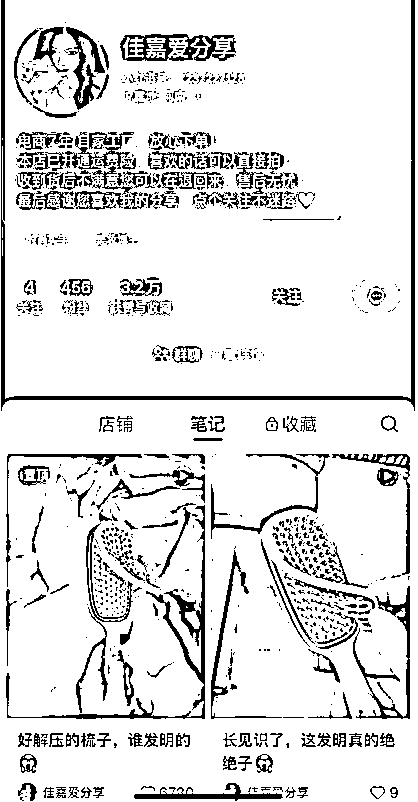


1.  蓝海品筛选标准

# 1\. 本章概要

完成开店和赛道定位后，就可以开始选品啦，这个动作将贯穿整个航海，同时也是这个项目的最关键部分。

✅ 蓝海品筛选标准

.

蓝海选品评分表⭐

✅ 蓝海选品思路

✅ 蓝海选品方法

.

传统电商平台-淘宝选品

.

从其他兴趣电商平台-抖音选品

✅ 蓝海选品案例

✅ 测试账号是否正常，如果账号正常且优质，即可绑定店铺

对于新手来说，你需要先在小红书刷足够多的爆款对标，了解哪些品在小红书上会爆，积累选品体感，再去淘宝/抖音其他渠道选适合小红书的品，有助于提高测品效率。

# 本章航线图

完成本章节的学习和实操，即可完成航线图的：

第二阶段：【选品】完成蓝海选品（约 2 天）

.

选择至少 1 个带货类目（约 1 天）

.

学习蓝海选品方法，选出至少 3-5 个品（约 2 天）

.

确定你的货源能跟竞品做到同货源/同等级质量（约 1 小时）

.

发 3 篇产品相关的流量型笔记，测试账号流量是否正常（约 1 小时）

# 2\. 蓝海产品的定义

不管是传统货架电商淘宝，还是兴趣电商小红书，对蓝海的定义就一条：自己干得过的就叫蓝海，自己干不过的就是红海。大家可以结合自己的情况来判断。

蓝海电商，一般来说，市场容量都不会很大，也就是说销量不会太猛，所以大家在选品的时候，尽量选高客单，高利润的品来做，这样利润就会有保障，做起来也会比较轻松。

蓝海电商的产品，可以分为标品和非标品。

标品一般在小红书都有同行参考，优点是做起来会容易一些，缺点是容易被跟，从蓝海到红海的时间周期很短；

非标品是指在小红书没有同行参考，你就是第一个做这个品的人，非标品的优点是生命周期比较长，缺点是做起来比较困难。

鉴于此，本次航海，主要给大家介绍【小红书电商蓝海标品的打法】，让大家尽快拿到正反馈，树立信心，早日步上正轨。


1.  高客单蓝海选品的标准

什么样的产品是合适的产品？

我们选品不要凭借感觉，最好选择已经爆过或者正在爆的产品，才能有更大的爆率。

总结了 6 个选品的基础原则，不管选择什么样的选品方法，选中的品都尽量符合这 6 个原则。

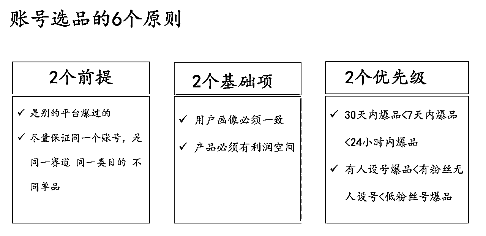

本期航海，推荐的高客单选品标准如下：

价格带：建议 50-2000 元，高利润、低竞争

利润率：建议≥30%，结合竞品定价和 1688，闲鱼货源渠道进行利润测算

【重要】更详细的选品标准，可以对照下方表格，来进行选品判断：


# 4\. 蓝海选品判断维度

序号

名称

判断标准

原因

1

产品数据分析

以小红书同行数据为主

（表格下面会具体列举）

在其他平台选到品后，最终选品的数据分析，要以小红书平台的数据为主，其他平台的数据为辅，不要主次颠倒，因为有些圈友可能会过度迷信第三方软件的数据。

2

对标账号粉丝量

<5W

对标账号粉丝量更高，不利于模仿

3

是否会侵权？

淘宝同行数量不能少于网页版淘宝一页

淘宝数据更全，更利于分析是否会侵权。更多分析产品是否会侵权的方法，可以看这篇文章 https://scys.com/articleDetail/xq_topic/4848122548858458

4

近期销量如何？

看对标链接的近一个月的评论数量，近一个月评论数量要>100


5

是否是季节性产品？

看对标链接的评论是否出现季节性减少，比如这个品 11，12，1，2 月的评论是个位数，说明这个品是夏季用品，冬季几乎无销量。

避免选到季节性产品，反季销售不好出单

6

对标账号流量来源

以笔记为主，看对标账号的笔记数量是否够多，以及是否有爆款笔记。

如果账号只有几篇笔记，但有上万的销量，那说明不靠笔记获得流量，有其他流量途径，就不适合做我们的对标。

我们的流量来源以笔记为主，那么选品对标号如果也是以笔记为主搞流量，更有利于我们起号

7

产品是否有回购

看产品链接下方账号的回购数据


8

预估产品销量

看链接下方的三个月总销量，再平均近期三个月的月均销量；如果上架还没满 3 个月，也可以通过第一条评论来大概估算上架时间。


9

货源

货源以 1688 和闲鱼为主，不要拿拼多多做货源。

拼多多做货源容易出现无货源导致封店的问题，拼多多面单没处理好也容易暴露信息。

10

1688 和闲鱼没有货源咋办？

换品。利润过于诱人的除外。

# 5\. 蓝海选品评分表⭐

【小红书选品评分表】，可通过网盘下载，链接：https://pan.quark.cn/s/dfdea328201c

表格使用教程：生财 | 小红书选品评分表 使用教程

怎么判断一个蓝海产品值不值得去做？本期教练给大家整理了一份选品评分标准，根据每个环节的重要程度进行比例划分，最终汇总成了这个评分表格。大家找到对标竞品 ，填入竞品相关数据，就能得出这个产品的分数，满分 10 分，8 分及以上，说明这个品可以选。

注意：选品表格只能从数据层面，辅助你判断这个产品当下能不能去做。

具体这个产品你能不能打得过，产品是短期还是长期的，这些方面需要大家自己主观去判断。因为每个人的拍摄能力、资源都是不同的。


蓝海选品比较稀缺，选品定生死，只要选出好的品，剩下的就是水到渠成；所以本期航海就不给大家推荐选品了，重点在于教大家掌握蓝海选品的方法，自己去挖掘。

1.  蓝海选品思路与方法

# 1\. 蓝海选品思路

在讲具体方法之前，我们先梳理一下小红书选品的思路。

选品方法有很多，整体来讲不外乎三个大思路：

1、日常多刷小红书站内爆款选品

我们在小红书卖东西，肯定要了解平台最近哪些品比较好卖，多刷多看，有条件的也可以通过灰豚看数据、找低分爆款来选品。

不过一般新手不建议直接上工具，平台多刷就够了，还能培养下网感。

2、从传统电商平台-淘宝选品（推荐⭐）

即从淘宝找合适的品。淘宝的分类页面，有目前国内所有主流搜索电商平台里，最全面的类目；而且淘宝作为电商平台，相对是最成熟的，也不需要用到任何付费工具。

常用的方法有：淘宝分类页面选品、淘宝神店榜选品、淘宝榜单选品、天猫榜单选品。

3、从其他兴趣电商平台-抖音选品

即从跟小红书一样靠内容带货的平台找，目前建议从抖音找合适的产品。

这时候我们常用的方法有：考古加选品法、蝉妈妈选品法、抖音精选联盟的创意中心选品法等

所以，在正式选品前，建议大家先刷至少 2 小时的小红书，对平台当前爆品增加些体感。


# 2\. 蓝海选品方法

如果你已经完成了刷 2 小时小红书平台，接下来可以开始选品啦。这里给大家提供 2 种选品方式，优先推荐通过淘宝选品，其次是抖音选品（原因上面有说）。

好的选品方法，用一种就够了，前期可以多试几种，有了一定选品能力之后，找到最适合自己的一种选品方法即可。

看到意向品之后，就按照【01\. 蓝海品筛选标准】给到的蓝海品筛选标准，来判断要不要选这个品。

# 2.1 选品方法一：传统电商平台-淘宝选品

# 2.1.1 利用淘宝分类页面选品（推荐）


淘宝的分类页面，有目前国内所有主流搜索电商平台里，最全面的类目，不过和亚马逊比还差了一点，亚马逊的分类词更丰富。

大家可以从淘宝的分类页面里，去选择适合女性用户的产品词，拿到小红书上去搜索。

选品初期是会比较枯燥和乏味，挨个去小红书平台看数据，这一步没法省。


# 2.1.2 利用淘宝神店榜选品

淘宝神店榜是手机淘宝出的一个板块，对于小红书选品来说还是很好用的。

步骤如下：

.

手机淘宝页面，点击“全部频道”


.

搜索“神店榜”


.

进入“神店榜”之后，会有很多类目，点击想要的类目，比如“潮玩宠物”，然后咱们点击“浪漫婚礼首饰热卖榜”

.

进入这个页面后，几乎都是卖婚礼首饰的店铺，最上面也有几个分类项，“黑马榜”和“回头客榜”值得一看。


.

点击店铺后，按销量排名，就可以看有没有自己喜欢的品了，如果有，就到小红书去搜索关键词，看看该产品在小红书上的数据如何。

这套选品方法，不仅可以用于小红书，还能用在淘宝、闲鱼等平台。（抖音亲测不太适用）


# 2.1.3 利用淘宝榜单选品

.

手机淘宝，点击搜索框

底部会出现一个最近热销产品榜单，这个榜单每个小时都在实时更新，这里面有些品，也适合拿到小红书去做。

这个榜单里的品，都是最近淘宝搜索热度猛增的品，有很高的时效性。


# 2.1.4 利用天猫榜单选品

.

手机淘宝，点击“全部频道”


.

搜索“天猫榜单”


.

顶部有很多分类选项，点击自己想要的分类，比如“母婴”，就会出现很多母婴用品，我们选择第一个，“宝宝沐浴露好价榜”，就能看到目前天猫卖得比较好的产品


这些产品有些和小红书是有一些信息差的，天猫竞争激烈，小红书的竞争可能没有那么激烈。


# 2.2 选品方法二：从其他兴趣电商平台-抖音选品

抖音创意中心是抖音自己的数据统计，实时更新，相对比考古加来说能够更加快速的知道新爆款。

其中建议百货等大众品类注重一下【抖音创意中心选品法】。

抖音的流量和玩家更多，这类大众品在抖音先爆起来的概率更大。

小红书有时候很慢热，这类大众产品基本都是混剪、素材同质化，等到小红书已经爆起来你再去做素材可选度会低，所以不如直接在抖音开始爆的时候就搞过来。

我们的爆品如硅胶保湿袜、雪地靴刷子、钢丝抹布等都是通过抖音创意中心选品法选到的。

具体步骤如下：

1、打开抖音橱窗——选择创意中心——可以选择爆款视频/图文带货形式

（还没有开通橱窗的末尾附开通教程）


2、可以根据时间维度、品类维度以及作者登记等维度进行选择，前期大家主要看时间维度和品类维度即可；

3、近 1 小时和 24 小时都要看，这都是抖音实时统计等爆款带货视频，如果在看的过程中有发现符合我们上面提到的【选品的 6 个原则】的品，就可以考虑进一步判断后上架测试一下。


# 3\. 蓝海选品案例

这里拿具体案例给大家展示下，什么样的品是能快速拿到反馈的蓝海产品。

比如我通过上面的选品方法，刷到了 2 个意向品：

第一个产品案例：kitty 手工编织包

第二个产品案例：小戒指


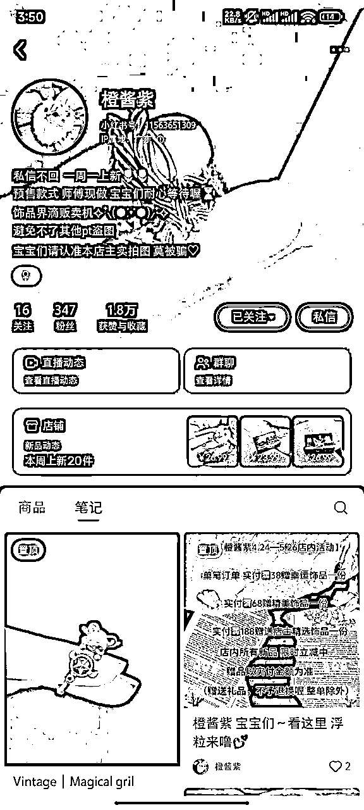


我去小红书找到对标竞品，初步观察对标数据情况：

粉丝量＜500、笔记量＜600，说明竞品账号权重不高，我们只要多发笔记就能超越他。

21 小时加购＞100，说明竞品现在正小爆 销量是真实的，他值得我们去竞争。

然后把对标竞品数据填入【选品评分表】，就可得出相应分数。

kitty 手工编织包 9 分

小戒指 8.1 分

都在 8-10 分之间，可以选择进入下一步测品阶段。

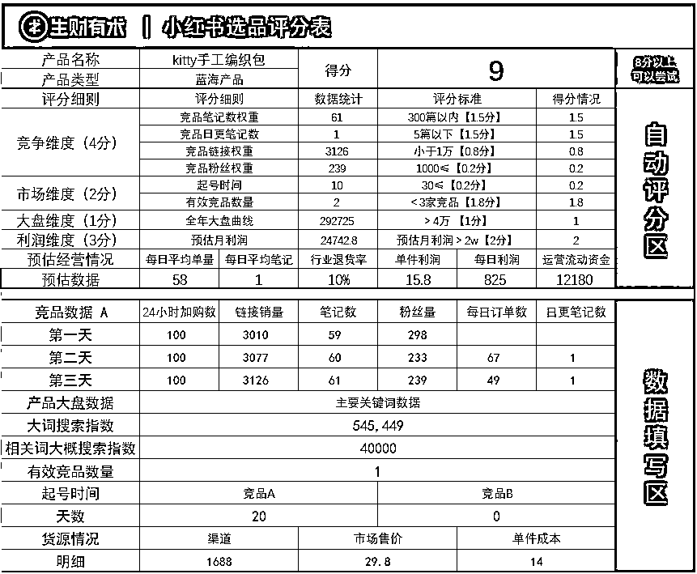


1.  测试账号是否正常（重要）

为什么要测试账号流量？目的是确保账号流量正常。

每个账号的初始权重都是不同的，会影响每个账号的爆文概率。新账号可以简单分为：废号、正常号、优质号，每个类型其实都会出爆文，只是每个账号的爆文概率是不一样的。比如同样的笔记内容，发废号 100 篇爆 1 篇，发正常号 100 篇爆 5 篇，发优质号 100 篇爆 15 篇。基础太小你是感觉不出来的，一旦基数大了你就会明显感觉出来。

测试流程（每个账号都要测）：

1、发布一篇和产品相关的流量类笔记

2、发布一篇和类目相关的流量类笔记

3、发布一篇和人群相关的流量类笔记

笔记发布后的 48 小时后，如果单篇笔记小眼睛＞1000，则为优质号；单篇笔记小眼睛＞50 且＜1000，则为正常号；单篇笔记小眼睛＜50，则为废号。

发布完 3 篇流量类笔记 48 小时后，如果账号是优质号或正常号，可直接使用；如果账号是废号，则再发布 2 篇时事热点类笔记 48 小时后观察，若单篇笔记小眼睛＞100 则可判断为正常号。

举例：以 荞麦枕 该产品为例

产品相关的流量类笔记（笔记标题或正文必须带有产品名：荞麦枕）

类目相关的流量类笔记（笔记标题或正文必须带有产品一级词：枕头）

人群相关的流量类笔记（笔记必须表达该产品相关的痛点：脊椎不好的人）

时事热点类笔记（可以查看近几天微博热搜的话题，热度高的话题可小红书查询后，模仿发布）

产品相关-参考：


类目相关-参考：

人群相关-参考：

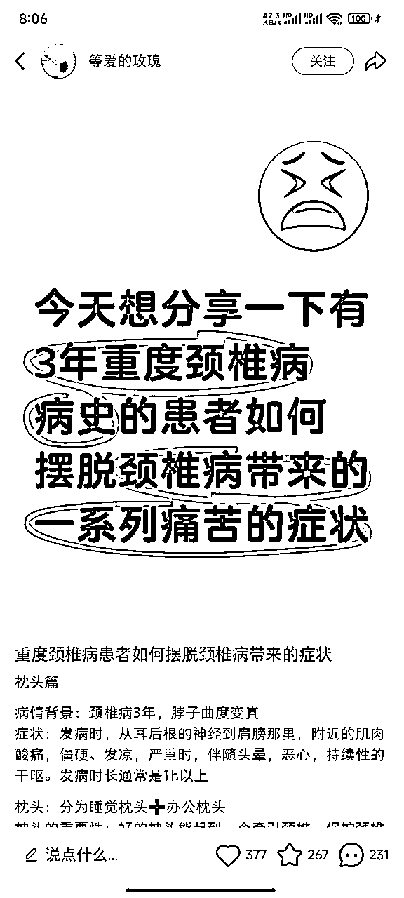

如果账号测试为优质号、正常号，即可绑定店铺。（如果是店铺账号就不需要绑定，不是店铺账号就需要绑定）

1.  下单货品（物流 1-4 天）

# 1\. 本章概要

当你完成了选品，下一步就是下单样品并实拍，一次性拍够一定的素材，进入测品阶段；前期进度可能会慢一点，但没关系，对于蓝海实拍项目，慢即是快。

另外，实拍并没有想象中的难，新手可以采用低成本布景＋苹果手机拍摄，后期制作也非常简单。

接下来，开始你的实拍之旅吧～

# 本章航线图

完成本章节的学习和实操，即可完成航线图的：

第三阶段：【实拍】下单样品拍摄（约 5 天）

.

首次下单 1 个样品，用于笔记素材拍摄（约 3-4 天）

.

每个品找 ≥5 个对标带货笔记进行拆解（约 0.5 小时）

.

模仿对标进行拍摄，每个品拍出 ≥200 张图（约 2 小时）

.

参考对标笔记，进行选图、P 图、做视频（约 2 小时）


# 2\. 如何下单样品

完成选品开店后，建议新手可先下单 1 个样品，用于拍摄产品实拍图。

第一步：确定要采购货源的产品

第二步：下单竞品（为了和货源对比质量）

第三步：在 1688/拼多多平台，以图搜图，优选 2-3 家店铺进行下单。店铺优先级：有标店铺＞销量高的店铺＞普通店铺（1688 平台有标是指：超级工厂/1688 严选/实力商家，拼多多平台有标是指：旗舰店/品牌/五星好店/百亿补贴）

第四步：收到竞品和货源的货物后，两者对比。同货源或质量相似，则可使用。如质量差距很大，则放弃。

注意事项：

.

样品下单环节，直接在自己店铺拍单即可；

.

供应商那边，如果想要长期合作，可以跟供应商确认下对接流程，是添加微信下单或走 ERP 下单。

这里补充说明下 2 种下单方式的区别：

微信下单是为了避免二次面单被平台判无货源；

ERP 下单是为了单量多的时候，商家可以看到我们店铺后台订单直接发货；

建议新手前期（单量少）可以直接走微信下单即可。

借样品流程：


注意事项： 借样品拍照的周期一般是一周，长一点的 2 周，要留意时间不要超时。


# 3\. 如何筛选长期合作的供应商

为了方便我们后面筛选长期合作的供应商，可以在下单样品的时候就留意供应商质量，主要观察下面这 2 个方向：

# 3.1 配合度

如果供应商不配合，后面发货、售后环节会非常吃力。

（1）是否配合电子面单

每日订单大于 10 单，就可以跟供应商沟通绑定「电子面单」，之后下单、发货，都能通过这里直接完成

但是前期直接沟通绑定面单，供应商不一定能同意，建议出单后去聊


（2）售后咨询回复是否及时

一件代发的前期对产品会有很多问题，自己还不够熟悉产品时，都需要供应商协助解答

如果一个问题，半天才回复的，大概率会影响小红书店铺的成交率

而且他们很可能就没有自己的客服团队，是比较小的供应商，这种通常不太稳定，说不定啥时候公司就没了

（3）发货是否及时

小红书店铺有发货时间的要求，通常是 24 小时、48 小时，越快发货越好

在确认供应商时，要确保他们的发货时间，最长 48 小时内就要发出，太长时间不发，小红书后台会扣推迟发货的费用，一般是 3 块钱

另外，如果个别情况无法按时发货，及时跟客户沟通，不要提前填快递单号！提前填了单号如果物流不更新，属于无效的，还是会扣钱。

（4）是否支持退换货

这个不强求，主要看退换货原因，如果是用户喜好问题的退换货，部分产品是不支持的。比如服装类，大部分供应商都不支持退货。

但是如果产品本身原因，是可以退换的，连这个都不支持退换货的话，这家供应商就不值得合作。


# 3.2 产品方面

（1）价格

刚开始谈一件代发，量小，一般没什么价格话语权。当每日订单稳定在 50+，可以跟供应商沟通更低价格合作。

同时，需要确保自己的价格在同行中是否有优势，如果自己的成本价，是其他同行的卖价，且产品一摸一样的话，说明供应商没给你低价，这还不肯降价的话，可以换了。

（2）款式

有些产品更新迭代的速度很快，比如手机壳、穿戴甲等，要看供应商是否能及时更新新款，以及看有没有开品的能力。

有些小众蓝海品，对供应商开品能力有非常高要求，尤其是「设计师出品」的珍珠项链、饰品等，没有很好的款式，也不开发新品的话，这种供应商也不太适合长久合作。

（3）质量

质量就不用说，一定是最关键的，一个产品如果质量不好，一定会产生大量的售后，处理售后非常麻烦，而且不赚钱。

（4）补货实效

供应商也是有工厂和销售、门店的区分的，门店的货发完，短期内可能无法及时发货，就需要补货；

一般好一些的供应商补发≤48 小时，这也不会影响小红书的发货时限；

如果长时间不补货的，这种也不值得长期合作。

1.  学习如何拍摄

# 1\. 拍摄对标拆解

以 旅行包笔记 为例

带货笔记图片基本是由：场景+产品+角度+光线+构图+陪体

可以先简单理解成：在什么地方，把产品放在哪里，站在哪个位置拍。

在高铁上，把旅行包挂在上面，我站在它的侧面拍摄

再进一步要求就是：自然光+旅行包在图片中心位占比 50%+打开车窗 窗外风景增加图片层次/绿色桌位凸显白色质感

笔记的首图是决定点击率的，最后两张图是决定转化率的。

所以最后两张图片，是用来凸显旅行包的质量的，所以要拍多角度图+细节图


# 2\. 低成本拍摄方案

一般拍一次至少要有能发一周笔记的素材量。

如果每天 6 篇，每篇 3 张图片，一周就是需要 6*3*7=126 张图片，再结合出片率（拍完后 要删除不适合的图片），至少一个品一次要拍 200 张。

为了方便理解，教练录制了一段低成本拍摄教程视频：

WeChat_20250326173759.mp4【在线播放】

对于新手入门，初期拍摄可以参考爆款对标，1:1 复刻进行产品图片的拍摄，减少拍摄弯路。

原图


模仿拍摄


对于有一定拍摄经历、可以复刻对标笔记图片的，可以尝试【进阶版 live】拍摄，重点提升自己的审美技术。

实拍教程如下：

# 2.1 场地布置

根据自己的选品有针对性的布景，整体要尽量干净、整齐，新手一般采用纯色背景。（可以选择纯色地板、柔软的沙发、暖色系床品、仿剑麻地毯等）

如果产品较大的，布景范围也要大。如果是香薰、相框等，只要有个书桌、地毯也够了


如果一些水杯、包包、鞋子等，在外面拍摄的，可以选择柏油路做背景

更多的布景方案，可以在小红书搜索「布景室内」，里面有很多博主分享自己的布景方法，在里面挑选适合自己的产品的布景就行


新手建议：

1.能室外拍摄的产品，如鞋子、包包、水杯……，直接找附近柏油路，拍摄时拉低曝光度

2.无法室外拍摄的产品：如香薰、礼物，买一个仿剑麻地毯就行，大约成本在 35 元左右


# 2.2 光源选择

尽量选择在窗边、自然光线下、顺光条件下（人物面对光源的方向，顺光可以避免画面曝光或者发黑），这样拍摄出的图片是最高清、还原度最高。


如果是书桌拍摄，也尽量靠在落地窗边，这样可以确保画面中自然光是充足的

光线不够的话，可以在侧后方放一个补光灯，如图 1 ，灯的位置和人的位置可以自行调整，根据自己拍摄场地的情况来

前期可以每个角度试一下，看哪个位置拍出的色彩最还原

注意，如果没有补光灯的话，不要采用图 2 的角度，否则会有一块很明显的阴影后期很难处理

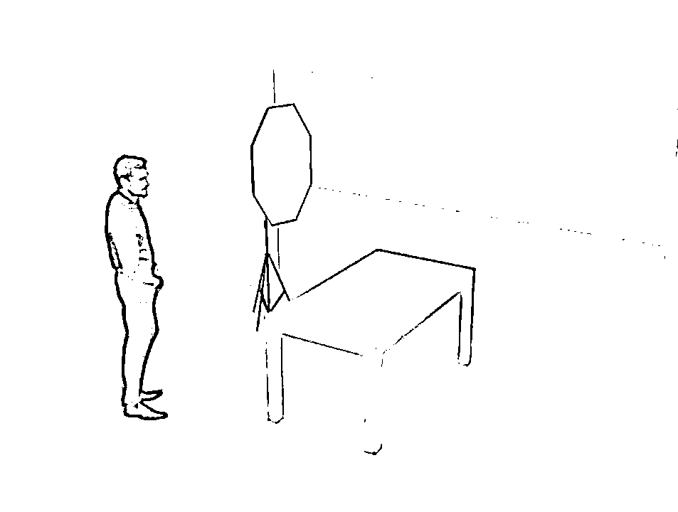


# 2.3 拍摄工具的选择

尽量选择苹果手机，不会自动美颜，还原度较高。下面以苹果为例提供一些参数的参考。

手机型号建议 iphone xr 以上的机型，如果有条件，选择 pro 的机型会更好，后面会说原因

# 2.4 拍摄角度与构图

景物拍摄时，可以根据产品的大小选择是否放大/缩小拍摄。

如大衣、长开衫等单品，需要放到大环境里去展现，要拍摄产品全貌，就用 1 倍焦距拍摄（正常打开相机就是 1 倍）；

如果要拍摄香薰、杯子等小物件，或者拍摄产品细节，就要放大 1.5、2 倍拍摄

这时，如果是 pro 机型，可以直接选择 2X 焦距，拍摄会更有质感


不同的产品，拍摄角度会不一样，构图风格可以在小红书多学习一下

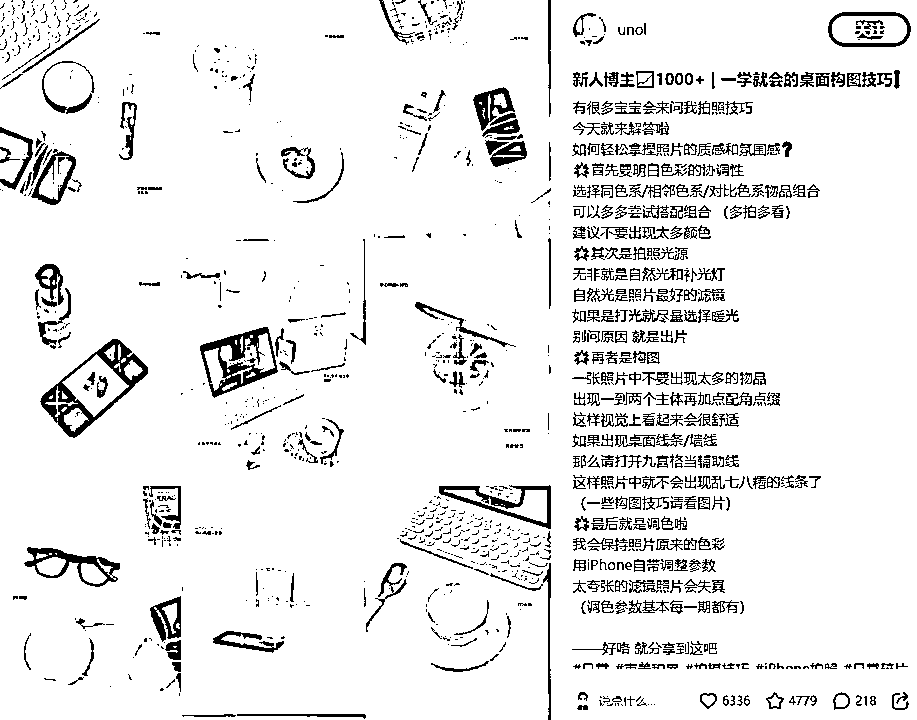


# 2.5 四大拍摄注意点

1.图片清晰度：实拍素材的高清度是关键（苹果手机可以尝试上文的参数调整，非苹果手机拍摄时应关闭自动美颜等功能），在保证图片清晰度质量的情况下，不用过度关注爆款模板，大部分产品图片都很简洁，越花里胡哨的模板，出货量越低。

2.突出功能性：突出功能性即解决用户的痛点，在内容中直接解决用户疑问。如光腿神器产品，用户会担心褶皱、肤色问题，所以在拍摄时，可以同时解决用户问题，展示产品不褶皱、裸肤色的特点，提高顾客的信任度。

3.打光：打光是为了让拍摄效果更接近肉眼看到的视觉效果，切忌过度打带颜色的灯光，选用靠近窗边的自然光源，色调最舒适，也能很好的避免货不对板。

阴天光线不足的情况下，可以这样打光：


4.拍摄曝光度：

拍摄时，只要在正常的自然光线下，都可以在聚焦产品后，下拉一点点曝光度（小太阳），让整体画面更清晰，光线更干净，可以看下图 1 和图 2 的区别


1.  后期制作

1.  筛选图片

平台评判同质化逻辑：图片/视频的相似度超过 50% 且 笔记文字内容超过 50%，则会被判断低质量/同质化营销。

图片是由一块块像素组成，但平台算法计划不会精确到每个像素格，只会精确到到一个区域一个区域的色块。所以只要大色块相似度不高即可。

视频是有一帧一帧图片组成，但平台算法计划不会精确到每一帧，只会精确到零点几秒的视频内容，所以只要每秒的内容不同顺序不同即可。

新账号前期稽查不严格，筛选图片可以适当放宽标准，爆款笔记首图可适当使用 2-3 次，但文字内容要不同。

选图标准：同背景同光线同构图的素材，不能超过 4 篇笔记。

视频标准：每秒的素材要不同。

ps：平台对素材审核这块只会越来越严格。


1.  图片后期制作

图片制作比较简单，不需要太复杂的后期：

1.  调色：目的和打光一样，都是为了还原肉眼色彩效果。这个没有统一的模板，不同图片的调色参数不同，可以小红书搜调色攻略，自己多试试，调到跟自己肉眼看到的图片颜色一致即可。

搜索关键词：调色参数、暗调调色、ins 调色、清透感调色……

1.  滤镜：一般不建议过度添加，若手机美颜/滤镜过度，可以适当调整

1.  花字：实拍图的花字不建议添加太多，如果一定要使用，建议选用一两个简短的词。文字太惹眼容易喧宾夺主，大图应注重主体。


为了方便理解，教练录制了一段图片后期制作的教程视频：

WeChat_20250326171452.mp4【在线播放】


1.  视频后期制作

蓝海产品的视频制作比较简单，除了部分产品需要拍摄详细的产品视频，大部分都可以用剪印的「一键成片」和「营销视频」功能

1.一键成片

点「一键成片」，选择好素材，可以选图片、视频，点下一步，就自动生成了视频

这类视频只有音乐、卡点，没有文字，展示产品就够用了

copy_97DB7C08-528E-409D-99F1-F50736AB78F9.MOV【在线播放】

2.营销视频

打开剪映的「营销视频」，输入产品名字和部分卖点，就能生成一条营销带货视频，可以自行剪辑

这类视频营销感会重一些，适合需要文字解说的产品

为了方便理解，教练录制了一段视频后期制作的教程视频：

视频.mp4【在线播放】

1.  如何提升拍摄素材的利用率

同一张图片在小红书不能重复发布多次，否则会触发「大量发布低质/重复交易笔记行为」的处罚

但是既然拍了，肯定要让素材多利用几次，我们总结了一些能提升素材使用率且不重复的方式

1.拍 live 图 转 静态图

一般情况下，苹果手机的 live 图会记录拍照的前后共 3 秒视频，然后选择一帧做主要展示画面

如果画面幅度较大，可以在相片中选择另一帧画面做封面，这样静态图就相当于换了一张图片

一个 live 图，可以拆分成 N 张图片发

但如果画面浮动不大，小红书可能还是会判定为同一张图片

图 1 是原图，图 2 是换了一帧的画面，多了一只鸭子，就像是另一张图了，但都是一个 live 图里的

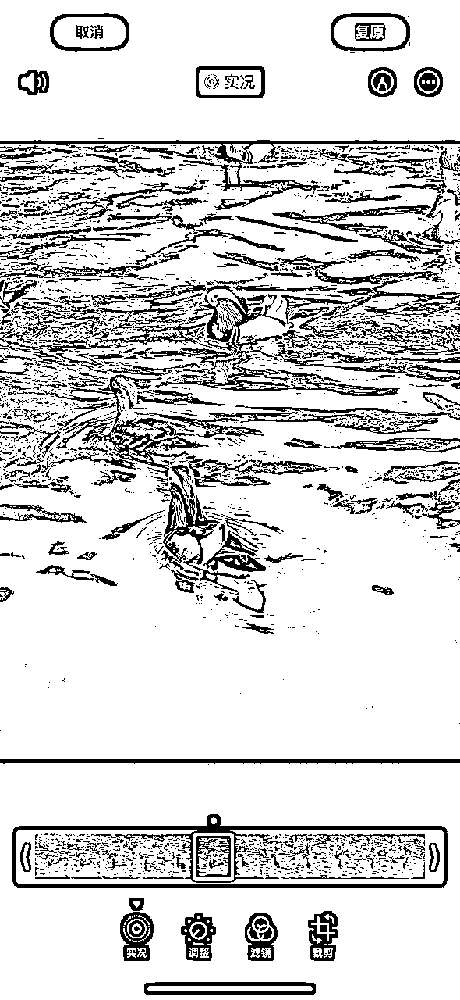

2.拍 live 图，转视频

live 图本身是 3 秒的视频，可以把图片转换成视频

转成视频后，用多个素材重新剪辑在一起，做一个全新的素材，跟混剪的做法一样，但这些素材是自己拍摄的，原创度很高

或者用一键成片、营销视频重新剪辑一遍就能用了

1.  注意事项

# 1\. 评论区运营

小红书挂产品链接的笔记流量普遍比不挂链接的低。

这是因为，在挂了商品链接后，平台会倾向于推荐给「电商消费人群」，这些人在小红书有比较强烈的购物习惯，好处就是产品转化率会更高。

不挂车的笔记，会当成普通笔记推荐，按算法推荐分发，面向的是所有用户，好处就是浏览量会更多一些，

如果发布笔记没有挂链接的话，一定要在评论区置顶链接、产品购买引导图，或者在评论中直接回复产品链接。


# 2\. 封面测试

实拍非常依赖封面点击率，前期不要自己发挥创意，严格参考同行爆文去拍图

看同产品下，哪一类型的封面出现次数最多，爆文最多，说明这个封面是点击率最高，用户最喜欢的封面

比如光腿神器，以下封面相似的角度，不同账号发都能产生爆文，说明这个封面的点击率是不错的

在拍摄封面时，就可以针对这一角度多拍摄几张，测试封面点击率

多找几个「爆款封面」拍摄，看哪个角度更适合自己


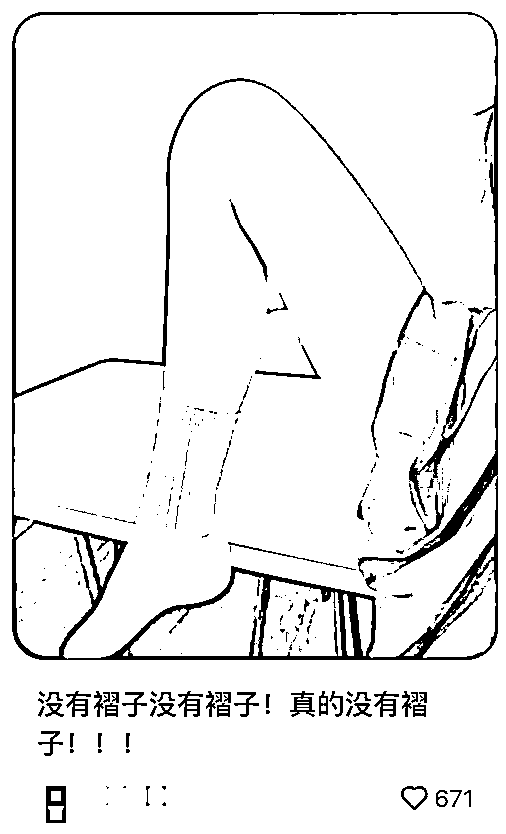


# 3\. 拒绝“杂货铺思维”

小红书高客单蓝海，跟无货源电商不完全一样，经营的类目、产品要更加垂直

比如，可以专注“户外美学”而非泛家居用品，这样可以避免人群标签混乱

再比如，「盖个帽儿总店」的账号，虽然不是高客单，但她就专注于大头围帽子这个赛道，单品类蓝海，也卖爆了几个产品

1.  准备测品

# 1\. 本章概要

每选好一个品，我们就需要通过测品来做检验。小红书测品，其实本质是测大家搞流量的能力，当然，前提是“链接页面的转化率”已经优化好。所以测品能不能测出来，除了选品质量外，还要看这两个因素：

✅ 商品链接质量：保证流量的转化率，是搞流量的前提；

✅ 笔记质量：搞流量的能力，不同商品适合的笔记形式不同。

接下来，开始测品吧～

# 本章航线图

完成本章节的学习和实操，即可完成航线图的：

第四阶段：【测品】发布实拍原创笔记（约 7 天）

.

上架至少 1 个商品，并优化商品链接（约 1 小时）

.

参考对标制作带货笔记，存草稿备用（约 1 小时）

.

单个品每天发 3-6 篇笔记，持续发 7 天（约 1 小时/天）

.

每天复盘商品链接，判断是否继续优化二轮测品（约 0.5 小时）

.

持续复盘优化笔记，直到出一篇爆文（约 1 小时/天）


# 2\. 学习测品的逻辑

测品的本质：选品的验证。

测品是对选品的验证。选品阶段通过对同行链接的数据分析，大概能判断出这个品目前在小红书平台的竞争大小，月毛利润，流量多少等等数据，但这些数据仅仅来源于纸面分析，具体我们选的这个品能否赚钱，还需要靠测品来检验。

选品更偏重理论分析和经验判断，测品更偏重实操，测品是检验选品是否正确的唯一方法。

小红书测品，其实本质是测大家搞流量的能力，因为产品足够细分，搞来的流量一般都会比较精准，只要流量稳定，基本就能出单。

当然，前提是【链接页面的转化率】已经优化好。

测品的周期：一周。

小红书高客单蓝海电商，走的是精品路线，不像店群需要上很多链接，同时，一个类目的品可以都放在一个店铺，所以，也不需要一个小红书店铺对应一个品，这也太浪费，所以，一般来说，一个小红书店铺里放<20 个品都是可以的。

我们的实操经验是，一个品一个品的测，最好是上一个品，测一个品，把品全部上到店铺也可以，但要从选品数据显示的最好的那个品开始测。

每天发布 3-5 条笔记，尽量不要集中发布，一般测个一周时间，能出单的品也就出单了。

小红书蓝海电商的出单一般是比较快的，因为产品足够细分，引来的流量也足够精准，在链接页面转化率没问题的情况下，如果你一周内没有出单，就要考虑换品。

只要一周能出单，就继续做，提升大家搞流量的能力，一般来说，新人需要 2-3 个月才能保证流量稳定，才能保证稳定出单。

当然，有些产品是有流量高峰的，比如玄学产品，各类考试日前夕，比如中考，高考，考验，考公等等前夕会迎来流量小高峰，这个需要大家在选品的时候，通过分析数据发现，然后选好测品时间，如果在选品的时候没发现这种时间节点，完美避开了这些流量小高峰，做起来就会很辛苦。

（玄学产品虽然利润高，但做起来有难度，容易违规，对新人不够友好，新入行的圈友还是挑其他类目做，更容易拿到正反馈。这里只是拿它举例，不代表推荐大家都去做这个类目。)

给大家准备了个【测品流程】表，看起来更直观些：


# 3\. 测品前准备工作（重要）

在测品前，我们先上架商品链接、并确保链接页面的转化率已经优化好，具体操作如下。

# 3.1 上架商品链接

# 3.1.1 商品主图详情页

千万不要做淘宝那种特别专业的美工图，详情图，主图最好都是小红书风格的图片，更有真实性。如果后续你是实拍的图或者视频，建议把详情图也都换成笔记里实拍的风格，让用户有”所见即所得“的感觉。

比如下面这个账号这样详情页和视频是同一种风格。

还有下方这个，详情图就直接用了主页笔记的图片，用户一看就知道你是实拍。


# 3.1.2 商品定价

很多人觉得把 pxx 商品搬到小红书提价 3 倍照样卖，但小红书的用户并没有那么傻。我有问过 50 多个女大学生，大部分人还是还是在淘宝，拼多多，得物下单，而且现在大学生很多都会去比价。

产品定价这块我会去搜淘宝和拼多多销量靠前的店铺，定价在这两个平台的区间范围内。很多用户即使比价后，发现价格比淘宝略便宜，考虑到我们视频是原创拍摄，打的”所见即所得“，她们基本上都不会在其他平台下单了。

比如上面是随便在 pxx 榜单里看到的一条牛仔裤，价格 39，去搜同款在淘宝，按照销量排序，看到月销 1000+ 的基本在 70-90 价格区间，当然也有 40 多的。这个时候我可能会定价在 59-69 这个价格，具体计算自己的利润率。


我们做女装类目的商品浏览到下单的转化率一般在 4%-7%，如果低于 4% 可以考虑调整下定价。其他类目不清楚。或者定价前去小红书多刷一刷，观察同行爆文左下角挂的商品的累计销量。

在实操中，定价非常非常重要！！！特别是低客单价商品，很多伙伴有 2 个定价误区：

.

认为小红书用户质量高，一个劲加价

.

直接复制其他平台价格，不灵活调整

这里有一篇圈友 @V 小刀 的星球帖，分享给到大家更细节的商品定价方法：小红书电商系列细节篇


# 3.1.3 商品发布

① 手机端发布

小红书 APP 和小红书商家版 APP 发布流程差不多，都是比较简单的，按操作流程来就可以。

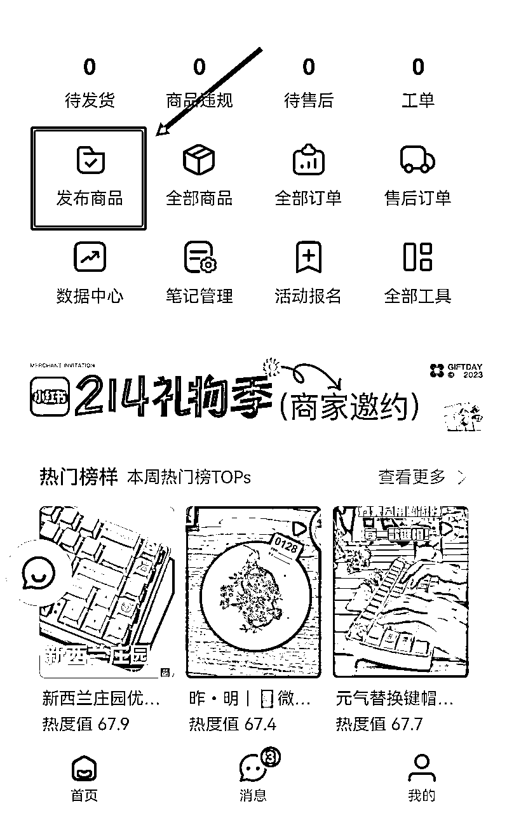

下面是商品上架流程：

1）编辑商品


注意：

商品标题和商品主图是必选的。

商品主图官方有对规格做了限制，图片以清爽为主，不要加太多标注文字。

如果商品首图不符合规格将上架失败，如果不符合首页推荐规则，不会在商场首页推荐。


2）设置商品类目

里面显示的就是个人店铺可以上架的类目，也可以用搜索框直接搜索，但是有些类目需要企业才能上，还要有相关资质。每个店铺类型，对应的可经营类目不同，具体可在小红书学习中心﹣规则中心﹣经营总览中查阅。

3）填写商品规格

商品规格是，如果一个商品里面有多种型号需要进行设置，如果只有一个不用管。

4）设置商品售价

根据你上架的商品进行设置。

5）设置库存数量

根据你上架的商品进行设置。

6）填写商品属性

根据你上架的商品进行设置。

7）填写商品详情

上传商品详情页的图片。

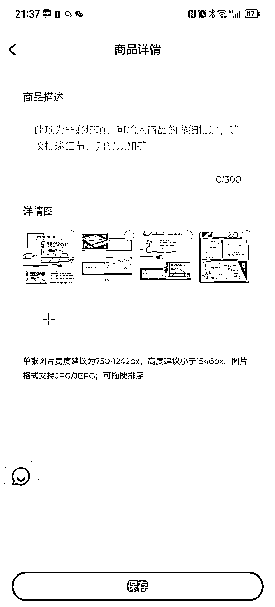

8）选择是否包邮

根据你上架的商品进行设置，可以选择是否包邮，系统目前默认两种：

全国包邮；

偏远地区不包邮（偏远地区：新疆维吾尔自治区/西藏自治区/宁夏回族自治区/青海省/海南省/内蒙古自治区/甘肃省）


自己设置运费模板，可以选择运费的价格，可以设置不同地区（只能在电脑端商家后台设置）。

先选默认的运费价格，然后再设置特殊地区的价格，可以根据件数，也可以根据重量。


9）设置发货时间

发货时间可以自己进行设置，可以设置当天发货，24h 发货，48h 发货和预售发货。

上架完成后点立即发货就可以了。

小红书的审核是机器审核，速度非常快，如果没什么大问题，发布以后立马就上架上去了。

② 电脑端发布商品

小红书商家助手网页版地址：https://ark.xiaohongshu.com

电脑端可以使用软件来一键搬家，也可以自己手动发布。

1）一键搬家软件

在店铺后台点击服务，进入服务市场选择一款搬家软件。一键搬家的软件在后台都可以试用，可以选择适合自己的进行软件搬家。

一键搬家软件入口：


2）后台手动上架

在小红书商家管理后台手动发布步骤如下：


① 根据自己产品的类目，选择好类目，点击下一步：

② 根据产品的属性，填对应的属性，带*的为必填，其他的选填项：


③ 如果遇到自己的产品品类没有开通（部分类目需要提交对应资质，后台会提示），可以在后台申请：


④填写完所有信息，就可以提交审核啦！

拓展资料：更多和产品上架相关的内容，可前往小红书商家课堂学习：

https://school.xiaohongshu.com/course/list?jumpFrom=school&categoryNo=20210515002


1.  优化商品链接转化率

在测品之前，需要确保我们的产品链接，在转化率方面不拉胯，以下六种方法，是我们经过实操，总结的能够提升产品链接转化率的方法，大家可以从这六个方面，来提升店铺链接的转化率：

# 4.1 发布晒单笔记

上架商品链接后，第一时间找找身边朋友从自己店铺下单产品，找到产品供货商（上家）发货；这一步做数据对后面出单很重要，建议都去做，尽量找朋友下单（下单到你自己家），避免用自己的号下单，主要担心没有 IP 隔离。收到产品后正常拍摄，多拍摄 live 图和视频，不同场景多拍几个，然后让朋友账号确认收货、好评，并发布一条晒单笔记（用你自己拍摄的素材）。

# 4.2 链接补评论

小红书店铺的新链接补 5 条及以上图文评价。想要提升链接转化，人为补评价是有必要的，最好是图文评价，至少补 5 条，5 条图文评价能达到边际最大化。

小红书补单主要为评价，流量需要靠笔记。5 条图文评价，找亲朋好友就能搞定；不想麻烦亲朋好友的，就找以前的客户；没有客户积累的，就找微信好友；微信好友也不想麻烦，那就闲鱼发布任务。

# 4.3 SKU 引导

咱们做的链接，大多数都是多 SKU 的，有时候 SKU 一多，会让用户有选择困难症，反而可能会降低转化率，在 SKU 名称的设置上，我们也能利用从众效应，让客户选择，我们想让他们选的那个 SKU。

以脐橙为例：


上图这个 SKU 的设置，就是很原始的设置，只有数据参数，没有任何营销性的术语， 很多时候客户一眼看过去，并不知道哪个更好，所以这条链接的 SKU 设置，在我看来很差。


上图这条链接的 SKU，就稍微设置了一下，最底下的那条 SKU 的名称，前面加了“好评最多”，这个链接的 SKU，比上面那条链接设置得稍微好一点，但在我看来设置得也不够好。

虽然客户看完所有 SKU 之后，目光被最底下那条 SKU 吸引，但也有不少问题。

首先是排序的问题，主推的 SKU 应该放前排，放最后排，是害怕让客户看到吗？

其次，主推的 SKU，肯定是要推利润高的呀，推尺寸最小的果算怎么回事？

最后，营销话术还有改进的空间。


我们再来看第三条链接，这条链接的 SKU 设置得算合格：

首先，主推的链接放在前排的，方便客户优先锁定，店主放在第三位的，其实把主推链接放第二位会更好。第一位放店铺客单最高的，锚定价格，客户看完第一条 SKU，价格 100，再看第二条主推 SKU，价格 80，觉得 80 不算贵，因为有 100 这个最高价做衬托。

其次，营销术语不错，除了主推 SKU 外，其他 SKU 都有营销话术。

最后，主推 SKU 前面的“好评最多”，可以优化成“千人好评”，“万人好评”，前提是销量够，销量不够，就用“好评最多”，用这种话术的目的，就是告诉客户，大家都选的这条 SKU，没问题的，闭着眼睛付款就行。

# 4.4 设置优惠券

设置一个高的初始价，再设置一个高的优惠券，可以让客户有捡到便宜的感觉，特别是对于非标品来说，非常好使，因为非标品没有同行参考价，你的标准就是唯一的标准。

# 4.5 用漂亮的模特

有些产品需要用到模特来展示效果，尽量用漂亮的模特，越漂亮越好。

比如：

祛痘产品，美白产品，需要用到模特来展示前后的效果对比图，效果图可以网上选，也可以让美工合成。

用来展示对比效果图的模特越漂亮，转化率越高，因为客户会自我带入，所以，如果用来展示效果对比的模特，比较丑，会起到反面效果。

人都喜欢好看的东西，特别是女性，都希望自己更美，更漂亮。

# 4.6 利用恐惧的情绪来提升转化率

人的情绪当中，有不少都可以用来提升转化，我们用的效果最好的，也是目前使用最多的，就是利用客户的恐惧情绪，来提升转化率。

比如：

卖儿童用品，会用“如果你不及时纠正孩子的某某行为，以后就会如何如何”，“孩子的同学们都在使用这种方法，你的孩子如果不用就会落后”等等类似的话术。

卖美容护肤产品，会用“如果你不舍得花钱来保养，你节省的钱就会被小三姐花掉来保养”等等会让用户感到害怕的话术。

需要记住的是，我们利用客户的恐惧情绪的最终目的，是为了转化，是为了卖产品，一定是为了成交而使用恐惧，千万不要单纯为了吓唬客户而使用恐惧。

# 4.7 用相似性来包装小红书账号

小红书的账号，店铺和笔记是相辅相成的，彼此不能分开来看。

首先，小红书的本质，不是一个纯正的电商平台，而是一个种草平台，种草平台的意思是，我有某项需求，买了某个产品，我使用之后觉得这个产品很棒，分享给了小红书姐妹，小红书的姐妹被我真诚的分享打动，去下单了这个产品。

所以，大家在做小红书的时候，给自己小红书的定位，不能定位成一个卖家，而是要定位成产品的爱好者，或者使用者。

因为如果你定位成一个卖家，那其他小红书的姐妹就是买家，你们之间的关系就是买卖关系，如果你定位成某个问题的解决者，某类产品的爱好者，你就跟有同样需求的姐妹们具有相似性，你们就能成为朋友，你们之间的关系，就是朋友关系，而不是买卖关系。

小红书的姐妹，会更相信和自己具有相似性的朋友推荐的产品，还是相信一个商人卖的产品呢？

其次，用相似性来包装小红书账号，那么就需要你清楚你的目标用户群体，大概的画像，以及圈子内使用的特定术语。

这些，都可以通过在小红书搜索关键词，去看笔记和评论，来得到相关的信息。

所以，大家的小红书账号，在性别一栏里，有没有设置为女性？大家的小红书笔记，有没有从你的产品的使用者的口吻，去推荐你的产品。 记住，你在小红书的定位，不是一个商人，而是你的客户的朋友，你们是具有相似性的。


比如，这个小红书号卖的是儿童用品，她的人设定位就是成长型宝妈，分享育儿经验，很容易获得小红书上宝妈们的信任，小红书上的宝妈会认为她是“自己人”，因为她们之间具有相似性。

以上，当店铺链接转化率没有问题之后，我们在测品的时候，只需要专心测流量即可。

1.  发布原创笔记进行测品

有了实拍素材，我们可以参考对标来制作带货笔记了，可以批量制作一批，存草稿备用。一般单个品每天发 3-6 篇笔记，持续发 7 天为一个测品轮回。

1.  图文 or 视频怎么选？

由于不同的品，适合的内容展现形式不同，得到的效果也会不同。

这个小节我会先跟大家举例说明，什么样的品适合图文，什么样的品更适合视频笔记，大家可以根据自己的选品，自行选择图文或视频内容形式。

比如百货赛道，大部分产品都需要把功能和应用场景展示出来，让消费者发现这个产品可以解决自己的需求，因此大部分的百货产品，是更适合视频笔记的。

图文笔记：

适合发图文笔记的产品类型，主要特点是：

图片更能直观地让用户一眼看到产品亮点、展现需求痛点；

小红书这类产品的爆款笔记形式，普遍为图文笔记居多（通过搜索关键词查看）。

这里举 3 个例子给大家找找感觉：

.

女装对于身材和搭配要求比较高，可尝试制作图文笔记

http://xhslink.com/m/6qH9642DBI1

.

裤子，实拍简单，抠图容易，可尝试制作图文笔记

http://xhslink.com/m/8V0BhHhf4M9

.

玩偶公仔，图文爆款多，可尝试制作图文笔记

http://xhslink.com/m/3dcU91iMzz

视频笔记：

适合发视频笔记的产品类型，主要特点是：

产品能在视频中直接展现实用的功能；

产品本身比较猎奇，能吸引用户观看；

产品需要真人出镜，塑造更强的 IP 感觉；

产品通过图片，无法让用户看到痛点，或展示亮点；

小红书这类产品的爆款笔记形式，普遍为视频笔记居多（通过搜索关键词查看）。

这里举 3 个例子给大家找找感觉：

.

百货清洁类，需要强展示产品，可尝试制作视频笔记

http://xhslink.com/m/5QNeVAAaBqC

.

日用护理类，展现实用与用户痛点，可制作视频笔记

http://xhslink.com/m/7aJQ9JjRbg6

.

解压玩具类，吸睛让用户停留，增长曝光，可制作视频笔记

http://xhslink.com/m/6WJJlA8mVbc

我们可以感受到，百货商品需要在内容中强调功能展示，因此视频笔记是更适合的内容展现方式，接下来我们一起来掌握视频笔记的制作，并通过「硅胶保湿袜」这个产品案例展现每个步骤的实际操作情况。


# 2.【图文】笔记制作

# 2.1 找到爆款对标笔记

寻找对标笔记的原则是「近期低粉爆款笔记」。这里有 3 个关键要素：爆款 ＋ 近期 + 低粉。

其中爆款＋近期的优先级 ＞ 低粉。即近期刚刚爆起来的内容，如果产品好，即使这个内容不是低粉账号，我们也可以进行模仿测试。

.

根据产品关键词（比如“无水暖袋”）搜索最热图文


.

继续下拉，找出高赞千赞笔记进行记录：


.

记录高赞笔记：

http://xhslink.com/o/60o4E3Vzrdf

http://xhslink.com/o/9I3eaDeHP2r

http://xhslink.com/o/HtfmudYSGt

http://xhslink.com/o/1k3d5hrG059

http://xhslink.com/o/46G97IXwfr2

优先对标这些爆款里的近期、低粉笔记。

# 2.2 模仿对标制作图文笔记

根据上面记录的 5 个高赞笔记，我们分为封面、标题、内容进行拆解模仿。

1）封面：


可以看出拿在手上场景拍摄为多篇爆款，可直接参考此主图进行拍摄。

如果像素不佳或者光线不佳，可通过调整滤镜，调成与爆款相同。

2）标题：

5 个对标爆款标题如下：

拼爹爹我爱您！大学生涯用烂两年！！

人手一个，拼爹爹根本割不到我！

四人寝人手一个，拼爹爹拜拜您嘞。。

六人寝室买伍，拼爹爹以前错怪您嘞！！

谁懂，图书馆掏出给我整沉默了。。。

可以看出此品关键词：大学生，寝室，拼爹爹。然后就可以根据这几个关键词，进行重新组合制作，比如：再也不拼爹爹了，女大寝室六人入了伍！

3）内容：

模仿基本相似，进行内容稍微修改即可。

注意，要避免文本被判相似，导致内容违规，如果大家把握不好度，可以参考下面 3 个文本模仿优化后的案例：

案例 1

原文：http://xhslink.com/o/60o4E3Vzrdf

优化后：

前段时间我老妈给我买的买的暖袋用充电宝的，怕宿舍功率不安全。

如果平时上课忘带充电宝，还可以用这里面的冲下手机哈哈哈。我一般都是开两档暖手暖被子之类的，现在还没到需要开最大档的时候太高温了。

这个冬天也不怕拉，摊开就直接是个小被子了

案例 2

原文：http://xhslink.com/o/9I3eaDeHP2r

优化后：

哈哈！其实是个暖手袋！重点就是还能当小被子用！！！

羽绒材质的！还能USB充电，还是用了！

平时还可当做充电宝用！贼方便！

案例 3

原文：http://xhslink.com/o/HtfmudYSGt

优化后：

姐妹们！谁懂一个寝室都怕冷的感觉！之前就是和室友团购买的无水暖袋，毛茸茸的很舒服！

去图书馆的时候，室友刚好来姨妈肚子不舒服就给她用了，这个东西这的呢很实用！

趁现在还没入冬，抓紧入手！

图文笔记制作关键：

产品的实拍，学习爆款对标主题的角度和场景进行 1:1 拍摄。

测品期间，笔记小眼睛数据都高于 500 以上，证明这个品是可以的，可以准备找供应商。

挂品的步骤如下：

1）发布笔记：


2）添加商品：


# 3.【视频】笔记制作

# 3.1 找到爆款对标笔记

寻找对标笔记的原则是「近期低粉爆款笔记」。这里有 3 个关键要素：爆款 ＋ 近期 + 低粉。

其中爆款＋近期的优先级 ＞ 低粉。即近期刚刚爆起来的内容，如果产品好，即使这个内容不是低粉账号，我们也可以进行模仿测试。

.

根据产品关键词（比如“无水暖袋”），搜索最热视频


.

收集记录爆款笔记

把视频素材下载下来准备混剪，把笔记标题也搜集起来作为参考。

# 3.2 根据对标制作视频笔记

.

先找同领域的爆款素材进行记录，找出自己能实现的拍摄方式，进行 1:1 的实拍参考。

.

拍摄手机一直拿着拍就可以了，不必担心拍的不好的地方。

.

拍摄完毕导入剪映进行剪辑即可，观察对标笔记进行剪辑优化调整即可。

笔记制作完成后，就可以发布笔记啦。同样的，可以等测品测出来后，再找供应商。

视频笔记制作关键：

.

混剪注意视频素材去重，搜集爆款素材进行去重混剪时，最好 5 个以上爆款视频进行混剪，单个素材重复太多会被判违规；

.

新手前期可以先做混剪，难度较低；长期来看，还是要做实拍，找到爆款对标笔记后，判断自己现有条件能否做到 1:1 模仿，如果可以就进行实拍；

.

单款产品发布混剪视频控制在 5 条内，然后可换其他款进行测试，如果混剪数据 24 小时低于 200 小眼睛，建议删除笔记，避免后期被举报，这样后续还可以进行测款。


1.  发布笔记

单账号每天发布 3-5 条笔记，尽量间隔时间发，不要扎堆发，重点是模仿爆款笔记，分析同行爆款笔记的评论，寻找痛点，以及分析自己笔记的数据，来改良优化笔记。可以蹭热点，也可以模仿其他类目的爆款笔记。

可以提前把做好的笔记，储备在草稿箱里（不要定时发布，有可能影响流量）。

发布入口可以选择官方支持的不同入口进入，有可能获得额外流量。在活动淡季可以直接发布。（下面 5 个都可以用）

入口一：从【创作灵感】入口发布图文


入口二：关注小红书官方账号，跟着官方活动发

比如美妆薯、家居薯等会经常发布一些活动，有机会可以得到官方扶持，被他们转发也会获得巨额流量。


入口三：参与热门活动，选择热门话题发布


入口四：千帆后台的商品笔记

完成每周的发布任务，会获得一定的流量券。


入口五：平台隐藏福利：生日券、后台消息等（要在活动期限内用完）


1.  笔记避坑指南

电商号的笔记，尽量做和产品相关的笔记，这样带来的流量是精准的，行业知识科普笔记，避坑笔记也可以，带来的流量相对比较精准，其他无关的东西就不要放到账号里，虽然流量可能比较大，但没法转化。

电商要的是精准流量，能够转化的流量才算精准流量，不能转化的流量，搞太多也没啥意义。

有些笔记可能只有几百个小眼睛，照样能出单，因为流量足够精准。

以下是几个典型的反面案例，供大家参考：

1）博眼球行为

什么是博眼球？可以理解为严重的标题党。

譬如市面上很多种草“标题党模版的”，举例：这张图片，所谓的吸晴标题，对于我们做店铺的，真的没有任何营养价值。


就好比 “朋友来我家吃饭，居然说我家很寒颤” 结果点进去菜品丰富，屋子也金碧辉煌。会让观众觉得，你在骗我，故意进来看你炫耀你多有钱一样，抵触这种行为，从而抵触这篇笔记。

再好比“sos，快来种草这个无广的国货！”结果一看，就是天天打广告的某护肤产品，会让观众极度不适。

2）调性不统一，定位不明确

爆款的标题模版、吸晴的标题，要理清楚适合什么样的内容。小红书我们可以定位店铺变现、引流变现、ip 变现，但这三者不要混为一谈。

很多人的情况是，有时候发自己生活日常，有时候发挂车笔记，有时候封面是纯色底图配大字，有时候是自拍照，有时候封面是四宫格对比图，有时候是平淡无奇的产品图……什么形式的封面都有，重点封面还挺 low，毫无美感。

3）价格跟受众人群的不统一

产品是面向的大学生人群，但价格却高的要死，你觉得会有人买吗

文案写着原材料很贵，但商品价格却很低，你觉得会有人信真的吗

时间有限，分享的运营层面就到这里啦，再补充一个，就是关于团队这块的注意点。

内容来源：《小红书店铺运营：如何提升点击率和转化率？》


1.  用 AI 提效（推荐）

# 6.1 用 AI 生产爆款标题

第一步，找对标仿写

我们会先把相关的爆款笔记下载下来（用新红、千瓜、灰豚都可以），整理出可作为对标的100条，微调之后作为测品期间的笔记标题。

所谓的微调，是保留重要信息，对于情绪词、语句顺序这些次要信息进行调整。

例如：vocal！洞洞鞋和夏天绝配！我们可以保留关键词“洞洞鞋”和“夏天”，其他的次要信息进行微调：

我丢！洞洞鞋和夏天真的绝配！

谁懂啊！夏天和洞洞鞋太配了！

夏天的快乐，洞洞鞋也太懂了！

用这种方法，写100条标题一小时就可以搞定。

第二步，对标出单笔记仿写

如果测品期间出单超过10单，这个品可以继续运营。此时在千帆--数据--我的笔记，查看出单的笔记，对标题进行批量仿写。

给DeepSeek以下指令：

给你提供100个小红书标题，请帮我总结这些标题中出现了哪些情绪词和场景，以下是我提供的100个标题：

（提供的这100个小红书标题，是步骤一里对标的100个原始标题）

deepseek会帮你总结这些标题中出现的情绪词和场景。

情绪词怎么用：

对于已经出单的笔记标题，更换20个情绪词，就可以得到20条新标题；每个标题在分别切换3个场景，就可以得到60条新的标题。这些标题作为接下来要发布的笔记，每天至少我会把这个素材发2条。

场景怎么用：

直接搜场景，看看有没有同行用这个场景来打这个产品，如果有点赞超过20个的商品笔记，那么你就可以铺笔记去打这个场景。把找到的能打的场景轮测一遍。发现出单好的场景可以大量铺笔记。

注意：标题很重要，所有的标题，我都会手动过一遍，AI只是辅助，总结，提炼，无法一套提示词直出。如果标题用AI直出的内容，实测流量会跌的比较厉害。

注意：标题很重要，所有的标题，都建议手动过一遍，AI 只是辅助，总结，提炼，无法一套提示词直出。如果标题用 AI 直出的内容，实测流量会跌的比较厉害。


# 6.2 带货文案正文提示词调试

# 6.2.1 提示词结构

角色+任务+产品描述+写作要求

```
角色：你是一位小红书店铺的个人卖家（这里加入个人标签，比如三胎宝妈等），要为你店铺中的商品写小红书笔记的文案。

任务：你刚刚忙完今天的发货订单，感觉很兴奋又充实。现在在写一篇小红书文案，推荐小儿积食贴。字数控制在50-100字。请以表格第一列的内容为标题写文案 ，文案的内容要与标题有很强的相关性。

产品名称：小儿积食贴

场景痛点：
宝宝肚胀/睡眠不安/食欲不振/频繁夜醒等生活化现象
家长育儿焦虑的情绪共鸣（如"哄睡崩溃""全家遭殃"）

成分描述：
天然草本原料（鸡内金/山楂/麦芽/神曲/陈皮/香附/厚朴等）
强调"成分表干净""看得懂的原料""外用温和"

产品特性：
透气质材：无纺布/纱布/亲肤材质+透气性+防闷汗设计
便捷设计：花朵造型/独立包装/易撕贴纸/便携性
使用场景：贴在肚脐上

体验描述：
家长主观感受："能睡整觉了""孩子状态更安稳"等
使用过程描述："贴上后温热感""孩子接受度高"

规避重点：
禁用词汇：治疗/疗效/治愈/解决等医疗指向性表述
效果转化：将"效果"转化为"家长观察到的体验变化"

情感引导：
同类推荐："闺蜜/同事妈妈都在用"
预防性提示："有备无患""日常调理"
紧迫感营造："别等孩子难受才后悔"

文案风格：
口语化宝妈视角+表情符号点缀
痛点场景→产品介入→体验改善的叙事逻辑
避免专业术语，使用"肚子软了""睡得香了"等生活化表达

写作要求：
语气风格：
亲和自然，像跟姐妹聊天
以分享经验为主，避免硬推销
开篇情绪要强烈一点，吸引注意力
适当使用表情符号增加活力

内容框架：
开头：点明自身身份，引出痛点
中间：介绍产品特点和使用场景
结尾：分享顾客使用反馈，邀请互动

注意事项：
不要提及任何医疗方面的内容，不要用任何医疗相关的专用词
不要强调这个产品会带来什么样的功效，如：用了这个能带来什么什么效果
段与段之间空一行，可以用emoji表情，不要有其他任何内容
```

# 6.2.2 如何让AI帮你写产品描述

打开deepseek官网，打开深度思考，然后把下面这段话发给它，注意红色字体是你需要填写的部分：

```
我是一个小红书店铺的主理人，现在在推广一款产品是XXXXX，我需要你帮我出一个提示词，让ai通过提示词生成对应的文案，我会给你五篇文案作为参考，帮我总结成这个产品的提示词。

要注意，不要提及任何医疗相关的敏感词，一定不要强调这个产品的功效，如，用了这个产品能给你带来什么改变，而是把用户带入场景中。

以下是给你参考的5篇同行文案：
复制5篇同行正文到这里
```

接着deepseek会给你回复一段提示词。

需要注意：你给deepseek的文案一定是你对标同行的文案，你们的产品是一样的，这样AI 给你提炼出来的产品特点卖点才比较符合实际。

# 6.2.3 调试提示词

把deepseek回复的产品描述，填写到结构化提示词中的【产品描述】部分（绿色字体），并确认红色字体是你的产品。一个初版的提示词就完成了。

加上标题后，把完整的提示词发给deepseek，看看它回复的文案是否有问题。主要查看以下几个方面：

1.产品信息是否有误，比如产品没有赠品但文案却说送了

2.产品关于价格部分有误

3.产品成分是否有误

4.字数是否太长，如果太长的话把提示词中关于产品的不重要的部分精简一下，去掉无关内容。

5.行业相关的违禁词可以在注意事项里注明替代词或表情

发现其他问题再实时更新进去。一般循环测试3-5遍，直到提示词完成。


# 6.3 飞书多维表格＋Deepseek 批量写文案

利用 Deepseek＋飞书多维表格，可以一键生成小红书爆款文案。具体可以实现：

输入产品名字，生成对应种草笔记

输入关键词，生成小红书笔记

……

# 6.3.1 根据选品确定笔记提示词

每个人做的品类可能不一样，提示词不能一模一样。又有很多人可能是 AI 小白，不懂怎么根据产品调整提示词，所以这里分享一个通用方法：让 AI 告诉你，要完成某个任务的话，需要提供什么信息给它

.

在确定产品后，可以问他：我要写一个 xxx 产品的小红书种草笔记，如何给你指令，才能写出优秀的小红书文案？你需要我提供什么信息？

.

当你确定关键词的时候，可以问他：我要你通过一个关键词，做出一份小红书选题，你需要我提供什么信息？

.

……

其他的需求也是一样，然后根据 AI 给你的信息填写提交过去，就是一份提示词

举个例子：

假设卖的产品是保温杯，可以这么问 AI：我有一个产品，是情侣保温杯，现在需要你帮我生成一篇小红书种草文案，为此你需要我提供什么信息？

deepseek 会给你一份信息让你填写，大概这样：

按要求填写信息后，deepseek 就会生成一份小红书文案

比如这个产品，我的提示词就是：

```
产品名：红蓝 CP 保温杯
核心功能：316 不锈钢，保热 12 小时/保冷 24 小时，450ml 容量
设计亮点：杯身可激光刻字，红黑磨砂情侣配色
目标痛点：普通保温杯太土，情侣款容易撞款，不实用
核心卖点：①专属刻字仪式感 ②一按就能开盖超方便 ③防漏便携
风格：主打送礼，结合生日礼物场景，正常素人分享语气，不要有营销感
话题：#圣诞礼物推荐 #情侣日常 #高颜值水杯”
```

然后 deepseek 就生成了以下文案：

# 6.3.2 制作多维表格

为了方便大家理解，录制了一段视频操作教程：

飞书更新.mp4【在线播放】

不同使用场景下的【提示词】如下：

.

内容仿写：

仿写小红书爆款正文内容，提炼原文的核心信息、风格、框架和关键词等，仿写生成 1000 字以内的内容，重复率低于 20%。要给小白用户看，希望更加口语化，且让人看懂、觉得非常有用，不要太 AI 或者太司空见惯的内容。输出内容时，使用少量 emoji，让文字内容表现更丰富。最后，只需要输出仿写后的笔记内容，无其他内容。

.

关键词生成选题：

需要基于文本生成小红书选题，包含选题方向、内容结构的完整方案。

目标受众：（根据产品填写）

内容形式：（根据产品填写）

核心痛点：（根据产品填写）

兴趣标签：（根据产品填写）

核心目标：（根据产品填写）

其他需求：（根据产品填写）

只需要输出 1 个选题方向、基于选题方向输出 1 个正文内容结构、3 个标题关键词

输出格式示例：

选题方向：

正文结构：

标题关键词：

.

关键词选题生成笔记

需要基于文本生成一篇完整的小红书爆款热文，结构和要求是：

1.标题：提供 5 个标题选项，数字量化型、冲突对比型、 悬念提问型、情绪共鸣型各一个，另一个你自由发挥。要求 20 个字符以内，简洁明了、富有吸引力，能瞬间抓住读者眼球，激发好奇心或共鸣。可以参考小红书以往的爆款标题风格进行生成。

2.正文：撰写小红书帖子的正文内容，使用少量 emoji，主要让文字内容表现更丰富，创作出既具有创意又能成为小红书爆款的帖子，避免过于机械或 AI 化的表述。

3.话题词：紧跟当前热门趋势，选择与帖子内容紧密相关的话题词。

4.其他要求：

目标受众：（根据产品填写）

内容形式：（根据产品填写）

核心痛点：（根据产品填写）

兴趣标签：（根据产品填写）

核心目标：（根据产品填写）

其他需求：（根据产品填写）

5.输出格式示例：

标题：

正文：

话题词：

.

产品生成选题

基于产品和卖点，需要分析产品对应的用户画像，以及产品相关的小红书种草笔记关键词，并基于关键词生成选题方向、内容框架。

目标受众：（根据产品填写）

内容形式：（根据产品填写）

兴趣标签：（根据产品填写）

核心目标：（根据产品填写）

其他需求：（根据产品填写）

只需要输出 1 个选题方向、基于选题方向输出 1 个正文内容结构、3 个标题关键词

输出格式示例：

选题方向：

正文结构：

标题关键词：

.

产品选题生成文案

需要基于文本生成一篇完整的小红书爆款热文，结构和要求是：

1.标题：提供 5 个标题选项，数字量化型、冲突对比型、 悬念提问型、情绪共鸣型各一个，另一个你自由发挥。要求 20 个字符以内，简洁明了、能提升用户点击率就行。可以参考小红书以往的爆款标题风格进行生成。

2.正文：撰写小红书帖子的正文内容，使用少量 emoji，主要让文字内容表现更丰富，创作出既具有创意又能成为小红书爆款的帖子，避免过于机械或 AI 化的表述。

3.话题词：紧跟当前热门趋势，选择与帖子内容紧密相关的话题词。

4.文案的其他要求：

目标受众：（根据产品填写）

内容形式：（根据产品填写）

兴趣标签：（根据产品填写）

核心目标：（根据产品填写）

其他需求：（根据产品填写）

5.输出格式示例：

标题：

正文：

话题词：

1.  复盘商品链接，判断是否继续测品

测品周期为 7-14 天。

测品第一周

每日笔记发布数量逐步递增：2-4-6-6-8-8-10

如果有视频素材的话，则 视频带货笔记：图文带货笔记：普通蓝链笔记的比例为 4:4:2

如果没有视频素材的话，则 图文带货笔记：普通蓝链笔记的比例为 7:3

注：蓝链笔记 其实就是不带货的普通笔记，然后我们在评论区挂上商品链接并且置顶，用户就直接在评论区跳转到我们商品页面。因为评论区的商品是蓝色的链接，就简称蓝链。

测品的第四天：

收集出单的笔记/小眼睛最多的笔记/互动数最多的笔记，把他们的笔记首图/最后两张图/标题/内容/话题，拆解重组继续测试。

测品的第七天：

如果出单了，则继续进行第二周测品；如果没出单，但商品访客或加购人数处于整体上升阶段，则继续进行第二周测品；如果商品访客一直低于 20 人，则放弃。

测品第二周

第二周每日笔记发布数量保持不变：每日 10 篇左右

第二周的第一天：

进行第二轮素材拍摄。根据第一周反馈好的笔记，总结首图的要点，进行二次拍摄。

第二周的第七天：

如果开始每天出单或者零散出单了，就继续，保持素材拍摄和优化即可，增加爆文的概率，就会迈向稳定出单的阶段；如果第二周商品访客一直低于 40 人，则放弃。

1.  找供应商的方法

# 1\. 本章概要

笔记有流量、有订单后，就可以联系能一件代发的供应商，进行发货了。

如果自己本身有货源，可以直接和对应的供货商合作；如果没有的话，本章节我们从以下几个方面，为大家提供了完整的供货商合作的一些经验：

✅ 找供应商的考虑因素

✅ 如何快速精准找到生产商

✅ 如何筛选找到的供应商

✅ 供应商沟通技巧

✅ 供应商对接工具

✅ 供应链避坑

希望这些方法，可以帮助大家做好后端建设，打造电商的变现闭环。

# 本章航线图

完成本章节的学习和实操，即可完成航线图的：

第五阶段：【发货】出单后找供应商发货（约 0.5 天）

.

找到至少 2 家稳定的供应商，完成合作对接（约 0.5 天）

1.  找供应商要考虑哪些因素？

寻找合适供应商，主要考虑以下因素：

.

单价

考虑供应商价格是否和我们上架的价格相比，有一定的利润空间（毛利率＞30%或者单件利润＞30 元）；如果商家价格太高，对比同行我们没有太大的优势，可能会影响转化。

.

款式、产品质量

优先找竞品同货源，可以根据供应商的店铺实力、商品 SKU 细则、发货地来初步判断是否与竞品同货源；可以把竞品买家秀的图片发给个供货商，询问产品是否一致；

或者找到不低于竞品质量的货源，可以让商家拍图确认，或者自己买样来跟竞品货源做对比，诊断产品质量问题。

.

单量多是否可以走 ERP

单量多（100+）的时候就可以选择走 ERP 系统，有便于我们高效发货，不需要再导单出来再次给商家下单，商家可以直接在 ERP 系统看到我们的订单，直接发货打单节省环节，也能避免系统检测店铺无货源，同时也能打印小红书面单。

我们一般用店管家 关联供应商店铺 ERP，这里给大家展示下关联步骤，方便理解：

（A 店铺=供应商店铺，B 店铺=我们自己的小红书店铺）

第一步：需要我们先通过店管家登录 B 店铺（称为子店铺）--->点击关联店铺--->复制关联代码

第二步：请供应商登录店管家，打开 A 店铺的关联店铺--->立即关联--->选择关联平台--->粘贴复制的 B 店铺的关联代码--->完成添加


第三步：关联成功后，A 店铺可显示 B 店铺订单数量，供应商可直接进行小红书面单发货


.

是否可以走手工单，不走第三方电商平台面单

前期单量少的时候，可以不用 ERP，但要和商家确认打手工单，避免被平台检测到无货源，保证店铺的安全。

当然，向供应商咨询之前，可以表明自己做小红书电商可以长期合作多说几家店铺增加商家合作的意愿，让供应商觉得你是能长期合作、会下单的，而不是问问不买的人。

总的来说，好的供应商主要有这些特征：

1.  价格合理，有利润空间：

有议价空间，不会经常涨价；

愿意配合长期合作，会适度让价；

1.  产品质量稳定，有样品可对比：

愿意拍实物图给你、或寄样让你对比；

没有夸大宣传，能明确告诉你产品的适用范围、版本区别。

1.  支持标准化发货流程：

单量多时，愿意对接 ERP 系统自动打单；

单量少时，愿意手工打单，避免被小红书检测“无货源”；

发货流程配合度高，可以按你提供的地址格式、面单要求执行。

1.  沟通响应及时，愿意提供售后

可以微信沟通，会主动跟进；

愿意提供发货实拍图、打包图；

有问题能主动协商解决，愿意承担货品责任。

1.  能长期配合，愿意共享经验

会主动向你推荐热销款；

接受你从平台转向微信下单；

愿意根据需求配合打包方式、订单处理、物流备注等细节。

1.  信息真实透明

有完整资质，可以给你看企业信息、发货地址；

明确告诉你他们是在哪个平台经营、用什么行号发货、店铺有没有特殊运营要求或限制，不会避重就轻。

1.  快速精准找供应商的方法

1）以图搜图

很多时候这个做法很有用。但是，有时候你会搜不出来，可能图片的边缘太模糊，或者产品是由常规 A + B 完全结合在一起了，1688 识别不出来，如果你只是要单独 A / B，不妨想办法把他们拆解出来；

2）输入关键词

产品名称、特性、功能、工艺等等；

3）到对手的链接——页面介绍、评论里找更多信息

页面会有尺寸，重量，包装等信息，评论里有更多真实、细节、放大的图片，或者有告诉你这个产品除了对手所说的功能外，聪明的买家又用来做什么了；

4）问 1688 的一些厂家

之前找过一款产品，由于我实在不知道那是什么工艺，找了十几家都说做不了、不能定制之后，我找了一家回复我比较多字的商家问：“那您知道我这个该找什么厂家吗？”他给了我几个关键字，然后我就找到了一堆对标的厂家；

5）找类似工艺的产品图，再试试以图搜图

比如找到一款市面上很难再出现的瓶子，原因是现在基本都卖不动了，厂家说大家都买来放榨菜了，而我需要它来装礼品。把装着礼品的罐子去上边搜图，一个也没有。把瓶子内的东西清空，放一张空瓶子的图片，出来的一片都是这个瓶子；

内容来源：《11 月航海 | 亚马逊入门 | 实战手册》


1.  筛选找到的供应商

操作无货源模式的关键是：通过筛选商家，建立长期的合作关系，积累自身供应链。那如何筛选商家呢？

.

通过多多平台筛选出【能手工打单并且没有卡片】的商家


给对方不是多多字样的面单参考


相关问题咨询


提供微信号给地方让添加

下面是手工单和非手工单的示例：


手工打单 ✅


非手工打单 ❌

.

筛选过程中让对方提供打包发货图片

如遇卖家咨询，可提供图片避免判定无货源，通过上面提供微信号来私域，让对方再次提供实拍单号，证明此商家本身是自家仓库发货并非无货源。


打包图片


商家主动添加


提供单号直接复制进入小红书后台发货

.

初次交易可以走平台，微信下单，平台让对方给金额链接拍单

初期建立信任后期可通过微信直接下单，大额交易走订单发微信，整体交易额多多下单总金额，并且可以让加来微信的商家提供近期销量高的款式。


商家主动合作


商家提供相应热门款式


后台订单导出发给商家代发

通过以上操作能和商家建立长期合作关系

拿货价格会比平台稍微低一点，商家也会提供相应热销款式，如果每天订单不高通过这个方式直接在微信下单商家也会接受代发。

此过程需要筛选出合适的代发商家和产品质量，可以自己多多拍单回来查看，平台也有运费险，质量好可长期建立合作关系。

注意跟供应商签订代发合同：

点击保存下载合同模板👉https://pan.quark.cn/s/994da601154c

这里要注意：无货源设置发货地址时，要与商家发货地保持一致！！！

1.  供应商合作技巧

1.  供应商沟通技巧

1）跟供应商沟通的心法

尽可能从 1688 的沟通转移到微信，尽量电话沟通

相信你的直觉，如果觉得不靠谱，不要试着合作（好的供应商特征详见【02\. 找供应商要考虑哪些因素？】的结尾处总结）

多站在工厂的角度去考虑，不轻易责备

正视自己的位置，小单量找中小型厂家

2）供应商喜欢跟什么样的人做生意？

第一，珍惜对方时间。问一大堆问题都没到点子上，供应商觉得你在浪费他的时间。

第二，把握信息密度。你的信息全不全，专不专业？你自己是否知道产品的材质，工艺，术语等信息。还是一上来就问供应商很多问题，让他告诉你本应该你自己了解的信息，这也会影响供应商的合作配合度。

举一个正面可以学习的例子，Zev 的旺旺账号权重其实关系不大，但是他知道他要做的产品的工艺，甚至都雕刻好了模给到供应商。所以他拿到一个非常好的开模价。

第三，带着真心诚意。如果你很想做一个品，你对它的用心程度，对方是能感受得出来的。这点其实也综合了前面两点，因为你的所有准备以及对这个产品的了解度，就证明了你是否有真心诚意在做这个事情。也体现在你跟供应商沟通过程中，对自己产品的把握度。

内容来源：《11 月航海 | 亚马逊入门 | 实战手册》


1.  供应商对接工具

对接供应商 ERP 有 2 个主要原因：

.

可以避免二次物流被平台检测到无货源发货，导致冻结店铺（平台目前对无货源的管控越来越严）。

.

可以大大节省下单时间，方便结算金额，且商家后台可以直接看到订单数量，便于商家直接打单。

店管家 ERP 对接工具链接：

http://www.dgjapp.com/

店管家 ERP 对接教程：

商家对接教程：https://docs.qq.com/doc/DU0pySmR2WVRhakFs?&u=3d93683801c64dc5b28bfb3c55e94430

厂家对接教程：https://docs.qq.com/doc/DU1ZLVEJmbFFxdkZ1?&u=3d93683801c64dc5b28bfb3c55e94430


1.  供应商避坑

如果你现在还在继续做无货源，还没有完全从无货源代拍的模式，转变为货源合作模式 / 自有货源模式，以下的几个避坑点希望可以提供一些少走弯路的帮助。

1）如何避免淘宝或者拼多多给客户发短信

常用应对方式：

① 客户手机号不写真实的，在客户收件地址后面加真实电话，比如张三 1894263109，四川省成都武侯区玉林路 88 号小酒馆

拍单的时候改成：张三 18900001339，四川省成都武侯区玉林路 88 号小酒馆到了打 1894263109。（这种方式目前单量大的时候客户还是可能会收到短信，那就用第二种方法）

② 把数字变成字母，偷换概念。这个一说就懂，在手机号码里面选一两个数字换成字母，例如就把 1 打成 I，2 打字成 z，6 打字成 b，类似这样，平台检测不出完全的数字，但是快递小哥能看到。

最后大概就是这样张三 18900001339，四川省成都武侯区玉林路 88 号小酒馆到了打 I8942b3I09

③ 用中转仓。你上架下单的时候，地址填中转仓的，中转仓给你把包裹进行二次面单，二次面单就是客户的真实地址，再发出去。这就完全规避了客户收短信的问题，只是中间会多一两天的时间。

2）上家不发货，或者发的产品很差怎么办？

优先找 1688 商家合作。

因为目前拼多多的无货源商家是最多的，因为多多无货源成本最低，所以很多商家是一个人几十家几百家的铺，当你在他店铺下单后，他可能又找不到这个产品，或者说容易亏本，那么商家就会不发货或者以次充好。

针对多多（其他平台道理一样）进货要学会辨别几点：

① 不看成交件数，尤其是 10W+成交的不看，只看评论数和最近评论数。

② 看发货时效，只要前面标记多少小时发货之类的这种商家，出货都比较快。

③ 看商家店铺的产品数量，如果产品数量非常多（图书食品类目除外），也尽量不选择，大多数为无货源或者经销商。

④ 看店铺爆款和店铺评分，店铺评分四星半以下的尽量不选。

⑤ 看店铺资质，点击店铺首图，能看到这家开店主体，如果你卖的产品涉及到打假的可能性比较高，尽量只选择公司主体的店铺。

内容来源：《月销百万选品宝典+供应链避坑+打假人辨别》

1.  售前、售中、售后

1.  本章概要

售前售后，是电商中非常重要的一个环节，绝大部分的转化和复购都基于此。不仅如此，售前售后问题还关系到店铺权重和一些风险。

本章节，我们针对售前、售中和售后，为大家整理了一些比较实用的方法和话术，另外也整理了一些销售期间的注意事项，希望可以帮助大家提升店铺销售效果。

# 本章航线图

完成本章节的学习和实操，即可完成航线图的：

第六阶段：【运营】店铺日常管理（约 2 小时/天）

.

完成售前客服管理（约 1 小时）

.

掌握发货等售中管理（约 1 小时）

.

掌握退换货/差评等售后管理（约 0.5 小时）

# 2\. 售前管理（客服管理）

在小红书商家 app 里把应用声音提醒打开，只要有客户咨询，就能收到声音提醒。平台会考核客服回复率（回复率≥80%），如果回复不及时店铺评分会下降。

考核详情如下表：


处罚方式：限制店铺及专业号公域流量 3 天，该处罚不支持申诉。

处罚通知方式：每自然周周二，平台将通过商家运营系统 > 站内信、小红书商家版 App > 消息、小红书用户版 App > 消息通知，三个渠道推送通知商家。

除了客服考核外，小红书官方还会有服务行为抽检。商家在服务的过程中，有违规情况，小红书官方也会对商家做出惩罚。具体违规详情和对应处罚方式见链接第七条：小红书商家自主客服服务管理规则

提高客服回复率的方法：

1）设置团队话术

小红书的用户有的关注非常多的人，加入很多的群，如果你没有及时回复，后面她可能就看不到信息了，所以尽量及时回复。

可以把经常要给客户说到的一些话设置成话术，这样子避免下次再打字。比如客户问到发货、库存等物料问题，就可以把发货、库存相关的问题解法设置成话术。下次就可以快捷编码，编辑为物流问题，那下次物流问题就是代表这个话术的快捷方式。

如果回复以后，客户一直没回复的，可以把用户昵称记下来，可以去看一下评论区，或者是新增关注有没有这个人，或者去搜索私信，但是小红书的昵称重名很多，找到的几率会比较小，而且比较耗费时间。


2）设置自动回复

小红书商家 app 里面有可以设置自动回复，触发设置关键词就自动回复。可以针对用户常见问题，设计好快捷回复话术和视频。

以鞋服类目为例，对尺码、款式、是否有货、是否正品、是否支持退换等售前问题设置回复话术，提高客服接待效率。

如果不会写话术，可以伪装成顾客，到同行店铺咨询相关问题，套出回复话术化为己用。


3）刷回复率

如果自己有多个账号，可以使用其他账号充当客户，来找客服沟通，这样回复快，提高回复率。

如果自己没有多个账号，可以请群内的朋友们互相咨询提高回复率。

1.  售中管理

# 2.1 不同品的发货标准


PS：目前小红书可自行设置发货时效：当日发货、24 小时发货、48 小时发货，时段预售（即下单后 xx 天发货）、定时预售（xx 日前发货）

1） 可以正常发货

你好，能拍下就能发货哦。

你好，亲，我们这边可以正常发货，你那边能正常收货吗，我们这边一般 48 小时内发出哦。

2） 因某些原因无法按时发货，对应的话术：

货源不充足：你好，亲，最近单量增多，库存已缺货状态，我们正在及时补货哦

自然灾害、大型会议等不可抗力因素无法发货：你好，亲，因为***原因，暂时发不出来，我们也非常着急，如果您着急要货，建议您看看其他家有没有能发出的，给你带来不便，实在抱歉！


# 2.2 超期发货（报备&处罚方式）

怎么做超期报备？

若商家在实际经营过程中，因出现疫情、自然灾害、大型会议等不可抗力事件，导致无法按时履约发货，商家可以通过商家管理后台进行订单延迟发货报备，避免平台处罚和消费者投诉，操作手册：《小红书商家延迟发货报备操作指南》。

超期的处罚方式：

针对一笔订单会存在多个违规行为的赔付，故作以下区分和说明：

1、被判定为超期发货和虚假发货，仅对消费者赔付一次

2、被判定为缺货，可与超期发货/虚假发货赔付同时发起

3、赔付上限：同一买卖双方（以平台认定为准）间付款时间在同一自然日内的多笔交易同时出现上述任一或多项情形的赔付金额合并计算最高不超过 500 元。


# 2.3 对接物流和打单发货

自有货源的模式，对接物流以及打包发货是一个重要的环节。

如何对接物流

目前小红书平台有两种对接物流的方式：

.

自己去和物流公司谈，比如顺丰、中通、圆通等，然后在千帆选择对应的快递公司开通后就可以直接打单，快递单号会自动回传到订单里，不需要手工填写。

.

开通小红书对接的快递，比如京东快递每月超过 300 单就可以享受 3.5 元/单起。具体的开通流程，可以参考小红书官方提供的《官方直送操作手册》。

且你可以在千帆后台看到不同快递的报价参考，选择合适的去开通：


自己谈物流的话，如何找到这些物流的负责人呢？

两个方法：

① 地图 APP 搜物流公司网点，找到离你最近的网点，自己上门找负责人

② 日常购物收快递都会接触到快递员，可以直接和快递员找到负责人的电话或微信

这里分享几个谈物流的技巧：

① 首先了解你所在城市的快递价格，这对你谈判起了决定作用

② 首重、超重多少钱，首次谈就要谈清楚

③ 让快递公司知道你的实力，每月是能发几千单的那种。（如果你当时还没有达到这个单量，就只能靠吹水技能了）

打单发货流程

物流对接后就可以打单了，如何打单的流程如下：

打开小红书千帆后台 - 订单 - 电子面单。

第一步：申请电子面单 - 选择谈好的合作快递网点/已开通的官方对接快递

第二步：配置面单模板 - 下载运行小红书打印组件（免费）

第三步：选择订单打印


1.  第一步：打开订单 - 物流服务 - 新增合作，选择谈好的合作快递网点/已开通的官方对接快递

如果自己谈物流，请注意先和物流公司谈好价钱，再去千帆平台选择对应网点进行新增。


1.  第二步：配置面单模板 - 下载运行小红书打印组件（免费）


1.  第三步：选择订单进行打印

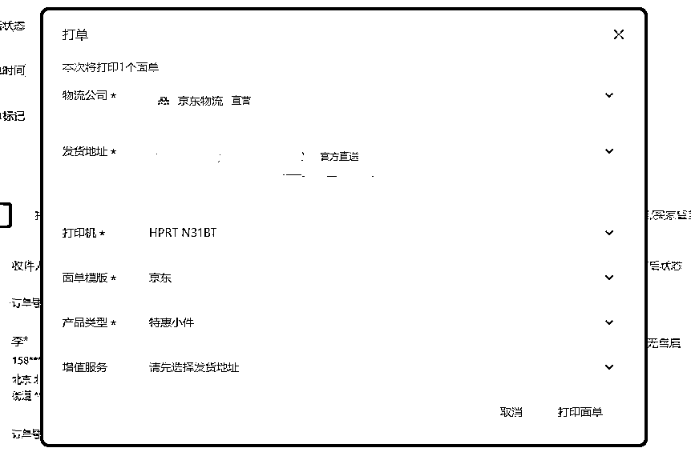

第四步：回传单号

完成上面步骤你的订单就会回传你刚刚打单的物流单号了，不需要人工填写物流单号

第五步：当面检查揽收情况

建议快递小哥必须当着面把物流单全部揽收了，他揽收的数量和我们发货打单的数量需要确保一致。没有一致再及时找原因。如果快递小哥拿回站点再统一打包，有可能出现数量对不上，合作起来就可能不够顺畅。

内容来源：《小红书店铺运营——有货源模式的玩法》、《Jing 的第 13 天航海日志》


1.  售后管理

# 3.1 退换货

消费者在申请退货后，商家应在 72 小时内给出审核结果。详细见下表：

退换货审核表：


商家收货表：


退换货降低伤害处理方式：

1）消费者反馈商品问题

如收到消费者反馈商品问题，应及时向消费者索要证明图片并反馈给上家商家。

（例如消费者 A 在生鲜店购买了五斤橙子，收到的商品损坏一半，客服收到反馈后未能第一时间向客户索要损坏的商品和快递面单一起拍照的图片，导致客户掉线第三天才再次询问客服，这个时间已经超过生鲜签收后 24 小时内售后时效，再去找商家会以此为由不理赔。)

如遇此类情况可优先询问消费者是否接受补发，如接受可降低部分损失。

ps：如遇质量问题需第一时间索要质量问题商品图片，确保我们知道商品情况和上家沟通交涉。

2）普通商品退换货

小红书的售后审核时效通常为 48/72h，淘系和拼多多审核时间通常短于小红书的时效，但是也需要注意及时向商家申请，并主动向消费者确认商品情况。

如：是否拆封、使用过、完好。确定后再找到商家咨询是否符合退换货标准。

小红书商家后台，可以设置一下简单的自动售后，比如没发货前的自动退换货。


普通商品下单时建议勾选运费险（拼多多自带），小红书可在后台开通运费宝，即使商品退换货，我们可以在上家商家退还的运费中获取收益。

开通运费宝路径：

【电脑端】：商家管理后台-交易-售后管理-运费宝


【手机端】：商家 APP-首页-全部工具-运费宝


如果是做实物电商，还可以通过快递售后卡引流。售后卡通常是引流话术+二维码，具体设计可参考同行。淘宝和 pdd 上有很多做售后卡的店铺。


# 3.2 差评

目前差评只会影响店铺服务分，分值高会有流量加权，反之会清退店铺。

差评的主要影响是影响商品转化，小红书不像其他购物平台，收到货后除非质量问题，一般不会主动来评价。不做评价的话，可能卖几百件都不一定会有用户留评，如果有差评带图片，会直接在商品购买页面显示图片，如果是爆款，尽量做好售后降低差评风险。（亲测销售 500+ 零评价）

小红书平台对点评回复率也有考核标准。平台将按照每两个自然周考核商家对负面点评的回复率，如一个审核周期（即两个自然周）内产生的负面点评的回复率低于 80%，每次扣除一般违规积分 2 分。建议商家在用户点评后的 24 小时内认真回复并切实解决消费者反馈的问题 。

若已有差评产生，可以参考以下方式降低伤害：

1） 可尝试在后台提交申诉

找到提交申诉入口的步骤：根据自己遇到的问题提交申诉


一般违规行为，商家需在平台发出违规通知之日起 7 日内对调查单进行确认或发起违规申诉。

7 日内未进行操作的，视为商家认可违规处理，违规处理将自动生效。

针对同一项违规处理，商家只有至多三次线上申诉的机会

提高申诉成功率，进行违规申诉时需按照小红书平台的要求提供完整、真实、有效的证明材料

聊天记录，截图，链接，照片，录音，快递单凭证等

详细内容见：

小红书违规申诉管理规则

2）不过与夸大宣传商品

3）可致电消费者补删评论

1.  店铺其他注意事项

1.  违规处置与分级

平台按照商品缺陷类别以及商家累计违规次数，界定具体违规级别，并对商家和/或其店铺作出对应处置

分级原则：


1.  商品名称禁止使用的词语

如商品描述中出现“最高级”、“国家级”、“最佳”、“顶级”等绝对性词汇每次扣 25 分情节严重冻结店铺

和顾客在交谈过程中嘲讽、诽谤、谩骂、不文明的语言、对方被举报每次扣 25 分。

更多违禁词见：电商违禁词整理

1.  食品类产品下单需注意

食品的包装上应当有标签，标签应当标明下列事项：

一、名称、规格、净含量、生产日期

二、成分或者配料表

三、生产者的名称、地址、联系方式

四、保质期

五、产品标准代号

六、贮存条件

七、所使用的食品添加剂在国家标准中的通用名称

八、生产许可证编号

1.  尽早熟悉流程

如果不是团队做，有些流程也要尽早熟悉。

比如拍单软件的使用。之前单量小都是手动去打，如果单量突然多了，容易慌慌张张手忙脚乱，效率会相对较低。

1.  持续关注产品质量

如果你是做无货源，上架的产品陆续零散出单的时候，建议采购回来看看实物，做到心中有数，避免售后太高。然后与商家建立联系，缩小沟通成本。

内容来源：《小红书店铺，月 GMV10w+的方法总结与复盘》

1.  如何辨别和应对打假人

打假人分成三种：要饭的、坐班的、职业玩家。

要饭的

大多数就是找茬的、刚入行的，这类人的常见方式第一种是钻平台漏洞，比如知道平台最近打击无货源，他就去举报你，然后让你给钱协商。这种就是属于乞讨讹人的类型，给钱就能打发。

第二种是工商举报，这类就是一些想搞偏门的，甚至是一些卖家被别人搞了，他又去想去搞别人这种情况。

遇到工商举报听工商老师的建议，除了是自己产品本身的质量问题之外，拒绝一切赔付。

可以给工商出一个情况说明书，说明发生原因，事情经过，最后一定要加上拒绝赔付。过程中在和打假人协商处理方案，最后一般都很容易轻松处理。

坐班的

就是他每天都在找不同的商家批量买东西、批量的写文件、批量的投诉。这类人就属于专业吃饭，是每天花时间和精力来认真对待自己职业的一部分人，大多数为全职。

这类人大多数就是发现了某个品这段时间是有问题的，比如有段时间有关部门就明令禁止辣条里面不能有谷氨酸钠，那这个类打假人这段时间就一直打这个品，这个感觉就像我们选品的思路一样，跟热点。。。

遇到这类人，如果没有在客服端给你聊天索赔就直接起诉的，那大概率就是你这个产品存在问题。他们的投诉方式一般是两种：工商或者律师函。

这种应对方式：联合同行，一起去谈，这类人除了换自己的投诉人身份之外，一般在工商里面都有很多记录的。

也就是说根据不同地方的政策，哪怕是你的产品有问题，但是工商面对职业打假人都会考虑从轻处理。然后找到你上家源头，拿到相关资质和质检，给到工商，最后处罚都不会很严重。

职业玩家

这类人就比较专业了，能遇到这种的，你的产品百分百有问题。

这种人只用一种方式，那就是起诉，一般索赔金额是 1w 起，如果起诉的金额是 5000 内，这种不用去应诉，打电话协商金额赔偿就好了。

这种应对方式：找有处理过这种电商类案件的律师去应诉，他会教你比如管辖权异议、申请破产清算等方式如何把损失降到最低。

当然能被这类打假人起诉的，那一定是你店铺最近生意很好，也就是说他在起诉之前，绝对是看了你的资产是够赔付的。

内容来源：《月销百万选品宝典+供应链避坑+打假人辨别》

1.  其他获取店铺流量小技巧

1.  评论区小号互动晒图

评论区的优化方法：常见的就是用小号在评论区评论已买，发购买截图。


1.  参加官方活动

不同的时期小红书官方都会举办一些促销活动，通过官方推荐的活动，发布相关商品笔记，可以有助于增加曝光，从而提升销售额。

在小红书商家版后台的首页就可以看到最新的活动入口

点击立即报名即可提报商品报名活动


1.  抓近期爆款关键词、跟进热门标题


1.  爆款产品带动其他产品

另外确实有爆款产品之后，会带动其他产品。

比如目前店铺一共铺了 400 件商品，铺的这些产品除爆单那款，其他产品出单的大概也有 7-8 款，总出单量也有 30 件左右，有一款出 10+ 件（比如评论区会问有没有类似的产品）那这个时候，相似款的作用就来了，我们稍微引导下，就会更容易提高转化。

具体的铺品节奏可以参考圈友 @月月的每日实操流程：

1.  小红书站内选品

# 1\. 本章概要

选品方法有很多，整体来讲不外乎 4 个方法：

1、从小红书站内选品

即小红书上已经有的品里面找合适的产品。

这个时候我们常用的方法有：灰豚数据选品法、低粉爆款选品法等。

2、从抖音平台选品

即从跟小红书一样靠内容带货的平台找，目前建议从抖音找合适的产品。

这时候我们常用的方法有：考古加选品法、蝉妈妈选品法、抖音精选联盟的创意中心选品法等

3、从传统电商平台选品

即从淘宝、抖音等电商平台找到合适的品。

4、SEO 搜索词选品

这个属于选品老玩家的升级玩法，会用到 5118 工具（https://www.5118.com/）。

那上面必修篇讲到了抖音平台、传统电商平台的选品思路，这里再讲讲另外 2 个选品思路：小红书站内选品、SEO 搜索词选品。

1.  低粉爆款选品法

什么叫低粉爆款？

一般来说指的是带货的小红书账号低于 200 粉丝，同时最近 7 天发的单篇带货笔记点赞过 100，同时该带货笔记商品销量大于 100 的产品，为低粉爆款品。

这个选品方法的真正目的，是找到小红书站内正在推且有潜力的爆品，进行第一时间跟品截流。

相比抖音创意中心选品法，这个方法比较建议做女性产品类目（更容易在小红书上先爆起来）的小伙伴重视，比如雪莉枚 U 型枕、发箍、帽子等爆款素材的首发都是小红书。

小红书站内招低粉爆款的品主要有 2 个方法：一个是利用灰豚数据；一个是手动刷。不同品类在具体应用的时候要观察选择更合适的选品方法，前期建议 2 个搭配使用，多维度观察。

# 2.1 灰豚数据低粉爆款选品法步骤

工具只是实现我们诉求的手段，大家可以按照喜好使用：

第一步：打开灰豚数据

第二步：点击笔记查找，选择笔记搜索

第三步 ：勾选上【带货笔记：是】

第四步 ：勾选上【低粉爆文】

第五步：搜索你要的对标，比如想要做连衣裙，则搜索连衣裙。

即使是用灰豚数据，找的对标账号也应该选择粉丝在 200 以下的，点赞在 7 天内大于 100 以上的笔记，同时该带货笔记商品需要销量大于 100，才可以选这个品。同样使用低粉爆款法。

# 2.2 在小红书内手动刷

当确定你要做某一个品类以后（比如帽子），可以找一个小号，持续搜索这个帽子相关的内容。

这时候系统会给这个号打上对“帽子感兴趣”的标签，继续推送帽子相关内容。

在看系统推送的内容的时候，点进去这个笔记的主页，看是否是低粉丝（尽量小于 200），如果是记得点个关注、点个赞、评论一下。

这样系统会慢慢记录的的是喜欢低粉丝帐号的帽子，后续第一时间给你推送更多帽子的【低粉爆款】内容。

这样就可以每天通过刷小号，第一时间知道最近什么款式又出来了、什么样的文案和封面更容易有数据。

这个方式看起来是需要花点时间，但是在不停刷笔记的过程中也是在不断的培养品感和网感。


# 3\. 对标帐号选品法（截品）

当确定要做的品类以后，可以用小号关注大量同行帐号，同行就是最好的老师。

然后每天花 20 分钟去把他们今日上新的商品看一下，主要盯紧差不多时间发布但是数据更好的品，如下图红色框内示意。

如果上新的商品有数据表现不错的，立马跟进。

1.  SEO 搜索词选品（5118.com）

和搜索相关的东西，5118 是离不开的，5118 也适合用来选品，但前提是大家要知道“关键词根”，也就是“核心关键词”，不知道核心关键词，拿什么去搜？

关键词根从哪里来？可以从第一种选品方法，淘宝分类页面里面来，如果自己有关键词库的话，就从关键词库里来。

点击 流量词库>关键词挖掘


输入框里输入“车厘子”

点击搜索，按“移动日检索量排序”，就能看到关于车厘子搜索量高的词，这里的词，也可以用来写小红书，作为小红书的标题，和想要埋入的关键词。

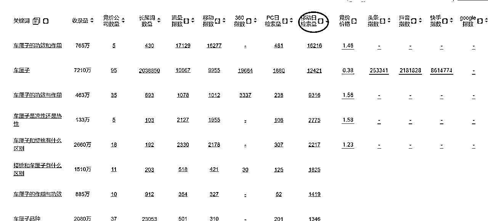

# 03\. 不同选手的选品侧重点参考

# 1\. 新手选品：跟最新爆品

建议新手不要一开始就只选择自己想卖的商品，而是跟紧近期热度商品。

越新爆起来的越好。

在 1.0 阶段，给大家一个基础的判断方法：就是去做在抖音创意中心爆款榜上的产品。（可以复习一下抖音创意中心选品法）

注意：不要过于追求数据的绝对值，比如一定要销量大于 xxx、点赞大于 xxx，出现在抖音创意中心榜单上的都是表现很好的产品了。

新手阶段切忌贪多，想要掌握非常复杂的选品方法。其实一个创意中心选品法用好了，已经足够跑通正反馈，跑通以后再不断进阶自己的选品能力，跟别人做出差异化。

# 2\. 进阶型选手：同步跟小红书站内爆品

进阶型的选手，具体指：素材制作能力强、有较好的封面制作能力，已经跑通过正反馈的朋友们。

这个阶段我们可以去同步看小红书站内爆品（低粉爆款选品）。

这个跟 1.0 阶段的区别在于，如果发现这个品在小红书站内已经开始爆了，证明这个品不仅仅在抖音爆在小红书也可以爆，进一步验证了爆品在小红书的适配性。

但是同步的问题是：别人已经爆了，也就意味着平台内已经存在竞争，需要我们跟品的速度以及素材的制作能力更过关，才会更容易脱颖而出。

# 3\. 更天赋的选手：提前挖掘需求产品 / 高爆品

对于能力更强的，能预判爆品的当然要挖掘产品。

一方面可以提前布局：

比如在秋冬天之前，开始陆续布局季节产品，如手膜、脚膜、暖手袋。

比如在节假日之前，开始布局出行类型产品，如化妆收纳包、高铁搭子（毛毯啊、u 型枕之类的）。

比如夏天之前，开始布局拖鞋、减肥运动器材（如滚腿神器等）

一方面可以针对爆品发力：

爆过的产品一定可以再爆。如果我们的技能更高，可以不依靠于别人的爆款素材和封面，而是可以创造爆款封面和素材，那我们就是新手模仿的对象了。

每一个爆款都是经过天赋选手对之前爆款内容的加工而成。

# 案例一：谢小仙

在我自己做小红书店铺账号（我只是卖产品，不是做IP）的逻辑里，账号能否有流量、能否出单、能否打爆决定性的因素都是由品决定的。在选品、筛品和测品的过程中，一定是以最低成本最高效率来做。

所以前期一定是找出符合“最低成本最高效率”的对标内容来执行（如图），方便我们快速找到自己能持续出单或者打爆的产品。

从时间成本、场景成本、拍摄水平要求等方面分析下面四种内容类型，第三、四种内容形式是最适合我们前期实拍的方式（突出产品、场景简单、拍摄水平要求低、拍摄效率很高）。


出镜展示 ＞ 产品展示视频 ＞ 产品图文 ≥ 产品图文


出镜展示口播 ＞ 上身展示图文 ＞ 产品图文 ≥ 产品图文


出镜展示口播 ＞ 上身展示视频 ＞ 产品图文 ≥ 产品图文

总结以下几种笔记形式就是非常值得我们学习对标的，场景极其简单，拍摄要求很低，拍摄效率极高。通过你同类型的产品找到这类的笔记内容，快速的1:1进行模仿实拍。


木地板+产品 纯色背景+产品 小摆件+产品 笔记本+产品

通过高效的发布实拍笔记测品测内容，找到自己有流量的品。之后再去进一步优化自己的内容形式，慢慢尝试少量制作第1、2种内容的笔记（不是必须的）。

我提倡以效率为第一要素，用100条60分的笔记去覆盖10条80分的笔记。

拍摄核心：iPhone 实况图（Live Photo）

拍摄效率高，1分钟内完成一条笔记的图片素材

实况图真实感强，符合小红书平台调性

自己数据总结：实况图的转化率、完读率、点赞/收藏率均优于其他拍摄方式

风格定位

参考对标账号，保持1:1模仿的风格统一性

坚持 方便、快捷、容易模仿的笔记内容

.

实拍场景搭建

场景还原

参照平台优秀对标账号，1:1复制其场景和灯光布局

常用布景：简约桌面、温馨卧室角落、自然光窗边、浅色背景

拍摄设备

手机：iPhone（推荐有两倍镜iphone（推荐13、14、15、16pro，越新效果越好，打开实况功能）

小技巧

镜头设置：使用 1.5 - 2 倍变焦，营造虚化背景，更具氛围感

光线：能在自然光充足的场景下拍摄更高效

背景简洁：避免杂乱，突出产品主体

.

拍摄流程

.

前期准备

确认当天拍摄款式 & 对标笔记

参照爆款笔记，搭建相似布景

.

拍摄步骤

构图对标：严格参照对标笔记的角度与镜头数量

镜头类型（每条笔记 ≥4 张图）

.

效率控制

前期布景搭好后，单条笔记拍摄耗时 ≤ 1 分钟

可一次性拍摄多双，统一布景 & 光源。

.

选品与内容结合

选品逻辑

优先参考 近期爆款笔记 的款式（爆的核心往往是款式）

分析对标笔记评论区与收藏点，找出用户关注的痛点

选取能直观展示“产品”等痛点的方式

.

成功关键点总结

找出符合“最低成本最高效率”的对标内容来高效执行

1:1对标爆款笔记：角度、布景、数量均保持一致

核心：量变产生质变

实况图优先：真实感+氛围感，平台权重高

快速迭代：每天复盘数据，数据好的笔记内容不断优化每天都拍摄发布，淘汰数据差的拍摄模板，多尝试新的拍摄模板。

# 案例二：半糖梦呓

小红书带货如何高效拍摄？

大家好，我是半糖。

目前有多家自营店铺，擅长店群模式高效测品，以及自动化工具运营。

纯自然流起盘多家月销10万的店铺。

真正的效率不在于单个素材的完美，而在于整个流程的顺畅，以及规模化后的性价比。

“拍摄带货素材，不是靠灵感，而是把产出素材的流程搭好，素材会像流水线一样批量产出。”

# 第一步：制定拍摄计划

核心理念：不要用你自己的审美来拍摄，要对标爆款带货笔记的审美。提前做好拍摄计划，可以让拍摄的质量和效率都比较高。

1.  拍摄前准备

拍摄产品清单

明确要拍的SKU数量（最好准备多个SKU，拍摄出来的内容会比较丰富）

拍摄设备选择

手机 or 相机？我们全都用手机拍摄，而且有些型号出来的图片会自动修图，选择合适的滤镜即可

静态图 / live图 / 视频，依据内容需求选择，一般来说live图的转化率会更高一些

live图拍摄和发布需要注意机型，目前我们拍摄手机用的是一加3SPro，发笔记用的是OPPOk12X，这两款手机拍摄的live图都是一个大的jpg图片；

而苹果手机拍摄的live图是一张小jpg图片+一个3-5秒的视频，需要在苹果手机上发布

背景与道具

搭氛围感背景需要准备：背景、桌面、小物件、手模/道具手、美甲、背景画框、地毯等，依然是参考对标笔记封面，看起来很真实很美，其实也是摆拍。


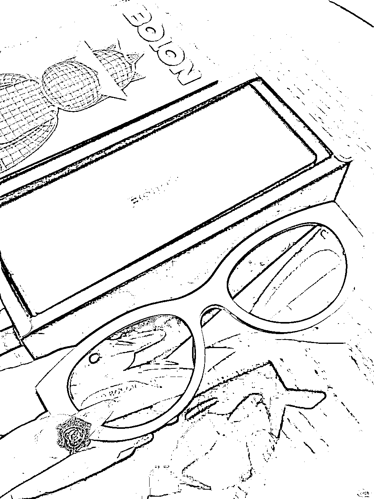

拍摄真实感使用场景需要准备：找到真实的场景，日用百货类最好有直接在家里相应的场景拍、服装类看对标人群，白领就挂上工牌、电梯、路边、工位上、写字楼大堂、车门后等场景，一比一复刻


来个小互动：看看这张图有什么问题？


拍摄的时候提前安排好地方和动线，一圈全部拍完。

测品期间，我们会计划至少四个拍摄场景，真实和氛围感场景各2个，然后每个场景会拍摄N个素材

光线条件

拍氛围感场景，一般需要打光。可以买一盏小台灯作为背景光，一台柔光灯，打柔光（淘宝搜拍摄补光灯）

需要打出阴影比较明显的灯光，则可以使用打光手电筒来实现（淘宝搜索拍摄手电筒）

还可以买一个反光板，室内室外拍摄都能用得上（淘宝搜双面反光板）

真实场景，建议自然光拍摄时提前准备好所有的道具、按光线最佳时间拍摄，有阳光有阴影错落有致的光线会更有层次感，户外可以带反光板，手机找一个合适的滤镜


1.  拍摄模版规划

寻找对标拍摄模版主要找以下几类素材：

最火的爆款封面：就是所有同行都在发的，比如服装类目上身实拍的、水果类目拍摄精美摆盘的、日用百货拍摄使用场景的，这种常规的爆款素材我们可以直接跟直接测

最新的爆款封面：一个星期以内20赞以上的封面，一个月内百赞的封面，越新的优先级越高，优先去模仿拍摄。

跨类目的爆款封面：除了参考卖同品类同行的拍摄模版，我们还可以参考跨品类的爆款素材，比如小红书上卖得很火的三角荞麦枕头，他们参考的很多素材是养生博主、健身博主的爆款素材，比如如何消除富贵包、如何养成直角肩等。

那么如何去寻找这些素材呢，我会通过关键词去搜索，产品词、人群词、场景词、痛点词

我们搜笔记时，顺手把可以对标的封面保存到手机里，然后开始规划我们自己拍摄的模版了，每个产品最好都包含以下三种类型的图片素材：

拍摄产品真实场景

把对标图片附上，并拆解图片核心是什么？到底是拍摄角度，还是构图，还是场景，还是灯光？还是脚本动作？爆点到底在哪里？

每个SKU准备3–5个不同场景拍摄模版

角度、道具、背景都要有变化：是第一视角（亲手使用感）还是第三视角（偷窥感）？什么道具能够把人带入使用场景？背景在哪里？

例如拍摄小风扇，需要的场景是卫生间、厨房、床头等场景，我们把相关的背景、道具都按对标内容布置好

产品放快递箱，模拟用户收货场景：给人一种收货之后超预期的真实感。

拍摄收货发货场景：产品堆在一起，拍摄发货场景，给人一种很多人买的感觉

产品氛围感摆拍

图片是什么风格？ins 风？奶油风？中古风？一比一复刻。

放在大托盘里，放在篮子里，摆在床上沙发上拍合集等

拍摄产品细节

产品材质、产品功能、使用方法、产品特写等

可模仿对标笔记的特写镜头

1.  确定笔记构成 & 拍摄数量

每条笔记 = 6张图 （常见构成：真实场景2 + 氛围感摆拍2 +细节图2）

计算需求总量（以每条笔记6张图为例）：

每天发20条笔记 × 6张图 × 7天 = 840张

分配拍摄张数：

4个场景，每个场景拍摄210张，20个素材模版，不同sku，N个角度、N个道具组合使用，例如A产品搭配B角度使用C场景D道具......

以此类推，分配到每个素材算出拍摄张数

1.  安排拍摄顺序（逻辑+效率兼顾）

建议顺序：

.

氛围感产品图（最容易拍）

.

合集图&细节图

.

真实场景、外景图（耗时、需要找真实场景）

拍摄前一晚检查全部器材、背景、产品是否就位，第二天按流程执行

# 第二步：拍摄执行

1.  拍摄技巧与流程

打光拍摄（桌拍）

布光、布好拍摄场景道具后，先试拍几张，在手机上看构图、看产品拍摄是否清晰，看滤镜、看背景、道具，看整体的氛围感

调整没问题后再进入批量拍摄流程

按照拍摄计划里的流程去拍

真实场景拍摄

提前看好天气，找适合拍摄的角度、所有的道具、sku都准备好

提前安排好路径，按预设的路径全部拍摄完成

精细化运营后期，把产品融入到日常拍摄场景中，发现任何适合拍摄的时候立马拿出来拍、酒店大堂、优衣库、咖啡馆、图书馆、餐厅、柏油路、树荫、公园等

模仿对标笔记

1:1复刻对标图：拍摄时将爆款图打开放在一旁参考

尽量模仿其构图、色调、道具氛围

1.  拍摄心态建议

选品大于素材：测品期间的拍摄，做到60-70分，追求更高的测品效率。测出来自然能出单的90分的品，再去制定更加精细化的拍摄计划，拍摄逐步提高到80分90分。

测品大于选品：我们批量拍摄的目的就是为了测品，快速测品测的多了就自然会跑出来数据好的品，所以不要盯着选的一两个品觉得一定能爆，而是广撒网，多测品，行就行，不行就下一个，不要纠结内耗。


# 第三步：批量后期处理

1.  批量调色方案

优先思路：尽量做到图片直出不用修图

拍摄时设好参数，调光调白平衡，省大量后期时间

美图秀秀（会员版）：

支持每次处理50张图

1.  图片加字

美图秀秀电脑版支持批量加字，批处理，加字，保存为配方，然后在配方里加入图片，就会全部处理成配方里面加字之后的效果。

可以做两套：带字/不带字版本，测试加字是否对流量和转化有帮助


# 补充：不同时期的拍摄计划

测品期间：按照上面的拍摄计划执行，出10单以上的品进入精细化运营阶段，低于10单淘汰

后续单品运营：每周查看千帆后台出单笔记数据，不出单的模版淘汰掉，出单好的笔记每天至少安排一组类似素材微调后发布，同时每周更新30%的最新对标模版（封面和标题），不断的吐故纳新

1.  小红书 SEO 的规则

# 1\. 小红书 SEO 的底层逻辑

SEO 全称 Search Engine Optimization，即搜索引擎优化。

小红书 SEO，就是通过优化笔记关键词来提升笔记的搜索排名。

大家都知道，小红书现在已经是很多人心中的“百度”，70% 的用户都喜欢用小红书的搜索功能，吃喝玩乐前会查一查相关的攻略。

比如圣诞节，我想送点礼物给朋友，就会去小红书搜索“圣诞礼物”。

然后依次点开相关笔记，尤其是前面几篇比较吸引我的笔记，如果内容打动了我，我就会跟着博主去买同款，完成从内容种草到产品拔草的过程。

所以，搜索入口来的用户一般消费意愿都比较强，搜索流量=超精准流量=躺着赚钱的流量。

某个搜索词下，你的笔记排名越靠前，你的产品就越有机会被用户看到，也会更容易主导用户的消费决策。

这就是小红书 SEO 的底层逻辑所在。

1.  小红书 SEO 流量介绍

明白了底层逻辑，我们再来说说做小红书 SEO 的三个好处。

1）流量精准，用户转化率高

无论你是纯博主还是商家博主，关注的焦点不外乎两个：一是流量，二是变现。

流量又是变现的必要条件，所以如何拿捏流量，是每个博主的重要课题。

小红书最主要的流量入口有三个，首页推荐页、关注页和搜索页。


首页推荐页是默认打开的页面，所以这里的流量最大，同时竞争也最激烈，普通人上这个页面比较有难度，需要你内容足够优质。

还有一个是关注页，大家打开这个页面的频率普遍不高，尤其是关注的人数比较多时，你可能早就被挤没影了。

剩下还有一个搜索页，更适合普通人突围，因为只要你有一篇笔记靠前，就能给你整个账号带来持续不断的流量。

而且前面的底层逻辑我们也讲了，搜索流量来的用户属于主动种草型，大都带着明确目的来的，所以流量更精准，转化率也更高。

我们的很多账号，搜索端的粉丝来源都占了一半以上。


2）免费流量，不拿白不拿

通常来说，一篇笔记的自然推荐周期为 3-7 天左右，即使是爆款，随着时间的推移，系统给你在首页推荐页流量也会逐渐减少。

因为平台要留住用户，需要不断地补充新鲜的内容，如果你想在首页继续占位，只能通过广告投放去维持。

但是搜索流量不同，只要你的关键词铺对，而且笔记没有违规，你的笔记就可以一直被用户搜索到。

两三个月前，甚至一年前的笔记仍然能够给你带来用户。


这就相当于在平台放了一个个长期有效的广告，关键是还不收费，这么香的流量，不拿白不拿！

3）矩阵运营，占领赛道流量

我经常跟学员说，建议大家做矩阵号运营，尤其是商家博主。

原因有两点：

第一，降低账号风险，因为商家博主很多都有引流需求，而平台为了生态环境和自身利益考量，禁止一切导流。

那对有引流需求的博主来说，常在河边走，难免会湿鞋。违规还是小事，最怕的是账号被封，如果 all in 在一个账号上，风险系数太大了。

第二，多一个号就是多一个流量入口，同时也满足了用户的“比价”心理。

如果账号铺得够多，用户“货比三家”之后其实进的还是你的账号。

当然，前提是你要铺对关键词，如果用户搜不到你的笔记，那你有再多的账号也没有用。

所以，做小红书 SEO 很有必要。

1.  影响 SEO 排名的因素

在说小红书 SEO 方法论之前，首先要了解，哪些因素会影响笔记的搜索排名。

从大方向来看，影响因素主要就两个：账号权重和笔记权重。

权重这个词，很多人否认它，但其实我们确确实实能感觉到。

你账号的活跃度、原创率、垂直率等会影响账号权重，而笔记的发布时间、点击率、互动率等会影响笔记权重，权重越高，越容易被用户搜索到。

而笔记的权重，要比账号的权重对排名影响更大。

比如说，新人账号权重相对比较低，但如果关键词铺对、内容质量过关，完全有可能第一篇笔记就写爆。

而当你有一篇笔记爆了，你会发现你其他的笔记也能被带动起来，整个账号权重也会提升。

只要账号没有严重违规，正常的笔记都是可以被搜索到的。

当然了，前提还是你的笔记里要包含用户搜索的那些关键词。

那么，什么样的词是用户搜索得多，我们去哪里找这样的词呢？

1.  如何挖掘高热度行业搜索词

用户的搜索行为虽然带有很大的主观性，但也有规律可循，我们来看看大致有哪些类型的搜索词。

1.  选词策略

1）必要项：核心关键词

核心关键词是一个产品、一篇笔记的核心，一般是产品词或类目词。

以护肤品为例，核心词可以是洗面奶、面霜、乳液等。比如你要写一篇洗面奶种草笔记，那你的标题、图片、脚本或正文里，至少有一样要含有“洗面奶”三个字。

2）蓝海词

选少量蓝海词，蓝海词数量 100 个以内。关键词的月搜索量平均在几万左右，发布内容始终围绕这些来做。

做完一轮之后，可以再来一个账号，再来做一遍这些关键词，实现关键词的霸屏效果。

3）关联关键词

顾名思义，关联关键词就是与核心关键词相关的一类词，结构为：核心关键词+关联标签。

有时候也叫它长尾关键词，比如洗面奶的关联词有：氨基酸洗面奶、敏感肌洗面奶、洗面奶测评等。

4）高转化词

高转化词就是购买意向强烈的词，比如：平价洗面奶推荐、洗面奶怎么买、xx 洗面奶好不好用等等。

5）热搜词

热搜词又分为热点类热搜词和行业热搜词，前者一般热度更高，但不一定符合我们的定位，比如近期比较热的“阳了”、“小阳人”。

所以我们通常要找的是行业热搜词，一般是跟节日、人群和功效相关。

还是以洗面奶为例，热搜词可能有：学生党洗面奶、xx 品牌洗面奶等。

它的特点是流量不稳定，一直会有变化。

1.  关键词挖掘方式

1）第一种：聚光平台关键词规划工具

聚光平台的关键词规划工具非常好用，你可以从笔记推词、以词推词、上下游推词、行业推词等五个维度来选词。

比如以词推词，输入你想要的关键词后，它会给你推荐蓝海词、同行买词、黑马词和高点击词，其中蓝海词和黑马词都是竞争力小，需求量又大的好词。

因为聚光平台是官方平台，统计出来的数据相对都是比较精准有效的。

但缺点是，目前只有企业号，并且是已经认证开通广告功能的企业号，才能登陆使用。

2）千瓜数据

千瓜是专注于小红书的数据分析平台，里面的关键词排名、对比和下载功能也很齐全。


点击左侧工具栏“热搜词搜索”，输入你的关键词，会出现很多关联关键词，每个关键词还有热度值和笔记数量。

大家可以自己做个表格，记录下各个关键词的数据，用热度值除以笔记数量算出比例，找比例值大的，因为搜索的人多，竞争压力又小，适合作为目标关键词。

再比如有“热搜词榜”，可以看到热词增量榜、总量榜。

两个搜索方法都可以直接导出，非常方便统计整理。

但缺点是需要收费，会员价一个月好几千，对普通人来说成本有点高。

3）小红书平台

这是一种免费的挖词方法，但需要你花一些时间去挖掘。主要途径有以下三种：

① 搜索栏下拉框

在小红书搜索页，直接输入你要搜索的关键词，比如“洗面奶”，下方会出现一长串的关键词。


这些都是系统根据近期搜索频率，总结出来的关联关键词，挑选自己适合的去铺就可以。

有的时候，我们也需要做取舍，比如“洗面奶推荐”和“洗面奶氨基酸”，到底选哪个？

一般来说，越靠前的词，热度越高，也就是说搜索“洗面奶推荐”的人比搜“洗面奶氨基酸”人更多。

但是当你把两个关键词分别输入搜索栏，下方会出现相应的笔记数量。

显然，“洗面奶推荐”虽然热度更高，但是平台已经有 107w+ 笔记，竞争压力大，而“洗面奶氨基酸”只有 23w+，竞争压力小很多，更适合我们去布局。

② 搜索结果页面

输入关键词后，点击进入搜索页面，你会看到有很多地方出现关联性的关键词。


一个是顶部的标签栏，会显示一行和搜索词相关的词，左滑还可以看到更多，可以选几个和你的搜索词组合使用。

还有一个是浏览页面往下拉，页面会出现一栏“大家都在搜”，这个不仅可以作为关键词使用，还可以作为笔记选题来做。

③ 标签浏览量

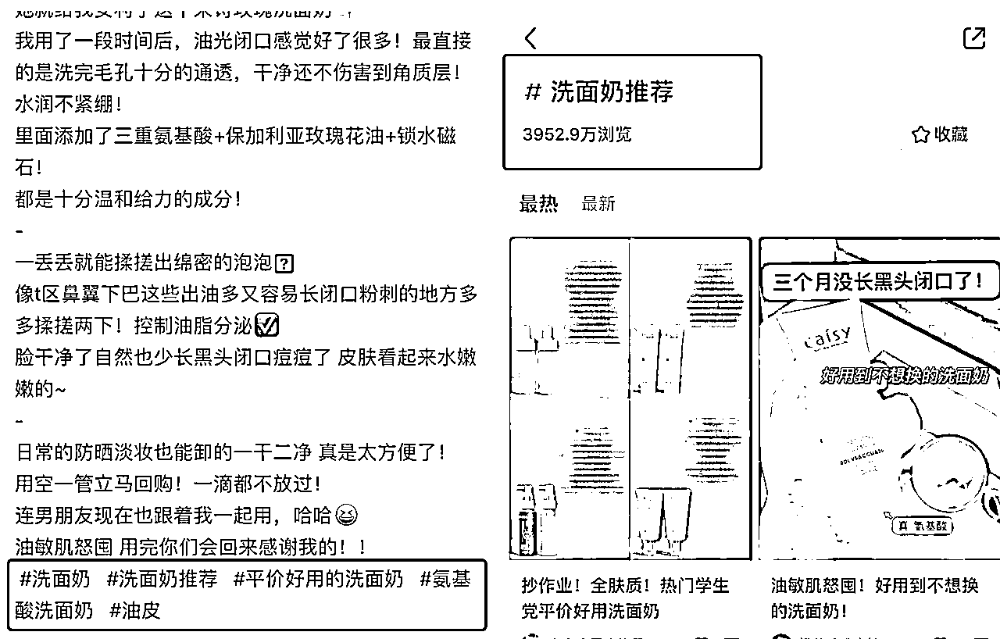

一般笔记的文本框都会加话题标签，点击进入话题，可以查看该话题的浏览量和相关笔记。

大家可以去同行的笔记页面进行统计收集。

④ 笔记灵感

路径：主页“我”-->创作中心-->下滑“笔记灵感”。

每一个推荐灵感都是笔记所属领域，在适合自己的领域中选择发布量高的关键词。比如说：上班早餐、通勤穿搭、闺蜜的冰激凌、本地美食、本地人爱吃的店。


⑤ 社区热搜词

路径：小红书商家版，主页下滑到 “社区热搜词”


⑥ 爆款笔记评论区 / 用户私信咨询问题

案例：北京落户

需求热度：根据评论区点赞量判断

需求 1：父母投靠子女需要哪些材料；

需求 2：北京落户+必须无业或农户

需求 3：北京落户多久审批下来


以上就是常用的几种挖词方法，通过这些方式找出来的词，都比较客观，而且是经过验证的，避免了自己臆想造词却没人看的局面。


1.  如何批量挖掘关键词

上面说了这么多种的关键词的来源，当真正要去整理这些关键词的时候，一个一个来收集的话是麻烦

而小红书作为主流自媒体平台，自然有很多工具可以借鉴。这里用我最最最熟悉的关键词挖掘工具，5118 来进行举例：

1）行业关键词挖掘：https://www.5118.com/ciku/index


2、流量关键词挖掘：https://www.5118.com/traffic


3、下拉关键词挖掘：https://yx.5118.com/suggestdig


4、长尾关键词挖掘：https://www.5118.com/ci/xhs


5、下拉联想词拓展：https://www.5118.com/suggest


以上是几个可以挖掘不同种类关键词的挖掘，大家可以根据个人需要来进行选择，挖掘适合自己的关键词。找到了关键词，接下来就到了关键步骤：如何正确布局关键词。

1.  如何布局关键词

关键词布局不仅仅指大家熟知的标题和文案，还可以通过其他多个维度来展开。

1.  昵称和简介

最常见的就是行业关键词+IP 的取名方式。

另外我们起名时不要有生僻字以及复杂的英文名，一定要过目不忘简单容易记的，这样下次别人想要找你就记得住、搜得出来，但是也不能同名太多。

性别最好是女性，以闺蜜的人设更能吸引姐妹来购物，名字能带自己产品的就带上，这样的名字自带搜索流量。比如你卖水果的可以叫 xx 果园水果啥的，卖衣服的可以叫 xxx 穿搭服饰之类的。

比如这位，化妆师 Sisi。当大家搜索化妆相关的博主时，只要她的粉丝量和近期互动不错，很容易排在用户搜索前排。


注册店铺的时候注意到小红书上去搜索一下用户名，名字一定不要重复，如果重复了，你看一下同名的有没有开店。

如果说有人用这个名字已开有店铺了，那么你就不能用这个名字开店铺，而且改名字要等 7 天，这个就非常浪费时间了。

1.  图片上的文字

图片上的文字也是能被系统识别出来的，所以大家别忘了这个通道。

一般需要核心关键词+关联词，比如上图中的“养生零食”、“营养师补充剂”。

1.  评论区

评论区里的文字也是参与权重搜索的，用千瓜搜索热门笔记，就有一个专门按照评论来搜索的入口。

1.  话题标题


每篇笔记文案的末端，添加相关的话题标签，一般是关联关键词。

不需要太多，10 个以内就足够了，也不要加一些完全不相关的话题。

1.  笔记内容

内容中布局关键词，大家就记住一个原则：要有层次地铺词，切忌堆砌。

同样的关键词隔行、分段分布，比如下面这篇笔记👇👇


每一篇笔记中，核心词、关联词、高转化词和热搜词可以组合起来使用。

但是一定要自然布局，不要密集堆砌，不然会影响阅读体验。阅读体验如果不好，笔记完读率就差，直接影响笔记的数据和权重。

1.  标题

最后一个是标题，之所以放到最后，是因为它最重要。

标题的三个主要作用：

一是概括笔记内容，让用户迅速抓到重点；

二是影响点击率，好的标题，懂得抓住用户需求，吸引点击；

三是有利于搜索，正确的标题关键词布局，有利于系统对笔记分类，推送给精准人群。

标题的关键词布局，通常需要四种搜索词中至少一种，比如：

核心词：迷你披萨❤️君君辅食记

转化词：闭口黑头怎么办？看看李佳琦是怎么做的吧

热搜词：小🐑人亲测有效！！喉咙的刀片取出来了！！

关联词：不夸张的彩色睫毛大测评！心机又特别！

也可以用核心关键词和其他词搭配，比如：

场景词：提升幸福感❗️100 个办公室养生好物🌟

人群词：梨形👭进｜请收下今日份敷衍痩腿运动✅

价格词：均 10💰好物合集‼️清洁/提亮/润唇/卸妆

品牌词：MAC 眼影盘平替！天王老子来了都说是亲姐妹，

功效词：10 元冬季国货护手霜太🐂了！保湿防开裂！

本地词：杭州拱墅店的小猫求抱抱太可爱了

需要注意的是，我们不能为了搜索流量，为了吸引眼球，去铺一些跟自己的产品或笔记内容不相关的搜索词，题文不符，会让用户感觉被欺骗，也是平台不鼓励的。

前期的挖掘和布局可能需要你花费一些时间和精力，但是做好了之后，真的可以最大化地利用小红书的免费流量，让用户源源不断地找上门来。

内容来源：《做对小红书关键词布局，拿捏消息 99+的流量密码！》

1.  账号矩阵

用多账号，抢占关键词排名！

一个账号可以抢占的排名位置有限，多个账号可以增加排名的概率，提高被搜索的概率！

矩阵方法：

1）可以一个品类多账号布局；

2）核心关键词单独账号布局；

1.  店铺 SEO 案例

第一步：由于小红书店铺的名字和账号名称是统一的，所以可以直接在账号名称中布局关键词，这样店铺也就顺带着布局了（账号名称布局的方法在上面讲了）；

第二步：在商品名中布局相应的关键词，这样可以提高商品被搜索到的概率；比如：


第三步：在布局商品名时，可以先写上商品的品牌名，除品牌名外，剩下的前 10 个字就要优先布局核心关键词。

下面是几个案例，大家可以参考一下：

【案例一】

商品：美甲；核心关键词：2023 年夏季新款

优化后的商品名：

奕妃 · 2023 年夏季新款夏日美甲多巴胺女孩组合显白爆款糖果爆闪网红美甲 · 夏日美甲-多巴胺女孩组合


这里还有一个布局技巧，就是 “多关键词布局”。比如这个案例中就用到了以下多个关键词：

2023 年夏季新款、夏日美甲、多巴胺女孩、显白爆款、糖果爆闪网红美甲、网红美甲、多巴胺女孩组合

【案例二】

商品：折叠衣架；核心关键词：旅游出行

优化后的商品名：

宜洁· 旅游出行 便携旅行折叠衣架（带夹）旅行出游 x 3


这里一样是用到的多个关键词：旅游出行、便携旅行、折叠衣架、旅行出游、带夹折叠衣架。

【案例三】

商品：夏天男装；核心关键词：夏季男生穿搭

优化后的商品名：

L-jrun · 男生穿搭夏季男装搭配男士衬衫条纹外套 ins 百搭港风衬衣套装男潮 · 套装一（不含鞋子）L [165 穿搭夏季/小个子衣服一套夏/成熟气质夏天/夏裤子]


这个案例中，除了用到多关键词布局外，还增加了产品特点的关键词布局：

1、多关键词：男生穿搭、夏季男装搭配、男士衬衫条纹外套、ins 百搭、港风衬衣套装、男潮

2、产品特点：套装一（不含鞋子）L [165 穿搭夏季/小个子衣服一套夏/成熟气质夏天/夏裤子]

1.  投放

对于长期要在小红书做市场的人，可以使用聚光平台来进行投放。“投流”也是店铺运营的高阶玩法，常见于品牌类店铺的流量和营销合作。

什么是小红书聚光平台？

聚光平台是小红书营销全新上线的一站式广告投放平台，能够满足广告主以“产品种草、商品销量、客资收集、直播推广、抢占赛道”为目标的多样化营销诉求。

平台打通了搜索和浏览两大用户关键决策场景，并支持以 SPU（产品）为颗粒度的精准定向和智能投放能力，为广告主提供一体化的营销解决方案，让好产品自然发光。

详细的投流玩法，大家可以点击这两个链接进行拓展阅读：《聚光平台投流方法》、《3 月航海 | 聚光投放 | 实战手册》

1.  一个人如何运营多个号？

1.  如何管理多个账号

我们可以通过自己做矩阵号，放大收益。建议一开始就注册 3 个企业号。

❗这里提醒一下，务必坚持一机一卡一网络原则，避免账号关联，导致一个号违规，全军覆没。矩阵号之间也不要互相点赞，尽量做好隔离。

如果要走批量矩阵化操作，就要尽量“降低生产”成本，因为后期要考虑如何“放大”，所以在这一点上，内容的创作形式要足够“轻”，而这里就需要一些运营技巧。

需要注意的是，内容依旧是你这篇笔记是否有阅读量的根基，并不说为了数量就不用质量。


1.  如何批量生产内容

低成本生产优质内容的关键是要找到对标，模仿封面形式，收集爆文选题和标题。所以可以找到你的对标账号，然后看他们做什么选题是爆款的，就往这个方向去创作新内容。

先做选题的计划：

找到 3～5 个对标号，粉丝数都在 3-5 万以下的，然后每个号找出 3-5 个爆款选题，这样你就差不多有 10-20 个题目了。

还可以汇总起来，形成一个自己随时调用的选题和标题库：


搞定选题方向后，我们就来搞定如何批量式生产内容。

批量生产内容：

先说一个重点，每个平台有自己不同的规则，而小红书对于内容的重合和查重还是比较低。所以，可以通过各大平台或论坛、去找到符合的垂直领域，去找优质内容或爆款内容，组合一下，就成了一篇“新”内容。

大概操作方式为：

找到要写的选题关键词后，去 xxxx 搜，如果是视频高赞的，就用视频转换为文字工具，有了文字后，按照自己的大白话修修改改。

而这个 XX，包括但不限于：

抖音搜

小红书站搜

知乎搜

5118 搜

百度搜

微信搜

必应搜

垂直领域的网站/论坛搜

.....

或者可以借助 ChatGPT，给到优质内容或爆款内容，让它改写出更多类似的内容，我们再进行适当的修改。（小红书平台对 ChatGPT 直接写出的内容可能会限流，建议还是要进行人工修改。)

有了这个思路，基本不愁写什么内容，甚至可以找大学生实习生帮忙写内容，即使 jj 他不是这个专业领域，同样也能产出内容。

封面模板准备：

写完一篇文章后，难道就只能发一次笔记吗？不是的。

当写完一篇笔记后，我们还可以通过不同形式的小红书封面风格来套进去。而且如果这篇笔记爆了，意味着选题和内容都是不错的，那我们就采取不同的「展现风格」，大概率还会再爆一次。

方法一：

在小红书搜你这个类目的关键词，可以多搜几个，点最热，再点图文，浏览点赞量高的笔记。

收集几个你能模仿的封面模板，看下笔记的发布时间，尽量选最近的，再点开主页，看下是不是整个账号都是同一类封面模板。

如果是就保存下来，算做一个对标模板，分配给一个企业号测试。接着用同样的方法给其他几个企业号找封面模板。

如果你的类目词很小，最热 tab 那里的笔记数据都不太好，可以试下其他类似行业的词去找，这里卡的不是很严，类似行业下面的爆文封面，都有参考价值，同样选一个数据优秀的你又能模仿的，把它当做你的封面模板去测试。

方法二：

用软件或者手动收集的方式，导出类目关键词的笔记 Excel 表格，按点赞数和时间排序，选近期点赞高的笔记，打开链接收集封面，用前面的方法找对标模板。

方法三：

在小红书搜类目词，点开用户 tab，只看那些粉丝高的企业号。

点开主页浏览，看下有没有规律性封面模板，没有也没关系，看高赞笔记，如果有好几篇高赞笔记都是类似的封面，那这个封面模板也是可以借鉴的。


当选好一个账号的封面模板之后，用同样方法选另外 2 个号的封面模板，不同矩阵号用不同排版风格。

这样同一选题可以给 3 个号共用，做到低成本复制的矩阵操作，提高爆文概率。

每个号单独做封面和选标题。平台对图片内容的查重审核没那么严格，只要标题和正文稍微调整一下，一般都不会有没什么问题。


所以很多时候，我们的爆款内容是重复加工的段落组合，把原本三四篇文章拼拼改改变成 10 多篇笔记，依旧是有流量，不会违规。

注意：

不是让你一个号经常换封面风格，而是让你一篇内容换不同的风格发到不同的号上。有时候这个号没流量，另外一个号就有了。

持续增加笔记数量：

等所有企业号都选用了各自的爆文封面模板，用近期的爆文选题制作封面，再用标题库里的参考写标题。这条笔记的基础数据就不会太差，有爆文的潜力。

只要坚持发笔记，一天 2-3 条，不出几天大概率有一个账号会出爆文，引流数据应该也会不错。

所以，这个阶段就是做好前面 2 个步骤后，坚持每天铺量不断更，不断根据每天每篇笔记的数据反馈，调整优化笔记封面和内容。

还可以在原封面的基础上吸取其他优秀封面的优点进行改进，再根据数据的反馈和近期平台热门内容去调整跟进选题。

企业号起号也是有成功率的，同行经验在 50%，供参考。

所以不必追求每个号的数据都好，3 个号有 1 个数据不错的号就算不错了。

数据好的账号就可以放多点精力去优化，每天发布的笔记数量也可以增加，其他数据较差的账号，就保持更新，持续优化就好。

如果 1-2 个月数据还是起不来，就注销再来，重新注册新的企业号，继续上面的操作。

所以，一个运作良好的企业号矩阵，就是在不断起号，测试新号，注销再来，不断循环的过程，不断的积累成功的账号。

只要起号流程顺畅，不断有新号跑出来，也就不怕违规封号和数据不稳定了。

1.  小红书直播的前景&底层逻辑

# 1\. 小红书直播的前景

有直播带货经验的圈友，可以根据小红书客户画像和货源优势进行选品。目前小红书上直播风格相对平缓，大家在准备直播间物料和话术的时候，可以往「打造更好的视觉体验」和「准备更详细真诚的产品介绍」方向优化。

首先表现在直播入口上，今年的入口更加丰富多样。除了可以收到关注的博主开播的系统提醒外，还有三个常见的直播入口：

一是在关注页面会有直播字样；

二是在推荐页和搜索页，正在直播的博主头像上会有一圈红色+直播的字样；

三是在发现页的顶部工具栏处，有一个独立的直播入口，点击进去就可以到达小红书的直播广场。


直播广场里的主题五花八门，几乎囊括了各种你想得到和想不到的内容。有服饰类的带货直播，有沉浸式的学习直播，有家居展示类的直播，还有助眠、冥想类直播，甚至还有开摄像头让大家帮忙照看宠物的直播。


其次，由于有官方的流量支持，今年小红书直播的场观明显提升。

下面是我在某个周五中午随机截取的直播带货榜单，可以看到，即使是在工作时间，直播间的场观也非常可观，而且很多直播间的客单价都相对较高。


说实话，与其他平台相比，小红书直播起步相对较晚，但凭借着高净值用户的优势，小红书直播实现了其他平台羡慕的“三高一低”：高转化率、高客单价、高复购率和低退货率。

对于普通人来说，平台助推+用户质量高+用户习惯养成，三个因素好比天时地利人和，所以，今年的小红书直播非常值得大家去尝试。

1.  小红书直播的底层逻辑

众所周知，直播需要具备三大要素：人、货、场。和其他平台相比，小红书直播在这三个方面都有自己的特点。

# 2.1【人】以人带货，人设统一

目前，小红书出圈的几位主播都有自己代表性的特征，并且与他们推荐的产品高度契合。例如，章小蕙优雅贵气，专注于推荐优质的护肤和美妆产品；董洁温柔恬淡，主推舒适时尚单品和实用家居好物。

用户在很大程度上是因为她们的生活方式和生活品味而被种草，属于以人带货的模式，货跟着人走。而在其他平台，通常是人跟着货走，用户更关注商品本身，对博主本身的粘性较低。

# 2.2【货】注重品质，客单价高

董洁和章小蕙推荐的很多产品都是小众品牌和设计师作品，价格普遍较高，但具有独特的卖点，主打高级感、实用性和质感，与小红书用户追求高品质生活的调性完全契合。

而在传统直播间，低价是最主要的卖点，用户更关注性价比，所以也导致直播间的客单价低，用户难留存。

# 2.3【场】聊天式分享，强信任感

“不吵不闹，很舒服”

“有种花钱得到尊重的感觉”

............

这些是董洁直播出圈时，很多人对她的评价，她的直播风格颠覆了传统的叫卖式直播，符合小红书主流用户的需求。这样的方式不是为了卖产品而卖产品，而是真诚地、自用式地分享。因此，用户在直播中体验感好，建立起强烈的信任感。

所以，想做好小红书直播，你需要做到：在“人”上做差异化和垂直细分的定位；在“货”上做小众、实用、创新的产品；在“场”上搭建符合小红书审美的场景，并且真诚分享。

比如你做穿搭，你是小个子，极简风还是微胖型，你的定位越清晰，就越能吸引到同样审美、身材的用户，粉丝精准，转化率也高。

蝉小红近七天的直播数据分析中，就看到了一位只有 200+粉丝的珠宝博主，销售额却高达 300w+。

1.  提升直播间流量

在前面我们提到，小红书直播的入口主要有三个：粉丝关注页、推荐/搜索页的博主头像和直播广场。那么，怎么提升这三个入口的直播流量呢？

# 1\. 关注页流量

1）发布直播预告

在开播前发布直播预告，特别是首次直播，让粉丝知道我们有直播计划。预告的时间一般在开播前 2-3 天左右，目的是告诉用户直播主题、时间和福利活动等，让大家提前预约。

预约进来的这波流量，对直播间的留存率、互动率和转化率都有重要影响。


2）固定直播时间

当你熟练了以后，可以选择固定的直播时间，把直播时间添加到个人简介中，例如每周三晚上 8 点直播，可以培养粉丝的观看习惯。

# 2\. 推荐/搜索页流量

1）打磨笔记质量

小红书首页的笔记信息流暂时没有单独的直播间推荐，只有在博主头像上有一个直播标记，点击头像就可以进入直播间。

所以，推荐 / 搜索页直播的流量很大程度上取决于你的笔记质量，需要你平时好好打磨自己的笔记。

2）关键词布局

红书宝的老宝友们应该都知道，搜索页面是一个非常重要的笔记流量入口，而在小红书搜索页，头像上同样会有直播标记，所以搜索页面也是一个很重要的直播流量入口。


而提升搜索流量的关键是布局关键词，所以想要提升搜索页直播流量，同样也要重视日常笔记的关键词布局。

关于具体的关键词布局方法，请回到 8.5 如何布局关键词 查看。

# 3\. 直播广场流量

1）封面和标题设计

直播广场内的展现方式类似于普通笔记，也是封面和标题。


所以，封面和标题的设计非常重要。要从用户痛点和需求出发，挖掘你的亮点和吸睛点，但是要注意，封面必须和你的直播内容相关，否则会被判违规。


2）做好冷启动

直播广场的流量推送逻辑，也类似于笔记的推送机制，会先推送给一小波用户测试反应。如果反馈良好，系统会认为你的直播间内容优质，继续推送给更多用户，反之就会停止推送。

所以吸引用户进直播间后，下一步就是做好冷启动，冷启动的数据指标包括点赞量、评论量、关注率、停留时长和下单转化率等。

做好冷启动的核心是要满足小红书直播的底层逻辑，你需要在人、货、场三个方面挖掘适合自己的风格，并符合小红书的调性。

3）蹭平台直播话题

为了支持直播，小红书官方会定期推出一些直播计划和活动，和写笔记带话题的逻辑一样。有适合自己的直播话题，大家可以积极参加，提升曝光度。

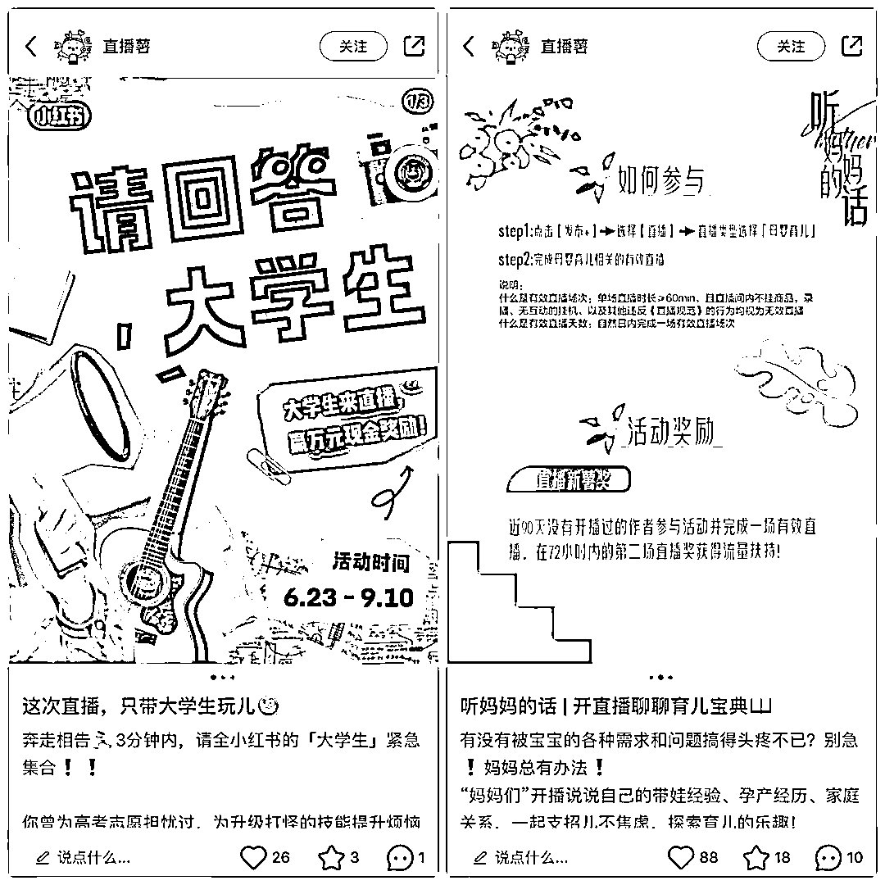

1.  小红书直播避坑指南

新人做小红书直播，容易误触雷区，以下是一些需要避免的陷阱和注意事项。

① 不要盲目造数据

很多新人开播时会担心没有流量，就拉了一堆亲朋好友来助兴，但系统会给每个直播间打标签，如果吸引来的用户标签很混乱，就会间接影响直播间标签，导致系统不知道接下来要把直播间推给哪些用户。

② 禁止进行站外导流

和普通笔记一样，小红书直播间是不允许有站外导流行为的。微信、淘宝链接、二维码、手机号等都属于敏感信息，一旦系统检测到这些行为，轻则会收到警告，严重的情况下会停播，甚至限制开播权限。

③ 没必要讨好所有人

有些博主为了吸引流量，会使用一些与自己领域不相关的福利来吸引眼球。但是这样吸引来的流量很可能不是精准流量，也会影响到直播间标签。

我们只需要吸引和留下目标人群，因为只有精准的人群才能带来更高的转化率。

④ 场观少也不要摆烂

直播间的用户流动性非常大，随时可能有人进入。当新人进入直播间时，她们不一定知道直播间有多少人，她们首先感受到的是主播的状态和直播氛围。

如果能留住他们，系统会识别的直播间留存率和互动率，然后推送给更多相似的人群，慢慢地就形成了正循环，反之就是负循环，人只会越来越少。

所以不管场观如何，我们都要拿出自己最好的状态，保持自己的直播节奏。

总之，小红书直播会有挑战，但更多的是机遇，有开播想法的朋友可以尽快提上日程了，期待大家的好消息。

⑤ 笔记越垂直越好

比如穿搭博主卖女装，而不是发各种生活照自拍照卖各种东西，直播带货的定位是跟笔记挂钩。

⑥ 蓄水期越长，对 GMV 越有帮助

什么是蓄水期？


这个蓄水的意思，就是小红书的直播预约功能，提前把直播预约发布出去，在直播前期一直做直播的预热动作，比如发布笔记预热，比如粉丝群里互动。

这个蓄水跟抖音也是有些区别。同样的主播，同样的团队，同样的账号运营内容，在抖音上播爆款商品的时候，抖音 200 人在线可能会瞬间几千再到几万，而小红书 200 人在线可能就是 500 到 600 然后 1000 这样了。

小红书爆发性太弱，我们也测试一些数据，同样的风格，货盘，量级，同样的时长，小红书 15 万，抖音 45 万，抖音是小红书的 2-5 倍。

如果在小红书每天开播大概就是每天 2 万，加起来一周 14 万，但周蓄水一次，一周开播一次就 14 万，但是需要多预热，这样的话，7 份精力的回馈和一次精力相等。

直播带货这块，小红书在粘性层面比抖音还是牛很多，小红书的用户很多都是买一件后小黄车的产品全部都买遍，抖音类似用户很少。

⑦ 新手不要一上来就直播带货

如果是新手，建议先把笔记运营好，等涨粉几千的时候在研究直播带货是最好的。

或者过万再做直播带货，测试数据，在几百粉丝时就开始做直播带货不仅前熬，而且推流效果不大。


这个构成图大家可以参考，影响小红书的直播带货的维度有哪些，点对点提升自己的直播能力。