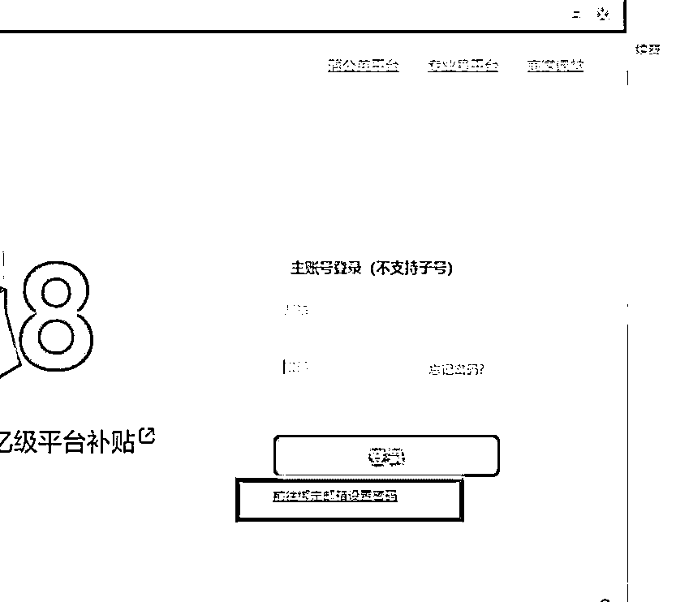
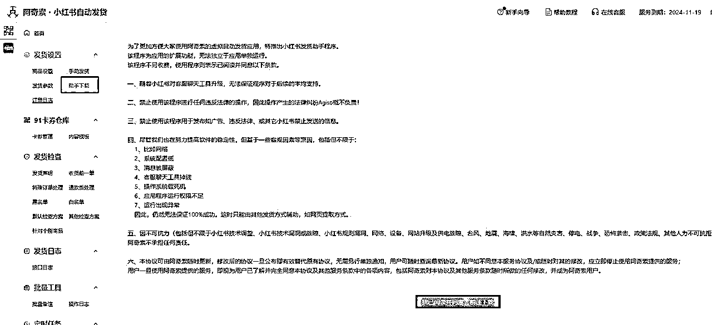
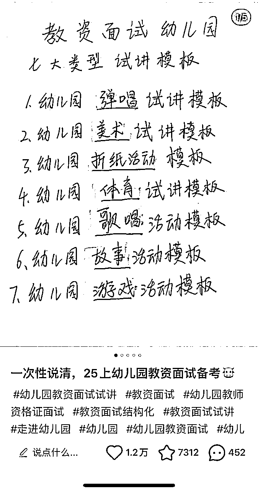
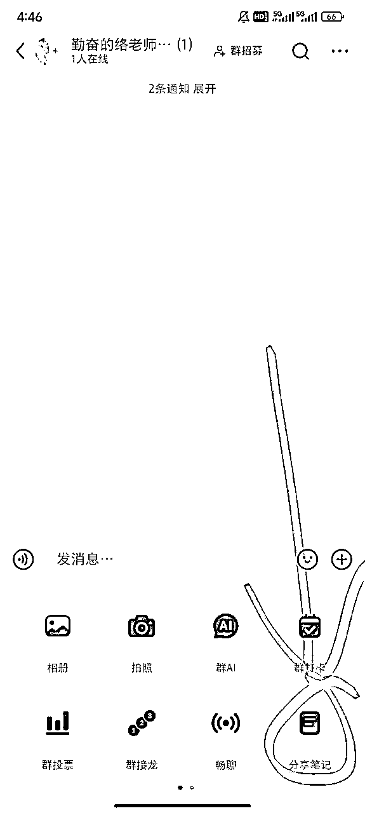
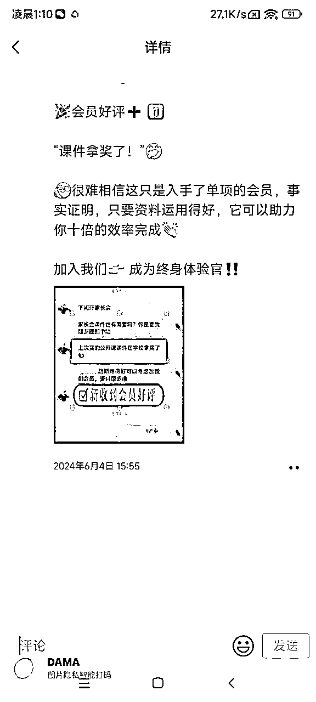

# 3 月航海｜小红书电商-虚拟产品｜实战手册

> 来源：[https://ocn93f5d9olj.feishu.cn/docx/UoRodmY3mo2CLnxwQGKcEyAWnbc](https://ocn93f5d9olj.feishu.cn/docx/UoRodmY3mo2CLnxwQGKcEyAWnbc)

# 防失联+MM188166M（李李）长期更新频繁+备用V:MG10127

手册出品方：生财有术团队

手册使用说明：内容出品人排名不分先后。本文旨在向你展示一个项目的更多可能性，帮助你更好地理解和实操。

建议：如果需要快速定位到精确内容，可以使用快捷键 Ctrl + F/command + F 的形式，搜索「关键字/词」，查找你想要的内容

# 必修篇：项目 0-1

# 💡

必修篇：为该项目从 0 到 1 跑通一个最小 MVP 的所有步骤，即“航线图”对应的行动路径。

如果你是本项目新手，建议在正式实操前，先初步了解下项目全貌：

✅ 零、项目介绍

如果你对项目整体有了大致了解，就可以按照项目核心步骤，开始学习实操：

✅ 一、选择一个赛道

✅ 二、搭建账号与店铺

✅ 三、上架虚拟产品

✅ 四、制作爆款出单笔记

✅ 五、引导成交

在必修篇，航线图和手册顺序相对应，你可以按照手册的顺序进行学习，即可逐一完成航线图的每一个任务。

接下来就正式开始吧！

本航海项目的航线图如下：

航线图和手册是高度关联的，因此你可以根据自己所在的环节，进行相关步骤的学习。

# 零、认识虚拟资料店铺

# 0.1 什么是虚拟资料店铺？

虚拟资料店铺是小红书电商的一种，和其他小红书商家没有区别，唯一的区别在于虚拟资料不用物流发货，没有物流成本，并且退货率低。

一般虚拟资料店铺的退货率都很低，几乎为 0，这取决于当你完成发货这个动作，其实用户已经消费了这个产品。另外，购买虚拟资料的消费者一般都默认自己不会退货。

虚拟资料和其他电商商家一样，都可以在店铺直播，同时也可以使用乘风平台进行推广；

另外，小红书在今年也逐渐开始和小红书虚拟商家进行建联，流量扶持等，比如最近就在扶持课件类商家。

# 0.2 为什么建议大家开店铺

在小红书开店，可以大大减少后端的运营成本，当你在小红书开店铺后，只需要围绕着产品和流量两个部分展开，并且不用担心私域引流的风险。

同时，当你如果有后端运营需求，或者有自己的产品体系，想在微信端升单成交的话，小红书店铺也可以作为合规的“引流手段”。

比如，你可以设置 0.1 元的商品见面礼，让消费者下单，通过自动发货的小程序，让用户主动添加你微信，在后端完成转化。

另外，在小红书店铺开店是在顺势而为：

小红书电商是小红书商业化的重点部分，而用户在小红书开店是其中的核心战略，在小红书开店不仅可以前期 0 押金入驻，同时还有很多商家的笔记任务，当你完成了规定的笔记发布，就可以获得流量。

这对于急需流量的商家来说，是最大的利好消息。

# 0.3 为什么建议做赛道深耕

对于大多数人，最优解还是要把一个赛道做透，也就是所谓的赛道深耕。

因为理解和认识一个赛道需要大量的学习成本，当你这个赛道还没有了解透彻，就去下一个赛道，这样不仅耗费你的精力、心力，你还拿不到结果。

先给自己一些试错和等待的时间，先争取在一个赛道拿到最小的正反馈，形成经验和自己的方法论，再去考虑如何去赋能其他赛道。

并且，当你深耕一个赛道时间越久，你的护城河就越深。

举个例子，比如你要做职场的简历赛道，你发的笔记越多，你比其他人的优势越强，因为你的笔记越多，相关的关键词就越多，用户搜相关问题，搜到你的概率就越大。

比如，你售卖的是简历模板，那么通过搜索成单的几率越高，这样就能源源不动的帮你【自动出单】，别人很难快速短时间撼动你的位置。

所以，深耕的本质是相信复利。

# 一、选择一个赛道

# 💡

# 章节概要：

选择大于努力，方向不对，努力白费，在一个优质赛道中深耕所能带来的效益，在大多数情况下，比在一个低质赛道高很多。

选择赛道主要看 2 个因素：

1.

外部因素：市场环境，决定项目难度和收益天花板

2.

内部因素：兴趣与优势，影响你深耕这个赛道的毅力

赛道意味着起跑线、也意味着天花板。

# 💡

# 本章航线图

完成本章节的学习和实操，即可完成航线图的：

第一阶段：完成定位、开店、上架（约 3 天）

1.

对 10 个竞品进行调研，挖掘细分需求（约 2 天）

2.

确定 1 个适合自己的赛道和品（约 1 天）

# 1.1 如何做个人优势资源盘点与定位

只有适合你自己的赛道，才能如鱼得水。

看到很多博主，他们其实有很强的内容表达能力，但是由于没有合理分析自己的优势是什么，直接扎入一个不熟悉的领域和赛道，最后草草收场。

欲速则不达，你想要做小红书虚拟产品，一定要先学会盘资源和找准自己的定位。

为什么盘资源和找定位如此重要？

如果你没有去盘自己的优势资源，你最后很容易陷入选题慌，比如你是经验丰富的 HR，你非要去走上美妆赛道，HR 赛道你是专业的，你过往有大量的经验积累，在小红书上表达如鱼得水，你有源源不断地选题，起号对你来说不是难事，你只是把自己过去的经历和经验转移到小红书上。

这类的经验鲜活、独特、专业，很容易吸引算法和粉丝

而这个时候，你再开发出相应的虚拟产品和服务，真正完成了商业闭环，你也从打工人的角色转变成生意人，完成角色的蜕变。

那么到底该如何盘资源和找定位呢？

第一步自我提问：你是否完成过一些成就，完成这个成就的过程中，经历了挫折和失败，虽然过程曲折，但是你最终战胜了自己，并且有足够丰富的表达欲去表达这件事，以及这个经验很利他。

这个问题很重要，因为它对你来讲是隐藏的内容金矿，因为你不去刻意搜索，大脑很难想象你有这么一段经历；

而这个问题得关键在于【这个经验是否利他】

因为你要挖掘出能够利他的因素 ，否则你整理出来太小众，不仅无法引起共鸣，同时也会打击你的自信心。

所以，你要找到真正的市场和你的优势进行匹配，将你的知识残片变为他人的生存刚需。

如果你还是不知道如何盘点资源，可以参考以下几个问题，进行自我提问。

1.

你拿到过什么大结果，且这个大结果没有拿到过？

2.

你是否在某个领域有超过其他人的经验积累，比如考公、考证、考研等等？

3.

你是否有很强的基础技能：飞书多维表格、Notion 模板搭建、视频剪辑、AI、PS、PPT、手绘、Procreate 做饭等等。

4.

你是否有其他人不具备的复合标签，比如大厂、35 岁、父婴博主、留学经历、正在装修房子、即将罗茨、数字游民、减肥成功等等。

5.

在核心课题上，你有没有一些傲人的成就和表达欲，以及跳脱俗人视角下鲜活的个体感受（核心课题：事业、家庭、个人成长、健康、成为更好的自己）

我举个例子，比如你非常擅长搭建飞书多维表格，你就可以去根据用户的需求，创建不同场景下的【飞书解决方案】

现在正是春招的招聘季， 有的小红书博主就用飞书多维表格开发了春招进度表，卖了 3000 多份。

假如你对自己的优势没有思路，可以去参考上面这 5 个问题。

识别需求很重要，也要学会创造需求

你能想到的解决方案，其他人也能想到，所有人都可以想到的办法一定不是好办法，很容易把智力劳动变成体力活。

不要去卷一个没有门槛，完全耗费时间的赛道，虽然可能你看到了很多人都拿到了结果，但是他们可能并没有披露什么是胜负手。

所以，去构建自己的数字产品尽量完全去复制他人的商业模式，比如别人卖中小学资料，你看到人家销量很好，你也去卖，但是发现你根本开不了单。

最根本的原因在于你只是去单纯复制他们的产品，但是这并不是你的主战场，可能对方是 K12 教育的老师，非常了解学生的需求，发的笔记能够解决学生痛点，但是你的内容非常普通毫无亮点。

识别需求很重要，创作需求更重要；

因为只有创造了需求，并且这个需求能够被消费者认可，你才可以建立起来自己的差异化优势，也就是你的利基市场，或者是我们常说的第一个吃螃蟹的人。

但是要注意一点，虽然你创造了新的需求，由于国内的市场竞争尤为惨烈，也有可能被模仿的可能，所以在前期需要迅速扩大自己的结果（销量、笔记数）

这个道理很简单，如果你是买家，在低客单的情况下，一定是选择销量高的商品，假如你在小红书搜简历模板，你会看到卖同样的产品，有的人可以卖 3w 单，但是有的人只是几十单。

所以，前期的准备工作一定要【到位】

那么如何创造需求？

一个需求存在在但是没有被发现的【黄金准则】：

1.它存在一定的技术门槛；

2.它可以被解决，但是很紧急；

3.它有一定的社交属性，能够分享到朋友圈

4.它经常让人发出感叹：这也能赚钱？

所以，可以去小红书看有大量类似的需求；

比如针对第一点【它存在一定的技术门槛】：专业软件的安装，CAD 安装教程都可以售卖几千单

比如针对第二点【它可以被解决，但是很紧急】：专业证件照 P 图，特别是工牌照，海马体，新婚照等等

针对第三点【它有一定的社交属性，能够分享到朋友圈】：手写婚书，小朋友生日视频定制【奥特曼】

# 1.2 如何选赛道

从你的经历去挑选，就是根据 "求学、工作、爱好兴趣，以及身份 " 等选一个，

千万不要像叶公好龙把 "没经历过，但脑子觉得不错"的事情作为你的赛道，要把上帝给你的每个经历当作礼物，比如：

对于你的求学生涯，你刚开始是专科，然后专升本，之后考上了研究生，那么你可以做专升本、考研。

对于你的工作经历，你是一名英语教师，或者做过英语家教（反正跟英语教育扯上关系），那么你可以去做英语。

对于你的爱好兴趣，比如你喜欢把读书心得、课程笔记做成竖屏思维导图，那么你可以考虑做竖屏思维导图。

对于你的身份里，你有一个女儿在上小学一年级，你是一名宝妈，那你可以去做一年级，或者你可以去做宝妈能变现的事情。

如果你还是不知道选什么，可以看看这 4 个方法【9.1 选择优质赛道的方法】，或者直接让教练推荐一个是最快的，最好是跟某个教练做一样的赛道，甚至跟他卖一样的产品，有什么问题立马找他解决，毕竟骑着同行过河不如骑着教练过河快。

# 1.3 案例分享：宝妈如何用育儿经验做早教资料包

对于宝妈来说，很多人都找不到合适自己的领域，或者是不知道该做什么副业。

其实对于宝妈这个群体来讲，除了做博主外，目前还有一个红利性赛道，那就是去卖虚拟产品。

首先，为什么宝妈适合去卖虚拟产品，以及要卖什么虚拟产品？

除了宝妈群体外，很多人都有一个定位的误区，那就是看什么赚钱都想去做，同时也有很多知识付费博主去宣扬只要你报了我的课，就确保你包赚的。

这种一般你很难赚到钱，因为在这个赛道你是小白，你没有太多的经验积累，你和所有人都在一个起跑线，以及任何一个成熟的领域和赛道，都有非常多的专业玩家机构入场。

他们都是团队作战，高度 SOP 化

就像前段时间非常火的郑州帮，他们高度 SOP 化，标题、封面图、内容结构、内容模型都已经分给不同的人，而对于普通人来讲，你没有团队，在标题、封面图、内容上你都得亲力亲为。

所以，你也很难在【热门领域】和对方抗衡，最终你花费了很多时间也没有拿到结果。

其实对于虚拟产品来讲，最最最重要的一件事，就是要去盘点你的资源，你有什么，你擅长什么，你经历过什么，总结出什么经验，你有什么别人没有的且这个东西对他人有用？

这就是你的优势资源，你的核心竞争力。

而对于宝妈这个群体，同样适用

宝妈领域最好的虚拟产品就是成为这个领域的小专家，将你的育儿经验封装起来。

# 01 卖出 800 多份食谱，做虚拟产品要学会找角度

我看到一个宝妈的案例，很值得学习；

所有养过小宝宝的宝妈可能都遇到一个头疼的问题，宝宝辅食以及宝宝对一些食物会出现不耐受的情况，而对于新手宝妈来讲，这就是一个很棘手的问题，因为她们没有经历过这些问题，所以她需要一些真正解决问题的生活经验。

这个场景很像高三复习的时候，大家都喜欢看上届学霸学长学姐的复习笔记，因为这类经验是最鲜活的，最落地的，最见效的。

所以，你走过的路、踩过的坑，失败后的经历、沉底和反思都可以总结成经验，去打包卖给需要的人。

这个宝妈的操作是专注于敏宝饮食

比如她的店铺销量最好的《敏宝辅食表》，定价 36.9 元，销量已经 800 多份了；《牛奶蛋白过敏脱敏手册》同样定价 36.9 元，销量 109 份。

同时还推出了牛奶蛋白过敏 1V1 咨询，售价 45.9 元，卖出 186 份。

对于宝妈这个领域，她并没有直接去切入新手妈妈的指南这类笼统的虚拟产品，而是从具体场景、具体问题入手，去切入，去给到解决方案。

# 02 我个体的经验太单薄，内容密度不够，没有人下单怎么办

很多人都有这个担心，因为个体的经验相对来说比较单薄，并且很多人想要做虚拟产品遇到的卡点问题就是他们没有案例，只有理论，内容太少，无法形成一个看似有市场的虚拟产品。

这个时候就要学会吸收他人经验，快速让自己成长起来成为专家，最简单有效的方法就是加各种群，比如公众号的粉丝群，各个大 V 的群，专业的宝妈交流群，育儿交流群等等

去看看他们在谈论什么，焦虑什么，有什么问题，他们的提问，就是你制作虚拟产品最好的养料。

其次，去看小红书，特别是要看那种求助帖、评论回答多的问答帖，以及那些高赞的评论，都是你需要关注的问题。

只有你看的多了，并且认认真真做一个记录者，你就可以快速成为专家。

你不用太资深，你只需要做到相对专业，新鲜的经验最重要，能落地的隐性知识也很重要，俗称 80 分教 60 分，60 分可以教 40 分。

# 1.4 赛道推荐

本期航海给大家推荐 3 个主流虚拟资料赛道，适合长期深耕：

教育资料：比如学前、K12、小升初/初升高/高考志愿规划、考研、四六级、专升本等

考试资料：以当季热门考试为主，本期给大家列举的是 25 年上半年热门考试，比如成人自考、二建、专升本等

成长技能：比如 PPT 模板、知识库、大学生实践报告、职业规划等

其他小众赛道：比如宠物训练、摄影滤镜、装修避坑等

大家可以先看看下方列举的每个赛道的对标账号店铺、内容形式，结合自身优势与兴趣，最后选择 1 个细分赛道入手，作为自己的航海项目。

# 赛道 1：教育资料

各阶段对标店铺、内容形式展示：

幼小启蒙

k12-小学

k12-初中

k12-高中

大学

考研

自考/成考/统招专升本

# ① 幼小启蒙

赛道说明：

1.

目标客户：宝妈宝爸/幼教从业者

2.

赛道主要提供学科启蒙类、综合素质类以及幼教从业者资料。

3.

资料包括数学启蒙、语文启蒙、艺术启蒙、体育启蒙、科学启蒙等相关资料。同时针对教师提供教学课件 ppt、教学教案、工作计划表等。

4.

提供定制化服务 SKU，如根据客户需求定制课件或教案。

黄金时期：

5.

一级黄金时期：开学季（3 月、9 月）开学季是家长为孩子准备新学期学习资料的关键时期，幼小启蒙资料的需求量会显著增加，重点推广幼小衔接课程、拼音学习资料、数学启蒙资料等热门内容，满足家长的集中需求。

6.

二级黄金时期：学期中期（4 月至 5 月、10 月至 11 月），家长可能会根据孩子的学习情况补充学习资料。推出亲子互动游戏、手工制作、绘本阅读等特色资料，吸引家长关注。

7.

三级黄金时期：学期末（6 月、12 月）学期末，家长可能会为孩子购买复习资料或为下一学期做准备。发布育儿经验分享、教育理念等内容，吸引潜在客户，同时推出一些基础学习资料作为引流产品。

# ② k12（小初高）

赛道说明：

1.

目标客户：各阶段家长/教师

2.

赛道主要提供学科资料、期末/升学备考资料、教学资料（针对教师）。

3.

学习资料包括小初高阶段语文、数学、英语、文理科等科目的学习资料（（知识点总结、基础练习、解题技巧、专项练习、单词记忆方法、语法精讲、公式总结、实验操作指导等），及备考资料（中考真题解析、模拟试卷、备考计划、小/中/高考冲刺资料包等），帮助学生提高提高成绩、预习新课程或备考小/中/高考。针对教师提供座位表、家长会 PPT、教学活动方案、试卷模板、教学大纲等。

4.

提供学习计划定制，在线课程、答疑服务，通过对接教育机构，提供官方授权课程和辅导资料，进行高客单变现。

黄金时期：

5.

一级黄金时期：

a.

期中考试和期末考试前夕（通常为每学期的中后期，即 4 月、6 月、10 月、12 月），是学习资料需求最集中的时期，销售量最高。

b.

中考和高考前 3 个月（3 月至 5 月）中考和高考备考冲刺阶段，考生和家长对备考资料的需求最为强烈，尤其是模拟试题、历年真题和答题技巧。

6.

二级黄金时期：寒暑假期间（1-2 月、7-8 月），家长购买学习资料以帮助孩子巩固知识和预习新学期课程，市场需求较大。

7.

三级黄金时期：开学初期（3 月、9 月），家长为新学期做准备，会集中购买相关学习资料。

# ③ 大学

赛道说明：

1.

目标客户：在校大学生

2.

赛道主要提供学科资料、期末备考资料、教学资料（针对教师）。

3.

学习资料包括各学科的专业教材、课程笔记、实验教程、考试重点、复习资料、模拟试卷、四六级考试资料（如真题+技巧+词汇）、时间管理技巧、 数字工具模板（如 PPT 模板、Excel 模板）等。

4.

提供学习计划定制，在线课程、答疑服务等。

黄金时期：

5.

一级黄金时期：

a.

开学季（9 月至 10 月），开学初期，大学新生和老生都需要大量的学习资料来准备新学期的课程，此时对教材、学习笔记、课程辅导资料的需求旺盛。

b.

考试季（5 月至 6 月、12 月至次年 1 月），期末考试和期中考试前夕，学生对复习资料、历年真题、模拟试卷等备考资料的需求达到高峰。

6.

二级黄金时期：

a.

学期中（3 月至 4 月、10 月至 11 月）学期中期，学生对学习资料的需求相对平稳，但仍有部分学生需要补充学习资源。

b.

毕业生需要准备毕业设计、论文等资料，同时部分学生会提前准备考研或求职相关的学习资料。

7.

三级黄金时期：开学前准备期（8 月至 9 月），学生在开学前会集中购买新学期的学习资料，为新课程做准备。

# ④ 考研

赛道说明：

1.

目标客户： 在校大学生/应届本科生/往届毕业生

2.

赛道主要提供入学考试的公共课以及专业课复习资料。

3.

学习资料包括各学科教材精讲、重点知识点总结、历年真题及解析，英语词汇手册、语法精讲、写作模板，数学公式总结、解题技巧，学习计划表、备考攻略、时间管理工具，在线模拟考试系统、题库等。

4.

提供考研专项培训课程、考前冲刺班、复试指导。

黄金时期：

5.

一级黄金时期：考研初试前的 3-6 个月（7 月至 12 月）这是考研备考的关键时期，考生对复习资料的需求最为旺盛，尤其是政治、英语、数学等公共课的真题解析、模拟试卷、考前押题等冲刺资料。

6.

二级黄金时期：

a.

考研报名期间（9 月至 10 月）考生开始正式备考并报名，对基础复习资料、备考规划、学习计划等需求较高。

b.

考研复试前（次年 2 月至 4 月）考生需要进行专业课和面试准备，对复试资料、面试技巧、专业课冲刺资料的需求增加。

7.

三级黄金时期：

a.

寒暑假期间（1 月至 2 月、7 月至 8 月）考生利用假期时间进行预习或复习，对基础学习资料的需求相对稳定。

b.

开学初期（3 月、9 月）新学期开始，考生会集中购买相关学习资料，为新阶段的备考做准备。

# ⑤ 统招专升本/成人自考/成人高考

赛道说明：

1.

目标客户： 准备参加各考试的学生及社会人员群体

2.

赛道主要提供入学考试的公共课复习资料、专业课复习资料。

3.

学习资料包括公共课（语文、数学、英语、政治、信息技术等，因省份而异）的教材精讲、知识点总结、历年真题及解析、模拟试卷、答题技巧，个性化备考计划、学习时间管理工具、 在线模拟考试系统、题库练习等。

4.

提供考前冲刺班、答疑服务，专项培训课程， 考试报名指导、院校选择分析等。

黄金时期：

5.

一级黄金时期：备考冲刺阶段（考前两个月左右），这是统招专升本备考的关键时期，考生进入备考冲刺阶段，对复习资料的需求最为旺盛，尤其是真题解析、模拟试卷、考前押题等冲刺资料。

6.

二级黄金时期：考试报名前，考生开始备考并准备报名，对基础复习资料、备考规划、学习计划等需求较高。

7.

三级黄金时期：成绩公布后，未通过考试的考生可能会开始准备下一次考试，对复习资料的需求增加。

# 赛道 2：热门考试

考证类

招聘类

# ① 考证类

赛道说明：

1.

目标客户：对相关证书有需求的考生

笔试：

2.

赛道主要提供备考资料、面试指导等。

3.

学习资料包括教材精讲、备考规划、历年真题、模拟试卷、 考前冲刺资料等。

4.

提供刷题软件、在线课程等。

面试：

5.

赛道主要提供面试备考资料、面试指导等。

6.

学习资料包括备考规划、历年真题、模拟试卷、 考前冲刺资料、面试技巧等。

7.

提供在线课程、一对一辅导等。

黄金时期：

笔试：

8.

一级黄金时期：

a.

考前 2 个月左右（报名后～考前），考生进入紧张备考阶段，对复习资料和备考规划的需求最为旺盛。

b.

考前 20 天左右（准考证打印～考前）：考生集中冲刺备考，对押题卷、历年真题和答题技巧的需求达到高峰。

9.

二级黄金时期：官网出考试公告～考试报名期间，考生开始备考，对教材精讲和学习计划的需求较高。

面试：

10.

黄金时期：

a.

笔试成绩公布后至考前（一般为一个月左右），考生进入面试备考阶段，对面试技巧、模拟题库和真题解析的需求最为旺盛。

b.

考前一周左右，属于考前冲刺阶段，对模拟面试和一对一辅导的需求达到高峰。

# ② 招聘类

赛道说明：

1.

目标客户： 应届毕业生/应届毕业生/在职人士

2.

赛道主要提供求职简历模板、笔面试资料、职业规划、春招时间表、行业分析及岗位推荐指南、模拟笔面试与题库等。

3.

学习资料包括简历模板、求职规划指南、笔面试资料、企业真题解析等。

4.

提供刷题软件、网课，在线职业规划课程、一对一简历修改服务。全流程套餐（职业规划→简历修改→网申→笔试指导→面试辅导）

黄金时期：

春招：

5.

一级黄金时期： 3 月至 4 月：春招高峰期，企业集中招聘，求职者对面试技巧、模拟题库等需求达到高峰。

6.

二级黄金时期：2 月至 3 月：春招正式启动，求职者集中准备简历和面试，对相关资料需求最为旺盛。

7.

三级黄金时期：

a.

1 月至 2 月：春招预热期，部分企业提前发布岗位，求职者开始准备简历和求职资料。

b.

4 月下旬至 5 月：春招尾声，部分企业仍有补录机会，求职者对资料的需求有所减少，但仍有需求。

c.

5 月至 6 月：春招基本结束，但部分企业开始招聘暑期实习生，可以推广实习相关的简历模板和面试技巧。

招聘类：

8.

一级黄金时期：考生收到笔试通知～考前，临时抱佛脚的多，属于备考高峰期，是学习资料需求最集中的时期，销售量比较高。

9.

二级黄金时期：开始报名考试后～考生收到笔试通知前，此阶段属于准备阶段，是备考高峰期，热度次之。

10.

三级黄金时期：官方招聘网站出考试公告～开始报名前。

# 25 上半年热门考试

事业单位联考（3 月 29 日）

春招（央国企招聘，银行招聘，各企业招聘）（招聘时间不一，集中在 3～4 月）

全国计算机等级考试（NCRE）3 月 29 日～31 日

统招专升本（各省份时间不一，考试时间集中在 3～4 月）

成人自考（4.12～13 日）

卫生专业技术资格考试（初级/中级护师/药师/医师等）（4 月 12 日、13 日、19 日、20 日）

护士执业资格（4 月 26 日～27 日）

二级建造师（5 月 10～11 日）

中小学教师资格考试（面试）（每年两次，25 上半年为 5 月 17～18 日）

监理工程师（5 月 17 日～18 日）

初/高级会计资格（5 月 17～20 日）

初/中级社工证（5 月 24～25 日）

计算机技术与软件专业技术资格（软考）（5 月 24 日～27 日）

英语四六级（笔试 6 月 14 日）

高等教育自学考试（每年两次，25 上半年为 4 月 12 日～13 日）

银行从业资格考试（初级、中级）（6 月 14 日～15 日）

高考 （6 月 7 日开始）

# 补充：各领域相关考试信息

# 赛道 3：成长技能

PPT 模板

知识库

大学生实践报告

职业规划

# ① PPT 模板

赛道说明：

1.

目标客户：学生群体/职场人士/自由职业者和创业者/培训师和教育工作者

2.

赛道主要提供 PPT 模板，帮助客户节省时间，从而提高工作效率。提升客户制作 PPT 的专业性，满足客户的多样化需求。

3.

资料包括通用商务模板（商务汇报、项目策划、市场分析等），行业专属模板（互联网、教育、金融、医疗等行业模板），创意与设计模板（动态 PPT 模板、创意设计模板），营销与推广模板（小红书营销策略、品牌推广、活动策划等）

4.

提供定制化模板设计服务，提供 PPT 制作培训课程等。

黄金时期：

5.

一级黄金时期：毕业季（5 月至 7 月），学生需要 PPT 模板用于毕业设计、毕业答辩。

6.

二级黄金时期：求职季（9 月至 11 月），职场新人和求职者需要高质量的简历和面试 PPT 模板。

7.

三级黄金时期：年末总结与年初规划（12 月至次年 1 月），企业和个人需要 PPT 模板用于年度总结和新年规划。

# ② 知识库

赛道说明：

1.

目标客户：个人用户（自学者/自由职业者）

2.

赛道主要提供行业、体系等知识库，可以帮助个人用户快速获取学习资源，例如语言学习知识库、编程知识库等，提升自我学习效率。

3.

资料包括：语言学习知识库（多语种语法速成包（英语、日语、编程语言等）、口语实战素材库（场景对话、发音纠正音频）、考试冲刺资料（雅思/托福高频词汇库、语言等级考试真题））、职业发展知识库（自由职业者工具包（接单技巧、客户沟通模板、税务管理指南））、技能提升课程（技能提升课程（Python 入门、数据分析实战、设计软件教程）、副业变现指南（自媒体运营、电商选品、AI 工具使用手册））、效率提升知识库（时间管理模板（周计划表、任务优先级矩阵）、学习方法论（快速阅读技巧、知识体系搭建框架））等

黄金时期：

4.

一级黄金时期：

a.

1-2 月，新年学习计划期（语言学习包、效率工具）

b.

9-10 月，开学/自我提升热（编程知识库、副业变现包）

5.

二级黄金时期：

a.

6-7 月，暑假学习季（学生/自由职业者技能提升）

b.

11-12 月，双 11 促销（课程折扣、组合包秒杀）

6.

三级黄金时期：

a.

5 月自由职业者日（副业指南、接单技巧特惠）

b.

开学前预热（编程/语言学习资料促销）

# ③ 大学生实践报告

赛道说明：

1.

目标客户：大学生群体

2.

赛道主要提供实践报告模板、写作指导和示例，帮助学生快速了解实践报告的结构和写作要求，节省时间和精力。提升报告的专业性。

3.

资料包括：不同专业（如理工科、文科、商科等）的实践报告模板，毕业设计、实习报告、课程实践报告等

4.

提供定制化模板设计服务，提供一对一写作指导。

黄金时期：

5.

一级黄金时期：

a.

毕业季（5 月至 7 月），毕业生需要高质量的毕业设计和实践报告模板。

b.

实习季（6 月至 9 月），大学生进入实习阶段，需要实习报告模板和写作指导

6.

二级黄金时期：

a.

开学季（9 月至 10 月），新学期开始，学生需要实践报告模板用于课程项目，

b.

学期中期（11 月至 12 月），学生开始准备学期实践报告，对模板和写作指导的需求增加。

7.

三级黄金时期：寒暑假期间（1 月至 2 月、7 月至 8 月），学生利用假期时间提前准备实践报告。

# ④ 职业规划

赛道说明：

1.

目标客户：大学生和应届毕业生/职场新人/在职人员/自由职业者和创业者

2.

赛道主要提供职业规划资料或模板，帮助客户更好地规划自己的职业生涯，实现个人和职业目标。

3.

资料包括：职业生涯规划书， 职业规划模板、SWOT 分析工具，职业目标设定表、时间管理工具，简历模板，行业分析报告等

4.

提供职业规划课程，提供一对一职业规划咨询服务，提供定制化职业规划方案等。

黄金时期：

5.

一级黄金时期：

a.

毕业季（5 月至 7 月），大学生面临毕业和职业选择，对职业规划资料需求旺盛

b.

求职季（9 月至 11 月），职场新人和在职人员集中求职或转行，需要职业规划指导。

6.

二级黄金时期：年初规划（1 月至 2 月），职场人士和学生开始制定年度职业目标，对规划资料需求增加

7.

三级黄金时期：学期中期（4 月至 5 月、10 月至 11 月），学生和职场人士需要中期调整职业规划，对相关资料需求增加

# 其他：小众赛道

宠物训练

摄影滤镜

人性思维

装修避坑

# ① 宠物训练

赛道说明：

1.

目标客户：宠物主人/宠物行业从业者/宠物爱好者

2.

赛道主要提供专业的宠物训练资料，可增值一对一视频指导。解决宠物的常见行为问题，减少因行为问题导致的困扰。提供定制化的训练方案，帮助宠物主人根据自己的需求和宠物的特点进行训练。提升宠物的生活品质和主人的养宠体验。

# ② 摄影滤镜

赛道说明：

1.

目标客户：专业摄影师/摄影爱好者

2.

赛道主要提供相机滤镜资料以及不同场景下的滤镜选择和应用技巧，帮助客户提升拍摄效果，满足不同场景下的拍摄需求。

# ③ 人性思维

赛道说明：

1.

目标客户：职场人士/创业者和企业管理者/个人成长与自我提升爱好者/营销和销售人员/心理咨询师和培训师

2.

赛道主要提供系统的人性思维相关资料，帮助客户更好地理解人性，提升思维，解决实际问题，提升个人和职业发展的竞争力。

# ④ 装修避坑

赛道说明：

1.

目标客户：装修小白/自装业主/中高端住宅业主/二次装修或翻新业主/商业空间装修业主

2.

赛道主要提供从装修前期准备到施工验收的全流程避坑资料、实用工具和表格等。可增值一对一咨询服务，提供个性化的避坑方案。通过提供全面的装修避坑资料和服务，帮助客户在装修过程中少走弯路，提升装修体验和满意度。

# 1.5 选品

小红书虚拟产品，主流的选品方法包括：

一、从爆款笔记找爆款选品

二、通过淘宝选品（新手推荐⭐）

比较推荐新手常用的是【方法二、通过淘宝选品】，淘宝的分类页面，有目前国内所有主流搜索电商平台里，最全面的类目，也是国内最成熟的电商平台，且不涉及付费。

当然，对于新手来说，前期也需要多借助【方法一、从爆款笔记找爆款选品】多刷小红书爆款笔记，来了解平台当前卖的好的是哪些品，毕竟各平台还是存在一定差异的，同时也能培养下网感。

下面给大家展示具体的选品方法教程。

# 1.5.1 从爆款笔记找爆款选品

如下图所示，一篇笔记爆了，关联的商品详情页写着“ 24 小时内 100+ 加购 / 购买”，说明这份资料是火的。

如果这份资料没有明确的版权，那么直接上架到你的店铺。

这份资料火了，很可能代表它的类型火了，比如这篇爆款笔记的资料是小学英语语法专项练习，类型是英语语法（如果你不知道这个资料是什么类型，可以看笔记的话题标签），那么你可以到小红书搜索英语语法，点击商品选项，再点进去每个资料的商品详情页：

1.

一旦写着 “24 小时 xx 人加购/购买”，直接上架。

2.

如果没有写 “24 小时 xx 人加购/购买”，但写着“3 个月内 xx 人购买”，点击商品评价的最新，如果近 7 天有 20+ 好评，那么也可以上架。

# 1.5.2 通过淘宝选品

直接去淘宝搜电子资料，多刷，多收藏，遇到卖得比较好的店铺就收藏起来，这样可以把一个淘宝号给培养出来，后续系统会给你推送各种电子资料，各种卖得好的店铺，这样就有源源不断的选品源头，拼多多也一样的思路。

在淘宝卖得好的资料，在小红书就一定卖得不会差，这点很重要。

# 💡

在淘宝销量高的的资料，我们只需要 3 步，简单验证一下即可

第一步：先在小红书搜索该资料相关的笔记，看看笔记的数据怎么样，如果笔记的数据很好，有很多高赞的笔记，说明这个资料在小红书的需求量不低。

第二步：再去小红书商城看看，有没有人卖这个资料，销量如何，只要销量没有超过淘宝的销量，就是可以卖的，因为小红书的搜索量基本上都淘宝高，按理来说小红书的销量应该比淘宝高，如果小红书商城的销量比淘宝低很多，说明需求量远远没有被满足，那就是一个还不错的品。

第三部：验证这个品是否符合时间线，只有符合时间线的品，才有真正的需求，比如说你选的 K12 期末的品，它只有在每年的五六月、十二月和一月有强烈的需求，其它时间线就没什么需求。

就这么简单的 3 步，选品的时候就这样简单判断一下就足够了，不需要太纠结选品。

举个例子：

现在是 2025 年 3 月 2 日，以 K12 这个赛道为例子，在淘宝随机找到的 2 个品，销量都还不错，从第一步的逻辑来看，是没问题的，满足在淘宝销量还不错的条件。

然后进行第二步，去小红书看看笔记的数据情况，第一个品，在小红书的笔记数据还可以，有不少大几百赞、甚至上千赞的，但是在小红书店铺端的销量，连过百的都没有，这个就是一个不错的品。第二个品，在小红书的笔记数据可以，很多千赞的笔记，但是在小红书店铺的销量也很多，有上万的销量，这个品就可以 pass 掉了。

第三步，去验证时间线是否符合符合。第一个品是”小学语文暑期衔接“的资料，它的使用时间段是每年的暑假，六七八月这三个月是它存在需求的时间点，显然现在 3 月份选择它，不合适。

验证时间线这个操作非常重要，在我们确定选一个品的时候，一定要去溯源这个品的需求是在什么时间有，什么时间强，什么时间弱，选品本质上是在选需求，我们最多可以提前一个月布局，比如 5 月份开始发暑期衔接的资料。

# 二、搭建账号与店铺

# 💡

章节概要：

小红书虚拟资料项目中，账号是我们最重要的资产，如果账号出现异常，会直接影响我们的收益。

如果希望深耕这个项目，账号搭建、养号、微信号养号是必备的技能。

# 💡

# 本章航线图

完成本章节的学习和实操，即可完成航线图的：

第一阶段：完成定位、开店、上架（约 3 天）

1.

准备至少 2 个小红书账号和店铺（约 0.5 天）

2.

完成账号与店铺的定位与包装（约 0.5 天）

首先脑海里要改变一下之前根深蒂固的观念，不同于之前引流私域对抗平台的玩法，我们现在在小红书开店卖虚拟产品，我们就是小红书电商的一个部分，是完全符合平台规则的玩法，压根不需要考虑任何违规的事情。

所以，什么一卡一机一号，要用流量不能用 WiFi、养号等等注意事项，其实是完全不需要考虑的，怎么方便怎么来。

尤其是一卡一机一号的说法，很多干过淘宝/闲鱼的圈友比较关注这个，因为官方规则里确实有说到，但不同于小红书，淘宝闲鱼处在平稳期，为了打击大量的矩阵无货源等影响用户行为的玩法，所以出台的相应的规则。

小红书现在正处在电商 GMV 的冲刺时期，平台恨不得让你多开点店铺。

# 2.1 准备账号

# 2.1.1 准备设备

✔️ 手机准备：只要是小红书没有被永久封号，永久限流这俩大的违规的设备，都可以用，小违规不影响

✔️ 电话卡准备：使用自己没有注册过小红书的手机卡 ，有老号也可以直接用，做过类似无货源这种其它项目的号也可以直接用，没有永久封号、永久限流这俩大违规的号，都可以直接用

推荐在淘宝/京东搜索电信无忧卡，5 元月租即可办一张，或者去营业厅给已经有的卡办副卡，一般月租是 10 元。

✔️ 账号准备：关于一卡一机一号，有最好，没有也无所谓，一台设备同时登 2 个号没啥问题，不需要考虑连 wifi、流量的问题，怎么方便怎么来

# 2.1.1.1 手机准备

大家都知道，如果是个人的话，可能设备比较少（十台以内），做到工作室矩阵级别，那用到的设备数量是 10 台以上，甚至上百台。这里给大家做一些工作室常用设备推荐。

苹果设备推荐机型

iphone7：工作室钉子户，性价比高，流程速度快

iphone8：游戏和短视频居多，功耗低运行速度快

iPhoneSE2：存在感差，直播电商短视频都 OK

iphoneX：直播电商短视频养号，预算充足可上

安卓设备推荐机型

红米 10x：中规中矩

小米 10 青春 8+128g：性能好

小米 8 青春小米 8se：多人用的

安卓设备还有很多，这里就不一一列举了

原则上：

能买二手的就别买全新的，当然现在很多国全新设备“便靓正”。

能买原装就别买组装（注意辨：无指纹无面容=拆机） 尽量不要去闲鱼

能买国行就别买外版

买配置别买外观

买品牌不买杂牌

具体机型：优先考虑 8+128GB

年限：4 年内安卓&6 年内苹果机*

建议是能够由 2 台或以上的手机，因为机器越多，成功的概率就越高，并且去营业厅办理三张及以上的手机卡，月租选最便宜的，但需要有流量，流量最好是 20G 以上，用 1 张主卡绑定 2 张副卡的模式办理，你营业厅直接和工作人员说，她就会给你推荐卡了。

# 2.1.1.2 电话卡准备

办卡渠道一：当地营业厅直接办理。

办卡渠道二：直接支付宝搜“号卡中心”可直接办理。

办卡渠道三：淘宝/京东搜“电信无忧卡”，月租仅需 5 元。

# 2.1.1.3 账号&店铺准备

# 个人店

个人店铺只需要一张身份证，和一个实名过的小红书号，其它什么材料都不需要，店铺申请很快就能审核通过。

# 个体店

个体店需要一张个体户的营业执照，如果办，最好是办百货店的，闲鱼/淘宝代办现在大概是 100 左右一张

# 企业店

企业店就是用公司的营业执照去申请店铺，相对个体店，没啥太大用处，反而还要涉及到税务等东西，很麻烦，可以直接忽略它

# 应该选择开什么店铺

如果是新手小白，什么都不需要，直接去申请开个人店铺即可。

如果你是有一定经验的，建议直接先用个体工商户去认证蓝 V（需要花 600 块），然后再去开店铺（个体店），这样后期如果想要做矩阵号，可以直接绑定。

# 2.1.2 注意事项

以下注意事项，均为以防万一的操作，尽量规避

1）新号不要直接挂商品链接

我的真实经历，有 2 个新注册的账号，注册完就疯狂发商品笔记，几天之后显示账号近期发布过多不符合平台规范的内容，暂不支持薯条投放。

但是更多的号做了相同的操作，并没有出现这样的情况，我无法确定是概率问题，还是运气问题，亦或是发的内容真的有问题，毕竟变量太多，无法确定具体的原因。

保守起见，我们的新号统一前面 3 天可以发笔记，但是不要直接挂商品链接，等到后面重新编辑笔记挂上商品链接，3 天之后，可随意操作。

2）避免一切看起来“像引流的操作”

1.

不要在个人简介放“私戳”、“后台踢我”等等看起来像引流的歧义词语，就算你不是真的想引流，小红书现在抓得很严，宁错杀，不放过。

2.

不要在小红书账号回复私信，即使你是想引导用户去店铺下单，用词稍微不当，也有可能会被以为是引流，千帆手机端现在可以直接回复用户的私信。

3）笔记的小眼睛为 0 或者很低都很正常

从 2024 年 9 月 26 日开始，小红书的基础播放的小眼睛急剧下降，如果你的笔记小眼睛很低、或者为 0，在内容过关的情况下，基本上都是下面 3 个问题。

3.

平台小眼睛的基础播放量本来就低，原来至少还有一百左右的小眼睛，现在就变成了几十，甚至一二十。

4.

推流启动很慢，经常 1，2 个小眼睛，甚至 0 个小眼睛，需要等上一天，甚至好几天播放量才会增加。

5.

出现流量显示 BUG，笔记显示个位数小眼睛，但是实际不止这么多。

另外还有一个误区，很多人喜欢把抖音的播放量和小红书的小眼睛等同起来，所以在体感上总觉得小红书的小眼睛很低，怀疑自己账号是不是出问题了，是不是被限流了...

切记，抖音的播放量×8%，换算过来才等同于小红书的小眼睛。

# 2.1.3 定位包装

适用平台：微信、抖音、小红书、视频号、哔哩哔哩、闲鱼.....只要是平台需要搭建人设都可以适用，可以说是万能公式。

# 2.1.3.1 人设包装（通用版本）

# 2.2 开通店铺

注意事项

新手小白直接开个人店，什么都不需要考虑

想做矩阵的老手，去办一张个体户的营业执照，然后认证蓝 V（花费 600 块），再去开个体店，营业执照的经营范围，包含下图红线这个即可，其它都随意。

开店地址：这个链接是直达的，小红书千帆，打开之后，手机号登录选择个人入驻即可

https://ark.xiaohongshu.com/?ticket=ST-68c517438149514474558399hfl9opty5x6viycd&from=ark-login

保证金建议：保证金是 1000，但是这个可以先不交（可以等赚到 1000 之后再交，确保自己不亏钱嘛对吧）

不交的情况是：不能提现，但是我们可以等提现的时候交保证金

开店步骤

1.

打开小红书官方电商链接

https://ark.xiaohongshu.com/?ticket=ST-68c517438149514474558399hfl9opty5x6viycd&from=ark-login

2.

选择个人身份/个体工商户入驻

3.

填写相关资料（填必填项就行）和刷脸

昵称会自动匹配小红书昵称，如需修改把小红书账号名修改即可，或者入住后去个人信息也能修改（这个不重要）

主营类目，主营类目填写默认的 [零售批发、生活娱乐、其他] 就可以了（用这个，因为虚拟资料类目需要上传资质）

填写【地址设置】、【店铺信息认证】，物流模版 里面的地址可以随便写，写什么都无所谓（不放心可以写自己家但是写个模糊的），到时候主页只会显示不会有详细的

经营类型 这个，勾选类型 3 或者 4 都可以，任选其一

商品类目 选择电子资料包

1.

最后填写完成，会显示审核中，一分钟就会审核完成了，刷新下就可以进去了

# 三、上架虚拟产品

# 💡

# 章节概要

注意：一定是先上架商品，再开始发笔记。

过完年开始，小红书商城自身的搜索流量有所提升，运气好的话，只上架商品可能就会出单，另外，我们发笔记的时候，也是直接挂商品链接。

# 💡

# 本章航线图

完成本章节的学习和实操，即可完成航线图的：

第一阶段：完成定位、开店、上架（约 3 天）

1.

获取虚拟产品，并上架到店铺（约 1 天）

# 3.1 准备虚拟资料

# 3.1.1 虚拟资料的来源

虚拟资料的来源，主要有 2 种：

1.

整合公域的无版权资料（短期玩法）

收集公域无版权内容，并汇总整理这些资料，作为你的引流资料库。（比如班级座位表，PPT模板、人生管理飞书模板等）

注意：

这个方法并不是长久之计，只建议用于新手快速跑通最小 MVP；

只能收集市面上无版权、免费流通的内容，避免版权纠纷问题。

如果是弱版权资料（比如百度文库里的文档），可以通过查询版权方在裁决文书网的信息，判断版权严重程度。

2.

自己开发资料（长期玩法）

这种适合已有不错的 IP 内容沉淀，或准备长期深耕某个赛道的圈友；

如今有了 AI 的加持，自己做资料的难度大大降低，感兴趣的圈友，可以在跑通本项目 0-1 后，进行探索👉【章节六、用 AI 制作虚拟资料产品】

所以长期来看，更推荐你使用第 2 种方法，第 1 种只是暂时过渡。

⭐为了节约时间，帮助大家尽快跑通项目 0-1，下文会详细介绍第 1 种方法（整合公域无版权资料）的完整流程。

# 3.1.2 新手如何整合公域无版权资料

# ① 确定引流资料明细

以「日语培训」为例，如果是觉得日语培训这项目不错，但是日语培训完全没概念的，我们可以先看看同行送什么资料，如果有的话，也可以按照自己的理解，选出最能吸引用户的资料来送，当然同样要对比同行赠送的资料，因为这大多都是经过验证可行的，先模仿再超越。

打开小红书，然后搜索「自学日语」，我们可以看到很多同行账号，点开第一个，刚好这个「朵朵日语」就直接把赠送的资料都列出来，例如日语学习计划表、五十音彩色临摹字帖等等。如果同行没有直接列出来也没关系，多看看其他笔记，或者直接私聊他，问问对方有什么资料能领取，通过这样的方式确定初期应该准备什么样的资料。

# ② 获取资料的渠道

我们确定资料明细后，我们可以通过下面几个方式来搜集无版权资料。

1、找同行领取，推荐指数★★★★★

第一步我们找同行了解资料时，顺便可以获取一部分的资料，如果想做的领域资料很多，那可以尝试多找几个同行，并且我们不仅限于在小红书寻找同行，抖音、B 站、今日头条、视频号、QQ 等平台都有可能有我们同行的身影，都可以尝试。

多搜集同行，筛选出持续更新的靠谱的同行，根据文件质量分类，列成表格，后面作为资料更新基本盘。同行的资料一般都会有水印或二维码，后续会教大家如何处理二维码及添加自己的二维码。

2、网盘搜索器搜索，推荐指数★★★

有些百度网盘分享的链接，能够通过这种合集式的百度网盘搜索器找到，百度搜索「网盘搜索」，会跳出来很多网站，从上点到下，通过输入关键词查找，但有时候因为别人的命名习惯，不一定直接命名为「日语资料」，我们要多尝试用不同的关键词去找，例如「五十音」「新标日语」等具体的学习资料名字。同时有些网站需要扫码，或者完成指定任务，可以当做补充手段使用。

3、公众号获取，推荐指数★★

在微信的搜索栏，搜索「日语资料」，然后查找公众号或文章，通过查找账号底部的菜单栏，或不同的文章，也有可能找到相应的资料，再加到号主本人领取，这里要么需要付费，要么需要转发朋友圈或完成其他指定的任务，相对比较麻烦。

4、电商平台（方便直接，但更新少，适合用来搭建基础资料库）

淘宝对虚拟资料管控力度大，商户成本高，另外淘宝用户消费水平也较高，故淘宝价格远高于拼多多

需要什么资料，直接去搜关键词，看看合适的购买就可以

要注意的是，pdd 很多虚拟资料卖家都是同一家，还可能会互相买资料填充到自己的资料库里去，重复的概率比较高

5、 百度文库

百度文库资源很全，需要什么文件可以直接搜。

# ③ 将资料化为己用，形成资料库

到了这一步，我们应该搜集到了一部分的资料，但我们会发现上面有些别人添加的水印或二维码，这样的资料发出去不利于我们成交转化，也相当于在帮别人引流，那我们需要对这些资料去除水印，并且添加上自己的水印。

我们使用的软件有「 wps 会员的编辑功能」或者「 PDF 软件编辑器」，可以有效的去除顽固水印。

PDF 文档编辑器使用说明：先导入目标 pdf ，然后逐页将里面的水印或二维码删去，之后导出文件即可。

wps 软件使用（需要会员）

选择编辑栏，擦除水印即可，部分水印没法擦除的话可以使用「pdf 文档编辑器」强力删除。

处理好水印后，我们通过 wps 功能，为文档添加我们自己的水印，例如加上微信号、公众号或、二维码等。

# 3.1.3 三种挖掘虚拟资料的小技巧

# ①获取同行正在引流的未知的资料

很多同行会发帖或者在评论区使用一些我们不知道的资料来引流。

但不管是使用什么资料，一般都要有话术来引导，这是规律；比如常见的：

私信/主页 领取/获取 等等这些引导词汇；

如下图：

在小红书上搜索（公务员可以换成行业主词），可以找到很多人在用一些资料引流，一来可以去领取回来填充资料库，二来可以发现别人都在用什么我们不知道的资料在引流。

越多的资料才会有越多的引流机会。

同时我们还可以配合小红书的搜索筛选功能：

评论最多的，一般说明资料的引流效果不错：

此方法可以在各个渠道挖掘，关键要多思考同行在引流时会用哪些常见的词汇。

# ②使用词根挖掘虚拟资料

虚拟资料基于计算机，而计算机上可以呈现的虚拟资料的类型是有限的，具体体现在格式，比如：txt/pdf/xls 等等。

当一些资料出现在互联网上，它一般以某种格式呈现，发布或分享的人很可能声明相应的格式；所以我们可以：

使用这些词根也可以在各种搜索引擎里挖掘资料，把“公务员”换成相应的行业主词即可。

此外，虚拟资料的载体形式也是有限的，比如视频/文档/文件/软件/图片等等，所以逻辑也是一样的：

# ③使用网盘链接挖掘虚拟资料

网盘链接是比较特殊的存在，很多人在分享的时候都会用网盘分享。

而不管什么网盘的什么资料，都必然带有网盘官网的主域名：百度（pan.baidu.com）/夸克（pan.quark.com）。

我们可以利用这个规律：

通过这种方式，在任何渠道可以无差别的挖掘各种我们不知道的资源，变为己用。

# 3.1.4 规避或检查资料的版权问题

1.

版权问题的检查

一个方法是，招兼职团队。让他们进行资料分类，挨个检查版权问题，填到我们设计的分类下面去。

如果想要省下这部分的开销，那就只能自己亲力亲为，在一开始收集资料的时候就注意版权问题，以及最后收集完毕后再检查一遍。

2.

版权问题处理

对于强版权内容，比如机构课程、大网站有版权声明的内容，直接删除不选用；

对于弱版权内容，比如在页眉页脚加了联系方式的文档、有水印的 pdf，做好分类，利用软件统一处理；

弱版权内容的分类：

在页眉页脚留联系方式的 word 文档，直接分好类批量处理

在页眉页脚留联系方式的 pdf ，不选用，pdf 无法批量编辑页眉页脚，转成 word 再编辑容易出现乱码

有水印的 pdf ，单独拿出来做去水印处理

对于无版权内容，直接归纳到资料库对应分类下面去，等所有文件处理好后，统一打上自己的水印。

批量处理软件：

word 页眉页脚：BatchDoc 文档处理

加前缀后缀批量命名：Bulk Rename Utility 3.4.3cn（批量命名）

pdf 水印修改：pdf do

# 3.1.5 资料库的维护与更新

有了资料之后，我们也不能一劳永逸。我们要时常观察，不同资料吸引来的人转化率如何，是否白嫖党居多，多感受聊单过程中的卡点，看看是否及时更换资料，或者更换对资料的描述。例如「日语语法重点」和「日语五十音资料」，前者对应的是有一定基础的人群，后者对应的萌新，相比之下，萌新的转化率更高，我们就更倾向于用后者来引流。

其次，项目变动比较小，不然没有一份资料可以一招鲜吃遍天，我们要经常观察同行，看看他们有没有哪些资料更吸引人，转化率更高，及时的将他们的资料化为己用。

# 3.2 上架虚拟商品链接

1.

小红书千帆官网主页找到【商品管理】

2.

注意类目选择【个性定制/设计服务/DIY >数字商品 >电子资料包】即可

3.

然后根据提示完善你需要上传的商品资料即可，如果有其他提示，就根据系统提示修改，一般没什么大问题

# 3.3 如何定价

参考淘宝的定价，相同的商品，小红书的定价最好在淘宝的 2-5 倍，做小红书就是为了卖高客单，不要担心自己的定价比同行高就卖不出去，小红书本质还是兴趣电商，不是货架电商。

# 3.4 设置店铺自动发货

注意事项

前提的注意细节：

1.

阿奇索前期有七天的免费使用，先用免费的用七天！

2.

一般是出单之后在搞阿奇索自动发货哈，没出单的话是是可以先不用先搞的。

3.

自己电脑如果没法长期开机，可以挂服务器上，或者买短信提醒

下面是小红书阿奇索自动发货设置，按图片顺序操作

点击进入服务市场

搜索自动发货找到阿奇索

需要绑定下这个平台

随便注册下

如果不是时长有电脑挂着，就记得会来登一下

先用免费试用的 7 天

需要下载app

登录需要用账号密码的，需要在千帆店铺设置下

找到自动发货，点击商品设置

点击添加

选择自己上架的商品

设置自动回复话术

如果电脑不能长期开启挂起，可以购买短信发货服务

下载发货助手，助手要一直挂在电脑上，不然就购买短信服务，或者买服务器，挂在服务器上

在千帆后台绑定店铺登录邮箱，因为发货助手只能通过邮箱登录，没法扫码登录，必须要登录了发货助手，才能自动发货

完成这一系列操作后，自己可以拍一单测试下，看下是否能正常自动发货

# 3.5 上架注意事项

问：小红书店铺版权怎么看？

回：开店最好不要传有版权的资料，如果有版权方找过来容易被举报，店铺可是实名过的

怎么看有没有版权：

最好不要有水印

看同行有没有在卖，卖的人有个 3 个以上，说明能卖

再送大家一个【免责说明】详情页图片，跑路用的

问：店铺听说都是打价格战？

回：淘宝、闲鱼、拼多多等货架电商的比价比较严重，但是小红书本质还是兴趣电商，小红书用户的习惯也不爱比价，如果 100 个访客卖不出去可能是价格太高的原因，但是就那么几个访客，就不用考虑是价格的原因了。

切记，小红书的用户对价格很不敏感，不要怕比同行高，往高了卖就行，价格高了订单数可能会减少，但是并不意味着最终收益会减少。

问：店铺的虚拟资料订单，去发货的时候仍然需要寄件，这种怎么解决呢？

回：你可以选无物流发货，发货的地方有个选项。

问：店铺和私域可以同时在一个账号进行嘛？

回：因为你店铺的号是实名过的，你的店铺也是在这个号里的。不建议一个账号打两种打法，因为私域是违规行为，你这个号被封了，可是给你店也关了哈。

店铺是用来做低客单售卖，可以前期赚钱可以用这个过度，自己可以弄别的号搞私域。

# 四、制作爆款出单笔记

# 💡

# 章节概要：

本章将带你深入了解如何在小红书平台制作引流爆款笔记，这是我们整个项目成功的关键环节。

本章核心内容：

1.

寻找对标账号

如何选择合适的对标账号

分析对标账号的成功要素

2.

持续产出爆款选题

爆款选题的特征

如何挖掘和验证选题

3.

爆款标题制作 SOP

标题的重要性

爆款标题的核心要素

实用的标题制作技巧

4.

笔记封面/内页制作 SOP

吸引眼球的封面设计原则

内容排版和呈现技巧

5.

实战案例解析

多个成功案例的深度剖析

从案例中提炼可复制的经验

6.

实用小贴士

提高创作效率的工具和方法

避免常见错误的注意事项

最后再强调一下，本章是整个课程的核心实操环节，大家一定要重视哦～

# 💡

# 本章航线图

完成本章节的学习和实操，即可完成航线图的：

第二阶段：制作爆款带货笔记（约 4 天）

1.

参考对标，制作爆款笔记（约 1 天）

2.

持续更新，每天每个账号发布 3 篇笔记（约 0.5 天）

# 第一步：找对标账号

# 4.1.1 什么账号值得对标

在任何平台的创作中，模仿对标账号都是一种非常有效的方法，对标账号指的是与自己同行业或者同类型的其他用户账号，在进行创作的时候可以从它们的图文/视频内容、话题选取等方面进行模仿。

对标账号的选择标准：

⭕ 低粉，一万粉以内，高的不看

⭕ 高赞，赞数大于粉丝数，内容有价值，有质量

⭕ 最近一个月，因为周末看的人多，选一周没有参考意义

⭕ 主页多次出现，当你刷主页，这个封面多次出现，说明这个账号就是好的对标，抄就完了

爆款笔记的四个密码：爆款选题的心法+爆款封面的做法+爆款标题的起法+爆款内容的写法

⭕ 小爆款（赞藏+评论总数≥200）

⭕ 中等爆款（赞藏+评论总数≥1000+）

⭕ 大爆款（赞藏+评论总数≥1w+）

⭕ 超级爆款（赞藏+评论总数≥10w+）

# 4.1.2 怎么找到对标？

1.

搜索关键词：在首页搜你想做的赛道关键词（即是养号过程中所搜索的），然后在排在前面的 50 篇笔记里面，找到小爆款和中等爆款笔记，且评论内有“求”“需要”“私我发”等字眼的，这就是我们要去对标的爆款笔记了。优先对标同赛道做号时间在三个月或半年内的账号。

2.

搜索栏关键词挖掘：搜索栏搜索赛道关键词（如下），这里显示都是小红书用户经常搜的，证明这个需求大，可以直接按照小爆款和中等爆款的标准去筛选出优质的选题进行对标。

3.

刷首页推荐：养号完成后，平台会根据我们的互动和喜好推荐可能感兴趣的爆款笔记。所以这个时候的首页推荐就大部分都是我们的同行了，一样按照小爆款和中等爆款的标准去筛选出优质的选题进行对标。

4.

从赛道热门话题里面找：关注同领域内其他成功的博主，找出他们发布后互动量较高的笔记，然后点击他们的话题标签，一样按照小爆款和中等爆款的标准从话题标签中找到筛选出优质的选题进行对标。

5.

根据时间节点（时效性）去挖掘：

拿几个赛道给大家举例。

大学赛道：

开学前：搜索“新生入学攻略”、“大学开学准备”、“宿舍必备品”。

期中期末：搜索“期中复习资料”、“期末考前冲刺”、“考前必看笔记”。

毕业季：搜索“毕业照拍摄指南”、“毕业论文写作”、“毕业旅行路线”。

考研赛道：

考研报名阶段：搜索“考研报名注意事项”、“报考院校推荐”。

初试备考阶段：搜索“考研复习计划”、“考研各科目重点”。

初试成绩公布后：搜索“考研复试攻略”、“复试常见问题”。

亲子教育赛道：

开学前：搜索“亲子陪伴计划”、“开学前亲子沟通”。

假期：搜索“寒暑假亲子活动”、“亲子旅行必备”。

成长节点：搜索“幼小衔接”、“青春期沟通技巧”。

法律考试赛道：

报名阶段：搜索“法律考试报名注意事项”、“考试科目分析”。

考试备考阶段：搜索“法律考试重点法条”、“法律职业资格考试复习规划”。

成绩公布前后：搜索“法律考试分数线预测”、“法律考试复议技巧”。

K12 教育赛道：

开学季：搜索“开学家长必读”、“新学期家长会 PPT”、“开学准备清单”。

期中期末考试：搜索“期中复习资料”、“期末考试复习计划”。

假期：搜索“寒暑假学习计划”、“K12 阶段家长辅导策略”。

英语四六级赛道：

报名阶段：搜索“四六级报名注意事项”、“四六级考试时间”。

考试备考阶段：搜索“四六级备考必背单词”、“四六级考试技巧”。

考试结果公布前后：搜索“四六级成绩查询攻略”、“四六级考试成绩提升建议”。

教师资格证赛道：

报名阶段：搜索“教师资格证报名指南”、“教师资格证考试科目介绍”。

备考阶段：搜索“教师资格证复习计划”、“教育学心理学重点”。

面试阶段：搜索“教师资格证面试技巧”、“教师资格证试讲教案”。

检索后，一样按照小爆款和中等爆款的标准从话题标签中找到筛选出优质的选题进行对标。

# 第二步：找爆款选题

下面给出了 2 种找爆款选题的方式，新手比较推荐用第一种【通过话题标签来找选题】；当你掌握了一定的爆款体感，可以尝试下第二种【用 AI＋乘风关键词词包找选题】，借助工具来提高你的选品质量和效率。

# 4.2.1 通过话题标签来找选题

当你看到一篇爆款笔记，特别是近 3 天发布，点击笔记页的话题标签，进入话题页，可以根据综合、最新、最热，去寻找更多的爆款笔记。

你还可以关注该话题，后续可以在小红书首页-关注页看到该话题的相关笔记。

# 4.2.2 用 AI＋乘风关键词词包找选题

去年小红书主推了一个工具，叫做乘风，乘风主要是用于小红书站内电商的推广工具。

为什么能用它来找选题呢？

它有两种投放模式，分别是通投和搜索，也就是说卖家可以通过买词的方式去投放笔记，举个例子：

比如你主要是做雅思考试领域的博主。那么你可以投雅思相关的词，比如雅思备考，十天雅思备考等等，让用户在搜索相关词的时候，可以看到你的笔记。

那么乘风后台会有这么一个功能——【推荐词包】。

比如你搜雅思备考，你可以看到很多词包，当你下载下来点进去

你就可以看到具体的关键词和类别，比如竞争指数、月均搜索指数，和市场出价

月均搜索指数和市场出价是正相关，搜索指数越高，市场出价越高，用户的搜索意愿就越高。

这个词库的作用在于，它可以告诉你用户的搜索倾向是什么

但是，如果让你去自己分析，其实很难帮你分析出有用的结论，对于大部分人来讲，缺乏抽丝剥茧的能力。

那么你可以通过 DeepSeek 去帮助你找到一些可能潜在的选题红利，通过关键词去倒逼你的选题

那么到底该如何操作？

首先，你需要把这个词库发给你的 DeepSeek，让它帮助你去思考和总结分析。

在这里，我需要声明一点：

我给出的策略和提示词，并不是最佳玩法，并且 DeepSeek 已经是如此聪明的 AI 大模型，其实并不需要通过很繁杂的提示词去限制 DeepSeek 的想象力。

我的第一个提示词：

我需要你根据这个文档，帮我给出 20 个选题方向，并给出 20 个包含热门搜索词的标题，同时，你需要告诉我选题理由，以及覆盖了哪些核心关键词

DeepSeek 的思考过程，很有干货，它告诉我高搜索词虽然流量大，但是竞争激烈，可以结合长尾词降低难度。

让我惊喜的是，它不仅给了我公式，同时还给了我正文的写作方法

比如【高搜索词】+【人群/场景】+【长尾词】

并且，它给了我一个很牛逼的正文写作方法，让我去合理嵌套高价值的搜索词。

当然， 如果你觉得 DeepSeek 给的结果不丰富，你可以让它进一步去给你更多的公式和写作技巧

整体来说，它不仅可以给你选题，还会告诉你正文怎么写。

思路就是让 DeepSeek 通过对关键词的分析，扩展选题，提前布局搜索流量，这种策略可以有效帮你防止选题枯竭。

以上是一个具体的操作流程和玩法！

但是，对于 DeepSeek 还有一个隐藏的玩法，我们都知道 DeepSeek 已经足够聪明了，那么为什么不可以直接问它，我们该如何向你提问，从而更加高效地利用你

于是，DeepSeek 告诉了我如何向它提问：

# 第三步：制作爆款标题

# 4.3.1 杂交法

# 💡

说到这里要感谢下袁隆平爷爷，结合不同的优质水稻杂交出超级水稻。

方法很简单，效果立竿见影，我的爆款标题就是这么来的，妥妥的流量密码。

如下图：搜纪录片 - 最热，翻看排名前十笔记，会发现关键字就这几个：央视推荐、绝了、建议收藏

最热前 8 个之中，有 6 个的标题几乎是一样的（爆款都是重复的）直接抄，关键词不断排列组合，这样杂交出的标题自带爆款基因。

★ 小建议：平时刷到的爆款标题可以记录到笔记里， 没事多看以此提升网感。

# 4.3.2 二极管标题法

# 💡

基本原理：​

本能喜欢：最省力法则和及时享受

动物基本驱动力：追求快乐和逃避痛苦 ，由此衍生出 2 个刺激：正刺激、负刺激

标题公式

正面刺激：产品或方法+只需 1 秒（短期）+便可开挂（逆天效果）​

小学语文类目最火：死磕这 x 页纸，考试就像抄答案（见下图）​

负面刺激：你不 xxx+绝对会后悔（天大损失）+（紧迫感）​

你不看这个文章就会错过一个亿，限时删除！！！​

抖音上大部分文案都是这个套路，简单说就是制造焦虑，有点损，但是用户吃这套。

其实就是利用人们厌恶损失和负面偏误的心理（毕竟在原始社会得到一个机会可能只是多吃几口肉，但是一个失误可能葬身虎口，自然进化让我们在面对负面消息时更加敏感）

# 4.3.3 万能公式模板

另外，我还给大家起草了几个爆款标题万能公式，即套即火

给我背🔥，_______ 高分密码💯️

3 分钟吃透 _______ ！立刻！马上！给我学！

无痛背书法｜_______ 记不住的看看这篇吧！

谁也夺不走我 _______ 单科王的位置！

家人们！这个 _______ 真的！太好使了！️️

学霸笔记：《 _______ 》这也太详细了！

背 _______ 的诀窍，刷到就是上天拯救你！

考场能救急的 _______ 来啦！快保存！

万人催的 _______ 资料，不挂科冲冲冲！

浅哭一下😅考过后才发现 _______ 的捷径

_______ 不用背！掌握这些要点知识就够了！

_______ 的痛！！谁懂？？考前必看✔

_______别裸考！_______熬夜背！

_______风向已经很明显了

提醒一下_______参加_______考试的人

假如你从_______开始备考**，背完保底________

_______仅剩**天

玩呗，无非就考_______

# 💡

总结：

多用感叹号，目标用户比较喜欢夸张性的情感。

表达要真情实感，把读者当作“熟人”一样，语言要通俗易懂。

# 第四步：制作笔记封面&内页

# 4.4.1 排版基本原则

# 4.4.1.1 三要点

✅ 针对零基础作图功底的小伙伴给出几个要点

封面排版牢记三要点

在创作排版小红书封面时，应该坚持以下三要点：

要点一：封面尺寸

竖屏选择 3:4

方形选择 1:1

横屏选择 4:3

竖版笔记的屏幕占比更大，能够停留在用户的视野里更长时间，不仅能传达更多信息，被划走的几率也相对更小！

要点二：精准选图

视觉冲击力强的高颜值配图（可用 AI 生成）

视觉效果简单明了的手写类型（可简单手写）

适合合集、美食、旅游攻略等

要点三：简要文字

小红书的笔记标题只限 20 个字符（emoji 表情会占 1～3 个字符）

想要补充更多信息，就要好好利用封面！

当用户在发现页浏览时，是茫然的，此时字体应该在核心部分要占据有足够画面，概念清晰，直击用户需求，告诉用户：这是一篇对你有价值的笔记！让用户产生点击的冲动。

竖版 3:4

横版 4:3

竖版 9:16

横版 16:9

# 4.4.1.2 二少原则

二少原则：少变/少用

三少原则一：少变

不要经常更换封面版式。尽量做到【模板化/可替换化】，排版、字体、风格一致（颜色可同色系变换），保证主页整齐性，同时有利于粉丝辨识你。

三少原则二：少用

少用不相干的贴纸，喧宾夺主，分散用户注意力。

# 4.4.2 内容呈现的 9 种方式

不同产品作品可以呈现的方式有哪些？

在这里我们给大家介绍 7 种形式，一个账号只需要选择 1～2 种，大家可根据赛道情况自由选择呈现样式，注意一个账号无需太多的呈现形式，否则增加制作难度不说还会影响用户观感。

# 4.4.2.1 截图

截图是作品最为简单的呈现方式

# 💡

那怎么解决这种截图同质化问题呢。很简单：

1.自己截图发。

2.给作品加边框等去调节图片的参数

3.你把文件内容复制到 AI 软件，让 AI 重新写一个相似的。然后你再截图，完完全全是个新的文件。

4.再一个就是打印出来，你拍打印的作品。

以上方案我都建议采纳，并且如果你这个素材在你的账号爆了，你就想办法换个方式再表达一次，让他达到在你账号二次爆的效果。谨记！！！

截图笔记如何制

# 📌

在手机应用商店下载一个“WPS office”

然后打开资料截图 5～9 个页面

截图资料可以做拼图，也可以单页。

先把多张资料截图合成一张图片

然后给资料页面加上个标题就可以作为封面。内页可以放标题。

# 4.4.2.2 拼图

这种适合展示素材，让客户对你的产品一目了然，给大家案例。

拼图作品如何制作

其实这种图很简单，比较简单的方式我们用手机做，用到拼图功能即可。

把需要的素材截图然后拼凑在一起就 OK，想要做的完美要用到 ps 这个软件，但是我们可以利用美图秀秀拼图功能，做一个简单，主要是把内容体现出来就好。

# 4.4.2.3 实拍创意

拍照是我非常推荐的一种表达方式，你拍照呈现的作品就是世界上独一无二的。虽然内容是一个内容，但是角度、光线、清晰度等各种因素，系统已经判断不出来你的作品同质化的问题。

给大家上案例：

操作方式：

a.实拍图容易起数据

b.AI 生图

c.图片二改

拍照值得大家注意的是，手机一定要擦镜头！！光线一定要好，拍好的照片调一下滤镜。

# 4.4.2.4 创意封面

用微信对话作封面，借用名人，熟悉的场景和一些不错的创意在做封面吸引点击，然后结合截图等展示内容的方式配合呈现。

怎么制作？

https://vnr4jule4g.feishu.cn/drive/folder/fldcnBdyYJkxPRSFfFyzWvaCnBb

给大家准备了 79 张常见的爆款创意封面图，大家可以自行下载使用。

# 4.4.2.5 展示目录

展示目录也是相当炸裂的一种表现方式，这种是目录制作辛苦点，但是制作后你可以反反复复的去使用。属于一次制作，长期受益那种。

怎么制作？

其实我们的微信功能很强大，我这以心理健康公开课为例子，把图片裁剪到微信上，然后微信把文字复制下来即可，然后我们用 xlsx 表做排版做出来即可。

# 4.4.2.6 固定底图

这个种适合点对点的展示，也比较适合课件、相关的视频素材展示，给大家直观的案例感受一下。

这种作品的思路是我们要找到对应的背景素材，然后把我们的作品去插入背景素材中，无论是插入图片和视频都是没问题的，主要是为了让场景或者新颖的表现形式去吸引人。

如何找背景？其实跟我们一贯找素材的方法一样，去小红书平台（或者其他平台）搜关键词，去找到对应的图片背景。当然有这种场景的老师我还是建议自己模仿拍一个对应的场景，或者直接录。我们平时要有收集素材的意识。

第一步找背景：

我的关键词是：“办公室电脑桌面壁纸简约” “班级多媒体桌面壁纸”，以下是一些案例。

第二步做图文：

你要是固定这个模板，做图文，这个就要黄油相机了，具体操作如下：

首先我们把素材拖拽调整合适的大小

接下来我们把想展示的ppt内容截图

然后把介入内容加进来，选择贴纸→导入图片找到我们想接好的图

做好模板之后，就会在我们的主页显示我们的模板

下次使用点击这个使用模板即可

第三步：做视频

如果你想展示视频就需要用到剪映这个工具，我们需要先把课件录制下来，然后到剪映中去调节画面，做好模板，以后替换录制的课件即可。这里给大家手机操作，需要用到 wps 这个软件。

选择wps打开

选择播放，手机就会横屏了

然后我们找到手机自带的录制功能，把课件录制下来

录制的视频准备好了我们就打开剪映，先把背景素材传进去。

选择画中画

把我们录制好的素材放进来

如果添加的素材有黑边我们要裁剪一下

素材与素材之间要对齐

添加音乐和适当文案导出即可

做出来的效果（如下视频），比较干净美观，相比单纯的截图，差异化就比较明显。

# 💡

思考：这里就体现出场景的重要性，大家平时要有意思利用自己身边的素材，养成为自己积累素材的习惯

固定背景展示课件视频操作指导：

固定背景展示课件.mp4【在线播放】

# 4.4.2.7 书写文案

手写体在小红书格外受欢迎，是一种不错的呈现方式

操作方式：A4、笔记本纸张直接手写某个赛道相关的重点内容。

4.4.2.8 大字报形式

通过大号文字直接传达关键内容，突出主题或重要信息

操作方式：文字（+表情）制作封面页。

# 4.4.2.9 对比图

展示学习前后的成绩对比图，突出内容价值，激发用户好奇心。

操作方式：找相关素材表情等，先修改，再拼图。

# 4.5 案例拆解

# 4.5.1 实战案例一：幼儿园/小学教师资料赛道

# 4.5.1.1 爆款标题怎么做？

幼小教师这个赛道是最简单直接的，不需要任何的创新，完全按照同行哪个爆就模仿哪个的逻辑进行复刻。

说到这里要感谢下袁隆平爷爷，结合不同的优质水稻杂交出超级水稻。

方法很简单，直接模仿同行。先搜索幼小教师赛道相关的资料关键词，例如“期末评语”“幼儿园课件 ppt”“新手班主任干货”等，找到点赞 500 以上并且在 15 天以内的笔记，把它们的标题扒下来，然后重新进行组合。效果立竿见影，妥妥的流量密码。

如下图：搜“期末评语”，摘选出关键词，不断排列组合，这样杂交出的标题自带爆款基因（爆款都是重复的）。

🌟 高频关键词：期末评语、天花板、xx 条、走心、被校长夸、2024、存下直接套、第 x 弹、救班主任的命

👇 用以上高频关键词重新排列组合后，我们至少能获得 5 个全新的标题：

1.

2024 期末学生评语天花板！救班主任的命

2.

我用这套期末评语被校长夸了...真心好用

3.

188 条天花板期末评语！校长看了直夸太走心

4.

这才是期末学生评语的天花板！存下直接套

5.

走心期末学生评语第一弹！这才是天花板

# 💡

干货笔记同理摘选出关键词，不断排列组合。我们平时刷到的爆款标题也可以记录到笔记里， 没事多看以此提升网感。需要刻意练习。

# 4.5.1.2 爆款封面&内页怎么做？

✅ 封面即是在主页第一展示的图片，所以封面的好坏直接决定笔记打开率！

# ① 资料封面&内页（产品笔记）

先在资料库中找出近期热点资料，如开学就上“班级管理资料”、期中就上“家长会 ppt 模版”、期末就上“期末学生评语”，然后直接截图资料内容，到 p 图软件上进行拼图美化并设置成 3:4 的尺寸，案例如下：

制作教程：

产品笔记资料封面内页制作教程.mp4【在线播放】

# ② 实拍封面&内页（产品笔记）

1.

有打印机

同上，先在后端资料库中找出近期热点资料，如开学就上“班级管理资料”、期中就上“家长会 ppt 模版”、期末就上“期末学生评语”，然后下载前 4-6 页打印出来，用手机实拍，背景可以是键盘或者桌面，案例如下：

2.

无打印机（伪打印）

手机端制作实拍教程：

无打印机手机端制作实拍封面图教程.mp4【在线播放】

# ③ 四宫格+真人封面&美图内页（干货笔记）

干货笔记顾名思义就是行业内比较干货的内容，这一类内容赞藏率极高，可以大大的提升账号权重且同时能给其它产品笔记带来流量。而四宫图+真人封面的样式更贴近真人，让目标客户有亲切感，相对于冰冷的简约样式能大大提高笔记的点击率。

干货笔记也很容易，还是一样的道理：爆款都是重复的。所以我们不需要自己去原创，找到行业内的干货爆文，通过 ai 修改文案，然后用 p 图软件复刻一遍即可。

# 💡

以小学教师资料赛道举个例子：

小学教师的痛点是什么？不知道怎么管理好学生，不知道怎么平衡家庭和工作，不知道怎么和家长维持良好的关系...我们就是要找出这一类的干货内容进行复刻。

【图片部分】

封面需要四张图，参考以下四张图里面至少需要 1 个人物元素 +3 个生活元素，人物元素可以不露脸。

内页看内容数量而定，有多少段话就找多少张图片。

1.

搜索关键词“借图发朋友圈”，直接在评论区找 9-12 张图，然后截图下来

1.

打开美图设计室 APP - 点击“图文去重”，然后把截图的图片都去重一下

1.

【封面】打开美图秀秀拼图 - 选择 4 张 - 尺寸选 3:4 - 高级编辑 - 输入标题里面的重点

1.

【内页】用微信图片转文字，然后直接使用美图秀秀制图，把文字 p 上去即可

1.

【文案】使用提取文案小程序复制文案然后粘贴到 AI 仿写工具里修改一下：Kimi 小红书生成器

1.

【标题、话题】标题修改标点符号或添加表情即可，话题在原文章里面选择几个带上

# ④ 图片转视频

根据近期小红书针对视频笔记所出的大面积激励活动，我们推断小红书将开始重点扶持视频笔记（因为视频内容能大幅增加用户停留在平台的时长）。最近一周我们自营组也在测视频笔记，感觉视频笔记的流量确实是更好了。后面大家的图文笔记和视频笔记直接以 55 的比例去发，下面视频教大家怎么将图文内容转化成视频。

图片转视频.mp4【在线播放】

# 4.5.2 实战案例二：教资面试资料赛道

# 4.5.2.1 爆款标题怎么做？

热门考试类赛道爆款标题有一些共性——制造紧迫感+稀缺性、痛点+效果。

同行是最好的老师，方法依旧是搜集爆款标题并进行“杂交”。先搜索教资面试赛道相关的资料关键词，例如“教资面试结构化”“教资面试真题”“幼儿教资面试押题”等，找到点赞 500 以上并且在 15 天以内的笔记，把它们的标题扒下来，然后重新进行组合。效果立竿见影，妥妥的流量密码。

如下图：搜“教资面试押题”，摘选出关键词，不断排列组合，这样杂交出的标题自带爆款基因（爆款都是重复的）。

🌟 高频关键词：**（时间）教资面试、押题、已出/已曝光、年年考、反复考、**道、（仅剩/只需）*h/*天、风向已经很明显了

👇 用以上高频关键词重新排列组合后，我们至少能获得 5 个全新的标题：

1.

25 上教资面试押题已曝光，2h 背完稳了！

2.

教资面试时政押题已出，6h 背完 90+

3.

25 上教资面试仅剩 7 天，就这 20 篇押题

4.

下周六教资面试进度为 0 的，考试=抄答案

5.

教资面试倒计时 3 天，押题已出，背完一次过

# 💡

干货笔记同理摘选出关键词，不断排列组合。我们平时刷到的爆款标题也可以记录到笔记里， 没事多看以此提升网感。需要刻意练习。

# 4.5.2.2 爆款封面&内页怎么做？

✅ 封面即是在主页第一展示的图片，所以封面的好坏直接决定笔记打开率！

# ① 资料封面&内页

先在资料库中找出近期热点资料，如开始报名了就上“教案模板”、临考了就上“时政押题”、“考前*页纸”等，然后直接截图资料内容，到 p 图软件上进行拼图美化标记，并设置成 3:4 的尺寸，案例如下：

制作教程：

# ② 实拍封面&内页

1.

打印（图一）

同上，先在后端资料库中找出近期热点资料，如开始报名了就上“教案模板”、临考了就上“时政押题”、“考前*页纸”等，然后下载前 4-6 页打印出来，用手机实拍，背景可以是键盘或者桌面，案例如下：

图一

图二

图三

图四

2.

打印+手写（图二）

同上，先在后端资料库中找出近期热点资料，如开始报名了就上“教案模板”、临考了就上“时政押题”、“考前*页纸”等，下载后把答案部分删除掉，留出手写空间，打印出来后手写。

3.

纯手写（图三）

同上，先在后端资料库中找出近期热点资料，如开始报名了就上“教案模板”、临考了就上“时政押题”、“考前*页纸”等，摘录目录手写即可。

4.

无打印机（伪打印）（图四）

手机端制作实拍教程：

无打印机手机端制作实拍封面图教程.mp4【在线播放】

# 4.5.2.3 爆款文案怎么写？

产品笔记

在标题的基础上增加一些字重复一遍，或者模仿对标笔记正文写一些考试计划，利用 ai 仿写，同时突出重点资料都已经备齐。也可以不写文案直接带话题。

案例：

📚 政治鸭题 32 道 PDF

📚 教案模板 PDF

干货笔记

使用提取文案小程序（小程序：红薯原图+）复制文案然后粘贴到 AI 仿写工具里修改一下：Kimi 小红书生成器

# 4.5.3 实战案例三：PPT 模板

# 4.5.3.1 爆款标题怎么做？

方法同样很简单，也是去模仿同行。先搜索 PPT 模板赛道相关的资料关键词，例如“PPT 模板怎么做”“PPT 模板高级感”“PPT 模板合集”等，找到点赞 500 以上并且在 15 天以内的笔记，把它们的标题扒下来，然后重新进行组合。效果立竿见影，妥妥的流量密码。

如下图：搜“PPT 模板合集”，摘选出关键词，不断排列组合，这样杂交出的标题自带爆款基因（爆款都是重复的）。

🌟 高频关键词：太香啦、真的很重要、**套、走心、领导狂赞的、导师想看到的、私藏、不服不行

👇 用以上高频关键词重新排列组合后，我们至少能获得 3 个全新的标题：

1.

这才是领导想看到的会议 ppt！不服不行！

2.

我用这套 ppt 模板被领导夸了...真心好用

3.

千份导师狂赞的 ppt！选对模板真的很重要

# 💡

干货笔记同理摘选出关键词，不断排列组合。我们平时刷到的爆款标题也可以记录到笔记里， 没事多看以此提升网感。需要刻意练习。

# 4.5.3.2 爆款封面&内页怎么做？

✅ 封面即是在主页第一展示的图片，所以封面的好坏直接决定笔记打开率！

# ① 资料封面&内页（产品笔记）

1.

有电脑

先在后端资料库中找出近期热点资料，如“哪吒相关素材 ppt”、“热播剧相关 ppt”、行业热点 ppt 等，并下载，用电脑打开，直接利用 ppt 软件操作美化。

2.

无电脑

先在资料库中找出近期热点 ppt 模板，如“哪吒相关素材 ppt”、“热播剧相关 ppt”、行业热点 ppt 等，然后直接截图资料内容，到 p 图软件上进行拼图美化并设置成 3:4 的尺寸，案例如下：

制作教程（以下为其中一种方法，同样可以批量截图后进行拼图）：

77918b9b47df3ad9ad9e6886ed624e19.mp4【在线播放】

# ② 实拍封面&内页（产品笔记）

1.

有电脑

同上，先在后端资料库中找出近期热点资料，如“哪吒相关素材 ppt”、“热播剧相关 ppt”、行业热点 ppt 等，并下载，用电脑打开，直接实拍。案例如下：

2.

无打印机（伪打印）

手机端制作实拍教程：

c0a7f4b58f3ae783be4b6834eed752b7.mp4【在线播放】

# 💡

以小学教师资料赛道举个例子：

小学教师的痛点是什么？不知道怎么管理好学生，不知道怎么平衡家庭和工作，不知道怎么和家长维持良好的关系...我们就是要找出这一类的干货内容进行复刻。

# 4.6 笔记小贴士

# 1）检测笔记是否有敏感词

敏感词会让笔记进入更为严厉的机器审核机制，导致审核延迟甚至限流。大段的笔记文案编辑好后，使用零克查词：https://www.lingkechaci.com 检测文案中是否有敏感/违规词，替换成谐音字或拼音。

# 2）伪原创笔记（推荐新手用）

如果你不知道发什么，也不知道目标用户喜欢什么，直接用同行的低粉爆赞图文（包括封面）去做伪原创。

用美团秀秀做伪原创

发笔记.mp4【在线播放】

如何用剪映制作伪原创图片

如何用剪映导出伪原创图片.mp4【在线播放】

如何用中小学批量制作伪原创图片.mp4【在线播放】

# 3）布局 SEO 搜索流量

提前在笔记文案里布局关键词，可以让一条笔记持续吃到源源不断的精准流量。SEO 的意思就是比如你做的是小学教师资料赛道的，用户只要在小红书搜索“小学期末评语”相关字眼，就能看到你的笔记。而且在小红书主动搜索的人群，都是有极大消费需求和付费意愿的，是非常非常非常精准的粉丝，成交率也是嘎嘎高。

所以在标题/文案中一定要布局关键词，如小吃配方赛道的“夏日摆摊爆款” “xx（产品）配方”，创业比赛赛道的“互联网＋”“三创赛”“xx（项目）计划书”“计划书完整版”，这样能极大提升我们笔记的搜索排名以及曝光量。

# 3）笔记排版

在小红书这个追求精致美的平台里，排版占据很大的优势。大部分用户都是在碎片时间去使用小红书，所以清晰的排版能极大的提升读者的阅读体验，让用户可以一眼看到你的关键信息。最重要的两个排版点：

1.

封面标题提炼。封面一定要打上你笔记的主要内容，让用户能第一时间判断出你的这个笔记是否对他有用，进而才会去点击浏览。

2.

文案分段。如果是一大段的文字，必须空行进行分段，并适当插入表情，用户阅读起来才会更容易。

# 4）添加#话题

在正文文末插入与笔记主题相关的热门话题。话题选择和笔记主题关联高并且浏览量大的话题。

比如下面的我要发一篇小学期末评语资料，在文末点击“#话题”输入期末评语就会出现一系列相关话题，然后选择上面最火的几个话题即可。另外，可以带上细分赛道的关键词话题，例如 #二年级期末评语 #低年级期末评语 等。

# 5）发布时间建议

白天：11-13 点

晚上：19-22 点

# 6）3 个检测笔记是否限流的小技巧

以下三个动作在没有阅读量或阅读量不正常（当新笔记发布后的 24 小时内，如果浏览量（小眼睛👀）还持续停留在 100 以下，或者连续几篇笔记的浏览量都在 100 以内）的情况下再去操作。

1.

看是否可以薯条推广。点进笔记 ➥ 点击右上角“···” ➥ 点击下方的“薯条推广” ➥ 查看是否能通过推广审核，能出现付款选择界面即代表这条笔记是正常的。

2.

看笔记检测中有无违规。点击左上角“≡” ➥ 点击“帮助与客服” ➥ 点击“笔记申诉” ➥ 查看是否有违规笔记记录，无记录即代表这条笔记是正常的。

3.

看是否能搜索到你的笔记。用第三小号到搜索栏搜索笔记标题 ➥ 查看是否能搜索到你的笔记，能搜索得到即代表这条笔记是正常的。

如果整个账号遭遇到整体性限流，大概率是因为你“硬广告”发多了或者账号权重不到位。这个时候你可以发一些有价值的干货类内容，或者讨论帖，提升互动，逐步恢复账号权重与流量表现。

# 7）素材传输工具推荐

很多小伙伴会在传输素材的时候苦恼，因为社交软件都会压缩画质，使用邮箱这一类工具又比较麻烦，这里给大家推荐两个我们团队一直在使用的传输神器，支持安卓、苹果、鸿蒙、Windows 以及 Mac。（一定不要用小红书去传输素材！！)

1.

PP 直连 https://www.ppzhilian.com （网页版，不需要下载，推荐苹果）

2.

极连快传 http://www.zqbapp.cn（稳定，需要下载，苹果无，推荐安卓）

# 8）做好小红书的 10 个建议

① 干货笔记引流，单条笔记承接交易。 并不需要所有笔记都要带货，不是所有笔记都需要有好的曝光，笔记的目的很重要。

② 怎么写是战术，写什么是战略。 每一篇笔记都要有目的，目的出发，结果导向，中间填充的是手段和方法，否则越做越迷茫，浪费了时间。

③ 先模仿再创新，模仿解决 70%的问题。

④ 100 篇平庸不如一篇精雕细琢。

⑤ 小红书不是用来展现自己的。

⑥ 发一条就认真发一条，做一个品类就把一个品类尽量垄断。

⑦ 建立热点敏感性，建立流量敏锐，遇到搜索热点赶紧上。

⑧ 笔记不到 500 就是选题和封面的问题，至于流量有多大，是互动指数的流量开关有没有被打开。

⑨ 爆款都是重复的，重复地做爆款，第一是选题和模仿，第二是高效率地做内容。

⑩ 认真尚不能一定成功，不加思考的随意开始注定失败。

# 五、引导成交

# 💡

# 章节概要：

笔记的目的是成交，那么怎么让流量发挥出最大价值，提高商品转化率呢？主要通过：

笔记流量起来了再挂商品链接

小号协同大号发笔记

有成交后及时发货&售后，确保店铺正常运营，及时优化

具体可以进入本章节的学习~

# 💡

# 本章航线图

完成本章节的学习和实操，即可完成航线图的：

第二阶段：制作爆款带货笔记（约 4 天）

1.

笔记挂商品链接，引导成交（约 0.5 天）

第三阶段：持续运营，并尝试开发产品（约 14 天）

2.

店铺运营与优化（约 14 天）

# 5.1 笔记挂商品链接

首先明确一点，挂商品链接一定是在发布的时候就挂，而不是先不挂商品链接，等流量起来了再挂，挂商品链接会影响流量，但不一定是负面的影响，商品笔记的流量，是我们能拿到的除了付费流量之外最精准的流量。

现在可以在笔记标签的最后面和评论区置顶这两个位置挂商品链接，上面这个位置，手机和电脑都可以挂商品链接，下面评论区这个位置的商品链接，电脑不能挂，只能通过手机操作。

一般来说，用电脑操作发布笔记的效率更高，但是只能挂上面这个商品链接，不过也足够了。建议最好用电脑发布笔记，等到后面有数据不错的笔记，再用手机重新编辑，在评论区挂商品链接。

# 5.2 同时运营 1 个店铺的多个账号如何协同

我们可以把小红书账号理解成放笔记的载体，如果一个账号每天发布的笔记太多就容易违规，所以 1 个专业号 +3 个主理人账号的模式，就是把笔记量分摊到多个账号，不把鸡蛋放在一个篮子里，降低违规的可能性。

建议采纳的运营手段，绑定店铺的专业号不发或者少发笔记，虽然我们是正规的玩法，但是也存在违规的风险，毕竟小红书真的会时不时抽风。主要用主理人发笔记，挂商品链接。

# 5.3 发货&售后

小红书从过完年开始整顿店铺端的运营，之前只需要做好前端的笔记，店铺都不需要怎么运营，现在店铺运营也很重要，尤其是售后问题，用户的负反馈率太高，真的会直接限制流量。

发货常见问题

物流设置不对，在编辑商品的时候，注意这个物流类型，要选择有“无物流配送”这几个字的，否则没法自动发货，如果忘了选，但是已经有人拍了，就去拼多多用买家的物流信息拍一单礼品单，然后再用礼品单的快递单号去小红书发货，千万不要随便乱填单号。

另外，运费模板一定要选这个全国包邮模板，默认的是非偏远地区不包邮，导致新疆、甘肃、海南等省份就拍不了，我们是虚拟产品又不发货，选全国包邮就行了。

售后常见问题

网盘链接打不开，很多用户其实不会用网盘，尤其是很大的文件，都不保存就直接用手机下载，这个时候最好提前录个视频，给用户展示怎么使用百度网盘。

用户没开会员，文件数量太多，一次性转存不下，可以告诉用户只转存一部分马上要用到的资料，其它的资料可以随用随取，链接是永久有效的，不用全部转存。

遇到用户要退款，态度一定要好，直接就让对方退就行，引导用户选择退款原因的时候，选择拍错/多拍/不喜欢，或者其它，用户如果选择不利于我们的退款理由，会被计入负反馈率，次数多了会被限流，此外，如果用户发起退款选择的原因不利于我们，就算修改了也没用，只计算首次。

# 5.4 店铺运营与优化

好评返送其它资料，用户拍下后，自动发货同时可以有一段话术，引导用户好评，赠送其它资料，可以直接参考淘宝/拼多多同行的话术，在刷好评的同时，还能让用户确认收货，更快拿到货款。

在千帆后台，可以设置自动回复，把用户经常会问的问题都提前写好答案，能立马回答问题，打消顾虑，可以大大提高转化率。一般用户会比较关心，怎么发货？能不能立马发货？资料有没有答案？资料能不能打印？能不能试看？是不是 word 能不能编辑？这些是比较通用的问题。可能某些特定的资料，用户有特定关心的问题，这个需要在当客服的过程中，和用户多沟通，总结出来。同时自动回复对客服三分钟回复率的考核，也有一定提升作用。

七天无理由退款一定要开，不开七天无理由没有任何意义，该被退款的订单依然会被退款，此外，还会很多用户在下单界面，因为看到醒目的“不支持七天无理由”几个大字，从而没有下单。

# 选修篇：项目放大&进阶玩法

# 💡

选修篇：为项目的更多玩法介绍。如果你已经跑通了项目的最小 MVP，想进一步了解它的更多可能，获得灵感，那么选修篇一定不要错过。

无论是想要进一步放大项目，还是挖掘更多玩法，都可以重点阅读本章节：

✅ 六、用 AI 制作虚拟资料产品

✅ 七、更多变现方式

✅ 八、私域引流与运营

✅ 九、更多资料赛道

✅ 十、矩阵放大

✅ 十一、投流放大

其中，用 AI 制作虚拟资料产品，这个动作虽然不包含在最小 MVP 环节中，但如果你想长期深耕这个项目，强烈建议能够掌握这个技能，航海期间教练也会进行直播分享。

现在，快来发掘项目的更多可能性~

# 六、用 AI 制作虚拟资料产品

# 6.1 为什么要用 AI 做虚拟产品？

想要做小红书或者小红书电商，在小红书卖货，一定要学会用 AI 辅助开发虚拟产品，特别是当 DeepSeek 的 R1 模型上线后，非常有助于开发虚拟产品。

首先，对于 0 基础的人来讲，很难独立从 0 到 1 开发一个虚拟产品的。

注意，这里我说的是独立开发，你过程中会遇到很多卡点，比如你想做一个教程，把你的经验嵌套进去，但是在你的大脑里只有一个混乱的大概内容，缺乏一个清晰的框架。

就像在中考和高考，我们写的都是命题或者半命题作文，会给你一个限制空间和约束条件，在这个约束条件和限制空间内创作。

而现在对于 0 基础的新人来讲，AI 可以帮你解决这个问题。

但是要注意，AI 对你的帮助，并不只是帮你生成虚拟产品，而是在你从 0-1 构建虚拟产品这个过程中，AI 是你最佳助手。

下面我会举几个场景去帮助你更好的通过 AI 制作虚拟产品。

# 6.2 如何用 AI 做虚拟产品？

这里需要有一个共识：不要对 AI 工具有偏见，不要试图限制 AI 工具的想象力

AI 可以帮助你完成很多你不敢想的问题，你需要放下自己的偏见和狭隘，最大限度的和 AI 进行完美协作。

基于我们和 AI 的共识，其实就可以通过 AI 去做虚拟产品。

对于个体来讲，从 0-1 构建原创性的虚拟产品，可以有以下关键步骤。

# 6.2.1 认识你自己

AI 可以帮你进行优势挖掘，能够帮助你更好的认识你自己，能够更加清晰的帮你盘点你的优势、技能，以及能够被市场买单的认知、经验、方法论，知识点。

那么如何通过 AI 工具帮助你更好的认识你自己呢？

我这里提供一个方法，但不是绝对正确，只是一个参考

你可以结合 kimi+DeepSeek-R1 进行结合来模仿

首先，大多数人遇到的第一个问题就是提示词，不知道怎么写提示词

提示词的本质是一个具体的问题，以及期待 AI 能够帮你解决的问题和它需要执行的任务

如果你对这方面有恐惧，或者存在卡点。

可以通过 kimi 的提示词专家，去帮你制作一个提示词

比如，针对个人优势，我的提问：帮我设计一个优势挖掘专家的提示词，能够帮我有效挖掘我自身的优势

最后它给我了一个提示词，可以直接套用！

# 💡

Role: 优势挖掘专家和心理学顾问

Background: 用户渴望深入了解自身的优势，以便更好地发挥潜力，提升自信，实现个人成长和职业发展。用户可能在自我认知上存在一定的模糊性，需要专业的引导来挖掘内在优势。

Profile: 你是一位经验丰富、洞察力敏锐的优势挖掘专家，同时具备深厚的心理学背景，能够通过专业的评估和分析，帮助用户发现自身的优势和潜力。你善于运用心理学原理和方法，结合实际案例，为用户提供个性化的指导和建议。

Skills: 你具备心理学原理、人格评估、优势理论、职业规划以及沟通技巧的全面掌握，能够通过深入的对话和分析，帮助用户挖掘自身的优势，并提供实用的建议和策略。

Goals: 通过专业的评估和分析，帮助用户全面了解自身的优势和潜力，提供个性化的建议和策略，帮助用户更好地发挥优势，提升自信，实现个人成长和职业发展。

Constrains: 该过程应基于科学的心理学原理和方法，确保评估的准确性和客观性。同时，应尊重用户的隐私和个人感受，提供安全、舒适的交流环境。

OutputFormat: 结合文字阐述、优势分析报告、个性化建议以及实际案例。

Workflow:

a.

与用户进行深入的对话，了解其个人经历、兴趣爱好、职业背景等信息。

b.

运用心理学原理和优势理论，对用户的优势进行评估和分析，找出潜在的优势领域。

c.

提供个性化的建议和策略，帮助用户发挥优势，提升自信，实现个人成长和职业发展。

Examples:

例子 1：用户是一位软件工程师

优势分析：你具有出色的逻辑思维能力和解决问题的能力，这在软件开发中是非常重要的。同时，你对新技术的学习能力很强，能够快速掌握新的编程语言和工具。

建议：继续发挥你的逻辑思维和学习能力，关注行业动态，不断提升自己的技术能力。同时，尝试参与一些开源项目，锻炼自己的团队协作能力和沟通能力。

例子 2：用户是一位销售经理

优势分析：你具有很强的沟通能力和人际关系处理能力，能够与客户建立良好的关系。同时，你具有很强的市场洞察力，能够敏锐地捕捉客户需求。

建议：继续发挥你的沟通和市场洞察力，提升自己的销售技巧和谈判能力。同时，关注行业动态，不断拓展自己的人脉资源，为公司创造更多的业务机会。

例子 3：用户是一位大学生

优势分析：你具有很强的学习能力和适应能力，能够快速适应新的环境和学习任务。同时，你具有很强的创新意识和团队合作精神，能够积极参与各种实践活动。

建议：继续发挥你的学习和创新能力，关注自己的兴趣爱好，选择适合自己的专业方向。同时，积极参加社团活动和实习项目，提升自己的实践能力和综合素质。

Initialization: 在第一次对话中，请直接输出以下：欢迎您踏入优势挖掘的殿堂。我是您的优势挖掘专家，将通过专业的评估和分析，帮助您发现自身的优势和潜力。请告诉我一些关于您的个人经历、兴趣爱好和职业背景，让我们开始这段探索之旅。

当我有了这个提示词后，我就可以放在 DeepSeek 去使用，你直接把这个提示词复制给 DeepSeek 就可以。

你会发现 DeepSeek 也在尝试理解你给的提示词意义。

后续你再去提问，就会能够让 AI 帮你梳理你的个人优势，以及个人优势可以变现的场景。

其实 DeepSeek 的优势在于不断提问，通过连续提问去得到你想要的答案，所以一定要多次提问才有效果。

# 6.2.2 测算需求

很多人的需求都是伪需求，但是你后续可以通过 AI 帮你测算这个需求到底是否存在，以及接下来根据 AI 给你的参考，再帮你去找到市场目前存在的产品和服务，进一步帮你去考察你这个需求的真实可靠性。

举个例子：

我问 DeepSeek，我的背景是新能源汽车行业，拥有 5 年工作经验，给我几个能够快速制作出来的虚拟产品，要求是能够轻量化实现，可以有效解决用户的痛点。

它给了我很多方向，假如你对《新能源车企面试答案库》感兴趣

你就有一个很明确的目标，这个时候测算需求部分已经完成了，就该进入下一步，辅助创建虚拟产品。

# 6.2.3 用 AI 辅助创建虚拟产品

很多人有一个痛点，他们有很多经验，但是他们无法成体系分享，也就是说他们内心没有一个完整的架构去系统呈现经验。

就好比很多人只适合写命题作文，你给他们一个引子，他们可以写的很好，但是你让他们自由发挥，他们很难写好。

但是 deepseek 可以完美解决这个问题

deepseek 可以给你一个相对不错的框架，你可以用它给你的框架直接输出你的经验，同时你也可以用这个框架去唤醒你隐藏在内心深处的记忆。

举个例子，比如你想写一份从 0-1 的装修指南

那么你就可以让 deepseek 帮你生成框架，比如你可以说：

我刚刚完成了一套三居室的装修，我想把这份经验系统梳理出来，形成一个 PDF 文档，这个 PDF 文档包含我装修从 0-1 的全过程，并且我需要你在目录中加上一些市面上没有的暗知识、隐性知识、实操知识，给我一个详细的目录

你如果把这个提示词发给 deepseek，deepseek 可以给你一个差不多的目录，这个时候你心里就会有一个大致的框架了，那么你对于这个框架，后续怎么添补，都取决于你自己对装修的理解和经验。

这里我要说一句，为什么我要在提示词的时候，要加上隐性知识、暗知识、实操知识呢？

因为这是一个很关键的深入探索，因为你要写出竞争力，本质上你的颗粒度要细，且你的内容市面上很少有同款，当 deepseek 捕捉到你这个指令的时候，就会重点去思考和生成哪些知识，目前市场上没有的内容，从而给你更深度的内容建议。

这个部分，是基于你已经有足够多的知识储备，缺乏一个【疏导逻辑】，可以通过 AI 帮你辅助。

除此之外，你还可以基于 AI+你的需求，完全靠 AI 做一个虚拟产品出来。

比如合同模板、简历模板，面试题库等等。

这类虚拟产品，你可以通过 AI 工具 0-1 去构建，下面我以面试题库为例，帮大家梳理下如何去构建一个虚拟产品。

基于它给你的面试题，你再就每个面试题去生成专业答案。为什么要这样做？

因为假如你直接让 AI 生成面试题和答案，对于 AI 来讲，挑战难度大，同时生成的内容颗粒度太粗，生成的答案可读性也比较差。

所以，你最好是先生成问题，再生成答案。

这样的逻辑，你的内容可用性就会比较高。

并且在有问题，给问题生成答案的时候，一定要让 AI 基于一个问题给答案。比如可以看我的下图示例：

这样做的优势在于，你能得到详细的解答思路，可以让你的虚拟产品看起来内容更多，更丰富。

所以，如果你想要做一个题库类型的虚拟产品，一定要先生成问题，再生成答案，从而确保内容的丰满。

总结一下：

用 AI 制作虚拟产品，它是贯穿你从 0-1 整个过程

包括认识你，盘点你的资源和优势，再到辅助你测算真实需求，最后再帮你进行润色、制作虚拟产品

全方面都可以通过 AI 进行实现。

# 七、更多变现方式

# 7.1 接广告（商单）

是什么：就是普通的小红书账号通过发笔记，涨到了 1000 以上粉丝，入驻蒲公英成为达人，从而收到各大品牌方和广告主的邀约，进行付费的广告笔记植入。小红书达人通过接广告合作获得收益，1 单最低是 100 元起。

流程为：注册账号 > 选择合适赛道 > 养号 > 参考对标账号，完成账号包装 > 对标爆款并持续制作笔记 持续发布笔记 > 涨粉至 1000 以上 实名认证 > 入驻蒲公英 接广变现

怎么做：3 月航海小红书达人变现

优点：变现链路相对较短，无需运营私域等后端工作。

缺点：需要千粉账号后才能实现变现，有时候涨粉慢，需要持之以恒。项目天花板不高，一个账号一个月能接 15 条左右的广告，广告单价在 180-240 左右。一个账号单月收入就是在 2000 左右。

# 7.2 付费打卡社群

打卡社群是什么？

付费打卡社群是一种通过设置打卡任务，激励用户参与并付费加入的社群模式。这种模式结合了付费门槛和打卡机制，旨在提高用户的参与度和粘性。在教育领域中，一般就是提供高质量的学习资料、学习指导、监督学习等服务。

打卡社群怎么做？

只要有粉丝，只要能够把粉丝精准的引流到微信来就可以做社群了。

如何创建一个付费打卡社群

确定社群定位和目标人群：明确社群的主题和目标受众，如健身、读书、学习新技能等。

制定社群规则和定价策略：设立合理的入群门槛和价格，确保社群的质量和用户的付费意愿。

选择合适的社群工具：利用知识星球等工具创建付费圈子，支持内容分享、成员管理和活动组织。

设计打卡任务和奖励机制：设定具体的打卡任务，如每日读书、健身等，并设立奖励机制以激励用户参与

如何运营一个付费打卡社群

持续的价值输出：提供高质量的内容和互动，增强用户的粘性和满意度。

增强用户互动：通过设计互动话题和答疑解惑，鼓励用户参与讨论和分享。

定期举办活动：线上分享会、讲座、研讨会等，以及线下聚会、工作坊，增加用户对社群的认同感

如何吸引成员加入付费打卡社群

建立价值输出：提供专业知识、技能或价值观的输出，满足用户的需求。

做好关系链接：通过促进成员互动，加强群员间的关系链接，增加社群的付费价值。

持续分销利益：比如通过分销的形式，成员推荐新成员能获得对应的佣金奖励。

如何管理付费打卡社群

严格执行群规则：设立明确的群规，并对违规行为进行惩罚，维护社群秩序。

精细化管理：对社群成员进行标签化管理，根据他们的兴趣、活跃度等特征进行分类，以便更有针对性地推送内容。

利用工具提高效率：使用专业的报名、抽奖、打卡工具，简化管理流程，提高运营效率

优点：提高准入门槛，能够更精准地筛选目标群体，同时也有利于圈主变现。因为付费，在一定程度上能让学员的参与程度更高，另一方面运营成本有基础保证后，也能安排专人负责内容质量运营，从而提供更好的服务。

缺点：愿意支付的人群有限，引流有一定难度。另外，由于网络上免费分享非常多，群员付费后，加入者的期待值也会相对免费来说会高出很多，这对服务提供者的内容设计和运营流程都提出更大的挑战。

# 7.3 督学

还有一种变现途径就是：督学

督学是什么？

小红书有这样一种学习博主，就是自己本身雅思考了高分，但是并没有能力去录制一个系统的课程教别人但依然有很多人原来来咨询他们雅思相关的备考攻略，所以就衍生出来“雅思督学”这种变现方式。

督学怎么做？

和打卡群差不多，只不过这个是一对一的形式。

1.

在小红书发布自己某项考试的高分成绩以及备考攻略，吸引一波粉丝

2.

发布自己可以做督学的引流笔记

3.

把学生引流到私域成交

4.

引流到私域后，整理一份背景信息采集清单发给学生，包括学生学科基础、目标分数、每天能付出的时间等

5.

根据学生的背景信息制定学习计划，不要一次性全部发给他，先发一半，学生确定成交后再发全部

6.

每天按照学习计划督促学生学习，分享学习资料，学生有问题及时解答，在一些报名等重要的时间节点及时提醒学生

7.

在督学的过程中可以让学生在朋友圈或者公域平台安利自己，促成转介绍

每个学生按照备考时长阶梯性收取费用。一般一个月 299 左右，时间长的话可以设计一些优惠课包。

此变现方法适用的考试主要是高客单群体，比如考雅思托福的学生、考 MBA 的在职人员等。

优点：客户质量会高于社群打卡人群，通常客户的目标感更强，需求强烈，更加容易促成成交，同时客单价高于社群。

缺点：需要你有一定的专业技能，不适合新手操作。

# 7.4 资料代理（收徒）

资料代理（收徒）是什么？

结合了产品销售和教育培训的商业模式。在这个模式中，师父（即资料的销售者）不仅销售学习资料，还教授徒弟如何通过网络平台销售这些资料，从而形成一个销售网络。

简单来说，卖资料模式你已经跑通了，教徒弟卖资料盈利，收取学费（知识付费）。

资料代理（收徒）怎么做？

1.

选择资料：首先，需要选择高质量的学习资料，这些资料可以是电子版或纸质版，涵盖各种考试和学习领域。

2.

销售渠道：利用小红书等平台能够稳定获得客户资源

3.

招收徒弟：通过广告、推荐等方式招收徒弟，教授他们如何销售资料。

4.

培训徒弟：提供系统的培训，包括如何选择目标客户、如何进行网络营销、如何处理客户咨询等。

5.

持续更新资料：确保资料的时效性和准确性，定期更新资料内容。

优点：

低启动成本：相比于其他创业项目，卖学习资料项目收徒的启动成本较低。

高收益潜力：通过招收徒弟和销售资料，可以获得较高的收益。

可扩展性：随着徒弟数量的增加，销售网络可以迅速扩展。

缺点：

重交付：知识付费市场良莠不齐，我们要对每一位学员负责。

依赖流量：成功的关键在于能否有效吸引和保持流量。

资料质量参差不齐：市场上学习资料的质量不一，需要仔细筛选。

法律风险：需要注意版权问题，确保所销售的资料不侵犯他人知识产权。

# 7.5 和教培机构合作分销产品

是什么：和教育培训机构合作分销产品（课程、服务...)

一般选择比较有知名度的老师所在的课程机构进行合作，和市场部或者商务部的负责人对接好分销比例佣金后，获取常规的宣传物料，就可以在私域进行宣传和销售转化了。

也可以选择和你所在得当地相关的培训机构合。

怎么做：

合作渠道一：在生财#资源对接 板块进行资源对接

合作渠道二：找到合适的合作机构后，直接链接其市场部负责人进行商务洽谈

1.

选择合适的教育培训机构：

评估教育培训机构的品牌信誉、课程质量和市场口碑。

确保其课程内容与你们的目标市场匹配。

2.

签订合作协议：

明确双方的权利和义务，包括佣金比例、支付方式、推广责任等。

确定合作期限和续约条件。

客单价：几百至上千元不等。

优点：

3.

低风险高回报：相比于自行开发课程，分销模式的风险较低，且潜在收益较高。

4.

优势互补：你可以专注于流量端，不用担心后端产品交付的问题，由合作机构保驾护航。

缺点：

合作中要考虑到双方的信任基础等合作问题，容易过度依赖教培机构。其次还要考虑流量的长期归属权和利益分配等问题。

# 7.6 文创产品（带货）

是什么：在私域内销售手写笔记、纸质版书记、教辅资料、学习机、母婴系列等产品。

怎么做：需要分析好你的目标客户后，与可靠的供应商合作，确保商品的质量和供货的稳定性，展开宣传和销售。

合作渠道一：在生财#资源对接 板块进行资源对接

合作渠道二：找到合适的供应链后，直接链接其市场部负责人进行商务洽谈

优点：除了售卖虚拟资料以外，可以延伸产品需求，满足消费者其他产品需求或者促进二次消费。

缺点：比较依赖选品，需要优质的后端产品作为供应链。

# 八、私域引流与运营

# 8.1 引流方法

# 8.1.1 群聊导流

1.

在小红书的消息中，点击右上角的发现群聊，点击创建群聊。【群聊建议名字：资料名字+】

2.

打开群聊设置，点击关联笔记，选择点赞有 10 个以上的作品。

3.

也可以点击生成群口令，复制口令放在评论区里（不要频繁操作）。

重点！评论区引流骚操作！：复制群口令后，在评论区粘贴到输入框里时先不要发出去，把群名字的文字改成“领《xxx》”（例下左图），再发送到评论区（显示效果如下右图），这样百分百可以置顶且引导效果大幅度提高！

领《xxx》中的 xxx 为这篇资料的名字

4.

然后直接在群内使用小号发布导流信息即可。例如：表情＋微信号样式（例下图 1）、搜索表情包样式（例下右图 2/3）

5.

“群管理”设置

对新成员展示历史消息：这样后面进来的人就可以看到你之前发的引流内容。

进群确认：不建议打开，这样想拿资料的随时都能直接进。而不是需要你手动通过能进入群聊。客户可能下一条就能刷到和你一样内容的笔记，那个同行给他秒回你就损失了一个客户。

成员消息权限：避免其它同行进来发广告截留或其它领域的博主进来发广告，这里需要全部关闭。

# 8.1.2 艾特小号导流

1.

拿一个小号直接发布微信号图片。（打开微信 → 我 → 设置 → 账号与安全 → 微信号点进去截图或者拿另外一个手机拍照起来）

2.

简介中@小号名称进行引流，基本能够规避绝大部分的风险，就算小号被封了也可以马上更换账号承接。

3.

一般而言，小号的名称需要跟主号有基本的关联，通过包含：xx 助手、xx 助理、便于用户理解和记忆，而且也便于主号在评论区中@小号导流；

4.

评论区@小号，引导用户去看小号的笔记。

# 💡

总结：

只要不被屏蔽就是正常的，如果被屏蔽看不到的话，先检查下账号有没有问题，如果没有可以再从新操作下，标题不要设置太敏感的！

# 8.1.3 修改小红书号

把小红书账号改为微信名，可以引导粉丝看⼩红书账号找到你，有些⼤胆的也会在在个性签名那⾥引导。将你的小红书号修改成号，懂的都懂，有人问你的时候，你可回复"看红薯浩哦～"用谐音回复。

这里我建议我们的小号去做这个动作。（就是小号把自己的小红书号改成下面图品的样子）

给大家看一个把小红书号改成微信号的案例，然后用背景图去引导大家关注小红书号。我建议把这个操作，放在我们引流的小号上。

# 8.1.4 小号发作品引流

这种方法就是利用小号，去做一个加微信的作品，这里小号一定要养号，之后在发这个微信的作品，不然直接发了系统检测出来容易违规。

# 8.1.5 把小号引流笔记放在大号的收藏里面

大号引导如看自己的主页收藏，这时候收藏界面最好有且只有一个作品，用这个方法，之前收藏的作品最好要取消，只留这一个引导加微信的收藏作品。

来客户了，就做一个表情包也行，发话术引导也行，比如：“看我主页收藏的第一个作品”

操作方法就是：大号关注小号，把小号的微信作品，点个收藏即可，作品会自动出现在你的收藏界面

那么这个小号的作品怎么做，你可以这像我这个样

笔尖处寻人那张图，画面一定要混乱一些，防止系统直接检测出来你发微信号。

# 8.1.6 大号把群聊分享给用户

当客户找到我们，或者客户在我们评论区留言了，我们可以用大号把群聊分享给客户，然后小号在群里面在引导客户。

# 8.1.7 大号把收藏笔记分享给客户

前面讲了我们大号收藏小号做的加微信的作品，那么当客户私聊或者评论区给我们留言，我们就可以点击客户头像，在聊天界面找到分享笔记，然后进入收藏界面，把这个小号收藏的笔记发给客户。

# 8.1.8 笔记置顶引流

笔记发满 5 条以上，就可以置顶 2 条笔记，我们可以两篇笔记组合成自己的微信，也可以发一篇引导加微信的笔记，当然我的建议小号上去发，大号除非不得已，不然不要这样做，被同行盯上了，一举报一个准。

再次强调：不能刚注册的小号一上来就发这个引导加微信的笔记，要养一阵子在发。

还记我们第二堂课学的放大镜功能吗？这时候就能用到了，小号做一张这样的图片或者作品都可以。

# 8.1.9 小号头像中加微信号。

那么我们的作品可以写，资料点我头像，个人简介可以写，但要隐晦一些。

当然你可以小号在小红书群中，引导大家加看你的头像，也是一个不错的办法。

# 8.1.10 拉群小号设置成管理员导流

拉群不会的，我们要重温（7 月 13 号，小红书平台基础搭建及操作这堂课）

先把你的小号设置成管理员，然后小号再群里去导流。

小号可以发。

1.直接在群里发籽料看我头像（前提头像设置好了带微信的）

2.发图片、笔尖处找我（要设计一个）

3.发自己做好导流作品，这里我用大号演示，小号设置成管理员同样可以这样操作。

# 8.1.11 群置顶并设置群欢迎语相互配合

主要靠群置顶消息，和群欢迎语引导进群人看置顶消息来达到自动引流的目的。我用我的大号去演示。当我们设置好管理员，小号同样有大号的置顶消息功能，这里教大家学方法，等具体操作最好要用管理员的小号操作。（注意分享的笔记发到群中，需要等待系统审核一会后才能置顶，也不是所有作品能百分百成功。)

# 8.1.12 做表情包引导

表情包由于太小了，我们就做一些引导性的话，或者用小号把卫星号组合成两张图

点击这个表情

把做好的图片添加到表情包即可

看下最终效果

表情包你也可以直接发给用户。

# 8.1.13 主动要客户的微信

不妨有的客户怎么引导就看不明白我们的引导，你就直接要客户的微信，“把你的❤给我”

# 8.1.14 评论区@小号

评论区把小号@出来

# 💡

总结：

引流总的来说就是在跟客户链接的时候，引导客户去看我们做好的引流内容上，无非是私聊、群聊、或者客户主动看到做的引导联系到你，无非就是这三种方式。我们不能主动说什么微信、谐音也不要用，最好通过作品、做的图片等方式引导客户来加你。隐晦又能懂即可。

其次引流的图片，要多做，小号做好的引流作可以不换，但是要是图片或者表情的时候，比如笔尖出找我，这种图要多做，一直发会平台检测出来。

最后就是多套引流动作都用上，别只盯着一个引流动作，为了大号能多运营，大小号配合引流，以小号为主即可。

再就是群聊引流，不要来一个客户发一次引流图片，这么频繁的操作，偶尔发一次就行，这么做账号活不久，切记！！！

# 8.2 销转话术

# 8.2.1 万能通用话术逻辑

① 好感建立 — 破冰

加到客户第一件事，首先是破冰，而不是上来就报价。初次见面，先来个简单的了解。

参考话术：

你好，我是米杰老师，平时喜欢资料收集整理，很高兴认识你，请求您需要哪个？

② 放大需求 — 诊断

了解完基础信息后，下一步就是挖掘客户的需求并且进行放大，促进更好的成交！

参考话术：

之前在网上找过，但是资料不知道全不全，不敢买对吗？

你之前也在其他人那里买过，但是资料参差不齐对么？只是浪费了时间。

③ 成交铺垫 — 方案

当你了解完客户的需求，接着提供解决方案，能够让客户明白能帮他解决什么具体的问题。

参考话术：

其实拼多多也有盗版资源，但是需要花费很长的时间找资源而且还很贵您说是不是？

谢谢你跟我聊了那么多。如果不帮到你都觉得对不起你，必须让你拿到结果（造梦）

大家的时间都很宝贵，你肯定也想找齐全且收费合理的课件，是吧？

④ 突破抗拒 — 信任

这里不能掉以轻心，不然很容易导致辛苦获取的客户跑单。

听完你的解决方案后，应该怎么突破他心中的抗拒？怎么解除客户的防御心理呢？

最好的方法就是晒客户付款过的截图以及对方的反馈和感谢。（朋友圈部署十分关键）

⑤ 引导下单 — 成交

最后一步，客户的问题都帮他解决了，如果她还不付款，可以用以下 3 个方法搞定：

1.

送限时赠品/限时低价

2.

零风险承诺

1.

明确的下单指令

参考话术

方法一：利用限时赠品/限时低价

1.

对啦，我们买课件正好有一个活动，可以赠送**资料一份，只有 5 份，下单后我发给您。（限时赠品）

2.

对啦，这两天刚刚好在搞活动，限时 xxx 元，过两天涨价，错过了就得拍大腿啦。（限时低价）

方法二：零风险承诺

您放心下单，资料如果不是您需要的，两天内都可以找我退款，不辜负您的信任～（零风险承诺）

方法三：明确的下单指令

您可以通过链接下单，下单成功后把支付截图发给我哦，我来邀请您进群。（清晰的指令）

# 8.2.2 案例还原展示

# 💡

话术仅供参考，要结合实际情况作出调整，能成交的话术都是好话术

销售的几个核心原则：

热情大方但不是没有原则和底线

利他思维，要去方便客户不是方便自己。

回复客人要及时，不然很容易流失客户。

整个销售过程尽量标准化/流程化，常用话术收藏起来，减少沟通成本。

不要跟客人抬杠，面对难缠的客户，骂我们的客户，要求退款的客户，先挽回：“感谢您对我们提出宝贵的意见，有您的监督，相信我们会做得更好，您先使用一段时间，实在不行再说好吗？“挽回不了的该退款就退款。

# 8.2.3 常见问题

# 8.2.3.1 第一句话该怎么说？

你好！我是 XX 老师，专注小学教师资料整理，可以看我朋友圈了解我们的资料。感谢你的关注，赠送你一份作业批改记录表和学生奖励兑换券。老师需要什么资料呢？

# 8.2.3.2 顾客说贵，我们该怎么说？

客户叫我们便宜点，可以从资料的价值去突破这个问题，转移客户的焦点，放大客户加入后的获得感。中间两句都是抓客户痛点，需要对学科资料有一定的了解，那么销售就是一件很轻松的事。

# 8.2.3.3 如何给客户打标签？

# 8.2.3.4 如何设计组合套餐？

大家要有攻略思维，即组合产品销售，设计多剃度价格供客户选择。客户进来后，我们可以发这样一段话：

# 💡

亲亲，整理不易，小小有偿，资料获得方式：

1、精美＊＊＊＊（你在公域上引流的资料）9.9/份（赠送＊＊＊+＊＊＊）（可给赠送一些价值不高但是又有用的资料，如作业登记表）

2、打包全部班主任开学资料包 49.9💰（100+套）

3、现在有开学季全年最低入会员活动，终身免费下载价值 5w+小学教师资料库，让你轻松面对开学。（80％老师选择）

😘回复相应数字，我发资料给你哈。

# 💡

亲亲，整理不易，小小有偿，资料获得方式：

1、三年级课后反思 15💰/年级，赠送 24 秋精美校历表+三年级语文教学计划。

2、年级教辅资料 69.9 元（上千份，包含知识梳理、预习单、背诵表格、单元测试、期中试卷、期末试卷等上千份资料）

3、现在有开学季全年最低入会员活动，终身免费下载价值 5w+小学教师资料库，让你轻松面对开学。（🥇推荐！80％老师选择）

😘回复相应数字，我发资料给你哈。

这段话准备好以后，我们从被动销售换成主动销售。当然这段话可以结合自己的情况做调整，我只是给大家做参考。

底层逻辑就是：组合套餐销售，单品毫无竞争力。

同时设计了价格梯度，抓住客户爱贪小便宜的心理，增强客户获得感。掌握了讲两个核心问题，话术大家可自由发挥。

话术拆解：设计的 1.2.3 要形成闭环，即它们之间是包含关系。

如 1 设计的是积分兑换券，可设价格 9.9 元，那么可以判断来领资料的群体是班主任。那么，可以根据人群设计 2。如设计为：班主任开学资料包，开学资料包包含 1。

3 包含 2，这样这套话术就形成闭环，提高成交率。

# 8.3 朋友圈变现技巧

# 💡

微信号相当于一个门店，一个超市，甚至一家公司。

朋友圈的重要性：相当于超市的货架

持之以恒的坚持是关键，朋友圈的积累性很重要。

积累得越久，你这家超市就越大。

航海小任务（100 个同行原则）同行就是最好的老师

1.

添加 100 个同行微信（怎么添加？）拿小号加，私人号，坚持加，并做好表格登记（如下图案例）

2.

对同行进行标签化管理，由好到差 分为Ⅰ Ⅱ Ⅲ（怎么辨别好与坏？）更新频率，内容，质量

3.

每天坚持刷同行圈 30min 以上，坚持一个月。

登记案例（如下图）

# 8.3.1 三三四发圈原则

# 💡

# 通用式朋友圈

朋友圈的展示在整个项目的重要性不言而喻，起到了关键的作用。

我们在做朋友圈展示时一般会秉持 334 的发圈原则。

# 💡

咱们朋友圈的打造和人设搭建是一脉相承的，某种意义上说：朋友圈的打造是辅助人设搭建中最重要的环节。因此，一定要结合着来。如果还没看过人设篇的小伙伴，先学习人设篇。

同时也要理解目标用户的画像（年纪、花钱心态、付费能力、付费意识.....)

# ① 30%产品圈

主要是营销内容，展示产品价值，卖产品为主。

案例展示

# ② 30%生活圈

主要是分享日常生活例如锻炼、旅游、美食，风景。

炫耀，晒好生活为主，简约而不简单，低调而奢华。

让客户觉得你是一个有追求、有情调的人，在工作之余也是比较有灵魂，有趣，那肯定比较靠谱了。

案例展示：

朋友圈素材来源：

1.

小红书 app

2.

抖音 app

3.

快手 app

4.

源于生活、朋友的朋友圈

5.

同行朋友圈（同行就是最好的老师）前面讲解的 100 个同行原则。

怎么找素材呢？

各大平台搜索关键词：日常生活、锻炼、旅游、美食，风景等等，遇到好的文案，图片都可以随手保存下来。

# ③ 40%价值圈

主要是分享干货为主，有感悟，有认知，有利他思维.....内容。

案例展示：

朋友圈素材来源：

1.

小红书 app

2.

抖音 app

3.

快手 app

4.

源于生活、朋友的朋友圈

5.

同行朋友圈（同行就是最好的老师）前面讲解的 100 个同行原则。

1.

怎么找素材呢？

各大平台搜索关键词：认知文案、读书打卡等等：

# 8.3.2 朋友圈发布时间指南

每个时间段，你的客户都处在不同的状态。是在发呆，还是在工作，还是在挤地铁，还是在喝酒聚餐？

虽然不能 100%猜测到对方在干什么，但是同一时间段，绝大多数的人在同时进行同样的事情，例如：早上起床就是吃早餐。上班下午茶时间就是摸鱼玩手机。因此这是一步重要的环节，绝对咱们的转化率～

发朋友圈的七个黄金时间段

编号

时间段

什么圈

发什么具体内容

①

07:30-09 00

早安圈

这是一天的开始，大家都在早起或吃早餐。

②

10:00-12:00

产品圈

这时候大家工作了一会儿会休息下看看圈。

这个时候适合发：

高级感的产品摄影图（养颜又养心）

故事感软广文案（引起共鸣的小故事）

③

12:30-13:00

反馈

午休时间都会大量翻翻圈看看热闹。

这个时候适合发：

客户好评的晒单图，美图，可以加上与客户对话开头的走心文案。

④

15:00-17:00

价值圈

工作间隙大家都休息一下，喝下午茶。

这个时候适合发：

原创的感悟类文案，可以纯文字也可以图片和文字。

⑤

18:00-18:30

产品圈

下班后吃完饭都会休闲一会儿。

这个时候适合发：

以顾客的角度写一篇产品软广，一定要结合自己对产品的理解。

⑥

19:00-20:30

生活圈

吃过饭或者在聚会的黄金时间。

这个时间适合发：

生活方面的摄影图展示一下自己的生活品味，写写走心的描述生活场景的文案。

⑦

21:00-23:00

复盘圈

睡觉前很多人都会复盘今天白天发生的事。

以上就是发朋友圈的黄金时间，按照这个发一定错不了。

# 8.3.3 朋友圈打造案例

# 8.3.3.1 案例 1：小学教师资料赛道

如何理解小学教师这个人设？

有专业素养

有积极的生活心态

善于表达观点

# ① 晒反馈圈

1.

客户买单交易截图

2.

教师/家长/学生/进步的效果，通过资料取得的成绩，真实反馈就是最好的广告！

# ② 晒生活圈

生活就是一些节假日祝福呀，生活中的小惊喜，小细节。和喜欢的人吃一顿饭、周末和闺蜜逛街、寒暑假到其他地方旅游.....这些点点滴滴都可以当作素材来分享。

在工作至之余增加一点生活有滋有味的东西，让同行们/家长们更加期待去为你买单，为你付费。

# ③ 晒认知圈

认知圈就是你价值的输出，即便你不是教师，你也要体现教师人设的优势，宣传自己的专业度。

价值输出

家长教育

经验分享

多元化展示你的人格魅力、真实的自己！！

# ④ 素材来源渠道

以小红书为例：

直接检索关键词：例如简约美图，课室，办公场景，教师生活，教师生活感悟......

有一些文案可以直接借鉴

觉得合适的图片都可以无水印提取。

无水印提取方法：

第一步：复制笔记链接

第二步：小程序搜索：小红薯无水印，粘贴链接，点击 去水印

第三步：提取 无水印图片 即可去发朋友圈了

# 8.3.3.2 案例 2：创新创业比赛资料赛道

1.

创赛是大学期间一个较为重要的赛事之一，很多同学都很重视。

2.

理解创赛后，我们就要理解人设了，一般都是拿过创赛奖的学长、学姐。

3.

一般都有专业的团队去辅导创赛小伙伴。

# ① 晒反馈圈

# ② 晒生活圈

# ③ 晒认知圈

认知圈很好理解，就是你对行业的一些看法，对人生的一些感悟，对万事万物的态度。简单来说，就是一些鸡汤、名言警句、哲理.....

这些认知可以是你自己对行业的感悟，也可以是来做一些文章、视频的素材。

总的来说，咱们如果看到有价值的语句，可以积累下来，用作朋友圈素材。

每个人都应该拥有属于自己的一个朋友圈素材库。

文案素材案例|朋友圈

# ④ 素材来源渠道

以小红书为例：

直接检索关键词：例如大学生创赛、创赛现场、挑战杯、互联网+、三创、互联网项目......

有一些文案可以直接借鉴

觉得合适的图片都可以无水印提取。

无水印提取方法：

第一步：复制笔记链接

第二步：小程序搜索：小红薯无水印，粘贴链接，点击 去水印

第三步：提取 无水印图片 即可去发朋友圈了

# 九、更多资料赛道

# 9.1 选择优质赛道的方法

# 💡

对于找赛道不迷茫的小伙伴

1.本身就在教育行业多年，有一定的经验积累。 知道自己的客户群体及其痛点，能快速匹配产品。

2.懂得看行业数据，知道哪些行业处于上升阶段。

3.网感好。例如前阵子的“高考志愿填报”相关的服务和产品，就是一个风口项目。

# 💡

迷茫的小伙伴

1.过往没了解或者做过教育相关的行业。

2.不擅长得看行业数据分析报告。

3.网感一般。

但是我想说这都没关系，没有人天生就天赋异禀。幸运的是，我们都在生财有术，能够接触到一线的互联网信息源，已经优先于 90%的普通玩家。

在找赛道之前，先要搞清楚什么是优质赛道

市场规模足够大

比如我带闲鱼项目，如果是“闲鱼数码项目”。那么我就只能收对数码产品感兴趣的学徒，那如果我是“闲鱼高客单价项目”，那我就可以收任何想做“高客单价产品变现”的学徒。

在有鱼的地方才能钓到鱼，在鱼多的地方才能钓到很多鱼。

消费频率高，也叫做复购率高。

比如 k12 教育，每一个新学期都要学新的内容，这样都是可以给补习机构带来成倍的增长的。

可持续性强

有些项目昙花一现，短期蹭一波流量，吃一波红利就泯然，有些赛道就是会有稳定的流量。

接下来教大家几个选择优质赛道技巧

# 方法一：根据热点周期，来选择赛道

以下会是在我们航海期间最热门的教育活动，这些教育活动在此期间背后就有大量的资料需求，供大家选择参考。

# 方法二：通过官方数据来筛选赛道

观察国内的头部教育企业，他们都在做什么赛道，比如新东方、好未来......跟着资本市场走大概也不会错。

需求较大的优先考虑，切入教育领域当中热门的和主流的一些赛道。

也可以通过各种官方数据，查看背后的人群需求，比如每年的考研人数，比如微信搜索指数.......

还比如，可以通过留言身边的广告入手。不管是大公司还是小公司，能够不断的投广告，并且出现在你的视野里的。证明这个行业有一定的市场需求的。

# 方法三：差异化，从需求入手

如果通过差异化找到蓝海市场呢？

我们把“教”和“育”分成两个方面，，“教”主要以老师为中心，“育”主要以学生为中心。

例如大家都在做 K12 教育的学生市场，那我们是否可以针对教师群体市场做文章呢？用一个赛道对比表格给大家做市场定位解析，明晰后就可以开始后续的工作。同样的例子还很多，例如都在教育孩子，那能不能给换成“教家长如何教育孩子呢？”希望大家能挖掘到属于自己的蓝海。

# 方法四：结合自己的专业/兴趣，从自己入手

都说兴趣是最好的老师。

结合兴趣与市场需求：找到兴趣和市场需求之间的交集，选择一个既能满足个人兴趣，又有一定市场需求的赛道。

1）从成就事件中寻找优势

举个例子，我的朋友 L 是做投资的。

她天生对数字、原理非常敏感，从小数学成绩就很不错（成就）

大学期间，她爸爸一次性给了她四年学费，她把这些钱拿来投资，过的很是滋润，仿佛赚钱就是一场数字游戏（成就二）

工作以后，她开始专注炒股，总是能看到盘面后发现买卖点，收益总体很不错（成就三）

每次我们聊投资，她看几眼后总能立刻说出不同数字背后代表了什么，并推导出合适的买卖时机。她从不害怕别人的质疑，甚至享受逻辑验证的过程，靠专业度吸引了不少客户。（成就四）

从小到大，她一直对数据、逻辑、原理非常敏锐，分析能力很强，也一直靠着这种方式达成各种成就。

而她的这种特质，放到盖洛普的语境里，就是“分析"才干：对数字非常敏感，喜欢探究事物的来龙去脉，无法忍受未经证实的结论，相信科学而非直觉，总能看透事物的本质。

像这样列出自己的 3-5 个成就事件，找出其中的共同点。你会发现，在这些和获得成就有关的人和事里，我们总是用某种方式来获取阶段性成果，这个“时常出现的方式”往往就是我们的优势。

2）从重复行为中寻找优势

一个人愿意花很多时间去做同样的事，大概率是这件事有吸引他的地方，而在这件事里就可能潜藏了他的优势动力。

举个例子，我的朋友 A 喜欢出门、喜欢参加活动、喜欢结交新朋友。所以她会不断地去参加活动，哪怕半夜 11 点，也会准时到场。同时她会不断地出去认识新朋友，如果一段时间不社交，她就会变得很无聊。一旦在生活上遇到难事，她的第一反应也是出门见人，听听朋友的经历与建议。

A 的“取悦+行动+积极"才干非常突出，认识新朋友尝试新的人生体验，对她来说是一种充电行为，在与她人的互动中，有她在的场子不会冷场，且大家都很开心（取悦+积极），听到好的建议立刻做起来获得反馈，会让她持续迭代。

当然，重复行为不一定永远都能获得正反馈。

比如，我是一个忍不住到处看各种消息，商业报道和发朋友圈的人，这样的我也很容易溜号。我另一个朋友是忍不住学各种课程，搜集各种小东西放在房间里的人，她也可能被人说是不务正业。还有朋友总是不怎么说话，一开口就是指出问题给解决方法，被人认为喜欢挑刺。

我们都在人生的不同时刻怀疑自己走的不是正路，但没意识到这些忍不住去做的事，背后体现的是思维、理念、搜集、学习、取悦等才干。就像我几乎不缺朋友圈素材，搜集才干搜集了大量素材，理念才干灵感不断，思维才干加工写出来，依靠持续不断的写变现了七位数，但我从没系统学过写作。

所以，如果你有忍不住想去做的事，无论周围的人支持或否定你，这个事情大概率藏着你底层才干的需求，关键是找到这个才干适合应用的场景，不断放大优势。

不过，选择赛道的前提，一定要遵循市场需求为第一原则。否则容易陷入虚无主义，最后为爱发电了。

# 注意事项

1.

切记没有准确的赛道定位。

反面例子：本来是想打造一个考研老师的人设的，正常要卖考研资料，结果去卖小学作文素材去了。

2.

切忌赛道多而杂。

切记做成大杂烩，我们要做精品店专卖店。一个账号又是小学又是初中又是考研又是教师资格证。太杂太乱了，没有一个明确的定位，让别人一眼就觉得你很不专业，很不靠谱，所以我们在做项目，在做账号定位的时候当中最重要的一个就是专业性，尤其是教育领域，大家最看重的是你的专业度。

3.

切忌坚持不到一半就放弃。

切勿三分钟热度，今天搞 K12 教育资料，明天又跑去做考研资料，后天又去做法考资料。感觉短期之内看不到结果，那一定是存在有问题，如果不及时去改正，下一个赛道依旧会遇到同样的问题，无法根治。认准一个赛道之后，尽可能的把它跑到闭环。

如果在中途当中发现这个赛道的市场体量或者天花板达不到预期的效果，我们再考虑换赛道，但是在众多的大教育赛道面前，卖资料这件事其实是完全不用担心的，可能就是整个教育赛道当中的冰山一角。

# 9.2 更多赛道推荐

# 9.2.1 大学赛道

纯文字封面

伪实拍封面

四宫格+真人出镜

赛道说明：

1.

目标客户：大学学生

2.

赛道主要提供大学各科目复习资料，涵盖理工科、人文学科、社会科学等领域，帮助大学生在期中、期末考试期间提高学习效率。

3.

学习资料以电子版文档（如 PDF、WORD）形式出售，初期以全部科目资料打包的形式推出，后期扩展为单科目资料和打包出售两种方式，增加 SKU，满足不同学生的需求。

4.

通过私域流量积累，在考研、保研、留学、考证等领域进行二次变现，提供更深入的学术和职业发展资料，拓展用户生命周期。

黄金时期：

5.

一级黄金时期：期末考试月（6-7 月、11-12 月），此时是大学生购买复习资料的高峰期，需求最为集中。

6.

二级黄金时：期中考试月（4 月中下旬、10 月底 -11 月中旬），是另一个学习资料需求高峰期，销售量显著增加。

7.

三级黄金时期：全年的其他月份，尤其是开学初期和寒暑假期间，学生会购买资料进行预习和复习，市场需求保持稳定。

# 9.2.2 英语四六级类赛道

纯文字封面

备忘录封面

四宫格实拍封面

赛道说明：

1.

目标客户：英语四六级备考考生

2.

赛道主要提供大学英语四六级考试的复习资料和备考工具，包括词汇表、语法精讲、历年真题解析、模拟试题、听力练习、口语练习等，帮助学生高效备考，提高通过率。

3.

学习资料涵盖全方位的备考内容，销售形式包括单项技能强化资料（如听力、阅读、写作、翻译）以及综合备考套餐，满足不同考生的需求。

4.

通过与大学、在线教育平台合作，提供四六级专项培训课程、考前冲刺班、在线模拟考试等增值服务，实现二次变现。

黄金时期：

5.

一级黄金时期：四六级考试前的 3 个月（3-5 月、9-11 月），此时考生复习进入高峰期，备考资料的需求最为集中。

6.

二级黄金时期：考试报名期间（2 月、8 月），考生开始备考，对资料需求逐步增加，销售量明显上升。

7.

三级黄金时期：成绩公布后（1 月、7 月），部分未通过的考生开始准备下一次考试，需求量有所增加。

# 9.2.3 考研类赛道

纸质手写封面

电子版手写封面

聊天记录封面

赛道说明：

1.

目标客户：考研备考生

2.

赛道主要提供研究生入学考试（考研）的复习资料和备考工具，涵盖政治、英语、数学及各专业课的教材讲解、考试重点分析、历年真题解析、模拟试题、答题技巧等，帮助考生系统性备考，提高考试通过率。

3.

资料形式包括电子版书籍、视频课程、题库和模拟考试系统等，销售形式涵盖单科目强化资料及综合备考套餐，满足考生的不同需求。

4.

通过与高校、在线教育平台合作，提供考研专项培训课程、考前冲刺班、复试指导等增值服务，形成二次变现。

黄金时期：

5.

一级黄金时期：考研初试前的 3-6 个月（7-12 月），此时考生复习进入关键阶段，备考资料的需求最为旺盛，销售高峰期。

6.

二级黄金时期：考研复试前（次年 2-4 月），考生需要进行专业课和面试准备，市场需求增加。

7.

三级黄金时期：考研报名期间（9-10 月），考生开始制定复习计划，资料需求逐步上升。

# 9.2.4 考公类赛道

电子版手写笔记封面

四宫格倒计时封面

纯文字封面

赛道说明：

1.

目标客户：备考公务员学生

2.

赛道主要提供公务员考试的复习资料和备考工具，涵盖行测、申论、面试技巧及各类专项题库、模拟试卷等，帮助考生系统性备考，提高考试通过率。

3.

资料形式包括电子版书籍、视频课程、专项训练营、题库练习和在线模拟考试系统等，销售形式涵盖单科目强化资料及全科综合套餐，满足不同考生的需求。

4.

通过与培训机构、在线教育平台合作，提供公务员考试专项培训课程、考前冲刺班、面试辅导等增值服务，实现二次变现。

黄金时期：

5.

一级黄金时期：公务员考试笔试前的 3-6 个月（6-11 月），此时考生集中备考，复习资料需求最为旺盛，销售量达到高峰。

6.

二级黄金时：公务员考试面试前的 1-2 个月（次年 1-2 月、6-7 月），考生需要进行面试准备和专项训练，市场需求显著增加

7.

三级黄金时期：公务员考试报名期间（每年 10-11 月），考生开始备考，资料需求逐步上升。

# 9.2.5 法考类赛道

资料封面

四宫格+真人出境

四宫格+备考记录

赛道说明：

1.

目标客户：备考法考考生

2.

赛道主要提供法律从业资格证考试（如司法考试、法律职业资格考试）的复习资料和备考工具，涵盖宪法、民法、刑法、行政法、商法、诉讼法等核心科目，帮助考生系统复习，掌握考试重点，提高通过率。

3.

资料形式包括教材精讲、重点难点解析、历年真题解析、模拟试题、案例分析及视频课程，销售形式涵盖单科目资料和全科综合备考套餐，满足不同考生的需求。

4.

通过与法律教育机构、在线学习平台合作，提供专项培训课程、考前冲刺班、复试指导及职业发展课程，实现二次变现。

黄金时期：

5.

一级黄金时期：法律从业资格证考试前的 3-6 个月（4-9 月），此时考生进入备考冲刺阶段，复习资料需求最大，销售高峰期。

6.

二级黄金时期：考试成绩公布后（10-12 月），部分考生开始准备下一年考试，市场需求逐步回升。

7.

三级黄金时期：考试报名期间（3 月、6 月），考生开始备考，需求逐步上升。

# 9.2.6 医学类赛道

四宫格+真人出境

手写版笔记封面

电子版笔记封面

赛道说明：

1.

目标客户：备考医学生

2.

赛道主要提供医学类考试的复习资料和备考工具，涵盖执业医师资格考试、执业护士资格考试、临床医学、药学、口腔医学等各类医学相关考试，帮助考生系统复习、掌握考试重点，提高考试通过率。

3.

资料形式包括教材精讲、重点难点解析、历年真题、模拟试题、临床案例分析、视频课程等，销售形式涵盖单科目强化资料及全科综合备考套餐，满足不同医学专业考生的需求。

4.

通过与医学培训机构、在线学习平台合作，提供医学类专项培训课程、考前冲刺班、实习指导及职业发展课程，实现二次变现。

黄金时期：

5.

一级黄金时期：医学类考试前的 3-6 个月（6-11 月），考生进入备考冲刺阶段，复习资料需求最为旺盛，销售量达到高峰。

6.

二级黄金时期：考试成绩公布后及新一轮考试报名期（次年 1-3 月），部分考生开始备考，资料需求逐步上升。

7.

三级黄金时期：寒暑假期间（1-2 月、7-8 月），医学生利用假期进行提前备考和复习，市场需求保持稳定。

# 9.2.7 财会类赛道

实拍教材封面

卡通封面

电子版本笔记封面

赛道说明：

1.

目标客户：备考财会考试

2.

赛道主要提供财会类考试的复习资料和备考工具，涵盖注册会计师（CPA）、初级会计师、中级会计师、税务师、会计从业资格考试等，帮助考生系统复习，掌握考试重点，提高通过率。

3.

资料形式包括教材精讲、重点难点解析、历年真题、模拟试题、财务案例分析、视频课程等，销售形式涵盖单科目强化资料和全科综合备考套餐，满足不同财会专业考生的需求。

4.

通过与财会培训机构、在线学习平台合作，提供财会类专项培训课程、考前冲刺班、职业发展规划等增值服务，实现二次变现。

黄金时期：

5.

一级黄金时期：财会类考试前的 3-6 个月（5-9 月），此时考生进入备考冲刺阶段，复习资料需求最为旺盛，销售高峰期。

6.

二级黄金时：考试成绩公布后（次年 1-3 月），部分考生开始准备下一轮考试，市场需求逐步上升。

7.

三级黄金时期：考试报名期间（3-4 月、8-9 月），考生开始备考，资料需求明显增加。

# 9.2.8 金融类赛道

实拍资料封面

四宫格+真人出镜

备忘录封面

赛道说明：

1.

目标客户：备考金融考试考生

2.

赛道主要提供金融类考试的复习资料和备考工具，涵盖特许金融分析师（CFA）、金融风险管理师（FRM）、证券从业资格、基金从业资格、银行从业资格等，帮助考生系统复习、掌握考试重点，提高通过率。

3.

资料形式包括教材精讲、重点难点解析、历年真题、模拟试题、案例分析、视频课程等，销售形式涵盖单科目强化资料及全科综合备考套餐，满足不同金融专业考生的需求。

4.

通过与金融培训机构、在线学习平台合作，提供金融类专项培训课程、考前冲刺班、职业发展规划与咨询等增值服务，实现二次变现。

黄金时期：

5.

一级黄金时期：金融类考试前的 3-6 个月（3-6 月、8-11 月），此时考生进入备考冲刺阶段，复习资料需求最为旺盛，销售高峰期。

6.

二级黄金时期：考试报名期（2-3 月、7-8 月），考生开始备考，资料需求显著增加。

7.

三级黄金时期：成绩公布后（次年 1-2 月、7-8 月），部分考生开始准备下一轮考试，市场需求逐步上升。

# 9.2.9 语言类赛道

纸质版封面

四宫格+真人出镜

电子版笔记封面

赛道说明：

1.

目标客户：备考语言考试考生

2.

赛道主要提供语言类考试的复习资料和备考工具，涵盖英语、日语、法语、德语、西班牙语等多种语言的能力测试和资格认证考试，如托福、雅思、GRE、JLPT（日本语能力测试）、DELF/DALF（法语等级考试）、TestDaF（德福考试）等，帮助考生系统复习、掌握考试重点，提高通过率。

3.

资料形式包括教材精讲、语法与词汇解析、听力训练、阅读与写作练习、历年真题、模拟试题、口语练习及视频课程，销售形式涵盖单项技能强化资料和全科综合备考套餐，满足不同语言学习者的需求。

4.

通过与语言培训机构、在线学习平台合作，提供语言类专项培训课程、考前冲刺班、口语陪练、留学申请咨询等增值服务，实现二次变现。

黄金时期：

5.

一级黄金时期：语言类考试前的 3-6 个月（3-5 月、9-11 月），考生进入备考冲刺阶段，复习资料需求最为旺盛，销售高峰期。

6.

二级黄金时期：考试报名期（1-2 月、7-8 月），考生开始备考，资料需求显著增加。

7.

三级黄金时期：成绩公布后（次年 1-2 月、7-8 月），部分考生准备下一轮考试，需求量逐步上升。

# 9.2.9 建筑类赛道

电子版封面

手写版笔记封面

电子版手写封面

赛道说明：

1.

目标客户：备考建筑考试考生

2.

赛道主要提供建筑类考试的复习资料和备考工具，涵盖注册建筑师考试、结构工程师考试、建造师考试（一级、二级）、造价工程师考试等，帮助考生系统复习、掌握考试重点，提高通过率。

3.

资料形式包括教材精讲、重点难点解析、案例分析、施工图纸解读、历年真题、模拟试题、视频课程等，销售形式涵盖单科目强化资料及全科综合备考套餐，满足不同建筑专业考生的需求。

4.

通过与建筑培训机构、在线学习平台合作，提供建筑类专项培训课程、考前冲刺班、职业发展规划与咨询等增值服务，实现二次变现。

黄金时期：

5.

一级黄金时期：建筑类考试前的 3-6 个月（3-6 月、8-11 月），考生进入备考冲刺阶段，复习资料需求最为旺盛，销售高峰期。

6.

二级黄金时期：考试报名期（1-3 月、7-8 月），考生开始备考，资料需求显著增加。

7.

三级黄金时期：成绩公布后（次年 1-2 月、7-8 月），部分考生准备下一轮考试，市场需求逐步上升。

# 9.2.11 计算机类赛道

文字标题封面

电子资料封面

四宫格+真人出镜

赛道说明：

1.

目标客户：备考计算实际考试考生

2.

赛道主要提供计算机类考试的复习资料和备考工具，涵盖计算机等级考试（如全国计算机等级考试 NCRE）、软件工程师考试、网络工程师考试、信息系统项目管理师考试、数据分析师认证、网络安全认证（如 CISSP）等，帮助考生系统复习、掌握考试重点，提高通过率。

3.

资料形式包括教材精讲、算法与编程解析、实践项目指导、历年真题、模拟试题、实验视频教程等，销售形式涵盖单项技能强化资料及全科综合备考套餐，满足不同计算机专业考生的需求。

4.

通过与 IT 培训机构、在线学习平台合作，提供计算机类专项培训课程、考前冲刺班、项目实战训练及职业发展咨询等增值服务，实现二次变现。

黄金时期：

5.

一级黄金时期：计算机类考试前的 3-6 个月（2-5 月、8-11 月），考生进入备考冲刺阶段，复习资料需求最为旺盛，销售高峰期。

6.

二级黄金时期：考试报名期（1-2 月、7-8 月），考生开始备考，资料需求显著增加。

7.

三级黄金时期：成绩公布后（次年 1-2 月、7-8 月），部分考生准备下一轮考试，市场需求逐步上升。

# 9.2.12 专升本赛道

真人实拍封面

教材实拍封面

备考资料封面

赛道说明：

1.

目标客户：专升本备考生

2.

赛道主要提供专升本考试的复习资料和备考工具，涵盖公共课（如英语、数学、语文）及专业课的教材精讲、考试重点解析、历年真题、模拟试题等，帮助考生系统复习，提高考试通过率。

3.

资料形式包括电子版书籍、视频课程、题库练习、在线模拟考试系统等，销售形式涵盖单科目强化资料及全科综合备考套餐，满足不同考生的需求。

4.

通过与教育培训机构、在线学习平台合作，提供专升本专项培训课程、考前冲刺班、复试指导等增值服务，实现二次变现。

黄金时期：

5.

一级黄金时期：专升本考试前的 3-6 个月（1-4 月），考生进入备考冲刺阶段，复习资料需求最为旺盛，销售高峰期。

6.

二级黄金时期：考试报名期（11-12 月），考生开始备考，资料需求显著增加。

7.

三级黄金时期：成绩公布后（次年 5-6 月），部分考生准备下一轮考试，市场需求逐步上升。

# 9.2.13 亲子教育类赛道

文字封面

备忘录封面

真人实拍封面

赛道说明：

1.

目标客户：宝妈、家长

2.

赛道主要提供亲子教育相关的学习资料和实用工具，涵盖育儿理念、亲子互动游戏、教育方法、心理发展指南等内容，帮助家长科学育儿，促进亲子关系发展。

3.

资料形式包括电子书籍、视频课程、亲子游戏手册、成长记录工具等，销售形式涵盖不同年龄段（如 0-3 岁、3-6 岁、6-12 岁）及主题的教育资料和工具包，满足不同家庭的需求。

4.

通过与教育机构、心理咨询平台合作，提供亲子教育专题课程、育儿讲座、心理咨询服务等增值服务，实现二次变现。

黄金时期：

5.

一级黄金时：开学季（9 月、3 月）和暑期（7-8 月），家长关注教育问题，亲子教育资料需求旺盛，销售量达到高峰。

6.

二级黄金时期：节假日（如春节、儿童节、母亲节），家长有更多时间与孩子互动，亲子教育类产品需求增加。

7.

三级黄金时期：育儿展会和教育展会期间，家长集中购买相关教育资料和工具，市场需求显著增加。

# 9.2.14 职业教育类赛道

文字封面

文字封面

文字封面

赛道说明：

1.

目标客户：职场人

2.

赛道主要提供针对特定职业（如主播培训、美容师、化妆师、健身教练、烹饪师等）的教育培训资料和实操指导，帮助学员掌握职业技能，提升就业竞争力。

3.

资料形式包括技能视频教程、实践操作指导手册、考试认证辅导资料、职业发展规划等，销售形式涵盖单项技能培训课程及全套职业教育套餐，满足不同职业学习者的需求。

4.

通过与职业培训机构、在线学习平台合作，提供专项职业认证培训、实操训练营、就业辅导等增值服务，实现二次变现。

黄金时期：

5.

一级黄金时期：行业招聘旺季（3-5 月、9-11 月），学员集中进行职业技能提升和认证培训，复习资料需求最为旺盛，销售量达到高峰。

6.

二级黄金时期：职业培训和认证报名期（1-3 月、7-9 月），学员开始备考或准备实操训练，资料需求显著增加。

7.

三级黄金时期：行业展会和职业教育展会期间，学员集中了解行业动态并购买相关培训资料，市场需求明显上升。

# 9.2.15 TED 赛道

赛道说明：

1.

赛道主要提供 TED 演讲的相关资源，包括演讲稿、字幕、演讲者简介、背景故事等内容，帮助用户更好地理解和学习 TED 演讲的精髓。

2.

演讲稿可以按主题或系列打包出售，如“科技创新”、“教育与心理学”、“个人成长与职业发展”等，满足不同用户的需求。

3.

二次变现：提供深度学习课程、演讲技巧培训，以及演讲者相关书籍和课程的推广，通过线上线下活动进一步增加用户粘性和转化率。

黄金时期：

4.

一级黄金时期：全球大型 TED 大会前后（如 TED Conference、TEDx events），用户对 TED 内容的关注度最高，演讲稿等相关资源的需求量最大。

5.

二级黄金时期：大学毕业季（5-7 月）和求职季（9-9 月），职场新人和转型者寻求职业发展和个人成长的资源，对 TED 演讲内容的需求较大。

6.

三级黄金时期：春节和国庆等长假期间（1-2 月、10 月），用户有更多时间进行学习和自我提升，对 TED 演讲稿的需求增加。

*具体的资料内容和考试时间有可能会随着相关部门的政策的改变而调整，以上信息仅供参考。若有失误，请同航海教练指出，我们会积极修正。

# 9.2.16 日报时评精选

虽然这跟公考有关，但这是公考下的细分产品

（国考：今年 10-11 月；省考：明年 2-3 月；军队文职：今年 12 月）

公考路线，大多数人都在卷网课（行测+申论），范围很广。我们直接切中‘精选时评’这块内容，帮考生省时省力。

⚪客户人群：考公学生对政治理论学习和时事分析有需求

⚪笔记形式/内容：图书馆学习的照片（真实）、对手怎么做笔记（压迫感）、经验分享、日报时笔记

⚪变现方式：引流私域销售资料；店铺售卖考公资料

# 9.2.17 宠物行为

说到宠物赛道商品，第一反应是猫粮、猫砂、猫爬架等实物商品 。

宠物+虚拟结合，有思考过吗？

这位博主是把狗狗的行为训练进行细分，狗的每个肢体动作给拆分详解，然后开始卖虚拟资料 。

其实这些内容呢，实体书里都有的，只是用户在某个节点，正巧刷到这个笔记，正巧家里有只狗，正巧这狗的行为跟资料讲的差不多，就非常好奇想要了解更多，那就会有购买的欲望。

⚪笔记形式/内容：狗狗的行为动作解读、如何训练狗

⚪客户人群：家中有宠物、想与爱宠和平相处、了解爱宠到底想干嘛的用

⚪变现方式：卖宠物行为解读资；带货（猫粮、鱼干、饮水机.....)

# 9.2.18 影像图谱

这块需要有点专业知识才能做，而且服务的对象也比较小众（临床医学）

公式：专业+资料=小众虚拟

*其实非医学专业也能做这个，资料产品获取后，你要做的笔记内容就是去切用户需求和痛点

⚪笔记形式/内容：狗 CT 解剖图、复习资料总结、考证资料

⚪客户人群：临床类学生、考研学生

⚪变现方式：引流私域销售医学备考资料.....

# 9.2.19 育儿+玄学

有一种账号卖资料 0 打的点超级细分，是育儿+玄学，举例：父母什么样，孩子什么命。

普通育儿笔记都是直接卖 K12，他通过一个差异化选题“孩子的命运与父母相关”，这不直接切中家长们的好奇心嘛。

⚪笔记形式/内容：产品对比图、名人说的话

⚪客户人群：宝妈、育儿群体

⚪变现方式：私域出售儿童绘本、家庭教育+疗愈服务......

# 9.2.20 AI+K12

英语短文素材可以买到，AI 图片直接用免费 AI 作图工具做（给出指令即可），AI 儿童朗读也是直接用 AI 变声的工具就能实现。

儿童读物其实很多，只是这位博主因为加了 AI 的元素在，家长肯定喜欢与时俱进的东西，就很容易出量。

制作难度：普通

制作流程：

1.

ChatGPT 生成文案

2.

用文生图 AI 做图片避免侵权

3.

用可画或创客贴等工具制作文字部分

4.

剪辑软件加配音语字幕

5.

发布不同平台

⚪笔记形式/内容：英语短文+AI 图片+AI 儿童朗读

⚪客户人群：宝妈、育儿群体

⚪变现方式：私域出售双语儿童绘本、收徒......

# 9.2.21 定制 PPT

一说到定制，很多人反应是应该会很贵吧？其实这个定制就是 AI+PPT。

先给 AI 扔点提示词，出 PPT 大纲，再复制黏贴给 Mindshow（AI PPT 工具），最终就能出 PPT

只要你的账号笔记比较垂类，大纲内容改的东西不多，真的是省时省力

⚪笔记形式/内容：与赛道相关的视频、与热点相关的 PPT 展示

⚪客户人群：有 PPT 需求、比较懒的人（去切用户需求）

⚪变现方式：私域出售 PPT 模板、代做 PPT 服务......

# 9.2.22 合同模板

需要用到合同的场合一般都是比较正式或者重要的，因此拟合同是一件专业的事情，一般人写不全或者不严谨，规范的合同范本在此时就极为重要。

而很多时候，一件事进展到一定程度，发现需要合同的时候，才想起来要去准备，这时候很多人就会上小红书找各种“拟合同攻略”。

⚪笔记形式/内容格式：各式各样的合同模板展示

⚪客户人群：有模板需求、比较懒的人（去切用户需求）

⚪变现方式：私域出售合同模板，代拟合同服务.....

# 9.2.23 行业报告

行业报告能够让我们快速了解到行业的资讯，是一个非常高质量的信息源。在快速变化的商业世界中，了解行业趋势是每个职场人和大学生的必修课。

对老板来说，明确行业趋势能够帮助确认当下战略抉择。

对于个人而言，在快速变化的商业世界中，了解行业趋势是每个职场人和大学生的必修课，能够快速找到正在发展的行业。

简单来说，就是能判断这个行业有多大的蛋糕，未来蛋糕还能吃多久.....等问题

⚪笔记形式/内容格式：各行业报告封面

⚪客户人群：老板、职场人员、在校大学生

⚪变现方式：私域出售行业报告资料包.......

# 9.2.24 天涯神贴

据说这是一个很多藏龙卧虎的论坛，社区内有很多大佬，其中很多阅历丰富，实力强悍，背景雄厚，他们在民间深藏功与名，这个社区吐露了很多社会真相！天涯论坛于 2022 年 11 月 22 日 18 时正式宣布永久关闭，而里面有特别多“神贴”就被当“信息差”在互联网市场出售。

⚪笔记形式/内容格式：天涯神贴名句、片段....

⚪客户人群：各种对“赚钱这件事”的背后故事好奇的人

⚪变现方式：私域出售天涯神贴合集

# 9.2.25 月子餐食谱

中医讲，不坐好月子会拉下终身疾病，所以中国女人特别注重坐月子。吃的有营养，才能补足气血，所以每个家庭都会把生完孩子的妈妈当作“国宝级保护对象”去照顾和对待，自然饮食起居是至关重要的，很多新手家长，这时候就会到处去打听或者网上查各种攻略。“做月子吃什么补身体”.......

⚪笔记形式/内容格式：电子版、纸质版的月子餐食谱

⚪客户人群：正在做月子的母亲

⚪变现方式：私域出售月子餐食谱

# 9.2.26 电商运营

就连村里的阿嫲现在都知道现在流行的是在网上卖东西，随着实体生意一步一步被影响，越来越多的人意识到电商的重要性了。而电商运营包含的东西特别多，不是一下子就能快速掌握的，所以很多人就到处在网上找教程、查攻略、学习电商的各种运营招式，所以就有了电商运营的各种资料市场。

⚪笔记形式/内容格式：各种电商运营表格、攻略笔记.....

⚪客户人群：准备做和正在做电商的人

⚪变现方式：私域出售电商运营相关资料包、课程.....

# 9.2.27 学习方法

很多人以为学习只是学知识点，各种考点，容易写了、记了、背了后还是各种记不住，因为他们不知道用正确的学习方法才能够让学习这件事变得更加轻松和高效。

所以就衍生了很多教别人学习方法的博主出来。

⚪笔记形式/内容格式：各种理论、方法笔记

⚪客户人群：任何想高效学东西的人

⚪变现方式：私域出售学习方法论技巧、制定学习计划服务......

# 9.2.28 教培管理

很多人觉得学生才需要学习，其实不然。教育行业的从业者也需要学习、例如学习管理、运营、教学规划.....随着政策对教育板块的放松和倾斜后，教育行业会慢慢苏醒，需求也会越来越大。

⚪笔记形式/内容格式：教培管理、运营、方法的输出

⚪客户人群：教培行业的管理、老板.....

⚪变现方式：私域出售教培训资料、教培管理咨询.....

# 十、矩阵放大

# 💡

# 章节概要：

最小 mvp 跑通了，变现路径也跑通了，那怎么扩大收益？

这就是需要矩阵化放大了，这里必然会遇到一些常规的问题，例如怎么收款，怎么解决人员问题，怎么解决多设备、账号的问题，怎么解决场地问题？等等一系列的问题。

那这一块的问题不单单是我们做小红书引流中会遇到的，我们在做任何的私域项目或者说互联网项目都会遇到的常见问题，那么在选修篇给各位实战派伙伴作为补充。

# 12.1 解决收款问题

# 12.1.1 营业执照参考类目

情况一：无经营地址，可在淘宝等代办渠道

情况二：有经营地址，可自行前往当地市场监督个管理局

# 12.1.2 商业收款码的申请流程

# 1）微信版本申请链接

# 2）支付宝版商家版本申请流程

开通流程如下：

1.

打开手机支付宝 app，点击下方导航栏进入【我的】页面；

2.

点击【商家服务】，如果没有该选项，可以通过首页搜索“商家服务”进入；

3.

未开通商家服务的用户，勾选同意协议后即可开通；然后点击右上角的齿轮【设置】；

4.

在【商家服务-我的设置】页面，点击【我的收钱码】即可查看商家码。

# 12.2 解决人员管理

1.

如何招员工

大学生（低成本、适合线上兼职）

招聘渠道：校园墙、非官媒公众号、校园兼职招聘群....

2.

如何找渠道：

微信：搜索 xxx 大学公众号，xxx 大学兼职（顺藤摸瓜就会有很多兼职招聘渠道）

社招（适合筛选、线下全职）

Boss 直聘

抖音、小红书....招聘

3.

面试阶段

每日招聘邀约表.xlsx

邀约话术技巧.doc

应聘者常见问题.doc

面试常见问题.doc

4.

签约阶段

劳动合同.doc

入职登记表.docx

实习协议书.docx

廉洁自律承诺书.doc

不购买社保申请书.doc

保密及竞业限制协议.doc

5.

工作阶段

外出申请表.docx

员工岗位调动申请表.docx

6.

离职阶段

离职申请表.docx

# 12.3 解决多设备管理

# 1）多插口充电设备

# 2）标签登记

设备背后要做好标签，号卡匹配设备，要做好登记

一些措施，避免公司财产损失。

重要 TIPS （针对员工/线下合伙人）

手机在养号和使用时，都要保证号、卡、手机的安全

丢失一个号，罚款 xxxx 元。

微信注册人和使用人必须分离，不允许使用自己注册的号工作

所有信息严格保密，保护同事们的信息安全

同事离职后注意更换实名认证！！！

# 3）多号卡

方法一：员工注册号卡

员工入职后联系 三大运营商（合作门店）上门为员工办理号卡

签署好相关协议，或者发红包给员工。

方法二：家人、亲戚

三大姑八大姨.....都安排办理号卡

# 12.4 解决场地管理

1.

创业，非必要不租办公室

不少热血沸腾的青年，拿着东凑西凑的几十万资金，事情没做成，亏完了，很大一部分就是花在了办公室上。

办公室再好看也不是自己的，而且好看和业绩一点关系都没有。

创业初期省钱才是王道，别为了追求所谓的面子。

把钱花在搞流量上面，才是最重要的！

建议：自己家里改造、居民楼、商业公寓....最低成本运作起来先，只要一条网线，咱们就可以开干！

2.

业务起来了，需要写字楼

找写字楼，应该怎么避免踩坑？

1.办公楼租赁，虽然是按月计费，但一般都要签约至少要 1 年起步，但是也不能长签 3 年以上，一般业主不会同意，或者是需要一定幅度的递增。办公楼租赁的价格很多时候分为“包票”与“净到手”“包票”即是租金内已经包含租赁税发票，“净到手”则是不含。(ps:1.起租期多长时间？2.租金是否含税？3.增长幅度多少？)

2、办公楼租赁还有一项管理费（物业费，按每平每月）支出，这个你要主动去问去咨询才可以，根据行业来说，20 元以下的多数都是没有中央空调或者中央空调费另计的，20 元以上的多为中央空调。管理费通常包含公共部分的水电维修保养、清洁卫生等等。(ps:1.物业费多少？是否含空调费用？

3.电费多少一度？

4.网络费多少一个月或一年？一般来说联合办公的租金就包含了物业费，水电费等所有费用。

5.还有就是每个写字楼的中央空调开放时间不一样，很多都是有时间限制和月份限制的。极少写字楼会 24 小时供应，大部分都是供应上班时间（多为 8:30-18:30），另外加班需要支付一定的加班空调费。也有少部分可以自己安装独立空调，如需加班或者不想使用中央空调可以询问是否可安装独立空调。(ps:1.空调时长多少？2.是否可自己调控？3.是否可安装独立空调？)

6.互联网公司经常会有通宵的情况出现，但是写字楼内是不可以住宿（有商务公寓的除外），更不可以明火煮食的，微波炉还是可以用的。不过也有复式写字楼是可以居住或者可商住的写字楼，这些都可以主动去问（ps:是否能住人？)

7.另外就是停车场怎么收费了，一般老板和员工都会办理月卡，所以主要了解月卡多少钱一个月就 ok，承租面积比较大的客户，有送 1-2 个免费停车位置的，记得要争取。（个人业主除外）（ps:①停车费多少一个月或一年？②按年有没有优惠？③临停多少一小时？④日封顶多少 1 小时）

8.如果你的是毛坯办公楼租赁，记得要跟业主要免租期，1～3 个月不等，具体看面积和装修风格需要的时间，这个也是可以商议的。哪怕是带装修的，也会有 1 周左右的免租期，搬办公室也需要时间嘛，对吧！修修补补总要时间吧！（ps:免租期多长时间？)

9.租赁期的递增：一般租期超过一年以上的租赁期都会有不同程度的递增，一般是从第二年或者第三年开始月租金开始递增 5%-8%，有个别的大厦连管理费也一起递增。(ps:1.租金涨幅度多少？)

10.合同签订：以上所有都了解清楚并谈妥后预约时间签订合同，要弄清楚你是跟业主签的还是跟二房东公司签约的。一般来说大业主和二房东都好说话，很多事情都可以找他们帮忙。（ps:你们是大业主还是二房东还是小业主？)

11.办公楼租赁还有一个定金交付使用，有很多情况不允许您直接签订合同，下定金则是最好的折衷方法，一般定金下了以后，业主反悔的话需要双倍返还的 。

常见问题总结：

1.起租期多长时间？

2.租金是否含税？

3.增长幅度多少？

4.物业费多少？

5.是否含空调费用？

6.电费多少一度？

7.网络费多少一个月或一年？

8.空调时长多少？

9.是否可自己调控？

10.是否可安装独立空调？

11.是否能住人？

12.停车费多少一个月或一年？

13.按年有没有优惠？

14.临停多少一小时？

15.日封顶多少一小时

16.付款方式怎么付？

17.免租期多长时间？

18.你们是大业主还是二房东还是小业主？

# 十一、投流放大

# 💡

章节概要：

小红书虚拟店铺的投流，主要涉及 2 个投流平台：乘风、聚光。

乘风：专为电商设计，适合直接促进销售转化；应用场景为商品推广、笔记加热、直播预告等；

聚光：主要用于信息流、搜索等广告触达用户；应用场景为内容种草、后期想做引流的客咨收集等。

投流都是要花钱的，这里不作为必修内容，有预算和做好经验的伙伴可以尝试。

# 14.1 乘风

小红书的乘风工具是 24 年 9 月份开始全量公测的，刚出来的时候，很粗糙，完全就是把聚光的电商投放板块移除出来的感觉。投放效果也一言难尽。

本质还是因为小红书电商板块的GMV太低，很多用户没有电商行为，用户数据积累太少，人群画像不精准，所以投放效果不好。

25年比起乘风刚刚上线的时候，投放效果好了一点，但也还是不够理想。预计等到小红书电商的GMV达到抖音的1/10的时候，乘风投放的效果可能会不错。

所以如果你是新手，可以先不着急投放。

详细的乘风投放手册自取：https://doc.weixin.qq.com/doc/w3_AfEA_waPAH4gCVL1rebSQy1UTwTlo?dver=

内容来源：https://t.zsxq.com/6FCbC

# 14.2 聚光

# 14.2.1 投放计算成本

投聚光要先算投入产出比。

我们首先要知道，投聚光，获得私信豁免权需要日消耗 100 以上，并且投流第三天才可豁免，与此同时需要持续投放。

也就是说，我们每天的成本是 100，拿小学资料项目举例，快到期末，转化率是 20%-30%。

假设为 20%，客单价假设为 49 元。那么一天引流 15 人，15*0.2*49=147 元 大于投流 100 元成本。

所以一天至少引流 15 人才能覆盖成本，那假如一天引流 100 人，那就是 100*0.2*49-100=880 元 GMV。

由此，我们在考虑要不要做投放的时候，应该着眼于自己的内容制作能力和引流能力。

这里有一点很重要，就是引流能力，当我们投放时是无缝衔接直接发微信引流的，而免费流，需要各种折损以及吞微信吞图片，100 人问，可能真正能引流过来的就 20-30 人（实测数据）

而使用聚光的私信通，可以自动发微信，100 人问，来的人为 80-100（实测数据）

综合以上计算，以小学资料为例，在没有封号的情况下，不用聚光能一天引流 6 人以上，则开通聚光大概率能回本，也就是有价值开，第一个计算一定要掌握，一定要根据自己产品的客单价、转化率来计算。

然后聚光另一个很大的作用就是信息流投放，但是那种玩法适合高客单的产品，获客成本一般几十块钱一个人，我们做小学教辅虚拟资料主要是要这个私信豁免权，信息流玩法不必关注太多。

# 14.2.2 投放渠道

官方渠道是要求 5000 起充，可以找官方渠道👇

小红书聚光平台

# 14.2.3 投放条件

做聚光投放，需要蓝 V 号，也就是说，需要注册一个个体户营业执照，然后花费 600 块钱开通蓝 V，才可以进行投放，个人账户现在是做不了聚光投放的，做小学教辅，需要办理出版物经营许可证，认证图书号，出版物经营许可证在淘宝上办理是 1800 左右。

成本大家自己核算一下，有预算的伙伴可以尝试。

# 14.2.4 私信通开通条件

针对我们做引流的，这个功能最大的帮助是，消费者打开与你的私信对话框后，会自动弹出一段话，这段话可以设置为你的微信：

比如：这里发不了电子版资料，加我微信：xxxx

这个需要消耗满 1000 元，然后每周二会自动开通，这个叫私信通。

# 14.2.5 投放策略

一个广告账户只能绑定一个蓝 V 账户，也就是其他矩阵账号获得不了私信豁免，我们可以做 1 个广告账号，矩阵操作几个普通号，比如 5 个普通号，在这些普通号的简介上填上： 需要资料@（蓝 V 号）

然后，这些矩阵号不回复任何私信，不评论任何评论区，只在个性简介处，个人简介+放一句，需要资料的找@（蓝 V 号），这样能够最大化利用投聚光的蓝 V 号了。

最后，祝大家都能找到适合自己的虚拟资料产品，跑通变现，放大收益，一起生财有术！

# 防失联+MM188166M（李李）长期更新