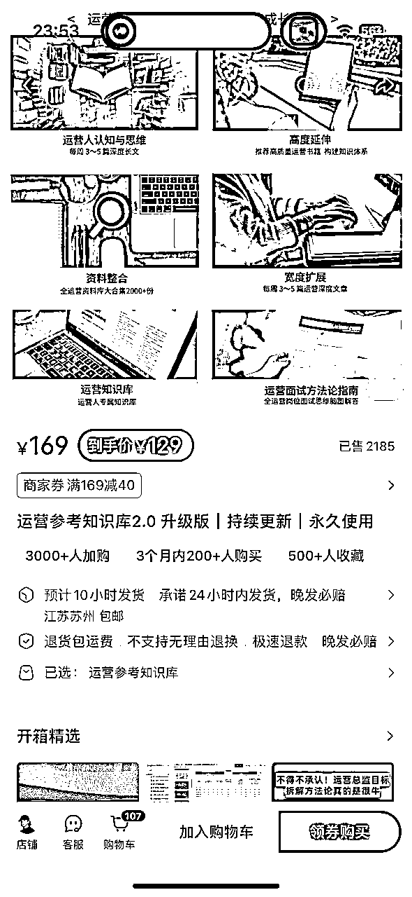
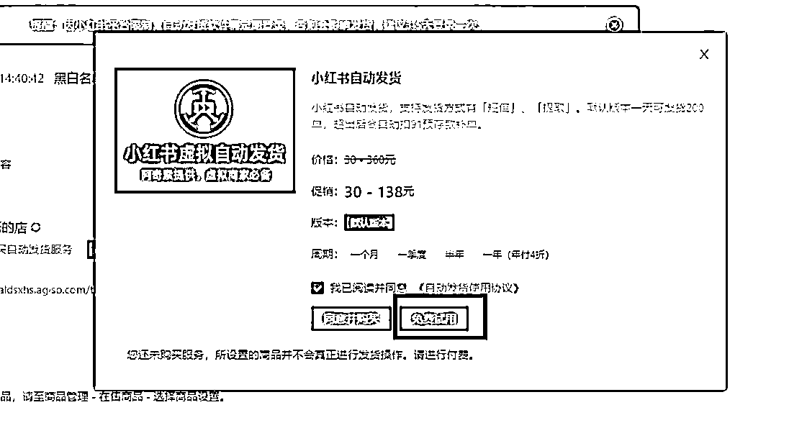
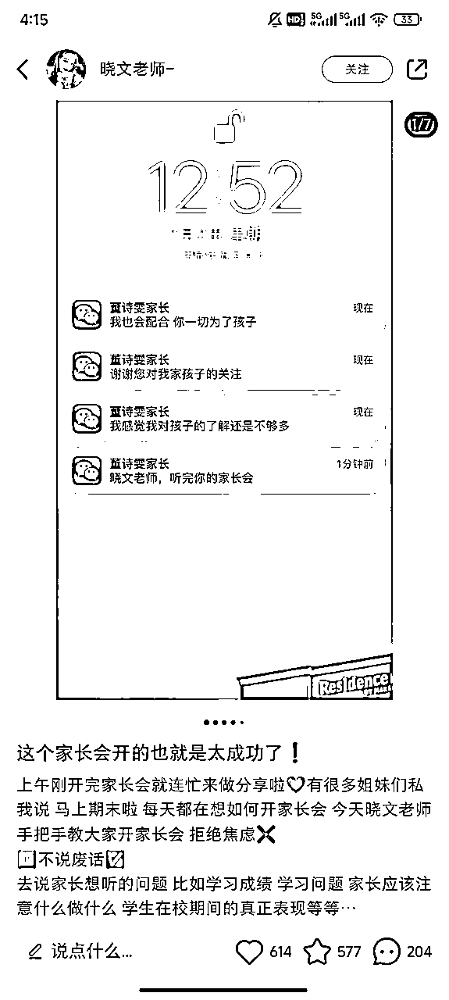
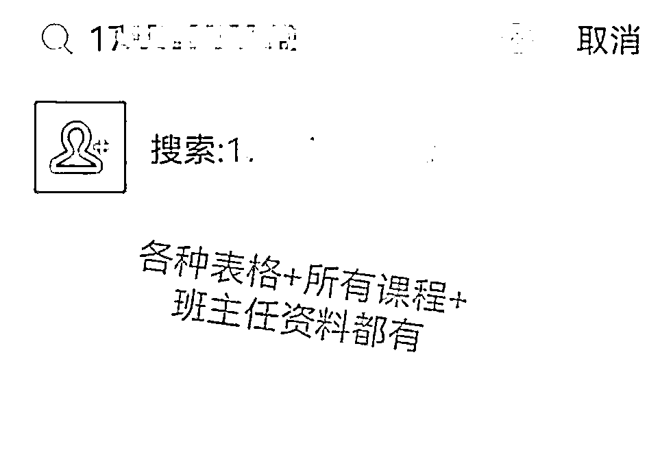
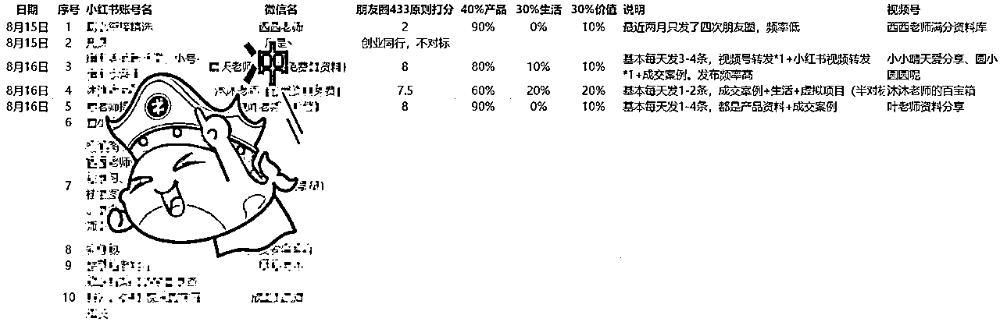
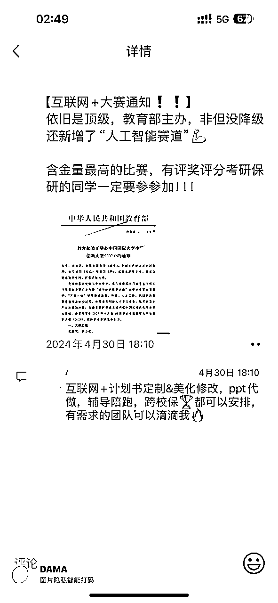
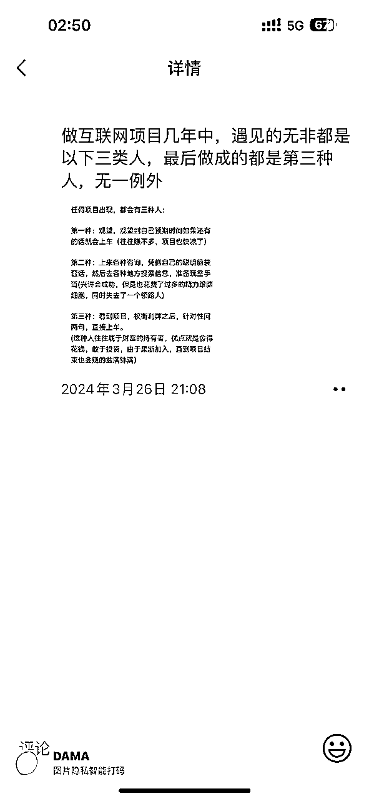
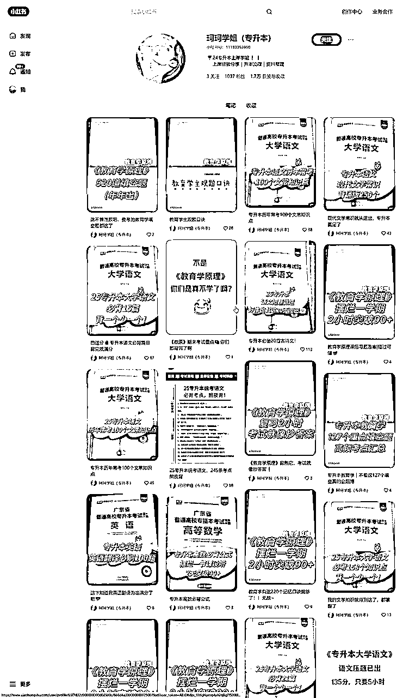

# 小红书虚拟产品-知识库丨实战手册丨2025 年 9 月航

> 来源：[https://ocn93f5d9olj.feishu.cn/docx/Zwspdnwozo5Sd4xVYJScdK3Knrd](https://ocn93f5d9olj.feishu.cn/docx/Zwspdnwozo5Sd4xVYJScdK3Knrd)


# ⛵新手如何入门【小红书虚拟产品-知识库】项目？

# 1\. 项目介绍

小红书虚拟电商行业现状

生财有术的虚拟产品航海这条船已经远航两次，并且我们也带领了上千名圈友进行实战，包括小红书也有针对虚拟电商行业进行了多次月度榜单的更新。

整体来讲，小红书虚拟电商非常适合普通人，绝大多数普通人也可以通过小红书虚拟电商赚到钱。

但是，今天的玩法和 3 月的玩法又有很大的不同；

首先，要杜绝简单的搬运思维；

小红书的核心是内容是分享，它的电商基因也是基于内容的，所以小红书电商是内容电商，内容是 1，而简单的纯搬运，搬运的人并没有直接深入理解他们卖的是什么，只是去简单的介绍，他们卖的东西，然后纯粹的堆量，通过不断地发笔记，拿到平台的公域流量，这样的做法显然是没有任何壁垒的。

同时，平台也不喜欢这样的操作手段，因为过多低质内容注水，影响了平台用户的体验，所以现在的小红书电商现状就是要深度打磨内容，打磨你的产品。


知识库细分赛道的机会

这次虚拟产品航海的赛道主题是知识库，为什么是这个赛道？

第一点，如果你想要在小红书上卖高客单产品，你会发现很多高客单产品都是知识库，比如以下几个商品，都是知识库产品


人力资源知识库，299 的定价，卖了 6126 单，总计销售额 183.1w....

所以，如果你想做 IP，想要在小红书卖出高定价的产品，并且也不想做纯原创，知识库可能是普通人在小红书虚拟产品中唯数不多的机会了。

并且知识库的生意，很多都是百万 GMV 的生意，而这百万 GMV 基本全部都是利润！

什么是知识库？

很多圈友做知识库的卡点在于，认为知识库的构建很专业，非常非常难，而且要求审美特别好，最后望而却步。

今天给大家纠正下误区，知识库的关键就是你给你的目标受众，提供他们所需要的内容就可以了，并且这次航海的知识库并不一定都是知识，知识库只是一个统称。

# 2\. 项目完整操作思路

项目完整操作思路

在本次项目中，做这个项目的核心流程是：

调研同行 > 结合自身优势和推荐赛道，确定 1 个赛道和选品 > 搭建账号&开通店铺 > 上架虚拟商品 > 制作笔记并发布 > 引导成交 > 尝试用 AI 开发自己的知识库

具体可以参考本期航线图：


项目操作重点

对于知识库，很多人来说都比较陌生，其实很简单

知识库可以很小，它可以小到是一个面试题库，一个你通过考试的经验总结；

同时，它也可以很大，它可以是一个个人学习知识库，一个英语口语练习知识库，整体来说，知识库并不复杂。

对于大部分同学，你需要做的事情就是围绕着出单这个结果展开，你不要太纠结前期的准备过程，千万不要去把过程想复杂了。

比如，很多人都要推陈出新，要做一个市场上从来没有的产品出来，你在研发层面投入了太多精力，假如结果不好，你是很难接受的。

最好的办法是【量大出奇迹】【干中学】【事上练】。

先从模仿开始，但是模仿不是抄袭，而是借鉴底层的流量密码。

比如你做职场，面试题知识库，你可以看职场赛道，销量比较高的商家，他们的笔记策略、标题封面图是怎么做的，怎么拍的。

假如你自己模仿能力不够，你可以交给 AI 大模型，让它帮你分析。

我举一个例子，假如你完成了知识库的开发阶段，正在卡在发笔记，不知道如何发，担心没流量。

这个时候，你需要解构你的笔记，一篇笔记分为【封面图】+【标题】+【正文】+【评论区】。

你可以观察知识库 TOP 级玩家，他们怎么发笔记的，然后模仿，先粗略地模仿，后续再考虑创新。

比如，我发现很多知识库卖家的封面图都是用手机直接拍电脑屏幕，这种方式，新手完全可以复制，并且也不耗费太多精力。


其次假如你做了产品后，一定要勤于发笔记，你可以一天可以发 3 篇笔记，围绕着产品的不同角度去发笔记，同时也要学会布局关键词。

比如， 9 月份是招聘旺季，假如你做的职场赛道，你会搜什么关键词？把你想到的关键词融入到你的笔记里，记住，你的笔记其实就是解决方案。

总的来说，小红书电商-知识库就两个关键卡点，第一个卡点是知识库，第二个卡点是笔记。

解决了这两个卡点后，你需要思考如何放大你的结果？

特别是当你拿到了一个账号的结果后，就应该思考如何赋能到其他的账号，快速从 0-1 进化到 1-10。

新手入门准备&避坑建议

假如你加入这次航海，一定要重视这次航海的过程，投入时间，把这次航海当作自己一个项目去做，在心态上先摆正，而不是所谓地试着玩儿玩儿。

其次，你一定要投入你的思考，而不是机械的去执行，航海手册是一个很好的学习资料，一定要多看，另外，看了不是懂了，而是要【做中学】。

假如暂时没出单，也不要急，先在群里提问，交代好背景和存在的问题，最后看是否在笔记上迭代还是要换赛道，整体来说，要保持一定的耐心。

入门必备

*   至少 2 个小红书账号、1 个店铺（需缴纳保证金 1000 元-提现的时候交保证金也可以-关店可退）

*   作图工具：可画、美图设计室、稿定设计、黄油相机等

*   其他工具：飞书，用于建知识库


# 3\. 内容出品人

内容出品人：

Luke


更绪


稳稳


米杰

希平


叁斤

手册出品方：生财有术团队

出品时间：2025 年 8 月


虚拟产品对于普通人来讲，是一个性价比很高的赛道

另外，它也是一个长期主义

你可以试想一下，每次当你睡醒后，看到自己的账号后台有源源不断地新增收入

本质上就是一个养老金

那么，假如失败了怎么办？

可能很多有人会这么问，在这里我想告诉你，当你真正投入了心血加入这次航海，你就已经成功了！

没出单不代表失败，你勇敢踏出这一步，就已经成功了！

真正有价值的胜利，值得等待它的人。

1.  如何定位选赛道

# 1\. 本章概要

选择大于努力，方向不对，努力白费，在一个优质赛道中深耕所能带来的效益，在大多数情况下，比在一个低质赛道高很多。

选择赛道主要看 2 个因素：

.

外部因素：市场环境，决定项目难度和收益天花板

.

内部因素：兴趣与优势，影响你深耕这个赛道的毅力

如果你善于挖掘需求，可以自己尝试找 10 个竞品进行调研，挖掘细分需求，当然本期航海也帮大家筛选出了一个大赛道方向，以及细分赛道，你也可以结合自身优势和兴趣，进行选择。

⚠️长期来看，肯定是鼓励大家选择自己原创虚拟资料，所以在选赛道的时候，也可以想想，这个赛道的资料我后续是否有能力进行原创。赛道意味着起跑线、也意味着天花板。

# 本章航线图

完成本章节的学习和实操，即可完成航线图的：

第一阶段：确定 1 个赛道和选品（约 1.5 天）

.

对 10 个竞品进行调研，挖掘细分需求（约 1 天）

.

确定 1 个适合自己的赛道和品（约 0.5 天）


# 2\. 定位选赛道

只有适合你自己的赛道，才能如鱼得水。

看到很多博主，他们其实有很强的内容表达能力，但是由于没有合理分析自己的优势是什么，直接扎入一个不熟悉的领域和赛道，最后草草收场。

欲速则不达，你想要做小红书虚拟产品，一定要先学会盘资源和找准自己的定位。

为什么盘资源和找定位如此重要？

如果你没有去盘自己的优势资源，你最后很容易陷入选题慌，比如你是经验丰富的 HR，你非要去走上美妆赛道，HR 赛道你是专业的，你过往有大量的经验积累，在小红书上表达如鱼得水，你有源源不断地选题，起号对你来说不是难事，你只是把自己过去的经历和经验转移到小红书上。

这类的经验鲜活、独特、专业，很容易吸引算法和粉丝

而这个时候，你再开发出相应的虚拟产品和服务，真正完成了商业闭环，你也从打工人的角色转变成生意人，完成角色的蜕变。

那么到底该如何盘资源和找定位呢？

第一步自我提问：你是否完成过一些成就，完成这个成就的过程中，经历了挫折和失败，虽然过程曲折，但是你最终战胜了自己，并且有足够丰富的表达欲去表达这件事，以及这个经验很利他。

这个问题很重要，因为它对你来讲是隐藏的内容金矿，因为你不去刻意搜索，大脑很难想象你有这么一段经历；

而这个问题的关键在于【这个经验是否利他】

因为你要挖掘出能够利他的因素 ，否则你整理出来太小众，不仅无法引起共鸣，同时也会打击你的自信心。

所以，你要找到真正的市场和你的优势进行匹配，将你的知识残片变为他人的生存刚需。

如果你还是不知道如何盘点资源，可以参考以下几个问题，进行自我提问。

.

你拿到过什么大结果？

.

你是否在某个领域有超过其他人的经验积累，比如考公、考证、考研等等？

.

你是否有很强的基础技能：飞书多维表格、Notion 模板搭建、视频剪辑、AI、PS、PPT、手绘、Procreate 做饭等等。

.

你是否有其他人不具备的复合标签，比如大厂、35 岁、父婴博主、留学经历、正在装修房子、即将裸辞、数字游民、减肥成功等等。

.

在核心课题上，你有没有一些傲人的成就和表达欲，以及跳脱俗人视角下鲜活的个体感受（核心课题：事业、家庭、个人成长、健康、成为更好的自己）

我举个例子，比如你非常擅长搭建飞书多维表格，你就可以去根据用户的需求，创建不同场景下的【飞书解决方案】

现在正是秋招的招聘季， 有的小红书博主就用飞书多维表格开发了秋招进度表，卖了 3000 多份。

假如你对自己的优势没有思路，可以去参考上面这 5 个问题。

识别需求很重要，也要学会创造需求

你能想到的解决方案，其他人也能想到，所有人都可以想到的办法一定不是好办法，很容易把智力劳动变成体力活。

不要去卷一个没有门槛，完全耗费时间的赛道，虽然可能你看到了很多人都拿到了结果，但是他们可能并没有披露什么是胜负手。

所以，去构建自己的数字产品尽量完全去复制他人的商业模式，比如别人卖中小学资料，你看到人家销量很好，你也去卖，但是发现你根本开不了单。

最根本的原因在于你只是去单纯复制他们的产品，但是这并不是你的主战场，可能对方是 K12 教育的老师，非常了解学生的需求，发的笔记能够解决学生痛点，但是你的内容非常普通毫无亮点。

识别需求很重要，创作需求更重要；

因为只有创造了需求，并且这个需求能够被消费者认可，你才可以建立起来自己的差异化优势，也就是你的利基市场，或者是我们常说的第一个吃螃蟹的人。

但是要注意一点，虽然你创造了新的需求，由于国内的市场竞争尤为惨烈，也有可能被模仿的可能，所以在前期需要迅速扩大自己的结果（销量、笔记数）

这个道理很简单，如果你是买家，在低客单的情况下，一定是选择销量高的商品，假如你在小红书搜简历模板，你会看到卖同样的产品，有的人可以卖 3w 单，但是有的人只是几十单。

所以，前期的准备工作一定要【到位】

那么如何创造需求？

一个需求存在在但是没有被发现的【黄金准则】：

1.它存在一定的技术门槛；

2.它可以被解决，但是很紧急；

3.它有一定的社交属性，能够分享到朋友圈

4.它经常让人发出感叹：这也能赚钱？

所以，可以去小红书看有大量类似的需求；

比如针对第一点【它存在一定的技术门槛】：专业软件的安装，CAD 安装教程都可以售卖几千单

比如针对第二点【它可以被解决，但是很紧急】：专业证件照 P 图，特别是工牌照，海马体，新婚照等等

针对第三点【它有一定的社交属性，能够分享到朋友圈】：手写婚书，小朋友生日视频定制【奥特曼】


# 3\. 知识库赛道推荐

# 3.1 以个人成长为主的知识库

这一类知识库，在小红书很常见，但是目前来讲已经偏向于红海了，因为现在很多人都在讲个人成长，并且这个领域有头部的玩家：参考答案阅览室。

参考答案阅览室是这个行业的头部玩家，吃掉了大部分的流量红利，后来者很难居上。

个人成长知识库的逻辑，是把国内外优质的关于个人成长、职场、工作效率、习惯养成等等内容进行了一个分类整合，最后提供给用户进行深度阅读。


那么，为什么会有人付费，消费者付费的底层逻辑是什么？

可能很多人都会想，网络的公开文章为什么能赚钱？这也是我推荐很多原创能力比较差的圈友做知识库的原因，因为你并不需要去原创内容，你只需要做的是【搜集】+【整理】

第一步是搜集，你只需要按照主题去搜索优质的信息源，比如知名大佬的个人博客文章，他们的播客、youtube 等等，youtube 也是一个非常非常宝藏的信息源。

如果你想要做原创，拿到一手信息源，一定要尝试去做 youtube。

比如 AI、个人成长等等，很多优质的信息源都在 AI，举一个最直白的例子，之前有一个小红书博主，通过翻译纳瓦尔最新的一篇文章，并且在小红书售卖文字稿，最终变现将近 1w+。


# 3.2 基于行业/岗位能力素质提升的知识库

第二类知识库，是基于行业/岗位能力素质提升的知识库，这类知识库主要是针对于职场场景，比如运营/产品经理/AI/方案/报告等等。

购买这类知识库的用户的核心目的也是为了自我成长，只不过是职场方向的自我成长。

那么对于圈友来讲，怎么复制呢？

首先，要看你自己的行业，比如你所在的行业本身就有很刚需的资料积累，且你这个行业在小红书上有足够多的人群覆盖，并且已经有同行开始做你这个行业的知识库了，那么你就可以后续跟上。

并且你已经有了资料积累，其实就可以整理后上架了。

假如你想做职场 IP，也可以做知识库，因为知识库产品后续可以承接更高的客单价。

请牢记：每一个行业都可以做自己的知识库，一定要去找角度！

运营知识库：




产品经理知识库：


# 3.3 基于各大考试备考的知识库

这个比较典型，考试是一个巨大的赛道，假如你能针对某个岗位，某一项考试进行一系列的备考知识整理，其实也可以看作是知识库。

比如公务员考试、教师资格证考试、四六级英语、考研英语等等

都可以看作是基于各大考试的备考知识库，如果你后续有高客单的升单产品，我非常建议你尝试这个赛道。

我直接上案例，大家可以感受一下。


# 3.4 基于语言学习的知识库

我这里讲的是基于语言学习的知识库，虽然英语知识库在小红书上卖的很好，但是并不是只有英语知识库，还有其他语言知识库在小红书卖的不错，比如韩语知识库、日语知识库，俄语知识库等等，卖的都非常好。

而这些语言学习的素材都来自油管，所以语言+油管的知识库是一个不错的方向，对于原创能力相对较弱的圈友来讲，这也是一个门槛相对比较低的项目。

你只需要搞定油管视频剪辑+解读就可以，而这些都是可以通过 AI 解决的。


# 3.5 基于面试的面试题库

每个行业不仅可以有基于行业/岗位能力素质提升的知识库，同时也可以有自己的面试题库，而且面试题库是完全通过 AI 去生成的，对于想要原创虚拟产品的圈友来讲，也十分友好。


1.  如何选品

赛道这么多，我到底要选择哪个？

很多圈友都会纠结这一点，如果你也有一样的疑问，我建议关注几个指标，或者是一个自我提问，你是否能够沉下心来深耕这个赛道？

这是最关键的，因为之前我讲过，知识库是一个【长坡厚雪】的赛道，它和一些短期逐利的赛道不同，它更加倾向于长期主义，更能拿到大结果。

在小红书百万 GMV 的虚拟产品，很多都是知识库类的产品，所以我一直强调，你是否能够沉下心来深耕这个赛道。

比如你在运营/产品/AI/养生...等领域有很丰富的知识积累，那你就可以通过知识库去沉淀自己的知识，假如你自我认为你没有任何值得去沉淀知识库的优势，那就是向外求。

向内求不到，就向外求。

向外求的关键是市场的需求度，假如某个赛道已经得到了充分的验证，那么这个赛道一定是值得去做的，不过最好是在一个大赛道中找机会。

# 1\. 找到大赛道的小机会

什么是大赛道呢？

这里要对大赛道有一个清晰的定义，比如英语，英语就是一个大赛道，比如职场，职场也是一个大赛道，但是假如说你做一个英语的知识库，或者说做一个职场的知识库。

因为用户对这类产品的感知不强烈，这里教大家一个方法，要学会做场景，要做具体人群学英语的场景，比如你想做幼儿英语、儿童英语，你需要提供的是一些磨耳朵素材。

磨耳朵的关键是你找到一些优质的儿歌、动画片等等听力材料，然后按照一些儿童的不同年龄阶段，就可以做知识库，做一个儿童听力专属知识库。

知识库的素材哪里找？

这个也很简单，比如 B 站、某鱼、youtube 等都有资源，你需要做的是按照你对【儿童英语听力】这个赛道的理解，把已有资源进行分类整合。

你不能把一坨资料不按照整理发给用户，如果你采用这种方式，你只能卖 0.99 元，资料本身价值不大，你整理的逻辑，和呈现方式的价值很大。

所以，同样的资料，做成知识库，机会就很大。

我再举几个例子，同样是英语这个大赛道，有人只做商务英语/职场英语/外企业这个赛道，也能拿到不错的结果。


1.  学会利用 AI 搜索

做小红书虚拟产品，特别是知识库这个赛道，一定要把 AI 利用起来，比如说 AI 搜索，我给大家一个新的角度，AI 可以直接做虚拟产品的调研。

可以快速帮你定位信息源，比如还是儿童英语的赛道，当我们确认要做磨耳朵的素材，你直接在秘塔 AI（网址：https://metaso.cn/）搜儿童英语磨耳朵素材，秘塔 AI 就能给你丰富的信息源。


秘塔 AI 会提供给我很多优质的信息源，那么下一步做的就是去油管 youtube 搜索就可以了，对于一个对儿童英语不了解的人来讲，直接定位到优质的信息源可以节省很多时间。

这就是 AI 搜索选品的逻辑

当你确定了一个具体的赛道，不知道卖什么产品，你就直接借助 AI 搜索，比如秘塔 AI，帮你快速定位，你的最终产品。

选品不难，难的是你要沉下心来整理，这是最重要的。

1.  准备账号并开通店铺

# 1\. 本章概要

本章最重要的两点：

.

搭建账号

不同于之前引流私域对抗平台的玩法，我们现在小红书开店卖虚拟产品，我们就是小红书电商的一个部分，是符合平台规则的玩法，不需要考虑任何违规的事情。

所以，什么一卡一机一号，要用流量不能用 WiFi、养号等，其实是完全不用考虑的，怎么方便怎么来。

.

制作知识库

做知识库最快的方法，就是“集百家之长”，你可以参考整合对标的信息源，但不能直接 1V1 模仿对方知识库的搭建思路。

# 本章航线图

完成本章节的学习和实操，即可完成航线图的：

第一阶段：完成账号与店铺搭建（约 3 天）

.

准备至少 2 个小红书账号和 1 个店铺（约 0.5 天）

.

完成账号与店铺的定位与包装（约 0.5 天）

.

获取整合知识库产品，并上架到店铺（约 2 天）


1.  准备设备

✔️ 手机准备：只要是小红书没有被永久封号，永久限流这俩大的违规的设备，都可以用，小违规不影响

✔️ 电话卡准备：使用自己没有注册过小红书的手机卡 ，有老号也可以直接用，做过类似无货源这种其它项目的号也可以直接用，没有永久封号、永久限流这俩大违规的号，都可以直接用

推荐在淘宝/京东搜索电信无忧卡，5 元月租即可办一张，或者去营业厅给已经有的卡办副卡，一般月租是 10 元。

✔️ 账号准备：关于一卡一机一号，有最好，没有也无所谓，一台设备同时登 2 个号没啥问题，不需要考虑连 wifi、流量的问题，怎么方便怎么来

# 2.1 手机准备

大家都知道，如果是个人的话，可能设备比较少（十台以内），做到工作室矩阵级别，那用到的设备数量是 10 台以上，甚至上百台。这里给大家做一些工作室常用设备推荐。

苹果设备推荐机型

iphone7：工作室钉子户，性价比高，流程速度快

iphone8：游戏和短视频居多，功耗低运行速度快

iPhoneSE2：存在感差，直播电商短视频都 OK

iphoneX：直播电商短视频养号，预算充足可上

安卓设备推荐机型

红米 10x：中规中矩

小米 10 青春 8+128g：性能好

小米 8 青春小米 8se：多人用的

安卓设备还有很多，这里就不一一列举了

原则上：

能买二手的就别买全新的，当然现在很多国全新设备“便靓正”。

能买原装就别买组装（注意辨：无指纹无面容=拆机） 尽量不要去闲鱼

能买国行就别买外版

买配置别买外观

买品牌不买杂牌

具体机型：优先考虑 8+128GB

年限：4 年内安卓&6 年内苹果机*

建议是能够由 2 台或以上的手机，因为机器越多，成功的概率就越高，并且去营业厅办理三张及以上的手机卡，月租选最便宜的，但需要有流量，流量最好是 20G 以上，用 1 张主卡绑定 2 张副卡的模式办理，你营业厅直接和工作人员说，她就会给你推荐卡了。

# 2.2 电话卡准备

办卡渠道一：当地营业厅直接办理。

办卡渠道二：直接支付宝搜“号卡中心”可直接办理。

办卡渠道三：淘宝/京东搜“电信无忧卡”，月租仅需 5 元。


# 3\. 开通店铺

# 3.1 小红书店铺有 3 类

① 个人店

个人店铺只需要一张身份证，和一个实名过的小红书号，其它什么材料都不需要，店铺申请很快就能审核通过。

② 个体店

个体店需要一张个体户的营业执照，如果办，最好是办百货店的，闲鱼/淘宝代办现在大概是 100 左右一张

③ 企业店

企业店就是用公司的营业执照去申请店铺，相对个体店，没啥太大用处，反而还要涉及到税务等东西，很麻烦，可以直接忽略它

应该选择开什么店铺？

如果是新手小白，什么都不需要，直接去申请开个人店铺即可。

如果你是有一定经验的，建议直接先用个体工商户去认证蓝 V（需要花 600 块），然后再去开店铺（个体店），这样后期如果想要做矩阵号，可以直接绑定。

# 3.2 开店步骤

注意事项

新手小白直接开个人店，什么都不需要考虑

想做矩阵的老手，去办一张个体户的营业执照，然后认证蓝 V（花费 600 块），再去开个体店，营业执照的经营范围，包含下图红线这个即可，其它都随意。


开店地址：这个链接是直达的，小红书千帆，打开之后，手机号登录选择个人入驻即可

https://ark.xiaohongshu.com/?ticket=ST-68c517438149514474558399hfl9opty5x6viycd&from=ark-login

保证金建议：虚拟资料保证金目前是 500 元，但是这个可以先不交（可以等赚到 500 元之后再交，确保自己不亏钱嘛对吧）

不交的情况是：不能提现，但是我们可以等提现的时候交保证金

开店步骤

.

打开小红书官方电商链接

https://ark.xiaohongshu.com/?ticket=ST-68c517438149514474558399hfl9opty5x6viycd&from=ark-login

.

选择个人身份/个体工商户入驻


.

填写相关资料（填必填项就行）和刷脸

昵称会自动匹配小红书昵称，如需修改把小红书账号名修改即可，或者入驻后去个人信息也能修改（这个不重要）


主营类目，主营类目填写默认的 [零售批发、生活娱乐、其他] 就可以了（用这个，因为虚拟资料类目需要上传资质）


填写【地址设置】、【店铺信息认证】，物流模版 里面的地址可以随便写，写什么都无所谓（不放心可以写自己家但是写个模糊的），到时候主页只会显示不会有详细的


经营类型 这个，勾选类型 3 或者 4 都可以，任选其一


商品类目 选择电子资料包

.

最后填写完成，会显示审核中，一分钟就会审核完成了，刷新下就可以进去了


1.  制作虚拟产品（知识库）

# 1\. 如何快速做一个知识库产品

如何快速做一个知识库产品？

最快的方法就是【集百家之长】，无论你采用什么办法，找到你打算做的这个赛道做的最好的知识库产品，去看他们的制作逻辑，排版逻辑，内容呈现形式等等。

那么，有圈友肯定会问，那我能不能直接去 1：1 复制？

尽管很多同行做的知识库产品，他们是整理了市面上的公开产品，但是其实并不能完全 1：1 复制，因为他们的思路/排版/布局/思路都是原创的。

你可以参考整合他们的信息源，但是形式不能 1：1 模仿。


# 2\. 怎么做一个知识库？【实操】

因为 AI 的兴起，知识库已经不是一个很流行的概念，市场的接受度比较高，知识库的平台选择也有很多，比如 notion、飞书、ima 等等，都可以作为知识库的载体。

但是对于新手，我更建议用飞书去构建自己的知识库，首先很多做知识库的商家都把飞书作为首要选择，比如 AI 领域最出名的知识库之一 the way to AGI（通往 AGI 之路，感兴趣的可以在小红书搜索了解），就是基于飞书构建的是知识库。

一个优秀的知识库，并不是你只是把内容堆积到一起，这样用户看到会很累，知识库的本质在于你有目的、有逻辑、有心思的整理，让用户能够快速感知到他们想要得到的价值。

就像毛坯房装修一样，当有朋友来你家参观的时候，你去介绍家里的装修，你是如何设计的，知识库也可以看作你的房间。

比如 the way to AGI 这个知识库，它不仅有知识，而且还按照日期把最新的资讯进行了整理，还有专门的社群


同时，飞书有自己专属的知识库板块，点击新建知识库-选择模板

同时，飞书还有一个【飞行社】

飞行社就是一个集结优质知识库的公开空间，你可以看到不同领域知识库的构建思路，和他们的内容组成，呈现形式等等。


所以，用飞书做知识库对于新手是最具性价比的选择。

下面就【飞书知识库】，给大家展示下具体的实操教程：

知识库不需要追求多精美，关键在于需求挖得准，知识库做得简陋也能出单，大家可以找到对标后，按照下面的飞书知识库设置步骤，先完成 60 分。（找对标详见【三/01\. 找对标账号】）

1.  下载飞书软件，新建空白知识库


1.  填写知识库名称，选择可见范围。

1.  选择知识库，置顶新建的 ComfyUI 知识库。


1.  知识库新建后，默认有一个首页，可以用作导航使用，也可以直接删除。建议是删除。


1.  建议是删除首页。


1.  接着我们按照你要创建的知识库具体内容，由先到后建立一些文档作为文件夹使用。


1.  虽然我们建立的是文档，但其实我们是把他当做文件夹，放置不同类型的文档，原因是飞书知识库不支持新建文件夹。（这里以 ComfyUI 为例）

1.  为了方便使用，我们可以给每个文件夹加个数字图标或者颜色图标


1.  添加图标后，类似这样


1.  这时候你就可以直接给每个文件填充不同的子文件夹，其实就是添加文档，做好分类并按照分类添加文档。

这里以 ComfyUI 教程的二级目录为例，目录又分了三个三级目录，ComfyUI 安装这个三级目录重点放各种 ComfyUI 安装教程。


1.  我们现在就要继续给每个细分的三级类目添加内容，这里准备了 8 个 ComfyUI 安装教程文档，可以作为知识库的内容。（你也可以自己在知识库开头，增加一个二维码，沉淀用户到私域）


零基础 云端网页使用ComfyUI .docx

零基础 云端节点使用ComfyUI.docx


零基础 Win安装桌面版ComfyUI.docx

零基础 Win安装官方版ComfyUI.docx


零基础 Win安装Lib版ComfyUI.docx


零基础 Win安装秋叶版 .docx


零基础 Mac安装桌面版ComfyUI.docx

零基础 Linux安装手动版ComfyUI.docx

（如果无法直接下载，可通过网盘来下载，网盘链接：https://pan.quark.cn/s/da192fc747d4）

1.  虽然这里讲的是 ComfyUI 知识库这个细分领域，但是其他领域逻辑是相通的，比如我举个例子，YouTube 视频，那就是先建立类似下面的一级类目，然后按需建立二级和三级目录即可。

1.  飞书知识库的设置，可以点击这里设置。


1.  如果想飞书知识库全网都可以看到，请点击分享知识库。


1.  打开分享知识库开关后，可以通过复制链接获得知识库链接


这里有个小彩蛋：

飞书有个知识问答，选择使用知识，选择你自己的知识库，就可以提问，你也可以告诉你的客户这个技巧。


比如我提问飞书知识问答：MAC 怎么安装 ComfyUI，WIN 怎么安装 ComfyUI？linux 怎么安装 ComfyUI？

一定记得要打开使用知识，才会调用你自己的知识库。

飞书知识问答就会从你的知识库中提取文档回答。


1.  上架商品

# 1\. 上架步骤

.

小红书千帆官网主页找到【商品管理】


.

注意类目选择【个性定制/设计服务/DIY >数字商品 >电子资料包】即可


.

然后根据提示完善你需要上传的商品资料即可，如果有其他提示，就根据系统提示修改，一般没什么大问题。


1.  如何定价

知识库最好的定价，是直接对标同行，但是也要看具体的赛道，假如是职场类的，比如说你是做运营的知识库，或者你做产品经理的知识库

你的定价最好都要在 100-300 元之间，因为同行基本上都是这个价格。

假如你要做个人成长类的知识库，比如对标参考答案阅览室，你的价格最好是在 149-199 元。

如果你要做题库/素材库，那么你的定价可以在 49-99 元。

以上的价格都只是一个参考，具体还是要调研更多同行的知识库，他们的定价逻辑是什么。

如果是参考淘宝对标选品，相同的商品，小红书的定价最好在淘宝的 2-5 倍，做小红书就是为了卖高客单，不要担心自己的定价比同行高就卖不出去，小红书本质还是兴趣电商，不是货架电商。


1.  设置店铺自动发货

注意事项

前提的注意细节：

.

阿奇索前期有七天的免费使用，先用免费的用七天！

.

一般是出单之后在搞阿奇索自动发货哈，没出单的话是是可以先不用先搞的。

.

自己电脑如果没法长期开机，可以挂服务器上，或者买短信提醒

下面是小红书阿奇索自动发货设置，按图片顺序操作

点击进入服务市场


搜索自动发货找到阿奇索


需要绑定下这个平台


随便注册下


如果不是时长有电脑挂着，就记得会来登一下

先用免费试用的 7 天



需要下载 app


登录需要用账号密码的，需要在千帆店铺设置下


找到自动发货，点击商品设置

点击添加

选择自己上架的商品

设置自动回复话术


如果电脑不能长期开启挂起，可以购买短信发货服务


下载发货助手，助手要一直挂在电脑上，不然就购买短信服务，或者买服务器，挂在服务器上

在千帆后台绑定店铺登录邮箱，因为发货助手只能通过邮箱登录，没法扫码登录，必须要登录了发货助手，才能自动发货

完成这一系列操作后，自己可以拍一单测试下，看下是否能正常自动发货。


1.  上架注意事项

问：小红书店铺版权怎么看？

回：开店最好不要传有版权的资料，如果有版权方找过来容易被举报，店铺可是实名过的

怎么看有没有版权：

最好不要有水印

看同行有没有在卖，卖的人有个 3 个以上，说明能卖

再送大家一个【免责说明】详情页图片，跑路用的

问：店铺听说都是打价格战？

回：淘宝、闲鱼、拼多多等货架电商的比价比较严重，但是小红书本质还是兴趣电商，小红书用户的习惯也不爱比价，如果 100 个访客卖不出去可能是价格太高的原因，但是就那么几个访客，就不用考虑是价格的原因了。

切记，小红书的用户对价格很不敏感，不要怕比同行高，往高了卖就行，价格高了订单数可能会减少，但是并不意味着最终收益会减少。

问：店铺的虚拟资料订单，去发货的时候仍然需要寄件，这种怎么解决呢？

回：你可以选无物流发货，发货的地方有个选项。

问：店铺和私域可以同时在一个账号进行嘛？

回：因为你店铺的号是实名过的，你的店铺也是在这个号里的。不建议一个账号打两种打法，因为私域是违规行为，你这个号被封了，可是给你店也关了哈。

店铺是用来做低客单售卖，可以前期赚钱可以用这个过度，自己可以弄别的号搞私域。

1.  找对标账号

1.  本章概要

本章将带你深入了解如何在小红书平台制作引流爆款笔记。

本章核心内容：

找对标账号的方法、找选题的方法、爆款标题制作 SOP、笔记封面/内页制作 SOP、提效模板笔记常见类型。

本章是整个课程的核心实操环节，大家一定要重视哦～

# 本章航线图

完成本章节的学习和实操，即可完成航线图的：

第二阶段：制作爆款带货笔记（约 4 天）

.

参考对标，制作爆款笔记（约 1 天）

.

持续更新，每天每个账号发布 3 篇笔记（约 0.5 天）


1.  什么账号值得对标

在任何平台的创作中，模仿对标账号都是一种非常有效的方法，对标账号指的是与自己同行业或者同类型的其他用户账号，在进行创作的时候可以从它们的图文/视频内容、话题选取等方面进行模仿。

对标账号的选择标准：

⭕ 低粉，一万粉以内，高的不看

⭕ 高赞，赞数大于粉丝数，内容有价值，有质量

⭕ 最近一个月，因为周末看的人多，选一周没有参考意义

⭕ 主页多次出现，当你刷主页，这个封面多次出现，说明这个账号就是好的对标，抄就完了

爆款笔记的四个密码：爆款选题的心法+爆款封面的做法+爆款标题的起法+爆款内容的写法

⭕ 小爆款（赞藏+评论总数≥200）

⭕ 中等爆款（赞藏+评论总数≥1000+）

⭕ 大爆款（赞藏+评论总数≥1w+）

⭕ 超级爆款（赞藏+评论总数≥10w+）


1.  怎么找对标？

.

搜索关键词：在首页搜你想做的赛道关键词（即是养号过程中所搜索的），然后在排在前面的 50 篇笔记里面，找到小爆款和中等爆款笔记，且评论内有“求”“需要”“私我发”等字眼的，这就是我们要去对标的爆款笔记了。优先对标同赛道做号时间在三个月或半年内的账号。

.

搜索栏关键词挖掘：搜索栏搜索赛道关键词（如下），这里显示都是小红书用户经常搜的，证明这个需求大，可以直接按照小爆款和中等爆款的标准去筛选出优质的选题进行对标。


.

刷首页推荐：养号完成后，平台会根据我们的互动和喜好推荐可能感兴趣的爆款笔记。所以这个时候的首页推荐就大部分都是我们的同行了，一样按照小爆款和中等爆款的标准去筛选出优质的选题进行对标。

.

从赛道热门话题里面找：关注同领域内其他成功的博主，找出他们发布后互动量较高的笔记，然后点击他们的话题标签，一样按照小爆款和中等爆款的标准从话题标签中找到筛选出优质的选题进行对标。

1.  找爆款选题

下面给出了 2 种找爆款选题的方式，新手比较推荐用第一种【通过话题标签来找选题】；当你掌握了一定的爆款体感，可以尝试下第二种【用 AI＋乘风关键词词包找选题】，借助工具来提高你的选品质量和效率。

1.  通过话题标签来找选题

当你看到一篇爆款笔记，特别是近 3 天发布，点击笔记页的话题标签，进入话题页，可以根据综合、最新、最热，去寻找更多的爆款笔记。


你还可以关注该话题，后续可以在小红书首页-关注页看到该话题的相关笔记。


1.  用 AI＋乘风关键词词包找选题

23年小红书主推了一个工具，叫做乘风，乘风主要是用于小红书站内电商的推广工具，它是千帆后台的一个功能。

为什么能用它来找选题呢？

它有两种投放模式，分别是通投和搜索，也就是说卖家可以通过买词的方式去投放笔记，举个例子：

比如你主要是做雅思考试领域的博主。那么你可以投雅思相关的词，比如雅思备考，十天雅思备考等等，让用户在搜索相关词的时候，可以看到你的笔记。

具体怎么操作呢？

进入乘风推广：https://chengfeng.xiaohongshu.com/cf/ad/manage?type=standard

新建计划 - 搜索广告 - 搜索关键词


点击【添加关键词-搜索关键词】，就会看到有这么一个功能——【关键词词包】。

比如你搜“雅思备考”，你可以看到很多词包，当你下载下来点进去

你就可以看到具体的关键词和类别，比如竞争指数、月均搜索指数，和市场出价

月均搜索指数和市场出价是正相关，搜索指数越高，市场出价越高，用户的搜索意愿就越高。


这个词库的作用在于，它可以告诉你用户的搜索倾向是什么

但是，如果让你去自己分析，其实很难帮你分析出有用的结论，对于大部分人来讲，缺乏抽丝剥茧的能力。

那么你可以通过 DeepSeek 去帮助你找到一些可能潜在的选题红利，通过关键词去倒逼你的选题

那么到底该如何操作？

首先，你需要把这个词库发给你的 DeepSeek，让它帮助你去思考和总结分析。

在这里，我需要声明一点：

我给出的策略和提示词，并不是最佳玩法，并且 DeepSeek 已经是如此聪明的 AI 大模型，其实并不需要通过很繁杂的提示词去限制 DeepSeek 的想象力。

我的第一个提示词：

```
我需要你根据这个文档，帮我给出 20 个选题方向，并给出 20 个包含热门搜索词的标题，同时，你需要告诉我选题理由，以及覆盖了哪些核心关键词
```

DeepSeek 的思考过程，很有干货，它告诉我高搜索词虽然流量大，但是竞争激烈，可以结合长尾词降低难度。

让我惊喜的是，它不仅给了我公式，同时还给了我正文的写作方法

比如【高搜索词】+【人群/场景】+【长尾词】

并且，它给了我一个很牛逼的正文写作方法，让我去合理嵌套高价值的搜索词。

当然， 如果你觉得 DeepSeek 给的结果不丰富，你可以让它进一步去给你更多的公式和写作技巧

整体来说，它不仅可以给你选题，还会告诉你正文怎么写。

思路就是让 DeepSeek 通过对关键词的分析，扩展选题，提前布局搜索流量，这种策略可以有效帮你防止选题枯竭。

以上是一个具体的操作流程和玩法！

但是，对于 DeepSeek 还有一个隐藏的玩法，我们都知道 DeepSeek 已经足够聪明了，那么为什么不可以直接问它，我们该如何向你提问，从而更加高效地利用你

于是，DeepSeek 告诉了我如何向它提问：


1.  制作爆款笔记

# 1\. 标题

# 1.1 杂交法

说到这里要感谢下袁隆平爷爷，结合不同的优质水稻杂交出超级水稻。

方法很简单，效果立竿见影，我的爆款标题就是这么来的，妥妥的流量密码。

如下图：搜纪录片 - 最热，翻看排名前十笔记，会发现关键字就这几个：央视推荐、绝了、建议收藏

最热前 8 个之中，有 6 个的标题几乎是一样的（爆款都是重复的）直接抄，关键词不断排列组合，这样杂交出的标题自带爆款基因。


★ 小建议：平时刷到的爆款标题可以记录到笔记里， 没事多看以此提升网感。


# 1.2 万能公式模板

另外，我还给大家起草了几个爆款标题万能公式，即套即火

这个_______ 堪称_______之光！

套用：这个网站堪称产品经理之光！

• _______❗️我要吹爆这个_______知识库

套用：参考答案❗️我要吹爆这个电商运营知识库

• 刚_______，被_______的_______知识库震撼到

套用：刚入职，被运营总监的电商知识库震撼到

• 强烈建议做你自己的_______知识库

套用：强烈建议做你自己的自媒体知识库

• 终于搭建出了_______知识库

套用：终于搭建出了职场工作方法知识库

• 身边没有_______，一定要去看这个知识库！

套用：身边没有高人指点，一定要去看这个知识库！

• 我发现优秀的_______都偷偷地_______自己的知识库

套用：我发现优秀的运营都偷偷地建立自己的知识库

• 这个知识库我愿意称为_______🤔

套用：这个知识库我愿意称为年度最伟大发现🤔

• 花_______小时做的_______库拯救我的_______

套用：花200➕小时做的英语素材库拯救我的哑巴英语

• _______落泪！我怎么没早点看到这个_______库

套用：策划人落泪！我怎么没早点看到这个方案库

• 找到了一个真正_______的_______库

套用：找到了一个真正设计师的品牌方案库

• 懂了，原来_______是因为这个_______

套用：懂了，原来新来运营效率那么高是因为这

• 这样沉淀_______，一个字"_______"

套用：这样沉淀个人知识库，一个字"巴适"

• _______，有被这个知识库震撼到

套用：电商公司内训，有被这个知识库震撼到

• ，先从【】开始！

套用：AI一人公司，先从【个人知识库】开始！

总结：

多用感叹号，目标用户比较喜欢夸张性的情感。

表达要真情实感，把读者当作“熟人”一样，语言要通俗易懂。

# 2\. 封面&内页

# 2.1 排版基本原则

# 2.1.1 三要点

✅ 针对零基础作图功底的小伙伴给出几个要点

封面排版牢记三要点

在创作排版小红书封面时，应该坚持以下三要点：

要点一：封面尺寸

竖屏选择 3:4

方形选择 1:1

横屏选择 4:3

竖版笔记的屏幕占比更大，能够停留在用户的视野里更长时间，不仅能传达更多信息，被划走的几率也相对更小！

要点二：精准选图

视觉冲击力强的高颜值配图（可用 AI 生成）

视觉效果简单明了的手写类型（可简单手写）

适合合集、美食、旅游攻略等

要点三：简要文字

小红书的笔记标题只限 20 个字符（emoji 表情会占 1～3 个字符）

想要补充更多信息，就要好好利用封面！

当用户在发现页浏览时，是茫然的，此时字体应该在核心部分要占据有足够画面，概念清晰，直击用户需求，告诉用户：这是一篇对你有价值的笔记！让用户产生点击的冲动。


竖版 3:4


横版 4:3


竖版 9:16

横版 16:9

# 2.1.2 二少原则

二少原则：少变/少用

三少原则一：少变

不要经常更换封面版式。尽量做到【模板化/可替换化】，排版、字体、风格一致（颜色可同色系变换），保证主页整齐性，同时有利于粉丝辨识你。

三少原则二：少用

少用不相干的贴纸，喧宾夺主，分散用户注意力。


# 2.2 内容呈现的 7 种方式

不同产品作品可以呈现的方式有哪些？

在这里我们给大家介绍 7 种形式，一个账号只需要选择 1～2 种，大家可根据赛道情况自由选择呈现样式，注意一个账号无需太多的呈现形式，否则增加制作难度不说还会影响用户观感。

# 2.2.1 截图

截图是作品最为简单的呈现方式

那怎么解决这种截图同质化问题呢。很简单：

1.自己截图发。

2.给作品加边框等去调节图片的参数

3.你把文件内容复制到 AI 软件，让 AI 重新写一个相似的。然后你再截图，完完全全是个新的文件。

4.再一个就是打印出来，你拍打印的作品。

以上方案我都建议采纳，并且如果你这个素材在你的账号爆了，你就想办法换个方式再表达一次，让他达到在你账号二次爆的效果。谨记！！！


截图笔记如何制

在手机应用商店下载一个“WPS office”

然后打开资料截图 5～9 个页面

截图资料可以做拼图，也可以单页。

先把多张资料截图合成一张图片


然后给资料页面加上个标题就可以作为封面。内页可以放标题。


# 2.2.2 拼图

这种适合展示素材，让客户对你的产品一目了然，给大家案例。


拼图作品如何制作

其实这种图很简单，比较简单的方式我们用手机做，用到拼图功能即可。

把需要的素材截图然后拼凑在一起就 OK，想要做的完美要用到 ps 这个软件，但是我们可以利用美图秀秀拼图功能，做一个简单，主要是把内容体现出来就好。


# 2.2.3 实拍创意

拍照是我非常推荐的一种表达方式，你拍照呈现的作品就是世界上独一无二的。虽然内容是一个内容，但是角度、光线、清晰度等各种因素，系统已经判断不出来你的作品同质化的问题。

给大家上案例


操作方式：

a.实拍图容易起数据

b.AI 生图

c.图片二改

拍照值得大家注意的是，手机一定要擦镜头！！光线一定要好，拍好的照片调一下滤镜。

同时，大家要注意，可以多尝试下用live图去拍摄，live图给人一种在场感的感觉。


# 2.2.4 创意封面

用微信对话作封面，借用名人，熟悉的场景和一些不错的创意在做封面吸引点击，然后结合截图等展示内容的方式配合呈现。（下面的案例，同样可以用于知识库笔记）




怎么制作？

https://vnr4jule4g.feishu.cn/drive/folder/fldcnBdyYJkxPRSFfFyzWvaCnBb

给大家准备了 79 张常见的爆款创意封面图，大家可以自行下载使用。


# 2.2.5 展示目录

展示目录也是相当炸裂的一种表现方式，这种是目录制作辛苦点，但是制作后你可以反反复复的去使用。属于一次制作，长期受益那种。


怎么制作？

其实我们的微信功能很强大，我这以心理健康公开课为例子，把图片裁剪到微信上，然后微信把文字复制下来即可，然后我们用 xlsx 表做排版做出来即可。


心理健康原稿.xlsx

# 2.2.6 大字报形式


通过大号文字直接传达关键内容，突出主题或重要信息

操作方式：文字（+表情）制作封面页。


# 2.2.7 对比图

展示学习前后的成绩对比图，突出内容价值，激发用户好奇心。


操作方式：找相关素材表情等，先修改，再拼图。


# 3\. 知识库笔记的常见类型

如果你要做知识库这类虚拟产品，笔记真的很好做，因为知识库本身就是一个巨大的内容素材库，你不用担心没有素材，素材源源不断。

并且你的知识库是一直更新的，每次更新，都可以当作一次选题，我举几个常见的类型。

# 1\. 钩子型笔记

钩子型笔记是最常见的一种笔记呈现方式，因为知识库已经大量沉淀了优质的知识，你只需要把其中一些精华独立成一篇笔记，核心是告诉消费者你的知识库有多优质。

比如参考答案阅览室的深度阅读社区，他们的内容很大一部分都是节选自他们知识库的内容，并不是原创内容，而是重新呈现这类内容。


同样，对于英语赛道也同样适用，比如你要做 youtube 的英语口语素材，你直接去在小红书呈现你知识库的内容就可以了，用户觉得你选的内容好，自然就会下单。


# 2\. 痛点型笔记

痛点型知识库经常出现在职场相关领域，核心是你存在这个问题，在这个知识库有解决方案，你有了 XXX 问题，一定要买这个知识库。

底层逻辑是知识库的内容，一定是和他职场遇到的问题有关，所以要挖掘你的知识库和职场场景的沟通点、链接点。


# 3\. 干货型笔记

干货型笔记就是把知识库的内容进行干货化，比如个人成长的知识库，很多都是干货，直接把这些干货当作笔记发布。

告诉用户，如果你想要看到更多的内容，就需要去购买我的知识库；

为什么要这么做？

因为小红书用户是非常喜欢收藏干货的，所以这类笔记很容易拿到流量；

所以，很多卖知识库的商家其实是不缺笔记供给的，他们知识库里的内容很多都可以直接作为笔记。

那么，对于想做知识库的圈友来讲，假如你的知识库定位是干货类知识库，其实也可以采用类似的笔记分发形式。


# 4\. 案例拆解

# 4.1 面试题库赛道怎么做

下面以【面试题目】赛道为例，给大家做下拆解。

这个赛道非常适合新手快速拿成绩，特别是春招秋招高峰期。

面试题赛道是基于秋招场景，很多公司都会进行秋季招聘会，去招准备找工作的大四应届毕业生，因为很多大学生都需要去提前准备面试题，所以有很多商家都做面试题库的生意。

从而衍生出面试题库的这个条赛道。

# 4.1.1 面试题库的构成

面试题库的构成其实很简单，基本上就是由面试问题和答案构成，但是要注意，因为是题库，所以面试题要很全；

很多圈友不知道面试题库的真题到底怎么找，首先这个问题是一个伪命题，因为其实在整个面试官在考察过程中问的问题，其实是没有一个标准答案。

用户买面试题的原因在于他们想要学习回答思路，和回答技巧，以及回答的整个逻辑，想要学习背后的底层逻辑。

所以，面试题获得的方式可以分为两种方式；

第一种方式，在小红书搜索你想要做面试题库的行业+面经/面试题，比如你要做京东采销的面试题库，你直接搜【京东采销面试题】


当你找到30-50道，其实就可以去构建一个面试题库；

那么还会有圈友问，当我有面试题库，我不是这个行业的人，该怎么写笔记，其实做法很简单，就是借助AI。

因为小红书上提供了很多问题和答案，你只需要给AI几个问题和回答示例，它后续就能模仿生成类似的答案。

# 4.1.2 面试题库的呈现形式

面试题库的呈现形式其实通过飞书文档就可以了，整体并不复杂，你只需传递给用户你的题库里到底有什么就可以。


# 4.1.3 面试题库的封面图制作形式

面试题库的封面图制作逻辑，核心就是展示你的题库有什么，以及一些求职的干货等等，单个面试题的具体回答方法，回答示例，回答逻辑。

能够让用户知道你的面试题里的一些内容到底是什么，具体的展现方式可以是飞书的截图，也可以是飞书截图+花字，也可以是传统的大字报方式。

整体来讲

面试题库的封面图制作方式，并没有一个真正万能的爆款模板，而是要不断去测试封面，到底哪种封面图的点击率高，一定要通过市场去反馈。


# 4.1.4 面试题库的正文形式

假如你要写小红书笔记去售卖你的面试题库，你的笔记可以有两种形式，第一种是直接告诉用户你的面试题库有多少道面试题，你直接把面试题目录给它呈现出来。

第二种是就单个面试题进行解答，让用户知道每个面试题的具体打法；

两种笔记呈现形式是两种表达逻辑，第一种表达逻辑是消费者为什么买你的题库，你展示你题库的数量和具体面试题。

第二种表达逻辑是增加你的内容专业度，因为我的单个面试题回答也很专业，所以你应该买我的面试题。

# 5\. 笔记小贴士

# 5.1 检测笔记是否有敏感词

敏感词会让笔记进入更为严厉的机器审核机制，导致审核延迟甚至限流。大段的笔记文案编辑好后，使用零克查词：https://www.lingkechaci.com 检测文案中是否有敏感/违规词，替换成谐音字或拼音。

# 5.2 伪原创笔记（推荐新手用）

如果你不知道发什么，也不知道目标用户喜欢什么，直接用同行的低粉爆赞图文（包括封面）去做伪原创。

如何用美图秀秀做伪原创

视频教程👉https://scys.com/docx/SgtrdWTZhokAMMxqLzYcfhMynPb

如何用剪映制作伪原创图片

视频教程👉https://scys.com/docx/KCrAdiLyEoDOaxx4VW9cuWsGnXc

如何用剪映批量制作伪原创图片

视频教程👉https://scys.com/docx/HZdmdkU1PoOgzRxhe96cAE1InSd

# 5.3 布局 SEO 搜索流量

提前在笔记文案里布局关键词，可以让一条笔记持续吃到源源不断的精准流量。SEO 的意思就是比如你做的是小学教师资料赛道的，用户只要在小红书搜索“小学期末评语”相关字眼，就能看到你的笔记。而且在小红书主动搜索的人群，都是有极大消费需求和付费意愿的，是非常非常非常精准的粉丝，成交率也是嘎嘎高。

所以在标题/文案中一定要布局关键词，如小吃配方赛道的“夏日摆摊爆款” “xx（产品）配方”，创业比赛赛道的“互联网＋”“三创赛”“xx（项目）计划书”“计划书完整版”，这样能极大提升我们笔记的搜索排名以及曝光量。

# 5.4 笔记排版

在小红书这个追求精致美的平台里，排版占据很大的优势。大部分用户都是在碎片时间去使用小红书，所以清晰的排版能极大的提升读者的阅读体验，让用户可以一眼看到你的关键信息。最重要的两个排版点：

.

封面标题提炼。封面一定要打上你笔记的主要内容，让用户能第一时间判断出你的这个笔记是否对他有用，进而才会去点击浏览。

.

文案分段。如果是一大段的文字，必须空行进行分段，并适当插入表情，用户阅读起来才会更容易。

# 5.5 添加#话题

在正文文末插入与笔记主题相关的热门话题。话题选择和笔记主题关联高并且浏览量大的话题。

比如下面的我要发一篇小学期末评语资料，在文末点击“#话题”输入期末评语就会出现一系列相关话题，然后选择上面最火的几个话题即可。另外，可以带上细分赛道的关键词话题，例如 #二年级期末评语 #低年级期末评语 等。

# 5.6 发布时间建议

白天：11-13 点

晚上：19-22 点

# 5.7 3 个检测笔记是否限流的小技巧

以下三个动作在没有阅读量或阅读量不正常（当新笔记发布后的 24 小时内，如果浏览量（小眼睛👀）还持续停留在 100 以下，或者连续几篇笔记的浏览量都在 100 以内）的情况下再去操作。

.

看是否可以薯条推广。点进笔记 ➥ 点击右上角“···” ➥ 点击下方的“薯条推广” ➥ 查看是否能通过推广审核，能出现付款选择界面即代表这条笔记是正常的。

.

看笔记检测中有无违规。点击左上角“≡” ➥ 点击“帮助与客服” ➥ 点击“笔记申诉” ➥ 查看是否有违规笔记记录，无记录即代表这条笔记是正常的。

.

看是否能搜索到你的笔记。用第三小号到搜索栏搜索笔记标题 ➥ 查看是否能搜索到你的笔记，能搜索得到即代表这条笔记是正常的。

如果整个账号遭遇到整体性限流，大概率是因为你“硬广告”发多了或者账号权重不到位。这个时候你可以发一些有价值的干货类内容，或者讨论帖，提升互动，逐步恢复账号权重与流量表现。

# 5.8 素材传输工具推荐

很多小伙伴会在传输素材的时候苦恼，因为社交软件都会压缩画质，使用邮箱这一类工具又比较麻烦，这里给大家推荐两个我们团队一直在使用的传输神器，支持安卓、苹果、鸿蒙、Windows 以及 Mac。（一定不要用小红书去传输素材！！)

.

PP 直连 https://www.ppzhilian.com （网页版，不需要下载，推荐苹果）

.

极连快传 http://www.zqbapp.cn（稳定，需要下载，苹果无，推荐安卓）

# 5.9 做好小红书的 10 个建议

① 干货笔记引流，单条笔记承接交易。 并不需要所有笔记都要带货，不是所有笔记都需要有好的曝光，笔记的目的很重要。

② 怎么写是战术，写什么是战略。 每一篇笔记都要有目的，目的出发，结果导向，中间填充的是手段和方法，否则越做越迷茫，浪费了时间。

③ 先模仿再创新，模仿解决 70%的问题。

④ 100 篇平庸不如一篇精雕细琢。

⑤ 小红书不是用来展现自己的。

⑥ 发一条就认真发一条，做一个品类就把一个品类尽量垄断。

⑦ 建立热点敏感性，建立流量敏锐，遇到搜索热点赶紧上。

⑧ 笔记不到 500 就是选题和封面的问题，至于流量有多大，是互动指数的流量开关有没有被打开。

⑨ 爆款都是重复的，重复地做爆款，第一是选题和模仿，第二是高效率地做内容。

⑩ 认真尚不能一定成功，不加思考的随意开始注定失败。

1.  引导并优化成交

1.  本章概要

笔记的目的是成交，那么怎么让流量发挥出最大价值，提高商品转化率呢？主要通过：

发布笔记的时候挂商品链接，确保拿到最精准的流量

小号协同大号发笔记

有成交后及时发货&售后，确保店铺正常运营，及时优化

具体可以进入本章节的学习～

# 本章航线图

完成本章节的学习和实操，即可完成航线图的：

第二阶段：制作爆款带货笔记（约 4 天）

.

笔记挂商品链接，引导成交（约 0.5 天）

第三阶段：持续运营，并尝试开发产品（约 14 天）

.

店铺运营与优化（约 14 天）


1.  笔记挂商品链接

首先明确一点，挂商品链接一定是在发布的时候就挂，而不是先不挂商品链接，等流量起来了再挂，挂商品链接会影响流量，但不一定是负面的影响，商品笔记的流量，是我们能拿到的除了付费流量之外最精准的流量。

现在可以在笔记标签的最后面和评论区置顶这两个位置挂商品链接，上面这个位置，手机和电脑都可以挂商品链接，下面评论区这个位置的商品链接，电脑不能挂，只能通过手机操作。


一般来说，用电脑操作发布笔记的效率更高，但是只能挂上面这个商品链接，不过也足够了。建议最好用电脑发布笔记，等到后面有数据不错的笔记，再用手机操作，重新在评论区挂商品链接。

1.  同时运营 1 个店铺的多个账号如何协同

我们可以把小红书账号理解成放笔记的载体，如果一个账号每天发布的笔记太多就容易违规，所以 1 个专业号 +3 个主理人账号的模式，就是把笔记量分摊到多个账号，不把鸡蛋放在一个篮子里，降低违规的可能性。

建议采纳的运营手段，绑定店铺的专业号不发或者少发笔记，虽然我们是正规的玩法，但是也存在违规的风险，毕竟小红书真的会时不时抽风。主要用主理人发笔记，挂商品链接。


1.  发货&售后

小红书从过完年开始整顿店铺端的运营，之前只需要做好前端的笔记，店铺都不需要怎么运营，现在店铺运营也很重要，尤其是售后问题，用户的负反馈率太高，真的会直接限制流量。

发货常见问题

物流设置不对，在编辑商品的时候，注意这个物流类型，要选择有“无物流配送”这几个字的，否则没法自动发货，如果忘了选，但是已经有人拍了，就去拼多多用买家的物流信息拍一单礼品单，然后再用礼品单的快递单号去小红书发货，千万不要随便乱填单号。

另外，运费模板一定要选这个全国包邮模板，默认的是非偏远地区不包邮，导致新疆、甘肃、海南等省份就拍不了，我们是虚拟产品又不发货，选全国包邮就行了。


售后常见问题

网盘链接打不开，很多用户其实不会用网盘，尤其是很大的文件，都不保存就直接用手机下载，这个时候最好提前录个视频，给用户展示怎么使用百度网盘。

用户没开会员，文件数量太多，一次性转存不下，可以告诉用户只转存一部分马上要用到的资料，其它的资料可以随用随取，链接是永久有效的，不用全部转存。

遇到用户要退款，态度一定要好，直接就让对方退就行，引导用户选择退款原因的时候，选择拍错/多拍/不喜欢，或者其它，用户如果选择不利于我们的退款理由，会被计入负反馈率，次数多了会被限流，此外，如果用户发起退款选择的原因不利于我们，就算修改了也没用，只计算首次。


1.  店铺运营与优化

好评返送其它资料，用户拍下后，自动发货同时可以有一段话术，引导用户好评，赠送其它资料，可以直接参考淘宝/拼多多同行的话术，在刷好评的同时，还能让用户确认收货，更快拿到货款。


在千帆后台，可以设置自动回复，把用户经常会问的问题都提前写好答案，能立马回答问题，打消顾虑，可以大大提高转化率。一般用户会比较关心，怎么发货？能不能立马发货？资料有没有答案？资料能不能打印？能不能试看？是不是 word 能不能编辑？这些是比较通用的问题。可能某些特定的资料，用户有特定关心的问题，这个需要在当客服的过程中，和用户多沟通，总结出来。同时自动回复对客服三分钟回复率的考核，也有一定提升作用。

七天无理由退款一定要开，不开七天无理由没有任何意义，该被退款的订单依然会被退款，此外，还会很多用户在下单界面，因为看到醒目的“不支持七天无理由”几个大字，从而没有下单。

1.  用 AI 制作虚拟资料产品

1.  为什么要用 AI 做虚拟产品

想要做小红书或者小红书电商，在小红书卖货，一定要学会用 AI 辅助开发虚拟产品，特别是当 DeepSeek 的 R1 模型上线后，非常有助于开发虚拟产品。

首先，对于 0 基础的人来讲，很难独立从 0 到 1 开发一个虚拟产品的。

注意，这里我说的是独立开发，你过程中会遇到很多卡点，比如你想做一个教程，把你的经验嵌套进去，但是在你的大脑里只有一个混乱的大概内容，缺乏一个清晰的框架。

就像在中考和高考，我们写的都是命题或者半命题作文，会给你一个限制空间和约束条件，在这个约束条件和限制空间内创作。

而现在对于 0 基础的新人来讲，AI 可以帮你解决这个问题。

但是要注意，AI 对你的帮助，并不只是帮你生成虚拟产品，而是在你从 0-1 构建虚拟产品这个过程中，AI 是你最佳助手。

下面我会举几个场景去帮助你更好的通过 AI 制作虚拟产品。


1.  如何用 AI 做虚拟产品？

这里需要有一个共识：不要对 AI 工具有偏见，不要试图限制 AI 工具的想象力

AI 可以帮助你完成很多你不敢想的问题，你需要放下自己的偏见和狭隘，最大限度的和 AI 进行完美协作。

基于我们和 AI 的共识，其实就可以通过 AI 去做虚拟产品。

对于个体来讲，从 0-1 构建原创性的虚拟产品，可以有以下关键步骤。

# 2.1 认识你自己

AI 可以帮你进行优势挖掘，能够帮助你更好的认识你自己，能够更加清晰的帮你盘点你的优势、技能，以及能够被市场买单的认知、经验、方法论，知识点。

那么如何通过 AI 工具帮助你更好的认识你自己呢？

我这里提供一个方法，但不是绝对正确，只是一个参考

你可以结合 kimi+DeepSeek-R1 进行结合来模仿

首先，大多数人遇到的第一个问题就是提示词，不知道怎么写提示词

提示词的本质是一个具体的问题，以及期待 AI 能够帮你解决的问题和它需要执行的任务

如果你对这方面有恐惧，或者存在卡点。

可以通过 kimi 的提示词专家，去帮你制作一个提示词

比如，针对个人优势，我的提问：

```
帮我设计一个优势挖掘专家的提示词，能够帮我有效挖掘我自身的优势
```


最后它给我了一个提示词，可以直接套用！

```
Role: 优势挖掘专家和心理学顾问
Background: 用户渴望深入了解自身的优势，以便更好地发挥潜力，提升自信，实现个人成长和职业发展。用户可能在自我认知上存在一定的模糊性，需要专业的引导来挖掘内在优势。
Profile: 你是一位经验丰富、洞察力敏锐的优势挖掘专家，同时具备深厚的心理学背景，能够通过专业的评估和分析，帮助用户发现自身的优势和潜力。你善于运用心理学原理和方法，结合实际案例，为用户提供个性化的指导和建议。
Skills: 你具备心理学原理、人格评估、优势理论、职业规划以及沟通技巧的全面掌握，能够通过深入的对话和分析，帮助用户挖掘自身的优势，并提供实用的建议和策略。
Goals: 通过专业的评估和分析，帮助用户全面了解自身的优势和潜力，提供个性化的建议和策略，帮助用户更好地发挥优势，提升自信，实现个人成长和职业发展。
Constrains: 该过程应基于科学的心理学原理和方法，确保评估的准确性和客观性。同时，应尊重用户的隐私和个人感受，提供安全、舒适的交流环境。
OutputFormat: 结合文字阐述、优势分析报告、个性化建议以及实际案例。
Workflow:
与用户进行深入的对话，了解其个人经历、兴趣爱好、职业背景等信息。
运用心理学原理和优势理论，对用户的优势进行评估和分析，找出潜在的优势领域。
提供个性化的建议和策略，帮助用户发挥优势，提升自信，实现个人成长和职业发展。
Examples:
例子 1：用户是一位软件工程师
  优势分析：你具有出色的逻辑思维能力和解决问题的能力，这在软件开发中是非常重要的。同时，你对新技术的学习能力很强，能够快速掌握新的编程语言和工具。
  建议：继续发挥你的逻辑思维和学习能力，关注行业动态，不断提升自己的技术能力。同时，尝试参与一些开源项目，锻炼自己的团队协作能力和沟通能力。
例子 2：用户是一位销售经理
  优势分析：你具有很强的沟通能力和人际关系处理能力，能够与客户建立良好的关系。同时，你具有很强的市场洞察力，能够敏锐地捕捉客户需求。
  建议：继续发挥你的沟通和市场洞察力，提升自己的销售技巧和谈判能力。同时，关注行业动态，不断拓展自己的人脉资源，为公司创造更多的业务机会。
例子 3：用户是一位大学生
  优势分析：你具有很强的学习能力和适应能力，能够快速适应新的环境和学习任务。同时，你具有很强的创新意识和团队合作精神，能够积极参与各种实践活动。
  建议：继续发挥你的学习和创新能力，关注自己的兴趣爱好，选择适合自己的专业方向。同时，积极参加社团活动和实习项目，提升自己的实践能力和综合素质。
Initialization: 在第一次对话中，请直接输出以下：欢迎您踏入优势挖掘的殿堂。我是您的优势挖掘专家，将通过专业的评估和分析，帮助您发现自身的优势和潜力。请告诉我一些关于您的个人经历、兴趣爱好和职业背景，让我们开始这段探索之旅。
```

当我有了这个提示词后，我就可以放在 DeepSeek 去使用，你直接把这个提示词复制给 DeepSeek 就可以。

你会发现 DeepSeek 也在尝试理解你给的提示词意义。

后续你再去提问，就会能够让 AI 帮你梳理你的个人优势，以及个人优势可以变现的场景。

其实 DeepSeek 的优势在于不断提问，通过连续提问去得到你想要的答案，所以一定要多次提问才有效果。


# 2.2 测算需求

很多人的需求都是伪需求，但是你后续可以通过 AI 帮你测算这个需求到底是否存在，以及接下来根据 AI 给你的参考，再帮你去找到市场目前存在的产品和服务，进一步帮你去考察你这个需求的真实可靠性。

举个例子：

我问 DeepSeek

```
我的背景是新能源汽车行业，拥有 5 年工作经验，给我几个能够快速制作出来的虚拟产品，要求是能够轻量化实现，可以有效解决用户的痛点。
```

它给了我很多方向，假如你对《新能源车企面试答案库》感兴趣

你就有一个很明确的目标，这个时候测算需求部分已经完成了，就该进入下一步，辅助创建虚拟产品。

# 2.3 用 AI 辅助创建虚拟产品（资料类）

很多人有一个痛点，他们有很多经验，但是他们无法成体系分享，也就是说他们内心没有一个完整的架构去系统呈现经验。

就好比很多人只适合写命题作文，你给他们一个引子，他们可以写的很好，但是你让他们自由发挥，他们很难写好。

但是 deepseek 可以完美解决这个问题

deepseek 可以给你一个相对不错的框架，你可以用它给你的框架直接输出你的经验，同时你也可以用这个框架去唤醒你隐藏在内心深处的记忆。

举个例子，比如你想写一份从 0-1 的装修指南

那么你就可以让 deepseek 帮你生成框架，比如你可以说：

我刚刚完成了一套三居室的装修，我想把这份经验系统梳理出来，形成一个 PDF 文档，这个 PDF 文档包含我装修从 0-1 的全过程，并且我需要你在目录中加上一些市面上没有的暗知识、隐性知识、实操知识，给我一个详细的目录

```
我刚刚完成了一套三居室的装修，我想把这份经验系统梳理出来，形成一个 PDF 文档，这个 PDF 文档包含我装修从 0-1 的全过程，并且我需要你在目录中加上一些市面上没有的暗知识、隐性知识、实操知识，给我一个详细的目录
```


你如果把这个提示词发给 deepseek，deepseek 可以给你一个差不多的目录，这个时候你心里就会有一个大致的框架了，那么你对于这个框架，后续怎么添补，都取决于你自己对装修的理解和经验。

这里我要说一句，为什么我要在提示词的时候，要加上隐性知识、暗知识、实操知识呢？

因为这是一个很关键的深入探索，因为你要写出竞争力，本质上你的颗粒度要细，且你的内容市面上很少有同款，当 deepseek 捕捉到你这个指令的时候，就会重点去思考和生成哪些知识，目前市场上没有的内容，从而给你更深度的内容建议。

这个部分，是基于你已经有足够多的知识储备，缺乏一个【疏导逻辑】，可以通过 AI 帮你辅助。

除此之外，你还可以基于 AI+你的需求，完全靠 AI 做一个虚拟产品出来。

比如合同模板、简历模板，面试题库等等。

这类虚拟产品，你可以通过 AI 工具 0-1 去构建，下面我以面试题库为例，帮大家梳理下如何去构建一个虚拟产品。


基于它给你的面试题，你再就每个面试题去生成专业答案。为什么要这样做？

因为假如你直接让 AI 生成面试题和答案，对于 AI 来讲，挑战难度大，同时生成的内容颗粒度太粗，生成的答案可读性也比较差。

所以，你最好是先生成问题，再生成答案。

这样的逻辑，你的内容可用性就会比较高。

并且在有问题，给问题生成答案的时候，一定要让 AI 基于一个问题给答案。比如可以看我的下图示例：


这样做的优势在于，你能得到详细的解答思路，可以让你的虚拟产品看起来内容更多，更丰富。

所以，如果你想要做一个题库类型的虚拟产品，一定要先生成问题，再生成答案，从而确保内容的丰满。

# 2.4 用 AI 纯原创虚拟产品（工具类）

很多同学认为自己不懂代码，就没有办法使用 AI 去做一些独立产品，其实现在的大模型已经足够智能，同时也很流行一种叫做 vibe coding 的工作方式。

它的意思就是氛围感编程，现在对于普通创作者，你只需要懂一点代码知识，甚至你不懂也没有关系，你不懂的都可以问 AI。

那么 AI 纯原创虚拟产品的原则是什么呢？

一个核心的底层逻辑，就是要做到具体场景、具体痛点的解决方案，你不要想着要做一个非常牛想要改变这个世界的产品，不要和大厂竞争，也不要在意它到底有多美观。

最核心的原则：别人真正能用的到，且有付费意愿。

比如，我在小红书看到有人做了一个很垂直垂直场景的工具，一个帮助律师快速梳理案件发展时间线的 AI 工具，这个工具只服务于律师在工作中的某一个场景。

还有的小红书虚拟产品商家，制作了很多教学过程中的工具，比如有的商家制作了班级的点名工具，并且加入了很多趣味的玩法，比如抽中了的人会有彩带和欢呼声。

这个小工具难吗？其实不难，而且它本质上不是网站，它可以本地运行，每个人都可以用，发货的时候只需要把这个本地网页打包就可以了。

并且我用了 Claude 进行了这个需求的复现，结果做出了一个类似的工具，很容易。

也就是说，你如果想要用 AI 原创虚拟产品，你需要考虑的是具体场景、具体人群、具体需求，这个产品越垂直越好，解决的问题越具体越好。

同时，我还做了很多教学场景会用到的一些工具，展示效果也非常好，大家也可以参考一下。


总结一下：

用 AI 制作虚拟产品，它是贯穿你从 0-1 整个过程

包括认识你，盘点你的资源和优势，再到辅助你测算真实需求，最后再帮你进行润色、制作虚拟产品

全方面都可以通过 AI 进行实现。

1.  怎么做人设 IP

以下是 圈友@申铭 从卖资料到卖人设，单月卖了 20w＋的实战总结

为什么要从卖资料到卖人设进行迭代？

是因为很多卖家做了一段时间会发现，没有人设的矩阵账号，很容易遇到增长瓶颈，虚拟资料出单容易，同行抄起来也容易，想要打造独特竞争力、护城河，就要开始打造人设了。

圈友 @申铭 团队从 2025 年 3 月开始迭代，经过团队精细化打磨方案＋自投入执行，最终效果远超预期。特别是暑假即将开始的时候，调整的新模式的账号就冲上来了，单个店铺单月销量稳定在20万+。


迭代期间一共调整了 3 个账号，目前这个是 3 个账号中唯一一个能跑出相对稳定结果的。其余 2 个虽然也有增长，但还没有形成稳定，还在不断试错打磨中，但起码证明方向是正确的。

下面讲讲，怎么通过人设构建，来突破虚拟资料赛道的增长瓶颈。

1.  做人设的核心目标

① 信任背书：用户买的不是资料，是懂他们的人

我们很清楚，我们目前产品的大部分用户买资料并不是为了立马就用。他们真正买的是我相信你做的这套资料靠谱、你应该知道我现在最需要什么。所以我们在做人设的时候，是为了把用户买资料的这个动作，转化成找个靠谱的老师带带我这个下意识心理（和带货直播间的话术逻辑一样）。

就像现在大家都在卖K12资料，但如果你直接卖一份高中语文押题合集，并且你告诉他这是张雪峰团队出的精编版，转化率是完全不一样的。

② 差异化定位：资料可以复制，但人无法复制

盗版最多的永远是内容，最难被模仿的永远是你是谁。最近在生财看帖子，发现很多圈友，爆款做某些考证、考验培训的圈友拿到了非常好的结果。说明大家都来做了，把这些机构和有足够多人的团队称为大厂，他们的人力、物力、流量能力会比我们这种个人或者小微团队要厉害很多，而且他们的产品要比我们更优质，一级产品引流品的价格更低（后端二次成交利润更高），所以也是不得不做差异化定位。

目前，很多同行做人设只会挂个昵称、写点自我介绍，甚至连头像都是ai生的。别看这些人设装模作样，其实一点辨识度都没有，用户看了不痛不痒，根本记不住。

而我们做的是“真人人设”，加个引号：

露脸；

讲故事；

内容全套配合人设定位；

还有具体的风格化语气和个人观点。

我们打造的人设不是那种很假、很自恋的IP，而是走当下小红书最流行的活人感人设，就很像你身边的同事、老师、朋友一样可信，很真实，甚至让女生直接素颜录口播。如下图，下图不是我们账号，是参考它的“活人感”。


③ 情感链接与溢价：人设决定了能卖多少次、卖多贵

我们在做虚拟资料时，本质上还是在做知识服务产品。能不能持续复购、后端能不能卖更高价，全看内容有没有跟用户产生情感链接。

没有情感链接，卖一次就结束；

有人设加成，哪怕是小资料，都能复购3次以上。

而且我们做过非常明确的对比测试：在其他条件一致的情况下，有人设露脸和人格表达的账号，用户对于高客单价的转化率会更高和直接，尤其是我们定价在89、99、129这种阶段，用户几乎没有议价动作。所以人设溢价的价值感觉还挺大的。

做人设后，我们还做了两个配套强化动作：

一是内容上，坚持一个账号一类人设一垂产品，不混赛道。

比如考公的号，那整个账号从文案、头像到资料全围绕公务员教培老师去构建；

做高考艺考的号，就走“学姐+资料整合人”的设定，穿搭也偏艺术生的风格（因为本人艺术生，相对来说比较了解艺术生想要什么）；

甚至我们也会去做账号分拆，也要做到视觉+内容+角色一致。比如说，同样考公的，我们可以把公文写作、行测题分开两个账号去弄。

虽然多号确实更累，但因为更垂直最终的结果是：账号转化率提升明显，且用户单次停留时间更久，互动意愿更强。

二是内容形式上，转向视频为主打，图文主配合。

视频比图文更具人格感，这不是建议，是结论。因为小红书视频内容的流量池明显大于图文笔记（上下滑给视频曝光开了大口子），且平台在权重倾斜上越来越偏向真人表达类内容。所以我们在做人设后，直接把主要内容形态从图文换成了短视频（口播+故事+干货）。


1.  人设定位：找专属标签

做人设的时候很容易做飘，就是会很空洞，而且后续的内容还很容易会跟人设无关。所以我们在做虚拟资料账号的人设的时候，完全按照“资料属性+目标用户需求”这样的逻辑去强绑定。

第一步，分析目标用户画像，到底是谁在买我的资料？

年龄/职业：高中生、大学生、艺术生、失业人员；

核心需求：高中生想找到精准靠谱考点合集（包括文言文背诵、历年高考题型）、大学生考教师资格证不懂知识点、艺术生艺考文艺常识找不到最新版、失业人员想考公但没方向；

痛点：找不到渠道、懒、信息差、资料太杂不会用。

基于第一步的方法，假设我们的目标人群是想要考公的大学生，或者大学刚毕业几年的想要考公的人，他们的需求痛点就是考公没方向，不知道怎么具体学习、复习，而且还可能在公考的某个部分容易丢分，需要进行针对性训练。但基于前面这些痛点需求，他不太想花费太多去结构学习，想自己私下省钱学习。

第二步，挖掘我们自己优势点，我们比同行强在哪儿？（基于前面用户画像的人设）

经验：服务某考公机构5年+、公考首考上岸某某满分、前公务员辞职下海；

特长：擅长公文写作、擅长面试、能快速提取新闻时政要点且运用；

价值观：拒绝割韭菜，只做有用的资料。

这一步不一定是真人设，也就是你的经验背景可以是杜撰的，但是如果是杜撰的人设，就尽量不要让用户太能考察到，比如说你说你是考公满分或者是具体哪年上岸哪个考公岗位，这个很容易查到，人设就很容易崩塌。

但是如果你说你是在某某考公培训机构呆了多少年，这个很难去查，因为他们这种大型的机构员工太多了，他们自己人都认不全。但是这个对于后续内容的要求就是，尽量不要在内容里提及太多关于机构内部的事儿，可以只当作是一个身份title去说。

而且，我们本身选品都是非常垂直的，比如考公的项目就专注公文、精读解读和面试，其他一律不管。那我们人设上也尽可能的和我们垂直的资料做对应。做虚拟资料/知识付费，专才比全才转化率更高，站稳某片小市场就好了，而且还能解决人设同质化的问题。

第三步，确定人设关键词（3-5个核心标签）

举个🌰：前xx考公一线老师、专注公文写作教学、迅速提分xx

如上面的标签，可以在小红书简介里写上，如果做视频，也可以在口播文案里去夹杂着去说，比如说“我能让我90%的学生，公文写作提分10以上，就是因为这套公式”，通过口播内容，给用户建立人设认知，而且用户成为粉丝之后会反复看你视频，那他对你的印象标签就会更明显。


1.  怎么把人设做得更落地

很多人理解做人设，停留在起个名字、包装封面的阶段，实际操作时根本撑不起完整内容。这也是现在大部分在卖虚拟资料的账号的问题，我们踩过这个坑。

我们人设搭建的第一阶段，只是在内容和视觉层面做了调整，纯口播的效率也比较高。这两点调整，其实已经实现了比较明显的转化率提升。

# 3.1 视频-内容上

我们在视频内容上，主攻三个方向：干货型、故事型、共创型。

a. 干货型：爆款选题+“怎么看/怎么做”的方法口播

干货，即是去寻找我们之前的内容，看哪些是爆款，以及同行最近半年的内容有哪些是爆款，然后基于这个爆款的选题去添加“怎么看”的提问。这类干货内容，能在侧面辅助我们人设专业的。

举个例子，我们有个考公的号最近这几个月发“卤鹅哥”“labubu”“新闻联播”相关的内容很火，拿“卤鹅哥”来说，后面加上“怎么做/怎么看”就是：卤鹅哥怎么看？因为我们是考公账号，内容一定是围绕考公的，那可以延展的选题是“重庆卤鹅哥走红靠什么”“卤鹅哥给荣昌除了带来流量还有什么”。

这类这种选题方法真的天然适合做成短视频，特别是对公考人提供一些面试的参考。然后在口播里不能只输出结果，而是要把这个思考的结构给大家，比如说要告诉大家这类题型要按照a+b+c的逻辑回答，然后中间演示，最后部分引流我们卖的资料，说最新的时政问题、或者是其他的都在这份资料里，全部有前某考公机构的一线老师整理。

总结一个结构：

提观点：这是个典型的X类问题

拆逻辑：答题要用A-B-C三段法

举例子：套入时政背景（比如说卤鹅哥时间来回答演示）

引产品：详细资料已整理在文档里（链接/资料卡引流）

b. 故事型：用“我经历过”的口吻讲干货

很多知识类视频用户不爱看，是因为太干了，不能太干。

在传术师群，5月下旬的时候，东山老师分享了一条视频，里面讲的很好，用户东山老师总结的就是“公域讲实操，讲干货，就是做公益，过嘴瘾，赚不到钱”。东山老师随后补充的“人，需要的不是干货，而是被理解”、“人，需要的不是方法，而是“希望””，这个内容一直在影响着我。

所以后续我基本上一直应用在短视频上，就比如说这个部分说的故事型也是，这类资料账号的人设内容一旦用过来人的语气讲同样的内容，用户是会立刻有共鸣的。

举例：“我第一次考公失败的3个低级错误，你们别再踩坑了”“上岸前我每天复习12小时，但真正提分的，只有这3件事”

你会发现，这其实讲的还是“考公方法论”，但因为有“人+情绪+经历”（也就是故事），所以会更容易引发评论和点赞。

而且你的人设，也会变得更有人味，就不再是个卖资料的，而是个走过弯路、现在愿意帮人的前辈。侧面的辅助了人设。

c. 共创型：从评论找选题

我们发现，只要某条视频爆了，评论区一定有几十条甚至上百条真实提问和互动，这就是我们目前最大的选题来源。

做法很简单：

找到点赞数靠前的评论（自己或者同行的笔记的评论都行）；

提取用户的核心问题；

用你问我答+人设口吻来做短视频内容。

这类视频不仅容易起量，而且互动率极高，用户也会觉得，你不是在卖，而是在陪着她一起成长、一起变好。

# 3.2 视频-视觉上

小红书内容的视觉体系无非笔记封面、头像、视频里人物服饰和场景，我的建议是全改成所在赛道的风格。

举个例子，假设做医考资料相关，封面IP形象，还有视频的IP形象，我建议是穿白大褂，或者是网上特别火的精神病服，和他的具体职业相关，目标用户也会更信任。

如果做考公，可以是穿体制内那种厅局风的衣服，通过这种穿搭形象去传递出知识点，大家会下意识觉得正确，愿意转化。头像也可以同步调整。

如果有条件的肯定建议是在那个场景去讲这个内容，或者是类似的场景，效果会更好。

是不是一定要这样？也不一定，其实什么风格视觉都能转化，只是相对贴合的视觉风格转化率会更高一些。但是这个视觉风格主要还是根据你的人设来的，如果你的人设不是着这个角色，那你换这套风格的服饰就会很奇怪。

# 3.3 产品上

a. 资料设计本身就要体现人设

用户拿到资料的第一眼、第一句话，必须就能感受到“这是谁做的”、“他值不值得信任”。

我们现在每一套资料，从第一页开始，就在做人设的输入和信任建立。

① 前言 / 附录：400字人设故事+使用指南

在资料第一页加入一段 400-500 字的人设故事，我们标准化内容包含两个部分：

我为什么做这份资料 比如：

“这套资料本来是我给我弟整理的，现在拿出来分享”

“之前我踩了很多坑，不想让你也浪费时间”

“我教过200多个考公学生，这些是他们最常错的知识点汇总” 这类内容可以在用户打开第一页就产生好感，他觉得你是为他好，而不是为了卖。

怎么用这份资料 不只是目录，而是一种教学说明书：教他先看哪一章，怎么用，搭配哪些方法使用会更高效。这其实在强化一个潜台词：我在陪你一起学、我没有功利心，而不只是我给你扔一堆文件自己看。

这个内容放在第一页，因为是教使用方法的，所以大部分人都会认真看完。他们在看前言的内容的时候，后续再看其他的都会戴有色眼镜看，就算材料不好，也能理解了。

② 加赠品 = 提供“人格化的加餐”，而不是“无感文件”

之前我们也有赠品，但是无名无义做赠品，目标用户感知不到赠品的价值。我们现在把赠品都变成了“人设周边”，随这份资料赠送的人设周边，也是增加这份资料的分量。

比如：

“我现在还在用的XX复盘模版”（体现我还在做/实操有用）

“我整理的1000条爆文标题清单”（体现专业）

“人民时评7月最新精读分析”（体现实时更新、专业积累）

用户收到这些，就不会觉得是附赠，而会觉得是一个靠谱前辈的补充。

b. 服务强化靠谱可信人设

我们现在其实做的很累，正常来说做虚拟资料是很轻松的事儿。但是我们为了增加我们的转化，所有一级产品都提供了服务，提升服务的转化率和复购率比没有提供的时候确实高很多，但具体多少百分点没有具体统计过。以下是我总结我们目前提供的和服务相关的分类：

售后保障：推出“资料不满意可退款”，退款不退货，用户需要在私域微信进行退款，在退款前需要把线上签收做了，且需要给我们提供五星好评+评论，因为我们是主动提供好评的图文，目前大部分申请退款都会评论带图文。提供免费的一对一答疑服务，基本上有啥问题都会进行回答，现在是有两个人是专门拿着手机等人来消息去回复的，因为她们俩也都不是对每个行业都懂，所以基本上是会借助ai，然后他们根据收集的内容，做偏中性的回答，但是我们重点业务跑的比较好的，肯定是专业回答，那边后端转化比较好，所以必须要专业一些的回答。这个售后保障虽然苦，但是传递的却是很靠谱的人设，现在虚拟资料/知识付费市场特别缺这种人设。

用户共创：部分产品（比如说考公、高考的内容）具有时效性，所以需要不定期更新，每次也都会和私域的用户收集“你觉得下一期资料需要加什么内容”或“你还想要什么内容”，这样的互动性导致群聊和单点私聊的粘性很高，也给后端的二级产品转化做了铺垫。

以上。

这些选择，其实不是拍脑袋拍出来的，是因为圈友 @申铭 这三年一直在做虚拟资料的副业，做多了就会发现一个事儿：流量会随着平台的规则调整而消失，但信任不会。

你今天蹭的是什么趋势、爆的是什么选题，明天可能就不灵了。账号短期靠爆款，但长期要做得稳定，真的必须要靠人设支撑（普通电商如果想做长期生意则需要靠品牌）。不然你会越做越累，越成交越焦虑。更别说我们这种副业小团队，想去和那些团队十几人、几十人、会搞投放搞矩阵的大厂去抢人，完全不现实。唯一能打穿的，就是人设+内容+产品，把这三个做绑定。

1.  更多变现方式

# 1\. 接广告（商单）

是什么：就是普通的小红书账号通过发笔记，涨到了 1000 以上粉丝，入驻蒲公英成为达人，从而收到各大品牌方和广告主的邀约，进行付费的广告笔记植入。小红书达人通过接广告合作获得收益，1 单最低是 100 元起。

流程为：注册账号 > 选择合适赛道 > 养号 > 参考对标账号，完成账号包装 > 对标爆款并持续制作笔记 持续发布笔记 > 涨粉至 1000 以上 实名认证 > 入驻蒲公英 接广变现

怎么做：3 月航海小红书达人变现

优点：变现链路相对较短，无需运营私域等后端工作。

缺点：需要千粉账号后才能实现变现，有时候涨粉慢，需要持之以恒。项目天花板不高，一个账号一个月能接 15 条左右的广告，广告单价在 180-240 左右。一个账号单月收入就是在 2000 左右。

1.  付费打卡社群

打卡社群是什么？

付费打卡社群是一种通过设置打卡任务，激励用户参与并付费加入的社群模式。这种模式结合了付费门槛和打卡机制，旨在提高用户的参与度和粘性。在教育领域中，一般就是提供高质量的学习资料、学习指导、监督学习等服务。

打卡社群怎么做？

只要有粉丝，只要能够把粉丝精准的引流到微信来就可以做社群了。

如何创建一个付费打卡社群

确定社群定位和目标人群：明确社群的主题和目标受众，如健身、读书、学习新技能等。

制定社群规则和定价策略：设立合理的入群门槛和价格，确保社群的质量和用户的付费意愿。

选择合适的社群工具：利用知识星球等工具创建付费圈子，支持内容分享、成员管理和活动组织。

设计打卡任务和奖励机制：设定具体的打卡任务，如每日读书、健身等，并设立奖励机制以激励用户参与

如何运营一个付费打卡社群

持续的价值输出：提供高质量的内容和互动，增强用户的粘性和满意度。

增强用户互动：通过设计互动话题和答疑解惑，鼓励用户参与讨论和分享。

定期举办活动：线上分享会、讲座、研讨会等，以及线下聚会、工作坊，增加用户对社群的认同感

如何吸引成员加入付费打卡社群

建立价值输出：提供专业知识、技能或价值观的输出，满足用户的需求。

做好关系链接：通过促进成员互动，加强群员间的关系链接，增加社群的付费价值。

持续分销利益：比如通过分销的形式，成员推荐新成员能获得对应的佣金奖励。

如何管理付费打卡社群

严格执行群规则：设立明确的群规，并对违规行为进行惩罚，维护社群秩序。

精细化管理：对社群成员进行标签化管理，根据他们的兴趣、活跃度等特征进行分类，以便更有针对性地推送内容。

利用工具提高效率：使用专业的报名、抽奖、打卡工具，简化管理流程，提高运营效率

优点：提高准入门槛，能够更精准地筛选目标群体，同时也有利于圈主变现。因为付费，在一定程度上能让学员的参与程度更高，另一方面运营成本有基础保证后，也能安排专人负责内容质量运营，从而提供更好的服务。

缺点：愿意支付的人群有限，引流有一定难度。另外，由于网络上免费分享非常多，群员付费后，加入者的期待值也会相对免费来说会高出很多，这对服务提供者的内容设计和运营流程都提出更大的挑战。

# 3\. 督学

还有一种变现途径就是：督学

督学是什么？

小红书有这样一种学习博主，就是自己本身雅思考了高分，但是并没有能力去录制一个系统的课程教别人但依然有很多人原来来咨询他们雅思相关的备考攻略，所以就衍生出来“雅思督学”这种变现方式。

督学怎么做？

和打卡群差不多，只不过这个是一对一的形式。

.

在小红书发布自己某项考试的高分成绩以及备考攻略，吸引一波粉丝

.

发布自己可以做督学的引流笔记

.

把学生引流到私域成交

.

引流到私域后，整理一份背景信息采集清单发给学生，包括学生学科基础、目标分数、每天能付出的时间等

.

根据学生的背景信息制定学习计划，不要一次性全部发给他，先发一半，学生确定成交后再发全部

.

每天按照学习计划督促学生学习，分享学习资料，学生有问题及时解答，在一些报名等重要的时间节点及时提醒学生

.

在督学的过程中可以让学生在朋友圈或者公域平台安利自己，促成转介绍

每个学生按照备考时长阶梯性收取费用。一般一个月 299 左右，时间长的话可以设计一些优惠课包。

此变现方法适用的考试主要是高客单群体，比如考雅思托福的学生、考 MBA 的在职人员等。

优点：客户质量会高于社群打卡人群，通常客户的目标感更强，需求强烈，更加容易促成成交，同时客单价高于社群。

缺点：需要你有一定的专业技能，不适合新手操作。


# 4\. 资料代理（收徒）

资料代理（收徒）是什么？

结合了产品销售和教育培训的商业模式。在这个模式中，师父（即资料的销售者）不仅销售学习资料，还教授徒弟如何通过网络平台销售这些资料，从而形成一个销售网络。

简单来说，卖资料模式你已经跑通了，教徒弟卖资料盈利，收取学费（知识付费）。

资料代理（收徒）怎么做？

.

选择资料：首先，需要选择高质量的学习资料，这些资料可以是电子版或纸质版，涵盖各种考试和学习领域。

.

销售渠道：利用小红书等平台能够稳定获得客户资源

.

招收徒弟：通过广告、推荐等方式招收徒弟，教授他们如何销售资料。

.

培训徒弟：提供系统的培训，包括如何选择目标客户、如何进行网络营销、如何处理客户咨询等。

.

持续更新资料：确保资料的时效性和准确性，定期更新资料内容。

优点：

低启动成本：相比于其他创业项目，卖学习资料项目收徒的启动成本较低。

高收益潜力：通过招收徒弟和销售资料，可以获得较高的收益。

可扩展性：随着徒弟数量的增加，销售网络可以迅速扩展。

缺点：

重交付：知识付费市场良莠不齐，我们要对每一位学员负责。

依赖流量：成功的关键在于能否有效吸引和保持流量。

资料质量参差不齐：市场上学习资料的质量不一，需要仔细筛选。

法律风险：需要注意版权问题，确保所销售的资料不侵犯他人知识产权。


1.  和教培机构合作分销产品

是什么：和教育培训机构合作分销产品（课程、服务...)

一般选择比较有知名度的老师所在的课程机构进行合作，和市场部或者商务部的负责人对接好分销比例佣金后，获取常规的宣传物料，就可以在私域进行宣传和销售转化了。

也可以选择和你所在得当地相关的培训机构合。

怎么做：

合作渠道一：在生财#资源对接 板块进行资源对接

合作渠道二：找到合适的合作机构后，直接链接其市场部负责人进行商务洽谈

.

选择合适的教育培训机构：

评估教育培训机构的品牌信誉、课程质量和市场口碑。

确保其课程内容与你们的目标市场匹配。

.

签订合作协议：

明确双方的权利和义务，包括佣金比例、支付方式、推广责任等。

确定合作期限和续约条件。

客单价：几百至上千元不等。

优点：

.

低风险高回报：相比于自行开发课程，分销模式的风险较低，且潜在收益较高。

.

优势互补：你可以专注于流量端，不用担心后端产品交付的问题，由合作机构保驾护航。

缺点：

合作中要考虑到双方的信任基础等合作问题，容易过度依赖教培机构。其次还要考虑流量的长期归属权和利益分配等问题。

# 6\. 文创产品（带货）

是什么：在私域内销售手写笔记、纸质版书记、教辅资料、学习机、母婴系列等产品。

怎么做：需要分析好你的目标客户后，与可靠的供应商合作，确保商品的质量和供货的稳定性，展开宣传和销售。

合作渠道一：在生财#资源对接 板块进行资源对接

合作渠道二：找到合适的供应链后，直接链接其市场部负责人进行商务洽谈

优点：除了售卖虚拟资料以外，可以延伸产品需求，满足消费者其他产品需求或者促进二次消费。

缺点：比较依赖选品，需要优质的后端产品作为供应链。

1.  私域引流与运营

1.  引流方法

# 1.1 群聊导流


1.  在小红书的消息中，点击右上角的发现群聊，点击创建群聊。【群聊建议名字：资料名字+】

2\. 打开群聊设置，点击关联笔记，选择点赞有 10 个以上的作品。

3\. 也可以点击生成群口令，复制口令放在评论区里（不要频繁操作）。

重点！评论区引流骚操作！：复制群口令后，在评论区粘贴到输入框里时先不要发出去，把群名字的文字改成“领《xxx》”（例下左图），再发送到评论区（显示效果如下右图），这样百分百可以置顶且引导效果大幅度提高！

领《xxx》中的 xxx 为这篇资料的名字


4\. 然后直接在群内使用小号发布导流信息即可。例如：表情＋微信号样式（例下图 1）、搜索表情包样式（例下右图 2/3）





1.  “群管理”设置

对新成员展示历史消息：这样后面进来的人就可以看到你之前发的引流内容。

进群确认：不建议打开，这样想拿资料的随时都能直接进。而不是需要你手动通过能进入群聊。客户可能下一条就能刷到和你一样内容的笔记，那个同行给他秒回你就损失了一个客户。

成员消息权限：避免其它同行进来发广告截留或其它领域的博主进来发广告，这里需要全部关闭。


# 1.2 艾特小号导流

1.  拿一个小号直接发布微信号图片。（打开微信 → 我 → 设置 → 账号与安全 → 微信号点进去截图或者拿另外一个手机拍照起来

1.  简介中@小号名称进行引流，基本能够规避绝大部分的风险，就算小号被封了也可以马上更换账号承接。

1.  一般而言，小号的名称需要跟主号有基本的关联，通过包含：xx 助手、xx 助理、便于用户理解和记忆，而且也便于主号在评论区中@小号导流；

1.  评论区@小号，引导用户去看小号的笔记。


总结：

只要不被屏蔽就是正常的，如果被屏蔽看不到的话，先检查下账号有没有问题，如果没有可以再从新操作下，标题不要设置太敏感的！


# 1.3 修改小红书号


把小红书账号改为微信名，可以引导粉丝看⼩红书账号找到你，有些⼤胆的也会在在个性签名那⾥引导。将你的小红书号修改成号，懂的都懂，有人问你的时候，你可回复"看红薯浩哦～"用谐音回复。

这里我建议我们的小号去做这个动作。（就是小号把自己的小红书号改成下面图品的样子）


给大家看一个把小红书号改成微信号的案例，然后用背景图去引导大家关注小红书号。我建议把这个操作，放在我们引流的小号上。


# 1.4 小号发作品引流

这种方法就是利用小号，去做一个加微信的作品，这里小号一定要养号，之后在发这个微信的作品，不然直接发了系统检测出来容易违规。


# 1.5 把小号引流笔记放在大号的收藏里面

大号引导如看自己的主页收藏，这时候收藏界面最好有且只有一个作品，用这个方法，之前收藏的作品最好要取消，只留这一个引导加微信的收藏作品。

来客户了，就做一个表情包也行，发话术引导也行，比如：“看我主页收藏的第一个作品”

操作方法就是：大号关注小号，把小号的微信作品，点个收藏即可，作品会自动出现在你的收藏界面


那么这个小号的作品怎么做，你可以这像我这个样


笔尖处寻人那张图，画面一定要混乱一些，防止系统直接检测出来你发微信号。


# 1.6 大号把群聊分享给用户

当客户找到我们，或者客户在我们评论区留言了，我们可以用大号把群聊分享给客户，然后小号在群里面在引导客户。


# 1.7 大号把收藏笔记分享给客户

前面讲了我们大号收藏小号做的加微信的作品，那么当客户私聊或者评论区给我们留言，我们就可以点击客户头像，在聊天界面找到分享笔记，然后进入收藏界面，把这个小号收藏的笔记发给客户。


# 1.8 笔记置顶引流

笔记发满 5 条以上，就可以置顶 2 条笔记，我们可以两篇笔记组合成自己的微信，也可以发一篇引导加微信的笔记，当然我的建议小号上去发，大号除非不得已，不然不要这样做，被同行盯上了，一举报一个准。

再次强调：不能刚注册的小号一上来就发这个引导加微信的笔记，要养一阵子在发。

还记我们第二堂课学的放大镜功能吗？这时候就能用到了，小号做一张这样的图片或者作品都可以。


# 1.9 小号头像中加微信号。


那么我们的作品可以写，资料点我头像，个人简介可以写，但要隐晦一些。

当然你可以小号在小红书群中，引导大家加看你的头像，也是一个不错的办法。


# 1.10 拉群小号设置成管理员导流

拉群不会的，我们要重温（7 月 13 号，小红书平台基础搭建及操作这堂课）

先把你的小号设置成管理员，然后小号再群里去导流。


小号可以发。

1.直接在群里发籽料看我头像（前提头像设置好了带微信的）

2.发图片、笔尖处找我（要设计一个）


3.发自己做好导流作品，这里我用大号演示，小号设置成管理员同样可以这样操作。


# 1.11 群置顶并设置群欢迎语相互配合

主要靠群置顶消息，和群欢迎语引导进群人看置顶消息来达到自动引流的目的。我用我的大号去演示。当我们设置好管理员，小号同样有大号的置顶消息功能，这里教大家学方法，等具体操作最好要用管理员的小号操作。（！！！注意分享的笔记发到群中，需要等待系统审核一会后才能置顶，也不是所有作品能百分百成功。)


# 1.12 做表情包引导

表情包由于太小了，我们就做一些引导性的话，或者用小号把卫星号组合成两张图


点击这个表情


把做好的图片添加到表情包即可


看下最终效果

表情包你也可以直接发给用户。


# 1.13 主动要客户的微信

不妨有的客户怎么引导就看不明白我们的引导，你就直接要客户的微信，“把你的❤给我”

# 1.14 评论区@小号

评论区把小号@出来


总结：

引流总的来说就是在跟客户链接的时候，引导客户去看我们做好的引流内容上，无非是私聊、群聊、或者客户主动看到做的引导联系到你，无非就是这三种方式。我们不能主动说什么微信、谐音也不要用，最好通过作品、做的图片等方式引导客户来加你。隐晦又能懂即可。

其次引流的图片，要多做，小号做好的引流作可以不换，但是要是图片或者表情的时候，比如笔尖出找我，这种图要多做，一直发会平台检测出来。

最后就是多套引流动作都用上，别只盯着一个引流动作，为了大号能多运营，大小号配合引流，以小号为主即可。

再就是群聊引流，不要来一个客户发一次引流图片，这么频繁的操作，偶尔发一次就行，这么做账号活不久，切记！！！

1.  销转话术

# 2.1 万能通用话术逻辑

① 好感建立 — 破冰

加到客户第一件事，首先是破冰，而不是上来就报价。初次见面，先来个简单的了解。

参考话术：

你好，我是XX，平时喜欢资料收集整理，很高兴认识你，请求您需要哪个？

② 放大需求 — 诊断

了解完基础信息后，下一步就是挖掘客户的需求并且进行放大，促进更好的成交！

参考话术：

之前在网上找过，但是资料不知道全不全，不敢买对吗？

你之前也在其他人那里买过，但是资料参差不齐对么？只是浪费了时间。

③ 成交铺垫 — 方案

当你了解完客户的需求，接着提供解决方案，能够让客户明白能帮他解决什么具体的问题。

参考话术：

其实拼多多也有盗版资源，但是需要花费很长的时间找资源而且还很贵您说是不是？

谢谢你跟我聊了那么多。如果不帮到你都觉得对不起你，必须让你拿到结果（造梦）

大家的时间都很宝贵，你肯定也想找齐全且收费合理的课件，是吧？

④ 突破抗拒 — 信任

这里不能掉以轻心，不然很容易导致辛苦获取的客户跑单。

听完你的解决方案后，应该怎么突破他心中的抗拒？怎么解除客户的防御心理呢？

最好的方法就是晒客户付款过的截图以及对方的反馈和感谢。（朋友圈部署十分关键）

⑤ 引导下单 — 成交

最后一步，客户的问题都帮他解决了，如果她还不付款，可以用以下 3 个方法搞定：

1.  送限时赠品/限时低价

1.  零风险承诺

3\. 明确的下单指令

参考话术

方法一：利用限时赠品/限时低价

.

对啦，我们买课件正好有一个活动，可以赠送**资料一份，只有 5 份，下单后我发给您。（限时赠品）

.

对啦，这两天刚刚好在搞活动，限时 xxx 元，过两天涨价，错过了就得拍大腿啦。（限时低价）

方法二：零风险承诺

您放心下单，资料如果不是您需要的，两天内都可以找我退款，不辜负您的信任～（零风险承诺）

方法三：明确的下单指令

您可以通过链接下单，下单成功后把支付截图发给我哦，我来邀请您进群。（清晰的指令）

# 2.2 案例还原展示


话术仅供参考，要结合实际情况作出调整，能成交的话术都是好话术

销售的几个核心原则：

热情大方但不是没有原则和底线

利他思维，要去方便客户不是方便自己。

回复客人要及时，不然很容易流失客户。

整个销售过程尽量标准化/流程化，常用话术收藏起来，减少沟通成本。

不要跟客人抬杠，面对难缠的客户，骂我们的客户，要求退款的客户，先挽回：“感谢您对我们提出宝贵的意见，有您的监督，相信我们会做得更好，您先使用一段时间，实在不行再说好吗？“挽回不了的该退款就退款。


# 2.3 常见问题

# 2.3.1 第一句话该怎么说？

你好！我是 XX 老师，专注小学教师资料整理，可以看我朋友圈了解我们的资料。感谢你的关注，赠送你一份作业批改记录表和学生奖励兑换券。老师需要什么资料呢？


# 2.3.2 顾客说贵，我们该怎么说？

客户叫我们便宜点，可以从资料的价值去突破这个问题，转移客户的焦点，放大客户加入后的获得感。中间两句都是抓客户痛点，需要对学科资料有一定的了解，那么销售就是一件很轻松的事。


# 2.3.3 如何给客户打标签？


# 2.3.4 如何设计组合套餐？

大家要有攻略思维，即组合产品销售，设计多梯度价格供客户选择。客户进来后，我们可以发这样一段话：

亲亲，整理不易，小小有偿，资料获得方式：

1、精美＊＊＊＊（你在公域上引流的资料）9.9/份（赠送＊＊＊+＊＊＊）（可给赠送一些价值不高但是又有用的资料，如作业登记表）

2、打包全部班主任开学资料包 49.9💰（100+套）

3、现在有开学季全年最低入会员活动，终身免费下载价值 5w+小学教师资料库，让你轻松面对开学。（80％老师选择）

😘回复相应数字，我发资料给你哈。


亲亲，整理不易，小小有偿，资料获得方式：

1、三年级课后反思 15💰/年级，赠送 24 秋精美校历表+三年级语文教学计划。

2、年级教辅资料 69.9 元（上千份，包含知识梳理、预习单、背诵表格、单元测试、期中试卷、期末试卷等上千份资料）

3、现在有开学季全年最低入会员活动，终身免费下载价值 5w+小学教师资料库，让你轻松面对开学。（🥇推荐！80％老师选择）

😘回复相应数字，我发资料给你哈。

这段话准备好以后，我们从被动销售换成主动销售。当然这段话可以结合自己的情况做调整，我只是给大家做参考。

底层逻辑就是：组合套餐销售，单品毫无竞争力。

同时设计了价格梯度，抓住客户爱贪小便宜的心理，增强客户获得感。掌握了讲两个核心问题，话术大家可自由发挥。

话术拆解：设计的 1.2.3 要形成闭环，即它们之间是包含关系。

如 1 设计的是积分兑换券，可设价格 9.9 元，那么可以判断来领资料的群体是班主任。那么，可以根据人群设计 2。如设计为：班主任开学资料包，开学资料包包含 1。

3 包含 2，这样这套话术就形成闭环，提高成交率。


1.  朋友圈变现技巧

微信号相当于一个门店，一个超市，甚至一家公司。

朋友圈的重要性：相当于超市的货架

持之以恒的坚持是关键，朋友圈的积累性很重要。

积累得越久，你这家超市就越大。

航海小任务（100 个同行原则）同行就是最好的老师

.

添加 100 个同行微信（怎么添加？）拿小号加，私人号，坚持加，并做好表格登记（如下图案例）

.

对同行进行标签化管理，由好到差 分为Ⅰ Ⅱ Ⅲ（怎么辨别好与坏？）更新频率，内容，质量

.

每天坚持刷同行圈 30min 以上，坚持一个月。


登记案例（如下图）




# 3.1 三三四发圈原则

# 通用式朋友圈

朋友圈的展示在整个项目的重要性不言而喻，起到了关键的作用。

我们在做朋友圈展示时一般会秉持 334 的发圈原则。

咱们朋友圈的打造和人设搭建是一脉相承的，某种意义上说：朋友圈的打造是辅助人设搭建中最重要的环节。因此，一定要结合着来。如果还没看过人设篇的小伙伴，先学习人设篇。

同时也要理解目标用户的画像（年纪、花钱心态、付费能力、付费意识.....)

# ① 30%产品圈

主要是营销内容，展示产品价值，卖产品为主。

案例展示


# ② 30%生活圈

主要是分享日常生活例如锻炼、旅游、美食，风景。

炫耀，晒好生活为主，简约而不简单，低调而奢华。

让客户觉得你是一个有追求、有情调的人，在工作之余也是比较有灵魂，有趣，那肯定比较靠谱了。

案例展示：


朋友圈素材来源：

.

小红书 app

.

抖音 app

.

快手 app

.

源于生活、朋友的朋友圈

.

同行朋友圈（同行就是最好的老师）前面讲解的 100 个同行原则。

怎么找素材呢？

各大平台搜索关键词：日常生活、锻炼、旅游、美食，风景等等，遇到好的文案，图片都可以随手保存下来。


# ③ 40%价值圈

主要是分享干货为主，有感悟，有认知，有利他思维.....内容。

案例展示：


朋友圈素材来源：

.

小红书 app

.

抖音 app

.

快手 app

.

源于生活、朋友的朋友圈

.

同行朋友圈（同行就是最好的老师）前面讲解的 100 个同行原则。

.

怎么找素材呢？

各大平台搜索关键词：认知文案、读书打卡等等：


# 3.2 朋友圈发布时间指南

每个时间段，你的客户都处在不同的状态。是在发呆，还是在工作，还是在挤地铁，还是在喝酒聚餐？

虽然不能 100%猜测到对方在干什么，但是同一时间段，绝大多数的人在同时进行同样的事情，例如：早上起床就是吃早餐。上班下午茶时间就是摸鱼玩手机。因此这是一步重要的环节，绝对咱们的转化率～

发朋友圈的七个黄金时间段

编号

时间段

什么圈

发什么具体内容

①

07:30-09 00

早安圈

这是一天的开始，大家都在早起或吃早餐。

②

10:00-12:00

产品圈

这时候大家工作了一会儿会休息下看看圈。

这个时候适合发：

高级感的产品摄影图（养颜又养心）

故事感软广文案（引起共鸣的小故事）

③

12:30-13:00

反馈

午休时间都会大量翻翻圈看看热闹。

这个时候适合发：

客户好评的晒单图，美图，可以加上与客户对话开头的走心文案。

④

15:00-17:00

价值圈

工作间隙大家都休息一下，喝下午茶。

这个时候适合发：

原创的感悟类文案，可以纯文字也可以图片和文字。

⑤

18:00-18:30

产品圈

下班后吃完饭都会休闲一会儿。

这个时候适合发：

以顾客的角度写一篇产品软广，一定要结合自己对产品的理解。

⑥

19:00-20:30

生活圈

吃过饭或者在聚会的黄金时间。

这个时间适合发：

生活方面的摄影图展示一下自己的生活品味，写写走心的描述生活场景的文案。

⑦

21:00-23:00

复盘圈

睡觉前很多人都会复盘今天白天发生的事。

以上就是发朋友圈的黄金时间，按照这个发一定错不了。


# 3.3 朋友圈打造案例

# 3.3.1 案例 1：小学教师资料赛道

如何理解小学教师这个人设？

有专业素养

有积极的生活心态

善于表达观点

① 晒反馈圈

.

客户买单交易截图

.

教师/家长/学生/进步的效果，通过资料取得的成绩，真实反馈就是最好的广告！


② 晒生活圈

生活就是一些节假日祝福呀，生活中的小惊喜，小细节。和喜欢的人吃一顿饭、周末和闺蜜逛街、寒暑假到其他地方旅游.....这些点点滴滴都可以当作素材来分享。

在工作至之余增加一点生活有滋有味的东西，让同行们/家长们更加期待去为你买单，为你付费。


③ 晒认知圈

认知圈就是你价值的输出，即便你不是教师，你也要体现教师人设的优势，宣传自己的专业度。

价值输出

家长教育

经验分享

多元化展示你的人格魅力、真实的自己！！


④ 素材来源渠道

以小红书为例：

直接检索关键词：例如简约美图，课室，办公场景，教师生活，教师生活感悟......

有一些文案可以直接借鉴

觉得合适的图片都可以无水印提取。


无水印提取方法：

第一步：复制笔记链接

第二步：小程序搜索：小红薯无水印，粘贴链接，点击 去水印

第三步：提取 无水印图片 即可去发朋友圈了


# 3.3.2 案例 2：创新创业比赛资料赛道

.

创赛是大学期间一个较为重要的赛事之一，很多同学都很重视。

.

理解创赛后，我们就要理解人设了，一般都是拿过创赛奖的学长、学姐。

.

一般都有专业的团队去辅导创赛小伙伴。

① 晒反馈圈


② 晒生活圈


③ 晒认知圈

认知圈很好理解，就是你对行业的一些看法，对人生的一些感悟，对万事万物的态度。简单来说，就是一些鸡汤、名言警句、哲理.....

这些认知可以是你自己对行业的感悟，也可以是来做一些文章、视频的素材。

总的来说，咱们如果看到有价值的语句，可以积累下来，用作朋友圈素材。

每个人都应该拥有属于自己的一个朋友圈素材库。

文案素材案例|朋友圈






④ 素材来源渠道

以小红书为例：

直接检索关键词：例如大学生创赛、创赛现场、挑战杯、互联网+、三创、互联网项目......

有一些文案可以直接借鉴

觉得合适的图片都可以无水印提取。


无水印提取方法：

第一步：复制笔记链接

第二步：小程序搜索：小红薯无水印，粘贴链接，点击 去水印

第三步：提取 无水印图片 即可去发朋友圈了


1.  更多资料赛道

1.  选择优质赛道的方法

对于找赛道不迷茫的小伙伴

1.本身就在教育行业多年，有一定的经验积累。 知道自己的客户群体及其痛点，能快速匹配产品。

2.懂得看行业数据，知道哪些行业处于上升阶段。

3.网感好。例如前阵子的“高考志愿填报”相关的服务和产品，就是一个风口项目。

迷茫的小伙伴

1.过往没了解或者做过教育相关的行业。

2.不擅长得看行业数据分析报告。

3.网感一般。

但是我想说这都没关系，没有人天生就天赋异禀。幸运的是，我们都在生财有术，能够接触到一线的互联网信息源，已经优先于 90%的普通玩家。

在找赛道之前，先要搞清楚什么是优质赛道

市场规模足够大

比如我带闲鱼项目，如果是“闲鱼数码项目”。那么我就只能收对数码产品感兴趣的学徒，那如果我是“闲鱼高客单价项目”，那我就可以收任何想做“高客单价产品变现”的学徒。

在有鱼的地方才能钓到鱼，在鱼多的地方才能钓到很多鱼。

消费频率高，也叫做复购率高。

比如 k12 教育，每一个新学期都要学新的内容，这样都是可以给补习机构带来成倍的增长的。

可持续性强

有些项目昙花一现，短期蹭一波流量，吃一波红利就泯然，有些赛道就是会有稳定的流量。

接下来教大家几个选择优质赛道技巧


# 方法一：根据热点周期，来选择赛道

以下会是在我们航海期间最热门的教育活动，这些教育活动在此期间背后就有大量的资料需求，供大家选择参考。


# 方法二：通过官方数据来筛选赛道

观察国内的头部教育企业，他们都在做什么赛道，比如新东方、好未来......跟着资本市场走大概也不会错。

需求较大的优先考虑，切入教育领域当中热门的和主流的一些赛道。


也可以通过各种官方数据，查看背后的人群需求，比如每年的考研人数，比如微信搜索指数.......


还比如，可以通过留言身边的广告入手。不管是大公司还是小公司，能够不断的投广告，并且出现在你的视野里的。证明这个行业有一定的市场需求的。


# 方法三：差异化，从需求入手

如果通过差异化找到蓝海市场呢？

我们把“教”和“育”分成两个方面，，“教”主要以老师为中心，“育”主要以学生为中心。

例如大家都在做 K12 教育的学生市场，那我们是否可以针对教师群体市场做文章呢？用一个赛道对比表格给大家做市场定位解析，明晰后就可以开始后续的工作。同样的例子还很多，例如都在教育孩子，那能不能给换成“教家长如何教育孩子呢？”希望大家能挖掘到属于自己的蓝海。


# 方法四：结合自己的专业/兴趣，从自己入手

都说兴趣是最好的老师。

结合兴趣与市场需求：找到兴趣和市场需求之间的交集，选择一个既能满足个人兴趣，又有一定市场需求的赛道。

1.  从成就事件中寻找优势

举个例子，我的朋友 L 是做投资的。

她天生对数字、原理非常敏感，从小数学成绩就很不错（成就）

大学期间，她爸爸一次性给了她四年学费，她把这些钱拿来投资，过的很是滋润，仿佛赚钱就是一场数字游戏（成就二）

工作以后，她开始专注炒股，总是能看到盘面后发现买卖点，收益总体很不错（成就三）

每次我们聊投资，她看几眼后总能立刻说出不同数字背后代表了什么，并推导出合适的买卖时机。她从不害怕别人的质疑，甚至享受逻辑验证的过程，靠专业度吸引了不少客户。（成就四）

从小到大，她一直对数据、逻辑、原理非常敏锐，分析能力很强，也一直靠着这种方式达成各种成就。

而她的这种特质，放到盖洛普的语境里，就是“分析"才干：对数字非常敏感，喜欢探究事物的来龙去脉，无法忍受未经证实的结论，相信科学而非直觉，总能看透事物的本质。

像这样列出自己的 3-5 个成就事件，找出其中的共同点。你会发现，在这些和获得成就有关的人和事里，我们总是用某种方式来获取阶段性成果，这个“时常出现的方式”往往就是我们的优势。

1.  从重复行为中寻找优势

一个人愿意花很多时间去做同样的事，大概率是这件事有吸引他的地方，而在这件事里就可能潜藏了他的优势动力。

举个例子，我的朋友 A 喜欢出门、喜欢参加活动、喜欢结交新朋友。所以她会不断地去参加活动，哪怕半夜 11 点，也会准时到场。同时她会不断地出去认识新朋友，如果一段时间不社交，她就会变得很无聊。一旦在生活上遇到难事，她的第一反应也是出门见人，听听朋友的经历与建议。

A 的“取悦+行动+积极"才干非常突出，认识新朋友尝试新的人生体验，对她来说是一种充电行为，在与她人的互动中，有她在的场子不会冷场，且大家都很开心（取悦+积极），听到好的建议立刻做起来获得反馈，会让她持续迭代。

当然，重复行为不一定永远都能获得正反馈。

比如，我是一个忍不住到处看各种消息，商业报道和发朋友圈的人，这样的我也很容易溜号。我另一个朋友是忍不住学各种课程，搜集各种小东西放在房间里的人，她也可能被人说是不务正业。还有朋友总是不怎么说话，一开口就是指出问题给解决方法，被人认为喜欢挑刺。

我们都在人生的不同时刻怀疑自己走的不是正路，但没意识到这些忍不住去做的事，背后体现的是思维、理念、搜集、学习、取悦等才干。就像我几乎不缺朋友圈素材，搜集才干搜集了大量素材，理念才干灵感不断，思维才干加工写出来，依靠持续不断的写变现了七位数，但我从没系统学过写作。

所以，如果你有忍不住想去做的事，无论周围的人支持或否定你，这个事情大概率藏着你底层才干的需求，关键是找到这个才干适合应用的场景，不断放大优势。

不过，选择赛道的前提，一定要遵循市场需求为第一原则。否则容易陷入虚无主义，最后为爱发电了。


# 注意事项

1.  切记没有准确的赛道定位。

反面例子：本来是想打造一个考研老师的人设的，正常要卖考研资料，结果去卖小学作文素材去了。

1.  切忌赛道多而杂。

切记做成大杂烩，我们要做精品店专卖店。一个账号又是小学又是初中又是考研又是教师资格证。太杂太乱了，没有一个明确的定位，让别人一眼就觉得你很不专业，很不靠谱，所以我们在做项目，在做账号定位的时候当中最重要的一个就是专业性，尤其是教育领域，大家最看重的是你的专业度。

1.  切忌坚持不到一半就放弃。

切勿三分钟热度，今天搞 K12 教育资料，明天又跑去做考研资料，后天又去做法考资料。感觉短期之内看不到结果，那一定是存在有问题，如果不及时去改正，下一个赛道依旧会遇到同样的问题，无法根治。认准一个赛道之后，尽可能的把它跑到闭环。

如果在中途当中发现这个赛道的市场体量或者天花板达不到预期的效果，我们再考虑换赛道，但是在众多的大教育赛道面前，卖资料这件事其实是完全不用担心的，可能就是整个教育赛道当中的冰山一角。


1.  更多赛道推荐

# 2.1 大学赛道

纯文字封面


伪实拍封面

四宫格+真人出镜


赛道说明：

.

目标客户：大学学生

.

赛道主要提供大学各科目复习资料，涵盖理工科、人文学科、社会科学等领域，帮助大学生在期中、期末考试期间提高学习效率。

.

学习资料以电子版文档（如 PDF、WORD）形式出售，初期以全部科目资料打包的形式推出，后期扩展为单科目资料和打包出售两种方式，增加 SKU，满足不同学生的需求。

.

通过私域流量积累，在考研、保研、留学、考证等领域进行二次变现，提供更深入的学术和职业发展资料，拓展用户生命周期。

黄金时期：

.

一级黄金时期：期末考试月（6-7 月、11-12 月），此时是大学生购买复习资料的高峰期，需求最为集中。

.

二级黄金时：期中考试月（4 月中下旬、10 月底 -11 月中旬），是另一个学习资料需求高峰期，销售量显著增加。

.

三级黄金时期：全年的其他月份，尤其是开学初期和寒暑假期间，学生会购买资料进行预习和复习，市场需求保持稳定。

# 2.2 英语四六级类赛道

纯文字封面

备忘录封面

四宫格实拍封面


赛道说明：

1.  目标客户：英语四六级备考考生

1.  赛道主要提供大学英语四六级考试的复习资料和备考工具，包括词汇表、语法精讲、历年真题解析、模拟试题、听力练习、口语练习等，帮助学生高效备考，提高通过率。

1.  学习资料涵盖全方位的备考内容，销售形式包括单项技能强化资料（如听力、阅读、写作、翻译）以及综合备考套餐，满足不同考生的需求。

1.  通过与大学、在线教育平台合作，提供四六级专项培训课程、考前冲刺班、在线模拟考试等增值服务，实现二次变现。

黄金时期：

1.  一级黄金时期：四六级考试前的 3 个月（3-5 月、9-11 月），此时考生复习进入高峰期，备考资料的需求最为集中。

1.  二级黄金时期：考试报名期间（2 月、8 月），考生开始备考，对资料需求逐步增加，销售量明显上升。

1.  三级黄金时期：成绩公布后（1 月、7 月），部分未通过的考生开始准备下一次考试，需求量有所增加。


# 2.3 考研类赛道

纸质手写封面


电子版手写封面

聊天记录封面


赛道说明：

1.  目标客户：考研备考生

1.  赛道主要提供研究生入学考试（考研）的复习资料和备考工具，涵盖政治、英语、数学及各专业课的教材讲解、考试重点分析、历年真题解析、模拟试题、答题技巧等，帮助考生系统性备考，提高考试通过率。

1.  资料形式包括电子版书籍、视频课程、题库和模拟考试系统等，销售形式涵盖单科目强化资料及综合备考套餐，满足考生的不同需求。

1.  通过与高校、在线教育平台合作，提供考研专项培训课程、考前冲刺班、复试指导等增值服务，形成二次变现。

黄金时期：

1.  一级黄金时期：考研初试前的 3-6 个月（7-12 月），此时考生复习进入关键阶段，备考资料的需求最为旺盛，销售高峰期。

1.  二级黄金时期：考研复试前（次年 2-4 月），考生需要进行专业课和面试准备，市场需求增加。

1.  三级黄金时期：考研报名期间（9-10 月），考生开始制定复习计划，资料需求逐步上升。


# 2.4 考公类赛道

电子版手写笔记封面


四宫格倒计时封面


纯文字封面

赛道说明：

.

目标客户：备考公务员学生

.

赛道主要提供公务员考试的复习资料和备考工具，涵盖行测、申论、面试技巧及各类专项题库、模拟试卷等，帮助考生系统性备考，提高考试通过率。

.

资料形式包括电子版书籍、视频课程、专项训练营、题库练习和在线模拟考试系统等，销售形式涵盖单科目强化资料及全科综合套餐，满足不同考生的需求。

.

通过与培训机构、在线教育平台合作，提供公务员考试专项培训课程、考前冲刺班、面试辅导等增值服务，实现二次变现。

黄金时期：

.

一级黄金时期：公务员考试笔试前的 3-6 个月（6-11 月），此时考生集中备考，复习资料需求最为旺盛，销售量达到高峰。

.

二级黄金时：公务员考试面试前的 1-2 个月（次年 1-2 月、6-7 月），考生需要进行面试准备和专项训练，市场需求显著增加

.

三级黄金时期：公务员考试报名期间（每年 10-11 月），考生开始备考，资料需求逐步上升。


# 2.5 法考类赛道

资料封面

四宫格+真人出境


四宫格+备考记录


赛道说明：

.

目标客户：备考法考考生

.

赛道主要提供法律从业资格证考试（如司法考试、法律职业资格考试）的复习资料和备考工具，涵盖宪法、民法、刑法、行政法、商法、诉讼法等核心科目，帮助考生系统复习，掌握考试重点，提高通过率。

.

资料形式包括教材精讲、重点难点解析、历年真题解析、模拟试题、案例分析及视频课程，销售形式涵盖单科目资料和全科综合备考套餐，满足不同考生的需求。

.

通过与法律教育机构、在线学习平台合作，提供专项培训课程、考前冲刺班、复试指导及职业发展课程，实现二次变现。

黄金时期：

.

一级黄金时期：法律从业资格证考试前的 3-6 个月（4-9 月），此时考生进入备考冲刺阶段，复习资料需求最大，销售高峰期。

.

二级黄金时期：考试成绩公布后（10-12 月），部分考生开始准备下一年考试，市场需求逐步回升。

.

三级黄金时期：考试报名期间（3 月、6 月），考生开始备考，需求逐步上升。

# 2.6 医学类赛道

四宫格+真人出境

手写版笔记封面

电子版笔记封面


赛道说明：

.

目标客户：备考医学生

.

赛道主要提供医学类考试的复习资料和备考工具，涵盖执业医师资格考试、执业护士资格考试、临床医学、药学、口腔医学等各类医学相关考试，帮助考生系统复习、掌握考试重点，提高考试通过率。

.

资料形式包括教材精讲、重点难点解析、历年真题、模拟试题、临床案例分析、视频课程等，销售形式涵盖单科目强化资料及全科综合备考套餐，满足不同医学专业考生的需求。

.

通过与医学培训机构、在线学习平台合作，提供医学类专项培训课程、考前冲刺班、实习指导及职业发展课程，实现二次变现。

黄金时期：

.

一级黄金时期：医学类考试前的 3-6 个月（6-11 月），考生进入备考冲刺阶段，复习资料需求最为旺盛，销售量达到高峰。

.

二级黄金时期：考试成绩公布后及新一轮考试报名期（次年 1-3 月），部分考生开始备考，资料需求逐步上升。

.

三级黄金时期：寒暑假期间（1-2 月、7-8 月），医学生利用假期进行提前备考和复习，市场需求保持稳定。

# 2.7 财会类赛道

实拍教材封面

卡通封面

电子版本笔记封面


赛道说明：

.

目标客户：备考财会考试

.

赛道主要提供财会类考试的复习资料和备考工具，涵盖注册会计师（CPA）、初级会计师、中级会计师、税务师、会计从业资格考试等，帮助考生系统复习，掌握考试重点，提高通过率。

.

资料形式包括教材精讲、重点难点解析、历年真题、模拟试题、财务案例分析、视频课程等，销售形式涵盖单科目强化资料和全科综合备考套餐，满足不同财会专业考生的需求。

.

通过与财会培训机构、在线学习平台合作，提供财会类专项培训课程、考前冲刺班、职业发展规划等增值服务，实现二次变现。

黄金时期：

.

一级黄金时期：财会类考试前的 3-6 个月（5-9 月），此时考生进入备考冲刺阶段，复习资料需求最为旺盛，销售高峰期。

.

二级黄金时：考试成绩公布后（次年 1-3 月），部分考生开始准备下一轮考试，市场需求逐步上升。

.

三级黄金时期：考试报名期间（3-4 月、8-9 月），考生开始备考，资料需求明显增加。

# 2.8 金融类赛道

实拍资料封面


四宫格+真人出镜


备忘录封面


赛道说明：

.

目标客户：备考金融考试考生

.

赛道主要提供金融类考试的复习资料和备考工具，涵盖特许金融分析师（CFA）、金融风险管理师（FRM）、证券从业资格、基金从业资格、银行从业资格等，帮助考生系统复习、掌握考试重点，提高通过率。

.

资料形式包括教材精讲、重点难点解析、历年真题、模拟试题、案例分析、视频课程等，销售形式涵盖单科目强化资料及全科综合备考套餐，满足不同金融专业考生的需求。

.

通过与金融培训机构、在线学习平台合作，提供金融类专项培训课程、考前冲刺班、职业发展规划与咨询等增值服务，实现二次变现。

黄金时期：

.

一级黄金时期：金融类考试前的 3-6 个月（3-6 月、8-11 月），此时考生进入备考冲刺阶段，复习资料需求最为旺盛，销售高峰期。

.

二级黄金时期：考试报名期（2-3 月、7-8 月），考生开始备考，资料需求显著增加。

.

三级黄金时期：成绩公布后（次年 1-2 月、7-8 月），部分考生开始准备下一轮考试，市场需求逐步上升。


# 2.9 语言类赛道

纸质版封面


四宫格+真人出镜


电子版笔记封面


赛道说明：

.

目标客户：备考语言考试考生

.

赛道主要提供语言类考试的复习资料和备考工具，涵盖英语、日语、法语、德语、西班牙语等多种语言的能力测试和资格认证考试，如托福、雅思、GRE、JLPT（日本语能力测试）、DELF/DALF（法语等级考试）、TestDaF（德福考试）等，帮助考生系统复习、掌握考试重点，提高通过率。

.

资料形式包括教材精讲、语法与词汇解析、听力训练、阅读与写作练习、历年真题、模拟试题、口语练习及视频课程，销售形式涵盖单项技能强化资料和全科综合备考套餐，满足不同语言学习者的需求。

.

通过与语言培训机构、在线学习平台合作，提供语言类专项培训课程、考前冲刺班、口语陪练、留学申请咨询等增值服务，实现二次变现。

黄金时期：

.

一级黄金时期：语言类考试前的 3-6 个月（3-5 月、9-11 月），考生进入备考冲刺阶段，复习资料需求最为旺盛，销售高峰期。

.

二级黄金时期：考试报名期（1-2 月、7-8 月），考生开始备考，资料需求显著增加。

.

三级黄金时期：成绩公布后（次年 1-2 月、7-8 月），部分考生准备下一轮考试，需求量逐步上升。


# 2.10 建筑类赛道

电子版封面


手写版笔记封面


电子版手写封面


赛道说明：

.

目标客户：备考建筑考试考生

.

赛道主要提供建筑类考试的复习资料和备考工具，涵盖注册建筑师考试、结构工程师考试、建造师考试（一级、二级）、造价工程师考试等，帮助考生系统复习、掌握考试重点，提高通过率。

.

资料形式包括教材精讲、重点难点解析、案例分析、施工图纸解读、历年真题、模拟试题、视频课程等，销售形式涵盖单科目强化资料及全科综合备考套餐，满足不同建筑专业考生的需求。

.

通过与建筑培训机构、在线学习平台合作，提供建筑类专项培训课程、考前冲刺班、职业发展规划与咨询等增值服务，实现二次变现。

黄金时期：

.

一级黄金时期：建筑类考试前的 3-6 个月（3-6 月、8-11 月），考生进入备考冲刺阶段，复习资料需求最为旺盛，销售高峰期。

.

二级黄金时期：考试报名期（1-3 月、7-8 月），考生开始备考，资料需求显著增加。

.

三级黄金时期：成绩公布后（次年 1-2 月、7-8 月），部分考生准备下一轮考试，市场需求逐步上升。


# 2.11 计算机类赛道

文字标题封面


电子资料封面

四宫格+真人出镜

赛道说明：

.

目标客户：备考计算实际考试考生

.

赛道主要提供计算机类考试的复习资料和备考工具，涵盖计算机等级考试（如全国计算机等级考试 NCRE）、软件工程师考试、网络工程师考试、信息系统项目管理师考试、数据分析师认证、网络安全认证（如 CISSP）等，帮助考生系统复习、掌握考试重点，提高通过率。

.

资料形式包括教材精讲、算法与编程解析、实践项目指导、历年真题、模拟试题、实验视频教程等，销售形式涵盖单项技能强化资料及全科综合备考套餐，满足不同计算机专业考生的需求。

.

通过与 IT 培训机构、在线学习平台合作，提供计算机类专项培训课程、考前冲刺班、项目实战训练及职业发展咨询等增值服务，实现二次变现。

黄金时期：

.

一级黄金时期：计算机类考试前的 3-6 个月（2-5 月、8-11 月），考生进入备考冲刺阶段，复习资料需求最为旺盛，销售高峰期。

.

二级黄金时期：考试报名期（1-2 月、7-8 月），考生开始备考，资料需求显著增加。

.

三级黄金时期：成绩公布后（次年 1-2 月、7-8 月），部分考生准备下一轮考试，市场需求逐步上升。


# 2.12 专升本赛道

真人实拍封面


教材实拍封面



备考资料封面


赛道说明：

.

目标客户：专升本备考生

.

赛道主要提供专升本考试的复习资料和备考工具，涵盖公共课（如英语、数学、语文）及专业课的教材精讲、考试重点解析、历年真题、模拟试题等，帮助考生系统复习，提高考试通过率。

.

资料形式包括电子版书籍、视频课程、题库练习、在线模拟考试系统等，销售形式涵盖单科目强化资料及全科综合备考套餐，满足不同考生的需求。

.

通过与教育培训机构、在线学习平台合作，提供专升本专项培训课程、考前冲刺班、复试指导等增值服务，实现二次变现。

黄金时期：

.

一级黄金时期：专升本考试前的 3-6 个月（1-4 月），考生进入备考冲刺阶段，复习资料需求最为旺盛，销售高峰期。

.

二级黄金时期：考试报名期（11-12 月），考生开始备考，资料需求显著增加。

.

三级黄金时期：成绩公布后（次年 5-6 月），部分考生准备下一轮考试，市场需求逐步上升。


# 2.13 亲子教育类赛道

文字封面


备忘录封面


真人实拍封面


赛道说明：

.

目标客户：宝妈、家长

.

赛道主要提供亲子教育相关的学习资料和实用工具，涵盖育儿理念、亲子互动游戏、教育方法、心理发展指南等内容，帮助家长科学育儿，促进亲子关系发展。

.

资料形式包括电子书籍、视频课程、亲子游戏手册、成长记录工具等，销售形式涵盖不同年龄段（如 0-3 岁、3-6 岁、6-12 岁）及主题的教育资料和工具包，满足不同家庭的需求。

.

通过与教育机构、心理咨询平台合作，提供亲子教育专题课程、育儿讲座、心理咨询服务等增值服务，实现二次变现。

黄金时期：

.

一级黄金时：开学季（9 月、3 月）和暑期（7-8 月），家长关注教育问题，亲子教育资料需求旺盛，销售量达到高峰。

.

二级黄金时期：节假日（如春节、儿童节、母亲节），家长有更多时间与孩子互动，亲子教育类产品需求增加。

.

三级黄金时期：育儿展会和教育展会期间，家长集中购买相关教育资料和工具，市场需求显著增加。


# 2.14 职业教育类赛道

文字封面

文字封面


文字封面


赛道说明：

.

目标客户：职场人

.

赛道主要提供针对特定职业（如主播培训、美容师、化妆师、健身教练、烹饪师等）的教育培训资料和实操指导，帮助学员掌握职业技能，提升就业竞争力。

.

资料形式包括技能视频教程、实践操作指导手册、考试认证辅导资料、职业发展规划等，销售形式涵盖单项技能培训课程及全套职业教育套餐，满足不同职业学习者的需求。

.

通过与职业培训机构、在线学习平台合作，提供专项职业认证培训、实操训练营、就业辅导等增值服务，实现二次变现。

黄金时期：

.

一级黄金时期：行业招聘旺季（3-5 月、9-11 月），学员集中进行职业技能提升和认证培训，复习资料需求最为旺盛，销售量达到高峰。

.

二级黄金时期：职业培训和认证报名期（1-3 月、7-9 月），学员开始备考或准备实操训练，资料需求显著增加。

.

三级黄金时期：行业展会和职业教育展会期间，学员集中了解行业动态并购买相关培训资料，市场需求明显上升。


# 2.15 TED 赛道


赛道说明：

.

赛道主要提供 TED 演讲的相关资源，包括演讲稿、字幕、演讲者简介、背景故事等内容，帮助用户更好地理解和学习 TED 演讲的精髓。

.

演讲稿可以按主题或系列打包出售，如“科技创新”、“教育与心理学”、“个人成长与职业发展”等，满足不同用户的需求。

.

二次变现：提供深度学习课程、演讲技巧培训，以及演讲者相关书籍和课程的推广，通过线上线下活动进一步增加用户粘性和转化率。

黄金时期：

.

一级黄金时期：全球大型 TED 大会前后（如 TED Conference、TEDx events），用户对 TED 内容的关注度最高，演讲稿等相关资源的需求量最大。

.

二级黄金时期：大学毕业季（5-7 月）和求职季（9-9 月），职场新人和转型者寻求职业发展和个人成长的资源，对 TED 演讲内容的需求较大。

.

三级黄金时期：春节和国庆等长假期间（1-2 月、10 月），用户有更多时间进行学习和自我提升，对 TED 演讲稿的需求增加。

*具体的资料内容和考试时间有可能会随着相关部门的政策的改变而调整，以上信息仅供参考。若有失误，请同航海教练指出，我们会积极修正。

# 2.16 日报时评精选

虽然这跟公考有关，但这是公考下的细分产品

（国考：今年 10-11 月；省考：明年 2-3 月；军队文职：今年 12 月）

公考路线，大多数人都在卷网课（行测+申论），范围很广。我们直接切中‘精选时评’这块内容，帮考生省时省力。

⚪客户人群：考公学生对政治理论学习和时事分析有需求

⚪笔记形式/内容：图书馆学习的照片（真实）、对手怎么做笔记（压迫感）、经验分享、日报时笔记

⚪变现方式：引流私域销售资料；店铺售卖考公资料


# 2.17 宠物行为

说到宠物赛道商品，第一反应是猫粮、猫砂、猫爬架等实物商品 。

宠物+虚拟结合，有思考过吗？

这位博主是把狗狗的行为训练进行细分，狗的每个肢体动作给拆分详解，然后开始卖虚拟资料 。

其实这些内容呢，实体书里都有的，只是用户在某个节点，正巧刷到这个笔记，正巧家里有只狗，正巧这狗的行为跟资料讲的差不多，就非常好奇想要了解更多，那就会有购买的欲望。

⚪笔记形式/内容：狗狗的行为动作解读、如何训练狗

⚪客户人群：家中有宠物、想与爱宠和平相处、了解爱宠到底想干嘛的用

⚪变现方式：卖宠物行为解读资；带货（猫粮、鱼干、饮水机.....)


# 2.18 影像图谱

这块需要有点专业知识才能做，而且服务的对象也比较小众（临床医学）

公式：专业+资料=小众虚拟

*其实非医学专业也能做这个，资料产品获取后，你要做的笔记内容就是去切用户需求和痛点

⚪笔记形式/内容：狗 CT 解剖图、复习资料总结、考证资料

⚪客户人群：临床类学生、考研学生

⚪变现方式：引流私域销售医学备考资料.....


# 2.19 育儿+玄学

有一种账号卖资料打的点超级细分，是育儿+玄学，举例：父母什么样，孩子什么命。

普通育儿笔记都是直接卖 K12，他通过一个差异化选题“孩子的命运与父母相关”，这不直接切中家长们的好奇心嘛。

⚪笔记形式/内容：产品对比图、名人说的话

⚪客户人群：宝妈、育儿群体

⚪变现方式：私域出售儿童绘本、家庭教育+疗愈服务......


# 2.20 AI+K12

英语短文素材可以买到，AI 图片直接用免费 AI 作图工具做（给出指令即可），AI 儿童朗读也是直接用 AI 变声的工具就能实现。

儿童读物其实很多，只是这位博主因为加了 AI 的元素在，家长肯定喜欢与时俱进的东西，就很容易出量。

制作难度：普通

制作流程：

.

ChatGPT 生成文案

.

用文生图 AI 做图片避免侵权

.

用可画或创客贴等工具制作文字部分

.

剪辑软件加配音语字幕

.

发布不同平台

⚪笔记形式/内容：英语短文+AI 图片+AI 儿童朗读

⚪客户人群：宝妈、育儿群体

⚪变现方式：私域出售双语儿童绘本、收徒......


# 2.21 定制 PPT

一说到定制，很多人反应是应该会很贵吧？其实这个定制就是 AI+PPT。

先给 AI 扔点提示词，出 PPT 大纲，再复制黏贴给 Mindshow（AI PPT 工具），最终就能出 PPT

只要你的账号笔记比较垂类，大纲内容改的东西不多，真的是省时省力

⚪笔记形式/内容：与赛道相关的视频、与热点相关的 PPT 展示

⚪客户人群：有 PPT 需求、比较懒的人（去切用户需求）

⚪变现方式：私域出售 PPT 模板、代做 PPT 服务......


# 2.22 合同模板

需要用到合同的场合一般都是比较正式或者重要的，因此拟合同是一件专业的事情，一般人写不全或者不严谨，规范的合同范本在此时就极为重要。

而很多时候，一件事进展到一定程度，发现需要合同的时候，才想起来要去准备，这时候很多人就会上小红书找各种“拟合同攻略”。

⚪笔记形式/内容格式：各式各样的合同模板展示

⚪客户人群：有模板需求、比较懒的人（去切用户需求）

⚪变现方式：私域出售合同模板，代拟合同服务.....


# 2.23 行业报告

行业报告能够让我们快速了解到行业的资讯，是一个非常高质量的信息源。在快速变化的商业世界中，了解行业趋势是每个职场人和大学生的必修课。

对老板来说，明确行业趋势能够帮助确认当下战略抉择。

对于个人而言，在快速变化的商业世界中，了解行业趋势是每个职场人和大学生的必修课，能够快速找到正在发展的行业。

简单来说，就是能判断这个行业有多大的蛋糕，未来蛋糕还能吃多久.....等问题

⚪笔记形式/内容格式：各行业报告封面

⚪客户人群：老板、职场人员、在校大学生

⚪变现方式：私域出售行业报告资料包.......


# 2.24 天涯神贴

据说这是一个很多藏龙卧虎的论坛，社区内有很多大佬，其中很多阅历丰富，实力强悍，背景雄厚，他们在民间深藏功与名，这个社区吐露了很多社会真相！天涯论坛于 2022 年 11 月 22 日 18 时正式宣布永久关闭，而里面有特别多“神贴”就被当“信息差”在互联网市场出售。

⚪笔记形式/内容格式：天涯神贴名句、片段....

⚪客户人群：各种对“赚钱这件事”的背后故事好奇的人

⚪变现方式：私域出售天涯神贴合集


# 2.25 月子餐食谱

中医讲，不坐好月子会拉下终身疾病，所以中国女人特别注重坐月子。吃的有营养，才能补足气血，所以每个家庭都会把生完孩子的妈妈当作“国宝级保护对象”去照顾和对待，自然饮食起居是至关重要的，很多新手家长，这时候就会到处去打听或者网上查各种攻略。“做月子吃什么补身体”.......

⚪笔记形式/内容格式：电子版、纸质版的月子餐食谱

⚪客户人群：正在做月子的母亲

⚪变现方式：私域出售月子餐食谱


# 2.26 电商运营

就连村里的阿嫲现在都知道现在流行的是在网上卖东西，随着实体生意一步一步被影响，越来越多的人意识到电商的重要性了。而电商运营包含的东西特别多，不是一下子就能快速掌握的，所以很多人就到处在网上找教程、查攻略、学习电商的各种运营招式，所以就有了电商运营的各种资料市场。

⚪笔记形式/内容格式：各种电商运营表格、攻略笔记.....

⚪客户人群：准备做和正在做电商的人

⚪变现方式：私域出售电商运营相关资料包、课程.....


# 2.27 学习方法

很多人以为学习只是学知识点，各种考点，容易写了、记了、背了后还是各种记不住，因为他们不知道用正确的学习方法才能够让学习这件事变得更加轻松和高效。

所以就衍生了很多教别人学习方法的博主出来。


⚪笔记形式/内容格式：各种理论、方法笔记

⚪客户人群：任何想高效学东西的人

⚪变现方式：私域出售学习方法论技巧、制定学习计划服务......

# 2.28 教培管理

很多人觉得学生才需要学习，其实不然。教育行业的从业者也需要学习、例如学习管理、运营、教学规划.....随着政策对教育板块的放松和倾斜后，教育行业会慢慢苏醒，需求也会越来越大。

⚪笔记形式/内容格式：教培管理、运营、方法的输出

⚪客户人群：教培行业的管理、老板.....

⚪变现方式：私域出售教培训资料、教培管理咨询.....

1.  矩阵放大

小节概要：

最小 mvp 跑通了，变现路径也跑通了，那怎么扩大收益？

这就是需要矩阵化放大了，这里必然会遇到一些常规的问题，例如怎么收款，怎么解决人员问题，怎么解决多设备、账号的问题，怎么解决场地问题？等等一系列的问题。

那这一块的问题不单单是我们做小红书引流中会遇到的，我们在做任何的私域项目或者说互联网项目都会遇到的常见问题，那么在选修篇给各位实战派伙伴作为补充。

1.  解决收款问题

# 1.1 营业执照参考类目

情况一：无经营地址，可在淘宝等代办渠道

情况二：有经营地址，可自行前往当地市场监督个管理局


# 1.2 商业收款码的申请流程

1）微信版本申请链接


a914a91b3698034e57205bb38c069c98.mp4【在线播放】


2）支付宝版商家版本申请流程

开通流程如下：

.

打开手机支付宝 app，点击下方导航栏进入【我的】页面；

.

点击【商家服务】，如果没有该选项，可以通过首页搜索“商家服务”进入；

.

未开通商家服务的用户，勾选同意协议后即可开通；然后点击右上角的齿轮【设置】；

.

在【商家服务-我的设置】页面，点击【我的收钱码】即可查看商家码。


1.  解决人员管理

2.1 如何招员工

大学生（低成本、适合线上兼职）

招聘渠道：校园墙、非官媒公众号、校园兼职招聘群....

2.2 如何找渠道：

微信：搜索 xxx 大学公众号，xxx 大学兼职（顺藤摸瓜就会有很多兼职招聘渠道）

社招（适合筛选、线下全职）

Boss 直聘

抖音、小红书....招聘

2.3 面试阶段


每日招聘邀约表.xlsx


邀约话术技巧.doc


应聘者常见问题.doc


面试常见问题.doc

2.4 签约阶段


劳动合同.doc


入职登记表.docx


实习协议书.docx


廉洁自律承诺书.doc


不购买社保申请书.doc

保密及竞业限制协议.doc

2.5 工作阶段

外出申请表.docx

员工岗位调动申请表.docx

2.6 离职阶段


离职申请表.docx


1.  解决多设备管理

# 3.1 多插口充电设备


# 3.2 标签登记

设备背后要做好标签，号卡匹配设备，要做好登记

一些措施，避免公司财产损失。

重要 TIPS （针对员工/线下合伙人）

手机在养号和使用时，都要保证号、卡、手机的安全

丢失一个号，罚款 xxxx 元。

微信注册人和使用人必须分离，不允许使用自己注册的号工作

所有信息严格保密，保护同事们的信息安全

同事离职后注意更换实名认证！！！

# 3.3 多号卡

方法一：员工注册号卡

员工入职后联系 三大运营商（合作门店）上门为员工办理号卡

签署好相关协议，或者发红包给员工。

方法二：家人、亲戚

三大姑八大姨.....都安排办理号卡

1.  解决场地管理

4.1 创业，非必要不租办公室

不少热血沸腾的青年，拿着东凑西凑的几十万资金，事情没做成，亏完了，很大一部分就是花在了办公室上。

办公室再好看也不是自己的，而且好看和业绩一点关系都没有。

创业初期省钱才是王道，别为了追求所谓的面子。

把钱花在搞流量上面，才是最重要的！

建议：自己家里改造、居民楼、商业公寓....最低成本运作起来先，只要一条网线，咱们就可以开干！

4.2 业务起来了，需要写字楼

找写字楼，应该怎么避免踩坑？

1.办公楼租赁，虽然是按月计费，但一般都要签约至少要 1 年起步，但是也不能长签 3 年以上，一般业主不会同意，或者是需要一定幅度的递增。办公楼租赁的价格很多时候分为“包票”与“净到手”“包票”即是租金内已经包含租赁税发票，“净到手”则是不含。( ps:1.起租期多长时间？2.租金是否含税？3.增长幅度多少？)

2、办公楼租赁还有一项管理费（物业费，按每平每月）支出，这个你要主动去问去咨询才可以，根据行业来说，20 元以下的多数都是没有中央空调或者中央空调费另计的，20 元以上的多为中央空调。管理费通常包含公共部分的水电维修保养、清洁卫生等等。( ps:1.物业费多少？是否含空调费用？

3.电费多少一度？

4.网络费多少一个月或一年？一般来说联合办公的租金就包含了物业费，水电费等所有费用。

5.还有就是每个写字楼的中央空调开放时间不一样，很多都是有时间限制和月份限制的。极少写字楼会 24 小时供应，大部分都是供应上班时间（多为 8:30-18:30），另外加班需要支付一定的加班空调费。也有少部分可以自己安装独立空调，如需加班或者不想使用中央空调可以询问是否可安装独立空调。( ps:1.空调时长多少？2.是否可自己调控？3.是否可安装独立空调？)

6.互联网公司经常会有通宵的情况出现，但是写字楼内是不可以住宿（有商务公寓的除外），更不可以明火煮食的，微波炉还是可以用的。不过也有复式写字楼是可以居住或者可商住的写字楼，这些都可以主动去问（ps:是否能住人？)

7.另外就是停车场怎么收费了，一般老板和员工都会办理月卡，所以主要了解月卡多少钱一个月就 ok，承租面积比较大的客户，有送 1-2 个免费停车位置的，记得要争取。（个人业主除外）（ps:①停车费多少一个月或一年？②按年有没有优惠？③临停多少一小时？④日封顶多少 1 小时）

8.如果你的是毛坯办公楼租赁，记得要跟业主要免租期，1～3 个月不等，具体看面积和装修风格需要的时间，这个也是可以商议的。哪怕是带装修的，也会有 1 周左右的免租期，搬办公室也需要时间嘛，对吧！修修补补总要时间吧！（ps:免租期多长时间？)

9.租赁期的递增：一般租期超过一年以上的租赁期都会有不同程度的递增，一般是从第二年或者第三年开始月租金开始递增 5%-8%，有个别的大厦连管理费也一起递增。( ps:1.租金涨幅度多少？)

10.合同签订：以上所有都了解清楚并谈妥后预约时间签订合同，要弄清楚你是跟业主签的还是跟二房东公司签约的。一般来说大业主和二房东都好说话，很多事情都可以找他们帮忙。（ps:你们是大业主还是二房东还是小业主？)

11.办公楼租赁还有一个定金交付使用，有很多情况不允许您直接签订合同，下定金则是最好的折衷方法，一般定金下了以后，业主反悔的话需要双倍返还的 。

常见问题总结：

1.起租期多长时间？

2.租金是否含税？

3.增长幅度多少？

4.物业费多少？

5.是否含空调费用？

6.电费多少一度？

7.网络费多少一个月或一年？

8.空调时长多少？

9.是否可自己调控？

10.是否可安装独立空调？

11.是否能住人？

12.停车费多少一个月或一年？

13.按年有没有优惠？

14.临停多少一小时？

15.日封顶多少一小时

16.付款方式怎么付？

17.免租期多长时间？

18.你们是大业主还是二房东还是小业主？

1.  投流放大

小节概要：

小红书虚拟店铺的投流，主要涉及 2 个投流平台：乘风、聚光。

乘风：专为电商设计，适合直接促进销售转化；应用场景为商品推广、笔记加热、直播预告等；

聚光：主要用于信息流、搜索等广告触达用户；应用场景为内容种草、后期想做引流的客咨收集等。

投流都是要花钱的，这里不作为必修内容，有预算和做好经验的伙伴可以尝试。

# 2.1 乘风

小红书的乘风工具是 24 年 9 月份开始全量公测的，刚出来的时候，很粗糙，完全就是把聚光的电商投放板块移除出来的感觉。投放效果也一言难尽。

本质还是因为小红书电商板块的 GMV 太低，很多用户没有电商行为，用户数据积累太少，人群画像不精准，所以投放效果不好。

25 年比起乘风刚刚上线的时候，投放效果好了一点，但也还是不够理想。预计等到小红书电商的 GMV 达到抖音的 1/10 的时候，乘风投放的效果可能会不错。

所以如果你是新手，可以先不着急投放。

详细的乘风投放手册自取：https://doc.weixin.qq.com/doc/w3_AfEA_waPAH4gCVL1rebSQy1UTwTlo?dver=

内容来源：https://t.zsxq.com/6FCbC


# 2.2 聚光

# 2.2.1 投放计算成本

投聚光要先算投入产出比。

我们首先要知道，投聚光，获得私信豁免权需要日消耗 100 以上，并且投流第三天才可豁免，与此同时需要持续投放。

也就是说，我们每天的成本是 100，拿小学资料项目举例，快到期末，转化率是 20%-30%。

假设为 20%，客单价假设为 49 元。那么一天引流 15 人，15*0.2*49=147 元 大于投流 100 元成本。

所以一天至少引流 15 人才能覆盖成本，那假如一天引流 100 人，那就是 100*0.2*49-100=880 元 GMV。

由此，我们在考虑要不要做投放的时候，应该着眼于自己的内容制作能力和引流能力。

这里有一点很重要，就是引流能力，当我们投放时是无缝衔接直接发微信引流的，而免费流，需要各种折损以及吞微信吞图片，100 人问，可能真正能引流过来的就 20-30 人（实测数据）

而使用聚光的私信通，可以自动发微信，100 人问，来的人为 80-100（实测数据）

综合以上计算，以小学资料为例，在没有封号的情况下，不用聚光能一天引流 6 人以上，则开通聚光大概率能回本，也就是有价值开，第一个计算一定要掌握，一定要根据自己产品的客单价、转化率来计算。

然后聚光另一个很大的作用就是信息流投放，但是那种玩法适合高客单的产品，获客成本一般几十块钱一个人，我们做小学教辅虚拟资料主要是要这个私信豁免权，信息流玩法不必关注太多。

# 2.2.2 投放渠道

官方渠道是要求 5000 起充，可以找官方渠道👇

小红书聚光平台

# 2.2.3 投放条件

做聚光投放，需要蓝 V 号，也就是说，需要注册一个个体户营业执照，然后花费 600 块钱开通蓝 V，才可以进行投放，个人账户现在是做不了聚光投放的，做小学教辅，需要办理出版物经营许可证，认证图书号，出版物经营许可证在淘宝上办理是 1800 左右。

成本大家自己核算一下，有预算的伙伴可以尝试。

# 2.2.4 私信通开通条件

针对我们做引流的，这个功能最大的帮助是，消费者打开与你的私信对话框后，会自动弹出一段话，这段话可以设置为你的微信：

比如：这里发不了电子版资料，加我微信：xxxx

这个需要消耗满 1000 元，然后每周二会自动开通，这个叫私信通。

# 2.2.5 投放策略

一个广告账户只能绑定一个蓝 V 账户，也就是其他矩阵账号获得不了私信豁免，我们可以做 1 个广告账号，矩阵操作几个普通号，比如 5 个普通号，在这些普通号的简介上填上： 需要资料@（蓝 V 号）

然后，这些矩阵号不回复任何私信，不评论任何评论区，只在个性简介处，个人简介+放一句，需要资料的找@（蓝 V 号），这样能够最大化利用投聚光的蓝 V 号了。

最后，祝大家都能找到适合自己的虚拟资料产品，跑通变现，放大收益，一起生财有术！