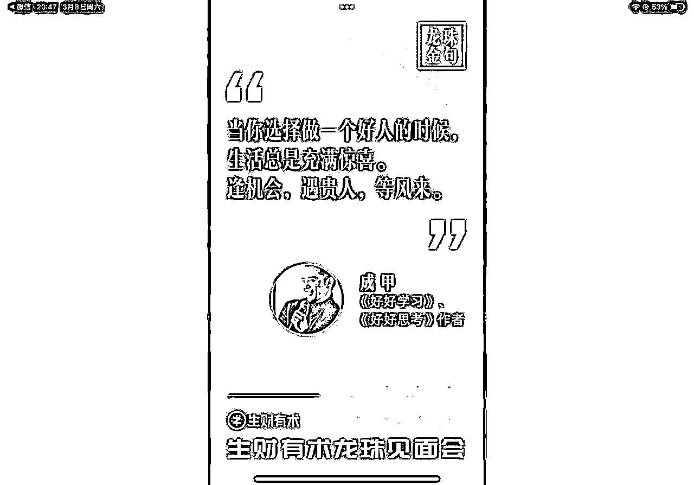

# 3月航海 | 养成系 IP 从0到1|实战手册

> 来源：[https://ocn93f5d9olj.feishu.cn/docx/EQBFdRpYCo2b96xzHarc7fd9nQb](https://ocn93f5d9olj.feishu.cn/docx/EQBFdRpYCo2b96xzHarc7fd9nQb)

# 防失联+MM188166M（李李）长期更新频繁+备用V:MG10127

手册出品方：生财有术团队

出品时间：2024 年 12 月 2 日

手册使用说明：内容出品人排名不分先后。本文旨在向你展示一个项目的更多可能性，帮助你更好地理解和实操。

建议：如果需要快速定位到精确内容，可以使用快捷键 Ctrl + F/command + F 的形式，搜索「关键字/词」，查找你想要的内容

# 必修篇：跑通最小 MVP

# 零、养成系 IP 从0到1 项目介绍

养成系 IP 从0到1，顾名思义，就是自己做好定位，确定一个赛道方向，去做这个赛道社群的IP，从0到1和用户一起陪伴成长。

养成系IP给人真实感，可以更近距离贴近用户，增加IP和用户的粘性。

这个项目我们邀请了“生财大师兄”杨涛，带着大家一起来学习如何做一个养成系IP。

杨涛说：“在我四十岁那年，我写下了我人生的新战略方向，16个字，“保持健康，做好私域，我们有人，他们有钱。”

众所周知，凯文·凯利曾提出过一个革命性的理念，「1000个铁杆粉丝」理论，

他认为，这个时代的创业者，不需要有千万粉，百万粉，只要拥有了1000个忠实的粉丝，就足以支撑个人的生活与事业，

因为这些「铁杆粉丝」，不仅会重复购产品，更是时刻关注创业者动态，成为销售基本盘与自发的传播力量，

是的，在这个信息丰盈的时代，注意力是最宝贵的资源，注意力在哪里，钱就在哪里，钱在哪里，注意力就在哪里。

我们必须着手开始构建属于自己的铁杆粉丝群，这是最宝贵的生产要素，也是最具确定性，能陪你穿越周期的生产要素。这也是我们本次开航海，教大家从0到1打造养成系IP的意义。

# 一、定位阶段

# 💡

章节概要

在这一章节，主要介绍养成系IP的价值、自我诊断适不适合，找到「能持续+易变现」的社群定位

可以按照航线图，开始学习

1、做好自我定位，找到自己的定位和人设

那么，现在就开始学习筹备把。

# 1.1 做养成系IP的价值

说个大的行业背景，知识付费领域的基本盘在扩大，越来越多的领域有人进来，当初的免费时代变成现在的付费时代，人们为知识付费的意愿不断提升。

而「知识付费」，是一个伟大的事业，很简单的道理，如果没有人，传道授业解惑，那么人们何以获得知识？几千年前知识付费，几千年后依然需要知识付费，这是真.穿越周期的事儿，

而各位圈友，是时候发挥自己的特长，用自己的知识和经验，帮助更多的朋友，提效降本，拿回生活的掌控感，找到人生的确定性，

随便举例子，

变美赛道，护肤，穿搭，形体...等N种（是N种，以下同，全列就满屏了），情感领域，成人技能领域，健康养生领域，中老年领域，兴趣领域，家长领域，各种行业领域，工具使用领域...等N个领域，都很香，都很缺人啊。

而且，做养成系IP社群这件事情，能够全面培养你的人生技能，也就是我常说的「确定性三件套」，

1，内容能力：听说读写，驾驭文字的能力，

2，流量能力：全域全平台获客的能力，

3，销售能力：社会关系的建立与维护，私域运维能力，销转能力，

而这些能力，才是真正能陪你穿越周期的能力。

# 1.2 自我诊断是否适合

首先，我们要来自我诊断一下，自己现在拥有什么，缺少什么，是否适合来做。

对应门槛条件如下:（可以对照自查一下）

这是第一关，你只需要看看，进入一下状态就好，过会儿第二关，希望你能认真自评。

1，有「一技之长」，

这个很微妙，就现在，我问你的「一技之长」是什么？

你能马上答出来，就是有，坦然笃定，如果答不出来，就是没有。

2，粉丝数量，

各平台读者过万人，微信好友过万人，且你自我感觉良好，

这个也很微妙，你如果是做吃播或者说泛娱乐类的泛粉，那肯定不会自我感觉良好。

3，行业影响力过硬，

行业资深专家，沉淀多年，或者出过书，

有些朋友确实是很牛逼，对行业的理解和洞察极深，但不自知。

4，热爱分享，

这个分寸在哪里，我用一句话形容，当别人和你请教的时候，你能感受到滋养，而不是消耗，

你细品，如果你在这样的场景中，感受到疲惫和厌倦，那么你肯定不合适，

5，可支配时间，

有企业/业务/收入稳定，有属于自己的时间，把你的「一技之长」，发扬光大，

于是可以尽情的，去探索，去钻研，去输出，去发出你的声音，让人听见，让人看见，让人说好，让人喜欢，让人信任，让人付费，让人到处说，让人喊人来...

接下来就是我们的第二关，来填一下以下的问题，非常有趣，没有固定答案，你只要能非常诚实的面对自己，坦然笃定的填完，那么你就一定能在养成系IP这条路上走得很远，

可以对照参考，也可以点击链接建立自己的自测表：个人情况自测表

# 1.3 人设和定位

对于普通玩家来说，先别着急，不要有定位焦虑，也不要盲目定位，你自己也没搞明白。

对我们要做的这件事来说，定位，就是在你覆盖的众多圈子中，通过你的相对优势，和差异化的策略，累计的正面声量，聚焦用户需求，塑造你的不可替代属性和价值标签，成为某种你能满足的需求的最优/第一/唯一选择。

如：搞钱社群=生财有术，高端手机=苹果，电车=特斯拉，咖啡=星巴克，

人设，是由很多标签组成的，是你通过日常的信息传递，人们感知到的信息就是人们给你打的标签，众多标签弹回来，构成了你的人设，

如：一个很会写作，能唱会跳身材好的海归高学历，从事跨境电商的二宝妈......

这里面的每一个细节，都是你日常想让人们感知到的，然后通过你的内容传递，逐渐塑造成为标签的。

是的，假的人设，和硬造出来的人设，都有着系统性风险，时间轴拉长，要么会迎来崩坏的点，要么需要耗费巨大的能量去维持这样的人设，

也就是人们说的，德不配位，必有灾殃。

对了，我们常听到一个词，IP

在我心中，IP是结果，是内容的结果，是业务的结果，是结果的结果，IP给你带来的

「知识社群」，其实也如此，

他们都需要思考两个问题，

「你在为谁，解决什么问题」，

「你在为谁，提供什么价值」，

细品，不要上头，冷静一些，如果你还觉得自己符合条件，那么，就把它当做你的人生「第二曲线」，一起来吧，

我们一起盘清楚，「做什么」，「为什么」，「怎么做」等问题。

包括但不限于，目标用户需求，社群定位，视觉相关的建议，如名字，slogan，封面，亮点，海报，定价策略，涨价策略，新人手册，推广方案，渠道，分享模式，激励机制，社群的运维，内容板块设计，线上和线下活动的设计与运营，裂变机制，增值服务，资源调配，续费率提升，低转高的路径设计......等问题。

# 1.3.1 养成系IP的定位有何差异化@七天

养成系IP的人设，有几个比较明显的特点：真实，不完美，共创，从0到1。

对比专家人设，养成系IP属于自己也在边学习边分享的阶段。这一人设的差异化在于：真实。

举例如做一个主题为AI+IP的成长社群，你不必是一个AI领域的高手，也不必熟悉IP人设的定位几步法。

更多是需要把自己学AI，学习IP打造的过程记录下来。包含心得与避坑经验，让同样关注的用户有一种“你在慢慢成长进步，那么我也可以”的共鸣感。

IP的本质是塑造信任。专家角色也是为了塑造信任，但如果还不是专家，真实也是塑造信任的方式。

第二个养成系IP的差异化是：共创。

过去在小红书上就有不少养成系IP的案例，比如“小艾同学”“听劝的延安苹果”等，小艾同学就在网友的建议下，开启了听劝改造，从减肥到穿搭，一步步变瘦找到了女友，直至结婚恋爱。

而“听劝的延安苹果”则是延安果业中心想把当地特产的苹果推广出去。但是缺乏营销经验，就直接注册了小红书账号，有人真的在评论区认认真真为延安苹果列下了营销策略，有人直接上手帮他们写起了文案。

在过往专业IP打造中，更多在凸显专业，引领，权威，用户被动接受品牌的产品和分享，

而养成系IP则属于与用户的身份并肩，甚至主动邀请用户参与自己打造IP的共创过程，一边帮自己出谋划策，一边成为自己的核心用户。

在无数供应过多的当下，很多专业人设的表达已经变得稀疏平常，用户反而在意起：你是否足够尊重我的建议，是否看见我，听见我。因此衍生出来对于需求共创的解决方案，成为IP与用户共同沉淀的资产。

当养成系IP把用户当做一个个具体的人去对待，才能让这些用户觉得，你是真的在为我的需求寻找解决方案。

第三个差异化的点，就是从0到1。

很多生财圈友应该都发现了：从0到1是生财内容的高频词。

不少圈友还处于探索尝试阶段，需要的并不是业已成熟的方法论，而是手把手的分步骤拆解，具体到每个动作最好截图分享的详细SOP。

这也正是养成系IP的特质，由于仍处于MVP的过程中，所以遇到的大多数问题和探索出来的解决方案，都是用户现阶段需要的，而不仅仅是一套完整的理论，看完觉得高深专业，但无法下手。

为此，养成系IP的内容定位也会清晰，就是把自己探索某个业务，比如如何做AI职场提效过程中的100个常见问题积累下来，找到答案，这个百问百答素材库，就是最好的冷启动内容库。

比如我目前在做AI+IP的成长社群，那么我就会把“如何做IP定位”“如何用腾讯的ima知识库”“如何用DeepSeek做爆款小红书标题收集”等新手常见的问题+思路分享呈现，就能满足用户对这个社群的刚需。

# 1.4 社群定位

每天，都要问自己两个问题，

这个群，到底在帮群友解决什么问题，提供什么价值，

这里头很微妙，一句话概之，社群对你究竟意味着什么，是你业务的全部，还是你业务的一部分。比如，付费社群，没有后端高阶产品，那么精力就可以全部用在交付上，高价，做精，做深，做续费。比如，有后端高价产品，那么就可以前置一个破冰社群，低价，轻交付，做规模，扩大池子。

付费，是一种习惯，仿若一个漏斗，长期筛出更加契合的用户，当然，知识付费并不是全部，好物分享，也是一种超强的价值输出，帮忙提效降本，这是一门大生意。

另外，知识付费的升华版，是行为改变付费，这块，是人人都可以做的，而且交付极轻，售后极少，对情绪价值的需求，是大于实际价值的，尤其是对爱立flag的女生来说。

这里，再和大家同步一个概念，我们为什么要做社群呢，涵盖着知识付费社群，好物社群，陪伴社群，一个很重要的原因就是，「边际成本」为零，或者说，边际成本极低。

举个例子，你做一个课，做出来那一秒开始，你的边际成本就是零，卖一份和一万份，并不增加你的成本；你做一个收费的陪伴群，你群里30个人，还是500个人，你的交付成本并没有增加太多，但是收入翻了17倍，你开一个付费群，还是两百个付费群，你的交付成本轻微增加了一些，但是你的收入翻了两百倍

这种模型，是不是很性感，实操的话，本次参与的同学应该分为两种。

# 1.4.1 无明确方向

没有方向一点问题都没有，我们可以通过开启这样的社群，输出倒逼输入，别人付费，我们学习，一起精进。

比如开网赚类的群：创业项目交流群，搞钱副业风向标群，

比如开自律类的群：跑步群，各种打卡群，减肥，

比如开学习类的群：共读群，共创群，写作群，表达群，

比如开分享类的群：好物群，优质信息共创群，羊毛群，

比如开陪伴类的群：脱单群，话术群，哈哈群，

......

每种群，我都可以展开和你们讲实操，生财有个圈友做跑步群，多年前就年入百万了。

# 1.4.2 有方向

比如自己是相关从业者，律师，老师，财务，烘焙师，黄牛，小红书玩家，电商人，设计师，主播，创作者，程序员，搭配师...

你已经很明确能给他人创造什么价值，解决什么问题。

这类朋友可以从群开始尝试，第一波百人群收集一线的体感，更清晰的知道用户的需求，跑完闭环，扩大规模，

也可以在过程中设计高阶的产品，比如知识星球，训练营，自己的课...

也可以通过群，发展自己的业务，比如保险，代购，设计，财税...

当然，也可以带货。

有了基本的用户池子，就有了无限的可能性。

# 二、产品设计阶段

# 💡

章节概要

在这一章节，我们在知道自己的IP定位以后，开始学习去设计和打造产品。

可以按照航线图，开始学习：

1、根据 IP 定位，做好自己的产品设计，框定服务内容和并定价

那么，现在就开始学习筹备吧。

常说，选择大于努力，那我们有得选的话，又要怎么选呢。

「基本面大，系统性稳定，上升趋势明显」，这是黄金三角，

比如，我们要选择基本面大的领域来做，也就是受众更大的领域，所谓的垂直，是需要在大的基本盘里头去垂直，举例，我们圈里的神，勤勤恳恳卖AI课，两年做了快两亿，到手几千万，可人家英语雪梨老师，一个暑假就做了两亿，再一起来做一个测试。

假设，你开了一个课，这个课是工具出海的课，那么基本面假设为矿泉水瓶盖这么大，如果这个课，是抖音直播，那么基本面就变成了大饼这么大了。如果是电商，那么基本面就变成了锅盖那么大了。那有什么比锅盖更大呢，像厨房那么大呢，没错，英语。那有什么比厨房还大，像操场那么大呢，有的，写作，表达。

那有什么比操场还大呢，聪明的你一定想到了，没错，成长，泛成长领域其实是包含身心灵，情感，甚至读书会等在内的一切。

还没完，你选择小基本面的电商课，很好，你这时候需要保持敏锐，保持机动，保持对抗，还要拥抱变化，我敢说，你半年前的课，不迭代，半年后就过时了啊，

如果你是英语，比如，音标课，笑死，英语就那么48个音标，200年后大概率还是这48个啊，发音课，也是一样啊，不需要迭代啊。做个课，卖个五年，十年，不香么，如果你是写作和表达，一样的。

如果你是成长领域，那么，你知道最早的鸡汤文，是什么嘛。没错，荀子的《劝学》啊，你去看看全文完整版，你会大大的感慨，

对吧，实操的话，刚才说过，一技之长，我们根据刚才测试的结果，大概可以分为：

「有一技之长，和没有一技之长的人」

# 2.1 有一技之长

有自己技术或者专长的人，可以根据专长马上做出一个产品，然后马上开始卖。比如，销冠群，写作群，表达提升群，恋爱技巧群，纠音群，艺术签名，改错题群，练书法，康复群，健身群，母婴群，创业实验室，项目快闪群。

标准模式就是内容输出+答疑，不管你处于你行业的什么段位，我们都可以快速的成为普惠行业的高手。

比如，任何行业，人们关注的最热的200个问题，几乎是恒定不变的。我们可以通过5118（闲鱼租号就可以了）和其他极客工具，也可以通过AI，收集到这两百个问题，并获取答案，然后改成自己的风格的问答，并配上案例详解。

这样，你就有了一本行业百问百答，或者，你有心深挖的话，可以变成，想做保险，看我就够了，或者，行业圣经，比如，白话区块链。我们不好高骛远，但是也画个饼，你整理完，如果有着一丝笃定，是可以考虑出书的，

也比如，我们可以尝试在学浪，网易云，荔枝，小鹅通，混沌，得到，腾讯课堂等任何课程平台，找到你这个行业的相关课程，我们都无需购买课，只需要看课程表，糅合多家的课程表，然后你根据课表，结合你的舒适区，就可以有一堂非常系统的课了。

做为基本的交付，你可以分一个月讲完，也可以半个月讲完，剩下的，就都是交互了，日常的答疑解惑，收集最一线的需求，再迭代到你的行业圣经里头。

慢慢的，传播到位了，你的江湖地位就有了，这个就不是画饼了，你们现在扪心自问，你行业有人出过这样的内容么，我想是没有的，如果能够通过这次航海，让你们能够整理这样一份内容，我觉得是极好的。

是吧，有生物老师专门整理了不同风格的课件，都赚得盆满钵满，生物老师服务全国生物老师。

# 2.2 无一技之长

如果你没有什么技术专长，也可以开始做起来，可以选择有共性需求的。

比如，日更群，跑步群，读书会，减肥群，背单词群，英语角，创业项目交流群，资料群，网赚群，好物分享群，风向标分享群，哈哈群，冥想群，抄经群，

这类就更轻松了，交付的东西只有一种，就是内容，你可以称之为信息，也可以称之为知识。

我们可以用不同的形态，不同的形式去交付，形态可以是，传道，授业，解惑，陪伴，有个很酷的生态位，叫做陪伴师。形式可以是群文字直播，可以是直播，但是这种交付都是极其简单的。后文会说到交付内容。

# 2.3 产品定价 @七天

所有定价的终极目标，是找到跟自己的同类人。而寻找同类人的过程，对于养成系IP来说，需要一些试用装，但为了锁定高潜用户，也需要有一些正装甚至定制装。

所以做定价，有两个重要的点，一个是尽可能大的覆盖潜在用户，一个是深度挖掘高潜用户价值。所以给大家的建议是阶梯制收费。阶梯制包含时间的阶梯以及加入时间的阶梯。

# 2.3.2 收费机制：

阶梯制收费的核心在于通过低门槛吸引用户，逐步引导他们升级到更高价值的服务，从而实现用户留存和收入增长。

低门槛入口：设置一个极低的入门价格（如9.9元/周或19.9元/月），降低用户的决策成本。

这个阶段的目标是让用户快速体验社群的核心价值，建立初步信任。此时，社群的核心交付可以是基础内容、轻量答疑或简单的陪伴服务。

中端产品承接：在用户初步体验后，提供中端产品（如99元/季或199元/年），内容和服务可以更深入，比如增加专项答疑、定期直播、行业资源资料分享等。

这个阶段的目标是让用户感受到社群的持续价值，并愿意为更长期的陪伴和深度内容付费。

高端1v1产品：针对高意愿用户，可以提供更系统化更定制化的服务，比如深度陪跑、个性化答疑、资源对接等。

这个阶段的目标是锁定高价值用户，建立长期关系。

总结来说，阶梯制收费的核心逻辑是：低门槛吸引→中端承接→高端锁定→升单激励→持续迭代。通过这种模式，既能最大化用户覆盖，又能深度挖掘用户价值，实现社群的可持续增长。

要收钱，要收钱，要收钱，

不要和我讲什么交朋友，提供一个交流的场所，和大家学习，都是扯淡，

也不要想着说什么输出倒逼输入，都是虚幻的，

知识星球，是国内最大的知识社群工具，刘容10年功力，最大的感触就是免费社群做不长，如果是免费的，还不如不开，

只有收费了，才会双向绑定你和你的客户，你的行为才有杠杆和复利，有正反馈才会被这种执念带着成长和进步，

# 2.3.2 权益机制：

可以通过阶梯式涨价（如每100人涨价50元）制造稀缺感，促使用户尽快决策。

升单激励机制：对于从你这里加入生财的用户，可以返还年度陪伴群1年费用，或者提供额外的增值服务（如专属资源包、1对1咨询等）。这种激励机制不仅能提高用户的升单意愿，还能增强用户粘性。

优质共创用户免单机制：从社群创立之初，即建立优质共创用户的共创机制。可以通过用户提供3~5条优质内容后，即可免除当月/当年的费用，确保社群的内容生产引入koc的杠杆，不再只是由自己独立输出，而是通过奖励机制，挖掘更多优质的用户。

根据数据调整反馈：通过用户反馈和数据分析，不断优化社群内容和收费模式。比如，根据用户需求增加新的服务模块，或者调整价格阶梯，确保社群的长期吸引力和竞争力。

# 三、素材搭建体系（持续运营）

# 💡

章节概要

在这一章节，内容是做一个养成系IP对外输出的重点，这里会教大家如何去收集日常分享的素材，用DeepSeek+多维表格的方式去整理素材内容。

可以按照航线图，开始学习：

1、构建自己领域的内容库，确保交互和交付

那么，现在就开始学习筹备吧。

素材库的搭建，有很多来源，主要有闲鱼，社群，别人的资料包，圈友共建，购买等。

# 3.1 外部渠道（闲鱼、小红书等）

比如，你是一个小红书创业者，视频号创业者，你可以去闲鱼搜索小红书资料，小红书电商资料，视频号教程，玩法，关键词有很多，但是搜出来你可以找到市面上的一切资料，重点是还免费，可以进行整理成文档内容。

这里有一个底线，你能看懂的案例，都能讲，你能经得起追问的方法论，都能讲。

有个词送给大家，叫做人类知识总和，基本上关于某个领域的知识，都是现成的，你需要做的，只是「演绎」。也就是深刻理解之后，配上鲜活的案例，再传递给你的用户。

你有洁癖么，我问你，如果一个短视频内容，1000万播放了，那它是不是超级大爆款。但，还有15亿人没看过。

比如，你可以去这里，http://wedb.online/ (电脑端打开)

这里有着10000GT的现成的资料，没有他也能给你找到，这个不要外传啊，自己偷着乐，人家已经转生了好几次了。

比如，你可以去小红书，搜索你的同行，勾搭你加他，一定是「加我领资料」，你加到同行的过程中，你不仅能够收获到大量的资料，还能够加到很多同行的群，你可以了解这个环节中的每一个节点人家是怎么做的，是的，最好的老师，是同行，

还有很多，我（杨涛）会在直播中，一一讲透。

（此处我会把我的珍藏都发给你，发一堆，然后会教你每个细节，让每个赛道的圈友，都不缺日常分享资料）

# 3.2 内容共建

人们喜欢索取，不喜欢付出，

日更和活跃都是反人性的，

所以，一个内容型社群的根本，就是身为群主的你，可以嗷嗷输出，

最终，能够影响到5%左右的群成员和你一起共建，已经算是优秀水平了，

当然，有解的，

我们内容无限，我们托也到位，怎样都能实现的，

我再教一下自主造血能力，就是一起共建内容。

你每天是不是会记录收藏一些你的觉得非常好的碎片化信息，比如深度好文，资讯，笔记或者是你自己总结的心得，其实呀，你一个人，单位时间内，获取的信息是有限的，你还需要花时间去甄别，筛选，而且你也不一定能找到最干净，最优质的信息源。

那比如说现在有10个你，跟你同级别的人，他们每天也在做同样的事，这样你拉个群，约定每天每人必须发一条干货，这样，你就可以用你一份信息，换到10份同样质量的信息，这样，就等于你的干货，加了10倍的杠杆，而且呀，这个群，不聊天，也就是说，这个群，是信噪比最优，可以常年翻阅的好群，你学会了么?要不，你建一个，拉我（杨涛）?

看明白了么，这样的话，你就有了日常群活跃需要的话题和问题，也能因此召唤和吸引同样愿意分享的朋友，一起活跃。然后你也有分享的优质内容素材。

讲完了内容来源，就要说下素材的整理和文案。

我会直播手把手教DeepSeek+飞书多维表格，当然，这次DeepSeek 入门指南航海手册里也有讲到这个玩法，可以直接去看手册内容，

也会讲到一天日产千条文案的打法吧，如果合适，我连ima使用一起讲了。

# 3.3 生财的优质内容推送

目前生财针对精华帖及中标内容均有一套推送机制，还有AI生成的亮点分析汇总。

对于不少从0开始做养成系IP的圈友来说，是一个很好的自动化素材库。

# 参考案例

航海家运营素材群的定时推送，基于机器推送进行加工即可

# 💡

原始素材：#点赞40 #中标 #风向标 #小红书

作者: 风小海 (圈友)

1.  小红书个人成长账号通过卖思维模型变现40w+

1.  该账号提供付费群和1v1咨询服务，变现路径多，上限高

1.  容易复制，使用DeepSeek整理文案，稿定做图

https://t.zsxq.com/MpZxm

调整素材：#AI新机会：DeepSeek+小红书成长类内容起号

分享一个在生财看到的AI风向标，我觉得适合结合小红书平台做。 AI的优势是快速结构化梳理，可以利用DeepSeek 的优势，帮自己做结构化的内容，赋能个人成长。

把这个PDF卖出去也会有人买。我看这个账号销量还不错。大家感兴趣可以拆解下。

原文为：#风向标小红书个人成长账号卖思维模型 变现40w➕，而且该账号还有付费群和1v1咨询的服务，变现路径多，上限非常高。容易复制，用DeepSeek整理文案，再用稿定做图

# 四、冷启动阶段

# 💡

章节概要

当你了解自己的IP定位，准备好自己的素材库，那么可以开始去招募你的追随者，可以在朋友圈和外部渠道去招募。

可以按照航线图，开始学习：

1、筹备物料素材，朋友圈海报和话术

2、招募第一波用户（私域、公域）

那么，现在就开始学习筹备吧。

再次提到那句话，反复问自己，你这个群，到底给人解决什么问题，提供什么价值，

大声说出来的，清晰的，坦然笃定的，成功率就会更高，然后反向思考一下，别人给我付费的目的是什么，是什么，是什么。

是想要瘦，想要自律，想要便宜的好货，想要学东西，想要交朋友，想要赚钱...还是其他什么这些。

想明白了，事情就好棒了，起码，你海报能做到别人喜好上。

# 4.1 第一步，预热

如果你之前的人设很清晰，比如，你原先的朋友圈内容已经可以非常清晰的表明，你是谁，你在卖什么，为什么非你不可，这三要素了，那么你就可以直接当天开始卖了，做完海报就开卖陪伴群。

如果你对自己有信心，参考之前的测试表格，我指如果你很确定有50个人愿意为你付费，那么你甚至可以不用做素材直接文字带上二维码就开卖，或者说，v我50，开卖产品。

需要预热的同学，是为了增加信心，预热的方案可以是这样，在朋友圈发个文案，举个例子参考下：

「电商人真心需要拥抱AI，最近效率太高了，打算把设计师开了，各种详情页随便做，有手就行，想拉一个群每日更新我的工作流，手把手教大家怎么提效降本，收个多少钱合适呢，想进群的扣1，人越多越便宜」，

当评论区反馈很热烈的时候，你把评论区数字乘以2，就可能是最终的冷启动付费用户人数了。

（因为朋友圈的触达只是一部分，还有其他渠道的触达产生增量）

# 4.2 第二步，素材制作

一般来说，对外宣传2张海报是最基础的。一张长图和一张短图。

一张一图概之的海报，短图，海报尺寸是：1920*1080

举例如图，

一句话的简介，比如：如果你想通过创业而不是工作赚到100万，你需要信息，认知，技能和圈子，而毫无疑问，生财有术社群是以上最具性价比的解决方案，没有之一。

一张详情海报，属于长图，如图：

如果你是一个存量（好友数）很多的选手，那么就需要多套海报，这里有什么讲究呢。

在这个信息丰盈的时代，人们的注意力被打得稀碎，如果你的群介绍过于冗繁，是不利于转化的，一图概之的单屏海报，既能看清楚最重要的利益点，又不需要下载pdf，不需要点开查看原图，不需要消耗流量看长图。

但是长图也是必不可少的，可以理解为，短图能转化的，就直接短图转化了，还在犹豫的，他点开了短图，有兴趣，自然会去看长图。

同时，长图做出来之后，还有很多的应用场景，比如切片，变成公众号的文章，h5链接等。和pdf文件不一样，pdf文件，女生是敏感的，没有wifi都不愿意看，而且7天就过期了，h5是可以反复被传播的，你的公众号的自动回复，菜单栏里头都可以放。

# 4.3 第三步，按节奏分享到朋友圈，反复转化

你可以用不同的策略，比如早鸟价，原价多少，几月几号开始恢复原价，比如阶梯式涨价，满多少人，涨多少钱，

这些都行，但是一定要走心，要有诚意，我曾经在朋友圈看到原价19800元的社群，早鸟价19.9元，这就是把人当傻子了。

下面给大家找几个案例，实际上有几百个案例，（回头全员上岸，我就打包发给航海群的船员们）

最后，基于大家都是新人，控场能力可能不够，如果你突然之间，加了200人，他们彼此也不熟，其实和你也不熟，你觉得怎么能热烈起来呢。像我这种天选的会控场的除外

这里给大家一个很好的思路，加人慢一点，你把你微信朋友圈可以分多个分组，每次发朋友圈，仅某个分组可见，这样的话，

一方面你能实现曝光最大化，一份素材可以发多次，每次针对某些人，当然了，如果你足够细致，还可以通过改换标签和分组，把付费用户拉走，继续转化潜在客户；一方面你可以控池，不必担心一开始人太多，你交付不过来。

如果你人少的时候，你可以先培养大家的感情，比如一个群30个人的时候，群内很火爆，你就说大家都是元老，我要拉新人咯，大家帮忙活跃下之类的话，让大家一起熟络起来。

移出群快一点，不和谐的声音，早点清除掉。因为会影响其他的人，在私域里，你可以主动去清掉不友好的，不用在群内争辩。

当然了，一切规则要求要在群公告里写清楚，让群内的人都了解知道。如果进群之前，拉人的时候，有个单发的高压线提醒，就最好不过了。

给大家举一个群公告的案例，大家领会意思，就是无需照抄，理解之后根据自己的业务来写，

阳光午后，岁月静好，本群拟长期运作下去。

暂定群规如下：

1，多给星球点赞评论，让我看到你们，其实刷存在，吸眼球，往往就是举手之劳，

（可以任意改成，如，本群专注于跨境电商相关内容的探讨和专研，保持高信噪比，不要发其他无关的信息，）

2，时事热点引战的，无论立场，一律请出，

3，发广告的，除非同时发红包（200元起），否则请出，

4，群原始聊天记录截图或转发外传的，一律踢出，（如果聊天记录本身是转发信息，进行二次转发不在限制之列），

5，骚扰群友批量加好友的，一经发现立即踢出，

6，都是成年人，群友如有业务往来，合作投资事宜，自行评估风险信用，群主声明免责，不承担信用担保义务，

（要调皮可以写，本群只针对14周岁以内的群员提供资金安全保护，其余群友如有业务往来，合作投资事宜，自信评估风险，群主声明绝不推荐，且不承担信用担保业务），

7，禁止夸群主，禁止夸群主，禁止夸群主，情难自禁，每月有一次夸赞额度，

8，尊重女生，爱护女生，遵守法律法规，遵守社会公德，本条零容忍，

-----以上-----

# 4.4 外部渠道的招募

我们来聊一下「存量」和「增量」这两个必须有的概念，存量就是指你现在能辐射的用户数量，以能触达为基础，以能强推荐为最佳。

存量怎么判定呢，你现在把手机放下，想象一下，如果你现在要卖一个东西，百元以内，是个生活百货，或者是个知识付费的产品，你能想起几个你能摁住他的头，逼着他捧场，逼着他支持的人。

这就是你的强关系，一般人会在20个左右，而我们这次航海的目标，就是做到100个，然后用5年时间，做到1000个，这个是未来预期，可以不用紧张。

刚才说过强关系，那么弱关系，就是你筛出强关系的基础池子，也就是增量，就是你通过内容，获取的新的弱关系。

而本期航海的另一个目的，就是和大家一起，通过初步的群运营，获取更多一线的体感，收集一线用户的问题，获取运营中产出的物料和素材，用于各大平台，并且获取更多的用户。

从上面整体来看，我们只需要解决，发什么，发哪里，怎么发，这三个问题就好了。

1，发什么，发被市场反复验证过的内容，这些内容怎么找。

a，你所在的赛道近20年最热的话题和问题，你通过5118和各种极客工具，你可以找到你行业最受欢迎的内容，这是被市场反复验证过的，必火的内容，具体可以看这里，

https://mp.weixin.qq.com/s/9gHG1wTVwsBTCmMg-5rR-g

b，最好的同行发的现成的内容，比如说你现在想入局做一个医美，做一个护肤品，做一个祛斑祛痘，做一个身材管理，做一个大健康的单品，或者做一个很小众的产品都可以，你只需要做一件事，拿小红书举例，你只需要在这个平台上，你花 3 个小时间，通过不同的关键词，纯用户视角的关键词，你去给我加上 30 ～ 50 个同行。

为什么呢？因为你现在加不到同行，未来客户就加不到你，就是如此简单纯粹的力量，「你加不到同行，客户就加不到你」，因为本质上，我们都是去平台偷流量的，不对「对抗」这件事情祛魅，你就搞不定获客。

你加到了 30 ～ 50 个同行，就会发现你是通过什么方式加到了他？在这个过程中你会接触到大量的优秀的同行，因为你切换了用户视角，你在这三个小时之内，你会接触到大量的优秀的标题，封面，笔记，评论区，评论区运营，评论区截流，

评论区它有没有引导加群，群的简介是怎么设计的？群里面他是怎么加到你的？他是通过什么方式，把那个带着微信的图片或者是卡片，或者是一串数字发给你的？或者是他有没有@小号？他有没有怎么把你引导过去？他是通过什么诱饵把你诱过去的？

比如说「加我领资料」，那个领的是什么资料？你加过去之后，他的破冰话术是怎么样的？他的昵称是怎么设计的？他有没有给你发报价表？有没有给你发海报？他的朋友圈是怎么发的？

你有没有把他的朋友圈往回翻个三年，看他是不是三年前就在做这个行业，而三年后他还在做，这说明着什么？这说明他肯定赚到钱了，对吧？在这个过程中你会收集到什么呢？ 30 ～ 50 份资料，然后你把这些资料在电脑上整理一下，把水印去掉，那不就变成你自己的引流资料了吗？是不是这个逻辑？

同样的，我为什么说是 4 小时法则？到这里你才用了 3 个小时，到这一步你就要把这个，你在这个过程中的所得，去做了一下整理。

怎么整理的呢？你会很惊奇的发现，在你看到第3个小时的时候，你已经看不到任何一个有新意的东西了，所有的封面都长那样，所有的内容，套路，都是重复了又重复了，任何一个行业，都是差不多 5 ～ 8 套的模板，你把这 5 套，8 套模板给它整理下来，选择自己软硬件更适配的，简单务实，听话造作，像素级的模仿就行了，就这么简单，同行是最好的老师。

你看到这里，我们来玩一个游戏，我不知道你们到底是做哪个行业的？你们现在打开小红书，随便输入一个你们行业的关键词，用户思维哦，

我敢保证你搜出来的前面三屏，就是前面的三个屏幕，十一个内容，你不要看内容，你就点开每个人的头像，你去看一下他们多少粉丝，

大概能猜到你的结果，大部分是几百粉的，甚至有几十个粉的，只有少部分的千粉万粉，这是为啥呢，因为「小红书，是一个种草平台」，这句话能细品的朋友，一定很厉害。

确实，它从去年开始已经很少把流量给大 v 了，「低粉爆款」这个词，虽然已经被说烂了，但是确实还是有极大的参考意义以及「情绪价值」，我希望大家能够带着仪式感，把这个流程走一下。

这个范畴并不影响我们去整理 5 ～ 8 套的热门模板，然后，告诉你一个很好玩的事，你在加到这 30 ～ 50 个同行的过程中，你一定会反复加到一个人，两次，三次，四次，这时候你就要特别注意了。他一定是一个高手，能听明白吗？你就要点击他的主页，连他的整个主页的一切，去好好模仿，包括加到他之后，你要怎么去跟他进行互动，去从他身上学一点什么东西。

你看刚才我们讲了，你资料也有了，你内容也有了，接下来要干什么？发就得了。当然，加了那么多同行，还是有一些其他用途的，你不是刚入行么，加到了客户，你不是要去尝试给客户做转化吗？客户问的问题你万一不懂怎么办呢？

非常简单，你有 30 ～ 50 个同行，他们都是最优秀的老师，客户问你什么，你就马上复制粘贴过去，问他们是什么，你总会发现这 30 ～ 50 个人当中，有几个特别热情的，他们就是你免费的问答机器。

我一般是怎么操作的，比如，要入局一个高端医美，或者高端医疗，专业术语比较多，常识特别密集的这种行业，那么我就会加到 30 ～ 50 个同行，反反复复地伪装成客户去刁难他们，直到什么呢？直到整理出，完全属于我自己的一套完美的行业百问百答，

这就是由最优秀的同行，用最标准的答案，给你回答出来的，你自己还反复确认，反复证实过的，最优的行业百问百答。

这就是 4 小时流量速成大法，你只要记住了这个规律，你在任何平台都是通用的，刚才讲的是小红书，你如果去抖音的，去快手的，去视频号的，其实你会发现，逻辑是完全通用的。

2，发哪里

「最小阻力法则」，你想下可以直接发的地方，就拿它作为你的主阵地，然后衍生到全平台。

3，怎么发

一句话概括，内容，从生产出来的那一秒，边际成本就是零，我们必须把这份内容，用不同形态，发到不同平台，什么叫不同形态，比如，一份内容，很多人就发在公众号，区区几十阅读，就完成了它的使命，这是一种浪费。

一份内容可以变成问答，变成知识点详解，电子书，pdf，长文，金句卡片，图文，笔记，长视频，中视频，短视频，即刻体，微博体...等n种形态，

发布在诸如，B站，快手，抖音，美拍，秒拍，美篇，皮皮虾，最右，boss直聘，火山，微视，陌陌，小影，微博，小咖秀，头条，西瓜，阳光，梨视频，比心，全民小视频，得物，映客，QQ看点，逗拍，开眼，糖豆，小红书，贴吧，好看视频，小世界，微博，趣头条，大鱼号，一点号，大风号，简书，学习通，美篇，熊掌号，百家号，企鹅号，网易号，搜狐号，土豆优酷，酷六，爱奇艺，腾讯视频，即刻，豆瓣，天涯（卒，仅瑞思拜）.....等平台，

注意，不是让你都发，不是让你手动发，机器分发就好了，操作就是你注册一个工具，然后登录上去，选择要同步的多个账号，直接进行分发。

我给大家一个截图，只是做示范，注意，只是示范，别有压力，只是只是示范，连这个工具也是示范，有更好用的，你们都会找到适合自己的，比如媒小帮，小火花之类的。

# 五、日常运营SOP

# 💡

章节概要

在招募了50+以上的用户，开始陪伴群的运营，这一章节会教大家如何去做日常运营，保持群活跃度，提高大家的粘性。

可以按照航线图，开始学习：

1、在陪伴群内进行日常交付和运营

那么，现在就开始学习筹备吧。

# 5.1 最小功能

如果我的社群只有一个功能，一个意义，那它会是什么，这个功能值多少钱，好了，其他的都是我额外给你们的，于是，人间最美是小满，坦然，笃定。

# 5.2 按时出摊

你观察我，明白，梁靠谱，再往上一点，641，润宇，李一舟；再往上一点，薇雅，李佳琦，海参；再往上，罗永浩，罗振宇，我们的共同点是什么呢，四个字，按时出摊。

明白老师为什么火了，是的，他很能写，又是一个牛逼的全栈，还是一名演说家，但是最让人记住的，还是9点半睡觉，早起日更，日更2000天，这些标签，以至于，我每次看到有人的昵称后面有个括号几点睡觉，我就觉得是和明白老师学的。

是的，人们本能的会对做到了自己做不到的事情的人，表示一种服从，是的，我用了服从，不是钦佩，不是敬仰，而是服从，一种潜意识里的付费可能性就出来了。

综上，所以，收钱，双向羁绊，按时出摊，共同进步，这个路径才是最好的，首先，群，要合规啊，一些高压线是肯定不能碰的，监管越来越严了，比如开车，讨论政治话题，翻墙，数字货币相关...等容易违法违规的事情，一定要坚决杜绝，如果有发现，一定要及时移除。

「让人有事可做」

这点太重要了，他们来这里是干嘛的，是干嘛的，如果你是群友，你来这里是干嘛的，是干嘛的，动起来，引导，并带着大家动起来，任何形式的打卡，提问，探讨，互动都算动起来，当然了，买东西也算，装逼也算。

「发什么」

「发什么」这件事，并不是社群的全部，甚至占比都不大，所谓干货和信息，都是过剩的，但是，很多人却因此被劝退，

而这件事，实在是太简单了，上面已经教过素材库的搭建，而且是永不枯竭的素材库，而且，实在懒，可以就从生财找内容去交付，如果有余力，可以尝试做更高端的互动。

比如，你每周三开直播和群员互动，答疑，这场直播在交互和交付的基础功能之外，也兼备了拉新的功能，而且是很多互动的直播，直播并不难，手把手教开直播无限话题打法，

开播时候，手机背后是电脑，电脑屏幕开着风向标，直接讲，开着读书笔记，直接讲，开着精华帖，直接讲。

托的重要性，没问题，只需要安排五个人在直播间，提问你轻车熟路的问题，你就可以解锁你的直播圣体，同理，群里只要有五个托，那么就会唤起其他能被唤起的静默群友。

「托」是社群最重要的元素之一，终极形态是人人都是托，前期，必须要有自己安排的人，小号也好，心腹也好，后期，自来水越来越多，事成。

你可以想象得到，

一个知识付费群里头，不停的有人晒后台，极致的roi，醒目的gmv，

一个减肥或者健身群里头，不停的有人秀肌肉，秀身材，

一个好物群里头，不停的有人晒单，拆箱，

一个自律相关的打卡群里头，不停的有人晒单词，晒时长，发读书笔记，

......

对转化率的提升能有多少，

再举一个例子，

众所周知，女生在立flag的时候，总感觉自己已经超越了这个宇宙，

比如她加入了一个读书群，每天要发读书笔记的那种，坚持了3天，然后坚持不下去了，

但是，她每天都在群里看到大家在疯狂的发读书笔记，

于是，她是不会怪群主的，只会觉得自己是个小辣鸡，

然后，下个月，她，续费了，

是的，对留存，客诉，转介绍...都有正面的利好，

# 5.3 具体怎么做

可以分几个方向，你把每天的内容分为5个版块，重一些可以是10个版块，每一个版块都可以倒逼大家深度学习，并完善自己的信息源，功德无量，我随意举例子，大家领会意思

1，案例拆解，生财有大量的精华帖，拆解贴，够你们手输配截图用好长时间，

2，风向标，生财风向标，

3，精彩的内容，比如老喻的内容，曹大的，西风的，涛哥的，教主的微博...你们只要收集10个左右的精彩信息源，那么你们就有用不完的内容，还能够逐渐迭代自己的库，

4，早安图，可以是一张金句卡片，如果能够设计一个类似瑞.达利欧这样的模版，那么每天发，就有可能被人到处转发，参考如下，

5，哈哈图，就是最新最时尚的梗和热点皮，要高级，知道么，哈哈群是这个世界上最活跃的群之一，我所在的哈哈群十多年了还在，你加入几个就好了，每天不要多，偶尔来一个，会让你的群很活跃，然后有哈哈图的群，被置顶的概率大大提升，被折叠的概率大大减小。

6，群聊精华，如果能有飞书就太棒了。如果没有，那么群聊合集转发配上日期也是初期可以用的，在日常聊天中，能习惯于用tag，也就是#，那就更好了，比如#日思录，#骚操作，#黑科技，这样的话，群友们就会逐渐养成习惯，而且会觉得你的群与众不同，

7，表情包等亚文化，占戈哥欠走已，zgnb，近曹者富，我的无数个自己的表情包，小红书的集美文化，这些是什么，是亚文化，不同的平台有不同的调调，社群最终也会有属于群主的荷尔蒙，越强烈越好，当然，这是后话，也要提前埋下一颗种子，说不定就做大做强了呢。

江湖就是，同规模换群，或者互托。一个小建议，如果你们缺托的话，可以在本群只有链接求水军，是的，如果谁能大声说一句，本人「巨能水」，这种托在每个群都会很受欢迎的，

你们拉群之后，可以有一个机会发一张海报，注意，就一张海报，讲清楚你这个群是干啥的，然后有人感兴趣，自然会加你，然后你收钱也好，不收钱也好，和我没关系，

1，水军互相暖场，资源共享，杠杆群，

2，彼此同行异业，可以抱团，做大做强，什么叫同行异业，你是英语老师，她是数学老师，你是瑜伽教练，她是营养师，这种就可以抱团了，

3，举个例子，你的群300人，我的群也300人，

我邀请你过来进行一次宣讲，你邀请我过去来一次分享，1小时，然后都允许别人留二维码，并且自己也在群里鼓励大家可以链接，这样一举三得，何乐而不为。

# 六、案例分享

不说了，都暴露给你们了，再截图就害羞了。

我做了两个读书群，交付时间两天，具体可以看文档

涛说：前途无量

涛说：《华与华正道》上篇-正心术

涛说：《华与华正道》下篇-立正学

「交互与交付」，

敲黑板，情绪价值也是价值，交互和交付，同样重要。

「订阅」，是一个伟大的产品，

我们都渴望睡后收入，收租类型的生意，那么，订阅就是一个很好的渠道，它的性感之处在于，「续费」，只要你每年的新增，大于跳失，那么你的人生，就具有极强的确定性，你心中会有一个进度条，什么时候能够达成1000个铁杆粉丝，然后享受那种续费带来的爽感，

体面和杠杆，

这里提两个关键词词，就是体面，杠杆，

体面，就是微信群收款，就不如知识星球体面，不如视频号会员体面，为什么呢，因为平台的公信力，因为付费的用户习惯，给你付和给平台付，是两个概念，

杠杆，反复提到了，同样的时间，有着多倍的产出，就是杠杆，

你星球服务一百个人和服务一千个人，收入翻了十倍，付出时间并没有太明显的增加，

以前没开过星球的朋友，如果想开，欢迎找我聊一下，我可以免费，公益的带着大家开知识星球，

这句话就当作大家能看到这里的福利吧，当然了，你要截图出去群里，我就更开心了（托的作用）

# 七、售卖高阶产品

# 💡

章节概要

在做养成系IP初期，我们用低客单的产品吸引用户，在IP的内容逐渐成熟，影响力变大，铁杆粉丝越多，可以考虑去售卖更高阶的产品，比如训练营，做课程，开星球等。这一章节就教大家如何去做高阶产品，以及售卖方式。

那么，现在就开始学习筹备吧。

一鱼多吃，市面上的说法叫做，A种B收也挺类似，实际上，就是你和一个粉丝迈过信任门槛之后，你可以反复的在他身上完成价值实现。

比如，你吸引了一个创业粉，那么你可以先把他卖给生财，再卖给花爷，再卖给帅张，再卖给...怎么卖呢，简单啊，「加我领资料」，一个海报，领取某某免费课，人这不就过去了么。

过去以后，你钱到手，后续转化，看对方本事，只要你在合作方的选择上，做好把控，只要你在产品的选择上，做好品控，这些对你的势能，不是伤害，而是增益。

万物皆可CPS

产品的概念其实是多态的，你自己研发的产品，和别人的产品，包括别人的社群，别人的知识付费产品，都有可能是一个好产品。

比如，做电商，你做流量，卖货，别人做生产和发货，

比如，做医美，你做流量，成交，别人做服务和售后，

比如，卖课，你做流量，别人做转化和交付，

其实，是一个道理，有交付能力，就做自己的高阶产品，没有交付能力，就先帮别人做，自己学着做，终究，一起精进，等风来，等花开。

「流量价值」和「客户价值」，

「流量价值」就是你做的这个选择，做来的流量，能够给你带来多少利益，是否符合「五高」，也就是高客单，高利润，高粘性，高复购，高转介绍（是的，传播属性也很重要啊），

实在不行，起码符合2个以上啊，是的，要去「搞富人的零花钱，别赚穷人的生活费」，如果不符合，那这个流量是否来的轻松，是否你清晰的知道这只是过渡，你的终局，是要通过什么手段，赚谁的钱，赚多少，怎么赚。

「客户价值」就是和你发生金钱交易的客户，是否迈过了最基础的信任门槛，你是否还能从他身上反复的创造价值，举个例子，你今天出了100单大日化，卖了128元的蓝月亮，威露士套装，也都加到微信了，这些人有价值么，有，但不多。

你今天同样128元的客单，成交100单，但是卖的是祛斑祛痘的品，或者减肥的小药丸，要往脸上抹，吃进嘴里的，这些人有价值么，有，还挺大，因为这算是真迈过了信任门槛的客户，

是吧，以后做事情可以骚，可以浪，可以试错，可以过渡，但，多用这两个标准「流量价值」与「客户价值」去框定终局，思路也许会清晰许多，这种能积累迈过信任门槛的客户的事业，它就是更加的正确，对吧。

客户是什么？客户就是你最强的生产要素，再给你举例子，

一个人他 5 年前在炒股， 5 年后他大概率还在炒股，

一个人 5 年前在减肥， 5 年后大概率还在减肥，

一个人5年前在知识付费，5年后大概率还在知识付费......

回到刚才的例子，假设我卖的减肥茶，那这样的客户存在我手上，我能干嘛呢？我能反反复复地转化她，反反复复的用这些生产要素，去不断的创造价值，

为什么呢？你看一个减肥的，她可以买减肥茶，那她大概率会买减肥药，她会买减肥的装备，普拉提的装备，瑜伽的装备。

她还会买代餐，她还会买各种的辅食，还可以转化她的皮肤管理，美白，祛斑，祛痘，医美，生美，科美，还可以转化她未来的母婴，大健康，还可以转化她来做副业，转化她来做微商，还可以转化她做知识付费，还可以转化什么呢？读书会，成长，情感，这种客户？她就是你最具确定性的生产要素，她是可以陪你穿越周期的生产要素，

是的，默克制药的座右铭，非常到位，

We try to remember that medicine isfor the patient; we try never to forget that medicine is for the people，it’s not for the profits. The profits follow and if we have rememberedthat, they have never fAIled to appear and the better we have rememberedthat, the larger they have been，

药，是用来治病的，利润，是随之而来的，不会缺席，不会迟到，不会少，很多东西，是结果，是行为的结果，是专注的结果，是解决问题的回报，是提供价值的回报，不是目的，不是想当然，

嗯，小结一下，「选择」大于努力，它不是鸡汤，它是最顶级的策略，记着这个模型，会少走很多弯路，

当然，也许前期的我们，年龄阶段，社会阶段使然，并没有太多的「选择权」，但是，别怕，我们在生财啊。

当前最优解

不用焦虑，不用一步到位，有思考就可以，先干着，人生战略，就是在下一个战略「涌现」之前的最优解，在心里埋下一颗种子，就更有方向，是吧，具体的话，高阶产品可以有很多。

课，高阶课，训练营，陪跑，收徒，咨询，私董会，星球...

比如，你可以做一个课，怎么做呢，真心不难，我简单讲一下，每个人都能做，你有你想要的课的方向，带着这个方向的相关关键词，去学浪，千聊，各种云课堂找找，找到那些被市场验证过，最受欢迎的课。

去看他们的海报，他们的课程表，因为是你的领域，你基本上看了课程表，就知道他们要讲什么内容了。

然后，你就有了自己的框架，大章节，再把你不擅长的章节剔除掉，就得到了最终的课表，过程中可能还会不断遇到能加入课程的点，但是一个课程最基本的框架是很重要的，不然会变形，大概可以这样做。

01，确定框架：想要做的主题相似的标杆老师，标杆课程，找出被市场验证过行得通的点（知识点）

02，到几个课程平台上把1中课程能用的知识点汇总（比如千聊，荔枝微课，得到，喜马拉雅，混沌大学，十点课堂）

03，每个课程的宣传文案中都有大纲，更新说明，适宜人群，配套运营动作，推广动作，礼包福利啥的，记下来

04，用幕布笔记确定大纲

05，按照你的舒适区，分为几个模块，把4中提取的大纲打散，分别放在不同模块下面

06，一个个整合模块，删去重复的，精简

07，6做完了，一个新的，综合了多个课程热点的，更全面的课程，就闪亮登场了

08，根据新的大纲，开始写稿，一个小节一个小节写

09，都写完后，改稿，每遍改稿的关注点不同

10，第一遍改稿：提取其中的关键概念，思维模型，关键问题（如果没有这些支撑，这门课不够深度）

11，第二遍改稿：往其中加入案例，故事，金句（如果没有这些点缀，这门课不够生动）

12，第三遍改稿：看其中哪些地方需要加些图示（如流程图，知识卡，插画）

13，第四遍改稿：通读稿子，把书面语进行口语化改编，因为书面语太生硬，口语需要一些引导，注入情感

14，配备必要的PPT

15，看未来课程的平台要求，（这点很重要，想清楚要在哪个平台交付），从而录制语音，或者短视频，或者直播

然后，就结束了么，不，并没有，

16，有个问题，如果遇到走下来，不能自洽的时候，比方说，框架出来了，然后有个很常见的问题，就是，第八条往后走，在填充框架的时候，在后面每一步都有可能发生， 嗨了，会加戏，然后加戏了，就把前头既定的框架给推翻，或者打乱顺序了，原本五十页的可能会变成一百页，

然后怎么破？

17，按照8的大纲写，一节一节写

18，写的过程中，新开一篇幕布，拷贝8的大纲，有新的章节要加入，则放在这里，先不管顺序或者逻辑自洽与否

19，2中想到的新的点子，模块，则用知识卡的形式，每张知识卡格式为：一个关键词+简短小标题+内容（500字~2000字不等），知识卡集中一个地方先放着

20，按照8的大纲写完，再调整大纲，并结合8的内容和另外攒的知识卡，放到新的大纲下面，再填充细节，然后如果过程中继续嗨了，就重复一遍这个过程，然后会递减穷尽的，于是稿成。

另外，结合上文所说，也许这样要有把一句话演绎成三千字的能力，或者说掰扯大量案例的能力，

其他也是大同小异，并不复杂，

大家就会发现，其实可以不用慌，我的观察是，内容都差不多，比如，初阶课，辅以情绪价值和大量的案例拆解，作业的布置，模板的收集，内容的共创，就构成了训练营，

当然，我们可以想尽办法做到更好的交互和交付，

比如，训练营，陪跑营里头的奖励和激励，

激励这东西，和奖励不一样，奖励是平均的，比如你身为群主，时不时来个红包啥的，意义不大，真的，但是如果谁做了一些对你的社群很有贡献的事儿，你发了一个专属红包，或者说红包命名为感谢某某谁，然后发了一个大家都可以抢的红包，然后讲几句花团锦簇，激励的意义就到位了，情绪，对，面子，里子，都有了。

当然了，这种事情是随机的，且不递减的，养成习惯，但不应该给人期待的，不是约定俗成的，

随机就是你想发就发，主观的，不递减是指不存在第一个贡献红包很大，后面越来越小，养成习惯是指你自己要不断激励群员，不给期待是指不要引发功利心，不是规则，是你的主观，

很微妙，这是身为群主的权威塑造，也是你和其他群主拉开差异化的有效手段，

久而久之，人们会把越来越多的注意力放到你的群里，嗯，注意力就是钱，信任就是钱。

# 选修篇：项目精进与放大

# 💡

章节概要

当我们完成项目最小 MVP，基本掌握项目的操作流程后，可以尝试看看选修篇的内容，

选修篇主要是教大家去外部引流获得更多用户，和学习搭建自己的内容系统，不断产生优质内容

现在，快来进一步学习吧。

# 八、如何搭建内容系统

内容系统最重要的，就是框架，基础打好了之后，就可以日日精进，每天填充一点点，最终形成完全属于你的行业圣经，

我尝试用知识树和行业百问百答，给大家举举例子，

你们想有一棵树，主干是「皮肤管理」，

然后枝干可以有n个，分别是，抗衰，美白，祛斑，祛痘，保湿，防晒...等n个，枝干里头又可以有n个分支，比如抗衰的分支，是胶原蛋白，抗氧化，抗糖化，营养补充，激素平衡，肠胃调理...等n个，

然后分支里头又可以有n个知识点，比如胶原蛋白再生，a醇的运用场景，肽类，射频，相关医美...等n个，

你看，只要你花一个下午，你的领域的知识树，内容系统，就出来了，然后，也可以去做行业的百问百答，和知识树先后顺序都可以，互为补充，

比如，

而这些内容，随时可以变成脚本呀，给大家做个示范

脚本示范.pdf

# 九、增量流量获取（外部）

标题名，对流量结构的理解，

深刻理解，到底有哪些渠道能给你带来新增的用户呢，你们可以不往下看，自己写一些，

是的，比如，公域流量（全平台内容获客），换量，裂变，买量，混群...

这时候你们想象成一个饼型图，这些流量来源分别占比多少呢，

# 9.1 横向和纵向

横向，就是你要去开发更多的来源，

比如你擅长小红书，那么你要尝试抖音，视频号，知乎...

纵向，就是你把你的现有渠道做深，

比如你非常擅长混群，你就努力混更多的群，「吸引」更多的用户。

这里具体就不展开说了，如果航海中大家有疑问，可以航海群内沟通。

以上就是航海手册的全部内容，最后，祝大家可以跑通本项目流程，找到50+个铁杆粉丝，做好自己的养成系IP，获得收益，一起生财有术！