# 3 月航海｜Youtube 视频｜实战手册

> 来源：[https://ocn93f5d9olj.feishu.cn/docx/D5DXde0pSoXdWbx95AxcvPLqncf](https://ocn93f5d9olj.feishu.cn/docx/D5DXde0pSoXdWbx95AxcvPLqncf)


# 防失联+MM188166M（李李）长期更新频繁+备用V:MG10127

手册出品方：生财有术团队

出品时间：2024 年 12 月 2 日

手册使用说明：内容出品人排名不分先后。本文旨在向你展示一个项目的更多可能性，帮助你更好地理解和实操。

建议：如果需要快速定位到精确内容，可以使用快捷键 Ctrl + F/command + F 的形式，搜索「关键字/词」，查找你想要的内容

部分丢失视频链

# 必修篇：跑通最小 MVP

# 💡

# 章节概要

在这一章节，我们将从认识 YouTube 平台开始，一步步带你完成整个项目流程的学习。

如果你是本项目新手，建议在正式实操前，先初步了解下项目全貌：

✅【项目概述】了解 YouTube

如果你对项目整体有了大致了解，就可以按照项目核心步骤，开始学习实操：

✅【实操 1/6】账号运营

✅【实操 2/6】确定赛道，分析对标

✅【实操 3/6】生产 Shorts 视频

✅【实操 4/6】生产长视频

✅【实操 5/6】运营策略和数据分析

✅【实操 6/6】开通 YPP ，获得收益

在必修篇，航线图和手册顺序相对应，你可以按照手册的顺序进行学习，即可逐一完成航线图的每一个任务。

在后续的每个关键步骤的章节概要中，我们也将提到相关航线图，提醒你完成相关步骤。

接下来就正式开始吧！

# 一、【项目概述】了解 YouTube

# 💡

# 章节概要

YouTube 作为全球最大视频平台，近期大力推广 Shorts 短视频功能，流量倾斜明显，入门门槛降低，AI 助力内容创作。与国内平台相比，健康的 shorts 账号基础流量能稳定在万播，获得爆款机会更大。

本章从四个方面详细介绍：

✅ 为什么选择 YouTube：市场规模、广告价值与 AI 创新机会

✅ 平台推流机制解析：Shorts 和长视频的算法逻辑

✅ 主要变现方式：包括广告分成、会员收益等多元化收入

✅ 开始前的注意事项：规避版权问题，保持长期主义心态

YouTube 需要持久战思维，打好基础，循序渐进。

# 💡

# 本章航线图

完成本章节的学习和实操，即可完成航线图的：

第一阶段 了解平台，准备 YouTube 账号（约 2 天）

1.

了解 YouTube 平台以及主要变现路径（约 1 小时）

2.

了解 YPP 开通规则与门槛（约 1 小时）

接下来请正式开始，跟着步骤完成第一章内容学习，记得在航海日志中打卡记录进度哦～

# 1.1 为什么推荐你做 YouTube？@亦仁

10 月 24 日，亦仁在星球发布了第二条超级标：通过 AI 生成的各种视频，上传到 YouTube 和 Shorts，获取广告分成，空间无限大。

1.

这是一个超级巨大的市场和空间。12 年我作为第一批在 YouTube 上开始赚钱的人，那个时候就已经感受到巨大的流量价值不对等，同样的播放，在国内视频平台可能一文不值，在 YouTube 上可能有几千美金的收益。

2.

背后是 Google 广告平台的巨大商家量，以及 Google 为了自己的内容生态，把广告收益的一部分分给了内容制作者。

3.

各种 AI 工具的出现，让咱们生财有术的圈友可以实现快速制作视频的能力，以前的大多数视频需要露脸，或者需要有比较强的口播表达能力，现在，都可以通过 AI 工具来解决。

4.

为了和 TikTok 竞争，YouTube 推出了 Shorts，Shorts 又开通了广告分成计划，且已经看到一些中国人在 Shorts 上赚钱和导流的案例。

5.

在 Shorts 上已经出现了非常多的大流量的 AI 生成的爆款视频，且你可以顺藤摸瓜找到非常多的细分类目，也欢迎大家去研究挖掘写帖子来分享。

6.

这是一个非常长周期的事情，从我那个时期开始做，已经十年过去了，仍然可以在 YouTube 赚钱，而且越来越强，值得你当作事业认真去做，当然，肯定不简单，请永远记住：赚钱的多少和你克服的困难大小成正比。

7.

宝宝巴士靠把自己的视频上传到 YouTube，一年获得的广告分成是多少你知道吗？ 5000 万美金。

除了宝宝巴士这个案例可以看出平台的收益空间之大，还有近期复出的李子柒，虽沉寂三年多，但断更期粉丝却不减反增，涨粉 500 多万，10 月底从数据平台 socialblade.com 看到一个月依旧有约 30 万的收益，可见 YouTube 平台长尾效应是非常明显的，值得作为一个长期投入的项目去做。

国内视频创作板块如此卷，不如出海去。


# 1.2 平台机制

无论是 Shorts 还是长视频的推流逻辑，核心都是算法驱动。而算法是结合用户行为和内容表现，来决定视频能否被更多人看到。但短视频创作不仅仅是靠运气，更多的是对内容的持续打磨和对平台规则的深刻理解。

因此可以说：

算法奖励的是让用户喜欢的内容。

# 1.2.1 Shorts 推流机制

# 1.2.1.1 Shorts 推流的三个阶段

和国内抖音类似，一个视频发出后，YouTube Shorts 也有 3 个不同的流量池阶段。

① 第一阶段：冷启动

每当上传一条 Shorts，YouTube 的算法会首先把视频推荐给一小部分用户（通常是几百到几千人），通常是与频道标签、内容相关性较高的观众，这些可能包括：

已订阅的观众（但并不是所有订阅者都会收到推送）

对相似内容感兴趣的用户（比如经常观看与你赛道相关视频的观众）

在该视频标签和关键词领域活跃的短视频用户（这些人对你的内容主题更有可能产生兴趣）

在这个阶段，算法的目标是衡量视频的初始反馈，关键指标包括：

选择观看率：即用户在刷到你视频后是选择观看还是直接划走，（正常 60%及格，越高越好）。

平均观看时长/百分比：对你的内容的感兴趣程度 ，反映观众停留时间

互动率：点赞、评论、分享等行为是否积极。

如果视频在这小范围内的表现优异，算法会将其推送到更大规模的用户群体，进入下一轮推荐。相反，如果数据反馈较差，推流范围可能会被限制，视频的传播潜力也会受到影响。

此时，可以通过视频数据后台查看视频流量来源，正常的大部分流量来源为：shorts 动态

冷启动测试是 Shorts 推流逻辑的第一步，表现良好的视频才能在接下来的阶段中获得更多曝光。这也是为什么优化视频的开头、主题和标签非常重要，因为冷启动决定了你视频的起跑线能跑多远。

② 第二阶段：扩大推荐范围

当视频通过冷启动测试后，YouTube 的算法会将其推荐给更大范围的目标用户，进入扩大推荐范围阶段。此时，平台会根据冷启动的表现，进一步推送视频给更广泛的观众，例如：

看过此类内容/在此类内容有过交互行为：系统会将视频推送给在此类视频停留或者有过点赞评论等交互行为的用户。

与内容相关的潜在用户：算法会根据视频的标签、标题和关键词，寻找对相似内容感兴趣但与你频道没有直接关联的新观众。

不同地区或语言的观众：尤其是具备普适性、无语言障碍的视频，可能被推荐给国际用户。

Shorts Feed 中的高流量用户：视频有机会出现在更多用户的 Shorts 流中，覆盖范围进一步扩大。

平台会重点关注核心指标，如平均观看百分比、划走率、互动率（点赞、评论、分享）。如果数据表现依然强劲，算法会持续放大推荐范围；若指标下降，则推流可能受限。

在扩大推荐范围阶段，视频已经从“小规模试探”迈向“大规模传播”。这是短视频能否成为真正爆款的关键一步，决定了它的覆盖广度和带来的长尾效应。因此，持续保持内容表现的优异性，抓住观众的注意力，是这个阶段的核心策略。

③ 第三阶段：大规模爆发

当视频在扩大推荐范围阶段持续表现出色后，YouTube 会将其推送至更广泛的用户群体，进入大规模爆发阶段。这时，视频可能出现在 Shorts Feed 的高曝光区域，甚至被推荐到热门视频版块，让流量实现指数级增长。

在这一阶段，推荐的受众可能包括：

几乎所有相关兴趣用户：算法会优先匹配与你视频标签、关键词契合的观众。

非核心兴趣用户：平台会测试视频对更广泛用户群的吸引力。

高互动用户：经常点赞、评论短视频的观众更可能收到推荐。

YouTube 会继续追踪视频的关键数据：

高选择观看率：代表用户有没有看了几秒就划走，低于 60%，将会严重影响推流。

高平均观看百分比：平均观看时长和平均观看百分比指标是反映用户对你视频的感兴趣程度，健康的曲线应该是一条相对平缓的曲线。

高互动率：爆发阶段的互动量（特别是评论和分享）是持续推流的重要信号。

如果视频在大规模观众中依然表现优异，它的生命周期会延长，甚至进入长尾流量阶段，持续带来观看和订阅增长，还能为频道整体权重带来长期提升。


# 1.2.1.2 哪些数据决定推流？

YouTube 的算法会根据以下几个核心指标判断你的内容是否值得推送给更多人：

1️⃣平均观看时长

平均观看时长是短视频表现的最重要指标之一。类似于国内视频平台的“完播率”，平均观看时长是指用户观看视频的平均时间，最直接提升该指标的方式是减少视频时长。以 20s 的视频为例，平均观看时长要达到 120%以上才是及格线。

2️⃣划走率

Shorts 没有封面，但算法会分析观众是否愿意点开完整视频。这和标题、标签以及前几秒的吸引力有关。短视频前三秒决定生死，设置一个能抓住用户注意力的开头是至关重要的。

3️⃣互动率

算法特别关注观众是否与视频互动，其中「点赞」、「评论」和「分享」是权重较高的互动行为。所以说，如果用户看完视频后还愿意转发给朋友或在评论区讨论，算法会判断内容具备高吸引力。

4️⃣ 其他因素

除了核心数据指标外，以下因素也可能间接影响视频的推流效果：

发布时间：YouTube 的活跃用户分布全球，根据你的观众地区选择发布时间能够提高发布后短时间内的推流。

视频画质：画质的清晰度是优质内容的衡量标准之一，画质越好的内容更容易被用户接受。

赛道选择：热门领域（比如搞笑、生活小技巧、萌宠）更容易吸引广泛用户，但竞争也激烈。小众领域（如手工艺、工具评测）更容易形成稳定的受众。趋势性内容（如热点新闻或挑战话题）更容易获得短期爆发，但持续吸引力较弱。

标签和标题优化：精准的关键词和标签可以帮助算法理解内容主题。另外，虽然 Shorts 没有封面，但标题的吸引力仍然很重要，要简洁直观，突出看点。

YouTube 的算法会参考频道的整体权重。活跃的更新频率、持续增长的订阅数，以及其他视频的表现，都会对推流有帮助。


# 1.2.2 长视频推流机制

YouTube 长视频的推流逻辑与 Shorts 短视频有很多相似之处，但核心差异在于观看深度和内容定位的重要性。

比如相比 Shorts 关注点赞评论等行为，长视频更加关注观看时长和留存率。用户是否愿意完整观看视频，甚至重播，是影响推流的关键。

而且长视频的推流周期更长，初始推荐之外，还依赖搜索、相关视频、和频道权重的稳定积累；推荐来源更广，包括首页、推荐视频、和搜索结果，甚至数月后还能持续获得流量。

所以说，长视频更像是一场“耐力赛”，而短视频则是一场“速度赛”，我们要针对它们不同的侧重点来准备内容。


# 1.3 变现方式

# 1.3.1 加入 YPP 获得广告变现

# 1.3.1.1 广告变现路径解析

在 YouTube 上赚广告费，核心在于理解两个关键点：Google AdSense 和广告形式。接下来，我们用简单清晰的方式搞懂广告变现的全过程。

Google AdSense：创作者的“收银台”

Google AdSense 是 YouTube 为创作者提供的广告收入管理系统，可以简单理解为“收银台”。广告商在 Google 上投放广告，YouTube 会根据观众的观看行为，将广告收益分配给创作者。

举个例子：

某商家花 1000 美元投广告。如果我们的频道帮他展示了 100 美元的广告价值，就可以分到 55 美元，剩下 45 美元归 YouTube。

无需我们找广告商或设置广告位置，YouTube 全程搞定，而我们只需专注于创作优质视频。

长视频广告类型解析

YouTube 广告分为 4 类，创作者可以选择在视频播放之前、播放期间还是播放之后展示广告：

可跳过的视频广告：对于可跳过的视频广告，观看者可以在 5 秒种后跳过广告。

不可跳过的视频广告：对于不可跳过的视频广告，用户必须看完广告才能观看视频。

导视广告：最长 6 秒钟的不可跳过的简短视频广告，用户必须看完广告才能观看视频。

重叠式广告：重叠式图片或文字广告，显示在视频下部 20%的区域内。

Shorts 广告类型解析

短视频的广告变现方式与传统长视频不同，主要依赖以下多种形式：

Shorts Feed 中的广告：在 Feed 中插入广告，产生的收益按比例分配给所有符合条件的创作者。广告收益与具体视频的播放量没有直接绑定，而是基于整个 Shorts Feed 的观看表现，属于共享模式。

展示广告：用户进入 Shorts 页面的顶部或侧边可能会看到静态展示广告，这些广告收益也计入 Shorts 的休闲池中。

不可跳过广告：部分广告在进入 Shorts Feed 前展示，此类广告的收入也归入 Shorts 广告收益池。

YouTube 的特别之处在于，优质视频可以实现持

续变现。即使视频发布已久，平台依然会根据算法权重推荐给新观众。只要有人看广告，你的收入就源源不断。

但广告收益的差距也会受一些因素的影响：

观看地区：发达国家 CPM 远高于发展中国家，比如美国的观看报酬通常会很高

频道领域：某些领域的内容有更高的 CPM。

视频时长：超过 8 分钟的视频可以无限插入广告，收益更多。


# 1.3.1.2 广告变现规则

想开启广告变现，必须先加入 YouTube 合作伙伴计划（YouTube Partner Program， YPP）。让我们来看下需要达成什么样的申请条件：

初级 YPP（低门槛）

订阅者数量：～500 名以上

累计观看时长或 Shorts 短视频播放量：相对更低（例如 3000 小时观看时长 或 300 万次 Shorts 播放等）

达到以上低门槛后，先开通“粉丝打赏”类功能，如超级感谢（Super Thanks）、超级留言（Super Chat）、频道会员等。

高级 YPP（完整门槛）

订阅者数量：通常 1000 名以上

累计观看时长或 Shorts 短视频播放量：较高（例如 4000 小时观看时长 或 1000 名订阅+近 90 天 1000 万次 Shorts 播放等）

达到此完整门槛后，可以开通 广告收益分成、高级会员功能等更多完整的变现选项。

拥有可关联的 Adsense 账号，直接注册关联就可以了。

账号要设置成可获利的国家地区，中国大陆账号无法获利，需要修改账号所在国家或地区。

无违规记录：频道需遵守 YouTube 的社区准则和广告友好政策，避免敏感或违法内容。

广告适配内容：视频内容必须适合广告展示（不含暴力、成人或其他限制类话题）。

注意：不要通过购买粉丝或者播放时长来加入 YPP，因为这些流量并不会为你的频道带来实际变现，而且如果被 YouTube 官方查出，就会降低频道评级。

建议关注 YouTube 官方文档了解更多细节，及时获取最新信息：

《YouTube 合作伙伴计划》

《YouTube 合作伙伴计划概览与资格要求》

《YouTube Shorts 创收政策》


# 1.3.1.2 广告变现案例分享

案例一：Catlyn's Story

频道类型：AI 猫咪故事


广告收入：月收入估算 1k～2w 美元

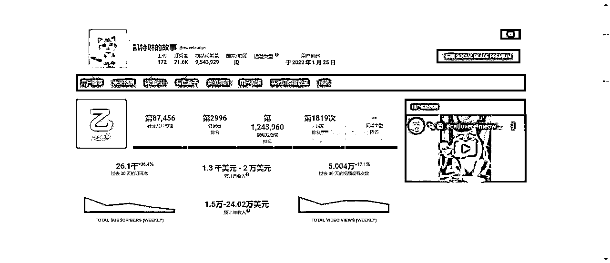

案例二：BabyMagic

频道类型：AI 怪兽合成

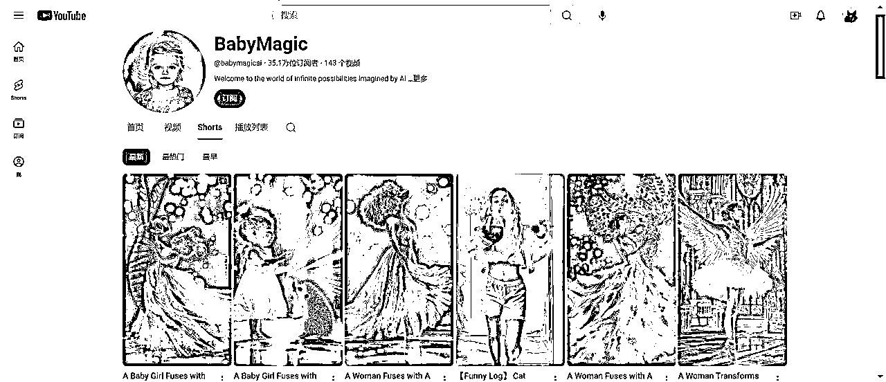

广告收入：月收入约在 1-10 w 美元

案例三：小高姐的 Magic Ingredients（中长视频案例）

频道类型：美食制作与生活分享

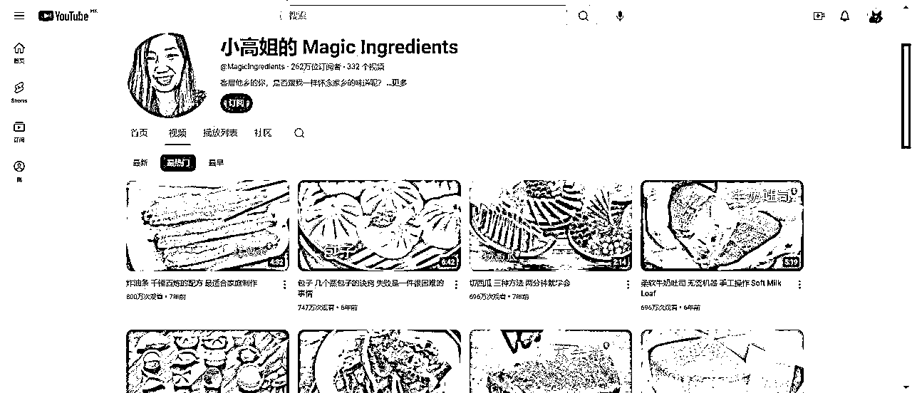

广告收入：月收入约在 1-5 万美元


# 1.3.2 会员收益

从 2023 年 6 月中旬起，YouTube 平台拓展了 YouTube 合作伙伴计划，让更多创作者可以抢先体验粉丝赞助功能和部分购物功能。也就是接下来要讲到的频道会员收益和电商变现。

位于符合条件的国家/地区的创作者只要达到以下任一资格要求，即可申请加入拓展后的 YouTube 合作伙伴计划：

过去 90 天内上传了 3 个有效的公开视频并获得 500 位订阅者，同时过去 12 个月内的有效公开视频观看时长达到 3,000 小时。

或者，过去 90 天内上传了 3 个有效的公开视频并获得 500 位订阅者，同时过去 90 天内的有效公开 Shorts 短视频观看次数达到 300 万次。

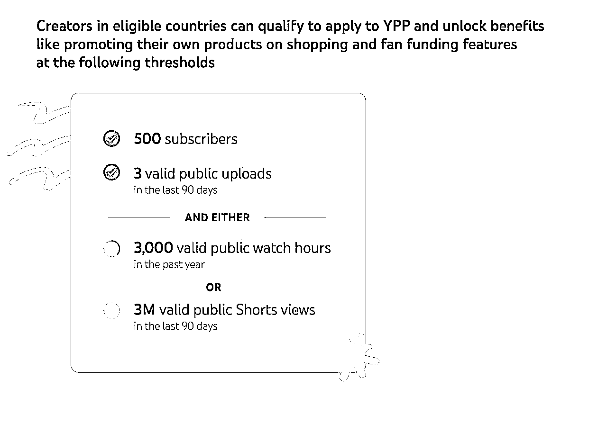

点击官方文档查看当前支持的国家，以及可开通的变现功能等更多细节：《拓展后的 YouTube 合作伙伴计划概览》。


# 1.3.2.1 频道会员收益

创作者可以在频道免费订阅的基础上，增设频道会员（Channel Membership），加入频道会员的粉丝每月定期支付一定费用，可获得创作者提供的特别福利。创作者也可以根据不同的福利设定不同的会员等级，具体费用由创作者设定，从几百到上千不等。

YouTube 从会员费中抽取 30%作为平台佣金，创作者获得剩余的 70%。例如：观众支付$10 的月费，创作者实际收入为$7。


# 1.3.2.2 付费会员收益

订阅付费会员服务（YouTube Premium）的人可以享受跳过广告等服务及其他权益，使用体验感会更好，当这类用户观看你的视频时，视频创作者也可以获得 YouTube 赞助的额外收益，而且根据时长获得相应的会费分成。

需注意：开启付费会员服务的条件，和 1.3.1.2 广告变现规则的条件一致。


# 1.3.2.3 会员收益案例分享

这里我们分享一个非常经典的频道案例：「老高与小茉」

他的频道在开通会员后，成为了整个 YouTube“频道会员增长速度全球最快”的频道。当时，老高的频道总订阅才刚突破 130 万，而现在已经过 600 万，会员只会更多。

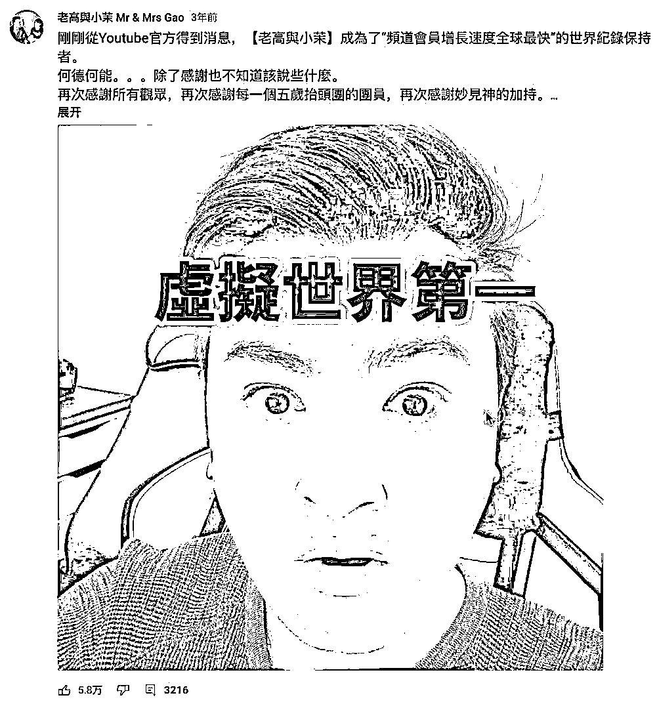

从评论区的直观感受来看，会员比例挺高的。ID 旁边有头像的都是会员，头像是频道主制作或使用平台提供的，根据会员时间长短，头像会有区别，体现不同等级。

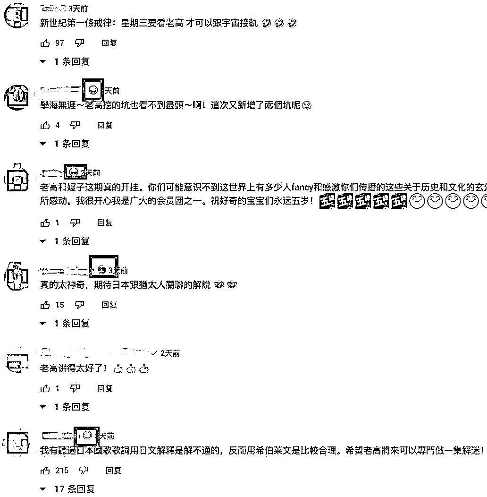

由于我们无法从 YouTube 得到具体量化的数据，这里我们借用一名博主的数据分析来推测老高的频道会员收入：

1.

会员人数估算：

普通视频评论/粉丝比为 0.0677%，会员视频平均评论数为 430。通过评论数据推算，会员人数为 63.5 万。

考虑会员评论活跃度更高（假设 5 倍），实际会员数估算约为 12.7 万。点赞数据进一步支持会员数接近 10 万的推测。

2.

收入测算：

会员价格按 5 美元，平台分成 30%。月收入为 12.7 万×5×70% = 44.45 万美元，年收入约 533 万美元。

这是 2022 年年底的推测，现在这个数字只会更高。

# 1.3.3 电商变现

除了广告和会员收益，还可以通过销售自己的商品来变现。当前 YouTube 也正在增强直播电商和商品货架功能，方便创作者直接在平台内完成销售，售卖展示的方式主要有两种：

1.

YouTube 小黄车：可在视频下方展示自家商品（需加入 1.3.2 会员收益中讲到的 YouTube 合作伙伴计划）。

2.

独立电商平台：如 Shopify、Etsy 等，通过外链导流销售，当然，平台会审核你要导流的商品，确保符合平台规则。

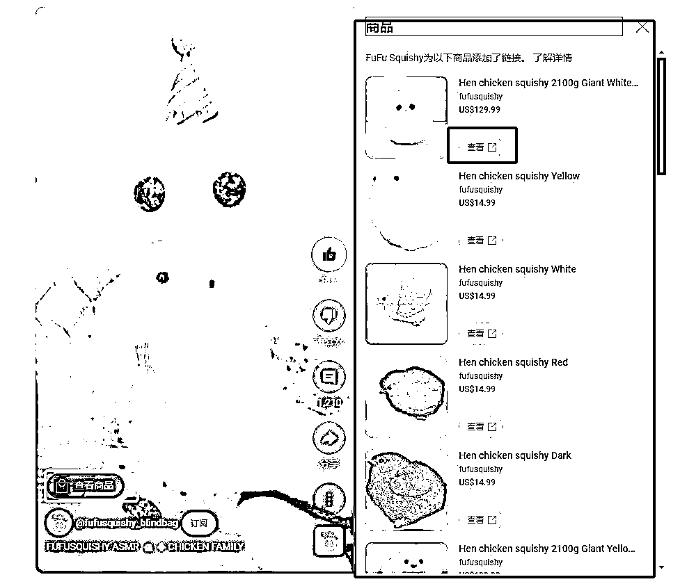

了解更多关于 YouTube Shopping 功能讲解，请看官方相关内容：

《YouTube Shopping：从您的商店中添加链接商品并展示》

《在 YouTube 上管理、关联和解除关联您的商店》


# 1.3.4 其他变现方式

# 1.3.4.1 广告商合作

即创作者与品牌合作，在视频中直接推广产品，创作者按视频条数收费或按销售提成。常见的内容形式有：测评与推荐、使用场景展示、特别优惠推广（如限时折扣码）。

YouTube 的广告价码没有一个正式的标准，但国外有一个以粉丝数作为参考的平均行情：

超过 1 万订阅的，每个广告可报到 200 美元。

超过 10 万订阅的，每个广告可报到 2000 美元。

破百万订阅的，每个广告最低报价 2 万美元。

这个算是门槛偏高的变现方式，因为对订阅数有要求，如果账号才刚起步，粉丝还不多的话，建议先用那些不看重粉丝数的方式去变现。

# 1.3.4.2 联盟 CPS

如果你没有自己的商品，但想在 YouTube 上做电商，可以通过在视频描述或固定评论中嵌入商品链接，观众点击并购买后，创作者可获得销售佣金，不用自己囤货或垫付货款，只需观众引导购买。

支持的平台有：亚马逊联盟、CJ Affiliate、ShareASale 、乐天等

常见的内容形式有：产品开箱与评测、实用教程（操作视频）、排名推荐

# 1.3.4.3 知识付费变现

知识付费变现指通过分享专业技能或知识内容，吸引观众购买相关课程、咨询或专属服务，从而获得收入。

相比传统广告和联盟营销，知识付费变现的核心是以价值吸引付费，特别是适合拥有专业领域知识或经验的创作者。

知识付费变现的形式主要有以下几种：

1.

在线课程销售：将课程上传到第三方平台（如 Teachable、Udemy）或自己的独立网站，通过视频引流观众购买。

2.

会员专属内容：使用 YouTube 提供的会员订阅功能，观众支付月费可观看独家内容。

3.

一对一咨询或服务：通过描述栏引导观众预约个人咨询（如 Zoom、Google Meet），按小时或项目收费。

4.

知识电子书或工具销售：通过视频推广电子书、模板或工具包，观众通过链接购买下载。

内容来源：《航海实战 | YouTube - 视频创作 | 实战手册》


# 1.4 开始之前的注意事项

接下来就要开始实操了，在进入下一章之前，我们希望你能抱着一个长期主义，持续经营的心态开始。

1.

不要急于求成。YouTube 创作是一个长期过程，以前长视频开通 YPP 的平均周期是 2 年，现在认真输出优质内容，可能需要 3-6 个月才可开通。记得专注于提升内容质量和与观众互动，而非仅仅追求数据增长。

2.

前期的内容可能不够完美，但不要害怕失败，重要的是持续创作与学习。最初可能一个月甚至几个月都没有多少观看量或订阅数，这是正常的。定期查看 YouTube 提供的分析数据（如观看时长、受众数据等），从数据中学习，逐步调整和优化。

3.

选择你真正感兴趣的领域，否则在遇到困难时很难坚持下去。

4.

理解版权法的重要性。YouTube 对于版权非常敏感。上传他人的内容（如音乐、影视片段、图像）可能导致视频被删除、账号被警告，甚至失去变现资格。

5.

规避常见的版权雷区

音乐：避免使用受版权保护的歌曲，除非获得许可。可以选择 YouTube 提供的音频库，其中有免费的音乐和音效。

图片和素材：使用无版权限制的图片或视频（如 Unsplash、Pixabay 或 Pexels），或确保你拥有素材的商业使用权。

影视、游戏片段：即使只用了几秒钟，也可能触发版权警告，特别是热门影视和游戏内容。


# 二、【实操 1/6】账号运营

# 💡

# 章节概要

搭建 YouTube 账号是项目的第一步，好的账号基础决定后续内容的推广效果和变现潜力。

本章核心内容包括：

✅ 账号类型选择：个人账号与品牌账号的区别与适用场景

✅ 注册流程：详细步骤与注意事项，避免常见错误

✅ 频道装修：如何设置头像、横幅、简介等提升专业度

✅ 视频发布流程：手机端与电脑端的操作差异和技巧

初期不必追求装修完美，重点是建立稳定的账号，

养号期尽量以普通用户身份浏览互动，提高账号可信度，为后续内容发布打好基础。

# 💡

# 本章航线图

完成本章节的学习和实操，即可完成航线图的：

第一阶段 了解平台，准备 YouTube 账号（约 2 天）

1.

准备网络工具，注册 YouTube 账号（约 1 小时）

2.

完成账号基础设置，了解视频发布流程（约 1 小时）

# 2.1 确定注册什么类型的账号

# 2.1.1 个人账号

用你个人谷歌账号创建的，需要单独设置用户名和密码。

# 2.1.2 品牌账号

品牌账号其实就是一个企业账号，可以展示企业信息、产品等。

这类用企业信息创建的账号，可以通过「Google+」或者「Google 我的商家」等方式创建，不需要单独设置用户名和密码，可以有多个所有者和管理员。


# 2.2 注册账号

Step1：国内无法访问 YouTube，需要使用可查看外部信息的网络工具。风险原因本次航海不展开说明，请先自行搞定网络，确保可以正常访问。

Step2：注册一个谷歌的邮箱账号，下载手机版 QQ 邮箱，点击添加帐户，选择 Gmail 邮箱，创建账号，依次填写相关资料，输入 +86 的电话号码，即可成功注册。（近期有出现电话号码无法使用的情况，换一个号码试一下，或者可以用接码平台尝试注册）

Step3：打开 YouTube 官网，用刚注册的 Gmail 账号登陆。

你也可以参考这个 YouTube 视频，尝试完成自己账号的注册：https://www.YouTube.com/watch?v=8hk5V2P_72U

注册完之后，就可以开始以正常用户的状态使用 YouTube 了，可以在平台上大量浏览，点赞，评论等互动，让 YouTube 感知到你是一个真人在使用这个账号。

建议先养号养几天再发视频，账号会更稳定一些。

另外，记得把这里的位置设置为支持获利的国家，包括美国、欧洲大部分国家、日本、韩国、印度和南美主要国家。

但我们也不用太过于纠结，因为 YouTube 的流量推送机制并不取决于这个，而是基于频道内容的目标受众。


# 2.3 开通 YouTube 频道

Step1：点击官网首页右上角的 Create a Channel 选项。

Step2：选择创建个人频道或品牌频道。

Step3：为频道命名， 一般会使用公司/品牌/产品名称命名，完成创建后就可以发布新的视频了。

完整的频道装修由多个元素构成：频道头像、频道名称、频道横幅、宣传片、播放列表、封面图、频道简介等。点击右上角头像进入“YouTube 工作室”，在右侧导航栏中找到“自定义”就能修改频道的个人资料了。


在这一步，圈友@方波妮的心态值得学习：

不要被 “头像怎么弄？封面怎么制作？我做的视频好丑？我怎么这么笨？” 卡住进度。

头像不会制作，手机相册找一张宠物的，或者风景照，或者 MJ 制作一张，先完成再优化，封面同理。

停止“我觉得 xxx”，模仿爆款让市场检验下，非常好的原创，也有可能打不过丑丑的模仿爆款，事实证明丑的东西也有人喜欢。

放掉这种念头，接纳刚开始的不完美，视频发起来，技术都是慢慢优化起来的。

# 2.3.1 频道头像

头像尺寸：98x98px，大小不超过 4MB 的 png 或 gif 图

头像类型：人物照、萌宠、风景、品牌 logo、卡通等。

头像风格：清晰，最好使用真人形象。

制作方式：不会做图的可以通过做图网站来制作头像，或者找些无版权的图片。

图怪兽：https://818ps.com/

可画：https://canva.com/

创客贴：https://www.chuangkit.com/

AI 工具创作头像：具体操作步骤可参考 AI 特效直播的实战手册：AI 头像壁纸号

注意事项：避免使用容易侵权的商标类图片。


# 2.3.2 频道名称&标识名

尽量简洁好记

突出视频内容特色或行业特征

可以是个人名字的延伸

中文+英文（注解）

标识名也可以作为你的 YouTube URL 链接后缀，方便用户查找

注意这两项都是每 14 天只可更改 2 次。


# 2.3.3 频道横幅

横幅尺寸不低于 2048*1152px，大小不能超过 6MB，因为海外有很多人都是通过电视观看 YouTube 的，所以清晰度一定要足够高，横幅内容明确显示出频道的主题。

可引导订阅

可添加简洁的频道介绍

可加平台链接


# 2.3.4 播放列表

有一定视频数量后，一定要进行分类，比如创建播放列表。在设置播放列表的名称时，建议使用和用户搜索意图相关的短语或者问句，建议创造多个播放列表。

播放列表中的视频是自动播放的，这样可以引导用户观看更多视频，有助于增加视频的浏览量，还能吸引潜在的目标用户。


# 2.3.5 封面图

封面图会在频道的显眼位置出现，一定要用心做，因为很多时候人都是靠第一感觉点击的，好的封面有利于增加打开率。

提供几个优化封面的建议：

大众熟悉的东西+制造悬念，因为熟悉的东西可以产生信任感，悬念能引发人的好奇心。

尽量用图片、表情、数字等元素

文字标题内容不宜过多，干扰主题

腾出放频道链接的位置（封面图的右下角）

推荐工具：

Canva https://www.canva.cn/

稿定设计 https://www.gaoding.com/

AI 工具创作封面：《3 月航海 | AI 绘画特训 | 实战手册》


# 2.3.6 频道简介

一句简洁又能概括频道的标语

介绍自己的基本信息、能给大家带来什么，以及更新频率

建议双语版本

可加其他社交媒体的链接

内容来源：《航海实战 | YouTube - 视频创作 | 实战手册》


# 2.4 Youtube 视频 发布流程

Shorts 内容制作周期短，建议每天发布 1 条优质的 Shorts 视频。

# 2.4.1 手机端发布教程

1.

第一步：打开 YouTube App，点击右上角的 “+” 按钮。

2.

第二步：选择 “创建 Shorts” 或直接上传已制作好的视频文件。

3.

第三步：进入编辑页面，检查视频是否符合比例和时长要求：

时长在 60 秒以内，采用 9:16 竖屏比例，推荐分辨率为 1080×1920（高清）。

使用清晰的画面、适当的背景音乐，并确保有吸引人的开场内容（前 3 秒决定观众是否留下）。

另外，编辑界面的其他模块内容也建议优化，辅助视频播放量增长：

标题：简洁吸引人，建议带有关键词。

示例：10 秒学会最酷舞步！🔥 #Shorts

描述：简要说明视频内容，并添加相关信息，如话题或频道链接。可加入与视频内容相关的关键字，提升搜索排名。

标签（Tags）：添加相关主题标签（如 #Shorts，#DIY，#Fitness）。注意：要确保标签与视频内容高度相关，避免使用误导性标签。

缩略图：如果系统自动生成的缩略图不满意，我们也可以上传自定义设计的图片。记得要保持清晰、色彩对比明显，从吸引用户点击的角度出发来设计。


# 2.4.2 电脑端发布教程

电脑端发布的步骤和发长视频的步骤一致：

1.

第一步：登录 YouTube Studio。

2.

第二步：点击右上角的 “创建” 按钮，选择 “上传视频”。

3.

第三步：将视频拖入上传框，系统会自动检测为 Shorts（如果视频符合时长与比例要求）。

但注意：为了保证上传后是出现在 Shorts 板块，我们需要在标题栏或者说明栏处加一个“#Shorts”的标签，视频长度和尺寸必须符合 Shorts 的要求。

发布前后，记得都要作为一个正常的 YouTube 使用者刷刷视频，不要发了视频就退出。测试证明，发布前后多刷刷视频有助于平台对账号增加信任，更有可能给到更多推荐，如果直接退出，平台会担心你是不是真实的使用者，从而更加谨慎的分配流量，增加 0 播的可能。


# 三、【实操 2/6】确定赛道，分析对标

# 💡

# 章节概要

赛道选择是决定成败的关键因素，好的赛道能事半功倍。通过分析热门视频和对标账号，找到自己的方向。

本章重点包括：

✅ 如何确定要做的赛道：看平台热门趋势、借鉴头部创作者经验

✅ 寻找对标账号：判断赛道活跃度和变现潜力

✅ 分析拆解对标：了解内容创作逻辑和爆款视频特点

✅ 收益估算方法：通过数据分析预判项目回报

初期不要纠结于找全新蓝海赛道，先选择有验证的方向，在实践中逐步找到差异化优势。

坚持输出优质内容，才能发现属于自己的定位。

# 💡

# 本章航线图

完成本章节的学习和实操，即可完成航线图的：

第二阶段 确定赛道，创作内容并发布（约 7 天）

1.

了解热门赛道，确定要做的方向（约 2 小时）

2.

在对应赛道找到对标账号并进行分析（约 3 小时）


# 3.1 如何确定要做的赛道

# 💡

# 给新人的 shorts 赛道选择建议

赛道有较多千万级播放视频：有很多千万播视频的赛道意味着容量足够，多你一个千万播也正常

赛道近两周有千万播放视频：之前能做不代表现在能做，最近有千万播视频意味着赛道还活着

频道近一周有百万以上播放视频，且单视频最高超过千万播：频道有千万播意味着这是有上限的频道，是赛道里的头部；近一周有百万播意味着频道活着的时间还够你做起来一个新号

# 3.1.1 看 YouTube 平台上的热门视频 @亦仁 @老马内容出海 @钱塘江鲤

选择一条对的赛道极为重要，因为时间成本是最高的。

这同行跟咱的路子搭不搭？

这条赛道人多不多？

还能不能走下去？

开通收益难不难？

说白了，就是要选好利基市场，也就是咱们常说的赛道。

那作为一个新人，该如何选择赛道？到底什么样的 Shorts 内容能够获得盈利呢？

亦仁在超级标的最后有提到：“如何挖掘到已经在 Shorts 和 YouTube 上火爆的 AI 视频？通过找到一个视频，进入对方的描述区，通过他的 tag，描述，以及评论，找到更多关键词，通过这些关键词进一步向外扩展，最后你就能找到成千上万个别人已经验证好有流量的类目词。”

圈友@钱塘江鲤 根据这个思路采集了注册时间在一年内且粉丝大于 1000 的频道，点击《1 万个 YouTube AI Shorts 对标账号》查看。

随后，圈友@老马内容出海使用这个采集的信息，以 AI 方向为例来演示了自己是如何拆解赛道的：

第一步

明确一个目标：市场被验证过，但不是很拥挤，还有一定创新空间，能够快速模仿的赛道为基准。

第二步

寻找 5-10 个对标账号，同类型风格，同类型选题以及文案，同样的画面展现，亦或者同样情绪价值。

用圈友 @钱塘江鲤 采集出来的标签随便来找，抽出两个词：Cute、Spiderman


第三步

在 YouTube 上搜索关键词，看看其中疑似 AI 视频的内容。

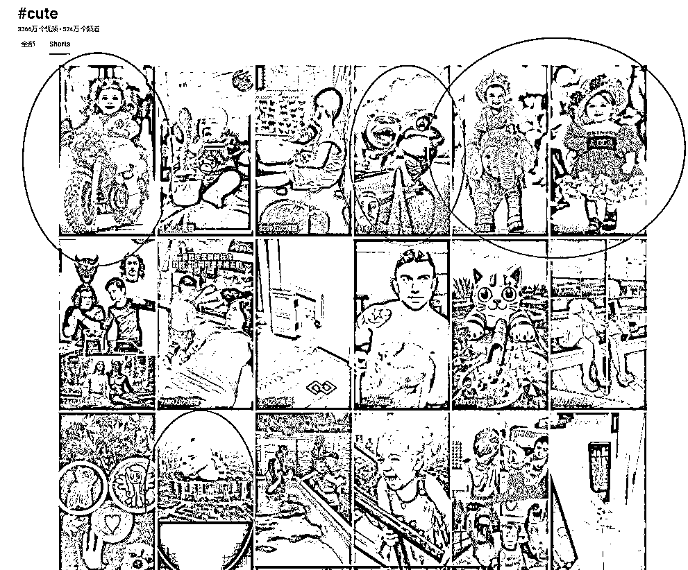


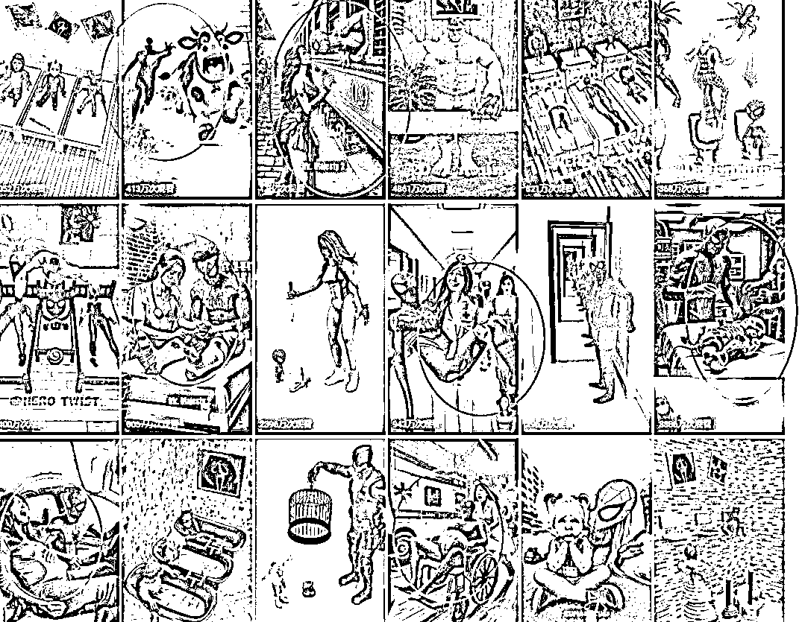

第四步

每个我们都打开看一下，会发现大部分输出的有两个 AI 赛道：

1.  第一组是一种类型，AI 可爱萌娃走秀，加上对口型驱动会更加生动些；

1.  第二组和第三组本质上属于同一种，都是图片风格的转绘+简单特效转场+热门音乐+为了过重的人头抠图。

Runway show +口型驱动（不对口型）

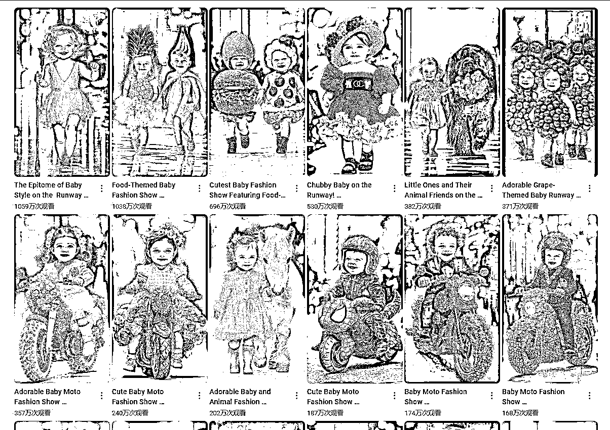

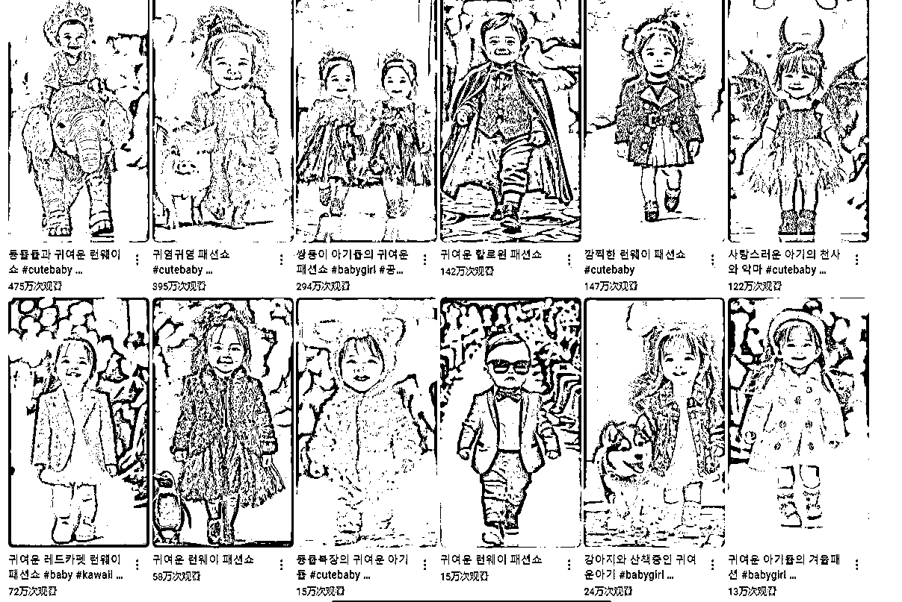

图片风格转绘+人头（或者不加）


再来看看 Spider Man（图片风格转绘+人头（或者不加）+恶搞 IP）：


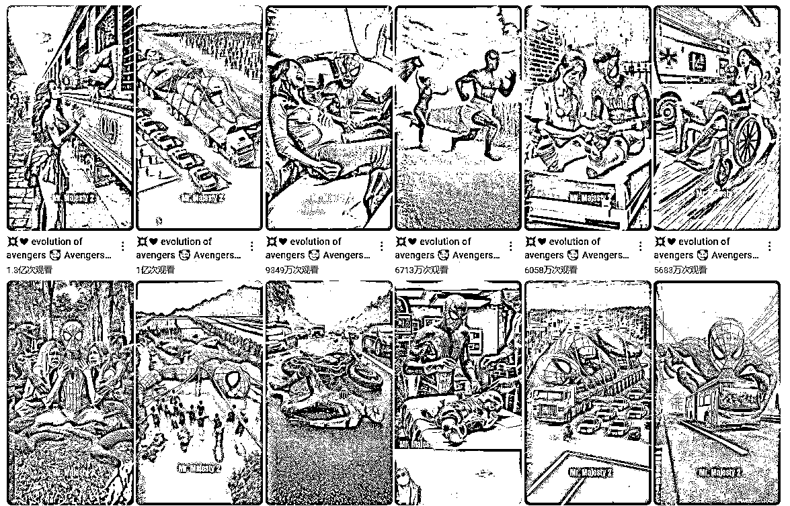

如果认为这个赛道自己可以做，那么接下来就可以确定具体的对标账号进行分析了。

内容来源：《【生财技能】如何选择自己合适的匿名 Shorts 赛道》、《利用 RPA 自动化流程分析 YouTube Shorts 上的热门 AI 视频》


# 3.1.2 参考往期 AI 航海的手册 @方波妮

另外，你也可以看看往期的 AI 航海项目，参考 2024 年 9 月热平的 AI 航海：《9 月航海 | AI 特效直播变现 | 实战手册》

航海文档放眼望去都是项目：AI 老照片、AI 写真、AI 宝宝走秀，AI 赛博机车、AI 头像、AI 壁纸等等，国内短视频“无缝衔接"到 YouTube，选一个你喜欢的先干了再说，想太多也是空想。

内容来源：《YouTube Shorts 项目实操：从 0 到 1 跑通账号，12 天收获 2700+订阅与 90 万+播放》

# 3.1.3 参考头部 YouTube 博主的方法 @浅笑

YouTuber@老高与小茉的赛道选择方法论，无论是 Shorts 还是长视频频道，都可以参考，这里分享给大家：

1.做你想做的

选择你愿意长期坚持的内容，

参考类似频道，学习如何扩展内容。

横向扩展：关联题材；纵向扩展：深挖题材。

2.做你擅长的

选择你比一般人做得好的内容，

擅长的事情更容易出量，失败可能性小。

3.做你喜欢看的内容

如果没有想做或擅长的内容，选择你感兴趣的内容，模仿你喜欢的内容，可能会发现新的兴趣点。

4.做播放量大的内容

如果前三个原则都无法确定，选择播放量大的内容，但要注意，播放量高并不一定意味着适合你。

内容来源：《YouTube 数据与前景及博主方法论分享》


# 3.1.4 根据通用定位方法做调整 @一页书

如何定位可总结为如下步骤：

市场当前和历史数据采集与初筛

数据分析

这是一群什么用户群体，他们数量有多大？

他们有什么需求，或者有什么待解决的问题？

他们愿意为解决问题付费吗，付费能力如何？

供应者是如何满足这种需求的，问题解决得如何？

如果我来做，能否做的一样好甚至更好？

我讨厌做这个事吗？

数据整合、筛选与排序

得到适合自己的几个定位

具体到 YouTube 平台，对上述通用方法做些调整：

数据采集：生财 @钱塘江鲤 是个擅长 RPA 自动抓取和分析数据的高手，早期直接用他做好的数据（1 万个 YouTube AI shorts 对标账号），后面再学会他的方法自己做数据。

根据 Shorts 特点做的调整

早期不用纠结清晰的用户画像，把用户和需求并到一起，关注需求是什么（往往是精神/心理上的），以及为什么某些需求的量很大

早期可以忽略用户付费意愿和能力的问题（因为 Shorts 共享广告收益池），只需专心做爆款内容即

总结：根据高手的 Shorts 数据，分析如下问题（前三个最重要）

需求层面：播放量大的，是什么需求被满足了？有这个需求的用户量大吗？

供给层面：玩家多吗？他们如何满足的需求？有创新空间吗？

实现层面：需要哪些技能，我能做吗？能做的更好吗？

我讨厌做这个事吗？

最后再把数据汇总整理，得到适合自己起步的定位

内容来源：《【生财技能】万字总结：YouTube Shorts 频道定位调研与视频制作实操》


# 3.2 在所选赛道下分析对标 @老马内容出海

# 3.2.1 如何找到对标账号

下一步，我们抽两个类型的赛道，准备 5-10 个频道，我们每个赛道先准备五个：

常规采集方法

通过标签，或者关键词搜索到的初始对标，进行关注，视频点赞操作，反复点击首页，Shorts，不停地去刷 1。找到新的继续反复循环。新号会比较好操作，手机比浏览器的 Shorts 页面刷到的几率更大，有历史记录的账号，之前有推荐逻辑需要耐心完成。

继续根据钱塘江鲤大佬整理的 AI 相关标签文档手动寻找，或者分享的代码，自行采集

页面周围同类推荐展现（单独 shorts 页面无法展现）

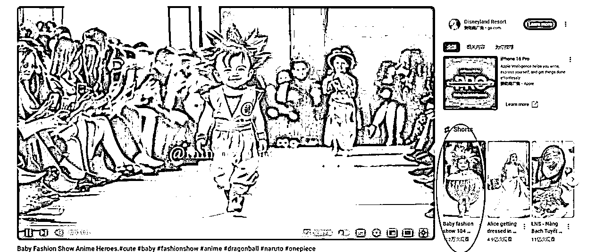

热门音乐采集方法

通过这两组频道视频中，热门音乐来找到高度垂直的账号，也可以通过热门音乐拓展其他细分赛道。

图片风格转绘+人头（或者不加）热门音乐展示：

千万别觉得左下方加人头很奇怪，这个方法最早是点评视频，证明观点类视频的变体，然后做 TK 中视频的影视切片，用了加人头过原创，又火了一波，第三次变体就放在了这里，因为 AI 类不容易开通 YPP，所以把这个方法又拿出来了～


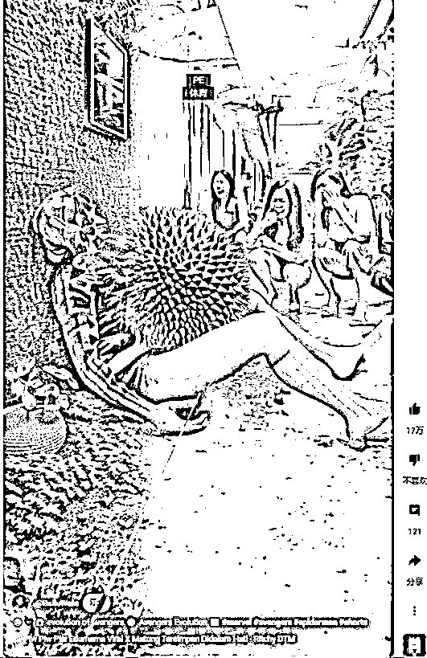


Runway show 热门音乐展示：

这个是近期的新赛道，AI 视频生成的迭代升级，给了 AI 赛道新的活力。


OK，我们得到了两组能够高度垂直赛道的信息渠道，那么我们筛选整理一些符合要求的出来：

筛选的要求：

1.

总播放量大于 1000W

2.

近期频道（3 个月内）

（这个近期，不是频道注册，而是点击最早视频，跟你这个赛道垂直的视频的第一条的三个月或者近期的视频有高爆内容）

3.

不是印度频道


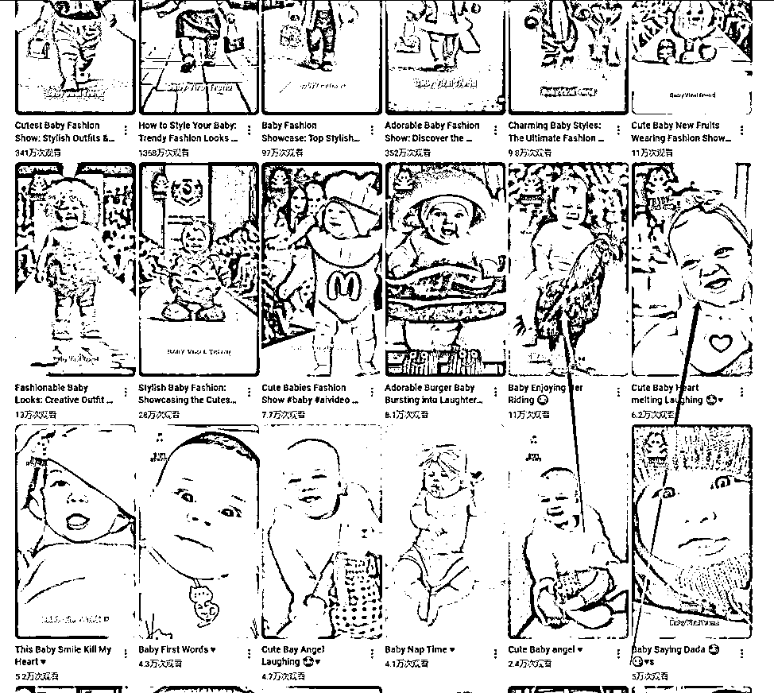

Runway show:

https://www.YouTube.com/@littleclassics7988

https://www.YouTube.com/@AloAiTec

https://www.YouTube.com/@CarterSophia

https://www.YouTube.com/@BabyViralTrend

AI 视频转绘：

https://YouTube.com/@MiawMilky

https://www.YouTube.com/@sonjabriana3135

https://www.YouTube.com/@BalluWala

https://www.YouTube.com/@TeknoCatPro

https://www.YouTube.com/@MrMajesty2


# 3.2.2 开始分析拆解

这里我们会用到货币化查询工具：https://ytlarge.com/youtube/monetization-checker/cn

注意：以下所有拆解以及判断，不代表百分百准确，预估值，给自己一个锚点研究下去的理由，并且掌握一个研究分析对标的方法，油管目前没有百分百准确查询渠道。

第一步：用这个工具把上面 10 个频道都查看一遍


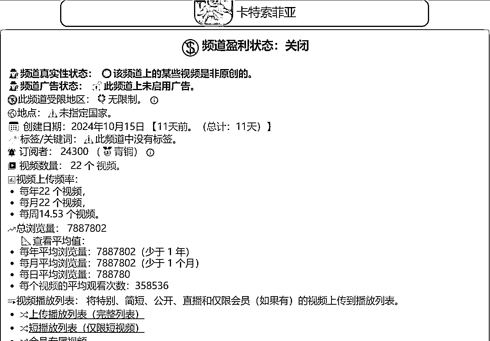


第二步：我们来从一些状态上来做几个可能性判断

THE CHANNEL "Mr. Majesty 2" IS MONETIZED!

频道"Mr。 Majesty 2”已经实现盈利！.

Channel Authenticity Status: This channel is perceived as original.

频道真实性状态： 此频道被认为是原创的。

Channel Advertising Status: Ads are active on this channel.

频道广告状态： 该频道上的广告正在投放。

货币化：即为开通收益

原创度：频道整体原创度的百分占比

频道广告状态：视频广告的投放状态（更多针对于长视频）

那么出现以下可能性：

1.

三个全绿：

万事大吉，极大概率这个赛道在人工审核，机器审核的层面上不会有太大问题。

2.

货币化开启或关闭但非原创，有广告/无广告：

这种赛道大概率出在内容上，过不去 YPP，账号或许是购买的收益号，后期改动后转型在这个赛道，这个频道之前过了 YPP，但在后面的过程中被发现违规，侵权，不适应观看，被处罚了，Shadow Ban，就会限流，关掉收益等等处罚。

3.

实现盈利，原创，部分广告：

音乐版权分走了一部分

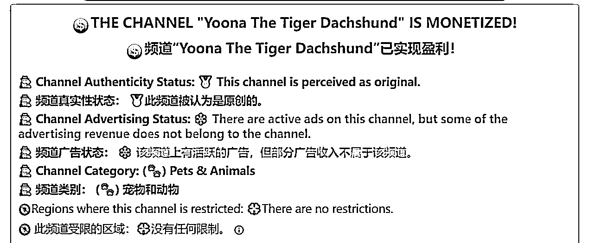

第三步：完成判断最后收尾

货币化完毕后，我们肯定选择的是三绿内容的赛道，那有了大概的判断，我会在去看它的天花板是怎么样的，它的爆款内容，是否处于平稳，最热门的视频前几排的掉量是不是很快。

（YouTube shorts 的特殊性，它就吃爆款搞钱，你就别想每天靠 1W、2W 播放，后期收益号日落西山，都是养老的收益，所以我需要靠爆款，那我就得知道我感兴趣赛道的爆款上限）

# 3.2.3 不能选择的对标频道

同样是千万播放的频道，最热门排序之间的差距太大，这种频道，不管是选题，画面还是文案，都不是首选，如果这个赛道只有极个别频道是这样，那还是可以继续选择，只能说这个做的不好，不能说整个赛道不行。

不能选择有很多种因素，可能是这个赛道饱和度太高，YPP 就不好过，也可能因为大量侵权素材，判定非原创无法过，一个账号能成功开通 YPP 的周期可能在 1-3 个月，如果好不容易达标了，却因为某种原因不让过收益，那就真的哭了，所以先选好路比较重要。

内容来源：《【生财技能】如何选择自己合适的匿名 Shorts 赛道》


# 3.3 YouTube 频道收益估算 @老马内容出海

看收入，一是为了确定这个赛道有利可图，二是为了树立信心，坚持不下去的时候，打开计算器，扣一扣，算一算，抹把泪继续干。

用一个三绿频道作为对标：www.YouTube.com/@NicksWorld01

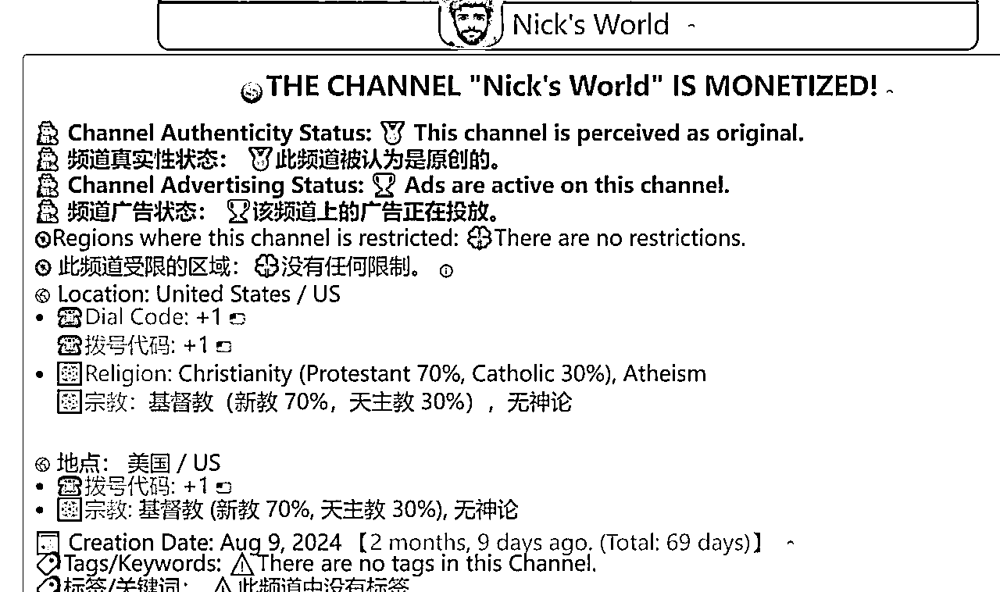

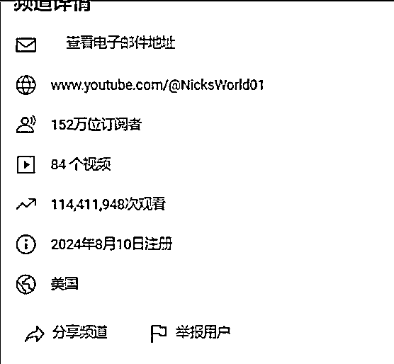

我们看下数据：

8 月 10 日注册，美国地区，84 个视频，152W 订阅

说明是短期内账号，解说类，快速爆量，现在 1.1 亿播放量。之前是 0.02-0.08 千播，现在 0.15 左右，算个最低值，0.1 万播 1 刀，*10000=1 万刀。

货币化网站下方有一个估算，不能以这个为主，但仅供参考。

那如果一个频道，有长视频，也有 shorts，这个收益该怎么算？

简单，先点一下 Shorts，最热门，去看他前几行大概播放量，减去 1000W*1 或者你开心就*3。

长视频减去刚才估算 Shorts 最热门的前几排播放量，在看这个赛道是什么选题，什么类型，去*它所在领域的单价，就是大概收入，双方一加，大差不差，觉得有出入*0.8，觉得太少*1.2。怎么开心怎么来，真正的收入只有作者自己知道。

需要注意的是：不要认为一开始就能找到一个别人都没做过的很有机会的赛道，YouTube 上已经有大量的内容，每个赛道，每天都有人爆发、有人沉寂。因此更重要的是找到一个自己想做的赛道，找到想要对标的方向，坚持的做下去，在做的过程中，慢慢的探索出自己的风格、自己差异化的方向。

内容来源：《【生财技能】如何选择自己合适的匿名 Shorts 赛道》

# 3.4 2025 热门 AI shorts 赛道推荐

# 达人秀变身

典型频道：

【已换赛道】舞台表演类：https://www.youtube.com/shorts/8Xwn2F7sBvs （这个号做得非常认真，甚至还对口型做了配音）

【停更一个月】高质量美女：https://www.youtube.com/shorts/cWE_o-vQ2cI （这个号有矩阵，国内叫“军哥聊电影”，几个号都是同一个画风，模块 2 有操作攻略分享）

怪物/猎奇向变身：https://www.youtube.com/shorts/Yd_gKAmXNw0 【最近爆款频率明显变低了】https://www.youtube.com/shorts/ElFYG5VxC30

【停更一个月】高质量腹肌男性：https://youtube.com/shorts/cmIBm3y3Tfc?si=NssIltjjD9LslS5w（这个号思路奇特，20 个视频就已经突破 10w 粉了，对画面色彩和评委素材的色彩度衔接非常顺畅，视频开头和内容让人产生一种这就是真实达人秀的感觉）

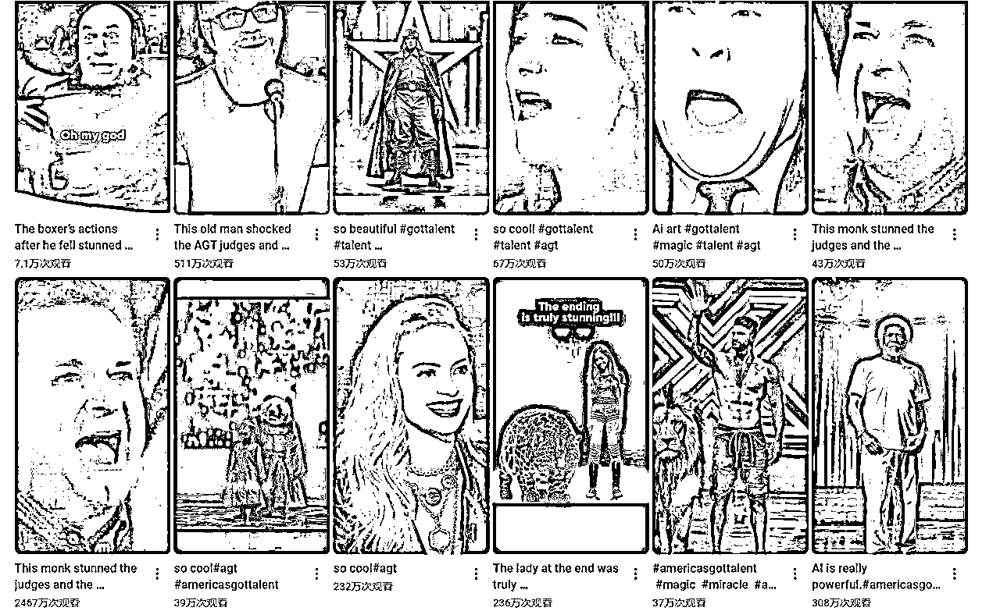

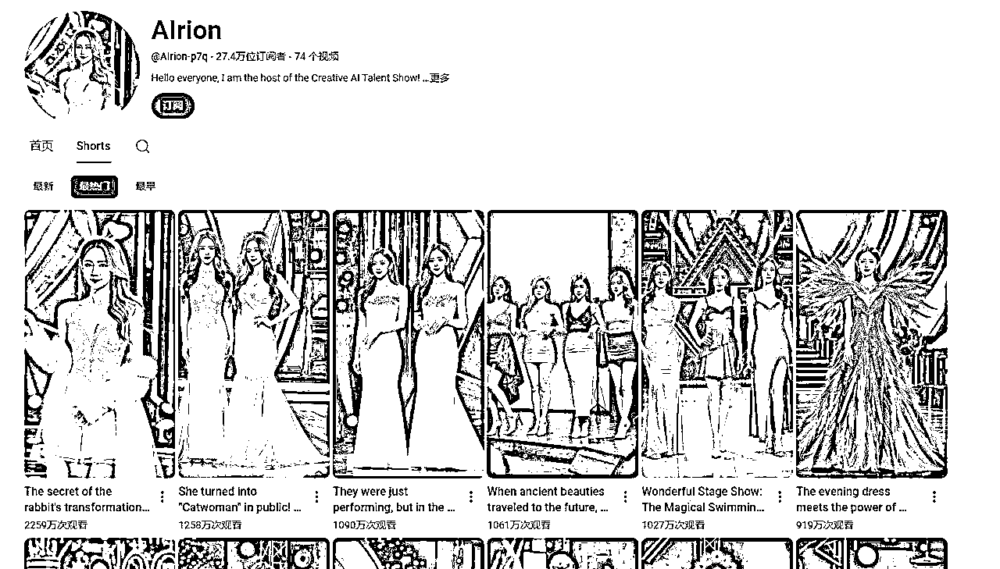

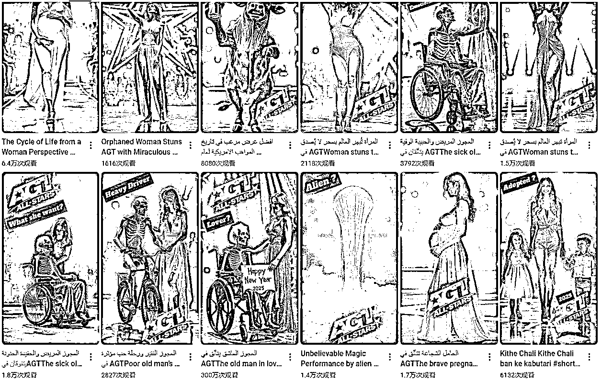

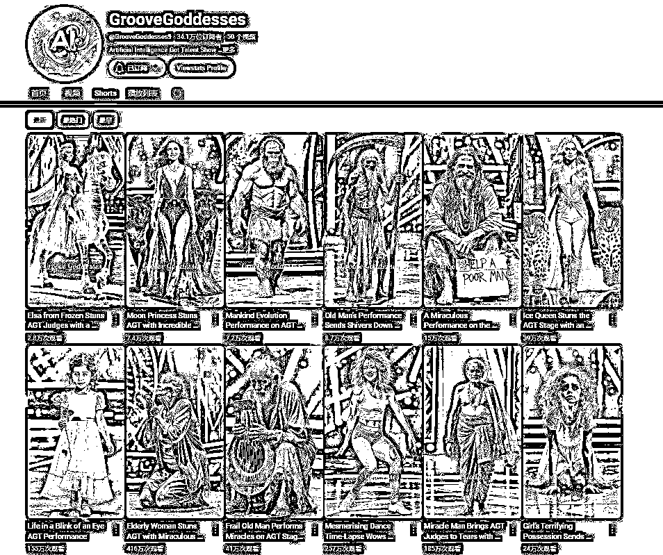

达人秀变身这个本来就是细分后的赛道，实际上还有很多更细分的内容方向，这么多变身类内容的本质无非就是美女和猎奇（猎奇的优先级高于美女），最后其实还是拼创意和技术（创意大于技术）

上面的这几类实现方式都不难，基本都是文生图接图生视频，都是基本操作，只是有一些相对进阶一些的提示词和工具能够提高内容呈现出来的效果，详见模块 2 的进阶操作讲解。


# 达人秀猎奇

典型频道：

走秀类：https://www.youtube.com/shorts/_hQJTL93Xlo （他用了儿童形象，不建议，尽量避免儿童形象，这个号流量已经下滑）

纯猎奇：https://www.youtube.com/shorts/pcwgcrMfo3M （这个号现在已经没流量了，但是这个视频 1 亿播放，属于非常离谱的异常值，所以放在这里）

https://youtube.com/shorts/pWobkCpo1Wc?si=7E49Dnd03WByLx-H（单视频 1.4 亿播放，这个号不同于别的达人秀，他是基于恐怖 bgm，拉满观众紧张好奇的心理）

www.youtube.com/@AITalentStage（巨型肌肉男表演，画面冲击感拉满）

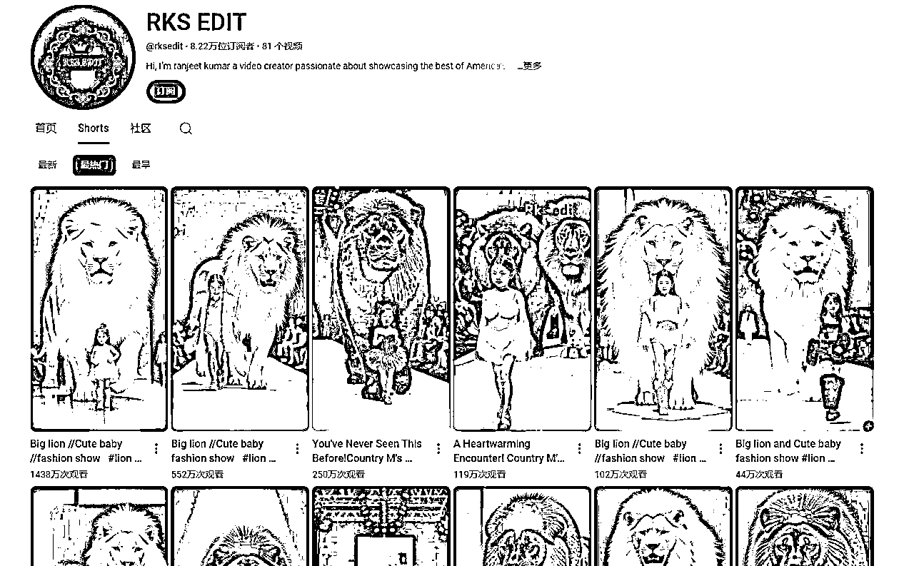

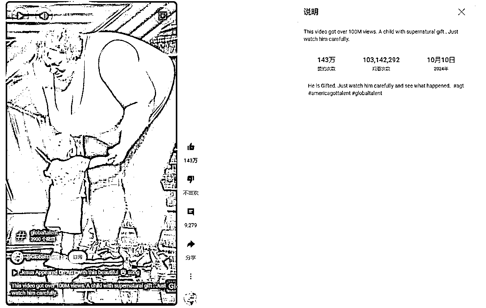

猎奇类的本质主要就是制造一些现实生活中不可能见到的动物、怪物或者夸张的人类形象配合达人秀评委的剪辑来博取流量，其实很好理解，瓶颈在创意和灵感，做起来比较简单，搞明白达人秀变身的操作迁移一下即可。


# 达人秀二创

典型频道：

节目二创（这里示例就是 AGT）：

https://www.youtube.com/shorts/BKWSX99za7w【停更三个月】

https://www.youtube.com/shorts/qUnMPoA8F2k 【更换赛道】

明星二创：https://www.youtube.com/shorts/y-_4MRicZP8 【近期流量下滑】

二创类内容在原本达人秀内容的基础上增加了二创目标的基础流量，比如上面这个拿巨石强森来作为主体形象的，相当于多了个巨石强森作为基础流量来源。

但是二创存在一定的侵权风险，如果要做的话就尽量避开一些版权敏感的对象，比如任天堂、迪士尼之类的，可以看那些活着的爆款都二创的谁，对标就完了，毕竟要找麻烦也是先找那些爆款的麻烦。

实现方式和达人秀变身的区别就是，如果要用影视、综艺节目二创，就把对应节目的最后一帧作为图生视频的输入帧，跟后面生成的视频衔接上就行；人物形象二创，一般现在大模型都能直接产出比较知名的明星形象，直接生成或者用即梦的智能画布把人 P 进去都行。


# 达人秀成长类

典型频道

有贫穷变富有：https://www.youtube.com/@a77a/shorts（shorts 从 2025 年 2 月开始发布，背景音乐偏恐怖，数据很不错，几乎条条爆款。

年龄成长类：https://www.youtube.com/shorts/jr_L2DoSkcg

身材变化类：https://youtube.com/@amasofusionai?si=_0wpHGY3klLi7HpR（基于肥胖综合症的由胖变瘦的达人秀表演，变身前后反差大，带点擦边的感觉）

达人秀成长类，主要制作方向都是偏向现实生活中的热议话题，进而通过 AI 在视觉上的强烈反差，除了上述举例外，还有从瘦骨嶙峋变成肌肉健硕、从丑陋变成美女等都是值得试一试的赛道。

# AI 动物故事类

无配音故事：

https://www.youtube.com/@Cat_Cartoonn/shorts

https://www.youtube.com/@CATS-on-GPT/shorts

https://www.youtube.com/@RabbitJourney99 这个很夸张，周更，条条爆；更夸张的是他的视频都是一个月以前一个纯图片故事号拿来复刻转视频的

https://www.youtube.com/@MrkPopPix【近期流量有下滑趋势】

https://www.youtube.com/@SKMGh6 2025 年 2 月 18 日建立的新号，12 条 shorts 涨粉 126w，最低的播放快 400w，打工狗，画面及场景极度真实，但故事内容基本都是复刻之前的爆款内容

这类动物的故事基本都是关于“帮助”“救援”“感恩”“翻身”等主题，制作方法很简单，做过的圈友应该也不少，就是 GPT 类的工具出脚本分镜，按镜头生成图片，再把图片生成视频，最后用剪映拼接以来，加点音效之类的就搞定了，操作简单但有点繁琐。

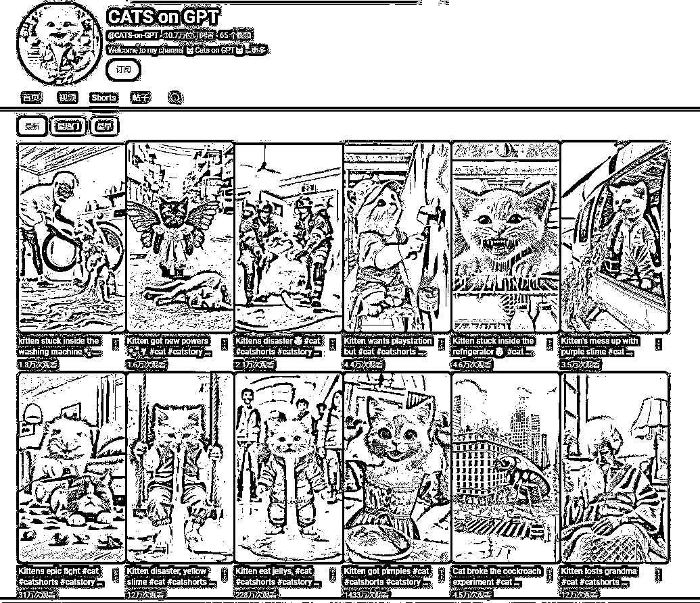


# 美女走秀类

除了下面的美女军人走秀以外，还有曾经比较火的萌娃走秀和人与巨型动物走秀，但是现在流量已经不行了，这里不做展示。

比较暴露的：https://www.youtube.com/@ai.mvmnts/shorts

https://youtube.com/shorts/EfOCLNUtV1Y?si=iFffX2uOKPJzdaDa

https://youtube.com/@ai-imagining-2810?si=E2lVn7zByqjfH5EZ【停更三个月】

https://youtube.com/shorts/IHrC3yUWaDU?si=DJky-yraHaF2C9op（这个和上面不太一样，近期也没什么大爆款，但之前百万爆款很多，可以作为风格移植参考）

没那么暴露的：https://www.youtube.com/@Akang_AI/shorts【流量下滑】

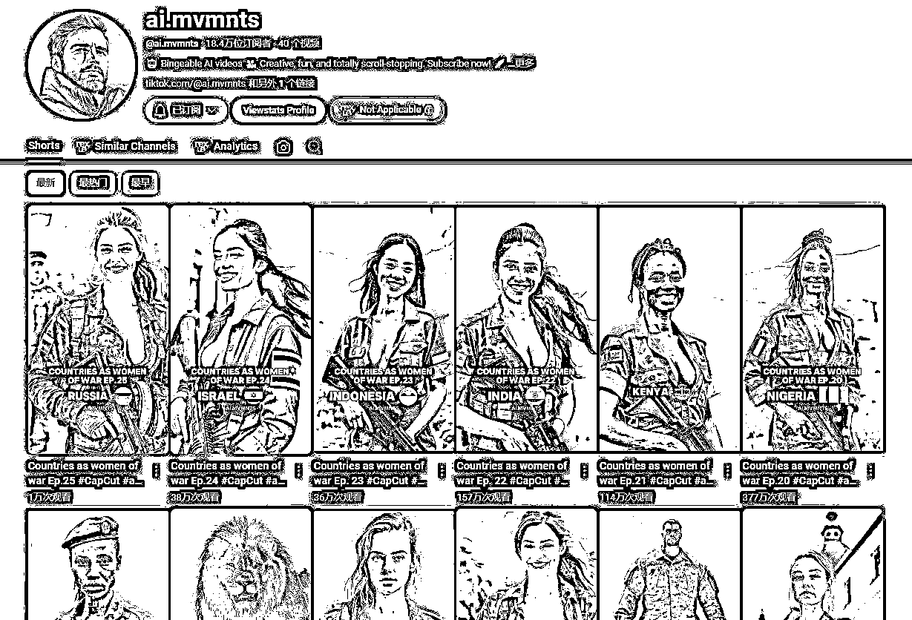

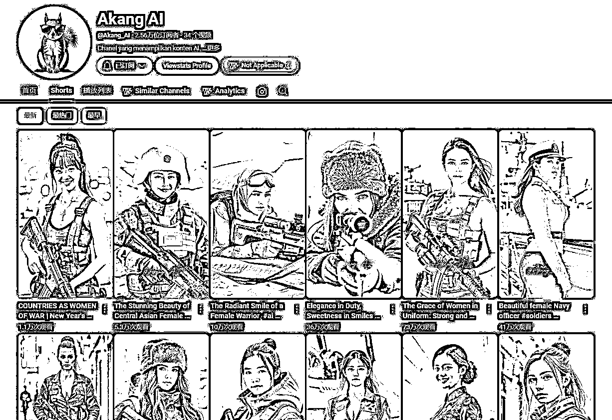

# 动物示警

讲的就是动物在马路上拦车、然后前方事故、汽车逃过一劫、人类感谢动物，制作比较简单，一般四个分镜，生成几张图片，单图生视频再拼接就行了，这类视频不仅在油管很火，在视频号更火，很多圈友复刻出了千万爆款。【但是现在流量下滑了，需要转型，可参考下面的密集恐惧和天使狗狗赛道，同出一源】

【停更两月】https://www.youtube.com/@HappyExplorerTV/shorts 几乎每条视频都是爆款

【停更一月】https://www.youtube.com/@NautilusFantasy/shorts 从动物救动物转型动物示警人类，马上就百万播放

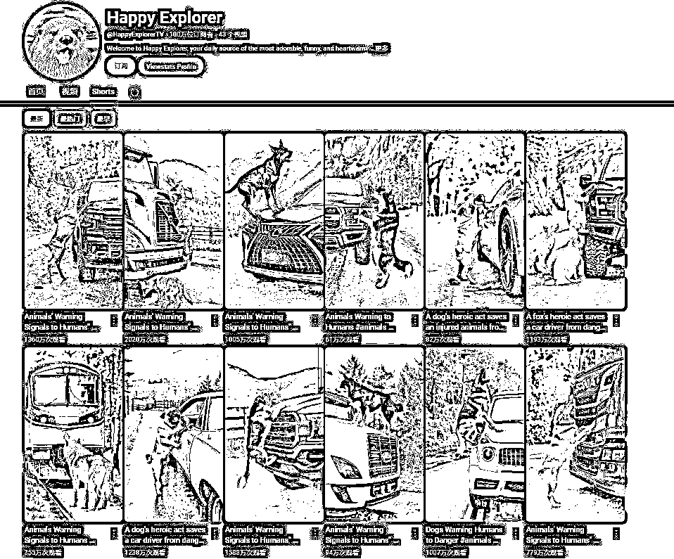

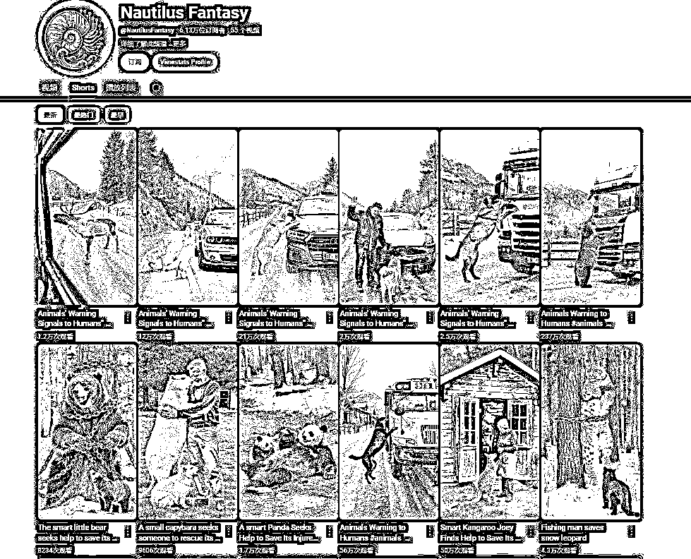


# 密集恐惧症+动物救援

https://www.youtube.com/@PolarLifeMoments/shorts 1.21 第一条视频 1.2 亿播放，停更了，恶心到极致的动物救援，多看一眼都受不了，同类型账号很多。

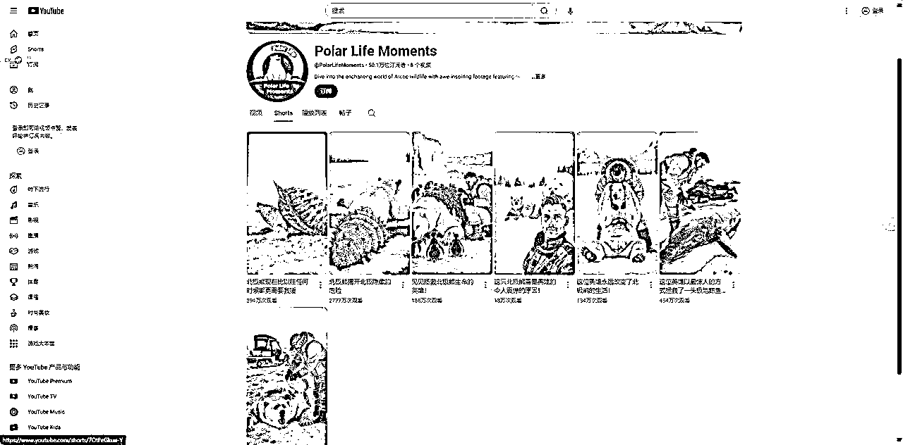

常规动物救援（流量很稳定）www.youtube.com/@MysticChronicles007

www.youtube.com/@Edu-mama

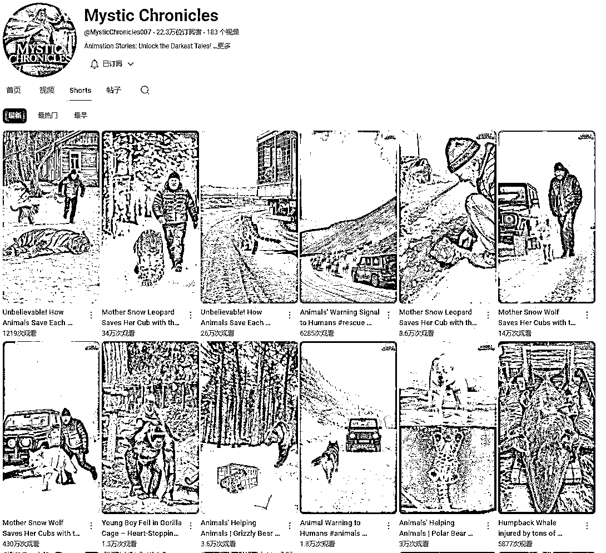

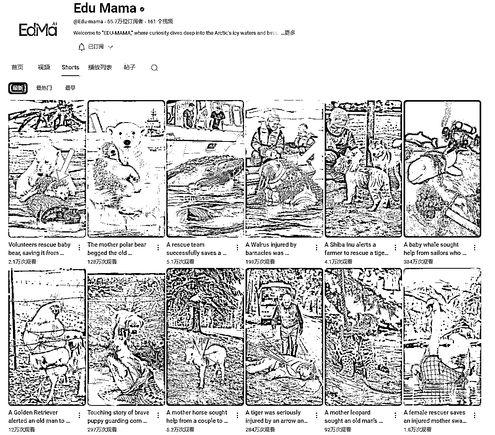


# 四、【实操 3/6】生产 Shorts 视频

# 💡

# 章节概要：

Shorts 视频是 YouTube 最容易起量的内容形式，

通过 AI 工具可以大幅降低制作门槛，帮助普通人也能创作出优质短视频。

本章详细介绍多种 AI 视频制作流程：

✅ AI 达人秀变身：从爆点分析到创作实操的全流程

✅ AI 故事类视频：角色一致性控制与分镜制作技巧

✅ AI 动物示警：提示词模板与剪辑方法

✅ 解说类内容：如何高效生产科普解说视频

每类视频都提供了完整的工作流和工具推荐，

针对不同创作者的技能水平和兴趣偏好，可以选择适合自己的内容类型快速上手。

# 💡

# 本章航线图

完成本章节的学习和实操，即可完成航线图的：

第二阶段 确定赛道，创作内容并发布（约 7 天）

1.

选择一个赛道进行深入学习（Shorts 或长视频）（约 1 天）

2.

参考对标账号，开始制作第一个视频（约 1 天）

# 4.1 AI 类内容

# 4.1.1 AI 宝宝达人变身秀类内容实操步骤 @小芬

# 4.1.1.1 第一步：分析爆款视频的爆点

这里分为： 人物爆点、画面爆点

爆点， 这个相信大家都知道， 即使不特意去做， 视频做久了也多少有体感， 知道怎么样的视频会吸引人， 数据更好。

看多几个同赛道爆款视频就大概可以总结出来了。

# 4.1.1.1.1 人物爆点

可以刷一刷评论区。 如果你做过宝宝类的， 你会发现评论区大部分夸可爱的， adorable， cute 等等。

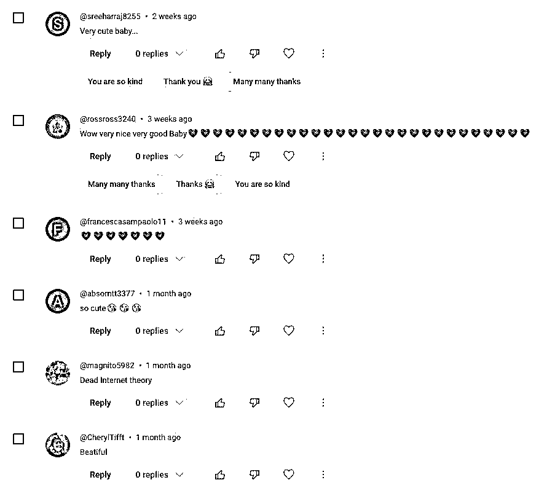

那可爱就是一个大爆点。

这里其实还可以细分下去， 细分到表情、动作、服装。

微笑的会比没有表情的人物， 数据会更好。

动作丰富， 观众不容易感到无聊， 看得更爽。

服装颜色鲜艳， 凸显人物的可爱。

# 4.1.1.1.2 画面爆点

场景：整体的舞台要明亮

画质：越清晰越好

主体：最好是平视镜头，位于画面中间

记住这些分析出来的爆点， 然后开始找灵感去迭代视频。

# 4.1.1.2 第二步：抓住异常值

想要做创新， 在还没有做出爆款之前， 不要随便无脑创新。

那首先要找到爆款视频， 最好是最近一个月千万，最低百万的。

不要局限于自己在做的赛道， 我要创新宝宝走秀的赛道， 优先去刷这个赛道的同行， 面对流量下滑的情况， 有没有人先站出来迭代了。

如果刷到有， 且数据不错， 二话不说， 直接模仿他的形式去迭代。

如果没有， 就刷同类型的赛道， 宝宝走秀， 场景是舞台的居多， 慢慢迁移到户外， 那就看相同场景性质的， 达人秀舞台表演赛道。

同赛道跟着大哥迭代

这里分享一个复刻的爆款案例， 按照上面的思路， 先找到了同赛道的爆款视频。

视频的形式： 宝宝和萌宠走秀出场， 中间两个人融合， 完成宝宝变装， 加上变装后的走秀。

1.mp4【在线播放】

提示词模版（对应有色块的部分， 都可以自行更换）:

# 💡

full-body， facing the camera， street style ， a very chubby 2-year-old baby with very fair skin， curls， smiling， wearing red lipstick， wearing a red and white floral mini dress with a plunging neckline， accessorized with delicate pearl earrings and a silver chain bracelet， （这里可以加上动作， 比如： hugging） next to a big dog， captured mid-walk， strong visual impact， strikingly fashionable appearance， exuding elegance and charm， （best quality， 4k， 8k， highres， masterpiece:1.2）， ultra-detailed， （realistic， photorealistic， photo-realistic:1.37）， vivid colors， sharp focus， studio lighting， glamorous runway setting。 --no sexy --ar 9:16 --personalize ih7hzco --v 6.1

这个形式的视频分析下来， 跟达人秀的做法大差不差， 把美女改成 baby， 动作换成走秀， 拥抱， 拿来改改就能做出来了。

制作视频的提示词参考下面： 4.1.4 AI 怪兽合成部分的图生视频板块。

# 4.1.1.3 第三步：爆点的延伸

怎么在自己赛道参考同类型赛道的爆款视频。

这个对于在制作视频上没有灵感， 不知道如何做时， 也是一个很好的参考方式。

从其他赛道拿灵感为我所用

同样也是刷， 根据自己赛道的内容， 比如： 萌娃萌宠融合。 那么刷视频的时候， 多关注有人和动物融合的视频。


参考的对标账号， 该账号是达人秀方向。

也是三个场景： 原视频的动物是兔子， 美女在兔子旁边跳舞， 美女抱着兔子， 美女变成兔兔装。

参考视频如下。

美女与猫.mp4【在线播放】

视频中看到动物跳起来， 美女抱着动物这个动作， 会让我觉得十分惊喜， 于是我就把这个美女双手抱着动物的这个动作， 搬到了我的视频里面。

拿着第二步的提示词模版调整一下：

# 💡

Full body, facing the camera, street style, a very chubby 2 year old America baby, very fair skin, curly hair, smiling, wearing red lipstick, wearing a pink sequined suspender dress, paired with delicate pearl earrings and silver chain bracelets, Holding a hedgehog in both hands, captured mid-walk, Background on the stage of America's Got Talent, strong visual impact, strikingly fashionable appearance, exuding elegance and charm, (best quality, 4k, 8k, highres, masterpiece:1.2), ultra-detailed, (realistic, photorealistic, photo-realistic:1.37), vivid colors, sharp focus, studio lighting --no sexy --ar 9:16 --profile ih7hzco --v 6.1

原本参考原视频， 是 baby 双手抱着动物的， 我用的是： Holding a hedgehog in both hands，

可能这句话 MJ 理解有差异， 出图的过程中， 抽到了一张图， baby 一手一个小动物， 当时看着图， 觉得十分可爱 ！

于是直接决定用了这张图。 没有按照原本设想的那种动作。

（有时候， 这种抽卡会抽出很不错的图， 只要能让你惊喜， 又符合爆点， 那就要好好抓住！)

然后融合后的图， 没有继续用宝宝变装， 而是参考了 Gary 教练分享的达人秀视频， 融合出来的是动物穿着衣服在跳舞。

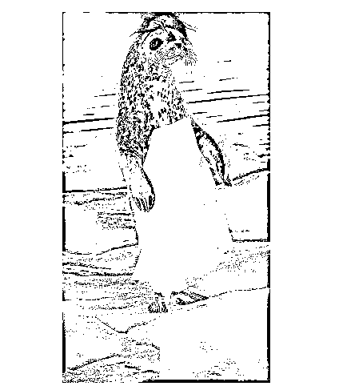

结合了这点， 把融合后的图， 从 [宝宝变装] 走秀直接变成了 [动物] 跳舞。 （增加舞台效果）

想着动物要可爱点， 更吸引人， 所以就生成了动物幼儿。 （把宝宝的可爱， 迁移到动物上）

Full body, facing the camera, street style, a very chubby 2 year old hedgehog, captured mid-walk, Background on the stage of America's Got Talent, strong visual impact, strikingly fashionable appearance, exuding elegance and charm, (best quality, 4k, 8k, highres, masterpiece:1.2), ultra-detailed, (realistic, photorealistic, photo-realistic:1.37), vivid colors, sharp focus, studio lighting --no sexy --ar 9:16 --profile ih7hzco --v 6.1

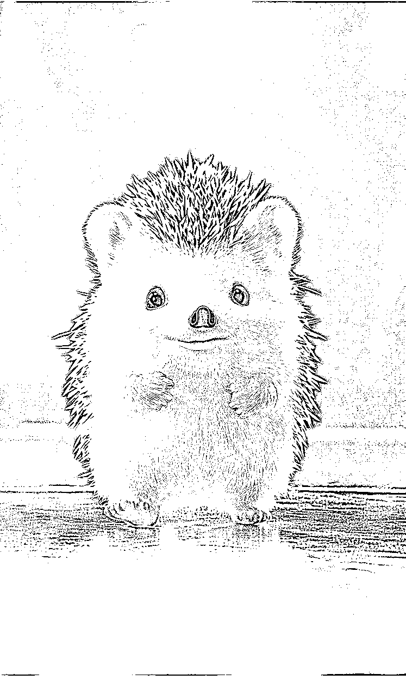

最后出来的成品视频：

3.mp4【在线播放】

说明一点， 进行迭代的时候， 只要数据比之前的模式好， 那就按照新的模式发。

因为很有爆款潜质。

这里的思路可以简称为“控制变量法”， 迭代了一版测试流量之后， 再确定后续创新的方向。

控制变量法： 每次只迭代 1-2 个地方， 其他的保持不变。

没跑出来好的数据前， 就继续按照当前的模式产视频。

如下图， 12 月 31 号发的视频， 一周内播放量成功超越了旧模式的视频。 之后就上新模式的视频。

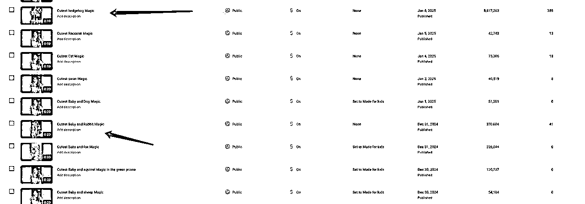

还有很多可以创新的地方， 把达人秀变身卷出的新高度， 用在宝宝达人秀上。

把以前宝宝走秀的爆款宝宝服装， 换到宝宝达人秀上， 等等。

总结一下， 回顾这两次的迭代， 都保留了上面分析的爆点：

宝宝可爱， 舞台场景、服装颜色鲜艳， 动物可爱， 人物、动物表情都是微笑的。

# 4.1.1.4 宝宝类赛道被判面向儿童可见的问题

做宝宝类赛道， 很容易遇到一个问题， 就是被判仅面向儿童可见。

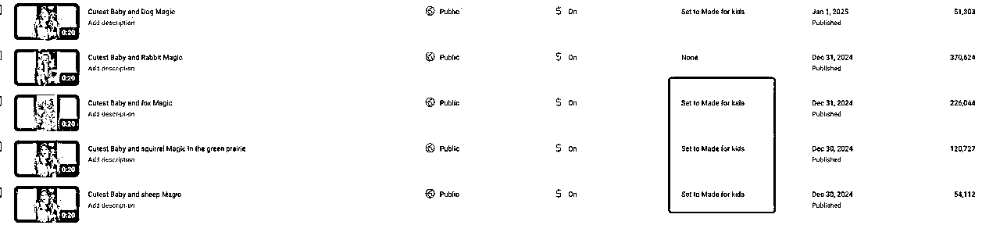

只要视频被判仅面向儿童可见， 流量瞬间就会被掐断。

# 4.1.1.4.1 解决方案

# 💡

把带有 baby 的标签全部去掉。

如果你发视频的时候， 带了这些 baby 的标签， 那么全部去掉即可！

使用这个方案， 到目前为止， 没有出现被判儿童的问题。

# 4.1.1.4.2 申诉模板参考

以前的视频被判了儿童可见， 想着去申诉成功， 会不会继续给我推流。

为了验证这个想法， 于是， 我先把以前视频的标签带有 baby 的， 全部去掉。 然后发起了申诉。

我一开始尝试着申诉一个， 过了。

然后又申诉了一个， 也过了。

就想着批量一次性把之前的那几个都申诉一遍， 但是却被拒绝了。

所以， 如果你也是被判了， 想要去申诉的话， 可以试试一天一个的去申诉。 申诉只有一次机会。

给大家看个流量图， 这个直线就是被判的期间， 流量丝毫不动，申诉后， 流量就继续跑起来了。

也验证了申诉成功， 是会继续推流的。

申诉的文案， 给大家做一个参考：

# 💡

Hello, this is a magic show video, not made for kids. Please review it again, thank you!

内容来源： Youtube shorts 复盘 —— 宝宝达人秀、达人秀跳舞赛道成功开通 ypp 的经验分享

# 4.1.2 AI 故事 @土豆君

# 4.1.2.1 第一步：对标案例参考

YouTube 频道：Rabbit's Quest

我是 9 月初看到这个账号的，当时起号才 3 个月，每条视频都是几百万的播放，故事模式又特别简单。Socialblade 能看到的一个预估收入，其实很不准确，但是只要视频是近三个月能出爆款的，就一定值得尝试。


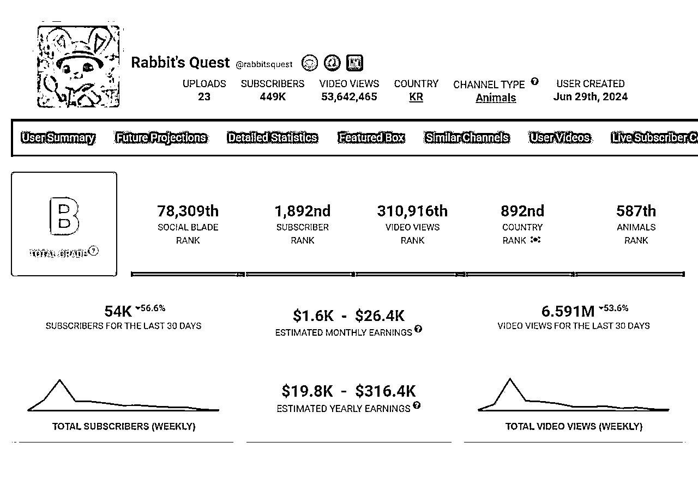

这个账号视频都是 1 分钟的 Shorts，形式是图片 PPT 默剧讲述一个小兔子克服困难帮助其他动物的故事。故事模板化，开头某个动物落难，中间相遇一起吃饭玩耍，高潮克服困难，结尾歌颂友情。

从评论能发现观众基本都是偏小孩子（还可以点击头像看他们的频道进一步分析），小孩子喜欢看动物故事。萌萌的宠物形象是吸引的亮点，加上还有十分正确积极向上的价值观。


视频复刻我是在 9 月 10 号尝试的，当时选的是这个视频：https://www.YouTube.com/shorts/FSagPjcmFFg

我的思路是用 GPT 创作故事然后用自带的 Dall-E3 生成每个分镜图，然后用剪映拼接一下。


# 4.1.2.2 第二步：故事内容分镜创作

GPT 创作故事：用提示词让 GPT 写出了五个故事，然后我选择了其中的一个，提示词如下：

写五个儿童绘本故事，可爱的小猫咪为主角去帮助其他物种动物故事，首先因为动物落难而相遇，获救后描述他们一起生活的一面（回家一起吃饭、睡觉等），接着为了故事高潮需要设计遇到一些自然界的危险（包括自然灾害、遇到天敌等），便于突出猫咪为了友谊的勇敢精神，最后结尾表现出两个生命之间的友情。

注意：

动物落难要尽可能的能通过画面表现出来的方式描述，而不是通过气氛、声音这些来描述，要一看画面就能明白。

友情可以通过两个生命贴在一起来表现。

语言描述一定要容易用画面表现，可以尽可能夸张一些。

故事剧情容易让小孩理解并为友情而感动。

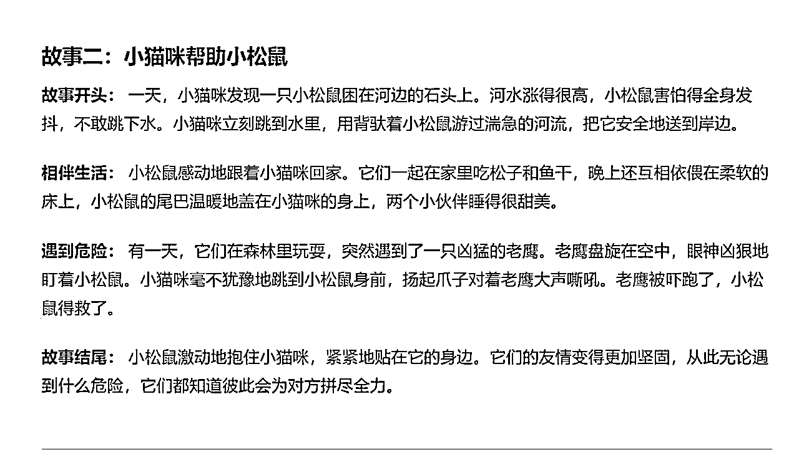

我敲定了故事 2，让 GPT 帮我生成 25 个场景。

故事 2: 小猫咪帮助小松鼠 根据这个故事 2 生成 25 张的画面描述分镜图的的 Dall-E 中文提示词（我会用 Dall-E 的提示词生成画面），可以更改剧情，方便用画面描述，可以尽可能夸张一些。

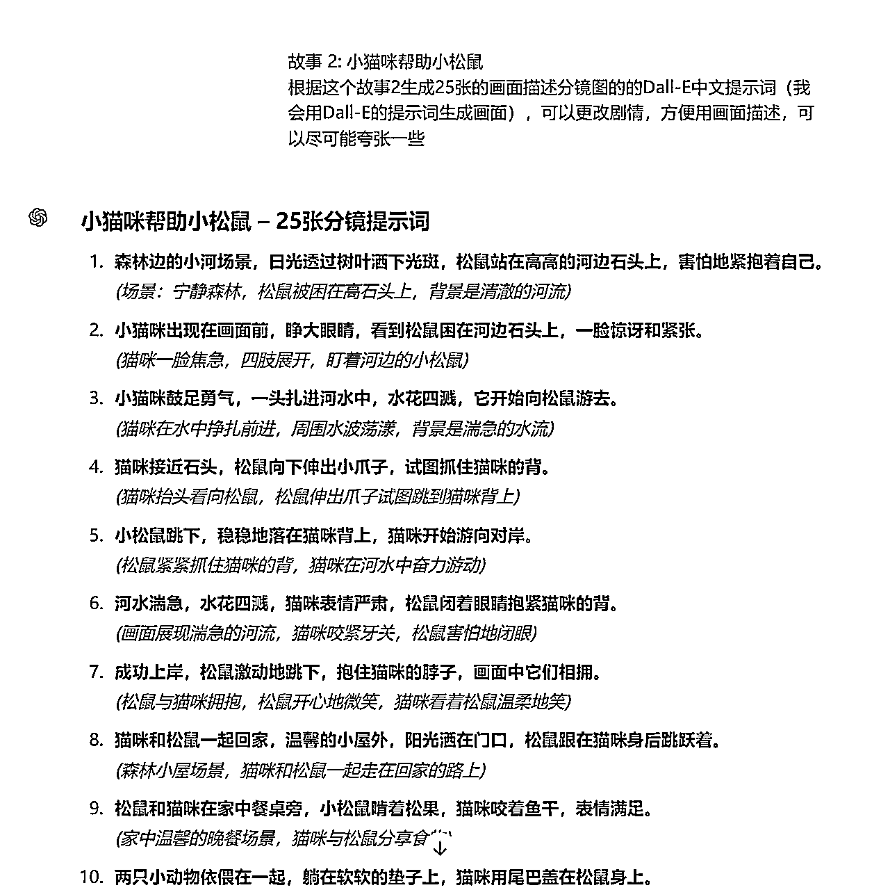

生成的这 25 个场景画面后面直接用来生成图片。


# 4.1.2.3 第三步：故事分镜 AI 生图

画图使用的是 Dalle-E3，其实 MJ、SD 都有测试过，但是 Dalle-E3 的语义理解能力是最强的，其他的画图的工具完全比不上，它不需要你去单独写提示词，你只要把你想要画的内容告诉它，就能直接画出来。

这也是为什么我前面要生成 25 张分镜图，就是为了直接把脚本转为 AI 图片。

Dalle-E3，登录网页版的 ChatGPT，在 探索 GPTs 里面找到 Dall-E3。

也可以直接复制粘贴这个链接：https://chatgpt.com/g/g-2fkFE8rbu-dall-e

怎么解决角色一致性？

其实我原来也遇到这个问题很头疼，后面看到卡兹克的文章有一篇说过了，OpenAI 自带的绘画工具 DALL-E3 图片其实都有个 gen_id，利用这个 gen_id 可以控制这个角色一致性。

但是实际上在生成故事分镜的时候，gen_id 也不是一直管用，有时候会失效，关键还是要保证角色外观尽量使用不同的颜色。比如两只猫的故事，就分别使用橘猫和狸花猫，这样就便于区分角色。

因此，角色一致性我的办法是：优先选择使用不同角色的外观 + gen_id 辅助。

但是需要注意，这个 gen_id 只在一个聊天窗口中有效，不能跨窗口使用。而且，如果使用 Dall-E3 API 来绘图也是没有办法使用 gen_id 来控制角色一致性的，因为每次 API 的对话就是一次性数据。所以我没有采取写代码调用 API 的方式来生图，而是直接用的网页版。

gen_id 的用法还可以在 GPT 中尝试使用这个提示词：

从现在开始，你的核心目标就是保持角色一致性。必须使用与上一张图像相同的提示和 gen_id 来制作相同角色的新图像，以保证人物一致，且能适配更多的表情、动态、服装与场景。做的好的话我给你 1000 美元小费。明白的话请回复明白。

提示词复制👉 https://gitee.com/tudoujunha/rpa-gpt/blob/master/prompt_genid.txt

当然，像当前的这个场景，两个主体人物都是不同的动物差异较大，如果一致性要求没那么高，确实就可以直接用 国内中转的 DALL-E3 API 生图了。

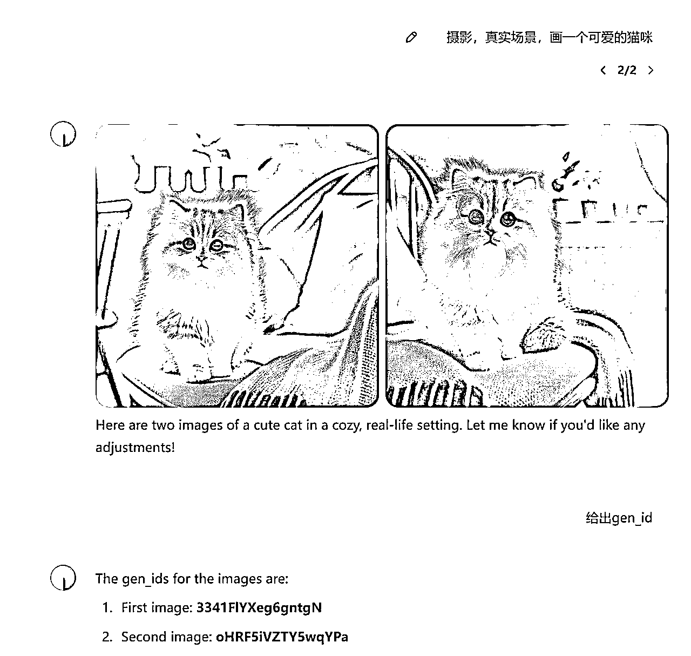

后面当我想要复用这个角色的时候，直接告诉他使用这个 gen_id 就行了。

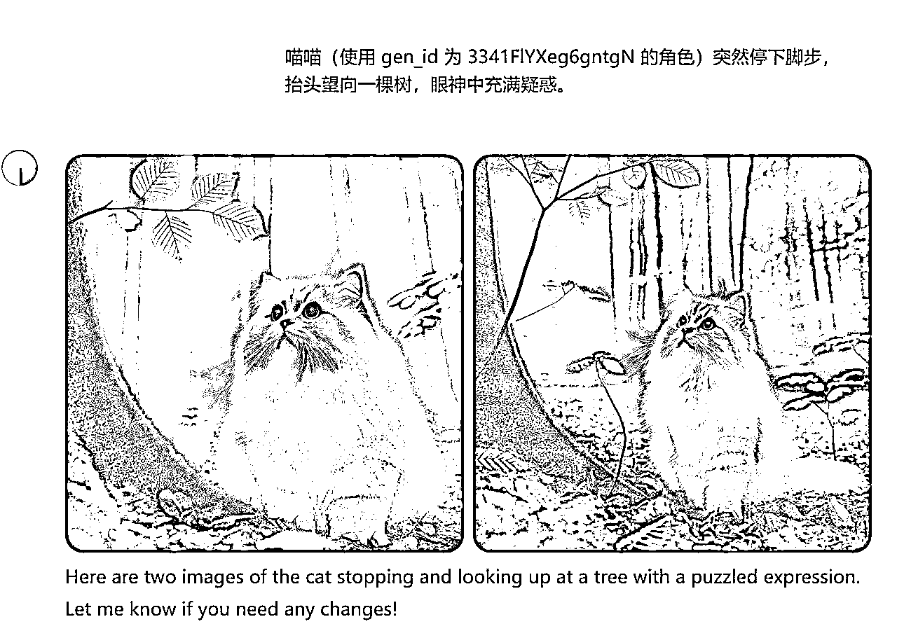

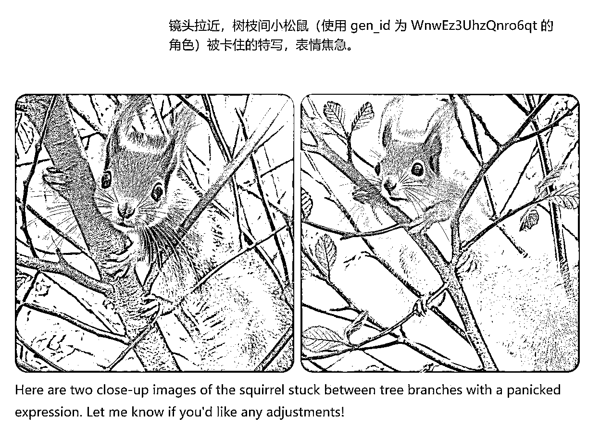


# 4.1.2.4 第四步：剪辑

把图片都导入到剪映，配上自动放大的效果，就可以了。为了尽量还原，还需要加上一些音效、特效的画面效果。

这些只要做好一次，下次直接找到剪映草稿源图片的位置，替换源图片后再打开剪映就可以实现一键复用剪辑效果提高效率。

而 BGM 我是用手机版的 YouTube 自带的语音识别，直接搜索对标视频的音乐，就可以找到源 BGM，用工具下载下来就行了。一般只需要下载一个视频，在这个网站下就行了，基本支持所有的自媒体：https://tiqu.cc/

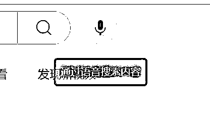

不过因为是尝试的原创整个流程，而不是直接重绘图片，所以跟对标的视频只有故事相似，其他都不一样，而且我也没有加入一些声音去精细化打磨。

其实这只是个初版，视频创作有很大的提升空间，也需要打磨故事脚本和剪辑特效。现在的话，还可以引入 AI 视频。

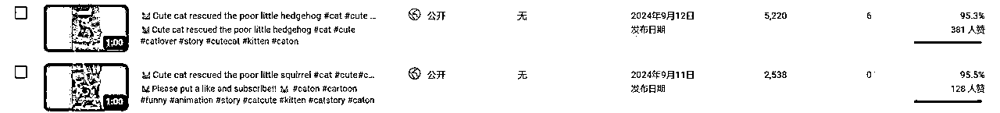


# 4.1.2.5 其他对标账号参考

Cute Animals Story: https://wx.zsxq.com/group/1824528822/topic/1525442481188482

7 月 23 日发布第一个视频，同样是 AI 动物故事，先做的 shorts 然后转长视频开通 YPP 变现。shorts 更容易涨粉，而用长视频积累视频时长开通 YPP 会更简单些。

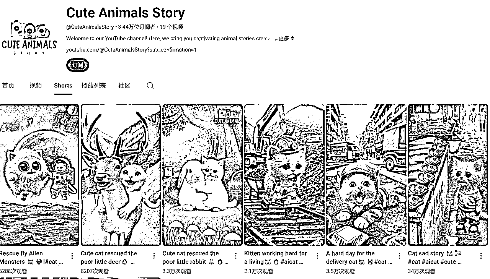

Meow Story: https://www.YouTube.com/@MeowStory1234

这个频道 8 月 21 日才注册的，还是 PPT 讲故事的形式没有生成 AI 视频，已经 10.9w 粉了。


Cat's Wonderland: https://www.YouTube.com/@CatsWonderland289

2024 年 7 月 23 日注册的，AI 视频生成的猫猫短片故事

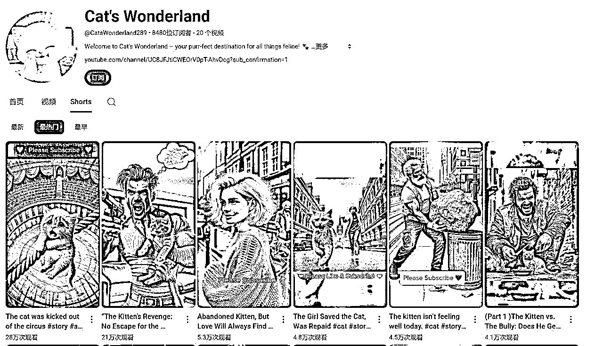

内容来源：《【生财技能】AI 动物故事视频复刻与批量生产》

# 4.1.3 AI 故事 @Nana @六只猫

# 4.1.3.1 对标参考

关键经验：一段时间仅对标一个频道

这是我在之后的 Youtube 实战陪跑时期问的第一个问题，到底是对标一个频道的爆款还是多个频道的爆款呢？我们有那么多对标，他们的爆款都拿来复刻了，有的流量好，有的不好，而且一直等不到一个自己频道的爆款，这是为什么？经过


方波妮和 Gary 曹淦两位教练诊断和分析，顿时收获了新知：一段时间内仅能对标一个频道，因为这个频道能持续做出爆款，就一定有特定的受众群，不同频道的受众群不同，如果多头对标会让 Youtube 算法没法快速明确你的频道需要推给哪些受众，这样就等不到 Youtube 的第一次大推流，我的频道迟迟没爆款，这是个很大的战败因子，按照发布时间降序排列，可以看到前期（最下面）我的内容是五花八门，有孕猫的、亲子的、还有我原创的僵尸、科幻内容，每次都陷入今天要复刻什么的困惑。近期改成了 A 动物救 B 动物-美好相处-A 动物危机-B 动物报恩的爆款公式，数据相对来说就比较稳定，内容也更容易进行改编。

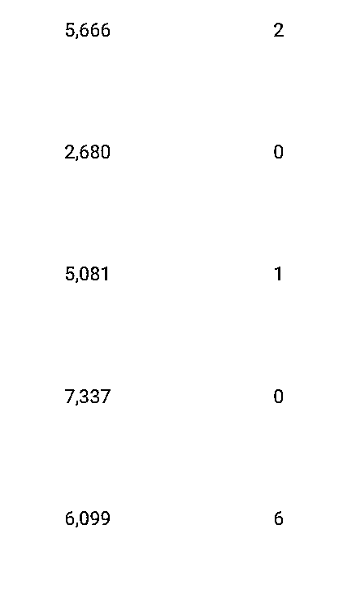

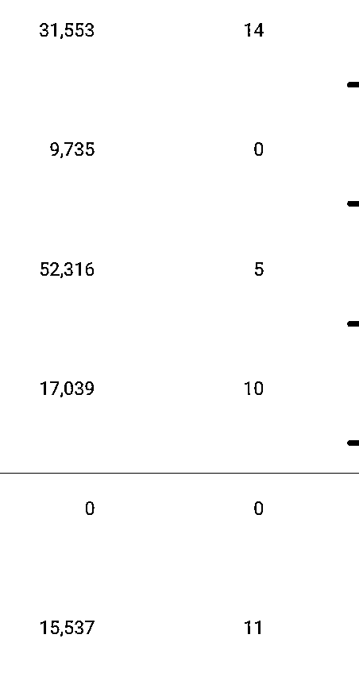

# 4.1.3.2 内容制作

关键经验：尽量不要图生图；但有时图生图是很好的补充

我们继续进入 AI 内容工作流的搭建和提效的版块，如果有做 AI 猫咪故事赛道的圈友会知道，这个赛道做起来繁琐、复杂，如果涉及微创新和故事改编，用时会更长，一开始一天做一条内容是非常正常的，练熟了考虑到各大平台的生成速度和反复抽卡，也得 3-4 小时一条，我一直苦恼于它的提效。所以我灵机一动把原来的工作流做了以下修改，然后我就收到了 Youtube 机审的自动移除，尽管我做了动物角色的改编，但是复现程度还是太高了。大家可能会发现有些爆款有很多搬运大量存在而且也是爆款（可能我那个对标爆款被抄得太多了），但还是谨慎为好。

原流程

新流程

对标爆款关键帧截取

对标爆款关键帧截取

AI 图生脚本（这里可以改编）

AI 图生图

AI 文生图

AI 图生视频

AI 图生视频

视频剪辑

视频剪辑

但，图生图是一个很好的提效补充：

在这里我想进一步探讨的是，我认为图生图是一个很好的提效补充。比如当我们拥有了一个爆款的场景，可以直接把狗换成浣熊（主体的替换），并且利用原图还可以生成新的场景：找到其中一个关键帧，加一个漂亮女生在旁边看着浣熊，我们得到下面这张图，然后通过图生视频我们可以让女生和浣熊互动，这样就完成了动物救援最后的视频部分（这里仅仅只需要一句话的想象）。比如下面的蜂窝原图，通过文生图抽卡很难达到效果，用图生图就很容易做得比较接近，是个提效和补充的好方式，但是不建议全片都使用。


ready-2a28f9c56ad8.mp4【在线播放】


关于 Ai 动物故事角色一致性问题：

使用 ChatGPT 中 Dall-e3 生图，对比于 Midjourney、ComfyUI 这些工具来说对提示词的要求会低一些，更适合新手适用。想要角色保持一致性，一是优化提示词，二是可以使用 Gen_id 控制，如果多次抽卡后生成效果还是达不到要求，上传原图进行垫图，让 ChatGPT 参考原图重新生成，会节约更多时间。


# 4.1.3.3 内容发布

关键经验：国内多平台分发，提高内容利用率

爆款在各大平台依然是爆款防失联+MM188166M（李李）长期更新

比如猫、猴子、老鼠的这条 5.1 万是基于动物报恩主题原创出来的故事，它同时让我在国内的抖音号、快手号成为百万爆款、小红书突破千粉，连 ai 猫咪故事一直没流量的视频号也有 22 万的播放，引发了评论区的大量讨论。这个视频引起了大量对猴子的声讨和老鼠的夸奖，同时老鼠的形象设计是比较可爱的，惹人怜惜。


分析原因：

评论多是爆款的结果，同时也藏着爆款的原因，归根结底都是能引起共鸣的情感底色，大家可以去总结对标爆款的高赞评论去摸熟复刻的要素。Youtube 上的 Meow 频道就是用东亚男孩、骨瘦如柴的橘猫、可爱的拯救者来组成一个动物感恩故事，东亚男孩是那个邪恶的对象，人类的坏、可爱的不同动物、悲惨的猫都是能引起大家讨论的话题。他的视频比其他账号的评论高出数十倍。


视频号数据暴涨

我从去年 12 月 18 日开始发布内容，前期都是 AI 猫咪故事，在抖音号、快手号、小红书都表现还行，但是视频号除了第一条爆款开通原创后（冥冥天注定，后面大爆直接吃到收益），就没流量了，粉丝停留在 100+。进入到实战陪跑，除了我已经做了一个多月的 AI 猫咪故事的频道，教练团也分享了一些最新的赛道玩法，我也找了个短平快的动物救援赛道开始了我第 2 个账号的征途。没想到，这个赛道帮我赚到了第一笔收入，第一条内容就成为了爆款，带来 9.7 万含金量很高的中老年粉丝、2700+的收入、4282 万的播放，且仍有长尾流量。防失联+MM188166M（李李）长期更新


分析原因：

结合粉丝画像分析下来最大的原因主要如下：

这个赛道的受众主要是中老年群体，这条视频做得很真，吸引的中老年人一开始并不知道是 AI 制作，所以“万物皆有灵”深入人心，在评论区迅速蔓延，我当天就把账号的标签、头像改了（原来是猫咪的设计），后面的内容也开始在评论区引导灵性


触发了东三省有关“狐仙”灵性的民俗文化，除了“万物皆有灵”，评论区就是围绕狐仙的讨论，有的分不清狐狸还是狗，总体来说都是动物成仙，达成动物拦路必有缘故的共识。从我的粉丝大量来自东北地区也能反向验证。

防失联+MM188166M（李李）长期更新


因为国内没有作为我的主要运营阵地，所以也没有成体系的去复刻爆款和运营的规划，但是也做了些许尝试。由于我们正值蛇年春节，加上蛇是东北的柳仙，我立马做了一条蛇的动物救援，发了不到 1 小时，瞬间突破 20 万+，甚至比当时的狐仙更快，但是很遗憾，不多久视频号就判这条内容违规，没能复现一个新的大爆款。因为这个经验，我没有再做黄鼠狼的视频，而是改成了浣熊，因操作不当导致同样的视频发了两次且声明了原创，视频号没判为我违规，这两条数据都比其他的要好，代表东北仙灵文化是可以继续探索的方向。让人意外的是，这条金蛇我也发在了 Youtube，竟是我的频道里流量最多的，有 19k

防失联+MM188166M（李李）长期更新


接下来也给大家总结了几个经验：

这类内容的受众基本上是 50 岁以上的父母辈，他们觉察不到是 AI 生产的，所有人都在感慨“万物皆有灵”。因为对平台不熟，一开始没有声明 AI 创作，导致该内容在 1000 万+的时候被下架，后通过申诉声明 AI 再次上架，申诉后几天平台停止了推荐，这里有两个关键点分享给大家：

以假乱真的内容一定要声明 AI 创作，否则会判违规，次数多了账号会限制推荐


动物救援的内容粉丝受众和 AI 猫咪故事不一样，引发了大量老年人的讨论所以收入高（视频号以评论量为主要考核），其他平台可能并不适合，金蛇的救援我同时在抖音号、快手号发布、抖音号没那么快上量，快手号被判违规，我就把内容隐藏，不再尝试了。视频号内容宽容度高，这种短平快的营销内容在视频号发布更合适。

# 4.1.4 AI 怪兽合成 @Gary @土豆君

# 4.1.4.1 对标案例参考

AI 类短视频有一类是融合怪，通过 AI 视频生成两三种动物的融合效果，比如：

https://www.YouTube.com/hashtag/fusion/shorts


如果要做融合怪视频，可以参考下对标账号，大约有这几种类型（这里对标只是举例子，具体的对标账号需要根据自己的情况选择。) :

【第一类】动物融合，纯图片，不使用 AI 生成视频：https://www.YouTube.com/@HeshanMalinda-nf6ws


【第二类】动物融合，包含 AI 视频生成怪物融合过程：https://www.YouTube.com/shorts/XU0yhFEnzrQ


【第三类】人与动物融合：https://www.YouTube.com/@AnimolFacts/featured


【第四类】人与动物融合达人秀，加入一些达人秀的 视频剪辑：https://www.YouTube.com/@TalentSnap

这里展示两个视频：

左边的这个对标视频是纯图片生成，比较简单，可以用 Dalle3 和 Midjourney 生成类似图片。

右边这个视频就加入了融合过程，需要使用首尾帧视频生成。

防失联+MM188166M（李李）长期更新

https://www.YouTube.com/shorts/-alVWmtIRYM

防失联+MM188166M（李李）长期更新

https://www.YouTube.com/shorts/2YmX-9auHUw

# 4.1.4.2 第一步：脚本设计

动物类型：跟什么动物变身

动作类型：做什么动作，跳舞、转圈等等

场景布置：在什么场景完成整个视频，如舞台、户外等

服装配色：穿什么衣服、什么颜色

这个环节可以直接用 KIMI、GPT 等 AI 工具辅助设计，提供对应需要的要素，让 AI 来排列组合可


# 4.1.4.3 第二步：文生图

一共需要四张图，对应四个关键帧，期间只需要替换动作和人物形象相关的提示词，背景等不需要动。这里以我视频号的千万播放视频作为案例，这个视频在各平台播放量都不错，应该具备一定的通用参考价值。


1.

人物主体和动物主体，动作随意

示例：full body，facing the camera，a breathtakingly beautiful 20-year-old woman in a very delegant white formal dress dress dance next to a big seal on brightly thick ice，barefoot，realistic，sunshine，bright，Slip dresses，ice and snow，long，blurred background，include as much detail as possible， ultra-high image quality， 4K，shot on canon a7c2 --no sexy --ar 9:16 --v 6.1


2.

人物主体和动物主体，动作随意，但最好和第一个类似，或者有连贯性，否则视频效果会很差

示例：同上，discord 里可以直接按这个按钮生成相似图片，V 几就是根据第几张图生成


3.

人物主体和动作主体，最好是抱在一起或者非常接近，否则视频生成会很费劲

示例：full body，facing the camera，a breathtakingly beautiful 20-year-old woman in a very delegant white formal dress dress hugging a big seal on brightly thick ice，barefoot，realistic，sunshine，bright，Slip dresses，ice and snow，long，blurred background，include as much detail as possible， ultra-high image quality， 4K，shot on canon a7c2 --v 6.1 --no sexy --ar 9:16


4.

融合后的主体，最好是站立，方便视频生成

示例：垫图链接 full body，facing the camera，a big tall seal in an elegant white dress stading on brightly thick ice，barefoot，realistic，sunshine，bright，Slip dresses，ice and snow，long，blurred background，include as much detail as possible， ultra-high image quality， 4K，shot on canon a7c2 --no sexy --ar 9:16 --v 6.1 --personalize hlfxj7l


期间有整体不错但是细节有问题比如手指和肢体错乱，可以点这个按钮局部重绘，在弹框页面选择区域后重新生成即可。


凑够四张关键帧图片后进入图生视频步骤。

# 4.1.4.4 第三步：图生视频

使用 Runway AI 工具，左边上传图片填写提示词，右边显示结果。视频一共四段。


关键帧 1→关键帧 2：a beauty 【dance】 （on tiptoes） next to a 【XXX】，（bare feet），camera rolate，dynamic motion

打（）括号的是根据“踮脚”“光脚”补充的提示词，根据图片的实际情况填写；【】括号的是动作和动物主体，根据实际情况替换；加粗的是对镜头画面的全局提示，分别表示镜头旋转和动态画面，有助于稳定出图效果；有好的动作种子记得保留下来下次用


1.

关键帧 2→关键帧 3：动作有变化就把第一段里的动作替换掉

2.

关键帧 3→关键帧 4：a beauty fuse with the XXX ，camera rolate to the right，dynamic motion。动作变化大就补充变化的动作，否则直接把原有的动作替换为 fuse（融合）即可

3.

关键帧 4→跳舞：这一步只需要上传一张图片即关键帧 4，a XXX dance in a dress，camera follow，dynamic motion 。用最简单的描述即可

熟悉了这几个步骤之后，提示词完全可以自己写，一次次地出图等待 4 个好的结果出来就行了。

你也可以用即梦 AI 或可灵 AI 的「首尾帧视频生成」功能来实现。

目前是即梦 AI 免费生成不用排队，更推荐尝试一下。

即梦 AI：

国内版：https://jimeng.jianying.com/

海外版（不推荐，目前功能不全）：https://dreamina.capcut.com/

可灵 AI：

国内版：https://klingai.kuaishou.com/

海外版：https://klingai.com/

这里左边用的是即梦 AI（视频模型 1.2），右边用的是可灵 AI：


生成的效果：

实操步骤参考：

1.

生成三张图片

生成一张美女和白马的图

舞台上一个美女和一匹白马走在一起

即梦 AI 会生成四张图片，选一张合适的就行，我这里使用了第二张图，欧美人脸。防失联+MM188166M（李李）长期更新


然后生成融合后的结果图，我选择了第二张图。

舞台上，一个长着马耳朵的欧美人美女，穿着白色礼服，留着金色的长发


生成的融合前的图片，这里我使用了参考图。

舞台上，一匹白马和一个穿着白色礼服的欧美人美女靠在一起。


2.

生成三段视频

生成融合过程的视频：


生成融合前的视频：


生成融合后的视频：


# 4.1.4.5 第四步：剪辑

我们把对标视频的剪辑画面保留，只需要用到剪映的基础功能，注意好对齐音乐卡点的节奏，时长控制在 18s 内。

像惊讶的画面也可以用 AI 生成，去其他视频截图都可以，我这里就直接保留原视频的画面。然后 AI 生成的视频用自己的替换，使用同样的音乐，视频就生成好了。


内容来源：《【生财技能】AI Shorts 两类视频复刻教程（怪物融合+动物跳舞）》、《24 天 7w 粉开通 YPP 收益 108 刀，我的 AI 达人秀变身千万播放视频制作流分享》


# 4.1.5 AI 动物示警 @逸凡风顺

# 4.1.5.1 第一步：对标账号分析

示例对标 1：快乐探险家，链接：www.youtube.com/@HappyExplorerTV，视频质量高，真实度，色彩度，制作精良。


示例对标 2：Nautilus Fantasy 链接：www.youtube.com/@NautilusFantasy，在原来的模板上做了示警变化，整体制作难度没什么变化。频道还包含动物救援及其他内容。


寻找对标思路：可通过先关注此类视频频道，通过点赞，然后再回到主页刷新，平台便会推荐近期此类视频。不断寻找对标。也可以通过此类视频标题中的标签进行寻找。

# 4.1.5.2 第二步：分镜头拆解思路

先分镜头结构，拿对标账号示例 1 为参考，动物示警视频课拆解为 5-6 个分镜头组合，即动物拦车+动物与车的互动（中景镜头，车外角度）+动物与车的互动（近景特写镜头、车内向车外拍摄角度）+灾难镜头（画面中主体车辆和动物二者选其一）+动物近景特写镜头（可选）+温馨时刻。这样的结构去制作的。这样基本在剪辑过程中保证视频时长在 22-26 秒这样的区间。

建议：尽量不要一模一样的复刻对标视频的所有分镜头，可在动物与车的互动这块，适当调整提示词镜头角度，或者互动位置来做区分变化。以免过于同质化导致卡万播。

# 4.1.5.3 第三步：AI 工具选择

俗话说得好，工欲善其事，必先利其器。要想做好视频，好的工具必不可少，这里我将自己制作视频所用到的工具做一个使用体验。

# 4.1.5.3.1 提示词部分

提示词优化 AI 工具：GPT4、deepseek。

写提示词思路：先对对标视频进分镜头分析和拆解，然后根据自己的创作思路，整理出自己视频的分镜头图，然后通过 GPT 上传分镜头图，让其推导出提示词。

这里说一下，至于为什么不用 mj，sd 等反推，一是 mj、sd 使用还不是很熟练，二是它们推导出来的提示词错乱的比较多。而 GPT 是可以识别图片的，用来推导提示词准确率相对高一些。为什么不用 deepseek，是因为 deepseek 只能识别图片中的文字，不能对图片整体识别推理

而这里使用 GPT 的原因，主要是想确定这类图片提示词的结构，因为提示词前后顺序是会影响提示词权重的。这里可以让 GPT 输出的时候，以中英文对照的形式发给你，以便后续的修改和优化。

比如，我想做个狗趴在窗外的分镜图，自己怎么写都出不来，最终我将我的想法和对标图发送给 GPT，得到了我想要的效果。


再比如这个，我想制作的分镜头是从侧面拍摄，车头掉进路面的一个坑里，但对标账号的视频中并没有这个镜头，于是找一个侧面镜头的网图，用来推理提示词，


虽然但是，有时候 gpt 提供的提示词也不能百分百出来你想要的结果，这就需要用到 deepseek 了，其实 gpt 也行，只是最近 deepseek 太火了，还没有使用门槛，将 gpt 的提示词扔给 deepseek，将你生成后出现的问题一并告诉 deepseek，让它帮你优化，这样操作下来，你想要的图片效果基本上都可以实现。


但到这里并没有完，如果你只是简单的复制粘贴，那么，你将每天都不得不重复这个操作，将其整理成自己的，才是真正的降本提效。这一点我会在后面部分详细整理。

# 4.1.5.3.2 文生图绘画工具选择

文生图：mjdjourney，stable diffusion

这两个工具想必大家都比我这个新手用的好，因此使用方法就不说了，暂且说说上面提到的图片色彩度和真实性方面的一些心得，在我使用体验下来，sd 的出图效果是优于 mj 的。这里我就将我用到的模型和一些使用心得分享一下。

stable diffusion:

若自身电脑配置问题，可使用云电脑，在线端等替代。这里可以 libulibu 在线端为例，地址 https://www.liblib.art/sd

大模型：绘梦写实摄影大模型，F.1 基础模型，星流 star-alpha 大模型，（可在模型广场直接搜索收藏使用）


lora 模型：纪实摄影 F.1、蔚蓝 blue 高清动物摄影大模型。（可在模型广场直接搜索收藏使用）

mjdjourney

mj 模型选择 v6.1，但有时候生成的图片会过于清晰，色彩过于饱和，甚至给人一种黑黑的感觉。如果出不来想要的色彩度，这个时候，可以先用 sd 生成一张图，然后再用垫图的方式让 mj 参考 sd 生成图片的风格，就是--sref+图片链接，这样出来的图片感觉会好很多。

不管是 sd 还是 mj，在文生图这块，优先看图片色彩度和真实性，其次再去考虑图片中的部分变形或者主体的站位等因素。

# 4.1.5.3.3 图生视频工具

即梦（pass，提示词稍微复杂点就会响应不精准，不开会员只能下载低画质）

runway（不会用，ps：总是抽不出符合自己预期的视频，可能是个人问题）

海螺（效果堪比可灵，甚至更优，但缺点也很明显，容易动画化）

可灵 AI（主要使用工具，基本一遍过，缺点就是基础不够用）

智谱清言（对于动作幅度小的镜头效果挺好，动作幅度大的容易变形，动作 AI 痕迹明显。)

# 4.1.5.4 第四步：视频制作完整流程

# 4.1.5.4.1 文生图

将对标分镜头图片反推提示词或者提示词模板复制放入翻译软件，对主体环境等进行修改，得到分镜头所有提示词，

示例：

分镜一：

分镜二：

分镜三：

分镜四：

分镜五：

再通过绘画软件进行生图，这里我一般使用的是 stable diffusion，具体模型和 lora 详见文生图绘画工具部分。可以得到分镜图，其中互动部分可以自行选择合适镜头的图片备用，


# 4.1.5.4.2 图生视频

随后，将得到的分镜头图再利用海螺 AI/可灵 AI 生成分镜头片段，图生视频也基本是固定模板的提示词，注意提示词的前后顺序，权重不一样，会导致出来视频的运动状态也不一样。

这里可灵 AI 我选用的是标准模式，因为比高品质模式更经济一些。


# 4.1.5.4.3 剪辑配音

和达人秀不同的是，达人秀可能只需要一个 bgm 就能让整个视频瞬间来了感觉，但动物示警中，我们需要根据视频进度，严格对其进行音效匹配。

将生成好的分镜头片段按照顺序导入剪映当中，选中全部片段，先做个 1.2 倍速，这样可以使视频看起来更加紧凑一些。


接下来再对每个片段进行检查，有些片段第一秒会出现静止状态，将这些影响视频流畅度的片段切割掉。随后便是对视频进行音效配音。

音效可以剪映自带的里面进行搭配。

在搜索框搜索你需要的音效素材。


视频当中所用的音效素材有：环境白噪音、狗叫、狗委屈叫、狗着急叫、狗舔舐声音、拉布拉多玩耍声、汽车喇叭、汽车刹车、汽车发动机怠速声、浪花拍打声、这个根据视频内容和个人审美自己搭配就行。

还可以根据视频的表现对视频的色彩等进行调节，看个人审美。然后选择 4k 60 帧导出。

# 4.1.5.5 策略化提示词模版

# 4.1.5.5.1 提示词拆解及模板制作

为了提高生产效率和减少抽卡，在 gpt 和 deepseek 的优化下，我们可以将分镜头的文生图提示词进行拆分归类，我一般将提示词部分分为三个部分，即主体描述、环境描述、镜头语言、图片质量。例如：

一只拉布拉多站在乡间公路上，

back to the camera,

米白色的皮毛，俊美的外表

The 拉布拉多 is facing a 橘黄色轿车 approaching the camera，

the 橘黄色轿车's front headlights turned on and clearly visible。

这条路右边是高大的岩石峭壁，左边是草原和苔藓

天空下着毛毛雨，蓝色的天空，夏天的季节

focusing on the 拉布拉多's back and the 橘黄色轿车's front。

Natural light enhances realistic details.

照片视角是从人站立的高度拍摄的，中距离镜头拍摄

The image is in cinematic composition, realistic style, ,Film Photography,4k quality,

其中，绿色和红色部分为主体，黄色部分为环境模块，其余的则是镜头语言和图片质量。

前期建议用中英文混合的方式去制作提示词模版，如果弄成全英文的，可能会跟我一样，分不清哪些是主体描述，哪些是环境描述。另外就是，翻译软件翻译的不确定性，对于一些特定的单词，尤其是一些镜头语言，翻译软件可能每次中译英翻译都不一样，导致一些只能靠特定单词触发效果的图片总是出不来想要的效果，所以选择直接用英语固定住，避免翻译错误。

而中英文混合做的好处是：这样既可以避免在翻译的时候，出现翻译错误而导致的无效抽卡，这样做可以有效减少抽卡概率，我基本一遍过，但偶尔也会遇到变形问题。相较于之前的中文提示词抽卡次数减少太多太多。

同理，狗狗从窗外向车内观看的提示词

Shot from inside a car,

outside the car window is a 德国牧羊犬，

the 德国牧羊犬 is close to the glass，

gazing inside the car, the glass is clear with faint reflections,

outside is a 温馨的农场的自然环境，

focus on the 德国牧羊犬's face"

slightly blurred background, realistic details, Film Photography,4k quality,


同理，后续的分镜头也可以用同样的方法做出固定模板，有了固定镜头的提示词模板，在后续的创作过程中，便可以通过更换汉字部分，也就是主体、环境，而镜头、图片质量部分则保持不变。这样可以有效提高生图速度和减少抽卡次数。

分镜头 1：动物拦车

# 💡

一只 [动物] 站在乡间公路上，

back to the camera,

[外貌特征] 保持角色一致性

The [动物] is facing a [车辆] approaching the camera，

the [车辆] 's front headlights turned on and clearly visible。

这条路右边是 [环境] ，左边是 [环境 2] 主要为后续灾难做适应性对照

[天气描述] 调节图片整体色彩构图

照片视角是从人的站立的高度拍摄的，中距离镜头拍摄

focusing on the [动物] 's back and the [车辆]'s front。

Natural light enhances realistic details. （自然光增强了逼真的细节）

The image is in cinematic composition, realistic style, ,Film Photography,4k quality,

分镜 1 示例输出：

A white moose stands on a rural road,

back to the camera,

white fur Huge antlers, domineering appearance

The moose is facing a dark green car approaching the camera,

The dark green sedan's front headlights turned on and clearly visible

On the right side of this road are tall rocky cliffs, and on the left side are grasslands and mosses

Blue sky, summer season

The photo perspective is taken from an individual's standing height, with medium range shots taken

Focusing on the white moose's back and the dark green sedan's front

Natural light enhances realistic details

The image is in cinematic composition, realistic style, ,Film Photography,4k quality,

分镜头 2、3：动物异常举动

# 💡

Shot from inside a car,

outside the car window is a [动物]

白色的皮毛。巨大的鹿角，霸气的外表

the [动物] is close to the glass，

gazing inside the car, the glass is clear with faint reflections,

outside is a [其中一侧环境]

[同步分镜一天气描述]

focus on the [动物]'s face"

The image is in cinematic composition, realistic style, ,Film Photography,4k quality,

分镜示例输出：

Shot from inside a car,

Outside the car window is an albino moose

White fur Huge antlers, domineering appearance

The albino moose is close to the glass,

gazing inside the car, the glass is clear with faint reflections,

Outside is a primitive forest with thick trunks

Blue sky, summer season,

Focus on the face of the albino moose

The image is in cinematic composition, realistic style, ,Film Photography,4k quality,

分镜头 2、3：动物异常举动

# 💡

驾驶员视角透过 [车辆] 挡风玻璃的极端特写，画面最底部边缘隐约可见方向盘，

一只[动物]站立在 [车辆] 前的公路上，

白色的皮毛。巨大的鹿角，[动物]脸部占据画面 60%，唾液滴在引擎盖上，张开嘴巴，有口水流下来，

右边高大的岩石峭壁，左边是草原和苔藓，

[同步分镜一天气描述]

The image is in cinematic composition, realistic style, ,Film Photography,4k quality,

分镜示例输出：

Through the extreme close-up of the dark green car windshield from the driver's perspective, the steering wheel can be vaguely seen at the bottom edge of the image,

A white skinned Rangifer Taranduss stands on the road of a dark green sedan,

White fur The huge antlers of the albino reindeer occupy 60% of the screen, and saliva drips onto the hood. Opening its mouth, saliva flows down,

On the right is a tall rocky cliff, and on the left is grassland and moss,

Blue sky, summer season,

The image is in cinematic composition, realistic style, ,Film Photography,4k quality,

以此可将分镜头 4：灾难/动物救治（救治需将动物病化），分镜头 5：人与动物的友善互动（抚摸/拥抱）/（救治需展示动物伤势包扎后形象），便可做出一套经过验证的模板。

# 4.1.5.5.2 做区分于对标的模板

虽然有了固定镜头的提示词模板，但在视频创作过程中，还是会做一些变化，通过截图对标账号的分镜图再通过图生图的方式固然可以，但很容易被原作者刷到后一眼看出，且可变性稍差。有时候可以稍微做点分镜头变化，来保证表达同样的意思，但区别于对标的视频。

比如动物示警拆解对标账号后得出的通用模板是这样的

分镜一：动物拦车

分镜二、三：动物的异常举动

分镜四：灾害发生

分镜五：人与动物的接触互动

我们可以在保留关键分镜的情况下，对部分分镜图在保证表达意思不变的情况下进行略作调整。比如分镜二、三表达的动物异常举动分镜头上，可以通过调整动物的动作、动物与车互动的相对位置、镜头的视角（如从车内向外拍，还是车外后视图等）不同的视角呈现的效果是不一样的，但整体表达的还是动物想通过异常行为进行警示。

而自然灾害的镜头，则根据前面提示词中环境部分的描述词进行设定，如“山体滑坡，泥石流、巨石坠落、桥梁崩塌、地面塌陷、猛兽出没等等进行变换。

其次，如果通过修改提示词让动物示警变成动物自救、动物救援等，实现赛道的自由切换。只要拆解出视频思路，那么分镜头就很好弄了。

内容来源：《YT shorts 复盘——动物赛道的爆点因子分析及提示词模板》


# 4.1.6 AI 转绘 @龙

# 4.1.6.1 什么是 AI 转绘类视频？

AI 转绘类视频，就是用 AI 生成两张主体一致但风格不同的图片，然后借助剪辑技术和比较魔性的 BGM 来制造一种反差的效果。

我们先看三个案例，这样可以比较直观地感受到这类视频的特点：

Evolution of Cat Motor Sports Cow Maiw Milky cat cute love shorts720p.mp4【在线播放】

由于这类视频利用剪辑技术让两张风格不同的图片慢慢展现，勾住观众的好奇心，同时总时长很短（5 秒左右），因此这类视频通常完播率比较高，观众平均会观看 2 次及以上，从而将视频的播放量持在一个比较好的平均线上（平均每条视频 1w 播放起步）


这是我实操下来的后台数据，每条视频时长 5s，观众平均观看时长为 10s 及以上，也就是观众平均观看次数至少为 2 次及以上。

这类视频的爆款上限也比较高，下面是两个对标账号的数据，爆款视频的数据基本上都能达到千万级别


这个赛道开通 YPP 也是没有问题的，大多数对标账号都已经开通 YPP，没开的我也列了一个。


看上去，这个赛道的视频制作简单、开通 YPP 前景良好，好像很蓝海，但其实也存在一个问题：

在这个赛道中，大多数对标账号的所在地区为印度或者印度尼西亚（有一个开通 YPP 的是美国的，但不多）

我自己账号后台的数据也显示，视频的观众多为印度用户

这意味着，如果开通 YPP，我们的收益可能会比较低，如果不能接受这一点的圈友们，可以考虑换个赛道。

接下来我给大家详细拆解这类视频是如何制作的。

# 4.1.6.2 第一步：获取对标视频

我们先把对标账号的爆款视频下载下来，方便后续操作。这里有两种方法：

第一种：用现成的在线 YouTube 下载网站，这个不限次数+免费，效果还不错，大家直接把我分享的 Excel 文件里的“url”那一列的链接放上去就可以，或者打开你想下载的对标视频，把链接复制粘贴过去即可。

第二种：我自己用 cursor 写了一个 python 程序，可以用 Excel 批量导入视频链接并自动下载，封装好的软件放在百度网盘里了，大家可以自行下载使用。

百度网盘链接：https://pan.baidu.com/s/1_zFUb72xeABeVpldlqambQ?pwd=xrmc

提取码：xrmc

使用说明：Youtube自动化工具分享 & 开发复盘


# 4.1.6.3 第二步：获取静态帧

下载好对标视频之后，第二步就是从对标视频里把两张风格不一样的图片截取出来，方便我们使用。

这里同样有三种方法：

第一种：直接点击对标视频播放，win+shift+s 截图（这是 windows 系统的方法，mac 暂时不太清楚）

第二种：用剪映或者 capcut 的“导出静态画面”功能。

首先，我们打开剪映，点击左上角的“导入”，找到我们的对标视频，选中，点击“打开”导入剪映里面


然后，我们把对标视频从左上方拖进轨道里面


接着，我们把时间轴拉到视频最开始，然后点击视频右上角的三条横杠，选择“导出静帧画面”，选择好保存的位置之后，就可以把你在窗口中看到的这张图片保存下来，这就是我们第一张要用到的风格图片


最后，我们依法炮制，把时间轴拉到视频末尾，同样导出第二张风格图片，这样就能得到两张对标视频的风格图片作为备用。


第三种：用 @老馬🐎内容出海 开发的视频帧截取软件，使用教程详见：【点击这里直接跳转】

# 4.1.6.4 第三步：用 GPT-4o 或 DALL E 进行复刻

准备好两张对标视频的风格图片之后，下一步就是 1:1 复刻，这一步会用到 ChatGPT 的 GPT-4o 或 DALL E 模型。（MJ 我试下来效果不如 GPT，也有可能是我提示词没到位，熟悉 MJ 的圈友可以尝试探索下）

首先，我们进入 GPT 官网：https://chatgpt.com/

（我做 AI 转绘基本用的是官网原生模型，中转或套壳站我没尝试过，效果不保证，大家有条件还是尽量用官网）

然后，我们点击左上角“探索 GPT”，往下滑，找到 DALL E 模型（如果之前用过的话，会直接显示在侧边栏）


下面就正式开始复刻，我用 DALL E 模型来给大家演示一遍（也建议大家优先用 DALL E，次选 GPT-4o）

首先，我们打开 DALL E，点击聊天框左边的回形针，上传我们要复刻的图片


这里有个注意点，我一般会选择复刻色彩比较接近生活的对标图片，而不是带有比较浓重的风格色彩的对标图片。

比如，下面四张图片，我会选择复刻第一张和第三张，而第二张和第四张转换风格后的图片，我会用即梦 AI 来实现（后面会讲）


因为第一张和第三张的颜色和我们平时见到的差不多（柯基犬以橙色为主，牛牛以白色和粉色为主），而第二张和第四张带有比较重的风格色彩（彩虹风格、废墟风格），我就不会选择优先复刻。

上传好图片之后，我们输入下列提示词：

如果我想让你生成一张和我提供的图片一模一样的图片，请写出英文提示词和中文对照


发送之后，DALL E 会给我们输出英文提示词和中文对照


之所以要 DALL E 输出英文提示词和中文对照，是因为下面两点：

第一，我自己实操下来，用英文提示词让 DALL E 生图的效果会比用中文提示词更好。

第二，让 DALL E 提供中文对照，是为了让我们可以看懂英文提示词，防止因为画面细节太多，DALL E 可能忘了描述，如果我们从中文对照里发现 DALL E 提供的英文提示词少了一些元素，就可以让它加进去。

DALL E 提供好提示词之后，我们输入以下提示词：

根据我提供的提示词生成一张图片，比例为 9:16，提示词：（这里粘贴刚刚 DALL E 给我们的英文提示词）

不需要提供对标图片，DALL E 也能只根据提示词就生成比较类似的图片出来，如下图：


效果还蛮好的，和对标很像，当然，不可能是 100% 完全相同，只要相似就 OK，我们就拿这张图继续下一步

注意

1.

大概率需要多次生成才能得到满意的图片

这次测试只是比较幸运，一次就生成了相似的效果比较好的图片，但在实操过程中，这种幸运不会每次都发生，更常出现的情况其实是，DALL E 生成的其实和你想要的还是有些偏差，需要反复抽卡才能生成自己比较满意的。

如何多次生成？把提示词复制粘贴一遍，再发给 DALL E 就好。

2.

以下是可能出现的意外情况，也需要多次对话生成

（1） 有时候我们让 GPT 生成 16:9 的图片，它可能会给你生成一张横向的图片，这时候我们可以再把提示词复制粘贴一遍，发给 GPT，直到它生成方向正常的图片为止，如果你让它生成竖屏的 16:9，GPT 大概率不能理解（案例如下图）


（2） 如果我们用的不是 DALL E 模型，而是 GPT-4o，如果直接把提示词给 GPT-4o，让它生成图片。有可能会出现 GPT-4o 说自己无法生成图片的情况

之所以会出现这种情况，其实是操作顺序不对，解决这个问题的方法是：先上传对标图片，让 GPT-4o 生成提示词，然后再给提示词让它生成图片即可。


这次其实就没能一次抽出我们想要的图片，GPT-4o 的生图能力相比 DALL E 来说还是有点差距的。


# 4.1.6.5 第四步：用即梦 AI 更换图片风格

生成好正常色彩的图片之后，下一步就是生成一张造型一致、但风格完全不同的图片。

这一步我们会用到即梦 AI，其实 DALL E 也有可能完成这种操作，但我暂时没摸索出来，而即梦的效果相对比较稳定，我自己也是用即梦，所以就介绍这种方法。

下图我是尝试用 DALL E 一次性生成两张造型一致、风格不同的图片的尝试，后面找到即梦的方法我就没有继续探索了，有兴趣的圈友可以尝试下，从 DALL E 生成的左图来看，是有可能一步到位的。

用即梦 AI 换风格的操作可能有点复杂，我这里直接用视频来分享

即梦 AI 官网：https://jimeng.jianying.com/ai-tool/home/

视频：

即梦换风格教程.mp4【在线播放】


# 4.1.6.6 第五步：剪辑

用即梦完成换风格的操作之后，最后一步就是剪辑，这一步我们会用到剪映 /capcut 的“蒙版”和“关键帧”功能

操作同样比较繁琐，图文说不清楚，我们直接上视频。

剪辑教程.mp4【在线播放】

BGM 的话，我们直接用对标视频的 BGM 就可以，实操下来不影响播放，也没有版权问题，直接用剪映的“分离音频”就可以，操作如下：

选中对标视频，右键，选择“音频分离”即可


至于左下角要不要加人头，对标账号很多都加了，但我自己做是没有加的，没加人头其实也不影响播放量，但我不确定是否会影响 YPP，按照@老馬🐎内容出海的说法，加人头这种操作是为了过原创，因为 AI 类不好过 YPP。

以上内容来自@老馬🐎内容出海的文章《如何选择自己合适的匿名 Shorts 赛道》

如果大家要模仿的话，其实操作也不难，在剪辑教程的最后有介绍要怎么操作，从 8:00 开始看就可以。


# 4.2 故事号 @老马*内容出海

# 4.2.1 什么是故事号

故事号，就是基于其他文字社媒平台，采集一些文案，做二次创作的视频。类似国内抖音上，知乎贴文，天涯神贴，贴吧神帖这种展现形式，但又区别小说推文这些赛道。

故事号大部分以搞笑，狗血，恐怖，为主的素材主题，配上解压素材的混剪，展现形式有三种大类，普通故事风，reddit 风，以及短信风。

也可以是一人饰演两角色的搞笑对话，也可以基于搞笑对话素材的二次创作。类似国内，一些博主的搞笑对话，通过二次创作成沙雕动画，是一个逻辑，这些的底色都是故事号。

故事号的特点也是具备更多商业延展的账号类型，可以吃视频收益，也可以做 CPS，CPA，推广产品，以及其他商单，创作难度低，重点仅仅只是在素材的收集上。那我们来看故事号到底具备哪些优势，哪些劣势？

优点：

1.

可拓展能力强，故事模版不变，故事的选题可以千变万化。

2.

故事选题不变，视频的展现形式可以千变万化。

3.

商业模型多变，可以接一些推广 CPA 商单，在没有开通收益之前撑住收益，让自己有持续下去的东西。

4.

剪辑方式简单，适合新手上手，快速加深对平台，流量，规则，基础功能的理解。

5.

Shorts 的新规“三分钟内容”更适合故事号的发展，未来还会持续发力，属于潜伏于地下的老赛道。

6.

一般不会有标签，除了加一个音乐以外，可能只有一个标题，极其难采集到，但是当你找一个到两个，那么你也就撬开了这类大门。

难点：

成长缓慢，需要熟悉海外社交媒体，克服采集素材以及文案的能力，能够有效理解文化差异的梗。吃透这些，账号起步会更快。

注意：以下所有文案训练方法，没有给到限制字数以及对话次数这些，可能会存在配音结束后，去除气口后，超出一分钟的情况，这种情况自行修改提示词，以及手动删减内容或者对话内容，缩短时长，如果做 tiktok 不影响。Shorts 彻底更新后，大约在 12 月初或者中旬，也不受影响，三分钟内。


# 4.2.2 Reddit 风故事号

为什么叫 Reddit 风呢？这种账号一般是通过传统线上媒介平台，也就是文字类平台，采集到的文案，进行二创的，在这其中，Reddit 平台传出来的内容更多。

Reddit：美国社交新闻、讨论和内容评分网站，类似与我们国内的贴吧以及豆瓣。通过一些特定的社交群组，找到这些贴主分享的故事以及段子制作二创视频。区别如下：

纯故事模式+字幕


11.mp4【在线播放】

Reddit 开头模版+字幕

需要的素材有：故事来源、文案、Reddit 开头模版、解压素材。

# 4.2.2.1 第一步：准备故事来源

美国有很多类型的交互性媒体网站，Reddit，Quora，The Moth，4chan，8kun，Discord 这类平台。Reddit 体量最大，也可以匿名，所以在这里面能收集到的素材是最多的。后面如果涉及到采集故事，我们就以 Reddit 举例。

Reddit：加入一些群组，比如：Story， AITAH。

怎么找到这些群组？

可以点开翻译去寻找对应的，下方有很多类似的交流群。


这里给到一些我经常再用的：

https://www.reddit.com/r/BestofRedditorUpdates/

https://www.reddit.com/r/AITAH/

https://www.reddit.com/r/AmItheAsshole/

https://www.reddit.com/r/TrueOffMyChest/

https://www.reddit.com/r/self/

https://www.reddit.com/r/nosleep/

# 4.2.2.2 第二步：Reddit 开头模版（如果不需要的话可以略过）

先看看是这个模版的样子：


你看到这张图会想着咋做？把这张图截取走，然后抹掉文字和头像，自己咋 p 图？还是找稿定设计，canva 之类的看看有没有模版？

可以使用这个网站自己制作模版，figma，它里面有现成的。

搜索社区有一个 reddit 的模版可以直接用，只不过是横版，需要你自己修改。


这个网站的社区里面有各种模版，搜索 Reddit 可以找到，里面组件非常全面，对海外模版什么的有需求的，也可以在这里面找找：https://www.figma.com/community ##模版界面

模版功能介绍：


对着头像三次双击，可以替换头像。

下载图片按钮


双击这里替换文案

其他都是对应操作了，可以自己研究一下可以添加一些图标什么的，改成自己喜欢的。

不想改的，我这里的改好模版你可以打开这个网址直接用：https://www.figma.com/community/file/1434129226221600298

# 4.2.2.3 第三步：准备解压素材

获取渠道：Ins，YouTube，TikTok，抖音。

不要使用淘宝那些买的多少钱多少 T 的，大部分都用烂了，还有一些是实时卖给你的，也是从海外采集过来的。解压素材很重要，特别是高清素材，合格的素材，它决定了你会不会 0 播，会不会过重的重要原因。

解压类内容，大部分关键词主要搜索的是「AMSR」，国内搜「空耳」。尽量使用海外素材，因为很多国内的素材都带文字，去重起来特别麻烦，裁剪就又变了味。如果遇到国内的一些无字幕的素材，那完全是可以的。

这里我们选择找一手海外素材，来英语课堂开课了：

「AMSR」这个词太大类，容易找出来有人声的，毕竟一些博主在做这件事情，我们要挖更深一点。

深层词：

Sandart：沙子艺术，San（沙子），Art（艺术），从这里就可以延伸出更多细分领域；

XXXart：比如，蛋糕艺术（cakeart），木雕艺术（Woodcarving），纸张艺术（PaperArt），金属艺术（MetalArt）

Satisfying：字面意思令人满意的，令人愉悦的，比如「A satisfyingly crunchy sound」，一种令人满足的脆响。

Oddlysatisfying：指的是一些看似奇怪，但能让人感到满足和愉悦的事物，它们通常具有视觉或听觉上的特殊性，并能激发人们的好奇心和审美情趣。

看，有了这些词的拓展，是不是就好找很多了？不抓瞎了吧，这么多细分赛道的素材，在加上混剪总能去重了吧？那么根据这种细分的关键词，你就能找到更多的解压素材，INS 上首选，其次才是 YouTube 和 TikTok。

如果你不想找没关系，我这里有一批对标，整理好的，可以拿起来练手，但可能需要多混剪，因为都用过，可以追新发的来剪：故事号素材收集库

想要做好一个故事号，拥有自己的素材库是必不可少的。你可以根据我的对标，用一个新号都关注一波，然后慢慢刷出来新的，然后建立属于你自己的素材库。

# 4.2.2.4 第四步：用 ChatGPT 协助准备文案

文案分正练和逆练：

正练：通过在 Reddit 上找到的故事，浓缩或者改写成符合 60 秒以下的标准文案

逆练：通过对标的文案，进行改写，根据自身调节好的模版，生成新的文案

# 4.2.2.4.1 正练方式

第一步：我们去 Reddit 上找一个文章，比如这个选题：


第二步：理解故事

它属于一个搞笑的有趣段子，我们来理解一下他这些梗：

1.

警察本以为是抓到了一群无聊的超速司机（"hooning around"是澳大利亚俚语，指鲁莽驾驶），摆出一副严肃执法的姿态。

2.

但当看到致命漏斗网蜘蛛后，警察瞬间从执法者变成了救援者，甚至带头超速护送。

3.

最讽刺的是结局：这群人追着警车飙车，创下了他们开车最快的记录，而这次"违法飙车"恰恰是在警察的带领下完成的。

这种执法者带头"违法"的反转，以及紧急情况下人性化执法的展现，构成了幽默的核心。

第三步：用 AI 工具改文

那接下来我们就要改文，我们把以上文案提取出来，然后把精华放在开头，然后根据精华重新梳理这个故事，这样达到了去重，并且让故事更加有趣。

这类文案我们可以用这种提示词来改写：

我需要你帮我改写原文故事，改写规则：[字数控制：新文案字数≤原文字数×1.1] + [结构：精华开篇+细节递进+转折+点题] + [保留：人称关系、核心事件] + [替换：每段最多 2 个关键词重复，用新鲜比喻和动作描写代替常见表达] + [语言：简练句式，清晰主干]

1.  明确的字数限制

1.  必要的改写架构

1.  核心保留要素

1.  替换原则

1.  语言要求

确保改写既保持故事精髓，又避免冗长。

以下是原文，请给我改写后中英文对照：

效果如下：


Claude 3.5 和 Chatgpt4o 分别表现：


通过对比，我们可以了解自己提示词是否有所偏差，在不同的模型平台我们要如何调整，比如 Claude 里面，它的表达出了问题，换成了第三人称，那我们要在提示词上下文中给到修正，达到认为输出比较不错的格式。

# 4.2.2.4.2 逆练方式

逆练文案和正练同理，只不过一个是原创，一个是直接用别人的文案。

第一步：选择视频，转录成文案，然后进行改写。

1.mp4【在线播放】

提炼文案如下：


这是一个很悲伤的故事，配上悲伤的音乐，就很容易得到情感共鸣，那我们来尝试改写一下：

提示词：

我需要你帮我改写原文故事，改写规则：[字数控制：新文案字数≤原文字数×1.1] + [结构：精华开篇+细节递进+转折+点题] + [保留：人称关系、核心事件] + [替换：每段最多 2 个关键词重复，用新鲜比喻和动作描写代替常见表达] + [语言：简练句式，清晰主干]```确保改写既保持故事精髓，又避免冗长。最重要的，人称描述视角不要改变。

以下是原文，请给我改写后中英文对照：


最后改完的文案如下：

# 4.2.2.5 第五步：配音

使用 elevenlabs 进行配音可以通过以下三步增强音频情感：

1.

降低声音稳定性；

2.

将文稿中语气需要加强的单词用大写进行表述；

3.

在恰当的位置增加感叹号、问号、停顿符号。

音频分贝调高后想要音频效果更好，可以使用 Adobe Audition 进行降噪处理，同时软件可以对音频分贝、速度进行调整：

4.

将音频直接拖入 Au 界面。


5.

加大音频音量，鼠标长按拖动调整振幅，往左拖动为减小振幅，减小音量，往右拖动就是加大音量。


6.

依次选择效果、时间与变调、伸缩与变调处理即可进入音频速度调整的界面，可以直接把时间改到自己想要的值，也可以修改伸缩比例，加速到 58%（仅供参考，与电脑性能有关）剪映能够完整识别字幕，自定义好了之后系统会自动将设置设定为默认，意思是之后处理其他音频可以直接点应用即可。


7.

降噪操作，按照下图依次选择，进入自动降噪界面，调整幅度、噪声量等指标，试听找到最适合的参数应用，自定义好了之后系统会自动将设置设定为默认。所以处理一个音频的时间成本仅需 30s。

# 4.2.2.6 第六步：剪辑

剪辑软件：推荐使用 cupcut，其中的字幕特效是非常方便的功能，国内剪映的功能它都有，但针对海外内容创作，它更强，淘宝买也便宜会员版本不超过 50 一个月。

# 4.2.2.6.1 导入素材

清理音频气口，把一些不必要的东西东西删除。


导入解压素材：

制作并且导入 Reddit 模版，打开我制作好的模版：https://www.figma.com/community/file/1434129226221600298


对应更换文案以及账号名字：

滑动调整框架比例，然后输出图片：


只保留这个输出，点击 export，导入卡片在 cupcut 中。

# 4.2.2.6.2 开始剪辑

画布调节成 9 比 16：


先清理解压片段，保留解压片段中的精华部分，要多个片段拼接，这样达到去重的目的，并且消音。

你要做一下动作：

1.

保留片段中精华部分

2.

整体所有片段增加镜像

3.

通过智能分割在不同切割片段中加入转场。

4.

适当扩大原视频的比例

5.

增加智能调色功能，或者改动色温饱和度，锐化，以及曲线等参数。

6.

适当给不同片段整体变速


当我们把素材处理完毕以后，剩下的就是我们处理文案以及音频的事情。

首先，导入 Reddit 模版作为开头，并且把音频转换成字幕文件，对照模版开头的字幕清除。


音频中「and I lied about his last words」这句话之前的字幕清除，因为我们的模版里面的文字，放置的就是这些。

并且要保持模版的对齐！


接下来，我们来做一下开头模版的动效，渐变放大。

插入关键帧，在这个模版的第一帧缩小，然后在最后一帧放大一些比例，最后点击动画，选择出场，选择渐隐。最后我们得到这种效果：

112233.mp4【在线播放】

之后，我们来调整字幕特效，以美观度最合适为主。这个没有统一标准，审美不同。


导入 BGM，响度统一，根据音频声音，调整 BGM 大小，或者配音大小。

# 4.2.2.7 成品展示：

1.mp4【在线播放】

1130.mp4【在线播放】

这中间模版的里面，小图标的动效可以根 Reddit 的制作模版中在更换，素材的质感也可以根据自身找到的对标素材加以更换，其余的逻辑基本一模一样，没有任何区别。

那么以上，就是制作故事号 Reddit 风格类型的全部操作步骤，不太理解的话，可以反复观看，按照步骤尝试一下。

# 4.2.3 短信风故事号

在开始之前需要提醒你：这个内容会比较复杂和繁琐，但它能够给你带来更好的反馈，越是门槛低的东西，越是门槛高。虽然很绕，但我相信你会理解的。如果下定决心走这块儿，可以反复观看，你可以提升，提示词的运用技巧，剪辑技巧，以及提升对海外文化的感知度。

对标账号参考：

同样的，这样的风格我们需要借助 Reddit 的一些故事，改写成对话，这是正练，我们通过对标的对话，拆出来角色，二次改写创造，这是逆练。那我们需要的东西是：

1.

对话文稿

2.

对话音频

3.

短信成品特效视频

4.

剪辑时用到的音效

# 4.2.3.1 第一步：准备文案素材

故事来源和 4.2.1.2 相同，我们直接讲讲如何把故事格式化成对话即可。


这个故事描述了一位丈夫在婚姻中感受到的被忽视和不被重视。尽管他们的婚姻总体来说很好，但在一些日常小事上，妻子总是优先考虑自己，而很少考虑到丈夫的需求。例如，吃饭时妻子会只为自己准备餐具和饮料，周末自己做早餐后也不会为丈夫留下任何东西。

丈夫尝试过不同的沟通方式，但都以失败告终。直接沟通妻子会道歉但不会改变，轻松的提醒会让妻子觉得他小题大做，而沉默则会被误解为生气。这让丈夫感到沮丧和受伤，因为他觉得自己在妻子心中不是优先考虑的对象，甚至像不存在一样。

尽管这个问题看似微不足道，但它持续存在，并且丈夫的努力没有得到任何回应，这让他开始怀疑自己是否反应过度，以及如何才能有效地与妻子沟通，让她理解自己的感受。他担心如果停止对妻子的付出，会造成更大的隔阂和 resentment，因为他过去的类似经历导致了感情的破裂。

核心在于，丈夫渴望在婚姻中感受到被重视和被照顾，希望妻子能够像他对她一样，也考虑到他的需求，而不是仅仅关注自己。

# 4.2.3.2 第二步：用 ChatGPT 协助创作文案

# 4.2.3.2.1 正练方式

我们要给到 AI 一些提示词，让它根据这个故事基准，来形成对话的模式，在文案生成内容中，推荐使用克劳德，我觉得比 4o 强。

拆解提示词如下：

这是我的一个故事，我想做成对话形式的风格，这种对话是基于双方短信交流的基础上形成的内容，我会把你输出的对话通过 ai 配音，剪辑成视频发布在平台短影片中，所以我需要你具备以下拆解的能力：

1.先理解故事的内核 总结重要剧情，并且把亮点的剧情前置放在开头，根据亮点剧情，梳理新的对话线。

2.- 总对话数不少于 25 轮 - 每个阶段必须包含至少 1 个令人意外的梗点 - 至少 3 次重要反转，且每次反转要出人意料 - 鼓励使用黑色幽默 - 避免过于理想化的结局 - 可以使用夸张手法 - 允许角色性格缺陷 - 强调戏剧冲突而非完美解决 - 对话节奏要有张力

3.情绪递增 比如，基础情绪链： 疑惑→震惊→愤怒→大笑→反转 或 困惑→意外→荒谬→反转→更大反转

4.在对话创作中，非必要时不要超过 3 个角色，尽量保持两个角色的输出。

5.输出以后，你要先给我 1 2 3 分析的内容，当你输出分析的时候要给我中文，然后在给我中英文对话对照，先给完整的英文，再给我完整的中文。 以下是我的故事：

通过提示词我们吐出来的内容如下：


但我觉得结局并不满意，太平淡了，不足够出彩， 我们需要二次修改让对话更加的疯狂以及反逻辑反常识一些。

那我会在给到二次的提示词为：

情绪链设计： 困惑（日常琐事）→烦躁（积累不满）→愤怒（爆发）→醒悟（理解）→和解（但带着现实的不完美） 这点不够夸张 没有感受到强烈反转 出人意料的结局 以及笑点 避免过于理想化的结局


好，这个段子，对我来说是及格的，天马行空多层反转，可以留住观众，那么下一步我该怎么做，我需要把对话整理好，A 和 B，分开，这样方便配音，在后期的时候手动一句话一句话剪出来。

现在我们根据对话来提炼文本：

提炼对话提示词：

"请将对话文本按照以下要求整理：

1.  识别出所有对话角色

1.  按照每个角色分别整理其所有对话内容

1.  每个角色的对话独立成部分

1.  每句对话独立成行

1.  去除所有表情符号"

以下是内容：

输出如下：

正练的好处是，我们通过一个故事的选题能够拓展更加丰富有趣的对话内容，那这样我们就可以区别同质化，让自己无限有趣的内容可以输出，通过原创内容抽奖博概率。

如果我们想增大这个概率，通过逆练的手法也是不错的选择。

# 4.2.3.2.2 逆练方式

即借鉴爆款的对话内容，简单改写，重新二次创作，一比一模仿。正确的事情模仿着做，你也容易达成这样的标准。

但是逆练的手法会比较难把控，首先我们要通过音频来猜对话角色，梳理对话故事情节，然后再来改写情节，但好处是，我们能够把控故事精髓以及核心爆款逻辑，毕竟市场验证过的内容，底层情绪都不会差的。

那么逆练功法的步骤就是，拆解文本对话，创造新的文本对话，重新整理对话角色。

原文如下：


拆解提示词：

这是一个爆款短信风格的对话文本，请你根据对话的文本，来猜测，它里面有几个角色呢？我只需要对话的角色，提到的其他人物，如果没有对话的表达，那么就不算在角色中，另外你要详细拆解表达的故事情节，以及情感链条是怎么样的？以下是文本：

在第一段分析完毕以后，我会给到这样的提示词：

请你这两个角色完整的对话内容列举出来，根据角色来分别整理，要先给整段英文再给整段中文。

第一段提示词吐出


第二段提示词吐出

第二段提示词吐出

好，我们来根据对话，拆解出更有意思的内容，接下来先来看看他的本意：

这个故事讽刺了那些对财产界限斤斤计较、蛮不讲理的邻居。故事中，邻居仅仅因为 1.46 英寸（约 3.7 厘米）地方，就要求对方在一天之内搬走房子，并且威胁要报警和起诉，这显然是无理取闹。 "BOOM" 和其他拟声词的运用突出了这个邻居的咄咄逼人和蛮横无理。

那我们根据这个核心来增加新的内容，让他增加一些反转，变得更加有趣。

提示词：

我想改进一下对话，让冲突更加激烈，增加一些反转之类的，让情感链条更加的夸张 出人意料的结局 但要保持原文剧情的结尾核心 以及笑点 你有什么想法吗？ 出场对话角色固定，要更加夸张一些的对话以及剧情。情感链条重新梳理一下给我看看？


这样我们得到了这样的情感链条以及新的元素，但是有些不对，首先，我们尽量是两个人的对话，这样我们在做聊天截图的时候，不至于太麻烦，而且更加容易理解，另外我们在新的元素中看到了这个反转，我觉得挺有趣，那就可以利用下去。


本身的对话，是邻居无理取闹，现在的对话，增加了新的内容，房东通过摄像头反制，举报邻居疯狂的举动，私闯民宅违反法律，那这样多一层反转，就很有趣。 好，那我们开始在调整一下他们的对话。


但我觉得结局不是很好，不如之前原版的解决，那就再次优化一下。


可是他忘记了我想要的那个新的元素，私闯民宅，那我就需要让他再次加入进去。


那我们就得到了这次修改后比较完美的对话：


接下来就是根据完整对话，去建立短信的截图。


# 4.2.3.3 第三步：制作短信截图效果

我们使用这个工具，方便快捷：短信聊天截图工具


挨个输入对话，每句的大段最好分割成小的句来发布，有几个坑点：

1.

它无法调整顺序，所以前面删除的就无法再补，你要从头再做。

2.

发件人和收件人也要看清楚，不要弄乱了。最好前期手动先明白制作原理，在考虑自动化问题。

3.

无法生成长图，所以要一张图一张图的来截图，这也是比较麻烦的点。

但费不了太久，请耐心做一下～

好，根据制作出来的对话，我们截取了五张图，作为等下剪辑需要用到的素材。


# 4.2.3.4 第四步：配音

文案音频制作参考 4.3.1 给自己的视频配音。

建议一段段配，这样好剪辑。

关于音效：一般我们用到的音效比较少，无非就是 bong，pang，嘣，啪这些东西，我们可以通过原素材分离出来，也可以通过 AI 音效制作出来，也可以通过一些音效素材库筛选出来。

分享一下我的音乐素材网盘给各位，有点大。

通过网盘分享的文件：音效库

链接： https://pan.baidu.com/s/1UZZjfOeL7kZgNKNYKw7rpA?pwd=5a5r 提取码： 5a5r

# 4.2.3.5 第五步：处理配音素材

新人建议直接把素材拉下来做字幕识别和翻译成中文，这样看的明白。但还是要结合生成的对话内容来对照裁剪音频。


这样很明显就能发现每句话的结束在哪里，可以直接切掉，这里可以设置一些剪映的快捷键，比如分割设置成 1，按一下直接切掉。


女完了就开始男的，记得女完毕以后锁住，在轨道左边有选项，然后在静音，才可以识别男的，这样不会混乱。


当我们切出来男生和女生，接下来就对照原稿来拼接音频。


我们把它合在了一起，然后，创建复合片段，在给到加速成 60 秒以内。


# 4.2.3.6 第六步：处理解压素材


就像之前故事号剪辑处理方式一样，全部智能分割，镜像，调色，然后保留非露脸，精华片段。忘记的可以跳转到 4.2.1.3 第六步。

之后我们变速对齐音频即可。

# 4.2.3.7 第七步：处理截图素材

我们需要根据对话，来调整截图的素材，要音频对照素材弹出的效果，这里推荐使用 cupcut 的蒙版，线性蒙版，点击关键帧，拖动展现新的画面。

如果相隔较远的对话，关键帧展现新的截图画面会比较缓慢，那么可以在音频即将讲话的时候，插入关键帧，然后按键盘→，把线性蒙版往下拉，这样就实现了对话效果。


放大可以看到，其实这种效果就是在近距离之间插入两个关键帧得到的。

# 4.2.3.8 成品展示：

加入 BMG 以及音效，完成最后的合成：

成品.mp4【在线播放】

成品

28_karen got cooked💀.mp4【在线播放】

对标

以上就是短信故事风格的全部详细拆解内容，希望各位能够耐心阅读反复观看学习，创造更多不同的变体风格。

内容来源：《详细拆解 YouTube shorts 故事号类型》


# 4.3 解说类内容 @老馬🐎内容出海

# 4.3.1 什么是解说类账号

它是通过原视频以及拼接不同素材的视频，再加上自己二次创作的解说词，融合在一起形成新的视频这种风格，均属于解说类，科普解说，游戏攻略解说，爆款视频解说，动物解说，动漫解说，电影解说等等这些类目都属于这种类别。

它很明显的特点，就是要说出来，讲出来。短平快，三秒内拉住你的停留，并且通过吸引人的画面，消耗掉你的 60 秒，甚至更多的 60 秒。

详细类别的拆解可以看这个星球帖：《【项目实操】从 TikTok 到 YouTube：创作者平台的商业模型与选择》

接下来我会详细拆解两个类别：科普解说，爆款视频解说，来带你掌握解说类内容创作的技能。


# 4.3.2 科普解说（拼接类解说）

很多人会认为，科普解说是科学科普，地理人文这种讲解的视频，其实不是，如果我们换个概念来理解的话，它就是十万个为什么，没见过的东西，现象，事物，都可以解说出来。

我们通过当下这个视频的选题，采集围绕这个选题不同的素材，通过拼接放在一起的手法，这种我把它称为拼接类解说，那么便于理解，它也属于科普解说。

这就是一个典型的科普解说类内容：

火烧座椅.mp4【在线播放】

拼接类解说的好处很明显，它基本上不会出现 0 播、低播的情况，当完成了标准化流程的建立，各个视频都是万播。除非选题、素材清晰度、展现画面吸引度和文案太差了，不然万播就是标准值。

但也有缺点，那就是它太稳重了，天天万播，一点波澜都没有。只是说不定哪天一个月前视频会被挖坟，然后跑的很高，属于单兵作战比较强劲的那种。这种类型，对比后面要讲解的爆款视频解说（原视频解说）而言，流量会低一些，但胜在稳定。

# 4.3.2.1 第一步：产出文案

# 4.3.2.1.1 正练方式

第一步：确定选题

通过看科普解说类型的对标内容，选择 10-50 个文案，丢给克劳德，让它先理解并输出说明这类型的选题是什么。

提示词：

我需要你根据我这十个文案，详细拆解一下都是什么选题


第二步：创造选题

我们要给到进阶提示词，让他去创造选题，以及基础文案，和寻找素材的关键词。

提示词：

请帮我创作[数量]个 shortsvideo 选题创意，要求如下：

1.

内容结构：

每个选题必须包含：

主题标题

完整分行文案（150 到 200 英文，200-300 字中文）

中文关键词 5 个（用于素材搜索）

英文关键词 5 个（用于素材搜索）

选题类型说明（科普/文化/生活等）

2.

文案要求：

每句话需要分行书写

语言通俗易懂

突出新奇性和知识性

结尾加入互动引导

适合 30-50 秒短视频呈现

文案要先给到完整英文，在给到完整中文。

3.

选题标准：

话题具有新鲜感和传播性

容易获取相关视频素材

适合视觉化展示

能激发用户评论互动

符合 shorts video 平台调性

4.

关键词标准：

关键词要具体且实用

符合各平台搜索习惯

中英文关键词相对应

便于实际素材搜索

尽量选择高搜索量词汇

目标受众：[目标年龄段]

传播平台：[具体平台]

内容领域：[具体领域]

文案风格：[提供情绪]

请确保每个选题都能引发观众兴趣，易于制作，适合传播。

以下就是 2 个选题：


第三步：判断选题是否可做

那我们来根据给到的关键词搜索一下有没有相关素材，再配合文案感受一下是不是那个意思。

# 📌

重点！！！

拼接类剪辑素材可以直接在 YouTube 上寻找并且混剪进去，不用害怕，只要你不把原作者的脸露出来，大概率不会有问题，这是合理利用版权，美国版权法第 107 条允许的事情。

第一个选题：Kintsugi art / 金缮修复


可以看到，素材有播放量，同类型素材也多，因此我们可以判断出来这条选题成立。

第二个选题：粘菌实验/Slime mold


同样的，我们看到这个选题也是合格的。

第四步：文案二次训练

这次的文案二次进化，我们力求：

1.

开头前三秒留住人，具备夸张性开头特点；

2.

后面的部分要具备以下特色：口语化，简洁明朗没有废话。

我们把每一次写出来的文案丢进去，来套用模版二次进化：


得到了完全体文案：


# 4.3.2.1.2 逆练方式

逆练拼接类解说文案很简单，你只需要完成一下工作：

1.

寻找对标，把他的文案保存下来

2.

转录成英文

3.

模版套用文案

第一步：保存对标视频的文案

以这个视频为例：https://YouTube.com/shorts/QgqNKSIrmek?si=mji-5NjxtdkIkCFe

第二步：转录成英文

How high is the temperature of seemingly ordinary steel coils? An interesting phenomenon occurred when throwing snowflakes into the steel coils. The snowflakes evaporated instantly. In fact, these steel coils that seemed cold were just produced by the factory. The temperature was 3000 Fahrenheit. After cooling a bit, these hot steel coils are placed outdoors to let them cool naturally. The freshly baked hot rolls are still hot after being stored in the warehouse for several days.

可以使用飞书妙记，也可以使用其他的 AI 转录工具，功能实现即可，这个不过多描述了。

第三步：改写

改写模版如下：


# 4.3.2.2 第二步：根据文案找对应素材

拼接类素材的选择，我们有 2 点需要注意：

1.

长视频也可用，在长视频中，某一个亮点片段下载下来单独裁剪。

2.

在 YouTube 中搜索寻找素材的时候，可以不用点进去视频，鼠标放在视频上，它会有预览，下方也有进度条，可以通过这个拉动进度条看看这个长视频是否是自己需要的，节省点进去在开广告跳过的时间。

在我们寻找素材的时候，这几个方法很方便：

# 4.3.2.1.1 平台主动搜索关键词

首先，我们先来提炼关键词，我们以刚才逆练的文案来举例：


接下来我们来根据文案去寻找合适的素材。

从第一个开始搜：Steel coils，直接就发现了这个对标视频。


但是这个搜索词不太对，讲的是刚下生产线的金属卷材。那就先跳过它，去搜索其他关键词。我发现这个词还是不对，AI 提炼的关键词有问题，讲到的是雪花以及下生产线的钢卷。

这时候我先不修改提示词，先尝试根据原文直接复制第一段话，看看能不能找到强相关的选题视频素材。

If you throw snowflakes at steel coils


好，那这个方法很有效，我发现了雪花融化，以及高温钢卷的内容，那我就开始收集这些视频。

我一共找到了这些素材，但他并不能足以支撑我剪辑整个片段。


毕竟配音文件 44 秒，我担心不够，所以我还需要其他拓展词，来搜索没有那么强相关的素材，比如热钢卷，冷却钢卷，熔炼钢卷等等，那么我可以回到上一步搜索更多关键词，让 GPT 给词，或者中文翻译成英文直接搜索。

我通过关键词搜索不到我想要的视频素材怎么办，比如这个：


看起来很好看，我就特别想要。 那我就可以使用第二个方法：谷歌识图功能。

# 4.3.2.1.2 谷歌识图功能/百度识图

我们把上面这个画面截图丢给谷歌识图，让他去帮我找，这里面就能找到很多素材。


但有一些还是同行的解说，尽量不去选择他们里面的素材，除非真的没有了，找不到了，再用同行的视频素材中一部分抽取出来。

比如：


我觉得它很不错，可他是一个购物站，一些平台解析接口没办法找到这个视频下载，那可以尝试右键点击源代码，ctrl+f，搜索 。mp4，我看到了这个，然后我复制单独打开看看是不是，最后发现是我想要的东西。


这是一种方法，当然更多的是通过这个谷歌识图来寻找到原素材。

# 4.3.2.1.3 通过对标视频中暴露的信息来获取

有些在对标视频中已经暴露出来，他们为了不被原博主找事情，主动做@原博主的视频，或者有一些在评论区会有人提到这个是 XXXX，那么可以根据这些信息去找到这个博主。

1.

标题以及描述说明中

2.

评论区


# 4.3.2.3 第三步：配音

文案音频制作参考 4.4.1 给自己的视频配音。


# 4.3.2.4 第四步：剪辑

好我们拿逆练出来的一套素材来举例，在剪辑前，我们需要准备好所有素材：原视频，原文，改后文，配音文件，以及寻找到围绕选题的视频素材。


视频素材最好准备 55-10 个，方便剪辑，并且未来如果这个选题爆炸了，你还可以多次通过素材拼接成为新的视频，一个选题多次利用，我们把这些素材全部放进 capcut 里面。

# 4.3.2.4.1 导入音频，并且识别字幕

导入音频时记得切气口


# 4.3.2.4.2 根据音频每句话的气口，添加对应画面

识别字幕以后，根据每句话来做一个分割

那么在我们分割的这些地方，就是可以插入我们对应的画面。

在处理画面的时候，我们可以使用以下技巧：

1.

镜像

2.

加减变速

3.

智能调色（曲线调整，锐化等）

4.

放大缩小选框

5.

如果是长视频，素材清晰，可以直接拉成竖屏（如果拉完以后主体还存在），或者拉成 4 比 5，做画中画效果

6.

如果觉得原素材的音效能提升视频的感觉，可以放出来一些。

做好如下：


# 4.3.2.4.3 画面间隔做转场特效 + 转场音效

可以做转场特效，也可以做视频的入场特效


# 4.3.2.4.4 调整字幕特效


# 4.3.2.4.5 导出成品

校对没问题，就可以直接导出成品了。

逆练成品.mp


# 4.3.3 爆款视频解说（原视频解说）

爆款视频解说也叫原视频解说。在操作手法上，是以爆款视频深度二创去重，或者一个博主的多个视频剪辑在一起的创作手法。

好处：借鉴的都是爆款视频，经过二创去重以后再次跑了一遍，流量也会相对更好；

缺点：当遇到一个小气的博主，可能会碰到博主过来 diss 、版权警告、要赔偿、要求删掉视频之类的情况。

所以在我们选择爆款视频的时候，要么不以人物为主体，要么以国内的爆款素材为主体，这样就避免了很多的风险。

爆款视频解说在素材收集以及剪辑手法上和科普解说非常类似，只是一些小细节略微有差异。所以重复的内容就不在讲了，主要讲一下不同区别的操作。大概是正练的描述手法，以及文案模版，和剪辑的时候不同的操作细节。

# 4.3.3.1 第一步：找到爆款视频

这里不需要 AI 出选题， 我们需要寻找到已有的爆款视频的选题。这一步可以通过建立自己的素材库，逐渐积累一批爆款对标。

我们做的是 Shorts，它属于 YouTube，那除了这里，其他的平台都属于站外，国内抖音，快手，海外推特，INS，TikTok，都是可以获取到的视频来源。

我们要建立自己的素材库，比如：

做爆款视频解说，就要抢爆款视频的二创首发机会；

做拼接类解说，就要收集同类型题材的素材。

相信我，初期很难，但当构建好这些体系，制作这两种赛道的内容简直不要太简单。

那么，这里讲解一下大概步骤：

先建立平台采集的根据地。比如，我先锚定 TikTok、X、INS 这三个平台，复选国内抖音、快手。国内的素材大部分加入的文字很多，去重去水印时会很麻烦。

另外注意：要了解赛道属性。

很多爆款视频解说和事物、人物相关，使用海外的人物视频素材做解说，就会面临侵权的风险。遇到小气的素材作者，当我们视频爆了时他可能会过来找麻烦，比如版权警告删除，要赔偿等等。

所以如果做爆款视频解说，我优先选择国内的爆款视频素材，这样能降低更多的风险。

对于科普解说而言，拼接类素材去重，合理利用版权基本上是允许的，所以基本上不会有任何的版权风险，获取素材的源头就可以首选海外平台。

举例：

X：现在做一个爆款视频内容（排除人物这种素材），那需要先确定一个搜索内容比如“Animals”，在推特的 Top 里面我发现了这个视频：


200 多万播放的一个视频，先别着急拿它的视频，先看看它是不是同行。


OK，我们可以判定它也是内容创作者，也是个二创，以温馨动物，治愈系为主，那我们二话不说上来就一个关注点赞。诸如此类，再继续挖掘更多的作者。


那如果我们的爆款视频账号选题大部分都是动物类型，这种账号就是源源不断的能源。当关注了大量的这样的账号。第二天打开主页推荐，推荐习惯会给你带来更多新的内容素材的作者。

不同的平台属性推流的机制和用户行为习惯也不同，所以很多内容在 Shorts 里面可能它就没有，这种就很适合二创。

TikTok 和 ins 是素材的重灾区，内容和 YouTube shorts 高度相似，尽量少选择，但可以用作补充素材或者根据推荐逻辑找到了相关作者，监控他，抢二创首发权，那就好很多。

怎么沉淀一批这样的作者？

搜索关键词，关注同类型账号，休息一会儿或者第二天在通过推荐页面刷新找到更多同类型账号。

注意：最好是新号，容易建立信息茧房，不要用网页刷，刷不出来的，用手机刷，你在国内做抖音怎么找对标，这里同样适用。


# 4.3.3.2 第二步：准备文案

# ① 正练文案

通过爆款素材，手动去写描述词，或者根据之前我拆解 AI 赛道时使用的工具，把视频抽出来图片，挨个发给 GPT 或者克劳德，让他描述整体情节，再套用解说词模版完成文案二次进化。

生财圈友专属视频场景拆解工具。rar

百度网盘链接：https://pan.baidu.com/s/1AJrJIX4DLudvbneAhMQPIA?pw...

提取码：62j4

爆款视频解说词模版：

# ② 逆练文案

操作流程同上 科普解说逆练工作流。

# 4.3.3.3 第三步：剪辑

剪辑原视频解说你需要准备以下素材：

1.

改写后中文文案

2.

对标视频的原视频素材

3.

改写后配音

我们以这个对标视频来举例（爆款视频解说对标高播放视频）：


改写后配音：

_ Little Boy Doesn_t Have Enough Money for Cake _shorts_files.mp3

# ① 导入音频，并且识别字幕

导入音频的时候，切气口。


# ② 导入原视频做处理


我们会发现有时候轨道不同，解说词可能会多，也可能比原视频的时间轴少。

解说词比视频长：这时候可以调慢原视频的速度，或者把一些片段反复复制一下镜像倒放补充时长，或者通过类似片段代替，比如弄一些空镜头之类的；

解说词比视频短：可以删减片段，或者加速匹配音频。

# ③ 处理原视频

首先对原视频进行智能场景分割，并且选择镜像，然后挨个对每个片段进行局中显示摆放在画布的中央，一些字体符号，可以通过裁剪的方式去除，然后对整个视频进行画中画的效果，也就是背景填充-模糊。

比如：


全部处理完以后，创建复合片段调整对齐音频时间轴，通过加减速的方式。

# ④ 给复合片段智能调色

智能调色（曲线调整，锐化等）

锐化参数

色温饱和度色调

曲线-亮度-红色通道-蓝色通道-绿色通道

如果觉得原素材的音效能提升视频的感觉，可以放出来一些。

# ⑤ 调整字幕特效

这个就是原素材视频解说的重点。原素材要进行视频深度混剪，如果有大量使用这个素材的创作者，那很有可能会遇到 0 播 的问题，就是没有过重，那么字幕特效就是很好的过重方式。

所以字幕特效是至关重要的，我们尽量在字幕特效上下功夫，可以根据每句话手动添加一些 emjio 表情包。

# ⑥ 手动添加 emjio 表情包

这里推荐这个网站，能够满足你所有 emjio 的需求：https://emojis.sh/


通过文案可以丢给 AI 提炼出来每句话 emoji 的关键词，然后对应下载，别觉得麻烦，当 emoji 素材足够多的时候就不需要了再下载了，因为原有的库已经足够使用了。

通过 capcut 字幕特效完成 emoji 表情：


这几种都属于 emoji 表情字幕特效，他会根据文案自动分配一些表情包添加在字幕上端。


# ⑦ 导出成品

_ Little Boy Doesn_t Have Enough Money for Cake _shorts.mp4【在线播放】

对标视频

小孩蛋糕.mp4【在线播放】

以上就是爆款视频解说也就是原视频解说的全部操作手法。

# 附：更多剪辑技巧可以看《剪辑特训实战手册》。

内容来源：《详细拆解以及实操：科普解说，爆款视频解说》

# 4.4 YouTube 科普解说号-爆款视频开初级 YPP 复盘 @私藏人间

# 4.4.1 剪辑

# 4.4.1.1 第一步：优化转场、气口

虽然看了一遍实战手册，但是根本没去注意实战手册里面的要求，都是按照自己的想法开始做。视频都是直接视频素材拼接到一块，加个配音。甚至素材也找的不符合，画面都看不清。

发布之后直接给打击到了，这啥也不是啊。教练说万播才是正常值，这也差太多了。

开始重新学习手册，才意识到还有这么多细节自己没注意到。转场特效、根据音频每句话的气口添加画面。

自己连标准值都没做到，怎么会有流量。接着按手册开始优化。


操作步骤：

先识别字幕，然后按每句话的停顿添加画面，每句话结束就转场下一个画面。

如果一句话比较长，中间可以多加几个画面，一句话结束也是转场下一个画面。

再添加上转场特效、音效。

整个视频质感直接上升。

优化之后，流量也开始达到万播标准值。


# 💡

总结：一定要认真的学习手册，一步一步对照着来，不要有自己的想法，手册都是教练们走通的路，跟着走肯定没错。

如果自己没达到标准值，就回头看看自己的动作是不是变形了，自己看不出来，就找教练问问，当局者迷，旁观者清。

# 4.4.1.2 第二步：优化开头前 3s

以前做抖音都是看前 3s、5s 完播率，视频平台的调性都大差不差，Youtube 是平均观看百分比、选择观看率两个指标。

我是用的科普解说逆练方式，就开始从这个角度下手。既然对标视频能爆，肯定就是整个视频没什么问题的。那就模仿对标视频的开头。

# 💡

把开头和对标视频做的一模一样，文案的开头也不改动，这样来提升选择观看率。（非常重要）

操作步骤：

把对标视频的开头关键帧截图，直接谷歌识图功能搜图，一般能直接找到原视频。（不得不说实战手册真的很全面，都有教程）


把下载下来的视频，找到和对标视频同样的片段，看对标视频放了几秒，咱们就直接跟上。对标用了一个箭头，那咱们也用上一个箭头。尽量做到非常相似。

视频对比（左边是对标视频）

对标视频.mp4【在线播放】

复刻视频.mp4【在线播放】

可以看一下这个对比，爆款的选择观看率是高的多的。


再次优化自己的视频之后，又更新了十几天，终于迎来了自己的第一个爆款。到目前为止是 720w 观看次数。

大家也可以看到，这个爆款不是短时间内就获得了高播放，最初也是没有流量，发布一星期才开始爆，所以大家做视频也不用着急，说不定哪天就开始爆了，咱们把能优化的地方优化好，等待系统推流就 ok。


# 💡

总结：大家不要看到数据不好开始焦虑、甚至断更。多从自己身上找原因，同时航海/私教陪跑手册也要多看几遍，审视自己的动作有没有变形，找找视频还有哪些可以优化。坚持更新也许下一个视频就会爆。


# 4.5 配音

# 4.5.1 给自己的视频配音

# 4.5.1.1 收费高质量配音

当我们根据文案提炼出来角色对话，或者故事号所需要的配音素材，那我们就可以使用 elevenlabs 来进行配音，故事号如何配音很简单把文本输入进去即可。

llElevenLabs: https://elevenlabs.io/

（如果为了方便 elevenlabs 也有 api 可以调用使用）


可以去淘宝买一些，70 多，我记得是 10W 字符的。

常规使用角色：（第二行是 API 的 ID）

Kevin W. Krause

(Kiruw49gT6bkHBiboXKX)

Mark

(WTUK291rZZ9CLPCiFTfh)

Nick Colter

(pUT9rBL4dkCeuqxqLWVZ)

Alex - Young American Male

(yl2ZDV1MzN4HbQJbMihG)

Alexander Kensington - Studio Quality

(mZ8K1MPRiT5wDQaasg3i)

第一步：提炼要配音的对话

这里重点讲一下短信风格配音的实操，当我们提炼出对话以后是这样：

Neighbor 的对话：

Your house is 1.46 inches over into my property. I've been measuring it every day for the past 6 months!

FACTS DON'T LIE! I have 182 measurements to prove it! Move it or lose it!

I have photos! Want to see my Excel sheet? You have until Friday! And my measurement diary! I come at 3 AM every day for the most accurate readings!

For science! I even made a PowerPoint! Page 47 analyzes the moon's effect on house shadows!

That's not important! What's important is 1.46 inches! I'm calling the cops!

The cops are already here! I told them about your house trespassing!

That... that's not important! They'll arrest you! Guess who's going to jail!

But... but... 1.46 inches! They're going to take you to jail!

Wait... trespassing... 182 times... oh no...

But... but... your house is still over the line...

...no...

Homeowner 的对话：

Wait... you've been measuring my house daily for 6 months? That's... concerning.

Let me get this straight - you spent 182 days measuring 1.46 inches?

You break into my yard at 3 AM to measure?

So you're admitting to trespassing on my property 182 times?

Call them? Go ahead.

Are you sure you want to do this? Maybe think about what breaking into private property 182 times means?

I'm guessing not me. I have security footage of 182 nights.

Don't worry, jail won't take up your 1.46 inches of space.

Oh, and remember - don't drop the soap in jail.

邻居和房主各自的对话，我们需要分别来配，这样我们后期切音频的时候更方便一些。因为我们需要两个角色的声音来配对。

另外为了更加具有戏剧性，我们在配音的时候调整参数，参数越低它的情绪表达更加的丰富和夸张，参数越高，它的情绪更加稳定。

第二步：确定配音角色，调节参数

男：

Adam (Legacy)

pNInz6obpgDQGcFmaJgB

Matt - Clear & Conversational

FISo3sWdWP0bALUdgh5x

女：

Natasha - Valley girl

ZHlhddGv3tWiXOJSZrwc

那我们以男 Adam ，女 Natasha 来配音：


分别对应了模型，和精细度，之前提到，我们为了夸张表达，我们把稳定性调低，这样会有更多有趣的情绪展现。

我们来听一下调节稳定性和相似度的区别：

先来女生 Natasha 的区别：

Stability%20 + Similarity 50%

ElevenLabs_2024-11-30T17_06_27_Natasha - Valley girl_gen_s20_sb51_se0_b_m2.mp3

Stability%50 + Similarity 50%

ElevenLabs_2024-11-30T17_07_53_Natasha - Valley girl_gen_s51_sb51_se0_b_m2.mp3

再来听听男生 Adam 调整的区别：

Stability%20 + Similarity 50%

ElevenLabs_2024-11-30T17_09_49_Adam_pre_s20_sb50_se0_b_m2.mp3

Stability%50 + Similarity 50%

ElevenLabs_2024-11-30T17_10_25_Adam_pre_s50_sb50_se0_b_m2.mp3

当我们在创作音频的时候，不管你做什么项目，如果你想创建更多不同的情绪，不妨尝试使用这种方法，能够帮你解决一些问题。当然一些能够有强情绪的开源模型也不错，但我推荐使用商业化产品，更加成熟稳定。

注意事项：在配音的时候，尽量把语句切成小段一句一句话来配，更方便你剪辑。


# 4.5.1.2 不花钱调用自身电脑性能（个人版）

可以使用：GPT-SoVITS

不会安装的可以开 B 站博主的视频自行学习：GPT-SovitsV2，支持多语种，多音字优化，更好的音色，ZeroShot（WIN/MAC）


# 4.5.2 给自己的视频配乐

在运营 YouTube 频道时，音乐的选择至关重要。

YouTube 对版权保护有严格的规定，如果随意添加了有版权的音乐，可能面临平台的警告，甚至如果警告超过 3 次，频道可能会被封禁。即使暂时没被警告，视频收益是全部归音乐版权方所有，我们不能获得这个视频所产生的相关收益。

但是视频没有音乐又显得太单调枯燥了，那么我们怎么添加无版权音乐呢？以下这几个渠道是主要的无版权音乐来源：

# 4.5.2.1 YouTube 音乐库

Shorts：在上传视频的过程中，可以在上方点击「添加音效」，来添加音乐库的音乐，这里的音乐都是可以用的。


长视频：点击右上角头像 - YouTube 工作室 - 音频库，即可找到大量的音乐和音效素材，在这里你可以进行试听和下载。


点击内容 - 对应视频的编辑图标，即可在 YouTube 里操作修改视频，添加 YouTube 音乐库里的音乐，但有些需要在视频说明中进行署名。（Shorts 不支持从这里进入修改音乐，只能修改视频说明）


# 4.5.2.2 爱给网

地址：https://www.aigei.com/

点击「配乐」 - 「免费商用（cc 协议）」，这下面的音乐就可以试听、下载使用了。需要注意的是，要看清楚对应音乐的引用要求。

如果引用要求中，说明需要署名，则在视频发布时，在「视频说明」中写明来源，格式参考如下：

本视频中使用的音乐名称：XXXX

作者：XXXX

来源：https://www.aigei.com/music/song/


# 4.5.2.3 Sound Cloud

地址：https://soundcloud.com/

这个网站上有很多优秀的创作者，但不是所有的音乐都是无版权的。

因此你需要在搜索栏搜索自己想要的音乐相关关键词，然后在搜索结果处选择「Tracks」- 「To listen to」-「To use commercially」，这样就可以找到可以使用的音乐了，在这里你可以试听、下载、找到这个作者下的更多音乐。


如果你发现有些音乐没有下载入口，可以使用这个 SoundCloud Downloader 工具，点击音乐前的头像进入新页面，复制链接到这个工具中即可下载。


# 4.5.2.4 优质的 YouTube 音乐频道

可直接搜索筛选一些音乐频道，比如：

1.

ROYALTY FREE MUSIC

2.

Audio Library

3.

FreeMusicWave - No Copyright Music

4.

Vlog No Copyright Music


# 4.5.3 版权规避注意事项

以上几个渠道里，最安全的是 YouTube 音乐库。

其他的几个渠道里，虽然当前是无版权音乐，但如果创作者突然某天注册了版权，YouTube 平台会扫描所有使用他音乐的内容并且把相关收益给到他。这种事情发生的概率并不大，但有发生过，因此这个风险也不能完全忽视。

如果想要规避这个风险，也可以找一些付费的版权音乐网站。

当然，如果是自己创作的音乐，或者用 AI 工具做的音乐版权归属于自己（比如付费版 Suno 制作的音乐），那么也是可以使用的。

关于 AI 音乐以及翻唱相关的版权讲解，可以拓展阅读以下两个 UP 的视频：

1.

AI 音乐版权问题，如何正确发布到音乐平台

2.

翻唱歌曲或演奏音乐不能赚钱？

内容来源：《详细拆解 YouTube shorts 故事号类型》


# 五、【实操 4/6】生产长视频

# 💡

# 章节概要：

长视频虽然制作周期长，但收益更稳定，长尾效应更明显，是 YouTube 内容运营的重要组成部分。

本章介绍多种长视频赛道的制作方法：

1.

名人解说类：AI 辅助文案、配音与剪辑的完整流程

2.

长视频工作流搭建：从选题到发布的高效生产线

3.

影视解说：如何合规、高效地制作影视解说内容

4.

AI 疗愈音乐：低技术门槛的长视频变现路径

通过 AI 工具提效，普通人也能制作专业水准的长视频，

搭建起短视频引流+长视频变现的商业闭环，提高账号整体价值。

# 💡

# 本章航线图

完成本章节的学习和实操，即可完成航线图的：

第二阶段 确定赛道，创作内容并发布（约 7 天）

1.

选择一个赛道进行深入学习（Shorts 或长视频）（约 1 天）

2.

参考对标账号，开始制作第一个视频（约 1 天）


# 5.1 长视频-名人解说类 @花非花

AI 时代，用 AI 提效完成个人加速度，让普通人创作更容易，拥有更多可能性；

不要和趋势对抗，主动拥抱趋势，去适应去改变去利用趋势；

AI 让内容创作变得更容易，作为工具这就是它的核心价值；同时也要提醒自己不要本末倒置，迷失在 AI 里；作为初入局者，我们可能会创作出 AI 垃圾，要对自己说没关系；只要我们持续入局，深耕，一定可以做的越来越好。

为什么选择名人解说/故事赛道？

名人自带流量，或者说我们蹭了名人的流量，只要视频质量可以，比较容易被平台推流。

用 AI 复刻赛道简直太容易，以前觉得遥不可及的赛道，现在利用 AI 工具，我们也可以入局干起来了，先不说内容质量怎样，整个产出流程有 AI 协助让普通人也能做解说/故事博主。

如果你是一个优秀的内容博主，那么看完本篇可以利用 AI 工具提效，解放自己的创作时间。

如果你是一个没有任何内容创作经验的普通人，那么看完本篇可以利用 AI 工具完成你的第一次内容创作。

# 5.1.1 第一步：找到对标账号

# 5.1.1.1 示例 1

账号注册于 2024 年 11 月，共发了 15 个长视频，1790 个订阅，38 万播放，已开通 YPP

综合来看，找到对标账号，加以模仿，蹭风口上的名人热度做长视频，是油管掘金的一条好路子

www.youtube.com/@SoulStation-peace


# 5.1.1.2 示例 2

频道注册于 2021 年 4 月，共发了 1153 个视频，目前将近 8w 订阅

视频内容主要是名人故事讲解，发出去短短几天就可以有很高的播放量

www.youtube.com/@談笑娛生


# 5.1.2 第二步：AI 文案生成

# 5.1.2.1 方法一：将对标视频的文案提取出来进行提炼

1.

油管视/音频下载工具：https://greenvideo.cc/youtube（工具是免费的）


操作方法 ：在浏览器中打开油管视频下载工具，复制好对标视频的网址，输入到对话框中，点击开始

需要注意的是，这个工具在下载视频/音频/图片的时候，需要点击两次才有反应

点击两次【音频】之后我们就可以把对标账号的音频下载下来进行使用

2.

接下来，扒对标视频的文案

# 5.1.2.1.1 工具一：@六只猫

下载文案工具

https://downsub.com/


# 5.1.2.1.2 工具二：

打开飞书 ，在左侧的工具栏中找到【飞书妙记】


点击右上角的【上传】，然后选择我们上一步扒下来的音频，之后点击提交


然后点击右上角的三个点，选择【导出文字记录】，就可以得到对标视频的文案了，接下来，我们对应视频的文案喂给 Chatgpt，让人工智能帮我们提炼内容即可


# 5.1.2.2 方法二：让人工智能（ChatGPT）帮我们写文案

操作方法 1:

看一遍对标视频的文案，总结和筛选出文章整体的框架，然后把限定条件给 gpt，就可以让他开始干活了，举个例子：

操作方法 2:

按照方法一，先让 AI 列举文章框架，经过新增删减框架，最后让 AI 完善文章内容。

如果输出的文案我们有什么不满意的地方，让 GPT 对应修改即可。

温馨提醒：10 分钟左右的长视频，需要 3000 字左右的文案；可以让 AI 限定输出 3000 字以内的文案。


# 5.1.3 第三步：AI 配音

通过上一步我们已经搞定了视频文案，接下来我们需要搞定配音了；如果自己录音，首先比较费时间，且剪辑困难，语音语调的一致性、气口长短的问题都比较容易影响最终的输出效果，所以我们直接考虑 AI 配音/AI 克隆自己的声音，我们用到的工具是海外版海螺（需要科学上网才能打开链接）：https://www.hailuo.ai/audio

本文档撰写时，仅海外版海螺 ai 有此功能，故由海外版截图编写；现海外版收费，国内版海螺 AI 已更新此功能（免费），大家可以试试。

国内版海螺 ai 网址：

https://hailuoai.com/video

这个工具可以解决的问题是，克隆我们的声音，然后喂给它新的文案，它就可以照着新文案进行音频输出，当然了，如果有的同学觉得不太愿意使用自己的克隆声音，也可以直接使用它内置的 AI 声音进行音频输出，我们来看两种方法分别的使用步骤：


# 5.1.3.1 方法一：AI 克隆自己的声音进行配音：

1.

点击框 1 的位置，会出现下图的界面，点击框 2 进行克隆声音的制作，然后选择上传自己的音频文件或者直接进行录制都可以，如果是现场录制音频，找一篇文章，有感情朗读 30s 左右即可，如此操作就可以得到一个自己的克隆声音，记得命名的时候起一个方便自己找的名字，下一步要用到


2.

接下来就是要把文案转化成音频了

点击框 1 的位置，在框 2 的位置把制作好的文案放进来，这个地方有个技巧，在放文案的时候最好不要一次性把所有文案放进来，因为 AI 在处理长文本的时候会有吞字的现象（每一句结尾两个字没声音），通过刷新页面，然后再重新生成有可能会好，所以我的方法是分段生成，最后在剪映里面拼起来，效果挺好。

在框 3 位置可以找到我们刚刚克隆好的声音，选择框 3 中图最右的切换按钮，可以切换到声音选择界面，再点击【我的声音】即可选择我们制作好的声音

其他设置项：Emotion 我一般选择默认项或者 happy，大家可以自行探索，Speed 选择 1.2 左右比较合适，其他数值不是太快就是太慢，其他设置项都保持默认


# 5.1.3.2 方法二：Ai 自带的声音进行配音：

如图所示，这两笔点击之后，我们进入了海螺系统内置的声音库，这里有不同年龄 X 性别的声音组合可以选，大家可以根据自己的喜好进行选择使用，点击【Use】按钮即可


# 5.1.4 第四步：音频&文案字幕剪辑

通过之前的步骤我们已经得到了我们制作视频所需要的文案和音频文件，为什么在视频素材和图片素材都没有的情况下就要开始剪辑了呢，因为我通过多次视频制作测试出来这个流程是综合比较节省时间的，这一步我们相当于是校准字幕+校准音频，还可以熟悉一下文案，构思一个画面感，后面找素材的时候更加有的放矢


# 5.1.4.1 具体步骤：

# 5.1.4.1.1 打开剪映，导入我们生成好的音频文件，并把音频铺到音轨上


# 51.4.1.2 为音轨匹配合适的字幕


如上图所示，把我们已经生成的文案按照步骤输入之后，剪映会自动为我们的视频匹配出文案，接下来就是我们的重点：


听一遍只有【字幕+音轨】的“视频”，看一下字幕和音频是否都能对上，也听一下音频是否都准确，有没有吞字或者滑音出现特别跳跃的情况

# 5.1.5 第五步：收集视频/图片素材

# 5.1.5.1 工具准备：

1.

twitter（用来搜集图片/视频素材）：https://x.com/

2.

Instagram（用来搜集图片/视频素材）：https://www.instagram.com/

3.

必应（用来搜集图片素材）：https://www.bing.com/?mkt=zh-CN&ensearch=1&FORM=BEHPTB

4.

youtube（用来搜集视频素材）：https://www.youtube.com/

5.

批量下载软件是：亨亨猫（需某宝买账号）

6.

谷歌图片（用来搜集图片素材）：https://images.google.com

7.

wink（用于修复模糊图片）：手机 APP

素材准备的过程我一般分成两步，第一步，在开始做文案之前，就先在上面三个平台上搜索一下主题人物，把搜索出来的高清图片进行下载，这一步属于是广撒网，为了沉浸式下载图片素材，我们需要用到【亨亨猫】的批量下载功能，找到一个链接，就丢给亨亨猫，过一会儿一起批量下载


# 5.1.5.2 操作示例：（以 ins 为例）

# 5.1.5.2.1 第一步点搜索，并输入我们的主题人物名字


# 5.1.5.2.2 第二步，在搜索出的界面我们可以看到有很多图片，在我们中意的图片处右键选择【在新标签页打开链接】，然后我们可以得到类似如下的界面，复制新打开的网址链接


# 5.1.5.2.3 第三步，把刚才复制的网址粘贴到亨亨猫中，依下图中标记的数字顺序点击，即可完成素材的下载（注意，在我们实操的时候，我们是找好很多网址给亨亨猫进行批量导出，找一次导一次费时费力，大可不必哈）


接下来是在剪辑的过程中细化定向补充图片/视频素材，其实通过上一步的素材搜集，我们可以完成 70-80%的作品输出，剩下有 20%左右的文案，在我们搜集的材料里面可能没有合适对应的素材，我举个例子，比如我们有一句文案是【伊万卡从大学毕业】，这时候我们做的视频显示的界面最好是伊万卡穿着学士服或者类似的场景，但是我们已经找好的素材库里面并没有，那这时候为了视频有更好的展示效果，那我们就应该重新去找素材，找素材的地方就是我上面提到的几个地方，下载工具依旧用亨亨猫即可，这一步收集素材属于查漏补缺

# 注意事项：

1.

在各大平台进行检索的时候，可以把中英文关键词都试一下，比如我们要找特朗普的素材，搜索的时候只搜索【特朗普】是不够的，还得搜一下【Trump】（仅做示例，具体实操还要考虑名字大小写都搜一下，名字全拼搜一下，加不加空格搜一下等等情况，大家操作的时候具体情况具体分析）

2.

当我们在图片网站上找到一张年代久远的被盘包浆了的照片的时候不要灰心，正常下载，然后用手机 app 【wink】分分钟还你一张高清图片


# 5.1.6 第六步：剪辑

这一步我们可以做做功课，复习一下老马教练的实战手册文档或者航海直播，基本上老马教练的这两个剪辑教材就够用了，然后把搜集好的图片素材和视频素材导入剪映，就可以开始操作啦

https://scys.com/view/docx/CkoidgbmBoL4LkxehYsckPwlnUd


https://scys.com/activity/documents?id=4660&index=1


# 5.1.6.1 剪辑过程中需要注意的事项：

1.

我们做的是长视频，视频界面设置成 16:9


2.

图片/未铺满播放界面的视频素材，需要设置一个模糊背景效果，整体观感会好得多（下面右图是设置好的）


3.

让图片素材动起来观看效果才会好，所以我们需要给图片素材设置一下关键帧：

关键帧主要是在图片的开头和结尾进行添加，添加后让图片有动起来的效果，把光标拖到图片开头位置，点击下图右上角的框 2 位置菱形，即可添加开头的关键帧，同理，拖到图片素材末尾，同样位置即可添加末尾的关键帧，需要注意的是，在末尾处要修改一下缩放数值，把数值改成 125%（这个数是我测试下来效果比较好的）


4.

在视频开头位置添加一段主题人物的采访类视频，短视频有黄金三秒，长视频同理，有助于减少用户跳出率。


# 5.1.7 第七步：AI 背景音乐

添加背景音乐，给素人讲解视频增添光彩，让听觉效果更佳；不管长短视频，音乐都非常重要。

# 5.1.7.1 工具准备：

suno:https://suno.com/（需某宝买账号）


# 5.1.7.2 操作步骤：

需要注意的点：一定要把框 2 勾选上，这样创作出来的是纯音乐，导入到视频中不会喧宾夺主，我们在框 3 的位置简单给一句描述，例如【想为伊万卡特朗普跌宕起伏的一生创作一支舒缓安静的音乐】，它就会自动生成，每次会生成两支音乐供选择，我一般的做法是，在它生成完后，增加或修改几个提示词，再生成几支，最后一共挑出来 3 支组合进视频里，大家也可以自行探索


随后把生成好的音频导入到剪映中，把背景乐声音大小设置在 -20 左右，是比较好的一个数值，不会太吵也不会听不见

# 5.1.8 第八步：AI 爆款标题

短视频标题我们不会太过于研究，因为在 YouTube 生态长短视频推荐机制不同，给用户展现的场景不同；

长视频标题和封面占比高，头部 YouTube 博主都会做标题和封面 AB 测试，找到点击率最好的标题和封面（可以仔细观察下自己关注的 YouTube 博主有没有这个动作喔）

AI 爆款标题和我们写文案有点类似，我们把参考的爆款视频标题输入给 GPT，和 AI 共创出爆款标题，需要注意的是，AI 会根据参考进行扩散，我们需要进行甄别，以及最终挑选出来最合适的那个标题，因为到了这一步，我们的视频已经制作好了，我们对于自己的视频文案，以及视频内容都心中有数了，最后盖一个帽子，相对容易，如果一上来就定标题，反而容易纠结


# 5.1.9 第九步：制作视频封面

# 5.1.9.1 工具准备：

黄油相机（手机 app）


# 5.1.9.2 操作心法：

在素材库中找出比较贴合主题的高清图片下载到手机上备用，并且也可以参考对标视频的封面图设计，心中有个大概的思路


# 5.1.9.3 操作步骤：

1.

打开黄油 app，导入图片后，先修改一下图片比例，长视频要改成 16:9

2.

添加文字，用黄油相机内置的花字即可，样式有很多，大家可以自行选择


好玩的地方：长按我们上一步输入的花字，可以在出现的选项中有一个【遮挡】，点击选择后，来回拖动花字，我们发现这个效果是可以把字的一部分藏在图片中人物或什么东西的下面，给我们最终的效果多了一些层次感，大家可以探索一下


人物抠图及封面图片的制作方法：

工具：美图秀秀（需付费）+黄油相机

操作步骤：

3.

导入一张含有我们所要主题人物的图片进美图秀秀，用它的【智能抠图】功能，一键把人物抠出来


将抠出来的人物图保存到手机备用，如果有部分小细节没有扣好，可以用画笔工具进行微调，大家一试便知

4.

打开黄油相机

点击【导入图片】-【空白画布】-【添加图片】（记得调整画布比例为 16:9）

按照这个方法，就可以把扣好的人物图放进来了，如果要放的人物图大于两张该怎么办呢？

那就可以在黄油相机里通过导入贴纸的形式导入人物图：


在人物图都导入完成后，调整一下相对位置，就可以开始增加标题花字了，加好对应的文字之后，我们的封面图就做好了

最后，类似的赛道有很多，大家可以依次拓展，能够用 AI 复刻的爆款赛道，对我们普通人本质上就是好赛道，祝大家都能好好利用 AI 工具提效，出海赚到更多美金💰。


# 5.2 长视频赛道打法 @富百

# 5.2.1 工作流搭建

Youtube 长视频的制作比较复杂，为了高效生成高质量的长视频，需要搭建一个相对固定又灵活的工作流 ，方便测试和切换赛道。


# 5.2.2 第一步：找赛道，收集对标

# 5.2.2.1 找对标


找对标是最关键的一步，要多花一些时间，对标找的不好，后面做的再好也很难爆，而长视频的制作流程比较长，所以更应该找好对标。

我找赛道的方式就是搜索，你想到任何关键词，看到任何关键词，都放到油管搜索栏里去搜，然后根据搜出来的标题结果你再裂变搜索，搜多了就会发现很多你没想到过的赛道，关键是要把突然想到的词都去搜一遍，这个过程有些枯燥，但非常实用。

这里不建议上工具，要培养初期网感，我刚过 ypp 的账号也是这样搜出来的，轻易想到的赛道都是内卷的赛道（例如小说推文），油管的调性跟国内是有区别的，例如打鸡血讲自我成长的赛道在油管就不怎么样（跟国内不是一个量级的）。

一个合格的对标要求：

1。最近三个月起的账号，即最老的视频是三个月内发布的

2。平均播放有 5 千以上

3。视频内容可标准化

注意点：

要分账号寻找对标，当一个账号刷出一个对标类型了，就不要用来搜索其他对标了，因为多对标会混乱你的推荐系统，不方便你隔一段时间回来继续跟踪这个对标类型的发展情况。


# 5.2.2.2 收集数据

收集够对标名称之后就可以利用脚本收集账号数据

这是改自老马提供的 api 抓数据脚本Youtube官方api调用以及selenium方式采集

先收集账号整体数据（总观看数，订阅数，视频数）

隔月重跑，通过前后对照可以发现对标赛道是上坡路还是下坡路（这个数据比感觉更可靠）

由于 api 每天抓取有数量限制，我另外写一个脚本抓取对标全部视频（要配合比特流浪器使用）

包括标题，播放量，链接，发布时间，发布天数等数据，方便筛选获得你要复刻的爆款视频

一般一次同时制作二十个或者十个，所以至少筛出 20 个爆款视频，因为数量太低存在偶然


# 5.2.3 第二步：下载音频，获得文本

可以用马哥提供的 crtubeget 或者亨亨猫等工具批量下载音频，不要下载视频，浪费流量并且时间长，

也不直接下载字幕，因为有些中文视频不存在字幕，抓不到字幕。

crtubeget_v0923.rar

通过 Videosrt Pro 进行批量音频转字幕，中文使用 funasr 模型，英文使用 whisper，获得字幕后就可以进行文案复刻。


下面的脚本可以批量字幕变成纯文本格式，去掉时间轴，方便交给 AI 进行文案复刻


# 5.2.4 第三步：AI 文案复刻

现在大模型更新的特别快，从十一月用 Gpt，Claude，到年前用 Deepseek（免费）和 Gemini（部分免费），再到二月底 Grok3 发布，Grok3 不仅免费（做 youtube 的都有很多谷歌账号，一个限制了换一个就好了）还速度快、还很强，我推荐大家使用 Grok3 和 Claude 搭配使用，大家都可以尝试一下。

文案复刻这块可以参考其他圈友分享的精华帖，例如 ai 创作小说的方式，先提炼大纲，再进行扩写的方式，需要根据根据具体赛道进行提示词调整，如果圈友一直调试不满意的时候，不要太高追求，下一轮大模型更新会自动帮我们解决这个问题，先跑通整个流程。


# 5.2.5 第四步：生成音频

我使用的是微软的 TTShttps://speech.microsoft.com/portal

可以使用信用卡注册，每月有 50 万字符的免费额度，咸鱼也有大额度字符的账号可以购买（谨慎分辨，找有售后的，经常过几天会封号），可以在官网使用，也可以通过 api 接入

也可以使用 Mircrosoft Cliphchamp 软件来配音，这个是免费的。（图片左边官网，右边 Cliphchamp）


生成音频之后有些软件同时会生成 srt 文件，这样后期就不需要用到剪映的字幕识别。

长视频的字幕识别很花费时间并且存在错别字，我们是有原文案的，如果没有同时生成 srt 文件，可以使用字幕自动打轴生成 srt 文件，提高效率。


# 5.2.6 第五步：制作视频素材

现在油管讲故事的很多都是一张图或者几十张图的 PPT 系列，只要截取他的图片，利用 midjourney 反推提示词+垫图调整，基本就能复刻 。

空镜头也能使用智谱清影这种便宜的 ai 生成视频工具去批量生产属于自己空镜头，

1。先使用 chatgtp 帮助你生产大量的空镜头提示词，可以参考我的提示词，重复丢给 chatgtp。

2.利用 midjourney+autojourney（一个插件），他就会帮你自己生成并且分割下载图片

3。再把所有图片交给智普清影生成空镜头即可。

midjoury prompt.txt

一张图系列参考

https://www.youtube.com/watch?v=BPMm1oDFHbM

多张图 PPT 系列参考

https://www.youtube.com/watch?v=oz3psbsRQXk

空镜头系列参考

https://www.youtube.com/@%E6%98%8E%E5%BF%83%E8%A6%8B%E7%A6%AA/videos

# 5.2.7 第六步：视频剪辑

1.

拖进音频（注意顺序，文件名可以按 1，2，3 递增取名，方便检查）

2.

拖进视频或图片

3.

拖进字幕

4.

导出

一张图系列直接拖进去就可以了。

多张图 PPT 系列（类似抖音小说推文）在把图片拖进轨道之后可以使用 https://keyframeai.top/一键关键帧工具自动帮你打好关键帧，制成 ppt 形式。

再打一次关键帧以后，可以一直使用这个草稿，采用替换图片的方式，这样会更方便，不用每次重复打关键帧。

注意点

剪映的设置-全局设置-剪辑 这里可以调整单张图片的默认持续时长，让你拖进轨道就不用再调整时长，提高效率

重复的操作多使用复制属性，也更加便捷


赛道跑通，模版固定之后可以使用影刀自动化


# 5.2.8 第七步：制作封面和标题


标题和封面的文案

1.  同时把文案发给 chatgpt，claude，grok3 分别帮我生成。

1.  把三个答案拼在一起，发给他们让他们投票，得票 2 个的我就使用那个。

根据经验一般都是 claude 的更优秀一点，（因为我是 monica 会员，我才这样操作，某些使用场景会比单独订阅 gtp 或者 claude 更有性价比，也不会限制使用次数，11 月用 claude 网页版经常出现不够用，但 monical 的无限制次数上下文是比较短的，不适合多次的长文交流）

Canva 制作封面

最开始直接使用剪映，一样 2M 的大小，我发现不够清晰，然后改成使用 canva，他有一个好处是可以直接扩图，这样更方便调整布局，并且网页端的工具更容易实现自动化


# 5.2.9 第八步：批量定时发布

新号的长视频有时候流量来的比较慢，例如这个视频发布第 5 天了，才开始给了一点流量

所以先制作十个二十视频让他日更，隔几天再看一下数据，不着急

按这个工作流一天就能比较轻松的高产视频，欢迎大家对我工作流提出改善意见，交流 youtube！

内容来源：《三个月 youtube 长视频工作流复盘贴》

# 5.3 赛道：影视解说@A 😇路途

# 5.3.1 第一步：找素材

解说类的作品节奏一定要快，我建议的是选择一些比较吸引人的题材，比如科幻、猎奇、搞笑类的作品。

那怎么去找到这类作品呢？

我们打开抖音官网通过多刷主页视频并且互动，让系统算法给你推送，如果自己的主页刷不到，就可以搜索如【影视解说】这样的关键词，就能找到很多对应的博主


你会发现有些作品的发布时间比较久了，这个时候可以通过时间选，我们尽量选择比较近期的作品，这样很大概率这些作品是没有被人剪辑过的。


同样的，我们可以根据我们在别的地方看到的作品，针对性的去搜索。比如说我在 TIKTOK 或者 YouTube 上看到某个作品播放不错，我也想去剪辑，那么你就可以搜索指定的作品。

如【小鬼当街】 这个时候你就能找到很多关于这个作品的解说，选择一个适合你的作品下载

同时你在找到视频的同时，也可以进去关注作者的其他作品，从而给你找到更多的题材选择，就是通过这个方法，我们可以收集很多的优秀博主，和优秀的解说作品。

而有时候抖音这个平台太大了，很多优秀的小博主的视频根本很难找到，就算是搜索的检索界面也不一定能找得到，所以你也可以多在一些其他平台如视频号搜索，之后呢去抖音上找到对应的博主。因为一些优秀的小博主，可能在抖音上之默默无闻的存在，但这些作品的往往是没有人下载过的。


# 5.3.2 第二步：下载素材和原片作品

那么上一步我们已经找到了我们要做的作品了，那么下一步我们就可以把这些作品下载下来，可以直接使用官方下载链接进行下载

有不允许下载的我们可以通过一些下载工具或者网站进行下载


而我们做原创则还需要下载电影的原片，这里涉及到版权问题不详细介绍，不过大家可以去安装一个浏览器插件，豆瓣资源下载大师，安装以后在对应的网页的右侧，会有如下图所示的链接，跳转就可以找到你想要的资源啦。


# 5.3.3 第三步：提取并简单修改文案

接下来我们要把刚刚上一步我们抖音下载的解说作品，提取他的文案并且进行修改成我们自己的

怎么做呢？这一步需要用到我们的剪映，我们打开剪映，把我们下载的视频拉进去


之后点击识别字幕，提取它的视频文案

识别出的文案以后，我们要对文案进行一些修改

首先我们要明白我们识别这些这个文案的目的是什么？我们是要把这个文案修改成一个自己的文案，然后再翻译成目标语言比如英语，进行配音。之后再通过这个配音去剪辑和匹配作品画面。

那么这个时候，原始的这个中文文案就很关键了，因为有一些文案可能识别错了

这个时候你就需要手动修改一下，不然你翻译出来的语言也是牛头不对马嘴。还有一些情况则是，过于本土化的中文语言可能在翻译的过程中会造成歧义，另外有些作品是会混合一些电影原声，也要进行处理，不然就会都被识别出来了

比如说有一句解说对白，简直不要太酸爽，酸爽的翻译可能就会有很多歧义了，比如说口感酸爽，这个时候你就要给它做一下修改


根据语境可以表达为，“简直不要太痛苦”“简直不要太爽”我就直接给它改成“简直不要太开心”


还有字幕里有一些原声片段，比如说，有个角色“啊”的大叫了一声。而这个内容我们是不需要配音的，后期我们也可以把原片的内容剪辑进去就行了，

像这种我们就要把它删除了


同样的，有一些语句你觉得有一些其他的表达方式全都修改一遍，这样相当于我们重新改了一遍稿子，等到完全筛查一遍字幕没问题以后，我们就要导出好我们已经修改好的文案了

点击导出以后，只选择字幕，并且选择 TXT 格式导出。


# 5.3.4 第四步：AI 改写并翻译

怎么样上面的步骤都不难吧，接下来，我们就要把刚刚取得的文案做一个翻译，那用什么工具进行翻译最好呢？当然是 A1 语言类最强，Chatgpt 啦

大家先准备好下面这个文案，意思和内容呢可以大家可以按这个意思表达，不一定要求一样。


之后呢准备好一个 chatgpt 账号并登陆，并且把刚刚的文案发送给 AI（没有 chatgpt 的也有很多替代性的 AI 工具，可以考虑一下豆包）


这样我们就翻译完成了，非常简单，但是我们还需要进行检验一下翻译的是否正确，我们可以使用 DEEPL 或者 任意的翻译工具，把刚刚获得的译文，再翻译成中文看下表达的意思是否正确。

对照译文，如果翻译的内容基本一致，那么这个译文我们就可以用了，如果有翻译的不太好的地方，我们需要调整一下原文再重新翻译，直到你比较满意为止


# 5.3.5 第五步：给文案配音并调整

这里的配音的话，大家依然是可以选择自己熟悉的配音方式，这里的操作比较简单，大家可以选择下面这个平台，直接把文案复制进去，一键就可以完成配音了


得到的配音是一个 MP3 文件，我们要把它放进前面准备工作里提到的软件 AU，Adobe Audition，这里我们的目的是什么呢？

因为配音平台的配音虽然你可以设置语速，但往往每句话的停顿间隔时间不太好控制，可能比较长。

而一个解说视频最重要的是节奏要快，慢吞吞的很多时候观众就走了。但是我们不能通过加速的方式来做，因为语速快了跟炮弹一样也会影响观感，所以我们可以使用 AU 来调整每句话的停顿间隔，

把声音拖进 AU，之后在左侧的面板里选择诊断，之后设置为删除静音


按下图方式设置后以后，点击扫描，之后点击【全部缩短】


这个时候，基本就完成了，然后点击左上角的文件。保存，就处理好了。


处理完可以自己听一下，看下是否满意


# 5.3.6 第六步：提取新配音的字幕并翻译

再下一步，就是我们要把刚配好音的作品，再做一下前面的提取字幕操作？

为什么又要提取呢？这个时候我们要明白我们的目的是什么。

首先这个配音好的文件，是我们要做的目标语言，我们是听不懂的。所以我们可以怎么做呢？先把它的字幕文案提取出来，并且给它做一个翻译，之后对照这时间戳，我们就能知道这个配音每句话讲的是啥意思了，也就可以给这个配音配画面了。

我们把这个配音再次放到剪映里面，同样的识别并且导出字幕，这个时候，我们导出字幕格式为 SRT 格式。SRT 格式是带时间戳的，也就是说这个字幕可以精确的显示每句字幕在哪个位置对应哪句话。

类似下面这种格式，但我还是看不懂这句话要表达什么意思，怎么办？所以接下来我们就要把这个文案再去做一下翻译。

这里的方法就比较多了，最简单的方式还是使用一些现成的网站进行翻译，比如下面这个，我们只要把上面的英文 SRT 文件上传

选择目标语言为中文，之后它就可以直接给你生成一个中文的字幕 SRT 文件


# 5.3.7 第七步：剪辑视频

这里的话我们可以选择 PR，也可以选择剪映，一会我都会演示一下，两者的做法基本是一致的。

我先用 PR 演示，这里我们先把前面取得的字幕和配音文件先拉进。看下面，这个时候放进去了 2 个字幕，一个中文的一个英文的，还有刚刚取得的配音文件


放大一点，我们发现，发现字幕上的文字，准确的描述了第一个画面的场景


也就是说，在这里我们只要放上我们对应内容的画面是不是就匹配上了？比如说第一个字幕是【我从未见过如此聪明的小宝宝】，所以在这里我们只要放上一个比较对应这个文案的画面，是不是就可以了？


怎么样是不是恍然大悟，然后你懂了，找了一个匹配的画面，放了进去。这个时候你又发现，怎么长度匹配不上。有些画面的长度比字幕的要长，有些则要短一点？


那怎么办？这个时候就要用到 PR 的一个功能--调速，我们按下快捷键 R，这个时候在视频轨道的后面光标会显示下面的样式

按住之后往前或者往后拖动。


这个时候你会发现，这个画面就跟你的配音完美的匹配上了，这个实现的原理呢，其实很简单，就是通过调整画面的速度，把它调快或者调慢来匹配上配音的内容


那同样的内容，剪映如何实现呢？

同样的，在剪映里按下 ctrl+R，之后光标移动到需要调整的视频片段末尾，出现白色双向箭头以后，向前后拖动，就可以完成匹配了


如果你剪映里的快捷键不一致的话，可以在设置里，把快捷键设置为 Premiere Pro 就可以了


如果是想直接搬运修改，那直接按这个方法，把原来的解说视频画面的内容去对这个配音就剪辑好了。比如说原来的画面里已经告诉你这个户名，你只要截取出来再拉到对应的位置和长度就可以了，没两下就剪辑完这个作品了。


但如果我想要剪辑原片呢？我想要做纯原创，拿一个影视的原作品来剪辑，怎么操作更快呢？

首先我们先新创建一个序列，设置为横屏 1920*1080 的横屏序列，之后把我们的要剪辑的影视原片拉进去


如下图，新创建的序列会显示在中间的一行标签栏，按住它，拖到下方的蓝色区域


这个时候界面就分为两个任务轨道了。下面的为原片序列，上面的是我们要剪辑的成品作品序列。我们先看上面序列的字幕轨道里需要什么样的画面，这个时候就可以在下方原片里找到对应的画面，直接裁剪了往上拖，之后如果画面过长的就提速，画面太短的就降速，跟上面说的方法一样


等你慢慢把所有字幕画面匹配完成了，你的视频也就基本做完了，再把画面的色彩，还有字幕等等元素调整一下就可以了

在导出作品，这个时候就可以选择发送到 ME，让软件后台渲染，就可以继续剪辑下一个作品了～


内容来源：《从 0 到 1：影视解说视频生产流程及 YouTube 与 TikTok 变现策略》


# 5.4 赛道：AI 疗愈音乐@老彭

# 5.4.1 第一步：找对标

对标一：

1 个月前开始发布，账号创建于 9 月中下旬


收益预判最高每月 2.2 万美元


对标二：

1 个月前开始发布，账号创建于 10 月份


收益预判最高每月 3.3 万美元


类似这样的对标还有很多：

https://www.YouTube.com/channel/UCkK2B6D3imy6EnpqfrYm-5A

https://www.YouTube.com/@HealingWithMe.

https://www.YouTube.com/@Lofi1980s

https://www.YouTube.com/@LofiKittychannel

https://www.YouTube.com/@CalmCity-channel

我筛选的标准大概是这样：一年内订阅数不超过 10w 的素人号，已经开通 ypp，然后视频制作难度不大，最好是 AI 制作的，并且视频小白也能模仿，没有技术壁垒的

# 5.4.2 第二步：拆解对标

以对标一作为举例：

1）缩略图：即封面 图片加大字 简单 略过

2）图片：治愈插画 可用 AI 完成像素级模仿


1）歌曲：两首 Lofi clam 音乐风格 循环 拉时长

2）画面：特效 开场淡入 开屏文字 爆款元素


# 5.4.3 第三步：生成图片

选择我们要复刻的爆款视频，拿对标的举例，通常是筛选视频里的最热门（也是筛选爆款选题的过程）


选择好爆款视频后，打开全屏，点击播放，两秒钟后标题和时间序会淡出，这时候 Alt+A 截图保存


然后打开 ChatGPT，点击左侧“探索 GPT”，然后搜索栏输入“DALL”，找到“DALL， Eの 3 Prompt Craft”

接着上传图片，并根据像素级模仿的需求进行提问，话术仅供参考：

现在设定你是一名精通图片制作、精通文生图口令的专家，请你分析这张图片的特点，并给出一段可以生成 90%相似度的口令


最后打开快手可灵，选择文生图板块，输入获取到的口令，以及上传图片作为垫图，生成图片

可灵网站：https://klingai.kuaishou.com/

可灵会赠送几百个积分，文生图一次最多 1 积分，完全够用到精通掌握

其实用 midjourney 可能更好，但最后还是选择了一种免费的方式


至于图片水印，用美图秀秀就可以了，通常我还会给图片加一层滤镜，诸如亚暗或治愈，用剪映也可以加滤镜，总之就是让图片变得更自然更符合自己想要的效果即可。

# 5.4.4 第四步：生成音乐

# 5.4.4.1 获取音乐口令

打开 ChatGPT，在“探索 GPT”里找到“suno prompt”，如果曾经用过会直接显示在 ChatGPT 的下方，然后上传图片和话术，获取符合图片意境的音乐口令，以下是参考话术：

现在设定你是一名 suno prompt 的顶级专家，请你根据这张图片的意境，生成一首舒服放松、没有歌词的音乐，请告诉我你的口令是什么


# 5.4.4.2 用 Suno 生成音乐

打开 Suno，点击左侧的“创造”，然后输入口令，记得打开“器乐”选项才能生成纯音乐，最后会生成两首歌曲，一般是三四分钟，觉得好听可以延长（如果不满意，针对性的修改口令，重新生成即可）

Suno 官网：suno.com

要买会员，音乐才能商用，但不贵，我是上闲鱼买的，才 10 块一个月

满意的音乐，可以鼠标右键音乐进行下载


# 5.4.5 第五步：制作可视化模块

在 suno 找到两首满意的音乐后，导入剪映，都设置淡入淡出 10s，让音乐衔接更自然，然后合并导出。


打开音乐可视化工具网站 Tuneform，找到如下图的光谱

网站链接：https://tuneform.com/


按照提示流程，上传音乐文件，第一个颜色通常选白色，第二个颜色通常选深色，文字随便填，后面都会扣掉。


与快手可灵一样，刚开始都有积分赠送，可以免费生成。

# 5.4.6 第六步：剪映剪辑

先导入图片和音频，并将图片拉长至同样时长，并根据画面适当地添加特效和贴纸


然后导入可视化模块，并放置在最上方

对可视化模块进行编辑，点击“抠像-色度抠图”，鼠标移至蓝色画面会自动消失

然后点击“蒙版-矩形”，框住一条长方形的可视化模块，再点击“基础-放大”，然后将模块移至屏幕最下方（对了，记得把它的音乐声量调成静音）


最后将这些画面合成一个片段，不断复制粘贴，延长至 1h 小时左右


最后可以模仿同行给音频添加了一些爆款元素，比如白噪音、开头的入场画面、能引起共鸣的文字等，想办法在前三秒留住用户。


内容来源：《【适合新手】小白入局 YouTube 长视频，0 基础也能上手的 AI 音乐玩法》

# 5.5 励志成长赛道 @SunDay

在励志成长赛道中，我研究了以下一些利基中的一些频道。

励志演讲短片

名人名言 格言警句

暗黑心理学

如何追求女性

反派励志

最终选择以反派励志这个利基，以此展开分析。

最初是看到一个频道的视频列表中，关于电影动漫中反派恶棍的言论混剪，播放量远高于该频道内其他视频，基于这个异常值，在视频播放页面右侧的推荐栏目进一步寻找，发现了更多，


比如以下这种，小丑也是也是反派中的例子之一，小丑或者其他反派作为背景视频，加上励志语录。

视频话题：转变，孤独，恐惧，接受自己，如何处理孤立，如何处理一系列可能的心理问题等等。

视频复刻流程请看原帖第三章节：《【生财技能】YouTube 长视频的频道调研、视频复刻、工具分享》


# 六、【实操 5/6】运营策略和数据分析

# 💡

# 章节概要：

数据驱动是 YouTube 运营的核心，通过分析关键指标优化内容策略，才能获得持续增长和稳定收益。

本章重点包括：

✅ 如何做对标：理解复刻的标准和方法

✅ 数据分析：了解平台分析工具和关键指标解读

✅ 平台政策解读：如何规避限流与 0 播问题

✅ 内容优化策略：根据数据反馈调整内容方向

复刻要精准，创新要适度，在掌握爆款规律后再考虑差异化。

先做出第一个爆款，再基于数据分析逐步优化内容质量和账号定位。

# 💡

# 本章航线图

完成本章节的学习和实操，即可完成航线图的：

第三阶段 持续优化，开通 YPP，获取收益（约 12 天）

1.

建立对标库，每天更新1~2个视频（约8天）


# 6.1 做对标

# 6.1.1 对标库可以多个账号，但做视频发布务必只对标一个账号

1.

除非已经有丰富的爆款经验，否则不要同时对标多个账号做视频，不要今天发 A 账号的，明天又发 B 账号的，即便是同个赛道，不同账号的用户画像也不同，对标同一个账号内的视频能够让你的用户画像与他尽最大可能保持一致，走他已经验证成功的道路

1.

前期不熟悉视频制作、不熟悉爆款的规律、不熟悉用户的喜好，一定先把一个账号的对标模仿到 90 分，甚至 100 分，对标多个账号会分散精力和时间


# 6.1.2 复刻爆款的标准是什么，哪些元素要复刻，哪些元素可以不复刻？

如果下面列出的元素没有复刻到位，请思考一下到底是赛道不行、对标不行还是复刻没做到位

# 6.1.2.1 哪些东西需要复刻？

脚本：每个分镜的动作、剧情、时长

主体：人种、长相、服装风格、动物/怪兽种类（如有）、变身形象（达人秀）

画面：画风、场景

剪辑手法：特效、转场、每个分镜的时长、变速、

BGM：配乐、配音、音效

标题、简介

# 6.1.2.2 可以调整用于去重的东西有哪些？

1.

（达人秀）评委镜头，可以从爆款的多个视频里抽取自由组合，但需要按照“分镜 1”“分镜 2”“分镜 3”这样进行提取和组合，比如爆款视频中位于开头的评委镜头，你也要用于开头；用于结尾的，你也要用于结尾

2.

人物的服装颜色、服装款式、发型、动物的颜色、场景

3.

主体的方位（比如调换人/动物的/场景的左右顺序）

如果你已经能够自己摸索出爆款的规律，那么以上的标准都可以不听。

但如果还没有做出自己的第一个爆款，请务必按照上面的要求对爆款进行 1:1 复刻


# 6.1.3 复刻爆款的案例

# 6.1.3.1 达人秀复刻示例

原视频 1000 万，复刻视频 180 万

原视频 3600 万，复刻视频 80 万

# 6.1.3.2 动物示警复刻案例

左边是原爆款，3600 万播，右边是小伙伴复刻的，900 万播，画面做了调整，中间是第一次做应该达到的水准。

1月19日.mp4【在线播放】

# 6.1.3.3 动物故事复刻案例

原视频 5000 万，复刻视频 50 万（新账号第二个视频，镜头和音乐做了调整，不然可能更高）

原创和创新，包括微创新，都建立在你能精准地复刻爆款并制造爆款的基础上，在完成自己的首个爆款前，请不要有任何原创与创新的想法，老老实实从 1:1 复刻开始，掌握视频制作的手法与网感。

# 6.1.4 一些新手阶段常见的错误行为

# 6.1.4.1 以量取胜：在没完全复刻到位之前，大量堆视频，企图量变引起质变

一个 90 分，大于 100 个 50 分，换句话说就是一个千万爆款，顶得上 1000 个万播视频，10000 个千播视频，不要有侥幸心理，先把复刻的质量保证好，再去考虑数量。

# 6.1.4.2 完美主义：没有复刻到 100 分，坚决不发；没有掌握到视频制作的精髓，坚决不发；觉得视频做得粗糙，坚决不发

90 分好过 60 分，但哪怕 30 分也好过 0 分！不要矫枉过正，尽管质量大于数量，但起码数量不能是 0，追求质量的前提是每天至少 1 更，连基本的更新都保证不了，连第一步都不迈出去，质量再高也是空谈，不要被完美主义阻拦前进的步伐，前期做得再烂也要发出去，只有发出去才知道有多烂、怎么改

# 6.1.4.3 挑战极限：专挑复杂的视频对标、专挑时间长的题材做、专挑流程多的赛道做

如果自己的技能足够娴熟、对于 AI 工具、剪辑工具的使用已经滚瓜烂熟，那么大可随意；

但如果自己还不是非常熟悉各类工具的使用和视频制作的流程，请务必不要挑战自己，先从简单的赛道、简单的对标开始复刻，从知识库中给了详细制作流程的视频类型开始复刻，挑软柿子捏。

镜头越多、时间越长、画面越复杂，复刻不出来、复刻不到位的概率就越大，视频数据就差，同时自己的时间成本、精力成本又投入了，费力不讨好，负反馈拉满。

# 6.1.4.4 原创情节：爆款还没复刻出来，就想着原创、想着创新，试图走出一条自己的路

原创和创新，包括微创新，都建立在你能精准地复刻爆款并制造爆款的基础上，在完成自己的首个爆款前（能高质量地完成复刻前），请不要有任何原创与创新的想法，老老实实从 1:1 复刻开始，掌握视频制作的手法与网感。

# 6.1.4.5 埋头苦干：不看数据、不做复盘、不想交流，闷头做视频，原地踏步，一直做不出结果

多观察数据，对比数据，多思考，遇到卡点和问题及时和大家沟通，可能别人的一句话胜过自己研究好几天（亲身尝试过），陪跑不是一个人的游戏，你不孤单。


# 6.2 数据分析

# 6.2.1 如何在平台分析数据

Step 1：登录 YouTube，点击右上角 Profile Icon（头像标志），选择 YouTube Studio。

Step 2：在右侧面板中能看到指标总结，查看详细分析可点击 GoTo Channel Analytics 或在左侧菜单栏中选择 Analytics。


Step 3：根据需要，可查看 Overview、Reach、Engagement、Audience 及 Revenue 这几个指标。


Step 4：点击 Advanced Mode，可进行更加详尽的数据分析和各个视频的数据指标情况。


Step 5：在 Advanced Mode 中选择想要追踪的数据，点击右上角的下载箭头，选择 Google Sheets 或 。csvfile 生成报告。在 Advanced Mode 中点击右上角 Compare To，可查看每年频道增长情况、视频发布后 24 小时内的表现情况。

推荐几个 YouTube 数据分析平台 SEO 工具：

Keywords Everywhere （扩充功能）

Tubebuddy （有付费工具+扩充功能）

VidIQ （有付费工具+扩充功能）

YouTube 公式（下载查看）：

# 6.2.2 关键指标解读

# 6.2.2.1 整体指标

可以了解平台的整体表现、识别平均趋势等。

# 6.2.2.2 覆盖人数指标

可以了解用户是怎么找到你的视频，什么时候打开或者退出。

# 6.2.2.3 参与度指标

可以了解用户的互动情况：


# 6.2.2.4 观众指标

可以了解观看视频的用户情况：


# 6.2.2.5 营收数据指标

如果账号开通了货币化功能，可以通过 Revenue 查看营收：

内容来源：《航海实战 | YouTube - 视频创作 | 实战手册》

# 6.3 使用基础数据分析工具，了解如何分析特定频道的收益与数据

# 6.3.1 油管数据、收益查询网站：https://www.viewstats.com/

野兽先生团队出品，非常强大的网站，免费版就够用。

功能一，查榜单：能够查 TOP100 频道和视频，能够按国家地区、内容类型来区分，也支持按时间筛选，甚至还可以过滤面向儿童内容和影视音乐内容，如果想找某个国家和地区的爆款，可以直接查到

功能二，查收益：比 socialblade 和 ytcharge 都准确，用我的频道做个对比。AI 类的 Shorts 收益好算，东南亚多就按万播 0.2-0.5，欧美日韩多就按万播 0.8-1.2，计算收益的播放量约等于总播放量减去 1000-2000 万播放（YPP 开通的数据更新有 5-7 天延迟，浪费的流量一定超过一千万）。没有特定文化指向性，无语言障碍的内容基本都是东南亚多。


# 6.3.2 趋势分析网站：https://piped.kavin.rocks/trending

主要作用：Piped 是一个开源的第三方 YouTube 客户端，它的"Trending"页面可以让用户查看当前 YouTube 上的热门趋势视频，且无需广告干扰。对于 YouTube 创作者来说，它是一个轻量级工具，用于发现趋势内容

使用场景：1。快速浏览 YouTube 上的当前热门视频，寻找灵感或研究观众关注的话题。 2.根据热门内容和趋势规划自己的视频主题，紧跟潮流，吸引更多观众。 3.查看同领域创作者的热门视频，分析其成功的标题、标签和内容策略。


# 6.4 平台政策解读，如何规避限流与 0 播问题

# 6.4.1 0 播和限流问题成因分析

1.

账号有问题，被限流。起号阶段限流有可能是短期的，要观察下之前发的老视频有没有流量，如果后续连续几个视频都是 0 播大概率是账号问题，可能存在问题的点及解法：

a.

节点是机场或问题 IP，用 IP 检测工具自查 https://ipjiance.com/ 查出来有问题就先换梯子

b.

电脑有没有装 360，装了就卸了用火绒安全，安全专业无捆绑 https://www.huorong.cn/

c.

多账号登录时有没有环境隔离，用新环境登录发视频试试

d.

如果上述方法都解决不了，建议重开

2.

账号没问题，视频有问题。视频触发原创性问题或者违反政策（比如色情低俗）会直接限流，看看发新的不涉及这类问题的视频还是否限流，比如手机实拍风景，几百播就是正常的。

3.

都没问题，但是一天发布太多视频。没开高级权限前，一天只能发布 1-2 个视频，发多了会限流。同时也避免同一时间发布多个视频，尽量错开时间发

1.

如果以上都没问题，还是 Shorts 0 播，可以删除原视频，再进行重发，但是不能短时间内多次删除重发短视频，会影响账号。


# 6.4.2 关于版权问题

理解版权法的重要性。YouTube 对于版权非常敏感。上传他人的内容（如音乐、影视片段、图像）可能导致视频被删除、账号被警告，甚至失去变现资格。不建议任何形式的搬运操作，包括国内搬油管，因为你不会知道是不是有人已经早你一步搬运过了。

规避常见的版权雷区

音乐：避免使用受版权保护的歌曲，除非获得许可。可以选择 YouTube 提供的音频库，其中有免费的音乐和音效，也可以用 SUNO。（短视频还好，没出提示就没什么事）

图片和素材：使用无版权限制的图片或视频（如 Unsplash、Pixabay 或 Pexels），或确保你拥有素材的商业使用权。（AI 类内容一般没有这个问题）

影视、游戏片段：即使只用了几秒钟，也可能触发版权警告，特别是热门影视和游戏内容。（AI 类内容一般没有这个问题）

为什么 YouTube 对版权卡这么严？背后的小故事

YouTube 是在 2005 年情人节创建，2006 年 10 月被 Google 买走了，花了 16.5 亿美元，YouTube 早期是上传一些生活类的视频，后面有人上传电视、电影、音乐的片段。

因此出现大量侵权内容，2007 年 3 月，Google 被起诉求偿 10 亿美元，同年 YouTube 推出 ContentID（数字指纹），当你知道这一段历史之后，就很清楚 YouTube 为什么会对版权管这么严了。

拥有版权的公司或者团休会有一个后台，版权管理工具，用于维护自己的版权权益，这个工具维护着版权库，即他们上传视频、音乐会生成一个电子指纹即 ContentID（数字指纹），其他人没有版权上传的视频有在这个版权库被匹配到，那么就会有版权主张的提示了。

有些人会收到版权主张，提示版权方允许你用，但是收益归版权方。

有了 ContentID（数字指纹）这个东西，拥有版权的公司或团体，当其他人上传的视频触发到版权就可以躺赚了，那么侵权的问题也就解决了。

YouTube 手册有一个关于合理使用内容的说明，不是说完全不能有别人的内容，举例足球解说，重点在解说，内容可能引用了部分别人的内容，这个可以划到合理使用的范畴，具体参见官方文档 ： YouTube 上的合理使用


# 6.4.3 在 YouTube 进行创收的内容规范【什么样的内容不允许创收】


# 💡

请仔细查阅 YouTube 的官方文档：

https://support.google.com/youtube/answer/6162278?hl=zh-Hans&ref_topic=9153642&sjid=8484199543161395342-NC


# 6.4.4 YouTube 的内容准则【什么样的内容会被判定违规】


# 💡

请仔细查阅 YouTube 的官方文档：

https://support.google.com/youtube/answer/9288567?hl=zh-Hans&ref_topic=9153642&sjid=8484199543161395342-NC

# 6.4.5 版权警示如何应对？

关于我做shorts被版权警示这事


# 七、【实操 6/6】开通 YPP，获得收益

# 💡

# 章节概要：

开通 YouTube 合作伙伴计划（YPP）是实现变现的关键，

从初级 YPP 到高级 YPP，每个阶段都有详细的操作指南。

本章详细介绍：

✅ 初级 YPP 开通流程：注册 AdSense，审核注意事项

✅ 高级 YPP 开通：手动开启创收功能，填写税务信息

✅ 收款相关：PIN 码验证，设置收款账户

✅ 常见问题解决：YPP 被拒如何申诉，审核失败如何处理

及时填写准确的税务和付款信息是确保收益顺利到账的关键。

开通后关注平台政策更新，遵守规则，持续优化内容，才能获得长期稳定的广告收益。

# 💡

# 本章航线图

完成本章节的学习和实操，即可完成航线图的：

第三阶段 持续优化，开通 YPP，获取收益（约 12 天）

1.

达到 YPP 开通条件后，完成开通（约 1 小时）

2.

了解银行卡绑定与回款流程（约2小时）

写在前面：下图所示的数据才是 YPP 开通的门槛，不是账号“数据分析”的播放时长，门槛数据统计每日更新 5-7 天前的数据，所以数据达标后还需要等待几天才能够申请开通

开通初级 YPP 的门槛：两者达到其一即可

短视频：300 万播放次数 +500 订阅

长视频：3000 小时播放时长 +500 订阅（直播也算时长）

开通高级 YPP 的门槛：两者达到其一即可

短视频：1000 万播放次数 +1000 订阅

长视频：4000 小时播放时长 +1000 订阅（直播也算时长）

达到开通 YPP 的门槛时再去开通 AdS 账号！


# 7.1 初级 YPP 开通流程

初级 ypp 开通三步骤：

1.

接受 YouTube《 基本条款》

2.

注册 ads，填写 ads 的信息，等待 ads 审核

3.

等待初级 ypp 审核


AdSense 账号就是 Google 的流量主账号，一般一个 Google 账号就会有一个 AdSense 账号，这个需要填写我们真实的地址，在中国就填写中国的真实地址，后面收 PIN 码时会用到。


# 7.1.1 创建 AdSense 账号

达到初级 YPP 门槛时会出现这个页面，点击上图的第二步，系统就会引导创建 AdSense 账号，

这一步有账号则选择有账号，绑定已有账号；没账号就选择「不，我还没有账号」，直接创建账号。（同谷歌账号下如果已经有 ads 账户且账户处于正常状态，是无法绑定其他 ads 账户的）1 个 ads 账户下，可以绑定 5 个 YPP 账号

若是通过 YouTube 自动跳转，频道网址会自动填写；

若手动注册，需复制粘贴频道链接。


# 7.1.2 填写收款信息

这里国家要填写真实能接收邮件的地址（如中国）。

地址第 1 行 要写完整的地址，并在后面加上电话号码。地址第 2 行不用写。

示例：浙江省杭州市余杭区 XX 街道 XX 号 XX 室 133XXXX1111

邮编一定要准确，可以通过 邮编库 查询。


两个注意点：

1.

信息填好后不能改，特别是国家选项

2.

一定要在地址后加上自己的电话信息，这样快递员可以联系到你。

填完后会收到提示邮件「付款联系信息有变动」，不要担心，这是正常流程。


# 7.1.3 等待审核通过

YPP 的审核时间一般三天内就能够完成（我的几个账号都是当天申请次日通过），如果 ads 被拒，可以马上重新申请；YPP 被拒，在 30 天后重新申请。防失联+MM188166M（李李）长期更新

审核重点内容：

最近上传的视频

播放量最高的视频

观看时长最多的视频

视频标题、缩略图是否符合规范

常见拒绝原因：

版权侵权

重复或无价值内容

含有暴力、仇恨、或其他违规内容

审核通过后，就会收到 “恭喜加入 YouTube 合作伙伴计划” 的邮件，返回 YouTube Studio，就可以开通初级 YPP 对应的会员和超级粉丝功能（注意⚠️：获取广告收益需要高级 YPP 才可以）


购物功能会稍微慢点儿，官方口径是需要达到 1 万订阅会同步和初级 YPP 一起开通，但接近 1 万订阅过段时间也会帮你开通，不急。购物功能就是国内短视频平台视频挂购物车🛒功能，可以带货。


# 7.1.4 其他注意事项

1.

注册 AdSense 时，确保浏览器只登录一个账号，多账号登录可能引发系统警告或审核问题。

2.

确保注册手机号能接收验证码，避免因无法验证被锁定账号。

3.

遵守 YouTube 创收政策，不发布违规或虚假内容。审核前要检查频道近期视频（尤其高播放量视频内容）是否合规，以免审核受阻。

4.

优先通过 YouTube 创收选项入口进行申请，而不是直接注册。

5.

保持 AdSense 账号干净，避免任何违规行为。

1.

YPP 的开通需要等待数据刷新，一般有 5 天左右的延迟，比如 1 月 13 日达到了 300 万播放，一般要等到 1 月 17-18 号左右数据刷新才能申请开通初级 YPP；但是如果后续达到了 1000 万的要求，高级 YPP 会自动开通，无需再次申请；但对应的广告创收需要手动开通，下面👇会介绍。

# 7.1.5 纳税表单中的姓名与您的 Google 付款资料中的姓名不一致 @李璇玮圈友分享

您的纳税表单中的姓名与您的 Google 付款资料中的姓名不一致


问题情景再现：

在创建 Google 账号时，很多人是不太可能上来就填真实姓名的，而是随机或是用自己的英文名（比如我）。这便会导致这个问题。在两次驳回之前，我账号名一直用的英文名（senveen lee）。即便我当时按照实战手册一步步正确填写了 Google Adsense 税务信息时，反复注意避免遗漏，但还是疏忽了一个这个源头小细节，导致两次提交信息被驳回。


解决方法：

打开 Google Adsense，点击【收款信息】，检查【设置】中的姓名是否为自己的真实姓名大写（而不是其他网名，如 senveen lee），确保与 Adsense 收款姓名一致。


# 7.1.6 ads 被暂停收款，无法关闭账户也无法开通 ads@cc 圈友分享

开通 ypp 第二步，绑定 google adsense 账号遇到了如图所示的问题


原因是因为，我的 ads 账号被暂停收款了。


所以，绑定 ads 账号时，就提示出错了。

# 7.1.6.1 问题情景再现：

我的 ads 账号，是个几年前注册的老号，从没用过。这次用来绑定 ypp，我改了下用户地址，然后就收到了如下的邮件


我按照要求提供好了资料，然后就显示个人资料正在接受审核，是 1 月 30 号提交的审核。

说 48h 会给答复的，但是过了一个多礼拜，都没有消息。

导致我 ypp 无法开通。

中途，我又催促了一次，还反复提交了 3 次审核资料。

但是，一直没结果。

人也开始逐渐焦急起来，求助教练，询问圈友，油管上搜，都没有找到解决方法。

同时，我也在 ads 上找到反馈页面，填写反馈，去社区发帖求助，都没结果。

# 7.1.6.2 解决方法：

最后，曹教练要我去看看老胡的视频里，有没有提到类似的问题。

没有完全一样的，我找到了个差不多的。

https://www.youtube.com/watch?v=V32gD6WpEB8

就是这个视频，里面说到的一句话，提醒了我。


尝试通过 ypp 的支持帮助解决。

当即，我马上找到 ypp 的反馈，填写了自己的问题。

结果，第二天上午，我就收到了 ypp 回我的邮件，


Ypp 的客服人很好，很好说话，很愿意帮忙。

然后，这天的下午，我就收到了 ads 资料审核通过的邮件。


然后，我马上去开通 ypp 里绑定 ads 账号，流程顺利完成。

正如老胡视频里所说的，adsense 的支持非常糟糕，基本不解决问题。

有类似的问题，最好直接去寻求 ypp 的帮助。


# 7.2 高级 YPP 开通流程

# 7.2.1 开通创收功能防失联+MM188166M（李李）长期更新


达到高级 YPP 开通条件后，高级 YPP 将自动开通，无需再次审核，但对应的广告创收需要手动开通，如上图的按钮

点击【观看页面广告】和【Shorts 动态中的广告】并开通就可以开始赚广告费了！其他的创收功能也可以一并开通

# 💡

这里务必记得，要手动开启广告创收功能！！否则不会计算广告收益！！


# 7.2.2 补充税务信息 （重点！)

登陆 Adsense：点击链接，再点右上角登陆，用注册 adsense 的谷歌邮箱登陆（一般就是 YouTube 账号的邮箱）

https://adsense.google.com/start/


进入自己的 AdSense，点击左下角「收款」-「管理税务信息」-「添加税务信息」，选择你的账号类型，回答不是美国公民，填写 W-8BEN 表格。


这里面有几个要点需要注意：

姓名：拼音格式为 姓在前名在后（如：ZHANG SAN），并且需要和要绑定的银行卡一致。

地址和邮编：邮编需要和前面保持一致，街道地址需要用英文。

手机号码：需要是能收到短信的实名号码。

税收优惠：选择 “与美国签订所得税条约的国家”，地区选 中国，服务选"第七条第一段"。

税率设置：选 0%，电影电视和其他版税选 10%。否则可能扣 30% 税。

也可以参考这个 Youtube 视频完成税务信息填写：《收到 Pin 码之后，如何填写 YouTube 的美国税务信息？》

另外每隔几年，创作者需要重新提交他们的美国税表给 AdSense for YouTube，以确保他们的信息正确，并且对他们的收入潜在的预扣税准确。2021 年提交的表格将于 2024 年 12 月 31 日到期。

如果你之前已经开通了 YPP，就可以定期的关注官方的提醒，及时更新信息，具体看官方发的帖：《税务表格更新提醒》。


# 7.2.3 验证 PIN 码

收益达到 100 美元后，Google 会自动寄送 PIN 码邮件（通常 3 周内收到）。这个不要丢，因为要在 AdSense 后台输入 PIN 码验证后，才能正常提现。

地址是寄到这个地址，不是寄到永久居住地

收到 PIN 码后，在验证检查这里输入验证即可。


重要提醒：

所有信息必须真实，地址要确保可收到邮件。另外，为了降低国外快递丢件问题的发生可能性，你可以尝试提前做一些测试，比如：

在淘宝搜一下平信，买一封平信来测试地址是否可以收到。

建议填写详细且可靠的大城市地址，以减少收信失败的风险。

通过让银行每个月寄一个纸质的信用卡账单，来确保是可以收到的。

务必提前联系到你所在小区的邮政投递员，可以打邮政电话问，就说你有国际平邮，让他们提供你投递员的电话，然后电话联系投递员，告知你会在什么时候来信，把你的地址发给他，让他到时候联系你。

收信的参考时间 1-4 周左右，各地区不同，所以仅供参考。

PIN 码有三次重新发送机会，必须在 4 个月内完成验证。

一个人只要有一个 AdSense 账号就可以了。


# 7.3 如何回款

# 7.3.1 汇款节奏

当频道一个月广告收益达到 100 美元以上就可以操作打款了。

在下个月 10 号前，Google 会先对流量进行一次审核，主要是看有没有无效播放或者恶意点击的行为。如果一切正常，这笔钱会在 11-16 号之间打到 AdSense 账号里。到了 26 号左右，AdSense 会把收益转到绑定的银行卡里。

如果收益不到 100 美金，就会累积到下个月，直到金额够了才会打款。

当然，如果觉得每个月结算太麻烦，也可以在 AdSense 里设置打款频率，比如半年或者一年结算一次。

不过前提是要提前把银行卡信息填写完整。如果没填，收益会一直留在 AdSense 里，等到填了正确的银行卡信息后，才会正式发到银行卡账户上。

所以说，确保收益顺利到手，记得及时完善银行卡信息，也要注意遵守平台规则，不要有无效流量或违规操作，这样才能让广告收入更稳妥。

附：如果你用的是美国公司账户，流程会稍微不同：

验证时选择企业认证，并将地区设置为美国。

税务信息按照美国标准填写。

收款账户可直接使用美国公司银行账户。

# 7.3.2 银行卡选择和添加

（达到 100 美金之后才能够添加）

收款方式可以选择直接银行转账或通过第三方平台，具体要取决于所在地区政策。

但在各家银行以及第三方结汇等各种渠道中，当前最推荐的是使用「有外币权限的招商银行一卡通」。

不是所有的网点都有外汇的权限，所以最好提前电话咨询一下自己当地城市的网点，在有对应权限的网点办卡。

有了卡之后就可以看是填写付款信息了。在 AdSense 后台点击「付款」-「付款信息」-「添加付款方式」，即可开始填写表单。


特别提醒：一定要勾选“设为主要付款方式”，否则可能会影响打款流程。

其中银行名称和 Swift 码可以通过在手机银行或银行官网查询，如果找不到，可直接拨打银行客服电话确认。务必确保 Swift 码填写准确，否则可能导致打款失败。

招商银行为例：进入招商银行官网 - 点击左上角 客服 - 个人业务 - 搜索「境外汇入路径」-「总行接收境外汇款的路径」即可获取。

中转银行可以不填写，如果要填写，也可以问客服获取中转银行的信息填入到表格中。


# 7.3.3 如何结汇

打开招商银行 APP 首页，点击「全部」-「跨境金融」-「外汇结汇」-「美元」-「填写结汇金额和来源」，点击确定即可完成结汇。

建议选择在汇率比较好的时候再换。另外，换汇时留意手续费，避免不必要的损失。


收到第一笔款项时可能需要 2-3 个工作日，到账后记得及时确认。如果出现问题，应立即联系银行解决。

# 7.3.4 其他补充证明

有些小伙伴使用其他银行卡，可能会需要提供证明。这里列一下大家会用到的一些证明信息从哪里可以找到。

打开 电汇常见问题解答，找到「通过电汇接收付款」，可以下载关于合同相关的证明。防失联+MM188166M（李李）长期更新


找到「添加用于电汇的银行账户信息」，可以下载付款性质相关信息，记得所在地选自己的所在地。


在 AdSense 后台，找到 「收款」-「收款信息」-「付款」-「交易」，就可以找到 Google 的付款记录以及付款收据，收据上的金额和后台显示、以及银行打款金额是一致的。


# 7.4 Adsense/YPP 被拒如何应对

# 7.4.1 担心 AI 类赛道 YPP 被拒，怎么提前准备？

建议：

AI 类赛道，有些时候同质化严重，避免被判定非原创，在频道达到 200 万播放，快要冲刺 300 万播放的时候（YouTube shorts 300 万播放可以开初级 ypp），在新发布视频中加人头视频；为什么不在发布第一个视频的时候加人头视频？其实也可以，在 200 万播放左右加，其实就是取巧。

为什么？以及怎么做？参见本文档模块二：四、AI 类赛道加人头视频

# 7.4.2 YPP 申请被拒，怎么申诉：

波妮教练精华帖分享：https://scys.com/articleDetail/xq_topic/1525145154284412

圈友@私藏人间 分享，YouTube 科普解说赛道，按照以上帖子方法申述也已成功开通 YPP。

圈友@逸凡风顺 分享，YouTube AI 动物示警赛道，没有申述，后续制作的视频按照手册 【加人头，以及在视频上加文字解说】，一个月后再次申请开通 YPP，秒过。防失联+MM188166M（李李）长期更新

# 7.4.2.1 科普解说赛道初级 YPP 被拒，如何申诉：

好不容易达标了初级 YPP，没想到申请开通直接被拒，当时直接心态崩了。

就问波妮教练该怎么办。教练给我一个帖子，按照教练的帖子申诉，两天之后就申诉成功开通了。

# 📌

波妮教练的帖子：https://t.zsxq.com/GHRK1

以下是我科普解说赛道-再利用他人的内容，YPP 被拒申诉的流程，大家有遇到的可以参考。

腾讯会议录制，打开屏幕+人像，露脸录制，可以把人像放到右下角，避免遮挡屏幕。


录制内容：可以用中文

# 7.4.2.1.1 前 30 秒先介绍自己的频道主页、简介、视频

例如：这是我的频道主页、频道简介、短视频、长视频、balabala 都介绍一下。


# 7.4.2.1.2 展示被拒的原因，就是再利用他人内容的页面

例如：这是我申请创收功能被拒绝的原因，是再利用他人的内容。

# 7.4.2.1.3.讲讲你的作品为什么符合创收，点图上-了解详情这个可以看到

例如：我是科普解说赛道，我就说我的频道是符合创收的内容，是源自其他创作者的视频片段，但通过剪辑在其中添加了故事情节和评论。


# 7.4.2.1.4.展示视频的创作流程，剪映或者 capcut 的草稿箱

我是科普解说逆练，那我肯定不能说我的创作流程哈哈哈。我就用正练的方式走了一遍流程，再展示一下 capcut 的草稿箱，证明视频都是自己做的。

可以多打开几个草稿箱，展示一下。

# 7.4.2.1.5.展示文件夹素材

录制完成之后，给视频加上中文字幕就 ok，这就是我申诉的全部流程。

# 💡

总结：遇到问题真的要向教练请教，自己费劲力气钻研，有时候还不顶教练一句话。

遇到问题要向教练请教，遇到问题要向教练请教，遇到问题要向教练请教。

内容来源：YouTube科普解说号-开通初级YPP & 达标高级YPP复盘帖


# 7.4.3 Adsense 申请被拒，解决方案：

YPP 达标之后，我的 Adsense YouTube 账户申请被拒怎么办？

Youtube ypp 从零开始申请全过程演示，经历三次 adsense 申请失败，历时 11 天终于通过 youtbue ypp 计划


# 7.5 YPP 开通后的常见问题

视频广告创收受限：刚开通 YPP 的时候，可能会有些视频显示黄标（绿标：完全创收；黄标：部分创收；红标：不允许创收），是正常情况，手动申请审核就行，鼠标移动到黄标点击“申请审核”过一两天就会变绿了。


视频广告未开启创收：如果是如图显示“未开启创收”，也是正常情况，过一两天就自动变绿了。

# 选修篇：更多玩法推荐

# 八、【项目拓展】 自动化

# 💡

# 章节概要：

自动化是规模化运营 YouTube 账号的关键，

通过工具和流程优化，可以大幅提高内容生产效率和账号管理能力。

本章分享多种自动化解决方案：

✅ RPA 自动化分析热门 AI 视频：批量发现流量机会

✅ Selenium 自动化采集：高效获取对标数据

✅ 基于 AI 的自动化内容生产：提高视频制作效率

✅ 多账号矩阵运营：解放人工操作时间

从单一环节的自动化到全流程的工作流搭建，防失联+MM188166M（李李）长期更新

根据自身技术能力选择适合的方案，逐步实现高效、低成本的内容生产和账号运营。


# 8.1 RPA 自动化流程分析热门 AI 食品 @钱塘江鲤

在超级标的最后，亦仁说道："如何挖掘到已经在 shorts 和 YouTube 上火爆的 ai 视频？通过找到一个视频，进入对方的描述区，通过他的 tag，描述，以及评论，找到更多关键词，通过这些关键词进一步向外扩展，最后你就能找到成千上万个别人已经验证好有流量的类目词。"

基于亦仁提供的这一思路，我写了一个 RPA 自动化流程分析 YouTube shorts 上的热门 AI 视频。

首先定位到一些对标视频之后，采集视频详情，收集所有的描述和 tag 信息；

通过描述和 tag 搜索 short；

点击 tag 页采集 short；

扩展 tag 后不断循环，最后进入到对应的 channel 采集详情；

在采集过程中使用了不同国家和地区的 IP，尽可能兼顾到不同文化下的各类 meme。

经过筛选最后收集到了一万个左右的 channel 账号信息，其中注册时间在一年内且粉丝大于 1000 的有 1657 条。对于每个 channel，都保留了原始信息，包括 channel 基本信息、注册时间、总视频数、总订阅数、总观看数、所在地区、推特 ig 个人信息等字段，方便进一步筛选和找精准对标。

另外对采集到的高观看量和高点赞量的视频描述进行分词，列出了每个分词对应的视频数量和总观看量，很大程度上可以作为流量类目词使用，方便充分发掘 YouTube Shorts AI 视频的流量机会。

篇幅原因，实现流程与数据信息请看原帖：《利用 RPA 自动化流程分析 YouTube Shorts 上的热门 AI 视频》。


# 8.2 Selenium 方式自动化采集 @老馬🐎内容出海

我用的是 selenium 的方式，但是这个方法对我来说还是很麻烦，又要对接指纹浏览器又要找到一些定位元素。

毕竟自己每日采集的数据量不大，我们是每天在跟踪一些我们筛选后的对标，所以我换了另一种方法，使用的正是江鲤大佬所提到的油管官方的 api，好处是真方便，缺点是每天只有一万的额度。

但这个方法对于一些采集量不大，并且想直接能够上手用的新手入局来说，是不错的选择。

我在调用官方 api 的时候，它可以通过输入 YouTube 频道名称（例如@hublotbaggins），自动获取该频道所有视频的标题、发布时间、播放量，然后在通过数据筛选，抽取近期百万播放的视频链接以及相关信息。

代码的详细解读以及官方油管 api 调用请看原帖：《【生财技能】YouTube 官方 api 调用以及 selenium 方式采集》。


# 8.3 cursor + AI 实现自动化 @钱塘江鲤

目前除了人工介入筛选图片，筛选视频外，从采集、对标视频复刻、创意生成到图片与视频生成、剪辑和多账号矩阵运营都已经实现了自动化，当然我之前也尝试了全自动无人参与，但是总体质量并不高，所以后面慢慢加入了反推图片筛选和生成视频筛选等几个人工介入的节点，主打一个饱和式生成，最后筛选。

目前一个视频的成本根据使用的图片模型不同大概在几分钱到几毛钱之间，当然成本可以进一步压缩，但是就没办法保证质量了，所以在保证质量的前提下，目前的这个成本总体还是能接受的。

使用的工具有

提示词反推：midjourney describe 和 gpt4o-mini，​

图片生成：flux+comfy/midjourney

视频生成：即梦/可灵/海螺。

具体拆解以及建立自动化流程的过程请看原帖：《【项目实操】借助 Cursor 与 AI 实现 YouTube Shorts 高效自动化运营流程》


# 8.4 RPA 提效各个环节 @土豆君

# 8.4.1 RPA 自动化生图

我这里使用的 RPA 是使用 Python playwright 库的方式，当然你也可以用影刀实现。

为了方便使用 python 脚本调用 GPT 网页直接输入提示词自动化生成，我需要对分镜进行处理。

我先是使用 Notepad++ 这类文本处理工具，把主体对象直接全部替换。

猫咪 替换为 猫咪[使用 gen_id 为 3341FlYXeg6gntgN 的角色]

松鼠 替换为 松鼠[使用 gen_id 为 WnwEz3UhzQnro6qt 的角色]


然后我就用 Claude3.5 写了个类似 RPA 的 Python 脚本，自动检测发送按钮是否能够点击，自动发送给 Dalle-E3 就可以了。

为了使 Dall-E3 生成的画风是一致的，我添加了一个「--prompt_style」提示词前后缀的功能。前后缀的功能在「CONFIG」这里先写好就行了。

其他几个参数是中断后可以从第几行的提示词开始生成，或者重新生成某些画面，就不重要。


大部分情况生成的效果基本还可以，当然也会有一些效果不好、画风突变的画面，重新抽卡就好。


# 8.4.2 剪辑提效方法

把图片都导入到剪映，配上自动放大的效果，就可以了。（为了尽量还原，还需要加上一些音效、特效的画面效果）这些只要做好一次，下次直接找到剪映草稿源图片的位置，替换源图片后再打开剪映就可以实现一键复用剪辑效果提高效率。防失联+MM188166M（李李）长期更新


而 BGM 我是用手机版的 YouTube 自带的语音识别，直接搜索对标视频的音乐，就可以找到源 BGM，用工具下载下来就行了。一般只需要下载一个视频，在这个网站下就行了，基本支持所有的自媒体：https://tiqu.cc/


# 8.4.3 如何批量产出

我没有做到一键生成视频，但是可以拆分多个步骤，每个步骤批量产出。故事分镜创作可以用 GPT 生成几百个故事，AI 生图我分享了 RPA 自动化生图方案，也有 API 调用的方式，所以也是可以批量产出的。

剪辑可能麻烦一点，但我分享了一个提效的方法，固定一个模板替换图片可以大大加快剪辑的效率，基本上批量的问题就解决了。

如果需要图生视频，我最近其实还做了个指纹浏览器的海螺的 RPA 工作流，适合批量多账号跑视频，这块可以下次分享下～（帖子已经写好啦👉https://t.zsxq.com/7kM5x)

内容来源：《【生财技能】AI 动物故事视频复刻与批量生产》

最后，祝大家都能建立自己的 YouTube 频道，开通 YPP 赚美金，一起生财有术！


# 8.5 Youtube 实操：如何高效的做出一条优质的 AI 视频 @李香君

现在很多圈友做类似达人秀变装类型或者其他的 AI 类视频，大多数人都在用纯手工的方法，可能需要 1 个小时甚至更长时间才能做好一条视频。效率不高+油管的正反馈比较慢就很容易搞心态，这并不利于我们上手运营油管。

但是当我们仔细的审视视频制作的流程，其实很多时候，时间主要是浪费在了画图以及视频抽卡和修改生成的提示词这个动作上。但其实这些动作我们完全可以交给 AI 来做，让 AI 做重复流程化的事情，我们解放更多的脑力来进行视频创作

我的工作流主要是基于 AI 达人秀变装这个赛道，但如果你可以掌握其中的精髓完全可以泛化到你自己选定的赛道。

方法的详细操作步骤以及 AI 的调用方法请看原贴：《Youtube 实操：如何高效的做出一条优质的 AI 视频》

# 九、账号运营相关

# 💡

# 章节概要：防失联+MM188166M（李李）长期更新

账号运营中的细节决定了流量和变现的上限，从问题诊断到策略调整，

本章提供了 YouTube 账号运营的实用指南。

关键内容包括：

✅ 0 播和限流问题分析：如何诊断并解决账号推流问题

✅ 推流规律解析：了解 YouTube 不同阶段的推流机制

✅ 账号生命周期管理：如何应对流量下滑的衰退期

✅ 环境隔离与多账号管理：安全高效运营多账号

理解平台算法特性，掌握账号运营的关键节点和应对策略，

是将 YouTube 从兼职项目发展为稳定收入来源的必备技能。防失联+MM188166M（李李）长期更新


# 9.1 为什么视频老被限流，怎么排查问题？

1.防失联+MM188166M（李李）长期更新

账号有问题，被限流。起号阶段限流有可能是短期的，要观察下之前发的老视频有没有流量，如果后续连续几个视频都是 0 播大概率是账号问题，可能存在问题的点及解法：

a.

节点是机场或问题 IP，用 IP 检测工具自查 https://ipjiance.com/ 查出来有问题就先换梯子

b.

电脑有没有装 360，装了就卸了用火绒安全，安全专业无捆绑 https://www.huorong.cn/

c.

多账号登录时有没有环境隔离，用新环境登录发视频试试

d.

如果上述方法都解决不了，建议重开

2.

账号没问题，视频有问题。视频触发原创性问题或者违反政策（比如色情低俗）会直接限流，看看发新的不涉及这类问题的视频还是否限流，比如手机实拍风景，几百播就是正常的。

3.

都没问题，但是一天发布太多视频。没开高级权限前，一天只能发布 1-2 个视频，发多了会限流。同时也避免同一时间发布多个视频，尽量错开时间发


# 9.2 为什么视频一直万播，要坚持多久才能推流？

在规避了上面限流问题的前提下，起号阶段大体有三类推流情况

1.

长期无推流：观察期内容质量差，视频一直无法突破万播或只能偶尔万播，账号选择观看率在 70%甚至 65%以下，没有推流机会

a.

原因 1：赛道有问题。如果前期赛道选择时选择了已经凉凉的赛道（比如整个赛道近期连百万的视频都难得一见），这种基本属于被平台软限流，不要坚持，赶紧换赛道，还有救。

b.

原因 2：对标有问题。如果对标选择了部分在雷区跳舞的账号（比如擦边、血腥暴力、过于猎奇令人不适），也有可能被软限流，不会明说你违规，但播放量就是在几百徘徊永远上不去。有这种情况也不要坚持，赶紧换对标，可能有问题的视频都隐藏，还有救。

c.

原因 3：内容有问题。这也是最普遍的问题，也就是模仿不到位，内容质量低。要注意，内容质量低不是指“不够高清”“不够好看”等表面原因，要知道很多爆款并不好看，也并不高清，之所以爆款是以为有一群让他们成为爆款的人，而对标爆款最重要的就是让这群人觉得你的和原本的爆款别无二致，进而让你也成为爆款。对标爆款最重要的是像素级模仿，拆解爆款的逻辑，模仿地透彻，除非你已经成功原创起号很多次，否则不要去做原创，不要去做原创，不要去做原创！！盲目原创和盲目搬运基本都会被卡在百播的区间。

2.

15-20 天左右推流：观察期内容质量不错，视频能够稳定突破万播，选择观看率能够保持在 75%左右，会在 15-20 天之间给账号第一次大量的推流，被推流的视频有一定的随机性，经过实测有以下几种细分情况

# 💡

如碰到前两种情况，马上大力复刻自己的被推流爆款视频，大概率能连追几个小爆款出来。这个逻辑是：如果你有一个爆款视频了，并且数据好，说明这个视频有确定且大量的受众，你再用一样的标题、一样的简介、几乎一样的内容，油管就知道它该推给什么样的人。

a.

一飞冲天：如果视频的质量很高，选择观看率稳定在 82%以上甚至逐步升高（推流得越多，爱看的人还变多了，也就意味着内容具有更大的受众范围）完播率也高，可能一次把视频推流到千万级，图示是我的两个号的数据，都是在 13 天左右开始推流，一次推到一千万以上。这种情况根据内容质量的差异也有区别，左边是大号，第一次推流一共推了三千万左右，而右边的小号只推到一千万左右就停了。


b.

百万级推流：如果视频的质量比较高，选择观看率稳定在 75%-80%，完播率也较高，第一次推流可能就在百万级的区间。下图所示的两个号都是在 18 天左右推流，左边的推了 200 多万，右边的推了 100 万，就回落到一个之前的区间。


c.

十万级推流：如果视频的质量一般，选择观看率稳定在 70-75%，完播率也一般，第一次推流可能就在十万级的区间。图示是这个区间的朋友被推流的视频数据曲线，这也是他最高播放的视频，这种情况基本都是内容还有优化的空间，一般最少都能推个十万以上。


3.

10 天以内推流：内容非常牛逼，打破了观察期万播的流量瓶颈，选择观看率在 85%以上甚至更高（完播率也要高），如下图所示，达人秀变身账号，8 号发第一个视频在 12 号就被推流破了 20 万，14 号就破百万，这种情况下只要保持内容质量，冲过一千万轻轻松松。


# 9.3 为什么对标账号没流量了，该怎么办？

首先，告诉大家一个无情的事实，其实老马早就说过了：

# 💡

绝大部分泛娱乐赛道的 Shorts 账号的鼎盛生命周期只有 1-3 个月，开通 YPP 的那段时间就是流量最多的时候，在这之后新视频可能就是常年万播。

你们发现没流量的对标账号和我的大号一样，已经在经历这个阶段，大概就是新视频不管发什么，质量高不高，数据反馈好不好，反正就是会卡你的播放量在万播的水平（截图是一个选择观看 80%左右的新视频，完播也高于正常水平，但就是不给流量）

所以，对标账号没流量不一定是这个内容不行了，有可能只是对标账号的生命周期就到这了，同样的内容或许发在新号上是爆款（测试过了，还真有可能），可以根据以下的规则来判断内容是否值得继续做，自己的账号是否值得继续做。

1.

同类内容近期在其他账号是否还有爆款

证明一个内容是不是仍然能做的最简单方法就是看其他同类对标账号中，内容风格与之类似的，是否还有爆款。

一般来说，直接在 https://www.youtube.com/hashtag/americasgottalent/shorts 这个标签集合的视频里去看，系统会根据你最近看的同类内容做推荐，如果有相似内容的话，这样一般能直接找到。

2.

这个内容在你账号的数据表现如何

如果你不巧选了一个比较冷门的内容方向，可能就很难找到其他做这类内容的账号，这个时候可以观察你自己账号的数据，而且要分两种情况评估

持续更新在 20 天内，且没有超过 5w 播放的视频

在这个情况下，很有可能是油管还没有给你第一波比较大的推流，务必先坚持到第一波推流给到，再去看自己被推流视频的数据

有超过 5w 播放的视频

一般来说，单视频 5w 播放需要油管在 10-20 天之间给到第一波推流之后才能达到，这个时候就可以对被推流视频的数据进行观察，如果“选择观看率”大于 80%，“平均观看百分比”也较高（15 秒大于 160%，20 秒大于 140%），就说明这个视频有正确的受众，有机会被持续推流，且可以作为后续视频的模板，继续坚持制作该类型的视频；反之数据越差则说明内容质量越低、或者受众不明确、没有持续性，可以考虑选取其他类型的爆款内容进行尝试


# 9.4 有时候没时间更新，担心断更影响账号，有没有更省力的方法

可以把短视频拼接成长视频，改一下画布变成 16:9 直接当长视频发，保持账号活跃（可以拼两-三个保持在 1 分钟左右，多了完播率会很低）


# 9.5 AI 赛道还能做吗？能开 YPP 吗？为什么我一直没出爆款？

当然能，赛道正确+对标正确+复刻正确=爆款+ypp


# 9.6 为什么出过爆款后账号流量下滑？怎么应对？

不管我们多不想接受，但事实就是衰退期对于泛娱乐赛道是非常难避免的，如果出现新视频常见万播，视频完播率高、选择观看率高但仍然不给推流的情况，基本就代表账号处于衰退期了。示例图也来自我的大号，进入衰退期流量日均 20-30 万左右，新视频常年万播。防失联+MM188166M（李李）长期更新


在观察了很多个不同的 AI 赛道、以及非 AI 赛道的 Shorts 频道，以及不同的长视频频道后，想延长巅峰期，推迟或规避衰退期，有几个应对方式：

1.

提高内容生产的自动化程度，通过矩阵的方式持续起号、跑出爆款：只要处在巅峰期的账号多于衰退期的账号，就能够持续获得稳定的爆款收益。这个方案理想情况下能达成，但现实是 AI 赛道的内容迭代速度很快，自动化生产也难以保证内容的高质量，矩阵对于人工依赖程度高，运营的边际成本高，实现几千刀一个月或许不难，但是上限不高。

2.

提高内容的垂直度、辨识度与价值量，增加粉丝粘性，长线运营：流量下滑的本质是内容没有独特的价值，看你也是看，看别人也是看，没有粉丝粘性自然也就没有所谓的基础流量。垂类 Shorts 的典型如游戏、日本传统恐怖故事、细分领域科普解说、IP 口播等，但注意如果要使用 AI 的话，要记住用 AI 赋能内容，而不是 AI 取代内容，否则内容没有价值和独特性可言。

3.

大幅提高内容质量或转型其他赛道成功：很难，但是有案例，他乱七八糟什么赛道都做，但是一直有流量，都能出爆款。https://www.youtube.com/@Truestory680/shorts


4.

长视频短视频结合，短视频获取订阅与流量，长视频提供用户价值与收益：目前已经有不少 AI 长视频（不一定真的很长，目前不管时长只要横屏就是长视频，后续超过三分钟算长视频）的案例，可以通过短视频获取订阅与爆款流量，通过有内容价值的长视频逐步积累粉丝与收益，本身短视频的生命周期能给长视频带来不少的流量，而长视频有了一定的粉丝基础后，就能够获得相对稳定且持续增长的收益。


# 9.7 添加相关视频在哪里？


# 9.8 中级权限、高级权限怎么开通？

YouTube 工作室-设置

中级权限需要绑定手机号，可以绑国内手机号；防失联+MM188166M（李李）长期更新

高级权限想快点开可以刷脸，不急也可以持续更新 15 天左右就开了，不需要等两个月


# 9.9 观众画像跑偏了怎么调整？观众画像和什么有关？

# 💡

核心是内容，做目标地区观众爱看的内容；其次是标题、简介、历史用户画像

举个例子：

为什么解说类收益一般更高？语言+内容，能够限制在指定国家/地区

为什么 AI 变身类收益较低？无语言+接地气+画质限制

东南亚人可能会看美国大选，东南亚人会看德克萨斯州大选吗？


# 9.10 怎么调整缩略图（封面）？

长视频可以在网页调整，短视频只能在手机 YouTube APP 调整，如下图所示。


# 9.11 多账号运营怎么做环境隔离？

环境隔离的基础是环境安全，用这两个网址检测一下 IP 是否有风险，高风险建议换梯子/换节点，两个网站检测结果可能不一致，同个梯子不同节点也可能不一致，综合起来参考。【如果高风险但是没被限流就先做着慢慢找好梯子，不要被卡住！】

https://ipjiance.com/

https://scamalytics.com/ip

环境隔离的本质是网络隔离+浏览器隔离【只考虑网页访问 YouTube 的话】

所以最简单的方式是：

1 个账号对应 1 个浏览器和 1 个节点；

多个账号就使用多个浏览器+多个节点，每个账号用不同的浏览器和节点。

在航海阶段，还不至于需要通过云服务器+指纹浏览器来管理账号，先做好 1-3 个号，这里不做过多讲解。有需要可以查阅圈友希声的操作攻略：

《一个工具管理上百个社媒账号？指纹浏览器使用全攻略！》

https://articles.zsxq.com/id_u2ub0iv60p1g.html


# 9.12 换赛道需要换账号吗

直接说结论：

100 万播放以下，或者 100 万播放以上但没爆款都不需要考虑这个问题，换赛道直接在原账号发布视频即可；

100 万播放以上且有爆款，联系教练详细沟通，根据数据和赛道情况判断。

很多换赛道直接出爆款的案例

# 9.13 手机和电脑需要保持同样的网络环境吗？怎么操作？

答：最好保持同样的网络环境，可以使用同一个节点。

参考操作：来自@李香君 圈友推荐

https://www.youtube.com/watch?v=8zu4ajko6kU&t=280s 《手机使用住宅 IP 链式代理教程》


# 十、视频制作相关

# 💡

# 章节概要：

视频制作是内容创作的核心环节，技术瓶颈往往成为许多创作者的障碍。

本章解决各类视频制作中的常见问题。

主要内容包括：

✅ 卡点解决方案：针对不同制作环节的问题诊断

✅ 提高制作效率：工具和流程优化建议

✅ 工具使用策略：如何节省工具成本并最大化效益

✅ 画质与素材处理：保证视频上传后的观看体验

掌握基础制作技能，结合 AI 工具辅助，可以大幅降低制作门槛，

让普通人也能制作出高质量的视频内容，提升账号竞争力。

# 10.1 做不出想要的效果

需要先明确卡点，是图片生成不出来还是视频生成不出来，还是剪辑手法有问题，明确了卡点再找具体的解决方案，手册的内容基本涵盖了绝大部分视频制作需要了解的知识。防失联+MM188166M（李李）长期更新


# 10.2 视频制作效率低

参阅自动化模块的内容


# 10.3 买工具有省钱的策略吗

可以去淘宝买共享账号，但是可能会和别人用的时候冲突；

可以和圈友拼账号，买一个独享的账号再组团用会更便宜，协调好时间也更高效；

可灵：防失联+MM188166M（李李）长期更新

可以投稿创意圈，素材（小片段）或者视频（完整的作品），审核 5-6 天，视频通过送 666 灵感值，素材少一些

国际可灵无限注册教程（电脑端教程）：https://www.acfun.cn/v/ac46537357

国际可灵无限注册教程（手机端教程）：https://www.acfun.cn/v/ac46333078

国际可灵网页：https://klingai.com/

临时邮箱网页：https://maildrop.cc

Runway

淘宝独享账号 400-420，享受无限时长，可以一个人买多个人一起用，同时最多并行生成两个视频，最好错开时间用；

即梦

开个初级会员就够用，每天送 60-88 积分，可以出 60 张图；

MJ:

淘宝买个 20 刀独享会员可以无限生成，也可以多人拼，并行最多三张图


# 10.4 为什么视频上传后看到觉得画质很低

如果本地看高清，上传后看觉得很糊，可能是没改画质设置，在视频播放页面点右上角的三个点，选择画质，修改为画质较高，图示显示的是默认 480P（实际上传的是 4K）防失联+MM188166M（李李）长期更新


# 10.5 图片的角色一致性怎么控制

GPT 方法：使用同一个 GEN_id

Midjourney4 种方法：垫图、--cref+图片链接 --cw+权重、“V”、--seed+种子

即梦方法：智能参考；参考角色特征


# 10.6 用对标账号的视频关键帧垫图会被判定搬运/过于相似吗？

不同工具的垫图逻辑不一样，基本都能做到原图非常相似，虽然一般情况下不会判定为搬运，但为了万无一失，如果要垫图，请替换画面中的“占比大但不影响流量”的内容，比如：服装颜色、头发颜色、背景颜色、图片整体色调等；不要使用即梦垫图。

# 10.7 Runway 中上传图片显示 Flagged（被限制）无法生成视频 @极客信条 @邵先森（浩少）防失联+MM188166M（李李）长期更新

先上传到 runway 的服务器，再从上传的图片里选中进行生成


# 十一、收益相关

# 💡

# 章节概要：防失联+MM188166M（李李）长期更新

收益是项目成功的最终衡量标准，了解 YouTube 收益的具体细节和注意事项，可以避免不必要的损失。

本章重点解答：

✅ YPP 审核相关问题：高级 YPP 审核规则与注意事项

✅ 收款问题解决：如何处理 PIN 码收不到等常见问题

✅ 创收功能开启：视频显示未创收的原因与解决方法

及时关注官方政策更新，掌握收益获取的正确流程和方法，

确保项目收益最大化，避免因操作不当导致收益损失。


# 11.1 初级 YPP 审核通过后，高级 YPP 需要再次审核吗？

不需要，初级 YPP 审核通过后，高级 YPP 达标直接开通

# 11.2 收不到 pin 码怎么办？

地址有没有问题，有没有写电话

方法一：务必提前联系到你所在小区的邮政投递员，可以打邮政电话问，就说你有国际平邮，让他们提供你投递员的电话，然后电话联系投递员，告知你会在什么时候来信，把你的地址发给他，让他到时候联系你。（我亲身体验了一个月没收到，联系到投递员之后，他说没信箱的地址都直接退回，除非提前联系了他）

方法二：一般需要一个月左右邮寄到内陆，是邮政平邮，不是邮政快递，不会打电话通知取件，我们可以主动去自己住址所在邮政平邮局，让他们帮你留意从国际来的平邮邮件，用小纸条写下你的姓名、电话、地址、国际邮件，贴在他们信件墙上，如果有国际邮件来了，打电话你，自己去取件（带点水果去，尽量别空手让人帮忙），这套业务他们很熟悉，都是这个路径。

实在不行让能收到的朋友或圈友帮你收


# 11.3 开通 YPP 并开通创收功能后，为什么有的视频显示未创收，也无法开启创收？

视频广告创收受限：刚开通 YPP 的时候，可能会有些视频显示黄标（绿标：完全创收；黄标：部分创收；红标：不允许创收），是正常情况，手动申请审核就行，鼠标移动到黄标点击“申请审核”过一两天就会变绿了。


视频广告未开启创收：如果是如图显示“未开启创收”，也是正常情况，过一两天就自动变绿了。


# 十二、YouTube 工具索引库

# 💡

# 章节概要：

工具是提高效率的关键，合适的工具能让 YouTube 创作事半功倍，本章整理了全面的工具清单。

工具分类包括：

✅ 通用工具：视频下载、数据查询等基础工具

✅ 文案/提示词生成工具：AI 辅助内容创作

✅ 文生图/图生视频工具：AI 视觉内容生成

✅ 剪辑工具：专业且易用的视频处理软件

选择适合自己工作流的工具组合，建立高效的创作流程，

是 YouTube 创作者持续产出高质量内容的基础保障。

# 12.1 通用工具

youtube 视频获取工具：https://ytshorts.savetube.me/zh/29-youtube-video-downloader-2blug3

国内视频去水印/下载工具：https://peiyinshenqi.club/tools/watermark

收益估算与数据查询工具：https://www.viewstats.com/

youtube 工具大全：https://ytlarge.com/

IP 质量检测工具（分数 20 分以内为佳）：https://scamalytics.com/ip

查询正在使用的代理 ip（方便）：https://www.ip138.com/

网页翻译插件（chrome）：https://chromewebstore.google.com/detail/%E6%B2%89%E6%B5%B8%E5%BC%8F%E7%BF%BB%E8%AF%91-%E7%BD%91%E9%A1%B5%E7%BF%BB%E8%AF%91%E6%8F%92%E4%BB%B6-pdf%E7%BF%BB%E8%AF%91-%E5%85%8D%E8%B4%B9/bpoadfkcbjbfhfodiogcnhhhpibjhbnh

自动养号工具@高一博：YouTube Shorts项目实操：自动养号工具及航海历程分享

YouTube 工具箱@汤姆 CC：Youtube工具箱

webp 图片转 PNG @nana 圈友提供 https://woshiliyana.github.io/webp-change-new/ 选择上传方式：

将 WebP 图片拖拽到虚线框内

点击虚线框选择文件

a.

等待转换完成

b.

选择下载方式：

点击单个文件的"下载 PNG"按钮

点击"全部下载 （ZIP）"按钮下载所有文件

根据标签提取视频信息的 RPA 程序 @邵先森（浩少）圈友提供：根据标签收集爆款shorts和账号工具


临时邮箱： @江南 圈友提供：https://maildrop.cc/ 这个临时邮箱，国际版可灵可以注册，就不断用它薅就完了

# 12.2 文案/提示词生成工具

ChatGPT: https://chat.openai.com/chat

claude: https://claude.ai/login?returnTo=%2F%3F

Kimi: https://kimi.moonshot.cn/

豆包：https://www.doubao.com/

文心一言：https://yiyan.baidu.com/

DeepSeek: deepseek.com


# 12.3 文生图工具：

Midjourney（需要魔法）：https://www.midjourney.com/

Midjourney使用基础教程【免费】

附带图示的提示词字典（不要在公共场合浏览）：https://tags.novelai.dev/

【推荐】即梦（字节）：https://jimeng.jianying.com/

豆包：https://www.doubao.com/

通义：https://tongyi.aliyun.com/qianwen/

SD 和 ComfyUI 等开源工具：圈内资源很多


# 12.4 图生视频工具：

【推荐用于首尾帧，无限生成，性价比高】Runway：https://runwayml.com/

runway 使用教程：https://zhuanlan.zhihu.com/p/647609977

【质量高，很贵】可灵（快手）：https://klingai.kuaishou.com/

【国内 T1 级别】海螺：https://hailuoai.com/video

【国内 T1 级别】Vidu：https://www.vidu.cn/

【单图生视频效果不错，巨便宜，无限生成，胜在性价比】清影：https://chatglm.cn/

StableDiffusionWebUI 和 ComfyUI 等开源工具接入 animetediff、controlnet 等插件：初学者不建议，上手难度较高，圈内资源很多。

# 12.5 剪辑工具：

剪映：https://www.capcut.cn/

capcut: https://www.capcut.com/zh-tw/tools/desktop-video-editor


# 十三、结语

经过这本手册的学习，相信你已经对 YouTube 有了全面的了解，

也认识到这是一个需要持续投入时间和精力的项目。

老实说，YouTube 不是一个能快速致富的平台，但是它的空间很大，天花板很高，

是一个需要耐心和持续努力的过程。

很多人期待一周内就能看到爆款，但现实是，大多数成功的创作者都经历了数周甚至数月的摸索期。

不过好消息是，现在通过 AI 技术，制作高质量内容的门槛已经大大降低。

普通人也能做出专业水准的视频，这是以前难以想象的。

再加上 YouTube 对 Shorts 的大力扶持，现在确实是入场的好时机。

如果你决定开始，请记住：

先模仿对标再创新：不要急于原创，先学习爆款视频，再超越。

持续输出才有希望：没有一个成功的 YouTuber 是只发一两个视频就成功的

数据会指引方向：让数据而非主观判断来决定你的下一步

遇到问题多沟通：别一个人扛，社群里有很多经验丰富的圈友可以帮你

最后，希望你能先下场再完美。

再精彩的手册也比不上亲自动手的一次实践。期待在不久的将来，看到你分享自己的 YouTube 成功故事！

# 防失联+MM188166M（李李）长期更新